# **General Ledger 2025 R1**


| Copyright8                                                              |  |
|-------------------------------------------------------------------------|--|
| Overview of General Ledger Processes9                                   |  |
| Advanced GL Configuration 12                                            |  |
| Managing Ledgers15                                                      |  |
| Multiple Ledger Support 15                                              |  |
| Reporting Ledgers16                                                     |  |
| Statistical Ledgers17                                                   |  |
| To Add an Actual Ledger 18                                              |  |
| To Associate a Ledger with at Least One Company19                       |  |
| To Add a Reporting Ledger20                                             |  |
| To Add a Statistical Ledger21                                           |  |
| To Change a Ledger ID21                                                 |  |
| Managing the Chart of Accounts 22                                       |  |
| Account Identification 22                                               |  |
| Chart of Accounts23                                                     |  |
| YTD Net Income and Retained Earnings Accounts24                         |  |
| Denominated Accounts 25                                                 |  |
| Post and Consolidation Account Settings 26                              |  |
| Modification of the Chart of Accounts27                                 |  |
| To Create an Account Class28                                            |  |
| To Add an Account to the Chart of Accounts 29                           |  |
| To Specify a Consolidation Account 30                                   |  |
| To Denominate Accounts 30                                               |  |
| To Deactivate an Account31                                              |  |
| Managing Control Accounts 32                                            |  |
| Control Accounts: General Information32                                 |  |
| Control Accounts: UI Elements for Which Control Accounts Are Expected34 |  |
| Control Accounts: Process Activity 37                                   |  |
| Setting Up the Financial Year41                                         |  |
| Financial Year Configuration41                                          |  |
| Financial Year Modification 44                                          |  |
| To Configure a Financial Year with Month-Based Periods45                |  |
| To Configure a Financial Year with Week-Based Periods46                 |  |
| To Configure a Financial Year with a Custom Number of Periods47         |  |

| To Configure a Financial Year that Matches the Calendar Year48       |  |
|----------------------------------------------------------------------|--|
| Generating Financial Calendars 49                                    |  |
| Master Calendar Generation 49                                        |  |
| Companies' Financial Calendars 50                                    |  |
| Multiple Calendar Support51                                          |  |
| Modification of Periods for a Year52                                 |  |
| To Generate Periods for New Financial Years in Master Calendar 53    |  |
| To Create the First Year of the Company Calendar54                   |  |
| To Generate Periods for New Financial Years in a Company Calendar55  |  |
| To Add an Adjustment Period 55                                       |  |
| Closing Financial Periods in Subledgers and GL56                     |  |
| Closing Financial Periods: General Information 56                    |  |
| Closing Financial Periods: Implementation Checklist63                |  |
| Closing Financial Periods: To Close a Period in a Subledger 63       |  |
| Closing Financial Periods: To Close a Period in Subledgers and GL 66 |  |
| Closing Financial Periods: Related Reports and Inquiries68           |  |
| Closing Financial Periods in Separate Companies69                    |  |
| Closing a Financial Period in a Company: General Information 69      |  |
| Closing a Financial Period in a Company: Implementation Checklist70  |  |
| Closing a Financial Period in a Company: Process Activity70          |  |
| Generating a Financial Calendar 74                                   |  |
| Financial Calendar Generation: General Information74                 |  |
| Financial Calendar Generation: Implementation Checklist 75           |  |
| Financial Calendar Generation: Process Activity 75                   |  |
| Opening Financial Periods78                                          |  |
| Opening Financial Periods: General Information 78                    |  |
| Opening Financial Periods: Implementation Checklist 82               |  |
| Opening Financial Periods: Process Activity 83                       |  |
| Managing Financial Periods85                                         |  |
| Financial Periods: General Information85                             |  |
| Financial Periods: Posting Transactions90                            |  |
| Financial Periods: Implementation Checklist 92                       |  |
| Financial Periods: To Lock a Period92                                |  |
| Financial Periods: To Unlock a Period94                              |  |
| Financial Periods: To Reopen a Period96                              |  |
| Financial Periods: To Deactivate a Period98                          |  |

| Year-End Closing 101                                                      |  |
|---------------------------------------------------------------------------|--|
| To Add the Next Financial Year and Generate Its Periods 101               |  |
| Importing Financial Data103                                               |  |
| Preparation for Importing Trial Balances103                               |  |
| Import of Trial Balances 104                                              |  |
| To Import a Trial Balance106                                              |  |
| Processing Transactions 109                                               |  |
| GL Transactions: General Information109                                   |  |
| GL Transactions: Implementation Checklist 111                             |  |
| GL Transactions: Process Activity 112                                     |  |
| GL Transactions: Mass-Processing114                                       |  |
| GL Transactions: Related Reports and Inquiries115                         |  |
| To Set Up Automatic Release of General Ledger Batches 116                 |  |
| Processing Reversing Transactions119                                      |  |
| Reversing Transactions: General Information119                            |  |
| Reversing Transactions: Implementation Checklist 122                      |  |
| Reversing Transactions: Generated Transactions122                         |  |
| Reversing Transactions: Process Activity 123                              |  |
| Reversing Transactions: Related Reports and Inquiries 125                 |  |
| Processing Adjusting Transactions 126                                     |  |
| Adjusting Transactions: General Information 126                           |  |
| Adjusting Transactions: Implementation Checklist 127                      |  |
| Adjusting Transactions: Generated Transactions128                         |  |
| Adjusting Transactions: Process Activity 129                              |  |
| Adjusting Transactions: Related Reports and Inquiries131                  |  |
| Processing Recurring Transactions 132                                     |  |
| Recurring Transactions: General Information132                            |  |
| Recurring Transactions: Implementation Checklist134                       |  |
| Recurring Transactions: Process Activity135                               |  |
| Recurring Transactions: Mass-Processing 138                               |  |
| Recurring Transactions: Related Reports and Forms 139                     |  |
| To Generate Recurring Transactions for a Single Schedule 139              |  |
| Reclassifying Transactions141                                             |  |
| Reclassifying Transactions: General Information 141                       |  |
| Reclassifying Transactions: Initiation of the Reclassification Process144 |  |
| Reclassifying Transactions: Correction of Reclassified Transactions144    |  |

| Reclassifying Transactions: Implementation Checklist 145          |  |
|-------------------------------------------------------------------|--|
| Reclassifying Transactions: Generated Transactions146             |  |
| Reclassifying Transactions: Process Activity 146                  |  |
| Reclassifying Transactions: Related Reports and Inquiries148      |  |
| Splitting Transactions 150                                        |  |
| Splitting Transactions: General Information150                    |  |
| Splitting Transactions: Implementation Checklist153               |  |
| Splitting Transactions: Generated Transactions 153                |  |
| Splitting Transactions: To Split a GL Transaction 154             |  |
| Splitting Transactions: To Split a Transaction by Subaccounts 156 |  |
| Splitting Transactions: Reports and Inquiries159                  |  |
| Processing Transactions with Subaccounts 161                      |  |
| Transactions with Subaccounts: General Information 161            |  |
| Transactions with Subaccounts: Implementation Checklist161        |  |
| Transactions with Subaccounts: Process Activity162                |  |
| Transactions with Subaccounts: Generated Transactions 164         |  |
| Transactions with Subaccounts: Related Reports and Inquiries165   |  |
| Processing Transactions with Approvals 167                        |  |
| Transactions with Approvals: General Information 167              |  |
| Transactions with Approval: Process Activity 170                  |  |
| Transactions with Approval: Related Report and Inquiry Form173    |  |
| Transactions for Companies with Different Calendars174            |  |
| Consolidated Reports for Companies with Different Calendars 175   |  |
| Processing Vouchers 177                                           |  |
| Voucher Processing Workflow177                                    |  |
| Journal Voucher Entry179                                          |  |
| To Enter a Voucher Code181                                        |  |
| To Add Documents to a Document Batch181                           |  |
| Performing GL Anomaly Detection 185                               |  |
| GL Anomaly Detection: General Information 185                     |  |
| GL Anomaly Detection: Scheduled Mode188                           |  |
| Preparing a Simple Budget 194                                     |  |
| Simple Budget: General Information194                             |  |
| Simple Budget: Implementation Checklist 195                       |  |
| Simple Budget: Process Activity 196                               |  |
| Simple Budget: Related Report 198                                 |  |
|                                                                   |  |

| Preparing a Budget Based on an Existing Budget199                                 |  |
|-----------------------------------------------------------------------------------|--|
| Budget Based on Existing Budgets: General Information 199                         |  |
| Budget Based on an Existing Budget: Implementation Checklist200                   |  |
| Budget Based on an Existing Budget: Process Activity201                           |  |
| Preparing a Hierarchical Budget204                                                |  |
| Hierarchical Budget: General Information 204                                      |  |
| Hierarchical Budget: Implementation Checklist205                                  |  |
| Hierarchical Budget: Process Activity206                                          |  |
| Hierarchical Budget: Related Report 207                                           |  |
| Converting a Simple Budget to a Hierarchical Budget 208                           |  |
| Conversion of a Simple Budget to a Hierarchical Budget: General Information208    |  |
| Converting a Simple Budget to a Hierarchical Budget: Implementation Checklist 208 |  |
| Conversion of a Simple Budget to a Hierarchical Budget: Process Activity209       |  |
| Modifying a Hierarchical Budget 213                                               |  |
| Modification of a Hierarchical Budget: General Information 213                    |  |
| Modifying a Hierarchical Budget: Implementation Checklist214                      |  |
| Modification of a Hierarchical Budget: Process Activity215                        |  |
| Modification of a Hierarchical Budget: Related Report 217                         |  |
|                                                                                   |  |
| Preparing and Running a Budget vs Actual ARM Report219                            |  |
| Budget vs. Actual ARM Report: General Information219                              |  |
| Budget vs Actual ARM Report: Implementation Checklist 219                         |  |
| Budget vs. Actual ARM Report: Process Activity 221                                |  |
| Revising a Budget 227                                                             |  |
| Budget Revision: General Information 227                                          |  |
| Revising a Budget: Implementation Checklist 227                                   |  |
| Budget Revision: Process Activity228                                              |  |
| Running Allocations 231                                                           |  |
| Running of Allocations: General Information231                                    |  |
| Running of Allocations: Implementation Checklist 232                              |  |
| Running of Allocations: Generated Transactions233                                 |  |
| Running of Allocations: Process Activity 233                                      |  |
| Running of Allocations: Related Forms 236                                         |  |
| Configuring GL Consolidation 237                                                  |  |
| GL Consolidation Configuration: Prerequisites237                                  |  |

| Performing GL Consolidation 240                                                                     |
|-----------------------------------------------------------------------------------------------------|
| GL Consolidation: General Information240                                                            |
| GL Consolidation: Account Mapping 242                                                               |
| GL Consolidation: Subaccount Mapping 243                                                            |
| GL Consolidation: Implementation Checklist 246                                                      |
| GL Consolidation: To Prepare the Consolidation Unit 247                                             |
| GL Consolidation: To Import Consolidation Data from a Subsidiary249                                 |
| GL Consolidation (Optional): To Configure Consolidation in a Consolidation Unit with Subaccounts252 |
| Troubleshooting Balance Discrepancies 254                                                           |
| To Reconcile AP Accounts and AR Accounts with the General Ledger Accounts 254                       |
| To Find Vendors and Customers with Discrepancies Between the General Ledger and a Subledger 255     |
| To Find Documents with Discrepancies Between the General Ledger and a Subledger256                  |
| Appendix258                                                                                         |
| Reports 258                                                                                         |
| Report Form258                                                                                      |
| Report263                                                                                           |
| Form Toolbar and More Menu265                                                                       |
| Table Toolbar 272                                                                                   |

# <span id="page-7-0"></span>**Copyright**

#### **© 2025 Acumatica, Inc.**

#### **ALL RIGHTS RESERVED.**

No part of this document may be reproduced, copied, or transmitted without the express prior consent of Acumatica, Inc.

3075 112th Avenue NE, Suite 200, Bellevue, WA 98004, USA

#### **Restricted Rights**

The product is provided with restricted rights. Use, duplication, or disclosure by the United States Government is subject to restrictions as set forth in the applicable License and Services Agreement and in subparagraph (c)(1)(ii) of the Rights in Technical Data and Computer Soware clause at DFARS 252.227-7013 or subparagraphs (c)(1) and (c)(2) of the Commercial Computer Soware-Restricted Rights at 48 CFR 52.227-19, as applicable.

#### **Disclaimer**

Acumatica, Inc. makes no representations or warranties with respect to the contents or use of this document, and specifically disclaims any express or implied warranties of merchantability or fitness for any particular purpose. Further, Acumatica, Inc. reserves the right to revise this document and make changes in its content at any time, without obligation to notify any person or entity of such revisions or changes.

#### **Trademarks**

Acumatica is a registered trademark of Acumatica, Inc. HubSpot is a registered trademark of HubSpot, Inc. Microso Exchange and Microso Exchange Server are registered trademarks of Microso Corporation. All other product names and services herein are trademarks or service marks of their respective companies.

Soware Version: 2025 R1 Last Updated: 06/01/2025

# <span id="page-8-0"></span>**Overview of General Ledger Processes**

The general ledger is the central functional area of Acumatica ERP, offering integration with other subledgers and functional areas and giving instant access to mission-critical financial data. You use the general ledger and its forms to perform a variety of procedures related to processing financial transactions, which are briefly described in the following sections of this topic.

#### **Integration of the General Ledger with Other Subledgers**

By using the general ledger, you can monitor all transactions that are entered in the general ledger or automatically generated by other subledgers. Each time a transaction is released in another subledger, the transaction is created in the general ledger. Transactions that involve cash accounts and are created in the general ledger, can also be tracked in the cash management subledger. Transactions that are associated with projects create project transactions in the project subledger. For the illustration of integration of the general ledger with other subledgers, see the following figure.

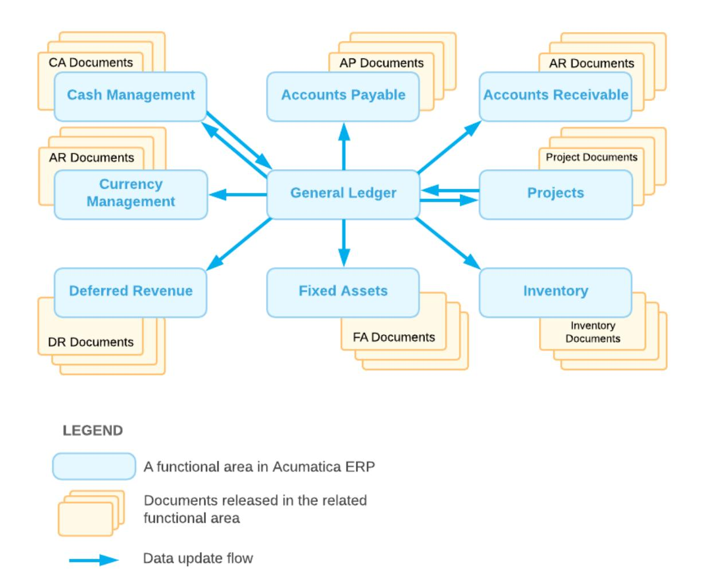

*Figure: Transaction flow in the general ledger*

#### **Managing Ledgers**

Acumatica ERP supports multiple types of ledgers: *Actual*, *Budget*, *Reporting*, and *Statistical*. Thus, you can record actual financial information and store budgets, forecasts, and statistical and reporting information for all branches of your organization. If your company has multiple branches, each branch may have one actual ledger and an unlimited number of ledgers of other types. For details, see *[Managing Ledgers](#page-14-2)*.

#### **Managing the Chart of Accounts**

You can establish the set of accounts that best supports your company's operations. You can define accounts of the following types: asset, liability (balance sheet accounts), income, and expense (income statement accounts). For convenient grouping, sorting, and filtering of the financial information associated with general ledger accounts in reports and inquiries, Acumatica ERP provides predefined account classes.

Acumatica ERP also gives you the ability to configure and use two system-maintained accounts: *YTD Net Income* and *Retained Earnings*. For details, see *[Managing the Chart of Accounts](#page-21-2)*.

#### **Managing the List of Subaccounts**

In Acumatica ERP, you can use subaccounts with your accounts. By using subaccounts, your organization can virtually break down an account into multiple accounts that are smaller and more specific, for better tracking of company revenue and expenses for reporting. Your site can define subaccounts to reflect your operational needs, support reporting and analytical needs, and keep the number of your accounts manageable. For details, see *[Subaccounts](https://help-2025r1.acumatica.com/Help?ScreenId=ShowWiki&pageid=f8c48d6a-2fc8-4579-8781-735e54b9e8b2)*.

For your organization to use subaccounts, the *Subaccounts* feature must be enabled on the *[Enable/](https://help-2025r1.acumatica.com/Help?ScreenId=ShowWiki&pageid=c1555e43-1bc5-4f6f-ba9d-b323f94d8a6b) [Disable Features](https://help-2025r1.acumatica.com/Help?ScreenId=ShowWiki&pageid=c1555e43-1bc5-4f6f-ba9d-b323f94d8a6b)* (CS100000) form.

#### **Managing the Financial Year, Master and Company Calendars, and Periods**

For a financial year, you can specify the start date and the type of financial periods that make up the year. You can define any number of accounting periods within the financial year, and you can add an adjustment period and post adjustment transactions to it. For details, see *Setting Up the [Financial](#page-40-2) Year*.

Once you have defined the structure of the financial year, you can generate the financial periods for the financial years. In Acumatica ERP, you generate the *master calendar*—a set of financial periods that is generated for multiple years based on the financial year template specified for the tenant. For details, see *[Generating Financial Calendars](#page-48-2)*.

Depending on the state of the *Centralized Period Management* feature (that is, whether it is enabled or disabled) on the *[Enable/Disable Features](https://help-2025r1.acumatica.com/Help?ScreenId=ShowWiki&pageid=c1555e43-1bc5-4f6f-ba9d-b323f94d8a6b)* (CS100000) form, you can manage the period statuses of the master calendar or of each particular company calendar, including period closing and year-end closing. For details on period-closing procedures, see *[Closing Financial Periods in Subledgers and GL](#page-55-2)* and *[Year-End](#page-100-2) Closing*.

#### **Processing Transactions**

In Acumatica ERP, GL transactions are organized in batches. Transactions posted to the general ledger can be manually entered or system-generated, posted from other subledgers. For details, see *Processing [Transactions](#page-108-2)*.

#### **Scheduling Transactions**

Transactions that are repeated periodically can be assigned to schedules. A schedule defines how many times and how oen specific general ledger transactions should be created. Aer you run the schedule, the system periodically creates GL batches. For details, see *Processing Recurring [Transactions](#page-131-2)*.

#### **Reclassifying Journal Entries**

In Acumatica ERP, if an amount has been mistakenly posted to the wrong general ledger account, subaccount, or branch, you can create a correcting transaction to move an amount from one general ledger account to another

general ledger account, from one subaccount to another subaccount, or from one company branch to another one; that is, you can reclassify a transaction.

As a result of the reclassification process, the system generates a new transaction of the *Reclassification* type based on the original general ledger transaction. For details, see *[Reclassifying](#page-140-2) Transactions*.

#### **Managing Budgets**

By using Acumatica ERP, you can prepare annual budgets in the system. You can create two types of budgets in the system: single-level budgets and hierarchical budgets. A single-level budget is a simple list of planned or forecasted revenues and expenses. A hierarchical budget contains a budget structure that consists of multiple levels of articles and subarticles. This structure makes it easier to analyze the budget. For hierarchical budgets, you configure the budget tree and create a budget ledger.

You can create a virtually unlimited number of budgets, and you can compare budgets to other budgets or to actual data. You can manage access to budget articles by using restriction groups.

You can compare the budget being prepared to any of the following: the actual data of the previous year, the yearto-date amounts of the current year, or other budgets.

#### **Configuring and Processing Allocations**

With Acumatica ERP, you can use allocation templates to automate the distribution of amounts accumulated on one account or multiple accounts between another accounts based on the specified rule. If subaccounts are used in your system, you can also use subaccounts to compose allocation rules.

#### **Managing Consolidations**

In Acumatica ERP, you can upload account balances from consolidation units to a parent company. If your organization is a consolidation unit, you can configure mapping of the accounts and subaccounts to the parent company accounts and subaccounts, as well as specify which ledgers contain consolidation data.

For details, see *[Configuring GL Consolidation](#page-236-2)* and *[Performing GL Consolidation](#page-239-2)*.

#### **Reviewing Account Balances**

Acumatica ERP provides a set of inquiry forms that you can use to review account balances in various ways, depending on your current needs. On inquiries, you can find the following information:

- Beginning and ending balances, along with total debits and total credits for a particular period
- Account balances split by subaccounts
- Account balances by financial periods for a particular year
- A list of transactions posted to a particular account in the selected period range

For details, see *[Managing the Chart of Accounts](#page-21-2)*.

#### **Other Processes**

- Importing financial data, as described in *[Importing Financial Data](#page-102-2)*
- Configuration intercompany and interbranch transactions, as described in *[Interbranch Account Mapping](https://help-2025r1.acumatica.com/Help?ScreenId=ShowWiki&pageid=3ed4a109-0f5b-4b10-8710-6cb0ce3f788a)*
- Managing journal vouchers, as described in *[Processing](#page-176-2) Vouchers*

# <span id="page-11-0"></span>**Advanced GL Configuration**

If you want to perform any of the advanced activities in the General Ledger module—such as managing subaccounts, budgets, allocations, or consolidations—you should configure the necessary settings to make it possible for employees to perform these processes. You can perform most of the optional configuration tasks before you start using the system or when you are already using the system.

If you plan to use subaccounts, we recommend that you configure subaccounts before you start using the system.

In this topic, you will read about the optional configuration tasks in the General Ledger module, which give users in your system the ability to perform the advanced business processes.

#### <span id="page-11-1"></span>**Managing Subaccounts**

To better track the revenue and expenses of your company and keep your chart of accounts of a manageable size at the same time, you can use subaccounts to virtually split your accounts into smaller and more specific accounts. To use subaccounts in the system, you do the following:

1. Enable the *Subaccount* feature on the *[Enable/Disable Features](https://help-2025r1.acumatica.com/Help?ScreenId=ShowWiki&pageid=c1555e43-1bc5-4f6f-ba9d-b323f94d8a6b)* (CS100000) form.


Each particular feature may be subject to additional licensing; please consult the Acumatica ERP sales policy for details.

- 2. Configure the *SUBACCOUNT* segmented key on the *[Segmented Keys](https://help-2025r1.acumatica.com/Help?ScreenId=ShowWiki&pageid=78bd7bd1-6bf6-409e-a8a5-8b18e8b80722)* (CS202000) form, and define the list of possible values for segments on the *[Segment](https://help-2025r1.acumatica.com/Help?ScreenId=ShowWiki&pageid=00338857-dd1a-41be-aa07-4cbce24c635e) Values* (CS203000) form. For details on the *SUBACCOUNT* segmented key, see *[Subaccounts: General Information](https://help-2025r1.acumatica.com/Help?ScreenId=ShowWiki&pageid=0506cdb6-617d-414e-89fc-73f662ded3ab)*.
- 3. Optional: Define the needed subaccounts on the *[Subaccounts](https://help-2025r1.acumatica.com/Help?ScreenId=ShowWiki&pageid=2c7b73c6-43b2-4076-92c6-74c9e66ecf18)* (GL203000) form.

Aer you have defined subaccounts, you can start recording transactions to account-subaccount pairs.

You can set up restriction groups to control which users can view or use certain General Ledger accounts and subaccounts. For details, see *[Account and Subaccount Security](https://help-2025r1.acumatica.com/Help?ScreenId=ShowWiki&pageid=7f4d2128-5ca0-4f40-84e1-11b0d51603de)*.

#### **Managing Budgets**

To create and keep budgets in the system, you have to do the following:

- Create at least one ledger of the *Budget* type on the *[Ledgers](https://help-2025r1.acumatica.com/Help?ScreenId=ShowWiki&pageid=a5c9f3f5-7dc4-4b1b-a50c-396729a12e4e)* (GL201500) form. For details, see *[Budget Ledger:](https://help-2025r1.acumatica.com/Help?ScreenId=ShowWiki&pageid=55bf7202-4294-4ec6-90fb-9dd8971359ea) [General Information](https://help-2025r1.acumatica.com/Help?ScreenId=ShowWiki&pageid=55bf7202-4294-4ec6-90fb-9dd8971359ea)*.
- Configure a budget tree on the *[Budget Configuration](https://help-2025r1.acumatica.com/Help?ScreenId=ShowWiki&pageid=9f69e979-e7fd-4c8d-964f-3a75e86e4e43)* (GL205000) form. The budget tree defines the budget articles that automatically appear in a budget when you create one in the system. For details, see the *[Budget](https://help-2025r1.acumatica.com/Help?ScreenId=ShowWiki&pageid=970daac8-126a-472f-8ab1-2d01cd39dd6c) [Tree](https://help-2025r1.acumatica.com/Help?ScreenId=ShowWiki&pageid=970daac8-126a-472f-8ab1-2d01cd39dd6c)* chapter.

We recommend that you define the budget tree because it makes easier to prepare budgets and analyze them. Additionally, you can use a budget tree to restrict access rights to specific budget nodes for particular users. However, you can instead work with plain budgets, which are simple lists of budget articles, without the preliminary configuration of the budget tree.

Aer you have prepared and reviewed a budget tree and budget ledger, you can create budgets in the system.

#### **Managing Allocations**

For faster data entry, all transactions can be recorded to one account and then distributed between different accounts, or some operation expenses can be posted to one subaccount and then distributed between different subaccounts (for example, between subaccounts related to a company's locations or departments). To periodically distribute amounts between account-subaccount pairs, you can configure and run allocations as follows:

1. Enable the *General Ledger Allocations Template* feature on the *[Enable/Disable Features](https://help-2025r1.acumatica.com/Help?ScreenId=ShowWiki&pageid=c1555e43-1bc5-4f6f-ba9d-b323f94d8a6b)* (CS100000) form.


Each particular feature may be subject to additional licensing; please consult the Acumatica ERP sales policy for details.

2. Create allocation rules on the *[Allocations](https://help-2025r1.acumatica.com/Help?ScreenId=ShowWiki&pageid=0565e6ca-a142-4c1c-8697-25139065f6f7)* (GL204500) form. For details, see *[Allocation Rules](https://help-2025r1.acumatica.com/Help?ScreenId=ShowWiki&pageid=feee42b7-afec-4bbd-9091-1f8f6b7c8849)*.

Aer you create the rule, you can run allocations for a specific period, which will create a batch of transactions according to the rule.

#### **Managing Consolidations**

To be able to import consolidation data to a parent company (or to a company dedicated to holding consolidation data), you perform the following steps:

1. Enable the *General Ledger Consolidation* feature on the *[Enable/Disable Features](https://help-2025r1.acumatica.com/Help?ScreenId=ShowWiki&pageid=c1555e43-1bc5-4f6f-ba9d-b323f94d8a6b)* (CS100000) form.


Each particular feature may be subject to additional licensing; please consult the Acumatica ERP sales policy for details.

- 2. Configure consolidation for the parent company as follows:
  - a. Optional: Create a ledger of the *Reporting* type on the *[Ledgers](https://help-2025r1.acumatica.com/Help?ScreenId=ShowWiki&pageid=a5c9f3f5-7dc4-4b1b-a50c-396729a12e4e)* (GL201500) form. For details on reporting ledgers, see *[Reporting Ledgers](#page-15-1)*.
  - b. Optional: Create a branch (or multiple branches) on the *[Branches](https://help-2025r1.acumatica.com/Help?ScreenId=ShowWiki&pageid=b97ab72d-4ab4-4f02-b69c-f7f61b316ced)* (CS102000) form to hold the data imported from the subsidiaries.
  - c. Set up access to Acumatica ERP website of each subsidiary, and synchronize the involved websites on the *[Consolidation](https://help-2025r1.acumatica.com/Help?ScreenId=ShowWiki&pageid=d0a31d80-fff4-4452-93df-6431444d2c65)* (GL103000) form.
- 3. Configure consolidation for the subsidiaries as follows:
  - a. Map the subsidiary General Ledger accounts to the parent company accounts on the *[Chart of Accounts](https://help-2025r1.acumatica.com/Help?ScreenId=ShowWiki&pageid=85557f41-a4af-47a8-b198-2a01461ce9c3)* (GL202500) form.
  - b. Map the subsidiary subaccount segments to the parent company subaccount segments by using the *[Segmented Keys](https://help-2025r1.acumatica.com/Help?ScreenId=ShowWiki&pageid=78bd7bd1-6bf6-409e-a8a5-8b18e8b80722)* (CS202000) form.
  - c. Map the subsidiary segment values to the parent company segment values by using the *[Segment](https://help-2025r1.acumatica.com/Help?ScreenId=ShowWiki&pageid=00338857-dd1a-41be-aa07-4cbce24c635e) Values* (CS203000) form.
  - d. Set up the source ledger for consolidation on the *[Ledgers](https://help-2025r1.acumatica.com/Help?ScreenId=ShowWiki&pageid=a5c9f3f5-7dc4-4b1b-a50c-396729a12e4e)* form.

Aer you perform these steps, you can prepare the data to be consolidated and import it to the parent company. For details on consolidations, see *[GL Consolidation Configuration: General Information](https://help-2025r1.acumatica.com/Help?ScreenId=ShowWiki&pageid=1dc0ec81-0965-4fc3-b789-bdc737e01bac)* and *[GL Consolidation: General](#page-239-3) [Information](#page-239-3)*.

#### **Related Links**

- *[Budget](https://help-2025r1.acumatica.com/Help?ScreenId=ShowWiki&pageid=970daac8-126a-472f-8ab1-2d01cd39dd6c) Tree*
- *[Allocation Rules](https://help-2025r1.acumatica.com/Help?ScreenId=ShowWiki&pageid=feee42b7-afec-4bbd-9091-1f8f6b7c8849)*
- *[Subaccounts](https://help-2025r1.acumatica.com/Help?ScreenId=ShowWiki&pageid=f8c48d6a-2fc8-4579-8781-735e54b9e8b2)*
- *[Configuring GL Consolidation](#page-236-2)*
- *[Performing GL Consolidation](#page-239-2)*

- *[Allocations](https://help-2025r1.acumatica.com/Help?ScreenId=ShowWiki&pageid=0565e6ca-a142-4c1c-8697-25139065f6f7)*
- *[Budget Configuration](https://help-2025r1.acumatica.com/Help?ScreenId=ShowWiki&pageid=9f69e979-e7fd-4c8d-964f-3a75e86e4e43)*
- *[Chart of Accounts](https://help-2025r1.acumatica.com/Help?ScreenId=ShowWiki&pageid=85557f41-a4af-47a8-b198-2a01461ce9c3)*
- *[Consolidation](https://help-2025r1.acumatica.com/Help?ScreenId=ShowWiki&pageid=d0a31d80-fff4-4452-93df-6431444d2c65)*
- *[Enable/Disable Features](https://help-2025r1.acumatica.com/Help?ScreenId=ShowWiki&pageid=c1555e43-1bc5-4f6f-ba9d-b323f94d8a6b)*
- *[General Ledger Preferences](https://help-2025r1.acumatica.com/Help?ScreenId=ShowWiki&pageid=e4913d06-c511-4258-a0f9-f36c1b854e6b)*
- *[Ledgers](https://help-2025r1.acumatica.com/Help?ScreenId=ShowWiki&pageid=a5c9f3f5-7dc4-4b1b-a50c-396729a12e4e)*
- *[Segmented Keys](https://help-2025r1.acumatica.com/Help?ScreenId=ShowWiki&pageid=78bd7bd1-6bf6-409e-a8a5-8b18e8b80722)*
- *[Segment](https://help-2025r1.acumatica.com/Help?ScreenId=ShowWiki&pageid=00338857-dd1a-41be-aa07-4cbce24c635e) Values*
- *[Subaccounts](https://help-2025r1.acumatica.com/Help?ScreenId=ShowWiki&pageid=2c7b73c6-43b2-4076-92c6-74c9e66ecf18)*

# <span id="page-14-2"></span><span id="page-14-0"></span>**Managing Ledgers**

Acumatica ERP supports the use of multiple ledgers. Each company that has been created in the system may have one actual ledger and an unlimited number of ledgers of other types. Because you can keep ledgers of multiple types, you can record actual financial information and can store budgets, forecasts, and statistical and reporting information for all companies and branches (if any) of your organization.

#### **Ledger Types**

Depending on the processes you are going to perform, you can create ledgers of different types in Acumatica ERP as follows:

- To post all financial transactions that your company performs, you create a ledger of the *Actual* type. For details, see *[General Ledger: Actual Ledger](https://help-2025r1.acumatica.com/Help?ScreenId=ShowWiki&pageid=1f0bd0a0-bb42-4e75-ae57-9d8e2b9486c6)*.
- To store the results of financial translations or consolidation data imported to a parent company from consolidation units, you create a ledger of the *Reporting* type. For more information, see *[Reporting Ledgers](#page-15-1)*.
- To store statistical information about a company's operations, you create a ledger of the *Statistical* type. For details, see *[Statistical Ledgers](#page-16-1)*.
- To store budget information, you create a ledger of the *Budget* type, as described in *[Budget Ledger: General](https://help-2025r1.acumatica.com/Help?ScreenId=ShowWiki&pageid=55bf7202-4294-4ec6-90fb-9dd8971359ea) [Information](https://help-2025r1.acumatica.com/Help?ScreenId=ShowWiki&pageid=55bf7202-4294-4ec6-90fb-9dd8971359ea)*.

To start live operations in the system, you have to create at least one ledger of the *Actual* type. You can create other ledgers depending on your business needs.

#### **Ledger Creation**

You can create ledgers of any type on the *[Ledgers](https://help-2025r1.acumatica.com/Help?ScreenId=ShowWiki&pageid=a5c9f3f5-7dc4-4b1b-a50c-396729a12e4e)* (GL201500) form; when you create a ledger, you have to specify a ledger identifier, type, and currency (if the *Multicurrency Accounting* feature is enabled on the *[Enable/Disable](https://help-2025r1.acumatica.com/Help?ScreenId=ShowWiki&pageid=c1555e43-1bc5-4f6f-ba9d-b323f94d8a6b) [Features](https://help-2025r1.acumatica.com/Help?ScreenId=ShowWiki&pageid=c1555e43-1bc5-4f6f-ba9d-b323f94d8a6b)* (CS100000) form). On the *[Companies](https://help-2025r1.acumatica.com/Help?ScreenId=ShowWiki&pageid=fedad435-8496-4397-b8a3-50a473629f76)* (CS101500) form, for a new company, you can create a ledger of the *Actual* type by clicking **Create Ledger** on the form toolbar.

To use a ledger as a source for consolidations, you select the **Consolidation Source** check box. This column is available only if the *General Ledger Consolidation* feature is enabled on the *[Enable/Disable Features](https://help-2025r1.acumatica.com/Help?ScreenId=ShowWiki&pageid=c1555e43-1bc5-4f6f-ba9d-b323f94d8a6b)* (CS100000) form. For details on consolidations, see *GL Consolidation [Configuration:](https://help-2025r1.acumatica.com/Help?ScreenId=ShowWiki&pageid=b131e5c1-ca39-49e5-8c0c-7076d91322f6) To Configure a Consolidation Unit*.

# <span id="page-14-1"></span>**Multiple Ledger Support**

Acumatica ERP supports the following types of ledgers: *Actual*, *Budget*, *Reporting*, and *Statistical*. You can create ledgers of any type on the *[Ledgers](https://help-2025r1.acumatica.com/Help?ScreenId=ShowWiki&pageid=a5c9f3f5-7dc4-4b1b-a50c-396729a12e4e)* (GL201500) form.


You cannot delete a ledger or change its currency or type if the ledger has any journal entries or other records.

#### **Actual Ledgers**

In Acumatica ERP, a ledger of the *Actual* type is the core of your company's financial records, and every transaction flows through the actual ledger. The records in the actual ledger keep the history of all financial transactions since day one of the life of your company. You must create at least one ledger with the *Actual* type on the *[Ledgers](https://help-2025r1.acumatica.com/Help?ScreenId=ShowWiki&pageid=a5c9f3f5-7dc4-4b1b-a50c-396729a12e4e)* form and define it as the default posting ledger before you can start live operations in Acumatica ERP.

The system supports only one actual ledger per branch. You can assign actual ledgers to branches by using the *[Inter-Branch Account Mapping](https://help-2025r1.acumatica.com/Help?ScreenId=ShowWiki&pageid=858e6eba-172d-46fa-879e-d6f69f5b190c)* (GL101010) form.

Multiple branches can use the same actual ledger. For each ledger, you can select one branch which consolidates the data of other branches in the same ledger as *consolidation branch*. To indicate that the ledger is shared by multiple branches that are separate legal entities, select no consolidation branch.

For each actual ledger that is used by multiple branches, specify whether inter-branch transactions should be automatically generated. You can specify the rules for generating inter-branch transactions by using the *[Inter-](https://help-2025r1.acumatica.com/Help?ScreenId=ShowWiki&pageid=858e6eba-172d-46fa-879e-d6f69f5b190c)[Branch Account Mapping](https://help-2025r1.acumatica.com/Help?ScreenId=ShowWiki&pageid=858e6eba-172d-46fa-879e-d6f69f5b190c)* form.

#### **Budget Ledgers**

A ledger of the *Budget* type is a special ledger that is used to store budget information. Such a ledger is updated on the *[Budgets](https://help-2025r1.acumatica.com/Help?ScreenId=ShowWiki&pageid=4f19354b-f537-4951-814b-43ff7f57febe)* (GL302010) form. An organization can use an unlimited number of budget ledgers. Entering journal transactions for a budget ledger is not allowed. For details, see *[Budget Ledger](https://help-2025r1.acumatica.com/Help?ScreenId=ShowWiki&pageid=65bf7202-4294-4ec6-90fb-9dd8971359ea)*.

#### **Statistical Ledgers**

A *statistical ledger* is a ledger that can be used to store statistical information about branch's operations. Each organization can have multiple statistical ledgers, each for a different type of information. Statistical ledgers can be used as a data source for reporting, to calculate allocations based on statistical data, or for other purposes. For more information, see *[Statistical Ledgers](#page-16-1)*.

#### **Reporting Ledgers**

A *reporting ledger* is a ledger that is used to store translated financial information and consolidation information. Reporting ledgers are mainly used by organizations that are subsidiaries of a parent company to hold the data translated for consolidations performed by the parent company. An organization can use any number of reporting ledgers. Journal transactions for a reporting ledger can be entered on the *Journal [Transactions](https://help-2025r1.acumatica.com/Help?ScreenId=ShowWiki&pageid=dda046bc-5946-407f-88f7-1c0c966fbe72)* (GL301000) and *[Allocations](https://help-2025r1.acumatica.com/Help?ScreenId=ShowWiki&pageid=0565e6ca-a142-4c1c-8697-25139065f6f7)* (GL204500) forms. For details, see *[Reporting Ledgers](#page-15-1)* and *Translation of Financial [Statements:](https://help-2025r1.acumatica.com/Help?ScreenId=ShowWiki&pageid=368fcb87-3d61-4bcf-9d37-173240eacf35) General [Information](https://help-2025r1.acumatica.com/Help?ScreenId=ShowWiki&pageid=368fcb87-3d61-4bcf-9d37-173240eacf35)*.

#### **Related Links**

- *To Add an Actual [Ledger](#page-17-1)*
- *To Add a [Reporting](#page-19-1) Ledger*
- *To Add a [Statistical](#page-20-2) Ledger*
- *[Ledgers](https://help-2025r1.acumatica.com/Help?ScreenId=ShowWiki&pageid=a5c9f3f5-7dc4-4b1b-a50c-396729a12e4e)*
- *[Inter-Branch Account Mapping](https://help-2025r1.acumatica.com/Help?ScreenId=ShowWiki&pageid=858e6eba-172d-46fa-879e-d6f69f5b190c)*
- *[General Ledger Preferences](https://help-2025r1.acumatica.com/Help?ScreenId=ShowWiki&pageid=e4913d06-c511-4258-a0f9-f36c1b854e6b)*
- *[Budgets](https://help-2025r1.acumatica.com/Help?ScreenId=ShowWiki&pageid=4f19354b-f537-4951-814b-43ff7f57febe)*

## <span id="page-15-1"></span><span id="page-15-0"></span>**Reporting Ledgers**

A ledger of the *Reporting* type stores the results of financial translations (that is, the results of the conversion of account balances from the base currency to any foreign currency configured for use in your system) or data for consolidated reports. For details on translations, see *Translation of Financial [Statements:](https://help-2025r1.acumatica.com/Help?ScreenId=ShowWiki&pageid=368fcb87-3d61-4bcf-9d37-173240eacf35) General Information*.

In this topic, you will read about using and updating reporting ledgers in the system.

#### **Reporting Ledger Usage**

Reporting ledgers can be used by subsidiaries to hold the data translated for consolidations to be performed by the parent company, or they can be used by parent companies to keep data imported from subsidiaries. You can use the reporting ledger for preparing reports or as a source for consolidation.

You can create and use any number of reporting ledgers. When you create a reporting ledger on the *[Ledgers](https://help-2025r1.acumatica.com/Help?ScreenId=ShowWiki&pageid=a5c9f3f5-7dc4-4b1b-a50c-396729a12e4e)* (GL201500) form, the currency that you specify for the reporting ledger is the destination currency to which

translations of financial data will be performed. For details on how to create a ledger, see *To Add a [Reporting](#page-19-1) [Ledger](#page-19-1)*.

#### **Entry Update in a Reporting Ledger**

If you use the reporting ledger to store the results of financial translations, you specify the reporting ledger as a destination ledger when you configure a translation definition on the *[Translation](https://help-2025r1.acumatica.com/Help?ScreenId=ShowWiki&pageid=bf51873b-a20a-4e82-9e3e-9df36e826969) Definition* (CM203000) form. When you release a worksheet on the *Translation [Worksheets](https://help-2025r1.acumatica.com/Help?ScreenId=ShowWiki&pageid=ae4ccca4-749c-4d3a-89b6-b5af137d4e68)* (CM304000) form, the system generates a translation batch and posts it to the reporting ledger specified for the related translation definition. For details, see *[Translation](https://help-2025r1.acumatica.com/Help?ScreenId=ShowWiki&pageid=7d458706-3b54-478e-8a0a-c35a4d674eab) [Definitions: General Information](https://help-2025r1.acumatica.com/Help?ScreenId=ShowWiki&pageid=7d458706-3b54-478e-8a0a-c35a4d674eab)*.

Aer the translation has been performed, the reporting ledger contains account balances translated to the currency of the reporting ledger, so that you can use it for preparing financial statements and other reports in that currency for the period specified in the translation worksheet.

If you use the reporting ledger to keep data for consolidated reports, you can upload the data by importing consolidation data or importing the trial balance. For details, see *GL [Consolidation:](#page-248-1) To Import Consolidation Data [from a Subsidiary](#page-248-1)* and *[Preparation](#page-102-3) for Importing Trial Balances*.

#### **Related Links**

- *Translation Definitions: General [Information](https://help-2025r1.acumatica.com/Help?ScreenId=ShowWiki&pageid=7d458706-3b54-478e-8a0a-c35a4d674eab)*
- *Translation of Financial [Statements:](https://help-2025r1.acumatica.com/Help?ScreenId=ShowWiki&pageid=368fcb87-3d61-4bcf-9d37-173240eacf35) General Information*
- *[Managing Ledgers](#page-14-2)*
- *To Add an Actual [Ledger](#page-17-1)*
- *[Enable/Disable Features](https://help-2025r1.acumatica.com/Help?ScreenId=ShowWiki&pageid=c1555e43-1bc5-4f6f-ba9d-b323f94d8a6b)*
- *[Ledgers](https://help-2025r1.acumatica.com/Help?ScreenId=ShowWiki&pageid=a5c9f3f5-7dc4-4b1b-a50c-396729a12e4e)*
- *[Translation](https://help-2025r1.acumatica.com/Help?ScreenId=ShowWiki&pageid=bf51873b-a20a-4e82-9e3e-9df36e826969) Definition*
- *Translation [Worksheets](https://help-2025r1.acumatica.com/Help?ScreenId=ShowWiki&pageid=ae4ccca4-749c-4d3a-89b6-b5af137d4e68)*

# <span id="page-16-1"></span><span id="page-16-0"></span>**Statistical Ledgers**

A ledger of the *Statistical* type can be used to store statistical information about a branch's operations. Each organization can have multiple statistical ledgers, each for a different type of information. If your organization has multiple branches, all branches can use the same statistical ledgers with the information in ledgers arranged by branch, or each branch can use separate statistical ledgers created for the branch.

In this topic, you will read about using and updating data in statistical ledgers.

#### **Statistical Ledger Usage**

You can use statistical data to better understand and analyze your company's financial data. Statistical ledgers can be a source of data for reporting, for calculation of allocations, or for consolidations. With Acumatica ERP, your organization can define an unlimited number of statistical ledgers to store statistical information.

#### **Entry Update in a Statistical Ledger**

The system uses the same chart of accounts to post transactions to a statistical ledger as to an actual ledger. Depending on the policies established in your organization, you can create special accounts to be used for statistical information and use only those accounts with statistical ledgers, or you can use the same accounts as you use for financial data. Balances for each account are calculated by a ledger. For details on accounts, see *[Modification of the Chart of Accounts](#page-26-1)*.

You enter statistical data into ledgers through batches of journal entries. You can create batches of statistical entries on the *Journal [Transactions](https://help-2025r1.acumatica.com/Help?ScreenId=ShowWiki&pageid=dda046bc-5946-407f-88f7-1c0c966fbe72)* (GL301000) form. When you create journal entries for a statistical ledger, you can specify the quantities of goods or services and the units of measure (in which the quantities are measured), along

with monetary amounts. To make statistical data on reports more useful, follow your organization's policies on selecting the units of measure for specific goods or services. For details, see *Processing [Transactions](#page-108-2)*.

A batch of journal entries to be posted to a statistical ledger may be unbalanced—that is, it may not comply with the double-entry bookkeeping rule and may have a total credit amount that is not equal to the total debit amount even if the**Validate Batch ControlTotals on Entry** check box is selected on the *[General Ledger Preferences](https://help-2025r1.acumatica.com/Help?ScreenId=ShowWiki&pageid=e4913d06-c511-4258-a0f9-f36c1b854e6b)* (GL102000) form.

For batches of journal entries containing statistical data for a statistical ledger, you can apply all the options available for batches intended for actual ledgers: You can create auto-reversing batches and schedule recurring batches by using the *Recurring [Transactions](https://help-2025r1.acumatica.com/Help?ScreenId=ShowWiki&pageid=fd27f507-8528-49f1-904f-fe149a265c70)* (GL203500) form. For details, see *Processing Adjusting [Transactions](#page-125-2)* and *Processing Recurring [Transactions](#page-131-2)*.

#### **Related Links**

- *[Managing Ledgers](#page-14-2)*
- *Processing Adjusting [Transactions](#page-125-2)*
- *GL [Transactions:](#page-108-3) General Information*
- *Recurring [Transactions:](#page-131-3) General Information*
- *To Add an Actual [Ledger](#page-17-1)*
- *[General Ledger Preferences](https://help-2025r1.acumatica.com/Help?ScreenId=ShowWiki&pageid=e4913d06-c511-4258-a0f9-f36c1b854e6b)*
- *[Ledgers](https://help-2025r1.acumatica.com/Help?ScreenId=ShowWiki&pageid=a5c9f3f5-7dc4-4b1b-a50c-396729a12e4e)*
- *[Allocations](https://help-2025r1.acumatica.com/Help?ScreenId=ShowWiki&pageid=0565e6ca-a142-4c1c-8697-25139065f6f7)*
- *Journal [Transactions](https://help-2025r1.acumatica.com/Help?ScreenId=ShowWiki&pageid=dda046bc-5946-407f-88f7-1c0c966fbe72)*
- *Recurring [Transactions](https://help-2025r1.acumatica.com/Help?ScreenId=ShowWiki&pageid=fd27f507-8528-49f1-904f-fe149a265c70)*

# <span id="page-17-1"></span><span id="page-17-0"></span>**To Add an Actual Ledger**

In Acumatica ERP, you add a new ledger of the *Actual* type as follows:

- To add a new ledger and associate it with existing companies and branches, you use the *[Ledgers](https://help-2025r1.acumatica.com/Help?ScreenId=ShowWiki&pageid=a5c9f3f5-7dc4-4b1b-a50c-396729a12e4e)* (GL201500) form.
- To create a new company and add a new ledger, you use the *[Companies](https://help-2025r1.acumatica.com/Help?ScreenId=ShowWiki&pageid=fedad435-8496-4397-b8a3-50a473629f76)* (CS101500) form.

For details on actual ledgers, see *[General Ledger: Actual Ledger](https://help-2025r1.acumatica.com/Help?ScreenId=ShowWiki&pageid=1f0bd0a0-bb42-4e75-ae57-9d8e2b9486c6)*.

#### **To Add an Actual Ledger on the Ledgers Form**

- 1. Open the *[Ledgers](https://help-2025r1.acumatica.com/Help?ScreenId=ShowWiki&pageid=a5c9f3f5-7dc4-4b1b-a50c-396729a12e4e)* (GL201500) form.
- 2. On the form toolbar, click **Add New Record**.
- 3. In the **Ledger ID** box of the Summary area, type the unique identifier to be used for the ledger.
- 4. If needed, in the **Description** box, enter a brief description of the ledger.
- 5. In the **Type** box, select *Actual*.
- 6. In the **Currency** box (if applicable), select the currency of the ledger, which must be the base currency.
- 7. On the **Companies** tab, for each company that you want to associate with this ledger, do the following:
  - a. On the table toolbar, click **Add Row**.
  - b. In the **Company** column, select the identifier of the company.
- 8. On the form toolbar, click**Save**.

#### **To Add an Actual Ledger on the Companies Form**

1. Open the *[Companies](https://help-2025r1.acumatica.com/Help?ScreenId=ShowWiki&pageid=fedad435-8496-4397-b8a3-50a473629f76)* (CS101500) form.

- 2. In the **Company ID** box of the Summary area, select the company for which you want to add a ledger.
- 3. In the form toolbar, click **Create Ledger**.

The **Create Ledger** dialog box opens.

- 4. In the **Ledger ID** box, type the identifier of the ledger.
- 5. Optional: In the **Description** box, check the description of the ledger, and change it if necessary.
- 6. Click **Create**.

#### **Notes About the Procedure**

The notes in this section describe the nuances of the UI elements available on the form, such as when an element is required and when it is not, and when the system fills in settings by default. This section can include other notes.

Note the following about the Summary area of the form: The **Currency** box is available only if the *Multicurrency Accounting* feature is enabled on the *[Enable/Disable Features](https://help-2025r1.acumatica.com/Help?ScreenId=ShowWiki&pageid=c1555e43-1bc5-4f6f-ba9d-b323f94d8a6b)* (CS100000) form.

You can later delete the ledger or modify its properties only if it has no journal entries or other records.

The **Branches** tab appears on the form only if the *Multibranch Support* feature is enabled on the *[Enable/Disable](https://help-2025r1.acumatica.com/Help?ScreenId=ShowWiki&pageid=c1555e43-1bc5-4f6f-ba9d-b323f94d8a6b) [Features](https://help-2025r1.acumatica.com/Help?ScreenId=ShowWiki&pageid=c1555e43-1bc5-4f6f-ba9d-b323f94d8a6b)* form.

### <span id="page-18-0"></span>**To Associate a Ledger with at Least One Company**

In Acumatica ERP, you associate existing ledgers with companies as follows:

- To associate a ledger with multiple companies, you use the *[Ledgers](https://help-2025r1.acumatica.com/Help?ScreenId=ShowWiki&pageid=a5c9f3f5-7dc4-4b1b-a50c-396729a12e4e)* (GL201500) form.
- To associate multiple ledgers with a particular company, you use the *[Companies](https://help-2025r1.acumatica.com/Help?ScreenId=ShowWiki&pageid=fedad435-8496-4397-b8a3-50a473629f76)* (CS101500) form.


You can associate only one ledger of the *Actual* type with a company.

For details on ledgers, see *[Managing Ledgers](#page-14-2)*.


To open any form, you can navigate to it or search for it (by its name or by its form ID without periods). For more information about search capabilities, see *[Search](https://help-2025r1.acumatica.com/Help?ScreenId=ShowWiki&pageid=09ed14e6-3600-4d60-8267-66531025f5c3)*.

#### **Before You Proceed**

Before you start associating ledgers with branches, make sure that the necessary ledgers have been added on the *[Ledgers](https://help-2025r1.acumatica.com/Help?ScreenId=ShowWiki&pageid=a5c9f3f5-7dc4-4b1b-a50c-396729a12e4e)* (GL201500) form. For details, see *To Add an Actual [Ledger](#page-17-1)*.

#### **To Associate a Ledger with Multiple Companies**

- 1. Open the *[Ledgers](https://help-2025r1.acumatica.com/Help?ScreenId=ShowWiki&pageid=a5c9f3f5-7dc4-4b1b-a50c-396729a12e4e)* (GL201500) form.
- 2. In the **Ledger ID** box of the Summary area, select the ledger of the *Actual* type to which all financial transactions will be posted for the company.
- 3. On the **Companies** tab, for each company that you want to associate with the selected ledger, do the following:
  - a. On the table toolbar, click **Add Row**.
  - b. In the **Company** column, select the identifier of the company.

4. On the form toolbar, click**Save**.

#### **To Associate Multiple Ledgers with a Particular Company**

- 1. Open the *[Companies](https://help-2025r1.acumatica.com/Help?ScreenId=ShowWiki&pageid=fedad435-8496-4397-b8a3-50a473629f76)* (CS101500) form.
- 2. In the **Company ID** box of the Summary area, select the company with which you want to associate each ledger listed on the **Ledgers** tab for the selected company.
- 3. On **Ledgers** tab, do the following for each ledger that you want to associate with the selected company:
  - a. On the table toolbar, click **Add Row**.
  - b. In the **Ledger** column, select the identifier of the ledger.
- 4. On the form toolbar, click**Save**.

### <span id="page-19-1"></span><span id="page-19-0"></span>**To Add a Reporting Ledger**

In Acumatica ERP, you use the *[Ledgers](https://help-2025r1.acumatica.com/Help?ScreenId=ShowWiki&pageid=a5c9f3f5-7dc4-4b1b-a50c-396729a12e4e)* (GL201500) form to add a reporting ledger to keep the results of translations or consolidations for reporting purposes. For details on reporting ledgers, see *[Reporting Ledgers](#page-15-1)*.

#### **To Add a Reporting Ledger**

1. Open the *[Ledgers](https://help-2025r1.acumatica.com/Help?ScreenId=ShowWiki&pageid=a5c9f3f5-7dc4-4b1b-a50c-396729a12e4e)* (GL201500) form.

To open the form for creating a new record, type the form ID in the Search box, and on the Search form, point at the form title and click **New** right of the title.

- 2. On the form toolbar, click **Add New Record**.
- 3. In the **Ledger ID** box, type the unique identifier to be used for the ledger.
- 4. In the **Description** box, briefly describe the ledger.
- 5. In the **Type** box, select *Reporting*.
- 6. In the **Currency** box, select the currency of the ledger.
- 7. On the form toolbar, click**Save**.

#### **Notes About the Procedure**

The notes in this section describe the nuances of the UI elements available on the form, such as when an element is required and when it is not, and when the system fills in settings by default. This section can include other notes.

Note that you can search for a form by its name or its form ID (without periods). For more information about search capabilities, see *[Search](https://help-2025r1.acumatica.com/Help?ScreenId=ShowWiki&pageid=09ed14e6-3600-4d60-8267-66531025f5c3)*.

Note the following about the Summary Area of the form:

• The **Currency** box is available only if the *Multicurrency Accounting* feature is enabled on the *[Enable/Disable](https://help-2025r1.acumatica.com/Help?ScreenId=ShowWiki&pageid=c1555e43-1bc5-4f6f-ba9d-b323f94d8a6b) [Features](https://help-2025r1.acumatica.com/Help?ScreenId=ShowWiki&pageid=c1555e43-1bc5-4f6f-ba9d-b323f94d8a6b)* (CS100000) form.

You can later delete the ledger or modify its properties only if it has no journal entries or other records.

# <span id="page-20-2"></span><span id="page-20-0"></span>**To Add a Statistical Ledger**

In Acumatica ERP, you use the *[Ledgers](https://help-2025r1.acumatica.com/Help?ScreenId=ShowWiki&pageid=a5c9f3f5-7dc4-4b1b-a50c-396729a12e4e)* (GL201500) form to add a statistical ledger to store statistical data. For details on statistical ledgers, see *[Statistical Ledgers](#page-16-1)*.

#### **To Add a Statistical Ledger**

1. Open the *[Ledgers](https://help-2025r1.acumatica.com/Help?ScreenId=ShowWiki&pageid=a5c9f3f5-7dc4-4b1b-a50c-396729a12e4e)* (GL201500) form.


To open the form for creating a new record, type the form ID in the Search box, and on the Search form, point at the form title and click **New** right of the title.

- 2. On the form toolbar, click **Add New Record**.
- 3. In the **Ledger ID** box, type the unique identifier to be used for the ledger.
- 4. In the **Description** box, briefly describe the ledger.
- 5. In the **Type** box, select *Statistical*.
- 6. In the **Currency** box, select the currency of the ledger.
- 7. On the form toolbar, click**Save**.

#### **Notes About the Procedure**

The notes in this section describe the nuances of the UI elements available on the form, such as when an element is required and when it is not, and when the system fills in settings by default. This section can include other notes.

Note that you can search for a form by its name or its form ID (without periods). For more information about search capabilities, see *[Search](https://help-2025r1.acumatica.com/Help?ScreenId=ShowWiki&pageid=09ed14e6-3600-4d60-8267-66531025f5c3)*.

Note the following about the Summary Area of the form:

• The **Currency** box is available only if the *Multicurrency Accounting* feature is enabled on the *[Enable/Disable](https://help-2025r1.acumatica.com/Help?ScreenId=ShowWiki&pageid=c1555e43-1bc5-4f6f-ba9d-b323f94d8a6b) [Features](https://help-2025r1.acumatica.com/Help?ScreenId=ShowWiki&pageid=c1555e43-1bc5-4f6f-ba9d-b323f94d8a6b)* (CS100000) form.

You can later delete the ledger or modify its properties only if it has no journal entries or other records.

### <span id="page-20-1"></span>**To Change a Ledger ID**

You can use the *[Ledgers](https://help-2025r1.acumatica.com/Help?ScreenId=ShowWiki&pageid=a5c9f3f5-7dc4-4b1b-a50c-396729a12e4e)* (GL201500) form to change the identifier of a particular ledger.

#### **To Change a Ledger ID**

- 1. Open the *[Ledgers](https://help-2025r1.acumatica.com/Help?ScreenId=ShowWiki&pageid=a5c9f3f5-7dc4-4b1b-a50c-396729a12e4e)* (GL201500) form.
- 2. In the **Ledger ID** box, select the ledger whose identifier you want to change.
- 3. On the form toolbar, click **Change ID**.
- 4. In the **Ledger ID** box of the**Specify New ID** dialog box, which opens, specify the new identifier of the ledger, and click **OK**.
- 5. On the form toolbar, click**Save** to save your changes.

# <span id="page-21-2"></span><span id="page-21-0"></span>**Managing the Chart of Accounts**

Each company has its own structured list of general ledger accounts. Acumatica ERP provides you with the ability to define the chart of accounts that suits your company's needs. To define the chart of accounts in the system, you have to perform the following steps:

- 1. Plan account identifiers if they have not yet been defined for the configured company
- 2. Configure the *ACCOUNT* segmented key based on your planned structure
- 3. Add accounts to the chart of accounts (including the Retained Earnings and YTD Net Income accounts)
- 4. Optional: Restrict user access to accounts

This chapter describes the rules of configuring and maintaining accounts in the system. The chapter also contains information about the specific accounts supported by the system.

# <span id="page-21-3"></span><span id="page-21-1"></span>**Account Identification**

The well-planned design of account identifiers helps users to enter data more quickly and prevent making errors. Acumatica ERP provides segmented keys, which give you flexibility in configuring account identifiers.

In this topic, you will read about planning the identifiers for accounts and configuring the account identifiers in the system.

#### **Planning Account Identifiers**

Account identifiers must comply with the following:

- Accounting best practices
- Restrictive rules of financial reporting (in some countries)

Identifiers should be designed to indicate the account type to users. For each type of account, plan gaps between numbers so that you can insert new accounts if necessary.

As an example of a way you can structure account identifiers for different types, by using a non-segmented fivecharacter account identifier, you can set rules to associate the first character in the account identifier with the account type as follows: *1* for asset accounts, *2* through *3* for liabilities and equity, *4* for income accounts, and *5* through *9* for expense accounts. Then you might use account identifiers for different account types as follows:

- 10000–19999: Asset accounts
- 20000–39999: Liability and equity accounts
- 40000–49999: Income accounts
- 50000–99999: Expense accounts

With the previous example, you could instead create a two-segment account identifier, reserve the first onecharacter segment for account type, and reserve the second four-character segment for the account number within the particular type.

To better track the revenue and expenses of your company and keep your chart of accounts of a manageable size, you can use subaccounts along with accounts. For details, see *[Subaccounts: General Information](https://help-2025r1.acumatica.com/Help?ScreenId=ShowWiki&pageid=0506cdb6-617d-414e-89fc-73f662ded3ab)*.

#### **Configuring Account Identifiers**

To define the structure of account identifiers used in the system, you use a *segmented key* that serves as a template when you create an identifier. For details, see *[Segmented Identifiers](https://help-2025r1.acumatica.com/Help?ScreenId=ShowWiki&pageid=a2f667ab-0de9-4738-9f05-58e9cbfc1735)*.

Acumatica ERP provides predefined segmented keys that you can access and edit on the *[Segmented Keys](https://help-2025r1.acumatica.com/Help?ScreenId=ShowWiki&pageid=78bd7bd1-6bf6-409e-a8a5-8b18e8b80722)* (CS202000) form, including *ACCOUNT* for General Ledger accounts. On this form, you can modify the *ACCOUNT* segmented key based on your planned structure. You use this structure when you add new account to the chart of accounts on the *[Chart of Accounts](https://help-2025r1.acumatica.com/Help?ScreenId=ShowWiki&pageid=85557f41-a4af-47a8-b198-2a01461ce9c3)* (GL202500) form.

The segmented key contains a string, which can be up to 10 characters. The key can be non-segmented or divided into multiple segments. To reduce errors that could occur when users enter account identifiers, you can set up validation for the identifier segment values, as described in *[Segmented Identifiers](https://help-2025r1.acumatica.com/Help?ScreenId=ShowWiki&pageid=a2f667ab-0de9-4738-9f05-58e9cbfc1735)*.

Although you may add a segment to a segmented key or remove it from the key aer some accounts have been created, we don't recommend these actions because they may have unpredictable results. Thus, you should plan identifiers in a way that gives you the ability to expand the chart of accounts in the future.

#### **Related Links**

- *[Chart of Accounts](#page-22-1)*
- *[Segmented Identifiers](https://help-2025r1.acumatica.com/Help?ScreenId=ShowWiki&pageid=a2f667ab-0de9-4738-9f05-58e9cbfc1735)*
- *[Chart of Accounts](https://help-2025r1.acumatica.com/Help?ScreenId=ShowWiki&pageid=85557f41-a4af-47a8-b198-2a01461ce9c3)*
- *[Segmented Keys](https://help-2025r1.acumatica.com/Help?ScreenId=ShowWiki&pageid=78bd7bd1-6bf6-409e-a8a5-8b18e8b80722)*
- *[Segment](https://help-2025r1.acumatica.com/Help?ScreenId=ShowWiki&pageid=00338857-dd1a-41be-aa07-4cbce24c635e) Values*

# <span id="page-22-1"></span><span id="page-22-0"></span>**Chart of Accounts**

In Acumatica ERP, you define the chart of accounts on the *[Chart of Accounts](https://help-2025r1.acumatica.com/Help?ScreenId=ShowWiki&pageid=85557f41-a4af-47a8-b198-2a01461ce9c3)* (GL202500) form. On this form, accounts are grouped by account types and, independently, by account classes.

In this topic, you will read about defining the chart of accounts, using such account properties as classes and types, and using mandatory accounts in the system.

#### **Entry of the Chart of Accounts**

Before you start defining the chart of accounts, you have to review the predefined structure of the *ACCOUNT* segmented key on the *[Segmented Keys](https://help-2025r1.acumatica.com/Help?ScreenId=ShowWiki&pageid=78bd7bd1-6bf6-409e-a8a5-8b18e8b80722)* (CS202000) form and make any needed changes to it. For details about segmented keys for accounts, see *[Account Identification](#page-21-3)*.

You then use the *[Chart of Accounts](https://help-2025r1.acumatica.com/Help?ScreenId=ShowWiki&pageid=85557f41-a4af-47a8-b198-2a01461ce9c3)* (GL202500) form to define your company's chart of accounts in the system. When you define the chart of accounts, you assign to each account a name, a unique number by which it can be identified, and a type. Acumatica ERP supports the following types of general ledger accounts:

- *Asset*
- *Liability*
- *Income*
- *Expense*

We recommend that when you design the account identifiers, you make the numbers correspond to the account types.

You can assign a class to accounts to group the accounts. (For details on account classes, see the *[Account Classes](#page-22-2)* sections of this topic.) You can also specify optional account-related settings.

You can prepare the chart of accounts in *.xlsx* or *.csv* file and upload the file to the system, as described in *To [Import](https://help-2025r1.acumatica.com/Help?ScreenId=ShowWiki&pageid=96773e07-5811-474d-a088-243f76f48f61) Data from a [Local](https://help-2025r1.acumatica.com/Help?ScreenId=ShowWiki&pageid=96773e07-5811-474d-a088-243f76f48f61) File to a Table*. Alternatively, you can add accounts one by one, as described in *To Add an [Account](#page-28-1) [to the Chart of Accounts](#page-28-1)*.

#### <span id="page-22-2"></span>**Account Classes**

For convenient grouping, sorting, and filtering of information associated with general ledger accounts in reports and inquiries, you can associate accounts with account classes on the *[Chart of Accounts](https://help-2025r1.acumatica.com/Help?ScreenId=ShowWiki&pageid=85557f41-a4af-47a8-b198-2a01461ce9c3)* (GL202500) form.

Acumatica ERP provides predefined account classes that can be modified if needed, and you can add new account classes on the *[Account Classes](https://help-2025r1.acumatica.com/Help?ScreenId=ShowWiki&pageid=a48dac42-a6a7-43b1-88d1-fccda7b1b596)* (GL202000) form. For details on how to create an account class in the system, see *[To](#page-27-1) [Create an Account Class](#page-27-1)*.

#### **Mandatory Accounts**

Acumatica ERP supports two special general ledger accounts of the *Liability* type: *Year-to-Date Net Income* and *Retained Earnings*. These accounts must be added to the chart of accounts and specified during general ledger configuration on the *[General Ledger Preferences](https://help-2025r1.acumatica.com/Help?ScreenId=ShowWiki&pageid=e4913d06-c511-4258-a0f9-f36c1b854e6b)* (GL102000) form. For details on these accounts, see *[YTD Net](#page-23-1) [Income and Retained Earnings Accounts](#page-23-1)*.

#### **Cash and Denominated Accounts**

To track cash transactions in the general ledger module, you link cash accounts to general ledger accounts. For details, see *[Cash Account Configuration](https://help-2025r1.acumatica.com/Help?ScreenId=ShowWiki&pageid=0ee2a8e0-c249-4ef4-8143-981e58443b10)*.

If your company has a bank account in a foreign currency, you have to denominate this account to maintain its balance in two currencies: in the currency of the account and in the base currency. For details, see *[Denominated](#page-24-1) [Accounts](#page-24-1)*.

#### **Restriction of User Access**

In Acumatica ERP, you can configure restriction groups that manages user access to accounts on the *[GL Account](https://help-2025r1.acumatica.com/Help?ScreenId=ShowWiki&pageid=51b5ba54-d95d-4099-b55c-c631acbb67fe) [Access](https://help-2025r1.acumatica.com/Help?ScreenId=ShowWiki&pageid=51b5ba54-d95d-4099-b55c-c631acbb67fe)* (GL104000) form. For details, see *[Account and Subaccount Security](https://help-2025r1.acumatica.com/Help?ScreenId=ShowWiki&pageid=7f4d2128-5ca0-4f40-84e1-11b0d51603de)*.

You can use the *[Restriction Groups by GL Account](https://help-2025r1.acumatica.com/Help?ScreenId=ShowWiki&pageid=ab8f3b5b-a373-4d8e-9a42-49077b4f84f2)* (GL104020) form to view and manage the restriction groups that have already been created. If any restriction groups have already been configured for accounts, you can quickly invoke this form by clicking **Manage Restriction Groups** on the *[Chart of Accounts](https://help-2025r1.acumatica.com/Help?ScreenId=ShowWiki&pageid=85557f41-a4af-47a8-b198-2a01461ce9c3)* (GL202500) form.

#### **Related Links**

- *[Account and Subaccount Security](https://help-2025r1.acumatica.com/Help?ScreenId=ShowWiki&pageid=7f4d2128-5ca0-4f40-84e1-11b0d51603de)*
- *[Account Identification](#page-21-3)*
- *[Configuring Cash Accounts](https://help-2025r1.acumatica.com/Help?ScreenId=ShowWiki&pageid=dbcaef0b-a94c-4de9-83d3-783af727cb77)*
- *[Creating a Customer](https://help-2025r1.acumatica.com/Help?ScreenId=ShowWiki&pageid=cfb5002a-67f4-465f-a802-1ed71a92da52)*
- *[Denominated Accounts](#page-24-1)*
- *[YTD Net Income and Retained Earnings Accounts](#page-23-1)*
- *[Chart of Accounts](https://help-2025r1.acumatica.com/Help?ScreenId=ShowWiki&pageid=85557f41-a4af-47a8-b198-2a01461ce9c3)*
- *To Add an Account to the Chart of [Accounts](#page-28-1)*
- *To Create an [Account](#page-27-1) Class*

# <span id="page-23-1"></span><span id="page-23-0"></span>**YTD Net Income and Retained Earnings Accounts**

In Acumatica ERP, you must create two system-maintained accounts of the *Liability* type: YTD (Year-to-Date) Net Income and Retained Earnings. You need to create these accounts on the *[Chart of Accounts](https://help-2025r1.acumatica.com/Help?ScreenId=ShowWiki&pageid=85557f41-a4af-47a8-b198-2a01461ce9c3)* (GL202500) form and specify them on the *[General Ledger Preferences](https://help-2025r1.acumatica.com/Help?ScreenId=ShowWiki&pageid=e4913d06-c511-4258-a0f9-f36c1b854e6b)* (GL102000) form before any actual data is entered.

In this topic, you will read about the YTD (Year-to-Date) Net Income and Retained Earnings accounts.

#### **YTD (Year-to-Date) Net Income Account**

The YTD Net Income account tracks the net income accumulated since the beginning of the financial year—that is, the difference between the amounts posted to all income and expense accounts. The system updates this account for every transaction posted to an income or expense account. When the system updates the balance of the YTD Net Income account, it also updates the beginning balance of the Retained Earnings account in the next financial

years for which the financial periods are defined. For a new financial year, the system resets the balance of YTD Net Income to zero for a new financial year.

Users cannot post transactions directly to the YTD Net Income account. Aer any transaction has been posted to an income or expense account, the selected YTD (Year-to-Date) Net Income account cannot be changed in the **YTD Net Income Account** box on the *[General Ledger Preferences](https://help-2025r1.acumatica.com/Help?ScreenId=ShowWiki&pageid=e4913d06-c511-4258-a0f9-f36c1b854e6b)* (GL102000) form.

#### **Retained Earnings Account**

The Retained Earnings account accumulates the company's net income or loss that is retained by the company. Retained earnings are summarized over the years since the first year of company operations. You can also post direct transactions to this account, such as dividends paid to shareholders. This account is normally reported in the Shareholders' Equity section of the balance sheet.

#### **Related Links**

- *[Chart of Accounts](#page-22-1)*
- *To Add an Account to the Chart of [Accounts](#page-28-1)*
- *[Chart of Accounts](https://help-2025r1.acumatica.com/Help?ScreenId=ShowWiki&pageid=85557f41-a4af-47a8-b198-2a01461ce9c3)*
- *[General Ledger Preferences](https://help-2025r1.acumatica.com/Help?ScreenId=ShowWiki&pageid=e4913d06-c511-4258-a0f9-f36c1b854e6b)*

# <span id="page-24-1"></span><span id="page-24-0"></span>**Denominated Accounts**

To maintain an account balance in two currencies, you need to denominate the account—that is, assign a particular currency (base or foreign) to this account. Once the account is denominated, you can post to it in only the assigned currency, which is called the *currency of denomination*.

You can denominate accounts only if the *Multicurrency Accounting* feature is enabled on the *[Enable/](https://help-2025r1.acumatica.com/Help?ScreenId=ShowWiki&pageid=c1555e43-1bc5-4f6f-ba9d-b323f94d8a6b) [Disable Features](https://help-2025r1.acumatica.com/Help?ScreenId=ShowWiki&pageid=c1555e43-1bc5-4f6f-ba9d-b323f94d8a6b)* (CS100000) form.

Once you have denominated the account, you can review the account balance in both currencies. The foreign currency balance represents the actual holdings of the company, whereas the base currency balance is its reporting equivalent. Transactions posted to the denominated account update both balances of the account. Each transaction is posted with the particular exchange rate, which is the rate effective on the date of the transaction.

You must denominate the General Ledger accounts to which cash accounts are linked. In addition to cash accounts, you also need to denominate accounts that should be updated by transactions in one currency only and accounts for which you need to know their balances in this currency.

#### **Restrictions of Denominated Accounts**

In comparison with ordinary accounts, denominated accounts have a few specific restrictions:

- You can enter and post to denominated accounts only transactions in the currency of denomination.
- You cannot use accounts denominated in a foreign currency as direct or contra source accounts or destination accounts for allocations.
- You cannot mark an account as denominated if it has at least one journal entry in a currency other than the currency of denomination.
- Due to currency rate fluctuations, you may need to revalue the balances of denominated accounts at the end of each period.

Because of these restrictions, you should denominate only accounts that absolutely have to be denominated. Generally, these are the base accounts for cash accounts. For more information, see *[Configuring Cash Accounts](https://help-2025r1.acumatica.com/Help?ScreenId=ShowWiki&pageid=dbcaef0b-a94c-4de9-83d3-783af727cb77)*.

#### **Setup of Denominated Accounts**

To set up an account as a denominated account, you specify the currency of denomination in the **Currency** column on the *[Chart of Accounts](https://help-2025r1.acumatica.com/Help?ScreenId=ShowWiki&pageid=85557f41-a4af-47a8-b198-2a01461ce9c3)* (GL202500) form.

You can always make the account no longer denominated by clearing the **Currency** box on the *[Chart](https://help-2025r1.acumatica.com/Help?ScreenId=ShowWiki&pageid=85557f41-a4af-47a8-b198-2a01461ce9c3) [of Accounts](https://help-2025r1.acumatica.com/Help?ScreenId=ShowWiki&pageid=85557f41-a4af-47a8-b198-2a01461ce9c3)* form.

If the currency of the account is a foreign currency, you can specify the currency rate in the **Revaluation RateType** column to be able to perform revaluations of the account balances. If you do not assign rate type to an account, the system uses the default rate type, which you specify in the **GL Revaluation RateType** box on the *[Currency](https://help-2025r1.acumatica.com/Help?ScreenId=ShowWiki&pageid=978e9b8f-a3a3-461f-929f-b83c3407bc49) [Management Preferences](https://help-2025r1.acumatica.com/Help?ScreenId=ShowWiki&pageid=978e9b8f-a3a3-461f-929f-b83c3407bc49)* (CM506000) form. For details on revaluations, see *[Revaluation of Bank Accounts: General](https://help-2025r1.acumatica.com/Help?ScreenId=ShowWiki&pageid=6ba09554-2ff6-48bc-b19a-19427c1e09a4) [Information](https://help-2025r1.acumatica.com/Help?ScreenId=ShowWiki&pageid=6ba09554-2ff6-48bc-b19a-19427c1e09a4)*.

#### **Related Links**

- *[Chart of Accounts](#page-22-1)*
- *[Revaluation of Bank Accounts: General Information](https://help-2025r1.acumatica.com/Help?ScreenId=ShowWiki&pageid=6ba09554-2ff6-48bc-b19a-19427c1e09a4)*
- *Translation of Financial [Statements:](https://help-2025r1.acumatica.com/Help?ScreenId=ShowWiki&pageid=368fcb87-3d61-4bcf-9d37-173240eacf35) General Information*
- *[Multicurrency](https://help-2025r1.acumatica.com/Help?ScreenId=ShowWiki&pageid=3007d6de-dffa-4786-87aa-3da129bfc5a7) Cash Accounts: To Process a GL Transaction*
- *[Chart of Accounts](https://help-2025r1.acumatica.com/Help?ScreenId=ShowWiki&pageid=85557f41-a4af-47a8-b198-2a01461ce9c3)*
- *[Currency Rates](https://help-2025r1.acumatica.com/Help?ScreenId=ShowWiki&pageid=cc4f6c18-cc29-4e58-a5dc-6c41770e6d48)*

### <span id="page-25-0"></span>**Post and Consolidation Account Settings**

On the *[Chart of Accounts](https://help-2025r1.acumatica.com/Help?ScreenId=ShowWiki&pageid=85557f41-a4af-47a8-b198-2a01461ce9c3)* (GL202500) form, you can specify optional settings for accounts (in addition to the basic settings of account identifier, class, type, and description). These optional account settings include the posting option and settings for consolidation units.

In this topic, you will read about the optional settings of accounts.

#### **Specifying the Post Option**

The post setting defines the level of the details that are posted to the account. By default, if you upload the chart of accounts to the system, the *Summary* posting option is set for each account in the **Post Option** column of the *[Chart](https://help-2025r1.acumatica.com/Help?ScreenId=ShowWiki&pageid=85557f41-a4af-47a8-b198-2a01461ce9c3) [of Accounts](https://help-2025r1.acumatica.com/Help?ScreenId=ShowWiki&pageid=85557f41-a4af-47a8-b198-2a01461ce9c3)* (GL202500) form. With this option, amounts that are posted to the account (and subaccount, if any) are summarized. That is, if in a transaction, multiple rows specify the same account and branch (if the *Multibranch Support* feature is enabled on the *[Enable/Disable Features](https://help-2025r1.acumatica.com/Help?ScreenId=ShowWiki&pageid=c1555e43-1bc5-4f6f-ba9d-b323f94d8a6b)* (CS100000) form), then in the General Ledger batch, these rows will be combined into one row with the summarized amount.

To post multiple amounts in a transaction to a selected account separately, you select the *Detail* option in the **Post Option** column of the *[Chart of Accounts](https://help-2025r1.acumatica.com/Help?ScreenId=ShowWiki&pageid=85557f41-a4af-47a8-b198-2a01461ce9c3)* form.

If the **PostSummary on Updating GL** check box is cleared on the Preferences form of a particular module, the journal entries will be posted separately to the account, regardless of which option is specified for the account on the *[Chart of Accounts](https://help-2025r1.acumatica.com/Help?ScreenId=ShowWiki&pageid=85557f41-a4af-47a8-b198-2a01461ce9c3)* form.

#### **Specifying Consolidation Accounts**

If a company is a consolidation unit in a parent company, you need to map the company's accounts to parent company's accounts. To do so, in the **Consolidation Account** column of the *[Chart of Accounts](https://help-2025r1.acumatica.com/Help?ScreenId=ShowWiki&pageid=85557f41-a4af-47a8-b198-2a01461ce9c3)* form, you specify the external General Ledger account from the parent company's chart of accounts to which the balance of the account will be exported in the process of consolidation. This value is not validated by the system, and no input mask can

be set for this column. For details on consolidations, see *[GL Consolidation: Account Mapping](#page-241-1)* and *[GL Consolidation:](#page-246-1) To Prepare the [Consolidation](#page-246-1) Unit*.

#### **Specifying Other Settings**

If needed, you can also do the following to specify other settings for an account on the *[Chart of Accounts](https://help-2025r1.acumatica.com/Help?ScreenId=ShowWiki&pageid=85557f41-a4af-47a8-b198-2a01461ce9c3)* (GL202500) form:

- To allow only transactions with quantities and units of measure specified to be posted to the account, select the check box in the **Require Units** column for the account. For details on units of measure, see *[Units of](https://help-2025r1.acumatica.com/Help?ScreenId=ShowWiki&pageid=0b5677b4-e4a0-4b08-adc4-62a12d516c4e) [Measure: General Information](https://help-2025r1.acumatica.com/Help?ScreenId=ShowWiki&pageid=0b5677b4-e4a0-4b08-adc4-62a12d516c4e)*.
- If your company uses subaccounts for recording transactions, to set the default subaccount to be specified automatically by the system when the account is selected, select the check box in the **Use Default Subaccount** column. For details on subaccounts, see *[Subaccounts](https://help-2025r1.acumatica.com/Help?ScreenId=ShowWiki&pageid=f8c48d6a-2fc8-4579-8781-735e54b9e8b2)*.


The default subaccount used is the one defined in the **DefaultSubaccount** on the *[General](https://help-2025r1.acumatica.com/Help?ScreenId=ShowWiki&pageid=e4913d06-c511-4258-a0f9-f36c1b854e6b) [Ledger Preferences](https://help-2025r1.acumatica.com/Help?ScreenId=ShowWiki&pageid=e4913d06-c511-4258-a0f9-f36c1b854e6b)* (GL102000) form.

- If you use project management, to track the project budget and balances, you can assign an account group to the account in the **Account Group** column. For details, see *[Account Groups: General Information](https://help-2025r1.acumatica.com/Help?ScreenId=ShowWiki&pageid=f8734904-a3f6-4cef-820b-330894038634)*.
- To set up the automatic calculation of the taxable amount for the journal entry, you specify a tax category in the **Tax Category** column. For details on tax categories, see *Tax Zones and Tax [Categories](https://help-2025r1.acumatica.com/Help?ScreenId=ShowWiki&pageid=be4d6333-82c9-4148-980c-e11c5252de60)*.

The type of the account must correspond to the type of the tax specified in the tax category. For example, a tax category representing a sales tax could not be associated with an expense account, and a tax category representing a value-added tax (VAT) accumulated on purchases could not be associated with an income account.

• To set up a user-defined order of accounts on the list, you specify an integer that indicates the order in which the account appears on the list in the **COA Order** column.


You can set up the order of accounts only if the **Custom Chart of Accounts Order** option button is selected in the **Chart of Accounts Order** area on the *[General Ledger Preferences](https://help-2025r1.acumatica.com/Help?ScreenId=ShowWiki&pageid=e4913d06-c511-4258-a0f9-f36c1b854e6b)* form.

#### **Related Links**

- *[Account Groups: General Information](https://help-2025r1.acumatica.com/Help?ScreenId=ShowWiki&pageid=f8734904-a3f6-4cef-820b-330894038634)*
- *[Chart of Accounts](#page-22-1)*
- *[Subaccounts](https://help-2025r1.acumatica.com/Help?ScreenId=ShowWiki&pageid=f8c48d6a-2fc8-4579-8781-735e54b9e8b2)*
- *[Units of Measure: General Information](https://help-2025r1.acumatica.com/Help?ScreenId=ShowWiki&pageid=0b5677b4-e4a0-4b08-adc4-62a12d516c4e)*
- *Tax Zones and Tax [Categories](https://help-2025r1.acumatica.com/Help?ScreenId=ShowWiki&pageid=be4d6333-82c9-4148-980c-e11c5252de60)*
- *[Chart of Accounts](https://help-2025r1.acumatica.com/Help?ScreenId=ShowWiki&pageid=85557f41-a4af-47a8-b198-2a01461ce9c3)*

# <span id="page-26-1"></span><span id="page-26-0"></span>**Modification of the Chart of Accounts**

In a live system, you can make the following changes to the chart of accounts on the *[Chart of Accounts](https://help-2025r1.acumatica.com/Help?ScreenId=ShowWiki&pageid=85557f41-a4af-47a8-b198-2a01461ce9c3)* (GL202500) form:

- Add an account. For instruction on how to add an account, see *To Add an Account to the Chart of [Accounts](#page-28-1)*.
- If no transactions have yet been posted to the account, and the account has not been used anywhere in the system, delete an account.

- Deactivate an account. If you deactivate an account, the history of transactions remains on the account but you cannot select the deactivated account for new documents you create. For instructions on how to deactivate an account, see *To [Deactivate](#page-30-1) an Account*.
- Change the account number. If you change the account number, the system updates the account number in the history of transactions and the new number appears in the system reports and inquiries.


Changing the number of the account can make the auditing more difficult, especially aer the old number has been disclosed in printed reports.

• Change the type of the account. You can change the type for an account to which transactions have been posted. You can substitute the *Income* and *Expense* types for each other, and can substitute the *Asset* and *Liability* types for each other.


By default, the ability to change account type is granted to only users that are assigned to the *Financial Supervisor* role on the *[User Roles](https://help-2025r1.acumatica.com/Help?ScreenId=ShowWiki&pageid=c2879f3c-3739-430a-b02b-c225f5480966)* (SM201005) form.

• Merge accounts by moving the balances to one of the accounts and then deactivating the unnecessary accounts.

#### **Related Links**

- *[Chart of Accounts](#page-22-1)*
- *To Add an Account to the Chart of [Accounts](#page-28-1)*
- *To [Deactivate](#page-30-1) an Account*
- *[Chart of Accounts](https://help-2025r1.acumatica.com/Help?ScreenId=ShowWiki&pageid=85557f41-a4af-47a8-b198-2a01461ce9c3)*

# <span id="page-27-1"></span><span id="page-27-0"></span>**To Create an Account Class**

You use the *[Account Classes](https://help-2025r1.acumatica.com/Help?ScreenId=ShowWiki&pageid=a48dac42-a6a7-43b1-88d1-fccda7b1b596)* (GL202000) form to create an account class.


To open any form, you can navigate to it or search for it (by its name or by its form ID without periods). For more information about search capabilities, see *[Search](https://help-2025r1.acumatica.com/Help?ScreenId=ShowWiki&pageid=09ed14e6-3600-4d60-8267-66531025f5c3)*.

#### **To Add a Class**

1. Open the *[Account Classes](https://help-2025r1.acumatica.com/Help?ScreenId=ShowWiki&pageid=a48dac42-a6a7-43b1-88d1-fccda7b1b596)* (GL202000) form.


To open the form for creating a new record, type the form ID in the Search box, and on the Search form, point at the form title and click **New** right of the title.

- 2. On the table toolbar, click **Add Row**.
- 3. In the **Account Class ID** column, type the unique identifier for the account class.
- 4. If needed, in the **Type** column, change the type of the class.
- 5. In the **Description** column, briefly describe the class.
- 6. On the form toolbar, click**Save**.

You can later delete the account class only if no accounts have been associated with it.

# <span id="page-28-1"></span><span id="page-28-0"></span>**To Add an Account to the Chart of Accounts**

You use the *[Chart of Accounts](https://help-2025r1.acumatica.com/Help?ScreenId=ShowWiki&pageid=85557f41-a4af-47a8-b198-2a01461ce9c3)* (GL202500) form to add an account.

#### **Before You Proceed**

- Know your organization's agreements about account classes.
- On the *[Account Classes](https://help-2025r1.acumatica.com/Help?ScreenId=ShowWiki&pageid=a48dac42-a6a7-43b1-88d1-fccda7b1b596)* (GL202000) form, make sure the list of account classes defined in the system contains the class to which you want to assign the new account.
- Review the structure of accounts and the meanings of their segment values in your organization. For more information about account identifiers, see *[Segmented Identifiers](https://help-2025r1.acumatica.com/Help?ScreenId=ShowWiki&pageid=a2f667ab-0de9-4738-9f05-58e9cbfc1735)* and *[Account Identification](#page-21-3)*.

#### **To Add an Account**

1. Open the *[Chart of Accounts](https://help-2025r1.acumatica.com/Help?ScreenId=ShowWiki&pageid=85557f41-a4af-47a8-b198-2a01461ce9c3)* (GL202500) form.


To open the form for creating a new record, type the form ID in the Search box, and on the Search form, point at the form title and click **New** right of the title.

- 2. On the table toolbar, click **Add Row**.
- 3. Click in the **Account** column of the new row to view the input mask for account identifiers. Enter the account in one of the following ways. The applicable scenario depends on whether the**Validate** check box on the *[Segmented Keys](https://help-2025r1.acumatica.com/Help?ScreenId=ShowWiki&pageid=78bd7bd1-6bf6-409e-a8a5-8b18e8b80722)* (CS202000) form is selected for the segment of the *ACCOUNT* segmented key:
  - Select the segment value from the list of predefined values (if the check box is selected for the segment).
  - Type a value for the segment here (if the check box is cleared for the segment). The system validates only the number of characters and the type of string (which is specified in the **Edit Mask** column on the *[Segmented Keys](https://help-2025r1.acumatica.com/Help?ScreenId=ShowWiki&pageid=78bd7bd1-6bf6-409e-a8a5-8b18e8b80722)* form for the segment).
- 4. If needed, in the **Account Class** column, select the account class to which the account is assigned.
- 5. In the **Type** column, select the type of account: *Asset*, *Liability*, *Income*, or *Expense*.
- 6. If needed, in the **Description** column, briefly describe the account.
- 7. If the account is to be used as a control account for a subledger, select this subledger in the **Control Account Module** column.
- 8. If you have marked the account as a control account for a subledger but want users to be able to post to this account from the general ledger and other subledgers, select the **Allow Manual Entry** check box.
- 9. If the users should specify the quantities and units of measure (UOMs), along with amounts, for each transaction to be posted to this account, select the **Require Units** check box.
- 10.Select the **Use DefaultSubaccount** check box if you want the system to fill in the**Subaccount** column with the default subaccount for the account on the *Journal [Transactions](https://help-2025r1.acumatica.com/Help?ScreenId=ShowWiki&pageid=dda046bc-5946-407f-88f7-1c0c966fbe72)* (GL301000) form.
- 11.In the **Post Option** column, select whether transactions should be posted to this account in detail (*Detail*) or in summary (*Summary*).
- 12.If needed, in **Consolidation Account** column, specify the external GL account (from the parent company's chart of accounts) to which the balance of the account will be imported in the consolidation process.
- 13.If you need to denominate the account, select the currency in the **Currency** column, and specify the type of exchange rate in the **Revaluation RateType** column.
- 14.On the form toolbar, click**Save**.

The notes in this section describe the nuances of the UI elements available on the form, such as when an element is required and when it is not, and when the system fills in settings by default. This section can include other notes.

Note that the **Use DefaultSubaccount** column appears on the form only if the *Subaccount* feature is enabled on the *[Enable/Disable Features](https://help-2025r1.acumatica.com/Help?ScreenId=ShowWiki&pageid=c1555e43-1bc5-4f6f-ba9d-b323f94d8a6b)* (CS100000) form.

# <span id="page-29-0"></span>**To Specify a Consolidation Account**

You use the *[Chart of Accounts](https://help-2025r1.acumatica.com/Help?ScreenId=ShowWiki&pageid=85557f41-a4af-47a8-b198-2a01461ce9c3)* (GL202500) form to specify a consolidation account—that is, an account of a parent company to which data will be imported during consolidation from a particular account of a consolidation unit.


To open any form, you can navigate to it or search for it (by its name or by its form ID without periods). For more information about search capabilities, see *[Search](https://help-2025r1.acumatica.com/Help?ScreenId=ShowWiki&pageid=09ed14e6-3600-4d60-8267-66531025f5c3)*.

#### **To Specify a Consolidation Account**

- 1. Open the *[Chart of Accounts](https://help-2025r1.acumatica.com/Help?ScreenId=ShowWiki&pageid=85557f41-a4af-47a8-b198-2a01461ce9c3)* (GL202500) form.
- 2. For each account for which you want to specify a consolidation account, in the **Consolidation Account** column, select an account of the parent company to which data will be imported.


The *YTD Net Income* account cannot be specified as a consolidation account.

3. Click **Save** on the form toolbar.

### <span id="page-29-1"></span>**To Denominate Accounts**

You use the *[Chart of Accounts](https://help-2025r1.acumatica.com/Help?ScreenId=ShowWiki&pageid=85557f41-a4af-47a8-b198-2a01461ce9c3)* (GL202500) form to denominate accounts.

• You can denominate accounts only if the *Multicurrency Accounting* feature is enabled on the *[Enable/Disable Features](https://help-2025r1.acumatica.com/Help?ScreenId=ShowWiki&pageid=c1555e43-1bc5-4f6f-ba9d-b323f94d8a6b)* (CS100000) form.

• You can search for a form by its name or its form ID (without periods). For more information about search capabilities, see *[Search](https://help-2025r1.acumatica.com/Help?ScreenId=ShowWiki&pageid=09ed14e6-3600-4d60-8267-66531025f5c3)*

#### **Before You Proceed**

Before you start denominating accounts, make sure that the necessary currencies and rate types have been created on the *[Currencies](https://help-2025r1.acumatica.com/Help?ScreenId=ShowWiki&pageid=533be28d-b9e1-4d77-9b62-b06bb90a8b3b)* (CM202000) and *[Currency](https://help-2025r1.acumatica.com/Help?ScreenId=ShowWiki&pageid=80b1c979-e0a0-437a-ba45-f3f574952674) Rate Types* (CM201000) forms, respectively. For details, see *[Multicurrency Functionality](https://help-2025r1.acumatica.com/Help?ScreenId=ShowWiki&pageid=60149384-b0b5-434c-9660-fc13c586538d)* and *[Currency](https://help-2025r1.acumatica.com/Help?ScreenId=ShowWiki&pageid=73c76cc8-cb93-4261-b5f8-13bc277324eb) Rate Types and Current Rates*.

#### **To Denominate an Account**

- 1. Open the *[Chart of Accounts](https://help-2025r1.acumatica.com/Help?ScreenId=ShowWiki&pageid=85557f41-a4af-47a8-b198-2a01461ce9c3)* (GL202500) form.
- 2. In the chart of accounts, find the account that you want to denominate.
- 3. In the **Currency** column, select the currency of denomination.

- 4. If needed, if the currency of denomination is a foreign currency, in the **Revaluation RateType** column, select the rate type that will be used for revaluation of the account.
- 5. Perform Steps 2 through 4 for each account you want to denominate.
- 6. Click **Save** on the form toolbar.

### <span id="page-30-1"></span><span id="page-30-0"></span>**To Deactivate an Account**

An account that has transactions posted cannot be deleted; if the account is no longer being used, you can instead deactivate it. Once it has been deactivated, the account remains in the database but does not appear in any selector box on data entry forms among the accounts listed for selection.

You use the *[Chart of Accounts](https://help-2025r1.acumatica.com/Help?ScreenId=ShowWiki&pageid=85557f41-a4af-47a8-b198-2a01461ce9c3)* (GL202500) form to deactivate an account.

To open any form, you can navigate to it or search for it (by its name or by its form ID without periods). For more information about search capabilities, see *[Search](https://help-2025r1.acumatica.com/Help?ScreenId=ShowWiki&pageid=09ed14e6-3600-4d60-8267-66531025f5c3)*.

#### **To Deactivate an Account**

- 1. Open the *[Chart of Accounts](https://help-2025r1.acumatica.com/Help?ScreenId=ShowWiki&pageid=85557f41-a4af-47a8-b198-2a01461ce9c3)* (GL202500) form.
- 2. In the Search box at the top right of the form, type a text to search and review the results to find the account you want to deactivate.
- 3. Click the row with the account you want to deactivate.
- 4. In the **Active** column for the account, clear the check box.
- 5. On the form toolbar, click**Save**.

# <span id="page-31-0"></span>**Managing Control Accounts**

Some of the accounts defined in the chart of accounts are used as *control accounts*. A control account is a general ledger account that aggregates the balances of entities in a subledger; it can be used for analytical purposes as well as for the reconciliation of balances between subledgers and the general ledger.

This chapter provides information about the use of control accounts in the system and its restrictions.

# <span id="page-31-1"></span>**Control Accounts: General Information**

A control account is a general ledger account that aggregates the balances of entities in a subledger; it can be used for analytical purposes as well as for the reconciliation of balances between subledgers and the general ledger.

#### **Learning Objectives**

In this chapter, you will learn how control accounts are defined in Acumatica ERP and how the system restricts the use of control accounts.

#### **Applicable Scenarios**

The functionality of control accounts is available in Acumatica ERP by default. We recommend that control accounts be configured for the general ledger and all applicable subledgers.

It is possible, although not recommended, that you could configure no GL accounts as control accounts. In this case, when a non-control account is selected in a box where the system expects a control account for the applicable subledger to be selected, a warning is displayed.

#### **Control Account Configuration**

You indicate that an account is used as a control account for a particular subledger by selecting the subledger in the **Control Account Module** column for this account on the *[Chart of Accounts](https://help-2025r1.acumatica.com/Help?ScreenId=ShowWiki&pageid=85557f41-a4af-47a8-b198-2a01461ce9c3)* (GL202500) form.

The options that are displayed in the drop-down box depend on the features enabled on the *[Enable/Disable](https://help-2025r1.acumatica.com/Help?ScreenId=ShowWiki&pageid=c1555e43-1bc5-4f6f-ba9d-b323f94d8a6b) [Features](https://help-2025r1.acumatica.com/Help?ScreenId=ShowWiki&pageid=c1555e43-1bc5-4f6f-ba9d-b323f94d8a6b)* (CS100000) form, as shown in the following table.

| Value | Subledger           | Availability                                                                                                 |
|-------|---------------------|--------------------------------------------------------------------------------------------------------------|
| AP    | Accounts payable    | Always displayed                                                                                             |
| AR    | Accounts receivable | Always displayed                                                                                             |
| TX    | Taxes               | Always displayed                                                                                             |
| FA    | Fixed assets        | Displayed if the Fixed Asset Management feature is enabled on the<br>Enable/Disable Features (CS100000) form |
| DR    | Deferred revenue    | Displayed if the Deferred Revenue Management feature is enabled<br>on the Enable/Disable Features form       |
| IN    | Inventory           | Displayed if the Inventory and Order Management feature is en<br>abled on the Enable/Disable Features form   |

#### *Table: Availability of Values in the Control Account Module Column*

| Value | Subledger       | Availability |
|-------|-----------------|--------------|
| PO    | Purchase orders |              |
| SO    | Sales orders    |              |

### **Restricted Use of Control Accounts**

The following limitations apply to the definition of an account as a control account on the *[Chart of Accounts](https://help-2025r1.acumatica.com/Help?ScreenId=ShowWiki&pageid=85557f41-a4af-47a8-b198-2a01461ce9c3)* (GL202500) form and to the selection of a control account in a box or column in which an account is selected on various data entry and maintenance forms:

- If a particular subledger has been selected in the settings of a control account on the *[Chart of Accounts](https://help-2025r1.acumatica.com/Help?ScreenId=ShowWiki&pageid=85557f41-a4af-47a8-b198-2a01461ce9c3)* form, you can select the account in a box or column (for selecting an account) only if it is related to the same subledger. If you try to select the control account in a box or column related to any other subledger, an error occurs. For example, suppose a control account has the accounts payable subledger selected. The system generates an error if you try to select this account in the **AR Account** box of the **GL Accounts** tab of the *[Customers](https://help-2025r1.acumatica.com/Help?ScreenId=ShowWiki&pageid=652929bc-9606-4056-aa6e-0c2d1147171b)* (AR303000) form, which is related to the accounts receivable subledger.
- By default, users cannot post transactions directly to a control account. If you try to select a control account in a box or column where the system expects a non-control account to be selected (for example, a sales account or an expense account), an error occurs. You can allow direct posting to the control account by selecting the **Allow Manual Entry** check box in the settings of the account on the *[Chart of Accounts](https://help-2025r1.acumatica.com/Help?ScreenId=ShowWiki&pageid=85557f41-a4af-47a8-b198-2a01461ce9c3)* form. With this check box selected for the control account, if you select the control account in a box where a noncontrol account should be selected, the system displays a warning instead of an error.
- A control account cannot be selected as a cash account. That is, on the *[Chart of Accounts](https://help-2025r1.acumatica.com/Help?ScreenId=ShowWiki&pageid=85557f41-a4af-47a8-b198-2a01461ce9c3)* form, the **Cash Account** check box is unavailable for accounts for which a subledger is selected in the **Control Account Module** column.

Similarly, you cannot select a cash account as a control account. That is, if the **Cash Account** check box is selected for an account, the **Control Account Module** column is unavailable. Accordingly, control accounts are not displayed for selection in the **Account** box on the *[Cash Accounts](https://help-2025r1.acumatica.com/Help?ScreenId=ShowWiki&pageid=10f71454-88f9-4d6c-8d09-32856d8c6741)* (CA202000) form.

A non-control account can be selected in a lookup box in which the system expects a control account to be selected. In this case, the system displays a warning that this account is not configured as a control account.

For documents that the system generates automatically, except for transactions generated on the *Journal [Vouchers](https://help-2025r1.acumatica.com/Help?ScreenId=ShowWiki&pageid=a1c8c3cf-9874-450f-8082-c00af1f194f3)* (GL304000) form, the system does not verify that accounts of the expected types (that is, control accounts or noncontrol accounts) are selected in lookup boxes and columns.

On the *Journal [Vouchers](https://help-2025r1.acumatica.com/Help?ScreenId=ShowWiki&pageid=a1c8c3cf-9874-450f-8082-c00af1f194f3)* (GL304000) form, when a new AR or AP document is added to a batch, the system expects a control account configured for the AR or AP subledger in the **Debit Account** or **Credit Account** column, depending on the transaction code selected in the**Tran. Code** column, as follows:

- **Debit Account**:
  - If a code that you have selected in the**Tran. Code** column is configured for the AR subledger and the *Invoice* or *Debit Memo* transaction type, the account selected in the **Debit Account** column is expected to be a control account for the AR subledger.
  - If a code that you have selected in the**Tran. Code** column is configured for the AP subledger and the *Debit Adjustment*, *Payment*, or *Prepayment* transaction type, the account selected in the **Debit Account** column is expected to be a control account for the AP subledger.
- **Credit Account**:
  - If a code that you have selected in the**Tran. Code** column is configured for the AR subledger and the *Credit Memo*, *Payment*, or *Prepayment* transaction type, the account selected in the **Credit Account** column is expected to be a control account for the AR subledger.

• If a code that you have selected in the**Tran. Code** column is configured for the AP subledger and the *Bill* or *Credit Adjustment* transaction type, the account selected in the **Credit Account** column is expected to be a control account for the AP subledger.

# <span id="page-33-1"></span><span id="page-33-0"></span>**Control Accounts: UI Elements for Which Control Accounts Are Expected**

For each particular subledger, the following table lists the lookup boxes and columns where the system expects the selected account to be configured as a control account for a particular subledger.

*Table: UI Elements for Which Control Accounts Are Expected, by Subledger*

| Form                                                                               | Location on the Form                        | Box or Column Name            |  |
|------------------------------------------------------------------------------------|---------------------------------------------|-------------------------------|--|
| Elements in which control accounts for the accounts payable subledger are expected |                                             |                               |  |
| Vendors (AP303000)                                                                 | GL Accounts tab                             | AP Account box                |  |
| Vendors                                                                            | GL Accounts tab                             | Prepayment Account box        |  |
| Vendors                                                                            | GL Accounts tab                             | Retainage Payable Account box |  |
| Vendor Locations<br>(AP303010)                                                     | GL Accounts tab                             | AP Account box                |  |
| Vendor Locations                                                                   | GL Accounts tab                             | Retainage Payable Account box |  |
| Vendor Classes<br>(AP201000)                                                       | GL Accounts tab                             | AP Account box                |  |
| Vendor Classes                                                                     | GL Accounts tab                             | Prepayment Account box        |  |
| Vendor Classes                                                                     | GL Accounts tab                             | Retainage Payable Account box |  |
| Employees (EP203000)                                                               | Financial Settings tab, GL Accounts section | AP Account box                |  |
| Employees                                                                          | Financial Settings tab, GL Accounts section | Prepayment Account box        |  |
| Employee Classes<br>(EP202000)                                                     | General Settings tab                        | AP Account box                |  |
| Employee Classes                                                                   | General Settings tab                        | Prepayment Account box        |  |
| Bills and Adjustments<br>(AP301000)                                                | Financial Details tab, Link to GL section   | AP Account box                |  |
| Bills and Adjustments                                                              | Financial Details tab, Link to GL section   | Retainage Payable Account box |  |
| Tax Bills and Adjustments<br>(TX303000)                                            | Financial Details tab, Link to GL section   | AP Account box                |  |
| Checks and Payments<br>(AP302000)                                                  | Financial Details tab, GL Link section      | AP Account box                |  |

| Form                                                                                  | Location on the Form                      | Box or Column Name                    |  |  |
|---------------------------------------------------------------------------------------|-------------------------------------------|---------------------------------------|--|--|
| Cash Purchases<br>(AP304000)                                                          | Financial Details tab, GL Link section    | AP Account box                        |  |  |
| Elements in which control accounts for the accounts receivable subledger are expected |                                           |                                       |  |  |
| Customers (AR303000)                                                                  | GL Accounts tab                           | AR Account box                        |  |  |
| Customers                                                                             | GL Accounts tab                           | Prepayment Account box                |  |  |
| Customers                                                                             | GL Accounts tab                           | Retainage Receivable Account<br>box   |  |  |
| Customer Locations<br>(AR303020)                                                      | GL Accounts tab                           | AR Account box                        |  |  |
| Customer Locations                                                                    | GL Accounts tab                           | Retainage Receivable Account<br>box   |  |  |
| Customer Classes<br>(AR201000)                                                        | GL Accounts tab                           | AR Account box                        |  |  |
| Customer Classes                                                                      | GL Accounts tab                           | Prepayment Account box                |  |  |
| Customer Classes                                                                      | GL Accounts tab                           | Retainage Receivable Account<br>box   |  |  |
| Invoices and Memos<br>(AR301000)                                                      | Financial Details tab, Link to GL section | AR Account box                        |  |  |
| Invoices and Memos                                                                    | Financial Details tab, Link to GL section | Retainage Receivable Account<br>box   |  |  |
| Invoices (SO303000)                                                                   | Financial Details tab, Link to GL section | AR Account box                        |  |  |
| Payments and Applica<br>tions (AR302000)                                              | Financial Details tab, Link to GL section | AR Account box                        |  |  |
| Cash Sales (AR304000)                                                                 | Financial Details tab, Link to GL section | AR Account box                        |  |  |
| Elements in which control accounts for the taxes subledger are expected               |                                           |                                       |  |  |
| Taxes (TX205000)                                                                      | GL Accounts tab                           | Tax Payable Account box               |  |  |
| Taxes                                                                                 | GL Accounts tab                           | Tax Claimable Account box             |  |  |
| Taxes                                                                                 | GL Accounts tab                           | RetainageTax Payable Account<br>box   |  |  |
| Taxes                                                                                 | GL Accounts tab                           | RetainageTax Claimable Account<br>box |  |  |
| Tax Adjustments<br>(TX301000)                                                         | Document Details tab                      | Account column                        |  |  |

| Form                                                                           | Location on the Form                                                              | Box or Column Name                  |  |
|--------------------------------------------------------------------------------|-----------------------------------------------------------------------------------|-------------------------------------|--|
| Tax Bills and Adjustments<br>(TX303000)                                        | ApplyTaxTo tab                                                                    | Account box                         |  |
| Vendors                                                                        | Tax AgencySettings tab                                                            | Tax Payable Account box             |  |
| Vendors                                                                        | Tax AgencySettings tab                                                            | Tax Claimable Account box           |  |
|                                                                                | Elements in which control accounts for the inventory subledger are expected       |                                     |  |
| Stock Items (IN202500)                                                         | GL Accounts tab                                                                   | Inventory Account box               |  |
| Non-Stock Items<br>(IN202000)                                                  | GL Accounts tab                                                                   | Expense Accrual Account box         |  |
| Item Warehouse Details<br>(IN204500)                                           | General tab, GL Accounts section                                                  | Inventory Account box               |  |
| Warehouses (IN204000)                                                          | GL Accounts tab                                                                   | Inventory Account box               |  |
| Posting Classes<br>(IN206000)                                                  | GL Accounts tab                                                                   | Inventory/Accrual Account box       |  |
| Element in which a control account for the sales orders subledger is expected  |                                                                                   |                                     |  |
| Order Types (SO201000)                                                         | General tab, Posting Settings section                                             | Shipped-Not-Invoiced Account<br>box |  |
|                                                                                | Elements in which control accounts for the purchase orders subledger are expected |                                     |  |
| Landed Cost Codes<br>(PO202000)                                                |                                                                                   | Landed Cost Accrual Account box     |  |
| Stock Items                                                                    | GL Accounts tab                                                                   | PO Accrual Account box              |  |
| Non-Stock Items                                                                | GL Accounts tab                                                                   | PO Accrual Account box              |  |
| Warehouses                                                                     | GL Accounts tab                                                                   | PO Accrual Account box              |  |
| Posting Classes                                                                | GL Accounts tab                                                                   | PO Accrual Account box              |  |
| Purchase Orders<br>(PO301000)                                                  | Details tab                                                                       | Accrual Account column              |  |
| Purchase Receipts                                                              | Details tab                                                                       | Accrual Account column              |  |
| Vendors                                                                        | GL Accounts tab                                                                   | PO Accrual Account box              |  |
| Vendor Classes                                                                 | GL Accounts tab                                                                   | PO Accrual Account box              |  |
| Elements in which control accounts for the fixed assets subledger are expected |                                                                                   |                                     |  |
| Fixed Assets (FA303000)                                                        | GL Accounts tab                                                                   | Fixed Assets Account box            |  |

| Form                                                                               | Location on the Form          | Box or Column Name                       |  |  |
|------------------------------------------------------------------------------------|-------------------------------|------------------------------------------|--|--|
| Fixed Assets                                                                       | GL Accounts tab               | Accumulated Depreciation Ac<br>count box |  |  |
| Fixed Asset Classes<br>(FA201000)                                                  | GL Accounts tab               | Fixed Assets Account box                 |  |  |
| Fixed Asset Classes                                                                | GL Accounts tab               | Accumulated Depreciation Ac<br>count box |  |  |
| Elements in which control accounts for the deferred revenue subledger are expected |                               |                                          |  |  |
| Deferral Codes<br>(DR202000)                                                       |                               | Deferral Account box                     |  |  |
| Deferral Schedule<br>(DR201500)                                                    | Details tab, Components table | Deferral Account box                     |  |  |
| Stock Items                                                                        | GL Accounts tab               | Deferral Account box                     |  |  |
| Non-Stock Items                                                                    | GL Accounts tab               | Deferral Account box                     |  |  |
| Posting Classes                                                                    | GL Accounts tab               | Deferral Account box                     |  |  |

# <span id="page-36-0"></span>**Control Accounts: Process Activity**

In this activity, you will explore how the use of control accounts is restricted in Acumatica ERP.

### **Video Tutorial**

This video shows you the common process but may contain less detail than the activity has. If you want to repeat the activity on your own or you are preparing to take the certification exam, we recommend that you follow the instructions in the steps of the activity.

#### *[FEEDBACK](https://www.surveymonkey.com/r/BLBL7RJ?Video=Managing%20Control%20Accounts&Source=Open%20Uni&Course=F100)*

#### **Story**

The SweetLife Fruits & Jams company has migrated to a new version of Acumatica ERP. (Starting in 2020 R2, it became possible to configure some of the GL accounts as control accounts and to restrict direct posting to the control accounts.)

The implementation consultant responsible for the update has configured some of the accounts as control accounts in the system and has asked you, the SweetLife accountant, to review the control accounts in the system and become familiar with the system's restrictions on the use of control accounts.

#### **Process Overview**

First, on the *[Chart of Accounts](https://help-2025r1.acumatica.com/Help?ScreenId=ShowWiki&pageid=85557f41-a4af-47a8-b198-2a01461ce9c3)* (GL202500) form, you will review the two GL accounts configured as control accounts for accounts receivable and accounts payable. On this form, you will also allow direct posting to the GL account configured as a control account for the AR subledger.

On the *[Invoices and Memos](https://help-2025r1.acumatica.com/Help?ScreenId=ShowWiki&pageid=5e6f3b27-b7af-412f-a40a-1d4f4be70cba)* (AR301000) form, you will create an invoice for a customer, and in an invoice line, you will select the control account for the AR subledger in the **Account** column. You will explore how the system behaves when direct posting to the control account is prohibited.

On the *[Bills and Adjustments](https://help-2025r1.acumatica.com/Help?ScreenId=ShowWiki&pageid=956b4e51-3078-4d2d-85b3-65c080d95234)* (AP301000) form, you will create a bill for a vendor, and in a bill line, you will select the control account for the AP subledger in the **Account** box. You will explore how the system behaves when direct posting to the control account is allowed.

On the **GL Accounts** tab of the *[Customers](https://help-2025r1.acumatica.com/Help?ScreenId=ShowWiki&pageid=652929bc-9606-4056-aa6e-0c2d1147171b)* (AR303000) form, in the **AR Account** box, in which the system expects that a control account for accounts receivable will be selected, you will select first a non-control account and then a control account for a subledger other than AR; you will then explore what happens.

For a list of the specific UI elements in which the system expects a control account for a particular subledger, see *[Control Accounts: UI Elements for Which Control Accounts Are Expected](#page-33-1)*.

#### **System Preparation**

Before you perform the steps of this lesson, do the following:

- 1. Launch the Acumatica ERP website, and sign in to a company with the *U100* dataset preloaded. To sign in as an accountant, use the following credentials:
  - Username: *johnson*
  - Password: *123*
- 2. In the info area, in the upper-right corner of the top pane of the Acumatica ERP screen, make sure that the business date in your system is set to *1/31/2025*. If a different date is displayed, click the Business Date menu button and select *1/31/2025*. For simplicity, in this process activity, you will create all documents in the system on this business date.
- 3. On the Company and Branch Selection menu, also on the top pane of the Acumatica ERP screen, make sure that the *SweetLife Head Office and Wholesale Center* branch is selected. If it is not selected, click the Company and Branch Selection menu button to view the list of branches that you have access to, and then click *SweetLife Head Office and Wholesale Center*.

#### **Step 1: Reviewing the GL Accounts Configured in the System**

To review the GL accounts configured in the system as control accounts for the accounts receivable and accounts payable subledgers, do the following:

1. Open the *[Chart of Accounts](https://help-2025r1.acumatica.com/Help?ScreenId=ShowWiki&pageid=85557f41-a4af-47a8-b198-2a01461ce9c3)* (GL202500) form.

Notice that for the *11000 - Accounts Receivable* account, *AR* is selected in the **Control Account Module** column, and for the *20000 - Accounts Payable*, *AP* is selected in the **Control Account Module** column. This means that the *11000* account is a control account for accounts receivable and the *20000* account is a control account for accounts payable.

Further notice that the **Allow Manual Entry** check box is cleared for both accounts. This indicates that direct posting to these accounts is prohibited.

2. Select the **Allow Manual Entry** check box for the *20000* account and click**Save** to save your changes.

When the **Allow Manual Entry** check box is selected for a control account, users can select this account in documents on data entry forms.

In the next steps of this lesson, you will begin creating documents to explore how the system restricts posting to these accounts based on this setting.

#### **Step 2: Creating an Invoice**

To create an invoice for GoodFood One Restaurant to test the control accounts, do the following:

- 1. On the *[Invoices and Memos](https://help-2025r1.acumatica.com/Help?ScreenId=ShowWiki&pageid=5e6f3b27-b7af-412f-a40a-1d4f4be70cba)* (AR301000) form, click **Add New Record**, and specify the following settings in the Summary area:
  - **Type**: *Invoice*
  - **Customer**: *GOODFOOD*
  - **Date**: *1/31/2025* (selected by default)
- 2. On the **Details** tab, add a new row, and in the added row, specify the following settings:
  - **Branch**: *HEADOFFICE* (selected by default)
  - **Inventory ID**: *ONLCOURSE*
  - **Quantity**: 5
  - **UOM**: *DAY* (selected by default)
  - **Unit Price**: 14.50 (selected by default)

In the **Account** column, notice that the system has automatically inserted the *40000 - Sales Revenue* account.

3. Enter *11000* in the **Account** column and press Ctrl + Enter to submit the changes.

Notice that the system displays an error indicating that this account is configured as a control account for accounts receivable and that posting to it is prohibited. This happens because *11000* is selected as a control account for accounts receivable but the settings do not allow posting to it—that is, you le the **Allow Manual Entry** check box cleared for it on the *[Chart of Accounts](https://help-2025r1.acumatica.com/Help?ScreenId=ShowWiki&pageid=85557f41-a4af-47a8-b198-2a01461ce9c3)* (GL202500) form.

You do not have to save the invoice or process it any further. You started creating it solely to see how the system restricts posting to the account configured as a control account.

#### **Step 3: Creating a Bill**

To start to create a bill for Blueline Advertisement, do the following:

- 1. On the *[Bills and Adjustments](https://help-2025r1.acumatica.com/Help?ScreenId=ShowWiki&pageid=956b4e51-3078-4d2d-85b3-65c080d95234)* (AP301000) form, click **Add New Record**, and specify the following settings in the Summary area:
  - **Type**: *Bill*
  - **Vendor**: *BLUELINE*
  - **Date**: *1/31/2025* (selected by default)
- 2. On the **Details** tab, add a new row, and in the added row, specify the following settings:
  - **Branch**: *HEADOFFICE* (selected by default)
  - **Inventory ID**: *ADVERT*
  - **Quantity**: 2
  - **UOM**: *DAY* (selected by default)
  - **Unit Cost**: 300

In the **Account** column, notice that the system has automatically inserted the *61000 - Advertising Expense* account.

3. Enter *20000* in the **Account** column and press Ctrl + Enter to submit the changes.

Notice that unlike in Step 2, the system does not display any errors. This happens because the **Allow Manual Posting** check box has been selected for the *20000* account on the *[Chart of Accounts](https://help-2025r1.acumatica.com/Help?ScreenId=ShowWiki&pageid=85557f41-a4af-47a8-b198-2a01461ce9c3)* (GL202500) form.

You do not have to save the bill or process it any further. You started creating it solely to see how the system restricts posting to the account configured as a control account.

#### **Step 4: Reviewing the GL Accounts Specified for a Customer**

To review the GL accounts specified for the GoodFood One Restaurant customer, do the following:

- 1. On the *[Customers](https://help-2025r1.acumatica.com/Help?ScreenId=ShowWiki&pageid=652929bc-9606-4056-aa6e-0c2d1147171b)* (AR303000) form, select the *GOODFOOD* customer.
- 2. On the **GL Accounts** tab of the form, review the GL accounts selected for the customer.

Notice that in the **AR Account** box, the *11000* account is selected. This account has been configured as a control account for accounts receivable; that is, on the *[Chart of Accounts](https://help-2025r1.acumatica.com/Help?ScreenId=ShowWiki&pageid=85557f41-a4af-47a8-b198-2a01461ce9c3)* (GL202500) form, *AR* has been selected for this account in the **Control Account Module** box.

3. In the **AR Account** box, select *11010*, which is not configured as a control account for any subledger.

The system displays a warning that this account has not been configured as a control account for accounts receivable. Despite the warning, it is still possible to select the non-control account in this box.

4. In the **AR Account** box, select *20000*.

Notice that the system displays an error. The *20000* account is configured as a control account for AP and cannot be selected in the **AR Account** box because the system expects that a control account for accounts receivable should be selected in this box.

5. In the **AR Account** box, select *11000* again, and save your changes.

# <span id="page-40-2"></span><span id="page-40-0"></span>**Setting Up the Financial Year**

In Acumatica ERP, transactions are posted to financial periods defined in the system. So during the configuration of the general ledger, you have to define the structure of the financial year. Based on this structure of the financial year, you can generate periods for any number of financial years.

This chapter provides information and instructions on the initial configuration of financial years in the system, and on ways you can modify this configuration.

# <span id="page-40-3"></span><span id="page-40-1"></span>**Financial Year Configuration**

You perform the configuration of the financial year on the *[Financial](https://help-2025r1.acumatica.com/Help?ScreenId=ShowWiki&pageid=9d9ad167-c686-482b-985f-f48dd79cfca1) Year* (GL101000) form. To configure the financial year, you do the following on this form:

- 1. Decide which year should be the first year, and specify it in the system.
- 2. Define its structure—that is, define the periods of the year in the system.
- 3. If it is necessary to have a special period for posting adjustments at the end of the year, add an adjustment period.

Aer you have saved the configuration of the financial year, you can generate periods in the system, as described in *[Master Calendar Generation](#page-48-3)*.

In this topic, you will read about these steps in detail.

#### **Defining the First Financial Year**

The first financial year usually designates the year when the company starts processing its operations in Acumatica ERP. However, we recommend that you define the first financial year so that it includes the last period before the company started to use Acumatica ERP, even if that means defining an extra financial year. You can then upload the ending balances of accounts to that period.

You cannot post transactions with dates earlier than the start date of the first period of the first financial year defined in Acumatica ERP.

For example, if you plan to start using Acumatica ERP from the first period of the 2025 financial year, you should select 2024 as the first year. You then generate all periods of 2024, open only the last period of 2024, and enter initial balances in the last period of 2024.

If your company starts operations in Acumatica ERP aer the first financial period of the year, you select the current year as the first financial year and open only the periods for which you are going to enter transactions. For example, if you intended to start operations in November 2025, define financial years as calendar years, and use monthly financial periods, you would select 2025 as the first financial year and open periods for October 2025, November 2025, and December 2025.

You define the first financial year by selecting its start date in the **Financial YearStarts On** box on the *[Financial](https://help-2025r1.acumatica.com/Help?ScreenId=ShowWiki&pageid=9d9ad167-c686-482b-985f-f48dd79cfca1) Year* (GL101000) form. Aer you have selected the start date, you can see the first financial year defined by its start date in the **First Financial Year** box.

In some organizations, the financial year starts in the current year but belongs to the next year. For example, the United States Government's financial year begins on October 1 of the previous calendar year and ends on September 30 of the year that gives the financial year its number—so the financial year 2025 ran from October 1, 2024, to September 30, 2025.

In this case, you indicate that the financial year starts in the current year but belongs to the next year by selecting the **Belongs to Next Year** option. The system automatically calculates the end date of the financial year as the end date of the last period.

#### **Defining Periods for the Financial Year**

The financial year is divided into financial periods, which can have equal durations or different ones. The total length of all periods may or may not be equal to the year. In the **Period Type** box, you set up periods as follows:

- To set up duration of each period based on months, you do one of the following selections:
  - If the duration is one month, you select *Month*.
  - If the duration is two months, you select *Two Months*.
  - If the duration is four months, you select *Quarter*.
- To set up the duration of each period based on weeks, you do one of the following selections:
  - If the duration is one week, you select *Week*.
  - If the duration is two weeks, you select *Two Weeks*.
  - If the duration is four weeks, you select *Four Weeks*.
- To divide financial year into four quarters with periods of different duration, you do one of the following selections:
  - If each quarter includes two four-week periods and a five-week period, you select *4-4-5 Weeks*.
  - If each quarter includes a four-week period, a five-week period, and a four-week period, you select *4-5-4 Weeks*.
  - If each quarter includes a five-week period and two four-week periods, you select *5-4-4 Weeks*.
- To divide financial year into user-defined number of periods, you select *Custom Number of Periods*.

For instructions, see:

- *To Configure a Financial Year with [Month-Based](#page-44-1) Periods*
- *To Configure a Financial Year with [Week-Based](#page-45-1) Periods*
- *To [Configure](#page-46-1) a Financial Year with a Custom Number of Periods*

Other years will have the same structure as the first financial year. You can make limited modifications to the financial year and periods, as described in *Financial Year [Modification](#page-43-1)* and *[Modification](#page-51-1) of Periods for a Year*.

#### **Setting Up Periods Based on Months**

If you set up financial periods based on months (*Month*, *Two Months*, or *Quarter*), the periods will start and end on the same dates each year (except the leap years). Each successive financial year will start and end on the same date.

To define periods in the system, you click **Create Periods** on the form toolbar of the *[Financial](https://help-2025r1.acumatica.com/Help?ScreenId=ShowWiki&pageid=9d9ad167-c686-482b-985f-f48dd79cfca1) Year* (GL101000) form aer making the needed selections on the form. Aer you have generated the periods, you can review the defined year.

#### **Setting Up Periods Based on Weeks**

If you set up financial periods based on weeks (*Week*, *Two Weeks*, *Four Weeks*, *4-4-5 Weeks*, *4-5-4 Weeks*, or *5-4-4 Weeks*), the start and end dates of same-name periods will vary within the year, and the number of periods per year may vary. Financial periods based on weeks always start on the same day of the week and always end on the same day of the week.

However, a calendar year has either 365 or 366 days, which is 52 full weeks plus 1 or 2 extra days. For a financial year based on the *4-4-5*, *4-5-4*, or *5-4-4* type, if the gap between the end of the financial year and the end of the last period exceeds three days, the system automatically adds an additional week to the last period.

For example, you set up the first financial year to start on January 1, 2024 with periods of the *5-4-4 Week* type. In the 2020 financial year, the last period of four weeks ends on December 26. The gap between the end of the financial period and end of the financial year is 5 days. The system automatically adds a week to the last period so that it lasts 5 weeks.

When you configure week-based periods (*4-4-5 Weeks*, *4-5-4 Weeks*, and *5-4-4 Weeks*), you need to specify the **Financial YearStarts On** setting on the *[Financial](https://help-2025r1.acumatica.com/Help?ScreenId=ShowWiki&pageid=9d9ad167-c686-482b-985f-f48dd79cfca1) Year* (GL101000) form. The system generates a financial year as follows:

- 1. It creates the first 12 periods, which is 52 weeks or 364 days.
- 2. It tries to add the 53rd week. If the larger part of the week (4 days) belongs to the next year aer the **Financial YearStarts On** day, the week is not added.

Suppose that you want the financial year to end on the last Sunday of August (which is August 30). You should specify *8/29/20XX* in the **Financial YearStarts On** box. In this case, the system will add the 53rd week only if the week ends on August 31 or earlier or starts not later than August 25. This means that the **Financial YearStarts On** date must be set to August 29 (August 25 plus 4 days). The following table illustrates the selection of the **Financial YearStarts On** date.

| Date      | Can This Date Be the Start Date of<br>Week 53? | Notes                          |
|-----------|------------------------------------------------|--------------------------------|
| August 24 | Yes                                            |                                |
| August 25 | Yes                                            | The latest possible start date |
| August 26 | No                                             |                                |
| August 27 | No                                             |                                |
| August 28 | No                                             |                                |
| August 29 | No                                             | Financial YearStarts On date   |
| August 30 | No                                             |                                |
| August 31 | No                                             |                                |

For a week-based period type of calendar, because the financial year does not have a fixed start date and structure, you cannot generate a year template on the *[Financial](https://help-2025r1.acumatica.com/Help?ScreenId=ShowWiki&pageid=9d9ad167-c686-482b-985f-f48dd79cfca1) Year* (GL101000) form.

#### **Setting Up Periods of Week Type**

For a financial year with *Week* period type, you select the day of the week on which each period will start in the **PeriodsStart Day of Week** box. According to the selected day of the week, the system calculates the start date of the first period. You can view this date in the **First Period Start Date** box.

To process the difference between the length of a calendar year and the length of all week-long periods, you can set up the system to add an additional (53rd) period by selecting one of the following options in the **Year-End Calculation Method** box of the *[Financial](https://help-2025r1.acumatica.com/Help?ScreenId=ShowWiki&pageid=9d9ad167-c686-482b-985f-f48dd79cfca1) Year* (GL101000) form:

- To set up the system to add an additional period if the last period ends four or more days earlier than the financial year ends, you select *Last Day of the Financial Year*. The system adds no additional period if the last period ends fewer than four days before the financial year ends.
- To set up the system to add an additional period if the year's last period does not include the last occurrence of the day of the week that is displayed in the **Day of Week** box in the financial year, you select *Include the*

*Last <Day of Week> of the Financial Year*. The system adds no additional period if the last period includes the last occurrence in the financial year of this day of the week.

• To set up the system to add an additional period if the year's last period does not include the day of the week specified in the **Day of Week** box that is nearest to the end of the financial year, you select *Include <Day of Week> Nearest to the End of the Financial Year*. The system adds no additional period if the last period includes the day of the week that is nearest to the end of the financial year.

When you select the start day of the week for the periods in the **PeriodsStart Day of Week** box, the day of the week in the **Day of Week** box is automatically specified as one day earlier so it is the last day of the period. The system uses this day of the week to calculate whether an additional period is necessary to be added as described above.

#### **Defining an Adjustment Period**

An adjustment period is a special one-day period added aer the last period in a year. Its start date and end date are the same as the end date of the last period of the current financial year. An adjustment period can be used for posting only adjustment transactions. If you need to, you can add an adjustment period during the initial setup of the financial year by selecting **Has Adjustment Period** check box on the *[Financial](https://help-2025r1.acumatica.com/Help?ScreenId=ShowWiki&pageid=9d9ad167-c686-482b-985f-f48dd79cfca1) Year* (GL101000) form before you generate periods. The number of periods in the **Number of Financial Periods** box increases by one. With the adjustment period configured, when you generate periods, each year will have an adjustment period.

Aer initial setup of the financial year, you can add an adjustment period for a particular financial year or delete it for a particular financial year (if the adjustment period was configured) by using the *[Master Financial Calendar](https://help-2025r1.acumatica.com/Help?ScreenId=ShowWiki&pageid=d46a8e03-b211-44c2-b17c-01ae813ead1b)* (GL201000) form. For details, see *[Modification](#page-51-1) of Periods for a Year*. For instructions on how to add the adjustment period, see *To Add an [Adjustment](#page-54-2) Period*.

#### **Shiing the First Financial Year Earlier**

If you realize that some financial data (such as beginning balances for general ledger accounts) should be posted before the start date, you may need to shi the first financial year earlier—that is, add a year before the current first financial year; the added year will become the new first year.

To shi the first financial year, you use the **Generate GL Calendars** dialog box on the *[Master Financial Calendar](https://help-2025r1.acumatica.com/Help?ScreenId=ShowWiki&pageid=d46a8e03-b211-44c2-b17c-01ae813ead1b)* (GL201000) form.

#### **Related Links**

- *[Managing Financial Periods](#page-84-2)*
- *[Opening Financial Periods](#page-77-2)*
- *To Add an [Adjustment](#page-54-2) Period*
- *To Configure a Financial Year with [Month-Based](#page-44-1) Periods*
- *To Configure a Financial Year with [Week-Based](#page-45-1) Periods*
- *To [Configure](#page-46-1) a Financial Year with a Custom Number of Periods*
- *[Master Financial Calendar](https://help-2025r1.acumatica.com/Help?ScreenId=ShowWiki&pageid=d46a8e03-b211-44c2-b17c-01ae813ead1b)*
- *[Financial](https://help-2025r1.acumatica.com/Help?ScreenId=ShowWiki&pageid=9d9ad167-c686-482b-985f-f48dd79cfca1) Year*

## <span id="page-43-1"></span><span id="page-43-0"></span>**Financial Year Modification**

In Acumatica ERP, you can make limited changes to the configuration of the financial year. You can delete the configuration of the financial year, and you can make the first financial year the year before the current first financial year.

In this topic, you will read about deleting a financial year.

#### **Deleting the Configuration of the Financial Year**

You can delete the financial year setup only if there are no financial periods generated on the *[Master](https://help-2025r1.acumatica.com/Help?ScreenId=ShowWiki&pageid=d46a8e03-b211-44c2-b17c-01ae813ead1b) [Financial Calendar](https://help-2025r1.acumatica.com/Help?ScreenId=ShowWiki&pageid=d46a8e03-b211-44c2-b17c-01ae813ead1b)* (GL201000) form.

If you have discovered that you have configured a year incorrectly, you delete this financial year setup by selecting the financial year on the *[Financial](https://help-2025r1.acumatica.com/Help?ScreenId=ShowWiki&pageid=9d9ad167-c686-482b-985f-f48dd79cfca1) Year* (GL101000) form and clicking **Delete** on the form toolbar. You then can configure the financial years again.

#### **Related Links**

- *Financial Year [Configuration](#page-40-3)*
- *[Modification](#page-51-1) of Periods for a Year*
- *[Opening Financial Periods](#page-77-2)*
- *[Managing Financial Periods](#page-84-2)*
- *To [Generate](#page-52-1) Periods for New Financial Years in Master Calendar*
- *[Master Financial Calendar](https://help-2025r1.acumatica.com/Help?ScreenId=ShowWiki&pageid=d46a8e03-b211-44c2-b17c-01ae813ead1b)*
- *[Financial](https://help-2025r1.acumatica.com/Help?ScreenId=ShowWiki&pageid=9d9ad167-c686-482b-985f-f48dd79cfca1) Year*

# <span id="page-44-1"></span><span id="page-44-0"></span>**To Configure a Financial Year with Month-Based Periods**

You use the *[Financial](https://help-2025r1.acumatica.com/Help?ScreenId=ShowWiki&pageid=9d9ad167-c686-482b-985f-f48dd79cfca1) Year* (GL101000) form to configure a financial year that has month-based periods in Acumatica ERP.

#### **To Set Up a Financial Year**

- 1. Open the *[Financial](https://help-2025r1.acumatica.com/Help?ScreenId=ShowWiki&pageid=9d9ad167-c686-482b-985f-f48dd79cfca1) Year* (GL101000) form.
- 2. In the **Financial YearStarts On** box, specify the start date of the first financial year in which your company wants to keep records in Acumatica ERP.
- 3. In the **First Financial Year** box, review the first year, which the system fills in based on the **Financial Year Starts On** date.
- 4. Select the **Belongs to Next Year** check box if the financial year has the number of the year when the financial year ends (rather than the year when it begins).
- 5. In the **Period Type** box, select one of the following month-based options to define the periods of each financial year:
  - *Month*: Each financial period lasts one month, and there are 12 periods per year.
  - *Two Months*: Each financial period lasts two months, and there are six periods per year.
  - *Quarter*: Each financial period lasts a quarter (four months), and there are three periods per year.
- 6. If you want the system to generate an adjustment period, select the **Has Adjustment Period** check box.
- 7. On the form toolbar, click **Create Periods**.
- 8. On the form toolbar, click**Save**.

#### **Notes About the Instruction**

The notes in this section describe the nuances of the UI elements available on the form, such as when an element is required and when it is not, and when the system fills in settings by default. This section can include other notes.

Note the following about the Summary area of the form:

- If you plan to start recording operations at the very start of the financial year, in the **Financial YearStarts On** box, select the previous year as the first financial year. You can then enter initial account balances in the period before the first period of live operations.
- If the financial year runs from January 1 to December 31, the **Belongs to Next Year** check box should be cleared.

# <span id="page-45-1"></span><span id="page-45-0"></span>**To Configure a Financial Year with Week-Based Periods**

In Acumatica ERP, you can configure a financial year with financial periods based on weeks by using the *[Financial](https://help-2025r1.acumatica.com/Help?ScreenId=ShowWiki&pageid=9d9ad167-c686-482b-985f-f48dd79cfca1) [Year](https://help-2025r1.acumatica.com/Help?ScreenId=ShowWiki&pageid=9d9ad167-c686-482b-985f-f48dd79cfca1)* (GL101000) form.

#### **To Configure a Financial Year**

- 1. Open the *[Financial](https://help-2025r1.acumatica.com/Help?ScreenId=ShowWiki&pageid=9d9ad167-c686-482b-985f-f48dd79cfca1) Year* (GL101000) form.
- 2. In the **Financial YearStarts On** box, specify the start date of the first financial year in which your company wants to keep records in Acumatica ERP.
- 3. In the **First Financial Year** box, review the first year, which the system fills in based on the **Financial Year Starts On** date.

If you plan to start recording operations at the very start of the financial year, select the previous year as the first financial year. You can then enter initial account balances in the period before the first period of live operations.

- 4. Select the **Belongs to Next Year** check box if the financial year has the number of the year when the financial year ends (rather than the year when it begins).
- 5. In the **Period Type** box, select one of the following:
  - *Week*: Each financial period lasts one week, and there are 52 or 53 periods per year.
  - *Two Weeks*: Each financial period lasts two weeks, and there are 26 or 27 periods per year.
  - *Four Weeks*: Each financial period lasts four weeks, and there are 13 or 14 periods per year.
  - *4-4-5 Weeks*: The financial year is divided into four quarters, and each quarter includes two four-week periods and a five-week period.
  - *4-5-4 Weeks*: The financial year is divided into four quarters, and each quarter includes a four-week period, a five-week period, and a four-week period.
  - *5-4-4 Weeks*: The financial year is divided into four quarters, and each quarter includes the following periods: a five-week period and two four-week periods.
- 6. If the *Week* period type is selected, in the **PeriodsStart Day of Week** box, select the day of week on which periods will start.
- 7. If the *Week* period type is selected, in the **Year End Calculation Method** box, select one of the following options, which will be used to define the end of each financial year:
  - *Last Day of the Financial Year*: The system will add an additional period (53rd week) if the last period ends four or more days earlier than the financial year ends. The system will add no additional period if the last period ends fewer than four days before the financial year ends.
  - *Include Last <Day of Week> of the Financial Year*: The system will add an additional period (53rd week) if there is a complete week between the end day of the last period and the end of the year. The system will add no additional period if the last period includes the last occurrence in the financial year of this day of the week.
  - *Include <Day of Week> Nearest to the End of the Financial Year*: The system will add an additional period (53rd week) if the year's last period does not include the day of the week specified in the **Day of Week**

box that is nearest to the end of the financial year. The system will add no additional period if the last period includes the day of the week that is nearest to the end of the financial year.

8. On the form toolbar, click**Save**.

#### **Notes About the Instruction**

The notes in this section describe the nuances of the UI elements available on the form, such as when an element is required and when it is not, and when the system fills in settings by default. This section can include other notes.

Note the following about the Summary area of the form:

- If you plan to start recording operations at the very start of the financial year, in the **Financial YearStarts On** box, select the previous year as the first financial year. You can then enter initial account balances in the period before the first period of live operations.
- If the financial year runs from January 1 to December 31, the **Belongs to Next Year** check box should be cleared.

# <span id="page-46-1"></span><span id="page-46-0"></span>**To Configure a Financial Year with a Custom Number of Periods**

You use the *[Financial](https://help-2025r1.acumatica.com/Help?ScreenId=ShowWiki&pageid=9d9ad167-c686-482b-985f-f48dd79cfca1) Year* (GL101000) form to configure a financial year with a custom number of periods.

#### **To Configure a Financial Year with a Custom Number of Periods**

- 1. Open the *[Financial](https://help-2025r1.acumatica.com/Help?ScreenId=ShowWiki&pageid=9d9ad167-c686-482b-985f-f48dd79cfca1) Year* (GL101000) form.
- 2. In the **Financial YearStarts On** box, specify the start date of the first financial year in which your company wants to keep records in Acumatica ERP.
- 3. In the **First Financial Year** box, review the first year, which the system fills in based on the **Financial Year Starts On** date.
- 4. If the financial year has the number of the year when the financial year ends (rather than the year when it begins), select the **Belongs to Next Year** check box.
- 5. In the **Period Type** box, select *Custom Number of Periods*.
- 6. In the **Number of Financial Periods** box, type the number of periods you want the financial year to be divided into.
- 7. On the form toolbar, click **Create Periods**.
- 8. In the table, adjust the lengths of the periods by changing their**Start Date** and **End Date**, and provide descriptions for periods in the **Description** column.
- 9. On the form toolbar, click**Save**.

#### **Notes About the Instruction**

The notes in this section describe the nuances of the UI elements available on the form, such as when an element is required and when it is not, and when the system fills in settings by default. This section can include other notes.

Note the following about the Summary area of the form:

• If you plan to start recording operations at the very start of the financial year, in the **Financial YearStarts On** box, select the previous year as the first financial year. You can then enter initial account balances in the period before the first period of live operations.

• If the financial year runs from January 1 to December 31, the **Belongs to Next Year** check box should be cleared.

# <span id="page-47-0"></span>**To Configure a Financial Year that Matches the Calendar Year**

You use the *[Financial](https://help-2025r1.acumatica.com/Help?ScreenId=ShowWiki&pageid=9d9ad167-c686-482b-985f-f48dd79cfca1) Year* (GL101000) form to configure a financial year that matches the calendar year.

#### **To Configure a Financial Year that Coincides with the Calendar Year**

- 1. Open the *[Financial](https://help-2025r1.acumatica.com/Help?ScreenId=ShowWiki&pageid=9d9ad167-c686-482b-985f-f48dd79cfca1) Year* (GL101000) form.
- 2. In the **Financial YearStarts On** box, specify the start date as *January 1* of the first financial year your company wants to keep records in Acumatica ERP.
- 3. In the **First Financial Year** box, review the first year, which the system fills in based on the **Financial Year Starts On** date.


If you plan to start recording operations at the very start of the financial year, select the previous year as the first financial year. You can then enter initial account balances in the period before the first period of live operations.

- 4. Make sure the **BelongsTo Next Year** check box is cleared.
- 5. To define periods, in the **Period Type** box, select one of the following options:
  - *Month*: To define 12 periods, each of which is a month long
  - *Two Months*: To define six equal periods per year
  - *Quarter*: To define four periods per year, with each period three months long
- 6. If you want the system to generate an adjustment period, select the **Has Adjustment Period** check box.
- 7. On the form toolbar, click **Create Periods**.
- 8. On the form toolbar, click**Save**.

# <span id="page-48-2"></span><span id="page-48-0"></span>**Generating Financial Calendars**

A *financial calendar* is a set of financial periods within which an organization records its revenues and expenses and plans future operations. A calendar consists of financial years, each year including a number of financial periods. In Acumatica ERP, the *master calendar* and *company calendars* are used. The *master calendar* is a set of financial periods generated for multiple years based on the financial year configuration specified for the tenant. A *company calendar* is a financial calendar that is used by a particular company within Acumatica ERP; it is based on the master calendar but can have the same number of financial periods as the master calendar does (or fewer periods).

Depending on the state of the *Centralized Period Management* feature on the *[Enable/Disable Features](https://help-2025r1.acumatica.com/Help?ScreenId=ShowWiki&pageid=c1555e43-1bc5-4f6f-ba9d-b323f94d8a6b)* (CS100000) form, you can manage financial period statuses on the tenant level or on the company level as follows:

- The *Centralized Period Management* feature is enabled (default): You set up the master calendar on the *[Master Financial Calendar](https://help-2025r1.acumatica.com/Help?ScreenId=ShowWiki&pageid=d46a8e03-b211-44c2-b17c-01ae813ead1b)* (GL201000) form, and all the companies within the tenant will use this calendar. A particular financial period will have the same status in all companies. You can open, close, lock, deactivate, reopen, and unlock financial periods for all companies at the same time.
- The *Centralized Period Management* feature is disabled: You set up the master calendar on the *[Master](https://help-2025r1.acumatica.com/Help?ScreenId=ShowWiki&pageid=d46a8e03-b211-44c2-b17c-01ae813ead1b) [Financial Calendar](https://help-2025r1.acumatica.com/Help?ScreenId=ShowWiki&pageid=d46a8e03-b211-44c2-b17c-01ae813ead1b)* form, and the system generates company calendars automatically when the master calendar is generated (for the companies that already exist) or when a new company is created. You use the *[Manage Financial Periods](https://help-2025r1.acumatica.com/Help?ScreenId=ShowWiki&pageid=eedf2adf-6ddc-4c33-932b-de60275c547f)* (GL503000) form to change period statuses separately for each particular company. On the *[Company Financial Calendar](https://help-2025r1.acumatica.com/Help?ScreenId=ShowWiki&pageid=65ec8509-a3de-4381-94f0-c5ae2f8546fb)* (GL201100) form, you can review financial periods and their statuses for a particular company.

With this feature disabled, you can enable the *Multiple Calendar Support* feature if you need to configure companies with different fiscal year-end dates within one tenant.

# <span id="page-48-3"></span><span id="page-48-1"></span>**Master Calendar Generation**

In Acumatica ERP, you can post transactions to periods that are open or to both open and closed periods (depending on the conditions described in *[Closing Financial Periods: General Information](#page-55-3)*). You generate financial periods on the *[Master Financial Calendar](https://help-2025r1.acumatica.com/Help?ScreenId=ShowWiki&pageid=d46a8e03-b211-44c2-b17c-01ae813ead1b)* (GL201000) form and invoke actions that open *[Manage Financial Periods](https://help-2025r1.acumatica.com/Help?ScreenId=ShowWiki&pageid=eedf2adf-6ddc-4c33-932b-de60275c547f)* (GL503000) form with the appropriate action selected in the **Action** box. On this form, you can process periods with the selected action to change their statuses.

#### **Generating the Master Calendar**

Aer you have performed the initial setup, you generate a master financial calendar on the *[Master Financial](https://help-2025r1.acumatica.com/Help?ScreenId=ShowWiki&pageid=d46a8e03-b211-44c2-b17c-01ae813ead1b) [Calendar](https://help-2025r1.acumatica.com/Help?ScreenId=ShowWiki&pageid=d46a8e03-b211-44c2-b17c-01ae813ead1b)* (GL201000) form for any number of financial years by clicking **Generate Calendar** on the form toolbar. For details on how to generate periods, see *To [Generate](#page-52-1) Periods for New Financial Years in Master Calendar*.

When periods have been generated, you can modify them before any transactions have been made. To do so, you select the **User-Defined Periods** check box. For details about modifying periods, see *[Modification of Periods for a](#page-51-1) [Year](#page-51-1)*.

Aer you have generated the master calendar, you open any number of periods for posting.

#### **Related Links**

- *[Multiple Calendar Support](#page-50-1)*
- *Financial Year [Configuration](#page-40-3)*
- *[Modification](#page-51-1) of Periods for a Year*
- *Financial Periods: Posting [Transactions](#page-89-1)*
- *[Closing Financial Periods: General Information](#page-55-3)*
- *[Financial Periods: General Information](#page-84-3)*
- *[Opening Financial Periods: General Information](#page-77-3)*
- *To [Generate](#page-52-1) Periods for New Financial Years in Master Calendar*

- *[Master Financial Calendar](https://help-2025r1.acumatica.com/Help?ScreenId=ShowWiki&pageid=d46a8e03-b211-44c2-b17c-01ae813ead1b)*
- *[Financial](https://help-2025r1.acumatica.com/Help?ScreenId=ShowWiki&pageid=9d9ad167-c686-482b-985f-f48dd79cfca1) Year*

# <span id="page-49-1"></span><span id="page-49-0"></span>**Companies' Financial Calendars**

If the *Multiple Calendar Support* feature is disabled on the *[Enable/Disable Features](https://help-2025r1.acumatica.com/Help?ScreenId=ShowWiki&pageid=c1555e43-1bc5-4f6f-ba9d-b323f94d8a6b)* (CS100000) form, when the master calendar is created on the *[Master Financial Calendar](https://help-2025r1.acumatica.com/Help?ScreenId=ShowWiki&pageid=d46a8e03-b211-44c2-b17c-01ae813ead1b)* (GL201000) form, the system also creates each company calendar automatically as a copy of the master calendar. If your organization supports a separate financial calendar for each company within the tenant when each company needs to close financial periods separately (the *Centralized Period Management* feature is disabled on the *[Enable/Disable Features](https://help-2025r1.acumatica.com/Help?ScreenId=ShowWiki&pageid=c1555e43-1bc5-4f6f-ba9d-b323f94d8a6b)* form), you use the *[Company Financial Calendar](https://help-2025r1.acumatica.com/Help?ScreenId=ShowWiki&pageid=65ec8509-a3de-4381-94f0-c5ae2f8546fb)* (GL201100) form to review the statuses of financial periods for each company. Aer you have set up the master financial calendar and generated periods for it, you should open these periods separately in each company.

When you enable the *Centralized Period Management* feature on the *[Enable/Disable Features](https://help-2025r1.acumatica.com/Help?ScreenId=ShowWiki&pageid=c1555e43-1bc5-4f6f-ba9d-b323f94d8a6b)* form, the system makes sure that the same periods (having the same ID) in all active companies have the same statuses and the same states of each of the **Closed in <Subledger>** check boxes on the *[Company Financial Calendar](https://help-2025r1.acumatica.com/Help?ScreenId=ShowWiki&pageid=65ec8509-a3de-4381-94f0-c5ae2f8546fb)*. If this is not the case, the system displays an error message on the *[Enable/Disable Features](https://help-2025r1.acumatica.com/Help?ScreenId=ShowWiki&pageid=c1555e43-1bc5-4f6f-ba9d-b323f94d8a6b)* form that a discrepancy exists between these periods, and the *Centralized Period Management* feature cannot be enabled. To resolve this issue, on the *[Company Financial Calendar](https://help-2025r1.acumatica.com/Help?ScreenId=ShowWiki&pageid=65ec8509-a3de-4381-94f0-c5ae2f8546fb)* form, you need to make the period statuses and states of the **Closed in <Subledger>** check boxes the same in all companies.

If the *Multiple Calendar Support* feature is enabled, you generate company calendars separately for each company within the tenant and configure the company calendar separately for each company. When generating a company calendar, the system creates the corresponding years in the master calendar (if they were not generated already), and then, based on the master calendar, the system generates the company calendar.

If you disable the *Multiple Calendar Support* feature on the *[Enable/Disable Features](https://help-2025r1.acumatica.com/Help?ScreenId=ShowWiki&pageid=c1555e43-1bc5-4f6f-ba9d-b323f94d8a6b)* form, the system ensures that each period in the master calendar has a matching period in a company calendar for all active companies. (This validation is not performed for companies that have the *Inactive* status.) If this is not the case, the system displays an error message on the *[Enable/Disable Features](https://help-2025r1.acumatica.com/Help?ScreenId=ShowWiki&pageid=c1555e43-1bc5-4f6f-ba9d-b323f94d8a6b)* form that a company calendar differs from the master calendar, and the *Multiple Calendar Support* feature cannot be disabled. To resolve this issue, you need to make the company calendar the same as the master calendar for all the companies mentioned in the error message. For details on company statuses, see *[Companies and Branches](https://help-2025r1.acumatica.com/Help?ScreenId=ShowWiki&pageid=3b262f5c-aaaf-48cd-9f8b-cb3f678afc31)*.

#### **Period Status Management**

You use the *[Company Financial Calendar](https://help-2025r1.acumatica.com/Help?ScreenId=ShowWiki&pageid=65ec8509-a3de-4381-94f0-c5ae2f8546fb)* (GL201100) form to review the statuses of financial periods. When the *Multiple Calendar Support* feature is enabled on the *[Enable/Disable Features](https://help-2025r1.acumatica.com/Help?ScreenId=ShowWiki&pageid=c1555e43-1bc5-4f6f-ba9d-b323f94d8a6b)* (CS100000) form, you also generate company calendars by using this form. To manage financial periods, you use the *[Manage Financial Periods](https://help-2025r1.acumatica.com/Help?ScreenId=ShowWiki&pageid=eedf2adf-6ddc-4c33-932b-de60275c547f)* (GL503000) form, where you can open, close, lock, deactivate, reopen, and unlock periods for the selected company.

#### **Related Links**

- *[Multiple Calendar Support](#page-50-1)*
- *[Transactions](#page-173-0) for Companies with Different Calendars*
- *[Generating Financial Calendars](#page-48-2)*
- *[Opening Financial Periods](#page-77-2)*
- *To Create the First Year of the [Company](#page-53-1) Calendar*
- *Financial Periods: To [Deactivate](#page-97-1) a Period*

# <span id="page-50-1"></span><span id="page-50-0"></span>**Multiple Calendar Support**

In Acumatica ERP, you can implement multiple legal entities within the same tenant, and the entities can have different fiscal year-end dates. With the *Multiple Calendar Support* feature enabled on the *[Enable/Disable Features](https://help-2025r1.acumatica.com/Help?ScreenId=ShowWiki&pageid=c1555e43-1bc5-4f6f-ba9d-b323f94d8a6b)* (CS100000) form, you can configure multiple companies with different fiscal year-end dates within one tenant.

The following diagram illustrates the relations between the master calendar and a company calendar with financial periods that differ from those in the master calendar. The financial calendar of Company A starts two months later than that of the master calendar (for example, if the financial year of the master calendar starts in January and ends in December, the financial year of Company A starts in March and ends in February).

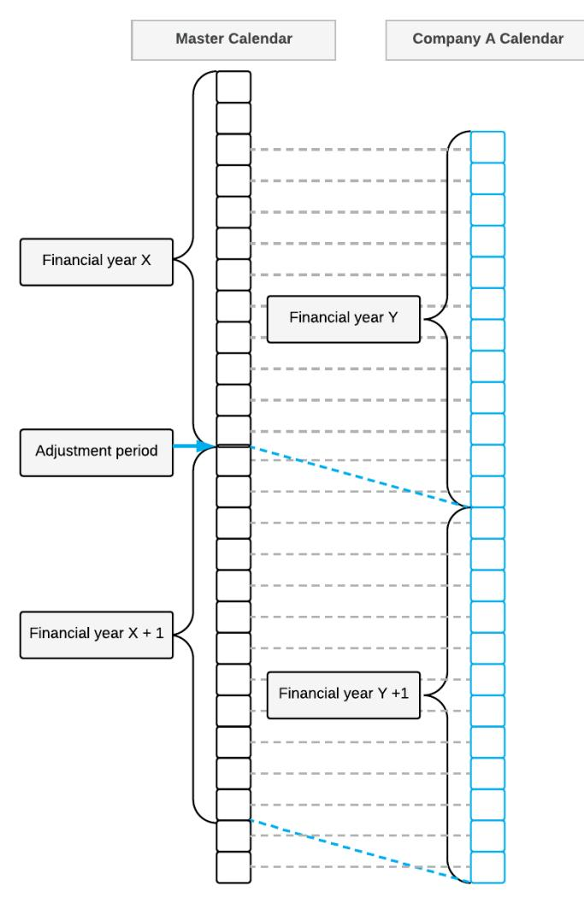

*Figure: Master calendar and company calendar*

To create a new company with financial year start and end dates that are different from those of the master calendar, you perform the following steps:

- 1. You configure the new company on the *[Companies](https://help-2025r1.acumatica.com/Help?ScreenId=ShowWiki&pageid=fedad435-8496-4397-b8a3-50a473629f76)* (CS101500) form.
- 2. You generate a year in the master calendar that corresponds to the first financial year you want to use for the company, if this year has not been generated in the master calendar already.

3. You create a company financial calendar for the new company on the *[Company Financial Calendar](https://help-2025r1.acumatica.com/Help?ScreenId=ShowWiki&pageid=65ec8509-a3de-4381-94f0-c5ae2f8546fb)* (GL201100) form, specifying the needed start date of a financial year. For details, see *To [Create](#page-53-1) the First Year [of the Company Calendar](#page-53-1)*.

If the first financial year exists for the company and you add a year earlier than this one, the system will copy the period status of the first period to all the periods of the created year. For example, year 2025 exists in the system with the start date on 01/11/2025 and the 11-2025 period with the *Open* status. If you add year 2024 on the *[Company Financial Calendar](https://help-2025r1.acumatica.com/Help?ScreenId=ShowWiki&pageid=65ec8509-a3de-4381-94f0-c5ae2f8546fb)* form, the system will create year 2024 with all the periods having the *Open* status.

#### **Related Links**

- *[Generating Financial Calendars](#page-48-2)*
- *[Master Calendar Generation](#page-48-3)*
- *[Transactions](#page-173-0) for Companies with Different Calendars*
- *[Consolidated Reports for Companies with Different Calendars](#page-174-0)*
- *To Create the First Year of the [Company](#page-53-1) Calendar*

# <span id="page-51-1"></span><span id="page-51-0"></span>**Modification of Periods for a Year**

Aer financial periods are defined, the same periods will be used for all subsequent financial years. If needed, you can modify the financial periods of a year on the *[Master Financial Calendar](https://help-2025r1.acumatica.com/Help?ScreenId=ShowWiki&pageid=d46a8e03-b211-44c2-b17c-01ae813ead1b)* (GL201000) form. You can change the settings of a financial period if you did not post any transactions to the period you need to modify.

Modifying periods is highly inadvisable, because it will affect all budgets and reports that compare information between the previous year and the current one. Such a change can result in reporting errors and formatting problems.

In this topic, you will read about how to edit periods, add an adjustment period, and delete periods in the system.

#### **Editing Periods**

You can perform some modifications of financial periods by selecting the **User-Defined Periods** check box on the *[Master Financial Calendar](https://help-2025r1.acumatica.com/Help?ScreenId=ShowWiki&pageid=d46a8e03-b211-44c2-b17c-01ae813ead1b)* (GL201000) form.

If you want to change a duration of a period, you edit the end date for the period. The system will adjust the start date of the next period automatically.

Aer you have modified the periods, the last period may end on a different date than the financial year does. If that happens, when you attempt to save the periods, the system opens the **Update Financial Year** dialog box, and you need to select how to make the year end by selecting either of the following option buttons:

- **Modify Financial YearSettings**: To modify the settings of the financial year to make the last period end when the year ends.
- **Extend Last Period**: To extend the last period so that it includes the end of the year.


This option button is available only if you have changed the end date of the last period to the earlier one.

Aer you save the changes, you can review periods and change them once again if necessary, or proceed to perform financial operations for these periods.

#### **Modifying Week-Based Periods**

If you edit the end date for periods based on weeks on the *[Master Financial Calendar](https://help-2025r1.acumatica.com/Help?ScreenId=ShowWiki&pageid=d46a8e03-b211-44c2-b17c-01ae813ead1b)* (GL201000) form, the day of week on which the last period ends can differ from the day on which other periods end. When you save your changes, the system opens the **Update Financial Year** dialog box. In the dialog box, you select how to make the year end as described in the section above. You can also set the system to move the start date of a financial period to another day of the week by selecting the **MoveStart Date of Financial Period** check box.

You should move the start day of periods to another day of week only if it is absolutely necessary; the change of the start day will affect budgets and reports that compare the data of successive financial years.

If you do not want to change the end day that is already configured, you clear the **MoveStart Date of Financial Period** check box. The system adjusts the end date of the period so that it meets the configuration of the financial year.

#### **Adding an Adjustment Period**

To post adjustment transactions, you can add an adjustment period aer the last period. The adjustment period is one-day period, the start and end days of which are the same as the end date of the last period of the current financial year. To add an adjustment period, you select the **User-Defined Periods** check box and click **Add Row** on the table toolbar of the *[Master Financial Calendar](https://help-2025r1.acumatica.com/Help?ScreenId=ShowWiki&pageid=d46a8e03-b211-44c2-b17c-01ae813ead1b)* (GL201000) form. The system automatically selects the check box in the **Adjustment Period** column. The adjustment period will be added only for this particular year.

#### **Deleting Periods**

If you have realized that a period is unnecessary for the financial year (for example, an adjustment period), you can delete it on the *[Master Financial Calendar](https://help-2025r1.acumatica.com/Help?ScreenId=ShowWiki&pageid=d46a8e03-b211-44c2-b17c-01ae813ead1b)* (GL201000) form if no transactions have been posted to it yet. To do so, you select the **User-Defined Periods** check box, select a period in the table and click **Delete Row** on the table toolbar for the form.

If during initial configuration, you have generated periods and discovered that this is not a configuration that you need, you need to delete all periods to be able to configure a year once again. To do so, on the *[Master Financial](https://help-2025r1.acumatica.com/Help?ScreenId=ShowWiki&pageid=d46a8e03-b211-44c2-b17c-01ae813ead1b) [Calendar](https://help-2025r1.acumatica.com/Help?ScreenId=ShowWiki&pageid=d46a8e03-b211-44c2-b17c-01ae813ead1b)* form, you delete the generated year and its periods by clicking **Delete** on the form toolbar. Aer you have changed the configuration on the *[Financial](https://help-2025r1.acumatica.com/Help?ScreenId=ShowWiki&pageid=9d9ad167-c686-482b-985f-f48dd79cfca1) Year* (GL101000) form, you can add the year again on the *[Master](https://help-2025r1.acumatica.com/Help?ScreenId=ShowWiki&pageid=d46a8e03-b211-44c2-b17c-01ae813ead1b) [Financial Calendar](https://help-2025r1.acumatica.com/Help?ScreenId=ShowWiki&pageid=d46a8e03-b211-44c2-b17c-01ae813ead1b)* form, generate periods according to the financial year settings, and modify the periods if necessary.

#### **Related Links**

- *Financial Year [Configuration](#page-40-3)*
- *[Master Calendar Generation](#page-48-3)*
- *To Add an [Adjustment](#page-54-2) Period*
- *To Configure a Financial Year with [Month-Based](#page-44-1) Periods*
- *To Configure a Financial Year with [Week-Based](#page-45-1) Periods*
- *To [Configure](#page-46-1) a Financial Year with a Custom Number of Periods*
- *[Master Financial Calendar](https://help-2025r1.acumatica.com/Help?ScreenId=ShowWiki&pageid=d46a8e03-b211-44c2-b17c-01ae813ead1b)*
- *[Financial](https://help-2025r1.acumatica.com/Help?ScreenId=ShowWiki&pageid=9d9ad167-c686-482b-985f-f48dd79cfca1) Year*

# <span id="page-52-1"></span><span id="page-52-0"></span>**To Generate Periods for New Financial Years in Master Calendar**

In Acumatica ERP, you can generate financial periods for each new year in the master calendar on the *[Master](https://help-2025r1.acumatica.com/Help?ScreenId=ShowWiki&pageid=d46a8e03-b211-44c2-b17c-01ae813ead1b) [Financial Calendar](https://help-2025r1.acumatica.com/Help?ScreenId=ShowWiki&pageid=d46a8e03-b211-44c2-b17c-01ae813ead1b)* (GL201000) form.

When the *Multiple Calendar Support* feature is disabled on the *[Enable/Disable Features](https://help-2025r1.acumatica.com/Help?ScreenId=ShowWiki&pageid=c1555e43-1bc5-4f6f-ba9d-b323f94d8a6b)* (CS100000) form, you use this form to generate new financial years in the master calendar and the system generates company calendars automatically.

When the *Multiple Calendar Support* feature is enabled on the *[Enable/Disable Features](https://help-2025r1.acumatica.com/Help?ScreenId=ShowWiki&pageid=c1555e43-1bc5-4f6f-ba9d-b323f94d8a6b)* form, you generate financial years separately for each company and the system generates the corresponding years in the master calendar automatically.

To open any form, you can navigate to it or search for it (by its name or by its form ID without periods). For more information about search capabilities, see *[Search](https://help-2025r1.acumatica.com/Help?ScreenId=ShowWiki&pageid=09ed14e6-3600-4d60-8267-66531025f5c3)*.

#### **Before You Proceed**

You need to have an appropriate year in the master calendar to configure the first year in the company calendar. Make sure that the financial year and its periods have been configured on the *[Financial](https://help-2025r1.acumatica.com/Help?ScreenId=ShowWiki&pageid=9d9ad167-c686-482b-985f-f48dd79cfca1) Year* (GL101000) form. For details, see *To Configure a Financial Year with [Month-Based](#page-44-1) Periods*, *To Configure a Financial Year with [Week-Based](#page-45-1) [Periods](#page-45-1)*, or *To [Configure](#page-46-1) a Financial Year with a Custom Number of Periods*.

#### **To Generate Financial Periods for the Master Calendar**

- 1. Open the *[Master Financial Calendar](https://help-2025r1.acumatica.com/Help?ScreenId=ShowWiki&pageid=d46a8e03-b211-44c2-b17c-01ae813ead1b)* (GL201000) form.
- 2. On the form toolbar, click **Generate Calendar**.
- 3. In the **Generate GL Calendar** dialog box, which opens, in the **From Year** and **To Year** boxes, make sure that the required financial years are selected.

You can specify a range of financial years in these boxes.

4. Click **OK** to close the dialog box.

Periods have been generated with the *Inactive* status.

## <span id="page-53-1"></span><span id="page-53-0"></span>**To Create the First Year of the Company Calendar**

In Acumatica ERP, with the *Multiple Calendar Support* feature enabled, you configure the company calendar separately for each company. To do this, you use the *[Company Financial Calendar](https://help-2025r1.acumatica.com/Help?ScreenId=ShowWiki&pageid=65ec8509-a3de-4381-94f0-c5ae2f8546fb)* (GL201100) form.

#### **Before You Proceed**

Make sure that the financial year and its periods have been configured on the *[Financial](https://help-2025r1.acumatica.com/Help?ScreenId=ShowWiki&pageid=9d9ad167-c686-482b-985f-f48dd79cfca1) Year* (GL101000) form. For details, see *To Configure a Financial Year with [Month-Based](#page-44-1) Periods*, *To Configure a Financial Year with [Week-Based](#page-45-1) [Periods](#page-45-1)*, or *To [Configure](#page-46-1) a Financial Year with a Custom Number of Periods*.

#### **To Configure a Company Calendar**

- 1. Open the *[Company Financial Calendar](https://help-2025r1.acumatica.com/Help?ScreenId=ShowWiki&pageid=65ec8509-a3de-4381-94f0-c5ae2f8546fb)* (GL201100) form.
- 2. In the **Company** box, select the company for which you want to create the first year of the calendar.
- 3. In the **Create First Year of Company Calendar** dialog box, which opens, in the **First Financial Year** box, enter the first financial year of the company's operation.
- 4. In the **Master Period ID** box, select a period from the master calendar, which will be the first financial period in the year you have selected.

This period can be the same as the first period for the year in the master calendar, such as *01-2021*, or it can be earlier or later, such as *11-2020* or *03-2020*.

5. Click **OK** to close the dialog box.

# <span id="page-54-0"></span>**To Generate Periods for New Financial Years in a Company Calendar**

Once you have configured a company calendar, you need to generate periods for new financial years in the company calendar. To do this, you use the *[Company Financial Calendar](https://help-2025r1.acumatica.com/Help?ScreenId=ShowWiki&pageid=65ec8509-a3de-4381-94f0-c5ae2f8546fb)* (GL201100) form.

#### **To Generate Periods for New Financial Years in Each Company Calendar**

- 1. Open the *[Company Financial Calendar](https://help-2025r1.acumatica.com/Help?ScreenId=ShowWiki&pageid=65ec8509-a3de-4381-94f0-c5ae2f8546fb)* (GL201100) form.
- 2. In the **Company** box of the Selection area, select a company for which you want to generate periods.
- 3. On the form toolbar, click **Generate Calendar**.
- 4. In the **Generate GL Calendars** dialog box, which opens, in the **From Year** and **To Year** boxes, enter the financial years for which you want to generate periods.

You use these boxes to specify the range of financial years for which periods are generated.

5. Click **OK** to close the dialog box.

A financial calendar has been generated with the periods with the *Inactive* status.

### <span id="page-54-2"></span><span id="page-54-1"></span>**To Add an Adjustment Period**

In Acumatica ERP, you can add an adjustment period for *each* year only during initial setup, when you configure your financial year and its periods. However, if required, you can easily add an adjustment period for the latest financial year.

In Acumatica ERP, you add an adjustment period on the *[Master Financial Calendar](https://help-2025r1.acumatica.com/Help?ScreenId=ShowWiki&pageid=d46a8e03-b211-44c2-b17c-01ae813ead1b)* (GL201000) form.


To open any form, you can navigate to it or search for it (by its name or by its form ID without periods). For more information about search capabilities, see *[Search](https://help-2025r1.acumatica.com/Help?ScreenId=ShowWiki&pageid=09ed14e6-3600-4d60-8267-66531025f5c3)*.

#### **To Add an Adjustment Period**

- 1. Open the *[Master Financial Calendar](https://help-2025r1.acumatica.com/Help?ScreenId=ShowWiki&pageid=d46a8e03-b211-44c2-b17c-01ae813ead1b)* (GL201000) form.
- 2. In the **Financial Year** box of the Summary area, select the latest financial year to which you want to add an adjustment period.
- 3. Select the **User-Defined Periods** check box.
- 4. On the table toolbar, click **Add Row**.
- 5. In the added row in the table (that is, the last period), make sure that the check box in the **Adjustment Period** column is selected.
- 6. If needed, in the **Description** column, type a description that indicates that this is an adjustment period.
- 7. On the form toolbar, click**Save**.

# <span id="page-55-2"></span><span id="page-55-0"></span>**Closing Financial Periods in Subledgers and GL**

In this chapter, you will find general information on how to close financial periods, an activity that describes how to close a period in accounts receivable, an activity that describes how to close a period in accounts receivable and in the general ledger, and report and inquiries that can be useful to find and view trial balances and balance discrepancies.

# <span id="page-55-3"></span><span id="page-55-1"></span>**Closing Financial Periods: General Information**

Aer all the needed transactions have been posted to a financial period and all figures have been verified, you can close the financial period in the system. The following capabilities and restrictions apply to the closing of financial periods:

- You can close multiple periods at the same time (for instance, all periods of a financial year).
- Financial periods can be closed starting from the first period of the first financial year. You cannot close a financial period if the previous one has not been closed yet, unless it is being closed at the same time.
- Once closed, a period can later be reopened, if needed.
- You generally close periods to prevent unauthorized users from posting new transactions to the period. However, you can allow users to enter documents and post transactions to the closed period.

#### **Learning Objectives**

In this chapter, you will learn how to do the following:

- Close a financial period in a subledger
- Close a financial period in all the subledgers and in the general ledger at the same time

#### **Statuses of Financial Periods**

Every financial period belongs to a range of periods that have a particular status—*Inactive*, *Open*, *Closed*, or *Locked*. The system can contain four period ranges, each with a different status.

The example shown in the following screenshot illustrates multiple period ranges in the system, with the periods in each range having a particular status that is valid in the system. You can see the following ranges of periods:

- *01-2024* to *02-2024*, whose periods have the *Locked* status
- *03-2024* to *04-2024*, whose periods have the *Closed* status
- *05-2024* to *10-2024*, whose periods have the *Open* status
- *11-2024* to *13-2024*, whose periods have the *Inactive* status

| Company Financial Calendar                                           |                                                                          |              |                   |                  |                           |                          |               | <b>P</b> NOTES          | <b>ACTIVITIES</b>       | <b>FILES</b>            | TOOLS $\star$            |
|----------------------------------------------------------------------|--------------------------------------------------------------------------|--------------|-------------------|------------------|---------------------------|--------------------------|---------------|-------------------------|-------------------------|-------------------------|--------------------------|
|                                                                      | К<br>↶                                                                   | ≺            | Y.                | Ы                | .                         |                          |               |                         |                         |                         |                          |
| * Company:<br>* Financial Year:<br>Start Date:<br>Number of Periods: |                                                                          |              |                   | 2024<br>1/1/2024 | SWEETLIFE - Sweet Q<br>13 | ρ                        |               |                         |                         |                         | ㅅ                        |
|                                                                      | Ò<br>$\left  \leftrightarrow \right $<br><b>目 Financial</b><br>Period ID | $\mathbf{x}$ | <b>Start Date</b> |                  | <b>End Date</b>           | <b>Description</b>       | <b>Status</b> | Closed<br>in AP         | Closed<br>in AR         | Closed<br>in IN         | Closed<br>in CA          |
| ⋋                                                                    | 01-2024                                                                  |              | 1/1/2024          |                  | 1/31/2024                 | January                  | Locked        | ☑                       | ☑                       | ☑                       | ☑                        |
|                                                                      | 02-2024                                                                  |              | 2/1/2024          |                  | 2/29/2024                 | February                 | Locked        | ☑                       | ☑                       | $\overline{\mathsf{S}}$ | ☑                        |
|                                                                      | 03-2024                                                                  |              | 3/1/2024          |                  | 3/31/2024                 | March                    | Closed        | ☑                       | ☑                       | $\overline{\mathsf{S}}$ | $\overline{\phantom{0}}$ |
|                                                                      | 04-2024                                                                  |              | 4/1/2024          |                  | 4/30/2024                 | April                    | Closed        | $\overline{\mathsf{S}}$ | $\overline{\mathbf{v}}$ | $\overline{\mathsf{S}}$ | $\overline{\mathsf{v}}$  |
|                                                                      | 05-2024                                                                  |              | 5/1/2024          |                  | 5/31/2024                 | May                      | Open          | □                       | □                       | □                       | □                        |
|                                                                      | 06-2024                                                                  |              | 6/1/2024          |                  | 6/30/2024                 | June                     | Open          | □                       | $\Box$                  | $\Box$                  | $\Box$                   |
|                                                                      | 07-2024                                                                  |              | 7/1/2024          |                  | 7/31/2024                 | July                     | Open          | $\Box$                  | $\Box$                  | $\Box$                  | $\Box$                   |
|                                                                      | 08-2024                                                                  |              | 8/1/2024          |                  | 8/31/2024                 | August                   | Open          | $\Box$                  | $\Box$                  | $\Box$                  | $\Box$                   |
|                                                                      | 09-2024                                                                  |              | 9/1/2024          |                  | 9/30/2024                 | September                | Open          | $\Box$                  | $\Box$                  | $\Box$                  | □                        |
|                                                                      | 10-2024                                                                  |              | 10/1/2024         |                  | 10/31/2024                | October                  | Open          | $\Box$                  | □                       | □                       | □                        |
|                                                                      | 11-2024                                                                  |              | 11/1/2024         |                  | 11/30/2024                | November                 | Inactive      | $\Box$                  | $\Box$                  | $\Box$                  | $\Box$                   |
|                                                                      | 12-2024                                                                  |              | 12/1/2024         |                  | 12/31/2024                | December                 | Inactive      | $\Box$                  | $\Box$                  | $\Box$                  | $\Box$                   |
|                                                                      | 13-2024                                                                  |              | 12/31/2024        |                  | 12/31/2024                | <b>Adjustment Period</b> | Inactive      | П                       | П                       | $\Box$                  | П                        |

#### *Figure: Ranges of financial periods with particular statuses*

The following table lists the possible statuses of financial periods, describes each status, and presents the action or actions that you can perform to change the statuses of periods of each listed status. You can perform actions on periods on the *[Manage Financial Periods](https://help-2025r1.acumatica.com/Help?ScreenId=ShowWiki&pageid=eedf2adf-6ddc-4c33-932b-de60275c547f)* (GL503000) form by clicking buttons on the form toolbar or the equivalent commands on the More menu.

| Status   | Description of a Period with This Status                                                                                             | Actions That Can Be Per<br>formed                                                 |
|----------|--------------------------------------------------------------------------------------------------------------------------------------|-----------------------------------------------------------------------------------|
| Inactive | An inactive period has been generated in the system but has<br>not yet been opened. Transactions cannot be posted to the pe<br>riod. | Open the period by clicking<br>Open                                               |
| Open     | An open period can be selected in records, and transactions<br>can be posted to it.                                                  | Close the period by clicking<br>Close or deactivate it by click<br>ing Deactivate |

| Status | Description of a Period with This Status                                                                                                                                                                                                                                                                                                                                                                                    | Actions That Can Be Per<br>formed                                      |
|--------|-----------------------------------------------------------------------------------------------------------------------------------------------------------------------------------------------------------------------------------------------------------------------------------------------------------------------------------------------------------------------------------------------------------------------------|------------------------------------------------------------------------|
| Closed | A closed period cannot be selected in records, and users can be<br>restricted from posting to it.<br>If the Restrict Access to Closed Periods check box is selected<br>on the General Ledger Preferences (GL102000) form, transac<br>tions can be posted to a closed period by only users to whom<br>the Financial Supervisor role has been assigned. If this check<br>box is cleared, any user can post to closed periods. | Lock the period by clicking<br>Lock or reopen it by clicking<br>Reopen |
| Locked | A locked period cannot be selected in a record, and transac<br>tions cannot be posted to it in any subledger.<br>You lock a period to prevent changes to period-specific data<br>that has been verified and disclosed in reports.                                                                                                                                                                                           | Unlock the period by clicking<br>Unlock                                |

The following diagram illustrates the statuses in the lifetime of financial periods in the system, along with the actions that change the statuses of these periods.

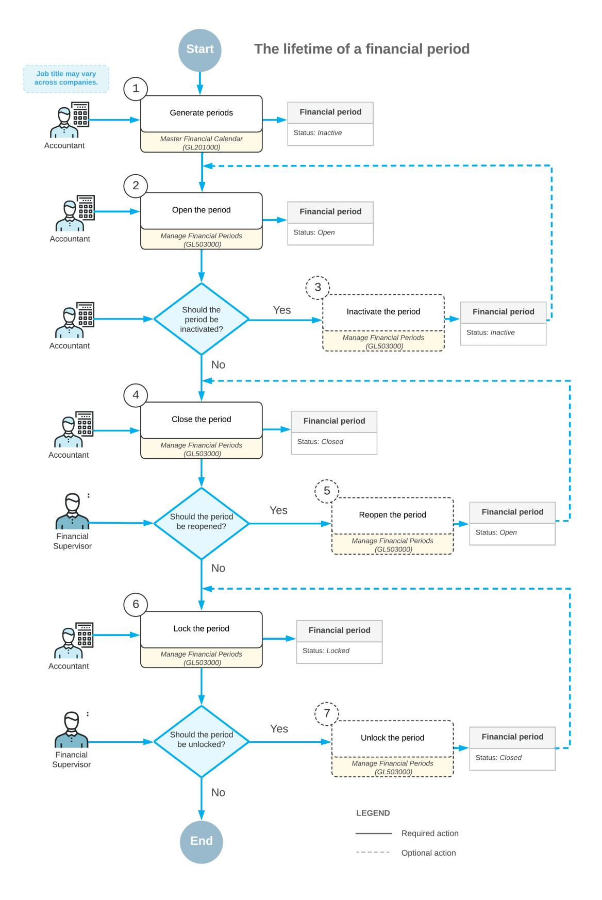

The lifetime of a financial period in the system includes the following actions:

1. A financial administrator generates the financial period with the *Inactive* status.

- 2. To give users the ability to create a record in this period or post a transaction to the period under one of the company branches, the financial administrator must open the needed period in the company. This gives the period the *Open* status, and it can be used in all subledgers.
- 3. Optional: The financial administrator inactivates an open period in the system to prevent users from posting transactions to this period. The inactivated period and the preceding periods will be assigned the *Inactive* status again.
- 4. When all the needed records have been processed in the period, the financial administrator closes the period to prevent erroneous posting. For a period to be closed in a subledger, it must not contain any unreleased documents (except for rejected and scheduled documents), and the previous period has to be closed in this subledger. For a period to be closed in the general ledger, it must not contain any unposted transactions (except for scheduled ones), it has to be closed in all other subledgers, and the previous period has to be closed in the general ledger. When the financial administrator closes the period, the period and the preceding periods in the range (that is, with the same status) will be assigned the *Closed* status.
- 5. Optional: A user to which the *Financial Supervisor* role is assigned reopens a closed period for posting. The reopening process sets the period's status to *Open* for the selected period or range of periods; optionally, the periods can be reopened in all subledgers.
- 6. To keep the data unchanged by all the users and the validation processes, the financial administrator locks a closed period. The period can be locked only if the previous period is locked as well. This process assigns the *Locked* status to the range of periods to which the selected period belongs.
- 7. Optional: If necessary, a user to which the *Financial Supervisor* role is assigned unlocks the period to assign the *Closed* status to it again so that the needed transactions can be posted to it.

#### **Closing of a Period in Subledgers**

Although you can close periods in subledgers and in the general ledger at the same time, you may decide to close periods in subledgers (accounts payable, accounts receivable, cash management, inventory, and fixed assets) separately in your system by using the forms listed below for each subledger. To view information about the status of periods, you can use the *[Manage Financial Periods](https://help-2025r1.acumatica.com/Help?ScreenId=ShowWiki&pageid=eedf2adf-6ddc-4c33-932b-de60275c547f)* (GL503000) form.

Before you close a period in these subledgers, you should make sure that there are no unreleased documents that are to be posted to this period. (For the fixed assets subledger, the system also checks whether all assets have been depreciated in the period.) To close periods in the subledgers, you use the following forms:

- In the accounts payable subledger, the *[Close Financial Periods](https://help-2025r1.acumatica.com/Help?ScreenId=ShowWiki&pageid=3230e8df-a7c7-4d51-b6c6-00dff0ae48dd)* (AP506000) form
- In the accounts receivable subledger, the *[Close Financial Periods](https://help-2025r1.acumatica.com/Help?ScreenId=ShowWiki&pageid=c2c5bb0b-afb1-4b9d-8828-f70ff8f07add)* (AR509000) form
- In the cash management subledger, the *[Close Financial Periods](https://help-2025r1.acumatica.com/Help?ScreenId=ShowWiki&pageid=c6fc2284-7d00-43c2-a9ef-e265bc0ee8ce)* (CA506000) form
- In the inventory subledger, the *[Close Financial Periods](https://help-2025r1.acumatica.com/Help?ScreenId=ShowWiki&pageid=e50ee1c8-7500-427f-a1b6-d2bf564f54a5)* (IN509000) form
- In the fixed assets subledger, the *[Close Financial Periods](https://help-2025r1.acumatica.com/Help?ScreenId=ShowWiki&pageid=616e67c8-d189-449a-ab96-75ff4465df94)* (FA509000) form

When you close a given financial period in a subledger on any of these forms, all preceding open periods will be closed in the subledger as well.

#### **Closing of a Period in the General Ledger**

A period is assigned the *Closed* status only aer it has been closed in the general ledger on the *[Manage Financial](https://help-2025r1.acumatica.com/Help?ScreenId=ShowWiki&pageid=eedf2adf-6ddc-4c33-932b-de60275c547f) [Periods](https://help-2025r1.acumatica.com/Help?ScreenId=ShowWiki&pageid=eedf2adf-6ddc-4c33-932b-de60275c547f)* (GL503000) form. For instructions on how to close periods, see *Closing [Financial](#page-65-1) Periods: To Close a Period [in Subledgers and GL](#page-65-1)*.

Before you close periods, you need to check whether there are unposted documents for the periods that you want to close. To do that, on the *[Manage Financial Periods](https://help-2025r1.acumatica.com/Help?ScreenId=ShowWiki&pageid=eedf2adf-6ddc-4c33-932b-de60275c547f)* form, you select the periods you want to close and click **Unposted Documents** on the form toolbar. In the *Unposted Documents* report, which opens, you can review the list of documents that have not been posted to the selected periods.

Closing a period in the general ledger initiates the generation of auto-reversing batches if the **Generate Auto-Reversing Entries on Period Closing** check box is selected on the *[General Ledger Preferences](https://help-2025r1.acumatica.com/Help?ScreenId=ShowWiki&pageid=e4913d06-c511-4258-a0f9-f36c1b854e6b)* (GL102000) form and these batches have been prepared on the *Journal [Transactions](https://help-2025r1.acumatica.com/Help?ScreenId=ShowWiki&pageid=dda046bc-5946-407f-88f7-1c0c966fbe72)* (GL301000) form. If auto-reversing entries should be generated when the applicable period is closed, you should not close the last financial period that was opened; you should always open at least one financial period before you close the most recent period.

You can view closed periods for a particular year on the *[Master Financial Calendar](https://help-2025r1.acumatica.com/Help?ScreenId=ShowWiki&pageid=d46a8e03-b211-44c2-b17c-01ae813ead1b)* (GL201000) form if the *Centralized Period Management* feature is enabled on the *[Enable/Disable Features](https://help-2025r1.acumatica.com/Help?ScreenId=ShowWiki&pageid=c1555e43-1bc5-4f6f-ba9d-b323f94d8a6b)* (CS100000) form or on the *[Company Financial](https://help-2025r1.acumatica.com/Help?ScreenId=ShowWiki&pageid=65ec8509-a3de-4381-94f0-c5ae2f8546fb) [Calendar](https://help-2025r1.acumatica.com/Help?ScreenId=ShowWiki&pageid=65ec8509-a3de-4381-94f0-c5ae2f8546fb)* (GL201100) form if the *Centralized Period Management* feature is disabled. For the closed periods, the **Status** column contains *Closed* and the check boxes are selected in the **Closed in AP**, **Closed in AR**, **Closed in IN**, **Closed in CA**, and **Closed in FA** columns.

If a period was closed by mistake, you can reopen it on the *[Manage Financial Periods](https://help-2025r1.acumatica.com/Help?ScreenId=ShowWiki&pageid=eedf2adf-6ddc-4c33-932b-de60275c547f)* form. For more information, see *[Financial](#page-95-1) Periods: To Reopen a Period*.

#### **Posting of Transactions to Closed Periods**

In some cases, you may find additional transactions to be processed in a period that was closed. To accommodate such situations, you can allow posting transactions to closed periods by assigning appropriate users to the *Financial Supervisor* role on the *[User Roles](https://help-2025r1.acumatica.com/Help?ScreenId=ShowWiki&pageid=c2879f3c-3739-430a-b02b-c225f5480966)* (SM201005) form. Only users assigned to this role can post to closed periods if the **Restrict Access to Closed Periods** check box is selected on the *[General Ledger Preferences](https://help-2025r1.acumatica.com/Help?ScreenId=ShowWiki&pageid=e4913d06-c511-4258-a0f9-f36c1b854e6b)* (GL102000) form. If this check box is cleared, all users can post transactions to closed periods.

If you want to prevent all users from posting to closed periods, you lock periods (that is, you assign the periods the *Locked* status) on the *[Manage Financial Periods](https://help-2025r1.acumatica.com/Help?ScreenId=ShowWiki&pageid=eedf2adf-6ddc-4c33-932b-de60275c547f)* (GL503000) form. For instructions, see *[Financial](#page-91-2) Periods: To Lock a [Period](#page-91-2)*.

#### **Period-End Closing Overview**

The process of closing a period consists of the following steps:

- 1. Optional: Closing the period in the subledgers. (You can instead close the period in subledgers along with the general ledger aer performing period-end activities.) For details, see *Closing [Financial](#page-62-2) Periods: To Close [a Period in a Subledger](#page-62-2)*.
- 2. Generating and posting any recurring transactions. For details, see *Recurring [Transactions:](#page-134-1) Process Activity*.
- 3. Performing period-end adjustments—that is, posting adjustment transactions (some of which should be reversed at the beginning of the next period). For details, see *Adjusting [Transactions:](#page-128-1) Process Activity*.
- 4. Revaluing general ledger accounts so that the balances of the accounts in foreign currencies are revalued using the end-period exchange rate. For details, see *[Revaluation of Bank Accounts: Process Activity](https://help-2025r1.acumatica.com/Help?ScreenId=ShowWiki&pageid=ce62153b-2a36-4e6d-b500-217e4c6c79bb)*.
- 5. Reviewing the trial balance and the list of transactions.
- 6. Reclassifying transactions if there are errors, as described in *[Reclassifying](#page-140-2) Transactions*.
- 7. Running allocations if the distribution of amounts between branches, accounts, and subaccounts is needed. For details, see and *[Running Allocations](#page-230-2)*
- 8. Closing the period in the general ledger. For instructions, see *Closing [Financial](#page-65-1) Periods: To Close a Period in [Subledgers and GL](#page-65-1)*.

The overall process of closing a period in the system is shown in the following diagram. The steps marked with a star are described in a process activity in this chapter.

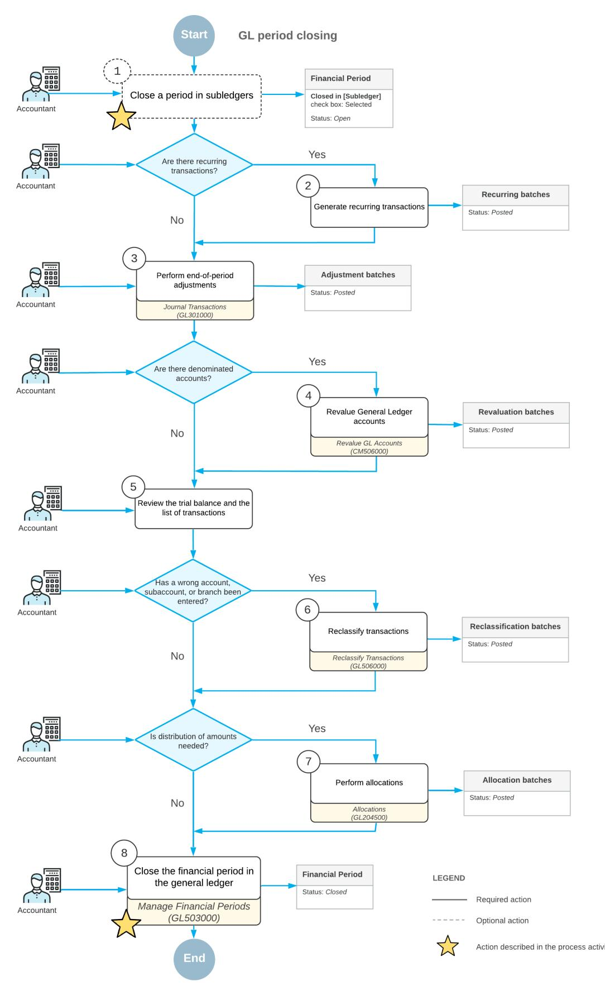

*Figure: Closing GL periods*

# <span id="page-62-0"></span>**Closing Financial Periods: Implementation Checklist**

To ensure that the system has been configured properly for the closing of financial periods, make sure that the criteria listed in the table have been met in the system as described.

| Form                               | Criteria to Check                                                                                                      | Notes |
|------------------------------------|------------------------------------------------------------------------------------------------------------------------|-------|
| Enable/Disable Features (CS100000) | Make sure the minimal features have been<br>enabled, as described in Company Without<br>Branches: General Information. |       |

### **Settings That Affect the Workflow**

The following settings and entities should be specified and defined, respectively:

- The following common settings should be specified on the *[Enable/Disable Features](https://help-2025r1.acumatica.com/Help?ScreenId=ShowWiki&pageid=c1555e43-1bc5-4f6f-ba9d-b323f94d8a6b)* (CS100000) form:
  - The *Multibranch Support* feature should be enabled to maintain multiple branches and to make it possible to enable *Centralized Period Management* feature.
  - The *Multicompany Support* feature should be enabled to maintain multiple companies within one tenant
  - The *Centralized Period Management* feature should be disabled to make it possible to open, close, and lock a particular financial period separately for each company within the tenant.
- The following general ledger settings should be specified on the **PostingSettings** tab of the *[General Ledger](https://help-2025r1.acumatica.com/Help?ScreenId=ShowWiki&pageid=e4913d06-c511-4258-a0f9-f36c1b854e6b) [Preferences](https://help-2025r1.acumatica.com/Help?ScreenId=ShowWiki&pageid=e4913d06-c511-4258-a0f9-f36c1b854e6b)* (GL102000) form:
  - Select the **Restrict Access to Closed Periods** check box to allow posting to closed periods to only users belonging to the *Financial Supervisor* role.
- The following settings should be specified on the *[User Roles](https://help-2025r1.acumatica.com/Help?ScreenId=ShowWiki&pageid=c2879f3c-3739-430a-b02b-c225f5480966)* (SM201005) form:
  - Make sure that the user you are going to use in the process activity later has been assigned to the *Financial Supervisor* role. Users assigned to this role can reopen *Closed* periods and unlock *Locked* periods, and also post to closed periods even if the **Restrict Access to Closed Periods** check box is selected on the *[General Ledger Preferences](https://help-2025r1.acumatica.com/Help?ScreenId=ShowWiki&pageid=e4913d06-c511-4258-a0f9-f36c1b854e6b)* form.

With these settings specified, users in your company can record and process documents in Acumatica ERP quickly and accurately, with a minimum of manual actions.

# <span id="page-62-2"></span><span id="page-62-1"></span>**Closing Financial Periods: To Close a Period in a Subledger**

The following activity will walk you through the process of closing a period in the accounts receivable subledger.

This activity is based on the *U100* dataset. If you are using another dataset, or if any system settings have been changed in *U100*, these changes can affect the workflow of the activity and the results of the processing. To avoid any issues, restore the *U100* dataset to its initial state.

#### **Video Tutorial**

This video shows you the common process but may contain less detail than the activity has. If you want to repeat the activity on your own or you are preparing to take the certification exam, we recommend that you follow the instructions in the steps of the activity.

#### *[FEEDBACK](https://www.surveymonkey.com/r/BLBL7RJ?Video=Closing%20Financial%20Periods&Source=Open%20Uni&Course=F100)*

#### **Story**

Suppose that as an accountant of the SweetLife Fruits & Jams company, you have to close the *03-2024* financial period and the preceding periods in the accounts receivable subledger for the SweetLife Head Office and Wholesale Center branch to prevent users from posting to these periods.

#### **Process Overview**

In this activity, you will close financial periods in the accounts receivable subledger on the *[Close Financial Periods](https://help-2025r1.acumatica.com/Help?ScreenId=ShowWiki&pageid=c2c5bb0b-afb1-4b9d-8828-f70ff8f07add)* (AR509000) form.

In a production environment, before you get started, you would make sure the following conditions are met:

- There are no batches with a status of *On Hold*, *Balanced*, or *Unposted* in the period or periods.
- If you use auto-reversing entries, at least one financial period will remain open aer you close the needed period or periods.

#### **System Preparation**

To prepare the system, do the following:

- 1. Launch the Acumatica ERP website with the *U100* dataset. Sign in as an accountant by using the following credentials:
  - Username: *johnson*
  - Password: *123*
- 2. On the Company and Branch Selection menu, also on the top pane of the Acumatica ERP screen, make sure that the *SweetLife Head Office and Wholesale Center* branch is selected. If it is not selected, click the Company and Branch Selection menu button to view the list of branches that you have access to, and then click *SweetLife Head Office and Wholesale Center*.

#### **Step 1: Preparing to Close the Financial Periods**

Perform the following instructions to prepare to close the financial periods:

- 1. Open the *[Close Financial Periods](https://help-2025r1.acumatica.com/Help?ScreenId=ShowWiki&pageid=c2c5bb0b-afb1-4b9d-8828-f70ff8f07add)* (AR509000) form.
- 2. In the Selection area, specify the following settings:
  - **Company**: *SWEETLIFE* (inserted by default)
  - **Action**: *Close* (selected by default)
  - **To Year**: *2024*
- 3. Select the unlabeled check box for the *03-2024* period. Notice that the check boxes corresponding to all the preceding periods are selected automatically, as shown in the following screenshot.

|                                                   |   |          |        | <b>Close Financial Periods</b>               |                   |                    |                          |                                                  |          |              | TOOLS $\star$ |  |
|---------------------------------------------------|---|----------|--------|----------------------------------------------|-------------------|--------------------|--------------------------|--------------------------------------------------|----------|--------------|---------------|--|
|                                                   | Ò | $\Omega$ |        | <b>PROCESS</b>                               | PROCESS ALL       |                    |                          | $\circlearrowright$ $\circ$ UNRELEASED DOCUMENTS | $\vdash$ | $\mathbf{x}$ | Υ             |  |
| * Company:<br>Action:<br>From Year:<br>* To Year: |   |          |        | SWEETLIFE - Sweet O<br>Close<br>2024<br>2024 | $\checkmark$<br>م |                    |                          |                                                  |          |              | ∼             |  |
| 目                                                 | 0 | $\Box$   | п      | <b>Financial Period ID</b>                   |                   | <b>Description</b> |                          |                                                  |          |              |               |  |
|                                                   | 0 | $\Box$   | ☑      | 01-2024                                      |                   | January            |                          |                                                  |          |              |               |  |
|                                                   | 0 | $\Box$   | ☑      | 02-2024                                      |                   | February           |                          |                                                  |          |              |               |  |
| ⋗                                                 | 0 | D        | ☑      | 03-2024                                      |                   | March              |                          |                                                  |          |              |               |  |
|                                                   | 0 | D        | п      | 04-2024                                      |                   | April              |                          |                                                  |          |              |               |  |
|                                                   | 0 | $\Box$   | п      | 05-2024                                      |                   | May                |                          |                                                  |          |              |               |  |
|                                                   | 0 | $\Box$   | $\Box$ | 06-2024                                      |                   | June               |                          |                                                  |          |              |               |  |
|                                                   | 0 | $\Box$   | п      | 07-2024                                      |                   | July               |                          |                                                  |          |              |               |  |
|                                                   | 0 | $\Box$   | п      | 08-2024                                      |                   | August             |                          |                                                  |          |              |               |  |
|                                                   | 0 | $\Box$   | п      | 09-2024                                      |                   | September          |                          |                                                  |          |              |               |  |
|                                                   | 0 | $\Box$   | п      | 10-2024                                      |                   | October            |                          |                                                  |          |              |               |  |
|                                                   | 0 | $\Box$   | п      | 11-2024                                      |                   | November           |                          |                                                  |          |              |               |  |
|                                                   | 0 | $\Box$   | п      | 12-2024                                      |                   | December           |                          |                                                  |          |              |               |  |
|                                                   | 0 | D        |        | 13-2024                                      |                   |                    | <b>Adjustment Period</b> |                                                  |          |              |               |  |
|                                                   |   |          |        |                                              |                   |                    |                          |                                                  |          |              |               |  |

*Figure: Periods selected for closing in the AR subledger*

- 4. On the form toolbar, click **Unreleased Documents** to verify that no unreleased documents exist for these periods.
- 5. In the dialog box with an informational message that is displayed, click **OK**.

#### **Step 2: Closing the Financial Periods**

To close the financial periods, do the following:

- 1. On the form toolbar of the *[Close Financial Periods](https://help-2025r1.acumatica.com/Help?ScreenId=ShowWiki&pageid=c2c5bb0b-afb1-4b9d-8828-f70ff8f07add)* (AR509000) form, click **Process**.
- 2. Close the **Processing** dialog box.
- 3. Open the *[Manage Financial Periods](https://help-2025r1.acumatica.com/Help?ScreenId=ShowWiki&pageid=eedf2adf-6ddc-4c33-932b-de60275c547f)* (GL503000) form to review the statuses of financial periods.
- 4. In the Selection area, specify the following settings:
  - **Company**: *SWEETLIFE* (inserted by default)
  - **Action**: *Close*
  - **To Year**: *2024*
- 5. In the table, review the statuses of the financial periods that you closed earlier.

The periods have retained the *Open* status (because they are still open in the subledgers and in the general ledger), but the **Closed in AR** check box is selected for all the periods, meaning that these periods have been closed in the accounts receivable subledger.

# <span id="page-65-1"></span><span id="page-65-0"></span>**Closing Financial Periods: To Close a Period in Subledgers and GL**

The following activity will walk you through the process of closing periods in all the subledgers and in the general ledger at the same time.

#### **Video Tutorial**

This video shows you the common process but may contain less detail than the activity has. If you want to repeat the activity on your own or you are preparing to take the certification exam, we recommend that you follow the instructions in the steps of the activity.

#### *[FEEDBACK](https://www.surveymonkey.com/r/BLBL7RJ?Video=Closing%20Financial%20Periods&Source=Open%20Uni&Course=F100)*

#### **Story**

Suppose that as an accountant of the SweetLife Fruits & Jams company, you have to close the *04-2024* financial period (and all previous periods that are not already closed) in all the subledgers and in the general ledger at the same time. The periods should be closed for the SweetLife Head Office and Wholesale Center branch to prevent users from posting to these periods.

#### **Process Overview**

In this activity, you will review the statuses of financial periods on the *[Company Financial Calendar](https://help-2025r1.acumatica.com/Help?ScreenId=ShowWiki&pageid=65ec8509-a3de-4381-94f0-c5ae2f8546fb)* (GL201100) form and close the financial periods on the *[Manage Financial Periods](https://help-2025r1.acumatica.com/Help?ScreenId=ShowWiki&pageid=eedf2adf-6ddc-4c33-932b-de60275c547f)* (GL503000) form.

In a production environment, before you get started, you would make sure the following conditions are met:

- There are no batches with a status of *On Hold*, *Balanced*, or *Unposted* in the period or periods.
- If you use auto-reversing entries, at least one financial period will remain open aer you close the needed period or periods.

#### **System Preparation**

To prepare the system, do the following:

- 1. Launch the Acumatica ERP website with the *U100* dataset. Sign in as an accountant by using the following credentials:
  - Username: *johnson*
  - Password: *123*
- 2. On the Company and Branch Selection menu, also on the top pane of the Acumatica ERP screen, make sure that the *SweetLife Head Office and Wholesale Center* branch is selected. If it is not selected, click the Company and Branch Selection menu button to view the list of branches that you have access to, and then click *SweetLife Head Office and Wholesale Center*.

#### **Step 1: Reviewing the Statuses of Financial Periods**

To review the statuses of the financial periods of 2024, do the following:

- 1. Open the *[Company Financial Calendar](https://help-2025r1.acumatica.com/Help?ScreenId=ShowWiki&pageid=65ec8509-a3de-4381-94f0-c5ae2f8546fb)* (GL201100) form.
- 2. In the Selection area, specify the following settings:

- **Company**: *SWEETLIFE* (inserted by default)
- **Financial Year**: *2024*

#### **Step 2: Closing the Financial Periods**

To close the financial periods, do the following:

- 1. On the More menu of the *[Company Financial Calendar](https://help-2025r1.acumatica.com/Help?ScreenId=ShowWiki&pageid=65ec8509-a3de-4381-94f0-c5ae2f8546fb)* (GL201100) form, click **Close Periods**.
- 2. On the *[Manage Financial Periods](https://help-2025r1.acumatica.com/Help?ScreenId=ShowWiki&pageid=eedf2adf-6ddc-4c33-932b-de60275c547f)* (GL503000) form, which opens, notice that the system has selected the *Close* action in the Summary area. In the table, select the unlabeled check box for the *04-2024* period. The check boxes for the preceding periods are automatically selected, as shown in the following screenshot.

|                                                   | TOOLS $\star$<br>Manage Financial Periods |   |   |                        |                                              |                   |                    |                 |                            |                 |                 |
|---------------------------------------------------|-------------------------------------------|---|---|------------------------|----------------------------------------------|-------------------|--------------------|-----------------|----------------------------|-----------------|-----------------|
| Ò<br><b>PROCESS</b><br>∽                          |                                           |   |   |                        | PROCESS ALL                                  | O<br>$\checkmark$ | UNPOSTED DOCUMENTS |                 | $ \mathbf{x} $<br>$\vdash$ |                 |                 |
| * Company:<br>Action:<br>From Year:<br>* To Year: |                                           |   |   |                        | SWEETLIFE - Sweet O<br>Close<br>2024<br>2024 | $\checkmark$<br>Q |                    |                 |                            |                 | ^               |
| 目                                                 | 0                                         | D |   | Financial<br>Period ID | <b>Description</b>                           |                   | <b>Status</b>      | Closed<br>in AP | Closed<br>in AR            | Closed<br>in IN | Closed<br>in CA |
|                                                   | 0                                         | D | ☑ | 01-2024                | January                                      |                   | Open               | $\Box$          | $\triangledown$            | □               | □               |
|                                                   | 0                                         | ◻ | ☑ | 02-2024                | February                                     |                   | Open               | $\Box$          | ☑                          | □               | $\Box$          |
|                                                   | 0                                         |   | ☑ | 03-2024                | March                                        |                   | Open               | □               | ☑                          | П               | П               |
|                                                   | 0                                         | D | ☑ | 04-2024                | April                                        |                   | Open               | $\Box$          | $\Box$                     | П               | $\Box$          |
|                                                   | 0                                         |   | п | 05-2024                | May                                          |                   | Open               | $\Box$          | $\Box$                     | П               | $\Box$          |
|                                                   | 0                                         | n |   | 06-2024                | June                                         |                   | Open               | $\Box$          | $\Box$                     | $\Box$          | $\Box$          |
|                                                   | 0                                         |   |   | 07-2024                | July                                         |                   | Open               | $\Box$          | $\Box$                     | П               | $\Box$          |
|                                                   | 0                                         |   |   | 08-2024                | August                                       |                   | Open               | $\Box$          | $\Box$                     | □               | $\Box$          |
|                                                   | 0                                         |   |   | 09-2024                | September                                    |                   | Open               | $\Box$          | П                          | $\Box$          | $\Box$          |
|                                                   | 0                                         | D | п | 10-2024                | October                                      |                   | Open               | $\Box$          | $\Box$                     | □               | $\Box$          |
|                                                   | ω,                                        |   |   | 11-2024                | November                                     |                   | Open               | $\Box$          | $\Box$                     |                 | $\Box$          |
|                                                   | 0                                         |   |   | 12-2024                | December                                     |                   | Open               | $\Box$          | П                          | $\Box$          | □               |
|                                                   | 0                                         | D |   | 13-2024                | <b>Adjustment Period</b>                     |                   | Open               | $\Box$          | $\Box$                     | П               | □               |

#### *Figure: Periods selected for closing in subledgers and general ledger*

- 3. On the form toolbar, click **Unposted Documents** to verify that no unposted documents exist for these periods.
- 4. In the dialog box with an informational message, which is displayed, click **OK**.
- 5. On the form toolbar, click **Process**.
- 6. In the dialog box with an informational message (which informs you that the selected periods will be closed in the subledgers and in the general ledger), click **OK**.
- 7. Close the **Processing** pop-up window.

# <span id="page-67-0"></span>**Closing Financial Periods: Related Reports and Inquiries**

This topic describes the reports, inquiries, and forms you may want to review to gather information about possible discrepancies in subledgers that should be corrected before you close financial periods.

#### **Reviewing the Trial Balance**

Before closing financial periods, you may want to review the company's trial balance to ensure that the total value of all debit entries equals the total value of the credit entries and that the data is accurate. You can use one of the following forms to review the trial balance: the *[Account Summary](https://help-2025r1.acumatica.com/Help?ScreenId=ShowWiki&pageid=f54927e5-fec0-400a-bd19-5581de5aae35)* (GL401000) inquiry form, the *Trial [Balance](https://help-2025r1.acumatica.com/Help?ScreenId=ShowWiki&pageid=12f38bf9-9ab2-4da3-a99f-df0443a33271) [Summary](https://help-2025r1.acumatica.com/Help?ScreenId=ShowWiki&pageid=12f38bf9-9ab2-4da3-a99f-df0443a33271)* (GL632000) report, and the *Trial Balance [Detailed](https://help-2025r1.acumatica.com/Help?ScreenId=ShowWiki&pageid=0231cb61-a732-4527-bfae-c42642dd8983)* (GL632500) report.

#### **Reviewing Balance Discrepancies**

You can use the *[Discrepancies by Account](https://help-2025r1.acumatica.com/Help?ScreenId=ShowWiki&pageid=5a4dd1e9-0496-436c-8106-c3e5b06c9500)* (AP409010) and *[Discrepancies by Account](https://help-2025r1.acumatica.com/Help?ScreenId=ShowWiki&pageid=0fb1dda9-64b4-433e-970c-76ab2bec7737)* (AR409010) forms to find discrepancies between the balances of AP accounts and AR accounts in the GL and in a subledger (AP or AR) with the accounts listed for a particular range of financial periods.

If discrepancy is found on either of the forms, you can click the needed links in the **Discrepancy** column to open the *[Discrepancies](https://help-2025r1.acumatica.com/Help?ScreenId=ShowWiki&pageid=0b1c852f-7b91-46fb-b7d3-d335a0730054) by Vendor* (AP409020) or *[Discrepancies by Customer](https://help-2025r1.acumatica.com/Help?ScreenId=ShowWiki&pageid=43d2e6b3-2fb9-4d60-ad28-e0064a35627f)* (AR409020) form and view the discrepancies listed by vendor or customer. From either of these forms, you can click the needed links in the **Discrepancy** column to open the *[Discrepancies by Document](https://help-2025r1.acumatica.com/Help?ScreenId=ShowWiki&pageid=bcd2ead7-cd8b-4498-9a7d-9937900cc97a)* (AP409030) or *[Discrepancies by Document](https://help-2025r1.acumatica.com/Help?ScreenId=ShowWiki&pageid=e00e6604-5279-4d6f-9db4-65cd95b90e79)* (AR409030) form to view the specific documents causing the discrepancies.

# <span id="page-68-0"></span>**Closing Financial Periods in Separate Companies**

In this chapter, you will find general information on how to close financial periods in separate companies and an activity that describes how to close a period in two companies in the same tenant.

## <span id="page-68-1"></span>**Closing a Financial Period in a Company: General Information**

Aer all the needed transactions have been posted to a financial period and all figures have been verified, you can close the financial period in the system to prevent users from posting new transactions to the period. Financial periods can be closed starting from the first period of the first financial year; that is, you cannot close a financial period if the previous one has not been closed yet. You can close multiple periods at once (for instance, all periods of a year). Once closed, a period can later be reopened; also, you can allow users to enter documents and post transactions to the closed period.

#### **Learning Objectives**

In this chapter, you will learn how to close periods for an individual company in all subledgers and the general ledger at the same time when the *Centralized Period Management* feature is disabled on the *[Enable/Disable](https://help-2025r1.acumatica.com/Help?ScreenId=ShowWiki&pageid=c1555e43-1bc5-4f6f-ba9d-b323f94d8a6b) [Features](https://help-2025r1.acumatica.com/Help?ScreenId=ShowWiki&pageid=c1555e43-1bc5-4f6f-ba9d-b323f94d8a6b)* (CS100000) form.

#### **Financial Period Management**

You can manage financial periods at a company level and at the tenant level, depending on whether the *Centralized Period Management* feature is enabled or disabled on the *[Enable/Disable Features](https://help-2025r1.acumatica.com/Help?ScreenId=ShowWiki&pageid=c1555e43-1bc5-4f6f-ba9d-b323f94d8a6b)* (CS100000) form.

When the *Centralized Period Management* feature is enabled, all companies within a single tenant use the same calendar (which is set up on the *[Master Financial Calendar](https://help-2025r1.acumatica.com/Help?ScreenId=ShowWiki&pageid=d46a8e03-b211-44c2-b17c-01ae813ead1b)* (GL201000) form) and a particular financial period has the same status in all companies. You can open, close, lock, deactivate, reopen, and unlock a financial period for all companies at the same time.

If the *Centralized Period Management* feature is disabled, the accounting department of each company can open and close the periods independently. As a result, the period statuses can be different in different companies though the companies can use the same calendar. When this feature is disabled, you use the *[Manage Financial Periods](https://help-2025r1.acumatica.com/Help?ScreenId=ShowWiki&pageid=eedf2adf-6ddc-4c33-932b-de60275c547f)* (GL503000) form to change period statuses separately for each particular company. On the *[Company Financial](https://help-2025r1.acumatica.com/Help?ScreenId=ShowWiki&pageid=65ec8509-a3de-4381-94f0-c5ae2f8546fb) [Calendar](https://help-2025r1.acumatica.com/Help?ScreenId=ShowWiki&pageid=65ec8509-a3de-4381-94f0-c5ae2f8546fb)* (GL201100) form, you can review financial periods and their statuses for a particular company.

To use different calendars in different companies, the *Multiple Calendars Support* feature needs to be enabled.

If the *Multiple Calendars Support* feature is disabled, the system generates company calendars automatically when the master calendar is generated (for the companies that already exist) or when a new company is created. If the *Multiple Calendars Support* feature is enabled, users generate calendars for each company. The system generates the corresponding years in the master calendar in the background.

#### **Closing a Period in the General Ledger**

A period is assigned the *Closed* status only aer it has been closed in the general ledger on the *[Manage Financial](https://help-2025r1.acumatica.com/Help?ScreenId=ShowWiki&pageid=eedf2adf-6ddc-4c33-932b-de60275c547f) [Periods](https://help-2025r1.acumatica.com/Help?ScreenId=ShowWiki&pageid=eedf2adf-6ddc-4c33-932b-de60275c547f)* (GL503000) form.

Before you close periods, check whether there are unposted documents for the periods that you want to close. To do that, on the *[Manage Financial Periods](https://help-2025r1.acumatica.com/Help?ScreenId=ShowWiki&pageid=eedf2adf-6ddc-4c33-932b-de60275c547f)* form, you select the periods you want to close and click **Unposted Documents** on the form toolbar. In the Unposted <subledger> Documents report, which opens, you can review the list of documents that have not been posted to the selected periods in a particular subledger. Before a period can be closed in the general ledger, it has to be closed in all the subledgers in use. Periods that are closed in one or several subledgers have the **Closed in <subledger>** check box selected for these subledgers. A period can be closed in a particular subledger on the Close Financial Periods form of the subledger or on the *[Manage Financial Periods](https://help-2025r1.acumatica.com/Help?ScreenId=ShowWiki&pageid=eedf2adf-6ddc-4c33-932b-de60275c547f)* form, along with the general ledger.

If a period was closed by mistake, you can reopen it on the *[Manage Financial Periods](https://help-2025r1.acumatica.com/Help?ScreenId=ShowWiki&pageid=eedf2adf-6ddc-4c33-932b-de60275c547f)* (GL503000) form.

# <span id="page-69-0"></span>**Closing a Financial Period in a Company: Implementation Checklist**

To ensure that the system has been configured properly for the closing of financial periods, make sure that the criteria listed in the table have been met in the system as described.

| Form                               | Criteria to Check                                                                                                      | Notes |
|------------------------------------|------------------------------------------------------------------------------------------------------------------------|-------|
| Enable/Disable Features (CS100000) | Make sure the minimal features have been<br>enabled, as described in Company Without<br>Branches: General Information. |       |

#### **Settings That Affect the Workflow**

The following settings and entities should be specified and defined, respectively:

- The following common settings should be specified on the *[Enable/Disable Features](https://help-2025r1.acumatica.com/Help?ScreenId=ShowWiki&pageid=c1555e43-1bc5-4f6f-ba9d-b323f94d8a6b)* (CS100000) form:
  - The *Multibranch Support* feature should be enabled to maintain multiple branches and to make it possible to enable *Centralized Period Management* feature.
  - The *Multicompany Support* feature should be enabled to maintain multiple companies within one tenant
  - The *Centralized Period Management* feature should be disabled to make it possible to open, close, and lock a particular financial period separately for each company within the tenant.
- The following general ledger settings should be specified on the **PostingSettings** tab of the *[General Ledger](https://help-2025r1.acumatica.com/Help?ScreenId=ShowWiki&pageid=e4913d06-c511-4258-a0f9-f36c1b854e6b) [Preferences](https://help-2025r1.acumatica.com/Help?ScreenId=ShowWiki&pageid=e4913d06-c511-4258-a0f9-f36c1b854e6b)* (GL102000) form:
  - Select the **Restrict Access to Closed Periods** check box to allow posting to closed periods to only users belonging to the *Financial Supervisor* role.
- The following settings should be specified on the *[User Roles](https://help-2025r1.acumatica.com/Help?ScreenId=ShowWiki&pageid=c2879f3c-3739-430a-b02b-c225f5480966)* (SM201005) form:
  - Make sure that the user you are going to use in the process activity later has been assigned to the *Financial Supervisor* role. Users assigned to this role can reopen *Closed* periods and unlock *Locked* periods, and also post to closed periods even if the **Restrict Access to Closed Periods** check box is selected on the *[General Ledger Preferences](https://help-2025r1.acumatica.com/Help?ScreenId=ShowWiki&pageid=e4913d06-c511-4258-a0f9-f36c1b854e6b)* form.

With these settings specified, users in your company can record and process documents in Acumatica ERP quickly and accurately, with a minimum of manual actions.

# <span id="page-69-1"></span>**Closing a Financial Period in a Company: Process Activity**

In this activity, you will learn how to close a financial period in an individual company in all subledgers and the general ledger at the same time.

#### **Story**

Suppose that as an accountant, you need to close the *2024* financial year in all the subledgers and the general ledger in the SweetLife Fruits & Jams company and in the Muffins & Cakes company.

#### **Configuration Overview**

In the *U100* dataset, the following tasks have been performed to support this activity:

- On the *[Companies](https://help-2025r1.acumatica.com/Help?ScreenId=ShowWiki&pageid=fedad435-8496-4397-b8a3-50a473629f76)* (CS101500) form, the *MUFFINS* and *SWEETLIFE* companies have been defined.
- On the *[Branches](https://help-2025r1.acumatica.com/Help?ScreenId=ShowWiki&pageid=b97ab72d-4ab4-4f02-b69c-f7f61b316ced)* (CS102000) form, the *MHEAD* branch of the *MUFFINS* company has been created, and the *HEADOFFICE* branch of the *SWEETLIFE* company has been created.
- On the *[Enable/Disable Features](https://help-2025r1.acumatica.com/Help?ScreenId=ShowWiki&pageid=c1555e43-1bc5-4f6f-ba9d-b323f94d8a6b)* (CS100000) form, the *Centralized Period Management* feature has been disabled so periods can be managed separately in each company.
- On the *[Inter-Branch Account Mapping](https://help-2025r1.acumatica.com/Help?ScreenId=ShowWiki&pageid=858e6eba-172d-46fa-879e-d6f69f5b190c)* (GL101010) form, the account mapping rules between the Muffins & Cakes head office branch (*MHEAD*) and the SweetLife head office branch (*HEADOFFICE*) have been defined.

#### **Process Overview**

In this activity, you will review the statuses of financial periods on the *[Company Financial Calendar](https://help-2025r1.acumatica.com/Help?ScreenId=ShowWiki&pageid=65ec8509-a3de-4381-94f0-c5ae2f8546fb)* (GL201100) form, and close the financial periods of the SweetLife and Muffins companies on the *[Manage Financial Periods](https://help-2025r1.acumatica.com/Help?ScreenId=ShowWiki&pageid=eedf2adf-6ddc-4c33-932b-de60275c547f)* (GL503000) form.

#### **System Preparation**

Launch the Acumatica ERP website with the *U100* dataset preloaded, and sign in as an accountant Nenad Pasic by using the *pasic* username and the *123* password.

#### **Step 1: Reviewing the Statuses of Financial Periods**

To review the statuses of financial periods, do the following:

- 1. Open the *[Company Financial Calendar](https://help-2025r1.acumatica.com/Help?ScreenId=ShowWiki&pageid=65ec8509-a3de-4381-94f0-c5ae2f8546fb)* (GL201100) form.
- 2. In the Selection area, specify the following settings:
  - **Company**: *SWEETLIFE*
  - **Financial Year**: *2024*

Notice that all periods in the *2024* financial year are open.

#### **Step 2: Closing a Financial Year in SweetLife Fruits & Jams**

To close the *2024* financial year and the preceding years in the SweetLife company, do the following:

- 1. While you are still on the *[Company Financial Calendar](https://help-2025r1.acumatica.com/Help?ScreenId=ShowWiki&pageid=65ec8509-a3de-4381-94f0-c5ae2f8546fb)* (GL201100) form with the *SWEETLIFE* company selected, on the More menu, click **Close Periods**.
- 2. On the *[Manage Financial Periods](https://help-2025r1.acumatica.com/Help?ScreenId=ShowWiki&pageid=eedf2adf-6ddc-4c33-932b-de60275c547f)* (GL503000) form that opens, select the unlabeled check box for the *13-2024* period. The check boxes for the preceding periods are automatically selected.
- 3. On the form toolbar, click **Unposted Documents** to verify that no unposted documents exist for these periods. The system opens the Unreleased AP Documents (AP656100) report listing one unposted AP payment. Process this payment as follows:
  - a. Click the link in the **Reference Nbr.** column.
  - b. On the *[Checks and Payments](https://help-2025r1.acumatica.com/Help?ScreenId=ShowWiki&pageid=81659f97-cb14-4a27-bc3e-0f67b3945613)* (AP302000) form, which opens, review the payment.
  - c. In the **Application Date** box, change the date to *1/30/2025*. Notice that the application period of the payment has changed to *01-2025.*
  - d. On the form toolbar, click**Save** to save your changes.

- e. Close the *[Checks and Payments](https://help-2025r1.acumatica.com/Help?ScreenId=ShowWiki&pageid=81659f97-cb14-4a27-bc3e-0f67b3945613)* form.
- 4. On the *[Manage Financial Periods](https://help-2025r1.acumatica.com/Help?ScreenId=ShowWiki&pageid=eedf2adf-6ddc-4c33-932b-de60275c547f)* form, click **Unposted Documents** again. In the message that is displayed, click **OK**.

There are no unposted documents for the selected periods in the branches of the SweetLife company and you can proceed with closing the periods.

5. On the form toolbar, click **Process**.

The system displays a message that the selected range of periods will be closed in subledgers and in the general ledger. Click **OK**.

- 6. In the **Processing** pop-up window, which opens, click the **Processed** tab and review the list of processed records. Click **Close**.
- 7. Open the *[Company Financial Calendar](https://help-2025r1.acumatica.com/Help?ScreenId=ShowWiki&pageid=65ec8509-a3de-4381-94f0-c5ae2f8546fb)* form.
- 8. In the Summary area, specify the following settings:
  - **Company**: *SWEETLIFE*
  - **Financial Year**: *2024*

The periods in the specified range have changed their status to *Closed* and the **Closed in AP**, **Closed in AR**, **Closed in IN**, and **Closed in CA** check boxes for these periods are selected.

#### **Step 3: Closing a Financial Year in Muffins & Cakes**

To close the *2024* financial year in the Muffins & Cakes company, do the following:

- 1. Open the *[Manage Financial Periods](https://help-2025r1.acumatica.com/Help?ScreenId=ShowWiki&pageid=eedf2adf-6ddc-4c33-932b-de60275c547f)* (GL503000) form.
- 2. In the **Company** box, select *MUFFINS*.
- 3. In the **Action** box, select *Close*.
- 4. In the **To Year** box, select *2024*.
- 5. Select the unlabeled check box for the *13-2024* period. The check boxes for the preceding periods are automatically selected.
- 6. On the form toolbar, click **Unposted Documents** to verify that no unposted documents exist for these periods.

If there are unposted documents in any of the subledgers in the selected periods, when you invoke this action, the reports for the subledgers will be displayed showing all unposted documents in each subledger. Review each of the documents in the reports and either post it or reassign to a different period (as described in Step 2 of this activity). Once all documents in all the periods are posted, you can proceed to close the periods.

7. On the form toolbar, click **Process**.

The system displays a message that the selected range of periods will be closed in subledgers and in the general ledger. Click **OK**.

- 8. In the **Processing** pop-up window, which opens, click the **Processed** tab and review the list of processed records. Click **Close**.
- 9. Open the *[Company Financial Calendar](https://help-2025r1.acumatica.com/Help?ScreenId=ShowWiki&pageid=65ec8509-a3de-4381-94f0-c5ae2f8546fb)* (GL201100) form.

10.In the Summary area, specify the following settings:

- **Company**: *MUFFINS*
- **Financial Year**: *2024*

The periods in the specified range have changed their status to *Closed* and the **Closed in AP**, **Closed in AR**, **Closed in IN**, and **Closed in CA** check boxes for these periods are selected.

# <span id="page-73-0"></span>**Generating a Financial Calendar**

In this chapter, you will find general information on how to generate financial calendars, a checklist for system implementation, and an activity that describes how to generate a financial calendar for a new financial year.

## <span id="page-73-1"></span>**Financial Calendar Generation: General Information**

In Acumatica ERP, you add a new year and generate financial periods for each new year to which transactions and documents are going to be posted.

In this chapter, financial periods are managed at the company level—that is, the *Centralized Period Management* feature is disabled on the *[Enable/Disable Features](https://help-2025r1.acumatica.com/Help?ScreenId=ShowWiki&pageid=c1555e43-1bc5-4f6f-ba9d-b323f94d8a6b)* (CS100000) form.

#### **Learning Objectives**

You will learn how to generate financial periods for a new financial year in the system and review the period statuses.

#### **Applicable Scenarios**

You generate financial periods at the end of a year for the upcoming year so that you can open periods and post transactions in the upcoming year.

#### **Generation of the Master Calendar**

In Acumatica ERP, you can post transactions to periods that are open or to both open and closed periods (depending on the settings on the *[General Ledger Preferences](https://help-2025r1.acumatica.com/Help?ScreenId=ShowWiki&pageid=e4913d06-c511-4258-a0f9-f36c1b854e6b)* (GL102000) form). You generate financial periods on the *[Master Financial Calendar](https://help-2025r1.acumatica.com/Help?ScreenId=ShowWiki&pageid=d46a8e03-b211-44c2-b17c-01ae813ead1b)* (GL201000) form.

If the *Centralized Period Management* feature is disabled on the *[Enable/Disable Features](https://help-2025r1.acumatica.com/Help?ScreenId=ShowWiki&pageid=c1555e43-1bc5-4f6f-ba9d-b323f94d8a6b)* (CS100000) form, you have to generate financial periods separately in each company on the *[Company Financial](https://help-2025r1.acumatica.com/Help?ScreenId=ShowWiki&pageid=65ec8509-a3de-4381-94f0-c5ae2f8546fb) [Calendar](https://help-2025r1.acumatica.com/Help?ScreenId=ShowWiki&pageid=65ec8509-a3de-4381-94f0-c5ae2f8546fb)* (GL201100) form. If the *Centralized Period Management* feature is enabled, you generate financial periods for all companies in the tenant on the *[Master Financial Calendar](https://help-2025r1.acumatica.com/Help?ScreenId=ShowWiki&pageid=d46a8e03-b211-44c2-b17c-01ae813ead1b)* form.

When periods have been generated, you can modify them before any transactions have been performed. To do so, you select the **User-Defined Periods** check box.

Aer you have generated the master calendar, you open any number of periods for posting on the *[Manage Financial](https://help-2025r1.acumatica.com/Help?ScreenId=ShowWiki&pageid=eedf2adf-6ddc-4c33-932b-de60275c547f) [Periods](https://help-2025r1.acumatica.com/Help?ScreenId=ShowWiki&pageid=eedf2adf-6ddc-4c33-932b-de60275c547f)* (GL503000) form. (On this form, you can process periods with the selected action to change their statuses.)

#### **Opening of Periods**

You have to open the periods to which users will post transactions and documents; otherwise, the periods will not appear for selection on the forms.

Depending on the *Centralized Period Management* feature, you open periods as follows:

• If the *Centralized Period Management* feature is disabled on the *[Enable/Disable Features](https://help-2025r1.acumatica.com/Help?ScreenId=ShowWiki&pageid=c1555e43-1bc5-4f6f-ba9d-b323f94d8a6b)* (CS100000) form, you have to open financial periods separately in each company. You can review the statuses of periods in each company on the *[Company Financial Calendar](https://help-2025r1.acumatica.com/Help?ScreenId=ShowWiki&pageid=65ec8509-a3de-4381-94f0-c5ae2f8546fb)* (GL201100) form. To open periods, you make sure that the necessary company and year are selected, and then on the More menu, you click **Open Periods**. The

system navigates to the *[Manage Financial Periods](https://help-2025r1.acumatica.com/Help?ScreenId=ShowWiki&pageid=eedf2adf-6ddc-4c33-932b-de60275c547f)* (GL503000) form, where you click **Process** or **Process All** to open periods.

• If the *Centralized Period Management* feature is enabled, you open financial periods for all companies in the tenant. You can review the statuses of financial periods for all companies on the *[Master Financial Calendar](https://help-2025r1.acumatica.com/Help?ScreenId=ShowWiki&pageid=d46a8e03-b211-44c2-b17c-01ae813ead1b)* form. To open periods, you make sure that the necessary year is selected, and then on the More menu, you click **Open Periods**. The system navigates to the *[Manage Financial Periods](https://help-2025r1.acumatica.com/Help?ScreenId=ShowWiki&pageid=eedf2adf-6ddc-4c33-932b-de60275c547f)* form, where you click **Process** or **Process All** to open periods.

Aer you have opened periods, they can be used for posting documents and transactions in Acumatica ERP. At any time, you can have multiple open periods. Opening one period does not require you to close the previous one.

# <span id="page-74-0"></span>**Financial Calendar Generation: Implementation Checklist**

Before users begin generating financial calendars, you must make sure that the system has been configured properly and that all required entities have been created, as described in the following table

| Form                                       | Settings to Validate                                                                                                                                      | Notes |
|--------------------------------------------|-----------------------------------------------------------------------------------------------------------------------------------------------------------|-------|
| Enable/Disable Features (CS100000)<br>form | Make sure the Standard Financials<br>feature has been enabled.                                                                                            |       |
| Multiple forms                             | Make sure that the minimum con<br>figuration of the company has been<br>performed, as described in Compa<br>ny Without Branches: General Infor<br>mation. |       |

## <span id="page-74-2"></span><span id="page-74-1"></span>**Financial Calendar Generation: Process Activity**

In this activity, you will learn how to perform operations required to generate a financial calendar for a new monthbased financial year.

#### **Video Tutorial**

This video shows you the common process but may contain less detail than the activity has. If you want to repeat the activity on your own or you are preparing to take the certification exam, we recommend that you follow the instructions in the steps of the activity.

#### *[FEEDBACK](https://www.surveymonkey.com/r/BLBL7RJ?Video=Generating%20Financial%20Calendar%20for%20a%20New%20Financial%20Year&Source=Open%20Uni&Course=F100)*

#### **Story**

Suppose that at the end of 2025, acting as the accountant of the SweetLife Fruits & Jams company, you must generate a financial calendar for the 2026 year in the system.

#### **Process Overview**

In this activity, you will generate periods for a new year on the *[Master Financial Calendar](https://help-2025r1.acumatica.com/Help?ScreenId=ShowWiki&pageid=d46a8e03-b211-44c2-b17c-01ae813ead1b)* (GL201000) form. You will then review and change the period statuses for this year on the *[Company Financial Calendar](https://help-2025r1.acumatica.com/Help?ScreenId=ShowWiki&pageid=65ec8509-a3de-4381-94f0-c5ae2f8546fb)* (GL201100) form.

#### **System Preparation**

To prepare the system, do the following:

- 1. Launch the Acumatica ERP website with the *U100* dataset. Sign in as an accountant by using the following credentials:
  - Username: *johnson*
  - Password: *123*
- 2. On the Company and Branch Selection menu, also on the top pane of the Acumatica ERP screen, make sure that the *SweetLife Head Office and Wholesale Center* branch is selected. If it is not selected, click the Company and Branch Selection menu to view the list of branches that you have access to, and then click *SweetLife Head Office and Wholesale Center*.

#### **Step 1: Generating a Calendar for a New Financial Year**

To generate a calendar for a new financial year, do the following:

- 1. Open the *[Master Financial Calendar](https://help-2025r1.acumatica.com/Help?ScreenId=ShowWiki&pageid=d46a8e03-b211-44c2-b17c-01ae813ead1b)* (GL201000) form.
- 2. On the form toolbar, click **Generate Calendar**.
- 3. In the **Generate GL Calendar** dialog box, which opens, verify that *2026* is displayed in the **From Year** and **To Year** boxes and click **OK**.
- 4. In the Summary area, select *2026* in the **Financial Year** box and review the generated periods displayed in the table.

#### **Step 2: Reviewing the Periods for 2026**

To review the financial periods generated for 2026 in the *SWEETLIFE* company, do the following:

- 1. Open the *[Company Financial Calendar](https://help-2025r1.acumatica.com/Help?ScreenId=ShowWiki&pageid=65ec8509-a3de-4381-94f0-c5ae2f8546fb)* (GL201100) form.
- 2. In the Selection area, specify the following settings:
  - **Company**: *SWEETLIFE* (inserted by default)
  - **Financial Year**: *2026*
- 3. In the table, review the periods generated for 2026.

Note that all the periods in the new 2026 financial year have the *Inactive* status, as shown in the following screenshot.

|   | Company Financial Calendar |                    |              |                   |      |                 |                     |                          |               | <b>PINOTES</b>  | <b>ACTIVITIES</b> | <b>FILES</b>    | TOOLS $\star$   |
|---|----------------------------|--------------------|--------------|-------------------|------|-----------------|---------------------|--------------------------|---------------|-----------------|-------------------|-----------------|-----------------|
|   | ↶                          | К                  | ≺            | ≻                 | Ы    | $\cdots$        |                     |                          |               |                 |                   |                 |                 |
|   |                            | * Company:         |              |                   |      |                 | SWEETLIFE - Sweet Q |                          |               |                 |                   |                 | ^               |
|   |                            | * Financial Year:  |              |                   | 2026 |                 | Q                   |                          |               |                 |                   |                 |                 |
|   |                            | Start Date:        |              |                   |      | 1/1/2026        |                     |                          |               |                 |                   |                 |                 |
|   |                            | Number of Periods: |              |                   |      |                 | 13                  |                          |               |                 |                   |                 |                 |
|   | Ò                          | ⊢∣                 | $\mathbf{x}$ |                   |      |                 |                     |                          |               |                 |                   |                 |                 |
|   | <b>目 Financial</b>         | Period ID          |              | <b>Start Date</b> |      | <b>End Date</b> |                     | <b>Description</b>       | <b>Status</b> | Closed<br>in AP | Closed<br>in AR   | Closed<br>in IN | Closed<br>in CA |
| ⋋ |                            | 01-2026            |              | 1/1/2026          |      | 1/31/2026       | January             |                          | Inactive      | □               | □                 | □               | п               |
|   |                            | 02-2026            |              | 2/1/2026          |      | 2/28/2026       |                     | February                 | Inactive      | □               | □                 | $\Box$          | □               |
|   |                            | 03-2026            |              | 3/1/2026          |      | 3/31/2026       | March               |                          | Inactive      | П               | □                 | $\Box$          | $\Box$          |
|   |                            | 04-2026            |              | 4/1/2026          |      | 4/30/2026       | April               |                          | Inactive      | $\Box$          | $\Box$            | $\Box$          | $\Box$          |
|   |                            | 05-2026            |              | 5/1/2026          |      | 5/31/2026       | May                 |                          | Inactive      | П               | ⊓                 | $\Box$          | $\Box$          |
|   |                            | 06-2026            |              | 6/1/2026          |      | 6/30/2026       | June                |                          | Inactive      | □               | □                 | □               | $\Box$          |
|   |                            | 07-2026            |              | 7/1/2026          |      | 7/31/2026       | July                |                          | Inactive      | П               | $\Box$            | $\Box$          | $\Box$          |
|   |                            | 08-2026            |              | 8/1/2026          |      | 8/31/2026       | August              |                          | Inactive      | □               | $\Box$            | $\Box$          | $\Box$          |
|   |                            | 09-2026            |              | 9/1/2026          |      | 9/30/2026       |                     | September                | Inactive      | $\Box$          | □                 | $\Box$          | $\Box$          |
|   |                            | 10-2026            |              | 10/1/2026         |      | 10/31/2026      |                     | October                  | Inactive      | □               | п                 | $\Box$          | $\Box$          |
|   |                            | 11-2026            |              | 11/1/2026         |      | 11/30/2026      |                     | November                 | Inactive      | П               | $\Box$            | $\Box$          | $\Box$          |
|   |                            | 12-2026            |              | 12/1/2026         |      | 12/31/2026      |                     | December                 | Inactive      | $\Box$          | □                 | $\Box$          | $\Box$          |
|   |                            | 13-2026            |              | 12/31/2026        |      | 12/31/2026      |                     | <b>Adjustment Period</b> | Inactive      | П               |                   | □               | □               |

*Figure: Financial periods generated for the new financial year*

# <span id="page-77-2"></span><span id="page-77-0"></span>**Opening Financial Periods**

In this chapter, you will find general information on how to open financial periods, a checklist for system implementation, and an activity that describes how to open financial periods in subledgers and in the general ledger.

# <span id="page-77-3"></span><span id="page-77-1"></span>**Opening Financial Periods: General Information**

You have to open the financial periods to which users will post transactions and documents. If you need to review the statuses of periods before opening periods, you open the *[Master Financial Calendar](https://help-2025r1.acumatica.com/Help?ScreenId=ShowWiki&pageid=d46a8e03-b211-44c2-b17c-01ae813ead1b)* (GL201000) form if the *Centralized Period Management* feature is enabled on the *[Enable/Disable Features](https://help-2025r1.acumatica.com/Help?ScreenId=ShowWiki&pageid=c1555e43-1bc5-4f6f-ba9d-b323f94d8a6b)* (CS100000) form, or the *[Company](https://help-2025r1.acumatica.com/Help?ScreenId=ShowWiki&pageid=65ec8509-a3de-4381-94f0-c5ae2f8546fb) [Financial Calendar](https://help-2025r1.acumatica.com/Help?ScreenId=ShowWiki&pageid=65ec8509-a3de-4381-94f0-c5ae2f8546fb)* (GL201100) form if this feature is disabled. On either form, you click **Open Periods** on the More menu to navigate to the *[Manage Financial Periods](https://help-2025r1.acumatica.com/Help?ScreenId=ShowWiki&pageid=eedf2adf-6ddc-4c33-932b-de60275c547f)* (GL503000) form. You can also navigate to this form directly if you do not need to review the statuses of periods.

If the *Centralized Period Management* feature is disabled, you have to open financial periods separately in each company on the *[Manage Financial Periods](https://help-2025r1.acumatica.com/Help?ScreenId=ShowWiki&pageid=eedf2adf-6ddc-4c33-932b-de60275c547f)* form.

Aer you have opened periods, they can be used in the general ledger module and subledgers of Acumatica ERP. At any time, you can have multiple open periods; opening one period does not require you to close the previous one.

#### **Statuses of Financial Periods**

Every financial period belongs to a range of periods that have a particular status—*Inactive*, *Open*, *Closed*, or *Locked*. The system can contain four period ranges, each with a different status.

The example shown in the following screenshot illustrates multiple period ranges in the system, with the periods in each range having a particular status that is valid in the system. You can see the following ranges of periods:

- *01-2024* to *02-2024*, whose periods have the *Locked* status
- *03-2024* to *04-2024*, whose periods have the *Closed* status
- *05-2024* to *10-2024*, whose periods have the *Open* status
- *11-2024* to *13-2024*, whose periods have the *Inactive* status

|   |                                       |                |                   | Company Financial Calendar |                          | <b>PINOTES</b> | <b>ACTIVITIES</b>       | <b>FILES</b>            | TOOLS $\blacktriangledown$ |                          |
|---|---------------------------------------|----------------|-------------------|----------------------------|--------------------------|----------------|-------------------------|-------------------------|----------------------------|--------------------------|
|   | К<br>↶                                | ≺              | ⋗                 | Я<br>$\cdots$              |                          |                |                         |                         |                            |                          |
|   | * Company:                            |                |                   | SWEETLIFE - Sweet Q        |                          |                |                         |                         |                            | ㅅ                        |
|   | * Financial Year:                     |                |                   | 2024                       | Q                        |                |                         |                         |                            |                          |
|   | Start Date:                           |                |                   | 1/1/2024                   |                          |                |                         |                         |                            |                          |
|   | Number of Periods:                    |                |                   | 13                         |                          |                |                         |                         |                            |                          |
|   | ↻<br>$\left  \leftrightarrow \right $ | $ \mathbf{x} $ |                   |                            |                          |                |                         |                         |                            |                          |
|   | <b>B</b> Financial<br>Period ID       |                | <b>Start Date</b> | <b>End Date</b>            | <b>Description</b>       | <b>Status</b>  | Closed<br>in AP         | Closed<br>in AR         | Closed<br>in IN            | Closed<br>in CA          |
| ≻ | 01-2024                               |                | 1/1/2024          | 1/31/2024                  | January                  | Locked         | ☑                       | ☑                       | ☑                          | ☑                        |
|   | 02-2024                               |                | 2/1/2024          | 2/29/2024                  | February                 | Locked         | ☑                       | ☑                       | ☑                          | $\overline{\phantom{0}}$ |
|   | 03-2024                               |                | 3/1/2024          | 3/31/2024                  | March                    | Closed         | $\overline{\mathsf{S}}$ | $\overline{\mathsf{S}}$ | $\overline{\mathsf{S}}$    | $\blacktriangledown$     |
|   | 04-2024                               |                | 4/1/2024          | 4/30/2024                  | April                    | Closed         | $\triangledown$         | $\overline{\mathsf{v}}$ | $\overline{\mathsf{S}}$    | $\overline{\mathsf{v}}$  |
|   | 05-2024                               |                | 5/1/2024          | 5/31/2024                  | May                      | Open           | □                       | $\Box$                  | $\Box$                     | □                        |
|   | 06-2024                               |                | 6/1/2024          | 6/30/2024                  | June                     | Open           | □                       | $\Box$                  | $\Box$                     | $\Box$                   |
|   | 07-2024                               |                | 7/1/2024          | 7/31/2024                  | July                     | Open           | $\Box$                  | $\Box$                  | $\Box$                     | $\Box$                   |
|   | 08-2024                               |                | 8/1/2024          | 8/31/2024                  | August                   | Open           | $\Box$                  | $\Box$                  | $\Box$                     | $\Box$                   |
|   | 09-2024                               |                | 9/1/2024          | 9/30/2024                  | September                | Open           | $\Box$                  | $\Box$                  | $\Box$                     | □                        |
|   | 10-2024                               |                | 10/1/2024         | 10/31/2024                 | October                  | Open           | □                       | $\Box$                  | □                          | □                        |
|   | 11-2024                               |                | 11/1/2024         | 11/30/2024                 | November                 | Inactive       | $\Box$                  | $\Box$                  | $\Box$                     | $\Box$                   |
|   | 12-2024                               |                | 12/1/2024         | 12/31/2024                 | December                 | Inactive       | □                       | $\Box$                  | $\Box$                     | □                        |
|   | 13-2024                               |                | 12/31/2024        | 12/31/2024                 | <b>Adjustment Period</b> | Inactive       | П                       | П                       | П                          | □                        |

#### *Figure: Ranges of financial periods with particular statuses*

The following table lists the possible statuses of financial periods, describes each status, and presents the action or actions that you can perform to change the statuses of periods of each listed status. You can perform actions on periods on the *[Manage Financial Periods](https://help-2025r1.acumatica.com/Help?ScreenId=ShowWiki&pageid=eedf2adf-6ddc-4c33-932b-de60275c547f)* (GL503000) form by clicking buttons on the form toolbar or the equivalent commands on the More menu.

| Status   | Description of a Period with This Status                                                                                             | Actions That Can Be Per<br>formed                                                 |
|----------|--------------------------------------------------------------------------------------------------------------------------------------|-----------------------------------------------------------------------------------|
| Inactive | An inactive period has been generated in the system but has<br>not yet been opened. Transactions cannot be posted to the pe<br>riod. | Open the period by clicking<br>Open                                               |
| Open     | An open period can be selected in records, and transactions<br>can be posted to it.                                                  | Close the period by clicking<br>Close or deactivate it by click<br>ing Deactivate |

| Status | Description of a Period with This Status                                                                                                                                                                                                                                                                                                                                                                                    | Actions That Can Be Per<br>formed                                      |
|--------|-----------------------------------------------------------------------------------------------------------------------------------------------------------------------------------------------------------------------------------------------------------------------------------------------------------------------------------------------------------------------------------------------------------------------------|------------------------------------------------------------------------|
| Closed | A closed period cannot be selected in records, and users can be<br>restricted from posting to it.<br>If the Restrict Access to Closed Periods check box is selected<br>on the General Ledger Preferences (GL102000) form, transac<br>tions can be posted to a closed period by only users to whom<br>the Financial Supervisor role has been assigned. If this check<br>box is cleared, any user can post to closed periods. | Lock the period by clicking<br>Lock or reopen it by clicking<br>Reopen |
| Locked | A locked period cannot be selected in a record, and transac<br>tions cannot be posted to it in any subledger.<br>You lock a period to prevent changes to period-specific data<br>that has been verified and disclosed in reports.                                                                                                                                                                                           | Unlock the period by clicking<br>Unlock                                |

The following diagram illustrates the statuses in the lifetime of financial periods in the system, along with the actions that change the statuses of these periods.

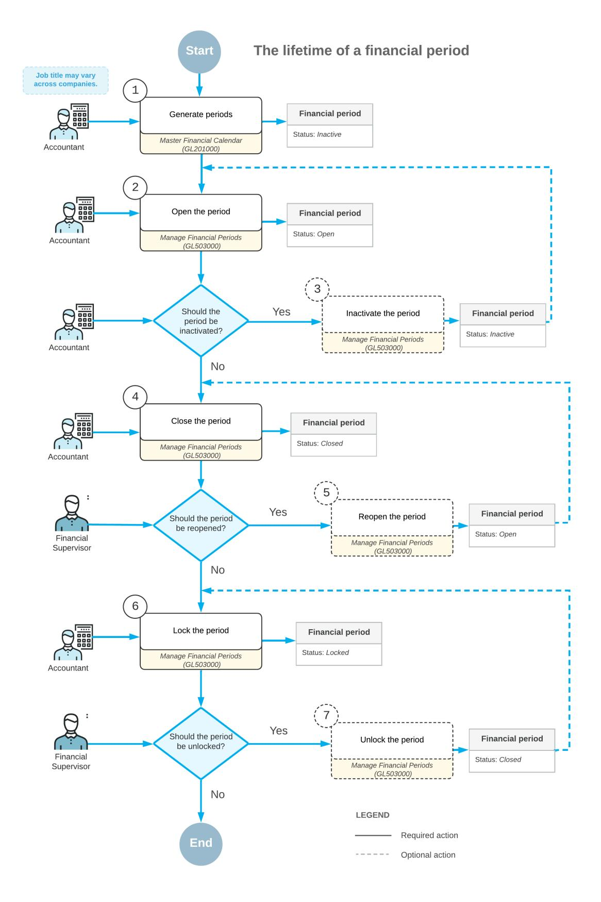

The lifetime of a financial period in the system includes the following actions:

1. A financial administrator generates the financial period with the *Inactive* status.

- 2. To give users the ability to create a record in this period or post a transaction to the period under one of the company branches, the financial administrator must open the needed period in the company. This gives the period the *Open* status, and it can be used in all subledgers.
- 3. Optional: The financial administrator inactivates an open period in the system to prevent users from posting transactions to this period. The inactivated period and the preceding periods will be assigned the *Inactive* status again.
- 4. When all the needed records have been processed in the period, the financial administrator closes the period to prevent erroneous posting. For a period to be closed in a subledger, it must not contain any unreleased documents (except for rejected and scheduled documents), and the previous period has to be closed in this subledger. For a period to be closed in the general ledger, it must not contain any unposted transactions (except for scheduled ones), it has to be closed in all other subledgers, and the previous period has to be closed in the general ledger. When the financial administrator closes the period, the period and the preceding periods in the range (that is, with the same status) will be assigned the *Closed* status.
- 5. Optional: A user to which the *Financial Supervisor* role is assigned reopens a closed period for posting. The reopening process sets the period's status to *Open* for the selected period or range of periods; optionally, the periods can be reopened in all subledgers.
- 6. To keep the data unchanged by all the users and the validation processes, the financial administrator locks a closed period. The period can be locked only if the previous period is locked as well. This process assigns the *Locked* status to the range of periods to which the selected period belongs.
- 7. Optional: If necessary, a user to which the *Financial Supervisor* role is assigned unlocks the period to assign the *Closed* status to it again so that the needed transactions can be posted to it.

| Form                                    | Criteria to Check                                                                                                                                                    | Notes |
|-----------------------------------------|----------------------------------------------------------------------------------------------------------------------------------------------------------------------|-------|
| Enable/Disable Features (CS100000)      | Make sure the minimal features have been<br>enabled, as described in Company Without<br>Branches: General Information.                                               |       |
| Master Financial Calendar<br>(GL201000) | Make sure that the financial year for which<br>you need to generate periods exists. For de<br>tails, see To Add the Next Financial Year and<br>Generate Its Periods. |       |

# <span id="page-81-0"></span>**Opening Financial Periods: Implementation Checklist**

#### **Settings That Affect the Workflow**

The following settings and entities should be specified and defined, respectively:

- The following common settings should be specified on the *[Enable/Disable Features](https://help-2025r1.acumatica.com/Help?ScreenId=ShowWiki&pageid=c1555e43-1bc5-4f6f-ba9d-b323f94d8a6b)* (CS100000) form:
  - The *Multibranch Support* and *Multicompany Support* features should be enabled to maintain multiple companies in one tenant and multiple branches and to make it possible to enable *Centralized Period Management* feature.
  - The *Centralized Period Management* feature should be disabled to make it possible to open, close, and lock a particular financial period separately for each company within the tenant.
- The following general ledger settings should be specified on the **PostingSettings** tab of the *[General Ledger](https://help-2025r1.acumatica.com/Help?ScreenId=ShowWiki&pageid=e4913d06-c511-4258-a0f9-f36c1b854e6b) [Preferences](https://help-2025r1.acumatica.com/Help?ScreenId=ShowWiki&pageid=e4913d06-c511-4258-a0f9-f36c1b854e6b)* (GL102000) form:

To ensure that the system has been configured properly for the opening of financial periods, make sure that the criteria listed in the table have been met in the system as described.

• Select the **Restrict Access to Closed Periods** check box to allow posting to closed periods to only users belonging to the *Financial Supervisor* role.

With these settings specified, users in your company can record and process documents in Acumatica ERP quickly and accurately, with a minimum of manual actions.

# <span id="page-82-0"></span>**Opening Financial Periods: Process Activity**

In this activity, you will learn how to open a period in the subledgers and in the general ledger.

#### **Video Tutorial**

This video shows you the common process but may contain less detail than the activity has. If you want to repeat the activity on your own or you are preparing to take the certification exam, we recommend that you follow the instructions in the steps of the activity.

#### *[FEEDBACK](https://www.surveymonkey.com/r/BLBL7RJ?Video=Opening%20Financial%20Periods&Source=Open%20Uni&Course=F100)*

#### **Story**

Suppose that at the end of November 2026, acting as an accountant of the SweetLife Fruits & Jams company, you need to open the next financial period—*12-2026*—to enable users to post transactions to it.

#### **Process Overview**

In this activity, you will review the statuses of periods on the *[Company Financial Calendar](https://help-2025r1.acumatica.com/Help?ScreenId=ShowWiki&pageid=65ec8509-a3de-4381-94f0-c5ae2f8546fb)* (GL201100) form, and open a new financial period on the *[Manage Financial Periods](https://help-2025r1.acumatica.com/Help?ScreenId=ShowWiki&pageid=eedf2adf-6ddc-4c33-932b-de60275c547f)* (GL503000) form.

In a production environment, before opening a period, you would make sure the following conditions are met:

- The *2026* financial year for which you want to open the financial period has been created.
- Financial periods (that have the *Inactive* status) have been generated for the *2026* year.

#### **System Preparation**

To prepare the system, do the following:

- 1. Launch the Acumatica ERP website with the *U100* dataset. Sign in as an accountant by using the following credentials:
  - Username: *johnson*
  - Password: *123*
- 2. On the Company and Branch Selection menu, also on the top pane of the Acumatica ERP screen, make sure that the *SweetLife Head Office and Wholesale Center* branch is selected. If it is not selected, click the Company and Branch Selection menu button to view the list of branches that you have access to, and then click *SweetLife Head Office and Wholesale Center*.
- 3. Make sure that the 2026 financial year has been created as described in *[Financial Calendar Generation:](#page-74-2) [Process Activity](#page-74-2)*.

#### **Step 1: Preparing to Open the Financial Period**

To prepare for opening the financial period, do the following:

- 1. Open the *[Company Financial Calendar](https://help-2025r1.acumatica.com/Help?ScreenId=ShowWiki&pageid=65ec8509-a3de-4381-94f0-c5ae2f8546fb)* (GL201100) form.
- 2. In the Selection area, specify the following settings:
  - **Company**: *SWEETLIFE* (inserted by default)
  - **Financial Year**: *2026*

In the table, notice that all of the periods have the *Inactive* status. These periods can be opened in the system.

#### **Step 2: Opening the Financial Period**

To open the financial period, do the following:

- 1. On the More menu of the *[Company Financial Calendar](https://help-2025r1.acumatica.com/Help?ScreenId=ShowWiki&pageid=65ec8509-a3de-4381-94f0-c5ae2f8546fb)* (GL201100) form, click **Open Periods**.
- 2. On the *[Manage Financial Periods](https://help-2025r1.acumatica.com/Help?ScreenId=ShowWiki&pageid=eedf2adf-6ddc-4c33-932b-de60275c547f)* (GL503000) form, which opens, notice that the system has selected the *Open* action in the Summary area. In the table, select the unlabeled check box for the *13-2026* period, and on the form toolbar, click **Process**, as shown in the following screenshot.

| TOOLS $\sim$<br><b>Manage Financial Periods</b> |          |                                                   |   |                        |                                             |                   |               |                    |                 |                   |                 |
|-------------------------------------------------|----------|---------------------------------------------------|---|------------------------|---------------------------------------------|-------------------|---------------|--------------------|-----------------|-------------------|-----------------|
|                                                 | Ò        | ↶                                                 |   | <b>PROCESS</b>         | <b>PROCESS ALL</b>                          | O<br>$\checkmark$ |               | UNPOSTED DOCUMENTS |                 | $\mathbf{x}$<br>ℍ |                 |
|                                                 |          | * Company:<br>Action:<br>From Year:<br>* To Year: |   |                        | SWEETLIFE - Sweet P<br>Open<br>2025<br>2026 | م                 |               |                    |                 |                   | ㅅ               |
| 目                                               | 0        | ◻                                                 |   | Financial<br>Period ID | <b>Description</b>                          |                   | <b>Status</b> | Closed<br>in AP    | Closed<br>in AR | Closed<br>in IN   | Closed<br>in CA |
|                                                 | 0        | ם                                                 | ☑ | 11-2025                | November                                    |                   | Inactive      | П                  | П               | П                 | п               |
|                                                 | 0        | n                                                 | ☑ | 12-2025                | December                                    |                   | Inactive      | П                  | П               | П                 | П               |
|                                                 | 0        | n                                                 | ☑ | 13-2025                | <b>Adjustment Period</b>                    |                   | Inactive      | п                  | п               | $\Box$            | п               |
|                                                 | 0        | D                                                 | ☑ | 01-2026                | January                                     |                   | Inactive      | □                  | П               | П                 | □               |
|                                                 | 0        | n                                                 | ☑ | 02-2026                | February                                    |                   | Inactive      | П                  | п               | □                 | П               |
|                                                 | 0        | D                                                 | ☑ | 03-2026                | March                                       |                   | Inactive      | $\Box$             | П               | $\Box$            | $\Box$          |
|                                                 | 0        | n                                                 | ☑ | 04-2026                | April                                       |                   | Inactive      | п                  | п               | П                 | П               |
|                                                 | 0        | ם                                                 | ☑ | 05-2026                | May                                         |                   | Inactive      | П                  | П               | П                 | $\Box$          |
|                                                 | 0        | D                                                 | ☑ | 06-2026                | June                                        |                   | Inactive      | П                  | п               | П                 | п               |
|                                                 | 0        | ם                                                 | ☑ | 07-2026                | July                                        |                   | Inactive      | п                  | п               | П                 | П               |
|                                                 | 0        | n                                                 | ☑ | 08-2026                | August                                      |                   | Inactive      | П                  | п               | $\Box$            | П               |
|                                                 | 0        | n                                                 | ☑ | 09-2026                | September                                   |                   | Inactive      | п                  | п               | □                 | п               |
|                                                 | 0        | n                                                 | ☑ | 10-2026                | October                                     |                   | Inactive      | п                  | П               | П                 | п               |
|                                                 | 0        |                                                   | ☑ | 11-2026                | November                                    |                   | Inactive      | П                  | п               | □                 | п               |
|                                                 | 0        |                                                   | ☑ | 12-2026                | December                                    |                   | Inactive      | □                  | $\Box$          | □                 | □               |
| $\rightarrow$                                   | $\omega$ | ◻                                                 | ☑ | 13-2026                | <b>Adjustment Period</b>                    |                   | Inactive      | п                  | п               | П                 | П               |

*Figure: The period selected for opening*

3. In the **Processing** pop-up window, which is opened, click **Close**.

# <span id="page-84-2"></span><span id="page-84-0"></span>**Managing Financial Periods**

In this chapter, you will find general information on how to manage financial periods, a checklist for system implementation, and activities that describe how to lock, unlock, reopen, and deactivate financial periods subledgers and in the general ledger.

# <span id="page-84-3"></span><span id="page-84-1"></span>**Financial Periods: General Information**

Early in the configuration of Acumatica ERP, financial periods were configured to meet your company's needs and to organize the journal transactions posted to make financial statements and reports meaningful. Over time, you manage these periods to keep your organization's financial processes flowing smoothly. This chapter contains instructions on maintaining financial periods in Acumatica ERP.

#### **Learning Objectives**

In this chapter, you will learn how to do the following:

- Lock a financial period in a subledger
- Unlock a locked financial period in a subledger
- Reopen a financial period in the subledgers and the general ledger at the same time
- Deactivate a financial period in the subledgers and the general ledger

#### **Statuses of Financial Periods**

Every financial period belongs to a range of periods that have a particular status—*Inactive*, *Open*, *Closed*, or *Locked*. The system can contain four period ranges, each with a different status.

The example shown in the following screenshot illustrates multiple period ranges in the system, with the periods in each range having a particular status that is valid in the system. You can see the following ranges of periods:

- *01-2024* to *02-2024*, whose periods have the *Locked* status
- *03-2024* to *04-2024*, whose periods have the *Closed* status
- *05-2024* to *10-2024*, whose periods have the *Open* status
- *11-2024* to *13-2024*, whose periods have the *Inactive* status

| Company Financial Calendar |                                        |              |                   |          |                     | <b>PNOTES</b>            | <b>ACTIVITIES</b> | <b>FILES</b>    | TOOLS $\blacktriangledown$ |                         |                         |
|----------------------------|----------------------------------------|--------------|-------------------|----------|---------------------|--------------------------|-------------------|-----------------|----------------------------|-------------------------|-------------------------|
|                            | К<br>↶                                 | ≺            | ⋗                 | Ы        | .                   |                          |                   |                 |                            |                         |                         |
|                            | * Company:                             |              |                   |          | SWEETLIFE - Sweet Q |                          |                   |                 |                            |                         | ㅅ                       |
|                            | * Financial Year:                      |              |                   | 2024     |                     | ₽                        |                   |                 |                            |                         |                         |
|                            | Start Date:                            |              |                   | 1/1/2024 |                     |                          |                   |                 |                            |                         |                         |
|                            | Number of Periods:                     |              |                   |          | 13                  |                          |                   |                 |                            |                         |                         |
|                            | ↻<br>$\left  \leftrightarrow \right $  | $\mathbf{x}$ |                   |          |                     |                          |                   |                 |                            |                         |                         |
|                            | <b>目 Financial</b><br><b>Period ID</b> |              | <b>Start Date</b> |          | <b>End Date</b>     | <b>Description</b>       | <b>Status</b>     | Closed<br>in AP | Closed<br>in AR            | Closed<br>in IN         | Closed<br>in CA         |
| ≻                          | 01-2024                                |              | 1/1/2024          |          | 1/31/2024           | January                  | Locked            | ☑               | ☑                          | ☑                       | ☑                       |
|                            | 02-2024                                |              | 2/1/2024          |          | 2/29/2024           | February                 | Locked            | ☑               | ☑                          | ☑                       | $\overline{\mathsf{S}}$ |
|                            | 03-2024                                |              | 3/1/2024          |          | 3/31/2024           | March                    | Closed            | ☑               | $\blacktriangledown$       | $\overline{\mathsf{S}}$ | $\overline{\mathsf{v}}$ |
|                            | 04-2024                                |              | 4/1/2024          |          | 4/30/2024           | April                    | Closed            | ☑               | $\triangledown$            | ☑                       | $\overline{\mathsf{v}}$ |
|                            | 05-2024                                |              | 5/1/2024          |          | 5/31/2024           | May                      | Open              | $\Box$          | $\Box$                     | $\Box$                  | $\Box$                  |
|                            | 06-2024                                |              | 6/1/2024          |          | 6/30/2024           | June                     | Open              | $\Box$          | $\Box$                     | $\Box$                  | $\Box$                  |
|                            | 07-2024                                |              | 7/1/2024          |          | 7/31/2024           | July                     | Open              | $\Box$          | $\Box$                     | $\Box$                  | $\Box$                  |
|                            | 08-2024                                |              | 8/1/2024          |          | 8/31/2024           | August                   | Open              | $\Box$          | $\Box$                     | $\Box$                  | $\Box$                  |
|                            | 09-2024                                |              | 9/1/2024          |          | 9/30/2024           | September                | Open              | $\Box$          | $\Box$                     | $\Box$                  | $\Box$                  |
|                            | 10-2024                                |              | 10/1/2024         |          | 10/31/2024          | October                  | Open              | □               | $\Box$                     | $\Box$                  | $\Box$                  |
|                            | 11-2024                                |              | 11/1/2024         |          | 11/30/2024          | November                 | Inactive          | $\Box$          | $\Box$                     | $\Box$                  | □                       |
|                            | 12-2024                                |              | 12/1/2024         |          | 12/31/2024          | December                 | Inactive          | $\Box$          | $\Box$                     | $\Box$                  | $\Box$                  |
|                            | 13-2024                                |              | 12/31/2024        |          | 12/31/2024          | <b>Adjustment Period</b> | Inactive          | □               | П                          | $\Box$                  | □                       |

#### *Figure: Ranges of financial periods with particular statuses*

The following table lists the possible statuses of financial periods, describes each status, and presents the action or actions that you can perform to change the statuses of periods of each listed status. You can perform actions on periods on the *[Manage Financial Periods](https://help-2025r1.acumatica.com/Help?ScreenId=ShowWiki&pageid=eedf2adf-6ddc-4c33-932b-de60275c547f)* (GL503000) form by clicking buttons on the form toolbar or the equivalent commands on the More menu.

| Status   | Description of a Period with This Status                                                                                             | Actions That Can Be Per<br>formed                                                 |
|----------|--------------------------------------------------------------------------------------------------------------------------------------|-----------------------------------------------------------------------------------|
| Inactive | An inactive period has been generated in the system but has<br>not yet been opened. Transactions cannot be posted to the pe<br>riod. | Open the period by clicking<br>Open                                               |
| Open     | An open period can be selected in records, and transactions<br>can be posted to it.                                                  | Close the period by clicking<br>Close or deactivate it by click<br>ing Deactivate |

| Status | Description of a Period with This Status                                                                                                                                                                                                                                                                                                                                                                                    | Actions That Can Be Per<br>formed                                      |  |
|--------|-----------------------------------------------------------------------------------------------------------------------------------------------------------------------------------------------------------------------------------------------------------------------------------------------------------------------------------------------------------------------------------------------------------------------------|------------------------------------------------------------------------|--|
| Closed | A closed period cannot be selected in records, and users can be<br>restricted from posting to it.<br>If the Restrict Access to Closed Periods check box is selected<br>on the General Ledger Preferences (GL102000) form, transac<br>tions can be posted to a closed period by only users to whom<br>the Financial Supervisor role has been assigned. If this check<br>box is cleared, any user can post to closed periods. | Lock the period by clicking<br>Lock or reopen it by clicking<br>Reopen |  |
| Locked | A locked period cannot be selected in a record, and transac<br>tions cannot be posted to it in any subledger.<br>You lock a period to prevent changes to period-specific data<br>that has been verified and disclosed in reports.                                                                                                                                                                                           | Unlock the period by clicking<br>Unlock                                |  |

The following diagram illustrates the statuses in the lifetime of financial periods in the system, along with the actions that change the statuses of these periods.

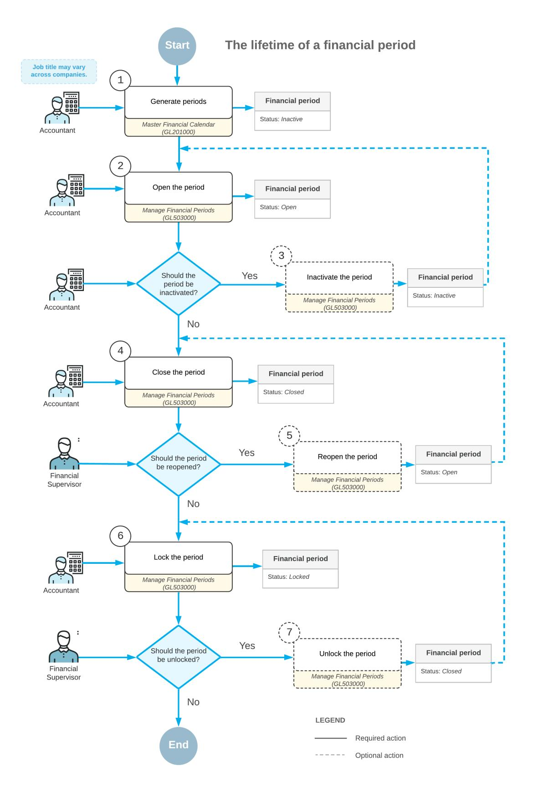

The lifetime of a financial period in the system includes the following actions:

1. A financial administrator generates the financial period with the *Inactive* status.

- 2. To give users the ability to create a record in this period or post a transaction to the period under one of the company branches, the financial administrator must open the needed period in the company. This gives the period the *Open* status, and it can be used in all subledgers.
- 3. Optional: The financial administrator inactivates an open period in the system to prevent users from posting transactions to this period. The inactivated period and the preceding periods will be assigned the *Inactive* status again.
- 4. When all the needed records have been processed in the period, the financial administrator closes the period to prevent erroneous posting. For a period to be closed in a subledger, it must not contain any unreleased documents (except for rejected and scheduled documents), and the previous period has to be closed in this subledger. For a period to be closed in the general ledger, it must not contain any unposted transactions (except for scheduled ones), it has to be closed in all other subledgers, and the previous period has to be closed in the general ledger. When the financial administrator closes the period, the period and the preceding periods in the range (that is, with the same status) will be assigned the *Closed* status.
- 5. Optional: A user to which the *Financial Supervisor* role is assigned reopens a closed period for posting. The reopening process sets the period's status to *Open* for the selected period or range of periods; optionally, the periods can be reopened in all subledgers.
- 6. To keep the data unchanged by all the users and the validation processes, the financial administrator locks a closed period. The period can be locked only if the previous period is locked as well. This process assigns the *Locked* status to the range of periods to which the selected period belongs.
- 7. Optional: If necessary, a user to which the *Financial Supervisor* role is assigned unlocks the period to assign the *Closed* status to it again so that the needed transactions can be posted to it.

#### **Locking of Periods**

Once a period has been closed and the data from this period has been verified and disclosed in financial reports, you need to secure this data from further changes. To do this, you need to lock this period—which changes its status from *Closed* to *Locked*—on the *[Manage Financial Periods](https://help-2025r1.acumatica.com/Help?ScreenId=ShowWiki&pageid=eedf2adf-6ddc-4c33-932b-de60275c547f)* (GL503000) form. For detailed instructions, see *[Financial](#page-91-2) Periods: To Lock a Period*.

If necessary, you can unlock a locked period. For instructions, see *[Financial](#page-93-1) Periods: To Unlock a Period*.

#### **Reopening of Periods**

You use the *[Manage Financial Periods](https://help-2025r1.acumatica.com/Help?ScreenId=ShowWiki&pageid=eedf2adf-6ddc-4c33-932b-de60275c547f)* (GL503000) form to reopen periods that have been closed. You can reopen a period in the general ledger only (with the period staying closed in all the subledgers) or you can select the **Reopen Financial Periods in All Modules** check box to reopen this period in all the subledgers and the general ledger at the same time. If you need to open a period in a particular subledger, you select *Reopen* in the **Action** box on one of the following forms before invoking processing for the selected period or periods:

- For accounts payable: The *[Close Financial Periods](https://help-2025r1.acumatica.com/Help?ScreenId=ShowWiki&pageid=3230e8df-a7c7-4d51-b6c6-00dff0ae48dd)* (AP506000) form
- For accounts receivable: The *[Close Financial Periods](https://help-2025r1.acumatica.com/Help?ScreenId=ShowWiki&pageid=c2c5bb0b-afb1-4b9d-8828-f70ff8f07add)* (AR506000) form
- For cash management: The *[Close Financial Periods](https://help-2025r1.acumatica.com/Help?ScreenId=ShowWiki&pageid=c6fc2284-7d00-43c2-a9ef-e265bc0ee8ce)* (CA506000) form
- For inventory: The *[Close Financial Periods](https://help-2025r1.acumatica.com/Help?ScreenId=ShowWiki&pageid=e50ee1c8-7500-427f-a1b6-d2bf564f54a5)* (IN509000) form
- For fixed assets: The *[Close Financial Periods](https://help-2025r1.acumatica.com/Help?ScreenId=ShowWiki&pageid=616e67c8-d189-449a-ab96-75ff4465df94)* (FA509000) form

For detailed instructions, see *[Financial](#page-95-1) Periods: To Reopen a Period*.

#### **Deactivation of Periods**

If periods have been opened by mistake, to prevent posting to these periods, you can deactivate these financial periods for the master calendar or a company calendar on the *[Manage Financial Periods](https://help-2025r1.acumatica.com/Help?ScreenId=ShowWiki&pageid=eedf2adf-6ddc-4c33-932b-de60275c547f)* (GL503000) form.

If you need to review the statuses of periods before deactivating them, you open the *[Master Financial Calendar](https://help-2025r1.acumatica.com/Help?ScreenId=ShowWiki&pageid=d46a8e03-b211-44c2-b17c-01ae813ead1b)* (GL201000) form if the *Centralized Period Management* feature is enabled, or the *[Company Financial Calendar](https://help-2025r1.acumatica.com/Help?ScreenId=ShowWiki&pageid=65ec8509-a3de-4381-94f0-c5ae2f8546fb)*

(GL201100) form if this feature is disabled. From either form, you then navigate to the *[Manage Financial Periods](https://help-2025r1.acumatica.com/Help?ScreenId=ShowWiki&pageid=eedf2adf-6ddc-4c33-932b-de60275c547f)* form by clicking **Deactivate Periods** on the More menu.

<span id="page-89-1"></span>For detailed instructions, see *Financial Periods: To [Deactivate](#page-97-1) a Period*.

# <span id="page-89-0"></span>**Financial Periods: Posting Transactions**

In general, the process of posting transactions to financial periods consists of the following steps:

- 1. Generating financial periods for the appropriate year on the *[Master Financial Calendar](https://help-2025r1.acumatica.com/Help?ScreenId=ShowWiki&pageid=d46a8e03-b211-44c2-b17c-01ae813ead1b)* (GL201000) form: You have to generate periods for each year you want to keep records for before you post transactions to these periods. For details, see *[Master Calendar Generation](#page-48-3)*.
- 2. Opening the necessary financial periods for the year on the *[Manage Financial Periods](https://help-2025r1.acumatica.com/Help?ScreenId=ShowWiki&pageid=eedf2adf-6ddc-4c33-932b-de60275c547f)* (GL503000) form: To be able to post transactions to the periods, you have to open them in the system. For details, see *[Opening](#page-77-2) [Financial Periods](#page-77-2)*.
- 3. Creating documents in the system and posting transactions to a period on various data entry forms: In the system, you can create documents and post them to open periods.
- 4. Closing the financial period on the *[Manage Financial Periods](https://help-2025r1.acumatica.com/Help?ScreenId=ShowWiki&pageid=eedf2adf-6ddc-4c33-932b-de60275c547f)* form: Aer all the needed transactions have been posted and all figures have been verified, to prevent users from posting transactions to the period, you should close the period in the system. (If you need to close a period in a particular subledger only, you do it on the Closing Periods form of this subledger.) For details, see *Closing [Financial](#page-62-2) Periods: To Close a Period in [a Subledger](#page-62-2)* and *Closing Financial Periods: To Close a Period in [Subledgers](#page-65-1) and GL*.
- 5. Reopening a financial period in the system on the *[Manage Financial Periods](https://help-2025r1.acumatica.com/Help?ScreenId=ShowWiki&pageid=eedf2adf-6ddc-4c33-932b-de60275c547f)* form: You can reopen a period in the general ledger only (in this case, the period stays closed in all the subledgers) or you can select the **Reopen Financial Periods in All Modules** check box to reopen this period in all the subledgers and the general ledger at the same time. For details, see *[Financial](#page-95-1) Periods: To Reopen a Period*. If you need to open a period in a particular subledger, you select *Reopen* in the **Action** box on one of the following forms:
  - For accounts payable: the *[Close Financial Periods](https://help-2025r1.acumatica.com/Help?ScreenId=ShowWiki&pageid=3230e8df-a7c7-4d51-b6c6-00dff0ae48dd)* (AP506000) form
  - For accounts receivable: the *[Close Financial Periods](https://help-2025r1.acumatica.com/Help?ScreenId=ShowWiki&pageid=c2c5bb0b-afb1-4b9d-8828-f70ff8f07add)* (AR506000) form
  - For cash management: the *[Close Financial Periods](https://help-2025r1.acumatica.com/Help?ScreenId=ShowWiki&pageid=c6fc2284-7d00-43c2-a9ef-e265bc0ee8ce)* (CA506000) form
  - For inventory: the *[Close Financial Periods](https://help-2025r1.acumatica.com/Help?ScreenId=ShowWiki&pageid=e50ee1c8-7500-427f-a1b6-d2bf564f54a5)* (IN509000) form
  - For fixed assets: the *[Close Financial Periods](https://help-2025r1.acumatica.com/Help?ScreenId=ShowWiki&pageid=616e67c8-d189-449a-ab96-75ff4465df94)* (FA509000) form
- 6. Optional: Creating any missed documents and posting transactions to the closed period: On the *[General](https://help-2025r1.acumatica.com/Help?ScreenId=ShowWiki&pageid=e4913d06-c511-4258-a0f9-f36c1b854e6b) [Ledger Preferences](https://help-2025r1.acumatica.com/Help?ScreenId=ShowWiki&pageid=e4913d06-c511-4258-a0f9-f36c1b854e6b)* (GL102000) form, you can configure the system to allow only particular users or all users to post transactions to closed periods. We recommend assigning particular users to the *Financial Supervisor* role on the *[User Roles](https://help-2025r1.acumatica.com/Help?ScreenId=ShowWiki&pageid=c2879f3c-3739-430a-b02b-c225f5480966)* (SM201005) form to give only these users the ability to post to closed periods at all times; for details, see *[User Roles: Predefined Roles](https://help-2025r1.acumatica.com/Help?ScreenId=ShowWiki&pageid=cdd2ae45-630a-4fae-9d7f-3dac7db2c297)*. Alternatively, you can clear the **Restrict Access to Closed Periods** check box (which is selected by default) on the *[General Ledger Preferences](https://help-2025r1.acumatica.com/Help?ScreenId=ShowWiki&pageid=e4913d06-c511-4258-a0f9-f36c1b854e6b)* form to give all users of your organization the ability to post to closed periods. If you have found that more transactions have to be posted to an already-closed period, you can then create and post these transactions. For details, see *[Closing Financial Periods: General Information](#page-55-3)*.
- 7. Locking the financial period on the *[Manage Financial Periods](https://help-2025r1.acumatica.com/Help?ScreenId=ShowWiki&pageid=eedf2adf-6ddc-4c33-932b-de60275c547f)* form: When the data from a particular period has been verified and disclosed in financial reports, you can prevent changes to this data by locking the period. A locked period will not be used by validation processes, for data entry, or for posting in any modules. For details, see *[Financial](#page-91-2) Periods: To Lock a Period*.
- 8. Unlocking the financial period on the *[Manage Financial Periods](https://help-2025r1.acumatica.com/Help?ScreenId=ShowWiki&pageid=eedf2adf-6ddc-4c33-932b-de60275c547f)* form: You may want to unlock a period or a range of periods to assign them the *Closed* status. For details, see *[Financial](#page-93-1) Periods: To Unlock a Period*.

The following diagram illustrates the process of posting transactions to a financial period.

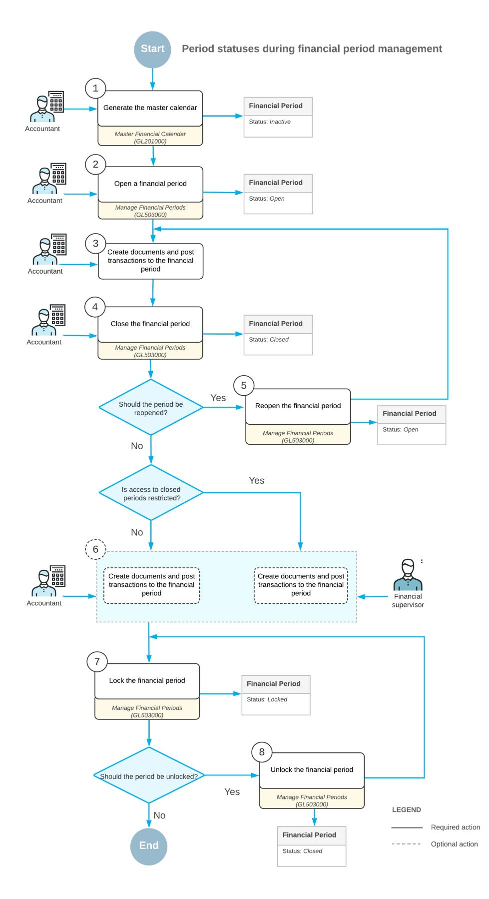

*Figure: Process of posting transactions to financial periods*

#### **Related Links**

- *[Master Calendar Generation](#page-48-3)*
- *[Closing Financial Periods: General Information](#page-55-3)*
- *Closing Financial Periods: To Close a Period in a [Subledger](#page-62-2)*
- *Closing Financial Periods: To Close a Period in [Subledgers](#page-65-1) and GL*
- *Financial Periods: To [Deactivate](#page-97-1) a Period*
- *To [Generate](#page-52-1) Periods for New Financial Years in Master Calendar*
- *[Manage Financial Periods](https://help-2025r1.acumatica.com/Help?ScreenId=ShowWiki&pageid=eedf2adf-6ddc-4c33-932b-de60275c547f)*
- *[Master Financial Calendar](https://help-2025r1.acumatica.com/Help?ScreenId=ShowWiki&pageid=d46a8e03-b211-44c2-b17c-01ae813ead1b)*

# <span id="page-91-0"></span>**Financial Periods: Implementation Checklist**

To ensure that the system has been configured properly for managing financial periods, make sure that the criteria listed in the table have been met in the system as described.

| Form                               | Criteria to Check                                                                                                      | Notes |
|------------------------------------|------------------------------------------------------------------------------------------------------------------------|-------|
| Enable/Disable Features (CS100000) | Make sure the minimal features have been<br>enabled, as described in Company Without<br>Branches: General Information. |       |

#### **Settings That Affect the Workflow**

The following settings and entities should be specified and defined, respectively:

- The following common settings should be specified on the *[Enable/Disable Features](https://help-2025r1.acumatica.com/Help?ScreenId=ShowWiki&pageid=c1555e43-1bc5-4f6f-ba9d-b323f94d8a6b)* (CS100000) form:
  - The *Multibranch Support* and *Multicompany Support* features should be enabled to maintain multiple companies in one tenant and multiple branches and to make it possible to enable *Centralized Period Management* feature.
  - The *Centralized Period Management* feature should be disabled to make it possible to open, close, and lock a particular financial period separately for each company within the tenant.
- The following general ledger settings should be specified on the **PostingSettings** tab of the *[General Ledger](https://help-2025r1.acumatica.com/Help?ScreenId=ShowWiki&pageid=e4913d06-c511-4258-a0f9-f36c1b854e6b) [Preferences](https://help-2025r1.acumatica.com/Help?ScreenId=ShowWiki&pageid=e4913d06-c511-4258-a0f9-f36c1b854e6b)* (GL102000) form:
  - Select the **Restrict Access to Closed Periods** check box to allow posting to closed periods to only users belonging to the *Financial Supervisor* role.
- The following settings should be specified on the *[User Roles](https://help-2025r1.acumatica.com/Help?ScreenId=ShowWiki&pageid=c2879f3c-3739-430a-b02b-c225f5480966)* (SM201005) form:
  - Make sure that the user you are going to use in the process activities later has been assigned to the *Financial Supervisor* role. Users assigned to this role can reopen *Closed* periods and unlock *Locked* periods, and also post to closed periods even if the **Restrict Access to Closed Periods** check box is selected on the *[General Ledger Preferences](https://help-2025r1.acumatica.com/Help?ScreenId=ShowWiki&pageid=e4913d06-c511-4258-a0f9-f36c1b854e6b)* form.

With these settings specified, users in your company can record and process documents in Acumatica ERP quickly and accurately, with a minimum of manual actions.

# <span id="page-91-2"></span><span id="page-91-1"></span>**Financial Periods: To Lock a Period**

In this activity, you will learn how to lock a period in a particular company.

#### **Video Tutorial**

This video shows you the common process but may contain less detail than the activity has. If you want to repeat the activity on your own or you are preparing to take the certification exam, we recommend that you follow the instructions in the steps of the activity.

*[FEEDBACK](https://www.surveymonkey.com/r/BLBL7RJ?Video=Managing%20Financial%20Periods&Source=Open%20Uni&Course=F100)*

#### **Story**

Suppose that now that the accounting department of the SweetLife Fruits & Jams company has finished verifying all the figures disclosed in reports, users should be prevented from posting transactions to the appropriate periods.

Acting as SweetLife's chief accountant, you have to lock these periods in the system.

#### **Process Overview**

In this activity, you will review period statuses on the *[Company Financial Calendar](https://help-2025r1.acumatica.com/Help?ScreenId=ShowWiki&pageid=65ec8509-a3de-4381-94f0-c5ae2f8546fb)* (GL201100) form, and then lock a particular financial period on the *[Manage Financial Periods](https://help-2025r1.acumatica.com/Help?ScreenId=ShowWiki&pageid=eedf2adf-6ddc-4c33-932b-de60275c547f)* (GL503000) form.

#### **System Preparation**

To prepare the system, do the following:

- 1. Launch the Acumatica ERP website with the *U100* dataset. Sign in as an accountant by using the following credentials:
  - Username: *johnson*
  - Password: *123*
- 2. On the Company and Branch Selection menu, also on the top pane of the Acumatica ERP screen, make sure that the *SweetLife Head Office and Wholesale Center* branch is selected. If it is not selected, click the Company and Branch Selection menu button to view the list of branches that you have access to, and then click *SweetLife Head Office and Wholesale Center*.
- 3. Make sure that some of the periods of 2024 have been closed as described in *Closing [Financial](#page-65-1) Periods: To [Close a Period in Subledgers and GL](#page-65-1)*.

#### **Step: Locking a Financial Period**

To lock the *02-2024* financial period, do the following:

- 1. Open the *[Company Financial Calendar](https://help-2025r1.acumatica.com/Help?ScreenId=ShowWiki&pageid=65ec8509-a3de-4381-94f0-c5ae2f8546fb)* (GL201100) form.
- 2. In the Selection area, specify the following settings:
  - **Company**: *SWEETLIFE* (inserted by default)
  - **Financial Year**: *2024*

In the table, notice that some of the periods have the *Closed* status. These periods can be locked.

- 3. On the More menu, click **Lock Periods**.
- 4. On the *[Manage Financial Periods](https://help-2025r1.acumatica.com/Help?ScreenId=ShowWiki&pageid=eedf2adf-6ddc-4c33-932b-de60275c547f)* (GL503000) form, which opens, notice that the system has selected the *Lock* action in the Summary area. In the table, select the unlabeled check box for the *02-2024* period. The preceding periods are selected automatically.
- 5. On the form toolbar, click **Process**, as shown in the following screenshot.

| <b>Manage Financial Periods</b> |          |                                     |            |                        |                                             |                   |               | TOOLS $\star$      |                 |                 |                 |
|---------------------------------|----------|-------------------------------------|------------|------------------------|---------------------------------------------|-------------------|---------------|--------------------|-----------------|-----------------|-----------------|
|                                 | Ò        | ↶                                   |            | <b>PROCESS</b>         | PROCESS ALL                                 | O<br>$\checkmark$ |               | UNPOSTED DOCUMENTS |                 | ⊠<br>ℍ          |                 |
|                                 |          | * Company:<br>Action:<br>* To Year: | From Year: |                        | SWEETLIFE - Sweet Q<br>Lock<br>2022<br>2024 | $\checkmark$<br>م |               |                    |                 |                 | $\sim$          |
| 目                               | $\omega$ | D                                   |            | Financial<br>Period ID | <b>Description</b>                          |                   | <b>Status</b> | Closed<br>in AP    | Closed<br>in AR | Closed<br>in IN | Closed<br>in CA |
|                                 | 0        | n                                   | ☑          | 01-2024                | January                                     |                   | Closed        | ☑                  | ☑               | ☑               | ☑               |
|                                 | 0        | ◻                                   | ☑          | 02-2024                | February                                    |                   | Closed        | ☑                  | ☑               | ☑               | ☑               |
|                                 | 0        | n                                   |            | 03-2024                | March                                       |                   | Closed        | ☑                  | ☑               | ☑               | ☑               |
|                                 | 0        | D                                   |            | 04-2024                | April                                       |                   | Closed        | ☑                  | ☑               | ☑               | ☑               |

#### *Figure: The periods selected for locking*

6. In the **Processing** pop-up window, which is opened, click the **Processed** tab, and review the list of periods that have been locked. Click **Close**.

### <span id="page-93-1"></span><span id="page-93-0"></span>**Financial Periods: To Unlock a Period**

In this activity, you will learn how to unlock financial periods and post a GL batch to a closed financial period.

#### **Video Tutorial**

This video shows you the common process but may contain less detail than the activity has. If you want to repeat the activity on your own or you are preparing to take the certification exam, we recommend that you follow the instructions in the steps of the activity.

#### *[FEEDBACK](https://www.surveymonkey.com/r/BLBL7RJ?Video=Managing%20Financial%20Periods&Source=Open%20Uni&Course=F100)*

#### **Story**

Suppose that at the end of January 2024, the *01-2024* financial period was locked for the SweetLife Fruits & Jams company. Acting as SweetLife's chief accountant, you have realized that it should not have been locked yet, because a transaction hasn't been entered in the system (a purchase of office supplies on January 31, 2024, in the amount of \$300).

You need to unlock the *01-2024* period and post this transaction to it.

#### **Process Overview**

In this activity, you will review period statuses on the *[Company Financial Calendar](https://help-2025r1.acumatica.com/Help?ScreenId=ShowWiki&pageid=65ec8509-a3de-4381-94f0-c5ae2f8546fb)* (GL201100) form, and unlock a particular financial period on the *[Manage Financial Periods](https://help-2025r1.acumatica.com/Help?ScreenId=ShowWiki&pageid=eedf2adf-6ddc-4c33-932b-de60275c547f)* (GL503000) form. You will then create and post a GL batch for this period on the *Journal [Transactions](https://help-2025r1.acumatica.com/Help?ScreenId=ShowWiki&pageid=dda046bc-5946-407f-88f7-1c0c966fbe72)* (GL301000) form.

#### **System Preparation**

To prepare the system, do the following:

- 1. Launch the Acumatica ERP website with the *U100* dataset. Sign in as an accountant by using the following credentials:
  - Username: *johnson*
  - Password: *123*
- 2. In the info area, in the upper-right corner of the top pane of the Acumatica ERP screen, click the Business Date menu button and select *1/31/2024*. For simplicity, in this process activity, you will create and process all documents in the system on this business date.
- 3. On the Company and Branch Selection menu, also on the top pane of the Acumatica ERP screen, make sure that the *SweetLife Head Office and Wholesale Center* branch is selected. If it is not selected, click the Company and Branch Selection menu button to view the list of branches that you have access to, and then click *SweetLife Head Office and Wholesale Center*.
- 4. Mare sure that the *01-2024* period has been locked as described in *[Financial](#page-91-2) Periods: To Lock a Period*.

#### **Step 1: Unlocking the Financial Period**

To unlock the *01-2024* financial period, do the following:

- 1. Open the *[Company Financial Calendar](https://help-2025r1.acumatica.com/Help?ScreenId=ShowWiki&pageid=65ec8509-a3de-4381-94f0-c5ae2f8546fb)* (GL201100) form.
- 2. In the Selection area, specify the following settings:
  - **Company**: *SWEETLIFE* (inserted by default)
  - **Financial Year**: *2024*

Notice that several periods have the *Locked* status.

- 3. On the More menu, click **Unlock Periods**.
- 4. On the *[Manage Financial Periods](https://help-2025r1.acumatica.com/Help?ScreenId=ShowWiki&pageid=eedf2adf-6ddc-4c33-932b-de60275c547f)* (GL503000) form, which opens, notice that the system has selected the *Unlock* action in the Summary area. In the table, select the unlabeled check box for the *01-2024* period. The following *02-2024* period is selected automatically.
- 5. On the form toolbar, click **Process**, as shown in the following screenshot.

| Manage Financial Periods  |                  |   |   |                        |                     |                  | TOOLS $\star$ |                    |                 |                 |                 |
|---------------------------|------------------|---|---|------------------------|---------------------|------------------|---------------|--------------------|-----------------|-----------------|-----------------|
|                           | Ò                | ↶ |   | <b>PROCESS</b>         | <b>PROCESS ALL</b>  | Ø<br>$\check{~}$ |               | UNPOSTED DOCUMENTS |                 | ⊠<br>ℍ          |                 |
|                           | * Company:       |   |   |                        | SWEETLIFE - Sweet O |                  |               |                    |                 |                 | ㅅ               |
|                           | Action:          |   |   |                        | Unlock              | $\checkmark$     |               |                    |                 |                 |                 |
| α<br>* From Year:<br>2024 |                  |   |   |                        |                     |                  |               |                    |                 |                 |                 |
|                           | To Year:<br>2024 |   |   |                        |                     |                  |               |                    |                 |                 |                 |
| 目                         | 0                | D | H | Financial<br>Period ID | <b>Description</b>  |                  | <b>Status</b> | Closed<br>in AP    | Closed<br>in AR | Closed<br>in IN | Closed<br>in CA |
|                           | 0                | ◧ | ☑ | 01-2024                | January             |                  | Locked        | ☑                  | ☑               | ☑               | ☑               |
|                           | 0                | ◻ | ☑ | 02-2024                | February            |                  | Locked        | ☑                  | ☑               | $\triangledown$ | ☑               |

#### *Figure: The periods selected for unlocking*

6. In the **Processing** pop-up window, which is opened, click **Close**.

The status of the periods has changed from *Locked* to *Closed*.

#### **Step 2: Posting a GL Batch to the Closed Period**

To create a GL batch and post it to the closed *01-2024* period, which you unlocked in the previous step, do the following:

1. Open the *Journal [Transactions](https://help-2025r1.acumatica.com/Help?ScreenId=ShowWiki&pageid=dda046bc-5946-407f-88f7-1c0c966fbe72)* (GL301000) form.


To open the form for creating a new record, type the form ID in the Search box, and on the Search form, point at the form title and click **New** right of the title.

- 2. On the form toolbar, click **Add New Record**, and specify the following settings in the Summary area:
  - **Module**: *GL* (inserted by default)
  - **Branch**: *HEADOFFICE* (inserted by default)
  - **Ledger**: *ACTUAL* (inserted by default)
  - **Transaction Date**: *01/31/2024*
  - **Post Period**: *01-2024*
  - **Description**: Office supplies
- 3. On the table toolbar, click **Add Row**, and specify the following settings for the added row:
  - **Branch**: *HEADOFFICE* (inserted by default)
  - **Account**: *62400*
  - **Debit Amount**: 300
- 4. Click **Add Row**, and specify the following settings for the added row:
  - **Branch**: *HEADOFFICE* (inserted by default)
  - **Account**: *10200*
  - **Credit Amount**: 300
- 5. On the form toolbar, click **Remove Hold**.
- 6. Notice the warning message that is displayed next to the **Post Period** box. It informs you that the *01-2024* period is closed in the *SWEETLIFE* company (but you still can post to this closed period). Click**Save** to save your changes.
- 7. On the form toolbar, click **Release** to release the transaction.

### <span id="page-95-1"></span><span id="page-95-0"></span>**Financial Periods: To Reopen a Period**

In this activity, you will learn how to reopen a financial period for a particular company in the general ledger and other subledgers at the same time.

#### **Video Tutorial**

This video shows you the common process but may contain less detail than the activity has. If you want to repeat the activity on your own or you are preparing to take the certification exam, we recommend that you follow the instructions in the steps of the activity.

#### *[FEEDBACK](https://www.surveymonkey.com/r/BLBL7RJ?Video=Managing%20Financial%20Periods&Source=Open%20Uni&Course=F100)*

#### **Story**

Suppose that acting as the chief accountant of the SweetLife Fruits & Jams company, you need to reopen a previously closed financial period (*02-2024*), so that users can post transactions to it without having to type the period manually (as they need to do when posting to closed periods).

#### **Process Overview**

In this activity, you will review period statuses on the *[Company Financial Calendar](https://help-2025r1.acumatica.com/Help?ScreenId=ShowWiki&pageid=65ec8509-a3de-4381-94f0-c5ae2f8546fb)* (GL201100) form, and then you will reopen a particular financial period on the *[Manage Financial Periods](https://help-2025r1.acumatica.com/Help?ScreenId=ShowWiki&pageid=eedf2adf-6ddc-4c33-932b-de60275c547f)* (GL503000) form.

#### **System Preparation**

To prepare the system, do the following:

- 1. Launch the Acumatica ERP website with the *U100* dataset. Sign in as an accountant by using the following credentials:
  - Username: *johnson*
  - Password: *123*
- 2. On the Company and Branch Selection menu, also on the top pane of the Acumatica ERP screen, make sure that the *SweetLife Head Office and Wholesale Center* branch is selected. If it is not selected, click the Company and Branch Selection menu button to view the list of branches that you have access to, and then click *SweetLife Head Office and Wholesale Center*.
- 3. Make sure that the *02-2024* period has been closed as described in *Closing [Financial](#page-65-1) Periods: To Close a [Period in Subledgers and GL](#page-65-1)*.

#### **Step: Reopening the Financial Period**

To reopen the *02-2024* financial period, do the following:

- 1. Open the *[Company Financial Calendar](https://help-2025r1.acumatica.com/Help?ScreenId=ShowWiki&pageid=65ec8509-a3de-4381-94f0-c5ae2f8546fb)* (GL201100) form.
- 2. In the Selection area, specify the following settings:
  - **Company**: *SWEETLIFE* (inserted by default)
  - **Financial Year**: *2024*

Notice that several periods in the table have the *Closed* status and the **Closed in AP**, **Closed in AR**, **Closed in IN**, and **Closed in CA** check boxes are selected.

- 3. On the More menu, click **Reopen Periods**.
- 4. On the *[Manage Financial Periods](https://help-2025r1.acumatica.com/Help?ScreenId=ShowWiki&pageid=eedf2adf-6ddc-4c33-932b-de60275c547f)* (GL503000) form, which opens, notice that the system has selected the *Reopen* action in the Summary area.
- 5. In the table, select the unlabeled check box for the *02-2024* period. The *03-2024* period and later periods are selected automatically.
- 6. To reopen the selected periods in all subledgers, select the **Reopen Financial Periods in All Modules** check box in the Selection area.
- 7. On the form toolbar, click **Process**, as shown in the following screenshot.

|   | <b>Manage Financial Periods</b> |                                   |              |                        |                                                                                          |                    |               |                         |                         | TOOLS $\sim$                 |                 |
|---|---------------------------------|-----------------------------------|--------------|------------------------|------------------------------------------------------------------------------------------|--------------------|---------------|-------------------------|-------------------------|------------------------------|-----------------|
|   | Ò                               | ↶                                 |              | <b>PROCESS</b>         | PROCESS ALL                                                                              | O).<br>$\check{~}$ |               | UNPOSTED DOCUMENTS      |                         | $\mathbf{\overline{x}}$<br>⊢ |                 |
|   |                                 | * Company:<br>Action:<br>To Year: | * From Year: |                        | SWEETLIFE - Sweet Q<br>Reopen<br>2024<br>2024<br>Reopen Financial Periods in All Modules | $\checkmark$<br>Q  |               |                         |                         |                              | $\lambda$       |
| 皀 | 0                               | D                                 |              | Financial<br>Period ID | <b>Description</b>                                                                       |                    | <b>Status</b> | Closed<br>in AP         | Closed<br>in AR         | Closed<br>in IN              | Closed<br>in CA |
|   | 0                               | D                                 |              | 01-2024                | January                                                                                  |                    | Closed        | $\overline{\checkmark}$ | ☑                       | ☑                            | ☑               |
|   | $\mathbf{0}$                    | D                                 | ☑            | 02-2024                | February                                                                                 |                    | Closed        | ☑                       | $\triangledown$         | ☑                            | ☑               |
|   | 0                               | ◧                                 | ☑            | 03-2024                | March                                                                                    |                    | <b>Closed</b> | $\overline{\checkmark}$ | $\overline{\checkmark}$ | ☑                            | ☑               |
|   | 0                               | D                                 | ☑            | 04-2024                | April                                                                                    |                    | Closed        | $\triangledown$         | ☑                       | ☑                            | ☑               |

#### *Figure: The periods selected for reopening in all subledgers and the general ledger*

8. In the **Processing** pop-up window, which is opened, click **Close**.

You can reopen a financial period in a particular subledger by performing similar instructions on the *[Close Financial Periods](https://help-2025r1.acumatica.com/Help?ScreenId=ShowWiki&pageid=3230e8df-a7c7-4d51-b6c6-00dff0ae48dd)* (AP506000), *[Close Financial Periods](https://help-2025r1.acumatica.com/Help?ScreenId=ShowWiki&pageid=c2c5bb0b-afb1-4b9d-8828-f70ff8f07add)* (AR509000), *[Close Financial Periods](https://help-2025r1.acumatica.com/Help?ScreenId=ShowWiki&pageid=c6fc2284-7d00-43c2-a9ef-e265bc0ee8ce)* (CA506000), *[Close Financial Periods](https://help-2025r1.acumatica.com/Help?ScreenId=ShowWiki&pageid=616e67c8-d189-449a-ab96-75ff4465df94)* (FA509000), and *[Close Financial Periods](https://help-2025r1.acumatica.com/Help?ScreenId=ShowWiki&pageid=e50ee1c8-7500-427f-a1b6-d2bf564f54a5)* (IN509000) forms.

## <span id="page-97-1"></span><span id="page-97-0"></span>**Financial Periods: To Deactivate a Period**

In this activity, you will learn how to deactivate a period for a particular company.

#### **Video Tutorial**

This video shows you the common process but may contain less detail than the activity has. If you want to repeat the activity on your own or you are preparing to take the certification exam, we recommend that you follow the instructions in the steps of the activity.

#### *[FEEDBACK](https://www.surveymonkey.com/r/BLBL7RJ?Video=Managing%20Financial%20Periods&Source=Open%20Uni&Course=F100)*

#### **Story**

Suppose that as an accountant of the SweetLife Fruits & Jams company, you have to deactivate the open *09-2025* financial period to prevent data entry clerks from posting transactions to it.

#### **Process Overview**

In this activity, you will review the status of the financial period on the *[Company Financial Calendar](https://help-2025r1.acumatica.com/Help?ScreenId=ShowWiki&pageid=65ec8509-a3de-4381-94f0-c5ae2f8546fb)* (GL201100) form and deactivate the period on the *[Manage Financial Periods](https://help-2025r1.acumatica.com/Help?ScreenId=ShowWiki&pageid=eedf2adf-6ddc-4c33-932b-de60275c547f)* (GL503000) form.

#### **System Preparation**

To prepare the system, do the following:

- 1. Launch the Acumatica ERP website with the *U100* dataset. Sign in as an accountant by using the following credentials:
  - Username: *johnson*
  - Password: *123*
- 2. On the Company and Branch Selection menu, also on the top pane of the Acumatica ERP screen, make sure that the *SweetLife Head Office and Wholesale Center* branch is selected. If it is not selected, click the Company and Branch Selection menu button to view the list of branches that you have access to, and then click *SweetLife Head Office and Wholesale Center*.

#### **Step: Deactivating the Financial Period**

To deactivate the open *09-2025* financial period, do the following:

- 1. Open the *[Company Financial Calendar](https://help-2025r1.acumatica.com/Help?ScreenId=ShowWiki&pageid=65ec8509-a3de-4381-94f0-c5ae2f8546fb)* (GL201100) form.
- 2. In the Selection area, specify the following settings:
  - **Company**: *SWEETLIFE* (inserted by default)
  - **Financial Year**: *2025*

Notice that some periods including *October* have the *Open* status.

- 3. On the More menu, click **Deactivate Periods**.
- 4. On the *[Manage Financial Periods](https://help-2025r1.acumatica.com/Help?ScreenId=ShowWiki&pageid=eedf2adf-6ddc-4c33-932b-de60275c547f)* (GL503000) form, which opens, notice that the system has selected the *Deactivate* action in the Summary area.
- 5. In the table, select the unlabeled check box for the *09-2025* period. Notice that the later periods have been selected automatically.
- 6. On the form toolbar, click **Process**, as shown on the following screenshot.

| <b>Manage Financial Periods</b> |          |                                                   |   |                        |                                                   |                   |               | TOOLS $\star$      |                 |                  |                 |
|---------------------------------|----------|---------------------------------------------------|---|------------------------|---------------------------------------------------|-------------------|---------------|--------------------|-----------------|------------------|-----------------|
|                                 | Ò        | ↶                                                 |   | <b>PROCESS</b>         | PROCESS ALL                                       | Ø<br>$\checkmark$ |               | UNPOSTED DOCUMENTS |                 | $\mathbf x$<br>ℍ |                 |
|                                 |          | * Company:<br>Action:<br>* From Year:<br>To Year: |   |                        | SWEETLIFE - Sweet Q<br>Deactivate<br>2025<br>2026 | $\checkmark$<br>م |               |                    |                 |                  | ∼               |
| 皀                               | 0        | ◻                                                 |   | Financial<br>Period ID | <b>Description</b>                                |                   | <b>Status</b> | Closed<br>in AP    | Closed<br>in AR | Closed<br>in IN  | Closed<br>in CA |
|                                 | $\omega$ | D                                                 | п | 01-2025                | January                                           |                   | Open          | П                  | $\Box$          | П                | П               |
|                                 | 0        | ◘                                                 |   | 02-2025                | February                                          |                   | Open          | П                  | $\Box$          | П                | П               |
|                                 | 0        | D                                                 |   | 03-2025                | March                                             |                   | Open          | П                  | П               | П                | П               |
|                                 | 0        | D                                                 |   | 04-2025                | April                                             |                   | Open          | □                  | П               | П                | □               |
|                                 | 0        | D                                                 |   | 05-2025                | May                                               |                   | Open          | П                  | $\Box$          | $\Box$           | П               |
|                                 | 0        | D                                                 |   | 06-2025                | June                                              |                   | Open          | п                  | $\Box$          | П                | П               |
|                                 | 0        | D                                                 |   | 07-2025                | July                                              |                   | Open          | □                  | П               | □                | □               |
|                                 | 0        | D                                                 |   | 08-2025                | August                                            |                   | Open          | □                  | □               | □                | □               |
| >                               | 0        | D                                                 | ☑ | 09-2025                | September                                         |                   | Open          | ш                  | П               | П                | □               |
|                                 | 0        | D                                                 | ☑ | 10-2025                | October                                           |                   | Open          | П                  | П               | □                | □               |
|                                 | 0        | ◻                                                 | ☑ | 11-2025                | November                                          |                   | Open          | □                  | П               | $\Box$           | □               |
|                                 | 0        | D                                                 | ☑ | 12-2025                | December                                          |                   | Open          | □                  | □               | □                | □               |
|                                 | 0        | ◘                                                 | ☑ | 13-2025                | <b>Adjustment Period</b>                          |                   | Open          | □                  | П               | □                | □               |

#### *Figure: The periods selected for deactivation*

7. In the **Processing** pop-up window, which is opened, click **Close**.

The statuses of the periods have changed from *Open* to *Inactive*.

# <span id="page-100-2"></span><span id="page-100-0"></span>**Year-End Closing**

In Acumatica ERP, a financial year is closed automatically when you close the last period of this financial year. Thus, you should close the last period of a particular financial year only when the company is ready to close the financial year.

In this topic, you will read about the closing procedure at the end of a year, and about the update of balances aer closing.

#### **Year-End Closing Procedure**

The year-end closing includes the following stages:

- 1. Generating periods for the new year and opening at least one of these periods, as described in *[Master](#page-48-3) [Calendar Generation](#page-48-3)*.
- 2. Carrying out the operations on your company's year-end checklist.
- 3. Closing the last period in the general ledger, as described in *Closing [Financial](#page-65-1) Periods: To Close a Period in [Subledgers and GL](#page-65-1)*.

#### **Balance Update**

Aer you close the financial year, the balances of the balance sheet accounts are simply transferred into the new financial year, while the balances of the temporary accounts are reset to zero. For details on these accounts, see *[YTD Net Income and Retained Earnings Accounts](#page-23-1)*.

#### **Related Links**

- *[Master Calendar Generation](#page-48-3)*
- *Financial Periods: Posting [Transactions](#page-89-1)*
- *Closing Financial Periods: To Close a Period in a [Subledger](#page-62-2)*
- *Closing Financial Periods: To Close a Period in [Subledgers](#page-65-1) and GL*
- *[YTD Net Income and Retained Earnings Accounts](#page-23-1)*
- *[Opening Financial Periods](#page-77-2)*
- *To [Generate](#page-52-1) Periods for New Financial Years in Master Calendar*

# <span id="page-100-3"></span><span id="page-100-1"></span>**To Add the Next Financial Year and Generate Its Periods**

In Acumatica ERP, you can add a new year and generate financial periods for each new year on the *[Master Financial](https://help-2025r1.acumatica.com/Help?ScreenId=ShowWiki&pageid=d46a8e03-b211-44c2-b17c-01ae813ead1b) [Calendar](https://help-2025r1.acumatica.com/Help?ScreenId=ShowWiki&pageid=d46a8e03-b211-44c2-b17c-01ae813ead1b)* (GL201000) form.


To open any form, you can navigate to it or search for it (by its name or by its form ID without periods). For more information about search capabilities, see *[Search](https://help-2025r1.acumatica.com/Help?ScreenId=ShowWiki&pageid=09ed14e6-3600-4d60-8267-66531025f5c3)*.

#### **To Generate Financial Periods**

- 1. Open the *[Master Financial Calendar](https://help-2025r1.acumatica.com/Help?ScreenId=ShowWiki&pageid=d46a8e03-b211-44c2-b17c-01ae813ead1b)* (GL201000) form.
- 2. On the form toolbar, click **Generate Calendar**.
- 3. In the **Generate GL Calendar** dialog box, which opens, in the **From Year** and **To Year** boxes, make sure that the required financial years are selected.

You can specify a range of financial years in these boxes.

4. Click **OK** to close the dialog box.

Periods have been generated with the *Inactive* status.

# <span id="page-102-2"></span><span id="page-102-0"></span>**Importing Financial Data**

Before you start working in Acumatica ERP, you can import into the system trial balances, general ledger transactions, vendor and customer records, and open documents from third-party soware.

If you import general ledger transactions for a period, you do not have to import the trial balance for this period because the trial balance is automatically calculated by the transactions in the system.

<span id="page-102-3"></span>In this chapter, you will read about importing trial balances.

# <span id="page-102-1"></span>**Preparation for Importing Trial Balances**

In Acumatica ERP, to initialize the system during initial implementation, you can import either a trial balance (or balances) or a number of GL transactions from a legacy system. Alternatively, you can import trial balances and then upload the GL transactions from subsequent periods. If you import the GL transactions, you do not need to import the trial balance because the trial balance will be computed by the system automatically based on the imported GL transactions. If you do not need to keep the history of GL transactions in Acumatica ERP, you can import the trial balance only.

Before importing the trial balance, you need to choose the period to start keeping records in Acumatica ERP, and decide whether you want to import the history of balances for multiple preceding periods or just one period. For example, if you start using Acumatica ERP in *01-2020*, you should import the trial balance for at least *12-2019*.

In the legacy system, you should prepare the data to be imported. For each required period, you should run the trial balance report.

In this topic, you will read about preparing the file with a trial balance and configuring the system for importing.

#### **Preparing and Editing the File to Be Imported**

From the third-party soware, you should export the prepared trial balance data to a CSV file or to an Excel spreadsheet. The file should have the following columns:

- *Account*: The number of the account whose balance is to be imported.
- *Subaccount*: The identifier of the subaccount to be imported. Specify a non-specific subaccount that fits the *SUBACCOUNT* segmented key in your system—for example, *000-00-00*. For details, see *[Segmented Identifiers](https://help-2025r1.acumatica.com/Help?ScreenId=ShowWiki&pageid=a2f667ab-0de9-4738-9f05-58e9cbfc1735)*.


This column is required only if you plan to use subaccounts with your accounts. In this case, the *Subaccounts* feature should be enabled in Acumatica ERP on the *[Enable/Disable Features](https://help-2025r1.acumatica.com/Help?ScreenId=ShowWiki&pageid=c1555e43-1bc5-4f6f-ba9d-b323f94d8a6b)* (CS100000) from.

• *YTD Balance*: The ending balance of the account-subaccount pair for the period. For this column, the *Currency* or *Text* format setting can be specified in the Excel file.


The file can contain multiple columns with the balances for different financial periods.

• *Currency YTD Balance*: The ending balance of the account-subaccount pair in the currency of denomination specified for the account for the period. If the account is not denominated, the *YTD Balance* and *Currency YTD Balance* columns hold the same value. For this column, the *Currency* or *Text* format setting can be specified in the Excel file.


This column is required only if you plan to use subaccounts with your accounts. In this case, the *Multicurrency Accounting* feature should be enabled in Acumatica ERP on the *[Enable/](https://help-2025r1.acumatica.com/Help?ScreenId=ShowWiki&pageid=c1555e43-1bc5-4f6f-ba9d-b323f94d8a6b) [Disable Features](https://help-2025r1.acumatica.com/Help?ScreenId=ShowWiki&pageid=c1555e43-1bc5-4f6f-ba9d-b323f94d8a6b)* from.

• *Description* (optional): A description of the account that you can add for your convenience while you work with the file. The description will not be uploaded to the system.

You should not import the balance of the *YTD Net Income* account; Acumatica ERP calculates this balance automatically from the imported balances of income and expense accounts.

#### **Configuring the System Before Importing a Trial Balance**

Depending on the way the account balances are presented in the trial balance in your legacy system (from which you are importing the data), you specify the sign of the trial balances in the**Sign of theTrial Balance** box in the **Chart of Accounts** section of the *[General Ledger Preferences](https://help-2025r1.acumatica.com/Help?ScreenId=ShowWiki&pageid=e4913d06-c511-4258-a0f9-f36c1b854e6b)* (GL102000) form as follows:

• If credit balances of liability and income accounts are presented with a plus sign, you select the *Normal* option. Normal balances satisfy the following validation criterion:

```
Total Debit Balance of the (Assets + Expense) Accounts = Total Credit Balance of the
(Income + Liabilities) Accounts
```

• If the credit balances of liability and income accounts are presented with a minus sign, you select the *Reversed* option. Reversed credit balances, which are implemented in some applications, satisfy the following validation criterion.

```
Total Debit Balance of (Assets + Expense) Accounts = – Total Credit Balance of (Income
+ Liabilities) Accounts)
```

This criterion can also be expressed as follows.

```
Total Debit Balance of (Assets + Expense) Accounts + Total Credit Balance of (Income +
Liabilities) Accounts = 0
```

#### **Related Links**

- *Import of Trial [Balances](#page-103-1)*
- *To Import a Trial [Balance](#page-105-1)*
- *[General Ledger Preferences](https://help-2025r1.acumatica.com/Help?ScreenId=ShowWiki&pageid=e4913d06-c511-4258-a0f9-f36c1b854e6b)*
- *Trial [Balance](https://help-2025r1.acumatica.com/Help?ScreenId=ShowWiki&pageid=410758bc-6dfc-41f7-913d-2f27fcb3b2ae)*

### <span id="page-103-1"></span><span id="page-103-0"></span>**Import of Trial Balances**

You have to import the trial balances one by one because each next General Ledger batch is generated in the amount of the difference between the trial balance for the previous period and the current imported balance. You have to import each trial balance in the following order:

- 1. You import the trial balance and process imported date on the *Trial [Balance](https://help-2025r1.acumatica.com/Help?ScreenId=ShowWiki&pageid=410758bc-6dfc-41f7-913d-2f27fcb3b2ae)* (GL303010) form. For details on data preparation for importing, see *[Preparation](#page-102-3) for Importing Trial Balances*.
- 2. You release the trial balance on the same form.
- 3. You release the generated batch on the *Journal [Transactions](https://help-2025r1.acumatica.com/Help?ScreenId=ShowWiki&pageid=dda046bc-5946-407f-88f7-1c0c966fbe72)* (GL301000) form. For details on processing batches, see *GL [Transactions:](#page-108-3) General Information*.
- 4. If the **Automatically Post on Release** check box is cleared on the *[General Ledger Preferences](https://help-2025r1.acumatica.com/Help?ScreenId=ShowWiki&pageid=e4913d06-c511-4258-a0f9-f36c1b854e6b)* (GL102000) form, you post the generated batch on the *Post [Transactions](https://help-2025r1.acumatica.com/Help?ScreenId=ShowWiki&pageid=dce8c656-0c7f-4bb9-af68-e9432317964c)* (GL502000) form.

- 5. Verify the imported balances.
- 6. (Optional) Import the next trial balance.

For detailed instructions on importing a trail balance, see *To Import a Trial [Balance](#page-105-1)*.

In this topic, you will read about mapping accounts and reviewing exceptions aer importing data from the prepared file as well as about releasing and editing the trial balance.

#### **Mapping Accounts**

You import data by preparing an Excel or CSV file with the trial balance and then uploading it on the *Trial [Balance](https://help-2025r1.acumatica.com/Help?ScreenId=ShowWiki&pageid=410758bc-6dfc-41f7-913d-2f27fcb3b2ae)* (GL303010) form. You import data to the posting ledger of the selected target branch for the specified financial period. For the import to complete successfully, you have to map the imported list of accounts (and subaccounts, if any) to the accounts (and subaccounts, if applicable) used in Acumatica ERP.

Aer you have uploaded the file with the trial balance, the list of accounts (and subaccounts) to be imported is displayed on the**Transaction Details** tab of the *Trial [Balance](https://help-2025r1.acumatica.com/Help?ScreenId=ShowWiki&pageid=410758bc-6dfc-41f7-913d-2f27fcb3b2ae)* form. Acumatica ERP performs most of the mapping of the imported accounts (and subaccounts) and the internal accounts (and subaccounts) when you select the *Validate* action and click **Process** or **Process All** on the table toolbar. However, aer the mapping process is finished, some lines may contain unmapped accounts (and subaccounts). These records are marked as errors and displayed in red font. In this case, you need to perform the mapping of accounts and subaccounts manually. The system also marks the duplicate records as errors. For the duplicates, merge the duplicate records by selecting these records in the table, selecting the *Merge Duplicates* action on the table toolbar, and processing the selected records.

#### **Reviewing Exceptions**

The **Exceptions** tab of the *Trial [Balance](https://help-2025r1.acumatica.com/Help?ScreenId=ShowWiki&pageid=410758bc-6dfc-41f7-913d-2f27fcb3b2ae)* (GL303010) form displays the accounts that have a nonzero balance for the previous period in the system, but their balance for the currently selected period hasn't been uploaded from the file. This tab is empty for the first importing of the trial balance for system initialization as well as if all accounts that have a nonzero balance in the system are listed on the**Transaction Details** tab for import.

If the **Exceptions** tab contains the list of accounts (and subaccounts, if applicable), you should review this list carefully and make sure that the balances of these accounts should be equal to zero in the period for which you are importing the trial balance. This review is needed because on release of the trial balance entry, for each account listed on the **Exceptions** tab, the system generates a transaction that makes the account balance zero for the period you are importing the trial balance for. If these accounts balances should be nonzero, verify and correct the list of accounts in the file from which you are importing the trial balance.

#### **Releasing a Trial Balance**

Once you are done mapping the accounts and adjusting the records as needed, you click **Remove Hold** on the form toolbar and release the trial balance entry. When you release the entry, the system generates a batch of General Ledger transactions that adjusts account balances in the ledger to match the imported trial balance. The system assigns the *Released* status to the trial balance.

If you are importing the trial balance not for the first time, the system generates journal entries in the amount of the difference between the ending balances of the specified period and the imported balance. Therefore, if you import the trial balance for more than one financial period, you have to release each generated batch and post the transactions before you import the trial balance for the next period; otherwise, the transactions might be generated incorrectly.

The General Ledger batch generated on release of the trial balance entry has the *On Hold* status if the **Hold Batches on Entry** check box is selected on the *[General Ledger Preferences](https://help-2025r1.acumatica.com/Help?ScreenId=ShowWiki&pageid=e4913d06-c511-4258-a0f9-f36c1b854e6b)* (GL102000) form. If this check box is cleared, the batch has the *Balanced* status.

You can release the created batch or you can delete it if you find mistakes. The system keeps the history of all trial balance documents that have been released, but it shows a warning if the batch generated by a particular trial balance document had been deleted.

#### **Editing a Trial Balance**

On the *Trial [Balance](https://help-2025r1.acumatica.com/Help?ScreenId=ShowWiki&pageid=410758bc-6dfc-41f7-913d-2f27fcb3b2ae)* (GL303010) form, you can edit a trial balance with the *On Hold* or *Balance* status. Once a trial balance has been released, you cannot edit it. If you have imported old or incorrect values, you can repeat the importing procedure once again. Aer you release and post the General Ledger batch, the account balances will be adjusted.

#### **Related Links**

- *GL [Transactions:](#page-108-3) General Information*
- *[Preparation](#page-102-3) for Importing Trial Balances*
- *To Import a Trial [Balance](#page-105-1)*
- *[General Ledger Preferences](https://help-2025r1.acumatica.com/Help?ScreenId=ShowWiki&pageid=e4913d06-c511-4258-a0f9-f36c1b854e6b)*
- *Trial [Balance](https://help-2025r1.acumatica.com/Help?ScreenId=ShowWiki&pageid=410758bc-6dfc-41f7-913d-2f27fcb3b2ae)*

# <span id="page-105-1"></span><span id="page-105-0"></span>**To Import a Trial Balance**

You use the *Trial [Balance](https://help-2025r1.acumatica.com/Help?ScreenId=ShowWiki&pageid=410758bc-6dfc-41f7-913d-2f27fcb3b2ae)* (GL303010) form to import the trial balance file to Acumatica ERP.

#### **Before You Proceed**

Before importing trial balances, make sure of the following:

- The CSV or Excel file is correctly prepared for importing trial balance data in the system. For details, see *[Preparation](#page-102-3) for Importing Trial Balances*.
- The chart of accounts is configured on the *[Chart of Accounts](https://help-2025r1.acumatica.com/Help?ScreenId=ShowWiki&pageid=85557f41-a4af-47a8-b198-2a01461ce9c3)* (GL202500) form, and all the accounts for which data may be imported have been defined in Acumatica ERP.
- If the trial balance file to be imported contains subaccounts, the *Subaccounts* feature is enabled on the *[Enable/Disable Features](https://help-2025r1.acumatica.com/Help?ScreenId=ShowWiki&pageid=c1555e43-1bc5-4f6f-ba9d-b323f94d8a6b)* (CS100000) form. Also, subaccounts have to be configured in the system as described in *[Managing Subaccounts](#page-11-1)*.
- On the *[General Ledger Preferences](https://help-2025r1.acumatica.com/Help?ScreenId=ShowWiki&pageid=e4913d06-c511-4258-a0f9-f36c1b854e6b)* (GL102000) form, in the**Sign of theTrial Balance** box, the selected option (*Normal* or *Reversed*) corresponds to the balances that you are going to import.

#### **To Import the Trial Balance**

- 1. Open the *Trial [Balance](https://help-2025r1.acumatica.com/Help?ScreenId=ShowWiki&pageid=410758bc-6dfc-41f7-913d-2f27fcb3b2ae)* (GL303010) form.
- 2. In the **Import Date** box, specify the date of the import.

The system automatically fills in the **Period** box with the period of the current business date. You can change it if necessary.

- 3. In the **Company/Branch** box, select the company or a branch of the organization whose trial balance is to be imported.
- 4. In the **Ledger** box, select the ledger to which the imported data should be posted.
- 5. On the **Transaction Details** tab, perform the following steps to prepare for the import:
  - a. On the table toolbar, click **Load Records from File**.
  - b. In the **File Upload** dialog box, select the prepared file, and click **Upload**.
  - c. In the **Common Settings** dialog box, do the following, and click **OK**:

- In the **NullValue** box, type the character that is used as the null value in the source file, or leave this box empty.
- In the **Culture** box, select the locale in which the data is presented in the source file.
- In the **Mode** box, select the *Insert All Records* option to add all rows from the file to the table.
- d. In the **Columns** dialog box, for each of the columns in your file, select the appropriate property name; click **OK**.

The records are exported from the file to the table area of the tab.

- e. On the table toolbar, select the *Validate* action, and do one of the following:
  - To validate all records in the list, click **Process All**.
  - To validate particular accounts, in the table, select the unlabeled check box next to an imported record or multiple records that you want to validate, and click **Process**.
- f. If there are accounts or subaccounts with the *Error* status, map them manually to the corresponding internal accounts or subaccounts.
- g. If there are accounts or subaccounts with the *Duplicate* status, on the table toolbar, select the *Merge Duplicate* action, and click **Process** (aer first selecting the unlabeled check boxes in the rows of the duplicate accounts or subaccounts) or **Process All** (if all rows are duplicates).
- 6. Review the records on the **Exceptions** tab. This tab displays the list of accounts and subaccounts (with their balances) that currently exist in the ledger for the period you are importing the trial balance for and that are not present in the data being imported. If there are accounts, make sure the balance of these accounts should be zero for the period you are importing the trial balance for.
- 7. In the Summary area, check the **DebitTotal** and **CreditTotal** amounts, and if required, in the **ControlTotal** box, enter the control amount to be used to validate the total amount of the balance to be imported. This amount is equal to the total of the balances of the assets and expenses (which should be equal to the total of the liabilities and income).
- 8. On the form toolbar, click **Remove Hold**.
- 9. On the form toolbar, click**Save**, and then click **Release**.
- 10.In the **Batch Number** box, click the number of the batch that was generated for the imported trial balance when you released it.

The *Journal [Transactions](https://help-2025r1.acumatica.com/Help?ScreenId=ShowWiki&pageid=dda046bc-5946-407f-88f7-1c0c966fbe72)* (GL301000) form opens with the generated batch.

11.Release and post the batch, as described in *Processing [Transactions](#page-108-2)*.

#### **Notes About the Procedure**

The notes in this section describe the nuances of the UI elements available on the form, such as when an element is required and when it is not, and when the system fills in settings by default. This section can include other notes.

Note the following general recommendation: If you are going to import the trial balance for more than one financial period, you have to import the trial balances one by one, and release and post each generated batch before you import the trial balance for the next period. The steps must be completed in this order because the system generates journal entries in the amount of the difference between the ending balance of the specified period in the system and in the imported balance.

Note the following about the Summary area of the form:

- The **Company/Branch** box appears on the form only if the *Multibranch Support* and *Multicompany Support* features are enabled on the *[Enable/Disable Features](https://help-2025r1.acumatica.com/Help?ScreenId=ShowWiki&pageid=c1555e43-1bc5-4f6f-ba9d-b323f94d8a6b)* (CS100000) form.
- The **ControlTotal** box is available only if the**Validate Batch ControlTotals on Entry** check box is selected on the *[General Ledger Preferences](https://help-2025r1.acumatica.com/Help?ScreenId=ShowWiki&pageid=e4913d06-c511-4258-a0f9-f36c1b854e6b)* (GL102000) form.

About the **Exceptions** tab of the form, note that if you perform periodic imports and the target ledger contains records, this tab displays the list of accounts and subaccounts (with their balances) that currently exist in the ledger for the period you are importing the trial balance for and that are not present in the data being imported.

# <span id="page-108-2"></span><span id="page-108-0"></span>**Processing Transactions**

In this chapter, you will find general information on how to create and post transactions to the general ledger, a checklist for system implementation, an activity that describes how to process a batch of transactions in the system, and report and inquiries that can be useful to find and view created transactions.

# <span id="page-108-3"></span><span id="page-108-1"></span>**GL Transactions: General Information**

In Acumatica ERP, all financial information is collected for analyzing, summarizing, and reporting. Transactions, which can be viewed on the *Journal [Transactions](https://help-2025r1.acumatica.com/Help?ScreenId=ShowWiki&pageid=dda046bc-5946-407f-88f7-1c0c966fbe72)* (GL301000) form, are generated on the release of various types of documents that affect the general ledger.

Transactions are organized into batches, which are posted to general ledger accounts. A batch is a group of journal entries that together represent one transaction or multiple transactions that can be posted to the general ledger. The batch must include at least two journal entries. For each journal entry, the account and the debit or credit amount must be specified.

#### **Learning Objectives**

You will learn how to create a GL batch, release and post the batch, and review the statuses of the batch.

#### **Applicable Scenarios**

Batches are very rarely entered manually. Usually, you work with documents (such as invoices), and Acumatica ERP automatically generates the appropriate GL batches. However, you can enter transactions manually in the general ledger.

#### **Batch Processing Overview**

The following diagram illustrates the process of creating, releasing, and posting batches in Acumatica ERP.

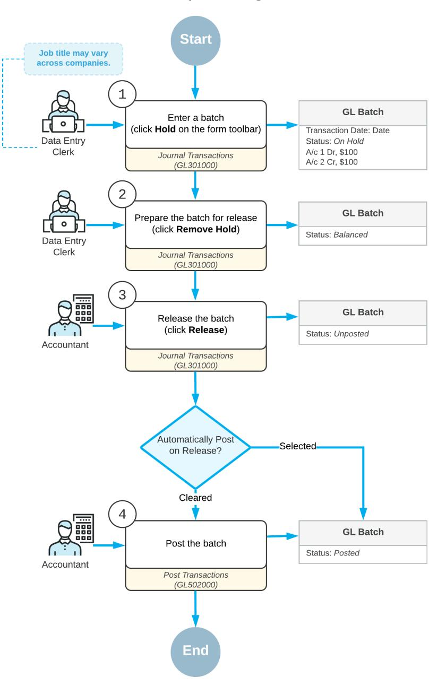

*Figure: GL batch processing*

#### **GL Batch Statuses**

The status of a batch reflects the current processing state of the transactions in the system. A batch can have one of the following statuses.

| Status    | Description                                                                                                                                                                                                                                                                                                                                           |
|-----------|-------------------------------------------------------------------------------------------------------------------------------------------------------------------------------------------------------------------------------------------------------------------------------------------------------------------------------------------------------|
| On Hold   | The batch is being edited and can be saved without being balanced. A batch with the<br>On Hold status cannot be released or posted. You can give a batch this status by clicking<br>Hold on the form toolbar of the Journal Transactions (GL301000) form.                                                                                             |
|           | If a batch that is on hold has total debits equal to total credits, you can change its status<br>to Balanced by clicking Remove Hold on the form toolbar.                                                                                                                                                                                             |
| Balanced  | The batch is being edited and can be saved only if it is balanced (that is, its debit total<br>equals its credit total). The batch can be released or posted. You can modify or delete a<br>balanced batch, but you can save your changes only if the batch's credit and debit totals<br>remain equal.                                                |
| Unposted  | The batch has been released but has not yet been posted. The unposted batch is read-on<br>ly.                                                                                                                                                                                                                                                         |
|           | You cannot edit or delete the batch with the Unposted status; you can reverse it, reclassi<br>fy it, or split it. For details, see Reversing Transactions: General Information, Reclassifying<br>Transactions: General Information, and Splitting Transactions: General Information.                                                                  |
|           | If the batch is correct, you can post it to update GL account balances on the Post Transac<br>tions (GL502000) form.                                                                                                                                                                                                                                  |
| Posted    | The batch has been posted, and the account balances have been updated with transac<br>tion amounts. The posted batch is read-only.                                                                                                                                                                                                                    |
|           | You cannot edit or delete the posted batch; you can reverse it, reclassify it, or split it. For<br>details, see Reversing Transactions: General Information, Reclassifying Transactions: Gen<br>eral Information, and Splitting Transactions: General Information.                                                                                    |
| Scheduled | The batch is a template for generating recurring batches according to the defined sched<br>ule. Based on the template, the system generates new batches, which can be edited, re<br>leased, and then posted. The scheduled batch itself isn't released and posted and can be<br>edited. For details, see Recurring Transactions: General Information. |
|           | The status of a scheduled batch changes to Voided if the batch is deleted from the sched<br>ule. A scheduled batch can be fully deleted only if the schedule was never executed and<br>no ordinary GL batches were generated in accordance with it.                                                                                                   |
| Voided    | The scheduled batch has been canceled (that is, removed from the schedule). The voided<br>batch is read-only.                                                                                                                                                                                                                                         |

# <span id="page-110-0"></span>**GL Transactions: Implementation Checklist**

Before users begin processing GL batches, you must make sure that the system has been configured properly and that all required entities have been created, as described in the following table

| Form                                       | Settings to Check                                              | Notes |
|--------------------------------------------|----------------------------------------------------------------|-------|
| Enable/Disable Features (CS100000)<br>form | Make sure the Standard Financials<br>feature has been enabled. |       |

| Form                                          | Settings to Check                                                                                                                                         | Notes                                                                                            |
|-----------------------------------------------|-----------------------------------------------------------------------------------------------------------------------------------------------------------|--------------------------------------------------------------------------------------------------|
| Multiple forms                                | Make sure that the minimum con<br>figuration of the company has been<br>performed, as described in Compa<br>ny Without Branches: General Infor<br>mation. |                                                                                                  |
| Chart of Accounts (GL202500) form             | Check whether the necessary ac<br>counts have been created.                                                                                               |                                                                                                  |
| Company Financial Calendar<br>(GL201100) form | Be sure that the financial periods<br>for which transactions will be creat<br>ed have a status of Open.                                                   | You can generate the necessary pe<br>riods on the Master Financial Calen<br>dar (GL201000) form. |

### **Settings That Can Affect the Processing Workflow**

The settings on the *[General Ledger Preferences](https://help-2025r1.acumatica.com/Help?ScreenId=ShowWiki&pageid=e4913d06-c511-4258-a0f9-f36c1b854e6b)* (GL102000) form can affect the processing workflow as follows:

- If the **Hold Batches on Entry** check box is selected, a batch is saved with the *On Hold* status by default. If the batch is on hold, you should click **Remove Hold** on the toolbar of the *Journal [Transactions](https://help-2025r1.acumatica.com/Help?ScreenId=ShowWiki&pageid=dda046bc-5946-407f-88f7-1c0c966fbe72)* (GL301000) form for the batch so that you can process it further. If the check box is cleared, the batch is saved with the *Balanced* status.
- If the **Validate Batch ControlTotals on Entry** check box is selected, you have to enter the batch control total before you save the batch on the *Journal [Transactions](https://help-2025r1.acumatica.com/Help?ScreenId=ShowWiki&pageid=dda046bc-5946-407f-88f7-1c0c966fbe72)* form. If this check box is cleared and the status of the batch is *Balanced*, the system automatically validates the batch.
- If the **Automatically Post on Release** check box is selected, the system posts batches on release. If this check box is cleared, you have to post the batches aer release.

# <span id="page-111-0"></span>**GL Transactions: Process Activity**

In this activity, you will learn how to create a GL batch, release and post the batch, and review the statuses of the batch.

This activity is based on the *U100* dataset. If you are using another dataset, or if any system settings have been changed in *U100*, these changes can affect the workflow of the activity and the results of the processing. To avoid any issues, restore the *U100* dataset to its initial state.

#### **Video Tutorial**

This video shows you the common process but may contain less detail than the activity has. If you want to repeat the activity on your own or you are preparing to take the certification exam, we recommend that you follow the instructions in the steps of the activity.

#### *[FEEDBACK](https://www.surveymonkey.com/r/BLBL7RJ?Video=Processing%20Transactions&Source=Open%20Uni&Course=F100)*

#### **Story**

Suppose that in January 2025, the SweetLife Fruits & Jams company paid its employees \$15,600.

Acting as a SweetLife accountant, you need to enter a batch for a payment in the amount of \$15,600 for the *01-2025* financial period for the salaries and wages of the employees of the SweetLife Head Office and Wholesale Center (*HEADOFFICE*) branch.

#### **Process Overview**

In this activity, you will enter a batch directly on the *Journal [Transactions](https://help-2025r1.acumatica.com/Help?ScreenId=ShowWiki&pageid=dda046bc-5946-407f-88f7-1c0c966fbe72)* (GL301000) form, release and post the batch, and note the status of the batch at each step. Then you will review the batch details in the *[GL Register](https://help-2025r1.acumatica.com/Help?ScreenId=ShowWiki&pageid=680ac556-03e3-4ed2-ac8b-5cd15e6aba60) [Detailed](https://help-2025r1.acumatica.com/Help?ScreenId=ShowWiki&pageid=680ac556-03e3-4ed2-ac8b-5cd15e6aba60)* (GL621000) report.

#### **System Preparation**

To prepare the system, do the following:

- 1. Launch the Acumatica ERP website with the *U100* dataset. Sign in as an accountant by using the following credentials:
  - Username: *johnson*
  - Password: *123*
- 2. In the info area, in the upper-right corner of the top pane of the Acumatica ERP screen, make sure that the business date in your system is set to *1/31/2025*. If a different date is displayed, click the Business Date menu button and select *1/31/2025*. For simplicity, in this activity, you will create and process all documents in the system on this business date.
- 3. On the Company and Branch Selection menu, also on the top pane of the Acumatica ERP screen, make sure that the *SweetLife Head Office and Wholesale Center* branch is selected. If it is not selected, click the Company and Branch Selection menu to view the list of branches that you have access to, and then click *SweetLife Head Office and Wholesale Center*.

#### **Step 1: Creating a Batch of Transactions**

To create a batch of GL transactions, do the following:

1. Open the *Journal [Transactions](https://help-2025r1.acumatica.com/Help?ScreenId=ShowWiki&pageid=dda046bc-5946-407f-88f7-1c0c966fbe72)* (GL301000) form, and on the form toolbar, click **Add New Record** to create a document.


To open the form for creating a new record, type the form ID in the Search box, and on the Search form, point at the form title and click **New** right of the title.

- 2. In the Summary area, specify the following settings:
  - **Transaction Date**: *1/31/2025* (inserted by default)
  - **Post Period**: *01-2025* (inserted by default)
  - **Description**: Salary payment Jan 2025
- 3. On the table toolbar of the **Details** tab, click **Add Row** and specify the following settings in the row that appears:
  - **Branch**: *HEADOFFICE* (inserted by default based on the selected branch)
  - **Account**: *69500 - Salaries and Wages*
  - **Debit Amount**: 15600
- 4. Click **Add Row** again, and specify the following settings in the second row:
  - **Branch**: *HEADOFFICE* (inserted by default based on the selected branch)
  - **Account**: *10200 - Company Checking Account*
  - **Credit Amount**: 15600

- 5. Click **Save** on the form toolbar, and note that the status of the batch is *On Hold*.
- 6. Click **Remove Hold** on the form toolbar and save the batch. The batch's status has changed to *Balanced*.

#### **Step 2: Releasing and Posting the Batch**

To release and post the GL batch, do the following:

- 1. On the form toolbar, click **Release**.
- 2. Note that the batch's status has changed to *Posted* as shown in the following screenshot.

|                | <b>Journal Transactions</b><br>GL GL000046 - Salary payment Jan 2025                                                  |                                                               |                                                  |          |                          |                               |                           | <b>TH NOTES</b> | <b>ACTIVITIES</b>         | $TOOLS$ $\sim$<br><b>FILES</b> |              |           |                 |           |                                       |                        |
|----------------|-----------------------------------------------------------------------------------------------------------------------|---------------------------------------------------------------|--------------------------------------------------|----------|--------------------------|-------------------------------|---------------------------|-----------------|---------------------------|--------------------------------|--------------|-----------|-----------------|-----------|---------------------------------------|------------------------|
|                | 圕<br>圖<br>o<br>$\Omega$<br>侕<br>K<br>$\geq$<br>$^+$<br>$\rightarrow$<br>≺<br>$\leftarrow$<br>$\checkmark$<br>$\cdots$ |                                                               |                                                  |          |                          |                               |                           |                 |                           |                                |              |           |                 |           |                                       |                        |
| GL<br>Module:  |                                                                                                                       | $\checkmark$                                                  | Branch:<br>HEADOFFICE - SweetLife Head Office ar |          |                          | Type:                         |                           |                 | Normal                    |                                |              |           |                 | $\sim$    |                                       |                        |
|                |                                                                                                                       | Batch Number:                                                 | GL000046                                         | Q        | Ledger:                  | <b>ACTUAL - Actual Ledger</b> |                           |                 | Orig. Batch Number:       |                                |              |           |                 |           |                                       |                        |
|                | Status:                                                                                                               |                                                               | Posted                                           |          |                          | Auto Reversing                | Reversing Entry           |                 | Debit Total:<br>15,600.00 |                                |              |           |                 |           |                                       |                        |
|                |                                                                                                                       | Transaction D.,                                               | 1/31/2025                                        |          |                          |                               |                           |                 | Credit Total:             |                                |              | 15,600.00 |                 |           |                                       |                        |
|                |                                                                                                                       | Post Period:                                                  | 01-2025                                          |          |                          |                               |                           |                 |                           |                                |              |           |                 |           |                                       |                        |
|                |                                                                                                                       |                                                               |                                                  |          |                          |                               |                           |                 |                           |                                |              |           |                 |           |                                       |                        |
|                | Description:<br>Salary payment Jan 2025                                                                               |                                                               |                                                  |          |                          |                               |                           |                 |                           |                                |              |           |                 |           |                                       |                        |
| <b>DETAILS</b> |                                                                                                                       |                                                               |                                                  |          |                          |                               |                           |                 |                           |                                |              |           |                 |           |                                       |                        |
|                | $\mathbf{x}$<br>RECLASSIFICATION HISTORY<br><b>VIEW SOURCE DOCUMENT</b><br>$\vdash$<br>土<br>↻<br>$\times$<br>┶<br>0   |                                                               |                                                  |          |                          |                               |                           |                 |                           |                                |              |           |                 |           |                                       |                        |
| <b>B</b> 0 D   |                                                                                                                       | *Branch                                                       |                                                  | *Account | <b>Description</b>       |                               | Project/Contrac           | Project<br>Task | Cost<br>Code              | Ref.<br>Number                 | Quantity UOM |           | Debit<br>Amount | Amount    | <b>Credit Transaction Description</b> | Non<br><b>Billable</b> |
|                | $\omega$                                                                                                              | <b>HEADOFFICE</b><br>!!!!!!!!!!!!!!!!!!!!!!!!!!!!!!!!!!!!!!!! |                                                  | 69500    | Salaries and Wages       |                               | x                         |                 | 00-000                    |                                | 0.00         |           | 15,600.00       | 0.00      | Salary payment Jan 2025               | □                      |
|                | $\omega$                                                                                                              | ר                                                             | <b>HEADOFFICE</b>                                | 10200    | Company Checking Account |                               | $\boldsymbol{\mathsf{X}}$ |                 | $00 - 000$                |                                | 0.00         |           | 0.00            | 15,600.00 | Salary payment Jan 2025               | $\Box$                 |

#### *Figure: Posted GL batch*

#### **Step 3: Reviewing the Batch Details**

To review the batch details, do the following:

- On the More menu (under **Reports**), click **Batch Register Details**.
- On the *[GL Register Detailed](https://help-2025r1.acumatica.com/Help?ScreenId=ShowWiki&pageid=680ac556-03e3-4ed2-ac8b-5cd15e6aba60)* (GL621000) report, which is opened, review the details of the posted batch.

### <span id="page-113-0"></span>**GL Transactions: Mass-Processing**

This topic explains how to release and post multiple batches.

#### **Mass-Releasing Batches**

You can release multiple batches on the *Release [Transactions](https://help-2025r1.acumatica.com/Help?ScreenId=ShowWiki&pageid=5dd30a1f-e104-42cc-b44c-9427c6151dee)* (GL501000) form. On this form, you click **Release All** on the form toolbar and you select the unlabeled check box next to the lines to be processed, and click **Release** to release batches.

The system releases the batches. Depending on the posting settings specified on the *[General Ledger Preferences](https://help-2025r1.acumatica.com/Help?ScreenId=ShowWiki&pageid=e4913d06-c511-4258-a0f9-f36c1b854e6b)* (GL102000) form, one of the following events occurs:

- If the **Automatically Post on Release** check box is cleared, the batch is released. The batch is given the *Unposted* status.
- If the **Automatically Post on Release** check box is selected, the batch is posted to the general ledger and is assigned the *Posted* status.

#### **Mass-Posting Batches**

On the *Post [Transactions](https://help-2025r1.acumatica.com/Help?ScreenId=ShowWiki&pageid=dce8c656-0c7f-4bb9-af68-e9432317964c)* (GL502000) form, you can also post released batches by selecting them and clicking **Post**, or you can post all released batches by clicking **Post All**. The system posts the batches and assigns the *Posted* status to them.

# <span id="page-114-0"></span>**GL Transactions: Related Reports and Inquiries**

This topic describes the reports, inquiries, and forms you may review to gather information about batches.

If you do not see a report or inquiry, this could mean that you have signed in to the system with a user account that does not have access rights to the form.

#### **Finding a Batch on the Journal Transactions Form**

To find and view a batch, you can use the *Journal [Transactions](https://help-2025r1.acumatica.com/Help?ScreenId=ShowWiki&pageid=dda046bc-5946-407f-88f7-1c0c966fbe72)* (GL301000) form. On this form, you can click the selector button in the **Batch Number** box and locate the batch by doing one of the following:

- Clicking any column header to arrange the items in ascending or descending order based on the values in the column. You can navigate between pages to locate the specific batch.
- Clicking the column header for any column you may want to search, and then typing a string in the search box at the bottom of the dialog box that pops up. As you type, the system filters the listed batches to display only those containing the entered text in the selected column.
- Creating a filter to find the batch by its details. To do this, you click **FilterSettings** on the table toolbar of the lookup table, and specify a condition based on the batch details.

#### **Viewing an Unreleased Batch**

On the *[GL Edit Summary](https://help-2025r1.acumatica.com/Help?ScreenId=ShowWiki&pageid=68c5395d-e116-44b9-af72-62a670585837)* (GL611500) form, you can run a report for a particular ledger and financial period; you then review the list of unreleased batches, find the necessary batch, and review it. From the report, you can navigate to the *Journal [Transactions](https://help-2025r1.acumatica.com/Help?ScreenId=ShowWiki&pageid=dda046bc-5946-407f-88f7-1c0c966fbe72)* (GL301000) form to view more details of the batch.

Similarly, you can find and view an unreleased transaction by using the *[GL Edit Detailed](https://help-2025r1.acumatica.com/Help?ScreenId=ShowWiki&pageid=3750cc88-3bc3-4dc8-8081-0572c0a09068)* (GL610500) and *[GL Edit](https://help-2025r1.acumatica.com/Help?ScreenId=ShowWiki&pageid=24c1859a-34f2-47fe-8f18-df6abe38d298) [Account Distribution](https://help-2025r1.acumatica.com/Help?ScreenId=ShowWiki&pageid=24c1859a-34f2-47fe-8f18-df6abe38d298)* (GL611000) reports.

#### **Viewing a Released Batch**

On the *[GL Register](https://help-2025r1.acumatica.com/Help?ScreenId=ShowWiki&pageid=5c2540b8-0d84-427a-9499-3e4dee589f4f)* (GL620500) form, you can run a report for a particular ledger and financial period, and then review the list of released batches and find the necessary batch. You can navigate to the *Journal [Transactions](https://help-2025r1.acumatica.com/Help?ScreenId=ShowWiki&pageid=dda046bc-5946-407f-88f7-1c0c966fbe72)* (GL301000) form from the report to view more details of the batch.

Similarly, you can find and view a released transaction by using the *[GL Register Detailed](https://help-2025r1.acumatica.com/Help?ScreenId=ShowWiki&pageid=680ac556-03e3-4ed2-ac8b-5cd15e6aba60)* (GL621000) report.

#### **Printing Transactions for a Particular Account**

You can print transactions for a particular account by using the *[Transactions](https://help-2025r1.acumatica.com/Help?ScreenId=ShowWiki&pageid=a1164a4e-6b2b-4a82-8490-abde5d381be7) for Account* (GL633500) report. To run a report, you specify the ledger, the financial period, and the account for which you want the system to generate the report.

#### **Printing Transactions for a Particular Period**

You can print transactions for a particular period by using the *[Transactions](https://help-2025r1.acumatica.com/Help?ScreenId=ShowWiki&pageid=deb95b00-b48f-4d53-8551-dd72d367d2fc) for Period* (GL633000) report. To run a report, you specify the ledger and the financial period for which you want the system to generate the report.

# <span id="page-115-0"></span>**To Set Up Automatic Release of General Ledger Batches**

In Acumatica ERP, you can set up the release of balanced batches to be performed automatically at the specified time with specific periodicity. Suppose the internal policies at your company require that only batches with amounts less than a certain threshold amount (\$1000) can be released in bulk on the *Release [Transactions](https://help-2025r1.acumatica.com/Help?ScreenId=ShowWiki&pageid=5dd30a1f-e104-42cc-b44c-9427c6151dee)* (GL501000) form, while batches with larger amounts should be released individually through the *[Journal](https://help-2025r1.acumatica.com/Help?ScreenId=ShowWiki&pageid=dda046bc-5946-407f-88f7-1c0c966fbe72) [Transactions](https://help-2025r1.acumatica.com/Help?ScreenId=ShowWiki&pageid=dda046bc-5946-407f-88f7-1c0c966fbe72)* (GL301000) form, on which the **Release** action is enabled only for the users with *Batch Approver* role. Batches with smaller amounts are released automatically at the frequency you choose.

#### **To Create a Schedule for Processing**

1. Open the *Release [Transactions](https://help-2025r1.acumatica.com/Help?ScreenId=ShowWiki&pageid=5dd30a1f-e104-42cc-b44c-9427c6151dee)* (GL501000) form.


To open any form, you can navigate to it or search for it (by its name or by its form ID without periods). For more information about search capabilities, see *[Search](https://help-2025r1.acumatica.com/Help?ScreenId=ShowWiki&pageid=09ed14e6-3600-4d60-8267-66531025f5c3)*.

- 2. On the form toolbar, click**Schedules > Add**. This opens the *[Automation Schedules](https://help-2025r1.acumatica.com/Help?ScreenId=ShowWiki&pageid=76757610-2d0f-4ead-a948-d67da24ec116)* (SM205020) form.
- 3. On the *[Automation Schedules](https://help-2025r1.acumatica.com/Help?ScreenId=ShowWiki&pageid=76757610-2d0f-4ead-a948-d67da24ec116)* form, in the **Description** box, enter a description of the new schedule.
- 4. In the **Action Name** box, make sure *Process All* is selected.
- 5. On the **Details** tab, specify the additional settings of the schedule:
  - a. Optional: In the**Starts On** box of the **Details** tab, select the start date. By default, the schedule execution starts on the current business date.
  - b. Optional: If you need to specify an expiration date for the schedule, clear the **No Expiration Date** check box, and specify the expiration date in the **Expires On** box.
  - c. Do one of the following:
    - If you want to limit the number of executions, in the **Execution Limit** box, specify the number of times the schedule should be executed.
    - If you do not need to limit the number of executions, select the **No Execution Limit** check box.
  - d. Optional: In the **Process with Branch** box, select the branch under which the schedule should be processed. For example, if documents are created by this schedule, the system creates these documents and specifies the selected branch for each document.
  - e. Optional: Change the time zone in which the schedule will operate. By default, the time zone specified on the *[User Profile](https://help-2025r1.acumatica.com/Help?ScreenId=ShowWiki&pageid=8430c8b2-a79c-4f7b-9768-b0b7fad23a59)* (SM203010) form for the currently signed-in user is selected.
- 6. On the **Schedule** tab, specify the execution dates and time as follows:
  - a. Specify how oen the schedule execution should be performed:
    - To execute the schedule daily or every *x* days, do the following:
      - a. In the **ScheduleType** section, select **Daily**.
      - b. Optional: In the**Schedule Details** section, in the **Next Execution Date** box, select the date and time when the schedule should be executed next.
      - c. In the **Every x Day(s)** box, type the number of days between successive executions of the schedule.

- To execute the schedule weekly or every *x* weeks, do the following:
  - a. In the **ScheduleType** section, select **Weekly**.
  - b. Optional: In the**Schedule Details** section, in the **Next Execution Date** box, select the date and time when the schedule should be executed next.
  - c. In the **Every x Week(s)** box, type the number of weeks between successive executions of the schedule.
  - d. Select the appropriate check boxes for the day or days of the week on which the schedule should be executed.
- To execute the schedule monthly or every *x* months, do the following:
  - a. In the **ScheduleType** section, select **Monthly**.
  - b. Optional: In the**Schedule Details** section, in the **Next Execution Date** box, select the date and time when the schedule should be executed next.
  - c. In the **Every x Month(s)** box, type the number of months between successive executions of the schedule.
  - d. Select when the schedule should be executed: the day of the month, or the week in the month and the day of the week (such as the third Friday of the month).
- To execute the schedule once per financial period or every *x* financial periods, perform the following steps:
  - a. In the **ScheduleType** section, select **By Financial Period**.
  - b. Optional: In the**Schedule Details** section, in the **Next Execution Date** box, select the date and time when the schedule should be executed next.
  - c. In the **Every x Period(s)** box, type the number of financial periods between successive executions of the schedule.
  - d. Select the appropriate option button to indicate when the schedules should be executed: at the end of the period, at the start of the period, or on a fixed day of the period (which you should specify if you select this option button).
- b. In the **Execution Time** section, specify the particular time of the day to start and stop the processing as follows:
  - a. In the **Starts On** box, select the hour and minute when the first execution of the schedule should start.
  - b. If you want the processing to be stopped at specific time or you want the processing to be repeated multiple times a day, in the**Stops On** box, select the hour and minute when the first execution of the schedule should stop.
  - c. If execution of the schedule should be repeated multiple times a day, in the **Every** box, select the interval between successive executions of the schedule.
  - d. In the **Next Execution Date** box, make sure the next execution time is correct.
  - e. If you want the system to execute the schedule at exactly the time specified in the **Next Execution Time** box, select the **ExactTime** check box. If the check box is cleared, the system may shi the next execution time of the schedule by multiple minutes.
- 7. On the **Conditions** tab, add the following two conditions to select only batches with amounts less than \$1000 by performing the following steps:
  - As the **Field Name**, select *Module* as the boxes available on the *Release [Transactions](https://help-2025r1.acumatica.com/Help?ScreenId=ShowWiki&pageid=5dd30a1f-e104-42cc-b44c-9427c6151dee)* form. In the **Condition** box, select *Equals*, and in the **Value** box, select GL.
  - As the **Field Name**, select *Control Total* as the boxes available on the *Release [Transactions](https://help-2025r1.acumatica.com/Help?ScreenId=ShowWiki&pageid=5dd30a1f-e104-42cc-b44c-9427c6151dee)* form. In the **Condition** box, select *Is Less Than*, and in the **Value** box, type 1000.

8. Click **Save** on the form toolbar to create the schedule. When you save a newly created schedule, the system gives it an identifier in accordance with the built-in numbering sequence intended for automation schedules.

# <span id="page-118-0"></span>**Processing Reversing Transactions**

If a batch with the *Unposted* or *Posted* status is incorrect, you can reverse the batch and enter a correct one.

In this chapter, you will find general information on how to reverse transactions, a checklist for system implementation, an activity that describes how to reverse a batch of transactions in the system, and report and inquiries that can be useful to find and view reversed and reversing transactions.

# <span id="page-118-2"></span><span id="page-118-1"></span>**Reversing Transactions: General Information**

An incorrect batch with the *On Hold* or *Balanced* status can be corrected or deleted in the system. Aer a batch has been released, it cannot be corrected or deleted. If a batch with the *Unposted* or *Posted* status is incorrect, you can reverse the batch and enter a correct one.

If the batch was posted to the wrong GL account, subaccount, or branch, to correct it, you can reclassify the batch on the *Reclassify [Transactions](https://help-2025r1.acumatica.com/Help?ScreenId=ShowWiki&pageid=48075ac9-54ee-4082-acde-9e93ea7c3edb)* (GL506000) form. For details, see *[Reclassifying](#page-140-3) [Transactions:](#page-140-3) General Information*. If a part of the batch amount was posted to the wrong GL account, subaccount, or branch, you can split the batch. For details, see *Splitting [Transactions:](#page-149-2) General [Information](#page-149-2)*.

#### **Learning Objectives**

You will learn how to reverse a GL batch in the system.

#### **Applicable Scenarios**

You reverse a batch if some of the details other than GL account, subaccount, or branch were entered incorrectly and the batch has been released.

#### **Generation of a Reversing Batch**

To generate a reversing batch, on the *Journal [Transactions](https://help-2025r1.acumatica.com/Help?ScreenId=ShowWiki&pageid=dda046bc-5946-407f-88f7-1c0c966fbe72)* (GL301000) form, you select the batch that you want to reverse and on the More menu (under **Corrections**), you click **Reverse**. The system creates a batch with the transactions reversed—that is, a debit entry is reversed as a credit entry and a credit entry is reversed as a debit entry.

For the reversing batches, the **Reversing Entry** check box is selected in the Summary area of the *Journal [Transactions](https://help-2025r1.acumatica.com/Help?ScreenId=ShowWiki&pageid=dda046bc-5946-407f-88f7-1c0c966fbe72)* form.

Depending on the setting of the **Hold Batches on Entry** check box on the *[General Ledger Preferences](https://help-2025r1.acumatica.com/Help?ScreenId=ShowWiki&pageid=e4913d06-c511-4258-a0f9-f36c1b854e6b)* (GL102000) form, the reversing batch gets one of the following statuses:

- *Balanced*: If the **Hold Batches on Entry** check box is cleared.
- *On Hold*: If the **Hold Batches on Entry** check box is selected.

You can then release and post this batch. For details on processing batches, see *GL [Transactions:](#page-108-3) General [Information](#page-108-3)*.

While you are viewing the reversing batch on the *Journal [Transactions](https://help-2025r1.acumatica.com/Help?ScreenId=ShowWiki&pageid=dda046bc-5946-407f-88f7-1c0c966fbe72)* form, you can quickly view the original batch by clicking the number in the **Orig. Batch Number** box in the Summary area.

You can reverse a batch multiple times. To view the list of the related reversing batches, you click the link in the **Reversing Batches** box of the *Journal [Transactions](https://help-2025r1.acumatica.com/Help?ScreenId=ShowWiki&pageid=dda046bc-5946-407f-88f7-1c0c966fbe72)* form. The system opens the *[GL Reversing Batches](https://help-2025r1.acumatica.com/Help?ScreenId=ShowWiki&pageid=51d10e22-1317-4d0b-b6b6-abb94753916b)* (GL690010) report with the list of batches and their details.

#### **Overview of the Reversing Process**

The typical processing workflow of reversing batches involves the actions and generated batches shown in the following diagram.

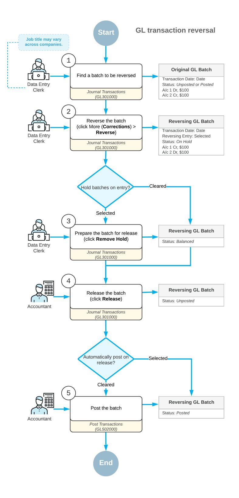

*Figure: Processing workflow for reversing a transaction*

# <span id="page-121-0"></span>**Reversing Transactions: Implementation Checklist**

Before users begin processing GL batches, you must make sure that the system has been configured properly and that all required entities have been created, as described in the following table.

| Form                                       | Settings to Validate                                                                                                                                      | Notes |
|--------------------------------------------|-----------------------------------------------------------------------------------------------------------------------------------------------------------|-------|
| Enable/Disable Features (CS100000)<br>form | Make sure the Standard Financials<br>feature has been enabled.                                                                                            |       |
| Multiple forms                             | Make sure that the minimum con<br>figuration of the company has been<br>performed, as described in Compa<br>ny Without Branches: General Infor<br>mation. |       |

## **Settings That Can Affect the Processing Workflow**

The settings on the *[General Ledger Preferences](https://help-2025r1.acumatica.com/Help?ScreenId=ShowWiki&pageid=e4913d06-c511-4258-a0f9-f36c1b854e6b)* (GL102000) form can affect the processing workflow as follows:

- If the **Hold Batches on Entry** check box is selected, a batch is saved with the *On Hold* status by default. If the batch is on hold, you should click **Remove Hold** on the toolbar of the *Journal [Transactions](https://help-2025r1.acumatica.com/Help?ScreenId=ShowWiki&pageid=dda046bc-5946-407f-88f7-1c0c966fbe72)* (GL301000) form for the batch so that you can process it further. If the check box is cleared, the batch is saved with the *Balanced* status.
- If the **Validate Batch ControlTotals on Entry** check box is selected, you have to enter the batch control total before you save the batch on the *Journal [Transactions](https://help-2025r1.acumatica.com/Help?ScreenId=ShowWiki&pageid=dda046bc-5946-407f-88f7-1c0c966fbe72)* form. If this check box is cleared and the status of the batch is *Balanced*, the system automatically validates the batch.
- If the **Automatically Post on Release** check box is selected, the system posts batches on release. If this check box is cleared, you have to post the batches aer release.

# <span id="page-121-1"></span>**Reversing Transactions: Generated Transactions**

On the *Journal [Transactions](https://help-2025r1.acumatica.com/Help?ScreenId=ShowWiki&pageid=dda046bc-5946-407f-88f7-1c0c966fbe72)* (GL301000) form, you can view the details of the reversing GL batch and its original GL batch. For the following original GL batch recorded to the general ledger, the reversing GL batch below will be recorded to the general ledger.

#### *Table: The Original GL Batch*

| Account                       | Debit  | Credit |
|-------------------------------|--------|--------|
| 62900 - Rent or Lease Expense | Amount | 00.00  |
| 23015 - Accrued Expense       | 00.00  | Amount |

#### *Table: The Reversing GL Batch*

| Account                       | Debit | Credit |
|-------------------------------|-------|--------|
| 62900 - Rent or Lease Expense | 00.00 | Amount |

| Account                 | Debit  | Credit |  |
|-------------------------|--------|--------|--|
| 23015 - Accrued Expense | Amount | 00.00  |  |

# <span id="page-122-0"></span>**Reversing Transactions: Process Activity**

In this activity, you will learn how to reverse a GL batch.


This activity is based on the *U100* dataset. If you are using another dataset, or if any system settings have been changed in *U100*, these changes can affect the workflow of the activity and the results of the processing. To avoid any issues, restore the *U100* dataset to its initial state.

#### **Video Tutorial**

This video shows you the common process but may contain less detail than the activity has. If you want to repeat the activity on your own or you are preparing to take the certification exam, we recommend that you follow the instructions in the steps of the activity.

#### *[FEEDBACK](https://www.surveymonkey.com/r/BLBL7RJ?Video=Reversing%20Transactions&Source=Open%20Uni&Course=F100)*

#### **Story**

Suppose that in February 2025, a transaction was posted by mistake for the monthly office rent expense that the SweetLife Fruits & Jams company pays to its landlord.

Acting as a SweetLife accountant, you need to reverse this transaction posted for the SweetLife Head Office and Wholesale Center (*HEADOFFICE*) branch.

#### **Process Overview**

In this activity, to reverse a batch, you will search for the needed batch on the *Journal [Transactions](https://help-2025r1.acumatica.com/Help?ScreenId=ShowWiki&pageid=dda046bc-5946-407f-88f7-1c0c966fbe72)* (GL301000) form and reverse it. You will then check the ending balance on the *[Account Summary](https://help-2025r1.acumatica.com/Help?ScreenId=ShowWiki&pageid=f54927e5-fec0-400a-bd19-5581de5aae35)* (GL401000) form and drill down to the *[Account Details](https://help-2025r1.acumatica.com/Help?ScreenId=ShowWiki&pageid=517044d6-d4e9-406b-a40e-6139b9b53bd9)* (GL404000) form to make sure that the account balance is now correct.

#### **System Preparation**

To prepare the system, do the following:

- 1. Launch the Acumatica ERP website with the *U100* dataset. Sign in as an accountant by using the following credentials:
  - Username: *johnson*
  - Password: *123*
- 2. On the Company and Branch Selection menu, also on the top pane of the Acumatica ERP screen, make sure that the *SweetLife Head Office and Wholesale Center* branch is selected. If it is not selected, click the Company and Branch Selection menu to view the list of branches that you have access to, and then click *SweetLife Head Office and Wholesale Center*.

#### **Step 1: Finding the Batch to be Reversed**

To find the batch to be reversed, do the following:

- 1. Open the Journal Transactions (GL3010PL) list of records.
- 2. In the table, click the**Transaction Date** column, and in the dialog box that opens, specify the following settings:
  - **Equals**: Selected
  - **Value**: *2/25/2025*
- 3. Click **OK**. The system displays the batch dated February 25, 2025.

#### **Step 2: Reversing the Batch**

To reverse the batch, do the following:

- 1. While you are still on the Journal Transactions (GL3010PL) list of records with the needed batch listed, click the link in the **Batch Number** column to open the batch on the *Journal [Transactions](https://help-2025r1.acumatica.com/Help?ScreenId=ShowWiki&pageid=dda046bc-5946-407f-88f7-1c0c966fbe72)* (GL301000) form.
- 2. On the More menu (under **Corrections**), click **Reverse**.

The system generates and opens a reversing batch. In the Summary area, notice that the number of the original batch is shown in the **Orig. Batch Number** box, the **Reversing Entry** check box is selected, and the batch's status is *On Hold*, as shown in the following screenshot.

| <b>Journal Transactions</b><br><b>GL</b> - Rent February<br>周<br>B<br>$\leftarrow$ | $\Omega$                                                | 甸<br>$\pm$                       | n<br>$\overline{\mathsf{K}}$<br>$\check{~}$ | $\left\langle \right\rangle$ | $\geq$<br>$\rightarrow$       | <b>REMOVE HOLD</b>                                           | $\cdots$     |                                                      |                    |                      |                 | <b>PINOTES</b> | <b>ACTIVITIES</b>                     | <b>FILES</b> | TOOLS $\sim$                  |
|------------------------------------------------------------------------------------|---------------------------------------------------------|----------------------------------|---------------------------------------------|------------------------------|-------------------------------|--------------------------------------------------------------|--------------|------------------------------------------------------|--------------------|----------------------|-----------------|----------------|---------------------------------------|--------------|-------------------------------|
| Module:<br>Batch Number:<br>Status:<br>* Transaction D.<br>* Post Period:          | GL<br><new><br/>On Hold<br/>2/25/2025<br/>02-2025</new> | $\checkmark$<br>Q<br>$\Box$<br>Q | * Branch:<br>* Ledger:                      | Auto Reversing               | <b>ACTUAL - Actual Ledger</b> | HEADOFFICE - SweetLife Head Office Q<br>Q<br>Reversing Entry | Type:        | Orig. Batch Number:<br>Debit Total:<br>Credit Total: | Normal<br>GL000018 | 1,300.00<br>1,300.00 |                 |                |                                       |              | $\sim$                        |
| Description:<br><b>DETAILS</b>                                                     | <b>Rent February</b>                                    |                                  |                                             |                              |                               |                                                              |              |                                                      |                    |                      |                 |                |                                       |              |                               |
| Ò<br>$+$<br>$\mathscr{Q}$                                                          | $\times$                                                |                                  | VIEW SOURCE DOCUMENT                        |                              | RECLASSIFICATION HISTORY      | $\vdash$                                                     | $\mathbf{x}$ | 土                                                    |                    |                      |                 |                |                                       |              |                               |
| !!!!!!!!!!!!!!!!!!!!!!!!!!!!!!!!!!!!!!!!<br><b>B</b> 0<br>*Branch                  |                                                         | * Account                        | <b>Description</b>                          |                              | Project/Contract              | Project<br>Task                                              | Cost<br>Code | Ref.<br>Number                                       | Quantity UOM       |                      | Debit<br>Amount | Amount         | <b>Credit Transaction Description</b> |              | <b>Non</b><br><b>Billable</b> |
| <b>HEADOFFICE</b><br>D.<br>> 0                                                     |                                                         | 62900                            | Rent or Lease Expense X                     |                              |                               |                                                              | 00-000       |                                                      | 0.00               |                      | 0.00            |                | 1,300.00 Rent February                |              | $\Box$                        |
| <b>HEADOFFICE</b><br>0 D                                                           |                                                         | 63300                            | <b>Utilities</b>                            |                              | x                             |                                                              | 00-000       |                                                      | 0.00               |                      | 1,300.00        |                | 0.00 Rent February                    |              | □                             |

#### *Figure: The reversing batch created by the system*

- 3. On the form toolbar, click **Remove Hold**.
- 4. On the form toolbar, click **Release** to release the batch.

#### **Step 3: Reviewing the Posted Transaction**

To review the account balance and the posted transactions, do the following:

- 1. Open the *[Account Summary](https://help-2025r1.acumatica.com/Help?ScreenId=ShowWiki&pageid=f54927e5-fec0-400a-bd19-5581de5aae35)* (GL401000) form.
- 2. In the **Period** box of the Summary area, select *02-2025*.
- 3. In the table, locate the *62900 - Rent or Lease Expense* account and review its ending balance in the **Ending Balance** column.
- 4. Click the link in the **Account** column for the *62900* account, and on the *[Account Details](https://help-2025r1.acumatica.com/Help?ScreenId=ShowWiki&pageid=517044d6-d4e9-406b-a40e-6139b9b53bd9)* (GL404000) form, which opens, review the list of entries posted to this account.

# <span id="page-124-0"></span>**Reversing Transactions: Related Reports and Inquiries**

In this topic, you can find the list of reports and inquiries related to reversing batches.

#### **Finding Reversing Batches for an Original Batch**

To view the list of reversing batches related to an original batch, you can use the *[GL Reversing Batches](https://help-2025r1.acumatica.com/Help?ScreenId=ShowWiki&pageid=51d10e22-1317-4d0b-b6b6-abb94753916b)* (GL690010) report. On the report form, you run the report for the original batch, and you can then view the list of reversing batches and their details.

You can also open this report by clicking the link in the **Reversing Batches** box of the *Journal [Transactions](https://help-2025r1.acumatica.com/Help?ScreenId=ShowWiki&pageid=dda046bc-5946-407f-88f7-1c0c966fbe72)* (GL301000) form for the original batch. The system opens the *[GL Reversing Batches](https://help-2025r1.acumatica.com/Help?ScreenId=ShowWiki&pageid=51d10e22-1317-4d0b-b6b6-abb94753916b)* (GL690010) report with the list of reversing batches and their details.

# <span id="page-125-2"></span><span id="page-125-0"></span>**Processing Adjusting Transactions**

Sometimes you may need to adjust transactions to be posted to the specific period and then reversed in the period aer that.

In this chapter, you will find general information on how to process adjusting transactions, a checklist for system implementation, an activity that describes how to process and adjusting transaction in the system, and report and inquiries that can be useful to find and view related transactions.

# <span id="page-125-1"></span>**Adjusting Transactions: General Information**

At the end of the period, you may need to post some adjusting transactions to adjust income and expense accounts. In Acumatica ERP, for this purpose, you create auto-reversing batches that are reversed at the beginning of the next period.

#### **Learning Objectives**

You will learn how to create an auto-reversing batch in the system.

#### **Applicable Scenarios**

You create an auto-reversing batch if you need to post a batch at the current period and reverse these entries at the beginning of the next period. For example, you create auto-reversing batches in the following cases:

- When you record accrual-type adjusting entries
- When you revalue in the base currency the accounts maintained in foreign currencies at the end of the period, and the adjusting entries are posted to the unrealized gain and loss accounts

#### **Creation of Auto-Reversing Batches**

You create an auto-reversing batch on the *Journal [Transactions](https://help-2025r1.acumatica.com/Help?ScreenId=ShowWiki&pageid=dda046bc-5946-407f-88f7-1c0c966fbe72)* (GL301000) form. At the beginning of the next period, the system automatically creates the reversing batch as follows:

• All transactions are reversed—that is, each debit entry is reversed as a credit entry and each credit entry is reversed as a debit entry.


On the *Journal [Transactions](https://help-2025r1.acumatica.com/Help?ScreenId=ShowWiki&pageid=dda046bc-5946-407f-88f7-1c0c966fbe72)* form, the **Reversing Entry** check box is selected for the reversing batches.

• The first day of the next financial period is set as the date of the reversing transactions.

• Each reversing transaction has the *Posted* status.


The financial periods for which auto-reversing transactions will be created and the next periods must have a status of *Open*.

#### **Workflow of Processing Auto-Reversing Batches**

The typical processing workflow of auto-reversing batches involves the actions and generated batches shown in the following diagram.

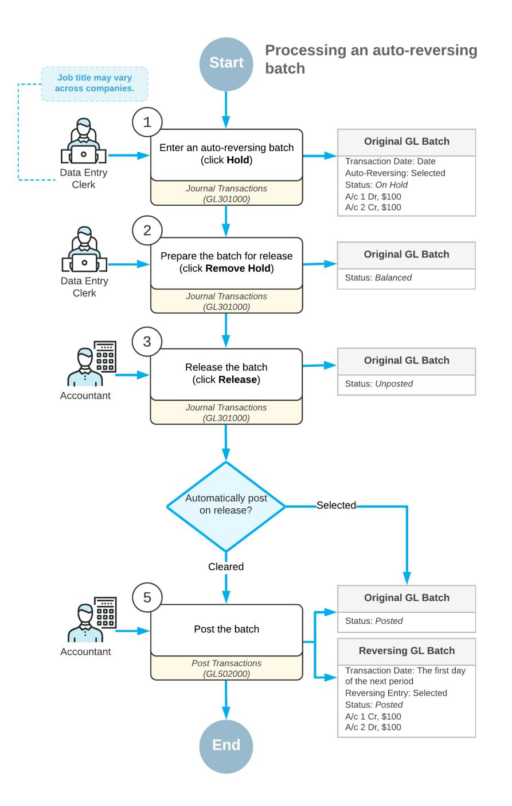

# <span id="page-126-0"></span>**Adjusting Transactions: Implementation Checklist**

Before users begin processing auto-reversing GL batches, you must make sure that the system has been configured properly and that all required entities have been created, as described in the following table.

| Form                                       | Settings to Validate                                           | Notes |
|--------------------------------------------|----------------------------------------------------------------|-------|
| Enable/Disable Features (CS100000)<br>form | Make sure the Standard Financials<br>feature has been enabled. |       |

| Form                                          | Settings to Validate                                                                                                                           | Notes                                                                                            |
|-----------------------------------------------|------------------------------------------------------------------------------------------------------------------------------------------------|--------------------------------------------------------------------------------------------------|
| Multiple forms                                | Make sure that the system has been<br>configured properly, as described<br>in Company Without Branches: Gen<br>eral Information.               |                                                                                                  |
| Chart of Accounts (GL202500) form             | Check whether the necessary ac<br>counts have been created.                                                                                    |                                                                                                  |
| Company Financial Calendar<br>(GL201100) form | Be sure that the financial periods<br>for which auto-reversing transac<br>tions will be created and the next<br>periods have a status of Open. | You can generate the necessary pe<br>riods on the Master Financial Calen<br>dar (GL201000) form. |

### **Settings That Can Affect the Processing Workflow**

The following settings on the *[General Ledger Preferences](https://help-2025r1.acumatica.com/Help?ScreenId=ShowWiki&pageid=e4913d06-c511-4258-a0f9-f36c1b854e6b)* (GL102000) form can affect the processing workflow:

- If the *On Post* option is selected in the **Generate Reversing Entry** box, the system generates a reversing batch when the original batch is posted. If the *On Period Closing* option is selected, the system generates a reversing batch when a user closes the posting period related to the original batch.
- If the **Automatically Post on Release** check box is selected, the system posts batches on release. If this check box is cleared, you have to post the batches aer release.
- If the **Hold Batches on Entry** check box is selected, a batch is saved with the *On Hold* status by default. If the batch is on hold, you should click **Remove Hold** on the toolbar of the *Journal [Transactions](https://help-2025r1.acumatica.com/Help?ScreenId=ShowWiki&pageid=dda046bc-5946-407f-88f7-1c0c966fbe72)* (GL301000) form for the batch so you can process it further. If the check box is cleared, the batch is saved with the *Balanced* status.
- If the **Validate Batch ControlTotals on Entry** check box is selected, enter the batch control total before they save the batch on the *Journal [Transactions](https://help-2025r1.acumatica.com/Help?ScreenId=ShowWiki&pageid=dda046bc-5946-407f-88f7-1c0c966fbe72)* form. If this check box is cleared, the system automatically validates the batch when the status of the batch is *Balanced*.

# <span id="page-127-0"></span>**Adjusting Transactions: Generated Transactions**

On the *Journal [Transactions](https://help-2025r1.acumatica.com/Help?ScreenId=ShowWiki&pageid=dda046bc-5946-407f-88f7-1c0c966fbe72)* (GL301000) form, you can view the details of the original GL batch and its automatically created reversing batch. For the following GL batch recorded to the general ledger, the system will create the auto-reversing GL batch below in the general ledger at the end of the period next to the post period of the original transaction.

#### *Table: The Original GL Batch*

| Account                        | Debit  | Credit |
|--------------------------------|--------|--------|
| 62900 - Rent or Lease Expense  | Amount | 00.00  |
| 23020 - Other Accrued Expenses | 00.00  | Amount |

#### *Table: The Auto-Reversing GL Batch*

| Account                       | Debit | Credit |
|-------------------------------|-------|--------|
| 62900 - Rent or Lease Expense | 00.00 | Amount |

| Account                        | Debit  | Credit |
|--------------------------------|--------|--------|
| 23020 - Other Accrued Expenses | Amount | 00.00  |

# <span id="page-128-1"></span><span id="page-128-0"></span>**Adjusting Transactions: Process Activity**

In this activity, you will learn how to process an auto-reversing batch.


This activity is based on the *U100* dataset. If you are using another dataset, or if any system settings have been changed in *U100*, these changes can affect the workflow of the activity and the results of the processing. To avoid any issues, restore the *U100* dataset to its initial state.

#### **Video Tutorial**

This video shows you the common process but may contain less detail than the activity has. If you want to repeat the activity on your own or you are preparing to take the certification exam, we recommend that you follow the instructions in the steps of the activity.

#### *[FEEDBACK](https://www.surveymonkey.com/r/BLBL7RJ?Video=Adjusting%20Transactions&Source=Open%20Uni&Course=F100)*

#### **Story**

Suppose that by the end of January 2025, the electricity used by the SweetLife Head Office and Wholesale Center in January has not yet been billed by the vendor. Acting as a SweetLife accountant, you need to create an autoreversing batch for the amount of \$2,320, which will be posted on January 31 and reversed at the beginning of the next financial period.

#### **Process Overview**

In this activity, to process an auto-reversing batch, you will create and release an auto-reversing batch on the *Journal [Transactions](https://help-2025r1.acumatica.com/Help?ScreenId=ShowWiki&pageid=dda046bc-5946-407f-88f7-1c0c966fbe72)* (GL301000) form, and then check the ending balance the *[Account Details](https://help-2025r1.acumatica.com/Help?ScreenId=ShowWiki&pageid=517044d6-d4e9-406b-a40e-6139b9b53bd9)* (GL404000) form.

#### **System Preparation**

To prepare the system, do the following:

- 1. Launch the Acumatica ERP website with the *U100* dataset. Sign in as an accountant by using the following credentials:
  - Username: *johnson*
  - Password: *123*
- 2. In the info area, in the upper-right corner of the top pane of the Acumatica ERP screen, make sure that the business date in your system is set to *1/31/2025*. If a different date is displayed, click the Business Date menu button and select *1/31/2025*. For simplicity, in this lesson, you will create and process all documents in the system on this business date.
- 3. On the Company and Branch Selection menu, also on the top pane of the Acumatica ERP screen, make sure that the *SweetLife Head Office and Wholesale Center* branch is selected. If it is not selected, click the Company and Branch Selection menu to view the list of branches that you have access to, and then click *SweetLife Head Office and Wholesale Center*.

#### **Step 1: Creating and Releasing an Auto-Reversing Batch**

To process an auto-reversing batch, do the following:

- 1. Open the *Journal [Transactions](https://help-2025r1.acumatica.com/Help?ScreenId=ShowWiki&pageid=dda046bc-5946-407f-88f7-1c0c966fbe72)* (GL301000) form, and create a new record.
- 2. In the Summary area, specify the following settings:
  - **Transaction Date**: *1/31/2025* (inserted by default)
  - **Post Period**: *01-2025* (inserted by default)
  - **Description**: Electricity expenses of \$2,320
  - **Auto Reversing**: Selected
- 3. On the table toolbar of the **Details** tab, click **Add Row** and specify the following settings for the added row:
  - **Branch**: *HEADOFFICE* (inserted by default)
  - **Account**: *63300 Utilities*
  - **Debit Amount**: 2320
- 4. Click **Add Row** again and add another row with the following settings:
  - **Branch**: *HEADOFFICE* (inserted by default)
  - **Account**: *23020 - Other Accrued Expenses*
  - **Credit Amount**: 2320
- 5. Click **Save** on the form toolbar, and note that the status of the batch is *On Hold*.
- 6. On the form toolbar, click **Remove Hold** and save the batch. The batch's status has changed to *Balanced*.
- 7. On the form toolbar, click **Release** to release the batch.

This causes the original batch to be posted. The system has also generated a new batch with the next sequential number and posted the batch to the first day of the next financial period. The released batch is shown in the following screenshot.

| <b>Journal Transactions</b><br><b>PINOTES</b><br><b>ACTIVITIES</b><br><b>FILES</b><br>GL GL000049 - Electricity expenses of \$2,320<br>찁<br>日<br>$\Omega$<br>$\Omega$<br>侕<br>K<br>$\geq$<br>$\leftarrow$<br>÷<br>$\rightarrow$<br>≺<br>$\check{~}$<br>$\cdots$                                                                                                                    |  |          |                        |  |                           |                                                                                            | TOOLS $\sim$                                     |                |                      |  |                 |          |                                       |           |                 |
|------------------------------------------------------------------------------------------------------------------------------------------------------------------------------------------------------------------------------------------------------------------------------------------------------------------------------------------------------------------------------------|--|----------|------------------------|--|---------------------------|--------------------------------------------------------------------------------------------|--------------------------------------------------|----------------|----------------------|--|-----------------|----------|---------------------------------------|-----------|-----------------|
| GL<br>Module:<br>Branch:<br><b>HEADOFFICE - SweetLife Head Office ar</b><br>$\checkmark$<br>Batch Number:<br>GL000049<br>$\mathcal{Q}$<br>Ledger:<br><b>ACTUAL - Actual Ledger</b><br>Auto Reversing<br><b>Reversing Entry</b><br>Posted<br>Status:<br>Transaction D.<br>1/31/2025<br>Post Period:<br>01-2025<br>Description:<br>Electricity expenses of \$2,320<br><b>DETAILS</b> |  |          |                        |  |                           | Type:<br>Orig. Batch Number:<br><b>Reversing Batches:</b><br>Debit Total:<br>Credit Total: |                                                  | Normal         | 2,320.00<br>2.320.00 |  |                 |          |                                       | $\lambda$ |                 |
| $\boxed{\mathbf{x}}$<br>Ò<br>RECLASSIFICATION HISTORY<br>$\mathbb{H}$<br>$+$<br><b>VIEW SOURCE DOCUMENT</b><br>↗<br>$\uparrow$<br>$\times$                                                                                                                                                                                                                                         |  |          |                        |  |                           |                                                                                            |                                                  |                |                      |  |                 |          |                                       |           |                 |
| D<br><b>B</b> 0<br>*Branch                                                                                                                                                                                                                                                                                                                                                         |  | *Account | <b>Description</b>     |  | Project/Contract          | Project<br>Task                                                                            | Cost<br>!!!!!!!!!!!!!!!!!!!!!!!!!!!!!!!!!!!!!!!! | Ref.<br>Number | Quantity UOM         |  | Debit<br>Amount | Amount   | <b>Credit Transaction Description</b> |           | Non<br>Billable |
| <b>HEADOFFICE</b><br>0 <sub>0</sub>                                                                                                                                                                                                                                                                                                                                                |  | 63300    | <b>Utilities</b>       |  | x                         |                                                                                            | $00 - 000$                                       |                | 0.00                 |  | 2,320.00        | 0.00     | Electricity expenses of \$2,320       |           | $\Box$          |
| <b>HEADOFFICE</b><br>> 0<br>D.                                                                                                                                                                                                                                                                                                                                                     |  | 23020    | Other Accrued Expenses |  | $\boldsymbol{\mathsf{x}}$ |                                                                                            | $00 - 000$                                       |                | 0.00                 |  | 0.00            | 2,320.00 | Electricity expenses of \$2,320       |           | $\Box$          |

#### *Figure: The released auto-reversing batch*

8. In the **Reversing Batches** box of the Summary area, click *1* (the number of the reversing batches).

The system opens the *[GL Reversing Batches](https://help-2025r1.acumatica.com/Help?ScreenId=ShowWiki&pageid=51d10e22-1317-4d0b-b6b6-abb94753916b)* (GL690010) report with the created reversing batch and its details.

#### **Step 2: Reviewing the Posted Transaction**

To review the account balance and the posted transactions, do the following:

1. Open the *[Account Details](https://help-2025r1.acumatica.com/Help?ScreenId=ShowWiki&pageid=517044d6-d4e9-406b-a40e-6139b9b53bd9)* (GL404000) form.

- 2. In the **From Period** box of the Summary area, select *01-2025*.
- 3. In the **To Period** box, select *02-2025*.
- 4. In the **Account** box, select *23020 - Other Accrued Expenses*.
- 5. In the table, review the account's ending balance in the **Ending Balance** column for both periods.
- 6. In the **Account** box, select *63300 Utilities*.
- 7. In the table, review the account's ending balance in the **Ending Balance** column for both periods.

# <span id="page-130-0"></span>**Adjusting Transactions: Related Reports and Inquiries**

In this topic, you can find the list of reports and inquiries related to reversing batches.

#### **Finding Reversing Batches for an Original Batch**

To view the list of reversing batches related to an original batch, you can use the *[GL Reversing Batches](https://help-2025r1.acumatica.com/Help?ScreenId=ShowWiki&pageid=51d10e22-1317-4d0b-b6b6-abb94753916b)* (GL690010) report. On the report form, you run the report for the original batch, and you can then view the list of reversing batches and their details.

You can also open this report by clicking the link in the **Reversing Batches** box of the *Journal [Transactions](https://help-2025r1.acumatica.com/Help?ScreenId=ShowWiki&pageid=dda046bc-5946-407f-88f7-1c0c966fbe72)* (GL301000) form for the original batch. The system opens the *[GL Reversing Batches](https://help-2025r1.acumatica.com/Help?ScreenId=ShowWiki&pageid=51d10e22-1317-4d0b-b6b6-abb94753916b)* (GL690010) report with the list of reversing batches and their details.

# <span id="page-131-2"></span><span id="page-131-0"></span>**Processing Recurring Transactions**

In this chapter, you will read about creating schedules and running and processing schedules.

You will find general information on how to process recurring transactions, a checklist for system implementation, an activity that describes how to process a recurring transaction in the system, and report and inquiries that can be useful to find and view related transactions.

# <span id="page-131-3"></span><span id="page-131-1"></span>**Recurring Transactions: General Information**

To automate the entry of recurring transactions, you create schedules for these transactions in the system.

#### **Learning Objectives**

You will learn how to do the following:

- Create schedules for recurring transactions
- Generate the recurring transactions

#### **Applicable Scenarios**

You need to create schedules for transactions that repeat regularly, such as loan payments and depreciationrelated transactions.

#### **Entry of Recurring Transactions**

Generally, the process of entering of recurring transactions to the system consists of the following steps:

- 1. Creating a recurring batch on the *Journal [Transactions](https://help-2025r1.acumatica.com/Help?ScreenId=ShowWiki&pageid=dda046bc-5946-407f-88f7-1c0c966fbe72)* (GL301000) form.
- 2. Preparing the batch to be scheduled—that is, saving the batch in the *Balanced* status on the *[Journal](https://help-2025r1.acumatica.com/Help?ScreenId=ShowWiki&pageid=dda046bc-5946-407f-88f7-1c0c966fbe72) [Transactions](https://help-2025r1.acumatica.com/Help?ScreenId=ShowWiki&pageid=dda046bc-5946-407f-88f7-1c0c966fbe72)* form.
- 3. Creating a schedule on the *Recurring [Transactions](https://help-2025r1.acumatica.com/Help?ScreenId=ShowWiki&pageid=fd27f507-8528-49f1-904f-fe149a265c70)* (GL203500) form for the batch.
- 4. Running the schedule to generate recurring batches.
- 5. Processing the generated batches.

The typical processing workflow of processing recurring batches is shown in the following diagram.

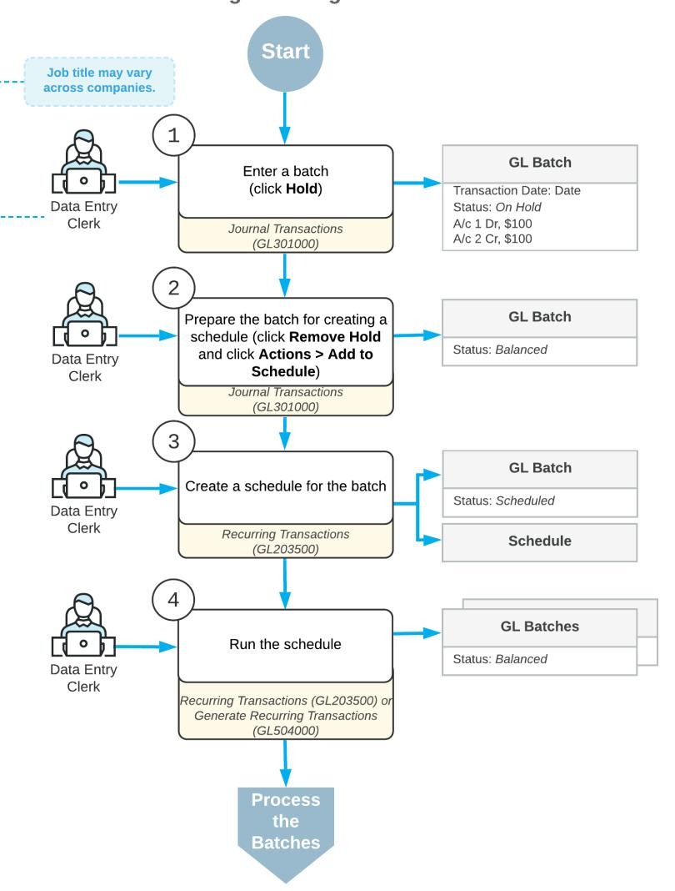

*Figure: Processing recurring batches*

#### **Schedule Creation**

You create a schedule on the *Recurring [Transactions](https://help-2025r1.acumatica.com/Help?ScreenId=ShowWiki&pageid=fd27f507-8528-49f1-904f-fe149a265c70)* (GL203500) form. For the schedule, you specify the date when it starts, and you can either specify a maximum number of times the schedule should be repeated or set up unlimited schedule executions by selecting the **No Limit** check box.

You then select the appropriate option in the **Frequency** box to indicate how frequently the schedule applies:

- *Daily*: The batches should be generated daily or every *x* days.
- *Weekly*: The batches should be generated on specific days of the week each week or every *x* weeks.
- *Monthly*: The batches should be generated once per month or every *x* months on a specific day of the month.
- *By Financial Period*: The batches should be generated only once per financial period or every *x* financial periods at the start, end of the financial period, or on a specific day of the financial period.

#### **Scheduled Batches**

You can add GL batches to a schedule immediately (if all the required batches already exist) or later. Only batches with the *Normal* type and the *Balanced* status can be scheduled. Aer you have assigned a batch to a schedule, the system changes the batch's status to *Scheduled*.

On the *Journal [Transactions](https://help-2025r1.acumatica.com/Help?ScreenId=ShowWiki&pageid=dda046bc-5946-407f-88f7-1c0c966fbe72)* (GL301000) form, you can create a batch and then immediately add it to a new schedule by clicking **Add toSchedule** (under **Other**) on the More menu.

A batch can be included in only one schedule. If a batch has been added to a schedule and you add it to a new schedule, the system removes it from the previous schedule.

#### **Generation of Recurring Transactions**

You use the *Generate Recurring [Transactions](https://help-2025r1.acumatica.com/Help?ScreenId=ShowWiki&pageid=a69eb867-31f7-480c-a7f5-4c2f80dcee6f)* (GL504000) form to run a single schedule or multiple schedules. You can also run a particular schedule on the *Recurring [Transactions](https://help-2025r1.acumatica.com/Help?ScreenId=ShowWiki&pageid=fd27f507-8528-49f1-904f-fe149a265c70)* (GL203500) form by selecting the schedule in the **Schedule ID** box and clicking **Run Now** on the form toolbar.

When you run a schedule, the system uses the included batches as template batches to generate similar batches. The batches generated by a schedule can differ from the template as follows:

- Date: The date of each batch is different, determined by the schedule you have configured.
- Reference number: A new reference number is generated for each batch based on the numbering sequence specified on the *[General Ledger Preferences](https://help-2025r1.acumatica.com/Help?ScreenId=ShowWiki&pageid=e4913d06-c511-4258-a0f9-f36c1b854e6b)* (GL102000) form.
- Currency rate: If the currency of a batch differs from the base currency set in the system, the system uses for conversion the currency exchange rate effective on the date of the batch creation.

No matter how many times you run the schedule, batches will be generated only as required by the schedule. The system determines whether it should generate the batches depending on the current date, the schedule's start and expiration dates, the schedule type, and the date when the batches were last generated. Aer the required batches have been generated, the system updates the **Last Executed** value. One batch is generated for one run of the schedule.

For example, suppose that you have scheduled a particular batch to be performed weekly on each Tuesday, with no execution limit. If you run the schedule every week on Wednesday, one batch will be generated each time. If you run this schedule every day, the batches will be generated only on Tuesdays. If you want to run this schedule once in a month, on the last Wednesday, you should run it four times to generate four batches.

Batches generated as a result of a user running a schedule appear in the system with the *Balanced* status. They can be released or posted as any other batches can. You can change the transaction amounts, if needed.

# <span id="page-133-0"></span>**Recurring Transactions: Implementation Checklist**

To ensure that the system is configured properly for creating recurring batches, make sure that the features and settings listed in the table are configured as described in the following table.

| Form                                       | Settings to Check                                              | Notes |
|--------------------------------------------|----------------------------------------------------------------|-------|
| Enable/Disable Features (CS100000)<br>form | Make sure the Standard Financials<br>feature has been enabled. |       |

| Form                                          | Settings to Check                                                                                                                                         | Notes                                                                                            |
|-----------------------------------------------|-----------------------------------------------------------------------------------------------------------------------------------------------------------|--------------------------------------------------------------------------------------------------|
| Multiple forms                                | Make sure that the minimum con<br>figuration of the company has been<br>performed, as described in Compa<br>ny Without Branches: General Infor<br>mation. |                                                                                                  |
| Chart of Accounts (GL202500) form             | Check whether the necessary ac<br>counts have been created.                                                                                               |                                                                                                  |
| Company Financial Calendar<br>(GL201100) form | Be sure that the financial periods<br>for which transactions will be creat<br>ed have a status of Open.                                                   | You can generate the necessary pe<br>riods on the Master Financial Calen<br>dar (GL201000) form. |

#### **Settings That Affect Workflow**

The following settings on the *[General Ledger Preferences](https://help-2025r1.acumatica.com/Help?ScreenId=ShowWiki&pageid=e4913d06-c511-4258-a0f9-f36c1b854e6b)* (GL102000) form can affect the processing workflow:

- If the **Automatically Post on Release** check box is selected, the system posts batches on release. If this check box is cleared, you have to post the batches aer release.
- If the **Hold Batches on Entry** check box is selected, a batch is saved with the *On Hold* status by default. If the batch is on hold, you should click **Remove Hold** on the toolbar of the *Journal [Transactions](https://help-2025r1.acumatica.com/Help?ScreenId=ShowWiki&pageid=dda046bc-5946-407f-88f7-1c0c966fbe72)* (GL301000) form for the batch so you can process it further. If the check box is cleared, the batch is saved with the *Balanced* status.
- If the **Validate Batch ControlTotals on Entry** check box is selected, enter the batch control total before they save the batch on the *Journal [Transactions](https://help-2025r1.acumatica.com/Help?ScreenId=ShowWiki&pageid=dda046bc-5946-407f-88f7-1c0c966fbe72)* form. If this check box is cleared, the system automatically validates the batch when the status of the batch is *Balanced*.

# <span id="page-134-1"></span><span id="page-134-0"></span>**Recurring Transactions: Process Activity**

In this activity, you will create a recurring batch to be used as a template, create a schedule for the batch, and run the schedule to generate the batch.

This activity is based on the *U100* dataset. If you are using another dataset, or if any system settings have been changed in *U100*, these changes can affect the workflow of the activity and the results of the processing. To avoid any issues, restore the *U100* dataset to its initial state.

#### **Video Tutorial**

This video shows you the common process but may contain less detail than the activity has. If you want to repeat the activity on your own or you are preparing to take the certification exam, we recommend that you follow the instructions in the steps of the activity.

#### *[FEEDBACK](https://www.surveymonkey.com/r/BLBL7RJ?Video=Processing%20Recurring%20Transactions&Source=Open%20Uni&Course=F100)*

#### **Story**

Suppose that the SweetLife Fruits & Jams company pays rent every month and receives the rent bill for each month at the beginning of the next month. The company records the accrual of rent expenses every month.

Acting as a SweetLife accountant, you have to create a recurring batch to schedule the accrual of rent expenses for every month of 2025. You also need to generate the batch for the *01-2025* financial period.

#### **Process Overview**

To use a recurring batch, you will create a recurring batch to be used as a template on the *Journal [Transactions](https://help-2025r1.acumatica.com/Help?ScreenId=ShowWiki&pageid=dda046bc-5946-407f-88f7-1c0c966fbe72)* (GL301000) form. You will then create a schedule for the batch based on this template on the *Recurring [Transactions](https://help-2025r1.acumatica.com/Help?ScreenId=ShowWiki&pageid=fd27f507-8528-49f1-904f-fe149a265c70)* (GL203500) form. To generate a batch, you will run the schedule on the *Generate Recurring [Transactions](https://help-2025r1.acumatica.com/Help?ScreenId=ShowWiki&pageid=a69eb867-31f7-480c-a7f5-4c2f80dcee6f)* (GL504000) form; you will then release the batch on the *Release [Transactions](https://help-2025r1.acumatica.com/Help?ScreenId=ShowWiki&pageid=5dd30a1f-e104-42cc-b44c-9427c6151dee)* (GL501000) form.

#### **System Preparation**

To prepare the system, do the following:

- 1. Launch the Acumatica ERP website with the *U100* dataset. Sign in as an accountant by using the following credentials:
  - Username: *johnson*
  - Password: *123*
- 2. In the info area, in the upper-right corner of the top pane of the Acumatica ERP screen, make sure that the business date in your system is set to *1/31/2025*. If a different date is displayed, click the Business Date menu button and select *1/31/2025*. For simplicity, in this activity, you will create and process all documents in the system on this business date.
- 3. On the Company and Branch Selection menu, also on the top pane of the Acumatica ERP screen, make sure that the *SweetLife Head Office and Wholesale Center* branch is selected. If it is not selected, click the Company and Branch Selection menu to view the list of branches that you have access to, and then click *SweetLife Head Office and Wholesale Center*.

#### **Step 1: Creating a Batch to Be Used as a Template**

To create a recurring batch with the *Balanced* status to be used as a template, do the following:

1. Open the *Journal [Transactions](https://help-2025r1.acumatica.com/Help?ScreenId=ShowWiki&pageid=dda046bc-5946-407f-88f7-1c0c966fbe72)* (GL301000) form.


To open the form for creating a new record, type the form ID in the Search box, and on the Search form, point at the form title and click **New** right of the title.

- 2. On the form toolbar, click **Add New Record** and specify the following settings in the Summary area:
  - **Transaction Date**: *1/31/2025* (inserted by default)
  - **Description**: Rent Accrual
- 3. On the form toolbar, click **Remove Hold** to give the batch the *Balanced* status.
- 4. Click **Add Row** on the table toolbar of the **Details** tab, and add a row with the following settings:
  - **Branch**: *HEADOFFICE* (inserted automatically based on the selected branch)
  - **Account**: *62900 (Rent or Lease Expense)*
  - **Debit Amount**: 4700
- 5. Click **Add Row** again and add another row with the following settings:
  - **Branch**: *HEADOFFICE* (inserted automatically based on the selected branch)
  - **Account**: *23015 (Accrued Expenses)*
  - **Credit Amount**: 4700
- 6. On the form toolbar, click**Save** to save the batch you have created.

#### **Step 2: Creating a Schedule for the Batch**

To create a schedule for the batch, do the following:

1. While you are viewing the batch you have just created and saved on the *Journal [Transactions](https://help-2025r1.acumatica.com/Help?ScreenId=ShowWiki&pageid=dda046bc-5946-407f-88f7-1c0c966fbe72)* (GL301000) form, on the More menu (under **Other**), click **Add toSchedule**.

The *Recurring [Transactions](https://help-2025r1.acumatica.com/Help?ScreenId=ShowWiki&pageid=fd27f507-8528-49f1-904f-fe149a265c70)* (GL203500) form is opened.

- 2. Configure a schedule to repeat the batch 12 times, on the last day of each month, by specifying the following settings:
  - **Start Date**: *1/31/2025* (or any date that is not aer the first date when you need to execute the schedule)
  - **Execution Limit (Times)**: 12
  - **Description**: Rent Accrual
  - **Frequency**: *Monthly*
  - **Every**: *1* month(s)
  - **Recurrence**: *Fixed Day of Month 31*
- 3. On the form toolbar, click**Save** to save the schedule.

#### **Step 3: Running the Schedule and Generating a Batch**

To run the schedule and generate a batch, do the following:

- 1. Open the *Generate Recurring [Transactions](https://help-2025r1.acumatica.com/Help?ScreenId=ShowWiki&pageid=a69eb867-31f7-480c-a7f5-4c2f80dcee6f)* (GL504000) form, and in the Summary area, specify the following settings:
  - **Execution Date**: *1/31/2025*
  - **Stop Aer Number of Executions**: Selected, 1
- 2. In the table that displays recurring transaction schedules, select the unlabeled check box in the row of the only schedule, and click **Run** on the table toolbar to generate the batch according to the schedule.
- 3. In the **Processing** pop-up window, which opens, click the **Processed** tab and click the link in the**Schedule ID** column to open the schedule on the *Recurring [Transactions](https://help-2025r1.acumatica.com/Help?ScreenId=ShowWiki&pageid=fd27f507-8528-49f1-904f-fe149a265c70)* (GL203500) form.
- 4. On the **Generated Documents** tab of this form, verify that a batch has been generated by the template, as shown in the following screenshot.

| <b>Recurring Transactions</b><br>000002 - Rent Accrual                                                  |                |                            | <b>PINOTES</b>    | <b>ACTIVITIES</b>  | <b>FILES</b><br>CUSTOMIZATION | TOOLS $\star$         |  |
|---------------------------------------------------------------------------------------------------------|----------------|----------------------------|-------------------|--------------------|-------------------------------|-----------------------|--|
| 뭐<br>Ħ<br>∽<br>$\pm$                                                                                    | 面<br>K<br>≺    | $\left( \right)$<br>$\geq$ | RUN NOW           |                    |                               |                       |  |
| Schedule ID:                                                                                            | o<br>000002    | Active                     | <b>RECURRENCE</b> |                    |                               | $\boldsymbol{\wedge}$ |  |
| * Start Date:                                                                                           | 户<br>1/31/2025 |                            | Frequency:        | Monthly            | $\checkmark$                  |                       |  |
| Expiration Date:                                                                                        |                | V Never Expires            | Every:            | month(s)<br>$1 -$  |                               |                       |  |
| Execution Limit (Times):                                                                                | 12             | $\Box$ No Limit            | Recurrence:       | Fixed Day of Month | $\checkmark$                  | 31<br>$\checkmark$    |  |
| Description:                                                                                            | Rent Accrual   |                            |                   |                    |                               |                       |  |
| Last Executed:                                                                                          | 1/31/2025      |                            |                   |                    |                               |                       |  |
| Next Execution:                                                                                         | 2/28/2025      |                            |                   |                    |                               |                       |  |
| Executed (Times):                                                                                       |                |                            |                   |                    |                               |                       |  |
| <b>BATCH LIST</b><br>GENERATED DOCUMENTS                                                                |                |                            |                   |                    |                               |                       |  |
| !!!!!!!!!!!!!!!!!!!!!!!!!!!!!!!!!!!!!!!!<br>$\mathbf{\overline{x}}$<br>$\left  \leftrightarrow \right $ |                |                            |                   |                    |                               |                       |  |
| 圄<br>Ū<br>n<br><b>Batch Number</b>                                                                      | *Ledger        | *Transaction Date          | *Post Period      | <b>Status</b>      | Control Total Currency        |                       |  |
| Q<br>≻<br>GL000047<br>Ð                                                                                 | <b>ACTUAL</b>  | 1/31/2025                  | 01-2025           | Balanced           | 4,700.00                      | <b>USD</b>            |  |

*Figure: The recurring schedule and the generated batch*

#### **Step 4: Releasing the Generated Batch**

To release the generated batch, do the following:

- 1. Open the *Release [Transactions](https://help-2025r1.acumatica.com/Help?ScreenId=ShowWiki&pageid=5dd30a1f-e104-42cc-b44c-9427c6151dee)* (GL501000) form.
- 2. Select the unlabeled check box for the only transaction in the table, and click **Release** on the form toolbar. In the **Processing** pop-up window, which opens, wait for the processing to complete and click **Close**.

### <span id="page-137-0"></span>**Recurring Transactions: Mass-Processing**

This topic explains how to release and post multiple batches.

#### **Mass-Running Schedules**

You can run multiple schedules on the *Generate Recurring [Transactions](https://help-2025r1.acumatica.com/Help?ScreenId=ShowWiki&pageid=a69eb867-31f7-480c-a7f5-4c2f80dcee6f)* (GL504000) form. In the **Execution Date** box, you select the date that the system will use to select the schedules to be loaded to the table. Those schedules whose **Next Execution** date is earlier than or the same as the date specified in this box will be loaded.

You then specify the condition that the system will use to stop schedule executions by selecting one of the following option buttons, and run the process:

- **Stop on Execution Date**: The system stops running schedules on the date that you specify in the **Execution Date** box.
- **Stop Aer Number of Executions**: The system stops running schedules when the specified number of schedule executions have been performed. If you select this option button, specify the number of executions in the adjacent box.

# <span id="page-138-0"></span>**Recurring Transactions: Related Reports and Forms**

In this topic, you can find information about the reports and forms related to recurring batches.

# **Finding Schedule Summaries**

By using the *GL Recurring [Transactions](https://help-2025r1.acumatica.com/Help?ScreenId=ShowWiki&pageid=cb526c8a-4ffe-468b-b7bb-c405dce13709)* (GL641500) report, you can find schedules that have been created in the system and review their brief details, including the details of the batch that is used to generate recurring transactions. You can also run this report for a particular schedule.

# **Finding Schedule Details**

By using the *GL Recurring [Transactions](https://help-2025r1.acumatica.com/Help?ScreenId=ShowWiki&pageid=960de8ef-c4e5-4145-9938-3c2b0f798efe) Detailed* (GL640500) report, you can find schedules that have been created in the system and review their details, including the details of the batch that is used to generate recurring transactions and batch entries. You can also run this report for a particular schedule.

# **Viewing Generated Batches for a Particular Schedule**

On the *Recurring [Transactions](https://help-2025r1.acumatica.com/Help?ScreenId=ShowWiki&pageid=fd27f507-8528-49f1-904f-fe149a265c70)* (GL203500) form, you can find the list of batches generated for a particular schedule. On this form, in the**Schedule ID** box, you select the schedule for which you want to view generated batches. On the **Generated Documents** tab, you can review the list of the generated batches and find the batch number, the ledger to which it will be posted, the transaction date, its status, the total amount, and the currency. You can also click the number of the batch whose details you want to view in the **Batch Number** column. The system will open the *Journal [Transactions](https://help-2025r1.acumatica.com/Help?ScreenId=ShowWiki&pageid=dda046bc-5946-407f-88f7-1c0c966fbe72)* (GL301000) form with the details of the batch.

# **Viewing and Editing a Schedule for a Particular Batch**

You can view the schedule to which the batch is added by opening the batch and clicking **Add toSchedule** (under **Other**) on the More menu (which also gives you the ability to view and edit an already-added schedule) of the *Journal [Transactions](https://help-2025r1.acumatica.com/Help?ScreenId=ShowWiki&pageid=dda046bc-5946-407f-88f7-1c0c966fbe72)* (GL301000) form. The *Recurring [Transactions](https://help-2025r1.acumatica.com/Help?ScreenId=ShowWiki&pageid=fd27f507-8528-49f1-904f-fe149a265c70)* (GL203500) form opens with the schedule related to the batch.

# <span id="page-138-1"></span>**To Generate Recurring Transactions for a Single Schedule**

You can generate transactions for a particular schedule on the *Recurring [Transactions](https://help-2025r1.acumatica.com/Help?ScreenId=ShowWiki&pageid=fd27f507-8528-49f1-904f-fe149a265c70)* (GL203500) form.

- You can also generate batches for a single schedule on the *Generate Recurring [Transactions](https://help-2025r1.acumatica.com/Help?ScreenId=ShowWiki&pageid=a69eb867-31f7-480c-a7f5-4c2f80dcee6f)* (GL504000) form.
- You can search for a form by its name or its form ID (without periods). For more information about search capabilities, see *[Search](https://help-2025r1.acumatica.com/Help?ScreenId=ShowWiki&pageid=09ed14e6-3600-4d60-8267-66531025f5c3)*.

# **To Generate Recurring Transactions for a Single Schedule**

- 1. Open the *Recurring [Transactions](https://help-2025r1.acumatica.com/Help?ScreenId=ShowWiki&pageid=fd27f507-8528-49f1-904f-fe149a265c70)* (GL203500) form.
- 2. In the Summary area, in the**Schedule ID** box, select the schedule for which you want to generate transactions.
- 3. On the form toolbar, click **Run Now**.

4. On the **Generated Documents** tab, view the list of generated batches.

# <span id="page-140-2"></span><span id="page-140-0"></span>**Reclassifying Transactions**

If the batch was posted to the wrong GL account, subaccount, or branch, you can correct it by reclassifying the batch.

In this chapter, you will find general information on how to reclassify transactions, a checklist for system implementation, an activity that describes how to reclassify transactions in the system, and reports and inquiries that can be useful to find and view related transactions.

# <span id="page-140-3"></span><span id="page-140-1"></span>**Reclassifying Transactions: General Information**

You use the *Reclassify [Transactions](https://help-2025r1.acumatica.com/Help?ScreenId=ShowWiki&pageid=48075ac9-54ee-4082-acde-9e93ea7c3edb)* (GL506000) form to reclassify a batch was posted to the wrong GL account, subaccount, or branch. For details on reclassifying GL transactions related to a project, see *[Transaction](https://help-2025r1.acumatica.com/Help?ScreenId=ShowWiki&pageid=8f173d82-9814-41ab-9261-c6f662faf59e) [Reclassification: General Information](https://help-2025r1.acumatica.com/Help?ScreenId=ShowWiki&pageid=8f173d82-9814-41ab-9261-c6f662faf59e)*.

#### **Learning Objectives**

You will learn how to perform the reclassification process.

#### **Applicable Scenarios**

You reclassify a batch in the following cases:

- A batch has been posted to the wrong account.
- A batch has been posted to the wrong subaccount.
- A batch has been posted to the wrong branch.

#### **Workflow of Batch Reclassification**

On the *Reclassify [Transactions](https://help-2025r1.acumatica.com/Help?ScreenId=ShowWiki&pageid=48075ac9-54ee-4082-acde-9e93ea7c3edb)* (GL506000) form, before you perform the reclassification process, you need to specify new details for each journal entry that you need to reclassify. You can change an account, subaccount, and branch.

While reclassifying a transaction, you can also edit the transaction date and the description of the reclassification transaction. If you edit the date, the new date has to be in the range of the financial period of the original transaction.

You can change required settings in each needed row manually, or perform mass changing of settings in multiple rows.

The following diagram shows the general process of reclassifying transactions.

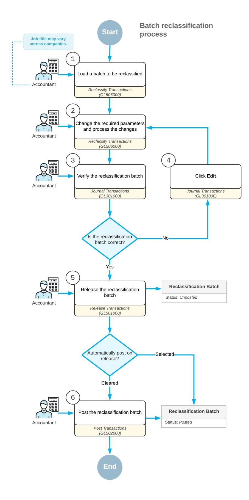

*Figure: Batch reclassification process*

#### **Modification of Selected Transactions Manually**

To change the required settings manually, in each needed row, you modify any of the following boxes:

- **To Account**: The transaction amount will be moved from the originally specified GL account (**Account**) to the account specified in this box.
- **ToSubaccount**: The transaction amount will be moved from the originally specified subaccount (**Subaccount**) to the subaccount specified in this box.

This box is available only if the *Subaccounts* feature is enabled on the *[Enable/Disable Features](https://help-2025r1.acumatica.com/Help?ScreenId=ShowWiki&pageid=c1555e43-1bc5-4f6f-ba9d-b323f94d8a6b)* (CS100000) form.

• **To Branch**: The transaction will be moved to the GL account or subaccount of the branch specified in this box.


This box is available only if the *Multibranch Support* feature is enabled on the *[Enable/Disable](https://help-2025r1.acumatica.com/Help?ScreenId=ShowWiki&pageid=c1555e43-1bc5-4f6f-ba9d-b323f94d8a6b) [Features](https://help-2025r1.acumatica.com/Help?ScreenId=ShowWiki&pageid=c1555e43-1bc5-4f6f-ba9d-b323f94d8a6b)* form.

By default, these boxes contain the values of the original journal entry. Once you have changed any of the default values, the entry becomes available for reclassification.

To edit the date and description of a transaction, you need to enter new values in the **New Tran. Date** and **New Transaction Description** boxes, respectively.

### **Modification of a Group of Transactions**

To perform mass-changing of settings in multiple rows, on the form toolbar of the *Reclassify [Transactions](https://help-2025r1.acumatica.com/Help?ScreenId=ShowWiki&pageid=48075ac9-54ee-4082-acde-9e93ea7c3edb)* (GL506000) form, you click **Replace**. In the **Find and Replace** dialog box that opens, you specify the original and replacement transaction settings. Then you click **Replace** to close the dialog box and replace the settings in the needed rows.

To run the reclassification process, you click **Process** on the form toolbar.

#### **Transactions that Cannot be Reclassified**

The following general ledger transactions cannot be reclassified:

- Project-related transactions that have been billed.
- Project-related transactions that have been allocated.
- Project-related transactions linked to project commitments.
- Project-related transactions that are related to a project that is not active.
- Journal entries of transactions in which a control account is specified, such as entries posted on release of accounts receivable and accounts payable documents to AR and AP accounts, respectively, and to Tax Payable and Tax Claimable accounts. (A control account is a general ledger account that accumulates the summary information of a subledger, such as AR or AP. The details of the control account balance are contained in the subledger, so the balance of the control account should match the total of the related subledger.)


You can reclassify GL entries posted on release of AR and AP documents to income and expense accounts.

• Transactions generated in the general ledger when consolidation data has been imported on the *[Import](https://help-2025r1.acumatica.com/Help?ScreenId=ShowWiki&pageid=c54201e4-84a0-4423-9686-a9c2523a17f6) [Consolidation Data](https://help-2025r1.acumatica.com/Help?ScreenId=ShowWiki&pageid=c54201e4-84a0-4423-9686-a9c2523a17f6)* (GL509000) form. For details, see *[GL Consolidation: General Information](#page-239-3)*.

- Transactions generated by a user invoking the run allocation process on the *[Run Allocations](https://help-2025r1.acumatica.com/Help?ScreenId=ShowWiki&pageid=ef22612c-7cfe-4b73-aeb1-23decc28e6f6)* (GL504500) form. For details, see *[Allocation Rules](https://help-2025r1.acumatica.com/Help?ScreenId=ShowWiki&pageid=feee42b7-afec-4bbd-9091-1f8f6b7c8849)* and *[Running Allocations](#page-230-2)*.
- All currency-related GL transactions, such as transactions generated based on the currency translation and revaluation processes.
- Transactions that have already been reclassified.

# <span id="page-143-2"></span><span id="page-143-0"></span>**Reclassifying Transactions: Initiation of the Reclassification Process**

You initiate the reclassification process on the *Reclassify [Transactions](https://help-2025r1.acumatica.com/Help?ScreenId=ShowWiki&pageid=48075ac9-54ee-4082-acde-9e93ea7c3edb)* (GL506000) form, which you open in one of the following ways:

- By using the *[Account Details](https://help-2025r1.acumatica.com/Help?ScreenId=ShowWiki&pageid=517044d6-d4e9-406b-a40e-6139b9b53bd9)* (GL404000) form. On this form, you select a GL account and, in the list of transactions posted to this account, the transactions that you need to reclassify. You then click **Reclassify** on the form toolbar. The *Reclassify [Transactions](https://help-2025r1.acumatica.com/Help?ScreenId=ShowWiki&pageid=48075ac9-54ee-4082-acde-9e93ea7c3edb)* form opens with the selected transactions displayed in the table. (To reclassify all transactions posted to the selected account, you can instead click **Reclassify All** on the form toolbar.)
- By using the *Journal [Transactions](https://help-2025r1.acumatica.com/Help?ScreenId=ShowWiki&pageid=dda046bc-5946-407f-88f7-1c0c966fbe72)* form. On this form, you select the needed GL batch with the *Released* status and click **Reclassify** on the form toolbar, click *Reclassify*. The *Reclassify [Transactions](https://help-2025r1.acumatica.com/Help?ScreenId=ShowWiki&pageid=48075ac9-54ee-4082-acde-9e93ea7c3edb)* form opens, displaying the transactions included in the selected GL batch.
- By searching for or navigating to the *Reclassify [Transactions](https://help-2025r1.acumatica.com/Help?ScreenId=ShowWiki&pageid=48075ac9-54ee-4082-acde-9e93ea7c3edb)* form as a starting point. The form opens with no entries in the list. To load the entries to be reclassified, you click **Load** on the form toolbar. In the **Load Transactions** dialog box, which opens, you specify the settings of the transactions to be uploaded to the form. Once the transactions are uploaded, you can modify the details of each required transaction or of multiple transactions simultaneously.
- By using the *[Reclassification History](https://help-2025r1.acumatica.com/Help?ScreenId=ShowWiki&pageid=48500f0b-8d5e-4125-bad6-4e5b0c672994)* (GL405000) form. On this form, you can select the last transaction of the reclassification chain and then click **Reclassify** on the form toolbar, which opens the *Reclassify [Transactions](https://help-2025r1.acumatica.com/Help?ScreenId=ShowWiki&pageid=48075ac9-54ee-4082-acde-9e93ea7c3edb)* form.

# <span id="page-143-1"></span>**Reclassifying Transactions: Correction of Reclassified Transactions**

You can edit GL transactions that were generated by the reclassification process, and you can reverse incorrect GL transactions that were generated by the reclassification process.

#### **Editing of Reclassification Transactions**

To perform editing, on the *Journal [Transactions](https://help-2025r1.acumatica.com/Help?ScreenId=ShowWiki&pageid=dda046bc-5946-407f-88f7-1c0c966fbe72)* (GL301000) form, you select a batch of the *Reclassification* type with the *Balanced* or *On Hold* status, and click **Edit** on the form toolbar. The *Reclassify [Transactions](https://help-2025r1.acumatica.com/Help?ScreenId=ShowWiki&pageid=48075ac9-54ee-4082-acde-9e93ea7c3edb)* (GL506000) form opens, displaying all journal entries included in the batch.

You can edit the following details of each displayed journal entry:

- The branch (**To Branch**), which appears if the *Multibranch Support* feature is enabled on the *[Enable/Disable](https://help-2025r1.acumatica.com/Help?ScreenId=ShowWiki&pageid=c1555e43-1bc5-4f6f-ba9d-b323f94d8a6b) [Features](https://help-2025r1.acumatica.com/Help?ScreenId=ShowWiki&pageid=c1555e43-1bc5-4f6f-ba9d-b323f94d8a6b)* (CS100000) form
- The account (**To Account**)


The new account that you specify must have the same default currency as the default currency of the batch.

- The subaccount (**ToSubaccount**), which appears on the form if the *Subaccounts* feature is enabled on the *[Enable/Disable Features](https://help-2025r1.acumatica.com/Help?ScreenId=ShowWiki&pageid=c1555e43-1bc5-4f6f-ba9d-b323f94d8a6b)* form
- The transaction date (**New Tran. Date**)

- The transaction description (**New Transaction Description**)
- The project (**To Project**), which appears on the form if the *Project Accounting* feature is enabled on the *[Enable/Disable Features](https://help-2025r1.acumatica.com/Help?ScreenId=ShowWiki&pageid=c1555e43-1bc5-4f6f-ba9d-b323f94d8a6b)* form
- The project task (**To ProjectTask**), which appears on the form if the *Project Accounting* feature is enabled on the *[Enable/Disable Features](https://help-2025r1.acumatica.com/Help?ScreenId=ShowWiki&pageid=c1555e43-1bc5-4f6f-ba9d-b323f94d8a6b)* form
- The cost code (**To Cost Code**), which appears on the form if the *Cost Codes* feature is enabled on the *[Enable/](https://help-2025r1.acumatica.com/Help?ScreenId=ShowWiki&pageid=c1555e43-1bc5-4f6f-ba9d-b323f94d8a6b) [Disable Features](https://help-2025r1.acumatica.com/Help?ScreenId=ShowWiki&pageid=c1555e43-1bc5-4f6f-ba9d-b323f94d8a6b)* form

While you are editing, you can add new journal entries (rows) to the list of journal entries on the *[Reclassify](https://help-2025r1.acumatica.com/Help?ScreenId=ShowWiki&pageid=48075ac9-54ee-4082-acde-9e93ea7c3edb) [Transactions](https://help-2025r1.acumatica.com/Help?ScreenId=ShowWiki&pageid=48075ac9-54ee-4082-acde-9e93ea7c3edb)* form. You add a new journal entry (or multiple entries) by clicking **Load** on the form toolbar. In the **Load Transactions** dialog box, you specify the criteria to load the required journal entries. For these journal entries, if you specify a post period or currency that differs from the period or currency of the original GL transaction, then when you process the transaction, the system generates a new reclassification transaction (with a new identification number) that includes these journal entries.

You can also delete journal entries (rows) from the list of journal entries when you edit a transaction, so that aer you run the process, the reclassification transaction will not contain deleted journal entries.

Aer editing, the number of the reclassification batch remains unchanged.

#### **Reversal of a Reclassification Batch**

To reverse these transactions, on the *Journal [Transactions](https://help-2025r1.acumatica.com/Help?ScreenId=ShowWiki&pageid=dda046bc-5946-407f-88f7-1c0c966fbe72)* (GL301000) form, you need to select a released GL batch of the *Reclassification* type, and on the More menu (under **Corrections**), click **Reverse**. The *Reclassify [Transactions](https://help-2025r1.acumatica.com/Help?ScreenId=ShowWiki&pageid=48075ac9-54ee-4082-acde-9e93ea7c3edb)* (GL506000) form opens, which already contains the data that reverses the original batch. On this form, you can edit the required details in the journal entries that are displayed. When you click **Process**, the new *Reclassification* batch is generated.

# <span id="page-144-0"></span>**Reclassifying Transactions: Implementation Checklist**

Before users begin reclassifying GL batches, you must make sure that the system has been configured properly and that all required entities have been created, as described in the following table

| Form                                       | Settings to Validate                                                                                                                                      | Notes |
|--------------------------------------------|-----------------------------------------------------------------------------------------------------------------------------------------------------------|-------|
| Enable/Disable Features (CS100000)<br>form | Make sure the Standard Financials<br>feature has been enabled.                                                                                            |       |
| Multiple forms                             | Make sure that the minimum con<br>figuration of the company has been<br>performed, as described in Compa<br>ny Without Branches: General Infor<br>mation. |       |

#### **Settings That Can Affect the Processing Workflow**

The settings on the *[General Ledger Preferences](https://help-2025r1.acumatica.com/Help?ScreenId=ShowWiki&pageid=e4913d06-c511-4258-a0f9-f36c1b854e6b)* (GL102000) form can affect the processing workflow as follows:

• If the **Hold Batches on Entry** check box is selected, a batch is saved with the *On Hold* status by default. If the batch is on hold, you should click **Remove Hold** on the toolbar of the *Journal [Transactions](https://help-2025r1.acumatica.com/Help?ScreenId=ShowWiki&pageid=dda046bc-5946-407f-88f7-1c0c966fbe72)* (GL301000) form for the batch so that you can process it further. If the check box is cleared, the batch is saved with the *Balanced* status.

- If the **Validate Batch ControlTotals on Entry** check box is selected, you have to enter the batch control total before you save the batch on the *Journal [Transactions](https://help-2025r1.acumatica.com/Help?ScreenId=ShowWiki&pageid=dda046bc-5946-407f-88f7-1c0c966fbe72)* form. If this check box is cleared and the status of the batch is *Balanced*, the system automatically validates the batch.
- If the **Automatically Post on Release** check box is selected, the system posts batches on release. If this check box is cleared, you have to post the batches aer release.

# <span id="page-145-0"></span>**Reclassifying Transactions: Generated Transactions**

Suppose that by mistake you have specified a wrong account in the AP bill. Now you need to reclassify the wrong journal entry by creating a correcting transaction, so that the amount will be moved to the correct account.

The following table shows the journal entries of the original GL transaction of the *Normal* type.

| Account                  | Debit  | Credit |
|--------------------------|--------|--------|
| Accounts Payable account | 00.00  | Amount |
| Expense account 1        | Amount | 00.00  |

The following table shows the journal entries of the correcting GL transaction of the *Reclassification* type.

| Account           | Debit  | Credit |
|-------------------|--------|--------|
| Expense account 1 | 00.00  | Amount |
| Expense account 2 | Amount | 00.00  |

# <span id="page-145-1"></span>**Reclassifying Transactions: Process Activity**

In this activity, you will learn how to reclassify GL transactions.

This activity is based on the *U100* dataset. If you are using another dataset, or if any system settings have been changed in *U100*, these changes can affect the workflow of the activity and the results of the processing. To avoid any issues, restore the *U100* dataset to its initial state.

#### **Video Tutorial**

This video shows you the common process but may contain less detail than the activity has. If you want to repeat the activity on your own or you are preparing to take the certification exam, we recommend that you follow the instructions in the steps of the activity.

#### *[FEEDBACK](https://www.surveymonkey.com/r/BLBL7RJ?Video=Reclassifying%20Transactions&Source=Open%20Uni&Course=F100)*

#### **Story**

Suppose that while reviewing the *[Transactions](https://help-2025r1.acumatica.com/Help?ScreenId=ShowWiki&pageid=a1164a4e-6b2b-4a82-8490-abde5d381be7) for Account* (GL633500) report, CFO of the SweetLife Fruits & Jams company found out that an office desk repair transaction was mistakenly posted to the *62400 - Office Expense* account.

Acting as a SweetLife accountant, you have to find this transaction, which was posted in *03-2024*, and reclassify it to the *62950 - Repairs* account.

#### **Process Overview**

In this activity, to reclassify a GL transaction, you will run the *[Transactions](https://help-2025r1.acumatica.com/Help?ScreenId=ShowWiki&pageid=a1164a4e-6b2b-4a82-8490-abde5d381be7) for Account* (GL633500) report, load a list of transactions, reclassify the needed transaction on the *Reclassify [Transactions](https://help-2025r1.acumatica.com/Help?ScreenId=ShowWiki&pageid=48075ac9-54ee-4082-acde-9e93ea7c3edb)* (GL506000) form, and release the batch. Then you will run the *[Account Details](https://help-2025r1.acumatica.com/Help?ScreenId=ShowWiki&pageid=517044d6-d4e9-406b-a40e-6139b9b53bd9)* (GL404000) inquiry and review the transactions aer the reclassification.

#### **System Preparation**

To prepare the system, do the following:

- 1. Launch the Acumatica ERP website with the *U100* dataset. Sign in as an accountant by using the following credentials:
  - Username: *johnson*
  - Password: *123*
- 2. In the info area, in the upper-right corner of the top pane of the Acumatica ERP screen, make sure that the business date in your system is set to *1/30/2025*. If a different date is displayed, click the Business Date menu button and select *1/30/2025*. For simplicity, in this activity, you will create and process all documents in the system on this business date.
- 3. On the Company and Branch Selection menu, also on the top pane of the Acumatica ERP screen, make sure that the *SweetLife Head Office and Wholesale Center* branch is selected. If it is not selected, click the Company and Branch Selection menu to view the list of branches that you have access to, and then click *SweetLife Head Office and Wholesale Center*.

#### **Step 1: Finding the Transaction to be Reclassified**

To find the transaction to be reclassified, do the following:

- 1. Open the *[Transactions](https://help-2025r1.acumatica.com/Help?ScreenId=ShowWiki&pageid=a1164a4e-6b2b-4a82-8490-abde5d381be7) for Account* (GL633500) form.
- 2. On the **Report Parameters** tab, specify the following parameters:
  - **Company/Branch**: *HEADOFFICE (SweetLife Head Office and Wholesale Center)* (inserted by default based on the selected branch)
  - **Ledger**: *ACTUAL*
  - **From Period**: *03-2024*
  - **To Period**: *03-2024*
  - **Account**: *62400 - Office Expense*
- 3. Click **Run Report**.

The report displays the transaction that falls within the specified criteria.

#### **Step 2: Reclassifying the Transaction**

To reclassify the transaction, do the following:

1. On the *[Transactions](https://help-2025r1.acumatica.com/Help?ScreenId=ShowWiki&pageid=a1164a4e-6b2b-4a82-8490-abde5d381be7) for Account* (GL633500) report, which you generated in Step 1, click the link in the **Batch Number** column.

The batch is opened on the *Journal [Transactions](https://help-2025r1.acumatica.com/Help?ScreenId=ShowWiki&pageid=dda046bc-5946-407f-88f7-1c0c966fbe72)* (GL301000) form.

2. On the More menu (under **Corrections**), click **Reclassify**.

The batch is opened on the *Reclassify [Transactions](https://help-2025r1.acumatica.com/Help?ScreenId=ShowWiki&pageid=48075ac9-54ee-4082-acde-9e93ea7c3edb)* (GL506000) form.

3. In the **To Account** column for the row with the *62400* account, change the value to *62950 (Repairs)*. Press Ctrl + Enter to submit your changes.

Notice that the unlabeled check box for this row is selected automatically. This is because you have changed the value in the**To Account** box, as shown in the following screenshot.

| TOOLS $\sim$<br><b>Reclassify Transactions</b>                                                                         |                     |                      |                |                          |                   |                                            |                        |        |                 |                   |         |                          |                     |                                            |
|------------------------------------------------------------------------------------------------------------------------|---------------------|----------------------|----------------|--------------------------|-------------------|--------------------------------------------|------------------------|--------|-----------------|-------------------|---------|--------------------------|---------------------|--------------------------------------------|
| PROCESS $\mathbf{H}$ <b>X</b> $\mathbf{Y}$<br>$\mathbf{x}$<br><b>REPLACE</b><br><b>SPLIT</b><br>LOAD<br>O<br>$\bullet$ |                     |                      |                |                          |                   |                                            |                        |        |                 |                   |         |                          |                     |                                            |
|                                                                                                                        |                     | R & D D To Branch    | To:<br>Account | <b>Description</b>       | New Tran.<br>Date | <b>New Transaction Description</b>         | <b>Debit</b><br>Amount | Amount | Credit Currency | Branch            | Account | <b>Description</b>       | Transaction<br>Date | <b>Transaction Description</b>             |
|                                                                                                                        |                     | 0 D HEADOFFICE 10200 |                | Company Checking Account | 3/2/2024          | Desk repairs (5 desks in Accounting Dept.) | 0.00                   | 567.00 | <b>USD</b>      | <b>HEADOFFICE</b> | 10200   | Company Checking Account | 3/2/2024            | Desk repairs (5 desks in Accounting Dept.) |
|                                                                                                                        | $> 0$ D $\boxtimes$ | HEADOFFICE 62950     |                | <b>Repairs</b>           | 3/2/2024          | Desk repairs (5 desks in Accounting Dept.) | 567.00                 |        | 0.00 USD        | <b>HEADOFFICE</b> | 62400   | Office Expense           | 3/2/2024            | Desk repairs (5 desks in Accounting Dept.) |

#### *Figure: The reclassified transaction before being processed*

4. On the form toolbar, click **Process**.

#### **Step 3: Releasing the Batch**

To release the reclassification batch, do the following:

1. While you are still on the *Reclassify [Transactions](https://help-2025r1.acumatica.com/Help?ScreenId=ShowWiki&pageid=48075ac9-54ee-4082-acde-9e93ea7c3edb)* (GL506000) form, in the **Processing** dialog box, which is displayed, click the **Processed** tab.

Notice the batch number in the **Reclass. Batch Number** column (which the system inserted when processing completed successfully).

- 2. Click the link in the **Reclass. Batch Number** column and review the reclassification batch on the *[Journal](https://help-2025r1.acumatica.com/Help?ScreenId=ShowWiki&pageid=dda046bc-5946-407f-88f7-1c0c966fbe72) [Transactions](https://help-2025r1.acumatica.com/Help?ScreenId=ShowWiki&pageid=dda046bc-5946-407f-88f7-1c0c966fbe72)* (GL301000) form, which opens. Notice that the reclassification batch has not yet been released.
- 3. On the form toolbar, click **Remove Hold**.
- 4. On the form toolbar, click **Release** to release the batch.

#### **Step 4: Reviewing the Account Details**

To review the details of the *62400* account, do the following:

- 1. Open the *[Account Details](https://help-2025r1.acumatica.com/Help?ScreenId=ShowWiki&pageid=517044d6-d4e9-406b-a40e-6139b9b53bd9)* (GL404000) form.
- 2. In the Summary area, specify the following settings:
  - **From Period**: *03-2024*
  - **To Period**: *03-2024*
  - **Account**: *62400*
  - **Include Reclassified**: Cleared

The table displays no transactions.

3. Select the **Include Reclassified** check box in the Summary area, and review the two batches listed in the table. Note that a message is displayed next to the original batch, stating that the transaction has been reclassified. In the **Reclass. Batch Number** column, you can view the number of the reclassification batch.

### <span id="page-147-0"></span>**Reclassifying Transactions: Related Reports and Inquiries**

In this topic, you can find information about the reports and inquiries related to reclassification batches.

#### **Viewing the Reclassification History of a Transaction**

You can view the reclassification history for a transaction on the *[Reclassification History](https://help-2025r1.acumatica.com/Help?ScreenId=ShowWiki&pageid=48500f0b-8d5e-4125-bad6-4e5b0c672994)* (GL405000) form.

You can open this form by clicking the **Reclassification History** button in either of the following places:

- On the form toolbar of the *[Account Details](https://help-2025r1.acumatica.com/Help?ScreenId=ShowWiki&pageid=517044d6-d4e9-406b-a40e-6139b9b53bd9)* (GL404000) form for the transaction you have selected (if it has been reclassified)
- On the table toolbar of the *Journal [Transactions](https://help-2025r1.acumatica.com/Help?ScreenId=ShowWiki&pageid=dda046bc-5946-407f-88f7-1c0c966fbe72)* (GL301000) form for the transaction you have selected in the GL batch, if it has the *Reclassification* type

You can reclassify only the last transaction in the list of transactions on the *[Reclassification History](https://help-2025r1.acumatica.com/Help?ScreenId=ShowWiki&pageid=48500f0b-8d5e-4125-bad6-4e5b0c672994)* form by clicking **Reclassify** on the form toolbar.

#### **Finding Reclassification Transactions for a Particular Account**

On the *[Account Details](https://help-2025r1.acumatica.com/Help?ScreenId=ShowWiki&pageid=517044d6-d4e9-406b-a40e-6139b9b53bd9)* (GL404000) form, to include in the list of entries the journal entries that have been reclassified for a selected GL account within the specified period, select the **Include Reclassified** check box in the Summary area. In the **Reclass. Batch Number** column, each of the reclassified entries has a link to the appropriate *Reclassification* transaction.

You can also view a list of transactions that include the reclassified journal entries by preparing the *[Transactions](https://help-2025r1.acumatica.com/Help?ScreenId=ShowWiki&pageid=a1164a4e-6b2b-4a82-8490-abde5d381be7) for [Account](https://help-2025r1.acumatica.com/Help?ScreenId=ShowWiki&pageid=a1164a4e-6b2b-4a82-8490-abde5d381be7)* (GL633500) or *[Transactions](https://help-2025r1.acumatica.com/Help?ScreenId=ShowWiki&pageid=deb95b00-b48f-4d53-8551-dd72d367d2fc) for Period* (GL633000) report with the **Include Reclassified Transactions** check box selected.

# <span id="page-149-0"></span>**Splitting Transactions**

In this chapter, you will find general information on how to process and manage a split transaction, a checklist for system implementation, an activity that describes how to split a transaction into new transactions, an activity that describes how to split a transaction by subaccounts, and reports and inquiries that can be useful to find and view related transactions.

# <span id="page-149-2"></span><span id="page-149-1"></span>**Splitting Transactions: General Information**

In Acumatica ERP, splitting a GL transaction involves the creation of a correcting transaction to move a part of the amount of the original transaction in any of the following regards:

- From one GL account or multiple accounts to another GL account or multiple accounts
- From one subaccount or multiple subaccounts to another subaccount or multiple subaccounts (if subaccounts are used in your organization)
- From one company branch or multiple branches to another branch or multiple branches

#### **Learning Objectives**

You will learn how to split a transaction that has been posted to the wrong subaccount into multiple correcting transactions.

#### **Applicable Scenarios**

You split a transaction in the following cases:

- The batch has been posted to the wrong account, and a part of the amount should be posted to at least one other account.
- The batch has been posted to the wrong branch, and a part of the amount should be posted to at least one other branch.
- The batch has been posted to the default subaccount (if subaccounts are used in your system), but amounts should be split among multiple subaccounts.

### **Overview of the Process of Splitting Transactions**

On the *Reclassify [Transactions](https://help-2025r1.acumatica.com/Help?ScreenId=ShowWiki&pageid=48075ac9-54ee-4082-acde-9e93ea7c3edb)* (GL506000) form, to split a transaction, you need to add new lines that represent the journal entries to which a part of the original journal entry amount will be split. A part of the amount can be transferred to another account, subaccount, or branch (or more than one of these).

As a result of the splitting process, the system generates a new transaction of the *Reclassification* type based on the original GL transaction. The *Reclassification* transaction moves the amount or a part of the amount from the wrong GL account, subaccount, or branch (or more than one of these) to the required one (or ones).

If the amount of the original transaction has not been fully split, aer the reclassification batch is released, you can view the remaining amount of the original transaction in the **Remaining Reclass. Amount** column on the *[Journal](https://help-2025r1.acumatica.com/Help?ScreenId=ShowWiki&pageid=dda046bc-5946-407f-88f7-1c0c966fbe72) [Transactions](https://help-2025r1.acumatica.com/Help?ScreenId=ShowWiki&pageid=dda046bc-5946-407f-88f7-1c0c966fbe72)* (GL301000) form. You can split or reclassify a transaction with the remaining reclassification amount again.

The following diagram shows the general process of splitting transactions.

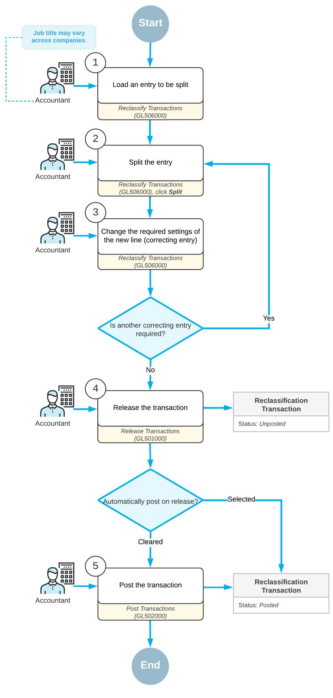

*Figure: GL transaction splitting*

#### **Modification of the Transaction**

To split the necessary transaction, you open it on the *Reclassify [Transactions](https://help-2025r1.acumatica.com/Help?ScreenId=ShowWiki&pageid=48075ac9-54ee-4082-acde-9e93ea7c3edb)* (GL506000) form. For details, see *Reclassifying Transactions: Initiation of the [Reclassification](#page-143-2) Process*.

On the *Reclassify [Transactions](https://help-2025r1.acumatica.com/Help?ScreenId=ShowWiki&pageid=48075ac9-54ee-4082-acde-9e93ea7c3edb)* form, you first click the journal entry to be split and then click**Split** on the form toolbar. The system adds a new entry under the original one. The original entry is marked with the icon, and

each new line added during the split process is marked with the icon. The original entry and each new entry are highlighted in bold during the process of splitting the transaction.

Multiple new entries can be added to split the original entry. In each new line and in the original one, you can modify the values in any of the following columns:

- **To Account**: The transaction amount will be moved from the originally specified general ledger account (**Account**) to the account you specify in this column.
- **ToSubaccount**: The transaction amount will be moved from the originally specified subaccount (**Subaccount**) to the subaccount you specify in this column.


This column is available only if the *Subaccounts* feature is enabled on the *[Enable/Disable](https://help-2025r1.acumatica.com/Help?ScreenId=ShowWiki&pageid=c1555e43-1bc5-4f6f-ba9d-b323f94d8a6b) [Features](https://help-2025r1.acumatica.com/Help?ScreenId=ShowWiki&pageid=c1555e43-1bc5-4f6f-ba9d-b323f94d8a6b)* (CS100000) form.

• **To Branch**: The transaction amount will be moved from the originally specified branch to the GL account or subaccount of the branch you specify in this column.


This column is available only if the *Multibranch Support* feature is enabled on the *[Enable/](https://help-2025r1.acumatica.com/Help?ScreenId=ShowWiki&pageid=c1555e43-1bc5-4f6f-ba9d-b323f94d8a6b) [Disable Features](https://help-2025r1.acumatica.com/Help?ScreenId=ShowWiki&pageid=c1555e43-1bc5-4f6f-ba9d-b323f94d8a6b)* form.

By default, these columns contain the values of the original journal entry. For new lines of the splitting group, these columns contain the values of the original journal entry, even if you have changed any of these values of the original entry.

For each new entry, in the **New Amount** column, you specify the amount to be transferred from the original entry to a new one. For the original entry, in this column, the system calculates the remaining amount based on the new amounts of new entries. The total amount of new entries cannot be more than the amount of the original entry.

Negative values can be specified in the **New Amount** column for the new entries. The negative amounts are highlighted in red and increase the amount of the original entry.

To edit the date and description of the transaction, you need to enter new values in the **New Tran. Date** and **New Transaction Description** boxes, respectively. If you edit the date, the new date has to be within the financial period of the original transaction.

The transaction is ready for splitting if the check box is selected in the Included column for the original entry and all the related new entries. The system selects this check box for each new entry when you have changed a value in the **To Account**, **ToSubaccount**, or **To Branch** column, and you have specified the amount to be moved to the new entry in the **New Amount** columns.

The system selects this check box for the original entry when you have changed a value in the**To Account**, **To Subaccount**, or **To Branch** column, or the amount has been adjusted according to the changes made for the amounts of the new lines.

In the same reclassification batch, the system includes journal entries that have the same transaction period specified. A separate reclassification batch is generated for each journal entry that has a different transaction period.

# <span id="page-152-0"></span>**Splitting Transactions: Implementation Checklist**

Before users begin splitting GL transactions, you must make sure that the system has been configured properly and that all required entities have been created, as described in the following table.

| Form                                       | Settings to Validate                                                                                                                                      | Notes |
|--------------------------------------------|-----------------------------------------------------------------------------------------------------------------------------------------------------------|-------|
| Enable/Disable Features (CS100000)<br>form | Make sure the Standard Financials<br>feature has been enabled.                                                                                            |       |
| Multiple forms                             | Make sure that the minimum con<br>figuration of the company has been<br>performed, as described in Compa<br>ny Without Branches: General Infor<br>mation. |       |

#### **Settings That Can Affect the Processing Workflow**

The settings on the *[General Ledger Preferences](https://help-2025r1.acumatica.com/Help?ScreenId=ShowWiki&pageid=e4913d06-c511-4258-a0f9-f36c1b854e6b)* (GL102000) form can affect the processing workflow as follows:

- If the **Hold Batches on Entry** check box is selected, a batch is saved with the *On Hold* status by default. If the batch is on hold, you should click **Remove Hold** on the toolbar of the *Journal [Transactions](https://help-2025r1.acumatica.com/Help?ScreenId=ShowWiki&pageid=dda046bc-5946-407f-88f7-1c0c966fbe72)* (GL301000) form for the batch so that you can process it further. If the check box is cleared, the batch is saved with the *Balanced* status.
- If the **Validate Batch ControlTotals on Entry** check box is selected, you have to enter the batch control total before you save the batch on the *Journal [Transactions](https://help-2025r1.acumatica.com/Help?ScreenId=ShowWiki&pageid=dda046bc-5946-407f-88f7-1c0c966fbe72)* form. If this check box is cleared and the status of the batch is *Balanced*, the system automatically validates the batch.
- If the **Automatically Post on Release** check box is selected, the system posts batches on release. If this check box is cleared, you have to post the batches aer release.

# <span id="page-152-1"></span>**Splitting Transactions: Generated Transactions**

Suppose that you classify all your expenses by department by using a dedicated subaccount segment for each department code. By mistake, you have posted all your expenses to one subaccount: *000-OPS*. This means that the amount has been posted to the Expense subaccount of one department (Operations) instead of three different departments:

- Operations, which is represented by *OPS* in the second subaccount segment
- Financial, which is represented by *FIN* in the second subaccount segment
- Purchasing, which is represented by *PUR* in the second subaccount segment

Now you need to split the incorrect journal entry by creating a correcting transaction, so that the total amount will be split to the subaccounts of three departments in the following proportions: 40% to the subaccount of the Financial department (*000-FIN*), 20% to the subaccount of the Purchasing department (*000-PUR*), and the remaining 40% in the subaccount of the Operations department (*000-OPS*).

The following table shows the journal entries of the original GL transaction of the *Normal* type.

| Account                  | Subaccount | Debit  | Credit |
|--------------------------|------------|--------|--------|
| Accounts Payable account | 000-000    | 00.00  | Amount |
| Expense account          | 000-OPS    | Amount | 00.00  |

The following table shows the lines of the correcting GL transaction of the *Reclassification* type.

| Account         | Subaccount | Debit        | Credit       |
|-----------------|------------|--------------|--------------|
| Expense account | 000-OPS    | 00.00        | 0.4 * Amount |
| Expense account | 000-FIN    | 0.4 * Amount | 00.00        |
| Expense account | 000-OPS    | 00.00        | 0.2 * Amount |
| Expense account | 000-PUR    | 0.2 * Amount | 00.00        |

As a result, if \$100 had been originally posted to the Expense subaccount of the Operations department, \$40 will be posted to the Expense subaccount of the Financial department, \$20 will be posted to the Expense subaccount of the Purchasing department, and \$40 remains posted to the subaccount of the Operations department.

# <span id="page-153-0"></span>**Splitting Transactions: To Split a GL Transaction**

In this activity, you will learn how to split a GL transaction into two new transactions.

This activity is based on the *U100* dataset. If you are using another dataset, or if any system settings have been changed in *U100*, these changes can affect the workflow of the activity and the results of the processing. To avoid any issues, restore the *U100* dataset to its initial state.

#### **Video Tutorial**

This video shows you the common process but may contain less detail than the activity has. If you want to repeat the activity on your own or you are preparing to take the certification exam, we recommend that you follow the instructions in the steps of the activity.

*[FEEDBACK](https://www.surveymonkey.com/r/BLBL7RJ?Video=Splitting%20Transactions&Source=Open%20Uni&Course=F100)*

#### **Story**

Suppose that on February 13, 2025, a GL batch for \$212 was wrongly posted to the *81000 - Other Expenses* account. This account should contain a \$32 expense, and the rest of the expenses should be split between two other accounts. The expenses accounted for in this transaction should be the following:

- Travel expenses: \$80
- Advertising expenses: \$100
- Other expenses: \$32

Acting as a SweetLife accountant, you have to split the original transaction, adding two correcting transactions to properly reflect the expenses.

#### **Process Overview**

In this activity, you will find and review the entry to be split on the *[Account Details](https://help-2025r1.acumatica.com/Help?ScreenId=ShowWiki&pageid=517044d6-d4e9-406b-a40e-6139b9b53bd9)* (GL404000) form. On the *Reclassify [Transactions](https://help-2025r1.acumatica.com/Help?ScreenId=ShowWiki&pageid=48075ac9-54ee-4082-acde-9e93ea7c3edb)* (GL506000) form, you will split the amounts of the original transaction. You will then release the transaction on the *Release [Transactions](https://help-2025r1.acumatica.com/Help?ScreenId=ShowWiki&pageid=5dd30a1f-e104-42cc-b44c-9427c6151dee)* (GL501000) form.

#### **System Preparation**

To prepare the system, do the following:

- 1. Launch the Acumatica ERP website with the *U100* dataset. Sign in as an accountant by using the following credentials:
  - Username: *johnson*
  - Password: *123*
- 2. In the info area, in the upper-right corner of the top pane of the Acumatica ERP screen, click the Business Date menu button and select *2/13/2025*. For simplicity, in this activity, you will create and process all documents in the system on this business date.
- 3. On the Company and Branch Selection menu, also on the top pane of the Acumatica ERP screen, make sure that the *SweetLife Head Office and Wholesale Center* branch is selected. If it is not selected, click the Company and Branch Selection menu button to view the list of branches that you have access to, and then click *SweetLife Head Office and Wholesale Center*.

### **Step 1: Finding the Transaction to be Split**

To prepare for splitting the transaction, do the following:

- 1. Open the *[Account Details](https://help-2025r1.acumatica.com/Help?ScreenId=ShowWiki&pageid=517044d6-d4e9-406b-a40e-6139b9b53bd9)* (GL404000) form.
- 2. In the Selection area, specify the following settings:
  - **Company/Branch**: *HEADOFFICE (SweetLife Head Office and Wholesale Center)* (inserted by default based on the selected branch)
  - **Ledger**: *ACTUAL* (inserted by default)
  - **From Period**: *02-2025*
  - **To Period**: *02-2025*
  - **Account**: *81000 Other Expenses*
- 3. In the table, select the unlabeled check box for the transaction dated *2/13/2025* and the debit amount of \$212, and on the form toolbar, click **Reclassify** to open the entry related to the account on the *[Reclassify](https://help-2025r1.acumatica.com/Help?ScreenId=ShowWiki&pageid=48075ac9-54ee-4082-acde-9e93ea7c3edb) [Transactions](https://help-2025r1.acumatica.com/Help?ScreenId=ShowWiki&pageid=48075ac9-54ee-4082-acde-9e93ea7c3edb)* (GL506000) form.

#### **Step 2: Splitting the Transaction**

To split the transaction, do the following:

1. While you are remaining on the *Reclassify [Transactions](https://help-2025r1.acumatica.com/Help?ScreenId=ShowWiki&pageid=48075ac9-54ee-4082-acde-9e93ea7c3edb)* (GL506000) form and viewing the entry to be split, click **Split** on the form toolbar.

The system has added a new line under the line with the original entry.

- 2. In the columns of the new line, specify the following values:
  - **To Account**: *54400 - Project Travel Expense*
  - **New Amount**: 80

Notice that the **New Amount** column for the original line has decreased by the specified amount for the new line and now shows *132.00*.

- 3. To enter the other new entry, click**Split** on the form toolbar.
- 4. In the columns of the new line, specify the following values:
  - **To Account**: *61000 - Advertising Expenses*
  - **New Amount**: 100

Notice that the **New Amount** column for the original line has decreased by the sum of the new amounts of the two new lines and now shows *32.00*, as shown in the following screenshot.

| TOOLS $\blacktriangledown$<br><b>Reclassify Transactions</b> |                         |  |      |                   |                           |                                  |                   |                                       |                      |                 |        |                 |                   |                |                       |
|--------------------------------------------------------------|-------------------------|--|------|-------------------|---------------------------|----------------------------------|-------------------|---------------------------------------|----------------------|-----------------|--------|-----------------|-------------------|----------------|-----------------------|
| O                                                            | $\Omega$                |  | LOAD | <b>REPLACE</b>    | <b>SPLIT</b>              | <b>PROCESS</b><br>$\overline{a}$ | Y<br>⊠            |                                       |                      |                 |        |                 |                   |                |                       |
|                                                              | BODD                    |  |      | <b>To Branch</b>  | T <sub>o</sub><br>Account | <b>Description</b>               | New Tran.<br>Date | New Transaction<br><b>Description</b> | <b>New</b><br>Amount | Debit<br>Amount | Amount | Credit Currency | <b>Branch</b>     | <b>Account</b> | <b>Description</b>    |
| $0$ D                                                        | ☑                       |  |      | <b>HEADOFFICE</b> | 81000                     | <b>Other Expenses</b>            | 2/13/2025         | <b>Advertising campaign</b>           | 32.00                | 212.00          | 0.00   | <b>USD</b>      | <b>HEADOFFICE</b> | 81000          | <b>Other Expenses</b> |
| $0$ D                                                        | $\overline{\mathbf{S}}$ |  | ↳    | <b>HEADOFFICE</b> | 54400                     | <b>Project Travel Expense</b>    | 2/13/2025         | <b>Advertising campaign</b>           | 80.00                | 0.00            | 0.00   | <b>USD</b>      | <b>HEADOFFICE</b> | 81000          | <b>Other Expenses</b> |
|                                                              | $0$ D $\boxtimes$       |  | حـا  | <b>HEADOFFICE</b> | 61000                     | <b>Advertising Expense</b>       | 2/13/2025         | <b>Advertising campaign</b>           | 100.00               | 0.00            | 0.00   | <b>USD</b>      | <b>HEADOFFICE</b> | 81000          | <b>Other Expenses</b> |

*Figure: The split transaction before being processed*

- 5. On the form toolbar, click **Process**.
- 6. In the **Processing** pop-up window, which opens, click the **Processed** tab to view the list of batches.

#### **Step 3: Releasing the Transaction**

To release the transaction, do the following:

- 1. In the table on the **Processed** tab in the **Processing** pop-up window, click the link in the **Reclass. Batch Number** column to open the reclassification transaction that the system has created.
- 2. On the *Journal [Transactions](https://help-2025r1.acumatica.com/Help?ScreenId=ShowWiki&pageid=dda046bc-5946-407f-88f7-1c0c966fbe72)* (GL301000) form, which opens, review the transaction, and click **Remove Hold** on the form toolbar.
- 3. On the form toolbar, click **Release** to release the transaction.
- 4. In the table, click the link in the **Orig. Batch Nbr.** column to review the original transaction.

The system has opened the entry and marked the line with the *81000* account as reclassified. The **Remaining Reclass. Amount** column for this line shows the remaining amount of the original entry (*32.00*).

# <span id="page-155-0"></span>**Splitting Transactions: To Split a Transaction by Subaccounts**

In this activity, you will learn how to reclassify a GL transaction and split it from one subaccount to multiple subaccounts.

#### **Story**

Suppose that on January 25, 2025, a GL batch for \$620 was posted to the *62400 - Office Expenses* account and to the general *000-000* subaccount. The accountant then decided to split expenses between different departments so that reports would reflect the expense breakdown by departmental subaccounts. The departments in this batch have the following office expenses:

- Sales department: \$185
- Engineering department: \$122
- Marketing department: \$74
- Operations department: \$89

• Finance department: \$150

Acting as a SweetLife accountant, you have to split the original transaction by subaccounts to record the applicable expenses for each department.

#### **Configuration Overview**

In the *U100* dataset, the following tasks have been performed for the purposes of this activity:

- On the *[Companies](https://help-2025r1.acumatica.com/Help?ScreenId=ShowWiki&pageid=fedad435-8496-4397-b8a3-50a473629f76)* (CS101500) form, the *SWEETLIFE* company has been defined.
- On the *[Branches](https://help-2025r1.acumatica.com/Help?ScreenId=ShowWiki&pageid=b97ab72d-4ab4-4f02-b69c-f7f61b316ced)* (CS102000) form, the *HEADOFFICE* branch of the *SWEETLIFE* company has been created.
- On the *[Chart of Accounts](https://help-2025r1.acumatica.com/Help?ScreenId=ShowWiki&pageid=85557f41-a4af-47a8-b198-2a01461ce9c3)* form, the *62400 - Office Expense* account has been created.
- On the *[Ledgers](https://help-2025r1.acumatica.com/Help?ScreenId=ShowWiki&pageid=a5c9f3f5-7dc4-4b1b-a50c-396729a12e4e)* (GL201500) form, the *ACTUAL* ledger has been added.
- On the *[Segmented Keys](https://help-2025r1.acumatica.com/Help?ScreenId=ShowWiki&pageid=78bd7bd1-6bf6-409e-a8a5-8b18e8b80722)* (CS202000) form, the *SUBACCOUNT* segmented key has been created.

#### **Process Overview**

In this activity, you will find the GL transaction to be split on the *[Account Details](https://help-2025r1.acumatica.com/Help?ScreenId=ShowWiki&pageid=517044d6-d4e9-406b-a40e-6139b9b53bd9)* (GL404000) form. Then on the *Reclassify [Transactions](https://help-2025r1.acumatica.com/Help?ScreenId=ShowWiki&pageid=48075ac9-54ee-4082-acde-9e93ea7c3edb)* (GL506000) form, you will split the amounts of the original transaction. You will then release the transaction on the *Journal [Transactions](https://help-2025r1.acumatica.com/Help?ScreenId=ShowWiki&pageid=dda046bc-5946-407f-88f7-1c0c966fbe72)* (GL301000) form. Finally, you will view the account balances that have been split by subaccounts on the *[Account by Subaccount](https://help-2025r1.acumatica.com/Help?ScreenId=ShowWiki&pageid=7a99440b-f106-4482-b1f7-76e210ff4102)* (GL403000) form.

#### **System Preparation**

Before you begin performing the steps of this activity, do the following:

- 1. Launch the Acumatica ERP website with the *U100* dataset preloaded, and sign in as an accountant Nenad Pasic by using the *pasic* username and the *123* password.
- 2. In the info area, in the upper-right corner of the top pane of the Acumatica ERP screen, make sure that the business date in your system is set to *1/30/2025*. If a different date is displayed, click the Business Date menu button and select *1/30/2025*. For simplicity, in this activity, you will create and process all documents in the system on this business date.
- 3. On the Company and Branch Selection menu on the top pane of the Acumatica ERP screen, make sure that the *SweetLife Head Office and Wholesale Center* branch is selected. If it is not selected, click the Company and Branch Selection menu button to view the list of branches that you have access to, and then click *SweetLife Head Office and Wholesale Center*.
- 4. Make sure that the *SUBACCOUNT* segmented key has been modified, as described in *[Subaccounts:](https://help-2025r1.acumatica.com/Help?ScreenId=ShowWiki&pageid=64736a3d-89c3-41ca-b0a4-0af7bcb11372) [Implementation Activity](https://help-2025r1.acumatica.com/Help?ScreenId=ShowWiki&pageid=64736a3d-89c3-41ca-b0a4-0af7bcb11372)*.

#### **Step 1: Finding the GL Transaction to be Split**

To find the GL transaction to be split, do the following:

- 1. Open the *[Account Details](https://help-2025r1.acumatica.com/Help?ScreenId=ShowWiki&pageid=517044d6-d4e9-406b-a40e-6139b9b53bd9)* (GL404000) form.
- 2. In the Selection area, notice that the following settings are inserted by default:
  - **Company/Branch**: *HEADOFFICE*
  - **Ledger**: *ACTUAL*
  - **From Period**: *01-2025*
  - **To Period**: *01-2025*
- 3. In the **Account** box, select *62400 - Office Expense*.
- 4. In the **Ending Balance** box, notice that the ending balance of the *62400* account is \$2,296.00.

- 5. In the table, select the unlabeled check box for the line with the debit amount of \$620.00.
- 6. On the form toolbar, click **Reclassify** to open the *Reclassify [Transactions](https://help-2025r1.acumatica.com/Help?ScreenId=ShowWiki&pageid=48075ac9-54ee-4082-acde-9e93ea7c3edb)* (GL506000) form with the line listed.

#### **Step 2: Splitting the Transaction**

To split the transaction, perform the following actions:

1. While remaining on the *Reclassify [Transactions](https://help-2025r1.acumatica.com/Help?ScreenId=ShowWiki&pageid=48075ac9-54ee-4082-acde-9e93ea7c3edb)* (GL506000) form, click**Split** on the form toolbar.

Notice that the system has added a new line under the original line.

- 2. In the columns of the new line, specify the following settings:
  - **ToSubaccount**: 000-SLS

The *SLS* subaccount segment represents the sales department.

• **New Amount**: 185.00

Notice that the **New Amount** column for the original line has decreased by the specified amount for the new line (once you moved the cursor to another field) and is now *435.00*.

- 3. To enter another new entry, click**Split** on the form toolbar.
- 4. In the columns of the new line, specify the following settings:
  - **ToSubaccount**: 000-ENG

The *ENG* subaccount segment represents the engineering department.

• **New Amount**: 122.00

Notice that once you moved the cursor to another field, the **New Amount** column for the original line has decreased by the sum of the amounts of the two new lines and is now *313.00*.

- 5. By clicking**Split** on the form toolbar and specifying the appropriate settings in the added line, add three more lines with the following settings:
  - **ToSubaccount**: 000-MKT

The *MKT* subaccount segment represents the marketing department.

- **New Amount**: 74.00
- **ToSubaccount**: 000-OPS

The *OPS* subaccount segment represents the operations department.

- **New Amount**: 89.00
- **ToSubaccount**: 000-FIN

The *FIN* subaccount segment represents the finance department.

• **New Amount**: 150.00

Notice that the **New Amount** column for the original line has decreased by the sum of the new amounts of the five new lines and now shows *0.00*, as shown in the following screenshot.

|   | $TOOLS$ $\sim$<br><b>Reclassify Transactions</b> |   |                |                        |               |                                                     |                  |                   |                        |                        |                   |                                    |                   |                 |        |                 |         |
|---|--------------------------------------------------|---|----------------|------------------------|---------------|-----------------------------------------------------|------------------|-------------------|------------------------|------------------------|-------------------|------------------------------------|-------------------|-----------------|--------|-----------------|---------|
| Ò | $\Omega$                                         | × |                | <b>REPLACE</b><br>LOAD | <b>SPLIT</b>  | $\mathbf{x}$<br>Y<br>$\mathbb{H}$<br><b>PROCESS</b> |                  |                   |                        |                        |                   |                                    |                   |                 |        |                 |         |
|   | <b>B 0 D D</b>                                   |   |                | To Branch              | To<br>Account | Description                                         | To<br>Subaccount | <b>To Project</b> | <b>To Project Task</b> | <b>To Cost</b><br>Code | New Tran.<br>Date | <b>New Transaction Description</b> | <b>New Amount</b> | Debit<br>Amount | Amount | Credit Currency | Project |
|   | 40D2                                             |   | $\overline{a}$ | <b>HEADOFFICE</b>      | 62400         | Office Expense                                      | 000-000          | x                 |                        |                        | 1/25/2025         | Stationery                         | 0.00              | 620.00          |        | $0.00$ USD      | x       |
|   | $0$ D $\boxtimes$                                |   | ↳              | <b>HEADOFFICE</b>      | 62400         | <b>Office Expense</b>                               | 000-SLS          | x                 |                        |                        | 1/25/2025         | Stationery                         | 185.00            | 0.00            |        | $0.00$ USD      | ×       |
|   | <b>&amp; D Ø</b>                                 |   | دا             | <b>HEADOFFICE</b>      | 62400         | <b>Office Expense</b>                               | 000-ENG          | x                 |                        |                        | 1/25/2025         | <b>Stationery</b>                  | 122.00            | 0.00            |        | $0.00$ USD      | ×       |
|   | <b>&amp; D Ø</b>                                 |   | Ls.            | <b>HEADOFFICE</b>      | 62400         | <b>Office Expense</b>                               | 000-MKT          | x                 |                        |                        | 1/25/2025         | Stationery                         | 74.00             | 0.00            |        | $0.00$ USD      | x       |
|   | $0$ D $\boxdot$                                  |   | Ls.            | <b>HEADOFFICE</b>      | 62400         | <b>Office Expense</b>                               | 000-OPS          | x                 |                        |                        | 1/25/2025         | Stationery                         | 89.00             | 0.00            |        | $0.00$ USD      | ×       |
|   | <b>&amp; D Ø</b>                                 |   | Ls.            | <b>HEADOFFICE</b>      | 62400         | <b>Office Expense</b>                               | 000-FIN          | x                 |                        |                        | 1/25/2025         | <b>Stationery</b>                  | 150.00            | 0.00            |        | $0.00$ USD      | ×       |
|   |                                                  |   |                |                        |               |                                                     |                  |                   |                        |                        |                   |                                    |                   |                 |        |                 |         |
|   |                                                  |   |                |                        |               |                                                     |                  |                   |                        |                        |                   |                                    |                   |                 |        |                 |         |

*Figure: The transaction split by subaccounts before being processed*

6. On the form toolbar, click **Process**.

7. In the **Processing** dialog box, which opens, click the **Processed** tab to verify that the batch was generated. Do not close the **Processing** dialog box.

#### **Step 3: Releasing the Transaction**

To release the transaction, do the following:

- 1. While you are still viewing the table on the **Processed** tab of the **Processing** dialog box, click the link in the **Reclass. Batch Number** column to open the reclassification transaction that the system has created.
- 2. On the *Journal [Transactions](https://help-2025r1.acumatica.com/Help?ScreenId=ShowWiki&pageid=dda046bc-5946-407f-88f7-1c0c966fbe72)* (GL301000) form, which opens, review the transaction, and click **Remove Hold** on the form toolbar.
- 3. On the form toolbar, click **Release** to release the batch.

#### **Step 4: Reviewing the Account Balances by Subaccount**

To review the account balances broken down by subaccount, do the following:

- 1. Open the *[Account by Subaccount](https://help-2025r1.acumatica.com/Help?ScreenId=ShowWiki&pageid=7a99440b-f106-4482-b1f7-76e210ff4102)* (GL403000) form.
- 2. In the Selection area, notice that the following settings are inserted by default:
  - **Company/Branch**: *HEADOFFICE*
  - **Ledger**: *ACTUAL*
  - **Period**: *01-2025*
- 3. In the **Account** box, select *62400 - Office Expense*.

The system shows the balances broken down by subaccounts. Make sure that the balance of the *000-000* subaccount has been decreased by the amount that you split in Step 2 (\$620.00). The ending balance of the *000-000* subaccount of the *62400* account should be *1,676.00*.

### <span id="page-158-0"></span>**Splitting Transactions: Reports and Inquiries**

In this topic, you can find the list of reports and inquiries related to splitting transactions.

#### **Finding Reclassification Transactions for a Particular Account**

On the *[Account Details](https://help-2025r1.acumatica.com/Help?ScreenId=ShowWiki&pageid=517044d6-d4e9-406b-a40e-6139b9b53bd9)* (GL404000) form, to include in the list of entries the journal entries that have been reclassified for a selected GL account within the specified period, select the **Include Reclassified** check box in the Summary area. In the **Reclass. Batch Number** column, each of the reclassified entries has a link to the appropriate *Reclassification* transaction.

You can also view a list of transactions that includes the reclassified journal entries by preparing the *[Transactions](https://help-2025r1.acumatica.com/Help?ScreenId=ShowWiki&pageid=a1164a4e-6b2b-4a82-8490-abde5d381be7) [for Account](https://help-2025r1.acumatica.com/Help?ScreenId=ShowWiki&pageid=a1164a4e-6b2b-4a82-8490-abde5d381be7)* (GL633500) or *[Transactions](https://help-2025r1.acumatica.com/Help?ScreenId=ShowWiki&pageid=deb95b00-b48f-4d53-8551-dd72d367d2fc) for Period* (GL633000) report with the **Include Reclassified Transactions** check box selected. In the reports, the original transaction that was split is marked as a reclassified transaction.

#### **Finding Split Transactions for a Particular Account**

You can find and view split transactions on the *Journal [Transactions](https://help-2025r1.acumatica.com/Help?ScreenId=ShowWiki&pageid=dda046bc-5946-407f-88f7-1c0c966fbe72)* (GL301000) form or on the *[Account Details](https://help-2025r1.acumatica.com/Help?ScreenId=ShowWiki&pageid=517044d6-d4e9-406b-a40e-6139b9b53bd9)* (GL404000) form. These transactions have the *Reclassification* type. On this form, in the **Orig. Batch Nbr.** column of the table, the reclassified journal entries contain the links to the original GL transactions (that is, to the batches generated for the transactions).

#### **Viewing a Reclassification History of a Transaction**

You can view the reclassification history for a transaction on the *[Reclassification History](https://help-2025r1.acumatica.com/Help?ScreenId=ShowWiki&pageid=48500f0b-8d5e-4125-bad6-4e5b0c672994)* (GL405000) form. You can open this form by clicking the **Reclassification History** button in either of the following situations:

- On the form toolbar of the *[Account Details](https://help-2025r1.acumatica.com/Help?ScreenId=ShowWiki&pageid=517044d6-d4e9-406b-a40e-6139b9b53bd9)* (GL404000) form for the transaction you have selected (if it has been reclassified)
- On the table toolbar of the *Journal [Transactions](https://help-2025r1.acumatica.com/Help?ScreenId=ShowWiki&pageid=dda046bc-5946-407f-88f7-1c0c966fbe72)* (GL301000) form for the transaction you have selected in the GL batch, if it has the *Reclassification* type

You can reclassify only the last transaction in the list of transactions on the *[Reclassification History](https://help-2025r1.acumatica.com/Help?ScreenId=ShowWiki&pageid=48500f0b-8d5e-4125-bad6-4e5b0c672994)* form by clicking **Reclassify** on the form toolbar.

# <span id="page-160-0"></span>**Processing Transactions with Subaccounts**

In this chapter, you will find general information on how to create and post transactions to the general ledger if subaccounts have been configured in the system. The chapter also includes a checklist for system implementation, an activity that describes how to process a transaction in the system, and details of reports and inquiries that you can use to find and view created transactions and details of involved accounts.

# <span id="page-160-1"></span>**Transactions with Subaccounts: General Information**

If subaccounts are used in your system, you can enter and process GL batches in which journal entries to one account are split between multiple subaccounts. When you enter a GL batch with subaccounts on the *[Journal](https://help-2025r1.acumatica.com/Help?ScreenId=ShowWiki&pageid=dda046bc-5946-407f-88f7-1c0c966fbe72) [Transactions](https://help-2025r1.acumatica.com/Help?ScreenId=ShowWiki&pageid=dda046bc-5946-407f-88f7-1c0c966fbe72)* (GL301000) form, you perform the same steps as you do when you add a GL batch that does not involve subaccounts, except that you enter a subaccount for each entry in the batch. For details on GL batch processing, see *GL [Transactions:](#page-108-3) General Information*.

#### **Learning Objectives**

In this chapter, you will learn how to do the following:

- Create a GL batch that includes subaccounts
- Release the batch
- Review the changes on an inquiry form

#### **Applicable Scenarios**

You create a transaction with subaccounts if you want to manually enter a GL batch and subaccounts have been configured in the system.

# <span id="page-160-2"></span>**Transactions with Subaccounts: Implementation Checklist**

Before users begin processing GL transactions with subaccounts, you must make sure that the system has been configured properly and that all required entities have been created, as described in the following table.

| Form                                       | Settings to Check                                                                                                                                         | Notes |
|--------------------------------------------|-----------------------------------------------------------------------------------------------------------------------------------------------------------|-------|
| Enable/Disable Features (CS100000)<br>form | Make sure the Standard Financials<br>and Subaccounts(under Advanced<br>Financials) features have been en<br>abled.                                        |       |
| Multiple forms                             | Make sure that the minimum con<br>figuration of the company has been<br>performed, as described in Compa<br>ny Without Branches: General Infor<br>mation. |       |
| Chart of Accounts (GL202500) form          | Check whether the necessary ac<br>counts have been created.                                                                                               |       |

| Form                                          | Settings to Check                                                                                                                                                     | Notes                                                                                            |
|-----------------------------------------------|-----------------------------------------------------------------------------------------------------------------------------------------------------------------------|--------------------------------------------------------------------------------------------------|
| Company Financial Calendar<br>(GL201100) form | Be sure that the financial periods<br>for which transactions will be creat<br>ed have a status of Open.                                                               | You can generate the necessary pe<br>riods on the Master Financial Calen<br>dar (GL201000) form. |
| Segmented Keys (CS202000) form                | Be sure that the SUBACCOUNTS<br>segmented key has been config<br>ured to meet the company's busi<br>ness needs, as described in Subac<br>counts: General Information. |                                                                                                  |

#### **Settings That Can Affect the Processing Workflow**

The settings on the *[General Ledger Preferences](https://help-2025r1.acumatica.com/Help?ScreenId=ShowWiki&pageid=e4913d06-c511-4258-a0f9-f36c1b854e6b)* (GL102000) form can affect the processing workflow as follows:

- If the **Hold Batches on Entry** check box is selected, a batch is saved with the *On Hold* status by default. If the batch is on hold, you should click **Remove Hold** on the toolbar of the *Journal [Transactions](https://help-2025r1.acumatica.com/Help?ScreenId=ShowWiki&pageid=dda046bc-5946-407f-88f7-1c0c966fbe72)* (GL301000) form for the batch so that you can process it further. If the check box is cleared, the batch is saved with the *Balanced* status.
- If the **Validate Batch ControlTotals on Entry** check box is selected, you have to enter the batch control total before you save the batch on the *Journal [Transactions](https://help-2025r1.acumatica.com/Help?ScreenId=ShowWiki&pageid=dda046bc-5946-407f-88f7-1c0c966fbe72)* form. If this check box is cleared and the status of the batch is *Balanced*, the system automatically validates the batch.
- If the **Automatically Post on Release** check box is selected, the system posts batches on release. If this check box is cleared, you have to post the batches aer release.

# <span id="page-161-1"></span><span id="page-161-0"></span>**Transactions with Subaccounts: Process Activity**

In this activity, you will learn how to create a GL batch with journal entries to the same account split by subaccount —that is, these entries have the same account but different subaccounts specified. You will also release and post the batch and review its details.

#### **Story**

Suppose that in January 2025, the SweetLife Fruits & Jams company paid its employees a total of \$38,300.

Acting as a SweetLife accountant, you need to enter a batch for a payment in the amount of \$38,300 for the *01-2025* financial period for the salaries of the employees of the SweetLife Head Office and Wholesale Center (*HEADOFFICE*) branch. The following amounts were paid to the company's departments:

- Sales: \$19,500
- Operations: \$7,700
- Finance: \$8,100
- Marketing: \$3,000

In the batch, you need to record a separate entry for each department so that you can later view the expenses of each department in reports.

#### **Configuration Overview**

In the *U100* dataset, the following tasks have been performed for the purposes of this activity:

• On the *[Companies](https://help-2025r1.acumatica.com/Help?ScreenId=ShowWiki&pageid=fedad435-8496-4397-b8a3-50a473629f76)* (CS101500) form, the *SWEETLIFE* company has been defined.

- On the *[Branches](https://help-2025r1.acumatica.com/Help?ScreenId=ShowWiki&pageid=b97ab72d-4ab4-4f02-b69c-f7f61b316ced)* (CS102000) form, the *HEADOFFICE* branch of the *SWEETLIFE* company has been created.
- On the *[Chart of Accounts](https://help-2025r1.acumatica.com/Help?ScreenId=ShowWiki&pageid=85557f41-a4af-47a8-b198-2a01461ce9c3)* form, the following accounts have been created:
  - *10200 - Company Checking Account*
  - *69500 - Salaries and Wages*
- On the *[Ledgers](https://help-2025r1.acumatica.com/Help?ScreenId=ShowWiki&pageid=a5c9f3f5-7dc4-4b1b-a50c-396729a12e4e)* (GL201500) form, the *ACTUAL* ledger has been added.
- On the *[Segmented Keys](https://help-2025r1.acumatica.com/Help?ScreenId=ShowWiki&pageid=78bd7bd1-6bf6-409e-a8a5-8b18e8b80722)* (CS202000) form, the *SUBACCOUNT* segmented key has been created.

#### **Process Overview**

In this activity, you will enter a batch directly on the *Journal [Transactions](https://help-2025r1.acumatica.com/Help?ScreenId=ShowWiki&pageid=dda046bc-5946-407f-88f7-1c0c966fbe72)* (GL301000) form, release and post the batch, and note the status of the batch at each step. Then you will review the batch's details by using the *[Account by](https://help-2025r1.acumatica.com/Help?ScreenId=ShowWiki&pageid=7a99440b-f106-4482-b1f7-76e210ff4102) [Subaccount](https://help-2025r1.acumatica.com/Help?ScreenId=ShowWiki&pageid=7a99440b-f106-4482-b1f7-76e210ff4102)* (GL403000) form.

#### **System Preparation**

Before you begin performing the steps of this activity, do the following:

- 1. Launch the Acumatica ERP website with the *U100* dataset preloaded, and sign in as an accountant Nenad Pasic by using the *pasic* username and the *123* password.
- 2. In the info area, in the upper-right corner of the top pane of the Acumatica ERP screen, make sure that the business date in your system is set to *1/30/2025*. If a different date is displayed, click the Business Date menu button and select *1/30/2025*. For simplicity, in this activity, you will create and process all documents in the system on this business date.
- 3. On the Company and Branch Selection menu on the top pane of the Acumatica ERP screen, make sure that the *SweetLife Head Office and Wholesale Center* branch is selected. If it is not selected, click the Company and Branch Selection menu button to view the list of branches that you have access to, and then click *SweetLife Head Office and Wholesale Center*.
- 4. As a prerequisite to the current activity, make sure you have completed *[Subaccounts: Implementation](https://help-2025r1.acumatica.com/Help?ScreenId=ShowWiki&pageid=64736a3d-89c3-41ca-b0a4-0af7bcb11372) [Activity](https://help-2025r1.acumatica.com/Help?ScreenId=ShowWiki&pageid=64736a3d-89c3-41ca-b0a4-0af7bcb11372)* to enable the *Subaccounts* feature on the *[Enable/Disable Features](https://help-2025r1.acumatica.com/Help?ScreenId=ShowWiki&pageid=c1555e43-1bc5-4f6f-ba9d-b323f94d8a6b)* (CS100000) form and define the *SUBACCOUNT* segmented key on the *[Segmented Keys](https://help-2025r1.acumatica.com/Help?ScreenId=ShowWiki&pageid=78bd7bd1-6bf6-409e-a8a5-8b18e8b80722)* (CS202000) form.

#### **Step 1: Processing a Batch of Transactions with Subaccounts**

To process a batch of transactions that include subaccounts, do the following:

- 1. Open the *Journal [Transactions](https://help-2025r1.acumatica.com/Help?ScreenId=ShowWiki&pageid=dda046bc-5946-407f-88f7-1c0c966fbe72)* (GL301000) form, and on the form toolbar, click **Add New Record**.
- 2. In the Summary area, notice that the following settings are inserted by default:
  - **Transaction Date**: *1/30/2025*
  - **Post Period**: *01-2025*
- 3. In the **Description** box, enter Salary payment Jan 2025.
- 4. On the **Details** tab, click **Add Row** on the table toolbar, and specify the following settings in the row:
  - **Branch**: *HEADOFFICE* (inserted by default)
  - **Account**: *10200 - Company Checking Account*
  - **Subaccount**: 000-000
  - **Credit Amount**: 38,300.00
- 5. Click **Add Row** again, and specify the following settings in the second row:
  - **Branch**: *HEADOFFICE* (inserted by default)
  - **Account**: *69500 - Salaries and Wages*
  - **Subaccount**: 000-FIN

- **Debit Amount**: 8,100.00
- 6. Click **Add Row** again, and specify the following settings in the third row:
  - **Branch**: *HEADOFFICE* (inserted by default)
  - **Account**: *69500 - Salaries and Wages*
  - **Subaccount**: 000-MKT
  - **Debit Amount**: 3,000.00
- 7. Click **Add Row** again, and specify the following settings in the fourth row:
  - **Branch**: *HEADOFFICE* (inserted by default)
  - **Account**: *69500 - Salaries and Wages*
  - **Subaccount**: 000-OPS
  - **Debit Amount**: 7,700.00
- 8. Click **Add Row** again, and specify the following settings in the fih row:
  - **Branch**: *HEADOFFICE* (inserted by default)
  - **Account**: *69500 - Salaries and Wages*
  - **Subaccount**: 000-SLS
  - **Debit Amount**: 19,500.00
- 9. Click **Save** on the form toolbar, and notice that the status of the batch is *On Hold*.
- 10.On the form toolbar, click **Remove Hold**. The batch's status has changed to *Balanced*.
- 11.On the form toolbar, click **Release**.

Note that the batch's status has changed to *Posted*.

#### **Step 2: Reviewing the Account and Subaccount Balances**

To review the details of the batch, do the following:

- 1. Open the *[Account by Subaccount](https://help-2025r1.acumatica.com/Help?ScreenId=ShowWiki&pageid=7a99440b-f106-4482-b1f7-76e210ff4102)* (GL403000) form.
- 2. In the Selection area, notice that the following settings are inserted by default:
  - **Company/Branch**: *HEADOFFICE*
  - **Ledger**: *ACTUAL*
  - **Period**: 01-2025
- 3. In the **Account** box, select *69500 - Salaries and Wages*.
- 4. In the table, notice that the balance of the *69500 - Salaries and Wages* account is split by subaccounts.

### <span id="page-163-0"></span>**Transactions with Subaccounts: Generated Transactions**

On the *Journal [Transactions](https://help-2025r1.acumatica.com/Help?ScreenId=ShowWiki&pageid=dda046bc-5946-407f-88f7-1c0c966fbe72)* (GL301000) form, you can view the details of the GL batch of transactions with subaccounts. In the following table, you can find an example of such a GL batch.

| Account                          | Subaccount | Debit Amount | Credit Amount |
|----------------------------------|------------|--------------|---------------|
| 10200 - Company Checking Account | 000-000    | 00.00        | 88,200.00     |
| 69500 - Salaries and Wages       | 000-FIN    | 13,800.00    | 00.00         |
| 69500 - Salaries and Wages       | 000-MKT    | 5,000.00     | 00.00         |

| Account                    | Subaccount | Debit Amount | Credit Amount |
|----------------------------|------------|--------------|---------------|
| 69500 - Salaries and Wages | 000-ENG    | 17,100.00    | 00.00         |
| 69500 - Salaries and Wages | 000-OPS    | 13,500.00    | 00.00         |
| 69500 - Salaries and Wages | 000-SLS    | 38,800.00    | 00.00         |

# <span id="page-164-0"></span>**Transactions with Subaccounts: Related Reports and Inquiries**

This topic describes the reports, inquiry forms, and other forms you may want to review to gather information about batches.


If you do not see a report or form, this could mean that you have signed in to the system with a user account that does not have access rights to this report or form.

#### **Finding a Batch on the Journal Transactions Form**

To find and view a batch, you can use the *Journal [Transactions](https://help-2025r1.acumatica.com/Help?ScreenId=ShowWiki&pageid=dda046bc-5946-407f-88f7-1c0c966fbe72)* (GL301000) form. On this form, you can click the selector button in the **Batch Number** box and locate the batch by doing one of the following:

- Clicking any column header to arrange the items in ascending or descending order based on the values in the column. You can navigate between pages to locate the specific batch.
- Clicking the column header for any column you may want to search, and then typing a string in the search box at the bottom of the dialog box that pops up. As you type, the system filters the listed batches to display only those containing the entered text in the selected column.
- Creating a filter to find the batch by its details. To do this, you click **FilterSettings** on the table toolbar of the lookup table, and specify a condition based on the batch details.

#### **Viewing an Unreleased Batch**

On the *[GL Edit Summary](https://help-2025r1.acumatica.com/Help?ScreenId=ShowWiki&pageid=68c5395d-e116-44b9-af72-62a670585837)* (GL611500) form, you can run a report for a particular ledger and financial period; you then review the list of unreleased batches, find the necessary batch, and review it. From the report, you can navigate to the *Journal [Transactions](https://help-2025r1.acumatica.com/Help?ScreenId=ShowWiki&pageid=dda046bc-5946-407f-88f7-1c0c966fbe72)* (GL301000) form to view more details of the batch.

Similarly, you can find and view an unreleased transaction by using the *[GL Edit Detailed](https://help-2025r1.acumatica.com/Help?ScreenId=ShowWiki&pageid=3750cc88-3bc3-4dc8-8081-0572c0a09068)* (GL610500) and *[GL Edit](https://help-2025r1.acumatica.com/Help?ScreenId=ShowWiki&pageid=24c1859a-34f2-47fe-8f18-df6abe38d298) [Account Distribution](https://help-2025r1.acumatica.com/Help?ScreenId=ShowWiki&pageid=24c1859a-34f2-47fe-8f18-df6abe38d298)* (GL611000) reports.

#### **Viewing a Released Batch**

On the *[GL Register](https://help-2025r1.acumatica.com/Help?ScreenId=ShowWiki&pageid=5c2540b8-0d84-427a-9499-3e4dee589f4f)* (GL620500) form, you can run a report for a particular ledger and financial period, and then review the list of released batches and find the necessary batch. You can navigate to the *Journal [Transactions](https://help-2025r1.acumatica.com/Help?ScreenId=ShowWiki&pageid=dda046bc-5946-407f-88f7-1c0c966fbe72)* (GL301000) form from the report to view more details of the batch.

Similarly, you can find and view a released transaction by using the *[GL Register Detailed](https://help-2025r1.acumatica.com/Help?ScreenId=ShowWiki&pageid=680ac556-03e3-4ed2-ac8b-5cd15e6aba60)* (GL621000) report.

#### **Printing Transactions for a Particular Account**

You can print transactions for a particular account by using the *[Transactions](https://help-2025r1.acumatica.com/Help?ScreenId=ShowWiki&pageid=a1164a4e-6b2b-4a82-8490-abde5d381be7) for Account* (GL633500) report. To run a report, you specify the ledger, the financial period, and the account for which you want the system to generate the report.

#### **Printing Transactions for a Particular Period**

You can print transactions for a particular period by using the *[Transactions](https://help-2025r1.acumatica.com/Help?ScreenId=ShowWiki&pageid=deb95b00-b48f-4d53-8551-dd72d367d2fc) for Period* (GL633000) report. To run a report, you specify the ledger and the financial period for which you want the system to generate the report.

#### **Viewing Entries to an Account by Subaccount**

On the *[Account by Subaccount](https://help-2025r1.acumatica.com/Help?ScreenId=ShowWiki&pageid=7a99440b-f106-4482-b1f7-76e210ff4102)* (GL403000) form, you can view account balances (beginning balance, debit and credit totals, and ending balance) for a period, broken down by subaccounts.

# <span id="page-166-0"></span>**Processing Transactions with Approvals**

The topics of this chapter describe how to set up approvals of GL transactions and how to process transactions for which approvals have been set up.

# <span id="page-166-1"></span>**Transactions with Approvals: General Information**

In Acumatica ERP, you can set up approvals for batches of GL transactions so that these batches can be released and posted only aer they have been approved by an authorized employee. When a batch of GL transactions is taken off hold, if it is subject to approval, the system assigns the appropriate approver. If the batch is approved, a user can process it further. If it is rejected, the user can either delete the batch or modify it and again submit it for approval by removing it from hold.

The system determines the approver based on an approval map that has been defined by a company administrator and specified on the *[General Ledger Preferences](https://help-2025r1.acumatica.com/Help?ScreenId=ShowWiki&pageid=e4913d06-c511-4258-a0f9-f36c1b854e6b)* (GL102000) form. The administrator can configure the map to require approval unconditionally or if the transaction meets the specified conditions, which are based on the properties of GL transactions, such as the amount or account. When designing the approval map, the administrator can configure rules that determine who should approve GL transactions and under which conditions these approvals are needed. The rules can be specified for multiple types of batches of transactions. These types include batches created during consolidation, trial balance entry, allocation, and reclassification. When multiple approvals are required, they can be configured to occur in parallel or in sequential steps (a multistep approval).

Only transactions generated from the general ledger are subject to approval. That is, approvals of GL transactions are not applied to transactions that have originated from accounts receivable, accounts payable, inventory, and other subledgers.

This functionality is available if the *Approval Workflow* feature is enabled on the *[Enable/Disable Features](https://help-2025r1.acumatica.com/Help?ScreenId=ShowWiki&pageid=c1555e43-1bc5-4f6f-ba9d-b323f94d8a6b)* (CS100000) form.

#### **Learning Objectives**

In this chapter, you will learn how to do the following:

- Configure an approval map for GL transactions
- Process GL transactions that require approvals

#### **Applicable Scenarios**

You configure approvals for GL transactions in the following cases:

- Your company requires an approval process for all GL transactions entered in the general ledger
- Your company requires an approval process for only GL transactions that meet specified conditions, such as a particular amount or account

#### **Setup of GL Transaction Approval**

To set up approvals of GL transactions, you perform the following general steps in the system:

- 1. On the *[Enable/Disable Features](https://help-2025r1.acumatica.com/Help?ScreenId=ShowWiki&pageid=c1555e43-1bc5-4f6f-ba9d-b323f94d8a6b)* (CS100000) form, you enable the *Approval Workflow* feature.
- 2. On the *[Approval Maps](https://help-2025r1.acumatica.com/Help?ScreenId=ShowWiki&pageid=d97cb216-f487-4ec9-a561-d5034fd3b8b3)* (EP205015) form, you create an approval map with the *Journal Transaction* entity type. With this entity type selected, the created approval map will be applied to batches of GL transactions that are processed on the *Journal [Transactions](https://help-2025r1.acumatica.com/Help?ScreenId=ShowWiki&pageid=dda046bc-5946-407f-88f7-1c0c966fbe72)* (GL301000) form.

- 3. On the **Conditions** tab of the *[Approval Maps](https://help-2025r1.acumatica.com/Help?ScreenId=ShowWiki&pageid=d97cb216-f487-4ec9-a561-d5034fd3b8b3)* form, you specify the conditions that the GL transaction must meet to be assigned for approval. In the **Entity** column, you specify the entity (which in this case indicates the database table) whose field will be used for the condition in the row. You can select one of the following options:
  - *Approval*: The system will use a field of the approval request in this condition.
  - *GL Account*: The system will use a field that represents one of the GL accounts involved in the transaction in this condition.
  - *GL Batch*: The system will use a field corresponding to an element in the Summary area of the *[Journal](https://help-2025r1.acumatica.com/Help?ScreenId=ShowWiki&pageid=dda046bc-5946-407f-88f7-1c0c966fbe72) [Transactions](https://help-2025r1.acumatica.com/Help?ScreenId=ShowWiki&pageid=dda046bc-5946-407f-88f7-1c0c966fbe72)* form in this condition.
  - *GL Transaction:* The system will use a field of the lines of GL transactions as a condition.
- 4. On the **Rule Actions** tab, you specify the approver and the actions that the system will perform aer one approver has approved the batch of GL transactions. Optionally, in the **Reason Settings** section, you can select appropriate options in the **Reason for Approval** and **Reason for Rejection** boxes.
- 5. On the *Email [Templates](https://help-2025r1.acumatica.com/Help?ScreenId=ShowWiki&pageid=ebcda76a-433f-4bde-8aed-efc69474fd03)* (SM204003) form, you edit the predefined *Journal Transaction Approval* template or create a new template to be used to notify approvers of GL transactions pending approval.

You can create multiple templates and select a particular template for each transaction type listed on the **Approval** tab of the *[General Ledger Preferences](https://help-2025r1.acumatica.com/Help?ScreenId=ShowWiki&pageid=e4913d06-c511-4258-a0f9-f36c1b854e6b)* (GL102000) form. For a transaction that is subject to approval, the template specified for the transaction type is triggered automatically when the status of the batch of transactions changes from *On Hold* to *Pending Approval*.

6. On the **Approval** tab of the *[General Ledger Preferences](https://help-2025r1.acumatica.com/Help?ScreenId=ShowWiki&pageid=e4913d06-c511-4258-a0f9-f36c1b854e6b)* form, you add each created approval map and specify the email template to be used for notifications.

The following table shows the types of batches of GL transactions that are available for selection in the**Type** column of the **Approval** tab of the *[General Ledger Preferences](https://help-2025r1.acumatica.com/Help?ScreenId=ShowWiki&pageid=e4913d06-c511-4258-a0f9-f36c1b854e6b)* form.

| Type   | Description                                                                                                                                                                                                                                     | Scenarios After Which Approvals Can Be Applied                                                                                                                                                                                                                                                                                                                                                                                                                                                                                                                                                                                                                                                                                                                                                                                                                                                 |
|--------|-------------------------------------------------------------------------------------------------------------------------------------------------------------------------------------------------------------------------------------------------|------------------------------------------------------------------------------------------------------------------------------------------------------------------------------------------------------------------------------------------------------------------------------------------------------------------------------------------------------------------------------------------------------------------------------------------------------------------------------------------------------------------------------------------------------------------------------------------------------------------------------------------------------------------------------------------------------------------------------------------------------------------------------------------------------------------------------------------------------------------------------------------------|
| Normal | A batch of GL transactions that<br>has been manually created<br>on the Journal Transactions<br>(GL301000) form or generat<br>ed by the system based on a<br>schedule that was run on the<br>Generate Recurring Transac<br>tions (GL504000) form | Any of the following activities:<br>•<br>On the Journal Transactions form, a batch of GL transac<br>tions is created with the On Hold status and is removed<br>from hold. The resulting status is Pending Approval.<br>•<br>On the Journal Transactions form, a batch of GL transac<br>tions is created for which the Auto Reversing check box<br>is selected and the status is On Hold; the batch is then re<br>moved from hold.<br>Approvals are not applied to automatical<br>ly created reversing transactions for which<br>the Reversing Entry check box is selected<br>on the Journal Transactions form, because<br>they are always created with the Unposted<br>or Posted status.<br>•<br>On the Generate Recurring Transactions (GL504000), a<br>batch of GL transactions is created with the On Hold status<br>and is removed from hold. The resulting status is Pending<br>Approval. |

| Type                 | Description                                                                                                                                                                                                              | Scenarios After Which Approvals Can Be Applied                                                                                                                                                                                                                                                                                                                                                                                                                                                                                                                                                                                                                                                                                                                                                                                                                                                                                               |
|----------------------|--------------------------------------------------------------------------------------------------------------------------------------------------------------------------------------------------------------------------|----------------------------------------------------------------------------------------------------------------------------------------------------------------------------------------------------------------------------------------------------------------------------------------------------------------------------------------------------------------------------------------------------------------------------------------------------------------------------------------------------------------------------------------------------------------------------------------------------------------------------------------------------------------------------------------------------------------------------------------------------------------------------------------------------------------------------------------------------------------------------------------------------------------------------------------------|
| Consolidation        | A batch of GL transactions gen<br>erated by the system when a<br>user runs the process of im<br>porting data from consolida<br>tion units to the parent com<br>pany on the Import Consolida<br>tion Data (GL509000) form | On the Import Consolidation Data (GL509000) form, a new<br>batch of GL transactions is generated with the On Hold status<br>and is removed from hold. The resulting status is Pending Ap<br>proval.                                                                                                                                                                                                                                                                                                                                                                                                                                                                                                                                                                                                                                                                                                                                          |
| Trial Balance        | A batch of GL transactions gen<br>erated by the system when a<br>user releases a trial balance on<br>the Trial Balance (GL303010)<br>form                                                                                | On the Trial Balance form, a new batch of GL transactions is<br>generated with the On Hold status and is removed from hold.<br>The resulting status is Pending Approval.                                                                                                                                                                                                                                                                                                                                                                                                                                                                                                                                                                                                                                                                                                                                                                     |
| Reclassifica<br>tion | A batch of GL transactions gen<br>erated by the system when a<br>user reclassifies a batch of GL<br>transactions with the Normal<br>type on the Reclassify Transac<br>tions(GL506000) form                               | If on the General Ledger Preferences (GL102000) form, the<br>Automatically Release Reclassification Batches check box<br>is cleared and the Hold Batches on Entry check box is select<br>ed, a new batch of reclassification transactions is generated<br>on the Reclassify Transactions form. The system assigns the<br>transaction the On Hold status but immediately removes the<br>batch from hold and changes its status to Pending Approval.<br>If an approval map is active for Reclassification<br>batches and the Automatically Release Re<br>classification Batches check box is selected on<br>the General Ledger Preferences form, the sys<br>tem displays an error message when a user tries<br>to save the changes on the Reclassify Transac<br>tions form. The administrator can remove the<br>approval map, deactivate it on the Approval<br>tab, or clear the Automatically Release Reclas<br>sification Batches check box. |
| Allocation           | A batch of GL transactions gen<br>erated by the system when<br>a user runs the allocation<br>process on the Run Allocations<br>(GL504500) form                                                                           | On the Run Allocations form, a batch of allocation transac<br>tions is generated with the On Hold status and is immediately<br>removed from hold. The resulting status is Pending Approval.                                                                                                                                                                                                                                                                                                                                                                                                                                                                                                                                                                                                                                                                                                                                                  |

### **Workflow for a Transaction Requiring Approval**

In an approval process with one stage and a single approver, the approval workflow for each transaction subject to approval consists of the following steps:

- 1. The user who is entering GL transactions (the *requester*) creates a transaction (that is, batch) on the *[Journal](https://help-2025r1.acumatica.com/Help?ScreenId=ShowWiki&pageid=dda046bc-5946-407f-88f7-1c0c966fbe72) [Transactions](https://help-2025r1.acumatica.com/Help?ScreenId=ShowWiki&pageid=dda046bc-5946-407f-88f7-1c0c966fbe72)* (GL301000) form, removes it from hold, and waits for its approval or rejection.
- 2. The approver receives an email notification about a transaction that needs approval.
- 3. The approver approves or rejects the transaction and specifies a reason, if reasons are required.
- 4. If the transaction is approved, the requester completes the processing of the transaction.
- 5. Optional: If the transaction is rejected, the requester can delete the transaction or modify it according to the approver's comment, if one has been specified.

- 6. The requester resubmits the transaction for approval.
- 7. Optional: If an approved transaction has been modified, the requester submits it for approval again, and the approval process continues from Step 2.

# <span id="page-169-0"></span>**Transactions with Approval: Process Activity**

The following activity will walk you through the process of creating batches of GL transactions that need approval and approving them.

#### **Story**

Suppose that Nenad Pasic, an accountant at SweetLife Fruits & Jams, needs to create two GL transactions directly on the *Journal [Transactions](https://help-2025r1.acumatica.com/Help?ScreenId=ShowWiki&pageid=dda046bc-5946-407f-88f7-1c0c966fbe72)* (GL301000) form. The first GL transaction records a purchase of miscellaneous items for the amount of \$152, paid from the company's checking account. The second transaction records a purchase of items in the amount of \$475, also paid from the company's checking account.

According to the company's rules, both transactions have to be reviewed by Anna Johnson, a financial supervisor, who has to either approve or reject them. An appropriate approval map has already been created and is active in the system.

Acting as Nenad Pasic, you need to create two GL transactions directly in the general ledger on 1/30/2025. Then acting as Anna Johnson, you need to review both transactions, approve the first transaction, and reject the second transaction specifying a reason for it.

#### **Configuration Overview**

In the *U100* dataset, the following tasks have been performed for the purposes of this activity:

- On the *[Companies](https://help-2025r1.acumatica.com/Help?ScreenId=ShowWiki&pageid=fedad435-8496-4397-b8a3-50a473629f76)* (CS101500) form, the *SWEETLIFE* company has been created and on the **Ledgers** tab, the *ACTUAL* ledger has been added.
- On the *[Branches](https://help-2025r1.acumatica.com/Help?ScreenId=ShowWiki&pageid=b97ab72d-4ab4-4f02-b69c-f7f61b316ced)* (CS101000) form, the *HEADOFFICE* branch of SweetLife Fruits & Jams has been configured.
- On the *[Chart of Accounts](https://help-2025r1.acumatica.com/Help?ScreenId=ShowWiki&pageid=85557f41-a4af-47a8-b198-2a01461ce9c3)* (GL202500) form, the *81000 (Other Expenses)* and *10200 (Company Checking Account)* accounts have been created.

#### **Process Overview**

In this activity, acting as Nenad Pasic, you will create two batches of GL transactions on the *Journal [Transactions](https://help-2025r1.acumatica.com/Help?ScreenId=ShowWiki&pageid=dda046bc-5946-407f-88f7-1c0c966fbe72)* (GL301000) form. You will then sign in as Anna Johnson and approve the first batch on the *[Approvals](https://help-2025r1.acumatica.com/Help?ScreenId=ShowWiki&pageid=1fe1afcc-e676-466e-8c3f-cbf64857e32a)* (EP503010) form. You will open the approved batch on the *Journal [Transactions](https://help-2025r1.acumatica.com/Help?ScreenId=ShowWiki&pageid=dda046bc-5946-407f-88f7-1c0c966fbe72)* (GL301000) form and post it. On the same form, you will open the second batch, reject it, and specify the reason for the rejection.

#### **System Preparation**

Before you begin creating and processing GL transactions for which approval is required, do the following:

- 1. Launch the Acumatica ERP website with the *U100* dataset preloaded, and sign in as Nenad Pasic by using the *pasic* username and the *123* password.
- 2. In the info area, in the upper-right corner of the top pane of the Acumatica ERP screen, make sure that the business date in your system is set to *1/30/2025*. If a different date is displayed, click the Business Date menu button and select *1/30/2025* on the calendar. For simplicity, in this activity, you will create and process all documents in the system on this business date.

- 3. On the Company and Branch Selection menu on the top pane of the Acumatica ERP screen, select the *SweetLife Head Office and Wholesale Center* branch.
- 4. As a prerequisite activity, in the company to which you are signed in, be sure you have set up approvals for GL transactions, as described in *[Approval Configuration: Implementation Activity](https://help-2025r1.acumatica.com/Help?ScreenId=ShowWiki&pageid=85dd01b5-fcac-435e-a254-2766ba3b48cc)*.

#### **Step 1: Creating Batches of GL Transactions**

To create the two batches of GL transactions, do the following:

- 1. Open the *Journal [Transactions](https://help-2025r1.acumatica.com/Help?ScreenId=ShowWiki&pageid=dda046bc-5946-407f-88f7-1c0c966fbe72)* (GL301000) form.
- 2. On the form toolbar, click **Add New Record**.
- 3. In the Summary area, specify the following settings:
  - **Module**: *GL*
  - **Transaction Date**: *1/30/2025* (inserted automatically)
  - **Branch**: *HEADOFFICE*
  - **Ledger**: *ACTUAL*
  - **Description**: \$152 miscellaneous expenses
- 4. On the **Details** tab, click **Add Row**, and specify the following settings in the added row:
  - **Branch**: *HEADOFFICE*
  - **Account**: *81000 (Other Expenses)*
  - **Debit Amount**: 152
- 5. Click **Add Row** again, and specify the following settings in the second row:
  - **Branch**: *HEADOFFICE*
  - **Account**: *10200 (Company Checking Account)*
  - **Credit Amount**: 152
- 6. On the form toolbar, click **Remove Hold**. In the Summary area, notice that the status of the batch has changed to *Pending Approval*. This is because the batch falls within the conditions specified for the *GL Transactions* map on the *[Approval Maps](https://help-2025r1.acumatica.com/Help?ScreenId=ShowWiki&pageid=d97cb216-f487-4ec9-a561-d5034fd3b8b3)* (EP205015) form and needs to be approved by the financial supervisor.
- 7. On the form toolbar, click**Save**.
- 8. On the form toolbar, click **Add New Record**, and specify the following settings in the Summary area:
  - **Module**: *GL*
  - **Transaction Date**: *1/30/2025* (inserted automatically)
  - **Branch**: *HEADOFFICE*
  - **Ledger**: *ACTUAL*
  - **Description**: \$475 miscellaneous expenses
- 9. On the **Details** tab, click **Add Row**, and specify the following settings in the added row:
  - **Branch**: *HEADOFFICE*
  - **Account**: *81000 (Other Expenses)*
  - **Debit Amount**: 475
- 10.Click **Add Row** again, and specify the following settings in the second row:
  - **Branch**: *HEADOFFICE*
  - **Account**: *10200 (Company Checking Account)*
  - **Credit Amount**: 475

- 11.On the form toolbar, click **Remove Hold**. Notice that the status of the batch has also changed to *Pending Approval*. This transaction also needs to be approved by the financial supervisor.
- 12.On the form toolbar, click**Save**.
- 13.Sign out as Nenad Pasic.

#### **Step 2: Approving a GL Transaction**

To approve the \$152 GL transaction, do the following:

- 1. Sign in as Anna Johnson by using the *johnson* username and the *123* password.
- 2. Open the *[Approvals](https://help-2025r1.acumatica.com/Help?ScreenId=ShowWiki&pageid=1fe1afcc-e676-466e-8c3f-cbf64857e32a)* (EP503010) form. Notice that on the **My Approvals** tab, the two GL transactions created in Step 1 are shown.
- 3. In the table, select the unlabeled check box for the transaction with the *\$152 miscellaneous expenses* description.
- 4. On the form toolbar, click **Approve**.
- 5. Open the batch with the \$152 transaction on the *Journal [Transactions](https://help-2025r1.acumatica.com/Help?ScreenId=ShowWiki&pageid=dda046bc-5946-407f-88f7-1c0c966fbe72)* (GL301000) form. In the Summary area, notice that the batch's status has changed to *Balanced*.
- 6. On the form toolbar, click **Release** to release the batch. The batch's status has changed to *Posted*.

#### **Step 3: Rejecting a GL Transaction**

According to the company policy of SweetLife Fruits & Jams, the \$475 transaction cannot be approved because a purchase of this size must be recorded in an AP bill. To reject the \$475 transaction and specify a reason for the rejection, do the following:

1. Open the batch with the \$475 transaction on the *Journal [Transactions](https://help-2025r1.acumatica.com/Help?ScreenId=ShowWiki&pageid=dda046bc-5946-407f-88f7-1c0c966fbe72)* (GL301000) form. Notice that the batch's status is *Pending Approval*.


You cannot reject this transaction on the *[Approvals](https://help-2025r1.acumatica.com/Help?ScreenId=ShowWiki&pageid=1fe1afcc-e676-466e-8c3f-cbf64857e32a)* (EP503010) form, because a rejection reason has to be specified for it.

- 2. On the form toolbar, click **Reject**.
- 3. In the **Enter Reason** dialog box, which is displayed, type The amount is too high to be entered directly. Record this purchase by creating an AP bill. Click **OK**.

Notice that the batch's status has changed to *Rejected*.


- Click **Hold** on the form toolbar to give the transaction the *On Hold* status and edit the transaction. For example, you could reduce its amount to less than \$150 so that it can be posted without approval.
- Click **Delete** on the form toolbar to delete the rejected transaction and create an AP bill on the *[Bills and Adjustments](https://help-2025r1.acumatica.com/Help?ScreenId=ShowWiki&pageid=956b4e51-3078-4d2d-85b3-65c080d95234)* (AP301000) form to record the expense of \$475. For details, see *[AP](https://help-2025r1.acumatica.com/Help?ScreenId=ShowWiki&pageid=bc4860af-19a6-4868-b92f-e330dce4209d) [Bills: Process Activity](https://help-2025r1.acumatica.com/Help?ScreenId=ShowWiki&pageid=bc4860af-19a6-4868-b92f-e330dce4209d)*.

In the training environment, you do not need to process the rejected transaction further.

# <span id="page-172-0"></span>**Transactions with Approval: Related Report and Inquiry Form**

In the following sections, you can find details about the reports and inquiry form you may want to review to gather information about GL transactions of batches with the *Pending Approval* and *Rejected* statuses.

If you do not see a particular report or form that is described, you may have signed in to the system with a user account that does not have access rights to the report or form. Contact your system administrator to obtain access to any needed reports or forms.

#### **Reviewing Account Details**

You can find GL transactions of batches created for particular accounts on the *[Account Details](https://help-2025r1.acumatica.com/Help?ScreenId=ShowWiki&pageid=517044d6-d4e9-406b-a40e-6139b9b53bd9)* (GL404000) form. If the **Include Unreleased** check box is selected in the Summary area on the form, the inquiry shows GL transactions of batches that have the *Pending Approval* and *Rejected* statuses.

#### **Reviewing GL Transactions on Financial Reports**

You can review GL transactions of batches with the *Pending Approval* and *Rejected* statuses by running the following reports:

- *[GL Edit Summary](https://help-2025r1.acumatica.com/Help?ScreenId=ShowWiki&pageid=68c5395d-e116-44b9-af72-62a670585837)* (GL611500)
- *[GL Edit Detailed](https://help-2025r1.acumatica.com/Help?ScreenId=ShowWiki&pageid=3750cc88-3bc3-4dc8-8081-0572c0a09068)* (GL610500)
- *[GL Edit Account Distribution](https://help-2025r1.acumatica.com/Help?ScreenId=ShowWiki&pageid=24c1859a-34f2-47fe-8f18-df6abe38d298)* (GL611000)

# <span id="page-173-0"></span>**Transactions for Companies with Different Calendars**

When the *Multiple Calendar Support* feature is enabled on the *[Enable/Disable Features](https://help-2025r1.acumatica.com/Help?ScreenId=ShowWiki&pageid=c1555e43-1bc5-4f6f-ba9d-b323f94d8a6b)* (CS100000) form, if companies with different calendars are involved in the same transaction, the system determines the corresponding master period based on the period in the Summary area of the document. The system then uses the periods that match the master period to post entries to the destination branches. During the posting process, the system adds inter-branch balancing entries and determines the posting period based on the calendar of the branch associated with each entry.

#### **Related Links**

- *[Multiple Calendar Support](#page-50-1)*
- *[Transactions](#page-173-0) for Companies with Different Calendars*
- *[Companies' Financial Calendars](#page-49-1)*

# <span id="page-174-0"></span>**Consolidated Reports for Companies with Different Calendars**

You may want to run consolidated reports and inquiries for related companies to receive a combined report on the financial condition of a group of companies. When you are running consolidated reports and inquiries for companies that use different financial calendars, the data in these reports and inquiries is consolidated based on either the financial period number or the end date of the financial period. These approaches are described in the following sections.

On the following reports and inquiries form, the **Use Master Calendar** check box defines which approach will be used for generating a report or inquiry:

- *Trial Balance [Summary](https://help-2025r1.acumatica.com/Help?ScreenId=ShowWiki&pageid=12f38bf9-9ab2-4da3-a99f-df0443a33271)* (GL632000)
- *Trial Balance [Detailed](https://help-2025r1.acumatica.com/Help?ScreenId=ShowWiki&pageid=0231cb61-a732-4527-bfae-c42642dd8983)* (GL632500)
- *[Transactions](https://help-2025r1.acumatica.com/Help?ScreenId=ShowWiki&pageid=deb95b00-b48f-4d53-8551-dd72d367d2fc) for Period* (GL633000)
- *[Transactions](https://help-2025r1.acumatica.com/Help?ScreenId=ShowWiki&pageid=a1164a4e-6b2b-4a82-8490-abde5d381be7) for Account* (GL633500)
- *[AP Balance by GL Account](https://help-2025r1.acumatica.com/Help?ScreenId=ShowWiki&pageid=92545582-aa05-4b36-9aed-1c894ebfe0d2)* (AP632000)
- *AP [Balance](https://help-2025r1.acumatica.com/Help?ScreenId=ShowWiki&pageid=0d1c7f3f-90d6-4d12-894f-05fadf489921) by Vendor* (AP632500)
- *[AP Aged Period-Sensitive](https://help-2025r1.acumatica.com/Help?ScreenId=ShowWiki&pageid=c4e94668-7022-48a8-9fd3-f6c63874abac)* (AP630500)
- *[AP Aged Period-Sensitive by Project](https://help-2025r1.acumatica.com/Help?ScreenId=ShowWiki&pageid=a55156e5-9f4d-4d15-9a5a-d0172f092c13)*(AP630600)
- *Vendor History [Summary](https://help-2025r1.acumatica.com/Help?ScreenId=ShowWiki&pageid=d96660b6-2406-4a26-b047-950f94d2a7d6)* (AP652100)
- *[AR Balance by GL Account](https://help-2025r1.acumatica.com/Help?ScreenId=ShowWiki&pageid=709cd1e7-4550-42ee-b820-1ba01f2046ac)* (AR632000)
- *[AR Balance by Customer](https://help-2025r1.acumatica.com/Help?ScreenId=ShowWiki&pageid=79f89293-942a-435c-b3fc-3f0ba874a7e9)* (AR632500)
- *[AR Aged Period-Sensitive](https://help-2025r1.acumatica.com/Help?ScreenId=ShowWiki&pageid=29b0c0da-d891-4f1e-9daa-7e440032682b)* (AR630500)
- *[Customer History Summary](https://help-2025r1.acumatica.com/Help?ScreenId=ShowWiki&pageid=11d73251-c1fd-40e3-bbec-878845d56598)* (AR652100)
- *[DR Balance by Account](https://help-2025r1.acumatica.com/Help?ScreenId=ShowWiki&pageid=e7c887a0-e466-4f9c-8e15-05fa8ff6a5e0)* (DR630010)
- *[DR Recognition by Account](https://help-2025r1.acumatica.com/Help?ScreenId=ShowWiki&pageid=0b5bfdc2-6218-4395-a338-35abad77ca98)* (DR630070)
- *[DE Balance by Account](https://help-2025r1.acumatica.com/Help?ScreenId=ShowWiki&pageid=83ef5586-28dd-4f84-9fe2-6c877bac0d42)* (DR630015)
- *[DE Recognition by Account](https://help-2025r1.acumatica.com/Help?ScreenId=ShowWiki&pageid=5899e693-b97d-48d9-82a1-5f5863f2e577)* (DR630075)
- *[Account Summary](https://help-2025r1.acumatica.com/Help?ScreenId=ShowWiki&pageid=f54927e5-fec0-400a-bd19-5581de5aae35)* (GL401000)
- *[Account by Subaccount](https://help-2025r1.acumatica.com/Help?ScreenId=ShowWiki&pageid=7a99440b-f106-4482-b1f7-76e210ff4102)* (GL403000)
- *[Account by Period](https://help-2025r1.acumatica.com/Help?ScreenId=ShowWiki&pageid=4663fd6c-13a0-4041-babb-bfc48e02c447)* (GL402000)
- *[Account Details](https://help-2025r1.acumatica.com/Help?ScreenId=ShowWiki&pageid=517044d6-d4e9-406b-a40e-6139b9b53bd9)* (GL404000)
- *[Vendor](https://help-2025r1.acumatica.com/Help?ScreenId=ShowWiki&pageid=22c03d80-cbb0-449d-9325-c12f623aaefd) Details* (AP402000)
- *Vendor [Summary](https://help-2025r1.acumatica.com/Help?ScreenId=ShowWiki&pageid=621040cc-666f-4bde-9480-50516e8a95a4)* (AP401000)
- *[Customer Details](https://help-2025r1.acumatica.com/Help?ScreenId=ShowWiki&pageid=2ed5542b-a76c-4cfd-9ee3-52c2f08a2692)* (AR402000)
- *[Customer Summary](https://help-2025r1.acumatica.com/Help?ScreenId=ShowWiki&pageid=4d224cd8-6553-4930-872b-d667ddff891e)* (AR401000)
- *Deferral [Transaction](https://help-2025r1.acumatica.com/Help?ScreenId=ShowWiki&pageid=f0bfab7a-6ad9-47f1-87b1-b14b6e3ea8ce) Summary* (DR402000)

#### **By Period Number**

With this approach, the data in the reports and inquiries is consolidated based on the financial period number. To use this approach, on the appropriate report or inquiry form, you clear the **Use Master Calendar** check box on the **Report Parameters** tab or in the Selection area, respectively.

Suppose that you are running a consolidated report for two companies: Company A, with a financial year starting on January 1, 2018 (*01-2018*) and ending on December 31, 2018 (*12-2018*); and Company B, with a financial year starting on March 1, 2018 (*01-2018*) and ending on February 28, 2019 (*12-2018*). The following diagram shows an

example of a consolidated balance sheet for both companies for the 2018 financial year when you use the By Period Number approach.

| <b>By period number</b>                                                                                           |  |  |  |                                                       |
|-------------------------------------------------------------------------------------------------------------------|--|--|--|-------------------------------------------------------|
| <b>Consolidated Balance Sheet for 2018</b>                                                                        |  |  |  |                                                       |
| Balance sheet of Company A as of<br>December 31, 2018                                                             |  |  |  | Balance sheet of Company B as of<br>February 28, 2019 |
| <b>Report parameters</b><br>Balance Sheet (RM000005)<br>Financial Period: 12-2018<br>Use Master Calendar: Cleared |  |  |  |                                                       |
|                                                                                                                   |  |  |  |                                                       |

*Figure: Consolidated Balance Sheet by period number*

#### **By Period End Date**

With this approach, the data in the reports and inquiries is based on the end date of the selected financial period of the master calendar. To use this approach, on the appropriate report or inquiry form, you select the **Use Master Calendar** check box on the **Report Parameters** tab or in the Selection area, respectively.

For example, you are running consolidated reports for Company A and B (using the assumptions presented in the previous section) and the financial year in the master calendar starts on January 1, 2018 and ends on December 31, 2018. You specify a financial period of the master calendar, and the system will use the data as of the end date of the specified period for both companies. The following diagram shows an example of a consolidated balance sheet for both companies as of December 31, 2018 which is the end date of the 2018 financial year in the master calendar when you use the By Period End Date approach.

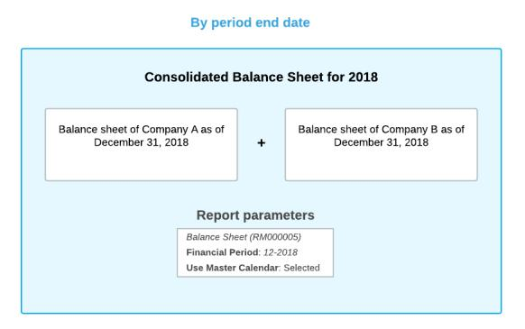

#### *Figure: Consolidated Balance Sheet by period end date*

#### **Related Links**

- *[Multiple Calendar Support](#page-50-1)*
- *[Transactions](#page-173-0) for Companies with Different Calendars*

# <span id="page-176-2"></span><span id="page-176-0"></span>**Processing Vouchers**

With Acumatica ERP, you can quickly enter a batch of documents of different types—that is, a *journal voucher* including the following:

- Vendor bills
- Prepayments
- Customer invoices
- Payments
- Cash receipts
- Disbursements
- General ledger journal entries

<span id="page-176-3"></span>In this chapter, you will read about entering and processing a batch of documents.

### <span id="page-176-1"></span>**Voucher Processing Workflow**

In Acumatica ERP, you can quickly enter multiple documents of different types and then process them in the respective subledger.

In this topic, you will read about the process of entering documents. The topic also describes transaction codes and the release of documents.

#### **Processing a Batch of Documents**

The processing of a batch of documents consists of the following steps:

- 1. Defining transaction codes: To quickly enter each document that may be in a batch, you have to specify a transaction code for each document. As such, transaction codes must be entered beforehand for the document and transactions that may be included in document batches in your company. If these transaction codes have not yet been defined in the system, you need to create or upload the necessary codes on the *[Voucher](https://help-2025r1.acumatica.com/Help?ScreenId=ShowWiki&pageid=e5d240a8-3eb9-4a73-8af5-75982bb7a6d5) Entry Codes* (GL106000) form.
- 2. Entering a batch: You create a batch and add documents to it on the *Journal [Vouchers](https://help-2025r1.acumatica.com/Help?ScreenId=ShowWiki&pageid=a1c8c3cf-9874-450f-8082-c00af1f194f3)* (GL304000) form. For details, see *Journal [Voucher](#page-178-1) Entry*.
- 3. Adding documents: If some necessary documents have not been added to the created batch, you add the missed documents on the *Journal [Vouchers](https://help-2025r1.acumatica.com/Help?ScreenId=ShowWiki&pageid=a1c8c3cf-9874-450f-8082-c00af1f194f3)* form.
- 4. Applying payments to documents: If payments need to be applied to the documents of the batch, you can apply them on the *Journal [Vouchers](https://help-2025r1.acumatica.com/Help?ScreenId=ShowWiki&pageid=a1c8c3cf-9874-450f-8082-c00af1f194f3)* form.
- 5. Preparing the batch for release: You review the details of the batch, modify the batch if necessary, and on the toolbar of the *Journal [Vouchers](https://help-2025r1.acumatica.com/Help?ScreenId=ShowWiki&pageid=a1c8c3cf-9874-450f-8082-c00af1f194f3)* form, click **Remove Hold** for the batch. The batch gets the *Balanced* status and is ready for release.
- 6. Releasing the batch: You release the batch by clicking the **Release** button on the *Journal [Vouchers](https://help-2025r1.acumatica.com/Help?ScreenId=ShowWiki&pageid=a1c8c3cf-9874-450f-8082-c00af1f194f3)* form. The batch gets the *Released* status.

The voucher processing workflow is illustrated in the following screenshot.

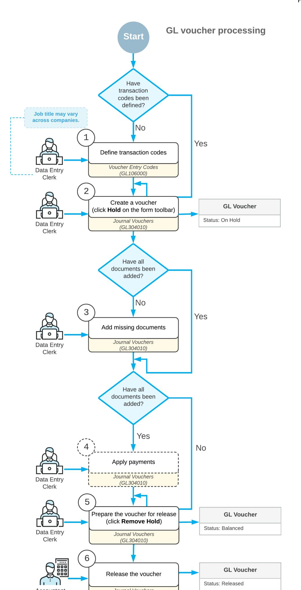

#### **Statuses of Document Batches**

A document batch can have one of the following statuses:

- *On Hold*: The batch is a dra, and new documents can be added. You can take the batch off hold only if all added documents have all the required information.
- *Balanced*: All the documents of the batch have complete information, and the batch can be released. You can add only documents with all required information to a batch with this status.
- *Released*: All the included documents have been generated and released successfully.

### **Defining Transaction Codes**

A transaction code identifies a document type in a particular subledger. You can manually specify transaction codes in the table on the *[Voucher](https://help-2025r1.acumatica.com/Help?ScreenId=ShowWiki&pageid=e5d240a8-3eb9-4a73-8af5-75982bb7a6d5) Entry Codes* (GL106000) form for the types of transactions or documents that are used in your system, or you can import a list of codes provided by Acumatica ERP. This list is available here: *[Voucher](Files/Document_Quick_Entry_via_Document_Batches_L_Transaction_Codes_20120510.xlsx) [Entry Codes](Files/Document_Quick_Entry_via_Document_Batches_L_Transaction_Codes_20120510.xlsx)*. In this list, you can find all the document types from the general ledger and the accounts payable, accounts receivable, and cash management subledgers that can be processed through document batches.


Only codes with the **Active** check box selected on this form can be used for adding documents to a document batch.

#### **Releasing a Document Batch**

You can release a particular batch with the *Balanced* status on the *Journal [Vouchers](https://help-2025r1.acumatica.com/Help?ScreenId=ShowWiki&pageid=a1c8c3cf-9874-450f-8082-c00af1f194f3)* (GL304000) form. To do this, select the batch on the form and click **Release** on the form toolbar. Releasing the batch can take some time.

On the **GLTransactions** tab of the form, you can view GL transactions that have been created.

Aer release, all the documents are generated automatically in the respective subledgers. The statuses of these documents depend on the type of the document and the subledger preference settings.

If approval of AP bills has been configured, the system will display an error message when you try to release AP bills included in a batch on the *Journal [Vouchers](https://help-2025r1.acumatica.com/Help?ScreenId=ShowWiki&pageid=a1c8c3cf-9874-450f-8082-c00af1f194f3)* form. To process AP bills, you should use the *[Bills and Adjustments](https://help-2025r1.acumatica.com/Help?ScreenId=ShowWiki&pageid=956b4e51-3078-4d2d-85b3-65c080d95234)* (AP303000) form.

#### **Related Links**

- *Cash [Transaction](https://help-2025r1.acumatica.com/Help?ScreenId=ShowWiki&pageid=6fa6ed46-bee2-4919-a871-4c365673df94) Processing*
- *Journal [Voucher](#page-178-1) Entry*
- *Recurring [Transactions:](#page-131-3) General Information*
- *[Overview of Accounts Payable Processes](https://help-2025r1.acumatica.com/Help?ScreenId=ShowWiki&pageid=dfde2a50-ac79-4cd0-81cb-dfc49df2b41f)*
- *To Add [Documents](#page-180-2) to a Document Batch*
- *Journal [Vouchers](https://help-2025r1.acumatica.com/Help?ScreenId=ShowWiki&pageid=a1c8c3cf-9874-450f-8082-c00af1f194f3)*
- *[Voucher](https://help-2025r1.acumatica.com/Help?ScreenId=ShowWiki&pageid=e5d240a8-3eb9-4a73-8af5-75982bb7a6d5) Entry Codes*

# <span id="page-178-1"></span><span id="page-178-0"></span>**Journal Voucher Entry**

You use the *Journal [Vouchers](https://help-2025r1.acumatica.com/Help?ScreenId=ShowWiki&pageid=a1c8c3cf-9874-450f-8082-c00af1f194f3)* (GL304000) form to enter multiple documents. You have to enter only the key values for each document type; other elements are populated with the default values. You can also apply payments to the documents of a batch.

In this topic, you will read about creating a document batch, adding documents to it, and applying payments to a document in the batch.

#### **Creating a Document Batch**

A batch can contain any number of documents. In the summary area of the *Journal [Vouchers](https://help-2025r1.acumatica.com/Help?ScreenId=ShowWiki&pageid=a1c8c3cf-9874-450f-8082-c00af1f194f3)* (GL304000) form, you specify the summary information of the batch, which includes the branch associated with the transaction (if your company has multiple branches), the currency of the documents (if operations in multiple currencies can be performed), the default date of the documents (which may be changed for specific documents), and the post period for all documents. Aer you specify the summary information, you can add documents to the batch.

When you save the batch, it gets a reference number based on the numbering sequence assigned in the **Document Batch NumberingSequence** box on the *[General Ledger Preferences](https://help-2025r1.acumatica.com/Help?ScreenId=ShowWiki&pageid=e4913d06-c511-4258-a0f9-f36c1b854e6b)* (GL102000) form.

For instructions on how to create a document batch, see *To Add [Documents](#page-180-2) to a Document Batch*.

#### **Adding Documents to a Batch**

You can add new documents to a batch with the *On Hold* or *Balanced* status. On the**Transactions** tab of the *[Journal](https://help-2025r1.acumatica.com/Help?ScreenId=ShowWiki&pageid=a1c8c3cf-9874-450f-8082-c00af1f194f3) [Vouchers](https://help-2025r1.acumatica.com/Help?ScreenId=ShowWiki&pageid=a1c8c3cf-9874-450f-8082-c00af1f194f3)* (GL304000) form, you enter information about each of the documents, including the transaction code, the date, the customer or vendor, the document total, and the tax information, if available. (These details differ slightly for different types of documents.) Once you specify the transaction code, some of the elements are available, while others are unavailable, depending on the code. For details on transaction codes, see *Voucher [Processing](#page-176-3) Workflow*.

As you enter the document information (transaction code, document type, vendor or customer, and amount) in a row, the system assigns a reference number to the record based on the numbering sequence assigned to documents of this type. This reference number will be reserved for the document, whether it is successfully generated or its generation fails (and the document is removed from the system).

You can enter a document as a one-line document or as a multiline document (with a header line and detail lines). For instructions on how to add documents of different types, also see *To Add [Documents](#page-180-2) to a Document Batch*.

#### **Adding a One-Line Document**

If you enter the document by its summary (as a one-line document), it takes one row in the table of the **Transactions** tab of the *Journal [Vouchers](https://help-2025r1.acumatica.com/Help?ScreenId=ShowWiki&pageid=a1c8c3cf-9874-450f-8082-c00af1f194f3)* (GL304000) form. This row includes the document header values, as well as the document total and the tax total (if applicable).

#### **Adding a Multiline Document**

By selecting the**Split** check box on the**Transactions** tab of the *Journal [Vouchers](https://help-2025r1.acumatica.com/Help?ScreenId=ShowWiki&pageid=a1c8c3cf-9874-450f-8082-c00af1f194f3)* (GL304000) form, you can enter a document with line details. When you select this check box and click **Add Row**, the system adds a row with the same reference number and transaction code. You can add the required number of lines with a line subtotal. For the document to be complete, it must have total debits that are equal to total credits.

#### **Applying Payments to the Documents in the Batch**

When you enter documents to the batch on the *Journal [Vouchers](https://help-2025r1.acumatica.com/Help?ScreenId=ShowWiki&pageid=a1c8c3cf-9874-450f-8082-c00af1f194f3)* (GL304000) form, you can also apply payments to the documents in this batch or to other documents available in the system. On the **AP Payment Application** tab, you can apply payments, credit adjustments, and prepayments to bills and debit adjustments. On the **AR Payment Application** tab, you can apply customer payments and debit adjustments to invoices and credit adjustments.

The documents added to the batch appear on the **AP Payments Application** and **AR Payments Application** tabs only aer you save the batch.

Make sure that the payment methods specified for payments to vendors in the **Payment Method** column have the **Not Required** option selected on the**Settings for Use in AP** tab of the *[Payment](https://help-2025r1.acumatica.com/Help?ScreenId=ShowWiki&pageid=509285d1-cfae-4e87-95c3-a968451952e6) [Methods](https://help-2025r1.acumatica.com/Help?ScreenId=ShowWiki&pageid=509285d1-cfae-4e87-95c3-a968451952e6)* (CA204000) form. In other words, these payment methods must not require check printing and must not be ACH payments.

If you add payments to the batch, you have to ensure that they are fully applied before you take the batch off hold.


If invoices or customer payments listed in the batch have an unapplied balance, these documents cannot be used in any other application until the batch is released and the actual documents are generated.

#### **Related Links**

- *Cash [Transaction](https://help-2025r1.acumatica.com/Help?ScreenId=ShowWiki&pageid=6fa6ed46-bee2-4919-a871-4c365673df94) Processing*
- *Voucher [Processing](#page-176-3) Workflow*
- *[Overview of Accounts Payable Processes](https://help-2025r1.acumatica.com/Help?ScreenId=ShowWiki&pageid=dfde2a50-ac79-4cd0-81cb-dfc49df2b41f)*
- *To Add [Documents](#page-180-2) to a Document Batch*
- *[General Ledger Preferences](https://help-2025r1.acumatica.com/Help?ScreenId=ShowWiki&pageid=e4913d06-c511-4258-a0f9-f36c1b854e6b)*
- *Journal [Vouchers](https://help-2025r1.acumatica.com/Help?ScreenId=ShowWiki&pageid=a1c8c3cf-9874-450f-8082-c00af1f194f3)*

# <span id="page-180-0"></span>**To Enter a Voucher Code**

You use the *[Voucher](https://help-2025r1.acumatica.com/Help?ScreenId=ShowWiki&pageid=e5d240a8-3eb9-4a73-8af5-75982bb7a6d5) Entry Codes* (GL106000) form to enter new transaction codes.

On this form, you can also upload the *[Voucher](Files/Document_Quick_Entry_via_Document_Batches_L_Transaction_Codes_20120510.xlsx) Entry Codes* file, which contains transaction codes provided by Acumatica ERP.

#### **To Enter a Voucher Code**

- 1. Open the *[Voucher](https://help-2025r1.acumatica.com/Help?ScreenId=ShowWiki&pageid=e5d240a8-3eb9-4a73-8af5-75982bb7a6d5) Entry Codes* (GL106000) form.
- 2. On the form toolbar, click **Add Row**.
- 3. In the **Module** column of the new row, select the subledger to which the document or a transaction will be posted.
- 4. In the **ModuleTran.Type** column, select the type of the document or transaction to be generated for the code.
- 5. In the **UniqueTran. Code** column, type the unique identifier to be used for this voucher entry code.
- 6. In the **Description** column, type a brief description of the voucher entry code.
- 7. On the form toolbar, click**Save**.

# <span id="page-180-2"></span><span id="page-180-1"></span>**To Add Documents to a Document Batch**

You can create a batch of documents by using the *Journal [Vouchers](https://help-2025r1.acumatica.com/Help?ScreenId=ShowWiki&pageid=a1c8c3cf-9874-450f-8082-c00af1f194f3)* (GL304000) form. On this form, you can quickly enter miscellaneous documents.

For each document type (as determined by the transaction code), you enter only the required information, by summary or with row details, if needed. When you release the batch, the actual documents in the Accounts Payable, Accounts Receivable, and Cash Management subledgers are generated and released automatically (the documents correspond to the rows you enter on the**Transactions** tab of the *Journal [Vouchers](https://help-2025r1.acumatica.com/Help?ScreenId=ShowWiki&pageid=a1c8c3cf-9874-450f-8082-c00af1f194f3)* form).

#### **Before You Proceed**

Make sure that the necessary codes have been defined on the *[Voucher](https://help-2025r1.acumatica.com/Help?ScreenId=ShowWiki&pageid=e5d240a8-3eb9-4a73-8af5-75982bb7a6d5) Entry Codes* (GL106000) form. You can enter your own codes, as described in *To Add [Documents](#page-180-2) to a Document Batch*, or upload the *[Voucher](Files/Document_Quick_Entry_via_Document_Batches_L_Transaction_Codes_20120510.xlsx) Entry Codes* file, which contains the Acumatica ERP predefined transaction codes.

#### **To Create a Document Batch**

1. Open the *Journal [Vouchers](https://help-2025r1.acumatica.com/Help?ScreenId=ShowWiki&pageid=a1c8c3cf-9874-450f-8082-c00af1f194f3)* (GL304000) form.


To open the form for creating a new record, type the form ID in the Search box, and on the Search form, point at the form title and click **New** right of the title.

- 2. On the table toolbar, click **Add Row**.
- 3. Make sure that the date specified in the**Transaction Date** box is correct. If it is not, enter the correct date.
- 4. In the **Branch** box, select the branch with which the documents are associated.
- 5. If needed, in the **Description** box, type a description for the batch.
- 6. Click **Save**.
- 7. On the **Transactions** tab, click **Add Row** to add a new row to the table. Add documents to the batch.
- 8. If the **ControlTotal** box appears in the Summary area, enter the amount, which is equal to the credit and debit total.
- 9. On the form toolbar, click**Save**.

You can release a batch that has a status of *Balanced*. Releasing the batch causes the system to generate and release the actual documents in the respective modules.

#### **To Add an Accounts Payable or Accounts Receivable Document to the Batch**

- 1. Open the *Journal [Vouchers](https://help-2025r1.acumatica.com/Help?ScreenId=ShowWiki&pageid=a1c8c3cf-9874-450f-8082-c00af1f194f3)* (GL304000) form.
- 2. In the **Batch Number** box, select the batch to which you want to add a document.
- 3. On the **Transactions** tab, perform the following steps for each document you want to add:
  - a. On the table toolbar, click **Add Row**.
  - b. In the **Tran. Code** column, select the transaction code for the accounts payable or accounts receivable document you want to add.
  - c. Check the date in the**Transaction Date** column, and change it if necessary.
  - d. In the **Customer/Vendor** column, select the vendor or customer shown on the original document.
  - e. In the **Ext. Ref. Number** column, enter the reference number of the document used by the vendor or customer.
  - f. In the **Total Amount** column, enter the total amount of the document.
  - g. If needed, provide the tax category and the tax zone in the**Tax Category** and **Tax Zone** column respectively.
  - h. If needed, in the **Transaction Description** column, type a brief description of the document.
  - j. If you want to enter the document with details, select the**Split** check box, and do the following for each line item:
    - a. On the table toolbar, click **Add Row**. The new row has the same reference number as the bill header row.

- b. In the **Total Amount** column, specify the line amount.
- c. Specify the credit or debit account and a corresponding subaccount for the line, depending on the document type, if they are different from the default ones.
- k. Make sure that the document is balanced and its total credits equal total debits.
- l. If the **ControlTotal** box appears in the Summary area, enter the amount, which is equal to the credit and debit total.
- 4. On the form toolbar, click**Save**.

#### **To Add a Cash Adjustment to the Batch**

- 1. Open the *Journal [Vouchers](https://help-2025r1.acumatica.com/Help?ScreenId=ShowWiki&pageid=a1c8c3cf-9874-450f-8082-c00af1f194f3)* (GL304000) form.
- 2. In the **Batch Number** box, select the batch to which you want to add a cash entry.
- 3. On the **Transactions** tab, perform the following steps for each cash entry you want to add:
  - a. On the table toolbar, click **Add Row**.
  - b. In the **Tran. Code** column, select the transaction code of the cash transaction you want to add.
  - c. Check the date in the**Transaction Date** column, and change it, if needed.
  - d. In the **EntryType ID** column, specify the entry type of the cash transaction.
  - e. In the **Ext. Ref. Number** column, enter the reference number shown on the external document.
  - f. Enter the**Total Amount** of the cash transaction.
  - g. If needed, in the **Transaction Description** column, type a brief description of the cash transaction.
  - h. If you want to enter the cash transaction without details (by its summary), specify both the **Credit Account** and **Debit Account** (with corresponding subaccounts, if needed).
  - j. If you want to enter the document with details, select the**Split** check box, and do the following for each line item of the document:
    - a. Click **Add Row** on the table toolbar. The new row has the same reference number as the transaction's header row.
    - b. In the **Total Amount** column, specify the line amount.
    - c. Specify the credit or debit account and a corresponding subaccount for the line, depending on the entry type (expense or disbursement).
  - k. Make sure that the document is balanced and its total credits equal total debits.
  - l. If the **ControlTotal** box appears in the Summary area, enter the amount, which is equal to the credit and debit total.
- 4. On the form toolbar, click**Save**.

#### **To Add a Batch of Journal Transactions to the Document Batch**

By using the quick entry form, you can add only transactions that have at least one entry (debit or credit) with the amount equal to the transaction total.

- 1. Open the *Journal [Vouchers](https://help-2025r1.acumatica.com/Help?ScreenId=ShowWiki&pageid=a1c8c3cf-9874-450f-8082-c00af1f194f3)* (GL304000) form.
- 2. In the **Batch Number** box, select the batch to which you want to add a general ledger entry.
- 3. On the **Transactions** tab, perform the following steps for each general ledger entry you want to add:
  - a. On the table toolbar, click **Add Row**.

- b. In the **Tran. Code** column, select the transaction code for the journal transaction you want to add.
- c. In the **Transaction Date** column, check the date, and change it if necessary.
- d. In the **Ext. Ref. Number** column, enter the reference number shown on the external document.

The length of this number must not exceed 15 characters, otherwise the system displays an error message and the journal voucher will not be released.

- e. Enter the**Total Amount** of the batch.
- f. If needed, in the **Transaction Description** column, type a brief description of the general ledger transaction.
- g. If the batch includes only two journal entries, specify both the **Credit Account** and **Debit Account** (with corresponding subaccounts).
- h. If the batch has split entries, select the**Split** check box, and do the following for each split journal entry:
  - a. On the table toolbar, click **Add Row**.
  - b. In the **Total Amount** column, specify the entry amount.
  - c. Specify the appropriate credit or debit account and subaccount for the journal entry.
- 4. On the form toolbar, click**Save**.

# <span id="page-184-0"></span>**Performing GL Anomaly Detection**

The topics of this chapter describe how to enable and use the GL anomaly detection service.

# <span id="page-184-1"></span>**GL Anomaly Detection: General Information**

The GL anomaly detection service can be used to avoid issues with GL transactions. The system will help you to recognize potential mistakes in posted transactions based on the system's analysis of abnormal amounts posted to a particular account, subaccount, branch, module, vendor, or customer. It will reduce the time for error resolution and improve the accuracy of these transactions.

#### **Learning Objectives**

In this chapter, you will learn how to do the following:

- Perform the training of the model based on reclassified transactions
- Analyze the transactions

#### **Applicable Scenarios**

You detect GL anomalies in the following cases:

- On a regular basis, to check the correctness of posted transactions and to analyze the account balances.
- When closing a financial period, to identify and investigate reporting issues.

#### **Overview of GL Anomaly Detection**

To start using the GL anomaly detection service, you should enable the *GL Anomaly Detection* feature on the *[Enable/](https://help-2025r1.acumatica.com/Help?ScreenId=ShowWiki&pageid=c1555e43-1bc5-4f6f-ba9d-b323f94d8a6b) [Disable Features](https://help-2025r1.acumatica.com/Help?ScreenId=ShowWiki&pageid=c1555e43-1bc5-4f6f-ba9d-b323f94d8a6b)* (CS100000) form.

The *GL Anomaly Detection* feature uses a machine learning algorithm to calculate predictions of errors in posted GL transactions. The algorithm uses a machine learning model—a file trained to recognize certain patterns. The model is operated by a cloud service and is based on different anomaly types.

The training is performed on the *Analyze Accounting [Transactions](https://help-2025r1.acumatica.com/Help?ScreenId=ShowWiki&pageid=49f08bfe-6c21-4ba6-bf7e-0a5600dd27d5)* (GL510000) form and consists of the following types:

- *Initial training*: The first step aer the feature activation. For initial training, the system uses transactions posted in the most recent 18 calendar months. The latest date in the 18th month defines the period corresponding to this date. For example, if the type of financial periods in the system is *Month*, the system will use transactions from 18 periods, if the type of financial periods is *2 Weeks*, the system will use transactions from 36 periods. Based on these transactions, the model calculates patterns and trains them on the period most recently sent from Acumatica ERP.
- *Continuous training*: The training that goes on continuously as new data is loaded. Each time, the model is trained more specifically to recognize errors. Each new financial period has to be sent to the model to train it.

Aer the initial training, you analyze transactions on the *Analyze Accounting [Transactions](https://help-2025r1.acumatica.com/Help?ScreenId=ShowWiki&pageid=49f08bfe-6c21-4ba6-bf7e-0a5600dd27d5)* form. On the *[Review](https://help-2025r1.acumatica.com/Help?ScreenId=ShowWiki&pageid=8b2a2b31-6180-4301-a831-45656971731f) [Anomaly Predictions](https://help-2025r1.acumatica.com/Help?ScreenId=ShowWiki&pageid=8b2a2b31-6180-4301-a831-45656971731f)* (GL406000) form, you can check the correctness of posted transactions. The system detects and highlights possible errors and assigns an anomaly score to each transaction.

Each transaction has four scores calculated based on different anomaly types, such as the following:

• Account

- Branch, account, and subaccount
- Account and inventory ID
- Account and customer or account and vendor

These four types are unique key parameters of a transaction based on which the model creates a data subset during training. When performing prediction, the model compares transaction data with this subset to detect anomalies. Subsets can be the following:

- Subset 1: Account ID: 1, Branch: 2, Subaccount: 3
- Subset 2: Account ID: 1, Branch: 2, Subaccount: 4
- Subset 3: Account ID: 2, Branch: 2, Subaccount: 3

You can mark a transaction as false detection by selecting the transaction and clicking **Mark asValid** on the form toolbar of the *[Review Anomaly Predictions](https://help-2025r1.acumatica.com/Help?ScreenId=ShowWiki&pageid=8b2a2b31-6180-4301-a831-45656971731f)* form or agree with the system's prediction and correct a highlighted error by reclassifying the transaction. For details on transaction reclassification, see *Reclassifying [Transactions:](#page-140-3) [General Information](#page-140-3)*.

#### **Setup of GL Anomaly Detection**

To set up the GL anomaly detection functionality, the system administrator performs the following actions:

- 1. On the *[Enable/Disable Features](https://help-2025r1.acumatica.com/Help?ScreenId=ShowWiki&pageid=c1555e43-1bc5-4f6f-ba9d-b323f94d8a6b)* (CS100000) form, enables the *GL Anomaly Detection* feature.
- 2. On the *[Companies](https://help-2025r1.acumatica.com/Help?ScreenId=ShowWiki&pageid=fedad435-8496-4397-b8a3-50a473629f76)* (CS101500) form, for each company whose data should be used in GL anomaly detection, selects the **Use for Anomaly Detection** check box in the Summary area.

#### **Workflow of the GL Anomaly Detection Process**

The workflow of GL anomaly detection is performed as shown in the diagram below.

The detection of GL anomalies includes the following steps:

1. On the *Analyze Accounting [Transactions](https://help-2025r1.acumatica.com/Help?ScreenId=ShowWiki&pageid=49f08bfe-6c21-4ba6-bf7e-0a5600dd27d5)* (GL510000) form, you train the model based on the data from the selected company or companies. To train the model, you select *Train Model* in the **Action** box and click **Process** or **Process All**. Before the training is started, the service status is *Pending Training*. If the training is successful, the service status is changed to *Ready for Analysis*.

If the training is not successful, the service status is changed to *Training Failed* and you need to perform the training again.

- 2. On the *Analyze Accounting [Transactions](https://help-2025r1.acumatica.com/Help?ScreenId=ShowWiki&pageid=49f08bfe-6c21-4ba6-bf7e-0a5600dd27d5)* form, you analyze the transactions of the selected company or companies. To analyze transactions, you select *Analyze Transactions* in the **Action** box and click **Process** or **Process All**.
- 3. When the analysis has been completed, you review the transactions on the *[Review Anomaly Predictions](https://help-2025r1.acumatica.com/Help?ScreenId=ShowWiki&pageid=8b2a2b31-6180-4301-a831-45656971731f)* (GL406000) form. On this form, you select the needed company or branch, the financial period, and the needed account. The system loads the records to the table, sorted first by their status and then by their anomaly score in descending order.

If any transactions have been highlighted as erroneous, you do either of the following:

- a. You select the transaction and click **Reclassify** on the form toolbar of the *[Review Anomaly Predictions](https://help-2025r1.acumatica.com/Help?ScreenId=ShowWiki&pageid=8b2a2b31-6180-4301-a831-45656971731f)* form. On the *Reclassify [Transactions](https://help-2025r1.acumatica.com/Help?ScreenId=ShowWiki&pageid=48075ac9-54ee-4082-acde-9e93ea7c3edb)* (GL506000) form, you reclassify the transaction (4 in the diagram below).
- b. You select the transaction and click **Mark asValid** on the form toolbar of the *[Review Anomaly Predictions](https://help-2025r1.acumatica.com/Help?ScreenId=ShowWiki&pageid=8b2a2b31-6180-4301-a831-45656971731f)* form (5 in the diagram below). (You can return the *Pending Review* status for this transaction if you select it and click **Mark for Review** on the form toolbar.)

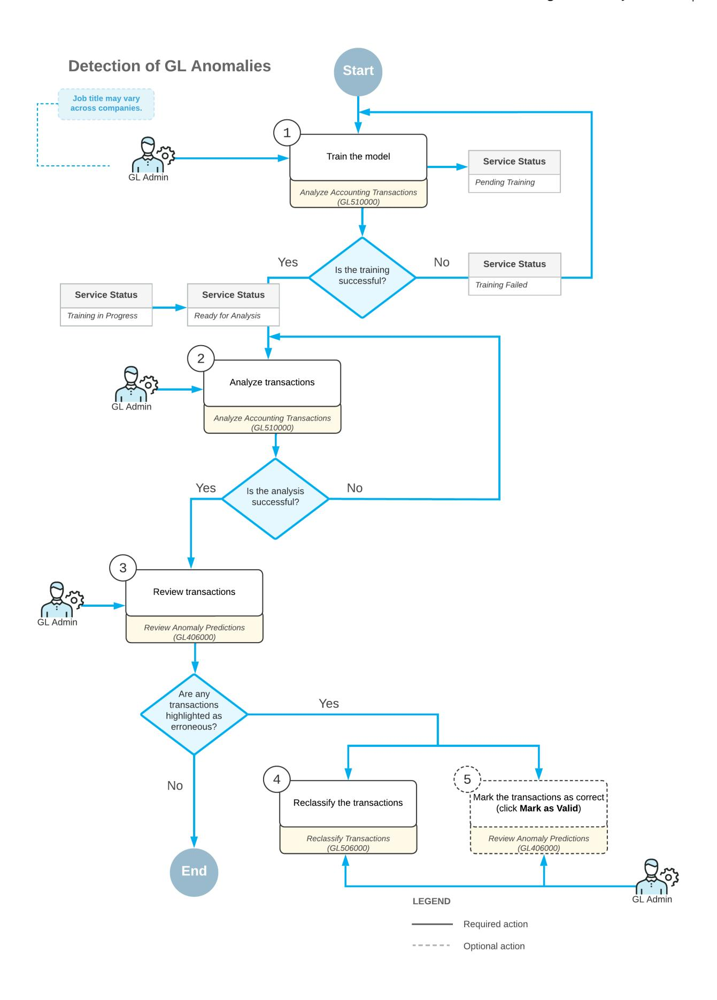

# <span id="page-187-0"></span>**GL Anomaly Detection: Scheduled Mode**

GL anomaly detection can be run by a system administrator in manual or scheduled mode. Before configuring scheduled mode for companies in a tenant, an administrative user performs the following actions:

- 1. On the *[Enable/Disable Features](https://help-2025r1.acumatica.com/Help?ScreenId=ShowWiki&pageid=c1555e43-1bc5-4f6f-ba9d-b323f94d8a6b)* (CS100000) form, the user enables the *GL Anomaly Detection* feature.
- 2. On the *[Companies](https://help-2025r1.acumatica.com/Help?ScreenId=ShowWiki&pageid=fedad435-8496-4397-b8a3-50a473629f76)* (CS101500) form, for each company where GL error detection is needed, the user selects the **Use for Anomaly Detection** check box in the Summary area.

For details on creating automation schedules, see *[Automated Processing: General Information](https://help-2025r1.acumatica.com/Help?ScreenId=ShowWiki&pageid=8a6c65f2-2379-48e1-b249-fb70d8122c4e)*.

#### **Creating the Train Model Automation Schedule**

To create an automation schedule for training the model, do the following:

- 1. Open the *[Automation Schedules](https://help-2025r1.acumatica.com/Help?ScreenId=ShowWiki&pageid=76757610-2d0f-4ead-a948-d67da24ec116)* (SM205020) form.
- 2. On the form toolbar, click **Add New Record**.
- 3. In the Summary area, specify the following settings:
  - **Active**: Selected
  - **Description**: Train Model
  - **Screen ID**: *Analyze Accounting Transactions (GL.51.00.00)*
  - **Action Name**: *Process*
- 4. On the **Details** tab, specify the following settings:
  - **No Expiration Date**: Selected
  - **Process with Branch**: *HEADOFFICE*

The *Train Model* automation schedule is shown in the following screenshot.

| Ħ<br>血<br>$\overline{\phantom{1}}$<br>$^{+}$<br>↶ | >1<br>$\rightarrow$<br>≺<br><b>VIEW SCREEN</b><br><b>VIEW HISTORY</b>          |                     |
|---------------------------------------------------|--------------------------------------------------------------------------------|---------------------|
| Schedule ID:                                      | Q<br><b>Train Model</b><br><b>Active</b>                                       | $\hat{\phantom{a}}$ |
| * Description:                                    | <b>Train Model</b>                                                             |                     |
| * Screen ID:                                      | * Action Name:<br><b>Process</b><br>Analyze Accounting Transacti Q<br>۰        |                     |
| <b>DETAILS</b><br><b>SCHEDULE</b>                 | <b>FILTER VALUES</b><br><b>CONDITIONS</b>                                      |                     |
| * Starts On:                                      | Executed:<br><b>Times</b><br>7/29/2022<br>$\Omega$<br>$\overline{\phantom{a}}$ |                     |
| Expires On:                                       | Last Executed:<br>No Expiration Date                                           |                     |
| <b>Execution Limit:</b>                           | <b>Next Execution:</b><br>8/15/2022 12:00 AM<br>1<br>No Execution Limit        |                     |
| Executions to Keep in History:                    | (GMT-05:00) Eastern Time  ▼<br>Time Zone:<br>1<br>Keep Full History            |                     |
| Process with Branch:                              | HEADOFFICE - SweetLife  ▼                                                      |                     |
|                                                   |                                                                                |                     |

*Figure: The Train Model automation schedule*

We recommend that the *Train Model* process is scheduled once per financial period, approximately in the middle of the financial period. The time can be chosen according to the server performance, for example at night or on a weekend. More frequent training will not provide any additional value as the same data will be used.

5. On the **Schedule** tab, specify the following settings:

- **By Financial Period**: Selected
- **Next Execution Date**: *8/15/2025 12:00 AM* (the date may vary, but the day should be in the middle of a financial period)
- **Fixed Day of the Period**: Selected, 15
- **Starts On**: *12:00 AM*

The schedule of the *Train Model* automation schedule is shown in the following screenshot.

| <b>Automation Schedules</b>       |                                                                                                                  | $\Gamma$ NOTES<br><b>FILES</b><br><b>CUSTOMIZATION</b><br>TOOLS $\star$ |
|-----------------------------------|------------------------------------------------------------------------------------------------------------------|-------------------------------------------------------------------------|
| Ħ<br>血<br>↶<br>$\pm$              | $\mathsf{K}$<br>$\geq$<br>$\overline{\phantom{a}}$<br>$\rightarrow$<br><b>VIEW SCREEN</b><br><b>VIEW HISTORY</b> |                                                                         |
| Schedule ID:                      | Q<br><b>Train Model</b><br>Active                                                                                | ^                                                                       |
| * Description:                    | <b>Train Model</b>                                                                                               |                                                                         |
| * Screen ID:                      | * Action Name:<br>Analyze Accounting Transacti Q                                                                 | Process<br>$\overline{\phantom{a}}$                                     |
| <b>SCHEDULE</b><br><b>DETAILS</b> | <b>CONDITIONS</b><br><b>FILTER VALUES</b>                                                                        |                                                                         |
| SCHEDULE TYPE ______________      | SCHEDULE DETAILS ____________________________________                                                            |                                                                         |
| $\bigcirc$ Daily                  | * Next Execution Date:<br>8/15/2022                                                                              | $\overline{\phantom{a}}$                                                |
| $\bigcirc$ Weekly                 | Every:<br>$\blacksquare$                                                                                         | Period(s)                                                               |
| $\bigcirc$ Monthly                | ○ End of the Period                                                                                              |                                                                         |
| <b>O</b> By Financial Period      | $\bigcirc$ Start of the Period                                                                                   |                                                                         |
|                                   | ● Fixed Day of the Period<br>15                                                                                  |                                                                         |
| <b>EXECUTION TIME</b>             |                                                                                                                  |                                                                         |
| Starts On:                        | * Next Execution Time:<br>12:00 AM<br>$\overline{\phantom{a}}$                                                   | 12:00 AM<br>$\overline{\phantom{a}}$                                    |
| Stops On:                         | $\overline{\mathbf{v}}$                                                                                          | <b>Exact Time</b>                                                       |
| Every:                            | 00:00                                                                                                            |                                                                         |
|                                   |                                                                                                                  |                                                                         |
|                                   |                                                                                                                  |                                                                         |

#### *Figure: The schedule of the Train Model automation schedule*

- 6. On the **Conditions** tab, click **Add Row** and specify the following settings:
  - **Field Name**: *Company ID*
  - **Condition**: *Equals*
  - **Value**: SWEETLIFE

The condition for the *Train Model* schedule is shown in the following screenshot.

| <b>Automation Schedules</b>                                                                             | $\Gamma$ NOTES<br><b>FILES</b><br>TOOLS $\sim$<br><b>CUSTOMIZATION</b> |  |
|---------------------------------------------------------------------------------------------------------|------------------------------------------------------------------------|--|
| n<br>冊<br>$\overline{\mathsf{K}}$<br>$\Omega$<br>>1<br>≺<br><b>VIEW SCREEN</b><br>$\rightarrow$<br>$^+$ | <b>VIEW HISTORY</b>                                                    |  |
| Q<br>Schedule ID:<br><b>Train Model</b>                                                                 | $\sim$<br><b>Active</b>                                                |  |
| * Description:<br><b>Train Model</b>                                                                    |                                                                        |  |
| * Screen ID:<br>Analyze Accounting Transacti Q                                                          | * Action Name:<br>Process<br>٠                                         |  |
| <b>CONDITIONS</b><br><b>DETAILS</b><br><b>SCHEDULE</b><br><b>FILTER VALUES</b>                          |                                                                        |  |
| Ò<br>$ \mathbf{x} $<br>$\times$<br>$^+$<br>$\overline{\phantom{a}}$                                     |                                                                        |  |
| D<br>B.<br>*Field Name<br>0<br>*Condition<br><b>Relative</b><br>Value                                   | Value 2                                                                |  |
| 0<br>$\rightarrow$<br>Company ID<br>Equals                                                              | <b>SWEETLIFE</b>                                                       |  |

#### *Figure: The condition for the Train Model automation schedule*

7. On the **FilterValues** tab, specify the following settings for the only row:

- **Field Name**: *Action*
- **Value**: *Train Model*

The filter values for the *Train Model* automation schedule are shown in the following screenshot.

| <b>Automation Schedules</b>                                                    |                                |                              | <b>P</b> NOTES      | <b>FILES</b> | <b>CUSTOMIZATION</b>     | TOOLS $\star$       |
|--------------------------------------------------------------------------------|--------------------------------|------------------------------|---------------------|--------------|--------------------------|---------------------|
| $\Box$<br>面<br>$\overline{\phantom{1}}$<br>$\Omega$<br>$\pm$                   | $\checkmark$<br>$\rightarrow$  | $\geq$<br><b>VIEW SCREEN</b> | <b>VIEW HISTORY</b> |              |                          |                     |
| Schedule ID:                                                                   | <b>Train Model</b>             | Q<br>Active                  |                     |              |                          | $\hat{\phantom{a}}$ |
| * Description:                                                                 | <b>Train Model</b>             |                              |                     |              |                          |                     |
| * Screen ID:                                                                   | Analyze Accounting Transacti Q | * Action Name:               | <b>Process</b>      |              | $\overline{\phantom{a}}$ |                     |
| <b>FILTER VALUES</b><br><b>SCHEDULE</b><br><b>DETAILS</b><br><b>CONDITIONS</b> |                                |                              |                     |              |                          |                     |
| Ò<br>$\mathbf{x}$<br>$^+$<br>$\times$<br>ℍ                                     |                                |                              |                     |              |                          |                     |
| 圓<br>D.<br>0<br>*Field Name                                                    | Relative                       | Value                        | <b>Ignore Error</b> |              |                          |                     |
| 0<br>◻<br>$\rightarrow$<br>Action                                              |                                | <b>Train Model</b>           |                     |              |                          |                     |

#### *Figure: The filter values for the Train Model automation schedule*

8. On the form toolbar, click**Save** to save your changes.

#### **Creating the Analyze Transactions Automation Schedule**

To create an automation schedule for analyzing transactions, do the following:

- 1. Open the *[Automation Schedules](https://help-2025r1.acumatica.com/Help?ScreenId=ShowWiki&pageid=76757610-2d0f-4ead-a948-d67da24ec116)* (SM205020) form.
- 2. On the form toolbar, click **Add New Record**.
- 3. In the Summary area, specify the following settings:
  - **Active**: Selected
  - **Description**: Analyze Transactions
  - **Screen ID**: *Analyze Accounting Transactions (GL.51.00.00)*
  - **Action Name**: *Process*
- 4. On the **Details** tab, specify the following settings:
  - **No Expiration Date**: Selected
  - **Process with Branch**: *HEADOFFICE*

The *Analyze Transactions* automation schedule is shown in the following screenshot.

| <b>Automation Schedules</b>                       |                                                                                    | IT NUIES<br><b>FILES</b><br><b>CUSTOMIZATION</b><br>TOOLS Y |
|---------------------------------------------------|------------------------------------------------------------------------------------|-------------------------------------------------------------|
| Ħ<br>侕<br>↶<br>$\pm$                              | K<br>$\geq$<br>≺<br><b>VIEW SCREEN</b><br>$\rightarrow$                            | <b>VIEW HISTORY</b>                                         |
| Schedule ID:                                      | Q<br>Analyze Transactions<br>Active                                                | $\sim$                                                      |
| * Description:                                    | <b>Analyze Transactions</b>                                                        |                                                             |
| * Screen ID:                                      | * Action Name:<br>Analyze Accounting Transacti Q                                   | <b>Process</b><br>۰                                         |
| <b>DETAILS</b><br><b>SCHEDULE</b><br>* Starts On: | <b>CONDITIONS</b><br><b>FILTER VALUES</b><br>7/29/2022<br>$\overline{\phantom{a}}$ | <b>Times</b><br>Executed:<br>0                              |
| Expires On:                                       | No Expiration Date                                                                 | Last Executed:                                              |
| <b>Execution Limit:</b>                           | 1<br>No Execution Limit                                                            | Next Execution:<br>7/31/2022 4:00 PM                        |
| Executions to Keep in History:                    | Keep Full History<br>1                                                             | (GMT-05:00) Eastern Time  ▼<br>Time Zone:                   |
| Process with Branch:                              | HEADOFFICE - SweetLife  ▼                                                          |                                                             |
|                                                   |                                                                                    |                                                             |

*Figure: The Analyze Transactions automation schedule*

We recommend that the *Analyze Transactions* process is scheduled daily or weekly. The time for running the process can be three and more hours later than the time of the *Train Model* process. The reasons for this recommendation are the following:

- The *Analyze Transaction* process can be run only aer the training process for the company is finished.
- The time for the training process may vary from time to time. For example, one day it may take thirty minutes and another day it may take two hours. The reason for this is the different amount of data and the distribution of values in each financial period in the general ledger, such as the distribution of accounts and subaccounts, which may vary every month depending on the season.
- 5. On the **Schedule** tab, specify the following settings:
  - **Weekly**: Selected
  - **Next Execution Date**: *8/31/2025 4:00 PM*
  - **Every**: 1 Week(s)
  - **Sunday**: Selected
  - **Starts On**: *4:00 PM*

The schedule of the *Analyze Transactions* automation schedule is shown in the following screenshot.

| <b>Automation Schedules</b>                          |                                           | $\Gamma$ NOTES                        | <b>CUSTOMIZATION</b><br><b>FILES</b><br>TOOLS $\sim$ |  |  |
|------------------------------------------------------|-------------------------------------------|---------------------------------------|------------------------------------------------------|--|--|
| H<br>$^{+}$<br>侕<br>$\Omega$                         | K<br>≺<br>>I VIEW SCREEN<br>$\rightarrow$ | <b>VIEW HISTORY</b>                   |                                                      |  |  |
| Schedule ID:                                         | Analyze Transactions<br>ρ                 | Active                                | $\hat{\phantom{a}}$                                  |  |  |
| * Description:                                       | <b>Analyze Transactions</b>               |                                       |                                                      |  |  |
| * Screen ID:                                         | Analyze Accounting Transacti Q            | * Action Name:<br>Process             | ۰                                                    |  |  |
| <b>SCHEDULE</b><br><b>DETAILS</b>                    | <b>CONDITIONS</b><br><b>FILTER VALUES</b> |                                       |                                                      |  |  |
| SCHEDULE TYPE _____________                          | <b>SCHEDULE DETAILS .</b>                 |                                       |                                                      |  |  |
| $\bigcirc$ Daily                                     | * Next Execution Date:                    | 7/31/2022<br>$\overline{\phantom{a}}$ |                                                      |  |  |
| ● Weekly                                             | Every:                                    | $\mathbf{1}$<br>Week(s)               |                                                      |  |  |
| $\bigcirc$ Monthly                                   | Sunday<br>□ Wednesday                     | Saturday                              |                                                      |  |  |
| O By Financial Period<br>□ Monday<br>$\Box$ Thursday |                                           |                                       |                                                      |  |  |
|                                                      | $\Box$ Tuesday<br>$\Box$ Friday           |                                       |                                                      |  |  |
| <b>EXECUTION TIME _</b>                              |                                           |                                       |                                                      |  |  |
| Starts On:                                           | 4:00 PM<br>$\overline{\phantom{a}}$       | * Next Execution Time:<br>4:00 PM     | ▼                                                    |  |  |
| Stops On:                                            | $\overline{\phantom{a}}$                  | Exact Time                            |                                                      |  |  |
| Every:                                               | 00:00                                     |                                       |                                                      |  |  |
|                                                      |                                           |                                       |                                                      |  |  |

*Figure: The schedule of the Analyze Transactions automation schedule*

- 6. On the **Conditions** tab, click **Add Row** and specify the following settings:
  - **Field Name**: *Company ID*
  - **Condition**: *Equals*
  - **Value**: SWEETLIFE

The condition for the *Analyze Transaction* schedule is shown in the following screenshot.

| ी NOTES<br><b>FILES</b><br><b>CUSTOMIZATION</b><br>TOOLS $\sim$<br><b>Automation Schedules</b> |                                                               |                                           |                |   |        |
|------------------------------------------------------------------------------------------------|---------------------------------------------------------------|-------------------------------------------|----------------|---|--------|
| E<br>侕<br>$\overline{\mathsf{K}}$<br>$\Omega$<br>$^+$                                          | $\geq$<br>$\prec$<br>$\rightarrow$                            | <b>VIEW SCREEN</b><br><b>VIEW HISTORY</b> |                |   |        |
| Schedule ID:                                                                                   | Q<br><b>Analyze Transactions</b>                              | Active                                    |                |   | $\sim$ |
| * Description:<br>* Screen ID:                                                                 | <b>Analyze Transactions</b><br>Analyze Accounting Transacti Q | * Action Name:                            | <b>Process</b> | ۰ |        |
| <b>CONDITIONS</b><br><b>SCHEDULE</b><br><b>FILTER VALUES</b><br><b>DETAILS</b>                 |                                                               |                                           |                |   |        |
| Ò<br>$\mathbf{\overline{x}}$<br>$_{+}$<br>$\times$<br>$\left  \leftrightarrow \right $         |                                                               |                                           |                |   |        |
| D<br>圓<br>*Field Name                                                                          | *Condition<br>Relative                                        | Value                                     | Value 2        |   |        |
| 0<br>◻<br>Company ID<br>$\geq$                                                                 | Equals                                                        | <b>SWEETLIFE</b>                          |                |   |        |

#### *Figure: The condition for the Analyze Transaction automation schedule*

- 7. On the **FilterValues** tab, specify the following settings for the only row:
  - **Field Name**: *Action*
  - **Value**: *Analyze Transactions*

The filter values for the *Analyze Transactions* automation schedule are shown in the following screenshot.

| <b>Automation Schedules</b>                                                    |                                                        | <b>TH NOTES</b>     | <b>FILES</b> | <b>CUSTOMIZATION</b>     | TOOLS $\sim$ |
|--------------------------------------------------------------------------------|--------------------------------------------------------|---------------------|--------------|--------------------------|--------------|
| H<br>血<br>$\overline{\mathsf{R}}$<br>$\Omega$<br>≺<br>$\rightarrow$<br>$^+$    | $\lambda$<br><b>VIEW SCREEN</b><br><b>VIEW HISTORY</b> |                     |              |                          |              |
| Schedule ID:<br><b>Analyze Transactions</b>                                    | $\varphi$<br>Active                                    |                     |              |                          | $\sim$       |
| * Description:<br><b>Analyze Transactions</b>                                  |                                                        |                     |              |                          |              |
| * Screen ID:<br>Analyze Accounting Transacti Q                                 | * Action Name:                                         | Process             |              | $\overline{\phantom{a}}$ |              |
| <b>FILTER VALUES</b><br><b>SCHEDULE</b><br><b>CONDITIONS</b><br><b>DETAILS</b> |                                                        |                     |              |                          |              |
| Ò<br>$\mathbf{x}$<br>$\times$<br>ℍ<br>$^+$                                     |                                                        |                     |              |                          |              |
| 髙<br>D<br>*Field Name<br>Relative                                              | Value                                                  | <b>Ignore Error</b> |              |                          |              |
| 0<br>ם<br>Action                                                               | <b>Analyze Transactions</b>                            |                     |              |                          |              |

#### *Figure: The filter values for the Analyze Transactions automation schedule*

8. On the form toolbar, click**Save** to save your changes.

# <span id="page-193-0"></span>**Preparing a Simple Budget**

You can prepare a yearly budget with a single-level structure in Acumatica ERP.

In this chapter, you will read about simple (single-level) budgets. You will also learn how to prepare them and how to release the budget articles.

# <span id="page-193-1"></span>**Simple Budget: General Information**

In Acumatica ERP, you can create simple budgets (that is, single-level lists of budget articles) with the amounts representing the specific expenses and revenues for a budget year of a particular company or branch.

#### **Learning Objectives**

In this chapter, you will read about the ways you can create a simple budget in the system. You will also perform an activity that involves creating a simple budget by uploading it from an Excel file.

#### **Applicable Scenarios**

You create a simple budget when you want to keep planned and forecast revenues and expenses as a single-level list of budget articles.

#### **Workflow of Preparing a Simple Budget**

Before you start preparing a simple budget, you need to make sure that the ledger to which the budget will be posted has been created on the *[Ledgers](https://help-2025r1.acumatica.com/Help?ScreenId=ShowWiki&pageid=a5c9f3f5-7dc4-4b1b-a50c-396729a12e4e)* (GL201500) form; the ledger should have the *Budget* type. For details, see *[Budget Ledger: General Information](https://help-2025r1.acumatica.com/Help?ScreenId=ShowWiki&pageid=55bf7202-4294-4ec6-90fb-9dd8971359ea)*.

The process of preparing a simple budget consists of the following general steps:

- 1. Creating the budget: You create a budget for a year on the *[Budgets](https://help-2025r1.acumatica.com/Help?ScreenId=ShowWiki&pageid=4f19354b-f537-4951-814b-43ff7f57febe)* (GL302010) form.
- 2. Releasing the budget: Aer you have reviewed the prepared budget, to post the budget to a budget ledger, you have to release the budget articles on the *[Release Budgets](https://help-2025r1.acumatica.com/Help?ScreenId=ShowWiki&pageid=a29ba31c-cf25-416c-a253-7de75fe54d31)* (GL505510) form.

#### **Creation of Simple Budgets**

You create simple (single-level) budgets on the *[Budgets](https://help-2025r1.acumatica.com/Help?ScreenId=ShowWiki&pageid=4f19354b-f537-4951-814b-43ff7f57febe)* (GL302010) form. For each budget that you create, you specify the following:

- The company for which the budget is being prepared; you also specify the branch if the company consists of multiple branches
- The ledger of the *Budget* type where the budget amounts will be stored
- The financial year for which the budget is prepared

You then add budget articles on the *[Budgets](https://help-2025r1.acumatica.com/Help?ScreenId=ShowWiki&pageid=4f19354b-f537-4951-814b-43ff7f57febe)* form by using one of the following methods (or a combination of these methods):

• You enter account–subaccount pairs (or only accounts if subaccounts are not used in your system) manually. To do this, for each pair or each account, you click **Add Row** on the table toolbar, select an account in the **Account** column and a subaccount in the**Subaccount** column (if applicable), and type the annual amount in the **Amount** column for each budget article. You then distribute the amount over the periods.


An account–subaccount pair may be used only once in a budget.

- You import the list of budget articles from an Excel spreadsheet. To do this, you click **Load Records from File** on the table toolbar and upload the file.
- You load the account–subaccount pairs (or the accounts if subaccounts are not used in your system) with their amounts from an actual ledger or from another budget ledger. To do this, you click **Preload Articles** on the form toolbar and select the source settings in the **Preload Budget Articles** wizard. You specify the source ledger, the financial year, and the accounts and subaccounts to be uploaded. You can also specify a multiplier to calculate the budget amounts based on the amounts available in the source ledger.

### **Distribution of Amounts Over Financial Periods**

On the *[Budgets](https://help-2025r1.acumatica.com/Help?ScreenId=ShowWiki&pageid=4f19354b-f537-4951-814b-43ff7f57febe)* form (GL302010) form, you have to distribute the annual amounts specified for an article over the periods of the year before you can release the budget article. For the budget article to be released, the amount of the article has to be equal to the distributed amount.

You can distribute the amounts for each period in one of the following ways:

- To distribute the amounts manually, you specify the necessary amounts for each period in the column corresponding to the period.
- To distribute the amounts automatically, you click **Distribute** on the table toolbar. In the **Distribute Year Amount by Periods** dialog box, which opens, you select one of the following options in the **Distribution Method** box to define how the amounts should be distributed:
  - *Evenly*: To distribute the annual amount over the financial periods evenly (excluding the adjustment period if one has been configured in your system)
  - *Proportionally to the Previous Year*: To distribute the annual amount over the financial periods proportionally to the amounts of the previous year's periods (including the adjustment period)
  - *Proportionally to Compared Values*: To distribute the annual amount over the financial periods proportionally to the amounts selected for comparison (including the adjustment period)

To facilitate the distribution of the amounts, you also can select whether you want to distribute each amount for only the selected article or for all articles in the same node. Also, you can select a node and distribute the amounts for all subarticles of this node.

# <span id="page-194-0"></span>**Simple Budget: Implementation Checklist**

The following tables provide details you can use to ensure that the system is configured properly for the preparation of a simple budget.

| Form                               | Things to Check                                                      | Notes |
|------------------------------------|----------------------------------------------------------------------|-------|
| Enable/Disable Features (CS100000) | Make sure that the Standard Finan<br>cials feature has been enabled. |       |

| Form                                    | Things to Check                                                                                                                                                                                                                                                                                                         | Notes |
|-----------------------------------------|-------------------------------------------------------------------------------------------------------------------------------------------------------------------------------------------------------------------------------------------------------------------------------------------------------------------------|-------|
| Multiple forms                          | Make sure that the minimum con<br>figuration of the company has been<br>performed, as described in Com<br>pany Without Branches: General In<br>formation, Company with Branches<br>that Do Not Require Balancing: Gen<br>eral Information, and Company with<br>Branches that Require Balancing:<br>General Information. |       |
| GL functionality                        | Make sure that the general ledger<br>functionality has been implement<br>ed, as described in General Ledger:<br>General Information.                                                                                                                                                                                    |       |
| Ledgers (GL201500)                      | Make sure that the ledger to which<br>the budget should be posted has<br>been created, as described in Bud<br>get Ledger: General Information.                                                                                                                                                                          |       |
| Chart of Accounts (GL202500)            | Check whether the necessary ac<br>counts have been created.                                                                                                                                                                                                                                                             |       |
| Master Financial Calendar<br>(GL201000) | Be sure that calendars for the fi<br>nancial years for which budgets will<br>be created have been generated.                                                                                                                                                                                                            |       |

### **Additional Configuration**

The following table provides details of additional configuration needed for the preparation of a simple budget.

| Form           | Settings to Check                                                                                                                        | Notes |
|----------------|------------------------------------------------------------------------------------------------------------------------------------------|-------|
| Multiple forms | If your company uses subaccounts,<br>the subaccounts have to be config<br>ured, as described in Subaccounts:<br>Implementation Activity. |       |

# <span id="page-195-1"></span><span id="page-195-0"></span>**Simple Budget: Process Activity**

In this activity, you will learn how to prepare simple budgets by uploading data from Excel files.

#### **Story**

Suppose that the sales manager of SweetLife Fruits & Jams has prepared an Excel file with the sales budget for the SweetLife company. The sales budget contains the amounts of each stock and non-stock item (jams, fruit, equipment, services, and other products) that the company's stores plan to sell in 2025.

Further suppose that the production manager of SweetLife has prepared an Excel file with a production budget for SweetLife, with amounts based on the sales budget. Acting as a SweetLife accountant, you have to upload these budgets to the system.

#### **Configuration Overview**

In the *U100* dataset, the following tasks have been performed for the purposes of this activity:

- On the *[Companies](https://help-2025r1.acumatica.com/Help?ScreenId=ShowWiki&pageid=fedad435-8496-4397-b8a3-50a473629f76)* (CS101500) form, the *SWEETLIFE* company has been defined.
- On the *[Branches](https://help-2025r1.acumatica.com/Help?ScreenId=ShowWiki&pageid=b97ab72d-4ab4-4f02-b69c-f7f61b316ced)* (CS102000) form, the *HEADOFFICE* branch of the *SWEETLIFE* company has been created.
- On the *[Ledgers](https://help-2025r1.acumatica.com/Help?ScreenId=ShowWiki&pageid=a5c9f3f5-7dc4-4b1b-a50c-396729a12e4e)* (GL201500) form, the *BUDGET* ledger has been added.

#### **Process Overview**

In this activity, on the *[Budgets](https://help-2025r1.acumatica.com/Help?ScreenId=ShowWiki&pageid=4f19354b-f537-4951-814b-43ff7f57febe)* (GL302010) form, you will specify the basic settings of a simple budget (branch, ledger, and financial year) and add the budget articles to the table. You will then post the budgets to a budget ledger by releasing the budget articles on the *[Release Budgets](https://help-2025r1.acumatica.com/Help?ScreenId=ShowWiki&pageid=a29ba31c-cf25-416c-a253-7de75fe54d31)* (GL505510) form.

#### **System Preparation**

Before you begin performing the steps of this activity, do the following:

- 1. Launch the Acumatica ERP website with the *U100* dataset preloaded, and sign in as an accountant Nenad Pasic by using the *pasic* username and the *123* password.
- 2. To define the needed budget ledger, make sure that you have performed the following prerequisite activity: *[Budget Ledger: Implementation Activity](https://help-2025r1.acumatica.com/Help?ScreenId=ShowWiki&pageid=241f244e-060d-4fd4-b59c-62617fb2f59b)*.
- 3. Make sure that no budget tree has been configured on the *[Budget Configuration](https://help-2025r1.acumatica.com/Help?ScreenId=ShowWiki&pageid=9f69e979-e7fd-4c8d-964f-3a75e86e4e43)* (GL205000) form. You cannot complete this activity if a budget tree has been configured.

#### **Step 1: Uploading Budget Data**

To upload the budgets from the respective Excel files, do the following:

- 1. Open the *[Budgets](https://help-2025r1.acumatica.com/Help?ScreenId=ShowWiki&pageid=4f19354b-f537-4951-814b-43ff7f57febe)* (GL302010) form.
- 2. In the **Branch** box of the Summary area, ensure that *HEADOFFICE* is selected.
- 3. In the **Ledger** box, ensure that *BUDGET* is selected.
- 4. In the **Financial Year** box, select *2025*.
- 5. On the table toolbar, click **Load Records from File**.
- 6. In the **File Upload** dialog box, which opens, click **Choose File**, and select the *[Sales\\_Budget\\_HEADOFFICE\\_2025.xlsx](Published/UserGuide/Files/Sales_Budget_HEADOFFICE_2025.xlsx)* file. Click **Upload**.
- 7. In the **Common Settings** dialog box, which opens, select *Insert All Records* in the **Mode** box, and click **OK**.
- 8. In the wizard that opens, leave all the default settings and map the columns the system has filled in, and click **OK**.

The system uploads the budget articles from the Excel file.

9. On the form toolbar, click**Save** to save the uploaded budget.

10.In the **Ledger** box, make sure that *BUDGET* is selected.

- 11.In the **Financial Year** box, make sure that *2025* is selected.
- 12.On the table toolbar, click **Load Records from File**.

- 13.In the **File Upload** dialog box that opens, click **Choose File**, and select the *[Production\\_Budget\\_HEADOFFICE\\_2025.xlsx](Published/UserGuide/Files/Production_Budget_HEADOFFICE_2025.xlsx)* file. Click **Upload**.
- 14.In the **Common Settings** dialog box that opens, leave *Update Existing* in the **Mode** box, and click **OK**.
- 15.In the wizard that opens, leave all the default settings and map the columns the system has filled in, and click **OK**.

The system uploads the budget articles from the Excel file.

16.On the form toolbar, click**Save** to save the uploaded budget.

#### **Step 2: Releasing the Budgets**

To release the budgets, do the following:

- 1. Open the *[Release Budgets](https://help-2025r1.acumatica.com/Help?ScreenId=ShowWiki&pageid=a29ba31c-cf25-416c-a253-7de75fe54d31)* (GL505510) form.
- 2. On the form toolbar, click **Release All**.

The **Processing** dialog box opens. Close this dialog box when the processing is complete.

You have prepared a simple sales budget and a simple production budget for the *HEADOFFICE* branch for the year 2025.

### <span id="page-197-0"></span>**Simple Budget: Related Report**

This topic describes a report that you may want to review to gather information about budget articles.

If you do not see the report form, this could mean that you have signed in to the system with a user account that does not have access rights to the report form.

#### **Viewing the List of Budget Articles**

You can view the list of budget articles that have been created for a particular branch or company for a specific year on the *[GL Budget Edit](https://help-2025r1.acumatica.com/Help?ScreenId=ShowWiki&pageid=3f2fd842-3a4b-4f0b-8606-9abaa4597716)* (GL612001) form. The report shows the current amount and the distributed amount of each budget article and their released amounts if an article has been released.

# <span id="page-198-0"></span>**Preparing a Budget Based on an Existing Budget**

In this chapter, you will learn how to prepare a budget based on a budget that has been uploaded to the system.

# <span id="page-198-1"></span>**Budget Based on Existing Budgets: General Information**

In Acumatica ERP, you can create new budgets based on budgets that have already been created in the system and compare the budgets.

You can create a new budget based on a budget that was uploaded to the system, created manually, or prepared based on another budget.

#### **Learning Objectives**

In this chapter, you will learn how to do the following:

- Create a budget based on a budget that has been uploaded
- Release the modified budget
- Compare the original and modified budgets

#### **Applicable Scenarios**

You prepare a budget based on an uploaded budget in the following cases:

- You want to create a version of a budget (an optimistic or pessimistic one) in the system.
- You want to create a budget for a new financial year and base the new budget on the budget for a previous financial year.

You compare two budgets when you need to analyze company performance by comparing the actual expenses and revenues with the expected ones, and when you need to analyze and improve budget data for different years, branches, or companies.

#### **Update of a Budget Based on an Uploaded Budget**

You modify the settings of a simple budget on the *[Budgets](https://help-2025r1.acumatica.com/Help?ScreenId=ShowWiki&pageid=4f19354b-f537-4951-814b-43ff7f57febe)* (GL302010) form by preloading a budget that has already been created in the system and specifying the needed branch, ledger, financial year, and multiplier for a new budget. You then release the updated budget articles on the *[Release Budgets](https://help-2025r1.acumatica.com/Help?ScreenId=ShowWiki&pageid=a29ba31c-cf25-416c-a253-7de75fe54d31)* (GL505510) form.

#### **Budget Comparison**

To compare budgets, in the Summary area of the *[Budgets](https://help-2025r1.acumatica.com/Help?ScreenId=ShowWiki&pageid=4f19354b-f537-4951-814b-43ff7f57febe)* (GL302010) form, you ensure that the ledger and the financial year of the budget being prepared are selected in the **Budget** and **Financial Year** boxes, respectively. In the **Compare to Ledger** and **Compare to Year** boxes, you select the ledger and the financial year of the budget needed for comparison. If the organization consists of multiple companies or branches, you can compare the budgets of different companies or branches by selecting the branches to compare in the **Branch** and **Compare to Branch** boxes.

Aer you have specified the required ledger, financial year, and branch (if applicable) in the table, the system adds a row to each budget article being prepared that shows the amounts of the budget of the compared ledger and financial year.


If a budget ledger is used for comparison, only the released amounts of the budget articles are shown in the table.

# <span id="page-199-0"></span>**Budget Based on an Existing Budget: Implementation Checklist**

The following sections provide details you can use to ensure that the system is configured properly for preparing a budget based on an uploaded budget, and to understand (and change, if needed) the settings that affect the processing workflow.

#### **Implementation Checklist**

We recommend that before you initially prepare a budget, you make sure the needed features have been enabled, settings have been specified, and entities have been created, as summarized in the following checklist.

| Form                                 | Criteria to Check                                                                                                                                                                                                                                                                                             |
|--------------------------------------|---------------------------------------------------------------------------------------------------------------------------------------------------------------------------------------------------------------------------------------------------------------------------------------------------------------|
| Enable/Disable Features (CS100000)   | Make sure that the Standard Financials feature has<br>been enabled.                                                                                                                                                                                                                                           |
| Multiple forms                       | Make sure that the minimum configuration of the com<br>pany has been performed, as described in Company<br>Without Branches: General Information, Company with<br>Branches that Do Not Require Balancing: General Infor<br>mation, and Company with Branches that Require Bal<br>ancing: General Information. |
| GL functionality                     | Make sure that the general ledger functionality has<br>been implemented, as described in General Ledger:<br>General Information.                                                                                                                                                                              |
| Ledgers (GL201500)                   | Make sure that the ledger to which the budget should<br>be posted has been created, as described in Budget<br>Ledger: General Information.                                                                                                                                                                    |
| Chart of Accounts (GL202500)         | Check whether the necessary accounts have been cre<br>ated.                                                                                                                                                                                                                                                   |
| Master Financial Calendar (GL201000) | Be sure that calendars for the financial years for which<br>budgets will be created have been generated.                                                                                                                                                                                                      |
| Budgets (GL302010)                   | Make sure that a simple budget has been created and<br>released as described in Simple Budget: Process Activi<br>ty.                                                                                                                                                                                          |

#### **Additional Configuration**

The following table provides details of additional configuration needed for the preparation of a simple budget.

| Form           | Settings to Check                                                                                                                        | Notes |
|----------------|------------------------------------------------------------------------------------------------------------------------------------------|-------|
| Multiple forms | If your company uses subaccounts,<br>the subaccounts have to be config<br>ured, as described in Subaccounts:<br>Implementation Activity. |       |

#### **Validation of Configuration**

To make sure that all configuration has been performed correctly, we recommend that in your system, you prepare a budget based on an uploaded budget by performing instructions similar to those described in *[Budget Based on](#page-200-1) [an Existing Budget: Process Activity](#page-200-1)*.

# <span id="page-200-1"></span><span id="page-200-0"></span>**Budget Based on an Existing Budget: Process Activity**

The following activity will walk you through the processes of preparing a budget based on an existing budget and comparing the new and existing budgets.

#### **Story**

Suppose that the financial supervisor of SweetLife Fruits & Jams has to prepare an optimistic budget for 2026 based on the uploaded budget for 2025. The articles of the budget should be increased by 15%, except for the rent or lease expense, which should remain the same. (Wages belong to the part of the budget that will be increased by 15%.)

Acting as the SweetLife financial supervisor, you need to update the budget in the system.

#### **Configuration Overview**

In the *U100* dataset, the following tasks have been performed for the purposes of this activity:

- On the *[Companies](https://help-2025r1.acumatica.com/Help?ScreenId=ShowWiki&pageid=fedad435-8496-4397-b8a3-50a473629f76)* (CS101500) form, the *SWEETLIFE* company has been defined.
- On the *[Branches](https://help-2025r1.acumatica.com/Help?ScreenId=ShowWiki&pageid=b97ab72d-4ab4-4f02-b69c-f7f61b316ced)* (CS102000) form, the *HEADOFFICE* branch of the *SWEETLIFE* company has been created.
- On the *[Chart of Accounts](https://help-2025r1.acumatica.com/Help?ScreenId=ShowWiki&pageid=85557f41-a4af-47a8-b198-2a01461ce9c3)* form, the *62900 (Rent or Lease Expense)* account has been created.
- On the *[Ledgers](https://help-2025r1.acumatica.com/Help?ScreenId=ShowWiki&pageid=a5c9f3f5-7dc4-4b1b-a50c-396729a12e4e)* (GL201500) form, the *BUDGET* ledger has been added.

#### **Process Overview**

In this activity, you will first create a new financial year, 2026, on the *[Master Financial Calendar](https://help-2025r1.acumatica.com/Help?ScreenId=ShowWiki&pageid=d46a8e03-b211-44c2-b17c-01ae813ead1b)* (GL201000) form. On the *[Budgets](https://help-2025r1.acumatica.com/Help?ScreenId=ShowWiki&pageid=4f19354b-f537-4951-814b-43ff7f57febe)* (GL302010) form, you will prepare a budget for 2026 based on the budget for 2025 and release it on the *[Release Budgets](https://help-2025r1.acumatica.com/Help?ScreenId=ShowWiki&pageid=a29ba31c-cf25-416c-a253-7de75fe54d31)* (GL505510) form. Finally, on the *[Budgets](https://help-2025r1.acumatica.com/Help?ScreenId=ShowWiki&pageid=4f19354b-f537-4951-814b-43ff7f57febe)* form, you will compare the budget for 2025 to the budget for 2026.

#### **System Preparation**

Before you begin creating budgets for 2026, do the following:

- 1. Launch the Acumatica ERP website with the *U100* dataset preloaded, and sign in as an accountant Anna Johnson by using the *johnson* username and the *123* password.
- 2. On the Company and Branch Selection menu on the top pane of the Acumatica ERP screen, make sure that the *SweetLife Head Office and Wholesale Center* branch is selected. If it is not selected, click the Company

and Branch Selection menu to view the list of branches that you have access to, and then click *SweetLife Head Office and Wholesale Center*.

- 3. Make sure that you have performed the following prerequisite activity to create the *BUDGETOPT* ledger: *[Budget Ledger: Implementation Activity](https://help-2025r1.acumatica.com/Help?ScreenId=ShowWiki&pageid=241f244e-060d-4fd4-b59c-62617fb2f59b)*.
- 4. Make sure that you have performed the following prerequisite activity to upload and release a simple budget for the *HEADOFFICE* branch:*[Simple Budget: Process Activity](#page-195-1)*.
- 5. Make sure that no budget tree has been configured on the *[Budget Configuration](https://help-2025r1.acumatica.com/Help?ScreenId=ShowWiki&pageid=9f69e979-e7fd-4c8d-964f-3a75e86e4e43)* (GL205000) form. You cannot complete this activity if a budget tree has been configured.

#### **Step 1: Creating the 2026 Financial Year**

To prepare the system for the creation of the 2026 budget, do the following:

- 1. Open the *[Master Financial Calendar](https://help-2025r1.acumatica.com/Help?ScreenId=ShowWiki&pageid=d46a8e03-b211-44c2-b17c-01ae813ead1b)* (GL201000) form.
- 2. On the form toolbar, click **Generate Calendar**.
- 3. In the **Generate GL Calendar** dialog box, which opens, make sure that *2026* is selected in the **From Year** and **To Year** boxes, and click **OK**.

#### **Step 2: Preparing and Releasing the Sales and Production Budgets for 2026**

To prepare an optimistic budget for 2026 based on the budget data of 2025, do the following:

- 1. Open the *[Budgets](https://help-2025r1.acumatica.com/Help?ScreenId=ShowWiki&pageid=4f19354b-f537-4951-814b-43ff7f57febe)* (GL302010) form.
- 2. In the Summary area, specify the following settings:
  - **Branch**: *HEADOFFICE*
  - **Ledger**: *BUDGETOPT*
  - **Financial Year**: *2026*
- 3. On the form toolbar, click **Preload Articles**.
- 4. In Step 1 of the **Preload Budget Articles** wizard, which opens, specify the following settings:
  - **Branch**: *HEADOFFICE*
  - **Ledger**: *BUDGET*
  - **Financial Year**: *2025*
  - **Multiplier (in %)**: 115
- 5. Click **Next**.
- 6. In Step 2 of the wizard, leave the specified settings, and click **Next**.
- 7. In Step 3 of the wizard, leave the **Update Existing Articles and Load Nonexistent Articles** option button selected, and click **Finish**.

The system calculates the sales budget for 2026 as a 15% increase over the budget figures for 2025 kept for the *HEADOFFICE* branch in the *BUDGET* ledger.

8. In the row with the *62900 (Rent or Lease Expense)* account, enter 14,400.00 in the **Amount** column.

This is the original amount of the rent expenses from the 2025 production budget, which should stay the same for 2026.

- 9. On the table toolbar, click **Distribute**.
- 10.In the **Distribute Year Amount by Periods** dialog box, which opens, leave *Evenly* in the **Distribution Method** box, and click **OK**.
- 11.On the form toolbar, click**Save** to save your changes.

12.Open the *[Release Budgets](https://help-2025r1.acumatica.com/Help?ScreenId=ShowWiki&pageid=a29ba31c-cf25-416c-a253-7de75fe54d31)* (GL505510) form.

13.On the form toolbar, click **Release All**.

The **Processing** dialog box opens; close this dialog box when the processing has completed.

#### **Step 3: Comparing the 2025 and 2026 Budgets**

To compare the budgets for 2025 and 2026, do the following:

- 1. Open the *[Budgets](https://help-2025r1.acumatica.com/Help?ScreenId=ShowWiki&pageid=4f19354b-f537-4951-814b-43ff7f57febe)* (GL302010) form.
- 2. In the Summary area, specify the following settings:
  - **Branch**: *HEADOFFICE*
  - **Ledger**: *BUDGETOPT*
  - **Financial Year**: *2026*
  - **Compare to Branch**: *HEADOFFICE*
  - **Compare to Ledger**: *BUDGET*
  - **Compare to Year**: 2025
- 3. Review the results in the table on the form.

As you can see, all the budget articles have been increased by 15% for 2026 except for the *Rent or Lease Expense* article, which stayed the same in 2026 as it was in 2025.

# <span id="page-203-0"></span>**Preparing a Hierarchical Budget**

If a budget tree has been configured in Acumatica ERP, you can prepare a yearly budget with a hierarchical structure. In this chapter, you will read about simple hierarchical budgets and learn about how to prepare them and what related report you can use to obtain more information.

# <span id="page-203-1"></span>**Hierarchical Budget: General Information**

In Acumatica ERP, you can create a hierarchical budget—that is, a budget that has multiple levels. For each level, the budget can be reviewed and analyzed.

#### **Learning Objectives**

In this chapter, you will learn how to create and release a hierarchical budget.

#### **Applicable Scenarios**

You create a hierarchical budget when you want to maintain planned and forecast revenues and expenses as a multilevel list of budget articles.

#### **Workflow of Preparing a Hierarchical Budget**

Before you start preparing a hierarchical budget, make sure that the following tasks have been performed in the system:

- The ledger to which the budget will be posted has been created on the *[Ledgers](https://help-2025r1.acumatica.com/Help?ScreenId=ShowWiki&pageid=a5c9f3f5-7dc4-4b1b-a50c-396729a12e4e)* (GL201500) form; this ledger must have the *Budget* type. For details, see *[Budget Ledger: General Information](https://help-2025r1.acumatica.com/Help?ScreenId=ShowWiki&pageid=55bf7202-4294-4ec6-90fb-9dd8971359ea)*.
- The budget structure has been specified on the *[Budget Configuration](https://help-2025r1.acumatica.com/Help?ScreenId=ShowWiki&pageid=9f69e979-e7fd-4c8d-964f-3a75e86e4e43)* (GL205000) form. For details, see *Budget Tree: General [Information](https://help-2025r1.acumatica.com/Help?ScreenId=ShowWiki&pageid=8b7efbe5-fc90-4dc0-b4e0-a81b74e83747)*.

The process of preparing a hierarchical budget consists of the following general steps:

- 1. Creating the budget: On the *[Budgets](https://help-2025r1.acumatica.com/Help?ScreenId=ShowWiki&pageid=4f19354b-f537-4951-814b-43ff7f57febe)* (GL302010) form, you add the year's budget amounts for the leaf budget articles and distribute them among the periods.
- 2. Approving and releasing the budget: Aer the needed parties have reviewed and approved the prepared budget, to post the budget to a budget ledger, you have to release the budget articles on the *[Release](https://help-2025r1.acumatica.com/Help?ScreenId=ShowWiki&pageid=a29ba31c-cf25-416c-a253-7de75fe54d31) [Budgets](https://help-2025r1.acumatica.com/Help?ScreenId=ShowWiki&pageid=a29ba31c-cf25-416c-a253-7de75fe54d31)* (GL505510) form.

#### **Creation of Hierarchical Budgets**

Aer you have configured the budget structure on the *[Budget Configuration](https://help-2025r1.acumatica.com/Help?ScreenId=ShowWiki&pageid=9f69e979-e7fd-4c8d-964f-3a75e86e4e43)* (GL205000) form, it is preloaded on the *[Budgets](https://help-2025r1.acumatica.com/Help?ScreenId=ShowWiki&pageid=4f19354b-f537-4951-814b-43ff7f57febe)* (GL302010) form. For each budget that you create, you specify the following:

- The branch (if the organization consists of multiple companies or branches) for which the budget is being prepared
- The ledger of the *Budget* type where the budget amounts will be stored
- The financial year for which the budget is prepared

You can enter amounts for only leaf budget articles. To do so, do one of the following:

- To enter amounts manually, you type each annual amount in the **Amount** column.
- To import the amounts from an Excel spreadsheet, you click **Load Records from File** on the table toolbar and upload the file.

• To preload the amounts from an actual ledger, a statistical ledger, or another budget, you click **Preload Articles** on the form toolbar and select the source settings in the **Preload Budget Articles** wizard.

The system calculates the amount for each node automatically as the sum of the amounts of all its leaf articles. The amounts for the nodes containing other nodes are also calculated automatically, based on the amounts of all leaf articles within those nodes.

# <span id="page-204-0"></span>**Hierarchical Budget: Implementation Checklist**

The following table provides details you can use to ensure that the system is configured properly for the preparation of a hierarchical budget, and to understand an additional configuration task that can affect the processing workflow.

| Form                                         | Things to Check                                                                                                                                                                                                                                                                                                         | Notes |
|----------------------------------------------|-------------------------------------------------------------------------------------------------------------------------------------------------------------------------------------------------------------------------------------------------------------------------------------------------------------------------|-------|
| Enable/Disable Features (CS100000)<br>form   | Make sure that the Standard Finan<br>cials feature has been enabled.                                                                                                                                                                                                                                                    |       |
| Multiple forms                               | Make sure that the minimum con<br>figuration of the company has been<br>performed, as described in Com<br>pany Without Branches: General In<br>formation, Company with Branches<br>that Do Not Require Balancing: Gen<br>eral Information, and Company with<br>Branches that Require Balancing:<br>General Information. |       |
| Ledgers (GL201500) form                      | Make sure that the ledger to which<br>the budget should be posted has<br>been created, as described in Bud<br>get Ledger: General Information.                                                                                                                                                                          |       |
| Chart of Accounts (GL202500) form            | Check whether the necessary ac<br>counts have been created.                                                                                                                                                                                                                                                             |       |
| Master Financial Calendar<br>(GL201000) form | Be sure that calendars for the fi<br>nancial years for which budgets will<br>be created have been generated.                                                                                                                                                                                                            |       |
| Budget Configuration (GL205000)<br>form      | Make sure that the relevant bud<br>get structure has been configured,<br>as described in Budget Tree: Imple<br>mentation Activity.                                                                                                                                                                                      |       |

#### **Configuration Tasks That Can Affect the Processing Workflow**

If your company uses subaccounts, the *Subaccounts* feature has to be enabled on the *[Enable/Disable Features](https://help-2025r1.acumatica.com/Help?ScreenId=ShowWiki&pageid=c1555e43-1bc5-4f6f-ba9d-b323f94d8a6b)* (CS100000) form. In this case, make sure that the budget structure has all account-subaccount pairs that are used for budgeting on the *[Budget Configuration](https://help-2025r1.acumatica.com/Help?ScreenId=ShowWiki&pageid=9f69e979-e7fd-4c8d-964f-3a75e86e4e43)* (GL205000) form.

# <span id="page-205-1"></span><span id="page-205-0"></span>**Hierarchical Budget: Process Activity**

In this activity, you will learn how to prepare a hierarchical budget.

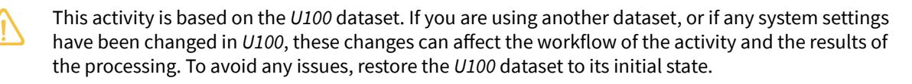

#### **Story**

Suppose that for the SweetLife Fruits & Jams company, the budget structure has been defined in the system. Acting as an accountant, you need to prepare a hierarchical budget for the *Service and Equipment Sales Center* branch in the system for the financial years 2025 and 2021.

#### **Configuration Overview**

For the purposes of this lesson, the *Subaccounts* feature has been enabled on the *[Enable/Disable Features](https://help-2025r1.acumatica.com/Help?ScreenId=ShowWiki&pageid=c1555e43-1bc5-4f6f-ba9d-b323f94d8a6b)* (CS100000) form. On the *[Segmented Keys](https://help-2025r1.acumatica.com/Help?ScreenId=ShowWiki&pageid=78bd7bd1-6bf6-409e-a8a5-8b18e8b80722)* (CS202000) form, the *SUBACCOUNT* segmented key has been defined according to your the company business needs. For details, see *[Subaccounts: Implementation Activity](https://help-2025r1.acumatica.com/Help?ScreenId=ShowWiki&pageid=64736a3d-89c3-41ca-b0a4-0af7bcb11372)*.

On the *[Ledgers](https://help-2025r1.acumatica.com/Help?ScreenId=ShowWiki&pageid=a5c9f3f5-7dc4-4b1b-a50c-396729a12e4e)* (CS202000) form, a ledger with the *Budget* type has been defined for the SweetLife Fruits & Jams company. For details, see *[Budget Ledger: Implementation Activity](https://help-2025r1.acumatica.com/Help?ScreenId=ShowWiki&pageid=241f244e-060d-4fd4-b59c-62617fb2f59b)*.

#### **Process Overview**

To create a hierarchical budget, you preload the budget structure on the *[Budgets](https://help-2025r1.acumatica.com/Help?ScreenId=ShowWiki&pageid=4f19354b-f537-4951-814b-43ff7f57febe)* (GL302010) form. For 2025, you will upload the budget amounts from a file and distribute these amounts over the periods of the year on the *[Budgets](https://help-2025r1.acumatica.com/Help?ScreenId=ShowWiki&pageid=4f19354b-f537-4951-814b-43ff7f57febe)* form. You will then post the 2025 budget to a budget ledger by releasing the budget articles on the *[Release](https://help-2025r1.acumatica.com/Help?ScreenId=ShowWiki&pageid=a29ba31c-cf25-416c-a253-7de75fe54d31) [Budgets](https://help-2025r1.acumatica.com/Help?ScreenId=ShowWiki&pageid=a29ba31c-cf25-416c-a253-7de75fe54d31)* (GL505510) form.

#### **System Preparation**

Before you prepare the hierarchical budget, do the following:

- 1. Sign in to the tenant with the *pasic* login and the *123* password.
- 2. Open the *[Master Financial Calendar](https://help-2025r1.acumatica.com/Help?ScreenId=ShowWiki&pageid=d46a8e03-b211-44c2-b17c-01ae813ead1b)* (GL201000) form.
- 3. On the form toolbar, click **Generate Calendar**.
- 4. In the **Generate GL Calendar** dialog box, which appears, make sure *2021* is selected in the **From Year** and **To Year** boxes, and click **OK**.
- 5. Open the *[Manage Financial Periods](https://help-2025r1.acumatica.com/Help?ScreenId=ShowWiki&pageid=eedf2adf-6ddc-4c33-932b-de60275c547f)* (GL503000) form.
- 6. In the **Action** box of the Summary area, select *Open*.
- 7. In the **To Year** box, select *2021*.
- 8. On the form toolbar, click **Process All**.

#### **Step 1: Preloading the Budget Structure**

To preload the budget structure for 2025, do the following:

1. Open the *[Budgets](https://help-2025r1.acumatica.com/Help?ScreenId=ShowWiki&pageid=4f19354b-f537-4951-814b-43ff7f57febe)* (GL302010) form.

- 2. In the Summary area, in the **Branch** box, select *SWEETEQUIP*.
- 3. In the **Ledger** box, make sure *BUDGET* is selected.
- 4. In the **Financial Year** box, select *2025*.

As soon as you select the year for which you want to create a new budget, the system opens the **Preload from Budget Configuration** dialog box.

- 5. In the dialog box, click **Yes** to confirm that you want to preload the budget articles. The system closes the dialog box and populates the budget articles on the *[Budgets](https://help-2025r1.acumatica.com/Help?ScreenId=ShowWiki&pageid=4f19354b-f537-4951-814b-43ff7f57febe)* form according to the budget tree configuration.
- 6. In the Summary area of the form, make sure the**TreeView** check box is selected.

#### **Step 2: Defining the Budget Amounts for 2025 and Releasing the Budget**

To define the budget amounts and release the budget, do the following:

1. While you are still viewing the budget for the *SWEETEQUIP* branch on the *[Budgets](https://help-2025r1.acumatica.com/Help?ScreenId=ShowWiki&pageid=4f19354b-f537-4951-814b-43ff7f57febe)* (GL302010) form, click **Load Records from File** on the table toolbar of the right pane, and select the *[Budget\\_SWEETEQUIP\\_2020](Published/UserGuide/Files/Budget_SWEETEQUIP_2020.xlsx)* file. In the wizard that opens, leave all the default settings and map the columns as the system suggests.

The system fills in the budget with the year amounts from the file.

- 2. On the table toolbar of the right pane, click **Distribute**.
- 3. In the **Distribute Year Amount by Periods** dialog box, specify the following settings:
  - **Distribution Method**: *Evenly*
  - **Apply to All Articles in This Node**: Selected
  - **Apply toSubarticles**: Selected
- 4. Click **OK** to close the dialog box.

The system distributes the amounts evenly among the budget articles.

- 5. On the form toolbar, click**Save** to save the budget.
- 6. Open the *[Release Budgets](https://help-2025r1.acumatica.com/Help?ScreenId=ShowWiki&pageid=a29ba31c-cf25-416c-a253-7de75fe54d31)* (GL505510) form.
- 7. On the form toolbar, click **Release All**.

The **Processing** dialog box opens; close this dialog box when the processing is complete.

## <span id="page-206-0"></span>**Hierarchical Budget: Related Report**

This topic describes a report that you may want to review to gather information about budget articles.


If you do not see the report form, this could mean that you have signed in to the system with a user account that does not have access rights to the report form.

#### **Viewing the List of Budget Articles**

You can view the list of budget articles that have been created for a particular branch or company for a specific year on the *[GL Budget Edit](https://help-2025r1.acumatica.com/Help?ScreenId=ShowWiki&pageid=3f2fd842-3a4b-4f0b-8606-9abaa4597716)* (GL612001) form. The report shows the current amount and the distributed amount of each budget article and their released amounts if an article has been released.

# <span id="page-207-0"></span>**Converting a Simple Budget to a Hierarchical Budget**

If you are maintaining a simple budget and your company decides to keep a more detailed budget in the system, you can convert a simple budget to a hierarchical budget.

In this chapter, you will find a general information on converting budgets, a list of implementation tasks that need to be performed before you start converting a budget, and an activity that guides you through the steps of converting the budget.

# <span id="page-207-1"></span>**Conversion of a Simple Budget to a Hierarchical Budget: General Information**

With Acumatica ERP, if your company needs hierarchical budgets, you can either configure a tree and create a budget based on the tree or you can convert an existing single-level budget into a hierarchical budget.

Modifications of the budget tree do not affect existing budgets, so you can modify the tree at any time.

#### **Learning Objectives**

In this chapter, you will learn how to convert a simple budget into a hierarchical budget.

#### **Applicable Scenarios**

If simple budgets have been kept in the system and then the budget tree has been configured on the *[Budget](https://help-2025r1.acumatica.com/Help?ScreenId=ShowWiki&pageid=9f69e979-e7fd-4c8d-964f-3a75e86e4e43) [Configuration](https://help-2025r1.acumatica.com/Help?ScreenId=ShowWiki&pageid=9f69e979-e7fd-4c8d-964f-3a75e86e4e43)* (GL205000) form, you may want to convert the simple budgets to hierarchical budgets. With this conversion, you can have budgets with greater detail, and you can restrict access to particular nodes for certain groups of users.

#### **Conversion of Simple Budgets to Hierarchical Budgets**

If you have created single-level budgets before you configured the budget tree, you can convert each single-level budget to a hierarchical budget based on the budget tree that has been configured on the *[Budget Configuration](https://help-2025r1.acumatica.com/Help?ScreenId=ShowWiki&pageid=9f69e979-e7fd-4c8d-964f-3a75e86e4e43)* (GL205000) form.

To convert a single-level budget to a hierarchical budget, on the *[Budgets](https://help-2025r1.acumatica.com/Help?ScreenId=ShowWiki&pageid=4f19354b-f537-4951-814b-43ff7f57febe)* (GL302010) form, you select an existing single-level budget and click **Manage Budgets** on the form toolbar. In the **Manage Budget** dialog box, you select the *Convert Budget Using Current Budget Configuration* action and click **OK**. The system converts the current singlelevel budget by using the budget tree from the *[Budget Configuration](https://help-2025r1.acumatica.com/Help?ScreenId=ShowWiki&pageid=9f69e979-e7fd-4c8d-964f-3a75e86e4e43)* form.

Aer a simple budget has been converted to a hierarchical budget, the changes are irreversible—that is, the budget cannot be converted back to a simple budget.

# <span id="page-207-2"></span>**Converting a Simple Budget to a Hierarchical Budget: Implementation Checklist**

The following table provides details you can use to ensure that the system is configured properly for the conversion of a simple budget to a hierarchical budget, and to understand (and change, if needed) the settings that affect the processing workflow.

| Form                               | Things to Check                                                                                                                                                                                                                                                                                                         | Notes                                                                                                                                                                                                                                       |
|------------------------------------|-------------------------------------------------------------------------------------------------------------------------------------------------------------------------------------------------------------------------------------------------------------------------------------------------------------------------|---------------------------------------------------------------------------------------------------------------------------------------------------------------------------------------------------------------------------------------------|
| Enable/Disable Features (CS100000) | Make sure that the Standard Finan<br>cials feature has been enabled.                                                                                                                                                                                                                                                    |                                                                                                                                                                                                                                             |
| Multiple forms                     | Make sure that the minimum con<br>figuration of the company has been<br>performed, as described in Com<br>pany Without Branches: General In<br>formation, Company with Branches<br>that Do Not Require Balancing: Gen<br>eral Information, and Company with<br>Branches that Require Balancing:<br>General Information. |                                                                                                                                                                                                                                             |
| Ledgers (GL201500)                 | Make sure that the ledger to which<br>the budget should be posted has<br>been created, as described in Bud<br>get Ledger: General Information.                                                                                                                                                                          |                                                                                                                                                                                                                                             |
| Budget Configuration (GL205000)    | Make sure that the budget struc<br>ture has been configured, as de<br>scribed in Budget Tree: Implementa<br>tion Activity.                                                                                                                                                                                              |                                                                                                                                                                                                                                             |
| Budgets (GL302010)                 | Make sure that in the budget that<br>you are going to convert,the masks<br>that are used are the same as in the<br>configured tree.                                                                                                                                                                                     | If any mask for a single-level bud<br>get is split into multiple masks on<br>a tree or if multiple masks used<br>somewhere in the single-level bud<br>get are merged into a single mask<br>for the tree, the budget cannot be<br>converted. |

### **Other Settings That Affect the Workflow**

To cause some users to view only the budget nodes to which they are assigned access rights based on their roles, you perform the configuration described in *[Access to Budget Nodes: Implementation Activity](https://help-2025r1.acumatica.com/Help?ScreenId=ShowWiki&pageid=5f2f3a4a-8200-4eb1-a137-5f462fac9d05)*.

### **Validation of Configuration**

To make sure that all configuration has been performed correctly, we recommend that in your system, you convert a simple budget to a hierarchical budget by performing instructions similar to those described in *[Conversion of a](#page-208-1) [Simple Budget to a Hierarchical Budget: Process Activity](#page-208-1)*.

# <span id="page-208-1"></span><span id="page-208-0"></span>**Conversion of a Simple Budget to a Hierarchical Budget: Process Activity**

In this activity, you will learn how to convert an existing simple budget into a hierarchical budget.

#### **Story**

Suppose that the 2025 budget of the SweetLife Fruits & Jams company, which contains sales and production budget articles, has to be converted into a hierarchical budget based on the previously created budget tree. (As the company has grown, its management has decided to have more detailed budgets in the system, and a budget tree has been configured.)

Acting as a system administrator, you need to convert the simple budget into a hierarchical budget and review how users with various roles can access the budget nodes.

#### **Configuration Overview**

In the *U100* dataset, the following tasks have been performed for the purposes of this activity:

- On the *[Companies](https://help-2025r1.acumatica.com/Help?ScreenId=ShowWiki&pageid=fedad435-8496-4397-b8a3-50a473629f76)* (CS101500) form, the *SWEETLIFE* company has been defined.
- On the *[Branches](https://help-2025r1.acumatica.com/Help?ScreenId=ShowWiki&pageid=b97ab72d-4ab4-4f02-b69c-f7f61b316ced)* (CS102000) form, the *HEADOFFICE* branch of the *SWEETLIFE* company has been created.
- On the *[Users](https://help-2025r1.acumatica.com/Help?ScreenId=ShowWiki&pageid=834cc181-97fa-4db4-a7e0-3eaba142c166)* (SM201010) form, the *chubb*, *wiley*, *johmson*, and *gibbs* user accounts have been created.
- On the *[Ledgers](https://help-2025r1.acumatica.com/Help?ScreenId=ShowWiki&pageid=a5c9f3f5-7dc4-4b1b-a50c-396729a12e4e)* (GL201500) form, the *BUDGET* ledger of the *Budget* type has been defined.

#### **Process Overview**

In this activity, on the *[Budgets](https://help-2025r1.acumatica.com/Help?ScreenId=ShowWiki&pageid=4f19354b-f537-4951-814b-43ff7f57febe)* (GL302010) form, you will convert a simple budget for 2025 into a hierarchical one. You will sign in as a user with the *Sales Manager* role, then as a user with the *Purchasing Manager* role, and finally as a user with the *Financial Supervisor* role; while signed in as each user, you will review the available budget nodes on the *[Budgets](https://help-2025r1.acumatica.com/Help?ScreenId=ShowWiki&pageid=4f19354b-f537-4951-814b-43ff7f57febe)* (GL302010) form.

#### **System Preparation**

Before you begin performing the steps of this activity, do the following:

- 1. Launch the Acumatica ERP website with the *U100* dataset preloaded, and sign in as a system administrator Kimberly Gibbs by using the *gibbs* username and the *123* password.
- 2. On the Company and Branch Selection menu on the top pane of the Acumatica ERP screen, make sure that the *SweetLife Head Office and Wholesale Center* branch is selected. If it is not selected, click the Company and Branch Selection menu button to view the list of branches that you have access to, and then click *SweetLife Head Office and Wholesale Center*.
- 3. Make sure that you have performed the following prerequisite activity to upload a budget for the *HEADOFFICE* branch: *[Simple Budget: Process Activity](#page-195-1)*.
- 4. Make sure that you have performed the following prerequisite activity to configure restriction groups: *[Access to Budget Nodes: Implementation Activity](https://help-2025r1.acumatica.com/Help?ScreenId=ShowWiki&pageid=5f2f3a4a-8200-4eb1-a137-5f462fac9d05)*.
- 5. Make sure that you have performed the following prerequisite activity to configure a budget tree in the system: *Budget Tree: [Implementation](https://help-2025r1.acumatica.com/Help?ScreenId=ShowWiki&pageid=6c040be6-6d3d-4dd4-8644-dec62696ab3f) Activity*.

#### **Step 1: Converting a Simple Budget to a Hierarchical Budget**

To convert the simple budget to a hierarchical budget, do the following:

- 1. Open the *[Budgets](https://help-2025r1.acumatica.com/Help?ScreenId=ShowWiki&pageid=4f19354b-f537-4951-814b-43ff7f57febe)* (GL302010) form.
- 2. In the Summary area, specify the following settings:
  - **Branch**: *HEADOFFICE*
  - **Ledger**: *BUDGET*
  - **Financial Year**: *2025*
  - **TreeView**: Cleared
- 3. On the form toolbar, click **Manage Budget**.

The system opens the **Manage Budget** dialog box.

- 4. In the **Select Action** box, select *Convert Budget Using Current Budget Configuration*, and click **OK**.
- 5. In the warning dialog box that appears, click **OK**.
  - The system converts the current single-level budget by using the budget tree from the *[Budget Configuration](https://help-2025r1.acumatica.com/Help?ScreenId=ShowWiki&pageid=9f69e979-e7fd-4c8d-964f-3a75e86e4e43)* (GL205000) form.
- 6. Select the**TreeView** check box, and in the le pane, review the list of added nodes from the simple budget.
- 7. On the form toolbar, click**Save** to save the changes.
- 8. Sign out from the system.

#### **Step 2: Reviewing the Accessible Budget Nodes for a Sales Manager**

To review the budget nodes that are accessible for a sales manager based on the restriction groups that you set up, do the following:

- 1. Sign in to the tenant by using the *chubb* username and the *123* password.
- 2. Open the *[Budgets](https://help-2025r1.acumatica.com/Help?ScreenId=ShowWiki&pageid=4f19354b-f537-4951-814b-43ff7f57febe)* (GL302010) form.
- 3. In the Summary area, specify the following settings:
  - **Branch**: *HEADOFFICE*
  - **Ledger**: *BUDGET*
  - **Financial Year**: 2025
  - **TreeView**: Selected
- 4. In the le pane, notice that only the**Sales** node is available for this user, who belongs to the *SalesBudget* restriction group.
- 5. Sign out from the system.

#### **Step 3: Reviewing the Accessible Budget Nodes for a Purchasing Manager**

To review the budget nodes that are accessible for a purchasing manager, do the following:

- 1. Sign in to the tenant by using the *wiley* username and the *123* password.
- 2. Open the *[Budgets](https://help-2025r1.acumatica.com/Help?ScreenId=ShowWiki&pageid=4f19354b-f537-4951-814b-43ff7f57febe)* (GL302010) form.
- 3. In the Summary area, specify the following settings:
  - **Branch**: *HEADOFFICE*
  - **Ledger**: *BUDGET*
  - **Financial Year**: 2025
  - **TreeView**: Selected
- 4. In the le pane, notice that only the **Production** node with subnodes is available for this user, who belongs to the *ProductionBudget* restriction group.
- 5. Sign out from the system.

#### **Step 4: Reviewing the Accessible Budget Nodes for a Financial Supervisor**

To review the budget nodes that are accessible for a financial supervisor, do the following:

- 1. Sign in to the tenant by using the *johnson* username and the *123* password.
- 2. Open the *[Budgets](https://help-2025r1.acumatica.com/Help?ScreenId=ShowWiki&pageid=4f19354b-f537-4951-814b-43ff7f57febe)* (GL302010) form.
- 3. In the Summary area, specify the following settings:
  - **Branch**: *HEADOFFICE*

- **Ledger**: *BUDGET*
- **Financial Year**: 2025
- **TreeView**: Selected
- 4. In the le pane, notice that both the**Sales** node and the **Production** node with subnodes are available for this user, who belongs to the *SalesBudget* and *ProductionBudget* restriction groups.

# <span id="page-212-0"></span>**Modifying a Hierarchical Budget**

In this chapter, you will learn how to modify a hierarchical budget by adding a budget article to a budget node.

# <span id="page-212-1"></span>**Modification of a Hierarchical Budget: General Information**

In Acumatica ERP, you can create a hierarchical budget—that is, a budget that has multiple levels. Each level of the budget can be reviewed and analyzed.

#### **Learning Objectives**

In this chapter, you will learn how to modify a hierarchical budget by adding an article to a budget node.

#### **Applicable Scenarios**

You modify a budget if you want to manually add a leaf budget article to a budget node.

#### **Creation of Hierarchical Budgets**

Aer you have configured the budget structure on the *[Budget Configuration](https://help-2025r1.acumatica.com/Help?ScreenId=ShowWiki&pageid=9f69e979-e7fd-4c8d-964f-3a75e86e4e43)* (GL205000) form, it is preloaded on the *[Budgets](https://help-2025r1.acumatica.com/Help?ScreenId=ShowWiki&pageid=4f19354b-f537-4951-814b-43ff7f57febe)* (GL302010) form. For each budget that you create, you specify the following:

- The branch (if the organization consists of multiple companies or branches) for which the budget is being prepared
- The ledger of the *Budget* type where the budget amounts will be stored
- The financial year for which the budget is prepared

You can enter amounts for only leaf budget articles. To do so, do one of the following:

- To enter amounts manually, you type each annual amount in the **Amount** column.
- To import the amounts from an Excel spreadsheet, you click **Load Records from File** on the table toolbar and upload the file.
- To preload the amounts from an actual ledger, a statistical ledger, or another budget, you click **Preload Articles** on the form toolbar and select the source settings in the **Preload Budget Articles** wizard.

The system calculates the amount for each node automatically as the sum of the amounts of all its leaf articles. The amounts for the nodes containing other nodes are also calculated automatically, based on the amounts of all leaf articles within those nodes.

#### **Modification of Budget Articles**

When you create a budget on the *[Budgets](https://help-2025r1.acumatica.com/Help?ScreenId=ShowWiki&pageid=4f19354b-f537-4951-814b-43ff7f57febe)* (GL302010) form, the system automatically adds the nodes and the articles to the budget by using the preconfigured budget tree on the *[Budget Configuration](https://help-2025r1.acumatica.com/Help?ScreenId=ShowWiki&pageid=9f69e979-e7fd-4c8d-964f-3a75e86e4e43)* (GL205000) form.

You can also edit the account and subaccount (if subaccounts are used in your system) of budget articles if any of the following criteria are met:

- The budget articles are leaves.
- The budget articles have been added manually (that is, they have not been preloaded from a configured budget tree).
- The budget articles have not been released.

# <span id="page-213-0"></span>**Modifying a Hierarchical Budget: Implementation Checklist**

The following table provides details you can use to ensure that the system is configured properly for the modification of a hierarchical budget, and to understand an additional configuration task that can affect the processing workflow.

| Form                                    | Things to Check                                                                                                                                                                                                                                                                                                         | Notes |
|-----------------------------------------|-------------------------------------------------------------------------------------------------------------------------------------------------------------------------------------------------------------------------------------------------------------------------------------------------------------------------|-------|
| Enable/Disable Features (CS100000)      | Make sure that the Standard Finan<br>cials feature has been enabled.                                                                                                                                                                                                                                                    |       |
| Multiple forms                          | Make sure that the minimum con<br>figuration of the company has been<br>performed, as described in Com<br>pany Without Branches: General In<br>formation, Company with Branches<br>that Do Not Require Balancing: Gen<br>eral Information, and Company with<br>Branches that Require Balancing:<br>General Information. |       |
| Ledgers (GL201500)                      | Make sure that the ledger to which<br>the budget should be posted has<br>been created, as described in Bud<br>get Ledger: General Information.                                                                                                                                                                          |       |
| Chart of Accounts (GL202500)            | Check whether the necessary ac<br>counts have been created.                                                                                                                                                                                                                                                             |       |
| Master Financial Calendar<br>(GL201000) | Be sure that calendars for the fi<br>nancial years for which budgets will<br>be created have been generated.                                                                                                                                                                                                            |       |
| Budget Configuration (GL205000)         | Make sure that the relevant bud<br>get structure has been configured,<br>as described in Budget Tree: Imple<br>mentation Activity.                                                                                                                                                                                      |       |
| Budgets (GL302010)                      | Make sure that a hierarchical bud<br>get has been created, as described<br>in Conversion of a Simple Budget to<br>a Hierarchical Budget: Process Ac<br>tivity or Hierarchical Budget: Process<br>Activity.                                                                                                              |       |

### **Configuration Tasks That Can Affect the Processing Workflow**

If your company uses subaccounts, the *Subaccounts* feature has to be enabled on the *[Enable/Disable Features](https://help-2025r1.acumatica.com/Help?ScreenId=ShowWiki&pageid=c1555e43-1bc5-4f6f-ba9d-b323f94d8a6b)* (CS100000) form. In this case, make sure that the budget structure has all account-subaccount pairs that are used for budgeting on the *[Budget Configuration](https://help-2025r1.acumatica.com/Help?ScreenId=ShowWiki&pageid=9f69e979-e7fd-4c8d-964f-3a75e86e4e43)* (GL205000) form.

#### **Validation of Configuration**

To make sure that all configuration has been performed correctly, we recommend that in your system, you modify a hierarchical budget by performing instructions similar to those described in *[Modification of a Hierarchical Budget:](#page-214-1) [Process Activity](#page-214-1)*.

# <span id="page-214-1"></span><span id="page-214-0"></span>**Modification of a Hierarchical Budget: Process Activity**

The following activity will walk you through the process of modifying a hierarchical budget by adding a leaf article to a budget node and uploading a budget based on the updated budget tree.

#### **Story**

Suppose that the management of SweetLife Fruits & Jams needs to have a budget article that aggregates all travel expenses of the company. The hierarchical budget should include the *Travel Expenses* leaf that would aggregate budgeted amounts for accounts from *70000 (Travel - Tickets)* to *70020 (Travel - Meals)*. Further suppose that the budget for 2026 should be based on the configured budget tree and uploaded to the system.

Acting as a system administrator, you need to add a leaf budget article to the **Production** node of the budget, add the budget amounts for travel expenses in 2025, and upload the budget for 2026 that already includes travel expenses.

#### **Configuration Overview**

In the *U100* dataset, the following tasks have been performed for the purposes of this activity:

- On the *[Companies](https://help-2025r1.acumatica.com/Help?ScreenId=ShowWiki&pageid=fedad435-8496-4397-b8a3-50a473629f76)* (CS101500) form, the *SWEETLIFE* company has been defined.
- On the *[Branches](https://help-2025r1.acumatica.com/Help?ScreenId=ShowWiki&pageid=b97ab72d-4ab4-4f02-b69c-f7f61b316ced)* (CS102000) form, the *HEADOFFICE* branch of the *SWEETLIFE* company has been created.
- On the *[Chart of Accounts](https://help-2025r1.acumatica.com/Help?ScreenId=ShowWiki&pageid=85557f41-a4af-47a8-b198-2a01461ce9c3)* (GL202500) form, accounts with numbers from *70000 (Travel - Tickets)* to *70020 (Travel - Meals)* have been created.
- On the *[Ledgers](https://help-2025r1.acumatica.com/Help?ScreenId=ShowWiki&pageid=a5c9f3f5-7dc4-4b1b-a50c-396729a12e4e)* (GL201500) form, the *BUDGET* ledger of the *Budget* type has been defined.
- On the *[Segmented Keys](https://help-2025r1.acumatica.com/Help?ScreenId=ShowWiki&pageid=78bd7bd1-6bf6-409e-a8a5-8b18e8b80722)* (CS202000) form, the *SUBACCOUNT* segmented key has been defined.

#### **Process Overview**

In this activity, you will add the *Travel Expenses* leaf to the **Production** node of the hierarchical budget on the *[Budget Configuration](https://help-2025r1.acumatica.com/Help?ScreenId=ShowWiki&pageid=9f69e979-e7fd-4c8d-964f-3a75e86e4e43)* (GL205000) form. On the *[Budgets](https://help-2025r1.acumatica.com/Help?ScreenId=ShowWiki&pageid=4f19354b-f537-4951-814b-43ff7f57febe)* (GL302010) form, you will convert the 2025 budget based on the updated budget tree and update the *Travel Expenses* article. You will then release the modified budget article on the *[Release Budgets](https://help-2025r1.acumatica.com/Help?ScreenId=ShowWiki&pageid=a29ba31c-cf25-416c-a253-7de75fe54d31)* (GL505510) form. Finally, on the *[Budgets](https://help-2025r1.acumatica.com/Help?ScreenId=ShowWiki&pageid=4f19354b-f537-4951-814b-43ff7f57febe)* form, you will upload a budget for 2026 from an Excel file.

#### **System Preparation**

Before you begin performing the steps of this activity, do the following:

- 1. Launch the Acumatica ERP website with the *U100* dataset preloaded, and sign in as a system administrator Kimberly Gibbs by using the *gibbs* username and the *123* password.
- 2. On the Company and Branch Selection menu on the top pane of the Acumatica ERP screen, make sure that the *SweetLife Head Office and Wholesale Center* branch is selected. If it is not selected, click the Company and Branch Selection menu button to view the list of branches that you have access to, and then click *SweetLife Head Office and Wholesale Center*.

- 3. Make sure that you have performed the following prerequisite activity to create a hierarchical budget: *[Conversion of a Simple Budget to a Hierarchical Budget: Process Activity](#page-208-1)*.
- 4. Make sure that you have completed the following prerequisite activity to perform the needed configuration of subaccounts: *[Subaccounts: Implementation Activity](https://help-2025r1.acumatica.com/Help?ScreenId=ShowWiki&pageid=64736a3d-89c3-41ca-b0a4-0af7bcb11372)*.

#### **Step 1: Adding the Travel Expenses Leaf**

To add the *Travel Expenses* leaf to the **Production** node of the SweetLife budget, do the following:

- 1. Open the *[Budget Configuration](https://help-2025r1.acumatica.com/Help?ScreenId=ShowWiki&pageid=9f69e979-e7fd-4c8d-964f-3a75e86e4e43)* (GL205000) form.
- 2. In the **BudgetTree** pane, click the **Production** node.
- 3. On the table toolbar of the**Subarticles** pane, click **Add Row**, and specify the following settings in the added row:
  - **Node**: Cleared
  - **Account**: *70000 - Travel-Tickets*
  - **Subaccount**: *000-000*
  - **Description**: Travel Expenses
  - **Account Mask**: 700??
  - **Subaccount Mask**: *000-000*
- 4. On the form toolbar, click**Save** to save your changes.
- 5. On the toolbar of the**Subarticles** pane, click **ConfigureSecurity** to review the new leaf added to the *ProductionBudget* access group.

The system navigates to the *[Restriction Groups by Budget Article](https://help-2025r1.acumatica.com/Help?ScreenId=ShowWiki&pageid=989a8762-83ad-4a13-a622-68c30cf58fbc)* (GL105020) form with the *Travel Expenses* budget article selected. Notice that the Included check box is selected for the row with the *ProductionBudget* group in the table. This means that the *Travel Expenses* article has been added to this restriction group.

#### **Step 2: Converting the Budget by Using the Updated Budget Tree**

To convert the budget by using the updated budget tree, do the following:

- 1. Open the *[Budgets](https://help-2025r1.acumatica.com/Help?ScreenId=ShowWiki&pageid=4f19354b-f537-4951-814b-43ff7f57febe)* (GL302010) form.
- 2. In the Summary area, specify the financial year, and ensure that the following settings are specified:
  - **Branch**: *HEADOFFICE (SweetLife Head Office and Wholesale Center)*
  - **Ledger**: *BUDGET*
  - **Financial Year**: *2025*
  - **TreeView**: Selected
- 3. On the form toolbar, click **Manage Budget**.
- 4. In the **Manage Budget** dialog box, which opens, select *Convert Budget Using Current Budget Configuration* in the **Select Action** box. Click **OK**, and in the warning message that is displayed, click **OK**.
- 5. On the form toolbar, click**Save** to save the changes.

#### **Step 3: Updating the Travel Expenses Article**

To update the *Travel Expenses* article, do the following:

1. While you are still on the *[Budgets](https://help-2025r1.acumatica.com/Help?ScreenId=ShowWiki&pageid=4f19354b-f537-4951-814b-43ff7f57febe)* (GL302010) form, click the **Production** node.

One budget article has been added to the node automatically by the system during the conversion.

- 2. In the row for the *70000* account, enter 3,600.00 in the **Amount** column.
- 3. On the table toolbar, click **Distribute**.
- 4. In the **Distribute Year Amount by Periods** dialog box, which opens, make sure that the following settings are specified:
  - **Distribution Method**: *Evenly*
  - **Apply to All Articles in This Node**: Cleared
- 5. Click **OK**. The amount that you have specified has been distributed evenly through the periods of the financial year.
- 6. On the form toolbar, click**Save** to save your changes.

#### **Step 4: Releasing the Updated Budget**

To release the updated budget, do the following:

- 1. Open the *[Release Budgets](https://help-2025r1.acumatica.com/Help?ScreenId=ShowWiki&pageid=a29ba31c-cf25-416c-a253-7de75fe54d31)* (GL505510) form.
- 2. On the form toolbar, select the updated budget and click **Release**.

#### **Step 5: Uploading and Releasing a Budget for 2026**

To upload and then release a budget for 2026 that should be based on the updated budget tree, do the following:

- 1. Open the *[Budgets](https://help-2025r1.acumatica.com/Help?ScreenId=ShowWiki&pageid=4f19354b-f537-4951-814b-43ff7f57febe)* (GL302010) form.
- 2. In the Summary area, specify the 2026 financial year in the **Financial Year** box, and ensure that the following settings have been inserted by default:
  - **Branch**: *HEADOFFICE*
  - **Ledger**: *BUDGET*
  - **TreeView**: Selected
- 3. In the **Preload from Budget Configuration** dialog box, which the system opens, click **Yes**.
- 4. On the table toolbar, click **Load Records from File**.
- 5. In the **File Upload** dialog box, which opens, click **Choose File**, and select the *[Budget\\_SWEETLIFE\\_2026.xlsx](Published/UserGuide/Files/Budget_SWEETLIFE_2026.xlsx)* file. Click **Upload**.
- 6. In the **Common Settings** dialog box, which opens, select *Update Existing* in the **Mode** box, and click **OK**.
- 7. In the wizard that opens, leave all the default settings and map the columns the system has filled in, and click **OK**.

The system uploads the budget articles from the Excel file.

- 8. On the form toolbar, click**Save** to save the budget configuration.
- 9. Open the *[Release Budgets](https://help-2025r1.acumatica.com/Help?ScreenId=ShowWiki&pageid=a29ba31c-cf25-416c-a253-7de75fe54d31)* (GL505510) form.

10.On the form toolbar, click **Release All** to release all the listed budget articles.

# <span id="page-216-0"></span>**Modification of a Hierarchical Budget: Related Report**

This topic describes a report that you may want to review to gather information about budget articles.


If you do not see the report form, this could mean that you have signed in to the system with a user account that does not have access rights to the report form.

#### **Viewing the List of Budget Articles**

You can view the list of budget articles that have been created for a particular branch or company for a specific year on the *[GL Budget Edit](https://help-2025r1.acumatica.com/Help?ScreenId=ShowWiki&pageid=3f2fd842-3a4b-4f0b-8606-9abaa4597716)* (GL612001) form. The report shows the current amount and the distributed amount of each budget article and their released amounts if an article has been released.

# <span id="page-218-0"></span>**Preparing and Running a Budget vs Actual ARM Report**

In this chapter, you will learn how to prepare a Budget vs Actual ARM report, run it, and compare the budget with the actual amounts.

# <span id="page-218-1"></span>**Budget vs. Actual ARM Report: General Information**

Analytical reports are a specific type of reports that you can construct in Acumatica ERP by using the Analytical Report Manager toolkit. Reports that are constructed with this toolkit are called *ARM reports* to distinguish them from the reports created in the Acumatica Report Designer. The Analytical Report Manager toolkit is specially designed for the creation of financial reports that retrieve the amounts posted to particular general ledger accounts and subaccounts.

You can modify the predefined ARM reports available in Acumatica ERP and create new ones. To modify an existing report, we recommend that you create a copy of the predefined report and modify this copy.

#### **Learning Objectives**

In this chapter, you will learn how to do the following:

- Create a new report definition by copying the report definition of the Profit and Loss report
- Update the column set and the data source of the new report definition
- Upload the actual data to be compared with the budgeted data
- Run the ARM report and analyze the budget versus the actual data

#### **Applicable Scenarios**

You prepare and run an ARM report if you want to construct your own report based on a predefined report and use it for comparing the budget with the actual company performance.

#### **Structure of the Profit & Loss ARM Report**

The Profit & Loss report, which you will modify to create a new ARM report, consists of the following elements:

- The *row set*, an entity that defines the rows to be included in the report and the data to be displayed in each row.
- The *column set*, an entity that defines the report title, the column headers, and the columns to be included in the report.
- The *report definition*, an entity that defines the report structure, links together the row set and the column set of a report, and defines the report parameters. By using the report definition, you can easily add the report to the needed workspace.

# <span id="page-218-2"></span>**Budget vs Actual ARM Report: Implementation Checklist**

The following sections provide details you can use to ensure that the system is configured properly for preparing and running an ARM report, and to understand (and change, if needed) the settings that affect the processing workflow.

#### **Implementation Checklist**

We recommend that before you initially prepare and run an ARM report, you make sure the needed features have been enabled, settings have been specified, and entities have been created, as summarized in the following checklist.

| Form                                    | Things to Check                                                                                                                                                                                                                                                                                                         | Notes |
|-----------------------------------------|-------------------------------------------------------------------------------------------------------------------------------------------------------------------------------------------------------------------------------------------------------------------------------------------------------------------------|-------|
| Enable/Disable Features (CS100000)      | Make sure that the Standard Finan<br>cials feature has been enabled.                                                                                                                                                                                                                                                    |       |
| Multiple forms                          | Make sure that the minimum con<br>figuration of the company has been<br>performed, as described in Com<br>pany Without Branches: General In<br>formation, Company with Branches<br>that Do Not Require Balancing: Gen<br>eral Information, and Company with<br>Branches that Require Balancing:<br>General Information. |       |
| Ledgers (GL201500)                      | Make sure that the budget ledger<br>that will be used for the report con<br>figuration has been created, as de<br>scribed in Budget Ledger: General<br>Information.                                                                                                                                                     |       |
| Master Financial Calendar<br>(GL201000) | Be sure that calendars for the fi<br>nancial years for which budgets will<br>be created have been generated.                                                                                                                                                                                                            |       |
| Budget Configuration (GL205000)         | Make sure that the relevant bud<br>get structure has been configured,<br>as described in Budget Tree: Imple<br>mentation Activity.                                                                                                                                                                                      |       |
| Budgets (GL302010)                      | Make sure that a hierarchical bud<br>get has been created, as described<br>in Conversion of a Simple Budget to<br>a Hierarchical Budget: Process Ac<br>tivity or Hierarchical Budget: Process<br>Activity.                                                                                                              |       |

#### **Validation of Configuration**

To make sure that all configuration has been performed correctly, we recommend that in your system, you prepare and run an ARM report by performing instructions similar to those described in *[Budget vs. Actual ARM Report:](#page-220-1) [Process Activity](#page-220-1)*.

# <span id="page-220-1"></span><span id="page-220-0"></span>**Budget vs. Actual ARM Report: Process Activity**

The following activity will walk you through the process of preparing and running an ARM report that compares budgeted and actual amounts.

#### **Story**

Suppose that the management of the SweetLife Fruits & Jams company wants to compare the budget for 2025 with the actual figures for this financial year.

Acting as a system administrator, you need to prepare and run the Budget vs. Actual ARM report.

#### **Configuration Overview**

In the *U100* dataset, the following tasks have been performed for the purposes of this activity:

- On the *[Companies](https://help-2025r1.acumatica.com/Help?ScreenId=ShowWiki&pageid=fedad435-8496-4397-b8a3-50a473629f76)* (CS101500) form, the *SWEETLIFE* company has been defined.
- On the *[Branches](https://help-2025r1.acumatica.com/Help?ScreenId=ShowWiki&pageid=b97ab72d-4ab4-4f02-b69c-f7f61b316ced)* (CS102000) form, the *HEADOFFICE* branch of the *SWEETLIFE* company has been created.
- On the *[Ledgers](https://help-2025r1.acumatica.com/Help?ScreenId=ShowWiki&pageid=a5c9f3f5-7dc4-4b1b-a50c-396729a12e4e)* (GL201500) form, a ledger with the *ACTUAL* name and the *Actual* type has been defined.
- On the *[Report Definitions](https://help-2025r1.acumatica.com/Help?ScreenId=ShowWiki&pageid=3ab2cb25-bcec-4a3e-b095-e4ce351875b5)* (CS206000) form, the *DPL* report has been created.
- On the *[Column Sets](https://help-2025r1.acumatica.com/Help?ScreenId=ShowWiki&pageid=177e3280-6b61-424f-b006-627ee585b855)* (CS206020) form, the *DPLP* column set has been configured.

#### **Process Overview**

In this activity, you will prepare the actual data for SweetLife by uploading an Excel file on the *Journal [Transactions](https://help-2025r1.acumatica.com/Help?ScreenId=ShowWiki&pageid=dda046bc-5946-407f-88f7-1c0c966fbe72)* (GL301000) form. On the *[Column Sets](https://help-2025r1.acumatica.com/Help?ScreenId=ShowWiki&pageid=177e3280-6b61-424f-b006-627ee585b855)* (CS206020) form, you will copy the column set of an existing ARM report and update its settings. On the *[Report Definitions](https://help-2025r1.acumatica.com/Help?ScreenId=ShowWiki&pageid=3ab2cb25-bcec-4a3e-b095-e4ce351875b5)* (CS206000) form, you will copy the report definition of an existing report, update the report, and publish it. Finally, you will run the *SweetLife: Actual vs. Budget (RM000001)* report and review it.

#### **System Preparation**

Before you begin performing the steps of this activity, do the following:

- 1. Launch the Acumatica ERP website with the *U100* dataset preloaded, and sign in as a system administrator Kimberly Gibbs by using the *gibbs* username and the *123* password.
- 2. On the Company and Branch Selection menu on the top pane of the Acumatica ERP screen, make sure that the *SweetLife Head Office and Wholesale Center* branch is selected. If it is not selected, click the Company and Branch Selection menu button to view the list of branches that you have access to, and then click *SweetLife Head Office and Wholesale Center*.

#### **Step 1: Preparing the Actual Data of SweetLife for 2025**

To prepare the actual data of SweetLife for 2025, you need to open the remaining closed financial periods, and then create and release a list of transactions. Do the following:

- 1. Open the *[Manage Financial Periods](https://help-2025r1.acumatica.com/Help?ScreenId=ShowWiki&pageid=eedf2adf-6ddc-4c33-932b-de60275c547f)* (GL503000) form.
- 2. In the Selection area, specify the following settings:
  - **Company**: *SWEETLIFE*
  - **Action**: *Open*

- **To Year**: *2025*
- 3. In the table, select the check boxes next to *11-2025* and *12-2025*.
- 4. On the form toolbar, click **Process**.
- 5. On the *Journal [Transactions](https://help-2025r1.acumatica.com/Help?ScreenId=ShowWiki&pageid=dda046bc-5946-407f-88f7-1c0c966fbe72)* (GL301000) form, add a new record.
- 6. In the Summary area, specify the following settings:
  - **Branch**: *HEADOFFICE*
  - **Ledger**: *ACTUAL*
  - **Transaction Date**: *12/31/2025*
  - **Post Period**: *12-2025*
  - **Description**: Transactions for 2025
- 7. On the **Details** tab, click **Load Records from File** on the table toolbar.
- 8. In the **File Upload** dialog box that opens, click **Choose File**, and select the *[HEADOFFICE\\_2025\\_Transactions.xlsx](Published/UserGuide/Files/HEADOFFICE_2025_Transactions.xlsx)* file. Click **Upload**.
- 9. In the **Common Settings** dialog box, which opens, leave the default settings, and click **OK**.

10.In the wizard that opens, leave all the default settings and the mapping suggested by the system. Click **OK**.

- 11.On the form toolbar of the *Journal [Transactions](https://help-2025r1.acumatica.com/Help?ScreenId=ShowWiki&pageid=dda046bc-5946-407f-88f7-1c0c966fbe72)* form, click **Remove Hold**.
- 12.On the form toolbar, click **Release**.

#### **Step 2: Copying and Updating the Column Set**

To copy a column set of an existing ARM report and update its settings, do the following:

- 1. Open the *[Column Sets](https://help-2025r1.acumatica.com/Help?ScreenId=ShowWiki&pageid=177e3280-6b61-424f-b006-627ee585b855)* (CS206020) form.
- 2. In the **Code** box, select *DPLP*.

This is the report definition code of the Profit and Loss report, whose column set you are going to copy.

- 3. On the form toolbar, click **Copy Column Set**.
- 4. In the **New Column Set Code** dialog box, which appears, enter MYPL in the **New Code** box, and click **Copy**.
- 5. In the **Description** box, enter P&L Actual vs. Budget.
- 6. On the form toolbar, click**Save** to save your changes.
- 7. In the upper table, replace the *='YTD'* value in column **B** with ='Actual'.
- 8. Replace the *='PTD'* value in column **C** with ='Budget'.
- 9. In the lower table, find the *Data Source* row. In column **B** for this row, click the magnifier button, and specify the following settings in the dialog box that opens:
  - **Ledger**: *ACTUAL*
  - **AmountType**: *Ending Balance*
- 10.Click **OK** to save the values and close the dialog box.
- 11.In column **C** for the *Data Source* row, click the magnifier button, and specify the following settings in the dialog box that opens:
  - **Ledger**: *BUDGET*
  - **AmountType**: *Ending Balance*
- 12.Click **OK** to save the values and close the dialog box.
- 13.On the form toolbar, click**Save** to save your changes. The following screenshot illustrates the changes to the column set.

|              | <b>Column Sets</b><br>MYPL - P&L Actual vs. Budget |       |                          |                       |                  |                      |               |        | <b>TH NOTES</b> | <b>FILES</b>    | <b>CUSTOMIZATION</b> | TOOLS $\star$ |
|--------------|----------------------------------------------------|-------|--------------------------|-----------------------|------------------|----------------------|---------------|--------|-----------------|-----------------|----------------------|---------------|
| $\leftarrow$ | $\overline{\mathcal{L}}$                           | $\Xi$ | ↶                        | $\pm$                 | 侕                | $K$ $\leq$           | ≻             | $\geq$ |                 | COPY COLUMN SET |                      |               |
|              | * Code:                                            |       | <b>MYPL</b>              | $\varphi$             |                  | * Type:              | GL            |        | $\checkmark$    |                 |                      |               |
|              | * Description:                                     |       |                          | P&L Actual vs. Budget |                  |                      |               |        |                 |                 |                      |               |
|              | Ò<br>$^+$                                          | ×     | $\leftarrow$             | →                     | ↓                | 个                    | COPY STYLE    |        | PASTE STYLE     |                 | $\mathbf{x}$         |               |
|              | Height Printing                                    | Group |                          | A                     |                  |                      | B             |        |                 | $\mathsf{C}$    |                      |               |
|              | 18                                                 |       |                          |                       |                  | =Report.GetDefUI('   |               |        |                 |                 |                      |               |
|              | 16                                                 |       |                          |                       | ='Profit & Loss' |                      |               |        |                 |                 |                      |               |
|              | 16                                                 |       |                          |                       |                  | ='As of' + IIf(@UseM |               |        |                 |                 |                      |               |
| X            | 18                                                 |       |                          |                       |                  |                      | ='Actual'     |        |                 | ='Budget'       |                      |               |
|              | 1                                                  |       |                          |                       |                  |                      |               |        |                 |                 |                      |               |
|              |                                                    |       |                          |                       |                  |                      |               |        |                 |                 |                      |               |
|              | Õ<br>$^{+}$                                        | 圎     | $\overline{\phantom{0}}$ | $\rightarrow$         |                  | COPY STYLE           | PASTE STYLE   |        | $\mathbf{x}$    |                 |                      |               |
|              | <b>Attributes</b>                                  |       |                          | А                     |                  |                      | B             |        |                 | $\mathsf{C}$    |                      |               |
|              | Auto Height                                        |       |                          | $\Box$                |                  |                      | П             |        |                 | $\Box$          |                      | ᆂ             |
|              | Extra Space                                        |       |                          | 10                    |                  |                      | 0             |        |                 | 0               |                      |               |
|              | <b>Suppress Empty</b>                              |       |                          | $\Box$                |                  |                      | П             |        |                 | □               |                      |               |
|              | Hide Zero                                          |       |                          | □                     |                  |                      | П             |        |                 | П               |                      |               |
|              | Suppress Line                                      |       |                          | $\blacktriangleright$ |                  |                      | □             |        |                 | □               |                      |               |
|              | <b>Printing Group</b>                              |       |                          |                       |                  |                      |               |        |                 |                 |                      |               |
|              | <b>Unit Group</b>                                  |       |                          |                       |                  |                      |               |        |                 |                 |                      |               |
|              | <b>Printing Control</b>                            |       |                          | Print                 |                  |                      | Print         |        |                 | Print           |                      |               |
|              | <b>Visible Formula</b>                             |       |                          |                       |                  |                      |               |        |                 |                 |                      |               |
|              | Page Break                                         |       |                          | $\Box$                |                  |                      | $\Box$        |        |                 | $\Box$          |                      |               |
|              | Style                                              |       |                          |                       |                  |                      | Right         |        |                 | Right           |                      |               |
| ⋟            | Data Source                                        |       |                          |                       |                  |                      | <b>ACTUAL</b> |        |                 | <b>BUDGET</b>   |                      |               |

*Figure: Changes to the column set*

### **Step 3: Copying and Updating the Report Definition**

To copy an existing report definition and update its settings, do the following:

- 1. Open the *[Report Definitions](https://help-2025r1.acumatica.com/Help?ScreenId=ShowWiki&pageid=3ab2cb25-bcec-4a3e-b095-e4ce351875b5)* (CS206000) form.
- 2. In the **Code** box, select *DPL*.
- 3. On the form toolbar, click **Copy Report**.
- 4. In the **New Report Code** dialog box, which opens, specify MYPL in the **New Code** box, and click **Copy**. This closes the dialog box; you are now working with the copied version of the report with the *MYPL* code.
- 5. On the form toolbar, click**Save** to save the changes.

- 6. In the **Report Definition** section, specify the following settings:
  - **Description**: P&L Actual vs. Budget
  - **Column Set**: *MYPL - P&L Actual vs. Budget*
- 7. In the **Default DataSourceSettings** section, specify the following settings:
  - **Company**: *SWEETLIFE*
  - **Request** (right of the **Company** box): Cleared
  - **Request** (right of the **Ledger** box): Cleared
  - **Start Branch**: *HEADOFFICE*
  - **Request** (right of the **Start Branch** box): Selected
  - **Request** (right of the **Start Period** box): Selected
- 8. In the **Site Map** section, specify the following settings to add your report to the site map:
  - **Title**: P&L: Actual vs. Budget
  - **Workspace**: *Finance* (copied from the predefined report)
  - **Category**: *Financial Statements* (copied from the predefined report)
- 9. On the form toolbar, click**Save** to save your changes. The following screenshot illustrates the changes to the report definition.

| <b>Report Definitions</b> | MYPL - P&L Actual vs. Budget                           |                     | <b>P NOTES</b>              | <b>FILES</b>                |       | <b>CUSTOMIZATION</b> | TOOLS $\blacktriangledown$ |
|---------------------------|--------------------------------------------------------|---------------------|-----------------------------|-----------------------------|-------|----------------------|----------------------------|
| $\Box$<br>$\leftarrow$    | ∩ิิิ ∨<br>↶                                            | <b>COPY REPORT</b>  | <b>PREVIEW</b>              | PUBLISH TO THE UI           |       | <b>UNPUBLISH</b>     |                            |
|                           | REPORT DEFINITION ____________________________________ |                     | SITE MAP                    |                             |       |                      |                            |
| * Code:                   | <b>MYPI</b><br>Q                                       |                     | Title:                      | P&L: Actual vs. Budget      |       |                      |                            |
| * Description:            | P&L Actual vs. Budget                                  |                     | Workspace:                  | Finance                     |       | Q                    |                            |
| * Type:                   | GL<br>$\checkmark$                                     |                     | Category:                   | <b>Financial Statements</b> |       | Q                    |                            |
| * Row Set:                | Q<br>DPL - P&L Row set                                 | 0                   | PAGE SETTINGS _             |                             |       |                      |                            |
| * Column Set:             | MYPL - P&L Actual vs. Budge P                          | 1                   | Paper Kind:                 | Letter                      |       |                      |                            |
| Unit Set:                 | ρ                                                      | 0                   |                             | □Landscape                  |       |                      |                            |
| Start Unit:               | Q                                                      |                     | MARGINS                     |                             |       |                      |                            |
|                           | DEFAULT DATA SOURCE SETTINGS -                         |                     | Top:                        | 20.00                       | Pixel | $\checkmark$         |                            |
| Company:                  | SWEETLIFE - SweetLife Fruit O                          | Request             | Bottom:                     | 20.00                       | Pixel | $\checkmark$         |                            |
| Ledger:                   | Q                                                      | Request             | Left:                       | 20.00                       | Pixel | $\checkmark$         |                            |
| Start Account:            | ρ                                                      | Request             | Right:                      | 20.00                       | Pixel | $\checkmark$         |                            |
| <b>End Account:</b>       | Q                                                      | $\bigcap$ Request   | PRINT AREA.                 |                             |       |                      |                            |
| Start Sub.:               | Q                                                      | $\Box$ Request      | Width:                      | 0.00                        | Pixel | $\checkmark$         |                            |
| End Sub :                 | ρ                                                      | $\Box$ Request      | Height:                     | 0.00                        | Pixel | $\checkmark$         |                            |
| Start Branch:             | <b>HEADOFFICE</b><br>Q                                 | Request             | <b>DEFAULT FONT STYLE _</b> |                             |       |                      |                            |
| End Branch:               | Q                                                      | Request             | Font:                       | Arial                       |       | $\checkmark$         |                            |
| Start Period:             | Q                                                      | Request             | Text Align:                 | Not Set                     |       | $\checkmark$         |                            |
| End Period:               | Q                                                      | Use $\ldots$ $\vee$ | Font Style:                 | Regular                     |       | $\checkmark$         |                            |
| <b>Account Class:</b>     | Q                                                      | Request             | Font Size:                  | 11<br>$\checkmark$          | Pixel | $\checkmark$         |                            |
| Amount Type:              | Not Set<br>$\checkmark$                                |                     | Color:                      |                             |       | $\checkmark$         |                            |
|                           | Apply Restriction Groups                               |                     | Backgr. Color:              |                             |       | $\checkmark$         |                            |
|                           |                                                        |                     |                             |                             |       |                      |                            |

*Figure: Changes to the report definition*

#### **Step 4: Publishing the ARM Report**

To publish the ARM report, do the following:

- 1. While you are still viewing the report definition on the *[Report Definitions](https://help-2025r1.acumatica.com/Help?ScreenId=ShowWiki&pageid=3ab2cb25-bcec-4a3e-b095-e4ce351875b5)* (CS206000) form, on the form toolbar, click **Publish to the UI**.
- 2. In the **Publish to the UI** dialog box, which opens, specify the following settings:
  - **Site Map Title**: *P&L: Actual vs. Budget* (inserted automatically)
  - **Workspace**: *Finance* (inserted automatically)
  - **Category**: *Financial Statements* (inserted automatically)
  - **Screen ID**: *RM.00.00.01* (inserted automatically)
  - **Set to Granted for All Roles**: Selected
- 3. Click **Publish**.

#### **Step 5: Running the ARM Report**

To run the P&L: Actual vs. Budget report, do the following:

- 1. In the Acumatica ERP main menu, click the **Finance** workspace menu item to open the **Finance** workspace. Under the **FinancialStatements** category, click *P&L: Actual vs. Budget* to open the report form of the report that you have created.
- 2. On the **Report Parameters** tab, specify the following parameters:
  - **Start Branch**: *HEADOFFICE*
  - **Financial Period**: *12-2025*
- 3. On the form toolbar, click **Run Report**.
- 4. In the report that is displayed, review the amounts in the **Actual** and **Budget** columns of the Profit & Loss report generated for the SweetLife Fruits & Jams company, as illustrated in the following screenshot.

| As of December 31, 2025          |               |               |
|----------------------------------|---------------|---------------|
|                                  | <b>Actual</b> | <b>Budget</b> |
| <b>Sales Revenue</b>             | 371.694.68    | 365,850.00    |
| Sales - Freight                  | 7.611.00      | 7,250.00      |
| <b>Total Sales</b>               | 379,305.68    | 373,100.00    |
| <b>Returns and Allowances</b>    |               |               |
| COGS - Inventory                 | 5,076.95      |               |
| COGS - Freight                   |               | 3,600.00      |
| <b>Standard Cost Adjustments</b> | $-67.50$      |               |
| <b>Cash Discount</b>             | $-69.62$      |               |
| <b>Purchase Expense</b>          | 19,500.00     | 18,000.00     |
| <b>Total COGS</b>                | 24,439.83     | 21,600.00     |
| <b>Gross Profit</b>              | 354,865.85    | 351,500.00    |
| <b>Salaries</b>                  | 325,346.95    | 263,000.00    |
| <b>Bank Expenses</b>             |               |               |
| <b>Professional Expenses</b>     |               |               |
| Advertising                      | 13,145.00     | 12,200.00     |
| <b>Travel</b>                    | 3.835.00      | 3,600.00      |
| Insurance                        |               |               |
| Licenses                         |               |               |
| <b>Office and Supplies</b>       | 15,600.00     | 15,600.00     |
| <b>Services and Utilities</b>    | 6.050.00      | 7.200.00      |
| <b>Other Expenses</b>            | 20,692.00     | 7,160.00      |
| <b>Total Operating Expenses</b>  | 384,668.95    | 308,760.00    |
| <b>EBITDA</b>                    | $-29,803.10$  | 42,740.00     |
| <b>EBIT</b>                      | $-29,803.10$  | 42,740.00     |
|                                  |               |               |
| Net Interest Expense/Income      |               |               |
|                                  | 11,338.38     |               |
| <b>Income Tax</b>                |               |               |

*Figure: The Actual vs. Budget report*

# <span id="page-226-0"></span>**Revising a Budget**

A budget revision is a process that gives budget specialists the ability to make changes to a budget in order to improve the company's financial standing.

In this chapter, you will find general information on modifying budgets, a checklist of implementation tasks that have to be performed before you start modifying a budget, and an activity that walks you through the steps of modifying a budget.

# <span id="page-226-1"></span>**Budget Revision: General Information**

With Acumatica ERP, you can correct budget amounts and add new budget articles at any time.

#### **Learning Objectives**

In this chapter, you will learn how to do the following:

- Modify the amounts of existing budget articles
- Add new budget articles to a budget

#### **Applicable Scenarios**

You modify a budget aer the current budget has been analyzed and revised to decrease or increase spending, reallocate revenues, include amounts for unexpected or uncommon expenses, or correct errors.

#### **Budget Revision**

You can change the prepared budget at any time on the *[Budgets](https://help-2025r1.acumatica.com/Help?ScreenId=ShowWiki&pageid=4f19354b-f537-4951-814b-43ff7f57febe)* (GL302010) form. You can change the total amounts of the budget articles and the distribution of article amounts for individual periods. Aer you have modified a budget article, you have to release the article to view its amount on reports.

If you have made corrections that you want to undo, you can restore the budget to the released version. To do so, you click **Manage Budget** on the form toolbar. In the **Manage Budget** dialog box, which opens, you select the *Roll Back to Released Values* option in the**Select Action** box. All budget articles will be rolled back to the last released values. All changes will be lost.

# <span id="page-226-2"></span>**Revising a Budget: Implementation Checklist**

The following table provides details you can use to ensure that the system is configured properly for the revising of a budget.

| Form                                       | Things to Check                                                      | Notes |
|--------------------------------------------|----------------------------------------------------------------------|-------|
| Enable/Disable Features (CS100000)<br>form | Make sure that the Standard Finan<br>cials feature has been enabled. |       |

| Form                    | Things to Check                                                                                                                                                                                       | Notes |
|-------------------------|-------------------------------------------------------------------------------------------------------------------------------------------------------------------------------------------------------|-------|
| Multiple forms          | Make sure that the minimum con<br>figuration of the company has been<br>performed, as described in Compa<br>ny Without Branches: General Infor<br>mation.                                             |       |
| Budgets (GL302010) form | Make sure the budgets whose data<br>is going to be modified have been<br>uploaded to the system. For de<br>tails, see Simple Budget: Process<br>Activity or Hierarchical Budget:<br>Process Activity. |       |

# <span id="page-227-0"></span>**Budget Revision: Process Activity**

In this activity, you will learn how to make changes to an existing budget.

#### **Story**

Suppose that the management of the SweetLife Fruits & Jams company has reviewed the budget for 2025 and decided to revise it as follows:

- The wholesale center's budget has to be increased by \$3,600 in the 12th period of 2025 because more revenue is expected during the winter holidays.
- The rent expenses should be increased by \$2,000 and distributed evenly among the periods.
- Advertising expenses should be increased to \$14,200 and distributed proportionally to released values.

Acting as the financial supervisor of SweetLife, you need to modify the 2025 budget in the system.

#### **Configuration Overview**

In the *U100* dataset, the following tasks have been performed for the purposes of this activity:

- On the *[Companies](https://help-2025r1.acumatica.com/Help?ScreenId=ShowWiki&pageid=fedad435-8496-4397-b8a3-50a473629f76)* (CS101500) form, the *SWEETLIFE* company has been defined.
- On the *[Branches](https://help-2025r1.acumatica.com/Help?ScreenId=ShowWiki&pageid=b97ab72d-4ab4-4f02-b69c-f7f61b316ced)* (CS102000) form, the *HEADOFFICE* branch of the *SWEETLIFE* company has been created.
- On the *[Chart of Accounts](https://help-2025r1.acumatica.com/Help?ScreenId=ShowWiki&pageid=85557f41-a4af-47a8-b198-2a01461ce9c3)* (GL202500) form, the following accounts have been created:
  - *40000 - Sales Revenue*
  - *61000 - Advertising Expense*
  - *62900 - Rent or Lease Expense*
- On the *[Ledgers](https://help-2025r1.acumatica.com/Help?ScreenId=ShowWiki&pageid=a5c9f3f5-7dc4-4b1b-a50c-396729a12e4e)* (GL201500) form, the *BUDGET* ledger of the *Budget* type has been defined.

#### **Process Overview**

In this activity, to modify a budget, you will make the necessary changes to the budget on the *[Budgets](https://help-2025r1.acumatica.com/Help?ScreenId=ShowWiki&pageid=4f19354b-f537-4951-814b-43ff7f57febe)* (GL302010) form. You will then release the modified budget articles on the *[Release Budgets](https://help-2025r1.acumatica.com/Help?ScreenId=ShowWiki&pageid=a29ba31c-cf25-416c-a253-7de75fe54d31)* (GL505510) form.

#### **System Preparation**

Before you begin performing the steps of this activity, do the following:

- 1. Launch the Acumatica ERP website with the *U100* dataset preloaded, and sign in as an accountant Anna Johnson by using the *johnson* username and the *123* password.
- 2. On the Company and Branch Selection menu on the top pane of the Acumatica ERP screen, make sure that the *SweetLife Head Office and Wholesale Center* branch is selected. If it is not selected, click the Company and Branch Selection menu to view the list of branches that you have access to, and then click *SweetLife Head Office and Wholesale Center*.
- 3. Make sure that you have performed the following prerequisite activity to create the budget for the *HEADOFFICE* branch: *[Simple Budget: Process Activity](#page-195-1)*.

#### **Step 1: Changing Amounts in the Released Budget**

To make changes to the amounts in the budget of the *HEADOFFICE* branch, do the following:

- 1. Open the *[Budgets](https://help-2025r1.acumatica.com/Help?ScreenId=ShowWiki&pageid=4f19354b-f537-4951-814b-43ff7f57febe)* (GL302010) form.
- 2. In the Summary area, do the following:
  - Ensure that the following settings have been specified by default:
    - **Branch**: *HEADOFFICE*
    - **Ledger**: *BUDGET*
    - **TreeView**: Selected
  - Specify *2025* in the **Financial Year** box.
- 3. Select the**Sales** node, and in the table, modify the amount for the 12th financial period for the *40000* account and the *JAM-000* subaccount as follows:
  - a. In the **Amount** column, specify 125,700.00.
  - b. In the **Period 12** column, change the amount to 14,950.00.

Notice that the system has cleared the **Released** check box for the row.

4. On the form toolbar, click**Save** to save your changes.

#### **Step 2: Changing the Amount and Distributing Rent Expenses**

To change the amount of rent expenses and distribute the expenses evenly among the periods, do the following:

- 1. While you are still on the *[Budgets](https://help-2025r1.acumatica.com/Help?ScreenId=ShowWiki&pageid=4f19354b-f537-4951-814b-43ff7f57febe)* (GL302010) form, select the **Production > Overhead** node, and in the row for the *62900* account with the *Rent or Lease Expense* description, change the value in the **Amount** column to 16,400.00.
- 2. On the table toolbar, click **Distribute**.

The system opens the **Distribute Year Amount by Periods** dialog box.

3. In the dialog box, in the **Distribution Method** box, make sure that *Evenly* is selected. Leave the **Apply to All Articles in This Node** check box cleared to apply the distribution method to only the selected budget article, and click **OK**.

The system distributes the amount evenly among the periods.

4. On the form toolbar, click**Save** to save your changes.

#### **Step 3: Distributing Advertising Expense Amounts Proportionally to Released Values**

To distribute the amounts of advertising expenses proportionally to released values, do the following:

1. While you are still on the *[Budgets](https://help-2025r1.acumatica.com/Help?ScreenId=ShowWiki&pageid=4f19354b-f537-4951-814b-43ff7f57febe)* (GL302010) form with the *HEADOFFICE* budget selected, specify the following settings in the Summary area:

- **Compare to Branch**: *HEADOFFICE*
- **Compare to Ledger**: *BUDGET*
- **Compare to Year**: 2025
- 2. Select the **Production > Purchases** node, and in the table, click the row with the *61000* account to select it.
- 3. In the **Amount** column for the selected row, specify 14,200.00.
- 4. On the form toolbar, click **Distribute**.
- 5. In the **Distribute Year Amount by Periods** dialog box, which opens, select *Proportionally to Compared Values* in the **Distribution Method** box.
- 6. Click **OK**.
- 7. On the form toolbar, click**Save** to save your changes.

#### **Step 4: Releasing the Budget Articles**

To release the budget articles, do the following:

1. Open the *[Release Budgets](https://help-2025r1.acumatica.com/Help?ScreenId=ShowWiki&pageid=a29ba31c-cf25-416c-a253-7de75fe54d31)* (GL505510) form.

The table shows the budget articles that you modified earlier.

2. On the form toolbar, click **Release All**.

The **Processing** dialog box opens. Close it when the processing is complete.

# <span id="page-230-2"></span><span id="page-230-0"></span>**Running Allocations**

If allocation rules have been configured in the system, you should periodically run them to make the system perform the allocation of transactions automatically based on the defined allocation rules.

# <span id="page-230-1"></span>**Running of Allocations: General Information**

To distribute amounts among account–subaccount pairs based on the allocation rules that you have created, you need to run the allocations. At the end of the process of running allocations, the system creates batches of the *Allocation* type (one for each allocation rule). You should then release and post these batches to apply the allocations in the system.

#### **Learning Objectives**

In this chapter, you will learn how to do the following:

- Run allocations that have been created in the system
- Review and release the generated allocation batches

#### **Applicable Scenarios**

You run allocations to distribute posted amounts among accounts, subaccounts, and branches according to the specified rules.

#### **Allocation Process**

Aer you have created the necessary allocation rules on the *[Allocations](https://help-2025r1.acumatica.com/Help?ScreenId=ShowWiki&pageid=0565e6ca-a142-4c1c-8697-25139065f6f7)* (GL204500) form, you run allocations on the *[Run Allocations](https://help-2025r1.acumatica.com/Help?ScreenId=ShowWiki&pageid=ef22612c-7cfe-4b73-aeb1-23decc28e6f6)* (GL504500) form; you can process multiple allocations at once. You need to run allocations as a part of the period-closing procedure when all transactions for the period have been posted to the general ledger.

To run allocations, you specify the date of allocation in the **Allocation Date** box. The system automatically inserts the period related to the date of the allocation in the **Post Period** box.

To perform an allocation for a required period, the required period has to be open.

#### **Generated Batches**

When you run an allocation rule, the system generates an allocation batch that deducts the amounts from one account–subaccount pair and posts the distributed amounts to other account–subaccount pairs according to the allocation rule. The status of the batch depends on the state of the **Hold Batches on Entry** check box on the *[General Ledger Preferences](https://help-2025r1.acumatica.com/Help?ScreenId=ShowWiki&pageid=e4913d06-c511-4258-a0f9-f36c1b854e6b)* (GL102000) form as follows:

- If the check box is cleared, the batch has the *Balanced* status.
- If the check box is selected, the batch has the *On Hold* status.

The number of transactions in a batch depends on the number of source accounts, the number of subaccounts involved, and the number of destination accounts. Aer the system has generated the allocation batches, you can review and post the batches.

#### **Rerunning of Allocations**

An allocation can be run multiple times during the same post period. If you want to rerun an allocation, in the **Allocation Date** box of the *[Run Allocations](https://help-2025r1.acumatica.com/Help?ScreenId=ShowWiki&pageid=ef22612c-7cfe-4b73-aeb1-23decc28e6f6)* (GL504500) form, you should select a date that is the same as or later than the date of the previous run. You cannot run the allocation with an allocation date that is earlier than the date of last execution.

If a **Limit Amount** has been specified on the **Source Accounts** tab of the *[Allocations](https://help-2025r1.acumatica.com/Help?ScreenId=ShowWiki&pageid=0565e6ca-a142-4c1c-8697-25139065f6f7)* (GL204500) form, the batches will be generated unless the source accounts' balances become 0 or the limit is reached.

If you have posted batches that were generated during the previous run of an allocation, then the process has affected the balances of the accounts involved in the allocation.

If you have not posted the allocation batches, the balances involved in the allocation are the same as they were before you have run the allocation. You cannot run a new allocation based on an allocation rule if there are unposted batches generated based on that allocation rule.

Aer you have rerun the allocation, the reference numbers of the newly generated batches are displayed in the **Last Batch** column of the *[Run Allocations](https://help-2025r1.acumatica.com/Help?ScreenId=ShowWiki&pageid=ef22612c-7cfe-4b73-aeb1-23decc28e6f6)* form.

# <span id="page-231-0"></span>**Running of Allocations: Implementation Checklist**

The following table provides details that you can use to ensure that the system is configured properly for the running of allocations.

| Form                                          | Things to Check                                                                                                                                                                                                                                                                                                                                                                                                                                                                                      | Notes                                                                                                                                                                                                                                                                                                                 |  |
|-----------------------------------------------|------------------------------------------------------------------------------------------------------------------------------------------------------------------------------------------------------------------------------------------------------------------------------------------------------------------------------------------------------------------------------------------------------------------------------------------------------------------------------------------------------|-----------------------------------------------------------------------------------------------------------------------------------------------------------------------------------------------------------------------------------------------------------------------------------------------------------------------|--|
| Enable/Disable Features (CS100000)<br>form    | Make sure that the Standard Finan<br>cials and General Ledger Allocation<br>Templates (under Advanced Finan<br>cials) features have been enabled.                                                                                                                                                                                                                                                                                                                                                    |                                                                                                                                                                                                                                                                                                                       |  |
| Multiple forms                                | Make sure that the minimum con<br>figuration of the company has been<br>performed, as described in Com<br>pany Without Branches: General In<br>formation, Company with Branches<br>that Do Not Require Balancing: Gen<br>eral Information, and Company with<br>Branches that Require Balancing:<br>General Information.                                                                                                                                                                              |                                                                                                                                                                                                                                                                                                                       |  |
| Company Financial Calendar<br>(GL201100) form | Be sure that the financial periods<br>for which allocations will be run<br>have a status of Open.                                                                                                                                                                                                                                                                                                                                                                                                    | You can generate the necessary pe<br>riods on the Master Financial Calen<br>dar (GL201000) form.                                                                                                                                                                                                                      |  |
| Allocations (GL204500) form                   | Make sure that the allocations that<br>are going to be run have been cre<br>ated. For details, see Allocation<br>Rules: To Create an Allocation Rule<br>That Uses a Fixed Ratio (Weight),<br>Allocation Rules: To Create an Allo<br>cation Rule That Uses a Fixed Ra<br>tio (Percentage), Allocation Rules: To<br>Create an Allocation Rule That Us<br>es a Dynamic Ratio of the Period-to<br>Date Account Balances, and Alloca<br>tion Rules: To Create an Allocation<br>Rule Based on Budget Data. | The system behavior when gener<br>ating transactions that update the<br>destination accounts depends on<br>whether the AllocateSource Ac<br>counts Separately check box is se<br>lected on the Allocation tab. For<br>the listed allocation rules, the Allo<br>cateSource AccountsSeparately<br>check box is cleared. |  |

# <span id="page-232-0"></span>**Running of Allocations: Generated Transactions**

Suppose that the rule to allocate a batch posted to the *HEADOFFICE* branch has been created. According to this rule, \$21,000, which has been posted to the *69500 - Salaries and Wages* account, has to be distributed between the following three branches of the company by percentages: *HEADOFFICE* (50%), *RETAIL* (20%), and *SWEETEQUIP* (30%).

The following allocation batch will be recorded when the allocation rule is run.

| Branch     | Account                    | Debit     | Credit    |
|------------|----------------------------|-----------|-----------|
| HEADOFFICE | 69500 - Salaries and Wages | 0.00      | 21,000.00 |
| HEADOFFICE | 69500 - Salaries and Wages | 10,500.00 | 0.00      |
| RETAIL     | 69500 - Salaries and Wages | 4,200.00  | 0.00      |
| SWEETEQUIP | 69500 - Salaries and Wages | 6,300.00  | 0.00      |

#### *Table: General Ledger Transaction for Allocation*

# <span id="page-232-1"></span>**Running of Allocations: Process Activity**

In this activity, you will learn how to run allocations. You will also learn how to review and release the generated batches.

#### **Story**

Suppose that as an accountant of the SweetLife company, you need to distribute advertising expenses, salaries for the Finance department, rent expenses, and Christmas bonuses according to the allocation rules created in the system.

Acting as the accountant, you need to run allocations, and then release the generated batches.

#### **Configuration Overview**

In the *U100* dataset, the following tasks have been performed to support this activity:

- On the *[Companies](https://help-2025r1.acumatica.com/Help?ScreenId=ShowWiki&pageid=fedad435-8496-4397-b8a3-50a473629f76)* (CS101500) form, the *SWEETLIFE* company has been defined.
- On the *[Branches](https://help-2025r1.acumatica.com/Help?ScreenId=ShowWiki&pageid=b97ab72d-4ab4-4f02-b69c-f7f61b316ced)* (CS102000) form, the *HEADOFFICE* branch of the *SWEETLIFE* company has been created.
- On the *[Ledgers](https://help-2025r1.acumatica.com/Help?ScreenId=ShowWiki&pageid=a5c9f3f5-7dc4-4b1b-a50c-396729a12e4e)* (GL201500) form, the *HEADCOUNT* ledger has been defined.
- On the *[Segmented Keys](https://help-2025r1.acumatica.com/Help?ScreenId=ShowWiki&pageid=78bd7bd1-6bf6-409e-a8a5-8b18e8b80722)* (CS202000) form, the *SUBACCOUNT* segmented key has been created.
- On the *[Allocations](https://help-2025r1.acumatica.com/Help?ScreenId=ShowWiki&pageid=0565e6ca-a142-4c1c-8697-25139065f6f7)* (GL204500) form, the **AllocateSource AccountsSeparately** check box has been cleared.

#### **Process Overview**

To automatically distribute amounts according to the rule, you will first run the necessary allocations on the *[Run Allocations](https://help-2025r1.acumatica.com/Help?ScreenId=ShowWiki&pageid=ef22612c-7cfe-4b73-aeb1-23decc28e6f6)* (GL504500) form. The system will generate GL batches, which you will then release on the *[Journal](https://help-2025r1.acumatica.com/Help?ScreenId=ShowWiki&pageid=dda046bc-5946-407f-88f7-1c0c966fbe72) [Transactions](https://help-2025r1.acumatica.com/Help?ScreenId=ShowWiki&pageid=dda046bc-5946-407f-88f7-1c0c966fbe72)* (GL301000) form.

#### **System Preparation**

Before you begin performing the steps of this activity, do the following:

- 1. Launch the Acumatica ERP website with the *U100* dataset preloaded, and sign in as an accountant Nenad Pasic by using the *pasic* username and the *123* password.
- 2. In the info area, in the upper-right corner of the top pane of the Acumatica ERP screen, make sure that the business date in your system is set to *1/30/2025*. If a different date is displayed, click the Business Date menu button and select *1/30/2025*. For simplicity, in this activity, you will create and process all documents in the system on this business date.
- 3. On the Company and Branch Selection menu on the top pane of the Acumatica ERP screen, make sure that the *SweetLife Head Office and Wholesale Center* branch is selected. If it is not selected, click the Company and Branch Selection menu button to view the list of branches that you have access to, and then click *SweetLife Head Office and Wholesale Center*.
- 4. Make sure that you have completed the following prerequisite activity to perform the needed configuration of subaccounts: *[Subaccounts: Implementation Activity](https://help-2025r1.acumatica.com/Help?ScreenId=ShowWiki&pageid=64736a3d-89c3-41ca-b0a4-0af7bcb11372)*.
- 5. Make sure that you have performed the following prerequisite activity to post the transaction with salaries: *Transactions with [Subaccounts:](#page-161-1) Process Activity*.
- 6. Make sure that you have performed the following prerequisite activity to upload and release the budget for the *HEADOFFICE* branch: *[Conversion of a Simple Budget to a Hierarchical Budget: Process Activity](#page-208-1)*.
- 7. On the *[Allocations](https://help-2025r1.acumatica.com/Help?ScreenId=ShowWiki&pageid=0565e6ca-a142-4c1c-8697-25139065f6f7)* (GL204500) form, make sure that you have performed the following prerequisite activities to create allocation rules in the system:
  - *Allocation Rules: To Create an [Allocation](https://help-2025r1.acumatica.com/Help?ScreenId=ShowWiki&pageid=7632e5e5-c505-45db-b86e-f0238cefa575) Rule That Uses a Fixed Ratio (Weight)*
  - *Allocation Rules: To Create an Allocation Rule That Uses a Fixed Ratio [\(Percentage\)](https://help-2025r1.acumatica.com/Help?ScreenId=ShowWiki&pageid=7d9dd5c9-5129-49d2-ae55-1c4838722f86)*
  - *Allocation Rules: To Create an Allocation Rule That Uses a Dynamic Ratio of the [Period-to-Date](https://help-2025r1.acumatica.com/Help?ScreenId=ShowWiki&pageid=b69e14e8-b0ed-4468-9b92-4f00ecb855dc) Account [Balances](https://help-2025r1.acumatica.com/Help?ScreenId=ShowWiki&pageid=b69e14e8-b0ed-4468-9b92-4f00ecb855dc)*
  - *Allocation Rules: To Create an [Allocation](https://help-2025r1.acumatica.com/Help?ScreenId=ShowWiki&pageid=96f5a424-3d92-40e6-8d8c-d46f8fb5f12a) Rule Based on Budget Data*

#### **Step 1: Posting Transactions for Allocations**

To post transactions for allocations, do the following:

- 1. On the *Journal [Transactions](https://help-2025r1.acumatica.com/Help?ScreenId=ShowWiki&pageid=dda046bc-5946-407f-88f7-1c0c966fbe72)* (GL301000) form, create a new transaction.
- 2. In the Summary area, specify the following settings:
  - **Branch**: *HEADOFFICE*
  - **Ledger**: *HEADCOUNT*
  - **Transaction Date**: *1/30/2025*
  - **Post Period**: *01-2025* (inserted by default)
  - **Description**: Head Count for Jan 2024
- 3. On the table toolbar, click **Load Records from File**, and in the **File Upload** dialog box, which opens, select the *[GL\\_Batch\\_HEADCOUNT\\_012025.xlsx](Published/UserGuide/Files/GL_Batch_HEADCOUNT_012025.xlsx)* file. Click **Upload**.
- 4. In the dialog box that opens, leave the default settings, and click **OK**.
- 5. In the wizard that opens, leave all the default settings, map the columns as the system suggests, and click **OK**.
- 6. On the form toolbar, click **Remove Hold**.
- 7. On the form toolbar, click **Release**.

You have uploaded the head count to the statistical ledger.

#### **Step 2: Running the Allocations**

To run the allocations that you previously created, do the following:

- 1. Open the *[Run Allocations](https://help-2025r1.acumatica.com/Help?ScreenId=ShowWiki&pageid=ef22612c-7cfe-4b73-aeb1-23decc28e6f6)* (GL504500) form.
- 2. In the **Allocation Date** box of the Selection area, make sure that *1/30/2025* is selected.

The period of the selected date is inserted in the **Post Period** box. These settings represent the date and period of the allocation batches to be generated.

3. On the form toolbar, click **Process All**.

The **Processing** dialog box opens.

4. Aer the processing has completed, in the dialog box, click **Processed**.

In the table that appears in the dialog box, in the **Last Batch** column, notice that the allocation batches have been generated for the rules.

5. Close the dialog box.

The system has generated allocation transactions that have the *On Hold* status.

#### **Step 3: Reviewing and Releasing the First Allocation Batch**

To review and release the first allocation batch that you have generated, do the following:

1. While you are still on the *[Run Allocations](https://help-2025r1.acumatica.com/Help?ScreenId=ShowWiki&pageid=ef22612c-7cfe-4b73-aeb1-23decc28e6f6)* (GL504500) form, click the batch number in the **Last Batch** column for the *Advertising expenses* allocation rule.

The *Journal [Transactions](https://help-2025r1.acumatica.com/Help?ScreenId=ShowWiki&pageid=dda046bc-5946-407f-88f7-1c0c966fbe72)* (GL301000) form opens with the generated allocation batch.

- 2. In the table, notice that the amount has been allocated according to the allocation rule.
- 3. On the form toolbar, click **Remove Hold**.
- 4. On the form toolbar, click **Release** to release the batch.

#### **Step 4: Reviewing and Releasing the Second Allocation Batch**

To review and release the second allocation batch that you have generated, do the following:

1. While you are still on the *[Run Allocations](https://help-2025r1.acumatica.com/Help?ScreenId=ShowWiki&pageid=ef22612c-7cfe-4b73-aeb1-23decc28e6f6)* (GL504500) form, click the batch number in the **Last Batch** column for the *Salaries for the Finance department* allocation rule.

The *Journal [Transactions](https://help-2025r1.acumatica.com/Help?ScreenId=ShowWiki&pageid=dda046bc-5946-407f-88f7-1c0c966fbe72)* (GL301000) form opens with the generated allocation batch.

- 2. In the table, notice that the amount has been allocated according to the allocation rule.
- 3. On the form toolbar, click **Remove Hold**.
- 4. On the form toolbar, click **Release** to release the batch.

#### **Step 5: Reviewing and Releasing the Third Allocation Batch**

To review and release the third allocation batch that you have generated, do the following:

- 1. Open the *[Allocations](https://help-2025r1.acumatica.com/Help?ScreenId=ShowWiki&pageid=0565e6ca-a142-4c1c-8697-25139065f6f7)* (GL204500) form.
- 2. In the **Allocation ID** box of the Summary area, select the identifier of the *Rent expenses* allocation rule.
- 3. On the **Allocation History** tab, notice that one GL batch has been generated for the rule and that it has the *On Hold* status.
- 4. In the **Batch Number** column, click the link.

The *Journal [Transactions](https://help-2025r1.acumatica.com/Help?ScreenId=ShowWiki&pageid=dda046bc-5946-407f-88f7-1c0c966fbe72)* (GL301000) form opens with the generated allocation batch.

- 5. On the form toolbar, click **Remove Hold**.
- 6. On the form toolbar, click **Release** to release the batch.

#### **Step 6: Reviewing and Releasing the Fourth Allocation Batch**

To review and release the fourth allocation batch that you have generated, do the following:

- 1. Open the *[Allocations](https://help-2025r1.acumatica.com/Help?ScreenId=ShowWiki&pageid=0565e6ca-a142-4c1c-8697-25139065f6f7)* (GL204500) form.
- 2. In the **Allocation ID** box of the Summary area, select the identifier of the *Christmas bonus* allocation rule.
- 3. On the **Allocation History** tab, notice that one GL batch has been generated for the rule and that it has the *On Hold* status.
- 4. In the **Batch Number** column, click the link.

The *Journal [Transactions](https://help-2025r1.acumatica.com/Help?ScreenId=ShowWiki&pageid=dda046bc-5946-407f-88f7-1c0c966fbe72)* (GL301000) form opens with the generated allocation batch.

- 5. On the form toolbar, click **Remove Hold**.
- 6. On the form toolbar, click **Release** to release the batch.

You have run the allocation rules and released the allocation batches.

### <span id="page-235-0"></span>**Running of Allocations: Related Forms**

In this topic, you can find information about forms that provide inquiry and historical data related to allocations that have been run in the system.

#### **Viewing Generated Batches for a Particular Allocation**

You can view the generated batches for a particular allocation in the following ways:

- To view the most recent batches that have been generated for active allocations in a particular period, you use the *[Run Allocations](https://help-2025r1.acumatica.com/Help?ScreenId=ShowWiki&pageid=ef22612c-7cfe-4b73-aeb1-23decc28e6f6)* (GL504500) form. On this form, you select a period in the **Post Period** box, and then the system displays the reference numbers of the last generated batches for active allocations in the **Last Batch** column of the table. By clicking a link in this column, you can view the details of the corresponding batch on the *Journal [Transactions](https://help-2025r1.acumatica.com/Help?ScreenId=ShowWiki&pageid=dda046bc-5946-407f-88f7-1c0c966fbe72)* (GL301000) form.
- To view the list of the batches that have been generated for a particular allocation, you use the **Allocation History** tab of the *[Allocations](https://help-2025r1.acumatica.com/Help?ScreenId=ShowWiki&pageid=0565e6ca-a142-4c1c-8697-25139065f6f7)* (GL204500) form. On this tab, you can find information about the ledgers to which the transactions are posted, the dates of the transactions, the post periods, the statuses, and the total amounts of the batches. By clicking a link in the **Batch Number** column, you can view the settings of the corresponding batch on the *Journal [Transactions](https://help-2025r1.acumatica.com/Help?ScreenId=ShowWiki&pageid=dda046bc-5946-407f-88f7-1c0c966fbe72)* form.

# <span id="page-236-2"></span><span id="page-236-0"></span>**Configuring GL Consolidation**

By using the general ledger functionality of Acumatica ERP, you can consolidate data from specific branches of subsidiaries (or consolidation units) into a specific branch of the parent company. As you configure this consolidation, you can specify which data should be consolidated and how exactly the data should be consolidated. Aer the consolidation has been configured, you can consolidate the data as oen as you need to within each financial period.

This chapter describes the configuration of both the subsidiary company and the parent company in Acumatica ERP to prepare them for data consolidation.

# <span id="page-236-1"></span>**GL Consolidation Configuration: Prerequisites**

Before starting to configure GL consolidation in the consolidation unit and the parent tenant, you should be sure that the needed feature has been enabled, settings have been specified, and entities have been created, as described in the following sections.

#### **Enabling the Needed Feature**

On the *[Enable/Disable Features](https://help-2025r1.acumatica.com/Help?ScreenId=ShowWiki&pageid=c1555e43-1bc5-4f6f-ba9d-b323f94d8a6b)* (CS100000) form, the *General Ledger Consolidation* feature must be enabled for both the consolidation unit (set up in a separate tenant) and the parent tenant.

#### **Configuring the System in the Parent Tenant**

You need to make sure the following tasks have been performed in Acumatica ERP for the parent tenant before you begin to configure GL consolidation:

- On the *[Companies](https://help-2025r1.acumatica.com/Help?ScreenId=ShowWiki&pageid=fedad435-8496-4397-b8a3-50a473629f76)* (CS101500) form, a company with branches or without branches has been created.
- On the *[Chart of Accounts](https://help-2025r1.acumatica.com/Help?ScreenId=ShowWiki&pageid=85557f41-a4af-47a8-b198-2a01461ce9c3)* (GL202500) form, the structure of the chart of accounts should the be same or with fewer accounts than in the consolidation unit.
- If subaccounts are used in the system, on the *[Subaccounts](https://help-2025r1.acumatica.com/Help?ScreenId=ShowWiki&pageid=2c7b73c6-43b2-4076-92c6-74c9e66ecf18)* (GL203000) form, the subaccount structure should be similar to that of the consolidation unit. The parent company may have one additional segment (compared to the consolidation unit) with values designating subsidiaries.

#### **Configuring the System in the Consolidation Unit**

You need to make sure the following tasks have been performed in Acumatica ERP for the consolidation unit before you begin to configure GL consolidation:

- On the *[Companies](https://help-2025r1.acumatica.com/Help?ScreenId=ShowWiki&pageid=fedad435-8496-4397-b8a3-50a473629f76)* (CS101500) form, a company with branches or without branches has been created.
- On the *[Financial](https://help-2025r1.acumatica.com/Help?ScreenId=ShowWiki&pageid=9d9ad167-c686-482b-985f-f48dd79cfca1) Year* (GL101000) form, the structure of the financial year has been defined, which is the same or similar to the financial year structure of the parent company.
- On the *[Ledgers](https://help-2025r1.acumatica.com/Help?ScreenId=ShowWiki&pageid=a5c9f3f5-7dc4-4b1b-a50c-396729a12e4e)* (GL201500) form, a ledger that you will configure as a consolidation source has been defined (and *Actual* has been specified in the **Type** box). If the consolidation unit used the base currency different from the base currency of the parent company, the ledger to be used as a consolidation source must be configured with *Reporting* selected in the**Type** box.
- On the *[Chart of Accounts](https://help-2025r1.acumatica.com/Help?ScreenId=ShowWiki&pageid=85557f41-a4af-47a8-b198-2a01461ce9c3)* (GL202500) form, the structure of the chart of accounts should the be same or with more accounts than in the parent tenant.
- If subaccounts are used in the system, on the *[Subaccounts](https://help-2025r1.acumatica.com/Help?ScreenId=ShowWiki&pageid=2c7b73c6-43b2-4076-92c6-74c9e66ecf18)* (GL203000) form, the subaccount structure should be similar to that of the parent company.

# <span id="page-237-1"></span><span id="page-237-0"></span>**GL Consolidation Configuration (Optional): To Configure Consolidation in a Parent Company with Subaccounts**

To set up consolidation, the following actions should be performed in the system of the parent tenant:

- 1. Access should be provided to each subsidiary (that is, a consolidation unit) to Acumatica ERP website by specifying valid credentials.
- 2. Synchronization should be performed to update the list of ledgers and branches available in each subsidiary as sources of consolidation data.

#### **Before You Proceed**

- In each consolidation unit whose branches store the data to be consolidated, on the *[Ledgers](https://help-2025r1.acumatica.com/Help?ScreenId=ShowWiki&pageid=a5c9f3f5-7dc4-4b1b-a50c-396729a12e4e)* (GL201500) form, make sure that the necessary ledgers have been specified as the consolidation sources.
- Provide personnel at consolidation units with information about accounts and subaccounts of the branch of parent tenant, so that this information can be used for mapping.
- Give these personnel information about the parent tenant base currency, to allow consolidation units to translate the data intended for consolidation from the base currency of each consolidation unit to the base currency used by the parent tenant.

#### **To Provide Access to Consolidation Units in the System that Uses Subaccounts**

- 1. Open the *[Consolidation](https://help-2025r1.acumatica.com/Help?ScreenId=ShowWiki&pageid=d0a31d80-fff4-4452-93df-6431444d2c65)* (GL103000) form.
- 2. In the **Consolidation Segment Number** box, specify the subaccount segment ID that is used in the parent company to designate the subsidiaries (consolidation units).
- 3. In the table, provide access information for each of the branches of the parent company that will be importing data from the branches of subsidiaries, performing the following steps for each subsidiary:
  - a. Click **Add Row** on the table toolbar.
  - b. In the **Consolidation Branch** column, select the branches of the parent tenant to hold the consolidated data.
  - c. In the **Consolidation Ledger** column, make sure that the necessary consolidation ledger associated with the branch of the parent tenant.
  - d. Specify the **Consolidation SegmentValue**, which is used to designate this subsidiary or this branch of the subsidiary.
  - e. If the consolidation segment is not present in the subsidiary segments, select the **PasteSegmentValue** check box.
  - f. In the **Consolidation Unit** column, type a brief description of the unit whose data will be imported to the branch of the parent tenant.
  - g. In the **Username** column, provide the combination of the username that is used to access the website of the consolidation unit along with the name of the consolidation unit in the following format: *your username@tenant username*—for instance, *admin@Headquarter*.
  - h. In the **Password** column, type the password that is used to access the website of the consolidation unit.
  - j. In the **URL** column, provide the URL of the website of the consolidation unit.
  - k. Optional: In the**Source Company/Branch** column, specify the branch of the company or the company whose data will be imported to the parent company.

- l. Optional: In the**Start Period** and **End Period** columns, specify the start and end period for consolidation.
- 4. Click **Save**.

# <span id="page-239-2"></span><span id="page-239-0"></span>**Performing GL Consolidation**

This chapter describes the preparation of a consolidation unit and the process of importing consolidation data from the subsidiary to the parent company.

# <span id="page-239-3"></span><span id="page-239-1"></span>**GL Consolidation: General Information**

The way the consolidation data should be prepared in a consolidation unit depends on whether the base currency of the consolidation unit is the same as the base currency of the parent tenant.

#### **Learning Objectives**

In this lesson, you will learn how to do the following:

- Prepare the consolidation data in the consolidation unit
- Perform GL consolidation

#### **Applicable Scenarios**

You perform GL consolidation if you need to regularly collect data from one or multiple subsidiaries into the parent company for reporting purposes.

#### **Preparation of Consolidation Data in a Consolidation Unit**

The way the consolidation data should be prepared in a consolidation unit depends on whether the base currency of the consolidation unit is the same as the base currency of the parent tenant. The following system configuration is possible:

- A consolidation unit uses the same base currency as the parent tenant does. In this case, no special data preparation is required.
- A consolidation unit uses a different base currency than the parent tenant does. In this case, the consolidation unit should translate the data into the base currency of the parent company before the parent company imports the data. If you want to consolidate the translated data, you specify the reporting ledger as the unit's source ledger. To consolidate the original untranslated data, specify the reporting ledger as the source ledger of the unit. If the base currency of the parent tenant is the same as the base currency of the consolidation ledger, any ledger can be used as the source ledger.

Depending on your company's policy, the balances can be translated to the base currency of the parent tenant aer the consolidation. If an accountant of the parent company is more skilled with the consolidation or the *Multicurrency Accounting* feature is disabled in the consolidation unit, the translation can be prepared in the parent tenant.

In each consolidation unit, you perform the following steps to prepare data for consolidation:

1. You prepare the trial balance for the consolidation period and make sure that it is correct.


This is a periodic activity that should be done every month.

2. (Optional): You close the financial period for which consolidation will be performed. For details on closing periods, see *Closing Financial Periods: To Close a Period in a [Subledger](#page-62-2)* and *Closing [Financial](#page-65-1) Periods: To [Close a Period in Subledgers and GL](#page-65-1)*.

In each consolidation unit that has the *Multicurrency Accounting* feature enabled on the *[Enable/Disable Features](https://help-2025r1.acumatica.com/Help?ScreenId=ShowWiki&pageid=c1555e43-1bc5-4f6f-ba9d-b323f94d8a6b)* (CS100000) form and has the base currency different from the base currency of the parent tenant, you perform the following steps to prepare data for consolidation:

1. You update the exchange rates to be used for the translation of balances to the base currency of the parent company as described in *[Currency](https://help-2025r1.acumatica.com/Help?ScreenId=ShowWiki&pageid=73c76cc8-cb93-4261-b5f8-13bc277324eb) Rate Types and Current Rates*.


This is a periodic activity that should be done every month.

- 2. You review the accounts and subaccount segment values (if subaccounts are used in the system) to make sure that all of them have been mapped. For details, see *GL [Consolidation:](#page-246-1) To Prepare the Consolidation Unit*.
- 3. You translate the balances to the parent company's base currency, and record the translated balances to the ledger that has been specified as the consolidation source. For details, see *[Translation](https://help-2025r1.acumatica.com/Help?ScreenId=ShowWiki&pageid=368fcb87-3d61-4bcf-9d37-173240eacf35) of Financial [Statements: General Information](https://help-2025r1.acumatica.com/Help?ScreenId=ShowWiki&pageid=368fcb87-3d61-4bcf-9d37-173240eacf35)*.


This is a periodic activity that should be done every month.

#### **Import of Consolidation Data**

The consolidation data is imported to the selected branch of the parent company as GL batches with systemgenerated descriptions. Before the system starts to import the consolidation data, the system transforms the unit's subaccounts into the parent's subaccounts by using the segment value mapping and other related settings. Consolidation data being imported to the parent company is available by using the REST gateway as a set of GLConsolRead instances. Every GLConsolRead instance consists of four data fields:

- AccountCD (GL account)
- MappedValue (parent company subaccount)
- ConsolAmtCredit (total credit value for period)
- ConsolAmtDebit (total debit value for period)

To import the consolidation data from the consolidation units to the parent company, you use the *[Import](https://help-2025r1.acumatica.com/Help?ScreenId=ShowWiki&pageid=c54201e4-84a0-4423-9686-a9c2523a17f6) [Consolidation Data](https://help-2025r1.acumatica.com/Help?ScreenId=ShowWiki&pageid=c54201e4-84a0-4423-9686-a9c2523a17f6)* (GL509000) form. You select the unit and the source ledger, and then click **Process**. The financial data is imported from the database of the consolidation unit to the specified branch of the parent company. To consolidate data of different types (such as actual data and budget data), use separate ledgers in the parent company.

#### **Workflow of Performing GL Consolidation**

The following diagram illustrates the process of performing GL consolidation between the parent company and a subsidiary company implemented in a separate tenant.

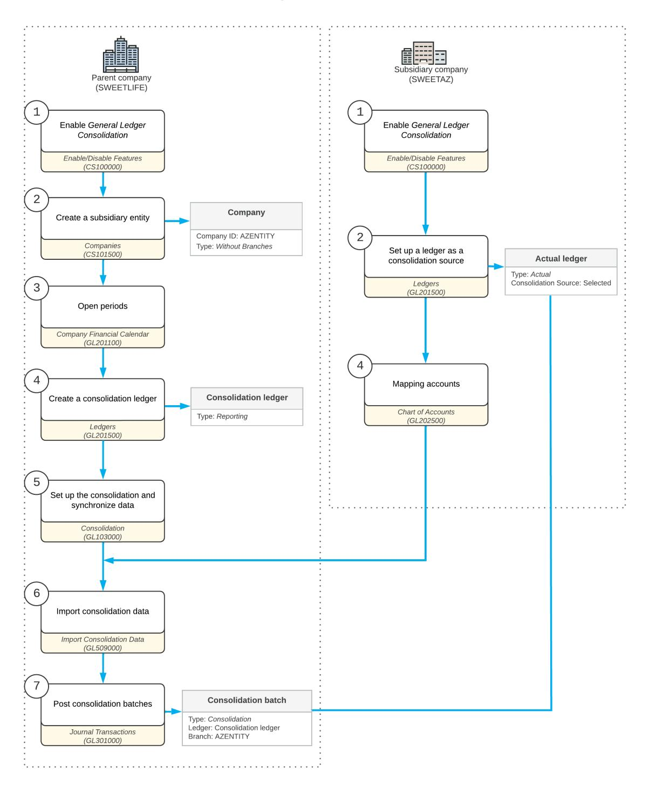

<span id="page-241-1"></span>*Figure: The process of GL consolidation*

# <span id="page-241-0"></span>**GL Consolidation: Account Mapping**

Consolidation process requires mapping of the accounts and subaccounts (if the subaccounts are used in the system) of the consolidation unit to the respective accounts and subaccounts of the parent tenant. This mapping depends on your consolidation scenario: what level of details should be available in the consolidation branch for the required consolidated reports.

#### **Account Mapping**

You map accounts on the *[Chart of Accounts](https://help-2025r1.acumatica.com/Help?ScreenId=ShowWiki&pageid=85557f41-a4af-47a8-b198-2a01461ce9c3)* (GL202500) form of the consolidation unit by specifying an appropriate account of the parent tenant in the **Consolidation Account** column for each account of the consolidation unit. For instructions, see *GL [Consolidation:](#page-246-1) To Prepare the Consolidation Unit*.

The YTD Net Income account is not involved in mapping because transactions cannot be posted directly to this account. The system will automatically update this account aer a consolidation batch is posted.

The chart of accounts can be different in each consolidation unit and in the parent tenant. Multiple accounts in a consolidation unit can be mapped to a single account of the parent tenant. That is, on the *[Chart of Accounts](https://help-2025r1.acumatica.com/Help?ScreenId=ShowWiki&pageid=85557f41-a4af-47a8-b198-2a01461ce9c3)* form of the consolidation unit, you can select the same parent account in the **Consolidation Account** column for different accounts of the consolidation unit.

If the parent tenant has a more detailed chart of accounts than some of its consolidation units do, some consolidated accounts may not contain correct information. For example, consider a parent tenant with multiple accounts to record travel expenses—*Airfare*, *Taxi*, and *Rentals*—and a consolidation unit with only one account, *Travel Expenses*. In this case, the *Travel Expenses* account of the consolidation unit has to be consolidated with one of the parent's travel expense accounts. No matter which account is chosen as the consolidation target, the consolidated data will not be accurate.

For correct reporting, we recommend that the consolidation units keep similar or even more detailed charts of accounts than the parent company has.

# <span id="page-242-1"></span><span id="page-242-0"></span>**GL Consolidation: Subaccount Mapping**

In Acumatica ERP, subaccounts can be used to carry additional information about the organizational structure of each company. To match the subaccounts of the consolidation unit to the subaccounts of the parent tenant, you map the consolidation unit's segments to segments or part of a segment of the parent's subaccounts. For details on subaccounts, see the *[Subaccounts](https://help-2025r1.acumatica.com/Help?ScreenId=ShowWiki&pageid=f8c48d6a-2fc8-4579-8781-735e54b9e8b2)* chapter.

To use subaccounts in the system, the *Subaccounts* feature has to be enabled on the *[Enable/Disable](https://help-2025r1.acumatica.com/Help?ScreenId=ShowWiki&pageid=c1555e43-1bc5-4f6f-ba9d-b323f94d8a6b) [Features](https://help-2025r1.acumatica.com/Help?ScreenId=ShowWiki&pageid=c1555e43-1bc5-4f6f-ba9d-b323f94d8a6b)* (CS100000) form.

In this topic, you will read about how to map subaccounts in a consolidation unit and define the consolidation segment in the parent tenant. You will also find examples of subaccount mapping.

#### **Subaccount Mapping**

You perform mapping of segments of the *SUBACCOUNT* segmented key in each consolidation unit as follows:

- 1. On the *[Segmented Keys](https://help-2025r1.acumatica.com/Help?ScreenId=ShowWiki&pageid=78bd7bd1-6bf6-409e-a8a5-8b18e8b80722)* (CS202000) form of the consolidation unit, you define the following settings for consolidation mapping for each segment:
  - The length of the string (segment or part of the segment) in the parent's subaccount to which the segment value is mapped in the **Number of Characters** column.
  - The number that represents the place of this segment or part of the segment in the parent's subaccount in the **Consol. Order** column.

If a segment in a unit's subaccount does not match any string (segment or part of the segment) in the parent subaccount, set both of these settings to 0. This means the amounts associated with the segment will be aggregated. During data collection, the subaccounts of the unit are mapped to temporary subaccounts that may differ from the parent's subaccounts by the absence of the consolidation segment.

2. If validation of segment values is turned on (that is, the**Validate** check box is selected on the *[Segmented](https://help-2025r1.acumatica.com/Help?ScreenId=ShowWiki&pageid=78bd7bd1-6bf6-409e-a8a5-8b18e8b80722) [Keys](https://help-2025r1.acumatica.com/Help?ScreenId=ShowWiki&pageid=78bd7bd1-6bf6-409e-a8a5-8b18e8b80722)* form for segments), you have to map segment values of the consolidation unit with the segment values of the parent tenant. You map the segment values on the *[Segment](https://help-2025r1.acumatica.com/Help?ScreenId=ShowWiki&pageid=00338857-dd1a-41be-aa07-4cbce24c635e) Values* (CS203000) form of the consolidation unit by specifying related segment values of the parent tenant in the **Mapped Values** column.

Below you can read examples of mapping subaccounts in the system. For instructions on subaccount mapping, see *GL [Consolidation](#page-251-1) (Optional): To Configure Consolidation in a Consolidation Unit with Subaccounts*.

### **Consolidation Segment**

One segment in the subaccounts of the parent tenant should be designated for consolidation units. This segment should be specified as a consolidation segment in the **Consolidation Segment Number** box on the *[Consolidation](https://help-2025r1.acumatica.com/Help?ScreenId=ShowWiki&pageid=d0a31d80-fff4-4452-93df-6431444d2c65)* (GL103000) form in the parent tenant. The values of this segment are associated with the consolidation units. As a rule, the consolidation segment is not involved in mapping because the subsidiary does not contain such a segment in its subaccounts. In this case, the segment value can be added to the temporary subaccount during the import of the data performed by the parent company (if the **PasteSegmentValue** check box on this form is selected on the *[Consolidation](https://help-2025r1.acumatica.com/Help?ScreenId=ShowWiki&pageid=d0a31d80-fff4-4452-93df-6431444d2c65)* form). For instructions, see *GL [Consolidation](#page-237-1) Configuration (Optional): To Configure [Consolidation in a Parent Company with Subaccounts](#page-237-1)*.

#### **Example of Mapping Subaccounts with the Same Number of Segments**

Consider an example when the parent company subaccount has four segments, the first of which is a consolidation segment not involved in mapping (as shown in the illustration below). The subaccount of the consolidation unit consists of three segments. Each segment of the consolidation unit can be mapped to a same-meaning segment of the parent even though the lengths of the segments are different. The first segment of the parents subaccount is a consolidation segment.

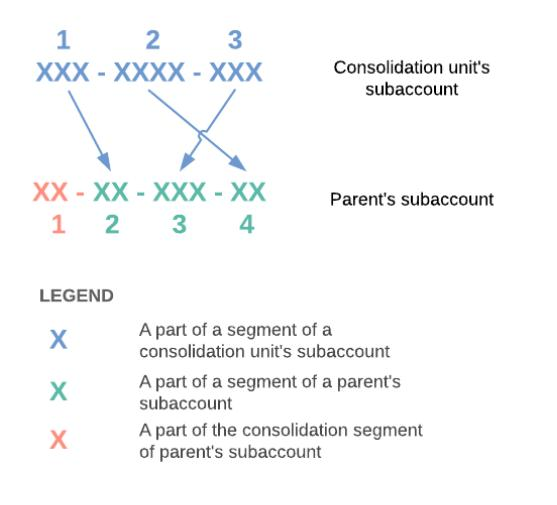

#### *Figure: Mapping Subaccounts with the Same Number of Segments*

On the *[Segmented Keys](https://help-2025r1.acumatica.com/Help?ScreenId=ShowWiki&pageid=78bd7bd1-6bf6-409e-a8a5-8b18e8b80722)* (CS202000) form, the consolidation mapping settings for the consolidation unit's subaccounts will have the following values.

| Segment ID | Description | Length | Consol. Order | Number of Characters |
|------------|-------------|--------|---------------|----------------------|
| 1          | Project     | 3      | 2             | 2                    |

| Segment ID | Description | Length | Consol. Order | Number of Characters |
|------------|-------------|--------|---------------|----------------------|
| 2          | Department  | 4      | 4             | 2                    |
| 3          | Brand       | 3      | 3             | 3                    |

The three-character values of the first segment (*Project*) of the unit's subaccount will be mapped to the twocharacter values of the second segment of the parent's subaccount, and other segments will be mapped similarly. Particular strings are specified on the *[Segment](https://help-2025r1.acumatica.com/Help?ScreenId=ShowWiki&pageid=00338857-dd1a-41be-aa07-4cbce24c635e) Values* (CS203000) form in the **Mapped Values** column.

#### **Example of Mapping Subaccounts with Different Number of Segments**

A segment of a consolidation unit can be mapped to a part of the segment in the parent's subaccount, as shown in the illustration below. The subaccount of the consolidation unit consists of three segments as well as the parent's subaccount. Two segments of the consolidation unit are mapped to parts of one segment of the parent's subaccount. The first segment of the parents subaccount is a consolidation segment.

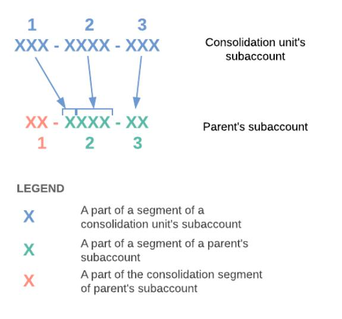

#### *Figure: Mapping Subaccounts with Different Number of Segments*

In this case, on the *[Segmented Keys](https://help-2025r1.acumatica.com/Help?ScreenId=ShowWiki&pageid=78bd7bd1-6bf6-409e-a8a5-8b18e8b80722)* form, the consolidation mapping parameters for the consolidation unit's subaccounts will have the following values.

| Segment | Description | Length | Consol. Order | Number of Characters |
|---------|-------------|--------|---------------|----------------------|
| 1       | Project     | 3      | 2             | 1                    |
| 2       | Department  | 4      | 3             | 3                    |
| 3       | Brand       | 3      | 4             | 2                    |

#### **Related Links**

- *[Consolidation](https://help-2025r1.acumatica.com/Help?ScreenId=ShowWiki&pageid=d0a31d80-fff4-4452-93df-6431444d2c65)*
- *[Chart of Accounts](https://help-2025r1.acumatica.com/Help?ScreenId=ShowWiki&pageid=85557f41-a4af-47a8-b198-2a01461ce9c3)*
- *[Subaccounts](https://help-2025r1.acumatica.com/Help?ScreenId=ShowWiki&pageid=2c7b73c6-43b2-4076-92c6-74c9e66ecf18)*
- *[Segmented Keys](https://help-2025r1.acumatica.com/Help?ScreenId=ShowWiki&pageid=78bd7bd1-6bf6-409e-a8a5-8b18e8b80722)*
- *[Segmented Keys](https://help-2025r1.acumatica.com/Help?ScreenId=ShowWiki&pageid=78bd7bd1-6bf6-409e-a8a5-8b18e8b80722)*

# <span id="page-245-0"></span>**GL Consolidation: Implementation Checklist**

The following sections provide details you can use to ensure that the system is configured properly for performing GL consolidation, and to understand (and change, if needed) the settings that affect the processing workflow.

### **Implementation Checklist**

We recommend that before you initially perform GL consolidation, you make sure the needed features have been enabled, settings have been specified, and entities have been created, as summarized in the following checklist.

| Form                                     | Criteria to Check                                                                                                                                                         | Notes                                                                                       |
|------------------------------------------|---------------------------------------------------------------------------------------------------------------------------------------------------------------------------|---------------------------------------------------------------------------------------------|
| Enable/Disable Features<br>(CS100000)    | The General Ledger Consolidation feature has<br>been enabled for the parent company in the par<br>ent tenant and for the subsidiary company in the<br>consolidation unit. |                                                                                             |
| Ledgers (GL201500)                       | In the consolidation unit, a ledger that will be<br>used as a consolidation source has been defined.                                                                      | For details, see GL Consoli<br>dation Configuration: To Con<br>figure a Consolidation Unit. |
| Companies (CS101500)                     | In the parent tenant, the company that represents<br>the consolidation unit in the parent company has<br>been configured.                                                 | For details, see GL Consoli<br>dation Configuration: To Con<br>figure the Parent Company.   |
| Company Financial Calendar<br>(GL201100) | In the parent tenant, the needed financial periods<br>in the company that represents the consolidation<br>unit have been opened.                                          |                                                                                             |
| Ledgers                                  | In the parent tenant, a consolidation ledger has<br>been created.                                                                                                         |                                                                                             |
| Consolidation                            | In the parent tenant, data synchronization has<br>been performed between the parent company<br>and the consolidation unit.                                                |                                                                                             |

#### **Other Settings That Affect the Workflow**

You can affect the workflow of posting consolidation batches by specifying additional settings as follows:

- To cause GL batches to be created with the *On Hold* status, select the **Hold Batches on Entry** check box in the **Data EntrySettings** section of the *[General Ledger Preferences](https://help-2025r1.acumatica.com/Help?ScreenId=ShowWiki&pageid=e4913d06-c511-4258-a0f9-f36c1b854e6b)* (GL102000) form. If this check box is cleared, batches are created with the *Balanced* status.
- To cause GL batches to be posted on release, make sure that the **Automatically Post on Release** check box is selected in the **PostingSettings** section on the *[General Ledger Preferences](https://help-2025r1.acumatica.com/Help?ScreenId=ShowWiki&pageid=e4913d06-c511-4258-a0f9-f36c1b854e6b)* form. If this check box is cleared, batches are created with the *Unposted* status, and you have to release them on the *[Release](https://help-2025r1.acumatica.com/Help?ScreenId=ShowWiki&pageid=5dd30a1f-e104-42cc-b44c-9427c6151dee) [Transactions](https://help-2025r1.acumatica.com/Help?ScreenId=ShowWiki&pageid=5dd30a1f-e104-42cc-b44c-9427c6151dee)* (GL501000) form.

#### **Validation of Configuration**

To make sure that all configuration has been performed correctly, we recommend that in your system, you perform instructions similar to those described in *GL Consolidation [Configuration:](https://help-2025r1.acumatica.com/Help?ScreenId=ShowWiki&pageid=b131e5c1-ca39-49e5-8c0c-7076d91322f6) To Configure a Consolidation Unit* and *[GL](https://help-2025r1.acumatica.com/Help?ScreenId=ShowWiki&pageid=5c30449f-88cb-4a38-81a4-235d4a9f318a) Consolidation [Configuration:](https://help-2025r1.acumatica.com/Help?ScreenId=ShowWiki&pageid=5c30449f-88cb-4a38-81a4-235d4a9f318a) To Configure the Parent Company*.

# <span id="page-246-1"></span><span id="page-246-0"></span>**GL Consolidation: To Prepare the Consolidation Unit**

The following activity will walk you through the process of preparing the consolidation unit (a subsidiary company) for consolidation data import.

#### **Story**

Suppose that the management of the SweetLife AZ company decided to prepare the system for further GL consolidation. The trial balances for November and December 2024 have been transferred from the company's legacy system to Excel files and need to be uploaded to Acumatica ERP.

Acting as the system administrator of SweetLife AZ, you need to prepare the consolidation unit for GL consolidation by mapping its GL accounts with the GL accounts of the parent company and to import the trial balance of SweetLife AZ for the 11-2024 and 12-2024 periods.

#### **Configuration Overview**

In the parent company with the *U100* dataset, on the *[Enable/Disable Features](https://help-2025r1.acumatica.com/Help?ScreenId=ShowWiki&pageid=c1555e43-1bc5-4f6f-ba9d-b323f94d8a6b)* (CS100000) form, the *General Ledger Consolidation* feature has been enabled.

#### **Process Overview**

In this activity, on the *[Chart of Accounts](https://help-2025r1.acumatica.com/Help?ScreenId=ShowWiki&pageid=85557f41-a4af-47a8-b198-2a01461ce9c3)* (GL202500) form, you will map the accounts of the consolidation unit with the parent company accounts by uploading an Excel file.

On the *Trial [Balance](https://help-2025r1.acumatica.com/Help?ScreenId=ShowWiki&pageid=410758bc-6dfc-41f7-913d-2f27fcb3b2ae)* (GL303000) form, you will upload the Excel files with trial balances for the 11-2024 and 12-2024 periods. On the *Journal [Transactions](https://help-2025r1.acumatica.com/Help?ScreenId=ShowWiki&pageid=dda046bc-5946-407f-88f7-1c0c966fbe72)* (GL301000) form, you will release the GL transactions generated by the system.

#### **System Preparation**

Before you begin performing the steps of this activity, do the following:

- 1. Launch the Acumatica ERP website, and sign in to the *AZ\_Subsidiary* tenant. You should sign in as the system administrator by using the *admin* username and the *123* password.
- 2. Make sure the consolidation unit has been configured as described in *GL Consolidation [Configuration:](https://help-2025r1.acumatica.com/Help?ScreenId=ShowWiki&pageid=b131e5c1-ca39-49e5-8c0c-7076d91322f6) To [Configure a Consolidation Unit](https://help-2025r1.acumatica.com/Help?ScreenId=ShowWiki&pageid=b131e5c1-ca39-49e5-8c0c-7076d91322f6)*.
- 3. Make sure the *AZ\_Subsidiary* company (the consolidation unit) has been created and configured as described in *GL Consolidation [Configuration:](https://help-2025r1.acumatica.com/Help?ScreenId=ShowWiki&pageid=5c30449f-88cb-4a38-81a4-235d4a9f318a) To Configure the Parent Company*.
- 4. Make sure that in the parent company (the company with the *U100* dataset preloaded) the data synchronization has been performed as described in *GL Consolidation [Configuration:](https://help-2025r1.acumatica.com/Help?ScreenId=ShowWiki&pageid=5c30449f-88cb-4a38-81a4-235d4a9f318a) To Configure the Parent [Company](https://help-2025r1.acumatica.com/Help?ScreenId=ShowWiki&pageid=5c30449f-88cb-4a38-81a4-235d4a9f318a)*.
- 5. Download the *[AZ\\_Subsidiary\\_COA\\_with\\_Mapped\\_Accounts.xlsx](Published/UserGuide/Files/AZ_Subsidiary_COA_with_Mapped_Accounts.xlsx)*, *[SWEETAZ\\_Trial\\_Balance\\_11-2024.xlsx](Published/UserGuide/Files/SWEETAZ_Trial_Balance_11-2024.xlsx)*, and *[SWEETAZ\\_Trial\\_Balance\\_12-2024.xlsx](Published/UserGuide/Files/SWEETAZ_Trial_Balance_12-2024.xlsx)* files.

#### **Step 1: Mapping Accounts**

For the purposes of this step, the accounts have been mapped in an Excel file. To reduce the time for data entry, you will upload a chart of accounts with the accounts mapped, and then map four accounts manually.

To map the accounts of the consolidation unit with the parent company accounts, do the following:

- 1. Open the *[Chart of Accounts](https://help-2025r1.acumatica.com/Help?ScreenId=ShowWiki&pageid=85557f41-a4af-47a8-b198-2a01461ce9c3)* (GL202500) form.
- 2. On the form toolbar, click **Load Records from File**.
- 3. In the **File Upload** dialog box, which opens, select the file path to the *[AZ\\_Subsidiary\\_COA\\_with\\_Mapped\\_Accounts.xlsx](Published/UserGuide/Files/AZ_Subsidiary_COA_with_Mapped_Accounts.xlsx)* file that you downloaded for this activity, and click **Upload**.
- 4. In the **Common Settings** dialog box, which opens, select *Update Existing* in the **Mode** box, and click **OK**.
- 5. In the **Columns** dialog box, leave the current mapping, and click **OK**.

The system uploads a chart of accounts with accounts from the parent company specified in the **Consolidation Account** column. All the accounts have been mapped, except for four cash accounts. You need to map them manually.

- 6. In the row for *10200 - Company Checking Account*, specify *10000* in the **Consolidation Account** column.
- 7. In the row for *10300 - Company Savings Account*, specify *10000* in the **Consolidation Account** column.
- 8. In the row for *10500 - Cash in Transit*, specify *10000* in the **Consolidation Account** column.
- 9. In the row for *10600 - Credit Card Account*, specify *10000* in the **Consolidation Account** column.

The amounts posted to these accounts will be consolidated in the *10000 - Cash Account* in the parent company.

10.On the form toolbar, click**Save**.

#### **Step 2: Importing Trial Balance for 11-2024 to the System**

To import the trial balance for 11-2024 of SweetLife AZ and post the transaction, do the following:

- 1. Open the Trial Balance (GL3030PL) list of records.
- 2. On the form toolbar, click **New Record**.


To open the form for creating a new record, type the form ID in the Search box, and on the Search form, point at the form title and click **New** right of the title.

- 3. On the *Trial [Balance](https://help-2025r1.acumatica.com/Help?ScreenId=ShowWiki&pageid=410758bc-6dfc-41f7-913d-2f27fcb3b2ae)* (GL303000) form, which opens, specify the following settings in the Summary area:
  - **Import Date**: *11/30/2024*
  - **Period**: *11-2024* (inserted automatically)
  - **Company/Branch**: *SWEETAZ* (inserted by default)
  - **Ledger**: *ACTUALAZ*
  - **Description**: 11-2024 TB import
- 4. On the table toolbar of the**Transaction Details** tab, click **Load Records from File**.
- 5. In the **File Upload** dialog box, select the *[SWEETAZ\\_Trial\\_Balance\\_11-2024.xlsx](Published/UserGuide/Files/SWEETAZ_Trial_Balance_11-2024.xlsx)* file and click **Upload**.
- 6. In the **Common Settings** dialog box, leave the default settings and click **OK**. In the **Columns** dialog box, click **OK**.

The system uploads the trial balance for the 11-2024 period on the **Transaction Details** tab.

- 7. In the **Action** box, make sure that the *Validate* option is selected.
- 8. On the table toolbar of the**Transaction Details** tab, click **Process All**.
- 9. On the form toolbar, click **Remove Hold** and then click **Release** to release the trial balance.

The system opens the *Journal [Transactions](https://help-2025r1.acumatica.com/Help?ScreenId=ShowWiki&pageid=dda046bc-5946-407f-88f7-1c0c966fbe72)* (GL301000) form and displays a transaction with the uploaded balances.

10.On the form toolbar, click **Release** to release the transaction.

#### **Step 3: Importing Trial Balance for 12-2024 to the System**

To import the trial balance for 12-2024 of SweetLife AZ and post the transaction, do the following:

- 1. Open the Trial Balance (GL3030PL) list of records.
- 2. On the form toolbar, click **New Record**.
- 3. On the *Trial [Balance](https://help-2025r1.acumatica.com/Help?ScreenId=ShowWiki&pageid=410758bc-6dfc-41f7-913d-2f27fcb3b2ae)* (GL303000) form, which opens, specify the following settings in the Summary area:
  - **Import Date**: *12/31/2024*
  - **Period**: *12-2024* (inserted automatically)
  - **Company/Branch**: *SWEETAZ* (inserted by default)
  - **Ledger**: *ACTUALAZ*
  - **Description**: 12-2024 TB import
- 4. On the table toolbar of the**Transaction Details** tab, click **Load Records from File**.
- 5. In the **File Upload** dialog box, select the *[SWEETAZ\\_Trial\\_Balance\\_12-2024.xlsx](Published/UserGuide/Files/SWEETAZ_Trial_Balance_12-2024.xlsx)* file and click **Upload**.
- 6. In the **Common Settings** dialog box, leave the default settings and click **OK**. In the **Columns** dialog box, click **OK**.

The system uploads the trial balance for the 12-2024 period on the **Transaction Details** tab.

- 7. In the **Action** box, make sure that the *Validate* option is selected.
- 8. On the table toolbar of the**Transaction Details** form, click **Process All**.
- 9. On the form toolbar, click **Remove Hold** and then click **Release** to release the trial balance.

The system opens the *Journal [Transactions](https://help-2025r1.acumatica.com/Help?ScreenId=ShowWiki&pageid=dda046bc-5946-407f-88f7-1c0c966fbe72)* (GL301000) form and displays a transaction with the uploaded balances.

10.On the form toolbar, click **Release** to release the transaction.

## <span id="page-248-1"></span><span id="page-248-0"></span>**GL Consolidation: To Import Consolidation Data from a Subsidiary**

The following activity will walk you through the process of importing the balances of GL accounts from a subsidiary to the parent company.

#### **Story**

Suppose that the management of SweetLife Fruits & Jams needs the data from its subsidiary to be imported in the system so that consolidation data should be available in all financial reports. Acting as a SweetLife accountant, you need to import the consolidation data from SweetLife AZ to SweetLife Fruits & Jams, post the consolidation batches, and make sure that the balances have been updated.

#### **Configuration Overview**

In the parent company with the *U100* dataset, on the *[Enable/Disable Features](https://help-2025r1.acumatica.com/Help?ScreenId=ShowWiki&pageid=c1555e43-1bc5-4f6f-ba9d-b323f94d8a6b)* (CS100000) form, the *General Ledger Consolidation* feature has been enabled.

#### **Process Overview**

In this activity, you will import the consolidation data to the parent company on the *[Import Consolidation Data](https://help-2025r1.acumatica.com/Help?ScreenId=ShowWiki&pageid=c54201e4-84a0-4423-9686-a9c2523a17f6)* (GL509000) form. You will then review and post the generated batches on the *Journal [Transactions](https://help-2025r1.acumatica.com/Help?ScreenId=ShowWiki&pageid=dda046bc-5946-407f-88f7-1c0c966fbe72)* (GL301000) form. Finally, you will review the account balances of the *AZENTITY* company for 11-2024 and 12-2024 on the *[Account](https://help-2025r1.acumatica.com/Help?ScreenId=ShowWiki&pageid=f54927e5-fec0-400a-bd19-5581de5aae35) [Summary](https://help-2025r1.acumatica.com/Help?ScreenId=ShowWiki&pageid=f54927e5-fec0-400a-bd19-5581de5aae35)* (GL401000) form.

#### **System Preparation**

Before you begin performing the steps of this activity, do the following:

- 1. Launch the Acumatica ERP website, and sign in to the parent company with the *U100* dataset preloaded. You should sign in as an accountant Nenad Pasic by using the *pasic* username and the *123* password.
- 2. On the Company and Branch Selection menu on the top pane of the Acumatica ERP screen, make sure that the *SweetLife Head Office and Wholesale Center* branch is selected. If it is not selected, click the Company and Branch Selection menu button to view the list of branches that you have access to, and then click *SweetLife Head Office and Wholesale Center*.
- 3. Make sure you the parent company has been prepared, as described in *GL Consolidation [Configuration:](https://help-2025r1.acumatica.com/Help?ScreenId=ShowWiki&pageid=5c30449f-88cb-4a38-81a4-235d4a9f318a) To [Configure the Parent Company](https://help-2025r1.acumatica.com/Help?ScreenId=ShowWiki&pageid=5c30449f-88cb-4a38-81a4-235d4a9f318a)*.
- 4. Make sure the *AZ\_Subsidiary* company (the consolidation unit) has been created and configured as described in *GL Consolidation [Configuration:](https://help-2025r1.acumatica.com/Help?ScreenId=ShowWiki&pageid=b131e5c1-ca39-49e5-8c0c-7076d91322f6) To Configure a Consolidation Unit*. It has also been prepared for consolidation as described in *GL [Consolidation:](#page-246-1) To Prepare the Consolidation Unit*.

#### **Step 1: Importing the Consolidation Data**

To import the consolidation data from the consolidation unit to the parent company, do the following:

1. Open the *[Import Consolidation Data](https://help-2025r1.acumatica.com/Help?ScreenId=ShowWiki&pageid=c54201e4-84a0-4423-9686-a9c2523a17f6)* (GL509000) form.

The consolidation rule that you set up earlier is displayed in the table.

2. In the table, select the unlabeled check box for the only row, and click **Process** on the form toolbar, as shown in the following screenshot. The system opens the **Processing** dialog box.

| TOOLS $\blacktriangledown$<br><b>Import Consolidation Data</b>                           |                                |                         |                           |                    |                      |                          |                            |                               |
|------------------------------------------------------------------------------------------|--------------------------------|-------------------------|---------------------------|--------------------|----------------------|--------------------------|----------------------------|-------------------------------|
| Ò<br>$\circlearrowright$ $\sim$ $\leftarrow$<br>N<br>$\mathbf{Y}$<br><b>PROCESS</b><br>↶ |                                |                         |                           |                    |                      |                          |                            |                               |
| 圓目                                                                                       | Consolidation<br><b>Branch</b> | Consolidation<br>Ledger | <b>Consolidation Unit</b> | URL                | <b>Source Ledger</b> | Source<br>Company/Branch | <b>Last Post</b><br>Period | Last<br>Consolidation<br>Date |
| ☑                                                                                        | <b>AZENTITY</b>                | <b>CONSOL</b>           | AZ Subsidiary             | http://localhost/l | <b>ACTUALAZ</b>      | <b>SWEETAZ</b>           |                            |                               |

*Figure: Import of consolidation data*

3. Close the **Processing** dialog box.


You can schedule this process by using the *[Automation Schedules](https://help-2025r1.acumatica.com/Help?ScreenId=ShowWiki&pageid=76757610-2d0f-4ead-a948-d67da24ec116)* (SM205020) form.

#### **Step 2: Reviewing and Posting the Consolidation Batches**

To review and post the consolidation batches generated by the system, do the following:

- 1. Open the Journal Transactions (GL3010PL) list of records.
- 2. In the table, find a batch with the following settings:
  - **Module**: *GL*
  - **Status**: *Balanced*
  - **Ledger**: *CONSOL*
  - **Transaction Date**: *11/30/2024*

This is the consolidation batch for 11-2024, which was generated as a result of the import process.

3. Click the link in the **Batch Number** column to open the batch on the *Journal [Transactions](https://help-2025r1.acumatica.com/Help?ScreenId=ShowWiki&pageid=dda046bc-5946-407f-88f7-1c0c966fbe72)* (GL301000) form.

The batch has a description indicating that this is a consolidation batch and *AZENTITY* specified in the **Branch** column for each entry.

- 4. In the table, review the amount in the **Debit Amount** column for *10000 - Cash Account*. This amount consolidates the amounts of all cash accounts in the *AZ\_Subsidiary* company.
- 5. On the form toolbar, click **Release** to release the consolidation batch.
- 6. Return to the Journal Transactions (GL3010PL) list of records, and find a batch with the following setting:
  - **Module**: *GL*
  - **Status**: *Balanced*
  - **Ledger**: *CONSOL*
  - **Transaction Date**: *12/31/2024*

This is the consolidation batch for 12-2024, which was generated as a result of the import process.

- 7. Click the link in the **Batch Number** column to open the batch on the *Journal [Transactions](https://help-2025r1.acumatica.com/Help?ScreenId=ShowWiki&pageid=dda046bc-5946-407f-88f7-1c0c966fbe72)* form.
- 8. In the table, review the entries and the amount in the **Debit Amount** column for *10000 - Cash Account*.
- 9. On the form toolbar, click **Release** to release the batch.

#### **Step 3: Reviewing the Account Balances of the** *AZENTITY* **Company**

To review the account balances of the *AZENTITY* company, do the following:

- 1. Open the *[Account Summary](https://help-2025r1.acumatica.com/Help?ScreenId=ShowWiki&pageid=f54927e5-fec0-400a-bd19-5581de5aae35)* (GL401000) form.
- 2. In the Selection area, specify the following settings:
  - **Company/Branch**: *AZENTITY - AZ Subsidiary*
  - **Ledger**: *CONSOL*
  - **Period**: *11-2024*
- 3. In the table, review the balances shown for the *11-2024* period.
- 4. In the **Period** box, select *12-2024*.
- 5. In the table, review the balances shown for the *12-2024* period.


This data can be used for preparing ARM reports and is available in all GL reports and inquiries.

# <span id="page-251-1"></span><span id="page-251-0"></span>**GL Consolidation (Optional): To Configure Consolidation in a Consolidation Unit with Subaccounts**

This topic describes additional steps that you perform to set up consolidation with the parent tenant for each subsidiary that uses subaccounts. You should perform the following actions:

- Verify that all accounts have been mapped.
- If subaccounts are used in the parent tenant, map the subsidiary subaccount segments to the parent tenant subaccounts by using the *[Segmented Keys](https://help-2025r1.acumatica.com/Help?ScreenId=ShowWiki&pageid=78bd7bd1-6bf6-409e-a8a5-8b18e8b80722)* (CS202000) and *[Segment](https://help-2025r1.acumatica.com/Help?ScreenId=ShowWiki&pageid=00338857-dd1a-41be-aa07-4cbce24c635e) Values* (CS203000) forms.

#### **To Verify That All Accounts Have Been Mapped**

- 1. Open the *[Chart of Accounts](https://help-2025r1.acumatica.com/Help?ScreenId=ShowWiki&pageid=85557f41-a4af-47a8-b198-2a01461ce9c3)* (GL202500) form.
- 2. On the table toolbar, click the **FilterSettings** button.
- 3. In the **FilterSettings** dialog box, which opens, click **Add Row**.
- 4. In the **Property** column, select *Consolidation Account*.
- 5. In the **Condition** column, select *Is Empty*.
- 6. Optional: To save the filter for future use, click**Save**, enter a filter name, and click**Save**.
- 7. Click **Apply** to close the dialog box and apply the filter.

The system displays the list of GL accounts that were not mapped.

8. Map any accounts, and save the changes.

#### **To Map Subaccounts to the Parent Company Subaccounts**

You can provide mapping for any subaccount structure in the parent or subsidiary; for details, see *[GL Consolidation:](#page-242-1) [Subaccount Mapping](#page-242-1)*. For simplicity, we have based the following procedure on these assumptions:

- Subaccounts in subsidiaries and in the parent company have the same general structure except that the parent accounts have one additional segment that is used to designate the subsidiary.
- The subsidiaries do not have such a segment.
- All other segments in the subsidiaries have values that can be easily mapped to the appropriate segment values in the parent company.

You map segments in the consolidation unit subaccounts to segments in the parent subaccounts as follows:

- 1. Open the *[Segmented Keys](https://help-2025r1.acumatica.com/Help?ScreenId=ShowWiki&pageid=78bd7bd1-6bf6-409e-a8a5-8b18e8b80722)* (CS202000) form.
- 2. In the **Segmented Key ID** box, select *SUBACCOUNT*.
- 3. For each of the segments, in the **Consol. Order** column, type the integer that corresponds to the order of this segment in the parent subaccount.
- 4. In the **Number of Characters** column, specify the lengths of the appropriate segments in the parent company.
- 5. Click **Save**.

You map subsidiary subaccount segment values to parent subaccount segment values as follows:

- 1. Open the *[Segment](https://help-2025r1.acumatica.com/Help?ScreenId=ShowWiki&pageid=00338857-dd1a-41be-aa07-4cbce24c635e) Values* (CS203000) form.
- 2. In the **Segmented Key ID** box of the Summary area, select *SUBACCOUNT*.

- 3. For each of the segments, perform the following steps:
  - a. In the **Segment ID** box (Summary area), select the segment by its number in the subsidiary subaccount.
  - b. In the **Mapped Value** column of the table, for each of the segment values, specify the matching value in the parent subaccount segment.
- 4. Click **Save**.

# <span id="page-253-0"></span>**Troubleshooting Balance Discrepancies**

Discrepancies in balances can occur because of errors and inconsistencies in transactions. Inconsistencies might occur if, for example, a GL entry has been posted directly to an AR account instead of a correct account, or the details of an AR invoice contain an AR account instead of an income account. These inconsistencies can result in different balances in AR, AP, and GL reports.

To quickly find these types of discrepancies in accounts, you use the following forms:

- *[Discrepancies by Account](https://help-2025r1.acumatica.com/Help?ScreenId=ShowWiki&pageid=5a4dd1e9-0496-436c-8106-c3e5b06c9500)* (AP409010)
- *[Discrepancies](https://help-2025r1.acumatica.com/Help?ScreenId=ShowWiki&pageid=0b1c852f-7b91-46fb-b7d3-d335a0730054) by Vendor* (AP409020)
- *[Discrepancies by Document](https://help-2025r1.acumatica.com/Help?ScreenId=ShowWiki&pageid=bcd2ead7-cd8b-4498-9a7d-9937900cc97a)* (AP409030)
- *[Discrepancies by Account](https://help-2025r1.acumatica.com/Help?ScreenId=ShowWiki&pageid=0fb1dda9-64b4-433e-970c-76ab2bec7737)* (AR409010)
- *[Discrepancies by Customer](https://help-2025r1.acumatica.com/Help?ScreenId=ShowWiki&pageid=43d2e6b3-2fb9-4d60-ad28-e0064a35627f)* (AR409020)
- *[Discrepancies by Document](https://help-2025r1.acumatica.com/Help?ScreenId=ShowWiki&pageid=e00e6604-5279-4d6f-9db4-65cd95b90e79)* (AR409030)

You can run any of these inquiries separately. Alternatively, you can start by viewing discrepancies in accounts on the *[Discrepancies by Account](https://help-2025r1.acumatica.com/Help?ScreenId=ShowWiki&pageid=5a4dd1e9-0496-436c-8106-c3e5b06c9500)* or *[Discrepancies by Account](https://help-2025r1.acumatica.com/Help?ScreenId=ShowWiki&pageid=0fb1dda9-64b4-433e-970c-76ab2bec7737)* form; you then click the needed links in the **Discrepancy** column to open the *[Discrepancies](https://help-2025r1.acumatica.com/Help?ScreenId=ShowWiki&pageid=0b1c852f-7b91-46fb-b7d3-d335a0730054) by Vendor* or *[Discrepancies by Customer](https://help-2025r1.acumatica.com/Help?ScreenId=ShowWiki&pageid=43d2e6b3-2fb9-4d60-ad28-e0064a35627f)* form and view the discrepancies listed by vendor or customer. From either of these forms, you click the needed links in the **Discrepancy** column to open the *[Discrepancies by Document](https://help-2025r1.acumatica.com/Help?ScreenId=ShowWiki&pageid=bcd2ead7-cd8b-4498-9a7d-9937900cc97a)* or *[Discrepancies by Document](https://help-2025r1.acumatica.com/Help?ScreenId=ShowWiki&pageid=e00e6604-5279-4d6f-9db4-65cd95b90e79)* form to view the specific documents causing the discrepancies.

#### **In This Chapter**

- *To [Reconcile](#page-253-2) AP Accounts and AR Accounts with the General Ledger Accounts*
- *To Find Vendors and Customers with [Discrepancies](#page-254-1) Between the General Ledger and a Subledger*
- *To Find Documents with [Discrepancies](#page-255-1) Between the General Ledger and a Subledger*

### <span id="page-253-2"></span><span id="page-253-1"></span>**To Reconcile AP Accounts and AR Accounts with the General Ledger Accounts**

You use the *[Discrepancies by Account](https://help-2025r1.acumatica.com/Help?ScreenId=ShowWiki&pageid=5a4dd1e9-0496-436c-8106-c3e5b06c9500)* (AP409010) and *[Discrepancies by Account](https://help-2025r1.acumatica.com/Help?ScreenId=ShowWiki&pageid=0fb1dda9-64b4-433e-970c-76ab2bec7737)* (AR409010) forms to find discrepancies between the balances of AP accounts and AR accounts in the GL and in a subledger (AP or AR) with the accounts listed for a particular range of financial periods.

To open any form, you can navigate to it or search for it (by its name or by its form ID without periods). For more information about search capabilities, see *[Search](https://help-2025r1.acumatica.com/Help?ScreenId=ShowWiki&pageid=09ed14e6-3600-4d60-8267-66531025f5c3)*.

#### **To Reconcile AP Accounts and AR Accounts with General Ledger Accounts**

- 1. Open the *[Discrepancies by Account](https://help-2025r1.acumatica.com/Help?ScreenId=ShowWiki&pageid=5a4dd1e9-0496-436c-8106-c3e5b06c9500)* (AP409010) or *[Discrepancies by Account](https://help-2025r1.acumatica.com/Help?ScreenId=ShowWiki&pageid=0fb1dda9-64b4-433e-970c-76ab2bec7737)* (AR409010) form.
- 2. In the **Branch** box, select the branch for which you want to view data.
- 3. In the **From Period** and **To Period** boxes, specify the start and end of the range of financial periods where you want to find discrepancies.
- 4. In the **Account** box, select the AP or AR account in which you want to find discrepancies.
- 5. Optional (if subaccounts are used in your system): In the**Subaccount** box, do one of the following:
  - Specify a subaccount to view account information, including any discrepancy, for the accountsubaccount pair.

- Specify a mask to view information on a group of subaccounts. To define a mask, specify the values for only some of the segments. The system will list a row for each account-subaccount pair that meets the selection criteria.
- Leave this box blank to view the balances of the account detailed by all relevant subaccounts of the account.
- 6. Select the**Show Only Documents with Discrepancies** check box.
- 7. In the table, view the list of accounts displayed by the system and the discrepancies in them (shown in the **Discrepancy** column). Notice the records with nonzero amounts in the **Non-AP Transactions** or **Non-AR Transactions** column.
- 8. Optional: Click the link in the **Discrepancy** column for a particular row to open the *[Discrepancies](https://help-2025r1.acumatica.com/Help?ScreenId=ShowWiki&pageid=0b1c852f-7b91-46fb-b7d3-d335a0730054) by Vendor* (AP409020) or *[Discrepancies by Customer](https://help-2025r1.acumatica.com/Help?ScreenId=ShowWiki&pageid=43d2e6b3-2fb9-4d60-ad28-e0064a35627f)* (AR409020) form to view more details.

The notes in this section describe the nuances of the UI elements available on the form, such as when an element is required and when it is not, and when the system fills in settings by default. This section can include other notes.

Note the following about the Summary area of the form:

- The **Branch** box is available only if the *Multibranch Support* feature is enabled on the *[Enable/Disable](https://help-2025r1.acumatica.com/Help?ScreenId=ShowWiki&pageid=c1555e43-1bc5-4f6f-ba9d-b323f94d8a6b) [Features](https://help-2025r1.acumatica.com/Help?ScreenId=ShowWiki&pageid=c1555e43-1bc5-4f6f-ba9d-b323f94d8a6b)* (CS100000) form.
- The **Subaccount** box is available only if the *Subaccounts* feature is enabled on the *[Enable/Disable Features](https://help-2025r1.acumatica.com/Help?ScreenId=ShowWiki&pageid=c1555e43-1bc5-4f6f-ba9d-b323f94d8a6b)* form.

# <span id="page-254-1"></span><span id="page-254-0"></span>**To Find Vendors and Customers with Discrepancies Between the General Ledger and a Subledger**

You use the *[Discrepancies](https://help-2025r1.acumatica.com/Help?ScreenId=ShowWiki&pageid=0b1c852f-7b91-46fb-b7d3-d335a0730054) by Vendor* (AP409020) and *[Discrepancies by Customer](https://help-2025r1.acumatica.com/Help?ScreenId=ShowWiki&pageid=43d2e6b3-2fb9-4d60-ad28-e0064a35627f)* (AR409020) forms to show vendor and customer accounts with discrepancies between the accounts' balances in the subledger (accounts payable or accounts receivable) and the total of the transactions posted to the general ledger by the vendor or customer documents in the selected financial period.

You can search for or navigate to these forms directly. Also, the system navigates to these forms when you click the link in the **Discrepancy** column on the *[Discrepancies by Account](https://help-2025r1.acumatica.com/Help?ScreenId=ShowWiki&pageid=5a4dd1e9-0496-436c-8106-c3e5b06c9500)* (AP409010) or *[Discrepancies by Account](https://help-2025r1.acumatica.com/Help?ScreenId=ShowWiki&pageid=0fb1dda9-64b4-433e-970c-76ab2bec7737)* (AR409010) form.


To open any form, you can navigate to it or search for it (by its name or by its form ID without periods). For more information about search capabilities, see *[Search](https://help-2025r1.acumatica.com/Help?ScreenId=ShowWiki&pageid=09ed14e6-3600-4d60-8267-66531025f5c3)*.

# **To Find Vendors and Customers with Discrepancies Between the General Ledger Accounts and Subledger Accounts**

- 1. Open the *[Discrepancies](https://help-2025r1.acumatica.com/Help?ScreenId=ShowWiki&pageid=0b1c852f-7b91-46fb-b7d3-d335a0730054) by Vendor* (AP409020) or *[Discrepancies by Customer](https://help-2025r1.acumatica.com/Help?ScreenId=ShowWiki&pageid=43d2e6b3-2fb9-4d60-ad28-e0064a35627f)* (AR409020) form.
- 2. In the **Branch** box, select the branch for which you want to view data.
- 3. In the **Financial Period** box, select a financial period where you want to find documents with discrepancies for a vendor or customer.
- 4. In the **Vendor** or **Customer** box, select the vendor or customer for whose account you want to view data, or leave the box empty if you want to find all vendors or customers with discrepancies between the GL accounts and AP or AR accounts.

- 5. In the **Account** box, select the AP or AR account in which you want to find discrepancies.
- 6. Optional (if subaccounts are used in your system): In the**Subaccount** box, do one of the following:
  - Specify a subaccount.
  - Specify a mask to view information on a group of subaccounts. To define a mask, specify the values for only some of the segments. The system will list a row for each account-subaccount pair that meets the selection criteria.
  - Leave this box blank to view the balances of the account detailed by all relevant subaccounts.
- 7. Select the**Show Only Documents with Discrepancies** check box.
- 8. In the table, view the list of vendors or customers that meet the selection criteria you have specified. Notice the discrepancies between each vendor or customer's balances in the subledger and the total of the transactions posted to GL by the vendor or customer's documents in the selected period.
- 9. Optional: Click the link in the **Discrepancy** column for a particular row to open the *[Discrepancies by](https://help-2025r1.acumatica.com/Help?ScreenId=ShowWiki&pageid=bcd2ead7-cd8b-4498-9a7d-9937900cc97a) [Document](https://help-2025r1.acumatica.com/Help?ScreenId=ShowWiki&pageid=bcd2ead7-cd8b-4498-9a7d-9937900cc97a)* (AP409030) or *[Discrepancies by Document](https://help-2025r1.acumatica.com/Help?ScreenId=ShowWiki&pageid=e00e6604-5279-4d6f-9db4-65cd95b90e79)* (AR409030) form to view more details.

The notes in this section describe the nuances of the UI elements available on the form, such as when an element is required and when it is not, and when the system fills in settings by default. This section can include other notes.

Note the following about the Summary area of the form:

- The **Branch** box is available only if the *Multibranch Support* feature is enabled on the *[Enable/Disable](https://help-2025r1.acumatica.com/Help?ScreenId=ShowWiki&pageid=c1555e43-1bc5-4f6f-ba9d-b323f94d8a6b) [Features](https://help-2025r1.acumatica.com/Help?ScreenId=ShowWiki&pageid=c1555e43-1bc5-4f6f-ba9d-b323f94d8a6b)* (CS100000) form.
- The **Subaccount** box is available only if the *Subaccounts* feature is enabled on the *[Enable/Disable Features](https://help-2025r1.acumatica.com/Help?ScreenId=ShowWiki&pageid=c1555e43-1bc5-4f6f-ba9d-b323f94d8a6b)* form.

# <span id="page-255-1"></span><span id="page-255-0"></span>**To Find Documents with Discrepancies Between the General Ledger and a Subledger**

You use the *[Discrepancies by Document](https://help-2025r1.acumatica.com/Help?ScreenId=ShowWiki&pageid=bcd2ead7-cd8b-4498-9a7d-9937900cc97a)* (AP409030) and *[Discrepancies by Document](https://help-2025r1.acumatica.com/Help?ScreenId=ShowWiki&pageid=e00e6604-5279-4d6f-9db4-65cd95b90e79)* (AR409030) forms to view a list of the documents associated with a particular vendor or customer that caused discrepancies between AP and GL accounts or AR and GL accounts.

You can search for or navigate to these forms directly. Also, the system navigates to these forms when you click the link in the **Discrepancy** column on the *[Discrepancies](https://help-2025r1.acumatica.com/Help?ScreenId=ShowWiki&pageid=0b1c852f-7b91-46fb-b7d3-d335a0730054) by Vendor* (AP409020) or *[Discrepancies by Customer](https://help-2025r1.acumatica.com/Help?ScreenId=ShowWiki&pageid=43d2e6b3-2fb9-4d60-ad28-e0064a35627f)* (AR409020) form.

To open any form, you can navigate to it or search for it (by its name or by its form ID without periods). For more information about search capabilities, see *[Search](https://help-2025r1.acumatica.com/Help?ScreenId=ShowWiki&pageid=09ed14e6-3600-4d60-8267-66531025f5c3)*.

#### **To Find Documents with Discrepancies Between the General Ledger and a Subledger**

- 1. Open the *[Discrepancies by Document](https://help-2025r1.acumatica.com/Help?ScreenId=ShowWiki&pageid=bcd2ead7-cd8b-4498-9a7d-9937900cc97a)* (AP409030) or *[Discrepancies by Document](https://help-2025r1.acumatica.com/Help?ScreenId=ShowWiki&pageid=e00e6604-5279-4d6f-9db4-65cd95b90e79)* (AR409030) form.
- 2. In the **Branch** box, select the branch for which you want to view data.
- 3. In the **Financial Period** box, select the financial period where you want to find discrepancies in the documents posted in this period.
- 4. In the **Vendor** or **Customer** box, select the vendor or customer whose documents you want to view.
- 5. In the **Account** box, select the AP or AR account in which you want to find discrepancies. Leave this box blank if you want to view data on all accounts.

- 6. Optional (if subaccounts are used in your system): In the**Subaccount** box, do one of the following:
  - Specify a subaccount.
  - Specify a mask to view information on a group of subaccounts. To define a mask, specify the values for only some of the segments. The system will list a row for each account-subaccount pair that meets the selection criteria.
  - Leave this box blank to view balances of transactions on the account detailed by all relevant subaccounts.
- 7. Select the**Show Only Documents with Discrepancies** check box.
- 8. In the table, view the list of documents displayed by the system and the discrepancies between the GL account and subledger (AP or AR) account caused by the documents, which is shown in the **Discrepancy** column.
- 9. Optional: Click the link in the **Reference Nbr.** column for a particular row to open and view the document in a separate window.
- 10.Optional: Click the link in the **Batch Nbr.** column for a particular row to open the GL batch on the *[Journal](https://help-2025r1.acumatica.com/Help?ScreenId=ShowWiki&pageid=dda046bc-5946-407f-88f7-1c0c966fbe72) [Transactions](https://help-2025r1.acumatica.com/Help?ScreenId=ShowWiki&pageid=dda046bc-5946-407f-88f7-1c0c966fbe72)* (GL301000).

The notes in this section describe the nuances of the UI elements available on the form, such as when an element is required and when it is not, and when the system fills in settings by default. This section can include other notes.

Note the following about the Summary area of the form:

- The **Branch** box is available only if the *Multibranch Support* feature is enabled on the *[Enable/Disable](https://help-2025r1.acumatica.com/Help?ScreenId=ShowWiki&pageid=c1555e43-1bc5-4f6f-ba9d-b323f94d8a6b) [Features](https://help-2025r1.acumatica.com/Help?ScreenId=ShowWiki&pageid=c1555e43-1bc5-4f6f-ba9d-b323f94d8a6b)* (CS100000) form.
- The **Subaccount** box is available only if the *Subaccounts* feature is enabled on the *[Enable/Disable Features](https://help-2025r1.acumatica.com/Help?ScreenId=ShowWiki&pageid=c1555e43-1bc5-4f6f-ba9d-b323f94d8a6b)* form.

# <span id="page-257-0"></span>**Appendix**

The appendix provides some reference information relevant for this document. The additional information in this section is a useful source for readers who need some reference material that is related to system forms and tables, as well as running reports.

#### **In this section:**

- *[Reports](#page-257-3)*
- *Form [Toolbar](#page-264-1) and More Menu*
- *Table [Toolbar](#page-271-1)*
- *[Glossary](https://help-2025r1.acumatica.com/Help?ScreenId=ShowWiki&pageid=a2c92852-5ae8-4f4b-bf82-7f70cca0fdfa)*

## <span id="page-257-3"></span><span id="page-257-1"></span>**Reports**

In addition to offering a comprehensive collection of reports, Acumatica ERP gives you a high degree of control over each report.

On a typical report form, described in *[Report Form](#page-257-4)*, you can adjust the report settings to meet your specific informational needs. You can specify sorting and filtering options and select the data by using report-specific settings—such as financial period, ledger, and account—and configure additional processing settings for each report. The settings can be saved as a report template for later use. For details, see *To Run a [Report](https://help-2025r1.acumatica.com/Help?ScreenId=ShowWiki&pageid=d0531b2f-178f-4d70-8c4c-6bc897cd6c0a)* and *To [Create](https://help-2025r1.acumatica.com/Help?ScreenId=ShowWiki&pageid=5adbb4bd-4347-4f81-a1ff-4d4d47d1fb1b) a Report [Template](https://help-2025r1.acumatica.com/Help?ScreenId=ShowWiki&pageid=5adbb4bd-4347-4f81-a1ff-4d4d47d1fb1b)*.

Aer you run a report, the prepared report appears on your screen. You can print the report, export the report to a file, or send the report by email.

This chapter describes a typical report form and the main tasks related to using reports.

#### **In This Chapter**

- *[Report Form](#page-257-4)*
- *To Run a [Report](https://help-2025r1.acumatica.com/Help?ScreenId=ShowWiki&pageid=d0531b2f-178f-4d70-8c4c-6bc897cd6c0a)*
- *To Modify a Filter on a [Report](https://help-2025r1.acumatica.com/Help?ScreenId=ShowWiki&pageid=2513e10e-abb1-432e-85e0-a5e3f6cabf9c) Form*
- *To Create a Report [Template](https://help-2025r1.acumatica.com/Help?ScreenId=ShowWiki&pageid=5adbb4bd-4347-4f81-a1ff-4d4d47d1fb1b)*

# <span id="page-257-4"></span><span id="page-257-2"></span>**Report Form**

Before you run a report, you specify the needed parameters on the report form. You can select a template and manually make selections that affect the information collected. Also, you can specify appropriate settings to print or email the finished report.

The following screenshot shows a typical report form.

| TOOLS $\star$<br><b>Daily Sales Profitability</b> |                                                                                       |   |  |
|---------------------------------------------------|---------------------------------------------------------------------------------------|---|--|
| ↶<br><b>RUN REPORT</b>                            | REMOVE TEMPLATE<br>1<br><b>SAVE TEMPLATE</b>                                          |   |  |
| Template                                          | $\times$ $\scriptstyle\mathtt{v}$<br>2<br>□ Default □ Shared                          |   |  |
| <b>REPORT PARAMETERS</b>                          | ADDITIONAL SORT AND FILTERS<br>PRINT AND EMAIL SETTINGS<br><b>EMAIL NOTIFICATIONS</b> |   |  |
| <b>Report Format</b>                              | <b>Detailed</b><br>$\checkmark$                                                       |   |  |
| Company/Branch:                                   | HEADOFFICE - SweetLife Head Offi v                                                    |   |  |
| <b>From Date</b>                                  | 2/1/2025<br>Ä                                                                         |   |  |
| <b>To Date</b>                                    | 2/20/2025<br>Ħ                                                                        |   |  |
| <b>Document Type</b>                              | $\checkmark$                                                                          | 3 |  |
| Warehouse:                                        | Q                                                                                     |   |  |
| Customer:                                         | Q                                                                                     |   |  |
| Inventory:                                        | Q                                                                                     |   |  |
|                                                   | Released Transactions Only                                                            |   |  |
|                                                   | Completed Transactions Only                                                           |   |  |

#### *Figure: Report form*

- 1. Report form toolbar
- 2. Selection area
- 3. Details area

#### **Report Form Toolbar**

The following table lists the buttons of the report form toolbar, which appears on the report form when you are configuring a report.

| Button              | Description                                                                                                              |
|---------------------|--------------------------------------------------------------------------------------------------------------------------|
| Cancel              | Clears any changes you have made on the report form and restores the default settings.                                   |
| Run Report          | Initiates data collection for the report and displays the generated report.                                              |
| SaveTemplate        | Gives you the ability to save the currently selected report as a template with all the select<br>ed settings.            |
| Remove Tem<br>plate | Removes the previously saved template.<br>This button is available only when a template is specified on the report form. |

#### **Report Toolbar**

The following table lists the buttons of the report toolbar, which is shown on the generated report that you have run.

| Buttons    | Icon | Description                                                                |
|------------|------|----------------------------------------------------------------------------|
| Parameters |      | Navigates back to the report form to let you change the report parameters. |

| Buttons                 | Icon | Description                                                                                                                                                                                                    |
|-------------------------|------|----------------------------------------------------------------------------------------------------------------------------------------------------------------------------------------------------------------|
| Refresh                 |      | Refreshes the information displayed in the report (if any data changes were made).                                                                                                                             |
| Groups                  |      | Adds to the report a le pane where the report structure is shown. Click a report node<br>to highlight the pertinent data in the right pane.                                                                   |
| View PDF /<br>View HTML | /    | Displays the report as a PDF, or displays the report in HTML format. The available but<br>ton depends on the current report view; if you're viewing a PDF, for instance, you will<br>see the View HTML button. |
| First                   |      | Displays the first page of the report.                                                                                                                                                                         |
| Previous                |      | Displays the previous page.                                                                                                                                                                                    |
| Next                    |      | Displays the next page.                                                                                                                                                                                        |
| Last                    |      | Displays the last page of the report.                                                                                                                                                                          |
| Print                   |      | Opens the browser dialog box so you can print the report.                                                                                                                                                      |
| Send                    |      | Opens the Email Activity dialog box, which you use to send the report file (in the se<br>lected format) to the specified email address.                                                                        |
| Export                  |      | Enables you to export the data in the selected format (Excel or PDF).                                                                                                                                          |

#### **Selection Area**

You use the elements in this area to select an existing template, which you can share with other users or use as your default report settings. You can also select the locale and the localization.

The elements of this area, which are available for all reports, are described in the following table.

| Element  | Description                                                                                                                                            |
|----------|--------------------------------------------------------------------------------------------------------------------------------------------------------|
| Template | The template to be used for the report. If any templates have been created and saved, you<br>can select a template to use its settings for the report. |
| Default  | A check box that indicates (if selected) that the selected template is marked as the default<br>one for you. A default template cannot be shared.      |

| Element      | Description                                                                                                                                                                                                                                                                                                            |
|--------------|------------------------------------------------------------------------------------------------------------------------------------------------------------------------------------------------------------------------------------------------------------------------------------------------------------------------|
| Shared       | A check box that indicates (if selected) that the selected template is shared with other<br>users. A shared template cannot be marked as the default.                                                                                                                                                                  |
| Locale       | A locale that you select to indicate to the system that the report should be prepared with<br>the data translated to the language associated with this locale. This box is displayed if<br>there are multiple active locales in the system. For details, see Locales and Languages.                                    |
| Localization | The localization that is used for the report.                                                                                                                                                                                                                                                                          |
|              | This box appears on the form if the following conditions are met:                                                                                                                                                                                                                                                      |
|              | •<br>The Canadian Localization or UK Localization feature is enabled on the Enable/Disable<br>Features (CS100000) form.                                                                                                                                                                                                |
|              | •<br>A localized version of the report exists in the system.                                                                                                                                                                                                                                                           |
|              | One of the following options can be selected in the box:                                                                                                                                                                                                                                                               |
|              | •<br>None (default): Even though the report has a localized version, the report will be printed<br>without any localization applied.                                                                                                                                                                                   |
|              | Canada: The Canadian version of the report will be printed. If the company in which you<br>•<br>are signed in has Canada selected in the Localization box on the Company Details tab<br>(Configuration Settings section) on the Companies (CS101500) form, this setting is se<br>lected by default in the current box. |
|              | To determine if a localized version of a report exists, the system checks the<br>Site\ReportsDefault directory, the database, the ReportsCus<br>tomized folder, and the ReportsDefault folder.                                                                                                                         |

#### **Report Parameters Tab**

The **Report Parameters** tab has sections where you can specify the contents of the report depending on the current report and vary in the following regards:

- Which elements are available on a particular report
- Whether elements contain default values
- Whether specific elements require values to be selected
- Whether elements may be le blank to let you display a broader range of data

#### **Additional Sort and Filters Tab**

The **AdditionalSort and Filter** tab contains additional sorting and filtering conditions:

- **Additional sorting conditions**: Defines the sorting order. You can add a line, select one of the reportspecific properties, and select the *Descending* or *Ascending* sort order for the column.
- **Additional filtering conditions**: Defines the report filter. You can add a line, select one of the reportspecific properties, and define a condition and its value. The list of conditions include one-operand and two-operand conditions. To create a more complicated logical expression, you can use brackets and logical operations between brackets. For more information on creating filters, see *[Managing Advanced Filters](https://help-2025r1.acumatica.com/Help?ScreenId=ShowWiki&pageid=c621d79a-274d-4b72-a699-0e92d78a7b23)*. For detailed procedures on using ad hoc filters, see *[Reports: Process Activity](https://help-2025r1.acumatica.com/Help?ScreenId=ShowWiki&pageid=2b4d7aa8-25dc-4777-880a-fee2274990c7)*.

#### **Print and Email Settings Tab**

If you plan to print the report or save the report as a PDF, select the appropriate settings in the **PrintSettings** area.

#### *Table: Print Settings Section*

| Element                 | Description                                                          |
|-------------------------|----------------------------------------------------------------------|
| Deleted Records         | Selects the visibility of the data deleted from the database.        |
| Print All Pages         | Causes all pages of the report to be printed.                        |
| Print in PDF format     | Displays the report in PDF format.                                   |
| Compress PDF file       | Indicates that the system will generate a compressed PDF.            |
| Embed fonts in PDF file | Indicates that the system will generate the PDF with fonts embedded. |

If you plan to send the report as an email, in the **EmailSettings** area, specify the format in which the report will be sent, as well as the email subject, the recipients of copies of the report, and the email account of the recipient.

#### *Table: Email Settings Section*

| Field         | Description                                                                                                                                                                                                                 |
|---------------|-----------------------------------------------------------------------------------------------------------------------------------------------------------------------------------------------------------------------------|
| Format        | The format (HTML, PDF, or Excel) in which the report will be emailed.                                                                                                                                                       |
|               | Merge function for reports in Excel format is not supported. If you want to<br>merge a report with other reports and send an aggregated report by email,<br>you should select either the HTML or PDF format for the report. |
| Email Account | The email address of the recipient.                                                                                                                                                                                         |
| CC            | An additional addressee to receive a carbon copy (CC) of the email.                                                                                                                                                         |
| BCC           | The email address of a person to receive a blind carbon copy (BCC) of the email; an address<br>entered in this box will be hidden from other recipients.                                                                    |
| Subject       | The subject of the email.                                                                                                                                                                                                   |

#### **Report Versions Tab**

If the report has multiple versions, you can select one of them.

This tab displays the data only to users assigned with report designer user role.

Report versions are designed in the Report Designer. To activate editing report versions, give the user report designer role.

*Table: Report Versions Tab Toolbar*

| Button  | Description                            |
|---------|----------------------------------------|
| Refresh | Refreshes the list of report versions. |

| Button | Description                                        |
|--------|----------------------------------------------------|
| Select | Temporarily activates the selected report version. |

#### **Email Notifications Tab**

The **Email Notifications** tab lists the email templates used to send the report.

#### *Table: Table Toolbar*

The table toolbar includes standard buttons and buttons that are specific to this table. For the list of standard buttons, see *Table [Toolbar](#page-271-1)*. The table-specific buttons are listed below.

| Button          | Description                                                                                                                                                                     |
|-----------------|---------------------------------------------------------------------------------------------------------------------------------------------------------------------------------|
| Schedule Report | Opens the Email Templates (SM204003) form, where you can select or create a new email<br>template that can be used to send the report and specify a schedule for notifications. |
|                 | The button appears only if the user account to which you are signed in has at least the<br>Insert level of access rights to the Email Templates (SM204003) form.                |

#### *Table: Table Columns*

| Column                   | Description                                                                                                     |
|--------------------------|-----------------------------------------------------------------------------------------------------------------|
| Email Template           | The email template to be used to generate the body of the email notification.                                   |
| Screen ID                | The identifier of the form whose elements are used as the source of specific placeholders<br>for this template. |
| Recipients               | The email addresses of the people to receive the email. Use semicolons as separators be<br>tween addresses.     |
| Report Template          | The template configured for the report.                                                                         |
| Report Template<br>Owner | The name of the user who created the template.                                                                  |

#### **Related Links**

- *To Run a [Report](https://help-2025r1.acumatica.com/Help?ScreenId=ShowWiki&pageid=d0531b2f-178f-4d70-8c4c-6bc897cd6c0a)*
- *To Create a Report [Template](https://help-2025r1.acumatica.com/Help?ScreenId=ShowWiki&pageid=5adbb4bd-4347-4f81-a1ff-4d4d47d1fb1b)*
- *Types of [Filters](https://help-2025r1.acumatica.com/Help?ScreenId=ShowWiki&pageid=9371f240-f73a-4b7a-8f16-72add7be7b62)*
- *[Automation Schedule Statuses](https://help-2025r1.acumatica.com/Help?ScreenId=ShowWiki&pageid=97fb65d2-2303-4993-9351-b6fbe112c37d)*

### <span id="page-262-1"></span><span id="page-262-0"></span>**Report**

Once you click **Run Report**, the prepared report appears on your screen. You can print the report, export the report to a file, or send the report by email.

The prepared report is displayed in the report view of the report form. For more information about setting up the report parameters and the parameters view of the report form, see *[Report Form](#page-257-4)*.

#### **Report Toolbar**

The following table lists report toolbar buttons.

| Buttons                 | Icon | Description                                                                                                                                                                                                    |
|-------------------------|------|----------------------------------------------------------------------------------------------------------------------------------------------------------------------------------------------------------------|
| Parameters              |      | Navigates back to the report form to let you change the report parameters.                                                                                                                                     |
| Refresh                 |      | Refreshes the information displayed in the report (if any data changes were made).                                                                                                                             |
| Groups                  |      | Adds to the report a le pane where the report structure is shown. Click a report node<br>to highlight the pertinent data in the right pane.                                                                   |
| View PDF /<br>View HTML | /    | Displays the report as a PDF, or displays the report in HTML format. The available but<br>ton depends on the current report view; if you're viewing a PDF, for instance, you will<br>see the View HTML button. |
| First                   |      | Displays the first page of the report.                                                                                                                                                                         |
| Previous                |      | Displays the previous page.                                                                                                                                                                                    |
| Next                    |      | Displays the next page.                                                                                                                                                                                        |
| Last                    |      | Displays the last page of the report.                                                                                                                                                                          |
| Print                   |      | Opens the browser dialog box so you can print the report.                                                                                                                                                      |
| Send                    |      | Opens the Email Activity dialog box, which you use to send the report file (in the cho<br>sen format) to the specified email address.                                                                          |
| Export                  |      | Enables you to export the data in the chosen format (Excel or PDF).                                                                                                                                            |

#### **Related Links**

- *[Filters](https://help-2025r1.acumatica.com/Help?ScreenId=ShowWiki&pageid=fad0b170-9d7c-4851-8f73-4b841f977c0f)*
- *[Report](#page-262-1)*

## <span id="page-264-1"></span><span id="page-264-0"></span>**Form Toolbar and More Menu**

The form toolbar, which is available on most forms, is located near the top of the form, under the form name (and record title, if the form has one), as shown in the following screenshot.

The form toolbar includes the following:

- Standard buttons (see Item 1 in the following screenshot), with the particular set of buttons depending on the specific form
- On some forms, form-specific buttons (Item 2)
- On some form, the More button (Item 3); clicking this button opens the More menu (Item 4), which contains additional form-specific commands

| Opportunities<br><b>PINOTES</b><br><b>FILES</b><br>000004 - A juicer with the installation and training for Lake Cafe<br>3                                                                                                                                                |            |                             |                |  |                         |                         |                                                                                                     | <b>CUSTOMIZATION</b>                                   | TOOLS $\blacktriangleright$                                 |               |                                  |                                       |          |                                                               |  |                                                        |  |                     |
|---------------------------------------------------------------------------------------------------------------------------------------------------------------------------------------------------------------------------------------------------------------------------|------------|-----------------------------|----------------|--|-------------------------|-------------------------|-----------------------------------------------------------------------------------------------------|--------------------------------------------------------|-------------------------------------------------------------|---------------|----------------------------------|---------------------------------------|----------|---------------------------------------------------------------|--|--------------------------------------------------------|--|---------------------|
| - 5<br>$\Box$<br>$\Omega$<br>$\leftarrow$                                                                                                                                                                                                                                 |            | $+$                         | $\mathbb{O}$ . |  | 面                       | $\overline{\mathsf{K}}$ | ≺                                                                                                   |                                                        | <b>OPEN</b><br>$\geq$                                       |               | <b>CREATE QUOTE</b>              |                                       | $\cdots$ |                                                               |  |                                                        |  |                     |
| Opportunity ID:<br>Status:<br>* Class ID:<br>Stage:                                                                                                                                                                                                                       | <b>New</b> | 000004<br>Prospect          |                |  | PROJECT - Project Sales |                         |                                                                                                     | $\varphi$<br>$\circ$<br>10<br>$\overline{\phantom{a}}$ | <b>Business Account:</b><br>Location:<br>Contact:<br>Owner: |               | 2<br>LAKECAFE -<br>MAIN - Primal |                                       |          | Processing<br>Open $\bullet$<br>Close as Won<br>Close as Lost |  | Activities<br><b>Create Task</b><br><b>Create Note</b> |  | $\hat{\phantom{a}}$ |
| * Estimated Close Date:<br>1/4/2021<br>$\mathbf{v}$<br>* Subject:<br>A juicer with the installation and training for Lake Cafe<br><b>ACTIVITIES</b><br><b>DETAILS</b><br><b>CRM INFO</b><br><b>FINANCIAL</b><br><b>SHIPPING</b><br><b>QUOTES</b><br>CONTACT<br><b>ATT</b> |            |                             |                |  |                         |                         | <b>Record Creation</b><br><b>Create Quote</b><br><b>Create Sales Order</b><br><b>Create Account</b> | Other                                                  | <b>Recalculate Prices</b><br><b>Validate Addresses</b>      |               |                                  |                                       |          |                                                               |  |                                                        |  |                     |
| <b>CREATE TASK</b><br>O<br>$\uparrow \qquad \qquad \uparrow$ $\uparrow$ $\uparrow$ $\uparrow$ $\uparrow$<br>D.<br>圓<br>$\overline{\mathbf{R}}$                                                                                                                            |            | <b>CREATE EVENT</b><br>Type |                |  | * Summary               | <b>CREATE EMAIL</b>     |                                                                                                     |                                                        | CREATE ACTIVITY +                                           | <b>Status</b> | <b>PIN/UNPIN</b>                 | $\left  \rightarrow \right $<br>Start |          | <b>Create Contact</b><br><b>Create Invoice</b>                |  |                                                        |  | $\mathbf{v}$        |

#### *Figure: The form toolbar and the More menu*

You use the standard buttons on the form toolbar to navigate through entities that were created by using the current form, insert or delete an entity, use the clipboard, save the data you have entered, or cancel your work on the form.

A form toolbar on a particular form may include form-specific buttons in addition to standard buttons; it may also (or instead) include commands on the More menu. By using these form-specific buttons and commands, users can navigate to related records and forms, initiate specific actions, and perform modifications or processing related to the functionality of the form.

#### **Standard Form Toolbar Buttons**

The following table lists the standard buttons of the form toolbar. A form toolbar may include some or all of these buttons.

#### *Table: Standard Form Toolbar Buttons*

| Button                       | Icon | Description                                                                                                                                                                                                                                                                                                                                                                                                        |
|------------------------------|------|--------------------------------------------------------------------------------------------------------------------------------------------------------------------------------------------------------------------------------------------------------------------------------------------------------------------------------------------------------------------------------------------------------------------|
| Discard Changes<br>and Close |      | Discards any unsaved changes made to the entity, and navigates to the list of<br>records that is related to the current form.                                                                                                                                                                                                                                                                                      |
|                              |      | If the system opened the current form in a pop-up window (from<br>a different form), this button is not displayed. To return to the<br>original form, click Close.                                                                                                                                                                                                                                                 |
| Save & Close                 |      | Saves the changes made to the entity, and navigates to the list of records that<br>is related to the current form.                                                                                                                                                                                                                                                                                                 |
| Save                         |      | Saves the changes made to the entity.                                                                                                                                                                                                                                                                                                                                                                              |
| Cancel                       |      | Depending on the context, does one of the following:                                                                                                                                                                                                                                                                                                                                                               |
|                              |      | •<br>Discards any unsaved changes you have made to entities and retrieves the<br>last saved version.                                                                                                                                                                                                                                                                                                               |
|                              |      | •<br>Clears all changes and restores the default settings.                                                                                                                                                                                                                                                                                                                                                         |
| Add New Record               |      | Clears any values you've specified on the form, restores any default values,<br>and initiates the creation of a new entity.                                                                                                                                                                                                                                                                                        |
| Delete                       |      | Deletes the currently selected entity, clears any values you have specified on<br>the form, and populates elements with the default values that the system in<br>serts when a new entity is created.                                                                                                                                                                                                               |
|                              |      | You can delete an entity only if it is not linked with another enti<br>ty.                                                                                                                                                                                                                                                                                                                                         |
| Archive                      |      | Archives the document that is opened on the form. This button is available<br>if archival is set up on the Archival Policy (SM200400) form for the type of the<br>document open on the form and if the document meets the archival crite<br>ria—that is, if the document is older than the retention period specified on the<br>Archival Policy form and has been processed to completion or canceled.             |
|                              |      | For more information on archiving the documents, see Archiving Old Docu<br>ments in the Acumatica ERP System Administration guide.                                                                                                                                                                                                                                                                                 |
| Extract                      |      | Extracts the archived document from the archive and makes the system use<br>this document in day-to-day operations. This button is available if archival<br>is set up on the Archival Policy (SM200400) form for the type of the document<br>opened on the form is archived.<br>For more information on archiving the documents, see Archiving Old Docu<br>ments in the Acumatica ERP System Administration guide. |

#### Appendix | **267**

| Button                   | Icon | Description                                                                                                                                                                                                                                                                                                                                                                                                                                                                                                                                                                                                                                                           |
|--------------------------|------|-----------------------------------------------------------------------------------------------------------------------------------------------------------------------------------------------------------------------------------------------------------------------------------------------------------------------------------------------------------------------------------------------------------------------------------------------------------------------------------------------------------------------------------------------------------------------------------------------------------------------------------------------------------------------|
| Clipboard                |      | Provides menu commands you can use to do the following:<br>•<br>Copy: Copy the selected entity to the clipboard.<br>•<br>Paste: Paste an entity or template from the clipboard.<br>•<br>Save asTemplate: Create a template based on the selected entity.<br>•<br>Import from XML: Import an entity or a template from an .xml file.<br>•<br>Export to XML: Export the selected entity to an .xml file.<br>For more information on templates and copy-and-paste operations in<br>Acumatica ERP, see Using Forms. For more information on importing and ex<br>porting .xml files, see Importing and Exporting Data to Excel and XML in the<br>Acumatica ERP User Guide. |
| Go to First Record       |      | Displays the first entity (in the list of entities of the specific type) and its de<br>tails.                                                                                                                                                                                                                                                                                                                                                                                                                                                                                                                                                                         |
| Go to Previous<br>Record |      | Displays the previous entity and its details.                                                                                                                                                                                                                                                                                                                                                                                                                                                                                                                                                                                                                         |
| Go to Next Record        |      | Displays the next entity and its details.                                                                                                                                                                                                                                                                                                                                                                                                                                                                                                                                                                                                                             |
| Go to Last Record        |      | Displays the last entity (in the list of entities of the specific type) and its de<br>tails.                                                                                                                                                                                                                                                                                                                                                                                                                                                                                                                                                                          |
| View Schedule            |      | Gives you the ability to schedule the processing. For more information, see<br>Automated Processing: General Information.                                                                                                                                                                                                                                                                                                                                                                                                                                                                                                                                             |

#### **Inquiry Form Toolbar Buttons**

Acumatica ERP inquiry forms present data in a tabular format; they may also have selection criteria you can use to filter the data in the table. Predefined inquiry forms are provided as part of Acumatica ERP out of the box, and inquiry forms can be designed by a user with the appropriate access rights by using the Generic Inquiry tool (for details, see *[Managing Generic Inquiries](https://help-2025r1.acumatica.com/Help?ScreenId=ShowWiki&pageid=5737bca9-aebb-446d-9e1a-bc5fcfad6797)* in the Acumatica ERP Reporting Tools Guide). A form toolbar of an inquiry form contains both the standard form toolbar buttons (described in the table above) and the additional buttons described below.

| Button  | Icon | Description                                                                                                                                                    |
|---------|------|----------------------------------------------------------------------------------------------------------------------------------------------------------------|
| Refresh |      | Refreshes the inquiry data in the table.                                                                                                                       |
| Cancel  |      | Clears all changes (including selection criteria that has been specified, if the<br>generic inquiry form has this criteria) and restores the default settings. |

| Button          | Icon | Description                                                                                                                                                                                                                       |
|-----------------|------|-----------------------------------------------------------------------------------------------------------------------------------------------------------------------------------------------------------------------------------|
| Add New Record  |      | Initiates the creation of a new entity.                                                                                                                                                                                           |
| Edit            |      | Opens the applicable data entry form with the selected record.                                                                                                                                                                    |
| Fit toScreen    |      | Expands the form to fit on the screen and adjusts the column widths propor<br>tionally.                                                                                                                                           |
| Export to Excel |      | Exports the data to an Excel file. For more information, see Integration with Ex<br>cel in the Acumatica ERP Getting Started Guide.                                                                                               |
| Filter Settings |      | Opens the Filter Settings dialog box, which you can use to define a new filter.<br>After the filter has been created and saved, the corresponding tab appears on<br>the table. For more information about filtering, see Filters. |

#### **The More Menu and Form-Specific Buttons**

If there are multiple form-specific commands on the form toolbar, they are displayed on a single menu—the More menu—and listed under descriptive categories, which makes it easier to find the needed menu command. On the More menu, you can easily define your favorite menu commands, which eases access to them.

On some forms, the system places a button (which is highlighted in green) on the form toolbar for the expected next command, which represents the likely next step to be performed on the selected record. The following screenshot, which shows the *Cash [Transactions](https://help-2025r1.acumatica.com/Help?ScreenId=ShowWiki&pageid=1e55821c-556b-4c3e-829c-95383eb2c8e2)* (CA304000) form, illustrates an example of the form toolbar and the More menu, which contains categories and menu commands.

|     |              | <b>Transactions</b> |                     | Cash Entry 000228 - 10200 Company Checking Account |          |                      |        |                          |   |                |                 |                         |               | $\overline{2}$ | $\lceil 3 \rceil$             | <b>PINOTES</b> | <b>ACTIVITIES</b> |       | <b>FILES</b>   | <b>CUSTOMIZATION</b> | TOOLS $\sim$           |
|-----|--------------|---------------------|---------------------|----------------------------------------------------|----------|----------------------|--------|--------------------------|---|----------------|-----------------|-------------------------|---------------|----------------|-------------------------------|----------------|-------------------|-------|----------------|----------------------|------------------------|
|     | $\leftarrow$ | 周                   | $\Box$              | $\Omega$                                           |          | 顶                    | n<br>٠ | $\overline{\mathsf{K}}$  | ∢ | ⋗              | $\geq$          | <b>RELEASE</b>          |               | <b>HOLD</b>    | $\cdots$                      |                |                   |       | 4              |                      |                        |
|     |              | Tran. Type:         |                     | <b>Cash Entry</b>                                  |          |                      |        |                          |   | * Tran. Date:  |                 | 5/26/2021               |               |                | Reports                       |                |                   |       | Corrections    |                      |                        |
|     |              | Reference Nbr.      |                     | 000228                                             | Q        |                      |        |                          |   | * Fin. Period: |                 | 05-2021                 | $\mathcal{L}$ |                | $\hat{\mathbf{x}}$ Activities |                |                   |       | Reverse        |                      |                        |
|     |              | Cash Account:       |                     | 10200 - Company Checking Account                   |          |                      |        |                          |   |                | Entry Type:     | <b>INTEREST - In</b>    |               |                |                               |                |                   |       |                |                      |                        |
|     |              | Currency:           |                     | <b>USD</b>                                         | 1.00     |                      |        | - VIEW BASE              |   |                | Disbursement/.  | Receipt                 |               |                | Processing                    |                |                   |       |                |                      |                        |
|     | Status:      |                     |                     | Balanced                                           |          |                      |        |                          |   |                | * Document Ref. | <b>INT-145</b>          |               |                | Hold                          |                |                   |       |                |                      |                        |
|     |              |                     |                     |                                                    |          |                      |        |                          |   | Owner:         |                 | EP00000002-             |               |                | Remove Hold                   | $6^{\circ}$    |                   |       |                |                      |                        |
|     |              | Description:        |                     |                                                    |          |                      |        |                          |   |                |                 |                         |               |                | Release <sup>®</sup>          |                |                   |       |                |                      |                        |
|     |              |                     |                     | <b>TRANSACTION DETAILS</b>                         |          | <b>TAX DETAILS</b>   |        | <b>FINANCIAL DETAILS</b> |   |                |                 | <b>APPROVAL DETAILS</b> |               |                |                               |                |                   |       |                |                      |                        |
|     |              |                     | 0                   | $\times$                                           | $\vdash$ | $\boxed{\mathbf{x}}$ | 工      |                          |   |                |                 |                         |               |                |                               |                |                   |       |                |                      |                        |
| B 0 |              | D.                  | <sup>*</sup> Branch |                                                    | Item ID  |                      |        | <b>Description</b>       |   |                |                 |                         |               |                | Quantity                      | <b>UOM</b>     |                   | Price | Amount *Offset | Account              | <b>Account Descrip</b> |
|     | $\Omega$     | $\Box$              | PRODWHOLF           |                                                    |          |                      |        | Interest                 |   |                |                 |                         |               |                | 100                           |                | 20.00             |       | 20.00          | 49300                | Other Income: In       |

*Figure: The form toolbar of the Transactions form*

The numbered items in the screenshot indicate the following:

- 1. A highlighted button for the expected next command, which represents the next logical step to be performed on the record selected on the form
- 2. Another button for a command that is commonly performed on the form
- 3. The More button, which you click to open the More menu

- 4. The More menu with most form-specific menu commands and descriptive categories on it
- 5. The star icon, which is used to mark the individual user's favorite commands on the form
- 6. An unavailable command

#### **Favorite Commands**

Based on your role in the company and your job duties, you may use some commands more oen than others. On the form toolbar, you can specify these commands as favorites. This will cause the system to duplicate the commands as form toolbar buttons, easing access to them.

To add a command to the form toolbar as a button, you open the More menu, hover over the needed command, and click the star icon when it appears. The yellow color of the star indicates that the command has been added to your favorites, and a button for the command appears on the form toolbar immediately. The following example shows two commands that have been added to the user's favorites on the *[Invoices and Memos](https://help-2025r1.acumatica.com/Help?ScreenId=ShowWiki&pageid=5e6f3b27-b7af-412f-a40a-1d4f4be70cba)* (AR301000) form and thus added as buttons on the form toolbar.

| <b>Invoices and Memos</b><br><b>TH</b> NOTES<br><b>ACTIVITIES</b><br><b>FILES</b><br><b>CUSTOMIZATION</b><br>TOOLS $\blacktriangleright$<br>Invoice AR009654 - Alphabetland School Center |                                                                                                |                                                                                   |                                                                            |  |  |  |  |  |  |  |  |
|-------------------------------------------------------------------------------------------------------------------------------------------------------------------------------------------|------------------------------------------------------------------------------------------------|-----------------------------------------------------------------------------------|----------------------------------------------------------------------------|--|--|--|--|--|--|--|--|
| 周<br>$\Box$<br>顶<br>$\mathrm{+}$<br>$\curvearrowleft$<br>$\leftarrow$                                                                                                                     | $\bigcirc$ -<br>$\lambda$<br>$\overline{\mathsf{K}}$<br>$\rightarrow$<br>≺                     | <b>HOLD</b><br><b>RELEASE</b><br><b>CUSTOMER DETAILS</b>                          | $\cdots$                                                                   |  |  |  |  |  |  |  |  |
| Type:<br>Invoice<br>$\overline{\phantom{a}}$<br>AR009654 Q<br>Reference Nbr.:<br><b>Balanced</b><br>Status:<br>5/27/2021<br>* Date:<br>$\mathbf{v}$                                       | Processing<br>!!!!!!!!!!!!!!!!!!!!!!!!!!!!!!!!!!!!!!!!<br>$\star$ Hold<br>Release <sup>O</sup> | Intercompany<br><b>Generate AP Document</b><br>Approval                           | <b>Related Documents</b><br>SO Invoice<br>Pro Forma                        |  |  |  |  |  |  |  |  |
| 05-2021<br>* Post Period:<br>$\mathcal{Q}$<br>Customer Ord                                                                                                                                | Pay<br>Release Retainage                                                                       | <b>Remove Credit Hold</b><br><b>Credit Hold</b><br>$\star$                        | <b>Inquiries</b><br><b>Customer Details</b><br><b>Project Transactions</b> |  |  |  |  |  |  |  |  |
| Weekly<br>Description:<br><b>DETAILS</b><br><b>FINANCIAL</b><br><b>ADDRES</b>                                                                                                             | Corrections<br>Reverse<br>Reverse and Apply to Memo                                            | <b>Printing and Emailing</b><br>Print<br>Email<br>Mark as Do not Email            | <b>Reports</b><br><b>AR Edit Detailed</b><br><b>AR Register Detailed</b>   |  |  |  |  |  |  |  |  |
| Õ<br>$\times$<br>P<br><b>VIEW DEFE</b><br>틺<br><b>Inventory ID</b><br>*Branch<br><b>PRODWHOLE</b><br><b>SUPP OFF</b><br>$\mathbf{0}$<br>D                                                 | Write Off<br>Reclassify GL Batch                                                               | Other<br><b>Add to Schedule</b><br><b>Recalculate Prices</b><br><b>Send Email</b> |                                                                            |  |  |  |  |  |  |  |  |

#### *Figure: Favorite commands on the More menu and the corresponding toolbar buttons*

Favorites are individual to each user account, specific to a particular form, and preserved across user sessions.

#### **Highlighted Buttons and Commands**

On some forms, the system applies predefined logic to commands for specific records. Based on this logic, the system may place a button on the form toolbar, highlight it using some color, or do both of these things.

If a command is the expected next command (that is, the command that is most likely to be clicked for a record with the current status), it is shown both on the form toolbar and on the More menu. The primary command on the form toolbar is highlighted in green (see Item 1 in the following screenshot), and on the More menu, it is marked with a green dot (Item 2). Below is an example of a cash transaction on the *Cash [Transactions](https://help-2025r1.acumatica.com/Help?ScreenId=ShowWiki&pageid=1e55821c-556b-4c3e-829c-95383eb2c8e2)* (CA304000) form that has the *On Hold* status (Item 3). Before you can process it, you need to remove it from hold. Because **Remove Hold** is the next logical command, it is displayed as a button on the form toolbar and highlighted in green.

| <b>Transactions</b><br>$\begin{array}{c} \square \\ \square \end{array}$<br>$\Box$<br>$\curvearrowleft$<br>$\leftarrow$<br>$\pm$                                                 | Cash Entry 000228 - 10200 Company Checking Account<br>Õ<br>血<br>$\mathsf{K}$<br>$\geq$<br>≺<br>$\rightarrow$<br>$\overline{\phantom{a}}$       | <b>P</b> NOTES<br><b>REMOVE HOLD</b><br>$\cdots$                                                                           | <b>ACTIVITIES</b><br><b>FILES</b> | TOOLS $\blacktriangledown$<br><b>CUSTOMIZATION</b> |  |  |  |  |  |
|----------------------------------------------------------------------------------------------------------------------------------------------------------------------------------|------------------------------------------------------------------------------------------------------------------------------------------------|----------------------------------------------------------------------------------------------------------------------------|-----------------------------------|----------------------------------------------------|--|--|--|--|--|
| Tran. Type:<br><b>Cash Entry</b><br>Reference Nbr.:<br>000228<br>$\mathcal{Q}$<br>Cash Account:<br>1.00<br><b>USD</b><br>Currency:<br>Status:<br>On Hold<br>l 3.<br>Description: | * Tran. Date:<br>* Fin. Period:<br>10200 - Company Checking Account<br>Entry Type:<br>VIEW BASE<br>Disbursement/<br>* Document Ref.:<br>Owner: | Reports<br>Corrections<br><b>Activities</b><br>Reverse<br>Processing<br>Hold<br>$\mathfrak{p}$<br>Remove Hold ●<br>Release |                                   |                                                    |  |  |  |  |  |
| <b>TRANSACTION DETAILS</b><br><b>TAX DETAILS</b><br><b>FINANCIAL DETAILS</b><br><b>APPROVAL DETAILS</b><br>$\mathbf{\overline{X}}$<br>رم<br>$\vdash$<br>$\times$                 |                                                                                                                                                |                                                                                                                            |                                   |                                                    |  |  |  |  |  |
| $\mathscr{Q}$<br>90<br>n.<br>*Branch<br><b>Item ID</b>                                                                                                                           | 土<br><b>Description</b>                                                                                                                        | Quantity                                                                                                                   | <b>UOM</b><br>Price               | Amount * Offset<br><b>Account</b>                  |  |  |  |  |  |
| <b>PRODWHOLE</b><br>$\omega$<br>D                                                                                                                                                | Interest                                                                                                                                       | 1.00                                                                                                                       | 20.00                             | 20.00<br>49300                                     |  |  |  |  |  |

*Figure: The highlighted command and the corresponding status*

#### **Unavailable Commands on the More Menu**

By default, on the More menu, the system displays all commands that could be available for the form, based on the system configuration. Some of these commands may be unavailable (that is, they are listed but cannot be clicked). These are the commands that are not applicable to the record based on its current status or other factors.

#### **The Responsive Form Toolbar and More Menu**

The form toolbar and the More menu have a responsive layout, meaning that they dynamically adjust to different screen sizes. When there is enough space, buttons for highlighted and favorite commands are displayed on the form toolbar. When the screen size decreases, the system moves the commands off the form toolbar one by one but keeps them on the More menu.

If there are multiple categories on the More menu, the categories and menu commands can be displayed in multiple columns on the More menu, depending on the screen size and the number of categories. When the screen size decreases, the system moves some categories and menu commands to the le to decrease the number of columns, and in the screens of the smallest size, all categories are displayed in one column. Below are two examples of the same menu in different screen sizes for a record on the *[Bills and Adjustments](https://help-2025r1.acumatica.com/Help?ScreenId=ShowWiki&pageid=956b4e51-3078-4d2d-85b3-65c080d95234)* (AP301000) form.

| <b>Bills and Adjustments</b><br>周<br>$\Box$<br>$\overline{\phantom{0}}$            | ↶<br>+                                                                                                                                                    | Bill 002862 - Empire BlueCross BlueShield<br>O<br>侕<br>$\overline{\phantom{a}}$                               | <b>REMOVE HOLD</b>                                                                                                                              | <b>P</b> NOTES<br><b>RECALCULATE PRICES</b>                                       | <b>ACTIVITIES</b><br><b>FILES</b><br><b>VENDOR DETAILS</b> | TOOLS $\blacktriangleright$<br><b>CUSTOMIZATION</b><br>AP EDIT DETAILED<br>$\cdots$       |  |
|------------------------------------------------------------------------------------|-----------------------------------------------------------------------------------------------------------------------------------------------------------|---------------------------------------------------------------------------------------------------------------|-------------------------------------------------------------------------------------------------------------------------------------------------|-----------------------------------------------------------------------------------|------------------------------------------------------------|-------------------------------------------------------------------------------------------|--|
| Type:<br>Reference Nbr.:<br>Status:<br>* Date:<br>* Post Period:<br>* Vendor Ref.: | Bill<br>$\overline{\mathbf{v}}$<br>002862<br>$\mathcal{Q}$<br>On Hold<br>5/27/2021<br>$\overline{\mathbf{v}}$<br>05-2021<br>$\Omega$<br><b>REG 000472</b> | Vendor:<br>* Location:<br>Currency:<br>* Terms:<br>* Due Date:<br>* Cash Discount 6/26/2021                   | <b>EBLUECROSS - Empire</b><br><b>MAIN - Primary Location</b><br>$USD \quad \rho$ 1.00<br>30D - 30 Days<br>6/26/2021<br>$\Box$ App<br>$\Box$ Pay | Processing<br>Remove Hold <sup>O</sup><br>Hold<br>Pre-release<br>Release<br>Pay   | Other<br>$\star$<br>$\star$                                | Add to Schedule<br><b>Recalculate Prices</b><br><b>Inquiries</b><br><b>Vendor Details</b> |  |
| Description:<br><b>DETAILS</b><br>$\Lambda$<br>島<br>$\omega$<br>D.<br>$*B$ ranch   | <b>Payroll Liabilities</b><br><b>FINANCIAL</b><br>$\times$                                                                                                | <b>TAXES</b><br><b>APPROVALS</b><br><b>VIEW DEFERRALS</b><br><b>Transaction Descr.</b><br><b>Inventory ID</b> | <b>DISCOUNTS</b><br>AP<br><b>ADD PO RECEIPT</b><br><b>ADD PC</b>                                                                                | Release Retainage<br>Corrections<br>Reverse<br>Void<br><b>Reclassify GL Batch</b> | $\star$                                                    | Reports<br><b>AP Edit Detailed</b><br><b>AP Register Detailed</b>                         |  |

*Figure: The form toolbar and More menu on a wide screen*


*Figure: The form toolbar and More menu on a narrow screen*

#### **Related Links**

- *[Integration with Excel](https://help-2025r1.acumatica.com/Help?ScreenId=ShowWiki&pageid=d4e757d5-bdf6-4d82-92e3-f26563d48ad4)*
- *To Copy a [Document](https://help-2025r1.acumatica.com/Help?ScreenId=ShowWiki&pageid=aa2b9a0f-794d-4dc7-80b4-14ed0702aea3) Contents to a New Document*
- *To Create a [Document](https://help-2025r1.acumatica.com/Help?ScreenId=ShowWiki&pageid=480487bd-b225-4065-9d82-97a3b68d7994) with a Template*

# <span id="page-271-1"></span><span id="page-271-0"></span>**Table Toolbar**

Each table on an Acumatica ERP form, tab, dialog box, or page has a table toolbar, which contains the buttons you can use to work with the details or objects of the table. A toolbar, shown in the following screenshot, includes buttons that are specific to the table, standard buttons that most table toolbars have, and the search box (for some tables; for others, the search box is displayed in the filtering area).

|                                                                   | $\mathbf{x}$<br>с<br>⊢<br>┏  |    |                                          |                                   |                          |               |                       |               |                 |               |  |
|-------------------------------------------------------------------|------------------------------|----|------------------------------------------|-----------------------------------|--------------------------|---------------|-----------------------|---------------|-----------------|---------------|--|
|                                                                   | ALL RECORDS<br><b>ACTIVE</b> |    |                                          |                                   |                          |               |                       |               |                 |               |  |
| a<br>Y<br>Drag column header here to configure filter<br>$\cdots$ |                              |    |                                          |                                   |                          |               | ρ                     |               |                 |               |  |
| 髙                                                                 | O,                           | D  | <b>Customer ID</b>                       | <b>Customer Name</b>              | Customer<br><b>Class</b> | Country       | City                  | Currenc<br>ID | <b>Terms</b>    | <b>Status</b> |  |
| $\rightarrow$                                                     | ा                            | I٦ | <b>ABARTENDE</b>                         | <b>USA Bartending School</b>      | <b>KEY</b>               | <b>US</b>     | <b>Little Falls</b>   | USD.          | 30 <sub>D</sub> | Active        |  |
|                                                                   | O.                           |    | <b>ABCHOLDING</b>                        | <b>ABC Holdings Inc.</b>          | <b>KEY</b>               | <b>US</b>     | New York              | <b>USD</b>    | 30 <sub>D</sub> | Active        |  |
|                                                                   | ū                            |    | !!!!!!!!!!!!!!!!!!!!!!!!!!!!!!!!!!!!!!!! | <b>ABC Studios Inc.</b>           | <b>KEY</b>               | <b>US</b>     | <b>New York</b>       | <b>USD</b>    | 30 <sub>D</sub> | Active        |  |
|                                                                   | Ū.                           |    | <b>ABCVENTURE</b>                        | <b>ABC Capital Ventures</b>       | <b>KEY</b>               | <b>US</b>     | Philadelphia          | <b>USD</b>    | 30 <sub>D</sub> | Active        |  |
|                                                                   | Û                            |    | <b>ACTIVESTAF</b>                        | <b>Active Staffing Service</b>    | <b>LOCAL</b>             | <b>US</b>     | <b>New York</b>       | <b>USD</b>    | 30 <sub>D</sub> | Active        |  |
|                                                                   | Û.                           |    | ALPHABETLD                               | <b>Alphabetland School Center</b> | LOCAL                    | <b>US</b>     | <b>North Bellmore</b> | <b>USD</b>    | 30 <sub>D</sub> | Active        |  |
|                                                                   |                              |    |                                          |                                   |                          |               |                       |               |                 |               |  |
| 1-6 of 103 records<br>K<br>1<br>of 18 pages                       |                              |    |                                          |                                   |                          | $\rightarrow$ |                       |               |                 |               |  |

#### *Figure: Table toolbar*

#### **Standard Table Toolbar Buttons**

The following table describes the standard table toolbar buttons. A table toolbar may include some or all of those buttons. If a table toolbar includes table-specific buttons, they are described in the reference help topic.

| Button                          | Icon | Description                                                                                                                                                                                           |
|---------------------------------|------|-------------------------------------------------------------------------------------------------------------------------------------------------------------------------------------------------------|
| Refresh                         |      | Refreshes the data in the table.                                                                                                                                                                      |
| Switch Between<br>Grid and Form |      | Controls how the elements are displayed: in a table (grid) with rows and columns;<br>or as separately arranged elements for one table row, with navigation tools you use<br>to move between row data. |
| Add Row                         |      | Appends a new row to the table so you can define a new detail or object. The new<br>row may contain some default values.                                                                              |
| Delete Row                      |      | Deletes the selected row or rows.                                                                                                                                                                     |

| Button                    | Icon | Description                                                                                                                                                                                                                                                                                                               |
|---------------------------|------|---------------------------------------------------------------------------------------------------------------------------------------------------------------------------------------------------------------------------------------------------------------------------------------------------------------------------|
| Move Row Up               |      | Moves the selected row one position up.                                                                                                                                                                                                                                                                                   |
| Move Row Down             |      | Moves the selected row one position down.                                                                                                                                                                                                                                                                                 |
| Fit toScreen              |      | Adjusts the table to the screen width and makes the column width proportional.                                                                                                                                                                                                                                            |
| Export to Excel           |      | Exports the data in the table to an Excel file. For more information, see Integration<br>with Excel in the Acumatica ERP Getting Started Guide.                                                                                                                                                                           |
| Filter Settings           |      | Opens the Filter Settings dialog box, which you can use to define a new advanced<br>filter. After you create and save the filter, the corresponding tab appears on the ta<br>ble.<br>For more information about filtering, see Filters. For details on the Filter Settings<br>dialog box, see Filter Settings Dialog Box. |
| Load Records<br>from File |      | Opens the File Upload dialog box, described in detail below, so you can locate and<br>upload a local file for import. You can use this option to import data from an Excel<br>spreadsheet (.xlsx) or .csv file. For the detailed procedure, see To Import Data<br>from a Local File to a Table.                           |
| Search                    |      | A box in which you can type a word, part of a word, or multiple words. As you type,<br>the system filters the contents of the table to display only rows that contain the<br>string you have typed in any column.                                                                                                         |
| Download                  |      | Downloads the selected file.                                                                                                                                                                                                                                                                                              |

### **File Upload Dialog Box**

With the **File Upload** dialog box, you select a file of one of the supported formats (.csv or .xlsx) to import data from the file.

| Element                                  | Description                                                                                                                         |  |  |  |
|------------------------------------------|-------------------------------------------------------------------------------------------------------------------------------------|--|--|--|
| File Path                                | The path to the file you want to upload.<br>To select the file, click Browse, and then find and select the file you want to upload. |  |  |  |
| The dialog box has the following button. |                                                                                                                                     |  |  |  |
| Upload                                   | Closes the dialog box and opens the Common Settings dialog box, where you specify the<br>import settings.                           |  |  |  |

#### **Common Settings Dialog Box**

In the **Common Settings** dialog box, which opens if you click **Upload** in the **File Upload** dialog box, you specify the import settings for a file that you has selected in the **File Upload** dialog box.

| Element                                   | Description                                                                                                                                                                    |  |  |  |  |
|-------------------------------------------|--------------------------------------------------------------------------------------------------------------------------------------------------------------------------------|--|--|--|--|
| Separator Chars                           | The character that is used as the separator in the imported file.                                                                                                              |  |  |  |  |
|                                           | By default, the comma is used as the separator. You specify the separator character if the<br>imported file uses any other separator.                                          |  |  |  |  |
|                                           | This box appears only if you import data from a .csv file.                                                                                                                     |  |  |  |  |
| Null Value                                | Optional. The value that is used to mark an empty column in the imported file. You speci<br>fy the null value if the value in the imported file differs from the empty string. |  |  |  |  |
| Encoding                                  | The encoding that is used in the imported file.                                                                                                                                |  |  |  |  |
|                                           | This box appears only if you import data from a .csv file.                                                                                                                     |  |  |  |  |
| Culture                                   | The regional format that has been used to display the time, currency, and other measure<br>ments in the imported file.                                                         |  |  |  |  |
| Mode                                      | The mode that determines which rows of the uploaded file will be imported into the ta<br>ble. The following options are available:                                             |  |  |  |  |
|                                           | Update Existing: The rows already present in the table will be updated, and the rows<br>•<br>not present in the table will be added.                                           |  |  |  |  |
|                                           | •<br>Bypass Existing: Only the new rows that are not present in the table will be imported.<br>The rows that are already present in the table will not be updated.             |  |  |  |  |
|                                           | •<br>Insert All Records: All the rows from the file will be imported into the table.                                                                                           |  |  |  |  |
|                                           | If you select this option, you may get duplicated rows because the sys<br>tem does not check for duplicates when importing rows from the file.                                 |  |  |  |  |
| The dialog box has the following buttons. |                                                                                                                                                                                |  |  |  |  |
| OK                                        | Closes the dialog box and opens the Columns dialog box.                                                                                                                        |  |  |  |  |
| Cancel                                    | Closes the dialog box without importing the data from the file.                                                                                                                |  |  |  |  |

#### **Columns Dialog Box**

In the **Columns** dialog box, which opens if you click **OK** in the **Common Settings** dialog box, you match the columns in the imported file that you have selected in the **File Upload** dialog box to the columns in the Acumatica ERP table to which you are importing data.

| Element       | Description                                                         |
|---------------|---------------------------------------------------------------------|
| Column Name   | The name of the column in the uploaded file.                        |
| Property Name | The name of the corresponding column in the table in Acumatica ERP. |

| Element                                   | Description                                                     |
|-------------------------------------------|-----------------------------------------------------------------|
| The dialog box has the following buttons. |                                                                 |
| OK                                        | Closes the dialog box and imports the selected file.            |
| Cancel                                    | Closes the dialog box without importing the data from the file. |

#### **Related Links**

- *[Tables](https://help-2025r1.acumatica.com/Help?ScreenId=ShowWiki&pageid=87a128a5-1230-4584-8c7a-ad05bcd08b75)*
- *[Integration with Excel](https://help-2025r1.acumatica.com/Help?ScreenId=ShowWiki&pageid=d4e757d5-bdf6-4d82-92e3-f26563d48ad4)*
- *To [Import](https://help-2025r1.acumatica.com/Help?ScreenId=ShowWiki&pageid=96773e07-5811-474d-a088-243f76f48f61) Data from a Local File to a Table*