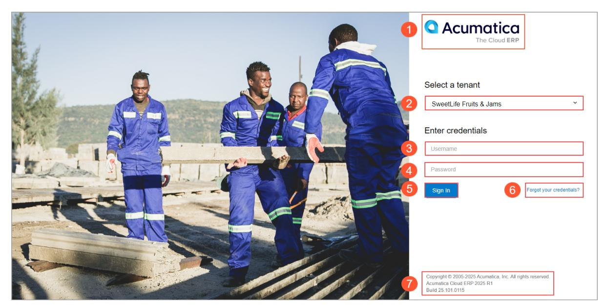
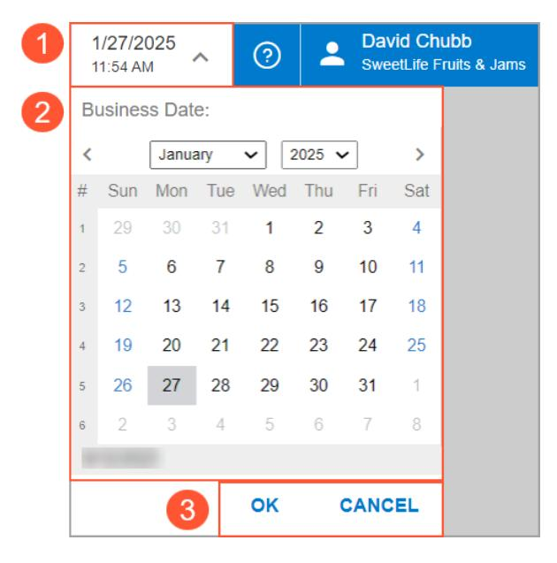
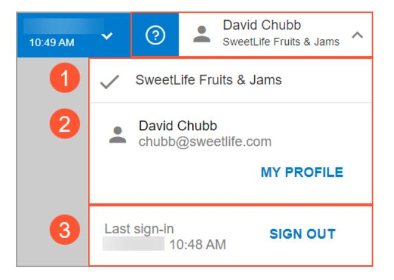
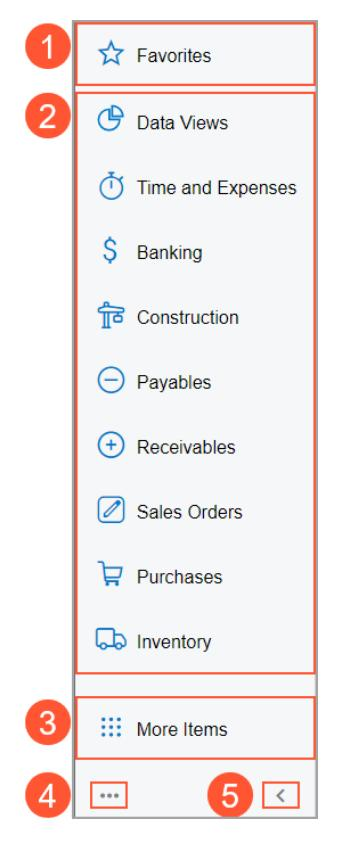
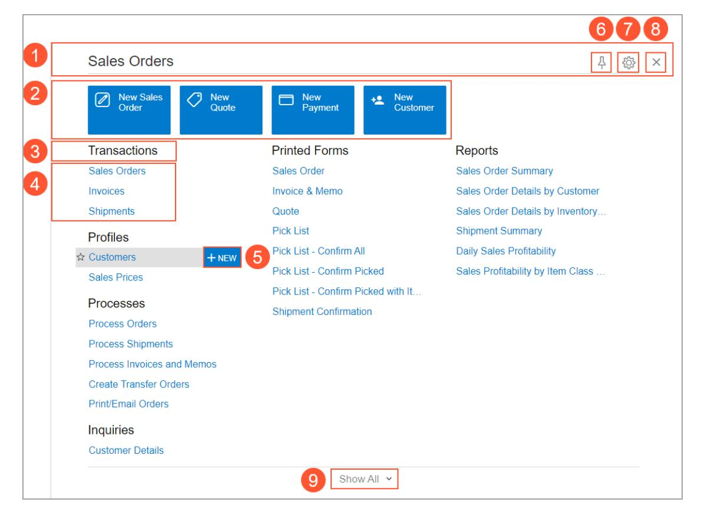
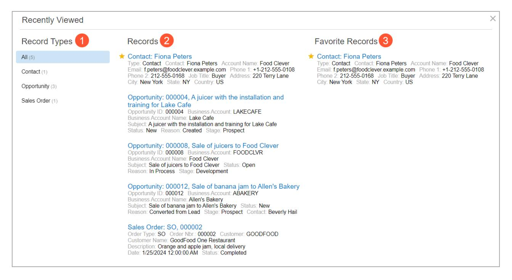
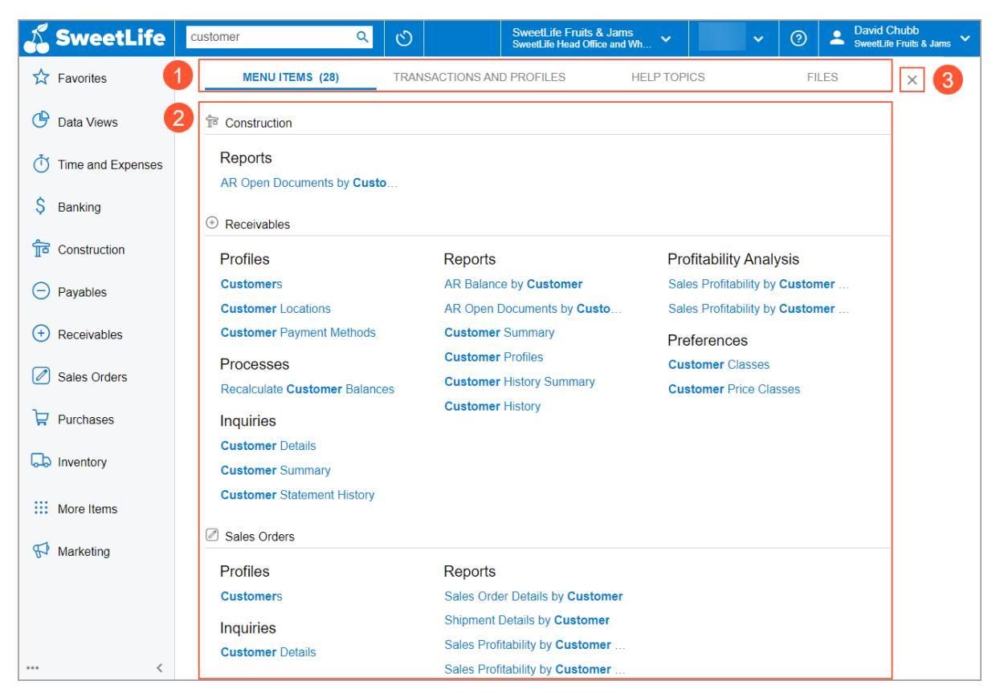
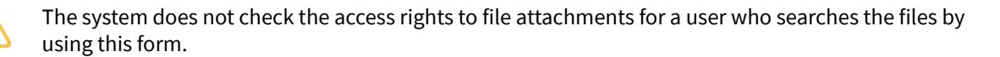
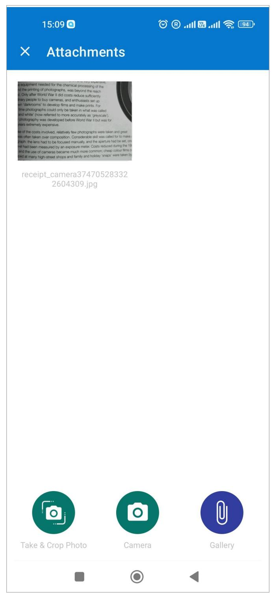
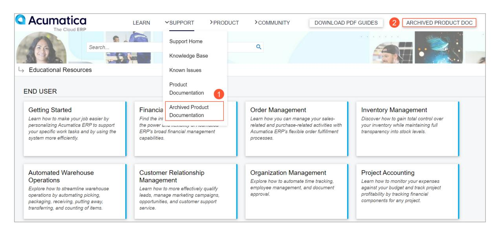

# **Getting Started 2025 R1**

| Copyright5                                                        |  |
|-------------------------------------------------------------------|--|
| Accessing Acumatica ERP 6                                         |  |
| Acumatica ERP Access: General Information 6                       |  |
| Acumatica ERP Access: Process Activity9                           |  |
| Access to Your Acumatica ERP Instance 10                          |  |
| To Recover a Forgotten Password or a Username 12                  |  |
| To Specify Your Password Recovery Question 12                     |  |
| To Change Your Password 13                                        |  |
| Learning About the Acumatica ERP UI 14                            |  |
| The Acumatica ERP UI: General Information 14                      |  |
| The Acumatica ERP UI: Workspaces 23                               |  |
| The Acumatica ERP UI: The Help System25                           |  |
| The Acumatica ERP UI: Process Activity30                          |  |
| Searching in Acumatica ERP 37                                     |  |
| Search Capabilities: General Information 37                       |  |
| Search Capabilities: Process Activity40                           |  |
| Filtering and Sorting in Acumatica ERP 44                         |  |
| Filtering and Sorting Capabilities: General Information 44        |  |
| Filtering and Sorting Capabilities: Simple Filter46               |  |
| Filtering and Sorting Capabilities: Quick Filter49                |  |
| Filtering and Sorting Capabilities: Advanced and Ad Hoc Filters50 |  |
| Filtering and Sorting Capabilities: Process Activity51            |  |
| Adjusting the Table Layout56                                      |  |
| Table Layout: General Information56                               |  |
| Table Layout: Process Activity 57                                 |  |
| Working with Data Entry Forms 61                                  |  |
| Record Entry: General Information61                               |  |
| Record Entry: Basics of Acumatica ERP Forms 62                    |  |
| Record Entry: Process Activity 65                                 |  |
| Copy-and-Paste Options and Record Templates 68                    |  |
| To Copy a Record's Contents to a New Record69                     |  |
| To Create a Record by Using a Template70                          |  |
| Working with Attachments 71                                       |  |
| Attachments: General Information 71                               |  |

| Attachments: File Upload and Attachment 73                                |  |
|---------------------------------------------------------------------------|--|
| Attachments: File Maintenance78                                           |  |
| Attachments: Note Attachments79                                           |  |
| Attachments: To Attach Files and Notes81                                  |  |
| Attachments: To Scan a File and Attach It to a Record or Record Detail 83 |  |
| Working with Reports 85                                                   |  |
| Reports: General Information 85                                           |  |
| Reports: Process Activity 87                                              |  |
| To Create, Remove, and Schedule a Report Template 91                      |  |
| Managing Favorites95                                                      |  |
| Favorites: General Information 95                                         |  |
| Favorites: Process Activity97                                             |  |
| Learning About Acumatica Educational Resources100                         |  |
| Acumatica Educational Resources: General Information100                   |  |
| Managing Your Basic Working Environment 104                               |  |
| Your Working Environment: General Information 104                         |  |
| Your Working Environment: Process Activity 105                            |  |
| To Change the Business Date107                                            |  |
| To Remove a Mobile Device 108                                             |  |
| To Manage the Receipt of Push Notifications 108                           |  |
| Personalizing Record Processing 110                                       |  |
| Personal Settings for Record Processing110                                |  |
| To Configure Your Email Account 110                                       |  |
| Managing Your Tasks and Events112                                         |  |
| Task Management112                                                        |  |
| To Set Up Reminders for Tasks and Events114                               |  |
| Importing and Exporting Data to Excel and XML 116                         |  |
| Integration with Excel116                                                 |  |
| To Export Data to Excel118                                                |  |
| To Import Data from a Local File to a Table118                            |  |
| To Update an Excel Spreadsheet 119                                        |  |
| XML Import and Export119                                                  |  |
| To Export Data to XML 121                                                 |  |
| To Import Data from XML 122                                               |  |
| Approving Records 123                                                     |  |
| Getting Started Form Reference 124                                        |  |
|                                                                           |  |

| Reminder Dialog Box 124        |  |
|--------------------------------|--|
| Reminders Dialog Box 124       |  |
| Filter Settings Dialog Box 125 |  |
| User Profile129                |  |
| Appendix141                    |  |
| Reports 141                    |  |
| Report Form141                 |  |
| Report146                      |  |
| Form Toolbar and More Menu148  |  |
| Table Toolbar 155              |  |
|                                |  |

## **Copyright**

#### **© 2025 Acumatica, Inc.**

#### **ALL RIGHTS RESERVED.**

No part of this document may be reproduced, copied, or transmitted without the express prior consent of Acumatica, Inc.

3075 112th Avenue NE, Suite 200, Bellevue, WA 98004, USA

#### **Restricted Rights**

The product is provided with restricted rights. Use, duplication, or disclosure by the United States Government is subject to restrictions as set forth in the applicable License and Services Agreement and in subparagraph (c)(1)(ii) of the Rights in Technical Data and Computer Soware clause at DFARS 252.227-7013 or subparagraphs (c)(1) and (c)(2) of the Commercial Computer Soware-Restricted Rights at 48 CFR 52.227-19, as applicable.

#### **Disclaimer**

Acumatica, Inc. makes no representations or warranties with respect to the contents or use of this document, and specifically disclaims any express or implied warranties of merchantability or fitness for any particular purpose. Further, Acumatica, Inc. reserves the right to revise this document and make changes in its content at any time, without obligation to notify any person or entity of such revisions or changes.

#### **Trademarks**

Acumatica is a registered trademark of Acumatica, Inc. HubSpot is a registered trademark of HubSpot, Inc. Microso Exchange and Microso Exchange Server are registered trademarks of Microso Corporation. All other product names and services herein are trademarks or service marks of their respective companies.

Soware Version: 2025 R1 Last Updated: 06/01/2025

## **Accessing Acumatica ERP**

This chapter provides information about user accounts and user access to Acumatica ERP. You will learn about tenants, companies, and branches in the system. You will also obtain practical information about how you use and recover your credentials.

## **Acumatica ERP Access: General Information**

The first thing to do when you want to work with Acumatica ERP is sign in to the system. In the following sections, you will find information about accessing the Acumatica ERP instance.

#### **Learning Objectives**

In this chapter, you will learn how to do the following:

- Sign in to Acumatica ERP
- Switch between the available companies and branches
- Sign out of Acumatica ERP

#### **Applicable Scenarios**

You need to learn about accessing Acumatica ERP if you are new to the system and are planning to sign in to the Acumatica ERP instance for the first time.

#### **Access to Acumatica ERP**

Acumatica ERP is a web-based application. To begin the sign-in process, you open a web browser and type the URL of the Acumatica ERP instance.

For working with Acumatica ERP, we recommend that you use one of the following web browsers:

- Google Chrome
- Mozilla Firefox
- Microso Edge
- Apple Safari

You can also open the Acumatica ERP instance by finding and clicking its name on the Start menu or by using the Acumatica ERP Configuration wizard. For details, see *Instance [Deployment:](https://help-2025r1.acumatica.com/Help?ScreenId=ShowWiki&pageid=f91437b2-a185-4ef0-97a0-662b9d6d44fc) Accessing an Instance for the First Time*.

Acumatica ERP is a role-based system. Depending on the role or roles (such as *Accountant* or *Marketing manager*) the system administrator has assigned to your user account in the system, you can view and work with particular companies, branches, workspaces (which contain groups of Acumatica ERP forms and reports), and menu items within workspaces.

To access the system, you can use an account of any of the following types:

- An Acumatica ERP account: You use the username and password that the system administrator has created for you in Acumatica ERP to access the system.
- A domain account: If the system administrator has integrated Acumatica ERP with Microso Active Directory, you use your domain login and password (the credentials that you use to sign in to your computer).

• An account of an external identity provider: If the system administrator has configured single sign-on with an external identity provider, such as Google or Microso account, you use the credentials of this provider to sign in to Acumatica ERP.

When you have finished working with Acumatica ERP, be sure to save the results of your work and sign out to prevent unauthorized access to the system.

#### **Basic Elements of the Acumatica ERP Sign-In Page**

You use the Acumatica ERP Sign-In page to sign in to the system, submit a request to your system administrator to recover your password (if the security policy of your company allows this), and go to the Acumatica ERP official website. The Sign-In page also includes information about the system version and any applied customization projects; these details may be useful to some users under some circumstances, such as during troubleshooting.

The following screenshot shows you the basic elements of the Acumatica ERP Sign-In page.

#### *Figure: Basic elements of the Acumatica ERP Sign-In page*

The following elements may be visible on the Acumatica ERP Sign-In page:

- 1. The button with the Acumatica ERP logo. You can click this button to open the Acumatica corporate website in a new browser tab.
- 2. The Tenant box. This box is available only if you have access to multiple tenants.
- 3. The **Username** box.
- 4. The **Password** box.
- 5. The **Sign In** button.
- 6. The **Forgot your credentials?** link.
- 7. The information about the Acumatica ERP version and any applied customization projects.

#### **Tenants in Acumatica ERP**

A tenant is a unit that is used for sharing the Acumatica ERP application with other tenants, with each tenant's data isolated from and invisible to the other tenants.

When you sign in to the system, you can select a tenant if multiple tenants are configured in your Acumatica ERP instance and you have access to more than one tenant.

When you are working with the system, you can switch between tenants if multiple tenants are configured in your Acumatica ERP instance and you have access to more than one tenant.

#### **Companies and Branches in Acumatica ERP**

For an organization that has a hierarchical structure of subsidiaries or branches, Acumatica ERP supports multicompany and multibranch functionality.

When you are working with the system, you can switch between the companies and branches to which you have access if multiple companies and branches are configured in your Acumatica ERP instance. To do this, you use the Company and Branch Selection menu, which is described in the next section.

#### **Company and Branch Selection Menu**

The Company and Branch Selection menu button is located in the top pane of the Acumatica ERP screen. The button displays the name of the company or company–branch combination (for a company with branches) to which you are currently signed in. You click the button to view the Company and Branch Selection menu.

The following screenshot shows the elements of the Company and Branch Selection menu.

|              |  | <b>SweetLife Fruits &amp; Jams</b> SweetLife Head Office and Wh                     |  | (2) |  |
|--------------|--|----------------------------------------------------------------------------------------|--|-----|--|
| 2            |  |                                                                                        |  |     |  |
| $\mathbf{3}$ |  | SWEETLIFE - SweetLife Fruits & Jams SWEETEQUIP - Service and Equipment Sales Center |  |     |  |
|              |  | <b>HEADOFFICE - SweetLife Head Office and Wholesale Center</b>                         |  |     |  |
|              |  | <b>RETAIL - SweetLife Store</b>                                                        |  |     |  |
| 5            |  | Companies: 1, Branches: 3                                                              |  |     |  |

#### *Figure: Company and Branch Selection menu*

- 1. The current company or company–branch combination (for a company with branches).
- 2. The Search box. You use the box to search for a particular company or branch by its name or identifier.
- 3. The hierarchical list of companies or branches (or both), which contains the identifier and name of each company or branch. The companies and branches are listed alphabetically by their identifiers. In the list, a company or branch is displayed only if it is active and your user account has access to it.
- 4. The current branch, which is indicated by a check mark. This branch is inserted by default into any documents or entities you create while you are signed in.

If you are signed in to a company with no branches, the check mark is instead used to indicate the current company, which is inserted by the system into any created records.

5. The total numbers of active companies and branches that you have access to.

## **Acumatica ERP Access: Process Activity**

The following activity will walk you through the processes of signing in to your Acumatica ERP instance, switching between companies and branches, and signing out of the system.

This activity is based on the *U100* dataset. If you are using another dataset, or if any system settings have been changed in *U100*, these changes can affect the workflow of the activity and the results of the processing. To avoid any issues, restore the *U100* dataset to its initial state.

### **Video Tutorial**

This video shows you the common process but may contain less detail than the activity has. If you want to repeat the activity on your own or you are preparing to take the certification exam, we recommend that you follow the instructions in the steps of the activity.

#### *[FEEDBACK](https://www.surveymonkey.com/r/BLBL7RJ?Video=Accessing%20Acumatica%20ERP&Source=Help&Course=A150)*

#### **Story**

Suppose that you are David Chubb, a new sales manager of the SweetLife Fruits & Jams company, and you are signing in to Acumatica ERP for the first time by using the *Chubb* user account.

Further suppose that you have access to the following branches of the SweetLife Fruits & Jams company:

- Service and Equipment Sales Center
- SweetLife Head Office and Wholesale Center
- SweetLife Store

#### **Process Overview**

In this activity, you will do the following:

- 1. Sign in to Acumatica ERP for the first time
- 2. Make sure that you have access to the needed SweetLife Fruits & Jams branches
- 3. Switch to the SweetLife Store branch
- 4. Sign out of Acumatica ERP

#### **System Preparation**

Before you sign in to Acumatica ERP, make sure that you have installed an Acumatica ERP instance with the *U100* dataset, or a system administrator has performed this task for you.

#### **Step 1: Signing In to the Acumatica ERP Account**

To sign in to Acumatica ERP by using the *сhubb*user account of David Chubb, do the following:

- 1. Open your browser.
- 2. In the address bar, type the URL of your Acumatica ERP instance and press Enter. The Acumatica ERP Sign-In page opens.
- 3. In the **Username** box, type chubb.

- 4. In the **Password** box, type 123.
- 5. Click **Sign In**. The home page of your Acumatica ERP instance opens.

#### **Step 2: Switching Between Companies and Branches**

To make sure that you have access to the SweetLife Fruits & Jams company and its branches, do the following:

- 1. In the top pane of the Acumatica ERP screen, click the Company and Branch Selection menu button (where you see**SweetLife Fruits & Jams**) to open the Company and Branch Selection menu.
- 2. On the menu, view the list of the companies and branches, and be sure it includes the**SweetLife Fruits & Jams** company and the following branches of it:**Service and EquipmentSales Center**, **SweetLife Head Office and Wholesale Center**, and **SweetLifeStore**. Notice the check mark le of the current branch (the branch to which you are currently signed in).
- 3. Click **SweetLifeStore** to switch to the SweetLife Store branch of the SweetLife Fruits & Jams company. The system closes the Company and Branch Selection menu. In the top pane, notice that you can now see the **SweetLifeStore** branch.
- 4. Click the Company and Branch Selection menu button to open the Company and Branch Selection menu. Notice the check mark le of the**SweetLifeStore** branch, which means that it is your current branch.

If you switch to a company without branches, the check mark appears le of the company instead of the branch.

### **Step 3: Signing Out of Acumatica ERP**

To sign out of Acumatica ERP, do the following:

- 1. In the right part of the top pane, click the User menu button (where your username appears).
- 2. On the User menu, which opens, click**Sign Out**. The Acumatica ERP Sign-In page is displayed.

#### **Activity Recap**

In this activity, we have illustrated the following:

- 1. A user has signed in to Acumatica ERP.
- 2. The user has switched between companies and branches.
- 3. The user has signed out of Acumatica ERP.

## **Access to Your Acumatica ERP Instance**

Information about the financial records processed in each organization is confidential, so system administrators who deploy and support Acumatica ERP in your organization restrict access to the system by creating user accounts or integrating Acumatica ERP with external identity providers.

In this topic, you will read about managing user account information, recovering your credentials, and changing your password.

#### **Managing User Account Details**

As a user of Acumatica ERP, you have a separate user account that defines what forms you can access, what changes you can make, and what your personal settings are. Your user account contains the following:

- A login (username), which is managed by your system administrator
- A password
- Additional information about you, which you can manage without contacting your system administrator

On the *[User Profile](#page-128-1)* (SP203010) form, you can manage the following personal information:

- Your first name and last name.
- Your phone number.
- Your password. For details, see *Changing the Password of Your [Acumatica](#page-10-0) ERP Account*.
- Your email account. For information about how to configure your email account, see *To [Configure](#page-109-3) Your Email [Account](#page-109-3)*.
- Your password recovery question and answer. For details, see *Recovering Your User [Credentials](#page-10-1)*.

If your Acumatica ERP instance is integrated with Active Directory, for domain users, some of the settings listed above are unavailable; they are set on the domain level in Active Directory.

To open the *[User Profile](#page-128-1)* form, in the User menu (in the top right corner of the screen), click your user name and select **My Profile**.

#### **Changing the Password of Your Acumatica ERP Account**

Your system administrator can allow you to change the password of your Acumatica ERP account any time you want. The ability to change your own password is useful, for example, when you suspect that your account is being accessed without your consent. For details, see *To Change Your [Password](#page-12-1)*.

#### **Recovering Your User Credentials**

If you use Acumatica ERP credentials to sign in to the system, your system administrator can allow you to recover your password and login. The recovery mechanism sends emails to the email address that is specified in your account information. For details about how to recover your credentials, see *To Recover a Forgotten [Password](#page-11-2) or a [Username](#page-11-2)*.

On the *[User Profile](#page-128-1)* (SM203010) form, you can specify a password recovery question, the answer to which you need to enter when you are recovering your password. With a password recovery question, you reduce a risk of hacking your user account. For a procedure, see *To Specify Your [Password](#page-11-3) Recovery Question*.

If you have forgotten your password from a domain account, you should contact your system administrator.

If you have forgotten your password from an external identity account, you should use the password recovery tools of the external identity provider.

#### **Related Links**

- *To [Configure](#page-109-3) Your Email Account*
- *To Change Your [Password](#page-12-1)*
- *To Recover a Forgotten Password or a [Username](#page-11-2)*
- *To Specify Your [Password](#page-11-3) Recovery Question*
- *[User Profile](#page-128-1)*

## **To Recover a Forgotten Password or a Username**

You can recover your Acumatica ERP username or password if password recovery is allowed by your company's security policy.

If you sign in to Acumatica ERP by using your domain account, you cannot use the following procedure. In this case, to recover your password, your username, or both, contact your administrator.

#### **To Recover Your Password**

- 1. On the Sign-In page, click **Forgot Your Credentials?**.
- 2. On the Password Recovery screen, type your username in the **Your Username** box.
- 3. Click **Submit**.
- 4. For further instructions, check your email, using the address specified for your account by you or your system administrator.
- 5. In the appropriate email, click the password recovery link.

This opens the Sign-In page for password change.

- 6. In the **New Password** and **Confirm Password** boxes, type your new password.
- 7. If you specified a password recovery question, in the **Your Answer** box, type the answer to the question that you have specified in your user profile.
- 8. Click **Sign in**.

#### **To Recover Your Username**

- 1. On the Sign-In page, click **Forgot Your Credentials?**.
- 2. On the Password Recovery screen, click **Forgot your username?**.
- 3. In the **Enter your email address** box of the User Recovery screen, type the email address specified for your account by you or your system administrator.
- 4. Click **Submit**.
- 5. Check your email for an email that includes your username.

## **To Specify Your Password Recovery Question**

If password recovery is allowed per your company's security policy, you can specify a password recovery question and answer on the *[User Profile](#page-128-1)* (SM203010) form to be used if you forget the password and need to securely acquire a new one. For more information about password recovery, see *Access to Your [Acumatica](#page-9-1) ERP Instance*.

In this topic, you will read how to specify your password recovery question.

#### **To Specify Your Password Recovery Question**

- 1. In the right part of the top pane, click the User menu button (where your username appears).
- 2. On the User menu, which opens, click **My Profile**.

- 3. On the **General Info** tab of the *[User Profile](#page-128-1)* (SM203010) form which opens, in the **Password Recovery Question** box, type the password recovery question.
- 4. Click **Change Answer**.
- 5. In the **Change Password Recovery Answer** dialog box, which opens, type the answer to the recovery question and your password.
- 6. On the form toolbar, click**Save**.

You can use the same procedure when you want to change the question or the answer.

## **To Change Your Password**

You can change your password when you want to if your organization's security policies allow this. You use the *[User](#page-128-1) [Profile](#page-128-1)* (SM203010) form to change your password, as described in this topic.

#### **To Change Your Password**

- 1. In the right part of the top pane, click the User menu button (where your username appears).
- 2. On the User menu, which opens, click **My Profile**.
- 3. On the **General Info** tab of the *[User Profile](#page-128-1)* (SM203010) form which opens, click **Change Password** to open the **Change Password** dialog box.
- 4. Enter your old password and new password, and retype the new password to confirm it.
- 5. Click **OK** to change the password.
- 6. On the form toolbar, click**Save**.

The next time you sign in to the system, you should use your new password.

## **Learning About the Acumatica ERP UI**

This chapter provides an overview of the Acumatica ERP user interface. You will explore the basic elements of the user interface and the built-in Help system, learn to navigate through the system, and apply the needed settings according to your preferences.

## **The Acumatica ERP UI: General Information**

In the following sections, you will find information about the user interface and the navigation options of the Acumatica ERP website.

### **Learning Objectives**

In this chapter, you will learn how to do the following:

- Identify the basic elements of the Acumatica ERP UI
- Describe the main functions of the basic UI elements
- List the content that can be displayed in the working area
- Describe the elements of a workspace
- Search for needed information in the system
- Navigate the Help menu
- Explore the Acumatica ERP online Help
- Use the built-in infotips
- Learn about the basic elements on the form toolbar and More menu

#### **Applicable Scenarios**

You need to learn about the Acumatica ERP UI if you are new to Acumatica ERP and need to become familiar with the UI.

#### **Basic Elements of the Acumatica ERP User Interface**

Every screen of Acumatica ERP has basic UI elements that help users navigate the system, input data into the system, and view, modify, and share information. The following screenshot shows the basic UI elements of the system, which are described in the sections that follow.

|            |                                |                          |                                                                                                                                                      |             |                   |               |                  | 3                                     |                                |                                                                                                      |                     | 5                     |                     |                   |                  |                                        |                            |
|------------|--------------------------------|--------------------------|------------------------------------------------------------------------------------------------------------------------------------------------------|-------------|-------------------|---------------|------------------|---------------------------------------|--------------------------------|------------------------------------------------------------------------------------------------------|---------------------|-----------------------|---------------------|-------------------|------------------|----------------------------------------|----------------------------|
|            | <b>SweetLife</b>               |                          | Search                                                                                                                                               |             |                   |               | Q                | $\mathcal{C}$                         |                                | <b>SweetLife Fruits &amp; Jams</b> SweetLife Head Office and Wh                                   | $\ddot{\mathbf{v}}$ | 1/27/2025 11:48 AM | $\checkmark$        | ලා                | -                | David Chubb SweetLife Fruits & Jams | $\checkmark$               |
| ኚ          | <b>Favorites</b> $\sqrt{8}$ |                          | <b>Sales Orders</b>                                                                                                                                  |             |                   |               |                  | SO 000002 - GoodFood One Restaurant 9 |                                |                                                                                                      |                     | <b>P</b> NOTES        |                     | <b>ACTIVITIES</b> | <b>FILES</b>     | TOOLS -                                | 頂 Invoices and Memos |
| ඦ          | <b>Data Views</b>              |                          | $\leftarrow$                                                                                                                                         | 圓           | 日                 | ↶             |                  | Ĥ $\checkmark$                     | К ∢ $\rightarrow$        | $\geq$ $\cdots$                                                                                   |                     |                       |                     |                   |                  |                                        | $=$                        |
|            |                                |                          | * Order Type:                                                                                                                                        |             |                   | SO | Q                | Customer:                             |                                | !!!!!!!!!!!!!!!!!!!!!!!!!!!!!!!!!!!!!!!!                                                             | 0                   | Ordered Qty.:         |                     | 50.00             |                  | $\hat{\phantom{a}}$                    | Customer                   |
| ω          | <b>Time and Expenses</b>       |                          |                                                                                                                                                      | Order Nbr.: |                   | 000002        | Q                | Location:                             | <b>MAIN - Primary Location</b> |                                                                                                      |                     | Detail Total:         |                     | 179.10            |                  |                                        | Details                    |
|            |                                |                          | Status:                                                                                                                                              |             |                   | Completed     |                  | Contact:                              |                                |                                                                                                      |                     | Line Discounts:       |                     |                   | 0.00             |                                        |                            |
| S          | <b>Banking</b>                 |                          | Date:                                                                                                                                                |             |                   | 1/25/2025     |                  | Project:                              | X - Non-Project Code.          |                                                                                                      |                     | Document Dis          |                     |                   | 0.00             |                                        | 10                         |
|            |                                |                          |                                                                                                                                                      |             | Requested On:     | 1/25/2025     |                  | Description: 0                        |                                | Orange and apple jam, local delivery                                                                 |                     | Freight Total:        |                     | 11.00             |                  |                                        |                            |
| <u>ਜਿਤ</u> | Construction                   |                          |                                                                                                                                                      |             | Customer Ord      |               |                  |                                       |                                |                                                                                                      | 1,                  | <b>Tax Total:</b>     |                     | 11.64             |                  |                                        |                            |
|            |                                |                          |                                                                                                                                                      |             | External Refer    |               |                  |                                       |                                |                                                                                                      |                     | Order Total:          |                     | 201.74            |                  |                                        |                            |
| $(-)$      | Payables                       |                          |                                                                                                                                                      |             |                   |               |                  |                                       |                                |                                                                                                      |                     |                       |                     |                   |                  |                                        |                            |
|            |                                |                          | <b>DETAILS</b> <b>TAXES</b> <b>FINANCIAL</b> <b>SHIPPING</b> <b>SHIPMENTS</b> <b>PAYMENTS</b> <b>RELATIONS</b> <b>ADDRESSES</b> |             |                   |               |                  |                                       |                                |                                                                                                      |                     | <b>TOTALS</b>         |                     |                   |                  |                                        |                            |
| $(+)$      | <b>Receivables</b>             |                          | Ò                                                                                                                                                    |             | /)                | $\times$      | <b>ADD ITEMS</b> |                                       | <b>ADD MATRIX ITEMS</b>        | ADD INVOICE                                                                                          |                     | ADD BLANKET SO LINE   | <b>LINE DETAILS</b> |                   | PO LINK          | $\ddot{\mathbf{2}}$                    |                            |
|            |                                |                          | 目 0                                                                                                                                                  | $\Box$      | *Branch           |               | * Inventory      | Free                                  | Warehouse                      | <b>Line Description</b>                                                                              | *UOM                |                       | Quantity            |                   | Qty. On          | Open Qty.                              |                            |
|            | <b>Sales Orders</b>            |                          |                                                                                                                                                      |             |                   |               | ID               | Item                                  |                                |                                                                                                      |                     |                       |                     |                   | <b>Shipments</b> |                                        |                            |
|            |                                |                          |                                                                                                                                                      |             |                   |               |                  |                                       |                                |                                                                                                      |                     |                       |                     |                   |                  |                                        |                            |
| ᇦ          | Purchases                      | $\rightarrow$            | $\omega$                                                                                                                                             | D           | <b>HEADOFFICE</b> |               | ORJAM08          | п                                     | <b>WHOLESALE</b>               | Orange jam 8 oz.                                                                                     | PIECE               |                       | 40.00               |                   | 40.00            | 0.00                                   |                            |
|            |                                |                          | $\mathbf{0}$                                                                                                                                         | D           | <b>HEADOFFICE</b> |               | APJAM08          | □                                     | <b>WHOLESALE</b>               | Apple jam 8 oz.                                                                                      | <b>PIECE</b>        |                       | 10.00               |                   | 10.00            | 0.00                                   |                            |
| هما        | Inventory                      |                          |                                                                                                                                                      |             |                   |               |                  |                                       |                                |                                                                                                      |                     |                       |                     |                   |                  |                                        |                            |
|            |                                | $\overline{\mathcal{A}}$ |                                                                                                                                                      |             |                   |               |                  |                                       |                                |                                                                                                      |                     |                       |                     |                   |                  |                                        |                            |
| 0.0.0      |                                |                          |                                                                                                                                                      |             |                   |               |                  |                                       |                                | On Hand 62.00 PIECE, Available 62.00 PIECE, Available for Shipping 62.00 PIECE, Allocated 0.00 PIECE |                     |                       |                     | $\mathbf{K}$      |                  | $>$                                    |                            |

#### *Figure: Basic UI elements*

- 1. Home button
- 2. Search box
- 3. Recently Viewed button
- 4. Company and Branch Selection menu button
- 5. Business Date menu button
- 6. **Open Help** button
- 7. User menu button
- 8. Main menu
- 9. Working area
- 10.Side panel
- 11.Icon for the infotip

#### **Home Button**

The Home button, located in the upper le corner of the Acumatica ERP screen, has your company logo on it. Initially, when you click the Home button, the home page of your Acumatica ERP instance opens.

You can specify a custom home page instead of the default home page. For details, see *Your Working [Environment:](#page-104-1) [Process Activity](#page-104-1)*.

#### **Search Box**

The Search box is located in the top pane of the Acumatica ERP screen. When you search by a keyword or phrase in the system, the results may include any of the following:

- A text string in menu items, such as forms, reports, dashboards, pivot tables, and generic inquiries
- Help topics

- Files and notes attached to records
- Transactions
- Records
- Entities, such as vendors, customers, prospects, employees, leads, and cases.

Additionally, you can search for a form by the form title and by the form ID.

You can find a form or report by using the Search box, if the link to this particular form or report has been added to any of the workspaces. If you cannot find a form or report that you need for your work, contact a system administrator.

#### **Recently Viewed Workspace**

The Recently Viewed button is located in the top pane of the Acumatica ERP screen right of the Search box. The button opens the **RecentlyViewed** workspace over the working area of the screen. Each time you click the button, the system uses the data it has collected and refreshes the workspace to show the most recently used records that have been created and opened on data entry and maintenance forms, as well as key information about these records, including their reference numbers or identifiers. For details about the **RecentlyViewed** workspace, see *[The Acumatica ERP UI: Workspaces](#page-22-1)*.

#### **Company and Branch Selection Menu**

The Company and Branch Selection menu button is located in the top pane of the Acumatica ERP screen. The button displays the name of the company or company–branch combination (for a company with branches) to which you are currently signed in. You click the button to view the Company and Branch Selection menu.

The following screenshot shows the elements of the Company and Branch Selection menu.

|   | <b>SweetLife Fruits &amp; Jams</b> SweetLife Head Office and Wh.                                                                                                                  | (?) |  |
|---|--------------------------------------------------------------------------------------------------------------------------------------------------------------------------------------|-----|--|
| 2 |                                                                                                                                                                                      |     |  |
| 3 | SWEETLIFE - SweetLife Fruits & Jams SWEETEQUIP - Service and Equipment Sales Center <b>HEADOFFICE - SweetLife Head Office and Wholesale Center</b> RETAIL - SweetLife Store |     |  |
| 5 | Companies: 1, Branches: 3                                                                                                                                                            |     |  |

#### *Figure: Company and Branch Selection menu*

- 1. The current company or company–branch combination (for a company with branches).
- 2. The Search box. You use the box to search for a particular company or branch by its name or identifier.
- 3. The hierarchical list of companies or branches (or both), which contains the identifier and name of each company or branch. The companies and branches are listed alphabetically by their identifiers. In the list, a company or branch is displayed only if it is active and your user account has access to it.
- 4. The current branch, which is indicated by a check mark. This branch is inserted by default into any documents or entities you create while you are signed in.

If you are signed in to a company with no branches, the check mark is instead used to indicate the current company, which is inserted by the system into any created records.

5. The total numbers of active companies and branches that you have access to.

#### **Business Date Menu**

The Business Date menu button is located in the top pane of the Acumatica ERP screen; the button shows the current business date and time (in the time zone defined for your user account) in the system. The following screenshot shows the elements of the Business Date menu.

#### *Figure: Business Date menu*

- 1. Business Date menu button
- 2. Calendar
- 3. Action buttons

The business date, which is the current date that is set in the system, is automatically inserted in the records such as sales orders and invoices that you add to the system.

If the *Secure Business Date* feature is disabled on the *[Enable/Disable Features](https://help-2025r1.acumatica.com/Help?ScreenId=ShowWiki&pageid=c1555e43-1bc5-4f6f-ba9d-b323f94d8a6b)* (CS100000) form in Acumatica ERP, any user can change their business date by opening the Business Date menu and then selecting the needed date. If the *Secure Business Date* feature is enabled, only users with the *BusinessDateOverride* role assigned to them can change the business date.

This menu also displays a calendar, which can be used to find the needed business date (and select it, if the system settings allow this), and the **OK** and **Cancel** buttons.

#### **Built-In Help System**

The **Open Help** button is located in the top pane of the Acumatica ERP screen. You can click the button to access the Help menu, which provides quick access to Help topics that are relevant to the content you are currently viewing in the working area. For details about using built-in Help system, see *[The Acumatica ERP UI: The Help](#page-24-1) [System](#page-24-1)*.

#### **User Menu**

The User menu button is located in the top pane (upper right) of the Acumatica ERP screen; you click the button to view the User menu. The following screenshot shows the elements of the User menu.

#### *Figure: User menu*

- 1. Tenants section. In this section of the User menu, you can view the tenant to which you are signed in, indicated by a check mark.
- 2. My Profile section. This section shows your name and your email address as defined in the system; you click **My Profile** to view the *[User Profile](#page-128-1)* (SM203010) form, where you can change the settings of your user account.
- 3. Sign-In section. In this section of the User menu, you can view the date and time of your last sign-in, and click **Sign Out** if you are ready to sign out of the system.

#### **Main Menu**

The main menu, which is initially shown in the expanded view, is located on the le side of the Acumatica ERP screen. You can collapse the main menu so that the names of the menu items are displayed in the compact view or minimize the main menu so that it is displayed as the **Menu** button in the upper le corner of the screen instead of the Home button. The following screenshot shows the elements of the main menu in the expanded view.

#### *Figure: Main menu*

- 1. **Favorites** menu item. You click the **Favorites** menu item to view your favorite forms, reports, and dashboards. For details, see *[Managing Favorites](#page-94-2)*.
- 2. Menu items that represent workspaces. When you click a menu item on the main menu, the quick view or full view of the workspace, depending on the configuration of the workspace, opens over the working area. In the workspace, you can see the links to the forms, reports, and dashboards for a particular functional area in Acumatica ERP.
- 3. **More Items** menu item. The main menu displays the workspaces (except for **RecentlyViewed**) that are used most commonly by Acumatica ERP users. By clicking the **More Items** menu item, you can access some workspaces that are used less frequently but are important to some users. If you do not see a menu item corresponding to the functional area you want to use, click the **More Items** menu item. This opens in the working area a menu with tiles for each of the workspaces in the system. These workspaces are grouped by broader functional areas.
- 4. **Open Configuration Menu** button. You click this button to view a menu with additional commands that you can click to change the location of the main menu (and to edit the menu items for the whole system, if you are signed in to an account with the *Administrator* role assigned).
- 5. **Collapse Main Menu Panel** (or **Expand Main Menu Panel**) button. By clicking the **Collapse Main Menu Panel** button, you can collapse the main menu panel to display the compact view of the icons and workspace names, and by clicking the **Expand Main Menu Panel** button (which appears on the collapsed menu panel), you can display the expanded view of the menu.

#### **Working Area**

The working area is the main area of the Acumatica ERP screen. Depending on what you are doing in the system, the working area may display any of the following:

• A form: Acumatica ERP has forms of multiple types. For details, see *[Forms](https://help-2025r1.acumatica.com/Help?ScreenId=ShowWiki&pageid=c58c9fb0-fa12-4e16-a344-0f43932ca681)*.

- A report: A report is a type of a form specifically designed to organize data in a ready-to-print format. For details, see *[Reports](#page-140-3)*.
- A dashboard: A dashboard is a collection of widgets, displayed on a single page, that provide at-a-glance information on your business-specific processes. For details, see *[Designing Dashboard Contents](https://help-2025r1.acumatica.com/Help?ScreenId=ShowWiki&pageid=81323ebc-b8bc-450b-9aab-9963a6f12998)*.
- A Help topic.

#### **Side Panel**

A side panel is a panel on the right side of the screen that you can use to see details about any record you select from a list of records. Some data entry forms also provide a side panel that you can use to view additional information about the selected record.

A side panel may have only one tab with a form related to the selected record, or it may have multiple tabs, each showing a different type of information related to the record. You can view a tab by clicking its icon. The set of icons on the side panel of a list of records can be different from the set of icons shown on the data entry form (see the screenshots below). Thus, you can view additional information related to a record at various points in your work with the record.

|   |                                              |        | <b>Sales Orders</b> |                         |                                |           |           |                                          | CUSTOMIZATION +               | TOOLS $\blacktriangledown$ | $\bf \odot$ Sales Orders           |  |
|---|----------------------------------------------|--------|---------------------|-------------------------|--------------------------------|-----------|-----------|------------------------------------------|-------------------------------|----------------------------|---------------------------------------|--|
|   | Õ                                            | ↶      | $^+$                | $\mathbf{\overline{x}}$ |                                |           |           |                                          |                               |                            | $\circ$                               |  |
|   | <b>ALL RECORDS</b> <b>MY SALES ORDERS</b> |        |                     |                         |                                |           |           |                                          |                               |                            |                                       |  |
|   |                                              |        | Order Type: All -   | Status: All -           | Date: All - Customer: All ~ |           |           | $\overline{Y}$                           | $\Box$ $\cdots$            | $\varnothing$              | $=$                                   |  |
| 圓 | 0                                            | D      | Order Type       | Order Nbr.              | <b>Status</b>                  | Date      | Shipment  | Sched. Customer                          | <b>Customer Name</b>          |                            | Sales Order Details by Customer |  |
|   | $\mathbf 0$                                  | $\Box$ | IN                  | 000057                  | Invoiced                       | 1/7/2024  | 1/7/2024  | <b>TOMYUM</b>                            | <b>Thai Food Restaurant</b>   |                            | 唒                                     |  |
|   | 0                                            | ם      | IN                  | 000059                  | Invoiced                       | 1/9/2024  | 1/9/2024  | <b>HMBAKERY</b>                          | HM's Bakery & Cafe            |                            | <b>Printed Form</b>                   |  |
|   | 0                                            | ◘      | IN                  | 000061                  | Invoiced                       | 1/15/2024 | 1/15/2024 | !!!!!!!!!!!!!!!!!!!!!!!!!!!!!!!!!!!!!!!! | GoodFood One Restaurant       |                            |                                       |  |
|   | û                                            | ◘      | IN                  | 000063                  | Invoiced                       | 1/18/2024 | 1/18/2024 | COFFEESHOP                               | FourStar Coffee & Sweets Shop |                            |                                       |  |
|   | 0                                            | D      | <b>MO</b>           | 000113                  | Completed                      | 1/29/2024 | 1/29/2024 | <b>ABAKERY</b>                           | <b>Allen's Bakery</b>         |                            |                                       |  |
|   | 0                                            | D      | SO       | 000001                  | Completed                      | 1/29/2024 | 1/29/2024 | <b>COFFEESHOP</b>                        | FourStar Coffee & Sweets Shop |                            |                                       |  |
|   | 0                                            | ם      | SO       | 000002                  | Completed                      | 1/25/2024 | 1/25/2024 | !!!!!!!!!!!!!!!!!!!!!!!!!!!!!!!!!!!!!!!! | GoodFood One Restaurant       |                            |                                       |  |
|   | 0                                            | D      | <b>SO</b>           | 000003                  | Completed                      | 1/27/2024 | 1/27/2024 | <b>HMBAKERY</b>                          | <b>HM's Bakery &amp; Cafe</b> |                            |                                       |  |
|   | 0                                            | ◘      | SO       | 000004                  | Completed                      | 11/2/2023 | 11/2/2023 | <b>HMBAKERY</b>                          | HM's Bakery & Cafe            |                            |                                       |  |
|   | 0                                            | D      | <b>SO</b>           | 000005                  | Completed                      | 11/5/2023 | 11/5/2023 | !!!!!!!!!!!!!!!!!!!!!!!!!!!!!!!!!!!!!!!! | GoodFood One Restaurant       |                            |                                       |  |
|   | 0                                            | D      | SO       | 000006                  | Completed                      | 11/8/2023 | 11/8/2023 | <b>HMBAKERY</b>                          | <b>HM's Bakery &amp; Cafe</b> |                            |                                       |  |

*Figure: A side panel on a list of records*

|                        | <b>Sales Orders</b> |    |                   |                           |                   |           | SO 000002 - GoodFood One Restaurant |                                    |                                   |                                      |                     | <b>PINOTES</b>   | <b>ACTIVITIES</b>   | <b>FILES</b>                | TOOLS $\star$ | 圉 <b>Invoices</b> and |
|------------------------|---------------------|----|-------------------|---------------------------|-------------------|-----------|-------------------------------------|------------------------------------|-----------------------------------|--------------------------------------|---------------------|------------------|---------------------|-----------------------------|---------------|--------------------------|
|                        | $\leftarrow$        | 몸  | $\mathbb{R}$      | ↶                         | $^{+}$            | m         | Ĥ $\checkmark$                   | K $\overline{\left( \right. }%$ | $\rightarrow$                     | $\lambda$ $\cdots$                |                     |                  |                     |                             |               | <b>Memos</b>             |
|                        | * Order Type:       |    |                   | <b>SO</b>                 | Q                 | Customer: |                                     |                                    | GOODFOOD - GoodFood One Restaurar |                                      | 0                   | Ordered Qty.:    |                     | 50.00                       | $\sim$        | $\equiv$ Customer     |
|                        | Order Nbr.:         |    |                   | 000002                    | Q                 |           | Location:                           |                                    | <b>MAIN - Primary Location</b>    |                                      |                     | Detail Total:    |                     | 179.10                      |               | <b>Details</b>           |
| Status:                |                     |    |                   | Completed Contact:     |                   |           |                                     | 0                                  |                                   |                                      |                     | Line Discounts:  | 0.00                |                             |               |                          |
| Date: Requested On: |                     |    |                   | 1/25/2024 Project:     |                   |           |                                     | X - Non-Project Code. 0         |                                   |                                      | Document Dis        | 0.00             |                     |                             |               |                          |
|                        |                     |    |                   | Description: 1/25/2024 |                   |           |                                     |                                    |                                   | Orange and apple jam, local delivery |                     | Freight Total:   |                     | 11.00                       |               |                          |
|                        |                     |    | Customer Ord      |                           |                   |           |                                     |                                    |                                   | /,                                   | Tax Total:          |                  | 11.64               |                             |               |                          |
|                        |                     |    | External Refer    |                           |                   |           |                                     |                                    |                                   |                                      |                     | Order Total:     |                     | 201.74                      |               |                          |
|                        | <b>DETAILS</b>      |    |                   | <b>TAXES</b>              | <b>FINANCIAL</b>  |           | <b>SHIPPING</b>                     | <b>ADDRESSES</b>                   |                                   | <b>SHIPMENTS</b>                     | <b>PAYMENTS</b>     | <b>RELATIONS</b> | <b>TOTALS</b>       |                             |               |                          |
|                        | $\mathcal{C}$       |    | $\mathscr{Q}$     | $\times$                  | <b>ADD ITEMS</b>  |           |                                     | <b>ADD MATRIX ITEMS</b>            |                                   | ADD INVOICE                          | ADD BLANKET SO LINE |                  | <b>LINE DETAILS</b> | PO LINK                     | $\ddot{2}$    |                          |
| 目                      | 0                   | D. | *Branch           |                           | * Inventory ID |           | Free Item                        | Warehouse                          |                                   | <b>Line Description</b>              | *UOM                |                  | Quantity            | Qty. On <b>Shipments</b> | Open Qty.     |                          |
|                        | 0                   | ם  | <b>HEADOFFICE</b> |                           | ORJAM08           |           | П                                   | <b>WHOLESALE</b>                   |                                   | Orange jam 8 oz.                     | <b>PIECE</b>        |                  | 40.00               | 40.00                       | 0.00          |                          |
|                        | 0                   | D  | <b>HEADOFFICE</b> |                           | APJAM08           |           | □                                   | <b>WHOLESALE</b>                   |                                   | Apple jam 8 oz.                      | <b>PIECE</b>        |                  | 10.00               | 10.00                       | 0.00          |                          |

*Figure: A side panel on a data entry form*

You can close the tab by clicking in the upper-right corner of the side panel. For details about side panels, see *[Side Panels on Forms](https://help-2025r1.acumatica.com/Help?ScreenId=ShowWiki&pageid=976195cd-3233-4cd3-b529-ca9aeaf00871)*.

#### **Built-In Infotips**

In Acumatica ERP, you can view infotips, which give you a brief explanation of a UI element while you are still viewing a form. For details about using built-in infotips, see *[The Acumatica ERP UI: The Help System](#page-24-1)*.

#### **The Form Toolbar and the More Menu**

The form toolbar in Acumatica ERP contains standard buttons that you can use to save or cancel changes you have made to the record, or to add or delete a record. Depending on the particular form, the form toolbar may contain navigation buttons (buttons to go to different records), processing buttons, and the More menu, which consists of commands related to the selected record or records. The following screenshot shows the basic elements of the form toolbar on the *[Opportunities](https://help-2025r1.acumatica.com/Help?ScreenId=ShowWiki&pageid=5cb49cd5-2be8-4617-9341-958f1c5d6d53)* (CR304000) form. The form toolbar contains the More menu with categories and menu commands on it.

| <b>Opportunities</b>                                                                                                        | 000012 - Sale of banana jam to Allen's Bakery                        |                       | 3                              |                                 | notes <b>FILES</b> TOOLS - |  |  |  |  |
|-----------------------------------------------------------------------------------------------------------------------------|----------------------------------------------------------------------|-----------------------|--------------------------------|---------------------------------|----------------------------------|--|--|--|--|
| $\begin{bmatrix} 1 & 1 \\ 1 & 1 \end{bmatrix}$ $\Box$ $\curvearrowleft$ $\leftarrow$                               | 圎 $\overline{\mathsf{K}}$ n $\checkmark$                    | <b>OPEN</b> $\geq$ | <b>CREATE QUOTE</b>            | $\cdots$ $\overline{5}$      |                                  |  |  |  |  |
| 6 $\varphi$ <b>Business Account:</b> Opportunity ID: 000012 <b>ABAKERY - All</b> Activities Processing |                                                                      |                       |                                |                                 |                                  |  |  |  |  |
| Status:                                                                                                                     | <b>New</b>                                                           | Location:             | <b>MAIN - Primary</b>          | Open o               | <b>Create Task</b>               |  |  |  |  |
| * Class ID:                                                                                                                 | <b>PRODUCT - Product Sales</b> $\circ$                            | Contact: 0         | <b>Beverly Hail</b>            | Close as Won                    | <b>Create Note</b>               |  |  |  |  |
| Stage:                                                                                                                      | Prospect $\checkmark$                                             | Owner:                | <b>Bill Owen</b>               | Close as Lost                   |                                  |  |  |  |  |
| 自 * Estimated Close Date: 5/17/2024 Other                                                                          |                                                                      |                       |                                |                                 |                                  |  |  |  |  |
| * Subject:                                                                                                                  | Sale of banana jam to Allen's Bakery                                 |                       |                                | <b>Record Creation</b>          | <b>Recalculate Prices</b>        |  |  |  |  |
|                                                                                                                             |                                                                      |                       |                                | 8 <b>Create Quote</b>        | <b>Validate Addresses</b> 10  |  |  |  |  |
|                                                                                                                             |                                                                      |                       |                                | <b>Create Sales Order</b>       |                                  |  |  |  |  |
| <b>ACTIVITIES</b> <b>DETAILS</b>                                                                                         | <b>CONTACT</b> <b>CRM INFO</b> QUOTES                          | <b>FINANCIAL</b>      | <b>SHIPPING</b> <b>ATTF</b> | Create Account                  |                                  |  |  |  |  |
| رم $\times$ +                                                                                                         | $\boxed{\mathbf{x}}$ $\vdash$ ADD MATRIX ITEMS $\mathbf{r}$ |                       |                                | <b>Create Contact</b>           |                                  |  |  |  |  |
| 0 D. <b>Inventory ID</b> в                                                                                         | <b>Description</b>                                                   | Free <b>Item</b>   | Warehouse                      | 9 ☆ <b>Create Invoice</b> |                                  |  |  |  |  |
| BANJAM96 $\omega$ n                                                                                                   | Banana jam 96 oz                                                     | п                     | <b>RETAIL</b>                  | 43.0000 5.00 PIECE        | 0.000000 215.00 0.0000     |  |  |  |  |
|                                                                                                                             |                                                                      |                       |                                |                                 |                                  |  |  |  |  |

*Figure: Form toolbar with the More menu*

- 1. The standard form toolbar buttons, all or some of which appear on most of the forms in Acumatica ERP.
- 2. A highlighted button for the command that represents the next logical step to be performed on the record selected on the form.
- 3. Another button for a common command that a user can perform on the form.
- 4. The More button, which you click to open the More menu.
- 5. The More menu with all form-specific menu commands on it.
- 6. The non-clickable informational category, which is used to organize commands.
- 7. The command that has the green dot, represents the next logical step to be performed on the record, and is displayed on the form toolbar as a highlighted button.
- 8. An available command. It may be displayed as another button on the form toolbar if it is a common command that a user can perform on the form.
- 9. The star icon, which is used to mark the individual user's favorite menu commands on the form. For more details, see *[Favorites: General Information](#page-94-3)*.
- 10.An unavailable command. By default, on the More menu, the system displays all commands that could be available for the form. Some of these commands may be unavailable (that is, they cannot be clicked). These are the commands that are not applicable to the record based on its current status.

The form toolbar has a responsive layout, meaning that it dynamically adjusts to different screen sizes. When there is enough space, buttons for highlighted and favorite commands are displayed on the form toolbar. When the screen size decreases, the system moves the commands off the form toolbar one by one, but keeps them on the More menu.

If there are multiple categories on the More menu, the categories and menu commands can be displayed in several columns on the More menu depending on the screen size and the number of categories. When the screen size decreases, the system moves some categories and menu commands to the le to decrease the number of columns, and in the screens of the smallest size, all categories are displayed in one column.

The *expected next command* (the command most likely to be clicked on the form) is typically shown both on the form toolbar as a button and on the More menu as a menu command. On the form toolbar, the button is highlighted in green, and on the More menu, the command is indicated with a green dot aer its name.

## **The Acumatica ERP UI: Workspaces**

In the following sections, you will find information about the workspaces in Acumatica ERP and how to use them in your routine work.

#### **Workspaces**

In Acumatica ERP, a workspace is a menu that displays links to forms, reports and dashboards of a particular functional area. The following screenshot shows the basic elements of a workspace.

#### *Figure: Workspace elements*

- 1. The workspace title bar. This title bar has the title of the workspace and buttons you can use to click various workspace-specific actions.
- 2. Tiles. A tile is a shortcut in a workspace that you click to open a form, report, or other workspace item (possibly with predefined settings, depending on how the workspace has been configured). A predefined workspace contains tiles with the most commonly used workspace items for the functional area.
- 3. A category. In each workspace, categories are used to group these links by type, to make items easier to find. In the **Sales Orders** workspace, which is shown in the previous screenshot, you can see the**Transactions**, **Profiles**, **Processes**, **Inquiries**, **Printed Forms**, and **Reports**. For example, the**Transactions** category displays links to items that you can use to create and work with individual transactions. Depending on the workspace, the set of categories may vary. The system provides a number of predefined categories. A category is displayed in a workspace if at least one link to a menu item has been added to the category in this workspace.
- 4. Links to workspace items, such as forms, reports, dashboards, generic inquiries, or pivot tables. You can click any link to go to the particular item.

- 5. The **New** button, which you can click to open a data entry form that you use to create a new record. To see this button, you point at the name of the data entry form (that is, the link to the list of records created on the form).
- 6. The **Unpin from Main Menu Panel** button, which you can click to remove the workspace from the main menu. If the workspace is not displayed on the main menu, you can instead see the **Pin to Main Menu Panel** button, which you can click to add the workspace to the main menu.
- 7. The **Configure Quick Menu** button, which you can click to open the workspace in configuration mode and select the links to workspace items to be displayed in the quick view of the workspace. If no link to workspace items is selected, the system shows all of these links in the workspace.
- 8. The **Close Workspace** button, which you can click to close the workspace.
- 9. The **Show All** (or **Show Less**, if the workspace is displayed in the full view) button, which is on the workspace footer. You use these buttons to toggle between the workspace views, which are described in the next section.

#### **Views of the Workspace**

A workspace in Acumatica ERP can have the following views (except for **RecentlyViewed**):

- Full view (the**Show Less** button is displayed in the workspace footer)
- Quick view (the**Show All** button is displayed in the workspace footer)

The full menu view of the workspace contains all the tiles and links to menu items defined for the workspace, with the links grouped by categories.

The quick menu view of the workspace contains the most commonly used tiles of the particular workspace, as well as the links to menu items, which are grouped by categories.

#### **Recently Viewed Workspace**

The **RecentlyViewed** workspace is a menu that displays the most recently used records that have been created and opened on data entry and maintenance forms, as well as key information about these records, including their reference numbers or identifiers.

In Acumatica ERP, each record of a particular type is identified by a string of numbers only or numbers and letters—that is, a reference number or ID—that is unique to the record type.

The following screenshot shows the elements of the **RecentlyViewed** workspace.

*Figure: Recently Viewed workspace*

- 1. **Record Types**: This list can be used to filter records by their type. By default, the system displays all records (the **All** record type). If needed, a user can select another record type to view records of only the selected type in the **Records** and **Favorite Records** lists. Record types are predefined, and the system adds the appropriate record types to the **RecentlyViewed** workspace automatically each time a user opens the workspace.
- 2. **Records**: This list displays the last 500 records the user has interacted with. If the user has selected a record type other than **All**, the system filters the records and displays in this list only records of the selected record type.
- 3. **Favorite Records**: This list displays the records the user has marked as favorites for easy access to them, regardless of when they were last accessed. For details, see *[Favorites: General Information](#page-94-3)*.

You can use the standard Search functionality to search among the recently viewed records. When the **Recently Viewed** workspace is open, the system runs the search only among the last 500 records you have interacted with. If this workspace is closed, then the system runs the system-wide search and displays all records that correspond to the user search request. For details, see *[Search Capabilities: General Information](#page-36-2)*.

## **The Acumatica ERP UI: The Help System**

In the following sections, you will find information about the built-in Help system in Acumatica ERP and the ways you can use the Help system in your routine work.

#### **Built-In Help System**

The Help system is a collection of guides on particular subjects or functional areas of the system, as well as collections of reference topics. These guides contain topics that provide conceptual information, training activities, and implementation checklists, as well as other resources to help you use Acumatica ERP more effectively and productively. You can quickly access Help topics that are relevant to the content you are currently viewing in the working area by clicking the **Open Help** button, which is shown in the following screenshot.

|   |          | Search |                      | Q                      | $\overline{\circ}$             | <b>SweetLife Fruits &amp; Jams</b> Service and Equipment Sales |                 | $\checkmark$                             | <b>David Chubb</b> $\blacksquare$ ⊚ $\checkmark$ <b>SweetLife Fruits &amp; Jams</b> | $\checkmark$           |
|---|----------|--------|----------------------|------------------------|--------------------------------|-------------------------------------------------------------------|-----------------|------------------------------------------|-------------------------------------------------------------------------------------------------|------------------------|
|   |          |        | <b>Sales Orders</b>  |                        |                                |                                                                   |                 |                                          | TOOLS $\star$ Open Help ON                                                        | ⊙ Sales Orders      |
|   | Ò        | ∽      | $^+$                 | $\mathbf{x}$ P ℍ |                                |                                                                   |                 |                                          |                                                                                                 | $\circ$                |
|   |          |        | <b>ALL RECORDS</b>   | MY SALES ORDERS        |                                | FOURSTAR COFFEE & SWEETS SHOP                                     |                 | <b>CUSTOMER</b>                          |                                                                                                 | د Customers         |
|   |          |        | Order Type: All +    | Status: All +          | Customer: All v Date: All + |                                                                   |                 | 周 $\mathbf \nabla$                    | Q $\cdots$                                                                                   | $=$ Sales Order     |
| 8 | 0        | D      | Order <b>Type</b> | Order Nbr.             | <b>Status</b>                  | Date                                                              | <b>Shipment</b> | Sched. Customer                          | <b>Customer Name</b>                                                                            | Details by Customer |
|   | 0        | D      | SO        | 000073                 | Open                           | 1/30/2024                                                         | 1/30/2024       | COFFEESHOP                               | FourStar Coffee & Sweets Shop                                                                   | PDF                    |
|   | $\omega$ |        | SO        | 000072                 | Open                           | 1/30/2024                                                         | 1/30/2024       | <b>GOODFOOD</b>                          | GoodFood One Restaurant                                                                         | <b>Printed Form</b>    |
|   | 0        |        | IN                   | 000057                 | Invoiced                       | 1/7/2024                                                          | 1/7/2024        | <b>TOMYUM</b>                            | <b>Thai Food Restaurant</b>                                                                     |                        |
|   | $\omega$ | D      | IN                   | 000059                 | Invoiced                       | 1/9/2024                                                          | 1/9/2024        | <b>HMBAKERY</b>                          | HM's Bakery & Cafe                                                                              |                        |
|   | 0        | D      | IN                   | 000061                 | Invoiced                       | 1/15/2024                                                         | 1/15/2024       | !!!!!!!!!!!!!!!!!!!!!!!!!!!!!!!!!!!!!!!! | <b>GoodFood One Restaurant</b>                                                                  |                        |
|   | û        |        | IN                   | 000063                 | Invoiced                       | 1/18/2024                                                         | 1/18/2024       | <b>COFFEESHOP</b>                        | FourStar Coffee & Sweets Shop                                                                   |                        |
|   | 0        |        | <b>MO</b>            | 000113                 | Completed                      | 1/29/2024                                                         | 1/29/2024       | <b>ABAKERY</b>                           | Allen's Bakery                                                                                  |                        |
|   | 0        |        | SO        | 000001                 | Completed                      | 1/29/2024                                                         | 1/29/2024       | <b>COFFEESHOP</b>                        | FourStar Coffee & Sweets Shop                                                                   |                        |
|   | $\omega$ |        | SO        | 000002                 | Completed                      | 1/25/2024                                                         | 1/25/2024       | <b>GOODFOOD</b>                          | GoodFood One Restaurant                                                                         |                        |
|   | 0        | D      | SO        | 000003                 | Completed                      | 1/27/2024                                                         | 1/27/2024       | <b>HMBAKERY</b>                          | <b>HM's Bakery &amp; Cafe</b>                                                                   |                        |
|   | $\omega$ | D      | SO        | 000004                 | Completed                      | 11/2/2023                                                         | 11/2/2023       | <b>HMBAKERY</b>                          | HM's Bakery & Cafe                                                                              |                        |

#### *Figure: The Open Help button*

When you click the **Open Help** button, one of the following occurs:

- For most forms, reports, and dashboards that are provided with Acumatica ERP, the Help menu opens, offering a collection of relevant links grouped into sections, as shown in the following screenshot.
- If you are viewing a form, report, or dashboard that has been developed specifically for your company, the **Educational Resources** Help dashboard opens in a new browser tab.
- In some cases, a reference Help topic related to the form opens in a new browser tab.

|    | Search                                              | ෆ $\alpha$                              | <b>SweetLife Fruits &amp; Jams</b> SweetLife Head Office and Wh | $\checkmark$    | David Chubb v ල) $\checkmark$                                                                                                                                             |
|----|-----------------------------------------------------|--------------------------------------------|--------------------------------------------------------------------|-----------------|---------------------------------------------------------------------------------------------------------------------------------------------------------------------------------|
|    | <b>Business Accounts</b> <b>ALL RECORDS</b>      | 図 MY ACCOUNTS <b>ACCOUNT SUMMARY</b> | <b>CUSTOMERS</b>                                                   |                 | <b>Activities</b> Business Accounts: To Create a Business <b>Account Manually</b> Business Accounts: To Create a Business Account by Using the Acumatica Mobile App |
|    | Type: All $\rightarrow$ Class: All $\rightarrow$ | Customer Status: All +                     |                                                                    | $\triangledown$ | <b>Related Information</b>                                                                                                                                                      |
|    | <b>Business</b> n <b>Account</b>              | <b>Business Account Name</b>               | <b>Type</b>                                                        | <b>Class</b>    | <b>Business Accounts: General Information</b> Business Accounts: Extension of a Business                                                                                     |
| 0  | <b>ABAKERY</b> ם                                 | Allen's Bakery                             | Customer                                                           | <b>BAKERY</b>   | Account as a Customer or Vendor Record Validation for Duplicates: General                                                                                                    |
| 0  | <b>ACMEDO</b> ם                                  | Acme Doors & Glass                         | Vendor                                                             |                 | Information                                                                                                                                                                     |
| 0  | <b>ALLFRUITS</b>                                    | <b>All Fruits Mall</b>                     | Vendor                                                             |                 | <b>Emails and Activities: General Information</b>                                                                                                                               |
| 0  | <b>ARCINS</b>                                       | Arc Insurance                              | Vendor                                                             |                 | <b>Business Account Classes: General Information</b> Relations: General Information                                                                                          |
| ⋒  | <b>AVALARA</b>                                      | <b>Avalara Tax Agency</b>                  | Vendor                                                             |                 | <b>Business Account Identifiers</b>                                                                                                                                             |
| 0  | <b>BISCCITY</b>                                     | <b>Biscuit City Café</b>                   | Customer                                                           |                 | <b>Attributes</b>                                                                                                                                                               |
| 0  | <b>BLUECAFE</b>                                     | <b>Blue Cafe</b>                           | Customer                                                           |                 | <b>User-Defined Fields</b>                                                                                                                                                      |
| 0  | <b>BLUELINE</b>                                     | <b>Blueline Advertisement</b>              | Vendor                                                             |                 | <b>Form Reference</b>                                                                                                                                                           |
| 0, | CAKEADO                                             | Cakeado Cafe                               | Customer                                                           | CAFE            | Business Accounts (CR303000)                                                                                                                                                    |
| 0  | <b>CANDYY</b>                                       | Candyy Cafe                                | Customer                                                           |                 |                                                                                                                                                                                 |
| 0  | <b>CARTRIDGE</b>                                    | Cartridge World Inc.                       | Vendor                                                             |                 | <b>Help Dashboard</b>                                                                                                                                                           |
| 0  | <b>CITRUS</b>                                       | <b>Citrus Store</b>                        | Customer                                                           |                 | <b>Acumatica Educational Resources</b>                                                                                                                                          |
| 0, | COFFEESHOP                                          | FourStar Coffee & Sweets Shop              | Customer                                                           |                 | <b>Acumatica News</b>                                                                                                                                                           |
|    | <b>COMPULINK</b>                                    | Compulink and Co                           | Vendor                                                             |                 |                                                                                                                                                                                 |
| ω. | !!!!!!!!!!!!!!!!!!!!!!!!!!!!!!!!!!!!!!!!            | Concrete Supply Co.                        | Vendor                                                             |                 |                                                                                                                                                                                 |

#### *Figure: Help menu*

In the **Help Dashboard** section of the Help menu, you can click *Acumatica Educational Resources* to open the *Educational Resources* dashboard (the Help portal).

If you are viewing a Help menu and you want to open the Help portal in the working area, press Ctrl and click the link to the *Educational Resources* dashboard.

By using the Help portal, you can access the Help system of your Acumatica ERP version and view a complete list of the available guides and reference collections. You can navigate among these guides and the included topics to find more information on a particular subject or just to learn more about Acumatica ERP.

#### **Built-In Infotips**

In Acumatica ERP, an infotip is a pane with a description of a UI element, along with links to additional sources of information related to the UI element. Infotips are intended to provide information while you are viewing a form, reducing the need to leave the current form and search for information separately.

You access the infotip for a box, check box, or option button by hovering over its label and clicking the question mark that appears (see the following screenshot).

| <b>Stock Items</b> ORJAM32 - Orange jam 32 oz |                                                                     |              |               |               | <b>TH NOTES</b>                                      | <b>ACTIVITIES</b> | <b>FILES</b>           | <b>CUSTOMIZATION</b>      |                | TOOLS $\star$         | \$ Item Sales                   |
|--------------------------------------------------|---------------------------------------------------------------------|--------------|---------------|---------------|------------------------------------------------------|-------------------|------------------------|---------------------------|----------------|-----------------------|------------------------------------|
| 뭐 圕 $\pm$ ↶                             | $\overline{\phantom{1}}$ ≺ $\rightarrow$ 而 $\checkmark$ |              | $\geq$        | $\cdots$      |                                                      |                   |                        |                           |                |                       | Prices                             |
|                                                  |                                                                     |              |               |               |                                                      |                   |                        |                           |                | $\sim$                | Item Vendo                         |
| * Inventory ID: 0                                | ORJAM32 - Orange jam 32 oz                                          | $\varphi$    |               |               | Product Workgroup:                                   |                   |                        |                           | $\varphi$      |                       | Prices                             |
| Item Status:                                     | Active $\checkmark$                                              |              |               |               | Product Manager:                                     |                   |                        |                           | ρ              |                       | 閘                                  |
| Description:                                     | Orange jam 32 oz                                                    |              |               |               |                                                      |                   |                        |                           |                |                       | Inventory                          |
| <b>GENERAL</b> PRICE/COST                     | <b>WAREHOUSES</b> <b>VENDORS</b>                                 |              |               |               | <b>ATTRIBUTES</b>                                    | <b>PACKAGING</b>  |                        | <b>CROSS-REFERENCE</b>    |                | $\grave{\mathcal{L}}$ | Summary                            |
|                                                  |                                                                     |              |               |               |                                                      |                   |                        |                           |                |                       | Ξŝ                                 |
| Template ID:                                     |                                                                     |              |               |               | UNIT OF MEASURE ____________________________________ |                   |                        |                           |                |                       | Inventory Allocation Details |
| <b>ITEM DEFAULTS _</b>                           |                                                                     |              |               |               | Base Unit:                                           |                   | <b>PIECE</b>           | 1                         | Oivisible Unit |                       |                                    |
| * Item Class:                                    | JAM - Jam                                                           | Q            | 0             |               | * Sales Unit:                                        |                   | <b>PIECE</b> Q      | 0                         | Oivisible Unit |                       | n                                  |
| Type:                                            | <b>Finished Good</b>                                                | $\checkmark$ |               |               | * Purchase Unit:                                     |                   | Q <b>PIECE</b>      | $\mathscr{D}$             | Oivisible Unit |                       | Inventory Transaction           |
| <b>Valuation Method:</b>                         | Average                                                             |              |               |               |                                                      |                   | □ Weight Item          |                           |                |                       | History                            |
| Planning Method:                                 | <b>Inventory Replenishment</b>                                      | $\checkmark$ |               |               | Ò $+$                                             | $\times$          |                        |                           |                |                       | $\rightsquigarrow$                 |
| * Tax Category:                                  | TAXABLE - Taxable Goods and Servic Q                                |              | 1             |               | *From                                                | Multiply/Divid    |                        | <b>Conversion To Unit</b> |                |                       | Dead Stock                         |
| * Posting Class:                                 | FDI - Food Items                                                    | Q            | 0             |               | Unit                                                 |                   |                        | Factor                    |                |                       |                                    |
| Auto-Incremental Value:                          |                                                                     |              |               | $\mathcal{P}$ | <b>JBOX</b>                                          | Multiply          |                        | 10.000000                 | <b>PIECE</b>   |                       |                                    |
| Country Of Origin:                               |                                                                     | Q            |               |               | <b>PALLET</b>                                        | Multiply          |                        | 100.000000                | <b>PIECE</b>   |                       |                                    |
| <b>WAREHOUSE DEFAULTS</b>                        |                                                                     |              |               |               |                                                      |                   |                        |                           |                |                       |                                    |
| Default Warehouse:                               | WHOLESALE - Wholesale Warehouse Q                                   |              | 0             |               |                                                      |                   |                        |                           |                |                       |                                    |
| Default Issue From:                              |                                                                     | ₽            | $\mathscr{O}$ |               | PHYSICAL INVENTORY _                                 |                   |                        |                           |                |                       |                                    |
| Default Receipt To:                              |                                                                     | Q            | 0             |               | PI Cycle:                                            |                   |                        |                           | $\varphi$      | 1                     |                                    |
|                                                  |                                                                     |              |               |               | ABC Code:                                            |                   |                        |                           | Q              | 0                     |                                    |
|                                                  |                                                                     |              |               |               |                                                      |                   | Fixed ABC Code         |                           |                |                       |                                    |
|                                                  |                                                                     |              |               |               | Movement Class:                                      |                   |                        |                           |                | $\rho$                |                                    |
|                                                  |                                                                     |              |               |               |                                                      |                   | □ Fixed Movement Class |                           |                |                       |                                    |

*Figure: The question mark icon next to the box*

You access the infotips for a table column slightly differently. You first click the column name, which opens the Sorting and Filtering Settings dialog box. You then click the question mark icon in the bottom le corner of the dialog box (as the following screenshot shows).

|                                                                                                                                        | <b>Stock Items</b> <b>PINOTES</b> TOOLS $\sim$ <b>ACTIVITIES</b> <b>FILES</b> ORJAM08 - Orange jam 8 oz. 日 $\bigcirc$ $\checkmark$ $\Box$ 面 $\sim$ 1< $\lambda$ $\left\langle \right\rangle$ $\sum_{i=1}^{n}$ $\cdots$ $\leftarrow$ $_{+}$ $\Omega$ |        |                         |               |  |                               |                                                 |                                                                                    |                             |                                       |                          |                        |                        |
|----------------------------------------------------------------------------------------------------------------------------------------|--------------------------------------------------------------------------------------------------------------------------------------------------------------------------------------------------------------------------------------------------------------------------------------------------------|--------|-------------------------|---------------|--|-------------------------------|-------------------------------------------------|------------------------------------------------------------------------------------|-----------------------------|---------------------------------------|--------------------------|------------------------|------------------------|
| * Inventory ID: ORJAM08 - Orange jam 8 oz. $\circ$ Active Item Status: $\checkmark$ Description: Orange jam 8 oz. |                                                                                                                                                                                                                                                                                                        |        |                         |               |  |                               |                                                 | $\sim$ Product Workgroup: Q Q Product Manager:                         |                             |                                       |                          |                        |                        |
|                                                                                                                                        | <b>WAREHOUSES</b> $\ensuremath{\mathsf{v}}$ <b>GENERAL</b> PRICE/COST <b>VENDORS</b> <b>ATTRIBUTES</b> <b>PACKAGING</b> CROSS-REFERENCE <b>RELATED ITEMS</b>                                                                                                                   |        |                         |               |  |                               |                                                 |                                                                                    |                             |                                       |                          |                        |                        |
|                                                                                                                                        | Ò                                                                                                                                                                                                                                                                                                      | $^{+}$ | $\mathscr{Q}$           | $\times$      |  | ADD WAREHOUSE DETAIL          | $\boxed{\mathbf{N}}$ $\overline{\mathbf{H}}$ |                                                                                    |                             |                                       |                          |                        |                        |
| 81                                                                                                                                     | !!!!!!!!!!!!!!!!!!!!!!!!!!!!!!!!!!!!!!!!                                                                                                                                                                                                                                                               |        | $\Box$ Defaul           | Warehouse     |  | <b>Default Receipt</b> To: | <b>Default Issue</b> From                    | <b>Status</b>                                                                      | Inventory <b>Account</b> | Override <b>Product</b> Manager | <b>Product Workgroup</b> | <b>Product Manager</b> | Overri Std. Cost |
|                                                                                                                                        | $\mathbf{0}$                                                                                                                                                                                                                                                                                           | $\Box$ | $\Box$                  | <b>RETAIL</b> |  | <b>MAIN</b>                   | <b>MAIN</b>                                     | Sort Ascending                                                                     |                             |                                       |                          |                        | $\Box$                 |
|                                                                                                                                        | 0                                                                                                                                                                                                                                                                                                      | D      | $\overline{\mathbf{z}}$ | WHOLESALE     |  | <b>MAIN</b>                   |                                                 |                                                                                    | Sort Descending             |                                       |                          |                        | $\Box$                 |
|                                                                                                                                        |                                                                                                                                                                                                                                                                                                        |        |                         |               |  |                               |                                                 | Select All Clear All $\checkmark$ Active $\checkmark$ Inactive $\circ$ | <b>OK</b>                   | CANCEL                                |                          |                        |                        |

#### *Figure: The question mark icon for a column*

Once you click the question mark for an element, the system opens the infotip: a pane that partially overlaps the working area of the screen. In the beginning of the pane, the element's description is shown. If an element's description is long, the *Show More* link (see Item 1 in the following screenshot) is displayed. When you click *Show More*, the full text of the description is shown.

Aer the description, the following sections (Item 2) are displayed:

- **Activities**: A list of how-to Help topics with configuration or process activities that may be performed on the current form
- **Related Information**: A list of Help topics that contain conceptual information related to the functionality of the current form
- **Form Reference**: A link to the Help topic that has descriptions of the current form's UI elements
- **Help Dashboard**: Links to the Acumatica news and announcements page
- **DAC Details**: A link to the corresponding DAC in the DAC Schema Browser

This section is available only for users with at least one of the following user roles: *Administrator*, *Report Designer*, and *Customizer*.

If any of the sections below the description has more than three links, the section shows the first three links, followed by the *Show More* link. When you click**Show More**, the list is expanded.

| <b>Stock Items</b> APJAM08 - Apple jam 8 oz. |                                                                           |                      | <b>TH NOTES</b> |                     |                   | <b>ACTIVITIES</b> FI |                                                            | <b>Valuation Method</b>                                                                                                       |  |  |  |  |
|-------------------------------------------------|---------------------------------------------------------------------------|----------------------|-----------------|---------------------|-------------------|-------------------------|------------------------------------------------------------|-------------------------------------------------------------------------------------------------------------------------------|--|--|--|--|
| $\Box$ $\leftarrow$                          | n v 血 $\overline{\phantom{a}}$ $\left\langle \right\rangle$ ∽ |                      | $\rightarrow$   | $\mathcal{F}$       |                   |                         |                                                            | The method used for the item for inventory valuation, which by default is the valuation                                    |  |  |  |  |
| * Inventory ID:                                 | APJAM08 - Apple jam 8 oz.                                                 | $\varphi$            |                 |                     |                   |                         |                                                            | method associated with the item class. You can select another valuation method for the item from the following options: |  |  |  |  |
| Item Status:                                    | Active $\checkmark$                                                    |                      |                 |                     |                   |                         |                                                            | • Average: Each item's unit cost is                                                                                           |  |  |  |  |
| Product Workgroup:                              |                                                                           | $\varphi$            |                 |                     |                   |                         |                                                            | calculated as the average weighted cost of all items at the warehouses-that is.                                            |  |  |  |  |
| Product Manager:                                |                                                                           | $\varphi$            |                 |                     |                   |                         |                                                            | the total costs of all quantities of the inventory items at the warehouses divided                                         |  |  |  |  |
|                                                 |                                                                           |                      |                 |                     |                   |                         |                                                            | by the total quantity.                                                                                                        |  |  |  |  |
| Description:                                    | Apple jam 8 oz.                                                           |                      |                 |                     |                   |                         |                                                            | · Standard: Each item's unit cost is estimated to include some of the indirect                                             |  |  |  |  |
| <b>GENERAL</b> PRICE/COST                    | <b>WARFHOUSES</b> <b>VENDORS</b>                                       |                      |                 |                     | <b>ATTRIBUTES</b> | <b>PACKAGING</b>        |                                                            | and direct costs allocated.                                                                                                   |  |  |  |  |
|                                                 |                                                                           |                      |                 |                     |                   |                         |                                                            | • FIFO: Each item's unit costs are record                                                                                     |  |  |  |  |
| Template ID:                                    |                                                                           |                      |                 |                     | UNIT OF MEASURE _ |                         |                                                            | Show More ~                                                                                                                   |  |  |  |  |
| <b>ITEM DEFAULTS _</b>                          |                                                                           |                      |                 |                     | <b>Base Unit:</b> |                         | PIECE                                                      | <b>Activities</b>                                                                                                             |  |  |  |  |
| * Item Class:                                   | JAM - Jam                                                                 | $\circ$              | $\mathscr{D}$   | * Sales Unit:       |                   |                         | <b>PIECE</b>                                               | $\overline{2}$ Stock Items: Implementation Activity ■                                                                      |  |  |  |  |
| Type:                                           | <b>Finished Good</b>                                                      |                      |                 |                     | * Purchase Unit:  | <b>PIECE</b>            |                                                            | Related Items in Sales Orders:                                                                                                |  |  |  |  |
| Valuation Method:                               | Average                                                                   | $\ddot{\phantom{1}}$ |                 |                     |                   |                         | $\Box$ Weid                                                | <b>Implementation Activity</b>                                                                                                |  |  |  |  |
| Planning Method:                                | <b>Inventory Replenishment</b>                                            | $\checkmark$         |                 |                     | Ò $+$          | $\times$                |                                                            | Inventory Planning Configuration: <b>Implementation Activity (DRP)</b>                                                     |  |  |  |  |
| * Tax Category:                                 | TAXABLE - Taxable Goods and Servic Q                                      |                      | //              |                     | *From             | Multiply/Divid          |                                                            | Show More $\sim$                                                                                                              |  |  |  |  |
| * Posting Class:                                | FDI - Food Items                                                          | $\mathcal{Q}$        | $\sqrt{2}$      |                     | <b>Unit</b>       |                         |                                                            |                                                                                                                               |  |  |  |  |
| Auto-Incremental Value:                         |                                                                           |                      |                 |                     | <b>JBOX</b>       | Multiply                |                                                            | <b>Related Information</b>                                                                                                    |  |  |  |  |
| Country Of Origin:                              |                                                                           | $\varphi$            |                 |                     | <b>PALLET</b>     | Multiply                |                                                            | <b>Inventory Items</b>                                                                                                        |  |  |  |  |
| <b>WAREHOUSE DEFAULTS .</b>                     |                                                                           |                      |                 |                     |                   |                         |                                                            | Stock Items: General Information                                                                                              |  |  |  |  |
| Default Warehouse:                              | WHOLESALE - Wholesale Warehouse Q                                         | 0                    |                 |                     |                   |                         | Stock Items: Change of an Inventory Account for an Item |                                                                                                                               |  |  |  |  |
| Default Issue From:                             | ρ                                                                         | 0                    |                 | PHYSICAL INVENTORY. |                   |                         | Show More $\sim$                                           |                                                                                                                               |  |  |  |  |
| Default Receipt To: $\circ$                  |                                                                           |                      |                 |                     | PI Cycle:         |                         |                                                            |                                                                                                                               |  |  |  |  |
|                                                 |                                                                           |                      |                 | ABC Code:           |                   |                         | <b>Form Reference</b>                                      |                                                                                                                               |  |  |  |  |
|                                                 |                                                                           |                      |                 |                     |                   |                         | <b>TFixer</b>                                              | Stock Items (IN202500)                                                                                                        |  |  |  |  |

#### *Figure: The infotip for the Valuation Method box*

To close the pane, you click anywhere on the form.

Infotips are not supported for Acumatica ERP forms that are inquiry forms, generic inquiry forms, report forms, or ARM reports. Also, infotips are not shown for the following elements:

- The names of tabs on a form
- Elements on the form title bar, form toolbar, and table toolbar
- Form-specific commands displayed on the More menu
- Dialog boxes or elements within them

### **The Acumatica ERP UI: Process Activity**

The following activity will help you identify the basic elements of the Acumatica ERP user interface and use these elements to navigate through the system.

This activity is based on the *U100* dataset. If you are using another dataset, or if any system settings have been changed in *U100*, these changes can affect the workflow of the activity and the results of the processing. To avoid any issues, restore the *U100* dataset to its initial state.

#### **Video Tutorial**

This video shows you the common process but may contain less detail than the activity has. If you want to repeat the activity on your own or you are preparing to take the certification exam, we recommend that you follow the instructions in the steps of the activity.

#### *[FEEDBACK](https://www.surveymonkey.com/r/BLBL7RJ?Video=Learning%20About%20the%20Acumatica%20ERP%20UI&Source=Help&Course=A150)*

#### **Story**

Suppose that you are David Chubb, a new sales manager of the SweetLife Fruits & Jams company. You have signed in to your Acumatica ERP instance for the first time and you would like to become familiar with the UI before you start setting up your working environment to meet your preferences.

#### **Prerequisites**

You should learn how to sign in to Acumatica ERP. You need to be signed in to gain hands-on familiarity with the user interface. For details, see *[Acumatica ERP Access: Process Activity](#page-8-1)*.

#### **Process Overview**

In this activity, once you have signed in to Acumatica ERP, you will do the following:

- 1. Explore the main menu
- 2. View the initial list of workspaces
- 3. Explore a workspace
- 4. Configure the quick menu of a workspace
- 5. Add a predefined workspace to the main menu
- 6. Remove a workspace from the main menu
- 7. Search for the information related to customers in Acumatica ERP
- 8. Explore the Help system
- 9. Explore the built-in infotips

#### **System Preparation**

Before you start becoming familiar with the basic elements of Acumatica ERP, make sure that the following tasks have been performed:

- You have installed an Acumatica ERP instance with the *U100* dataset, or a system administrator has performed this task for you.
- A system administrator has built the full-text search index for your Acumatica ERP instance. For details, see *[Search Indexes: General Information](https://help-2025r1.acumatica.com/Help?ScreenId=ShowWiki&pageid=91e54e08-0fb9-440f-a22d-9ca2e54c6919)*.
- You have signed in to Acumatica ERP with the following credentials:
  - **Username**: *chubb*
  - **Password**: *123*

For details, see *[Acumatica ERP Access: Process Activity](#page-8-1)*.

#### **Step 1: Exploring the Main Menu and the Ways to Display It**

On the le side of the Acumatica ERP screen, you can see the main menu and its menu items, each of which represents a functional area of the system. Suppose that you would like to experiment with the ways you can place the main menu on the screen, to see which fits your preferences.

To change the appearance of the main menu in various ways, do the following:

1. In the lower part of the main menu, click the **Collapse Main Menu Panel** ( ) button to display the compact view of the icons and workspace names.

With the main menu collapsed, notice that there is more space for the main area on the screen. This can be a beneficial way to display the main menu for users who are familiar with the icons of the main menu and would rather view a larger working area.

- 2. Click the **Expand Main Menu Panel** ( ) button to show the expanded main menu panel again.
- 3. Click the **Open Configuration Menu** ( ) button to open the additional configuration menu.
- 4. On the configuration menu, click the **Collapse toTop** button. The main menu is displayed as the **Menu** button in the upper le corner of the screen, where the**SweetLife** logo was previously displayed, as shown in the following screenshot.

|                                                                  |                                                          | $\equiv$ Menu    |                   | Search                                |                 | Q              | ළු                                       |            | <b>A</b> SweetLife             | <b>SweetLife Fruits &amp; Jams</b> | $\checkmark$ SweetLife Head Office and Wh | $\checkmark$            | $\odot$             | David Chubb ⊂ SweetLife Fruits Jams | $\checkmark$                                        |
|------------------------------------------------------------------|----------------------------------------------------------|------------------|-------------------|---------------------------------------|-----------------|----------------|------------------------------------------|------------|--------------------------------|------------------------------------|----------------------------------------------|-------------------------|---------------------|-------------------------------------------|-----------------------------------------------------|
| CUSTOMIZATION - Invoices                                      |                                                          |                  |                   |                                       |                 |                |                                          |            |                                |                                    |                                              | TOOLS $\star$           | $\odot$ Invoices |                                           |                                                     |
| Ò $\mathbf{\overline{x}}$ $\curvearrowleft$ 0 ⊢ ÷ |                                                          |                  |                   |                                       |                 |                |                                          |            |                                |                                    |                                              |                         |                     |                                           | $\circ$ !!!!!!!!!!!!!!!!!!!!!!!!!!!!!!!!!!!!!!!! |
|                                                                  | Type: All                                                | Status: All ٠ | $\mathbf{v}$      | Date: All $\overline{\phantom{a}}$ | Customer: All v |                |                                          |            |                                |                                    |                                              | $\Box$ Δ $\cdots$ |                     | $\mathcal{L}$                             | Customers                                           |
| <b>BO</b>                                                        |                                                          | $\Box$ Type      | Reference Nbr. | <b>Status</b>                         | Date            | Post Period | Customer                                 |            | <b>Customer Name</b>           |                                    | <b>Description</b>                           |                         |                     | Amount Currency                           | PDF <b>Printed Form</b>                          |
|                                                                  | 0 D                                                   | Invoice          | 000003            | Closed                                | 1/28/2025       | 01-2025        |                                          | COFFEESHOP | FourStar Coffee & Sweets Shop  |                                    | jam, apple and orange                        |                         | 595.84 USD          |                                           |                                                     |
|                                                                  | $\mathbf{0}$                                             | Invoice          | 000004            | Open                                  | 1/29/2025       | 01-2025        |                                          | COFFEESHOP | FourStar Coffee & Sweets Shop  |                                    | Fresh fruits                                 |                         |                     | 97.98 USD                                 |                                                     |
|                                                                  | $\Box$ $\mathbf{0}$                                   | Invoice          | 000005            | Open                                  | 1/25/2025       | 01-2025        | !!!!!!!!!!!!!!!!!!!!!!!!!!!!!!!!!!!!!!!! |            | GoodFood One Restaurant        |                                    | Orange and apple jam, local delivery         |                         | 201.74 USD          |                                           |                                                     |
|                                                                  | $\mathbf{0}$ D                                           | Invoice          | 000006            | Closed                                | 1/29/2025       | 01-2025        | <b>HMBAKERY</b>                          |            | HM's Bakery & Cafe             |                                    | 25 large jars of jam                         |                         | 1,202.12 USD        |                                           |                                                     |
|                                                                  | 0 D                                                      | Invoice          | 000007            | Closed                                | 11/2/2024       | 11-2024        | <b>HMBAKERY</b>                          |            | HM's Bakery & Cafe             |                                    | Sale of 44 pounds of apples and 80 p         |                         | 300.33 USD          |                                           |                                                     |
|                                                                  | 0 D                                                      | Invoice          | 000008            | Closed                                | 11/5/2024       | 11-2024        | <b>GOODFOOD</b>                          |            | GoodFood One Restaurant        |                                    | Sale of 52 pounds of apples and 40 p         |                         | 230.04 USD          |                                           |                                                     |
|                                                                  | $\bf \omega$ D.                                       | Invoice          | 000009            | Closed                                | 11/8/2024       | 11-2024        | <b>HMBAKERY</b>                          |            | <b>HM's Bakery &amp; Cafe</b>  |                                    | Sale of 63 pounds of apples                  |                         | 167.74 USD          |                                           |                                                     |
|                                                                  | $\mathbf{0}$ !!!!!!!!!!!!!!!!!!!!!!!!!!!!!!!!!!!!!!!! | Invoice          | 000010            | Closed                                | 11/13/2024      | 11-2024        | <b>GOODFOOD</b>                          |            | <b>GoodFood One Restaurant</b> |                                    | Sale of 75 pounds of oranges                 |                         | 171.73 USD          |                                           |                                                     |

#### *Figure: The main menu collapsed to the top*

- 5. Click the **Menu** button to display the main menu panel again.
- 6. Click the **Open Configuration Menu** button to open the additional configuration menu.
- 7. On the configuration menu, click the **Expand to Le** button. The expanded main menu is displayed le of the working area again. The**SweetLife** logo is again displayed in the top le of the screen.

Now that you have seen the different ways the main menu can be displayed, you can display it in ways that fit your working style and make changes as needed.

#### **Step 2: Viewing the Initial List of Workspaces**

To view the initial list of workspaces on the main menu, do the following:

- 1. Make sure that the main menu is expanded so that you can see the names of the menu items, which correspond to the names of the predefined workspaces, right of the icons.
- 2. View the names of the workspaces that are displayed on the main menu, using the scroll bar on the le as needed to see all of them. By default, in the *U100* dataset, on the main menu, you can see the following menu items:

- **Favorites**
- **DataViews**
- **Time and Expenses**
- **Banking**
- **Construction**
- **Payables**
- **Receivables**
- **Sales Orders**
- **Purchases**
- **Inventory**
- **More Items**

You can click any of these menu items to view the corresponding workspace and become familiar with its content, as you will do in the next step. This will give you an idea of which workspaces might be applicable to your job tasks.

#### **Step 3: Exploring a Workspace**

Suppose that you would like to explore the menu items that are related to sales orders, which are organized in the **Sales Orders** workspace. These items are usually forms and reports, but they may also be dashboards, pivot tables, and generic inquiries.

To explore the**Sales Orders** workspace, do the following:

- 1. On the main menu, click the **Sales Orders** menu item. Over the working area, the**Sales Orders** workspace opens. View the elements of the workspace: the title, the tiles in the workspace, the categories, the links to menu items within the categories, and the workspace view that is currently being displayed. If the quick workspace view is displayed, you can see the**Show All** button on the workspace footer, and if the full workspace view is displayed, you can see the**Show Less** button on the workspace footer.
- 2. In the **Transactions** category, click the *Invoices* link to open the form. The list of invoices opens, from which any listed invoice can be opened and a new invoice can be added.
- 3. On the main menu, click the **Sales Orders** menu item to return to the**Sales Orders** workspace.
- 4. On the workspace footer, click the**Show All** button to view all the links to menu items within the categories that can be displayed in the workspace.
- 5. Click the **Show Less** button to return to the quick view of the workspace.
- 6. On the workspace title bar, click the **Close Workspace** ( ) button to close the**Sales Orders** workspace.

You have explored the**Sales Orders** workspace to get an idea of what it contains and how you can open a form listed in it.

#### **Step 4: Configuring the Quick Menu of a Workspace**

Suppose that your job responsibilities include analyzing sales profitability and you need to regularly use the *[Sales](https://help-2025r1.acumatica.com/Help?ScreenId=ShowWiki&pageid=a5d7eb84-9721-4162-a631-5343aa007999) [Profitability Analysis](https://help-2025r1.acumatica.com/Help?ScreenId=ShowWiki&pageid=a5d7eb84-9721-4162-a631-5343aa007999)* (AR409000) report. The predefined quick view of the**Sales Orders** workspace does not include the link to this report.

To add the link to this report to the quick view of the**Sales Orders** workspace, do the following:

1. On the main menu, click **Sales Orders** to open the**Sales Orders** workspace.

2.

On the workspace title bar, click the **Configure Quick Menu** ( ) button. The workspace opens in configuration mode: You can see the**Sales Orders: Configuration** title of the workspace and the check boxes le of the links to menu items—such as forms, reports, and dashboards—that are available in the workspace.

- 3. In the **Reports** category, select the check box le of the link to the *[Sales Profitability Analysis](https://help-2025r1.acumatica.com/Help?ScreenId=ShowWiki&pageid=a5d7eb84-9721-4162-a631-5343aa007999)* report.
- 4. On the workspace title bar, click the **Exit** button. The**Sales Orders** workspace opens in view mode again. Each time you open this workspace, in the **Reports** category, you will see the link to the *[Sales Profitability](https://help-2025r1.acumatica.com/Help?ScreenId=ShowWiki&pageid=a5d7eb84-9721-4162-a631-5343aa007999) [Analysis](https://help-2025r1.acumatica.com/Help?ScreenId=ShowWiki&pageid=a5d7eb84-9721-4162-a631-5343aa007999)* report.

Changes you make to the quick view of a workspace affect your user account only. These changes are maintained across user sessions.

You have added the link to the *[Sales Profitability Analysis](https://help-2025r1.acumatica.com/Help?ScreenId=ShowWiki&pageid=a5d7eb84-9721-4162-a631-5343aa007999)* report to the quick view of the**Sales Orders** workspace. Now you do not need to switch to the full view to open this report.

#### **Step 5: Adding a Predefined Workspace to the Main Menu**

Suppose that your job responsibilities as sales manager include registering and tracking customer requests and providing feedback to the customers. For example, you oen need to quickly access the *[Cases](https://help-2025r1.acumatica.com/Help?ScreenId=ShowWiki&pageid=a492a091-9649-4826-bcc3-dccdf8765efd)* (CR306000) form to create, check, or update cases. This form and others related to cases are available in the**Support** workspace, which is a predefined workspace in Acumatica ERP but not one that is initially listed among the menu items listed on the main menu.

To add the**Support** workspace to the main menu, do the following:

- 1. On the main menu, click the **More Items** menu item. The system displays over the working area a menu with tiles for each of the workspaces in the system, grouped by their broader functional areas.
- 2. Point at the**Support** tile (under **Operations**) and click the Pin ( ) button. The**Support** menu item is added (that is, pinned) to the main menu.
- 3. On the main menu, click the **Support** menu item. Over the working area, the**Support** workspace opens. The links that are related to support are displayed.

You have added the**Support** menu item to the main menu.

#### **Step 6: Removing a Workspace from the Main Menu**

Suppose that your job responsibilities do not include working with construction-specific functionality, and you do not need to see the **Construction** menu item on your main menu. You can remove the **Construction** menu item from the main menu. It will still be available if you click the **More Items** button, and your changes will not affect other users' view of the main menu.

To remove the **Construction** workspace from the main menu, do the following:

- 1. On the main menu, click the **Construction** menu item. The **Construction** workspace opens over the working area.
- 2. On the workspace title bar, click the **Unpin from Main Menu Panel** ( ) button. On the main menu, notice that the **Construction** menu item is no longer displayed.
- 3. On the workspace title bar of the **Construction** workspace, click the **Close Workspace** ( ) button to close the workspace.

You have removed the **Construction** menu item from the main menu.

#### **Step 7: Exploring the Universal Search Capabilities in Acumatica ERP**

Suppose that you would like to explore all the forms and files in Acumatica ERP that may contain information about customers, as well as the list of Help topics related to customers.

To search for information related to customers, do the following:

1. In the Search box, located in the top pane of the Acumatica ERP screen, type customer. The Search form opens. On the **Menu Items** tab, scan the menu items that have the *customer* keyword in their names. If you point at any of the items' names, the identifier (ID) of the item is also shown. (For example, if in the **Profiles** category, you point at the **Customers** menu item, you can see the *AR3030PL* ID.)

In this context, *menu item* refers to any item for which a link can be included in a workspace: a form, a report, a dashboard, a generic inquiry, or a pivot table.

2. On the **Transactions and Profiles** tab, scan the list of transactions and customer profiles that contain the *customer* keyword.

If the **Transactions and Profiles** tab does not contain any search results, make sure that the full-text search index for your Acumatica ERP instance has been built. For details, see *[Search](https://help-2025r1.acumatica.com/Help?ScreenId=ShowWiki&pageid=91e54e08-0fb9-440f-a22d-9ca2e54c6919) [Indexes: General Information](https://help-2025r1.acumatica.com/Help?ScreenId=ShowWiki&pageid=91e54e08-0fb9-440f-a22d-9ca2e54c6919)*.

- 3. On the **Help Topics** tab, scan the list of the Help topics that contain the *customer* keyword.
- 4. On the **Files** tab, scan the list of the files that have the *customer* keyword in their names.
- 5. In the upper right corner, click the Close button to close the Search form.

You have explored the types of information that you can find by using the universal search capabilities in Acumatica ERP and the way you perform this search.

#### **Step 8: Exploring the Built-In Help System**

Suppose that you will be creating sales orders. You open an existing sales order on the *[Sales Orders](https://help-2025r1.acumatica.com/Help?ScreenId=ShowWiki&pageid=19e4021c-1b84-49fd-be12-0320c5f1c7e5)* (SO301000) form to become familiar with the form layout and the information that is included, and you are wondering how to correctly fill in the **Requested On** box of the form.

To locate the information by using the Help menu and the Help system, do the following:

- 1. On the main menu, click the **Sales Orders** menu item. The**Sales Orders** workspace opens.
- 2. In the **Transactions** category, click *Sales Orders*. The list of sales orders opens.
- 3. In the **Order Nbr.** column, click any link. The *[Sales Orders](https://help-2025r1.acumatica.com/Help?ScreenId=ShowWiki&pageid=19e4021c-1b84-49fd-be12-0320c5f1c7e5)* (SO301000) form opens with the sales order you selected.
- 4. In the top pane of the screen, click the **Open Help** button. The Help menu opens, displaying links to Help topics that are related to sales orders.
- 5. In the **Form Reference** section of the Help menu, click *Sales Orders (SO301000)* to find details about the **Requested On** box of the form. The *[Sales Orders](https://help-2025r1.acumatica.com/Help?ScreenId=ShowWiki&pageid=19e4021c-1b84-49fd-be12-0320c5f1c7e5)* Help topic opens in a new tab of the web browser.
- 6. In the table of contents of the topic, click the link for the *Summary Area* section of the topic, which corresponds to the part of the form with the box.
- 7. In the section, read the description of the **Requested On** element.
- 8. Close the web browser tab with the *[Sales Orders](https://help-2025r1.acumatica.com/Help?ScreenId=ShowWiki&pageid=19e4021c-1b84-49fd-be12-0320c5f1c7e5)* Help topic.

You have found out the information about the use of the **Requested On** box of the *[Sales Orders](https://help-2025r1.acumatica.com/Help?ScreenId=ShowWiki&pageid=19e4021c-1b84-49fd-be12-0320c5f1c7e5)* form.

#### **Step 9: Exploring the Built-In Infotips**

Suppose that you are still exploring the sales order on the *[Sales Orders](https://help-2025r1.acumatica.com/Help?ScreenId=ShowWiki&pageid=19e4021c-1b84-49fd-be12-0320c5f1c7e5)* (SO301000) form. Now you wondering which statuses the sales order can have and what each status means.

To quickly find the information by using the built-in infotip functionality, do the following:

1. While you are still viewing the sales order on the *[Sales Orders](https://help-2025r1.acumatica.com/Help?ScreenId=ShowWiki&pageid=19e4021c-1b84-49fd-be12-0320c5f1c7e5)* form, point at the**Status** box in the Summary area for about 1.5 seconds. The question mark icon appears right of the box.

- 2. Click the question mark icon. The system opens the infotip: a pane in the right part of the screen that contains the list of the sales order's statuses and a complete description of them.
- 3. In the pane, read the description of the**Status** element.

You have found the information about a sales order's statuses by using the built-in infotips.

#### **Activity Recap**

In this activity, we have illustrated the following:

- 1. A user has explored the main menu and a workspace.
- 2. The user has configure the quick menu of a workspace.
- 3. The user has added a workspace to the main menu and removed another one.
- 4. The user has searched for the information related to customers in Acumatica ERP.
- 5. The user has explored the Help system.
- 6. The user has explored the built-in infotips.

## **Searching in Acumatica ERP**

This chapter provides information about Acumatica ERP search capabilities.

## **Search Capabilities: General Information**

The following sections provide information on how the universal search capabilities of Acumatica ERP help you find needed information.

### **Learning Objectives**

In this chapter, you will learn how to do the following:

- Search for a profile, such as a customer or stock item record defined in the system
- Search for a specific menu item, such as a form of any type or a report
- Search for a specific transaction or document, such as an invoice or a general ledger (GL) transaction
- Search for a file attached to a record
- Search for a Help topic

#### **Applicable Scenarios**

You search across the system for specific data when you need to find any of the following:

- A form or report by entering its name or ID
- A dashboard
- A particular transaction or profile created in the system by its reference number or keyword, such as a customer name
- Information about a particular Acumatica ERP record in a Help topic
- A particular file attached to a record

#### **Universal Search**

With the universal search capabilities of Acumatica ERP, you can quickly find particular data in the system.

The Search box is located in the top pane of the Acumatica ERP screen. When you type a keyword or phrase in the Search box (or copy the keyword or phrase and paste it into the box), the results found in the system may include any of the following:

- Menu items, such as forms, reports, dashboards, pivot tables, and generic inquiries
- Help topics
- Files and notes attached to records
- Transactions
- Documents
- Profiles, such as vendors, customers, prospects, employees, leads, and cases

You can also search for a form or report by its title or ID.

You can find a form or report by using the Search box, if the link to this particular form or report has been added to any of the workspaces. If you cannot find a form or report that you need for your work, contact a system administrator.

The system searches for all matches of the keyword or phrase that you have entered in the Search box. On the tabs of the Search form, the system then lists all the search results that contain at least one match of the keyword or phrase.

The system narrows the search results based on your access rights. If you do not have access rights to particular data (such as vendor accounts), the data does not appear in the search results, even though the results match the search keyword or phrase. Your access rights to files that are attached to records are determined by your access rights to these records and to the forms where these records are created.

#### **Search Form**

To start a search, you type a keyword or phrase in the Search box or copy the keyword or phrase and paste it into the box. The system opens the Search form, which overlaps the form, report, or dashboard that was opened in the working area when you started your search. The following screenshot shows the basic elements of the Search form.

#### *Figure: Search form*

- 1. The tabs of the Search form, which are described in the next section.
- 2. The search results for the selected tab.
- 3. The Close button. When you close the Search form, you go back to the form, report, or dashboard that was opened when you started your search.

#### **Tabs of the Search Form**

When you enter your search string in the Search box, the system displays the search results on the following tabs of the Search form:

- **Menu Items**: On this tab, you can view the links to forms, reports, or dashboards with the search string in their name or ID.
- **Transactions and Profiles**: Depending on the search string you have entered on this tab, you can view the following:
  - The list of records and transactions identified by the reference number or ID If you have entered a reference number or ID. Examples of these records and transactions include invoices, sales orders, journal transactions, and shipments. Entering a reference number or ID is the only way you can find a particular record through the Search form.

In Acumatica ERP, each record of a particular type is identified by a reference number or ID that is unique to the record type. The string can consist of numbers only or numbers and letters.

- The list of profiles whose names contain a word or phrase from the search string if you have entered a keyword, partial keyword, or phrase. Examples of these profiles include customers, employees, companies, and stock items. Also, the descriptions of transactions and profiles are searched for the search strings, and transactions are listed on this tab if their descriptions contain the search string.
- **Help Topics**: This tab lists Help topics that contain the search string in their name or content. You can click the link to a Help topic to open the topic in a new browser tab.
- **Files**: On this tab, you can view the list of the files attached to records that contain the search string in their name.

#### **Search Tips**

You can search for a data entry form by typing or copying in the Search box either of the following:

- The name of the form, such as *Sales Orders*, *Customers*, or *Employees*
- The form ID, such as *SO301000*, *AR303000*, or *EP203000*

On the **Menu Items** tab of the Search form, the system displays a link you can click to view the list of the records (such as sales orders, customers, or employees) that have been created by using the data entry form whose name or ID you entered.

To open a particular record, in the list of records, you click the ID of the record. If a list of records contains more than one page, you should first search for the record you need and then click the ID of the record. For details, see *[Search Capabilities: Process Activity](#page-39-1)*.

You can search for a particular record or transaction by entering in the Search box the reference number of the record or transaction, such as sales order *000029* or invoice *000056*. The system displays the link to the record that you are searching for on the**Transactions and Profiles** tab of the Search form. When you click the link, the particular form of the record opens with that record selected.

#### **Known Limitations to Search Queries**

The system performs a full-text search for the queries that contain words whose length is two or more characters.

A semantic search does not find related entities if the search query includes word breakers, such as AND or FOR.

For example, suppose that you want to find related entities by using a description as a search query. If the description includes at least one word breaker, the search returns no results.

## **Search Capabilities: Process Activity**

The following activity will help you find specific information that you are searching for in Acumatica ERP.

This activity is based on the *U100* dataset. If you are using another dataset, or if any system settings have been changed in *U100*, these changes can affect the workflow of the activity and the results of the processing. To avoid any issues, restore the *U100* dataset to its initial state.

#### **Video Tutorial**

This video shows you the common process but may contain less detail than the activity has. If you want to repeat the activity on your own or you are preparing to take the certification exam, we recommend that you follow the instructions in the steps of the activity.

#### *[FEEDBACK](https://www.surveymonkey.com/r/BLBL7RJ?Video=Searching%20in%20Acumatica%20ERP&Source=Help&Course=A150)*

#### **Story**

Suppose that you are David Chubb, a new sales manager of the SweetLife Fruits & Jams company. Your colleague who works with the *FourStar Coffee & Sweets Shop* customer has gone on vacation. Your manager called you and asked for some information on the customer and suggested that you use "the Customer History Summary report". You are not yet familiar with this report.

You need to find out the following information about the *FourStar Coffee & Sweets Shop*:

- The customer address
- The invoice with the largest amount for goods sold in January 2025
- The status of the invoice with the reference number *000064*
- The date and number of the customer's scanned purchase order (a file), which the sales order *000063* is based on
- The data presented in the *[Customer History Summary](https://help-2025r1.acumatica.com/Help?ScreenId=ShowWiki&pageid=11d73251-c1fd-40e3-bbec-878845d56598)* (AR652100) report

#### **Process Overview**

In this activity, you will do the following:

- 1. Conduct your first search and view the search results
- 2. Search for a customer profile by the name of the customer
- 3. Search for a record in a list of records
- 4. Search for the invoice by its reference number
- 5. Search for a file that is attached to a sales order
- 6. Search for information in a Help topic

#### **System Preparation**

Before you start searching for the needed information in Acumatica ERP, make sure that the following tasks have been performed:

- You have installed an Acumatica ERP instance with the *U100* dataset or a system administrator has performed this task for you.
- A system administrator has built the full-text search index on the *Rebuild [Full-Text](https://help-2025r1.acumatica.com/Help?ScreenId=ShowWiki&pageid=7a401a06-6a1c-4979-9ee3-491582748626) Entity Index* (SM209500) form to accelerate searching in your Acumatica ERP instance. For details, see *[Search Indexes: General](https://help-2025r1.acumatica.com/Help?ScreenId=ShowWiki&pageid=91e54e08-0fb9-440f-a22d-9ca2e54c6919) [Information](https://help-2025r1.acumatica.com/Help?ScreenId=ShowWiki&pageid=91e54e08-0fb9-440f-a22d-9ca2e54c6919)*.
- You have signed in to Acumatica ERP with the following credentials:
  - **Username**: *chubb*
  - **Password**: *123*

For details, see *[Acumatica ERP Access: Process Activity](#page-8-1)*.

#### **Step 1: Conducting a Search**

Suppose that you want to practice conducting a search, to become familiar with the steps involved.

To conduct a search for the word *employee*, do the following:

1. In the Search box, type employee. You may need to wait for a moment until the system completes the search. When the search is complete, the **Menu Items** tab of the Search form opens with the search results.

> When you type a keyword or phrase in the Search box (or copy it into the box), you should not press Enter. Pressing Enter results in the system switching to the next tab of the Search form (the **Transactions and Profiles** tab). This may be inconvenient if you are searching for a form, report, or dashboard because these search results are displayed on the **Menu Items** tab of the Search form, which opens by default if you do not press Enter.

2. View the search results, if any, on the various tabs.

The keyword or phrase you are searching for is in bold in the search results.

The Search form displays the following information:

- On the **Menu Items** tab, forms and reports that have the *employee* keyword in their names
- On the **Transactions and Profiles** tab, records that have the *employee* keyword in their names, descriptions and notes attached to records
- On the **Help Topics** tab, Help topics that have the *employee* keyword in their names or their content
- On the **Files** tab, files that have the *employee* keyword in their names
  - When you click a particular link on the **Menu Items**, **Transactions and Profiles** or **Files** tab, a form opens. If you would like to again view your search results, you need to start the search again. When you click a particular link on the **Help Topics** tab, a Help topic opens in a new browser tab.
    - For documents, transactions, profiles, Help topics, and files, if the list of the search results is longer than one page, you can see the **Next** button in the lower part of the Search form.

#### **Step 2: Searching for a Customer Profile**

To search for a customer profile, do the following:

- 1. In the Search box, type fourstar. The Search form opens.
- 2. On the **Transactions and Profiles** tab, click *Customer: FourStar Coffee & Sweets Shop*. The *[Customers](https://help-2025r1.acumatica.com/Help?ScreenId=ShowWiki&pageid=652929bc-9606-4056-aa6e-0c2d1147171b)* (AR303000) form opens with this customer selected.

3. On the **General** tab of the form, find the **Account Address** section. You can view the customer address here.

#### **Step 3: Searching for a Record in a List of Records**

To search for an invoice in the list of invoices, do the following:

- 1. In the Search box, type SO3030PL. The Search form opens.
- 2. In the **Transactions** category of the **Menu Items** tab, click *Invoices*. The Invoices (SO3030PL) form opens, which lists the invoices that have been created on the *[Invoices](https://help-2025r1.acumatica.com/Help?ScreenId=ShowWiki&pageid=0acc9738-f141-4ea0-a2be-f34ea9d1b63a)* (SO303000) form.

This list of records is opened when you click *Invoices* whether you searched on *SO303000* or *SO3030PL*. (An identifier ending in PL represents a list of records created on the corresponding data entry form.)

- 3. In the **Customer** column, click any row that has the value *COFFEESHOP*.
- 4. Press Shi+F to display the invoices with *COFFEESHOP* in the **Customer** column.
- 5. In the list of the invoices for the *FourStar Coffee & Sweets Shop*, locate the invoice with the highest amount in the **Amount** column and the date in January 2025.

#### **Step 4: Searching for an Invoice by Its Reference Number**

To search for the needed invoice by its reference number, do the following:

- 1. In the Search box, type 000064. The Search form opens.
- 2. On the **Transactions and Profiles** tab, click *SO Invoice: 000064 - FourStar Coffee & Sweets Shop*. The *[Invoices](https://help-2025r1.acumatica.com/Help?ScreenId=ShowWiki&pageid=5e6f3b27-b7af-412f-a40a-1d4f4be70cba) [and Memos](https://help-2025r1.acumatica.com/Help?ScreenId=ShowWiki&pageid=5e6f3b27-b7af-412f-a40a-1d4f4be70cba)* (AR301000) form opens. In the Summary area (which is in the top part of the form), notice the value in the**Status** box: *Closed*.

You can search for any document or transaction by its reference number in this way.

#### **Step 5: Searching for a File Attached to a Record**

Now you need to search for the scanned purchase order from *FourStar Coffee & Sweets Shop*, which is attached to the sales order with the reference number *000063*.

To search for a file attached to a record, do the following:

- 1. In the Search box, type 000063. The Search form opens.
- 2. On the **Files** tab, click *Sales Orders (IN 000063)\PO\_Four\_Stars\_Coffee\_Sweets\_Shop.pdf*. The *[File](https://help-2025r1.acumatica.com/Help?ScreenId=ShowWiki&pageid=cedc116f-1c35-4053-9aae-65a525be642f) [Maintenance](https://help-2025r1.acumatica.com/Help?ScreenId=ShowWiki&pageid=cedc116f-1c35-4053-9aae-65a525be642f)* (SM202510) form opens with this file selected. Notice that one version of the file is listed in the table of the form.
- 3. On the table toolbar, click**View Selected Version**. The file is downloaded to your computer.

If multiple versions of the file are listed, you need to first click the row with the needed version.

4. Open the file and view the details. As mentioned, you need to find the date and number of this scanned purchase order.

#### **Step 6: Searching for a Help Topic**

Suppose that you need to run the *[Customer History Summary](https://help-2025r1.acumatica.com/Help?ScreenId=ShowWiki&pageid=11d73251-c1fd-40e3-bbec-878845d56598)* (AR652100) report on the customer *FourStar Coffee & Sweets Shop*. Further suppose that before running this report, you want to find the description of the report as a whole and the parameters you need to select before running the report.

To search for this Help topic, do the following:

- 1. In the Search box, type customer history summary. The Search form opens.
- 2. On the **Help Topics** tab, click the *Customer History Summary* link.

Do not click the link with the report name followed by its number: *Customer History Summary* (AR652100). This link contains a list of links related to the report rather than being the report reference topic.

The report reference Help topic for the *[Customer History Summary](https://help-2025r1.acumatica.com/Help?ScreenId=ShowWiki&pageid=11d73251-c1fd-40e3-bbec-878845d56598)* (AR652100) report opens in a new browser tab. You can read about the description and parameters of the report.

## **Filtering and Sorting in Acumatica ERP**

This chapter provides an overview of the filtering and sorting of data in Acumatica ERP. You will learn how to apply filters and sort data in forms and reports.

## **Filtering and Sorting Capabilities: General Information**

In the following sections, you will find information about filtering and sorting of data in Acumatica ERP.

### **Learning Objectives**

In this chapter, you will learn how to do the following:

- Identify the basic elements of the filtering area
- Recognize the types of filters
- Create a simple filter
- Construct filter conditions
- Recall the details of the sorting capabilities
- Clear a simple filter
- Create a quick filter
- Make a quick filter your default filter
- Delete a quick filter
- Create an advanced filter
- Create ad hoc filter

#### **Applicable Scenarios**

You use filters in either of the following cases:

- You need to quickly select data according to particular criteria.
- You need to work on a regular basis with data that is selected according to particular criteria.

#### **Basic Elements of the Filtering Area**

The filtering area of an Acumatica ERP form has a group of UI elements that you can use to set up and apply filters.

The following screenshot shows the basic elements of the filtering area.

|    |                                                         |              |                                          | Sales Orders $\hat{x}$ |                               |                          |              |                             |                 |                 | CUSTOMIZATION +                   | TOOLS $\sim$    | ⊙ Sales Orders       |  |  |
|----|---------------------------------------------------------|--------------|------------------------------------------|------------------------|-------------------------------|--------------------------|--------------|-----------------------------|-----------------|-----------------|-----------------------------------|-----------------|-------------------------|--|--|
|    |                                                         | Ò            | $\Omega$                                 | $^+$                   | $\overline{\phantom{a}}$ 0 | $\mathbf{x}$             |              |                             |                 |                 |                                   |                 | ≗                       |  |  |
|    | $\overline{2}$ MY SALES ORDERS <b>ALL RECORDS</b> |              |                                          |                        |                               |                          |              | 5 8 6 4            |                 |                 |                                   |                 |                         |  |  |
| -1 |                                                         |              |                                          | Order Type: All        | Date: All +                   | Customer: All $\cdot$ |              | 3 Status: = Open $\star$ |                 |                 | B $\triangledown$ l saa     | Q               | $\equiv$ Sales Order |  |  |
|    | 髙                                                       | $\Omega_0$   | $\Box$                                   | Order Type          | Order Nbr.                    | <b>Status</b>            | $\mathbf{r}$ | Date                        | <b>Shipment</b> | Sched. Customer | <b>Customer Name</b>              | Ordered Qty. | Details by Customer  |  |  |
|    | ゝ                                                       | $\mathbf{0}$ | $\Box$                                   | SO          | 000029                        | Open                     |              | 1/29/2024                   | 1/29/2024       | <b>RETSALE</b>  | <b>Individual Retail Customer</b> | 20.00           | PDF                     |  |  |
|    |                                                         | 0            | D                                        | <b>SO</b>              | 000061                        | Open                     |              | 1/29/2024                   | 1/29/2024       | <b>GOODFOOD</b> | GoodFood One Restaurant           | 12.00           | <b>Printed Form</b>     |  |  |
|    |                                                         | 0            | !!!!!!!!!!!!!!!!!!!!!!!!!!!!!!!!!!!!!!!! | <b>SO</b>              | 000066                        | Open                     |              | 1/25/2024                   | 1/25/2024       | <b>CAKEADO</b>  | Cakeado Cafe                      | 25.00           |                         |  |  |
|    |                                                         |              |                                          |                        |                               |                          |              |                             |                 |                 |                                   |                 |                         |  |  |
|    |                                                         |              |                                          |                        |                               |                          |              |                             |                 |                 |                                   |                 |                         |  |  |
|    |                                                         |              |                                          |                        |                               |                          |              |                             |                 |                 |                                   |                 |                         |  |  |

#### *Figure: Basic elements of the filtering area*

- 1. A Quick Filter button for a predefined quick filter, which you can click to open the Sorting and Filtering Settings dialog box. You can use this dialog box to specify conditions for the column.
- 2. A filter tab.
- 3. A Quick Filter button for a user-defined quick filter, which you can click to open the Sorting and Filtering Settings dialog box. You can use this dialog box to specify conditions for the column.
- 4. The filtering area. This area contains the filter tabs, buttons you can click, and a Search box.
- 5. The **FilterSettings** button, which you click to open the dialog box of the same name. In this dialog box, you have configured the filter settings in the filtering area, saved the filter and specify the name of the filter.
- 6. The **Save** button. When you click this button, the **FilterSettings** dialog box opens. In this dialog box, you specify the name of the new filter and save the filter.
- 7. The More button, which you can click to execute menu commands (**Save As**, **Save As Pivot**, and **Remove**) to act upon filters.
- 8. The Search box of the form. By default, the maximum length of the search string is 100 symbols and the system uses the *Contains* condition when performs the search query.

For the Search box, a user with administrative access rights can specify the condition the system uses by default in the search query and the maximum length of the search string on the *[Site Preferences](https://help-2025r1.acumatica.com/Help?ScreenId=ShowWiki&pageid=4859a849-af09-420d-a55b-93c72eabd553)* (SM200505) form.

#### **Filters in Acumatica ERP**

When you work with large amounts of data, filtering is a crucial capability of the system that you can use to view and process the data. In Acumatica ERP, you can create and save filters that meet your needs.

You can set up filters for various forms and reports. For details on using filters in reports, see *[Working with Reports](#page-84-2)*. All Acumatica ERP filters are form-specific, which means that if a filter is set up for one form, you cannot apply it to another form.

Acumatica ERP provides the following types of filters:

- Simple filter. For details, see *[Filtering and Sorting Capabilities: Simple Filter](#page-45-1)*.
- Quick filter. For details, see *[Filtering and Sorting Capabilities: Quick Filter](#page-48-1)*.
- Advanced filter. For details, see *[Filtering and Sorting Capabilities: Advanced and Ad Hoc Filters](#page-49-1)*.
- Ad hoc filter. For details, see *[Filtering and Sorting Capabilities: Advanced and Ad Hoc Filters](#page-49-1)*.

A shared filter is one that is available to all users of the system. A user that has access to the *[Filters](https://help-2025r1.acumatica.com/Help?ScreenId=ShowWiki&pageid=ed46ae19-b15e-4383-87de-2f068f42ef2d)* (CS209010) form can make an advanced filter and define it to be shared with other users.

For details on applying filters, see *[Filtering and Sorting Capabilities: Process Activity](#page-50-1)*.

## **Filtering and Sorting Capabilities: Simple Filter**

A simple filter is a filter in Acumatica ERP that you can quickly apply to data in a table, and the filter remains applied while you are on the form.

To apply a simple filter, you click the header of the table column to open the Sorting and Filtering Settings dialog box. You can also sort data in a table column and turn column sorting on and off by using this dialog box.

Once you specify the simple filter condition (see Item 1 in the following screenshot) and click **OK** to close the dialog box, the table shows only the table rows (Item 2) that meet the sorting and filtering conditions that you have specified, as shown in the screenshot below.

|    |                    |                   | <b>Sales Orders</b>  |                                                            |                 |                                                     |                 |                                   | CUSTOMIZATION - | TOOLS $\star$   | ⊙ Sales Orders      |  |  |  |
|----|--------------------|-------------------|----------------------|------------------------------------------------------------|-----------------|-----------------------------------------------------|-----------------|-----------------------------------|-----------------|-----------------|------------------------|--|--|--|
|    | Ò                  | $\curvearrowleft$ | $\pm$                | $ \mathbf{x} $ P $\mapsto$ <b>MY SALES ORDERS</b> |                 |                                                     |                 |                                   |                 |                 | రి Customers        |  |  |  |
|    | <b>ALL RECORDS</b> |                   |                      |                                                            |                 |                                                     |                 |                                   |                 |                 |                        |  |  |  |
|    |                    |                   | Order Type: All +    | Date: All -                                                | Customer: All v | Customer Name: = 'FourStar Co +                     |                 | $\Box$ $\overline{\nabla}$  |                 |                 | $=$ Sales Order     |  |  |  |
| R. | <b>Q</b>           | D                 | Order <b>Type</b> | Order Nbr.                                                 | <b>Status</b>   | Sort Ascending $\overline{1}$ Sort Descending | tomer           | <b>Customer Name</b>              | $\overline{2}$  | Ordered Qty. | Details by Customer |  |  |  |
|    | $\mathbf{0}$       | D                 | <b>SO</b>            | 000035                                                     | Shipping        | Remove Quick Filter                                 | <b>FFEESHOP</b> | FourStar Coffee & Sweets Shop     |                 | 18.00           | 呬                      |  |  |  |
|    | $\omega$           | ם                 | SO        | 000037                                                     | Shipping        | Clear Filter                                        | <b>FFEESHOP</b> | FourStar Coffee & Sweets Shop     |                 | 11.00           | <b>Printed Form</b>    |  |  |  |
|    | 0                  | ם                 | <b>SO</b>            | 000039                                                     | Shipping        |                                                     | <b>FFEESHOP</b> | FourStar Coffee & Sweets Shop     |                 | 7.00            |                        |  |  |  |
|    | 0                  | ם                 | <b>SO</b>            | 000041                                                     | Shipping        | $\checkmark$ Equals                                 | <b>FFEESHOP</b> | FourStar Coffee & Sweets Shop     |                 | 8.00            |                        |  |  |  |
|    | 0                  | ם                 | SO        | 000043                                                     | Shipping        | Does Not Equal Contains                          | <b>FFEESHOP</b> | FourStar Coffee & Sweets Shop     |                 | 12.00           |                        |  |  |  |
|    | $\omega$           | ם                 | SO        | 000045                                                     | Shipping        | Starts With                                         | <b>FFEESHOP</b> | FourStar Coffee & Sweets Shop     |                 | 14.00           |                        |  |  |  |
|    | 0                  | ם                 | SO        | 000047                                                     | Shipping        | Is Empty                                            | <b>FFEESHOP</b> | FourStar Coffee & Sweets Shop     |                 | 6.00            |                        |  |  |  |
|    | $\omega$           | ם                 | <b>SO</b>            | 000049                                                     | Shipping        | Is Not Empty                                        | <b>FFEESHOP</b> | FourStar Coffee & Sweets Shop     |                 | 4.00            |                        |  |  |  |
|    | 0                  | ◻                 | SO        | 000051                                                     | Shipping        |                                                     | <b>FFEESHOP</b> | FourStar Coffee & Sweets Shop     |                 | 13.00           |                        |  |  |  |
|    | $\omega$           | D                 | SO        | 000053                                                     | Shipping        | FourStar Coffee & Sweets Shop Q                  | <b>FFEESHOP</b> | FourStar Coffee & Sweets Shop     |                 | 7.00            |                        |  |  |  |
|    | $\omega$           | ◻                 | <b>SO</b>            | 000055                                                     | Shipping        | CANCEL OK                                        | <b>FFEESHOP</b> | FourStar Coffee & Sweets Shop     |                 | 9.00            |                        |  |  |  |

#### *Figure: Specification of the setting for a simple filter*

To clear a simple filter, click **Clear Filter** in the Sorting and Filtering Settings dialog box.

Additionally, you can quickly filter data in a column by selecting the value you want to filter by in any row and pressing Shi+F. To clear this filter, you press Shi+F again.

You can save a simple filter (Item 1 in the following screenshot) as a quick filter, which can be used in future signins. In this case, the system adds to the form a tab with the filter applied (Item 2). For details, see the *[Filtering and](#page-48-1) [Sorting Capabilities: Quick Filter](#page-48-1)*.

|                   |                  |    | <b>Sales Orders</b>  |                                                  |                 |                                                                                                                                               |                                          |                           |                   |                               | CUSTOMIZATION - | TOOLS $\star$   | ⊙ Sales Orders                     |
|-------------------|------------------|----|----------------------|--------------------------------------------------|-----------------|-----------------------------------------------------------------------------------------------------------------------------------------------|------------------------------------------|---------------------------|-------------------|-------------------------------|-----------------|-----------------|---------------------------------------|
|                   | O                | ∽  | + ALL RECORDS     | $\mathbf{x}$ 0 ℍ <b>MY SALES ORDERS</b> |                 |                                                                                                                                               | <b>FOURSTAR COFFEE &amp; SWEETS SHOP</b> | $\overline{2}$            |                   |                               |                 |                 | $\circ$ ڈ Customers             |
| Order Type: All + |                  |    |                      | Date: All -                                      | Customer: All ~ | $\Box$ $\triangledown$ Customer Name: = 'FourStar Co $\!\!\!\!\!\!\!\!\!\!\!\!\!\!\!\!\!\!\!\!\!\!\!\!\!\!\!\!\!\!\!\!\!\!\!\!\$  |                                          |                           |                   |                               |                 | Q               | $\equiv$                              |
| 髙                 | 0                | D. | Order <b>Type</b> | Order Nbr.                                       | <b>Status</b>   |                                                                                                                                               | <b>Date</b>                              | Sched. <b>Shipment</b> | Customer          | <b>Customer Name</b>          | T               | Ordered Qtv. | Sales Order Details by Customer |
|                   | $\boldsymbol{0}$ | ם  | SO        | 000035                                           | Shipping        |                                                                                                                                               | 1/23/2024                                | 1/30/2024                 | <b>COFFEESHOP</b> | FourStar Coffee & Sweets Shop |                 | 18.00           | PDF                                   |
|                   | 0                | D  | SO        | 000037                                           | Shipping        |                                                                                                                                               | 1/24/2024                                | 1/30/2024                 | <b>COFFEESHOP</b> | FourStar Coffee & Sweets Shop |                 | 11.00           | <b>Printed Form</b>                   |
|                   | $\mathbf{0}$     | ם  | SO        | 000039                                           | Shipping        |                                                                                                                                               | 1/24/2024                                | 1/30/2024                 | <b>COFFEESHOP</b> | FourStar Coffee & Sweets Shop |                 | 7.00            |                                       |
|                   | $\boldsymbol{0}$ | ם  | <b>SO</b>            | 000041                                           | Shipping        |                                                                                                                                               | 1/24/2024                                | 1/30/2024                 | <b>COFFEESHOP</b> | FourStar Coffee & Sweets Shop |                 | 8.00            |                                       |
|                   | 0                | ם  | <b>SO</b>            | 000043                                           | Shipping        |                                                                                                                                               | 1/24/2024                                | 1/30/2024                 | <b>COFFEESHOP</b> | FourStar Coffee & Sweets Shop |                 | 12.00           |                                       |
|                   | $\mathbf{0}$     | ם  | SO        | 000045                                           | Shipping        |                                                                                                                                               | 1/24/2024                                | 1/30/2024                 | <b>COFFEESHOP</b> | FourStar Coffee & Sweets Shop |                 | 14.00           |                                       |
|                   | $\boldsymbol{0}$ | ם  | SO        | 000047                                           | Shipping        |                                                                                                                                               | 1/25/2024                                | 1/30/2024                 | <b>COFFEESHOP</b> | FourStar Coffee & Sweets Shop |                 | 6.00            |                                       |
|                   | $\boldsymbol{0}$ | ם  | <b>SO</b>            | 000049                                           | Shipping        |                                                                                                                                               | 1/25/2024                                | 1/30/2024                 | <b>COFFEESHOP</b> | FourStar Coffee & Sweets Shop |                 | 4.00            |                                       |
|                   | 0                | ם  | <b>SO</b>            | 000051                                           | Shipping        |                                                                                                                                               | 1/25/2024                                | 1/30/2024                 | <b>COFFEESHOP</b> | FourStar Coffee & Sweets Shop |                 | 13.00           |                                       |
|                   | $\mathbf{0}$     | ם  | <b>SO</b>            | 000053                                           | Shipping        |                                                                                                                                               | 1/26/2024                                | 1/30/2024                 | <b>COFFEESHOP</b> | FourStar Coffee & Sweets Shop |                 | 7.00            |                                       |
|                   | 0                | ם  | <b>SO</b>            | 000055                                           | Shipping        |                                                                                                                                               | 1/26/2024                                | 1/30/2024                 | <b>COFFEESHOP</b> | FourStar Coffee & Sweets Shop |                 | 9.00            |                                       |
|                   |                  |    |                      |                                                  |                 |                                                                                                                                               |                                          |                           |                   |                               |                 |                 |                                       |

#### *Figure: A simple filter that has been saved as a quick filter*

In the following sections, you will find information about the conditions and parameters that you can apply to data by using a simple filter.

#### **Conditions of a Simple Filter**

To narrow the data, you can specify the filter condition for the column and select one of the following conditions:

- *Equals*: Displays records for which the value of the specified column is equal to the value in the**Value** box or in the lookup box.
- *Does Not Equal*: Displays records for which the value of the specified column is not equal to the value in the **Value** box or in the lookup box.
- *Contains*: Displays records for which the value of the specified column contains the value in the lookup box.
- *Starts With*: Displays records for which the value of the specified column contains at the beginning of the value in the lookup box.
- *Is Empty*: Displays records for which the value of the specified column is empty (null).
- *Is Not Empty*: Displays records for which the value of the specified column is not empty (not null).
- *Is Greater Than*: Displays records for which the value of the specified column is greater than the value in the **Value** box.
- *Is Greater Than or Equal To*: Displays records for which the value of the specified column is greater than or equal to the value in the**Value** box.
- *Is Less Than*: Displays records for which the value of the specified column is less than the value in the**Value** box.
- *Is Less Than or Equal To*: Displays records for which the value of the specified column is less than or equal to the value in the**Value** box.
- *Is Between*: Displays records for which the value of the specified column is between the values in the **From** and **To** boxes.
- *Today* (for values of the *date* type): Displays records for which the value of the specified column is equal to the current business date.
- *This Month* (for values of the *date* type): Displays records for which the value of the specified column is within the current month. (The current month is the month that contains the current business date.)

#### **Parameters of a Simple Filter**

To make date conditions more flexible, you can use date-relative parameters—parameters that are relative to the business date—in the**Value** box of the Sorting and Filtering Settings dialog box. You can use the following daterelative parameters:

• @Today: The business date. You can modify this parameter by adding or subtracting days.

If the data field contains a value that consists of a date and time, only records for which both the date is equal to the business date and the time is *00:00:00* match this parameter.

• @WeekStart: The start of the current week. You can modify this parameter by adding or subtracting weeks.

The start and end of the week are determined based on the default system locale or the locale that you selected when you signed in to Acumatica ERP. The system locales are specified and configured on the *[System Locales](https://help-2025r1.acumatica.com/Help?ScreenId=ShowWiki&pageid=6b40927b-3288-4ccd-bd7f-786fb246b9ac)* (SM200550) form.

• @WeekEnd: The end of the current week. You can modify this parameter by adding or subtracting weeks.

The start and end of the week are determined based on the default system locale or the locale that you selected when you signed in to Acumatica ERP. The system locales are specified and configured on the *[System Locales](https://help-2025r1.acumatica.com/Help?ScreenId=ShowWiki&pageid=6b40927b-3288-4ccd-bd7f-786fb246b9ac)* (SM200550) form.

- @MonthStart: The start of the current month.
- @MonthEnd: The end of the current month.
- @QuarterStart: The start of the current quarter.
- @QuarterEnd: The end of the current quarter.
- @PeriodStart: The start of the current financial period.
- @PeriodEnd: The end of the current financial period; the financial periods in your system are defined on the *[Financial](https://help-2025r1.acumatica.com/Help?ScreenId=ShowWiki&pageid=9d9ad167-c686-482b-985f-f48dd79cfca1) Year* (GL101000) form.
- @YearStart: The start of the current calendar year.
- @YearEnd: The end of the current calendar year.

To add a filter condition with a date-relative parameter, you select the parameter from the list. (See the following screenshot.)

|              |            | <b>Sales Orders</b> |                                                              |                                     |             |                                 |   |     |         |        |              | CUSTOMIZATION +                          | TOOLS $\sim$ | ⊙ Sales Orders                 |                              |                           |
|--------------|------------|---------------------|--------------------------------------------------------------|-------------------------------------|-------------|---------------------------------|---|-----|---------|--------|--------------|------------------------------------------|--------------|-----------------------------------|------------------------------|---------------------------|
| Õ            | $\sqrt{ }$ | $_{+}$              | $\mathbf{\overline{x}}$ $\left  \rightarrow \right $ 0 |                                     |             |                                 |   |     |         |        |              |                                          |              |                                   |                              |                           |
|              |            |                     |                                                              |                                     |             | Sort Ascending                  |   |     |         |        |              |                                          |              |                                   |                              | ≗                         |
|              |            | <b>ALL RECORDS</b>  | <b>MY SALES ORDERS</b>                                       | <b>FOURSTAR COFFEE &amp; SWEETS</b> |             | Sort Descending                 |   |     |         |        |              |                                          |              |                                   |                              | Customers                 |
|              |            |                     |                                                              |                                     |             |                                 |   |     |         |        |              |                                          |              |                                   |                              |                           |
|              |            | Order Type: All ▼   | Status: All -                                                | Date: All v Customer: All -      |             | Remove Quick Filter $\cdots$ |   |     |         |        |              |                                          |              |                                   | Q                            | $\equiv$                  |
| <b>B</b> 0   | D          | Order               | Order Nbr.                                                   | <b>Status</b>                       | <b>Date</b> | Clear Filter                    |   |     |         |        |              |                                          |              |                                   | Ordered                      | Sales Order Details by |
|              |            | <b>Type</b>         |                                                              |                                     |             | Equals $\checkmark$          |   |     | January |        | $\checkmark$ | $2025 \sim$                              |              |                                   | @Today                       | Customer                  |
| $\mathbf{0}$ | $\Box$     | SO       | 000035                                                       | Shipping                            | 1/23/2024   | Does No                         | # | Sun | Mon     | Tue    | Wed          | Thu                                      | Fri          | Sat                               | @WeekStart                   | PDF                       |
| 0            |            | SO       | 000036                                                       | Shipping                            | 1/23/2024   | Is Greate                       |   |     |         |        |              |                                          |              |                                   | @WeekEnd                     | <b>Printed Form</b>       |
| $\omega$     | D          | SO       |                                                              |                                     | 1/24/2024   |                                 |   | 29  | 30      | 31     | 1            | $\overline{2}$                           | 3            | $\Delta$                          | @MonthStart                  |                           |
|              |            |                     | 000037                                                       | Shipping                            |             | Is Greate                       |   | 5   | 6       | 7      | 8            | 9                                        | 10           | 11                                | @MonthEnd                    |                           |
| $\omega$     | D          | <b>SO</b>           | 000038                                                       | Shipping                            | 1/24/2024   | Is Less T                       |   |     |         |        |              |                                          |              |                                   | @QuarterStart @QuarterEnd |                           |
| $\omega$     | ◻          | SO       | 000039                                                       | Shipping                            | 1/24/2024   | Is Less T                       |   | 12  | 13      | 14     | 15           | 16                                       | 17           | 18                                | @PeriodStart                 |                           |
| $\omega$     | D          | SO       | 000040                                                       | Shipping                            | 1/24/2024   | Is Betwe                        |   | 19  | 20      | 21     | 22           | 23                                       | 24           | 25                                | @PeriodEnd                   |                           |
| 0            | ם          | SO       | 000041                                                       | Shipping                            | 1/24/2024   | Today                           |   | 26  | 27      | 28     | 29           | 30                                       | 31           |                                   | @YearStart                   |                           |
| 0            | ◻          | SO       | 000042                                                       |                                     | 1/24/2024   | This Mor                        |   |     |         |        |              |                                          |              |                                   | @YearEnd                     |                           |
|              |            |                     |                                                              | Shipping                            |             |                                 |   |     |         |        |              | !!!!!!!!!!!!!!!!!!!!!!!!!!!!!!!!!!!!!!!! |              | 8                                 |                              |                           |
| 0            | D          | SO       | 000043                                                       | Shipping                            | 1/24/2024   | Value:                          |   |     |         |        | m            |                                          |              | <b>Coffee &amp; Sweets Shop</b>   | <b>12.00</b>                 |                           |
| $\omega$     | ◻          | SO       | 000044                                                       | Shipping                            | 1/24/2024   |                                 |   | OK  |         | CANCEL |              | <b>od One Restaurant</b>                 |              |                                   | 6.00                         |                           |
| $\omega$     | ◻          | SO       | 000045                                                       | Shipping                            | 1/24/2024   |                                 |   |     |         |        |              |                                          |              | <b>r Coffee &amp; Sweets Shop</b> | 14.00                        |                           |
|              |            |                     |                                                              |                                     |             |                                 |   |     |         |        |              |                                          |              |                                   |                              |                           |

*Figure: The selection of a date-relative parameter*

## **Filtering and Sorting Capabilities: Quick Filter**

In the following section, you will find information about a quick filter in Acumatica ERP.

#### **Quick Filters**

A quick filter is a reusable filter that you can apply to data in the table of an Acumatica ERP form of any of the following types (For details, see *[Record Entry: General Information](#page-60-2)*.):

- A generic inquiry form (such as a list of records)
- An inquiry form
- A mass processing form

You can apply one quick filter or multiple quick filters to the data in the table.

To apply a quick filter based on the data in a table column, you do either of the following:

- Drag the header of the column to the filtering area, which causes the system to create a Quick Filter button. You then click the Quick Filter button there and specify conditions for the column in the Sorting and Filtering Settings dialog box, which opens.
- Click the header of the column, and in the Sorting and Filtering Settings dialog box, which opens, specify conditions for the column.

In the Sorting and Filtering Settings dialog box, you select one of the following, based on the content of the column:

- The values of the quick filter if the column has a fixed set of options
- The filter condition of the quick filter if the column has an unlimited number of values.

To remove a quick filter, drag it out of the filtering area or click **Remove Quick Filter** in the Sorting and Filtering Settings dialog box.

You can save quick filters for future use by clicking**Save** in the filtering area and specifying a name for the filter. Once saved, the system adds to the form a tab with the filter applied. The tab will display the name you assigned to the filter. You can create quick filters for your personal use or share them with other users.

A saved quick filter was shown in the screenshot in the previous section.

You can define a saved quick filter as a default filter by selecting the **Default** check box in the **FilterSettings** dialog box (as shown in the following screenshot), which means that each time you open the form, the filter tab is automatically opened.

| <b>Sales Orders</b>                                                       |                           |                                                                                                      |                         | CUSTOMIZATION - TOOLS $\sim$ | $\bullet$ Sales Orders                             |
|---------------------------------------------------------------------------|---------------------------|------------------------------------------------------------------------------------------------------|-------------------------|---------------------------------|-------------------------------------------------------|
| Ò $\curvearrowleft$ $^{+}$                                          | $\vdash$ $\mathscr{O}$ | 図                                                                                                    |                         |                                 | $\circ$                                               |
| <b>ALL RECORDS</b>                                                        | MY SALES ORDERS           | FOURSTAR COFFEE & SWEETS SHOP                                                                        |                         |                                 | !!!!!!!!!!!!!!!!!!!!!!!!!!!!!!!!!!!!!!!! Customers |
| Order Type: All +                                                         | Status: All +             | $\overline{\mathbf{Y}}$ Date: All $\sim$ Customer: All +                                       | $\boxed{B}$ $\cdots$ | $\mathsf{Q}$                    | $=$                                                   |
| B 0 $\Box$ Order <b>Type</b>                                     | Order Nbr.                | <b>Filter Settings</b> $\times$                                                                   | <b>Ordered</b> Qty.  | Order Total Currency            | Sales Order Details by Customer                 |
| $\Box$ $\mathbf{0}$ SO $\rightarrow$                  | 000035                    | V Default FourStar Coffee & Sweets Shop Shared                                                 | 18.00                   | 158.41 USD                      | 唒                                                     |
| $\boldsymbol{0}$ $\Box$ SO                               | 000036                    | Ò $\rightarrow$ $^{+}$ $\times$ 0                                                        | 25.00                   | 261.05 USD                      | <b>Printed Form</b>                                   |
| SO 0 D.                                                  | 000037                    | $\Box$ * Property Value Operato <b>Bracket</b> *Condition Value2 <b>Bracket</b> | 11.00                   | 155.69 USD                      |                                                       |
| $\Box$ so 0                                              | 000038                    |                                                                                                      | 11.00                   | 49.70 USD                       |                                                       |
| $\Box$ SO 0                                              | 000039                    |                                                                                                      | 7.00                    | 60.53 USD                       |                                                       |
| $\Box$ 0 so                                              | 000040                    |                                                                                                      | 18.00                   | 129.51 USD                      |                                                       |
| D SO 0                                                   | 000041                    |                                                                                                      | 8.00                    | 113.23 USD                      |                                                       |
| $\Box$ so 0                                              | 000042                    |                                                                                                      | 4.00                    | 56.62 USD                       |                                                       |
| $\Box$ SO $\omega$                                       | 000043                    |                                                                                                      | 12.00                   | 150.57 <b>USD</b>            |                                                       |
| D. SO 0                                                  | 000044                    |                                                                                                      | 6.00                    | 175.20 USD                      |                                                       |
| !!!!!!!!!!!!!!!!!!!!!!!!!!!!!!!!!!!!!!!! SO $\mathbf{0}$ | 000045                    | COPY CANCEL <b>NEW</b> SAVE REMOVE APPLY                                              | 14.00                   | 198.15 USD                      |                                                       |

#### *Figure: A default quick filter*

To remove a saved quick filter, click **Remove** on the More button of the filtering area.

## **Filtering and Sorting Capabilities: Advanced and Ad Hoc Filters**

In the following section, you will find information about advance and ad hoc filters in Acumatica ERP.

#### **Advanced Filters**

An advanced filter is a shared filter that a system administrator defines on the *[Filters](https://help-2025r1.acumatica.com/Help?ScreenId=ShowWiki&pageid=ed46ae19-b15e-4383-87de-2f068f42ef2d)* (CS209010) form for a mass processing or inquiry form. The system administrator can configure complex conditions for the advanced filter and apply the filter by default for users. If an advanced filter has been defined for a form, you can apply it anytime. For details, see *[Managing Advanced Filters](https://help-2025r1.acumatica.com/Help?ScreenId=ShowWiki&pageid=c621d79a-274d-4b72-a699-0e92d78a7b23)*.

You can also use the **FilterSettings** dialog box to add an advanced filter to a form (see item 1 in the following screenshot). When you save the filter, the system adds to the form a tab (item 2) with the filter applied; the tab will be shown on the form when you open the form in the future. You can create advanced filters for your personal use or share them with other users.

|   |              |                                          | <b>Sales Orders</b>                         |          |               |            |                                                |                    |                               |            |                              |                 |                |          |                  |                    |                 | CUSTOMIZATION -             | TOOLS $\star$ | $\odot$ Sales Orders                                          |
|---|--------------|------------------------------------------|---------------------------------------------|----------|---------------|------------|------------------------------------------------|--------------------|-------------------------------|------------|------------------------------|-----------------|----------------|----------|------------------|--------------------|-----------------|-----------------------------|---------------|------------------------------------------------------------------|
| Ò |              | $\Omega$                                 | $^+$ ALL RECORDS                         |          | $\mathscr{D}$ | $\vdash$   | $\boxed{\mathbf{X}}$ <b>MY SALES ORDERS</b> |                    | FOURSTAR COFFEE & SWEETS SHOP |            |                              | <b>CUSTOMER</b> |                |          |                  |                    |                 |                             |               | $\circ$ !!!!!!!!!!!!!!!!!!!!!!!!!!!!!!!!!!!!!!!! Customers |
|   |              |                                          | Drag column header here to configure filter |          |               |            |                                                |                    |                               |            |                              |                 |                |          | $\triangledown$  | $\Box$ $\cdots$ |                 |                             | $\circ$       | $\equiv$                                                         |
| 圓 | $\mathbf{0}$ | $\Box$                                   | Order <b>Type</b>                        | $\Omega$ |               |            | <b>Filter Settings</b>                         |                    |                               |            |                              |                 |                | $\times$ |                  |                    | Ordered Qty. | <b>Order Total Currency</b> |               | Sales Order Details by Customer                            |
|   | $\bf{0}$     | $\Box$                                   | SO                               |          |               | Customer   |                                                |                    |                               | ۰          | $\Box$ Default $\Box$ Shared |                 |                |          | eets Shop        |                    | 18.00           | 158.41                      | <b>USD</b>    | PDF                                                              |
|   | $\omega$     | !!!!!!!!!!!!!!!!!!!!!!!!!!!!!!!!!!!!!!!! | SO                               |          |               | Ò          | $\overline{\phantom{a}}$ 0                  | $\times$ $^{+}$ |                               |            |                              |                 |                |          | <b>Bets Shop</b> |                    | 11.00           | 155.69                      | <b>USD</b>    | <b>Printed Form</b>                                              |
|   |              | $0$ D                                    | SO                               |          |               | □          | <b>Bracket</b>                                 | * Property         |                               | *Condition | Value                        | Value2          | <b>Bracket</b> | Operato  | eets Shop        |                    | 7.00            | 60.53                       | <b>USD</b>    |                                                                  |
|   |              | $0$ D                                    | SO                               |          |               | $\boxdot$  |                                                | Customer           | Equals                        |            | COFFEES                      |                 |                | And      | <b>Bets Shop</b> |                    | 8.00            | 113.23                      | <b>USD</b>    |                                                                  |
|   |              | $0$ D                                    | SO                               |          |               |            |                                                |                    |                               |            |                              |                 |                |          | eets Shop        |                    | 12.00           | 150.57                      | <b>USD</b>    |                                                                  |
|   |              | $0$ D                                    | SO                               |          |               |            |                                                |                    |                               |            |                              |                 |                |          | eets Shop        |                    | 14.00           | 198.15                      | <b>USD</b>    |                                                                  |
|   |              | $0$ D                                    | SO                               |          |               |            |                                                |                    |                               |            |                              |                 |                |          | <b>Bets Shop</b> |                    | 6.00            | 125.84                      | <b>USD</b>    |                                                                  |
|   |              | $0$ D                                    | SO                               |          |               |            |                                                |                    |                               |            |                              |                 |                |          | eets Shop        |                    | 4.00            | 18.07                       | <b>USD</b>    |                                                                  |
|   |              | $0$ D                                    | SO                               |          |               |            |                                                |                    |                               |            |                              |                 |                |          | eets Shop        |                    | 13.00           | 342.91                      | <b>USD</b>    |                                                                  |
|   |              | $0$ D                                    | SO                               |          |               |            |                                                |                    |                               |            |                              |                 |                |          | <b>Bets Shop</b> |                    | 7.00            | 31.63                       | <b>USD</b>    |                                                                  |
|   |              |                                          | $0$ $\Box$ SO                               |          |               | <b>NEW</b> | SAVE                                           | COPY               | <b>REMOVE</b>                 |            |                              |                 | APPLY          | CANCEL   | eets Shop        |                    | 9.00            | 206.84                      | <b>USD</b>    |                                                                  |
|   |              |                                          |                                             |          |               |            |                                                |                    |                               |            |                              |                 |                |          |                  |                    |                 |                             |               |                                                                  |

*Figure: An advanced filter*

#### **Ad Hoc Filters**

You configure *ad hoc filters* on the **AdditionalSort and Filters** tab (**Advanced Filtering Conditions** section) of report forms (see the following screenshot) to fine-tune the basic report parameters. These filters cannot be saved directly to be reused at a later time. However, you can set up and save report templates that contain the filtering and sorting settings you use for an ad hoc filter.

| AR Balance by GL Account                                  |                                   |                                        |           |           |                 | TOOLS $\star$   |
|-----------------------------------------------------------|-----------------------------------|----------------------------------------|-----------|-----------|-----------------|-----------------|
| $\Omega$ <b>RUN REPORT</b> <b>SAVE TEMPLATE</b>     | REMOVE TEMPLATE                   | <b>SCHEDULE TEMPLATE</b>               |           |           |                 |                 |
| Template Default Shared                                | $\times$ $\scriptstyle\mathtt{v}$ |                                        |           |           |                 |                 |
| <b>REPORT PARAMETERS</b>                                  | ADDITIONAL SORT AND FILTERS       | PRINT AND EMAIL SETTINGS               |           |           |                 |                 |
| <b>Additional Sorting Conditions</b> $\pm$ $\times$ | $\times$ $^{+}$                | <b>Additional Filtering Conditions</b> |           |           |                 |                 |
| Condition Property                                     | <b>Brackets</b>                   | Property                               | Condition | Value     | Second Value | <b>Brackets</b> |
| AR Document. TranPeriodID Ascending                    | $\ast$                            | AR Document Post GL (ARAdjusted).Date  | Equals    | 4/12/2024 | Ö               |                 |
| <b>AR Document Date</b> Ascending                      |                                   |                                        |           |           |                 |                 |
| AR Document. Type Ascending                            |                                   |                                        |           |           |                 |                 |
| AR Document.Reference Nbr. Ascending                   |                                   |                                        |           |           |                 |                 |
| AR Document Post GL (AR Ascending                      |                                   |                                        |           |           |                 |                 |
| AR Document Post GL (AR Ascending                      |                                   |                                        |           |           |                 |                 |
| AR Document Post GL (AR Ascending                      |                                   |                                        |           |           |                 |                 |
| AR Document Post GL (AR Ascending                      |                                   |                                        |           |           |                 |                 |

#### *Figure: An ad hoc filter*

For more information about using ad hoc filters, see *[Reports](#page-140-3)*.

## **Filtering and Sorting Capabilities: Process Activity**

The following activity will help you create and apply filters in Acumatica ERP.

This activity is based on the *U100* dataset. If you are using another dataset, or if any system settings have been changed in *U100*, these changes can affect the workflow of the activity and the results of the processing. To avoid any issues, restore the *U100* dataset to its initial state.

#### **Video Tutorial**

This video shows you the common process but may contain less detail than the activity has. If you want to repeat the activity on your own or you are preparing to take the certification exam, we recommend that you follow the instructions in the steps of the activity.

#### *[FEEDBACK](https://www.surveymonkey.com/r/BLBL7RJ?Video=Filtering%20and%20Sorting%20in%20Acumatica%20ERP&Source=Help&Course=A150)*

#### **Story**

Suppose that you are David Chubb, a new sales manager of the SweetLife Fruits & Jams company. On January 30, 2025, you are starting to work with the GoodFood One Restaurant customer. To learn the details about products ordered by the customer so far in 2025, you need to find all the sales orders that have been created in January 2025. You also want all the sales orders for this customer to be displayed on a separate filter tab in the list of sales orders.

#### **Process Overview**

In this activity, you will do the following:

- 1. Create a simple filter
- 2. Create a quick filter
- 3. Make a quick filter the default filter for your user account
- 4. Delete a quick filter
- 5. Filter data in a table by a selected cell value
- 6. Turn on and off column sorting in a table

#### **System Preparation**

Before you start working with filters in Acumatica ERP, make sure that the following tasks have been performed:

- You have installed an Acumatica ERP instance with the *U100* dataset, or a system administrator has performed this task for you.
- You have signed in to Acumatica ERP with the following credentials:
  - **Username**: *chubb*
  - **Password**: *123*

For details, see *[Acumatica ERP Access: Process Activity](#page-8-1)*.

#### **Step 1: Creating a Simple Filter**

Suppose that you need to view the list of sales orders that have been created in January 2025.

To create a simple filter, do the following:

- 1. On the main menu, click **Sales Orders**. The **Sales Orders** workspace opens.
- 2. In the **Transactions** category of the workspace, click *Sales Orders*. The list of sales orders opens, listing the sales orders that have been created in the system.

- 3. In the list of sales orders, click the header of the **Date** column.
- 4. In the Sorting and Filtering Settings dialog box, which opens, do the following:
  - a. Make sure **Is Between** is selected in the list of filter conditions.
  - b. In the **From** box, specify *01/01/2025*.
  - c. In the **To** box, specify *01/31/2025*.
  - d. At the bottom of the dialog box, click **OK**.

The system closes the dialog box. In the list of sales orders, you can see the sales orders that were created in January 2025.

In the filtering area, you can see the **Date: '1/1/2025' - '1/31/2025'** Quick Filter button. You can save a simple filter as a quick filter, which can be used in future sign-ins; you will do this in the next step.

5. Drag the **Date: '1/1/2025' - '1/31/2025'** Quick Filter button out of the filtering area to delete the simple filter.

#### **Step 2: Creating a Quick Filter**

Suppose that as David Chubb, you will regularly need to view all the sales orders for GoodFood One Restaurant, so you need an easy way to do this. You will create a quick filter, which is reusable and is applied to the data in the list of sales orders. When you save this quick filter, the system will add to the table of sales orders a separate tab with the quick filter applied.

To create this quick filter, do the following:

- 1. While you are still viewing the list of sales orders, click the header of the **Customer** column. The Sorting and Filtering Settings dialog box opens.
- 2. In the dialog box, make sure that the **Equals** condition is selected.
- 3. In the Search box at the bottom of the dialog box, enter the customer ID: GOODFOOD.
- 4. Click **OK**. The system closes the dialog box, and the list of sales orders now contains only the sales orders that have been created for GoodFood One Restaurant. In the filtering area, you can see the **Customer:= 'GOODFOOD'** Quick Filter button.
- 5. In the filtering area, click**Save**.
- 6. In the **FilterSettings** dialog box, which opens, do the following:
  - a. In the **Filter Name** box, enter the name of the quick filter: GoodFood.
  - b. Click **OK**.

The system closes the dialog box. In the table, notice the **GOODFOOD** filter tab, which displays all the sales orders for GoodFood One Restaurant.

#### **Step 3: Making a Quick Filter Your Default Filter**

Suppose that GoodFood One Restaurant is your main customer. Every time you open the list of sales orders you need to view the **GOODFOOD** filter tab, which lists this customer's sales orders. Thus, you will make this quick filter your default filter.

Because this filter is not shared with other users, it will be the default filter for only your user account.

To make a quick filter your default filter, do the following:

- 1. While you are still viewing the **GOODFOOD** filter tab of the list of sales orders, click the **FilterSettings** button. The **FilterSettings** dialog box opens.
- 2. In the dialog box, do the following:
  - a. Select the **Default** check box.
  - b. Click **Save**.
  - c. Click **Apply**.

The system closes the dialog box. The **GOODFOOD** filter tab will now be displayed by default every time you open the list of sales orders.

#### **Step 4: Deleting a Quick Filter**

Suppose that your manager has assigned the GoodFood One Restaurant customer to another sales manager, so you no longer need the **GOODFOOD** quick filter that you created in Step 3.

To delete the quick filter, do the following:

- 1. While you are still viewing the **GOODFOOD** filter tab of the list of sales orders, click the **FilterSettings** button. The **FilterSettings** dialog box opens.
- 2. In the dialog box, do the following:
  - a. In the box le of the **Default** check box, make sure that *GoodFood* is selected.
  - b. Click **Remove**.
- 3. In the dialog box, which opens, click **OK**. The system closes the dialog box and removes the quick filter. The quick filter is no longer displayed in the **FilterSettings** dialog box.
- 4. Close the **FilterSettings** dialog box.

#### **Step 5: Filtering Data by a Selected Cell Value**

Suppose that you need to view all the sales orders that have the *Invoiced* status.

To filter the data in the table by the *Invoiced* value in the**Status** column, do the following:

1. While you are still viewing the list of sales orders, on the **All Records** tab, in the**Status** column, click a cell that has the *Invoiced* value.

If you cannot see any sales orders that have the *Invoiced* status on the first page of records, click the **Go to Next Page** button at the bottom right corner of the screen.

2. Press Shi+F. In the list of sales orders, you can now see the sales orders that have the *Invoiced* status.

In the filtering area, you can see the**Status:= Invoiced** Quick Filter button.

3. Drag the quick filter outside of the filtering area to turn off the filter.

#### **Step 6: Turning On Column Sorting**

Suppose that you need to sort sales orders by customer name in alphabetical order.

To turn on sorting in the **Customer** column, do the following:

1. While you are still viewing the list of sales orders, click the header of the **Customer** column.

2. In the Sorting and Filtering Settings dialog box, which opens, click**Sort Ascending**. The system closes the dialog box and reorders the sales orders in the table, sorting them in alphabetical order by customer.

#### **Step 7: Turning Off Column Sorting**

To turn off sorting in the **Customer** column of the table, do the following:

- 1. While you are still viewing the list of sales orders, click the header of the **Customer** column.
- 2. In the Sorting and Filtering Settings dialog box, which opens, again click**Sort Ascending**, which has a check mark le of the option. The Sorting and Filtering Settings dialog box is closed, and the sorting is turned off.

## **Adjusting the Table Layout**

This chapter provides information about adjusting the layout of a table on an Acumatica ERP form. You will learn how to hide or display table columns on a form, and specify whether table columns can be accessed by using a keyboard.

## **Table Layout: General Information**

In the following sections, you will find information about adjusting the layout of a table on an Acumatica ERP form.

#### **Learning Objectives**

In this chapter, you will learn how to do the following:

- Hide and display table columns
- Rearrange columns in a table
- Adjust the width of table columns

#### **Applicable Scenarios**

You modify the default table layout on a form if you would like to view additional information or rearrange the data in a table according to your current work task.

#### **Table Layout**

On an Acumatica ERP form, you can adjust the layout of any table to meet your needs. Specifically, you can hide or display table columns, rearrange columns by dragging them, and change column widths.

When you have adjusted the layout of a specific table on a particular form, your individual settings for the layout of this table are automatically saved to the server and applied in all your future user sessions. These changes are available to you on any browser or device and are applied to your user account only. Also, these changes are applied to only the specific table on the specific form that you changed; they are not applied to any other tables.

#### **Column Configuration Capabilities**

For each table, you can manage the set of columns to be displayed by using the **Column Configuration** dialog box. You click the Column Configuration button ( ), which is located in the header row of the lemost column of the table, to open the **Column Configuration** dialog box.

You can adjust the table layout as follows:

- Hide columns
- Display columns that were previously hidden
- Change the order of columns
- Restore the default table layout

#### **Setting the Visibility of the Table Columns**

For each table of a data entry or mass processing form, you can define the visibility of the columns by using the **Column Configuration** dialog box. In the**Selected Columns** list of this dialog box, the system displays the columns that are visible on the table. These table columns may look like those in the following screenshot.

| Selected Columns        |            |   |                                          |
|-------------------------|------------|---|------------------------------------------|
|                         |            | ρ |                                          |
| Files                   |            |   |                                          |
| Notes                   |            |   |                                          |
| Branch                  |            |   |                                          |
| Inventory ID            |            |   | !!!!!!!!!!!!!!!!!!!!!!!!!!!!!!!!!!!!!!!! |
| Free Item               |            |   |                                          |
| Warehouse               |            |   |                                          |
| Location                |            |   |                                          |
| <b>Line Description</b> | <b>TAB</b> |   |                                          |
| <b>UOM</b>              | $+AB$      |   |                                          |
| Quantity                |            |   |                                          |
| Qty. On Shipments       |            |   |                                          |
| Open Qty.               |            |   |                                          |
|                         |            |   |                                          |

#### *Figure: Visibility of the column cells*

•

•

One of the following indicators (also shown in the previous screenshot) can be shown for each column:

: Indicates that the column is accessible through a keyboard (that is, a user can tab to the column). This button is not visible by default and appears only when you point at the column name.

: Indicates that the column is not accessible through a keyboard. In this case, when a user attempts to tab to the column by pressing the Tab key on the keyboard, the system instead skips the column (and any others that are inaccessible through a keyboard) and goes to the next accessible column. If accessibility for a column has been turned off, this button is visible by default and stays visible when you point at the column name.

To change the state of the accessibility of a column, in the**Selected Columns** list of the dialog box, you point at the

column name and click the or button.

By default, changes in the column configuration are applied to the current user account. However, a user with administrative access to the system can configure the column accessibility; this administrative user can then share its configuration with specific users in the system or make it the default configuration for all users.

## **Table Layout: Process Activity**

The following activity will help you modify the table layout of an Acumatica ERP form in order to arrange data according to your preferences.

This activity is based on the *U100* dataset. If you are using another dataset, or if any system settings have been changed in *U100*, these changes can affect the workflow of the activity and the results of the processing. To avoid any issues, restore the *U100* dataset to its initial state.

#### **Video Tutorial**

This video shows you the common process but may contain less detail than the activity has. If you want to repeat the activity on your own or you are preparing to take the certification exam, we recommend that you follow the instructions in the steps of the activity.

#### *[FEEDBACK](https://www.surveymonkey.com/r/BLBL7RJ?Video=Adjusting%20the%20Table%20Layout&Source=Help&Course=A150)*

#### **Story**

Suppose that you are David Chubb, a new sales manager of the SweetLife Fruits & Jams company. Your colleague Pam Brawner has gone on vacation and you are currently working with her customers. To identify all the sales orders that she created or modified on the *[Sales Orders](https://help-2025r1.acumatica.com/Help?ScreenId=ShowWiki&pageid=19e4021c-1b84-49fd-be12-0320c5f1c7e5)* (SO301000) form in January 2025, you need certain key information to be displayed in the list of sales orders: the user that created the sales order, the user that last modified the sales order, and the description of the sales order.

#### **Process Overview**

In this activity, you will do the following:

- 1. Display hidden table columns
- 2. Change the order of columns in a table
- 3. Hide the table columns that you do not need to see
- 4. Adjust column width
- 5. Restore the default settings of table layout

#### **System Preparation**

Before you start adjusting the layout of a table, make sure that the following tasks have been performed:

- You have installed an Acumatica ERP instance with the *U100* dataset, or a system administrator has performed this task for you.
- You have signed in to Acumatica ERP with the following credentials:
  - **Username**: *chubb*
  - **Password**: *123*

For details, see *[Acumatica ERP Access: Process Activity](#page-8-1)*.

#### **Step 1: Adding Hidden Columns to a Table**

Suppose that in the list of sales orders, you need to view the sales orders that were created or modified by your colleague Pam Browner and the description she has added to each sales order. To do this, you need to see the content of the **Created By**, **Last Modified By**, and **Description** columns.

To add these hidden columns to the table, do the following:

- 1. On the main menu, click **Sales Orders**. The **Sales Orders** workspace opens.
- 2. In the **Transactions** category of the workspace, click *Sales Orders*. The list of sales orders opens.
- 3. In the list of sales orders, click the Column Configuration button ( ), which is located in the header row of the lemost column header. The **Column Configuration** dialog box opens.
- 4. In the dialog box, add the needed columns to the list of the selected columns as follows:

- a. In the **Available Columns** list, select **Created By** and click the Add Column button to move the name of the column to the**Selected Columns** list.
- b. In the **Available Columns** list, select **Last Modified By** and click the Add Column button to move the name of the column to the**Selected Columns** list.
- c. In the **Available Columns** list, select **Description** and click the Add Column button to move the name of the column to the**Selected Columns** list.
  - You can double-click the name of the column to move it between the lists.
  - You can select more than one column by using the Ctrl or Shi key.
  - You can type the name of the column in the search box of the Column Configuration dialog box, to quickly find a column in a long list of columns.
- d. Click **OK**, which closes the **Column Configuration** dialog box. Notice that the **Created By**, **Last Modified By**, and **Description** columns are displayed in the list of records. If you cannot see the columns, use the horizontal scroll bar in the footer of the table.

To view all the columns that have been added to the table, click the **Fit toScreen** ( ) button, which is located on the table toolbar.

#### **Step 2: Changing the Order of Columns in a Table**

Suppose that you would like to view next to the numbers of sales orders the names of the users who created and modified sales orders. To do this, you need the **Created By** and **Last Modified By** columns to be displayed aer the **Order Nbr.** column.

To change the order of columns in a table, do the following:

- 1. While you are still viewing the list of sales orders, drag the header of the **Created By** column to place the column aer the **Order Nbr.** column.
- 2. Drag the header of the **Last Modified By** column to place the column aer the **Created By** column.

#### **Step 3: Hiding Table Columns**

Suppose that you would like to view the names of the customers, but you do not need to view customer IDs. That is, you want to hide the **Customer** column in the list of sales orders.

To hide the table column, do the following:

- 1. While you are still viewing the list of sales orders, click the Column Configuration button to open the **Column Configuration** dialog box.
- 2. In the dialog box, do the following:
  - a. In the **Selected Columns** list, select **Customer**.
  - b. Click the Remove Column button to move the name of the column to the **Available Columns** list.
  - c. Click **OK**, which closes the **Column Configuration** dialog box. Notice that the **Customer** column is not displayed in the list of sales orders.

If the content of the table does not take up the whole screen and there is extra space on

the right, click the **Fit toScreen** ( ) button, which is located on the table toolbar. The content of the table is resized to fit the screen.

#### **Step 4: Adjusting the Column Width Manually**

Suppose that in the list of sales orders, you would like to make the **Description** column wider to display all the content in the rows; you also want to make the **Customer Name** column narrower.

To adjust the column width manually, do the following:

- 1. While you are still viewing the list of sales orders, point at the right side of the **Customer Name** column header. When the pointer becomes an arrow, drag the pointer le to move the column boundary and make the column narrower.
- 2. Point at the right side of the **Description** column header. When the pointer becomes an arrow, drag the pointer right to move the column boundary and make the column wider.

If there is not enough space on your screen to make the **Description** column wider, make some other columns narrower or hide a column that you do not use, as shown in Step 3.

#### **Step 5: Restoring the Default Table Layout**

Suppose that you have made many changes to a table, the data has become difficult to read, and you would like to cancel all your changes and restore the default layout of the table.

To restore the default table layout, do the following:

- 1. While you are still viewing the list of sales orders, click the Column Configuration button to open the **Column Configuration** dialog box.
- 2. In the dialog box, do the following:
  - a. Click **Reset to Default**.
  - b. Click **OK** to close the dialog box.

The default table layout of the list of records is displayed.

## **Working with Data Entry Forms**

This chapter provides an overview of Acumatica ERP forms, types of records, and basic elements of a form. You will learn how to enter records into the system and how to copy existing records.

## **Record Entry: General Information**

In the following sections, you will find an overview of the Acumatica ERP forms. You will learn about types of records that are used in Acumatica ERP. You will also learn about navigating to forms, as well as creating, copying, and viewing records on the forms.

#### **Learning Objectives**

In this chapter, you will learn how to do the following:

- Navigate to a form to enter a record
- Create a new record on a form
- Copy an existing record and use the copy to create a new record on the same form

#### **Applicable Scenarios**

You enter a record in any of the following cases:

- You need to create a record from scratch (such as an AR invoice, a GL transaction, a customer, an employee, or a stock item).
- You need to create a record by using a template or copying an existing record.

#### **Records in Acumatica ERP**

Much of the work that most users do in the system involves creating and working with records: objects in the system that can be created by a user or automatically. A record can be categorized as any of the following:

- Transaction: A record that represents the exchange or movement of money, goods, or services. Examples of transactions include change orders, bank deposits, and inventory issues.
- Document: A record that traditionally was represented by a paper document that served as proof of a particular type of transaction. Examples of documents include sales orders, invoices, and payments.
- Profile: A record that holds the basic settings of a person, company, or entity when no exchange or movement is involved. Examples of profiles include customers, employees, inventory items, fixed assets, credit terms, and projects.
- Class: A special type of record that holds the settings of a particular group of profiles and is used to group profiles of the type that share common characteristics. Classes are used for reporting purposes and for providing default values during data entry of individual records. Examples of classes include item classes, customer classes, vendor classes, lead classes, opportunity classes, and account classes.

#### **Navigation to a Form for Creating Records**

You can create a new record in any of the following ways:

• From a workspace: Record creation forms are generally listed under the**Transactions** and **Profiles** categories in workspaces. If you click the link with the name of the form, the system opens the list of records created by this form. If you instead click the **New** button right of the link with the name of the form, the

system opens the corresponding form, where you can create a new record. For details, see *[The Acumatica](#page-29-1) [ERP UI: Process Activity](#page-29-1)*.

- From the corresponding list of records: Lists of records are generally listed under the**Transactions** and **Profiles** categories in workspaces. If you click the link with the name of the record creation form, the system opens the list of records created by this form. In the table, you can then click a link to a particular record, and the system opens the corresponding form.
- From the Search form: Forms for record creation are generally listed under the**Transactions** and **Profiles** categories on the **Menu Items** tab of the Search form. If you click the link with the name of the form, the system opens the list of records created by using the form. If you instead click the **New** button right of the link with the name of the form, the system opens the corresponding form, where you can create a new record. For details, see *[Search Capabilities: Process Activity](#page-39-1)*.
- By clicking a link of a form ID of a form that is mentioned in a Help topic: When forms are mentioned in a Help topic, you may see a form ID enclosed within parentheses, such as *(SO301000)*. You can click the form ID to open a data entry form to create a new record.

### **Entry of the Settings of a Record**

In Acumatica ERP, you can enter the needed settings of a record in the following ways:

- By manually entering all relevant settings: Starting with a blank record creation form except for the elements filled in with default settings, you fill in all necessary elements of the record.
- By using the **Copy** and **Paste** menu commands: You can copy and paste a record of the same type (that is, created on the same form) and change or enter additional settings as needed.
- By using a template or class: You select a previously created template or class for the new record, and the system fills in some settings of the record based on the settings of the template or class. You then enter or edit any needed settings.
- By using a specific command: Some data entry forms provide a specific command on the More menu of the form to copy the existing record to a new one. For example, the **Copy Order** command on the More menu of the *[Sales Orders](https://help-2025r1.acumatica.com/Help?ScreenId=ShowWiki&pageid=19e4021c-1b84-49fd-be12-0320c5f1c7e5)* (SO301000) form can be used to copy the selected order.

If you create a record by copying another record or use a template or class, you can create records much more easily because you need to fill in or change fewer settings. For applicable forms, you can find the copying and

pasting commands and a list of templates in the **Clipboard** ( ) menu on the form toolbar. For details, see *[To](#page-68-1) [Copy a Record's Contents to a New Record](#page-68-1)* and *To Create a Record by Using a [Template](#page-69-1)*.

For more information, see *[Copy-and-Paste](#page-67-1) Options and Record Templates*.

## **Record Entry: Basics of Acumatica ERP Forms**

In the following sections, you will find an overview of the Acumatica ERP forms. You will learn about main types of forms that are used in Acumatica ERP and the basic parts of a form.

#### **Types of Forms in Acumatica ERP**

Acumatica ERP functionality is based on forms. Forms are webpages in Acumatica ERP that you use to configure the system, enter and process records, create reports, and export and import data in various formats. You access forms through workspaces, search results, and direct links to the applicable webpages (such as those in documentation).

The main types of Acumatica ERP forms are listed below:

• Data entry forms: Data entry forms are the primary means by which users enter data to track day-to-day activities. You use a data entry form to create a new record—which may be a transaction, a document, or a profile—in the system and to view or edit the settings of the record. An example of a data entry form is the *[Invoices and Memos](https://help-2025r1.acumatica.com/Help?ScreenId=ShowWiki&pageid=5e6f3b27-b7af-412f-a40a-1d4f4be70cba)* (AR301000) form.

When you save the data that you have entered on a data entry form, a new record is created in the system or an existing record is modified or deleted, depending on the changes you have made on the form.

- Maintenance forms: Maintenance forms are generally used by system administrators and other departmentspecific specialists to create system records that ease the process of correctly entering records on data entry forms and help companies implement their policies. These records include posting classes (and other types of classes), statement cycles, overdue charges, carriers, ship via codes, and ledgers. Maintenance forms are generally listed under the **Preferences** and **Profiles** categories in workspaces. Examples of maintenance forms are the *Credit [Terms](https://help-2025r1.acumatica.com/Help?ScreenId=ShowWiki&pageid=c39f7b9f-4ab2-4b67-b449-667802d58a57)* (CS206500), *[Customer Classes](https://help-2025r1.acumatica.com/Help?ScreenId=ShowWiki&pageid=806e39d6-6f89-4e6c-9a24-61c6fb0c9a57)* (AR201000), and *[Reason Codes](https://help-2025r1.acumatica.com/Help?ScreenId=ShowWiki&pageid=fe53f1bf-3670-465e-8b7c-922d8246f123)* (CS211000) forms.
- Lists of records: Each of these forms contains a list of transactions, documents, profiles, or classes. When you click the name of a data entry or maintenance form in a workspace or on the Search form, the system initially opens the list of records that have been created by using the form. From this list, you can open the needed record on the corresponding form, or you can open the corresponding form to create a new record. An example of a list of records is the Invoices and Memos (AR3010PL) form.

In Help topics and training courses, you may encounter the terms *substitute form* and *list as entry point* to describe lists of records; these terms are used in descriptions of the technical implementation of a list of records.

- Mass processing forms: You use a mass processing form to process—that is, to cause the system to masschange the statuses or other settings of the records, or to create or manipulate records in another way records of particular types, such as invoices or payments. With these forms, which are generally listed under the **Processes** category in workspaces, you can process all listed records or only those you select. A mass processing form usually has selection criteria you can use to list the needed records. Examples of mass processing forms are the *[Release AR Documents](https://help-2025r1.acumatica.com/Help?ScreenId=ShowWiki&pageid=78ad2d21-b6a8-46d0-8f2d-98dd0a23f75e)* (AR501000), *[Process Orders](https://help-2025r1.acumatica.com/Help?ScreenId=ShowWiki&pageid=c06a334c-f39d-4eff-9d80-b167657dff73)* (SO501000), and *[Recalculate](https://help-2025r1.acumatica.com/Help?ScreenId=ShowWiki&pageid=59f0827e-c41f-4140-af09-9c8efa9508fa) [Customer Balances](https://help-2025r1.acumatica.com/Help?ScreenId=ShowWiki&pageid=59f0827e-c41f-4140-af09-9c8efa9508fa)* (AR509900) forms.
- Preferences forms: You use a preferences form to specify the general settings for a particular workflow (such as the processing of sales orders and other related documents) that can be performed by using transactions or profiles or the general settings of particular functionality (such as general ledger, inventory, customer management, or currency management). These forms are listed under the **Preferences** category in workspaces. Some examples of preferences forms are the *[Accounts Receivable Preferences](https://help-2025r1.acumatica.com/Help?ScreenId=ShowWiki&pageid=f7b52067-5299-45e8-b601-485cd709f58b)* (AR101000), *[Inventory Preferences](https://help-2025r1.acumatica.com/Help?ScreenId=ShowWiki&pageid=f2eb4e55-f802-4259-a41f-609965c856f1)* (IN101000), and *[Sales Orders Preferences](https://help-2025r1.acumatica.com/Help?ScreenId=ShowWiki&pageid=1817779c-413b-4187-b7fe-38e97845a1cb)* (SO101000) forms.
- Inquiry forms: Inquiry forms are developed using C# and delivered with Acumatica ERP. On an inquiry form, you specify any needed selection criteria and view a list of records that meet the criteria. These forms (which are listed under the **Inquiries** category in workspaces) give you visibility into data that has been entered into the system. Examples of inquiry forms are the *[Account by Period](https://help-2025r1.acumatica.com/Help?ScreenId=ShowWiki&pageid=4663fd6c-13a0-4041-babb-bfc48e02c447)* (GL402000), *[Customer Details](https://help-2025r1.acumatica.com/Help?ScreenId=ShowWiki&pageid=2ed5542b-a76c-4cfd-9ee3-52c2f08a2692)* (AR402000), and *[Inventory Summary](https://help-2025r1.acumatica.com/Help?ScreenId=ShowWiki&pageid=2fd70552-e564-4e71-be30-e63b9415baa2)* (IN401000) forms.
- Generic inquiry forms: Generic inquiry forms include predefined generic inquiries, which are delivered with Acumatica ERP, and custom generic inquiries that a technical specialist responsible for the customization of Acumatica ERP in your company develops. Generic inquiry forms are based on queries that collect data from the Acumatica ERP database and displays the results in the UI. For details, see *[Managing Generic](https://help-2025r1.acumatica.com/Help?ScreenId=ShowWiki&pageid=5737bca9-aebb-446d-9e1a-bc5fcfad6797) [Inquiries](https://help-2025r1.acumatica.com/Help?ScreenId=ShowWiki&pageid=5737bca9-aebb-446d-9e1a-bc5fcfad6797)*.
- Report forms: You use a report form to specify the parameters of a report and then run the report. You can then print the generated report, export it to a file, or send it by email. Report forms are listed under the **Reports** category in workspaces. Examples of report forms are the *[AR Balance by GL Account](https://help-2025r1.acumatica.com/Help?ScreenId=ShowWiki&pageid=709cd1e7-4550-42ee-b820-1ba01f2046ac)* (AR632000), *[Sales Order Details by Customer](https://help-2025r1.acumatica.com/Help?ScreenId=ShowWiki&pageid=902a6862-8e9b-444c-8f48-c7c908574133)* (SO611000), and *[Purchase Order Summary](https://help-2025r1.acumatica.com/Help?ScreenId=ShowWiki&pageid=7f1c7095-c394-4399-ad89-ed44ac08ad8b)* (PO610500) forms.

#### **Basic Parts of an Acumatica ERP Form**

An Acumatica ERP form has basic parts that help you enter data into the system, search for needed information, and share information with other users. The availability of a particular part may vary by form or based on the access rights of your user account.

The following screenshot shows the basic parts of a form (in this example, a data entry form), which are described in the next several sections.

|   |              |                |                                          | SO 000029 - Individual Retail Customer |                  |                  |                  |   |                         |   |                                |                                        |   |                 | <b>P</b> NOTES      |                        |                 | <b>FILES</b>                | TOOLS $\sim$ |
|---|--------------|----------------|------------------------------------------|----------------------------------------|------------------|------------------|------------------|---|-------------------------|---|--------------------------------|----------------------------------------|---|-----------------|---------------------|------------------------|-----------------|-----------------------------|--------------|
|   | $\leftarrow$ | 圓              | $\Box$                                   | $\Omega$                               | $\pm$            | 面                | Ō $\check{ }$ | к |                         | ↘ | $\lambda$                      | <b>QUICK PROCESS</b>                   |   |                 |                     | <b>CREATE SHIPMENT</b> |                 | <b>HOLD</b>                 | $\cdots$     |
|   |              | * Order Type:  |                                          | <b>SO</b>                              | Ω                |                  | * Customer:      |   |                         |   |                                | RETSALE - Individual Retail Customer O |   | $\mathscr{Q}$   | Ordered Qtv.:       |                        | 20.00           |                             | $\sim$       |
|   |              | Order Nbr.:    |                                          | 000029                                 | Q                |                  | * Location:      |   |                         |   | <b>MAIN - Primary Location</b> |                                        | Q | 0               | Detail Total:       |                        |                 | 53.00                       |              |
|   | Status:      |                |                                          | Open                                   |                  |                  | Contact:         |   |                         |   |                                |                                        | Q | $\mathscr{O}$   | Line Discounts:     |                        |                 | 0.00                        |              |
|   | * Date:      |                |                                          | 1/29/2024                              | 自                |                  | * Project:       |   | X - Non-Project Code.   |   |                                |                                        | ρ | 0               |                     | Document Dis           |                 | 0.00                        |              |
|   |              |                | * Requested On:                          | 1/29/2024                              | 户                |                  | Description:     |   | Website order #00687    |   |                                |                                        |   |                 | Freight Total:      |                        |                 | 0.00                        |              |
|   |              |                | Customer Ord                             |                                        |                  |                  |                  |   |                         |   |                                |                                        | h |                 | <b>Tax Total:</b>   |                        |                 | 3.45                        |              |
|   |              |                | External Refer                           |                                        |                  |                  |                  |   |                         |   |                                |                                        |   |                 | <b>Order Total:</b> |                        |                 | 56.45                       |              |
|   |              | <b>DETAILS</b> |                                          | <b>TAXES</b>                           | <b>FINANCIAL</b> |                  | <b>SHIPPING</b>  |   | <b>ADDRESSES</b>        |   |                                | <b>SHIPMENTS</b>                       |   | <b>PAYMENTS</b> |                     | <b>RELATIONS</b>       | <b>O</b> TOTALS |                             |              |
|   | Ò            | $\pm$          | P                                        | $\times$                               |                  | <b>ADD ITEMS</b> |                  |   | <b>ADD MATRIX ITEMS</b> |   | ADD INVOICE                    |                                        |   |                 | ADD BLANKET SO LINE | <b>LINE DETAILS</b>    |                 | PO LINK                     | ৡ            |
|   |              |                | !!!!!!!!!!!!!!!!!!!!!!!!!!!!!!!!!!!!!!!! |                                        | *Inventory ID |                  | Free Item     |   | Warehouse               |   |                                | <b>Line Description</b>                |   | *UOM            |                     | Quantity               |                 | Qtv. On <b>Shipments</b> | Open Qtv.    |
| R | $\omega$     |                |                                          |                                        |                  |                  |                  |   |                         |   |                                |                                        |   |                 |                     |                        |                 |                             |              |
|   | 0            | $\Box$         | <b>RETAIL</b>                            |                                        |                  | APJAM08          | $\Box$           |   | <b>RETAIL</b>           |   |                                | Apple jam 8 oz.                        |   | <b>PIECE</b>    |                     | 5.00                   |                 | 0.00                        | 5.00         |

#### *Figure: Basic parts of a form*

- 1. Form title bar
- 2. Form toolbar
- 3. Summary area
- 4. Tabs
- 5. Details area
- 6. Row (line or detail)

#### **Form Title Bar**

The form title bar is located at the top of the form. The form title bar displays the title of the form and includes a variety of buttons and menu commands, some of which you can use to manage information related to the record or the form. These buttons and menu commands may vary by form and by the access rights of your user account.

#### **Form Toolbar**

The form toolbar of a form contains standard buttons that you can use to save or cancel changes you have made to the record, or to add or delete a record. Depending on the particular form, the form toolbar may contain navigation buttons (buttons to go to different records created on the form). For the list of standard buttons, see *Form [Toolbar](#page-147-1) [and More Menu](#page-147-1)*.

The form toolbar may include form-specific buttons and commands in addition to standard buttons. The formspecific commands can be shown as buttons on the form toolbar, as commands on the More menu, or in both places. For details, see *The Form Toolbar and the More Menu* in *[The Acumatica ERP UI: General Information](#page-13-2)*.

On the More menu, if you use some commands more oen than others, you may want to designate these commands as favorites. For details, see the *Favorite Commands on the More Menu* section in *[Favorites: General](#page-94-3) [Information](#page-94-3)*.

#### **Summary or Selection Area**

The Summary area of a form displays general information that pertains to the form. On a preferences form, the area contains the most general settings for the functional area of the product. The Summary area of a form used to enter records contains basic information about the selected record, such as date, identifier or reference number, status, customer, and description. The elements in the Summary area may vary by form and by the access rights of your user account.

Most inquiry and processing forms have a Selection area instead of a Summary area. In the Selection area, you can use selection criteria to narrow the range of elements listed in the table shown in the Details area of the form.

### **Tabs**

The tabs of a form are used for organizing information and providing easier navigation to needed information. Most data entry forms in Acumatica ERP have more than one tab.

#### **Details Area**

The Details area of a form, which may consist of tabs, displays the details or other essential data of the record you are viewing. Depending on the form and the tab of the form (if applicable), the Details area may display one of the following:

- A table with the rows (sometimes referred to as *lines* or *details*) of the record, as in the lower half of the *Journal [Transactions](https://help-2025r1.acumatica.com/Help?ScreenId=ShowWiki&pageid=dda046bc-5946-407f-88f7-1c0c966fbe72)* (GL301000) form or on the **Details** tab of the *[Sales Orders](https://help-2025r1.acumatica.com/Help?ScreenId=ShowWiki&pageid=19e4021c-1b84-49fd-be12-0320c5f1c7e5)* (SO301000) form
- A number of UI elements with their settings, as on the **General** tab of the *[Customers](https://help-2025r1.acumatica.com/Help?ScreenId=ShowWiki&pageid=652929bc-9606-4056-aa6e-0c2d1147171b)* (AR303000) form or on the **Details** tab of the *[Contacts](https://help-2025r1.acumatica.com/Help?ScreenId=ShowWiki&pageid=75a5dea9-d640-4b71-95b1-88534c4afad7)* (CR302000) form
- A rich text editor that includes a text area and formatting toolbar, as on the **Details** tab of a *[Cases](https://help-2025r1.acumatica.com/Help?ScreenId=ShowWiki&pageid=a492a091-9649-4826-bcc3-dccdf8765efd)* (CR306000) form

#### **Row**

The Details area of the form may consist of a table or of multiple tabs, some of which contain tables. For example, on the *[Sales Orders](https://help-2025r1.acumatica.com/Help?ScreenId=ShowWiki&pageid=19e4021c-1b84-49fd-be12-0320c5f1c7e5)* (SO301000) form, the **Details** tab contains rows that correspond to each line of the sales order, and the **Taxes** tab contains rows for each of the individual taxes applied to the sales order lines. Each row of a table in the Details area is a detail of the selected record, or a detail related to the record in some regard.

## **Record Entry: Process Activity**

The following activity will give you experience navigating to a data entry form—in this case, the *[Sales Orders](https://help-2025r1.acumatica.com/Help?ScreenId=ShowWiki&pageid=19e4021c-1b84-49fd-be12-0320c5f1c7e5)* (SO301000) form. On the form, you will create a record (a sales order) and create another sales order by copying the first sales order.

This activity is based on the *U100* dataset. If you are using another dataset, or if any system settings have been changed in *U100*, these changes can affect the workflow of the activity and the results of the processing. To avoid any issues, restore the *U100* dataset to its initial state.

#### **Video Tutorial**

This video shows you the common process but may contain less detail than the activity has. If you want to repeat the activity on your own or you are preparing to take the certification exam, we recommend that you follow the instructions in the steps of the activity.

#### *[FEEDBACK](https://www.surveymonkey.com/r/BLBL7RJ?Video=Working%20with%20Data%20Entry%20Forms&Source=Help&Course=A150)*

#### **Story**

Suppose that you are David Chubb, a new sales manager of the SweetLife Fruits & Jams company. You have received two orders for fruit. The first one is a purchase order for 50 pounds of apples for the GoodFood One Restaurant customer. The second order is a similar order for 50 pounds of oranges for the FourStar Coffee & Sweets Shop customer; you have not received a purchase order from this customer yet. You need to create sales orders for both orders for fruit.

#### **Process Overview**

In this activity, you will do the following:

- 1. Create a new sales order on the *[Sales Orders](https://help-2025r1.acumatica.com/Help?ScreenId=ShowWiki&pageid=19e4021c-1b84-49fd-be12-0320c5f1c7e5)* (SO301000) form
- 2. Create another new sales order by copying the existing sales order

#### **System Preparation**

Before you start performing the steps of this activity in Acumatica ERP, make sure that the following tasks have been performed:

- You have installed an Acumatica ERP instance with the *U100* dataset, or a system administrator has performed this task for you.
- You have signed in to Acumatica ERP with the following credentials:
  - **Username**: *chubb*
  - **Password**: *123*

For details, see *[Acumatica ERP Access: Process Activity](#page-8-1)*.

• The business date in your system is set to 1/30/2025. If a different date is displayed, click the Business Date menu button in the top pane of the Acumatica ERP screen, and select 1/30/2025 in the calendar.

### **Step 1: Creating a Sales Order**

Suppose that you have received a purchase order from the GoodFood One Restaurant customer, and you need to create a new sales order based on the purchase order. The customer has assigned the reference number *10557* to its purchase order.

To create this sales order, do the following:

- 1. On the main menu, click the **Sales Orders** menu item. The**Sales Orders** workspace opens.
- 2. In the **Transactions** category, point at the *Sales Orders* link (which is a link to the list of sales orders) and click the **New** button right of the link. The *[Sales Orders](https://help-2025r1.acumatica.com/Help?ScreenId=ShowWiki&pageid=19e4021c-1b84-49fd-be12-0320c5f1c7e5)* (SO301000) form opens so that you can create a new record.

In the workspace, you could instead click the *New Sales Order* tile. Some data entry forms, such as sales order, have a tile at the top of the workspace that you can click to create a new record.

- 3. In the **Date** box of the Summary area of the form, make sure that 1/30/2025 is selected.
- 4. In the **Requested On** box, make sure that 1/30/2025 is selected.
- 5. In the **Customer** box, select the customer as follows:
  - a. Click the magnifier button.

- b. In the lookup table, which opens, double-click *GOODFOOD*. The system closes the lookup table and fills in the **Customer** box with the option you have selected.
- 6. In the **Description** box, type Apples.
- 7. On the **Details** tab, click the **Add Row** button. In the row, specify the following settings:
  - **Branch**: *HEADOFFICE*
  - **Inventory ID**: *APPLES*
  - **Quantity**: 50

A number of columns in the row—such as the **Warehouse**, **Line Description**, **UOM**, **Unit Price**, and **Ext. Price**—are filled in automatically, based on the settings of the item. The *APPLES* item has been predefined on the *[Stock Items](https://help-2025r1.acumatica.com/Help?ScreenId=ShowWiki&pageid=77786a70-1f1e-4d63-ad98-96f98e4fcb0e)* (IN202500) form in the *U100* dataset.

- 8. On the form toolbar, click**Save**. The system saves the sales order with the *Open* status.
- 9. In the **Customer Order Nbr.** box, type the number the customer has assigned to the purchase order: 10557.

The **Customer Order Nbr.** box holds the number of the external customer document the sales order is based on. The internal reference number, which you can see in the **Order Nbr.** box, was automatically assigned to the sales order.

10.Click Save and Close to save the sales order. The system closes the *[Sales Orders](https://help-2025r1.acumatica.com/Help?ScreenId=ShowWiki&pageid=19e4021c-1b84-49fd-be12-0320c5f1c7e5)* form and opens the list of sales orders that have been created in the system. In the list of sales orders, you can see the sales order that you have just created.

#### **Step 2: Copying the Sales Order**

Suppose that the FourStar Coffee & Sweets Shop customer has ordered 50 pounds of oranges. Most settings of the new sales order are the same as those in the sales order that you created in Step 1. Thus, to quickly create the new sales order, you will copy the existing sales order and change needed settings of the copied order.

To copy the sales order, do the following:

- 1. While you are still viewing the list of sales orders on the Sales Orders (SO3010PL) form, click the link in the **Order Nbr.** column to open the sales order that you have created in Step 1.
- 2. On the *[Sales Orders](https://help-2025r1.acumatica.com/Help?ScreenId=ShowWiki&pageid=19e4021c-1b84-49fd-be12-0320c5f1c7e5)* (SO301000) form, which opens, click the More (...) button on the form toolbar to open the More menu and view the available menu commands.
- 3. On the More menu, under **Other**, click **Copy Order**. The **CopyTo** dialog box opens.
- 4. In the dialog box, click **OK**. The *[Sales Orders](https://help-2025r1.acumatica.com/Help?ScreenId=ShowWiki&pageid=19e4021c-1b84-49fd-be12-0320c5f1c7e5)* form reopens for the new sales order. Some elements on the form are filled in with the data of the sales order that you have copied.
- 5. In the **Customer** box of the form, select *COFFEESHOP*.
- 6. On the **Details** tab, in the **Inventory ID** column of the only row, double-click right of the *APPLES* link. The value is highlighted.

If you had instead clicked the link that has the *APPLES* value, the *[Stock Items](https://help-2025r1.acumatica.com/Help?ScreenId=ShowWiki&pageid=77786a70-1f1e-4d63-ad98-96f98e4fcb0e)* (IN202500) form would have opened in a pop-up window, displaying the settings of this item.

- 7. In the column, type orange.
- 8. In the list of options that appears (which changes as you type), select *ORANGES - Fresh oranges 1 lb*.
- 9. In the **Quantity** column, type 50.

10.In the **Unit Price** column, type 2.15.

11.In the **Description** box of the Summary area, update the description for the sales order: Type Oranges.

12.Click **Save** to save the sales order you have copied and changed.

## **Copy-and-Paste Options and Record Templates**

During the normal course of business, you may need to repeatedly enter recurring or similar records (which may be documents, transactions, classes, or profiles)—some of which include many lines. To help you minimize input errors and save time, Acumatica ERP provides record templates and copy-and-paste options for data entry forms and maintenance forms. When you're creating a record, you can use either functionality to ease this process.

#### **Copying and Pasting**

In Acumatica ERP, you can easily create a record by copying and pasting the data of an existing record of the same type. This functionality can be used to create records (such as leads, opportunities, contacts, and vendor or customer classes) on data entry forms and maintenance forms. The copying and pasting options are offered on the

**Clipboard** ( ) menu on the form toolbar.

Suppose that you have already entered an opportunity for a customer. Now the customer wants to place a similar order and asks you to create an opportunity. To save time, you can quickly add the new opportunity to the system by copying the settings of the previous one and pasting them into the new record.

If the product configurator is used in your system—that is, if the *Product Configurator* feature is enabled on the *[Enable/Disable Features](https://help-2025r1.acumatica.com/Help?ScreenId=ShowWiki&pageid=c1555e43-1bc5-4f6f-ba9d-b323f94d8a6b)* (CS100000) form—a line item of some records may be defined as configurable. If the original record contains any line with a configurable item, the system does not copy the configuration-related settings of the line to the new record.

If a record contains more than 1,000 detail lines, only the first 1,000 detail lines are copied to a new record.

#### **Using Templates**

You can create an unlimited number of templates for various records—such as bills, invoices, sales orders, purchase orders, leads, contacts, customers, vendors, or business accounts—through the appropriate data entry forms. You can also use templates for most records created by maintenance forms. These records include customer and vendor classes, stock and non-stock items, warehouses, kit specifications, and mailing lists. You even can create a template of a chart of inter-branch account mapping.

You can create a template based on a record that has any status and any number of elements filled in. For any element, you can direct the system to use the default value rather than the value determined by the template. If needed, the template can include detail lines.

When you are creating a record based on the template, you can change the value of any element. New lines can be added to a template-based new record.

Once you open a record that you want to use as a template for similar records, create the template based on the record as follows:

1. On the **Clipboard** menu on the form toolbar, click**Save asTemplate**.

The system navigates to the *Document [Templates](https://help-2025r1.acumatica.com/Help?ScreenId=ShowWiki&pageid=4f8407d2-996a-4138-b7b3-3e6ae11a2606)* (SM209020) form, where you can see the selected record with all its values.

2. Provide a brief description for the template. This description will also be used as the template's identifier.

- 3. In the table, make sure that no element holds the reference number of the record; a new reference number will be generated for any record based on this template.
- 4. For date- or period-related elements (such as the record's date, post period, due date, and cash discount date), clear the **Active** check boxes. For any new record, another date will be needed. The values of these date- and period-related elements will be calculated automatically, based on the date and other settings, such as the credit terms associated with the customer or vendor.
- 5. Clear the **Active** check box for the following elements:
  - The reference number or identifier provided for the record.
  - Elements that should have default values rather than values from the template.
- 6. Save the template.

You can use the saved template on the data entry form each time you want to create a record based on the template. If you have saved multiple templates for the data entry form, you can select which template you want to use while you are creating a record on this form.

If the type of record you want to create by using a template requires you to enter its name or identifier manually, you need to first create a record and type the name of the record. Then you click **Paste from (Template Name)** to insert data in the record from the selected template. Aer making any needed changes, you save the record.

#### **Related Links**

• *Document [Templates](https://help-2025r1.acumatica.com/Help?ScreenId=ShowWiki&pageid=4f8407d2-996a-4138-b7b3-3e6ae11a2606)*

## **To Copy a Record's Contents to a New Record**

In Acumatica ERP, you can create a record (a document, transaction, class, or profile) by coping and pasting the contents of a record of the same type, as described in this topic. These capabilities are available on any data entry or maintenance for that is used for record creation. For more information about the creation of records, see *[Record](#page-60-2) [Entry: General Information](#page-60-2)* and *[Copy-and-Paste](#page-67-1) Options and Record Templates*.

If a record contains more than 1,000 detail lines, only the first 1,000 detail lines are copied to a new record.

#### **To Copy a Record's Contents to a New Record**

- 1. On the data entry or maintenance form, open the record that you want to copy.
- 2. On the **Clipboard** menu on the form toolbar, click **Copy**.

The contents of the record are copied to the clipboard.

- 3. On the form toolbar, click **Add New Record**.
- 4. On the **Clipboard** menu, click **Paste**.

The contents of the clipboard are pasted into the new record.

If the product configurator is use in your system—that is, if the *Product Configurator* feature is enabled on the *[Enable/Disable Features](https://help-2025r1.acumatica.com/Help?ScreenId=ShowWiki&pageid=c1555e43-1bc5-4f6f-ba9d-b323f94d8a6b)* (CS100000) form—a line item of some records may be defined as configurable. If the original record contains any line with a configurable item, the system does not copy the configuration-related settings of the line to the new record.

- 5. Edit the elements in the new record.
- 6. On the form toolbar, click**Save** to save the new record.

Now you can process the new record according to your company's workflow.

## **To Create a Record by Using a Template**

You can create a record (a document, transaction, class, or profile) by using a previously created template, as described in this topic. For more information about the creation of records, see *[Record Entry: General Information](#page-60-2)* and *[Copy-and-Paste](#page-67-1) Options and Record Templates*.

#### **To Create a Document by Using a Template**

- 1. On the appropriate form, click **Add New Record** to create a new record.
- 2. On the **Clipboard** menu, select the template from which you want to copy data.

The data from the template is pasted into your record.

- 3. Check that the record has the appropriate date, post period, and amounts. If required, make necessary changes.
- 4. On the form toolbar, click**Save**.

Now you can process the new record according to your company's workflow.

## **Working with Attachments**

Acumatica ERP gives you the functionality for managing various file attachments. For example, you can attach a picture of an inventory item to the related record in an inventory document, a scanned copy of handwritten instructions to a data entry form, or a copy of an original vendor invoice to a credit adjustment. If a file has multiple versions you want to keep for future reference, you can also maintain these versions of the file.

This chapter discusses various aspects of using file attachments in Acumatica ERP.

## **Attachments: General Information**

With Acumatica ERP, you can conveniently store files, such as temporary internal instructions, images of inventory items, or scanned images of original vendor invoices. You upload the files to the system and attach them to records, record details, notification templates, and wiki articles. You can easily manage and track the uploaded files. Also, you can attach text notes to the records, such as important information for colleagues about a customer.

### **Learning Objectives**

In this chapter, you will learn how to do the following:

- Upload and attach a file to a record
- Attach a note to a record
- Search for existing files that have been uploaded to Acumatica ERP in order to attach to records or record details
- Maintain multiple versions of an attached file
- Delete attached files

### **Applicable Scenarios**

You work with attachments if you need to keep additional information related to a record or record detail for future reference or need to notify your colleagues about any issues related to the record.

#### **File Attachments**

You can attach a file to a record or a record detail (that is, a row in a table of a record). You can use the **Files** dialog box to upload a file and attach it to a record, notification template, wiki article, or record detail.

You can open the **Files** dialog box (see Item 1 in the following screenshot) in the following ways:

- To attach a file to a record, notification template, or wiki article, click **Files** on the form title bar (Item 2).
- To attach a file to a record detail, click the Files ( ) button in the **Files** column of the table containing the record details on a particular form (Item 3).

| <b>Sales Orders</b>         | SO 000037 - FourStar Coffee & Sweets Shop                                             | FILES(1) <b>ACTIVITIES</b>                                       | <b>CUSTOMIZATION</b> TOOLS $\star$ |                                       |
|-----------------------------|---------------------------------------------------------------------------------------|---------------------------------------------------------------------|---------------------------------------|---------------------------------------|
| 뭐 $\Box$ $\leftarrow$ | 血 n v $\pm$ $\mathsf{K}$ $\Omega$                                         | $\left\langle \right\rangle$ $\rightarrow$ $\geq$ $\cdots$ |                                       |                                       |
| * Order Type:               | $\varphi$ <b>SO</b> Customer:                                                   | COFFEESHOP - FourStar Coffee & Swee                                 | Ordered Qty.: $\mathscr{D}$        | $\hat{\phantom{a}}$ 11.00          |
| Order Nbr.:                 | 000037 $\varphi$ Location:                                                      | <b>MAIN - Primary Location</b>                                      | <b>Detail Total:</b> $\mathscr{O}$ | 143.00                                |
| Status:                     | Shipping Contact:                                                                  |                                                                     | Line Discounts: $\mathscr{D}$      | 0.00                                  |
| Date:                       | Files                                                                                 | $\times$                                                            | $\hat{\mathscr{D}}$ Document Dis   | 0.00                                  |
| Requested On:               | Select the file.                                                                      | Browse Upload                                                    | Freight Total:                        | 0.00                                  |
| Customer Ord                |                                                                                       |                                                                     | <b>Tax Total:</b> h                | 12.69                                 |
| External Refer              | ADD LINK !!!!!!!!!!!!!!!!!!!!!!!!!!!!!!!!!!!!!!!! <b>REMOVE LINK</b> $\cdot$ | $\mapsto$ $\ddot{ }$                                             | Order Total:                          | 155.69                                |
| <b>DETAILS</b> TA:       | <b>图 File name</b> Comme                                                           | Edit Last Date URL                                            | <b>PAYMENTS</b> <b>RELATIONS</b>   | <b>O</b> TOTALS                       |
| Ò $\mathscr{O}$ $\pm$ | CRMContactsImpo                                                                       | 3/22/2024 Edit                                                   | DD BLANKET SO LINE                    | <b>LINE DETAILS</b> $\bar{\Sigma}$ |
| $\Box$ * Branch B 0      |                                                                                       |                                                                     | <b>Eription</b>                       | *UOM Quan                          |
| <b>HEADOR</b> n          |                                                                                       |                                                                     | iam 32 oz                             | <b>PIECE</b> 11.                   |
|                             |                                                                                       |                                                                     |                                       |                                       |

#### *Figure: The Files dialog box*

Also, you can drag a file to the Summary area of a data entry form, and the system attaches the file to the record that is currently opened on the form. If needed, you can upload files by using a registered mobile device with the Acumatica mobile app installed. For details, see *[Attachments: File Upload and Attachment](#page-72-1)*.

By using the *[File Maintenance](https://help-2025r1.acumatica.com/Help?ScreenId=ShowWiki&pageid=cedc116f-1c35-4053-9aae-65a525be642f)* (SM202510) form, you can control access to a file attachment and maintain multiple versions of a file (if needed); also, if you are considering deleting a file, you can review the links the file has to system entities before you delete it.

On the *[Search in Files](https://help-2025r1.acumatica.com/Help?ScreenId=ShowWiki&pageid=93efa899-7ac8-4159-89ce-837b6138bf81)* (SM202520) form, you can search for an uploaded file to link it to a record. You can also search for files without any links, which you may opt to delete.

On the *[File Upload Preferences](https://help-2025r1.acumatica.com/Help?ScreenId=ShowWiki&pageid=83ab66ec-f00e-4487-bbe7-969734a99693)* (SM202550) form, you can define the types and sizes for files that may be uploaded.

For details on the management of attachments, see *[Attachments: File Maintenance](#page-77-1)*.

#### **Note Attachments**

•

You can attach a text note to a record or a particular detail of a record to communicate key information about the record or record detail to colleagues who work with it. You can use the **Enter Record Note** dialog box (see Item 1 in the following screenshot) to create a note and attach it to a record or record detail, or view a note that was previously attached to a selected record or a record detail.

You can open the **Enter Record Note** dialog box in the following ways:

- To attach a note to a record, click **Notes** on the form title bar (Item 2).
  - To attach a note to a record detail, click the Note ( ) button in the **Notes** column of the table containing the record details on a particular form (Item 3).

| <b>Sales Orders</b>                | $\Box$ NOTES <b>ACTIVITIES</b> FILES (1) TOOLS $\sim$ SO 000073 - FourStar Coffee & Sweets Shop |                                                            |                                       |                                         |  |  |  |  |  |
|------------------------------------|-------------------------------------------------------------------------------------------------------------|------------------------------------------------------------|---------------------------------------|-----------------------------------------|--|--|--|--|--|
| $\mathbb{R}$ 뭐 $\leftarrow$  | 侕 Ĥ $\overline{\mathsf{K}}$ ∽ $\check{~}$                                                       | <b>QUICK PROCESS</b> $\rightarrow$ $\geq$ ◟       | <b>CREATE SHIPMENT</b>                | <b>HOLD</b> .                        |  |  |  |  |  |
| * Order Type:                      | $\varphi$ <b>SO</b> * Customer:                                                                       | COFFEESHOP - FourStar Coffee & Si Q 2                      | Ordered Qty.:                         | $\overline{\phantom{a}}$ 50.00       |  |  |  |  |  |
| Order Nbr.:                        | $\circ$ * Location: 000073                                                                            | <b>MAIN - Primary Location</b> $\circ$ $\mathscr{O}$ | <b>Detail Total:</b>                  | 107.50                                  |  |  |  |  |  |
| Status:                            | Open Contact:                                                                                            | Andrea A. Weaver $\circ$ $\emptyset$                 | Line Discounts:                       | 0.00                                    |  |  |  |  |  |
| * Date:                            | <b>Enter Record Note</b>                                                                                    | $\times$                                                   | Document Dis                          | 0.00                                    |  |  |  |  |  |
| * Requested On:                    | Contact the customer at (212)686-6879 until further notice                                                  |                                                            | Freight Total:                        | 0.00                                    |  |  |  |  |  |
| Customer Ord                       |                                                                                                             |                                                            | <b>Tax Total:</b>                     | 9.54                                    |  |  |  |  |  |
| External Refer                     |                                                                                                             |                                                            | Order Total:                          | 117.04                                  |  |  |  |  |  |
| <b>DETAILS</b> TA               |                                                                                                             |                                                            | <b>RELATIONS</b> <b>ITS</b>        | <b>TOTALS</b>                           |  |  |  |  |  |
| $\mathscr{Q}$                      |                                                                                                             |                                                            | <b>SO LINE</b> <b>LINE DETAILS</b> | PO LINK $\overline{\mathbf{2}}$      |  |  |  |  |  |
| <b>B</b> 0 $\Box$ * Branch 3 |                                                                                                             | h                                                          | Quantity                              | Open Qty Qty. On <b>Shipments</b> |  |  |  |  |  |
|                                    |                                                                                                             | CANCEL OK                                               |                                       |                                         |  |  |  |  |  |
| <b>HEADOFFICE</b> $\mathbf{0}$  | <b>ORANGES</b>                                                                                              | <b>WHOLESALE</b> Fresh oranges 1 lb <b>LB</b>        | 50.00                                 | 50.00 0.00                           |  |  |  |  |  |
|                                    |                                                                                                             |                                                            |                                       |                                         |  |  |  |  |  |

#### *Figure: The Enter Record Note dialog box*

You can also define a pop-up note for a particular customer, vendor, inventory item, or business account. As a result, when this record is selected during the creation of another record in the system, the system will display a pop-up message with the text you have defined. For example, if a pop-up note has been defined for a customer on the *[Customers](https://help-2025r1.acumatica.com/Help?ScreenId=ShowWiki&pageid=652929bc-9606-4056-aa6e-0c2d1147171b)* (AR303000) form, and this customer is selected in a sales order, when a user opens the sales order on the *[Sales Orders](https://help-2025r1.acumatica.com/Help?ScreenId=ShowWiki&pageid=19e4021c-1b84-49fd-be12-0320c5f1c7e5)* (SO301000) form, the system opens this pop-up note. This functionality ensures that important information about these records will be seen by the users working with them. For details, see *[Attachments: Note](#page-78-1) [Attachments](#page-78-1)*.

### **Attachments: File Upload and Attachment**

A file, such as a scanned document with a signature, can be attached to a record and to a particular detail (table row) of a record. In a list of records—for example, the Customers (AR3030PL) list of customer records—you can attach a file to any listed record as well as view files that have been attached to records. On a data entry form, you can attach a file to the record as a whole or to any of its details (such as an AP bill or any bill line); you can also view files that have previously been attached to the selected record or its details.

#### **File Upload and Attachment**

•

You use the **Files** dialog box to upload a file and attach it to a record, notification template, wiki article, or record detail. Also, you can drag a file to the Summary area of a data entry form, and the system attaches the file to the record that is opened on the form.

You can open the dialog box to attach a file to a record in either of the following ways:

In a list of records, such as sales orders, by clicking the Files ( ) button in the **Files** column of the row with the record to open the **Files** dialog box and upload the file or files.

• On a data entry form, by clicking the **Files** button on the form title bar to open the **Files** dialog box and upload the file or files.

You can also attach a file to a particular detail of a record. To do this, you click the Files ( ) button in the table row and use the **Files** dialog box.

In the dialog box, you can use the **Browse** button to find a file you want to upload and then click **Upload** (see the following screenshot). Alternatively, you can drag a file to the **Files** dialog box.

|   | Files         |                  |                          |                    |           |             |                         |               | $\times$        |
|---|---------------|------------------|--------------------------|--------------------|-----------|-------------|-------------------------|---------------|-----------------|
|   |               | Select the file. |                          |                    |           |             |                         | <b>Browse</b> | Upload          |
|   | $\mathcal{C}$ | $\cdot$          | ADD LINK                 | <b>REMOVE LINK</b> | $\mapsto$ | <b>SCAN</b> | UPLOAD USING MOBILE APP |               |                 |
| 目 | File name     |                  |                          | Comment            |           |             | Last Date               |               | <b>Edit URL</b> |
| ⋋ |               |                  | Screenshot 2023-09-19-15 |                    |           |             | 9/19/2023               |               | Edit            |
|   |               |                  |                          |                    |           |             |                         |               |                 |
|   |               |                  |                          |                    |           |             |                         |               |                 |

#### *Figure: Files dialog box*

The system uploads the file and attaches it to the record for which the dialog box was opened. That is, the system creates a link between the file and the record and adds the information about the link to the **Entities** tab of the *[File](https://help-2025r1.acumatica.com/Help?ScreenId=ShowWiki&pageid=cedc116f-1c35-4053-9aae-65a525be642f) [Maintenance](https://help-2025r1.acumatica.com/Help?ScreenId=ShowWiki&pageid=cedc116f-1c35-4053-9aae-65a525be642f)* (SM202510) form for the file. Also, the system fills the **PrimaryScreen** box on the **Access Rights** tab of the form with the form used to upload the file. The system uses the information about the links and form used for upload to calculate access rights for the file. For details, see *[Attachments: File Maintenance](#page-77-1)*.

#### **File Name Modification**

When files are uploaded, the system modifies their names as follows:

- For a file attached to a record, the resulting name consists of the form name, a record ID in parentheses, a backslash, and the name of the file, as shown in the following example: Journal Transactions (GL333234231)\Note.txt or Bills and Adjustments (INV0023572)\Orig\_doc.jpeg.
- For a file attached to a record detail (a detail row or line of the record), the resulting name consists of the form name, a record ID and record detail ID in parentheses, a backslash, and the name of the file, as shown in the following example: Journal Transactions (GL333234231 3)\Note.txt.
- For a file attached to a wiki article, the resulting name consists of the wiki article name and the name of the file, separated by a backslash, as you can see in the following example: Role-Based Access \Users.gif.

#### **Review of the Existing Attachments**

If you are viewing a list of records and a file has been attached to a record, the Files button displays a paperclip icon with a yellow background ( ) in the **Files** column of the row with the record. You can click the Files button to open the **Files** dialog box and view the attachments to the record.

If you are viewing a record on the data entry form and a file is attached to the record, on the form title bar, you can see the number of attached files in parentheses right of the **Files** button. Each time you attach a file to the record, the system increments the counter. You can click the **Files** button to open the **Files** dialog box and view the attachment.

The following screenshot demonstrates the number of files attached to a bill selected on the *[Bills and Adjustments](https://help-2025r1.acumatica.com/Help?ScreenId=ShowWiki&pageid=956b4e51-3078-4d2d-85b3-65c080d95234)* (AP301000) form. If a file is attached to the record detail (for example, a line of a bill), the system does not increment the counter on the form title bar.

| <b>Bills and Adiustments</b> Bill 000002 - Wingman Printing Company |        |                          |    |                  |        |               |                         | <b>PINOTES</b>                      | <b>ACTIVITIES</b> | FILES(3)           | <b>CUSTOMIZATION</b> | TOOLS - |
|------------------------------------------------------------------------|--------|--------------------------|----|------------------|--------|---------------|-------------------------|-------------------------------------|-------------------|--------------------|----------------------|---------|
|                                                                        | ↶      |                          | m. | ∩ <del>-</del> K | $\sim$ | $\rightarrow$ | >1                      | PAY                                 | ACTIONS -         | INQUIRIES +        | REPORTS +            |         |
| Type:                                                                  | Bill   | $\overline{\phantom{a}}$ |    | Vendor:          |        |               |                         | PRINTICO - Wingman Printing Company |                   | Detail Total:      | 199.00               | {       |
| Reference Nbr.:                                                        | 000002 | Q                        |    | Location:        |        |               | MAIN - Primary Location |                                     |                   | Discount Total:    | 0.00                 |         |
| Status:                                                                | Open   |                          |    | Terms:           |        | 30D - 30 Days |                         |                                     |                   | VAT Taxable Total: | 0.00                 |         |

#### *Figure: The number of files attached to the bill*

If you are viewing a record on the data entry form and a file is attached to a particular detail of a record, in the **Files** column of the row with the detail, you can see that the paperclip icon on the Files button now has a yellow

background ( ). You can click the Files button to open the **Files** dialog box and view the attachments to the record detail.

When you open the **Files** dialog box to view the list of attachments, you can open a file for maintenance by clicking the *Edit* link in the row with the file. The system opens the *[File Maintenance](https://help-2025r1.acumatica.com/Help?ScreenId=ShowWiki&pageid=cedc116f-1c35-4053-9aae-65a525be642f)* (SM202510) form in a new browser tab with the file details.

#### **Attachment of an Existing File**

By using the **Files** dialog box, you can also attach any other files that have been uploaded to the system. If you click the **Add Link** button in the dialog box, the system opens the *[Search in Files](https://help-2025r1.acumatica.com/Help?ScreenId=ShowWiki&pageid=93efa899-7ac8-4159-89ce-837b6138bf81)* (SM202520) form, where you can search for needed files that have been uploaded to Acumatica ERP and attach them to the record or record detail.

On the *[Search in Files](https://help-2025r1.acumatica.com/Help?ScreenId=ShowWiki&pageid=93efa899-7ac8-4159-89ce-837b6138bf81)* form, you can specify the following criteria in your search:

- What the file name is (you can also specify part of the name)
- When the file was added
- Who added the file
- Who is editing the file (if the file is checked out for editing)
- What form was used to upload the file

The system displays the list of search results in the table. You select the file you want to attach and click either **Add Link** or **Add Link and Close** on the table toolbar of the form. The system attaches the selected file and adds information about the link to the **Entities** tab of the *[File Maintenance](https://help-2025r1.acumatica.com/Help?ScreenId=ShowWiki&pageid=cedc116f-1c35-4053-9aae-65a525be642f)* form for the file. If a file is attached to a wiki article, the system displays this link on the **Articles** tab of the form for the file.

#### **Attachment of Files by Using a Mobile Device**

To be able to capture images with a mobile device and upload them to Acumatica ERP, you should register the device first. To do this, you enable push notifications for the Acumatica mobile app and sign in to the system at least once. Aer that, you can view the mobile device on the **Devices** tab of the *[User Profile](#page-128-1)* (SM203010) form.

To initiate the capturing of images with a mobile device, in Acumatica ERP, you open the **Files** dialog box for a record and click **Upload Using Mobile App** on the table toolbar of the **Files** dialog box. The system sends a push notification to your registered mobile device. You tap the notification, and the system opens the Attachments screen on the mobile device (see the screenshot below). By using this screen, you can do the following:

- Take a photo and perform some basic edits to it (by tapping**Take & Crop Photo**)
- Take a photo without any edits (by tapping **Camera**)
- Upload any number of files from your mobile device from the gallery (by tapping **Gallery**)

*Figure: The Attachments screen of the mobile app*

While you are viewing the screen for a particular record, as shown in the following screenshot for the Sales Orders

screen, you can quickly attach any number of files to the record. To do this, you tap at the top of the screen (also shown in the screenshot). You can then take photos by tapping **Camera** or upload files by tapping **Gallery**.

When you attach a file or multiple files, you can see the number of attached files next to the icon, as shown in the following screenshot.

| 15:51                                                                                                         |                                          | ⊙ ® .ill ■.ill 令 [92]                                                                        |                |
|---------------------------------------------------------------------------------------------------------------|------------------------------------------|----------------------------------------------------------------------------------------------|----------------|
| X Sales Order                                                                                                 |                                          | $\mathcal{C}^1$                                                                              | $\ddot{\cdot}$ |
| Order Nbr.: 000118 Status: Open Ordered Qty.: 0.00 Est. Margin (%): 0.00 Est. Margin Amount: 0.00 | Tax Total: 0.00                          | Order Total: 0.00 Line Discounts: 0.00 Document Discounts: 0.00 Freight Total: 0.00 |                |
|                                                                                                               | <b>Hold</b>                              |                                                                                              |                |
| <b>Summary</b>                                                                                                | <b>Details</b>                           | <b>Settings</b>                                                                              |                |
|                                                                                                               | $\bullet$ $[] \$ Gallery Camera |                                                                                              |                |
| ansnary $\circ$                                                                                            |                                          |                                                                                              |                |
| Screenshot_2023-09-19-15-28 -40-889_com.acumatica.andro idapp_20230919T134922_5                         |                                          |                                                                                              |                |
|                                                                                                               |                                          |                                                                                              |                |
|                                                                                                               |                                          |                                                                                              |                |
|                                                                                                               |                                          |                                                                                              |                |
|                                                                                                               | $\odot$                                  |                                                                                              |                |

*Figure: The attachment button on the data entry screen*

The system uploads the selected files to the system immediately. You can view the list of uploaded files in the **Files** dialog box for the applicable Acumatica ERP form and record.

#### **Attachment of Scanned Files**

You can scan documents and attach these files to records and record lines if the *DeviceHub* feature is enabled on the *[Enable/Disable Features](https://help-2025r1.acumatica.com/Help?ScreenId=ShowWiki&pageid=c1555e43-1bc5-4f6f-ba9d-b323f94d8a6b)* (CS100000) form and at least one scanner has been configured in Acumatica ERP through integration with the DeviceHub application.

For more information on configuring scanners in DeviceHub, see the topics of the *[Implementing DeviceHub](https://help-2025r1.acumatica.com/Help?ScreenId=ShowWiki&pageid=1d1c5e17-c4ac-4f64-a91e-76d58c0d5a98)* chapter. For more information on scanning and attaching files, see *To Scan a File and Attach It to a [Record](https://help-2025r1.acumatica.com/Help?ScreenId=ShowWiki&pageid=52585a35-335b-4cd3-859b-e9ce870f7d19)* and *To [Scan](https://help-2025r1.acumatica.com/Help?ScreenId=ShowWiki&pageid=8e6f3b99-d5ac-4eba-8f4d-62a0b576b975) a File [and Attach It to a Record Detail](https://help-2025r1.acumatica.com/Help?ScreenId=ShowWiki&pageid=8e6f3b99-d5ac-4eba-8f4d-62a0b576b975)*.

## **Attachments: File Maintenance**

Acumatica ERP provides additional capabilities for managing file attachments. By using the *[File Maintenance](https://help-2025r1.acumatica.com/Help?ScreenId=ShowWiki&pageid=cedc116f-1c35-4053-9aae-65a525be642f)* (SM202510) form, you can control access to a file attachment and maintain multiple versions of a file (if needed); also, if you are considering deleting a file, you can review the links the file has to system entities before you delete the file.

On the *[Search in Files](https://help-2025r1.acumatica.com/Help?ScreenId=ShowWiki&pageid=93efa899-7ac8-4159-89ce-837b6138bf81)* (SM202520) form, you can search for an uploaded file to link it to a record or search for files without any links, which you may opt to delete.

On the *[File Upload Preferences](https://help-2025r1.acumatica.com/Help?ScreenId=ShowWiki&pageid=83ab66ec-f00e-4487-bbe7-969734a99693)* (SM202550) form, you can define the types and sizes for files that may be uploaded.

#### **Access to Files**

You use the **Inherit Access Rights from Entities** check box on the **Access Rights** tab of the *[File Maintenance](https://help-2025r1.acumatica.com/Help?ScreenId=ShowWiki&pageid=cedc116f-1c35-4053-9aae-65a525be642f)* (SM202510) form to control how the system calculates access to a file. By default, the check box is selected and the system calculates access rights to a file attachment by combining the access rights a user has to a form or a wiki article (which was used when a file was uploaded) and to the entities linked to the file. For example, suppose that a file was uploaded by using the *[Sales Orders](https://help-2025r1.acumatica.com/Help?ScreenId=ShowWiki&pageid=19e4021c-1b84-49fd-be12-0320c5f1c7e5)* (SO301000) form and then linked to a purchase order on the *[Purchase](https://help-2025r1.acumatica.com/Help?ScreenId=ShowWiki&pageid=5565686c-96c4-4bfa-a51d-9a2566baa808) [Orders](https://help-2025r1.acumatica.com/Help?ScreenId=ShowWiki&pageid=5565686c-96c4-4bfa-a51d-9a2566baa808)* (PO301000) form. In this case, users will have access to the file if they have access to at least one of these forms.

If you clear the **Inherit Access Rights from Entities** check box on the *[File Maintenance](https://help-2025r1.acumatica.com/Help?ScreenId=ShowWiki&pageid=cedc116f-1c35-4053-9aae-65a525be642f)* form for a file, then users will have access to the file only if they have access to the form specified for the file in the **PrimaryScreen** or **Primary Page** box on the **Access Rights** tab of the form.

Also, you can make the file available to all users by selecting the **Is Public** check box on the **Access Rights** tab of the *[File Maintenance](https://help-2025r1.acumatica.com/Help?ScreenId=ShowWiki&pageid=cedc116f-1c35-4053-9aae-65a525be642f)* form.

To make the file unavailable to users accessing the system from outside, such as through file transfer protocol (FTP), you select the **Is Hidden** check box in the Summary area of the form.

#### **Version Maintenance**

If you need to make modifications to an uploaded file and attach the modified version but keep its previous version, you can upload an unlimited number of versions for the file by clicking **Upload New Version** on the form toolbar of the *[File Maintenance](https://help-2025r1.acumatica.com/Help?ScreenId=ShowWiki&pageid=cedc116f-1c35-4053-9aae-65a525be642f)* (SM202510) form. For each new version of the file, you should provide a comment to inform users about modifications to it. This will help users find the file and file version they need.

The system displays the list of available file versions on the**Versions** tab of the form. You can download and review any version by selecting the corresponding table row and clicking**View Selected Version** on the table toolbar of the tab. To download the latest version of the file, you click **Get LatestVersion** on the form toolbar. You can delete an unnecessary version of a file by clicking the row of the version and then clicking **Delete Row** on the table toolbar.

You can make the file unavailable for editing to other users while you are updating it by clicking **Check Out** on the form toolbar. When you are ready with the modifications, you click **Upload New Version** on the form toolbar and select the **Check In** check box in the **File Upload** dialog box to make the file available for editing to other users. Alternatively, you can click **Undo Check Out** on the form toolbar to release the file without uploading a new version.

#### **File Deletion**

To delete a file, you open it on the *[File Maintenance](https://help-2025r1.acumatica.com/Help?ScreenId=ShowWiki&pageid=cedc116f-1c35-4053-9aae-65a525be642f)* (SM202510) form and click **Delete** on the form toolbar. The system deletes the file itself, as well as links to the entities and wiki articles (if any) to which it was linked.

Deleted files cannot be restored.

If you delete a record with any attached files, the system removes the attached files and all their versions along with the record they were attached to if there are no other links for these files in the system. If an attachment to the deleted record has links to other records in the system, then the system deletes only the link to the records that is to be deleted.

For example, suppose that the ABC.png file was uploaded and attached to a sales order by using the *[Sales Orders](https://help-2025r1.acumatica.com/Help?ScreenId=ShowWiki&pageid=19e4021c-1b84-49fd-be12-0320c5f1c7e5)* (SO301000) form, and the same file was then linked to a purchase order. The system displays both entities the file is linked to on the **Entities** tab of the *[File Maintenance](https://help-2025r1.acumatica.com/Help?ScreenId=ShowWiki&pageid=cedc116f-1c35-4053-9aae-65a525be642f)* (SM202510) form.

Further suppose that a user deletes the sales order. The system deletes the link to the sales order for the ABC.png file, but keeps the file in the system because it is linked to the purchase order. If a user deletes the purchase order, then the system deletes the link for the file, verifies that the file has no other links on the **Entities** tab, and then deletes the file from the database.

In Acumatica ERP versions earlier than 2021 R1, when a record was deleted or some of its details were deleted, the record's attached files remained in the database, taking up space. To find these files, in version 2021 R1 or later, you select the**Show Unassigned Files** check box on the Selection area of the *[Search in Files](https://help-2025r1.acumatica.com/Help?ScreenId=ShowWiki&pageid=93efa899-7ac8-4159-89ce-837b6138bf81)* (SM202520) form, and the system displays the list of files without links in the table below. For each file you want to delete, you select the file and click **Delete File** on the table toolbar. Alternatively, you can click a file name to navigate to the *[File Maintenance](https://help-2025r1.acumatica.com/Help?ScreenId=ShowWiki&pageid=cedc116f-1c35-4053-9aae-65a525be642f)* (SM202510) form, where you can review the file details and then delete it, if needed.

#### **File Type and Size Preferences**

In Acumatica ERP, you can allow or deny the importing of specific file types (by their extensions) and set a maximum size for imported files. You use the *[File Upload Preferences](https://help-2025r1.acumatica.com/Help?ScreenId=ShowWiki&pageid=83ab66ec-f00e-4487-bbe7-969734a99693)* (SM202550) form to view and edit the file types and sizes that users may import to the site.

## **Attachments: Note Attachments**

A text note, such as important information for colleagues about a customer, can be attached to a record or a particular detail of a record. In a list of records—for example, the Vendors (AP3030PL) list of vendor records—you can attach a note to any record, as well as view notes that have been attached to records. On a data entry form, you can attach a note to the record as a whole or any of its details (such as a purchase order or any purchase order line); you can also view notes that have previously been attached to the selected record or its details.

#### **Attachment and Review of Notes**

•

You can attach a note to a record in either of the following ways:

In a list of records, such as sales orders, by clicking the Note ( ) button in the **Notes** column of the row with the record to open the **Enter Record Note** dialog box, where you can add your note.

If you are viewing a list of records and a note has been attached to the record, you can see the Note button with a yellow background ( ) in the **Notes** column of the row with the record. You can click to open the **Enter Record Note** dialog box and view the note.

• On the form title bar of a data entry form, by clicking the **Notes** button to open the **Enter Record Note** dialog box, where you can add your note.

If you are viewing a record on the data entry form and a note is attached to the record, on the form title bar,

you can see the icon le of the **Notes** button. You can click the **Notes** button to open the **Enter Record Note** dialog box and view the note.

You can also attach a note to a particular detail of a record. To do this, you click the Notes button in the table row and use the **Enter Record Note** dialog box.

If a note is attached to a particular detail of a record, in the **Notes** column of the row with the detail, you can see that the icon on the Note button now has a yellow background ( ). You can click the Note button to open the **Enter Record Note** dialog box and view the note attached to the record detail.

#### **Pop-Up Notes**

You can attach pop-up text messages to records. The system will display a pop-up message with a note about a customer, vendor, inventory item, or business account when a user selects the entity while creating other documents in the system. For example, you can add important information about a customer for your colleagues who engage in activities with the customer, and this note will be shown when the customer is selected in a relevant document, such as a sales order or an invoice.

The following entities support pop-up notes:

- Customers on the *[Customers](https://help-2025r1.acumatica.com/Help?ScreenId=ShowWiki&pageid=652929bc-9606-4056-aa6e-0c2d1147171b)* (AR303000) form
- Vendors on the *[Vendors](https://help-2025r1.acumatica.com/Help?ScreenId=ShowWiki&pageid=a9584be3-f2bd-4d67-80d4-8041d809df56)* (AP303000) form
- Inventory items on the *[Stock Items](https://help-2025r1.acumatica.com/Help?ScreenId=ShowWiki&pageid=77786a70-1f1e-4d63-ad98-96f98e4fcb0e)* (IN202500) and *[Non-Stock Items](https://help-2025r1.acumatica.com/Help?ScreenId=ShowWiki&pageid=bf68dd4f-63d4-460d-8dc0-9152f2bd6bf1)* (IN202000) forms
- Business accounts on the *[Business Accounts](https://help-2025r1.acumatica.com/Help?ScreenId=ShowWiki&pageid=823f9e2c-d352-4cf4-bbb9-ce6464fecc75)* (CR303000) form

To attach a pop-up note to a record created on one of these forms, you open the **Enter Record Note** dialog box, as described earlier in this topic. In the dialog box, you select the **Add Pop-Up Note** check box in the bottom le corner. The system makes the **Pop-Up Note** text box available, where you can type the information you want to share (as shown in the following screenshot).

| <b>Enter Record Note</b>                  |    |        |  |  |  |  |  |
|-------------------------------------------|----|--------|--|--|--|--|--|
| Note:                                     |    |        |  |  |  |  |  |
|                                           |    |        |  |  |  |  |  |
| Pop-Up Note:                              |    |        |  |  |  |  |  |
| Important information about the customer. |    |        |  |  |  |  |  |
| Add Pop-Up Note                           | OK | CANCEL |  |  |  |  |  |

#### *Figure: Text for a pop-up note*

When you create a record in the system and select the record to which a pop-up note has been added earlier, the system will display the note as a dialog box, as the following screenshot demonstrates.

| <b>Invoices and Memos</b> <b>P NOTES</b> <b>ACTIVITIES</b> <b>FILES</b> <b>CUSTOMIZATION</b> Invoice - Candyy Cafe |             |                          |                                                           |                                               |                                 |                          |                   |             | TOOLS -   |  |
|-----------------------------------------------------------------------------------------------------------------------------------|-------------|--------------------------|-----------------------------------------------------------|-----------------------------------------------|---------------------------------|--------------------------|-------------------|-------------|-----------|--|
| 罚 B $\leftarrow$                                                                                                            | $\Omega$    | 面 $^+$                | O $\overline{\mathcal{K}}$ $\overline{\phantom{a}}$ | $\left\langle \right\rangle$ $\rightarrow$ | $\lambda$ <b>REMOVE HOLD</b> |                          | ACTIONS +         | INQUIRIES + | REPORTS + |  |
| Type:                                                                                                                             | Invoice     | $\overline{\phantom{a}}$ | Customer:                                                 | CANDYY - Candyy Cafe                          |                                 | $\circ$ $\mathscr{O}$ | Detail Total:     | 0.00        |           |  |
| Reference Nbr.:                                                                                                                   | <new></new> | Q                        | * Location:                                               | MAIN - Primary Location                       |                                 | Ω                        | Discount Total:   | 0.00        |           |  |
| Status:                                                                                                                           | On Hold     |                          | * Terms:                                                  | 30D - 30 Days                                 |                                 | $\circ$                  | VAT Taxable T     | 0.00        |           |  |
| $\star$ Date:                                                                                                                     |             | ۰                        | * Due Date:                                               | $\overline{\phantom{a}}$                      | Apply Retainage                 |                          | VAT Exempt T      | 0.00        |           |  |
| * Post Period:                                                                                                                    |             | $\mathcal{Q}$            | Note                                                      |                                               |                                 | $\times$                 | <b>Tax Total:</b> | 0.00        |           |  |
| Customer Ord                                                                                                                      |             |                          | Balance:                                                  | 0.00                                          |                                 |                          |                   |             |           |  |
| i. Important information about the customer.                                                                                   |             |                          |                                                           | Cash Discount:                                | 0.00                            |                          |                   |             |           |  |
| Description:                                                                                                                      |             |                          |                                                           | OK                                            |                                 |                          |                   |             |           |  |
|                                                                                                                                   |             |                          |                                                           |                                               |                                 |                          |                   |             |           |  |

*Figure: A pop-up note for the selected customer*

Also, you can view the note by pointing to the warning sign next to the box where you selected the record; see the following screenshot.

| <b>Sales Orders</b> SO - Candyy Cafe |                           |                                           |                                          |                    | <b>PINOTES</b>           | <b>ACTIVITIES</b> | TOOLS $\sim$ <b>FILES</b> |
|-----------------------------------------|---------------------------|-------------------------------------------|------------------------------------------|--------------------|--------------------------|-------------------|------------------------------|
| 罚 $\Box$ $\overline{\phantom{0}}$ | $\curvearrowleft$ $^+$ | 侕 n - K                             | <b>CREATE SHIPMENT</b> >1 ‹ ゝ   |                    | ACTIONS - <b>HOLD</b> | REPORTS -         |                              |
| * Order Type:                           | Q <b>SO</b>            | Customer:                                 | CANDYY - Candvy Cafe                     | $\varphi$ 0     | Ordered Qtv.:            | 0.00              | $\hat{\phantom{a}}$          |
| Order Nbr.:                             |                           | Important information about the customer. | N - Primary Location                     | ρ                  | Discount Total:          | 0.00              |                              |
| Status:                                 | Open                      | Contact:                                  |                                          | Q $\mathscr{Q}$ | VAT Exempt T             | 0.00              |                              |
| * Date:                                 | $\overline{\phantom{a}}$  | * Project:                                | !!!!!!!!!!!!!!!!!!!!!!!!!!!!!!!!!!!!!!!! | ۹ $\mathscr{O}$ | VAT Taxable T            | 0.00              |                              |
| * Requested On:                         | $\overline{\phantom{a}}$  |                                           |                                          |                    | Tax Total:               | 0.00              |                              |
| Customer Ord                            |                           |                                           |                                          |                    | Order Total:             | 0.00              |                              |
| External Refer                          |                           | Description:                              |                                          |                    |                          |                   |                              |

#### *Figure: A pop-up note displaying a warning for the selected customer*

You can view pop-up notes added for customer accounts and inventory items when you create records on the following forms:

- *[Invoices and Memos](https://help-2025r1.acumatica.com/Help?ScreenId=ShowWiki&pageid=5e6f3b27-b7af-412f-a40a-1d4f4be70cba)* (AR301000)
- *[Cash Sales](https://help-2025r1.acumatica.com/Help?ScreenId=ShowWiki&pageid=f8e8a35f-4de7-40c0-8030-ebf9f7910119)* (AR304000)
- *[Sales Orders](https://help-2025r1.acumatica.com/Help?ScreenId=ShowWiki&pageid=19e4021c-1b84-49fd-be12-0320c5f1c7e5)* (SO301000)
- *[Invoices](https://help-2025r1.acumatica.com/Help?ScreenId=ShowWiki&pageid=0acc9738-f141-4ea0-a2be-f34ea9d1b63a)* (SO303000)
- *[Service Orders](https://help-2025r1.acumatica.com/Help?ScreenId=ShowWiki&pageid=6e5277d3-274e-45f5-b77d-4410ed736d21)* (FS300100)
- *[Appointments](https://help-2025r1.acumatica.com/Help?ScreenId=ShowWiki&pageid=ac486e9c-f5df-4829-94f0-2df8821361a0)* (FS300200)

Pop-up notes added for vendor accounts will be displayed when you create records on the following forms:

- *[Bills and Adjustments](https://help-2025r1.acumatica.com/Help?ScreenId=ShowWiki&pageid=956b4e51-3078-4d2d-85b3-65c080d95234)* (AP301000)
- *[Purchase Orders](https://help-2025r1.acumatica.com/Help?ScreenId=ShowWiki&pageid=5565686c-96c4-4bfa-a51d-9a2566baa808)* (PO301000)
- *[Purchase Receipts](https://help-2025r1.acumatica.com/Help?ScreenId=ShowWiki&pageid=d9901c8d-486d-45ed-8088-ea3d8ee3af19)* (PO302000)

A pop-up note added for a business account will be displayed on the following forms for leads, opportunities, contacts, and cases associated with the business account:

- *[Leads](https://help-2025r1.acumatica.com/Help?ScreenId=ShowWiki&pageid=ce564fa0-baca-4d9b-97a8-ec69910de4c2)* (CR301000)
- *[Opportunities](https://help-2025r1.acumatica.com/Help?ScreenId=ShowWiki&pageid=5cb49cd5-2be8-4617-9341-958f1c5d6d53)* (CR304000)
- *[Contacts](https://help-2025r1.acumatica.com/Help?ScreenId=ShowWiki&pageid=75a5dea9-d640-4b71-95b1-88534c4afad7)* (CR302000)
- *[Cases](https://help-2025r1.acumatica.com/Help?ScreenId=ShowWiki&pageid=a492a091-9649-4826-bcc3-dccdf8765efd)* (CR306000)

### **Attachments: To Attach Files and Notes**

The following activity will walk you through the process of attaching a file to a sales order and a note and of viewing the note you have attached.

This activity is based on the *U100* dataset. If you are using another dataset, or if any system settings have been changed in *U100*, these changes can affect the workflow of the activity and the results of the processing. To avoid any issues, restore the *U100* dataset to its initial state.

#### **Video Tutorial**

This video shows you the common process but may contain less detail than the activity has. If you want to repeat the activity on your own or you are preparing to take the certification exam, we recommend that you follow the instructions in the steps of the activity.

#### *[FEEDBACK](https://www.surveymonkey.com/r/BLBL7RJ?Video=Working%20with%20Attachments&Source=Help&Course=A150)*

#### **Story**

Suppose that you are David Chubb, a new sales manager of the SweetLife Fruits & Jams company. You have received a purchase order for three hours of juicer maintenance for the GoodFood One Restaurant customer. Also, the customer has requested that you temporarily contact them by their additional number, (212) 686-6879. You need to add a pop-up note to the customer record to warn your colleagues about the additional phone number. Then you need to create an invoice for the customer (and notice that the pop-up note appears) and attach the scanned purchase order to the invoice.

#### **Process Overview**

In this activity, you will do the following:

- 1. Add a pop-up note to the customer account on the *[Customers](https://help-2025r1.acumatica.com/Help?ScreenId=ShowWiki&pageid=652929bc-9606-4056-aa6e-0c2d1147171b)* (AR303000) form.
- 2. Create an invoice, and attach the scanned purchase order (*[PO\\_GoodFood1Restaurant.pdf](#page-0-0)*) from the customer to the invoice on the *[Invoices and Memos](https://help-2025r1.acumatica.com/Help?ScreenId=ShowWiki&pageid=5e6f3b27-b7af-412f-a40a-1d4f4be70cba)* (AR301000) form.

#### **System Preparation**

Before you start performing the steps of this activity in Acumatica ERP, make sure that the following tasks have been performed:

- You have installed an Acumatica ERP instance with the *U100* dataset, or a system administrator has performed this task for you.
- You have signed in to Acumatica ERP with the following credentials:
  - **Username**: *chubb*
  - **Password**: *123*

For details, see *[Acumatica ERP Access: Process Activity](#page-8-1)*.

• Download the *[PO\\_GoodFood1Restaurant.pdf](#page-0-0)* file to your computer.

#### **Step 1: Adding a Pop-Up Note to a Customer Account**

To add a pop-up note to the customer account of GoodFood One Restaurant, do the following:

- 1. Open the *[Customers](https://help-2025r1.acumatica.com/Help?ScreenId=ShowWiki&pageid=652929bc-9606-4056-aa6e-0c2d1147171b)* (AR303000) form.
- 2. In the **Customer ID** box, select *GoodFood One Restaurant*.
- 3. On the form title bar, click **Notes**. The **Enter Record Note** dialog box opens.
- 4. In the dialog box, select the **Add Pop-Up Note** check box.

5. In the **Pop-Up Note** text box, type Contact the customer at (212)686-6879 until further notice, and click **OK**.

On the form title bar, you can see a yellow icon ( ) le of the **Notes** button, which indicates that a note has been added to the customer.

6. On the form toolbar, click**Save**.

#### **Step 2: Creating an Invoice**

To create an invoice, do the following:

- 1. On the *[Invoices and Memos](https://help-2025r1.acumatica.com/Help?ScreenId=ShowWiki&pageid=5e6f3b27-b7af-412f-a40a-1d4f4be70cba)* (AR301000) form, add a new record.
- 2. In the **Customer** box, select *GoodFood One Restaurant*. Notice that the system displays the pop-up note you have added for the account. Click **OK** to close the box. Notice that the warning icon ( ) appears to the le of the **Customer** box, and when you point at it, you see the same note that you have added to the account.
- 3. In the **Description** box, type Juicer service.
- 4. On the **Details** tab, add a row, and specify the following settings:
  - **Branch**: *HEADOFFICE*
  - **Inventory ID**: *MAINTSERV*
  - **Quantity**: 3
- 5. On the form toolbar, click**Save**.

#### **Step 3: Attaching a File to the Invoice**

To attach a file to the invoice you have created, do the following:

- 1. While you are still viewing the invoice on the *[Invoices and Memos](https://help-2025r1.acumatica.com/Help?ScreenId=ShowWiki&pageid=5e6f3b27-b7af-412f-a40a-1d4f4be70cba)* (AR301000) form, on the form title bar, click **Files**. The **Files** dialog box opens.
- 2. In the dialog box, do the following:
  - a. Click **Browse**.
  - b. In the window that opens, select the PO\_GoodFood1Restaurant.pdf file (which you have downloaded earlier).
  - c. Click **Upload**. The file is uploaded to the system; notice that the information about the uploaded file is displayed in the table of the dialog box.
  - d. Close the dialog box.
  - On the form title bar, you can see the number of attached files in parentheses right of the **Files** button.

## **Attachments: To Scan a File and Attach It to a Record or Record Detail**

In Acumatica ERP, you can scan and attach files to a record or a record detail (a detail row or line of the record). This topic provides instructions for scanning a file and attaching it to a record or to a record detail.

This functionality is available only if the *DeviceHub* feature is enabled on the *[Enable/Disable Features](https://help-2025r1.acumatica.com/Help?ScreenId=ShowWiki&pageid=c1555e43-1bc5-4f6f-ba9d-b323f94d8a6b)* (CS100000) form and at least one scanner has been configured in the DeviceHub application. For more information about configuring scanners in DeviceHub, see the topics of the *[Configuring Printers](https://help-2025r1.acumatica.com/Help?ScreenId=ShowWiki&pageid=06681984-282b-47a8-998a-2e6d7ac50b96)* chapter.

#### **To Scan a File and Attach It to a Record**

- 1. Open the appropriate data entry form, and then select the record to which you want to attach the file.
- 2. On the form title bar, click **Files**.
- 3. In the **Files** dialog box, which opens, click**Scan**.
- 4. In the **Submit forScanning** dialog box, which opens, select a scanner in the**Scanner** box.

The system fills in the boxes of the dialog box with the default settings of the scanner. You can change these settings, if needed.

- 5. On the toolbar of the dialog box, click**Scan** to initiate the scanning of the document. When the system completes the scanning, the**Submit forScanning** dialog box closes; the system returns you to the **Files** dialog box, where a row with the name of the file with the scanned document appears in the table.
- 6. Click **Upload**. The system attaches the scanned document to the record.

#### **To Scan a File and Attach It to a Record Detail**

- 1. Open the appropriate data entry form, and select the record to which you want to attach the file.
- 2. In the appropriate detail row of the table, at the beginning of the row, click the Files ( ) button.
- 3. In the **Files** dialog box, which opens, click**Scan**.
- 4. In the **Submit forScanning** dialog box, which opens, select a scanner in the**Scanner** box.

The system fills in the boxes of the dialog box with the default settings of the scanner. You can change these settings, if needed.

- 5. On the toolbar of the dialog box, click**Scan** to initiate the scanning of the document. When the system completes the scanning, the**Submit forScanning** dialog box closes; the system returns you to the **Files** dialog box, where a row with the name of the file with the scanned document appears in the table.
- 6. Click **Upload**. The system attaches the scanned document to the record detail (that is, to the detail row of the record).

## **Working with Reports**

This chapter provides an overview of the typical Acumatica ERP reports. You will learn how to run reports, create templates for reports, apply filtering and sorting in reports, and print and export reports.

## **Reports: General Information**

In the following sections, you will find information about typical Acumatica ERP reports and report parameters.

### **Learning Objectives**

In this chapter, you will learn how to do the following:

- Identify the basic elements of the report form
- Specify report parameters and generate a report
- Create a report template
- Share your report template
- Set up an ad hoc filter for a report
- Print a report
- Export a report to Excel

#### **Applicable Scenarios**

You learn about Acumatica ERP reports if you need to quickly obtain the required data from the system in a userfriendly, easy to grasp format in order to view and analyze this data, which can be tailored in both data selection and format. You can also share key information with your colleagues or external organizations.

#### **Acumatica ERP Reports**

Acumatica ERP reports are designed to give you a real-time view of your work, and you can adjust the report parameters to meet your specific information needs. With the reports' drilling capabilities, you can drill down to the level of detail that is affecting your report or explore different report elements.

You can generate the following types of reports:

- Standard reports, such as the *[Shipment Summary](https://help-2025r1.acumatica.com/Help?ScreenId=ShowWiki&pageid=f2aa523c-5233-4b2b-b6ae-a562b2379203)* (SO620500) report, *[Sales Order Details by Customer](https://help-2025r1.acumatica.com/Help?ScreenId=ShowWiki&pageid=902a6862-8e9b-444c-8f48-c7c908574133)* (SO611000) report or *[Daily Sales Profitability](https://help-2025r1.acumatica.com/Help?ScreenId=ShowWiki&pageid=7c67b317-5a81-4a70-9b4e-6e902e8caec4)* (AR676000) report.
- Printed forms, such as the *[Sales Order](https://help-2025r1.acumatica.com/Help?ScreenId=ShowWiki&pageid=5cf7adff-3a33-41f5-8903-997636fe2c8a)* (SO641010) report, the *[Pick List](https://help-2025r1.acumatica.com/Help?ScreenId=ShowWiki&pageid=682aa302-6f0c-4f7f-99fc-bb5af7c4a610)* (SO644000) report, or the *[Shipment](https://help-2025r1.acumatica.com/Help?ScreenId=ShowWiki&pageid=129778af-33eb-45a5-a096-59bcd4241f5d) [Confirmation](https://help-2025r1.acumatica.com/Help?ScreenId=ShowWiki&pageid=129778af-33eb-45a5-a096-59bcd4241f5d)* (SO642000) report.
- Analytical reports, such as the *[Sales Profitability Analysis](https://help-2025r1.acumatica.com/Help?ScreenId=ShowWiki&pageid=a5d7eb84-9721-4162-a631-5343aa007999)* (AR409000) report, which are described in *[Managing](https://help-2025r1.acumatica.com/Help?ScreenId=ShowWiki&pageid=6998580f-25d2-42ba-bde5-668c2bf1f551) [Analytical Reports](https://help-2025r1.acumatica.com/Help?ScreenId=ShowWiki&pageid=6998580f-25d2-42ba-bde5-668c2bf1f551)*.

You can also use inquiry forms for building reports, such as the *Leads BI (CR3010BI)* or *Cases BI (CR3060BI)* form. For details, see *[Managing Generic Inquiries](https://help-2025r1.acumatica.com/Help?ScreenId=ShowWiki&pageid=5737bca9-aebb-446d-9e1a-bc5fcfad6797)*.

You run a report by accepting or modifying the report parameters and clicking the **Run Report** button on the report form toolbar. In most reports, you can select the detailed or summary format of the report, specify the dates to be included in the report, select your company or company and branch, and specify other parameters that determine the data to be included in the report, such as the specific warehouse.

When you have generated a report, you can do any of the following:

- Print the report, if printing settings are configured for Acumatica ERP, or save a copy of the report as a PDF file.
- Send the report by email. If email settings are configured for Acumatica ERP, you can send a report to your colleagues or interested parties in an external organization.
- Export the report to an Excel spreadsheet or a PDF file.
- Save your report parameters in a template that you can reuse. You can make the template as your default for the particular report, which means that every time you open the report form, it opens with the parameters that you specified for the template.
- Share your report template with other users, if the selected parameters may be used frequently to meet users' needs for information.
- Make changes to the report parameters and rerun the report, if you determine that your initial selections did not provide the needed information or you want a different picture of the data (such as a different report format).

#### **Basic Elements of the Report Form**

The following screenshot shows the basic elements of an Acumatica ERP report form.

| ↶ <b>RUN REPORT</b>   | <b>SAVE TEMPLATE</b> <b>REMOVE TEMPLATE</b>                                        |
|--------------------------|---------------------------------------------------------------------------------------|
| Template                 | <b>GOODFOOD</b> $\times$ $\scriptstyle\rm\sim$ □ Default □ Shared               |
|                          |                                                                                       |
| <b>REPORT PARAMETERS</b> | ADDITIONAL SORT AND FILTERS PRINT AND EMAIL SETTINGS <b>EMAIL NOTIFICATIONS</b> |
| Company/Branch:          | HEADOFFICE - SweetLife Head Offi ~                                                    |
|                          | Summary                                                                               |
|                          | Uncompleted Lines Only                                                                |
| Start Date               | 2/1/2025 户                                                                         |
| <b>End Date</b>          | 户 2/26/2025                                                                        |
| Customer ID:             | Q                                                                                     |
|                          |                                                                                       |
| Warehouse:               | Q                                                                                     |

#### *Figure: Basic elements of the report form*

- 1. The report form toolbar, with buttons you can use to run the report, save the report parameters as a template, or remove the current template
- 2. The **Parameters** button, which you use to switch between the report parameters (aer it has been run) and the report form
- 3. The Template area, where you can select an existing template, set the selected template as your default for the report form, and share the template with other users
- 4. The tabs of the report form
- 5. The Tab area, which shows the elements of the selected tab

#### **Sorting in Reports**

When you are specifying the parameters of the report, you can specify sorting conditions for the report data on the **AdditionalSort and Filters** tab of the report form.

#### **Ad Hoc Filters**

You configure *ad hoc filters* on the **AdditionalSort and Filters** tab (**Advanced Filtering Conditions** section) of report forms (see the following screenshot) to fine-tune the basic report parameters. These filters cannot be saved directly to be reused at a later time. However, you can set up and save report templates that contain the filtering and sorting settings you use for an ad hoc filter.

| TOOLS $\blacktriangledown$ AR Balance by GL Account                                               |                                                                        |                 |  |  |  |  |  |  |  |
|------------------------------------------------------------------------------------------------------|------------------------------------------------------------------------|-----------------|--|--|--|--|--|--|--|
| $\Omega$ <b>RUN REPORT</b> <b>SAVE TEMPLATE</b> REMOVE TEMPLATE <b>SCHEDULE TEMPLATE</b> |                                                                        |                 |  |  |  |  |  |  |  |
| Template $\times$ $\times$ □ Default □ Shared                                                  |                                                                        |                 |  |  |  |  |  |  |  |
| ADDITIONAL SORT AND FILTERS <b>REPORT PARAMETERS</b> PRINT AND EMAIL SETTINGS                  |                                                                        |                 |  |  |  |  |  |  |  |
| <b>Additional Sorting Conditions</b> $^{+}$ $\times$                                           | <b>Additional Filtering Conditions</b> $^{+}$ $\times$           |                 |  |  |  |  |  |  |  |
| Condition Property                                                                                | <b>Brackets</b> Property Condition Value Second Value   | <b>Brackets</b> |  |  |  |  |  |  |  |
| AR Document TranPeriodID Ascending                                                                | ∗ Ö AR Document Post GL (ARAdjusted).Date Equals 4/12/2024 |                 |  |  |  |  |  |  |  |
| <b>AR Document Date</b> Ascending                                                                 |                                                                        |                 |  |  |  |  |  |  |  |
| AR Document. Type Ascending                                                                       |                                                                        |                 |  |  |  |  |  |  |  |
| AR Document.Reference Nbr. Ascending                                                              |                                                                        |                 |  |  |  |  |  |  |  |
| AR Document Post GL (AR Ascending                                                                 |                                                                        |                 |  |  |  |  |  |  |  |
| AR Document Post GL (AR Ascending                                                                 |                                                                        |                 |  |  |  |  |  |  |  |
| AR Document Post GL (AR Ascending                                                                 |                                                                        |                 |  |  |  |  |  |  |  |
| AR Document Post GL (AR Ascending                                                                 |                                                                        |                 |  |  |  |  |  |  |  |

#### *Figure: An ad hoc filter*

For more information about using ad hoc filters, see *[Reports](#page-140-3)*.

## **Reports: Process Activity**

In the following activity, you will practice generating some Acumatica ERP reports, so that you become familiar with the report parameters you can adjust to meet your needs.

This activity is based on the *U100* dataset. If you are using another dataset, or if any system settings have been changed in *U100*, these changes can affect the workflow of the activity and the results of the processing. To avoid any issues, restore the *U100* dataset to its initial state.

#### **Video Tutorial**

This video shows you the common process but may contain less detail than the activity has. If you want to repeat the activity on your own or you are preparing to take the certification exam, we recommend that you follow the instructions in the steps of the activity.

#### *[FEEDBACK](https://www.surveymonkey.com/r/BLBL7RJ?Video=Working%20with%20Reports&Source=Help&Course=A150)*

#### **Story**

Suppose that you are David Chubb, a new sales manager of the SweetLife Fruits & Jams company. It is the end of January 2025, and you need to view the data about inventory items that have been sold in January and the statuses of sales orders that have been created for your customer, GoodFood One Restaurant.

#### **Process Overview**

In this activity, you will do the following:

- 1. Run a report
- 2. Change the report parameters and rerun the report
- 3. Create a template for a report
- 4. Define the template as your default for the report
- 5. Share the report template with other users
- 6. Configure an ad hoc filter for the report
- 7. Print a report to a PDF file
- 8. Export a report to an Excel spreadsheet

#### **System Preparation**

Before you start working with Acumatica ERP reports, make sure that the following tasks have been performed:

- You have installed an Acumatica ERP instance with the *U100* dataset, or a system administrator has performed this task for you.
- You have signed in to Acumatica ERP with the following credentials:
  - **Username**: *chubb*
  - **Password**: *123*

For details, see *[Acumatica ERP Access: Process Activity](#page-8-1)*.

• The business date in your system is set to 1/30/2025. If a different date is displayed, click the Business Date menu button in the top pane of the Acumatica ERP screen, and select 1/30/2025 in the calendar.

#### **Step 1: Running a Report**

Suppose that you need to find out sales profitability for stock items in January 2025. You will use the *[Sales](https://help-2025r1.acumatica.com/Help?ScreenId=ShowWiki&pageid=6f51e5a3-cfcf-48d5-9e37-b5bed993bdc0) [Profitability by Item Class and Item](https://help-2025r1.acumatica.com/Help?ScreenId=ShowWiki&pageid=6f51e5a3-cfcf-48d5-9e37-b5bed993bdc0)* (AR674000) report to view this information.

To run this report, do the following:

- 1. On the main menu, click **Sales Orders**. The **Sales Orders** workspace opens.
- 2. In the **Reports** category of the workspace, click *Sales Profitability by Item Class and Item*. The report form opens, from which you can run the report.
- 3. On the **Report Parameters** tab (which is displayed automatically when a report form opens), do the following:
  - a. In the **From Date** box, make sure that the *1/1/2025* value is selected.
  - b. In the **To Date** box, make sure that the *1/30/2025* value is selected.
  - c. On the report form toolbar, click **Run Report**. The report is generated and displayed in the working area.

Notice that the report toolbar has a different set of buttons than the report form toolbar does. The **Parameters** button is still available, which you can use to switch between the report and the report form.

#### **Step 2: Changing the Report Parameters and Rerunning the Report**

Suppose that you need to modify the parameters of the *[Sales Profitability by Item Class and Item](https://help-2025r1.acumatica.com/Help?ScreenId=ShowWiki&pageid=6f51e5a3-cfcf-48d5-9e37-b5bed993bdc0)* (AR674000) report so that you can see the completed transactions for apples sold to GoodFood One Restaurant in January 2025.

To change the report parameters, do the following:

- 1. While you are still viewing the generated *[Sales Profitability by Item Class and Item](https://help-2025r1.acumatica.com/Help?ScreenId=ShowWiki&pageid=6f51e5a3-cfcf-48d5-9e37-b5bed993bdc0)* report, click **Parameters** on the report toolbar to switch to the report form.
- 2. On the **Report Parameters** tab, do the following:
  - a. In the **Report Format** box, select *Summary*.
  - b. In the **Inventory** box, select *APPLES*
  - c. In the **Customer** box, select *GOODFOOD*.
  - d. Clear the **Released Transactions Only** check box.
  - e. Select the **Completed Transactions Only** check box.
- 3. On the report form toolbar, click **Run Report**. The report, which displays the summary data on sales profitability for apples in January 2025, is generated and displayed in the working area.

#### **Step 3: Creating a Template for a Report**

Suppose that currently you only work with sales to the GoodFood One Restaurant customer. At the end of every month, you need to monitor the status of sales orders for the customer by using the *[Sales Order Details by](https://help-2025r1.acumatica.com/Help?ScreenId=ShowWiki&pageid=902a6862-8e9b-444c-8f48-c7c908574133) [Customer](https://help-2025r1.acumatica.com/Help?ScreenId=ShowWiki&pageid=902a6862-8e9b-444c-8f48-c7c908574133)* (SO611000) report. You would like to specify the parameters for the report once and save the template of the report, so that you can quickly reuse the report parameters. In February you are going on vacation, and you would like to share the report template with your colleague who will be working with the customer during your absence.

To create a template for the report, do the following:

- 1. On the main menu, click **Sales Orders**. The **Sales Orders** workspace opens.
- 2. In the **Reports** category of the workspace, click *Sales Order Details by Customer*. The report form opens.
- 3. On the **Report Parameters** tab, do the following:
  - a. In the **Start Date** box, make sure that the *1/1/2025* value is selected.
  - b. In the **End Date** box, make sure that the *1/30/2025* value is selected.
  - c. In the **Customer ID** box, select *GOODFOOD*.
- 4. On the report form toolbar, click**SaveTemplate**.
- 5. In the **EnterTemplate Name** dialog box, which opens, do the following:
  - a. Type GOODFOOD.
  - b. Click **OK**. The system closes the dialog box and saves the template. In the**Template** box of the Template area, you can see the name of the template: *GOODFOOD*.
- 6. Run the report to notice all the parameters that you have selected for the template.

#### **Step 4: Defining the Template as Your Default**

Suppose that you would like to make the *GOODFOOD* template, which you created in the previous step, your default template for the *[Sales Order Details by Customer](https://help-2025r1.acumatica.com/Help?ScreenId=ShowWiki&pageid=902a6862-8e9b-444c-8f48-c7c908574133)* (SO611000) report. This means that each time you open the report, the report parameters of the template are automatically selected.

To make *GOODFOOD* your default template for the report, do the following:

- 1. While you are still viewing the generated *[Sales Order Details by Customer](https://help-2025r1.acumatica.com/Help?ScreenId=ShowWiki&pageid=902a6862-8e9b-444c-8f48-c7c908574133)* report, click the **Parameters** button on the report form toolbar to switch to the report form.
- 2. In the Template area, select the **Default** check box.
- 3. On the report form toolbar, click**SaveTemplate**.

4. In the **EnterTemplate Name** dialog box, which opens, click **OK** to save your changes in the template. Each time you open the *[Sales Order Details by Customer](https://help-2025r1.acumatica.com/Help?ScreenId=ShowWiki&pageid=902a6862-8e9b-444c-8f48-c7c908574133)* report form, your report parameters for the *GOODFOOD* template will be selected by default.

#### **Step 5: Configuring an Ad Hoc Filter for the Report**

Suppose that you need to know the statuses of the sales orders that contain apples and oranges sold to the GoodFood One Restaurant customer. The *[Sales Order Details by Customer](https://help-2025r1.acumatica.com/Help?ScreenId=ShowWiki&pageid=902a6862-8e9b-444c-8f48-c7c908574133)* (SO611000) report provides this information, but it can take you quite long to scan for specific details. By using an ad hoc filter, you can select the needed details.

To configure an ad hoc filter for a report, do the following:

- 1. While you are still viewing the *[Sales Order Details by Customer](https://help-2025r1.acumatica.com/Help?ScreenId=ShowWiki&pageid=902a6862-8e9b-444c-8f48-c7c908574133)* report form, make sure that the *GOODFOOD* report template is selected.
- 2. On the **AdditionalSort and Filters** tab, in the **Additional Filtering Conditions** table, do the following:
  - a. Click **Add Row** to add a row to the table.
  - b. In the **Property** column of the added row, select *Sales Order Line.Inventory ID*.
  - c. In the **Condition** column, select *Equals*.
  - d. In the **Value** column, select *APPLES*.
  - e. In the **Operator** column, select *Or*.
  - f. Click **Add Row** to add another row to the table.
  - g. In the **Property** column of the added row, select *Sales Order Line.Inventory ID*.
  - h. In the **Condition** column, select *Equals*.
  - j. In the **Value** column, select *ORANGES*.
- 3. On the report form toolbar, click **Run Report**. The report, which displays the statuses of the sales orders that contain apples and oranges sold to the GoodFood One Restaurant, is generated and displayed in the working area.
- 4. Optional: Save the report template that has the settings of your ad hoc filter as follows:
  - a. Click **Parameters** to switch to the report form.
  - b. On the report form toolbar, click**SaveTemplate**.
  - c. In the **EnterTemplate Name** dialog box, which opens, type GOODFOOD: apples & oranges, and click **OK** to save the template.

In the **Template** box, you can select the *GOODFOOD: apples & oranges* report template.

#### **Step 6: Sharing the Report Template**

Suppose that in February, you are going on vacation and you would like to share the *GOODFOOD* report template (which you created in Step 3) with your colleague who will be working with the customer during your absence.

To define the template of the report so that it can be shared with other users, do the following:

1. While you are still viewing the *[Sales Order Details by Customer](https://help-2025r1.acumatica.com/Help?ScreenId=ShowWiki&pageid=902a6862-8e9b-444c-8f48-c7c908574133)* (SO611000) report form, in the Template area, clear the **Default** check box.

You cannot share a default template. If you select the**Shared** check box, the **Default** check box becomes cleared and unavailable for editing.

2. Select the**Shared** check box.

- 3. On the report form toolbar, click**SaveTemplate**.
- 4. In the **EnterTemplate Name** dialog box, which opens, click **OK** to save your changes to the template. Now other users can select your template in the**Template** box of the *[Sales Order Details by Customer](https://help-2025r1.acumatica.com/Help?ScreenId=ShowWiki&pageid=902a6862-8e9b-444c-8f48-c7c908574133)* report form.

#### **Step 7: Printing a Report to a PDF File**

Suppose that you need to print a pick list for a warehouse employee who is shipping an order to the HM's Bakery & Cafe customer. The *[Pick List](https://help-2025r1.acumatica.com/Help?ScreenId=ShowWiki&pageid=682aa302-6f0c-4f7f-99fc-bb5af7c4a610)* (SO644000) report is designed to generate an easy-to-comprehend version of any pick list.

To print the report to a PDF file, do the following:

- 1. On the main menu, click **Sales Orders**. The **Sales Orders** workspace opens.
- 2. In the **Printed Forms** category of the workspace, click *Pick List*. The report form opens.
- 3. In the **Shipment Nbr.** box of the **Report Parameters** tab, select the shipment number *000028*.
- 4. On the report form toolbar, click **Run Report**. The form of the report is displayed.
- 5. On the report toolbar, click **Print**.
- 6. In the dialog box, which opens, do the following:
  - a. In the Printer box, select the option related to printing the report as a PDF file, and click **Print**.
  - b. In the dialog box that opens, select the destination folder, and click**Save** to save the PDF file to your computer.

If a printer is configured in your Acumatica ERP system, you could instead select the printer from the list and print the document.

#### **Step 8: Exporting a Report to Excel**

Suppose that you need to run the *[Shipment Register](https://help-2025r1.acumatica.com/Help?ScreenId=ShowWiki&pageid=68056d49-c6b1-4fd8-8f38-c6d0ff9d066c)* (SO612500) report and then export the report to Excel for a warehouse employee who will use the exported report data as a template to prepare a register for the warehouse.

To export a report to Excel, do the following:

- 1. On the main menu, click **Sales Orders**. The **Sales Orders** workspace opens.
- 2. Click the **Show All** button to switch to the full view of the workspace.
- 3. In the **Reports** category of the workspace, select *Shipment Register*. The report form opens.
- 4. In the **Start Date** box of the **Report Parameters** tab, make sure that the *1/1/2025* value is selected.
- 5. In the **End Date** box, make sure that the *1/30/2025* value is selected.
- 6. On the report form toolbar, click **Run Report**. The report is displayed.
- 7. On the report toolbar, click **Export > Excel**. The report is exported in Excel and downloaded to your computer.

### **To Create, Remove, and Schedule a Report Template**

You can save the report parameters you have specified as a template, as described below. You then use this template to immediately populate the report form with your preferred parameters so that you can run reports more quickly. This topic also describes how to remove a report template and how to schedule a report to be run.

### **To Create a Report Template**

- 1. Open the needed report form.
- 2. Specify the report parameters and run the report to check the report settings, as described in detail in *[Reports: Process Activity](#page-86-1)*.
- 3. On the report toolbar, click **Parameters** to view the parameters on the report form.

You can click **Parameters** to toggle between the report form and the report without losing the changes made on the report form.

- 4. To use this template by default for the current report (so that when you bring up this report form, the settings of the template are specified), select the **Default** check box.
- 5. To share this template with other users, select the**Shared** check box.

You cannot select a shared template as the default. If you select the**Shared** check box, the **Default** check box becomes cleared and unavailable for editing.

- 6. Click **SaveTemplate**.
- 7. In the **EnterTemplate Name** dialog box, which opens, type the name of the new template.
- 8. Click **OK**.

If you have saved the template as the default, when you open the report form, the template is already selected and the system automatically fills in the selections of the template. If you have not saved the template as the default, you can select it in the**Template** box and the system fills in the selections of the template.

#### **To Remove a Report Template**

- 1. Open the needed report form.
- 2. In the **Template** box, select the report template that you want to remove.
- 3. On the report form toolbar, click **RemoveTemplate**.

Aer you remove a template, it cannot be selected in the**Template** box.

#### **To Schedule the Running of a Report**

- 1. Open the needed report form.
- 2. In the **Template** box, select the report template that you want to schedule.
- 3. On the **Email Notifications** tab, click**Schedule Report** to open the *Email [Templates](https://help-2025r1.acumatica.com/Help?ScreenId=ShowWiki&pageid=ebcda76a-433f-4bde-8aed-efc69474fd03)* (SM204003) form.
- 4. On the *Email [Templates](https://help-2025r1.acumatica.com/Help?ScreenId=ShowWiki&pageid=ebcda76a-433f-4bde-8aed-efc69474fd03)* form, in the **Description** box, enter a description of the new email template.
- 5. Specify the sender's address in the **From** box.
- 6. Specify the recipients of the email in the**To**, **CC**, and **BCC** boxes.
- 7. On the **Message** tab, enter the contents of the email notification.
- 8. Click **Save** on the form toolbar to create the email template. The**Send BySchedules** tab will be displayed.
- 9. On this tab, click **CreateSchedule** to open the *[Automation Schedules](https://help-2025r1.acumatica.com/Help?ScreenId=ShowWiki&pageid=76757610-2d0f-4ead-a948-d67da24ec116)* (SM205020) form.
- 10.On the *[Automation Schedules](https://help-2025r1.acumatica.com/Help?ScreenId=ShowWiki&pageid=76757610-2d0f-4ead-a948-d67da24ec116)* form, in the **Description** box, enter a description of the new schedule.
- 11.On the **Details** tab, specify the additional settings of the schedule:

- a. Optional: In the**Starts On** box of the **Details** tab, select the start date. By default, the schedule execution starts on the current business date.
- b. Optional: If you need to specify an expiration date for the schedule, clear the **No Expiration Date** check box, and specify the expiration date in the **Expires On** box.
- c. Do one of the following:
  - If you want to limit the number of executions, in the **Execution Limit** box, specify the number of times the schedule should be executed.
  - If you do not need to limit the number of executions, select the **No Execution Limit** check box.
- d. Optional: In the **Process with Branch** box, select the branch under which the schedule should be processed. For example, if documents are created by this schedule, the system creates these documents and specifies the selected branch for each document.
- e. Optional: Change the time zone in which the schedule will operate. By default, the time zone specified on the *[User Profile](#page-128-1)* (SM203010) form for the currently signed-in user is selected.
- 12.On the **Schedule** tab, specify the execution dates and time as follows:
  - a. Specify how oen the schedule execution should be performed:
    - To execute the schedule daily or every *x* days, do the following:
      - a. In the **ScheduleType** section, select **Daily**.
      - b. Optional: In the**Schedule Details** section, in the **Next Execution Date** box, select the date and time when the schedule should be executed next.
      - c. In the **Every x Day(s)** box, type the number of days between successive executions of the schedule.
    - To execute the schedule weekly or every *x* weeks, do the following:
      - a. In the **ScheduleType** section, select **Weekly**.
      - b. Optional: In the**Schedule Details** section, in the **Next Execution Date** box, select the date and time when the schedule should be executed next.
      - c. In the **Every x Week(s)** box, type the number of weeks between successive executions of the schedule.
      - d. Select the appropriate check boxes for the day or days of the week on which the schedule should be executed.
    - To execute the schedule monthly or every *x* months, do the following:
      - a. In the **ScheduleType** section, select **Monthly**.
      - b. Optional: In the**Schedule Details** section, in the **Next Execution Date** box, select the date and time when the schedule should be executed next.
      - c. In the **Every x Month(s)** box, type the number of months between successive executions of the schedule.
      - d. Select when the schedule should be executed: the day of the month, or the week in the month and the day of the week (such as the third Friday of the month).
    - To execute the schedule once per financial period or every *x* financial periods, perform the following steps:
      - a. In the **ScheduleType** section, select **By Financial Period**.
      - b. Optional: In the**Schedule Details** section, in the **Next Execution Date** box, select the date and time when the schedule should be executed next.
      - c. In the **Every x Period(s)** box, type the number of financial periods between successive executions of the schedule.

- d. Select the appropriate option button to indicate when the schedules should be executed: at the end of the period, at the start of the period, or on a fixed day of the period (which you should specify if you select this option button).
- b. In the **Execution Time** section, specify the particular time of the day to start and stop the processing as follows:
  - a. In the **Starts On** box, select the hour and minute when the first execution of the schedule should start.
  - b. If you want the processing to be stopped at specific time or you want the processing to be repeated multiple times a day, in the**Stops On** box, select the hour and minute when the first execution of the schedule should stop.
  - c. If execution of the schedule should be repeated multiple times a day, in the **Every** box, select the interval between successive executions of the schedule.
  - d. In the **Next Execution Date** box, make sure the next execution time is correct.
  - e. If you want the system to execute the schedule at exactly the time specified in the **Next Execution Time** box, select the **ExactTime** check box. If the check box is cleared, the system may shi the next execution time of the schedule by multiple minutes.
- 13.Click **Save** on the form toolbar to create the schedule. When you save a newly created schedule, the system gives it an identifier in accordance with the built-in numbering sequence intended for automation schedules.

Aer you have added a schedule for the report to be run, the system will send the report with the parameters specified in the template according to the schedule settings.

## **Managing Favorites**

This chapter provides information about managing your favorites in Acumatica ERP. You will learn how to easily access your most commonly used system forms, reports, and dashboards.

## **Favorites: General Information**

In the following sections, you will find information about managing your favorites in Acumatica ERP.

### **Learning Objectives**

In this chapter, you will learn how to do the following:

- Add a link to a form, report, or dashboard to your favorites
- Remove a link to a form, report, or dashboard from your favorites
- Add records to your favorites in the **RecentlyViewed** workspace
- Remove records from your favorites in the **RecentlyViewed** workspace

#### **Applicable Scenarios**

You manage favorites in Acumatica ERP in either of the following cases:

- You need to easily access the forms, reports, dashboards, and records you use most frequently.
- You need to rearrange the items you have saved as your favorites.

#### **Favorites**

Acumatica ERP provides you with easy access to the forms, reports, and dashboards that you use commonly in your everyday work. You can add to the **Favorites** workspace a link to any workspace item (form, report, or dashboard) that is available to you. The default **Favorites** workspace does not contain any links to workspace items. You can add an item to your favorites in either of the following ways:

- From a workspace by clicking the star icon, which appears le of the link when you point at this item in the workspace
- From the opened form, report, or dashboard by clicking the star icon right of the form title when you point at it

When you add a link to an item to your **Favorites** workspace, the link and the category are displayed in the workspace. If you no longer need a link in your favorites, you can remove the link from your **Favorites** workspace.

Favorites are personal: the links to the items that you see in the **Favorites** workspace are the favorites you have created.

When you open a workspace, you can identify your favorites because they have a star icon le of the link. You must point at a favorite tile in a workspace to see that it is a favorite. In this case, the system shows a *shaded* gray star in the tile. When you open a form, report, or dashboard that is among your favorites, you can see the yellow star icon ( ) right of the title of the form, report, or dashboard. You can click the icon to remove the item from your favorites.

#### **Favorite Records in the Recently Viewed Workspace**

When you work with specific records—such as sales orders, invoices, or contacts—frequently, you can add them to **Favorite Records** in the **RecentlyViewed** workspace. This will not remove them from the **Records** list. The record will be listed under both **Records** and **Favorite Records**, as shown in the following screenshot.

| <b>Recently Viewed</b> |                                                                                                                                                                           |                                                                                                 |  |  |  |
|------------------------|---------------------------------------------------------------------------------------------------------------------------------------------------------------------------|-------------------------------------------------------------------------------------------------|--|--|--|
| <b>Record Types</b>    | Records                                                                                                                                                                   | <b>Favorite Records</b>                                                                         |  |  |  |
| All(21)                | $\star$ Sales Order: SO, 000073 Order Type: SO Order Nbr.: 000073 Customer: COFFEESHOP                                                                                 | $\star$ Sales Order: SO, 000073 Order Type: SO Order Nbr.: 000073 Customer: COFFEESHOP       |  |  |  |
| AR Invoice/Memo (2)    | Customer Name: FourStar Coffee & Sweets Shop Customer Order Nbr.: 10557 Description: Oranges                                                                           | Customer Name: FourStar Coffee & Sweets Shop Customer Order Nbr.: 10557 Description: Oranges |  |  |  |
| Case (1)               | Date: 1/30/2024 12:00:00 AM Status: Open                                                                                                                                  | Date: 1/30/2024 12:00:00 AM Status: Open                                                        |  |  |  |
| Contact (2)            | AR Invoice/Memo: Invoice, 000117 Source: AR Type: Invoice Reference Nbr.: 000117                                                                                       |                                                                                                 |  |  |  |
| Customer (3)           | Customer: GOODFOOD Customer Name: GoodFood One Restaurant Description: Juicer service Date: 9/15/2023 12:00:00 AM Status: On Hold                                   |                                                                                                 |  |  |  |
| File $(2)$             |                                                                                                                                                                           |                                                                                                 |  |  |  |
| Inventory Item (1)     | Customer: GOODFOOD, GoodFood One Restaurant Account Name: GoodFood One Restaurant Customer ID: GOODFOOD Email: client@goodfood.example.com Phone 1: +1-212-555-0109 |                                                                                                 |  |  |  |
| Opportunity (4)        | Web: www.goodfood.example.com Address: 111 E 36th St City: New York State: NY                                                                                          |                                                                                                 |  |  |  |
| Sales Order (6)        | File: Sales Orders (SO 000073)\DSCN4564(1).JPG                                                                                                                            |                                                                                                 |  |  |  |
|                        | Sales Order: SO, 000072 Order Type: SO Order Nbr.: 000072 Customer: GOODFOOD                                                                                           |                                                                                                 |  |  |  |
|                        | Customer Name: GoodFood One Restaurant                                                                                                                                    |                                                                                                 |  |  |  |
|                        | Customer Order Nbr.: 10557 Description: Apples Date: 1/30/2024 12:00:00 AM Status: Open                                                                                |                                                                                                 |  |  |  |
|                        | Case: 000011, Which vegetables can be juiced by using JUICER10?                                                                                                        |                                                                                                 |  |  |  |
|                        | Case ID: 000011 Business Account: ABAKERY Business Account Name: Allen's Bakery First Name: Beverly                                                                    |                                                                                                 |  |  |  |
|                        | Last Name: Hail Email: beverly@abakerv.example.com                                                                                                                        |                                                                                                 |  |  |  |

#### *Figure: Favorite records in the Recently Viewed workspace*

To add a record to the list of favorite records, in the **Records** list, you should point at the needed record, and when the star icon appears, click the icon. The yellow color of the star indicates that the record has been added to your list of favorites.

For more details on the **RecentlyViewed** workspace, see *Recently Viewed [Workspace](#page-15-0)* in *[The Acumatica ERP UI:](#page-13-2) [General Information](#page-13-2)*.

#### **Favorite Commands on the More Menu**

A user with a specific role in a company may use some commands more oen than others. On the More menu of the form, the user can designate these commands as favorites. This will cause the system to duplicate the commands as form toolbar buttons, easing access to them.

To designate a command as a favorite, you open the More menu, point at the needed command, and click the star icon that appears le of the command. The yellow color of the star indicates that the command has been added to your favorites, and a button for the command appears on the form toolbar immediately. The following example shows a command (Item 1 in the following screenshot) that has been added to the user's favorites on the *[Customers](https://help-2025r1.acumatica.com/Help?ScreenId=ShowWiki&pageid=652929bc-9606-4056-aa6e-0c2d1147171b)* (AR303000) form and thus added as a button on the form toolbar (Item 2).

| <b>Customers</b> <b>PINOTES</b> TOOLS $\sim$ <b>FILES</b> <b>CUSTOMIZATION</b> <b>ABAKERY - Allen's Bakery</b> |                                                                                                               |                                                      |                      |                                                       |                                      |  |  |
|-------------------------------------------------------------------------------------------------------------------------------|---------------------------------------------------------------------------------------------------------------|------------------------------------------------------|----------------------|-------------------------------------------------------|--------------------------------------|--|--|
| $\Box$ $\mathbb{F}$ $\leftarrow$                                                                                        | の + 血 $\bigcap$ $\rightarrow$ $\bigcap$                                                                    | < > > > I VIEW ACCOUNT                               | SALES PRICES         | $\cdots$                                              |                                      |  |  |
| * Customer ID: * Customer Status: * Customer Class:                                                                     | ABAKERY - Allen's Bakery $\circ$ Active $\mathbf{v}$ <b>DEFAULT - Local Customers</b> $\Omega$ | Balance: Prepayment Balance: Retained Balance: | 0.00 0.00 0.00 | <b>Customer Management</b> <b>Create Contact</b>   | Inquiries <b>Customer Details</b> |  |  |
| <b>GENERAL</b> <b>FINANCIAL</b>                                                                                            | <b>BILLING</b> <b>SHIPPING</b> <b>LOCATIONS</b>                                                         | PAYMENT METHODS                                      | <b>CONTACTS</b>      | <b>Extend as Vendor</b> <b>Document Processing</b> | <b>Sales Prices</b> ÷ Reports  |  |  |
| ACCOUNT INFO                                                                                                                  | the control of the control of the control of the control of the control of the control of                     | PRIMARY CONTACT -                                    |                      | Create Invoice                                        | AR Balance by Customer               |  |  |
| * Account Name:                                                                                                               | Allen's Bakery                                                                                                | Name:                                                | <b>Beverly Hail</b>  | <b>Create Sales Order</b>                             | <b>AR Register</b>                   |  |  |
| <b>ACCOUNT ADDRESS</b> -                                                                                                      |                                                                                                               | Job Title:                                           | Pastry Chef          | <b>Create Payment</b>                                 | <b>Customer History</b>              |  |  |
|                                                                                                                               | VIEW ON MAP                                                                                                   | Email:                                               | beverly@abakery.exar | Write Off Balance                                     | <b>AR Aging</b>                      |  |  |
| Address Line 1:                                                                                                               | 3130 Small Street                                                                                             | Business 1 -                                         | 507-286-2951         |                                                       | <b>AR Coming Due</b>                 |  |  |
| Address Line 2:                                                                                                               |                                                                                                               | Cell $\overline{\phantom{a}}$                     | <b>Statements</b>    |                                                       | <b>Customer Profile</b>              |  |  |
| City:                                                                                                                         | New York                                                                                                      |                                                      |                      | Generate on Demand                                    |                                      |  |  |
| State:                                                                                                                        | NY - NEW YORK $\circ$                                                                                      |                                                      |                      | Regenerate Last Statement                             |                                      |  |  |
| Postal Code:                                                                                                                  | 10019                                                                                                         |                                                      |                      | <b>Statement History</b>                              |                                      |  |  |
| US - United States of America $\mathcal{Q}$ * Country:                                                                  |                                                                                                               |                                                      |                      | <b>Print Statement</b>                                |                                      |  |  |
| ADDITIONAL ACCOUNT INFO _                                                                                                     |                                                                                                               |                                                      |                      |                                                       |                                      |  |  |
| Business $1 -$ 507-286-2951                                                                                                |                                                                                                               |                                                      |                      | Other                                                 |                                      |  |  |
| Cell                                                                                                                          |                                                                                                               |                                                      |                      | <b>View Account</b>                                   |                                      |  |  |
| Fax                                                                                                                           |                                                                                                               |                                                      |                      | <b>View Vendor</b>                                    |                                      |  |  |
| <b>Account Email:</b>                                                                                                         | beverly@abakery.example.com ⊡                                                                              |                                                      |                      | Change ID                                             |                                      |  |  |
| Web:                                                                                                                          | 囟 www.abakery.example.com                                                                                  |                                                      |                      |                                                       |                                      |  |  |

#### *Figure: A favorite command on the More menu and the corresponding toolbar button*

Favorite commands are individual to each user account, specific to a particular form, and preserved across user sessions.

### **Favorites: Process Activity**

The following activity will help you manage favorites in Acumatica ERP.

This activity is based on the *U100* dataset. If you are using another dataset, or if any system settings have been changed in *U100*, these changes can affect the workflow of the activity and the results of the processing. To avoid any issues, restore the *U100* dataset to its initial state.

#### **Video Tutorial**

This video shows you the common process but may contain less detail than the activity has. If you want to repeat the activity on your own or you are preparing to take the certification exam, we recommend that you follow the instructions in the steps of the activity.

#### *[FEEDBACK](https://www.surveymonkey.com/r/BLBL7RJ?Video=Managing%20Favorites&Source=Help&Course=A150)*

#### **Story**

Suppose that you are David Chubb, a new sales manager of the SweetLife Fruits & Jams company, and you want to use favorites to make frequently used items easy to access. You need to have at hand the predefined dashboard that has real-time information related to customer with the highest overdue balances. You also need to quickly access the reports that contain customer-related information.

#### **Process Overview**

In this activity, you will do the following:

1. Add links to workspace items to your favorites

2. Remove a link to the workspace item from your favorites

#### **System Preparation**

Before you start managing favorites in Acumatica ERP, make sure that the following tasks have been performed:

- You have installed an Acumatica ERP instance with the *U100* dataset, or a system administrator has performed this task for you.
- You have signed in to Acumatica ERP with the following credentials:
  - **Username**: *chubb*
  - **Password**: *123*

For details, see *[Acumatica ERP Access: Process Activity](#page-8-1)*.

#### **Step 1: Adding Items to Your Favorites**

Suppose that you need to add to your favorites the *Controller* dashboard and the *[Customer Summary](https://help-2025r1.acumatica.com/Help?ScreenId=ShowWiki&pageid=68d3e18a-1731-430b-9b3f-6703d50d5258)* (AR650500) and *[Customer History Summary](https://help-2025r1.acumatica.com/Help?ScreenId=ShowWiki&pageid=11d73251-c1fd-40e3-bbec-878845d56598)* (AR652100) reports.

To add links to the workspace items to your favorites, do the following:

- 1. On the main menu, click the **More Items** menu item. The system displays over the working area a menu with tiles for each of the workspaces in the system, grouped by their broader functional areas.
- 2. Point at the **Dashboards** tile (under **Other**) and click the Pin ( ) button. The **Dashboards** menu item is added (that is, pinned) to the main menu.
- 3. On the main menu, click **Dashboards**.
- 4. In the **Dashboards** workspace, which opens, point at the link to the *Controller* workspace item and then click the star icon le of the link. Notice that the star icon is highlighted. You have added the *Controller* dashboard to your favorites.
- 5. On the main menu, click **Favorites** to open the **Favorites** workspace. Notice that the *Controller* link is displayed in the **Dashboards** category.
- 6. Click *Controller*.
- 7. In the *Controller* dashboard, which opens, view the **Remove from Favorites** ( ) icon right of the title of the dashboard.
- 8. Search for the *[Customer Summary](https://help-2025r1.acumatica.com/Help?ScreenId=ShowWiki&pageid=68d3e18a-1731-430b-9b3f-6703d50d5258)* (AR650500) report. To do this, in the Search box, type customer summary. On the **Menu Items** tab of the Search form, which opens, in the **Reports** category, click *Customer Summary*.
- 9. On the title bar of the *[Customer Summary](https://help-2025r1.acumatica.com/Help?ScreenId=ShowWiki&pageid=68d3e18a-1731-430b-9b3f-6703d50d5258)* report form, which opens, point at the report title, and click the **Add to Favorites** icon right of the title. You have added this report to your favorites.
- 10.Search for the *[Customer History Summary](https://help-2025r1.acumatica.com/Help?ScreenId=ShowWiki&pageid=11d73251-c1fd-40e3-bbec-878845d56598)* (AR652100) report. To do this, in the Search box, type customer history summary. On the **Menu Items** tab of the Search form, which opens, in the **Reports** category, point at the *Customer History Summary* report and click the star icon le of the link. You have added this report to your favorites.
- 11.Open the **Favorites** workspace. Notice that the following is displayed in the workspace:
  - The link to the *Controller* dashboard, listed in the **Dashboards** category
  - The link to the *[Customer Summary](https://help-2025r1.acumatica.com/Help?ScreenId=ShowWiki&pageid=68d3e18a-1731-430b-9b3f-6703d50d5258)* (AR650500) report, listed in the **Receivables** category
  - The link to the *[Customer History Summary](https://help-2025r1.acumatica.com/Help?ScreenId=ShowWiki&pageid=11d73251-c1fd-40e3-bbec-878845d56598)* (AR652100) report, listed in the **Receivables** category

#### **Step 2: Removing an Item from Your Favorites**

Suppose that you no longer need in your favorites the link to the predefined dashboard, which you added to your favorites in the previous step.

To remove the link to the dashboard from your favorites, do the following:

- 1. While you are still viewing the **Favorites** workspace, point at the link to the *Controller* dashboard and click the star icon le of the link. Notice that the category remains, and the link is crossed out.
- 2. Close the **Favorites** workspace.
- 3. Reopen the **Favorites** workspace. Notice that neither the **Dashboards** category nor the link to the *Controller* dashboard is displayed.

#### **Step 3: Adding Records to Your Favorites in the Recently Viewed Workspace**

Suppose that you are going to discuss the sale of fruit to the Delicious Crispy bakery with Debbie Euston, assistant bakery manager. You need to have the *Debbie Euston* contact at hand.

To add the *Debbie Euston* contact record to the **Favorites** list in the **RecentlyViewed** workspace, do the following:

- 1. In the Search box, type contacts. The Search form opens.
- 2. On the **Menu Items** tab, in the **Profiles** category, click *Contacts*. The Contacts (CR3020PL) list of records opens.
- 3. In the **Contact** column, click the *Debbie Euston* link to open the contact on the *[Contacts](https://help-2025r1.acumatica.com/Help?ScreenId=ShowWiki&pageid=75a5dea9-d640-4b71-95b1-88534c4afad7)* (CR302000) form.
- 4. In the top pane of the Acumatica ERP screen, click the Recently Viewed button right of the Search box. The **RecentlyViewed** workspace opens. Notice that the system has added a link to the *Debbie Euston* contact at the top of the list of records, because this is the last record that you have opened.
- 5. Point at the link to the *Debbie Euston* contact, and click the star icon le of the link. Notice that the star icon is highlighted.

You have added the *Debbie Euston* contact to your favorite records.

- 6. Close the **RecentlyViewed** workspace.
- 7. Reopen the **RecentlyViewed** workspace. Notice that the link to the *Debbie Euston* contact is listed in **Favorite Records**.

#### **Step 4: Removing a Record from Your Favorites in the Recently Viewed Workspace**

Suppose that you are no longer working with the Delicious Crispy bakery and you do not need the *Debbie Euston* contact among your favorite records anymore.

To remove the *Debbie Euston* contact record from the **Favorite Records** list in the **RecentlyViewed** workspace, do the following:

- 1. While you are still viewing the **RecentlyViewed** workspace, in the **Favorite Records** list, click the highlighted star icon le of the *Debbie Euston* link.
- 2. Close the **RecentlyViewed** workspace.
- 3. Reopen the **RecentlyViewed** workspace. Notice that the link to the *Debbie Euston* contact is no longer listed in **Favorite Records**.

## **Learning About Acumatica Educational Resources**

This topic provides information about accessing and using the Acumatica educational resources: the Acumatica Portal, the Acumatica Help Portal, and Acumatica Open University.

## **Acumatica Educational Resources: General Information**

In the following sections, you will find information about accessing and using the Acumatica educational resources.

### **Learning Objectives**

In this chapter, you will learn how to do the following:

- Use the Acumatica Community resources
- Use the Acumatica Portal
- Use the Acumatica Help portal
- Access the Acumatica Open University resources
- Access the Acumatica resources for developers

#### **Applicable Scenarios**

You may want to learn about the Acumatica educational resources in either of the following cases:

- You are new to Acumatica ERP and need to explore its Help system, tools, and services, as well as the ways to access these resources.
- You are a more experienced user of Acumatica ERP, and you want to make sure that you have explored all of the available resources.

#### **Acumatica Educational Resources**

The Acumatica educational resources are located on different websites. The website you use depends on your role in your company—such as a developer or an end user—and your purpose in obtaining information.

You will find further information on the educational resources in the following sections of this topic.

#### **Acumatica Community**

The Acumatica Community website (*[community.acumatica.com](https://community.acumatica.com/)*) provides an official Acumatica user collaboration tool and access to all the Acumatica resources in one easy-to-use platform. To get access to all the areas of the Community, you need to sign in by using your Acumatica Portal credentials.

Acumatica Community includes the following resources:

- Acumatica news and announcements
- A list of upcoming events
- Product download pages
- Acumatica ERP release notes
- Acumatica ERP documentation
- The Knowledge Base
- Known product issues

- Acumatica ERP add-ons and integration
- Discussion forums
- Product ideas
- Terms
- Acumatica User Groups

By using the site menu of the Community website, you can easily go to the Acumatica Portal, the Acumatica Help portal, and Acumatica Open University.

### **Acumatica Portal**

By using the Acumatica Portal (*[portal.acumatica.com](https://portal.acumatica.com/)*), you can do the following depending on your role in a company:

- View and modify your company's profile
- View your company's documents, including contracts and invoices
- Manage your company's opportunities and customer contracts
- Manage the list of your company's contacts, including creation, modification, and deletion
- Open a support case and keep track of your existing support cases
- View the learning progress of your company and each separate company employee in the inquiries and on the dashboards
- View supporting learning information
- View training event recordings
- Visit the Acumatica Marketplace
- Become familiar with marketing, presales, and sales information
- Find information about known product issues

#### **Help Portal**

You can find Help information for the most recent product version on the Acumatica Help portal by going directly to *[help.acumatica.com](https://help.acumatica.com/)*. The Help portal is a collection of Help topics describing Acumatica ERP. By using the Help portal, you can learn how particular functionality works and find guides for end users, implementation consultants, administrators, and developers.

You can also download the guides and diagram album from the Help portal. To do this, you need to open the home page of the Acumatica Help portal, and click **Download PDF Guides** on the menu bar. This opens a pop-up window that has a list of the guides available for download. You click the link to a PDF guide to download it.

If you need to read the documentation of supported versions of Acumatica ERP, you can access it by opening the Archived Help Versions webpage in one of the following ways:

- On the menu bar, hover over**Support** to open the Support menu, and then click **Archived Product Documentation** (see Item 1 in the following screenshot).
- On the menu bar, click the **Archived Product Doc** button (Item 2).

*Figure: Access to the archived product documentation*

The Help topics for each product version are located on a separate website. In the **Choose Your Online Help Version** section (see Item 1 in the following screenshot), you click the tile of the needed product version. The Acumatica Educational Resources webpage opens, and you can click a tile to open a guide of an archived version from this page.

|                                     | <b>A</b> cumatica               | The Cloud ERP            |   |
|-------------------------------------|---------------------------------|--------------------------|---|
|                                     | <b>ARCHIVED HELP VERSIONS</b>   |                          |   |
|                                     | CHOOSE YOUR ONLINE HELP VERSION |                          |   |
| 2024 R 2                 | 2024 R1                         | 2023 R 2      |   |
| <b>CHOOSE YOUR PDF HELP VERSION</b> |                                 |                          |   |
| 2024 R 2                 | 2024 R1 b                    | 2023 R 2 ô | H |
|                                     |                                 |                          |   |

#### *Figure: The Archived Help versions*

On the Archived Help Versions page, you can also download the guides of the needed version in PDF format by clicking the tile of the product version in the **Choose Your PDF Help Version** section (Item 2 in the previous screenshot).

#### **Acumatica Open University**

Open University (*[openuni.acumatica.com](https://openuni.acumatica.com/)*) is an internet portal with Acumatica educational resources for everyone who is interested in the Acumatica product offerings and technology.

Open University provides the following free and readily available training courses for Acumatica ERP users:

- End-user training courses, which are published only on the Open University website.
- Partner training courses. Users can take these training courses to obtain more extensive knowledge of a particular functional area.

- Developer training courses.
- Job aids. Users can follow these instructions to practice daily tasks essential to a particular position in the company.

When you sign in to the Open University site by using the credentials of your Acumatica Portal account, you can access the training courses and files for training.

Each training course contains a description and resources that include guides and files for training, such as Excel spreadsheets, PowerPoint presentations, and visual aids. Certain courses also include webinar recordings that can be useful for self-studying. You can pass training courses in any order or select a recommended learning path.

A learning path is a set of courses that helps a learner to easily navigate through the course catalog. Acumatica Open University provides different learning paths, that are recommended based on the learner's specific role. By clicking any of the offered learning paths, you get the list of the courses that match your needs. Aer you complete all the courses in the learning path, you can update your social network profiles by listing specific skills to spotlight these skills.

Some of the end-user and developer courses may also contain quizzes. Quizzes help to ensure that you understand how to use your new knowledge. If you have completed the quiz successfully, you can download a certificate of quiz completion. See *[Quizzes](https://openuni.acumatica.com/faq/#quizzes)* for more information.

#### **Acumatica Resources for Developers**

You can find comprehensive developer resources on the Acumatica *[Developer Landing Page](https://www.acumatica.com/developers/)*, *[Acumatica Community](https://community.acumatica.com/)*, *[openuni.acumatica.com](https://openuni.acumatica.com/)*, and *[help.acumatica.com](https://help.acumatica.com/)* websites.

By using these websites, depending on the role you are assigned to, you can do the following:

- Read *[developer-focused blogs](https://www.acumatica.com/blog/category/developers/)* and *[Acumatica Developers blog](http://asiablog.acumatica.com/)*
- View *[onboarding materials and guidance](https://www.acumatica.com/developers/onboarding-new-acumatica-developers/)* for new developers
- Watch archived *[developer webinar series](https://www.acumatica.com/developer-webinar-series/)* recordings
- Learn about the Acumatica *[Developer](https://www.acumatica.com/acumatica-developer-training/) Training Courses*
- Join *[Acumatica Developer Network](https://www.acumatica.com/why-join-adn/)*
- Get an overview of the Acumatica *[xRP developer platform](https://www.acumatica.com/acumatica-cloud-xrp-platform/)*
- Ask questions in the Acumatica *[Developer Customizations](https://community.acumatica.com/develop-customizations-288)*, *Develop Integrations with Web [Services/API](https://community.acumatica.com/develop-integrations-with-web-services-apis-289)*, *[Other](https://community.acumatica.com/other-developer-topics-290) [Developer](https://community.acumatica.com/other-developer-topics-290) Topics*, *[Low Code/No Code Customizations or Integrations](https://community.acumatica.com/other-developer-topics-291)*, and *[GitHub Acumatica](https://github.com/acumatica)*.
- Download *[Acumatica Software](https://community.acumatica.com/product-downloads-59)* to evaluate and start development as well as get access to beta versions.

## **Managing Your Basic Working Environment**

This chapter provides an overview of the basic settings of your user profile. You can use these settings to design your working environment to meet your needs.

## **Your Working Environment: General Information**

In the following sections, you will find information about basic settings of your user profile, which you can use to tailor your working environment to meet your needs.

#### **Learning Objectives**

In this chapter, you will learn how to do the following:

- Change your personal settings
- Select your time zone
- Select your default branch
- Define your home page
- Explain what system locale settings are

#### **Applicable Scenarios**

You manage your basic user profile settings in either of the following cases:

- When you are initially using Acumatica ERP, you may need to change the basic settings of your working environment that are available in your user profile.
- You have worked with Acumatica ERP for some time and need to make particular adjustments to your basic working environment.

#### **Overview of Your User Profile Settings**

On the *[User Profile](#page-128-1)* (SM203010) form, you can customize your basic working environment settings. By using this form, you can change your user settings (first name, last name, and phone number) and personal settings (time zone, default branch, default warehouse, and home page). The changes you make on this form affect your user account only.

You can access the *[User Profile](#page-128-1)* form by clicking **My Profile** on the User menu.

#### **Time Zones**

In Acumatica ERP, time zones are specified with respect to Greenwich Mean Time (GMT). A system administrator specifies the default time zone for all system users on the *[Site Preferences](https://help-2025r1.acumatica.com/Help?ScreenId=ShowWiki&pageid=4859a849-af09-420d-a55b-93c72eabd553)* (SM200505) form.

If your time zone differs from the default time zone that is specified in the system, you can select your time zone on the *[User Profile](#page-128-1)* (SM203010) form.

Aer you have selected your time zone, the date of creation for all the records in the system will be displayed based on your time zone. Also, if you create a schedule to run a particular process at a specified time, the system will start the schedule based on your time zone.

#### **Default Branch**

In some cases, multiple branches of a company are defined in the Acumatica ERP instance. Users can select the current branch (and company, if needed) from those to which they have access. Each user's current branch is inserted into the applicable boxes on forms and reports; this branch can be overridden, if needed.

If you work primarily in one of the branches to which you have access, you can specify a default branch. The default branch is then selected by the system as your current branch each time you sign in to Acumatica ERP. The system then inserts the name of this branch into the boxes on forms as you are creating system records and using mass processing forms, inquiry forms, and reports. If you change your default branch, you must sign out and sign in again for the default branch to be set as your current branch.

#### **Home Page**

The home page is the first page that you see when you sign in to Acumatica ERP. On the *[Site Preferences](https://help-2025r1.acumatica.com/Help?ScreenId=ShowWiki&pageid=4859a849-af09-420d-a55b-93c72eabd553)* (SM200505) form, a system administrator specifies a default home page to be used by all users of the site who have not specified a personal default home page. The Welcome to Acumatica page displays links to Acumatica resources, announcements, and news.

If you want to specify a different default home page for your user account than the one specified for the system as a whole, you can select your home page in the **PersonalSettings** section on the **General Info** tab of the *[User Profile](#page-128-1)* (SM203010) form. As your home page, you can select a form or a dashboard.

#### **Locale Settings**

The default locale for Acumatica ERP is specified by a system administrator on the *[System Locales](https://help-2025r1.acumatica.com/Help?ScreenId=ShowWiki&pageid=6b40927b-3288-4ccd-bd7f-786fb246b9ac)* (SM200550) form.

You can select your default locale that determines the language to be used and change your regional settings, such as date, time, and number formats on the *[User Profile](#page-128-1)* (SM203010) form. Dates, time, and numbers are displayed in records according to the local preferences that you have specified for your user account.

## **Your Working Environment: Process Activity**

In the following activity, you will change some of the basic settings of your Acumatica ERP working environment that are available in your user profile, so that you understand how to make these changes in your own user profile.

This activity is based on the *U100* dataset. If you are using another dataset, or if any system settings have been changed in *U100*, these changes can affect the workflow of the activity and the results of the processing. To avoid any issues, restore the *U100* dataset to its initial state.

#### **Video Tutorial**

This video shows you the common process but may contain less detail than the activity has. If you want to repeat the activity on your own or you are preparing to take the certification exam, we recommend that you follow the instructions in the steps of the activity.

#### *[FEEDBACK](https://www.surveymonkey.com/r/BLBL7RJ?Video=Managing%20Your%20Basic%20Working%20Environment&Source=Help&Course=A150)*

#### **Story**

Suppose that you are David Chubb, a new sales manager of the SweetLife Fruits & Jams company. So far, you have worked in New York for the SweetLife Head Office and Wholesale Center branch. Your time zone is Eastern Time, which is Greenwich Mean Time minus five hours.

You have just been transferred to the Service and Equipment Sales Center branch, and you are temporarily working from your home, which is located in Denver, Colorado. Your current time zone is Mountain Time, which is Greenwich Mean Time minus seven hours. For performing your job responsibilities, you need to frequently view sales prices for stock items on the *[Sales Prices](https://help-2025r1.acumatica.com/Help?ScreenId=ShowWiki&pageid=62bfca2c-0893-495b-bb1d-125b64899afc)* (AR202000) form. You need to select your current time zone and to have sales prices for stock items displayed on your home page.

### **Prerequisites**

You have explored the basic elements of the Acumatica ERP UI. For details, see *[The Acumatica ERP UI: General](#page-13-2) [Information](#page-13-2)*.

#### **Process Overview**

In this activity, you will do the following:

- 1. Select your time zone for Acumatica ERP
- 2. Select your default branch
- 3. Define your home page

#### **System Preparation**

Before you start changing the basic settings of your Acumatica ERP working environment, make sure that the following tasks have been performed:

- You have installed an Acumatica ERP instance with the *U100* dataset, or a system administrator has performed this task for you.
- You have signed in to Acumatica ERP with the following credentials:
  - **Username**: *chubb*
  - **Password**: *123*

For details, see *[Acumatica ERP Access: Process Activity](#page-8-1)*.

### **Step 1: Selecting Your Time Zone**

To select your time zone in Acumatica ERP, do the following:

- 1. Click the User menu button, and in the User menu, click **My Profile**. The *[User Profile](#page-128-1)* (SM203010) form opens.
- 2. On the **General Info** tab (**PersonalSettings** section), in the**Time Zone** box, select *(GMT-07:00) Mountain Time (US & Canada)*.

If you know the exact name of the time zone, you can type a part of the name in the**Time Zone** box. The search results will be limited to the values that match your search request.

3. On the form toolbar, click**Save**.

The times and dates shown in the system and in records are displayed in time zone that you have selected. For instance, if another user located in the Eastern Time zone has created a record at 1:00 AM on January 16, 2025, David Chubb, who sees times and dates according to Mountain Time, will see a date of 1/15/2025 (because 1:00 AM Eastern Time is 11:00 PM Mountain Time on the previous day).

#### **Step 2: Selecting Your Default Branch**

To select your default branch, do the following:

- 1. While you are still viewing the *[User Profile](#page-128-1)* (SM203010) form, in the **Default Branch** box (which is in the **PersonalSettings** section of the **General Info** tab), click the magnifier button.
- 2. In the lookup table, which opens, double-click *SWEETEQUIP* to select the Service and Equipment Sales Center branch as your default branch.
- 3. On the form toolbar, click**Save**.

This change will not be applied during the current session. The next time you sign in, the system will set the default branch as your current branch, as you can see in the next several instructions.

- 4. Sign out of Acumatica ERP.
- 5. Sign in to Acumatica ERP again.
- 6. Open the Company and Branch Selection menu. On the menu, you can see a check mark next to the *Service and Equipment Sales Center* branch, which means that this is your current branch. Thus, the system has set your current branch to the default branch you have specified.

#### **Step 3: Defining Your Home Page**

As David Chubb, you want your home page to be set to the *[Sales Prices](https://help-2025r1.acumatica.com/Help?ScreenId=ShowWiki&pageid=62bfca2c-0893-495b-bb1d-125b64899afc)* (AR202000) form so that you can immediately see the sales prices when you sign in (and any other time you click the Home button).

To define your homepage, do the following:

- 1. In the top pane, click the User menu button, and in the User menu, click **My Profile** to open the *[User Profile](#page-128-1)* (SM203010) form.
- 2. In the **Home Page** box (which is in the **PersonalSettings** section of the **General Info** tab), click the magnifier button. The lookup table opens.
- 3. In the search box of the lookup table, type sales prices (the name of the form that will be David Chubb's home page) to limit the search results to the values that match your search request. Among the results will be the form you want, with *Sales Prices* in the **Title** column. Double-click it to select the *[Sales](https://help-2025r1.acumatica.com/Help?ScreenId=ShowWiki&pageid=62bfca2c-0893-495b-bb1d-125b64899afc) [Prices](https://help-2025r1.acumatica.com/Help?ScreenId=ShowWiki&pageid=62bfca2c-0893-495b-bb1d-125b64899afc)* form as your home page. The system closes the lookup table and fills in the **Home Page** box.
- 4. On the form toolbar, click**Save**.
- 5. In the upper le corner of the Acumatica ERP screen, click the Home button to make sure that the *[Sales](https://help-2025r1.acumatica.com/Help?ScreenId=ShowWiki&pageid=62bfca2c-0893-495b-bb1d-125b64899afc) [Prices](https://help-2025r1.acumatica.com/Help?ScreenId=ShowWiki&pageid=62bfca2c-0893-495b-bb1d-125b64899afc)* form, which you defined as your home page, opens.

### **To Change the Business Date**

The business date is the date that appears by default on Acumatica ERP forms and on records that you create by using the forms.

By default, all users can change the business date in the system. If the *Secure Business Date* feature is enabled on the *[Enable/Disable Features](https://help-2025r1.acumatica.com/Help?ScreenId=ShowWiki&pageid=c1555e43-1bc5-4f6f-ba9d-b323f94d8a6b)* (CS100000) form, only users with the *BusinessDateOverride* role assigned to them can change the business date. If the *Secure Business Date* feature is disabled, or if the *BusinessDateOverride* role is assigned to you when the *Secure Business Date* feature is enabled, you can change the business date, as described in this topic.

#### **To Change the Business Date**

- 1. In the info area, in the upper-right corner of the Acumatica ERP screen, click **Business Date**.
- 2. In the **Business Date** box, type the date or click the arrow to select the date by using the calendar.
- 3. Click **OK**.

## **To Remove a Mobile Device**

You may need to remove a device from the list of devices you use to access the Acumatica mobile app. For example, suppose that you have a new device and do not plan to use the old one, or that you have lost a mobile device that you previously used.

On the **Devices** tab of the *[User Profile](#page-128-1)* (SM203010) form, the system registers only devices that allow the receipt of push notifications from the Acumatica mobile app.

You use the *[User Profile](#page-128-1)* form to manage the list of your devices.

#### **To Remove a Mobile Device**

- 1. In the Info area of Acumatica ERP, click your username, and select **User Profile**.
- 2. On the **Devices** tab of the *[User Profile](#page-128-1)* (SM203010) form, which is opened, remove the mobile device from the table by using the **Delete** button on the table toolbar. For the list of standard buttons, see *Table [Toolbar](#page-154-1)*.
- 3. On the form toolbar, click**Save**.

## **To Manage the Receipt of Push Notifications**

You can control to which devices, among those you have used to sign in to the Acumatica mobile app, you would like the system to send you push notifications. For example, suppose that you have a new device and have decided to use both of your devices temporarily to make sure that you have transferred all the needed information to the new device. To avoid receiving push notifications to both devices simultaneously, you can turn off the receipt of push notifications for one of your devices.

On the **Devices** tab of the *[User Profile](#page-128-1)* (SM203010) form, the system lists only devices that allow the receipt of push notifications from the Acumatica ERP mobile app.

You use the *[User Profile](#page-128-1)* form to manage the receipt of push notifications on your registered mobile devices.

#### **To Manage the Receipt of Push Notifications**

- 1. In the Info area of Acumatica ERP, click your username, and select **User Profile**.
- 2. On the **Devices** tab of the *[User Profile](#page-128-1)* (SM203010) form, which opens, you can do one of the following for each registered mobile device listed:

- To allow the system to send push notifications to this mobile device, you select the**Turn on Notifications** check box for the device.
- To forbid the system to send push notifications to this mobile device, you clear the**Turn on Notifications** check box for the device.
- 3. On the form toolbar, click**Save**.

## **Personalizing Record Processing**

Acumatica ERP provides you with ways to personalize the processing of records. You can specify your certificate for signing PDF documents and set up a signature for your emails.

In this chapter, you will find information about configuring record processing.

## **Personal Settings for Record Processing**

When you process records, you may want to apply your personal settings. In Acumatica ERP, you can specify personal settings for records exported to Microso Excel and for emails that you send from the system.

In this topic, you will read about personalizing settings for record processing.

#### **Email Settings**

Your personal email account is specified on the *[Users](https://help-2025r1.acumatica.com/Help?ScreenId=ShowWiki&pageid=834cc181-97fa-4db4-a7e0-3eaba142c166)* (SM201010) form by a system administrator who creates user accounts. You can view and change it on the **General Info** tab of the *[User Profile](#page-128-1)* (SM203010) form.

If you need to send emails from Acumatica ERP, you can configure your signature that will be automatically added to each email. You can create your signature on the **EmailSettings** tab of the *[User Profile](#page-128-1)* form.

On the same tab, you can select the system email account that will be used as the default email account when you send emails through Acumatica ERP. Incoming emails and replies to mass emails will be automatically sorted by the system and routed to your personal email account.

For details about how to configure your email account, see *To [Configure](#page-109-3) Your Email Account*.

For more information about using the email functionality in Acumatica ERP, see *[Managing Emails](https://help-2025r1.acumatica.com/Help?ScreenId=ShowWiki&pageid=27039565-c5d2-45da-b23a-453ae56b5d10)*.

#### **Related Links**

- *To [Configure](#page-109-3) Your Email Account*
- *[Encryption Certificates](https://help-2025r1.acumatica.com/Help?ScreenId=ShowWiki&pageid=12789ddf-44cf-4ddf-bd23-46ecd673f475)*
- *[Security Preferences](https://help-2025r1.acumatica.com/Help?ScreenId=ShowWiki&pageid=a100a91e-310b-4513-bc68-5110ad9463ff)*
- *[User Profile](#page-128-1)*
- *[Users](https://help-2025r1.acumatica.com/Help?ScreenId=ShowWiki&pageid=834cc181-97fa-4db4-a7e0-3eaba142c166)*

## **To Configure Your Email Account**

Your personal email address is specified on the **General Info** tab of the *[User Profile](#page-128-1)* (SM203010) form.

If you need to send emails from Acumatica ERP, you can configure your signature, which will be automatically added to each email. You can create your signature by using the **EmailSettings** tab of this form.

On the same tab, you can select the system email account that will be used as the default email account when you send emails through Acumatica ERP. The system will automatically sort incoming emails and replies to mass emails and route them to your personal email account.

This topic describes how to change your email address in your profile and how to configure your email account.

#### **To Change Your Email Address Defined in the System**

1. In the Info area, click your username and then click **User Profile**.

- 2. On the **General Info** tab, click **Change Email** right of the **Email** box to open the **Change Email** dialog box.
- 3. In the **New Email** box, enter your new personal email address.
- 4. In the **Password** box, type your password.
- 5. Click **OK** to change your email address.

#### **To Configure Your Email Account**

- 1. In the Info area, click your username and select **User Profile**.
- 2. Open the **EmailSettings** tab.
- 3. In the **Default Email Account** box, select the system email address that will be used by the system for sending emails on your behalf.
- 4. If you want to make your calendar visible to other users, select the **Is Public Calendar** check box.
- 5. If you want to enter a signature for emails, in the **User EmailSignature** section, do the following:
  - a. Select the **Include in New Emails** check box if you want to insert the signature in each new email that you send by using Acumatica ERP.
  - b. Select the **Include in Replies and Forwarded Emails** check box, if you want to insert the signature when you reply to or forward emails.
  - c. In the text editor area, enter your signature for emails.
- 6. On the form toolbar, click**Save**.

## **Managing Your Tasks and Events**

You can use Acumatica ERP to organize your everyday work. That is, you can add tasks and events and manage them by using the system tools. To work efficiently, you should have easy access to the list of your tasks and events. For important tasks and events, you can add reminders.

This chapter describes how you can manage your tasks, events, and reminders.

## **Task Management**

With the task management capabilities of Acumatica ERP, you can do the right things at the right time, so you can improve your performance and efficiency. You can do the following:

- Create tasks
- Keep personal to-do lists
- Configure reminders for all tasks or only the most important ones
- Track tasks assigned to you
- Assign tasks to other users
- Associate tasks with one another

#### **Tasks**

Each task has a *creator* and an *owner*: The task's creator is the employee who created the task, and its owner is the employee to whom the task is assigned. (The creator and owner may be the same employee.) Before saving a task, the creator should make sure the needed owner is assigned. By default, the system inserts the creator's employee name in the **Owner** box of the *[Task](https://help-2025r1.acumatica.com/Help?ScreenId=ShowWiki&pageid=6449513c-254e-4093-b7b8-06de0108c384)* (CR306020) form, but the creator can select a different owner.

You can associate a task with a record of a particular type that belongs to any of the following entities: leads, contacts, opportunities, business accounts, cases, employees, and projects. You can create such an association by using one of the following methods:

- Specifying a related record by using the *[Task](https://help-2025r1.acumatica.com/Help?ScreenId=ShowWiki&pageid=6449513c-254e-4093-b7b8-06de0108c384)* form when you create a new task or edit an existing one. To do this, on the **Details** tab, you first select the related record's type in the **Related EntityType** box. The system displays the records of that type in the **Related Entity** box, and you select the one to be associated with the task.
- Creating a task on the **Activities** tab of the data entry form corresponding to the record type. For instance, to create a task that will be associated with a certain case, you would use this tab on the *[Cases](https://help-2025r1.acumatica.com/Help?ScreenId=ShowWiki&pageid=a492a091-9649-4826-bcc3-dccdf8765efd)* (CR306000) form.

A task can be associated with any existing task, that is a parent task. You can select the needed task in the **Parent Activity** box on the *[Task](https://help-2025r1.acumatica.com/Help?ScreenId=ShowWiki&pageid=6449513c-254e-4093-b7b8-06de0108c384)* form. The box is available if the current task has the *Dra*, *Open*, or *Processing* status. If the parent task has been associated with a project, the system copies the value of the project (and project task, if one has been specified) to the **Project** and **ProjectTask** boxes on the *[Task](https://help-2025r1.acumatica.com/Help?ScreenId=ShowWiki&pageid=6449513c-254e-4093-b7b8-06de0108c384)* form for the child task.

Tasks can also be created as associated with no specific record. You create a standalone task in any of the following ways:

• From the**Time and Expenses** workspace, by clicking the **New** button right of the *Tasks* link, which is under the **Tasks** category.

For more information, see *[The Acumatica ERP UI: General Information](#page-13-2)*

- By clicking **New Record** on the form toolbar of the Tasks (EP4040PL) list of records or the *[Task](https://help-2025r1.acumatica.com/Help?ScreenId=ShowWiki&pageid=6449513c-254e-4093-b7b8-06de0108c384)* form.
- By using the Clipboard menu on the form toolbar of the *[Task](https://help-2025r1.acumatica.com/Help?ScreenId=ShowWiki&pageid=6449513c-254e-4093-b7b8-06de0108c384)* form. The system copies to the new task the value or state of the following elements of the **Details** tab for the task you were viewing:

- **Summary**
- **Owner**
- **Workgroup**
- **Internal**
- **Related EntityType**
- **Related Entity**
- **Project**
- **ProjectTask**
- **Cost Code**
- **Priority**
- **Category**
- **Service**
- Task description area

If the user role does not have the rights to access the related record in the selected task, the system displays the following error message next to the **Related Entity** box of a new task: *You have insufficient rights to access the object*.

For more information, see *[Copy-and-Paste](#page-67-1) Options and Record Templates* in the Acumatica ERP Getting Started Guide.

• By clicking **Complete and Follow Up** on the form toolbar of the *[Task](https://help-2025r1.acumatica.com/Help?ScreenId=ShowWiki&pageid=6449513c-254e-4093-b7b8-06de0108c384)* form for the selected task. The created task has the *Not Started* status and contains the same details as the completed task. Also, in the **Parent Activity** box of the created task, the system inserts a link to the completed task (that is, the current task) .

### **Task Reminders**

When creating a task, the creator can configure a reminder for it and specify on what day and time before the due date the owner should receive the reminder. On the specified date, the reminder will appear in the info area of the owner's screen and will be blinking or highlighted in red until either the creator or the owner completes the task or changes its status.

Before you can start using reminders, you must ask your system administrator to enable the reminder functionality. For more information, see *To Enable [Reminders](https://help-2025r1.acumatica.com/Help?ScreenId=ShowWiki&pageid=667e2765-09c0-4800-a02d-0e225b8203e1)* in the Acumatica ERP Installation Guide.

#### **Task Tracking Options**

You can view a list of tasks on the Tasks (EP4040PL) list of records, which you open in the**Time and Expenses** workspace under the**Tasks** category.

On the following tabs of this list of records, you can view the described tasks:

- **All Records** tab: All tasks created in the system that are available for review, based on the role or roles assigned to your user account.
- **MyTasks** tab: Tasks to which you have been assigned as owner.
- **My Workgroup Tasks** tab: Tasks assigned to the users in your workgroup and any workgroups in the company tree that are positioned on levels lower than your workgroup, but in the same node.
- **DueToday and OverdueTasks** tab: Tasks for which the due date is the current date or sooner (that is, overdue tasks) with the *Open* or *Processing* status.
- **Open Tasks** tab: Active tasks with the *Dra*, *Open*, or *Processing* status.

In the Tasks (EP4040PL) list of records, you can quickly see the following key settings of every task:

- **Summary**
- **Status**
- **Start Date**
- **Due Date**
- **Category**
- **Related Entity**
- **Contact** (of the related entity)
- **Phone 1** (of the related contact)
- **Email** (of the related contact)
- **Completed At**
- **Owner**

To make the most important tasks noticeable at a glance, you can use the *Event and Task [Categories](https://help-2025r1.acumatica.com/Help?ScreenId=ShowWiki&pageid=c7e0522b-2a46-4089-80a4-0d85d42c1302)* (EP204040) form to associate different colors with different categories of tasks. For example, if you select red for the most important tasks, yellow for less important tasks, and green for normal tasks, you will see the tasks marked by exclamation marks (in the column with the **!** heading) highlighted with the respective colors.

In the Tasks list of records, you can easily see if the task is overdue. A task is overdue if the **Due Date** of the task is earlier than the current date. The due date of overdue tasks is indicated in red type.

To see all details of a selected task (that is, one that you have clicked on a tab) without opening the task in a new window, you can use the**Task** tab on the side panel of the Tasks (EP4040PL) list of records. In the side panel, the system displays the opened task on the *[Task](https://help-2025r1.acumatica.com/Help?ScreenId=ShowWiki&pageid=6449513c-254e-4093-b7b8-06de0108c384)* (CR306020) form.

You can hide a task from external users by selecting the **Internal** check box on the *[Task](https://help-2025r1.acumatica.com/Help?ScreenId=ShowWiki&pageid=6449513c-254e-4093-b7b8-06de0108c384)* (CR306020), *[Event](https://help-2025r1.acumatica.com/Help?ScreenId=ShowWiki&pageid=b273921f-f49a-4011-bb75-08110d951f5f)* (CR306030), or *[Activity](https://help-2025r1.acumatica.com/Help?ScreenId=ShowWiki&pageid=09cd2553-0e9e-4450-804d-106159f9a5b6)* (CR306010) form, respectively.

Tasks do not require approvals; they are completed by the owners or canceled by the creators.

#### **Related Links**

- *Company Tree and [Workgroups](https://help-2025r1.acumatica.com/Help?ScreenId=ShowWiki&pageid=32ee0de4-1261-415f-8803-bb9dbcdf7d14)*
- *[Leads](https://help-2025r1.acumatica.com/Help?ScreenId=ShowWiki&pageid=ce564fa0-baca-4d9b-97a8-ec69910de4c2)*
- *[Contacts](https://help-2025r1.acumatica.com/Help?ScreenId=ShowWiki&pageid=75a5dea9-d640-4b71-95b1-88534c4afad7)*
- *[Business Accounts](https://help-2025r1.acumatica.com/Help?ScreenId=ShowWiki&pageid=823f9e2c-d352-4cf4-bbb9-ce6464fecc75)*
- *[Opportunities](https://help-2025r1.acumatica.com/Help?ScreenId=ShowWiki&pageid=5cb49cd5-2be8-4617-9341-958f1c5d6d53)*
- *[Cases](https://help-2025r1.acumatica.com/Help?ScreenId=ShowWiki&pageid=a492a091-9649-4826-bcc3-dccdf8765efd)*
- *[Company](https://help-2025r1.acumatica.com/Help?ScreenId=ShowWiki&pageid=d6da67ae-145d-4eec-8732-74290afc7e74) Tree*
- *[Task](https://help-2025r1.acumatica.com/Help?ScreenId=ShowWiki&pageid=6449513c-254e-4093-b7b8-06de0108c384)*
- *Emails and [Activities:](https://help-2025r1.acumatica.com/Help?ScreenId=ShowWiki&pageid=c6dcbc1a-dc06-4794-893f-6e976f8b5766) Tasks*
- *[Projects](https://help-2025r1.acumatica.com/Help?ScreenId=ShowWiki&pageid=81c86417-3bde-444b-8f1c-682928d31a0c)*
- *[Employees](https://help-2025r1.acumatica.com/Help?ScreenId=ShowWiki&pageid=dae5144b-49b3-43a4-bce0-93f31b3f2321)*

## **To Set Up Reminders for Tasks and Events**

You can set up reminders for tasks and events that are important for you and whose end date you do not want to miss. Depending on whether you are setting up a reminder for a task or an event, you use the Tasks (EP4040PL) and *[Task](https://help-2025r1.acumatica.com/Help?ScreenId=ShowWiki&pageid=6449513c-254e-4093-b7b8-06de0108c384)* (CR306020) forms or the Events (EP4041PL) and *[Event](https://help-2025r1.acumatica.com/Help?ScreenId=ShowWiki&pageid=b273921f-f49a-4011-bb75-08110d951f5f)* (CR306030) forms.

In this topic, you will read about how to set up a reminder.

#### **To Set Up Reminders for Tasks and Events**

1. Open the Tasks (EP4040PL) or Events (EP4041PL) form.

- 2. Click a task or event.
- 3. On the **Details** tab of the *[Task](https://help-2025r1.acumatica.com/Help?ScreenId=ShowWiki&pageid=6449513c-254e-4093-b7b8-06de0108c384)* (CR306020) or *[Event](https://help-2025r1.acumatica.com/Help?ScreenId=ShowWiki&pageid=b273921f-f49a-4011-bb75-08110d951f5f)* (CR306030) form, select the **Reminder** check box.
- 4. In the **Remind At** boxes, enter the date and time when the reminder goes into effect.
- 5. On the form toolbar, click**Save**.

For a task, the reminder will be in effect from the specified date and time until task completion or cancellation. The task reminder will be visible to the user to whom the task has been assigned.

An event reminder, which is visible to the owner of the event, is in effect from the specified date and time until the owner dismisses the reminder for this event.

## **Importing and Exporting Data to Excel and XML**

You can import data from external files into Acumatica ERP, and you can export data in Acumatica ERP into external files.

This chapter describes how you can import data from Excel, CSV, and XML files, as well as how to export data to these files. For details on how to automate data import and export, see *[Import and Export Scenarios](https://help-2025r1.acumatica.com/Help?ScreenId=ShowWiki&pageid=857321f7-0939-42ab-9421-fb85566b6d24)*.

## **Integration with Excel**

Many users, having worked with Microso Excel for years, prefer to perform detailed financial analysis by using a Microso Excel spreadsheet on their desktop. For such users, Acumatica ERP supports integration with Microso Excel. You can export data from a table on any Acumatica ERP form to Excel or CSV format. The system also supports import from these formats if you have data that you want to process, track, or store in Acumatica ERP.

Acumatica ERP uses the Excel spreadsheet format introduced in Microso Office 2007. If you are using an earlier version of Microso Office, you should install the appropriate plug-in.

#### **Excel Export and Import**

You can export data from any table on an Acumatica ERP form to a Microso Excel spreadsheet. The general settings your organization uses for export are specified on the *[Site Preferences](https://help-2025r1.acumatica.com/Help?ScreenId=ShowWiki&pageid=4859a849-af09-420d-a55b-93c72eabd553)* (SM200505) form.

You can also easily import data from an Excel spreadsheet into a table on a data entry form—for example, you can import the details of a bill to the **Details** tab of the *[Bills and Adjustments](https://help-2025r1.acumatica.com/Help?ScreenId=ShowWiki&pageid=956b4e51-3078-4d2d-85b3-65c080d95234)* (AP301000) form. For details, see *To [Import](#page-117-2) Data from a [Local](#page-117-2) File to a Table*.

#### **Matching of Columns During Data Import**

When you import data from a file to a table on an Acumatica ERP form, the system matches columns based on the names of the columns in this file and in this table. During import, you click **Load Records from File** on the table toolbar and specify the needed values in the **Common Settings** dialog box, which opens. Then you click **OK**, which opens the **Common Settings** dialog box. The field in the **Property Name** column of this dialog box may be empty for the field in the **Column Name** column. In this case, you need to select the matching field the **Property Name** column manually. If you leave this column empty (see the following screenshot), the system does not upload the value of this column from the imported file to the table on the form.

| Opportunities 000014 - Sale of juicers | <b>TH NOTES</b> TOOLS $\star$ <b>FILES</b> <b>CUSTOMIZATION</b>                                                                  |
|-------------------------------------------|-------------------------------------------------------------------------------------------------------------------------------------------|
| 圖 $\Box$ $\leftarrow$ ∽          | 冊 $\overline{\mathsf{K}}$ n v $\rightarrow$ <b>OPEN</b> <b>CREATE QUOTE</b> $\left\langle \right\rangle$ $\geq$ . |
| Opportunity ID:                           | $\lambda$ $\hbox{O}$ $\varphi$ <b>Business Account:</b> 000014 0                                                           |
| Status:                                   | $\varphi$ Location: <b>New</b> 0                                                                                                 |
| * Class ID:                               | $\varphi$ $\varphi$ !!!!!!!!!!!!!!!!!!!!!!!!!!!!!!!!!!!!!!!! $\mathscr{O}$ Contact: $\mathscr{O}$                          |
| Stage:                                    | $\varphi$ Prospect Owner: $\checkmark$                                                                                           |
| * Estimated Close Date:                   | <b>Columns</b> $\times$                                                                                                                |
| * Subject:                                | Choose corresponding item properties.                                                                                                     |
| $\Box$ Mar                                | Column Name <b>Property Name</b>                                                                                                       |
| Amount: Discount:                      | Manual Disco <b>Manual Discount</b>                                                                                                    |
| <b>Tax Total:</b>                         | <b>Manual Price</b>                                                                                                                       |
| Total:                                    | <b>Discount Code</b> <b>Discount Code</b>                                                                                              |
|                                           | <b>Tax Category</b> <b>Tax Category</b>                                                                                                |
| <b>DETA</b> <b>ACTIVITIES</b>          | <b>SHIPPING</b> <b>ATTRIBUTES</b> <b>RELATIONS</b> $\gtrsim$ <b>Project Task</b> <b>Project Task</b>                       |
| $\pm$ Ò AL X                     | <b>Cost Code</b> <b>Cost Code</b>                                                                                                      |
| $\Box$ Inventory ID 0 81            | Mark for PO Mark for PO Varehouse Quantity UOM <b>Unit Price</b>                                                              |
|                                           | Vendor ID Vendor ID                                                                                                                    |
|                                           | <b>Unit Cost</b>                                                                                                                          |
|                                           | OK CANCEL                                                                                                                              |

#### *Figure: Matching columns in the dialog box*

Suppose that for a table on a data entry form, you manually add a column from the **Available Columns** pane to the **Selected Columns** pane of the **Column Configuration** dialog box. Further suppose that the column appears in this table only if some feature is enabled on the *[Enable/Disable Features](https://help-2025r1.acumatica.com/Help?ScreenId=ShowWiki&pageid=c1555e43-1bc5-4f6f-ba9d-b323f94d8a6b)* (CS100000) form. If the feature is disabled, this column does not appear in the list of matching fields in the **Property Name** column. Thus, you cannot match the column in the imported file to the column in the table on the form by using the **Columns** dialog box. As a result, the value of the column from the imported file cannot be inserted into the column in the table on the form.

#### **Update of Excel Spreadsheets**

If you have exported data from a generic inquiry form to an Excel file, you can update your Excel file with data from the Acumatica ERP database. You can retrieve the data from the web and update the file contents without reexporting data from the system and repeating all post-export configuration steps.

The contents of the file are updated with the filtering criteria you have specified on the generic inquiry form before exporting the data. If the filtering criteria includes the default values, these values will be updated as well. For example, if the filtering criteria includes the current financial period, and the period is changed in the system, it will be automatically updated in the file.

For details on updating a spreadsheet, see *To Update an Excel [Spreadsheet](#page-118-2)*.

#### **Aggregation of Excel Spreadsheets**

Additionally, you can aggregate data from multiple forms to one Excel workbook and use the file as you want—for example, as a source for summarizing and analyzing data. To aggregate data in this way, you perform the following general steps:

- 1. You export data from each form you want to use.
- 2. You copy the sheets from the exported files to an Excel workbook, and save the resulting file.

Once you have performed these steps, when you refresh data in Excel, the data on all spreadsheets will be updated simultaneously.

## **To Export Data to Excel**

You can export data from any table on any form to an Excel workbook.

### **To Export Data to Excel**

- 1. Open the form whose data you want to export.
- 2. Use the form's elements or navigation buttons to select the data displayed in the table.
- 3. Optional: Apply filters to the data to be exported. For more information on using filters, see *[Filtering and](#page-43-2) [Sorting in Acumatica ERP](#page-43-2)*.
- 4. On the table toolbar, click **Export to Excel**.
- 5. Follow the necessary steps, which depend on your browser and settings, to download the Excel file with the exported data.

## **To Import Data from a Local File to a Table**

You can import data from an Excel spreadsheet or a CSV file to a table on an Acumatica ERP form if the **Load Records from File** button appears on the table toolbar.

For more information, see *Table [Toolbar](#page-154-1)* and *[Integration with Excel](#page-115-2)*.

### **To Import Data from a Local File**

- 1. Open the appropriate form, and either add a new record or select the record to which you want to import data.
- 2. On the table toolbar of the table to which you want to import data, click **Load Records from File**.
- 3. In the **File Upload** dialog box, click **Choose File** and select the file you want to import.
- 4. Click **Upload** to upload the file to the system.

Aer the file is uploaded, the **Common Settings** dialog box is opened.

- 5. If you are importing an Excel spreadsheet, do the following in the **Common Settings** dialog box:
  - a. If an atypical null value is used in the uploaded file, specify the value in the **NullValue** box.
  - b. In the **Culture** box, select the region whose measurement settings have been used in the uploaded file.
  - c. In the **Mode** box, select one of the following options:
    - *Update Existing*: To update the rows that are already present in the table and add new rows that are not present in the table.
    - *Bypass Existing*: To import only new rows that were not present in the table. The existing rows will not be updated.
    - *Insert All Records*: To add all rows from the file to the table.

If you select this option, the resulting table may have duplicated rows because the system does not check for duplicates when it is importing rows from the file.

- 6. If you are importing a CSV file, do the following in the **Common Settings** dialog box:
  - a. If an atypical separator character is used in the uploaded file, specify it in the**Separator Chars** box.
  - b. If an atypical null value is used in the uploaded file, specify the value in the **NullValue** box.
  - c. Select the encoding of the uploaded file in the **Encoding** box.
  - d. In the **Culture** box, select the region whose measurement settings have been used in the uploaded file.
  - e. In the **Mode** box, select one of the following options:
    - *Update Existing*: To update the rows that are already present in the table and add new rows that are not present in the table.
    - *Bypass Existing*: To import only new rows that were not present in the table. The existing rows will not be updated.
    - *Insert All Records*: To add all rows from the file to the table.

With this option selected, the uploaded CSV file must contain only rows that have not already been imported. If the system encounters a row that already exists in the table, the import process will be terminated. To resolve the situation, click **Cancel** on the form toolbar, and then try to import data in another mode.

- f. Click **OK**.
- 7. In the **Columns** dialog box, match the columns of the imported file (displayed in the **Column Name** column) to the columns in the table on the form to which you want to import data (displayed in the **Property Name** column).
- 8. Click **OK** to import data to the table.
- 9. Aer the data has been imported successfully, click**Save** on the form toolbar.

Aer you have imported the data and saved the document, you can continue processing the document based on your organization's workflow.

## **To Update an Excel Spreadsheet**

Aer you have exported data from Acumatica ERP to a Microso Excel spreadsheet, you don't need to repeat the export of data aer changes have been made in the associated Acumatica ERP document or record. You can just update the data in the Excel spreadsheet, as described in this topic.

#### **To Update an Excel Spreadsheet**

- 1. Open the file in Microso Excel.
- 2. If you are prompted, enable editing and enable external data connections so that Excel can update the file.
- 3. On the **Data** tab of Microso Excel, in the **Connections** group, click **Refresh All** to refresh the data.

When you are prompted to authenticate yourself, enter your Acumatica ERP username and password.

Excel connects to Acumatica ERP and updates the data in the tables.

### **XML Import and Export**

In Acumatica ERP, some record types, such as generic inquiries and Analytical Report Manager (ARM) reports, have a complex structure. You may need to export data from these forms—for example, to transfer a generic inquiry to

another instance. Then in the other instance, you need to import this generic inquiry. You can import and export these records in XML format.

If a form has XML import and export functionality, the **Export as XML** and **Import from XML** menu commands are available when you click **Clipboard** on the form toolbar aer you open a record. For example, this command is available for a generic inquiry selected on the *[Generic Inquiry](https://help-2025r1.acumatica.com/Help?ScreenId=ShowWiki&pageid=5388c653-eac4-4f43-b769-163cd037ab09)* (SM208000) form.

#### **Structure of the Export Template**

For certain records in Acumatica ERP, the primary keys on the database level differ from the primary keys on the application level. For example, a dashboard record has the Name primary key in the data access class (DAC) and the DashboardID primary key in the database table.

When you use the XML import and export functionality to import records that have the same key fields as the existing records, the export template prevents the duplication of records during import. Version 4 (the formatversion="4" attribute; see Item 1 in the following screenshot) of the XML schema provided with Acumatica ERP supports the unique-key attribute (Item 2). The system uses this attribute to check for duplicate records. The attribute can be specified for parent and child tables.

*Figure: The elements of the XML definition*

A unique key can contain multiple fields if it is a composite key.

For details on unique keys, see topics in the *[Designing the Database Structure and DACs](https://help-2025r1.acumatica.com/Help?ScreenId=ShowWiki&pageid=5659adfe-3e4a-45a6-a94a-a33c2f955194)* chapter. For details on XML format, see *[Implementing the XML Import and Export Functionality in a Custom Form](https://help-2025r1.acumatica.com/Help?ScreenId=ShowWiki&pageid=ffddc333-091a-4372-8740-eaf57e257f16)*.

#### **Verification of Unique Keys During XML Import**

When you import an XML file, the system verifies whether this file contains any of the unique keys of the database tables from the export template. The system then checks whether a record with the same unique key exists in the system. The system searches for these records by using the primary key and the unique index from the database, as well as the unique key from the export template.

If only one record is found in a parent table, the system displays a warning that this record will be overwritten (see the following screenshot). If you confirm the operation, the system replaces the unique key of the existing record with the unique key of the imported record.

| <b>Generic Inquiry</b>                                 |                                                                          |                                                                                                             |               | <b>P</b> NOTES <b>FILES</b>    | TOOLS $\blacktriangledown$ <b>CUSTOMIZATION</b> |
|--------------------------------------------------------|--------------------------------------------------------------------------|-------------------------------------------------------------------------------------------------------------|---------------|-----------------------------------|----------------------------------------------------|
| $\bigcap$ $\checkmark$ 周 侕 ↶ +             | $\overline{\mathsf{K}}$ $\left\langle \right\rangle$ $\rightarrow$ | $\lambda$ $\cdots$                                                                                       |               |                                   |                                                    |
| * Inquiry Title:                                       | ۹                                                                        | □ Show Deleted Records                                                                                      |               | Arrange Parameters in:            | $\lambda$ $\mathbf{3}$ columns               |
| Site Map Title:                                        |                                                                          | □ Show Archived Records                                                                                     |               | Select Top:                       | $\overline{0}$ records                          |
| Workspace:                                             |                                                                          | □ Expose via OData                                                                                          |               | Records per Page:                 | $\mathbf{0}$                                       |
| Category:                                              |                                                                          | Import                                                                                                      | $\times$      | Export Top:                       | Records $\mathbf{0}$                            |
| Screen ID:                                             |                                                                          | The following record will be overwritten:                                                                   |               | Attach Notes To:                  | Not Applicable $\checkmark$                     |
| <b>DATA SOURCES</b> <b>RELATIONS</b>                | <b>PARAMETERS</b>                                                        | DesignID: 162be94f-f59b-4934-9d04- 290ffceb8388. Name: UniqueKey2. Do you want to import the file? |               | <b>RESULTS GRID</b> <b>DER</b> | <b>ENTRY POINT</b> $\ddot{\mathcal{L}}$         |
| Row Style:                                             | $\cdot$ 0                                                                | <b>YES</b> <b>NO</b>                                                                                     |               |                                   |                                                    |
| $\boxed{\mathbf{N}}$ $\vdash$ O ┿ $\times$ |                                                                          |                                                                                                             |               |                                   |                                                    |
| D. B 0 Active Object                          | Data Field                                                               | <b>Schema Field</b>                                                                                         | Width (px) | Style Visible                     | Navigate To <b>Default</b> Navigation        |

*Figure: The overwriting of an existing record during import*

If multiple duplicate records are found, the system displays a warning about these records (see the following screenshot). If you click **Yes** in the **Import** dialog box, the system then processes the duplicate records based on the link type and attributes specified for the parent and child tables in the XML schema.

| <b>Generic Inquiry</b>                                     |                                                                                                                                                                                                              | $\Gamma$ NOTES           | <b>FILES</b> TOOLS $\star$ <b>CUSTOMIZATION</b>                   |
|------------------------------------------------------------|--------------------------------------------------------------------------------------------------------------------------------------------------------------------------------------------------------------|--------------------------|-------------------------------------------------------------------------|
| $\boxplus$ 顶 n K ← ∽ $\check{ }$         | $\geq$ $\rightarrow$ $\cdots$                                                                                                                                                                          |                          |                                                                         |
| * Inquiry Title:                                           | Import                                                                                                                                                                                                       | rameters in: $\times$ | $\lambda$ 3 1 columns                                  |
| Site Map Title: Workspace:                              | The following duplicate records have been found by the key fields in the following tables.                                                                                                                | Page:                    | $\mathbf{0}$ records $\mathbf{0}$                                 |
| Category: Screen ID:                                    | The GIDesign table: [XML] DesignID: 7e949c3e-a4fb-4d37-adf9-813d4ec80a18, Name: UniqueKey2, NotelD: 09eaa9c1-8ca3-ef11-b400-00155d38f104 [DB] DesignID: 162be94f-f59b-4934-9d04-290ffceb8388, Name: | is To:                   | $\mathbf{0}$ <b>Records</b> <b>Not Applicable</b> $\checkmark$ |
| <b>DATA SOURCES</b> <b>RELATIONS</b> <b>PARAMETE</b> | UniqueKey2, NotelD: dcc31098-8ca3-ef11-b400-00155d38f104 [DB] DesignID: 7e949c3e-a4fb-4d37-adf9-813d4ec80a18, Name: UniqueKey1, NotelD: e66ff585-8ca3-ef11-b400-00155d38f104                           | <b>ILTS GRID</b>         | <b>ENTRY POINT</b> $\ddot{\mathcal{Q}}$                              |
| Row Style: $\cdot$ 0                                    | Do you want to continue importing the file? <b>YES</b> <b>NO</b>                                                                                                                                       |                          |                                                                         |
| $\sqrt{N}$ $\mathcal{C}$ $\times$ $\mapsto$       |                                                                                                                                                                                                              |                          |                                                                         |
| 圓 <b>Object</b> Data Field וו <b>Active</b>    | <b>Schema Field</b> <b>Width</b> (DX)                                                                                                                                                                  | Style Visible            | Default Navigate To <b>Navigation</b>                             |

*Figure: Detection of duplicate records*

For details on how to import and export data, see *To [Import](#page-121-1) Data from XML* and *To [Export](#page-120-1) Data to XML*.

## **To Export Data to XML**

You can export data to an XML file from any form that supports this functionality.

If a form supports this functionality, you can find the **Export as XML** and **Import from XML** commands on the Clipboard menu.

#### **To Export Data to XML**

1. Open the form whose data you want to export.

- 2. Use the form elements or navigation buttons to select the record you want to export.
- 3. On the form toolbar, click **Clipboard > Export as XML**.
- 4. Follow the necessary steps, which depend on your browser and settings, to download the XML file with the exported data.

If a file is attached to the form whose data you want to export, this file is not exported. Aer you import data to the form, you need to attach the file manually. For example, if you have exported to XML a data provider that has a file attached to the *[Data Providers](https://help-2025r1.acumatica.com/Help?ScreenId=ShowWiki&pageid=b77248de-191c-47b7-9c40-773c7cc11d5b)* (SM206015) form, you need to attach the file to the data provider manually aer you import the data of the provider.

## **To Import Data from XML**

If you are importing data that has been exported from an Acumatica ERP form to an XML file, the structure of the XML file that you import is specific to the form. You can obtain the XML file of a form's needed structure by exporting data to XML on this form, as described in *To [Export](#page-120-1) Data to XML*.

Below you can find instructions on importing data from the XML file to the Acumatica ERP form.

#### **To Import Data from XML**

- 1. Open the form to which you want to import data.
- 2. On the form toolbar, click **Clipboard > Import from XML**.
- 3. In the **Upload XML File** dialog box, click **Choose File**, and select the file you want to import.
- 4. Click **Upload** to upload the file to the system.
- 5. Aer the data has been imported successfully, click**Save** on the form toolbar.

If a file was attached to the form whose data you exported, there is no information about this file in the exported XML file. Aer you import data to the form, you need to attach the file manually. For example, if you have exported to XML a data provider that has a file attached to the *[Data Providers](https://help-2025r1.acumatica.com/Help?ScreenId=ShowWiki&pageid=b77248de-191c-47b7-9c40-773c7cc11d5b)* (SM206015) form, you need to attach the file to the data provider manually aer you import the data of the provider.

## **Approving Records**

Every organization has its own established processes of record review and approval. For records of specific types, more than one approval may be required. By enabling the *Approval Workflow* feature on the *[Enable/Disable](https://help-2025r1.acumatica.com/Help?ScreenId=ShowWiki&pageid=c1555e43-1bc5-4f6f-ba9d-b323f94d8a6b) [Features](https://help-2025r1.acumatica.com/Help?ScreenId=ShowWiki&pageid=c1555e43-1bc5-4f6f-ba9d-b323f94d8a6b)* (CS100000) form and setting up approval maps in Acumatica ERP, your organization can reduce the time required for record assignment and routing because the system provides automatic assignment for all the required approvals.

Also, Acumatica ERP streamlines the approval workflow by providing a single form, *[Approvals](https://help-2025r1.acumatica.com/Help?ScreenId=ShowWiki&pageid=1fe1afcc-e676-466e-8c3f-cbf64857e32a)* (EP503010), that you can use as a starting point for all records that require approval. For details, see *[Approval Configuration: Approval](https://help-2025r1.acumatica.com/Help?ScreenId=ShowWiki&pageid=d2db53f8-d3ed-47fd-b34e-c743a59a4b83) [Maps](https://help-2025r1.acumatica.com/Help?ScreenId=ShowWiki&pageid=d2db53f8-d3ed-47fd-b34e-c743a59a4b83)*.

#### **Visibility Options**

By using the *[Approvals](https://help-2025r1.acumatica.com/Help?ScreenId=ShowWiki&pageid=1fe1afcc-e676-466e-8c3f-cbf64857e32a)* (EP503010) form, you can perform approvals of records of multiple types, including cash transactions, purchase orders, requisition requests, requisitions, expense claims, time cards, and equipment time cards.

By using the filter tabs on the form, you can view records grouped in any of the following ways:

- All records that you can approve, including escalated records assigned to users of workgroups that are at lower levels in the company tree but in the node of your workgroup
- Records that are assigned to you for approval
- Records that are assigned to the users of your workgroup

With some types of records, such as expense claims or employee time cards, although you are allowed to approve records assigned to other users of your workgroup, you may not be able to view the details of these records on the corresponding entry forms because of the specifics of the record visibility settings effective on these forms.

#### **Approval or Rejection of Records**

As an approver, you can either reject or approve a particular record. You can approve or reject all the records listed on the *[Approvals](https://help-2025r1.acumatica.com/Help?ScreenId=ShowWiki&pageid=1fe1afcc-e676-466e-8c3f-cbf64857e32a)* (EP503010) form or only the records you select. To approve particular records, you need to select the unlabeled check box for each record and then click **Approve**.

If the approval map for a particular type of record is configured so that entering a reason is required to complete record approval or rejection, records of this type cannot be approved or rejected on the *[Approvals](https://help-2025r1.acumatica.com/Help?ScreenId=ShowWiki&pageid=1fe1afcc-e676-466e-8c3f-cbf64857e32a)* form. In this case, approvers can use only the corresponding entry form to approve or reject records of that type.

If a record that requires multiple approvals is first approved by a member of a workgroup located above any of the assigned workgroups on the company tree, the record immediately becomes approved by the lower groups, regardless of whether those groups have actually performed their approvals.

If you reject a record, the system assigns the *Rejected* status to it. Rejected records cannot be removed from the system; they are stored with the history of approvals. If your organization's policies allow the editing of rejected records, users can modify the rejected records. Any modification removes all approval records for the record, and the approval process can be started again from the lowest level.

#### **Related Links**

- *[Approvals](https://help-2025r1.acumatica.com/Help?ScreenId=ShowWiki&pageid=1fe1afcc-e676-466e-8c3f-cbf64857e32a)*
- *[Approval Configuration: Approval Maps](https://help-2025r1.acumatica.com/Help?ScreenId=ShowWiki&pageid=d2db53f8-d3ed-47fd-b34e-c743a59a4b83)*

## **Getting Started Form Reference**

This chapter describes the Acumatica ERP forms you can use to personalize your account, process records, and present data in ways to make using the system easier.

## **Reminder Dialog Box**

The Reminder dialog box appears automatically when someone has set a reminder for a task or an event for which you are responsible. You can use this dialog box to open the task or event and to manage the reminder (postpone or dismiss it).

#### **Task and Events List**

In this table, you can see tasks and events for which you have set a reminder.

| Column     | Description                                                                                                                                                                                        |
|------------|----------------------------------------------------------------------------------------------------------------------------------------------------------------------------------------------------|
| Summary    | The short description of the task or event for which you set the reminder. To view the details of the task or event, click the summary to open the Task (CR306020) or Event (CR306030) form. |
| Start Date | The start date and time of the task or event.                                                                                                                                                      |

#### **Dialog Box Toolbar**

The dialog box toolbar includes only form-specific buttons, which are listed below.

| Button       | Description                                                                                                                      |
|--------------|----------------------------------------------------------------------------------------------------------------------------------|
| Snooze       | Postpones the reminder for the selected task or event for the time interval you select in the drop-down list near the button. |
| View Details | Displays the details of the selected task or event.                                                                              |
| Dismiss      | Removes the selected task or event from the list.                                                                                |
| Dismiss All  | Removes all tasks and events from the list.                                                                                      |

## **Reminders Dialog Box**

The Reminders dialog box opens when you click the Reminders button ( ) in the info area. The Reminders dialog box lists upcoming events and tasks that are overdue or approaching their due dates, if reminders have been configured for them.

#### **Reminders Dialog Box**

| Element      | Description                                                                     |
|--------------|---------------------------------------------------------------------------------|
| Refresh      | Refreshes the list of tasks and events.                                         |
| View Details | Displays the details of the selected task or event.                             |
| Dismiss      | Removes the selected task or event from the list.                               |
| Snooze       | Postpones the selected reminder for the time interval you select from the list. |
| AllTasks     | Opens the Tasks (EP4040PL) form.                                                |
| All Events   | Opens the Events (EP4041PL) form.                                               |
| Close        | Closes the Reminders dialog box.                                                |

In the Reminders dialog box, you can manage reminders.

#### **Related Links**

• *[Info Area](https://help-2025r1.acumatica.com/Help?ScreenId=ShowWiki&pageid=944fc9ef-b0c2-40b7-ab3a-22f190f098e5)*

## **Filter Settings Dialog Box**

You can use the **FiltersSettings** dialog box, which opens aer you click the **FilterSettings** button on the form toolbar or in the filtering area, to create, delete, and manage your reusable filters for a particular form.

#### **Filter Settings Dialog Box**

| Element            | Description                                                                                                                                                                                                                                                                                                          |
|--------------------|----------------------------------------------------------------------------------------------------------------------------------------------------------------------------------------------------------------------------------------------------------------------------------------------------------------------|
| Filter name box | An unlabeled box that contains a drop-down list of the names of the filters that can be applied to the currently selected form. You can select a filter name to see the details of the filter.                                                                                                                    |
| Default            | A check box that indicates (if selected) that this is the default filter for the selected form—that is, the tab with the filter is displayed when the form is opened.                                                                                                                                             |
|                    | As the maximum, two filters can have the Default check box selected for one form: one is shared and another is not shared (a filter that you have created for your personal use). If two default fil ters are created for the form, the tab with the not shared filter is displayed when you open the form. |
|                    | If the filter is shared (theShared check box is selected for the filter), the check box is available on ly if the user account under which you are signed in has access to shared filters.                                                                                                                        |

| Element                                    | Description                                                                                                                                                                                                                             |
|--------------------------------------------|-----------------------------------------------------------------------------------------------------------------------------------------------------------------------------------------------------------------------------------------|
| Shared                                     | A check box that indicates (if selected) that the filter is shared with other users. That is, the users that have access to shared filters can view and edit this filter.                                                            |
|                                            | If the filter is shared (theShared check box is selected for the filter), the check box is available on ly if the user account under which you are signed in has access to shared filters.                                           |
|                                            | For more information about shared filters, see Managing Advanced Filters.                                                                                                                                                               |
| Filter Set tings Table                  | A table that contains the clauses that make up the filter, with each row defining one clause of the filter. For details, see Filter Settings Table.                                                                                  |
|                                            | If the filter is shared (theShared check box is selected for the filter), the table is available only if the user account under which you are signed in has access to shared filters.                                                |
| This dialog box has the following buttons. |                                                                                                                                                                                                                                         |
| New                                        | Clears all filter settings currently displayed in the dialog box so that you can specify new filter set tings. If the settings in the dialog box have not been saved before you click New, they will be lost.                        |
| Save                                       | Gives you the ability to enter a name for the new filter and save it, or saves the existing filter after you have modified it.                                                                                                       |
|                                            | If the filter is shared (theShared check box is selected for the filter), the button appears only if the user account under which you are signed in have access to shared filters.                                                   |
| Copy                                       | Saves an existing filter under a new name.                                                                                                                                                                                              |
| Remove                                     | Deletes the filter from the system.                                                                                                                                                                                                     |
|                                            | If the filter is shared (theShared check box is selected for the filter), the button appears only if the user account under which you are signed in has access to editing shared filters—that is, to the Filters (CS209010) form. |
| Apply                                      | Applies the filter and closes the dialog box.                                                                                                                                                                                           |
|                                            | If the filter is shared (theShared check box is selected for the filter), the button appears only if the user account under which you are signed in has access to shared filters.                                                    |
| Cancel                                     | Closes the dialog box without filtering the data.                                                                                                                                                                                       |

#### **Filter Settings Table**

For a filter, the Filter Settings table contains clauses that make up the filter, with each row defining one clause of the filter. A filter may contain just one clause, or it may contain multiple simple clauses that you combine into one logical expression by using brackets and logical operators. The columns of the table are described below.

If the filter is shared (the**Shared** check box is selected for the filter), the table is available only if the user account under which you are signed in has access to shared filters.

The table toolbar includes only standard buttons. For the list of standard buttons, see *Table [Toolbar](#page-154-1)*.

| Column    | Description                                                                                                                                                                                                                                                          |
|-----------|----------------------------------------------------------------------------------------------------------------------------------------------------------------------------------------------------------------------------------------------------------------------|
| Active    | A check box that you select for filter clauses that you want to be active. (This check box is not, however, available for ad hoc filters on reports.)                                                                                                             |
|           | As you enter a clause, it becomes active, with the Active check box automatically se lected. To quickly modify the filter, you can clear the Active check boxes for some of the clauses to exclude them from the filter.                                       |
| Brackets  | A set of opening brackets that can be used to group clauses. You can use brackets to make a filter that spans multiple rows.                                                                                                                                      |
| Property  | Required. The property to be used for filtering, which you select from a list that includes the properties associated with the particular table or report the filter will be applied to.                                                                          |
| Condition | Required. The logical operation to be applied to the value of the selected property. The available conditions depend on the selected property. Select the condition from the list, which may include the following options:                                    |
|           | • Equals: Displays the records for which the value of the specified property is equal to the value in the Value box.                                                                                                                                           |
|           | • Does Not Equal: Displays the records for which the value of the specified property is not equal to the value in theValue box.                                                                                                                                |
|           | • Is Greater Than: Displays the records for which the value of the specified property is greater than the value in theValue box.                                                                                                                               |
|           | • Is Greater Than or Equal To: Displays the records for which the value of the specified property is greater than or equal to the value in theValue box.                                                                                                       |
|           | • Is Less Than: Displays the records for which the value of the specified property is less than the value in the Value box.                                                                                                                                    |
|           | • Is Less Than or Equal To: Displays the records for which the value of the specified prop erty is less than or equal to the value in theValue box.                                                                                                            |
|           | • Is Between: Displays the records for which the value of the specified property is be tween the values in the Value and Value2 boxes.                                                                                                                         |
|           | • Contains: Displays the records for which the value of the specified property (if it is a string) contains the value in theValue box.                                                                                                                         |
|           | • Does Not Contain: Displays the records for which the value of the specified property (if it is a string) does not contain the value in theValue box.                                                                                                         |
|           | • Ends With: Displays the records for which the value of the specified property ends with the same character or string as the value in theValue box.                                                                                                           |
|           | • Starts With: Displays the records for which the value of the specified property contains at the beginning the value in the Value box.                                                                                                                        |
|           | • Is Empty: Displays the records for which the value of the specified property is empty (null).                                                                                                                                                                |
|           | • Is Not Empty: Displays the records for which the value of the specified property is not empty (not null).                                                                                                                                                    |
|           | • Is In (for properties of the User type): Displays the records for which the value of the specified property (a user) is included in the workgroup selected in the Value box. You can select this option for the @MyGroups and @MyWorktree clauses.        |
|           | Is Not In (for properties of the User type): Displays the records for which the value of the • specified property (a user) is not included in the workgroup selected in theValue box. You can select this option for the @MyGroups and @MyWorktree clauses. |

| Column   | Description                                                                                                                                                                                                                                                                                                                                                                                 |
|----------|---------------------------------------------------------------------------------------------------------------------------------------------------------------------------------------------------------------------------------------------------------------------------------------------------------------------------------------------------------------------------------------------|
|          | The following conditions are obsolete and have been preserved for compatibility with pre vious versions of Acumatica ERP. We recommend that you use date-relative clauses in stead of these conditions (for details, see Advanced Filters: General Information):                                                                                                                      |
|          | Today (for values of the date type): Displays the records for which the value of the spec • ified property is equal to the current business date.                                                                                                                                                                                                                                     |
|          | • Overdue (for values of the date type): Displays the records for which the value of the specified property is overdue in comparison to the current business date.                                                                                                                                                                                                                    |
|          | • Today+Overdue (for values of the date type): Displays the records for which the value of the specified property is equal to the current business date or overdue in compari son to the current business date. (This is a combination of the Today and Overdue con ditions).                                                                                                   |
|          | • Tomorrow (for values of the date type): Displays the records for which the value of the specified property is equal to the day after the current business date.                                                                                                                                                                                                                     |
|          | • This Week (for values of the date type): Displays the records for which the value of the specified property is within the current week.                                                                                                                                                                                                                                             |
|          | The start and end of the week are determined based on the default sys tem locale or the locale that you selected when you signed in to Acumat ica ERP. The system locales are specified and configured on the System Locales (SM200550) form.                                                                                                                                      |
|          | Next Week (for values of the date type): Displays the records for which the value of the • specified property is within the week after the current week.                                                                                                                                                                                                                              |
|          | The start and end of the week are determined based on the default sys tem locale or the locale that you selected when you signed in to Acumat ica ERP. The system locales are specified and configured on the System Locales (SM200550) form.                                                                                                                                      |
|          | • This Month (for values of the date type): Displays the records for which the value of the specified property is within the current month. (The current month contains the cur rent business date.)                                                                                                                                                                               |
|          | • Next Month (for values of the date type): Displays the records for which the value of the specified property is within the month after the current month. (The current month contains the current business date.)                                                                                                                                                                |
| Value    | The value for the logical condition used to filter the data, if the selected condition re quires a value. The value you enter must conform with the data type of the selected prop erty. You can enter or select a fixed value or one of the predefined parameters (which are listed in Advanced Filters: General Information).                                                    |
| Value2   | The second value for the logical condition, if the selected logical condition requires a sec ond value (as, for example, the Is Between condition does). The value you enter must con form with the data type of the selected property. You can enter or select a fixed value or one of the predefined parameters (which are listed in Advanced Filters: General Informa tion). |
| Brackets | A set of closing brackets to group clauses. You use brackets for filters with multiple claus es.                                                                                                                                                                                                                                                                                         |

| Column   | Description                                                                                                                                                                                                                                                                                                                                                                                                                                                                   |
|----------|-------------------------------------------------------------------------------------------------------------------------------------------------------------------------------------------------------------------------------------------------------------------------------------------------------------------------------------------------------------------------------------------------------------------------------------------------------------------------------|
| Operator | The logical operator (And or Or) to be used between clauses or groups of clauses. You se lect this operator to join the current clause with the next one. Use the And operator to find the records that meet the criteria in both the selected clause and the next clause. Use the Or operator to find the records that meet the criteria in either the selected clause or the next clause. You can apply these operators to single clauses or groups of clauses. |

#### **Related Links**

- *[Filtering and Sorting in Acumatica ERP](#page-43-2)*
- *[Managing Advanced Filters](https://help-2025r1.acumatica.com/Help?ScreenId=ShowWiki&pageid=c621d79a-274d-4b72-a699-0e92d78a7b23)*

## **User Profile**

Form ID: (SM203010)

You can use this form to edit your personal information, data presentation settings, and password.

To open the form, click your username in the Info area (in the top right corner of the Acumatica ERP screen) and click **My Profile**.

#### **Form Toolbar**

The form toolbar includes standard and form-specific buttons and commands. For the list of standard buttons, see *Form [Toolbar](#page-147-1) and More Menu*. The form-specific commands are listed in the following table.

| Button                         | Description                                                                                                                                                                                                                                                                                                                                                                                                 |
|--------------------------------|-------------------------------------------------------------------------------------------------------------------------------------------------------------------------------------------------------------------------------------------------------------------------------------------------------------------------------------------------------------------------------------------------------------|
| View Connected Applications | Opens the Client Application Access webpage. On this page, you can review the list of client applications that you have provided access to and that use the OAuth 2.0 or OpenID Connect authorization mechanism. You can also revoke access that you have provided to client applications.                                                                                                         |
|                                | After you have revoked access, the access tokens that were created when you granted access to the application are removed from the Acumatica ERP database, and these tokens cannot be used to access data in Acumatica ERP. However, the client secrets remain valid until their expiration dates (if applicable), and the application can use these secrets to request a new ac cess token. |
|                                | For more information on the OAuth 2.0 and OpenID Connect authorization mechanisms in Acumatica ERP, see Authorizing Client Applications to Work with Acumatica ERP.                                                                                                                                                                                                                                      |
| Generate Access Codes       | Generates and displays a list of access codes for your user account. This button is available only if the Two-Factor Authentication feature is enabled on the Enable/Disable Features form.                                                                                                                                                                                                           |

#### **General Info Tab**

By using this tab, you can review and modify the general settings for your user account.

#### *Table: User Settings Section*

In this section, you can view and modify general information, including your name, email address, and passwordrelated settings.

| Element                        | Description                                                                                                                                                                                                                                                                                                                                                                                                                                                                                                         |
|--------------------------------|---------------------------------------------------------------------------------------------------------------------------------------------------------------------------------------------------------------------------------------------------------------------------------------------------------------------------------------------------------------------------------------------------------------------------------------------------------------------------------------------------------------------|
| Login                          | The username you used to sign in to the system.                                                                                                                                                                                                                                                                                                                                                                                                                                                                     |
| First Name                     | Your first name. You can edit this name.                                                                                                                                                                                                                                                                                                                                                                                                                                                                            |
| Last Name                      | Your last name. You can edit this name.                                                                                                                                                                                                                                                                                                                                                                                                                                                                             |
| Phone                          | Your preferred phone number. You can edit the value of this box.                                                                                                                                                                                                                                                                                                                                                                                                                                                    |
| Email                          | Required. Your preferred email address. If you forget your password and request pass word changing from the Welcome dialog box, the information required to change your password will be sent to this email address.                                                                                                                                                                                                                                                                                          |
| Change Email                   | A button that you click to open the Change Email Dialog Box dialog box.                                                                                                                                                                                                                                                                                                                                                                                                                                             |
| Password                       | Read-only. The password that you use to sign in to the system.                                                                                                                                                                                                                                                                                                                                                                                                                                                      |
| Change Password                | A button that you click to open the Change Password Dialog Box dialog box. An acceptable password is an alphanumeric string that meets your organization's min imum length requirement but does not exceed 10 characters. The password also must meet strong password requirements if they are required in your system. Contact your system administrator for details. This button is available if the Forbid Login with Password check box is cleared for the user on the Users (SM201010) form. |
| Password Recov ery Question | A hint or question that you may specify to provide a secure way to acquire a new pass word if you forget your current one. This box is available if the Forbid Login with Password check box is cleared for the user on the Users (SM201010) form.                                                                                                                                                                                                                                                         |
| Change Answer                  | A button that you click to open the Change Password Recovery Answer Dialog Box dialog box, which you can use to set up the answer to the above question or hint. The system will use this answer along with the question for password recovery. This button is available if the Forbid Login with Password check box is cleared for the user on the Users (SM201010) form.                                                                                                                              |
| Comment                        | Any text that was provided as a comment for your user account when it was created. You can edit this text, if needed.                                                                                                                                                                                                                                                                                                                                                                                            |

#### *Table: Change Email Dialog Box*

By using this dialog box, you can enter a new preferred email and save it to the database. The dialog box has the following elements.

| Element   | Description             |
|-----------|-------------------------|
| New Email | Your new email address. |

| Element                                        | Description                                            |
|------------------------------------------------|--------------------------------------------------------|
| Password                                       | The password that you use to sign in to the system.    |
| The dialog box provides the following buttons. |                                                        |
| OK                                             | Saves the new email address and closes the dialog box. |
| Cancel                                         | Closes the dialog box without saving any data.         |

#### *Table: Change Password Dialog Box*

By using this dialog box, you can enter a new password, confirm it, and save it to the database. The dialog box has the following elements.

| Element                                        | Description                                                                                       |
|------------------------------------------------|---------------------------------------------------------------------------------------------------|
| Old Password                                   | The password that you use to sign in to the system.                                               |
| New Password                                   | The new password, which must meet the security requirements set for passwords in your company. |
| Confirm Password                               | The new password again; enter the same new password you typed above.                              |
| The dialog box provides the following buttons. |                                                                                                   |
| OK                                             | Saves the new password and closes the dialog box.                                                 |
| Cancel                                         | Closes the dialog box without saving any data.                                                    |

#### *Table: Change Password Recovery Answer Dialog Box*

By using this dialog box, you can enter a new password, confirm it, and save it to the database. The dialog box has the following elements.

| Element                                        | Description                                              |
|------------------------------------------------|----------------------------------------------------------|
| New Answer                                     | The answer for the recovery question.                    |
| Password                                       | The password that you use to sign in to the system.      |
| The dialog box provides the following buttons. |                                                          |
| OK                                             | Saves the new recovery answer and closes the dialog box. |
| Cancel                                         | Closes the dialog box without saving any data.           |

#### *Table: Personal Settings Section*

In this section, you can specify a variety of default settings to be used in Acumatica ERP. For example, you can select one of the available certificates as your personal certificate for signing files in the portable document format (PDF).

| Element                                                        | Description                                                                                                                                                                                                                                                                                                                                                                                                                                                                                                                                                                                                                                                                                                                                                                |
|----------------------------------------------------------------|----------------------------------------------------------------------------------------------------------------------------------------------------------------------------------------------------------------------------------------------------------------------------------------------------------------------------------------------------------------------------------------------------------------------------------------------------------------------------------------------------------------------------------------------------------------------------------------------------------------------------------------------------------------------------------------------------------------------------------------------------------------------------|
| Time Zone                                                      | Optional. The time zone to be used to display document and wiki article timestamps con verted to your time zone if there are users working with the system from different time zones. If no time zone is specified, documents will be time-stamped using the time set tings specified for the Acumatica ERP instance.                                                                                                                                                                                                                                                                                                                                                                                                                                             |
| Reset to Default Time Zone                                  | A button you click to use the default Acumatica ERP time zone as your default time zone.                                                                                                                                                                                                                                                                                                                                                                                                                                                                                                                                                                                                                                                                                   |
| Default Branch                                                 | The branch to which you'll be signed in by default if you have access to multiple branch es.                                                                                                                                                                                                                                                                                                                                                                                                                                                                                                                                                                                                                                                                            |
| Default Branch Lo cation                                    | The branch location that will be filled in by default in the Branch Location box if you cre ate a document on the Service Orders (FS300100) or Appointments (FS300200) form while signed in to this user account. This box is available only if the Service Management feature is enabled on the Enable/Dis able Features (CS100000) form.                                                                                                                                                                                                                                                                                                                                                                                                                     |
| Default Service Or derType                                  | The service order type that the system will insert for new documents that you create on the Service Orders or Appointments (FS300200) form. This service order type will also be inserted in the Create Appointment dialog box, which appears on a calendar board when you create a new appointment, if theSelectService OrderType on Creation from Calendars check box is selected on this form for your user account. This box is available only if the Service Management feature is enabled on the Enable/Dis able Features (CS100000) form.                                                                                                                                                                                                         |
| SelectService Or derType on Cre ation from Calen dars | A check box that indicates (if selected) that when you create an appointment from a cal endar board, you can select the service order type for it. That is, the Create Appointment dialog box appears on a calendar board when you create a new appointment, in which you can specify the service order type. If this check box is cleared, the default service order type for the system, which is spec ified in the DefaultService OrderType box on the Service Management Preferences (FS100100) form, is inserted on the Appointments (FS300200) form when you create an ap pointment from a calendar board. This check box is available only if the Service Management feature is enabled on the En able/Disable Features (CS100000) form. |
| Default Warehouse                                              | The warehouse that the system uses by default when you transfer, issue, receive, or count inventory items by using forms of the automated warehouse operations, such as Scan and Issue (IN302020). This box is available only if the Multiple Warehouses feature is enabled on the Enable/Dis able Features (CS100000) form.                                                                                                                                                                                                                                                                                                                                                                                                                                   |
| Default Scanner                                                | The scanner to be used by default for scanning operations that are initiated by your user account.                                                                                                                                                                                                                                                                                                                                                                                                                                                                                                                                                                                                                                                                      |
| DefaultScales                                                  | The digital scale device to be used by default for automated warehouse operations that you perform with this user account.                                                                                                                                                                                                                                                                                                                                                                                                                                                                                                                                                                                                                                              |
| Home Page                                                      | The dashboard to be displayed for you on the home page of Acumatica ERP.                                                                                                                                                                                                                                                                                                                                                                                                                                                                                                                                                                                                                                                                                                   |

| Element                       | Description                                                                                                                                                                                                                                                                                                                                                                                                                                                                                                   |
|-------------------------------|---------------------------------------------------------------------------------------------------------------------------------------------------------------------------------------------------------------------------------------------------------------------------------------------------------------------------------------------------------------------------------------------------------------------------------------------------------------------------------------------------------------|
| Lookup Box Suggestions     | A check box that indicates (if selected) that the system displays a drop-down list with suggestions (for lookup boxes that support autocomplete or automatic completion) when you are typing text. The check box is selected by default. For details, see the Using Autocomplete section of Lookup Boxes.                                                                                                                                                                                            |
| IntelligentText Completion | A check box that indicates (if selected) that when you start typing text in a rich text edi tor on a data entry form, the system provides autocomplete suggestions to continue the text. For details, see Text Area. The check box appears on the form and selected by default if the Intelligent Text Comple tion feature is enabled on the Enable/Disable Features (CS100000) form. You can turn off the autocomplete functionality for only your user account by clearing the check box. |
| Pacejet Worksta tion ID    | The ID of the printing workstation in Pacejet that will be inserted by default into ship ments that this user creates with a Pacejet-related Ship Via code. This box appears only if the Pacejet feature is enabled on the Enable/Disable Features (CS100000) form.                                                                                                                                                                                                                                  |

#### *Table: Default Automated Operations Section*

In this section, you can specify the working mode to be opened by default on particular forms related to automated warehouse operations.

| Element                 | Description                                                                                                                                                               |
|-------------------------|---------------------------------------------------------------------------------------------------------------------------------------------------------------------------|
| Pick, Pack, and Ship | The mode to be opened by default on the Pick, Pack, and Ship (SO302020) form: Pick, Pack, Ship, or None.                                                               |
|                         | By default, the box is empty.                                                                                                                                             |
|                         | This box is displayed only if the Fulfillment feature is enabled on the Enable/Disable Fea tures (CS100000) form.                                                      |
| Receive and Put Away | The mode to be opened by default on the Receive and Put Away (PO302020) form, which can be one of the following: None, Receive, Receive Transfer, Put Away, or Return. |
|                         | By default, the box is empty.                                                                                                                                             |
|                         | This box is displayed only if the Receiving feature is enabled on the Enable/Disable Fea tures (CS100000) form.                                                        |

#### **Email Settings Tab**

On this tab, you can specify your email settings, manage your personal email accounts, open your calendar to other users, and get the URL to synchronize the calendar with any third-party soware products you use.

#### *Table: Personal Email Accounts Section*

This section contains a table with all your personal email accounts. The table toolbar includes standard buttons and buttons specific to this table. For the list of standard buttons, see *Table [Toolbar](#page-154-1)*. The table-specific buttons are listed below.

| Element                  | Description                                                                                                                                                                                                                                                                                                                                              |
|--------------------------|----------------------------------------------------------------------------------------------------------------------------------------------------------------------------------------------------------------------------------------------------------------------------------------------------------------------------------------------------------|
| Test                     | A button that you click to open theSend Test Email dialog box. The system validates that the selected email account is operational by sending a test email to the email address that is specified in the table.                                                                                                                                    |
|                          | The button becomes available if you select an active email account in the table.                                                                                                                                                                                                                                                                         |
| Sign In                  | A button that you click so that the system signs in to the email service specified for the selected email account in the External Application box of the Email Accounts (SM204002) form.                                                                                                                                                           |
|                          | The button becomes available if you select a row with an email account whose authenti cation method is OAuth2.                                                                                                                                                                                                                                        |
| Update Password          | A button that you click if you want to update the password for the selected email ac count. In the Update Password dialog box, if you click Update, the system updates the Password box of the selected email account on the Email Accounts (SM204002) form with the value that is entered in the Email Account Password box of the dialog box. |
|                          | The button becomes available if you select a row with an email account whose authenti cation method is Basic Authentication.                                                                                                                                                                                                                          |
| Account Name             | The name of the email account.                                                                                                                                                                                                                                                                                                                           |
| Email Address            | The email address of the account.                                                                                                                                                                                                                                                                                                                        |
| Active                   | A check box that indicates (if selected) that the email account is active.                                                                                                                                                                                                                                                                               |
|                          | You can change the state of the check box manually; if you change this state and then saves the changes, the system updates the state of the Active check box on the Email Ac counts (SM204002) form.                                                                                                                                              |
| Email Account Type    | The type of the email account, which can be one of the following: Standard, Exchange, or Email Service Plug-In.                                                                                                                                                                                                                                       |
| Authentication Method | The authentication method used to access the email account. It can be Basic Authentica tion, OAuth2, or Plug-In.                                                                                                                                                                                                                                      |
| Username                 | The username used for the email account.                                                                                                                                                                                                                                                                                                                 |

#### *Table: Email Service Section*

In this section, you can specify your default email account.

| Element          | Description                                                                         |
|------------------|-------------------------------------------------------------------------------------|
| Default Email Ac | The email account to be used by default for sending your correspondence through the |
| count            | system.                                                                             |

#### *Table: Email Signature Section*

In this section, you can enter your email signature in the text area and specify signature settings. The formatting toolbar includes only standard buttons. For the list of standard buttons, see *[Formatting](https://help-2025r1.acumatica.com/Help?ScreenId=ShowWiki&pageid=21f37778-be31-42b2-93c6-610fa55bef28) Toolbar*.

| Element                                       | Description                                                                                                                         |
|-----------------------------------------------|-------------------------------------------------------------------------------------------------------------------------------------|
| Include in New Emails                      | A check box that you select if you want to include the signature in all new emails that you send by using Acumatica ERP.         |
| Include in Replies and Forwarded Emails | A check box that you select if you want to include the signature in all replies and emails that you send by using Acumatica ERP. |

#### *Table: Calendar Section*

By using the elements in this section, you can specify your calendar settings.

| Element                    | Description                                                                                                                                                                                                                                 |
|----------------------------|---------------------------------------------------------------------------------------------------------------------------------------------------------------------------------------------------------------------------------------------|
| Make My Calendar Public | A check box that indicates (if selected) that the calendar may be viewed by other users.                                                                                                                                                    |
| Synchronization URL     | A button that opens the Synchronization URL dialog box, which displays the URL of your calendar. Use the URL to synchronize your calendar with third-party software products that support the calendar synchronization functionality. |

#### *Table: Outlook Section*

This section contains a link to the manifest file that contains the instructions for the system to automatically deploy the Acumatica add-in for Outlook.

| Element                             | Description                                                                                                                                                                                                                       |
|-------------------------------------|-----------------------------------------------------------------------------------------------------------------------------------------------------------------------------------------------------------------------------------|
| Download Outlook Add-In Manifest | A link that you click to download the manifest file of the Acumatica add-in for Outlook, which is individual for each user. The manifest file contains the instructions for the sys tem to automatically deploy the add-in. |
|                                     | This link is available only if the Outlook Integration feature in the Customer Management group of features is enabled on the Enable/Disable Features (CS100000) form.                                                         |
|                                     | For more information about how to install the add-in, see Installing and Updating the Acumatica Add-In.                                                                                                                        |

#### **Teams Settings Tab**

On this tab, you specify the settings required for the integration of Acumatica ERP with your account in Microso Teams.

This tab is displayed only if the *Teams Integration* feature is enabled on the *[Enable/Disable Features](https://help-2025r1.acumatica.com/Help?ScreenId=ShowWiki&pageid=c1555e43-1bc5-4f6f-ba9d-b323f94d8a6b)* (CS100000) form.

#### *Table: Authentication Token Section*

In this section, you can select the type of the Teams user you are, sign in to and sign out of your Teams account, and test the connection to Teams.

| Element                                 | Description |
|-----------------------------------------|-------------|
| The section contains the following box. |             |

| Element                                     | Description                                                                                                                                                                                                      |
|---------------------------------------------|------------------------------------------------------------------------------------------------------------------------------------------------------------------------------------------------------------------|
| Teams UserType                              | The type of your Teams user account, which reflects your role in Teams. The following options are available: Administrator: Teams administrator • • Member (default): A member of a Teams channel |
| The section contains the following buttons. |                                                                                                                                                                                                                  |
| Sign In                                     | Signs you in to Teams with the type that you have selected in theTeams UserType box.                                                                                                                             |
| Sign Out                                    | Signs you out of Teams.                                                                                                                                                                                          |
| Test Connection                             | Tests the connection to Teams after you have signed in to it by clickingSign In.                                                                                                                                 |

#### *Table: Teams Preferences Section*

In this section, you can specify additional Teams integration settings.

| Element          | Description                                                                                                                                                                                                                                                                                                                         |
|------------------|-------------------------------------------------------------------------------------------------------------------------------------------------------------------------------------------------------------------------------------------------------------------------------------------------------------------------------------|
| OverrideTeams ID | The email address that the system should use as the Teams identifier to map the Teams member to an employee or contact in Acumatica ERP. This email will override the email address specified in one of the following places:                                                                                                 |
|                  | • The Email box of the Contact Info section of the General tab of the Employees (EP203000) form                                                                                                                                                                                                                               |
|                  | • The Email box of the Contact section of the General tab of the Contacts (CR302000) form                                                                                                                                                                                                                                     |
|                  | The system uses the email address when mapping is invoked on the Teams Members (SM305030) form. If you leave this box empty, the system uses the email address from the Employees (EP203000) or Contacts (CR302000) form (depending on where the user has entered this information) to find the matching Teams identifier. |
| Teams Client     | The type of Teams client that you will use for integration by default. (You can change the selected option at any time.)                                                                                                                                                                                                         |
|                  | The following options are available:                                                                                                                                                                                                                                                                                                |
|                  | • Desktop (default): You will use the desktop application.                                                                                                                                                                                                                                                                       |
|                  | • Web: You will use Teams in a browser.                                                                                                                                                                                                                                                                                          |
|                  | When you open Teams in a browser, the system asks you whether you want to use the desktop application.                                                                                                                                                                                                                           |

### **Delegates Tab**

On this tab, depending on the features enabled on the *[Enable/Disable Features](https://help-2025r1.acumatica.com/Help?ScreenId=ShowWiki&pageid=c1555e43-1bc5-4f6f-ba9d-b323f94d8a6b)* (CS100000) form, you can specify employees to whom you want to delegate the following:

• If the *Expense Management* feature is enabled: Creation and adjustment of the employee's expenses on the *[Expense Receipts](https://help-2025r1.acumatica.com/Help?ScreenId=ShowWiki&pageid=0759209d-e85d-4f7e-9269-e827556a80be)* (EP301010) and *[Expense Claims](https://help-2025r1.acumatica.com/Help?ScreenId=ShowWiki&pageid=80da0211-5fd2-433c-9ac4-e4dc200ee875)* (EP301030) forms, employee time cards on the *[Employee](https://help-2025r1.acumatica.com/Help?ScreenId=ShowWiki&pageid=4493e479-b1e6-4f6a-ba98-360bb92692f0) Time [Cards](https://help-2025r1.acumatica.com/Help?ScreenId=ShowWiki&pageid=4493e479-b1e6-4f6a-ba98-360bb92692f0)* (EP305000) form if the *Advanced Financials* feature is enabled, equipment time cards on the *[Equipment](https://help-2025r1.acumatica.com/Help?ScreenId=ShowWiki&pageid=06c3d558-a153-4528-ad28-1e5b071d6aa3) Time Card* (EP308000) form if the *Projects* feature is enabled, and time activities on various forms in the system if the *Time Management* feature is enabled.

• If the *Approval Workflow* feature is enabled: Approval of records during a specific period of time.

This tab appears on the form if the *Expense Management* or *Approval Workflow* feature is enabled (or both features are enabled) on the *[Enable/Disable Features](https://help-2025r1.acumatica.com/Help?ScreenId=ShowWiki&pageid=c1555e43-1bc5-4f6f-ba9d-b323f94d8a6b)* form

This tab has a table that contains the names of the employees appointed as your delegates. The table toolbar includes only standard buttons. For the list of standard buttons, see *Table [Toolbar](#page-154-1)*.

*Table: Table Columns*

| Column        | Description                                                                                                                                                                                                                                 |
|---------------|---------------------------------------------------------------------------------------------------------------------------------------------------------------------------------------------------------------------------------------------|
| Delegation Of | An option (Approvals or Expense Receipts, Claims, and Time Entries) that indicates whether the delegation rule applies to approvals or to expense receipts, expense claims, and time entries, such as time cards and time activities. |
|               | The Approvals option is available only if the Approval Workflow feature is enabled on the Enable/Disable Features form.                                                                                                                  |
|               | The Expense Receipts, Claims, and Time Entries option is available only if the Expense Management feature is enabled on the Enable/Disable Features form.                                                                                |
| Delegated To  | The full name of the delegate employee.                                                                                                                                                                                                     |
| Active        | A check box that indicates (if selected) that the delegation rule in the row is active and can be used by the system for determining the appropriate delegate for you.                                                                   |
| Starts On     | The starting date of the delegation period during which approval requests can be reas signed to the specified delegate.                                                                                                                  |
| Expires On    | The date after which the delegation rule is no longer applicable and previously reas signed approval requests that have not yet been processed are assigned back to you.                                                                 |

#### **Custom Locale Format Tab**

On this tab, you can select the date and time formats to be used for your user account when you sign in to Acumatica ERP; otherwise, the settings of the default locale will be used. The default locale preferences are specified on the *[System Locales](https://help-2025r1.acumatica.com/Help?ScreenId=ShowWiki&pageid=6b40927b-3288-4ccd-bd7f-786fb246b9ac)* (SM200550) form.

| Element | Description                                                             |
|---------|-------------------------------------------------------------------------|
| Format  | The locale whose format settings you want to use for your user account. |

#### *Table: Date and Time Formats Section*

| Element    | Description                                                                                                                                                                                                           |
|------------|-----------------------------------------------------------------------------------------------------------------------------------------------------------------------------------------------------------------------|
| DateTime   | The basic format for displaying the date and time.                                                                                                                                                                    |
| Short Time | The format to be used to display a time that includes hours and minutes. Also, this for mat specifies whether to use a 12-hour clock, with tt standing for a 12-hour clock and TT standing for a 24-hour clock. |
| LongTime   | The format to be used to display a time that includes hours, minutes, and seconds.                                                                                                                                    |
| Short Date | The format to be used to display a date that includes a day, a month, and a two-digit or four-digit year.                                                                                                          |

| Element   | Description                                                                                                        |
|-----------|--------------------------------------------------------------------------------------------------------------------|
| Long Date | The format to be used to display a date that includes a day, a month, and a four-digit year.                    |
| AM Symbol | The string to designate times from midnight to before noon in a 12-hour clock (used only with the tt notation). |
| PM Symbol | The string to designate times from noon to before midnight in a 12-hour clock (used only with the tt notation). |

#### *Table: Number Format Section*

| Element                  | Description                                                                              |
|--------------------------|------------------------------------------------------------------------------------------|
| Decimal Symbol           | The symbol to be used to separate the fractional part of a number from its integer part. |
| Digit Grouping Symbol | The symbol to be used to group digits in large numbers.                                  |

#### **External Identities Tab**

This tab lists the external identity providers that have been configured for your user account. For more information, see *[Integrating Acumatica ERP with OpenID Identity Providers](https://help-2025r1.acumatica.com/Help?ScreenId=ShowWiki&pageid=ef559879-9907-4ec4-826e-13854e094114)*.

The data in the table is read-only.

- The *ExchangeIdentityRequest* provider is used for an Outlook Add-In identity token to be able to sign in to Acumatica ERP through the Outlook Add-In.
- All providers added as part of a customization project are available only if the *Active Directory and Other External SSO* feature is enabled on the *[Enable/Disable Features](https://help-2025r1.acumatica.com/Help?ScreenId=ShowWiki&pageid=c1555e43-1bc5-4f6f-ba9d-b323f94d8a6b)* (CS100000) form.

The table toolbar includes only standard buttons. For the list of standard buttons, see *Table [Toolbar](#page-154-1)*.

#### *Table: Table Columns*

| Column                 | Description                                                                                                                                                                                               |
|------------------------|-----------------------------------------------------------------------------------------------------------------------------------------------------------------------------------------------------------|
| Provider Name          | The external identity provider supported by Acumatica ERP.                                                                                                                                                |
| Active                 | The check box that indicates (if selected) that you can sign in with the credentials of this external identity provider.                                                                               |
| User Key               | The unique identifier of the user account to be used for SSO with the external identity provider. The system gets your user key from the identity provider when you register your external account. |
| Identity Claim Type | A claim whose value is used for user identification in the integration with the OpenID provider.                                                                                                       |

#### **Devices Tab**

You can use this tab to manage the devices you use to sign in to the Acumatica mobile app. The system automatically registers your device (that is, lists the device and its information on this tab) when you sign in to the mobile app if the device allows receiving push notifications (in the settings of the particular device). The system updates the information about the device, if needed, each time you use the device to sign in to the mobile app.

For details on managing the list of devices, see *To [Remove](#page-107-2) a Mobile Device* and *To [Manage](#page-107-3) the Receipt of Push [Notifications](#page-107-3)*.

The table toolbar includes only standard buttons. For the list of standard buttons, see *Table [Toolbar](#page-154-1)*.

#### *Table: Table Columns*

| Column                    | Description                                                                                                                                                                                                                                                       |
|---------------------------|-------------------------------------------------------------------------------------------------------------------------------------------------------------------------------------------------------------------------------------------------------------------|
| Turn on Notifica tions | A check box that you select to allow the system to send push notifications to the device in this row, which you have used to access the Acumatica mobile app. Clear this check box if you do not want the system to send push notifications to this device. |
| Mobile Application ID  | Read-only. The unique identifier of the mobile app installed on the mobile device.                                                                                                                                                                                |
| Device Name               | Read-only. The name of the device, as specified in its settings.                                                                                                                                                                                                  |
| Device Model              | Read-only. The model of the device.                                                                                                                                                                                                                               |
| OS Version                | Read-only. The version of the operating system that is installed on the device.                                                                                                                                                                                   |
| Token Expired             | Read-only. A check box whose value indicates whether the authorization token for this device has expired. If the mobile device has not been used to sign in to the app, the sys tem refreshes the token for 60 days after the last sign-in.                 |

#### **Printing Settings Tab**

On this tab, you can specify the default printer and digital scale device (for automated fulfillment operations) to be used for your user account. In the table, you can list the reports to which you want to assign default printers and specify the printer to be used to print each carrier's labels.

This tab is displayed only if the *DeviceHub* feature is enabled on the *[Enable/Disable Features](https://help-2025r1.acumatica.com/Help?ScreenId=ShowWiki&pageid=c1555e43-1bc5-4f6f-ba9d-b323f94d8a6b)* (CS100000) form.

| Element         | Description                                                                               |
|-----------------|-------------------------------------------------------------------------------------------|
| Default Printer | The printer to be used by default for printing operations initiated by your user account. |

#### *Table: Printers by Report Table*

In this table, you can list reports that you regularly print and specify the default printer to be used when you print each of these reports. When you print a report from the list, the system uses the assigned printer.

For each report that requires printing, a mailing should be created beforehand on the preferences form that corresponds to the functionality of the specific report. For example, for purchasing-related reports, mailings would be created on the **Mailing & Printing** tab of the *[Purchase Orders Preferences](https://help-2025r1.acumatica.com/Help?ScreenId=ShowWiki&pageid=13d09c43-8696-4f92-ad9b-3d0209ee3d9b)* (PO101000) form. You should ask a system administrator if such a mailing exists and request any needed assistance if it does not.

Because labels are printed by using reports, you can also use this table to configure the printing of labels for a specific carrier on a particular printer. This capability may be useful for users who print carrier labels when the carrier has a specific label size. In this case, too, a mailing should be created beforehand and assigned to the report that is used for printing the labels of this carrier; a system administrator may be able to assist you in finding or creating the needed mailing. For details, see *[Printers: Specification of Default Printers](https://help-2025r1.acumatica.com/Help?ScreenId=ShowWiki&pageid=db0abec8-d37a-4673-a04e-6284590d16f1)*.

The table toolbar includes only standard buttons. For the list of standard buttons, see *Table [Toolbar](#page-154-1)*.

| Column          | Description                                                                                                                                                                                        |
|-----------------|----------------------------------------------------------------------------------------------------------------------------------------------------------------------------------------------------|
| Mailing ID      | The unique identifier of the mailing that includes the report to be printed. In this column, you can select an existing value from the list.                                                    |
|                 | If you are configuring the printing labels of a particular carrier, in this column, you select the mailing assigned to the report that is used for printing the labels of this carrier.         |
| Report ID       | The identifier of the report to be printed. The value in this box is inserted automatically when you select a value in the Mailing ID column.                                                   |
| Default Printer | The printer to be used by default when you initiate printing of the selected report.                                                                                                               |
| Ship Via        | The identifier of the carrier whose labels will be printed on the printer selected in the De fault Printer column.                                                                              |
| Active          | A check box that indicates (if selected) that the settings in the line are active in the sys tem. Reports will be printed by using the selected printer only if this check box is select ed. |

## **Appendix**

The appendix provides some reference information relevant for this document. The additional information in this section is a useful source for readers who need some reference material that is related to system forms and tables, as well as running reports.

#### **In this section:**

- *[Reports](#page-140-3)*
- *Form [Toolbar](#page-147-1) and More Menu*
- *Table [Toolbar](#page-154-1)*
- *[Glossary](https://help-2025r1.acumatica.com/Help?ScreenId=ShowWiki&pageid=a2c92852-5ae8-4f4b-bf82-7f70cca0fdfa)*

## **Reports**

In addition to offering a comprehensive collection of reports, Acumatica ERP gives you a high degree of control over each report.

On a typical report form, described in *[Report Form](#page-140-4)*, you can adjust the report settings to meet your specific informational needs. You can specify sorting and filtering options and select the data by using report-specific settings—such as financial period, ledger, and account—and configure additional processing settings for each report. The settings can be saved as a report template for later use. For details, see *To Run a [Report](https://help-2025r1.acumatica.com/Help?ScreenId=ShowWiki&pageid=d0531b2f-178f-4d70-8c4c-6bc897cd6c0a)* and *To [Create](https://help-2025r1.acumatica.com/Help?ScreenId=ShowWiki&pageid=5adbb4bd-4347-4f81-a1ff-4d4d47d1fb1b) a Report [Template](https://help-2025r1.acumatica.com/Help?ScreenId=ShowWiki&pageid=5adbb4bd-4347-4f81-a1ff-4d4d47d1fb1b)*.

Aer you run a report, the prepared report appears on your screen. You can print the report, export the report to a file, or send the report by email.

This chapter describes a typical report form and the main tasks related to using reports.

#### **In This Chapter**

- *[Report Form](#page-140-4)*
- *To Run a [Report](https://help-2025r1.acumatica.com/Help?ScreenId=ShowWiki&pageid=d0531b2f-178f-4d70-8c4c-6bc897cd6c0a)*
- *To Modify a Filter on a [Report](https://help-2025r1.acumatica.com/Help?ScreenId=ShowWiki&pageid=2513e10e-abb1-432e-85e0-a5e3f6cabf9c) Form*
- *To Create a Report [Template](https://help-2025r1.acumatica.com/Help?ScreenId=ShowWiki&pageid=5adbb4bd-4347-4f81-a1ff-4d4d47d1fb1b)*

## **Report Form**

Before you run a report, you specify the needed parameters on the report form. You can select a template and manually make selections that affect the information collected. Also, you can specify appropriate settings to print or email the finished report.

The following screenshot shows a typical report form.

| TOOLS $\star$ <b>Daily Sales Profitability</b>                        |                                                                                       |   |  |  |
|--------------------------------------------------------------------------|---------------------------------------------------------------------------------------|---|--|--|
| ↶ REMOVE TEMPLATE <b>RUN REPORT</b> 1 <b>SAVE TEMPLATE</b>   |                                                                                       |   |  |  |
| Template $\times$ $\scriptstyle\mathtt{v}$ 2 □ Default □ Shared |                                                                                       |   |  |  |
| <b>REPORT PARAMETERS</b>                                                 | ADDITIONAL SORT AND FILTERS PRINT AND EMAIL SETTINGS <b>EMAIL NOTIFICATIONS</b> |   |  |  |
| <b>Report Format</b>                                                     | <b>Detailed</b> $\checkmark$                                                       |   |  |  |
| Company/Branch:                                                          | HEADOFFICE - SweetLife Head Offi v                                                    |   |  |  |
| <b>From Date</b>                                                         | 2/1/2025 Ä                                                                         |   |  |  |
| <b>To Date</b>                                                           | 2/20/2025 Ħ                                                                        |   |  |  |
| <b>Document Type</b>                                                     | $\checkmark$                                                                          | 3 |  |  |
| Warehouse:                                                               | Q                                                                                     |   |  |  |
| Customer:                                                                | Q                                                                                     |   |  |  |
| Inventory:                                                               | Q                                                                                     |   |  |  |
|                                                                          | Released Transactions Only                                                            |   |  |  |
|                                                                          | Completed Transactions Only                                                           |   |  |  |

#### *Figure: Report form*

- 1. Report form toolbar
- 2. Selection area
- 3. Details area

#### **Report Form Toolbar**

The following table lists the buttons of the report form toolbar, which appears on the report form when you are configuring a report.

| Button              | Description                                                                                                              |
|---------------------|--------------------------------------------------------------------------------------------------------------------------|
| Cancel              | Clears any changes you have made on the report form and restores the default settings.                                   |
| Run Report          | Initiates data collection for the report and displays the generated report.                                              |
| SaveTemplate        | Gives you the ability to save the currently selected report as a template with all the select ed settings.            |
| Remove Tem plate | Removes the previously saved template. This button is available only when a template is specified on the report form. |

#### **Report Toolbar**

The following table lists the buttons of the report toolbar, which is shown on the generated report that you have run.

| Buttons    | Icon | Description                                                                |
|------------|------|----------------------------------------------------------------------------|
| Parameters |      | Navigates back to the report form to let you change the report parameters. |

| Buttons                 | Icon | Description                                                                                                                                                                                                    |
|-------------------------|------|----------------------------------------------------------------------------------------------------------------------------------------------------------------------------------------------------------------|
| Refresh                 |      | Refreshes the information displayed in the report (if any data changes were made).                                                                                                                             |
| Groups                  |      | Adds to the report a le pane where the report structure is shown. Click a report node to highlight the pertinent data in the right pane.                                                                   |
| View PDF / View HTML | /    | Displays the report as a PDF, or displays the report in HTML format. The available but ton depends on the current report view; if you're viewing a PDF, for instance, you will see the View HTML button. |
| First                   |      | Displays the first page of the report.                                                                                                                                                                         |
| Previous                |      | Displays the previous page.                                                                                                                                                                                    |
| Next                    |      | Displays the next page.                                                                                                                                                                                        |
| Last                    |      | Displays the last page of the report.                                                                                                                                                                          |
| Print                   |      | Opens the browser dialog box so you can print the report.                                                                                                                                                      |
| Send                    |      | Opens the Email Activity dialog box, which you use to send the report file (in the se lected format) to the specified email address.                                                                        |
| Export                  |      | Enables you to export the data in the selected format (Excel or PDF).                                                                                                                                          |

#### **Selection Area**

You use the elements in this area to select an existing template, which you can share with other users or use as your default report settings. You can also select the locale and the localization.

The elements of this area, which are available for all reports, are described in the following table.

| Element  | Description                                                                                                                                            |
|----------|--------------------------------------------------------------------------------------------------------------------------------------------------------|
| Template | The template to be used for the report. If any templates have been created and saved, you can select a template to use its settings for the report. |
| Default  | A check box that indicates (if selected) that the selected template is marked as the default one for you. A default template cannot be shared.      |

| Element      | Description                                                                                                                                                                                                                                                                                                            |
|--------------|------------------------------------------------------------------------------------------------------------------------------------------------------------------------------------------------------------------------------------------------------------------------------------------------------------------------|
| Shared       | A check box that indicates (if selected) that the selected template is shared with other users. A shared template cannot be marked as the default.                                                                                                                                                                  |
| Locale       | A locale that you select to indicate to the system that the report should be prepared with the data translated to the language associated with this locale. This box is displayed if there are multiple active locales in the system. For details, see Locales and Languages.                                    |
| Localization | The localization that is used for the report.                                                                                                                                                                                                                                                                          |
|              | This box appears on the form if the following conditions are met:                                                                                                                                                                                                                                                      |
|              | • The Canadian Localization or UK Localization feature is enabled on the Enable/Disable Features (CS100000) form.                                                                                                                                                                                                |
|              | • A localized version of the report exists in the system.                                                                                                                                                                                                                                                           |
|              | One of the following options can be selected in the box:                                                                                                                                                                                                                                                               |
|              | • None (default): Even though the report has a localized version, the report will be printed without any localization applied.                                                                                                                                                                                   |
|              | • Canada: The Canadian version of the report will be printed. If the company in which you are signed in has Canada selected in the Localization box on the Company Details tab (Configuration Settings section) on the Companies (CS101500) form, this setting is se lected by default in the current box. |
|              | To determine if a localized version of a report exists, the system checks the Site\ReportsDefault directory, the database, the ReportsCus tomized folder, and the ReportsDefault folder.                                                                                                                         |

#### **Report Parameters Tab**

The **Report Parameters** tab has sections where you can specify the contents of the report depending on the current report and vary in the following regards:

- Which elements are available on a particular report
- Whether elements contain default values
- Whether specific elements require values to be selected
- Whether elements may be le blank to let you display a broader range of data

#### **Additional Sort and Filters Tab**

The **AdditionalSort and Filter** tab contains additional sorting and filtering conditions:

- **Additional sorting conditions**: Defines the sorting order. You can add a line, select one of the reportspecific properties, and select the *Descending* or *Ascending* sort order for the column.
- **Additional filtering conditions**: Defines the report filter. You can add a line, select one of the reportspecific properties, and define a condition and its value. The list of conditions include one-operand and two-operand conditions. To create a more complicated logical expression, you can use brackets and logical operations between brackets. For more information on creating filters, see *[Managing Advanced Filters](https://help-2025r1.acumatica.com/Help?ScreenId=ShowWiki&pageid=c621d79a-274d-4b72-a699-0e92d78a7b23)*. For detailed procedures on using ad hoc filters, see *[Reports: Process Activity](#page-86-1)*.

### **Print and Email Settings Tab**

If you plan to print the report or save the report as a PDF, select the appropriate settings in the **PrintSettings** area.

#### *Table: Print Settings Section*

| Element                 | Description                                                          |
|-------------------------|----------------------------------------------------------------------|
| Deleted Records         | Selects the visibility of the data deleted from the database.        |
| Print All Pages         | Causes all pages of the report to be printed.                        |
| Print in PDF format     | Displays the report in PDF format.                                   |
| Compress PDF file       | Indicates that the system will generate a compressed PDF.            |
| Embed fonts in PDF file | Indicates that the system will generate the PDF with fonts embedded. |

If you plan to send the report as an email, in the **EmailSettings** area, specify the format in which the report will be sent, as well as the email subject, the recipients of copies of the report, and the email account of the recipient.

#### *Table: Email Settings Section*

| Field         | Description                                                                                                                                                                                                                 |
|---------------|-----------------------------------------------------------------------------------------------------------------------------------------------------------------------------------------------------------------------------|
| Format        | The format (HTML, PDF, or Excel) in which the report will be emailed.                                                                                                                                                       |
|               | Merge function for reports in Excel format is not supported. If you want to merge a report with other reports and send an aggregated report by email, you should select either the HTML or PDF format for the report. |
| Email Account | The email address of the recipient.                                                                                                                                                                                         |
| CC            | An additional addressee to receive a carbon copy (CC) of the email.                                                                                                                                                         |
| BCC           | The email address of a person to receive a blind carbon copy (BCC) of the email; an address entered in this box will be hidden from other recipients.                                                                    |
| Subject       | The subject of the email.                                                                                                                                                                                                   |

#### **Report Versions Tab**

If the report has multiple versions, you can select one of them.

This tab displays the data only to users assigned with report designer user role.

Report versions are designed in the Report Designer. To activate editing report versions, give the user report designer role.

*Table: Report Versions Tab Toolbar*

| Button  | Description                            |
|---------|----------------------------------------|
| Refresh | Refreshes the list of report versions. |

| Button | Description                                        |
|--------|----------------------------------------------------|
| Select | Temporarily activates the selected report version. |

#### **Email Notifications Tab**

The **Email Notifications** tab lists the email templates used to send the report.

#### *Table: Table Toolbar*

The table toolbar includes standard buttons and buttons that are specific to this table. For the list of standard buttons, see *Table [Toolbar](#page-154-1)*. The table-specific buttons are listed below.

| Button          | Description                                                                                                                                                                     |
|-----------------|---------------------------------------------------------------------------------------------------------------------------------------------------------------------------------|
| Schedule Report | Opens the Email Templates (SM204003) form, where you can select or create a new email template that can be used to send the report and specify a schedule for notifications. |
|                 | The button appears only if the user account to which you are signed in has at least the Insert level of access rights to the Email Templates (SM204003) form.                |

#### *Table: Table Columns*

| Column                   | Description                                                                                                     |
|--------------------------|-----------------------------------------------------------------------------------------------------------------|
| Email Template           | The email template to be used to generate the body of the email notification.                                   |
| Screen ID                | The identifier of the form whose elements are used as the source of specific placeholders for this template. |
| Recipients               | The email addresses of the people to receive the email. Use semicolons as separators be tween addresses.     |
| Report Template          | The template configured for the report.                                                                         |
| Report Template Owner | The name of the user who created the template.                                                                  |

#### **Related Links**

- *To Run a [Report](https://help-2025r1.acumatica.com/Help?ScreenId=ShowWiki&pageid=d0531b2f-178f-4d70-8c4c-6bc897cd6c0a)*
- *To Create a Report [Template](https://help-2025r1.acumatica.com/Help?ScreenId=ShowWiki&pageid=5adbb4bd-4347-4f81-a1ff-4d4d47d1fb1b)*
- *Types of [Filters](https://help-2025r1.acumatica.com/Help?ScreenId=ShowWiki&pageid=9371f240-f73a-4b7a-8f16-72add7be7b62)*
- *[Automation Schedule Statuses](https://help-2025r1.acumatica.com/Help?ScreenId=ShowWiki&pageid=97fb65d2-2303-4993-9351-b6fbe112c37d)*

### **Report**

Once you click **Run Report**, the prepared report appears on your screen. You can print the report, export the report to a file, or send the report by email.

The prepared report is displayed in the report view of the report form. For more information about setting up the report parameters and the parameters view of the report form, see *[Report Form](#page-140-4)*.

### **Report Toolbar**

The following table lists report toolbar buttons.

| Buttons                 | Icon | Description                                                                                                                                                                                                    |
|-------------------------|------|----------------------------------------------------------------------------------------------------------------------------------------------------------------------------------------------------------------|
| Parameters              |      | Navigates back to the report form to let you change the report parameters.                                                                                                                                     |
| Refresh                 |      | Refreshes the information displayed in the report (if any data changes were made).                                                                                                                             |
| Groups                  |      | Adds to the report a le pane where the report structure is shown. Click a report node to highlight the pertinent data in the right pane.                                                                   |
| View PDF / View HTML | /    | Displays the report as a PDF, or displays the report in HTML format. The available but ton depends on the current report view; if you're viewing a PDF, for instance, you will see the View HTML button. |
| First                   |      | Displays the first page of the report.                                                                                                                                                                         |
| Previous                |      | Displays the previous page.                                                                                                                                                                                    |
| Next                    |      | Displays the next page.                                                                                                                                                                                        |
| Last                    |      | Displays the last page of the report.                                                                                                                                                                          |
| Print                   |      | Opens the browser dialog box so you can print the report.                                                                                                                                                      |
| Send                    |      | Opens the Email Activity dialog box, which you use to send the report file (in the cho sen format) to the specified email address.                                                                          |
| Export                  |      | Enables you to export the data in the chosen format (Excel or PDF).                                                                                                                                            |

#### **Related Links**

- *[Filters](https://help-2025r1.acumatica.com/Help?ScreenId=ShowWiki&pageid=fad0b170-9d7c-4851-8f73-4b841f977c0f)*
- *[Report](#page-145-1)*

## **Form Toolbar and More Menu**

The form toolbar, which is available on most forms, is located near the top of the form, under the form name (and record title, if the form has one), as shown in the following screenshot.

The form toolbar includes the following:

- Standard buttons (see Item 1 in the following screenshot), with the particular set of buttons depending on the specific form
- On some forms, form-specific buttons (Item 2)
- On some form, the More button (Item 3); clicking this button opens the More menu (Item 4), which contains additional form-specific commands

| Opportunities <b>PINOTES</b> <b>CUSTOMIZATION</b> <b>FILES</b> 000004 - A juicer with the installation and training for Lake Cafe 3                                                                                                                                                                                                                     |            |                    |                |  |                         |                         |              | TOOLS $\blacktriangleright$                                                                         |                                                             |                                                        |  |          |                                                               |  |                                                        |  |                     |
|------------------------------------------------------------------------------------------------------------------------------------------------------------------------------------------------------------------------------------------------------------------------------------------------------------------------------------------------------------------------|------------|--------------------|----------------|--|-------------------------|-------------------------|--------------|-----------------------------------------------------------------------------------------------------|-------------------------------------------------------------|--------------------------------------------------------|--|----------|---------------------------------------------------------------|--|--------------------------------------------------------|--|---------------------|
| - 5 $\Box$ $\Omega$ $\leftarrow$                                                                                                                                                                                                                                                                                                                              |            | $+$                | $\mathbb{O}$ . |  | 面                       | $\overline{\mathsf{K}}$ | ≺            |                                                                                                     | <b>OPEN</b> $\geq$                                       | <b>CREATE QUOTE</b>                                    |  | $\cdots$ |                                                               |  |                                                        |  |                     |
| Opportunity ID: Status: * Class ID: Stage:                                                                                                                                                                                                                                                                                                                    | <b>New</b> | 000004 Prospect |                |  | PROJECT - Project Sales |                         |              | $\varphi$ $\circ$ 10 $\overline{\phantom{a}}$                                              | <b>Business Account:</b> Location: Contact: Owner: | 2 LAKECAFE - MAIN - Primal                       |  |          | Processing Open $\bullet$ Close as Won Close as Lost |  | Activities <b>Create Task</b> <b>Create Note</b> |  | $\hat{\phantom{a}}$ |
| * Estimated Close Date: 1/4/2021 $\mathbf{v}$ * Subject: A juicer with the installation and training for Lake Cafe <b>ACTIVITIES</b> <b>DETAILS</b> <b>CRM INFO</b> <b>FINANCIAL</b> <b>SHIPPING</b> <b>QUOTES</b> CONTACT <b>ATT</b>                                                                                              |            |                    |                |  |                         |                         |              | <b>Record Creation</b> <b>Create Quote</b> <b>Create Sales Order</b> <b>Create Account</b> | Other                                                       | <b>Recalculate Prices</b> <b>Validate Addresses</b> |  |          |                                                               |  |                                                        |  |                     |
| <b>CREATE TASK</b> $\left  \rightarrow \right $ <b>CREATE EVENT</b> <b>CREATE EMAIL</b> CREATE ACTIVITY + <b>PIN/UNPIN</b> O <b>Create Contact</b> $\uparrow \qquad \qquad \uparrow$ $\uparrow$ $\uparrow$ $\uparrow$ $\uparrow$ D. Type 圓 * Summary <b>Status</b> Start <b>Create Invoice</b> $\overline{\mathbf{R}}$ |            |                    |                |  |                         |                         | $\mathbf{v}$ |                                                                                                     |                                                             |                                                        |  |          |                                                               |  |                                                        |  |                     |

#### *Figure: The form toolbar and the More menu*

You use the standard buttons on the form toolbar to navigate through entities that were created by using the current form, insert or delete an entity, use the clipboard, save the data you have entered, or cancel your work on the form.

A form toolbar on a particular form may include form-specific buttons in addition to standard buttons; it may also (or instead) include commands on the More menu. By using these form-specific buttons and commands, users can navigate to related records and forms, initiate specific actions, and perform modifications or processing related to the functionality of the form.

#### **Standard Form Toolbar Buttons**

The following table lists the standard buttons of the form toolbar. A form toolbar may include some or all of these buttons.

#### *Table: Standard Form Toolbar Buttons*

| Button                       | Icon | Description                                                                                                                                                                                                                                                                                                                                                                                            |
|------------------------------|------|--------------------------------------------------------------------------------------------------------------------------------------------------------------------------------------------------------------------------------------------------------------------------------------------------------------------------------------------------------------------------------------------------------|
| Discard Changes and Close |      | Discards any unsaved changes made to the entity, and navigates to the list of records that is related to the current form.                                                                                                                                                                                                                                                                          |
|                              |      | If the system opened the current form in a pop-up window (from a different form), this button is not displayed. To return to the original form, click Close.                                                                                                                                                                                                                                     |
| Save & Close                 |      | Saves the changes made to the entity, and navigates to the list of records that is related to the current form.                                                                                                                                                                                                                                                                                     |
| Save                         |      | Saves the changes made to the entity.                                                                                                                                                                                                                                                                                                                                                                  |
| Cancel                       |      | Depending on the context, does one of the following:                                                                                                                                                                                                                                                                                                                                                   |
|                              |      | • Discards any unsaved changes you have made to entities and retrieves the last saved version.                                                                                                                                                                                                                                                                                                   |
|                              |      | • Clears all changes and restores the default settings.                                                                                                                                                                                                                                                                                                                                             |
| Add New Record               |      | Clears any values you've specified on the form, restores any default values, and initiates the creation of a new entity.                                                                                                                                                                                                                                                                            |
| Delete                       |      | Deletes the currently selected entity, clears any values you have specified on the form, and populates elements with the default values that the system in serts when a new entity is created.                                                                                                                                                                                                   |
|                              |      | You can delete an entity only if it is not linked with another enti ty.                                                                                                                                                                                                                                                                                                                             |
| Archive                      |      | Archives the document that is opened on the form. This button is available if archival is set up on the Archival Policy (SM200400) form for the type of the document open on the form and if the document meets the archival crite ria—that is, if the document is older than the retention period specified on the Archival Policy form and has been processed to completion or canceled. |
|                              |      | For more information on archiving the documents, see Archiving Old Docu ments in the Acumatica ERP System Administration guide.                                                                                                                                                                                                                                                                     |
| Extract                      |      | Extracts the archived document from the archive and makes the system use this document in day-to-day operations. This button is available if archival is set up on the Archival Policy (SM200400) form for the type of the document opened on the form is archived.                                                                                                                           |
|                              |      | For more information on archiving the documents, see Archiving Old Docu ments in the Acumatica ERP System Administration guide.                                                                                                                                                                                                                                                                     |

#### Appendix | **150**

| Button                   | Icon | Description                                                                                                                                                                                                                                                                                                                                                                                                                                                                                                                                                                                                                                                           |
|--------------------------|------|-----------------------------------------------------------------------------------------------------------------------------------------------------------------------------------------------------------------------------------------------------------------------------------------------------------------------------------------------------------------------------------------------------------------------------------------------------------------------------------------------------------------------------------------------------------------------------------------------------------------------------------------------------------------------|
| Clipboard                |      | Provides menu commands you can use to do the following: • Copy: Copy the selected entity to the clipboard. • Paste: Paste an entity or template from the clipboard. • Save asTemplate: Create a template based on the selected entity. • Import from XML: Import an entity or a template from an .xml file. • Export to XML: Export the selected entity to an .xml file. For more information on templates and copy-and-paste operations in Acumatica ERP, see Using Forms. For more information on importing and ex porting .xml files, see Importing and Exporting Data to Excel and XML in the Acumatica ERP User Guide. |
| Go to First Record       |      | Displays the first entity (in the list of entities of the specific type) and its de tails.                                                                                                                                                                                                                                                                                                                                                                                                                                                                                                                                                                         |
| Go to Previous Record |      | Displays the previous entity and its details.                                                                                                                                                                                                                                                                                                                                                                                                                                                                                                                                                                                                                         |
| Go to Next Record        |      | Displays the next entity and its details.                                                                                                                                                                                                                                                                                                                                                                                                                                                                                                                                                                                                                             |
| Go to Last Record        |      | Displays the last entity (in the list of entities of the specific type) and its de tails.                                                                                                                                                                                                                                                                                                                                                                                                                                                                                                                                                                          |
| View Schedule            |      | Gives you the ability to schedule the processing. For more information, see Automated Processing: General Information.                                                                                                                                                                                                                                                                                                                                                                                                                                                                                                                                             |

#### **Inquiry Form Toolbar Buttons**

Acumatica ERP inquiry forms present data in a tabular format; they may also have selection criteria you can use to filter the data in the table. Predefined inquiry forms are provided as part of Acumatica ERP out of the box, and inquiry forms can be designed by a user with the appropriate access rights by using the Generic Inquiry tool (for details, see *[Managing Generic Inquiries](https://help-2025r1.acumatica.com/Help?ScreenId=ShowWiki&pageid=5737bca9-aebb-446d-9e1a-bc5fcfad6797)* in the Acumatica ERP Reporting Tools Guide). A form toolbar of an inquiry form contains both the standard form toolbar buttons (described in the table above) and the additional buttons described below.

| Button  | Icon | Description                                                                                                                                                    |
|---------|------|----------------------------------------------------------------------------------------------------------------------------------------------------------------|
| Refresh |      | Refreshes the inquiry data in the table.                                                                                                                       |
| Cancel  |      | Clears all changes (including selection criteria that has been specified, if the generic inquiry form has this criteria) and restores the default settings. |

| Button          | Icon | Description                                                                                                                                                                                                                       |
|-----------------|------|-----------------------------------------------------------------------------------------------------------------------------------------------------------------------------------------------------------------------------------|
| Add New Record  |      | Initiates the creation of a new entity.                                                                                                                                                                                           |
| Edit            |      | Opens the applicable data entry form with the selected record.                                                                                                                                                                    |
| Fit toScreen    |      | Expands the form to fit on the screen and adjusts the column widths propor tionally.                                                                                                                                           |
| Export to Excel |      | Exports the data to an Excel file. For more information, see Integration with Ex cel in the Acumatica ERP Getting Started Guide.                                                                                               |
| Filter Settings |      | Opens the Filter Settings dialog box, which you can use to define a new filter. After the filter has been created and saved, the corresponding tab appears on the table. For more information about filtering, see Filters. |

#### **The More Menu and Form-Specific Buttons**

If there are multiple form-specific commands on the form toolbar, they are displayed on a single menu—the More menu—and listed under descriptive categories, which makes it easier to find the needed menu command. On the More menu, you can easily define your favorite menu commands, which eases access to them.

On some forms, the system places a button (which is highlighted in green) on the form toolbar for the expected next command, which represents the likely next step to be performed on the selected record. The following screenshot, which shows the *Cash [Transactions](https://help-2025r1.acumatica.com/Help?ScreenId=ShowWiki&pageid=1e55821c-556b-4c3e-829c-95383eb2c8e2)* (CA304000) form, illustrates an example of the form toolbar and the More menu, which contains categories and menu commands.

|     |              | <b>Transactions</b> |                     | Cash Entry 000228 - 10200 Company Checking Account |          |                      |        |                          |   |                |                 |                         |               | $\overline{2}$ | $\lceil 3 \rceil$             | <b>PINOTES</b> | <b>ACTIVITIES</b> |       | <b>FILES</b>   | <b>CUSTOMIZATION</b> | TOOLS $\sim$           |
|-----|--------------|---------------------|---------------------|----------------------------------------------------|----------|----------------------|--------|--------------------------|---|----------------|-----------------|-------------------------|---------------|----------------|-------------------------------|----------------|-------------------|-------|----------------|----------------------|------------------------|
|     | $\leftarrow$ | 周                   | $\Box$              | $\Omega$                                           |          | 顶                    | n ٠ | $\overline{\mathsf{K}}$  | ∢ | ⋗              | $\geq$          | <b>RELEASE</b>          |               | <b>HOLD</b>    | $\cdots$                      |                |                   |       | 4              |                      |                        |
|     |              | Tran. Type:         |                     | <b>Cash Entry</b>                                  |          |                      |        |                          |   | * Tran. Date:  |                 | 5/26/2021               |               |                | Reports                       |                |                   |       | Corrections    |                      |                        |
|     |              | Reference Nbr.      |                     | 000228                                             | Q        |                      |        |                          |   | * Fin. Period: |                 | 05-2021                 | $\mathcal{L}$ |                | $\hat{\mathbf{x}}$ Activities |                |                   |       | Reverse        |                      |                        |
|     |              | Cash Account:       |                     | 10200 - Company Checking Account                   |          |                      |        |                          |   |                | Entry Type:     | <b>INTEREST - In</b>    |               |                |                               |                |                   |       |                |                      |                        |
|     |              | Currency:           |                     | <b>USD</b>                                         | 1.00     |                      |        | - VIEW BASE              |   |                | Disbursement/.  | Receipt                 |               |                | Processing                    |                |                   |       |                |                      |                        |
|     | Status:      |                     |                     | Balanced                                           |          |                      |        |                          |   |                | * Document Ref. | <b>INT-145</b>          |               |                | Hold                          |                |                   |       |                |                      |                        |
|     |              |                     |                     |                                                    |          |                      |        |                          |   | Owner:         |                 | EP00000002-             |               |                | Remove Hold                   | $6^{\circ}$    |                   |       |                |                      |                        |
|     |              | Description:        |                     |                                                    |          |                      |        |                          |   |                |                 |                         |               |                | Release ®          |                |                   |       |                |                      |                        |
|     |              |                     |                     | <b>TRANSACTION DETAILS</b>                         |          | <b>TAX DETAILS</b>   |        | <b>FINANCIAL DETAILS</b> |   |                |                 | <b>APPROVAL DETAILS</b> |               |                |                               |                |                   |       |                |                      |                        |
|     |              |                     | 0                   | $\times$                                           | $\vdash$ | $\boxed{\mathbf{x}}$ | 工      |                          |   |                |                 |                         |               |                |                               |                |                   |       |                |                      |                        |
| B 0 |              | D.                  | * Branch |                                                    | Item ID  |                      |        | <b>Description</b>       |   |                |                 |                         |               |                | Quantity                      | <b>UOM</b>     |                   | Price | Amount *Offset | Account              | <b>Account Descrip</b> |
|     | $\Omega$     | $\Box$              | PRODWHOLF           |                                                    |          |                      |        | Interest                 |   |                |                 |                         |               |                | 100                           |                | 20.00             |       | 20.00          | 49300                | Other Income: In       |

*Figure: The form toolbar of the Transactions form*

The numbered items in the screenshot indicate the following:

- 1. A highlighted button for the expected next command, which represents the next logical step to be performed on the record selected on the form
- 2. Another button for a command that is commonly performed on the form
- 3. The More button, which you click to open the More menu

- 4. The More menu with most form-specific menu commands and descriptive categories on it
- 5. The star icon, which is used to mark the individual user's favorite commands on the form
- 6. An unavailable command

#### **Favorite Commands**

Based on your role in the company and your job duties, you may use some commands more oen than others. On the form toolbar, you can specify these commands as favorites. This will cause the system to duplicate the commands as form toolbar buttons, easing access to them.

To add a command to the form toolbar as a button, you open the More menu, hover over the needed command, and click the star icon when it appears. The yellow color of the star indicates that the command has been added to your favorites, and a button for the command appears on the form toolbar immediately. The following example shows two commands that have been added to the user's favorites on the *[Invoices and Memos](https://help-2025r1.acumatica.com/Help?ScreenId=ShowWiki&pageid=5e6f3b27-b7af-412f-a40a-1d4f4be70cba)* (AR301000) form and thus added as buttons on the form toolbar.

| <b>Invoices and Memos</b> <b>P</b> NOTES <b>FILES</b> TOOLS $\blacktriangleright$ <b>ACTIVITIES</b> <b>CUSTOMIZATION</b> Invoice AR009654 - Alphabetland School Center |                                                                         |                                                                                   |                                                                                                         |  |  |  |  |  |  |  |  |
|------------------------------------------------------------------------------------------------------------------------------------------------------------------------------------------|-------------------------------------------------------------------------|-----------------------------------------------------------------------------------|---------------------------------------------------------------------------------------------------------|--|--|--|--|--|--|--|--|
| $\Box$ 周 冊 $\pm$ $\curvearrowleft$ $\leftarrow$                                                                                                                           | $\bigcirc$ - $\geq$ $\overline{\mathsf{K}}$ $\rightarrow$ ≺ | <b>RELEASE</b> <b>HOLD</b> <b>CUSTOMER DETAILS</b>                          | $\cdots$                                                                                                |  |  |  |  |  |  |  |  |
| Invoice Type: $\overline{\phantom{a}}$ AR009654 Q Reference Nbr.: <b>Balanced</b> Status:                                                                              | Processing !!!!!!!!!!!!!!!!!!!!!!!!!!!!!!!!!!!!!!!!                  | Intercompany <b>Generate AP Document</b>                                       | <b>Related Documents</b> SO Invoice                                                                  |  |  |  |  |  |  |  |  |
| 5/27/2021 * Date: $\overline{\phantom{a}}$ 05-2021 * Post Period: $\mathcal{Q}$ Customer Ord                                                                           | $\star$ Hold Release O Pay Release Retainage        | Approval <b>Remove Credit Hold</b> <b>Credit Hold</b>                       | Pro Forma <b>Inquiries</b> <b>Customer Details</b> $\star$                                     |  |  |  |  |  |  |  |  |
| Weekly Description: <b>FINANCIAL</b> <b>DETAILS</b> <b>ADDRES</b>                                                                                                            | Corrections Reverse Reverse and Apply to Memo                     | <b>Printing and Emailing</b> Print Email Mark as Do not Email            | <b>Project Transactions</b> <b>Reports</b> <b>AR Edit Detailed</b> <b>AR Register Detailed</b> |  |  |  |  |  |  |  |  |
| Õ $\times$ P <b>VIEW DEFE</b> 틺 <b>Inventory ID</b> *Branch <b>PRODWHOLE</b> <b>SUPP OFF</b> $\mathbf{0}$ D                                                | Write Off Reclassify GL Batch                                        | Other <b>Add to Schedule</b> <b>Recalculate Prices</b> <b>Send Email</b> |                                                                                                         |  |  |  |  |  |  |  |  |

#### *Figure: Favorite commands on the More menu and the corresponding toolbar buttons*

Favorites are individual to each user account, specific to a particular form, and preserved across user sessions.

#### **Highlighted Buttons and Commands**

On some forms, the system applies predefined logic to commands for specific records. Based on this logic, the system may place a button on the form toolbar, highlight it using some color, or do both of these things.

If a command is the expected next command (that is, the command that is most likely to be clicked for a record with the current status), it is shown both on the form toolbar and on the More menu. The primary command on the form toolbar is highlighted in green (see Item 1 in the following screenshot), and on the More menu, it is marked with a green dot (Item 2). Below is an example of a cash transaction on the *Cash [Transactions](https://help-2025r1.acumatica.com/Help?ScreenId=ShowWiki&pageid=1e55821c-556b-4c3e-829c-95383eb2c8e2)* (CA304000) form that has the *On Hold* status (Item 3). Before you can process it, you need to remove it from hold. Because **Remove Hold** is the next logical command, it is displayed as a button on the form toolbar and highlighted in green.

| <b>Transactions</b> $\bigcap$ NOTES <b>ACTIVITIES</b> <b>FILES</b> TOOLS $\blacktriangleright$ <b>CUSTOMIZATION</b> Cash Entry 000228 - 10200 Company Checking Account 周 Õ <b>REMOVE HOLD</b> $\boxdot$ 血 $\mathsf{K}$ $\geq$ $\Omega$ $\pm$ ≺ $\rightarrow$ $\cdots$ $\leftarrow$ $\overline{\phantom{a}}$ |                                                                                                            |                                                                                                                 |            |       |                 |                |  |  |  |  |  |  |
|-------------------------------------------------------------------------------------------------------------------------------------------------------------------------------------------------------------------------------------------------------------------------------------------------------------------------------------------------------------------------|------------------------------------------------------------------------------------------------------------|-----------------------------------------------------------------------------------------------------------------|------------|-------|-----------------|----------------|--|--|--|--|--|--|
| Tran. Type: <b>Cash Entry</b> Reference Nbr.: 000228 $\mathcal{Q}$ Cash Account: 10200 - Company Checking Account 1.00 <b>USD</b> Currency: Status: On Hold 3 Description:                                                                                                                                                       | * Tran. Date: * Fin. Period: Entry Type: VIEW BASE Disbursement/ * Document Ref.: Owner: | Reports Corrections <b>Activities</b> Reverse Processing Hold 12. Remove Hold ● Release |            |       |                 |                |  |  |  |  |  |  |
| <b>TRANSACTION DETAILS</b> <b>FINANCIAL DETAILS</b> <b>APPROVAL DETAILS</b> <b>TAX DETAILS</b>                                                                                                                                                                                                                                                                 |                                                                                                            |                                                                                                                 |            |       |                 |                |  |  |  |  |  |  |
| $\mathbf{\overline{X}}$ Ò 土 $^+$ $\times$ $\vdash$ $\mathscr{Q}$                                                                                                                                                                                                                                                                                      |                                                                                                            |                                                                                                                 |            |       |                 |                |  |  |  |  |  |  |
| 90 n *Branch <b>Item ID</b>                                                                                                                                                                                                                                                                                                                                    | <b>Description</b>                                                                                         | Quantity                                                                                                        | <b>UOM</b> | Price | Amount * Offset | <b>Account</b> |  |  |  |  |  |  |
| <b>PRODWHOLE</b> n                                                                                                                                                                                                                                                                                                                                                   | Interest                                                                                                   | 1.00                                                                                                            |            | 20.00 | 20.00           | 49300          |  |  |  |  |  |  |

*Figure: The highlighted command and the corresponding status*

#### **Unavailable Commands on the More Menu**

By default, on the More menu, the system displays all commands that could be available for the form, based on the system configuration. Some of these commands may be unavailable (that is, they are listed but cannot be clicked). These are the commands that are not applicable to the record based on its current status or other factors.

#### **The Responsive Form Toolbar and More Menu**

The form toolbar and the More menu have a responsive layout, meaning that they dynamically adjust to different screen sizes. When there is enough space, buttons for highlighted and favorite commands are displayed on the form toolbar. When the screen size decreases, the system moves the commands off the form toolbar one by one but keeps them on the More menu.

If there are multiple categories on the More menu, the categories and menu commands can be displayed in multiple columns on the More menu, depending on the screen size and the number of categories. When the screen size decreases, the system moves some categories and menu commands to the le to decrease the number of columns, and in the screens of the smallest size, all categories are displayed in one column. Below are two examples of the same menu in different screen sizes for a record on the *[Bills and Adjustments](https://help-2025r1.acumatica.com/Help?ScreenId=ShowWiki&pageid=956b4e51-3078-4d2d-85b3-65c080d95234)* (AP301000) form.

| <b>Bills and Adjustments</b> 周 $\Box$ $\leftarrow$                              | $\curvearrowleft$                                                                                                                                    | Bill 002862 - Empire BlueCross BlueShield O 侕 $\overline{\phantom{a}}$                               | <b>REMOVE HOLD</b>                                                                                                                              | <b>P</b> NOTES <b>ACTIVITIES</b> <b>RECALCULATE PRICES</b> <b>VENDOR DETAILS</b> | <b>FILES</b> <b>CUSTOMIZATION</b> AP EDIT DETAILED $\cdots$                                                | TOOLS $\blacktriangleright$ |
|------------------------------------------------------------------------------------------|------------------------------------------------------------------------------------------------------------------------------------------------------|---------------------------------------------------------------------------------------------------------------|-------------------------------------------------------------------------------------------------------------------------------------------------|-------------------------------------------------------------------------------------------|---------------------------------------------------------------------------------------------------------------------|-----------------------------|
| Type: Reference Nbr.: Status: $\star$ Date: * Post Period: * Vendor Ref.: | <b>Bill</b> $\mathbf{v}$ 002862 $\mathcal{Q}$ On Hold 5/27/2021 $\overline{\mathbf v}$ 05-2021 $\Omega$ <b>REG 000472</b> | Vendor: * Location: Currency: * Terms: * Due Date: * Cash Discount 6/26/2021                   | <b>EBLUECROSS - Empire</b> <b>MAIN - Primary Location</b> $USD \quad \rho$ 1.00 30D - 30 Days 6/26/2021 $\Box$ App $\Box$ Pay | Processing Remove Hold O Hold Pre-release Release Pay           | Other Add to Schedule <b>Recalculate Prices</b> ÷. <b>Inquiries</b> <b>Vendor Details</b> $\star$ |                             |
| Description: <b>DETAILS</b> Ò $\mathscr{Q}$ 阊 *Branch n                | <b>Payroll Liabilities</b> <b>FINANCIAL</b> $\times$                                                                                           | <b>TAXES</b> <b>APPROVALS</b> <b>VIEW DEFERRALS</b> <b>Transaction Descr.</b> <b>Inventory ID</b> | <b>DISCOUNTS</b> AP <b>ADD PO RECEIPT</b> <b>ADD PC</b>                                                                                | Release Retainage Corrections Reverse Void <b>Reclassify GL Batch</b>         | Reports <b>AP Edit Detailed</b> ÷ <b>AP Register Detailed</b>                                              |                             |

*Figure: The form toolbar and More menu on a wide screen*

*Figure: The form toolbar and More menu on a narrow screen*

#### **Related Links**

- *[Integration with Excel](#page-115-2)*
- *To Copy a [Document](https://help-2025r1.acumatica.com/Help?ScreenId=ShowWiki&pageid=aa2b9a0f-794d-4dc7-80b4-14ed0702aea3) Contents to a New Document*
- *To Create a [Document](https://help-2025r1.acumatica.com/Help?ScreenId=ShowWiki&pageid=480487bd-b225-4065-9d82-97a3b68d7994) with a Template*

## **Table Toolbar**

Each table on an Acumatica ERP form, tab, dialog box, or page has a table toolbar, which contains the buttons you can use to work with the details or objects of the table. A toolbar, shown in the following screenshot, includes buttons that are specific to the table, standard buttons that most table toolbars have, and the search box (for some tables; for others, the search box is displayed in the filtering area).

|                                                           | $\mathbf{x}$ с ⊢ ∽                                        |   |                                          |                                |                          |           |                       |               |                 |               |
|-----------------------------------------------------------|--------------------------------------------------------------------|---|------------------------------------------|--------------------------------|--------------------------|-----------|-----------------------|---------------|-----------------|---------------|
|                                                           | ALL RECORDS <b>ACTIVE</b>                                       |   |                                          |                                |                          |           |                       |               |                 |               |
| R Y Drag column header here to configure filter  |                                                                    |   |                                          |                                |                          | α         |                       |               |                 |               |
| 髙                                                         | O,                                                                 | D | <b>Customer ID</b>                       | <b>Customer Name</b>           | Customer <b>Class</b> | Country   | City                  | Currenc ID | <b>Terms</b>    | <b>Status</b> |
| $\rightarrow$                                             | ाने                                                                | n | <b>ABARTENDE</b>                         | <b>USA Bartending School</b>   | <b>KEY</b>               | <b>US</b> | <b>Little Falls</b>   | USD.          | 30 D | Active        |
|                                                           | O                                                                  |   | <b>ABCHOLDING</b>                        | <b>ABC Holdings Inc.</b>       | <b>KEY</b>               | <b>US</b> | New York              | <b>USD</b>    | 30 D | Active        |
|                                                           | u,                                                                 |   | !!!!!!!!!!!!!!!!!!!!!!!!!!!!!!!!!!!!!!!! | <b>ABC Studios Inc.</b>        | <b>KEY</b>               | <b>US</b> | <b>New York</b>       | <b>USD</b>    | 30 D | Active        |
|                                                           | Û                                                                  |   | <b>ABCVENTURE</b>                        | <b>ABC Capital Ventures</b>    | <b>KEY</b>               | <b>US</b> | Philadelphia          | <b>USD</b>    | 30 D | Active        |
|                                                           | Û                                                                  |   | <b>ACTIVESTAF</b>                        | <b>Active Staffing Service</b> | LOCAL                    | <b>US</b> | <b>New York</b>       | <b>USD</b>    | 30 D | Active        |
|                                                           | Û                                                                  |   | ALPHABETLD                               | Alphabetland School Center     | LOCAL                    | <b>US</b> | <b>North Bellmore</b> | <b>USD</b>    | 30 D | Active        |
|                                                           |                                                                    |   |                                          |                                |                          |           |                       |               |                 |               |
|                                                           | 1-6 of 103 records K $\geq$ 1 1 of 18 pages |   |                                          |                                |                          |           |                       |               |                 |               |

#### *Figure: Table toolbar*

#### **Standard Table Toolbar Buttons**

The following table describes the standard table toolbar buttons. A table toolbar may include some or all of those buttons. If a table toolbar includes table-specific buttons, they are described in the reference help topic.

| Button                          | Icon | Description                                                                                                                                                                                           |
|---------------------------------|------|-------------------------------------------------------------------------------------------------------------------------------------------------------------------------------------------------------|
| Refresh                         |      | Refreshes the data in the table.                                                                                                                                                                      |
| Switch Between Grid and Form |      | Controls how the elements are displayed: in a table (grid) with rows and columns; or as separately arranged elements for one table row, with navigation tools you use to move between row data. |
| Add Row                         |      | Appends a new row to the table so you can define a new detail or object. The new row may contain some default values.                                                                              |
| Delete Row                      |      | Deletes the selected row or rows.                                                                                                                                                                     |

| Button                    | Icon | Description                                                                                                                                                                                                                                                                                                               |
|---------------------------|------|---------------------------------------------------------------------------------------------------------------------------------------------------------------------------------------------------------------------------------------------------------------------------------------------------------------------------|
| Move Row Up               |      | Moves the selected row one position up.                                                                                                                                                                                                                                                                                   |
| Move Row Down             |      | Moves the selected row one position down.                                                                                                                                                                                                                                                                                 |
| Fit toScreen              |      | Adjusts the table to the screen width and makes the column width proportional.                                                                                                                                                                                                                                            |
| Export to Excel           |      | Exports the data in the table to an Excel file. For more information, see Integration with Excel in the Acumatica ERP Getting Started Guide.                                                                                                                                                                           |
| Filter Settings           |      | Opens the Filter Settings dialog box, which you can use to define a new advanced filter. After you create and save the filter, the corresponding tab appears on the ta ble. For more information about filtering, see Filters. For details on the Filter Settings dialog box, see Filter Settings Dialog Box. |
| Load Records from File |      | Opens the File Upload dialog box, described in detail below, so you can locate and upload a local file for import. You can use this option to import data from an Excel spreadsheet (.xlsx) or .csv file. For the detailed procedure, see To Import Data from a Local File to a Table.                           |
| Search                    |      | A box in which you can type a word, part of a word, or multiple words. As you type, the system filters the contents of the table to display only rows that contain the string you have typed in any column.                                                                                                         |
| Download                  |      | Downloads the selected file.                                                                                                                                                                                                                                                                                              |

### **File Upload Dialog Box**

With the **File Upload** dialog box, you select a file of one of the supported formats (.csv or .xlsx) to import data from the file.

| Element                                  | Description                                                                                                                         |  |  |
|------------------------------------------|-------------------------------------------------------------------------------------------------------------------------------------|--|--|
| File Path                                | The path to the file you want to upload. To select the file, click Browse, and then find and select the file you want to upload. |  |  |
| The dialog box has the following button. |                                                                                                                                     |  |  |
| Upload                                   | Closes the dialog box and opens the Common Settings dialog box, where you specify the import settings.                           |  |  |

### **Common Settings Dialog Box**

In the **Common Settings** dialog box, which opens if you click **Upload** in the **File Upload** dialog box, you specify the import settings for a file that you has selected in the **File Upload** dialog box.

| Element         | Description                                                                                                                                                                    |  |  |  |
|-----------------|--------------------------------------------------------------------------------------------------------------------------------------------------------------------------------|--|--|--|
| Separator Chars | The character that is used as the separator in the imported file.                                                                                                              |  |  |  |
|                 | By default, the comma is used as the separator. You specify the separator character if the imported file uses any other separator.                                          |  |  |  |
|                 | This box appears only if you import data from a .csv file.                                                                                                                     |  |  |  |
| Null Value      | Optional. The value that is used to mark an empty column in the imported file. You speci fy the null value if the value in the imported file differs from the empty string. |  |  |  |
| Encoding        | The encoding that is used in the imported file.                                                                                                                                |  |  |  |
|                 | This box appears only if you import data from a .csv file.                                                                                                                     |  |  |  |
| Culture         | The regional format that has been used to display the time, currency, and other measure ments in the imported file.                                                         |  |  |  |
| Mode            | The mode that determines which rows of the uploaded file will be imported into the ta ble. The following options are available:                                             |  |  |  |
|                 | • Update Existing: The rows already present in the table will be updated, and the rows not present in the table will be added.                                           |  |  |  |
|                 | • Bypass Existing: Only the new rows that are not present in the table will be imported. The rows that are already present in the table will not be updated.             |  |  |  |
|                 | • Insert All Records: All the rows from the file will be imported into the table.                                                                                           |  |  |  |
|                 | If you select this option, you may get duplicated rows because the sys tem does not check for duplicates when importing rows from the file.                                 |  |  |  |
|                 | The dialog box has the following buttons.                                                                                                                                      |  |  |  |
| OK              | Closes the dialog box and opens the Columns dialog box.                                                                                                                        |  |  |  |
| Cancel          | Closes the dialog box without importing the data from the file.                                                                                                                |  |  |  |

#### **Columns Dialog Box**

In the **Columns** dialog box, which opens if you click **OK** in the **Common Settings** dialog box, you match the columns in the imported file that you have selected in the **File Upload** dialog box to the columns in the Acumatica ERP table to which you are importing data.

| Element       | Description                                                         |
|---------------|---------------------------------------------------------------------|
| Column Name   | The name of the column in the uploaded file.                        |
| Property Name | The name of the corresponding column in the table in Acumatica ERP. |

| Element                                   | Description                                                     |
|-------------------------------------------|-----------------------------------------------------------------|
| The dialog box has the following buttons. |                                                                 |
| OK                                        | Closes the dialog box and imports the selected file.            |
| Cancel                                    | Closes the dialog box without importing the data from the file. |

#### **Related Links**

- *[Tables](https://help-2025r1.acumatica.com/Help?ScreenId=ShowWiki&pageid=87a128a5-1230-4584-8c7a-ad05bcd08b75)*
- *[Integration with Excel](#page-115-2)*
- *To [Import](https://help-2025r1.acumatica.com/Help?ScreenId=ShowWiki&pageid=96773e07-5811-474d-a088-243f76f48f61) Data from a Local File to a Table*