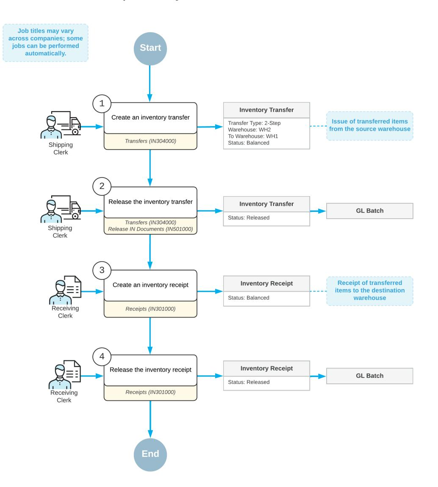
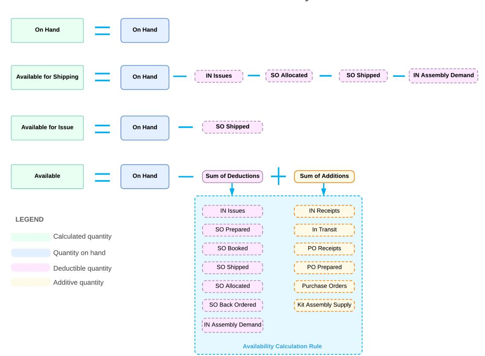
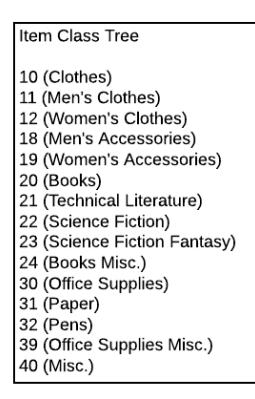
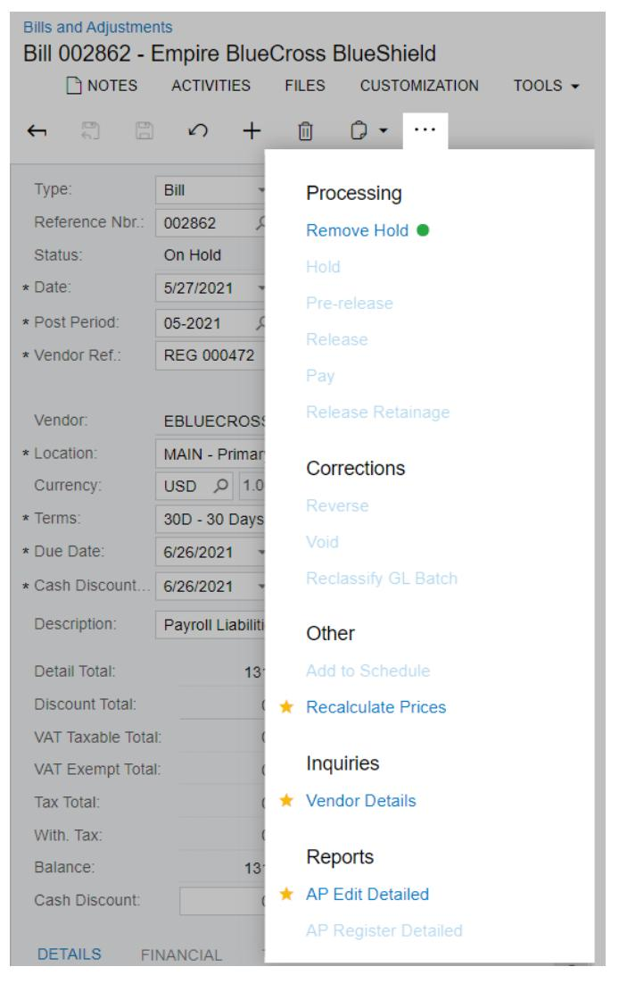

# **Inventory 2025 R1**

## **Contents**

| Copyright7                                                                        |  |
|-----------------------------------------------------------------------------------|--|
| Overview of the Inventory Processes 8                                             |  |
| Warehouses in Acumatica ERP 12                                                    |  |
| Managing Warehouses14                                                             |  |
| Warehouses: General Information 14                                                |  |
| Warehouses: Configuration Prerequisites 16                                        |  |
| Warehouses: Implementation Activity16                                             |  |
| Warehouses: Related Report and Inquiry Forms 20                                   |  |
| Managing Warehouse Locations and Processing Single-Step Transfers 22              |  |
| Warehouse Locations and Single-Step Transfers: General Information 22             |  |
| Warehouse Locations and Single-Step Transfers: Configuration Prerequisites 25     |  |
| Warehouse Locations and Single-Step Transfers: Implementation Activity25          |  |
| Warehouse Locations and Single-Step Transfers: Mass Processing of Documents26     |  |
| Warehouse Locations and Single-Step Transfers: Process Activity26                 |  |
| Warehouse Locations and Single-Step Transfers: Related Report and Inquiry Forms29 |  |
| Processing Two-Step Inventory Transfers 30                                        |  |
| Two-Step Transfers: General Information 30                                        |  |
| Two-Step Transfers: Implementation Checklist32                                    |  |
| Two-Step Transfers: Generated Transactions 33                                     |  |
| Two-Step Transfers: Mass Processing of Documents33                                |  |
| Two-Step Transfers: Process Activity34                                            |  |
| Two-Step Transfers: Related Report and Inquiry Forms 37                           |  |
| Creating Reason Codes for Inventory Transactions38                                |  |
| Reason Codes: General Information38                                               |  |
| Reason Codes: Configuration Prerequisites39                                       |  |
| Reason Codes: Implementation Activity 40                                          |  |
| Creating Posting Classes 43                                                       |  |
| Posting Classes: General Information43                                            |  |
| Posting Classes: Configuration Prerequisites46                                    |  |
| Posting Classes: Implementation Activity 46                                       |  |
| Creating Units of Measure 49                                                      |  |
| Units of Measure: General Information 49                                          |  |
| Units of Measure: Configuration Prerequisites 51                                  |  |
| Units of Measure: Implementation Activity51                                       |  |

| Creating Availability Calculation Rules 54                                               |  |
|------------------------------------------------------------------------------------------|--|
| Availability Calculation Rules: General Information54                                    |  |
| Availability Calculation Rules: Configuration Prerequisites58                            |  |
| Availability Calculation Rules: Implementation Activity 58                               |  |
| Availability Calculation Rules: Related Report and Inquiry Forms 59                      |  |
| Creating Item Classes for Stock Items 61                                                 |  |
| Item Classes for Stock Items: General Information 61                                     |  |
| Item Classes for Stock Items: Configuration Prerequisites 62                             |  |
| Item Classes for Stock Items: Implementation Activity63                                  |  |
| Item Classes for Stock Items: Related Reports and Inquiries64                            |  |
| Creating Stock Items66                                                                   |  |
| Stock Items: General Information66                                                       |  |
| Stock Items: Identifiers of Items67                                                      |  |
| Stock Items: Units of Measure 68                                                         |  |
| Stock Items: Units of Measure That Are Not Divisible 70                                  |  |
| Stock Items: Configuration Prerequisites72                                               |  |
| Stock Items: Implementation Activity 72                                                  |  |
| Stock Items: Change of an Inventory Account for an Item73                                |  |
| Stock Items: Attributes 74                                                               |  |
| Stock Items: Report and Inquiry Forms 75                                                 |  |
| Managing Items with Lot and Serial Numbers 76                                            |  |
| Items with Lot and Serial Numbers: General Information 76                                |  |
| Items with Lot and Serial Numbers: Tracking Settings 79                                  |  |
| Items with Lot and Serial Numbers: Numbering Settings80                                  |  |
| Items with Lot and Serial Numbers: Lot and Serial Attributes82                           |  |
| Items with Lot and Serial Numbers: Implementation Checklist 84                           |  |
| Items with Lot and Serial Numbers: Implementation Activity85                             |  |
| Items with Lot and Serial Numbers: To Purchase and Sell Serialized Items 90              |  |
| Items with Lot and Serial Numbers: To Sell Items in Lots94                               |  |
| Items with Lot and Serial Numbers: To Purchase and Sell Lot-Numbered Items that Expire97 |  |
| Items with Lot and Serial Numbers: Related Report and Inquiry Forms101                   |  |
| Managing Matrix Items103                                                                 |  |
| Matrix Items: General Information103                                                     |  |
| Matrix Items: Configuration Prerequisites105                                             |  |
| Matrix Items: Implementation Activity 105                                                |  |
| Matrix Items: To Purchase Matrix Items 112                                               |  |

| Matrix Items: To Sell Matrix Items115                     |  |
|-----------------------------------------------------------|--|
| Matrix Items: Related Report and Inquiry Forms118         |  |
| Creating Non-Stock Items119                               |  |
| Non-Stock Items: General Information119                   |  |
| Non-Stock Items: Identifiers of Items121                  |  |
| Non-Stock Items: Rules of Line Completion and Closure 121 |  |
| Non-Stock Items: Configuration Prerequisites122           |  |
| Non-Stock Items: Implementation Activity 122              |  |
| Non-Stock Items: Related Forms and Reports124             |  |
| Creating Service Items 125                                |  |
| Service Items: General Information125                     |  |
| Service Items: Configuration Prerequisites126             |  |
| Service Items: Implementation Activity 126                |  |
| Service Items: Related Forms127                           |  |
| Security of Inventory Entities 129                        |  |
| Inventory Item Security129                                |  |
| Warehouse Security130                                     |  |
| Managing Inventory Kits133                                |  |
| Inventory Item Kits 133                                   |  |
| Stock Kits135                                             |  |
| Non-Stock Kits138                                         |  |
| To Create a Stock Kit 139                                 |  |
| To Create a Specification for a Stock Kit140              |  |
| To Add a Revision to a Stock Kit 141                      |  |
| To Assemble a Stock Kit 142                               |  |
| To Disassemble a Stock Kit 143                            |  |
| To Create a Non-Stock Kit 144                             |  |
| To Create a Specification for a Non-Stock Kit145          |  |
| Managing Hierarchical Item Classes 147                    |  |
| Hierarchy of Item Classes 147                             |  |
| Managing Item Cross-References151                         |  |
| Item Cross-References151                                  |  |
| Barcode Support155                                        |  |
| Managing Subitems157                                      |  |
| Inventory Subitems 157                                    |  |
| Processing Inventory Transactions 160                     |  |

| Inventory Receipt Processing163 Inventory Issue Processing165 To Enter an Inventory Receipt168 To Enter an Inventory Issue of the Issue Type 169 To Enter an Inventory Issue of the Invoice Type169 To Enter an Inventory Adjustment170 |  |
|--------------------------------------------------------------------------------------------------------------------------------------------------------------------------------------------------------------------------------------------------------|--|
|                                                                                                                                                                                                                                                        |  |
|                                                                                                                                                                                                                                                        |  |
|                                                                                                                                                                                                                                                        |  |
|                                                                                                                                                                                                                                                        |  |
|                                                                                                                                                                                                                                                        |  |
|                                                                                                                                                                                                                                                        |  |
| Configuring Basic Inventory Processes 172                                                                                                                                                                                                              |  |
| Configuration of Physical Inventory 172                                                                                                                                                                                                                |  |
| Types of Physical Inventory 173                                                                                                                                                                                                                        |  |
| To Create a PI Type for a Full Count 176                                                                                                                                                                                                               |  |
| Configuring Advanced Physical Inventory 178                                                                                                                                                                                                            |  |
| Inventory Ranking Methods 178                                                                                                                                                                                                                          |  |
| Cycle Counting Configuration 180                                                                                                                                                                                                                       |  |
| To Create Physical Inventory Cycles181                                                                                                                                                                                                                 |  |
| To Assign a Stock Item to a Physical Inventory Cycle 182                                                                                                                                                                                               |  |
| To Create a Physical Inventory Type for Counts by Cycles182                                                                                                                                                                                            |  |
| To Create a Physical Inventory Type for Cycle Counts by Frequency 183                                                                                                                                                                                  |  |
| Configuration of Physical Inventory Counts by ABC Codes 184                                                                                                                                                                                            |  |
| To Create ABC Codes185                                                                                                                                                                                                                                 |  |
| To Assign an ABC Code to a Stock Item 185                                                                                                                                                                                                              |  |
| To Create a Physical Inventory Type for an ABC Code 186                                                                                                                                                                                                |  |
| To Create a Physical Inventory Type for Counts by ABC Code and Frequency187                                                                                                                                                                            |  |
| Managing Item Costs and Valuation Methods 188                                                                                                                                                                                                          |  |
| Item Costs and Valuation Methods: General Information 188                                                                                                                                                                                              |  |
| Item Costs and Valuation Methods: Implementation Checklist190                                                                                                                                                                                          |  |
| Item Costs and Valuation Methods: Transactions That Record Costs in Layers 190                                                                                                                                                                         |  |
| Item Costs and Valuation Methods: Average Method 192                                                                                                                                                                                                   |  |
|                                                                                                                                                                                                                                                        |  |
| Item Costs and Valuation Methods: To Sell Items with the Average Method 193                                                                                                                                                                            |  |
| Item Costs and Valuation Methods: FIFO Method197                                                                                                                                                                                                       |  |
| Item Costs and Valuation Methods: To Sell Items with the FIFO Method 197                                                                                                                                                                               |  |
| Item Costs and Valuation Methods: Specific Method 201                                                                                                                                                                                                  |  |
| Item Costs and Valuation Methods: To Sell Items with the Specific Method202                                                                                                                                                                            |  |
| Item Costs and Valuation Methods: Standard Method207                                                                                                                                                                                                   |  |
| Item Costs and Valuation Methods: To Sell Items with the Standard Method 208                                                                                                                                                                           |  |

| Item Costs and Valuation Methods: Items with a Negative On-Hand Quantity212 |  |
|-----------------------------------------------------------------------------|--|
| Item Costs and Valuation Methods: Related Forms and Reports213              |  |
| Counting Physical Inventory215                                              |  |
| Physical Inventory Counts215                                                |  |
| Preparation for Physical Count218                                           |  |
| To Prepare a Physical Inventory Count221                                    |  |
| To Export a Count Sheet to an Excel Spreadsheet222                          |  |
| To Print Count Sheets 223                                                   |  |
| To Print Tags 223                                                           |  |
| To Enter the Count Data224                                                  |  |
| To Enter the Count Data for New Items 224                                   |  |
| To Import the Count Data From an Excel Spreadsheet 225                      |  |
| To Complete the Physical Inventory Count226                                 |  |
| Closing Inventory Periods227                                                |  |
| Financial Period Closing in the Inventory Subledger 227                     |  |
| Reconciliation of the Cost of Inventory with the Account Balance228         |  |
| To Review Unprocessed Inventory Transactions 232                            |  |
| To Close Financial Periods in Inventory 232                                 |  |
| To Reopen a Financial Period in Inventory 233                               |  |
| Calculating Inventory Turnover235                                           |  |
| Inventory Turnover: General Information 235                                 |  |
| Inventory Turnover: Mass-Processing of Calculations 237                     |  |
| Inventory Turnover: To Calculate Inventory Turnover 237                     |  |
| Changing Stock Status of Items240                                           |  |
| Stock Status of Items: General Information240                               |  |
| Appendix243                                                                 |  |
| Reports 243                                                                 |  |
| Report Form243                                                              |  |
| Report248                                                                   |  |
| Form Toolbar and More Menu250                                               |  |
| Table Toolbar 257                                                           |  |

## **Copyright**

#### **© 2025 Acumatica, Inc.**

#### **ALL RIGHTS RESERVED.**

No part of this document may be reproduced, copied, or transmitted without the express prior consent of Acumatica, Inc.

3075 112th Avenue NE, Suite 200, Bellevue, WA 98004, USA

### **Restricted Rights**

The product is provided with restricted rights. Use, duplication, or disclosure by the United States Government is subject to restrictions as set forth in the applicable License and Services Agreement and in subparagraph (c)(1)(ii) of the Rights in Technical Data and Computer Soware clause at DFARS 252.227-7013 or subparagraphs (c)(1) and (c)(2) of the Commercial Computer Soware-Restricted Rights at 48 CFR 52.227-19, as applicable.

### **Disclaimer**

Acumatica, Inc. makes no representations or warranties with respect to the contents or use of this document, and specifically disclaims any express or implied warranties of merchantability or fitness for any particular purpose. Further, Acumatica, Inc. reserves the right to revise this document and make changes in its content at any time, without obligation to notify any person or entity of such revisions or changes.

### **Trademarks**

Acumatica is a registered trademark of Acumatica, Inc. HubSpot is a registered trademark of HubSpot, Inc. Microso Exchange and Microso Exchange Server are registered trademarks of Microso Corporation. All other product names and services herein are trademarks or service marks of their respective companies.

Soware Version: 2025 R1 Last Updated: 06/01/2025

## **Overview of the Inventory Processes**

The inventory functionality of Acumatica ERP provides real-time access to stock item availability data configured in accordance with your company's policies. You can maintain a perpetual inventory system while also performing physical inventories as full inventory counts and counts by cycles. In Acumatica ERP, you can track items by either lot or serial numbers, as well as by expiration dates. By using multiple valuation methods, you can accurately maintain item costs and trace cost flows. By using flexible posting settings, you can meet any regulatory requirements.

The full inventory functionality is available only if the *Inventory* feature is enabled on the *[Enable/Disable Features](https://help-2025r1.acumatica.com/Help?ScreenId=ShowWiki&pageid=c1555e43-1bc5-4f6f-ba9d-b323f94d8a6b)* (CS100000) form.

### **Stock and Non-Stock Inventory Items**

Inventory items are the goods, products, services, and component parts recorded to and tracked in your system database. Inventory items can be divided into two major categories, stock and non-stock items, based on how they are handled and accounted for. By using restriction groups, you can control the visibility of particular inventory items to employees. For more information, see the following topics:

- *[Stock Items: General Information](#page-65-2)*
- *[Non-Stock Items: General Information](#page-118-2)*
- *[Inventory Item Security](#page-128-2)*

### **Flexible Item Identifiers and Support of Alternative IDs**

By using configurable inventory IDs, you can uniquely identify inventory items. If you use subitems in your system, you can further subdivide items by size, color, material, and other criteria that apply to your business. You can easily gather additional business-specific data about inventory items by configuring custom fields, called *attributes*. Also, on purchase and sales orders, you can use barcodes or vendor or customer alternative IDs to find items or record item information. For more information, see the following topics:

- *[Inventory Subitems](#page-156-2)*
- *[Stock Items: Attributes](#page-73-1)*
- *[Item Cross-References](#page-150-2)*
- *[Barcode Support](#page-154-1)*

### **Global and Item-Specific UOMs**

You can use an unlimited number of units of measure (UOMs) in your system. Commonly used units of measure —liters, gallons, pounds, and kilograms—can be defined globally and then used as base units of measure for specific item classes or particular products. You can define conversion rules between UOMs (such as pounds and kilograms).

You can specify UOMs and conversion rules at the item class and item level—cases or boxes intended for different products can be of different capacities. Once you have defined conversion rules, the system automatically makes conversions to the correct unit of measure when necessary.

If the *Multiple Units of Measure* feature is enabled on the *[Enable/Disable Features](https://help-2025r1.acumatica.com/Help?ScreenId=ShowWiki&pageid=c1555e43-1bc5-4f6f-ba9d-b323f94d8a6b)* (CS100000) form, for each item, you can define, in addition to the base UOM, the purchase UOM to be used to measure item quantity on purchase orders and receipts and the sales unit to measure the item quantities on sales orders and invoices. Prices for base UOMs and sales UOMs can be set as independent prices, if needed.

For more information, see *[Units of Measure: General Information](#page-48-2)*.

### **Multiple Warehouses and Locations**

In Acumatica ERP, you can maintain a complex warehouse structure, defining multiple warehouses with multiple locations within each. This functionality is available if you enable the *Multiple Warehouses* and *Multiple Warehouse Locations* features on the *[Enable/Disable Features](https://help-2025r1.acumatica.com/Help?ScreenId=ShowWiki&pageid=c1555e43-1bc5-4f6f-ba9d-b323f94d8a6b)* (CS100000) form.

By configuring segmentation for location identifiers, you can maintain a hierarchy of rooms, rows, levels, shelves, bins, and other divisions. For each location, you can define which inventory operations can be performed there. You can also specify a primary inventory item or primary item class, and set up validation so that if a preferred item is specified and the validation is turned on, only the preferred item can be received at the location.

By using security functionality, you can restrict the visibility of warehouse information to groups of authorized users. For more information, see the following topics:

- *[Warehouses](#page-11-0) in Acumatica ERP*
- *[Warehouses:](#page-13-2) General Information*
- *Warehouse Locations and [Single-Step](#page-21-2) Transfers: General Information*
- *[Warehouse](#page-129-1) Security*

### **Flexible Posting Settings**

You can set up the system to automatically update the general ledger on release of inventory documents. Posting classes assigned to inventory items define the rules for selecting particular general ledger accounts and subaccounts to be updated when transactions with the items are performed. Reason codes for inventory transactions provide the offset accounts to be updated, depending on the type of inventory transactions. For more information, see the following topics:

- *[Posting Classes: General Information](#page-42-2)*
- *[Reason Codes: General Information](#page-37-2)*

### **Inventory Transactions**

In Acumatica ERP, you can create the following types of documents to record inventory transactions: receipt, issue, adjustment, transfer, and kit assembly. Inventory documents facilitate accounting for transactions that result in changed inventory quantities and costs.

For more information about inventory transactions, see *Inventory [Transactions](#page-159-2)*.

### **Availability Calculation**

Acumatica ERP provides real-time visibility into the available inventory levels. The way availability data is calculated can be configured in accordance with the policies set in your company. Availability calculation rules are specified for item classes. You can create multiple rules with different calculation settings and assign them to different item classes. The availability data of items is shown on sales orders, purchase orders, and kit assemblies. For more information, see *Availability Calculation Rules: General [Information](#page-53-2)*.

### **Lot and Serial Number Tracking**

You can track stock items by lot or serial numbers and by expiration dates if the *Lot and Serial Tracking* feature is enabled on the *[Enable/Disable Features](https://help-2025r1.acumatica.com/Help?ScreenId=ShowWiki&pageid=c1555e43-1bc5-4f6f-ba9d-b323f94d8a6b)* (CS100000) form. Acumatica ERP provides flexible numbering schemes for lot and serial numbers, and the ability to track different products differently. For more information about the use of lot and serial numbers, see the following topics:

- *[Items with Lot and Serial Numbers: General Information](#page-75-2)*
- *Items with Lot and Serial [Numbers:](#page-78-1) Tracking Settings*

• *[Items with Lot and Serial Numbers: Numbering Settings](#page-79-1)*

### **Kit Assembling**

In Acumatica ERP, some stock or non-stock items may be kits made up of other inventory items. Non-stock kits can include both non-stock and stock components and are not recorded. Stock components of non-stock kits are processed as if they are managed separately not within a kit. Stock kits also can include both stock and non-stock components, but these kits are recorded and are regarded as individual items.

For more information about kits, see *[Inventory Item Kits](#page-132-2)*.

#### **Inventory Valuation**

By using a perpetual inventory system, which Acumatica ERP enables, your company can estimate the total cost of its inventory at any moment, because on-hand quantities and inventory account balances are updated with every transaction, purchase, or sale. Periodic revision of standard costs for items with standard cost valuation methods results in the revaluation of the cost of inventory. Periodic updates of base prices can be performed automatically. For more information on inventory valuation, see the following topics:

- *Item Costs and Valuation Methods: General [Information](#page-187-2)*
- *[Sales Prices: General Information](https://help-2025r1.acumatica.com/Help?ScreenId=ShowWiki&pageid=d63d6b6c-15ee-4576-bf27-8de69f8f5da6)*

### **Physical Inventories**

By using Acumatica ERP, your company can maintain a perpetual inventory system with the combination of full physical inventory and cycle counting that best fits the company policies and goals. Count data can be imported from Excel files or entered manually by multiple employees working simultaneously on multiple computers. The information from these counts provides company managers with exact values of stock levels. For more information, see the following topics:

- *[Configuration of Physical Inventory](#page-171-2)*
- *Types of Physical [Inventory](#page-172-1)*
- *[Cycle Counting Configuration](#page-179-1)*
- *[Inventory Ranking Methods](#page-177-2)*
- *[Configuration of Physical Inventory Counts by ABC Codes](#page-183-1)*
- *[Physical Inventory Counts](#page-214-2)*
- *[Preparation for Physical Count](#page-217-1)*

### **Automated Replenishment**

In Acumatica ERP, you can configure automated replenishment of stock items. Flexible, automated replenishment ensures that for items requiring replenishment, the right quantities will be calculated and listed on automatically generated purchase orders. Moreover, you can use the predicted average daily demand, calculated with the help of demand forecasting methods, to periodically update the values of replenishment parameters (such as maximum quantity, reorder point, and safety stock) to more precisely calculate the quantities required for replenishment. For more information, see the following topics:

- *[Configuration of Replenishment: General Information](https://help-2025r1.acumatica.com/Help?ScreenId=ShowWiki&pageid=6fd9f00f-9ed5-4f00-8bb2-9cdfee222074)*
- *[Configuration of Replenishment: Classes and Sources of Replenishment](https://help-2025r1.acumatica.com/Help?ScreenId=ShowWiki&pageid=63ba985c-3c4a-4cf0-81ad-f509e328f2c1)*
- *[Configuration of Replenishment: Replenishment Methods](https://help-2025r1.acumatica.com/Help?ScreenId=ShowWiki&pageid=c961e0d4-e87d-4099-b6e6-431a00ad471a)*
- *[Configuration of Replenishment: Demand Forecast Model](https://help-2025r1.acumatica.com/Help?ScreenId=ShowWiki&pageid=d0bf7375-ba06-4664-a26e-2d656615e629)*

### **Financial Period Closing in the Inventory module**

When accountants close financial periods in the system, they must close periods in all subledgers that your Acumatica ERP instance uses. Before closing periods in the inventory subledger, you have to review all unprocessed transactions and process or delete them. For more information, see the following topics:

- *[Financial Period Closing in the Inventory Subledger](#page-226-2)*
- *[Reconciliation of the Cost of Inventory with the Account Balance](#page-227-1)*

### **Other Features and Options**

Acumatica ERP also provides the following inventory features:

- The ability to quickly add product images to the inventory item record.
- Tracking of items by product workgroup or product manager.
- Item availability data displayed when you create a sales or a purchase order.
- The ability to print count sheets, tags, and item and location labels, to facilitate the counting process.
- For perishable items, tracking of expiration dates, with alerts displayed about expired items.
- The ability to set up the automatic issue of items by expiration date.
- Segmented identifiers for locations, to make it easier to locate stock. By using segments, you can define further detail levels of locations, such as rooms, shelves, and bins.

## **Warehouses in Acumatica ERP**

If your organization keeps any physical items on site that are currently unused but expected to be used or sold, it uses storage for these items. Your storage can be as small as a shelf with dozens of office supplies in a back office or as large as multiple physical warehouses with billions of goods situated in different regions or even countries.

If you want to track your stored items in Acumatica ERP, you can use the functionality of warehouses and locations and choose the approach that best fits your business. You can configure a single warehouse or multiple warehouses. Within each warehouse, you can define a single location or multiple locations. In this topic, you will find general information about warehouses in Acumatica ERP.

### **Warehouses and Locations in Acumatica ERP**

In Acumatica ERP, a warehouse does not necessarily represent a physical building where your inventory is stocked. You can divide a large physical storage space into multiple areas and define each area as a warehouse in Acumatica ERP. A warehouse can even be virtual: for example, you might want to treat all goods that are on the way from the supplier to you as though they are located in a goods-in-transit warehouse.

You can use any of the following structures of warehouses and locations and define these entities accordingly in Acumatica ERP:

- One warehouse with one location: You use this structure when you have a small number of inventory items and it's not important for you to track in which room or on which shelf these items are stored. For more information, see *Basic [Warehouse](#page-11-1) Structure*.
- One warehouse with multiple locations: You use this structure when you have one physical space and need to track the locations within it and the items in these locations. For example, you might have one physical room with many numbered shelves (to be defined as locations). Or you might have multiple rooms with shelves and boxes (and each location will be defined by the room, shelf, and box). With multiple locations defined you are able to register in the system the exact placement of each inventory item.
- Multiple warehouses with one location in each warehouse: You use this structure when you store items in multiple physical rooms or buildings (each of which will be defined as a warehouse in the system), and each storage place (to be defined as a location) holds a small number of items, which warehouse employees can easily find without needing more specific details.
- Multiple warehouses with multiple locations in each warehouse: You use this structure when you have a distributed network of warehouses that hold a variety of goods in different locations.
- Multiple warehouses, which can have any number of locations: You use this structure when you have multiple warehouses, which vary in terms of whether they have multiple locations within them or just one location. For example, this structure might be used if you have a large distribution center from where goods are sent to multiple small warehouses.

For more information, see *[Warehouses:](#page-13-2) General Information* and *Warehouse Locations and [Single-Step](#page-21-2) Transfers: [General Information](#page-21-2)*.

### **Basic Warehouse Structure**

When you have just a few items to keep in a small storage area, you can use the basic warehouse functionality in Acumatica ERP. The basic functionality is available when you have the following license settings on the *[Enable/](https://help-2025r1.acumatica.com/Help?ScreenId=ShowWiki&pageid=c1555e43-1bc5-4f6f-ba9d-b323f94d8a6b) [Disable Features](https://help-2025r1.acumatica.com/Help?ScreenId=ShowWiki&pageid=c1555e43-1bc5-4f6f-ba9d-b323f94d8a6b)* (CS100000) form:

- The *Inventory* feature is enabled.
- The *Multiple Warehouses* and *Multiple Warehouse Locations* features (which provide more advanced functionality) are disabled.

When you specify and save the inventory settings on the *[Inventory Preferences](https://help-2025r1.acumatica.com/Help?ScreenId=ShowWiki&pageid=f2eb4e55-f802-4259-a41f-609965c856f1)* (IN101000) form (as described in *[Configuration of Order Management: Implementation Activity](https://help-2025r1.acumatica.com/Help?ScreenId=ShowWiki&pageid=00568016-4501-4fbe-8a5b-c368af01e57d)*), the system creates the default warehouse and assigns *MAIN* as the warehouse ID.

With the features noted above enabled and disabled, the ID of the only warehouse, *MAIN*, is not displayed on data entry forms for simplicity. However, this warehouse ID will be used automatically in all inventory transactions.

If needed, you can change the identifier of the *MAIN* warehouse on the *[Warehouses](https://help-2025r1.acumatica.com/Help?ScreenId=ShowWiki&pageid=264b0ef7-2b6c-40b4-a7d9-f1a5e067939b)* (IN204000) form by selecting this warehouse on the form, clicking **Change ID** on the More menu, and specifying a new identifier in the dialog box that opens.

When the *Multiple Warehouses* feature is not enabled on the *[Enable/Disable Features](https://help-2025r1.acumatica.com/Help?ScreenId=ShowWiki&pageid=c1555e43-1bc5-4f6f-ba9d-b323f94d8a6b)* form, the *[Warehouses](https://help-2025r1.acumatica.com/Help?ScreenId=ShowWiki&pageid=264b0ef7-2b6c-40b4-a7d9-f1a5e067939b)* form displays the **Warehouse ID** box and no other elements. The following settings are specified for the default warehouse but are hidden from this form:

- **Replenishment Class**: *Purchase*
- **Default Cost of Returns**: *Average*

For the default warehouse, the system creates a default location that the goods will be received to and issued from and assigns *MAIN* as the location ID. If the *Multiple Warehouse Locations* feature is disabled on the *[Enable/Disable](https://help-2025r1.acumatica.com/Help?ScreenId=ShowWiki&pageid=c1555e43-1bc5-4f6f-ba9d-b323f94d8a6b) [Features](https://help-2025r1.acumatica.com/Help?ScreenId=ShowWiki&pageid=c1555e43-1bc5-4f6f-ba9d-b323f94d8a6b)* form, the *MAIN* location has the following settings, although they are not displayed on the *[Warehouses](https://help-2025r1.acumatica.com/Help?ScreenId=ShowWiki&pageid=264b0ef7-2b6c-40b4-a7d9-f1a5e067939b)* form:

- **Active**: Selected
- **Include in Qty. Available**: Selected
- **CostSeparately**: Cleared
- **Sales Allowed**: Selected
- **Receipts Allowed**: Selected
- **Transfers Allowed**: Selected
- **Assembly Allowed**: Selected

## **Managing Warehouses**

When your organization has multiple buildings, storage rooms, or other facilities for storing inventory items, you can create multiple warehouses in Acumatica ERP to track and process inventory appropriately for each warehouse. You can manage multiple warehouses in the system when the *Multiple Warehouses* feature is enabled on the *[Enable/Disable Features](https://help-2025r1.acumatica.com/Help?ScreenId=ShowWiki&pageid=c1555e43-1bc5-4f6f-ba9d-b323f94d8a6b)* (CS100000) form.

In this chapter, you will read about creating warehouses and specifying the settings of various entities related to warehouses.

### **Warehouses: General Information**

When your organization has multiple buildings, storage rooms, or other facilities for storing inventory items, you can create multiple warehouses in Acumatica ERP to process and track inventory appropriately for each warehouse.

With the *Multiple Warehouses* feature enabled on the *[Enable/Disable Features](https://help-2025r1.acumatica.com/Help?ScreenId=ShowWiki&pageid=c1555e43-1bc5-4f6f-ba9d-b323f94d8a6b)* (CS100000) form, you can create any number of warehouses, even virtual warehouses, in the way that best fits your business, with the needed settings for each warehouse. In the following sections, you will read about the management of multiple warehouses in Acumatica ERP.

### **Learning Objectives**

In this chapter, you will do the following:

- Prepare the system for the creation of warehouses
- Create warehouses
- Specify warehouse-specific settings for stock items and prices
- Use a warehouse as a source of GL accounts for posting classes

### **Applicable Scenarios**

You may need to create warehouses in either of the following cases:

- You initially configure inventory with multiple warehouses in Acumatica ERP.
- Your organization adds a new physical or virtual warehouse and needs to define the warehouse in Acumatica ERP.

### **Multiple Warehouses in Acumatica ERP**

In Acumatica ERP, you can implement any of the following typical use cases with multiple warehouses:

• In each warehouse, you store a specific set of goods, which is not stored in other warehouses. Each warehouse receives purchased goods directly from vendors. You do not need to transfer goods between warehouses.

As an example of this use case, suppose that your organization sells fruits and juicers. You may have a separate warehouse with refrigeration facilities for fruits and a separate warehouse with no special storage conditions for juicers.

• You store goods of the same type (as well as goods of different types) in multiple warehouses, which can receive purchased goods directly from vendors. Also, you can perform transfers between warehouses, relocating stock items as needed.

As an example of this use case, suppose that your organization sells fruits to wholesale and retail customers. You have a wholesale center with a large warehouse, and multiple small shops with local warehouses. The shops can either transfer fruits from the wholesale warehouse or buy fruits directly from local vendors.

• You use one warehouse as a distribution center and transfer its goods to other warehouses. Only the distribution center directly receives goods from vendors.

As an example of this use case, suppose that your organization has a wide network of supermarkets. You have a distribution center with a large warehouse and each supermarket has its own warehouse. You purchase items only in the distribution center and then transfer these items to supermarkets.

You can implement any other use cases where multiple warehouses are involved.

### **Functionality Related to Multiple Warehouses**

When you enable the *Multiple Warehouses* feature on the *[Enable/Disable Features](https://help-2025r1.acumatica.com/Help?ScreenId=ShowWiki&pageid=c1555e43-1bc5-4f6f-ba9d-b323f94d8a6b)* (CS100000) form, the following functionality becomes available in the system:

- Warehouse-specific settings for stock items: If the details of stocking a particular inventory item vary in different warehouses, you can specify separate details for the item at each warehouse (that is, specify details for the item–warehouse pair) on the *Item [Warehouse](https://help-2025r1.acumatica.com/Help?ScreenId=ShowWiki&pageid=ae2418af-7f53-4c09-8766-556452d8f8b8) Details* (IN204500) form. You can view these warehouse-specific settings of a selected item on the **Warehouses** tab of the *[Stock Items](https://help-2025r1.acumatica.com/Help?ScreenId=ShowWiki&pageid=77786a70-1f1e-4d63-ad98-96f98e4fcb0e)* (IN202500) form. For more information, see the *[Warehouse-Specific](#page-14-0) Settings for Stock Items* section of this topic.
- The warehouse as a source for general ledger accounts: If you store inventory items of the same category in multiple warehouses and each warehouse has specific general ledger accounts specified on the *[Warehouses](https://help-2025r1.acumatica.com/Help?ScreenId=ShowWiki&pageid=264b0ef7-2b6c-40b4-a7d9-f1a5e067939b)* (IN204000) form, you can use the warehouse as a source of default GL accounts for any inventory item. For details, see the *[Warehouse](#page-15-2) as a Source of GL Accounts for Posting Classes* section of this topic.
- The *TR* order type for sales with transfers: If you use multiple warehouses, you can implement a sales process that involves transferring items between warehouses. To reflect this process in documents, you need to activate the *TR* order type on the *Order [Types](https://help-2025r1.acumatica.com/Help?ScreenId=ShowWiki&pageid=e6984218-4260-4438-99e1-aee2b3765369)* (SO201000) form.
- Warehouse-specific vendor and sales prices: You can define warehouse-specific sales prices and vendor prices for items. For more information, see the *[Warehouse-Specific](#page-15-3) Prices* section of this topic.
- Inventory transfers: If your organization has multiple warehouses, you can transfer items between warehouses. To track these movements of items, you can use inventory transfers, which you create on the *[Transfers](https://help-2025r1.acumatica.com/Help?ScreenId=ShowWiki&pageid=ea1539b6-fafa-443e-8b49-cd1ced95389f)* (IN304000) form. For details, see *Two-Step Transfers: General [Information](#page-29-2)*.

### **Warehouse-Specific Settings for Stock Items**

For each stock item at a particular warehouse (that is, for each item–warehouse pair), you can specify the following settings on the *Item [Warehouse](https://help-2025r1.acumatica.com/Help?ScreenId=ShowWiki&pageid=ae2418af-7f53-4c09-8766-556452d8f8b8) Details* (IN204500) form:

- The default locations for issuing and receiving the item at this warehouse (if you use multiple locations)
- The inventory account to be used for the stock item at this warehouse
- The ABC code and movement class assigned to the item when it is at this warehouse
- The replenishment settings for the item when it is stocked in this warehouse

The system also creates an entity for an item–warehouse pair on the *Item [Warehouse](https://help-2025r1.acumatica.com/Help?ScreenId=ShowWiki&pageid=ae2418af-7f53-4c09-8766-556452d8f8b8) Details* form in the following cases:

- When any user specifies or changes the default warehouse for an inventory item on the **Warehouses** tab of the *[Stock Items](https://help-2025r1.acumatica.com/Help?ScreenId=ShowWiki&pageid=77786a70-1f1e-4d63-ad98-96f98e4fcb0e)* (IN202500) form.
- When any user releases the first inventory receipt of a particular item coming to the new warehouse (or another transaction that brings an item to a warehouse for the first time, such as the receiving part of an inventory transfer).

### **Warehouse as a Source of GL Accounts for Posting Classes**

A posting class, which is specified for each stock item, is a group of settings that provide the default values for the purchase, sales, and inventory transactions with the item and define how these transactions will be posted to the general ledger. One of these default values is the source of general ledger accounts to be used for the item, and you can use a warehouse as a source of default GL accounts for an inventory item. You define the source of accounts that the system should use in a posting class by using the *[Posting Classes](https://help-2025r1.acumatica.com/Help?ScreenId=ShowWiki&pageid=edd4bd77-13f5-4e89-9e47-2861fc66bbb0)* (IN206000) form.

For example, suppose that you have a separate inventory account for each warehouse. In this case, you can specify the needed inventory account in the warehouse settings on the *[Warehouses](https://help-2025r1.acumatica.com/Help?ScreenId=ShowWiki&pageid=264b0ef7-2b6c-40b4-a7d9-f1a5e067939b)* (IN204000) form and specify a warehouse as the source of the inventory account in the posting class on the *[Posting Classes](https://help-2025r1.acumatica.com/Help?ScreenId=ShowWiki&pageid=edd4bd77-13f5-4e89-9e47-2861fc66bbb0)* form.

For more information about posting classes, see *[Posting Classes: General Information](#page-42-2)*.

### **Warehouse-Specific Prices**

In Acumatica ERP, you can define vendor and sales prices of an item and select a warehouse for these prices. If no warehouse is specified for a price on the *Vendor Price [Worksheets](https://help-2025r1.acumatica.com/Help?ScreenId=ShowWiki&pageid=793d5d6c-e530-4f19-996d-4a3bfd7ce690)* (AP202010) or *[Sales Prices](https://help-2025r1.acumatica.com/Help?ScreenId=ShowWiki&pageid=62bfca2c-0893-495b-bb1d-125b64899afc)* (AR202000) forms, this price is applied to all warehouses that are defined in the system. A price that has a warehouse specified has a higher priority than a price of the same type with no warehouse selected. For example, a promotional customer price that is specific to a warehouse has a higher priority than a promotional customer price with no warehouse specified. For more information, see *[Sales Prices: General Information](https://help-2025r1.acumatica.com/Help?ScreenId=ShowWiki&pageid=d63d6b6c-15ee-4576-bf27-8de69f8f5da6)* and *Vendor Prices: General [Information](https://help-2025r1.acumatica.com/Help?ScreenId=ShowWiki&pageid=b8a92f04-1346-443b-aba0-9809a9d996e0)*.

The system does not use warehouse-specific prices in accounts payable and accounts receivable documents, because these documents do not include warehouse information.

### **Warehouses: Configuration Prerequisites**

Before starting to create warehouses, you should be sure that the needed feature has been enabled and the system has been configured properly, as described in the following sections.

### **Enabling the Needed Features**

The ability to manage multiple warehouses in the system becomes available when you enable the *Multiple Warehouses* feature on the *[Enable/Disable Features](https://help-2025r1.acumatica.com/Help?ScreenId=ShowWiki&pageid=c1555e43-1bc5-4f6f-ba9d-b323f94d8a6b)* (CS100000) form.

### **Configuring the System**

Before you create warehouses, you need to make sure that on the *[Inventory Preferences](https://help-2025r1.acumatica.com/Help?ScreenId=ShowWiki&pageid=f2eb4e55-f802-4259-a41f-609965c856f1)* (IN101000) form, all required preferences have been configured. For details, see *[Configuration of Order Management: Implementation](https://help-2025r1.acumatica.com/Help?ScreenId=ShowWiki&pageid=00568016-4501-4fbe-8a5b-c368af01e57d) [Activity](https://help-2025r1.acumatica.com/Help?ScreenId=ShowWiki&pageid=00568016-4501-4fbe-8a5b-c368af01e57d)*.

### **Warehouses: Implementation Activity**

In the following implementation activity, you will learn how to create a warehouse and specify warehouse-related settings for stock items and posting classes.

This activity is based on the *U100* dataset. If you are using another dataset, or if any system settings have been changed in *U100*, these changes can affect the workflow of the activity and the results of the processing. To avoid any issues, restore the *U100* dataset to its initial state.

### **Story**

Suppose that the SweetLife Fruits & Jams company is going to open a new retail shop in Miami, Florida, with a small warehouse in it for keeping fruits and jams. The warehouse will contain one location where all items will be stored. Organizationally, the shop will be part of the SweetLife Head Office branch. This store will specialize in purchasing, storing, and selling exotic fruits (such as dragon fruits and guavas) from Mexico. To track item costs in the new warehouse, you will create a separate inventory account.

To prepare the system for the processing of documents for the new retail shop, you will create a new warehouse, specify warehouse-specific settings for the needed stock items, and specify other warehouse-related settings to support the changes in the company's operations.

### **Process Overview**

In this activity, you will do the following:

- 1. On the *[Chart of Accounts](https://help-2025r1.acumatica.com/Help?ScreenId=ShowWiki&pageid=85557f41-a4af-47a8-b198-2a01461ce9c3)* (GL202500) form, create the inventory account that you will use for the new warehouse.
- 2. On the *[Warehouses](https://help-2025r1.acumatica.com/Help?ScreenId=ShowWiki&pageid=264b0ef7-2b6c-40b4-a7d9-f1a5e067939b)* (IN204000) form, create the warehouse for the new retail shop.
- 3. On the *[Posting Classes](https://help-2025r1.acumatica.com/Help?ScreenId=ShowWiki&pageid=edd4bd77-13f5-4e89-9e47-2861fc66bbb0)* (IN206000) form, for the posting class to be assigned to fruit items so that the system uses the inventory account of the warehouse when the items are included in inventory transactions.
- 4. On the *Item [Warehouse](https://help-2025r1.acumatica.com/Help?ScreenId=ShowWiki&pageid=ae2418af-7f53-4c09-8766-556452d8f8b8) Details* (IN204500) form, specify warehouse-specific settings for the items that are stored in multiple warehouses.
- 5. On the *[Purchase Orders](https://help-2025r1.acumatica.com/Help?ScreenId=ShowWiki&pageid=5565686c-96c4-4bfa-a51d-9a2566baa808)* (PO301000) form, process a purchase order and on the *[Purchase Receipts](https://help-2025r1.acumatica.com/Help?ScreenId=ShowWiki&pageid=d9901c8d-486d-45ed-8088-ea3d8ee3af19)* (PO302000) form, the related purchase receipt. Then make sure that the correct inventory account is used in the transactions generated on release of the inventory transaction.

### **System Preparation**

Before you start creating a warehouse, you should launch the Acumatica ERP website with the *U100* dataset preloaded, and sign in as implementation manager Kimberly Gibbs by using the *gibbs* username and the *123* password.

### **Step 1: Adding the Inventory Account**

Before you start creating the warehouse for the new shop, you will create the inventory account that you will later specify in the settings of this warehouse. Do the following:

- 1. On the *[Chart of Accounts](https://help-2025r1.acumatica.com/Help?ScreenId=ShowWiki&pageid=85557f41-a4af-47a8-b198-2a01461ce9c3)* (GL202500) form, add a new record.
- 2. Specify the following settings in the row:
  - **Account**: 12200
  - **Account Class**: *WAREHOUSE*
  - **Type**: *Asset*
  - **Active**: Selected
  - **Description**: Inventory Asset for FLORETAIL warehouse
  - **Control Account Module**: *IN*
  - **Allow Manual Entry**: Cleared

- **Post Option**: *Summary*
- **Cash Account**: Cleared
- **Secured**: Cleared
- 3. On the form toolbar, click**Save**.

You have created the account that will be specified as the inventory account for the new warehouse. The inventory account for a warehouse is the asset account to be used to maintain the balance of the inventory at this warehouse.

### **Step 2: Creating the Warehouse**

To create the warehouse with one location for the new shop, do the following:

- 1. On the *[Warehouses](https://help-2025r1.acumatica.com/Help?ScreenId=ShowWiki&pageid=264b0ef7-2b6c-40b4-a7d9-f1a5e067939b)* (IN204000) form, add a new record.
- 2. In the Summary area, specify the following settings:
  - **Warehouse ID**: FLORETAIL
  - **Branch**: *HEADOFFICE*
  - **Active**: Selected
  - **Description**: Retail warehouse in Florida
- 3. In the **Location Table** table of the **Locations** tab, add the location as follows:
  - a. On the form toolbar, click **Add Row**.
  - b. In the **Location ID** column, enter MAIN.
  - c. In the **Description** column, enter Location in the Floretail warehouse.
  - d. Keep default values in all other columns.
  - e. On the form toolbar, click**Save**.
- 4. In the **Receiving Location** box of the same tab, select *MAIN*. The system will copy this location to purchase and inventory receipts by default.
- 5. On the **GL Accounts** tab, specify the following settings:
  - **Override Inventory Account**: Selected
  - **Inventory Account**: *12200 - Inventory Asset for FLORETAIL warehouse*
  - **Sales Account**: *40000 - Sales Revenue*
  - **COGS/Expense Account**: *50000 - COGS - Inventory*
  - **Standard CostVariance Account**: *52100 - Standard Cost Adjustments*
  - **Standard Cost Revaluation Account**: *52110 - Standard Cost Revaluation Account*
  - **PO Accrual Account**: *20100 - Inventory Purchase Accrual*
  - **Purchase PriceVariance Account**: *52300 - Purchase Price Variance*
  - **Landed CostVariance Account**: *52400 - Landed Cost Variance*
- 6. On the **Address** tab, specify the following settings:
  - **Account Name**: SweetLife Head Office and Wholesale Center
  - **City**: Miami
  - **Country**: *US - United States of America*
  - **State**: *FL Florida*
- 7. On the form toolbar, click**Save**.

You have created a warehouse for the new retail shop.

### **Step 3: Changing the Posting Class Settings**

To track items in the FLORETAIL warehouse, you have created a separate inventory account and specified it in the warehouse settings. Because fruits will be sold from the Wholesale, Retail, and Floretail warehouses, you need to track costs of fruit items specifically for each warehouse. For fruit items, the *FDI* posting class is used. For this posting class, you will specify that the system must use an inventory account from warehouse settings in transactions with fruit items. To change the settings of the *FDI* posting class, do the following:

- 1. On the *[Posting Classes](https://help-2025r1.acumatica.com/Help?ScreenId=ShowWiki&pageid=edd4bd77-13f5-4e89-9e47-2861fc66bbb0)* (IN206000) form, open the *FDI* class.
- 2. In the **Use Inventory/Accrual Account from** box on the **General** tab, select *Warehouse*.
- 3. On the form toolbar, click**Save**.

With this setting, when an item with this posting class specified is included in an inventory transaction, the system will use the inventory account specified in the settings of the warehouse involved in the inventory transaction.

### **Step 4: Specifying Item–Warehouse Settings**

Because dragon fruit and guava items purchased in the Floretail warehouse will have Mexico as a country of origin and these items will be typically purchased, stored, and sold from the Floretail warehouse, you need to specify the item settings specific to the new warehouse. The system will use warehouse-specific settings with the higher priority than general settings specified for the items when you process documents with the items. To specify the settings of the dragon fruit and guava stock items in the new warehouse, do the following:

- 1. On the *[Stock Items](https://help-2025r1.acumatica.com/Help?ScreenId=ShowWiki&pageid=77786a70-1f1e-4d63-ad98-96f98e4fcb0e)* (IN202500) form, open the *DRAGONFR* stock item.
- 2. Specify the settings for dragon fruit in the *FLORETAIL* warehouse as follows:
  - a. On the table toolbar of the **Warehouses** tab, click **Add Warehouse Detail**.
  - b. On the *Item [Warehouse](https://help-2025r1.acumatica.com/Help?ScreenId=ShowWiki&pageid=ae2418af-7f53-4c09-8766-556452d8f8b8) Details* (IN204500) form, which opens, select *FLORETAIL* in the **Warehouse** box. Notice that in the **Inventory Account** box of the **General** tab, the system has inserted the *12200* account.
  - c. In the **Country of Origin** box, select *MX - Mexico*.
  - d. On the form toolbar, click**Save**.
  - e. Open the *[Stock Items](https://help-2025r1.acumatica.com/Help?ScreenId=ShowWiki&pageid=77786a70-1f1e-4d63-ad98-96f98e4fcb0e)* form with the *DRAGONFR* stock item selected.
  - f. On the **Warehouses** tab, make sure that the *FLORETAIL* warehouse is listed and the *12200* inventory account is specified for it.
  - g. In the **Default** column, select the check box for the *FLORETAIL* warehouse.
  - h. On the form toolbar, click**Save**.
- 3. Specify the settings for guavas in the *FLORETAIL* warehouse as follows:
  - a. In the **Inventory ID** box, select *GUAVAS*.
  - b. On the table toolbar of the **Warehouses** tab, click **Add Warehouse Detail**.
  - c. On the *Item [Warehouse](https://help-2025r1.acumatica.com/Help?ScreenId=ShowWiki&pageid=ae2418af-7f53-4c09-8766-556452d8f8b8) Details* (IN204500) form, which opens, select *FLORETAIL* in the **Warehouse** box. Notice that in the **Inventory Account** box of the **General** tab, the system has inserted the *12200* account.
  - d. In the **Country of Origin** box, select *MX - Mexico*.
  - e. On the form toolbar, click**Save**.
  - f. Open the *[Stock Items](https://help-2025r1.acumatica.com/Help?ScreenId=ShowWiki&pageid=77786a70-1f1e-4d63-ad98-96f98e4fcb0e)* form with the *GUAVAS* stock item selected.
  - g. On the **Warehouses** tab, make sure that the *FLORETAIL* warehouse is listed and the *12200* inventory account is specified for it.
  - h. In the **Default** column, select the check box for the *FLORETAIL* warehouse.
  - j. On the form toolbar, click**Save**.

For the *DRAGONFR* and *GUAVAS* stock items (which existed in the system), you have specified settings specific for the new warehouse.

#### **Step 5: Processing a Purchase in the New Warehouse**

To make sure that the amounts of the *DRAGONFR* and *GUAVAS* inventory items are posted to the correct inventory account for the *FLORETAIL* warehouse, you will create and process a purchase order and purchase receipt containing one of the items. (You have specified the inventory account the same way for both items, so it is not necessary to test both.) You will then view the details of the generated transaction to be sure that the inventory account you specified is used. Do the following:

- 1. On the Company and Branch Selection menu, in the top pane of the Acumatica ERP screen, make sure that the *SweetLife Head Office and Wholesale Center* branch is selected.
- 2. Create a purchase order for 20 pounds of dragon fruit as follows:
  - a. On the *[Purchase Orders](https://help-2025r1.acumatica.com/Help?ScreenId=ShowWiki&pageid=5565686c-96c4-4bfa-a51d-9a2566baa808)* (PO301000) form, add a new record.
  - b. In the **Vendor** box of the Summary area, select *GLORYFRUIT*.
  - c. In the **Description** box, type Purchase of 20 lb of dragon fruit.
  - d. On the table toolbar of the **Details** tab, click **Add Row**.
  - e. Make sure that in the **Branch** column of the new row, *HEADOFFICE* is specified.
  - f. In the **Inventory ID** column, select *DRAGONFR*.
  - g. In the **Warehouse** column, make sure that *FLORETAIL* is specified.
  - h. In the **Order Qty.** column, type 20.
  - j. On the form toolbar, click **Remove Hold**. The system automatically saves the purchase order.
- 3. Create and process a purchase receipt for the order you have just created as follows:
  - a. While you are still viewing the purchase order, on the form toolbar, click **Enter PO Receipt**. The *[Purchase](https://help-2025r1.acumatica.com/Help?ScreenId=ShowWiki&pageid=d9901c8d-486d-45ed-8088-ea3d8ee3af19) [Receipts](https://help-2025r1.acumatica.com/Help?ScreenId=ShowWiki&pageid=d9901c8d-486d-45ed-8088-ea3d8ee3af19)* (PO302000) form opens with the relevant details copied from the purchase order. The purchase receipt has the *Balanced* status, so it can be released.
  - b. In the only line, make sure that in the **Location** column, *Main* is specified.
  - c. On the form toolbar, click **Release**.
  - d. On the **Other** tab, click the link in the **IN Ref. Nbr.** box. The system opens the *[Receipts](https://help-2025r1.acumatica.com/Help?ScreenId=ShowWiki&pageid=d6ecad5b-155f-44bf-baba-9ed006d298b5)* (IN301000) form in a pop-up window with the inventory receipt that has been created (and automatically released upon creation) for the purchase receipt.
  - e. On the **Financial** tab of this form, click the link in the **Batch Nbr.** box. The system opens the *[Journal](https://help-2025r1.acumatica.com/Help?ScreenId=ShowWiki&pageid=dda046bc-5946-407f-88f7-1c0c966fbe72) [Transactions](https://help-2025r1.acumatica.com/Help?ScreenId=ShowWiki&pageid=dda046bc-5946-407f-88f7-1c0c966fbe72)* (GL301000) form in a pop-up window.

In the table, you can see that the system has debited the *12200* account for this transaction. This means that the system has used an inventory account specified in the *FLORETAIL* warehouse settings.

### **Warehouses: Related Report and Inquiry Forms**

In the following sections, you can find details about report and inquiry forms that provide information related to warehouses.

#### **Viewing Items by Warehouse**

If you want to view the list of items in a particular warehouse, you use the *[Storage Summary](https://help-2025r1.acumatica.com/Help?ScreenId=ShowWiki&pageid=ff039591-b8d1-4313-9578-6e198a26e195)* (IN409010) form.

### **Reviewing Inventory Valuation by Warehouse**

To review the quantities on hand and the total cost of inventory by inventory account, with details for different warehouses or for only a particular warehouse, you use the *Inventory [Valuation](https://help-2025r1.acumatica.com/Help?ScreenId=ShowWiki&pageid=0c0944a5-336a-4282-9c57-000b9eea0774)* (IN615500) report.

# **Managing Warehouse Locations and Processing Single-Step Transfers**

The business processes of your organization may require you to track the availability of items by their particular storage places in the applicable warehouse (such as sections, rooms, aisles, or shelves). In Acumatica ERP, you can create warehouse locations that correspond to the physical locations in your warehouses. You can receive items to a location and issue them from a location, and you can use *single-step transfers* to move items between locations of the same warehouse.

You can manage warehouse locations in the system when the *Multiple Warehouse Locations* feature is enabled on the *[Enable/Disable Features](https://help-2025r1.acumatica.com/Help?ScreenId=ShowWiki&pageid=c1555e43-1bc5-4f6f-ba9d-b323f94d8a6b)* (CS100000) form.

In this chapter, you will read about warehouse locations in Acumatica ERP and single-step inventory transfers.

## **Warehouse Locations and Single-Step Transfers: General Information**

In Acumatica ERP, you can create multiple locations in each warehouse and configure them to best fit the logistics that have been established in your company. You can reserve specific locations for sales, receipts, transfers, goods to be returned to vendors, and goods returned by customers. You can assign different pick priorities to locations, to empty certain locations more quickly while using others less frequently.

The functionality of multiple locations is available in the system if the *Multiple Warehouse Locations* feature is enabled on the *[Enable/Disable Features](https://help-2025r1.acumatica.com/Help?ScreenId=ShowWiki&pageid=c1555e43-1bc5-4f6f-ba9d-b323f94d8a6b)* (CS100000) form.

When you have multiple locations, you can register and process *single-step transfers* in the system, which involve moving items between locations of the same warehouse. (In Acumatica ERP, you can also register and process *two-step transfers*, which are transfers between locations in different warehouses; see *Two-Step [Transfers:](#page-29-2) General [Information](#page-29-2)* for details.)

### **Learning Objectives**

In this chapter, you will do the following:

- Create and configure warehouse locations
- Perform a single-step transfer between warehouse locations
- View item availability by location

### **Applicable Scenarios**

You create warehouse locations in either of the following cases:

- You are initially configuring inventory entities and settings.
- You reorganize the physical locations within an existing warehouse and would like to track items in these places.

You create single-step transfers when you need to move items from one location to another location within the same warehouse and to track this movement in the system.

### **Default Warehouse Location**

If the *Multiple Warehouse Locations* feature is disabled on the *[Enable/Disable Features](https://help-2025r1.acumatica.com/Help?ScreenId=ShowWiki&pageid=c1555e43-1bc5-4f6f-ba9d-b323f94d8a6b)* (CS100000) form and a warehouse is created in the system on the *[Warehouses](https://help-2025r1.acumatica.com/Help?ScreenId=ShowWiki&pageid=264b0ef7-2b6c-40b4-a7d9-f1a5e067939b)* (IN204000) form, the system automatically creates a default location with the *MAIN* ID. Goods will be received to and issued from this location. The *MAIN* location has the following settings:

| Setting                   | State    | Description                                                                              |
|---------------------------|----------|------------------------------------------------------------------------------------------|
| Active                    | Selected | The location is active.                                                                  |
| Include in Qty. Available | Selected | The system adds the number of items stored in the location to the available quantity. |
| CostSeparately            | Cleared  | The default cost is used for items in this location.                                     |
| Sales Allowed             | Selected | Users can sell items from this location.                                                 |
| Receipts Allowed          | Selected | New items can be received to this location.                                              |
| Transfers Allowed         | Selected | Users can move items to and from this location.                                          |

### *Table: Settings of the default location*

These location settings are displayed on the **Locations** tab of the *[Warehouses](https://help-2025r1.acumatica.com/Help?ScreenId=ShowWiki&pageid=264b0ef7-2b6c-40b4-a7d9-f1a5e067939b)* form only if the *Multiple Warehouse Locations* feature is enabled on the *[Enable/Disable Features](https://help-2025r1.acumatica.com/Help?ScreenId=ShowWiki&pageid=c1555e43-1bc5-4f6f-ba9d-b323f94d8a6b)* form; if it is not enabled, the tab is not shown on the form, but the settings listed above are used internally.

When you create a warehouse in the system where the *Multiple Warehouse Locations* feature is enabled on the *[Enable/Disable Features](https://help-2025r1.acumatica.com/Help?ScreenId=ShowWiki&pageid=c1555e43-1bc5-4f6f-ba9d-b323f94d8a6b)* form, the default location is not created automatically, and you need to create at least one location for the warehouse.

### **Configuration of Warehouse Locations**

You can define multiple locations for each warehouse on the *[Warehouses](https://help-2025r1.acumatica.com/Help?ScreenId=ShowWiki&pageid=264b0ef7-2b6c-40b4-a7d9-f1a5e067939b)* (IN204000) form. You can also view and change existing locations of the warehouse and their settings, including the default location.

You do the following to create and configure the locations of a particular warehouse in Acumatica ERP:

1. Optional: On the *[Segmented Keys](https://help-2025r1.acumatica.com/Help?ScreenId=ShowWiki&pageid=78bd7bd1-6bf6-409e-a8a5-8b18e8b80722)* (CS202000) form, you review the structure of the *INLOCATION* segmented key, which defines the identifiers for warehouse locations.

If you want to create a hierarchy of locations (site, aisle, pallet, bin, and so forth), you can configure location identifiers that consist of multiple segments, with each segment denoting a specific level in this hierarchy. For example, suppose that you have three racks, each with four shelves, in a warehouse. A location identifier can have the *Rn-SHm* format, where *Rn* is the number of the rack (such as *R2*) and *SHm* is the number of the shelf in the rack (such as *SH4*).

For more information about segmented keys, see *[Segmented Identifiers](https://help-2025r1.acumatica.com/Help?ScreenId=ShowWiki&pageid=a2f667ab-0de9-4738-9f05-58e9cbfc1735)*.

2. On the **Locations** tab of the *[Warehouses](https://help-2025r1.acumatica.com/Help?ScreenId=ShowWiki&pageid=264b0ef7-2b6c-40b4-a7d9-f1a5e067939b)* form, you add the needed locations to the table and specify the settings of each.

> To create a similar configuration of locations in multiple warehouses, you can export the location table of one of these warehouses to an Excel file and then import the settings from the file to another warehouse, changing the settings as needed. For details on importing the settings from an Excel file, see *[Integration with Excel](https://help-2025r1.acumatica.com/Help?ScreenId=ShowWiki&pageid=d4e757d5-bdf6-4d82-92e3-f26563d48ad4)*.

- 3. Optional: In the boxes above the table of locations, you select the following default locations for inventory operations (which simplify data entry on purchase receipts and sales orders):
  - **Receiving Location**: The default receiving location for stock items in the warehouse.

If you plan to process putaway transfers from the receiving location, we recommend that you disable sales from this location. That is, the**Sales Allowed** check box should be cleared on the **Locations** tab of the *[Warehouses](https://help-2025r1.acumatica.com/Help?ScreenId=ShowWiki&pageid=264b0ef7-2b6c-40b4-a7d9-f1a5e067939b)* (IN204000) form for the receiving location.

- **Shipping Location**: The default shipping location for the warehouse.
- **RMA Location**: The location used for all operations involving return merchandise authorization (RMA). The returned goods will be delivered to the location specified in this box, regardless of the warehouse location selected by default for the receipt of these goods.
- **Drop-Ship Location**: The location used for drop-ship orders and inventory issues that are automatically generated for drop-ship orders. This box is displayed only if the *Drop Shipment* feature is enabled on the *[Enable/Disable Features](https://help-2025r1.acumatica.com/Help?ScreenId=ShowWiki&pageid=c1555e43-1bc5-4f6f-ba9d-b323f94d8a6b)* (CS100000) form.
- 4. Optional: In the **Location Entry** box in the Summary area, you specify the option that indicates whether you want to allow users to add new locations on the fly when they are entering inventory documents. If an option that allows these additions is selected, user-added locations can be viewed (and edited, if needed) along with other locations on the **Locations** tab of the form.

### **Priorities of Warehouse Locations**

If any inventory items with the same inventory ID in the system are stored in multiple locations of the same warehouse, the system has to find the appropriate warehouse location from which to issue the items when a user creates a shipment for a sales order. Thus, for each location, on the **Locations** tab of the *[Warehouses](https://help-2025r1.acumatica.com/Help?ScreenId=ShowWiki&pageid=264b0ef7-2b6c-40b4-a7d9-f1a5e067939b)* (IN204000) form, in the **Pick Priority** column, you can specify the pick priority. If the system finds multiple locations that have the item, the system selects the location with the highest pick priority.

For example, suppose that you store a dairy product that can be kept for one week. You purchase this dairy product every day and store it in two locations of the warehouse: A and B. In Location A, you store a variant of the dairy product that can be kept from five to seven days. In Location B, you store a variant of the dairy product that can be kept from two to four days. You can assign the highest pick priority to Location B so that dairy products with an earlier expiration date are shipped first.

If for the majority of stock items, you specify a warehouse location in the **Default Issue From** box on the **General** tab of the *[Stock Items](https://help-2025r1.acumatica.com/Help?ScreenId=ShowWiki&pageid=77786a70-1f1e-4d63-ad98-96f98e4fcb0e)* (IN202500) form for an item, you can include this location in search for appropriate locations by selecting the **Use Item Default Location for Picking** check box on the **Locations** tab of the *[Warehouses](https://help-2025r1.acumatica.com/Help?ScreenId=ShowWiki&pageid=264b0ef7-2b6c-40b4-a7d9-f1a5e067939b)* form.

When this check box is selected, the system treats the location specified in the **Default Issue From** box as having a higher priority than the location with the highest possible pick priority. That is, the system searches for locations in the following order until it finds a match:

- 1. The warehouse location specified for the item in the **Default Issue From** box.
- 2. The warehouse location with the highest pick priority specified on the **Locations** tab of the *[Warehouses](https://help-2025r1.acumatica.com/Help?ScreenId=ShowWiki&pageid=264b0ef7-2b6c-40b4-a7d9-f1a5e067939b)* form. (The value *0* indicates the highest priority, *1* the next highest, and so forth to the lowest priority; only integer values are supported.)

### **Single-Step Transfers**

Your organization can use single-step inventory transfers to record stock item movements between locations within the same warehouse. For a single-step transfer, you should specify the following information on the *[Transfers](https://help-2025r1.acumatica.com/Help?ScreenId=ShowWiki&pageid=ea1539b6-fafa-443e-8b49-cd1ced95389f)* (IN304000) form:

- The source warehouse (in the **Warehouse ID** box).
- The destination warehouse (in the**To Warehouse ID** box). For a single-step transfer, select the same warehouse as the source warehouse.
- Transaction details of the stock item to be moved: the source location, the destination location, inventory ID, UOM, and quantity.

You can release a particular inventory transfer by clicking **Release** on the More menu of the *[Transfers](https://help-2025r1.acumatica.com/Help?ScreenId=ShowWiki&pageid=ea1539b6-fafa-443e-8b49-cd1ced95389f)* form. Also, you can release multiple transfers at the same time by using the *[Release IN Documents](https://help-2025r1.acumatica.com/Help?ScreenId=ShowWiki&pageid=de4f876a-7c7a-460a-a072-a055dbd0abd1)* (IN501000) form. No GL transactions are generated for a single-step transfer that records item movement from one location to another within the same warehouse.

When a transfer performed between locations within the same warehouse is released, the system updates the allocations and the availability data for the transferred items but does not change the item costs.

### **Warehouse Locations and Single-Step Transfers: Configuration Prerequisites**

Before starting to create warehouse locations, you must be sure that the required actions have been performed in the system, as described in the following sections.

### **Enabling the Needed Feature**

On the *[Enable/Disable Features](https://help-2025r1.acumatica.com/Help?ScreenId=ShowWiki&pageid=c1555e43-1bc5-4f6f-ba9d-b323f94d8a6b)* (CS100000) form, the *Multiple Warehouse Locations* feature must be enabled.

### **Configuring the System**

Before you start creating warehouse locations, you need to make sure that on the *[Inventory Preferences](https://help-2025r1.acumatica.com/Help?ScreenId=ShowWiki&pageid=f2eb4e55-f802-4259-a41f-609965c856f1)* (IN101000) form, all required preferences have been configured. For an example of this configuration, see *[Configuration of](https://help-2025r1.acumatica.com/Help?ScreenId=ShowWiki&pageid=00568016-4501-4fbe-8a5b-c368af01e57d) [Order Management: Implementation Activity](https://help-2025r1.acumatica.com/Help?ScreenId=ShowWiki&pageid=00568016-4501-4fbe-8a5b-c368af01e57d)*.

Before you start performing single-step transfers, you need to make sure that on the *[Warehouses](https://help-2025r1.acumatica.com/Help?ScreenId=ShowWiki&pageid=264b0ef7-2b6c-40b4-a7d9-f1a5e067939b)* (IN204000) form, at least two locations in the same warehouse have been created. For details, see *[Warehouse](#page-24-2) Locations and Single-Step Transfers: [Implementation](#page-24-2) Activity*.

### **Warehouse Locations and Single-Step Transfers: Implementation Activity**

In the following implementation activity, you will learn how to create warehouse locations.

This activity is based on the *U100* dataset. If you are using another dataset, or if any system settings have been changed in *U100*, these changes can affect the workflow of the activity and the results of the processing. To avoid any issues, restore the *U100* dataset to its initial state.

### **Story**

Suppose that the SweetLife Fruits & Jams company has organized separate storage areas for spices and writeoff items (such as items that are damaged or past their sell-by dates) in the retail warehouse and needs to track these items by warehouse locations. Further suppose that you are an implementation manager. You will create two warehouse locations for spices and write-off items.

A third location of the warehouse is the default location, *MAIN*, which is where items are initially received and items not stored in the other areas are stored.

### **Process Overview**

In this activity, as you create locations for spices and write-off items for the retail warehouse by using the *[Warehouses](https://help-2025r1.acumatica.com/Help?ScreenId=ShowWiki&pageid=264b0ef7-2b6c-40b4-a7d9-f1a5e067939b)* (IN204000) form, you will specify a location identifier and appropriate settings for each location.

### **System Preparation**

Before you start creating warehouse locations, you should launch the Acumatica ERP website with the *U100* dataset preloaded, and sign in as implementation manager Kimberly Gibbs, by using the *gibbs* username and the *123* password.

### **Step: Creating Warehouse Locations**

You will leave the settings of the *MAIN* location as they are because *MAIN* is a default location for all stock items in the retail warehouse. To create locations for spices and write-off items, do the following:

- 1. On the *[Warehouses](https://help-2025r1.acumatica.com/Help?ScreenId=ShowWiki&pageid=264b0ef7-2b6c-40b4-a7d9-f1a5e067939b)* (IN204000) form, open the *RETAIL* record.
- 2. On the **Locations** tab, create a location for spices as follows:
  - a. On the toolbar of the **Locations** table, click **Add Row**.
  - b. In the **Location ID** column, type SPICES.
  - c. In the **Description** column, type Location for spices.
- 3. Create a location for write-off items as follows:
  - a. On the toolbar of the **Locations** table, click **Add Row**.
  - b. In the **Location ID** column, type WRITEOFF.
  - c. In the **Description** column, type Location for write-off items.
  - d. In the **Include in Qty. Available** column, clear the check box, because items stored in this location will not be sold (thus should not be considered available).
  - e. In the **Sales Allowed** column, clear the check box.
- 4. On the form toolbar, click**Save**.

Now that you have created warehouse locations, you can transfer items between locations in the retail warehouse, as described in *Warehouse Locations and [Single-Step](#page-25-2) Transfers: Process Activity*.

### **Warehouse Locations and Single-Step Transfers: Mass Processing of Documents**

You can process multiple single-step transfers at the same time, as described below.

### **Mass-Releasing Single-Step Transfers**

Transfers can be mass-released. To release multiple single-step transfers at a time, you open the *[Release IN](https://help-2025r1.acumatica.com/Help?ScreenId=ShowWiki&pageid=de4f876a-7c7a-460a-a072-a055dbd0abd1) [Documents](https://help-2025r1.acumatica.com/Help?ScreenId=ShowWiki&pageid=de4f876a-7c7a-460a-a072-a055dbd0abd1)* (IN501000) form, select the unlabeled check boxes in the rows of the transfers to be processed, and click **Process** on the form toolbar. The system releases the selected transfers.

## **Warehouse Locations and Single-Step Transfers: Process Activity**

In the following activity, you will learn how to move stock items between warehouse locations within the same warehouse by using a single-step transfer.

This activity is based on the *U100* dataset. If you are using another dataset, or if any system settings have been changed in *U100*, these changes can affect the workflow of the activity and the results of the processing. To avoid any issues, restore the *U100* dataset to its initial state.

### **Story**

Suppose that the SweetLife Fruits & Jams company has decided to move cinnamon and ginger from the default location of the retail warehouse (to which the items have been received) to the location of this warehouse that is dedicated to spices. You need to reflect these changes in inventory. Acting as a warehouse manager, you will create a single-step inventory transfer.

### **Configuration Overview**

In the *U100* dataset, for the purposes of this activity, the following tasks have been performed:

- On the *[Enable/Disable Features](https://help-2025r1.acumatica.com/Help?ScreenId=ShowWiki&pageid=c1555e43-1bc5-4f6f-ba9d-b323f94d8a6b)* (CS100000) form, the following features have been enabled:
  - *Inventory and Order Management*, which provides the standard functionality of inventory and order management
  - *Inventory*, which gives you the ability to maintain stock items by using forms related to the inventory functionality and to create and process sales and purchase documents that include stock items
  - *Multiple Warehouse Locations*, which gives you the ability to configure multiple locations for each warehouse
- On the *[Warehouses](https://help-2025r1.acumatica.com/Help?ScreenId=ShowWiki&pageid=264b0ef7-2b6c-40b4-a7d9-f1a5e067939b)* (IN204000) form, the *RETAIL* warehouse and the *MAIN* location in this warehouse have been created.
- On the *[Stock Items](https://help-2025r1.acumatica.com/Help?ScreenId=ShowWiki&pageid=77786a70-1f1e-4d63-ad98-96f98e4fcb0e)* (IN202500) form, the *CINNAMON* and *GINGER* stock items have been created.

### **Process Overview**

In this activity, you will do the following:

- 1. On the *[Inventory Summary](https://help-2025r1.acumatica.com/Help?ScreenId=ShowWiki&pageid=2fd70552-e564-4e71-be30-e63b9415baa2)* (IN401000) form, view the item availability in the source and destination locations.
- 2. On the *[Transfers](https://help-2025r1.acumatica.com/Help?ScreenId=ShowWiki&pageid=ea1539b6-fafa-443e-8b49-cd1ced95389f)* (IN304000) form, create a single-step transfer.
- 3. On the *[Inventory Summary](https://help-2025r1.acumatica.com/Help?ScreenId=ShowWiki&pageid=2fd70552-e564-4e71-be30-e63b9415baa2)* form, make sure that the items are available in the destination locations.

### **System Preparation**

Before you start processing transfers between warehouse locations, you should do the following:

- 1. Launch the Acumatica ERP website with the *U100* dataset preloaded, and sign in as warehouse manager Edith Carver by using the *carver* username and the *123* password.
- 2. On the *[Warehouses](https://help-2025r1.acumatica.com/Help?ScreenId=ShowWiki&pageid=264b0ef7-2b6c-40b4-a7d9-f1a5e067939b)* (IN204000) form, make sure that the *SPICES* and *WRITEOFF* warehouse locations have been created in the *RETAIL* warehouse, as described in *Warehouse Locations and [Single-Step](#page-24-2) Transfers: [Implementation Activity](#page-24-2)*.

### **Step 1: Viewing Item Availability**

To check the availability of cinnamon and ginger in the default (*MAIN*) location, do the following:

- 1. Open the *[Inventory Summary](https://help-2025r1.acumatica.com/Help?ScreenId=ShowWiki&pageid=2fd70552-e564-4e71-be30-e63b9415baa2)* (IN401000) form.
- 2. In the **Inventory ID** box, select *CINNAMON*.
- 3. In the **Warehouse** box, select *RETAIL*.
- 4. In the **On Hand** table column, make sure that the on-hand quantity in the *MAIN* location is positive. Notice that the *SPICES* location is not displayed in the table, which means that it does not contain any cinnamon.

- 5. In the **Inventory ID** box, select *GINGER*.
- 6. In the **On Hand** table column, make sure that the on-hand quantity in the *MAIN* location is positive. Notice that the *SPICES* location is not displayed in the table, which means that it does not contain any ginger.

### **Step 2: Transferring Items Between Warehouse Locations**

Suppose that you have moved the cinnamon and ginger to the *SPICES* location. Further suppose that when you were moving the packages with cinnamon, you realized that two packages were broken and you moved these packages to the *WRITEOFF* location. The rest of the cinnamon packages were moved to the *SPICES* location. To record the movement of the items between these locations within the retail warehouse, do the following:

- 1. On the *[Transfers](https://help-2025r1.acumatica.com/Help?ScreenId=ShowWiki&pageid=ea1539b6-fafa-443e-8b49-cd1ced95389f)* (IN304000) form, add a new record.
- 2. In the **TransferType** box of the Summary area, make sure that *1-Step* is selected.
- 3. In the **Warehouse ID** box, select *RETAIL*.
- 4. In the **To Warehouse ID** box, select *RETAIL*.
- 5. In the **Description** box, type Moving ginger and cinnamon to the SPICES and WRITEOFF locations.
- 6. Add the items to be transferred between the *MAIN* and *SPICES* locations as follows:
  - a. On the table toolbar of the **Details** tab, click **Add Items**. The **Inventory Lookup** dialog box opens.
  - b. In the **Inventory** box, type GINGER. The system searches for items with this string in the inventory ID and lists in the table the one item it finds with this ID.
  - c. In the row with the *GINGER* item, select the check box in the unlabeled column.
  - d. In the **Qty.Selected** column of this row, make sure that the same value that is in the **Qty. On Hand** column is specified.
  - e. In the **Inventory** box, type CINNAMON. The system again searches for items with this string in the inventory ID and lists the item with this ID in the table.
  - f. In the row with the *CINNAMON* item, select the check box in the unlabeled column.
  - g. In the **Qty.Selected** column of the *CINNAMON* row, type the value of the **Qty. On Hand** column minus 2 to account for the damaged packages.
  - h. Click the **Add & Close** button to add the selected items to the transfer and close the dialog box.
  - j. In the **To Location ID** column, in each line, select *SPICES*.
- 7. Add the items to be transferred between the *MAIN* and *WRITEOFF* locations as follows:
  - a. On the table toolbar, click **Add Row**.
  - b. In the **Inventory ID** column of the new row, select *CINNAMON*.
  - c. In the **Location** column, select *MAIN*.
  - d. In the **To Location ID** column, select *WRITEOFF*.
  - e. In the **Quantity** column, type 2.
- 8. On the form toolbar, click**Save**.
- 9. On the form toolbar, click **Release** to release the transfer.

### **Step 3: Viewing the Availability of Moved Items**

Now that you have moved items to the appropriate locations, you will make sure that cinnamon and ginger are available in the appropriate locations. Do the following:

1. Open the *[Inventory Summary](https://help-2025r1.acumatica.com/Help?ScreenId=ShowWiki&pageid=2fd70552-e564-4e71-be30-e63b9415baa2)* (IN401000) form.

- 2. In the **Inventory ID** box, select *GINGER*.
- 3. In the **Warehouse** box, select *RETAIL*.
- 4. In the table, make sure that the on-hand quantity in the *SPICES* location is positive. Notice that the *MAIN* location is not displayed in the table, which means that it does not contain any ginger.
- 5. In the **Inventory ID** box, select *CINNAMON*.
- 6. In the **On Hand** table column, make sure that the on-hand quantity in the *SPICES* and *WRITEOFF* locations is positive. Notice that the *MAIN* location is not displayed in the table, which means that it does not contain any cinnamon.

You have successfully recorded movement of the items to appropriate locations.

### **Warehouse Locations and Single-Step Transfers: Related Report and Inquiry Forms**

In the following section, you can find information about inquiry forms with information related to warehouse locations.

#### **Viewing Items by Location**

If you want to view a list of items in a particular warehouse location, you use the *[Storage Summary](https://help-2025r1.acumatica.com/Help?ScreenId=ShowWiki&pageid=ff039591-b8d1-4313-9578-6e198a26e195)* (IN409010) form. In the Selection area of this form, you need to select the warehouse to see the list of locations and stock items in each location. Optionally, in the Selection area, you can select a location to view the list of items in this location only. Alternatively, you can select a particular stock item to view the list of locations where the item is available.

If you want to view information about a particular stock item—such as warehouse, location, and availability details—you use the *[Inventory Summary](https://help-2025r1.acumatica.com/Help?ScreenId=ShowWiki&pageid=2fd70552-e564-4e71-be30-e63b9415baa2)* (IN401000) form. On this form, you need to select a stock item and see in which warehouses and locations the items is available. Additionally, you can select a warehouse to view the list of warehouse locations where the item is stored, and you can select a warehouse location to view the availability of this item in the selected location.

## **Processing Two-Step Inventory Transfers**

In organizations that store stock items in multiple warehouses, stock items can be transported from one warehouse to another to meet internal needs (that is, for purposes that are unrelated to sales of the items). To track these movements in Acumatica ERP, you use inventory transfers that are performed in two steps—you issue items from a source warehouse and then receive the items in the destination warehouse.

In this chapter, you will find information about using inventory transfers to track the movements of stock items between warehouses.

### **Two-Step Transfers: General Information**

If your organization uses multiple warehouses to store items, you may need to transfer stock items between warehouses. To record stock movements between warehouses in Acumatica ERP, you use a two-step transfer that is, you first issue the required quantity of items from a source warehouse, and you then receive the items in the destination warehouse.

### **Learning Objectives**

In this chapter, you will do the following:

- Record the movement of stock items between warehouses by using a two-step transfer
- Find information about items in transit

### **Applicable Scenarios**

You may need to use two-step transfers when you need to track movements of items between warehouses. A twostep transfer can reflect a movement between warehouses in different towns (which may take up to multiple days) or a movement between warehouses that are close to each other (which may take up to several hours).

### **Two-Step Transfer Process**

For a two-step transfer, you create both of the following documents:

- 1. Transfer of the *2-Step* type: You create this document by using the *[Transfers](https://help-2025r1.acumatica.com/Help?ScreenId=ShowWiki&pageid=ea1539b6-fafa-443e-8b49-cd1ced95389f)* (IN304000) form. When this document is released, the on-hand quantity of the items in the source warehouse is decreased.
- 2. Transfer receipt: When the transferred items are received, you create an inventory receipt for this transfer on the *[Receipts](https://help-2025r1.acumatica.com/Help?ScreenId=ShowWiki&pageid=d6ecad5b-155f-44bf-baba-9ed006d298b5)* (IN301000) form by selecting the reference number of the transfer in the**Transfer Nbr.** box. When you select this number, the relevant settings of the transfer, including the detail lines, will be inserted in the transfer receipt. When the receipt is released, the on-hand quantity of the items in the destination warehouse is increased.

### **Workflow of a Two-Step Inventory Transfer**

For a transfer of items between warehouses, the typical processing involves the actions and generated documents and transactions shown in the following diagram.

### **Costs of Transferred Items**

Moving stock items between warehouses usually requires some time. Items that have been issued from a source warehouse and have not been delivered to a destination warehouse are regarded as being in transit. The costs of items in transit are recorded temporarily to the In-Transit account, which is specified in the **In-Transit Account** box on the *[Inventory Preferences](https://help-2025r1.acumatica.com/Help?ScreenId=ShowWiki&pageid=f2eb4e55-f802-4259-a41f-609965c856f1)* (IN101000) form (**AccountSettings** section of the **General** tab). When the items are received at the destination warehouse, their costs are transferred to the appropriate inventory account. For details, see *Two-Step Transfers: Generated [Transactions](#page-32-2)*.

The costs the transferred items will have in the destination warehouse depend on the valuation methods assigned to the items on the *[Stock Items](https://help-2025r1.acumatica.com/Help?ScreenId=ShowWiki&pageid=77786a70-1f1e-4d63-ad98-96f98e4fcb0e)* (IN202500) form. For items with the *Average* and *Standard* valuation methods specified in the **Valuation Method** box, the cost of an item in the destination warehouse will be the same as the cost of the item at the source warehouse. For an item with the *FIFO* or *Specific* valuation method, a transfer receipt creates a new cost layer with the transferred quantity of the item and with the number and date of this transfer receipt.

### **Two-Step Transfers: Implementation Checklist**

Before you start processing two-step transfers, you should make sure that the system is configured properly, as described in the following sections.

### **Implementation Checklist**

In the following table, you can find features, settings, and other actions that are required for processing two-step transfers.

| Form                                    | Criteria to Check                                                                                                                        |
|-----------------------------------------|------------------------------------------------------------------------------------------------------------------------------------------|
| Enable/Disable Features (CS100000) form | Make sure that the following features are enabled:                                                                                       |
|                                         | • Inventory • Multiple Warehouses                                                                                               |
| Inventory Preferences (IN101000) form   | Make sure that all necessary settings related to inven tory have been specified, as described in Order Man agement with Inventory. |
| Warehouses (IN204000) form              | Make sure that the required warehouses have been created, as described in Warehouses: Implementation Activity.                     |
| Stock Items (IN202500) form             | Make sure that the required stock items have been cre ated, as described in the Stock Items: Implementation Activity.              |

### **Other Settings That Affect the Workflow**

You can affect the workflow of the processing of two-step transfers by specifying additional settings:

- To cause transfers with the *On Hold* status to be created (so that a user can verify the documents before further processing), you select the **Hold Documents on Entry** check box in the **Data EntrySettings** section on the *[Inventory Preferences](https://help-2025r1.acumatica.com/Help?ScreenId=ShowWiki&pageid=f2eb4e55-f802-4259-a41f-609965c856f1)* (IN101000) form.
- To cause general ledger batches generated during the processing of inventory documents to be posted automatically, you select the **Automatically Post on Release** check box in the **PostingSettings** sections on the *[Inventory Preferences](https://help-2025r1.acumatica.com/Help?ScreenId=ShowWiki&pageid=f2eb4e55-f802-4259-a41f-609965c856f1)* form.

### **Validation of Settings**

To make sure that all settings are configured correctly, process a sale of stock items, as described in *[Two-Step](#page-33-1) [Transfers:](#page-33-1) Process Activity*.

### **Two-Step Transfers: Generated Transactions**

To track a movement of stock items between warehouses, you create and release a two-step transfer on the *[Transfers](https://help-2025r1.acumatica.com/Help?ScreenId=ShowWiki&pageid=ea1539b6-fafa-443e-8b49-cd1ced95389f)* (IN304000) form and a related inventory receipt on the *[Receipts](https://help-2025r1.acumatica.com/Help?ScreenId=ShowWiki&pageid=d6ecad5b-155f-44bf-baba-9ed006d298b5)* (IN301000) form. To track these movements in a general ledger the system generates GL transactions described in the following section.

### **Transactions Generated for Two-Step Transfers**

When you create and release a two-step transfer, the system generates the following general ledger transactions:

| Account            | Source of Account                                                         | Debit       | Credit      |
|--------------------|---------------------------------------------------------------------------|-------------|-------------|
| Inventory account  | Posting class settings on the Posting Classes (IN206000) form          | 0.00        | COGS amount |
| In-Transit account | Inventory preferences on the In ventory Preferences (IN101000) form | COGS amount | 0.00        |

You can view the reference number of the GL batch on the **Financial** tab of the *[Transfers](https://help-2025r1.acumatica.com/Help?ScreenId=ShowWiki&pageid=ea1539b6-fafa-443e-8b49-cd1ced95389f)* (IN304000) form.

If the transfer is performed between warehouses in different companies, the system generates intercompany transactions when you release the two-step transfer and links these transactions to the transfer.

As a result of a two-step transfer being released, the on-hand quantity of the items in the source warehouse has been decreased.

Aer you have released the two-step transfer, you need to create an inventory receipt to record receiving items in the destination warehouse. When an inventory receipt is released, the system generates a batch of the following GL transactions:

| Account            | Source of Account                                                                  | Debit       | Credit      |
|--------------------|------------------------------------------------------------------------------------|-------------|-------------|
| In-Transit account | In-Transit layer (that is, the ac count specified in the inventory transfer) | 0.00        | COGS amount |
| Inventory account  | Posting class settings on the Posting Classes (IN206000) form                   | COGS amount | 0.00        |

You can find the reference number of the GL batch on the **Financial** tab of the *[Receipts](https://help-2025r1.acumatica.com/Help?ScreenId=ShowWiki&pageid=d6ecad5b-155f-44bf-baba-9ed006d298b5)* (IN301000) form.

As the result of the receipt being released, the on hand quantity of the items in the destination warehouse has been increased, as you can view on the *[Inventory Allocation Details](https://help-2025r1.acumatica.com/Help?ScreenId=ShowWiki&pageid=6d8011ac-1d4e-4a34-8bc2-1fa1ff002c05)* (IN402000) form.

### **Two-Step Transfers: Mass Processing of Documents**

You can process multiple transfers of the *2-Step* type at the same time, as described below.

### **Mass-Releasing Two-Step Transfers**

Transfers can be mass-released. To release multiple transfers of the *2-Step* type at a time, you open the *[Release IN](https://help-2025r1.acumatica.com/Help?ScreenId=ShowWiki&pageid=de4f876a-7c7a-460a-a072-a055dbd0abd1) [Documents](https://help-2025r1.acumatica.com/Help?ScreenId=ShowWiki&pageid=de4f876a-7c7a-460a-a072-a055dbd0abd1)* (IN501000) form and specify any needed selection criteria.

Then you select the unlabeled check boxes in the rows of the transfers to be released and click **Process** on the form toolbar. As an alternative to releasing only the selected transfers, you can click **Process All** to release all the listed transfers.

### **Two-Step Transfers: Process Activity**

In the following activity, you will learn how to move stock items between warehouses by using a two-step transfer.

This activity is based on the *U100* dataset. If you are using another dataset, or if any system settings have been changed in *U100*, these changes can affect the workflow of the activity and the results of the processing. To avoid any issues, restore the *U100* dataset to its initial state.

### **Story**

Suppose that you are a purchasing manager in the retail shop of the SweetLife Fruits & Jams company. You have ordered 50 pounds of apples directly from a supplier. When the apples were delivered to the warehouse of the retail shop, you realized that the warehouse has space only for 30 pounds of apples. To address this problem, you have decided to send 20 pounds of these apples to the wholesale warehouse. You will create all required documents in Acumatica ERP to register in the system these transactions.

### **Configuration Overview**

In the *U100* dataset, for the purposes of this activity, the following tasks have been performed:

- On the *[Enable/Disable Features](https://help-2025r1.acumatica.com/Help?ScreenId=ShowWiki&pageid=c1555e43-1bc5-4f6f-ba9d-b323f94d8a6b)* (CS100000) form, the following features have been enabled:
  - *Inventory and Order Management*, which provides the standard functionality of inventory and order management
  - *Inventory*, which gives you the ability to maintain stock items by using forms related to the inventory functionality and to create and process sales and purchase documents that include stock items
  - *Multiple Warehouses*, which gives you the ability to have multiple warehouses in the system
  - *Multiple Warehouse Locations*, which gives you the ability to configure multiple locations for each warehouse
- On the *[Warehouses](https://help-2025r1.acumatica.com/Help?ScreenId=ShowWiki&pageid=264b0ef7-2b6c-40b4-a7d9-f1a5e067939b)* (IN204000) form, the *WHOLESALE* and *RETAIL* warehouses and the *MAIN* location for each of these warehouses have been created.
- On the *[Stock Items](https://help-2025r1.acumatica.com/Help?ScreenId=ShowWiki&pageid=77786a70-1f1e-4d63-ad98-96f98e4fcb0e)* (IN202500) form, the *APPLES* stock item has been created.
- On the *[Vendors](https://help-2025r1.acumatica.com/Help?ScreenId=ShowWiki&pageid=a9584be3-f2bd-4d67-80d4-8041d809df56)* (AP303000) form, the *GLORYFRUIT* vendor has been created.

### **Process Overview**

In this activity, you will do the following:

- 1. On the *[Purchase Orders](https://help-2025r1.acumatica.com/Help?ScreenId=ShowWiki&pageid=5565686c-96c4-4bfa-a51d-9a2566baa808)* (PO301000) form, process a purchase order and purchase receipt for items.
- 2. On the *[Inventory Allocation Details](https://help-2025r1.acumatica.com/Help?ScreenId=ShowWiki&pageid=6d8011ac-1d4e-4a34-8bc2-1fa1ff002c05)* (IN402000) form, make sure that the items are available in the source warehouse.
- 3. On the *[Transfers](https://help-2025r1.acumatica.com/Help?ScreenId=ShowWiki&pageid=ea1539b6-fafa-443e-8b49-cd1ced95389f)* (IN304000) form, create a transfer of the *2-Step* type.

- 4. On the *[Receipts](https://help-2025r1.acumatica.com/Help?ScreenId=ShowWiki&pageid=d6ecad5b-155f-44bf-baba-9ed006d298b5)* (IN301000) form, create an inventory receipt.
- 5. On the *[Inventory Allocation Details](https://help-2025r1.acumatica.com/Help?ScreenId=ShowWiki&pageid=6d8011ac-1d4e-4a34-8bc2-1fa1ff002c05)* form, make sure that the items are available in the destination warehouse.

#### **System Preparation**

Before you start processing two-step transfers, you should do the following:

- 1. Launch the Acumatica ERP website with the *U100* dataset preloaded, and sign in as purchasing manager Regina Wiley by using the *wiley* username and the *123* password.
- 2. On the Company and Branch Selection menu, in the top pane of the Acumatica ERP screen, make sure that the *SweetLife Store* branch is selected.

### **Step 1: Ordering and Receiving Items in a Source Warehouse**

Before you can transfer apples from the *RETAIL* warehouse to the *WHOLESALE* warehouse, you need to process the purchasing documents. Do the following:

- 1. As a preliminary action, on the *[Inventory Allocation Details](https://help-2025r1.acumatica.com/Help?ScreenId=ShowWiki&pageid=6d8011ac-1d4e-4a34-8bc2-1fa1ff002c05)* (IN402000) form, do the following:
  - a. In the **Inventory ID** box of the Summary area, select *APPLES*.
  - b. In the **Warehouse** box, select *RETAIL*.
  - c. Make a note of the initial value of the **On Hand** box in the Summary area. You will use it later to make sure that the quantity increases aer receiving items in the warehouse.
- 2. On the *[Purchase Orders](https://help-2025r1.acumatica.com/Help?ScreenId=ShowWiki&pageid=5565686c-96c4-4bfa-a51d-9a2566baa808)* (PO301000) form, add a new record.
- 3. In the **Vendor** box of the Summary area, select *GLORYFRUIT*.
- 4. In the **Description** box, type Order of 50 pounds of apples from Glory Fruit Case.
- 5. On the **Details** tab, do the following:
  - a. On the table toolbar, click **Add Row**.
  - b. In the **Branch** column, select *RETAIL*.
  - c. In the **Inventory ID** column, select *APPLES*.
  - d. In the **Warehouse** box, select *RETAIL*.
  - e. In the **Order Qty.** column, type 50.
- 6. On the form toolbar, click **Remove Hold**. The system saves the purchase order with the *Open* status.
- 7. On the form toolbar, click **Enter PO Receipt**. The system opens the *[Purchase Receipts](https://help-2025r1.acumatica.com/Help?ScreenId=ShowWiki&pageid=d9901c8d-486d-45ed-8088-ea3d8ee3af19)* (PO302000) form with the new purchase receipt. The purchase receipt has the data copied from the linked purchase order; it also has the *Balanced* status.
- 8. In the **Location** column of the **Details** tab, make sure that *MAIN* is selected.
- 9. On the form toolbar, click **Release**. Wait for the system to complete the operation. The system creates and releases the inventory receipt. On the **Other** tab, you can view the reference number of the created inventory receipt in the **IN Ref Nbr.** box; you can also click the reference number link to view the inventory receipt on the *[Receipts](https://help-2025r1.acumatica.com/Help?ScreenId=ShowWiki&pageid=d6ecad5b-155f-44bf-baba-9ed006d298b5)* (IN301000) form. The system changes the status of the purchase receipt to *Released*.

You have processed the documents for ordering the apples from the vendor and receiving the apples to the retail warehouse.

#### **Step 2: Reviewing the Availability of Items in the Source Warehouse**

To make sure that the ordered apples have become available in the retail warehouse, do the following:

- 1. Open the *[Inventory Allocation Details](https://help-2025r1.acumatica.com/Help?ScreenId=ShowWiki&pageid=6d8011ac-1d4e-4a34-8bc2-1fa1ff002c05)* (IN402000) form.
- 2. In the **Inventory ID** box of the Summary area, select *APPLES*.
- 3. In the **Warehouse** box, select *RETAIL*.
- 4. Make sure that the value in the **On Hand** box in the Summary area has increased by 50.

### **Step 3: Creating a Two-Step Transfer**

Now you need to register the movement of 20 pounds of the purchased apples to the wholesale warehouse. To create a two-step transfer, do the following:

- 1. On the *[Transfers](https://help-2025r1.acumatica.com/Help?ScreenId=ShowWiki&pageid=ea1539b6-fafa-443e-8b49-cd1ced95389f)* (IN304000) form, add a new record.
- 2. In the **TransferType** box of the Summary area, select *2-Step*.
- 3. In the **Warehouse ID** box, select *RETAIL*.
- 4. In the **To Warehouse ID** box, select *WHOLESALE*.
- 5. In the **Description** box, type Transfer of 20 pounds of apples from Retail to Wholesale.
- 6. On the **Details** tab, do the following:
  - a. On the table toolbar, click **Add Row**.
  - b. In the **Inventory ID** column, select *APPLES*.
  - c. In the **Location** box, select *MAIN*.
  - d. In the **Quantity** column, type 20.
- 7. On the form toolbar, click **Release**. The system releases the transfer and changes its status to *Released*.
- 8. On the *[Inventory Allocation Details](https://help-2025r1.acumatica.com/Help?ScreenId=ShowWiki&pageid=6d8011ac-1d4e-4a34-8bc2-1fa1ff002c05)* (IN402000) form, do the following:
  - a. In the **Inventory ID** box of the Summary area, select *APPLES*.
  - b. In the **Warehouse** box, clear the selected warehouse.
  - c. On the **Item Plans** tab, make sure that a row with the *In-Transit* allocation type is displayed. This means that the apples have been issued from the *RETAIL* warehouse and have not been received in the *WHOLESALE* warehouse.

So far, you have processed the documents for registering movement of 20 pounds of apples from the retail warehouse. Now you will register their receipt in the wholesale warehouse.

#### **Step 4: Creating an Inventory Receipt**

Suppose that apples have been delivered to the wholesale warehouse. Before processing the document to record this receipt, you need to view the initial on-hand quantity of apples in the *WHOLESALE* warehouse so that you can later make sure that this quantity is increased by the transferred quantity. To review this quantity and create the receipt, do the following:

- 1. On the *[Inventory Allocation Details](https://help-2025r1.acumatica.com/Help?ScreenId=ShowWiki&pageid=6d8011ac-1d4e-4a34-8bc2-1fa1ff002c05)* (IN402000) form, do the following:
  - a. In the **Inventory ID** box of the Summary area, select *APPLES*.
  - b. In the **Warehouse** box, select *WHOLESALE*.
  - c. Make a note of the initial value of the **On Hand** box.
- 2. On the *[Receipts](https://help-2025r1.acumatica.com/Help?ScreenId=ShowWiki&pageid=d6ecad5b-155f-44bf-baba-9ed006d298b5)* (IN301000) form, add a new record.
- 3. In the **Transfer Nbr.** box of the Summary area, select the reference number of the two-step transfer that you created in the previous step. The system copies the line for the *APPLES* item from the selected transfer to the **Details** tab.

- 4. On the **Details** tab, in the **Location** box of the only row, make sure that *MAIN* is selected (which is the location to which you will receive the items in the *WHOLESALE* warehouse).
- 5. On the form toolbar, click **Release**. The system releases the receipt and adds the item quantity from the receipt to the on-hand quantity of the *APPLES* item in the *WHOLESALE* warehouse (which you will verify in the next step).

### **Step 5: Reviewing Availability of Items in the Destination Warehouse**

To make sure that the moved quantity of apples is now available in the wholesale warehouse, do the following:

- 1. Open the *[Inventory Allocation Details](https://help-2025r1.acumatica.com/Help?ScreenId=ShowWiki&pageid=6d8011ac-1d4e-4a34-8bc2-1fa1ff002c05)* (IN402000) form.
- 2. In the **Inventory ID** box of the Summary area, select *APPLES*.
- 3. In the **Warehouse** box, select *WHOLESALE*.
- 4. Make sure that the value in the **On Hand** box has increased by 20.
- 5. In the **Warehouse** box, clear the selected warehouse.
- 6. Notice that in the table on the **Item Plans** tab, the row with the *In-Transit* allocation type is no longer displayed. This means that the transfer that included the *APPLES* item has been released.

You have transferred apples from the retail warehouse to the wholesale warehouse.

### **Two-Step Transfers: Related Report and Inquiry Forms**

In the following section, you can find details about report and inquiry forms that you may want to review to gather information about two-step transfers of stock items that are being processed in the system.

### **Viewing Items in Transit**

If you want to see a list of items that are in transit (that is, items that are being transferred to other warehouses in two steps and have not yet been received at the destination warehouse), you can use the *Goods in [Transit](https://help-2025r1.acumatica.com/Help?ScreenId=ShowWiki&pageid=ba010b64-257e-43f5-815b-299818cefeb5)* (IN616500) report.

This report is available only if the *Multiple Warehouses* feature is enabled on the *[Enable/Disable](https://help-2025r1.acumatica.com/Help?ScreenId=ShowWiki&pageid=c1555e43-1bc5-4f6f-ba9d-b323f94d8a6b) [Features](https://help-2025r1.acumatica.com/Help?ScreenId=ShowWiki&pageid=c1555e43-1bc5-4f6f-ba9d-b323f94d8a6b)* (CS100000) form.

When you need to find documents that contain stock items in transit, you can use the *[Inventory Allocation Details](https://help-2025r1.acumatica.com/Help?ScreenId=ShowWiki&pageid=6d8011ac-1d4e-4a34-8bc2-1fa1ff002c05)* (IN402000) form. On this form, you can select a stock item and view the on-hand quantity of the item in a particular warehouse, the actual quantity of the item according to unreleased documents, and the list of unreleased documents that contain this item.

This form is available only if the *Inventory* feature is enabled on the *[Enable/Disable Features](https://help-2025r1.acumatica.com/Help?ScreenId=ShowWiki&pageid=c1555e43-1bc5-4f6f-ba9d-b323f94d8a6b)* (CS100000) form.

## **Creating Reason Codes for Inventory Transactions**

In Acumatica ERP, reason codes are used to specify why transactions of particular types are performed, as well as which accounts should be updated with the amounts of the transactions. Reason codes should be configured for direct inventory transactions, such as issues and receipts, so that the correct offset accounts can be used for these transactions and the reasons for the transactions can be tracked. Users can then select the appropriate reason codes when they create direct inventory transactions in the system.

In this chapter, you will find information about the reason codes used for inventory transactions.

### **Reason Codes: General Information**

The majority of transactions with inventory items are performed when the items are purchased or sold, and the respective inventory receipts or issues are generated by other documents. These documents include purchase receipts and sales orders from which financial documents, such as AP bills and AR invoices, are generated. Because direct inventory transactions (that is, inventory transactions that are not based on any sales or purchase documents) do not contain information about why inventory items are being moved, users should specify reason codes for them. When a reason code is specified for each direct inventory transaction, your organization can track why the particular inventory transaction was performed.

Also, a reason code should be created for vendor returns. In this case, a reason code indicates that when the system creates an inventory issue that corresponds to a vendor return, the system copies GL accounts that will be used for posting to GL from a receipt for which a purchase return is prepared. For details, see *[Purchase Returns at the](https://help-2025r1.acumatica.com/Help?ScreenId=ShowWiki&pageid=ae9b5bf9-4e84-4d5e-87c1-63a59a7c603c) [Original CostPurchase Returns: General Information](https://help-2025r1.acumatica.com/Help?ScreenId=ShowWiki&pageid=ae9b5bf9-4e84-4d5e-87c1-63a59a7c603c)*.

In the following sections, you will read about the creation and use of reason codes in inventory.

### **Learning Objectives**

In this chapter, you will do the following:

- Prepare the system for the creation of reason codes
- Create reason codes for inventory operations
- Create reason codes for vendor returns

### **Applicable Scenario**

You create reason codes when you initially configure inventory and order management in Acumatica ERP. You use reason codes in the direct inventory operations of issuing, receiving, adjusting, and counting physical inventory and in vendor returns.

### **Creation of Reason Codes for Inventory**

Before you start configuring the inventory settings in Acumatica ERP, you need to create all necessary reason codes to be used in inventory transactions. You define reason codes on the *[Reason Codes](https://help-2025r1.acumatica.com/Help?ScreenId=ShowWiki&pageid=fe53f1bf-3670-465e-8b7c-922d8246f123)* (CS211000) form.

For each reason code, you should specify the following:

- Identifier: Identifiers of reason codes may have up to 10 characters and should clearly designate the reason for the transaction, as with *DAMAGE*, *EXPIRATION*, *SHRINKAGE*, and *RETURNS*.
- Usage: You specify with what type of transaction or document this reason code will be used, which can be any of the following:
  - *Receipt*

- *Issue*
- *Vendor Return*
- *Adjustment*
- *Transfer*
- GL account: You select the GL account that the system will use as an offset account for transactions with this reason code specified.

Aer you have created all required reason codes, you can specify default reason codes on the *[Inventory Preferences](https://help-2025r1.acumatica.com/Help?ScreenId=ShowWiki&pageid=f2eb4e55-f802-4259-a41f-609965c856f1)* (IN101000) form.

### **Default Reason Codes for Inventory Transactions**

When an inventory document is created directly on a form such as *[Receipts](https://help-2025r1.acumatica.com/Help?ScreenId=ShowWiki&pageid=d6ecad5b-155f-44bf-baba-9ed006d298b5)* (IN301000) or *[Issues](https://help-2025r1.acumatica.com/Help?ScreenId=ShowWiki&pageid=17b051f6-027d-4459-b542-65c1c1f9d0ea)* (IN302000)—that is, when the inventory document is not based on a sales or purchase document—the reason code defines what account will be used as a default offset account. On release of the transaction, the inventory account (which is copied from the stock item, its warehouse, or its posting class) and the offset account (which is copied from the reason code) will be updated with the amount of the transaction.

For the following types of inventory documents, you have to specify the default reason code on the **General** tab of the *[Inventory Preferences](https://help-2025r1.acumatica.com/Help?ScreenId=ShowWiki&pageid=f2eb4e55-f802-4259-a41f-609965c856f1)* (IN101000) form:

- Receipts
- Issues
- Adjustments
- Physical inventory adjustments

When you release one of these inventory documents, the system automatically inserts the specified default reason code into the **Reason Code** box on the **Details** tab of the corresponding form:

- *[Receipts](https://help-2025r1.acumatica.com/Help?ScreenId=ShowWiki&pageid=d6ecad5b-155f-44bf-baba-9ed006d298b5)* (IN301000) for receipts
- *[Issues](https://help-2025r1.acumatica.com/Help?ScreenId=ShowWiki&pageid=17b051f6-027d-4459-b542-65c1c1f9d0ea)* (IN302000) for issues
- *[Adjustments](https://help-2025r1.acumatica.com/Help?ScreenId=ShowWiki&pageid=31ba83fe-8b3a-4d52-a355-edea838b5c8e)* (IN303000) for adjustments and physical inventory adjustments

Users can replace the default reason code with another reason code, if necessary. If users change the reason code, its account or accounts will be used for posting to the GL.

### **Reason Code for Vendor Returns**

When you configure order management preferences, you specify the default reason code of the *Vendor Return* usage type for vendor returns on the *[Purchase Orders Preferences](https://help-2025r1.acumatica.com/Help?ScreenId=ShowWiki&pageid=13d09c43-8696-4f92-ad9b-3d0209ee3d9b)* (PO101000) form. The system inserts this reason code for inventory issues that are generated during the processing of purchase returns, which are documents of the *Return* type created on the *[Purchase Receipts](https://help-2025r1.acumatica.com/Help?ScreenId=ShowWiki&pageid=d9901c8d-486d-45ed-8088-ea3d8ee3af19)* (PO302000) form. Users can change the default reason code in the inventory issue, which is created on the *[Issues](https://help-2025r1.acumatica.com/Help?ScreenId=ShowWiki&pageid=17b051f6-027d-4459-b542-65c1c1f9d0ea)* (IN302000) form.

For information on configuring order management preferences, see *[Configuration of Order Management: General](https://help-2025r1.acumatica.com/Help?ScreenId=ShowWiki&pageid=0789cde5-b7dd-46cb-9118-b6f39c5e358d) [Information](https://help-2025r1.acumatica.com/Help?ScreenId=ShowWiki&pageid=0789cde5-b7dd-46cb-9118-b6f39c5e358d)*.

### **Reason Codes: Configuration Prerequisites**

Before starting to create reason codes, you should be sure that the system has been configured properly and that all required entities have been created, as described in the following sections.

### **Enabling the Needed Features**

On the *[Enable/Disable Features](https://help-2025r1.acumatica.com/Help?ScreenId=ShowWiki&pageid=c1555e43-1bc5-4f6f-ba9d-b323f94d8a6b)* (CS100000) form, the *Inventory* feature must be enabled. With this feature enabled, the inventory-specific settings of reason codes are available on the *[Reason Codes](https://help-2025r1.acumatica.com/Help?ScreenId=ShowWiki&pageid=fe53f1bf-3670-465e-8b7c-922d8246f123)* (CS211000) form.

### **Configuring the System**

Before you begin setting up inventory-related entities, you should make sure that, on the *[Chart of Accounts](https://help-2025r1.acumatica.com/Help?ScreenId=ShowWiki&pageid=85557f41-a4af-47a8-b198-2a01461ce9c3)* (GL202500) form, all GL accounts that you will use for reason codes have been added. For details, see *[General](https://help-2025r1.acumatica.com/Help?ScreenId=ShowWiki&pageid=535eabd7-26e2-4777-ac7d-fedf23846eb1) Ledger: To Create a Chart of [Accounts](https://help-2025r1.acumatica.com/Help?ScreenId=ShowWiki&pageid=535eabd7-26e2-4777-ac7d-fedf23846eb1)*.

### **Reason Codes: Implementation Activity**

In this implementation activity, you will learn how to create reason codes.

The following activity is based on the *U100 Basic Company* dataset. If you are using another dataset, or if any system settings have been changed in *U100 Basic Company*, these changes can affect the workflow of the activity and the results of the processing. To avoid any issues, restore the *U100 Basic Company* dataset to its initial state.

If you want to perform this activity in an out-of-the-box company instead of creating a tenant with the dataset, you need to prepare a company with the basic settings, as described in *[Company](https://help-2025r1.acumatica.com/Help?ScreenId=ShowWiki&pageid=5bc4e520-2681-45af-8767-e22b3f80df94) Without [Branches: General Information](https://help-2025r1.acumatica.com/Help?ScreenId=ShowWiki&pageid=5bc4e520-2681-45af-8767-e22b3f80df94)*.

### **Video Tutorial**

This video shows you the common process but may contain less detail than the activity has. If you want to repeat the activity on your own or you are preparing to take the certification exam, we recommend that you follow the instructions in the steps of the activity.

#### *[FEEDBACK](https://www.surveymonkey.com/r/BLBL7RJ?Video=Configuring%20Reason%20Codes%20for%20Inventory&Source=Open%20Uni&Course=D100)*

#### **Story**

Suppose that you are an implementation manager for the SweetLife Fruits & Jams company, and you need to configure inventory and order management. Before you start specifying the inventory and order management preferences on the appropriate Acumatica ERP forms, you must create reason codes for the direct inventory operations of issuing, receiving, adjusting, and counting physical inventory. You also need to create a reason code for vendor returns, which are not inventory operations but do involve the movement of goods in inventory.

### **Process Overview**

In this activity, you will create reason codes for direct inventory operations and a reason code for vendor returns on the *[Reason Codes](https://help-2025r1.acumatica.com/Help?ScreenId=ShowWiki&pageid=fe53f1bf-3670-465e-8b7c-922d8246f123)* (CS211000) form.

### **System Preparation**

Before you start creating these reason codes, you should do the following:

1. Launch the Acumatica ERP website with the *U100 Basic Company* dataset preloaded, and sign in to the system as implementation manager Kimberly Gibbs by using the *gibbs* username and the *123* password. 2. On the *[Enable/Disable Features](https://help-2025r1.acumatica.com/Help?ScreenId=ShowWiki&pageid=c1555e43-1bc5-4f6f-ba9d-b323f94d8a6b)* (CS100000) form, enable the *Inventory and Order Management* and *Inventory* features.

### **Step 1: Creating Reason Codes for Inventory Operations**

To create reason codes for direct inventory operations, do the following:

- 1. Create a reason code for direct inventory receipts as follows:
  - a. On the *[Reason Codes](https://help-2025r1.acumatica.com/Help?ScreenId=ShowWiki&pageid=fe53f1bf-3670-465e-8b7c-922d8246f123)* (CS211000) form, add a new record.
  - b. Specify the following settings:
    - **Reason Code**: INRECEIPT
    - **Description**: Direct Receipts
    - **Usage**: *Receipt*
    - **Account**: *20110 - Inventory Purchase Accrual for Direct Receipts*
  - c. On the form toolbar, click**Save**.
- 2. Create a reason code for direct inventory issues as follows:
  - a. On the form toolbar, click **Add New Record**.
  - b. Specify the following settings:
    - **Reason Code**: INISSUE
    - **Description**: Direct Issues
    - **Usage**: *Issue*
    - **Account**: *11010 - AR Accrual Account*
  - c. On the form toolbar, click**Save**.
- 3. Create a reason code for direct inventory adjustments as follows:
  - a. On the form toolbar, click **Add New Record**.
  - b. Specify the following settings:
    - **Reason Code**: INADJUST
    - **Description**: Direct Adjustments
    - **Usage**: *Adjustment*
    - **Account**: *52000 - Physical Inventory Adjustments*
  - c. On the form toolbar, click**Save**.
- 4. Create a reason code for physical inventory as follows:
  - a. On the form toolbar, click **Add New Record**.
  - b. Specify the following settings:
    - **Reason Code**: PHYINVADJ
    - **Description**: Physical Inventory Adjustment
    - **Usage**: *Adjustment*
    - **Account**: *52000 - Physical Inventory Adjustments*
  - c. On the form toolbar, click**Save**.

You have created reason codes for direct inventory operations.

Now you can configure basic inventory preferences, as described in *[Configuration of Order](https://help-2025r1.acumatica.com/Help?ScreenId=ShowWiki&pageid=00568016-4501-4fbe-8a5b-c368af01e57d) [Management: Implementation Activity](https://help-2025r1.acumatica.com/Help?ScreenId=ShowWiki&pageid=00568016-4501-4fbe-8a5b-c368af01e57d)*

### **Step 2: Creating a Reason Code for Vendor Returns**

To create a reason code for vendor returns, do the following:

- 1. On the form toolbar of the *[Reason Codes](https://help-2025r1.acumatica.com/Help?ScreenId=ShowWiki&pageid=fe53f1bf-3670-465e-8b7c-922d8246f123)* (CS211000) form, click **Add New Record**.
- 2. Specify the following settings:
  - **Reason Code**: VENDORRET
  - **Description**: Vendor Return
  - **Usage**: *Vendor Return*
- 3. On the form toolbar, click**Save**.

You have created a reason code for vendor returns.

Now you can configure sales order types as the next stage of preparing the system to configuration of order management. For details, see *Sales Order [Types](https://help-2025r1.acumatica.com/Help?ScreenId=ShowWiki&pageid=4b3bc059-2379-43b0-8b37-fb7d24f7130e)*.

### **Activity Recap**

In this activity, we have illustrated how the implementation manager has done the following:

- 1. Created reason codes for direct inventory operations
- 2. Created a reason code for vendor returns

## **Creating Posting Classes**

In Acumatica ERP, you can use posting classes to provide the default GL accounts for items of the class. When you assign a particular posting class to an item, the GL accounts specified for the posting class are used as the default accounts for the item.

In this chapter, you will read about creating posting classes.

### **Posting Classes: General Information**

Every inventory transaction creates an appropriate posting to the general ledger, depending on the particular inventory item, the type of transaction, the warehouse where the item is stocked, and other conditions. A posting class, which is a required setting for stock items, defines which accounts should be used to post specific transactions to the general ledger. Also, posting classes are used to provide the default GL accounts to be assigned to stock items that are created.

During the configuration of Acumatica ERP, you create posting classes and then assign posting classes to item classes, which group items and provide settings for them. When you create each stock item, you specify an item class, which causes the system to insert default settings for the item, including the posting class (which in turn causes the system to insert the accounts of the posting class for the item). The insertion of these default accounts streamlines data entry.

### **Learning Objectives**

In this chapter, you will do the following:

- Prepare the system for the creation of posting classes
- Create a posting class for stock items

### **Applicable Scenarios**

You create posting classes in the following cases:

- You are initially configuring inventory management in Acumatica ERP before you create item classes and stock items.
- You need to create a new class of inventory items with specific posting settings.

### **Creation of Posting Classes**

You can create posting classes by using the *[Posting Classes](https://help-2025r1.acumatica.com/Help?ScreenId=ShowWiki&pageid=edd4bd77-13f5-4e89-9e47-2861fc66bbb0)* (IN206000) form.

Before you start creating posting classes, you should make sure that all necessary GL accounts have been created on the *[Chart of Accounts](https://help-2025r1.acumatica.com/Help?ScreenId=ShowWiki&pageid=85557f41-a4af-47a8-b198-2a01461ce9c3)* (GL202500) form.

During the creation of a posting class, you specify the following:

- Class ID: You type the unique identifier that defines the posting class, which is an alphanumeric string of up to 10 characters.
- GL accounts: You specify the general ledger accounts assigned to the posting class. The exact set of accounts you need to select depends on the items for which you are creating a posting class. For details, see *[General](#page-44-0) [Ledger Accounts of a Posting Class](#page-44-0)*.

- Posting settings for transactions: You specify which GL account the system must use for which type of transaction. For details, see *[Posting Settings for General Ledger Accounts](#page-44-1)*.
- Physical inventory reason code: You specify the reason code that the system will use by default for physical inventory involving items associated with this posting class. For more information, see *[Reason Codes:](#page-37-2) [General Information](#page-37-2)*.

### **General Ledger Accounts Used by Inventory Entities**

You can specify GL accounts in the settings of the following inventory entities: warehouses (if you use multiple warehouses in the system), posting classes (which can be specified for stock and non-stock items), stock items, and non-stock items. The specified GL accounts are used by the system to record inventory transactions that involve the respective entities. You specify the following GL accounts in the settings of inventory entities:

- Inventory/Accrual account (specified in the settings of a stock item, warehouse, non-stock item, or posting class for non-stock items): An account that is one of the following:
  - If specified for a stock item or warehouse: An asset account to keep the inventory balance resulting from transactions with the stock item or transactions that involve the specific warehouse. The cost of the applicable items will be debited to the Inventory account when the items are received, and credited when the items are issued from inventory.
  - If specified for a non-stock item or a posting class to be used for non-stock items: A liability account to be used for non-stock items as the Accrual account. The cost of purchased non-stock items will be credited to this account, and when an AP bill is created for any of these purchased non-stock items, the cost will be debited to this account.
- Sales account (specified for each warehouse, stock item, non-stock item, and posting class): The income account to record sales for the entity.

A sales account can also be specified in the **UseSales Account from** box in the **Posting Settings** section of an order type on the *Order [Types](https://help-2025r1.acumatica.com/Help?ScreenId=ShowWiki&pageid=e6984218-4260-4438-99e1-aee2b3765369)* (SO201000) form. In a sales order of a type with a sales account specified, this sales account has a higher priority than the setting specified in the item settings on the *[Stock Items](https://help-2025r1.acumatica.com/Help?ScreenId=ShowWiki&pageid=77786a70-1f1e-4d63-ad98-96f98e4fcb0e)* (IN202500) form.

- COGS/Expense account (specified for each warehouse, stock item, non-stock item, and posting class): An account that is one of the following:
  - If specified for a warehouse, stock item, or posting class for stock items: The expense account used as the Cost of Goods Sold (COGS) account. This account will accrue the cost of goods sold once an inventory issue that includes the applicable item or warehouse is released. The cost of items sold is debited to the account when items are issued for sale from inventory.
  - If specified for a non-stock item or for a posting class to be used for non-stock items or labor items: The Expense account used for transactions with these items.
- Standard Cost Variance account (specified for each warehouse, stock item, and posting class for stock items): The expense account to be used to record any differences between the currently effective standard cost and the cost on a bill for the specified quantities of items.

This account is used only for transactions associated with stock items to which the *Standard* valuation method is assigned.

• Standard Cost Revaluation account (specified for each warehouse, stock item, and posting class for stock items): The expense account to be used to record the differences in inventory value estimated by using the pending standard cost and the currently effective standard cost for the quantities on hand of a stock item. Revaluation is performed at the moment when standard costs are updated—that is, when the currently effective standard cost becomes the last standard cost, and the pending cost becomes the effective standard cost.

This account is used only for transactions associated with stock items to which the *Standard* valuation method is assigned.

• PO Accrual account (specified for each warehouse, stock item, and posting class): The liability account to be used to accrue amounts on purchase orders related to the warehouse or stock item for which the account

is specified. Whenever receipts linked to purchase orders are released, the system generates transactions between the PO Accrual account and the inventory account.

• Purchase Price Variance account (specified for each warehouse, stock item, non-stock item, and posting class for stock or non-stock items): The expense account to be used to record any differences between the extended price on the purchase receipt and the extended price on the AP bill.

This account is used for transactions that involve inventory items for which any of the valuation methods is assigned.

- Landed Cost Variance account (specified for each warehouse, stock item, and posting class for stock items): The expense account to be used to record any differences in landed costs between the landed cost amounts specified on purchase receipts and the landed cost amounts on inventory receipts.
- Deferral account (specified for each stock item, non-stock item, and posting class): The account to be used to hold the deferred amount until it is fully recognized. You select an account of one of the following types:
  - A liability account for a deferral code of the *Revenue* type
  - An asset account for a deferral code of the *Expense* type

### **General Ledger Accounts of a Posting Class**

You specify the default general ledger accounts assigned to a posting class on the **GL Accounts** tab of the *[Posting](https://help-2025r1.acumatica.com/Help?ScreenId=ShowWiki&pageid=edd4bd77-13f5-4e89-9e47-2861fc66bbb0) [Classes](https://help-2025r1.acumatica.com/Help?ScreenId=ShowWiki&pageid=edd4bd77-13f5-4e89-9e47-2861fc66bbb0)* (IN206000) form. These default GL accounts simplify data entry on the *[Stock Items](https://help-2025r1.acumatica.com/Help?ScreenId=ShowWiki&pageid=77786a70-1f1e-4d63-ad98-96f98e4fcb0e)* (IN202500) and *[Non-](https://help-2025r1.acumatica.com/Help?ScreenId=ShowWiki&pageid=bf68dd4f-63d4-460d-8dc0-9152f2bd6bf1)[Stock Items](https://help-2025r1.acumatica.com/Help?ScreenId=ShowWiki&pageid=bf68dd4f-63d4-460d-8dc0-9152f2bd6bf1)* (IN202000) forms. When a posting class is assigned to an item class, the system copies the GL accounts from the posting class to the new items in this class. In the settings of the item, you can override any of the default accounts, if needed.

If you change the posting class for an item, the system updates the GL accounts on the *[Stock Items](https://help-2025r1.acumatica.com/Help?ScreenId=ShowWiki&pageid=77786a70-1f1e-4d63-ad98-96f98e4fcb0e)* or *[Non-Stock](https://help-2025r1.acumatica.com/Help?ScreenId=ShowWiki&pageid=bf68dd4f-63d4-460d-8dc0-9152f2bd6bf1) [Items](https://help-2025r1.acumatica.com/Help?ScreenId=ShowWiki&pageid=bf68dd4f-63d4-460d-8dc0-9152f2bd6bf1)* form with the accounts from the new posting class.

It is not recommended to change the posting class of an item that is included in existing transactions. For details on the change of accounts for such an item, see *[Stock Items: Change of an Inventory](#page-72-1) [Account for an Item](#page-72-1)*.

#### **Posting Settings for General Ledger Accounts**

The GL accounts to be used for inventory transactions related to sales, purchases, and valuation of inventory items can be obtained from multiple sources, depending on the business processes established in your organization. On the **General** tab of the *[Posting Classes](https://help-2025r1.acumatica.com/Help?ScreenId=ShowWiki&pageid=edd4bd77-13f5-4e89-9e47-2861fc66bbb0)* (IN206000) form, for each type of account, you specify from which source the system will use this account for the posting class.

In Acumatica ERP, you can select one of the following sources, which determine the GL accounts the system will use:

- *Inventory item*: The Inventory account for all transactions of the item will be the one specified in the item settings, regardless of at what warehouse the inventory transaction occurs.
- *Warehouse*: The Inventory account will vary depending on the warehouse where the inventory transaction is made. You select this source if you use multiple warehouses in the system and each warehouse has a specific Inventory account assigned.
- *Posting class*: The Inventory account assigned to the posting class itself (as specified on the **GL Accounts** tab of the *[Posting Classes](https://help-2025r1.acumatica.com/Help?ScreenId=ShowWiki&pageid=edd4bd77-13f5-4e89-9e47-2861fc66bbb0)* form) will be used. You select this source when you need to replace the Inventory account in item settings with a new account.

#### **Basic Scenarios of Configuring Posting Classes**

When you create posting classes, you can configure the following basic scenarios:

- Posting transactions for multiple items to the same GL account: Suppose that you have a single warehouse, and the majority of inventory transactions should be posted to the same GL account. You do the following:
  - Create a posting class and specify for it the inventory account that the system should use for posting inventory transactions
  - Select *Posting Class* as the source of the inventory account in the settings of the posting class
  - Specify the created posting class in the settings of each item class and inventory item
- Posting transactions to item-specific GL accounts: Suppose that you have high-cost items for which you want to allocate specific GL accounts. You do the following:
  - Specify a separate GL account in the settings of each item class for especially valuable items or each inventory item that is considered particularly valuable
  - Create a posting class; in its settings, you select *Inventory Item* as the source of the inventory account
  - Specify the created posting class in the settings of the inventory items that have separate GL accounts assigned to them
- Posting transactions to warehouse-specific GL accounts: Suppose that you have multiple warehouses and you have separate accounts for each warehouse. You do the following:
  - Assign an individual inventory account to each warehouse
  - Create a posting class and select *Warehouse* as the source of the inventory account
  - Assign item classes or items to the created posting class

You can combine these basic scenarios to post transactions according to business processes of your organization.

### **Posting Classes: Configuration Prerequisites**

Before starting to create posting classes, you must be sure that the system has been configured properly and that all required entities have been created, as described in the following sections.

### **Enabling the Needed Features**

On the *[Enable/Disable Features](https://help-2025r1.acumatica.com/Help?ScreenId=ShowWiki&pageid=c1555e43-1bc5-4f6f-ba9d-b323f94d8a6b)* (CS100000) form, the *Inventory* feature must be enabled. The basic functionality of this feature provides one default warehouse and the ability to use stock items in the system.

#### **Configuring the System**

Before you configure posting classes, you need to make sure that the following configuration tasks have been performed in the system:

- On the *[Chart of Accounts](https://help-2025r1.acumatica.com/Help?ScreenId=ShowWiki&pageid=85557f41-a4af-47a8-b198-2a01461ce9c3)* (GL202500) form, all GL accounts that you will use for inventory have been added. For details, see *Company Without Branches: General [Information](https://help-2025r1.acumatica.com/Help?ScreenId=ShowWiki&pageid=5bc4e520-2681-45af-8767-e22b3f80df94)*.
- On the *[Reason Codes](https://help-2025r1.acumatica.com/Help?ScreenId=ShowWiki&pageid=fe53f1bf-3670-465e-8b7c-922d8246f123)* (CS211000) form, all reason codes that you will use for inventory have been added. For more information, see *[Reason Codes: Implementation Activity](#page-39-1)*.

### **Posting Classes: Implementation Activity**

In this implementation activity, you will learn how to create a posting class.

The following activity is based on the *U100 Basic Company* dataset. If you are using another dataset, or if any system settings have been changed in *U100 Basic Company*, these changes can affect the workflow of the activity and the results of the processing. To avoid any issues, restore the *U100 Basic Company* dataset to its initial state.

If you want to perform this activity in an out-of-the-box company instead of creating a tenant with the dataset, you need to prepare a company with the basic settings, as described in *[Company](https://help-2025r1.acumatica.com/Help?ScreenId=ShowWiki&pageid=5bc4e520-2681-45af-8767-e22b3f80df94) Without [Branches: General Information](https://help-2025r1.acumatica.com/Help?ScreenId=ShowWiki&pageid=5bc4e520-2681-45af-8767-e22b3f80df94)*.

### **Video Tutorial**

This video shows you the common process but may contain less detail than the activity has. If you want to repeat the activity on your own or you are preparing to take the certification exam, we recommend that you follow the instructions in the steps of the activity.

#### *[FEEDBACK](https://www.surveymonkey.com/r/BLBL7RJ?Video=Creating%20Posting%20Classes&Source=Open%20Uni&Course=D100)*

#### **Story**

Suppose that you are an implementation manager for the SweetLife Fruits & Jams company, which produces and sells bottled juice. You are configuring inventory for the company. Before you can start creating stock items for juice in the system, you need to create a posting class that will provide default posting settings for juice items.

### **Process Overview**

In this activity, you will create a posting class on the *[Posting Classes](https://help-2025r1.acumatica.com/Help?ScreenId=ShowWiki&pageid=edd4bd77-13f5-4e89-9e47-2861fc66bbb0)* (IN206000) form.

### **System Preparation**

Before you start creating a posting class, you should do the following:

- 1. Launch the Acumatica ERP website with the *U100 Basic Company* dataset preloaded, and sign in to the system as implementation manager Kimberly Gibbs by using the *gibbs* username and the *123* password.
- 2. On the *[Enable/Disable Features](https://help-2025r1.acumatica.com/Help?ScreenId=ShowWiki&pageid=c1555e43-1bc5-4f6f-ba9d-b323f94d8a6b)* (CS100000) form, make sure that the *Inventory and Order Management* and *Inventory* features are enabled.
- 3. On the *[Reason Codes](https://help-2025r1.acumatica.com/Help?ScreenId=ShowWiki&pageid=fe53f1bf-3670-465e-8b7c-922d8246f123)* (CS211000) form, create and save the reason codes that are required for configuring inventory and order management, as described in *[Reason Codes: Implementation Activity](#page-39-1)*.
- 4. On the *Order [Types](https://help-2025r1.acumatica.com/Help?ScreenId=ShowWiki&pageid=e6984218-4260-4438-99e1-aee2b3765369)* (SO201000) form, configure and activate at least the *SO* order type, as described in *[Sales](https://help-2025r1.acumatica.com/Help?ScreenId=ShowWiki&pageid=0a9c1aa3-a1c6-4261-833b-01aff3467d0e) Order Types: To Activate the SO Order [TypeImplementation](https://help-2025r1.acumatica.com/Help?ScreenId=ShowWiki&pageid=0a9c1aa3-a1c6-4261-833b-01aff3467d0e) Activity*.
- 5. Specify the appropriate inventory settings, as described in *[Configuration of Order Management:](https://help-2025r1.acumatica.com/Help?ScreenId=ShowWiki&pageid=00568016-4501-4fbe-8a5b-c368af01e57d) [Implementation Activity](https://help-2025r1.acumatica.com/Help?ScreenId=ShowWiki&pageid=00568016-4501-4fbe-8a5b-c368af01e57d)*.

If you have not configured a company with basic settings and you want to practice creating a posting class, you can perform the activity in this topic by using the *U100* dataset.

### **Step: Creating a Posting Class**

To create a posting class for jams, do the following:

- 1. On the *[Posting Classes](https://help-2025r1.acumatica.com/Help?ScreenId=ShowWiki&pageid=edd4bd77-13f5-4e89-9e47-2861fc66bbb0)* (IN206000) form, add a new record.
- 2. In the Summary area, specify the following settings:
  - **Class ID**: JUICE

- **Description**: Juice
- 3. On the **General** tab, specify the following settings:
  - **Use Inventory/Accrual Account from**: *Posting Class*
  - **UseSales Account from**: *Posting Class*
  - **Use COGS/Expense Account from**: *Posting Class*
  - **UseStd. CostVariance Account from**: *Posting Class*
  - **UseStd. Cost Revaluation Account from**: *Posting Class*
  - **Use PO Accrual Account from**: *Posting Class*
  - **Use Purchase PriceVariance Account from**: *Posting Class*
  - **Use Landed CostVariance Account from**: *Posting Class*
- 4. On the **GL Accounts** tab, specify the following settings:
  - **Inventory/Accrual Account**: *12100 - Inventory Asset*
  - **Sales Account**: *40000 - Sales Revenue*
  - **COGS/Expense Account**: *50000 - COGS - Inventory*
  - **Standard CostVariance Account**: *52100 - Standard Cost Adjustments*
  - **Standard Cost Revaluation Account**: *52110 - Standard Cost Revaluation Account*
  - **PO Accrual Account**: *20100 - Inventory Purchase Accrual*
  - **Purchase PriceVariance Account**: *52300 - Purchase Price Variance*
  - **Landed CostVariance Account**: *52400 - Landed Cost Variance*
- 5. On the form toolbar, click**Save**.

Now that you have created the posting class, you can create units of measure, as described in *[Units of Measure:](#page-50-2) [Implementation Activity](#page-50-2)*. For the full list of inventory entities to be created, see *[Configuration of Order Management:](https://help-2025r1.acumatica.com/Help?ScreenId=ShowWiki&pageid=0789cde5-b7dd-46cb-9118-b6f39c5e358d) [General Information](https://help-2025r1.acumatica.com/Help?ScreenId=ShowWiki&pageid=0789cde5-b7dd-46cb-9118-b6f39c5e358d)*.

### **Activity Recap**

In this activity, we have illustrated how the implementation manager has done the following:

- 1. Created a new posting class for juice items
- 2. Specified the sources of GL accounts for the items with this posting class
- 3. Specified the GL accounts to be used in inventory and order management operations for the items that have this posting class

## **Creating Units of Measure**

In Acumatica ERP, you can maintain any number of different units of measure (UOMs), which are units used to account for and express the quantities of products that are purchased, stocked, or sold by your company. Multiple units of measure are required when items can be sold by the piece or be sold by boxes, packages, crates, or other storage units into which they are packaged.

In this chapter, you will find information about units of measure.

### **Units of Measure: General Information**

Some inventory items can be purchased, tracked, or sold by your company in multiple ways: by the piece, or in storage containers into which they have been packaged. Storage containers can include boxes, packages, or crates. In Acumatica ERP, you can define and maintain any number of different units of measure (UOMs) to account for and express these quantities of the items. You can also define conversion rules, so that for different UOMs of the same items, the system can calculate the prices of items to your specifications.

Some units of measure apply to many items and, as such, are defined at the system level. Other units of measure are used only for particular items or for item classes (which group similar items). In Acumatica ERP, you can define UOMs and conversion rules at all of these levels, as described in the following sections.

### **Learning Objectives**

In this chapter, you will do the following:

- Create units of measure that can be used system-wide
- Create conversion rules for system-wide units of measure

### **Applicable Scenarios**

You create system-wide units of measure in the following cases:

- You are initially configuring inventory in Acumatica ERP.
- You need to measure stock items in specific units that are not defined among the system-wide UOMs.

### **System-Wide Units of Measure**

When you deploy a tenant from scratch, the tenant already contains predefined units of measure, which you can view on the *[Units of Measure](https://help-2025r1.acumatica.com/Help?ScreenId=ShowWiki&pageid=c25c9971-01e2-4021-aa3b-8809f8045e58)* (CS203500) form. If you need to define additional units of measure, you use the same form. Units of measure defined on this form can be used system-wide, for example, for all inventory items and item classes.

For each UOM, you can also specify how this unit is converted to units already defined in the table, if applicable. For more information on conversion rules, see *[Conversion Rules](#page-49-0)*.

In addition to system-wide UOMs, you can create UOMs when you are creating an item class or inventory item. For details, see *[UOMs for Item Classes and Stock Items](#page-48-3)*.

### **UOMs for Item Classes and Stock Items**

You specify UOMs for item classes or stock items in the **Units of Measure** section of the **General** tab on the *[Item](https://help-2025r1.acumatica.com/Help?ScreenId=ShowWiki&pageid=80a3301b-4eb2-4ce2-94c5-0407c786a0f1) [Classes](https://help-2025r1.acumatica.com/Help?ScreenId=ShowWiki&pageid=80a3301b-4eb2-4ce2-94c5-0407c786a0f1)* (IN201000) or *[Stock Items](https://help-2025r1.acumatica.com/Help?ScreenId=ShowWiki&pageid=77786a70-1f1e-4d63-ad98-96f98e4fcb0e)* (IN202500) form, respectively. The UOMs specified in the settings of an item class are copied to the corresponding boxes of a new stock item of this class created on the *[Stock Items](https://help-2025r1.acumatica.com/Help?ScreenId=ShowWiki&pageid=77786a70-1f1e-4d63-ad98-96f98e4fcb0e)* form. For both

item classes and stock items, you can select system-wide UOMs or type new item class-specific or item-specific UOMs.

• New UOMs added on the *[Item Classes](https://help-2025r1.acumatica.com/Help?ScreenId=ShowWiki&pageid=80a3301b-4eb2-4ce2-94c5-0407c786a0f1)* form are not copied automatically to the *[Units of](https://help-2025r1.acumatica.com/Help?ScreenId=ShowWiki&pageid=c25c9971-01e2-4021-aa3b-8809f8045e58) [Measure](https://help-2025r1.acumatica.com/Help?ScreenId=ShowWiki&pageid=c25c9971-01e2-4021-aa3b-8809f8045e58)* (CS203500) form. If you want to use these units globally, you must manually add the units to the *[Units of Measure](https://help-2025r1.acumatica.com/Help?ScreenId=ShowWiki&pageid=c25c9971-01e2-4021-aa3b-8809f8045e58)* form. • New UOMs added by using the *[Stock Items](https://help-2025r1.acumatica.com/Help?ScreenId=ShowWiki&pageid=77786a70-1f1e-4d63-ad98-96f98e4fcb0e)* form are copied automatically to the *[Units of](https://help-2025r1.acumatica.com/Help?ScreenId=ShowWiki&pageid=c25c9971-01e2-4021-aa3b-8809f8045e58) [Measure](https://help-2025r1.acumatica.com/Help?ScreenId=ShowWiki&pageid=c25c9971-01e2-4021-aa3b-8809f8045e58)* form.

If the *Multiple Units of Measure* feature is enabled on the *[Enable/Disable Features](https://help-2025r1.acumatica.com/Help?ScreenId=ShowWiki&pageid=c1555e43-1bc5-4f6f-ba9d-b323f94d8a6b)* (CS100000) form, for each item class defined on the *[Item Classes](https://help-2025r1.acumatica.com/Help?ScreenId=ShowWiki&pageid=80a3301b-4eb2-4ce2-94c5-0407c786a0f1)* form and for each stock item defined on the *[Stock Items](https://help-2025r1.acumatica.com/Help?ScreenId=ShowWiki&pageid=77786a70-1f1e-4d63-ad98-96f98e4fcb0e)* form, you can specify the following units:

- **Base Unit** (required): The unit of measure used to calculate unit costs and to maintain availability data for stock items (that is, the system counts the quantities of each stock item at warehouses by using the UOM specified as its base unit). For recommendations on selecting base units, see *[Stock Items: Units of Measure](#page-67-1)*.
- **Sales Unit** (optional): The unit of measure typically used when your company sells the item.
- **Purchase Unit** (optional): The unit of measure typically used when your company purchases the item.

If you need to change any UOM of an item class or item, make sure that rules for conversion between the current and new UOM are specified on the *[Units of Measure](https://help-2025r1.acumatica.com/Help?ScreenId=ShowWiki&pageid=c25c9971-01e2-4021-aa3b-8809f8045e58)* (for system-wide units), *[Item Classes](https://help-2025r1.acumatica.com/Help?ScreenId=ShowWiki&pageid=80a3301b-4eb2-4ce2-94c5-0407c786a0f1)* (for item class-specific units), or *[Stock Items](https://help-2025r1.acumatica.com/Help?ScreenId=ShowWiki&pageid=77786a70-1f1e-4d63-ad98-96f98e4fcb0e)* (for item-specific units) form before you use the item with the new UOM in any new transaction.

If the *Multiple Units of Measure* feature is not enabled on the *[Enable/Disable Features](https://help-2025r1.acumatica.com/Help?ScreenId=ShowWiki&pageid=c1555e43-1bc5-4f6f-ba9d-b323f94d8a6b)* form, you can specify only base units for item classes and for individual stock items.

When you enter a sales transaction and specify the quantity and UOM of the inventory item, the system converts the specified UOM to the base unit for cost-of-sold-goods calculation and to the default sales unit for finding the proper price (or to any other unit of the item for which a price can be found).

For stock items, you can configure units of measure (UOMs) for items that can be measured only in quantities that are integers. This helps to eliminate the number of errors in inventory, sales, and purchase documents. For more information, see *[Stock Items: Units of Measure That Are Not Divisible](#page-69-1)*.

For more information about UOMs for stock items, see *[Stock Items: Units of Measure](#page-67-1)*.

### **Conversion Rules**

If the same item can be measured in multiple UOMs, you should define conversion rules between these UOMs so that the system can recalculate item quantities to the base UOM of the item. For system-wide UOMs, you add conversion rules to the settings of a unit on the *[Units of Measure](https://help-2025r1.acumatica.com/Help?ScreenId=ShowWiki&pageid=c25c9971-01e2-4021-aa3b-8809f8045e58)* (CS203500) form. If you specify different UOMs for base, sales, and purchase units for an item on the *[Stock Items](https://help-2025r1.acumatica.com/Help?ScreenId=ShowWiki&pageid=77786a70-1f1e-4d63-ad98-96f98e4fcb0e)* (IN202500) form, you need to add conversion rules for the sales and purchase UOMs with respect to the base UOM on this form.

You define conversion rules similarly for a non-stock item on the *[Non-Stock Items](https://help-2025r1.acumatica.com/Help?ScreenId=ShowWiki&pageid=bf68dd4f-63d4-460d-8dc0-9152f2bd6bf1)* (IN202000) form.

Before you define conversion rules for UOMs, you must make sure that the decimal precision specified in the **Decimal Precision** box on the *[Companies](https://help-2025r1.acumatica.com/Help?ScreenId=ShowWiki&pageid=fedad435-8496-4397-b8a3-50a473629f76)* (CS101500) form corresponds to your organization's rounding policy for the base currency.

In conversion rules, you use the operations of multiplication and division and the conversion factor, which is a number the system uses to convert one UOM to another UOM. For example, suppose that your organization purchases bottled lemonade in crates and sells lemonade by boxes and crates. The base UOM for lemonade is *BOTTLE*. The *BOX* UOM contains 10 bottles. The *CRATE* UOM includes six boxes or 60 bottles. The conversion rules between these UOMs are listed in the following table.

| UOM   | To Unit | Multiply/Divide | Conversion Factor |
|-------|---------|-----------------|-------------------|
| BOX   | BOTTLE  | Multiply        | 10                |
| CRATE | BOTTLE  | Multiply        | 60                |
| CRATE | BOX     | Multiply        | 6                 |

The conversion rules are not reversible—that is, the system cannot use the rule in the first row of the table above to recalculate the quantity specified in bottles to the quantity specified in crates. To convert bottles to boxes and crates, you need to add the conversion rules listed in the following table.

| UOM    | To Unit | Multiply/Divide | Conversion Factor |
|--------|---------|-----------------|-------------------|
| BOTTLE | BOX     | Divide          | 10                |
| BOTTLE | CRATE   | Divide          | 60                |

### **Units of Measure: Configuration Prerequisites**

Before starting to create inventory entities, such as item classes and stock items, you must be sure that the system has been configured properly and that required units of measure have been created, as described in the following sections.

### **Enabling the Needed Features**

On the *[Enable/Disable Features](https://help-2025r1.acumatica.com/Help?ScreenId=ShowWiki&pageid=c1555e43-1bc5-4f6f-ba9d-b323f94d8a6b)* (CS100000) form, the *Multiple Units of Measure* feature must be enabled. By enabling this feature, you can use different units of measure as base, sales, and purchase units for item classes and stock items.

### **Configuring the System**

Before you start creating units of measure and conversion rules, you need to make sure that, on the *[Companies](https://help-2025r1.acumatica.com/Help?ScreenId=ShowWiki&pageid=fedad435-8496-4397-b8a3-50a473629f76)* (CS101500) form, the required decimal precision has been specified in the **Quantity Decimal Places** box.

### **Units of Measure: Implementation Activity**

In this implementation activity, you will learn how to create system-wide units of measure and conversion rules.

The following activity is based on the *U100 Basic Company* dataset. If you are using another dataset, or if any system settings have been changed in *U100 Basic Company*, these changes can affect the workflow of the activity and the results of the processing. To avoid any issues, restore the *U100 Basic Company* dataset to its initial state.

If you want to perform this activity in an out-of-the-box company instead of creating a tenant with the dataset, you need to prepare a company with the basic settings, as described in *[Company](https://help-2025r1.acumatica.com/Help?ScreenId=ShowWiki&pageid=5bc4e520-2681-45af-8767-e22b3f80df94) Without [Branches: General Information](https://help-2025r1.acumatica.com/Help?ScreenId=ShowWiki&pageid=5bc4e520-2681-45af-8767-e22b3f80df94)*.

### **Video Tutorial**

This video shows you the common process but may contain less detail than the activity has. If you want to repeat the activity on your own or you are preparing to take the certification exam, we recommend that you follow the instructions in the steps of the activity.

*[FEEDBACK](https://www.surveymonkey.com/r/BLBL7RJ?Video=Configuring%20Units%20of%20Measure&Source=Open%20Uni&Course=D100)*

### **Story**

Suppose that you are an implementation manager. You are configuring inventory for the SweetLife Fruits & Jams company, which produces and sells bottled juice. The company sells juice in 0.5-liter and 1-liter bottles. For wholesale customers, the company sells juice in boxes: a box that contains twelve 0.5-liter bottles, and a box that contains eight 1-liter bottles.

Before you can start creating stock items for juice in the system, you need to create the units of measure and conversion rules that will provide default settings for juice items.

#### **Process Overview**

In this activity, you will create system-wide units of measure and conversion rules for these units of measure on the *[Units of Measure](https://help-2025r1.acumatica.com/Help?ScreenId=ShowWiki&pageid=c25c9971-01e2-4021-aa3b-8809f8045e58)* (CS203500) form.

### **System Preparation**

Before you start creating system-wide units of measure, launch the Acumatica ERP website with the *U100 Basic Company* dataset preloaded, and sign in to the system as implementation manager Kimberly Gibbs by using the *gibbs* username and the *123* password.

If you have not configured a company with basic settings and you want to practice creating units of measure and conversion rules, you can perform the activity in this topic by using the *U100* dataset.

### **Step 1: Creating the BTL05 and BOX12 Units of Measure**

To add units of measure for a single 0.5-liter bottle and a box of 12 0.5-liter bottles along with the rule for converting the quantity of the 0.5-liter bottle to the quantity of these boxes, do the following:

- 1. On the *[Units of Measure](https://help-2025r1.acumatica.com/Help?ScreenId=ShowWiki&pageid=c25c9971-01e2-4021-aa3b-8809f8045e58)* (CS203500) form, add a new record.
- 2. In the **Unit ID** box, specify BTL05.
- 3. In the **Description for Reports** box, specify BTL05.
- 4. On the form toolbar, click**Save**.
- 5. On the form toolbar, click **Add New Record**.
- 6. In the **Unit ID** box, specify BOX12.
- 7. In the **Description for Reports** box, specify BOX12.
- 8. On the table toolbar, click **Add Row**.
- 9. In the **To Unit** column, type BTL05.
- 10.In the **Multiply/Divide** column, select *Multiply*.
- 11.In the **Conversion Factor** column, type 12.
- 12.On the form toolbar, click**Save**.

### **Step 2: Creating the BTL1L and BOX08 Units of Measure**

To add units of measure for a single 1-liter bottle and a box of 8 1-liter bottles along with the rule for converting the quantity of the 1-liter bottle to the quantity of these boxes, do the following:

- 1. While you are still on the *[Units of Measure](https://help-2025r1.acumatica.com/Help?ScreenId=ShowWiki&pageid=c25c9971-01e2-4021-aa3b-8809f8045e58)* (CS203500) form, click **Add New Record**.
- 2. In the **Unit ID** box, specify BTL1L.
- 3. In the **Description for Reports** box, specify BTL1L.
- 4. On the form toolbar, click**Save**.
- 5. On the form toolbar, click **Add New Record**.
- 6. In the **Unit ID** box, specify BOX08.
- 7. In the **Description for Reports** box, specify BOX08
- 8. On the table toolbar, click **Add Row**.
- 9. In the **To Unit** column, type BTL1L.
- 10.In the **Multiply/Divide** column, select *Multiply*.
- 11.In the **Conversion Factor** column, type 8.
- 12.On the form toolbar, click**Save**.

You have created units of measure and conversion rules. Now you can create availability calculation rules, as described in *Availability Calculation Rules: [Implementation](#page-57-2) Activity*. For the full list of inventory entities to be created, see *[Configuration of Order Management: General Information](https://help-2025r1.acumatica.com/Help?ScreenId=ShowWiki&pageid=0789cde5-b7dd-46cb-9118-b6f39c5e358d)*.

#### **Activity Recap**

In this activity, we have illustrated how the implementation manager has created units of measure and conversion rules for these units.

## **Creating Availability Calculation Rules**

Acumatica ERP provides you with real-time visibility of the available inventory. By having the most accurate availability data, your company can optimally manage stock levels and deliver the promised items to customers.

You can specify availability calculation rules that fit your company's policies. These rules define which quantities on unreleased documents affect the available quantity of stock items of a particular item class in accordance with your company's policies, as described in this chapter.

### **Availability Calculation Rules: General Information**

In Acumatica ERP, you can configure the way availability data is calculated in accordance with your company's policies. You define the availability calculation rules on the *Availability [Calculation](https://help-2025r1.acumatica.com/Help?ScreenId=ShowWiki&pageid=570cb9b8-c9b7-4c5d-bb5f-8e0829f8242d) Rules* (IN201500) form. For each item class, on the *[Item Classes](https://help-2025r1.acumatica.com/Help?ScreenId=ShowWiki&pageid=80a3301b-4eb2-4ce2-94c5-0407c786a0f1)* (IN201000) form, you need to specify the particular availability calculation rule, which defines the availability calculation options for this item class. These calculations cannot be overridden for individual stock items.

### **Learning Objectives**

In this chapter, you will configure the availability calculation rule that applies to inventory items.

### **Applicable Scenarios**

You create availability calculation rules in the following cases:

- You are initially configuring inventory in Acumatica ERP.
- You need to add an item class or inventory item with specific availability calculation settings.

### **Types of Quantities Calculated**

Acumatica ERP automatically updates the on-hand quantities of items at warehouses only when the documents that record inventory transactions have been released. On-hand quantities usually differ from the quantities that are actually available because documents may be processed aer the actual operations with items have been performed in such cases as the following:

- Certain quantities of items may be booked on sales orders that are on hold.
- Some items may be picked for shipping but not yet shipped.
- Items may be returned from customers before the corresponding returns are created.
- Items may be received from vendors before the corresponding receipts are released.

When you select a stock item on an entry form of Acumatica ERP, in the table footer of the form, you can see the quantities of the item in inventory that are on hand, available, available for shipping, and available for issue. The system maintains these quantities according to the following rules (also displayed in the diagram below):

- On-hand quantity: This is the on-hand or book quantity of items in inventory. This quantity is stored in the Acumatica ERP database and updated with every released inventory transaction.
- Quantity available for shipping: This estimated quantity is calculated by using the following formula: the on-hand quantity minus the quantity on issues (*IN Issues* in the diagram) that have not been released yet, minus the quantity allocated for shipping (*SO Allocated*), minus the shipped quantity (*SO Shipped*), minus the quantities of stock components in kit assembly documents that have not been released yet (*IN Assembly Demand*), minus the quantities of stock kits in disassembly documents that have not been released yet (*IN Assembly Demand*). Thus, the quantity available for shipping can be less than the on-hand quantity. The system verifies the quantity available for shipping every time a new shipment is created.

- Quantity available for issue: This is an estimated quantity of the items that can be issued from inventory, which is calculated as the on-hand quantity minus the shipped quantity (*SO Shipped* in the diagram). The system checks this quantity to prevent a user from issuing unavailable stock directly from a warehouse; that is, if the issued quantity of an inventory issue, a transfer, or an adjustment with a negative quantity is greater than the quantity available for issue, the document cannot be released.
- Available quantity: You can configure the way this estimated quantity is calculated by using availability calculation rules. The available quantity may include anticipated transactions and therefore may be less than or greater than the on-hand quantity. Anticipated transactions correspond to the documents and transactions that have been entered in the system but not yet processed to the end. (In the diagram, these documents and transactions are indicated by *Sum of Deductions*, which is subtracted from the on-hand quantity, and *Sum of Additions*, which is added to the on-hand quantity.) In the availability calculation settings of an item class, you specify which anticipated transactions affect the available quantity. Thus, the available quantity may include goods on purchase orders (*Purchase Orders* in the diagram) and exclude the goods allocated for sales orders (*SO Allocated*). For details, see *Plan [Types](#page-55-0)*.

Aer you change the calculation options for item availability, we recommend that you perform the recalculation by using the *[Recalculate Inventory](https://help-2025r1.acumatica.com/Help?ScreenId=ShowWiki&pageid=37f40700-1bff-42c4-a3ea-969cca7d464e)* (IN505000) form. The system will recalculate the item availability and allocation data in accordance with the options that you selected most recently.

You can use the available quantity as a leading indicator of demand for the automated inventory replenishment process (see *[Replenishment for Stock Items](https://help-2025r1.acumatica.com/Help?ScreenId=ShowWiki&pageid=c53ea183-5811-4189-9a9c-e2f251cbf443)*). Also, salespeople might want to consider the available quantity rather than the on-hand quantity when adding items to sales orders and overselling items to a controlled extent, which might be dictated by the company's sales policy.

You can review these quantities for a selected stock item on the *[Inventory Summary](https://help-2025r1.acumatica.com/Help?ScreenId=ShowWiki&pageid=2fd70552-e564-4e71-be30-e63b9415baa2)* (IN401000) form. You can also review them on the **InventorySummary** tab on the side panel of the *[Stock Items](https://help-2025r1.acumatica.com/Help?ScreenId=ShowWiki&pageid=77786a70-1f1e-4d63-ad98-96f98e4fcb0e)* (IN202500) form.

The quantities shown in the following diagram, such as *IN Issues*, represent *plan types* that you can view on the *[Inventory Allocation Details](https://help-2025r1.acumatica.com/Help?ScreenId=ShowWiki&pageid=6d8011ac-1d4e-4a34-8bc2-1fa1ff002c05)* (IN402000) form. A plan type is an item's status, which reflects a combination of actions that could affect the item's availability in stock and that the system will apply to the item during the next processing stage. A plan of a particular type is related to unreleased documents that contain the item. The availability calculation rule applied to the item (which is the rule specified for the item class) determines the combination of plan types that affect the item availability in stock.

Dotted lines around an entry in the diagram indicate plan types that are used to calculate a particular quantity.

### **Plan Types**

For each item class, you select an availability calculation rule to define how you want the system to calculate the available quantities for items of the class. Each availability calculation rule, which you create on the *[Availability](https://help-2025r1.acumatica.com/Help?ScreenId=ShowWiki&pageid=570cb9b8-c9b7-4c5d-bb5f-8e0829f8242d) [Calculation Rules](https://help-2025r1.acumatica.com/Help?ScreenId=ShowWiki&pageid=570cb9b8-c9b7-4c5d-bb5f-8e0829f8242d)* (IN201500) form, defines the plan types that affect the available quantities of items of the class. Documents with the *Released* and *Posted* statuses do not affect calculation of these quantities.

When you configure an availability calculation rule, you select the plan types that increase the available quantity of items of the class and the plan types that decrease the available quantity of these items. The plan types that you do not select will not be included in availability calculations for items of the class.

The plan types that correspond to the following documents decrease the available quantity of a stock item if these plan types are selected for the availability calculation rule of the applicable item class:

- Inventory issues: The system will deduct the quantities of the item included in issues from the available quantity of the item. The issues with the *On Hold* and *Balanced* statuses are used for availability calculation.
  - The item plan that corresponds to these documents is *IN Issues*.
- Prepared sales orders: The system will deduct the quantities of the item included in sales orders (of the *SO*, *IN*, and *CS* types) with the *On Hold*, *Credit Hold*, *Pending Approval*, and *Rejected* statuses from the available quantity of the item.

The item plan that corresponds to these documents is *SO Prepared*.

• Sales orders: The system will deduct the quantities of the item included in open sales orders (of the *SO* type) from the available quantity of the item.

The item plan that corresponds to these documents is *SO Booked*.

• Confirmed shipments and sales orders without shipments: The system will deduct the quantities of the item included in confirmed shipments and open orders of the *CS* and *IN* types from the available quantity of the item.

The item plan that corresponds to these documents is *SO Shipped*.

- Unconfirmed shipments and sales orders with specific allocations: The system will deduct all of the following quantities from the available quantity of an item:
  - The quantities of the item included in unconfirmed shipments
  - The quantities of the item included in sales orders of the *SA* type with any status
  - Any specifically allocated (reserved) quantities of the item included in sales orders of the *SO* type with the *On Hold*, *Credit Hold*, *Pending Approval*, *Rejected*, and *Open* statuses

The item plan that corresponds to these documents is *SO Allocated*.

• Kit assembly documents and disassembly documents: The system will deduct the quantities of the item used for kit production (according to unreleased kit assembly documents) from the available quantity of the item. If items are listed on disassembly documents, their quantities (with disassembly coefficients taken into account) will be added to the available quantities.

The item plan that corresponds to these documents is *Kit Assembly Demand*.

- Back orders: The system will deduct the following from the available quantity of an item:
  - The quantities of the item included in sales orders with the *Back Order* status
  - The unallocated quantities of the item (those that are unavailable at the specified warehouses or warehouse locations) included in *On Hold*, *Credit Hold*, *Rejected*, *Pending Approval*, and *Open* sales orders of the *SA* order type

The item plan that corresponds to these documents is *SO Back Ordered*.

The plan types that correspond to the following documents increase the available quantity of a stock item if the plan types are selected for an availability calculation rule selected for the applicable item class:

• Inventory receipts: The system will add the quantities of the item included in unreleased inventory receipts to the available quantity of the item.

The item plan that corresponds to these documents is *IN Receipts*.

• Two-step inventory transfers: The system will add the quantities of the item included in unreleased incoming two-step inventory transfers (that are not yet received at the destination warehouses) to the available quantity of the item.

The item plan that corresponds to these documents is *In-Transit*.

• Purchase receipts: The system will add the quantities of the item included in unreleased purchase receipts to the available quantity of the item.

The item plan that corresponds to these documents is *PO Receipts*.

• Prepared purchase orders: The system will add the quantities of the item included in purchase orders with the *On Hold* or *Pending Approval* status to the available quantity of the item.

The item plan that corresponds to these documents is *Purchase Prepared*.

• Purchase orders: The system will add the quantities of the item included in open purchase orders to the available quantity of the item.

The item plan that corresponds to these documents is *Purchase Orders*.

- Kit assembly documents (for kit items):
  - The system will add the quantities of the kits assembled and included in the unreleased kit assembly documents to the available quantity of the item.

The item plan that corresponds to these documents is *Kit Assembly Supply*.

• The quantities of disassembled kits will be deducted from the quantity available.

The item plan that corresponds to these documents is *IN Assembly Demand*.

### **Availability Calculation Rules: Configuration Prerequisites**

Before starting to create availability calculation rules, you must be sure that the system has been configured properly, as described in the following sections.

### **Enabling the Needed Features**

On the *[Enable/Disable Features](https://help-2025r1.acumatica.com/Help?ScreenId=ShowWiki&pageid=c1555e43-1bc5-4f6f-ba9d-b323f94d8a6b)* (CS100000) form, the *Inventory* feature must be enabled. With this feature enabled, you can create availability calculation rules.

### **Configuring the System**

You make sure that on the *[Inventory Preferences](https://help-2025r1.acumatica.com/Help?ScreenId=ShowWiki&pageid=f2eb4e55-f802-4259-a41f-609965c856f1)* (IN101000) form, all required preferences have been configured. For details, see *[Configuration of Order Management: Implementation Activity](https://help-2025r1.acumatica.com/Help?ScreenId=ShowWiki&pageid=00568016-4501-4fbe-8a5b-c368af01e57d)*.

### **Availability Calculation Rules: Implementation Activity**

In this implementation activity, you will learn how to create an availability calculation rule for inventory items.

The following activity is based on the *U100 Basic Company* dataset. If you are using another dataset, or if any system settings have been changed in *U100 Basic Company*, these changes can affect the workflow of the activity and the results of the processing. To avoid any issues, restore the *U100 Basic Company* dataset to its initial state.

If you want to perform this activity in an out-of-the-box company instead of creating a tenant with the dataset, you need to prepare a company with the basic settings, as described in *[Company](https://help-2025r1.acumatica.com/Help?ScreenId=ShowWiki&pageid=5bc4e520-2681-45af-8767-e22b3f80df94) Without [Branches: General Information](https://help-2025r1.acumatica.com/Help?ScreenId=ShowWiki&pageid=5bc4e520-2681-45af-8767-e22b3f80df94)*.

### **Video Tutorial**

This video shows you the common process but may contain less detail than the activity has. If you want to repeat the activity on your own or you are preparing to take the certification exam, we recommend that you follow the instructions in the steps of the activity.

#### *[FEEDBACK](https://www.surveymonkey.com/r/BLBL7RJ?Video=Configuring%20Availability%20Calculation%20Rules&Source=Open%20Uni&Course=D100)*

#### **Story**

Suppose that you are an implementation manager. You are configuring inventory for the SweetLife Fruits & Jams company, which produces and sells bottled juice. Before adding inventory items to the system, you need to create item classes for all items and specify availability calculation policies for each class of items.

Further suppose that for juice, your company does not use kit assemblies and back orders, so you do not need to deduct these quantities from an available quantity of juice. Also, the company treats quantities on prepared sales orders (that is, sales orders that are not open yet) as available quantities. Additionally, your company provides its customers with the ability to return unused bottles of juice and you regard these bottles as available quantities.

You will create an availability calculation rule that will reflect this availability calculation policy.

### **Process Overview**

In this activity, you will create an availability calculation rule on the *Availability [Calculation](https://help-2025r1.acumatica.com/Help?ScreenId=ShowWiki&pageid=570cb9b8-c9b7-4c5d-bb5f-8e0829f8242d) Rules* (IN201500) form.

### **System Preparation**

Before you start creating an availability calculation rule, you should do the following:

- 1. Launch the Acumatica ERP website with the *U100 Basic Company* dataset preloaded, and sign in to the system as implementation manager Kimberly Gibbs by using the *gibbs* username and the *123* password.
- 2. On the *[Enable/Disable Features](https://help-2025r1.acumatica.com/Help?ScreenId=ShowWiki&pageid=c1555e43-1bc5-4f6f-ba9d-b323f94d8a6b)* (CS100000) form, make sure that the *Inventory and Order Management* and *Inventory* features are enabled.

If you have not configured a company with basic settings and you want to practice creating an availability calculation rule, you can perform the activity in this topic by using the *U100* dataset.

#### **Step: Creating an Availability Calculation Rule**

To create an availability calculation rule, do the following:

- 1. On the *Availability [Calculation](https://help-2025r1.acumatica.com/Help?ScreenId=ShowWiki&pageid=570cb9b8-c9b7-4c5d-bb5f-8e0829f8242d) Rules* (IN201500) form, add a new record.
- 2. Specify the following settings:
  - **Availability Calculation Rule**: *JUICE*
  - **Description**: Juice Availability
  - **Deduct Qty. on Issues**: Selected
  - **Deduct Qty. on Sales Prepared**: Selected
  - **Deduct Qty. on Sales Orders**: Selected
  - **Deduct Qty.Shipped**: Selected
  - **Deduct Qty. Allocated**: Selected
  - **Include Qty. on Sales Returns**: Selected
- 3. Clear all other check boxes.
- 4. On the form toolbar, click**Save**.

Now that you have created the availability calculation rule, you can create any number of item classes, as described in *[Item Classes for Stock Items: Implementation Activity](#page-62-1)*. For the full list of inventory entities to be created, see *[Configuration of Order Management: General Information](https://help-2025r1.acumatica.com/Help?ScreenId=ShowWiki&pageid=0789cde5-b7dd-46cb-9118-b6f39c5e358d)*.

#### **Activity Recap**

In this activity, we have illustrated how the implementation manager has created an availability calculation rule.

### **Availability Calculation Rules: Related Report and Inquiry Forms**

In the following section, you can find a list of reports and inquiries with information about availability of stock items.

### **Viewing Item Availability**

You can view item quantities by using the following forms:

- *[Inventory Summary](https://help-2025r1.acumatica.com/Help?ScreenId=ShowWiki&pageid=2fd70552-e564-4e71-be30-e63b9415baa2)* (IN401000): You use this form to view detailed information about inventory items available at warehouses.
- *[Inventory Allocation Details](https://help-2025r1.acumatica.com/Help?ScreenId=ShowWiki&pageid=6d8011ac-1d4e-4a34-8bc2-1fa1ff002c05)* (IN402000): By using this form, you can view how a selected inventory item is distributed among warehouses and warehouse locations. You can also view the on-hand quantity and actual quantity of the inventory item according to unreleased documents.

## **Creating Item Classes for Stock Items**

In Acumatica ERP, item classes are used to group inventory items with similar properties. Item classes are also used to provide default settings for newly created items: When you are creating a new item, you select its item class, and the system fills in the settings specified for the class (most of which can be overridden, if needed).

In this chapter, you will read about item classes and will learn how to create item classes for stock items.

### **Item Classes for Stock Items: General Information**

In Acumatica ERP, you can create item classes on the *[Item Classes](https://help-2025r1.acumatica.com/Help?ScreenId=ShowWiki&pageid=80a3301b-4eb2-4ce2-94c5-0407c786a0f1)* (IN201000) form to group stock items with similar properties and to provide default settings for new items.

Users specify an item class when they create a new stock item on the *[Stock Items](https://help-2025r1.acumatica.com/Help?ScreenId=ShowWiki&pageid=77786a70-1f1e-4d63-ad98-96f98e4fcb0e)* (IN202500) form, and the system fills in many values, thus saving users time and increasing the accuracy of the entered data. Some of these default values can be overridden for individual items, if needed. The item class is a required setting for a stock item.

### **Learning Objectives**

In this chapter, you will do the following:

- Prepare the system for the creation of item classes
- Create an item class for stock items

### **Applicable Scenarios**

You create item classes in the following cases:

- You are initially configuring inventory in Acumatica ERP.
- Your organization is going to sell a new type of goods whose shared settings are different than those specified in existing item classes.

### **Information Provided by an Item Class**

Each item class created on the *[Item Classes](https://help-2025r1.acumatica.com/Help?ScreenId=ShowWiki&pageid=80a3301b-4eb2-4ce2-94c5-0407c786a0f1)* (IN201000) form can include the following information:

- The default settings that the item class provides to items of the class, most of which you can change later by using the *[Stock Items](https://help-2025r1.acumatica.com/Help?ScreenId=ShowWiki&pageid=77786a70-1f1e-4d63-ad98-96f98e4fcb0e)* (IN202500) form. For details, see *[Default Settings for Inventory Items](#page-61-1)*.
- The availability calculation rule that applies to the items of the item class, if the item class groups stock items. For details, see *Availability [Calculation](#page-61-2) Rules in an Item Class*.
- The method of demand calculation for the replenishment of items that are grouped by the item class. For more information, see *[Configuration of Replenishment: Replenishment Methods](https://help-2025r1.acumatica.com/Help?ScreenId=ShowWiki&pageid=c961e0d4-e87d-4099-b6e6-431a00ad471a)*.
- The configuration of custom attributes that items might have, such as color and size. For details, see *[Stock](#page-73-1) [Items: Attributes](#page-73-1)*.

You can specify a default item class for stock items in the **DefaultStock Item Class** box on the *[Inventory Preferences](https://help-2025r1.acumatica.com/Help?ScreenId=ShowWiki&pageid=f2eb4e55-f802-4259-a41f-609965c856f1)* (IN101000) form. If you do, the system will copy the settings of the default item class to newly created stock item classes and stock items. You can override any of these settings.

### **Default Settings for Inventory Items**

When you select an item class for a stock item you are creating, the system copies the following default settings from the item class:

- Item type
- Valuation method
- Tax category
- Posting class
- Lot/Serial class
- Default warehouse
- Units of measure
- Attributes
- Replenishment settings

You can plan item classes so that they aggregate as much information as possible about groups of similar inventory items, including the posting classes. If you configure the item classes in this way, you can specify the minimum of information for individual inventory items during manual data entry or import—for example, only **Inventory ID**, **Description**, and **Item Class**—while the rest of the information will be automatically populated based on the selected item class.

### **Availability Calculation Rules in an Item Class**

The system tracks the on-hand quantity of items in inventory and calculates the available quantities of items, which can be used for inventory planning and replenishment. In the availability calculation rules, you can include in the available quantity (or exclude from the available quantity) goods in various stages of the purchasing or sales process. The availability calculation rule is defined at the item class level and cannot be changed for particular items. For more information, see *Availability Calculation Rules: General [Information](#page-53-2)*.

### **Item Classes for Stock Items: Configuration Prerequisites**

Before starting to create item classes, you must be sure that the system has been configured properly and that all required entities have been created, as described in the following sections.

### **Enabling the Needed Features**

On the *[Enable/Disable Features](https://help-2025r1.acumatica.com/Help?ScreenId=ShowWiki&pageid=c1555e43-1bc5-4f6f-ba9d-b323f94d8a6b)* (CS100000) form, the *Inventory* feature must be enabled. The basic functionality of this feature provides one default warehouse and the ability to use stock items in the system.

### **Configuring the System**

You need to make sure the following inventory-related tasks have been performed in Acumatica ERP before you begin creating item classes for stock items:

- On the *[Inventory Preferences](https://help-2025r1.acumatica.com/Help?ScreenId=ShowWiki&pageid=f2eb4e55-f802-4259-a41f-609965c856f1)* (IN101000) form, the basic inventory settings have been specified: numbering sequences, accounts, posting settings, data entry settings, and reason codes. The actual combination of settings you need to specify depends on the inventory processes in your organization and on the features enabled on the *[Enable/Disable Features](https://help-2025r1.acumatica.com/Help?ScreenId=ShowWiki&pageid=c1555e43-1bc5-4f6f-ba9d-b323f94d8a6b)* (CS100000) form. For details, see *[Configuration of Order](https://help-2025r1.acumatica.com/Help?ScreenId=ShowWiki&pageid=00568016-4501-4fbe-8a5b-c368af01e57d) [Management: Implementation Activity](https://help-2025r1.acumatica.com/Help?ScreenId=ShowWiki&pageid=00568016-4501-4fbe-8a5b-c368af01e57d)*.
- On the *Tax [Categories](https://help-2025r1.acumatica.com/Help?ScreenId=ShowWiki&pageid=db5e7fad-054d-467d-877e-2db4ee180ead)* (TX205500) form, the necessary tax categories have been created.

- On the *[Posting Classes](https://help-2025r1.acumatica.com/Help?ScreenId=ShowWiki&pageid=edd4bd77-13f5-4e89-9e47-2861fc66bbb0)* (IN206000) form, the necessary posting classes have been created. For details, see *[Creating Posting Classes](#page-42-3)*.
- On the *[Units of Measure](https://help-2025r1.acumatica.com/Help?ScreenId=ShowWiki&pageid=c25c9971-01e2-4021-aa3b-8809f8045e58)* (CS203500) form, all necessary system-wide units of measure that you will use for stock items have been added. For details, see *[Creating Units of Measure](#page-48-4)*.
- On the *Availability [Calculation](https://help-2025r1.acumatica.com/Help?ScreenId=ShowWiki&pageid=570cb9b8-c9b7-4c5d-bb5f-8e0829f8242d) Rules* (IN201500) form, calculation rules have been created according to your inventory control requirements. For details, see *Creating Availability [Calculation](#page-53-3) Rules*.

### **Item Classes for Stock Items: Implementation Activity**

In this implementation activity, you will learn how to create an item class with basic settings for stock items.

The following activity is based on the *U100 Basic Company* dataset. If you are using another dataset, or if any system settings have been changed in *U100 Basic Company*, these changes can affect the workflow of the activity and the results of the processing. To avoid any issues, restore the *U100 Basic Company* dataset to its initial state.

If you want to perform this activity in an out-of-the-box company instead of creating a tenant with the dataset, you need to prepare a company with the basic settings, as described in *[Company](https://help-2025r1.acumatica.com/Help?ScreenId=ShowWiki&pageid=5bc4e520-2681-45af-8767-e22b3f80df94) Without [Branches: General Information](https://help-2025r1.acumatica.com/Help?ScreenId=ShowWiki&pageid=5bc4e520-2681-45af-8767-e22b3f80df94)*.

### **Video Tutorial**

This video shows you the common process but may contain less detail than the activity has. If you want to repeat the activity on your own or you are preparing to take the certification exam, we recommend that you follow the instructions in the steps of the activity.

*[FEEDBACK](https://www.surveymonkey.com/r/BLBL7RJ?Video=Creating%20Item%20Classes%20for%20Stock%20Items&Source=Open%20Uni&Course=D100)*

#### **Story**

Suppose that you are an implementation manager. You are configuring inventory for the SweetLife Fruits & Jams company, which produces and sells bottled juice. All juice items will have similar settings, so you will create an item class to provide these settings to these stock items.

### **Process Overview**

In this activity, you will create an item class for stock items on the *[Item Classes](https://help-2025r1.acumatica.com/Help?ScreenId=ShowWiki&pageid=80a3301b-4eb2-4ce2-94c5-0407c786a0f1)* (IN201000) form.

### **System Preparation**

Before you start creating an item class for stock items, you should do the following:

- 1. Launch the Acumatica ERP website with the *U100 Basic Company* dataset preloaded, and sign in to the system as implementation manager Kimberly Gibbs by using the *gibbs* username and the *123* password.
- 2. Make sure that the *EXEMPT* tax category has been created on the *Tax [Categories](https://help-2025r1.acumatica.com/Help?ScreenId=ShowWiki&pageid=db5e7fad-054d-467d-877e-2db4ee180ead)* (TX205500) form, or create this tax category, as described in *Tax Zones and Categories: To Define a [Tax-Exempt](https://help-2025r1.acumatica.com/Help?ScreenId=ShowWiki&pageid=a793aa24-a83e-4f99-9bbc-cb7152894535) Category*.
- 3. Specify the appropriate inventory settings, as described in *[Configuration of Order Management:](https://help-2025r1.acumatica.com/Help?ScreenId=ShowWiki&pageid=00568016-4501-4fbe-8a5b-c368af01e57d) [Implementation Activity](https://help-2025r1.acumatica.com/Help?ScreenId=ShowWiki&pageid=00568016-4501-4fbe-8a5b-c368af01e57d)*.
- 4. Create the *JUICE* posting class, as described in *[Posting Classes: Implementation Activity](#page-45-2)*.
- 5. Create units of measure and conversion rules, as described in *[Units of Measure: Implementation Activity](#page-50-2)*.

6. Create the *JUICE* availability calculation rule, as described in *Availability Calculation Rules: [Implementation](#page-57-2) [Activity](#page-57-2)*.

If you have not configured a company with basic settings and you want to practice creating an item class, you can perform the activity in this topic by using the *U100* dataset. If you do this, you should use the *FDI* posting class and the *FOOD* availability calculation rule instead of the *JUICE* posting class and the *JUICE* availability calculation rule.

### **Step: Creating an Item Class**

To create an item class for juices, do the following:

- 1. On the *[Item Classes](https://help-2025r1.acumatica.com/Help?ScreenId=ShowWiki&pageid=80a3301b-4eb2-4ce2-94c5-0407c786a0f1)* (IN201000) form, add a new record.
- 2. In the Summary area, specify the following settings:
  - **Class ID**: BOTJUICE
  - **Description**: Bottled Juice
- 3. On the **General** tab, in the **GeneralSettings** section, specify the following settings:
  - **Stock Item**: Selected
  - **Item Type**: *Finished Good*
  - **Valuation Method**: *Average*
  - **Tax Category**: *EXEMPT*
  - **Posting Class**: *JUICE*
  - **Availability Calculation Rule**: *JUICE*
- 4. In the **Units of Measure** section of the tab, in the **Base Unit** box, select *LITER*.
- 5. Make sure that the **Divisible Unit** check box (right of the **Base Unit** box) is selected.
- 6. On the form toolbar, click**Save**.

Now that you have created the item class for juice, you can create stock items to which the item class will be assigned, as described in *[Stock Items: Implementation Activity](#page-71-2)*. For the full list of inventory entities that need to be created in a system before users can start processing documents related to inventory, see *[Configuration of Order](https://help-2025r1.acumatica.com/Help?ScreenId=ShowWiki&pageid=0789cde5-b7dd-46cb-9118-b6f39c5e358d) [Management: General Information](https://help-2025r1.acumatica.com/Help?ScreenId=ShowWiki&pageid=0789cde5-b7dd-46cb-9118-b6f39c5e358d)*.

### **Activity Recap**

In this activity, we have illustrated how the implementation manager has done the following:

- 1. Created an item class for the juice items
- 2. Configured the posting class and availability calculation rule, and has specified other settings that will be automatically applied to the items with this item class

### **Item Classes for Stock Items: Related Reports and Inquiries**

In the following section, you can find information about an inquiry with information about item classes.

### **Viewing the List of Stock Items of a Particular Class**

If you want to view the list of inventory items of a particular item class, you can use the *[Inventory by Item Class](https://help-2025r1.acumatica.com/Help?ScreenId=ShowWiki&pageid=e118c254-2b92-4dae-ba9e-b697b0598694)* (IN408000) form. On this form, you can also browse the hierarchy of item classes, select a particular inventory item and view the item class to which it belongs, and move inventory items between classes (if needed).

## **Creating Stock Items**

If the *Inventory* feature is enabled on the *[Enable/Disable Features](https://help-2025r1.acumatica.com/Help?ScreenId=ShowWiki&pageid=c1555e43-1bc5-4f6f-ba9d-b323f94d8a6b)* (CS100000) form of Acumatica ERP, you can create stock items on the *[Stock Items](https://help-2025r1.acumatica.com/Help?ScreenId=ShowWiki&pageid=77786a70-1f1e-4d63-ad98-96f98e4fcb0e)* (IN202500) form. Stock items are physical goods that you purchase or manufacture and then sell to your customers. Examples of stock items include computers, cell phones, cables, and auto parts. The system automatically tracks stock items and maintains availability data. Also, stock items can be tracked by their costs.

In this chapter, you can find detailed information on stock items.

### **Stock Items: General Information**

Stock items are goods that you either purchase from vendors or manufacture, and then sell to customers. In Acumatica ERP, you create stock items by using the *[Stock Items](https://help-2025r1.acumatica.com/Help?ScreenId=ShowWiki&pageid=77786a70-1f1e-4d63-ad98-96f98e4fcb0e)* (IN202500) form, which is available if the *Inventory* feature is enabled on the *[Enable/Disable Features](https://help-2025r1.acumatica.com/Help?ScreenId=ShowWiki&pageid=c1555e43-1bc5-4f6f-ba9d-b323f94d8a6b)* (CS100000) form.

### **Learning Objectives**

In this chapter, you will do the following:

- Prepare the system for the creation of stock items
- Create stock items

### **Applicable Scenarios**

You may need to create a stock item in the following cases:

- You are initially configuring inventory entities and settings.
- You are going to sell or purchase new goods that have not been defined in the system.

### **Item Classes for Stock Items**

Before you start creating stock items in the system, you need to create item classes that group items with similar settings by using the *[Item Classes](https://help-2025r1.acumatica.com/Help?ScreenId=ShowWiki&pageid=80a3301b-4eb2-4ce2-94c5-0407c786a0f1)* (IN201000) form. The system copies the following settings from an item class to a stock item when you create a stock item and select this item class:

- Item type
- Valuation method
- Tax category
- Posting class
- Lot/Serial class
- Default warehouse
- Units of measure
- Attributes
- Replenishment settings

You can change any of these settings for a particular stock item.

For more information about item classes, see *[Item Classes for Stock Items: General Information](#page-60-2)*.

### **Types of Stock Items**

When you are creating a stock item on the *[Stock Items](https://help-2025r1.acumatica.com/Help?ScreenId=ShowWiki&pageid=77786a70-1f1e-4d63-ad98-96f98e4fcb0e)* (IN202500) form, you specify an item type, which is used for informational purposes only. The type can be one of the following:

- *Finished Good*: You use this type for finished goods that you sell to customers.
- *Component Part*: You use this type for component items from which intermediate assemblies and finished goods are produced during kit assembly processes.
- *Subassembly*: You use this type for intermediate assemblies from which finished goods are produced during kit assembly processes.

### **Transactions with Stock Items**

Aer you have created stock items in the system and configured their settings, you can start processing transactions. As you process documents, the system generates the proper inventory transactions and the corresponding AP and AR documents.

You cannot manually select stock items in AR invoices. In AP bills, you can select stock items; however, you can release the AP documents only aer all lines with stock items have been linked to the corresponding lines of the purchase receipts that you have released.

You cannot delete a stock item in the system if there are any completed transactions with the item, any unreleased documents that include this item, or any nonzero quantity of the item at any warehouse location.

### **Tracking of Stock Item Availability**

The system automatically tracks stock items and maintains availability data: how many base units (that is, units in the base unit of measure selected for the particular stock item) are on hand, how many are ordered from vendors, and how many are booked to sales orders and shipments. To configure how exactly this availability data is computed you create an availability calculation rule and specify the rule in the settings of an item class. Availability of all items of the same class is calculated by using the same rule. (That is, you cannot change an availability calculation rule for a particular item.) For details, see *Availability Calculation Rules: General [Information](#page-53-2)*.

Stock items are also tracked by their cost. Various valuation methods are available for tracking item costs (for details, see *Item Costs and Valuation Methods: General [Information](#page-187-2)*). Typically, a stock item is an asset until it is sold; its cost then becomes an expense.

Also, the system can automatically monitor when the stock level of the item falls below the defined minimum and automatically calculates the quantities required to replenish the stock, based on the demand for the item and the inventory information you have defined for the stock item. For details, see *[Replenishment for Stock Items](https://help-2025r1.acumatica.com/Help?ScreenId=ShowWiki&pageid=c53ea183-5811-4189-9a9c-e2f251cbf443)*.

### **Stock Items: Identifiers of Items**

Each stock or non-stock item is tracked in the system by its inventory ID. This unique identifier can be just a number, or you can configure it to provide basic information about the item type, brand, or use. Inventory IDs can be designed to help you sort and group items for reports.

As with other identifiers in Acumatica ERP, inventory IDs can be configured on the *[Segmented Keys](https://help-2025r1.acumatica.com/Help?ScreenId=ShowWiki&pageid=78bd7bd1-6bf6-409e-a8a5-8b18e8b80722)* (CS202000) form. Identifiers for stock and non-stock items are configured by using the same segmented key: *INVENTORY*. For the key, you can define how many segments it will have, what values may be used, whether they should be validated, and whether auto-numbering should be used for generating inventory IDs. To have inventory IDs automatically generated when you create new stock or non-stock items, you can configure the *INVENTORY*

segmented key to have a single segment with the **Auto-Number** check box selected for this segment and a numbering sequence specified in the **Numbering ID** box.

If users will enter inventory IDs manually, you can configure the *INVENTORY* key to have a single segment with nonvalidated values. If the type of items should be indicated by their IDs, consider configuring the *INVENTORY* key with two segments and creating a list of predefined values for one of the segments. For details on segmented keys, see *[Segmented Identifiers](https://help-2025r1.acumatica.com/Help?ScreenId=ShowWiki&pageid=a2f667ab-0de9-4738-9f05-58e9cbfc1735)*.

When configuring the *INVENTORY* segmented key, you need to decide whether you will use alternate IDs for stock or non-stock items. An alternate ID can be a global or local SKU identifier, or an identifier that is used by customers or vendors of the item. You specify each alternate ID for an item on the **Cross-Reference** tab of the *[Stock Items](https://help-2025r1.acumatica.com/Help?ScreenId=ShowWiki&pageid=77786a70-1f1e-4d63-ad98-96f98e4fcb0e)* (IN202500) or *[Non-Stock Items](https://help-2025r1.acumatica.com/Help?ScreenId=ShowWiki&pageid=bf68dd4f-63d4-460d-8dc0-9152f2bd6bf1)* (IN202000) form. If an item has an alternate ID, users will be able to specify this item by typing its alternate ID in the **Inventory ID** box on various inventory and order management forms, such as *[Sales](https://help-2025r1.acumatica.com/Help?ScreenId=ShowWiki&pageid=19e4021c-1b84-49fd-be12-0320c5f1c7e5) [Orders](https://help-2025r1.acumatica.com/Help?ScreenId=ShowWiki&pageid=19e4021c-1b84-49fd-be12-0320c5f1c7e5)* (SO301000) and *[Purchase Orders](https://help-2025r1.acumatica.com/Help?ScreenId=ShowWiki&pageid=5565686c-96c4-4bfa-a51d-9a2566baa808)* (PO301000). Thus, the length of the *INVENTORY* segmented key should be at least as long as the longest alternate ID that will be used for an item. For more information on using alternate IDs and configuring the *INVENTORY* segmented key in this case, see *[Item Cross-References](#page-150-2)*.

If required, you can change the inventory ID for any stock or non-stock item manually by clicking **Change ID** on the More menu of the *[Stock Items](https://help-2025r1.acumatica.com/Help?ScreenId=ShowWiki&pageid=77786a70-1f1e-4d63-ad98-96f98e4fcb0e)* or *[Non-Stock Items](https://help-2025r1.acumatica.com/Help?ScreenId=ShowWiki&pageid=bf68dd4f-63d4-460d-8dc0-9152f2bd6bf1)* form and then specifying the new inventory ID in the dialog box that opens.

### **Stock Items: Units of Measure**

When you define each stock item in the system, you should specify the units of measure (UOMs) in which the item will be tracked in a warehouse and specified in documents. In the following sections, you can find information about units of measure for stock items.

#### **UOMs for Stock Items**

If the *Multiple Units of Measure* feature is not enabled on the *[Enable/Disable Features](https://help-2025r1.acumatica.com/Help?ScreenId=ShowWiki&pageid=c1555e43-1bc5-4f6f-ba9d-b323f94d8a6b)* (CS100000) form, you can use one UOM for each stock item. The system uses this UOM, called the *base UOM*, to track item quantities in the system and calculate item costs. The base UOM, which is a required setting for a stock item, is specified in the **Units of Measure** section of the **General** tab on the *[Stock Items](https://help-2025r1.acumatica.com/Help?ScreenId=ShowWiki&pageid=77786a70-1f1e-4d63-ad98-96f98e4fcb0e)* (IN202500) form.

If the *Multiple Units of Measure* feature is enabled on the *[Enable/Disable Features](https://help-2025r1.acumatica.com/Help?ScreenId=ShowWiki&pageid=c1555e43-1bc5-4f6f-ba9d-b323f94d8a6b)* form, you can add multiple UOMs that can be applied to the same stock item, and users can specify item quantities in these UOMs in sales and purchase documents. If your organization typically sells the item in a particular UOM, in the **Units of Measure** section on the *[Stock Items](https://help-2025r1.acumatica.com/Help?ScreenId=ShowWiki&pageid=77786a70-1f1e-4d63-ad98-96f98e4fcb0e)* form, you can specify this UOM in the**Sales Unit** box, and the system will use this UOM by default on sales orders. If your organization typically purchases the item in a particular UOM, in the **Units of Measure** section on the *[Stock Items](https://help-2025r1.acumatica.com/Help?ScreenId=ShowWiki&pageid=77786a70-1f1e-4d63-ad98-96f98e4fcb0e)* form, you can specify this UOM in the **Purchase Unit** box, and the system will use this UOM by default on purchase documents.

If sales or purchase UOMs differ from the base UOM, you have to specify conversion rules in the **Units of Measure** section on the *[Stock Items](https://help-2025r1.acumatica.com/Help?ScreenId=ShowWiki&pageid=77786a70-1f1e-4d63-ad98-96f98e4fcb0e)* form so that the system can recalculate the item quantities specified in sales and purchase documents to the base UOM.

You can add specific prices for sales and purchase UOMs of an item. For details, see *[Sales Prices: General](https://help-2025r1.acumatica.com/Help?ScreenId=ShowWiki&pageid=d63d6b6c-15ee-4576-bf27-8de69f8f5da6) [Information](https://help-2025r1.acumatica.com/Help?ScreenId=ShowWiki&pageid=d63d6b6c-15ee-4576-bf27-8de69f8f5da6)* and *Vendor Prices: General [Information](https://help-2025r1.acumatica.com/Help?ScreenId=ShowWiki&pageid=b8a92f04-1346-443b-aba0-9809a9d996e0)*.

If the item can be sold or purchased in UOMs that are not the base, sales, or purchase units, you should make sure that these UOMs have been added to the *[Units of Measure](https://help-2025r1.acumatica.com/Help?ScreenId=ShowWiki&pageid=c25c9971-01e2-4021-aa3b-8809f8045e58)* (CS203500) form and that conversion rules between the base UOM and these UOMs have been added on this form before you use the item with these UOMs in transactions. For more information about conversion rules, see *[Conversion Rules](#page-68-0)*.

You can configure units of measure (UOMs) for items that can be measured only in quantities that are integers. For details, see *[Stock Items: Units of Measure That Are Not Divisible](#page-69-1)*.

### **Basic Process of UOM Configuration**

When the *Multiple Units of Measure* feature is disabled on the *[Enable/Disable Features](https://help-2025r1.acumatica.com/Help?ScreenId=ShowWiki&pageid=c1555e43-1bc5-4f6f-ba9d-b323f94d8a6b)* (CS100000) form, the process of configuring UOMs for stock items is the following:

- 1. You add system-wide UOMs by using the *[Units of Measure](https://help-2025r1.acumatica.com/Help?ScreenId=ShowWiki&pageid=c25c9971-01e2-4021-aa3b-8809f8045e58)* (CS203500) form if these UOMs will be used for multiple items.
- 2. You specify the default base UOM when creating each item class for items on the *[Item Classes](https://help-2025r1.acumatica.com/Help?ScreenId=ShowWiki&pageid=80a3301b-4eb2-4ce2-94c5-0407c786a0f1)* (IN201000) form by selecting a system-wide UOM or by entering a new UOM that is specific to the item class.

If you enter a new UOM on the *[Item Classes](https://help-2025r1.acumatica.com/Help?ScreenId=ShowWiki&pageid=80a3301b-4eb2-4ce2-94c5-0407c786a0f1)* form, the system does not copy this UOM to the *[Units of Measure](https://help-2025r1.acumatica.com/Help?ScreenId=ShowWiki&pageid=c25c9971-01e2-4021-aa3b-8809f8045e58)* form.

3. Optional: You change the default base UOM when creating an item on the *[Stock Items](https://help-2025r1.acumatica.com/Help?ScreenId=ShowWiki&pageid=77786a70-1f1e-4d63-ad98-96f98e4fcb0e)* (IN202500) form by selecting a system-wide UOM or by entering a new UOM that is specific to the item.

If you enter a new UOM on the *[Stock Items](https://help-2025r1.acumatica.com/Help?ScreenId=ShowWiki&pageid=77786a70-1f1e-4d63-ad98-96f98e4fcb0e)* form, the system copies this UOM to the *[Units of](https://help-2025r1.acumatica.com/Help?ScreenId=ShowWiki&pageid=c25c9971-01e2-4021-aa3b-8809f8045e58) [Measure](https://help-2025r1.acumatica.com/Help?ScreenId=ShowWiki&pageid=c25c9971-01e2-4021-aa3b-8809f8045e58)* form.

#### **Base Unit Selection**

When the *Multiple Units of Measure* feature is enabled on the *[Enable/Disable Features](https://help-2025r1.acumatica.com/Help?ScreenId=ShowWiki&pageid=c1555e43-1bc5-4f6f-ba9d-b323f94d8a6b)* (CS100000) form, you can sell or purchase a stock item in multiple UOMs. In this case, you need to select the appropriate base UOM to simplify calculations of the item quantities in the system. For each item, we recommend that you select a base UOM that is the smallest unit you would ever use when tracking, buying, or selling the item, so that you can avoid any data inconsistencies caused by rounding.

For example, suppose that your organization purchases and stores canned juice in boxes of 12 cans, and you select a box as the base unit for this item. If sales managers then decided to sell juice by cans, they would need to specify quantities in decimals or define the sales unit as 0.0833333 (one-twelh) of the base unit.

Further suppose that two customers want to buy 5 cans each. In both cases, the sales order would specify 0.417 units (5 \* 0.0833333), and each customer would get 5 cans. However, the remaining 0.166 units don't equate to two cans actually le in the box. During a financial period, in a warehouse, these rounding problems could cause a significant discrepancy between the quantities on the books and the physical quantities.

Inappropriately selected base UOMs may cause incorrect situations during physical inventory because counting is performed in base units. If the base unit for the product is not the smallest UOM applicable to the item, employees involved in counting may encounter difficulties. In the example with the canned juice, counting only boxes can result in an incorrect total number of cans because some of the boxes may not be full. In this example, we recommend that you select a can as the base UOM for the canned juice item.

### **Conversion Rules**

If the same item can be measured in multiple UOMs, you should define conversion rules between these UOMs so that the system can recalculate item quantities to the base UOM of the item. For system-wide UOMs, you add conversion rules to the settings of a unit on the *[Units of Measure](https://help-2025r1.acumatica.com/Help?ScreenId=ShowWiki&pageid=c25c9971-01e2-4021-aa3b-8809f8045e58)* (CS203500) form. If you specify different UOMs for base, sales, and purchase units for an item on the *[Stock Items](https://help-2025r1.acumatica.com/Help?ScreenId=ShowWiki&pageid=77786a70-1f1e-4d63-ad98-96f98e4fcb0e)* (IN202500) form, you need to add conversion rules for the sales and purchase UOMs with respect to the base UOM on this form.

You define conversion rules similarly for a non-stock item on the *[Non-Stock Items](https://help-2025r1.acumatica.com/Help?ScreenId=ShowWiki&pageid=bf68dd4f-63d4-460d-8dc0-9152f2bd6bf1)* (IN202000) form.

Before you define conversion rules for UOMs, you must make sure that the decimal precision specified in the **Decimal Precision** box on the *[Companies](https://help-2025r1.acumatica.com/Help?ScreenId=ShowWiki&pageid=fedad435-8496-4397-b8a3-50a473629f76)* (CS101500) form corresponds to your organization's rounding policy for the base currency.

In conversion rules, you use the operations of multiplication and division and the conversion factor, which is a number the system uses to convert one UOM to another UOM. For example, suppose that your organization purchases bottled lemonade in crates and sells lemonade by boxes and crates. The base UOM for lemonade is *BOTTLE*. The *BOX* UOM contains 10 bottles. The *CRATE* UOM includes six boxes or 60 bottles. The conversion rules between these UOMs are listed in the following table.

| UOM   | To Unit | Multiply/Divide | Conversion Factor |
|-------|---------|-----------------|-------------------|
| BOX   | BOTTLE  | Multiply        | 10                |
| CRATE | BOTTLE  | Multiply        | 60                |
| CRATE | BOX     | Multiply        | 6                 |

The conversion rules are not reversible—that is, the system cannot use the rule in the first row of the table above to recalculate the quantity specified in bottles to the quantity specified in crates. To convert bottles to boxes and crates, you need to add the conversion rules listed in the following table.

| UOM    | To Unit | Multiply/Divide | Conversion Factor |
|--------|---------|-----------------|-------------------|
| BOTTLE | BOX     | Divide          | 10                |
| BOTTLE | CRATE   | Divide          | 60                |

### **Stock Items: Units of Measure That Are Not Divisible**

For stock items, you can configure units of measure (UOMs) for items that can be measured only in integer quantities, as described in the following sections. Defining of UOMs that are not divisible helps to eliminate errors in inventory, sales, and purchase documents.

### **Units of Measure That Are Not Divisible**

To specify that a UOM of a stock item is not divisible, you clear the **Divisible Unit** check box on the **General** tab of the *[Stock Items](https://help-2025r1.acumatica.com/Help?ScreenId=ShowWiki&pageid=77786a70-1f1e-4d63-ad98-96f98e4fcb0e)* (IN202500). If the *Multiple Units of Measure* feature is enabled on the *[Enable/Disable Features](https://help-2025r1.acumatica.com/Help?ScreenId=ShowWiki&pageid=c1555e43-1bc5-4f6f-ba9d-b323f94d8a6b)* (CS100000) form, you can manage the value of this check box for base, sales, and purchase UOMs of the stock item separately.

Users can add decimal quantities of the item to inventory, sales, and purchase documents when the check box is selected for all three UOMs (if the *Multiple Units of Measure* feature is enabled) or for the base UOM (if the *Multiple Units of Measure* feature is disabled).

### **Base UOMs That Are Not Divisible**

For a stock item, when the **Divisible Unit** check box is cleared on the *[Stock Items](https://help-2025r1.acumatica.com/Help?ScreenId=ShowWiki&pageid=77786a70-1f1e-4d63-ad98-96f98e4fcb0e)* (IN202500) form for the base UOM, users can specify only integer quantities of this item in the base UOM in the following documents:

- Inventory documents (issues, receipts, transfers, and adjustments)
- Shipments
- SO invoices

• Purchase receipts

The system validates the quantities in these documents, making sure that they are integers, anddisplays an error message if they are not. A document with decimal quantities cannot be saved until the user corrects the quantity.

When a user attempts to create a shipment from a sales order in which stock item quantities are specified in non-base UOMs and the base UOM is not divisible, the system converts these UOMs to the base UOM and checks whether each quantity is an integer. If a quantity is not an integer, an error message is displayed, and the shipment is not created or is created on hold, depending on the state of the **Hold Shipments on Entry** check box specified on the *[Sales Orders Preferences](https://help-2025r1.acumatica.com/Help?ScreenId=ShowWiki&pageid=1817779c-413b-4187-b7fe-38e97845a1cb)* (SO101000) form.

When a user attempts to create a receipt for a purchase order and the base UOM is not divisible, the system checks whether each quantity in the base UOM is an integer (in the same way as it does for shipments). If a quantity is not an integer, an error message is displayed, and the receipt is created with the *On Hold* or *Balanced* status, depending on the state of the **Hold Receipts On Entry** check box specified on the *[Purchase Orders Preferences](https://help-2025r1.acumatica.com/Help?ScreenId=ShowWiki&pageid=13d09c43-8696-4f92-ad9b-3d0209ee3d9b)* (PO101000) form.

The system performs validation of quantities in base UOMs on the following forms:

- *[Adjustments](https://help-2025r1.acumatica.com/Help?ScreenId=ShowWiki&pageid=31ba83fe-8b3a-4d52-a355-edea838b5c8e)* (IN303000)
- *[Issues](https://help-2025r1.acumatica.com/Help?ScreenId=ShowWiki&pageid=17b051f6-027d-4459-b542-65c1c1f9d0ea)* (IN302000)
- *[Receipts](https://help-2025r1.acumatica.com/Help?ScreenId=ShowWiki&pageid=d6ecad5b-155f-44bf-baba-9ed006d298b5)* (IN301000)
- *[Transfers](https://help-2025r1.acumatica.com/Help?ScreenId=ShowWiki&pageid=ea1539b6-fafa-443e-8b49-cd1ced95389f)* (IN304000)
- *[Kit Assembly](https://help-2025r1.acumatica.com/Help?ScreenId=ShowWiki&pageid=dbeb6a3a-153e-4731-bb21-850cd124bfa4)* (IN307000)
- *[Kit Specifications](https://help-2025r1.acumatica.com/Help?ScreenId=ShowWiki&pageid=c4a1e276-bcdb-4995-9522-c7b6dcb5f6c7)* (IN209500)
- *[Shipments](https://help-2025r1.acumatica.com/Help?ScreenId=ShowWiki&pageid=f47cffcc-543e-469c-a204-a9c1e3da346d)* (SO302000)
- *[Purchase Receipts](https://help-2025r1.acumatica.com/Help?ScreenId=ShowWiki&pageid=d9901c8d-486d-45ed-8088-ea3d8ee3af19)* (PO302000)

### **Sales UOMs That Are Not Divisible**

For a stock item, when the **Divisible Unit** check box is cleared on the *[Stock Items](https://help-2025r1.acumatica.com/Help?ScreenId=ShowWiki&pageid=77786a70-1f1e-4d63-ad98-96f98e4fcb0e)* (IN202500) form for the sales UOM, users can specify only integer quantities of the item in the sales UOM in sales orders, shipments, and SO invoices. If the item can be sold in other UOMs, the system validates the quantity of each item converted to the sales UOM to be sure that it is an integer.

For drop-ship sales, the system does not validate each item quantity to be sure that it is an integer if the **Divisible Unit** check box is cleared for any of the UOMs.

The system performs validation of quantities in sales UOMs on the following forms:

- *[Invoices](https://help-2025r1.acumatica.com/Help?ScreenId=ShowWiki&pageid=0acc9738-f141-4ea0-a2be-f34ea9d1b63a)* (SO303000)
- *[Sales Orders](https://help-2025r1.acumatica.com/Help?ScreenId=ShowWiki&pageid=19e4021c-1b84-49fd-be12-0320c5f1c7e5)* (SO301000)
- *[Shipments](https://help-2025r1.acumatica.com/Help?ScreenId=ShowWiki&pageid=f47cffcc-543e-469c-a204-a9c1e3da346d)* (SO302000)

As an example of the use of a sales UOM that is not divisible, suppose that an organization sells lemonade wholesale by boxes of 10 bottles. Sales managers cannot sell less than a box of lemonade (even if they specify the quantity in bottles when entering a sales order). Suppose also that on the *[Stock Items](https://help-2025r1.acumatica.com/Help?ScreenId=ShowWiki&pageid=77786a70-1f1e-4d63-ad98-96f98e4fcb0e)* (IN202500) form, the sales UOM for lemonade is *BOX10* and the **Divisible Unit** check box for this UOM is cleared. Further suppose that a sales manager has received an order from a customer for 15 bottles of lemonade. The manager creates a sales order on the *[Sales Orders](https://help-2025r1.acumatica.com/Help?ScreenId=ShowWiki&pageid=19e4021c-1b84-49fd-be12-0320c5f1c7e5)* (SO301000) form and adds 1.5 boxes of lemonade to the document. The system displays an error message, and the sales manager cannot save this sales order without specifying a quantity that is an integer.

#### **Purchase UOMs That Are Not Divisible**

For a stock item, when the **Divisible Unit** check box is cleared on the *[Stock Items](https://help-2025r1.acumatica.com/Help?ScreenId=ShowWiki&pageid=77786a70-1f1e-4d63-ad98-96f98e4fcb0e)* (IN202500) form for the purchase UOM, users can specify only integer quantities of the item in the purchase UOM in purchase orders and receipts. If

the item can be purchased in other UOMs, the system does not validate the quantity of the item converted to the purchase UOM to be sure that it is an integer.

The system performs validation of quantities in purchase UOMs on the following forms:

- *[Purchase Orders](https://help-2025r1.acumatica.com/Help?ScreenId=ShowWiki&pageid=5565686c-96c4-4bfa-a51d-9a2566baa808)* (PO301000)
- *[Purchase Receipts](https://help-2025r1.acumatica.com/Help?ScreenId=ShowWiki&pageid=d9901c8d-486d-45ed-8088-ea3d8ee3af19)* (PO302000)

### **Stock Items: Configuration Prerequisites**

Before starting to create stock items, you must be sure that the system has been configured properly and that all required entities have been created, as described in the following sections.

### **Enabling the Needed Features**

On the *[Enable/Disable Features](https://help-2025r1.acumatica.com/Help?ScreenId=ShowWiki&pageid=c1555e43-1bc5-4f6f-ba9d-b323f94d8a6b)* (CS100000) form, the *Inventory* feature must be enabled. The basic functionality of this feature provides one default warehouse and the ability to use stock items in the system.

### **Configuring the System**

Before you create stock items in Acumatica ERP, you need to make sure that, on the *[Item Classes](https://help-2025r1.acumatica.com/Help?ScreenId=ShowWiki&pageid=80a3301b-4eb2-4ce2-94c5-0407c786a0f1)* (IN201000) form, item classes have been created for the stock items that you will enter into the system. For details, see *[Item Classes](#page-62-1) [for Stock Items: Implementation Activity](#page-62-1)*.

### **Stock Items: Implementation Activity**

In this implementation activity, you will learn how to create stock items.

This activity is based on the *U100* dataset. If you are using another dataset, or if any system settings have been changed in *U100*, these changes can affect the workflow of the activity and the results of the processing. To avoid any issues, restore the *U100* dataset to its initial state.

#### **Video Tutorial**

This video shows you the common process but may contain less detail than the activity has. If you want to repeat the activity on your own or you are preparing to take the certification exam, we recommend that you follow the instructions in the steps of the activity.

#### *[FEEDBACK](https://www.surveymonkey.com/r/BLBL7RJ?Video=Creating%20Stock%20Items&Source=Open%20Uni&Course=D100)*

#### **Story**

Suppose that you are an implementation manager. You are configuring inventory for the SweetLife Fruits & Jams company, which produces and sells jam from various fruits.You will create a stock item for banana jam in 32-ounce jar.

#### **System Preparation**

Before you start creating the stock item, you should do the following:

- 1. Launch the Acumatica ERP website with the *U100* dataset preloaded, and sign in to the system as implementation manager Kimberly Gibbs by using the *gibbs* username and the *123* password.
- 2. On the *[Enable/Disable Features](https://help-2025r1.acumatica.com/Help?ScreenId=ShowWiki&pageid=c1555e43-1bc5-4f6f-ba9d-b323f94d8a6b)* (CS100000) form, make sure that the *Inventory and Order Management* and *Inventory* features are enabled.
- 3. On the *[Reason Codes](https://help-2025r1.acumatica.com/Help?ScreenId=ShowWiki&pageid=fe53f1bf-3670-465e-8b7c-922d8246f123)* (CS211000) form, create and save the reason codes that are required for configuring inventory and order management, as described in *[Reason Codes: Implementation Activity](#page-39-1)*.
- 4. Create the *JAM* item class, as described in *[Item Classes for Stock Items: Implementation Activity](#page-62-1)*.

### **Step: Creating Stock Items**

To create a stock item for banana jam in 32-ounce jars, do the following:

- 1. On the *[Stock Items](https://help-2025r1.acumatica.com/Help?ScreenId=ShowWiki&pageid=77786a70-1f1e-4d63-ad98-96f98e4fcb0e)* (IN202500) form, add a new record.
- 2. Do the following to create a stock item for the banana jam in 32-ounce jar:
  - a. In the Summary area, specify the following settings:
    - **Inventory ID**: BANJAM32
    - **Item Status**: *Active*
    - **Description**: Banana jam 32 oz
  - b. On the **General** tab, do the following:
    - a. In the **Item Class** box, select *JAM*.
    - b. In the **Base Unit** box, select *PIECE*.
    - c. Make sure that the **Divisible Unit** check box right of the **Base Unit** box is selected.
    - d. Make sure that the following settings have been copied from the item class:**Type**, **Valuation Method**, **Tax Category**, and **Posting Class**.
  - c. On the **GL Accounts** tab, make sure that the accounts have been copied from the *[Posting Classes](https://help-2025r1.acumatica.com/Help?ScreenId=ShowWiki&pageid=edd4bd77-13f5-4e89-9e47-2861fc66bbb0)* (IN206000) form for the *FDI* posting class (**GL Accounts** tab).
  - d. On the form toolbar, click**Save**.

Now that you have created the stock item for banana jam, you can include the jam jars in documents.

### **Activity Recap**

In this activity, we have illustrated how the implementation manager has created a new stock item.

### **Stock Items: Change of an Inventory Account for an Item**

We recommend that you carefully plan inventory accounts and avoid changing the inventory account for an item aer you have started processing transactions with the item.

If you change the posting class for an item on the *[Stock Items](https://help-2025r1.acumatica.com/Help?ScreenId=ShowWiki&pageid=77786a70-1f1e-4d63-ad98-96f98e4fcb0e)* (IN202500) form, the general ledger accounts are repopulated in the item from the new posting class, which may affect the inventory account that is used for transaction processing with the item if the source of the inventory account is set to *Inventory Item* for the posting class on the *[Posting Classes](https://help-2025r1.acumatica.com/Help?ScreenId=ShowWiki&pageid=edd4bd77-13f5-4e89-9e47-2861fc66bbb0)* (IN206000) form.

If you decide to define a specific inventory account for some item-warehouse combinations, we also recommend that you do this during initial configuration.

If you need to change the inventory account for an item aer you have started processing transactions, the following will happen to inventory transactions aer you change the inventory account in an item's settings:

- Inventory receipts, as well as other transactions that increase inventory, will start to process to the new inventory account retrieved from settings.
- Inventory issues will continue to clear the old inventory account until its balance is zero.
- Inventory adjustments will be processed to the new inventory account retrieved from settings.

If you want to transfer the item's balance to the new inventory account, we recommend that you do the following:

- 1. You create a temporary clearing asset account on the *[Chart of Accounts](https://help-2025r1.acumatica.com/Help?ScreenId=ShowWiki&pageid=85557f41-a4af-47a8-b198-2a01461ce9c3)* (GL202500) form.
- 2. You create an issue reason code and a receipt reason code with this temporary clearing asset account specified in the **Account** box on the *[Reason Codes](https://help-2025r1.acumatica.com/Help?ScreenId=ShowWiki&pageid=fe53f1bf-3670-465e-8b7c-922d8246f123)* (CS211000) form.
- 3. Keeping the old inventory account in the item settings on the *[Stock Items](https://help-2025r1.acumatica.com/Help?ScreenId=ShowWiki&pageid=77786a70-1f1e-4d63-ad98-96f98e4fcb0e)* form, you clear the item balance from the old inventory account by issuing all quantity and cost of the item on the *[Issues](https://help-2025r1.acumatica.com/Help?ScreenId=ShowWiki&pageid=17b051f6-027d-4459-b542-65c1c1f9d0ea)* (IN302000) form with the issue reason code that you have defined earlier to clear the balance of the old inventory account, and record the balance to the temporary asset account.
- 4. You specify the new inventory account in the settings of the item on the *[Stock Items](https://help-2025r1.acumatica.com/Help?ScreenId=ShowWiki&pageid=77786a70-1f1e-4d63-ad98-96f98e4fcb0e)* form.
- 5. On the *[Receipts](https://help-2025r1.acumatica.com/Help?ScreenId=ShowWiki&pageid=d6ecad5b-155f-44bf-baba-9ed006d298b5)* (IN301000) form, you process a receipt with the item quantity you issued earlier (and at the previously specified cost) and the receipt reason code that you have defined earlier. When you do, the balance is recorded back to the new inventory account, and the balance of the temporary account is cleared.
- 6. You make sure the ending balance of the temporary account is zero on the *[Account Details](https://help-2025r1.acumatica.com/Help?ScreenId=ShowWiki&pageid=517044d6-d4e9-406b-a40e-6139b9b53bd9)* (GL404000) form, and you clear the **Active** check box for this account on the *[Chart of Accounts](https://help-2025r1.acumatica.com/Help?ScreenId=ShowWiki&pageid=85557f41-a4af-47a8-b198-2a01461ce9c3)* form.

Aer you have performed these steps, the balance is transferred to the new inventory account, and the item is ready for processing additional inventory transactions.

### **Stock Items: Attributes**

For each stock item, Acumatica ERP provides a basic set of characteristics or qualities of the item. These characteristics or qualities include the item's identifier, description, price, cost, units of measure, default warehouse, and default vendor information.

Stock items can have additional characteristics, known as *attributes* in Acumatica ERP, that do not affect item processing but may help your organization analyze stock movements or item sales. Attributes may differ for different types of stock items.

### **Types of Attributes**

In Acumatica ERP, product attributes are completely customizable. A system administrator can create attributes on the *[Attributes](https://help-2025r1.acumatica.com/Help?ScreenId=ShowWiki&pageid=de0a353f-40d0-452d-9152-e65605e69788)* (CS205000) form. They can decide what attributes are needed, what values are allowed for each, and what type of control (element) is used to implement the attribute in the interface. Attributes may have any of the following types of control:

- *Text*: A text box into which you can type text
- *Number*: A box into which you can enter a number.
- *Combo*: A list box that you can use to type or select options
- *Multi Select Combo*: A list box where you can select multiple options
- *Checkbox*: A check box you can select or clear
- *Datetime*: An element for selecting date and time

• *Selector*: A box with the lookup table in which you can select a record and then set the ID of this record as the value of the box

Also, an administrator can define an attribute as an optional or required. This allows items to have no value for the attribute. Alternatively, they can define a special value such as *None* or *N/A* (not applicable) for use with such items. For details, see *[Attributes](https://help-2025r1.acumatica.com/Help?ScreenId=ShowWiki&pageid=51966695-681a-4ca7-9365-d1b5058a1596)*.

#### **Attribute Assignment**

You assign attributes at the item class level by using the **Attributes** tab of the *[Item Classes](https://help-2025r1.acumatica.com/Help?ScreenId=ShowWiki&pageid=80a3301b-4eb2-4ce2-94c5-0407c786a0f1)* (IN201000) form. The same attribute can be used for one or several item classes. The attributes for a newly created item class are by default those of the parent item class. If the created item class has no parent, the default attributes are those of the class that is specified in the **DefaultStock Item Class** box (if you are creating a stock item class) or the **Default Non-Stock Item Class** box (if you are creating a non-stock item class) on the *[Inventory Preferences](https://help-2025r1.acumatica.com/Help?ScreenId=ShowWiki&pageid=f2eb4e55-f802-4259-a41f-609965c856f1)* (IN101000) form.

When you create a new stock item and assign it to an item class by using the *[Stock Items](https://help-2025r1.acumatica.com/Help?ScreenId=ShowWiki&pageid=77786a70-1f1e-4d63-ad98-96f98e4fcb0e)* (IN202500) form, the system will display the list of attributes assigned to the item's class. All items of the same item class will have the same set of attributes, although their values may differ for different items. For example, if you define a color attribute for an item class, each item in the class will have this attribute but the items can have different colors (or this attribute can be optional).

Because item classes have different lists of attributes, you can have more complete information about each item. A customizer can design custom reports to give you the ability to analyze information provided by item attributes.

If the *Lot/Serial Attributes* feature is enabled on the *[Enable/Disable Features](https://help-2025r1.acumatica.com/Help?ScreenId=ShowWiki&pageid=c1555e43-1bc5-4f6f-ba9d-b323f94d8a6b)* (CS100000) form, you can define attributes for a lot or serial class and manage the set of the attributes for a unit of a stock item with a lot or serial number. For details, see *[Items with Lot and Serial Numbers: Lot and Serial Attributes](#page-81-1)*.

### **Stock Items: Report and Inquiry Forms**

In the following sections, you can find details about report and inquiry forms that provide users with information about stock items.

### **Viewing Stock Item Details**

You can find details about stock items in the system in either of the following ways:

- If you want to view the list of items in a particular warehouse or warehouse location, you use the *[Storage](https://help-2025r1.acumatica.com/Help?ScreenId=ShowWiki&pageid=ff039591-b8d1-4313-9578-6e198a26e195) [Summary](https://help-2025r1.acumatica.com/Help?ScreenId=ShowWiki&pageid=ff039591-b8d1-4313-9578-6e198a26e195)* (IN409010) form.
- If you want to view information about a particular stock item—such as warehouse, location, and availability details—you use the *[Inventory Summary](https://help-2025r1.acumatica.com/Help?ScreenId=ShowWiki&pageid=2fd70552-e564-4e71-be30-e63b9415baa2)* (IN401000) form.

### **Viewing the List of Stock Items of a Particular Class**

If you want to view the list of inventory items of a particular item class, you can use the *[Inventory by Item Class](https://help-2025r1.acumatica.com/Help?ScreenId=ShowWiki&pageid=e118c254-2b92-4dae-ba9e-b697b0598694)* (IN408000) form. On this form, you can move inventory items between classes.

#### **Reviewing Inventory Balances**

If you want to view the current quantities of particular inventory items or of items of a particular class, you can use the *[Inventory Balance](https://help-2025r1.acumatica.com/Help?ScreenId=ShowWiki&pageid=70e56441-2858-473d-984e-35c87401caba)* (IN615000) report.

If you want to analyze item quantities for a particular period, you can use the *[Historical Inventory Balance](https://help-2025r1.acumatica.com/Help?ScreenId=ShowWiki&pageid=39d41399-1e57-4d73-8f4c-098f25eb8ae0)* (IN616000) report.

## **Managing Items with Lot and Serial Numbers**

Lot numbers and serial numbers are used to track certain types of inventory items as they are received, stored, manufactured, and shipped. Some products, such as food products and chemical compounds, are tracked by lot because they have expiration dates, while other products, such as medications, are tracked by lot because laws require manufacturers to keep accurate records about their distribution. Still other products—such as electronics, appliances, and cars—have serial numbers because they must be tracked individually from the manufacturer to the consumer because of safety and warranty issues. Regardless of the way your company or its vendors assign lot and serial numbers to particular products, Acumatica ERP provides support for these numbers and the ability to track stock items by lot or serial number, as well as by expiration date

In this chapter, you will find information about configuring, managing, and tracking lot and serial numbers in Acumatica ERP.

### **Items with Lot and Serial Numbers: General Information**

Lot numbers and serial numbers are used to track certain types of inventory items as they are received, stored, manufactured, and shipped. Some products, such as food products and chemical compounds, are tracked by lot because they have expiration dates, while other products, such as medications, are tracked because laws require manufacturers to keep accurate records about their distribution. Still other products—such as electronics, appliances, and cars—must be tracked individually from the manufacturer to the consumer because of safety and warranty issues, so serial numbers are used for tracking them.

If the *Lot and Serial Tracking* feature is enabled on the *[Enable/Disable Features](https://help-2025r1.acumatica.com/Help?ScreenId=ShowWiki&pageid=c1555e43-1bc5-4f6f-ba9d-b323f94d8a6b)* (CS100000) form, you can set up the tracking of stock items by lot or serial number, as well as by expiration date.

### **Learning Objectives**

In this chapter, you will do the following:

- Configure the tracking of items with lot and serial numbers
- Process purchase and sales documents that contain lot- and serial-tracked items

### **Applicable Scenarios**

You may need to use items with lot or serial numbers in the following cases:

- Your organization purchases items with serial numbers provided by vendors and you need to track these items by the serial numbers in a warehouse.
- Your organization accepts returns or replacements of serialized items that it has sold.
- Your organization provides services (such as installation or repair) for serialized items that it has sold.
- A vendor from which your organization buys items sells them in lots and provides lot numbers and expiration dates for each lot, which you want to track for the items.
- Your organization sells items in lots and it is important to keep the assigned lot number tracked in the sales documents.
- Your organization sells items with an expiration date and issues items based on this date.

### **Items with Serial Numbers**

A serial number is a unique number that identifies a single item of stock, such as a camera, laptop, or bicycle.

Serial numbers can be tracked only for quantities of items in base units.

Serial numbers can be generated by the system. This can be useful if items to be assigned to serial numbers are produced by your organization or are supplied by a vendor and the items do not have serial numbers assigned by the vendor.

Alternatively, you can manually assign a serial number to each item so that the system reflects the numbers provided by a vendor. The settings that control the tracking of a serialized item are specified by the serial class assigned to the item.

### **Items with Lot Numbers**

A lot number is a unique identification code assigned to a specific quantity or *lot* of items. The same lot number is assigned to every item of the particular lot.

You can either enter a lot number manually (if it is provided by a vendor) or configure the automatic generation of lot numbers for items that are produced by your organization or are not supplied by vendor's lot numbers. The settings that control the tracking of items by lots are specified by the lot class assigned to the items.

### **Lot and Serial Classes**

The settings that control the tracking of items by lot and serial numbers are specified for a lot or serial class on the *[Lot/Serial Classes](https://help-2025r1.acumatica.com/Help?ScreenId=ShowWiki&pageid=9806d94b-097e-4082-9f01-9ca66d031ab7)* (IN207000) form. When the *Lot and Serial Tracking* feature is enabled on the *[Enable/Disable](https://help-2025r1.acumatica.com/Help?ScreenId=ShowWiki&pageid=c1555e43-1bc5-4f6f-ba9d-b323f94d8a6b) [Features](https://help-2025r1.acumatica.com/Help?ScreenId=ShowWiki&pageid=c1555e43-1bc5-4f6f-ba9d-b323f94d8a6b)* (CS100000) form, the preconfigured *DEFAULT* class is displayed on the *[Lot/Serial Classes](https://help-2025r1.acumatica.com/Help?ScreenId=ShowWiki&pageid=9806d94b-097e-4082-9f01-9ca66d031ab7)* form. This item class is used for items that are not tracked by lot and serial numbers. For item classes and items that have been created before the feature was enabled, the system inserts this class automatically.

When you are creating a lot or serial class, you specify the following:

- Tracking method: This method defines whether the class provides settings for non-tracked items, for serialized items, or for items tracked by lot numbers.
- Whether an expiration date must be tracked: You can configure the system so that it requires an expiration date to be entered for an item of the class when it is received.
- Assignment method: This method defines when the lot or serial number should be assigned to an item of the class: on item receipt or on item issue.
- Issue method: This method defines the order in which items of the class must be issued from a warehouse.
- Settings for the generation of lot or serial numbers: You can configure the system so that it generates lot or serial numbers automatically for items of the class; you can also specify the structure of automatically generated numbers.

For more information on the settings of a lot or serial class, see *Items with Lot and Serial [Numbers:](#page-78-1) Tracking Settings* and *[Items with Lot and Serial Numbers: Numbering Settings](#page-79-1)*.

#### **Assignment of a Lot or Serial Class to Item Classes and Stock Items**

Aer you have configured lot and serial classes according to the business processes of your organization, you need to assign these classes to the item classes that will be assigned to stock items. If the stock items were created before you assigned lot or serial classes to these item classes, you also need to assign lot or serial classes to these stock items.

You specify a lot or serial class for each item class in the **Lot/Serial Class** box on the **General** tab of the *[Item Classes](https://help-2025r1.acumatica.com/Help?ScreenId=ShowWiki&pageid=80a3301b-4eb2-4ce2-94c5-0407c786a0f1)* (IN201000) form. When you create stock items and select a particular item class for which a lot or serial class is assigned, the system will copy the lot or serial class specified for the item class to the settings of the stock item. It will also insert the appropriate settings that have been specified for both the item class and the lot or serial class.

### **Change of a Lot or Serial Class for a Stock Item**

We recommend that you carefully plan the assignment of the lot and serial classes to stock items and avoid changing the lot and serial class for an item aer you have started processing transactions with the item.

If you want to change the lot or serial class for a stock item, you select another class in the **Lot/Serial Class** box on the **General** tab of the *[Stock Items](https://help-2025r1.acumatica.com/Help?ScreenId=ShowWiki&pageid=77786a70-1f1e-4d63-ad98-96f98e4fcb0e)* (IN202500) form.

If you want to change the lot or serial class for a stock item that has a history of sales, purchases, or inventory operations, make sure that you have performed the following actions:

- You have processed to completion all documents that contain this item and generate item plans listed in the next section.
- You have issued all quantities of the item from the stock.

### **Item Plans Preventing Class Change**

The following item plans prevent changing the class of a lot- or serial-tracked item:

- Drop-Ship for SO Receipts
- FS Allocated
- FS Booked
- FS Prepared
- FS to Purchase
- IN Assembly Demand
- IN Assembly Supply
- IN Issues
- IN Receipts
- In-Transit
- In Transit to Production
- In-Transit to SO
- PO Blanket
- PO Complete
- PO Receipt
- Pre-Allocated
- Production Allocated
- Production to Production
- Production to Purchase
- Production Supply Prepared
- Purchase for FS
- Purchase for FS Prepared
- Purchase for Prod. Prepared
- Purchase for Production
- Receipts for FS
- Receipt for SO
- SO Allocated
- SO Shipped
- SO to Drop-Ship

You can find the reference numbers and types of documents that generate these item plans for an item on the *[Inventory Allocation Details](https://help-2025r1.acumatica.com/Help?ScreenId=ShowWiki&pageid=6d8011ac-1d4e-4a34-8bc2-1fa1ff002c05)* (IN402000) form.

### **Items with Lot and Serial Numbers: Tracking Settings**

You define lot or serial classes on the *[Lot/Serial Classes](https://help-2025r1.acumatica.com/Help?ScreenId=ShowWiki&pageid=9806d94b-097e-4082-9f01-9ca66d031ab7)* (IN207000) form and specify the appropriate settings to be used for lot- or serial-tracked items of the class. You then assign the appropriate lot or serial class to specific item classes and items on the *[Item Classes](https://help-2025r1.acumatica.com/Help?ScreenId=ShowWiki&pageid=80a3301b-4eb2-4ce2-94c5-0407c786a0f1)* (IN201000) or *[Stock Items](https://help-2025r1.acumatica.com/Help?ScreenId=ShowWiki&pageid=77786a70-1f1e-4d63-ad98-96f98e4fcb0e)* (IN202500) form, respectively. (The lot or serial class assigned to an item class is assigned by default to all items of the class, but it can be overridden.)

A lot or serial class contains settings that define the tracking method, the method of assignment of the number, and the issue method, as well as an indicator of whether items of this class must be tracked by expiration date.

### **Tracking Methods**

With regard to lot and serial numbers, your company may track different items differently. Some stock items may not need to be tracked by lot or serial number, other items may be tracked by lot number, and still other items may be tracked by serial number. To specify which method of tracking you will use for a lot or serial class, you select the method in the**Tracking Method** box on the *[Lot/Serial Classes](https://help-2025r1.acumatica.com/Help?ScreenId=ShowWiki&pageid=9806d94b-097e-4082-9f01-9ca66d031ab7)* (IN207000) form as follows:

- If you are creating a class for items that should not be tracked by lot number or serial number and you do not need to track an expiration date, you select *Not Tracked*. For a class with this method selected, the system ignores all other settings of the lot/serial class. The *DEFAULT* class, which has this tracking method, is predefined in the system and can be used for all non-tracked items.
- If you are creating a class for tracking items by lot numbers, you select *Track Lot Numbers*.
- If you are creating a class for tracking items by serial numbers, you select *Track Serial Numbers*.

You cannot change the tracking method of a lot or serial class aer the class has been assigned to at least one item class or stock item.

### **Assignment Methods**

The assignment method of a lot or serial class defines when the lot or serial number is assigned to a stock item of the class; it can be assigned manually by a user or automatically by the system based on the lot or serial class setting. You select an assignment method in the **Assignment Method** box of the *[Lot/Serial Classes](https://help-2025r1.acumatica.com/Help?ScreenId=ShowWiki&pageid=9806d94b-097e-4082-9f01-9ca66d031ab7)* (IN207000) form as follows:

- To begin tracking items of the class by lot or serial numbers as soon as they enter a warehouse, you select *When Received*. With this method, lot or serial numbers should be assigned to items on receipt. When you select this assignment method, you need to specify an issue method. For details, see *[Issue Methods](#page-79-2)*.
- To begin tracking items of the class by lot or serial numbers when the items are issued or shipped from a warehouse, you select *When Used*. On the issue or shipment of an item of the class, a lot or serial number is assigned to all units of the items in the inventory issue or shipment based on the numbering settings. For details, see *[Items with Lot and Serial Numbers: Numbering Settings](#page-79-1)*.

You cannot change the assignment method selected for the lot or serial class in any of the following cases:

- Historical inventory transactions include any item of the class in the system.
- Any unreleased documents include an item of the class in the system.
- A nonzero quantity of any item of the class is stored in a warehouse.

### **Issue Methods**

If you have selected the *When Received* assignment method for a lot or serial class, you need to specify the order in which the system issues units of items of this class by selecting an issue method. You specify this setting in the **Issue Method** box of the *[Lot/Serial Classes](https://help-2025r1.acumatica.com/Help?ScreenId=ShowWiki&pageid=9806d94b-097e-4082-9f01-9ca66d031ab7)* (IN207000) form as follows:

- If units should be automatically picked for issue by receipt date so that the unit that has been in the warehouse the longest is picked first, you select the *FIFO* (first-in-first-out) method. When the system is issuing units from a particular location, it picks the units with the earliest receipt date.
- If units should be automatically picked for issue by receipt date so that the unit in the warehouse the least time is picked first, you select the *LIFO* (last-in-first-out) method. When the system is issuing units from a particular location, it picks the units with the latest receipt date.
- If units should automatically be picked for issue in sequential order of their lot or serial numbers, you select the *Sequential* method. When the system is issuing units from a particular location, it selects them in ascending order based on their lot or serial number.
- If units should automatically be picked for issue by expiration date (earliest date first), you select the *Expiration* method. When the system is issuing units from a particular location, it picks them based on their expiration dates, starting with the earliest.
- If a user should select items for issue manually, you select the *User-Enterable* method.

### **Tracking the Expiration Date of Items**

If you need to track items in a warehouse along with their expiration date (for example, to ship or issue items expiring soonest first), you can select the**Track Expiration Date** check box for a lot or serial class on the *[Lot/Serial](https://help-2025r1.acumatica.com/Help?ScreenId=ShowWiki&pageid=9806d94b-097e-4082-9f01-9ca66d031ab7) [Classes](https://help-2025r1.acumatica.com/Help?ScreenId=ShowWiki&pageid=9806d94b-097e-4082-9f01-9ca66d031ab7)* (IN207000) form. When this check box is selected, a user who enters a receipt with the item of this class must specify an expiration date in the receipt.

The **Track Expiration Date** check box is cleared and unavailable for classes with the *Not Tracked* tracking method.

### **Items with Lot and Serial Numbers: Numbering Settings**

Your organization may assign lot and serial numbers to the items that it stores and sells. As such, the organization may have internal requirements for the structure of the lot and serial numbers to be assigned. In Acumatica ERP, these requirements can be supported through the use of lot and serial classes. When lot and serial numbers are provided by vendors and entered by users, the appropriate settings need to be specified for the applicable lot or serial classes.

The rules for assigning lot and serial numbers are specified on the *[Lot/Serial Classes](https://help-2025r1.acumatica.com/Help?ScreenId=ShowWiki&pageid=9806d94b-097e-4082-9f01-9ca66d031ab7)* (IN207000) form, as described in this topic. The appropriate lot or serial class is then assigned to each inventory item whose units have lot or serial numbers, and the class provides the default numbering settings for new items of the class.

### **Structure of Lot or Serial Numbers**

For each lot or serial class, in the table of the *[Lot/Serial Classes](https://help-2025r1.acumatica.com/Help?ScreenId=ShowWiki&pageid=9806d94b-097e-4082-9f01-9ca66d031ab7)* (IN207000) form, you can specify the structure to be used for lot or serial numbers for items of the class, so that the numbers correspond to the numbering policies of your organization. The number may consist of multiple segments, each of which can be any of the following:

• Constant: This segment is a predefined alphanumeric string to be used in all lot or serial numbers generated for items of the class.

- Date: A date-related segment is generated based on the relevant date (of receipt or usage). The part of the date to be used may be the day, the month number, the month name, a two- or four-digit year value (that is, the last two digits or all four), or a date in a custom format.
- Auto-incremental value: This segment is automatically generated when a new lot or serial number is assigned to an item. You can specify settings for the generation of the automatically incremented values, as described in the following section.

### **Auto-Incremental Values**

If you want to ensure the uniqueness of lot and serial numbers in the system, we recommend that in the table on the *[Lot/Serial Classes](https://help-2025r1.acumatica.com/Help?ScreenId=ShowWiki&pageid=9806d94b-097e-4082-9f01-9ca66d031ab7)* (IN207000) form, you add a segment of the *Auto-Incremental Value* type to the structure of the lot or serial numbers to be used for the lot or serial class. When segments with auto-incremental value are used, you can specify the initial number to be used.

You can configure the uniqueness of the initial auto-incremental value of a lot or serial number as follows:

- To make the initial value shared by all items assigned to the lot or serial class: In the Summary area of the *[Lot/Serial Classes](https://help-2025r1.acumatica.com/Help?ScreenId=ShowWiki&pageid=9806d94b-097e-4082-9f01-9ca66d031ab7)* form, you select the**Share Auto-IncrementalValue Between All Class Items** check box; you also specify in the **Auto-IncrementalValue** box the initial value to be used for generating new values (incremented by 1) in the segment.
- To make the initial value specific for each stock item of the lot or serial class (that is, the initial value can be the different for stock items of this class): You clear the**Share Auto-IncrementalValue Between All Class Items** check box in the Summary area of the *[Lot/Serial Classes](https://help-2025r1.acumatica.com/Help?ScreenId=ShowWiki&pageid=9806d94b-097e-4082-9f01-9ca66d031ab7)* form. Then on the **General** tab of the *[Stock](https://help-2025r1.acumatica.com/Help?ScreenId=ShowWiki&pageid=77786a70-1f1e-4d63-ad98-96f98e4fcb0e) [Items](https://help-2025r1.acumatica.com/Help?ScreenId=ShowWiki&pageid=77786a70-1f1e-4d63-ad98-96f98e4fcb0e)* (IN202500) form for each item of the class, you specify the lot or serial class in the **Lot/Serial Class** box and the specific initial value for the item in the **Auto-IncrementalValue** box.

### **Assignment of Lot or Serial Numbers**

For the items of a particular lot or serial class, the lot or serial numbers can be assigned to items in any of the following ways:

• When items are received or issued, users enter numbers manually for each serialized item or for each quantity of items in a lot. This way is used when the lot or serial numbers are provided by the vendors from which your organization purchases the items, and it is important to track these items along with the assigned lot or serial numbers in the warehouse where they are stored and in the documents that track their sales and any sales returns.

To configure a lot or serial class so that users enter lot or serial numbers manually for items of the class, on the *[Lot/Serial Classes](https://help-2025r1.acumatica.com/Help?ScreenId=ShowWiki&pageid=9806d94b-097e-4082-9f01-9ca66d031ab7)* (IN207000) form, you make sure that the **Auto-Generate Next Number** check box is cleared in the Summary area and that no segments are added to the table.

• When items are received or issued, users generate numbers manually, based on a predefined structure.

To configure a lot or serial class so that users can generate lot or serial numbers manually on a receipt or shipment (depending on the class settings) for items of the class, on the *[Lot/Serial Classes](https://help-2025r1.acumatica.com/Help?ScreenId=ShowWiki&pageid=9806d94b-097e-4082-9f01-9ca66d031ab7)* form, you make sure that the **Auto-Generate Next Number** check box is cleared in the Summary area, and you add the segments of the lot or serial number to the table.

With these settings, users will be able to generate numbers in the **Line Details** dialog box on the following forms:

- The *[Purchase Receipts](https://help-2025r1.acumatica.com/Help?ScreenId=ShowWiki&pageid=d9901c8d-486d-45ed-8088-ea3d8ee3af19)* (PO302000) form for items being received
- The *[Shipments](https://help-2025r1.acumatica.com/Help?ScreenId=ShowWiki&pageid=f47cffcc-543e-469c-a204-a9c1e3da346d)* (SO302000) form for items being shipped

On both forms, users open this dialog box by clicking **Line Details** on the table toolbar of the **Details** tab.

• The system generates lot or serial numbers when a user releases a purchase receipt or a shipment that includes items of the class.

To configure a lot or serial class so that the system generates lot or serial numbers for items of the class, on the *[Lot/Serial Classes](https://help-2025r1.acumatica.com/Help?ScreenId=ShowWiki&pageid=9806d94b-097e-4082-9f01-9ca66d031ab7)* form, you select the **Auto-Generate Next Number** check box in the Summary area and add the segments of the number to the table.

Additionally, in the Summary area of the form, you can specify the maximum number of lot or serial numbers to be assigned at once in the **Max. Auto-Generate Numbers** box. If a larger quantity of the item is specified in a document, only the maximum number of lot or serial numbers will be generated, with the excess quantity remaining with unassigned numbers.

### **Items with Lot and Serial Numbers: Lot and Serial Attributes**

Your company may need to specify and track attributes for individual units of items that are assigned lot or serial numbers. An attribute is a quality or characteristic that provides information that is important to your company. For example, for lot-controlled textiles, you may need attributes such as length, thickness, and style. Similarly, for serial-tracked items, such as digital cameras, you may need attributes such as manufacturer, year, and model.

In Acumatica ERP, you can track additional information about units of stock items by specifying attribute values for a unit with a particular serial number or for units with a particular lot number. You can define attributes for a lot or serial class and manage the set of the attributes for a unit of a stock item with a lot or serial number. Also, you can add the necessary units to a sales order, issue, adjustment, and transfer.

This functionality is available only if the *Lot/Serial Attributes* feature is enabled on the *[Enable/Disable](https://help-2025r1.acumatica.com/Help?ScreenId=ShowWiki&pageid=c1555e43-1bc5-4f6f-ba9d-b323f94d8a6b) [Features](https://help-2025r1.acumatica.com/Help?ScreenId=ShowWiki&pageid=c1555e43-1bc5-4f6f-ba9d-b323f94d8a6b)* (CS100000) form.

### **Setup of Lot and Serial Attributes**

Before you begin using lot or serial attributes, you need to define each attribute on the *[Attributes](https://help-2025r1.acumatica.com/Help?ScreenId=ShowWiki&pageid=de0a353f-40d0-452d-9152-e65605e69788)* (CS205000) form. Then you define the attributes to be used for the items of a lot or serial class by adding the attributes on the **Attributes** tab of the *[Lot/Serial Classes](https://help-2025r1.acumatica.com/Help?ScreenId=ShowWiki&pageid=9806d94b-097e-4082-9f01-9ca66d031ab7)* (IN207000) form.

You can add attributes for an item of a lot or serial class only if the tracking method of the class is either *Track Serial Numbers* or *Track Lot Numbers* and the assignment method is *When Received*. If the class has a different tracking method or assignment method (or both), you cannot add attributes on the **Attributes** tab.

If you add or delete attributes for a lot or serial class on the *[Lot/Serial Classes](https://help-2025r1.acumatica.com/Help?ScreenId=ShowWiki&pageid=9806d94b-097e-4082-9f01-9ca66d031ab7)* form, the system adds or deletes them for each existing item of this class. Also, if you change the state of the **Active** or **Required** check box for an attribute in the lot or serial class, the system changes the state of the respective check box for all the items of this class.

On the **Attributes** tab of the *[Stock Items](https://help-2025r1.acumatica.com/Help?ScreenId=ShowWiki&pageid=77786a70-1f1e-4d63-ad98-96f98e4fcb0e)* (IN202500) form, the **Lot/Serial Attributes** table shows the attributes for the selected lot- or serial-tracked item. By default, the table has the lot or serial attributes specified for the lot or serial class assigned to the item. You can add and delete attributes for the item. If the lot or serial class has the *Not Tracked* tracking method or the *When Used* assignment method (or both), you cannot add attributes to the table.

You cannot delete a lot or serial attribute from the *[Stock Items](https://help-2025r1.acumatica.com/Help?ScreenId=ShowWiki&pageid=77786a70-1f1e-4d63-ad98-96f98e4fcb0e)* or *[Lot/Serial Classes](https://help-2025r1.acumatica.com/Help?ScreenId=ShowWiki&pageid=9806d94b-097e-4082-9f01-9ca66d031ab7)* form if at least one unit with a lot or serial number has been added to an unprocessed sales order.

### **Specification of Values for Lot and Serial Attributes**

When a unit of a stock item with a lot or serial number has been purchased, you can specify attribute values for this unit in the **Lot/Serial Attributes** table of the **Line Details** dialog box on the *[Purchase Receipts](https://help-2025r1.acumatica.com/Help?ScreenId=ShowWiki&pageid=d9901c8d-486d-45ed-8088-ea3d8ee3af19)* (PO301000) or *[Receipts](https://help-2025r1.acumatica.com/Help?ScreenId=ShowWiki&pageid=d6ecad5b-155f-44bf-baba-9ed006d298b5)* (IN301000) form. You open this dialog box by clicking the line on the **Details** tab of the form and clicking **Line Details** on the table toolbar. The table contains the attributes and attribute values that are specified for each unit of the stock item selected in the line.

In the **Line Details** dialog box, you must enter the lot or serial number first; then you can specify attributes for the lot or serial number in the **Lot/Serial Attributes** table.

For each lot or serial number, you can specify different attribute values. If the values for all listed units are the same, you can assign all the attribute values from the first line to all the units in the table by clicking **Use Attributes from First Line** on the table toolbar. Also, for each lot or serial number, you can specify the manufacturer's lot or serial number in the **Manufacturer Lot/Serial Nbr.** column.

### **Viewing and Modification of Lot or Serial Details for a Unit of a Stock Item**

On the *[Lot/Serial Details](https://help-2025r1.acumatica.com/Help?ScreenId=ShowWiki&pageid=4f7bb950-5d7b-4a5d-81db-e07a5ffc77fb)* (IN209600) form, you can view the settings of a particular unit of a stock item with a lot or serial number, such as the lot or serial class, the expiration date, and the manufacturer's lot or serial number. You can view a unit on this form only if the unit either is in stock or has been issued from the warehouse and has the following settings specified on the *[Lot/Serial Classes](https://help-2025r1.acumatica.com/Help?ScreenId=ShowWiki&pageid=9806d94b-097e-4082-9f01-9ca66d031ab7)* (IN207000) form:

- **Tracking Method**: *Track Lot Numbers* or *Track Serial Numbers*
- **Assignment Method**: *When Received*

On the **Attributes** tab of the *[Lot/Serial Details](https://help-2025r1.acumatica.com/Help?ScreenId=ShowWiki&pageid=4f7bb950-5d7b-4a5d-81db-e07a5ffc77fb)* form, you can view and modify the attribute values of a unit and upload its image. On the **Description** tab, you can add or update an extended description of the item. On the **History** tab, you can review the history of the related inventory documents.

### **Specification of a Sales Price and Description for a Unit of a Stock Item**

Different units of a stock item may have different prices depending on each unit's attribute values. If the**Specify Lot/Serial Price and Description** check box is selected for the lot or serial class of an item on the *[Lot/Serial Classes](https://help-2025r1.acumatica.com/Help?ScreenId=ShowWiki&pageid=9806d94b-097e-4082-9f01-9ca66d031ab7)* (IN207000) form, you can define the sales price, MSRP, and description for a particular unit in the Summary area of the *[Lot/Serial Details](https://help-2025r1.acumatica.com/Help?ScreenId=ShowWiki&pageid=4f7bb950-5d7b-4a5d-81db-e07a5ffc77fb)* (IN209600) form.

The following apply to each item of the class:

- The item cannot be added to a sales price list or sales price worksheet.
- The item must have a lot or serial number specified in a sales order line. The **Mark for PO** check box cannot be selected for this line.
- Each unit of a stock item with a lot or serial number must be added to a separate sales order line because each unit may have a unique description and price.

When a unit of a stock item with a particular lot or serial number is created, the system copies the default price and MSRP of the item from the **Default Price** and **MSRP** boxes of the *[Stock Items](https://help-2025r1.acumatica.com/Help?ScreenId=ShowWiki&pageid=77786a70-1f1e-4d63-ad98-96f98e4fcb0e)* (IN202500) form to the**Sales Price** and **MSRP** boxes of the *[Lot/Serial Details](https://help-2025r1.acumatica.com/Help?ScreenId=ShowWiki&pageid=4f7bb950-5d7b-4a5d-81db-e07a5ffc77fb)* form. In the **Description** box, the system inserts the description from the related purchase receipt on the *[Purchase Receipts](https://help-2025r1.acumatica.com/Help?ScreenId=ShowWiki&pageid=d9901c8d-486d-45ed-8088-ea3d8ee3af19)* (PO302000) form.

When you add a unit of a stock item to a line on the **Details** tab of the *[Sales Orders](https://help-2025r1.acumatica.com/Help?ScreenId=ShowWiki&pageid=19e4021c-1b84-49fd-be12-0320c5f1c7e5)* (SO301000) or *[Invoices](https://help-2025r1.acumatica.com/Help?ScreenId=ShowWiki&pageid=0acc9738-f141-4ea0-a2be-f34ea9d1b63a)* (SO303000) form, the system inserts the sales price of the unit in the **Unit Price** column and the description in the **Line Description** column.

This capability is available for an order on the *[Sales Orders](https://help-2025r1.acumatica.com/Help?ScreenId=ShowWiki&pageid=19e4021c-1b84-49fd-be12-0320c5f1c7e5)* form as long as the order type does not have *Blanket Order* or *Quote* specified as its automation behavior on the**Template** tab of the *[Order](https://help-2025r1.acumatica.com/Help?ScreenId=ShowWiki&pageid=e6984218-4260-4438-99e1-aee2b3765369) [Types](https://help-2025r1.acumatica.com/Help?ScreenId=ShowWiki&pageid=e6984218-4260-4438-99e1-aee2b3765369)* (SO201000) form.

### **Selection of a Lot- or Serial-Tracked Item in Documents**

You can select a unit of a stock item with a lot or serial number in the following documents:

- An order on the *[Sales Orders](https://help-2025r1.acumatica.com/Help?ScreenId=ShowWiki&pageid=19e4021c-1b84-49fd-be12-0320c5f1c7e5)* (SO301000) form
- An inventory issue on the *[Issues](https://help-2025r1.acumatica.com/Help?ScreenId=ShowWiki&pageid=17b051f6-027d-4459-b542-65c1c1f9d0ea)* (IN302000) form
- An inventory adjustment on the *[Adjustments](https://help-2025r1.acumatica.com/Help?ScreenId=ShowWiki&pageid=31ba83fe-8b3a-4d52-a355-edea838b5c8e)* (IN303000) form
- An inventory transfer on the *[Transfers](https://help-2025r1.acumatica.com/Help?ScreenId=ShowWiki&pageid=ea1539b6-fafa-443e-8b49-cd1ced95389f)* (IN304000) form

To select the unit, you click **Add Lot/Serial Nbr.** on the table toolbar of the **Details** tab. In the **Add Lot/Serial Nbr.** dialog box, which opens, you can view item availability and select units. The table in the dialog box displays columns with the attribute values of each unit with a particular lot or serial number. In the**Search** box, you can search for units with lot or serial numbers by typing text strings that may be included in attribute values or other columns with information about the item.

When you add a unit with a lot or serial number to a sales order, the system inserts each unit with a lot or serial number in a separate line on the **Details** tab. Also, the system allocates the unit with this lot or serial number for this order.

### **Items with Lot and Serial Numbers: Implementation Checklist**

The following sections provide details you can use to ensure that the system is configured properly for processing items with lot and serial numbers.

### **Implementation Checklist**

Before you begin processing purchase and sales documents that include stock items with lot and serial numbers, you should make sure the needed features have been enabled, settings have been specified, and entities have been created, as summarized in the following checklist.

| Form                               | Criteria to Check                                                                                                                                                                        |
|------------------------------------|------------------------------------------------------------------------------------------------------------------------------------------------------------------------------------------|
| Enable/Disable Features (CS100000) | Make sure that the Lot and Serial Tracking feature is enabled.                                                                                                                           |
| Inventory Preferences (IN101000)   | Make sure that all necessary settings related to inventory and order management have been specified, as described in Configuration of Or der Management: General Information.      |
| Lot/Serial Classes (IN207000)      | Make sure that lot and serial classes with the needed settings have been created, as you will learn to do in Items with Lot and Serial Num bers: Implementation Activity.          |
| Item Classes (IN201000)            | Make sure that the needed lot or serial classes are specified in set tings of item classes, as you will learn to do in Items with Lot and Serial Numbers: Implementation Activity. |
| Stock Items (IN202500)             | Make sure that the needed lot or serial classes are specified in set tings of stock items, as you will learn to do in Items with Lot and Serial Numbers: Implementation Activity.  |

### **Validation of Configuration**

To make sure that all configuration has been performed correctly, we recommend that in your system, you process a purchase and a sale of stock items with lot or serial numbers by performing instructions similar to those described in the following activities:

- *Items with Lot and Serial Numbers: To Purchase and Sell [Serialized](#page-89-1) Items*
- *Items with Lot and Serial [Numbers:](#page-93-1) To Sell Items in Lots*
- *Items with Lot and Serial Numbers: To Purchase and Sell [Lot-Numbered](#page-96-1) Items that Expire*

### **Known Process Limitations**

The following limitations apply to the processing of sales that include items with lot or serial numbers:

- If a full or partial quantity of the item in a sales order line on the *[Sales Orders](https://help-2025r1.acumatica.com/Help?ScreenId=ShowWiki&pageid=19e4021c-1b84-49fd-be12-0320c5f1c7e5)* (SO301000) form is allocated by lot or serial number, only the full item quantity can be deallocated on the *[Manage Sales Allocations](https://help-2025r1.acumatica.com/Help?ScreenId=ShowWiki&pageid=98ffa8b8-40c3-40fa-86d5-e7c9c9ef751d)* (SO501010) form. If you manually change the **Qty. to Deallocate** in the line on the *[Manage Sales Allocations](https://help-2025r1.acumatica.com/Help?ScreenId=ShowWiki&pageid=98ffa8b8-40c3-40fa-86d5-e7c9c9ef751d)* form, you cannot select this line for processing, and the system shows an error message.
- If the *Lot/Serial Attributes* feature is enabled on the *[Enable/Disable Features](https://help-2025r1.acumatica.com/Help?ScreenId=ShowWiki&pageid=c1555e43-1bc5-4f6f-ba9d-b323f94d8a6b)* (CS100000) form and the **Specify Lot/Serial Price and Description** check box is selected for the lot or serial class on the *[Lot/Serial](https://help-2025r1.acumatica.com/Help?ScreenId=ShowWiki&pageid=9806d94b-097e-4082-9f01-9ca66d031ab7) [Classes](https://help-2025r1.acumatica.com/Help?ScreenId=ShowWiki&pageid=9806d94b-097e-4082-9f01-9ca66d031ab7)* (IN207000) form, the following apply to each item of the class:
  - The item cannot be added to a sales price list or sales price worksheet.
  - The item must have a lot or serial number specified in a sales order line. The **Mark for PO** check box cannot be selected for this line.
  - Each unit of a stock item with a lot or serial number must be added to a separate sales order line because each unit may have a unique description and price.

### **Items with Lot and Serial Numbers: Implementation Activity**

In the following implementation activity, you will learn how to create a serial class, review the settings of existing lot and serial classes, and specify lot and serial classes for item classes and stock items.

This activity is based on the *U100* dataset. If you are using another dataset, or if any system settings have been changed in *U100*, these changes can affect the workflow of the activity and the results of the processing. To avoid any issues, restore the *U100* dataset to its initial state.

### **Story**

Suppose that managers in the Service and Equipment Sales Center branch of the SweetLife Fruits & Jams company have decided to track the parts for juicers that the branch purchases from the Squeezo Inc. vendor by the parts' serial numbers in the warehouse used for equipment storage. These parts are used internally by service engineers for repairing juicers.

Further suppose that you are an implementation manager. To prepare the system for the tracking of these parts by serial numbers, you will create a serial class for tracking juicer parts, specify this class in the appropriate item class and stock item settings, and test the processing of documents with these stock items. You will also review the settings of a predefined serial class for tracking juicers, a lot class for fruits, and a lot class for jams.

### **Configuration Overview**

In the *U100* dataset, for the purposes of this activity, the following tasks have been performed:

- On the *[Enable/Disable Features](https://help-2025r1.acumatica.com/Help?ScreenId=ShowWiki&pageid=c1555e43-1bc5-4f6f-ba9d-b323f94d8a6b)* (CS100000) form, the following features have been enabled:
  - *Inventory and Order Management*, which provides the standard functionality of inventory and order management
  - *Inventory*, which gives you the ability to maintain stock items using forms related to the inventory functionality and to create and process sales and purchase documents that include stock items
- On the *[Warehouses](https://help-2025r1.acumatica.com/Help?ScreenId=ShowWiki&pageid=264b0ef7-2b6c-40b4-a7d9-f1a5e067939b)* (IN204000) form, the *EQUIPHOUSE* warehouse has been created.
- On the *[Item Classes](https://help-2025r1.acumatica.com/Help?ScreenId=ShowWiki&pageid=80a3301b-4eb2-4ce2-94c5-0407c786a0f1)* (IN201000), the *OTHERPARTS* (an item class for juicer spare parts) item class has been created.

- On the *[Stock Items](https://help-2025r1.acumatica.com/Help?ScreenId=ShowWiki&pageid=77786a70-1f1e-4d63-ad98-96f98e4fcb0e)* (IN202500) form, the *EJECTOR05* stock item (a peel ejector kit for a juicer) has been created.
- On the *[Lot/Serial Classes](https://help-2025r1.acumatica.com/Help?ScreenId=ShowWiki&pageid=9806d94b-097e-4082-9f01-9ca66d031ab7)* (IN207000) form, the following lot and serial classes have been created:
  - *SRNJCR* (a class for tracking juicers by serial numbers)
  - *LTFRT* (a class for tracking fruits by lot number and expiration date)
  - *LTJAM* (a class for tracking jams by lot number on sale)

### **Process Overview**

In this activity, you will do the following:

- 1. On the *[Enable/Disable Features](https://help-2025r1.acumatica.com/Help?ScreenId=ShowWiki&pageid=c1555e43-1bc5-4f6f-ba9d-b323f94d8a6b)* (CS100000) form, enable the *Lot and Serial Tracking* feature.
- 2. On the *[Lot/Serial Classes](https://help-2025r1.acumatica.com/Help?ScreenId=ShowWiki&pageid=9806d94b-097e-4082-9f01-9ca66d031ab7)* (IN207000) form, create a serial class to be used for the *EJECTOR05* stock item.
- 3. On the *[Item Classes](https://help-2025r1.acumatica.com/Help?ScreenId=ShowWiki&pageid=80a3301b-4eb2-4ce2-94c5-0407c786a0f1)* (IN201000) form, select the created serial class for the *OTHERPARTS* item class.
- 4. On the *[Stock Items](https://help-2025r1.acumatica.com/Help?ScreenId=ShowWiki&pageid=77786a70-1f1e-4d63-ad98-96f98e4fcb0e)* (IN202500) form, select the serial class that you have created for the *EJECTOR05* stock item.
- 5. On the *[Receipts](https://help-2025r1.acumatica.com/Help?ScreenId=ShowWiki&pageid=d6ecad5b-155f-44bf-baba-9ed006d298b5)* (IN301000) form, test the creation of an inventory receipt with the serialized items to make sure that the serial class has been defined correctly.
- 6. On the *[Issues](https://help-2025r1.acumatica.com/Help?ScreenId=ShowWiki&pageid=17b051f6-027d-4459-b542-65c1c1f9d0ea)* (IN302000) form, test the creation of an inventory issue with the serialized item to make sure that the serial class has been defined correctly.
- 7. On the *[Lot/Serial Classes](https://help-2025r1.acumatica.com/Help?ScreenId=ShowWiki&pageid=9806d94b-097e-4082-9f01-9ca66d031ab7)* form, review the settings of the *SRNJCR* serial class.
- 8. On the *[Lot/Serial Classes](https://help-2025r1.acumatica.com/Help?ScreenId=ShowWiki&pageid=9806d94b-097e-4082-9f01-9ca66d031ab7)* form, review the settings of the *LTFRT* lot class.
- 9. On the *[Lot/Serial Classes](https://help-2025r1.acumatica.com/Help?ScreenId=ShowWiki&pageid=9806d94b-097e-4082-9f01-9ca66d031ab7)* form, review the settings of the *LTJAM* lot class.

### **System Preparation**

Before you start working with lot and serial classes, you should launch the Acumatica ERP website with the *U100* dataset preloaded, and sign in as implementation manager Kimberly Gibbs by using the *gibbs* username and the *123* password.

### **Step 1: Enabling the Feature**

To be able to configure tracking of items by lot or serial classes, you enable the *Lot and Serial Tracking* feature as follows:

- 1. Open the *[Enable/Disable Features](https://help-2025r1.acumatica.com/Help?ScreenId=ShowWiki&pageid=c1555e43-1bc5-4f6f-ba9d-b323f94d8a6b)* (CS100000) form.
- 2. On the form toolbar, click **Modify**.
- 3. In the *Inventory and Order Management* group of features, select **Lot and SerialTracking**.
- 4. On the form toolbar, click **Enable**.

### **Step 2: Creating a Serial Class**

The serial class you are creating will be used for tracking juicer parts by serial numbers from the time they are received in the warehouse. The serial numbers are provided by the vendors that supply the parts; therefore, purchasing managers will enter the numbers manually in the inventory receipt. These parts do not have an expiration date, and staff members who will use and issue the parts must select the exact part manually in documents. To create this serial class, you do the following:

1. On the *[Lot/Serial Classes](https://help-2025r1.acumatica.com/Help?ScreenId=ShowWiki&pageid=9806d94b-097e-4082-9f01-9ca66d031ab7)* (IN207000) form, add a new record.

- 2. In the Summary area, specify the following settings:
  - **Class ID**: SRNPARTS
  - **Description**: Class for tracking juicer parts by serial numbers
  - **Tracking Method**: *Track Serial Numbers*
  - **Track Expiration Date**: Cleared
  - **Required for Drop-Ship**: Cleared
  - **Assignment Method**: *When Received*
  - **Issue Method**: *User-Enterable*
  - **Share Auto-IncrementalValue Between All Class Items**: Cleared
  - **Auto-Generate Next Number**: Cleared
- 3. On the form toolbar, click**Save**.

You have created the serial class for tracking juicer parts. Now you can specify this serial class in the settings of the item class that provides default settings for stock items that are juicer parts.

### **Step 3: Specifying the Serial Class in the Item Class Settings**

To specify the created serial class in the settings of the *OTHERPARTS* item class so that all new juicer part items have this setting by default, perform the following instructions:

- 1. Open the *[Item Classes](https://help-2025r1.acumatica.com/Help?ScreenId=ShowWiki&pageid=80a3301b-4eb2-4ce2-94c5-0407c786a0f1)* (IN201000) form.
- 2. In the **Item ClassTree** pane, click the *OTHERPARTS* item class.
- 3. In the **Lot/Serial Class** box on the **General** tab of the right pane, select *SRNPARTS*.
- 4. On the form toolbar, click**Save**.

You have specified the new serial class in the settings of the item class.

### **Step 4: Specifying the Serial Class in the Item Settings**

Although specifying the *SRNPARTS* serial class in the item class settings will cause the system to insert the serial class for all new juicer part items of the *OTHERPARTS* item class, the serial class must be specified in the settings of all existing items that must be tracked according to the settings of this serial class. For simplicity, you will specify the serial class in the settings of only the *EJECTOR05* item; all other items can be modified similarly. Do the following:

- 1. On the *[Stock Items](https://help-2025r1.acumatica.com/Help?ScreenId=ShowWiki&pageid=77786a70-1f1e-4d63-ad98-96f98e4fcb0e)* (IN202500) form, open the *EJECTOR05* stock item.
- 2. In the **Lot/Serial Class** box on the **General** tab, select *SRNPARTS*.
- 3. On the form toolbar, click**Save**.

### **Step 5: Creating an Inventory Receipt with the Serialized Item**

Now you need to make sure that users are able to add an item of the serial class you defined to an inventory receipt and that serial numbers can be added for each unit of the item. To create an inventory receipt with the serialized item, do the following:

- 1. On the Company and Branch Selection menu, in the top pane of the Acumatica ERP screen, select the *Service and Equipment Sales Center* branch.
- 2. On the *[Receipts](https://help-2025r1.acumatica.com/Help?ScreenId=ShowWiki&pageid=d6ecad5b-155f-44bf-baba-9ed006d298b5)* (IN301000) form, add a new record.
- 3. In the **Description** box of the Summary area, type Receipt of serialized parts.
- 4. On the **Details** tab, do the following:

- a. On the table toolbar, click **Add Row**.
- b. In the **Branch** column, select *SWEETEQUIP*.
- c. In the **Inventory ID** box, select *EJECTOR05*.
- d. In the **Quantity** box, type 2 and press Ctrl+Enter to confirm the row. The system displays a warning message.
- e. On the table toolbar, click **Line Details**.
- f. In the **Line Details** dialog box, which opens, do the following:
  - a. On the table toolbar, click **Add Row**.
  - b. In the **Lot/Serial Nbr.** column, type EJ0000327.
  - c. Press Ctrl+Enter to confirm the line.
  - d. On the table toolbar, click **Add Row**.
  - e. In the **Lot/Serial Nbr.** column, type EJ0000330.
  - f. Press Ctrl+Enter to confirm the line.
  - g. In the **Unassigned Qty.** box of the Summary area, make sure that the value is *0.00*. This means that you have entered serial numbers for all units of the line being allocated.
  - h. Click **OK** to save your changes and close the dialog box.
- 5. On the form toolbar, click **Release** to release the inventory receipt you have created.

You have tested the creation of an inventory receipt that includes the item with a serial number. In the next step, you will test the creation of an inventory issue that includes this item.

### **Step 6: Creating an Inventory Issue with the Serialized Item**

To test whether users will be able to manually add to an inventory issue an item of the *SRNPARTS* serial class and that you can select its serial number from the list of previously entered numbers, do the following:

- 1. On the *[Issues](https://help-2025r1.acumatica.com/Help?ScreenId=ShowWiki&pageid=17b051f6-027d-4459-b542-65c1c1f9d0ea)* (IN302000) form, add a new record.
- 2. In the **Description** box of the Summary area, type Issue of an ejector.
- 3. On the **Details** tab, do the following:
  - a. On the table toolbar, click **Add Row**.
  - b. In the **Branch** column, select *SWEETEQUIP*.
  - c. In the **Tran.Type** column, make sure that *Issue* is selected.
  - d. In the **Inventory ID** box, select *EJECTOR05*.
  - e. In the **Quantity** box, type 1.
  - f. In the **Lot/Serial Nbr.** column, select EJ0000330.
- 4. On the form toolbar, click **Release**.

You have successfully issued the ejector with the *EJ0000330* serial number.

In a production system, an inventory issue is created automatically when a user releases a shipment.

#### **Step 7: Reviewing the Settings of the SRNJCR Serial Class**

The *SRNJCR* serial class has been predefined in the dataset to be used for juicers. Serial numbers for juicers are entered in a shipment because you do not need to track juicers by serial numbers in your warehouse. However, you need to record that a juicer with the particular serial number has been issued from the warehouse. The serial numbers for juicers are provided by the vendor, so sales managers enter the numbers manually.

To review the settings of the serial class, do the following:

- 1. On the *[Lot/Serial Classes](https://help-2025r1.acumatica.com/Help?ScreenId=ShowWiki&pageid=9806d94b-097e-4082-9f01-9ca66d031ab7)* (IN207000) form, open the *SRNJCR* class.
- 2. Review the following settings of the serial class:
  - **Tracking Method**: *Track Serial Numbers*

This means that this class is used for items that are tracked by serial numbers in the system.

• **Track Expiration Date**: Cleared

Serialized items usually are not tracked by their expiration dates.

• **Required for Drop-Ship**: Cleared

The Service and Equipment Sales Center sells only juicers stored in the warehouse; these items are not drop-shipped from the vendor to the customer.

• **Assignment Method**: *When Used*

With this setting, the system requires the user to enter the serial number of each unit of an item of the class, when it is used. In this case, the user will enter the number when creating shipments that include the item.

• **Share Auto-IncrementalValue Between All Class Items** and **Auto-Generate Next Number**: Cleared Users enter serial numbers manually for units of each item of the class.

### **Step 8: Reviewing the Settings of the LTFRT Lot Class**

The *LTFRT* lot class has been predefined in the dataset to be used for fruits. The fruit vendors provide fruits in lots, each of which has an expiration date. When selling fruits, the sales managers of the SweetLife company want to ship fruits with the earliest expiration date first. Also, within the warehouse, warehouse managers need to track the movements and locations of fruits by lots.

To review the settings of the lot class, do the following:

- 1. On the *[Lot/Serial Classes](https://help-2025r1.acumatica.com/Help?ScreenId=ShowWiki&pageid=9806d94b-097e-4082-9f01-9ca66d031ab7)* (IN207000) form, open the *LTFRT* class.
- 2. Review the following settings of the lot class:
  - **Tracking Method**: *Track Lot Numbers*

This indicates that the class is used for tracking items by lot numbers.

• **Track Expiration Date**: Selected

This indicates that fruits are issued by their expiration dates.

• **Required for Drop-Ship**: Cleared

With this setting, fruits are not drop-shipped from the vendor to the customer.

• **Assignment Method**: *When Received*

With this setting, the system requires users to specify lot numbers and expiration dates when they enter purchase receipts.

• **Issue Method**: *Expiration*

When items assigned to this class are sold, the system will select the units of items with the earliest expiration date first.

• **Share Auto-IncrementalValue Between All Class Items** and **Auto-Generate Next Number**: Cleared Users will enter lot numbers manually for units of items of the class.

### **Step 9: Reviewing the Settings of the LTJAM Lot Class**

The *LTJAM* lot class has been predefined in the *U100* dataset to be used for jams produced by the SweetLife company. These jams are sold in lots. The lot number of an item of the class is generated automatically when a sales manager creates shipments.

To review the settings of the lot class, do the following:

- 1. On the *[Lot/Serial Classes](https://help-2025r1.acumatica.com/Help?ScreenId=ShowWiki&pageid=9806d94b-097e-4082-9f01-9ca66d031ab7)* (IN207000) form, open the *LTJAM* class.
- 2. Review the following settings of the lot class:
  - **Tracking Method**: *Track Lot Numbers*

This indicates that the class is used for tracking items by lot numbers.

• **Track Expiration Date**: Cleared

With this setting, lot numbers are generated only when jams are sold.

The expiration date is used only with lot numbers entered when items are received.

• **Required for Drop-Ship**: Cleared

These jams are not drop-shipped from the vendor to the customer.

• **Assignment Method**: *When Used*

With this setting, the system generates lot numbers when a user creates shipments.

• **Share Auto-IncrementalValue Between All Class Items**: Selected

This indicates that lot numbers should be unique within all items assigned to this class.

• **Auto-IncrementalValue**: *0001*

This means that the first lot number to be used in the segment is *0001* and that the system can generate 9999 auto-incremental values in the lot number.

• **Auto-Generate Next Number**: Selected

This indicates that the system generates lot numbers automatically.

- In the table, the following segments of a lot number for an item of the class have been added:
  - A segment of the *Constant* type with the *JM* value. This segment is included in all lot numbers and does not change.
  - Segments of the *Year*, *Month*, and *Day* types: The values of these segments indicate the date when the items have been sold.
  - The segment of the *Auto-Incremental Value* type: The system increases the value of this numeric segment for each new lot.

You have created the *SRNPARTS* serial class for tracking juicer parts by serial numbers, made sure the class settings work as intended, and reviewed the settings of the predefined lot and serial classes.

### **Items with Lot and Serial Numbers: To Purchase and Sell Serialized Items**

In the following activity, you will learn how to create and process purchase and sales documents for a stock item with a serial number that is entered manually into each shipment that includes units of the item.

This activity is based on the *U100* dataset. If you are using another dataset, or if any system settings have been changed in *U100*, these changes can affect the workflow of the activity and the results of the processing. To avoid any issues, restore the *U100* dataset to its initial state.

### **Story**

In this activity, you will act as sales and purchasing manager Pam Brawner in the Service and Equipment Sales Center of the SweetLife Fruits & Jams company.

Suppose that you have received an order for two juicers with a production rate of 0.5 liter per minute from the Thai Food Restaurant customer. You do not have these juicers available in the warehouse for equipment storage, so you will purchase the juicers from the Squeezo Inc. vendor. The vendor provides juicers with serial numbers, which you do not need to track when the items are in the warehouse. But you need to track these numbers when the juicers are sold so that if a customer wants to return the juicer or request services, you can make sure that the juicer is one that the customer bought from your company.

You will process the sales order and the related purchase order in the system and enter serial numbers manually when processing the shipment.

### **Configuration Overview**

In the *U100* dataset, for the purposes of this activity, the following tasks have been performed:

- On the *[Enable/Disable Features](https://help-2025r1.acumatica.com/Help?ScreenId=ShowWiki&pageid=c1555e43-1bc5-4f6f-ba9d-b323f94d8a6b)* (CS100000) form, the following features have been enabled:
  - *Inventory and Order Management*, which provides the standard functionality of inventory and order management
  - *Inventory*, which gives you the ability to maintain stock items by using forms related to the inventory functionality and to create and process sales and purchase documents that include stock items
- On the *[Warehouses](https://help-2025r1.acumatica.com/Help?ScreenId=ShowWiki&pageid=264b0ef7-2b6c-40b4-a7d9-f1a5e067939b)* (IN204000) form, the *EQUIPHOUSE* warehouse has been created.
- On the *[Stock Items](https://help-2025r1.acumatica.com/Help?ScreenId=ShowWiki&pageid=77786a70-1f1e-4d63-ad98-96f98e4fcb0e)* (IN202500) form, the *JUICER05С* stock item has been created.
- On the *[Lot/Serial Classes](https://help-2025r1.acumatica.com/Help?ScreenId=ShowWiki&pageid=9806d94b-097e-4082-9f01-9ca66d031ab7)* (IN207000) form, the *SRNJCR* serial class (a class for tracking juicers by serial numbers) has been created.
- On the *[Vendors](https://help-2025r1.acumatica.com/Help?ScreenId=ShowWiki&pageid=a9584be3-f2bd-4d67-80d4-8041d809df56)* (AP303000) form, the *SQUEEZO* vendor has been created.
- On the *[Customers](https://help-2025r1.acumatica.com/Help?ScreenId=ShowWiki&pageid=652929bc-9606-4056-aa6e-0c2d1147171b)* (AR303000) form, the *TOMYUM* customer has been created.

### **Process Overview**

In this activity, you will do the following:

- 1. On the *[Sales Orders](https://help-2025r1.acumatica.com/Help?ScreenId=ShowWiki&pageid=19e4021c-1b84-49fd-be12-0320c5f1c7e5)* (SO301000) form, prepare a sales order and mark all items to be purchased for sale.
- 2. On the *[Purchase Orders](https://help-2025r1.acumatica.com/Help?ScreenId=ShowWiki&pageid=5565686c-96c4-4bfa-a51d-9a2566baa808)* (PO301000) form, prepare a purchase order to order the items from the vendor.
- 3. On the *[Purchase Receipts](https://help-2025r1.acumatica.com/Help?ScreenId=ShowWiki&pageid=d9901c8d-486d-45ed-8088-ea3d8ee3af19)* (PO302000) form, prepare a purchase receipt when you receive the items from the vendor.
- 4. On the *[Shipments](https://help-2025r1.acumatica.com/Help?ScreenId=ShowWiki&pageid=f47cffcc-543e-469c-a204-a9c1e3da346d)* (SO302000) form, create a shipment.
- 5. On the *[Shipments](https://help-2025r1.acumatica.com/Help?ScreenId=ShowWiki&pageid=f47cffcc-543e-469c-a204-a9c1e3da346d)* form, enter the serial numbers of the units of the items to be sold.
- 6. On the *[Shipments](https://help-2025r1.acumatica.com/Help?ScreenId=ShowWiki&pageid=f47cffcc-543e-469c-a204-a9c1e3da346d)* form, confirm the shipment, and on the *[Invoices](https://help-2025r1.acumatica.com/Help?ScreenId=ShowWiki&pageid=0acc9738-f141-4ea0-a2be-f34ea9d1b63a)* (SO303000) form, process the related invoice.

### **System Preparation**

Before you start preparing the purchasing and sales documents for items with serial numbers, you should do the following:

1. Launch the Acumatica ERP website with the *U100* dataset preloaded, and sign in as sales and purchasing manager Pam Brawner by using the *brawner* username and the *123* password.

2. On the *[Enable/Disable Features](https://help-2025r1.acumatica.com/Help?ScreenId=ShowWiki&pageid=c1555e43-1bc5-4f6f-ba9d-b323f94d8a6b)* (CS100000) form, make sure that the *Lot and Serial Tracking* feature is enabled.

### **Step 1: Creating a Sales Order**

To create the sales order for two juicers from the *TOMYUM* customer, do the following:

- 1. On the *[Sales Orders](https://help-2025r1.acumatica.com/Help?ScreenId=ShowWiki&pageid=19e4021c-1b84-49fd-be12-0320c5f1c7e5)* (SO301000) form, add a new record.
- 2. In the Summary area, specify the following settings:
  - **OrderType**: *SO*
  - **Customer**: *TOMYUM*
  - **Description**: Sale of juicers with the 0.5 production rate
- 3. On the table toolbar of the **Details** tab, click **Add Row**.
- 4. In the row, specify the following settings:
  - **Inventory ID**: *JUICER05C*
  - **Warehouse**: *EQUIPHOUSE*
  - **Quantity**: 2
  - **Unit Price**: 700
  - **Mark for PO**: Selected

By selecting the **Mark for PO** check box, you have marked the order line for purchasing, and it will be available for adding to a purchase order.

- **PO Source**: *Purchase to Order*
- 5. On the form toolbar, click**Save**. The sales order is saved with the *Open* status.

You have created a sales order for the juicers and marked the item to be purchased for sale; now you will create a purchase order.

### **Step 2: Creating a Purchase Order**

Now you will create a purchase order for two units of the *JUICER05C* item from the *SQUEEZO* (Squeezo Inc.) vendor. To create a purchase order for the items that are marked for purchase, do the following:

- 1. While you are still viewing the sales order on the *[Sales Orders](https://help-2025r1.acumatica.com/Help?ScreenId=ShowWiki&pageid=19e4021c-1b84-49fd-be12-0320c5f1c7e5)* (SO301000) form, click **Create Purchase Order** on the More menu.
- 2. On the *[Create Purchase Orders](https://help-2025r1.acumatica.com/Help?ScreenId=ShowWiki&pageid=dc527541-a18a-44c9-8d51-6d2d77a37443)* (PO505000) form, which opens, in the row with *SO to Purchase* specified as the **Plan Type**, do the following:
  - a. In the unlabeled column, select the Included check box to include this row in processing.
  - b. In the **Warehouse** column, make sure that *EQUIPHOUSE* is selected.
  - c. In the **Vendor** column, select *SQUEEZO*.
- 3. On the form toolbar, click **Process** to process the purchase request.

The **Processing** dialog box opens. Wait for the system to complete the operation. The system creates a purchase order for the *SQUEEZO* vendor and opens it on the *[Purchase Orders](https://help-2025r1.acumatica.com/Help?ScreenId=ShowWiki&pageid=5565686c-96c4-4bfa-a51d-9a2566baa808)* (PO301000) form.

- 4. In the **Description** box of the Summary area, type Purchase of juicers with the 0.5 production rate.
- 5. On the **Details** tab, in the **Unit Cost** column, type 500 in the line.
- 6. On the form toolbar, click **Remove Hold**. The system saves the purchase order and the status of the purchase order changes to *Open*.

You can now print the purchase order and send it to the Squeezo Inc. vendor by mail. In this activity, we will skip this step.

### **Step 3: Creating a Purchase Receipt**

Suppose that the Squeezo Inc. vendor has delivered the juicers to the *EQUIPHOUSE* warehouse. To prepare the needed documents to reflect the receipt of the juicers, do the following:

- 1. While you are still viewing the purchase order on the *[Purchase Orders](https://help-2025r1.acumatica.com/Help?ScreenId=ShowWiki&pageid=5565686c-96c4-4bfa-a51d-9a2566baa808)* (PO301000) form, click **Enter PO Receipt** on the form toolbar. The system opens the *[Purchase Receipts](https://help-2025r1.acumatica.com/Help?ScreenId=ShowWiki&pageid=d9901c8d-486d-45ed-8088-ea3d8ee3af19)* (PO302000) form with the new receipt, which has the *Balanced* status and the data copied from the linked purchase order.
- 2. In the Summary area, select the **Create Bill** check box to make the system generate the bill automatically on release of the purchase receipt.
- 3. On the form toolbar, click **Release** to release the purchase receipt. Notice that the system has not required you to add serial numbers to the document; based on the *SRNJCR* serial class settings, serial numbers are entered when items are issued rather than when they are received.
- 4. On the *[Inventory Allocation Details](https://help-2025r1.acumatica.com/Help?ScreenId=ShowWiki&pageid=6d8011ac-1d4e-4a34-8bc2-1fa1ff002c05)* (IN402000) form, in the Selection area, do the following:
  - a. In the **Inventory ID** box of the Selection area, select *JUICER05C*.
  - b. Make sure that the quantity of juicers you have received (*2*) is displayed in the **On Hand** box.
  - c. On the **Item Plans** tab, review the only line in the table, which shows that two *JUICER05C* units are allocated directly for the sales order for which you have processed the purchase.
  - d. Double-click the line to open the sales order on the *[Sales Orders](https://help-2025r1.acumatica.com/Help?ScreenId=ShowWiki&pageid=19e4021c-1b84-49fd-be12-0320c5f1c7e5)* (SO301000) form in a pop-up window.

The ordered juicers are ready for shipment.

### **Step 4: Creating a Shipment**

To create a shipment with the ordered and received juicers, do the following:

- 1. While you are still viewing the sales order you have created on the *[Sales Orders](https://help-2025r1.acumatica.com/Help?ScreenId=ShowWiki&pageid=19e4021c-1b84-49fd-be12-0320c5f1c7e5)* (SO301000) form, on the form toolbar, click **CreateShipment**.
- 2. In the **SpecifyShipment Parameters** dialog box, which opens, make sure that today's date and the *EQUIPHOUSE* warehouse are selected, and click **OK**. The system creates a shipment and opens it on the *[Shipments](https://help-2025r1.acumatica.com/Help?ScreenId=ShowWiki&pageid=f47cffcc-543e-469c-a204-a9c1e3da346d)* (SO302000) form in a pop-up window.

Notice that the system displays a warning on the **Details** tab that serial numbers are not specified for the juicer units and displays the ordered quantity of juicers in the **Unassigned Qty.** column. This means that you need to specify serial numbers for the ordered juicers manually.

### **Step 5: Specifying Serial Numbers for the Shipped Items**

To manually specify the serial numbers in the shipment for the juicers to be sold, do the following:

- 1. While you are still viewing the shipment on the *[Shipments](https://help-2025r1.acumatica.com/Help?ScreenId=ShowWiki&pageid=f47cffcc-543e-469c-a204-a9c1e3da346d)* (SO302000) form, on the **Details** tab, click the only line.
- 2. On the table toolbar, click **Line Details**.
- 3. In the **Line Details** dialog box, which opens, do the following:
  - a. On the table toolbar, click **Add Row**. The system adds a line for one unit of the *JUICER05С* item.
  - b. In the **Location** column, select *MAIN*. Notice that the value in the **Unassigned Qty.** box has been changed to *1*.
  - c. In the **Lot/Serial Nbr.** column, type JCR050000333.

- d. Add a row for the second juicer.
- e. In the **Location** column, select *MAIN*. Notice that the value in the **Unassigned Qty.** box has been changed to *0*.
- f. In the **Lot/Serial Nbr.** column, type JCR050000168.
- g. Click **OK** to save your changes and close the dialog box.
- 4. On the form toolbar, click**Save**.

You have entered the serial numbers of the juicers. Notice that the warnings on the **Details** tab and the **Unassigned Qty.** column on this tab are no longer shown. Now you can confirm the shipment and process the related invoice.

### **Step 6: Confirming the Shipment and Processing the Invoice**

To confirm the shipment and process the related invoice, do the following:

- 1. While you are still viewing the shipment on the *[Shipments](https://help-2025r1.acumatica.com/Help?ScreenId=ShowWiki&pageid=f47cffcc-543e-469c-a204-a9c1e3da346d)* (SO302000) form, review the line on the **Details** tab. Make sure that the shipped quantity in the line is equal to the ordered quantity.
- 2. On the form toolbar, click **Confirm Shipment**. The status of the shipment has been changed to *Confirmed*.
- 3. On the form toolbar, click **Prepare Invoice**. The system prepares the invoice and opens it on the *[Invoices](https://help-2025r1.acumatica.com/Help?ScreenId=ShowWiki&pageid=0acc9738-f141-4ea0-a2be-f34ea9d1b63a)* (SO303000) form in a pop-up window. The invoice has the *Balanced* status.
- 4. On the form toolbar, click **Release** to release the invoice. The system changes the status of the invoice to *Open* and the status of the shipment to *Completed*. Close the pop-up window.
- 5. On the *[Inventory Allocation Details](https://help-2025r1.acumatica.com/Help?ScreenId=ShowWiki&pageid=6d8011ac-1d4e-4a34-8bc2-1fa1ff002c05)* (IN402000) form, do the following:
  - a. In the **Inventory ID** box of the Selection area, select *JUICER05C*.
  - b. In the **Warehouse** box, select *EQUIPHOUSE*.
  - c. In the **On Hand** box, make sure that the quantity of juicers is 0.

You have successfully processed the shipment and the invoice related to the sale of the two juicers with serial numbers.

### **Items with Lot and Serial Numbers: To Sell Items in Lots**

In the following activity, you will learn how to create and process purchase and sales documents for a stock item with a lot number generated automatically when the item is shipped.

This activity is based on the *U100* dataset. If you are using another dataset, or if any system settings have been changed in *U100*, these changes can affect the workflow of the activity and the results of the processing. To avoid any issues, restore the *U100* dataset to its initial state.

#### **Story**

Suppose that you are a sales manager in the SweetLife Fruits & Jams company. You have received an order from the HM's Bakery & Cafe customer for 14 jars of cherry jam, each of which is 32 ounces. Cherry jam is a new item that SweetLife has started to produce recently. You have decided that a lot number should be assigned on issue of sold jam, so that you can track the sold packs of jam in case any jars are returned.

Acting as sales manager Grace Norman in the SweetLife Head Office and Wholesale Center, you will create and process the appropriate documents to complete the sales order and record the lot number. You will use quick processing to illustrate expedited processing of the sales order.

### **Configuration Overview**

In the *U100* dataset, for the purposes of this activity, the following tasks have been performed:

- On the *[Enable/Disable Features](https://help-2025r1.acumatica.com/Help?ScreenId=ShowWiki&pageid=c1555e43-1bc5-4f6f-ba9d-b323f94d8a6b)* (CS100000) form, the following features have been enabled:
  - *Inventory and Order Management*, which provides the standard functionality of inventory and order management
  - *Inventory*, which gives you the ability to maintain stock items by using forms related to the inventory functionality and to create and process sales and purchase documents that include stock items
- On the *[Warehouses](https://help-2025r1.acumatica.com/Help?ScreenId=ShowWiki&pageid=264b0ef7-2b6c-40b4-a7d9-f1a5e067939b)* (IN204000) form, the *WHOLESALE* warehouse has been created.
- On the *[Stock Items](https://help-2025r1.acumatica.com/Help?ScreenId=ShowWiki&pageid=77786a70-1f1e-4d63-ad98-96f98e4fcb0e)* (IN202500) form, the *CHERJAM32* stock item has been created.
- On the *[Lot/Serial Classes](https://help-2025r1.acumatica.com/Help?ScreenId=ShowWiki&pageid=9806d94b-097e-4082-9f01-9ca66d031ab7)* (IN207000) form, the *LTJAM* serial class (a class for tracking jams by lot number on sale) has been created.
- On the *[Customers](https://help-2025r1.acumatica.com/Help?ScreenId=ShowWiki&pageid=652929bc-9606-4056-aa6e-0c2d1147171b)* (AR303000) form, the *HMBAKERY* customer has been created.
- On the *Order [Types](https://help-2025r1.acumatica.com/Help?ScreenId=ShowWiki&pageid=e6984218-4260-4438-99e1-aee2b3765369)* (SO201000) form, the *SO* order type has been configured to allow expedited multistep processing of appropriate sales orders, which will be illustrated in this example. The **Allow Quick Process** check box has been selected on the**Template** tab. On the **Quick Processing** tab of the form, the appropriate settings have been specified to configure the sequence of order processing actions to be used by default when orders of this type are quickly processed.

### **Process Overview**

In this activity, to perform a sale of stock items with automatic assignment of lot numbers, you will create a sales order on the *[Sales Orders](https://help-2025r1.acumatica.com/Help?ScreenId=ShowWiki&pageid=19e4021c-1b84-49fd-be12-0320c5f1c7e5)* (SO301000) form, select an order type that supports quick processing, select the customer to which the items are being sold, and add items to the order.

You will use quick processing to streamline the processing of the sales order. You will click **Quick Process** on the form toolbar, review the quick processing settings, and correct them. Then you will run quick processing, during which the system processes the sales order to completion and generates all needed documents. When the quick processing completes, in the shipment on the *[Shipments](https://help-2025r1.acumatica.com/Help?ScreenId=ShowWiki&pageid=f47cffcc-543e-469c-a204-a9c1e3da346d)* (SO302000) form, you will make sure that the system has generated a lot number for the line with the stock item that has the lot class with auto-generation settings specified.

### **System Preparation**

Before you start performing a sale of stock items with automatic assignment of lot numbers, you should do the following:

- 1. Launch the Acumatica ERP website with the *U100* dataset preloaded, and sign in as sales manager Grace Norman by using the *norman* username and the *123* password.
- 2. On the *[Enable/Disable Features](https://help-2025r1.acumatica.com/Help?ScreenId=ShowWiki&pageid=c1555e43-1bc5-4f6f-ba9d-b323f94d8a6b)* (CS100000) form, make sure that the *Lot and Serial Tracking* feature is enabled.
- 3. On the Company and Branch Selection menu, in the top pane of the Acumatica ERP screen, select the *SweetLife Head Office and Wholesale Center* branch.

### **Step: Creating and Processing Sales Documents**

To prepare the sales order and the related sales documents (which will be created through quick processing of the sales order) from the *HMBAKERY* customer for 14 jars of the *CHERJAM32* jam, do the following:

- 1. On the *[Sales Orders](https://help-2025r1.acumatica.com/Help?ScreenId=ShowWiki&pageid=19e4021c-1b84-49fd-be12-0320c5f1c7e5)* (SO301000) form, add a new record.
- 2. In the Summary area, specify the following settings:

- **OrderType**: *SO*
- **Customer**: *HMBAKERY*
- **Description**: Sale of cherry jam
- 3. On the **Details** tab, add a row, and specify the following settings for it:
  - **Inventory ID**: *CHERJAM32*
  - **Warehouse**: *WHOLESALE*
  - **Quantity**: 14
  - **Unit Price**: 16.89
- 4. On the form toolbar, click**Save**. The sales order is saved with the *Open* status.
- 5. On the More menu, click **Quick Process**.
- 6. In the **Process Order** dialog box, which opens so that you can review (and change, if needed) the settings before quickly processing the order, do the following:
  - a. In the **Warehouse ID** box, make sure that *WHOLESALE* is selected.
  - b. In the **Shipment Date** section, make sure that *Today* is selected.
  - c. In the **Shipping** section, make sure that the following check boxes are selected:
    - **CreateShipment**
    - **Confirm Shipment**
    - **Update IN**
  - d. In the **Invoicing** section, do the following:
    - a. Make sure that the **Prepare Invoice** check box is selected.
    - b. Select the **Release Invoice** check box.
  - e. Click **OK**. The **Processing Results** dialog box opens. Wait for the system to create the documents.
  - f. Close the dialog box. Notice that the sales order now has the *Completed* status.
- 7. On the **Shipments** tab, click the link in the **Document Nbr.** column. The system opens the shipment on the *[Shipments](https://help-2025r1.acumatica.com/Help?ScreenId=ShowWiki&pageid=f47cffcc-543e-469c-a204-a9c1e3da346d)* (SO302000) form in a pop-up window.
- 8. In the **Lot/Serial Nbr.** column of the **Details** tab, make sure that the system has generated the lot number for the line, as shown in the following screenshot.

|            | <b>Shipments</b>                                     |                       | 000069 - HM's Bakery & Cafe      |                     |                                 |                          |               |                         |              |                    | P NOTES     | <b>ACTIVITIES</b> | TOOLS $\star$ <b>FILES</b> |
|------------|------------------------------------------------------|-----------------------|----------------------------------|---------------------|---------------------------------|--------------------------|---------------|-------------------------|--------------|--------------------|-------------|-------------------|-------------------------------|
| 목          | $\Box$                                               | $\Omega$              | 面 K +                      | $\rightarrow$ ≺  | Я $\cdots$                   |                          |               |                         |              |                    |             |                   |                               |
|            |                                                      | Shipment Nbr.:        | Q 000069                      | Customer:           | HMBAKERY - HM's Bakery & Cafe   |                          | $\mathscr{D}$ | Shipped Quant           | 14.00        |                    |             |                   | $\sim$                        |
|            | Type:                                                |                       | Shipment                         | Location:           | <b>MAIN - Primary Location</b>  |                          |               | Shipped Weight:         | 0.000000     |                    |             |                   |                               |
|            | Status:                                              |                       | Completed                        | Warehouse ID:       | WHOLESALE - Wholesale Warehouse |                          |               | Shipped Volume:         | 0.000000     |                    |             |                   |                               |
|            | Operation:                                           |                       | <b>Issue</b>                     | Workgroup:          |                                 |                          |               | Packages:               | $\mathbf{0}$ |                    |             |                   |                               |
|            |                                                      | <b>Shipment Date:</b> | 1/30/2025                        | Owner:              |                                 |                          |               | Package Weight:         | 0.000000     |                    |             |                   |                               |
|            | Description:                                         |                       | Sale of cherry jam               |                     |                                 |                          |               |                         |              |                    |             |                   |                               |
|            | <b>DETAILS</b>                                       |                       | <b>ORDERS</b> <b>SHIPPING</b> | <b>ADDRESSES</b>    | <b>PACKAGES</b>                 |                          |               |                         |              |                    |             |                   |                               |
| Ò          |                                                      | P ┶                | <b>LINE DETAILS</b> $\times$  | ADD ORDER           |                                 | <b>INVENTORY SUMMARY</b> | ы             | $\overline{\mathbf{x}}$ |              |                    |             |                   |                               |
| <b>B</b> 0 | D                                                    | Order <b>Type</b>  | Order Nbr.                       | <b>Inventory ID</b> | Free Item                    | Location                 | *UOM          | Shipped Qty.            | Ordered Qtv. | Open Order Qty. | Picked Qty. |                   | Packed Qty. Lot/Serial Nbr.   |
|            | $\omega$ !!!!!!!!!!!!!!!!!!!!!!!!!!!!!!!!!!!!!!!! | SO         | 000075                           | CHERJAM32           |                                 | <b>MAIN</b>              | <b>PIECE</b>  | 14.00                   | 14.00        | 0.00               | 0.00        | 0.00              | JM2501300002                  |

#### *Figure: The generated lot number*

You have created the sales order for items with a lot number that was generated automatically for the shipment, and you have used quick processing to automatically generate the related sales documents.

## **Items with Lot and Serial Numbers: To Purchase and Sell Lot-Numbered Items that Expire**

In the following activity, you will learn how to create and process purchase and sales documents for a stock item for which the lot number and expiration date are entered manually on receipt.

This activity is based on the *U100* dataset. If you are using another dataset, or if any system settings have been changed in *U100*, these changes can affect the workflow of the activity and the results of the processing. To avoid any issues, restore the *U100* dataset to its initial state.

### **Story**

In this activity, you will act as sales and purchasing manager Regina Wiley in the SweetLife Head Office and Wholesale Center branch of the SweetLife Fruits & Jams company.

As the purchasing manager, you will buy two boxes (10 pounds each) of guavas with different expiration dates from the Glory Fruit Case vendor. The vendor supplies each box with a lot number that must be used for tracking the enclosed items in the Wholesale warehouse. The lot class is defined so that fruits with the earliest expiration date are issued first when the fruit is sold.

Suppose that GoodFood One Restaurant ordered 12 pounds of guavas. As the sales manager, you will create and process the appropriate documents for the purchase and sale of these items with lot numbers and expiration dates. You will use quick processing to illustrate expedited processing of the sales order.

### **Configuration Overview**

In the *U100* dataset, for the purposes of this activity, the following tasks have been performed:

- On the *[Enable/Disable Features](https://help-2025r1.acumatica.com/Help?ScreenId=ShowWiki&pageid=c1555e43-1bc5-4f6f-ba9d-b323f94d8a6b)* (CS100000) form, the following features have been enabled:
  - *Inventory and Order Management*, which provides the standard functionality of inventory and order management
  - *Inventory*, which gives you the ability to maintain stock items by using forms related to the inventory functionality and to create and process sales and purchase documents that include stock items
- On the *[Warehouses](https://help-2025r1.acumatica.com/Help?ScreenId=ShowWiki&pageid=264b0ef7-2b6c-40b4-a7d9-f1a5e067939b)* (IN204000) form, the *WHOLESALE* warehouse has been created.
- On the *[Stock Items](https://help-2025r1.acumatica.com/Help?ScreenId=ShowWiki&pageid=77786a70-1f1e-4d63-ad98-96f98e4fcb0e)* (IN202500) form, the *GUAVAS* stock item has been created.
- On the *[Lot/Serial Classes](https://help-2025r1.acumatica.com/Help?ScreenId=ShowWiki&pageid=9806d94b-097e-4082-9f01-9ca66d031ab7)* (IN207000) form, the *LTFRT* serial class (a class for tracking fruits by lot number and expiration date) has been created.
- On the *[Vendors](https://help-2025r1.acumatica.com/Help?ScreenId=ShowWiki&pageid=a9584be3-f2bd-4d67-80d4-8041d809df56)* (AP303000) form, the *GLORYFRUIT* customer has been created.
- On the *[Customers](https://help-2025r1.acumatica.com/Help?ScreenId=ShowWiki&pageid=652929bc-9606-4056-aa6e-0c2d1147171b)* (AR303000) form, the *GOODFOOD* customer has been created.
- On the *Order [Types](https://help-2025r1.acumatica.com/Help?ScreenId=ShowWiki&pageid=e6984218-4260-4438-99e1-aee2b3765369)* (SO201000) form, the *SO* order type has been configured to allow expedited multistep processing of appropriate sales orders, which will be illustrated in this example. The **Allow Quick Process** check box has been selected on the**Template** tab. On the **Quick Processing** tab of the form, the appropriate settings have been specified to configure the sequence of order processing actions to be used by default when orders of this type are quickly processed.

### **Process Overview**

In this activity, you will do the following:

- 1. On the *[Purchase Orders](https://help-2025r1.acumatica.com/Help?ScreenId=ShowWiki&pageid=5565686c-96c4-4bfa-a51d-9a2566baa808)* (PO301000) form, prepare a purchase order to order the dated, lot-numbered items from the vendor.
- 2. On the *[Purchase Receipts](https://help-2025r1.acumatica.com/Help?ScreenId=ShowWiki&pageid=d9901c8d-486d-45ed-8088-ea3d8ee3af19)* (PO302000) form, prepare a purchase receipt when you receive the items from the vendor, and specify the lot number and expiration date for each unit of the items.
- 3. On the *[Sales Orders](https://help-2025r1.acumatica.com/Help?ScreenId=ShowWiki&pageid=19e4021c-1b84-49fd-be12-0320c5f1c7e5)* (SO301000) form, prepare a sales order, select an order type that supports quick processing, select the customer to which the items are being sold, and add items to the order.
- 4. On the *[Sales Orders](https://help-2025r1.acumatica.com/Help?ScreenId=ShowWiki&pageid=19e4021c-1b84-49fd-be12-0320c5f1c7e5)* form, click **Quick Process** on the form toolbar to use quick processing of the sales order, and review the quick processing settings. Then you run quick processing, during which the system processes the sales order to completion and generates all needed documents. When the quick processing completes, you can review the generated documents.
- 5. Review that the items included in the shipment have been allocated according to the settings of the lot class assigned.

### **System Preparation**

Before you start preparing the purchasing and sales documents for items with lot numbers and expiration dates, you should do the following:

- 1. Launch the Acumatica ERP website with the *U100* dataset preloaded, and sign in as sales and purchasing manager Regina Wiley by using the *wiley* username and the *123* password.
- 2. In the info area, in the upper-right corner of the top pane of the Acumatica ERP screen, make sure that the business date in your system is set to *1/30/2025*. If a different date is displayed, click the Business Date menu button and select *1/30/2025* on the calendar. For simplicity, in this activity, you will create and process all documents in the system on this business date.
- 3. On the *[Enable/Disable Features](https://help-2025r1.acumatica.com/Help?ScreenId=ShowWiki&pageid=c1555e43-1bc5-4f6f-ba9d-b323f94d8a6b)* (CS100000) form, make sure that the *Lot and Serial Tracking* feature is enabled.

### **Step 1: Creating a Purchase Order**

You will begin the process of ordering two boxes of guavas, 10 pounds each, from the *GLORYFRUIT* vendor by creating a purchase order. To create the purchase order, do the following:

- 1. On the *[Purchase Orders](https://help-2025r1.acumatica.com/Help?ScreenId=ShowWiki&pageid=5565686c-96c4-4bfa-a51d-9a2566baa808)* (PO301000) form, add a new record.
- 2. In the Summary area, specify the following settings:
  - **Type**: *Normal*
  - **Vendor**: *GLORYFRUIT*
  - **Description**: Purchase of guavas, 20 lb
- 3. On the table toolbar of the **Details** tab, click **Add Row**.
- 4. In the row, specify the following settings:
  - **Branch**: *HEADOFFICE*
  - **Inventory ID**: *GUAVAS*
  - **Warehouse**: *WHOLESALE*
  - **Order Qty.**: 20
  - **Unit Cost**: 9.95
- 5. On the form toolbar, click **Remove Hold** to save the purchase order, which is assigned the *Open* status.

You can now print the purchase order and send it to the Glory Fruit Case vendor by mail. In this activity, we will skip this step.

### **Step 2: Creating a Purchase Receipt and Entering Lot Numbers**

Suppose that the Glory Fruit Case vendor has delivered the guavas to the Wholesale warehouse. The order contains two boxes with separate lot numbers and different expiration dates. To prepare the needed documents to reflect the receipt of the guavas, do the following:

- 1. While you are still viewing the purchase order on the *[Purchase Orders](https://help-2025r1.acumatica.com/Help?ScreenId=ShowWiki&pageid=5565686c-96c4-4bfa-a51d-9a2566baa808)* (PO301000) form, click **Enter PO Receipt** on the form toolbar. The system opens the *[Purchase Receipts](https://help-2025r1.acumatica.com/Help?ScreenId=ShowWiki&pageid=d9901c8d-486d-45ed-8088-ea3d8ee3af19)* (PO302000) form with the new receipt, which has the *Balanced* status and the data copied from the linked purchase order.
- 2. In the table of the **Details** tab, click the only line of the order.
- 3. On the table toolbar, click **Line Details**.
- 4. In the **Line Details** dialog box, which opens, do the following:
  - a. Notice that the value of the **Unassigned Qty.** box in the Summary area is *20*.
  - b. On the table toolbar, click **Add Row**.
  - c. In the **Location** column, select *MAIN*.
  - d. In the **Lot/Serial Nbr.** column, type FRT000862.
  - e. In the **Quantity** column, type 10.
  - f. In the **Expiration Date** column, select *2/20/2025*.
  - g. On the table toolbar, click **Add Row** to add a second row. Notice that the value of the **Unassigned Qty.** box was changed to *10*.
  - h. In the **Lot/Serial Nbr.** column, type FRT000877.
  - j. In the **Quantity** column, type 10.
  - k. In the **Expiration Date** column, select *2/13/2025*.
  - l. Click **OK** to save your changes and close the dialog box.

Notice that the value of the **Lot/Serial Nbr.** column for the *GUAVAS* line is *<SPLIT>*, which means that units of the item with different lot numbers have been included in the line of the purchase receipt.

- 5. In the Summary area, select the **Create Bill** check box.
- 6. On the form toolbar, click **Release** to release the purchase receipt. The system automatically creates and releases the inventory receipt. On the **Other** tab, you can view the reference number of the created inventory receipt; you can also click the reference number link to view the inventory receipt on the *[Receipts](https://help-2025r1.acumatica.com/Help?ScreenId=ShowWiki&pageid=d6ecad5b-155f-44bf-baba-9ed006d298b5)* (IN301000) form.
- 7. Open the *[Inventory Allocation Details](https://help-2025r1.acumatica.com/Help?ScreenId=ShowWiki&pageid=6d8011ac-1d4e-4a34-8bc2-1fa1ff002c05)* (IN402000) form.
- 8. In the Selection area, do the following:
  - a. In the **Inventory ID** box of the Selection area, select *GUAVAS*.
  - b. In the **Warehouse** box, select *WHOLESALE*. Make sure that the quantity in the **On Hand** box is *20*.

You have processed the purchase receipt and inventory receipt to reflect that the guavas have been received in the Wholesale warehouse. In these documents, you have entered lot numbers and expiration dates, and now sales managers can sell these guavas to customers.

### **Step 3: Creating a Sales Order**

In this step, you will act as the sales manager. To create a sales order reflecting that the *GOODFOOD* customer has ordered 12 pounds of guavas, do the following:

- 1. On the *[Sales Orders](https://help-2025r1.acumatica.com/Help?ScreenId=ShowWiki&pageid=19e4021c-1b84-49fd-be12-0320c5f1c7e5)* (SO301000) form, add a new record.
- 2. In the Summary area, specify the following settings:

- **OrderType**: *SO*
- **Customer**: *GOODFOOD*
- **Description**: Sale of 12 pounds of guavas
- 3. On the table toolbar of the **Details** tab, click **Add Row**.
- 4. In the row, specify the following settings:
  - **Inventory ID**: *GUAVAS*
  - **Warehouse**: *WHOLESALE*
  - **Quantity**: 12
  - **Unit Price**: 12.99
- 5. On the form toolbar, click**Save**. Notice that the sales order has the *Open* status.

You have created the sales order for the guavas, and now you will create the other related shipment, issue, and invoice.

### **Step 4: Creating and Quickly Processing Sales Documents**

To create and process the sales documents related to the sales order through quick processing of the sales order, do the following:

- 1. While you are still viewing the sales order you have created on the *[Sales Orders](https://help-2025r1.acumatica.com/Help?ScreenId=ShowWiki&pageid=19e4021c-1b84-49fd-be12-0320c5f1c7e5)* (SO301000) form, on the More menu, click **Quick Process**.
- 2. In the **Process Order** dialog box, which opens so that you can review (and change, if needed) the settings before quickly processing the order, do the following:
  - a. In the **Warehouse ID** box, make sure that *WHOLESALE* is selected.
  - b. In the **Shipment Date** section, make sure that *Today* is selected.
  - c. In the **Shipping** section, make sure that the following check boxes are selected:
    - **CreateShipment**
    - **Confirm Shipment**
    - **Update IN**
  - d. In the **Invoicing** section, make sure that the **Prepare Invoice** check box is selected.
  - e. Select the **Release Invoice** check box.
  - f. Click **OK**.
  - g. Aer the system creates the shipment, issue, and invoice, close the **Processing Results** dialog box. Notice that the sales order now has the *Completed* status.

By using quick processing, you have created the sales documents related to the sales order. Now you will review how the system has allocated units of the item in the shipment.

### **Step 5: Reviewing the Item Allocations in the Shipment**

To review how the system has allocated units of the item in the shipment, do the following:

- 1. While you are still viewing the sales order you have created on the *[Sales Orders](https://help-2025r1.acumatica.com/Help?ScreenId=ShowWiki&pageid=19e4021c-1b84-49fd-be12-0320c5f1c7e5)* (SO301000) form, on the **Shipments** tab, click the link in the **Document Nbr.** column. The system opens the shipment on the *[Shipments](https://help-2025r1.acumatica.com/Help?ScreenId=ShowWiki&pageid=f47cffcc-543e-469c-a204-a9c1e3da346d)* (SO302000) form.
- 2. In the **Lot/Serial Nbr.** column on the **Details** tab, notice that the *<SPLIT>* value is specified. This means that units of the item with different lot numbers have been included in the shipment line.
- 3. Click the only shipment line, and, on the table toolbar, click **Line Details**.

- 4. In the **Line Details** dialog box, which opens, review how the system has selected guavas from warehouse as follows (see the screenshot below):
  - In the first line, notice that the system selected 10 pounds of guavas from the *FRT000877* lot with the earlier expiration date.
  - In the second line, notice that the system selected two pounds of guavas from the *FRT000862* lot with the later expiration date.

|                                                    | <b>Shipments</b> <b>P NOTES</b> TOOLS $\sim$ <b>ACTIVITIES</b> <b>FILES</b> 000070 - GoodFood One Restaurant             |                |                      |                             |                     |                                 |                                          |                       |                                |                                          |                      |  |                          |           |                 |                 |       |                                                                              |  |             |
|----------------------------------------------------|-----------------------------------------------------------------------------------------------------------------------------------------|----------------|----------------------|-----------------------------|---------------------|---------------------------------|------------------------------------------|-----------------------|--------------------------------|------------------------------------------|----------------------|--|--------------------------|-----------|-----------------|-----------------|-------|------------------------------------------------------------------------------|--|-------------|
|                                                    | 周 $\Box$ 间 $\geq$ $\overline{\mathsf{K}}$ $\left\langle \right\rangle$ $\rightarrow$ $\Omega$ $\pm$ $\cdots$ |                |                      |                             |                     |                                 |                                          |                       |                                |                                          |                      |  |                          |           |                 |                 |       |                                                                              |  |             |
| $\varphi$ Shipment Nbr.: 000070 Customer: |                                                                                                                                         |                |                      |                             |                     |                                 | !!!!!!!!!!!!!!!!!!!!!!!!!!!!!!!!!!!!!!!! |                       |                                |                                          | Shipped Quant        |  | 12.00                    |           |                 |                 |       | $\hat{\phantom{a}}$                                                          |  |             |
|                                                    | Type:                                                                                                                                   |                |                      | Shipment                    |                     | Location:                       |                                          |                       | <b>MAIN - Primary Location</b> |                                          |                      |  | Shipped Weight:          |           | 0.000000        |                 |       |                                                                              |  |             |
| Completed Warehouse ID: Status: WH        |                                                                                                                                         |                |                      |                             |                     | <b>Line Details</b> $\times$ |                                          |                       |                                |                                          |                      |  |                          |           |                 |                 |       |                                                                              |  |             |
|                                                    |                                                                                                                                         | Operation:     |                      | <b>Issue</b>                |                     | Workgroup:                      |                                          |                       |                                |                                          |                      |  |                          |           |                 |                 |       |                                                                              |  |             |
|                                                    |                                                                                                                                         |                | Shipment Date:       | 1/30/2025                   |                     | Owner:                          |                                          | Unassigned Qty.:      |                                |                                          | 0.00                 |  | Start Lot/Serial Number: |           |                 |                 |       |                                                                              |  |             |
|                                                    |                                                                                                                                         |                | Description:         | Sale of 12 pounds of guavas |                     |                                 |                                          | Quantity to Generate: |                                |                                          | 0.00                 |  | <b>GENERATE</b>          |           |                 |                 |       |                                                                              |  |             |
|                                                    |                                                                                                                                         | <b>DETAILS</b> |                      | <b>ORDERS</b>               | <b>SHIPPING</b>     | <b>ADDRESSES</b>                |                                          |                       | Ò $^{+}$                    | $\times$ $\left  \rightarrow \right $ | $\boxed{\mathbf{N}}$ |  |                          |           |                 |                 |       |                                                                              |  |             |
|                                                    | Ò                                                                                                                                       |                | P                    | $\times$                    | <b>LINE DETAILS</b> | ADD ORDER                       |                                          |                       | Inventory ID                | *Locatio                                 | *Lot/Serial Nbr.     |  | Quant UO                 |           | *Expira Date | Pickec Quant | Quant | Packe Description                                                            |  |             |
|                                                    |                                                                                                                                         | ם              | Order <b>Type</b> | Order Nbr.                  |                     | <b>Inventory ID</b>             |                                          | $\rightarrow$         | <b>GUAVAS</b>                  | <b>MAIN</b>                              | FRT000877            |  | 10.00                    | <b>LB</b> | 2/13/2025       | 0.00            | 0.00  | Fresh guavas 1 lb                                                            |  |             |
|                                                    | $\mathbf{0}$                                                                                                                            | D.             | <b>SO</b>            | 000076                      |                     | <b>GUAVAS</b>                   |                                          |                       | <b>GUAVAS</b>                  | <b>MAIN</b>                              | FRT000862            |  | 2.00                     | <b>LB</b> | 2/20/2025       | 0.00            | 0.00  | Fresh guavas 1 lb                                                            |  |             |
|                                                    |                                                                                                                                         |                |                      |                             |                     |                                 |                                          |                       |                                |                                          |                      |  |                          |           |                 |                 |       | $\vert \langle$ $\overline{\left\langle \right\rangle }$ $\rightarrow$ |  | $>$   OK |

*Figure: The generated lot numbers*

5. Click **OK** to close the dialog box.

You have prepared the documents for purchasing items with lot numbers and expiration dates, and you have prepared the sales documents for selling the lot-numbered items, making sure that the system has selected the items by using the expiration date.

### **Items with Lot and Serial Numbers: Related Report and Inquiry Forms**

In the following sections, you can find details about the reports and inquiries that provide information about items with lot and serial numbers.

### **Viewing the Location of Items with Lot and Serial Numbers**

By using the *[Inventory Lot/Serial History](https://help-2025r1.acumatica.com/Help?ScreenId=ShowWiki&pageid=f9ad3a46-1b7e-4bf8-8dd1-d3be77b1fa33)* (IN407000) form, you can find the physical location of an item by the lot or serial number assigned to it.

You can use the *[Lot/Serial Numbers](https://help-2025r1.acumatica.com/Help?ScreenId=ShowWiki&pageid=f3198fb7-a3d2-4c14-92af-2de6f60ff4b8)* (IN613000) report to view the list of items, along with their lot and serial numbers, that are located at the selected warehouse, location, or both.

#### **Viewing the Item Quantities**

When you want to view the documents that include the item you specify and that are in process in the system (not completed yet), you can use the *[Inventory Allocation Details](https://help-2025r1.acumatica.com/Help?ScreenId=ShowWiki&pageid=6d8011ac-1d4e-4a34-8bc2-1fa1ff002c05)* (IN402000) form. You can also use this form to view the quantities of items in a particular warehouse or location (or both).

When you want to view the on-hand quantities of particular items and the total cost of inventory by inventory account, with details for different warehouses, you can use the *Inventory [Valuation](https://help-2025r1.acumatica.com/Help?ScreenId=ShowWiki&pageid=0c0944a5-336a-4282-9c57-000b9eea0774)* (IN615500) report.

## **Managing Matrix Items**

If your organization sells or purchases items with multiple attributes (such as T-shirts that have different materials, sizes, colors, and brands), you may want to generate items with various attributes automatically by using predefined templates. To do this, you can use the matrix item functionality in Acumatica ERP.

In this chapter, you will find information about configuring and managing templates and matrix items, and about processing documents with these items.

### **Matrix Items: General Information**

If your organization sells or purchases items with multiple attributes (such as T-shirts that have different materials, sizes, colors, and brands), you may want to generate items with various attributes automatically by using predefined templates. To do this, you can use matrix items in Acumatica ERP. A matrix item is a stock or non-stock item that corresponds to a physical product or a service with particular set of attributes. You define related matrix items in the system by using a template item, which provides the default settings for the particular group of matrix items.

The functionality of matrix items is available if the *Matrix Items* feature is enabled on the *[Enable/Disable Features](https://help-2025r1.acumatica.com/Help?ScreenId=ShowWiki&pageid=c1555e43-1bc5-4f6f-ba9d-b323f94d8a6b)* (CS100000) form.

### **Learning Objectives**

In this chapter, you will learn how to do the following:

- Configure item classes to be used for matrix items
- Create template items for matrix items
- Create matrix items based on template items

### **Applicable Scenarios**

You may need to create matrix items in the following cases:

- Your organization purchases items or services with multiple variants
- Your organization sells items or services with multiple variants
- Your organization sells items online

### **Template Items**

Template items are high-level items that contain default settings for matrix items. Each template item exists solely to provide default settings for a group of matrix items; template items cannot be added to inventory transactions or to AP, AR, sales, or purchase documents. You use the *[Template](https://help-2025r1.acumatica.com/Help?ScreenId=ShowWiki&pageid=4cb927f0-5880-4169-9fdf-4529fd7bffdf) Items* (IN203000) form to create, modify, and delete template items.

Template items are based on item classes, which are created on the *[Item Classes](https://help-2025r1.acumatica.com/Help?ScreenId=ShowWiki&pageid=80a3301b-4eb2-4ce2-94c5-0407c786a0f1)* (IN201000) form. When you create a template item, you specify an item class, which provides the default settings for the template item. For the item class, you need to specify attributes that have the *Variant* attribute category (which indicates that the attribute is used to generate matrix items) and the *Combo* control type; you will use these variables to generate matrix items based on the template item. Before you create an item class, you must create the attributes to be used for matrix items on the *[Attributes](https://help-2025r1.acumatica.com/Help?ScreenId=ShowWiki&pageid=de0a353f-40d0-452d-9152-e65605e69788)* (CS205000) form, if they do not already exist.

For each template item, you specify the following settings in addition to the item class (from which other settings are inherited):

• The attribute whose values will be displayed in the matrix columns by default, and the attribute whose values will be displayed in the matrix rows by default when you generate the matrix items on the **Item Creation** tab of the *[Template](https://help-2025r1.acumatica.com/Help?ScreenId=ShowWiki&pageid=4cb927f0-5880-4169-9fdf-4529fd7bffdf) Items* form. For other attributes of the *Variant* category (if there are any), you select the particular value when creating matrix items.

Suppose that matrix items are used for a T-shirt of various sizes, colors, and materials. You want sizes to be displayed by default in the rows, and colors to be displayed by default in the columns. For a material, you select a particular value (such as cotton). In the matrix table, you select combinations of particular sizes and colors for the selected material.

- The settings that determine the identifiers of the matrix items that will be generated by using the template item. The identifiers of matrix items can be segmented and are generated automatically. To compose the segments, you can use attribute values and captions, the template ID and description, constants, automatically generated numbers, and spaces.
- The settings to be used for the descriptions of matrix items. Descriptions are generated automatically when you create matrix items. These descriptions can be segmented, and the segments can be composed based on the same entities as the segments of item identifiers can.

You can specify the prices and discounts for a template item on the *[Sales Prices](https://help-2025r1.acumatica.com/Help?ScreenId=ShowWiki&pageid=62bfca2c-0893-495b-bb1d-125b64899afc)* (AR202000), *[Sales Price Worksheets](https://help-2025r1.acumatica.com/Help?ScreenId=ShowWiki&pageid=6379952d-248a-421d-aa29-285e371be559)* (AR202010), *[Discounts](https://help-2025r1.acumatica.com/Help?ScreenId=ShowWiki&pageid=79dd801c-7289-461e-8daa-44460412e717)* (AR209500), *[Vendor](https://help-2025r1.acumatica.com/Help?ScreenId=ShowWiki&pageid=d14478b3-0718-4632-9fe2-a563f79aa038) Prices* (AP202000), *Vendor Price [Worksheets](https://help-2025r1.acumatica.com/Help?ScreenId=ShowWiki&pageid=793d5d6c-e530-4f19-996d-4a3bfd7ce690)* (AP202010), and *[Vendor](https://help-2025r1.acumatica.com/Help?ScreenId=ShowWiki&pageid=f8d73f7b-49f1-48d7-9097-1ac62b7d6c2d) [Discounts](https://help-2025r1.acumatica.com/Help?ScreenId=ShowWiki&pageid=f8d73f7b-49f1-48d7-9097-1ac62b7d6c2d)* (AP205000) forms. These prices and discounts will be applied to the matrix items related to this template item if specific prices and discounts are not specified for the individual matrix items of the template item.

### **Matrix Items**

When a template item is created and its settings have been specified, you create matrix items either on the **Create Matrix Items** tab of the *[Template](https://help-2025r1.acumatica.com/Help?ScreenId=ShowWiki&pageid=4cb927f0-5880-4169-9fdf-4529fd7bffdf) Items* (IN203000) form or on the *[Create Matrix Items](https://help-2025r1.acumatica.com/Help?ScreenId=ShowWiki&pageid=2753aef0-f0b1-423a-8275-474750aaef93)* (IN203500) form. It is not necessary to create matrix items with all possible combinations of attributes at once. You can create only the set of items that is currently required and then create other items later as they are needed. Then on the **Matrix Items** tab of the *[Template](https://help-2025r1.acumatica.com/Help?ScreenId=ShowWiki&pageid=4cb927f0-5880-4169-9fdf-4529fd7bffdf) Items* form, you can view the list of items that have been created based on the selected template item.

To check if a particular item is a matrix item, you can open the *[Stock Items](https://help-2025r1.acumatica.com/Help?ScreenId=ShowWiki&pageid=77786a70-1f1e-4d63-ad98-96f98e4fcb0e)* (IN202500) or *[Non-Stock Items](https://help-2025r1.acumatica.com/Help?ScreenId=ShowWiki&pageid=bf68dd4f-63d4-460d-8dc0-9152f2bd6bf1)* (IN202000) form and view the value of the**Template ID** box on the **General** tab. If the box is empty, the item is not a matrix item; if the ID of a template item is specified in this box, the item is a matrix item.

The settings of an individual matrix item can be changed on the *[Stock Items](https://help-2025r1.acumatica.com/Help?ScreenId=ShowWiki&pageid=77786a70-1f1e-4d63-ad98-96f98e4fcb0e)* or *[Non-Stock Items](https://help-2025r1.acumatica.com/Help?ScreenId=ShowWiki&pageid=bf68dd4f-63d4-460d-8dc0-9152f2bd6bf1)* form (depending on whether the item is a stock or non-stock item). If you need to change a particular setting for all matrix items of a template item, you can make these changes in the template item settings on the *[Template](https://help-2025r1.acumatica.com/Help?ScreenId=ShowWiki&pageid=4cb927f0-5880-4169-9fdf-4529fd7bffdf) Items* form and then apply these changes to all related matrix items by clicking the **Update Matrix Items** button on the form toolbar.

When you click the **Update Matrix Items** button, all specific settings of matrix items will be overwritten with the template item settings.

If you need to completely remove a particular matrix item from the system, you can do this on the **Matrix Items** tab of the *[Template](https://help-2025r1.acumatica.com/Help?ScreenId=ShowWiki&pageid=4cb927f0-5880-4169-9fdf-4529fd7bffdf) Items* form by selecting the Included check box in the table row of the matrix item and clicking **Delete** on the table toolbar. You can also remove the item on the *[Stock Items](https://help-2025r1.acumatica.com/Help?ScreenId=ShowWiki&pageid=77786a70-1f1e-4d63-ad98-96f98e4fcb0e)* or *[Non-Stock Items](https://help-2025r1.acumatica.com/Help?ScreenId=ShowWiki&pageid=bf68dd4f-63d4-460d-8dc0-9152f2bd6bf1)* form by selecting the item and then clicking **Delete** on the form toolbar.

#### **Document Processing with Matrix Items**

You can add any number of matrix items to purchase orders on the *[Purchase Orders](https://help-2025r1.acumatica.com/Help?ScreenId=ShowWiki&pageid=5565686c-96c4-4bfa-a51d-9a2566baa808)* (PO301000) form and to sales orders on the *[Sales Orders](https://help-2025r1.acumatica.com/Help?ScreenId=ShowWiki&pageid=19e4021c-1b84-49fd-be12-0320c5f1c7e5)* (SO301000) form by clicking the **Add Matrix Items** button on the table toolbar of the **Details** tab.

In the **Add Matrix Items** dialog box, which opens, you can use either a table view or a matrix view for adding matrix items to the documents. In the table view, you select a template item and specify the attribute values of the matrix items that you need to add to the document. In this view, you can select any set of available attribute values, even if a matrix item with this set does not exist in the system; for a new item, in the table of the **Add Matrix Item:Table**

**View** dialog box, the **New** check box is selected. The system generates the new items on the fly when you close the dialog box and add the items to the document.

In the matrix view, which is opened when you click the **Open MatrixView** button in the **Add Matrix Item:Table View** dialog box, you can select existing matrix items by entering the required quantities in the matrix.

You must use either the table view or matrix view to select the matrix items to be added to the document. If you select the items in the table view and then switch to the matrix view, the selection of items in the table view will be discarded.

### **Matrix Items: Configuration Prerequisites**

Before starting to create matrix items, you must be sure that the system has been configured properly and that all required entities have been created, as described in the following sections.

### **Enabling the Needed Features**

The ability to use the functionality of matrix items in the system becomes available when you enable the *Matrix Items* feature on the *[Enable/Disable Features](https://help-2025r1.acumatica.com/Help?ScreenId=ShowWiki&pageid=c1555e43-1bc5-4f6f-ba9d-b323f94d8a6b)* (CS100000) form.

### **Configuring the System**

Before you create matrix items in Acumatica ERP, you need to make sure that the following is done in the system:

- On the *[Attributes](https://help-2025r1.acumatica.com/Help?ScreenId=ShowWiki&pageid=de0a353f-40d0-452d-9152-e65605e69788)* (CS205000) form, the attributes that you will use for matrix items have been created, and the values that you will use have been specified. For more information, see *[Stock Items: Attributes](#page-73-1)*.
- On the *[Item Classes](https://help-2025r1.acumatica.com/Help?ScreenId=ShowWiki&pageid=80a3301b-4eb2-4ce2-94c5-0407c786a0f1)* (IN201000) form, an item class has been created for each template item that you will use to generate each group of related matrix items. For details, see *[Item Classes for Stock Items:](#page-62-1) [Implementation Activity](#page-62-1)*.

### **Matrix Items: Implementation Activity**

In the following implementation activity, you will learn how to create attributes, template items, and matrix items. In addition, you will learn how to delete matrix items and apply changes to multiple related matrix items.

This activity is based on the *U100* dataset. If you are using another dataset, or if any system settings have been changed in *U100*, these changes can affect the workflow of the activity and the results of the processing. To avoid any issues, restore the *U100* dataset to its initial state.

### **Story**

Suppose that SweetLife Fruit & Jams company has decided to extend the assortment of items it sells, and to sell various packed nuts of two brands: Bronko's Nuts and Merry Squirrel. Packed nuts of the Bronko's Nuts brand have multiple variants, with each variant defined by the type of nut, the package weight, the specialty (salted, spicy, roasted, raw, yogurt-covered, or chocolate-covered), and the state of the shell. The Merry Squirrel brand has the same variants of packed nuts as the Bronko's nuts brand excluding the shell state because all nuts of this brand are always shelled. For now, sales managers are going to sell Merry Squirrel nuts in packages of 4 ounces; depending on sales, other sizes may be available in the future. The following combinations of specialty and nut type will be available initially:

• Raw almonds, cashews, and hazelnuts

- Roasted pecans and peanuts
- Salted pistachios
- Spicy peanuts
- Chocolate-covered almonds, cashews, hazelnuts, and peanuts

Further suppose that according to the naming policy of matrix items, the identifier of each matrix item must contain segments with values that represent all attributes, separated by hyphens. The descriptions of the matrix items must contain descriptions of the same attributes, separated by spaces.

You as an implementation manager have a task to prepare the system for these nuts to be purchased and sold. You will use the functionality of matrix items.

### **Configuration Overview**

For the purposes of this lesson, the following features have been enabled on the *[Enable/Disable Features](https://help-2025r1.acumatica.com/Help?ScreenId=ShowWiki&pageid=c1555e43-1bc5-4f6f-ba9d-b323f94d8a6b)* (CS100000) form:

- *Matrix Items*
- *Inventory*

The following entities, which you will use in this activity, have been predefined in the system:

- The *WHOLESALE* warehouse on the *[Warehouses](https://help-2025r1.acumatica.com/Help?ScreenId=ShowWiki&pageid=264b0ef7-2b6c-40b4-a7d9-f1a5e067939b)* (IN204000) form
- The *MNUTS* item class on the *[Item Classes](https://help-2025r1.acumatica.com/Help?ScreenId=ShowWiki&pageid=80a3301b-4eb2-4ce2-94c5-0407c786a0f1)* (IN201000) form
- The following attributes on the *[Attributes](https://help-2025r1.acumatica.com/Help?ScreenId=ShowWiki&pageid=de0a353f-40d0-452d-9152-e65605e69788)* (CS205000) form: *WEIGHT*, *SPECIALTY*, and *SHELL*.

### **Process Overview**

As you create matrix items and specify the related settings to prepare the system for matrix items to be purchased and sold, you will do the following:

- 1. On the *[Attributes](https://help-2025r1.acumatica.com/Help?ScreenId=ShowWiki&pageid=de0a353f-40d0-452d-9152-e65605e69788)* (CS205000) form, create an attribute that you will use for the matrix items you will create
- 2. On the *[Attributes](https://help-2025r1.acumatica.com/Help?ScreenId=ShowWiki&pageid=de0a353f-40d0-452d-9152-e65605e69788)* form, review the settings of the existing attributes, which you will also use for creating matrix items
- 3. On the *[Item Classes](https://help-2025r1.acumatica.com/Help?ScreenId=ShowWiki&pageid=80a3301b-4eb2-4ce2-94c5-0407c786a0f1)* (IN201000) form, add the required attributes to the item class (which has been predefined for your convenience) that you will use to provide the default settings for the needed template item, and specify the appropriate category for each attribute
- 4. On the *[Template](https://help-2025r1.acumatica.com/Help?ScreenId=ShowWiki&pageid=4cb927f0-5880-4169-9fdf-4529fd7bffdf) Items* (IN203000) form, create a template item for Bronko's Nuts
- 5. On the *[Template](https://help-2025r1.acumatica.com/Help?ScreenId=ShowWiki&pageid=4cb927f0-5880-4169-9fdf-4529fd7bffdf) Items* form, create another template item for Merry Squirrel to be used to create the matrix items
- 6. On the *[Create Matrix Items](https://help-2025r1.acumatica.com/Help?ScreenId=ShowWiki&pageid=2753aef0-f0b1-423a-8275-474750aaef93)* (IN203500) form, create the matrix items from the second template item

You can also create matrix items on the *[Template](https://help-2025r1.acumatica.com/Help?ScreenId=ShowWiki&pageid=4cb927f0-5880-4169-9fdf-4529fd7bffdf) Items* form.

7. On the *[Stock Items](https://help-2025r1.acumatica.com/Help?ScreenId=ShowWiki&pageid=77786a70-1f1e-4d63-ad98-96f98e4fcb0e)* (IN202500) form, review the settings of a matrix item

In production implementation, you do not need to review the settings of each matrix item. In this activity, you will do this to become familiar with the viewing of matrix items on this form.

- 8. On the *[Template](https://help-2025r1.acumatica.com/Help?ScreenId=ShowWiki&pageid=4cb927f0-5880-4169-9fdf-4529fd7bffdf) Items* form, delete a matrix item
- 9. On the *[Template](https://help-2025r1.acumatica.com/Help?ScreenId=ShowWiki&pageid=4cb927f0-5880-4169-9fdf-4529fd7bffdf) Items* form, modify the settings of the created matrix items through the template item

### **System Preparation**

Before you start creating template items and matrix items, do the following:

- 1. Download the *[Matrix\\_Items\\_Nutype\\_Attribute](Published/UserGuide/Files/Matrix_Items_Nutype_Attribute.xlsx)* file, which holds the values of the *NUTYPE* attribute; you will create this attribute in this activity and upload the values.
- 2. Sign in to a company with the *U100* dataset preloaded; you should sign in as a system administrator with the *gibbs* login and *123* password.

### **Step 1: Creating an Attribute**

You will first create the attribute for nut types, which you will later add to the item class and use for the creating matrix items. Do the following:

- 1. Open the *[Attributes](https://help-2025r1.acumatica.com/Help?ScreenId=ShowWiki&pageid=de0a353f-40d0-452d-9152-e65605e69788)* (CS205000) form.
- 2. On the form toolbar, click **Add New Record**.
- 3. In the Summary area, specify the following settings:
  - **Attribute ID**: NUTYPE
  - **Description**: Type of nuts
  - **ControlType**: *Combo*
- 4. On the table toolbar, click **Load Records from File**.
- 5. In the **File Upload** dialog box, which opens, select the file path to the *[Matrix\\_Items\\_Nutype\\_Attribute](Published/UserGuide/Files/Matrix_Items_Nutype_Attribute.xlsx)* file, and click **Upload**.
- 6. In the **Common Settings** dialog box, which opens, leave the default settings, and click **OK**.
- 7. In the **Columns** dialog box, leave the current mapping, and click **OK**.
- 8. On the form toolbar, click**Save**.

You have created the attribute for nut types that will be used for creation of matrix items and uploaded the values of the attribute.

### **Step 2: Reviewing the Settings of Existing Attributes**

Review the settings of the *WEIGHT*, *SPECIALTY*, and *SHELL* attributes, which have already been defined in the dataset, as follows:

- 1. While you are still viewing the *[Attributes](https://help-2025r1.acumatica.com/Help?ScreenId=ShowWiki&pageid=de0a353f-40d0-452d-9152-e65605e69788)* (CS205000) form, in the **Attribute ID** box, select *WEIGHT*.
- 2. In the **ControlType** box, make sure that *Combo* is selected.
- 3. In the table, review the list of attribute values and their settings (listed below) and make sure that the *04OZ* value exists.

| Value ID | Description | Sort Order |
|----------|-------------|------------|
| 04OZ     | 4 oz        | 1          |
| 08OZ     | 8 oz        | 2          |
| 16OZ     | 16 oz       | 3          |
| 1LB      | 1 lb        | 4          |

- 4. In the **Attribute ID** box, select *SPECIALTY*.
- 5. In the **ControlType** box, make sure that *Combo* is selected.
- 6. In the table, review the list of attribute values and their settings (listed below).

| Value ID | Description       | Sort Order |
|----------|-------------------|------------|
| RAW      | Raw               | 1          |
| RST      | Roasted           | 2          |
| SLT      | Salted            | 3          |
| SPC      | Spicy             | 4          |
| CHT      | Chocolate-covered | 5          |
| YGT      | Yogurt-covered    | 6          |

- 7. In the **Attribute ID** box, select *SHELL*.
- 8. In the **ControlType** box, make sure that *Combo* is selected.
- 9. In the table, review the list of attribute values and their settings (listed below).

| Value ID  | Description | Sort Order |
|-----------|-------------|------------|
| Shelled   | No shell    | Empty      |
| Unshelled | Whole nuts  | Empty      |

All attributes required for creating the matrix items for nuts have been defined.

#### **Step 3: Adding Attributes to the Needed Item Class**

In this step, you will add the attributes to be used for matrix items to the *MNUTS* item class, which will provide default settings for the template item, as follows:

- 1. Open the *[Item Classes](https://help-2025r1.acumatica.com/Help?ScreenId=ShowWiki&pageid=80a3301b-4eb2-4ce2-94c5-0407c786a0f1)* (IN201000) form.
- 2. In the **Class ID** box, select *MNUTS*.
- 3. On the **Attributes** tab, add the following attributes to the table:
  - *NUTYPE*
  - *WEIGHT*
  - *SPECIALTY*
  - *SHELL*
- 4. In the **Category** column, select *Variant* for each attribute. This option indicates that the attribute will be used for generating matrix items of the item class.
- 5. On the form toolbar, click**Save**.

You have added the attributes to the item class and specified the *Variant* category for the attributes.

### **Step 4: Creating a Template Item**

Now you will create the template item that for the Bronko's Nuts brand. Do the following:

- 1. Open the *[Template](https://help-2025r1.acumatica.com/Help?ScreenId=ShowWiki&pageid=4cb927f0-5880-4169-9fdf-4529fd7bffdf) Items* (IN203000) form.
- 2. On the form toolbar, click **Add New Record**.
- 3. In the Summary area, specify the following:
  - **Template ID**: NUTSBRONKO
  - **Description**: Nuts: Bronko's Nuts
  - **Stock Item**: Selected
- 4. In the **Item Class** box of the **General** tab, select *MNUTS*. The system copies the default settings from this item class to the corresponding boxes of the current form for the template item.
- 5. On the **Configuration** tab, make sure that the *Type of nuts*, *The type of the shell*, *Specialties*, and *Weight* attributes are displayed in the table of the **Attributes** section.
- 6. In the **Default Column Attribute ID** box (below the table), select *NUTYPE*. The values of this attribute will be displayed in the matrix columns by default when you create the matrix items.
- 7. In the **Default Row Attribute ID** box, select *SPECIALTY*. The values of this attribute will be displayed in the matrix rows by default when you create the matrix items.

| Segment Type    | Attribute ID | Number of Characters | Separator |
|-----------------|--------------|----------------------|-----------|
| Attribute Value | NUTYPE       | 3                    | -         |
| Attribute Value | SPECIALTY    | 3                    | -         |
| Attribute Value | WEIGHT       | 4                    | -         |
| Attribute Value | SHELL        | 9                    |           |

8. In the **Inventory ID SegmentSettings** table, add the inventory ID segments and settings listed below.

Below the table, you can view the example of the inventory ID generated according to these settings.

9. In the **Description SegmentSettings** table, add the description segments and settings listed below.

| Segment Type      | Attribute ID | Number of Characters | Use Space as Separator |
|-------------------|--------------|----------------------|------------------------|
| Attribute Caption | NUTYPE       | 10                   | Selected               |
| Attribute Caption | SPECIALTY    | 12                   | Selected               |
| Attribute Caption | WEIGHT       | 5                    | Selected               |
| Attribute Caption | SHELL        | 10                   | Selected               |

Below the table, you can view the example of the description generated according to these settings.

10.On the form toolbar, click**Save**.

You have created the template item that will provide default settings for the matrix items representing the variants of nuts.

### **Step 5: Creating Another Template Item**

Now you will create the template item that for the Merry Squirrel brand. Do the following:

- 1. While you still on the *[Template](https://help-2025r1.acumatica.com/Help?ScreenId=ShowWiki&pageid=4cb927f0-5880-4169-9fdf-4529fd7bffdf) Items* (IN203000) form, click **Add New Record**.
- 2. In the Summary area, specify the following:
  - **Template ID**: NUTSMERRY
  - **Description**: Nuts: Merry Squirrel
  - **Stock Item**: Selected
- 3. In the **Item Class** box of the **General** tab, select *MNUTS*. The system copies the default settings from this item class to the corresponding boxes of the current form for the template item.
- 4. On the **Configuration** tab, make sure that the *Type of nuts*, *The type of the shell*, *Specialties*, and *Weight* attributes are displayed in the table of the **Attributes** section.
- 5. Clear the unlabeled check box for the *The type of the shell* attribute.
- 6. In the **Default Column Attribute ID** box (below the table), select *NUTYPE*. The values of this attribute will be displayed in the matrix columns by default when you create the matrix items.
- 7. In the **Default Row Attribute ID** box, select *SPECIALTY*. The values of this attribute will be displayed in the matrix rows by default when you create the matrix items.
- 8. In the **Inventory ID SegmentSettings** table, add the inventory ID segments and settings listed below.

| Segment Type    | Attribute ID | Number of Characters | Separator |
|-----------------|--------------|----------------------|-----------|
| Attribute Value | NUTYPE       | 3                    | -         |
| Attribute Value | SPECIALTY    | 3                    | -         |
| Attribute Value | WEIGHT       | 4                    |           |

Below the table, you can view the example of the inventory ID generated according to these settings.

9. In the **Description SegmentSettings** table, add the description segments and settings listed below.

| Segment Type      | Attribute ID | Number of Characters | Use Space as Separator |
|-------------------|--------------|----------------------|------------------------|
| Attribute Caption | NUTYPE       | 10                   | Selected               |
| Attribute Caption | SPECIALTY    | 12                   | Selected               |
| Attribute Caption | WEIGHT       | 5                    | Selected               |

Below the table, you can view the example of the description generated according to these settings.

10.On the form toolbar, click**Save**.

### **Step 6: Creating the Matrix Items**

Now that you have configured the template item that contains the settings for the group of matrix items, you will create the matrix items as follows:

1. Open the *[Create Matrix Items](https://help-2025r1.acumatica.com/Help?ScreenId=ShowWiki&pageid=2753aef0-f0b1-423a-8275-474750aaef93)* (IN203500) form.

- 2. In the **Template ID** box of the Summary area, select *NUTSMERRY*.
- 3. In the Additional Attributes table (which is immediately below the Summary area), in the only row of the **Weight** column, select *04OZ*. The system will use this value to generate all items of this group.
- 4. In the Matrix table (the bottom table on the form), select the check boxes according to the following table. The system will create items with the selected combinations of attributes in columns and rows.

| Attribute Value        | Almonds  | Cashews  | Hazelnuts | Pecans   | Pistachios | Peanuts  |
|---------------------------|----------|----------|-----------|----------|------------|----------|
| Raw                       | Selected | Selected | Selected  |          |            |          |
| Roasted                   |          |          |           | Selected |            | Selected |
| Salted                    |          |          |           |          | Selected   |          |
| Spicy                     |          |          |           |          |            | Selected |
| Choco late-cov ered | Selected | Selected | Selected  |          |            | Selected |
| Yogurt-cov ered        |          |          |           |          |            |          |

- 5. On the form toolbar, click **Create Matrix Items**.
- 6. In the **Create Matrix Items** dialog box, which opens, review the items to be generated (shown in the following table).

| Selected | Inventory ID | Description                          |
|----------|--------------|--------------------------------------|
| Yes      | ALD-RAW-04OZ | Almonds Raw 04 oz                    |
| Yes      | CHW-RAW-04OZ | Cashews Raw 04 oz                    |
| Yes      | HZT-RAW-04OZ | Hazelnuts Raw 04 oz                  |
| Yes      | PCN-RST-04OZ | Pecans Roasted 04 oz                 |
| Yes      | PNT-RST-04OZ | Peanuts Roasted 04 oz                |
| Yes      | PHS-SLT-04OZ | Pistachios Salted 04 oz              |
| Yes      | PNT-SPC-04OZ | Peanuts Spicy 4 oz                   |
| Yes      | ALD-CHT-04OZ | Almonds Chocolate-covered 04 oz      |
| Yes      | CHW-CHT-04OZ | Cashews Chocolate-covered 04 oz      |
| Yes      | HZT-CHT-04OZ | Hazelnuts Chocolate-covered 04 oz |
| Yes      | PNT-CHT-04OZ | Peanuts Chocolate-covered 04 oz      |

- 7. Click **Confirmation**. The system creates the items and closes the dialog box.
- 8. Open the *[Template](https://help-2025r1.acumatica.com/Help?ScreenId=ShowWiki&pageid=4cb927f0-5880-4169-9fdf-4529fd7bffdf) Items* (IN203000) form, and select the *NUTSMERRY* template item.
- 9. On the **Matrix Items** tab, view the list of matrix items.

You have created all of the matrix items that are based on the *NUTS* template.

### **Step 7: Reviewing the Settings of a Matrix Item**

Review the settings of the *ALD-CHT-04OZ* matrix item as follows:

- 1. While you are still viewing the **Matrix Items** tab on the *[Template](https://help-2025r1.acumatica.com/Help?ScreenId=ShowWiki&pageid=4cb927f0-5880-4169-9fdf-4529fd7bffdf) Items* (IN203000) form with the *NUTSMERRY* template item selected, click the link in the **Inventory ID** column for the *ALD-CHT-04OZ* row. The system opens the *[Stock Items](https://help-2025r1.acumatica.com/Help?ScreenId=ShowWiki&pageid=77786a70-1f1e-4d63-ad98-96f98e4fcb0e)* (IN202500) form in a new window.
- 2. On the **General** tab, make sure that the *NUTS* template item is specified in the**Template ID** box.
- 3. On the **Attributes** tab, view the list of attribute values specific to this matrix item.
- 4. Close the window with the *[Stock Items](https://help-2025r1.acumatica.com/Help?ScreenId=ShowWiki&pageid=77786a70-1f1e-4d63-ad98-96f98e4fcb0e)* form.

#### **Step 8: Deleting a Matrix Item**

Suppose that you were told that spicy peanuts cannot be supplied by the vendor, so this item is not needed. To delete the stock item for the spicy peanuts, do the following:

- 1. While you are still viewing the **Matrix Items** tab on the *[Template](https://help-2025r1.acumatica.com/Help?ScreenId=ShowWiki&pageid=4cb927f0-5880-4169-9fdf-4529fd7bffdf) Items* (IN203000) form with the *NUTS* template item selected, select the check box in the unlabeled column for the *PNT-SPC-04OZ* row.
- 2. On the table toolbar, click **Delete**. The item is deleted.

### **Step 9: Changing the Settings of the Template Item**

Suppose that you were told that by default, all nuts will be stored in the wholesale warehouse. You will specify the warehouse in the template item settings and apply this change to existing matrix items based on this template. Do the following:

- 1. While you are still viewing the *[Template](https://help-2025r1.acumatica.com/Help?ScreenId=ShowWiki&pageid=4cb927f0-5880-4169-9fdf-4529fd7bffdf) Items* (IN203000) form with the *NUTSMERRY* template item selected, open the **General** tab.
- 2. In the **Default Warehouse** box of the **Warehouse Details** section, select *WHOLESALE*.
- 3. On the form toolbar, click**Save**.
- 4. On the form toolbar, click **Update Matrix Items**.
- 5. On the **Matrix Items** tab, click the link in the **Inventory ID** box for the *ALD-CHT-04OZ* row. The system opens the *[Stock Items](https://help-2025r1.acumatica.com/Help?ScreenId=ShowWiki&pageid=77786a70-1f1e-4d63-ad98-96f98e4fcb0e)* (IN202500) form.
- 6. On the **General** tab, make sure that the *WHOLESALE* warehouse is selected in the **Default Warehouse** box of the **Warehouse Details** section. This means that the default warehouse has been updated for this matrix item (and for other matrix items, too).

You have successfully created a template item and then created, deleted, and modified the settings of the matrix items based on this template item.

### **Matrix Items: To Purchase Matrix Items**

The following activity will walk you through the process of creating and processing purchasing documents that contain matrix items.

This activity is based on the *U100* dataset. If you are using another dataset, or if any system settings have been changed in *U100*, these changes can affect the workflow of the activity and the results of the processing. To avoid any issues, restore the *U100* dataset to its initial state.

### **Story**

Suppose that SweetLife Fruits & Jams has started to sell fruit and vegetable juice. You, as a purchasing manager of the company, have a task to order apple, tomato, pineapple, and orange juice in glass bottles of 16 and 32 fluid ounces, 20 units of each variant, from the All Fruits Mall vendor and receive the juice in the wholesale warehouse.

Stock items for juice have been added to the system as matrix items, but the items for tomato and pineapple juice in glass bottles of 32 fluid ounces were not created during the initial creation of these matrix items. The system will create these matrix items automatically when you create a purchase order.

For simplicity, in this activity, you will create and process all documents in the system during the same business date.

### **Configuration Overview**

For the purposes of this lesson, the following features have been enabled on the *[Enable/Disable Features](https://help-2025r1.acumatica.com/Help?ScreenId=ShowWiki&pageid=c1555e43-1bc5-4f6f-ba9d-b323f94d8a6b)* (CS100000) form:

- *Matrix Items*
- *Inventory*

The following entities, which you will use in this activity, have been predefined in the system:

- The *WHOLESALE* warehouse on the *[Warehouses](https://help-2025r1.acumatica.com/Help?ScreenId=ShowWiki&pageid=264b0ef7-2b6c-40b4-a7d9-f1a5e067939b)* (IN204000) form
- The *MJUICE* item class on the *[Item Classes](https://help-2025r1.acumatica.com/Help?ScreenId=ShowWiki&pageid=80a3301b-4eb2-4ce2-94c5-0407c786a0f1)* (IN201000) form
- The *ALLFRUITS* vendor on the *[Vendors](https://help-2025r1.acumatica.com/Help?ScreenId=ShowWiki&pageid=a9584be3-f2bd-4d67-80d4-8041d809df56)* (AP303000) form
- The following attributes on the *[Attributes](https://help-2025r1.acumatica.com/Help?ScreenId=ShowWiki&pageid=de0a353f-40d0-452d-9152-e65605e69788)* (CS205000) form: *VOLUME*, *PACKAGE*, and *INGREDIENT*
- The *JUICE* template item on the *[Template](https://help-2025r1.acumatica.com/Help?ScreenId=ShowWiki&pageid=4cb927f0-5880-4169-9fdf-4529fd7bffdf) Items* (IN203000) form
- The following matrix items on the *[Stock Items](https://help-2025r1.acumatica.com/Help?ScreenId=ShowWiki&pageid=77786a70-1f1e-4d63-ad98-96f98e4fcb0e)* (IN202500) form: *APL-16OZ-GBT*, *APL-32OZ-GBT*, *ORG-16OZ-GBT*, *ORG-32OZ-GBT*, *PNL-16OZ-GBT*, and *TMT-16OZ-GBT* (that is, the matrix items for apple and orange juice in glass bottles of 16 and 32 fluid ounces, and for pineapple and tomato juice in glass bottles of 16 fluid ounces)

#### **Process Overview**

To prepare the purchasing documents for matrix items in this activity, you will do the following:

- 1. Prepare a purchase order on the *[Purchase Orders](https://help-2025r1.acumatica.com/Help?ScreenId=ShowWiki&pageid=5565686c-96c4-4bfa-a51d-9a2566baa808)* (PO301000) form to order the juice bottles from the vendor.
- 2. Prepare a purchase receipt on the *[Purchase Receipts](https://help-2025r1.acumatica.com/Help?ScreenId=ShowWiki&pageid=d9901c8d-486d-45ed-8088-ea3d8ee3af19)* (PO302000) form when you receive the juices from the vendor.
- 3. Review the availability of the purchased juices on the *[Matrix Inventory Summary](https://help-2025r1.acumatica.com/Help?ScreenId=ShowWiki&pageid=c171666e-6bb2-4cde-a22b-c3ea8bd4a721)* (IN401500) form.

#### **System Preparation**

Do the following:

1. Launch the Acumatica ERP website, and sign in as a purchasing manager by using the *wiley* login and the *123* password.

- 2. On the Company and Branch Selection menu, on the top pane of the Acumatica ERP screen, make sure that the SweetLife Head Office and Wholesale Center branch is selected.
- 3. In the info area, in the upper-right corner of the top pane of the Acumatica ERP screen, make sure that the business date in your system is set to today's date. For simplicity, in this activity, you will create and process all documents in the system on this business date.

### **Step 1: Creating a Purchase Order**

To create a purchase order for 20 units of apple, orange, tomato, and pineapple juice in glass bottles of 16 and 32 fluid ounces, do the following:

- 1. On the *[Purchase Orders](https://help-2025r1.acumatica.com/Help?ScreenId=ShowWiki&pageid=5565686c-96c4-4bfa-a51d-9a2566baa808)* (PO301000) form, create a purchase order, and specify the following settings in the Summary area:
  - **Type**: *Normal*
  - **Vendor**: *ALLFRUITS*
  - **Date**: Today
  - **Promised On**: Today
  - **Description**: Purchase of bottled juice
- 2. On the table toolbar of the **Details** tab, click **Add Matrix Items**. The **Add Matrix Item: MatrixView** dialog box opens. At the bottom of the dialog box, click **Open TableView**.
- 3. In the **Add Matrix Item:TableView** dialog box, which opens, do the following:
  - a. In the **Template ID** box, select *JUICE*.
  - b. In the **Warehouse** box, select *WHOLESALE*.
  - c. Add rows with the following settings to the table

| Ingredient | Package      | Volume   | Quantity |
|------------|--------------|----------|----------|
| Apple      | Glass bottle | 16 fl oz | 20       |
| Apple      | Glass bottle | 32 fl oz | 20       |
| Orange     | Glass bottle | 16 fl oz | 20       |
| Orange     | Glass bottle | 32 fl oz | 20       |
| Pineapple  | Glass bottle | 16 fl oz | 20       |
| Pineapple  | Glass bottle | 32 fl oz | 20       |
| Tomato     | Glass bottle | 16 fl oz | 20       |
| Tomato     | Glass bottle | 32 fl oz | 20       |

As you enter the rows, the applicable inventory IDs are filled in. Notice that for the *PNL-32OZ-GBT* and *TMT-32OZ-GBT* items, the check box in the **New** column is selected. This means that the items do not currently exist in the system and will be created when you add the items to the order.

- d. Click **Add and Close** to add the items to the purchase order. The system has created the *PNL-32OZ-GBT* and *TMT-32OZ-GBT* stock items and added all the items to the **Details** tab of the form.
- 4. In the **Unit Cost** column of the tab, specify 6.99 for the items in bottles of 16 fluid ounces and 9.99 for the items in bottles of 32 fluid ounces.

5. On the form toolbar, click **Remove Hold** so that you can continue processing the purchase order.

You have created the purchase order that contains matrix items.

### **Step 2: Processing the Purchase Receipt**

Suppose that you have received the ordered juice in the wholesale warehouse. Create the purchase receipt for the purchase order as follows:

- 1. On the form toolbar of the *[Purchase Orders](https://help-2025r1.acumatica.com/Help?ScreenId=ShowWiki&pageid=5565686c-96c4-4bfa-a51d-9a2566baa808)* (PO301000) form while you are still viewing the purchase order, click **Enter PO Receipt**. The system prepares the purchase receipt for the selected purchase order and opens it on the *[Purchase Receipts](https://help-2025r1.acumatica.com/Help?ScreenId=ShowWiki&pageid=d9901c8d-486d-45ed-8088-ea3d8ee3af19)* (PO302000) form.
- 2. Select the **Create Bill** check box so that the system will create the related AP bill automatically during the release of the purchase order.
- 3. On the form toolbar, click**Save**.
- 4. On the form toolbar, click **Release**.
- 5. On the **Other** tab, click the **IN Ref. Nbr.** link, and review the details of the generated inventory receipt, which the system opens on the *[Receipts](https://help-2025r1.acumatica.com/Help?ScreenId=ShowWiki&pageid=d6ecad5b-155f-44bf-baba-9ed006d298b5)* (IN301000) form. Make sure the inventory receipt has the *Released* status.

You have processed the purchase receipt with matrix items.

#### **Step 3: Reviewing Item Availability**

To make sure that the matrix items you have ordered are being tracked as available in the wholesale warehouse, do the following:

- 1. Open the *[Matrix Inventory Summary](https://help-2025r1.acumatica.com/Help?ScreenId=ShowWiki&pageid=c171666e-6bb2-4cde-a22b-c3ea8bd4a721)* (IN401500) form.
- 2. In the Summary area, specify the following:
  - **Template ID**: *JUICE*
  - **Column Attribute ID**: *INGREDIENT*
  - **Row Attribute ID**: *VOLUME*
  - **Warehouse**: *WHOLESALE*
  - **Plan Type**: *Available*
- 3. In the only row of the **Package** column (which is immediately below the Summary area), select *GBT - Glass Bottle*. The system will use this value to generate all items of this group.
- 4. In the table, make sure that the ordered and received items are available in the wholesale warehouse.

You have processed the documents that reflect ordering matrix items and receiving the items in a warehouse.

### **Matrix Items: To Sell Matrix Items**

The following activity will walk you through the process of creating and processing sales documents that contain matrix items.

This activity is based on the *U100* dataset. If you are using another dataset, or if any system settings have been changed in *U100*, these changes can affect the workflow of the activity and the results of the processing. To avoid any issues, restore the *U100* dataset to its initial state.

### **Story**

Suppose that HM's Bakery & Cafe have ordered from SweetLife Fruits & Jams cherry, peach, and strawberry juice in glass bottles of 32 fluid ounces, ordering 10 units of each. You, as a sales manager of SweetLife, will process the appropriate sales documents that contain these items.

For simplicity, in this activity, you will create and process all documents in the system during the same business date.

### **Configuration Overview**

For the purposes of this lesson, the following features have been enabled on the *[Enable/Disable Features](https://help-2025r1.acumatica.com/Help?ScreenId=ShowWiki&pageid=c1555e43-1bc5-4f6f-ba9d-b323f94d8a6b)* (CS100000) form:

- *Matrix Items*
- *Inventory*

The following entities, which you will use in this activity, have been predefined in the system:

- The *WHOLESALE* warehouse on the *[Warehouses](https://help-2025r1.acumatica.com/Help?ScreenId=ShowWiki&pageid=264b0ef7-2b6c-40b4-a7d9-f1a5e067939b)* (IN204000) form
- The *MJUICE* item class on the *[Item Classes](https://help-2025r1.acumatica.com/Help?ScreenId=ShowWiki&pageid=80a3301b-4eb2-4ce2-94c5-0407c786a0f1)* (IN201000) form
- The *HMBAKERY* customer on the *[Customers](https://help-2025r1.acumatica.com/Help?ScreenId=ShowWiki&pageid=652929bc-9606-4056-aa6e-0c2d1147171b)* (AR303000) form
- The following attributes on the *[Attributes](https://help-2025r1.acumatica.com/Help?ScreenId=ShowWiki&pageid=de0a353f-40d0-452d-9152-e65605e69788)* (CS205000) form: *VOLUME*, *PACKAGE*, and *INGREDIENT*
- The *JUICE* template item on the *[Template](https://help-2025r1.acumatica.com/Help?ScreenId=ShowWiki&pageid=4cb927f0-5880-4169-9fdf-4529fd7bffdf) Items* (IN203000) form
- The following matrix items on the *[Stock Items](https://help-2025r1.acumatica.com/Help?ScreenId=ShowWiki&pageid=77786a70-1f1e-4d63-ad98-96f98e4fcb0e)* (IN202500) form: *CHR-32OZ-GBT*, *PCH-32OZ-GBT*, and *SWB-32OZ-GBT* (that is, the matrix items for cherry, peach, and strawberry juice, respectively, in glass bottles of 32 fluid ounces, all of which are available in stock)

### **Process Overview**

To perform the sale of matrix items in this activity, you will create a sales order on the *[Sales Orders](https://help-2025r1.acumatica.com/Help?ScreenId=ShowWiki&pageid=19e4021c-1b84-49fd-be12-0320c5f1c7e5)* (SO301000) form, select an order type that supports quick processing, select the customer to which the items are being sold, and add the juice bottles to the order by using the **Add Matrix Item** dialog box. You will click **Quick Process** on the form toolbar, review the quick processing settings, and correct them, if needed. Then you will run quick processing, during which the system will process the sales order to completion and generate all needed documents. When the quick processing completes, you will review the generated documents and verify them.

### **System Preparation**

Do the following:

- 1. Launch the Acumatica ERP website, and sign in as a sales manager by using the *gibbs* login and the *123* password.
- 2. On the Company and Branch Selection menu, on the top pane of the Acumatica ERP screen, make sure that the SweetLife Head Office and Wholesale Center branch is selected.
- 3. In the info area, in the upper-right corner of the top pane of the Acumatica ERP screen, make sure that the business date in your system is set to today's date. For simplicity, in this activity, you will create and process all documents in the system on this business date.

### **Step 1: Creating a Sales Order**

To create a sales order, do the following:

- 1. On the *[Sales Orders](https://help-2025r1.acumatica.com/Help?ScreenId=ShowWiki&pageid=19e4021c-1b84-49fd-be12-0320c5f1c7e5)* (SO301000) form, create a sales order, and specify the following settings in the Summary area:
  - **OrderType**: *SO*
  - **Customer**: *HMBAKERY*
  - **Date**: Today
  - **Requested On**: Today
  - **Description**: Sale of cherry, peach, and strawberry juice
- 2. On the table toolbar of the **Details** tab, click **Add Matrix Items**. The system opens the **Add Matrix Item: MatrixView** dialog box.
- 3. In the dialog box, do the following:
  - a. In the **Template ID** box, select *JUICE*.
  - b. In the **Warehouse** box, select *WHOLESALE*.
  - c. Select the **Display Availability Details** check box. In the table footer, the system will display availability details when you click any matrix cell.
  - d. In the only row of the **Package** column (which is located right of the Summary area), select *GBT - Glass Bottle*.
  - e. In the matrix table, specify the quantities listed in the following table.

| Attribute Value | Cherry | Peach | Strawberry |
|-----------------|--------|-------|------------|
| 32 fl oz        | 10     | 10    | 10         |

- f. Click **Add and Close** to add the items to the **Details** tab of the sales order.
- 4. In the **Unit Price** column of this tab, specify the following unit prices for the items:
  - *CHR-32OZ-GBT*: 16.99
  - *PCH-32OZ-GBT*: 14.99
  - *SWB-32OZ-GBT*: 16.99
- 5. On the form toolbar, click**Save**.

You have created a sales order with matrix items.

### **Step 2: Processing Shipment and Invoice**

To create and process the shipment and invoice related to the created sales order, do the following:

- 1. While you are still viewing the sales order on the *[Sales Orders](https://help-2025r1.acumatica.com/Help?ScreenId=ShowWiki&pageid=19e4021c-1b84-49fd-be12-0320c5f1c7e5)* (SO301000) form, on the More menu, click **Quick Process**.
- 2. In the **Process Order** dialog box, which opens so that you can review (and change, if needed) the settings before quickly processing the order, do the following:
  - a. In the **Warehouse ID** box, make sure that *WHOLESALE* is selected.
  - b. In the **Shipment Date** section, make sure that *Today* is selected.
  - c. In the **Shipping** section, make sure that the following check boxes are selected:
    - **CreateShipment**
    - **Confirm Shipment**
    - **Update IN**
  - d. In the **Invoicing** section, make sure that the **Prepare Invoice** check box is selected.

- e. Select the **Release Invoice** check box.
- f. Click **OK**.
- g. Aer the system creates the documents, close the **Processing Results** box (which the system has opened). Notice that the sales order now has the *Completed* status.

You have successfully created a sales order with matrix items and processed the related shipment and invoice.

### **Matrix Items: Related Report and Inquiry Forms**

In the following sections, you can find details about the reports and inquiry forms you may want to review to gather information about matrix items.

If you do not see a particular report or form that is described, you may have signed in to the system with a user account that does not have access rights to the report or form. Contact your system administrator to obtain access to any needed reports or forms.

### **Viewing Availability Details for Matrix Items**

You can view availability information about the matrix items that have been generated by using a particular template item and stored in a particular warehouse by using the *[Matrix Inventory Summary](https://help-2025r1.acumatica.com/Help?ScreenId=ShowWiki&pageid=c171666e-6bb2-4cde-a22b-c3ea8bd4a721)* (IN401500) form.

#### **Printing Documents that Contain Matrix Items**

To prepare a printable form of a purchase order that contains matrix items, you use the *[Matrix Purchase Order](https://help-2025r1.acumatica.com/Help?ScreenId=ShowWiki&pageid=3bca94c4-cb82-44bf-a9ae-12256f7d3e19)* (PO641010) report.

To prepare a printable form of a sales order that contains matrix items, you use the *[Matrix Sales Order](https://help-2025r1.acumatica.com/Help?ScreenId=ShowWiki&pageid=b25539e0-9e6a-4474-ad9a-c691e6744fb1)* (SO641020) report.

To prepare a printable form of an invoice or a memo that contains matrix items, you use the *[Matrix Invoice/Memo](https://help-2025r1.acumatica.com/Help?ScreenId=ShowWiki&pageid=73f792bd-9a8e-4cf8-8862-01769605eaac)* (SO643010) report.

## **Creating Non-Stock Items**

The topics of this chapter explain what a non-stock item in Acumatica ERP is, which settings of non-stock items you need to specify in order to sell and purchase non-stock items, and how the settings of non-stock items affect sales orders and purchase orders. You will explore item settings as you complete an activity in which you create a nonstock item that represents a physical entity.

### **Non-Stock Items: General Information**

Non-stock items may be physical entities for which you do not need to track quantities in a warehouse or they may be products that consist of no physical entity and thus cannot be stocked in warehouses (as with services). In Acumatica ERP, you create non-stock items by using the *[Non-Stock Items](https://help-2025r1.acumatica.com/Help?ScreenId=ShowWiki&pageid=bf68dd4f-63d4-460d-8dc0-9152f2bd6bf1)* (IN202000) form.

Acumatica ERP supports the following types of non-stock items:

- *Non-Stock Item*: A general type of non-stock item usually bought for internal needs or for use in sales but not to be sold separately
- *Service*: A non-stock item to designate service fees
- *Labor*: A non-stock item mostly used as a source of general ledger accounts for recording sales of labor
- *Charge*: A non-stock item that represents specific type of charge
- *Expense*: A non-stock item that represents specific type of expense

This chapter focuses on the creation and settings of non-stock items that represent physical entities. Thus, in the rest of the chapter, *non-stock item* refers to a physical entity. To learn more about non-stock items representing services (*service items*), see *[Service Items: General Information](#page-124-2)*.

### **Learning Objectives**

In this chapter, you will do the following:

- Become familiar with the settings of a non-stock item that represents a physical entity
- Understand the non-stock item settings that affect the processing of orders that include the item
- Create a non-stock item

### **Applicable Scenarios**

When you are initially configuring entities and settings in Acumatica ERP, you may need to create a non-stock item in the following cases:

- You are going to sell or purchase goods that you do not want to track in inventory.
- You are going to drop-ship goods.

#### **Non-Stock Items in Sales Orders**

Although non-stock items are not tracked in inventory, you may want to process them through shipment, so that these items will be listed in shipment confirmations and pick lists. You can include a non-stock item in a shipment only if the **RequireShipment** check box is selected on the **General** tab of the *[Non-Stock Items](https://help-2025r1.acumatica.com/Help?ScreenId=ShowWiki&pageid=bf68dd4f-63d4-460d-8dc0-9152f2bd6bf1)* (IN202000) form for this item. When the item with the check box selected is included in a sales order on the *[Sales Orders](https://help-2025r1.acumatica.com/Help?ScreenId=ShowWiki&pageid=19e4021c-1b84-49fd-be12-0320c5f1c7e5)* (SO301000) form, you can create a shipment only if the order type is used for processing shipments.

Shipments can be processed for sales orders of a type if the **ProcessShipments** check box is selected on the *Order [Types](https://help-2025r1.acumatica.com/Help?ScreenId=ShowWiki&pageid=e6984218-4260-4438-99e1-aee2b3765369)* (SO201000) form.

Aer the shipment has been created and confirmed, you can create a sales invoice for this order.

### **Non-Stock Items in Purchase Orders**

For each non-stock item, you define whether a purchase receipt is required when the item is included in a purchase order by selecting or clearing the **Require Receipt** check box on the **General** tab of the *[Non-Stock Items](https://help-2025r1.acumatica.com/Help?ScreenId=ShowWiki&pageid=bf68dd4f-63d4-460d-8dc0-9152f2bd6bf1)* (IN202000) form.

In a purchase order line on the *[Purchase Orders](https://help-2025r1.acumatica.com/Help?ScreenId=ShowWiki&pageid=5565686c-96c4-4bfa-a51d-9a2566baa808)* (PO301000) form, when you select a non-stock item that requires a receipt, the system inserts *Non-Stock* as the line type. When you create a purchase receipt for the purchase order, the system copies all *Non-Stock* lines to the purchase receipt.

### **Posting Accounts for Non-Stock Lines**

For the *Non-Stock* lines on the *[Purchase Orders](https://help-2025r1.acumatica.com/Help?ScreenId=ShowWiki&pageid=5565686c-96c4-4bfa-a51d-9a2566baa808)* (PO301000) form, in the **Account** column, the system inserts the Expense account defined by the **Use COGS/Expense Account From** setting of the posting class specified on the *[Posting Classes](https://help-2025r1.acumatica.com/Help?ScreenId=ShowWiki&pageid=edd4bd77-13f5-4e89-9e47-2861fc66bbb0)* (IN206000) form.

If the *Subaccounts* feature is enabled in your system, in the**Sub.** column of the *[Purchase Orders](https://help-2025r1.acumatica.com/Help?ScreenId=ShowWiki&pageid=5565686c-96c4-4bfa-a51d-9a2566baa808)* form, the system also inserts the subaccount, which is composed as defined by the rule in the **Combine ExpenseSub. From** box on the **General** tab of the *[Accounts Payable Preferences](https://help-2025r1.acumatica.com/Help?ScreenId=ShowWiki&pageid=c3f9353e-95e6-448d-bb3f-e20643879ec7)* (AP101000) form.

If the subaccount mask associated with the non-stock item—that is, *I*— is selected in the **Combine ExpenseSub. From** box on the *[Accounts Payable Preferences](https://help-2025r1.acumatica.com/Help?ScreenId=ShowWiki&pageid=c3f9353e-95e6-448d-bb3f-e20643879ec7)* form, the subaccount is composed according to the rule which is specified in the **Use COGS/Expense Account From** box on the *[Posting Classes](https://help-2025r1.acumatica.com/Help?ScreenId=ShowWiki&pageid=edd4bd77-13f5-4e89-9e47-2861fc66bbb0)* form for the posting class of the nonstock item.

Accounts and subaccounts are used for processing *Non-Stock* lines as follows:

- When an inventory receipt linked to the purchase receipt is released, the Expense account (with the Expense subaccount) is debited for the line amount and the PO Accrual account (with the PO Accrual subaccount) is credited for the same amount.
- When a bill is released for the purchase receipt, the PO Accrual account (with the PO Accrual subaccount) is debited for the line amount and the Accounts Payable account (with the Accounts Payable subaccount, if applicable) is credited for the same amount.

The PO Accrual account to be used for receipt-related transactions is defined by the posting class of the item on the *[Posting Classes](https://help-2025r1.acumatica.com/Help?ScreenId=ShowWiki&pageid=edd4bd77-13f5-4e89-9e47-2861fc66bbb0)* form; the default account assigned to the item on the **GL Accounts** tab of the *[Non-Stock Items](https://help-2025r1.acumatica.com/Help?ScreenId=ShowWiki&pageid=bf68dd4f-63d4-460d-8dc0-9152f2bd6bf1)* (IN202000) form will be used if the **Use PO Accrual Account From** setting for the posting class has the *Inventory Item* option selected.

### **Units of Measure for Non-Stock Items**

If the *Multiple Units of Measure* feature is enabled on the *[Enable/Disable Features](https://help-2025r1.acumatica.com/Help?ScreenId=ShowWiki&pageid=c1555e43-1bc5-4f6f-ba9d-b323f94d8a6b)* (CS100000) form, for each nonstock item, you can select the units of measure (UOMs) used as base, sales, and purchase units for the item and specify conversion rules for them and for other UOMs used for the item. If the feature is disabled, only base units can be specified.

You can select global UOMs or enter new UOMs on the fly. Every conversion rule is specified with respect to the UOM selected as the item's base unit. For details on UOMs, see *[Stock Items: Units of Measure](#page-67-1)*. (Stock and non-stock items are configured similarly.)

### **Non-Stock Items: Identifiers of Items**

Each stock or non-stock item is tracked in the system by its inventory ID. This unique identifier can be just a number, or you can configure it to provide basic information about the item type, brand, or use. Inventory IDs can be designed to help you sort and group items for reports.

As with other identifiers in Acumatica ERP, inventory IDs can be configured on the *[Segmented Keys](https://help-2025r1.acumatica.com/Help?ScreenId=ShowWiki&pageid=78bd7bd1-6bf6-409e-a8a5-8b18e8b80722)* (CS202000) form. Identifiers for stock and non-stock items are configured by using the same segmented key: *INVENTORY*. For the key, you can define how many segments it will have, what values may be used, whether they should be validated, and whether auto-numbering should be used for generating inventory IDs. To have inventory IDs automatically generated when you create new stock or non-stock items, you can configure the *INVENTORY* segmented key to have a single segment with the **Auto-Number** check box selected for this segment and a numbering sequence specified in the **Numbering ID** box.

If users will enter inventory IDs manually, you can configure the *INVENTORY* key to have a single segment with nonvalidated values. If the type of items should be indicated by their IDs, consider configuring the *INVENTORY* key with two segments and creating a list of predefined values for one of the segments. For details on segmented keys, see *[Segmented Identifiers](https://help-2025r1.acumatica.com/Help?ScreenId=ShowWiki&pageid=a2f667ab-0de9-4738-9f05-58e9cbfc1735)*.

When configuring the *INVENTORY* segmented key, you need to decide whether you will use alternate IDs for stock or non-stock items. An alternate ID can be a global or local SKU identifier, or an identifier that is used by customers or vendors of the item. You specify each alternate ID for an item on the **Cross-Reference** tab of the *[Stock Items](https://help-2025r1.acumatica.com/Help?ScreenId=ShowWiki&pageid=77786a70-1f1e-4d63-ad98-96f98e4fcb0e)* (IN202500) or *[Non-Stock Items](https://help-2025r1.acumatica.com/Help?ScreenId=ShowWiki&pageid=bf68dd4f-63d4-460d-8dc0-9152f2bd6bf1)* (IN202000) form. If an item has an alternate ID, users will be able to specify this item by typing its alternate ID in the **Inventory ID** box on various inventory and order management forms, such as *[Sales](https://help-2025r1.acumatica.com/Help?ScreenId=ShowWiki&pageid=19e4021c-1b84-49fd-be12-0320c5f1c7e5) [Orders](https://help-2025r1.acumatica.com/Help?ScreenId=ShowWiki&pageid=19e4021c-1b84-49fd-be12-0320c5f1c7e5)* (SO301000) and *[Purchase Orders](https://help-2025r1.acumatica.com/Help?ScreenId=ShowWiki&pageid=5565686c-96c4-4bfa-a51d-9a2566baa808)* (PO301000). Thus, the length of the *INVENTORY* segmented key should be at least as long as the longest alternate ID that will be used for an item. For more information on using alternate IDs and configuring the *INVENTORY* segmented key in this case, see *[Item Cross-References](#page-150-2)*.

If required, you can change the inventory ID for any stock or non-stock item manually by clicking **Change ID** on the More menu of the *[Stock Items](https://help-2025r1.acumatica.com/Help?ScreenId=ShowWiki&pageid=77786a70-1f1e-4d63-ad98-96f98e4fcb0e)* or *[Non-Stock Items](https://help-2025r1.acumatica.com/Help?ScreenId=ShowWiki&pageid=bf68dd4f-63d4-460d-8dc0-9152f2bd6bf1)* form and then specifying the new inventory ID in the dialog box that opens.

### **Non-Stock Items: Rules of Line Completion and Closure**

Lines of the *Non-Stock* type on the **Details** tab of the *[Non-Stock Items](https://help-2025r1.acumatica.com/Help?ScreenId=ShowWiki&pageid=bf68dd4f-63d4-460d-8dc0-9152f2bd6bf1)* (IN202000) form are completed and closed based on the completion rule specified for the applicable non-stock item in the **Close PO Line** box. The system determines if a line of the *Non-Stock* type should be closed and completed by using the following rules:

- If *By Quantity* is selected in the **Close PO Line** box for the item, the purchase order line is considered completed and closed (that is, the **Closed** check box is selected for the line of the purchase order) if the sum of the received quantity for the released purchase receipts prepared for the line is greater than or equal to the following: *The quantity of the purchase order line \* (Complete On (%)/100)*. The value of the **Complete On (%)** is defined for each line of the purchase order.
- If *By Amount* is selected in the **Close PO Line** box for the item, the purchase order line is automatically considered completed and closed (that is, the **Completed** and **Closed** check boxes are selected for the line of the purchase order), when the amount of all the AP bills for that line is greater than or equal to the amount of the line.

Regardless of the option selected in the **Close PO Line** box, a line of the *Non-Stock* type is also considered completed on release of the purchase receipt prepared for the line if the you have selected the **Completed** check box manually in the non-stock line on the **Details** tab of the *[Purchase Orders](https://help-2025r1.acumatica.com/Help?ScreenId=ShowWiki&pageid=5565686c-96c4-4bfa-a51d-9a2566baa808)* (PO301000) form.

If you process the lines of a purchase order partially, multiple related purchase receipts and AP bills can be prepared for a single purchase order. The system determines which purchase order lines should be added to the prepared purchase receipt or AP bill depending on the state of the **Completed** and **Closed** check boxes in each line, as follows:

- Completed purchase order lines are not added to the purchase receipt corresponding to the purchase order.
- Closed lines are added to neither purchase receipts nor AP bills corresponding to the purchase order.

If all purchase order lines have the **Completed** check box selected, and at least one line still has the **Closed** check box cleared, the purchase order is assigned the *Completed* status. If all purchase order lines have the **Completed** and **Closed** check boxes selected, the purchase order is assigned the *Closed* status.

You cannot delete a non-stock item from the system if there are any complete or incomplete transactions with the item or any unreleased documents that include this item.

### **Non-Stock Items: Configuration Prerequisites**

Before starting to create a non-stock item, you must be sure that the system has been configured properly and that all required entities have been created, as described in the following sections.

### **Enabling the Needed Features**

To be able to process sales and purchase orders that include non-stock items, you need to enable the *Inventory and Order Management* feature on the *[Enable/Disable Features](https://help-2025r1.acumatica.com/Help?ScreenId=ShowWiki&pageid=c1555e43-1bc5-4f6f-ba9d-b323f94d8a6b)* (CS100000) form. If you want to configure the processing of sales and purchases orders that include non-stock items with shipments and purchase receipts, you should also enable the *Inventory* feature. If the *Inventory* feature is not enabled, you can process sales and purchases only directly, by using AR invoices and AP bills rather than sales orders and purchase orders.

### **Configuring the System**

You need to make sure the following tasks have been performed in Acumatica ERP before you begin creating nonstock items:

• The performing of the minimum system configuration. For details, see *Company Without [Branches:](https://help-2025r1.acumatica.com/Help?ScreenId=ShowWiki&pageid=5bc4e520-2681-45af-8767-e22b3f80df94) General [Information](https://help-2025r1.acumatica.com/Help?ScreenId=ShowWiki&pageid=5bc4e520-2681-45af-8767-e22b3f80df94)*.

While the *U100* dataset you are going to use to configure a non-stock item has predefined posting classes, in a production environment you can configure a non-stock item without posting classes.

• On the *Tax [Categories](https://help-2025r1.acumatica.com/Help?ScreenId=ShowWiki&pageid=db5e7fad-054d-467d-877e-2db4ee180ead)* (TX205500) form, the definition of the necessary tax categories, which you will assign to the new non-stock item.

### **Non-Stock Items: Implementation Activity**

The following implementation activity will walk you through the process of creating a non-stock item.

This activity is based on the *U100* dataset. If you are using another dataset, or if any system settings have been changed in *U100*, these changes can affect the workflow of the activity and the results of the processing. To avoid any issues, restore the *U100* dataset to its initial state.

### **Story**

Suppose that the SweetLife Fruits & Jams company is holding a promotion in which customers who buy a certain quantity of fruits in the SweetLife Store also receive a teddy bear toy. The company needs to buy a certain number of these toys from a manufacturer. The promotion is temporary, and the SweetLife Store does not need to track the quantity of distributed toys; thus, the teddy bear will be registered in the system as a non-stock item.

Acting as a SweetLife sales and purchasing manager, you need to create the new non-stock item and specify the needed settings for it.

### **Process Overview**

In this activity, you will create a non-stock item on the *[Non-Stock Items](https://help-2025r1.acumatica.com/Help?ScreenId=ShowWiki&pageid=bf68dd4f-63d4-460d-8dc0-9152f2bd6bf1)* (IN202000) form, specify the needed settings and save the created non-stock item.

### **System Preparation**

Before you start creating the non-stock item, launch the Acumatica ERP website with the *U100* dataset preloaded, and sign in to the system as a sales and purchasing manager. You should sign in by using the *wiley* username and the *123* password.

### **Step: Creating a Non-Stock Item**

To create a non-stock item, do the following:

- 1. On the *[Non-Stock Items](https://help-2025r1.acumatica.com/Help?ScreenId=ShowWiki&pageid=bf68dd4f-63d4-460d-8dc0-9152f2bd6bf1)* (IN202000) form, add a new record.
- 2. In the Summary area, specify the following settings:
  - **Inventory ID**: TEDDYBEAR
  - **Description**: Teddy Bear toys
- 3. On the **General** tab, specify the following settings for the item:
  - **Type**: *Non-Stock Item*
  - **Posting Class**: *NONSTOCK - Non-Stock Items*
  - **Tax Category**: *EXEMPT*
  - **Require Receipt**: Selected

You select this check box because you want the receipt of this item to be recorded.

• **RequireShipment**: Cleared

You clear this check box because customers will receive the teddy bear promotional item only in the SweetLife Store.

• **Close PO Line**: *By Quantity*

With this option selected, a purchase order line for this item is completed and closed based on the line quantity when the receipt or bill is released. You select this option to make sure that the vendor provides the appropriate quantity of the item.

- 4. In the **Unit of Measure** section of the **General** tab, specify the following settings:
  - **Base Unit**: *EA*
  - **Sales Unit**: *EA*
  - **Purchase Unit**: *EA*
- 5. On the **GL Accounts** tab, in the **Expense Account** box, select the *60000 - Purchase Expense* account.
- 6. On the form toolbar, click**Save**.

You have created the non-stock item for the promotional teddy bear.

### **Non-Stock Items: Related Forms and Reports**

This topic describes the forms and reports you may want to review to gather information about non-stock items.

If you do not see a particular report or form that is described, you may have signed in to the system with a user account that does not have access rights to the report or form. Contact your system administrator to obtain access to any needed reports or forms.

### **Reviewing Sales Prices**

You can review the sales prices of a particular non-stock item by clicking**Sales Prices** on the More menu of the *[Non-](https://help-2025r1.acumatica.com/Help?ScreenId=ShowWiki&pageid=bf68dd4f-63d4-460d-8dc0-9152f2bd6bf1)[Stock Items](https://help-2025r1.acumatica.com/Help?ScreenId=ShowWiki&pageid=bf68dd4f-63d4-460d-8dc0-9152f2bd6bf1)* (IN202000) form while you are viewing the item. The system navigates to the *[Sales Prices](https://help-2025r1.acumatica.com/Help?ScreenId=ShowWiki&pageid=62bfca2c-0893-495b-bb1d-125b64899afc)* (AR202000) form, where you can review any sales prices that have been specified for the selected non-stock item. On this form, you can also add a new sales price for the non-stock item.

For details of managing sales prices, see *[Sales Prices: General Information](https://help-2025r1.acumatica.com/Help?ScreenId=ShowWiki&pageid=d63d6b6c-15ee-4576-bf27-8de69f8f5da6)*.

### **Reviewing Vendor Prices**

You can review the vendor prices of a particular non-stock item by clicking**Vendor Prices** on the More menu of the *[Non-Stock Items](https://help-2025r1.acumatica.com/Help?ScreenId=ShowWiki&pageid=bf68dd4f-63d4-460d-8dc0-9152f2bd6bf1)* (IN202000) form. The system navigates to the *[Vendor](https://help-2025r1.acumatica.com/Help?ScreenId=ShowWiki&pageid=d14478b3-0718-4632-9fe2-a563f79aa038) Prices* (AP202000) form, where you can review any vendor prices that have been specified for the selected non-stock items. On this form, you can also add a new vendor price for the non-stock item.

For details on managing vendor prices, see *Vendor Prices: General [Information](https://help-2025r1.acumatica.com/Help?ScreenId=ShowWiki&pageid=b8a92f04-1346-443b-aba0-9809a9d996e0)*.

#### **Reviewing Sales Order Details by Inventory Item**

If you want to view detailed information about open sales orders, you use the *[Sales Order Details by Inventory Item](https://help-2025r1.acumatica.com/Help?ScreenId=ShowWiki&pageid=a2ee7f99-58d1-40e5-86ec-88d118671c61)* (SO611500) report. You can view sales order details for all items, grouped by inventory item, or select a particular non-stock item among the parameters you use to run the report.

#### **Reviewing Purchase Order Details by Inventory Item**

If you want to view detailed information about the open lines in purchase orders of the *Normal* or *Drop-Ship* type, you use the *[Purchase Order Details by Inventory Item](https://help-2025r1.acumatica.com/Help?ScreenId=ShowWiki&pageid=e780140c-b73f-4997-97d1-0234b8f2a300)* (PO611500) report. You can view this information on all items, grouped by inventory item, or select a particular non-stock item among the parameters you use to run the report.

## **Creating Service Items**

The topics of this chapter explain what a service item in Acumatica ERP is, which settings of service items you need to configure in order to sell and purchase services, and how the settings of service items affect sales and purchase orders. You will explore item settings as you complete an activity in which you create a service item that represents a service.

### **Service Items: General Information**

Non-stock items may be products that consist of no physical entity, such as services, and thus cannot be stocked in warehouses. In Acumatica ERP, you create non-stock items by using the *[Non-Stock Items](https://help-2025r1.acumatica.com/Help?ScreenId=ShowWiki&pageid=bf68dd4f-63d4-460d-8dc0-9152f2bd6bf1)* (IN202000) form.

This chapter focuses on the creation and settings of non-stock items that represent services. Thus, in the rest of the chapter, *service item* refers to a service. To learn more about non-stock items representing physical entities, see *[Non-Stock Items: General Information](#page-118-2)*.

### **Learning Objectives**

In this chapter, you will do the following:

- Become familiar with the settings and processing of a non-stock item that represents a service
- Create a service item

### **Applicable Scenarios**

When you are initially configuring entities and settings in Acumatica ERP, you may need to create a service item in the following cases:

- You are going to provide a service to a customer.
- You are going to buy services from other companies.

### **Service Items in Sales Orders**

The sales of service items typically do not involve shipments. You can define whether a shipment is required or not by selecting or clearing the **RequireShipment** check box on the **General** tab of the *[Non-Stock Items](https://help-2025r1.acumatica.com/Help?ScreenId=ShowWiki&pageid=bf68dd4f-63d4-460d-8dc0-9152f2bd6bf1)* (IN202000) form.

For an order of a type with the *Sales Order* or *RMA Order* automation behavior and at least one line with a service item that does not require shipment you can create a separate sales invoice on the *[Invoices](https://help-2025r1.acumatica.com/Help?ScreenId=ShowWiki&pageid=0acc9738-f141-4ea0-a2be-f34ea9d1b63a)* (SO303000) form.

### **Service Items in Purchase Orders**

The purchases of service items typically do not involve purchase receipts. You can define whether a purchase receipt is required or not by selecting or clearing the **Require Receipt** check box on the **General** tab of the *[Non-](https://help-2025r1.acumatica.com/Help?ScreenId=ShowWiki&pageid=bf68dd4f-63d4-460d-8dc0-9152f2bd6bf1)[Stock Items](https://help-2025r1.acumatica.com/Help?ScreenId=ShowWiki&pageid=bf68dd4f-63d4-460d-8dc0-9152f2bd6bf1)* (IN202000) form.

To process purchase orders for service items with receipt, make sure that on the **ProcessService Lines from Normal Purchase Orders via Purchase Receipts** check box is selected in the **Other** section of the **General** tab on the *[Purchase Orders Preferences](https://help-2025r1.acumatica.com/Help?ScreenId=ShowWiki&pageid=13d09c43-8696-4f92-ad9b-3d0209ee3d9b)* (PO101000) form. If the check box is cleared, the non-stock lines of the *Service* type are not copied to purchase receipts and can be billed only directly from purchase orders.

### **Service Items: Configuration Prerequisites**

Before you start configuring a service item, you must be sure that the system has been configured properly and that all required entities have been created, as described in the following sections.

### **Enabling the Needed Features**

To be able to process sales and purchase orders that include non-stock items, you need to enable the *Inventory and Order Management* feature on the *[Enable/Disable Features](https://help-2025r1.acumatica.com/Help?ScreenId=ShowWiki&pageid=c1555e43-1bc5-4f6f-ba9d-b323f94d8a6b)* (CS100000) form. If you want to configure the processing of sales and purchases orders that include non-stock items with shipments and purchase receipts, you should also enable the *Inventory* feature. If the *Inventory* feature is not enabled, you can process sales and purchases only directly, by using AR invoices and AP bills rather than sales orders and purchase orders.

### **Configuring the System**

You need to make sure the following tasks have been performed in Acumatica ERP before you begin creating nonstock items:

- The performing of the minimum system configuration. For details, see *Company Without [Branches:](https://help-2025r1.acumatica.com/Help?ScreenId=ShowWiki&pageid=5bc4e520-2681-45af-8767-e22b3f80df94) General [Information](https://help-2025r1.acumatica.com/Help?ScreenId=ShowWiki&pageid=5bc4e520-2681-45af-8767-e22b3f80df94)*.
- On the *Tax [Categories](https://help-2025r1.acumatica.com/Help?ScreenId=ShowWiki&pageid=db5e7fad-054d-467d-877e-2db4ee180ead)* (TX205500) form, the definition of the necessary tax categories, which you will assign to the new non-stock item.

### **Service Items: Implementation Activity**

The following implementation activity will walk you through the process of creating a new service item.

This activity is based on the *U100* dataset. If you are using another dataset, or if any system settings have been changed in *U100*, these changes can affect the workflow of the activity and the results of the processing. To avoid any issues, restore the *U100* dataset to its initial state.

### **Story**

Suppose that the SweetLife Fruits & Jams company wants to create a landing page (a website) that will advertise its products and services on the Internet. The company also wants the website to be visible in the search results of all popular search engines so that the customers can find it easily. To achieve these goals, the company has hired the SEO World advertising agency. The agency will create the website and promote it in the search engines.

Acting as a SweetLife sales and purchasing manager, you need to create the new service item for the creation and promotion of the website and specify the needed settings for it.

#### **Process Overview**

In this activity, you will create a service item on the *[Non-Stock Items](https://help-2025r1.acumatica.com/Help?ScreenId=ShowWiki&pageid=bf68dd4f-63d4-460d-8dc0-9152f2bd6bf1)* (IN202000) form, specify the needed settings, and save the service item.

#### **System Preparation**

To prepare the system, launch the Acumatica ERP website with the *U100* dataset preloaded, and sign in to the system. You should sign in as a sales and purchasing manager by using the *wiley* username and the *123* password.

### **Step: Creating a Service Item**

To create a service item, do the following:

- 1. On the *[Non-Stock Items](https://help-2025r1.acumatica.com/Help?ScreenId=ShowWiki&pageid=bf68dd4f-63d4-460d-8dc0-9152f2bd6bf1)* (IN202000) form, add a new record.
- 2. In the Summary area, specify the following settings:
  - **Inventory ID**: WEBSITESEO
  - **Description**: Creation and promotion of a website
- 3. On the **General** tab, specify the following settings for the item:
  - **Type**: *Service*
  - **Posting Class**: *NONSTOCK - Non-Stock Items*
  - **Tax Category**: *EXEMPT*
  - **Require Receipt**: Cleared

You clear this check box because you do not want to record the receipt of this service item.

• **RequireShipment**: Cleared

You clear this check box because the company does not ship this item.

• **Close PO Line**: *By Amount*

With this option selected, a purchase order line for this item is completed and closed based on the line amount when the bill is released. You select this option because you pay a particular amount on a regular basis.

- 4. In the **Unit of Measure** section of the **General** tab, specify the following settings:
  - **Base Unit**: *HOUR*
  - **Sales Unit**: *HOUR*
  - **Purchase Unit**: *HOUR*
- 5. On the **GL Accounts** tab, in the **Expense Account** box, select the *60000 - Purchase Expense* account.
- 6. On the form toolbar, click**Save**.

You have created the service item for the creation and promotion of your website on the internet.

### **Service Items: Related Forms**

This topic describes the forms and reports you may want to review to gather information about non-stock items.

If you do not see a particular report or form that is described, you may have signed in to the system with a user account that does not have access rights to the report or form. Contact your system administrator to obtain access to any needed reports or forms.

#### **Reviewing Sales Prices**

You can review the sales prices of a particular non-stock item by clicking**Sales Prices** on the More menu of the *[Non-](https://help-2025r1.acumatica.com/Help?ScreenId=ShowWiki&pageid=bf68dd4f-63d4-460d-8dc0-9152f2bd6bf1)[Stock Items](https://help-2025r1.acumatica.com/Help?ScreenId=ShowWiki&pageid=bf68dd4f-63d4-460d-8dc0-9152f2bd6bf1)* (IN202000) form while you are viewing the item. The system navigates to the *[Sales Prices](https://help-2025r1.acumatica.com/Help?ScreenId=ShowWiki&pageid=62bfca2c-0893-495b-bb1d-125b64899afc)* (AR202000)

form, where you can review any sales prices that have been specified for the selected non-stock item. On this form, you can also add a new sales price for the non-stock item.

For details of managing sales prices, see *[Sales Prices: General Information](https://help-2025r1.acumatica.com/Help?ScreenId=ShowWiki&pageid=d63d6b6c-15ee-4576-bf27-8de69f8f5da6)*.

### **Reviewing Vendor Prices**

You can review the vendor prices of a particular non-stock item by clicking**Vendor Prices** on the More menu of the *[Non-Stock Items](https://help-2025r1.acumatica.com/Help?ScreenId=ShowWiki&pageid=bf68dd4f-63d4-460d-8dc0-9152f2bd6bf1)* (IN202000) form while you are viewing the item. The system navigates to the *[Vendor](https://help-2025r1.acumatica.com/Help?ScreenId=ShowWiki&pageid=d14478b3-0718-4632-9fe2-a563f79aa038) Prices* (AP202000) form, where you can review any vendor prices that have been specified for the selected non-stock items. On this form, you can also add a new vendor price for the non-stock item.

For details on managing vendor prices, see *Vendor Prices: General [Information](https://help-2025r1.acumatica.com/Help?ScreenId=ShowWiki&pageid=b8a92f04-1346-443b-aba0-9809a9d996e0)*.

### **Reviewing Sales Order Details by Inventory Item**

If you want to view detailed information about open sales orders, you use the *[Sales Order Details by Inventory Item](https://help-2025r1.acumatica.com/Help?ScreenId=ShowWiki&pageid=a2ee7f99-58d1-40e5-86ec-88d118671c61)* (SO611500) report. You can view sales order details for all items, grouped by inventory item, or select a particular non-stock item among the parameters you use to run the report.

#### **Reviewing Purchase Order Details by Inventory Item**

If you want to view detailed information about the open lines in purchase orders of the *Normal* or *Drop-Ship* type, you use the *[Purchase Order Details by Inventory Item](https://help-2025r1.acumatica.com/Help?ScreenId=ShowWiki&pageid=e780140c-b73f-4997-97d1-0234b8f2a300)* (PO611500) report. You can view this information on all items, grouped by inventory item, or select a particular non-stock item among the parameters you use to run the report.

## **Security of Inventory Entities**

You can restrict the visibility of particular inventory entities (such as stock items and warehouses), as described in this chapter.

### **Inventory Item Security**

An organization that distributes goods may have many items in stock. In this case, users who work with inventory items in the system may have specific tasks and work with only particular item classes. When users create a sales order, they need to enter an inventory ID for each product. You can define restriction groups to limit the lists of inventory items particular users see.

In this topic, you will read about managing the visibility of inventory items to users in the system.

In Acumatica ERP, you can configure groups with direct and inverse restriction. In this topic, for simplicity, groups with direct restriction are used in examples. You can use inverse restriction groups in the same way as you use direct restriction groups. For details on the types of restriction groups, see *Types of [Restriction](https://help-2025r1.acumatica.com/Help?ScreenId=ShowWiki&pageid=a72c11e3-e181-4412-a462-ce333721a1e9) Groups*.

### **Visibility of Inventory Items to Users**

The list of inventory items from which employees should select an item can be very long, which increases the probability of an entry error. By using restriction groups, you can reduce the list of inventory items that users see on forms. For more information about restriction groups, see *[Restriction Groups in Acumatica ERP](https://help-2025r1.acumatica.com/Help?ScreenId=ShowWiki&pageid=ad9a42c1-ff5d-4298-86d9-683039c18512)*.

You cannot include the empty item code that has been specified on the *[Projects Preferences](https://help-2025r1.acumatica.com/Help?ScreenId=ShowWiki&pageid=de2ca225-4a0c-4129-b09d-3f3ed05198f9)* (PM101000) form (which is *N/A* by default) in restriction groups.

For example, suppose that your organization sells furniture, and that each sales manager works with furniture for a particular room, such as kitchen, living room, and bedroom. When managers create a sales order, they should select items from only the list of furniture they sell to avoid entry mistakes. Further suppose that User K sells kitchen furniture, User L sells living room furniture, and User M sells bedroom furniture. To restrict the visibility of inventory items to the appropriate users in the system, you would create the following restriction groups with direct restriction on the *[Inventory Item Access](https://help-2025r1.acumatica.com/Help?ScreenId=ShowWiki&pageid=ffd2f2b4-881b-4bc7-8ea2-48d92255c0ae)* (IN103000) form:

- 1. Group K: In this group, include User K and all inventory IDs for kitchen furniture items.
- 2. Group L: To this group, add User L and all inventory IDs for items of living room furniture.
- 3. Group M: In this group, include User M and all inventory IDs for bedroom furniture items.

As a result, the visibility of the inventory items in sales orders will be restricted in the system as follows:

- User K can view and select only inventory items for kitchen furniture.
- User L can work with only inventory items for living room furniture.
- User M can see and select only inventory items for bedroom furniture.
- Other users cannot see the inventory items that have been added to the three restriction groups in the system.

### **Setting Up Default Restriction Groups for Item Classes**

To ease the process of adding new items to restriction groups, you can specify default restriction groups for an item class, so that items of the selected item class will be included in the restriction group automatically. On the *[Item](https://help-2025r1.acumatica.com/Help?ScreenId=ShowWiki&pageid=80a3301b-4eb2-4ce2-94c5-0407c786a0f1) [Classes](https://help-2025r1.acumatica.com/Help?ScreenId=ShowWiki&pageid=80a3301b-4eb2-4ce2-94c5-0407c786a0f1)* (IN201000) form, you perform the following steps to specify default restriction groups for an item class:

- 1. In the **Class ID** box, you select the item class for which you want to specify the default restriction groups.
- 2. On the **Restriction Groups** tab, you select the check boxes in the rows with the restriction groups in which the item class should be included.

The visibility restrictions configured for an item class apply to only the inventory items of this class and do not affect the visibility of the item class on the *[Item Classes](https://help-2025r1.acumatica.com/Help?ScreenId=ShowWiki&pageid=80a3301b-4eb2-4ce2-94c5-0407c786a0f1)* form.

- 3. On the More menu, you click **Apply Restriction Settings to All Inventory Items** to include all existing entities of the class in the default restriction groups.
- 4. You save your changes.

### **Forms for Inventory Item Security**

In the following table, you can find the list of the forms that you can use to manage restriction groups with inventory items and the tasks that you can perform by using each form.

| Task                                                                                                            | Form                                        |
|-----------------------------------------------------------------------------------------------------------------|---------------------------------------------|
| To initially configure the visibility of an inventory item to users                                          | Inventory Item Access (IN103000)            |
| To change the visibility of an inventory item in multiple restriction groups                                 | Restriction Groups by Item (IN103020)       |
| To change the visibility of inventory items to a user in multiple restriction groups                         | Restriction Groups by User (SM201035)       |
| To change the visibility of the inventory items that be long to an item class in multiple restriction groups | Restriction Groups by Item Class (IN103010) |

For information about how to add or remove objects from a restriction group, see *[Operations with Restriction](https://help-2025r1.acumatica.com/Help?ScreenId=ShowWiki&pageid=af4b07a9-476a-4475-8183-8bffc9eb6947) [Groups](https://help-2025r1.acumatica.com/Help?ScreenId=ShowWiki&pageid=af4b07a9-476a-4475-8183-8bffc9eb6947)*.

#### **Related Links**

- *[Restriction Groups in Acumatica ERP](https://help-2025r1.acumatica.com/Help?ScreenId=ShowWiki&pageid=ad9a42c1-ff5d-4298-86d9-683039c18512)*
- *Types of [Restriction](https://help-2025r1.acumatica.com/Help?ScreenId=ShowWiki&pageid=a72c11e3-e181-4412-a462-ce333721a1e9) Groups*
- *[Inventory Item Access](https://help-2025r1.acumatica.com/Help?ScreenId=ShowWiki&pageid=ffd2f2b4-881b-4bc7-8ea2-48d92255c0ae)*
- *[Restriction Groups by Item](https://help-2025r1.acumatica.com/Help?ScreenId=ShowWiki&pageid=94ea76c9-354c-490c-854e-0d942ec5d140)*
- *[Restriction Groups by User](https://help-2025r1.acumatica.com/Help?ScreenId=ShowWiki&pageid=a54bfd6b-d6c1-4eaa-86c6-21394a6099c8)*

### **Warehouse Security**

An organization can have multiple warehouses in Acumatica ERP, and different groups of employees may work with these warehouses in the system. To limit in the system the set of employees who work with a particular warehouse, you can create restriction groups to display the warehouse for only employees who are responsible for tasks that involve this warehouse. If the employees who work with the same warehouse perform only specific tasks (such as accepting goods and creating purchase orders), you can provide these employees with access to only the forms that they should use.

In this topic, you can find information about configuring the security of warehouses in Acumatica ERP.

In Acumatica ERP, you can configure groups with direct and inverse restriction. In this topic, for simplicity, groups with direct restriction are used in examples. You can use inverse restriction groups in the same way as you use direct restriction groups. For details on the types of restriction groups, see *Types of [Restriction](https://help-2025r1.acumatica.com/Help?ScreenId=ShowWiki&pageid=a72c11e3-e181-4412-a462-ce333721a1e9) Groups*.

### **Usage Scenarios**

The most common scenarios of managing the security of warehouses are the following:

- Managing access to forms based on employees' functional roles: If employees perform specific tasks (such as receiving goods and creating purchase orders), you can provide the employees access to the forms they use in their work, and revoke access for forms that they shouldn't use. For details, see *[Access to Forms](#page-130-0) [Based on Roles](#page-130-0)*.
- Managing the visibility of particular warehouses by user: If you have created multiple warehouses in Acumatica ERP, you can restrict the visibility of warehouses to users on forms by using restriction groups. For details, see *Visibility of [Warehouses](#page-130-1) by User*.

You can create and manage multiple warehouses in Acumatica ERP only if the *Multiple Warehouses* feature is enabled on the *[Enable/Disable Features](https://help-2025r1.acumatica.com/Help?ScreenId=ShowWiki&pageid=c1555e43-1bc5-4f6f-ba9d-b323f94d8a6b)* (CS100000) form.

In addition to managing the visibility of warehouses in whole, you can restrict the visibility of particular inventory items. For details, see *[Inventory Item Security](https://help-2025r1.acumatica.com/Help?ScreenId=ShowWiki&pageid=09c9c94d-1707-4e24-bb2c-29343e18864f)*.

### **Access to Forms Based on Roles**

You can use user roles in Acumatica ERP to give employees access to forms related to working with warehouses. A role can correspond to an area of responsibility for an employee who performs warehouse-related tasks, such as creating purchase orders, accepting goods, and preparing replenishment. If needed, you can assign multiple roles to an employee. For more information about user roles, see *[User Roles: General Information](https://help-2025r1.acumatica.com/Help?ScreenId=ShowWiki&pageid=6aca93da-a187-4117-ae0a-bc7bbd39b2ce)*.

Consider the following examples of roles for employees who work with inventory and order management:

- *Supervisor*: A role for an employee who configures and manages inventory. This role should have access to the forms related to inventory processes, such as the *[Inventory Preferences](https://help-2025r1.acumatica.com/Help?ScreenId=ShowWiki&pageid=f2eb4e55-f802-4259-a41f-609965c856f1)* (IN101000) form.
- *Data Entry Clerk*: A role for an employee who creates documents on data entry forms. You should provide access to such forms as *[Issues](https://help-2025r1.acumatica.com/Help?ScreenId=ShowWiki&pageid=17b051f6-027d-4459-b542-65c1c1f9d0ea)* (IN302000), *[Receipts](https://help-2025r1.acumatica.com/Help?ScreenId=ShowWiki&pageid=d6ecad5b-155f-44bf-baba-9ed006d298b5)* (IN301000), or *[Transfers](https://help-2025r1.acumatica.com/Help?ScreenId=ShowWiki&pageid=ea1539b6-fafa-443e-8b49-cd1ced95389f)* (IN304000).
- *Purchasing Manager*: A role for an employee who is responsible for replenishment. For this role, you should provide access to the **Replenishment** node of the **Processes** tab of the Inventory module.

### **Visibility of Warehouses by User**

By default, all employees who have access to forms of the inventory and order management modules can see all warehouses created in the system. By using the row-level security forms, you can configure the system so that each warehouse is displayed only to users who work with this warehouse. You can use restriction groups to set up the visibility of warehouses to employees. For details on restriction groups, see *[Restriction Groups in Acumatica ERP](https://help-2025r1.acumatica.com/Help?ScreenId=ShowWiki&pageid=ad9a42c1-ff5d-4298-86d9-683039c18512)*.

For example, suppose that your system has the *Wholesale* and *Retail* warehouses defined, and you need to configure the visibility of these warehouses to users as follows:

• User S is a supervisor who should configure and manage both warehouses.

- User C1 is a clerk who enters documents for the *Wholesale* warehouse.
- User C2 is a clerk who enters documents for the *Retail* warehouse.

To configure the visibility of warehouses according to this example, you do the following on the *[Warehouse](https://help-2025r1.acumatica.com/Help?ScreenId=ShowWiki&pageid=2e79de2c-c14f-4417-9930-3de8821c2dc4) Access* (IN102000) form:

- 1. You create two restriction groups of type *A* (with direct restriction): *Group 1* for the *Wholesale* warehouse, and *Group 2* for the *Retail* warehouse.
- 2. In Group 1, you include User S, User C1, and the *Wholesale* warehouse.
- 3. In Group 2, you include User S, User C2, and the *Retail* warehouse.

The resulting visibility of warehouses will be the following:

- User S can see both the *Wholesale* and *Retail* warehouses.
- User C1 can see only the *Wholesale* warehouse.
- User C2 can see only the *Retail* warehouse.

### **Forms for Warehouse Security**

In the following table, you can find the list of forms that you can use to manage restriction groups with warehouses and tasks that you can solve by using each form.

#### *Table: Forms for Warehouse Security*

| Tasks                                                                               | Forms                                      |
|-------------------------------------------------------------------------------------|--------------------------------------------|
| To initially configure the visibility of a warehouse to users                    | Warehouse Access (IN102000)                |
| To change the visibility of a warehouse in multiple re striction groups          | Restriction Groups by Warehouse (IN102010) |
| To change the visibility of warehouses to a user in mul tiple restriction groups | Restriction Groups by User (SM201035)      |

For information about how to add or remove objects from a restriction group, see *[Operations with Restriction](https://help-2025r1.acumatica.com/Help?ScreenId=ShowWiki&pageid=af4b07a9-476a-4475-8183-8bffc9eb6947) [Groups](https://help-2025r1.acumatica.com/Help?ScreenId=ShowWiki&pageid=af4b07a9-476a-4475-8183-8bffc9eb6947)*.

#### **Related Links**

- *[Restriction Groups in Acumatica ERP](https://help-2025r1.acumatica.com/Help?ScreenId=ShowWiki&pageid=ad9a42c1-ff5d-4298-86d9-683039c18512)*
- *[User Roles: General Information](https://help-2025r1.acumatica.com/Help?ScreenId=ShowWiki&pageid=6aca93da-a187-4117-ae0a-bc7bbd39b2ce)*
- *Types of [Restriction](https://help-2025r1.acumatica.com/Help?ScreenId=ShowWiki&pageid=a72c11e3-e181-4412-a462-ce333721a1e9) Groups*
- *[Enable/Disable Features](https://help-2025r1.acumatica.com/Help?ScreenId=ShowWiki&pageid=c1555e43-1bc5-4f6f-ba9d-b323f94d8a6b)*
- *[Restriction Groups by User](https://help-2025r1.acumatica.com/Help?ScreenId=ShowWiki&pageid=a54bfd6b-d6c1-4eaa-86c6-21394a6099c8)*
- *Restriction Groups by [Warehouse](https://help-2025r1.acumatica.com/Help?ScreenId=ShowWiki&pageid=5430226f-d06b-4aa5-8596-a41a062bfad7)*
- *[Warehouse](https://help-2025r1.acumatica.com/Help?ScreenId=ShowWiki&pageid=2e79de2c-c14f-4417-9930-3de8821c2dc4) Access*

# **Managing Inventory Kits**

If your organization sells not only individual inventory items but also bundles of stock or non-stock items to its customers, you can treat these bundles as single items referred to as *inventory kits* in Acumatica ERP.

In this chapter, you will find information about kit types and the configuration and management of kits.

### **In This Chapter**

- *[Inventory Item Kits](#page-132-2)*
- *[Stock Kits](#page-134-1)*
- *[Non-Stock Kits](#page-137-1)*

- *To [Create](#page-138-1) a Stock Kit*
- *To Create a [Specification](#page-139-1) for a Stock Kit*
- *To Add a [Revision](#page-140-1) to a Stock Kit*
- *To [Assemble](#page-141-1) a Stock Kit*
- *To [Disassemble](#page-142-1) a Stock Kit*
- *To Create a [Non-Stock](#page-143-1) Kit*
- *To Create a [Specification](#page-144-1) for a Non-Stock Kit*

### **Inventory Item Kits**

A kit is a bundle of stock and non-stock items that increases the value of the kit components. In Acumatica ERP, you can use kits of inventory items if your organization sells multiple inventory items together and wants to track these items as a whole. For example, suppose that an organization sells cheese and wine and also offers nicely packed baskets with a bottle of wine and a set of cheese that pairs well with this wine. To track these baskets in inventory, the organization uses kits, which include a bottle of wine, several cheeses, and a basket as stock items, and the delivery service and packaging as non-stock items.

To use the kit functionality, make sure the *Kit Assembly* feature is enabled on the *[Enable/Disable](https://help-2025r1.acumatica.com/Help?ScreenId=ShowWiki&pageid=c1555e43-1bc5-4f6f-ba9d-b323f94d8a6b) [Features](https://help-2025r1.acumatica.com/Help?ScreenId=ShowWiki&pageid=c1555e43-1bc5-4f6f-ba9d-b323f94d8a6b)* (CS100000) form.

In this topic, you will read about kit types and revisions of kit specifications.

### **Kit Types**

You can create stock and non-stock kits. The main difference between these kit types is that the system tracks stock kits in inventory and does not track non-stock kits. The tables below compare stock and non-stock kits.

| Components                                   | Stock Kit               | Non-Stock Kit        |
|----------------------------------------------|-------------------------|----------------------|
| Stock components                             | Yes                     | Yes                  |
| Non-stock components                         | Yes                     | Yes                  |
| Kit specification revisions                  | Multiple                | One                  |
| Issue of components of a stock kit           | When a kit is assembled | When a kit is issued |
| Expense accrual for non-stock com ponents | When a kit is assembled | Not applicable       |

| Components                             | Stock Kit                                                                 | Non-Stock Kit                                                                                            |
|----------------------------------------|---------------------------------------------------------------------------|----------------------------------------------------------------------------------------------------------|
| Lot- or serial-numbered compo nents | Serial-numbered components can be used only in serial-numbered kits | Yes, except for components with the When-Used assignment method or the User-Enterable issue method |

| Kitunits (single entities of a kit)     | Stock Kit                                                                                                  | Non-Stock Kit                                    |
|-----------------------------------------|------------------------------------------------------------------------------------------------------------|--------------------------------------------------|
| Production/disassembly transac tions | Required                                                                                                   | Not applicable                                   |
| Inventory tracking                      | Yes, as a regular stock item; stock components do not exist in inven tory after the kit is assembled | No; stock components are tracked individually |
| Inventory value                         | Value of the kit unit received to in ventory upon production                                            | Values of its stock components                   |
| Availability tracking                   | Yes                                                                                                        | No                                               |
| Receipt of a kit unit                   | On kit production transaction                                                                              | Not applicable                                   |
| Issue of a kit unit                     | Inventory issue of the kit unit                                                                            | Inventory issue of stock component units      |
| Lot/serial tracking of kit units        | Applicable                                                                                                 | Not applicable                                   |
| Disassembly revision                    | The revision used for assembly of a serial-tracked kit, and any revision of a non-serial-tracked kit | Not applicable                                   |
| Sales return options                    | A kit unit                                                                                                 | A kit unit or any kit components                 |
| Sales return revision                   | Not applicable                                                                                             | The current revision of the kit                  |

For detailed information on kits, see *[Stock Kits](#page-134-1)* and *[Non-Stock Kits](#page-137-1)*.

### **Kit Specifications and Revisions**

To represent kits in the system, you create specifications, which define the stock and non-stock items included in a kit, by using the *[Kit Specifications](https://help-2025r1.acumatica.com/Help?ScreenId=ShowWiki&pageid=c4a1e276-bcdb-4995-9522-c7b6dcb5f6c7)* (IN209500) form. Each specification has at least one *revision*, which is automatically created when you create a specification. A revision is a version of the same kit that has minor differences from the previous version.

For example, suppose that your organization sells computers and offers a kit that contains a keyboard, a mouse, a leather case, and soware installation service. If you change the vendor of leather cases, you can just change the inventory item for the case in the kit instead of creating a new kit. So the revision of kit can be modified and used for creating new sales, even if the kits with these revision have already been assembled and sales orders with this revisions of the kit have been released.

For stock kits, you can create multiple revisions of the same specification. When you assemble a stock kit, you can use any of the existing revisions of the kit. If you need to disassemble a stock kit, you select the revision that was used for kit assembly.

For non-stock kits, only one revision is created when you create a specification by using the *[Kit Specifications](https://help-2025r1.acumatica.com/Help?ScreenId=ShowWiki&pageid=c4a1e276-bcdb-4995-9522-c7b6dcb5f6c7)* form. You cannot add multiple revisions, as for stock kits.

For each stock or non-stock kit revision, you can allow users to add components to the kit during assembly by selecting the **Allow Component Addition** check box on the *[Kit Specifications](https://help-2025r1.acumatica.com/Help?ScreenId=ShowWiki&pageid=c4a1e276-bcdb-4995-9522-c7b6dcb5f6c7)* form and to change the quantity of components in the kit by selecting the **Allow Component Qty.Variance** check box for each kit component.

Suppose that you are including in a kit specification stock components with the **Divisible Unit** check box cleared for the base UOMs on the *[Stock Items](https://help-2025r1.acumatica.com/Help?ScreenId=ShowWiki&pageid=77786a70-1f1e-4d63-ad98-96f98e4fcb0e)* (IN202500) form. When you type the quantity in the **Component Qty.** box on the **Stock Components** tab of the *[Kit Specifications](https://help-2025r1.acumatica.com/Help?ScreenId=ShowWiki&pageid=c4a1e276-bcdb-4995-9522-c7b6dcb5f6c7)* form, the system validates the quantities of the components included in the kit, making sure they are integers. If they are not, an error message is displayed, and you cannot save the specification until you type an integer quantity.

#### **Related Links**

- *[Non-Stock Kits](#page-137-1)*
- *[Stock Kits](#page-134-1)*
- *[Non-Stock Items](https://help-2025r1.acumatica.com/Help?ScreenId=ShowWiki&pageid=bf68dd4f-63d4-460d-8dc0-9152f2bd6bf1)*
- *[Stock Items](https://help-2025r1.acumatica.com/Help?ScreenId=ShowWiki&pageid=77786a70-1f1e-4d63-ad98-96f98e4fcb0e)*
- *[Kit Specifications](https://help-2025r1.acumatica.com/Help?ScreenId=ShowWiki&pageid=c4a1e276-bcdb-4995-9522-c7b6dcb5f6c7)*

### **Stock Kits**

A stock kit is a bundle of stock and non-stock components. You create each kit and add it to inventory by processing a production transaction. The kit production subtracts the stock components from inventory and adds the kit units to inventory instead. Aer you have assembled a kit, you can disassemble it back to its components. When a stock kit is sold, one line item appears in the transaction, and the on-hand quantity of the kit is reduced.

In this topic, you will find details about the configuration, assembly, disassembly, and cost calculation of stock kits.

### **Configuration of Stock Kits**

You do the following to configure a stock kit:

- 1. You create item classes for kits with similar settings by using the *[Item Classes](https://help-2025r1.acumatica.com/Help?ScreenId=ShowWiki&pageid=80a3301b-4eb2-4ce2-94c5-0407c786a0f1)* (IN201000) form. For details, see *[Item Classes for Stock Items: Implementation Activity](#page-62-1)*.
- 2. You create as many kits as you need by using the *[Stock Items](https://help-2025r1.acumatica.com/Help?ScreenId=ShowWiki&pageid=77786a70-1f1e-4d63-ad98-96f98e4fcb0e)* (IN202500) form. To indicate that each item is a kit, you select the **Is a Kit** check box on the **General** tab of this form. For details, see *To [Create](#page-138-1) a Stock Kit*.
- 3. You create a specification for each kit by using the *[Kit Specifications](https://help-2025r1.acumatica.com/Help?ScreenId=ShowWiki&pageid=c4a1e276-bcdb-4995-9522-c7b6dcb5f6c7)* (IN209500) form. In the specification, you select the items that will be included in the kit and specify the settings of each component. Any lot- and serial-tracked stock items can be added to the specification of a stock kit. For details on this step, see *[To](#page-139-1) [Create a Specification for a Stock Kit](#page-139-1)*.
- 4. You create and release a kit assembly document by using the *[Kit Assembly](https://help-2025r1.acumatica.com/Help?ScreenId=ShowWiki&pageid=dbeb6a3a-153e-4731-bb21-850cd124bfa4)* (IN307000) form. For details, see *To [Assemble](#page-141-1) a Stock Kit*.
- 5. You assign sales prices to kits as follows:
  - If you sell a limited number of kits, you assign the default prices on a per-kit basis by using the *[Stock](https://help-2025r1.acumatica.com/Help?ScreenId=ShowWiki&pageid=77786a70-1f1e-4d63-ad98-96f98e4fcb0e) [Items](https://help-2025r1.acumatica.com/Help?ScreenId=ShowWiki&pageid=77786a70-1f1e-4d63-ad98-96f98e4fcb0e)* form.
  - If you are selling more than ten kits, you assign multiple sales prices to kits by using the *[Sales Price](https://help-2025r1.acumatica.com/Help?ScreenId=ShowWiki&pageid=6379952d-248a-421d-aa29-285e371be559) [Worksheets](https://help-2025r1.acumatica.com/Help?ScreenId=ShowWiki&pageid=6379952d-248a-421d-aa29-285e371be559)* (AR202010) form.

A stock kit may require a serial or lot number and an expiration date to be assigned when the kit is produced or sold, depending on the item class settings. For details on lot and serial numbers, see *[Items with Lot and Serial](#page-75-2) [Numbers: General Information](#page-75-2)*.

You can disassemble a stock kit at any time. You may want to do this, for example, when its expiration date has approached.

#### **Assembly and Disassembly of Stock Kits**

You must assemble a stock kit by using the *[Kit Assembly](https://help-2025r1.acumatica.com/Help?ScreenId=ShowWiki&pageid=dbeb6a3a-153e-4731-bb21-850cd124bfa4)* (IN307000) form before you add the kit to a sales order. The kit assembly document lists the components with their quantities and costs, as determined by the kit specification. Each time a stock kit is assembled and its kit assembly document is released, the on-hand quantities of the items used as components are automatically decreased, and the on-hand quantity of the kits is increased. For details, see *To [Assemble](#page-141-1) a Stock Kit*.

On assembly of stock kits, the standard costs of the kit's non-stock components are recorded to the Expense Accrual accounts specified by the **Use Inventory/Accrual Account From** setting of the posting class (on the *[Posting](https://help-2025r1.acumatica.com/Help?ScreenId=ShowWiki&pageid=edd4bd77-13f5-4e89-9e47-2861fc66bbb0) [Classes](https://help-2025r1.acumatica.com/Help?ScreenId=ShowWiki&pageid=edd4bd77-13f5-4e89-9e47-2861fc66bbb0)* (IN206000) form) of each of the non-stock components.

If disassembly might be required for a stock kit (for example, because of an expiration date), it can be performed in accordance with the revision used to assemble the kit. You can create and release a disassembly document with the *Disassembly* operation selected on the *[Kit Assembly](https://help-2025r1.acumatica.com/Help?ScreenId=ShowWiki&pageid=dbeb6a3a-153e-4731-bb21-850cd124bfa4)* form. The quantity of components extracted from the kit is estimated using the disassembly coefficient specified for each stock component. However, the quantities of stock components and non-stock components are not validated in any way, and you can manually adjust the calculated quantities.

For details about how to disassemble a stock kit, see *To [Disassemble](#page-142-1) a Stock Kit*.

On the *[Kit Assembly](https://help-2025r1.acumatica.com/Help?ScreenId=ShowWiki&pageid=dbeb6a3a-153e-4731-bb21-850cd124bfa4)* (IN307000) form, when you assemble or disassemble a kit for which the **Divisible Unit** check box is cleared for the base UOMs on the *[Stock Items](https://help-2025r1.acumatica.com/Help?ScreenId=ShowWiki&pageid=77786a70-1f1e-4d63-ad98-96f98e4fcb0e)* (IN202500) form, the system validates the quantity of the kit: It checks to be sure that the quantity is an integer and displays an error message if it is not.

If a kit that you assemble or disassemble includes stock components for which the **Divisible Unit** check box is cleared for the base UOMs on the *[Stock Items](https://help-2025r1.acumatica.com/Help?ScreenId=ShowWiki&pageid=77786a70-1f1e-4d63-ad98-96f98e4fcb0e)* form, the system also validates the quantities of the stock components in the document. It makes sure that the quantities are integers and displays an error message if they are not.

#### **Cost Calculation for Stock Kits**

The cost of stock kits with all valuation methods except *Standard* is calculated based on the costs of components when the document is released. The cost of the stock kit with the *Standard* valuation method is defined by the value in the **Last Cost** box (**Standard Cost** section) on the **Price/Cost** tab of the *[Stock Items](https://help-2025r1.acumatica.com/Help?ScreenId=ShowWiki&pageid=77786a70-1f1e-4d63-ad98-96f98e4fcb0e)* (IN202500) form. The total cost of kits with other valuation methods is the total cost of stock components according to the specification's revision, the cost of components added during assembly, and the rates of non-stock components of the *Labor* and *Service* types multiplied by their quantities.

The assembly of stock kits affects the kit's unit cost and quantity on the kit's cost layer depending on the valuation method of the kit as follows:

- For a kit with the *Average* valuation method, the system updates the existing cost layer or creates a new cost layer if no cost layers exist for the kit in the assembly warehouse.
- For a kit with the *FIFO* valuation method, the system always creates a new cost layer.
- For a lot-tracked kit with the *Specific* valuation method, the system updates the existing cost layer or creates a new cost layer if no cost layers exist for the lot in the assembly warehouse. Each lot number has a separate cost layer.
- For a serial-tracked kit with the *Specific* valuation method, the system creates a new cost layer for each kit.
- For a kit with the *Standard* valuation method creates a new cost layer if no cost layers exist for the kit in the assembly warehouse. If the cost layer exists for such a kit, the unit cost on this layer is not updated.

If the standard cost method is used for the stock kit, any difference between the currently effective standard cost and the total cost of components is recorded (as with non-stock kits) to the Standard Cost Variance account determined by the posting class of the stock kit.

When a stock kit is disassembled, the costs of its stock components, which are returned to inventory, are calculated depending on the valuation method of the components as follows:

- *Average*: The cost of the component is calculated based on the setting of the **Average Default Cost** box on the *[Warehouses](https://help-2025r1.acumatica.com/Help?ScreenId=ShowWiki&pageid=264b0ef7-2b6c-40b4-a7d9-f1a5e067939b)* (IN204000) form. By default, this setting is the average cost of the item at the warehouse. You can also select the last cost as the value of this box.
- *FIFO*: The cost of the component is calculated based on the setting of the **FIFO Default Cost** box on the *[Warehouses](https://help-2025r1.acumatica.com/Help?ScreenId=ShowWiki&pageid=264b0ef7-2b6c-40b4-a7d9-f1a5e067939b)* form. By default, this setting is the average cost of the item at the warehouse. You can also select the last cost as the value of this box.
- *Specific*: The cost of the component is the average cost of the item at the warehouse. If there is no average cost of the item at the warehouse, the last cost of the item at the warehouse is used.
- *Standard*: The cost of the component is the standard cost of the item at the warehouse, if any standard cost is defined on the *Item [Warehouse](https://help-2025r1.acumatica.com/Help?ScreenId=ShowWiki&pageid=ae2418af-7f53-4c09-8766-556452d8f8b8) Details* (IN204500) form. Otherwise, the global standard cost of the item defined on the *[Stock Items](https://help-2025r1.acumatica.com/Help?ScreenId=ShowWiki&pageid=77786a70-1f1e-4d63-ad98-96f98e4fcb0e)* (IN202500) form is used.

### **Cost Calculation for Components of Stock Kits**

The assembly and disassembly operations can generate a cost variance between the cost of stock components and the cost of the kit. To record this variance, a reason code of the *Assembly/Disassembly* type is used. You can create this reason code on the *[Reason Codes](https://help-2025r1.acumatica.com/Help?ScreenId=ShowWiki&pageid=fe53f1bf-3670-465e-8b7c-922d8246f123)* (CS211000) form. For more information about reason codes, see *[Reason](#page-37-2) [Codes: General Information](#page-37-2)*.

In the assembly documents—that is, the documents for which the *Assembly* option is selected in the**Type** box in the Summary area—the reason code is required if the quantity of the stock item in the line exceeds the on-hand quantity and overissue is allowed for this item. Overissue is permitted if the **Allow Negative Quantity** check box is selected on the *[Item Classes](https://help-2025r1.acumatica.com/Help?ScreenId=ShowWiki&pageid=80a3301b-4eb2-4ce2-94c5-0407c786a0f1)* (IN201000) form for the item's class. When the overissued quantity of the item is received in stock, the reason code's account is used to record the cost variance. You specify this reason code in the **Reason Code** column on the**Stock Components** tab of the *[Kit Assembly](https://help-2025r1.acumatica.com/Help?ScreenId=ShowWiki&pageid=dbeb6a3a-153e-4731-bb21-850cd124bfa4)* (IN307000) form for lines of stock components used to assemble the kit.

In disassembly documents—that is, the documents for which the *Disassembly* option is selected in the**Type** box of the Summary area—the reason code is required to record the difference between the kit's cost and the cost of the disassembled kit's components. You can specify this reason code in the **Reason Code** box in the Summary area of the *[Kit Assembly](https://help-2025r1.acumatica.com/Help?ScreenId=ShowWiki&pageid=dbeb6a3a-153e-4731-bb21-850cd124bfa4)* (IN307000) form.

You can specify the default reason code to be used for the assembly and disassembly operations in the **Assembly/ Disassembly Reason Code** box on the *[Inventory Preferences](https://help-2025r1.acumatica.com/Help?ScreenId=ShowWiki&pageid=f2eb4e55-f802-4259-a41f-609965c856f1)* (IN101000) form. The system automatically inserts the reason code as follows:

- In assembly documents, the system automatically inserts the reason code in the **Reason Code** box in the Summary area of the *[Kit Assembly](https://help-2025r1.acumatica.com/Help?ScreenId=ShowWiki&pageid=dbeb6a3a-153e-4731-bb21-850cd124bfa4)* (IN307000) form. When the assembly document is released, the system also copies this reason code to the **Reason Code** column on the**Stock Components** tab for stock components that do not have a reason code specified manually.
- In disassembly documents, the system inserts the reason code in the **Reason Code** box in the Summary area of the *[Kit Assembly](https://help-2025r1.acumatica.com/Help?ScreenId=ShowWiki&pageid=dbeb6a3a-153e-4731-bb21-850cd124bfa4)* (IN307000) form.

#### **Lot and Serial Numbers for Kits**

If component parts as well as assembled kits have lot or serial numbers, your company will know precisely which assembled kits contain any component, if this information is requested by the component manufacturer.

#### **Related Links**

- *[Inventory Item Kits](#page-132-2)*
- *To [Assemble](#page-141-1) a Stock Kit*
- *To [Create](#page-138-1) a Stock Kit*
- *To Create a [Specification](#page-139-1) for a Stock Kit*
- *To [Disassemble](#page-142-1) a Stock Kit*

- *Item [Warehouse](https://help-2025r1.acumatica.com/Help?ScreenId=ShowWiki&pageid=ae2418af-7f53-4c09-8766-556452d8f8b8) Details*
- *[Kit Assembly](https://help-2025r1.acumatica.com/Help?ScreenId=ShowWiki&pageid=dbeb6a3a-153e-4731-bb21-850cd124bfa4)*
- *[Sales Price Worksheets](https://help-2025r1.acumatica.com/Help?ScreenId=ShowWiki&pageid=6379952d-248a-421d-aa29-285e371be559)*
- *[Stock Items](https://help-2025r1.acumatica.com/Help?ScreenId=ShowWiki&pageid=77786a70-1f1e-4d63-ad98-96f98e4fcb0e)*
- *[Warehouses](https://help-2025r1.acumatica.com/Help?ScreenId=ShowWiki&pageid=264b0ef7-2b6c-40b4-a7d9-f1a5e067939b)*

### **Non-Stock Kits**

A non-stock kit is a bundle of stock and non-stock components; you assign an individual inventory identifier to the non-stock kit, and it can be selected in sales orders. Non-stock kits are virtual kits because they neither produced nor tracked in inventory, unlike stock kits. The stock components of the non-stock kit remain in inventory and can be sold in the kit or as separate units.

In this topic, you will read about the configuration, processing, and cost calculation of non-stock kits.

### **Configuration of Non-Stock Kits**

When you create a non-stock kit, you do the following:

- 1. If you need to create a number of kits with similar settings, you create an item class for each group of kits by using the *[Item Classes](https://help-2025r1.acumatica.com/Help?ScreenId=ShowWiki&pageid=80a3301b-4eb2-4ce2-94c5-0407c786a0f1)* (IN201000) form.
- 2. You create as many kits as you need by using the *[Non-Stock Items](https://help-2025r1.acumatica.com/Help?ScreenId=ShowWiki&pageid=bf68dd4f-63d4-460d-8dc0-9152f2bd6bf1)* (IN202000) form. To indicate that an item is a kit, you select the **Is a Kit** check box on the **General** tab of this form. For details, see *To [Create](#page-143-1) a Non-[Stock Kit](#page-143-1)*.
- 3. You create a specification for each kit by using the *[Kit Specifications](https://help-2025r1.acumatica.com/Help?ScreenId=ShowWiki&pageid=c4a1e276-bcdb-4995-9522-c7b6dcb5f6c7)* (IN209500) form. In the specification, you select the inventory items that will be included in the kit and specify the settings of each component. Any lot- and serial-tracked stock items can be added to the specification of a non-stock kit, except for items with the *When Used* assignment method or with the *User-Enterable* issue method specified for their lot/ serial classes on the *[Lot/Serial Classes](https://help-2025r1.acumatica.com/Help?ScreenId=ShowWiki&pageid=9806d94b-097e-4082-9f01-9ca66d031ab7)* (IN207000) form. For details on this step, see *To Create a [Specification](#page-144-1) [for a Non-Stock Kit](#page-144-1)*.
- 4. You assign sales prices to kits as follows:
  - If you sell a limited number of kits, you assign the default prices on a per-kit basis by using the *[Non-Stock](https://help-2025r1.acumatica.com/Help?ScreenId=ShowWiki&pageid=bf68dd4f-63d4-460d-8dc0-9152f2bd6bf1) [Items](https://help-2025r1.acumatica.com/Help?ScreenId=ShowWiki&pageid=bf68dd4f-63d4-460d-8dc0-9152f2bd6bf1)* form.
  - If you are selling more than ten kits, you assign multiple sales prices to kits by using the *[Sales Price](https://help-2025r1.acumatica.com/Help?ScreenId=ShowWiki&pageid=6379952d-248a-421d-aa29-285e371be559) [Worksheets](https://help-2025r1.acumatica.com/Help?ScreenId=ShowWiki&pageid=6379952d-248a-421d-aa29-285e371be559)* (AR202010) form.

### **Processing of Non-Stock Kits**

As with non-stock items, non-stock kits are not stocked. When non-stock kits are added to a sales order, the items are gathered for the sale but no preliminary assembly has been performed. When a non-stock kit is listed on a sales order as a line item, its stock components are specified on a pick list and shipped to the customer. Upon shipment confirmation, the quantity of stock components is decreased while the quantities of non-stock components and kits are not tracked in any way.

On release of a Sales Order invoice for a non-stock kit with stock components, the system generates an inventory issue; on release of the inventory issue, the system debits the COGS accounts of the stock components, thus updating the stock components' costs. On the sale of a non-stock kit with only non-stock components, no inventory issue is generated.

When you process a sale of a non-stock kit, its stock components are issued from inventory, and the sales revenue from all components of the kit is recorded to accounts.

For a non-stock kit that includes stock components for which the **Divisible Unit** check box is cleared for base UOMs on the *[Stock Items](https://help-2025r1.acumatica.com/Help?ScreenId=ShowWiki&pageid=77786a70-1f1e-4d63-ad98-96f98e4fcb0e)* form, when a user creates and saves a shipment for a sales order with at least one such kit, the

system validates the quantity of each component included in the specified quantity of the kit, making sure that it is an integer. If the quantity of any component is not an integer, the system displays an error message. The shipment is not created or is created but placed on hold, depending on the state of the **Hold Shipments on Entry** check box on the *[Sales Orders Preferences](https://help-2025r1.acumatica.com/Help?ScreenId=ShowWiki&pageid=1817779c-413b-4187-b7fe-38e97845a1cb)* (SO101000) form. When a user creates and saves a receipt for a purchase order that includes at least one non-stock kit with similar stock components, the system works similarly.

### **Calculation of Cost for Non-Stock Kits**

The cost of a non-stock kit may include the cost of the kit itself and the costs of all stock components included in the kit. You can select one of the following cost calculation rules on in the **Cost Calculation Basis for Non-Stock Kits** box on the *[Sales Orders Preferences](https://help-2025r1.acumatica.com/Help?ScreenId=ShowWiki&pageid=1817779c-413b-4187-b7fe-38e97845a1cb)* (SO101000) form:

- *Stock Component Cost*: The system will use the sum of the costs of the kit's stock components as the cost of a non-stock kit. You can select this rule if the kit does not include non-stock components or the value of the included non-stock components is very low.
- *Non-Stock Kit Standard Cost*: The system will use the standard current cost of the non-stock kit. You can select this rule if the kit does not include stock components or the value of the included stock components is very low.
- *Non-Stock Kit Standard Cost Plus Stock Component Cost*: The system will calculate the sum of the standard current cost of a non-stock kit and the costs of the stock components of this kit.

You can enter the kit standard cost directly in the **Pending Cost** box on the **Price/Cost** tab of the *[Non-Stock Items](https://help-2025r1.acumatica.com/Help?ScreenId=ShowWiki&pageid=bf68dd4f-63d4-460d-8dc0-9152f2bd6bf1)* (IN202000) form when you create or modify the non-stock kit.

Only the *Standard Cost* valuation method may be assigned to non-stock kits. For more information, see .*Item Costs and Valuation Methods: General [Information](#page-187-2)*

#### **Related Links**

- *[Item Classes](https://help-2025r1.acumatica.com/Help?ScreenId=ShowWiki&pageid=80a3301b-4eb2-4ce2-94c5-0407c786a0f1)*
- *[Kit Specifications](https://help-2025r1.acumatica.com/Help?ScreenId=ShowWiki&pageid=c4a1e276-bcdb-4995-9522-c7b6dcb5f6c7)*
- *[Lot/Serial Classes](https://help-2025r1.acumatica.com/Help?ScreenId=ShowWiki&pageid=9806d94b-097e-4082-9f01-9ca66d031ab7)*
- *[Non-Stock Items](https://help-2025r1.acumatica.com/Help?ScreenId=ShowWiki&pageid=bf68dd4f-63d4-460d-8dc0-9152f2bd6bf1)*
- *[Sales Orders Preferences](https://help-2025r1.acumatica.com/Help?ScreenId=ShowWiki&pageid=1817779c-413b-4187-b7fe-38e97845a1cb)*

### **To Create a Stock Kit**

If your organization sells kits (that is, a combination of stock and non-stock items, which you want to track in the Inventory module), you have to create stock kits in the system by using the *[Stock Items](https://help-2025r1.acumatica.com/Help?ScreenId=ShowWiki&pageid=77786a70-1f1e-4d63-ad98-96f98e4fcb0e)* (IN202500) form, as described in this topic.

To open any form, you can navigate to it or search for it (by its name or by its form ID without periods). For more information about search capabilities, see *[Search](https://help-2025r1.acumatica.com/Help?ScreenId=ShowWiki&pageid=09ed14e6-3600-4d60-8267-66531025f5c3)*.

### **Before You Proceed**

- Make sure the *Kit Assembly* feature is enabled on the *[Enable/Disable Features](https://help-2025r1.acumatica.com/Help?ScreenId=ShowWiki&pageid=c1555e43-1bc5-4f6f-ba9d-b323f94d8a6b)* (CS100000) form.
- Make sure that you have created an item class that provides the default settings for the item (that is, the kit).

### **To Create a Stock Kit**

1. Open the *[Stock Items](https://help-2025r1.acumatica.com/Help?ScreenId=ShowWiki&pageid=77786a70-1f1e-4d63-ad98-96f98e4fcb0e)* (IN202500) form.

To open the form for creating a new record, type the form ID in the Search box, and on the Search form, point at the form title and click **New** right of the title.

- 2. On the form toolbar, click **Add New Record**.
- 3. In the **Inventory ID** box, type a unique identifier of the kit.
- 4. In the **Description** box, type an extended description of the kit that will help users to identify it.
- 5. In the **Item Class** box of the **Item Defaults** section on the **General** tab, select the item class to provide the default settings for the kit.

Make sure that default settings copied from the item class are applicable to the stock kit. If not, specify new values for the settings.

- 6. In the **Item Defaults** section on the **General** tab, select the **Is a Kit** check box to indicate that the stock item you are creating is a stock kit.
- 7. If needed, on the **Price/Cost** tab, specify the settings to calculate the cost and price for the stock kit.
- 8. If needed, on the **Packaging** tab, specify the weight and volume dimensions for the stock kit to be used by third-party carriers.
- 9. On the form toolbar, click**Save** to save your changes.

Aer you have created a stock kit, you must create a kit specification to define the items to be included in the kit. For details, see *To Create a [Specification](#page-139-1) for a Stock Kit*.

### **To Create a Specification for a Stock Kit**

Aer you have created a stock kit, you must add the needed stock and non-stock items to the kit (that is, create a kit specification) by using the *[Kit Specifications](https://help-2025r1.acumatica.com/Help?ScreenId=ShowWiki&pageid=c4a1e276-bcdb-4995-9522-c7b6dcb5f6c7)* (IN209500) form, as described in this topic.

To open any form, you can navigate to it or search for it (by its name or by its form ID without periods). For more information about search capabilities, see *[Search](https://help-2025r1.acumatica.com/Help?ScreenId=ShowWiki&pageid=09ed14e6-3600-4d60-8267-66531025f5c3)*.

#### **Before You Proceed**

- Make sure that the stock kit for which you want to add a specification has been created on the *[Stock Items](https://help-2025r1.acumatica.com/Help?ScreenId=ShowWiki&pageid=77786a70-1f1e-4d63-ad98-96f98e4fcb0e)* (IN202500) form.
- Make sure that stock and non-stock items that you want to add to the kit have been created on the *[Stock](https://help-2025r1.acumatica.com/Help?ScreenId=ShowWiki&pageid=77786a70-1f1e-4d63-ad98-96f98e4fcb0e) [Items](https://help-2025r1.acumatica.com/Help?ScreenId=ShowWiki&pageid=77786a70-1f1e-4d63-ad98-96f98e4fcb0e)* (IN202500) and *[Non-Stock Items](https://help-2025r1.acumatica.com/Help?ScreenId=ShowWiki&pageid=bf68dd4f-63d4-460d-8dc0-9152f2bd6bf1)* (IN202000) forms.

### **To Create a Specification for a Stock Kit**

- 1. Open the *[Kit Specifications](https://help-2025r1.acumatica.com/Help?ScreenId=ShowWiki&pageid=c4a1e276-bcdb-4995-9522-c7b6dcb5f6c7)* (IN209500) form.
- 2. In the **Kit Inventory ID** box of the Summary area, select the stock kit for which you want to create a specification.
- 3. In the **Revision** box, type the identifier of the kit revision, which is unique for the kit.
- 4. In the **Description** box, type a description of the kit specification that will help users to identify it.
- 5. Make sure that the **Active** check box is selected.
- 6. If you want to allow users to add components to the kit during assembly or shipping, select the **Allow Component Addition** check box.
- 7. On the **Stock Components** tab, do the following for each stock item you want to add to the kit:

- a. On the table toolbar, click **Add Row** to add a new stock component.
- b. In the **Component ID** column, select a stock item to be added to the kit.
- c. In the **UOM** column, make sure that a correct unit of measure for the item is selected.
- d. In the **Component Qty.** column, specify the quantity of the stock item to be assembled to the kit.
- e. If you want to allow the quantity of the stock item to vary in the kit, select the **Allow Component Qty. Variance** check box and specify the minimum and maximum quantity in the **Min. Component Qty.** and **Max. Component Qty.** columns correspondingly.
- f. If needed, in the **Disassembly Coeff.** column, specify a decimal value between 0 and 1 that will indicate to what extent the component can be returned to the inventory during disassembly.
- g. If needed, select the **Allow ComponentSubstitution** check box to indicate that the stock item can be substituted in the kit.
- 8. If needed, on the **Non-Stock Components** tab, do the following for each non-stock item to add a non-stock item to the kit:
  - a. On the table toolbar, click **Add Row** to add a new non-stock component.
  - b. In the **Component ID** column, select the non-stock item to be added to the kit.
  - c. In the **UOM** column, make sure that the correct unit of measure for the item is selected.
  - d. In the **Component Qty.** column, specify the quantity of the non-stock item to be added to the kit.
  - e. If you want to allow the quantity of the non-stock item to vary in the kit, select the **Allow Component Qty.Variance** check box, and specify the minimum and maximum quantity in the **Min. Component Qty.** and **Max. Component Qty.** columns, respectively.
- 9. On the form toolbar, click**Save**.

If you need to change any settings in the stock kit specification, you can add a new revision, as described in *To [Add](#page-140-1) [a Revision to a Stock Kit](#page-140-1)*.

Aer you have created a specification for a stock kit, you have to assemble the kit so that users can select the kit in sales orders. For details, see *To [Assemble](#page-141-1) a Stock Kit*.

### **To Add a Revision to a Stock Kit**

If you need to make minor changes in a stock kit specification (for example, if the list of components changes slightly), you can add a new revision to an existing specification by using the *[Kit Specifications](https://help-2025r1.acumatica.com/Help?ScreenId=ShowWiki&pageid=c4a1e276-bcdb-4995-9522-c7b6dcb5f6c7)* (IN209500) form, as described in this topic.

To open any form, you can navigate to it or search for it (by its name or by its form ID without periods). For more information about search capabilities, see *[Search](https://help-2025r1.acumatica.com/Help?ScreenId=ShowWiki&pageid=09ed14e6-3600-4d60-8267-66531025f5c3)*.

### **To Add a Revision to a Stock Kit**

- 1. Open the *[Kit Specifications](https://help-2025r1.acumatica.com/Help?ScreenId=ShowWiki&pageid=c4a1e276-bcdb-4995-9522-c7b6dcb5f6c7)* (IN209500) form.
- 2. In the **Kit Inventory ID** box of the Summary area, select the stock kit for which you want to add a new revision.
- 3. In the **Revision** box of the Summary area, type the revision identifier, which is unique for the stock kit.
- 4. If needed, in the **Description** box, type a description of the revision that will help users to identify it.
- 5. Make sure that the **Active** check box is selected.

- 6. Select the **Allow Component Addition** check box to allow users to add components to the kit during assembly or shipping.
- 7. On the **Stock Components** tab, do the following for each stock item you want to add to the kit:
  - a. On the table toolbar, click **Add Row**.
  - b. In the **Component ID** column, select the stock item to be added to the kit.
  - c. In the **UOM** column, make sure that the correct unit of measure for the item is selected.
  - d. In the **Component Qty.** column, specify the quantity of the stock item to be added to the kit.
  - e. If needed, select the **Allow Component Qty.Variance** check box, and specify the minimum and maximum quantity in the **Min. Component Qty.** and **Max. Component Qty.** columns, respectively, to allow the quantity of the stock item to vary in the kit.
  - f. If needed, in the **Disassembly Coeff.** column, specify a decimal value between 0 and 1.
  - g. If needed, select the **Allow ComponentSubstitution** check box to indicate that the stock item can be replaced in the kit.
- 8. If needed, on the **Non-Stock Components** tab, do the following for each non-stock item to add a non-stock item to the kit:
  - a. On the table toolbar, click **Add Row**.
  - b. In the **Component ID** column, select the non-stock item to be added to the kit.
  - c. In the **UOM** column, make sure that the correct unit of measure for the item is selected.
  - d. In the **Component Qty.** column, specify the quantity of the non-stock item to be added to the kit.
  - e. If needed, select the **Allow Component Qty.Variance** check box and specify the minimum and maximum quantity in the **Min. Component Qty.** and **Max. Component Qty.** columns, respectively, to allow the quantity of the non-stock item to vary in the kit.
- 9. On the form toolbar, click**Save**.

### **To Assemble a Stock Kit**

If you want stock kits to be on hand in a warehouse, you need to assemble the required quantity of the kits by using the *[Kit Assembly](https://help-2025r1.acumatica.com/Help?ScreenId=ShowWiki&pageid=dbeb6a3a-153e-4731-bb21-850cd124bfa4)* (IN307000) form, as described in this topic.

To open any form, you can navigate to it or search for it (by its name or by its form ID without periods). For more information about search capabilities, see *[Search](https://help-2025r1.acumatica.com/Help?ScreenId=ShowWiki&pageid=09ed14e6-3600-4d60-8267-66531025f5c3)*.

### **Before You Proceed**

Make sure that the specification for the kit you want to assembly has been created on the *[Kit Specifications](https://help-2025r1.acumatica.com/Help?ScreenId=ShowWiki&pageid=c4a1e276-bcdb-4995-9522-c7b6dcb5f6c7)* (IN209500) form.

### **To Assemble a Stock Kit**

1. Open the *[Kit Assembly](https://help-2025r1.acumatica.com/Help?ScreenId=ShowWiki&pageid=dbeb6a3a-153e-4731-bb21-850cd124bfa4)* (IN307000) form.

To open the form for creating a new record, type the form ID in the Search box, and on the Search form, point at the form title and click **New** right of the title.

2. On the form toolbar, click **Add New Record**.

- 3. In the Summary area, do the following:
  - a. In the **Type** box, select *Assembly*.
  - b. In the **Date** box, make sure that the correct business date is specified.
  - c. In the **Post Period** box, make sure that the correct period for posting the transaction is specified.
  - d. In the **Inventory ID** box, select the stock kit you want to assemble.
  - e. In the **Revision** box, select the revision of the kit specification that you want to use to assemble the kit. The system will insert information about the stock and non-stock components on the corresponding tabs of the form.
  - f. In the **Warehouse** box, select warehouse where the assembly is performed.
  - g. In the **Quantity** box, type the quantity of kit units you want to assemble.
  - h. If needed, in the **Description** box, type a description of the assembly that will help users to identify it.
- 4. On the form toolbar, click**Save** to save your changes.
- 5. On the form toolbar, click **Release** to release the assembly document.
- 6. On the **Financial** tab, make sure that the system has added the number of the general ledger batch with the appropriate transactions.

Aer you have assembled a stock kit, you can start selling it.

### **To Disassemble a Stock Kit**

Aer you have assembled a stock kit you can disassemble it (for example, if any of the stock components are expired) by using the *[Kit Assembly](https://help-2025r1.acumatica.com/Help?ScreenId=ShowWiki&pageid=dbeb6a3a-153e-4731-bb21-850cd124bfa4)* (IN307000) form, as described in this topic.

To open any form, you can navigate to it or search for it (by its name or by its form ID without periods). For more information about search capabilities, see *[Search](https://help-2025r1.acumatica.com/Help?ScreenId=ShowWiki&pageid=09ed14e6-3600-4d60-8267-66531025f5c3)*.

### **Before You Proceed**

Make sure that the reason code you want to use for this disassembly has been created on the *[Reason Codes](https://help-2025r1.acumatica.com/Help?ScreenId=ShowWiki&pageid=fe53f1bf-3670-465e-8b7c-922d8246f123)* (CS211000) form.

### **To Disassemble a Stock Kit**

1. Open the *[Kit Assembly](https://help-2025r1.acumatica.com/Help?ScreenId=ShowWiki&pageid=dbeb6a3a-153e-4731-bb21-850cd124bfa4)* (IN307000) form.

To open the form for creating a new record, type the form ID in the Search box, and on the Search form, point at the form title and click **New** right of the title.

- 2. On the form toolbar, click **Add New Record**.
- 3. In the Summary area, do the following:
  - a. In the **Type** box, select *Disassembly*.
  - b. In the **Date** box, make sure that the correct business date is specified.
  - c. In the **Post Period** box, make sure that the correct period for posting the transaction is specified.
  - d. In the **Inventory ID** box, select the stock kit you want to disassemble.

- e. In the **Revision** box, select the revision of the kit specification that you want to use to disassemble the kit. The system will insert information about stock and non-stock components on the corresponding tabs of the form.
- f. In the **Reason Code** box, select reason code used to record costs for the kit disassembling operation.
- g. In the **Warehouse** box, select warehouse where the disassembly is performed.
- h. In the **Quantity** box, type the quantity of kit units you want to disassemble.
- j. If needed, in the **Description** box, type a brief description of the disassembly.
- 4. On the form toolbar, click**Save** to save your changes.
- 5. On the form toolbar, click **Release** to release the disassembly document.
- 6. On the **Financial** tab, make sure that the system has added the number of the general ledger batch with transactions.

Aer you have disassembled a stock kit, the system has returned all stock components to their original locations in the applicable warehouses.

### **To Create a Non-Stock Kit**

If your organization offers non-stock kits (that is, bundles of stock and non-stock components that are neither produced in advance nor tracked in inventory) to its customers, you must create these non-stock kits in the system to be able to include them in sales orders. In this topic, you will find information on how to create a non-stock kit with basic settings by using the *[Non-Stock Items](https://help-2025r1.acumatica.com/Help?ScreenId=ShowWiki&pageid=bf68dd4f-63d4-460d-8dc0-9152f2bd6bf1)* (IN202000) form.

To open any form, you can navigate to it or search for it (by its name or by its form ID without periods). For more information about search capabilities, see *[Search](https://help-2025r1.acumatica.com/Help?ScreenId=ShowWiki&pageid=09ed14e6-3600-4d60-8267-66531025f5c3)*.

### **Before You Proceed**

- Make sure the *Kit Assembly* feature is enabled on the *[Enable/Disable Features](https://help-2025r1.acumatica.com/Help?ScreenId=ShowWiki&pageid=c1555e43-1bc5-4f6f-ba9d-b323f94d8a6b)* (CS100000) form.
- If you use item classes for non-stock kits, make sure that you have created an item class that provides default settings for the kit.
- If you do not use item classes, make sure that the following have been created in the system: the posting class, tax category, and units of measure that you want to use for the kit.

#### **To Create a Non-Stock Kit**

1. Open the *[Non-Stock Items](https://help-2025r1.acumatica.com/Help?ScreenId=ShowWiki&pageid=bf68dd4f-63d4-460d-8dc0-9152f2bd6bf1)* (IN202000) form.

To open the form for creating a new record, type the form ID in the Search box, and on the Search form, point at the form title and click **New** right of the title.

- 2. On the form toolbar, click **Add New Record**.
- 3. In the **Inventory ID** box, type a unique identifier of the kit.
- 4. In the **Description** box, type an extended description of the kit.
- 5. If needed, in the **Item Class** box of the **Item Defaults** section on the **General** tab, select the item class to provide default settings for the kit.

Make sure that default settings copied from the item class are applicable to the non-stock kit. If not, specify new values for the settings.

- 6. In the **Item Defaults** section on the **General** tab, select the **Is a Kit** check box to indicate that the non-stock item you are creating is a kit.
- 7. If needed, on the **Price/Cost** tab, specify the settings to calculate the cost and price for the non-stock kit.
- 8. On the form toolbar, click**Save** to save your changes.

Aer you have created a non-stock kit, you must create a kit specification to define the items to be included in the kit. For details, see *To Create a [Specification](#page-144-1) for a Non-Stock Kit*.

### **To Create a Specification for a Non-Stock Kit**

Aer you have created a non-stock kit, you must add the needed non-stock and stock items to the kit (that is, create a kit specification) by using the *[Kit Specifications](https://help-2025r1.acumatica.com/Help?ScreenId=ShowWiki&pageid=c4a1e276-bcdb-4995-9522-c7b6dcb5f6c7)* (IN209500) form, as described in this topic.

To open any form, you can navigate to it or search for it (by its name or by its form ID without periods). For more information about search capabilities, see *[Search](https://help-2025r1.acumatica.com/Help?ScreenId=ShowWiki&pageid=09ed14e6-3600-4d60-8267-66531025f5c3)*.

### **Before You Proceed**

- Make sure that the non-stock kit for which you want to add a specification has been created on the *[Non-](https://help-2025r1.acumatica.com/Help?ScreenId=ShowWiki&pageid=bf68dd4f-63d4-460d-8dc0-9152f2bd6bf1)[Stock Items](https://help-2025r1.acumatica.com/Help?ScreenId=ShowWiki&pageid=bf68dd4f-63d4-460d-8dc0-9152f2bd6bf1)* (IN202000) form.
- Make sure that non-stock and stock items that you want to add to the kit have been created on the *[Non-](https://help-2025r1.acumatica.com/Help?ScreenId=ShowWiki&pageid=bf68dd4f-63d4-460d-8dc0-9152f2bd6bf1)[Stock Items](https://help-2025r1.acumatica.com/Help?ScreenId=ShowWiki&pageid=bf68dd4f-63d4-460d-8dc0-9152f2bd6bf1)* (IN202000) and *[Stock Items](https://help-2025r1.acumatica.com/Help?ScreenId=ShowWiki&pageid=77786a70-1f1e-4d63-ad98-96f98e4fcb0e)* (IN202500) forms.

### **To Create a Specification for a Non-Stock Kit**

- 1. Open the *[Kit Specifications](https://help-2025r1.acumatica.com/Help?ScreenId=ShowWiki&pageid=c4a1e276-bcdb-4995-9522-c7b6dcb5f6c7)* (IN209500) form.
- 2. In the **Kit Inventory ID** box of the Summary area, select the non-stock kit for which you want to create a specification.
- 3. In the **Revision** box, type the identifier of the specification revision, which is unique within this kit.

When creating a specification you also are creating the first revision of this specification.

- 4. In the **Description** box, type a description of the kit specification that will help users to identify it.
- 5. Make sure that the **Active** check box is selected.
- 6. Select the **Allow Component Addition** check box if you want to allow users to add components to the kit during assembly or shipping.
- 7. On the **Stock Components** tab, do the following for each stock item you want to add to the kit:
  - a. On the table toolbar, click **Add Row** to add a new stock component.
  - b. In the **Component ID** column, select the stock item to be added to the kit.

Any lot- and serial-tracked stock items can be added to the specification of a non-stock kit, except for the items with the *When Used* assignment method or with the *User-Enterable* issue method specified for their lot/serial classes on the *[Lot/Serial Classes](https://help-2025r1.acumatica.com/Help?ScreenId=ShowWiki&pageid=9806d94b-097e-4082-9f01-9ca66d031ab7)* (IN207000) form.

- c. In the **UOM** column, make sure that the correct unit of measure for the item is selected.
- d. In the **Component Qty.** column, specify the quantity of the stock item to be added to the kit.

- e. Select the **Allow Component Qty.Variance** check box and specify the minimum and maximum quantity in the **Min. Component Qty.** and **Max. Component Qty.** columns correspondingly to allow the quantity of the stock item to vary in the kit.
- f. If needed, in the **Disassembly Coeff.** column, specify a decimal value between 0 and 1 that will indicate to what extent the component can be returned to the inventory during disassembly.
- g. If needed, select the **Allow ComponentSubstitution** check box to indicate that the stock item can be substituted in the kit.
- 8. On the **Non-Stock Components** tab, do the following for each non-stock item you want to add to the kit:
  - a. On the table toolbar, click **Add Row** to add a new non-stock component.
  - b. In the **Component ID** column, select the non-stock item to be added to the kit.
  - c. In the **UOM** column, make sure that the correct unit of measure for the item is selected.
  - d. In the **Component Qty.** column, specify the quantity of the non-stock item to be added to the kit.
  - e. Select the **Allow Component Qty.Variance** check box, and specify the minimum and maximum quantity in the **Min. Component Qty.** and **Max. Component Qty.** columns, respectively, to allow the quantity of the non-stock item to vary in the kit.
- 9. On the form toolbar, click**Save**.

Aer you have created a specification for a non-stock kit, you can start selling it; no further actions are required.

## **Managing Hierarchical Item Classes**

In Acumatica ERP, item classes are used to group stock or non-stock items with similar properties and to provide default settings for new items. You can create hierarchical item classes to support a tree-like structure of items grouped by categories and subcategories.

In this section, you will find information about the configuration and management of hierarchical item classes.

### **In This Section**

• *[Hierarchy of Item Classes](#page-146-2)*

### **Hierarchy of Item Classes**

In Acumatica ERP, item classes are used to group stock or non-stock items with similar properties and to provide default settings for new items. On the *[Item Classes](https://help-2025r1.acumatica.com/Help?ScreenId=ShowWiki&pageid=80a3301b-4eb2-4ce2-94c5-0407c786a0f1)* (IN201000) form, you can create item classes for stock items as well as for non-stock items of each type that is used in your business. The item class is a required parameter of a stock item; the item class includes the settings that are used for availability calculation, replenishment, price management, and posting to the general ledger. A user specifies an item class when they define a new stock or nonstock item on the *[Stock Items](https://help-2025r1.acumatica.com/Help?ScreenId=ShowWiki&pageid=77786a70-1f1e-4d63-ad98-96f98e4fcb0e)* (IN202500) or *[Non-Stock Items](https://help-2025r1.acumatica.com/Help?ScreenId=ShowWiki&pageid=bf68dd4f-63d4-460d-8dc0-9152f2bd6bf1)* (IN202000) form respectively, and the system fills in many values, thus saving users time and increasing the accuracy of the entered data.

You can also use item classes for categorizing items. To do this, you can set the hierarchy of the item classes directly in the item class IDs. The sections below describe the specifics of configuring item classes and using them for categorizing inventory items.

### **Planning the Item Class Hierarchy**

The structure of item class IDs is defined by the *INITEMCLASS* segmented key, which you can review and modify on the *[Segmented Keys](https://help-2025r1.acumatica.com/Help?ScreenId=ShowWiki&pageid=78bd7bd1-6bf6-409e-a8a5-8b18e8b80722)* (CS202000) form. This segmented key has a hierarchical structure—that is, each segment of the segmented key defines the hierarchical level. You can review the item class hierarchy in the **Item ClassTree** pane on the *[Item Classes](https://help-2025r1.acumatica.com/Help?ScreenId=ShowWiki&pageid=80a3301b-4eb2-4ce2-94c5-0407c786a0f1)* (IN201000) form. In this pane, each item class is represented as a tree node if it has child item classes, or as a leaf of a tree if it has no child item classes.

Aer you have defined the structure of the *INITEMCLASS* segmented key, the system shows the mask that corresponds to this structure in any box that requires the user to enter an item class ID. The characters in the mask that aren't yet specified are denoted with *\**; the segments are divided with the separator character specified in the **Delimiter** column on the *[Segmented Keys](https://help-2025r1.acumatica.com/Help?ScreenId=ShowWiki&pageid=78bd7bd1-6bf6-409e-a8a5-8b18e8b80722)* form for *INITEMCLASS* (*-* by default). For example, if you have specified three segments of two symbols each, the mask shown in a box where an item class ID must be entered will be \*\*-\*\*- \*\*.

If the *INITEMCLASS* segmented key has one segment, the item classes will have a plain structure with no nested levels (see Example 1 on the diagram below). If you are going to use a plain structure of the item classes, you have to specify a sufficient length of the only segment so you can specify as many classes as you need.

If you specify two or more segments in the *INITEMCLASS* segmented key, each segment aer the first segment defines a subsequent level of hierarchy. Item classes that have the second segment specified are displayed at the second level of hierarchy. An item class segment of the second level directly refers to the parent item class segment of the first level. That is, under different parent item classes, you can create child item classes with the same ID of the second segment but different settings; see *20-10 (Technical Literature)* and *30-10 (Paper)* in Example 2 on the diagram below.

By adding more segments to the segmented key, you can expand your ability to categorize items by item classes. For instance, you could add a third level (see the hierarchy in Example 3 on the diagram below) to make your

inventory categorization even more comprehensive and flexible. By using the *INITEMCLASS* segmented key, you can specify as many levels as you need. You can append a new segment to the key at any time; however, we recommend that you carefully plan the structure of the segmented key before you start to create and use item classes.

### *Figure: Item class hierarchy*

### **Specifying Default Item Classes**

When you create an item class (stock or non-stock) that is the child of any other item class, the system suggests the default settings of the parent class. For the classes at the first level of the item class hierarchy, which have no parent classes that could provide default settings, you can specify the default item classes on the *[Inventory](https://help-2025r1.acumatica.com/Help?ScreenId=ShowWiki&pageid=f2eb4e55-f802-4259-a41f-609965c856f1) [Preferences](https://help-2025r1.acumatica.com/Help?ScreenId=ShowWiki&pageid=f2eb4e55-f802-4259-a41f-609965c856f1)* (IN101000) form as follows:

- In the **DefaultStock Item Class** box, you can select the stock item class whose settings will be used by default for newly created stock item classes.
- In the **Default Non-Stock Item Class** box, you can select the non-stock item class whose settings will be used by default for newly created non-stock item classes.

### **Sequentially Selecting Child Segment Values**

When you create a new item class or enter an item class ID in any appropriate box in the system, you have to specify the needed symbols according to the mask of the *INITEMCLASS* segmented key. If you skip any of the characters in any segment, the system shows \* instead of a blank symbol. When you enter an item class ID, you can either enter each segment value manually, or press F3 and select the segment value from the list. For the first segment, only the segment values of the first level of hierarchy are displayed in the selection box. For each subsequent segment, in the selection list, the system shows the child segment values that are appropriate based on the previous segment or segments selected.

The way the system narrows the list of segment values based on previously selected values is defined by the *By Segments: Child Segment Values* option selected in the **Lookup Mode** box on the *[Segmented Keys](https://help-2025r1.acumatica.com/Help?ScreenId=ShowWiki&pageid=78bd7bd1-6bf6-409e-a8a5-8b18e8b80722)* (CS202000) form; this option is the default for the *INITEMCLASS* segmented key. For the description of other lookup options, see the *[Segmented Identifiers](https://help-2025r1.acumatica.com/Help?ScreenId=ShowWiki&pageid=a2f667ab-0de9-4738-9f05-58e9cbfc1735)* topic.

### **Mass-Updating Settings of Item Classes**

Suppose that you have changed some settings of a parent item class. When you changed these settings, they will apply to all newly created item classes of this parent item class, but these changes do not influence the settings of the existing child item classes of this parent item class. So if you need to have these changed settings reflected in all child item classes, you need to update them as well.

To simplify the process of updating multiple child item classes, you can automatically apply the settings of the parent item class to all its child item classes. To do this, while viewing the parent class on the *[Item Classes](https://help-2025r1.acumatica.com/Help?ScreenId=ShowWiki&pageid=80a3301b-4eb2-4ce2-94c5-0407c786a0f1)* (IN201000) form, you click **Apply to Children** on the More menu. Aer you confirm the action, the system updates all the settings of the children of this item class on all levels of the hierarchy, so that all item classes of this tree node have identical settings.

### **Deleting Item Classes with Children**

You can delete only those item classes to which no inventory items have been assigned yet. To delete an item class, you open the class on the *[Item Classes](https://help-2025r1.acumatica.com/Help?ScreenId=ShowWiki&pageid=80a3301b-4eb2-4ce2-94c5-0407c786a0f1)* (IN201000) form and click **Delete** on the form toolbar. When you delete a parent item class, the system asks whether you want to keep the child item classes of this parent. The system proceeds as follows based on your response:

- If you click **Yes** in the message box, the system deletes the parent item class and keeps all its the children in the hierarchy. The children item classes becomes the children of the item class at the level immediately above the deleted item class.
- If you click **No** in the message box, the system deletes the entire tree node of the item class hierarchy (that is, the parent item class along with all of its child item classes).

### **Moving Item Classes Within the Hierarchy**

A change of one segment or multiple segments in an item class ID may influence the position of the item class in the tree. To change an item class ID, click **Change ID** on the More menu of the *[Item Classes](https://help-2025r1.acumatica.com/Help?ScreenId=ShowWiki&pageid=80a3301b-4eb2-4ce2-94c5-0407c786a0f1)* (IN201000) form, and specify the new ID in the dialog box that opens. When you confirm the action, the item class ID changes, and the system rebuilds the item class hierarchy.

### **Reviewing the Items of the Item Class**

You can review the inventory items that belong to a particular item class on the *[Inventory by Item Class](https://help-2025r1.acumatica.com/Help?ScreenId=ShowWiki&pageid=e118c254-2b92-4dae-ba9e-b697b0598694)* (IN408000) form. The le pane of this form shows the tree of item classes. When you click an item class in the tree, the right pane of the form shows the inventory items that belong to this class.

The **Show Items** option button specified on the right pane determines which inventory items are listed: By default, the **Related to Only the Current Item Class**option button is selected, which means that the table displays only the items that belong to the selected item class. To make the system show the inventory items that belong to the selected item class, along with inventory items that belong to all child item classes of the selected item class, select the **Related to the Current and Child Item Classes** option button.

Also, on the *[Inventory by Item Class](https://help-2025r1.acumatica.com/Help?ScreenId=ShowWiki&pageid=e118c254-2b92-4dae-ba9e-b697b0598694)* form, you can quickly review to which item class a particular item belongs and which other inventory items belong to this class. To do this, select the particular inventory item by its ID in the **Inventory ID** box. Once you do, the system selects the item class to which the item belongs in the tree of item classes and shows all inventory items of this class in the table.

#### **Moving Inventory Items to Another Item Class**

For a single stock or non-stock inventory item, you can change the item class in the item's settings on the *[Stock](https://help-2025r1.acumatica.com/Help?ScreenId=ShowWiki&pageid=77786a70-1f1e-4d63-ad98-96f98e4fcb0e) [Items](https://help-2025r1.acumatica.com/Help?ScreenId=ShowWiki&pageid=77786a70-1f1e-4d63-ad98-96f98e4fcb0e)* (IN202500) form or *[Non-Stock Items](https://help-2025r1.acumatica.com/Help?ScreenId=ShowWiki&pageid=bf68dd4f-63d4-460d-8dc0-9152f2bd6bf1)* (IN202000) form, respectively.

If you need to move multiple inventory items to another item class at a time, you can use the cut and paste functionality on the *[Inventory by Item Class](https://help-2025r1.acumatica.com/Help?ScreenId=ShowWiki&pageid=e118c254-2b92-4dae-ba9e-b697b0598694)* (IN408000) form. To do this, on this form, click the item class to which the needed items currently belong in the **Item ClassTree**, select the unlabeled check boxes in the rows with the needed inventory items in the table on the right pane, and click the **CutSelected Records** button on the table toolbar of the right pane. The system copies the selected rows to the clipboard. Then, in the **Item ClassTree**, click the destination item class (the class into which you want to move the selected items), and on the table toolbar of the right pane, click the **Paste Records** button. The system asks whether you want to keep the settings of the moved items:

- If you click **Yes** in the message box, the system updates the settings of the moved items to the settings of the destination item class.
- If you click **No** in the message box, the system keeps the settings of the moved items unchanged.

## **Managing Item Cross-References**

For convenience during the processing of purchase and sales orders, in Acumatica ERP, you can define the relationships between the inventory item identifiers maintained by your organization and those used by your vendors and customers. These cross-references associate the internal inventory ID of an inventory item with an alternate ID for the item that is used by the vendor or customer.

In this chapter, you will find information about configuration and management of item cross-references in Acumatica ERP.

### **In This Chapter**

• *[Item Cross-References](#page-150-2)*

### **Item Cross-References**

For convenience during the processing of purchase and sales orders, in Acumatica ERP, you can define the relationships between the inventory item identifiers maintained by your company and those used by your vendors and customers. These cross-references associate the internal inventory ID of an inventory item with an alternate ID for the item that is used by the vendor or customer. For information on inventory IDs, see *[Stock Items: Identifiers of](#page-66-1) [Items](#page-66-1)*.

Once these cross-references are established in the system, when you enter a customer's sales order and specify an alternate ID for an inventory item, the system inserts the associated inventory ID and item price in the order line. Cross-referencing saves time that would be spent on handling customer and vendor orders and helps you avoid costly errors. You can also enable the ability to load prices specified by alternate IDs to sales price worksheets and vendor price worksheets.

The types of cross-references that are supported in Acumatica ERP are described in the sections below.

### **Using Alternate IDs**

You can create cross-references for inventory items by using the **Cross-References** tab of the *[Stock Items](https://help-2025r1.acumatica.com/Help?ScreenId=ShowWiki&pageid=77786a70-1f1e-4d63-ad98-96f98e4fcb0e)* (IN202500) form for a stock item and of the *[Non-Stock Items](https://help-2025r1.acumatica.com/Help?ScreenId=ShowWiki&pageid=bf68dd4f-63d4-460d-8dc0-9152f2bd6bf1)* (IN202000) form for a non-stock item. When you add a cross-reference to the table on the **Cross-References** tab, you select one of the following types in the **Alternate Type** column:

- *Global*: This is a global cross-reference for the item. For this type, you do not need to specify a particular customer or vendor. You can use global alternate IDs in sales orders, invoices, purchase orders, purchase receipts, purchase requests and purchase requisitions, sales price worksheets, and vendor price worksheets.
- *Customer Part Number*: The alternate ID is specific to a particular customer (specified in the **Customer/ Vendor** column); this ID can be used in sales orders.
- *Vendor Part Number*: The alternate ID is specific to a particular vendor (specified in the **Customer/Vendor** column); this ID can be used in purchase orders and purchase requisitions.
- *Barcode*: The barcode associated with the item. You can use barcodes in sales orders, invoices, purchase orders, purchase receipts, purchase requests and purchase requisitions, sales price worksheets, and vendor price worksheets.
- *GTIN/EAN/UPC/ISBN*: The Global Trade Item Number (GTIN) created for the item by using any of the following barcodes: European Article Number (EAN), Universal Product Code (UPC), or International Standard Book Number (ISBN).You can use barcodes in sales orders, invoices, purchase orders, purchase receipts, purchase requests and purchase requisitions, sales price worksheets, and vendor price worksheets.

If subitems are used in your system to split an inventory ID by item properties (such as color, fabric, or size), alternate IDs are specified for the inventory ID–subitem pair. The way alternate IDs are specified depends on whether the partner (the customer or vendor) uses the same classification of items or its classification has more or fewer details than are maintained in Acumatica ERP. If the partner IDs include classification by properties specified by subitem, you match its IDs to your inventory ID–subitem pairs. If the partner's alternate IDs don't include classification provided by subitems, you use the partner IDs concatenated with subitems as alternate IDs. In any case, to ensure unique identification by alternate IDs, you should establish internal rules on specifying alternate IDs.

If subitems are not used in your system along with inventory IDs to identify inventory, then for each inventory item, you can provide multiple alternate IDs used by customers and by vendors. You can also specify alternate IDs specific to particular units of measure, as described in the sections below.

The system does not verify the uniqueness of alternate IDs in the system. However, an alternate ID is unique for each vendor or customer, and you can find the items you want to add to an order by typing their alternate IDs in the **Inventory ID** column on the **Details** tab of the *[Sales Orders](https://help-2025r1.acumatica.com/Help?ScreenId=ShowWiki&pageid=19e4021c-1b84-49fd-be12-0320c5f1c7e5)* (SO301000) or *[Purchase Orders](https://help-2025r1.acumatica.com/Help?ScreenId=ShowWiki&pageid=5565686c-96c4-4bfa-a51d-9a2566baa808)* (PO301000) form.

### **Configuring the** *INVENTORY* **Segmented Key**

If you plan to use customer and vendor alternate IDs for stock and non-stock items, keep in mind that alternate IDs may have more characters than you have planned for your inventory IDs and that they may have different lengths in the systems of different vendors and customers. To avoid inserting unnecessary zeros or other characters in each inventory ID, take into account the following recommendations when you configure the *INVENTORY* segmented key on the *[Segmented Keys](https://help-2025r1.acumatica.com/Help?ScreenId=ShowWiki&pageid=78bd7bd1-6bf6-409e-a8a5-8b18e8b80722)* (CS202000) form:

- 1. You should configure the *INVENTORY* segmented key as a single-segment key. The length of the segment must be equal to the maximum possible length of alternate IDs.
- 2. You select the *Unicode* option in the **Edit Mask** column for this segment of the *INVENTORY* segmented key. Otherwise, errors may result from alternate IDs that contain numbers, letters, special characters, and spaces.
- 3. If you plan to use automatic numbering for inventory items, you should do the following:
  - a. Select the **Auto-Number** option for the segment.
  - b. In the **Numbering ID** box, select the numbering sequence to be used to generate identifiers for new items. This numbering sequence may be defined on *[Numbering Sequences](https://help-2025r1.acumatica.com/Help?ScreenId=ShowWiki&pageid=a8d11c23-21f2-42a3-b17d-9637c9cf8031)* (CS201010) form with the **Start Number** and **End Number** that have fewer characters than the segment length.
- 4. If you plan to enter the inventory IDs for items manually, you should make sure the**Validate** check box is cleared for the segment—then the users will be able to enter identifiers with less characters than the specified segment length.

### **Using Customer Alternate IDs**

Customer alternate IDs are inventory identifiers (such as part numbers) used by customers for the items. Because different customers may use different identifiers to refer to the same product (defined as an item in Acumatica ERP), you can create multiple alternate IDs for the product (one for each customer per item). You can specify a customer alternate ID for an item by using the **Cross-References** tab of the *[Stock Items](https://help-2025r1.acumatica.com/Help?ScreenId=ShowWiki&pageid=77786a70-1f1e-4d63-ad98-96f98e4fcb0e)* (IN202500) form or the *[Non-](https://help-2025r1.acumatica.com/Help?ScreenId=ShowWiki&pageid=bf68dd4f-63d4-460d-8dc0-9152f2bd6bf1)[Stock Items](https://help-2025r1.acumatica.com/Help?ScreenId=ShowWiki&pageid=bf68dd4f-63d4-460d-8dc0-9152f2bd6bf1)* (IN202000) form.

If you have specified an alternate ID for the item, the system shows this ID in the **Alternate ID** column on the *[Sales](https://help-2025r1.acumatica.com/Help?ScreenId=ShowWiki&pageid=19e4021c-1b84-49fd-be12-0320c5f1c7e5) [Orders](https://help-2025r1.acumatica.com/Help?ScreenId=ShowWiki&pageid=19e4021c-1b84-49fd-be12-0320c5f1c7e5)* (SO301000) form. If you enter a new value in this column while editing a sales order, the system will create a new customer-specific alternate ID or replace the existing customer-specific alternate ID for the item specified in the document line.

When you create a sales order, once you select the customer, you can add each item to the order by typing its alternate ID (that is, the alternate ID associated with this customer) in the **Inventory ID** column. Once you enter the alternate ID, the system will automatically search for the stock or non-stock item and insert its settings in the document line. When you add items to a sales order by using the **Inventory Lookup** dialog box, which you invoke by clicking the **Add Items** button on the **Details** tab of the *[Sales Orders](https://help-2025r1.acumatica.com/Help?ScreenId=ShowWiki&pageid=19e4021c-1b84-49fd-be12-0320c5f1c7e5)* (SO301000) form, you can also search for stock items in this dialog box by alternate ID.

The **Alternate ID** column in the **Inventory Lookup** dialog box becomes populated only aer you have typed a string in the **Inventory** box and the system has performed a search for the items with inventory IDs, alternate IDs, and descriptions that match the string.

### **Using Vendor Alternate IDs**

Vendor alternate IDs are inventory identifiers used by your company's vendors for the product (defined as an item in Acumatica ERP). As with customer alternate IDs, you can maintain multiple vendor alternate IDs (one for each vendor per item) in the Inventory module. You can specify a vendor alternate ID for an item by using the **Cross-References** tab of the *[Stock Items](https://help-2025r1.acumatica.com/Help?ScreenId=ShowWiki&pageid=77786a70-1f1e-4d63-ad98-96f98e4fcb0e)* (IN202500) form or the *[Non-Stock Items](https://help-2025r1.acumatica.com/Help?ScreenId=ShowWiki&pageid=bf68dd4f-63d4-460d-8dc0-9152f2bd6bf1)* (IN202000) form.

If you have specified an alternate ID for an item, the system shows this ID in the **Alternate ID** column on the *[Purchase Orders](https://help-2025r1.acumatica.com/Help?ScreenId=ShowWiki&pageid=5565686c-96c4-4bfa-a51d-9a2566baa808)* (PO301000) form. If you enter a new value in this column while editing a purchase order, the system will create a new vendor-specific alternate ID or replace the existing vendor-specific alternate ID for the item specified in the document line.

When you create a purchase order on the *[Purchase Orders](https://help-2025r1.acumatica.com/Help?ScreenId=ShowWiki&pageid=5565686c-96c4-4bfa-a51d-9a2566baa808)* form, once you select the vendor, you can add each item to the order by typing its alternate ID (that is, the alternate ID associated with this vendor) in the **Inventory ID** column. Once you enter the alternate ID, the system will automatically search for the stock or non-stock item and insert its settings in the document line. When you add items to a purchase order by using the **Inventory Lookup** dialog box, which you invoke by clicking the **Add Items** button on the **Details** tab of the *[Purchase Orders](https://help-2025r1.acumatica.com/Help?ScreenId=ShowWiki&pageid=5565686c-96c4-4bfa-a51d-9a2566baa808)* (PO301000) form, you can also search for the stock items in this dialog box by alternate ID.

The **Alternate ID** column in the **Inventory Lookup** dialog box becomes populated only aer you have typed a string in the **Inventory** box and the system has performed a search for the items with inventory IDs, alternate IDs, and descriptions that match the string.

### **Using Vendor Catalogs**

For inventory items your company frequently purchases from a particular vendor, you can maintain a vendor catalog on either the *Vendor [Inventory](https://help-2025r1.acumatica.com/Help?ScreenId=ShowWiki&pageid=7963881f-4de3-4375-a0b0-335ef7aa7155)* (PO201000) form or the**Vendor Info** tab of the *[Stock Items](https://help-2025r1.acumatica.com/Help?ScreenId=ShowWiki&pageid=77786a70-1f1e-4d63-ad98-96f98e4fcb0e)* (IN202500) form. Along with alternate IDs, you can specify the vendor's last prices for the items and update them with the prices quoted on vendor documents, such as receipts or even purchase orders. When they create purchase orders, users will be able to see the vendor's last prices for the items listed on the orders. For more information, see *[Vendor](https://help-2025r1.acumatica.com/Help?ScreenId=ShowWiki&pageid=eb237ab6-0cc6-452d-85b4-df4e53ef57e4) [Catalogs](https://help-2025r1.acumatica.com/Help?ScreenId=ShowWiki&pageid=eb237ab6-0cc6-452d-85b4-df4e53ef57e4)*.

### **Using Barcodes**

Most products (items) that are sold or purchased have barcodes. A barcode is a machine-readable graphical representation of data that contains information about the product to which the barcode is attached. A special scanner is used to read the information encoded in the image. Scanner soware converts barcodes to alphanumeric strings. Barcodes are specific to the company that manufactures or resells the products. Different barcode standards are used for different types of products and in different world regions.

With Acumatica ERP, you can use barcodes as alternate IDs for inventory items. On creating a receipt by using the *[Purchase Receipts](https://help-2025r1.acumatica.com/Help?ScreenId=ShowWiki&pageid=d9901c8d-486d-45ed-8088-ea3d8ee3af19)* (PO302000) form, a user scans a barcode of the product and associates it with the inventory ID used for this product in the system.

Alternatively, barcodes can be entered manually or by using a scanner on the **Cross-References** tab of the *[Stock](https://help-2025r1.acumatica.com/Help?ScreenId=ShowWiki&pageid=77786a70-1f1e-4d63-ad98-96f98e4fcb0e) [Items](https://help-2025r1.acumatica.com/Help?ScreenId=ShowWiki&pageid=77786a70-1f1e-4d63-ad98-96f98e4fcb0e)* form. Any number of barcodes can be entered for the same item. For barcodes, no association with a particular vendor or customer is required. For details, see *[Barcode Support](#page-154-1)*.

### **Using Cross-Reference Units of Measure**

The system provides you with the ability to define and use cross-reference units of measure other than the default sales or purchase units specified for the item. For an alternate ID of any type specified on the **Cross-References** tab of the *[Stock Items](https://help-2025r1.acumatica.com/Help?ScreenId=ShowWiki&pageid=77786a70-1f1e-4d63-ad98-96f98e4fcb0e)* (IN202500) or *[Non-Stock Items](https://help-2025r1.acumatica.com/Help?ScreenId=ShowWiki&pageid=bf68dd4f-63d4-460d-8dc0-9152f2bd6bf1)* (IN202000) form, you can specify the unit of measure in the **Unit of Measure** column.

When you add items to the sales order or purchase order by entering the alternate ID in the **Inventory ID** column of the *[Sales Orders](https://help-2025r1.acumatica.com/Help?ScreenId=ShowWiki&pageid=19e4021c-1b84-49fd-be12-0320c5f1c7e5)* form or *[Purchase Orders](https://help-2025r1.acumatica.com/Help?ScreenId=ShowWiki&pageid=5565686c-96c4-4bfa-a51d-9a2566baa808)* form, the system searches for the item by its alternate ID, replaces the alternate ID identifier in this column with the item, and specifies the cross-reference unit of measure in the **UOM** column. If an alternate ID does not have a unit of measure specified, the system will use the default sales or purchase unit in the document line.

In the **Unit of Measure** column, you can specify only those units of measure that are defined for the item in the **Unit Conversion** table on the **General** tab of the *[Stock Items](https://help-2025r1.acumatica.com/Help?ScreenId=ShowWiki&pageid=77786a70-1f1e-4d63-ad98-96f98e4fcb0e)* (IN202500) or *[Non-Stock](https://help-2025r1.acumatica.com/Help?ScreenId=ShowWiki&pageid=bf68dd4f-63d4-460d-8dc0-9152f2bd6bf1) [Items](https://help-2025r1.acumatica.com/Help?ScreenId=ShowWiki&pageid=bf68dd4f-63d4-460d-8dc0-9152f2bd6bf1)* (IN202000) form.

### **Uploading Prices with Alternate IDs and Creating Alternate IDs from Price Worksheets**

In the system, you can make it possible to upload prices in worksheets with alternate IDs instead of item identifiers defined in the system, and to create alternate IDs for inventory items on release of worksheets. To be able to use alternate IDs in price lists, you need to do the following:

- To enable these capabilities for sales price worksheets, you need to select the **Load Sales Prices by Alternate ID** check box on the **Pricing** tab of the *[Accounts Receivable Preferences](https://help-2025r1.acumatica.com/Help?ScreenId=ShowWiki&pageid=f7b52067-5299-45e8-b601-485cd709f58b)* (AR101000) form.
- To enable these capabilities for vendor price worksheets, you need to select the **Load Vendor Prices by Alternate ID** check box on the **Pricing** tab of the *[Accounts Payable Preferences](https://help-2025r1.acumatica.com/Help?ScreenId=ShowWiki&pageid=c3f9353e-95e6-448d-bb3f-e20643879ec7)* (AP101000) form. Once you do, the **Alternate ID** column appears on the *Vendor Price [Worksheets](https://help-2025r1.acumatica.com/Help?ScreenId=ShowWiki&pageid=793d5d6c-e530-4f19-996d-4a3bfd7ce690)* (AP202010) form.

Aer you enter the **Alternate ID** on either of these price worksheet forms (or upload an Excel file with alternate IDs and prices specified), the system searches for the items by their alternate IDs (that is, cross-references) and automatically populates the following columns in the worksheet lines:

- **Inventory ID**: The ID of the stock or non-stock item, which the system located by using its alternate ID.
- **Description**: The description that has been specified for the item.
- **UOM**: The cross-reference unit of measure, if one has been defined for alternate ID that was entered in the worksheet line. If a cross-reference unit of measure has not been defined, this column is populated with the default sales unit (in the sales price worksheet) or purchase unit (in the vendor price worksheet).

If the alternate ID specified in the worksheet line is not found, when the worksheet is released, the system will create a global alternate ID and assign it to the inventory ID that is specified in the price worksheet line.

#### **Related Links**

- *[Barcode Support](#page-154-1)*
- *Vendor [Catalogs](https://help-2025r1.acumatica.com/Help?ScreenId=ShowWiki&pageid=eb237ab6-0cc6-452d-85b4-df4e53ef57e4)*
- *[Stock Items](https://help-2025r1.acumatica.com/Help?ScreenId=ShowWiki&pageid=77786a70-1f1e-4d63-ad98-96f98e4fcb0e)*
- *[Purchase Orders](https://help-2025r1.acumatica.com/Help?ScreenId=ShowWiki&pageid=5565686c-96c4-4bfa-a51d-9a2566baa808)*
- *[Sales Orders](https://help-2025r1.acumatica.com/Help?ScreenId=ShowWiki&pageid=19e4021c-1b84-49fd-be12-0320c5f1c7e5)*

### **Barcode Support**

While barcodes have been in use in retail stores for many years, many warehouses do not fully use this technology. Barcode scanning saves you time when you receive goods to warehouses and increases overall control of operations.

Acumatica ERP supports integration with barcode scanning solutions in the following ways.

### **Barcodes as Alternative IDs for Inventory Items**

In Acumatica ERP, you can use product barcodes as alternative identifiers for inventory items. For details on allowed types of alternative IDs, see *[Item Cross-References](#page-150-2)*.

You can enter barcodes for items on the *[Stock Items](https://help-2025r1.acumatica.com/Help?ScreenId=ShowWiki&pageid=77786a70-1f1e-4d63-ad98-96f98e4fcb0e)* (IN202500) form, the **Cross-References** tab, manually or by scanning them. The scanner's soware converts the scanned barcode to an alphanumeric string that is immediately visible in the appropriate box as if it had been typed. You can add any number of different barcode strings to the item record in the database. Barcodes are not necessarily associated with particular vendors or customers.

### **Data Entry Through Barcode Scanning**

Barcode scanning can be used to effectively receive products at a warehouse and enter warehouse location information for them.

From the *[Purchase Receipts](https://help-2025r1.acumatica.com/Help?ScreenId=ShowWiki&pageid=d9901c8d-486d-45ed-8088-ea3d8ee3af19)* (PO302000) form, you can invoke the **Add Receipt Line** dialog box, which has been designed for the following scenario: You scan a product barcode, and the system finds the item record, brings up the item information with the quantity copied from a matching purchase order, and automatically adds a new line to the receipt or adds one unit per each scanned item if you scan items with serial numbers.

To use the dialog box for barcode scanning, make sure the **Add Receipt Line Automatically** option is selected. Then, once the dialog box elements are filled in, the system creates a new line automatically.

If you select the **Add One Unit per Barcode** check box in the dialog box, each time you scan a barcode, the item quantity for the receipt will be increased by one unit. If you clear the check box, when a user scans an item barcode, the system searches for a purchase order that matches the vendor and inventory ID associated with the barcode, and inserts the quantity of the item from the purchase order. If no such order is found, the system inserts one unit.

If no item is found in the system aer the item barcode has been scanned, you can enter the inventory ID of the item manually. In this case, this new barcode is automatically associated with the item.

To further simplify data entry in warehouses, you can print barcodes for warehouse IDs and warehouse location IDs. You can print barcodes for such identifiers by using customized Acumatica ERP reports.

Barcodes of the warehouse and its locations also can be used when you create receipts by using the following scenarios:

- If you create receipts at a desk, print barcodes on a sheet of paper, and put it close at hand. When you're creating a receipt line for an item, scan the barcode from the item, warehouse, and location barcodes from the paper.
- If you generally create receipts from a cart (equipped with a scanner and a computer) aer you place items in appropriate locations, perform the following actions prior to receiving goods: print location IDs as barcodes on special labels, and stick them to appropriate shelves, bins, or other storage structures available in your warehouse. Then, take items one by one from the cart, and read the item barcode and location barcode from the shelf. Appropriate receipt lines will be added automatically.

### **Using Barcode Scanners for Physical Inventory**

With Acumatica ERP, you can use barcode scanners to perform physical inventory counts.

If product barcodes are used in your system as alternative inventory IDs, you can use barcode scanners for counting —each scanned barcode will increase the quantity of the item by one unit in the physical inventory document open on the *[Physical Inventory Count](https://help-2025r1.acumatica.com/Help?ScreenId=ShowWiki&pageid=6982851e-9f5f-44f2-afa2-490b1cf23c11)* (IN305010) if your system is configured for using barcodes and if the scanners are connected as an input device to your computer.

#### **Related Links**

- *Vendor [Catalogs](https://help-2025r1.acumatica.com/Help?ScreenId=ShowWiki&pageid=eb237ab6-0cc6-452d-85b4-df4e53ef57e4)*
- *[Purchase Orders](https://help-2025r1.acumatica.com/Help?ScreenId=ShowWiki&pageid=5565686c-96c4-4bfa-a51d-9a2566baa808)*
- *[Purchase Receipts](https://help-2025r1.acumatica.com/Help?ScreenId=ShowWiki&pageid=d9901c8d-486d-45ed-8088-ea3d8ee3af19)*
- *[Sales Orders](https://help-2025r1.acumatica.com/Help?ScreenId=ShowWiki&pageid=19e4021c-1b84-49fd-be12-0320c5f1c7e5)*

## **Managing Subitems**

In addition to inventory IDs, Acumatica ERP supports subitems (or subitem codes), which can be useful for otherwise-identical products that have different colors, sizes, or other properties tracked because they are important to customers. Thus, under the same inventory ID, you may have a number of subitems—products that share all the settings of the inventory record but have additional properties that differ, such as size or color.

In this chapter, you will read about configuring and managing subitems in Acumatica ERP.

### **In This Chapter**

• *[Inventory Subitems](#page-156-2)*

### **Inventory Subitems**

For peak efficiency, manufacturing and merchandising companies need to precisely track the types and quantities of items of every type stored in inventory. Acumatica ERP provides flexible tools for identifying and tracking various types of such items.

### **Subitem Codes**

In addition to inventory IDs, Acumatica ERP supports subitems (or subitem codes), which can be useful for otherwise-identical products that have different colors, sizes, or other properties tracked because they are important to customers. Thus, under the same inventory ID, you may have a number of subitems—products that share all the settings of the inventory record but have additional properties that differ, such as size or color. For more information on inventory IDs, see *[Stock Items: Identifiers of Items](#page-66-1)*.

You decide whether to use subitems on a system-wide level, based on the particular products you stock. If products with differing properties represent a small part of all products stocked in your warehouse, you can assign individual inventory IDs to each product variation. If such products represent a significant percentage of all stock, you may want to save the effort of creating and maintaining inventory records for each variation and instead use subitems, each with a subitem code. See below for a simplified example of subitems in use.

If subitems are enabled, subitem codes should be used with every stock item, even if an item has no variations. Make sure to add for each subitem segment values that mean *no variations*.

### **Example of Using Subitems**

Suppose the merchandise sold by your company is men's apparel: T-shirts, shoes, and socks. While each model of T-shirts, shoes, and socks has a different inventory ID, the ID offers no information about the material used, the color, and the size. If you used a different ID for every possible permutation of size, color, and material, it would significantly increase the number of IDs in use and would require a significant effort to enter all those inventory records.

Suppose that your men's apparel company stocks and sells only three products with the following properties.

| Product Type | Color                 | Size                | Fabric/Material   |
|--------------|-----------------------|---------------------|-------------------|
| T-Shirt      | Yellow, White, or Red | S, M, L, XL, or XXL | Cotton or Viscose |
| Socks        | Black                 | 6, 7, 8, or 9       | Polyester         |

| Product Type | Color                  | Size                         | Fabric/Material   |
|--------------|------------------------|------------------------------|-------------------|
| Shoes        | Black, Brown, or White | 38, 39, 40, 42, 42, or 43 | Nubuck or Leather |

For all types of products at the warehouse, we break down all the properties—such as color, size, and fabric or material—that split the products into subitems and all possible values of these properties as shown in the table below.

| Property | Property Values                                       |
|----------|-------------------------------------------------------|
| Color    | Yellow, White, Red, Black, Brown                      |
| Size     | S, M, L, XL, XXL , 6, 7, 8, 9, 38, 39, 40, 42, 42, 43 |
| Material | Nubuck, Leather, Polyester, Cotton, Viscose           |

You would then design the subitem code. It can be segmented, with each segment describing a specific property. For the above example, we could create a subitem code that consists of the following three segments: color, size, and material.

Imagine if you added soap (with the inventory ID *SOAP*) to this merchandise; the soap has only one size and one "signature" scent. The color, size, and material properties, then, do not apply to soap. For products without specific properties, you need non-specific values (those that mean "not applicable") for the respective segments. We recommend that you use similar non-specific values for all segments, such as zero values or *N/A* strings. In this example, we could use *000*, *000*, and *0000000000* for color, size, and material, respectively.

By using these properties, you can describe variations of all product subitems. The subitem code consists of the following possible values for the specified three segments.

| Segment | Property | Length | Segment Values                                                                                          |
|---------|----------|--------|---------------------------------------------------------------------------------------------------------|
| 1       | Color    | 3      | 000, YLW, WHT, RED, BLK, BRN                                                                            |
| 2       | Size     | 3      | 000, S_;_;, M_;_;, L_;_;, XL_;, XXL , _;_;6, _;_;7, _;_;8, _;_;9, _;38, _;39, _;40, _;42, _;42, _;43 |
| 3       | Material | 9      | 000000000, Nubuck, Leather, Polyester, Cotton, Viscose                                                  |

Thus, we have the following subitems:

- For the *SHOES* inventory ID: *BLK-038-LEATHER*, *BRN-038-NUBUCK*, *BLK-039-LEATHER*, *BRN-038-LEATHER*, and so forth, with 36 total subitems
- For the *TSHIRT* inventory ID: *YLW-S\_;\_;-COTTON*, *YLW-XL\_;-COTTON*, *YLW-XXL-COTTON*, and so forth, with 36 total subitems
- For the *SOCKS* inventory ID: *BLK-\_;\_;8-POLYESTER*, *BLK-\_;10-POLYESTER*, and so forth, with 6 total subitems
- For the *SOAP* inventory ID: *000-000-000000000* (the only subitem)

### **Implementation of Subitems**

Subitems allow you to use the same inventory ID with all financial, warehousing, and processing settings for multiple variations of an item. Subitem codes are used in addition to inventory IDs. If you decide to use subitems, subitem codes must be used with each inventory ID, even if the product does not have variations (as with soap in the above example).

Once subitems are enabled in the system, users need to enter a subitem code for every inventory transaction in the Inventory, Purchase Orders, and Sales Orders modules. When entering a subitem code for an item on any document, users browse through the possible values of each segment.

By default, the subitem code is independent of inventory items and the system permits all combinations between them, although most combinations make no sense. For example, the inventory item *SOAP* does not actually have the subitem *MGT-XXL-Polyester*, and the inventory item *SOCKS* doesn't have the valid subitem *YLW-42-NUBUCK*.

For user reference, you can maintain the list of valid subitems on the *[Subitems](https://help-2025r1.acumatica.com/Help?ScreenId=ShowWiki&pageid=85430345-0c18-4ecf-8990-da6c37b2c2f0)* (IN205000) form.

### **Configuration of Subitems in Your System**

To configure subitems in your system, perform the following general steps:

1. To use subitems in the system, enable the *Inventory Subitems* feature on the *[Enable/Disable Features](https://help-2025r1.acumatica.com/Help?ScreenId=ShowWiki&pageid=c1555e43-1bc5-4f6f-ba9d-b323f94d8a6b)* (CS100000) form.

> The **InventorySubitems** check box has been removed from the *[Enable/Disable Features](https://help-2025r1.acumatica.com/Help?ScreenId=ShowWiki&pageid=c1555e43-1bc5-4f6f-ba9d-b323f94d8a6b)* (CS100000) form because the functionality associated with the *Inventory Subitems* feature will be phased out. If you have this feature enabled in your system, the associated functionality remains available. To disable the feature, contact your Acumatica support provider.

- 2. Define the segmented structure of subitems by using the *INSUBITEM* key on the *[Segmented Keys](https://help-2025r1.acumatica.com/Help?ScreenId=ShowWiki&pageid=78bd7bd1-6bf6-409e-a8a5-8b18e8b80722)* (CS202000) form.
- 3. Add values for each subitem segment by using the *[Segment](https://help-2025r1.acumatica.com/Help?ScreenId=ShowWiki&pageid=00338857-dd1a-41be-aa07-4cbce24c635e) Values* (CS203000) form.
- 4. Create stock items by using the *[Stock Items](https://help-2025r1.acumatica.com/Help?ScreenId=ShowWiki&pageid=77786a70-1f1e-4d63-ad98-96f98e4fcb0e)* (IN202500) form.
- 5. On the **Cross-References** tab, assign to each inventory ID-subitem pair alternate IDs, if such IDs are used by vendors or customers.
- 6. By using the **Restriction Groups** tab of this form, assign the item to appropriate subitem restriction groups.

### **Subitem Cost Calculation Options**

Products with different inventory IDs are always costed separately. Products with the same inventory ID and different subitem codes can be costed as one item or as several items. For each subitem segment defined on the *[Segmented Keys](https://help-2025r1.acumatica.com/Help?ScreenId=ShowWiki&pageid=78bd7bd1-6bf6-409e-a8a5-8b18e8b80722)* form, the **Include in Cost** check box controls how cost will be calculated:

- If the check box is selected, costs of products with the same inventory ID and different values in this subitem segment are calculated as if for different items.
- If the check box is cleared, in cost calculations, items with different segment values in their subitems will be considered as one item. In this case, the segment should have one value marked as aggregating value on the *[Segment](https://help-2025r1.acumatica.com/Help?ScreenId=ShowWiki&pageid=00338857-dd1a-41be-aa07-4cbce24c635e) Values* form. The cost will be shown for the item with the subitem that has this aggregating value in the segment.

#### **Related Links**

- *[Inventory Item Security](#page-128-2)*
- *[Subitems](https://help-2025r1.acumatica.com/Help?ScreenId=ShowWiki&pageid=85430345-0c18-4ecf-8990-da6c37b2c2f0)*
- *[Stock Items](https://help-2025r1.acumatica.com/Help?ScreenId=ShowWiki&pageid=77786a70-1f1e-4d63-ad98-96f98e4fcb0e)*
- *[Segmented Keys](https://help-2025r1.acumatica.com/Help?ScreenId=ShowWiki&pageid=78bd7bd1-6bf6-409e-a8a5-8b18e8b80722)*
- *[Segment](https://help-2025r1.acumatica.com/Help?ScreenId=ShowWiki&pageid=00338857-dd1a-41be-aa07-4cbce24c635e) Values*

## **Processing Inventory Transactions**

Inventory transactions are used to account for inventory items that have been moved to or from a specific warehouse, between locations within a warehouse, or between warehouses. Purchases and sales also cause inventory item movements. In Acumatica ERP, all these kinds of item movements are also recorded as inventory transactions, receipts, issues, and transfers. This chapter describes the various types of inventory transactions.

### **Inventory Transactions**

Inventory transactions are used to account for inventory items moved to or from a specific warehouse, between locations within a warehouse, or between warehouses.

Purchases and sales cause inventory item movements, and the respective inventory transactions are generated by documents, such as purchase receipts and sales orders, and documents of other functional areas. Your company may also use direct inventory transactions—those not based on purchase or sales documents—such as issue transactions to remove damaged or expired goods from inventory. Because direct transactions are not standard operations, they should be accompanied by reason codes, which supply offset accounts and subaccounts and explain why these transactions were performed.

This topic contains an overview of the inventory processes and processing options applicable to documents of all types.

### **Types of Inventory Transactions**

You use the following documents to record the inventory transactions performed:

• Receipts: To record the arrival of some quantity of stock items to inventory. Generally, inventory receipts are generated when purchase and transfer receipts are released; inventory receipts can also be created manually. For more details, see *[Inventory Receipt Processing](#page-162-1)*.

On the *[Receipts](https://help-2025r1.acumatica.com/Help?ScreenId=ShowWiki&pageid=d6ecad5b-155f-44bf-baba-9ed006d298b5)* (IN301000) form, you can enter inventory receipts manually and view all the receipts that have been created in the system.

• Issues: To record the withdrawal of some quantity of stock items from inventory. Generally, inventory issues are generated in the process of shipment confirmation, but they can also be created directly.

By using the *[Issues](https://help-2025r1.acumatica.com/Help?ScreenId=ShowWiki&pageid=17b051f6-027d-4459-b542-65c1c1f9d0ea)* (IN302000) form, you can enter inventory issues manually and view all the issues that have been created in the system. For more details, see *[Inventory Issue Processing](#page-164-1)*.

• Adjustments: To update the quantity of stock items in the warehouse (usually aer physical inventory counts) and to update costs for items with various valuation methods. By using the *[Adjustments](https://help-2025r1.acumatica.com/Help?ScreenId=ShowWiki&pageid=31ba83fe-8b3a-4d52-a355-edea838b5c8e)* (IN303000) form, you can enter inventory adjustments manually and view all the adjustments that have been created in the system.

An adjustment with a negative quantity that decreases the stock cannot be released if it would make the available for shipping quantity of an item negative. The **Allow Negative Quantity** check box can be selected or cleared on the *[Item Classes](https://help-2025r1.acumatica.com/Help?ScreenId=ShowWiki&pageid=80a3301b-4eb2-4ce2-94c5-0407c786a0f1)* (IN201000) form for the item's class. In this case, the system displays an error message. Also, on the release of an adjustment with a negative quantity of a stock item, the system checks whether this item has allocations in sales orders, service orders, or production orders, as well as whether the item is added as a stock component to kit assemblies.

If the stock item has an allocation in any of these documents and the quantity of this item that is available for issue will become insufficient if the adjustment is released, the system prohibits releasing the adjustment. It displays an error message with a recommendation to check the documents that the adjustment would have affected.

You can review the list of allocations that can be affected by negative adjustments to stock item quantities by using the *[Allocations Affected by Inventory Adjustments](https://help-2025r1.acumatica.com/Help?ScreenId=ShowWiki&pageid=ff813336-4e5f-4af4-aee9-1a2626472da1)* (IN622000) report.

If you want to release an adjustment with a negative quantity of a stock item, you can select the **Ignore Item Allocations** check box on the **Financial** tab of the *[Adjustments](https://help-2025r1.acumatica.com/Help?ScreenId=ShowWiki&pageid=31ba83fe-8b3a-4d52-a355-edea838b5c8e)* form.

- Transfers: To record the movement of stock items between locations within a warehouse or between warehouses. You use the *[Transfers](https://help-2025r1.acumatica.com/Help?ScreenId=ShowWiki&pageid=ea1539b6-fafa-443e-8b49-cd1ced95389f)* (IN304000) form to enter or view inventory transfers. For more details, see *Warehouse Locations and [Single-Step](#page-21-2) Transfers: General Information* and *[Two-Step](#page-29-2) Transfers: General [Information](#page-29-2)*.
- Kit assemblies: To update the quantities of kits that were assembled and items that were used as kit components. On the *[Kit Assembly](https://help-2025r1.acumatica.com/Help?ScreenId=ShowWiki&pageid=dbeb6a3a-153e-4731-bb21-850cd124bfa4)* (IN307000) form, you can enter or view kit assemblies (which have the *Assembly* type).

If a kit is a stock item, this transaction increases the on-hand quantity of kits and decreases the on-hand quantity of its stock item components (if any). The cost of the assembled kit may exceed the total cost of its components if includes the cost of labor or other extra costs, added as non-stock item components. For more information, see *[Inventory Item Kits](#page-132-2)*.

• Kit disassemblies: To update the quantities of kits and their stock components when kits are disassembled into components. On the *[Kit Assembly](https://help-2025r1.acumatica.com/Help?ScreenId=ShowWiki&pageid=dbeb6a3a-153e-4731-bb21-850cd124bfa4)* (IN307000) form, you can enter or view kit disassemblies (which have the *Disassembly* type).

If a kit is a stock item, this transaction decreases the on-hand quantity of kits and increases the on-hand quantity of stock components (if any). The system generates an inventory adjustment to account for the extra costs that incur in the process of disassembling, if any.

### **Currency of the Inventory Transactions**

For all inventory transactions, the base currency is used. Even if the original purchasing and sales documents were created in foreign currencies, the inventory transactions generated for them are always in the base currency.

### **Data Entry Options**

The settings that can be used to manage the data entry of inventory documents are located on the *[Inventory](https://help-2025r1.acumatica.com/Help?ScreenId=ShowWiki&pageid=f2eb4e55-f802-4259-a41f-609965c856f1) [Preferences](https://help-2025r1.acumatica.com/Help?ScreenId=ShowWiki&pageid=f2eb4e55-f802-4259-a41f-609965c856f1)* (IN101000) form.

When a new inventory document is created, the system assigns it a reference number according to the numbering sequence specified for documents of this type in the **NumberingSettings** section of the form.

You can select the **Hold Documents on Entry** check box to make *On Hold* the default status. Then when you save a new inventory document, it will be assigned the *On Hold* status. To save it in another status, the user will need to click **Remove Hold** on the form toolbar.

To reduce the input error rate, you can select the**Validate DocumentTotals on Entry** check box. Then the user will need to review the transaction and manually enter a control quantity that is the same as the transaction quantity and a control amount that is equal to the transaction amount.

To make data entry for receiving operations more efficient with the help of barcode scanners, select the **Automatically Add Receipt Line for Barcode** check box to enable adding a line to receipt each time a new barcode has been scanned or entered manually.

Also, you can select the **Add One Unit Per Barcode** check box to indicate to the system that the item quantity on the receipt should be increased by one unit each time the item's barcode is entered into the system, manually or by using a barcode scanner.

#### **Statuses**

An inventory transaction can pass through the following statuses:

• *On Hold*: The transaction is a dra and may require further editing. With this status, the transaction cannot be released. If the **Hold Documents on Entry** check box is selected on the *[Inventory Preferences](https://help-2025r1.acumatica.com/Help?ScreenId=ShowWiki&pageid=f2eb4e55-f802-4259-a41f-609965c856f1)* (IN101000) form, the system assigns the *On Hold* status to new inventory transactions by default. To change the status of the transaction, you need to click **Remove Hold** on the form toolbar and save the transaction.

- *Balanced*: This is the default status for new transactions if the **Hold Documents on Entry** check box is cleared on the *[Inventory Preferences](https://help-2025r1.acumatica.com/Help?ScreenId=ShowWiki&pageid=f2eb4e55-f802-4259-a41f-609965c856f1)* form. The transaction still can be edited and can be released. If the **Validate DocumentTotals on Entry** check box is selected on the *[Inventory Preferences](https://help-2025r1.acumatica.com/Help?ScreenId=ShowWiki&pageid=f2eb4e55-f802-4259-a41f-609965c856f1)* form, you must enter the control quantity and control amount to save the transaction in this status.
- *Released*: The transaction has been released and cannot be edited. Releasing the transaction updates the availability data.

#### **Releasing Options**

You can release inventory transactions one-by-one using the appropriate form: *[Issues](https://help-2025r1.acumatica.com/Help?ScreenId=ShowWiki&pageid=17b051f6-027d-4459-b542-65c1c1f9d0ea)* (IN302000) *[Receipts](https://help-2025r1.acumatica.com/Help?ScreenId=ShowWiki&pageid=d6ecad5b-155f-44bf-baba-9ed006d298b5)* (IN301000), or *[Adjustments](https://help-2025r1.acumatica.com/Help?ScreenId=ShowWiki&pageid=31ba83fe-8b3a-4d52-a355-edea838b5c8e)* (IN303000). In addition, you can release multiple inventory transactions by using the *[Release IN Documents](https://help-2025r1.acumatica.com/Help?ScreenId=ShowWiki&pageid=de4f876a-7c7a-460a-a072-a055dbd0abd1)* (IN501000) form.

You can select the **Update GL** check box on the *[Inventory Preferences](https://help-2025r1.acumatica.com/Help?ScreenId=ShowWiki&pageid=f2eb4e55-f802-4259-a41f-609965c856f1)* (IN101000) form to enable posting of the inventory transactions to the general ledger. If the check box is cleared, the system doesn't generate GL transactions on release of inventory transactions, and the general ledger will not be updated by the inventory transactions.

Upon release, the system takes the following actions:

- Updates the availability data according to the transaction type of each line.
- Updates the cost statistics for each item.
- If the updating of the general ledger is enabled, generates the general ledger transactions according to the transaction type of each line. You can view the balance of each inventory account and the list of documents that update the account on the *Inventory [Transactions](https://help-2025r1.acumatica.com/Help?ScreenId=ShowWiki&pageid=94ac06cf-1ab5-4d76-82d4-a42e4d1a84d5) by Account* (IN403000) form.

### **Inventory Accounts Used for the Posting of Inventory Transactions**

The system determines the inventory account to which it posts transactions with a stock item differently depending on whether it is receiving or issuing an item.

When the system is receiving the item to the warehouse, it uses the inventory account from the source selected in the item's posting class. In this case, it creates a new cost layer or updates an existing one (depending on the item's valuation method). The system posts transactions to the inventory account on release of the following inventory documents:

- A receipt on the *[Receipts](https://help-2025r1.acumatica.com/Help?ScreenId=ShowWiki&pageid=d6ecad5b-155f-44bf-baba-9ed006d298b5)* (IN301000) form
- An issue on the *[Issues](https://help-2025r1.acumatica.com/Help?ScreenId=ShowWiki&pageid=17b051f6-027d-4459-b542-65c1c1f9d0ea)* (IN302000) form with the *Return* or *Credit Memo* transaction type
- A kit assembly for a stock kit or a kit disassembly for a stock component on the *[Kit Assembly](https://help-2025r1.acumatica.com/Help?ScreenId=ShowWiki&pageid=dbeb6a3a-153e-4731-bb21-850cd124bfa4)* (IN307000) form

When it is issuing the item from the warehouse or adjusting the item's quantity or cost, the system uses the inventory account specified in an existing cost layer. No new cost layers are created when the system posts transactions to the inventory account on release of the following inventory documents:

- An issue on the *[Issues](https://help-2025r1.acumatica.com/Help?ScreenId=ShowWiki&pageid=17b051f6-027d-4459-b542-65c1c1f9d0ea)* form with the *Issue*, *Invoice*, or *Debit Memo* transaction type
- An adjustment on the *[Adjustments](https://help-2025r1.acumatica.com/Help?ScreenId=ShowWiki&pageid=31ba83fe-8b3a-4d52-a355-edea838b5c8e)* (IN303000) form
- A transfer on the *[Transfers](https://help-2025r1.acumatica.com/Help?ScreenId=ShowWiki&pageid=ea1539b6-fafa-443e-8b49-cd1ced95389f)* (IN304000) form, which is generated directly or on release of a transfer order on the *[Sales Orders](https://help-2025r1.acumatica.com/Help?ScreenId=ShowWiki&pageid=19e4021c-1b84-49fd-be12-0320c5f1c7e5)* (SO301000) form
- A kit assembly for a stock component or kit disassembly for a stock kit on the *[Kit Assembly](https://help-2025r1.acumatica.com/Help?ScreenId=ShowWiki&pageid=dbeb6a3a-153e-4731-bb21-850cd124bfa4)* form

Suppose that you have some units of a stock item received to inventory to cost layer 1 with inventory account *12100*. Later you have changed the inventory account for the stock item to *12200*. Then you have created and released an inventory issue or adjustment with this item. When a batch of journal transactions containing the item is generated and posted to the Inventory account, the system will issue the item from account *12100* specified in

the existing cost layer 1. The system will not use inventory account *12200* from the source selected in the item's posting class.

If a stock item has been received to multiple cost layers with multiple inventory accounts, the system will use the inventory account for an issue or adjustment, starting with the earliest available cost layer in which the item has an on-hand quantity greater than 0.

### **Posting Options**

The settings that can be used to manage the posting process for inventory transactions are located on the *[Inventory](https://help-2025r1.acumatica.com/Help?ScreenId=ShowWiki&pageid=f2eb4e55-f802-4259-a41f-609965c856f1) [Preferences](https://help-2025r1.acumatica.com/Help?ScreenId=ShowWiki&pageid=f2eb4e55-f802-4259-a41f-609965c856f1)* (IN101000) form.

You may need to temporarily clear the check box before you start import of historical inventory documents if you do not want them to affect the balances of GL accounts.

The system assigns the batch numbers according to the numbering sequence selected in the **Batch Numbering Sequence** box on the *[Inventory Preferences](https://help-2025r1.acumatica.com/Help?ScreenId=ShowWiki&pageid=f2eb4e55-f802-4259-a41f-609965c856f1)* form. The system immediately posts the GL transactions if the **Automatically Post on Release** check box is selected.

Also, you can use the **PostSummary on Updating GL** check box to control how transactions are posted. If you use the GL accounts that allow posting of summary values, you can select this check box. Then, the transactions in the batches will be grouped by account and subaccount pair and only the sum for each pair will be posted.

### **Transaction Reason Codes**

You use reason codes, defined on the *[Reason Codes](https://help-2025r1.acumatica.com/Help?ScreenId=ShowWiki&pageid=fe53f1bf-3670-465e-8b7c-922d8246f123)* (CS211000) form, to indicate why direct inventory transactions have been created. Each reason code has a default account and subaccount specified, and these are used as the offset account and subaccount for the inventory transactions. You can specify the reason codes to be used as the default reason codes for inventory receipts, issues, and adjustments on the *[Inventory Preferences](https://help-2025r1.acumatica.com/Help?ScreenId=ShowWiki&pageid=f2eb4e55-f802-4259-a41f-609965c856f1)* (IN101000) form.

### **Inventory Receipt Processing**

Inventory receipts, which you can create and view by using the *[Receipts](https://help-2025r1.acumatica.com/Help?ScreenId=ShowWiki&pageid=d6ecad5b-155f-44bf-baba-9ed006d298b5)* (IN301000) form, are used to account for stock items received in the inventory. If your organization uses the Purchase Orders module, the system creates inventory receipts automatically once purchase receipts have been released.

Also, you can create inventory receipts not linked to purchases in the following situations:

- To enter initial quantities of stock items during the system implementation
- To record the items transferred to the destination warehouses from the source warehouses

If the Purchase Orders module is not used, or in some other cases, you can create inventory receipts manually to account for the stock items purchased and received to inventory.

#### **Data Entry**

You can view, edit, and create inventory receipts by using the *[Receipts](https://help-2025r1.acumatica.com/Help?ScreenId=ShowWiki&pageid=d6ecad5b-155f-44bf-baba-9ed006d298b5)* (IN301000) form. A new inventory receipt, either automatically generated or created manually, is assigned a reference number according to the numbering sequence that is specified in the **Receipt /Transfer NumberingSequence** box on the *[Inventory Preferences](https://help-2025r1.acumatica.com/Help?ScreenId=ShowWiki&pageid=f2eb4e55-f802-4259-a41f-609965c856f1)* (IN101000) form.

For manually created receipts, you enter the following information for each line:

• **Inventory ID** that identifies the stock item. If the *Inventory Subitems* feature is enabled in your system, subitem is used with the inventory ID to identify the stock item.

- **UOM**, unit of measure. By default, it is the base UOM selected for the item on the *[Stock Items](https://help-2025r1.acumatica.com/Help?ScreenId=ShowWiki&pageid=77786a70-1f1e-4d63-ad98-96f98e4fcb0e)* form. However, if the *Multiple Units of Measure* feature is enabled on the *[Enable/Disable Features](https://help-2025r1.acumatica.com/Help?ScreenId=ShowWiki&pageid=c1555e43-1bc5-4f6f-ba9d-b323f94d8a6b)* (CS100000) form, you can use any of the UOMs specified for the item.
- **Quantity**, the quantity of the item to be received to the inventory in the selected UOM.
- **Unit Cost** or **Ext. Cost** (extended cost) of the received item. You can enter the unit cost manually or use the default unit cost, and the system calculates the extended cost automatically as the unit cost multiplied by quantity. Alternatively, you can enter the extended cost. The default unit cost specified for a stock item on a receipt is an estimation of cost retrieved from cost statistics.
- **Reason Code**, which is required only for manually entered receipts. A reason code supplies the offset account and subaccount (to be credited) by the receipt-based batch of transactions. The system will use the default reason code selected for receipts on the *[Inventory Preferences](https://help-2025r1.acumatica.com/Help?ScreenId=ShowWiki&pageid=f2eb4e55-f802-4259-a41f-609965c856f1)* (IN101000) form if no reason code is specified for the line. Reason codes are not used for receipts generated from the documents originated in the Purchase Orders module.

An item can be added to a receipt with the help of a barcode scanner. Scanning a new barcode automatically adds a new line to the receipt and scanning the same barcode adds one more unit of the item. The options that control this behavior are located on the *[Inventory Preferences](https://help-2025r1.acumatica.com/Help?ScreenId=ShowWiki&pageid=f2eb4e55-f802-4259-a41f-609965c856f1)* form.

For the procedure that describes hot to enter inventory receipts, see *To Enter an [Inventory](#page-167-1) Receipt*.

### **Release of Receipts**

You can release a particular inventory receipt by clicking **Release** on the form toolbar of the *[Receipts](https://help-2025r1.acumatica.com/Help?ScreenId=ShowWiki&pageid=d6ecad5b-155f-44bf-baba-9ed006d298b5)* (IN301000) form. Also, you can release multiple receipts (along with inventory transactions of other types) by using the *[Release](https://help-2025r1.acumatica.com/Help?ScreenId=ShowWiki&pageid=de4f876a-7c7a-460a-a072-a055dbd0abd1) [IN Documents](https://help-2025r1.acumatica.com/Help?ScreenId=ShowWiki&pageid=de4f876a-7c7a-460a-a072-a055dbd0abd1)* (IN501000) form.

Released receipts are read-only documents.

If the **Update GL** check box is selected on the *[Inventory Preferences](https://help-2025r1.acumatica.com/Help?ScreenId=ShowWiki&pageid=f2eb4e55-f802-4259-a41f-609965c856f1)* form, on release of each receipt the system generates a batch of general ledger entries, updates the availability data for the items and the cost statistics. You can view the reference number of such batch on the **Financial** tab of the *[Receipts](https://help-2025r1.acumatica.com/Help?ScreenId=ShowWiki&pageid=d6ecad5b-155f-44bf-baba-9ed006d298b5)* form: To view the details of the batch, click the reference number of the batch in the **Batch Nbr** box.

The *Inventory [Valuation](https://help-2025r1.acumatica.com/Help?ScreenId=ShowWiki&pageid=0c0944a5-336a-4282-9c57-000b9eea0774)* (IN615500) report shows the on-hand quantity and the total cost of inventory items on hand, which are updated by every released inventory receipt.

### **Processing of Receipts Generated by Purchases**

If a receipt is created automatically as the result of releasing a purchase receipt, the information required to post transactions listed in automatically generated inventory receipts comes from the posting class of the item. Posting classes are defined on the *[Posting Classes](https://help-2025r1.acumatica.com/Help?ScreenId=ShowWiki&pageid=edd4bd77-13f5-4e89-9e47-2861fc66bbb0)* (IN206000) form and assigned to stock items on the *[Stock Items](https://help-2025r1.acumatica.com/Help?ScreenId=ShowWiki&pageid=77786a70-1f1e-4d63-ad98-96f98e4fcb0e)* and to non-stock items on the *[Non-Stock Items](https://help-2025r1.acumatica.com/Help?ScreenId=ShowWiki&pageid=bf68dd4f-63d4-460d-8dc0-9152f2bd6bf1)* form.

When an inventory receipt based on a purchase receipt is released, the item's posting class determines the General Ledger accounts to be updated. Reason codes are not used for receipts generated from the Purchase Orders module.

On release of a receipt, the system generates a batch of General Ledger entries: For each receipt's line, one journal entry debits the inventory account and another one credits the PO accrual account (determined by the posting class of the item).

### **Processing of Manually Entered Receipts**

You can create inventory receipts manually if your organization does not use the Purchase Orders and Sales Orders modules. In case the Sales Orders module is integrated with the Inventory module, you can create receipts for the transferred inventory in a two-step transfer process. Also, you can use receipts to enter initial quantities of stock items during the system implementation.

On release of a receipt, the system generates a batch of General Ledger entries: For each receipt's line, one journal entry debits the inventory account (determined by the posting class of the item) and another credits the account specified in the reason code of the receipt line.

### **Printing Labels**

Aer you have processed the receipt, you can print labels for the received items by clicking **Reports > Inventory Item Labels** on the form toolbar of the *[Receipts](https://help-2025r1.acumatica.com/Help?ScreenId=ShowWiki&pageid=d6ecad5b-155f-44bf-baba-9ed006d298b5)* (IN301000) form. You can also print labels later by running the *[Inventory Item Labels](https://help-2025r1.acumatica.com/Help?ScreenId=ShowWiki&pageid=ca3d3207-41da-49d6-b508-55c729bbf797)* (IN619200) report.

A label for a stock item includes the name of the warehouse, the location where this item is stored, the inventory ID, subitem, description, and information about receipt (the reference number and the date). If the lot/serial numbers are assigned to the item on receipt, separate labels are generated for each serial or lot number used for the received quantity of the item.

#### **Related Links**

- *Inventory [Transactions](#page-159-2)*
- *[Inventory Issue Processing](#page-164-1)*

### **Inventory Issue Processing**

Inventory issues allow your organization to track stock levels at warehouses. If your organization uses the Sales Orders functionality, Acumatica ERP automatically generates inventory issues upon release of sales orders, customer returns, credit and debit memos, and kit assembly documents.

Also, you can create inventory issues that are not linked to sales in the following situations:

- To remove expired or damaged goods
- To return excessively issued goods

If the Sales Orders functionality is not used, or in some other cases, you can create inventory issues to account for sales and returns.

### **Types of Issue Lines**

Inventory issues may decrease or increase inventory, depending on the transaction type of the issue lines.

The following transaction types are available for issues:

- *Issue*: Indicates that the specified quantity of the inventory item is issued from inventory. Transactions of this type are generated from the purchase returns and can be created directly in the Inventory functionality to account for expired goods. The quantities of stock items on the issues of this type decrease the on-hand quantities of these items and decrease the total costs of the items in inventory by the amount specified in the **Ext. Cost** box.
- *Return*: Indicates that the specified quantity of the stock item was returned to inventory. Transactions of this type are generated from customer return orders of the *RM* and *RR* order types. Issues of this type can be created to return the excessively issued items. The quantities of returned items increase the on-hand quantities of stock items and the total costs.
- *Invoice*: Indicates that the specified quantity of the inventory item is issued based on an invoice. Generally, the system generates issues of this type when you are fulfilling the sales orders; also, you can create these issues manually. The quantity of inventory in this transaction will be subtracted from the quantity of the item available at the warehouse.

If the *Advanced SO Invoices* feature is enabled on the *[Enable/Disable Features](https://help-2025r1.acumatica.com/Help?ScreenId=ShowWiki&pageid=c1555e43-1bc5-4f6f-ba9d-b323f94d8a6b)* (CS100000) form, the system generates issues of the *Invoice* type on release of the direct sales invoices. For more information, see *[Direct Sales: General Information](https://help-2025r1.acumatica.com/Help?ScreenId=ShowWiki&pageid=74a73f5b-0941-4e98-9cfe-463d49ecdfe0)*.

- *Debit Memo*: Indicates that the specified quantity of the inventory item is issued from inventory; the system generates transactions of this type of transaction on release of the appropriate documents. The quantity of the item in this transaction will be deducted from the on-hand quantity of the item. Transactions of this type can also be entered manually.
- *Credit Memo*: Indicates that the specified quantity of the stock item is received to inventory; transactions of this type are generated by the system during the processing of customer returns of the *RC (Return for Credit)* type and can be entered manually. The quantity of the item in this transaction increases the on-hand quantity.

If the *Advanced SO Invoices* feature is enabled on the *[Enable/Disable Features](https://help-2025r1.acumatica.com/Help?ScreenId=ShowWiki&pageid=c1555e43-1bc5-4f6f-ba9d-b323f94d8a6b)* (CS100000) form, the system generates issues of the *Credit Memo* type on release of the direct sales invoices with return lines. For more information, see *[Direct Returns: General Information](https://help-2025r1.acumatica.com/Help?ScreenId=ShowWiki&pageid=e1ab75e1-266f-46de-8fb1-43a75f5ce439)*.

### **Data Entry**

You can view, edit, and create inventory issues by using the *[Issues](https://help-2025r1.acumatica.com/Help?ScreenId=ShowWiki&pageid=17b051f6-027d-4459-b542-65c1c1f9d0ea)* (IN302000) form. A new inventory issue, whether automatically generated or created manually, is assigned a reference number according to the numbering sequence that is specified in the **Issue NumberingSequence** box on the *[Inventory Preferences](https://help-2025r1.acumatica.com/Help?ScreenId=ShowWiki&pageid=f2eb4e55-f802-4259-a41f-609965c856f1)* (IN101000) form.

For each line of a new issue, you enter the following information:

- **Tran.Type**, which determines how the issue updates the ending inventory and which general ledger transactions are generated.
- **Inventory ID**, which identifies the stock item. If the *Inventory Subitems* feature is enabled in your system, the subitem is used with the inventory ID to identify the stock item.
- **UOM**, or the unit of measure. By default, the system inserts the base UOM selected for the item on the *[Stock](https://help-2025r1.acumatica.com/Help?ScreenId=ShowWiki&pageid=77786a70-1f1e-4d63-ad98-96f98e4fcb0e) [Items](https://help-2025r1.acumatica.com/Help?ScreenId=ShowWiki&pageid=77786a70-1f1e-4d63-ad98-96f98e4fcb0e)* form. However, if the *Multiple Units of Measure* feature is enabled on the *[Enable/Disable Features](https://help-2025r1.acumatica.com/Help?ScreenId=ShowWiki&pageid=c1555e43-1bc5-4f6f-ba9d-b323f94d8a6b)* (CS100000) form, you can use any of the UOMs specified for the item.
- **Quantity**, the quantity of the item to be issued in the selected UOM.
- **Unit Cost** or **Ext. Cost** (extended cost) of the issued item. You can enter the unit cost or use the default unit cost, and the system calculates the extended cost automatically as the unit cost multiplied by quantity. Alternatively, you can enter the extended cost. The default unit cost specified for a stock item when the issue is created is an estimation of the cost retrieved from cost statistics at the moment when the item is selected for a line. Later, on release of the issue, the system applies the correct cost according to the valuation method selected for the item.
- **Unit Price** or **Ext. Price** (extended price) of the issued item, which is applicable only to lines of the *Invoice*, *Debit*, and *Credit Memo* types. You can enter the unit price or use the default unit price, and the system calculates the extended price automatically as the unit price multiplied by quantity. You can instead enter the extended price manually.
- **Reason Code**, which is required only for transactions of the *Issue* or *Return* types. The reason code defines the offset account to be updated by the issue line. The system will use the default reason code selected for issues on the *[Inventory Preferences](https://help-2025r1.acumatica.com/Help?ScreenId=ShowWiki&pageid=f2eb4e55-f802-4259-a41f-609965c856f1)* (IN101000) form if no reason code is specified for the line. Reason codes are not used for issues generated from documents originating in the Sales Orders functionality.

For the procedures that describe how to enter an inventory issue, see *To Enter an [Inventory](#page-168-2) Issue of the Issue Type* and *To Enter an [Inventory](#page-168-3) Issue of the Invoice Type*.

#### **Release of Issues**

You can release a particular inventory issue by clicking **Release** on the form toolbar of the *[Issues](https://help-2025r1.acumatica.com/Help?ScreenId=ShowWiki&pageid=17b051f6-027d-4459-b542-65c1c1f9d0ea)* (IN302000) form. Also, you can mass-release issues (along with inventory transactions of other types) by using the *[Release IN](https://help-2025r1.acumatica.com/Help?ScreenId=ShowWiki&pageid=de4f876a-7c7a-460a-a072-a055dbd0abd1) [Documents](https://help-2025r1.acumatica.com/Help?ScreenId=ShowWiki&pageid=de4f876a-7c7a-460a-a072-a055dbd0abd1)* (IN501000) form.

If the quantity specified for any of the inventory items in the issue is greater than the *Available for Issue* quantity for this item in the warehouse specified for the line that contains the item, the system will not release the issue. Also, if an inventory item is tracked by lot or serial numbers, the system checks whether the specified lot or serial numbers are available in the warehouse selected in the line.

If the **Update GL** check box is selected on the *[Inventory Preferences](https://help-2025r1.acumatica.com/Help?ScreenId=ShowWiki&pageid=f2eb4e55-f802-4259-a41f-609965c856f1)* (IN101000) form, on release of each inventory issue, the system generates a batch of journal entries based on the types of transactions included in the issue, and updates the availability data for the items and the cost statistics. You can view the reference number of this batch on the **Financial Details** tab of the *[Issues](https://help-2025r1.acumatica.com/Help?ScreenId=ShowWiki&pageid=17b051f6-027d-4459-b542-65c1c1f9d0ea)* form: To view the details of the batch, click the reference number of the batch in the **Batch Nbr.** box.

Released issues are read-only documents.

The *Inventory [Valuation](https://help-2025r1.acumatica.com/Help?ScreenId=ShowWiki&pageid=0c0944a5-336a-4282-9c57-000b9eea0774)* (IN615500) report shows the on-hand quantity and the total cost of inventory items on hand, which are updated by every released inventory issue.

### **Issues Generated by Sales**

If an issue is created automatically as the result of a sales order being processed, the extended cost amount usually debits a cost of goods sold account and credits an inventory account, with the accounts determined by the posting class of the stock item. Reason codes are not used for issues generated from the Sales Orders functionality.

The unit costs specified for stock items on inventory issues are the estimations of actual costs according to the cost statistics at the moment when each item is selected in the sales order line. On release of the inventory issue, the system calculates the correct costs of the goods sold based on the valuation methods assigned to the items.

#### **Direct Issues**

If you enter an issue manually, reason codes are required for each issue line of the *Issue* and *Return* types. Reason codes used for issues should provide offset accounts for each specific type of issues. You can specify the most appropriate reason code for each issue line; when no reason code is selected, the system automatically inserts the default reason code of the *Issue* usage that is specified on the *[Inventory Preferences](https://help-2025r1.acumatica.com/Help?ScreenId=ShowWiki&pageid=f2eb4e55-f802-4259-a41f-609965c856f1)* (IN101000) form.

With a direct issue, the extended cost amount updates the balances of the inventory account and of the offset account supplied by the reason code. The selected offset account depends on the reason of the transaction; it is a specific expense account. If the issue has been created for kit assembling, the offset account is usually an expense account, such as *Material Expense*. If the issue has been created to remove expired goods, the offset account might be *Expired Goods' Costs*.

For issue lines of the *Invoice*, *Credit Memo*, and *Debit Memo* types, you can specify the price and the extended price of the line item.

The **Unit Price** and **Ext. Price** values cannot be used for inventory issues of the *Return* and *Issue* types.

On release of such transactions (with nonzero extended prices), the system generates the following additional journal entries:

• For a line of the *Invoice* or *Debit Memo* type, the extended price amount (sales amount) is credited to the Sales account and debited to the AR Clearing account defined on the *[Inventory Preferences](https://help-2025r1.acumatica.com/Help?ScreenId=ShowWiki&pageid=f2eb4e55-f802-4259-a41f-609965c856f1)* (IN101000) form. • For a line of the *Credit Memo* type, this amount is credited to the AR Clearing account and debited to the Sales account. The Sales account is determined by the posting class of the item; can be overridden by the offset account of the reason code it such code is specified.

To complete the sale to the customer or the customer return, you can later create an appropriate AR document (*Invoice*, *Credit Memo*, or *Debit Memo*) by using the *[Invoices and Memos](https://help-2025r1.acumatica.com/Help?ScreenId=ShowWiki&pageid=5e6f3b27-b7af-412f-a40a-1d4f4be70cba)* (AR301000) form, and move the sales amount from the AR Clearing account to the AR account of the customer.

#### **Related Links**

• *Inventory [Transactions](#page-159-2)*

### **To Enter an Inventory Receipt**

When you receive stock items in a warehouse, you can enter an inventory receipt to add these items to the system manually by using the *[Receipts](https://help-2025r1.acumatica.com/Help?ScreenId=ShowWiki&pageid=d6ecad5b-155f-44bf-baba-9ed006d298b5)* (IN301000) form.

To open any form, you can navigate to it or search for it (by its name or by its form ID without periods). For more information about search capabilities, see *[Search](https://help-2025r1.acumatica.com/Help?ScreenId=ShowWiki&pageid=09ed14e6-3600-4d60-8267-66531025f5c3)*.

### **To Enter an Inventory Receipt**

1. Open the *[Receipts](https://help-2025r1.acumatica.com/Help?ScreenId=ShowWiki&pageid=d6ecad5b-155f-44bf-baba-9ed006d298b5)* (IN301000) form.

To open the form for creating a new record, type the form ID in the Search box, and on the Search form, point at the form title and click **New** right of the title.

- 2. On the form toolbar, click **Add New Record**.
- 3. In the **Description** box of the Summary area, type the description of the transaction.
- 4. On the **Details** tab, do the following:
  - a. On the table toolbar, click **Add Items**.
  - b. In the **Inventory Lookup** dialog box, which opens, do the following:
    - a. Select the unlabeled check box for one stock item or multiple stock items that you want to add to the receipt.
    - b. In the **Qty.Selected** column, specify the quantity included in the receipt for each of the selected items.
    - c. Click **Add & Close** to add the selected item or items and close the dialog box.
  - c. In the **UOM** column, make sure that the correct unit of measure is selected.
  - d. In the **Unit Cost** column, make sure that the default unit cost is correct or specify the correct value.
  - e. In the **Reason Code** column, select the reason code for this transaction.
  - f. Press Ctrl+Enter to confirm the line.
- 5. On the form toolbar, click**Save**.
- 6. On the form toolbar, click **Release** to release the inventory receipt.

## **To Enter an Inventory Issue of the Issue Type**

You create issues of the *Issue* transaction type by using the *[Issues](https://help-2025r1.acumatica.com/Help?ScreenId=ShowWiki&pageid=17b051f6-027d-4459-b542-65c1c1f9d0ea)* (IN302000) form. When the issue of this type is released, the system creates an inventory transaction to subtract the issued quantity from inventory and decrease the cost of inventory for the extended cost of the line, and generates a General Ledger transaction to credit the inventory account for the extended cost.

To open any form, you can navigate to it or search for it (by its name or by its form ID without periods). For more information about search capabilities, see *[Search](https://help-2025r1.acumatica.com/Help?ScreenId=ShowWiki&pageid=09ed14e6-3600-4d60-8267-66531025f5c3)*.

### **To Enter an Issue of the Issue Type**

1. Open the *[Issues](https://help-2025r1.acumatica.com/Help?ScreenId=ShowWiki&pageid=17b051f6-027d-4459-b542-65c1c1f9d0ea)* (IN302000) form.

To open the form for creating a new record, type the form ID in the Search box, and on the Search form, point at the form title and click **New** right of the title.

- 2. On the form toolbar, click **Add New Record**.
- 3. In the **Description** box of the Summary area, type the description of the transaction.
- 4. On the **Details** tab, do the following:
  - a. On the table toolbar, click **Add Items**.
  - b. In the **Inventory Lookup** dialog box, which opens, do the following:
    - a. Select the unlabeled check box for one stock item or multiple stock items that you want to add to the issue.
    - b. In the **Qty.Selected** column, specify the quantity included in the issue for each of the selected items.
    - c. Click **Add & Close** to add the selected item or items and close the dialog box.
  - c. In the **Tran.Type** column, make sure that the *Issue* value is selected.
  - d. In the **UOM** column, make sure that the correct unit of measure is selected.
  - e. In the **Reason Code** column, select the reason code for this transaction.
  - f. Press Ctrl+Enter to confirm the line.
- 5. On the form toolbar, click**Save**.
- 6. On the form toolbar, click **Release** to release the issue.

### **To Enter an Inventory Issue of the Invoice Type**

You create an issue of the *Invoice* type by using the *[Issues](https://help-2025r1.acumatica.com/Help?ScreenId=ShowWiki&pageid=17b051f6-027d-4459-b542-65c1c1f9d0ea)* (IN302000) form, as described in this topic. When the issue of this type is released, the system creates the credit transaction to the inventory account and the debit transaction to the COGS account.

To open any form, you can navigate to it or search for it (by its name or by its form ID without periods). For more information about search capabilities, see *[Search](https://help-2025r1.acumatica.com/Help?ScreenId=ShowWiki&pageid=09ed14e6-3600-4d60-8267-66531025f5c3)*.

### **To Enter an Issue of the Invoice Type**

- 1. Open the *[Issues](https://help-2025r1.acumatica.com/Help?ScreenId=ShowWiki&pageid=17b051f6-027d-4459-b542-65c1c1f9d0ea)* (IN302000) form.
- 2. On the form toolbar, click **Add New Record**.
- 3. In the **Description** box of the Summary area, type the description of the transaction.
- 4. On the **Transaction Details** tab, do the following:
  - a. On the table toolbar, click **Add Item**.
  - b. In the **Inventory Lookup** dialog box, which opens, do the following:
    - a. Select the unlabeled column for one stock item or multiple stock items that you want to add to the receipt.
    - b. In the **Qty.Selected** column, specify the quantity included in the issue for each of the selected items.
    - c. Click **Add & Close** to add the selected item or items and close the dialog box.
  - c. In the **Tran.Type** column, select *Invoice*.
  - d. In the **UOM** column, make sure that the correct unit of measure is selected.
  - e. In the **Unit Price** column, make sure that the default unit price is appropriate for the selected stock item.
  - f. In the **Reason Code** column, select the reason code for this transaction.
  - g. Press Ctrl+Enter to confirm the line.
  - h. Repeat the five previous substeps for each stock item to be included in the receipt.
- 5. On the form toolbar, click**Save**.
- 6. In the Summary area, clear the **Hold** check box to prepare the issue for release.
- 7. On the form toolbar, click **Release** to release the issue.

## **To Enter an Inventory Adjustment**

You create an inventory adjustment if you need to correct the quantity or cost of a particular stock item in inventory. You enter the adjustment by using the *[Adjustments](https://help-2025r1.acumatica.com/Help?ScreenId=ShowWiki&pageid=31ba83fe-8b3a-4d52-a355-edea838b5c8e)* (IN303000) form, as described in this topic.

To open any form, you can navigate to it or search for it (by its name or by its form ID without periods). For more information about search capabilities, see *[Search](https://help-2025r1.acumatica.com/Help?ScreenId=ShowWiki&pageid=09ed14e6-3600-4d60-8267-66531025f5c3)*.

### **To Enter an Inventory Adjustment**

1. Open the *[Adjustments](https://help-2025r1.acumatica.com/Help?ScreenId=ShowWiki&pageid=31ba83fe-8b3a-4d52-a355-edea838b5c8e)* (IN303000) form.

To open the form for creating a new record, type the form ID in the Search box, and on the Search form, point at the form title and click **New** right of the title.

- 2. On the form toolbar, click **Add New Record**.
- 3. In the **Description** box in the Summary area, type the description of the transaction.
- 4. On the **Details** tab, do the following for each stock item to be included in the adjustment:
  - a. On the table toolbar, click **Add Row**.

- b. In the **Inventory ID** column of the added row, select the stock item for which you need to enter corrections.
- c. In the **UOM** column, make sure that the correct unit of measure is selected.
- d. If you are adjusting the item quantity, in the **Quantity** column, type the negative quantity to subtract units from inventory or positive quantity to add units to inventory.
- e. If you are adjusting the item cost, in the **Ext. Cost** column, type the negative extended cost (cost difference) to reduce the cost of inventory or positive extended cost (cost difference) to increase the cost of inventory.
- f. In the **Reason Code** column, select the reason code appropriate to this transaction.
- g. Press Ctrl+Enter to confirm the line.
- 5. On the form toolbar, click**Save**.
- 6. On the form toolbar, click **Release** to release the inventory adjustment.

## **Configuring Basic Inventory Processes**

When you configure the inventory functionality in Acumatica ERP, you should configure basic processes, such as the full physical inventory. Organizations perform physical inventory to obtain accurate numbers of goods in stock.

In this section, you will read about the basic configuration of physical inventory and the types of physical inventory available in Acumatica ERP.

### **In This Chapter**

• *[Configuration of Physical Inventory](#page-171-2)*

• *To [Create](#page-175-1) a PI Type for a Full Count*

• *Types of Physical [Inventory](#page-172-1)*

### **Configuration of Physical Inventory**

Physical inventory is an important process if your organization that sells items, because it gives you accurate numbers of goods in stock. Acumatica ERP provides you with various methods of physical inventory counts (such as full physical inventory and cycle counting). You set up physical inventory during configuration of the Inventory module in the system.

In this topic, you will find basic information about configuring physical inventory in Acumatica ERP.

### **Configuration of Physical Inventory**

In Acumatica ERP, you can create as many types of physical inventory counts (called *physical inventory types*) as you need by using the *Physical [Inventory](https://help-2025r1.acumatica.com/Help?ScreenId=ShowWiki&pageid=b83fc037-f166-499e-8a32-cbb560e91ee5) Types* (IN208900) form. The physical inventory type defines the way the system selects inventory items for counting, and the order of count lines in the physical inventory document. For each physical count, you have to prepare the physical inventory document; you can also print the count sheets and count tags. You do the following to configure a physical inventory type:

- Select the generation method—that is, the method that the system will use to generate the list of inventory items. You can select one of the following methods:
  - *Full Physical Inventory*
  - *By Inventory*
  - *By Item Class*
  - *By ABC Code*
  - *By Movement Class*
  - *By Cycle*

For a detailed description of these generation methods, see *Types of Physical [Inventory](#page-172-1)*.

- Decide whether you want to include items with zero book quantity in the physical inventory. This setting is available for all physical inventory types except *Full Physical Inventory* and *By Inventory*.
- Decide whether you want to display the **Book Qty.** column on the *[Physical Inventory Count](https://help-2025r1.acumatica.com/Help?ScreenId=ShowWiki&pageid=6982851e-9f5f-44f2-afa2-490b1cf23c11)* (IN305010) form.
- Optional: Select a warehouse and warehouse location. If you use multiple warehouses or warehouse locations in the system, you can select a particular warehouse and location to perform the physical inventory. With the warehouse or location selected, the system will add to the list only items stored in this warehouse or location.
- Specify the assignment order. You define the order in which tag and line numbers are assigned to items on the count sheets prepared for counts of the selected type. These settings specify the sort order of count

lines and, correspondingly, the sort order of the count tags that will be generated based on the physical inventory type. You can group items by one of the following entities:

- Inventory ID
- Inventory description
- Subitem (if you use subitems in the system)
- Lot/serial number (if you use lot or serial numbers in the system)
- Warehouse location ID (if you use multiple warehouse locations in the system)

In the physical inventory process, you can use count tags. Each count tag contains the information of the count line, including the book quantity and inventory ID of the set of units to be counted and recorded to the count tag. If you use tags, the system will assign a tag number to each line during the generation of the count sheet, with tag numbers in ascending order. To indicate that you want to use the tags, you select the **UseTags** check box on the **GeneralSettings** tab of the*[Inventory Preferences](https://help-2025r1.acumatica.com/Help?ScreenId=ShowWiki&pageid=f2eb4e55-f802-4259-a41f-609965c856f1)* (IN101000) form (**Physical InventorySettings** section) and specify the last tag number.

We recommend that you specify a relatively large last tag number, such as 1000 or 10000, so that the tag number will be easily distinguishable at a glance from the book quantity that is also printed on the tag.

Aer you have configured the physical inventory, you can start the counting process at any time, as described in *[Physical Inventory Counts](#page-214-2)*.

#### **Related Links**

- *[Physical Inventory Counts](#page-214-2)*
- *Types of Physical [Inventory](#page-172-1)*

### **Types of Physical Inventory**

Most organizations conduct a full physical inventory count for each warehouse at least once a year. A full physical inventory greatly improves the accuracy of availability data, but it disrupts business processes and can be very costly.

Acumatica ERP provides you with the functionality to support physical counts for full inventory, as well as other alternatives. These alternatives includes cycle counting, whereby all items are assigned to specific cycles and separate physical counts are performed for each cycle's items at an appropriate frequency. Because counting by alternate methods can be conducted more quickly, these methods are less disruptive to daily operations.

In this topic, you will read about the types of physical inventory available in Acumatica ERP.

### **Types of Physical Inventory**

In Acumatica ERP, you can use basic or advanced types of physical inventory counts, which depend on your license configuration as follows:

- If the *Advanced Physical Counts* feature is disabled on the *[Enable/Disable Features](https://help-2025r1.acumatica.com/Help?ScreenId=ShowWiki&pageid=c1555e43-1bc5-4f6f-ba9d-b323f94d8a6b)* CS100000) form, you can use only the full physical inventory. With this type, you count all inventory items in all warehouses. For details, see *[Full Physical Inventory](#page-173-0)*.
- If the *Advanced Physical Counts* feature is enabled on the *[Enable/Disable Features](https://help-2025r1.acumatica.com/Help?ScreenId=ShowWiki&pageid=c1555e43-1bc5-4f6f-ba9d-b323f94d8a6b)* CS100000) form, you can use the following advanced types of physical inventory counts:
  - By item class: With this type, you count only stock items of the item classes you select. For more information, see: *[Count by Item Class](#page-173-1)*.
  - By specific stock stems: With this type, you count only particular stock items. For details, see *[Count by](#page-173-2) [Specific Stock Items](#page-173-2)*.

- By cycle or by cycle count frequency: With this type, you count stock items depending on the specified counting frequency. For more information, see *[Count by Cycle and by Cycle Count Frequency](#page-174-0)*.
- By movement class or by associated count frequency: With this type, you count stock items depending on their turnover rates. For details, see *[Count by Movement Class and by Associated Count Frequency](#page-174-1)*
- By ABC code and by code count frequency: With this type, you can count stock items depending on their stock values. For more information, see *[Count by ABC Code and by Code Count Frequency](#page-174-2)*.

### **Full Physical Inventory**

If you select the *Full Physical Inventory* generation method on the *Physical [Inventory](https://help-2025r1.acumatica.com/Help?ScreenId=ShowWiki&pageid=b83fc037-f166-499e-8a32-cbb560e91ee5) Types* (IN208900) form, the resulting physical inventory document includes all stock items available in the specified warehouse, in all locations or only in the selected ones, with all combinations of subitem codes (if your implementation of Acumatica ERP uses subitems) and lot or serial numbers (if you use them in the system). For details about how to create a type for full physical inventory, see *To [Create](#page-175-1) a PI Type for a Full Count*.

Counting all the items in the warehouse is a time-consuming procedure generally performed before a planned closing of financial period. All movements of inventory involved in counting should be stopped during counting, and no transactions are released during counting.

### **Count by Item Class**

Depending on how you have defined item classes, you may decide to perform counts by item class. For example, one item class may include your company's most valuable items, which you count more frequently.

If you select the *By Item Class* method on the *Physical [Inventory](https://help-2025r1.acumatica.com/Help?ScreenId=ShowWiki&pageid=b83fc037-f166-499e-8a32-cbb560e91ee5) Types* (IN208900) form, the **Item ClassSelection** tab appears. On this tab, you can add one item class or multiple item classes for which the counting will be performed. If you add an item class that has child item classes, the physical inventory count is performed for the selected item class and all its child item classes as well.

### **Count by Specific Stock Items**

By using the *By Inventory* generation method, you can create physical inventory types that generate count sheets with particular stock items. You select the appropriate method of selecting items on the **Inventory Item Selection** tab of the *Physical [Inventory](https://help-2025r1.acumatica.com/Help?ScreenId=ShowWiki&pageid=b83fc037-f166-499e-8a32-cbb560e91ee5) Types* (IN208900) form, which appears when you select the *By Inventory* generation method. You can select one of the following item selection methods in the**Select Method** box:

• *Items Having Negative Book Qty.*: Acumatica ERP can allow a negative inventory balance for items of specific item classes. Negative quantities may be allowed for a warehouse or to a specific location in a warehouse if the aggregated inventory is positive. The physical count may show positive values.

You can create a physical inventory type based on this selection method, and specify that items should be selected for counting only if they have a negative quantity at one location or multiple locations in the system. With this type, you can check the actual availability of items shown on the books with negative quantities.

• *Random Items*: To evaluate the accuracy of item availability data, your organization might find it helpful to occasionally count items selected at random. By using this option, you can also check the accuracy of the full physical inventory.

When you select the *Random Items (up to)* selection method, you also specify the number of items for counting. The system generates a count sheet with a randomly selected list of items.

• *Last Count On Or Before*: You can create a physical inventory type for a particular warehouse or any warehouse that would generate a list of items that were counted a specified number of days ago or earlier. When you select the *Last Count On or Before* selection method, in the **Last Count Before (Days)** box that

appears to the right of the**Selection Method** box, specify the number of days. Items counted the specified number of days ago or sooner are included in this list, regardless of the physical count type in which the item was involved earlier.

• *List of Items*: In some cases, you may want to perform physical inventory for only particular items. For example, you may want to count the most valuable items stored at a specific location every other day.

To count only particular items, you specify the *List Of Items* selection method and add the required items to the list.

### **Count by Cycle and by Cycle Count Frequency**

You can configure physical counting to be performed with a regular time interval by using cycle counting. You select the *By Cycle* generation method on the *Physical [Inventory](https://help-2025r1.acumatica.com/Help?ScreenId=ShowWiki&pageid=b83fc037-f166-499e-8a32-cbb560e91ee5) Types* (IN208900) form to create an inventory type by cycle. For details on configuring this type of physical counting, see *[Cycle Counting Configuration](#page-179-1)*.

The *By Cycle* generation method has the following variations:

- Including in the count only the items assigned to a particular cycle: For this variation, you specify the cycle in the **Cycle ID** box and clear the **By Frequency** check box on the **PI CycleSelection** tab of the *[Physical](https://help-2025r1.acumatica.com/Help?ScreenId=ShowWiki&pageid=b83fc037-f166-499e-8a32-cbb560e91ee5) [Inventory](https://help-2025r1.acumatica.com/Help?ScreenId=ShowWiki&pageid=b83fc037-f166-499e-8a32-cbb560e91ee5) Types* form.
- Including the items of all cycles for which counting is due based on the frequency associated with their cycles: For this variation, you do not specify a cycle; instead, you select the **By Frequency** check box on the **PI CycleSelection** tab of the *Physical [Inventory](https://help-2025r1.acumatica.com/Help?ScreenId=ShowWiki&pageid=b83fc037-f166-499e-8a32-cbb560e91ee5) Types* form.

### **Count by Movement Class and by Associated Count Frequency**

The more oen a product is received or shipped, the less accurate its availability data may become. Thus, you may want to count items with higher turnover rates more frequently. To configure this type of physical inventory in Acumatica ERP, you define movement classes on the *[Movement Classes](https://help-2025r1.acumatica.com/Help?ScreenId=ShowWiki&pageid=0928c9f5-9e23-4833-a606-73a72c4b992b)* (IN208600) form and assign items to classes either on a permanent basis or by using their turnover rates during the specified turnover period. You then create a physical inventory type on the *Physical [Inventory](https://help-2025r1.acumatica.com/Help?ScreenId=ShowWiki&pageid=b83fc037-f166-499e-8a32-cbb560e91ee5) Types* (IN208900) form with the *By Movement Class* generation method.

The *By Movement Class* generation method has two variations, depending on the settings you specify on the **Movement ClassSelection** tab (which appears when you select this generation method):

- Including in a count only the items assigned to a particular movement class: For this variation, specify a movement class in the **Movement Class ID** box and clear the **By Frequency** check box.
- Including the items of all classes for which counting is due based on the frequency associated with the movement class: For this variation, select the **By Frequency** check box rather than specifying a movement class.

Once items are assigned to movement classes, you can organize counting by movement classes in the following way:

- Perform an initial full physical inventory
- Conduct subsequent counts in one of these ways:
  - By creating a type for each movement class and performing counts of each type at the frequency defined for the movement class.
  - By creating a type with the **By Frequency** check box selected for the *By Movement Class* generation method. Make sure that the count-per-year values are factors of the largest count-per-year value. A physical inventory document in such a case can include items of multiple movement classes for which count-per-year values are factors of the largest count-per-year value. Conduct counts at a frequency defined by the largest value of counts per year required for movement classes.

### **Count by ABC Code and by Code Count Frequency**

If your company uses ABC codes to identify items critical to your business, select the *By ABC Code* generation method to have counts performed based on the frequencies required for items with different codes assigned. ABC codes, which you create by using the *[ABC Codes](https://help-2025r1.acumatica.com/Help?ScreenId=ShowWiki&pageid=ba7d497b-c063-4748-b837-c3c5a81d8a4d)* (IN208500) form, group items by their stock value in a specific

warehouse in a specific period, based on the period-to-date balances of inventory accounts. ABC codes divide items into groups that require different management and controls; for example, *A* code items, because of their high impact on the business, should be counted more oen than items with other codes assigned.

The generation method for counting based on ABC codes has two variations, based on your specifications on the **ABC CodeSelection** tab of the *Physical [Inventory](https://help-2025r1.acumatica.com/Help?ScreenId=ShowWiki&pageid=b83fc037-f166-499e-8a32-cbb560e91ee5) Types* (IN208900) form, which appears when you select this generation method:

- Including in a count only the items assigned to a particular ABC code: For this variation, specify a code in the **ABC Code** box and leave the **By Frequency** check box clear.
- Including the items with any code for which counting is due based on the frequency associated with the ABC code: For this variation, select the **By Frequency** check box and do not specify an ABC code.

Once ABC codes are assigned to items, you can organize counting by ABC codes in the following way:

- Perform an initial full physical inventory.
- Conduct counts in one of these ways:
  - Create a type for each ABC code defined in the system (which has a specific frequency specified on the *[ABC Codes](https://help-2025r1.acumatica.com/Help?ScreenId=ShowWiki&pageid=ba7d497b-c063-4748-b837-c3c5a81d8a4d)* form). Conduct counts for items assigned to every code with the appropriate frequencies.
  - Define one type for counts based on ABC codes with the **By Frequency** check box selected. Make sure that the count-per-year values for different codes are factors of the largest count-per-year value. Then when you're preparing the physical inventory document, only items that are due for counting by their code frequency will be included. A physical inventory document in this case can include items with different codes assigned for which count-per-year values are factors of the largest count-per-year value.

For details on configuration, see *To Create a Physical [Inventory](#page-185-1) Type for an ABC Code*.

Counting by ABC codes usually works best for maintaining accurate inventory counts because in most businesses, a small number of items generally accounts for the largest value of stock, and with this method, you count the highvalue items most frequently.

#### **Related Links**

- *[Configuration of Physical Inventory](#page-171-2)*
- *To [Create](#page-175-1) a PI Type for a Full Count*
- *To Create a Physical [Inventory](#page-181-2) Type for Counts by Cycles*
- *To Create a Physical Inventory Type for Cycle Counts by [Frequency](#page-182-1)*
- *To Create a Physical [Inventory](#page-185-1) Type for an ABC Code*
- *To Create a Physical Inventory Type for Counts by ABC Code and [Frequency](#page-186-1)*

### **To Create a PI Type for a Full Count**

Every organization that sells goods occasionally undertakes full inventory counts to maintain correct on-hand quantities. To configure the physical counting process in Acumatica ERP, you must create a PI (physical inventory) type by using the *Physical [Inventory](https://help-2025r1.acumatica.com/Help?ScreenId=ShowWiki&pageid=b83fc037-f166-499e-8a32-cbb560e91ee5) Types* (IN208900) form, as described in this topic.

To open any form, you can navigate to it or search for it (by its name or by its form ID without periods). For more information about search capabilities, see *[Search](https://help-2025r1.acumatica.com/Help?ScreenId=ShowWiki&pageid=09ed14e6-3600-4d60-8267-66531025f5c3)*.

### **To Create a PI Type for a Full Count**

1. Open the *Physical [Inventory](https://help-2025r1.acumatica.com/Help?ScreenId=ShowWiki&pageid=b83fc037-f166-499e-8a32-cbb560e91ee5) Types* (IN208900) form.

To open the form for creating a new record, type the form ID in the Search box, and on the Search form, point at the form title and click **New** right of the title.

- 2. On the form toolbar, click **Add New Record**.
- 3. In the **Type ID** box of the Summary area, type the unique identifier for the new physical inventory type.
- 4. In the **Description** box, type a brief description indicating that this is the full count.
- 5. In the **Generation Method** box, select *Full Physical Inventory*.
- 6. If needed, select the **Hide Book Qty. on PI Count** check box to hide the **Book Qty.** column on the *[Physical](https://help-2025r1.acumatica.com/Help?ScreenId=ShowWiki&pageid=6982851e-9f5f-44f2-afa2-490b1cf23c11) [Inventory Count](https://help-2025r1.acumatica.com/Help?ScreenId=ShowWiki&pageid=6982851e-9f5f-44f2-afa2-490b1cf23c11)* (IN305010) form.
- 7. If needed, on the **Warehouse/Location Selection** tab, specify the warehouse where the full count should be performed.
- 8. On the **Assignment Order** tab, do the following:
  - a. In the numerated boxes, select entities for the assignment order to be used on the count sheets.
  - b. If needed, in the **Blank Lines to Append** box, specify the number of blank lines to add to the count sheets.
- 9. On the form toolbar, click**Save**.

## **Configuring Advanced Physical Inventory**

Acumatica ERP provides you with advanced types of physical inventory, such as counting by cycles and by ABC codes, which are alternatives to full physical inventory. These types are less disruptive to daily operations because they are performed more quickly than full physical inventory is. The functionality that supports the advanced types of physical inventory is available only if the *Advanced Physical Counts* feature is enabled on the *[Enable/Disable](https://help-2025r1.acumatica.com/Help?ScreenId=ShowWiki&pageid=c1555e43-1bc5-4f6f-ba9d-b323f94d8a6b) [Features](https://help-2025r1.acumatica.com/Help?ScreenId=ShowWiki&pageid=c1555e43-1bc5-4f6f-ba9d-b323f94d8a6b)* (CS100000) form.

In this section, you will find information about configuring the advanced types of physical inventory.

### **In This Chapter**

- *[Inventory Ranking Methods](#page-177-2)*
- *[Cycle Counting Configuration](#page-179-1)*
- *[Configuration of Physical Inventory Counts by ABC](#page-183-1) [Codes](#page-183-1)*
- *To Create Physical [Inventory](#page-180-1) Cycles*
- *To Assign a Stock Item to a Physical [Inventory](#page-181-3) Cycle*
- *To Create a Physical [Inventory](#page-181-2) Type for Counts by [Cycles](#page-181-2)*
- *To Create a Physical [Inventory](#page-182-1) Type for Cycle Counts [by Frequency](#page-182-1)*
- *To [Create](#page-184-2) ABC Codes*
- *To [Assign](#page-184-3) an ABC Code to a Stock Item*
- *To Create a Physical [Inventory](#page-185-1) Type for an ABC Code*
- *To Create a Physical [Inventory](#page-186-1) Type for Counts by [ABC Code and Frequency](#page-186-1)*

### **Inventory Ranking Methods**

In inventory management, you can use ABC codes and movement classes to identify categories of stock that may require different management and controls. By using these categorization methods, you can rank inventory items by their cost and turnover, respectively. This information can be used to group items for planning physical inventory counts and for making strategic and tactical decisions.

The functionality that supports ABC codes and movement classes for inventory ranking is available only if the *Advanced Physical Counts* feature is enabled on the *[Enable/Disable Features](https://help-2025r1.acumatica.com/Help?ScreenId=ShowWiki&pageid=c1555e43-1bc5-4f6f-ba9d-b323f94d8a6b)* (CS100000) form.)

### **ABC Codes**

Data gathered on various types of businesses shows that the 80-20 rule applies to most of them: 80% of the effect is generated by 20% of the cause. Similar logic generally applies to inventory:

- A small number of items (which can be designated with the *A* code) typically accounts for the largest value of stock.
- A slightly larger number of items (*B* code items) accounts for a smaller yet significant stock value.
- The remaining large number of items (*C* code items) accounts for only a small part of stock value.

In Acumatica ERP, the ABC codes are specified in such a way that the total of percentages for all codes should be equal to 100%.

Ranking items by stock values can be used as the basis for planning efficient physical inventories in which *A* items are counted more oen than *B* items (which in turn are counted more oen than *C* items). This reduces the total number of counts performed while maintaining more accurate inventory levels.

You define the ABC codes to be used for inventory items (stock items) by using the *[ABC Codes](https://help-2025r1.acumatica.com/Help?ScreenId=ShowWiki&pageid=ba7d497b-c063-4748-b837-c3c5a81d8a4d)* (IN208500) form. For each code, you specify the percentage threshold and the frequency of physical counts per year.

### **Assignment of ABC Codes**

Initially, you can manually assign ABC codes to some items by using the **General** tab of the *[Stock Items](https://help-2025r1.acumatica.com/Help?ScreenId=ShowWiki&pageid=77786a70-1f1e-4d63-ad98-96f98e4fcb0e)* (IN202500) form, and the items will have the same code assigned in every warehouse until the code assignment is updated for the first time. You should assign codes to only items for which codes will be fixed (that is, not updated over time) and skip initial assignment for other items.

At the end of a financial period, you can use the *[Update ABC Code](https://help-2025r1.acumatica.com/Help?ScreenId=ShowWiki&pageid=a4c58d43-80d0-41b7-9b44-137c117e9b73)* (IN506000) form to mass-assign ABC codes to items based on their stock-on-hand values. For the selected warehouse and financial period, the system assigns pending ABC codes as follows:

- The system arranges inventory items in decreasing order, based on their percentages of total stock.
- For each item, a subtotal is calculated as the item's percentage plus the previous subtotal (the sum of percentages of previous items).
- These subtotals are compared to the thresholds specified for codes as follows: Items for which the subtotals are less than the threshold for the *A* code are assigned the pending *A* code (including the item whose subtotal is equal to the *A* threshold if any). Items with subtotal percentages between the threshold for *A* and the sum of the thresholds for *A* and *B* codes will be assigned to the pending *B* code. Assignment continues in this fashion, and the subtotals for the *C*-code items should be greater than the sum of *A* and *B* thresholds and less than the sum of the *A*, *B*, and *C* thresholds.

You can view the list of the inventory items with their current and pending ABC codes, and update the ABC code assignments for all displayed items.

The ABC analysis gives you an immediate view of items that are expensive to stock. By using this analysis, you can learn where your money is locked up and reduce the stock of expensive items. When planning physical inventories, you can perform counts for items with each code at the appropriate frequency for that code.

Items with fixed codes are part of the assignment, but their codes do not change in accordance with the statistical data.

ABC code assignment should be performed only when a certain volume of statistical data is available. If the data is available for fewer items than a certain threshold number, no items will be assigned to the *A* code.

### **Movement Classes**

As with ABC codes, movement classes group items based on key inventory data—in this case, stock turnover rates. Items are grouped into a few classes, such as fast moving items, normal moving items, slow moving items, and dormant items. For each movement class, which is defined on the *[Movement Classes](https://help-2025r1.acumatica.com/Help?ScreenId=ShowWiki&pageid=0928c9f5-9e23-4833-a606-73a72c4b992b)* (IN208600) form, you specify the frequency of physical counts per year and the threshold value based on turnover to assign inventory items to this class.

The number of turnover periods per year for all warehouses is specified (**Turnover Periods per Year**) on the **General** tab of the *[Inventory Preferences](https://help-2025r1.acumatica.com/Help?ScreenId=ShowWiki&pageid=f2eb4e55-f802-4259-a41f-609965c856f1)* (IN101000) form. Inventory turnover rate for an item for a period is calculated as Quantity Sold during a turnover period / Average Quantity on Hand. The Average Quantity on Hand is calculated as a sum of on-hand quantities at the end of each last 12 periods divided by the number of periods in the last financial year, including the analyzed period.

### **Assignment of Movement Classes**

You can initially assign items to movement classes by using the **General** tab of the *[Stock Items](https://help-2025r1.acumatica.com/Help?ScreenId=ShowWiki&pageid=77786a70-1f1e-4d63-ad98-96f98e4fcb0e)* form; these items will have the same class in every warehouse until movement class assignments are updated for the first time. You might instead initially assign to the classes only items for which class assignment will be fixed and skip assignment for other items.

You can update movement class assignments for a particular warehouse and a selected turnover period by using the *[Update Movement Class](https://help-2025r1.acumatica.com/Help?ScreenId=ShowWiki&pageid=8c13461c-bb60-4b9c-9600-69818b363d89)* (IN506100) form. The system assigns movement classes to items as follows:

- For each warehouse, the system arranges inventory items in decreasing order by their average turnover rate in this warehouse (Quantity Sold during a turnover period/ Average Quantity). The Average Quantity on Hand is calculated as a sum of on-hand quantities at the end of each last 12 periods divided by the number of periods in the last financial year, including the analyzed period.
- For each item starting from the item with the highest turnover rate, the item's turnover rate is compared to the thresholds (maximum turnover rates) defined for each movement class. If the item's turnover rate is less than or equal to the lowest threshold, the item is assigned to the appropriate class. If the item's turnover rate is between two successive thresholds, that is, less than threshold of the class N and greater than or equal to the threshold for the class M, then the item is assigned to the class N.

When planning physical inventories, you can organize counts by the frequencies specified for movement classes. Thus, you can perform counts for items with higher turnover rates more frequently. Items of each movement class will be counted at the frequency you've specified for the movement class.

#### **Related Links**

- *[Configuration of Physical Inventory](#page-171-2)*
- *[Inventory Preferences](https://help-2025r1.acumatica.com/Help?ScreenId=ShowWiki&pageid=f2eb4e55-f802-4259-a41f-609965c856f1)*
- *[Stock Items](https://help-2025r1.acumatica.com/Help?ScreenId=ShowWiki&pageid=77786a70-1f1e-4d63-ad98-96f98e4fcb0e)*
- *Item [Warehouse](https://help-2025r1.acumatica.com/Help?ScreenId=ShowWiki&pageid=ae2418af-7f53-4c09-8766-556452d8f8b8) Details*
- *[Movement Classes](https://help-2025r1.acumatica.com/Help?ScreenId=ShowWiki&pageid=0928c9f5-9e23-4833-a606-73a72c4b992b)*
- *[Prepare Physical Count](https://help-2025r1.acumatica.com/Help?ScreenId=ShowWiki&pageid=cbdb2f15-9394-4d09-b1fb-d54a9920938b)*
- *[Update ABC Code](https://help-2025r1.acumatica.com/Help?ScreenId=ShowWiki&pageid=a4c58d43-80d0-41b7-9b44-137c117e9b73)*
- *[Update Movement Class](https://help-2025r1.acumatica.com/Help?ScreenId=ShowWiki&pageid=8c13461c-bb60-4b9c-9600-69818b363d89)*

## **Cycle Counting Configuration**

Any retail business must periodically perform full inventory counts. To minimize the planned closings of the business that are required for full inventory counts, you can use a combination of full physical inventory counting and cycle counting.

The functionality that supports cycle counting is available only if the *Advanced Physical Count* feature is enabled on the *[Enable/Disable Features](https://help-2025r1.acumatica.com/Help?ScreenId=ShowWiki&pageid=c1555e43-1bc5-4f6f-ba9d-b323f94d8a6b)* (CS100000) form.

For cycle counting, all items are assigned to specific cycles, and separate physical counts are performed for each cycle's items at the appropriate frequency. Because cycle counts can be conducted more quickly, they are less disruptive to daily operations; they also can be tailored to business processes of your organization. For more information, see *[Configuration of Physical Inventory](#page-171-2)*.

We recommend that you set up physical inventory counts by cycles during the initial configuration of the Inventory module. However, you can configure cycle counting later as well.

In this topic, you will read about the configuration of physical inventory counting by cycle.

### **Configuration of Cycle Counting**

The configuration of cycle counting includes the following stages:

1. Creating physical inventory cycles.

You should decide how oen you want to perform full counts and which items you want to count more frequently (and how oen). Thus, items of all cycles will be counted during the full inventory count, which is performed least frequently, and some of the other counts will include items of more than one cycle.

You create physical inventory cycles (physical inventory cycles) by using the *[Physical Inventory Cycles](https://help-2025r1.acumatica.com/Help?ScreenId=ShowWiki&pageid=bbacc11f-a3a9-41f9-adaf-d507371eaab2)* (IN208700) form. For the full count and for each cycle, you specify how many times in a year the items should be counted (that is, the count-per-year value). For details, see *To Create Physical [Inventory](#page-180-1) Cycles*.

2. Assigning stock items to the appropriate cycles.

If you configure cycle counting during the implementation stage, you can assign stock items to physical inventory cycles when you import the stock items from your legacy system. Otherwise, you need to assign each item to an appropriate cycle manually. For more information, see *To Assign a Stock Item to a [Physical](#page-181-3) [Inventory Cycle](#page-181-3)*.

3. Creating physical inventory types. Before you create these types, you should plan the convention for the identifiers of physical inventory types and decide how to organize data on count sheets for each type of count. You will need to create a type for a full count (see *To [Create](#page-175-1) a PI Type for a Full Count*) and one type for counting by frequency (see *To Create a Physical Inventory Type for Cycle Counts by [Frequency](#page-182-1)*). Optionally, you can create a physical inventory type for each cycle (see *To Create a Physical [Inventory](#page-181-2) Type [for Counts by Cycles](#page-181-2)*).

Aer you have configured the cycle counting, you can perform the physical inventory counts in the following order:

- 1. Conducting an initial full physical inventory.
- 2. Conducting other counts with the frequency determined by the largest (among all cycles) number of counts per year and by using the physical inventory type that selects items by their count frequency. For each count, only items that are due for counting by their cycle frequency will be included. Some counts will include the only the items with the largest frequency, while other counts will be joint counts—for items from two or more cycles.

If some warehouses have items of only specific cycles, you can perform counts by cycles in those warehouses.

#### **Related Links**

- *[Configuration of Physical Inventory](#page-171-2)*
- *Types of Physical [Inventory](#page-172-1)*
- *To Assign a Stock Item to a Physical [Inventory](#page-181-3) Cycle*
- *To Create Physical [Inventory](#page-180-1) Cycles*
- *To Create a Physical [Inventory](#page-181-2) Type for Counts by Cycles*
- *To Create a Physical Inventory Type for Cycle Counts by [Frequency](#page-182-1)*
- *To [Create](#page-175-1) a PI Type for a Full Count*

### **To Create Physical Inventory Cycles**

When you configure cycle counting of physical inventory, you must first create the physical inventory cycles by using the *[Physical Inventory Cycles](https://help-2025r1.acumatica.com/Help?ScreenId=ShowWiki&pageid=bbacc11f-a3a9-41f9-adaf-d507371eaab2)* (IN208700) form, as described in this topic.

To open any form, you can navigate to it or search for it (by its name or by its form ID without periods). For more information about search capabilities, see *[Search](https://help-2025r1.acumatica.com/Help?ScreenId=ShowWiki&pageid=09ed14e6-3600-4d60-8267-66531025f5c3)*.

### **To Create Physical Inventory Cycles**

1. Open the *[Physical Inventory Cycles](https://help-2025r1.acumatica.com/Help?ScreenId=ShowWiki&pageid=bbacc11f-a3a9-41f9-adaf-d507371eaab2)* (IN208700) form.

To open the form for creating a new record, type the form ID in the Search box, and on the Search form, point at the form title and click **New** right of the title.

- 2. On the form toolbar, click **Add Row**.
- 3. In the **Cycle ID** column, type the unique identifier for the new cycle.
- 4. In the **Description** column, type a brief description.
- 5. In the **Counts Per Year** column, enter the integer indicating how many times in a year the items of the cycle should be counted.
- 6. On the form toolbar, click**Save**.
- 7. Repeat the previous five steps for each cycle you want to create.

### **To Assign a Stock Item to a Physical Inventory Cycle**

Aer you have created the necessary PI cycles, you must assign each stock item that should be included in a cycle to the PI cycle by using the *[Stock Items](https://help-2025r1.acumatica.com/Help?ScreenId=ShowWiki&pageid=77786a70-1f1e-4d63-ad98-96f98e4fcb0e)* (IN202500) form, as described in this topic.

To open any form, you can navigate to it or search for it (by its name or by its form ID without periods). For more information about search capabilities, see *[Search](https://help-2025r1.acumatica.com/Help?ScreenId=ShowWiki&pageid=09ed14e6-3600-4d60-8267-66531025f5c3)*.

#### **To Assign a Stock Item to a Physical Inventory Cycle**

- 1. Open the *[Stock Items](https://help-2025r1.acumatica.com/Help?ScreenId=ShowWiki&pageid=77786a70-1f1e-4d63-ad98-96f98e4fcb0e)* (IN202500) form.
- 2. Select the stock item by its inventory ID.
- 3. In the **Physical Inventory** section of the **General** tab, in the **PI Cycle** box, select the appropriate physical inventory cycle.
- 4. On the form toolbar, click**Save**.

### **To Create a Physical Inventory Type for Counts by Cycles**

When you configure physical inventory counting by cycles, you must create a physical inventory type for each cycle by using the *Physical [Inventory](https://help-2025r1.acumatica.com/Help?ScreenId=ShowWiki&pageid=b83fc037-f166-499e-8a32-cbb560e91ee5) Types* (IN208900) form.

To open any form, you can navigate to it or search for it (by its name or by its form ID without periods). For more information about search capabilities, see *[Search](https://help-2025r1.acumatica.com/Help?ScreenId=ShowWiki&pageid=09ed14e6-3600-4d60-8267-66531025f5c3)*.

### **To Create a Physical Inventory Type for Counts by Cycles**

1. Open the *Physical [Inventory](https://help-2025r1.acumatica.com/Help?ScreenId=ShowWiki&pageid=b83fc037-f166-499e-8a32-cbb560e91ee5) Types* (IN208900) form.

To open the form for creating a new record, type the form ID in the Search box, and on the Search form, point at the form title and click **New** right of the title.

- 2. On the form toolbar, click **Add New Record**.
- 3. In the **Type ID** box of the Summary area, type the unique identifier for the new physical inventory type.
- 4. In the **Description** box, type a brief description.
- 5. In the **Generation Method** box, select *By Cycle*. The **PI CycleSelection** tab appears on the form.
- 6. If needed, select the **Include Items with Zero Book Quantity in PI** check box to include items with a zero book quantity in the count.
- 7. If needed, select the **Hide Book Qty. on PI Count** check box to hide the **Book Qty.** column on the *[Physical](https://help-2025r1.acumatica.com/Help?ScreenId=ShowWiki&pageid=6982851e-9f5f-44f2-afa2-490b1cf23c11) [Inventory Count](https://help-2025r1.acumatica.com/Help?ScreenId=ShowWiki&pageid=6982851e-9f5f-44f2-afa2-490b1cf23c11)* (IN305010) form.
- 8. In the **Cycle ID** box of the **PI CycleSelection** tab, select an appropriate PI cycle.
- 9. On the **Assignment Order** tab, specify the following:
  - a. In the numerated boxes, select the entities for the assignment order to be used on the count sheets.
  - b. If needed, in the **Blank Lines to Append** box, specify the number of blank lines to be added to the count sheets.

10.On the form toolbar, click**Save**.

### **To Create a Physical Inventory Type for Cycle Counts by Frequency**

For physical inventory counts to be performed for multiple cycles at once, you can create a PI type by using the *Physical [Inventory](https://help-2025r1.acumatica.com/Help?ScreenId=ShowWiki&pageid=b83fc037-f166-499e-8a32-cbb560e91ee5) Types* (IN208900) form, as described in this topic.

To open any form, you can navigate to it or search for it (by its name or by its form ID without periods). For more information about search capabilities, see *[Search](https://help-2025r1.acumatica.com/Help?ScreenId=ShowWiki&pageid=09ed14e6-3600-4d60-8267-66531025f5c3)*.

### **To Create a PI Type for Cycle Counts by Frequency**

1. Open the *Physical [Inventory](https://help-2025r1.acumatica.com/Help?ScreenId=ShowWiki&pageid=b83fc037-f166-499e-8a32-cbb560e91ee5) Types* (IN208900) form.

To open the form for creating a new record, type the form ID in the Search box, and on the Search form, point at the form title and click **New** right of the title.

- 2. On the form toolbar, click **Add New Record**.
- 3. In the **Type ID** box, type the unique identifier for the new physical inventory type.
- 4. In the **Description** box, type a brief description.
- 5. In the **Generation Method** box, select *By Cycle*. The **PI CycleSelection** tab appears on the form.
- 6. If needed, select the **Include Items with Zero Book Quantity in PI** check box to include items with a zero book quantity in the count.

- 7. If needed, select the **Hide Book Qty. on PI Count** check box to hide the **Book Qty.** column on the *[Physical](https://help-2025r1.acumatica.com/Help?ScreenId=ShowWiki&pageid=6982851e-9f5f-44f2-afa2-490b1cf23c11) [Inventory Count](https://help-2025r1.acumatica.com/Help?ScreenId=ShowWiki&pageid=6982851e-9f5f-44f2-afa2-490b1cf23c11)* (IN305010) form.
- 8. On the **PI CycleSelection** tab, select the **By Frequency** check box.
- 9. On the **Assignment Order** tab, do the following:
  - a. In the numerated boxes, select entities for the assignment order to be used on the count sheets.
  - b. If needed, in the **Blank Lines to Append** box, specify the number of blank lines to be added to the count sheets.

10.On the form toolbar, click**Save**.

### **Configuration of Physical Inventory Counts by ABC Codes**

If your company uses ABC codes to identify items that are critical to your business, you can set up physical inventory counts based on the ABC codes assigned to stock items. Counting by ABC codes may be the best method for maintaining accurate inventory counts if in your business, a small number of items accounts for the largest value of stock; with this method, you count the high-value items most frequently. For more information on using ABC codes in Acumatica ERP, see *[Inventory Ranking Methods](#page-177-2)*.

The functionality that supports counts by ABC codes is available only if the *Advanced Physical Counts* feature is enabled on the *[Enable/Disable Features](https://help-2025r1.acumatica.com/Help?ScreenId=ShowWiki&pageid=c1555e43-1bc5-4f6f-ba9d-b323f94d8a6b)* (CS100000) form.

If you plan to use counting by ABC codes, we recommend that you set up physical inventory counts by ABC codes during the initial configuration of the Inventory module. However, you can configure ABC counting later as well.

In this topic, you will find information about configuration of physical inventory by ABC codes.

### **Configuration of PI Counts by ABC Codes**

The configuration of counting based on ABC codes includes the following stages:

1. Creating ABC codes and specifying counting frequencies for the ABC codes.

When you plan count frequencies, you should make sure that the count-per-year values for different codes are factors of the largest count-per-year value (that is, the largest value can be divided by the smaller ones with no remainder). For details, see *To [Create](#page-184-2) ABC Codes*.

2. Assigning stock items to the appropriate ABC codes.

If you configure counting by ABC codes during the implementation stage, you can assign the initial ABC codes to items when you import the stock items from your legacy system. Otherwise, you assign the codes to items manually. Later, as the statistical data on sales is collected, you can update ABC codes for items automatically, as described in *To [Assign](#page-184-3) an ABC Code to a Stock Item*.

3. Creating physical inventory types.

You create a type for a full count (see *To [Create](#page-175-1) a PI Type for a Full Count*) and a type for counting by frequency (see *To Create a Physical Inventory Type for Counts by ABC Code and [Frequency](#page-186-1)*). Then when you are preparing the physical inventory document, the system will include only the items that are due for counting based on their code frequency. Also, you can create PI types for particular codes (see *To [Create](#page-185-1) a Physical [Inventory](#page-185-1) Type for an ABC Code*). You should plan the convention for the identifiers of PI types and decide how to organize data on count sheets for each type of count.

Aer you have configured counting by ABC codes, you can perform physical inventory in the following order:

- 1. Performing an initial full physical inventory.
- 2. Conducting counts based on ABC codes by frequency.

3. Optional: Conducting counts by particular ABC codes.

#### **Related Links**

- *[Configuration of Physical Inventory](#page-171-2)*
- *Types of Physical [Inventory](#page-172-1)*
- *To [Create](#page-175-1) a PI Type for a Full Count*
- *To [Create](#page-184-2) ABC Codes*
- *To [Assign](#page-184-3) an ABC Code to a Stock Item*
- *To Create a Physical [Inventory](#page-185-1) Type for an ABC Code*
- *To Create a Physical Inventory Type for Counts by ABC Code and [Frequency](#page-186-1)*

### **To Create ABC Codes**

In Acumatica ERP, you can use ABC codes to group inventory items based on their stock value and configure physical inventory by ABC codes. You create ABC codes by using the *[ABC Codes](https://help-2025r1.acumatica.com/Help?ScreenId=ShowWiki&pageid=ba7d497b-c063-4748-b837-c3c5a81d8a4d)* (IN208500) form, as described in this topic.

To open any form, you can navigate to it or search for it (by its name or by its form ID without periods). For more information about search capabilities, see *[Search](https://help-2025r1.acumatica.com/Help?ScreenId=ShowWiki&pageid=09ed14e6-3600-4d60-8267-66531025f5c3)*.

### **Before You Proceed**

Make sure that the *Advanced Physical Counts* feature is enabled on the *[Enable/Disable Features](https://help-2025r1.acumatica.com/Help?ScreenId=ShowWiki&pageid=c1555e43-1bc5-4f6f-ba9d-b323f94d8a6b)* (CS100000) form.

### **To Create ABC Codes**

- 1. Open the *[ABC Codes](https://help-2025r1.acumatica.com/Help?ScreenId=ShowWiki&pageid=ba7d497b-c063-4748-b837-c3c5a81d8a4d)* (IN208500) form.
- 2. On the table toolbar, click **Add Row**.
- 3. In the **ABC Code** column, specify the code identifier.
- 4. In the **Description** column, specify a brief description of the code.
- 5. In the **Counts per Year** column, specify the number of physical inventory counts during the year.
- 6. In the **ABC Code %** column, specify the threshold value (%) of the criteria to be used to assign the inventory items to this code.
- 7. On the form toolbar, click**Save**.
- 8. Repeat the previous steps for each ABC code you want to create in the system. In the**Total ABC Code %** column, make sure that the threshold for all ABC codes adds up to 100%.

### **To Assign an ABC Code to a Stock Item**

When you want to select stock items for physical inventory by ABC codes, you must assign an ABC code to each item. You can do this manually by using the *[Stock Items](https://help-2025r1.acumatica.com/Help?ScreenId=ShowWiki&pageid=77786a70-1f1e-4d63-ad98-96f98e4fcb0e)* (IN202500) form, as described in this topic, or the system will assign the ABC code automatically according to the code settings.

To open any form, you can navigate to it or search for it (by its name or by its form ID without periods). For more information about search capabilities, see *[Search](https://help-2025r1.acumatica.com/Help?ScreenId=ShowWiki&pageid=09ed14e6-3600-4d60-8267-66531025f5c3)*.

### **Before You Proceed**

Make sure that all required ABC codes have been created on the *[ABC Codes](https://help-2025r1.acumatica.com/Help?ScreenId=ShowWiki&pageid=ba7d497b-c063-4748-b837-c3c5a81d8a4d)* (IN208500) form.

### **To Assign an ABC Code to a Stock Item**

- 1. Open the *[Stock Items](https://help-2025r1.acumatica.com/Help?ScreenId=ShowWiki&pageid=77786a70-1f1e-4d63-ad98-96f98e4fcb0e)* (IN202500) form.
- 2. In the **Inventory ID** box, select the stock item to which you are assigning the ABC code.
- 3. In the **Physical Inventory** section of the **General** tab, do the following:
  - a. In the **ABC Code** box, select the ABC code that will be assigned to the selected stock item.
  - b. If needed, select the **Fixed ABC Code** check box to indicate that the ABC code should not be updated automatically.
- 4. On the form toolbar, click**Save**.

### **To Create a Physical Inventory Type for an ABC Code**

If you use ABC codes to rank stock items, you can create a physical inventory type to add items assigned with a particular ABC code to a count sheet. You use the *Physical [Inventory](https://help-2025r1.acumatica.com/Help?ScreenId=ShowWiki&pageid=b83fc037-f166-499e-8a32-cbb560e91ee5) Types* (IN208900) form to create a physical inventory type for each ABC code, as described in this topic.

To open any form, you can navigate to it or search for it (by its name or by its form ID without periods). For more information about search capabilities, see *[Search](https://help-2025r1.acumatica.com/Help?ScreenId=ShowWiki&pageid=09ed14e6-3600-4d60-8267-66531025f5c3)*.

### **To Create a Physical Inventory Type for an ABC Code**

1. Open the *Physical [Inventory](https://help-2025r1.acumatica.com/Help?ScreenId=ShowWiki&pageid=b83fc037-f166-499e-8a32-cbb560e91ee5) Types* (IN208900) form.

To open the form for creating a new record, type the form ID in the Search box, and on the Search form, point at the form title and click **New** right of the title.

- 2. On the form toolbar, click **Add New Record**.
- 3. In the **Type ID** box, type the unique identifier for the new physical inventory type.
- 4. In the **Description** box, type a brief description.
- 5. In the **Generation Method** box, select *By ABC Code*. The **ABC CodeSelection** tab appears on the form.
- 6. If needed, select the **Include Items with Zero Book Quantity in PI** check box to include items with a zero book quantity in the count.
- 7. If needed, select the **Hide Book Qty. on PI Count** check box to hide the **Book Qty.** column on the *[Physical](https://help-2025r1.acumatica.com/Help?ScreenId=ShowWiki&pageid=6982851e-9f5f-44f2-afa2-490b1cf23c11) [Inventory Count](https://help-2025r1.acumatica.com/Help?ScreenId=ShowWiki&pageid=6982851e-9f5f-44f2-afa2-490b1cf23c11)* (IN305010) form.
- 8. On the **ABC CodeSelection** tab, select the appropriate ABC code in the **ABC Code** box.
- 9. On the **Assignment Order** tab, do the following:
  - a. In the numerated boxes, select entities for the assignment order to be used on the count sheets.
  - b. If needed, in the **Blank Lines to Append** box, specify the number of blank lines to be added to the count sheets.

10.On the form toolbar, click**Save**.

## **To Create a Physical Inventory Type for Counts by ABC Code and Frequency**

When you use ABC codes for stock items, you can include in the physical inventory not only items with a particular ABC code assigned but also items that are due based on the frequencies associated with ABC codes. To configure this type of physical inventory, you create a physical inventory type by using the *Physical [Inventory](https://help-2025r1.acumatica.com/Help?ScreenId=ShowWiki&pageid=b83fc037-f166-499e-8a32-cbb560e91ee5) Types* (IN208900) form, as described in this topic.

To open any form, you can navigate to it or search for it (by its name or by its form ID without periods). For more information about search capabilities, see *[Search](https://help-2025r1.acumatica.com/Help?ScreenId=ShowWiki&pageid=09ed14e6-3600-4d60-8267-66531025f5c3)*.

### **To Create a Physical Inventory Type for Counts by ABC Code and Frequency**

1. Open the *Physical [Inventory](https://help-2025r1.acumatica.com/Help?ScreenId=ShowWiki&pageid=b83fc037-f166-499e-8a32-cbb560e91ee5) Types* (IN208900) form.

To open the form for creating a new record, type the form ID in the Search box, and on the Search form, point at the form title and click **New** right of the title.

- 2. On the form toolbar, click **Add New Record**.
- 3. In the **Type ID** box, type the unique identifier for the new physical inventory type.
- 4. In the **Description** box, type a brief description.
- 5. In the **Generation Method** box, select *By ABC Code*. The **ABC CodeSelection** tab appears on the form.
- 6. If needed, select the **Include Items with Zero Book Quantity in PI** check box to include items with a zero book quantity in the count.
- 7. If needed, select the **Hide Book Qty. on PI Count** check box to hide the **Book Qty.** column on the *[Physical](https://help-2025r1.acumatica.com/Help?ScreenId=ShowWiki&pageid=6982851e-9f5f-44f2-afa2-490b1cf23c11) [Inventory Count](https://help-2025r1.acumatica.com/Help?ScreenId=ShowWiki&pageid=6982851e-9f5f-44f2-afa2-490b1cf23c11)* (IN305010) form.
- 8. On the **ABC CodeSelection** tab, select the **By Frequency** check box.
- 9. On the **Assignment Order** tab, do the following:
  - a. In the numerated boxes, select entities for the assignment order to be used on the count sheets.
  - b. If needed, in the **Blank Lines to Append** box, specify the number of blank lines to be added to the count sheets.

10.On the form toolbar, click**Save**.

## **Managing Item Costs and Valuation Methods**

In Acumatica ERP, you can assign a particular valuation method to a stock item to make the system track the item's cost differently from other items.

### **Item Costs and Valuation Methods: General Information**

Acumatica ERP automatically tracks the costs of stock items over time by using the valuation methods assigned to each item. The stock item's cost is used in valuing inventory, which is many companies' most valuable asset. For manufacturing companies, the inventory cost reflects the direct cost to produce the product, such as raw materials and labor. For distributors, the inventory cost is the price paid for the product.

The item's cost is used to calculate the value of the inventory posted to the Inventory control account. The cost of goods sold (COGS) posting uses the item's cost for sales and inventory transactions.

Costs are tracked for items in base units of measure (UOMs)—that is, the UOMs in which items are stored at warehouses or moved between warehouses or warehouse locations. The valuation method defines how costs will be matched to revenues.

### **Learning Objectives**

In this chapter, you will do the following:

- Become familiar with valuation methods that define the costs of stock items
- Process sales documents with stock items that are assigned different valuation methods
- Review the calculated costs of stock items

### **Applicable Scenario**

You may need to assign a particular valuation method to a stock item to make the system track the item's cost based on how your company currently sells and purchases the item.

### **Valuation Methods**

You can assign valuation methods and track stock item costs if the *Inventory* feature is enabled on the *[Enable/](https://help-2025r1.acumatica.com/Help?ScreenId=ShowWiki&pageid=c1555e43-1bc5-4f6f-ba9d-b323f94d8a6b) [Disable Features](https://help-2025r1.acumatica.com/Help?ScreenId=ShowWiki&pageid=c1555e43-1bc5-4f6f-ba9d-b323f94d8a6b)* (CS100000) form.

In Acumatica ERP, you can assign one of the following valuation methods to a stock item:

- *Average*: For details, see *Item Costs and [Valuation](#page-191-1) Methods: Average Method*.
- *FIFO* (first in, first out): For details, see *Item Costs and [Valuation](#page-196-2) Methods: FIFO Method*.
- *Specific*: For details, see *Item Costs and [Valuation](#page-200-1) Methods: Specific Method*.
- *Standard*: For details, see *Item Costs and [Valuation](#page-206-1) Methods: Standard Method*.

#### You specify the**Valuation Method** on the **General** tab of the following forms:

- *[Item Classes](https://help-2025r1.acumatica.com/Help?ScreenId=ShowWiki&pageid=80a3301b-4eb2-4ce2-94c5-0407c786a0f1)* (IN201000): You assign a valuation method to a stock item class, which will be inserted by default for newly created stock items of the class.
- *[Template](https://help-2025r1.acumatica.com/Help?ScreenId=ShowWiki&pageid=4cb927f0-5880-4169-9fdf-4529fd7bffdf) Items* (IN203000): You assign a valuation method to a template item, which will be inserted by default for newly created matrix items that are stock items or non-stock items.
- *[Stock Items](https://help-2025r1.acumatica.com/Help?ScreenId=ShowWiki&pageid=77786a70-1f1e-4d63-ad98-96f98e4fcb0e)* (IN202500): You assign a valuation method to a particular stock item if you want to override the valuation method of its item class.

You can change an item's valuation method only if the on-hand quantity of the item in stock is 0.

The following settings on the *[Companies](https://help-2025r1.acumatica.com/Help?ScreenId=ShowWiki&pageid=fedad435-8496-4397-b8a3-50a473629f76)* (CS101500) form determine the decimal precisions that the system uses:

- **Quantity Decimal Places**: For quantities
- **Price/Cost Decimal Places**: For prices and costs

### **Tracking of Costs at Warehouses and Locations**

The calculation of costs for stock items is performed on a per-warehouse basis. When an item is received in a warehouse, its quantity and cost are recorded in a cost layer. In Acumatica ERP, a *cost layer* is a record of an item's quantity and cost that is calculated based on the valuation method assigned to this item.

Some companies use multiple locations in warehouses and have the *Multiple Warehouse Locations* feature enabled on the *[Enable/Disable Features](https://help-2025r1.acumatica.com/Help?ScreenId=ShowWiki&pageid=c1555e43-1bc5-4f6f-ba9d-b323f94d8a6b)* (CS100000) form. In this case, to calculate an item's cost in a particular warehouse, the system includes the costs of all quantities of the item in all locations.

If you need to track stock item costs only at a particular warehouse location, such as a location where items are stored for a specific project, you can track item cost for each location separately. To do this, you select the **Cost Separately** check box on the **Locations** tab of the *[Warehouses](https://help-2025r1.acumatica.com/Help?ScreenId=ShowWiki&pageid=264b0ef7-2b6c-40b4-a7d9-f1a5e067939b)* (IN204000) form for the needed location. With this check box selected, the system creates a separate cost layer for a stock item at this location on release of an inventory document. If a quantity of an item is issued from this location, the extended cost will be calculated based on the location-specific cost layers. The item's quantities and cost in this location are not included in the item's cost in this warehouse.

You can select the **CostSeparately** check box for a location only if the on-hand quantity of stock at this location is 0.

For each warehouse, on the *[Warehouses](https://help-2025r1.acumatica.com/Help?ScreenId=ShowWiki&pageid=264b0ef7-2b6c-40b4-a7d9-f1a5e067939b)* form, you can select either the *Average* or *Last* option in the **FIFO Default Cost** and **Average Default Cost** boxes. If an item is assigned the *FIFO* or *Average* valuation method, respectively, the selected option determines whether the system inserts the average or last unit cost in the **Unit Cost** column in the following places:

- On the **Details** tab of the *[Sales Orders](https://help-2025r1.acumatica.com/Help?ScreenId=ShowWiki&pageid=19e4021c-1b84-49fd-be12-0320c5f1c7e5)* (SO301000) form for each line with the *Issue* or *Receipt* operation as follows:
  - In a sales order line with the *Issue* operation, the system uses the populated **Unit Cost** value for the calculation of the estimated margin amount. When an item is shipped and the inventory issue is released, this item will be issued from a warehouse with the unit cost calculated based on its valuation method.
  - In a sales order line with the *Receipt* operation, the **Unit Cost** value is populated based on the selected option if no original unit cost has been found in the system. This unit cost will be posted to the Inventory account when the item has been received back in stock.

If the original unit cost has been found in an issue related to the original invoice (if any) specified in the **Invoice Nbr.** column, the system will use the original unit cost by default.

• On the **Physical Inventory Details** tab of the *[Physical Inventory Review](https://help-2025r1.acumatica.com/Help?ScreenId=ShowWiki&pageid=4e2e9fa0-10d3-4a00-9964-8718672e10b2)* (IN305000) form. The populated **Unit Cost** value for stock items with a positive**TotalVariance Qty.** column value will be posted to the Inventory account on the release of an inventory adjustment.

### **Item Costs and Valuation Methods: Implementation Checklist**

The following sections provide details you can use to ensure that the system is configured properly for selling and purchasing stock items, and to understand (and change, if needed) the settings that affect the processing workflow.

### **Implementation Checklist**

We recommend that before you initially start selling or purchasing stock items, you make sure that the needed features have been enabled, settings have been specified, and entities have been created, as summarized in the following checklist.

| Form                               | Criteria to Check                                                                                                                                                                                                     |
|------------------------------------|-----------------------------------------------------------------------------------------------------------------------------------------------------------------------------------------------------------------------|
| Enable/Disable Features (CS100000) | The following features have been enabled:                                                                                                                                                                             |
|                                    | • Inventory and Order Management, which provides the standard functionality of inventory and order management                                                                                                   |
|                                    | • Inventory, which gives users the ability to maintain stock items by using forms related to the inventory functionality and to cre ate and process sales and purchase documents that include stock items |
|                                    | • Lot and Serial Tracking if you need to give users the ability to track costs for stock items with the Specific valuation method that have lot or serial numbers                                            |
| Inventory Preferences (IN101000)   | All necessary settings related to inventory and order management have been specified, as described in Configuration of Order Man agement: Implementation Activity.                                              |
| Warehouses (IN204000)              | The needed warehouses have been created.                                                                                                                                                                              |
| Stock Items (IN202500)             | The needed stock items have been created.                                                                                                                                                                             |

### **Validation of Configuration**

To make sure that all configuration has been performed correctly, we recommend that in your system, you perform instructions similar to those described in the following activities:

- *Item Costs and [Valuation](#page-192-1) Methods: To Sell Items with the Average Method*
- *Item Costs and [Valuation](#page-196-3) Methods: To Sell Items with the FIFO Method*
- *Item Costs and [Valuation](#page-201-1) Methods: To Sell Items with the Specific Method*
- *Item Costs and [Valuation](#page-207-1) Methods: To Sell Items with the Standard Method*

### **Item Costs and Valuation Methods: Transactions That Record Costs in Layers**

An item's cost is recorded in a new cost layer or is updated in an existing cost layer when a batch of journal transactions containing this item is generated and posted to the Inventory account. The batch is posted on release of one of the following inventory documents:

• Inventory receipt

- Inventory issue
- Adjustment
- Transfer
- Kit assembly or kit disassembly

The release of only inventory documents containing an item can post a batch of transactions to the Inventory account and cause the system to update the item's cost. Each time you need to record a new or changed item cost from any area other than Inventory, an inventory document is automatically generated on release of a particular area's document (such as production order, purchase receipt, or sales invoice).

The following table lists the inventory documents that affect the cost (in the first column) and the documents whose release can generate the inventory transactions (in the second column).

| Documents That Affect the Cost       | Source Documents and Forms                                                                                                                                       |  |  |  |  |  |
|--------------------------------------|------------------------------------------------------------------------------------------------------------------------------------------------------------------|--|--|--|--|--|
| An inventory receipt on the Receipts | • A purchase receipt on the Purchase Receipts (PO302000) form                                                                                                 |  |  |  |  |  |
| (IN301000) form                      | • A transfer receipt on the Purchase Receipts form                                                                                                            |  |  |  |  |  |
|                                      | • An inventory receipt created directly on the Receipts (IN301000) form                                                                                    |  |  |  |  |  |
|                                      | • A labor transaction on the Labor (AM301000) form                                                                                                            |  |  |  |  |  |
|                                      | • A move transaction for a production order on the Move (AM302000) form                                                                                    |  |  |  |  |  |
|                                      | • A material transaction for by-products on the Materials (AM300000) form                                                                                  |  |  |  |  |  |
|                                      | • A disassembly transaction on the Disassembly (AM301500) form                                                                                                |  |  |  |  |  |
| An inventory issue on the Issues     | • A purchase return on the Purchase Receipts form                                                                                                             |  |  |  |  |  |
| (IN302000) form                      | • A document on the Invoices (SO303000) form                                                                                                                  |  |  |  |  |  |
|                                      | • A shipment entered directly on the Shipments (SO302000) or gener ated on the Process Shipments (SO503000) form if a user clicks the Update IN command |  |  |  |  |  |
|                                      | A document created directly on the Invoices form if the Advanced • SO Invoices feature is enabled on the Enable/Disable Features (CS100000) form        |  |  |  |  |  |
|                                      | • A material issue transaction on the Materials form                                                                                                          |  |  |  |  |  |
|                                      | • A material return transaction on the Materials form                                                                                                         |  |  |  |  |  |
|                                      | • A move transaction for a production order on the Move form                                                                                                  |  |  |  |  |  |
|                                      | • An inventory issue created directly on the Issues form                                                                                                      |  |  |  |  |  |
|                                      | • A disassembly transaction on the Disassembly form                                                                                                           |  |  |  |  |  |

| Documents That Affect the Cost                                    | Source Documents and Forms                                                                                                                                                                                                                                                                                                                                                                                                                                                                                                                                                                                                              |
|-------------------------------------------------------------------|-----------------------------------------------------------------------------------------------------------------------------------------------------------------------------------------------------------------------------------------------------------------------------------------------------------------------------------------------------------------------------------------------------------------------------------------------------------------------------------------------------------------------------------------------------------------------------------------------------------------------------------------|
| An inventory adjustment on the Adjust ments (IN303000) form    | • A physical inventory count document on the Physical Inventory Re view (IN305000) form • A landed cost document on the Landed Costs (PO303000) form • An AP bill or debit adjustment on the Bills and Adjustments (AP301000) form • A disassembly transaction on the Disassembly form • A labor transaction on the Labor form. • A move transaction for a production order on the Move form • An inventory adjustment created directly on the Adjustments form • An inventory adjustment created after the costs have been updat ed on the Update Standard Costs (IN502000) form |
| A transfer on the Transfers (IN304000) form                    | • An inventory transfer generated on the Receive and Put Away (PO302020) form • A shipment created directly on the Shipments form or generated on the Process Shipments form if a user clicks the Update IN com mand • A transfer created directly on the Transfers form                                                                                                                                                                                                                                                                                                                                        |
| An assembly or disassembly on the Kit Assembly (IN307000) form | An assembly or disassembly on the Kit Assembly form                                                                                                                                                                                                                                                                                                                                                                                                                                                                                                                                                                                     |

## **Item Costs and Valuation Methods: Average Method**

With the *Average* valuation method, the system calculates the average cost of the stock item, rather than tracking the cost of each unit of the item. The main benefit of the average method is its simplicity, particularly if the company deals with a large quantity of the item. Businesses that purchase and sell raw materials oen assign the average method to these materials because their prices fluctuate slightly over time. Thus, averaging the costs may help with long-term planning and budget-making.

You assign this method to a stock item by specifying *Average* in the **Valuation Method** box on the **General** tab of the *[Stock Items](https://help-2025r1.acumatica.com/Help?ScreenId=ShowWiki&pageid=77786a70-1f1e-4d63-ad98-96f98e4fcb0e)* (IN202500) form. If the *Average* valuation method is assigned to a stock item, its unit cost will be calculated as the average weighted cost of all units of the item at a warehouse. This cost is calculated as the total cost of all quantities of the item at the warehouse divided by the total quantity of this item at this warehouse.

### **Average Cost in Multiple Warehouses**

If the *Multiple Warehouses* feature is enabled on the *[Enable/Disable Features](https://help-2025r1.acumatica.com/Help?ScreenId=ShowWiki&pageid=c1555e43-1bc5-4f6f-ba9d-b323f94d8a6b)* (CS100000) form and multiple warehouses have been created in the system, the average unit cost of an item can differ at each warehouse. You can view a stock item's average cost as follows:

- In the **Estimated Unit Cost** column on the *[Inventory Summary](https://help-2025r1.acumatica.com/Help?ScreenId=ShowWiki&pageid=2fd70552-e564-4e71-be30-e63b9415baa2)* (IN401000) form, you can see the average unit cost in a particular warehouse.
- In the **Average Cost** box on the **Price/Cost** tab of the *[Stock Items](https://help-2025r1.acumatica.com/Help?ScreenId=ShowWiki&pageid=77786a70-1f1e-4d63-ad98-96f98e4fcb0e)* (IN202500) form, you can view the average unit cost of the item across all the warehouses. Suppose that during a physical inventory count at a warehouse a user found a stock item and created an adjustment to add the item to inventory. If the stock item does not yet have any average cost at the warehouse, the system uses this unit cost in the adjustment.
- In the **Average Cost** box on the **Price/Cost** tab of the *Item [Warehouse](https://help-2025r1.acumatica.com/Help?ScreenId=ShowWiki&pageid=ae2418af-7f53-4c09-8766-556452d8f8b8) Details* (IN204500) form, the average unit cost of the item in the selected warehouse is shown.

### **Cost Tracking for Items with the Average Method**

When a stock item is received in a warehouse, its quantity and unit cost are recorded in a cost layer, which is identified by the warehouse. The system updates the average cost of the stock item in the cost layer every time any of the following documents is released:

- Inventory receipt
- Inventory issue
- Adjustment
- Transfer
- Kit assembly or kit disassembly

For details, see *Item Costs and Valuation Methods: [Transactions](#page-189-2) That Record Costs in Layers*.

### **Example of Cost Calculation for the Average Method**

Suppose that a stock item was purchased as follows:

- Purchase 1: 100 units at \$2.00 each
- Purchase 2: 100 units at \$2.10 each
- Purchase 3: 100 units at \$1.90 each
- Purchase 4: 100 units at \$2.20 each

The total stock cost is \$820, and the average cost is \$2.05. If you sell 250 items—that is, you issue the item from the warehouse—the unit cost is \$2.05. The extended cost recorded to the COGS account is \$512.50 = \$2.05 \* 250.

### **Item Costs and Valuation Methods: To Sell Items with the Average Method**

The following activity demonstrates how to completely process a sale of a stock item that is assigned the *Average* valuation method.

This activity is based on the *U100* dataset. If you are using another dataset, or if any system settings have been changed in *U100*, these changes can affect the workflow of the activity and the results of the processing. To avoid any issues, restore the *U100* dataset to its initial state.

### **Story**

SweetLife Fruits & Jams is a midsize company that purchases fruit, jams, and spices from large fruit vendors and then sells these goods to wholesale customers, such as restaurants and cafes. Peach jam is among these goods. The *PEACHJAM08* stock item represents an 8-ounce (small) jar of peach jam and has been assigned the *Average* valuation method in Acumatica ERP.

Previously, SweetLife bought peach jam as follows:

- On December 1, 2024, 10 boxes of peach jam for \$85 each, which were received at the main warehouse location.
- On December 15, 2024, 10 boxes of peach jam for \$90 each, which were received at the main warehouse location.
- On December 20, 2024, 10 boxes of peach jam for \$92.25 each, which were received at the fruit warehouse location; costs for this location should be tracked separately. These boxes were bought from a particular vendor at a higher price for a special customer project, but the customer later refused to buy them.

On January 30, 2025, the FourStar Coffee & Sweets Shop customer ordered 30 boxes of the jam. Acting as SweetLife's sales manager Regina Wiley, you need to process the sale and review the cost of the peach jam issued from the warehouse.

### **Configuration Overview**

In the *U100* dataset, the following tasks have been performed to support this activity:

- On the *[Enable/Disable Features](https://help-2025r1.acumatica.com/Help?ScreenId=ShowWiki&pageid=c1555e43-1bc5-4f6f-ba9d-b323f94d8a6b)* (CS100000) form, the following features have been enabled:
  - *Inventory and Order Management*, which provides the standard functionality of inventory and order management
  - *Inventory*, which gives you the ability to maintain stock items by using forms related to the inventory functionality and to create and process sales and purchase documents that include stock items
  - *Multiple Warehouse Locations*, which gives you the ability to create multiple locations and store stock items at these locations
- On the *[Customers](https://help-2025r1.acumatica.com/Help?ScreenId=ShowWiki&pageid=652929bc-9606-4056-aa6e-0c2d1147171b)* (AR303000) form, the *COFFEESHOP* (FourStar Coffee & Sweets Shop) customer has been created.
- On the *[Stock Items](https://help-2025r1.acumatica.com/Help?ScreenId=ShowWiki&pageid=77786a70-1f1e-4d63-ad98-96f98e4fcb0e)* (IN202500) form, the *PEACHJAM08* stock item has been created, and the *Average* valuation method has been assigned to it.
- On the *[Warehouses](https://help-2025r1.acumatica.com/Help?ScreenId=ShowWiki&pageid=264b0ef7-2b6c-40b4-a7d9-f1a5e067939b)* (IN204000) form, the *WHOLESALE* warehouse has been created. On the **Locations** tab, the following locations have been defined for it:
  - The default *MAIN* location, which was added by the system
  - The *F4S1* fruit location, for which the **CostSeparately** check box has been selected
- On the *[Receipts](https://help-2025r1.acumatica.com/Help?ScreenId=ShowWiki&pageid=d6ecad5b-155f-44bf-baba-9ed006d298b5)* (IN301000) form, the following receipts have been created and released:
  - A receipt dated 12/1/2024 for 10 units of the *PEACHJAM08* item with a cost of \$85 each. The units have been received in the *MAIN* location.
  - A receipt dated 12/15/2024 for 10 units of the *PEACHJAM08* item with a cost of \$90 each. The units have been received in the *MAIN* location.
  - A receipt dated 12/20/2024 for 10 units of the *PEACHJAM08* item with a cost of \$92.25 each. The units have been received in the *F4S1* location.

### **Process Overview**

In this activity, you will do the following:

- 1. On the *[Inventory Summary](https://help-2025r1.acumatica.com/Help?ScreenId=ShowWiki&pageid=2fd70552-e564-4e71-be30-e63b9415baa2)* (IN401000) form, review the costs of the purchased jam at different warehouse locations.
- 2. On the *[Sales Orders](https://help-2025r1.acumatica.com/Help?ScreenId=ShowWiki&pageid=19e4021c-1b84-49fd-be12-0320c5f1c7e5)* (SO301000) form, create a sales order.
- 3. On the same form, quick-process the sales order.
- 4. On the *Inventory [Transaction](https://help-2025r1.acumatica.com/Help?ScreenId=ShowWiki&pageid=9597ff92-0419-4420-afa9-7f66a6d33f5c) Details* (IN404000) form, review how the stock item has been issued and how its cost has been calculated.

### **System Preparation**

Before you start performing the steps of this activity, do the following:

- 1. Launch the Acumatica ERP website with the *U100* dataset preloaded, and sign in as a sales manager by using the *wiley* username and the *123* password.
- 2. In the info area, in the upper-right corner of the top pane of the Acumatica ERP screen, make sure that the business date in your system is set to *1/30/2025*. If a different date is displayed, click the Business Date menu

button and select *1/30/2025* on the calendar. For simplicity, in this activity, you will create and process all documents in the system on this business date.

### **Step 1: Reviewing the Costs of the Purchased Item**

To review the average costs of the *PEACHJAM08* item at the locations of the *WHOLESALE* warehouse, do the following:

- 1. Open the *[Inventory Summary](https://help-2025r1.acumatica.com/Help?ScreenId=ShowWiki&pageid=2fd70552-e564-4e71-be30-e63b9415baa2)* (IN401000) form.
- 2. In the Selection area, specify the following settings:
  - a. **Inventory ID**: *PEACHJAM08*
  - b. **Warehouse**: *WHOLESALE*
- 3. Review the costs (see the following screenshot). Notice the following:
  - The item's average cost in the *MAIN* location is \$87.50. It was calculated as the total item cost divided by the total item quantity in the warehouse: (10 \* 85 + 10 \* 90) / 20 = 87.5.
  - The item's average cost in the *F4S1* location, whose costs are tracked separately, is the same as the item's unit cost of \$92.25.

| <b>Inventory Summary</b>     |                   |                                                           |                           |                         |                            |            |                           |                    |              |            |                                      | TOOLS $\star$                         |
|------------------------------|-------------------|-----------------------------------------------------------|---------------------------|-------------------------|----------------------------|------------|---------------------------|--------------------|--------------|------------|--------------------------------------|---------------------------------------|
| Ò $\mathbb H$ $\Omega$ | $\mathbf{x}$ Y |                                                           |                           |                         |                            |            |                           |                    |              |            |                                      | Q                                     |
| * Inventory ID:              |                   | PEACHJAM08 - Peach jam 8 Q 2 Expand by Cost Layer Type |                           | Warehouse: Location: | WHOLESALE - Wholesale Wi Q | Q          |                           |                    |              |            |                                      | $\hat{\phantom{a}}$                   |
| <b>图 Warehouse</b>           | Location          | Available                                                 | Available for Shipment | <b>SO Booked</b>        | <b>SO Allocated</b>        | SO Shipped | <b>SO Back</b> Ordered | Purchase Orders | On Hand Base | Unit       | <b>Estimated</b> <b>Unit Cost</b> | <b>Estimated</b> <b>Total Cost</b> |
| <b>WHOLESALE</b>             | <b>F4S1</b>       | 10.00                                                     | 10.00                     | 0.00                    | 0.00                       | 0.00       | 0.00                      | 0.00               | 10.00        | <b>BOX</b> | 92.2500                              | 922.50                                |
| <b>WHOLESALE</b>             | <b>MAIN</b>       | 20.00                                                     | 20.00                     | 0.00                    | 0.00                       | 0.00       | 0.00                      | 0.00               | 20.00        | <b>BOX</b> | 87.5000                              | 1,750.00                              |
|                              | Total:            | 30.00                                                     | 30.00                     | 0.00                    | 0.00                       | 0.00       | 0.00                      | 0.00               | 30.00        | <b>BOX</b> |                                      | 2.672.50                              |
|                              |                   |                                                           |                           |                         |                            |            |                           |                    |              |            |                                      |                                       |

*Figure: The stock item received in the wholesale warehouse*

### **Step 2: Creating a Sales Order**

To create the sales order for the FourStar Coffee & Sweets Shop, do the following:

- 1. On the *[Sales Orders](https://help-2025r1.acumatica.com/Help?ScreenId=ShowWiki&pageid=19e4021c-1b84-49fd-be12-0320c5f1c7e5)* (SO301000) form, add a new record.
- 2. In the Summary area, specify the following settings:
  - **OrderType**: *SO*
  - **Customer**: *COFFEESHOP*
  - **Date**: *1/30/2025*
  - **Description**: Sale of 30 boxes of peach jam
- 3. On the table toolbar of the **Details** tab, click **Add Row**.
- 4. Specify the following settings in this row:
  - **Branch**: *HEADOFFICE*
  - **Inventory ID**: *PEACHJAM08*
  - **Warehouse**: *WHOLESALE*
  - **Quantity**: 30
- 5. On the form toolbar, click**Save**.

### **Step 3: Quick-Processing the Sales Order**

To process the sales order, do the following:

- 1. While you are still viewing the *Sale of 30 boxes of peach jam* order on the *[Sales Orders](https://help-2025r1.acumatica.com/Help?ScreenId=ShowWiki&pageid=19e4021c-1b84-49fd-be12-0320c5f1c7e5)* (SO301000) form, click **Quick Process** on the form toolbar.
- 2. In the **Process Order** dialog box, which opens, do the following:
  - a. In the **Warehouse ID** box, make sure that *WHOLESALE* is selected.
  - b. In the **Shipment Date** section, make sure that *Today* is selected.
  - c. In the **Shipping** section, make sure that the following check boxes are selected:
    - **CreateShipment**
    - **Confirm Shipment**
    - **Update IN**
  - d. In the **Invoicing** section, do the following:
    - a. Make sure that the **Prepare Invoice** check box is selected.
    - b. Select the **Release Invoice** check box.
  - e. Click **OK**. The **Processing Results** dialog box opens. Wait for the system to create the documents.
  - f. Close the dialog box. Notice that the sales order now has the *Completed* status.

### **Step 4: Reviewing the Costs of the Sold Item**

To review how the system has calculated the costs for the issued *PEACHJAM08* item, do the following:

- 1. Open the *Inventory [Transaction](https://help-2025r1.acumatica.com/Help?ScreenId=ShowWiki&pageid=9597ff92-0419-4420-afa9-7f66a6d33f5c) Details* (IN404000) form.
- 2. In the Selection area, specify the following settings:
  - **Period**: *01-2025*
  - **Inventory ID**: *PEACHJAM08*
- 3. Review the costs in the table (see the following screenshot). Notice that the cost of the 20 items issued from the *MAIN* location is *1,750.00*, which means that the system calculated the average unit cost of one item as \$87.50 (the average of \$85 and \$90). Also notice that even though the warehouse is the same and the valuation method is *Average*, the system has issued the 10 items from the *F4S1* location at the separate unit cost of \$92.25.

| <b>Inventory Transaction Details</b>                                                                              |                                                                                                                          |               |                   |                   |             |                |                 |                  |                 |         |                       |             |              |                                  | $TOOLS$ $\star$     |
|-------------------------------------------------------------------------------------------------------------------|--------------------------------------------------------------------------------------------------------------------------|---------------|-------------------|-------------------|-------------|----------------|-----------------|------------------|-----------------|---------|-----------------------|-------------|--------------|----------------------------------|---------------------|
| $\mathbf{x}$ Ò <b>INVENTORY SUMMARY</b> Υ <b>ALLOCATION DETAILS</b> $\Omega$ H $\rightarrow$ |                                                                                                                          |               |                   |                   |             |                |                 |                  |                 |         |                       | Q           |              |                                  |                     |
| * Period:                                                                                                         | 01-2025                                                                                                                  |               | $\varphi$         | <b>DATE RANGE</b> |             |                |                 |                  |                 |         | $\Box$ Summary by Day |             |              |                                  | $\hat{\phantom{a}}$ |
|                                                                                                                   | Ħ <b>By Financial Period</b> Start Date: Period Start Date: 1/1/2025 □ Include Unreleased (Without Costs) |               |                   |                   |             |                |                 |                  |                 |         |                       |             |              |                                  |                     |
| Warehouse:                                                                                                        |                                                                                                                          |               | $\varphi$         | End Date:         |             | ⊟              |                 | Period End Date: | 1/31/2025       |         | [*] Estimated Costs   |             |              |                                  |                     |
| Location:                                                                                                         |                                                                                                                          |               | ₽                 |                   |             |                |                 |                  |                 |         |                       |             |              |                                  |                     |
| * Inventory ID:                                                                                                   | PEACHJAM08 - Peach jam 8 oz                                                                                              |               |                   | $\circ$           |             |                |                 |                  |                 |         |                       |             |              |                                  |                     |
| El Inventory ID                                                                                                   | Date                                                                                                                     | Tran. Type | Reference Nbr. | Warehouse         | Location    | Fin. Period | Tran. Period | Releas           | Release Date | Qtv. In | Qtv. Out              | Cost In ["] | Cost Out [^] | In/Out Unit SO Cost [*] Order | Type                |
| PEACHJAM08                                                                                                        | 1/30/2025                                                                                                                | Invoice       | 000070            | <b>WHOLESALE</b>  | <b>MAIN</b> | 01-2025        | 01-2025         | ☑                | 8/9/2024        | 0.00    | 20.00                 | 0.00        | 1,750.00     | 87.5000                          | <b>SO</b>           |
| PEACHJAM08                                                                                                        | 1/30/2025                                                                                                                | Invoice       | 000070            | WHOLESALE         | <b>F4S1</b> | 01-2025        | 01-2025         | ☑                | 8/9/2024        | 0.00    | 10.00                 | 0.00        | 922.50       | 92.2500                          | - SO                |

*Figure: The item costs on the Inventory Transaction Details form*

### **Item Costs and Valuation Methods: FIFO Method**

A company assigns the *FIFO* (first in, first out) valuation method to items when the item units purchased or produced first are the first ones to be sold. That is, the inventory that a company has at the end of an accounting period consists of the most recently purchased or produced item units. The primary advantage of the *FIFO* method is minimizing losses related to obsolete and perishable stock. International companies use the *FIFO* method because it is widely accepted by regulatory authorities and standards, including IFRS and GAAP.

With the *FIFO* method, the sale of the oldest stock is prioritized first, and the value of the on-hand inventory is determined by using the most recently acquired items. This ensures a more precise alignment of the inventory cost with the current market value, giving the company a clearer understanding of the inventory value and replacement costs.

You assign this method to a stock item by specifying *FIFO* in the **Valuation Method** box on the **General** tab of the *[Stock Items](https://help-2025r1.acumatica.com/Help?ScreenId=ShowWiki&pageid=77786a70-1f1e-4d63-ad98-96f98e4fcb0e)* (IN202500) form.

### **Cost Tracking for Items with the FIFO Method**

If the *FIFO* valuation method is assigned to a stock item, the item's unit cost is recorded in layers. Each cost layer is identified by the receiving document number, the inventory ID, and the warehouse. You can view the date, the document number, the inventory ID, the item's quantity, and the cost on the *Inventory [Transaction](https://help-2025r1.acumatica.com/Help?ScreenId=ShowWiki&pageid=98935416-6b06-47b1-ba85-4740641df9f0) History* (IN405000) or *Inventory [Transaction](https://help-2025r1.acumatica.com/Help?ScreenId=ShowWiki&pageid=9597ff92-0419-4420-afa9-7f66a6d33f5c) Details* (IN404000) inquiry form.

When a stock item is received in a warehouse, on the release of each new document, the system creates a new cost layer. You can update the item cost in a particular cost layer on the *[Adjustments](https://help-2025r1.acumatica.com/Help?ScreenId=ShowWiki&pageid=31ba83fe-8b3a-4d52-a355-edea838b5c8e)* (IN303000) form by selecting the required the receiving document number in the **Receipt Nbr.** box on the **Details** tab.

When a certain quantity of a stock item with the *FIFO* valuation method is issued, the system assigns the cost for the item starting with the earliest available cost layer. If the quantity to be issued is greater than the quantity in the earliest cost layer, this quantity is issued as follows:

- The entire quantity from the earliest cost layer (with the associated unit cost)
- The rest of the required quantity from the next earliest cost layer (with another associated unit cost)

The **Unit Cost** box on the *[Issues](https://help-2025r1.acumatica.com/Help?ScreenId=ShowWiki&pageid=17b051f6-027d-4459-b542-65c1c1f9d0ea)* (IN302000) form displays the unit cost for the first unit to be issued. You can open the **Line Details** dialog box to view particular items to be issued or to select them by a lot or serial number. The **Ext. Cost** value on the *[Issues](https://help-2025r1.acumatica.com/Help?ScreenId=ShowWiki&pageid=17b051f6-027d-4459-b542-65c1c1f9d0ea)* form will be automatically calculated as the sum of the unit costs of all listed items.

### **Example of Cost Calculation for the FIFO Method**

Suppose that a stock item was purchased in the following way:

- Cost layer 1: May 10, 5 units at \$8 each
- Cost layer 2: June 10, 5 units at \$10 each

The total stock cost is (5 \* \$8) + (5 \* \$10) = \$90.

Then suppose that a sales order has been created with 8 items. All units from cost layer 1 and three units from cost layer 2 will be used to complete the issue transaction. The extended cost is (5 \* \$8) + (3 \* \$10) = \$70.

### **Item Costs and Valuation Methods: To Sell Items with the FIFO Method**

The following activity demonstrates how to completely process a sale of stock item that is assigned the *FIFO* valuation method.

### **Story**

SweetLife Fruits & Jams is a midsize company that purchases fruit, jams, and spices from large fruit vendors and then sells these goods to wholesale customers such as restaurants and cafes. Clementines are among these goods. The *CLEMENTINES* stock item represents one pound of fresh clementines and has been assigned the *FIFO* valuation method in Acumatica ERP.

Previously SweetLife bought clementines as follows:

- On January 5, 2025, 40 pounds for \$4.50 each
- On January 15, 2025, 80 pounds for \$4.25 each

Suppose that you are Regina Wiley, a sales manager at SweetLife. The FourStar Coffee & Sweets Shop customer ordered 50 pounds of clementines. You need to process the sale and review the cost of the items issued from the warehouse.

### **Configuration Overview**

In the *U100* dataset, the following tasks have been performed to support this activity:

- On the *[Enable/Disable Features](https://help-2025r1.acumatica.com/Help?ScreenId=ShowWiki&pageid=c1555e43-1bc5-4f6f-ba9d-b323f94d8a6b)* (CS100000) form, the following features have been enabled:
  - *Inventory and Order Management*, which provides the standard functionality of inventory and order management
  - *Inventory*, which gives you the ability to maintain stock items by using forms related to the inventory functionality and to create and process sales and purchase documents that include stock items
- On the *[Customers](https://help-2025r1.acumatica.com/Help?ScreenId=ShowWiki&pageid=652929bc-9606-4056-aa6e-0c2d1147171b)* (AR303000) form, the *COFFEESHOP* (FourStar Coffee & Sweets Shop) customer has been created.
- On the *[Stock Items](https://help-2025r1.acumatica.com/Help?ScreenId=ShowWiki&pageid=77786a70-1f1e-4d63-ad98-96f98e4fcb0e)* (IN202500) form, the *CLEMENTINES* stock item has been created and the *FIFO* valuation method has been assigned to it.
- On the *[Receipts](https://help-2025r1.acumatica.com/Help?ScreenId=ShowWiki&pageid=d6ecad5b-155f-44bf-baba-9ed006d298b5)* (IN301000) form, the following receipts have been created:
  - The *000099* receipt dated 1/5/2025 with 40 pounds of the *CLEMENTINES* item and a cost of \$4.50 each
  - The *0000100* receipt dated 1/15/2025 with 80 pounds of the *CLEMENTINES* item and a cost of \$4.25 each

### **Process Overview**

In this activity, you will do the following:

- 1. On the *Inventory [Transactions](https://help-2025r1.acumatica.com/Help?ScreenId=ShowWiki&pageid=94ac06cf-1ab5-4d76-82d4-a42e4d1a84d5) by Account* (IN403000) form, review the costs of the purchased fruit.
- 2. On the *[Sales Orders](https://help-2025r1.acumatica.com/Help?ScreenId=ShowWiki&pageid=19e4021c-1b84-49fd-be12-0320c5f1c7e5)* (SO301000) form, create a sales order.
- 3. On the same form, quick-process the sales order.
- 4. On the *Inventory [Transactions](https://help-2025r1.acumatica.com/Help?ScreenId=ShowWiki&pageid=94ac06cf-1ab5-4d76-82d4-a42e4d1a84d5) by Account* form, review how the stock item has been issued and how its cost has been calculated.

### **System Preparation**

Before you start performing the steps of this activity, do the following:

- 1. Launch the Acumatica ERP website with the *U100* dataset preloaded, and sign in as a sales manager by using the *wiley* username and the *123* password.
- 2. In the info area, in the upper-right corner of the top pane of the Acumatica ERP screen, make sure that the business date in your system is set to *1/30/2025*. If a different date is displayed, click the Business Date menu button and select *1/30/2025* on the calendar. For simplicity, in this activity, you will create and process all documents in the system on this business date.

### **Step 1: Reviewing the Costs of the Purchased Item**

To review the costs of the *CLEMENTINES* item at the *WHOLESALE* warehouse, do the following:

- 1. Open the *Inventory [Transactions](https://help-2025r1.acumatica.com/Help?ScreenId=ShowWiki&pageid=94ac06cf-1ab5-4d76-82d4-a42e4d1a84d5) by Account* (IN403000) form.
- 2. In the Selection area, specify the following settings:
  - **Inventory Account**: *12100 - Inventory Asset*
  - **Inventory ID**: *CLEMENTINES*
- 3. Review the items that were received at two different costs (see the following screenshot).

| <b>Inventory Transactions by Account</b>                                                |                            |                                |                           |       | TOOLS $\sim$        |
|-----------------------------------------------------------------------------------------|----------------------------|--------------------------------|---------------------------|-------|---------------------|
| Ò <b>ALLOCATION DETAILS</b> <b>INVENTORY SUMMARY</b> $\Omega$ ↘             | $\mathbf{x}$ Y Н     |                                |                           |       | َم                  |
| DATE RANGE - 12100 - Inventory Asset Q * Inventory Acco                        |                            |                                |                           |       | $\hat{\phantom{a}}$ |
| Q * Period: 01-2025 Start Date:                                                | Ä                          | Period Start Date: 1/1/2025 |                           |       |                     |
| By Financial Period End Date:                                                        | Ö                          | Period End Date: 1/31/2025  |                           |       |                     |
| CLEMENTINES - Fresh clementines 1 Q Inventory ID: $\mathscr{O}$ Summary by Day |                            |                                |                           |       |                     |
| Warehouse: Q                                                                         |                            |                                |                           |       |                     |
| <b>B</b> Account Reference Nbr. <b>Inventory ID</b> Tran. Type Warehouse    | Cost Date Adjustment | <b>Debit</b> Credit Fin.    | Tran. Period Period | Qty.  | <b>Unit Cost</b>    |
| 12100 <b>CLEMENTINES</b> WHOLESALE Receipt 000099                           | 1/5/2025 □              | 180.00 0.00                 | 01-2025 01-2025        | 40.00 | 4.5000              |
| 12100 <b>WHOLESALE</b> Receipt 000100 <b>CLEMENTINES</b>                    | 1/15/2025 $\Box$        | 340.00 0.00                 | 01-2025 01-2025        | 80.00 | 4.2500              |

*Figure: The stock items received in the wholesale warehouse*

### **Step 2: Creating a Sales Order**

To create the sales order for the FourStar Coffee & Sweets Shop, do the following:

- 1. On the *[Sales Orders](https://help-2025r1.acumatica.com/Help?ScreenId=ShowWiki&pageid=19e4021c-1b84-49fd-be12-0320c5f1c7e5)* (SO301000) form, add a new record.
- 2. In the Summary area, specify the following settings:
  - **OrderType**: *SO*
  - **Customer**: *COFFEESHOP*
  - **Date**: *1/30/2025*
  - **Description**: Sale of 50 pounds of clementines
- 3. On the table toolbar of the **Details** tab, click **Add Row**.
- 4. Specify the following settings in this row:
  - **Branch**: *HEADOFFICE*
  - **Inventory ID**: *CLEMENTINES*
  - **Warehouse**: *WHOLESALE*
  - **Quantity**: 50
- 5. On the form toolbar, click**Save**.

### **Step 3: Quick-Processing the Sales Order**

To process the sales order, do the following:

- 1. While you are still viewing the *Sale of 50 pounds of clementines* order on the *[Sales Orders](https://help-2025r1.acumatica.com/Help?ScreenId=ShowWiki&pageid=19e4021c-1b84-49fd-be12-0320c5f1c7e5)* (SO301000) form, click **Quick Process** on the form toolbar.
- 2. In the **Process Order** dialog box, which opens, do the following:
  - a. In the **Warehouse ID** box, make sure that *WHOLESALE* is selected.
  - b. In the **Shipment Date** section, make sure that *Today* is selected.
  - c. In the **Shipping** section, make sure that the following check boxes are selected:
    - **CreateShipment**
    - **Confirm Shipment**
    - **Update IN**
  - d. In the **Invoicing** section, do the following:
    - a. Make sure that the **Prepare Invoice** check box is selected.
    - b. Select the **Release Invoice** check box.
  - e. Click **OK**. The **Processing Results** dialog box opens. Wait for the system to create the documents.
  - f. Close the dialog box. Notice that the sales order now has the *Completed* status.

### **Step 4: Reviewing the Item's Costs**

To review how the system has calculated the costs for the issued *CLEMENTINES* item, do the following:

- 1. Open the *Inventory [Transactions](https://help-2025r1.acumatica.com/Help?ScreenId=ShowWiki&pageid=94ac06cf-1ab5-4d76-82d4-a42e4d1a84d5) by Account* (IN403000) form.
- 2. In the Selection area, specify the following settings:
  - **Inventory Account**: *12100 - Inventory Asset*
  - **Inventory ID**: *CLEMENTINES*
- 3. Review the costs in the table (see the following screenshot). Notice that the 50 pounds of the item were issued as follows:
  - For the 40 pounds that were received earlier, at the unit cost of \$4.50
  - For the 10 pounds that were received later, at the unit cost of \$4.25

|                                |                  |                    | <b>Inventory Transactions by Account</b>                     |                     |                                  |                          |                         |                    |             |         |                 |          | TOOLS $\div$     |  |
|--------------------------------|------------------|--------------------|--------------------------------------------------------------|---------------------|----------------------------------|--------------------------|-------------------------|--------------------|-------------|---------|-----------------|----------|------------------|--|
|                                | Ò $\Omega$    | $\rightarrow$ ≺ | <b>INVENTORY SUMMARY</b>                                     |                     | <b>ALLOCATION DETAILS</b>        | $\mathbf{x}$ $\vdash$ | $\overline{\mathbf{Y}}$ |                    |             |         |                 |          | $\varphi$        |  |
| * Inventory Acco. * Period: |                  | 01-2025            | 12100 - Inventory Asset                                      | Q $\varphi$      | <b>DATE RANGE</b> Start Date: |                          | Ä                       | Period Start Date: | 1/1/2025    |         |                 |          | $\sim$           |  |
|                                | Inventory ID:    |                    | □ By Financial Period CLEMENTINES - Fresh clementines 1 Q | 0                   | End Date:                        |                          | $\Rightarrow$           | Period End Date:   | 1/31/2025   |         |                 |          |                  |  |
|                                | Warehouse:       |                    |                                                              | Q                   | Summary by Day                   |                          |                         |                    |             |         |                 |          |                  |  |
|                                | <b>B</b> Account | Tran. Type         | Reference Nbr.                                            | <b>Inventory ID</b> | Warehouse                        | Cost Adjustment       | Date                    | Debit              | Credit Fin. | Period  | Tran. Period | Qty.     | <b>Unit Cost</b> |  |
| ≻                              | 12100            | Receipt            | 000099                                                       | <b>CLEMENTINES</b>  | <b>WHOLESALE</b>                 | $\Box$                   | 1/5/2025                | 180.00             | 0.00        | 01-2025 | 01-2025         | 40.00    | 4.5000           |  |
|                                | 12100            | Receipt            | 000100                                                       | <b>CLEMENTINES</b>  | <b>WHOLESALE</b>                 | $\Box$                   | 1/15/2025               | 340.00             | 0.00        | 01-2025 | 01-2025         | 80.00    | 4.2500           |  |
|                                | 12100            | Invoice            | 000067                                                       | <b>CLEMENTINES</b>  | <b>WHOLESALE</b>                 | $\Box$                   | 1/30/2025               | 0.00               | 180.00      | 01-2025 | 01-2025         | $-40.00$ | 4.5000           |  |
|                                | 12100            | Invoice            | 000067                                                       | <b>CLEMENTINES</b>  | <b>WHOLESALE</b>                 | $\Box$                   | 1/30/2025               | 0.00               | 42.50       | 01-2025 | 01-2025         | $-10.00$ | 4.2500           |  |

*Figure: The item costs on the Inventory Transactions by Account form*

### **Item Costs and Valuation Methods: Specific Method**

You use the *Specific* valuation method to track each unit of an item in inventory and assign costs to units individually instead of grouping the units together. The cost of each purchased or produced unit of an item is determined by the item's lot or serial number. The *Specific* valuation method is widely used by manufacturers and retailers of technical equipment, healthcare, and medical device companies for precise identification of medical equipment and its parts.

One of the key benefits of the *Specific* method is its precise tracking of inventory items and accurate income calculation when sales occur. The method also makes it easier for companies to assess lost revenue due to damages, losses, or returns. This method's accuracy significantly reduces the risk of misplaced or lost inventory.

You assign this valuation method to a stock item by selecting *Specific* in the **Valuation Method** box on the **General** tab of the *[Stock Items](https://help-2025r1.acumatica.com/Help?ScreenId=ShowWiki&pageid=77786a70-1f1e-4d63-ad98-96f98e4fcb0e)* (IN202500) form. You can assign the *Specific* valuation method to stock items only if the *Lot and Serial Tracking* feature is enabled on the *[Enable/Disable Features](https://help-2025r1.acumatica.com/Help?ScreenId=ShowWiki&pageid=c1555e43-1bc5-4f6f-ba9d-b323f94d8a6b)* (CS100000) form.

### **Cost Tracking for Items with the Specific Method**

If the *Specific* valuation method is assigned to a stock item, the item's quantity and unit cost are recorded in layers. Each cost layer is identified by a serial or lot number of the stock item. When units of the stock item are received in a warehouse, the unit cost assigned to each unit of the item will remain the same until the item unit is issued, used as a component, or sold. For an item with the same lot number, if a new the receiving document number is released, the cost of the layer is updated.

If an item has the *Specific* valuation method assigned, the costs of its units may be different, and the **Unit Cost** box on the *[Issues](https://help-2025r1.acumatica.com/Help?ScreenId=ShowWiki&pageid=17b051f6-027d-4459-b542-65c1c1f9d0ea)* (IN302000) form displays the last unit cost for the item. On this form, you can open the **Line Details** dialog box to view the items to be issued or to select them by lot or serial numbers. When the issue is released, the system will issue the item based on the cost of a particular issued lot or serial number, and the **Unit Cost** and **Ext. Cost** values on the *[Issues](https://help-2025r1.acumatica.com/Help?ScreenId=ShowWiki&pageid=17b051f6-027d-4459-b542-65c1c1f9d0ea)* form will be updated automatically.

A stock item with the *Specific* valuation method is issued from inventory based on the option in the **Issue Method** box on the *[Lot/Serial Classes](https://help-2025r1.acumatica.com/Help?ScreenId=ShowWiki&pageid=9806d94b-097e-4082-9f01-9ca66d031ab7)* (IN207000) form. For details, see *[Items with Lot and Serial](#page-78-1) [Numbers:](#page-78-1) Tracking Settings*.

You can view a lot or serial-tracked item's cost for each lot or serial number in the **Estimated Unit Cost** column on the *[Inventory Summary](https://help-2025r1.acumatica.com/Help?ScreenId=ShowWiki&pageid=2fd70552-e564-4e71-be30-e63b9415baa2)* (IN401000) form if the **Expand by LotSerial Number** check box is selected.

### **Example of Cost Calculation for the Specific Method**

Suppose that a stock item was purchased as follows:

- On May 19, 100 units starting with the serial number 11023423 at \$2.00 each
- On May 21, 100 units starting with the serial number 11023523 at \$2.10 each
- On May 19, 100 units starting with the serial number 11023623 at \$1.90 each
- On May 19, 100 units starting with the serial number 11023723 at \$2.20 each

The total stock cost is \$820. When items with the serial numbers 11023444 and 11023666 are sold—that is, the item is issued from the warehouse—the unit costs recorded to the COGS account are \$2.00 and \$1.90, respectively.

### **Item Costs and Valuation Methods: To Sell Items with the Specific Method**

The following activity demonstrates how to completely process a sale of a stock item that is assigned the *Specific* valuation method.

This activity is based on the *U100* dataset. If you are using another dataset, or if any system settings have been changed in *U100*, these changes can affect the workflow of the activity and the results of the processing. To avoid any issues, restore the *U100* dataset to its initial state.

### **Story**

SweetLife Fruits & Jams is a midsize company that purchases fruit, jams, and spices from large fruit vendors and then sells these goods to wholesale customers such as restaurants and cafes. Also, SweetLife offers hand-made gi baskets with a unique design for fruit and jam. The *HMBASKET* stock item (which represents one hand-made gi basket) has been assigned the *Specific* valuation method in Acumatica ERP.

On January 15, 2025, the company bought ten baskets, and each of them has a different serial number. On receipt of the baskets, the serial numbers have been assigned to them. Further suppose that the Delicious Energy restaurant ordered four baskets.

Suppose that you are Regina Wiley, a sales manager at SweetLife. You need to process the sale and review the cost of the baskets issued from the warehouse.

### **Configuration Overview**

In the *U100* dataset, the following tasks have been performed to support this activity:

- On the *[Enable/Disable Features](https://help-2025r1.acumatica.com/Help?ScreenId=ShowWiki&pageid=c1555e43-1bc5-4f6f-ba9d-b323f94d8a6b)* (CS100000) form, the following features have been enabled:
  - *Inventory and Order Management*, which provides the standard functionality of inventory and order management
  - *Inventory*, which gives you the ability to maintain stock items by using forms related to the inventory functionality and to create and process sales and purchase documents that include stock items
- On the *[Customers](https://help-2025r1.acumatica.com/Help?ScreenId=ShowWiki&pageid=652929bc-9606-4056-aa6e-0c2d1147171b)* (AR303000) form, the *DELIENERGY* (Delicious Energy Restaurant) customer has been created.
- On the *[Lot/Serial Classes](https://help-2025r1.acumatica.com/Help?ScreenId=ShowWiki&pageid=9806d94b-097e-4082-9f01-9ca66d031ab7)* (IN207000) form, the *HMBSKT* serial class (a class for tracking handmade baskets by serial number) has been created.

In a production system, aer you enable the *Lot and Serial Tracking* feature, you would configure all needed lot and serial classes before creating stock items and processing documents. For simplicity, in the *U100* dataset, the serial class has already been created and assigned to a stock item, and the items have been received to inventory.

- On the *[Stock Items](https://help-2025r1.acumatica.com/Help?ScreenId=ShowWiki&pageid=77786a70-1f1e-4d63-ad98-96f98e4fcb0e)* (IN202500) form, the *HMBASKET* stock item has been created with the *HMBSKT* serial class and the *Specific* valuation method.
- On the *[Receipts](https://help-2025r1.acumatica.com/Help?ScreenId=ShowWiki&pageid=d6ecad5b-155f-44bf-baba-9ed006d298b5)* (IN301000) form, the *000103* receipt dated 1/15/2025 has been created for the *HMBASKET* item. It has the ten lines for ten baskets with serial numbers from *BSKT02001* through *BSKT02010*.

### **Process Overview**

In this activity, you will do the following:

1. On the *[Enable/Disable Features](https://help-2025r1.acumatica.com/Help?ScreenId=ShowWiki&pageid=c1555e43-1bc5-4f6f-ba9d-b323f94d8a6b)* (CS100000) form, enable the *Lot and Serial Tracking* feature.

- 2. On the *[Inventory Summary](https://help-2025r1.acumatica.com/Help?ScreenId=ShowWiki&pageid=2fd70552-e564-4e71-be30-e63b9415baa2)* (IN401000) form, review the costs of the purchased baskets.
- 3. On the *[Sales Orders](https://help-2025r1.acumatica.com/Help?ScreenId=ShowWiki&pageid=19e4021c-1b84-49fd-be12-0320c5f1c7e5)* (SO301000) form, create a sales order.
- 4. On the same form, quick-process the sales order.
- 5. On the *[Issues](https://help-2025r1.acumatica.com/Help?ScreenId=ShowWiki&pageid=17b051f6-027d-4459-b542-65c1c1f9d0ea)* (IN302000) and *Inventory [Transaction](https://help-2025r1.acumatica.com/Help?ScreenId=ShowWiki&pageid=9597ff92-0419-4420-afa9-7f66a6d33f5c) Details* (IN404000) forms, review how the stock item has been issued and how its cost has been calculated.

#### **System Preparation**

Before you start performing the steps of this activity, do the following:

- 1. Launch the Acumatica ERP website with the *U100* dataset preloaded, and sign in as a sales manager by using the *wiley* username and the *123* password.
- 2. In the info area, in the upper-right corner of the top pane of the Acumatica ERP screen, make sure that the business date in your system is set to *1/30/2025*. If a different date is displayed, click the Business Date menu button and select *1/30/2025* on the calendar. For simplicity, in this activity, you will create and process all documents in the system on this business date.

### **Step 1: Enabling the Feature**

To track items in documents by lot numbers, you enable the *Lot and Serial Tracking* feature as follows:

- 1. Open the *[Enable/Disable Features](https://help-2025r1.acumatica.com/Help?ScreenId=ShowWiki&pageid=c1555e43-1bc5-4f6f-ba9d-b323f94d8a6b)* (CS100000) form.
- 2. On the form toolbar, click **Modify**.
- 3. In the *Inventory and Order Management* group of features, select **Lot and SerialTracking**.
- 4. On the form toolbar, click **Enable**.

#### **Step 2: Reviewing the Costs of the Purchased Item**

To review the costs of the *HMBASKET* item, do the following:

- 1. Open the *[Inventory Summary](https://help-2025r1.acumatica.com/Help?ScreenId=ShowWiki&pageid=2fd70552-e564-4e71-be30-e63b9415baa2)* (IN401000) form.
- 2. In the Selection area, specify the following settings:
  - a. **Inventory ID**: *HMBASKET*
  - b. **Warehouse**: *WHOLESALE*
  - c. **Expand by Lot/Serial Numbers**: Selected
- 3. Review the costs (see the following screenshot). Notice that the cost of each item with a serial number has been recorded separately.

| TOOLS $\star$ <b>Inventory Summary</b> |                                                              |                                            |                                  |                            |                        |                      |                           |                    |                |                      |                                      |                                                  |                  |  |
|-------------------------------------------|--------------------------------------------------------------|--------------------------------------------|----------------------------------|----------------------------|------------------------|----------------------|---------------------------|--------------------|----------------|----------------------|--------------------------------------|--------------------------------------------------|------------------|--|
| Ò $\curvearrowleft$                    | $\triangledown$ $\overline{\mathbf{x}}$ $\overline{a}$ |                                            |                                  |                            |                        |                      |                           |                    |                |                      |                                      |                                                  | $\mathcal{L}$    |  |
| * Inventory ID:                           |                                                              | HMBASKET - Hand-made ba: Q 2               |                                  | WHOLESALE - Wholesale W: Q |                        |                      |                           |                    |                |                      | $\hat{ }$                            |                                                  |                  |  |
|                                           |                                                              | Respond by Lot/Serial Numbers Location: |                                  |                            |                        | Q                    |                           |                    |                |                      |                                      |                                                  |                  |  |
|                                           |                                                              | Expand by Cost Layer Types                 |                                  |                            |                        |                      |                           |                    |                |                      |                                      |                                                  |                  |  |
| <b>A</b> Warehouse                        | Location                                                     | Available                                  | Available for <b>Shipment</b> | <b>SO</b> <b>Booked</b> | <b>SO</b> Allocated | <b>SO</b> Shipped | <b>SO Back</b> Ordered | Purchase Orders | <b>Expired</b> | On Base Hand Unit | <b>Estimated</b> <b>Unit Cost</b> | Estimated Lot/Serial <b>Total Cost Number</b> |                  |  |
| <b>WHOLESALE</b>                          | <b>MAIN</b>                                                  | 1.00                                       | 1.00                             | 0.00                       | 0.00                   | 0.00                 | 0.00                      | 0.00               | 0.00           | 1.00 PIECE        | 24.7500                              | 24.75                                            | <b>BSKT02001</b> |  |
| <b>WHOLESALE</b>                          | <b>MAIN</b>                                                  | 1.00                                       | 1.00                             | 0.00                       | 0.00                   | 0.00                 | 0.00                      | 0.00               | 0.00           | PIECE 1.00        | 24.8000                              | 24.80                                            | <b>BSKT02002</b> |  |
| <b>WHOLESALE</b>                          | <b>MAIN</b>                                                  | 1.00                                       | 1.00                             | 0.00                       | 0.00                   | 0.00                 | 0.00                      | 0.00               | 0.00           | 1.00 PIECE        | 24.8500                              | 24.85                                            | <b>BSKT02003</b> |  |
| <b>WHOLESALE</b>                          | <b>MAIN</b>                                                  | 1.00                                       | 1.00                             | 0.00                       | 0.00                   | 0.00                 | 0.00                      | 0.00               | 0.00           | 1.00 PIECE        | 24.9000                              | 24.90                                            | <b>BSKT02004</b> |  |
| <b>WHOLESALE</b>                          | <b>MAIN</b>                                                  | 1.00                                       | 1.00                             | 0.00                       | 0.00                   | 0.00                 | 0.00                      | 0.00               | 0.00           | 1.00 PIECE        | 24.9500                              | 24.95                                            | <b>BSKT02005</b> |  |
| <b>WHOLESALE</b>                          | <b>MAIN</b>                                                  | 1.00                                       | 1.00                             | 0.00                       | 0.00                   | 0.00                 | 0.00                      | 0.00               | 0.00           | 1.00 PIECE        | 25,0000                              | 25.00                                            | <b>BSKT02006</b> |  |
| <b>WHOLESALE</b>                          | <b>MAIN</b>                                                  | 1.00                                       | 1.00                             | 0.00                       | 0.00                   | 0.00                 | 0.00                      | 0.00               | 0.00           | PIECE 1.00        | 25.0500                              | 25.05                                            | <b>BSKT02007</b> |  |
| <b>WHOLESALE</b>                          | <b>MAIN</b>                                                  | 1.00                                       | 1.00                             | 0.00                       | 0.00                   | 0.00                 | 0.00                      | 0.00               | 0.00           | PIECE 1.00        | 25.1000                              | 25.10                                            | <b>BSKT02008</b> |  |
| <b>WHOLESALE</b>                          | <b>MAIN</b>                                                  | 1.00                                       | 1.00                             | 0.00                       | 0.00                   | 0.00                 | 0.00                      | 0.00               | 0.00           | 1.00 PIECE        | 25.1500                              | 25.15                                            | <b>BSKT02009</b> |  |
| <b>WHOLESALE</b>                          | <b>MAIN</b>                                                  | 1.00                                       | 1.00                             | 0.00                       | 0.00                   | 0.00                 | 0.00                      | 0.00               | 0.00           | PIECE 1.00        | 25.2000                              | 25.20                                            | <b>BSKT02010</b> |  |
|                                           | <b>Total:</b>                                                | 10.00                                      | 10.00                            | 0.00                       | 0.00                   | 0.00                 | 0.00                      | 0.00               | 0.00           | PIECE 10.00       |                                      | 249.75                                           |                  |  |

*Figure: The stock items received in the wholesale warehouse*

#### **Step 3: Creating a Sales Order**

To create a sales order for the Delicious Energy restaurant, do the following:

- 1. On the *[Sales Orders](https://help-2025r1.acumatica.com/Help?ScreenId=ShowWiki&pageid=19e4021c-1b84-49fd-be12-0320c5f1c7e5)* (SO301000) form, add a new record.
- 2. In the Summary area, specify the following settings:
  - **OrderType**: *SO*
  - **Customer**: *DELIENERGY*
  - **Date**: *1/30/2025*
  - **Description**: Sale of hand-made baskets
- 3. On the table toolbar of the **Details** tab, click **Add Row**.
- 4. Specify the following settings in this row:
  - **Branch**: *HEADOFFICE*
  - **Inventory ID**: *HMBASKET*
  - **Warehouse**: *WHOLESALE*
- 5. On the table toolbar, click **Line Details**.
- 6. In the **Line Details** dialog box, which opens, do the following:
  - a. On the table toolbar, click **Add Row**. The system adds a line for one unit of the *HMBASKET* item.
  - b. In the **Lot/Serial Nbr.** column, select BSKT02001.
  - c. Click **Add Row**. The system adds a line for the second unit of the *HMBASKET* item.
  - d. In the **Lot/Serial Nbr.** column, select BSKT02002.
  - e. Click **Add Row**. The system adds a line for the third unit of the *HMBASKET* item.
  - f. In the **Lot/Serial Nbr.** column, select BSKT02003
  - g. Click **Add Row**. The system adds a line for the fourth unit of the *HMBASKET* item.
  - h. In the **Lot/Serial Nbr.** column, select BSKT02004
  - j. Click **OK** to save your changes and close the dialog box.
- 7. On the **Details** tab, make sure that the **Quantity** equals to *4*.

8. On the form toolbar, click**Save**.

### **Step 4: Quick-Processing the Sales Order**

To process the sales order, do the following:

- 1. While you are still viewing the *Sale of hand-made baskets* order on the *[Sales Orders](https://help-2025r1.acumatica.com/Help?ScreenId=ShowWiki&pageid=19e4021c-1b84-49fd-be12-0320c5f1c7e5)* (SO301000) form, click **Quick Process** on the form toolbar.
- 2. In the **Process Order** dialog box, which opens, do the following:
  - a. In the **Warehouse ID** box, make sure that *WHOLESALE* is selected.
  - b. In the **Shipment Date** section, make sure that *Today* is selected.
  - c. In the **Shipping** section, make sure that the following check boxes are selected:
    - **CreateShipment**
    - **Confirm Shipment**
    - **Update IN**
  - d. In the **Invoicing** section, do the following:
    - Make sure that the **Prepare Invoice** check box is selected.
    - Select the **Release Invoice** check box.
  - e. Click **OK**. The **Processing Results** dialog box opens. Wait for the system to create the documents.
  - f. Close the dialog box. Notice that the sales order now has the *Completed* status.

### **Step 5: Reviewing the Item's Costs**

To review how the system has calculated the costs for the issued *HMBASKET* items, do the following:

- 1. While you are still viewing the *Sale of hand-made baskets* order on the *[Sales Orders](https://help-2025r1.acumatica.com/Help?ScreenId=ShowWiki&pageid=19e4021c-1b84-49fd-be12-0320c5f1c7e5)* (SO301000) form, open the **Shipments** tab.
- 2. In the **Inventory Ref. Nbr.** column, click the link. The issue opens on the *[Issues](https://help-2025r1.acumatica.com/Help?ScreenId=ShowWiki&pageid=17b051f6-027d-4459-b542-65c1c1f9d0ea)* (IN302000) form in a pop-up window.
- 3. Notice that four items with the following serial numbers have been issued (see the following screenshot):
  - *BSKT02001*
  - *BSKT02002*
  - *BSKT02003*
  - *BSKT02004*

#### *Figure: The issued stock items with serial numbers*

- 4. Open the *Inventory [Transaction](https://help-2025r1.acumatica.com/Help?ScreenId=ShowWiki&pageid=9597ff92-0419-4420-afa9-7f66a6d33f5c) Details* (IN404000) form.
- 5. In the Selection area, specify the following settings:
  - **Period**: *01-2025*
  - **Warehouse**: *WHOLESALE*
  - **Inventory ID**: *HMBASKET*
- 6. In the table, click the header of the**Tran.Type** column.
- 7. In the Sorting and Filtering Settings dialog box, which opens, do the following:
  - a. Click *Clear All*
  - b. Select the *Invoice* condition
  - c. Click **OK**
- 8. Review the costs in the table (see the following screenshot). Notice that the items are issued at the unit cost for which the items have been received. The cost is tracked separately for each serial number assigned to the stock item.

| <b>Inventory Transaction Details</b> |                                                                 |                                    |                   |                                     |             |                                              |                |                                |        |                     |             |                                      |              |                                  | TOOLS $\star$ |
|--------------------------------------|-----------------------------------------------------------------|------------------------------------|-------------------|-------------------------------------|-------------|----------------------------------------------|----------------|--------------------------------|--------|---------------------|-------------|--------------------------------------|--------------|----------------------------------|---------------|
| Ò $\Omega$ ≺                   | $\rightarrow$                                                   | <b>INVENTORY SUMMARY</b>           |                   | <b>ALLOCATION DETAILS</b>           |             | $\mathbf{x}$ $\left  \rightarrow \right $ | Y              |                                |        |                     |             |                                      |              |                                  | Q             |
| * Period:                            | 01-2025                                                         |                                    | $\varphi$         | <b>DATE RANGE</b> Summary by Day |             |                                              |                |                                |        |                     |             | $\hat{\phantom{a}}$                  |              |                                  |               |
|                                      | <b>By Financial Period</b> WHOLESALE - Wholesale Warehouse Q |                                    |                   | Start Date: End Date:            |             | Ö                                            |                | 1/1/2025 Period Start Date: |        |                     |             | □ Include Unreleased (Without Costs) |              |                                  |               |
| Warehouse:                           |                                                                 |                                    |                   |                                     |             | Ö Period End Date: 1/31/2025           |                |                                |        | [*] Estimated Costs |             |                                      |              |                                  |               |
| Location:                            |                                                                 |                                    | ₽                 |                                     |             |                                              |                |                                |        |                     |             |                                      |              |                                  |               |
| * Inventory ID:                      |                                                                 | HMBASKET - Hand-made basket with Q |                   |                                     | 1           |                                              |                |                                |        |                     |             |                                      |              |                                  |               |
| Lot/Serial Nbr.:                     |                                                                 |                                    |                   |                                     |             |                                              |                |                                |        |                     |             |                                      |              |                                  |               |
| <b>B</b> Inventory ID                | Date                                                            | Tran. Type T                       | Reference Nbr. | Warehouse                           | Location    | Lot/Serial Number                         | Fin. Period | Tran. Period                | Releas | Qty. In          | Qtv. Out | Cost In n                         | Cost Out [*] | In/Out Unit SO Cost [*] Order | Type          |
| <b>HMBASKET</b>                      | 1/30/2025                                                       | Invoice                            | 000069            | WHOLESALE                           | <b>MAIN</b> | <b>BSKT02001</b>                             | 01-2025        | 01-2025                        | ☑      | 0.00                | 1.00        | 0.00                                 | 24.75        | 24.7500                          | -SO           |
| <b>HMBASKET</b>                      | 1/30/2025                                                       | Invoice                            | 000069            | WHOLESALE                           | <b>MAIN</b> | <b>BSKT02002</b>                             | 01-2025        | 01-2025                        | ☑      | 0.00                | 1.00        | 0.00                                 | 24.80        | 24.8000 SO                       |               |
| <b>HMBASKET</b>                      | 1/30/2025                                                       | Invoice                            | 000069            | WHOLESALE                           | <b>MAIN</b> | <b>BSKT02003</b>                             | 01-2025        | 01-2025                        | ☑      | 0.00                | 1.00        | 0.00                                 | 24.85        | 24.8500                          | -SO           |
| <b>HMBASKET</b>                      | 1/30/2025                                                       | Invoice                            | 000069            | <b>WHOLESALE</b>                    | <b>MAIN</b> | <b>BSKT02004</b>                             | 01-2025        | 01-2025                        | ☑      | 0.00                | 1.00        | 0.00                                 | 24.90        | 24.9000 SO                       |               |
|                                      |                                                                 |                                    |                   |                                     |             |                                              |                |                                |        |                     |             |                                      |              |                                  |               |

*Figure: The item costs on the Inventory Transaction Details form*

### **Item Costs and Valuation Methods: Standard Method**

The *Standard* valuation method uses a predetermined cost of goods. The cost is not recorded or calculated by the system automatically; instead, you specify it in the system. Manufacturing companies calculate the standard cost of an item by considering fixed labor, materials, and overhead costs for each unit produced. Retail companies include in the standard cost shipping, customs fees, packaging, and other related expenses.

Because standard costs oen differ slightly from actual costs, companies regularly assess differences caused by changes in labor rates and material costs. Companies can periodically adjust their standard costs to better match actual costs.

You assign this valuation method to a stock item by specifying *Standard* in the **Valuation Method** box on the **General** tab of the *[Stock Items](https://help-2025r1.acumatica.com/Help?ScreenId=ShowWiki&pageid=77786a70-1f1e-4d63-ad98-96f98e4fcb0e)* (IN202500) form. If the *Standard* method is assigned to a stock item, the unit cost specified in the **Current Cost** box in the**Standard Cost** section on the **Price/Cost** tab will be used for the item in inventory and sales transactions.

For a non-stock item on the *[Non-Stock Items](https://help-2025r1.acumatica.com/Help?ScreenId=ShowWiki&pageid=bf68dd4f-63d4-460d-8dc0-9152f2bd6bf1)* (IN202000) form, no valuation method is shown. The unit cost specified in the **Current Cost** box in the**Standard Cost** section on the **Price/Cost** tab will be used for the item in sales transactions.

### **Specifying a Standard Cost**

If the *Standard* method is assigned to a stock item or non-stock item, you specify the item's predefined unit cost in the **Pending Cost** box on the **Price/Cost** tab of the *[Stock Items](https://help-2025r1.acumatica.com/Help?ScreenId=ShowWiki&pageid=77786a70-1f1e-4d63-ad98-96f98e4fcb0e)* (IN202500) or *[Non-Stock Items](https://help-2025r1.acumatica.com/Help?ScreenId=ShowWiki&pageid=bf68dd4f-63d4-460d-8dc0-9152f2bd6bf1)* (IN202000) form, respectively. Then you click **Update Cost** on the More menu of the corresponding form. The system copies the cost from the **Pending Cost** box to the **Current Cost** box and clears the **Pending Cost** box. The item's cost is specified for the base UOM.

If a user has not specified the **Current Cost** for a newly created item with the *Standard* method, its cost is recorded as *0* in sales and inventory transactions.

The **Effective Date** box shows the date when the current standard cost became effective only for non-stock items on the *[Non-Stock Items](https://help-2025r1.acumatica.com/Help?ScreenId=ShowWiki&pageid=bf68dd4f-63d4-460d-8dc0-9152f2bd6bf1)* form. For stock items on the *[Stock Items](https://help-2025r1.acumatica.com/Help?ScreenId=ShowWiki&pageid=77786a70-1f1e-4d63-ad98-96f98e4fcb0e)* form, the current standard cost becomes effective when it is updated.

For an item with the *Standard* valuation method, you can maintain standard costs for each warehouse separately. To do this, you select the **OverrideStandard Cost** check box on the **Price/Cost** tab of the *Item [Warehouse](https://help-2025r1.acumatica.com/Help?ScreenId=ShowWiki&pageid=ae2418af-7f53-4c09-8766-556452d8f8b8) Details* (IN204500) form for the item stored at a particular warehouse.

### **Cost Tracking for Items with the Standard Method**

When an item with the standard method is received in a warehouse, the system records its quantity and unit cost in a cost layer, which is identified by the warehouse. The system does not update the item's cost when a new receiving document is released.

Suppose that an item, whose actual unit cost differs from the predefined standard unit cost, is received in a warehouse and the transaction is posted to the general ledger. In this case, any differences between the standard cost and the actual unit cost in the receiving document are recorded to a standard cost variance account.

When you add an item with the *Standard* valuation method to an inventory issue, the system inserts the standard unit cost in the **Unit Cost** box on the *[Issues](https://help-2025r1.acumatica.com/Help?ScreenId=ShowWiki&pageid=17b051f6-027d-4459-b542-65c1c1f9d0ea)* (IN302000) form.

### **Update of Standard Costs**

You can revise standard costs at the end of the financial year, based on the year's financial results, or update the costs more oen.

If you want to update standard costs for multiple inventory items, you use the *[Update Standard Costs](https://help-2025r1.acumatica.com/Help?ScreenId=ShowWiki&pageid=f0418f65-eded-47f7-a754-077bfbdc97bf)* (IN502000) form. Also, you can use the *[Standard Cost Change Preview](https://help-2025r1.acumatica.com/Help?ScreenId=ShowWiki&pageid=c409739c-9d79-4ba7-b778-67debe3cdfd7)* (IN617500) report to preview the changes before you update standard costs. When standard costs are updated and inventory is revalued for multiple inventory items, the system generates a consolidated inventory adjustment on the *[Adjustments](https://help-2025r1.acumatica.com/Help?ScreenId=ShowWiki&pageid=31ba83fe-8b3a-4d52-a355-edea838b5c8e)* (IN303000) form for the items being processed to make the necessary cost corrections. The consolidated inventory adjustment is generated on the current business date.

If multiple branches are used in the system, a separate inventory adjustment is created for each branch.

You can change the settings of the standard cost for an item stored at a particular warehouse as follows:

- 1. Select the **OverrideStandard Cost** check box on the **Price/Cost** tab of the *Item [Warehouse](https://help-2025r1.acumatica.com/Help?ScreenId=ShowWiki&pageid=ae2418af-7f53-4c09-8766-556452d8f8b8) Details* (IN204500) form for the item–warehouse pair
- 2. Update the standard costs by using the *[Update Standard Costs](https://help-2025r1.acumatica.com/Help?ScreenId=ShowWiki&pageid=f0418f65-eded-47f7-a754-077bfbdc97bf)* form

The system does not keep a history of the standard costs for both stock items and non-stock item. It displays only the last cost and the current cost on the **Price/Cost** tab of the *[Stock Items](https://help-2025r1.acumatica.com/Help?ScreenId=ShowWiki&pageid=77786a70-1f1e-4d63-ad98-96f98e4fcb0e)* (IN202500) or *[Non-Stock Items](https://help-2025r1.acumatica.com/Help?ScreenId=ShowWiki&pageid=bf68dd4f-63d4-460d-8dc0-9152f2bd6bf1)* (IN202000) form, respectively. The historical costs that were effective before the last cost are not stored in the database.

### **Example of Cost Calculation for the Standard Method**

Suppose that a stock item with a standard cost of \$2.50 was purchased in the following way:

- Purchase 1: 100 units at \$2.00 each
- Purchase 2: 100 units at \$1.90 each
- Purchase 3: 100 units at \$2.30 each
- Purchase 4: 100 units at \$2.60 each

The total stock cost is \$1000. Any differences between the standard cost and the unit cost on receipts multiplied by the quantity on the receipt are recorded to the standard cost variance account. In this case, the differences are \$50, \$60, \$30, and –\$10. On sales orders, the unit cost will appear as \$2.50.

### **Item Costs and Valuation Methods: To Sell Items with the Standard Method**

The following activity demonstrates how to completely process a sale of a stock item that is assigned the *Standard* valuation method.

This activity is based on the *U100* dataset. If you are using another dataset, or if any system settings have been changed in *U100*, these changes can affect the workflow of the activity and the results of the processing. To avoid any issues, restore the *U100* dataset to its initial state.

### **Story**

SweetLife Fruits & Jams is a midsize company that purchases fruit, jams, and spices from large fruit vendors and then sells these goods to wholesale customers such as restaurants and cafes. Also, SweetLife offers colorful grocery bags from bamboo fabric for wrapping its goods. The standard cost for a bag is \$3.75.

On January 15, 2025, the company bought 100 bags at the cost of \$3.75 from a regular vendor. On January 20, 2025, the company bought 200 bags at the cost of \$3.50 from a new vendor. Further suppose that the HM's Bakery & Cafe customer ordered 125 bags for giving out SweetLife's fruit at a corporate event.

Acting as sales manager Regina Wiley, you need to review how the costs of the purchased bags have been recorded in the system. You will then process the sale, and review the cost of the bags issued from the warehouse.

### **Configuration Overview**

In the *U100* dataset, the following tasks have been performed to support this activity:

- On the *[Enable/Disable Features](https://help-2025r1.acumatica.com/Help?ScreenId=ShowWiki&pageid=c1555e43-1bc5-4f6f-ba9d-b323f94d8a6b)* (CS100000) form, the following features have been enabled:
  - *Inventory and Order Management*, which provides the standard functionality of inventory and order management
  - *Inventory*, which gives you the ability to maintain stock items by using forms related to the inventory functionality and to create and process sales and purchase documents that include stock items
- On the *[Customers](https://help-2025r1.acumatica.com/Help?ScreenId=ShowWiki&pageid=652929bc-9606-4056-aa6e-0c2d1147171b)* (AR303000) form, the *HMBAKERY* (HM's Bakery & Cafe) customer has been created.
- On the *[Stock Items](https://help-2025r1.acumatica.com/Help?ScreenId=ShowWiki&pageid=77786a70-1f1e-4d63-ad98-96f98e4fcb0e)* (IN202500) form, the *BAMBOOBAG* stock item has been created with the *Standard* valuation method and a cost of \$3.75.
- On the *[Purchase Receipts](https://help-2025r1.acumatica.com/Help?ScreenId=ShowWiki&pageid=d9901c8d-486d-45ed-8088-ea3d8ee3af19)* (PO302000) form, the following purchase receipts that include the *BAMBOOBAG* item have been created and released:
  - A purchase receipt dated 1/15/2025 for 100 pieces with a cost of \$3.75
  - A purchase receipt dated 1/25/2025 for 200 pieces with a cost of \$3.50

### **Process Overview**

In this activity, you will do the following:

- 1. On the *[Receipts](https://help-2025r1.acumatica.com/Help?ScreenId=ShowWiki&pageid=d6ecad5b-155f-44bf-baba-9ed006d298b5)* (IN301000) and *Inventory [Transaction](https://help-2025r1.acumatica.com/Help?ScreenId=ShowWiki&pageid=9597ff92-0419-4420-afa9-7f66a6d33f5c) Details* (IN404000) forms, review the cost of the purchased stock item.
- 2. On the *[Sales Orders](https://help-2025r1.acumatica.com/Help?ScreenId=ShowWiki&pageid=19e4021c-1b84-49fd-be12-0320c5f1c7e5)* (SO301000) form, create a sales order.
- 3. On the same form, quick-process the sales order.
- 4. On the *[Issues](https://help-2025r1.acumatica.com/Help?ScreenId=ShowWiki&pageid=17b051f6-027d-4459-b542-65c1c1f9d0ea)* (IN302000) form, review the issue related to the sales order to see how the stock item has been issued and its cost has been calculated.

### **System Preparation**

Before you begin performing the steps of this activity, do the following:

- 1. Launch the Acumatica ERP website with the *U100* dataset preloaded, and sign in as a sales manager by using the *wiley* username and the *123* password.
- 2. In the info area, in the upper-right corner of the top pane of the Acumatica ERP screen, make sure that the business date in your system is set to *1/30/2025*. If a different date is displayed, click the Business Date menu button and select *1/30/2025* on the calendar. For simplicity, in this activity, you will create and process all documents in the system on this business date.

### **Step 1: Reviewing the Cost of the Purchased Item**

To review the costs of the *BAMBOOBAG* stock item, do the following:

1. On the *[Receipts](https://help-2025r1.acumatica.com/Help?ScreenId=ShowWiki&pageid=d6ecad5b-155f-44bf-baba-9ed006d298b5)* (IN301000) form, open the receipt dated 1/25/2025 for 200 pieces of bags. Notice that the **Total Cost** is *700*, which means that the unit cost is \$3.5.

On the release of the receipt, which was generated when the purchase receipt was released, the system posted a transaction to the Inventory account. This transaction has the *BAMBOOBAG* item with its standard unit cost of \$3.75. The difference between the actual cost of \$3.5 and standard cost of \$3.75 (which is \$0.25) was posted to the Standard Cost Variance account. The transaction can be reviewed on the *Journal [Transactions](https://help-2025r1.acumatica.com/Help?ScreenId=ShowWiki&pageid=dda046bc-5946-407f-88f7-1c0c966fbe72)* (GL301000) form.

- 2. Open the *Inventory [Transaction](https://help-2025r1.acumatica.com/Help?ScreenId=ShowWiki&pageid=9597ff92-0419-4420-afa9-7f66a6d33f5c) Details* (IN404000) form.
- 3. In the Selection area, specify the following settings:
  - **Period**: *01-2025*
  - **Warehouse**: *WHOLESALE*
  - **Inventory ID**: *BAMBOOBAG*
- 4. Review the amounts in the table (see the following screenshot). Notice that in the receipt dated 1/15/2025 for 100 bags, the **In/Out Unit Cost [\*]** is *3.75*. This means that the standard unit cost of \$3.75 was used. Also notice that in the receipt dated 1/25/2025 for 200 bags, the **In/Out Unit Cost [\*]** is *3.75*. Despite the unit cost of \$3.5 for the purchased items the system has recorded the standard cost of \$3.75.

|                                                                                                                                                                                          | <b>CUSTOMIZATION</b> <b>Inventory Transaction Details</b> |               |                          |                                               |                           |             |                                            |                 |                       |         |                                       |                                      |                      | $TOOLS$ $\rightarrow$   |
|------------------------------------------------------------------------------------------------------------------------------------------------------------------------------------------|--------------------------------------------------------------|---------------|--------------------------|-----------------------------------------------|---------------------------|-------------|--------------------------------------------|-----------------|-----------------------|---------|---------------------------------------|--------------------------------------|----------------------|-------------------------|
|                                                                                                                                                                                          | Ò $\Omega$ ≺                                           | $\rightarrow$ | <b>INVENTORY SUMMARY</b> |                                               | <b>ALLOCATION DETAILS</b> | ℍ           | $\mathbf{\overline{N}}$ $\triangledown$ |                 |                       |         |                                       |                                      |                      | ۹                       |
| $\varphi$ 01-2025 * Period: By Financial Period Warehouse: WHOLESALE - Wholesale Warehouse Q Location: Q BAMBOOBAG - Grocery bags from ba Q 2 * Inventory ID: |                                                              |               |                          | <b>DATE RANGE</b> Start Date: End Date: |                           | 户 户      | Period Start Date: Period End Date:     |                 | 1/1/2025 1/31/2025 |         | Summary by Day [*] Estimated Costs | □ Include Unreleased (Without Costs) | $\hat{\phantom{a}}$  |                         |
|                                                                                                                                                                                          | <b>B</b> Inventory ID                                        | Date          | Tran. Type               | Reference Nbr.                                | Warehouse                 | Location    | Fin. Period                             | Tran. Period | Released              | Qty. In | Qty. Out                              | Cost In [*]                          | <b>Cost Out</b> n | In/Out Unit Cost [*] |
|                                                                                                                                                                                          | <b>BAMBOOBAG</b>                                             | 1/15/2025     | Receipt                  | 000101                                        | <b>WHOLESALE</b>          | <b>MAIN</b> | 01-2025                                    | 01-2025         | ☑                     | 100.00  | 0.00                                  | 375.00                               | 0.00                 | 3.7500                  |
|                                                                                                                                                                                          | !!!!!!!!!!!!!!!!!!!!!!!!!!!!!!!!!!!!!!!!                     | 1/25/2025     | Receipt                  | 000102                                        | <b>WHOLESALE</b>          | <b>MAIN</b> | 01-2025                                    | 01-2025         | ☑                     | 200.00  | 0.00                                  | 750.00                               | 0.00                 | 3.7500                  |

### **Step 2: Creating a Sales Order**

To create the sales order for HM's Bakery & Cafe, do the following:

- 1. On the *[Sales Orders](https://help-2025r1.acumatica.com/Help?ScreenId=ShowWiki&pageid=19e4021c-1b84-49fd-be12-0320c5f1c7e5)* (SO301000) form, add a new record.
- 2. In the Summary area, specify the following settings:
  - **OrderType**: *SO*
  - **Customer**: *HMBAKERY*
  - **Date**: *1/30/2025*
  - **Description**: Sale of 125 bamboo grocery bags
- 3. On the table toolbar of the **Details** tab, click **Add Row**.
- 4. Specify the following settings in this row:
  - **Branch**: *HEADOFFICE*
  - **Inventory ID**: *BAMBOOBAG*
  - **Warehouse**: *WHOLESALE*
  - **Quantity**: 125
- 5. On the form toolbar, click**Save**.

### **Step 3: Quick-Processing the Sales Order**

To process the sales order, do the following:

- 1. While you are still viewing the *Sale of 125 bamboo grocery bags* order on the *[Sales Orders](https://help-2025r1.acumatica.com/Help?ScreenId=ShowWiki&pageid=19e4021c-1b84-49fd-be12-0320c5f1c7e5)* (SO301000) form, click **Quick Process** on the form toolbar.
- 2. In the **Process Order** dialog box, which opens, do the following:
  - a. In the **Warehouse ID** box, make sure that *WHOLESALE* is selected.
  - b. In the **Shipment Date** section, make sure that *Today* is selected.
  - c. In the **Shipping** section, make sure that the following check boxes are selected:
    - **CreateShipment**
    - **Confirm Shipment**
    - **Update IN**
  - d. In the **Invoicing** section, do the following:
    - a. Make sure that the **Prepare Invoice** check box is selected.
    - b. Select the **Release Invoice** check box.
  - e. Click **OK**. The **Processing Results** dialog box opens. Wait for the system to create the documents.
  - f. Close the dialog box. Notice that the sales order now has the *Completed* status.

### **Step 4: Reviewing the Item's Cost**

To review how the system has recorded the cost for the issued *BAMBOOBAG* item, do the following:

- 1. While you are still viewing the *Sale of 125 bamboo grocery bags* order on the *[Sales Orders](https://help-2025r1.acumatica.com/Help?ScreenId=ShowWiki&pageid=19e4021c-1b84-49fd-be12-0320c5f1c7e5)* (SO301000) form, open the **Shipments** tab.
- 2. In the **Inventory Ref. Nbr.** column, click the link. The issue opens on the *[Issues](https://help-2025r1.acumatica.com/Help?ScreenId=ShowWiki&pageid=17b051f6-027d-4459-b542-65c1c1f9d0ea)* (IN302000) form in a pop-up window. In the **Unit Cost** column, notice that the *3.75* standard cost is inserted.

| <b>Issues</b> 000068 $\Xi$ 뭐 $\Omega$ | $\overline{[1]}$ $\mathbb{D}$ $\sim$ $+$ | $\overline{\mathsf{K}}$ $\langle \cdot, \cdot \rangle$ $\rightarrow$ $\geq$ | .                            |                            |              |       | <b>PINOTES</b>    | <b>ACTIVITIES</b> <b>FILES</b> | TOOLS $\star$       |
|---------------------------------------------------|------------------------------------------------|--------------------------------------------------------------------------------------|------------------------------|----------------------------|--------------|-------|-------------------|-----------------------------------|---------------------|
| Reference Nbr.:                                   | 000068 Q                                    | External Ref.:                                                                       |                              | Total Qty.:                | 125.00       |       |                   |                                   | $\hat{\phantom{a}}$ |
| Status:                                           | Released                                       |                                                                                      | <b>Total Amount:</b>         | 0.00                       |              |       |                   |                                   |                     |
| Date:                                             | 1/30/2025                                      |                                                                                      |                              | <b>Total Cost:</b>         | 468.75       |       |                   |                                   |                     |
| Post Period:                                      | 01-2025                                        | Description:                                                                         |                              |                            |              |       |                   |                                   |                     |
| <b>DETAILS</b>                                    | FINANCIAL                                      |                                                                                      |                              |                            |              |       |                   |                                   |                     |
| $\circ$ $\times$ $+$                        | <b>LINE DETAILS</b>                            | ADD ITEMS <b>INVENTORY SUMMARY</b>                                                | $\left  \rightarrow \right $ | $\boxed{\mathbf{N}}$ 一工 |              |       |                   |                                   |                     |
| $\Box$ <b>B</b> 0 <b>Branch</b>             | Tran. Type                                     | <b>Inventory ID</b>                                                                  | Warehouse                    | Location                   | Quantity UOM |       | <b>Unit Price</b> | Ext. Price                        | <b>Unit Cost</b>    |
| 0 $\Box$ <b>HEADOFFICE</b> ≻             | Invoice                                        | !!!!!!!!!!!!!!!!!!!!!!!!!!!!!!!!!!!!!!!!                                             | WHOLESALE                    | <b>MAIN</b>                | 125.00       | PIECE | 5.5000            | 687.50                            | 3.7500              |
|                                                   |                                                |                                                                                      |                              |                            |              |       |                   |                                   |                     |

*Figure: The item's unit cost on the Issues form*

## **Item Costs and Valuation Methods: Inclusion of Tax Amounts in Costs for Stock Items**

You can configure the system to include use taxes, sales taxes of the *Input* group, and partially deductible VATs in the cost of the stock items being purchased. For tax amounts to be included in the costs of items in purchase orders, the following actions must be completed in the system:

- A tax reason code of the *Adjustment* type must be defined on the *[Reason Codes](https://help-2025r1.acumatica.com/Help?ScreenId=ShowWiki&pageid=fe53f1bf-3670-465e-8b7c-922d8246f123)* (CS211000) form, and specified as the **Tax Reason Code** on the *[Purchase Orders Preferences](https://help-2025r1.acumatica.com/Help?ScreenId=ShowWiki&pageid=13d09c43-8696-4f92-ad9b-3d0209ee3d9b)* (PO101000) form.
- In the tax settings on the **GL Accounts** tab, on the *[Taxes](https://help-2025r1.acumatica.com/Help?ScreenId=ShowWiki&pageid=692e30c9-e0af-4aa3-b0f6-f3ba190d257a)* (TX205000) form, the **UseTax Expense Account** check box must be cleared.

For a stock item with the *Average*, *Specific*, or *FIFO* valuation method, on release of an AP bill prepared for a purchase order that includes the item, an inventory adjustment on the *[Adjustments](https://help-2025r1.acumatica.com/Help?ScreenId=ShowWiki&pageid=31ba83fe-8b3a-4d52-a355-edea838b5c8e)* (IN303000) form is automatically generated to post the tax amounts to the item's inventory account.

The system shows the link to the generated inventory adjustment in the **Adjustment Nbr.** box on the **Financial** tab on the *[Bills and Adjustments](https://help-2025r1.acumatica.com/Help?ScreenId=ShowWiki&pageid=956b4e51-3078-4d2d-85b3-65c080d95234)* (AP301000) form for the AP bill. On release of the inventory adjustment, the system generates the following GL transactions:

- Inventory Account, Dr, Tax Amount
- PO Accrual account, Cr, Tax Amount

For partially deductible VAT taxes, only the expense part is posted to the item's inventory account.

For stock items with the *Standard* valuation method, in the GL transaction generated on release of the AP bill that includes the items, the tax amount is posted directly to the account defined by the**Tax Reason Code**. For more information on including taxes in the cost of items, see *Taxes Included in the Cost of Items: General [Information](https://help-2025r1.acumatica.com/Help?ScreenId=ShowWiki&pageid=8aae94e1-ece0-4071-95f6-1e7761ffd414)*.

### **Item Costs and Valuation Methods: Items with a Negative On-Hand Quantity**

A negative quantity of a stock item is allowed at a warehouse if the **Allow Negative Quantity** check box is selected in the **General** tab of the *[Item Classes](https://help-2025r1.acumatica.com/Help?ScreenId=ShowWiki&pageid=80a3301b-4eb2-4ce2-94c5-0407c786a0f1)* (IN201000) form for the item's class.

- This check box affects items with the *Standard*, *Average Cost*, and *FIFO* valuation methods only. You cannot select this check box for stock items with lot or serial numbers assigned.
- If you are using Acumatica ERP Manufacturing Edition, you should not allow a negative quantity for stock items with any valuation method other than *Standard*.

Negative quantities at a warehouse location occur when the quantity of the item in the inventory issue on the *[Issues](https://help-2025r1.acumatica.com/Help?ScreenId=ShowWiki&pageid=17b051f6-027d-4459-b542-65c1c1f9d0ea)* (IN302000) form or on the**Stock Components** tab of the *[Kit Assembly](https://help-2025r1.acumatica.com/Help?ScreenId=ShowWiki&pageid=dbeb6a3a-153e-4731-bb21-850cd124bfa4)* (IN307000) form is greater than the on-hand quantity of the item at this location. For the over-issued quantity, a new cost layer is created. The cost is determined as follows:

- For items with the *Average Cost* valuation method and non-zero quantity on hand, the average cost of the item is used.
- For items with the *Average Cost* valuation method and on hand quantity equal to zero, the last cost of the item is used.
- For items with the *FIFO* valuation method, the last cost of the item is used.
- For items with the *Standard* cost valuation method, the standard cost is used.

On the *Journal [Transactions](https://help-2025r1.acumatica.com/Help?ScreenId=ShowWiki&pageid=dda046bc-5946-407f-88f7-1c0c966fbe72)* (GL301000) form, the system inserts separate entries for the available quantity of the item and for the over-issued quantity of the item to the GL batch related to the issue.

Suppose that you need to issue *10* pieces of the *APJAM32* item. The item has the *FIFO* valuation method, the available quantity is *6*, and the last cost is *20*. The resulting transaction in the GL batch will look as follows:

| Account            | Quantity | Debit | Credit |
|--------------------|----------|-------|--------|
| Inventory account  | -6       | 0.0   | 120.0  |
| AR Accrual Account | 6        | 120.0 | 0.0    |
| Inventory account  | -4       | 0.0   | 80.0   |
| AR Accrual Account | 4        | 80.0  | 0.0    |

When the item is delivered to the warehouse and you create and release a receipt on the *[Receipts](https://help-2025r1.acumatica.com/Help?ScreenId=ShowWiki&pageid=d6ecad5b-155f-44bf-baba-9ed006d298b5)* (IN301000) form, in the GL batch which is related to this receipt, the system automatically creates two adjusting entries for the over-issued quantity of the issue, in which the quantity of the item went negative. The first entry debits the inventory account and credits the AR accrual account. The item cost is copied from the cost in the cost layer for the over-issued quantity and the inventory account is copied from the GL batch related to the issue which caused the negative quantity. The second entry debits the AR accrual account and credits the inventory account. The cost is copied from the receipt and the inventory account is copied from the main entry of the GL batch related to the receipt.

Suppose that you have created and released the receipt of *20* pieces of *APJAM32* to the location in which you still have negative quantity of *-4* pieces of *APJAM32* from the issue. The cost of the item in the receipt is *25*. The resulting transaction in the GL batch will look as follows:

| Account            | Quantity | Debit | Credit |
|--------------------|----------|-------|--------|
| Inventory Asset    | 20       | 500   | 0.0    |
| AP Accrual Account | -20      | 0.0   | 500    |
| Inventory Asset    | 4        | 80.0  | 0.0    |
| AR Accrual Account | -4       | 0.0   | 80.0   |
| Inventory Asset    | -4       | 0.0   | 100.0  |
| AR Accrual Account | 4        | 100.0 | 0.0    |

The system inserts the reference number of the issue, for which the additional entries are created, to the **Ref. Nbr.** column of the *Journal [Transactions](https://help-2025r1.acumatica.com/Help?ScreenId=ShowWiki&pageid=dda046bc-5946-407f-88f7-1c0c966fbe72)* form (**Details** tab) in the lines of the adjusting entries. Also, the system updates the value of the **Ext. Cost** column on the *[Issues](https://help-2025r1.acumatica.com/Help?ScreenId=ShowWiki&pageid=17b051f6-027d-4459-b542-65c1c1f9d0ea)* (IN302000) form in the line which caused the negative quantity of the item.

### **Item Costs and Valuation Methods: Related Forms and Reports**

In the following sections, you can find reports and inquiry forms with information about costs of stock items.

### **Viewing Item Costs**

You can view the costs of inventory by using the following reports:

- *Inventory [Valuation](https://help-2025r1.acumatica.com/Help?ScreenId=ShowWiki&pageid=0c0944a5-336a-4282-9c57-000b9eea0774)* (IN615500): You use this report to view the quantities on hand and the total cost of inventory by inventory account, as well as warehouses and cost layer types.
- *Historical Inventory [Valuation](https://help-2025r1.acumatica.com/Help?ScreenId=ShowWiki&pageid=26dc0f85-1f5a-486e-b1d9-457630db0be8)* (IN617000): You use this report to view information about how the balances of the inventory accounts and the costs of the inventory items at different warehouses have changed in the selected time period or range of periods.
- *[Inventory Balance](https://help-2025r1.acumatica.com/Help?ScreenId=ShowWiki&pageid=70e56441-2858-473d-984e-35c87401caba)* (IN615000): You use this report to view up-to-date information about the inventory items stocked at different warehouses. This information includes the warehouse ID, unit cost, quantity on hand, unavailable quantity, quantity of expired items, and available quantity.
- *[Standard Cost Change Preview](https://help-2025r1.acumatica.com/Help?ScreenId=ShowWiki&pageid=c409739c-9d79-4ba7-b778-67debe3cdfd7)* (IN617500): You use this report to estimate the changes in the total cost of inventory items with the *Standard* valuation method that are stored at various warehouses. You should run this report before you update the standard cost of the items.
- *[Inventory Summary](https://help-2025r1.acumatica.com/Help?ScreenId=ShowWiki&pageid=2fd70552-e564-4e71-be30-e63b9415baa2)* (IN401000): You use this inquiry form to view information about the estimated unit cost and estimated total cost of stock items.
- *Inventory [Transaction](https://help-2025r1.acumatica.com/Help?ScreenId=ShowWiki&pageid=9597ff92-0419-4420-afa9-7f66a6d33f5c) Details* (IN404000): You use this inquiry form to view summary information about inventory transactions posted within a selected financial period. You can use selection criteria to display only specific data.
- *Inventory [Transactions](https://help-2025r1.acumatica.com/Help?ScreenId=ShowWiki&pageid=94ac06cf-1ab5-4d76-82d4-a42e4d1a84d5) by Account* (IN403000): You use this inquiry form to view detailed information about a selected account within a selected period, including the account balance and all related transactions.

### **Updating Item Costs**

You can use the following forms for the mass-updating of the cost of items that are assigned the *Standard* valuation method:

- *[Update Standard Costs](https://help-2025r1.acumatica.com/Help?ScreenId=ShowWiki&pageid=f0418f65-eded-47f7-a754-077bfbdc97bf)* (IN502000): You use this form to enter new costs and compare current and pending costs side by side for all inventory items.
- *[Standard Cost Change Preview](https://help-2025r1.acumatica.com/Help?ScreenId=ShowWiki&pageid=c409739c-9d79-4ba7-b778-67debe3cdfd7)* (IN617500): You use this report to review your changes before you update standard costs.

# **Counting Physical Inventory**

Physical inventory is an important process in organizations that store stock items. This chapter provides you with detailed information about performing physical inventory counts in Acumatica ERP.

### **In This Chapter**

- *[Physical Inventory Counts](#page-214-2)*
- *[Preparation for Physical Count](#page-217-1)*

- *To Prepare a Physical [Inventory](#page-220-1) Count*
- *To Export a Count Sheet to an Excel [Spreadsheet](#page-221-1)*
- *To Print Count [Sheets](#page-222-2)*
- *To Print [Tags](#page-222-3)*
- *To Enter the [Count](#page-223-2) Data*
- *To Enter the [Count](#page-223-3) Data for New Items*
- *To Import the Count Data From an Excel [Spreadsheet](#page-224-1)*
- *To [Complete](#page-225-1) the Physical Inventory Count*

## **Physical Inventory Counts**

The physical inventory process in a particular warehouse includes the following stages:

- Physical inventory preparation
- Counting of items
- Entry of counting data
- Adjustment generation

These stages are described in detail in the following sections, along with other key information about physical inventory counts.

### **Physical Inventory Preparation**

Before you prepare any physical counts, make sure that all inventory documents have been released.

You generate a physical inventory document by using the *[Prepare Physical Count](https://help-2025r1.acumatica.com/Help?ScreenId=ShowWiki&pageid=cbdb2f15-9394-4d09-b1fb-d54a9920938b)* (IN504000) form. On this form, you select the appropriate physical inventory type for the count.

For the physical inventory, you can select a particular warehouse and locations on the *[Prepare Physical Count](https://help-2025r1.acumatica.com/Help?ScreenId=ShowWiki&pageid=cbdb2f15-9394-4d09-b1fb-d54a9920938b)* form only if the warehouse is not associated with the physical inventory type. Once you are done making selections on the selection tabs of this form, you click **Generate PI** on the form toolbar. The system generates a physical inventory document, which you can view on the *[Physical Inventory Review](https://help-2025r1.acumatica.com/Help?ScreenId=ShowWiki&pageid=4e2e9fa0-10d3-4a00-9964-8718672e10b2)* (IN305000) form, with the *Counting in Progress* status. The system assigns the document a reference number in accordance with the numbering sequence assigned to physical inventories on the *[Inventory Preferences](https://help-2025r1.acumatica.com/Help?ScreenId=ShowWiki&pageid=f2eb4e55-f802-4259-a41f-609965c856f1)* (IN101000) form.

Starting at the moment when the physical inventory document is generated, no inventory transactions (issues, receipts, or transfers) are allowed that involve items included in the list, meaning that this inventory is in a frozen state. You can view the list of items involved in counting by using the *[Physical Inventory Locked Items](https://help-2025r1.acumatica.com/Help?ScreenId=ShowWiki&pageid=27531df4-213b-49b6-9e70-ec5bc4b21a13)* (IN409000) form.

The generated physical inventory document contains the list of items for counting, arranged to the specifications on the **Assignment Order** tab of the *Physical [Inventory](https://help-2025r1.acumatica.com/Help?ScreenId=ShowWiki&pageid=b83fc037-f166-499e-8a32-cbb560e91ee5) Types* form. For each stock item included in the count, the document may have one line or multiple lines, depending on how many warehouse locations are used to store the item and whether the item has subitems or lot or serial numbers. In the simplest case—when such features as *Inventory Subitems*, *Lot or Serial Tracking*, and *Multiple Warehouse Locations* are not enabled on the *[Enable/Disable](https://help-2025r1.acumatica.com/Help?ScreenId=ShowWiki&pageid=c1555e43-1bc5-4f6f-ba9d-b323f94d8a6b) [Features](https://help-2025r1.acumatica.com/Help?ScreenId=ShowWiki&pageid=c1555e43-1bc5-4f6f-ba9d-b323f94d8a6b)* (CS100000) form—a line identifies an item available in the warehouse with its book quantity.

The **InventorySubitems** check box has been removed from the *[Enable/Disable Features](https://help-2025r1.acumatica.com/Help?ScreenId=ShowWiki&pageid=c1555e43-1bc5-4f6f-ba9d-b323f94d8a6b)* (CS100000) form because the functionality associated with the *Inventory Subitems* feature will be phased out. If you have this feature enabled in your system, the associated functionality remains available. To disable the feature, contact your Acumatica support provider.

You can export the list of items for counting to an Excel file by using the *[Physical Inventory Review](https://help-2025r1.acumatica.com/Help?ScreenId=ShowWiki&pageid=4e2e9fa0-10d3-4a00-9964-8718672e10b2)* form. Alternatively, you can use the *[Physical Count Sheets](https://help-2025r1.acumatica.com/Help?ScreenId=ShowWiki&pageid=9c247090-09ad-4ef0-837c-b6bdda9a6749)* (IN620500) report to print item lists (count sheets) for distribution to all employees involved in counting. If you want to prevent employees from reusing the book quantity of items as the physical quantity instead of actually counting the items, you can hide the **Book Qty.** column from the printed count sheets by selecting the **Hide Book Qty.** check box in the report parameters.

For more information, see *[Preparation for Physical Count](#page-217-1)*.

### **Counting of Items**

Employees involved in physical inventory can start counting items aer you distribute count sheets and count tags (if you use tags in physical counting) to the employees. The counting process includes the following steps:

- 1. Employees count the actual quantity of an item with the properties specified in the line (the specific inventory ID, lot or serial number, and warehouse location).
- 2. Employees specify the quantity in the appropriate line of the count sheet.
- 3. You indicate to the system that the counting process is finished by clicking **Finish Counting** on the *[Physical](https://help-2025r1.acumatica.com/Help?ScreenId=ShowWiki&pageid=4e2e9fa0-10d3-4a00-9964-8718672e10b2) [Inventory Review](https://help-2025r1.acumatica.com/Help?ScreenId=ShowWiki&pageid=4e2e9fa0-10d3-4a00-9964-8718672e10b2)* (IN305000) form for the current count. On this form, you can see that the system has changed the status of the physical inventory document to *Data Entering*.

Aer the counting process is finished,you can start entering counting data into the system.

Acumatica ERP provides you with ability to automate counting by using barcode scanners or mobile devices with barcode scanning support. For details, see *[Counting in Physical Inventory: General Information](https://help-2025r1.acumatica.com/Help?ScreenId=ShowWiki&pageid=c4829ece-a676-4d85-ba2a-3b41958c21cd)*.

### **Entry of Counting Data**

The process of entering counting data includes the following steps:

- 1. Employees enter the counting data into the system manually or you import data from Excel spreadsheets, depending on the type of count sheets the employees used for counting.
- 2. You review the data entered into the system aer all lines have been entered.
- 3. You complete the physical inventory process or cancel the process, depending on the entered data.

No movement of goods is allowed and no inventory transactions are released during the entry of the counting data if the **UnfreezeStock When Counting Is Finished** check box is cleared for the physical inventory type on the *Physical [Inventory](https://help-2025r1.acumatica.com/Help?ScreenId=ShowWiki&pageid=b83fc037-f166-499e-8a32-cbb560e91ee5) Types* (IN208900) form. In this case, the inventory is frozen until data entry is completed.

Manual data entry can be performed as follows. Multiple employees participating in counting can enter count data line by line simultaneously from different locations by using the *[Physical Inventory Count](https://help-2025r1.acumatica.com/Help?ScreenId=ShowWiki&pageid=6982851e-9f5f-44f2-afa2-490b1cf23c11)* (IN305010) form. Each line of the physical inventory document has its own status, and as count data is entered, the status of the line changes from *Not Entered* to *Entered*. Once an employee enters the actual quantity in a line on this form, this data is committed to the database so the data can be visible to other users who are entering the data and to you if you are

viewing the count data on the *[Physical Inventory Review](https://help-2025r1.acumatica.com/Help?ScreenId=ShowWiki&pageid=4e2e9fa0-10d3-4a00-9964-8718672e10b2)* (IN305000) form. For details about the entry process, see *To Enter the [Count](#page-223-2) Data*.

Employees can simultaneously enter their count data from their computers by using the *[Physical Inventory Count](https://help-2025r1.acumatica.com/Help?ScreenId=ShowWiki&pageid=6982851e-9f5f-44f2-afa2-490b1cf23c11)* form. Once the user finishes the row on this form, the system commits the data to the database—all the quantities entered by multiple users will be summed up for each combination of inventory ID, subitem, warehouse location, and lot or serial number. This makes the most recently entered data immediately visible to all users who may be simultaneously using this form for data entry.

If employees find items that are not listed in the count sheets, and the count sheets contain empty lines, these items must be entered into the system, as described in *To Enter the [Count](#page-223-3) Data for New Items*.

To import the count data from an Excel spreadsheet, you can use the *[Physical Inventory Review](https://help-2025r1.acumatica.com/Help?ScreenId=ShowWiki&pageid=4e2e9fa0-10d3-4a00-9964-8718672e10b2)* form. For a physical count with the *Data Entering* status on this form, you can upload the file to the system, review the data on the form, and save the results to the database. For details, see *To Import the Count Data From an Excel [Spreadsheet](#page-224-1)*.

If all the lines of the document have the *Entered* status, you can complete the counting. You can cancel the physical inventory if you cannot complete it for some reason. If there is no valid data for some of the lines, you can set the count values to 0 or change the line status from *Not Entered* to *Skipped* and complete counting. For details, see *[To](#page-223-2) [Enter the Count Data](#page-223-2)*.

Once the entered data is verified, you can indicate to the system that the data entry phase is completed by clicking **Complete PI** on the form toolbar of the *[Physical Inventory Review](https://help-2025r1.acumatica.com/Help?ScreenId=ShowWiki&pageid=4e2e9fa0-10d3-4a00-9964-8718672e10b2)*. This changes the status of the physical inventory document to *Completed*. For details, see *To [Complete](#page-225-1) the Physical Inventory Count*.

Completing or canceling the physical inventory unfreezes the inventory items involved in the count.

### **Adjustment Generation**

If the **Release PI Adjustment Automatically** check box is selected on the *[Inventory Preferences](https://help-2025r1.acumatica.com/Help?ScreenId=ShowWiki&pageid=f2eb4e55-f802-4259-a41f-609965c856f1)* (IN101000) form, when you complete the physical inventory, the system changes the status of the physical inventory document to *Completed* and generates the inventory adjustments to correct the on-hand quantities. An adjustment is generated for each item with a nonzero quantity variance, including the items with no associated transactions. The system uses the current costs of the items to calculate the cost variance. The reference numbers of these documents are displayed on the **Adjustment Info** tab of the *[Physical Inventory Review](https://help-2025r1.acumatica.com/Help?ScreenId=ShowWiki&pageid=4e2e9fa0-10d3-4a00-9964-8718672e10b2)* (IN305000) form; the status of these documents is *Balanced*. You can review the generated adjustments on the **Adjustments** tab of this form.

If the **Release PI Adjustment Automatically** check box is cleared, the system works as follows:

- When you click **Complete PI** on the form toolbar of the *[Physical Inventory Review](https://help-2025r1.acumatica.com/Help?ScreenId=ShowWiki&pageid=4e2e9fa0-10d3-4a00-9964-8718672e10b2)* form, the physical inventory document has the *In Review* status and an adjustment is created with the *Balanced* status on the *[Adjustments](https://help-2025r1.acumatica.com/Help?ScreenId=ShowWiki&pageid=31ba83fe-8b3a-4d52-a355-edea838b5c8e)* (IN303000) form.
- In the adjustment on the *[Adjustments](https://help-2025r1.acumatica.com/Help?ScreenId=ShowWiki&pageid=31ba83fe-8b3a-4d52-a355-edea838b5c8e)* form, you can edit the value of the **Unit Cost** column for particular items if the value of the **Quantity** column is positive for the item. When you manually change the unit cost and save the edited adjustment, the system changes the value of the **Final Ext.Variance Cost** column in the item line of the physical inventory document on the *[Physical Inventory Review](https://help-2025r1.acumatica.com/Help?ScreenId=ShowWiki&pageid=4e2e9fa0-10d3-4a00-9964-8718672e10b2)* form.
- You can delete an adjustment before the adjustment is released. Aer the adjustment is deleted, the status of the physical inventory document changes to *Data Entering* on the *[Physical Inventory Review](https://help-2025r1.acumatica.com/Help?ScreenId=ShowWiki&pageid=4e2e9fa0-10d3-4a00-9964-8718672e10b2)* form. You can edit the physical inventory document and then create a new adjustment.
- When you successfully release an adjustment on the *[Adjustments](https://help-2025r1.acumatica.com/Help?ScreenId=ShowWiki&pageid=31ba83fe-8b3a-4d52-a355-edea838b5c8e)* form, the system updates the values of the **Final Ext.Variance Cost** column in the item line of the physical inventory document and changes the status of the physical inventory document to *Completed* on the *[Physical Inventory Review](https://help-2025r1.acumatica.com/Help?ScreenId=ShowWiki&pageid=4e2e9fa0-10d3-4a00-9964-8718672e10b2)* form.

### **Cost Calculation Aer Counting**

The system specifies values in the **Unit Cost** and **Estimated Ext.Variance Cost** columns on the *[Physical Inventory](https://help-2025r1.acumatica.com/Help?ScreenId=ShowWiki&pageid=4e2e9fa0-10d3-4a00-9964-8718672e10b2) [Review](https://help-2025r1.acumatica.com/Help?ScreenId=ShowWiki&pageid=4e2e9fa0-10d3-4a00-9964-8718672e10b2)* (IN305000) form when you click **Finish Counting** on the form toolbar. The system also updates these columns when users change the physical quantity while entering data.

For lines with a positive variance quantity, the system calculates the values of the **Unit Cost** and **Estimated Ext. Variance Cost** columns based on the rules of the valuation methods specified for items as follows:

- For the *FIFO* and *Average* valuation methods:
  - The unit cost is calculated based on the values of the **FIFO Default Cost** box (for the *FIFO* valuation method) or the **Average Default Cost** box (for the *Average* valuation method) specified on the *[Warehouses](https://help-2025r1.acumatica.com/Help?ScreenId=ShowWiki&pageid=264b0ef7-2b6c-40b4-a7d9-f1a5e067939b)* (IN204000) form.
  - If the average cost of the item is zero on the **Price/Cost** tab of the *Item [Warehouse](https://help-2025r1.acumatica.com/Help?ScreenId=ShowWiki&pageid=ae2418af-7f53-4c09-8766-556452d8f8b8) Details* (IN204500) form, the system uses the value of the **Last Cost** box on this form as the unit cost.
  - If both the average cost and the last cost are zero on the **Price/Cost** tab of the *Item [Warehouse](https://help-2025r1.acumatica.com/Help?ScreenId=ShowWiki&pageid=ae2418af-7f53-4c09-8766-556452d8f8b8) Details* form, the system uses the average cost on the **Price/Cost** tab of the *[Stock Items](https://help-2025r1.acumatica.com/Help?ScreenId=ShowWiki&pageid=77786a70-1f1e-4d63-ad98-96f98e4fcb0e)* (IN202500) form as the unit cost. If the average cost is zero, the system uses the last cost on the same tab as the unit cost.
- For the *Specific* valuation method:
  - The system uses the cost layer that corresponds to the item as the unit cost. If multiple cost layers exist for the item, the system uses the last created cost layer as the unit cost.
  - If no cost layers exist for an item with a specific lot or serial number, the system uses the last cost specified on the **Price/Cost** tab of the *Item [Warehouse](https://help-2025r1.acumatica.com/Help?ScreenId=ShowWiki&pageid=ae2418af-7f53-4c09-8766-556452d8f8b8) Details* form as the unit cost.
- For the *Standard* valuation method:
  - The system uses the current standard cost specified in the**Standard Cost** section of the **Price/Cost** tab of the *Item [Warehouse](https://help-2025r1.acumatica.com/Help?ScreenId=ShowWiki&pageid=ae2418af-7f53-4c09-8766-556452d8f8b8) Details* form as the unit cost.
  - If the current standard cost is zero, the system uses the current standard cost on the **Price/Cost** tab of the *[Stock Items](https://help-2025r1.acumatica.com/Help?ScreenId=ShowWiki&pageid=77786a70-1f1e-4d63-ad98-96f98e4fcb0e)* form as the unit cost.

For lines with a negative variance quantity, the calculation of the **Unit Cost** and **Estimated Ext.Variance Cost** values is performed according to the item's valuation method in the same way the unit cost is calculated when the item is issued from the warehouse.

For more information about valuation methods, see *Item Costs and Valuation Methods: General [Information](#page-187-2)*.

The **Update Actual Cost** action recalculates the values of the **Unit Cost**, **Estimated Ext.Variance Cost**, and **TotalVariance Cost** columns for lines with a negative variance quantity based on the calculation rule of the PI adjustment, and the system uses the data of the current cost layer. For lines with a positive variance quantity, this action recalculates the costs if the default costs were changed on the *Item [Warehouse](https://help-2025r1.acumatica.com/Help?ScreenId=ShowWiki&pageid=ae2418af-7f53-4c09-8766-556452d8f8b8) Details* form.

#### **Related Links**

- *[Configuration of Physical Inventory](#page-171-2)*
- *[Preparation for Physical Count](#page-217-1)*
- *Item Costs and Valuation Methods: General [Information](#page-187-2)*
- *To Enter the [Count](#page-223-2) Data*
- *To Enter the [Count](#page-223-3) Data for New Items*
- *To Import the Count Data From an Excel [Spreadsheet](#page-224-1)*
- *To [Complete](#page-225-1) the Physical Inventory Count*
- *[Physical Inventory Review](https://help-2025r1.acumatica.com/Help?ScreenId=ShowWiki&pageid=4e2e9fa0-10d3-4a00-9964-8718672e10b2)*
- *[Physical Inventory Count](https://help-2025r1.acumatica.com/Help?ScreenId=ShowWiki&pageid=6982851e-9f5f-44f2-afa2-490b1cf23c11)*
- *[Prepare Physical Count](https://help-2025r1.acumatica.com/Help?ScreenId=ShowWiki&pageid=cbdb2f15-9394-4d09-b1fb-d54a9920938b)*

### **Preparation for Physical Count**

When you decide to perform a physical inventory, you must prepare for this process appropriately. As a result of the preparation, you generate a physical inventory document (count sheet) and distribute it among the employees who will perform the inventory.

When you are preparing for a physical inventory, you perform the following steps:

- 1. At the warehouse, you organize the goods to prepare for counting, and you complete data entry related to normal warehouse activities that are not connected to the physical inventory. For details, see *[Organizing](#page-218-0) Goods in a [Warehouse](#page-218-0) and Preparing Book Quantities*.
- 2. You prepare accurate book quantities in the system, as described in *Organizing Goods in a [Warehouse](#page-218-0) and [Preparing Book Quantities](#page-218-0)*.
- 3. You create the count review document (count sheet) of the needed physical inventory type. For details, see *[Creating and Distributing a Count Sheet](#page-218-1)*.
- 4. Optional: You add new lines to a prepared count sheet if you realize that the quantity of some stock items became nonzero aer completing data entry related to normal warehouse activities. For more information, see *[Adding New Lines to a Prepared Count Review Document](#page-219-0)*.
- 5. Optional: You prepare tag sheets. For details, *Using Tags in [Counting](#page-220-2)*.

In this topic, you will find detailed information about the preparation process.

### **Organizing Goods in a Warehouse and Preparing Book Quantities**

When you prepare for a physical inventory in your warehouse, you do the following:

- You oversee the employees in organizing the goods at the warehouse to be able to count accurate physical quantities that match the book quantities. All goods should be placed in appropriate locations.
- You enter and release all inventory transactions that have been physically performed at the warehouse and have already affected the physical quantity.
- You process or delete any unreleased documents in the system, which you can find by clicking **Unreleased Documents** on the toolbar of the *[Close Financial Periods](https://help-2025r1.acumatica.com/Help?ScreenId=ShowWiki&pageid=e50ee1c8-7500-427f-a1b6-d2bf564f54a5)* (IN509000) form aer you select financial periods.

The system produces the book quantity for physical counts as follows:

(Book Qty) = (Qty on Hand) – (Qty on SO Shipped)

The formula elements mean the following:

Book Qty: The physical count book quantity

Qty on Hand: The quantity of items on hand

Qty on SO Shipped: The quantity of items on sales orders that have been shipped

You have to exclude some items from the physical count because they are not reflected in the book quantity that is printed in the count review document (and used for comparison with the physical quantity). For example, you can place those items in a certain location in the warehouse, label the location to be certain the items will not be counted inadvertently, and skip the counting of this location. You have to make sure those items won't be mistakenly counted; otherwise, there could be an incorrect difference between the book quantity and physical quantity in the count review document.

You have to exclude the following items from the physical count:

- Items that have been received to the warehouse if the receipts cannot be released in the system at the moment
- Items on unreleased inventory issues and not-yet-issued shipments if these items haven't been removed from the warehouse yet

#### **Creating and Distributing a Count Sheet**

For every physical count that is performed at the warehouse, you have to create the count review document that is used for processing the count result. On the *[Prepare Physical Count](https://help-2025r1.acumatica.com/Help?ScreenId=ShowWiki&pageid=cbdb2f15-9394-4d09-b1fb-d54a9920938b)* (IN504000) form, you can review the count lines that will be included in the count review document and initiate the process of creating the document. For details, see *To Prepare a Physical [Inventory](#page-220-1) Count*.

Aer you select the physical count type on the *[Prepare Physical Count](https://help-2025r1.acumatica.com/Help?ScreenId=ShowWiki&pageid=cbdb2f15-9394-4d09-b1fb-d54a9920938b)* form, a preview of the count lines with the tag numbers (if you use tags) is displayed that will be generated for the physical count iteration. Before you start the counting process, you can review the count lines to make sure the needed items are selected for counting and the order of count lines is as expected.

Aer you have verified the count lines, on the form toolbar, you click **Generate PI** to prepare the count review document and start the counting process in the system. Starting at this moment, transactional activities should be frozen at the warehouse and the processing of inventory transactions must be paused in the system until the physical count is complete.

When you click **Generate PI**, the system performs the following actions:

• Generates the count review document that consists of the count lines, which should be populated with physical quantities. The system opens the count review document on the *[Physical Inventory Review](https://help-2025r1.acumatica.com/Help?ScreenId=ShowWiki&pageid=4e2e9fa0-10d3-4a00-9964-8718672e10b2)* (IN305000) form with the *Counting in Progress* status.

You can create the count review document directly on the *[Physical Inventory Review](https://help-2025r1.acumatica.com/Help?ScreenId=ShowWiki&pageid=4e2e9fa0-10d3-4a00-9964-8718672e10b2)* form by clicking **Add New Record** on the form toolbar without first previewing the count on the *[Prepare Physical Count](https://help-2025r1.acumatica.com/Help?ScreenId=ShowWiki&pageid=cbdb2f15-9394-4d09-b1fb-d54a9920938b)* form.

Regardless of how you generated the count review document, if you notice that it is wrong, you can click **Cancel PI** on the *[Physical Inventory Review](https://help-2025r1.acumatica.com/Help?ScreenId=ShowWiki&pageid=4e2e9fa0-10d3-4a00-9964-8718672e10b2)* form, make the necessary changes, and create the count review document again.

• Generates the count sheets, which can be printed by using the *[Physical Count Sheets](https://help-2025r1.acumatica.com/Help?ScreenId=ShowWiki&pageid=9c247090-09ad-4ef0-837c-b6bdda9a6749)* (IN620500) report, as described in *To Print Count [Sheets](#page-222-2)*.

Alternatively, you can export the count review document to a Microso Excel spreadsheet (see *To [Export](#page-221-1) a [Count Sheet to an Excel Spreadsheet](#page-221-1)*) if your organization uses non-paper processesfor counting.

- Generates the count tags, which can be printed by using the *[Physical](https://help-2025r1.acumatica.com/Help?ScreenId=ShowWiki&pageid=c7bebc82-f45c-417b-ba77-634203111916) Count Tags* (IN621000) report. The tags will be generated if the **UseTags** check box is selected on the *[Inventory Preferences](https://help-2025r1.acumatica.com/Help?ScreenId=ShowWiki&pageid=f2eb4e55-f802-4259-a41f-609965c856f1)* form at the moment. For details about how to print tag sheets, see *To Print [Tags](#page-222-3)*.
- Freezes the release of inventory transactions for the warehouse being counted. Under the *Full Physical Inventory* method, the system doesn't allow the release of any inventory transactions for the warehouse. For other physical count methods, the system doesn't release inventory transactions if they include items that are currently being counted at the warehouse. The system continues to freeze inventory transactions while the count review document has the *Counting in Progress* status.

In a count sheet, the items are arranged according to the settings on the **Assignment Order** tab of the *[Physical](https://help-2025r1.acumatica.com/Help?ScreenId=ShowWiki&pageid=b83fc037-f166-499e-8a32-cbb560e91ee5) [Inventory](https://help-2025r1.acumatica.com/Help?ScreenId=ShowWiki&pageid=b83fc037-f166-499e-8a32-cbb560e91ee5) Types* (IN208900) form. For each inventory item included in the count, the document may have one line or multiple lines, depending on how many locations are used to store the item and whether the item has subitems or lot or serial numbers. For items with serial numbers assigned, a separate line is generated for each serial number.

If the **UseTags** option is selected on the *[Inventory Preferences](https://help-2025r1.acumatica.com/Help?ScreenId=ShowWiki&pageid=f2eb4e55-f802-4259-a41f-609965c856f1)* form, the count sheet includes tag numbers for each line generated.

### **Adding New Lines to a Prepared Count Review Document**

When the count review document is prepared, the system adds to the count review document (count sheet) only those inventory items that have a nonzero booked quantity. Thus, if you have prepared the count sheet and then the quantity of some inventory items that are not in the sheet has changed from zero to a nonzero value (because items have been found or received), you may need to add new count lines to the count sheet. On the *[Physical](https://help-2025r1.acumatica.com/Help?ScreenId=ShowWiki&pageid=4e2e9fa0-10d3-4a00-9964-8718672e10b2) [Inventory Review](https://help-2025r1.acumatica.com/Help?ScreenId=ShowWiki&pageid=4e2e9fa0-10d3-4a00-9964-8718672e10b2)* (IN305000) form, you can add a new line to a prepared count sheet as long as you adhere to the following rules:

- The location and warehouse that you specify in this line must match the location and warehouse selection criteria of the count sheet to which you are adding a line.
- You cannot add a line if the specified combination of inventory ID, location, and warehouse is already included in this physical inventory count.

- You cannot add a line if the specified combination of inventory ID, location, and warehouse is included in any other physical inventory count that currently is in progress.
- The item that you specify in this line must correspond to criteria of the physical inventory type which this physical inventory count is prepared. For example, if you count physical inventory by ABC code, the item should be assigned the ABC code selected in the settings of the physical inventory type on the *[Physical](https://help-2025r1.acumatica.com/Help?ScreenId=ShowWiki&pageid=b83fc037-f166-499e-8a32-cbb560e91ee5) [Inventory](https://help-2025r1.acumatica.com/Help?ScreenId=ShowWiki&pageid=b83fc037-f166-499e-8a32-cbb560e91ee5) Types* (IN208900) form. (This restriction applies to all physical inventory types except for those that have the *Full Physical Inventory* generation method.)

Aer you have added any new lines and saved your changes, no inventory transactions (issues, receipts, or transfers) are allowed for the added inventory items in the specified location and warehouse.

### **Using Tags in Counting**

Tags may or may not be used in the counting process, depending on your organization's policies for physical inventory counts. A tag count is useful for a full-scale end-of-year physical inventory.

You can use tags in counts if the **UseTags** check box is selected on the *[Inventory Preferences](https://help-2025r1.acumatica.com/Help?ScreenId=ShowWiki&pageid=f2eb4e55-f802-4259-a41f-609965c856f1)* (IN101000) form. With this check box selected, the system assigns a tag number to each line of the count sheets when you prepare the physical inventory count. Depending on the features enabled on the *[Enable/Disable Features](https://help-2025r1.acumatica.com/Help?ScreenId=ShowWiki&pageid=c1555e43-1bc5-4f6f-ba9d-b323f94d8a6b)* (CS101000) form, each tag can contain the following information:

- Tag number
- Inventory ID
- Subitem (if the *Inventory Subitems* feature is enabled)
- Lot or serial number (if the *Lot and Serial Tracking* feature is enabled)
- Warehouse location (if the *Multiple Warehouse Locations* feature is enabled)
- The book quantity of the item with these properties

You can print tags by using the *[Physical](https://help-2025r1.acumatica.com/Help?ScreenId=ShowWiki&pageid=c7bebc82-f45c-417b-ba77-634203111916) Count Tags* (IN621000) report, as described in *To Print [Tags](#page-222-3)*. The tags can be distributed (in accordance with the count sheets) among employees who are participating in the count. Tags can be used for recording the results of the actual counting and for entering the count results when the counting stage is completed.

#### **Related Links**

- *[Configuration of Physical Inventory](#page-171-2)*
- *[Physical Inventory Counts](#page-214-2)*
- *To Prepare a Physical [Inventory](#page-220-1) Count*
- *To Export a Count Sheet to an Excel [Spreadsheet](#page-221-1)*
- *To Print Count [Sheets](#page-222-2)*
- *To Print [Tags](#page-222-3)*

### **To Prepare a Physical Inventory Count**

To prepare for a physical inventory (PI) count, you need to print count sheets and make the system freeze the items involved in the count—that is, the system should not release any transactions that involve these items until the count is completed.

You generate a count sheet by using the *[Prepare Physical Count](https://help-2025r1.acumatica.com/Help?ScreenId=ShowWiki&pageid=cbdb2f15-9394-4d09-b1fb-d54a9920938b)* (IN504000) form, as described in this topic.

To open any form, you can navigate to it or search for it (by its name or by its form ID without periods). For more information about search capabilities, see *[Search](https://help-2025r1.acumatica.com/Help?ScreenId=ShowWiki&pageid=09ed14e6-3600-4d60-8267-66531025f5c3)*.

### **Before You Proceed**

- 1. Open the *Physical [Inventory](https://help-2025r1.acumatica.com/Help?ScreenId=ShowWiki&pageid=b83fc037-f166-499e-8a32-cbb560e91ee5) Types* (IN208900) form by searching for or navigating to it.
- 2. Make sure that the physical inventory type you are going to use has been created on this form.
- 3. On the **Assignment Order** tab, review the assignment order to be used on the count sheets, and make changes if needed for the current count.

### **To Prepare a Physical Inventory Count**

- 1. Open the *[Prepare Physical Count](https://help-2025r1.acumatica.com/Help?ScreenId=ShowWiki&pageid=cbdb2f15-9394-4d09-b1fb-d54a9920938b)* (IN504000) form.
- 2. In the **Type ID** box of the **Preview** tab, select the appropriate physical inventory type for counting.
- 3. If the **Warehouse** box is not filled in, select the warehouse in which the count should be performed. You can select a particular warehouse only if the physical inventory type is not intended for a particular warehouse.
- 4. On the form toolbar, click **Generate PI**.

The system generates the physical inventory document and opens it on the *[Physical Inventory Review](https://help-2025r1.acumatica.com/Help?ScreenId=ShowWiki&pageid=4e2e9fa0-10d3-4a00-9964-8718672e10b2)* (IN305000) form. Review the list of items to be counted, and edit the list, if needed.

5. On the form toolbar, click**Save**.

### **To Export a Count Sheet to an Excel Spreadsheet**

You can export count sheets to Microso Excel spreadsheets by using the *[Physical Inventory Review](https://help-2025r1.acumatica.com/Help?ScreenId=ShowWiki&pageid=4e2e9fa0-10d3-4a00-9964-8718672e10b2)* (IN305000) form, as described in this topic.

To open any form, you can navigate to it or search for it (by its name or by its form ID without periods). For more information about search capabilities, see *[Search](https://help-2025r1.acumatica.com/Help?ScreenId=ShowWiki&pageid=09ed14e6-3600-4d60-8267-66531025f5c3)*.

### **Before You Proceed**

- 1. Open the *[Prepare Physical Count](https://help-2025r1.acumatica.com/Help?ScreenId=ShowWiki&pageid=cbdb2f15-9394-4d09-b1fb-d54a9920938b)* (IN504000) form by searching for or navigating to it.
- 2. Make sure that the required count sheet has been generated on this form.

### **To Export a Count Sheet to an Excel Spreadsheet**

- 1. Open the *[Physical Inventory Review](https://help-2025r1.acumatica.com/Help?ScreenId=ShowWiki&pageid=4e2e9fa0-10d3-4a00-9964-8718672e10b2)* (IN305000) form.
- 2. In the **Reference Nbr.** box of the Summary area, select the identifier of the required physical inventory document.
- 3. Make sure that the physical inventory document has the *Counting in Progress* status.
- 4. On the table toolbar of the **Physical Inventory Details** tab, click **Export to Excel**.
- 5. Open the downloaded file and review its contents.

### **To Print Count Sheets**

If warehouse clerks use paper count sheets for physical inventory you can print the generated count sheet for a particular physical inventory count by using the *[Physical Count Sheets](https://help-2025r1.acumatica.com/Help?ScreenId=ShowWiki&pageid=9c247090-09ad-4ef0-837c-b6bdda9a6749)* (IN620500) report, as described in this topic.

To open any form, you can navigate to it or search for it (by its name or by its form ID without periods). For more information about search capabilities, see *[Search](https://help-2025r1.acumatica.com/Help?ScreenId=ShowWiki&pageid=09ed14e6-3600-4d60-8267-66531025f5c3)*.

### **Before You Proceed**

- 1. Open the *[Prepare Physical Count](https://help-2025r1.acumatica.com/Help?ScreenId=ShowWiki&pageid=cbdb2f15-9394-4d09-b1fb-d54a9920938b)* (IN504000) form by searching for or navigating to it.
- 2. Make sure that the required count sheet has been generated on this form.

### **To Print Count Sheets**

- 1. Open the *[Physical Count Sheets](https://help-2025r1.acumatica.com/Help?ScreenId=ShowWiki&pageid=9c247090-09ad-4ef0-837c-b6bdda9a6749)* (IN620500) report.
- 2. In the **Reference Nbr.** box of the **Report Parameters** tab, select the reference number of the physical inventory count.
- 3. On the report form toolbar, click **Run Report**. The system opens the printable version of the count sheet.
- 4. On the report toolbar, click **Print** to print as many copies of the count sheet as you need.

Distribute these count sheets among the employees involved in the count.

### **To Print Tags**

If you use tags in the physical inventory process, you need to print the tags by using the *[Physical](https://help-2025r1.acumatica.com/Help?ScreenId=ShowWiki&pageid=c7bebc82-f45c-417b-ba77-634203111916) Count Tags* (IN621000) report, as described in this topic.

### **Before You Proceed**

- 1. Open the *[Inventory Preferences](https://help-2025r1.acumatica.com/Help?ScreenId=ShowWiki&pageid=f2eb4e55-f802-4259-a41f-609965c856f1)* (IN101000) form.
- 2. On the **Physical InventorySettings** section of the **GeneralSettings** tab, make sure that the **UseTags** check box is selected.

### **To Print Tags**

- 1. Open the *[Physical](https://help-2025r1.acumatica.com/Help?ScreenId=ShowWiki&pageid=c7bebc82-f45c-417b-ba77-634203111916) Count Tags* (IN621000) report.
- 2. In the **Reference Nbr.** box of the **Report Parameters** tab, select the reference number of the physical inventory count.
- 3. On the report form toolbar, click **Run Report**.
- 4. On the report toolbar, click **Print** to print the tags.

You then distribute the tags among the employees participating in the count.

### **To Enter the Count Data**

Aer you have counted all items on the count sheet, you can enter the count data into the system line by line by using the *[Physical Inventory Count](https://help-2025r1.acumatica.com/Help?ScreenId=ShowWiki&pageid=6982851e-9f5f-44f2-afa2-490b1cf23c11)* (IN305010) form, as described in this topic.

To open any form, you can navigate to it or search for it (by its name or by its form ID without periods). For more information about search capabilities, see *[Search](https://help-2025r1.acumatica.com/Help?ScreenId=ShowWiki&pageid=09ed14e6-3600-4d60-8267-66531025f5c3)*.

### **To Enter the Count Data**

- 1. Open the *[Physical Inventory Count](https://help-2025r1.acumatica.com/Help?ScreenId=ShowWiki&pageid=6982851e-9f5f-44f2-afa2-490b1cf23c11)* (IN305010) form.
- 2. In the **Reference Nbr.** box of the Summary area, select the count you are participating in.
- 3. For each item in your count sheet, enter selection criteria to view the corresponding table row in any of the following boxes:
  - Specify the start line number (**Start Line Nbr.** box) and the end line number (**End Line Nbr.** box) for the particular count sheet or some fragment of it.
  - In the **Location** box, select the location of the item.
  - In the **Inventory ID** box, select the inventory ID.
  - Specify the subitem if subitems are used in your system.
  - In the **Lot/Serial Nbr.** box, specify the lot number or serial number.
- 4. In the table, in the **Physical Quantity** column of the appropriate row, enter the quantity that resulted from the count.
- 5. On the form toolbar, click**Save**.

During the counting, if you have found items that were not in your list and recorded these items, you have to enter the items into the system, as described in *To Enter the [Count](#page-223-3) Data for New Items*.

### **To Enter the Count Data for New Items**

During the physical counting, you may find and count items that are not on your count sheet. If this is the case, you must enter these items and their quantities into the system by using the *[Physical Inventory Count](https://help-2025r1.acumatica.com/Help?ScreenId=ShowWiki&pageid=6982851e-9f5f-44f2-afa2-490b1cf23c11)* (IN305010) form, as described in this topic.

To open any form, you can navigate to it or search for it (by its name or by its form ID without periods). For more information about search capabilities, see *[Search](https://help-2025r1.acumatica.com/Help?ScreenId=ShowWiki&pageid=09ed14e6-3600-4d60-8267-66531025f5c3)*.

### **To Enter the Count Data for New Items**

- 1. Open the *[Physical Inventory Count](https://help-2025r1.acumatica.com/Help?ScreenId=ShowWiki&pageid=6982851e-9f5f-44f2-afa2-490b1cf23c11)* (IN305010) form.
- 2. Click **Add** on the table toolbar.
- 3. In the **Add Line** dialog box, which opens, do the following:
  - a. In the **Inventory ID** box, select the inventory ID for the new item.
  - b. In the **Location** box, specify the location of the new item.
  - c. In the **Qty.** box, enter the item quantity measured in the unit of measure (UOM) shown in the **UOM** box.

- d. If the item requires a lot or serial number, in the **Lot/Serial Nbr.** box, enter this number.
- e. If the item has a lot number, in the **Expiration Date** box, specify the expiration date of the item.
- f. Click **Add and Close**, which adds the item and closes the dialog box.
- 4. On the form toolbar, click**Save**.

### **To Import the Count Data From an Excel Spreadsheet**

You can import the count data from Excel spreadsheets by using the *[Physical Inventory Review](https://help-2025r1.acumatica.com/Help?ScreenId=ShowWiki&pageid=4e2e9fa0-10d3-4a00-9964-8718672e10b2)* (IN305010) form.

To open any form, you can navigate to it or search for it (by its name or by its form ID without periods). For more information about search capabilities, see *[Search](https://help-2025r1.acumatica.com/Help?ScreenId=ShowWiki&pageid=09ed14e6-3600-4d60-8267-66531025f5c3)*.

### **Before You Proceed**

Review the Excel spreadsheets with the count results. Make sure the resulting quantities are displayed without any typos, and correct any errors you find.

### **To Import the Count Data From an Excel Spreadsheet**

- 1. Open the *[Physical Inventory Review](https://help-2025r1.acumatica.com/Help?ScreenId=ShowWiki&pageid=4e2e9fa0-10d3-4a00-9964-8718672e10b2)* (IN305000) form.
- 2. In the **Reference Nbr.** box, select the identifier of the count you are participating in.
- 3. On the **Physical Inventory Details** tab, click **Load Records from File** on the table toolbar.
- 4. Use the **File Upload** dialog box, which opens, to locate the file with the count results. Click **Upload**.
- 5. In the **Common Settings** dialog box, which opens, leave the default values and click **OK**.
- 6. In the **Columns** dialog box, which opens, perform mapping for each column from the file to a column available on the form as follows:
  - In the **Column Name** column, select a column that is available in the uploaded file.
  - In the **Property Name** column, select a column to be updated from the columns available on the form.
- 7. Click **OK** to close the dialog box.
- 8. When you notice a green icon on the form toolbar indicating that the import has been performed successfully, review the values that are now shown in the **Physical Quantity** and **Variance Quantity** columns.
  - If the source file includes multiple lines with a particular item, the **Physical Quantity** column shows the resulting quantity for all the source lines with the same inventory ID, warehouse location, and lot or serial number.
    - If you import a line with the same inventory ID, warehouse location, and lot or serial number from another file, the **Physical Quantity** column will display the sum of the quantities for that item from both the first source file and the newly imported file.
- 9. If you notice a red icon on the form toolbar, this means that the import process has failed. Review and correct the errors as follows:
  - a. On the title bar in the top right corner of the form, click**Tools**, then click **Trace**.
  - b. Review the error log for errors, and correct the errors in the original file (Excel spreadsheet).
  - c. Save the original file and repeat the import.

10.On the form toolbar, click**Save**.

### **To Complete the Physical Inventory Count**

Once the physical inventory count has been completed by all involved employees and all the available data has been entered, you can complete the physical inventory and generate all the required adjustments by using the *[Physical Inventory Review](https://help-2025r1.acumatica.com/Help?ScreenId=ShowWiki&pageid=4e2e9fa0-10d3-4a00-9964-8718672e10b2)* (IN305000) form, as described in this topic.

To open any form, you can navigate to it or search for it (by its name or by its form ID without periods). For more information about search capabilities, see *[Search](https://help-2025r1.acumatica.com/Help?ScreenId=ShowWiki&pageid=09ed14e6-3600-4d60-8267-66531025f5c3)*.

### **To Complete the Physical Inventory Count**

- 1. Open the *[Physical Inventory Review](https://help-2025r1.acumatica.com/Help?ScreenId=ShowWiki&pageid=4e2e9fa0-10d3-4a00-9964-8718672e10b2)* (IN305000) form.
- 2. In the **Reference Nbr.** box, select the physical inventory count to be completed.
- 3. In the **Warehouse** box, select the warehouse where the count has taken place.
- 4. On the **Physical Inventory Details** tab, review the list of items that were counted and their variance quantities.
- 5. Process the items with *Not Entered* in the **Status** column in either of the following ways:
  - Filter the list of items by the *Not Entered* value in the**Status** column, and, on the More menu (under **Processing**), click **Set Not Entered to Zero**. The system inserts *0* into the **Physical Quantity** column for each of the listed items.
  - Filter the list of items by the *Not Entered* value in the**Status** column, and on the More menu (under **Processing**), click **Set Not Entered toSkipped**. The system inserts *Skipped* into the**Status** column for each of the listed items.
- 6. Make sure that all counted items have the *Entered* or *Skipped* status, and that items with the *Entered* status have quantities specified in the **Physical Quantity** column.
- 7. On the form toolbar, click**Save**.
- 8. On the More menu (under **Processing**), click **Update Actual Cost**. The system updates the cost of the inventory items using quantities resulting from the physical count.
- 9. On the More menu (under **Processing**), click **Complete PI**.

The system generates the necessary transactions that adjust the available quantities of the stock items involved in the count.

# **Closing Inventory Periods**

The closing of financial periods in the inventory subledger is a technical procedure that you must perform before closing the same period in the general ledger. You close financial periods to prevent users from posting transactions to these periods.

In this chapter, you will find information about specifics of closing periods in the inventory subledger.

### **In This Section**

- *[Financial Period Closing in the Inventory Subledger](#page-226-2)*
- *[Reconciliation of the Cost of Inventory with the Ac](#page-227-1)[count Balance](#page-227-1)*
- *To Review [Unprocessed](#page-231-2) Inventory Transactions*
- *To Close Financial Periods in [Inventory](#page-231-3)*
- *To Reopen a Financial Period in [Inventory](#page-232-1)*

### **Financial Period Closing in the Inventory Subledger**

If your organization prepares financial reports on a regular basis, accountants should close financial periods in all subledgers that your organization uses in Acumatica ERP. Before the reports can be prepared for a financial period, the accountants have to verify the account balances, process all necessary transactions for the period, and then close the financial period for further transaction processing.

In this topic, you will read about the process of closing financial periods in Inventory.

### **Closing Financial Periods in Inventory**

Closing a financial period in a subledger is a technical procedure that prevents the posting of new transactions from this subledger to the closed period, which is undesirable or might be even forbidden aer all figures have been verified and disclosed in the reports.

The closed periods cannot be selected in the **Post Period** box on inventory transaction data entry forms. However, a closed period can be typed manually in a transaction and the inventory transaction can still be processed to the period if the **Restrict Access to Closed Periods** check box is cleared on the *[General Ledger Preferences](https://help-2025r1.acumatica.com/Help?ScreenId=ShowWiki&pageid=e4913d06-c511-4258-a0f9-f36c1b854e6b)* (GL102000) form. The **Restrict Access to Closed Periods** setting applies to the transactions that are produced by all subledger that post transactions to the general ledger. Only users assigned to the *Financial Supervisor* role on the *[User Roles](https://help-2025r1.acumatica.com/Help?ScreenId=ShowWiki&pageid=c2879f3c-3739-430a-b02b-c225f5480966)* (SM201005) form can post transactions to closed periods; this is the case even when the **Restrict Access to Closed Periods** check box is selected.

Closing a financial period in the inventory subledger includes the following procedures:

- Inventory clerks count the physical inventory, and the warehouse manager makes the necessary inventory adjustments to make the book quantities of items equal to the physical quantities of items in the warehouse. For details on physical inventory counting, see *[Physical Inventory Counts](#page-214-2)*.
- The warehouse manager verifies and processes the necessary inventory transactions for the period. For details, see *To Review [Unprocessed](#page-231-2) Inventory Transactions*.
- The accountant reconciles the inventory account balance in the inventory and general ledger subledgers for the period. For more information, see *[Reconciliation of the Cost of Inventory with the Account Balance](#page-227-1)*.
- The accountant closes the financial period in the inventory subledger. During the process of closing the period, the system verifies that there are no unprocessed inventory transactions entered for these periods, and marks the periods as closed in the inventory subledger. For details, see *To Close [Financial](#page-231-3) Periods in [Inventory](#page-231-3)*.

Aer the financial period is closed in all subledgers, the accountant can prepare the financial reports.

#### **Related Links**

- *[Closing Financial Periods: General Information](https://help-2025r1.acumatica.com/Help?ScreenId=ShowWiki&pageid=46030371-514f-42d2-a83b-7976ec093ed9)*
- *[Reconciliation of the Cost of Inventory with the Account Balance](#page-227-1)*
- *To Review [Unprocessed](#page-231-2) Inventory Transactions*
- *To Close Financial Periods in [Inventory](#page-231-3)*

### **Reconciliation of the Cost of Inventory with the Account Balance**

You can reconcile the inventory account balance by comparing the account balance calculated by inventory transactions with the account balance calculated by general ledger transactions. If you discover a mismatch, each transaction has to be carefully reviewed, and corrective actions have to be made to eliminate the mismatch. Reconciliation is a recommended practice before period closing to verify the account balance and the transactions in the inventory account.

In this topic, you will find recommendations for performing reconciliation of the inventory account balance with the General Ledger account balance in Acumatica ERP and the list of forms and report you can use for reconciliation. For simplicity, the topic describes the reconciliation process for only one inventory account. If you have multiple accounts, you can repeat the procedure for each inventory account.

### **Reconciliation Process in Inventory**

Before starting reconciliation, you must you must decide which periods you want to close. In Acumatica ERP, you reconcile the inventory account balance for the *last activity period* (that is, the period when the last transaction was performed) and the *historical periods* (that is, the periods that precede the last activity period) separately. For the last activity period, the inventory account balance equals the cost of the inventory on hand.

In Acumatica ERP, you do the following to reconcile the balance of an inventory account in the inventory and general ledger subledgers:

- 1. You reconcile the balance of the inventory account for the historical periods, as described in *[Reconciliation of](#page-227-2) [the Inventory Account Balance for Historical Periods](#page-227-2)*.
- 2. You reconcile the balance of the inventory account for the last activity period, as described in *[Reconciliation](#page-228-0) [of the Inventory Account Balance for the Last Activity Period](#page-228-0)*.
- 3. If the balances of the inventory and General Ledger accounts disagree, you investigate the reasons. For details, see *[Investigation of a Disagreement Between the Balances](#page-229-0)*.

For the list of Acumatica ERP forms and reports you can use in the reconciliation process, see *[Reports and Forms](#page-230-0) [Used for Reconciliation in the Inventory Subledger](#page-230-0)*.

### **Reconciliation of the Inventory Account Balance for Historical Periods**

You reconcile the balance of an inventory account for a historical period as follows:

- 1. You find the ending balance of the account in the *Historical [Inventory](https://help-2025r1.acumatica.com/Help?ScreenId=ShowWiki&pageid=26dc0f85-1f5a-486e-b1d9-457630db0be8) Valuation* (IN617000) report as follows:
  - a. You run the report with the following parameters:
    - **Format**: *Summary*
    - **Start Period**: The historical period
    - **End Period**: The historical period

If you want to review the account balance for multiple historical periods, in the**Start Period** box, you select the earliest period, and in the **End Period** box, you select the latest period.

- b. In the **Account/Subaccount Ending Balance** line of the report, you find the ending balance of the account, which you reconcile, and record the balance.
- 2. Optional: You review the inventory transactions and the ending balance of the inventory account on the *Inventory [Transactions](https://help-2025r1.acumatica.com/Help?ScreenId=ShowWiki&pageid=94ac06cf-1ab5-4d76-82d4-a42e4d1a84d5) by Account* (IN403000) form as follows:
  - a. In the Summary area of the form, you do the following:
    - In the **Inventory Account** box, you select the inventory account for which you want to review transactions.
    - In the **Period** box, you select the historical period.
    - You select the **By Financial Period** check box to filter the transactions by post period.
  - b. In the **Ending Balance** column of the last table row, you find the ending balance for the inventory account and compare it with the balance found in the *Historical [Inventory](https://help-2025r1.acumatica.com/Help?ScreenId=ShowWiki&pageid=26dc0f85-1f5a-486e-b1d9-457630db0be8) Valuation* report. The balances should be the same.
- 3. You find the ending balance of the inventory account in the General Ledger by using the *Trial [Balance](https://help-2025r1.acumatica.com/Help?ScreenId=ShowWiki&pageid=12f38bf9-9ab2-4da3-a99f-df0443a33271) [Summary](https://help-2025r1.acumatica.com/Help?ScreenId=ShowWiki&pageid=12f38bf9-9ab2-4da3-a99f-df0443a33271)* (GL632000) report as follows:
  - a. You run the report with the following parameters:
    - **Ledger ID**: Select the ledger with the *Actual* type.
    - **Financial Period**: Select the same historical period, for which you retrieved data from the inventory subledger.
  - b. In the **Ending Balance** column for the inventory account, you find the ending balance.
- 4. You compare the ending balance in the *Historical Inventory [Valuation](https://help-2025r1.acumatica.com/Help?ScreenId=ShowWiki&pageid=26dc0f85-1f5a-486e-b1d9-457630db0be8)* report with the balance in the *[Trial](https://help-2025r1.acumatica.com/Help?ScreenId=ShowWiki&pageid=12f38bf9-9ab2-4da3-a99f-df0443a33271) [Balance Summary](https://help-2025r1.acumatica.com/Help?ScreenId=ShowWiki&pageid=12f38bf9-9ab2-4da3-a99f-df0443a33271)* report. You can receive one of the following results:
  - The balances agree: This means that the inventory account balance is reconciled for the selected period. You can start reconciling the same account for another historical period or for the last activity period, if the account balance is reconciled for all historical periods.
  - The balances disagree: You investigate the reasons, as described in *[Investigation of a Disagreement](#page-229-0) [Between the Balances](#page-229-0)*, and reconcile the account balance once again.

### **Reconciliation of the Inventory Account Balance for the Last Activity Period**

Aer you have reconciled the balance of an inventory account for historical periods, you can start reconciling the balance of this account for the last activity period as follows:

- 1. You find the ending balance for the account in the *Inventory [Valuation](https://help-2025r1.acumatica.com/Help?ScreenId=ShowWiki&pageid=0c0944a5-336a-4282-9c57-000b9eea0774)* (IN615500) report as follows:
  - a. You run the report with *Summary* selected in the **Format** box.
  - b. In the **Total** line of the report, you find the**Total Cost** value, which is the ending balance of the inventory account for the last activity period. You keep this value for further comparison.
- 2. Optional: You review the inventory transactions and the ending balance of the inventory account on the *Inventory [Transactions](https://help-2025r1.acumatica.com/Help?ScreenId=ShowWiki&pageid=94ac06cf-1ab5-4d76-82d4-a42e4d1a84d5) by Account* (IN403000) form as follows:
  - a. In the Summary area of the form, you do the following:
    - In the **Inventory Account** box, you select the inventory account for which you want to review transactions.
    - In the **Period** box, you select the last activity period.
    - You select the **By Financial Period** check box to filter the transactions by post period.
  - b. In the **Ending Balance** column of the last table row, you find the ending balance for the inventory account and compare it with the balance found in the *Inventory [Valuation](https://help-2025r1.acumatica.com/Help?ScreenId=ShowWiki&pageid=0c0944a5-336a-4282-9c57-000b9eea0774)* report. The balances should be the same.
- 3. You find the ending balance of the inventory account in the General Ledger by using the *Trial [Balance](https://help-2025r1.acumatica.com/Help?ScreenId=ShowWiki&pageid=12f38bf9-9ab2-4da3-a99f-df0443a33271) [Summary](https://help-2025r1.acumatica.com/Help?ScreenId=ShowWiki&pageid=12f38bf9-9ab2-4da3-a99f-df0443a33271)* (GL632000) report as follows:

- a. You run the report with the following parameters:
  - **Ledger ID**: Select the ledger with the *Actual* type.
  - **Financial Period**: Select the last activity period.
- b. In the **Ending Balance** column for the inventory account, you find the ending balance.
- 4. You compare the ending balance you found in the *Inventory [Valuation](https://help-2025r1.acumatica.com/Help?ScreenId=ShowWiki&pageid=0c0944a5-336a-4282-9c57-000b9eea0774)* report with the balance found in the *Trial Balance [Summary](https://help-2025r1.acumatica.com/Help?ScreenId=ShowWiki&pageid=12f38bf9-9ab2-4da3-a99f-df0443a33271)* report. You can receive one of the following results:
  - The balances agree: This means that the inventory account balance is reconciled for the last activity period. Now you can close these financial periods in the inventory subledger; for details, see *To [Close](#page-231-3) [Financial Periods in Inventory](#page-231-3)*.
  - The balances disagree: You investigate the reasons, as described in *[Investigation of a Disagreement](#page-229-0) [Between the Balances](#page-229-0)*, and reconcile the account balance once again.

### **Investigation of a Disagreement Between the Balances**

If the balances don't agree, you have to review every transaction in the inventory and general ledger subledgers to find the entries that do not match. You do the following:

- 1. Verify that all inventory transactions are posted to the general ledger by using the *Inventory [Transactions](https://help-2025r1.acumatica.com/Help?ScreenId=ShowWiki&pageid=94ac06cf-1ab5-4d76-82d4-a42e4d1a84d5) by [Account](https://help-2025r1.acumatica.com/Help?ScreenId=ShowWiki&pageid=94ac06cf-1ab5-4d76-82d4-a42e4d1a84d5)* (IN403000) form. If there is an inventory transaction that is missing in the general ledger account on the *[Account Details](https://help-2025r1.acumatica.com/Help?ScreenId=ShowWiki&pageid=517044d6-d4e9-406b-a40e-6139b9b53bd9)* (GL404000) form, you can do any of the following:
  - Review the inventory transaction and make sure the General Ledger transaction has been generated for it. The transactions could be not generated if the **Update GL** check box was cleared when the inventory transaction was released.
  - Review the *Post [Transactions](https://help-2025r1.acumatica.com/Help?ScreenId=ShowWiki&pageid=dce8c656-0c7f-4bb9-af68-e9432317964c)* (GL502000) form to see if there are any *Unposted* batches of journal transactions. Process the needed transactions to eliminate the discrepancy.
- 2. Check whether there are any transactions posted to the inventory account by other subledgers by using the *[Account Details](https://help-2025r1.acumatica.com/Help?ScreenId=ShowWiki&pageid=517044d6-d4e9-406b-a40e-6139b9b53bd9)* form. If there is a general ledger transaction that is missing on the *Inventory [Transactions](https://help-2025r1.acumatica.com/Help?ScreenId=ShowWiki&pageid=94ac06cf-1ab5-4d76-82d4-a42e4d1a84d5) [by Account](https://help-2025r1.acumatica.com/Help?ScreenId=ShowWiki&pageid=94ac06cf-1ab5-4d76-82d4-a42e4d1a84d5)* form, open the batch of journal transactions and find the source document for it. Depending on the reason the general ledger entry has been directly processed to the inventory account without the processing from the inventory subledger, you can either correct the general ledger transaction or process the missing inventory transaction in the inventory subledger and reverse the generated batch to equate the balance of the inventory account.

If the **Post Option** is set to *Detail* for an inventory account on the *[Chart of Accounts](https://help-2025r1.acumatica.com/Help?ScreenId=ShowWiki&pageid=85557f41-a4af-47a8-b198-2a01461ce9c3)* (GL202500) form, detailed journal entries are posted to the inventory account regardless of the inventory settings, and the general ledger entries in the inventory account on the *[Account Details](https://help-2025r1.acumatica.com/Help?ScreenId=ShowWiki&pageid=517044d6-d4e9-406b-a40e-6139b9b53bd9)* form can be matched one to one to the transaction lines on the *Inventory [Transactions](https://help-2025r1.acumatica.com/Help?ScreenId=ShowWiki&pageid=94ac06cf-1ab5-4d76-82d4-a42e4d1a84d5) by Account* form. Otherwise, if the summary posting to the inventory account is configured for the general ledger, a number of inventory transaction lines will correspond to one summarized general ledger entry. If you use summary posting to an inventory account in the general ledger, we recommend that you specify unique sequence numbers for different inventory transaction types, so that you can group the inventory transaction lines by transaction type and reference number and match them one to one to the summarized general ledger entries in the inventory account, if needed.

Aer you have investigated the reasons for the disagreement, you can recalculate the balance of the inventory account, as described in the next section, to view changes in transactions on inventory forms and reports.

### **Recalculation of the Inventory Account Balance**

You can run the inventory validation process on the *[Recalculate Inventory](https://help-2025r1.acumatica.com/Help?ScreenId=ShowWiki&pageid=37f40700-1bff-42c4-a3ea-969cca7d464e)* (IN505000) form to recalculate the inventory account balance for periods aer you have corrected inventory transactions. (This process doesn't affect the on-hand quantity of items in inventory, because this quantity is updated with every released inventory transaction and tracked separately from the inventory account balance.) The inventory validation process performs the following operations:

- 1. Recalculates the available quantity and the subtotals by allocation type that are stored in the database and that you can view on the *[Inventory Summary](https://help-2025r1.acumatica.com/Help?ScreenId=ShowWiki&pageid=2fd70552-e564-4e71-be30-e63b9415baa2)* (IN401000) form. This operation is always performed when you run the process on the form.
- 2. Clears all transaction history details for the inventory account in the inventory subledger, which you can view in the *Historical Inventory [Valuation](https://help-2025r1.acumatica.com/Help?ScreenId=ShowWiki&pageid=26dc0f85-1f5a-486e-b1d9-457630db0be8)* (IN617000) report; the process then rebuilds the history again and recalculates the balance of the inventory account in the subledger by the released inventory transactions. To perform this operation, you have to select the **Rebuild Item History** check box on the form and specify the starting financial period. The system rebuilds the transaction history for each financial period starting from the specified one up to the last activity period in the subledger.

### **Reports and Forms Used for Reconciliation in the Inventory Subledger**

To review the ending balance of an inventory account for a historical period, you can use any of the following forms and reports:

- *Historical Inventory [Valuation](https://help-2025r1.acumatica.com/Help?ScreenId=ShowWiki&pageid=26dc0f85-1f5a-486e-b1d9-457630db0be8)* (IN617000) report in the summary format: The summary report shows transaction summaries by inventory item, grouped by the account and subaccount to which the summarized transactions have been processed in the inventory subledger. For each item, the summaries by period are presented for each period within the specified range. The first row of the summary shows the cost of the item for the account, subaccount, and period; the second row shows the quantity of the item. The **Account/Subaccount Beginning Balance** and **Account/Subaccount Ending Balance** lines show the beginning and ending balances on the subaccount for the selected period range. If you do not use subaccounts, the **Account/Subaccount Ending Balance** line shows the ending balance of the inventory account.
- *Inventory [Transactions](https://help-2025r1.acumatica.com/Help?ScreenId=ShowWiki&pageid=94ac06cf-1ab5-4d76-82d4-a42e4d1a84d5) by Account* (IN403000) form: With the inventory account and period selected in the Summary area, the form shows inventory transactions processed to the selected inventory account and financial period. Each record is an inventory transaction that corresponds to a line in the released inventory entry. The **Beginning Balance** and **Ending Balance** columns show running totals calculated by the listed transactions. If you specify additional filtering parameters on the form, the running totals are recalculated. **Beginning Balance** in the first row starts from the beginning balance of the inventory account for the selected period.

By default, the transaction lines are ordered by the transaction date (the **Date** column), then by the transaction type (the**Tran.Type** column), the reference number (the **Reference Nbr.** column), and the line number in the transaction.

**Fin. Period** shows the financial period that is specified in the **Post Period** of the inventory transaction. **Tran. Period** shows the financial period to which the transaction date belongs, which is not necessarily equal to the post period. The corresponding General Ledger transaction is posted to the **Post Period** of the inventory transaction.

The **Period** that you specify in the form settings filters transactions by the **Post Period** or **Tran. Period** of the transaction. If the **By Financial Period** check box is selected, the transactions are filtered by **Post Period**; otherwise, they are posted by**Tran. Period**. With the **Start Date** and **End Date** parameters on the form, you can also filter the transactions within the specified financial period.

In the last row, the **Ending Balance** column shows the ending balance of the account for the selected period.

To review the ending balance of an inventory account for the last activity period, you can use one of the following forms and reports:

- The *Historical Inventory [Valuation](https://help-2025r1.acumatica.com/Help?ScreenId=ShowWiki&pageid=26dc0f85-1f5a-486e-b1d9-457630db0be8)* report in the summary format
- The *Inventory [Transactions](https://help-2025r1.acumatica.com/Help?ScreenId=ShowWiki&pageid=94ac06cf-1ab5-4d76-82d4-a42e4d1a84d5) by Account* form
- The *Inventory [Valuation](https://help-2025r1.acumatica.com/Help?ScreenId=ShowWiki&pageid=0c0944a5-336a-4282-9c57-000b9eea0774)* (IN615500) report in the summary format: The report shows the ending balance of the inventory account for the last activity period in the inventory subledger.

To review the ending balance of an inventory account in the general ledger, you use the *Trial Balance [Summary](https://help-2025r1.acumatica.com/Help?ScreenId=ShowWiki&pageid=12f38bf9-9ab2-4da3-a99f-df0443a33271)* (GL632000) report.

#### **Related Links**

- *[Chart of Accounts](https://help-2025r1.acumatica.com/Help?ScreenId=ShowWiki&pageid=4447f3b0-9ad5-45ea-953a-25305b9b1758)*
- *[Closing Financial Periods: General Information](https://help-2025r1.acumatica.com/Help?ScreenId=ShowWiki&pageid=46030371-514f-42d2-a83b-7976ec093ed9)*
- *[Financial Period Closing in the Inventory Subledger](#page-226-2)*
- *GL [Transactions:](https://help-2025r1.acumatica.com/Help?ScreenId=ShowWiki&pageid=35393020-6269-466d-8a08-df558cd43367) General Information*

### **To Review Unprocessed Inventory Transactions**

When you prepare the Inventory module for closing financial periods, you must make sure that all inventory transactions have been processed. In this topic, you will read about how to review the unprocessed transactions in the Inventory module by using the *[Close Financial Periods](https://help-2025r1.acumatica.com/Help?ScreenId=ShowWiki&pageid=e50ee1c8-7500-427f-a1b6-d2bf564f54a5)* (IN509000) form.

To open any form, you can navigate to it or search for it (by its name or by its form ID without periods). For more information about search capabilities, see *[Search](https://help-2025r1.acumatica.com/Help?ScreenId=ShowWiki&pageid=09ed14e6-3600-4d60-8267-66531025f5c3)*.

### **To Review Unprocessed Inventory Transactions**

- 1. Open the *[Close Financial Periods](https://help-2025r1.acumatica.com/Help?ScreenId=ShowWiki&pageid=e50ee1c8-7500-427f-a1b6-d2bf564f54a5)* (IN509000) form.
- 2. In the unlabeled column, select the check boxes in the rows of the financial periods for which you want to review financial transactions.
- 3. On the form toolbar, click **Unreleased Documents**.
- 4. In the *[Unreleased IN Documents](https://help-2025r1.acumatica.com/Help?ScreenId=ShowWiki&pageid=23bcc83d-cc1c-4cce-8a69-92fb026894b7)* (IN656600) report, which opens, check whether there are any documents with the *On Hold* or *Balanced* status.
- 5. For each unreleased document, do the following:
  - a. In the **Ref. Nbr.** column, click the link to open the document on the *[Receipts](https://help-2025r1.acumatica.com/Help?ScreenId=ShowWiki&pageid=d6ecad5b-155f-44bf-baba-9ed006d298b5)* (IN301000) form.
  - b. Do one of the following:
    - Release the document if it is ready to be released.
    - Delete the document if it is no longer needed.
    - Change the post period for the document if the document will be processed in a later period.
- 6. Aer you have processed all the transactions, do the following:
  - a. In the unlabeled column, select the check boxes in the rows of the same financial periods.
  - b. Click **Unreleased Documents**.
  - c. Make sure that the *[Unreleased IN Documents](https://help-2025r1.acumatica.com/Help?ScreenId=ShowWiki&pageid=23bcc83d-cc1c-4cce-8a69-92fb026894b7)* report is empty.

### **To Close Financial Periods in Inventory**

You close any number of financial periods in the inventory subledger by using the *[Close Financial Periods](https://help-2025r1.acumatica.com/Help?ScreenId=ShowWiki&pageid=e50ee1c8-7500-427f-a1b6-d2bf564f54a5)* (IN509000) form, as described in this topic. (Alternatively, you can close the periods in any subledger on the *[Manage](https://help-2025r1.acumatica.com/Help?ScreenId=ShowWiki&pageid=eedf2adf-6ddc-4c33-932b-de60275c547f) [Financial Periods](https://help-2025r1.acumatica.com/Help?ScreenId=ShowWiki&pageid=eedf2adf-6ddc-4c33-932b-de60275c547f)* (GL503000) form when you close the periods in the general ledger.) You can close a financial period only if there are no unreleased documents dated in this period.

In Acumatica ERP, if the **Restrict Access to Closed Periods** check box is selected on the *[General Ledger Preferences](https://help-2025r1.acumatica.com/Help?ScreenId=ShowWiki&pageid=e4913d06-c511-4258-a0f9-f36c1b854e6b)* (GL102000) form, only users assigned to the *Financial Supervisor* role on the *[User Roles](https://help-2025r1.acumatica.com/Help?ScreenId=ShowWiki&pageid=c2879f3c-3739-430a-b02b-c225f5480966)* (SM201005) form can post transactions to closed periods. If this check box is cleared, other users can post to closed periods as well.

To open any form, you can navigate to it or search for it (by its name or by its form ID without periods). For more information about search capabilities, see *[Search](https://help-2025r1.acumatica.com/Help?ScreenId=ShowWiki&pageid=09ed14e6-3600-4d60-8267-66531025f5c3)*.

### **Before You Proceed**

Make sure that the balances of the inventory accounts are reconciled in the inventory subledger and the general ledger for the period or periods you are going to close.

### **To Close Financial Periods in Inventory**

- 1. Open the *[Close Financial Periods](https://help-2025r1.acumatica.com/Help?ScreenId=ShowWiki&pageid=e50ee1c8-7500-427f-a1b6-d2bf564f54a5)* (IN509000) form.
- 2. In the **Company** box of the Selection area, select the company for which you want to close a financial period.

This box appears on the form if your organization does not use centralized management of financial periods— that is, if the *Centralized Period Management* feature is disabled on the *[Enable/Disable Features](https://help-2025r1.acumatica.com/Help?ScreenId=ShowWiki&pageid=c1555e43-1bc5-4f6f-ba9d-b323f94d8a6b)* (CS100000) form.

- 3. In the **Action** box, select *Close*.
- 4. If you need to close financial periods in more than one financial year, in the**To Year** box, select the latest year.
- 5. Select the unlabeled check box in the row of the latest period you want to close. The periods preceding this period are selected automatically.
- 6. Optional: To review unreleased inventory documents for the selected periods, click **Unreleased Documents** on the form toolbar.

The system displays either the *[Unreleased IN Documents](https://help-2025r1.acumatica.com/Help?ScreenId=ShowWiki&pageid=23bcc83d-cc1c-4cce-8a69-92fb026894b7)* (IN656600) report or a message that there are no unreleased documents.

7. Optional: To review unposted inventory documents for the selected periods, click **Documents Not Posted to Inventory** on the form toolbar.

The system displays either the *[Documents Not Posted to Inventory](https://help-2025r1.acumatica.com/Help?ScreenId=ShowWiki&pageid=e959d66c-c6e6-496d-943d-a5494c007638)* (IN656500) report or a message that unposted documents do not exist.

8. On the form toolbar, click **Process** to close the selected period or periods, or click **Process All** to close all the periods in the list.

### **To Reopen a Financial Period in Inventory**

You may need to reopen a financial period if it has been closed by mistake or if you need to post any adjustments to this period. To reopen a financial period in the inventory subledger, you use the *[Close Financial Periods](https://help-2025r1.acumatica.com/Help?ScreenId=ShowWiki&pageid=e50ee1c8-7500-427f-a1b6-d2bf564f54a5)* (IN509000) form.

To open any form, you can navigate to it or search for it (by its name or by its form ID without periods). For more information about search capabilities, see *[Search](https://help-2025r1.acumatica.com/Help?ScreenId=ShowWiki&pageid=09ed14e6-3600-4d60-8267-66531025f5c3)*.

### **To Reopen a Financial Period in Inventory**

- 1. Open the *[Close Financial Periods](https://help-2025r1.acumatica.com/Help?ScreenId=ShowWiki&pageid=e50ee1c8-7500-427f-a1b6-d2bf564f54a5)* (IN509000) form.
- 2. In the **Company** box of the Selection area, select the company for which you want to reopen a financial period.

This box appears on the form if your organization does not use centralized management of financial periods—that is, if the *Centralized Period Management* feature is disabled on the *[Enable/Disable Features](https://help-2025r1.acumatica.com/Help?ScreenId=ShowWiki&pageid=c1555e43-1bc5-4f6f-ba9d-b323f94d8a6b)* (CS100000) form.

3. In the **Action** box, select *Reopen*.

If the **Restrict Access to Closed Periods** check box is selected on the *[General Ledger](https://help-2025r1.acumatica.com/Help?ScreenId=ShowWiki&pageid=e4913d06-c511-4258-a0f9-f36c1b854e6b) [Preferences](https://help-2025r1.acumatica.com/Help?ScreenId=ShowWiki&pageid=e4913d06-c511-4258-a0f9-f36c1b854e6b)* (GL102000) form, this action is available to only users assigned to the *Financial Supervisor* role.

- 4. In the **From Year** box, select the year in which you want to reopen the financial period.
- 5. In the table, select the unlabeled check box in the row of the earliest period you want to reopen. The periods following this period will be selected automatically.
- 6. Click **Process** on the form toolbar.

## **Calculating Inventory Turnover**

The topics of this chapter explain what is the inventory turnover in Acumatica ERP. You will calculate the inventory turnover and filter the results of calculation to review the turnover details of a particular item.

### **Inventory Turnover: General Information**

In Acumatica ERP, you can calculate the stock item turnover, item average inventory for the selected period, and the average number of days (DSI) required to turn the average inventory into sales.

### **Learning Objectives**

In this chapter, you will learn how to do the following:

- Calculate the inventory turnover
- Create an automation schedule for calculation of the inventory turnover

### **Applicable Scenarios**

You calculate the inventory turnover in the following cases:

- When you need to understand the number of times a stock item is sold and replaced during a certain period
- When you need to calculate the number of days a stock item needs to be converted to sales
- When you need to compare the benchmark ratio by the industry for selected stock items

### **Calculation of the Inventory Turnover**

The *[Inventory](https://help-2025r1.acumatica.com/Help?ScreenId=ShowWiki&pageid=5d4543fd-4c99-4238-ad6a-764edcb29b8b) Turnover* (IN407010) inquiry form is a place where you calculate the inventory turnover for all warehouses of a branch, company, or a group of companies for a selected range of periods. The inquiry form is available in the **Inquiries** category of the **Inventory** workspace.

The inquiry is empty by default. To calculate the inventory turnover, you should specify the values in the required **Company/Branch**, **From Period**, **To Period** boxes in the Selection area of the *[Inventory](https://help-2025r1.acumatica.com/Help?ScreenId=ShowWiki&pageid=5d4543fd-4c99-4238-ad6a-764edcb29b8b) Turnover* form. If values are specified in required boxes only, the system will calculate the full turnover for all stock items in all warehouses that are related to the selected branch, company, or group of companies. When such calculation is complete, the system displays the calculation results in the table below the Selection area. You can narrow the results of calculation by specifying values in the additional **Warehouse**, **Item Class**, and **Inventory ID** boxes. The calculation is stored in database, and the system filters existing records to display only relevant results without performing another calculation.

Alternatively, you can specify the values in the **Warehouse**, **Item Class**, and **Inventory ID** boxes before you calculate the turnover. This calculation will include the data about specific warehouse or items, and once you clear the additional boxes or specify another value, you will need to recalculate the turnover again.

### **Automation of Turnover Calculation**

You can automate the calculation of the inventory turnover by clicking**Schedules** and then selecting the *Add* option on the form toolbar of the *Manage [Turnover](https://help-2025r1.acumatica.com/Help?ScreenId=ShowWiki&pageid=4b2a3857-c3ef-401c-bc7d-855733b52180) History* (IN507000) form. The system opens the *[Automation](https://help-2025r1.acumatica.com/Help?ScreenId=ShowWiki&pageid=76757610-2d0f-4ead-a948-d67da24ec116) [Schedules](https://help-2025r1.acumatica.com/Help?ScreenId=ShowWiki&pageid=76757610-2d0f-4ead-a948-d67da24ec116)* (SM205020) form as a dialog box. You can schedule calculation of the turnover for the last N periods including the current period by specifying the *Calculate for Last N Period(s)* option in the **Field Name** column and the required number of periods in the**Value** column for this row on the **FilterValues** tab of the *[Automation](https://help-2025r1.acumatica.com/Help?ScreenId=ShowWiki&pageid=76757610-2d0f-4ead-a948-d67da24ec116) [Schedules](https://help-2025r1.acumatica.com/Help?ScreenId=ShowWiki&pageid=76757610-2d0f-4ead-a948-d67da24ec116)* form.

For more information about scheduled automated processing, see *[Automated Processing: General Information](https://help-2025r1.acumatica.com/Help?ScreenId=ShowWiki&pageid=8a6c65f2-2379-48e1-b249-fb70d8122c4e)*

### **Calculation Rules**

The turnover ratio is calculated according the following formula: Turnover = Cost of Goods Sold / Average Inventory. The Cost of Goods Sold value represents the total cost of the sold quantity of the item and is calculated in the base currency, and the Average Inventory value represents the average inventory cost of the item within a selected period range and is calculated in the base currency and unit.

Depending on the business needs, you can adjust which documents and lines should be taken into account in the calculation of the Cost of Goods Sold value in the **InventoryTurnoverSettings** section on the *[Inventory](https://help-2025r1.acumatica.com/Help?ScreenId=ShowWiki&pageid=f2eb4e55-f802-4259-a41f-609965c856f1) [Preferences](https://help-2025r1.acumatica.com/Help?ScreenId=ShowWiki&pageid=f2eb4e55-f802-4259-a41f-609965c856f1)* (IN101000) form.

The section contains the following check boxes:

- **Include Sales**: A check box that indicates that sales of stock items are taken into account in the calculation of the Cost of Goods Sold value. This check box is selected and unavailable. Because it is selected, the following lines of inventory transactions increase the Cost of Goods Sold value when the inventory transactions are released:
  - Lines with the *Invoice*, *Debit Memo*, and *Issue* transaction types in inventory issues that are generated for sales-related documents
  - Lines with the *Invoice* and *Debit Memo* transaction types in inventory issues that are created directly on the *[Issues](https://help-2025r1.acumatica.com/Help?ScreenId=ShowWiki&pageid=17b051f6-027d-4459-b542-65c1c1f9d0ea)* (IN302000) form

The following lines of inventory transactions decrease the Cost of Goods Sold value when the inventory transactions are released:

- Lines with the *Return* and *Credit Memo* transaction types in inventory issues that are generated for salesrelated documents
- Lines with the *Credit Memo* transaction type in inventory issues that are created directly on the *[Issues](https://help-2025r1.acumatica.com/Help?ScreenId=ShowWiki&pageid=17b051f6-027d-4459-b542-65c1c1f9d0ea)* form
- **Include Production Orders**: A check box that indicates (if selected) that the lines of inventory transactions from documents related to the manufacturing functionality are taken into account in the calculation of the Cost of Goods Sold value. By default, this check box is cleared. When it is selected, the following lines of inventory transactions increase the Cost of Goods Sold value when the inventory transactions are released:
  - Lines with the *Issue* transaction type in inventory issues generated from documents related to the manufacturing functionality
  - Lines with negative quantities in inventory adjustments generated from documents related to the manufacturing functionality

Lines of inventory transactions generated for material returns decrease the Cost of Goods Sold value when the inventory transactions are released.

- **Include Assemblies**: A check box that indicates (if selected) that the assembly and disassembly operations for kits and their components are taken into account in the calculation of the Cost of Goods Sold value. By default, this check box is cleared.
- **Include Issues and Adjustments**: A check box that indicates (if selected) that the following lines of inventory transactions are taken into account in the calculation of the Cost of Goods Sold value when the inventory transactions are released:
  - Lines with the *Issue* transaction type in inventory issues that are created directly on the *[Issues](https://help-2025r1.acumatica.com/Help?ScreenId=ShowWiki&pageid=17b051f6-027d-4459-b542-65c1c1f9d0ea)* form
  - Lines with a negative quantity in inventory adjustments that are created directly on the *[Issues](https://help-2025r1.acumatica.com/Help?ScreenId=ShowWiki&pageid=17b051f6-027d-4459-b542-65c1c1f9d0ea)* form or generated on release of a PI count
- **IncludeTransfers**: A check box that indicates (if selected) that lines of outgoing transfers are taken into account in the calculation of the Cost of Goods Sold value. This check box is cleared by default.

Transfers between different locations of the same warehouse are not taken in account in the calculation of the Cost of Goods Sold value.

### **Inventory Turnover: Mass-Processing of Calculations**

The following sections explain how to create and delete multiple turnover calculations, and how the system generates or manages calculations as a result of the mass processing.

### **Mass-Calculating the Inventory Turnover**

The inventory turnover can be calculated with multiple results by financial periods and calendar years. To generate multiple calculations, you open the *Manage [Turnover](https://help-2025r1.acumatica.com/Help?ScreenId=ShowWiki&pageid=4b2a3857-c3ef-401c-bc7d-855733b52180) History* (IN507000) form and select the *Calculate Turnover* action. In the **Calculate By** box, you select *Period* to create a separate calculation for each period in the selected range of periods, *Year* to create a separate calculation for each calendar year in the selected range of periods, and *Selected Range* to create a single calculation for the selected range of periods. If the *Period* or *Year* options are selected in the **Calculate By** box, you additionally select the unlabeled check boxes in the rows with the periods or years, for which the turnover should be calculated, and then click **Process** on the form toolbar. The system calculates the turnover for the selected range of periods.

### **Mass-Deleting Calculations**

You can delete multiple calculations of the inventory turnover at once. To delete multiple calculations, you open the *Manage [Turnover](https://help-2025r1.acumatica.com/Help?ScreenId=ShowWiki&pageid=4b2a3857-c3ef-401c-bc7d-855733b52180) History* form and select the *Delete Records* action. Then you select the unlabeled check boxes in the rows with calculations and click **Process** on the form toolbar. The system deletes the selected calculations.

### **Inventory Turnover: To Calculate Inventory Turnover**

The following activity will walk you through the process of calculating the inventory turnover and filtering the results.

This activity is based on the *U100* dataset. If you are using another dataset, or if any system settings have been changed in *U100*, these changes can affect the workflow of the activity and the results of the processing. To avoid any issues, restore the *U100* dataset to its initial state.

### **Story**

Suppose that you are Regina Wiley, a purchasing manager in the SweetLife Fruits & Jams company. In the first month of the current year, you started purchasing apples for sales in the retail store. By the end of the first quarter, you need to review the inventory turnover for the *APPLES* stock item.

### **Configuration Overview**

In the *U100* dataset, the following tasks have been performed for the purposes of this activity:

- On the *[Enable/Disable Features](https://help-2025r1.acumatica.com/Help?ScreenId=ShowWiki&pageid=c1555e43-1bc5-4f6f-ba9d-b323f94d8a6b)* (CS100000) form, the following features have been enabled:
  - *Inventory and Order Management*, which provides the standard functionality of inventory and order management
  - *Inventory*, which gives you the ability to maintain stock items using forms related to the inventory functionality and to create and process sales and purchase documents that include stock items

• On the *[Stock Items](https://help-2025r1.acumatica.com/Help?ScreenId=ShowWiki&pageid=77786a70-1f1e-4d63-ad98-96f98e4fcb0e)* (IN202500) form, the *APPLES* stock item has been created.

### **Process Overview**

In the process of calculating the inventory turnover, you will open the *[Inventory](https://help-2025r1.acumatica.com/Help?ScreenId=ShowWiki&pageid=5d4543fd-4c99-4238-ad6a-764edcb29b8b) Turnover* (IN407010) form and specify the values in the required **Company/Branch**, **From Period**, **To Period** boxes in the Selection area of the form. When the required values are specified, you will click **CalculateTurnover** on the form toolbar. The system will calculate the turnover for stock items that had been issued from the warehouses of the branch, company, or group of companies specified in the **Company/Branch** within the selected period range.

To narrow the results of the calculation, you will specify additional values in the **Warehouse**, **Item Class**, and **Inventory ID** boxes in the Selection are of the form. The system will filter the rows to displays the relevant results.

#### **System Preparation**

Before you begin calculating the inventory turnover, do the following:

- 1. Sign in to the system as purchasing manager by using the *wiley* username and the provided password..
- 2. In the info area, in the upper-right corner of the top pane of the Acumatica ERP screen, make sure that the business date in your system is set to *3/30/2025*. If a different date is displayed, click the Business Date menu button, and select *3/30/2025* on the calendar. For simplicity, in this activity, you will create and process all documents in the system on this business date.

### **Step 1: Calculating the Inventory Turnover**

To calculate the inventory turnover in the retail warehouse of for the first quarter of the year, do the following:

- 1. Open the *[Inventory](https://help-2025r1.acumatica.com/Help?ScreenId=ShowWiki&pageid=5d4543fd-4c99-4238-ad6a-764edcb29b8b) Turnover* (IN407010) form.
- 2. In the Company/Branch box in the Selection area, specify *RETAIL*.
- 3. In the **From Period** box in the Selection area, specify *01-2025*.
- 4. In the **To Period** box in the Selection area, specify *03-2025*.
- 5. On the form toolbar, click **CalculateTurnover**.

The system calculates the turnover for the stock items in the *RETAIL* warehouse that have been received and sold within the selected range of periods.

#### **Step 2: Filtering the Calculation Results**

To narrow the results of the calculation and view the row with the *APPLES* stock item only, do the following:

- 1. In the Summary area, specify *APPLES* in the **Inventory ID** box.
- 2. In the only line le, review the details of the inventory turnover for the *APPLES* item (as shown in the following screenshot). The value in the**Turnover Ratio (\$)** column is equal to *10.2222*, which is the value that shows how many times the average inventory has been sold within the selected period range in the Summary area. The value in the **DaysSales of Inventory** column shows the number of days required to sell the average inventory .

| <b>Inventory Turnover</b> |                    |         |                                 |           |                             |                                   |                     |                                       |                             |         |                                 |                              |                       |                        | TOOLS $\sim$                  |
|---------------------------|--------------------|---------|---------------------------------|-----------|-----------------------------|-----------------------------------|---------------------|---------------------------------------|-----------------------------|---------|---------------------------------|------------------------------|-----------------------|------------------------|-------------------------------|
| Ò $\Omega$             |                    |         | <b>CALCULATE TURNOVER</b>       |           |                             | MANAGE TURNOVER HISTORY           | H                   | $\boxtimes$ Υ                      |                             |         |                                 |                              |                       |                        | ρ                             |
| * Company/Branch:         |                    |         | <b>RETAIL - SweetLife Store</b> |           | ۰                           | Warehouse:                        |                     |                                       |                             | Q       |                                 |                              |                       |                        | $\hat{\phantom{a}}$           |
| * From Period:            |                    | 01-2023 |                                 |           | Q                           | Item Class:                       |                     |                                       |                             | Ω       |                                 |                              |                       |                        |                               |
| * To Period:              |                    | 03-2023 |                                 |           | Q                           | Inventory ID:                     |                     | APPLES - Fresh apples 1 lb            |                             | $\circ$ | LIST                            |                              |                       |                        |                               |
| <b>目</b> Inventory ID  | <b>Description</b> |         | Warehous                        | <b>UO</b> | Beginning Inventory (\$) | Beginning Inventory (Units) | Ending Inventory | Ending Inventory (Units) (S) | Average Inventory (S) |         | Average Inventory (Units) | Cost of Goods Sold (S) | Qty. of Items Sold | Turnover Ratio (\$) | Days Sales of Inventory |
| > APPLES                  | Fresh apples 1 lb  |         | <b>RETAIL</b>                   | LB        | 109.9200                    | 48.00                             | 27.4800             | 12.00                                 | 41.2200                     |         | 18.00                           | 421.3600                     | 184.00                | 10.2222                | 8.80                          |

*Figure: The inventory turnover for the APPLES item*

## **Changing Stock Status of Items**

The topics of this chapter describe the process of changing the stock status of items.

### **Stock Status of Items: General Information**

Acumatica ERP provides the ability to change the stock status of items. You can convert stock items to non-stock items and non-stock items to stock items. The new functionality increases the versatility of item-related scenarios.

This functionality is unavailable if at least one of the following features is enabled on the *[Enable/](https://help-2025r1.acumatica.com/Help?ScreenId=ShowWiki&pageid=c1555e43-1bc5-4f6f-ba9d-b323f94d8a6b) [Disable Features](https://help-2025r1.acumatica.com/Help?ScreenId=ShowWiki&pageid=c1555e43-1bc5-4f6f-ba9d-b323f94d8a6b)* (CS100000) form: *Manufacturing*, *Projects*, *Time Management*, *Service Management*, *Payroll*.

### **Learning Objectives**

In this chapter, you will learn how to do the following:

- Convert stock items to non-stock items
- Convert non-stock items to stock items

### **Applicable Scenarios**

You change the stock status of items in the following cases:

- When a company is going to finish selling a certain type of goods which are recorded as stock items in the system. The company is not going to purchase this item for reselling in the nearest future. The company can issue the retaining quantity from the stock and convert the stock item in the system to a non-stock item to stop tracking the item in the inventory.
- When a company has bought prototypes of several devices. These items are registered as non-stock items in the system. Aer successful testing of prototypes, the company decides to make a purchase order for a large volume of the devices for further reselling. To be able to track the devices in the inventory, the non-stock items can be converted to stock items.

#### **Conversion of a Stock Item to a Non-Stock Item**

The *[Stock Items](https://help-2025r1.acumatica.com/Help?ScreenId=ShowWiki&pageid=77786a70-1f1e-4d63-ad98-96f98e4fcb0e)* (IN202500) form is a starting point for converting a stock item to a non-stock item. You open the form, click on the stock item, which you want to convert, and select the **Convert to Non-Stock Item** command on the More menu. When you invoke the **Convert to Non-Stock Item**, the system checks whether the quantity of the item in the stock is equal to zero and whether there are the documents with this item that have not been processed to completion. If the quantity is equal to zero, and all documents with this item have been processed, the system opens the item on the *[Non-Stock Items](https://help-2025r1.acumatica.com/Help?ScreenId=ShowWiki&pageid=bf68dd4f-63d4-460d-8dc0-9152f2bd6bf1)* (IN202000) form. Some settings such as tax category, default warehouse, UOMs, price and cost information, deferrals are inherited from the stock item settings. Once the item class is selected for the non-stock item, the inherited settings are not replaced with the settings of the new item class. You can change these settings manually. The conversion of the item is not complete until you save the item on the *[Non-Stock Items](https://help-2025r1.acumatica.com/Help?ScreenId=ShowWiki&pageid=bf68dd4f-63d4-460d-8dc0-9152f2bd6bf1)* form.

When the conversion is complete, you can view all the reports related to this item for the periods when it was a stock item. You can also reverse AP bills and sales invoices and reopen sales and purchase orders that contain the item as a stock item. In the reopened order, the lines with the converted item cannot be edited.

When you add the converted item to any new documents, the item is processed according to the current stock status.

If an expense account specified in the**Shipped-Not-Invoiced Account** box on the *Order [Types](https://help-2025r1.acumatica.com/Help?ScreenId=ShowWiki&pageid=e6984218-4260-4438-99e1-aee2b3765369)* (SO201000) form was used in a sales order, a shipment for this sales order was confirmed, and the inventory was updated for a stock item which was converted to a non-stock item later, then when you release the sales invoice aer the conversion, the COGs account is copied from the non-stock item settings.

### **Conversion of a Non-Stock Item to a Stock Item**

The *[Non-Stock Items](https://help-2025r1.acumatica.com/Help?ScreenId=ShowWiki&pageid=bf68dd4f-63d4-460d-8dc0-9152f2bd6bf1)* (IN202000) form is a starting point for converting a non-stock item to a stock item. You open the form, click on the non-stock item, which you want to convert, and select the **Convert toStock Item** command on the More menu. When you invoke the **Convert toStock Item** command, the system checks whether there are documents with this item that have not been processed to completion. If all documents with this item have been processed to completion, the system opens the item on the *[Stock Items](https://help-2025r1.acumatica.com/Help?ScreenId=ShowWiki&pageid=77786a70-1f1e-4d63-ad98-96f98e4fcb0e)* (IN202500) form. Some settings such as tax category, default warehouse, UOMs, price and cost information, deferrals are inherited from the non-stock item settings. Once the item class is selected for the non-stock item, the inherited settings are not replaced with the settings of the new item class. You can change this settings manually. The conversion of the item is not complete until you save the item on the *[Stock Items](https://help-2025r1.acumatica.com/Help?ScreenId=ShowWiki&pageid=77786a70-1f1e-4d63-ad98-96f98e4fcb0e)* form.

You can reverse AP bills, sales invoices, AR invoices, cash entry documents, cash sale documents and void cash purchases that contain the item as a non-stock item. You can also reopen sales and purchase orders that contain the item as a non-stock item. In the reopened order, the lines with the converted item cannot be edited.

If *Sales* was selected in the **Post Cost to Expenses** box on the **Price/Cost** tab of the *[Non-Stock Items](https://help-2025r1.acumatica.com/Help?ScreenId=ShowWiki&pageid=bf68dd4f-63d4-460d-8dc0-9152f2bd6bf1)* form for a non-stock item, and a shipment was confirmed with this item but the invoice was not prepared, then aer the conversion to the stock item, when you release the sales invoice for the shipment, the system will not post any transactions to Cost of Goods Sold and Expense Accrual accounts. The system will show the item's standard cost (if the standard cost is defined) from this invoice in the sales profitability reports.

If a shipment contains only non-stock items and at least one of the item was converted to a stock item, the shipment cannot be corrected.

### **Conversion of Items with Multiple Base Currencies Feature Enabled**

If the **Multiple Base Currencies** feature is enabled on the *[Enable/Disable Features](https://help-2025r1.acumatica.com/Help?ScreenId=ShowWiki&pageid=c1555e43-1bc5-4f6f-ba9d-b323f94d8a6b)* (CS100000) form during an item conversion, the currency-specific item settings are inherited only for the base currency of the current branch.

### **Vendor and Customer Prices and Discounts in Converted Items**

If vendor or customer prices are defined and vendor or customer discounts are applied to a stock or non-stock item, these prices and discounts are retained for the converted item.

### **Process Limitations**

The following limitations apply to items to be converted:

- A stock item can be converted to a non-stock item with the *Non-Stock Item* type only. The **Require Receipt** and **RequireShipment** check boxes *[Non-Stock Items](https://help-2025r1.acumatica.com/Help?ScreenId=ShowWiki&pageid=bf68dd4f-63d4-460d-8dc0-9152f2bd6bf1)* (IN202000) form are selected by default and disabled for the new non-stock item.
- A non-stock item can be converted to a stock item only if the non-stock item has *Non-Stock Item* type and the **Require Receipt** and **RequireShipment** check boxes selected on the *[Non-Stock Items](https://help-2025r1.acumatica.com/Help?ScreenId=ShowWiki&pageid=bf68dd4f-63d4-460d-8dc0-9152f2bd6bf1)* form.
- Matrix items, non-stock and stock kits cannot be converted.

The following limitations apply to items that have been converted:

• You cannot return the converted item by selecting the unlabeled check box in PO receipt line on the *[Purchase Receipts](https://help-2025r1.acumatica.com/Help?ScreenId=ShowWiki&pageid=d9901c8d-486d-45ed-8088-ea3d8ee3af19)* (PO302000) form in a purchase receipt that was created before the conversion. To process the return of the converted item, you should add the item directly to the PO return document on the *[Purchase Receipts](https://help-2025r1.acumatica.com/Help?ScreenId=ShowWiki&pageid=d9901c8d-486d-45ed-8088-ea3d8ee3af19)* form.

- You cannot process a landed cost for a PO receipt line with the converted item if the purchase receipt was created before the conversion. To add the landed cost amount for the converted item, you should use the *[Adjustments](https://help-2025r1.acumatica.com/Help?ScreenId=ShowWiki&pageid=31ba83fe-8b3a-4d52-a355-edea838b5c8e)* (IN303000) form for non-stock which were items converted to stock items or the *[Journal](https://help-2025r1.acumatica.com/Help?ScreenId=ShowWiki&pageid=dda046bc-5946-407f-88f7-1c0c966fbe72) [Transactions](https://help-2025r1.acumatica.com/Help?ScreenId=ShowWiki&pageid=dda046bc-5946-407f-88f7-1c0c966fbe72)* (GL301000) form for stock items which were converted to non-stock items.
- In a debit adjustment document that is created on reverse of an AP bill which has a link to a purchase order or purchase receipt and includes a non-stock item that was converted to a stock item aer the release of the bill, the **Inventory ID** column on the **Details** tab of the *[Bills and Adjustments](https://help-2025r1.acumatica.com/Help?ScreenId=ShowWiki&pageid=956b4e51-3078-4d2d-85b3-65c080d95234)* (AP301000) will be empty for the line with this stock item. The **Account** and **Subaccount** columns on the same tab will be empty for all lines with converted stock and non-stock items. You should specify the value of these columns for the lines with the converted items manually. On release of this debit adjustment, the PO receipt and PO lines with the converted items will not be marked as unbilled.

# **Appendix**

The appendix provides some reference information relevant for this document. The additional information in this section is a useful source for readers who need some reference material that is related to system forms and tables, as well as running reports.

#### **In this section:**

- *[Reports](#page-242-3)*
- *Form [Toolbar](#page-249-1) and More Menu*
- *Table [Toolbar](#page-256-1)*
- *[Glossary](https://help-2025r1.acumatica.com/Help?ScreenId=ShowWiki&pageid=a2c92852-5ae8-4f4b-bf82-7f70cca0fdfa)*

### **Reports**

In addition to offering a comprehensive collection of reports, Acumatica ERP gives you a high degree of control over each report.

On a typical report form, described in *[Report Form](#page-242-4)*, you can adjust the report settings to meet your specific informational needs. You can specify sorting and filtering options and select the data by using report-specific settings—such as financial period, ledger, and account—and configure additional processing settings for each report. The settings can be saved as a report template for later use. For details, see *To Run a [Report](https://help-2025r1.acumatica.com/Help?ScreenId=ShowWiki&pageid=d0531b2f-178f-4d70-8c4c-6bc897cd6c0a)* and *To [Create](https://help-2025r1.acumatica.com/Help?ScreenId=ShowWiki&pageid=5adbb4bd-4347-4f81-a1ff-4d4d47d1fb1b) a Report [Template](https://help-2025r1.acumatica.com/Help?ScreenId=ShowWiki&pageid=5adbb4bd-4347-4f81-a1ff-4d4d47d1fb1b)*.

Aer you run a report, the prepared report appears on your screen. You can print the report, export the report to a file, or send the report by email.

This chapter describes a typical report form and the main tasks related to using reports.

### **In This Chapter**

- *[Report Form](#page-242-4)*
- *To Run a [Report](https://help-2025r1.acumatica.com/Help?ScreenId=ShowWiki&pageid=d0531b2f-178f-4d70-8c4c-6bc897cd6c0a)*
- *To Modify a Filter on a [Report](https://help-2025r1.acumatica.com/Help?ScreenId=ShowWiki&pageid=2513e10e-abb1-432e-85e0-a5e3f6cabf9c) Form*
- *To Create a Report [Template](https://help-2025r1.acumatica.com/Help?ScreenId=ShowWiki&pageid=5adbb4bd-4347-4f81-a1ff-4d4d47d1fb1b)*

### **Report Form**

Before you run a report, you specify the needed parameters on the report form. You can select a template and manually make selections that affect the information collected. Also, you can specify appropriate settings to print or email the finished report.

The following screenshot shows a typical report form.

| TOOLS $\tau$ <b>Daily Sales Profitability</b> |                                                                                       |                        |  |  |
|--------------------------------------------------|---------------------------------------------------------------------------------------|------------------------|--|--|
| ↶ <b>RUN REPORT</b>                           | REMOVE TEMPLATE O <b>SAVE TEMPLATE</b>                                          |                        |  |  |
| Template                                         | $\times$ $\scriptstyle\rm\sim$ 2 □ Default □ Shared                             |                        |  |  |
| <b>REPORT PARAMETERS</b>                         | ADDITIONAL SORT AND FILTERS <b>EMAIL NOTIFICATIONS</b> PRINT AND EMAIL SETTINGS |                        |  |  |
| <b>Report Format</b>                             | <b>Detailed</b> $\checkmark$                                                       |                        |  |  |
| Company/Branch:                                  | HEADOFFICE - SweetLife Head Offi v                                                    |                        |  |  |
| <b>From Date</b>                                 | 2/1/2025 户                                                                         |                        |  |  |
| <b>To Date</b>                                   | 2/20/2025 Ä                                                                        |                        |  |  |
| <b>Document Type</b>                             | $\checkmark$                                                                          | $\left 3\right\rangle$ |  |  |
| Warehouse:                                       | Q                                                                                     |                        |  |  |
| Customer:                                        | Q                                                                                     |                        |  |  |
| Inventory:                                       | Q                                                                                     |                        |  |  |
|                                                  | Released Transactions Only                                                            |                        |  |  |
|                                                  | □ Completed Transactions Only                                                         |                        |  |  |

#### *Figure: Report form*

- 1. Report form toolbar
- 2. Selection area
- 3. Details area

### **Report Form Toolbar**

The following table lists the buttons of the report form toolbar, which appears on the report form when you are configuring a report.

| Button              | Description                                                                                                              |
|---------------------|--------------------------------------------------------------------------------------------------------------------------|
| Cancel              | Clears any changes you have made on the report form and restores the default settings.                                   |
| Run Report          | Initiates data collection for the report and displays the generated report.                                              |
| SaveTemplate        | Gives you the ability to save the currently selected report as a template with all the select ed settings.            |
| Remove Tem plate | Removes the previously saved template. This button is available only when a template is specified on the report form. |

#### **Report Toolbar**

The following table lists the buttons of the report toolbar, which is shown on the generated report that you have run.

| Buttons    | Icon | Description                                                                |
|------------|------|----------------------------------------------------------------------------|
| Parameters |      | Navigates back to the report form to let you change the report parameters. |

| Buttons                 | Icon | Description                                                                                                                                                                                                    |
|-------------------------|------|----------------------------------------------------------------------------------------------------------------------------------------------------------------------------------------------------------------|
| Refresh                 |      | Refreshes the information displayed in the report (if any data changes were made).                                                                                                                             |
| Groups                  |      | Adds to the report a le pane where the report structure is shown. Click a report node to highlight the pertinent data in the right pane.                                                                   |
| View PDF / View HTML | /    | Displays the report as a PDF, or displays the report in HTML format. The available but ton depends on the current report view; if you're viewing a PDF, for instance, you will see the View HTML button. |
| First                   |      | Displays the first page of the report.                                                                                                                                                                         |
| Previous                |      | Displays the previous page.                                                                                                                                                                                    |
| Next                    |      | Displays the next page.                                                                                                                                                                                        |
| Last                    |      | Displays the last page of the report.                                                                                                                                                                          |
| Print                   |      | Opens the browser dialog box so you can print the report.                                                                                                                                                      |
| Send                    |      | Opens the Email Activity dialog box, which you use to send the report file (in the se lected format) to the specified email address.                                                                        |
| Export                  |      | Enables you to export the data in the selected format (Excel or PDF).                                                                                                                                          |

### **Selection Area**

You use the elements in this area to select an existing template, which you can share with other users or use as your default report settings. You can also select the locale and the localization.

The elements of this area, which are available for all reports, are described in the following table.

| Element  | Description                                                                                                                                            |
|----------|--------------------------------------------------------------------------------------------------------------------------------------------------------|
| Template | The template to be used for the report. If any templates have been created and saved, you can select a template to use its settings for the report. |
| Default  | A check box that indicates (if selected) that the selected template is marked as the default one for you. A default template cannot be shared.      |

| Element      | Description                                                                                                                                                                                                                                                                                                            |
|--------------|------------------------------------------------------------------------------------------------------------------------------------------------------------------------------------------------------------------------------------------------------------------------------------------------------------------------|
| Shared       | A check box that indicates (if selected) that the selected template is shared with other users. A shared template cannot be marked as the default.                                                                                                                                                                  |
| Locale       | A locale that you select to indicate to the system that the report should be prepared with the data translated to the language associated with this locale. This box is displayed if there are multiple active locales in the system. For details, see Locales and Languages.                                    |
| Localization | The localization that is used for the report.                                                                                                                                                                                                                                                                          |
|              | This box appears on the form if the following conditions are met:                                                                                                                                                                                                                                                      |
|              | • The Canadian Localization or UK Localization feature is enabled on the Enable/Disable Features (CS100000) form.                                                                                                                                                                                                |
|              | • A localized version of the report exists in the system.                                                                                                                                                                                                                                                           |
|              | One of the following options can be selected in the box:                                                                                                                                                                                                                                                               |
|              | • None (default): Even though the report has a localized version, the report will be printed without any localization applied.                                                                                                                                                                                   |
|              | Canada: The Canadian version of the report will be printed. If the company in which you • are signed in has Canada selected in the Localization box on the Company Details tab (Configuration Settings section) on the Companies (CS101500) form, this setting is se lected by default in the current box. |
|              | To determine if a localized version of a report exists, the system checks the Site\ReportsDefault directory, the database, the ReportsCus tomized folder, and the ReportsDefault folder.                                                                                                                         |

#### **Report Parameters Tab**

The **Report Parameters** tab has sections where you can specify the contents of the report depending on the current report and vary in the following regards:

- Which elements are available on a particular report
- Whether elements contain default values
- Whether specific elements require values to be selected
- Whether elements may be le blank to let you display a broader range of data

### **Additional Sort and Filters Tab**

The **AdditionalSort and Filter** tab contains additional sorting and filtering conditions:

- **Additional sorting conditions**: Defines the sorting order. You can add a line, select one of the reportspecific properties, and select the *Descending* or *Ascending* sort order for the column.
- **Additional filtering conditions**: Defines the report filter. You can add a line, select one of the reportspecific properties, and define a condition and its value. The list of conditions include one-operand and two-operand conditions. To create a more complicated logical expression, you can use brackets and logical operations between brackets. For more information on creating filters, see *[Managing Advanced Filters](https://help-2025r1.acumatica.com/Help?ScreenId=ShowWiki&pageid=c621d79a-274d-4b72-a699-0e92d78a7b23)*. For detailed procedures on using ad hoc filters, see *[Reports: Process Activity](https://help-2025r1.acumatica.com/Help?ScreenId=ShowWiki&pageid=2b4d7aa8-25dc-4777-880a-fee2274990c7)*.

### **Print and Email Settings Tab**

If you plan to print the report or save the report as a PDF, select the appropriate settings in the **PrintSettings** area.

#### *Table: Print Settings Section*

| Element                 | Description                                                          |
|-------------------------|----------------------------------------------------------------------|
| Deleted Records         | Selects the visibility of the data deleted from the database.        |
| Print All Pages         | Causes all pages of the report to be printed.                        |
| Print in PDF format     | Displays the report in PDF format.                                   |
| Compress PDF file       | Indicates that the system will generate a compressed PDF.            |
| Embed fonts in PDF file | Indicates that the system will generate the PDF with fonts embedded. |

If you plan to send the report as an email, in the **EmailSettings** area, specify the format in which the report will be sent, as well as the email subject, the recipients of copies of the report, and the email account of the recipient.

#### *Table: Email Settings Section*

| Field         | Description                                                                                                                                                                                                                 |
|---------------|-----------------------------------------------------------------------------------------------------------------------------------------------------------------------------------------------------------------------------|
| Format        | The format (HTML, PDF, or Excel) in which the report will be emailed.                                                                                                                                                       |
|               | Merge function for reports in Excel format is not supported. If you want to merge a report with other reports and send an aggregated report by email, you should select either the HTML or PDF format for the report. |
| Email Account | The email address of the recipient.                                                                                                                                                                                         |
| CC            | An additional addressee to receive a carbon copy (CC) of the email.                                                                                                                                                         |
| BCC           | The email address of a person to receive a blind carbon copy (BCC) of the email; an address entered in this box will be hidden from other recipients.                                                                    |
| Subject       | The subject of the email.                                                                                                                                                                                                   |

### **Report Versions Tab**

If the report has multiple versions, you can select one of them.

This tab displays the data only to users assigned with report designer user role.

Report versions are designed in the Report Designer. To activate editing report versions, give the user report designer role.

*Table: Report Versions Tab Toolbar*

| Button  | Description                            |
|---------|----------------------------------------|
| Refresh | Refreshes the list of report versions. |

| Button | Description                                        |
|--------|----------------------------------------------------|
| Select | Temporarily activates the selected report version. |

### **Email Notifications Tab**

The **Email Notifications** tab lists the email templates used to send the report.

#### *Table: Table Toolbar*

The table toolbar includes standard buttons and buttons that are specific to this table. For the list of standard buttons, see *Table [Toolbar](#page-256-1)*. The table-specific buttons are listed below.

| Button          | Description                                                                                                                                                                                                                                                                |  |  |  |  |
|-----------------|----------------------------------------------------------------------------------------------------------------------------------------------------------------------------------------------------------------------------------------------------------------------------|--|--|--|--|
| Schedule Report | Opens the Email Templates (SM204003) form, where you can select or create a new email template that can be used to send the report and specify a schedule for notifications. The button appears only if the user account to which you are signed in has at least the |  |  |  |  |
|                 | Insert level of access rights to the Email Templates (SM204003) form.                                                                                                                                                                                                      |  |  |  |  |

#### *Table: Table Columns*

| Column                   | Description                                                                                                     |  |  |  |  |  |
|--------------------------|-----------------------------------------------------------------------------------------------------------------|--|--|--|--|--|
| Email Template           | The email template to be used to generate the body of the email notification.                                   |  |  |  |  |  |
| Screen ID                | The identifier of the form whose elements are used as the source of specific placeholders for this template. |  |  |  |  |  |
| Recipients               | The email addresses of the people to receive the email. Use semicolons as separators be tween addresses.     |  |  |  |  |  |
| Report Template          | The template configured for the report.                                                                         |  |  |  |  |  |
| Report Template Owner | The name of the user who created the template.                                                                  |  |  |  |  |  |

#### **Related Links**

- *To Run a [Report](https://help-2025r1.acumatica.com/Help?ScreenId=ShowWiki&pageid=d0531b2f-178f-4d70-8c4c-6bc897cd6c0a)*
- *To Create a Report [Template](https://help-2025r1.acumatica.com/Help?ScreenId=ShowWiki&pageid=5adbb4bd-4347-4f81-a1ff-4d4d47d1fb1b)*
- *Types of [Filters](https://help-2025r1.acumatica.com/Help?ScreenId=ShowWiki&pageid=9371f240-f73a-4b7a-8f16-72add7be7b62)*
- *[Automation Schedule Statuses](https://help-2025r1.acumatica.com/Help?ScreenId=ShowWiki&pageid=97fb65d2-2303-4993-9351-b6fbe112c37d)*

### **Report**

Once you click **Run Report**, the prepared report appears on your screen. You can print the report, export the report to a file, or send the report by email.

The prepared report is displayed in the report view of the report form. For more information about setting up the report parameters and the parameters view of the report form, see *[Report Form](#page-242-4)*.

### **Report Toolbar**

The following table lists report toolbar buttons.

| Buttons                 | Icon | Description                                                                                                                                                                                                    |
|-------------------------|------|----------------------------------------------------------------------------------------------------------------------------------------------------------------------------------------------------------------|
| Parameters              |      | Navigates back to the report form to let you change the report parameters.                                                                                                                                     |
| Refresh                 |      | Refreshes the information displayed in the report (if any data changes were made).                                                                                                                             |
| Groups                  |      | Adds to the report a le pane where the report structure is shown. Click a report node to highlight the pertinent data in the right pane.                                                                   |
| View PDF / View HTML | /    | Displays the report as a PDF, or displays the report in HTML format. The available but ton depends on the current report view; if you're viewing a PDF, for instance, you will see the View HTML button. |
| First                   |      | Displays the first page of the report.                                                                                                                                                                         |
| Previous                |      | Displays the previous page.                                                                                                                                                                                    |
| Next                    |      | Displays the next page.                                                                                                                                                                                        |
| Last                    |      | Displays the last page of the report.                                                                                                                                                                          |
| Print                   |      | Opens the browser dialog box so you can print the report.                                                                                                                                                      |
| Send                    |      | Opens the Email Activity dialog box, which you use to send the report file (in the cho sen format) to the specified email address.                                                                          |
| Export                  |      | Enables you to export the data in the chosen format (Excel or PDF).                                                                                                                                            |

#### **Related Links**

- *[Filters](https://help-2025r1.acumatica.com/Help?ScreenId=ShowWiki&pageid=fad0b170-9d7c-4851-8f73-4b841f977c0f)*
- *[Report](#page-247-1)*

### **Form Toolbar and More Menu**

The form toolbar, which is available on most forms, is located near the top of the form, under the form name (and record title, if the form has one), as shown in the following screenshot.

The form toolbar includes the following:

- Standard buttons (see Item 1 in the following screenshot), with the particular set of buttons depending on the specific form
- On some forms, form-specific buttons (Item 2)
- On some form, the More button (Item 3); clicking this button opens the More menu (Item 4), which contains additional form-specific commands

| Opportunities <b>PINOTES</b> <b>CUSTOMIZATION</b> <b>FILES</b> 000004 - A juicer with the installation and training for Lake Cafe 3                                                                                                                                                                                                                                                                                                                                                                                                                                                                                                                |            |                    |                |  |                         |                         |                          | TOOLS $\blacktriangleright$                            |                                                             |                                  |                                                               |            |                                          |  |                     |
|-------------------------------------------------------------------------------------------------------------------------------------------------------------------------------------------------------------------------------------------------------------------------------------------------------------------------------------------------------------------------------------------------------------------------------------------------------------------------------------------------------------------------------------------------------------------------------------------------------------------------------------------------------------------|------------|--------------------|----------------|--|-------------------------|-------------------------|--------------------------|--------------------------------------------------------|-------------------------------------------------------------|----------------------------------|---------------------------------------------------------------|------------|------------------------------------------|--|---------------------|
| - 5 $\Box$ $\Omega$ $\leftarrow$                                                                                                                                                                                                                                                                                                                                                                                                                                                                                                                                                                                                                         |            | $+$                | $\mathbb{O}$ . |  | 面                       | $\overline{\mathsf{K}}$ | $\overline{\phantom{0}}$ |                                                        | <b>OPEN</b> $\geq$                                       | <b>CREATE QUOTE</b>              | $\cdots$                                                      |            |                                          |  |                     |
| Opportunity ID: Status: * Class ID: Stage:                                                                                                                                                                                                                                                                                                                                                                                                                                                                                                                                                                                                               | <b>New</b> | 000004 Prospect |                |  | PROJECT - Project Sales |                         |                          | $\varphi$ $\circ$ 10 $\overline{\phantom{a}}$ | <b>Business Account:</b> Location: Contact: Owner: | 2 LAKECAFE - MAIN - Primal | Processing Open $\bullet$ Close as Won Close as Lost | Activities | <b>Create Task</b> <b>Create Note</b> |  | $\hat{\phantom{a}}$ |
| * Estimated Close Date: 1/4/2021 Other $\overline{\phantom{a}}$ <b>Record Creation</b> <b>Recalculate Prices</b> * Subject: A juicer with the installation and training for Lake Cafe <b>Create Quote</b> <b>Validate Addresses</b> <b>Create Sales Order</b> <b>ACTIVITIES</b> <b>DETAILS</b> <b>CRM INFO</b> <b>FINANCIAL</b> <b>SHIPPING</b> <b>QUOTES</b> CONTACT <b>ATT</b> <b>Create Account</b>                                                                                                                                                                                                   |            |                    |                |  |                         |                         |                          |                                                        |                                                             |                                  |                                                               |            |                                          |  |                     |
| <b>CREATE TASK</b> $\left  \rightarrow \right $ <b>CREATE EVENT</b> <b>CREATE EMAIL</b> CREATE ACTIVITY + <b>PIN/UNPIN</b> $\mathcal{C}$ <b>Create Contact</b> $\uparrow \qquad \qquad \uparrow$ $\qquad \qquad$ $\uparrow$ $\qquad$ $\qquad$ $\qquad$ $\qquad$ $\qquad$ $\qquad$ $\qquad$ $\qquad$ $\qquad$ $\qquad$ $\qquad$ $\qquad$ $\qquad$ $\qquad$ $\qquad$ $\qquad$ $\qquad$ $\qquad$ $\qquad$ $\qquad$ $\qquad$ $\qquad$ $\qquad$ $\qquad$ $\qquad$ $\qquad$ $\qquad$ $\qquad$ $\qquad$ $\qquad$ $\qquad$ $\qquad$ D. Type 圓 * Summary <b>Status</b> Start <b>Create Invoice</b> $\overline{\mathbf{k}}$ |            |                    |                |  |                         |                         |                          | $\triangledown$                                        |                                                             |                                  |                                                               |            |                                          |  |                     |

#### *Figure: The form toolbar and the More menu*

You use the standard buttons on the form toolbar to navigate through entities that were created by using the current form, insert or delete an entity, use the clipboard, save the data you have entered, or cancel your work on the form.

A form toolbar on a particular form may include form-specific buttons in addition to standard buttons; it may also (or instead) include commands on the More menu. By using these form-specific buttons and commands, users can navigate to related records and forms, initiate specific actions, and perform modifications or processing related to the functionality of the form.

#### **Standard Form Toolbar Buttons**

The following table lists the standard buttons of the form toolbar. A form toolbar may include some or all of these buttons.

#### *Table: Standard Form Toolbar Buttons*

| Button                       | Icon | Description                                                                                                                                                                                                                                                                                                                                                                                                        |
|------------------------------|------|--------------------------------------------------------------------------------------------------------------------------------------------------------------------------------------------------------------------------------------------------------------------------------------------------------------------------------------------------------------------------------------------------------------------|
| Discard Changes and Close |      | Discards any unsaved changes made to the entity, and navigates to the list of records that is related to the current form.                                                                                                                                                                                                                                                                                      |
|                              |      | If the system opened the current form in a pop-up window (from a different form), this button is not displayed. To return to the original form, click Close.                                                                                                                                                                                                                                                 |
| Save & Close                 |      | Saves the changes made to the entity, and navigates to the list of records that is related to the current form.                                                                                                                                                                                                                                                                                                 |
| Save                         |      | Saves the changes made to the entity.                                                                                                                                                                                                                                                                                                                                                                              |
| Cancel                       |      | Depending on the context, does one of the following:                                                                                                                                                                                                                                                                                                                                                               |
|                              |      | • Discards any unsaved changes you have made to entities and retrieves the last saved version.                                                                                                                                                                                                                                                                                                               |
|                              |      | • Clears all changes and restores the default settings.                                                                                                                                                                                                                                                                                                                                                         |
| Add New Record               |      | Clears any values you've specified on the form, restores any default values, and initiates the creation of a new entity.                                                                                                                                                                                                                                                                                        |
| Delete                       |      | Deletes the currently selected entity, clears any values you have specified on the form, and populates elements with the default values that the system in serts when a new entity is created.                                                                                                                                                                                                               |
|                              |      | You can delete an entity only if it is not linked with another enti ty.                                                                                                                                                                                                                                                                                                                                         |
| Archive                      |      | Archives the document that is opened on the form. This button is available if archival is set up on the Archival Policy (SM200400) form for the type of the document open on the form and if the document meets the archival crite ria—that is, if the document is older than the retention period specified on the Archival Policy form and has been processed to completion or canceled.             |
|                              |      | For more information on archiving the documents, see Archiving Old Docu ments in the Acumatica ERP System Administration guide.                                                                                                                                                                                                                                                                                 |
| Extract                      |      | Extracts the archived document from the archive and makes the system use this document in day-to-day operations. This button is available if archival is set up on the Archival Policy (SM200400) form for the type of the document opened on the form is archived. For more information on archiving the documents, see Archiving Old Docu ments in the Acumatica ERP System Administration guide. |

#### Appendix | **252**

| Button                   | Icon | Description                                                                                                                                                                                                                                                                                                                                                                                                                                                                                                                                                                                                                                                           |  |  |  |  |
|--------------------------|------|-----------------------------------------------------------------------------------------------------------------------------------------------------------------------------------------------------------------------------------------------------------------------------------------------------------------------------------------------------------------------------------------------------------------------------------------------------------------------------------------------------------------------------------------------------------------------------------------------------------------------------------------------------------------------|--|--|--|--|
| Clipboard                |      | Provides menu commands you can use to do the following: • Copy: Copy the selected entity to the clipboard. • Paste: Paste an entity or template from the clipboard. • Save asTemplate: Create a template based on the selected entity. • Import from XML: Import an entity or a template from an .xml file. • Export to XML: Export the selected entity to an .xml file. For more information on templates and copy-and-paste operations in Acumatica ERP, see Using Forms. For more information on importing and ex porting .xml files, see Importing and Exporting Data to Excel and XML in the Acumatica ERP User Guide. |  |  |  |  |
| Go to First Record       |      | Displays the first entity (in the list of entities of the specific type) and its de tails.                                                                                                                                                                                                                                                                                                                                                                                                                                                                                                                                                                         |  |  |  |  |
| Go to Previous Record |      | Displays the previous entity and its details.                                                                                                                                                                                                                                                                                                                                                                                                                                                                                                                                                                                                                         |  |  |  |  |
| Go to Next Record        |      | Displays the next entity and its details.                                                                                                                                                                                                                                                                                                                                                                                                                                                                                                                                                                                                                             |  |  |  |  |
| Go to Last Record        |      | Displays the last entity (in the list of entities of the specific type) and its de tails.                                                                                                                                                                                                                                                                                                                                                                                                                                                                                                                                                                          |  |  |  |  |
| View Schedule            |      | Gives you the ability to schedule the processing. For more information, see Automated Processing: General Information.                                                                                                                                                                                                                                                                                                                                                                                                                                                                                                                                             |  |  |  |  |

### **Inquiry Form Toolbar Buttons**

Acumatica ERP inquiry forms present data in a tabular format; they may also have selection criteria you can use to filter the data in the table. Predefined inquiry forms are provided as part of Acumatica ERP out of the box, and inquiry forms can be designed by a user with the appropriate access rights by using the Generic Inquiry tool (for details, see *[Managing Generic Inquiries](https://help-2025r1.acumatica.com/Help?ScreenId=ShowWiki&pageid=5737bca9-aebb-446d-9e1a-bc5fcfad6797)* in the Acumatica ERP Reporting Tools Guide). A form toolbar of an inquiry form contains both the standard form toolbar buttons (described in the table above) and the additional buttons described below.

| Button  | Icon | Description                                                                                                                                                    |
|---------|------|----------------------------------------------------------------------------------------------------------------------------------------------------------------|
| Refresh |      | Refreshes the inquiry data in the table.                                                                                                                       |
| Cancel  |      | Clears all changes (including selection criteria that has been specified, if the generic inquiry form has this criteria) and restores the default settings. |

| Button          | Icon | Description                                                                                                                                                                                                                       |
|-----------------|------|-----------------------------------------------------------------------------------------------------------------------------------------------------------------------------------------------------------------------------------|
| Add New Record  |      | Initiates the creation of a new entity.                                                                                                                                                                                           |
| Edit            |      | Opens the applicable data entry form with the selected record.                                                                                                                                                                    |
| Fit toScreen    |      | Expands the form to fit on the screen and adjusts the column widths propor tionally.                                                                                                                                           |
| Export to Excel |      | Exports the data to an Excel file. For more information, see Integration with Ex cel in the Acumatica ERP Getting Started Guide.                                                                                               |
| Filter Settings |      | Opens the Filter Settings dialog box, which you can use to define a new filter. After the filter has been created and saved, the corresponding tab appears on the table. For more information about filtering, see Filters. |

### **The More Menu and Form-Specific Buttons**

If there are multiple form-specific commands on the form toolbar, they are displayed on a single menu—the More menu—and listed under descriptive categories, which makes it easier to find the needed menu command. On the More menu, you can easily define your favorite menu commands, which eases access to them.

On some forms, the system places a button (which is highlighted in green) on the form toolbar for the expected next command, which represents the likely next step to be performed on the selected record. The following screenshot, which shows the *Cash [Transactions](https://help-2025r1.acumatica.com/Help?ScreenId=ShowWiki&pageid=1e55821c-556b-4c3e-829c-95383eb2c8e2)* (CA304000) form, illustrates an example of the form toolbar and the More menu, which contains categories and menu commands.

|                               | <b>Transactions</b> |                     | Cash Entry 000228 - 10200 Company Checking Account |                           |                      |        |                          |                                                |               |                 |         |                         | $\overline{2}$ | $\lceil 3 \rceil$    | <b>PINOTES</b> | <b>ACTIVITIES</b> | <b>FILES</b>   | <b>CUSTOMIZATION</b> | TOOLS $\sim$           |
|-------------------------------|---------------------|---------------------|----------------------------------------------------|---------------------------|----------------------|--------|--------------------------|------------------------------------------------|---------------|-----------------|---------|-------------------------|----------------|----------------------|----------------|-------------------|----------------|----------------------|------------------------|
| $\leftarrow$                  | 周                   | $\Box$              | $\Omega$                                           |                           | 顶                    | n ٠ | $\overline{\mathsf{K}}$  | ∢                                              | ⋗             | $\geq$          |         | <b>RELEASE</b>          | <b>HOLD</b>    | $\cdots$             |                |                   | 4              |                      |                        |
|                               | Tran. Type:         |                     | <b>Cash Entry</b>                                  |                           |                      |        |                          |                                                | * Tran. Date: |                 |         | 5/26/2021               |                | Reports              |                |                   | Corrections    |                      |                        |
| Reference Nbr. Q 000228 |                     |                     |                                                    | * Fin. Period: 05-2021 |                      |        |                          | $\mathcal{L}$ $\hat{\mathbf{x}}$ Activities |               |                 | Reverse |                         |                |                      |                |                   |                |                      |                        |
|                               | Cash Account:       |                     | 10200 - Company Checking Account                   |                           |                      |        |                          |                                                |               | Entry Type:     |         | <b>INTEREST - In</b>    |                |                      |                |                   |                |                      |                        |
|                               | Currency:           |                     | <b>USD</b>                                         | 1.00                      |                      |        | - VIEW BASE              |                                                |               | Disbursement/.  |         | Receipt                 |                | Processing           |                |                   |                |                      |                        |
| Status:                       |                     |                     | Balanced                                           |                           |                      |        |                          |                                                |               | * Document Ref. |         | <b>INT-145</b>          |                | Hold                 |                |                   |                |                      |                        |
|                               |                     |                     |                                                    |                           |                      |        |                          |                                                | Owner:        |                 |         | EP00000002-             |                | Remove Hold          | $6^{\circ}$    |                   |                |                      |                        |
|                               | Description:        |                     |                                                    |                           |                      |        |                          |                                                |               |                 |         |                         |                | Release ® |                |                   |                |                      |                        |
|                               |                     |                     | <b>TRANSACTION DETAILS</b>                         |                           | <b>TAX DETAILS</b>   |        | <b>FINANCIAL DETAILS</b> |                                                |               |                 |         | <b>APPROVAL DETAILS</b> |                |                      |                |                   |                |                      |                        |
|                               |                     | 1                   | $\times$                                           | $\vdash$                  | $\boxed{\mathbf{x}}$ | 工      |                          |                                                |               |                 |         |                         |                |                      |                |                   |                |                      |                        |
| B 0                           | D.                  | * Branch |                                                    | Item ID                   |                      |        | <b>Description</b>       |                                                |               |                 |         |                         |                | Quantity             | <b>UOM</b>     | Price             | Amount *Offset | Account              | <b>Account Descrip</b> |
| $\Omega$                      | $\Box$              | PRODWHOLF           |                                                    |                           |                      |        | Interest                 |                                                |               |                 |         |                         |                | 100                  |                | 20.00             | 20.00          | 49300                | Other Income: In       |

*Figure: The form toolbar of the Transactions form*

The numbered items in the screenshot indicate the following:

- 1. A highlighted button for the expected next command, which represents the next logical step to be performed on the record selected on the form
- 2. Another button for a command that is commonly performed on the form
- 3. The More button, which you click to open the More menu

- 4. The More menu with most form-specific menu commands and descriptive categories on it
- 5. The star icon, which is used to mark the individual user's favorite commands on the form
- 6. An unavailable command

#### **Favorite Commands**

Based on your role in the company and your job duties, you may use some commands more oen than others. On the form toolbar, you can specify these commands as favorites. This will cause the system to duplicate the commands as form toolbar buttons, easing access to them.

To add a command to the form toolbar as a button, you open the More menu, hover over the needed command, and click the star icon when it appears. The yellow color of the star indicates that the command has been added to your favorites, and a button for the command appears on the form toolbar immediately. The following example shows two commands that have been added to the user's favorites on the *[Invoices and Memos](https://help-2025r1.acumatica.com/Help?ScreenId=ShowWiki&pageid=5e6f3b27-b7af-412f-a40a-1d4f4be70cba)* (AR301000) form and thus added as buttons on the form toolbar.

| <b>Invoices and Memos</b> <b>T</b> NOTES <b>ACTIVITIES</b> <b>FILES</b> <b>CUSTOMIZATION</b> TOOLS $\blacktriangleright$ Invoice AR009654 - Alphabetland School Center |                                                                            |                                                            |                                                                            |  |  |  |  |  |  |  |
|------------------------------------------------------------------------------------------------------------------------------------------------------------------------------------------|----------------------------------------------------------------------------|------------------------------------------------------------|----------------------------------------------------------------------------|--|--|--|--|--|--|--|
| 周 $\Box$ 顶 $^+$ $\curvearrowleft$ $\leftarrow$                                                                                                                            | $\bigcirc$ - $\lambda$ $\overline{\mathsf{K}}$ $\rightarrow$ ≺ | <b>HOLD</b> <b>RELEASE</b> <b>CUSTOMER DETAILS</b>   | $\cdots$                                                                   |  |  |  |  |  |  |  |
| Type: Invoice $\overline{\phantom{a}}$ AR009654 Q Reference Nbr.: <b>Balanced</b> Status: 5/27/2021 * Date: $\overline{\phantom{a}}$                          | Processing <b>Remove Hold</b> $\star$ Hold                           | Intercompany <b>Generate AP Document</b> Approval    | <b>Related Documents</b> SO Invoice Pro Forma                        |  |  |  |  |  |  |  |
| 05-2021 * Post Period: $\mathcal{Q}$ Customer Ord                                                                                                                               | Release O Pay Release Retainage                           | <b>Remove Credit Hold</b> <b>Credit Hold</b> $\star$ | <b>Inquiries</b> <b>Customer Details</b> <b>Project Transactions</b> |  |  |  |  |  |  |  |
| Weekly Description: <b>DETAILS</b> <b>ADDRES</b>                                                                                                                                | Corrections Reverse Reverse and Apply to Memo                        | <b>Printing and Emailing</b> Print Email             | Reports <b>AR Edit Detailed</b>                                         |  |  |  |  |  |  |  |
| <b>FINANCIAL</b> $\mathcal{C}_{1}$ $\times$ P <b>VIEW DEFE</b> ョ <b>Inventory ID</b> *Branch                                                                        | Write Off Reclassify GL Batch                                           | Mark as Do not Email Other <b>Add to Schedule</b>    | <b>AR Register Detailed</b>                                                |  |  |  |  |  |  |  |
| <b>PRODWHOLE</b> <b>SUPP OFF</b> $\mathbf{0}$ n                                                                                                                                 |                                                                            | <b>Recalculate Prices</b> <b>Send Email</b>             |                                                                            |  |  |  |  |  |  |  |

#### *Figure: Favorite commands on the More menu and the corresponding toolbar buttons*

Favorites are individual to each user account, specific to a particular form, and preserved across user sessions.

### **Highlighted Buttons and Commands**

On some forms, the system applies predefined logic to commands for specific records. Based on this logic, the system may place a button on the form toolbar, highlight it using some color, or do both of these things.

If a command is the expected next command (that is, the command that is most likely to be clicked for a record with the current status), it is shown both on the form toolbar and on the More menu. The primary command on the form toolbar is highlighted in green (see Item 1 in the following screenshot), and on the More menu, it is marked with a green dot (Item 2). Below is an example of a cash transaction on the *Cash [Transactions](https://help-2025r1.acumatica.com/Help?ScreenId=ShowWiki&pageid=1e55821c-556b-4c3e-829c-95383eb2c8e2)* (CA304000) form that has the *On Hold* status (Item 3). Before you can process it, you need to remove it from hold. Because **Remove Hold** is the next logical command, it is displayed as a button on the form toolbar and highlighted in green.

| <b>Transactions</b> Cash Entry 000228 - 10200 Company Checking Account $\begin{array}{c} \square \\ \square \end{array}$ $\Box$ 血 $\curvearrowleft$ $\leftarrow$ $\pm$                          | Õ $\mathsf{K}$ $\geq$ ≺ $\mathcal{P}$ $\overline{\phantom{a}}$                                                    | <b>P</b> NOTES <b>REMOVE HOLD</b> $\cdots$                                                 | <b>ACTIVITIES</b> <b>FILES</b> | TOOLS $\blacktriangledown$ <b>CUSTOMIZATION</b> |  |  |  |  |  |
|----------------------------------------------------------------------------------------------------------------------------------------------------------------------------------------------------------------------|----------------------------------------------------------------------------------------------------------------------------------|--------------------------------------------------------------------------------------------------|-----------------------------------|----------------------------------------------------|--|--|--|--|--|
| Tran. Type: <b>Cash Entry</b> Reference Nbr.: 000228 $\mathcal{Q}$ Cash Account: 10200 - Company Checking Account 1.00 <b>USD</b> Currency: Status: On Hold l 3. Description: | * Tran. Date: * Fin. Period: Entry Type: $\blacktriangleright$ VIEW BASE Disbursement/ * Document Ref.: Owner: | Reports <b>Activities</b> Processing Hold $\mathfrak{p}$ Remove Hold ● Release | Corrections Reverse            |                                                    |  |  |  |  |  |
| <b>TRANSACTION DETAILS</b> <b>TAX DETAILS</b> <b>FINANCIAL DETAILS</b> <b>APPROVAL DETAILS</b>                                                                                                              |                                                                                                                                  |                                                                                                  |                                   |                                                    |  |  |  |  |  |
| $\mathbf{\overline{X}}$ رم $\vdash$ $\times$ $\mathscr{D}$ 90 n. *Branch <b>Item ID</b>                                                                                                      | 土 <b>Description</b>                                                                                                          | Quantity                                                                                         | <b>UOM</b> Price               | Amount * Offset <b>Account</b>                  |  |  |  |  |  |
| <b>PRODWHOLE</b> $\omega$ D                                                                                                                                                                                    | Interest                                                                                                                         | 1.00                                                                                             | 20.00                             | 20.00 49300                                     |  |  |  |  |  |

*Figure: The highlighted command and the corresponding status*

### **Unavailable Commands on the More Menu**

By default, on the More menu, the system displays all commands that could be available for the form, based on the system configuration. Some of these commands may be unavailable (that is, they are listed but cannot be clicked). These are the commands that are not applicable to the record based on its current status or other factors.

### **The Responsive Form Toolbar and More Menu**

The form toolbar and the More menu have a responsive layout, meaning that they dynamically adjust to different screen sizes. When there is enough space, buttons for highlighted and favorite commands are displayed on the form toolbar. When the screen size decreases, the system moves the commands off the form toolbar one by one but keeps them on the More menu.

If there are multiple categories on the More menu, the categories and menu commands can be displayed in multiple columns on the More menu, depending on the screen size and the number of categories. When the screen size decreases, the system moves some categories and menu commands to the le to decrease the number of columns, and in the screens of the smallest size, all categories are displayed in one column. Below are two examples of the same menu in different screen sizes for a record on the *[Bills and Adjustments](https://help-2025r1.acumatica.com/Help?ScreenId=ShowWiki&pageid=956b4e51-3078-4d2d-85b3-65c080d95234)* (AP301000) form.

| <b>Bills and Adjustments</b> <b>P</b> NOTES <b>ACTIVITIES</b> <b>FILES</b> TOOLS $\blacktriangleright$ <b>CUSTOMIZATION</b> Bill 002862 - Empire BlueCross BlueShield O 周 $\Box$ <b>REMOVE HOLD</b> 侕 <b>RECALCULATE PRICES</b> AP EDIT DETAILED <b>VENDOR DETAILS</b> $\curvearrowleft$ $\cdots$ $\leftarrow$ $\overline{\phantom{a}}$                                                                                               |                                                                                                                                                      |                                                                                             |                                                                                                                                                 |                                                                                 |                                                                                                                    |  |  |
|---------------------------------------------------------------------------------------------------------------------------------------------------------------------------------------------------------------------------------------------------------------------------------------------------------------------------------------------------------------------------------------------------------------------------------------------------------------------------------------------|------------------------------------------------------------------------------------------------------------------------------------------------------|---------------------------------------------------------------------------------------------|-------------------------------------------------------------------------------------------------------------------------------------------------|---------------------------------------------------------------------------------|--------------------------------------------------------------------------------------------------------------------|--|--|
| Type: Reference Nbr.: Status: $\star$ Date: * Post Period: * Vendor Ref.:                                                                                                                                                                                                                                                                                                                                                                                                    | <b>Bill</b> $\mathbf{v}$ 002862 $\mathcal{Q}$ On Hold 5/27/2021 $\overline{\mathbf{v}}$ 05-2021 $\circ$ <b>REG 000472</b> | Vendor: * Location: Currency: * Terms: * Due Date: * Cash Discount 6/26/2021 | <b>EBLUECROSS - Empire</b> <b>MAIN - Primary Location</b> $USD \quad \rho$ 1.00 30D - 30 Days 6/26/2021 $\Box$ App $\Box$ Pay | Processing Remove Hold O Hold Pre-release Release Pay | Other Add to Schedule <b>Recalculate Prices</b> ÷ <b>Inquiries</b> <b>Vendor Details</b> $\star$ |  |  |
| Release Retainage Reports <b>Payroll Liabilities</b> Description: <b>AP Edit Detailed</b> ÷ Corrections <b>DETAILS</b> <b>FINANCIAL</b> <b>TAXES</b> <b>APPROVALS</b> <b>DISCOUNTS</b> AP <b>AP Register Detailed</b> Reverse Ò $\mathscr{Q}$ $\times$ <b>VIEW DEFERRALS</b> <b>ADD PO RECEIPT</b> <b>ADD PC</b> Void 阊 <b>Transaction Descr.</b> *Branch <b>Inventory ID</b> n <b>Reclassify GL Batch</b> |                                                                                                                                                      |                                                                                             |                                                                                                                                                 |                                                                                 |                                                                                                                    |  |  |

*Figure: The form toolbar and More menu on a wide screen*

*Figure: The form toolbar and More menu on a narrow screen*

#### **Related Links**

- *[Integration with Excel](https://help-2025r1.acumatica.com/Help?ScreenId=ShowWiki&pageid=d4e757d5-bdf6-4d82-92e3-f26563d48ad4)*
- *To Copy a [Document](https://help-2025r1.acumatica.com/Help?ScreenId=ShowWiki&pageid=aa2b9a0f-794d-4dc7-80b4-14ed0702aea3) Contents to a New Document*
- *To Create a [Document](https://help-2025r1.acumatica.com/Help?ScreenId=ShowWiki&pageid=480487bd-b225-4065-9d82-97a3b68d7994) with a Template*

### **Table Toolbar**

Each table on an Acumatica ERP form, tab, dialog box, or page has a table toolbar, which contains the buttons you can use to work with the details or objects of the table. A toolbar, shown in the following screenshot, includes buttons that are specific to the table, standard buttons that most table toolbars have, and the search box (for some tables; for others, the search box is displayed in the filtering area).

|               | $\mathbf{x}$ с ⊢ ∽                                       |    |                                          |                                   |                          |           |                       |               |                 |               |  |
|---------------|-------------------------------------------------------------------|----|------------------------------------------|-----------------------------------|--------------------------|-----------|-----------------------|---------------|-----------------|---------------|--|
|               | ALL RECORDS <b>ACTIVE</b>                                      |    |                                          |                                   |                          |           |                       |               |                 |               |  |
|               | a Y Drag column header here to configure filter $\cdots$ |    |                                          |                                   |                          |           | ρ                     |               |                 |               |  |
| 髙             | O,                                                                | D  | <b>Customer ID</b>                       | <b>Customer Name</b>              | Customer <b>Class</b> | Country   | City                  | Currenc ID | <b>Terms</b>    | <b>Status</b> |  |
| $\rightarrow$ | ा                                                                 | I٦ | <b>ABARTENDE</b>                         | <b>USA Bartending School</b>      | <b>KEY</b>               | <b>US</b> | <b>Little Falls</b>   | USD.          | 30 D | Active        |  |
|               | O                                                                 |    | <b>ABCHOLDING</b>                        | <b>ABC Holdings Inc.</b>          | <b>KEY</b>               | <b>US</b> | New York              | <b>USD</b>    | 30 D | Active        |  |
|               | ū                                                                 |    | !!!!!!!!!!!!!!!!!!!!!!!!!!!!!!!!!!!!!!!! | <b>ABC Studios Inc.</b>           | <b>KEY</b>               | <b>US</b> | <b>New York</b>       | <b>USD</b>    | 30 D | Active        |  |
|               | Ù                                                                 |    | <b>ABCVENTURE</b>                        | <b>ABC Capital Ventures</b>       | <b>KEY</b>               | <b>US</b> | Philadelphia          | <b>USD</b>    | 30 D | Active        |  |
|               | Û                                                                 |    | <b>ACTIVESTAF</b>                        | <b>Active Staffing Service</b>    | <b>LOCAL</b>             | <b>US</b> | <b>New York</b>       | <b>USD</b>    | 30 D | Active        |  |
|               | Û.                                                                |    | ALPHABETLD                               | <b>Alphabetland School Center</b> | LOCAL                    | <b>US</b> | <b>North Bellmore</b> | <b>USD</b>    | 30 D | Active        |  |
|               |                                                                   |    |                                          |                                   |                          |           |                       |               |                 |               |  |
|               | 1-6 of 103 records K $\rightarrow$ 1 of 18 pages      |    |                                          |                                   |                          |           |                       |               |                 |               |  |

#### *Figure: Table toolbar*

### **Standard Table Toolbar Buttons**

The following table describes the standard table toolbar buttons. A table toolbar may include some or all of those buttons. If a table toolbar includes table-specific buttons, they are described in the reference help topic.

| Button                          | Icon | Description                                                                                                                                                                                           |
|---------------------------------|------|-------------------------------------------------------------------------------------------------------------------------------------------------------------------------------------------------------|
| Refresh                         |      | Refreshes the data in the table.                                                                                                                                                                      |
| Switch Between Grid and Form |      | Controls how the elements are displayed: in a table (grid) with rows and columns; or as separately arranged elements for one table row, with navigation tools you use to move between row data. |
| Add Row                         |      | Appends a new row to the table so you can define a new detail or object. The new row may contain some default values.                                                                              |
| Delete Row                      |      | Deletes the selected row or rows.                                                                                                                                                                     |

| Button                    | Icon | Description                                                                                                                                                                                                                                                                                                               |
|---------------------------|------|---------------------------------------------------------------------------------------------------------------------------------------------------------------------------------------------------------------------------------------------------------------------------------------------------------------------------|
| Move Row Up               |      | Moves the selected row one position up.                                                                                                                                                                                                                                                                                   |
| Move Row Down             |      | Moves the selected row one position down.                                                                                                                                                                                                                                                                                 |
| Fit toScreen              |      | Adjusts the table to the screen width and makes the column width proportional.                                                                                                                                                                                                                                            |
| Export to Excel           |      | Exports the data in the table to an Excel file. For more information, see Integration with Excel in the Acumatica ERP Getting Started Guide.                                                                                                                                                                           |
| Filter Settings           |      | Opens the Filter Settings dialog box, which you can use to define a new advanced filter. After you create and save the filter, the corresponding tab appears on the ta ble. For more information about filtering, see Filters. For details on the Filter Settings dialog box, see Filter Settings Dialog Box. |
| Load Records from File |      | Opens the File Upload dialog box, described in detail below, so you can locate and upload a local file for import. You can use this option to import data from an Excel spreadsheet (.xlsx) or .csv file. For the detailed procedure, see To Import Data from a Local File to a Table.                           |
| Search                    |      | A box in which you can type a word, part of a word, or multiple words. As you type, the system filters the contents of the table to display only rows that contain the string you have typed in any column.                                                                                                         |
| Download                  |      | Downloads the selected file.                                                                                                                                                                                                                                                                                              |

### **File Upload Dialog Box**

With the **File Upload** dialog box, you select a file of one of the supported formats (.csv or .xlsx) to import data from the file.

| Element                                  | Description                                                                                                                         |  |  |  |
|------------------------------------------|-------------------------------------------------------------------------------------------------------------------------------------|--|--|--|
| File Path                                | The path to the file you want to upload. To select the file, click Browse, and then find and select the file you want to upload. |  |  |  |
| The dialog box has the following button. |                                                                                                                                     |  |  |  |
| Upload                                   | Closes the dialog box and opens the Common Settings dialog box, where you specify the import settings.                           |  |  |  |

### **Common Settings Dialog Box**

In the **Common Settings** dialog box, which opens if you click **Upload** in the **File Upload** dialog box, you specify the import settings for a file that you has selected in the **File Upload** dialog box.

| Element                                   | Description                                                                                                                                                                    |  |  |  |
|-------------------------------------------|--------------------------------------------------------------------------------------------------------------------------------------------------------------------------------|--|--|--|
| Separator Chars                           | The character that is used as the separator in the imported file.                                                                                                              |  |  |  |
|                                           | By default, the comma is used as the separator. You specify the separator character if the imported file uses any other separator.                                          |  |  |  |
|                                           | This box appears only if you import data from a .csv file.                                                                                                                     |  |  |  |
| Null Value                                | Optional. The value that is used to mark an empty column in the imported file. You speci fy the null value if the value in the imported file differs from the empty string. |  |  |  |
| Encoding                                  | The encoding that is used in the imported file.                                                                                                                                |  |  |  |
|                                           | This box appears only if you import data from a .csv file.                                                                                                                     |  |  |  |
| Culture                                   | The regional format that has been used to display the time, currency, and other measure ments in the imported file.                                                         |  |  |  |
| Mode                                      | The mode that determines which rows of the uploaded file will be imported into the ta ble. The following options are available:                                             |  |  |  |
|                                           | • Update Existing: The rows already present in the table will be updated, and the rows not present in the table will be added.                                           |  |  |  |
|                                           | • Bypass Existing: Only the new rows that are not present in the table will be imported. The rows that are already present in the table will not be updated.             |  |  |  |
|                                           | • Insert All Records: All the rows from the file will be imported into the table.                                                                                           |  |  |  |
|                                           | If you select this option, you may get duplicated rows because the sys tem does not check for duplicates when importing rows from the file.                                 |  |  |  |
| The dialog box has the following buttons. |                                                                                                                                                                                |  |  |  |
| OK                                        | Closes the dialog box and opens the Columns dialog box.                                                                                                                        |  |  |  |
| Cancel                                    | Closes the dialog box without importing the data from the file.                                                                                                                |  |  |  |

### **Columns Dialog Box**

In the **Columns** dialog box, which opens if you click **OK** in the **Common Settings** dialog box, you match the columns in the imported file that you have selected in the **File Upload** dialog box to the columns in the Acumatica ERP table to which you are importing data.

| Element       | Description                                                         |
|---------------|---------------------------------------------------------------------|
| Column Name   | The name of the column in the uploaded file.                        |
| Property Name | The name of the corresponding column in the table in Acumatica ERP. |

| Element                                   | Description                                                     |
|-------------------------------------------|-----------------------------------------------------------------|
| The dialog box has the following buttons. |                                                                 |
| OK                                        | Closes the dialog box and imports the selected file.            |
| Cancel                                    | Closes the dialog box without importing the data from the file. |

#### **Related Links**

- *[Tables](https://help-2025r1.acumatica.com/Help?ScreenId=ShowWiki&pageid=87a128a5-1230-4584-8c7a-ad05bcd08b75)*
- *[Integration with Excel](https://help-2025r1.acumatica.com/Help?ScreenId=ShowWiki&pageid=d4e757d5-bdf6-4d82-92e3-f26563d48ad4)*
- *To [Import](https://help-2025r1.acumatica.com/Help?ScreenId=ShowWiki&pageid=96773e07-5811-474d-a088-243f76f48f61) Data from a Local File to a Table*