

# **Manufacturing 2025 R1**

| Copyright7                                                                        |  |
|-----------------------------------------------------------------------------------|--|
| Managing Bills of Material8                                                       |  |
| Bills of Material: General Information 8                                          |  |
| Bills of Material: Operations11                                                   |  |
| Bills of Material: Multilevel BOMs 14                                             |  |
| Bills of Material: Configuration Prerequisites 15                                 |  |
| Bills of Material: Implementation Activity16                                      |  |
| Bills of Material: Implementation Checklist 20                                    |  |
| Bills of Material: Related Reports22                                              |  |
| Bills of Material: Key Features22                                                 |  |
| Bills of Material: Cost Calculation24                                             |  |
| Bills of Material: Planning BOMs25                                                |  |
| Bills of Material: Updating Standard Costs 26                                     |  |
| Producing Items 29                                                                |  |
| Production Processing: General Information29                                      |  |
| Production Processing: Control Point Operations32                                 |  |
| Production Processing: Nonsequential Reporting of Quantities 35                   |  |
| Production Processing: Item Availability and Allocation 36                        |  |
| Production Processing: Implementation Checklist 38                                |  |
| Production Processing: To Process Production-Related Documents and Transactions40 |  |
| Production Processing: Production for Sales 47                                    |  |
| Production Processing: To Process Production for Sales50                          |  |
| Production Processing: Generated Transactions56                                   |  |
| Production Processing: Mass Processing 59                                         |  |
| Production Processing: Related Report and Inquiry Forms60                         |  |
| Production Processing: Selection of Warehouse Locations62                         |  |
| Production Processing: Labor Reporting 63                                         |  |
| Production Processing: Reconciling WIP to the GL64                                |  |
| Managing Production Cost Drivers 66                                               |  |
| Production Cost Drivers: General Information66                                    |  |
| Production Cost Drivers: Planned and Actual Costs67                               |  |
| Production Cost Drivers: Material Costs68                                         |  |
| Production Cost Drivers: Labor Costs69                                            |  |
| Production Cost Drivers: Overhead Costs 70                                        |  |

#### Contents | **3**

| Production Cost Drivers: Tool and Machine Costs71                                                                                             |    |
|-----------------------------------------------------------------------------------------------------------------------------------------------|----|
| Production Cost Drivers: To Review Planned and Actual Costs of a Production Order 72                                                          |    |
| Calculating the Costs of Produced Items79                                                                                                     |    |
| Cost Calculation for Produced Items: General Information 79                                                                                   |    |
| Cost Calculation for Produced Items: Actual Costing Method 82                                                                                 |    |
| Cost Calculation for Produced Items: Estimated Costing Method83                                                                               |    |
| Cost Calculation for Produced Items: To Process Production Orders with the Actual Costing Method 83                                           |    |
| Cost Calculation for Produced Items: To Process Production Orders with the Estimated Costing Method89                                      |    |
| Cost Calculation for Produced Items: To Process Production Orders with the Standard Costing Method95                                          |    |
| Producing Lot- or Serial-Tracked Items100                                                                                                     |    |
| Production of Lot- or Serial-Tracked Items: General Information 100                                                                           |    |
| Production of Lot- or Serial-Tracked Items: Implementation Checklist 106                                                                      |    |
| Production of Lot- or Serial-Tracked Items: To Assign Parent Serial Numbers to Materials on Issue107                                          |    |
| Production of Lot- or Serial-Tracked Items: To Assign Parent Serial Numbers to Materials Completion112 | on |
| Production of Lot- or Serial-Tracked Items: Related Report and Inquiry Forms 116                                                              |    |
| Producing Items with Outside Processing 118                                                                                                   |    |
| Outside Processing: General Information 118                                                                                                   |    |
| Outside Processing: Configuration 119                                                                                                         |    |
| Outside Processing: Subcontractor's Storage of Materials 120                                                                                  |    |
| Outside Processing: Charges for Subcontractor Services 121                                                                                    |    |
| Outside Processing: Automatic Move Transaction 123                                                                                            |    |
| Outside Processing: Implementation Checklist124                                                                                               |    |
| Outside Processing: Implementation Activity126                                                                                                |    |
| Outside Processing: Processing Workflow 130                                                                                                   |    |
| Outside Processing: Process Activity132                                                                                                       |    |
| Outside Processing: Generated Transactions 139                                                                                                |    |
| Producing Items with Backflushing 141                                                                                                         |    |
| Production with Backflushing: General Information141                                                                                          |    |
| Production with Backflushing: Implementation Checklist145                                                                                     |    |
| Production with Backflushing: Process Activity 146                                                                                            |    |
| Tracking Scrap and Waste in Production 152                                                                                                    |    |
| Scrap and Waste in Production: General Information152                                                                                         |    |
| Scrap and Waste In Production: Implementation Checklist154                                                                                    |    |
| Scrap and Waste in Production: To Process a Production Order with No Scrap Settings156                                                        |    |
| Scrap and Waste in Production: To Process a Production Order That Includes Quarantined Scrap 161                                              |    |

| Calculating Costs of Scrapped Items167                                                    |  |
|-------------------------------------------------------------------------------------------|--|
| Scrap Cost Calculation: General Information 167                                           |  |
| Scrap Cost Calculation: To Process a Production Order with No Scrap Settings 168          |  |
| Scrap Cost Calculation: To Process a Production Order That Includes Written-Off Scrap174  |  |
| Scrap Cost Calculation: To Process a Production Order That Includes Quarantined Scrap 180 |  |
| Scrap Cost Calculation: Generated Transactions187                                         |  |
| Production Management 189                                                                 |  |
| Disassembly Process189                                                                    |  |
| Rework/Repair Orders 190                                                                  |  |
| Reversal of Production Receipts 192                                                       |  |
| Period Closing Tasks193                                                                   |  |
| Inventory Planning with MRP 195                                                           |  |
| Inventory Planning with MRP: General Information195                                       |  |
| Inventory Planning with MRP: Process Details 197                                          |  |
| Inventory Planning with MRP: Forecasts and Master Production Schedule199                  |  |
| Inventory Planning with MRP: Planning Transfers in MRP 200                                |  |
| Inventory Planning with MRP: Implementation Checklist 201                                 |  |
| Inventory Planning with MRP: Process Activity 203                                         |  |
| Inventory Planning with MRP: Related Report and Inquiry Forms 206                         |  |
| Inventory Planning with MRP: MRP Processor207                                             |  |
| Inventory Planning with MRP: MRP Procedures 208                                           |  |
| Other Manufacturing Functionality 210                                                     |  |
| Using Attributes in Manufacturing210                                                      |  |
| Manufacturing Data Collection 210                                                         |  |
| Importing Master Data into Manufacturing211                                               |  |
| Importing Bills of Material Master Data213                                                |  |
| Integration with Projects215                                                              |  |
| Using Manufacturing Data in Inquiries and Reports217                                      |  |
| Estimating224                                                                             |  |
| Estimating: General Information 224                                                       |  |
| Estimating: Implementation Checklist 225                                                  |  |
| Estimating: Implementation Activity226                                                    |  |
| Estimating: Process Activity 228                                                          |  |
| Estimating: Price Breaks231                                                               |  |
| Estimating: General Information 232                                                       |  |
| Estimating: Implementation Checklist 234                                                  |  |

| Estimating: Implementation Activity235                                    |  |
|---------------------------------------------------------------------------|--|
| Estimating: Process Activity 236                                          |  |
| Estimating: Price Breaks239                                               |  |
| Product Configurator 241                                                  |  |
| Product Configurator: General Information241                              |  |
| Product Configurator: Processes and Functions 243                         |  |
| Product Configurator: Rule Processing 245                                 |  |
| Product Configurator: Managing Configurations249                          |  |
| Product Configurator: Supplemental Items250                               |  |
| Product Configurator: Implementation Checklist 251                        |  |
| Product Configurator: Production Management Integration252                |  |
| Product Configurator: Implementation Activity 253                         |  |
| Product Configurator: To Create a Sales Order with a Configurable Item256 |  |
| Product Configurator: Adding Configuration Data to Forms259               |  |
| Product Configurator: Pricing and Cost 260                                |  |
| Advanced Planning and Scheduling261                                       |  |
| Advanced Planning and Scheduling: General Information 261                 |  |
| Advanced Planning and Scheduling: Capacity Definition 262                 |  |
| Advanced Planning and Scheduling: Scheduling Details 263                  |  |
| Advanced Planning and Scheduling: Operation Lead Time266                  |  |
| Advanced Planning and Scheduling: Production Schedule Board 269           |  |
| Advanced Planning and Scheduling: Work Center Planned Utilization274      |  |
| Advanced Planning and Scheduling: Process Activity275                     |  |
| Advanced Planning and Scheduling: Related Forms276                        |  |
| Processing Capable to Promise 278                                         |  |
| Capable to Promise: General Information278                                |  |
| Capable to Promise: Implementation Checklist 280                          |  |
| Capable to Promise: Implementation Activity 281                           |  |
| Capable to Promise: Process Activity 283                                  |  |
| Engineering Change Control 288                                            |  |
| Engineering Change Control: General Information 288                       |  |
| Engineering Change Control: Implementation Checklist289                   |  |
| Engineering Change Control: Implementation Activity290                    |  |
| Engineering Change Control: Process Activity291                           |  |
| Appendix294                                                               |  |
| Reports 294                                                               |  |

| Report Form294                |  |
|-------------------------------|--|
| Report299                     |  |
| Form Toolbar and More Menu301 |  |
| Table Toolbar 308             |  |

# **Copyright**

#### **© 2025 Acumatica, Inc.**

#### **ALL RIGHTS RESERVED.**

No part of this document may be reproduced, copied, or transmitted without the express prior consent of Acumatica, Inc.

3075 112th Avenue NE, Suite 200, Bellevue, WA 98004, USA

### **Restricted Rights**

The product is provided with restricted rights. Use, duplication, or disclosure by the United States Government is subject to restrictions as set forth in the applicable License and Services Agreement and in subparagraph (c)(1)(ii) of the Rights in Technical Data and Computer Soware clause at DFARS 252.227-7013 or subparagraphs (c)(1) and (c)(2) of the Commercial Computer Soware-Restricted Rights at 48 CFR 52.227-19, as applicable.

#### **Disclaimer**

Acumatica, Inc. makes no representations or warranties with respect to the contents or use of this document, and specifically disclaims any express or implied warranties of merchantability or fitness for any particular purpose. Further, Acumatica, Inc. reserves the right to revise this document and make changes in its content at any time, without obligation to notify any person or entity of such revisions or changes.

#### **Trademarks**

Acumatica is a registered trademark of Acumatica, Inc. HubSpot is a registered trademark of HubSpot, Inc. Microso Exchange and Microso Exchange Server are registered trademarks of Microso Corporation. All other product names and services herein are trademarks or service marks of their respective companies.

Soware Version: 2025 R1 Last Updated: 06/01/2025

# **Managing Bills of Material**

The functionality of Acumatica ERP Manufacturing Edition is based upon the functionality related to bills of material. A *bill of material* is a list of the production operations required to build a single-level assembly or subassembly.

The topics of this chapter describe bills of material in detail.

# **Bills of Material: General Information**

In Acumatica ERP Manufacturing Edition, by using bills of material (BOMs), your organization can describe the details of the process of producing a particular stock item and plan your manufacturing processes. In a bill of material, you directly connect materials, work instructions, tools, attributes, and overhead costs to an operation. Bills of material support revision tracking, phantom assemblies, backflushing of both labor and materials, material effectiveness dates, and by-products; you can create alternate bills of material. You create bills of material by using the *[Bill of Material](https://help-2025r1.acumatica.com/Help?ScreenId=ShowWiki&pageid=1aae7d3a-d5f9-4693-b91f-663c4c2d362b)* (AM208000) form.

In this topic, you will read about bills of material.

#### **Learning Objectives**

In this chapter, you will learn how to do the following:

- Prepare the system for the creation of bills of material
- Create and activate a bill of material

#### **Applicable Scenarios**

You configure the system for the use of bills of material in the following cases:

- When you initially implement Acumatica ERP, and the *Manufacturing* feature is included in your license
- When you have purchased the *Manufacturing* feature, and you need to configure manufacturing in the existing system
- When you need to add new bills of material or change the settings of existing bills of material to accommodate changes to business processes

## **Bills of Material and Stock Items**

A bill of material is a document that details the production process of a single stock item and defines the operations and materials required to build one base unit of the stock item. Before you start creating a bill of material, you must create the stock item on the *[Stock Items](https://help-2025r1.acumatica.com/Help?ScreenId=ShowWiki&pageid=77786a70-1f1e-4d63-ad98-96f98e4fcb0e)* (IN202500) form.

If a stock item is stored in a single warehouse or it is stored in multiple warehouses but its manufacturing-specific settings do not differ in each, you specify the item's manufacturing-specific settings on the **Manufacturing** tab of the *[Stock Items](https://help-2025r1.acumatica.com/Help?ScreenId=ShowWiki&pageid=77786a70-1f1e-4d63-ad98-96f98e4fcb0e)* form. If the stock item is stored in multiple warehouses and its manufacturing-specific settings depend on the warehouse, you specify these settings on the **Manufacturing** tab of the *Item [Warehouse](https://help-2025r1.acumatica.com/Help?ScreenId=ShowWiki&pageid=ae2418af-7f53-4c09-8766-556452d8f8b8) Details* (IN204500) form for each item–warehouse pair aer defining the stock item on the *[Stock Items](https://help-2025r1.acumatica.com/Help?ScreenId=ShowWiki&pageid=77786a70-1f1e-4d63-ad98-96f98e4fcb0e)* form.

A stock item may have multiple BOMs assigned, but only one BOM can be specified as the default bill of material in the **Default BOM ID** box on the **Manufacturing** tab of the *[Stock Items](https://help-2025r1.acumatica.com/Help?ScreenId=ShowWiki&pageid=77786a70-1f1e-4d63-ad98-96f98e4fcb0e)* or *Item [Warehouse](https://help-2025r1.acumatica.com/Help?ScreenId=ShowWiki&pageid=ae2418af-7f53-4c09-8766-556452d8f8b8) Details* form.

If the stock item is produced in standard lots, you can specify the lot size in the **LotSize** box of the **Manufacturing** tab on the *[Stock Items](https://help-2025r1.acumatica.com/Help?ScreenId=ShowWiki&pageid=77786a70-1f1e-4d63-ad98-96f98e4fcb0e)* or *Item [Warehouse](https://help-2025r1.acumatica.com/Help?ScreenId=ShowWiki&pageid=ae2418af-7f53-4c09-8766-556452d8f8b8) Details* form. The lot size becomes the default for planned orders

and production orders and is used in the cost roll process on the *[Cost Roll](https://help-2025r1.acumatica.com/Help?ScreenId=ShowWiki&pageid=fd706b68-9828-45e0-9415-fdf6fb78cb7e)* (AM508000) form. On the *[Estimate](https://help-2025r1.acumatica.com/Help?ScreenId=ShowWiki&pageid=71f0fff4-7fcf-4d9e-a4b4-178277be9027)* (AM303000) form, the **Order Qty.** on the **Totals** tab is used as the lot size.

#### **Bill of Material Settings**

You create bills of material by using the *[Bill of Material](https://help-2025r1.acumatica.com/Help?ScreenId=ShowWiki&pageid=1aae7d3a-d5f9-4693-b91f-663c4c2d362b)* (AM208000) form. The settings of a bill of material include the following:

- Bill of material identifier: If the numbering sequence used for the identifier is configured to be entered manually, you type it into the **BOM ID** box according to numbering conventions used in your organization. Otherwise, the system generates this identifier automatically according to the settings of the numbering sequence and inserts it into the box. For more information, see *[BOM Identifiers](#page-8-0)*.
- Revision: In the **Revision** box, you specify the BOM revision. For more information about BOM revisions, see *[BOM Revisions](#page-8-1)*.
- Identifier of the stock item: You specify the identifier of the stock item that will be produced in the **Inventory ID** box.
- Warehouse (optional): In the **Warehouse** box, you specify the warehouse in which the production of items detailed in the bill of material will take place.
- Start date: You enter the date when the BOM revision becomes effective in the**Start Date** box.
- End date: In the **End Date** box, you enter the date aer which this revision of the bill of material will no longer be effective. This setting is optional.
- Operations: In the Operations table below the Summary area, you add the operation or operations (one in each row) that will be performed during the production of items based on the bill of material. You add operations in the order in which they will be performed in the production. For more information, see *[Bills of](#page-10-1) [Material: Operations](#page-10-1)*.

You can also specify attributes for a bill of material by using the *[BOM Attributes](https://help-2025r1.acumatica.com/Help?ScreenId=ShowWiki&pageid=49c5a84d-a98f-4be6-a249-7a6f2503e5d2)* (AM208500) form.

#### **BOM Identifiers**

The identifier of the bill of material, in the **BOM ID** box of the *[Bill of Material](https://help-2025r1.acumatica.com/Help?ScreenId=ShowWiki&pageid=1aae7d3a-d5f9-4693-b91f-663c4c2d362b)* (AM208000) form, can be up to 15 characters. The format of the bill of material ID is determined by the numbering sequence that is created by using the *[Numbering Sequences](https://help-2025r1.acumatica.com/Help?ScreenId=ShowWiki&pageid=a8d11c23-21f2-42a3-b17d-9637c9cf8031)* (CS201010) form and specified on the *[BOM Preferences](https://help-2025r1.acumatica.com/Help?ScreenId=ShowWiki&pageid=7224e637-50bc-468d-bfb6-e97b87378ff6)* (AM101000) form (in the **BOM NumberingSequence** box of the **General** tab). As with all numbering sequences in Acumatica ERP, you may have different sequences for each branch. You may choose automatic numbering or manual entry of identifiers. You may prefer to type in the **BOM ID** box the inventory ID of the stock item that is produced by using the bill of material (as long as the inventory ID is fewer than 15 characters).

If you want to have multiple bills of material for a warehouse because of alternate production methods, you might consider using manual numbering for the BOM ID and use a suffix to indicate the method.

When you are importing bills of material, we recommend that you specify an identifier for each bill of material in the file that contains import data to reflect the format of the BOM ID; then as the **BOM NumberingSequence** on the *[BOM Preferences](https://help-2025r1.acumatica.com/Help?ScreenId=ShowWiki&pageid=7224e637-50bc-468d-bfb6-e97b87378ff6)* form, you need to select a numbering sequence for which the **Manual Numbering** check box is selected on the *[Numbering Sequences](https://help-2025r1.acumatica.com/Help?ScreenId=ShowWiki&pageid=a8d11c23-21f2-42a3-b17d-9637c9cf8031)* form.

#### **BOM Revisions**

The revision entered into the **Revision** box of the *[Bill of Material](https://help-2025r1.acumatica.com/Help?ScreenId=ShowWiki&pageid=1aae7d3a-d5f9-4693-b91f-663c4c2d362b)* (AM208000) form is the version of the bill of material. When you initially create a bill of material, this BOM also serves as the first revision of this BOM. You can create as many revisions as you need for the same BOM ID. In the **Default Revision** box on the *[BOM Preferences](https://help-2025r1.acumatica.com/Help?ScreenId=ShowWiki&pageid=7224e637-50bc-468d-bfb6-e97b87378ff6)* (AM101000) form, you specify the default revision identifier to be inserted in the **Revision** box for the first revision of all BOMs created in the system. When creating a BOM, you can change the default revision identifier.

If you use engineering change control, you can manage BOM revisions by using engineering change orders or requests. To indicate this, you select the **Require ECR/ECO for New BOM Revisions** check box on the *[BOM Preferences](https://help-2025r1.acumatica.com/Help?ScreenId=ShowWiki&pageid=7224e637-50bc-468d-bfb6-e97b87378ff6)* form. For details about engineering change control, see *[Engineering](#page-287-2) [Change Control: General Information](#page-287-2)*.

A BOM revision can have one of the following statuses, which are specified in the**Status** box of the *[Bill of Material](https://help-2025r1.acumatica.com/Help?ScreenId=ShowWiki&pageid=1aae7d3a-d5f9-4693-b91f-663c4c2d362b)* form:

- *On Hold*: The revision is not active, and you can make changes in the bill of material. To assign this status to a revision, you select **Hold** in the Summary area of the *[Bill of Material](https://help-2025r1.acumatica.com/Help?ScreenId=ShowWiki&pageid=1aae7d3a-d5f9-4693-b91f-663c4c2d362b)* form.
- *Active*: The revision can be used for production and planning. You cannot make changes to a BOM revision with this status. Multiple revisions can be active at the same time. The default revision is the active revision that was created most recently; this revision is used for production orders and for planning orders.
- *Archived*: The revision has been archived and is not effective anymore.

You can control whether all new BOM revisions will have a status of *On Hold*. You can clear the **Hold BOM Revisions on Entry** check box on the *[BOM Preferences](https://help-2025r1.acumatica.com/Help?ScreenId=ShowWiki&pageid=7224e637-50bc-468d-bfb6-e97b87378ff6)* (AM101000) form if you want all new BOM revisions to be created with the *Active* status; in this case, the BOM revisions can be used in production immediately aer creation. By default, the check box is selected, and the revisions will be created with the *On Hold* status.

To create a new revision of a particular bill of material, you do the following:

- 1. In the **BOM ID** box on the *[Bill of Material](https://help-2025r1.acumatica.com/Help?ScreenId=ShowWiki&pageid=1aae7d3a-d5f9-4693-b91f-663c4c2d362b)* form, select the BOM for which you want to add a new revision.
- 2. In the **Revision** box, type the revision identifier to be used for the new revision.

This box has the *string* data type, meaning that you can enter both alphabetic and numeric characters.

If you choose to use numeric values for revision tracking, it is important that you add leading zeros to ensure the correct sort order (for example, *02*). Without leading zeros, string-based sorting will incorrectly sequence revisions. For example, revisions *2*, *3*, and *10* would be sorted into the following order: *10*, *2*, and *3*.

When you create an additional BOM revision, the system copies to the new revision all settings (including all attributes, notes, and attachments) of the revision whose ID is last in the string-based sort (when the list is sorted by ID in ascending order). In the example above, revision 3 would be used as the basis for the new BOM revision.

3. Make all the needed changes to the BOM and click**Save** on the form toolbar.

You can archive a BOM revision by using the **Archive BOM** command on the *[Bill of Material](https://help-2025r1.acumatica.com/Help?ScreenId=ShowWiki&pageid=1aae7d3a-d5f9-4693-b91f-663c4c2d362b)* form. Archiving a bill of material sets the **End Date** to the current business date. You can put a revision with a status of *Archived* on hold to edit it again. When you remove the revision from hold, the system changes the status of the revision to *Active*.

#### **Inactivation of Bills of Material**

You can make a bill of material inactive on the *[Bill of Material](https://help-2025r1.acumatica.com/Help?ScreenId=ShowWiki&pageid=1aae7d3a-d5f9-4693-b91f-663c4c2d362b)* (AM208000) form in one of the following ways:

- To temporarily inactivate the bill of material, you select the **Hold** check box in the Summary area. The system changes the status of the BOM to *On Hold* and makes the BOM unavailable for production, planning, or as a source for estimates and configurations until you clear the check box.
- To permanently inactivate the bill of material, you click **Archive BOM** on the More menu. The system changes the status of the BOM to *Archive* and makes the BOM unavailable for production, planning, or as a source for estimates and configurations.

## **Deletion of Bills of Material**

You cannot delete a bill of material in any of the following cases:

- When it is the source for a production order
- When it is used by a product configuration
- When it is specified in the material details of a bill of material or production order
- When it is the default BOM or default planning BOM for an item

If there are no constraints preventing the deletion, bill of material revisions are always physically deleted from the database.

## **Bills of Material: Operations**

Operations are an essential part of a bill of material (BOM). When you create a bill of material or change an existing BOM on the *[Bill of Material](https://help-2025r1.acumatica.com/Help?ScreenId=ShowWiki&pageid=1aae7d3a-d5f9-4693-b91f-663c4c2d362b)* (AM208000) form, you must add at least one operation to the Operations table.

In this topic, you will read about operations for bills of material.

#### **Operations in Bills of Material**

Each operation is assigned to a work center and represents the activities performed in this work center. In the Operations table of the *[Bill of Material](https://help-2025r1.acumatica.com/Help?ScreenId=ShowWiki&pageid=1aae7d3a-d5f9-4693-b91f-663c4c2d362b)* (AM208000) form, you list the included operations in the order in which they will be performed during production.

In this table, you specify the following for each operation:

- Operation identifier, which you specify manually in the **Operation ID** column. For details, see *[Operation](#page-11-0) [Identifiers](#page-11-0)*.
- The work center where the operation will be performed, which you specify in the **Work Center** column. The work center provides the standard labor cost per working hour.
- The time for preparing to start the operation, which you specify in the**Setup Time** column.
- The quantity of item units produced and the particular time in which the units are produced; you specify the quantity of item units in the **Run Units** column and the time in the **Run Time** column. For example, suppose that an operation requires 1 hour and 20 minutes to produce 1000 gallons of a liquid; the run units would be *1000* and the run time would be *01:20*.
- If a machine is involved in the operation, the quantity of item units produced by using the machine and the particular time; you specify the quantity of item units in the **Machine Units** column and the time in the **Machine Time** column.
- The time a semi-finished item has to wait in the work center before workers can start processing the item; you specify this time in the **Queue Time** column.
- The time for a semi-finished item to be moved from the work center where the current operation is performed to the work center where the next operation will be performed. You specify this time in the **Move Time** column.
- The time required for the semi-finished item to be prepared for the next operation when the current operation has been finished; you specify this time in the **Finish Time** column.
- The labor backflushing setting, which is represented by the **Backflush Labor** check box, that indicates whether labor should be backflushed. For more information, see *[Production with Backflushing: General](#page-140-2) [Information](#page-140-2)*.
- The default scrap action for the operation that will be copied to the new production order, which you specify in the **Scrap Action** column. For more details about scrap, see *[Configuration](https://help-2025r1.acumatica.com/Help?ScreenId=ShowWiki&pageid=b29b7509-9952-4c7d-8b70-1d2d4270148d) of Scrap, Waste, and By-Products in Production: General [InformationConfiguration](https://help-2025r1.acumatica.com/Help?ScreenId=ShowWiki&pageid=b29b7509-9952-4c7d-8b70-1d2d4270148d) of Scrap and Waste in Production: General [Information](https://help-2025r1.acumatica.com/Help?ScreenId=ShowWiki&pageid=b29b7509-9952-4c7d-8b70-1d2d4270148d)*.

• The control point state, which is represented by the **Control Point** check box. This state indicates whether workers must record the quantity of completed items for the operation. For details, see *[Production](#page-31-1) [Processing: Control Point Operations](#page-31-1)*.

> The last routing operation is always a control point because before the production order can be completed, workers must report the labor hours spent and the completed quantity. So you do not need to select the **Control Point** check box for the last operation in a bill of material.

For each operation in the Operations table, you can specify the materials, steps, tools, overhead, and outside process settings included in the selected operation. To do this, you click the operation in the table and then you specify the settings on the dedicated tabs below the table.

For each operation, you specify the following:

- Materials, which are the stock or non-stock items that will be used in the operation. For more information, see *[Materials Used in Operations](#page-12-0)*.
- Steps into which the operation is divided. The steps are used only by workers to understand the sequence of actions within the operation.

Steps can be printed by using the *[Production](https://help-2025r1.acumatica.com/Help?ScreenId=ShowWiki&pageid=1c881004-1508-4511-a08a-5a632812cc63) Ticket* (AM625000) report.

- Tools that are involved in the operation and whose cost you would like to include in the production cost. For details, see *[Configuring Production Cost Drivers: General Information](https://help-2025r1.acumatica.com/Help?ScreenId=ShowWiki&pageid=6d790206-ba52-442a-be12-3e7fbfd77327)*.
- Product-specific overhead costs that must be considered when the system calculates costs for the operation. Overhead costs are usually specified for a work center instead of for a bill of material. For more information, see *[Configuring Production Cost Drivers: General Information](https://help-2025r1.acumatica.com/Help?ScreenId=ShowWiki&pageid=6d790206-ba52-442a-be12-3e7fbfd77327)*.
- Outside process settings, if the operation is involved in an outside process. For details, see *[Outside](#page-117-2) [Processing: General Information](#page-117-2)*.

#### **Operation Identifiers**

We recommend that you consider the following points regarding the operation identifiers, which are specified in the **Operation ID** column of the Operations table:

- You should assign operation IDs to provide the ability to add new operations between the two existing operations; that is, do not assign operations contiguous numbers as IDs, because this would not give you the ability to use an ID between those IDs. For example, suppose that initially a bill of material includes three operations. You specify the operation identifiers as *010*, *020*, and *030*. Further suppose that a new operation must be performed between the first and second operations. You can use the *015* ID for this operation.
- You should not use leading spaces.
- If you use preceding zeros, you should keep in mind that operations are sorted as text when you order operations in the list.
- You can change the operation identifiers at any time.
- Some common examples of identifiers for operations are the following:
  - 010, 020, 030, and so on
  - 100, 110, 120, and so on
  - 0010, 0020, 0030, and so on

When a user creates a production order, the system generates operation identifiers, which may differ from those in the bill of material on which the order is based. During the generation of operation IDs for the production order, the system maintains the order of operations specified in the bill of material. In the production order, the system assigns *0010* as the identifier of the first operation and then increases the identifier of each new operation by 10. Thus, the second operation ID will be *0020* and the third operation ID will be *0030*.

#### **Materials Used in Operations**

Materials are the stock or non-stock items used to produce one base unit of an item. On the **Materials** tab of the *[Bill](https://help-2025r1.acumatica.com/Help?ScreenId=ShowWiki&pageid=1aae7d3a-d5f9-4693-b91f-663c4c2d362b) [of Material](https://help-2025r1.acumatica.com/Help?ScreenId=ShowWiki&pageid=1aae7d3a-d5f9-4693-b91f-663c4c2d362b)* (AM208000) form, you add the materials that are used when a worker performs the particular operation selected in the Operations table.

Two system settings for bills of material, which are specified on the **General** tab (**Data EntrySettings** section) of the *[BOM Preferences](https://help-2025r1.acumatica.com/Help?ScreenId=ShowWiki&pageid=7224e637-50bc-468d-bfb6-e97b87378ff6)* form (AM101000) affect the entry of items that are used more than once in an operation and are used multiple times in different operations of the bill of material. If in the production process, the same items can be used in the same operation multiple times (and you need to add a separate line for each of the items), you select the *Allow* option in the **Duplicates on Operation** box on this form. If the same items can be added to different operations of the same bill of material, you select the *Allow* option in the **Duplicates on BOM** box.

For each item added to the **Materials** tab on the *[Bill of Material](https://help-2025r1.acumatica.com/Help?ScreenId=ShowWiki&pageid=1aae7d3a-d5f9-4693-b91f-663c4c2d362b)* form, you specify the identifier of a stock or nonstock item that represents the material and the quantity of the item required for the operation. The quantity is defined by values of the **Qty. Required**, **Batch Size**, and **UOM** columns, as described in the following section.

## **Calculation of the Quantity of Material Required for Production**

When a user creates a production order for a bill of material, the system calculates the quantities of the materials required for production. The required quantity of each item listed on the **Materials** tab of the *[Bill of Material](https://help-2025r1.acumatica.com/Help?ScreenId=ShowWiki&pageid=1aae7d3a-d5f9-4693-b91f-663c4c2d362b)* (AM208000) form is based on the combination of the **Qty. Required** and **Batch Size** settings as follows:

- If the required quantity does not depend on the quantity of the items being produced, you specify 0 in the **Batch Size** column and the needed quantity in the **Qty. Required** column.
- If the required quantity is calculated based on the quantity of the items being produced, you specify 1 in the **Batch Size** column and the quantity required to produce one unit of the item in the **Qty. Required** column.
- If the material is supplied in units of measure other than the base unit of measure (such as boxes with 10 units), you specify the multiplier for the base unit of measure in the **Batch Size** column and the needed quantity in the **Qty. Required** column. In this case, the system will divide the value specified in the **Qty. Required** column by the batch size.

The **Batch Size** column is hidden from the **Materials** tab by default. The default value of the batch size is *1*.

For the item being produced, if the lot size specified in the **LotSize** box on the **Manufacturing** tab of the *[Stock](https://help-2025r1.acumatica.com/Help?ScreenId=ShowWiki&pageid=77786a70-1f1e-4d63-ad98-96f98e4fcb0e) [Items](https://help-2025r1.acumatica.com/Help?ScreenId=ShowWiki&pageid=77786a70-1f1e-4d63-ad98-96f98e4fcb0e)* (IN202500) form is more than 1, the system multiplies the required quantity specified in the **Qty. Required** column on the **Materials** tab of the *[Bill of Material](https://help-2025r1.acumatica.com/Help?ScreenId=ShowWiki&pageid=1aae7d3a-d5f9-4693-b91f-663c4c2d362b)* form by the lot size in production orders and planned orders.

Suppose that 2 pounds of apples and 1 pound of sugar are required for the production of one 32-ounce jar of apple jam. Sugar is supplied in packages that contain 5 bags with 1 pound in each. Also, workers use 0.8 liquid ounces of dish-washing liquid for washing a pan aer each brewing cycle. Further suppose that a production order is created for producing 10 jars of apple jam. In the following table, you can find an example of how the system calculates the required material quantity for the production order depending on the BOM settings.

| Material            | Required Quantity | Batch Size | Total Quantity    |
|---------------------|-------------------|------------|-------------------|
| Apples              | 2 pounds          | 1          | 20 pounds         |
| Sugar               | 5 pounds          | 5          | 10 pounds         |
| Dish-washing liquid | 0.8 liquid ounces | 0          | 0.8 liquid ounces |

| Table: Example of calculating the required quantity of materials |  |  |
|------------------------------------------------------------------|--|--|

#### **Reference Designators**

A reference designator identifies a component on drawings or work instructions. The designator may also be used as a reference to a list of components used multiple times on a drawing like a fastener. In electronics manufacturing, the designators are oen used to indicate the position of a component on a circuit board.

To add a reference designator to a material, you do the following on the *[Bill of Material](https://help-2025r1.acumatica.com/Help?ScreenId=ShowWiki&pageid=1aae7d3a-d5f9-4693-b91f-663c4c2d362b)* (AM208000) form:

- 1. In the **BOM ID** box of the Summary area, select the needed bill of material.
- 2. In the Operations table, click the operation that contains the material.
- 3. On the **Materials** tab, click the material row.
- 4. On the table toolbar, click **Reference Designators**.
- 5. In the **Reference Designators** dialog box that opens, click **Add New Line**.
- 6. Enter the identifier and the description of the reference designator to the appropriate columns.
- 7. Click **OK** to save your changes and close the dialog box.
- 8. On the form toolbar, click**Save**.

## **Bills of Material: Multilevel BOMs**

Bills of material (BOMs) become multilevel when a subassembly (that is, an item with another BOM assigned) is used as a material in another assembly or subassembly. The complete structure, from finished goods to each subassembly to raw materials, is referred to a multilevel bill of material.

You can view all levels of multilevel bills of material in a tree by using the *[Engineering Workbench](https://help-2025r1.acumatica.com/Help?ScreenId=ShowWiki&pageid=a6b21aa9-c154-43f8-bd28-0eefc8a66743)* (AM208100) form. On this form, you can also create bills of material and modify existing BOMs.

#### **Creation of a Multilevel BOM**

You can create a multilevel BOM with any number of levels; that is, a top-level BOM may include subassemblies as materials, which may also include subassemblies as materials. To create a multilevel bill of material, you do the following:

- 1. On the *[Stock Items](https://help-2025r1.acumatica.com/Help?ScreenId=ShowWiki&pageid=77786a70-1f1e-4d63-ad98-96f98e4fcb0e)* (IN202500) form, you make sure that stock items for all needed materials and items to be produced have been created.
- 2. Either on the *[Bill of Material](https://help-2025r1.acumatica.com/Help?ScreenId=ShowWiki&pageid=1aae7d3a-d5f9-4693-b91f-663c4c2d362b)* (AM208000) or on the *[Engineering Workbench](https://help-2025r1.acumatica.com/Help?ScreenId=ShowWiki&pageid=a6b21aa9-c154-43f8-bd28-0eefc8a66743)* (AM208100) form, you create a bill of material for each item that is a subassembly.
- 3. On the *[Engineering Workbench](https://help-2025r1.acumatica.com/Help?ScreenId=ShowWiki&pageid=a6b21aa9-c154-43f8-bd28-0eefc8a66743)* form, you create a bill of material for the top-level item to be produced. On this form, you add subassemblies as materials to production operations in which the subassemblies are used.

#### **BOM Creation on the Engineering Workbench Form**

For bills of materials that do not contain subassemblies as materials, you can use either the *[Bill of Material](https://help-2025r1.acumatica.com/Help?ScreenId=ShowWiki&pageid=1aae7d3a-d5f9-4693-b91f-663c4c2d362b)* (AM208000) or the *[Engineering Workbench](https://help-2025r1.acumatica.com/Help?ScreenId=ShowWiki&pageid=a6b21aa9-c154-43f8-bd28-0eefc8a66743)* (AM208100) form. For multilevel bills of material, you can also use either of the two forms, but the *[Bill of Material](https://help-2025r1.acumatica.com/Help?ScreenId=ShowWiki&pageid=1aae7d3a-d5f9-4693-b91f-663c4c2d362b)* form does not display the structure of subassemblies, so it would be more convenient to use the *[Engineering Workbench](https://help-2025r1.acumatica.com/Help?ScreenId=ShowWiki&pageid=a6b21aa9-c154-43f8-bd28-0eefc8a66743)* form.

You create a bill of material by using this form as follows:

1. In the **Inventory ID** box of the Summary area, you select the item to be produced.

- 2. You specify other settings in the Summary area (including the warehouse, if applicable).
- 3. You save these changes. The node for the bill of material appears in the tree.
- 4. In the More menu of the BOM node, you select **Add child**.
- 5. You click the **New Operation** node, which appears under the BOM node, to create an operation, and on the **Operation** tab of the right pane, you specify the needed settings for the operation.
- 6. You save these changes.
- 7. If the operation requires materials, you do any of the following for each material, which you first select in the BOM tree:
  - a. On the **Material** tab of the right pane, you click **Add Row** on the table toolbar and specify the needed material settings, as you would on the *[Bill of Material](https://help-2025r1.acumatica.com/Help?ScreenId=ShowWiki&pageid=1aae7d3a-d5f9-4693-b91f-663c4c2d362b)* (AM208000) form.
  - b. On the More menu of the operation node, you select **Add child**. You then click the **New Material** node that appears in the BOM tree and specify the needed material settings on the **Material** tab of the right pane.
- 8. You specify the steps, tools, overhead, or outside processing settings on the corresponding tabs of the right pane.
- 9. You save these changes. If any of the added materials is a subassembly, the system displays the operations and materials of the subassembly BOM in the tree under the parent material node.

10.You add as many operations as are needed.

#### **Modification of the BOM Structure in the Tree**

On the *[Engineering Workbench](https://help-2025r1.acumatica.com/Help?ScreenId=ShowWiki&pageid=a6b21aa9-c154-43f8-bd28-0eefc8a66743)* (AM208100) form, you can modify the BOM structure as follows:

• Change the order of operations

When you reorder operations, the system automatically updates the operation IDs based on the new order.

- Change the order of materials within an operation
- Move materials between operations
- Add new operations or materials
- Delete operations or materials

To move a node within the tree, you drag the node to the needed position. Some movements are forbidden, such as the movement of an operation at a lower level than another operation or the movement of a material under another material. If you attempt a forbidden movement, the system displays an error message and does not move the node.

The system saves changes to the selected bill of material each time you move nodes in the tree.

# **Bills of Material: Configuration Prerequisites**

Before starting to create a bill of material, you must be sure that the system has been configured properly and that all required entities have been created, as described in the following sections.

### **Enabling the Needed Feature**

On the *[Enable/Disable Features](https://help-2025r1.acumatica.com/Help?ScreenId=ShowWiki&pageid=c1555e43-1bc5-4f6f-ba9d-b323f94d8a6b)* (CS100000) form, the *Manufacturing* feature must be enabled.

## **Configuring the System**

You need to make sure the following tasks have been performed in Acumatica ERP before you begin to create bills of material:

- On the *[BOM Preferences](https://help-2025r1.acumatica.com/Help?ScreenId=ShowWiki&pageid=7224e637-50bc-468d-bfb6-e97b87378ff6)* (AM101000) form, the preferences for bills of material have been specified.
- On the *[Stock Items](https://help-2025r1.acumatica.com/Help?ScreenId=ShowWiki&pageid=77786a70-1f1e-4d63-ad98-96f98e4fcb0e)* (IN202500) form, the stock item that will be manufactured by using the bill of material, as well as the items that will be used as materials for manufacturing, have been created and configured properly.
- On the *[Warehouses](https://help-2025r1.acumatica.com/Help?ScreenId=ShowWiki&pageid=264b0ef7-2b6c-40b4-a7d9-f1a5e067939b)* (IN204000) form, the warehouses where production will be performed, and those where stock items will be received and issued, have been defined.
- On the *[Work Centers](https://help-2025r1.acumatica.com/Help?ScreenId=ShowWiki&pageid=6543295f-b1eb-4991-868f-503435b1d67a)* (AM207000) form, the work centers that will be used to perform the operations included in the bill of material have been created.
- On the *[Tools](https://help-2025r1.acumatica.com/Help?ScreenId=ShowWiki&pageid=8a5b6ca0-613a-46e8-9656-34c0c82378fe)* (AM205500) form, the tools that will be involved in production by using the bill of material have been created.
- On the *[Overhead](https://help-2025r1.acumatica.com/Help?ScreenId=ShowWiki&pageid=78dd90ec-9bc6-4ea4-a901-4d6f531e9d99)* (AM202500) form, the process-specific overhead entities have been created, and rates have been specified for each of them.

# **Bills of Material: Implementation Activity**

In the following implementation activity, you will learn how to create a bill of material (BOM).

#### **Story**

Suppose that SweetLife Fruits & Jams has decided to assemble customized juicers according to customers' specifications. Assembly will take place in the Workhouse warehouse of the Service and Equipment Sales Center branch, in a specific work center. The process of assembling a juicer consists of one assembly operation and requires juicer parts as materials and a hammer and screwdriver as tools. Overhead costs have been specified at the work center level; you do not need to specify them on the bill of material. In the work center, two workers are involved in juicer assembly. Each worker produces three juicers per hour.

As an implementation manager, you will create the bill of material for the assembly process of the configurable juicer for citrus fruits.

## **Configuration Overview**

The following entities, which you will use in this activity, have been predefined in the *U100* dataset:

- On the *[Warehouses](https://help-2025r1.acumatica.com/Help?ScreenId=ShowWiki&pageid=264b0ef7-2b6c-40b4-a7d9-f1a5e067939b)* (IN204000) form, the *WORKHOUSE* warehouse
- The following items on the *[Stock Items](https://help-2025r1.acumatica.com/Help?ScreenId=ShowWiki&pageid=77786a70-1f1e-4d63-ad98-96f98e4fcb0e)* (IN202500) form: *CFJCITRUS*, *JCREAMER*, *JUICECUP1L*, *MRBASEHIGH*, *STRBASKET*, and *SPLGUARD*

#### **Process Overview**

On the *[Bill of Material](https://help-2025r1.acumatica.com/Help?ScreenId=ShowWiki&pageid=1aae7d3a-d5f9-4693-b91f-663c4c2d362b)* (AM208000) form, you will create the bill of material for the configurable juicer for citrus fruits. You will add the assembly operation, which is performed in the dedicated work center. Then you will add materials, steps, and tools for the operation. Aer that you will make the bill of material active and default for the juicer stock item. Finally, you will view the total cost of the bill of material.

#### **System Preparation**

Before you start performing the activity, do the following:

- 1. As prerequisites to the current activity, perform the following activities in the listed order:
  - a. *[Configuring Production Cost Drivers: Implementation Activity](https://help-2025r1.acumatica.com/Help?ScreenId=ShowWiki&pageid=c1604cdc-a0d1-4df7-82e0-97c53bafd053)* so that the needed tools have been created in a company with the *U100* dataset preloaded
  - b. *[Configuring Work Centers: Implementation Activity](https://help-2025r1.acumatica.com/Help?ScreenId=ShowWiki&pageid=a1eac3a5-bc97-4753-92ba-5fb8bcba85d1)* so that the needed work center has been created in this company
- 2. Sign in to this company (in which the prerequisite activities have been performed) as a system administrator with the *gibbs* username and *123* password.

### **Step 1: Creating a Bill of Material**

To create a bill of material, do the following:

1. On the *[Bill of Material](https://help-2025r1.acumatica.com/Help?ScreenId=ShowWiki&pageid=1aae7d3a-d5f9-4693-b91f-663c4c2d362b)* (AM208000) form, add a new record.

To open the form for creating a new record, type the form ID in the Search box, and on the Search form, point at the form title and click **New** right of the title.

- 2. In the Summary area, specify the following settings:
  - **Revision**: A (automatically specified)
  - **Hold**: Selected
  - **Inventory ID**: *CFJCITRUS*
  - **Warehouse**: *WORKHOUSE*
  - **Start Date**: 1/1/2024
  - **End Date**: Empty
  - **Description**: A bill of material for assembly of configurable juicers for citrus fruits
- 3. On the form toolbar, click**Save**.

## **Step 2: Adding an Operation**

To add the assembly operation to the bill of material, do the following:

- 1. On the toolbar of the Operations table, click **Add Row**.
- 2. In the row, specify the following settings:
  - **Operation ID**: 010
  - **Work Center**: *WCR10*

You created this work center in *[Configuring Work Centers: Implementation Activity](https://help-2025r1.acumatica.com/Help?ScreenId=ShowWiki&pageid=a1eac3a5-bc97-4753-92ba-5fb8bcba85d1)*.

- **Setup Time**: 00:30
- **Run Units**: 3
- **Run Time**: 01:00
- 3. On the form toolbar, click**Save**.

#### **Step 3: Adding Materials**

To add the materials required for the operation, do the following:

- 1. In the Operations table, click the row with the *010* operation.
- 2. In the lower part of the form, click the **Materials** tab.
- 3. On this tab, add rows for the stock items listed in the following table, specifying the listed settings for each.

| Inventory ID | Qty. Required |
|--------------|---------------|
| JCREAMER     | 1             |
| JUICECUP1L   | 1             |
| MRBASEHIGH   | 1             |
| STRBASKET    | 1             |
| SPLGUARD     | 1             |

4. On the form toolbar, click**Save**.

#### **Step 4: Adding the Steps**

To add steps required to perform the operation, do the following:

1. On the **Steps** tab, add rows for the steps, as shown in the following table.

| Description                                     | Line Order |  |
|-------------------------------------------------|------------|--|
| Attach the strain basket to the motor base.     | 10         |  |
| Attach the reamer to the strain basket.         | 20         |  |
| Attach the 1-liter juice cup to the motor base. | 30         |  |
| Attach the splash guard.                        | 40         |  |

2. On the form toolbar, click**Save**.

#### **Step 5: Adding the Tools**

To add the tools involved in the assembly process (you created these tools in *[Configuring Production Cost Drivers:](https://help-2025r1.acumatica.com/Help?ScreenId=ShowWiki&pageid=c1604cdc-a0d1-4df7-82e0-97c53bafd053) [Implementation Activity](https://help-2025r1.acumatica.com/Help?ScreenId=ShowWiki&pageid=c1604cdc-a0d1-4df7-82e0-97c53bafd053)*) to the operation settings, do the following:

1. On the **Tools** tab, add rows for the tools listed in the following table, specifying the listed settings for each.

| Tool ID | Qty. Required | Unit Cost |
|---------|---------------|-----------|
| HAMMER  | 1             | 0.02      |

| Tool ID     | Qty. Required | Unit Cost |
|-------------|---------------|-----------|
| SCREWDRIVER | 1             | 0.20      |

2. On the form toolbar, click**Save**.

### **Step 6: Activating the Bill of Material**

To make the created bill of material active and specify it as the default bill of material for the *CFJCITRUS* item, do the following:

- 1. In the Summary area, clear the **Hold** check box. The status changes to *Active*.
- 2. On the form toolbar, click**Save**.
- 3. On the More menu, click**Set as Default BOM**.

You open the More menu by clicking the More button (…) on the form toolbar.

- 4. In the **Default BOM Levels** dialog box, which opens, do the following:
  - a. Make sure that the **Item** and **Warehouse** check boxes are selected.
  - b. Click **Update**.

The system inserts *BOM000001* in the **Default BOM ID** box of the **Manufacturing** tab of the following forms:

- The *[Stock Items](https://help-2025r1.acumatica.com/Help?ScreenId=ShowWiki&pageid=77786a70-1f1e-4d63-ad98-96f98e4fcb0e)* (IN202500) form for the *CFJCITRUS* item
- The *Item [Warehouse](https://help-2025r1.acumatica.com/Help?ScreenId=ShowWiki&pageid=ae2418af-7f53-4c09-8766-556452d8f8b8) Details* (IN204500) form for the *CFJCITRUS* item and *WORKHOUSE* warehouse

### **Step 7: Viewing Total Cost of Bill of Material**

To make sure that you have specified all settings of the bill of material correctly, you will view the total cost of the bill of material. Do the following:

- 1. On the More menu, click **Calculate BOM Cost**.
- 2. In the **BOM CostSettings** dialog box, which opens, keep the default settings and click **OK**.
- 3. In the **BOM CostSummary** dialog box, which opens, make sure that the**Total Cost** value is *498.5167* (see the following screenshot).

| <b>Bill of Material</b>                          |                                                                                | BOM000001 A - A bill of material for assembly of configurable juicers for citrus fruits |                             |                    |                                                                                            |                |              |               |
|--------------------------------------------------|--------------------------------------------------------------------------------|-----------------------------------------------------------------------------------------|-----------------------------|--------------------|--------------------------------------------------------------------------------------------|----------------|--------------|---------------|
| $\Box$ 뭐 $\leftarrow$                      | ↶ +                                                                         | K 血 ≺                                                                             | Ы $\rightarrow$          | $\cdots$           |                                                                                            |                |              |               |
| * BOM ID: * Revision:                         | BOM000001                                                                      | Q A - A bill of material for assem Q                                                 | Inventory ID: Warehouse: |                    | CFJCITRUS - Configurable juicer for citrus WORKHOUSE - Warehouse for manufacturing iter |                |              | ㅅ 0        |
| Status:                                          | $\Box$ Hold Active                                                          | <b>BOM Cost Summary</b>                                                                 |                             |                    |                                                                                            | $\times$       |              |               |
| Description:                                     | A bill of mate                                                                 | Lot Size: LABOR ____________________________________                                 | 1.00                        |                    |                                                                                            |                |              |               |
| Ò $\pm$ $\times$ *Opera 目 ₪ D. | $\overline{\mathbf{x}}$ $\left  \leftrightarrow \right $ $*_{W}$ Oper | Fixed Labor:                                                                            | 10.0000                     | Variable Labor:    | 6.6667                                                                                     |                | Scr          | Conti         |
| ID 0 010 D.                             | !!!!!!!!!!!!!!!!!!!!!!!!!!!!!!!!!!!!!!!! <u>W</u> Wor                    | <b>OVERHEAD</b> <b>Fixed Overhead:</b> <b>OTHER COSTS</b>                         | 15.0000                     | Variable Overh     | 5.0000                                                                                     |                | Act No Ac | Point - 17 |
|                                                  |                                                                                | Machine:                                                                                | 0.0000                      | Tools:             | 0.2200                                                                                     |                |              |               |
|                                                  |                                                                                | Material: TOTALS                                                                     | 461.6300                    | Subcontract:       | 0.0000                                                                                     |                |              |               |
|                                                  |                                                                                | Unit Cost:                                                                              | 498.5167                    | <b>Total Cost:</b> | 498.5167                                                                                   |                |              |               |
|                                                  |                                                                                |                                                                                         |                             |                    |                                                                                            | <b>OK</b> ĸ |              | $\geq$        |

#### *Figure: BOM Cost Summary dialog box*

4. Click **OK** to close the dialog box.

You have created the bill of material for the configurable juicer for citrus, made it active and default for the stock item that represents the juicer.

## **Bills of Material: Implementation Checklist**

The following section provides details you can use to ensure that the bill of material and the related entities are configured properly for processing production transactions.

#### **Implementation Checklist**

We recommend that before you initially process manufacturing transactions, you make sure the needed features have been enabled, settings have been specified, and entities have been created, as summarized in the following checklist.

| Form                       | Criteria to Check                                                                                                                                                                                                                                          |  |  |
|----------------------------|------------------------------------------------------------------------------------------------------------------------------------------------------------------------------------------------------------------------------------------------------------|--|--|
| BOM Preferences (AM101000) | The following basic settings have been specified on the General tab:                                                                                                                                                                                    |  |  |
|                            | • The numbering sequence for bills of material in the BOM Numbering Sequence box (Numbering Set tings section)                                                                                                                                    |  |  |
|                            | • The default revision identifier in the Default Revi sion box (Data Entry Settings section)                                                                                                                                                         |  |  |
|                            | • The appropriate options in the Duplicates on Op eration and Duplicates on BOM boxes (Data Entry Settings section) to indicate whether the duplicat ed materials can be added at the operation and bill of material levels                 |  |  |
|                            | • The default work center in the Default Work Cen ter box (Data Entry Settings section)                                                                                                                                                              |  |  |
|                            | • The appropriate state of the Hold BOM Revisions on Entry check box (Data Entry Settings section) to indicate whether the default status of new BOM revisions must be On Hold (if the check box is se lected) or Active (if it is cleared) |  |  |
| Labor Codes (AM206500)     | At least one labor code of the Direct type has been cre ated.                                                                                                                                                                                           |  |  |
| Machines (AM204500)        | The machines that are involved in production have been created.                                                                                                                                                                                         |  |  |
| Tools (AM205500)           | The tools that are used in production and whose costs must be included in the cost of the finished goods have been created.                                                                                                                          |  |  |
| Overhead (AM202500)        | The overhead entities have been created to represent the extra costs that must be included in the cost of the finished goods, and in each overhead entity, the unit cost associated with this overhead entity.                                    |  |  |
| Stock Items (IN202500)     | For the stock items used as materials, costs have been specified on the Price/Cost tab.                                                                                                                                                                 |  |  |
|                            | If these items are to be produced, if the item is pro duced in lots, the lot size has been specified in the Lot Size box on the Manufacturing tab.                                                                                                   |  |  |
| Non-Stock Items (IN202000) | For the non-stock items used as materials, costs have been specified on the Price/Cost tab.                                                                                                                                                             |  |  |
| Work Calendar (CS209000)   | The work calendars that define the available hours for the manufacturing floor have been created.                                                                                                                                                       |  |  |
| Shifts (AM205000)          | At least one shi has been created. If the shi de scribes overtime or holiday work, the differential com pared to the base pay must be specified.                                                                                                   |  |  |

| Form                        | Criteria to Check                                                                                                                                 |
|-----------------------------|---------------------------------------------------------------------------------------------------------------------------------------------------|
| Work Centers (AM207000)     | At least one work center has been created; a work center represents the physical or virtual location in a warehouse or production facility. |
| Bill of Material (AM208000) | Bills of material have been created for all stock items to be produced.                                                                        |

## **Validation of Configuration**

To make sure that all configuration has been performed correctly, we recommend that in your system, you perform instructions similar to those described in *[Bills of Material: Implementation Activity](#page-15-1)*.

## **Bills of Material: Related Reports**

In the following sections, you can find details about the reports you may want to review to gather information about bills of material.

If you do not see a particular report or form that is described, you may have signed in to the system with a user account that does not have access rights to the report or form. Contact your system administrator to obtain access to any needed reports or forms.

#### **Viewing a Level-by-Level List of Materials**

For multilevel bills of material (those that include other bills of material), you can view the full list of materials grouped by levels by using the *[Multi Level BOM](https://help-2025r1.acumatica.com/Help?ScreenId=ShowWiki&pageid=8af31511-cd0e-4232-8d50-f3eff1dcfc79)* (AM413000) report.

#### **Viewing BOM Operation Details**

You can view the operations included in bills of material with details of the required materials, steps, tools, and overhead for each operation by using the *[BOM Routing](https://help-2025r1.acumatica.com/Help?ScreenId=ShowWiki&pageid=e03106c2-d160-4b2e-8887-722e2b1386be)* (AM612000) form.

## **Viewing Materials and Their Costs of a BOM**

You can view the list of materials required to produce a stock item and specified in a BOM and the costs of the materials by using the *[BOM Summary](https://help-2025r1.acumatica.com/Help?ScreenId=ShowWiki&pageid=98c8294d-9277-4b06-b611-13666809259d)* (AM611000) report.

## **Bills of Material: Key Features**

The bill of material is the building block of the manufacturing soware. It is where the operations and work centers are defined, along with materials, steps, overhead, and tools and/or machines. This is where the production order needs can be defined for your inventory items to become that finished good.

What this section will cover:

- The key features of bills of materials
- The relationship of bills of material to other Acumatica ERP functional areas

## **Key Features**

- BOM / Routing Maintenance: The BOM / Routing provides the ability to directly update the bills of material and routing information by using the *[Bill of Material](https://help-2025r1.acumatica.com/Help?ScreenId=ShowWiki&pageid=1aae7d3a-d5f9-4693-b91f-663c4c2d362b)* (AM208000) form.
- Planning Bills of Material: This process facilitates the forecast, or master production schedule, of product families and/or to order assemblies where the specific configuration is not known until you receive the customer order. For details, see *[Bills of Material: Planning BOMs](#page-24-1)*.
- Activity Based Costing: The system provides a means to provide detailed costing well beyond the cost of the raw materials and labor. Tools costs can be consumed based on usage setup through the *[Tools](https://help-2025r1.acumatica.com/Help?ScreenId=ShowWiki&pageid=8a5b6ca0-613a-46e8-9656-34c0c82378fe)* (AM205500) form. User-defined overhead costs can be setup through the *[Overhead](https://help-2025r1.acumatica.com/Help?ScreenId=ShowWiki&pageid=78dd90ec-9bc6-4ea4-a901-4d6f531e9d99)* (AM202500) form. These costs can be accrued at a fixed rate, by labor hour and by the quantity completed. The overhead costs can be associated to a specific product (BOM / routing) or they can be tied to a work center. You are not limited to a finite number of overhead IDs. The user can set up as many or as few as they want.
- Alternate BOM / Routing: Too oen in manufacturing systems, the systems will only support a single bill of material for a finished good product. To setup alternate bills of material, you oen had to set up multiple inventory items. Manufacturing edition provides you with the ability to set up a single finished good item (or subassembly) and create alternate BOMs and routings for that same product. A good use of this is in a situation where the manufacturer has multiple sites. However, they make the same product at the sites. All too oen, the different sites have different machinery, work centers, shis, and costs. You can set up a specific bill of material for each site.
- Backflushing: The production transactions can backflush labor and materials and is controlled by the bills of material. By selecting the operations and materials that need to be backflushed this provides the user more control in how and what is being costed.

The system will backflush lot- and serial-tracked items based on the usage parameters.

- By-Products Support: By-products are entered as negative materials on the BOM. These materials will be received into inventory at the cost specified on the BOM or at the standard cost if that is what is being used. By-products can be setup to backflush automatically or can be received by using the *[Materials](https://help-2025r1.acumatica.com/Help?ScreenId=ShowWiki&pageid=bac20b22-8f5c-4252-8a7a-f022e0471c91)* (AM300000) or *[Release AM Documents](https://help-2025r1.acumatica.com/Help?ScreenId=ShowWiki&pageid=67686850-6ea6-47b9-9293-610c4147709d)* (AM503000) forms.
- Phantoms: *Phantom* items can be entered on the BOM. They are referred to as phantoms because they show up on the BOM but disappear when a production order is created. Only manufactured items with a BOM can become phantoms.

Several advantages to phantoms in the system include the following:

- Ability to be a true phantom or subassembly
- Phantoms can be stocked
- Multilevel phantoms are supported
- Changes to a phantom such as components or quantities when made at the BOM level are carried through the system
- Production Steps: Specific steps can be defined at the operation level. Steps are the instructions of what needs to be done for the operation. This allows for full documentation when added with any additional notes of the production process.
- Revision Tracking: A complete revision history of a BOM can be maintained. Multiple revisions can be saved to the revision history tables which provides the ability for the information from the past production BOM to be referenced instead of the most current revision.
- Shis: Multiple shi operations are supported through this application through the *[Shifts](https://help-2025r1.acumatica.com/Help?ScreenId=ShowWiki&pageid=5c53e402-782c-4ce2-98fb-6ec877a2675c)* (AM205000) form. You can create as many shis as is needed together with the following information:
  - Work centers that are available
  - Number of people or machines
  - Efficiency factors

- Working times by shi
- Shi differential

#### **Relationship to Other Functional Areas**

| Area                                   | Usage                                                                                                                                            |
|----------------------------------------|--------------------------------------------------------------------------------------------------------------------------------------------------|
| Inventory > Manufacturing              | Creation of a bill of material will fill in the Primary BOM ID box on the Manufacturing tab of the Stock Items (IN202500) form.            |
| Item Warehouse Details > Manufacturing | Creation of a bill of material will fill in the Primary BOM ID box on the Manufacturing tab of the Item Warehouse Details (IN204500) form. |

# **Bills of Material: Cost Calculation**

For each bill of material, the system calculates costs for the components included in the bill of material, such as materials, tools, labor, and overhead. In this topic, you will read about material unit costs displayed on the *[Bill of](https://help-2025r1.acumatica.com/Help?ScreenId=ShowWiki&pageid=1aae7d3a-d5f9-4693-b91f-663c4c2d362b) [Material](https://help-2025r1.acumatica.com/Help?ScreenId=ShowWiki&pageid=1aae7d3a-d5f9-4693-b91f-663c4c2d362b)* (AM208000) form and the cost calculation by using the cost roll process on the *[Cost Roll](https://help-2025r1.acumatica.com/Help?ScreenId=ShowWiki&pageid=fd706b68-9828-45e0-9415-fdf6fb78cb7e)* (AM508000) form.

You will also learn about unit costs when they are first added to a bill of material (BOM), unit costs when they are updated as part of a single level or multi-level cost roll, and production order unit costs.

#### **Value Used when Material Costs are Added to BOM**

The *Item [Warehouse](https://help-2025r1.acumatica.com/Help?ScreenId=ShowWiki&pageid=ae2418af-7f53-4c09-8766-556452d8f8b8) Details* (IN204500) form is the source for the cost when you first add an inventory item to a bill or production order. The cost used is dependent on the item's valuation method. The unit cost defaults from the settings of the item–warehouse pair according to the item's valuation method as follows:

• Average or FIFO: Average cost

If the average cost is zero, then the last cost is used.

- Standard: Standard cost
- Specific: Last cost

#### **Update of Material Costs**

Unit costs of materials on BOMs can be updated by the cost roll process when you select the **Update Materials** check box in the *[Cost Roll](https://help-2025r1.acumatica.com/Help?ScreenId=ShowWiki&pageid=fd706b68-9828-45e0-9415-fdf6fb78cb7e)* (AM508000) form.

When you select *Single* in the **Level** box of the Selection area, the material costs are updated using the item's valuation method and the unit cost defaults from the settings of the item-warehouse pair.

When you select *Multi* in the **Level** box of the Selection area, the system first calculates costs for all subassemblies included in a bill of material, starting from the lowest-level subassemblies, and then uses these costs in calculation of the top-level BOM costs. This means materials that have a BOM will have their cost updated based on the cost roll calculation and is not dependent on the material's item valuation method.

#### **Calculation Used by the Production Order in the Cost Roll Process**

When production orders are created and when the *Update Planned Cost* action is selected, the cost roll process obtains the current cost for materials via multi-level cost roll.

## **Cost Calculation by the Cost Roll Process**

The formulas the system uses for calculating costs of components included in a bill of material are listed in the following table. For more information on options that impact the BOM Cost, see the *[Cost Roll](https://help-2025r1.acumatica.com/Help?ScreenId=ShowWiki&pageid=fd706b68-9828-45e0-9415-fdf6fb78cb7e)* form.

| Component | Formula                                                                                                                                                                                                                                                                 |  |  |  |  |
|-----------|-------------------------------------------------------------------------------------------------------------------------------------------------------------------------------------------------------------------------------------------------------------------------|--|--|--|--|
| Labor     | ((Setup time / Lot size) + Run time converted to hours per piece) * (Work Center Standard Cost)                                                                                                                                                                      |  |  |  |  |
| Materials | If the value of the Batch Size column on the Bill of Material (AM208000) form is 0, the formula is the following: Qty. Required * (1 + Scrap Factor)                                                                                                              |  |  |  |  |
|           | If the value of the Batch Size column is not 0, the formula is the following: Qty Required * (1 + Scrap Factor) * (Lot Size / Batch Size)                                                                                                                         |  |  |  |  |
|           | In the formula, Lot Size is the value of the LotSize box on the Manufac turing tab of the Item Warehouse Details (IN204500) form. If the lot size is zero then the value of the minimal order quantity is used. If both are zero then a lot size of 1 is used. |  |  |  |  |
| Machines  | (Machine hours converted to hours per piece) * (Ma chine standard cost)                                                                                                                                                                                              |  |  |  |  |
| Tools     | (Quantity required) * (Unit cost)                                                                                                                                                                                                                                       |  |  |  |  |
| Overhead  | Overhead is calculated dependent on the overhead type.                                                                                                                                                                                                                  |  |  |  |  |

*Table: Formulas for calculating costs of BOM components*

# **Bills of Material: Planning BOMs**

A planning bill of material, sometimes referred to as a *Pseudo Bill*, is a grouping of operations and materials used in MRP for planning purposes. They are defined on the *[Bill of Material](https://help-2025r1.acumatica.com/Help?ScreenId=ShowWiki&pageid=1aae7d3a-d5f9-4693-b91f-663c4c2d362b)* (AM208000) form exactly the same way as a production bill. You can choose to designate any bill of material for an item as the planning bill or create a new unique bill. If you do not have a planning bill, then the default bill of material is used for planning. There are no restrictions on using the same bill of material as both the default and planning bill.

### **Why Use a Planning Bill?**

Planning bills are most oen used to help forecast or master schedule products that have many options where the final configuration is not determined until an order is received. Usually, a planning bill flattens out the multiple level bill of material to a single level bill; that is, the subassembly bills are removed and their key components made components of the planning bill. Alternatively, you could create a planning stock item and construct a planning bill with its components the actual items you sell making each component a phantom if you only want to see their components in MRP and not the assembly.

A manufacturer of desktop computers may have multiple product lines with hundreds of combination of options for processors, memory, storage, monitors, and other factors. Some of the options may be available across multiple product lines. In order to compress the order to ship lead time, it is desirable to have the components already in stock. Rather than attempt to forecast each product model for every variant, it more feasible to create a pseudo inventory item that will never be sold and construct a planning bill of material with the component options expressed in quantities represented by their past usage.

For example, each desktop computer model can have a 500GB or 1TB capacity disk drive and 60% of the customer select the 1TB disk drive. A planning bill could look like this:

#### *Table: Planning Bill of Material for All Desktop Computers*

| Component       | Quantity Required |
|-----------------|-------------------|
| DiskDrive-1TB   | .6                |
| DiskDrive-500GB | .4                |

You would create a forecast or MPS for the planning stock item to drive out the requirements to make or purchase the disk drives. Similarly, you would add other components to the planning bills in their percentages.

#### **Managing MRP with Planning Bills**

It's important to consider that both the planning item and stock items are driving down component demand. The planning bill is intended to represent anticipated sales in the future so as to make or buy the necessary components in a timely manner. When you enter the sales orders or production orders for the items to be sold, they will drive component demand also.

- As customer orders are received, you should reduce the forecast or MPS for the planning item so as not to overstate the component demand. You can use the Planning Horizon setting in MRP Preferences to specify when to ignore forecasts and use just actual demand. For example, you expect customers to typically place orders 2 weeks in advance of anticipated ship dates; therefore, you would set the forecast **Planning Horizon** or MPS**Time Fence** to 14 days.
- You should review the actual component usage and periodically adjust their percentages in the planning bill.

## **Bills of Material: Updating Standard Costs**

You use the cost rollup process, which you perform by using the *[Cost Roll](https://help-2025r1.acumatica.com/Help?ScreenId=ShowWiki&pageid=fd706b68-9828-45e0-9415-fdf6fb78cb7e)* (AM508000) form, to update the costs of bills of materials (BOMs). Aer the cost rollup is performed, you may want to update the pending cost for *Standard* valuation method items with the rolled-up cost.

Typically, standard costs are updated on an annual basis, but you can update them as oen as needed. In this topic, you will read about the processes related to updating the standard costs of items to be produced.

#### **Steps to Update Standard Costs**

When you want to update standard costs of items to be produced, you perform the following general steps:

- 1. You update purchased and transferred items with the *Standard* valuation prior to the cost rollup process. If you have not yet updated the standard costs for the materials used in the BOMs, you can select the **Use PendingStandard Cost for Purchase Items** check box on the *[Cost Roll](https://help-2025r1.acumatica.com/Help?ScreenId=ShowWiki&pageid=fd706b68-9828-45e0-9415-fdf6fb78cb7e)* (AM508000) form. In this case, the system will use the pending costs instead of standard costs for the materials that are purchased.
- 2. You roll up the costs for the bills of material by using the *[Cost Roll](https://help-2025r1.acumatica.com/Help?ScreenId=ShowWiki&pageid=fd706b68-9828-45e0-9415-fdf6fb78cb7e)* (AM508000) form. For more information, see the *Cost Rollup for BOMs* section below.

- 3. You update the pending costs with the costs calculated by the rollup process for the BOMs on the *[Cost Roll](https://help-2025r1.acumatica.com/Help?ScreenId=ShowWiki&pageid=fd706b68-9828-45e0-9415-fdf6fb78cb7e)* form. For more information, see the *Pending Cost Update for BOMs* section below.
- 4. You preview the cost changes for materials by using the *[Standard Cost Change Preview](https://help-2025r1.acumatica.com/Help?ScreenId=ShowWiki&pageid=c409739c-9d79-4ba7-b778-67debe3cdfd7)* (IN617500) report to make sure that the costs are correct and to understand the impact of the inventory revaluation.
- 5. You update the standard costs for the items to be produced by using the *[Update Standard Costs](https://help-2025r1.acumatica.com/Help?ScreenId=ShowWiki&pageid=f0418f65-eded-47f7-a754-077bfbdc97bf)* (IN502000) form. For details, see the *Standard Cost Update for the Items to Be Produced* section below.

#### **Update of Standard Costs for Materials**

Before you roll up the costs of a bill of material, you should update the standard cost for each material that is used in the BOM, has the *Standard* valuation method. You can use either of the following ways:

- Specify the pending cost for each material manually on the **Price/Cost** tab of the *[Stock Items](https://help-2025r1.acumatica.com/Help?ScreenId=ShowWiki&pageid=77786a70-1f1e-4d63-ad98-96f98e4fcb0e)* (IN202500) form and then update the current cost by using the **Update Cost** command on the same form.
- Create a generic inquiry to display the purchase order history. By using this generic inquiry, you analyze and calculate a new standard cost that could be imported to update the pending costs of the materials. If you want to select only items used in BOMs, you can refer to the *[Using Manufacturing Data in Inquiries and](#page-216-1) [Reports](#page-216-1)* topic that lists the DACs used by the manufacturing-related forms.

#### **Cost Rollup for BOMs**

To calculate costs for bills of material based on the costs of BOM elements, such as materials, tools, or overhead, you do the following on the *[Cost Roll](https://help-2025r1.acumatica.com/Help?ScreenId=ShowWiki&pageid=fd706b68-9828-45e0-9415-fdf6fb78cb7e)* (AM508000) form:

- 1. In the **Level** box of the Selection area, select *Multi* or *Single* to calculate costs of the bills of material and the subassemblies included in the BOMs. We recommend selecting *Multi* to roll up costs level by level from the bottom up.
- 2. In the Selection area, select the desired elements, such as **Include MaterialScrap Factors**.
- 3. On the form toolbar, click **Roll Costs** and wait until the process is completed. The cost of the bill of materials are now rolled up.
- 4. Review the costs in the grid.

You can run the cost rollup process as many times as you need.

#### **Pending Cost Update for BOMs**

When the cost rollup process is completed, on the toolbar of the *[Cost Roll](https://help-2025r1.acumatica.com/Help?ScreenId=ShowWiki&pageid=fd706b68-9828-45e0-9415-fdf6fb78cb7e)* (AM508000) form, you select the rows of inventory items you want to update and click **Update Pending**. The system updates the pending costs of the items assigned to the BOMs with the calculated costs on the **Price/Cost** tab of the *[Stock Items](https://help-2025r1.acumatica.com/Help?ScreenId=ShowWiki&pageid=77786a70-1f1e-4d63-ad98-96f98e4fcb0e)* (IN202500) form. Only items with valuation method *Standard* will have the pending cost updated.

When it updates the pending standard costs of items assigned to the BOMs, the system typically updates the pending costs of the stock item on the **Price/Cost** tab of the *[Stock Items](https://help-2025r1.acumatica.com/Help?ScreenId=ShowWiki&pageid=77786a70-1f1e-4d63-ad98-96f98e4fcb0e)* (IN202500) form. The system instead updates the pending cost of the item–warehouse pair on the **Price/Cost** tab of the *Item [Warehouse](https://help-2025r1.acumatica.com/Help?ScreenId=ShowWiki&pageid=ae2418af-7f53-4c09-8766-556452d8f8b8) Details* (IN204500) form if the following conditions are met:

- A warehouse is specified in the **Warehouse** box on the *[Bill of Material](https://help-2025r1.acumatica.com/Help?ScreenId=ShowWiki&pageid=1aae7d3a-d5f9-4693-b91f-663c4c2d362b)* (AM208000) form.
- A record for the item–warehouse pair exists on the *Item [Warehouse](https://help-2025r1.acumatica.com/Help?ScreenId=ShowWiki&pageid=ae2418af-7f53-4c09-8766-556452d8f8b8) Details* form.
- The **OverrideStd. Cost** check box is selected on the **Price/Cost** tab of the *Item [Warehouse](https://help-2025r1.acumatica.com/Help?ScreenId=ShowWiki&pageid=ae2418af-7f53-4c09-8766-556452d8f8b8) [Details](https://help-2025r1.acumatica.com/Help?ScreenId=ShowWiki&pageid=ae2418af-7f53-4c09-8766-556452d8f8b8)* form.

#### **Standard Cost Update for the Items to Be Produced**

You update the standard costs of items to be produced by using the *[Update Standard Costs](https://help-2025r1.acumatica.com/Help?ScreenId=ShowWiki&pageid=f0418f65-eded-47f7-a754-077bfbdc97bf)* (IN502000) form. During the update, the system does the following for each item to be produced:

- On the **Price/Cost** tab of the *[Stock Items](https://help-2025r1.acumatica.com/Help?ScreenId=ShowWiki&pageid=77786a70-1f1e-4d63-ad98-96f98e4fcb0e)* (IN202500) form for the item or the *Item [Warehouse](https://help-2025r1.acumatica.com/Help?ScreenId=ShowWiki&pageid=ae2418af-7f53-4c09-8766-556452d8f8b8) Details* (IN204500) form for the item–warehouse pair, copies the value of the **Pending Cost** box to the **Current Cost** box in the**Standard Cost** section.
- Sets the **Pending Cost** to zero.
- On the *[Adjustments](https://help-2025r1.acumatica.com/Help?ScreenId=ShowWiki&pageid=31ba83fe-8b3a-4d52-a355-edea838b5c8e)* (IN303000) form, creates an inventory adjustment to update the Inventory GL account and Standard Cost Revaluation GL account and releases the adjustment.

Inventory is always revalued when you update standard costs. However, you might want to revalue inventory without updating the current costs of the items to the next pending cost. In this case, on the *[Update Standard Costs](https://help-2025r1.acumatica.com/Help?ScreenId=ShowWiki&pageid=f0418f65-eded-47f7-a754-077bfbdc97bf)* form, you can select the **Revalue Inventory** check box. With the check box selected, the form shows all items with the *Standard* valuation method that have cost layers in the warehouse selected in the **Warehouse** box. When you run the update process, the system revalues the inventory with the current cost, but the current cost will not be updated with the pending cost for the items.

# **Producing Items**

Acumatica ERP Manufacturing Edition provides you with various tools to manage the production of items, calculate the costs of produced items, and adjust the production processes to the business processes of your organization.

In this chapter, you will read about production processing in Acumatica ERP Manufacturing Edition.

# **Production Processing: General Information**

The production management functionality of Acumatica ERP Manufacturing Edition is used to control and track the transformation of raw materials and component parts into finished items and subassemblies. You create production orders of a regular type and the related transactions to record the production of items and their costs.

In this topic, you will find details about the standard workflow of processing production orders when backflushing and scrap reporting are not used.

#### **Learning Objectives**

In this chapter, you will learn how to do the following:

- Create and process a production order of the regular type
- View the list of components that are out of stock and create documents for purchasing the components
- Issue the components required to produce the item
- Track the produced quantity of items and the employee time spent on producing the items
- Record the movement of items from a work center to a warehouse

#### **Applicable Scenarios**

You process production orders of a regular type when you need to produce a certain number of items.

#### **Standard Production Process**

The standard process of the production of items involves the actions and generated documents shown in the following diagram.

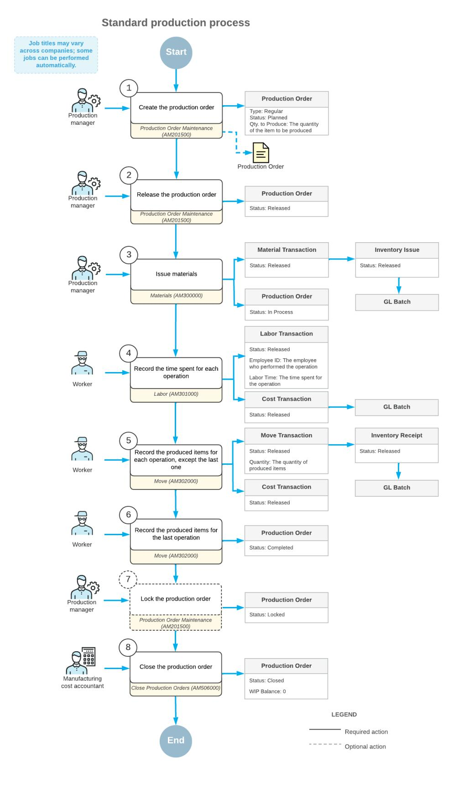

The employees involved do the following to process the production order and the related transactions:

1. *Create a production order.*

The production manager creates a production order by using the *[Production Order Maintenance](https://help-2025r1.acumatica.com/Help?ScreenId=ShowWiki&pageid=e5d2ddd4-8c80-4f5b-8e5f-e5151636a9d3)* (AM201500) form, adding the item to be produced and the quantity of the item. When the production manager creates the production order and saves the changes, the system assigns the *Planned* status to the order.

2. *Release the production order.*

When the production order is ready for processing, the production manager releases the order on the same form. The order status changes to *Released*.

3. Optional: *Print the production ticket.*

If the production manager would like to give the printed production ticket to the workers who will produce the item, the production manager prints the ticket by using the *[Production](https://help-2025r1.acumatica.com/Help?ScreenId=ShowWiki&pageid=1c881004-1508-4511-a08a-5a632812cc63) Ticket* (AM625000) report.

4. *Make sure that the required materials are available.*

The production manager makes sure that the quantity of materials required to produce the item is available on hand by using the *[Critical Materials](https://help-2025r1.acumatica.com/Help?ScreenId=ShowWiki&pageid=ddb714c7-ffa5-49b8-a8e6-9e0695a81f37)* (AM401000) form. If the production manager finds a shortage of any materials, the production manager creates a purchase order to purchase the required materials from a vendor by using the same form.

5. *Issue the materials for each operation.*

The production manager issues the materials required to produce the item by using the *[Materials](https://help-2025r1.acumatica.com/Help?ScreenId=ShowWiki&pageid=bac20b22-8f5c-4252-8a7a-f022e0471c91)* (AM300000) form. The production manager either enters the materials manually or uses the *[Material](https://help-2025r1.acumatica.com/Help?ScreenId=ShowWiki&pageid=fc2d6b79-ca92-4808-8e7b-dae4b326b9e9) Wizard* (AM300010) form.

During the release of materials, the system creates and releases an inventory issue on the *[Issues](https://help-2025r1.acumatica.com/Help?ScreenId=ShowWiki&pageid=17b051f6-027d-4459-b542-65c1c1f9d0ea)* (IN302000) form. The system also updates the production order's details and costs, and the balance of the WIP account. The production order's status changes to *In Process*.

6. *Record the time spent and the quantity of completed items for each operation, except the last operation.*

When each operation is completed, the worker creates a labor transaction by using the *[Labor](https://help-2025r1.acumatica.com/Help?ScreenId=ShowWiki&pageid=582f9540-0dc6-4515-9e9d-b52cefe0c13f)* (AM301000) form to record the time that they spent on the operation and the quantity of the completed items. The system also creates a cost transaction on the *Cost [Transactions](https://help-2025r1.acumatica.com/Help?ScreenId=ShowWiki&pageid=bfaeb074-32ec-487b-9863-29b73e7c2037)* (AM309000) form to record the cost of the worker's work.

7. *Record the quantity of completed items for the last operation.*

When the produced items are ready to be moved to stock (usually when the last operation in the routing has been completed), the worker creates a move transaction by using the *[Move](https://help-2025r1.acumatica.com/Help?ScreenId=ShowWiki&pageid=b60a4897-b4be-40a5-b732-d3ff26fe1eef)* (AM302000) form. The system also creates an inventory receipt on the *[Receipts](https://help-2025r1.acumatica.com/Help?ScreenId=ShowWiki&pageid=d6ecad5b-155f-44bf-baba-9ed006d298b5)* (IN301000) form and a cost transaction on the *[Cost](https://help-2025r1.acumatica.com/Help?ScreenId=ShowWiki&pageid=bfaeb074-32ec-487b-9863-29b73e7c2037) [Transactions](https://help-2025r1.acumatica.com/Help?ScreenId=ShowWiki&pageid=bfaeb074-32ec-487b-9863-29b73e7c2037)* (AM309000) form. If the total quantity completed is greater than or equal to the quantity of the item to be produced, the system changes the status of the production order to *Complete*.

If the worker both records labor hours and the quantity of the completed items during the last operation in the routing, they can use only the *[Labor](https://help-2025r1.acumatica.com/Help?ScreenId=ShowWiki&pageid=582f9540-0dc6-4515-9e9d-b52cefe0c13f)* form.

8. Optional: *Lock the production order.*

The production manager locks the production order by using the *[Production Order Maintenance](https://help-2025r1.acumatica.com/Help?ScreenId=ShowWiki&pageid=e5d2ddd4-8c80-4f5b-8e5f-e5151636a9d3)* form. The order status changes to *Locked*. Labor, material, and move transaction costs cannot be applied to a locked production order.

9. *Close the production order.*

The manufacturing cost accountant closes the production order by using the *[Close Production Orders](https://help-2025r1.acumatica.com/Help?ScreenId=ShowWiki&pageid=72b745fd-706b-4e76-b799-c8119cb5e8cf)* (AM506000) form.

Before closing the production order, we strongly recommend reviewing the balance of the WIP account. A nonzero balance may cause incorrect cost calculations of the finished goods and affect the item cost. For details, see *[WIP Balance Correction](#page-80-0)*.

If the balance of the WIP account is not zero, the system creates the final adjustment to set the balance of the WIP account to zero by creating a cost transaction on the *Cost [Transactions](https://help-2025r1.acumatica.com/Help?ScreenId=ShowWiki&pageid=bfaeb074-32ec-487b-9863-29b73e7c2037)* form and a GL batch on the *Journal [Transactions](https://help-2025r1.acumatica.com/Help?ScreenId=ShowWiki&pageid=dda046bc-5946-407f-88f7-1c0c966fbe72)* (GL301000) form. The offset is added to the WIP Variance account.

## **Production Processing: Control Point Operations**

Generally, workers who process or produce items according to production orders are not obliged to record the quantity of completed items for each operation except the last one. If you have many operations in production routing and want to make the production progress more visible or improve data recording accuracy for production orders, you can mark particular operations in routing as control points. For these operations, the system will force workers to record the completed quantity by using the *[Labor](https://help-2025r1.acumatica.com/Help?ScreenId=ShowWiki&pageid=582f9540-0dc6-4515-9e9d-b52cefe0c13f)* (AM301000) or *[Move](https://help-2025r1.acumatica.com/Help?ScreenId=ShowWiki&pageid=b60a4897-b4be-40a5-b732-d3ff26fe1eef)* (AM302000) form before the workers can record the completed quantity for the last operation.

To mark an operation as a control point, you select the **Control Point** check box in its row of the Operations table on the *[Bill of Material](https://help-2025r1.acumatica.com/Help?ScreenId=ShowWiki&pageid=1aae7d3a-d5f9-4693-b91f-663c4c2d362b)* (AM208000) form. The state of the check box is used as the default state of the **Control Point** check box in the row for this operation on the *[Production Order Details](https://help-2025r1.acumatica.com/Help?ScreenId=ShowWiki&pageid=f24480d9-1fed-478e-9363-e48fa5833950)* (AM209000), but you can override this state.

The last routing operation is always a control point because before the production order can be completed, workers must report the labor hours spent for production and the quantity of the completed items.

In the following sections, you will read about operations marked as control points.

#### **Production Process with Control Point Operations**

Suppose that a production order has the operations defined in the Operations table of the *[Production Order Details](https://help-2025r1.acumatica.com/Help?ScreenId=ShowWiki&pageid=f24480d9-1fed-478e-9363-e48fa5833950)* (AM209000) form with the settings shown in the following table.

|  |  | Table: The Operation Settings in the Production Order |  |
|--|--|-------------------------------------------------------|--|
|  |  |                                                       |  |

| Operation ID | Backflush Labor | Control Point | Backflush Materials |
|--------------|-----------------|---------------|---------------------|
| 0010         | Selected        | Cleared       | Selected            |
| 0020         | Cleared         | Selected      | Cleared             |
| 0030         | Cleared         | Selected      | Cleared             |

In the following diagram, you can view the actions and generated documents for this production order.

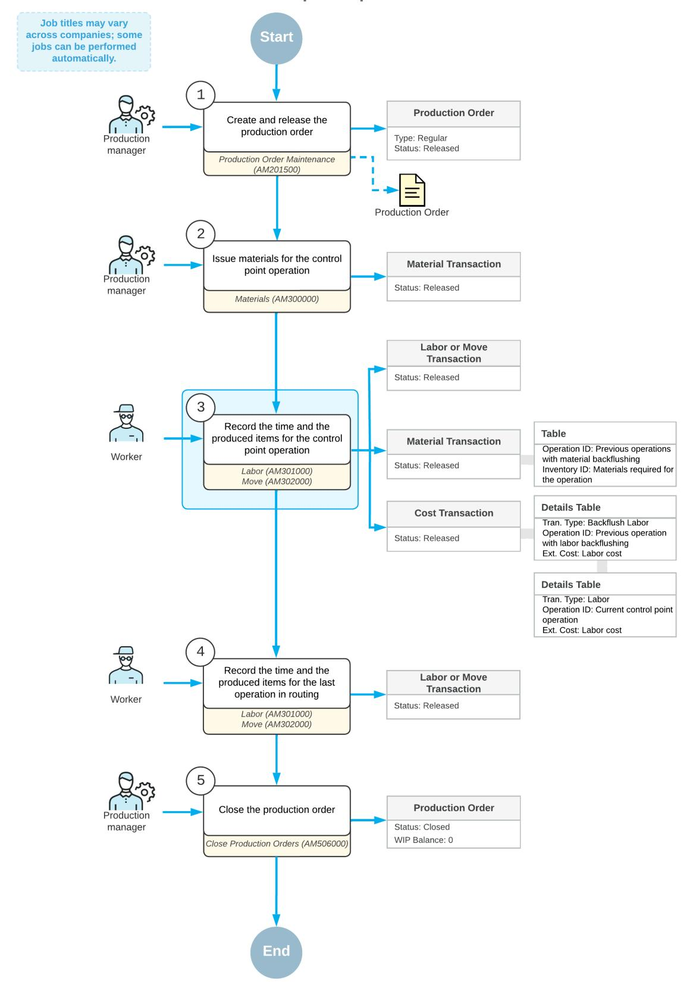

The employees involved do the following to process the production order and the related transactions:

1. *Create and release the production order.*

On the *[Production Order Maintenance](https://help-2025r1.acumatica.com/Help?ScreenId=ShowWiki&pageid=e5d2ddd4-8c80-4f5b-8e5f-e5151636a9d3)* (AM201500) form, the production manager creates and releases the production order.

2. *Issue materials for the control point operation.*

On the *[Materials](https://help-2025r1.acumatica.com/Help?ScreenId=ShowWiki&pageid=bac20b22-8f5c-4252-8a7a-f022e0471c91)* (AM300000) form, the production manager issues the materials required for the second operation.

Materials and labor are backflushed for the first operation, so for this operation, the manager does not need to issue materials, and employees do not need to record labor.

3. *Record the time and the completed quantity for the control point operation.*

On the *[Labor](https://help-2025r1.acumatica.com/Help?ScreenId=ShowWiki&pageid=582f9540-0dc6-4515-9e9d-b52cefe0c13f)* (AM301000) form, a worker records the time they spent on the operation and the item quantity they produced during the second operation. When the worker releases the labor transaction, the system also does the following:

- Creates and releases the material transaction on the *[Materials](https://help-2025r1.acumatica.com/Help?ScreenId=ShowWiki&pageid=bac20b22-8f5c-4252-8a7a-f022e0471c91)* form with the backflushed materials for the first operation.
- Creates and releases the cost transaction on the *Cost [Transactions](https://help-2025r1.acumatica.com/Help?ScreenId=ShowWiki&pageid=bfaeb074-32ec-487b-9863-29b73e7c2037)* (AM309000) form. The transaction includes the cost of the backflushed labor for the first operation and the cost of the labor for the second operation.
- 4. *Record the time and the completed quantity for the last operation.*

On the *[Labor](https://help-2025r1.acumatica.com/Help?ScreenId=ShowWiki&pageid=582f9540-0dc6-4515-9e9d-b52cefe0c13f)* form, the worker records the time they spent on the operation and the item quantity they produced during the third operation.

5. *Close the production order.*

On the *[Close Production Orders](https://help-2025r1.acumatica.com/Help?ScreenId=ShowWiki&pageid=72b745fd-706b-4e76-b799-c8119cb5e8cf)* (AM506000) form, the production manager closes the production order.

#### **Verification of Item Quantities**

If multiple routing operations are marked as control points, when a worker enters the quantity of completed items on the *[Labor](https://help-2025r1.acumatica.com/Help?ScreenId=ShowWiki&pageid=582f9540-0dc6-4515-9e9d-b52cefe0c13f)* (AM301000) or *[Move](https://help-2025r1.acumatica.com/Help?ScreenId=ShowWiki&pageid=b60a4897-b4be-40a5-b732-d3ff26fe1eef)* (AM302000) form for the control point operations, the system verifies that the quantity entered for the current operation is less than or equal to the quantity recorded for the preceding control point operation. If this condition is not met, the system displays an error message and does not release the labor or move transaction until the worker enters the correct item quantity.

For example, suppose that a production order for producing a base unit contains four operations: *0010 Cutting*, *0020 Form*, *0030 Assembly*, and *0040 Inspection*; the *0010* and *0030* operations are control points. Further suppose that on the *[Move](https://help-2025r1.acumatica.com/Help?ScreenId=ShowWiki&pageid=b60a4897-b4be-40a5-b732-d3ff26fe1eef)* form, a worker creates a move transaction for Operation *0010* and enters 7 as the completed quantity. Then another worker, when specifying the completed quantity of the item for Operation *0030* on the same form, mistakenly enters 70 instead of 7 as the quantity. The system does not release the move transaction until the worker enters a quantity of 7 or less.

#### **Reversal of Item Quantities**

When a worker would like to revert the quantity of completed items for some operation and enters a negative quantity value on the *[Move](https://help-2025r1.acumatica.com/Help?ScreenId=ShowWiki&pageid=b60a4897-b4be-40a5-b732-d3ff26fe1eef)* (AM302000) form for this operation, the system verifies that the completed quantity aer the reversal is more than or equal to the completed quantity recorded for the next operation marked as a control point. If the validation fails, the system displays an error message and does not release the transaction until the worker enters the correct quantity to be reversed.

In the previously considered example of a production order for producing a base unit, suppose that on the *[Move](https://help-2025r1.acumatica.com/Help?ScreenId=ShowWiki&pageid=b60a4897-b4be-40a5-b732-d3ff26fe1eef)* form, a worker creates a move transaction for Operation *0010* and enters the completed quantity as 7. Further suppose that another worker creates a move transaction for Operation *0030* on the same form and enters a quantity of 5. Then the first worker finds out that the quantity specified for Operation *0010* is incorrect and creates a move transaction with a quantity of –3. The system calculates the new completed quantity for Operation *0010* as 7 – 3 = 4. The new quantity is less than the quantity recorded for Operation *0030*. So the system will not release the move transaction until the worker specifies –2 or –1 as the quantity to be reversed.

## **Production Processing: Nonsequential Reporting of Quantities**

You may want to permit out-of-sequence reporting on production order operations for various reasons. For example, certain production steps can be completed nonsequentially, either in parallel or in any order, so reporting on them in a particular sequence may not be practical. In other cases, even though production steps are required to follow a specified sequence, the immediate entry of data for one step might not be feasible, which can lead to delays in subsequent production steps. For instance, the use of computers may be restricted in a work center because static electricity could interfere with volatile materials, or internet access may not be readily available to workers. To allow nonsequential reporting on production operations, you disable automatic backward reporting, in which quantities completed in an operation are reported back to prior operations. To do so, you clear the **Automatic Backward Reporting** check box on the **General** tab of the *[Production Order Maintenance](https://help-2025r1.acumatica.com/Help?ScreenId=ShowWiki&pageid=e5d2ddd4-8c80-4f5b-8e5f-e5151636a9d3)* (AM201500) form.

If this check box is cleared, when a worker reports the quantity of completed items for an operation, the system records it for the selected operation and not for the preceding operations. This quantity can be entered on of the following forms:

- *[Labor](https://help-2025r1.acumatica.com/Help?ScreenId=ShowWiki&pageid=582f9540-0dc6-4515-9e9d-b52cefe0c13f)* (AM301000)
- *[Scan Labor](https://help-2025r1.acumatica.com/Help?ScreenId=ShowWiki&pageid=b2d6ac99-b321-4661-996a-37af447d9acf)* (AM302020)
- *[Move](https://help-2025r1.acumatica.com/Help?ScreenId=ShowWiki&pageid=b60a4897-b4be-40a5-b732-d3ff26fe1eef)* (AM302000)
- *[Scan Move](https://help-2025r1.acumatica.com/Help?ScreenId=ShowWiki&pageid=737244b2-d13c-491d-9690-a2516cf07418)* (AM302010)
- *[Approve Clock Entries](https://help-2025r1.acumatica.com/Help?ScreenId=ShowWiki&pageid=3c352ff8-d71c-4fff-84ca-46674267dbe5)* (AM516000)

#### **Reporting of Item Quantities**

With automatic backward reporting turned off, when a worker enters the quantity of completed items for an operation that is a non-control point operation or a non-last control point operation, the system does not verify the quantity entered for the current operation against the quantity recorded for the preceding operation.

For the last operation of a production order, which is a control point operation, a worker can report a quantity only if it is less than or equal to the minimum quantity reported on preceding control point operations. If this condition is not met, the system displays an error message and does not release the labor or move transaction until the worker enters the correct item quantity.

For example, suppose that a production order for producing a base unit contains the following operations:

- *0010 - Cutting* (control point)
- *0020 Sanding*
- *0030 - Polishing*
- *0040 Inspection*
- *0050 - Staging* (control point)

Operations *0010* and *0050* are control points, and the quantity complete is *0* for all operations. Further suppose that on the *[Move](https://help-2025r1.acumatica.com/Help?ScreenId=ShowWiki&pageid=b60a4897-b4be-40a5-b732-d3ff26fe1eef)* (AM302000) form, a worker creates a move transaction for operation *0010* and enters 7 as the completed quantity. When specifying the completed quantity of the item for operation *0040*, another worker enters 8. Because automatic backward reporting is turned off, the system accepts the entered quantity and does not report quantity completion in preceding operations *0030* and *0020*. However, when another worker enters 8 for the last operation, *0050*, the system does not release the move transaction until the worker enters a quantity of 7 or less.

#### **Reversal of Reported Item Quantities**

Suppose that out-of-sequence reporting of quantities is allowed for the operations of a production order and a worker enters a negative quantity on the *[Move](https://help-2025r1.acumatica.com/Help?ScreenId=ShowWiki&pageid=b60a4897-b4be-40a5-b732-d3ff26fe1eef)* (AM302000) form to revert the quantity of completed items for an operation. The system verifies that the completed quantity aer the reversal is greater than or equal to the completed quantity recorded for the last operation. If the validation fails, the system displays an error message and does not release the transaction until the worker enters the correct quantity to be reversed.

In the previous example, suppose that a worker reports a completed quantity of *7* for operation *0010* and another worker reports 8 for operation *0040*. Then the first worker realizes that incorrect materials have been issued in operation *0010*. To fix the data, they create a move transaction with a quantity of –3. Because automatic backward reporting is turned off, the system accepts the entered quantity of –3 and does not report it to succeeding operations.

# **Production Processing: Item Availability and Allocation**

When you process production orders and related documents (such as sales orders and purchase orders), the system estimates the quantities of items to be produced and the material quantities in the documents and allocates the needed quantities of items and materials that are represented by stock items for the documents. Each allocation has a specific type (also called a *plan type*), which the system assigns according to the document type and status. If you need to reallocate materials to other production orders, you can view current allocations and their types on the *[Inventory Allocation Details](https://help-2025r1.acumatica.com/Help?ScreenId=ShowWiki&pageid=6d8011ac-1d4e-4a34-8bc2-1fa1ff002c05)* (IN402000) form.

In this topic, you will read about the ways the system calculates item availability and allocates items to be produced and materials for production orders and related documents.

#### **Availability Calculation for Production-Related Documents**

When calculating the availability of items to be produced and materials required for production, the system uses the availability calculation rules specified on the *Availability [Calculation](https://help-2025r1.acumatica.com/Help?ScreenId=ShowWiki&pageid=570cb9b8-c9b7-4c5d-bb5f-8e0829f8242d) Rules* (IN201500) form. We recommend that you create an availability calculation rule for items involved in production. For general information about availability calculation rules, see *Availability Calculation Rules: General [Information](https://help-2025r1.acumatica.com/Help?ScreenId=ShowWiki&pageid=36d6e854-c66e-4d9f-b150-6abbf0ece76b)*.

The rule settings specific to production-related documents are the following:

- **Deduct Qty. on Production Demand Prepared**: The quantities of materials in production orders with the *On Hold* or *Planned* status are deducted from the available quantities of the materials.
- **Deduct Qty. on Production Demand**: The quantities of materials in production orders with the *Released* or *In Process* status are deducted from the available quantities of the materials.
- **Deduct Qty. on Production Allocated**: The quantities of items to be produced that are allocated to other production orders are deducted from the available quantities of these items.
- **Include Qty. of Production Supply Prepared**: The quantities of items to be produced in production orders with the *On Hold* or *Planned* status are included in the available quantities of these items.
- **Include Qty. of Production Supply**: The quantities of items to be produced in production orders with the *Released* or *In Process* status are included in the available quantities of these items.

Availability calculation rules do not affect results of inventory planning when you run the process of generating MRP by using the *[Regenerate Inventory Planning](https://help-2025r1.acumatica.com/Help?ScreenId=ShowWiki&pageid=588d4939-b533-4b84-8016-cf34e2be17d5)* (AM505000) form.

#### **Item Allocation for Production-Related Documents**

Each item allocation is either a demand allocation or a supply allocation. Supply allocations are related to documents that potentially increase item availability, such as an allocation of an item to be produced for a production order or an allocation of materials for a purchase order. Demand allocations are related to documents that potentially decrease item availability, such as an allocation of materials for a parent production order or an allocation of items to be produced for a sales order.

If multiple documents contain the same item, such as a sales order with an item to be produced and a production order for the item, the system creates an item allocation for each of the documents, and a type of each allocation corresponds to the document type and status.

The system removes item allocations when the full allocated quantity of an item is received in stock (for supply documents) or is issued from stock (for demand documents).

#### **Allocation of Items to Be Produced for Production Orders**

When you create a production order for an item, the system creates a supply item allocation for the quantity to be produced specified in the order. The allocation is removed when you move the completed items to stock in a quantity that equals the planned quantity to be produced and the production order is assigned the *Completed* status.

If scrapped items have been recorded for the production order and the **IncludeScrap in Completions** check box on the *[Production Preferences](https://help-2025r1.acumatica.com/Help?ScreenId=ShowWiki&pageid=678a1833-f1f6-44f1-afce-55aa7438b3f3)* (AM102000) form is selected, the quantity of the scrapped items is included in the quantity of the completed items, and the system removes the allocation for the production order even when the real completed quantity is less than the planned quantity to be produced.

If you need to complete a production order with a smaller quantity of the completed items (such as when you were going to make 10 items, but because of a material shortage, you could make only 8), you click the **Complete Order** command on the *[Production Order Maintenance](https://help-2025r1.acumatica.com/Help?ScreenId=ShowWiki&pageid=e5d2ddd4-8c80-4f5b-8e5f-e5151636a9d3)* (AM201500) form. The system changes the status of the production order to *Completed* and removes the item allocation for the production order, as it usually does for completed orders.

For lot- or serial-tracked items, the system creates a separate allocation for each lot or serial number. For example, suppose that a production order has been created for five serial-tracked items. The system would create five allocations, one per item unit.

#### **Allocation of Items to Be Produced for Sales Orders**

When an item in a sales order must be produced, you create a linked production order for the item. The system creates a demand item allocation for the sales order and a supply item allocation for the production order.

In this case, you first complete the production order—that is, you move the completed items to stock, and the system removes the item allocation for the production order. Then a sales manager releases the shipment related to the sales order with the full allocated quantity of the item and the system issues the items from stock. The system also removes the item allocation for the sales order.

#### **Allocation of Materials**

When you create a production order, the system creates demand allocations of materials required for the order on the *[Inventory Allocation Details](https://help-2025r1.acumatica.com/Help?ScreenId=ShowWiki&pageid=6d8011ac-1d4e-4a34-8bc2-1fa1ff002c05)* (IN402000) form. If the required material quantities are available in stock, you issue the materials by using the *[Materials](https://help-2025r1.acumatica.com/Help?ScreenId=ShowWiki&pageid=bac20b22-8f5c-4252-8a7a-f022e0471c91)* (AM300000) form. When you issue the full quantities of the materials for the production order, the system removes the allocations for the production order.

If you issue materials partially (such as when the required material quantity has been overestimated), allocations for the quantities that were not issued still exist for the production order until you close the order. You can deallocate the remaining material quantities before you close the order. For details, see *Manual Deallocation of Materials for Parent Production Orders* in this topic.

If the required material quantities are not available in stock and they need to be purchased or produced, you create the needed documents, and the system creates the appropriate material allocations for the related purchase or production orders. When the purchased or produced materials are received in stock, the system removes the allocations for these documents.

If some material is both sold and used in production, you may need to manually allocate the required material quantity for a production order so that it becomes unavailable for sales. You can allocate a material that is in stock to a production order by using the **Line Details** dialog box, which you open on the **Materials** tab of the *[Production](https://help-2025r1.acumatica.com/Help?ScreenId=ShowWiki&pageid=f24480d9-1fed-478e-9363-e48fa5833950) [Order Details](https://help-2025r1.acumatica.com/Help?ScreenId=ShowWiki&pageid=f24480d9-1fed-478e-9363-e48fa5833950)* (AM209000) form.

You cannot allocate lot- or serial-tracked materials manually for a production order. You need to do this by releasing a material transaction on the *[Materials](https://help-2025r1.acumatica.com/Help?ScreenId=ShowWiki&pageid=bac20b22-8f5c-4252-8a7a-f022e0471c91)* form.

#### **Manual Deallocation of Materials for Parent Production Orders**

If a production order has been completed but materials were issued partially, the remaining material quantities are still allocated to the production order. You can remove allocations for the remaining quantities of the materials by clicking the **Set MaterialsStatus to Completed** command on the More menu of either the *[Production Order Details](https://help-2025r1.acumatica.com/Help?ScreenId=ShowWiki&pageid=f24480d9-1fed-478e-9363-e48fa5833950)* (AM209000) form or the *[Production Order Maintenance](https://help-2025r1.acumatica.com/Help?ScreenId=ShowWiki&pageid=e5d2ddd4-8c80-4f5b-8e5f-e5151636a9d3)* (AM201500) form.

You may also have a situation when you have completed a production order and deallocated the remaining material quantities, but you later realize that you still need to issue more materials. Then you click the**Set MaterialsStatus to Open** command on the More menu of either of the two forms. The system creates allocations for the remaining material quantities, and you can issue the needed materials by using the *[Materials](https://help-2025r1.acumatica.com/Help?ScreenId=ShowWiki&pageid=bac20b22-8f5c-4252-8a7a-f022e0471c91)* (AM300000) form.

#### **Allocation of Materials for Purchase Orders**

If materials required for item production are not in stock and these materials are purchased from a vendor, you create a purchase order for the materials. The system creates a supply allocation of materials for the purchase order if the type of the lines for the materials is *Goods for MFG* on the *[Purchase Orders](https://help-2025r1.acumatica.com/Help?ScreenId=ShowWiki&pageid=5565686c-96c4-4bfa-a51d-9a2566baa808)* (PO301000) form. When you create a purchase order by using the *[Critical Materials](https://help-2025r1.acumatica.com/Help?ScreenId=ShowWiki&pageid=ddb714c7-ffa5-49b8-a8e6-9e0695a81f37)* (AM401000) form, the system specifies this line type automatically.

When the full quantity of purchased items is received in stock, the system removes the material allocation for the purchase order.

#### **Allocation of Materials for Production Orders**

If a material required for a production order is out of stock and must be produced (that is, if the material is a subassembly), you create a production order for the material. When you create the production order by using the *[Critical Materials](https://help-2025r1.acumatica.com/Help?ScreenId=ShowWiki&pageid=ddb714c7-ffa5-49b8-a8e6-9e0695a81f37)* (AM401000) form, the system links the production order to the parent production order and creates a supply allocation for the subassembly production order.

When the full quantity of produced materials is moved to stock, the system removes the material allocation for the subassembly production order. You can then allocate the produced subassembly to the parent production order, which will change the item plan of the subassembly material to *Production Allocated*.

## **Production Processing: Implementation Checklist**

The following sections provide details you can use to ensure that the system is configured properly for production processing, and to understand (and change, if needed) the settings that affect the processing workflow.

#### **Prerequisites**

Make sure that the following tasks have been performed before you start implementing production processing:

• The system has been prepared for manufacturing implementation, as described in *[System Preparation for](https://help-2025r1.acumatica.com/Help?ScreenId=ShowWiki&pageid=f713201a-66c5-403a-a531-62fa3cb09a1a) [Manufacturing Implementation: Implementation Activity](https://help-2025r1.acumatica.com/Help?ScreenId=ShowWiki&pageid=f713201a-66c5-403a-a531-62fa3cb09a1a)*.

• Bills of material and all the related entities have been created, as described in *[Implementing Bills of Material:](https://help-2025r1.acumatica.com/Help?ScreenId=ShowWiki&pageid=e11a085c-1a86-499f-9f33-f6b4d312476b) [General Process](https://help-2025r1.acumatica.com/Help?ScreenId=ShowWiki&pageid=e11a085c-1a86-499f-9f33-f6b4d312476b)*.

#### **Implementation Checklist**

We recommend that before you initially start processing production orders, you make sure the needed features have been enabled, settings have been specified, and entities have been created, as summarized in the following checklist.

| Form                               | Criteria to Check                                                                                                                                                                                                      |
|------------------------------------|------------------------------------------------------------------------------------------------------------------------------------------------------------------------------------------------------------------------|
| Enable/Disable Features (CS100000) | The following features have been enabled:                                                                                                                                                                              |
|                                    | • The Manufacturing group of features. If you use ad ditional manufacturing functionality (such as esti mates), make sure that the corresponding features have been enabled within this group of features. |
|                                    | • The Inventory feature within the Inventory and Or der Management group of features.                                                                                                                            |
| Production Order Types (AM201100)  | Production order types have been created, as de scribed in Production Order Types: General Information.                                                                                                             |
| Production Preferences (AM102000)  | All necessary settings related to production manage ment have been specified.                                                                                                                                       |

#### **Other Settings That Affect the Workflow**

You can affect the workflow of processing production orders by specifying additional settings on the *[Production](https://help-2025r1.acumatica.com/Help?ScreenId=ShowWiki&pageid=678a1833-f1f6-44f1-afce-55aa7438b3f3) [Preferences](https://help-2025r1.acumatica.com/Help?ScreenId=ShowWiki&pageid=678a1833-f1f6-44f1-afce-55aa7438b3f3)* (AM102000) form as follows:

- To cause labor, move, material, and WIP adjustment transactions to be created with the *On Hold* status (so that the user can verify them before processing them further), on the *[Production Preferences](https://help-2025r1.acumatica.com/Help?ScreenId=ShowWiki&pageid=678a1833-f1f6-44f1-afce-55aa7438b3f3)* (AM102000) form, you select the **Hold Documents on Entry** check box.
- To make the system validate totals on labor, move, material, and WIP adjustment transactions, on the *[Production Preferences](https://help-2025r1.acumatica.com/Help?ScreenId=ShowWiki&pageid=678a1833-f1f6-44f1-afce-55aa7438b3f3)* form, you select the**Validate DocumentTotals on Entry** check box.
- To make the system immediately update the available quantities of items, on the *[Inventory Preferences](https://help-2025r1.acumatica.com/Help?ScreenId=ShowWiki&pageid=f2eb4e55-f802-4259-a41f-609965c856f1)* (IN101000) form, you select the **Automatically Post on Release** check box.
- To make production orders follow a new production order workflow which changes a production order with the status *Complete* to *Locked*, and then to *Closed*, you select the **Lock Production Orders Before Closing** check box. If the **Lock Production Orders Before Closing** check box is cleared, then the production order will follow the current workflow which changes a production order with the status *Completed* to *Closed*.

## **Validation of Configuration**

To make sure that all configuration has been performed correctly, we recommend that in your system, you perform instructions similar to those described in *Production Processing: To Process [Production-Related](#page-39-1) Documents and [Transactions](#page-39-1)*.

# **Production Processing: To Process Production-Related Documents and Transactions**

The following activity will walk you through the creating and processing of a production order and the related documents and transactions.

## **Story**

Suppose that based on the analyzed demand from previous periods of sales, the sales department of SweetLife has asked the production department to produce 12 juicers for citrus. Acting as a production manager, you will create a production order for producing 12 citrus juicers, order the juicer parts that are out of stock from the vendor, and process all related transactions. Further suppose that the production of juicers should start on today's date and the scheduling priority is standard (you do not need to produce the juicers faster or slower than the other items in the queue).

#### **Configuration Overview**

In the *U100* dataset, the following tasks have been performed to support this activity:

- On the *[Warehouses](https://help-2025r1.acumatica.com/Help?ScreenId=ShowWiki&pageid=264b0ef7-2b6c-40b4-a7d9-f1a5e067939b)* (IN204000) form, the *WORKHOUSE* warehouse and the *MGI* and *MTL* locations have been defined.
- On the *[Stock Items](https://help-2025r1.acumatica.com/Help?ScreenId=ShowWiki&pageid=77786a70-1f1e-4d63-ad98-96f98e4fcb0e)* (IN202500) form, the *CFJCITRUS*, *JCREAMER*, *JUICECUP1L*, *MRBASEHIGH*, *STRBASKET*, and *SPLGUARD* stock items have been defined.
- On the *[Vendors](https://help-2025r1.acumatica.com/Help?ScreenId=ShowWiki&pageid=a9584be3-f2bd-4d67-80d4-8041d809df56)* (AP303000) form, the *JALOOZA* vendor has been created.

#### **Process Overview**

In this activity, to process the documents and transactions related to the production of the citrus juicers, you will do the following:

- 1. On the *[Production Order Maintenance](https://help-2025r1.acumatica.com/Help?ScreenId=ShowWiki&pageid=e5d2ddd4-8c80-4f5b-8e5f-e5151636a9d3)* (AM201500) form, create and release the production order
- 2. On the *[Critical Materials](https://help-2025r1.acumatica.com/Help?ScreenId=ShowWiki&pageid=ddb714c7-ffa5-49b8-a8e6-9e0695a81f37)* (AM401000) form, view the list of components that are out of stock and create a purchase order for the components
- 3. On the *[Purchase Receipts](https://help-2025r1.acumatica.com/Help?ScreenId=ShowWiki&pageid=d9901c8d-486d-45ed-8088-ea3d8ee3af19)* (PO302000) form, create a purchase receipt to record the receipt of the components from the vendor
- 4. On the *[Materials](https://help-2025r1.acumatica.com/Help?ScreenId=ShowWiki&pageid=bac20b22-8f5c-4252-8a7a-f022e0471c91)* (AM300000) form, issue the components required for the production order
- 5. On the *[Labor](https://help-2025r1.acumatica.com/Help?ScreenId=ShowWiki&pageid=582f9540-0dc6-4515-9e9d-b52cefe0c13f)* (AM301000) form, record the labor spent for the juicer assembly and the produced quantity
- 6. On the *[Storage Summary](https://help-2025r1.acumatica.com/Help?ScreenId=ShowWiki&pageid=ff039591-b8d1-4313-9578-6e198a26e195)* (IN409010) form, view the quantity of juicers available in the warehouse
- 7. On the *[Production Order Maintenance](https://help-2025r1.acumatica.com/Help?ScreenId=ShowWiki&pageid=e5d2ddd4-8c80-4f5b-8e5f-e5151636a9d3)* form, view the changes in the production order
- 8. On the *[Move](https://help-2025r1.acumatica.com/Help?ScreenId=ShowWiki&pageid=b60a4897-b4be-40a5-b732-d3ff26fe1eef)* (AM302000) form, record the receipt of one more juicer to the warehouse
- 9. On the *[Production Order Maintenance](https://help-2025r1.acumatica.com/Help?ScreenId=ShowWiki&pageid=e5d2ddd4-8c80-4f5b-8e5f-e5151636a9d3)* form, view the labor and costs recorded for the production order
- 10.On the *[Close Production Orders](https://help-2025r1.acumatica.com/Help?ScreenId=ShowWiki&pageid=72b745fd-706b-4e76-b799-c8119cb5e8cf)* (AM506000) form, close the production order

#### **System Preparation**

Do the following:

1. As prerequisites to the current activity, perform the following activities in the listed order:

- a. *[Bills of Material: Implementation Activity](#page-15-1)* so that the needed bill of material has been created in a company with the *U100* dataset preloaded.
- b. *Production Order Types: To Create a Regular [Production](https://help-2025r1.acumatica.com/Help?ScreenId=ShowWiki&pageid=8be58249-2847-4739-9864-2fd03f6911ef) Order Type* so that a production order type for regular orders has been created in this company.
- 2. Launch the Acumatica ERP website, and sign in to the company in which the prerequisite activities have been performed. You should sign in as the production manager by using the *peters* username and the *123* password.
- 3. In the info area, in the upper-right corner of the top pane of the Acumatica ERP screen, make sure that the business date in your system is set to today's date. For simplicity, in this activity, you will create and process all documents in the system on this business date.

#### **Step 1: Creating the Production Order**

To create the production order for 12 citrus juicers, do the following:

1. On the *[Production Order Maintenance](https://help-2025r1.acumatica.com/Help?ScreenId=ShowWiki&pageid=e5d2ddd4-8c80-4f5b-8e5f-e5151636a9d3)* (AM201500) form, add a new record.

Notice that the production order is assigned a status of *Planned*, and today's date has been automatically selected in the **Order Date** box.

- 2. In the Summary area, do the following:
  - a. In the **OrderType** box, make sure *RO* is specified.
  - b. In the **Inventory ID** box, select *CFJCITRUS*.

On the **General** tab, notice that the *WORKHOUSE* warehouse and the *MGI* location have been selected automatically.

- c. In the **Qty. to Produce** box, specify 12. Notice that this quantity is copied to the **Qty. Remaining** box.
- d. In the **Description** box, specify Production of 12 citrus juicers in the standard configuration.
- 3. On the form toolbar, click**Save**.
- 4. On the form toolbar, click **Release Order**. The order status changes to *Released*.

In the **Planned** section of the**Totals** tab, review the planned labor time and the planned costs for production of the juicers (see the following screenshot). The system calculates the planned time based on the values you have specified in the bill of material on the *[Bill of Material](https://help-2025r1.acumatica.com/Help?ScreenId=ShowWiki&pageid=1aae7d3a-d5f9-4693-b91f-663c4c2d362b)* (AM208000) form. The planned costs are calculated based on the planned time and on the settings of the production cost drivers. (See *[Configuring Production Cost Drivers: Implementation Activity](https://help-2025r1.acumatica.com/Help?ScreenId=ShowWiki&pageid=c1604cdc-a0d1-4df7-82e0-97c53bafd053)* for details.)

| <b>Production Order Maintenance</b> RO AMP000001 - Production of 12 citrus juicers in the standard configuration                            |            |          |             |              |                      |                        |        |             |      |                                               | <b>P</b> NOTES | <b>ACTIVITIES</b> | <b>FILES</b> | TOOLS $\star$ |
|------------------------------------------------------------------------------------------------------------------------------------------------|------------|----------|-------------|--------------|----------------------|------------------------|--------|-------------|------|-----------------------------------------------|----------------|-------------------|--------------|---------------|
| $\leftarrow$                                                                                                                                   | $\Omega$   | 血        | $\check{ }$ | $\mathsf{R}$ |                      | $\rightarrow$          | $\geq$ | <b>HOLD</b> |      | <b>CREATE MOVE TRANSACTION</b>                | $\cdots$       |                   |              |               |
| $\circ$ * Order Type: RO - Regular production orders 0                                                                                |            |          |             |              |                      | Inventory ID:          |        |             |      | CFJCITRUS - Configurable juicer for citru 2   |                | Qty. Complete:    |              | 0.00          |
| * Production Nbr.:   AMP000001 - Production of 12 citrus j Q                                                                                   |            |          |             |              |                      | Qty. to Produce:       |        |             |      | 12.00                                         |                | Qty. Scrapped:    |              | 0.00          |
| Status:                                                                                                                                        | Released   |          |             |              |                      | UOM:                   |        |             | EA   |                                               |                | Qty. Remaining:   |              | 12.00         |
| Order Date:                                                                                                                                    | 11/25/2024 |          |             |              |                      | Description:           |        |             |      | Production of 12 citrus juicers in the stan-  |                |                   |              |               |
| <b>TOTALS</b> <b>RELATED PRODUCTION</b> <b>ATTRIBUTES</b> <b>LINE DETAILS</b> <b>GENERAL</b> <b>REFERENCES</b> <b>EVENTS</b> |            |          |             |              |                      |                        |        |             |      |                                               |                |                   |              |               |
| <b>PLANNED</b>                                                                                                                                 |            |          |             |              | <b>ACTUAL</b>        |                        |        |             |      | VARIANCE ____________________________________ |                |                   |              |               |
| Labor Time:                                                                                                                                    | 4 h 30 m   |          |             |              | Labor Time:          |                        |        | $0h00$ m    |      | Labor Time:                                   | 4 h 30 m       |                   |              |               |
| Labor:                                                                                                                                         |            |          | 90.00       |              | Labor:               |                        |        |             | 0.00 | Labor:                                        |                | $-90.00$          |              |               |
| Machine:                                                                                                                                       |            |          | 0.00        |              | Machine:             |                        |        |             | 0.00 | Machine:                                      |                | 0.00              |              |               |
| Material:                                                                                                                                      |            |          | 5.539.56    |              | Material:            |                        |        |             | 0.00 | Material:                                     |                | $-5.539.56$       |              |               |
| Tool:                                                                                                                                          |            |          | 2.64        | Tool:        |                      |                        |        |             | 0.00 | Tool:                                         |                | $-2.64$           |              |               |
| <b>Fixed Overhead:</b>                                                                                                                         |            |          | 15.00       |              |                      | <b>Fixed Overhead:</b> |        |             | 0.00 | <b>Fixed Overhead:</b>                        |                | $-15.00$          |              |               |
| Variable Overhead:                                                                                                                             |            |          | 27.00       |              |                      | Variable Overhead:     |        |             | 0.00 | Variable Overhead:                            |                | $-27.00$          |              |               |
| Subcontract:                                                                                                                                   |            |          | 0.00        |              | Subcontract:         |                        |        |             | 0.00 | Subcontract:                                  |                | 0.00              |              |               |
| Qtv to Produce:                                                                                                                                |            |          | 12.00       |              | <b>Qty Complete:</b> |                        |        |             | 0.00 | <b>Qty Remaining:</b>                         |                | 12.00             |              |               |
| Plan Total:                                                                                                                                    |            |          | 5.674.20    |              | Adjustments:         |                        |        |             | 0.00 | <b>Total Variance:</b>                        |                | $-5.674.20$       |              |               |
| Unit Cost:                                                                                                                                     |            | 472.8500 |             |              | Scrap:               |                        |        |             | 0.00 | <b>WIP Balance:</b>                           |                | 0.00              |              |               |
| Plan Cost Date:                                                                                                                                | 11/25/2024 |          |             |              | <b>WIP Total:</b>    |                        |        |             | 0.00 |                                               |                |                   |              |               |
| Ref. Material:                                                                                                                                 |            |          | 0.0000      |              |                      | MFG to Inventory:      |        |             | 0.00 |                                               |                |                   |              |               |

#### *Figure: The Totals tab of the Production Order Maintenance form*

The production order is ready to be processed further.

#### **Step 2: Creating a Purchase Order for Out-of-Stock Components**

In this step, you will view the list of components that are required for the production of the juicers and are out of stock, and you will create a purchase order to purchase the components from the *JALOOZA* vendor. Do the following:

1. While you are still viewing the production order on the *[Production Order Maintenance](https://help-2025r1.acumatica.com/Help?ScreenId=ShowWiki&pageid=e5d2ddd4-8c80-4f5b-8e5f-e5151636a9d3)* (AM201500) form, click **Critical Material** (under **Materials**) on the More menu. The *[Critical Materials](https://help-2025r1.acumatica.com/Help?ScreenId=ShowWiki&pageid=ddb714c7-ffa5-49b8-a8e6-9e0695a81f37)* (AM401000) form opens with the production order number selected in the **Production Nbr.** box.

Notice that zeros are specified in all rows in the **Qty. On Hand** column. This means that all the components required to assemble the juicers are out of stock and must be purchased.

- 2. In the column header with the unlabeled check box, select this check box to select all rows.
- 3. On the form toolbar, click **Purchase**.
- 4. In the **Create Purchase Order** dialog box, which opens, review the settings, and click **Create**. The system creates a purchase order and opens it on the *[Purchase Orders](https://help-2025r1.acumatica.com/Help?ScreenId=ShowWiki&pageid=5565686c-96c4-4bfa-a51d-9a2566baa808)* (PO301000) form.
- 5. On the form toolbar, click **Remove Hold**. The status of the purchase order changes to *Open*.

#### **Step 3: Receiving the Components in a Warehouse**

Suppose that you have received the ordered components from the *JALOOZA* vendor and need to create a purchase receipt. The items have been received to the *MTL* location in the *WORKHOUSE* warehouse (this location is dedicated to the storing of components). Do the following:

1. While you are still viewing the purchase order on the *[Purchase Orders](https://help-2025r1.acumatica.com/Help?ScreenId=ShowWiki&pageid=5565686c-96c4-4bfa-a51d-9a2566baa808)* (PO301000) form, on the form toolbar, click **Enter PO Receipt**.

The system creates the purchase receipt and opens it on the *[Purchase Receipts](https://help-2025r1.acumatica.com/Help?ScreenId=ShowWiki&pageid=d9901c8d-486d-45ed-8088-ea3d8ee3af19)* (PO302000) form.

On the **Details** tab, review the list of the received components. Notice that *MTL* is specified for each row in the **Location** column.

2. On the form toolbar, click **Release**.

The system releases the purchase receipt and changes its status to *Released*. On the **Orders** tab, notice that *Completed* is specified in the **Status** column of the only row.

You have received the required components into stock and now you can continue processing the production order.

#### **Step 4: Issuing the Components for the Production Order**

In this step, you will issue the components for the production order. Do the following:

- 1. On the *[Production Order Maintenance](https://help-2025r1.acumatica.com/Help?ScreenId=ShowWiki&pageid=e5d2ddd4-8c80-4f5b-8e5f-e5151636a9d3)* (AM201500) form, open the production order that you created earlier in this activity.
- 2. On the More menu (under**Transactions**), click **Release Materials**. The system opens the *[Material](https://help-2025r1.acumatica.com/Help?ScreenId=ShowWiki&pageid=fc2d6b79-ca92-4808-8e7b-dae4b326b9e9) Wizard 2* (AM300020) form with the list of components from the production order.
- 3. On the form toolbar, click**Select All**. The system creates a material transaction and opens it on the *[Materials](https://help-2025r1.acumatica.com/Help?ScreenId=ShowWiki&pageid=bac20b22-8f5c-4252-8a7a-f022e0471c91)* (AM300000) form.
- 4. In the Summary area, do the following:
  - a. In the **Description** box, specify Materials for 12 citrus juicers.
  - b. Clear the **Hold** check box. The system changes the transaction status to *Balanced*.
- 5. On the form toolbar, click **Release**. The system releases the material transaction and changes the status of the transaction to *Released*.
- 6. On the *[Issues](https://help-2025r1.acumatica.com/Help?ScreenId=ShowWiki&pageid=17b051f6-027d-4459-b542-65c1c1f9d0ea)* (IN302000) form, make sure that the inventory issue with the components from the production order has been created and released.

#### **Step 5: Recording the Labor and Produced Items**

Suppose that Carlos Cruz, a worker in the work center, spent 30 minutes setting up the working environment for juicer assembly and assembled 5 juicers for 1 hour and 40 minutes. Another work center worker, Casey Burrows, assembled 6 juicers for the same amount of time. The assembled juicers have been moved to the *MGI* location of the *WORKHOUSE* warehouse. To record the time spent on juicer assembly and the movement of the assembled juicers, do the following:

- 1. On the *[Labor](https://help-2025r1.acumatica.com/Help?ScreenId=ShowWiki&pageid=582f9540-0dc6-4515-9e9d-b52cefe0c13f)* (AM301000) form, add a new record.
- 2. On the table toolbar, click **Add Row**.
- 3. In the row, specify the following settings:
  - **LaborType**: *Direct*
  - **OrderType**: *RO*
  - **Production Nbr.**: The number of the production order that you created earlier in this activity
  - **Operation ID**: *0010*
  - **Employee ID**: *EP00000027* (Carlos Cruz)
  - **Shi**: *0001*
  - **Labor Time**: *02:10*
  - **Quantity**: 5
- 4. On the table toolbar, click **Add Row**.
- 5. In the row, specify the following settings:
  - **LaborType**: *Direct*

- **OrderType**: *RO*
- **Production Nbr.**: The number of the production order that you created earlier in this activity
- **Operation ID**: *0010*
- **Employee ID**: *EP00000028* (Casey Burrows)
- **Shi**: *0001*
- **Labor Time**: *01:40*
- **Quantity**: 6
- 6. In the Summary area, do the following:
  - a. In the **Date** box, make sure that today's date is specified.
  - b. In the **Description** box, specify Recording the time for assembly of 11 citrus juicers.
  - c. Clear the **Hold** check box. The system changes the transaction status to *Balanced*.
- 7. On the form toolbar, click **Release**. The system creates and releases the cost transaction to record labor costs, the inventory receipt to record the movement of the assembled juicers to the warehouse location, and the labor transaction itself.

#### **Step 6: Viewing the Availability of Juicers**

To make sure that the assembled juicers have been moved to the *MGI* warehouse location, do the following:

1. On the *[Receipts](https://help-2025r1.acumatica.com/Help?ScreenId=ShowWiki&pageid=d6ecad5b-155f-44bf-baba-9ed006d298b5)* (IN301000) form, open the inventory receipt with the 11 juicers.

Notice that the receipt has the *Released* status.

- 2. On the *[Inventory Summary](https://help-2025r1.acumatica.com/Help?ScreenId=ShowWiki&pageid=2fd70552-e564-4e71-be30-e63b9415baa2)* (IN401000) form, specify the following settings in the Selection area:
  - **Inventory ID**: *CFJCITRUS*
  - **Warehouse**: *WORKHOUSE*
  - **Location**: *MGI*

Notice that the value in the **On Hand** column of the only row listed in the table is *11* (as shown in the following screenshot).

|   | Inventory Summary *                                                                                                                                                              |            |           |                                  |         |              |                               |                                       |  |  |  |  |  |  |
|---|----------------------------------------------------------------------------------------------------------------------------------------------------------------------------------|------------|-----------|----------------------------------|---------|--------------|-------------------------------|---------------------------------------|--|--|--|--|--|--|
|   | Ò Υ $\mathbf{\overline{x}}$ ↶ $\overline{\phantom{a}}$                                                                                                               |            |           |                                  |         |              |                               |                                       |  |  |  |  |  |  |
|   | CFJCITRUS - Configurable ju O 0 * Inventory ID: WORKHOUSE - Warehouse 1 O Warehouse: Expand by Lot/Serial Number MGI - Location for storing mai Q Location: |            |           |                                  |         |              |                               |                                       |  |  |  |  |  |  |
|   | Expand by Cost Layer Type                                                                                                                                                        |            |           |                                  |         |              |                               |                                       |  |  |  |  |  |  |
| 目 | Warehouse                                                                                                                                                                        | Location   | Available | Available for <b>Shipment</b> | On Hand | Base Unit | Estimated <b>Unit Cost</b> | <b>Estimated</b> <b>Total Cost</b> |  |  |  |  |  |  |
|   | <b>WORKHOUSE</b>                                                                                                                                                                 | <b>MGI</b> | 11.00     | 11.00                            | 11.00   | EA           | 472.8500                      | 5.201.35                              |  |  |  |  |  |  |
|   |                                                                                                                                                                                  | Total:     | 11.00     | 11.00                            | 11.00   | EA           |                               | 5,201.35                              |  |  |  |  |  |  |

*Figure: The on-hand quantity of the juicers on the Inventory Summary form*

#### **Step 7: Viewing the Changes to the Production Order**

In this step, you will view the changes the system made to the production order as a result of the previous steps. Do the following:

1. On the *[Production Order Maintenance](https://help-2025r1.acumatica.com/Help?ScreenId=ShowWiki&pageid=e5d2ddd4-8c80-4f5b-8e5f-e5151636a9d3)* (AM201500) form, open the production order that you created earlier in this activity.

In the Summary area, notice that the value of the **Qty. Complete** box is *11* and the value of the **Qty. Remaining** box is *1*. This means that 11 out of 12 juicers have been assembled and are available in the warehouse.

2. Go to the **Events** tab.

Notice that records for material, cost, and labor transactions are displayed in the table.

| <b>Production Order Maintenance</b> <b>P NOTES</b> TOOLS $\star$ <b>ACTIVITIES</b> <b>FILES</b> <b>CUSTOMIZATION</b> RO AMP000001 - Production of 12 citrus juicers in the standard configuration                         |                                     |                                              |                   |                   |                 |  |  |  |  |  |  |  |
|---------------------------------------------------------------------------------------------------------------------------------------------------------------------------------------------------------------------------------------------|-------------------------------------|----------------------------------------------|-------------------|-------------------|-----------------|--|--|--|--|--|--|--|
| 周 周 侕 n <b>HOLD</b> <b>CREATE MOVE TRANSACTION</b> $\Omega$ Ы к ⋋ $\overline{\phantom{0}}$ $\checkmark$ .                                                                                               |                                     |                                              |                   |                   |                 |  |  |  |  |  |  |  |
| Q Qty. Complete: * Order Type: $\mathscr{O}$ Inventory ID: RO - Regular production orders CFJCITRUS - Configurable juicer for citru 2                                                                                     |                                     |                                              |                   |                   |                 |  |  |  |  |  |  |  |
| * Production Nbr.: AMP000001 - Production of 12 citrus j Q                                                                                                                                                                               | Qty. to Produce:                    | 12.00                                        |                   | Qty. Scrapped:    | 0.00            |  |  |  |  |  |  |  |
| In Process Status:                                                                                                                                                                                                                       | UOM:                                | EA                                           |                   | Qty. Remaining:   | 1.00            |  |  |  |  |  |  |  |
| Order Date: 11/26/2024                                                                                                                                                                                                                   | Description:                        | Production of 12 citrus juicers in the stand |                   |                   |                 |  |  |  |  |  |  |  |
| <b>EVENTS</b> <b>GENERAL</b> <b>RELATED PRODUCTION</b> <b>ATTRIBUTES</b> <b>TOTALS</b> <b>LINE DETAILS</b> <b>REFERENCES</b> $\mathbf{\overline{x}}$ Ò $\pm$ $\mathsf{x}$ $\left  \leftrightarrow \right $ |                                     |                                              |                   |                   |                 |  |  |  |  |  |  |  |
| <b>B</b> Created At <b>Type</b>                                                                                                                                                                                                          | <b>Description</b>                  | <b>Created Screen</b>                        | <b>Created By</b> | <b>Batch Nbr.</b> | Doc Type        |  |  |  |  |  |  |  |
| 11/26/2024 12:08 PM Created                                                                                                                                                                                                              | The Regular order has been created. | <b>Production Order Maintenance</b>          | gibbs             |                   |                 |  |  |  |  |  |  |  |
| 11/26/2024 12:08 PM Released                                                                                                                                                                                                             | The status has been changed from Pl | <b>Production Order Maintenance</b>          | qibbs             |                   |                 |  |  |  |  |  |  |  |
| 11/26/2024 12:14 PM <b>Transaction</b>                                                                                                                                                                                                   | <b>Material Transaction</b>         | <b>Materials</b>                             | gibbs             | AMB000001         | <b>Material</b> |  |  |  |  |  |  |  |
| 11/26/2024 12:17 PM <b>Transaction</b>                                                                                                                                                                                                   | Cost Transaction Created by Docume  | Labor                                        | gibbs             | CST000001         | Cost            |  |  |  |  |  |  |  |
| 11/26/2024 12:17 PM Transaction                                                                                                                                                                                                          | Labor Transaction                   | Labor                                        | AMB000002         | Labor             |                 |  |  |  |  |  |  |  |

*Figure: The Events tab of the Production Order Maintenance form*

#### **Step 8: Recording the Produced Items**

Suppose that you have been informed that Carlos Cruz produced 6 juicers— not 5, as you recorded earlier in this activity. To record the receipt of one more juicer to the warehouse location, create a move transaction as follows:

1. While you are still viewing the production order on the *[Production Order Maintenance](https://help-2025r1.acumatica.com/Help?ScreenId=ShowWiki&pageid=e5d2ddd4-8c80-4f5b-8e5f-e5151636a9d3)* (AM201500) form, on the form toolbar, click **Create MoveTransaction**. The system opens the *[Move](https://help-2025r1.acumatica.com/Help?ScreenId=ShowWiki&pageid=b60a4897-b4be-40a5-b732-d3ff26fe1eef)* (AM302000) form with the row for the production order added to the table.

Notice that *1* is specified in the **Quantity** column.

- 2. In the Summary area, clear the **Hold** check box.
- 3. On the form toolbar, click **Release**. The system creates and releases the inventory receipt and the cost transaction; it also changes the status of the move transaction to *Released*.
- 4. On the *[Inventory Summary](https://help-2025r1.acumatica.com/Help?ScreenId=ShowWiki&pageid=2fd70552-e564-4e71-be30-e63b9415baa2)* (IN401000) form, specify the following settings in the Selection area:
  - **Inventory ID**: *CFJCITRUS*
  - **Warehouse**: *WORKHOUSE*
  - **Location**: *MGI*

Notice that the value in the **On Hand** column of the only row is *12*.

5. On the *[Production Order Maintenance](https://help-2025r1.acumatica.com/Help?ScreenId=ShowWiki&pageid=e5d2ddd4-8c80-4f5b-8e5f-e5151636a9d3)* form, open the production order that you created earlier in this activity.

In the Summary area, notice that the **Qty. Complete** box contains *12* and the **Qty. Remaining** box contains *0*, and the status of the order is *Completed*.

#### **Step 9: Viewing Production Order Totals**

Before closing the production order, you will view the actual recorded labor time and costs on the *[Production Order](https://help-2025r1.acumatica.com/Help?ScreenId=ShowWiki&pageid=e5d2ddd4-8c80-4f5b-8e5f-e5151636a9d3) [Maintenance](https://help-2025r1.acumatica.com/Help?ScreenId=ShowWiki&pageid=e5d2ddd4-8c80-4f5b-8e5f-e5151636a9d3)* (AM201500) form, as follows:

- 1. Notice that the following values are specified in the **Actual** section of the**Totals** tab (as shown in the screenshot below):
  - **Labor Time**: *3 h 50 m*
  - **Labor**: *76.66*
  - **Variable Overhead**: *23.00*

The other values of the cost boxes are the same as in the **Planned** section. These costs are fixed and do not depend on the recorded labor.

2. Review the difference between the planned and actual labor time and costs in the**Variance** section (which is shown in the following screenshot). Notice that the workers spent 40 minutes of work less than the planned time.

| <b>Production Order Maintenance</b> RO AMP000001 - Production of 12 citrus juicers in the standard configuration |                                                |                                         |          |          |                                        |                      |                                                              |                          |        |                                                                            |          |             |                                              |                |            | $\Gamma$ NOTES | <b>ACTIVITIES</b> | <b>FILES</b> | TOOLS $\star$ |  |
|---------------------------------------------------------------------------------------------------------------------|------------------------------------------------|-----------------------------------------|----------|----------|----------------------------------------|----------------------|--------------------------------------------------------------|--------------------------|--------|----------------------------------------------------------------------------|----------|-------------|----------------------------------------------|----------------|------------|----------------|-------------------|--------------|---------------|--|
| 冒 $\Box$ $\leftarrow$                                                                                         | ↶                                              |                                         | 侕        | ∩        | $\overline{\mathsf{K}}$ $\check{ }$ |                      | ≺                                                            | $\rightarrow$            | $\geq$ | $\cdots$                                                                   |          |             |                                              |                |            |                |                   |              |               |  |
| * Order Type:                                                                                                       | Q RO - Regular production orders 0       |                                         |          |          |                                        |                      | Inventory ID: CFJCITRUS - Configurable juicer for citru 2 |                          |        |                                                                            |          |             |                                              | Qty. Complete: | ㅅ 12.00 |                |                   |              |               |  |
| * Production Nbr.:                                                                                                  |                                                | AMP000001 - Production of 12 citrus j Q |          |          |                                        |                      |                                                              | Qty. to Produce:         |        |                                                                            |          | 12.00       |                                              |                |            |                | Qty. Scrapped:    |              | 0.00          |  |
| Status:                                                                                                             |                                                | Completed                               |          |          |                                        |                      |                                                              | UOM:                     |        |                                                                            | EA       |             |                                              |                |            |                | Qty. Remaining:   |              | 0.00          |  |
| Order Date:                                                                                                         | 11/25/2024                                     |                                         |          |          |                                        |                      |                                                              | Description:             |        |                                                                            |          |             | Production of 12 citrus juicers in the stand |                |            |                |                   |              |               |  |
| <b>GENERAL</b>                                                                                                      | <b>RELATED PRODUCTION</b> <b>REFERENCES</b> |                                         |          |          |                                        |                      |                                                              |                          |        | <b>TOTALS</b> <b>ATTRIBUTES</b> <b>LINE DETAILS</b> <b>EVENTS</b> |          |             |                                              |                |            |                |                   |              |               |  |
| <b>PLANNED</b>                                                                                                      |                                                |                                         |          |          |                                        | <b>ACTUAL</b>        |                                                              |                          |        |                                                                            |          |             | <b>VARIANCE</b>                              |                |            |                |                   |              |               |  |
| Labor Time:                                                                                                         |                                                | 4 h 30 m                                |          |          |                                        | Labor Time:          |                                                              | 3 h 50 m                 |        |                                                                            |          | Labor Time: |                                              |                | 0 h 40 m   |                |                   |              |               |  |
| Labor:                                                                                                              |                                                |                                         |          | 90.00    |                                        | Labor:               |                                                              |                          | 76.66  |                                                                            |          |             | Labor:                                       |                |            |                | $-13.34$          |              |               |  |
| Machine:                                                                                                            |                                                |                                         |          | 0.00     |                                        | Machine:             |                                                              |                          |        |                                                                            | 0.00     |             | Machine:                                     |                |            |                | 0.00              |              |               |  |
| Material:                                                                                                           |                                                |                                         |          | 5.539.56 |                                        | Material:            |                                                              |                          |        |                                                                            | 5.539.56 |             | Material:                                    |                |            |                | 0.00              |              |               |  |
| Tool:                                                                                                               |                                                |                                         |          | 2.64     |                                        | Tool:                |                                                              |                          |        |                                                                            | 2.64     |             | Tool:                                        |                |            |                | 0.00              |              |               |  |
| <b>Fixed Overhead:</b>                                                                                              |                                                |                                         |          | 15.00    |                                        |                      |                                                              | <b>Fixed Overhead:</b>   |        |                                                                            | 15.00    |             | <b>Fixed Overhead:</b>                       |                |            |                | 0.00              |              |               |  |
| Variable Overhead:                                                                                                  |                                                |                                         |          | 27.00    |                                        |                      |                                                              | Variable Overhead:       |        |                                                                            | 23.00    |             | Variable Overhead:                           |                |            |                | $-4.00$           |              |               |  |
| Subcontract:                                                                                                        |                                                |                                         |          | 0.00     |                                        | Subcontract:         |                                                              |                          |        |                                                                            | 0.00     |             | Subcontract:                                 |                |            |                | 0.00              |              |               |  |
| Qty to Produce:                                                                                                     |                                                |                                         |          | 12.00    |                                        | <b>Qty Complete:</b> |                                                              |                          |        |                                                                            | 12.00    |             | <b>Qty Remaining:</b>                        |                |            |                | 0.00              |              |               |  |
| Plan Total:                                                                                                         |                                                |                                         |          | 5.674.20 |                                        | Adjustments:         |                                                              |                          |        |                                                                            | 0.00     |             | <b>Total Variance:</b> $-17.34$           |                |            |                |                   |              |               |  |
| <b>Unit Cost:</b>                                                                                                   |                                                |                                         | 472.8500 |          |                                        | Scrap:               |                                                              |                          |        |                                                                            | 0.00     |             | <b>WIP Balance:</b>                          |                |            |                | $-17.33$          |              |               |  |
| Plan Cost Date:                                                                                                     |                                                | 11/25/2024                              |          |          |                                        | <b>WIP Total:</b>    |                                                              |                          |        |                                                                            | 5,656.86 |             |                                              |                |            |                |                   |              |               |  |
| Ref. Material:                                                                                                      |                                                |                                         |          | 0.0000   |                                        |                      |                                                              | <b>MFG</b> to Inventory: |        |                                                                            | 5,674.19 |             |                                              |                |            |                |                   |              |               |  |
|                                                                                                                     |                                                |                                         |          |          |                                        |                      |                                                              |                          |        |                                                                            |          |             |                                              |                |            |                |                   |              |               |  |

*Figure: Actual and variance costs of the production order*

#### **Step 10: Closing the Production Order**

Now you will close the production order. Do the following:

- 1. On the *[Close Production Orders](https://help-2025r1.acumatica.com/Help?ScreenId=ShowWiki&pageid=72b745fd-706b-4e76-b799-c8119cb5e8cf)* (AM506000) form, select the production order.
- 2. On the form toolbar, click **Process**. In the **Processing** dialog box, which opens, review the processing details, and when the processing is completed, click **Close**.
- 3. Go to the *[Production Order Maintenance](https://help-2025r1.acumatica.com/Help?ScreenId=ShowWiki&pageid=e5d2ddd4-8c80-4f5b-8e5f-e5151636a9d3)* form, and notice that the status of the production order has changed to *Closed*.

You have successfully processed the production order for 12 citrus juicers.

## **Production Processing: Production for Sales**

When you produce items that will be sold to customers, you may need to link a production order for producing an item and a sales order line for the item. When the link is created, the system allocates the produced items for the sales order, and the items become unavailable for sales operations that are not related to the sales order.

You can link the existing production order to the sales order line either by specifying the production order for the sales order line on the *[Sales Orders](https://help-2025r1.acumatica.com/Help?ScreenId=ShowWiki&pageid=19e4021c-1b84-49fd-be12-0320c5f1c7e5)* (SO301000) form or by specifying a sales order line for the production order on the *[Production Order Maintenance](https://help-2025r1.acumatica.com/Help?ScreenId=ShowWiki&pageid=e5d2ddd4-8c80-4f5b-8e5f-e5151636a9d3)* (AM201500) form. Additionally, you can remove the link between a sales order line and a production order.

In this topic, you will read about production orders related to sales order lines in Acumatica ERP Manufacturing Edition.

#### **Learning Objectives**

In this chapter, you will learn how to do the following:

- Create a production order assigned to a sales order
- View allocation of items to sales and production orders
- View the list of components that are out of stock and create documents for purchasing the components
- Issue the components required to produce the item
- Track the produced quantity of items and the employee time spent on producing the items
- Record the movement of items from a work center to a warehouse

#### **Applicable Scenarios**

You assign production orders to sales orders when customers order items that are not in stock and must be produced.

#### **Production Process with a Sales Order**

When you create a sales order that contains an item to be produced, the production process is the following:

- 1. You create the sales order by using the *[Sales Orders](https://help-2025r1.acumatica.com/Help?ScreenId=ShowWiki&pageid=19e4021c-1b84-49fd-be12-0320c5f1c7e5)* (SO301000) form and add the line for the item to be produced to the order.
- 2. You create a production order for the line by using the **Create Production Orders** command. The system allocates the quantity of the item to be produced for the sales order and adds the link to the production order to the line. The created production order has the *Planned* status.
- 3. On the *[Production Order Maintenance](https://help-2025r1.acumatica.com/Help?ScreenId=ShowWiki&pageid=e5d2ddd4-8c80-4f5b-8e5f-e5151636a9d3)* (AM201500) form, you view the created production order and release it. The order status changes to *Released*.
- 4. If you would like to give the printed production ticket to the workers who will produce the item, you print the ticket by using *[Production](https://help-2025r1.acumatica.com/Help?ScreenId=ShowWiki&pageid=1c881004-1508-4511-a08a-5a632812cc63) Ticket* (AM625000) report.
- 5. You make sure that the quantity of materials required to produce the item is available on hand by using the *[Critical Materials](https://help-2025r1.acumatica.com/Help?ScreenId=ShowWiki&pageid=ddb714c7-ffa5-49b8-a8e6-9e0695a81f37)* (AM401000) form. If you find a shortage of any materials, you create a purchase order to purchase the required materials from a vendor.
- 6. You issue the materials required to produce the item by using the *[Materials](https://help-2025r1.acumatica.com/Help?ScreenId=ShowWiki&pageid=bac20b22-8f5c-4252-8a7a-f022e0471c91)* (AM300000) form. You either enter the materials manually or use the *[Material](https://help-2025r1.acumatica.com/Help?ScreenId=ShowWiki&pageid=fc2d6b79-ca92-4808-8e7b-dae4b326b9e9) Wizard* (AM300010) form.

During the release of materials, the system creates and releases an inventory issue on the *[Issues](https://help-2025r1.acumatica.com/Help?ScreenId=ShowWiki&pageid=17b051f6-027d-4459-b542-65c1c1f9d0ea)* (IN302000) form. The system also updates the production order's details and costs, and the balance of the WIP account. Also, the status of the production order is changed to *In Process*.

- 7. When each operation is completed, you create a labor transaction by using the *[Labor](https://help-2025r1.acumatica.com/Help?ScreenId=ShowWiki&pageid=582f9540-0dc6-4515-9e9d-b52cefe0c13f)* (AM301000) form to report the time that employees spent on the operation. The system also creates a cost transaction on the *Cost [Transactions](https://help-2025r1.acumatica.com/Help?ScreenId=ShowWiki&pageid=bfaeb074-32ec-487b-9863-29b73e7c2037)* (AM309000) form to record the cost of employees' work.
- 8. When the finished item is ready to be moved to stock (usually when the last operation in the production process is completed), you create a move transaction by using the *[Move](https://help-2025r1.acumatica.com/Help?ScreenId=ShowWiki&pageid=b60a4897-b4be-40a5-b732-d3ff26fe1eef)* (AM302000) form. The system also creates an inventory receipt on the *[Receipts](https://help-2025r1.acumatica.com/Help?ScreenId=ShowWiki&pageid=d6ecad5b-155f-44bf-baba-9ed006d298b5)* (IN301000) form and a cost transaction on the *Cost [Transactions](https://help-2025r1.acumatica.com/Help?ScreenId=ShowWiki&pageid=bfaeb074-32ec-487b-9863-29b73e7c2037)* form. If the total quantity completed is greater than or equal to the quantity of the item to be produced, the system changes the status of the production order to *Complete*.
- 9. You close the production order by using the *[Close Production Orders](https://help-2025r1.acumatica.com/Help?ScreenId=ShowWiki&pageid=72b745fd-706b-4e76-b799-c8119cb5e8cf)* (AM506000) form. The system creates the final adjustment to set the balance of the WIP account to zero by creating a cost transaction on the *[Cost](https://help-2025r1.acumatica.com/Help?ScreenId=ShowWiki&pageid=bfaeb074-32ec-487b-9863-29b73e7c2037) [Transactions](https://help-2025r1.acumatica.com/Help?ScreenId=ShowWiki&pageid=bfaeb074-32ec-487b-9863-29b73e7c2037)* form and a GL batch on the *Journal [Transactions](https://help-2025r1.acumatica.com/Help?ScreenId=ShowWiki&pageid=dda046bc-5946-407f-88f7-1c0c966fbe72)* (GL301000) form. The offset is added to the WIP Variance account.
- 10.You process the sales order according to the sales process of your organization and ship the items to the customer.

#### **Criteria to Create a Production Order for a Sales Order Line**

For you to be able to create a production order for a sales order line on the *[Sales Orders](https://help-2025r1.acumatica.com/Help?ScreenId=ShowWiki&pageid=19e4021c-1b84-49fd-be12-0320c5f1c7e5)* (SO301000) form, the following conditions must be met:

- The status of the sales order must be other than *Pending Approval*.
- The **Mark for Production** check box must be selected in the sales order line.

You can select the **Make-to-Order Item** check box on the **Manufacturing** tab of the *[Stock](https://help-2025r1.acumatica.com/Help?ScreenId=ShowWiki&pageid=77786a70-1f1e-4d63-ad98-96f98e4fcb0e) [Items](https://help-2025r1.acumatica.com/Help?ScreenId=ShowWiki&pageid=77786a70-1f1e-4d63-ad98-96f98e4fcb0e)* (IN202500) form to make the system select the **Mark for Production** check box on the sales order line by default.

- For the sales order type on the *Order [Types](https://help-2025r1.acumatica.com/Help?ScreenId=ShowWiki&pageid=e6984218-4260-4438-99e1-aee2b3765369)* (SO201000) form, the **Allow Production Orders - Approved** or **Allow Production Orders - Hold** check box is selected, or both check boxes are selected.
- The **MTO Order** check box is selected for the sales order type, which makes the **Mark for Production** check box appear on the **Details** tab of the *[Sales Orders](https://help-2025r1.acumatica.com/Help?ScreenId=ShowWiki&pageid=19e4021c-1b84-49fd-be12-0320c5f1c7e5)* form, so that it can be selected in the sales order line.

#### **Linking of an Existing Production Order to a Sales Order Line**

In some situations, the sales order and the production order to be associated with the sales order line already exist; for example, the production order may have been created during inventory planning. You can link the applicable sales order line to the production order in either of the following ways:

- On the *[Sales Orders](https://help-2025r1.acumatica.com/Help?ScreenId=ShowWiki&pageid=19e4021c-1b84-49fd-be12-0320c5f1c7e5)* (SO301000) form, you can do the following:
  - a. Click the line on the **Details** tab.
  - b. On the table toolbar, click **Link Prod. Order** to open the **Production Details** dialog box.
  - c. In the dialog box, select the check box in the**Selected** column in the row with the production order to be linked to the sales order line; you then click**Save**.

When the dialog box closes, you can see the identifier of the production order in the **Production Nbr.** column of the linked sales order line.

• On the *[Production Order Maintenance](https://help-2025r1.acumatica.com/Help?ScreenId=ShowWiki&pageid=e5d2ddd4-8c80-4f5b-8e5f-e5151636a9d3)* (AM201500) form (in the**SO References** section of the **References** tab), you can do the following:

- a. At the bottom of the section, click the **LinkSales Order** button, which is displayed only if no sales order line has been linked to the production order, to open the**SO Line Details** dialog box.
- b. In the dialog box, select the check box in the**Selected** column for the sales order line to be linked to the production order; you then click**Save**.

When the dialog box closes, the boxes of the**SO References** section are filled in with the customer, sales order type, sales order, and sales order line.

You can link a production order to a sales order line if all of the conditions specified in the following table are met.

| Entity           | Requirements                                                                                                                                                                                                                                                             |
|------------------|--------------------------------------------------------------------------------------------------------------------------------------------------------------------------------------------------------------------------------------------------------------------------|
| Sales order      | The sales order is not assigned the Canceled, Back Order, or Completed status.                                                                                                                                                                                           |
| Production order | • The production order is not linked to a sales order line. • The order is not assigned the Completed, Canceled, or Closed status.                                                                                                                              |
| Stock item       | • The same stock item is specified in the production order and in the sales order line. • The stock item is not a configured item. (That is, the Configurable check box is cleared for the sales order line on the Details tab of the Sales Orders form.) |
| Sales order line | • The Mark for Production check box is selected for the sales order line on the Sales Orders form. • No production order is linked to the sales order line. • The sales order line has not been canceled.                                              |

When you create the link between a sales order line and a production order, the following changes occur in the system:

- The type and number of the production order are displayed in the sales order line on the **Details** tab of the *[Sales Orders](https://help-2025r1.acumatica.com/Help?ScreenId=ShowWiki&pageid=19e4021c-1b84-49fd-be12-0320c5f1c7e5)* form.
- The customer, sales order type, sales order number, and sales order line are displayed in the**SO References** section of the **References** tab on the *[Production Order Maintenance](https://help-2025r1.acumatica.com/Help?ScreenId=ShowWiki&pageid=e5d2ddd4-8c80-4f5b-8e5f-e5151636a9d3)* form.
- The item quantity is allocated for production; the item plan can be viewed on the *[Inventory Allocation Details](https://help-2025r1.acumatica.com/Help?ScreenId=ShowWiki&pageid=6d8011ac-1d4e-4a34-8bc2-1fa1ff002c05)* (IN402000) form.

When you link a production order to a sales order line manually, note the following:

- One production order can be linked to only one sales order line, and a sales order line can be linked to only one production order.
- If the *Multiple Warehouses* feature is enabled on the *[Enable/Disable Features](https://help-2025r1.acumatica.com/Help?ScreenId=ShowWiki&pageid=c1555e43-1bc5-4f6f-ba9d-b323f94d8a6b)* (CS100000) form, the same warehouse must be specified in the production order and the sales order line.

#### **Changes to a Link Between a Sales Order Line and a Production Order**

You can change or remove the link between a sales order line and a production order only on the *[Production](https://help-2025r1.acumatica.com/Help?ScreenId=ShowWiki&pageid=e5d2ddd4-8c80-4f5b-8e5f-e5151636a9d3) [Order Maintenance](https://help-2025r1.acumatica.com/Help?ScreenId=ShowWiki&pageid=e5d2ddd4-8c80-4f5b-8e5f-e5151636a9d3)* (AM201500) form because it is usually a production manager who is responsible for changes to production orders. To remove the link, you do the following in the**SO References** section of the **References** tab:

- 1. Click the **Remove Link** button (which is displayed only if the link has been added previously).
- 2. Confirm the removal in the **Confirm** dialog box, which is opened.

When the link between a sales order line and a production order is removed, the following changes occur in the system:

- The type and number of the production order are removed from the sales order line on the **Details** tab of the *[Sales Orders](https://help-2025r1.acumatica.com/Help?ScreenId=ShowWiki&pageid=19e4021c-1b84-49fd-be12-0320c5f1c7e5)* (SO301000) form.
- The customer, sales order type, sales order number, and sales order line are removed from the**SO References** section of the **References** tab on the *[Production Order Maintenance](https://help-2025r1.acumatica.com/Help?ScreenId=ShowWiki&pageid=e5d2ddd4-8c80-4f5b-8e5f-e5151636a9d3)* form.
- The allocation of the item quantity for production is removed. That is, the item plan is removed on the *[Inventory Allocation Details](https://help-2025r1.acumatica.com/Help?ScreenId=ShowWiki&pageid=6d8011ac-1d4e-4a34-8bc2-1fa1ff002c05)* (IN402000) form.

When the link to the sales order line is removed, you can add the link to another sales order line.

## **Production Processing: To Process Production for Sales**

The following activity will walk you through the creation and processing of production documents related to sales documents.

#### **Story**

Suppose that the GoodFood One Restaurant has ordered 15 juicers for citrus from the SweetLife Fruits & Jams company. The 15 juicers include 12 juicers with the 1-liter cup and 3 juicers with the 0.5-liter cup. Further suppose that SweetLife has the 12 juicers with the 1-liter cup in stock, but the 3 juicers with the 0.5-liter cup must be produced. Acting as a production manager, you need to create a sales order for the GoodFood One Restaurant, create a production order for the 3 juicers with the 0.5-liter cup, and process all the related documents and transactions.

#### **Configuration Overview**

In the *U100* dataset, the following tasks have been performed to support this activity:

- On the *[Warehouses](https://help-2025r1.acumatica.com/Help?ScreenId=ShowWiki&pageid=264b0ef7-2b6c-40b4-a7d9-f1a5e067939b)* (IN204000) form, the *WORKHOUSE* warehouse and the *MGI* and *MTL* locations have been defined.
- On the *[Stock Items](https://help-2025r1.acumatica.com/Help?ScreenId=ShowWiki&pageid=77786a70-1f1e-4d63-ad98-96f98e4fcb0e)* (IN202500) form, the *CFJCITRUS*, *JCREAMER*, *JUICECUP1L*, *JUICECUP05L*, *MRBASEHIGH*, *STRBASKET*, and *SPLGUARD* stock items have been predefined.
- On the *[Vendors](https://help-2025r1.acumatica.com/Help?ScreenId=ShowWiki&pageid=a9584be3-f2bd-4d67-80d4-8041d809df56)* (AP303000) form, the *JALOOZA* vendor has been created.

#### **Process Overview**

In this activity, to process the documents and transactions related to the sales and production of the citrus juicers, you will do the following:

- 1. On the *[Sales Orders](https://help-2025r1.acumatica.com/Help?ScreenId=ShowWiki&pageid=19e4021c-1b84-49fd-be12-0320c5f1c7e5)* (SO301000) form, create a sales order for the 15 juicers
- 2. On the same form, create the production order for 3 of the citrus juicers
- 3. On the *[Inventory Allocation Details](https://help-2025r1.acumatica.com/Help?ScreenId=ShowWiki&pageid=6d8011ac-1d4e-4a34-8bc2-1fa1ff002c05)* (IN402000) form, view the item plans for the sales order and the production order
- 4. On the *[Production Order Details](https://help-2025r1.acumatica.com/Help?ScreenId=ShowWiki&pageid=f24480d9-1fed-478e-9363-e48fa5833950)* (AM209000) form, replace the juicer components
- 5. On the *[Production Order Maintenance](https://help-2025r1.acumatica.com/Help?ScreenId=ShowWiki&pageid=e5d2ddd4-8c80-4f5b-8e5f-e5151636a9d3)* form, release the production order and view the link to the sales order
- 6. On the *[Critical Materials](https://help-2025r1.acumatica.com/Help?ScreenId=ShowWiki&pageid=ddb714c7-ffa5-49b8-a8e6-9e0695a81f37)* (AM401000) form, view the list of components that are out of stock and create a purchase order for the components
- 7. On the *[Purchase Receipts](https://help-2025r1.acumatica.com/Help?ScreenId=ShowWiki&pageid=d9901c8d-486d-45ed-8088-ea3d8ee3af19)* (PO302000) form, create a purchase receipt to record the receipt of the components from the vendor
- 8. On the *[Materials](https://help-2025r1.acumatica.com/Help?ScreenId=ShowWiki&pageid=bac20b22-8f5c-4252-8a7a-f022e0471c91)* (AM300000) form, issue the components required for the production order
- 9. On the *[Labor](https://help-2025r1.acumatica.com/Help?ScreenId=ShowWiki&pageid=582f9540-0dc6-4515-9e9d-b52cefe0c13f)* (AM301000) form, record the labor spent for the juicer assembly and the produced quantity

10.On the *[Close Production Orders](https://help-2025r1.acumatica.com/Help?ScreenId=ShowWiki&pageid=72b745fd-706b-4e76-b799-c8119cb5e8cf)* (AM506000) form, close the production order

- 11.On the *[Inventory Allocation Details](https://help-2025r1.acumatica.com/Help?ScreenId=ShowWiki&pageid=6d8011ac-1d4e-4a34-8bc2-1fa1ff002c05)* (IN402000) form, view the changes to the item plans
- 12.On the *[Sales Orders](https://help-2025r1.acumatica.com/Help?ScreenId=ShowWiki&pageid=19e4021c-1b84-49fd-be12-0320c5f1c7e5)* form, process the documents related to shipping the items to the customer

#### **System Preparation**

Do the following:

- 1. Sign in to the system as theproduction managerby using the *peters* username and the provided password.
- 2. In the info area, in the upper-right corner of the top pane of the Acumatica ERP screen, make sure that the business date in your system is set to today's date. For simplicity, in this activity, you will create and process all documents in the system on this business date.

#### **System Preparation**

Do the following:

- 1. As prerequisites to the current activity, perform the following activities in the listed order:
  - a. *[Bills of Material: Implementation Activity](#page-15-1)* so that the needed bill of material has been created in a company with the *U100* dataset preloaded.
  - b. *Production Order Types: To Create a Regular [Production](https://help-2025r1.acumatica.com/Help?ScreenId=ShowWiki&pageid=8be58249-2847-4739-9864-2fd03f6911ef) Order Type* so that a production order type for regular orders has been created in this company.
- 2. Launch the Acumatica ERP website, and sign in to the company in which the prerequisite activities have been performed. You should sign in as the production manager by using the *peters* username and the *123* password.
- 3. In the info area, in the upper-right corner of the top pane of the Acumatica ERP screen, make sure that the business date in your system is set to today's date. For simplicity, in this activity, you will create and process all documents in the system on this business date.

#### **Step 1: Creating the Sales Order**

To create the sales order for the 15 juicers that the GoodFood One Restaurant has ordered, do the following:

- 1. On the *[Sales Orders](https://help-2025r1.acumatica.com/Help?ScreenId=ShowWiki&pageid=19e4021c-1b84-49fd-be12-0320c5f1c7e5)* (SO301000) form, add a new record.
- 2. In the Summary area, specify the following settings:
  - **OrderType**: *SO* (automatically selected)
  - **Date**: Today's date (automatically selected)
  - **Customer**: *GOODFOOD*
  - **Description**: Sale of 15 citrus juicers
- 3. On the **Details** tab, add a new row for the citrus juicer with the 1-liter cup, and specify the following settings in the row:
  - **Inventory ID**: *CFJCITRUS*
  - **Quantity**: 12
  - **Unit Price**: 2000.00
  - **Mark for Production**: Cleared
- 4. Add another row for the citrus juicer with the 0.5-liter cup to be produced, and specify the following settings:
  - **Inventory ID**: *CFJCITRUS*

- **Quantity**: 3
- **Unit Price**: 1900.00
- **Mark for Production**: Selected
- 5. On the form toolbar, click**Save**.

#### **Step 2: Creating the Production Order**

To create the production order for the three ordered citrus juicers with the 0.5-liter cup, while you are still viewing the sales order on the *[Sales Orders](https://help-2025r1.acumatica.com/Help?ScreenId=ShowWiki&pageid=19e4021c-1b84-49fd-be12-0320c5f1c7e5)* (SO301000) form, do the following:

1. On the More menu (under **Manufacturing**), click **Create Production Orders**.

You open the More menu by clicking the More button (…) on the form toolbar.

- 2. In the **Production Orders** dialog box, which opens, do the following:
  - a. Select the check box in the unlabeled column in the row with three *CFJCITRUS* items.
  - b. Click **Create**.

The system creates a production order and closes the dialog box.

On the **Details** tab, notice that the link to the production order has been added to the **Production Nbr.** column in the line with three *CFJCITRUS* items.

## **Step 3: Viewing the Allocation of Items**

To view the allocation of items for the sales order and the production order, do the following:

- 1. While you are still viewing the sales order on the *[Sales Orders](https://help-2025r1.acumatica.com/Help?ScreenId=ShowWiki&pageid=19e4021c-1b84-49fd-be12-0320c5f1c7e5)* (SO301000) form, click the row with three juicers and on the table toolbar of the **Details** tab, click **Item Availability**. The system opens the *[Inventory](https://help-2025r1.acumatica.com/Help?ScreenId=ShowWiki&pageid=6d8011ac-1d4e-4a34-8bc2-1fa1ff002c05) [Allocation Details](https://help-2025r1.acumatica.com/Help?ScreenId=ShowWiki&pageid=6d8011ac-1d4e-4a34-8bc2-1fa1ff002c05)* (IN402000) form with the *CFJCITRUS* item and *WORKHOUSE* warehouse selected in the Summary area.
- 2. Go to the **Item Plans** tab, and notice that the following plans are displayed:
  - *SO Booked* for 12 items: This quantity is allocated for the sales order.
  - *SO to Production* for 3 items: This quantity of the items to be produced is allocated for the sales order.
  - *Production for SO Prepared* for 3 items: This quantity on the production order is allocated for the sales order.

#### **Step 4: Changing the List of Components**

In the bill of materials assigned to the *CFJCITRUS* item, the 1-liter juice cup is specified as one of the components, but the customer has ordered three juicers with the 0.5-liter juice cup. You need to change the set of components for the *CFJCITRUS* item in this order only. Do the following:

- 1. On the *[Production Order Details](https://help-2025r1.acumatica.com/Help?ScreenId=ShowWiki&pageid=f24480d9-1fed-478e-9363-e48fa5833950)* (AM209000) form, open the production order that the system created earlier in this activity, which is assigned the *Planned* status and contains three *CFJCITRUS* items.
- 2. In the table of the **Materials** tab in the lower part of the form, remove the *JUICECUP1L* item.
- 3. Add a row for the *JUICECUP05L* item, and make sure that *1* is specified in the **Qty. Required** column.
- 4. On the form toolbar, click**Save**.

You have replaced the 1-liter juice cup with the 0.5-liter juice cup in the list of components of the production order.

#### **Step 5: Releasing the Production Order**

Before you start processing the production order, you need to release it. Do the following:

- 1. On the *[Production Order Maintenance](https://help-2025r1.acumatica.com/Help?ScreenId=ShowWiki&pageid=e5d2ddd4-8c80-4f5b-8e5f-e5151636a9d3)* (AM201500) form, open the production order that the system created earlier in this activity.
- 2. On the form toolbar, click **Release Order**. The order's status changes to *Released*.

On the **References** tab, notice that information about the linked sales order is displayed in the**SO References** section (as shown in the following screenshot).

| <b>Production Order Maintenance</b> <b>P NOTES</b> <b>ACTIVITIES</b> TOOLS $\star$ <b>FILES</b> RO AMP000002 - Configurable juicer for citrus |                                                                                                                                                                       |          |           |                                                           |   |               |                  |    |                |                                |                                               |   |                                             |  |           |
|--------------------------------------------------------------------------------------------------------------------------------------------------------------|-----------------------------------------------------------------------------------------------------------------------------------------------------------------------|----------|-----------|-----------------------------------------------------------|---|---------------|------------------|----|----------------|--------------------------------|-----------------------------------------------|---|---------------------------------------------|--|-----------|
| 冒 日 $\leftarrow$                                                                                                                                       | ∽                                                                                                                                                                     |          |           |                                                           | K |               | $\mathcal{P}$    | ≻∣ | <b>HOLD</b>    |                                | <b>CREATE MOVE TRANSACTION</b>                | . |                                             |  |           |
| * Order Type:                                                                                                                                                | RO - Regular production orders                                                                                                                                        |          |           |                                                           | Q | $\mathscr{Q}$ | Inventory ID:    |    |                |                                | CFJCITRUS - Configurable juicer for citru 2   |   | Qty. Complete:                              |  | ㅅ 0.00 |
| * Production Nbr.:                                                                                                                                           |                                                                                                                                                                       |          |           | AMP000002 - Configurable juicer for c Q                   |   |               | Qtv. to Produce: |    |                | 3.00                           |                                               |   | Qty. Scrapped:                              |  | 0.00      |
| Status:                                                                                                                                                      |                                                                                                                                                                       | Released |           |                                                           |   |               | UOM:             |    |                | EA                             |                                               |   | Qty. Remaining:                             |  | 3.00      |
| Order Date:                                                                                                                                                  | 11/25/2024                                                                                                                                                            |          |           |                                                           |   |               | Description:     |    |                | Configurable juicer for citrus |                                               |   |                                             |  |           |
| <b>GENERAL</b>                                                                                                                                               | <b>REFERENCES</b> <b>RELATED PRODUCTION</b> <b>LINE DETAILS</b> <b>EVENTS</b> <b>ATTRIBUTES</b> <b>TOTALS</b> <b>SOURCE</b> <b>SO REFERENCES</b> |          |           |                                                           |   |               |                  |    |                |                                |                                               |   |                                             |  |           |
| Customer:                                                                                                                                                    |                                                                                                                                                                       |          |           | GOODFOOD - GoodFood One Restaurar /                       |   |               |                  |    | Source:        |                                | <b>BOM</b>                                    |   |                                             |  |           |
| SO Order Type:                                                                                                                                               |                                                                                                                                                                       |          | <b>SO</b> |                                                           |   |               |                  |    | Source Date:   |                                | 11/25/2024                                    |   |                                             |  |           |
| SO Order Nbr:                                                                                                                                                |                                                                                                                                                                       |          | 000074    |                                                           |   |               |                  | 0  | <b>BOM ID:</b> |                                |                                               |   | BOM000001 - A bill of material for asseml 2 |  |           |
| SO Line Nbr.:                                                                                                                                                |                                                                                                                                                                       |          |           | 3                                                         |   |               |                  |    |                | <b>BOM Revision:</b>           | A - A bill of material for assembly of confic |   |                                             |  |           |
| <b>FINANCIAL SETTINGS</b> Branch:                                                                                                                         |                                                                                                                                                                       |          |           | <b>REMOVE LINK</b> SWEETEQUIP - Service and Equipment! |   |               |                  |    |                |                                |                                               |   |                                             |  |           |
| <b>WIP Account:</b>                                                                                                                                          |                                                                                                                                                                       |          |           | 12500 - Work in Progress for Manufacturi                  |   |               |                  |    |                |                                |                                               |   |                                             |  |           |
| <b>WIP Variance Account:</b>                                                                                                                                 |                                                                                                                                                                       |          |           | 51500 - COGS - WIP Inventory Variance                     |   |               |                  |    |                |                                |                                               |   |                                             |  |           |

*Figure: The References tab on the Production Order Maintenance form*

#### **Step 6: Creating a Purchase Order for Components**

In this step, you will view the list of components that are required for the production of the juicers and are out of stock, and you will create a purchase order to purchase the materials from the *JALOOZA* vendor. Do the following:

1. While you are still viewing the production order on the *[Production Order Maintenance](https://help-2025r1.acumatica.com/Help?ScreenId=ShowWiki&pageid=e5d2ddd4-8c80-4f5b-8e5f-e5151636a9d3)* (AM201500) form, on the More menu (under **Materials**), click **Critical Material**. The *[Critical Materials](https://help-2025r1.acumatica.com/Help?ScreenId=ShowWiki&pageid=ddb714c7-ffa5-49b8-a8e6-9e0695a81f37)* (AM401000) form opens with the production order number selected in the **Production Nbr.** box.

Notice that zeros are specified in all rows in the **Qty. On Hand** column. This means that the components required to assemble the juicers (except *JUICECUP05L*) are out of stock and must be purchased.

- 2. In the column header with the unlabeled check box, select this check box to select all rows.
- 3. On the form toolbar, click **Purchase**.
- 4. In the **Create Purchase Order** dialog box, which opens, review the settings, and click **Create**. The system creates a purchase order and opens it on the *[Purchase Orders](https://help-2025r1.acumatica.com/Help?ScreenId=ShowWiki&pageid=5565686c-96c4-4bfa-a51d-9a2566baa808)* (PO301000) form.
- 5. On the form toolbar, click **Remove Hold**. The status of the purchase order changes to *Open*.

#### **Step 7: Receiving the Components in a Warehouse**

Suppose that you have received the ordered components from the *JALOOZA* vendor and need to create a purchase receipt. The items have been received to the *MTL* location in the *WORKHOUSE* warehouse (this location is dedicated to the storing of materials and components). Do the following:

1. While you are still viewing the purchase order on the *[Purchase Orders](https://help-2025r1.acumatica.com/Help?ScreenId=ShowWiki&pageid=5565686c-96c4-4bfa-a51d-9a2566baa808)* (PO301000) form, on the form toolbar, click **Enter PO Receipt**. The system creates a purchase receipt and opens it on the *[Purchase Receipts](https://help-2025r1.acumatica.com/Help?ScreenId=ShowWiki&pageid=d9901c8d-486d-45ed-8088-ea3d8ee3af19)* (PO302000) form.

On the **Details** tab, review the list of the received components. Notice that *MTL* is specified for each row in the **Location** column.

2. On the form toolbar, click **Release**. The system releases the purchase receipt and changes its status to **Released**.

On the **Orders** tab, notice that *Completed* is specified in the **Status** column of the only row.

You have received the required components into stock, and now you can continue processing the production order.

#### **Step 8: Issuing the Components for the Production Order**

In this step, you will issue the components for the production order. Do the following:

- 1. On the *[Production Order Maintenance](https://help-2025r1.acumatica.com/Help?ScreenId=ShowWiki&pageid=e5d2ddd4-8c80-4f5b-8e5f-e5151636a9d3)* (AM201500) form, open the production order that the system created earlier in this activity.
- 2. On the More menu (under**Transactions**), click **Release Materials**. The system opens the *[Material](https://help-2025r1.acumatica.com/Help?ScreenId=ShowWiki&pageid=fc2d6b79-ca92-4808-8e7b-dae4b326b9e9) Wizard 2* (AM300020) form with the list of components from the production order.
- 3. On the form toolbar, click**Select All**. The system creates the material transaction and opens it on the *[Materials](https://help-2025r1.acumatica.com/Help?ScreenId=ShowWiki&pageid=bac20b22-8f5c-4252-8a7a-f022e0471c91)* (AM300000) form.
- 4. In the Summary area, do the following:
  - a. In the **Description** box, specify Materials for 3 citrus juicers.
  - b. Clear the **Hold** check box.
- 5. On the form toolbar, click **Release**. The system releases the material transaction and changes the status of the transaction to *Released*.

#### **Step 9: Recording the Labor and Produced Items**

Suppose that Carlos Cruz, a worker in the work center, spent 30 minutes setting up the working environment for juicer assembly and assembled 3 juicers for 1 hour. The assembled juicers have been moved to the *MGI* location of the *WORKHOUSE* warehouse. To record the time spent on juicer assembly and the movement of the assembled juicers, do the following:

- 1. On the *[Labor](https://help-2025r1.acumatica.com/Help?ScreenId=ShowWiki&pageid=582f9540-0dc6-4515-9e9d-b52cefe0c13f)* (AM301000) form, add a new record.
- 2. On the table toolbar, click **Add Row**.
- 3. In the row, specify the following settings:
  - **LaborType**: *Direct*
  - **OrderType**: *RO*
  - **Production Nbr.**: The number of the production order that the system created earlier in this activity
  - **Operation ID**: *0010*
  - **Employee ID**: *EP00000027* (Carlos Cruz)
  - **Shi**: *0001*

- **Labor Time**: *01:30*
- **Quantity**: 3
- 4. In the Summary area, do the following:
  - a. Make sure that today's date is specified in the **Date** box.
  - b. In the **Description** box, specify Recording the time for assembly of 3 citrus juicers.
  - c. Clear the **Hold** check box. The system changes the transaction status to *Balanced*.
- 5. On the form toolbar, click **Release**. The system creates and releases the cost transaction to record labor costs, the inventory receipt to record the movement of the assembled juicers to the warehouse location, and the labor transaction itself.

#### **Step 10: Closing the Production Order**

Now you will close the production order. Do the following:

1. On the *[Production Order Maintenance](https://help-2025r1.acumatica.com/Help?ScreenId=ShowWiki&pageid=e5d2ddd4-8c80-4f5b-8e5f-e5151636a9d3)* (AM201500) form, open the production order that the system created earlier in this activity.

In the Summary area, notice that *0* is specified in the **Qty. Remaining** box. This means that all juicers have been produced. Also notice that the order status is *Completed*.

- 2. On the *[Close Production Orders](https://help-2025r1.acumatica.com/Help?ScreenId=ShowWiki&pageid=72b745fd-706b-4e76-b799-c8119cb5e8cf)* (AM506000) form, select the production order.
- 3. On the form toolbar, click **Process**. In the **Processing** dialog box, which opens, review the processing details, and when the processing is completed, click **Close**.
- 4. On the *[Production Order Maintenance](https://help-2025r1.acumatica.com/Help?ScreenId=ShowWiki&pageid=e5d2ddd4-8c80-4f5b-8e5f-e5151636a9d3)* form, open the production order again and notice that its status has been changed to *Closed*.

#### **Step 11: Viewing the Allocation of the Produced Items**

To view the allocation details for the produced juicers, do the following:

- 1. On the *[Sales Orders](https://help-2025r1.acumatica.com/Help?ScreenId=ShowWiki&pageid=19e4021c-1b84-49fd-be12-0320c5f1c7e5)* (SO301000) form, open the sales order that you created earlier in this activity.
- 2. On the table toolbar of the **Details** tab, click **Item Availability**. The system opens the *[Inventory Allocation](https://help-2025r1.acumatica.com/Help?ScreenId=ShowWiki&pageid=6d8011ac-1d4e-4a34-8bc2-1fa1ff002c05) [Details](https://help-2025r1.acumatica.com/Help?ScreenId=ShowWiki&pageid=6d8011ac-1d4e-4a34-8bc2-1fa1ff002c05)* (IN402000) form with the *CFJCITRUS* item and the *WORKHOUSE* warehouse selected in the Summary area.

On the **Item Plans** tab, notice that the *SO Allocated* item plan for 3 items and the *SO Booked* item plan for 12 items are displayed. Also, notice that the following item plans are no longer listed: the *SO to Production* item plan for 3 items and the *Production for SO Prepared* item plan for 3 items.

In the Summary area, the **On Hand** value is *15* but the **Available** value is *0* (as shown in the following screenshot). This means that the juicers are allocated for the sales order and are unavailable for other sales orders.

|                         | <b>Inventory Allocation Details</b>          |                                              |                                  |                               |                      |                         |                  |          |                                            |                                  |                          | TOOLS $\sim$        |
|-------------------------|----------------------------------------------|----------------------------------------------|----------------------------------|-------------------------------|----------------------|-------------------------|------------------|----------|--------------------------------------------|----------------------------------|--------------------------|---------------------|
|                         | Ò $\Omega$                                | <b>INVENTORY SUMMARY</b>                     |                                  |                               |                      |                         |                  |          |                                            |                                  |                          |                     |
|                         | * Inventory ID:                              |                                              |                                  | CFJCITRUS - Configurable ju P | 0                    | On Hand:                |                  | 15.00    | On Loc. Not Available:                     |                                  | 0.00                     | $\hat{\phantom{a}}$ |
|                         | Warehouse: WORKHOUSE - Warehouse 1 P      |                                              |                                  |                               |                      | Available:              |                  | 0.00     | Expired [*]:                               | 0.00                             |                          |                     |
|                         | Location:                                    |                                              | Q                                |                               |                      | Available for Shipping: |                  | 12.00    | [*] Except Location Not Available          |                                  |                          |                     |
|                         |                                              | Lot/Serial Nbr.:                             |                                  |                               | Available for Issue: |                         |                  | 15.00    | [**] Except Expired and Loc. Not Available |                                  |                          |                     |
| <b>Base Unit:</b> EA |                                              |                                              |                                  |                               |                      |                         |                  |          |                                            |                                  |                          |                     |
|                         | <b>ITEM PLANS</b> <b>QTY BY PLAN TYPE</b> |                                              |                                  |                               |                      |                         |                  |          |                                            |                                  |                          |                     |
|                         | <b>VIEW DOCUMENT</b>                         | $\mathbf{N}$ $\left  \rightarrow \right $ |                                  |                               |                      |                         |                  |          |                                            | <b>All Records</b>               | $\overline{\phantom{a}}$ | Y                   |
|                         | <b>图 Module</b>                              | <b>Allocation Type</b>                       | <b>Allocation</b> <b>Date</b> | <b>Document Type</b>          |                      | Reference Nbr.          | Warehouse        | Location |                                            | Qtv. Lot/Serial <b>Number</b> | <b>Cost Layer Type</b>   |                     |
|                         | <b>SO</b>                                    | <b>SO Booked</b>                             | 11/25/2024                       | <b>Sales Order</b>            |                      | SO, 000074              | <b>WORKHOUSE</b> |          | 12.00                                      |                                  | <b>Normal</b>            |                     |
|                         | <b>SO</b>                                    | <b>SO Allocated</b>                          | 11/25/2024                       | <b>Sales Order</b>            |                      | SO. 000074              | <b>WORKHOUSE</b> |          | 3.00                                       |                                  | Normal                   |                     |

*Figure: Allocation details for the sales order*

#### **Step 12: Shipping Items to the Customer**

To ship the items to the customer, do the following:

- 1. On the *[Sales Orders](https://help-2025r1.acumatica.com/Help?ScreenId=ShowWiki&pageid=19e4021c-1b84-49fd-be12-0320c5f1c7e5)* (SO301000) form, open the sales order that you created earlier in this activity.
- 2. On the form toolbar, click **Quick Process**.
- 3. In the **Process Order** dialog box, which opens, select the **Release Invoice** check box in the **Invoicing** section. (Leave the other settings as they are.)
- 4. Click **OK**, and wait until the system processes the related documents and transactions.
- 5. In the **Processing Results** dialog box, click **OK**.

Notice that the status of the sales order has changed to *Completed*.

You have successfully processed the sales order and the related production documents and transactions.

## **Production Processing: Generated Transactions**

As you perform item production, you create and process a production order and the related transactions to track the movement of produced items and used components between a work center and a warehouse, to record item costs (such as labor, tools, and overhead), and to update the GL balances; details about the transactions are described in the following sections.

#### **A Material Transaction and Related Transactions**

You create a material transaction on the *[Materials](https://help-2025r1.acumatica.com/Help?ScreenId=ShowWiki&pageid=bac20b22-8f5c-4252-8a7a-f022e0471c91)* (AM300000) form when you need to issue materials to produce items for a production order. When you release the material transaction, the system creates an inventory issue transaction on the *[Issues](https://help-2025r1.acumatica.com/Help?ScreenId=ShowWiki&pageid=17b051f6-027d-4459-b542-65c1c1f9d0ea)* (IN302000) form and releases it; you can view the reference number of the issue in the **IN Ref. Nbr.** column of the *[Materials](https://help-2025r1.acumatica.com/Help?ScreenId=ShowWiki&pageid=bac20b22-8f5c-4252-8a7a-f022e0471c91)* form. For the inventory issue transaction, the system generates a batch of the general ledger transactions shown in the following table.

| Account         | Source of Account                    | Debit  | Credit |
|-----------------|--------------------------------------|--------|--------|
| Work in Process | Settings of the production or der | Amount | 0.00   |

| Account   | Source of Account                                               | Debit | Credit |
|-----------|-----------------------------------------------------------------|-------|--------|
| Inventory | Depends on the settings of the posting class of the material | 0.00  | Amount |

### **A Labor Transaction and Related Transactions**

You create a labor transaction on the *[Labor](https://help-2025r1.acumatica.com/Help?ScreenId=ShowWiki&pageid=582f9540-0dc6-4515-9e9d-b52cefe0c13f)* (AM301000) form when you need to record direct labor costs (such as working hours spent for item production) and, optionally, the produced quantity of items or indirect labor costs. When you release the labor transaction that records direct or indirect labor costs, the system creates a cost transaction on the *Cost [Transactions](https://help-2025r1.acumatica.com/Help?ScreenId=ShowWiki&pageid=bfaeb074-32ec-487b-9863-29b73e7c2037)* (AM309000) form and releases it. For the cost transaction, the system generates a batch of the general ledger transactions shown in the following table.

| Account                                           | Source of Account                                          | Debit  | Credit |
|---------------------------------------------------|------------------------------------------------------------|--------|--------|
| Work in Process                                   | Settings of the production or der                       | Amount | 0.00   |
| Direct Labor (if direct labor is recorded)     | Labor code settings on the La bor Codes (AM206500) form | 0.00   | Amount |
| Indirect Labor (if indirect labor is recorded) | Labor code settings on the La bor Codes form            | 0.00   | Amount |

When you record both labor and the produced item quantity in the labor transaction, the system includes in the cost direct labor costs, indirect labor costs (if recorded), and other costs involved in item production, such as machine, tool, and overhead costs, which are specified on the *[Work Centers](https://help-2025r1.acumatica.com/Help?ScreenId=ShowWiki&pageid=6543295f-b1eb-4991-868f-503435b1d67a)* (AM207000) form. The batch of the general ledger transactions generated for the cost transaction may include the transactions listed in the following table.

| Account                 | Source of Account                                     | Debit  | Credit |
|-------------------------|-------------------------------------------------------|--------|--------|
| Work in Process         | Settings of the production or der                  | Amount | 0.00   |
| Direct Labor            | Labor code settings on the La bor Codes form       | 0.00   | Amount |
| Indirect Labor          | Labor code settings on the La bor Codes form       | 0.00   | Amount |
| Tool Costs              | Tool settings on the Tools (AM205500) form         | 0.00   | Amount |
| Machine Costs           | Machine settings on the Ma chines (AM204500) form  | 0.00   | Amount |
| Fixed Overhead Costs    | Overhead settings on the Over head (AM202500) form | 0.00   | Amount |
| Variable Overhead Costs | Overhead settings on the Over head form            | 0.00   | Amount |

To track the movement of the produced items to a warehouse, the system creates an inventory receipt on the *[Receipts](https://help-2025r1.acumatica.com/Help?ScreenId=ShowWiki&pageid=d6ecad5b-155f-44bf-baba-9ed006d298b5)* (IN301000) form, releases the receipt, and creates and releases another batch of general ledger transactions, which are displayed in the following table. You can view the reference number of the inventory issue in the **IN Ref. Nbr.** column on the *[Labor](https://help-2025r1.acumatica.com/Help?ScreenId=ShowWiki&pageid=582f9540-0dc6-4515-9e9d-b52cefe0c13f)* form.

| Account         | Source of Account                                                       | Debit  | Credit |
|-----------------|-------------------------------------------------------------------------|--------|--------|
| Work in Process | Settings of the production or der                                    | 0.00   | Amount |
| Inventory       | Depends on the settings of the posting class of the produced item | Amount | 0.00   |

#### **A Move Transaction and Related Transactions**

You create a move transaction on the *[Move](https://help-2025r1.acumatica.com/Help?ScreenId=ShowWiki&pageid=b60a4897-b4be-40a5-b732-d3ff26fe1eef)* (AM302000) form when you need to record the movement of produced items to a warehouse. When you release the move transaction, the system creates an inventory receipt on the *[Receipts](https://help-2025r1.acumatica.com/Help?ScreenId=ShowWiki&pageid=d6ecad5b-155f-44bf-baba-9ed006d298b5)* (IN301000) form and releases it; you can view the reference number of the receipt in the **IN Ref. Nbr.** column on the *[Move](https://help-2025r1.acumatica.com/Help?ScreenId=ShowWiki&pageid=b60a4897-b4be-40a5-b732-d3ff26fe1eef)* form. For the inventory receipt, the system generates a batch of the general ledger transactions shown in the following table.

| Account         | Source of Account                                                       | Debit  | Credit |
|-----------------|-------------------------------------------------------------------------|--------|--------|
| Work in Process | Settings of the production or der                                    | 0.00   | Amount |
| Inventory       | Depends on the settings of the posting class of the produced item | Amount | 0.00   |

If tools or machines are involved in the production of the item, the system also creates a cost transaction on the *Cost [Transactions](https://help-2025r1.acumatica.com/Help?ScreenId=ShowWiki&pageid=bfaeb074-32ec-487b-9863-29b73e7c2037)* (AM309000) form and releases it. For the cost transaction, the system generates a batch of the general ledger transactions shown in the following table.

| Account         | Source of Account                                    | Debit  | Credit |
|-----------------|------------------------------------------------------|--------|--------|
| Work in Process | Settings of the production or der                 | Amount | 0.00   |
| Tool Costs      | Tool settings on the Tools (AM205500) form        | 0.00   | Amount |
| Machine Costs   | Machine settings on the Ma chines (AM204500) form | 0.00   | Amount |

#### **Transactions Generated for a WIP Adjustment**

You can manually adjust costs for a production order by using the *[WIP Adjustment](https://help-2025r1.acumatica.com/Help?ScreenId=ShowWiki&pageid=c46fee19-78b8-48b7-9ee2-5f7950532556)* (AM308000) form. When you release a WIP adjustment, the system creates a batch of the general ledger transactions listed in the following table. You can find the reference number of the GL batch in the **GL Batch Nbr.** column.

| Account         | Source of Account                                                                                                                                                                                                                                                                                                                                       | Debit  | Credit |
|-----------------|---------------------------------------------------------------------------------------------------------------------------------------------------------------------------------------------------------------------------------------------------------------------------------------------------------------------------------------------------------|--------|--------|
| Work in Process | Settings of the production or der specified in the WIP adjust ment line                                                                                                                                                                                                                                                                           | Amount | 0.00   |
| Account         | The user-specified account, which is one of the following: • The WIP Variance account specified for the production order (inserted by default) • The account associated with the reason code specified in the WIP adjustment line • Any other account specified in the Account column in the WIP adjustment line | 0.00   | Amount |

#### **Transactions Generated on the Close of a Production Order**

You close a production order on the *[Close Production Orders](https://help-2025r1.acumatica.com/Help?ScreenId=ShowWiki&pageid=72b745fd-706b-4e76-b799-c8119cb5e8cf)* (AM506000) form when the quantity of the item in the order is produced in full. (Any number of production orders can be closed on this form.) If the balance of the Work in Process account is nonzero, the system creates an adjustment on the *[WIP Adjustment](https://help-2025r1.acumatica.com/Help?ScreenId=ShowWiki&pageid=c46fee19-78b8-48b7-9ee2-5f7950532556)* (AM308000) form and the related general ledger batch on the *Journal [Transactions](https://help-2025r1.acumatica.com/Help?ScreenId=ShowWiki&pageid=dda046bc-5946-407f-88f7-1c0c966fbe72)* (GL301000) form.

#### **Reversal of Production-Related Transactions**

You can reverse all production transactions that you add manually (such as labor and move) by entering a negative quantity or hours on the form that you have used to create the transactions. The easiest way to accomplish this with a minimum of typing is to find the original transaction and create a new transaction by copying its settings. You change the appropriate transaction line quantities or hours to a negative value, and you delete any other lines that you do not need to correct. If batch control totals are used, they must be negative. Then you release the new batch.

For information about reversing production receipts, see *[Reversal of Production Receipts](#page-191-1)*.

You cannot manually reverse cost transactions because they are created automatically when you release other production transactions.

## **Production Processing: Mass Processing**

The following sections explain how to process multiple documents and transactions related to production process, and how the system generates, changes, or works with documents as a result of the mass processing.

#### **Mass-Closing Production Orders**

You close production orders by using the *[Close Production Orders](https://help-2025r1.acumatica.com/Help?ScreenId=ShowWiki&pageid=72b745fd-706b-4e76-b799-c8119cb5e8cf)* (AM506000). You can close one order or multiple orders at a time. On this form, you specify the period within which the production orders were created, select the unlabeled check box in each row with a production order to be closed, and click **Process** on the form toolbar. The system closes the selected production orders.

#### **Mass-Creating Production Orders**

You can mass-create production orders for sales order lines with the **Mark for Production** check box selected by using the *[Create Production Orders](https://help-2025r1.acumatica.com/Help?ScreenId=ShowWiki&pageid=2f4e59d5-fdab-4f66-912f-9790bea9513a)* (AM510000) form. To create multiple production orders related to sales order lines, on the form, you specify the selection criteria, select the unlabeled check box in each row for which a production order will be created, and click **Process** on the form toolbar. The system creates a production order for each line and links the production order to the sales order.

#### **Mass-Printing Production Tickets**

For any number of production orders, you can print production tickets for workers by using the *[Print Production](https://help-2025r1.acumatica.com/Help?ScreenId=ShowWiki&pageid=ace45930-1ad2-42c8-8b4b-74cb97ba33f0) [Orders](https://help-2025r1.acumatica.com/Help?ScreenId=ShowWiki&pageid=ace45930-1ad2-42c8-8b4b-74cb97ba33f0)* (AM511000) form. On this form, you specify the selection criteria to filter production orders, select the unlabeled check box in each row of a production order for which you need to print tickets, and click **Process** on the form toolbar.

#### **Mass-Releasing Production Orders**

Production orders that have the *Planned* status can be mass-released. To release multiple production orders, you open the *[Release Production Orders](https://help-2025r1.acumatica.com/Help?ScreenId=ShowWiki&pageid=33d76e28-11de-44ba-8fc4-5902a6304fe1)* (AM500000) form, select the check box in the**Selected** column for each row of a production order to be released, and click **Process** on the form toolbar. The system releases the production orders and changes their status to *Released*.

#### **Mass-Releasing Production-Related Transactions**

Production-related transactions—such as material, labor, move, or WIP adjustment transactions—can be massreleased. To release multiple production-related transactions, you open the *[Release AM Documents](https://help-2025r1.acumatica.com/Help?ScreenId=ShowWiki&pageid=67686850-6ea6-47b9-9293-610c4147709d)* (AM503000) form, select the unlabeled check box in each row of a transaction to be released, and click **Process** on the form toolbar. The system releases the transactions and changes their status to *Released*.

## **Production Processing: Related Report and Inquiry Forms**

In the following sections, you can find details about the reports and inquiry forms you may want to review to gather information about the production processing.

If you do not see a particular report or form that is described, you may have signed in to the system with a user account that does not have access rights to the report or form. Contact your system administrator to obtain access to any needed reports or forms.

#### **Printing Production Tickets**

To prepare a printable form of the production order that is being processed, you can use the *[Production](https://help-2025r1.acumatica.com/Help?ScreenId=ShowWiki&pageid=1c881004-1508-4511-a08a-5a632812cc63) Ticket* (AM625000) or *[Production](https://help-2025r1.acumatica.com/Help?ScreenId=ShowWiki&pageid=a38654cc-74db-46f3-8ad2-7534c2aefab9) Ticket with Barcode* (AM625010) report.

#### **Viewing Production Orders**

To view production orders that have the *Planned*, *Released*, or *In Process* status, you can use the *[Production](https://help-2025r1.acumatica.com/Help?ScreenId=ShowWiki&pageid=b1d065e5-5f0a-41f5-af65-a6985c3531c3) [Summary](https://help-2025r1.acumatica.com/Help?ScreenId=ShowWiki&pageid=b1d065e5-5f0a-41f5-af65-a6985c3531c3)* (AM625200) report.

You can also view all production orders created in the system by using the *[Production Summary](https://help-2025r1.acumatica.com/Help?ScreenId=ShowWiki&pageid=dd1f9b01-ab5f-4491-bde9-e67be0019b17)* (AM000006) form.

#### **Viewing Production Order Progress and Performance**

To analyze the progress and performance of all production orders or a particular production order, you can use the *[Production Order Performance](https://help-2025r1.acumatica.com/Help?ScreenId=ShowWiki&pageid=67d8f1fd-dc00-4e92-975a-11695e26d6b5)* (AM652000) form. This report shows the following information:

- Planned production costs, actual production costs, and variance between the planned and actual costs
- Material and labor transactions and costs
- Performance data by sales order demand

#### **Viewing Production Transactions**

To view information about production-related transactions (such as labor and material transactions), you can use the following reports and inquiries:

- *[Production Batch Register](https://help-2025r1.acumatica.com/Help?ScreenId=ShowWiki&pageid=a349d6fa-4a8c-4eb9-aa7d-d3342ab60f88)* (AM622000): Displays the detailed information about production-related transactions
- *Material [Transactions](https://help-2025r1.acumatica.com/Help?ScreenId=ShowWiki&pageid=d0001102-fdba-4372-a282-1bb10ac5daa9) by Order* (AM633000): Displays the material transactions for the production order you select
- *Material [Transaction](https://help-2025r1.acumatica.com/Help?ScreenId=ShowWiki&pageid=b72516e5-12e5-41a5-a06d-c2ec20894e46) Details* (AM000015): Displays the materials in the material transactions for all production orders
- *Labor [Transactions](https://help-2025r1.acumatica.com/Help?ScreenId=ShowWiki&pageid=8f25a796-0cef-4cb1-a10c-71975c5d1100) by Order* (AM634000): Displays the labor transactions for the production order you select

You can also view the full list of production-related transactions in the system by using the *[Transactions](https://help-2025r1.acumatica.com/Help?ScreenId=ShowWiki&pageid=25a52591-ffa5-4fda-8877-c1a605f9b2cb) by [Production Order](https://help-2025r1.acumatica.com/Help?ScreenId=ShowWiki&pageid=25a52591-ffa5-4fda-8877-c1a605f9b2cb)* (AM000011) form.

#### **Viewing the Work-in-Process Balance**

To view the balance of the Work in Process account, which contains the costs of the items in production orders that have the *In Process* or *Completed* status, you can use the *[Work in Process](https://help-2025r1.acumatica.com/Help?ScreenId=ShowWiki&pageid=bc40bd3b-e4db-460e-b261-da4dd14f4f8d)* (AM654000) report.

#### **Viewing Production Orders by Work Centers**

To view the list of operations in the production orders assigned to work centers, you can use the *[Work Center](https://help-2025r1.acumatica.com/Help?ScreenId=ShowWiki&pageid=747aef18-1041-49ba-aa9c-27b93d578e4e) [Dispatch](https://help-2025r1.acumatica.com/Help?ScreenId=ShowWiki&pageid=747aef18-1041-49ba-aa9c-27b93d578e4e)* (AM651000) report or the *[Work Center Dispatch](https://help-2025r1.acumatica.com/Help?ScreenId=ShowWiki&pageid=8ad69ba9-65fd-4d19-9818-d5783afec874)* (AM000007) form.

#### **Viewing Labor Efficiency for Production Orders**

To view and analyze the labor efficiency of the employees involved in production, you can use the *[Production Order](https://help-2025r1.acumatica.com/Help?ScreenId=ShowWiki&pageid=b35f3edb-4d38-445f-81b5-1bf9e7e0b2d2) [Labor Efficiency](https://help-2025r1.acumatica.com/Help?ScreenId=ShowWiki&pageid=b35f3edb-4d38-445f-81b5-1bf9e7e0b2d2)* (AM653000) report.

#### **Tracking Material Availability and Production Readiness**

To quickly assess whether orders can be initiated based on material availability, you can use the *[Production](https://help-2025r1.acumatica.com/Help?ScreenId=ShowWiki&pageid=e362b630-e127-4a85-b4b1-158852d36418) [Orders by Build Capability](https://help-2025r1.acumatica.com/Help?ScreenId=ShowWiki&pageid=e362b630-e127-4a85-b4b1-158852d36418)* (AM409000) form. Each production order displayed on this form is assigned a readiness status. Color coding is applied to highlight the readiness of production orders, particularly those with insufficient materials for production. The following readiness statuses are available:

- *Ready to Produce* (dark green): All materials are available to produce the remaining quantity.
- *Partially Ready to Produce* (light green): Materials are sufficient to produce a portion of the remaining quantity.
- *Ready to Start* (yellow): Materials are available to complete the first operation.
- *Not Ready* (red): Materials are insufficient to complete the first operation.

## **Production Processing: Selection of Warehouse Locations**

Produced items and materials used in production are usually stored in warehouse locations. You assign a warehouse to each production order. The system uses this warehouse as the default warehouse to which the produced items are received to and from which the materials are issued. If the warehouse has multiple locations and the *Multiple Warehouse Locations* feature is enabled on the *[Enable/Disable Features](https://help-2025r1.acumatica.com/Help?ScreenId=ShowWiki&pageid=c1555e43-1bc5-4f6f-ba9d-b323f94d8a6b)* (CS100000) form, a warehouse location must be specified for each production order. This location is where produced items are received and materials are issued in production transactions.

In the following sections, you can find information about how the system selects default warehouse locations in production orders and production transactions.

The **Use Item Default Location for Picking** check box on the **Locations** tab of the *[Warehouses](https://help-2025r1.acumatica.com/Help?ScreenId=ShowWiki&pageid=264b0ef7-2b6c-40b4-a7d9-f1a5e067939b)* (IN204000) form does not affect the selection of default warehouse locations in production transactions.

#### **Receipt of Completed Items**

When you create a production order on the *[Production Order Maintenance](https://help-2025r1.acumatica.com/Help?ScreenId=ShowWiki&pageid=e5d2ddd4-8c80-4f5b-8e5f-e5151636a9d3)* (AM201500) form, the warehouse and the warehouse location to which the completed items will be received must be specified in the **Warehouse** and **Location** boxes of the Summary area. By default, the system inserts the warehouse specified in the **Default Warehouse** box of the **General** tab on *[Stock Items](https://help-2025r1.acumatica.com/Help?ScreenId=ShowWiki&pageid=77786a70-1f1e-4d63-ad98-96f98e4fcb0e)* (IN202500) form for the item to be produced. If no default warehouse is specified for the item, you must select the warehouse manually.

To find the default warehouse location to be copied to the **Location** box of the production order, the system checks the following boxes in the listed order and inserts the first location it finds:

- 1. The **Default ReceiptTo** box of the **General** tab on the *Item [Warehouse](https://help-2025r1.acumatica.com/Help?ScreenId=ShowWiki&pageid=ae2418af-7f53-4c09-8766-556452d8f8b8) Details* (IN204500) form for the item to be produced and the warehouse specified in the **Warehouse** box
- 2. The **Default ReceiptTo** box of the **General** tab on the *[Stock Items](https://help-2025r1.acumatica.com/Help?ScreenId=ShowWiki&pageid=77786a70-1f1e-4d63-ad98-96f98e4fcb0e)* (IN202500) form for the item to be produced
- 3. The **Receiving Location** box of the **Locations** tab on the *[Warehouses](https://help-2025r1.acumatica.com/Help?ScreenId=ShowWiki&pageid=264b0ef7-2b6c-40b4-a7d9-f1a5e067939b)* (IN204000) form for the warehouse specified in the **Warehouse** box

If all these boxes are empty, you must manually specify the warehouse location in the **Location** box of the production order. You can also override any default location that the system inserts.

When a worker records the quantity of completed items for the last operation of a production order by using the *[Move](https://help-2025r1.acumatica.com/Help?ScreenId=ShowWiki&pageid=b60a4897-b4be-40a5-b732-d3ff26fe1eef)* (AM302000) or *[Labor](https://help-2025r1.acumatica.com/Help?ScreenId=ShowWiki&pageid=582f9540-0dc6-4515-9e9d-b52cefe0c13f)* (AM301000) form, the system inserts in the **Warehouse** and **Location** columns of the item row the values in the respective boxes of the production order. The worker can override the warehouse and location in the transaction if needed, such as when the produced items must be moved to a specific warehouse location for an additional inspection.

For each warehouse location that may be used for item receipt, you should make sure that the following check boxes are selected in the row for the location on the **Locations** tab of the *[Warehouses](https://help-2025r1.acumatica.com/Help?ScreenId=ShowWiki&pageid=264b0ef7-2b6c-40b4-a7d9-f1a5e067939b)* form:

- **Active**
- **Receipts Allowed**
- **Production Allowed**

#### **Issue of Materials**

The system can insert default warehouse locations for rows in a material transaction created on the *[Materials](https://help-2025r1.acumatica.com/Help?ScreenId=ShowWiki&pageid=bac20b22-8f5c-4252-8a7a-f022e0471c91)* (AM300000) form. If a warehouse location is specified in the **Location** column of the **Materials** tab on the *[Production](https://help-2025r1.acumatica.com/Help?ScreenId=ShowWiki&pageid=f24480d9-1fed-478e-9363-e48fa5833950)* *[Order Details](https://help-2025r1.acumatica.com/Help?ScreenId=ShowWiki&pageid=f24480d9-1fed-478e-9363-e48fa5833950)* (AM209000) form in the material row for which you create the material transaction, the system copies this location to the **Location** column of the material row in the transaction. If the location column on the *[Production](https://help-2025r1.acumatica.com/Help?ScreenId=ShowWiki&pageid=f24480d9-1fed-478e-9363-e48fa5833950) [Order Details](https://help-2025r1.acumatica.com/Help?ScreenId=ShowWiki&pageid=f24480d9-1fed-478e-9363-e48fa5833950)* form is empty, then the system uses the following rules for determining the default warehouse location in a material transaction:

- If you add a material row to the transaction manually, the system leaves the **Location** column empty. You need to specify the warehouse location manually.
- If you create the material transaction by using the *[Material](https://help-2025r1.acumatica.com/Help?ScreenId=ShowWiki&pageid=fc2d6b79-ca92-4808-8e7b-dae4b326b9e9) Wizard* (AM300010) form or the system creates the material transaction for backflushed materials, the system checks the following locations in the listed order and inserts the first one it finds:
  - The location specified in the **Default Issue From** box of the **General** tab on the *Item [Warehouse](https://help-2025r1.acumatica.com/Help?ScreenId=ShowWiki&pageid=ae2418af-7f53-4c09-8766-556452d8f8b8) Details* (IN204500) form for the material and the warehouse specified in the **Warehouse** column
  - The location specified for the material in the **Default Issue From** box of the **General** tab on the *[Stock](https://help-2025r1.acumatica.com/Help?ScreenId=ShowWiki&pageid=77786a70-1f1e-4d63-ad98-96f98e4fcb0e) [Items](https://help-2025r1.acumatica.com/Help?ScreenId=ShowWiki&pageid=77786a70-1f1e-4d63-ad98-96f98e4fcb0e)* (IN202500) form
  - The location specified in the**Shipping Location** box of the **Locations** tab on the *[Warehouses](https://help-2025r1.acumatica.com/Help?ScreenId=ShowWiki&pageid=264b0ef7-2b6c-40b4-a7d9-f1a5e067939b)* (IN204000) form for the warehouse specified in the **Warehouse** column
  - The location with the highest pick priority on the **Locations** tab on the *[Warehouses](https://help-2025r1.acumatica.com/Help?ScreenId=ShowWiki&pageid=264b0ef7-2b6c-40b4-a7d9-f1a5e067939b)* form for the warehouse specified in the **Warehouse** column

When you return materials to a warehouse, you reflect this in the system by specifying the negative quantity in the material row of the material transaction. In this case, you need to specify the warehouse location manually if the location is not specified for the material in the production order for which the material is returned.

For each warehouse location from which materials will be issued, you should make sure that the following check boxes are selected in the row for the location on the **Locations** tab of the *[Warehouses](https://help-2025r1.acumatica.com/Help?ScreenId=ShowWiki&pageid=264b0ef7-2b6c-40b4-a7d9-f1a5e067939b)* form:

- **Active**
- **Sales Allowed**
- **Production Allowed**

## **Production Processing: Labor Reporting**

Labor is a component of product cost, both when rolling up the planned costs for bills of material and production orders and when recording the actual times or backflushing the standard times. Recording the actual time spent on production operations and comparing them to the planned costs is part of manufacturing performance reporting. Every production order tracks the variances between planned and actual costs and reports are provided in the module. Even if all or some labor is backflushed you could possibly create a custom inquiry or report to compare the actual labor costs to the *earned* or standard costs.

There are two methods to report labor hours and their resultant cost against production orders:

- 1. Direct entry by employees using their cost rates or work center standard rates.
- 2. Backflushing labor by reporting quantities completed at an operation.

Both methods can be used concurrently. For example, employees will only report labor against milestone operations and the prior secondary operations will be backflushed for labor. Additionally, non-direct labor, labor not attributed to a production order, can be reported to capture their cost in the GL.

Integration with employee time activities (for details, see *[Employee](https://help-2025r1.acumatica.com/Help?ScreenId=ShowWiki&pageid=a1b70da0-9f4e-4497-9504-d887b0b0dec6) Time Entry: Time Activities*) is supported by using the *Create Labor Time [Activities](https://help-2025r1.acumatica.com/Help?ScreenId=ShowWiki&pageid=e52606e3-2d20-4abb-b42a-c06d34f36957)* (AM503000) form if the *Time Management* feature is enabled on the *[Enable/](https://help-2025r1.acumatica.com/Help?ScreenId=ShowWiki&pageid=c1555e43-1bc5-4f6f-ba9d-b323f94d8a6b) [Disable Features](https://help-2025r1.acumatica.com/Help?ScreenId=ShowWiki&pageid=c1555e43-1bc5-4f6f-ba9d-b323f94d8a6b)* (CS100000) form.

#### **Operations in Bills of Material**

The setup and run time elements for each operation are used to calculate the planned labor cost of a bill of material and production order. Both are extended by the work center standard rate per hour. Setup time cannot be reported; it is only posted when the operation is backflushed.

#### **Reporting Actual Hours**

The *[Labor](https://help-2025r1.acumatica.com/Help?ScreenId=ShowWiki&pageid=582f9540-0dc6-4515-9e9d-b52cefe0c13f)* (AM301000) form is used to record hours against production operations as well as the quantity completed, and optionally scrap, at an operation of a production order. This same form is used to record indirect labor.

Additionally, production employees can clock in and out for production orders by using the *[Clock Entry](https://help-2025r1.acumatica.com/Help?ScreenId=ShowWiki&pageid=db7bfb7a-c3d8-43e6-aca8-023936b8240d)* (AM315000) form or on the corresponding screen of the Acumatica mobile app. In this case, the system calculates labor hours automatically. On the *[Clock Entry](https://help-2025r1.acumatica.com/Help?ScreenId=ShowWiki&pageid=db7bfb7a-c3d8-43e6-aca8-023936b8240d)* form, scrap recording is not supported. Production employees can use the *[Multiple Production Clock Entry](https://help-2025r1.acumatica.com/Help?ScreenId=ShowWiki&pageid=2843962c-8a6e-40b2-8721-c293220cb6dd)* (AM316000) form for recording scrap with the *No Action* of *Write-Off* scrap action. Scrapped items that will be quarantined (that is, with the *Quarantined* scrap action) can be recorded only by using the *[Labor](https://help-2025r1.acumatica.com/Help?ScreenId=ShowWiki&pageid=582f9540-0dc6-4515-9e9d-b52cefe0c13f)* or *[Move](https://help-2025r1.acumatica.com/Help?ScreenId=ShowWiki&pageid=b60a4897-b4be-40a5-b732-d3ff26fe1eef)* (AM302000) form.

#### **Recording Indirect Labor**

Then, the employees create a labor transaction and add a line with the *Indirect* labor type to the transaction on the *[Labor](https://help-2025r1.acumatica.com/Help?ScreenId=ShowWiki&pageid=582f9540-0dc6-4515-9e9d-b52cefe0c13f)* (AM301000) form. The system applies the cost of the indirect labor to the production order for which the labor transaction is recorded.

#### **Accounting for Labor Costs**

The WIP account for the production order is debited and the labor account for the labor code is credited. When a quantity completed is reported on the *[Labor](https://help-2025r1.acumatica.com/Help?ScreenId=ShowWiki&pageid=582f9540-0dc6-4515-9e9d-b52cefe0c13f)* (AM301000) form, any labor overheads are calculated and debit WIP and credit their respective overhead accounts. You should consider the impact of posting to these accounts, as well as the other cost elements recorded by production management transaction, on your GL. Most companies record their actual factory expenses, such as wages and benefits, equipment costs, production supplies, and utilities to the GL.

If both the actuals and the production order transactions are reported you may be posting the same costs twice. You should consider setting up the manufacturing accounts as accrual accounts and debit these accounts to zero when you post your actual costs.

## **Production Processing: Reconciling WIP to the GL**

Production orders that have had transaction posted represent your work in process inventory. The work in process balance is updated by every production transaction with a cost. Each production order can have a different work in process account and subacount or use the same account and subaccounts.

#### **Before Creating Production Orders**

The WIP accounts used in production management should have a zero balance. If they do not, you will not be able reconcile the production work in process balances to your general ledger.

#### **Reconciling Each Period**

Similar to inventory where the *Inventory [Valuation](https://help-2025r1.acumatica.com/Help?ScreenId=ShowWiki&pageid=0c0944a5-336a-4282-9c57-000b9eea0774)* (IN615500) report can be used to validate the GL account balances, the *[Work in Process](https://help-2025r1.acumatica.com/Help?ScreenId=ShowWiki&pageid=bc40bd3b-e4db-460e-b261-da4dd14f4f8d)* (AM654000) report should agree with the GL account balances. Use the total of the *WIP Balance* column for each account and subaccount.

# **Managing Production Cost Drivers**

Acumatica ERP Manufacturing Edition provides you with the ability to consider various factors that may affect a cost of production. In this chapter, you will read about how the system calculates each of the cost component (or *production cost driver*) that may be included in the cost of a produced item.

# **Production Cost Drivers: General Information**

Generally, production costs include costs of materials and costs of converting the materials into products, such as costs of tools and labor involved in the production. In Acumatica ERP Manufacturing Edition, you can define the entities whose costs will affect the cost of the final product (*production cost drivers*). Each operation of a production order may have a unique set of production cost drivers, depending on the settings. For information about configuration of cost drivers, see *[Configuring Production Cost Drivers: General Information](https://help-2025r1.acumatica.com/Help?ScreenId=ShowWiki&pageid=6d790206-ba52-442a-be12-3e7fbfd77327)*.

In this topic, you will find information about cost drivers that may be included in production cost in Acumatica ERP Manufacturing Edition.

## **Learning Objectives**

In this topic, you will learn the following:

- Which cost components are applied to the cost of produced items
- How the system calculates planned and actual costs for each cost component

## **Applicable Scenarios**

You analyze components of production costs in the following cases:

- When you need to review the cost drivers of a particular production order
- When you need to add or change cost drivers that affect the cost of the produced item

#### **Production Cost Drivers**

The list of entities whose costs can be added to the cost of produced items is the following:

- Materials: The cost of materials (stock items, non-stock items, and subassemblies) used for the item production. For more information, see *[Production Cost Drivers: Material Costs](#page-67-1)*.
- Labor: The cost of direct labor hours that employees spend for producing items and the cost of indirect labor hours for employees that are not involved in production directly. For details, see *[Production Cost](#page-68-1) [Drivers: Labor Costs](#page-68-1)*.
- Overhead: Costs that are not directly related to a particular product but are related to production process, such as electricity costs or rental costs for a production floor. For details, see *[Production Cost Drivers:](#page-69-1) [Overhead Costs](#page-69-1)*.
- Tools: The cost of tools that are used in item production. For more information, see *[Production Cost Drivers:](#page-70-1) Tool and [Machine](#page-70-1) Costs*.
- Machine: The cost of machines that are involved in production. For more information, see *[Production Cost](#page-70-1) Drivers: Tool and [Machine](#page-70-1) Costs*.
- Outside service: Costs of outsourcing production of items, including materials and value of services provided by a subcontractor. For details, see the *Calculation of Costs for Outside Services* section in this topic.

To calculate total costs for a production order, the system sums the costs for each operation included in the order.

You can view planned and actual costs for each operation of a production order on the**Totals** tab of the *[Production](https://help-2025r1.acumatica.com/Help?ScreenId=ShowWiki&pageid=f24480d9-1fed-478e-9363-e48fa5833950) [Order Details](https://help-2025r1.acumatica.com/Help?ScreenId=ShowWiki&pageid=f24480d9-1fed-478e-9363-e48fa5833950)* (AM209000) form. You can find total costs for a production order on the**Totals** tab of the *[Production](https://help-2025r1.acumatica.com/Help?ScreenId=ShowWiki&pageid=e5d2ddd4-8c80-4f5b-8e5f-e5151636a9d3) [Order Maintenance](https://help-2025r1.acumatica.com/Help?ScreenId=ShowWiki&pageid=e5d2ddd4-8c80-4f5b-8e5f-e5151636a9d3)* (AM201500) form. For more information about planned and actual costs of a production order, see *[Production Cost Drivers: Planned and Actual Costs](#page-66-1)*.

#### **Calculation of Costs for Outside Services**

The planned cost for outside services in a production order includes the cost of the materials you ship to a vendor (that is, material lines with the *Ship to Vendor* subcontract source) and the cost of the outside services (that is, material lines with the *Purchase* subcontract source). For a particular production order, you can view planned cost for outside services in the**Subcontract** box of the **Planned** section on the**Totals** tab of the *[Production Order](https://help-2025r1.acumatica.com/Help?ScreenId=ShowWiki&pageid=e5d2ddd4-8c80-4f5b-8e5f-e5151636a9d3) [Maintenance](https://help-2025r1.acumatica.com/Help?ScreenId=ShowWiki&pageid=e5d2ddd4-8c80-4f5b-8e5f-e5151636a9d3)* (AM201500) form.

When you release the purchase receipt for a purchase order with the subcontractor service charges and the material used for the charges is not backflushed, the system adds the total cost of the purchase receipt to the **Subcontract** box of the **Actual** section on the**Totals** tab of the *[Production Order Maintenance](https://help-2025r1.acumatica.com/Help?ScreenId=ShowWiki&pageid=e5d2ddd4-8c80-4f5b-8e5f-e5151636a9d3)* form. If the material is backflushed, the system adds the amount to the box when you record the movement of items from the outside operation.

## **Production Cost Drivers: Planned and Actual Costs**

When you create a production order by using the *[Production Order Maintenance](https://help-2025r1.acumatica.com/Help?ScreenId=ShowWiki&pageid=e5d2ddd4-8c80-4f5b-8e5f-e5151636a9d3)* (AM201500) form, the system calculates planned costs of a production order. When a production order goes through the processing cycle, the system applies actual costs to the production order.

You can view costs of the whole production order on the**Totals** tab of the *[Production Order Maintenance](https://help-2025r1.acumatica.com/Help?ScreenId=ShowWiki&pageid=e5d2ddd4-8c80-4f5b-8e5f-e5151636a9d3)* form. You can also view costs by operation of a production order on the totals tab of the *[Production Order Details](https://help-2025r1.acumatica.com/Help?ScreenId=ShowWiki&pageid=f24480d9-1fed-478e-9363-e48fa5833950)* (AM209000) form.

In this topic, you will find information about planned costs and actual costs of production orders.

#### **Planned and Actual Costs of a Production Order**

You can view the order's planned costs in the **Planned** section of the**Totals** tab on the *[Production Order](https://help-2025r1.acumatica.com/Help?ScreenId=ShowWiki&pageid=e5d2ddd4-8c80-4f5b-8e5f-e5151636a9d3) [Maintenance](https://help-2025r1.acumatica.com/Help?ScreenId=ShowWiki&pageid=e5d2ddd4-8c80-4f5b-8e5f-e5151636a9d3)* (AM201500) form. The system calculates planned costs based on the settings of operations included in the routing of a production order and displays the costs by production cost drivers.

Actual costs are applied to a production order when production transactions for the order are released. You can view actual costs in the **Actual** section of the**Totals** tab.

You can analyze costs of a production order by using the following aggregate costs on the**Totals** tab:

- The total sum of the actual costs that have been applied to the production order, in the **WIP Total** box of the **Actual** section.
- The cost of produced items that have been moved to inventory, in the **MFG to Inventory** box of the **Actual** section. This cost is calculated based on the costing method of a production order. For details on costing methods, see *[Cost Calculation for Produced Items: General Information](#page-78-2)*.
- The current balance of the Work in Process GL account, in the **WIP Balance** box of the**Variance** section. The system calculates this value as the difference between the **MFG to Inventory** and **WIP Total** boxes.

If you want to view cost details by operation, you can open the *[Production Order Details](https://help-2025r1.acumatica.com/Help?ScreenId=ShowWiki&pageid=f24480d9-1fed-478e-9363-e48fa5833950)* (AM209000) form, select the needed operation in the Operations table, and on the**Totals** tab, view the costs.

#### **Calculation of Planned and Actual Costs**

The system calculates planned costs by using the predefined costs at the time a production order is created and updates the costs when the production order is released; during the processing of the production order, costs may change.

You can make changes in a production order that is not completed, such as change a quantity to produce, run time or run units for operations, or a quantity of materials required for an operation. For any changes except for the quantity to produce, the system recalculates planned costs.

If you change the planned quantity to produce, you use the **Update Planned Costs** command on the *[Production](https://help-2025r1.acumatica.com/Help?ScreenId=ShowWiki&pageid=e5d2ddd4-8c80-4f5b-8e5f-e5151636a9d3) [Order Maintenance](https://help-2025r1.acumatica.com/Help?ScreenId=ShowWiki&pageid=e5d2ddd4-8c80-4f5b-8e5f-e5151636a9d3)* (AM201500) to update planned costs of the production order. You can use this command only for production orders that have a status of *On Hold* or *Planned*.

The system calculates the actual costs at the time the material, labor, or move transaction is released. Thus, even if the quantity of issued materials, the labor time, and the quantity of produced items equals the planned numbers, actual costs may differ from planned costs, such as in the following cases:

- The cost of materials may be different at the moment when materials are issued from stock, because the standard cost of a material can be updated or the average or last cost can be changed in a purchase receipt.
- If labor rate is based on employee rate, the system calculates the planned cost of labor by using the standard rate specified for a work center, but when a production employee records labor hours, the system uses the employee rate, which may differ from the work center rate.
- Rates for production cost drivers—such as overhead, machines, or tools—may be changed aer the planned costs of the production order were calculated.

## **Production Cost Drivers: Material Costs**

Material cost can be the most significant component of a product cost. In Acumatica ERP Manufacturing Edition, material costs are defined by the material quantity used in production of a particular item and on the material unit cost.

The system considers material costs when calculating cost of a bill of material, planned cost of a production order, or actual cost of a production order. In this topic, you will find details about material costs in production.

#### **Material Cost Calculation**

The system calculates a planned material cost for an operation of a production order as a sum of material unit costs multiplied by the required material quantity.

The actual material cost for each operation is equal to a sum of material costs. The cost of each material is calculated as the unit cost multiplied by the quantity of the material issued for the operation. The system calculates the actual material cost on the same way regardless of whether materials are issued manually or backflushed.

To calculate total material costs for a production order, the system sums material costs for all operations included in the order.

You can view planned and actual material costs for each operation of a production order on the**Totals** tab of the *[Production Order Details](https://help-2025r1.acumatica.com/Help?ScreenId=ShowWiki&pageid=f24480d9-1fed-478e-9363-e48fa5833950)* (AM209000) form. You can find total material costs for a production order on the**Totals** tab of the *[Production Order Maintenance](https://help-2025r1.acumatica.com/Help?ScreenId=ShowWiki&pageid=e5d2ddd4-8c80-4f5b-8e5f-e5151636a9d3)* (AM201500) form.

#### **Material Unit Cost**

When calculating material costs for a production order, the system uses unit costs of stock or non-stock items that represent materials.

The unit cost of a stock item that the system uses depends on the valuation method specified in the**Valuation Method** box of the **GeneralSettings** tab of the *[Stock Items](https://help-2025r1.acumatica.com/Help?ScreenId=ShowWiki&pageid=77786a70-1f1e-4d63-ad98-96f98e4fcb0e)* (IN202500) form. A unit cost of a stock item is specified on the **Price/Cost** tab of the *[Stock Items](https://help-2025r1.acumatica.com/Help?ScreenId=ShowWiki&pageid=77786a70-1f1e-4d63-ad98-96f98e4fcb0e)* or *Item [Warehouse](https://help-2025r1.acumatica.com/Help?ScreenId=ShowWiki&pageid=ae2418af-7f53-4c09-8766-556452d8f8b8) Details* (IN204500) form depending on whether the record for the item–warehouse pair specified in a production order exists.

On the **Price/Cost** tab, the system finds the unit cost as follows:

- If the item valuation method is *Average* or *FIFO*, the system copies the value of the **Average Cost** box. If the average cost is zero, then the value of the **Last Cost** box is used.
- If the item valuation method is *Standard*, the system copies the value of the**Standard Cost** box.

If you need to update standard cost of materials, see *[Bills of Material: Updating Standard Costs](#page-25-1)*.

• If the item valuation method is *Specific*, the system copies the value of the **Last Cost** box.

For more information about costs of stock items, see *Item Costs and Valuation Methods: General [Information](https://help-2025r1.acumatica.com/Help?ScreenId=ShowWiki&pageid=79edcbf8-e18b-4817-875f-6cbfd7a32384)*.

For a material that is a subassembly, the system calculates the material cost in the same way as for materials that are finished goods.

For a non-stock item, the system copies the cost from the **Current Cost** box of the **Price/Cost** tab of the *[Non-Stock](https://help-2025r1.acumatica.com/Help?ScreenId=ShowWiki&pageid=bf68dd4f-63d4-460d-8dc0-9152f2bd6bf1) [Items](https://help-2025r1.acumatica.com/Help?ScreenId=ShowWiki&pageid=bf68dd4f-63d4-460d-8dc0-9152f2bd6bf1)* (IN202000) form.

## **Production Cost Drivers: Labor Costs**

Labor cost is a component of a product cost. In Acumatica ERP Manufacturing Edition, you can track direct labor costs, that is, wages for the employees who produce a product, and indirect labor costs, which can be wages for the employees who are not involved in production directly, such as security staff.

The system considers labor cost when calculating cost of a bill of material, planned cost of a production order, or actual cost of a production order. In this topic, you will find details about labor costs in production.

#### **Labor Cost Calculation**

A planned labor cost of an operation of a production order is calculated based on the run units and run time of the operation and the standard cost of a work center assigned to the operation. The system uses the following formula for calculating the planned labor cost: (Work Center Standard Cost)\*(((Run Time)/(Run Units)\*(Quantity to Produce))+Setup Hours).

If labor is backflushed for an operation, the system calculates the labor cost by using the following formula: (Work Center Standard Cost)\*(((Run Time)/(Run Units)\*(Completed Quantity))+Setup Hours)

To calculate the planned labor cost for a production order, the system sums planned labor costs for all operations included in the order.

If labor is recorded by using labor transactions on the *[Labor](https://help-2025r1.acumatica.com/Help?ScreenId=ShowWiki&pageid=582f9540-0dc6-4515-9e9d-b52cefe0c13f)* (AM301000) form, the system calculates the actual labor cost of a production operation based on the recorded labor time and on either the standard cost of a work center or the employee cost rate, depending on the system settings. The formula is the following: (Work Center Standard Cost or Employee Cost Rate)\*(Labor Hours).

You can view planned and actual labor costs for each operation of a production order on the**Totals** tab of the *[Production Order Details](https://help-2025r1.acumatica.com/Help?ScreenId=ShowWiki&pageid=f24480d9-1fed-478e-9363-e48fa5833950)* (AM209000) form. You can find total labor costs for a production order on the**Totals** tab of the *[Production Order Maintenance](https://help-2025r1.acumatica.com/Help?ScreenId=ShowWiki&pageid=e5d2ddd4-8c80-4f5b-8e5f-e5151636a9d3)* (AM201500) form.

#### **GL Accounts for Labor Costs**

Labor costs are posted to a special GL account. You can configure posting direct and indirect labor costs on the same GL account or on separate GL accounts. For details on GL accounts used in manufacturing, see *[System](https://help-2025r1.acumatica.com/Help?ScreenId=ShowWiki&pageid=ee26affe-a14c-4325-afca-5f96e563e3a1) [Preparation for Manufacturing Implementation: General Ledger Accounts](https://help-2025r1.acumatica.com/Help?ScreenId=ShowWiki&pageid=ee26affe-a14c-4325-afca-5f96e563e3a1)*.

When labor costs are applied to a production order during transaction entry, the WIP GL account for the production order is debited and the labor GL account from the labor code is credited.

# **Production Cost Drivers: Overhead Costs**

In Acumatica ERP Manufacturing Edition, you can apply additional costs to a cost of a produced items, so called *overhead*. Overhead costs can be fixed or variable. You can use fixed overhead costs if you want the system to apply the same amount to each production order and does not depend on the production volume. You can use variable overhead costs when you want the system to apply costs based on production volume, such as the completed quantity or labor cost of a particular production order.

You can view planned and actual overhead costs for each operation of a production order on the**Totals** tab of the *[Production Order Details](https://help-2025r1.acumatica.com/Help?ScreenId=ShowWiki&pageid=f24480d9-1fed-478e-9363-e48fa5833950)* (AM209000) form. You can find total overhead costs for a production order on the**Totals** tab of the *[Production Order Maintenance](https://help-2025r1.acumatica.com/Help?ScreenId=ShowWiki&pageid=e5d2ddd4-8c80-4f5b-8e5f-e5151636a9d3)* (AM201500) form.

The system considers overhead costs when calculating cost of a bill of material, planned cost of a production order, or actual cost of a production order. In this topic, you will find details about overhead costs in production.

## **Fixed Overhead Costs**

The system applies fixed overhead costs to an operation of production order in full when a positive quantity of completed items is recorded for the operation. Total fixed overhead cost of a production order is calculated as a sum of fixed overhead costs for each operation of the order.

Actual fixed overhead cost of a production order may differ from the planned fixed overhead cost only if no quantity of completed items has been recorded for an operation with fixed overhead costs.

#### **Variable Overhead Costs**

The system calculates the variable overhead cost for each production operation depending on the overhead type specified on the *[Overhead](https://help-2025r1.acumatica.com/Help?ScreenId=ShowWiki&pageid=78dd90ec-9bc6-4ea4-a901-4d6f531e9d99)* (AM202500) form. For each overhead cost, the system uses the cost rate and the factor specified for the operation on the **Overhead** tab of the *[Production Order Details](https://help-2025r1.acumatica.com/Help?ScreenId=ShowWiki&pageid=f24480d9-1fed-478e-9363-e48fa5833950)* (AM209000) form. In the following table, you can find formulas the system uses for calculating planned and actual costs of variable overhead for production operations.

| Overhead Type           | Planned Cost                                      | Actual Cost                                      |
|-------------------------|---------------------------------------------------|--------------------------------------------------|
| Variable by Labor Hours | (Planned Labor Hours) * (Cost Rate) * (Factor) | (Actual Labor Hours) * (Cost Rate) * (Factor) |
| Variable by Labor Cost  | (Planned Labor Cost) * (Cost Rate) * (Factor)  | (Actual Labor Cost) * (Cost Rate) * (Factor)  |

#### *Table: Calculation of variable overhead costs for production operations*

| Overhead Type                  | Planned Cost                                        | Actual Cost                                                                                                                                  |
|--------------------------------|-----------------------------------------------------|----------------------------------------------------------------------------------------------------------------------------------------------|
| Variable by Material Cost      | (Planned Material Cost) * (Cost Rate) * (Factor) | (Actual Material Cost) * (Cost Rate) * (Factor)                                                                                           |
| Variable by Machine Hours      | (Planned Machine Hours) * (Cost Rate) * (Factor) | (Actual Machine Hours) * (Cost Rate) * (Factor)                                                                                           |
| Variable by Quantity Completed | (Quantity to Produce) * (Cost Rate) * (Factor)   | (Completed Quantity) * (Cost Rate) * (Factor) The completed quan tity in this formula does not include the scrapped quantity. |
| Variable by Total Quantity     | (Quantity to Produce) * (Cost Rate) * (Factor)   | (Total Quantity) * (Cost Rate) * (Factor)                                                                                                 |

A total quantity of items for an operation is calculated as follows:

- If no scrap is recorded for an operation, the total quantity equals the quantity to produce
- If scrap is recorded for the operation and the **IncludeScrap in Completions** check box is cleared on the *[Production Preferences](https://help-2025r1.acumatica.com/Help?ScreenId=ShowWiki&pageid=678a1833-f1f6-44f1-afce-55aa7438b3f3)* (AM102000) form, the total quantity is the sum of the quantity to produce and the scrapped quantity
- If scrap is recorded for the operation and the **IncludeScrap in Completions** check box is selected on the *[Production Preferences](https://help-2025r1.acumatica.com/Help?ScreenId=ShowWiki&pageid=678a1833-f1f6-44f1-afce-55aa7438b3f3)* (AM102000) form, the total quantity is the quantity to produce minus the scrapped quantity

To calculate the variable overhead cost of a production order, the system sums the variable overhead costs for each operation included in the order.

# **Production Cost Drivers: Tool and Machine Costs**

In Acumatica ERP Manufacturing Edition, you can include costs of tools and machines in the cost of produced items, if any tools or machines are used in production. In this topic, you will read about tool and machine costs in production.

You can view tool and machine costs for each operation of a production order on the**Totals** tab of the *[Production](https://help-2025r1.acumatica.com/Help?ScreenId=ShowWiki&pageid=f24480d9-1fed-478e-9363-e48fa5833950) [Order Details](https://help-2025r1.acumatica.com/Help?ScreenId=ShowWiki&pageid=f24480d9-1fed-478e-9363-e48fa5833950)* (AM209000) form. You can find total tool and machine costs for a production order on the**Totals** tab of the *[Production Order Maintenance](https://help-2025r1.acumatica.com/Help?ScreenId=ShowWiki&pageid=e5d2ddd4-8c80-4f5b-8e5f-e5151636a9d3)* (AM201500) form.

## **Tool Costs**

The system calculates planned tool cost for an operation of a production order as follows: (Quantity to Produce) \* (Required Tool Quantity) \* (Tool Unit Cost). You can find the unit cost and the required quantity of the tool on the**Tools** tab on the *[Production Order Details](https://help-2025r1.acumatica.com/Help?ScreenId=ShowWiki&pageid=f24480d9-1fed-478e-9363-e48fa5833950)* (AM209000) form.

The actual tool cost for an operation is calculated by using the following formula: (Completed Quantity + Scrapped Quantity) \* (Tool Quantity Required) \* (Tool Unit Cost)

The system applies tool costs to a production order when a production employee records completed items for an operation in which the tools are used or for a subsequent operation; that is, tool costs are always backflushed.

To calculate the planned or actual tool cost for a production order, the system sums planned or actual tool costs for all operations included in the order.

#### **Machine Costs**

The system uses the following formula to calculate the planned machine cost for an operation of a production order: SUM(Machine Standard Cost)\*((Machine Time)/(Machine Units)\*(Quantity to Produce))

You can find the list of machines and their costs on the **Machines** tab of the *[Work Centers](https://help-2025r1.acumatica.com/Help?ScreenId=ShowWiki&pageid=6543295f-b1eb-4991-868f-503435b1d67a)* (AM207000) form for a work center that is assigned to the operation on the *[Production Order Details](https://help-2025r1.acumatica.com/Help?ScreenId=ShowWiki&pageid=f24480d9-1fed-478e-9363-e48fa5833950)* (AM209000) form. Machine time and machine units are specified in the Operations table of the *[Production Order Details](https://help-2025r1.acumatica.com/Help?ScreenId=ShowWiki&pageid=f24480d9-1fed-478e-9363-e48fa5833950)* form.

To calculate the actual machine cost for an operation, the system uses the following formula: SUM(Machine Standard Cost)\*((Machine Time)/(Machine Units)\*(Completed Quantity + Scrapped Quantity))

The system applies machine costs to a production order when a production employee records completed items for an operation in which the machines are used or for a subsequent operation; that is, machine costs are always backflushed.

To calculate the planned or actual machine cost for a production order, the system sums planned or actual machine costs for all operations included in the order.

## **Production Cost Drivers: To Review Planned and Actual Costs of a Production Order**

The following activity will walk you through the process of creating a production order and reviewing its planned and actual costs.

#### **Story**

Suppose that GoodFood One Restaurant has ordered three juicers from the SweetLife Fruits & Jams company. Initially, the production process includes the assembly and packing of the juicers. But the customer requested plastic lids for juice cups and said that they do not need the juicers to be packed. Further suppose that the plastic lids must be produced by using the injection molding machine specifically for this order. For simplicity, this operation will be included in the production order instead of creating a separate production order for producing the lids. Also suppose that other components for the juicers are available in SweetLife Fruits & Jams's warehouse.

In addition, suppose that the system should use the *Actual* costing method for calculating the unit cost of produced juicers because produced items are moved to stock only when all transactions have been released and all costs have been applied to a production order.

Acting as a production manager, you will create a production order for producing three juicers and process all related transactions. In a production environment, a shop-floor employee would create labor and move transactions on their own. To streamline this activity, you will enter this transaction as a production manager.

Also, acting as a production accountant who wants to get to know how the production costs are calculated, you will review the planned and actual costs of the production order.

#### **Configuration Overview**

In the *U100* dataset, the following tasks have been performed to support this activity:

• On the *[Warehouses](https://help-2025r1.acumatica.com/Help?ScreenId=ShowWiki&pageid=264b0ef7-2b6c-40b4-a7d9-f1a5e067939b)* (IN204000) form, the *WORKHOUSE* warehouse has been defined, and its locations include *MGI* and *MTL*.

• On the *[Stock Items](https://help-2025r1.acumatica.com/Help?ScreenId=ShowWiki&pageid=77786a70-1f1e-4d63-ad98-96f98e4fcb0e)* (IN202500) form, the *CFJFRUITBF*, *PULPCONT1L*, *JUICECUP05L*, *MRBASE*, *FNSIEVE*, and *GRDISC01* stock items have been defined.

#### **Process Overview**

In this activity, to process the documents and transactions related to the production of the juicers, you will do the following:

- 1. On the *[Production Order Maintenance](https://help-2025r1.acumatica.com/Help?ScreenId=ShowWiki&pageid=e5d2ddd4-8c80-4f5b-8e5f-e5151636a9d3)* (AM201500) form, create and release the production order.
- 2. On the *[Production Order Details](https://help-2025r1.acumatica.com/Help?ScreenId=ShowWiki&pageid=f24480d9-1fed-478e-9363-e48fa5833950)* (AM209000) form, edit the list of operations.
- 3. On the *[Production Order Maintenance](https://help-2025r1.acumatica.com/Help?ScreenId=ShowWiki&pageid=e5d2ddd4-8c80-4f5b-8e5f-e5151636a9d3)* form, review the planned costs of the production order.
- 4. On the *[Move](https://help-2025r1.acumatica.com/Help?ScreenId=ShowWiki&pageid=b60a4897-b4be-40a5-b732-d3ff26fe1eef)* (AM302000) form, record the completed items for the machine operation.
- 5. On the *[Materials](https://help-2025r1.acumatica.com/Help?ScreenId=ShowWiki&pageid=bac20b22-8f5c-4252-8a7a-f022e0471c91)* (AM300000) form, issue the materials required for the assembly operation.
- 6. On the *[Labor](https://help-2025r1.acumatica.com/Help?ScreenId=ShowWiki&pageid=582f9540-0dc6-4515-9e9d-b52cefe0c13f)* (AM301000) form, record the labor spent on the juicer assembly and the produced quantity.
- 7. On the *[Production Order Maintenance](https://help-2025r1.acumatica.com/Help?ScreenId=ShowWiki&pageid=e5d2ddd4-8c80-4f5b-8e5f-e5151636a9d3)* form, review the actual costs applied to the production order aer you have completed the order.
- 8. On the *[Close Production Orders](https://help-2025r1.acumatica.com/Help?ScreenId=ShowWiki&pageid=72b745fd-706b-4e76-b799-c8119cb5e8cf)* (AM506000) form, close the production order.

#### **System Preparation**

Do the following:

- 1. As a prerequisite to the current activity, complete *[Configuration of Production with Backflushing:](https://help-2025r1.acumatica.com/Help?ScreenId=ShowWiki&pageid=84922725-2ece-4fa4-bbd0-71a508e5a4a7) [Implementation Activity](https://help-2025r1.acumatica.com/Help?ScreenId=ShowWiki&pageid=84922725-2ece-4fa4-bbd0-71a508e5a4a7)* so that the system is ready for processing the production of juicers with labor and material backflushing.
- 2. Launch the Acumatica ERP website, and sign in to the company in which the prerequisite activities have been performed. You should sign in as the production manager by using the *peters* username and the *123* password.
- 3. In the info area, in the upper-right corner of the top pane of the Acumatica ERP screen, make sure that the business date in your system is set to today's date. For simplicity, in this activity, you will create and process all documents in the system on this business date.

#### **Step 1: Creating the Production Order**

To create the production order for three juicers, do the following:

- 1. On the *[Production Order Maintenance](https://help-2025r1.acumatica.com/Help?ScreenId=ShowWiki&pageid=e5d2ddd4-8c80-4f5b-8e5f-e5151636a9d3)* (AM201500) form, add a new record.
- 2. In the Summary area, specify the following settings:
  - **OrderType**: *RO*
  - **Inventory ID**: *CFJFRUITBF*
  - **Warehouse**: *WORKHOUSE* (selected automatically)
  - **Location**: *MGI* (selected automatically)
  - **Order Date**: Today's date (selected automatically)
  - **Description**: Production of 3 juicers
- 3. On the **General** tab, do the following:
  - a. In the **Qty. to Produce** box, specify 3.
  - b. In the **Costing Method** box, select *Actual*.

4. On the form toolbar, click**Save**.

#### **Step 2: Editing the Operations of the Production Order**

In this step, you will edit the list of operations so that to add the operation for producing lids for juice cups and remove the packing operation. Do the following:

- 1. While you are still viewing the production order on the *[Production Order Maintenance](https://help-2025r1.acumatica.com/Help?ScreenId=ShowWiki&pageid=e5d2ddd4-8c80-4f5b-8e5f-e5151636a9d3)* (AM201500) form, on the More menu (under **Other**), click **Production Detail**. The system opens the production order on the *[Production Order Details](https://help-2025r1.acumatica.com/Help?ScreenId=ShowWiki&pageid=f24480d9-1fed-478e-9363-e48fa5833950)* (AM209000) form.
- 2. In the Operations table, remove the packing operation as follows:
  - a. Click the row for the *0020* operation.
  - b. On the table toolbar, click **Delete Row**.
- 3. On the form toolbar, click**Save**.
- 4. In the same table, add the operation for the injection molding machine as follows:
  - a. On the table toolbar, click **Add Row**.
  - b. In the new row, specify the following settings:
    - **Operation ID**: *0005*
    - **Work Center**: *WCR20*
    - **Machine Units**: *6.00*
    - **Machine Time**: *01:00* (specified automatically)
  - c. On the form toolbar, click**Save**.
  - d. Make sure that the system moved the *0005* operation up.

#### **Step 3: Reviewing Planned Costs of the Production Order**

In this step, acting as a production accountant, you will review planned costs of the production order. Do the following on the *[Production Order Maintenance](https://help-2025r1.acumatica.com/Help?ScreenId=ShowWiki&pageid=e5d2ddd4-8c80-4f5b-8e5f-e5151636a9d3)* (AM201500) form:

- 1. Open the production order you created earlier in this activity.
- 2. In the **Planned** section of the**Totals** tab, make sure that the following costs are displayed (see the screenshot below):
  - In the **Labor** box, the labor cost is *30.00*, which is calculated as follows: Labor Hours (1.5h) \* Work Center Standard Cost (20.00) = 30.00
  - In the **Machine** box, the machine cost is *12.50*, which is calculated as follows: Machine Standard Cost (25.00) \* Quantity to Produce (3) \* Machine Hours (0.5h) = 12.50
  - In the **Material** box, the cost of materials is *1392.51*, which is the sum of the material costs for all operations. The cost of each material is calculated as follows:
    - *PULPCONT*: Quantity to Produce (3) \* Material Unit Cost (17.59) \* Required Material Quantity (1.00) = 52.77
    - *JUICECUP05L*: Quantity to Produce (3) \* Material Unit Cost (16.79) \* Required Material Quantity (1.00) = 50.37
    - *MRBASE*: Quantity to Produce (3) \* Material Unit Cost (325.89) \* Required Material Quantity (1.00) = 977.67
    - *FNCIEVE*: Quantity to Produce (3) \* Material Unit Cost (60.95) \* Required Material Quantity (1.00) = 182.85
    - *GRDISC01*: Quantity to Produce (3) \* Material Unit Cost (42.95) \* Required Material Quantity (1.00) = 128.85

- In the **Tool** box, the cost of tools is *0.66*, which is the sum of the tool costs for the 0010 operation. The cost of each tool is calculated as follows:
  - *HAMMER*: Quantity to Produce (3) \* Tool Unit Cost (0.02) \* Required Tool Quantity (1.00) = 0.06
  - *SCREWDRIVER*: Quantity to Produce (3) \* Tool Unit Cost (0.20) \* Required Tool Quantity (1.00) = 0.60
- In the **Fixed Overhead** box, the cost is *15.00*, which is the cost rate for the *ADMIN* overhead.
- In the **Variable Overhead** box, the cost is *9.15*, which is the sum of variable overhead costs. The cost of each overhead is calculated as follows:
  - *FLOOR* (variable overhead by completed quantity for the 0005 operation): Quantity to Produce (3) \* Overhead Cost Rate (0.05) = 0.15
  - *PAYROLL* (variable overhead by labor cost for the 0010 operation): Labor Cost (30.00) \* Overhead Cost Rate (0.3) = 9.00
- In the **Plan Total** box, the total planned cost is *1459.82*, which is the sum of all planned costs.
- In the **Unit Cost** box, the cost is *486.6067*, which is calculated as follows: Planned Total Costs (*1459.82*) / Quantity to Produce (3).

| <b>Production Order Maintenance</b> RO AMP000001 - Production of 3 juicers |                                                                    |               |              |                   |                   |                    | <b>P NOTES</b>   |                    |                     | <b>ACTIVITIES</b> | <b>FILES</b>         | <b>NOTIFICATIONS</b>   |   | <b>CUSTOMIZATION</b> | TOOLS $\star$ |
|-------------------------------------------------------------------------------|--------------------------------------------------------------------|---------------|--------------|-------------------|-------------------|--------------------|------------------|--------------------|---------------------|-------------------|----------------------|------------------------|---|----------------------|---------------|
| $\mathbb{R}$ $\leftarrow$                                                  | ↶                                                                  | m             | $\checkmark$ | $\mathsf{K}$      | ≺                 | $\rightarrow$      | $\geq$           | <b>HOLD</b>        |                     |                   | <b>RELEASE ORDER</b> | .                      |   |                      |               |
| * Order Type:                                                                 | RO - Regular production orders                                     |               |              | Ω                 | /)                | * Order Date:      |                  |                    |                     | 3/7/2023          | $\checkmark$         |                        |   |                      | $\hat{~}$     |
| * Production Nbr.:                                                            | AMP000001 - Production of 3 juicers 2                              |               |              |                   |                   | Status:            |                  |                    |                     | Planned           |                      |                        |   |                      |               |
| * Inventory ID:                                                               | CFJFRUITBF - Configurable juicer for Q                             |               |              |                   | 0                 |                    |                  | Product Workgroup: |                     |                   |                      |                        | Q |                      |               |
| * Warehouse:                                                                  | WORKHOUSE - Warehouse for manu Q                                   |               |              |                   | 0                 |                    | Product Manager: |                    |                     |                   |                      |                        | Q |                      |               |
| * Location:                                                                   | MGI - Location for storing manufacture $\varnothing$ $\varnothing$ |               |              |                   |                   |                    |                  |                    |                     |                   |                      |                        |   |                      |               |
| Description:                                                                  | Production of 3 juicers                                            |               |              |                   |                   |                    |                  |                    |                     |                   |                      |                        |   |                      |               |
|                                                                               |                                                                    |               |              |                   |                   |                    |                  |                    |                     |                   |                      |                        |   |                      |               |
| <b>GENERAL</b>                                                                | <b>REFERENCES</b>                                                  | <b>EVENTS</b> |              | <b>ATTRIBUTES</b> |                   |                    | <b>TOTALS</b>    |                    | <b>LINE DETAILS</b> |                   |                      |                        |   |                      |               |
| PLANNED -                                                                     |                                                                    |               |              | ACTUAL -          |                   |                    |                  |                    |                     |                   | <b>VARIANCE</b>      |                        |   |                      |               |
| Labor Time:                                                                   | 1 h 30 m                                                           |               |              |                   | Labor Time:       |                    |                  | $0h00$ m           |                     |                   |                      | Labor Time:            |   | 1 h 30 m             |               |
| Labor:                                                                        |                                                                    |               | 30.00        | Labor:            |                   |                    |                  |                    |                     | 0.00              | Labor:               |                        |   | $-30.00$             |               |
| Machine:                                                                      |                                                                    |               | 12.50        | Machine:          |                   |                    |                  |                    |                     | 0.00              | Machine:             |                        |   | $-12.50$             |               |
| Material:                                                                     |                                                                    | 1.392.51      |              | Material:         |                   |                    |                  |                    |                     | 0.00              | Material:            |                        |   | $-1.392.51$          |               |
| Tool:                                                                         |                                                                    |               | 0.66         | Tool:             |                   |                    |                  |                    |                     | 0.00              | Tool:                |                        |   | $-0.66$              |               |
| <b>Fixed Overhead:</b>                                                        |                                                                    |               | 15.00        |                   |                   | Fixed Overhead:    |                  |                    |                     | 0.00              |                      | Fixed Overhead:        |   | $-15.00$             |               |
| Variable Overhead:                                                            |                                                                    |               | 9.15         |                   |                   | Variable Overhead: |                  |                    |                     | 0.00              |                      | Variable Overhead:     |   | $-9.15$              |               |
| Subcontract:                                                                  |                                                                    |               | 0.00         |                   | Subcontract:      |                    |                  |                    |                     | 0.00              |                      | Subcontract:           |   | 0.00                 |               |
| Qty to Produce:                                                               |                                                                    |               | 3.00         |                   | Qty Complete:     |                    |                  |                    |                     | 0.00              |                      | Qty Remaining:         |   | 3.00                 |               |
| Plan Total:                                                                   |                                                                    | 1.459.82      |              |                   | Adjustments:      |                    |                  |                    |                     | 0.00              |                      | <b>Total Variance:</b> |   | $-1,459.82$          |               |
| Unit Cost:                                                                    |                                                                    | 486.6067      |              | Scrap:            |                   |                    |                  |                    |                     | 0.00              |                      | WIP Balance:           |   | 0.00                 |               |
| Plan Cost Date:                                                               | 3/7/2023                                                           |               |              |                   | <b>WIP Total:</b> |                    |                  |                    |                     | 0.00              |                      |                        |   |                      |               |
| Ref. Material:                                                                |                                                                    | 0.0000        |              |                   |                   | MFG to Inventory:  |                  |                    |                     | 0.00              |                      |                        |   |                      |               |
|                                                                               |                                                                    |               |              |                   |                   |                    |                  |                    |                     |                   |                      |                        |   |                      |               |

*Figure: Planned costs of the production order*

#### **Step 4: Recording Completed Items for the Machine Operation**

Suppose that three lids for juice cups have been produced by using the injection molding machine. To record the completion of this operation, do the following:

1. While you are still viewing the production order on the *[Production Order Maintenance](https://help-2025r1.acumatica.com/Help?ScreenId=ShowWiki&pageid=e5d2ddd4-8c80-4f5b-8e5f-e5151636a9d3)* (AM201500) form, on the More menu (under **Processing**), click **Release Order**. The order's status is changed to *Released*.

- 2. On the More menu (under**Transactions**), click **Create MoveTransaction**. The system creates the move transaction for the *0005* operation and opens it on the *[Move](https://help-2025r1.acumatica.com/Help?ScreenId=ShowWiki&pageid=b60a4897-b4be-40a5-b732-d3ff26fe1eef)* (AM302000) form.
- 3. In the Summary area, do the following:
  - a. In the **Date** box, make sure that the today's date is specified.
  - b. In the **Description** box, enter Recording the completion of 3 juice cup lids.
  - c. Clear the **Hold** check box. The system changes the transaction's status to *Balanced*.
- 4. On the form toolbar, click **Release**. The system releases the move transaction. Also, the system creates and releases a cost transaction for the machine cost, which is always backflushed, and for the variable overhead for the operation. You can view this transaction on the **Events** tab of the *[Production Order Maintenance](https://help-2025r1.acumatica.com/Help?ScreenId=ShowWiki&pageid=e5d2ddd4-8c80-4f5b-8e5f-e5151636a9d3)* form.

#### **Step 5: Issuing Materials for the Assembly Operation**

In this step, you will issue the materials for the assembly operation of the production order. Do the following:

- 1. On the *[Production Order Maintenance](https://help-2025r1.acumatica.com/Help?ScreenId=ShowWiki&pageid=e5d2ddd4-8c80-4f5b-8e5f-e5151636a9d3)* (AM201500) form, open the production order you created earlier in this activity.
- 2. On the More menu (under**Transactions**), click **Release Materials**. The system opens the *[Material](https://help-2025r1.acumatica.com/Help?ScreenId=ShowWiki&pageid=fc2d6b79-ca92-4808-8e7b-dae4b326b9e9) Wizard* (AM300020) form with the list of materials needed for the assembly operation.
- 3. On the form toolbar, click**Select All**. The system creates the material transaction and opens it on the *[Materials](https://help-2025r1.acumatica.com/Help?ScreenId=ShowWiki&pageid=bac20b22-8f5c-4252-8a7a-f022e0471c91)* (AM300000) form.
- 4. In the Summary area, do the following:
  - a. In the **Description** box, specify Materials for the assembly operation.
  - b. Clear the **Hold** check box. The system changes the transaction's status to *Balanced*.
- 5. On the form toolbar, click **Release**. The system releases the material transaction and changes the status of the transaction to *Released*.

#### **Step 6: Recording the Labor and Produced Items for the Assembly Operation**

Suppose that Carlos Cruz, a worker in the work center, spent 30 minutes setting up the working environment for juicer assembly and assembled three juicers for 45 minutes. To record the time spent on juicer assembly and the assembled quantity of juicers, do the following:

- 1. On the *[Production Order Maintenance](https://help-2025r1.acumatica.com/Help?ScreenId=ShowWiki&pageid=e5d2ddd4-8c80-4f5b-8e5f-e5151636a9d3)* (AM201500) form, open the production order you created earlier in this activity.
- 2. On the More menu (under**Transactions**), click **Create LaborTransaction**. The system creates the labor transaction for the *0010* operation and opens it on the *[Labor](https://help-2025r1.acumatica.com/Help?ScreenId=ShowWiki&pageid=582f9540-0dc6-4515-9e9d-b52cefe0c13f)* (AM301000) form.
- 3. In the only row, specify the following settings:
  - **Employee ID**: *EP00000027* (Carlos Cruz)
  - **Shi**: *0001*
  - **Labor Time**: *01:15*
  - **Quantity**: 3
- 4. In the Summary area, do the following:
  - a. In the **Date** box, make sure that the today's date is specified.
  - b. In the **Description** box, specify Recording the time for assembly of 3 juicers and the completed quantity.
  - c. Clear the **Hold** check box. The system changes the transaction's status to *Balanced*.

5. On the form toolbar, click **Release**. The system creates and releases the cost transaction to record the labor costs and releases the labor transaction.

#### **Step 7: Reviewing Actual Costs for the Production Order**

In this step, again acting as a production accountant, you will review actual costs of the production order aer you have recorded the labor time and the completed items for the assembly operation. Do the following:

- 1. On the *[Production Order Maintenance](https://help-2025r1.acumatica.com/Help?ScreenId=ShowWiki&pageid=e5d2ddd4-8c80-4f5b-8e5f-e5151636a9d3)* (AM201500) form, open the production order you created earlier in this activity.
- 2. In the **Actual** section of the**Totals** tab, make sure that the following costs are displayed (see the following screenshot):
  - In the **Labor** box, the labor cost is *25.00*, which is calculated as follows: Recorded Labor Time (1:15) \* Work Center Standard Cost (20.00)
  - In the **Machine** box, the machine cost is *12.50*, which has been backflushed and equals the planned machine cost.
  - In the **Material** box, the cost of materials is *1392.51*, which equals the planned material cost because the materials have been issued in full.
  - In the **Tool** box, the cost of tools is *0.66*, which is the sum of the actual tool costs and depends on the quantity of completed items. The cost of each tool is calculated as follows:
    - *HAMMER*: Completed Quantity (3) \* Tool Unit Cost (0.02) \* Required Tool Quantity (1.00) = 0.06
    - *SCREWDRIVER*: Completed Quantity (3) \* Tool Unit Cost (0.20) \* Required Tool Quantity (1.00) = 0.60
  - In the **Fixed Overhead** box, the cost is *15.00*, which equals the planned cost.
  - In the **Variable Overhead** box, the cost is *7.65*, which is the sum of actual variable overhead costs. The cost of each overhead is calculated as follows:
    - *FLOOR* (variable by completed quantity for the 0005 operation): Completed Quantity (3) \* Overhead Cost Rate (0.05) = 0.15
    - *PAYROLL* (variable by labor cost for the 0010 operation): Labor Cost (25.00) \* Overhead Cost Rate (0.3) = 7.5
  - In the **WIP Total** box, the total actual cost is *1453.32*, which is the sum of all actual costs.
  - In the **MFG to Inventory** box, the cost is *1453.32*, which is the cost of the produced items that have been moved to stock. This cost differs from the planned item cost because the production employee spent less time for the juicer assembly. The system calculated this cost by using the *Actual* costing method so that it included only actual costs in the cost of produced items.

| <b>Production Order Maintenance</b> RO AMP000001 - Production of 3 juicers   |                                                                                                                                                                                                              |   |               |              |                         |                   |                        |    |                                        | <b>TH NOTES</b>     |                       | <b>ACTIVITIES</b> | <b>FILES</b>           | <b>NOTIFICATIONS</b> | <b>CUSTOMIZATION</b> | TOOLS $\sim$ |
|---------------------------------------------------------------------------------|--------------------------------------------------------------------------------------------------------------------------------------------------------------------------------------------------------------|---|---------------|--------------|-------------------------|-------------------|------------------------|----|----------------------------------------|---------------------|-----------------------|-------------------|------------------------|----------------------|----------------------|--------------|
| 뭐 周 $\leftarrow$                                                          | ↶                                                                                                                                                                                                            | m | ∩             | $\checkmark$ | $\overline{\mathbf{K}}$ | ≺                 | $\rightarrow$          | >1 |                                        |                     |                       |                   |                        |                      |                      |              |
| * Order Type: * Production Nbr.: Inventory ID: Warehouse: Location: | RO - Regular production orders AMP000001 - Production of 3 juicers CFJFRUITBF - Configurable juicer for frui 2 WORKHOUSE - Warehouse for manufact 2 MGI - Location for storing manufactured it 2 |   |               |              | $\circ$ Q            | 0                 | Order Date: Status: |    | Product Workgroup: Product Manager: |                     | 3/7/2023 Completed |                   |                        |                      |                      | ㅅ            |
| Description: <b>GENERAL</b>                                                  | Production of 3 juicers <b>REFERENCES</b>                                                                                                                                                                 |   | <b>EVENTS</b> |              | <b>ATTRIBUTES</b>       |                   | <b>TOTALS</b>          |    |                                        | <b>LINE DETAILS</b> |                       |                   |                        |                      |                      |              |
| PLANNED.                                                                        |                                                                                                                                                                                                              |   |               |              | ACTUAL _                |                   |                        |    |                                        |                     |                       |                   | VARIANCE -             |                      |                      |              |
| Labor Time:                                                                     | 1 h 30 m                                                                                                                                                                                                     |   |               |              |                         | Labor Time:       |                        |    | 1 h 15 m                               |                     |                       |                   | Labor Time:            | 0 h 15 m             |                      |              |
| Labor:                                                                          |                                                                                                                                                                                                              |   | 30.00         |              | Labor:                  |                   |                        |    |                                        | 25.00               |                       | Labor:            |                        |                      | $-5.00$              |              |
| Machine:                                                                        |                                                                                                                                                                                                              |   | 12.50         |              | Machine:                |                   |                        |    |                                        | 12.50               |                       |                   | Machine:               |                      | 0.00                 |              |
| Material:                                                                       |                                                                                                                                                                                                              |   | 1.392.51      |              | Material:               |                   |                        |    |                                        | 1.392.51            |                       | Material:         |                        |                      | 0.00                 |              |
| Tool:                                                                           |                                                                                                                                                                                                              |   | 0.66          |              | Tool:                   |                   |                        |    |                                        |                     | 0.66                  | Tool:             |                        |                      | 0.00                 |              |
| <b>Fixed Overhead:</b>                                                          |                                                                                                                                                                                                              |   | 15.00         |              |                         | Fixed Overhead:   |                        |    |                                        | 15.00               |                       |                   | <b>Fixed Overhead:</b> |                      | 0.00                 |              |
| Variable Overhead:                                                              |                                                                                                                                                                                                              |   | 9.15          |              |                         |                   | Variable Overhead:     |    |                                        |                     | 7.65                  |                   | Variable Overhead:     |                      | $-1.50$              |              |
| Subcontract:                                                                    |                                                                                                                                                                                                              |   | 0.00          |              |                         | Subcontract:      |                        |    |                                        |                     | 0.00                  |                   | Subcontract:           |                      | 0.00                 |              |
| Qty to Produce:                                                                 |                                                                                                                                                                                                              |   | 3.00          |              |                         | Qty Complete:     |                        |    |                                        |                     | 3.00                  |                   | Qty Remaining:         |                      | 0.00                 |              |
| Plan Total:                                                                     |                                                                                                                                                                                                              |   | 1.459.82      |              |                         | Adjustments:      |                        |    |                                        |                     | 0.00                  |                   | <b>Total Variance:</b> |                      | $-6.50$              |              |
| Unit Cost:                                                                      |                                                                                                                                                                                                              |   | 486.6067      |              | Scrap:                  |                   |                        |    |                                        |                     | 0.00                  |                   | <b>WIP Balance:</b>    |                      | 0.00                 |              |
| Plan Cost Date:                                                                 | 3/7/2023                                                                                                                                                                                                     |   |               |              | WIP Total:              |                   |                        |    |                                        | 1,453.32            |                       |                   |                        |                      |                      |              |
| Ref. Material:                                                                  |                                                                                                                                                                                                              |   | 0.0000        |              |                         | MFG to Inventory: |                        |    |                                        | 1,453.32            |                       |                   |                        |                      |                      |              |
|                                                                                 |                                                                                                                                                                                                              |   |               |              |                         |                   |                        |    |                                        |                     |                       |                   |                        |                      |                      |              |

*Figure: Actual costs of the production order*

#### **Step 8: Closing the Production Order**

Now you will close the production order. Do the following:

- 1. On the *[Close Production Orders](https://help-2025r1.acumatica.com/Help?ScreenId=ShowWiki&pageid=72b745fd-706b-4e76-b799-c8119cb5e8cf)* (AM506000) form, select the production order.
- 2. On the form toolbar, click **Process**. In the **Processing** dialog box, which opens, review the processing details, and when the processing is completed, click **Close**.
- 3. Go to the *[Production Order Maintenance](https://help-2025r1.acumatica.com/Help?ScreenId=ShowWiki&pageid=e5d2ddd4-8c80-4f5b-8e5f-e5151636a9d3)* form, and notice that the status of the production order has changed to *Closed*.

You have processed the production order for assembly of three juicers and reviewed the planned and actual costs of the production order.

# **Calculating the Costs of Produced Items**

Production cost is an important indicator that helps you to estimate effectiveness and profitability of production. In this chapter, you can find information about how Acumatica ERP Manufacturing Edition calculates the costs of your company's produced items.

## **Cost Calculation for Produced Items: General Information**

Each manufacturing organization estimates the costs of the items it produces to calculate production expenses and set appropriate prices for the produced items. This information may also help production accountants to analyze whether production costs can be optimized. Each organization uses its preferred approach to calculate the costs of produced items, and this calculation is based on the costing method.

For more information about the components that may affect the production cost (also called *production cost drivers*), see *[Production Cost Drivers: General Information](#page-65-2)*.

The system calculates the cost of a produced item based on the valuation method specified for the item on the *[Stock Items](https://help-2025r1.acumatica.com/Help?ScreenId=ShowWiki&pageid=77786a70-1f1e-4d63-ad98-96f98e4fcb0e)* (IN202500) form and the costing method specified for the production order on the *[Production Order](https://help-2025r1.acumatica.com/Help?ScreenId=ShowWiki&pageid=e5d2ddd4-8c80-4f5b-8e5f-e5151636a9d3) [Maintenance](https://help-2025r1.acumatica.com/Help?ScreenId=ShowWiki&pageid=e5d2ddd4-8c80-4f5b-8e5f-e5151636a9d3)* (AM201500) form. You can read more about item costs and valuation methods in *[Item Costs and](https://help-2025r1.acumatica.com/Help?ScreenId=ShowWiki&pageid=79edcbf8-e18b-4817-875f-6cbfd7a32384) Valuation Methods: General [Information](https://help-2025r1.acumatica.com/Help?ScreenId=ShowWiki&pageid=79edcbf8-e18b-4817-875f-6cbfd7a32384)*.

In this topic, you will find information about how the system calculates production costs in Acumatica ERP Manufacturing Edition.

#### **Learning Objectives**

In this topic, you will learn the following:

- Which costing methods Acumatica ERP Manufacturing Edition supports
- How the system calculates production costs by using various costing methods
- Where to find the costs that are applied to production orders
- When the system applies costs to production orders
- Which general ledger accounts are used for posting production costs

#### **Applicable Scenarios**

You analyze how the system calculates production costs in any of the following cases:

- When you would like to optimize production costs by looking for labor inefficiencies, work center performance losses, or machine performance losses
- When the unit cost of a produced item differs from the expected cost
- When an unexpected variance of production costs has been discovered
- When you need to investigate an increase in scrapped items or other quality issues

#### **Costing Methods**

The costing method of a production order determines the way the system calculates the costs of produced items in an inventory receipt that records the movement of the items to inventory. Acumatica ERP Manufacturing Edition supports the following methods of calculating production costs:

• *Actual*: The system calculates the unit cost of produced items by dividing all actual costs posted to the Work in Process GL account by the units being received. For details, see *[Cost Calculation for Produced Items: Actual](#page-81-1) [Costing Method](#page-81-1)*.

All receipts credit the full WIP balance over the amount received. As a result, partial receipts against a production order where all costs are applied can cause large inventory valuation fluctuations. Therefore, we recommended that you move the full quantity to inventory aer all costs are applied.

- *Estimated*: The system calculates the unit cost of produced items by using a combination of the actual WIP balance of a production order and the estimated remaining WIP balance divided by the remaining quantity of items to be produced. We recommend this costing method for manufacturers who perform partial production receipts. Only planned costs per unit are applied. This reduces the likelihood of large inventory valuation fluctuations. For more information, see *[Cost Calculation for Produced Items: Estimated](#page-82-2) [Costing Method](#page-82-2)*.
- *Standard*: The system uses the standard cost specified for the item on either the *Item [Warehouse](https://help-2025r1.acumatica.com/Help?ScreenId=ShowWiki&pageid=ae2418af-7f53-4c09-8766-556452d8f8b8) Details* (IN204500) form or the *[Stock Items](https://help-2025r1.acumatica.com/Help?ScreenId=ShowWiki&pageid=77786a70-1f1e-4d63-ad98-96f98e4fcb0e)* (IN202500) form. For details, see the *Standard Costing Method* section below.

You specify the default costing method for new production orders in the settings of a production order type by using the *[Production](https://help-2025r1.acumatica.com/Help?ScreenId=ShowWiki&pageid=6283187d-54b7-4db1-8c3a-97d3ebc39a95) Order Types* (AM201100) form. For details, see *Production Order Types: General [Information](https://help-2025r1.acumatica.com/Help?ScreenId=ShowWiki&pageid=3b562e48-71cc-4600-88ac-4f359700c3b8)*. You can change the default method when you are creating a production order on the *[Production Order Maintenance](https://help-2025r1.acumatica.com/Help?ScreenId=ShowWiki&pageid=e5d2ddd4-8c80-4f5b-8e5f-e5151636a9d3)* (AM201500) form.

#### **Standard Costing Method**

The system uses the *Standard* costing method to calculate costs for produced items with the *Standard* valuation method, which is specified on the **General** tab of the *[Stock Items](https://help-2025r1.acumatica.com/Help?ScreenId=ShowWiki&pageid=77786a70-1f1e-4d63-ad98-96f98e4fcb0e)* (IN202500) form. For information about valuation methods, see *Item Costs and Valuation Methods: General [Information](https://help-2025r1.acumatica.com/Help?ScreenId=ShowWiki&pageid=79edcbf8-e18b-4817-875f-6cbfd7a32384)*.

The unit cost at time when completed items are received in stock is always the same and is equal to the cost specified in the **Current Cost** box of the **Price/Cost** tab of the *[Stock Items](https://help-2025r1.acumatica.com/Help?ScreenId=ShowWiki&pageid=77786a70-1f1e-4d63-ad98-96f98e4fcb0e)* or *Item [Warehouse](https://help-2025r1.acumatica.com/Help?ScreenId=ShowWiki&pageid=ae2418af-7f53-4c09-8766-556452d8f8b8) Details* (IN204500) form, depending on whether the item has a warehouse-specific cost. The costs that are applied to a production order do not affect the item's unit cost.

We recommend that you use this costing method when you have a stable and repeatable production process where cost fluctuations are not expected or when an approximation of costs is sufficient information for the business to operate.

#### **Cost Application**

When transactions for a production order are released and materials and labor are not backflushed, costs are applied to the production order and displayed on the**Totals** tab (**Actual** section) of the *[Production Order](https://help-2025r1.acumatica.com/Help?ScreenId=ShowWiki&pageid=e5d2ddd4-8c80-4f5b-8e5f-e5151636a9d3) [Maintenance](https://help-2025r1.acumatica.com/Help?ScreenId=ShowWiki&pageid=e5d2ddd4-8c80-4f5b-8e5f-e5151636a9d3)* (AM201500) and *[Production Order Details](https://help-2025r1.acumatica.com/Help?ScreenId=ShowWiki&pageid=f24480d9-1fed-478e-9363-e48fa5833950)* (AM209000) forms as follows:as follows:

- When materials are issued for a production order, material costs are applied to the order and displayed in the **Material** box. Also, the system applies variable overhead costs by material cost.
- When labor hours are specified in a labor transaction, the labor costs are applied to the order and displayed in the **Labor** box. Also, the system applies variable overhead costs by labor hours and by labor cost.
- When a quantity of completed items is specified in a labor or move transaction for an operation that is not the last operation in the routing, the system applies costs as follows:
  - If the operation for which items have been completed, is performed by using machines, machine costs are applied. The sum of these costs is displayed in the **Machine** box.
  - The full amount of fixed overhead costs is applied if the completed items are recorded for the operation for the first time. The sum of these costs is displayed in the **Fixed Overhead** box.

- Variable overhead costs by quantity completed and by total quantity. The sum of these costs is displayed in the **Variable Overhead** box.
- Cost of tools if tools are specified for the operation. This cost is displayed in the**Tool** box.

When material or labor costs are backflushed for an operation of a production order, the system applies these costs when a quantity of completed items is recorded for this operation or for any of the operations that follow it. Backflushed costs of materials or labor equal the planned material or labor costs.

For more information about the planned and actual costs of a production order, see *[Production Cost Drivers:](#page-66-1) [Planned and Actual Costs](#page-66-1)*.

#### **WIP Balance Correction**

Before you close a production order for a finished item, we strongly recommend that you review the balance of the WIP account in the **WIP Balance** box on the**Totals** tab (**Variance** section) of the *[Production Order Maintenance](https://help-2025r1.acumatica.com/Help?ScreenId=ShowWiki&pageid=e5d2ddd4-8c80-4f5b-8e5f-e5151636a9d3)* (AM201500) form.

A completed production order with a nonzero WIP account balance could be caused by any of the following:

- The materials required to produce the items have been issued in a quantity that does not equal the planned quantity calculated based on the bill of material assigned to the item.
- The number of labor hours reported for the production order differ from the planned number of labor hours.

If you correct the materials or labor recorded aer you create the final inventory receipt for moving the finished goods to a warehouse, the system does not recalculate the receipt cost. An incorrect receipt cost affects inventory valuation and could affect the cost of sales if the item is a finished good.

For a production order with the *Actual* costing method, you can correct the variance as follows:

- You reduce the completed quantity of the item by creating and releasing a move transaction with a negative quantity on the *[Move](https://help-2025r1.acumatica.com/Help?ScreenId=ShowWiki&pageid=b60a4897-b4be-40a5-b732-d3ff26fe1eef)* (AM302000) form for the last operation in routing. The system changes the status of the production order to *In Process*.
- If you want to correct the material cost, you create and release a material transaction with the corrected material quantity by using the *[Materials](https://help-2025r1.acumatica.com/Help?ScreenId=ShowWiki&pageid=bac20b22-8f5c-4252-8a7a-f022e0471c91)* (AM300000) form. To reduce the material quantity, you specify a negative value in the **Quantity** column.
- If you want to correct the labor cost, you create and release a labor transaction with the corrected time by using the *[Labor](https://help-2025r1.acumatica.com/Help?ScreenId=ShowWiki&pageid=582f9540-0dc6-4515-9e9d-b52cefe0c13f)* (AM301000) form. To reduce the reported time, you specify a negative value in the **Labor Time** column.
- You record the remaining quantity of the finished item for the last operation by creating and releasing a move transaction on the *[Move](https://help-2025r1.acumatica.com/Help?ScreenId=ShowWiki&pageid=b60a4897-b4be-40a5-b732-d3ff26fe1eef)* form. The system changes the status of the production order back to *Completed*.

For production orders with the *Estimated* costing method, if you have not issued the materials yet and the planned unit cost is not specified for the item, then you perform any of the recommendations above that are appropriate to your situation to correct the balance of the WIP account.

#### **Posting of Production Costs in the General Ledger**

Each cost component can be posted to a separate GL account. For more information about the GL accounts used in production, see *[System Preparation for Manufacturing Implementation: General Ledger Accounts](https://help-2025r1.acumatica.com/Help?ScreenId=ShowWiki&pageid=ee26affe-a14c-4325-afca-5f96e563e3a1)*.

For posting costs, the system uses the GL accounts specified in the settings of a particular cost driver. For details on the settings of production cost drivers, see *[Configuring Production Cost Drivers: General Information](https://help-2025r1.acumatica.com/Help?ScreenId=ShowWiki&pageid=6d790206-ba52-442a-be12-3e7fbfd77327)*.

You can find detailed information on how the system posts costs when production employees release transactions in *Production Processing: Generated [Transactions](#page-55-1)*.

# **Cost Calculation for Produced Items: Actual Costing Method**

You specify a production order's costing method on the *[Production Order Maintenance](https://help-2025r1.acumatica.com/Help?ScreenId=ShowWiki&pageid=e5d2ddd4-8c80-4f5b-8e5f-e5151636a9d3)* (AM201500) form. The *Actual* costing method can be most beneficial for calculating production costs when both of the following describe the manufacturing business process of your organization:

- The full quantity of completed items is moved to inventory when the production is completed, and all costs are applied to the production order.
- Scrap is not recorded, or the *No Action* or *Write-Off* scrap action is used.

In this topic, you will read information about how the system calculates production costs when the *Actual* costing method is specified.

## **Cost Calculation with the Actual Costing Method**

You can use the *Actual* costing method to calculate costs for produced items with the *Average*, *FIFO*, or *Specific* valuation method, which is specified on the **General** tab of the *[Stock Items](https://help-2025r1.acumatica.com/Help?ScreenId=ShowWiki&pageid=77786a70-1f1e-4d63-ad98-96f98e4fcb0e)* (IN202500) form. For information about valuation methods, see *Item Costs and Valuation Methods: General [Information](https://help-2025r1.acumatica.com/Help?ScreenId=ShowWiki&pageid=79edcbf8-e18b-4817-875f-6cbfd7a32384)*.

The unit cost of a produced item in a receipt is calculated by using the following formula: WIP Balance / (Completed Quantity + Scrapped Quantity).

The following parts make up the formula:

- *WIP Balance*: The current total cost of a production order minus the cost of items moved to inventory minus the cost of scrapped items. This cost is displayed in the **WIP Balance** box on the**Totals** tab of the *[Production](https://help-2025r1.acumatica.com/Help?ScreenId=ShowWiki&pageid=e5d2ddd4-8c80-4f5b-8e5f-e5151636a9d3) [Order Maintenance](https://help-2025r1.acumatica.com/Help?ScreenId=ShowWiki&pageid=e5d2ddd4-8c80-4f5b-8e5f-e5151636a9d3)* (AM201500) form.
- *Completed Quantity*: The quantity of produced items that have been moved to stock. This quantity is displayed in the **Qty. Complete** box on the **General** tab of the *[Production Order Maintenance](https://help-2025r1.acumatica.com/Help?ScreenId=ShowWiki&pageid=e5d2ddd4-8c80-4f5b-8e5f-e5151636a9d3)* form.
- *Scrapped Quantity*: The quantity of scrapped items recorded for any operation of the production order. This quantity is displayed in the **Qty.Scrapped** box of the **General** tab of the *[Production Order Maintenance](https://help-2025r1.acumatica.com/Help?ScreenId=ShowWiki&pageid=e5d2ddd4-8c80-4f5b-8e5f-e5151636a9d3)* form. The scrapped quantity is added to the completed quantity only when the **IncludeScrap in Completions** check box is cleared on the *[Production Preferences](https://help-2025r1.acumatica.com/Help?ScreenId=ShowWiki&pageid=678a1833-f1f6-44f1-afce-55aa7438b3f3)* (AM102000) form.

According to the formula, the system includes in the unit cost of completed items only the costs that have been recorded for the production order when the completed items are being moved to stock*[Production Order](https://help-2025r1.acumatica.com/Help?ScreenId=ShowWiki&pageid=e5d2ddd4-8c80-4f5b-8e5f-e5151636a9d3) [Maintenance](https://help-2025r1.acumatica.com/Help?ScreenId=ShowWiki&pageid=e5d2ddd4-8c80-4f5b-8e5f-e5151636a9d3)*that is, when an inventory receipt with the items is created on the *[Receipts](https://help-2025r1.acumatica.com/Help?ScreenId=ShowWiki&pageid=d6ecad5b-155f-44bf-baba-9ed006d298b5)* (IN301000) form. Therefore, it is very important that your organization has a well-established cost recording process; any over- or underrecording could cause unwanted inventory valuation.

For example, suppose that a production order to produce 10 units of an item has a WIP balance of \$100 with 0 completed units. A production employee releases a move transaction to record the movement of 5 units to stock. The total cost for the transaction is \$100 with a calculated unit cost of \$20 each (\$100 / 5). The WIP balance is changed to \$0.

Further suppose that aer the employee released the move transaction, a material transaction with the cost of \$70 has been released for the production order, so the WIP balance is changed to \$70. Then the production employee creates a move transaction for completion of the remaining 5 units. The system calculates the unit cost as \$14 (\$70 / 5). For each move transaction, the system creates an inventory receipt, with a unit cost of \$20 in the first receipt and a unit cost of \$14 in the second receipt. When the second move transaction is released, the production order is assigned the *Completed* status, and the system changes the WIP balance to \$0.

In this example, you can see that the unit cost of produced items differs in the two receipts. Also, the unit cost in the first receipt includes only the costs that were added to the production order before the receipt was released.

# **Cost Calculation for Produced Items: Estimated Costing Method**

You specify a production order's costing method on the *[Production Order Maintenance](https://help-2025r1.acumatica.com/Help?ScreenId=ShowWiki&pageid=e5d2ddd4-8c80-4f5b-8e5f-e5151636a9d3)* (AM201500) form. The *Estimated* costing method can be most beneficial for calculating production costs when all of the following describe the manufacturing business process of your organization:

- Completed items oen are moved to stock before all production transactions are released for the production order.
- Completed item units of the production order oen are moved to stock in parts (rather than the full quantity of items being moved at once).
- Scrapped items are quarantined.

In this topic, you will read information about how the system calculates production costs when the *Estimated* costing method is specified.

#### **Cost Calculation with the Estimated Costing Method**

You can use the *Estimated* costing method to calculate costs for produced items with the *Average*, *FIFO*, or *Specific* valuation method, which is specified on the **General** tab of the *[Stock Items](https://help-2025r1.acumatica.com/Help?ScreenId=ShowWiki&pageid=77786a70-1f1e-4d63-ad98-96f98e4fcb0e)* (IN202500) form. For information about valuation methods, see *Item Costs and Valuation Methods: General [Information](https://help-2025r1.acumatica.com/Help?ScreenId=ShowWiki&pageid=79edcbf8-e18b-4817-875f-6cbfd7a32384)*.

The system calculates the unit cost of items being moved to stock as the sum of the unit costs for each operation included in a production order.

The unit cost of a produced item for each operation by using the following formula: (WIP Balance + Estimated WIP Remaining) / Remaining Quantity.

The following parts make up the formula:

- *WIP Balance*: The current total cost of a production order minus the cost of items moved to inventory minus the cost of scrapped items. This cost is displayed in the **WIP Balance** box on the**Totals** tab of the *[Production](https://help-2025r1.acumatica.com/Help?ScreenId=ShowWiki&pageid=f24480d9-1fed-478e-9363-e48fa5833950) [Order Details](https://help-2025r1.acumatica.com/Help?ScreenId=ShowWiki&pageid=f24480d9-1fed-478e-9363-e48fa5833950)* (AM209000) form.
- *Estimated WIP Remaining*: The sum of the estimated remaining costs that have not been applied to the production order yet. The system calculates the estimated remaining cost for each cost component as the planned cost minus actual cost.
- *Remaining Quantity*: The item quantity that still needs to be produced for the operation. You can view the remaining quantity in the **Qty Remaining** column of the Operations table on the *[Production Order Details](https://help-2025r1.acumatica.com/Help?ScreenId=ShowWiki&pageid=f24480d9-1fed-478e-9363-e48fa5833950)* form.

According to the formula, the system calculates the unit cost of the completed item considering both the actual costs that have been applied to the production order at the moment of moving the items to stock and the remaining costs that potentially can be applied to the production order. Thus, the timing of production transactions is less critical for the *Estimated* costing method than it is for the *Actual* costing method.

# **Cost Calculation for Produced Items: To Process Production Orders with the Actual Costing Method**

The following activity will walk you through the processing of a production order with the *Actual* costing method.

#### **Story**

Suppose that GoodFood One Restaurant has ordered three juicers from the SweetLife Fruits & Jams company. The production process includes the assembly and packing of the juicers. In the production process of SweetLife Fruits & Jams, materials and labor are backflushed for the packing operation. Further suppose that components for the juicers are available in SweetLife Fruits & Jams's warehouse.

Also suppose that the system should use the *Actual* costing method for calculating the unit cost of the produced juicers because the produced items are moved to stock only when all transactions have been released and all costs have been applied to the production order.

Acting as a production manager, you will create a production order for producing three juicers and process all related transactions. In a production environment, a shop-floor employee would create labor and move transactions on their own. To streamline this activity, you will enter this transaction as a production manager.

Also, acting as a production accountant, you will review the costs applied to the production order and the unit cost of the produced items on inventory receipts.

#### **Configuration Overview**

In the *U100* dataset, the following tasks have been performed to support this activity:

- On the *[Warehouses](https://help-2025r1.acumatica.com/Help?ScreenId=ShowWiki&pageid=264b0ef7-2b6c-40b4-a7d9-f1a5e067939b)* (IN204000) form, the *WORKHOUSE* warehouse has been defined, and its locations include *MGI* and *MTL*.
- On the *[Stock Items](https://help-2025r1.acumatica.com/Help?ScreenId=ShowWiki&pageid=77786a70-1f1e-4d63-ad98-96f98e4fcb0e)* (IN202500) form, the *CFJFRUITBF*, *PULPCONT1L*, *JUICECUP05L*, *MRBASE*, *FNSIEVE*, *GRDISC01*, *PACKTAPE*, *PPEANUTS*, and *PACKBOX* stock items have been defined.

#### **Process Overview**

In this activity, to process the documents and transactions related to the production of the juicers, you will do the following:

- 1. On the *[Production Order Maintenance](https://help-2025r1.acumatica.com/Help?ScreenId=ShowWiki&pageid=e5d2ddd4-8c80-4f5b-8e5f-e5151636a9d3)* (AM201500) form, create and release the production order.
- 2. On the *[Materials](https://help-2025r1.acumatica.com/Help?ScreenId=ShowWiki&pageid=bac20b22-8f5c-4252-8a7a-f022e0471c91)* (AM300000) form, issue the materials required for the assembly operation.
- 3. On the *[Labor](https://help-2025r1.acumatica.com/Help?ScreenId=ShowWiki&pageid=582f9540-0dc6-4515-9e9d-b52cefe0c13f)* (AM301000) form, record the produced quantity and the labor spent on the juicer assembly.
- 4. On the *[Production Order Details](https://help-2025r1.acumatica.com/Help?ScreenId=ShowWiki&pageid=f24480d9-1fed-478e-9363-e48fa5833950)* (AM209000) form, review the production order balance aer the assembly operation.
- 5. On the *[Move](https://help-2025r1.acumatica.com/Help?ScreenId=ShowWiki&pageid=b60a4897-b4be-40a5-b732-d3ff26fe1eef)* (AM302000) form, record the produced items for the packing operation.
- 6. On the *[Production Order Maintenance](https://help-2025r1.acumatica.com/Help?ScreenId=ShowWiki&pageid=e5d2ddd4-8c80-4f5b-8e5f-e5151636a9d3)* form, review the production order balance aer you have completed the order.
- 7. On the *[Close Production Orders](https://help-2025r1.acumatica.com/Help?ScreenId=ShowWiki&pageid=72b745fd-706b-4e76-b799-c8119cb5e8cf)* (AM506000) form, close the production order.

#### **System Preparation**

Do the following:

- 1. As a prerequisite to the current activity, complete *[Configuration of Production with Backflushing:](https://help-2025r1.acumatica.com/Help?ScreenId=ShowWiki&pageid=84922725-2ece-4fa4-bbd0-71a508e5a4a7) [Implementation Activity](https://help-2025r1.acumatica.com/Help?ScreenId=ShowWiki&pageid=84922725-2ece-4fa4-bbd0-71a508e5a4a7)* so that the system is ready for processing the production of juicers with labor and material backflushing.
- 2. Launch the Acumatica ERP website, and sign in to the company in which the prerequisite activity has been performed. You should sign in as the production manager by using the *peters* username and the *123* password.
- 3. In the info area, in the upper-right corner of the top pane of the Acumatica ERP screen, make sure that the business date in your system is set to today's date. For simplicity, in this activity, you will create and process all documents in the system on this business date.

#### **Step 1: Creating the Production Order**

To create the production order for the three juicers, do the following:

- 1. On the *[Production Order Maintenance](https://help-2025r1.acumatica.com/Help?ScreenId=ShowWiki&pageid=e5d2ddd4-8c80-4f5b-8e5f-e5151636a9d3)* (AM201500) form, add a new record.
- 2. In the Summary area, specify the following settings:
  - **OrderType**: *RO* (inserted automatically)
  - **Inventory ID**: *CFJFRUITBF*
  - **Warehouse**: *WORKHOUSE* (inserted automatically)
  - **Location**: *MGI* (inserted automatically)
  - **Order Date**: Today's date (inserted automatically)
  - **Description**: Production of 3 juicers
- 3. On the **General** tab, do the following:
  - a. In the **Qty. to Produce** box, specify 3.
  - b. In the **Costing Method** box, select *Actual*.
- 4. On the form toolbar, click**Save**.
- 5. On the More menu (under **Processing**), click **Release Order**. The order's status is changed to *Released*.

You open the More menu by clicking the More button (…) on the form toolbar.

## **Step 2: Issuing Materials for the Assembly Operation**

In this step, you will issue the materials for the assembly operation of the production order. Do the following:

- 1. While you are still viewing the production order on the *[Production Order Maintenance](https://help-2025r1.acumatica.com/Help?ScreenId=ShowWiki&pageid=e5d2ddd4-8c80-4f5b-8e5f-e5151636a9d3)* (AM201500) form, on the More menu (under**Transactions**), click **Release Materials**. The system opens the *[Material](https://help-2025r1.acumatica.com/Help?ScreenId=ShowWiki&pageid=fc2d6b79-ca92-4808-8e7b-dae4b326b9e9) Wizard* (AM300020) form with the list of the materials needed for the assembly operation.
- 2. On the form toolbar, click**Select All**. The system creates the material transaction and opens it on the *[Materials](https://help-2025r1.acumatica.com/Help?ScreenId=ShowWiki&pageid=bac20b22-8f5c-4252-8a7a-f022e0471c91)* (AM300000) form.
- 3. In the Summary area, do the following:
  - a. In the **Description** box, specify Materials for the assembly operation.
  - b. Clear the **Hold** check box. The system changes the transaction's status to *Balanced*.
- 4. On the form toolbar, click **Release**. The system releases the material transaction and changes the status of the transaction to *Released*.

#### **Step 3: Recording the Labor and Produced Items for the Assembly Operation**

Suppose that Carlos Cruz, a worker in the work center, spent 30 minutes setting up the working environment for juicer assembly and assembled three juicers for 45 minutes. To record the time that he spent on juicer assembly and the assembled quantity of juicers, do the following:

- 1. On the *[Production Order Maintenance](https://help-2025r1.acumatica.com/Help?ScreenId=ShowWiki&pageid=e5d2ddd4-8c80-4f5b-8e5f-e5151636a9d3)* form, open the production order that you created earlier in this activity.
- 2. On the More menu (under**Transactions**), click **Create LaborTransaction**. The system creates the labor transaction for the *0010* operation and opens it on the *[Labor](https://help-2025r1.acumatica.com/Help?ScreenId=ShowWiki&pageid=582f9540-0dc6-4515-9e9d-b52cefe0c13f)* (AM301000) form.
- 3. In the only row, specify the following settings:

- **Employee ID**: *EP00000027* (Carlos Cruz)
- **Shi**: *0001*
- **Labor Time**: *01:15*
- **Quantity**: 3
- 4. In the Summary area, do the following:
  - a. In the **Date** box, make sure that the today's date is specified.
  - b. In the **Description** box, specify Recording the completed quantity and the time for assembly of 3 juicers.
  - c. Clear the **Hold** check box. The system changes the transaction's status to *Balanced*.
- 5. On the form toolbar, click **Release**. The system creates and releases the cost transaction to record the labor costs; it also releases the labor transaction.

## **Step 4: Reviewing the Production Order Balance**

In this step, acting as a production accountant, you will review the balance of the production order aer you have recorded the completion of the assembly operation. Do the following on the *[Production Order Details](https://help-2025r1.acumatica.com/Help?ScreenId=ShowWiki&pageid=f24480d9-1fed-478e-9363-e48fa5833950)* (AM209000) form:

- 1. Open the production order that you created earlier in this activity.
- 2. In the Operations table, click the row for the *0010* operation.
- 3. On the **Totals** tab, review the production order balance as follows (see the screenshot below):
  - a. In the **Actual** section, make sure that the following values are displayed:
    - **Labor Time**: *1 h 15 m*
    - **Labor**: *25.00*
    - **Material**: *1392.51*
    - **Tool**: *0.66*
    - **Fixed Overhead**: *15.00*
    - **Variable Overhead**: *7.50*
    - **WIP Total**: *1440.67* (which is the sum of the actual costs applied to the production order)
    - **MFG to Inventory**: *0.00* (no items have been moved to stock yet)

As you can see, the system has applied the costs of the assembly operation to the production order.

- b. In the **Variance** section, make sure that the following values are displayed:
  - **Labor Time**: *0 h 15 m*
  - **Labor**: *-5.00*
  - **Variable Overhead**: *-1.50*
  - **TotalVariance**: *-6.50* (which is the sum of the planned costs that are not applied to the production order)
  - **WIP Balance**: *1440.67*

The variance is caused by the difference between the planned and actual labor hours.

|                                                    | RO AMP000001 - Production of 3 juicers                                              |                              |                                      |                                        |                        | <b>TH</b> NOTES                                                                  | <b>ACTIVITIES</b>                     | <b>FILES</b>      | <b>NOTIFICATIONS</b> | <b>CUSTOMIZATION</b>                 | TOOLS *             |
|----------------------------------------------------|-------------------------------------------------------------------------------------|------------------------------|--------------------------------------|----------------------------------------|------------------------|----------------------------------------------------------------------------------|---------------------------------------|-------------------|----------------------|--------------------------------------|---------------------|
| 뭐 H $\overline{\phantom{0}}$                 | ↶ n                                                                              | К ≺                       | $\geq$ $\rightarrow$              | <b>HOLD</b>                            | $\cdots$               |                                                                                  |                                       |                   |                      |                                      |                     |
| * Order Type: * Production Nbr.: Order Date: | RO - Regular production orde $\oslash$ AMP000001 - Production of 3 Q 3/3/2023 |                              |                                      | Inventory ID: Warehouse: Status: | In Process             | CFJFRUITBF - Configurable juicer for frui WORKHOUSE - Warehouse for manufac 2 |                                       | Branch:           |                      | SWEETEQUIP - Service and Equipment : | $\hat{\phantom{a}}$ |
| Ò ×                                             | <b>CREATE PURCHASE ORDER</b>                                                        |                              |                                      | CREATE VENDOR SHIPMENT                 | ℍ                      | $\mathbf{x}$ 土                                                                |                                       |                   |                      |                                      |                     |
| <b>B</b> 0 $\Box$ Operation ID               | *Work Center                                                                     | <b>Operation Description</b> |                                      | * Setup Time                           | <b>Run Units</b>       | *Run Time                                                                        | Machine <b>Units</b>               | * Machine Time | * Queue Time         | * Finish Time                        | * Move Time         |
| 0 D 0010                                     | <b>WCR10</b>                                                                        |                              | Work center for asse                 | 00:30                                  | 3.00                   | 01:00                                                                            | 0.00                                  | 01:00             | 00:00                | 00:00                                | 00:00               |
| 0 $\Box$ 0020                                   | <b>WCR200</b>                                                                       |                              | Work center for pack                 | 00:00                                  | 3.00                   | 01:00                                                                            | 0.00                                  | 01:00             | 00:00                | 00:00                                | 00:00               |
|                                                    |                                                                                     |                              |                                      |                                        |                        |                                                                                  |                                       |                   |                      | $\mathbb{R}$ $\,<$                | $>$   $\geq$     |
| $\blacksquare$ <b>MATERIALS</b>                 | <b>STEPS</b> <b>TOOLS</b>                                                        | OVERHEAD                     |                                      | <b>TOTALS</b>                          | <b>OUTSIDE PROCESS</b> |                                                                                  |                                       |                   |                      |                                      |                     |
| <b>PLANNED</b>                                     |                                                                                     |                              | <b>ACTUAL</b>                        |                                        |                        | <b>VARIANCE</b>                                                                  |                                       |                   |                      |                                      |                     |
| Labor Time:                                        | 1 h 30 m                                                                            |                              | Labor Time:                          |                                        | 1 h 15 m               | Labor Time:                                                                      |                                       | 0 h 15 m          |                      |                                      |                     |
| Labor:                                             |                                                                                     | 30.00                        | Labor:                               |                                        | 25.00                  | Labor:                                                                           |                                       |                   | $-5.00$              |                                      |                     |
| Machine:                                           |                                                                                     | 0.00                         | Machine:                             |                                        | 0.00                   | Machine:                                                                         |                                       |                   | 0.00                 |                                      |                     |
| Material:                                          |                                                                                     | 1,392.51                     | Material:                            |                                        | 1,392.51               | Material:                                                                        |                                       |                   | 0.00                 |                                      |                     |
| Tool:                                              |                                                                                     | 0.66                         | Tool:                                |                                        | 0.66                   | Tool:                                                                            |                                       |                   | 0.00                 |                                      |                     |
| Fixed Overhead:                                    |                                                                                     | 15.00                        | Fixed Overhead:                      |                                        | 15.00                  |                                                                                  | Fixed Overhead:                       |                   | 0.00                 |                                      |                     |
| Variable Overhead:                                 |                                                                                     | 9.00                         | Variable Overhead:                   |                                        | 7.50                   |                                                                                  | Variable Overhead:                    |                   | $-1.50$              |                                      |                     |
| Subcontract: Plan Qty:                          |                                                                                     | 0.00 3.00                 | Subcontract: <b>Qty Complete:</b> |                                        | 0.00 3.00           |                                                                                  | Subcontract: <b>Qty Remaining:</b> |                   | 0.00 0.00         |                                      |                     |
| <b>Planned Total:</b>                              |                                                                                     | 1,447.17                     | Adjustments:                         |                                        | 0.00                   |                                                                                  | <b>Total Variance:</b>                |                   | $-6.50$              |                                      |                     |
| Plan Cost Date:                                    | 3/3/2023                                                                            |                              | Scrap:                               |                                        | 0.00                   |                                                                                  | WIP Balance:                          |                   | 1,440.67             |                                      |                     |
| Ref. Material:                                     |                                                                                     | 0.0000                       | WIP Total:                           |                                        | 1.440.67               |                                                                                  |                                       |                   |                      |                                      | $\mathbf{r}$        |

*Figure: Production order balance for the assembly operation*

#### **Step 5: Recording the Produced Items for the Packing Operation**

Suppose that a worker in the packing work center has packed the assembled juicers. To record the completion of the packing operation, do the following:

- 1. On the *[Production Order Maintenance](https://help-2025r1.acumatica.com/Help?ScreenId=ShowWiki&pageid=e5d2ddd4-8c80-4f5b-8e5f-e5151636a9d3)* (AM201500) form, open the production order that you created earlier in this activity.
- 2. On the More menu (under**Transactions**), click **Create MoveTransaction**. The system creates the move transaction for the *0020* operation and opens it on the *[Move](https://help-2025r1.acumatica.com/Help?ScreenId=ShowWiki&pageid=b60a4897-b4be-40a5-b732-d3ff26fe1eef)* (AM302000) form.
- 3. In the Summary area, do the following:
  - a. In the **Date** box, make sure that today's date is specified.
  - b. In the **Description** box, enter Recording the completion of packing 3 juicers.
  - c. Clear the **Hold** check box. The system changes the transaction's status to *Balanced*.
- 4. On the form toolbar, click **Release**. The system releases the move transaction. Also, the system creates and releases a cost transaction for backflushed labor and a material transaction for backflushed materials. You can view these transactions on the **Events** tab of the *[Production Order Maintenance](https://help-2025r1.acumatica.com/Help?ScreenId=ShowWiki&pageid=e5d2ddd4-8c80-4f5b-8e5f-e5151636a9d3)* form.

The packing operation is the last operation in the routing so the system changes the status of the production order to *Completed*.

- 5. On the *[Receipts](https://help-2025r1.acumatica.com/Help?ScreenId=ShowWiki&pageid=d6ecad5b-155f-44bf-baba-9ed006d298b5)* (IN301000) form, open the receipt with today's date, a total quantity of three *CFJFRUITBF* items, and a total cost of 1463.83.
- 6. In the **Unit Cost** column of the only row, make sure that *487.9433* is specified.

#### **Step 6: Reviewing the Balance of the Completed Production Order**

In this step, again acting as a production accountant, you will review the production order balance aer you have recorded the completion of the packing operation. Do the following on the *[Production Order Maintenance](https://help-2025r1.acumatica.com/Help?ScreenId=ShowWiki&pageid=e5d2ddd4-8c80-4f5b-8e5f-e5151636a9d3)* (AM201500) form:

- 1. Open the production order that you created earlier in this activity.
- 2. On the **Totals** tab, review the production order balance as follows (see the following screenshot):
  - a. In the **Planned** section, make sure that the value of the **Unit Cost** box is *490.1100*.
  - b. In the **Actual** section, make sure that the values of the **WIP Total** and **MFG to Inventory** boxes are *1463.83*, which is the cost of three produced items. The cost of one item is *487.9433*, which equals the unit cost in the inventory receipt. To calculate the unit cost, the system used the actual costs applied to the production order.
  - c. In the **Variance** section, make sure that the value in the**TotalVariance** box is *-6.50*.
  - d. Make sure that the value of the **WIP Balance** box is *0.00*, which means that the actual costs of the production order have been fully applied to the cost of the produced items. The fluctuations of the labor time do not affect the WIP balance and the cost difference is not posted to the WIP variance account.

| <b>Production Order Maintenance</b> | RO AMP000001 - Production of 3 juicers |          |               |                                          |                                             |         |                    | <b>TH NOTES</b> | <b>ACTIVITIES</b>  | <b>FILES</b> | <b>NOTIFICATIONS</b>   | <b>CUSTOMIZATION</b> | TOOLS $\blacktriangledown$ |
|-------------------------------------|----------------------------------------|----------|---------------|------------------------------------------|---------------------------------------------|---------|--------------------|-----------------|--------------------|--------------|------------------------|----------------------|----------------------------|
| 뭐 $\Box$ $\leftarrow$         | ↶                                      |          |               |                                          | К                                           | ≺       | $\rightarrow$      | $\geq$          | $\cdots$           |              |                        |                      |                            |
| * Order Type:                       | RO - Regular production orders         |          |               |                                          |                                             | $\circ$ | Order Date:        |                 |                    | 3/3/2023     |                        |                      |                            |
| * Production Nbr.:                  |                                        |          |               |                                          | AMP000001 - Production of 3 juicers Q       |         | Status:            |                 |                    | Completed    |                        |                      |                            |
| Inventory ID:                       |                                        |          |               |                                          | CFJFRUITBF - Configurable juicer for frui 2 |         |                    |                 | Product Workgroup: |              |                        |                      |                            |
| Warehouse:                          |                                        |          |               |                                          | WORKHOUSE - Warehouse for manufac 2         |         | Product Manager:   |                 |                    |              |                        |                      |                            |
| Location:                           |                                        |          |               |                                          | MGI - Location for storing manufactured i 2 |         |                    |                 |                    |              |                        |                      |                            |
| Description:                        | Production of 3 juicers                |          |               |                                          |                                             |         |                    |                 |                    |              |                        |                      |                            |
| <b>GENERAL</b>                      | <b>REFERENCES</b>                      |          | <b>EVENTS</b> |                                          | <b>ATTRIBUTES</b>                           |         | <b>TOTALS</b>      |                 | LINE DETAILS       |              |                        |                      |                            |
| PLANNED.                            |                                        |          |               |                                          | ACTUAL __                                   |         |                    |                 |                    |              | VARIANCE _             |                      |                            |
| Labor Time:                         |                                        | 2h30m    |               |                                          | Labor Time:                                 |         |                    |                 | 2h15m              |              | Labor Time:            | 0 h 15 m             |                            |
| Labor:                              |                                        |          |               | 42.00                                    | Labor:                                      |         |                    |                 |                    | 37.00        | Labor:                 |                      | $-5.00$                    |
| Machine:                            |                                        |          |               | 0.00                                     | Machine:                                    |         |                    |                 |                    | 0.00         | Machine:               |                      | 0.00                       |
| Material:                           |                                        |          |               | 1.403.67                                 | Material:                                   |         |                    |                 |                    | 1,403.67     | Material:              |                      | 0.00                       |
| Tool:                               |                                        |          |               | 0.66                                     | Tool:                                       |         |                    |                 |                    | 0.66         | Tool:                  |                      | 0.00                       |
| Fixed Overhead:                     |                                        |          |               | 15.00                                    |                                             |         | Fixed Overhead:    |                 |                    | 15.00        | Fixed Overhead:        |                      | 0.00                       |
| Variable Overhead:                  |                                        |          |               | !!!!!!!!!!!!!!!!!!!!!!!!!!!!!!!!!!!!!!!! |                                             |         | Variable Overhead: |                 |                    | 7.50         | Variable Overhead:     |                      | $-1.50$                    |
| Subcontract:                        |                                        |          |               | 0.00                                     | Subcontract:                                |         |                    |                 |                    | 0.00         | Subcontract:           |                      | 0.00                       |
| Qty to Produce:                     |                                        |          |               | 3.00                                     | <b>Qty Complete:</b>                        |         |                    |                 |                    | 3.00         | <b>Qty Remaining:</b>  |                      | 0.00                       |
| Plan Total:                         |                                        |          |               | 1,470.33                                 | Adjustments:                                |         |                    |                 |                    | 0.00         | <b>Total Variance:</b> |                      | $-6.50$                    |
| Unit Cost:                          |                                        |          |               | 490.1100                                 | Scrap:                                      |         |                    |                 |                    | 0.00         | WIP Balance:           |                      | 0.00                       |
| Plan Cost Date:                     |                                        | 3/3/2023 |               |                                          | WIP Total:                                  |         |                    |                 |                    | 1,463.83     |                        |                      |                            |
| Ref. Material:                      |                                        |          |               | 0.0000                                   |                                             |         | MFG to Inventory:  |                 |                    | 1.463.83     |                        |                      |                            |

*Figure: Production order balance aer the completion of the order*

#### **Step 7: Closing the Production Order**

Now you will close the production order. Do the following:

- 1. On the *[Close Production Orders](https://help-2025r1.acumatica.com/Help?ScreenId=ShowWiki&pageid=72b745fd-706b-4e76-b799-c8119cb5e8cf)* (AM506000) form, select the production order.
- 2. On the form toolbar, click **Process**. In the **Processing** dialog box, which opens, review the processing details, and when the processing is completed, click **Close**.
- 3. Go to the *[Production Order Maintenance](https://help-2025r1.acumatica.com/Help?ScreenId=ShowWiki&pageid=e5d2ddd4-8c80-4f5b-8e5f-e5151636a9d3)* form, and notice that the status of the production order has changed to *Closed*.

You have successfully created the production order for the assembly and packing of three juicers, processed all the transactions related to the production, and reviewed the costs of the production order.

# **Cost Calculation for Produced Items: To Process Production Orders with the Estimated Costing Method**

The following activity will walk you through the processing of a production order with the *Estimated* costing method.

#### **Story**

Suppose that GoodFood One Restaurant has ordered three juicers from the SweetLife Fruits & Jams company. The production process includes the assembly and packing of the juicers. In the production process of SweetLife Fruits & Jams, materials and labor are backflushed for the packing operation. Further suppose that the components for two juicers are available in SweetLife Fruits & Jams's warehouse but the components for one juicer will be received later.

Also suppose that the system should use the *Estimated* costing method for calculating the unit cost of the produced juicers because the materials for the assembly operation can be recorded aer the produced items are moved to stock. In addition, a worker in the packing work center can record the packed materials in parts.

Acting as a production manager, you will create a production order for producing three juicers and process all related transactions. In a production environment, a shop-floor employee would create labor and move transactions on their own. To streamline this activity, you will enter this transaction as a production manager.

Also, acting as a production accountant, you will review the costs applied to the production order and the unit cost of the produced items on inventory receipts.

#### **Configuration Overview**

In the *U100* dataset, the following tasks have been performed to support this activity:

- On the *[Warehouses](https://help-2025r1.acumatica.com/Help?ScreenId=ShowWiki&pageid=264b0ef7-2b6c-40b4-a7d9-f1a5e067939b)* (IN204000) form, the *WORKHOUSE* warehouse has been defined, and its locations include *MGI* and *MTL*.
- On the *[Stock Items](https://help-2025r1.acumatica.com/Help?ScreenId=ShowWiki&pageid=77786a70-1f1e-4d63-ad98-96f98e4fcb0e)* (IN202500) form, the *CFJFRUITBF*, *PULPCONT1L*, *JUICECUP05L*, *MRBASE*, *FNSIEVE*, *GRDISC01*, *PACKTAPE*, *PPEANUTS*, and *PACKBOX* stock items have been defined.

#### **Process Overview**

In this activity, to process the documents and transactions related to the production of the juicers, you will do the following:

1. On the *[Production Order Maintenance](https://help-2025r1.acumatica.com/Help?ScreenId=ShowWiki&pageid=e5d2ddd4-8c80-4f5b-8e5f-e5151636a9d3)* (AM201500) form, create and release the production order.

- 2. On the *[Labor](https://help-2025r1.acumatica.com/Help?ScreenId=ShowWiki&pageid=582f9540-0dc6-4515-9e9d-b52cefe0c13f)* (AM301000) form, record the produced quantity and the labor spent on the juicer assembly.
- 3. On the *[Production Order Details](https://help-2025r1.acumatica.com/Help?ScreenId=ShowWiki&pageid=f24480d9-1fed-478e-9363-e48fa5833950)* (AM209000) form, review the production order balance aer the assembly operation.
- 4. On the *[Move](https://help-2025r1.acumatica.com/Help?ScreenId=ShowWiki&pageid=b60a4897-b4be-40a5-b732-d3ff26fe1eef)* (AM302000) form, record two produced items for the packing operation.
- 5. On the *[Materials](https://help-2025r1.acumatica.com/Help?ScreenId=ShowWiki&pageid=bac20b22-8f5c-4252-8a7a-f022e0471c91)* (AM300000) form, issue the materials required for the assembly operation.
- 6. On the *[Move](https://help-2025r1.acumatica.com/Help?ScreenId=ShowWiki&pageid=b60a4897-b4be-40a5-b732-d3ff26fe1eef)* (AM302000) form, record the remaining produced item for the packing operation.
- 7. On the *[Production Order Maintenance](https://help-2025r1.acumatica.com/Help?ScreenId=ShowWiki&pageid=e5d2ddd4-8c80-4f5b-8e5f-e5151636a9d3)* form, review the production order balance aer you have completed the order.
- 8. On the *[Close Production Orders](https://help-2025r1.acumatica.com/Help?ScreenId=ShowWiki&pageid=72b745fd-706b-4e76-b799-c8119cb5e8cf)* (AM506000) form, close the production order.

#### **System Preparation**

Do the following:

- 1. As a prerequisite to the current activity, complete *[Configuration of Production with Backflushing:](https://help-2025r1.acumatica.com/Help?ScreenId=ShowWiki&pageid=84922725-2ece-4fa4-bbd0-71a508e5a4a7) [Implementation Activity](https://help-2025r1.acumatica.com/Help?ScreenId=ShowWiki&pageid=84922725-2ece-4fa4-bbd0-71a508e5a4a7)* so that the system is ready for processing the production of juicers with labor and material backflushing.
- 2. Launch the Acumatica ERP website, and sign in to the company in which the prerequisite activity have been performed. You should sign in as the production manager by using the *peters* username and the *123* password.
- 3. In the info area, in the upper-right corner of the top pane of the Acumatica ERP screen, make sure that the business date in your system is set to today's date. For simplicity, in this activity, you will create and process all documents in the system on this business date.

#### **Step 1: Creating the Production Order**

To create the production order for three juicers, do the following:

- 1. On the *[Production Order Maintenance](https://help-2025r1.acumatica.com/Help?ScreenId=ShowWiki&pageid=e5d2ddd4-8c80-4f5b-8e5f-e5151636a9d3)* (AM201500) form, add a new record.
- 2. In the Summary area, specify the following settings:
  - **OrderType**: *RO*
  - **Inventory ID**: *CFJFRUITBF*
  - **Warehouse**: *WORKHOUSE* (inserted automatically)
  - **Location**: *MGI* (inserted automatically)
  - **Order Date**: Today's date (inserted automatically)
  - **Description**: Production of 3 juicers
- 3. On the **General** tab, do the following:
  - a. In the **Qty. to Produce** box, specify 3.
  - b. In the **Costing Method** box, make sure that *Estimated* is specified.
- 4. On the form toolbar, click**Save**.
- 5. On the More menu (under **Processing**), click **Release Order**. The order's status is changed to *Released*.
- 6. On the **Totals** tab, make sure that *490.11* is specified in the **Unit Cost** box of the **Planned** section.

#### **Step 2: Recording the Labor and Produced Items for the Assembly Operation**

Suppose that Carlos Cruz, a worker in the assembly work center, spent 30 minutes setting up the working environment for juicer assembly and assembled three juicers for one hour. To record the time that he spent on juicer assembly and the assembled quantity of juicers, do the following:

- 1. On the *[Production Order Maintenance](https://help-2025r1.acumatica.com/Help?ScreenId=ShowWiki&pageid=e5d2ddd4-8c80-4f5b-8e5f-e5151636a9d3)* form, open the production order that you created earlier in this activity.
- 2. On the More menu (under**Transactions**), click **Create LaborTransaction**. The system creates the labor transaction for the *0010* operation and opens it on the *[Labor](https://help-2025r1.acumatica.com/Help?ScreenId=ShowWiki&pageid=582f9540-0dc6-4515-9e9d-b52cefe0c13f)* (AM301000) form.
- 3. In the only row, specify the following settings:
  - **Employee ID**: *EP00000027* (Carlos Cruz)
  - **Shi**: *0001*
  - **Labor Time**: *01:30*
  - **Quantity**: 3
- 4. In the Summary area, do the following:
  - a. In the **Date** box, make sure that today's date is specified.
  - b. In the **Description** box, specify Recording the completed quantity and the time for assembly of 3 juicers.
  - c. Clear the **Hold** check box. The system changes the transaction's status to *Balanced*.
- 5. On the form toolbar, click **Release**. The system creates and releases the cost transaction to record the labor costs; it also releases the labor transaction.

#### **Step 3: Reviewing the Production Order Balance**

In this step, acting as a production accountant, you will review the production order balance aer you have recorded the completion of the assembly operation. Do the following on the *[Production Order Details](https://help-2025r1.acumatica.com/Help?ScreenId=ShowWiki&pageid=f24480d9-1fed-478e-9363-e48fa5833950)* (AM209000) form:

- 1. Open the production order that you created earlier in this activity.
- 2. In the Operations table, click the row for the *0010* operation.
- 3. On the **Totals** tab, review the production order balance as follows (see the screenshot below):
  - a. In the **Actual** section, make sure that the following values are displayed:
    - **Labor Time**: *1 h 30 m*
    - **Labor**: *30*
    - **Material**: *0.00*
    - **Tool**: *0.66*
    - **Fixed Overhead**: *15.00*
    - **Variable Overhead**: *9.00*
    - **WIP Total**: *54.66* (which is the sum of the actual costs applied to the production order)
    - **MFG to Inventory**: *0.00* (no items have been completed and moved to stock yet)

As you can see, the system has applied the labor, tool, and overhead costs of the assembly operation to the production order. The material cost has not been applied because you have not released the materials for the operation yet.

- b. In the **Variance** section, make sure that the following values are displayed:
  - **Material**: *-1392.51*

- **TotalVariance**: *-1392.51* (which is the sum of the expected costs that have not been applied to the production order yet)
- **WIP Balance**: *54.66* (which is the difference between the sum of actual costs and the cost of items moved to stock)

The variance is caused by the materials that have not been issued for the operation. Thus the system has applied partial costs to the production order.

| <b>Production Order Details</b>                                        | RO AMP000002 - Production of 3 juicers                                                                |                                        |                        |                                                                                  | <b>D</b> NOTES                     | <b>ACTIVITIES</b> <b>FILES</b> | <b>NOTIFICATIONS</b> | <b>CUSTOMIZATION</b>                 |                          | TOOLS +             |
|------------------------------------------------------------------------|-------------------------------------------------------------------------------------------------------|----------------------------------------|------------------------|----------------------------------------------------------------------------------|------------------------------------|-----------------------------------|----------------------|--------------------------------------|--------------------------|---------------------|
| 품 $\Box$ $\overline{\phantom{0}}$                                | к ↶ 0 ≺                                                                                      | <b>HOLD</b> $\geq$ $\rightarrow$ | $\cdots$               |                                                                                  |                                    |                                   |                      |                                      |                          |                     |
| * Order Type: * Production Nbr.: Order Date:                     | RO - Regular production orde $\varnothing$ $\varnothing$ AMP000002 - Production of 3 Q 3/3/2023 | Inventory ID: Warehouse: Status: | In Process             | CFJFRUITBF - Configurable juicer for frui WORKHOUSE - Warehouse for manufac 2 |                                    | Branch:                           |                      | SWEETEQUIP - Service and Equipment ! |                          | $\hat{\phantom{a}}$ |
| Ò ×                                                                 | <b>CREATE PURCHASE ORDER</b>                                                                          | CREATE VENDOR SHIPMENT                 |                        | $\mathbf x$ $\uparrow$ ℍ                                                   |                                    |                                   |                      |                                      |                          |                     |
| !!!!!!!!!!!!!!!!!!!!!!!!!!!!!!!!!!!!!!!! D B. Operation ID | *Work <b>Operation Description</b> Center                                                       | * Setup Time                           | <b>Run Units</b>       | *Run Time                                                                        | <b>Machine</b>                     | * Machine <b>Units</b> Time | * Queue Time         | *Finish Time                         | * Move Time              |                     |
| 0 D 0010                                                         | <b>WCR10</b>                                                                                          | Work center for asse                   | 3.00 00:30          |                                                                                  | 01:00 0.00                      | 01:00                             | 00:00                | 00:00                                | 00:00                    |                     |
| 0 $\Box$ 0020                                                       | <b>WCR200</b>                                                                                         | Work center for pack                   | 00:00 3.00          |                                                                                  | 01:00 0.00                      | 01:00                             | 00:00                | 00:00                                | 00:00                    |                     |
| <b>MATERIALS</b> <b>PLANNED</b>                                     | <b>STEPS</b> <b>TOOLS</b> OVERHEAD                                                              | <b>TOTALS</b> <b>ACTUAL</b>         | <b>OUTSIDE PROCESS</b> |                                                                                  | <b>VARIANCE</b>                    |                                   |                      | $\mathbb{R}$                         | $\rightarrow$ $\,<\,$ | $>$                 |
| Labor Time:                                                            | 1 h 30 m                                                                                              | Labor Time:                            | 1 h 30 m               |                                                                                  | Labor Time:                        | 0 h 00 m                          |                      |                                      |                          |                     |
| Labor:                                                                 | 30.00                                                                                                 | Labor:                                 |                        | 30.00                                                                            | Labor:                             |                                   | 0.00                 |                                      |                          |                     |
| Machine:                                                               | 0.00                                                                                                  | Machine:                               |                        | 0.00                                                                             | Machine:                           |                                   | 0.00                 |                                      |                          |                     |
| Material:                                                              | 1,392.51                                                                                              | Material:                              |                        | 0.00                                                                             | Material:                          |                                   | $-1,392.51$          |                                      |                          |                     |
| Tool:                                                                  | 0.66                                                                                                  | Tool:                                  |                        | 0.66                                                                             | Tool:                              |                                   | 0.00                 |                                      |                          |                     |
| Fixed Overhead:                                                        | 15.00                                                                                                 | Fixed Overhead:                        |                        | 15.00                                                                            | Fixed Overhead:                    |                                   | 0.00                 |                                      |                          |                     |
| Variable Overhead: Subcontract:                                     | 9.00 0.00                                                                                          | Variable Overhead: Subcontract:     |                        | 9.00 0.00                                                                     | Variable Overhead: Subcontract: |                                   | 0.00 0.00         |                                      |                          |                     |
| Plan Qty:                                                              | 3.00                                                                                                  | <b>Qty Complete:</b>                   |                        | 3.00                                                                             | <b>Qty Remaining:</b>              |                                   | 0.00                 |                                      |                          |                     |
| <b>Planned Total:</b>                                                  | 1,447.17                                                                                              | Adjustments:                           |                        | 0.00                                                                             | <b>Total Variance:</b>             |                                   | $-1,392.51$          |                                      |                          |                     |
| Plan Cost Date:                                                        | 3/3/2023                                                                                              | Scrap:                                 |                        | 0.00                                                                             | WIP Balance:                       |                                   | 54.66                |                                      |                          |                     |
| Ref. Material:                                                         | 0.0000                                                                                                | <b>WIP Total:</b>                      |                        | 54.66                                                                            |                                    |                                   |                      |                                      |                          |                     |
|                                                                        |                                                                                                       | MFG to Inventory:                      |                        | 0.00                                                                             |                                    |                                   |                      |                                      |                          |                     |

*Figure: Production order balance for the assembly operation*

#### **Step 4: Recording the Produced Items for the Packing Operation**

Suppose that a worker in the packing work center has packed only two assembled juicers because of a lack of packing materials. To record the completed items for the packing operation, do the following:

- 1. On the *[Production Order Maintenance](https://help-2025r1.acumatica.com/Help?ScreenId=ShowWiki&pageid=e5d2ddd4-8c80-4f5b-8e5f-e5151636a9d3)* (AM201500) form, open the production order that you created earlier in this activity.
- 2. On the More menu (under**Transactions**), click **Create MoveTransaction**. The system creates the move transaction for the *0020* operation and opens it on the *[Move](https://help-2025r1.acumatica.com/Help?ScreenId=ShowWiki&pageid=b60a4897-b4be-40a5-b732-d3ff26fe1eef)* (AM302000) form.
- 3. In the **Quantity** column of the only row, specify 2.
- 4. In the Summary area, do the following:
  - a. In the **Date** box, make sure that today's date is specified.
  - b. In the **Description** box, enter Recording the completion of packing 2 juicers.
  - c. Clear the **Hold** check box. The system changes the transaction's status to *Balanced*.

- 5. On the form toolbar, click **Release**. The system releases the move transaction. Also, the system creates and releases a cost transaction for backflushed labor and a material transaction for backflushed materials. You can view these transactions on the **Events** tab of the *[Production Order Maintenance](https://help-2025r1.acumatica.com/Help?ScreenId=ShowWiki&pageid=e5d2ddd4-8c80-4f5b-8e5f-e5151636a9d3)* (AM201500) form.
- 6. On the *[Receipts](https://help-2025r1.acumatica.com/Help?ScreenId=ShowWiki&pageid=d6ecad5b-155f-44bf-baba-9ed006d298b5)* (IN301000) form, open the receipt with today's date, a total quantity of two *CFJFRUITBF* items, and a total cost of 980.22.
- 7. In the **Unit Cost** column of the only row, make sure that *490.11* is specified. As you can see, the unit cost in the receipt equals the planned unit cost, which means that the system included the planned cost of the materials for the assembly operation in the unit cost of the produced items.

#### **Step 5: Issuing Materials for the Assembly Operation**

Suppose that you were informed that materials for the assembly operation have been issued from the warehouse. Do the following to record the issuing of the materials:

- 1. On the *[Production Order Maintenance](https://help-2025r1.acumatica.com/Help?ScreenId=ShowWiki&pageid=e5d2ddd4-8c80-4f5b-8e5f-e5151636a9d3)* (AM201500) form, open the production order that you created earlier in this activity.
- 2. On the More menu (under**Transactions**), click **Release Materials**. The system opens the *[Material](https://help-2025r1.acumatica.com/Help?ScreenId=ShowWiki&pageid=fc2d6b79-ca92-4808-8e7b-dae4b326b9e9) Wizard* (AM300020) form with the list of materials needed for the assembly operation.
- 3. On the form toolbar, click**Select All**. The system creates the material transaction and opens it on the *[Materials](https://help-2025r1.acumatica.com/Help?ScreenId=ShowWiki&pageid=bac20b22-8f5c-4252-8a7a-f022e0471c91)* (AM300000) form.
- 4. In the Summary area, do the following:
  - a. In the **Description** box, specify Materials for the assembly operation.
  - b. Clear the **Hold** check box. The system changes the transaction's status to *Balanced*.
- 5. On the form toolbar, click **Release**. The system releases the material transaction and changes the status of the transaction to *Released*.
- 6. On the *[Production Order Details](https://help-2025r1.acumatica.com/Help?ScreenId=ShowWiki&pageid=f24480d9-1fed-478e-9363-e48fa5833950)* (AM209000) form, open the production order.
- 7. In the Operations table, click the row for the *0010* operation.
- 8. In the **Actual** section of the**Totals** tab, make sure that the value of the **Material** box is *1392.51*. This means that the system has applied the cost of the materials to the production order.

#### **Step 6: Recording the Packing of the Remaining Item**

Suppose that package materials were delivered to the packing work center, and the worker has packed the remaining juicer. To record the completion of the packing operation, do the following:

- 1. On the *[Production Order Maintenance](https://help-2025r1.acumatica.com/Help?ScreenId=ShowWiki&pageid=e5d2ddd4-8c80-4f5b-8e5f-e5151636a9d3)* (AM201500) form, open the production order that you created earlier in this activity.
- 2. On the More menu (under**Transactions**), click **Create MoveTransaction**. The system creates the move transaction for the *0020* operation and opens it on the *[Move](https://help-2025r1.acumatica.com/Help?ScreenId=ShowWiki&pageid=b60a4897-b4be-40a5-b732-d3ff26fe1eef)* (AM302000) form.
- 3. In the only row, make sure that the quantity in the **Quantity** column is *1.00*.
- 4. In the Summary area, do the following:
  - a. In the **Date** box, make sure that today's date is specified.
  - b. In the **Description** box, enter Recording the completion of packing one juicer.
  - c. Clear the **Hold** check box. The system changes the transaction's status to *Balanced*.
- 5. On the form toolbar, click **Release**. The system releases the move transaction. Also, the system creates and releases a cost transaction for backflushed labor and a material transaction for backflushed materials. You can view these transactions on the **Events** tab of the *[Production Order Maintenance](https://help-2025r1.acumatica.com/Help?ScreenId=ShowWiki&pageid=e5d2ddd4-8c80-4f5b-8e5f-e5151636a9d3)* (AM201500) form.

- 6. On the *[Receipts](https://help-2025r1.acumatica.com/Help?ScreenId=ShowWiki&pageid=d6ecad5b-155f-44bf-baba-9ed006d298b5)* (IN301000) form, open the receipt with today's date, a total quantity of one *CFJFRUITBF* item, and a total cost of 490.11.
- 7. In the **Unit Cost** column of the only row, make sure that *490.11* is specified, which is the same unit cost as for the two juicers that were completed earlier.

#### **Step 7: Reviewing the Balance of the Completed Production Order**

In this step, again acting as a production accountant, you will review the production order balance aer you have recorded the completion of the packing operation for the remaining juicer. Do the following on the *[Production Order](https://help-2025r1.acumatica.com/Help?ScreenId=ShowWiki&pageid=e5d2ddd4-8c80-4f5b-8e5f-e5151636a9d3) [Maintenance](https://help-2025r1.acumatica.com/Help?ScreenId=ShowWiki&pageid=e5d2ddd4-8c80-4f5b-8e5f-e5151636a9d3)* (AM201500) form:

- 1. Open the production order that you created earlier in this activity.
- 2. On the **Totals** tab, review the production order balance as follows (see the screenshot below):
  - a. In the **Actual** section, make sure that the following values are displayed:
    - **Labor**: *42.00* (which is the full labor cost for two operations)
    - **Material**: *1403.67* (which is the full cost of the materials for two operations)
    - **WIP Total**: *1470.33* (which is the sum of the actual costs)
    - **MFG to Inventory**: *1470.33* (which is the cost of three juicers moved to stock).
  - b. In the **Variance** section, make sure that the values in the**TotalVariance** box and in the **WIP Balance** box is *0.00*, which means that the actual costs equal the planned costs and the cost of items received in stock equals the sum of the actual costs.

| <b>Production Order Maintenance</b> RO AMP000002 - Production of 3 juicers                                     |                                                                                                                                                               |                                           |               |          |              |                                                                                                                           |                       |                    | <b>TH NOTES</b>                                  | <b>ACTIVITIES</b>                  | <b>FILES</b>          | <b>NOTIFICATIONS</b>   | <b>CUSTOMIZATION</b> | TOOLS $\blacktriangledown$ |
|-------------------------------------------------------------------------------------------------------------------|---------------------------------------------------------------------------------------------------------------------------------------------------------------|-------------------------------------------|---------------|----------|--------------|---------------------------------------------------------------------------------------------------------------------------|-----------------------|--------------------|--------------------------------------------------|------------------------------------|-----------------------|------------------------|----------------------|----------------------------|
| 뭐 圖 $\overline{\phantom{0}}$                                                                                | ↶                                                                                                                                                             |                                           | m             |          | $\checkmark$ | $\overline{\mathsf{K}}$                                                                                                   | $\checkmark$          | $\rightarrow$      | $\geq$                                           | $\cdots$                           |                       |                        |                      |                            |
| * Order Type: * Production Nbr.: Inventory ID: Warehouse: Location: Description: <b>GENERAL</b> | RO - Regular production orders AMP000002 - Production of 3 juicers WORKHOUSE - Warehouse for manufact 2 Production of 3 juicers <b>REFERENCES</b> |                                           | <b>EVENTS</b> |          |              | Ω Q CFJFRUITBF - Configurable juicer for frui 2 MGI - Location for storing manufactured i 2 <b>ATTRIBUTES</b> | 0                     | Status:            | Order Date: Product Manager: <b>TOTALS</b> | Product Workgroup: LINE DETAILS | 3/3/2023 Completed |                        |                      | ㅅ                          |
| PLANNED.                                                                                                          |                                                                                                                                                               |                                           |               |          |              | <b>ACTUAL -</b>                                                                                                           |                       |                    |                                                  |                                    |                       | VARIANCE _             |                      |                            |
| Labor Time:                                                                                                       |                                                                                                                                                               | 2 h 30 m                                  |               |          |              |                                                                                                                           | Labor Time:           |                    |                                                  | 2 h 30 m                           |                       | Labor Time:            | $0h00$ m             |                            |
| I abort Machine:                                                                                               |                                                                                                                                                               |                                           |               | 42.00    |              | Labor:                                                                                                                    |                       |                    |                                                  |                                    | 42.00 0.00         | Labor: Machine:     |                      | 0.00 0.00               |
| Material:                                                                                                         |                                                                                                                                                               | Machine: 0.00 Material: 1,403.67 |               |          |              |                                                                                                                           | 1,403.67 Material: |                    |                                                  |                                    | 0.00                  |                        |                      |                            |
| Tool:                                                                                                             |                                                                                                                                                               |                                           |               | 0.66     |              | Tool:                                                                                                                     |                       |                    |                                                  |                                    | 0.66                  | Tool:                  |                      | 0.00                       |
| Fixed Overhead:                                                                                                   |                                                                                                                                                               |                                           |               | 15.00    |              |                                                                                                                           |                       | Fixed Overhead:    |                                                  |                                    | 15.00                 | Fixed Overhead:        |                      | 0.00                       |
| Variable Overhead:                                                                                                |                                                                                                                                                               |                                           |               | 9.00     |              |                                                                                                                           |                       | Variable Overhead: |                                                  |                                    | 9.00                  | Variable Overhead:     |                      | 0.00                       |
| Subcontract:                                                                                                      |                                                                                                                                                               |                                           |               | 0.00     |              |                                                                                                                           | Subcontract:          |                    |                                                  |                                    | 0.00                  | Subcontract:           |                      | 0.00                       |
| Qty to Produce:                                                                                                   |                                                                                                                                                               |                                           |               | 3.00     |              |                                                                                                                           | <b>Qty Complete:</b>  |                    |                                                  |                                    | 3.00                  | <b>Qty Remaining:</b>  |                      | 0.00                       |
| Plan Total:                                                                                                       |                                                                                                                                                               |                                           |               | 1.470.33 |              | Adjustments:                                                                                                              |                       |                    |                                                  |                                    | 0.00                  | <b>Total Variance:</b> |                      | 0.00                       |
| Unit Cost:                                                                                                        |                                                                                                                                                               |                                           | 490.1100      |          |              | Scrap:                                                                                                                    |                       |                    |                                                  |                                    | 0.00                  | WIP Balance:           |                      | 0.00                       |
| Plan Cost Date:                                                                                                   |                                                                                                                                                               | 3/3/2023                                  |               |          |              | WIP Total:                                                                                                                |                       |                    |                                                  |                                    | 1,470.33              |                        |                      |                            |
| Ref. Material:                                                                                                    |                                                                                                                                                               |                                           |               | 0.0000   |              |                                                                                                                           |                       | MFG to Inventory:  |                                                  |                                    | 1,470.33              |                        |                      |                            |
|                                                                                                                   |                                                                                                                                                               |                                           |               |          |              |                                                                                                                           |                       |                    |                                                  |                                    |                       |                        |                      |                            |

*Figure: Production order balance aer the completion of the order*

#### **Step 8: Closing the Production Order**

Now you will close the production order. Do the following:

- 1. On the *[Close Production Orders](https://help-2025r1.acumatica.com/Help?ScreenId=ShowWiki&pageid=72b745fd-706b-4e76-b799-c8119cb5e8cf)* (AM506000) form, select the production order.
- 2. On the form toolbar, click **Process**. In the **Processing** dialog box, which opens, review the processing details, and when the processing is completed, click **Close**.
- 3. Go to the *[Production Order Maintenance](https://help-2025r1.acumatica.com/Help?ScreenId=ShowWiki&pageid=e5d2ddd4-8c80-4f5b-8e5f-e5151636a9d3)* form, and notice that the status of the production order has changed to *Closed*.

You have successfully created the production order for the assembly and packing of three juicers, processed all the transactions related to the production, and reviewed the costs of the production order.

# **Cost Calculation for Produced Items: To Process Production Orders with the Standard Costing Method**

The following activity will walk you through the processing of a production order with the *Standard* costing method.

#### **Story**

Suppose that GoodFood One Restaurant has ordered three juicers from the SweetLife Fruits & Jams company. The production process includes the assembly of the juicers. Further suppose that the system uses the standard cost for calculating the unit cost of the produced juicers because the costs of juicer production do not fluctuate. For items with the standard cost, the system uses the *Standard* costing method for calculating the costs of production orders.

Acting as a production manager, you will create a production order for producing three juicers and process all related transactions. In a production environment, a shop-floor employee would create labor and move transactions on their own. To streamline this activity, you will enter this transaction as a production manager.

Also, acting as a production accountant, you will review the costs applied to the production order and the unit cost of the produced items on inventory receipts.

#### **Configuration Overview**

In the *U100* dataset, the following tasks have been performed to support this activity:

- On the *[Warehouses](https://help-2025r1.acumatica.com/Help?ScreenId=ShowWiki&pageid=264b0ef7-2b6c-40b4-a7d9-f1a5e067939b)* (IN204000) form, the *WORKHOUSE* warehouse has been defined, and its locations include *MGI* and *MTL*.
- On the *[Stock Items](https://help-2025r1.acumatica.com/Help?ScreenId=ShowWiki&pageid=77786a70-1f1e-4d63-ad98-96f98e4fcb0e)* (IN202500) form, the *CFJFRTSCR*, *PULPCONT1L*, *JUICECUP05L*, *MRBASE*, *FNSIEVE*, and *GRDISC01* stock items have been defined.

#### **Process Overview**

In this activity, to process the documents and transactions related to the production of the juicers, you will do the following:

- 1. On the *[Stock Items](https://help-2025r1.acumatica.com/Help?ScreenId=ShowWiki&pageid=77786a70-1f1e-4d63-ad98-96f98e4fcb0e)* (IN202500) form, change the cost settings of the item to be produced.
- 2. On the *[Production Order Maintenance](https://help-2025r1.acumatica.com/Help?ScreenId=ShowWiki&pageid=e5d2ddd4-8c80-4f5b-8e5f-e5151636a9d3)* (AM201500) form, create and release the production order.
- 3. On the *[Materials](https://help-2025r1.acumatica.com/Help?ScreenId=ShowWiki&pageid=bac20b22-8f5c-4252-8a7a-f022e0471c91)* (AM300000) form, issue the materials required for the assembly operation.
- 4. On the *[Labor](https://help-2025r1.acumatica.com/Help?ScreenId=ShowWiki&pageid=582f9540-0dc6-4515-9e9d-b52cefe0c13f)* (AM301000) form, record the produced quantity and the labor spent on the juicer assembly.

- 5. On the *[Production Order Maintenance](https://help-2025r1.acumatica.com/Help?ScreenId=ShowWiki&pageid=e5d2ddd4-8c80-4f5b-8e5f-e5151636a9d3)* form, review the production order balance aer you have completed the order.
- 6. On the *[Close Production Orders](https://help-2025r1.acumatica.com/Help?ScreenId=ShowWiki&pageid=72b745fd-706b-4e76-b799-c8119cb5e8cf)* (AM506000) form, close the production order.

#### **System Preparation**

Do the following:

- 1. As a prerequisite to the current activity, complete *[Configuration](https://help-2025r1.acumatica.com/Help?ScreenId=ShowWiki&pageid=91423762-7cb1-49d2-8f97-ee2e45f8fe5d) of Scrap, Waste, and By-Products in Production: Implementation [ActivityConfiguration](https://help-2025r1.acumatica.com/Help?ScreenId=ShowWiki&pageid=91423762-7cb1-49d2-8f97-ee2e45f8fe5d) of Scrap and Waste in Production: Implementation Activity* so that the system is ready for processing the production of juicers.
- 2. Launch the Acumatica ERP website, and sign in to the company in which the prerequisite activities have been performed. You should sign in as the production manager by using the *peters* username and the *123* password.
- 3. In the info area, in the upper-right corner of the top pane of the Acumatica ERP screen, make sure that the business date in your system is set to today's date. For simplicity, in this activity, you will create and process all documents in the system on this business date.

#### **Step 1: Updating the Item Cost**

For the purposes of this activity, you will change the valuation method for the *CFJFRTSCR* item. Do the following;

- 1. On the *[Stock Items](https://help-2025r1.acumatica.com/Help?ScreenId=ShowWiki&pageid=77786a70-1f1e-4d63-ad98-96f98e4fcb0e)* (IN202500) form, select the *CFJFRTSCR* item.
- 2. In the **Valuation Method** box of the **General** tab (**Item Defaults** section), select *Standard*.
- 3. In the **Pending Cost** box of the **Price/Cost** tab (**Standard Cost**), type 482.
- 4. In the **Pending Cost Date** box, select today's date.
- 5. On the More menu (under **Other**), select **Update Cost**. Make sure that the system has copied the pending cost to the **Current Cost** box of the**Standard Cost** section on the **Price/Cost** tab.

You open the More menu by clicking the More button (…) on the form toolbar.

6. On the form toolbar, click**Save**.

#### **Step 2: Creating the Production Order**

To create the production order for three juicers, do the following:

- 1. On the *[Production Order Maintenance](https://help-2025r1.acumatica.com/Help?ScreenId=ShowWiki&pageid=e5d2ddd4-8c80-4f5b-8e5f-e5151636a9d3)* (AM201500) form, add a new record.
- 2. In the Summary area, specify the following settings:
  - **OrderType**: *RO*
  - **Inventory ID**: *CFJFRTSCR*
  - **Warehouse**: *WORKHOUSE* (inserted automatically)
  - **Location**: *MGI* (inserted automatically)
  - **Order Date**: Today's date (inserted automatically)
  - **Description**: Production of 3 juicers
- 3. On the **General** tab, do the following:
  - a. In the **Qty. to Produce** box, specify 3.
  - b. In the **Costing Method** box, make sure that *Standard* is specified and is unavailable.

- 4. On the form toolbar, click**Save**.
- 5. On the More menu (under **Processing**), click **Release Order**. The order's status is changed to *Released*.
- 6. On the **Totals** tab, make sure that *482.39* is specified in the **Unit Cost** box of the **Planned** section.

#### **Step 3: Issuing Materials for the Operation**

In this step, you will issue the materials for the assembly operation of the production order. Do the following:

- 1. While you are still viewing the production order on the *[Production Order Maintenance](https://help-2025r1.acumatica.com/Help?ScreenId=ShowWiki&pageid=e5d2ddd4-8c80-4f5b-8e5f-e5151636a9d3)* (AM201500) form, on the More menu (under**Transactions**), click **Release Materials**. The system opens the *[Material](https://help-2025r1.acumatica.com/Help?ScreenId=ShowWiki&pageid=fc2d6b79-ca92-4808-8e7b-dae4b326b9e9) Wizard* (AM300020) form with the list of materials needed for the assembly operation.
- 2. On the form toolbar, click**Select All**. The system creates the material transaction and opens it on the *[Materials](https://help-2025r1.acumatica.com/Help?ScreenId=ShowWiki&pageid=bac20b22-8f5c-4252-8a7a-f022e0471c91)* (AM300000) form.
- 3. In the Summary area, do the following:
  - a. In the **Description** box, specify Materials for the assembly operation.
  - b. Clear the **Hold** check box. The system changes the transaction's status to *Balanced*.
- 4. On the form toolbar, click **Release**. The system releases the material transaction and changes the status of the transaction to *Released*.

#### **Step 4: Recording the Labor and Produced Items for the Operation**

Suppose that Carlos Cruz, a worker in the assembly work center, spent 30 minutes setting up the working environment for juicer assembly and assembled three juicers for one hour. To record the time that he spent on juicer assembly and the assembled quantity of juicers, do the following:

- 1. On the *[Production Order Maintenance](https://help-2025r1.acumatica.com/Help?ScreenId=ShowWiki&pageid=e5d2ddd4-8c80-4f5b-8e5f-e5151636a9d3)* (AM201500) form, open the production order that you created earlier in this activity.
- 2. On the More menu (under**Transactions**), click **Create LaborTransaction**. The system creates the labor transaction for the *0010* operation and opens it on the *[Labor](https://help-2025r1.acumatica.com/Help?ScreenId=ShowWiki&pageid=582f9540-0dc6-4515-9e9d-b52cefe0c13f)* (AM301000) form.
- 3. In the only row, specify the following settings:
  - **Employee ID**: *EP00000027* (Carlos Cruz)
  - **Shi**: *0001*
  - **Labor Time**: *01:30*
  - **Quantity**: 3
- 4. In the Summary area, do the following:
  - a. In the **Date** box, make sure that the today's date is specified.
  - b. In the **Description** box, specify Recording the completed quantity and the time for juicer assembly.
  - c. Clear the **Hold** check box. The system changes the transaction's status to *Balanced*.
- 5. On the form toolbar, click **Release**. The system creates and releases the cost transaction to record the labor costs; it also releases the labor transaction.
- 6. On the *[Receipts](https://help-2025r1.acumatica.com/Help?ScreenId=ShowWiki&pageid=d6ecad5b-155f-44bf-baba-9ed006d298b5)* (IN301000) form, open the receipt with today's date, a total quantity of three *CFJFRTSCR* items, and a total cost of 1446.00.
- 7. In the **Unit Cost** column of the only row, make sure that *482.00* is specified, which is the standard cost of the item.

#### **Step 5: Reviewing the Production Order Balance**

In this step, acting as a production accountant, you will review the production order balance aer you have recorded the completion of the assembly operation. Do the following on the *[Production Order Maintenance](https://help-2025r1.acumatica.com/Help?ScreenId=ShowWiki&pageid=e5d2ddd4-8c80-4f5b-8e5f-e5151636a9d3)* (AM201500) form:

- 1. Open the production order that you created earlier in this activity.
- 2. On the **Totals** tab, review the production order balance as follows (see the screenshot below):
  - a. In the **Actual** section, make sure that the following values are displayed:
    - **Labor Time**: *1 h 30 m*
    - **Labor**: *30.00*
    - **Material**: *1392.51*
    - **Tool**: *0.66*
    - **Fixed Overhead**: *15.00*
    - **Variable Overhead**: *9.00*
    - **WIP Total**: *1447.17* (which is the sum of the actual costs applied to the production order)
    - **MFG to Inventory**: *1446.00* (which is the cost of the completed items that were moved to stock)
  - b. In the **Variance** section, make sure that the value of the total variance is 0.00, which means that the actual costs equal the planned costs of the production order.
  - c. Make sure that the value of the **WIP Balance** box is *1.17*, which is the difference between the values of the **WIP Total** and **MFG to Inventory** boxes. This difference appeared because the system calculated the item cost in an inventory receipt by using the standard cost of the item but not the sum of actual costs, which were applied to the production order.

| RO AMP000003 - Production of 3 juicers  | <b>Production Order Maintenance</b>         |          |               |          |                   |                      | <b>TH NOTES</b>    |                  | <b>ACTIVITIES</b>   | <b>FILES</b> | <b>NOTIFICATIONS</b>   | <b>CUSTOMIZATION</b> | TOOLS $\blacktriangledown$ |
|-----------------------------------------|---------------------------------------------|----------|---------------|----------|-------------------|----------------------|--------------------|------------------|---------------------|--------------|------------------------|----------------------|----------------------------|
| 뭐 $\Box$ $\overline{\phantom{0}}$ | ↶                                           | +        | 侕             | n v      | K                 | ≺                    | $\rightarrow$      | Ы                | $\cdots$            |              |                        |                      |                            |
|                                         |                                             |          |               |          |                   |                      |                    |                  |                     |              |                        |                      |                            |
| * Order Type:                           | RO - Regular production orders              |          |               |          | Q                 | 0                    |                    | Order Date:      |                     | 3/3/2023     |                        |                      |                            |
| * Production Nbr.:                      | AMP000003 - Production of 3 juicers 2       |          |               |          |                   |                      | Status:            |                  |                     | Completed    |                        |                      |                            |
| Inventory ID:                           | CFJFRTSCR - Configurable juicer for fruit   |          |               |          |                   |                      |                    |                  | Product Workgroup:  |              |                        |                      |                            |
| Warehouse:                              | WORKHOUSE - Warehouse for manufact 2        |          |               |          |                   |                      |                    | Product Manager: |                     |              |                        |                      |                            |
| Location:                               | MGI - Location for storing manufactured i 2 |          |               |          |                   |                      |                    |                  |                     |              |                        |                      |                            |
| Description:                            | Production of 3 juicers                     |          |               |          |                   |                      |                    |                  |                     |              |                        |                      |                            |
| <b>GENERAL</b>                          | <b>REFERENCES</b>                           |          | <b>EVENTS</b> |          | <b>ATTRIBUTES</b> |                      |                    | <b>TOTALS</b>    | <b>LINE DETAILS</b> |              |                        |                      |                            |
|                                         |                                             |          |               |          |                   |                      |                    |                  |                     |              |                        |                      |                            |
| PLANNED -                               |                                             |          |               |          | ACTUAL _          |                      |                    |                  |                     |              | VARIANCE _             |                      |                            |
| Labor Time:                             |                                             | 1 h 30 m |               |          |                   | Labor Time:          |                    |                  | 1 h 30 m            |              | Labor Time:            | $0h00$ m             |                            |
| Labor:                                  |                                             |          |               | 30.00    | Labor:            |                      |                    |                  |                     |              | Labor:                 |                      |                            |
|                                         |                                             |          |               |          |                   |                      |                    |                  |                     | 30.00        |                        |                      | 0.00                       |
| Machine:                                |                                             |          |               | 0.00     |                   | Machine:             |                    |                  |                     | 0.00         | Machine:               |                      | 0.00                       |
| Material:                               |                                             |          |               | 1,392.51 | Material:         |                      |                    |                  |                     | 1,392.51     | Material:              |                      | 0.00                       |
| Tool:                                   |                                             |          |               | 0.66     | Tool:             |                      |                    |                  |                     | 0.66         | Tool:                  |                      | 0.00                       |
| Fixed Overhead:                         |                                             |          |               | 15.00    |                   |                      | Fixed Overhead:    |                  |                     | 15.00        | Fixed Overhead:        |                      | 0.00                       |
| Variable Overhead:                      |                                             |          |               | 9.00     |                   |                      | Variable Overhead: |                  |                     | 9.00         | Variable Overhead:     |                      | 0.00                       |
| Subcontract:                            |                                             |          |               | 0.00     |                   | Subcontract:         |                    |                  |                     | 0.00         | Subcontract:           |                      | 0.00                       |
| Qty to Produce:                         |                                             |          |               | 3.00     |                   | <b>Qty Complete:</b> |                    |                  |                     | 3.00         | <b>Qty Remaining:</b>  |                      | 0.00                       |
| Plan Total:                             |                                             |          |               | 1,447.17 |                   | Adjustments:         |                    |                  |                     | 0.00         | <b>Total Variance:</b> |                      | 0.00                       |
| Unit Cost:                              |                                             |          |               | 482.3900 | Scrap:            |                      |                    |                  |                     | 0.00         | WIP Balance:           |                      | 1.17                       |
| Plan Cost Date:                         | 3/3/2023                                    |          |               |          |                   | WIP Total:           |                    |                  |                     | 1,447.17     |                        |                      |                            |

*Figure: Production order balance for the assembly operation*

#### **Step 6: Closing the Production Order**

In this step, you will close the production order and review the resulting GL transactions. Do the following:

- 1. While you are still viewing the production order on the *[Production Order Maintenance](https://help-2025r1.acumatica.com/Help?ScreenId=ShowWiki&pageid=e5d2ddd4-8c80-4f5b-8e5f-e5151636a9d3)* (AM201500) form, on the More menu (under **Processing**), click **Close Order**. The system opens the *[Close Production Orders](https://help-2025r1.acumatica.com/Help?ScreenId=ShowWiki&pageid=72b745fd-706b-4e76-b799-c8119cb5e8cf)* (AM506000) form with a row for the production order added.
- 2. In the unlabeled column of this row, make sure that the Included check box is selected.
- 3. On the form toolbar, click **Process**. In the **Processing** dialog box, which opens, view the processing details, and when the processing is completed, click **Close**.
- 4. On the *[Production Order Maintenance](https://help-2025r1.acumatica.com/Help?ScreenId=ShowWiki&pageid=e5d2ddd4-8c80-4f5b-8e5f-e5151636a9d3)* form, make sure that the status of the production order has been changed to *Closed*.
- 5. On the *Journal [Transactions](https://help-2025r1.acumatica.com/Help?ScreenId=ShowWiki&pageid=dda046bc-5946-407f-88f7-1c0c966fbe72)* (GL301000) form, open the transaction with the *WIP Variance* description and a control total of 1.17. As you can see, to clear the balance of the Work in Progress for Manufacturing GL account, the system credited this account and debited the COGS - WIP Inventory Variance GL account, which is dedicated for storing cost variances in production orders.

You have successfully created the production order for the assembly and packing of three juicers, processed all the transactions related to the production, and reviewed the costs of the production order.

# **Producing Lot- or Serial-Tracked Items**

If your organization produces items that are lot- or serial-tracked, in Acumatica ERP Manufacturing Edition, you can assign lot or serial numbers to these items either before you start producing the items or aer the items have been produced and moved to stock. Additionally, if your organization needs granular traceability, you can set up the system so that it requires the lot or serial number of the produced item to be assigned to lot- or serial-tracked components (that is, materials in the production process) when the components are issued or when the item is moved to stock.

In this chapter, you will read about the production of lot- or serial-tracked items.

# **Production of Lot- or Serial-Tracked Items: General Information**

Acumatica ERP Manufacturing Edition provides you with the ability to record the production of lot- or serial-tracked items and the usage of lot- or serial-tracked materials in production, as described in this topic.

For more information about lot- or serial-tracked items, see *[Items with Lot and Serial Numbers: General Information](https://help-2025r1.acumatica.com/Help?ScreenId=ShowWiki&pageid=1974b7c0-4995-4a2a-8002-53757f98e090)*.

#### **Learning Objectives**

In this chapter, you will learn how to do the following:

- Preassign lot or serial numbers to produced items
- Assign the lot or serial numbers of the produced item to the lot- or serial-tracked materials used for this item
- View the hierarchy of lot or serial numbers for produced items

#### **Applicable Scenarios**

You track the production of lot- or serial-tracked items in the following cases:

- When you want the units of items to be traceable through the whole lifecycle, from production to the people who consume or use the units of the item
- When you guarantee the quality of produced items, with replacement if the customer is not satisfied, and thus need these numbers to track quality issues and ensure that the items were produced by your organization
- When you produce items with expiration dates
- When you organize the produced items in lots

#### **Assignment of Lot or Serial Numbers to Produced Items**

Depending on the lifecycle of the lot- or serial-tracked items that your organization produces, you can assign lot or serial numbers to items at the following stages:

- Aer the item is produced and moved to stock, such as when you sell the item: You assign the lot or serial number when receiving the item in a warehouse or shipping the item for a sales order. For details, see *[Items](https://help-2025r1.acumatica.com/Help?ScreenId=ShowWiki&pageid=1974b7c0-4995-4a2a-8002-53757f98e090) [with Lot and Serial Numbers: General Information](https://help-2025r1.acumatica.com/Help?ScreenId=ShowWiki&pageid=1974b7c0-4995-4a2a-8002-53757f98e090)*.
- Before the item is produced: You assign the lot or serial number before you release a production order. For details, see the *Preassignment of Lot or Serial Numbers to Produced Items* section below.

Also, during the processing of production transactions, you can assign the lot or serial numbers of produced items (which have been preassigned) to lot- or serial-tracked materials. For more information, see the *Assignment of Parent Lot or Serial Numbers to Materials* section below.

#### **Preassignment of Lot or Serial Numbers to Produced Items**

To assign lot or serial numbers to the units of a produced item in a production order, on the *[Production Order](https://help-2025r1.acumatica.com/Help?ScreenId=ShowWiki&pageid=e5d2ddd4-8c80-4f5b-8e5f-e5151636a9d3) [Maintenance](https://help-2025r1.acumatica.com/Help?ScreenId=ShowWiki&pageid=e5d2ddd4-8c80-4f5b-8e5f-e5151636a9d3)* (AM201500) form, you do the following:

- 1. Create a production order for the lot- or serial-tracked item.
- 2. On the **General** tab, make sure that the **Allow Preassigning Lot/Serial Numbers** check box is selected.

The system copies the state of this check box from the settings of the production order type selected in the **OrderType** box.

3. If the item is serialized, on the **Line Details** tab, add a row for each unit of the item to be produced, and specify its serial number in the **Lot/Serial Nbr.** column. When you finish entering this data, the number of rows on this tab must be equal to the **Qty. to Produce** value on the **General** tab.

If the **Auto-Generate Next Number** check box is selected on the *[Lot/Serial Classes](https://help-2025r1.acumatica.com/Help?ScreenId=ShowWiki&pageid=9806d94b-097e-4082-9f01-9ca66d031ab7)* (IN207000) form for the serial class assigned to the item, the system generates the needed quantity of serial numbers automatically when you save your changes to the production order.

4. If the item is tracked by lot, on the **Line Details** tab, add one row for each lot number (and enter this number in the **Lot/Serial Nbr.** column) to which units are assigned, and specify the quantity of units to which this lot number is assigned. The total sum in the **Quantity** column of all rows must be equal to the **Qty. to Produce** value on the **General** tab.

You can release the production order only when you have assigned lot or serial numbers to all units of the produced item. Otherwise, the system displays an error message and does not release the order.

## **Assignment of Parent Lot or Serial Numbers to Materials**

You can assign the lot or serial number of the item being produced (the *parent item*) to lot- or serial-tracked materials when processing production transactions. You can also set up the system so that it verifies that the parent lot or serial number has been assigned to materials. To do this, you select the needed option in the **Require Parent Lot/Serial Number** box of the *[Production Order Maintenance](https://help-2025r1.acumatica.com/Help?ScreenId=ShowWiki&pageid=e5d2ddd4-8c80-4f5b-8e5f-e5151636a9d3)* (AM201500) form as follows:

- If you do not want the system to verify that the lot or serial numbers of a parent item have been assigned to lot- or serial-tracked materials, you select *Never*. With this option selected for the production order, you still can assign the parent lot or serial numbers to materials on the *[Materials](https://help-2025r1.acumatica.com/Help?ScreenId=ShowWiki&pageid=bac20b22-8f5c-4252-8a7a-f022e0471c91)* (AM300000) or *[Late](https://help-2025r1.acumatica.com/Help?ScreenId=ShowWiki&pageid=c919c81c-5bbc-49fe-9a89-ea7e6a2be28c) [Assignment](https://help-2025r1.acumatica.com/Help?ScreenId=ShowWiki&pageid=c919c81c-5bbc-49fe-9a89-ea7e6a2be28c)*(AM312000) forms, but the system does not require this.
- If you want the system to verify that the lot or serial numbers of a produced item have been assigned to lot- or serial-tracked materials when a user releases a material transaction on the *[Materials](https://help-2025r1.acumatica.com/Help?ScreenId=ShowWiki&pageid=bac20b22-8f5c-4252-8a7a-f022e0471c91)* form, you select *On Issue*. The system will not release the transaction until the user assigns the lot or serial number of the produced item to each material. For more information, see the *Assignment of Parent Lot or Serial Numbers on the Issue of Materials* section below.

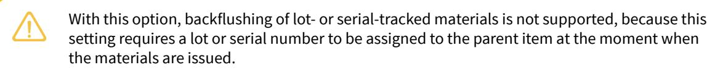

• If you want the system to verify that the lot or serial numbers of a produced item have been specified for lotor serial-tracked materials before users move the produced items into stock (by releasing the appropriate transaction on the last operation), you select *On Completion*. For details, see the *Assignment of Parent Lot or Serial Numbers to Materials on Completion* section below.

For a production order type, you can also specify the default option in the **Require Parent Lot/Serial Number** box on the *[Production](https://help-2025r1.acumatica.com/Help?ScreenId=ShowWiki&pageid=6283187d-54b7-4db1-8c3a-97d3ebc39a95) Order Types* (AM201100) form; the system will initially insert this option for each production order of the type.

#### **Assignment of Parent Lot or Serial Numbers on the Issue of Materials**

To assign the lot or serial numbers of the item being produced to lot- or serial-tracked materials when you issue materials for a production order—which you do when the *On Issue* value is specified in the **Require Parent Lot/ Serial Number** box of the *[Production Order Maintenance](https://help-2025r1.acumatica.com/Help?ScreenId=ShowWiki&pageid=e5d2ddd4-8c80-4f5b-8e5f-e5151636a9d3)* (AM201500) form for the production order—you do the following:

- 1. On the *[Materials](https://help-2025r1.acumatica.com/Help?ScreenId=ShowWiki&pageid=bac20b22-8f5c-4252-8a7a-f022e0471c91)* (AM300000) form, add the materials required for producing the lot- or-serial tracked item for a particular production order.
- 2. Click the row with the lot- or serial-tracked material, and click **Line Details** on the table toolbar. The system opens the **Line Details** dialog box.
- 3. If the material is serialized, add a row in the dialog box for each unit of the material item and either specify its serial number in the **Lot/Serial Nbr.** column or make sure that the serial numbers have been generated automatically, depending on the settings of the serial class.
- 4. If the material is tracked by lot, add one row for each lot number to which units are assigned and specify the quantity of units to which this lot number is assigned.
- 5. In the **Parent Lot/Serial Nbr.** column, specify the lot or serial number of the parent item to be assigned to each row.
- 6. Click **OK** to save the changes and close the dialog box.
- 7. Release the material transaction by clicking **Release** on the form toolbar.

If you do not assign the lot or serial numbers of the parent item to any lot- or serial-tracked materials, the system displays an error message and does not release the transaction.

#### **Workflow of the Assignment of Parent Lot or Serial Numbers to Materials on Issue**

For preassigning lot or serial numbers to parent items and assigning parent lot or serial numbers to materials on issue of the materials, the typical process involves the actions and generated documents shown in the following diagram.

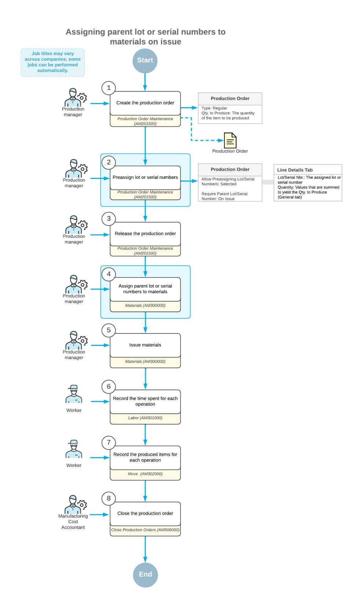

## **Assignment of Parent Lot or Serial Numbers to Materials on Completion**

To assign the lot or serial numbers of the item to be produced to lot- or serial-tracked materials before you record movement of the produced parent item to stock—that is, when the *On Completion* value is specified in the **Require** **Parent Lot/Serial Number** box of the *[Production Order Maintenance](https://help-2025r1.acumatica.com/Help?ScreenId=ShowWiki&pageid=e5d2ddd4-8c80-4f5b-8e5f-e5151636a9d3)* (AM201500) form for the production order you do the following:

- 1. On the *[Materials](https://help-2025r1.acumatica.com/Help?ScreenId=ShowWiki&pageid=bac20b22-8f5c-4252-8a7a-f022e0471c91)* (AM300000) form, release the material transaction with the materials required for producing the item in a particular production order, including the lot- or serial-tracked materials.
- 2. On the *[Labor](https://help-2025r1.acumatica.com/Help?ScreenId=ShowWiki&pageid=582f9540-0dc6-4515-9e9d-b52cefe0c13f)* (AM301000) or *[Move](https://help-2025r1.acumatica.com/Help?ScreenId=ShowWiki&pageid=b60a4897-b4be-40a5-b732-d3ff26fe1eef)* (AM302000) form, record the movement of the produced items between the operations involved in production, except the last operation.
- 3. When you record the movement of the produced items for the last operation on the *[Labor](https://help-2025r1.acumatica.com/Help?ScreenId=ShowWiki&pageid=582f9540-0dc6-4515-9e9d-b52cefe0c13f)* or *[Move](https://help-2025r1.acumatica.com/Help?ScreenId=ShowWiki&pageid=b60a4897-b4be-40a5-b732-d3ff26fe1eef)* form, click **Late Assignment** on the table toolbar to open the *[Late Assignment](https://help-2025r1.acumatica.com/Help?ScreenId=ShowWiki&pageid=c919c81c-5bbc-49fe-9a89-ea7e6a2be28c)* (AM312000) form.
- 4. Assign the parent lot or serial number to each material as follows:
  - a. In the **Lot/Serial Nbr.** box of the Summary area, select the lot or serial number of the parent that will be assigned to materials.
  - b. In the **Unallocated Components** table, click the material row to be assigned.
  - c. On the form toolbar, click **Allocate**. The system assigns the lot or serial number to the material and moves the material row to the **Allocated Components** table.
  - d. Repeat the previous subinstructions for each material to be allocated to the lot or serial number you have selected in the **Lot/Serial Nbr.** box.
- 5. When you have allocated all needed materials to parent lot or serial numbers, open the *[Labor](https://help-2025r1.acumatica.com/Help?ScreenId=ShowWiki&pageid=582f9540-0dc6-4515-9e9d-b52cefe0c13f)* or *[Move](https://help-2025r1.acumatica.com/Help?ScreenId=ShowWiki&pageid=b60a4897-b4be-40a5-b732-d3ff26fe1eef)* form, and release the transaction for the last operation.

#### **Workflow of the Assignment of Parent Lot or Serial Numbers to Materials on Completion**

For preassigning lot or serial numbers to parent items and assigning parent lot or serial numbers to materials on completion of a production order with the parent items, the typical process involves the actions and generated documents shown in the following diagram.

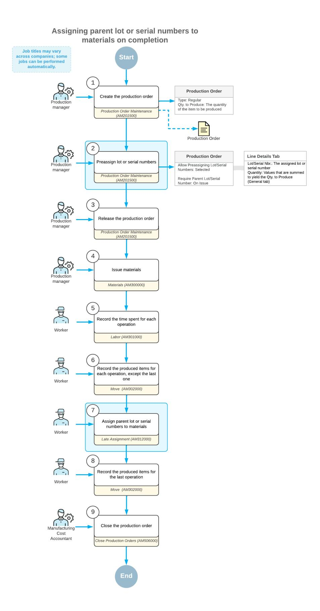

# **Production of Lot- or Serial-Tracked Items: Implementation Checklist**

The following sections provide details you can use to ensure that the system is configured properly for tracking the production of lot or serial-tracked items.

#### **Prerequisites**

Make sure that the following tasks have been performed before you start implementing the tracking of the production of lot or serial-tracked items:

- The system has been prepared for the implementation of manufacturing functionality, as shown in *[System](https://help-2025r1.acumatica.com/Help?ScreenId=ShowWiki&pageid=f713201a-66c5-403a-a531-62fa3cb09a1a) [Preparation for Manufacturing Implementation: Implementation Activity](https://help-2025r1.acumatica.com/Help?ScreenId=ShowWiki&pageid=f713201a-66c5-403a-a531-62fa3cb09a1a)*.
- The production of items has been configured, as described in *[Production Processing: Implementation](#page-37-1) [Checklist](#page-37-1)*.

## **Implementation Checklist**

We recommend that before you initially track the production of lot or serial-tracked items, you make sure the needed features have been enabled and settings have been specified, as summarized in the following checklist.

| Form                               | Criteria to Check                                                                                                                                                                                                                                                                                                              |
|------------------------------------|--------------------------------------------------------------------------------------------------------------------------------------------------------------------------------------------------------------------------------------------------------------------------------------------------------------------------------|
| Enable/Disable Features (CS100000) | The Lot and Serial Tracking feature within the Invento ry and Order Management group of features has been enabled.                                                                                                                                                                                                       |
| Lot/Serial Classes (IN207000)      | The lot or serial classes to be used for produced items and for materials have been created. For the lot or seri al class of the item to be produced, in the Assignment Method box, the When Received option has been spec ified for users to be able to preassign lot or serial num bers to production orders. |
| Stock Items (IN202500)             | The stock items for the items to be produced and ma terials used in production of these items have been created. The appropriate lot or serial class is specified in the Lot/Serial Class box of the Item Defaults sec tion on the General tab for each lot- or serial-tracked item.                            |
| Bill of Material (AM208000) form   | The bills of material for producing the lot- or seri al-tracked items have been created.                                                                                                                                                                                                                                    |

| Form                              | Criteria to Check                                                                                                                                                                                                                                                                                                                                                                                                                                                                                                                                                                                                                                                                                                   |
|-----------------------------------|---------------------------------------------------------------------------------------------------------------------------------------------------------------------------------------------------------------------------------------------------------------------------------------------------------------------------------------------------------------------------------------------------------------------------------------------------------------------------------------------------------------------------------------------------------------------------------------------------------------------------------------------------------------------------------------------------------------------|
| Production Order Types (AM201100) | If you need to set up the preassignment of lot or seri al numbers to produced items, the Allow Preassign ing Lot/Serial Numbers check box is selected on this form (in the Data Entry section of the General tab) for the production order type that you use for production orders of these items. The production order type must have the Regular option selected in the Function box. If you want users to assign the lot or serial number of each unit of the produced item to the lot- or seri al-tracked materials used to produce the item, you make sure that the appropriate value has been speci fied in the Require Parent Lot/Serial Number box of the same section. |

#### **Validation of Configuration**

To make sure that all configuration has been performed correctly, we recommend that in your system, you process production orders with lot- or serial-tracked items by performing instructions similar to those described in .*Production of Lot- or [Serial-Tracked](#page-106-1) Items: To Assign Parent Serial Numbers to Materials on Issue* and *[Production of](#page-111-1) Lot- or [Serial-Tracked](#page-111-1) Items: To Assign Parent Serial Numbers to Materials on Completion*.

# **Production of Lot- or Serial-Tracked Items: To Assign Parent Serial Numbers to Materials on Issue**

The following activity will walk you through the process of creating and processing a production order with a serialtracked item and serial-tracked material. During processing, you will assign the serial numbers of the item to be produced (the parent item) to the units of serial-tracked materials when the materials are issued.

#### **Story**

Suppose that based on the analyzed sales demand from previous periods, the sales department of SweetLife has asked the production department to produce five juicers. These juicers are serial-tracked and include a serialtracked motor base as one of the materials, according to the bill of material dedicated to the juicer's production. Further suppose that the serial number of each motor base must be assigned to the serial number of a juicer for whose assembly the motor base was used. The production manager should assign the serial numbers when the materials for a production order are issued. The information about the serial numbers must be stored in the system because SweetLife provides services for juicer repairing and replacement. They must be able to confirm that the juicer and its parts were bought from SweetLife and to track the components that were used in the production of this specific juicer.

The materials required for the juicer's production are in stock; you do not need to purchase any of them. Also suppose that the scheduling priority is standard (that is, you do not need to produce the juicers more quickly or more slowly than the other items in the queue).

Acting as a production manager, you will create a production order for producing five juicer units, generate serial numbers for the juicer units, issue the materials required for the juicer's production, assign the generated serial numbers to the motor base units, and process the other related transactions.

#### **Configuration Overview**

In the *U100* dataset, the following tasks have been performed to support this activity:

- On the *[Warehouses](https://help-2025r1.acumatica.com/Help?ScreenId=ShowWiki&pageid=264b0ef7-2b6c-40b4-a7d9-f1a5e067939b)* (IN204000) form, the *WORKHOUSE* warehouse has been defined, and its locations include *MGI* and *MTL*.
- On the *[Stock Items](https://help-2025r1.acumatica.com/Help?ScreenId=ShowWiki&pageid=77786a70-1f1e-4d63-ad98-96f98e4fcb0e)* (IN202500) form, the *CFJFRUITSN*, *PULPCONT1L*, *JUICECUP05L*, *MRBASESN*, *FNSIEVE*, and *GRDISC01* stock items have been defined.
- On the *[Lot/Serial Classes](https://help-2025r1.acumatica.com/Help?ScreenId=ShowWiki&pageid=9806d94b-097e-4082-9f01-9ca66d031ab7)* (IN207000) form, the *SNJCRPRT* and *ASNCFGJCR* serial classes have been created.

### **Process Overview**

In this activity, to process the documents and transactions related to the production of the juicers, you will do the following:

- 1. On the *[Production Order Maintenance](https://help-2025r1.acumatica.com/Help?ScreenId=ShowWiki&pageid=e5d2ddd4-8c80-4f5b-8e5f-e5151636a9d3)* (AM201500) form, create the production order for the serialized item and specify the serial number tracking settings
- 2. On the *[Materials](https://help-2025r1.acumatica.com/Help?ScreenId=ShowWiki&pageid=bac20b22-8f5c-4252-8a7a-f022e0471c91)* (AM300000) form, issue the components required for the production order and assign the serial numbers of the parent item to the serial-tracked material units
- 3. On the *[Move](https://help-2025r1.acumatica.com/Help?ScreenId=ShowWiki&pageid=b60a4897-b4be-40a5-b732-d3ff26fe1eef)* (AM302000) form, record the produced quantity of the items
- 4. On the *[Close Production Orders](https://help-2025r1.acumatica.com/Help?ScreenId=ShowWiki&pageid=72b745fd-706b-4e76-b799-c8119cb5e8cf)* (AM506000) form, close the production order
- 5. On the *[As-Built Configuration](https://help-2025r1.acumatica.com/Help?ScreenId=ShowWiki&pageid=05fd4da9-8085-4796-b3c9-2785757f7463)* (AM401700) form, review the serial numbers of the produced units assigned to the serial-tracked material units

#### **System Preparation**

Do the following:

- 1. Sign in to the system as theproduction managerby using the *peters* username and the provided password.
- 2. In the info area, in the upper-right corner of the top pane of the Acumatica ERP screen, make sure that the business date in your system is set to today's date. For simplicity, in this activity, you will create and process all documents in the system on this business date.

#### **System Preparation**

Do the following:

- 1. As a prerequisite to the current activity, complete *Configuration for the Production of Lot- or [Serial-Tracked](https://help-2025r1.acumatica.com/Help?ScreenId=ShowWiki&pageid=cf08d28d-c235-4a56-ae5e-6ce40ccc8617) [Items: Implementation Activity](https://help-2025r1.acumatica.com/Help?ScreenId=ShowWiki&pageid=cf08d28d-c235-4a56-ae5e-6ce40ccc8617)* so that the system is ready for processing the production of serial-tracked items.
- 2. Launch the Acumatica ERP website, and sign in to the company in which the prerequisite activities have been performed. You should sign in as the production manager by using the *peters* username and the *123* password.
- 3. In the info area, in the upper-right corner of the top pane of the Acumatica ERP screen, make sure that the business date in your system is set to today's date. For simplicity, in this activity, you will create and process all documents in the system on this business date.

#### **Step 1: Creating the Production Order**

To create the production order for five juicers and specify the serial number tracking settings, do the following:

1. On the *[Production Order Maintenance](https://help-2025r1.acumatica.com/Help?ScreenId=ShowWiki&pageid=e5d2ddd4-8c80-4f5b-8e5f-e5151636a9d3)* (AM201500) form, add a new record.

Notice that the production order is assigned a status of *Planned*, and today's date has been automatically selected in the **Order Date** box.

- 2. In the Summary area, do the following:
  - a. In the **OrderType** box, make sure *RO* is specified.
  - b. In the **Inventory ID** box, select *CFJFRUITSN*.

On the **General** tab, notice that the *WORKHOUSE* warehouse and the *MGI* location have been selected automatically.

- c. In the **Qty. to Produce** box, specify 5.
- d. In the **Description** box, specify Production of 5 fruit juicers.
- 3. On the **General** tab, set **Require Parent Lot/Serial Number** to *On Issue*.
- 4. On the form toolbar, click**Save**.
- 5. Go to the **Line Details** tab, and notice that the system has generated five serial numbers (one for each unit to be produced), as shown in the following screenshot.

| <b>Production Order Maintenance</b> <b>P</b> NOTES <b>ACTIVITIES</b> TOOLS $\sim$ <b>FILES</b> RO AMP000003 - Production of 5 fruit juicers                                                                                                                                                                |                                                                |                   |                 |                                        |                                          |                                |                             |                |  |  |  |  |
|---------------------------------------------------------------------------------------------------------------------------------------------------------------------------------------------------------------------------------------------------------------------------------------------------------------------------|----------------------------------------------------------------|-------------------|-----------------|----------------------------------------|------------------------------------------|--------------------------------|-----------------------------|----------------|--|--|--|--|
| 뭐 $\leftarrow$                                                                                                                                                                                                                                                                                                         | 日 $\Omega$ 而 +                                        | n. $\check{~}$ | - IK ≺       | <b>HOLD</b> $\rightarrow$ $\geq$ | <b>RELEASE ORDER</b>                     | $\cdots$                       |                             |                |  |  |  |  |
| * Order Type:                                                                                                                                                                                                                                                                                                             | RO - Regular production orders                                 | Q 0            | * Inventory ID: |                                        | CFJFRUITSN - Serial-tracked configur Q 2 | Qty. Complete:                 | $\hat{\phantom{a}}$ 0.00 |                |  |  |  |  |
|                                                                                                                                                                                                                                                                                                                           | * Production Nbr.: AMP000003 - Production of 5 fruit juic Q |                   |                 |                                        | 5.00                                     |                                |                             | Qty. Scrapped: |  |  |  |  |
| Status:                                                                                                                                                                                                                                                                                                                   | Planned                                                        |                   |                 | * UOM:                                 | EA                                       | Q Qty. Remaining:           |                             |                |  |  |  |  |
| * Order Date:                                                                                                                                                                                                                                                                                                             | 11/25/2024                                                     |                   |                 | Description:                           | Production of 5 fruit juicers            |                                |                             |                |  |  |  |  |
| <b>LINE DETAILS</b> <b>GENERAL</b> <b>REFERENCES</b> <b>ATTRIBUTES</b> <b>TOTALS</b> <b>RELATED PRODUCTION</b> <b>EVENTS</b> Unassigned Qty.: Start Lot/Serial Number: 0.00 JC000006 <b>Quantity to Generate:</b> <b>GENERATE</b> 0.00 図 Ò $\vdash$ $^{+}$ $\times$ |                                                                |                   |                 |                                        |                                          |                                |                             |                |  |  |  |  |
| <b>B</b> Location                                                                                                                                                                                                                                                                                                         | Lot/Serial Nbr.                                                | <b>UOM</b>        | Quantity        | Complete Qty.                          | Scrapped Qty.                            | Remaining Qty. Expiration Date |                             |                |  |  |  |  |
| <b>MGI</b>                                                                                                                                                                                                                                                                                                                | JC000001                                                       | EA                | 1.00            | 0.00                                   | 0.00                                     | 1.00                           |                             |                |  |  |  |  |
| <b>MGI</b>                                                                                                                                                                                                                                                                                                                | <b>JC000002</b>                                                | EA                | 1.00            | 0.00                                   | 0.00                                     | 1.00                           |                             |                |  |  |  |  |
| <b>MGI</b>                                                                                                                                                                                                                                                                                                                | JC000003                                                       | EA                | 1.00            | 0.00                                   | 0.00                                     | 1.00                           |                             |                |  |  |  |  |
| <b>MGI</b>                                                                                                                                                                                                                                                                                                                | JC000004                                                       | EA                | 1.00            | 0.00                                   | 0.00                                     | 1.00                           |                             |                |  |  |  |  |
| <b>MGI</b>                                                                                                                                                                                                                                                                                                                | <b>JC000005</b>                                                | EA                | 1.00            | 0.00                                   | 0.00                                     | 1.00                           |                             |                |  |  |  |  |

*Figure: Serial numbers generated for the production order*

6. On the form toolbar, click **Release Order**. The order status is changed to *Released*.

#### **Step 2: Issuing the Components for the Production Order**

In this step, you will issue the components for the production order and assign the serial numbers of the juicer units to the motor base units. Do the following:

- 1. While you are still viewing the production order you have created on the *[Production Order Maintenance](https://help-2025r1.acumatica.com/Help?ScreenId=ShowWiki&pageid=e5d2ddd4-8c80-4f5b-8e5f-e5151636a9d3)* (AM201500) form, on the More menu (under**Transactions**), click **Release Materials**. The system opens the *[Material](https://help-2025r1.acumatica.com/Help?ScreenId=ShowWiki&pageid=fc2d6b79-ca92-4808-8e7b-dae4b326b9e9) Wizard 2* (AM300020) form with the list of components from the production order.
- 2. On the form toolbar, click**Select All**. The system creates a material transaction, adds the selected components to the transaction, and opens the transaction on the *[Materials](https://help-2025r1.acumatica.com/Help?ScreenId=ShowWiki&pageid=bac20b22-8f5c-4252-8a7a-f022e0471c91)* (AM300000) form.
- 3. In the **Description** box of the Summary area, enter Materials for 5 fruit juicers.
- 4. Try to release the material transaction as follows:
  - a. In the Summary area, clear the **Hold** check box. The system changes the transaction's status to *Balanced*.

- b. On the form toolbar, click **Release**. The system returns an error message stating that you need to assign parent serial numbers to the serial-tracked materials before releasing the material transaction.
- 5. In the Summary area, select the **Hold** check box. The system changes the transaction's status to *On Hold*.
- 6. In the table, click the row with the *MRBASESN* item.
- 7. On the table toolbar, click **Line Details**.
- 8. In the **Line Details** dialog box, which opens, do the following:
  - a. In the **Parent Lot/Serial Nbr.** column of each row, select a serial number from the list of numbers that have been preassigned to the production order (as shown in the following screenshot). You must assign a unique parent serial number to each material row.

| <b>Line Details</b>                                                                           |                         |                     |              |              |              |                            |                            |                                           |  |                    |  |  |
|-----------------------------------------------------------------------------------------------|-------------------------|---------------------|--------------|--------------|--------------|----------------------------|----------------------------|-------------------------------------------|--|--------------------|--|--|
| Unassigned Qty.: <b>Quantity to Generate:</b> Ò $\times$ $\leftrightarrow$ $^{+}$ |                         |                     | $\mathbf{x}$ | 0.00 0.00 |              | * Start Lot/Serial Number: |                            | GENERATE                                  |  |                    |  |  |
|                                                                                               | *Location               | *Lot/Serial Nbr. |              |              | Quantity UOM |                            | *Expiration <b>Date</b> | Parent Lot/Serial Nbr.                    |  |                    |  |  |
| $\rightarrow$                                                                                 | <b>MTL</b>              | MBS003401           |              |              | 1.00         | EA                         |                            | JC000001                                  |  |                    |  |  |
|                                                                                               | <b>MTL</b>              | MBS003402           |              |              | 1.00         | EA                         |                            | <b>JC000002</b>                           |  |                    |  |  |
|                                                                                               | <b>MTL</b>              | MBS003403           |              |              | 1.00         | EA                         |                            | JC000003                                  |  |                    |  |  |
|                                                                                               | <b>MTL</b>              | MBS003404           |              |              | 1.00         | EA                         |                            | JC000004                                  |  |                    |  |  |
|                                                                                               | <b>MTL</b> MBS003405 |                     |              |              | 1.00 EA      |                            |                            | JC000005                                  |  |                    |  |  |
|                                                                                               |                         |                     |              |              |              |                            |                            | $  \langle \quad \langle \quad \rangle  $ |  | $>$   <b>OK</b> |  |  |

*Figure: The parent serial numbers assigned to the material units*

- b. Click **OK** to save your changes and close the dialog box.
- 9. Notice that in the **Lot/Serial Nbr.** and **Parent Lot/Serial Nbr.** columns of the row with the *MRBASESN* item, *<SPLIT>* is specified. This means that multiple serial numbers have been selected for the material units.
- 10.In the Summary area, clear the **Hold** check box.
- 11.On the form toolbar, click **Release**. The system successfully releases the material transaction and changes the status of the transaction to *Released*.

#### **Step 3: Recording the Produced Items**

Suppose that warehouse workers have assembled all five juicers and moved them to the *MGI* location of the *WORKHOUSE* warehouse. In the production environment, you would record the workers' time spent on juicer assembly, but in this activity, for simplicity, you will record only the movement of the assembled juicers. Do the following:

- 1. On the *[Production Order Maintenance](https://help-2025r1.acumatica.com/Help?ScreenId=ShowWiki&pageid=e5d2ddd4-8c80-4f5b-8e5f-e5151636a9d3)* (AM201500) form, open the production order that you created earlier in this activity.
- 2. On the form toolbar, click **Create MoveTransaction**. The system opens the *[Move](https://help-2025r1.acumatica.com/Help?ScreenId=ShowWiki&pageid=b60a4897-b4be-40a5-b732-d3ff26fe1eef)* (AM302000) form with the row for the production order added to the table.
- 3. On the table toolbar, click **Line Details**. The system opens the **Line Details** dialog box.

Notice that in each table row, in the **Lot/Serial Nbr.** column, the system selected a serial number from the list of numbers that have been generated for the production order (as shown in the following screenshot).

| <b>Line Details</b>          |                 |                            |                                          |  |                                                         | $\times$ |
|------------------------------|-----------------|----------------------------|------------------------------------------|--|---------------------------------------------------------|----------|
| Unassigned Qty.: 0.00     |                 | * Start Lot/Serial Number: | !!!!!!!!!!!!!!!!!!!!!!!!!!!!!!!!!!!!!!!! |  |                                                         |          |
| <b>Quantity to Generate:</b> | 0.00            |                            | <b>GENERATE</b>                          |  |                                                         |          |
| $+ x +$ Ò                 | $\mathbf x$     |                            |                                          |  |                                                         |          |
| *Location                    | Lot/Serial Nbr. | <b>Quantity UOM</b>        |                                          |  | *Expiration Date                                        |          |
| ゝ <b>MGI</b>              | JC000001        | 1.00 EA                    |                                          |  |                                                         |          |
| <b>MGI</b>                   | JC000002        | 1.00 EA                    |                                          |  |                                                         |          |
| MGI                          | <b>JC000003</b> | 1.00 EA                    |                                          |  |                                                         |          |
| <b>MGI</b>                   | JC000004        | 1.00 EA                    |                                          |  |                                                         |          |
| MGI                          | <b>JC000005</b> | 1.00 EA                    |                                          |  |                                                         |          |
|                              |                 |                            |                                          |  | $  \langle \quad \langle \quad \rangle \quad \rangle  $ |          |
|                              |                 |                            |                                          |  |                                                         | OK       |

#### *Figure: The serial numbers in the Line Details dialog box on the Move form*

- 4. Click **OK** to close the dialog box.
- 5. In the Summary area, do the following:
  - a. Make sure that today's date is specified in the **Date** box.
  - b. In the **Description** box, enter Recording the movement of 5 fruit juicers.
  - c. Clear the **Hold** check box. The system changes the transaction's status to *Balanced*.
- 6. On the form toolbar, click **Release**. The system releases the move transaction.
- 7. Open the production order on the *[Production Order Maintenance](https://help-2025r1.acumatica.com/Help?ScreenId=ShowWiki&pageid=e5d2ddd4-8c80-4f5b-8e5f-e5151636a9d3)* form and notice that it is assigned the *Completed* status.

### **Step 4: Closing the Production Order**

Now you will close the production order. Do the following:

- 1. On the *[Close Production Orders](https://help-2025r1.acumatica.com/Help?ScreenId=ShowWiki&pageid=72b745fd-706b-4e76-b799-c8119cb5e8cf)* (AM506000) form, select the production order.
- 2. On the form toolbar, click **Process**. In the **Processing** dialog box, which opens, review the processing details, and when the processing is completed, click **Close**.
- 3. Go to the *[Production Order Maintenance](https://help-2025r1.acumatica.com/Help?ScreenId=ShowWiki&pageid=e5d2ddd4-8c80-4f5b-8e5f-e5151636a9d3)* form, and notice that the status of the production order has changed to *Closed*.

You have processed the production order with the serialized item and assigned the parent serial numbers to the serialized material units.

#### **Step 5: Reviewing the Serial Numbers Specified in the Production Order**

You will review the list of serial numbers specified for the juicer units and the motor base units in the production order you created earlier in this activity. Do the following:

- 1. Open the *[As-Built Configuration](https://help-2025r1.acumatica.com/Help?ScreenId=ShowWiki&pageid=05fd4da9-8085-4796-b3c9-2785757f7463)* (AM401700) form.
- 2. In the **Prod. Order Nbr.** box of the Selection area, select the production order that you created earlier in this activity.
- 3. In the tree, click the *MRBASESN* node.

In the **Parent Lot/Serial Nbr.** column on the Item Details pane, review the serial numbers of juicer units assigned to the motor base items (see the following screenshot).

| TOOLS $\sim$ <b>As-Built Configuration</b>                               |                              |                                                              |                                           |                            |                                      |                        |                |
|-----------------------------------------------------------------------------|------------------------------|--------------------------------------------------------------|-------------------------------------------|----------------------------|--------------------------------------|------------------------|----------------|
| $\Omega$                                                                    |                              |                                                              |                                           |                            |                                      |                        |                |
| Lot/Serial Nbr.: Inventory ID:                                           | $\circ$ $\circ$           | Sales Order Nbr.: $\mathscr{D}$ Prod. Order Nbr.: 0 | AMP000003 - Production of 5 $\varnothing$ | $\circ$ 0               | Levels to Display: $\overline{1}$ |                        |                |
| RO - AMP000003 - CFJFRUITSN <b>B MRBASESN - Serialized motor base</b> (f | $\circ$ $\times$ $\pm$ | 図 $\vdash$                                                |                                           |                            |                                      |                        |                |
| Die JUICECUP05L - Juice cup 0.5 liter (for c                                | <b>B</b> Inventory ID        | <b>Description</b>                                           | Lot/Serial Nbr.                           | <b>Parent Inventory ID</b> | <b>Parent Description</b>            | Parent Lot/Serial Nbr. | Qty UOM        |
| <b>B</b> PULPCONT1L - Pulp container 1 liter (fc                            | <b>MRBASESN</b>              | Serialized motor base (for co                                | MBS003401                                 | <b>CFJFRUITSN</b>          | Serial-tracked configurable ju       | JC000001               | $1.00 -$ EA |
| E FNSIEVE - Fine sieve (for configurable i                                  | <b>MRBASESN</b>              | Serialized motor base (for co                                | MBS003402                                 | <b>CFJFRUITSN</b>          | Serial-tracked configurable ju       | <b>JC000002</b>        | EA 1.00     |
| - fa GRDISC01 - Grating disc for fine peeling                               | <b>MRBASESN</b>              | Serialized motor base (for co                                | MBS003403                                 | <b>CFJFRUITSN</b>          | Serial-tracked configurable ju       | <b>JC000003</b>        | EA 1.00     |
|                                                                             | <b>MRBASESN</b>              | Serialized motor base (for co                                | MBS003404                                 | <b>CFJFRUITSN</b>          | Serial-tracked configurable ju       | <b>JC000004</b>        | EA 1.00     |
|                                                                             | <b>MRBASESN</b>              | Serialized motor base (for co                                | MBS003405                                 | <b>CFJFRUITSN</b>          | Serial-tracked configurable ju       | <b>JC000005</b>        | EA 1.00     |

*Figure: The As-Built Configuration form*

# **Production of Lot- or Serial-Tracked Items: To Assign Parent Serial Numbers to Materials on Completion**

The following activity will walk you through the process of creating and processing a production order with a serialtracked item and serial-tracked material. During processing, you will assign the serial numbers of the item to be produced (the parent item) to the units of serial-tracked materials when the units of the produced item are moved to stock.

#### **Story**

Suppose that based on the analyzed sales demand from previous periods, the sales department of SweetLife has asked the production department to produce three juicers for fruit. These juicers are serial-tracked and include a serial-tracked motor base as one of the materials, according to the bill of material dedicated to the juicer's production. Further suppose that the serial number of each motor base must be assigned to the serial number of the juicer in whose assembly the motor base was used. The production manager should assign the serial numbers when the assembled juicers are moved to stock. The information about the serial numbers must be stored in the system because SweetLife provides services for juicer repairing and replacement. They must be able to confirm that the juicer and its parts were bought from SweetLife and to track the components that were used in the production of this specific juicer.

The materials required for the juicer's production are in stock; you do not need to purchase any of them. Also suppose that the scheduling priority is standard (that is, you do not need to produce the juicers more quickly or more slowly than the other items in the queue).

Acting as a production manager, you will create a production order for producing three fruit juicer units, generate serial numbers for the juicer units, issue the materials required for the juicer's production, and while you are recording the movement of the assembled juicers to stock, assign the generated serial numbers to the motor base units.

#### **Configuration Overview**

In the *U100* dataset, the following tasks have been performed to support this activity:

- On the *[Warehouses](https://help-2025r1.acumatica.com/Help?ScreenId=ShowWiki&pageid=264b0ef7-2b6c-40b4-a7d9-f1a5e067939b)* (IN204000) form, the *WORKHOUSE* warehouse has been defined, and its locations include *MGI* and *MTL*.
- On the *[Stock Items](https://help-2025r1.acumatica.com/Help?ScreenId=ShowWiki&pageid=77786a70-1f1e-4d63-ad98-96f98e4fcb0e)* (IN202500) form, the *CFJFRUITSN*, *PULPCONT1L*, *JUICECUP05L*, *MRBASESN*, *FNSIEVE*, and *GRDISC01* stock items have been defined.
- On the *[Lot/Serial Classes](https://help-2025r1.acumatica.com/Help?ScreenId=ShowWiki&pageid=9806d94b-097e-4082-9f01-9ca66d031ab7)* (IN207000) form, the *SNJCRPRT* and *ASNCFGJCR* serial classes have been created.

#### **Process Overview**

In this activity, to process the documents and transactions related to the production of the juicers, you will do the following:

- 1. On the *[Production Order Maintenance](https://help-2025r1.acumatica.com/Help?ScreenId=ShowWiki&pageid=e5d2ddd4-8c80-4f5b-8e5f-e5151636a9d3)* (AM201500) form, create the production order for the serialized item and specify the serial number tracking settings
- 2. On the *[Materials](https://help-2025r1.acumatica.com/Help?ScreenId=ShowWiki&pageid=bac20b22-8f5c-4252-8a7a-f022e0471c91)* (AM300000) form, issue the components required for the production order
- 3. On the *[Late Assignment](https://help-2025r1.acumatica.com/Help?ScreenId=ShowWiki&pageid=c919c81c-5bbc-49fe-9a89-ea7e6a2be28c)* (AM312000) form, assign the serial numbers of the parent item to the serial-tracked material units
- 4. On the *[Move](https://help-2025r1.acumatica.com/Help?ScreenId=ShowWiki&pageid=b60a4897-b4be-40a5-b732-d3ff26fe1eef)* (AM302000) form, record the produced quantity of the items
- 5. On the *[Close Production Orders](https://help-2025r1.acumatica.com/Help?ScreenId=ShowWiki&pageid=72b745fd-706b-4e76-b799-c8119cb5e8cf)* (AM506000) form, close the production order
- 6. On the *[As-Built Configuration](https://help-2025r1.acumatica.com/Help?ScreenId=ShowWiki&pageid=05fd4da9-8085-4796-b3c9-2785757f7463)* (AM401700) form, review the serial numbers of the produced units assigned to the serial-tracked material units

### **System Preparation**

Do the following:

- 1. Sign in to the system as theproduction managerby using the *peters* username and the provided password.
- 2. In the info area, in the upper-right corner of the top pane of the Acumatica ERP screen, make sure that the business date in your system is set to today's date. For simplicity, in this activity, you will create and process all documents in the system on this business date.

## **System Preparation**

Do the following:

- 1. As a prerequisite to the current activity, complete *Configuration for the Production of Lot- or [Serial-Tracked](https://help-2025r1.acumatica.com/Help?ScreenId=ShowWiki&pageid=cf08d28d-c235-4a56-ae5e-6ce40ccc8617) [Items: Implementation Activity](https://help-2025r1.acumatica.com/Help?ScreenId=ShowWiki&pageid=cf08d28d-c235-4a56-ae5e-6ce40ccc8617)* so that the system is ready for processing the production of serial-tracked items.
- 2. Launch the Acumatica ERP website, and sign in to the company in which the prerequisite activities have been performed. You should sign in as the production manager by using the *peters* username and the *123* password.
- 3. In the info area, in the upper-right corner of the top pane of the Acumatica ERP screen, make sure that the business date in your system is set to today's date. For simplicity, in this activity, you will create and process all documents in the system on this business date.

#### **Step 1: Creating the Production Order**

To create the production order for three juicers and specify the serial number tracking settings, do the following:

1. On the *[Production Order Maintenance](https://help-2025r1.acumatica.com/Help?ScreenId=ShowWiki&pageid=e5d2ddd4-8c80-4f5b-8e5f-e5151636a9d3)* (AM201500) form, add a new record.

Notice that the production order is assigned a status of *Planned*, and today's date has been automatically selected in the **Order Date** box.

- 2. In the Summary area, do the following:
  - In the **OrderType** box, make sure *RO* is specified.
  - In the **Inventory ID** box, select *CFJFRUITSN*.

On the **General** tab, notice that the *WORKHOUSE* warehouse and the *MGI* location have been selected automatically.

- In the **Qty. to Produce** box, specify 3.
- In the **Description** box, specify Production of 3 fruit juicers.
- 3. On the **General** tab, set **Require Parent Lot/Serial Number** to *On Completion*.
- 4. On the form toolbar, click**Save**.
- 5. Go to the **Line Details** tab, and notice that the system has generated three serial numbers (one for each unit to be produced), as shown in the following screenshot.

| <b>Production Order Maintenance</b> RO AMP000004 - Production of 3 fruit juicers                                                                                                |                                                                                                                            |                                                 | <b>PINOTES</b> TOOLS $\sim$ <b>ACTIVITIES</b> <b>FILES</b> |  |  |  |  |
|------------------------------------------------------------------------------------------------------------------------------------------------------------------------------------|----------------------------------------------------------------------------------------------------------------------------|-------------------------------------------------|---------------------------------------------------------------------|--|--|--|--|
| 圖 日 血 n $\Omega$ + $\leftarrow$                                                                                                                                  | <b>HOLD</b> K ≻ $\geq$ ≺ $\check{ }$                                                                        | <b>RELEASE ORDER</b> $\cdots$                |                                                                     |  |  |  |  |
| * Order Type: RO - Regular production orders                                                                                                                                    | Q * Inventory ID: 0                                                                                                  | CFJFRUITSN - Serial-tracked configur Q          | $\hat{\phantom{a}}$ Qty. Complete: 0.00 $\Lambda$          |  |  |  |  |
| * Production Nbr.: AMP000004 - Production of 3 fruit juic Q                                                                                                                     | Qty. to Produce:                                                                                                           | 3.00                                            | Qty. Scrapped: 0.00                                              |  |  |  |  |
| Planned Status:                                                                                                                                                                 | * UOM:                                                                                                                     | EA                                              | Qty. Remaining: Q 3.00                                        |  |  |  |  |
| * Order Date: 11/25/2024                                                                                                                                                        | Description:                                                                                                               | Production of 3 fruit juicers                   |                                                                     |  |  |  |  |
| <b>REFERENCES</b> <b>GENERAL</b> Unassigned Qty.: 0.00 <b>Quantity to Generate:</b> 0.00 Ò $\mathbf{x}$ $\left  \rightarrow \right $ $^{+}$ $\times$ | <b>RELATED PRODUCTION</b> <b>EVENTS</b> <b>ATTRIBUTES</b> Start Lot/Serial Number: JC000009 <b>GENERATE</b> | <b>LINE DETAILS</b> <b>TOTALS</b>            |                                                                     |  |  |  |  |
| <b>B</b> Location <b>UOM</b> Lot/Serial Nbr.                                                                                                                                 | Quantity Complete Qty.                                                                                                  | Remaining Qty. Expiration Date Scrapped Qty. |                                                                     |  |  |  |  |
| <b>MGI</b> EA <b>JC000006</b>                                                                                                                                                | 1.00 0.00                                                                                                               | 0.00 1.00                                    |                                                                     |  |  |  |  |
| EA <b>MGI</b> JC000007                                                                                                                                                       | 0.00 1.00                                                                                                               | 0.00 1.00                                    |                                                                     |  |  |  |  |
| EA <b>MGI</b> <b>JC000008</b>                                                                                                                                                | 0.00 1.00                                                                                                               | 0.00 1.00                                    |                                                                     |  |  |  |  |

*Figure: Serial numbers generated for the production order*

6. On the form toolbar, click **Release Order**. The order status changes to *Released*.

#### **Step 2: Issuing the Components for the Production Order**

In this step, you will issue the components for the production order. Do the following:

- 1. While you are still viewing the production order you have created on the *[Production Order Maintenance](https://help-2025r1.acumatica.com/Help?ScreenId=ShowWiki&pageid=e5d2ddd4-8c80-4f5b-8e5f-e5151636a9d3)* (AM201500) form, on the More menu (under**Transactions**), click **Release Materials**. The system opens the *[Material](https://help-2025r1.acumatica.com/Help?ScreenId=ShowWiki&pageid=fc2d6b79-ca92-4808-8e7b-dae4b326b9e9) Wizard 2* (AM300020) form with the list of components from the production order.
- 2. On the form toolbar, click**Select All**. The system creates a material transaction, adds the selected materials to the transaction, and opens the transaction on the *[Materials](https://help-2025r1.acumatica.com/Help?ScreenId=ShowWiki&pageid=bac20b22-8f5c-4252-8a7a-f022e0471c91)* (AM300000) form.
- 3. In the **Description** box of the Summary area, enter Materials for 3 fruit juicers.
- 4. In the Summary area, clear the **Hold** check box. The system changes the transaction's status to *Balanced*.
- 5. On the form toolbar, click **Release**. The system releases the material transaction and changes the status of the transaction to *Released*.

#### **Step 3: Assigning the Parent Serial Numbers to Material Units**

Suppose that warehouse workers have assembled all three juicers and moved them to the *MGI* location of the *WORKHOUSE* warehouse. Before you record the movement of the juicers, you will assign the serial numbers of the juicer units to the motor base units. Do the following:

- 1. On the *[Production Order Maintenance](https://help-2025r1.acumatica.com/Help?ScreenId=ShowWiki&pageid=e5d2ddd4-8c80-4f5b-8e5f-e5151636a9d3)* (AM201500) form, open the production order that you created earlier in this activity.
- 2. On the More menu (under **Materials**), click **Late Assignment**. The system opens the *[Late Assignment](https://help-2025r1.acumatica.com/Help?ScreenId=ShowWiki&pageid=c919c81c-5bbc-49fe-9a89-ea7e6a2be28c)* (AM312000) form with the production order whose reference number was specified in the **Production Nbr.** box.

- 3. In the **Lot/Serial Nbr.** box of the Summary area, select one of the serial numbers generated for the production order.
- 4. In the **Unallocated Components** table, click the first material line to be allocated.
- 5. On the table toolbar, click **Allocate**. The system allocates the material for the lot or serial number and moves the material line to the **Allocated Components** table.
- 6. Repeat the previous three instructions for each of the two remaining serial numbers for the juicers.

You have assigned the serial numbers of the juicer to the motor base units.

#### **Step 4: Recording the Produced Items**

In the production environment, you would now record the workers' time spent on juicer assembly. In this activity, for simplicity, you will record only the movement of the assembled juicers. Do the following:

- 1. On the *[Production Order Maintenance](https://help-2025r1.acumatica.com/Help?ScreenId=ShowWiki&pageid=e5d2ddd4-8c80-4f5b-8e5f-e5151636a9d3)* (AM201500) form, open the production order that you created earlier in this activity.
- 2. On the form toolbar, click **Create MoveTransaction**. The system opens the *[Move](https://help-2025r1.acumatica.com/Help?ScreenId=ShowWiki&pageid=b60a4897-b4be-40a5-b732-d3ff26fe1eef)* (AM302000) form with the row for the production order added to the table.
- 3. On the table toolbar, click **Line Details**. The system opens the **Line Details** dialog box.

Notice that in each table row, in the **Lot/Serial Nbr.** column, the system selected a serial number from the list of numbers that have been generated for the production order (as shown in the following screenshot).

|                               | <b>Line Details</b> |              |                                  |                                          |          |                     |         |  |  |                                | ×             |
|-------------------------------|---------------------|--------------|----------------------------------|------------------------------------------|----------|---------------------|---------|--|--|--------------------------------|---------------|
| Unassigned Qty.:              |                     | 0.00         | * Start Lot/Serial Number:       |                                          | JC000009 |                     |         |  |  |                                |               |
| 0.00 Quantity to Generate: |                     |              |                                  | GENERATE                                 |          |                     |         |  |  |                                |               |
|                               | Ò $^{+}$         | $\mathsf{X}$ | $\left  \leftrightarrow \right $ | $\mathbf x$                              |          |                     |         |  |  |                                |               |
|                               | *Location           |              |                                  | Lot/Serial Nbr.                          |          | <b>Quantity UOM</b> |         |  |  | *Expiration Date               |               |
| ⋟                             | <b>MGI</b>          |              |                                  | !!!!!!!!!!!!!!!!!!!!!!!!!!!!!!!!!!!!!!!! |          |                     | 1.00 EA |  |  |                                |               |
|                               | <b>MGI</b>          |              |                                  | JC000007                                 |          |                     | 1.00 EA |  |  |                                |               |
|                               | <b>MGI</b>          |              |                                  | !!!!!!!!!!!!!!!!!!!!!!!!!!!!!!!!!!!!!!!! |          |                     | 1.00 EA |  |  |                                |               |
|                               |                     |              |                                  |                                          |          |                     |         |  |  |                                |               |
|                               |                     |              |                                  |                                          |          |                     |         |  |  |                                |               |
|                               |                     |              |                                  |                                          |          |                     |         |  |  | $K$ $\leftarrow$ $\rightarrow$ | $\rightarrow$ |
|                               |                     |              |                                  |                                          |          |                     |         |  |  |                                | OK            |

*Figure: The serial numbers in the Line Details dialog box of the Move form*

- 4. Click **OK** to close the dialog box.
- 5. In the Summary area, do the following:
  - a. Make sure that today's date is specified in the **Date** box.
  - b. In the **Description** box, enter Recording the movement of 3 fruit juicers.
  - c. Clear the **Hold** check box. The system changes the transaction's status to *Balanced*.
- 6. On the form toolbar, click **Release**. The system releases the move transaction.
- 7. Open the production order on the *[Production Order Maintenance](https://help-2025r1.acumatica.com/Help?ScreenId=ShowWiki&pageid=e5d2ddd4-8c80-4f5b-8e5f-e5151636a9d3)* form and notice that it is assigned the *Completed* status.

#### **Step 5: Closing the Production Order**

Now you will close the production order. Do the following:

- 1. On the *[Close Production Orders](https://help-2025r1.acumatica.com/Help?ScreenId=ShowWiki&pageid=72b745fd-706b-4e76-b799-c8119cb5e8cf)* (AM506000) form, select the production order.
- 2. On the form toolbar, click **Process**. In the **Processing** dialog box, which opens, review the processing details, and when the processing is completed, click **Close**.
- 3. Go to the *[Production Order Maintenance](https://help-2025r1.acumatica.com/Help?ScreenId=ShowWiki&pageid=e5d2ddd4-8c80-4f5b-8e5f-e5151636a9d3)* form, and notice that the status of the production order has changed to *Closed*.

You have processed the production order with the serialized item and assigned the parent serial numbers to the serialized material units.

#### **Step 6: Viewing the Serial Numbers Specified in the Production Order**

You will view the list of serial numbers specified for the juicer units and to the motor base units in the production order you created earlier in this activity. Do the following:

- 1. Open the *[As-Built Configuration](https://help-2025r1.acumatica.com/Help?ScreenId=ShowWiki&pageid=05fd4da9-8085-4796-b3c9-2785757f7463)* (AM401700) form.
- 2. In the **Prod. Order Nbr.** box of the Selection area, select the number of the production order that you created earlier in this activity.
- 3. In the tree, click the *MRBASESN* node.

In the **Parent Lot/Serial Nbr.** column on the Item Details pane, review the serial numbers of juicer units assigned to the motor base items (see the following screenshot).

| $TOOLS$ $\star$ <b>As-Built Configuration</b>                                                     |                          |                  |                               |                                |                        |            |
|------------------------------------------------------------------------------------------------------|--------------------------|------------------|-------------------------------|--------------------------------|------------------------|------------|
| $\Omega$                                                                                             |                          |                  |                               |                                |                        |            |
| Lot/Serial Nbr.: $\circ$                                                                          | Sales Order Nbr.: 0   |                  | $\circ$ $\mathscr{D}$      | Levels to Display: - 1      |                        |            |
| Inventory ID: ۹                                                                                   | Prod. Order Nbr.:        |                  | AMP000004 - Production of 3 Q |                                |                        |            |
| a-m RO - AMP000004 - CFJFRUITSN Ò $\times$ $\div$                                           | $\sqrt{N}$ н          |                  |                               |                                |                        |            |
| · ARBASESN - Serialized motor base <b>图 Inventory ID</b> DICECUP05L - Juice cup 0.5 liter (for | <b>Description</b>       | Lot/Serial Nbr.  | <b>Parent Inventory ID</b>    | <b>Parent Description</b>      | Parent Lot/Serial Nbr. | Qty UOM    |
| <b>MRBASESN</b> PULPCONT1L - Pulp container 1 liter (f                                            | Serialized motor base (f | MBS003406        | <b>CFJFRUITSN</b>             | Serial-tracked configurable ju | <b>JC000006</b>        | EA 1.00 |
| - R FNSIEVE - Fine sieve (for configurable <b>MRBASESN</b>                                        | Serialized motor base (f | MBS003407        | <b>CFJFRUITSN</b>             | Serial-tracked configurable ju | JC000007               | EA 1.00 |
| - E GRDISC01 - Grating disc for fine peelin <b>MRBASESN</b>                                       | Serialized motor base (f | <b>MBS003408</b> | <b>CFJFRUITSN</b>             | Serial-tracked configurable iu | <b>JC000008</b>        | EA 1.00 |

*Figure: The Lot/Serial Hierarchy report*

## **Production of Lot- or Serial-Tracked Items: Related Report and Inquiry Forms**

In the following sections, you can find details about the reports and inquiry forms you may want to review to gather information about the lot- or serial-tracked items in production.

If you do not see a particular report or form that is described, you may have signed in to the system with a user account that does not have access rights to the report or form. Contact your system administrator to obtain access to any needed reports or forms.

#### **Viewing the Lot or Serial Numbers of Produced Items and Materials**

To view the lot or serial numbers of a produced item, the lot or serial numbers of the materials used to produce the item, and the lot or serial numbers of the produced item assigned to the materials, you can use the *[As-Built](https://help-2025r1.acumatica.com/Help?ScreenId=ShowWiki&pageid=05fd4da9-8085-4796-b3c9-2785757f7463) [Configuration](https://help-2025r1.acumatica.com/Help?ScreenId=ShowWiki&pageid=05fd4da9-8085-4796-b3c9-2785757f7463)* (AM401700) form.

#### **Viewing the Lot- or Serial-Tracked Materials Used in Production**

To find the items that were produced by using a material with a particular lot or serial number, you can use the *[Where Used in Production](https://help-2025r1.acumatica.com/Help?ScreenId=ShowWiki&pageid=a936cdcd-cf36-451e-bec7-5b8c2ec44e56)* (AM402500) form. On this form, you can also view the lot- or serial-tracked subassemblies used to produce the selected material.

### **Viewing the Materials in Material Transactions**

You can use the *Material [Transaction](https://help-2025r1.acumatica.com/Help?ScreenId=ShowWiki&pageid=b72516e5-12e5-41a5-a06d-c2ec20894e46) Details* (AM000015) form to view the list of materials issued for production with details about material transactions that have been generated on the *[Materials](https://help-2025r1.acumatica.com/Help?ScreenId=ShowWiki&pageid=bac20b22-8f5c-4252-8a7a-f022e0471c91)* (AM300000) form. These details include the transaction identifier and date, the lot or serial numbers assigned to each material, and the reference number of the production order for which the material has been issued. In addition, you can select the materials according to particular criteria, such as the lot or serial number of the material and the lot or serial number of the produced item for which the material has been used.

# **Producing Items with Outside Processing**

If your organization contracts out any production operations to subcontractors, Acumatica ERP Manufacturing Edition provides you with the ability to track the materials required for these operations and create documents that record payments for subcontractor services.

In this chapter, you will read about the production process when outside operations are included.

# **Outside Processing: General Information**

An organization may contract out to outside organizations (vendors or subcontractors) particular operations related to the production of items. Contract manufacturing is common in some industries, such as circuit boards, food and beverage, pharmaceuticals, nutraceuticals and cosmetics, aerospace, and defense. An organization might engage a subcontractor when the organization has insufficient production capacity or does not have the specific facilities to perform particular operations, such as plating or heat treating.

Acumatica ERP Manufacturing Edition gives you the ability to track outside processing in the production process and account for the costs related to outside processing in the cost of produced items, as described in the following sections.

#### **Learning Objectives**

In this chapter, you will learn how to do the following:

- Create a work center dedicated for outside processing
- Create a bill of material that contains an operation outsourced to a subcontractor
- Select the appropriate type of item (stock or non-stock) for recording the subcontractor charges
- Select the appropriate way to store and deliver materials used in outside processing
- Process production orders that contain outside operations

#### **Applicable Scenarios**

You configure outside processing in the following cases:

- When you are initially implementing Acumatica ERP Manufacturing Edition, and your organization contracts out some or all production operations
- When your organization already uses Acumatica ERP Manufacturing Edition and recently has started to contract out some or all production operations

#### **Outside Processing Operations**

When you involve subcontractors in production of items, you add outside processing operations to the production routing (for details, see *[Outside Processing: Configuration](#page-118-1)*). These operations require specific processing, which differs from processing of operations performed inside you organization. You may need to do any of the following for outside operations:

- If you store materials for the outside operation at your facility, you use vendor shipments to record shipping of the materials to the subcontractor. For details about storing materials in outside processing, see *[Outside](#page-119-1) [Processing: Subcontractor's Storage of Materials](#page-119-1)*.
- You usually use purchase orders for subcontractor's services. For more information, see *[Outside Processing:](#page-120-1) [Charges for Subcontractor Services](#page-120-1)*.

# **Outside Processing: Configuration**

Acumatica ERP Manufacturing Edition provides you with the ability to configure and use outside processing within the production process. This topic describes the configuration of outside processing in the system.

#### **Configuration of Outside Processing**

To configure outside processing, you perform the following general steps:

- 1. On the *[Numbering Sequences](https://help-2025r1.acumatica.com/Help?ScreenId=ShowWiki&pageid=a8d11c23-21f2-42a3-b17d-9637c9cf8031)* (CS201010) form, you create the numbering sequence for vendor shipments.
- 2. On the *[Production Preferences](https://help-2025r1.acumatica.com/Help?ScreenId=ShowWiki&pageid=678a1833-f1f6-44f1-afce-55aa7438b3f3)* (AM102000) form, you specify the numbering sequence in the**Vendor Shipment NumberingSequence** box in the **NumberingSettings** section of the **General** tab.
- 3. On the *[Vendors](https://help-2025r1.acumatica.com/Help?ScreenId=ShowWiki&pageid=a9584be3-f2bd-4d67-80d4-8041d809df56)* (AP303000) form, you create the needed vendors who will represent subcontractors.
- 4. On the *[Overhead](https://help-2025r1.acumatica.com/Help?ScreenId=ShowWiki&pageid=78dd90ec-9bc6-4ea4-a901-4d6f531e9d99)* (AM202500) form, you create any needed records for additional costs to be applied to the outside operation. For details, see *[Configuring Production Cost Drivers: Implementation Activity](https://help-2025r1.acumatica.com/Help?ScreenId=ShowWiki&pageid=c1604cdc-a0d1-4df7-82e0-97c53bafd053)*.
- 5. On the *[Work Centers](https://help-2025r1.acumatica.com/Help?ScreenId=ShowWiki&pageid=6543295f-b1eb-4991-868f-503435b1d67a)* (AM207000) form, you create at least one work center for outside processing. The work center must have the **Outside Process** check box selected in the Summary area. For more information, see the *Work Centers for Outside Processing* section below.
- 6. On the *[Stock Items](https://help-2025r1.acumatica.com/Help?ScreenId=ShowWiki&pageid=77786a70-1f1e-4d63-ad98-96f98e4fcb0e)* (IN202500) or *[Non-Stock Items](https://help-2025r1.acumatica.com/Help?ScreenId=ShowWiki&pageid=bf68dd4f-63d4-460d-8dc0-9152f2bd6bf1)* (IN202000) form, you create the needed stock items or non-stock items that you will use to pay the subcontractor for their services. For details, see *[Outside](#page-120-1) [Processing: Charges for Subcontractor Services](#page-120-1)*.
- 7. On the *[Bill of Material](https://help-2025r1.acumatica.com/Help?ScreenId=ShowWiki&pageid=1aae7d3a-d5f9-4693-b91f-663c4c2d362b)* (AM208000) form, you create the needed bills of material that you will use for production orders with outside processing operations. For more information, see the *Bills of Material with Outside Operations* section below.
- 8. On the *[Warehouses](https://help-2025r1.acumatica.com/Help?ScreenId=ShowWiki&pageid=264b0ef7-2b6c-40b4-a7d9-f1a5e067939b)* (IN204000) form, you create the warehouses or warehouse locations to be involved in outside processing if any materials for the outside operations will be stored by the subcontractor and if you would like to track the availability and movement of the materials. For more information, see *[Outside](#page-119-1) [Processing: Subcontractor's Storage of Materials](#page-119-1)*.

#### **Work Centers for Outside Processing**

When you create a work center for subcontractors, you specify the settings on the *[Work Centers](https://help-2025r1.acumatica.com/Help?ScreenId=ShowWiki&pageid=6543295f-b1eb-4991-868f-503435b1d67a)* (AM207000) form as follows:

- In the Summary area, you select the **Outside Process** check box.
- In the **Standard Cost** box, you type 0. With this setting, the system will not add labor costs when a production manager records the completion of the outside operation.
- We recommend that you select the **Backflush Materials** check box. Because the work is performed outside your organization, recording issued materials may not be feasible. On release of the move transaction for the outside operation, the system will also issue materials to the production record.
- On the **Shis** tab, you specify the following settings for the automatically added shi:
  - **Crew Size**: *0*
  - **Efficiency**: *1*
  - **Calendar**: Your standard calendar
  - You leave the default values for the other settings.
- On the **Overhead** tab, you specify any additional costs to be applied to the outside processing.

For details on creating work centers, see *[Configuring Work Centers: Implementation Activity](https://help-2025r1.acumatica.com/Help?ScreenId=ShowWiki&pageid=a1eac3a5-bc97-4753-92ba-5fb8bcba85d1)*.

#### **Bills of Material with Outside Operations**

If you are tracking outside operations within the production process, we recommend that you create production orders that include outside operations. You need to create bills of material on which the production orders will be based. If you produce an item either by using subcontractor services or by involving the production facilities of your organization, you can create two bills of material for the same item: one with the outside operation and one without it. For more information about creating bills of material, see *[Bills of Material: Implementation Activity](#page-15-1)*.

To add an outside operation to the bill of material (which must be on hold), you do the following on the *[Bill of](https://help-2025r1.acumatica.com/Help?ScreenId=ShowWiki&pageid=1aae7d3a-d5f9-4693-b91f-663c4c2d362b) [Material](https://help-2025r1.acumatica.com/Help?ScreenId=ShowWiki&pageid=1aae7d3a-d5f9-4693-b91f-663c4c2d362b)* (AM208000) form:

- 1. In the Operations table, you add a row for the outside operation.
- 2. In the **Work Center** column, you select a work center for which the **Outside Process** check box is selected on the *[Work Centers](https://help-2025r1.acumatica.com/Help?ScreenId=ShowWiki&pageid=6543295f-b1eb-4991-868f-503435b1d67a)* (AM207000) form.
- 3. You specify the time for the operation as follows:
  - If the time required for the outside operation is fixed, you specify the time in the **Queue Time** column.
  - If the time varies, you specify the run time and the run units in the corresponding columns.
- 4. On the **Materials** tab, you add rows for the materials, specify the *Subcontract* material type. You select the subcontract source as follows, depending on the nature of the materials:
  - *Ship to Vendor*: Materials that are stored at your facility and will be shipped to the subcontractor. You record the shipping of the materials by creating vendor shipments related to production orders on the *Vendor [Shipments](https://help-2025r1.acumatica.com/Help?ScreenId=ShowWiki&pageid=2ccbfaf9-3ae0-43e9-b18a-5d65dedcafa6)* (AM310000) form.
  - *Purchase*: The material lines represent subcontractor charges you will pay by using purchase orders. You create purchase orders for these lines on the *[Purchase Orders](https://help-2025r1.acumatica.com/Help?ScreenId=ShowWiki&pageid=5565686c-96c4-4bfa-a51d-9a2566baa808)* (PO301000) form. To indicate that the subcontractor completed the operation, you create a move transaction for the outside operation by using the *[Move](https://help-2025r1.acumatica.com/Help?ScreenId=ShowWiki&pageid=b60a4897-b4be-40a5-b732-d3ff26fe1eef)* (AM302000) form. If the item is not backflushed, you must create and release a material transaction before the move transaction to apply the subcontracting costs.
  - *Purchase and Move*: The material line represents subcontractor charges you will pay by using purchase orders. You create purchase orders for this line on the *[Purchase Orders](https://help-2025r1.acumatica.com/Help?ScreenId=ShowWiki&pageid=5565686c-96c4-4bfa-a51d-9a2566baa808)* form. For the *Purchase and Move* subcontract source, the system automatically generates and releases a move transaction when you release the related purchase receipt. If the item is not backflushed, you must create and release a material transaction to apply the subcontracting costs. For details, see *[Outside Processing: Automatic](#page-122-1) Move [Transaction](#page-122-1)*.
  - *Vendor Supplied*: Materials that the subcontractor will purchase on its own (optional). The system does not include the cost of these materials in the cost of the produced item. You can add rows for these materials for informational purposes.
  - *Drop Ship*: Materials that are sent to the subcontractor directly from a vendor (optional). The system does not include the cost of these materials in the cost of the produced item. You can add rows for these materials for informational purposes.
- 5. On the **Outside Process** tab, you make sure that the **Outside Process** check box is selected and specify the subcontractor in the**Vendor** box.

# **Outside Processing: Subcontractor's Storage of Materials**

If the subcontractor stores materials in one of its locations, you may want to track the movement of the stock items that represent the materials. Also, you may want to replenish the items or use inventory planning for them. To track the materials in the system, you may use either of the approaches described in the following sections.

#### **Tracking with a Warehouse Location**

If you choose to use a specific location within an existing warehouse in the system for tracking subcontractor materials, consider the following:

- You can issue or replenish items stored in a warehouse location.
- You can include all items stored in the location in inventory planning or exclude all of them from inventory planning (at the location level).
- If you create a purchase order to replenish the items stored by the subcontractor, you need to ensure that you specify the correct warehouse location for the purchase receipt.
- You can use only single-step transfers between the locations of the same warehouse, which means that you cannot track items that are in transit.
- You can use the standard inventory inquiries and reports to view the item availability.

#### **Tracking with a Specific Warehouse in the System**

If you choose to use a dedicated warehouse in the system for subcontractor materials, consider the following:

- You can use either single-step or two-step transfers for tracking item movement between warehouse locations or warehouses. By using a two-step transfer, you can track items in transit.
- You can track movement of items by using the *Transfer* type of sales order. With this document, you can create shipments and the related documents and transactions, including carrier labels, and collect freight or landed costs.
- You can manage inventory planning calculation by creating multiple locations with different inventory planning settings.

## **Outside Processing: Charges for Subcontractor Services**

If the subcontractor produces items at its location and then delivers the items to your warehouse, we recommend that you create an inventory item in Acumatica ERP Manufacturing Edition for each produced item to recognize the item's cost. For example, suppose that the subcontractor fills containers that your organization has supplied with materials that the subcontractor supplies. In this case, your organization will be billed for the cost of the materials in the container and for the cost of labor required to fill the containers.

The cost of subcontractor-supplied materials should reflect the added value and should not include the cost of materials you provided; these material costs are recognized when you issue the materials to the production order.

You use purchase orders to pay for the subcontractor's service. When the outside operation is complete, you release the purchase receipts related to the orders.

In the following sections, you will read about the configuration of the system for processing subcontractor's charges in the system.

#### **Charges for Subcontractor Services**

The service charges may or may not include materials the subcontractor uses for production. Depending on this factor and other conditions, you can use either stock or non-stock items for subcontractor services as follows:

• You use a stock item if any of the following is true for you:

- You would like purchase orders to be allocated to production orders. In this case, you can use the *[Unreleased Material Allocations](https://help-2025r1.acumatica.com/Help?ScreenId=ShowWiki&pageid=93550528-4a4e-42e0-a157-b2377d9c791a)* (AM305500) form to issue the allocated items.
- You want to be able to use any valuation method available for stock items to better reflect the cost of the service.
- You would like to use inventory planning for these items.
- You need to apply transport costs to the unit costs of the services.
- You use a non-stock item if the subcontractor sends bills for services separately from produced items or when the services are the only charge. When you use non-stock items, you need to consider the following:
  - For non-stock items, you can use only the *Standard* valuation method.
  - You can use a separate non-stock item for each subcontractor service charge or use a single item for all service charges. If you use a single item, you set the standard item cost to 1.00 and specify the actual amount in the **Qty. Required** column of the **Material** tab on the *[Bill of Material](https://help-2025r1.acumatica.com/Help?ScreenId=ShowWiki&pageid=1aae7d3a-d5f9-4693-b91f-663c4c2d362b)* (AM208000) form for the material that represents the service charge. For example, suppose that the subcontractor charges \$0.53 per piece for one item and \$1.23 for another; you would specify the quantity required as 0.53 and 1.23 respectively.
  - Non-stock items are not allocated to a production order; you must issue or backflush them in order to apply the cost to a production order.
  - You can decide whether a purchase order receipt is required for the non-stock item. When you use a purchase receipt, you can create a linked AP bill to record the purchase amount in the general ledger.

Unless you need to issue lot- or serial-tracked materials, we recommend backflushing the materials consumed or produced by the subcontractor. If you are using a stock item for the service charge, you process the purchase receipt before issuing or backflushing the materials to update the average or FIFO cost. If you are using a non-stock item and the service cost differs from the planned cost, you change the quantity of the non-stock item to reflect the cost.

#### **Cost Accrual for Non-Stock Items Used as Materials**

You select *Sales* in the **Post Cost to Expenses On** box on the **Price/Cost** tab and specify the accrual account in the **Expense Accrual Account** box on the **GL Accounts** tab of the *[Non-Stock Items](https://help-2025r1.acumatica.com/Help?ScreenId=ShowWiki&pageid=bf68dd4f-63d4-460d-8dc0-9152f2bd6bf1)* (IN202000) form if the following conditions are met:

- You use non-stock items for materials used in outside processing.
- According to the business processes of your organization, the costs of these non-stock items must be accrued.

For details on the transactions the system generates for the item costs, see *[Outside Processing: Generated](#page-138-1) [Transactions](#page-138-1)*.

#### **Calculation of Costs for Outside Services**

The planned cost for outside services in a production order includes the cost of the materials you ship to a vendor (that is, material lines with the *Ship to Vendor* subcontract source) and the cost of the outside services (that is, material lines with the *Purchase* or *Purchase and Move* subcontract source). You can view planned cost for outside services for a particular production order in the**Subcontract** box of the **Planned** section on the**Totals** tab of the *[Production Order Maintenance](https://help-2025r1.acumatica.com/Help?ScreenId=ShowWiki&pageid=e5d2ddd4-8c80-4f5b-8e5f-e5151636a9d3)* (AM201500) form.

When you release the purchase receipt for a purchase order with the subcontractor service charges and the material used for the charges is not backflushed, the system updates the cost when the material transaction is created and released. If the material is backflushed, the system adds the material's cost when you record the movement of items from the outside operation.

The total actual cost is displayed in the**Subcontract** box of the **Actual** section on the**Totals** tab of the *[Production](https://help-2025r1.acumatica.com/Help?ScreenId=ShowWiki&pageid=e5d2ddd4-8c80-4f5b-8e5f-e5151636a9d3) [Order Maintenance](https://help-2025r1.acumatica.com/Help?ScreenId=ShowWiki&pageid=e5d2ddd4-8c80-4f5b-8e5f-e5151636a9d3)* form.

# **Outside Processing: Automatic Move Transaction**

You can set up an outside operation in such a way that the system will automatically generate a move transaction for the completed items when the related purchase receipt is released. To do this, you add a material line for subcontractor charges with the *Subcontract* material type and the *Purchase and Move* subcontract source on the *[Production Order Details](https://help-2025r1.acumatica.com/Help?ScreenId=ShowWiki&pageid=f24480d9-1fed-478e-9363-e48fa5833950)*, *[Bill of Material](https://help-2025r1.acumatica.com/Help?ScreenId=ShowWiki&pageid=1aae7d3a-d5f9-4693-b91f-663c4c2d362b)* (AM208000), *[Engineering Change Request](https://help-2025r1.acumatica.com/Help?ScreenId=ShowWiki&pageid=9861aeb7-b393-42a9-94df-7256421f1b21)* (AM210000), *[Engineering Change](https://help-2025r1.acumatica.com/Help?ScreenId=ShowWiki&pageid=8c2aec10-0d67-4972-9403-fff2c900a8df) [Order](https://help-2025r1.acumatica.com/Help?ScreenId=ShowWiki&pageid=8c2aec10-0d67-4972-9403-fff2c900a8df)* (AM215000), or *[Estimate Operation](https://help-2025r1.acumatica.com/Help?ScreenId=ShowWiki&pageid=a9b4c781-62e1-462e-907c-2a84e970b4cf)* (AM304000) form.

You can add only one material line with the *Purchase and Move* subcontract source to each outside operation.

#### **Automatic Generation and Release of the Move Transaction**

When a purchase receipt is released on the *[Purchase Receipts](https://help-2025r1.acumatica.com/Help?ScreenId=ShowWiki&pageid=d9901c8d-486d-45ed-8088-ea3d8ee3af19)* (PO302000) or *[Receive](https://help-2025r1.acumatica.com/Help?ScreenId=ShowWiki&pageid=fd850b21-96b8-4c2c-8c4a-f79272d8cacc) and Put Away* (PO302020) form, a move transaction is automatically created and released if all of the following conditions are met:

- The purchase receipt has the *Receipt* type.
- A purchase receipt line is linked to a purchase order line associated with a production order's material line with the *Subcontract* material type and *Purchase and Move* subcontract source.
- The status of the linked production order's material line is *Released* or *In Process*.
- The status of the material line's operation is *Completed* but *Warn* or *Allow* is selected in the **Move on Completed Operation** box on the *[Production](https://help-2025r1.acumatica.com/Help?ScreenId=ShowWiki&pageid=6283187d-54b7-4db1-8c3a-97d3ebc39a95) Order Types* (AM201100) form for the order type of the linked production order.
- The **Qty Remaining** of the production order's outside operation equals or exceeds the **Receipt Qty** of the linked purchase receipt line.

A move transaction with the *On Hold* status is automatically created on release of a purchase receipt if all of the following conditions are met:

- The purchase receipt has the *Receipt* type.
- A purchase receipt line is linked to a purchase order line associated with a production order's material line with the *Subcontract* material type and *Purchase and Move* subcontract source.
- The **Qty Remaining** of the production order's outside operation is less than the **Receipt Qty** of the linked purchase receipt line.

No move transactions will be created automatically if any of the following conditions are met:

- The status of the linked production order's material line is *Canceled*, *Closed*, *Completed*, *Planned*, or *Locked*.
- The **Release IN Documents Automatically** check box on the **General** tab of the *[Purchase Orders](https://help-2025r1.acumatica.com/Help?ScreenId=ShowWiki&pageid=13d09c43-8696-4f92-ad9b-3d0209ee3d9b) [Preferences](https://help-2025r1.acumatica.com/Help?ScreenId=ShowWiki&pageid=13d09c43-8696-4f92-ad9b-3d0209ee3d9b)* (PO101000) form is cleared, and *Allow* is selected in the **Under Issue Backflush Material** box on the *[Production](https://help-2025r1.acumatica.com/Help?ScreenId=ShowWiki&pageid=6283187d-54b7-4db1-8c3a-97d3ebc39a95) Order Types* form for the order type of the linked production order.

Information about the automatically generated move transaction is displayed on the **Move** tab of the *[Purchase](https://help-2025r1.acumatica.com/Help?ScreenId=ShowWiki&pageid=d9901c8d-486d-45ed-8088-ea3d8ee3af19) [Receipts](https://help-2025r1.acumatica.com/Help?ScreenId=ShowWiki&pageid=d9901c8d-486d-45ed-8088-ea3d8ee3af19)* (PO302000) form.

#### **Setup Recommendations for the Purchase and Move Subcontract Source**

To avoid issues with automatic release of the move transactions for an outside service operation with the *Purchase and Move* subcontract source, observe the following recommendations:

• If a production order is lot- or serial-tracked, do not set an outside service operation as the last operation if the lot or serial class of the stock item has the *User-Enterable* issue method with the automatic number generation disabled and if the lot or serial numbers are not preassigned or involve more than one record. For example, suppose that the **Allow Preassigning Lot/Serial Numbers** check box is cleared for the production order on the *[Production Order Maintenance](https://help-2025r1.acumatica.com/Help?ScreenId=ShowWiki&pageid=e5d2ddd4-8c80-4f5b-8e5f-e5151636a9d3)* (AM201500) form; also suppose that the *User-Enterable* issue method is selected and the **Auto-Generate Next Number** check box is cleared for the stock item's lot or serial class on the *[Lot/Serial Classes](https://help-2025r1.acumatica.com/Help?ScreenId=ShowWiki&pageid=9806d94b-097e-4082-9f01-9ca66d031ab7)* (IN207000) form. The system will require you to manually enter the lot or serial number. In this scenario, the move transaction cannot be automatically released.

- Do not use the *Purchase and Move* subcontract source if the production order has attributes with the **Transaction Required** check box selected and a value specified in the**Value** box on the **Attributes** tab of the *[Production Order Maintenance](https://help-2025r1.acumatica.com/Help?ScreenId=ShowWiki&pageid=e5d2ddd4-8c80-4f5b-8e5f-e5151636a9d3)* (AM201500) form. The transaction requires manual input of the attribute values, so the automatic release of the move transaction will fail.
- Do not create a purchase order on the *[Inventory Planning Display](https://help-2025r1.acumatica.com/Help?ScreenId=ShowWiki&pageid=78238a83-ae79-47e6-b583-fd7c7fc6de69)* (AM400000) form for a material line with the *Purchase and Move* subcontract source. This form does not support the assignment of purchase orders to production order material lines, so the system will not generate an automatic move transaction for such a purchase order.

## **Outside Processing: Implementation Checklist**

The following sections provide details you can use to ensure that the system is configured properly for performing the outside processing, and to understand (and change, if needed) the settings that affect the processing workflow.

#### **Prerequisites**

Mare sure that the following tasks have been performed before you start implementing production processing:

- The system has been prepared for manufacturing implementation, as described in *[System Preparation for](https://help-2025r1.acumatica.com/Help?ScreenId=ShowWiki&pageid=f713201a-66c5-403a-a531-62fa3cb09a1a) [Manufacturing Implementation: Implementation Activity](https://help-2025r1.acumatica.com/Help?ScreenId=ShowWiki&pageid=f713201a-66c5-403a-a531-62fa3cb09a1a)*.
- *[Configuring Production Cost Drivers: Implementation Activity](https://help-2025r1.acumatica.com/Help?ScreenId=ShowWiki&pageid=c1604cdc-a0d1-4df7-82e0-97c53bafd053)* so that the needed cost drivers have been created in a company with the *U100* dataset preloaded.

#### **Implementation Checklist**

We recommend that before you initially perform outside processing, you make sure the needed settings have been specified and entities have been created, as described in *[Outside Processing: Configuration](#page-118-1)* and summarized in the following checklist.

| Form                                                 | Criteria to Check                                                                                                                                                                    |
|------------------------------------------------------|--------------------------------------------------------------------------------------------------------------------------------------------------------------------------------------|
| Numbering Sequences (CS201010)                       | The numbering sequence for vendor shipments has been created.                                                                                                                     |
| Production Preferences (AM102000)                    | The numbering sequence for vendor shipments has been specified in the Vendor Shipment Numbering Sequence box in the Numbering Settings section of the General Settings tab. |
| Work Centers (AM207000)                              | At least one work center has been created for outside processing with the Outside Process check box select ed in the Summary area.                                             |
| Stock Items (IN202500) Non-Stock Items (IN202000) | The needed stock items or non-stock items that you will use to pay each vendor for its services have been created.                                                             |

| Form                        | Criteria to Check                                                                                                                                                                                                                                                                                             |
|-----------------------------|---------------------------------------------------------------------------------------------------------------------------------------------------------------------------------------------------------------------------------------------------------------------------------------------------------------|
| Vendors (AP303000)          | The needed vendors who will represent subcontrac tors have been created.                                                                                                                                                                                                                                   |
| Bill of Material (AM208000) | The needed bills of material that you will use for track ing outside processing operations have been created. The settings for each bill of material must be specified as follows:                                                                                                                   |
|                             | • The Operations table must include the needed work centers dedicated for tracking the outside processing operations.                                                                                                                                                                                |
|                             | • For each outside processing operation, the Mate rials tab must include at least one material with a MaterialType of Subcontract and the appropriate SubcontractSource.                                                                                                                          |
|                             | • The warehouse from which a material with the Ship to Vendor subcontract source will be issued has been specified in the Warehouse column of the material line. If the column is empty, the material will be issued from the warehouse specified in the Warehouse box of the Summary area. |
|                             | • The appropriate vendor information has been spec ified on the Outside Process tab for each outside processing operation.                                                                                                                                                                           |

### **Recommended Settings for Work Centers**

When you create a work center dedicated for outside processing, we recommend that you specify the following settings in the Summary area of the *[Work Centers](https://help-2025r1.acumatica.com/Help?ScreenId=ShowWiki&pageid=6543295f-b1eb-4991-868f-503435b1d67a)* (AM207000) form:

- **Outside Process**: Selected
- **Standard Cost**: 0
- **Basis for Capacity**: *Crew Size*
- **Scrap Action Default:** *No Action*
- **Backflush Materials**: Selected
- **Backflush Labor**: Selected

## **Other Settings That Affect the Workflow**

You can affect the workflow of outside processing by specifying additional settings in the**VendorShipment Settings** section of the *[Production Preferences](https://help-2025r1.acumatica.com/Help?ScreenId=ShowWiki&pageid=678a1833-f1f6-44f1-afce-55aa7438b3f3)* (AM102000) form as follows:

- To cause vendor shipments to be created with the *On Hold* status (so that the user can verify them before processing them further), you select the **Hold Shipments on Entry** check box.
- To make the system validate totals on vendor shipments, you select the**ValidateShipmentTotal on Confirmation** check box.

We recommend that you set up backflushing for the material you use to record subcontracting costs. If this material is not backflushed, you will need to create a material transaction to record the subcontracting costs.

#### **Validation of Configuration**

To make sure that all configuration has been performed correctly, we recommend that in your system, you perform instructions similar to those described in *[Outside Processing: Process Activity](#page-131-1)*.

# **Outside Processing: Implementation Activity**

In this implementation activity, you will learn how to implement production processes that include outside operations.

#### **Story**

Suppose that SweetLife Fruits & Jams has started to receive many customer orders for assembled juicers. The current capacity of work centers has been reached, so the production manager has decided to outsource the assembly of some of the juicers to an outside vendor, Custom Assembly Services. The materials required for juicer assembly will still be stored at the SweetLife Fruits & Jams warehouse and will be shipped to the vendor. The materials are the same as for in-house assembly. The vendor will use their own tools and charge SweetLife Fruits & Jams for their service in the amount of \$50 per juicer. The assembled juicers will be received to the warehouse and then inspected by a warehouse worker. Suppose that the warehouse worker inspects four juicers per hour and no specific setup or tools are required for this operation.

Acting as the implementation manager, you need to configure outside processing for juicer assembly in the system. That is, you need to create a work center for outside processing, a work center for inspection, and a bill of material to be used for the outside assembly of juicers.

### **Configuration Overview**

The following entities, which you will use in this activity, have been predefined in the *U100* dataset:

- On the *[Warehouses](https://help-2025r1.acumatica.com/Help?ScreenId=ShowWiki&pageid=264b0ef7-2b6c-40b4-a7d9-f1a5e067939b)* (IN204000) form, the *WORKHOUSE* warehouse
- On the *[Stock Items](https://help-2025r1.acumatica.com/Help?ScreenId=ShowWiki&pageid=77786a70-1f1e-4d63-ad98-96f98e4fcb0e)* (IN202500) form, the *CFJFRUIT*, *PULPCONT1L*, *JUICECUP05L*, *MRBASE*, *FNSIEVE*, and *GRDISC01* stock items
- On the *[Vendors](https://help-2025r1.acumatica.com/Help?ScreenId=ShowWiki&pageid=a9584be3-f2bd-4d67-80d4-8041d809df56)* (AP303000) form, the *CSEMBLY* vendor (which provides the subcontractor services for juicer assembly)
- On the *[Work Calendar](https://help-2025r1.acumatica.com/Help?ScreenId=ShowWiki&pageid=9d01d650-0b68-4994-8146-c80fb5e34bbb)* (CS209000) form, the *MAIN* work calendar, which is used for standard working hours
- On the *[Non-Stock Items](https://help-2025r1.acumatica.com/Help?ScreenId=ShowWiki&pageid=bf68dd4f-63d4-460d-8dc0-9152f2bd6bf1)* (IN202000) form, the *MFGSUBCON* non-stock item

#### **Process Overview**

In this activity, you will do the following:

- 1. On the *[Production Preferences](https://help-2025r1.acumatica.com/Help?ScreenId=ShowWiki&pageid=678a1833-f1f6-44f1-afce-55aa7438b3f3)* (AM102000) form, review the default settings related to outside processing.
- 2. On the *[Work Centers](https://help-2025r1.acumatica.com/Help?ScreenId=ShowWiki&pageid=6543295f-b1eb-4991-868f-503435b1d67a)* (AM207000) form, create a work center for outside processing.
- 3. On the same form, create a work center for inspecting the juicers assembled by the subcontractor.
- 4. On the *[Bill of Material](https://help-2025r1.acumatica.com/Help?ScreenId=ShowWiki&pageid=1aae7d3a-d5f9-4693-b91f-663c4c2d362b)* (AM208000) form, create a bill of material for producing juicers that will be assembled by the subcontractor.

#### **System Preparation**

Before you start performing the activity, do the following:

- 1. As prerequisites to the current activity, complete the following activities in the specified order:
  - a. *[System Preparation for Manufacturing Implementation: Implementation Activity](https://help-2025r1.acumatica.com/Help?ScreenId=ShowWiki&pageid=f713201a-66c5-403a-a531-62fa3cb09a1a)* so that the needed settings have been made in a company with the *U100* dataset preloaded
  - b. *[Configuring Production Cost Drivers: Implementation Activity](https://help-2025r1.acumatica.com/Help?ScreenId=ShowWiki&pageid=c1604cdc-a0d1-4df7-82e0-97c53bafd053)* so that the needed cost drivers have been created in a company with the *U100* dataset preloaded
  - c. *[Configuring Work Centers: Implementation Activity](https://help-2025r1.acumatica.com/Help?ScreenId=ShowWiki&pageid=a1eac3a5-bc97-4753-92ba-5fb8bcba85d1)* so that the shi for standard working hours has been created
- 2. Sign in to the company in which the prerequisite activities have been performed. You should sign in as a system administrator by using the *gibbs* username and *123* password.

#### **Step 1: Reviewing Default Settings for Outside Processing**

In a production system, you would need to specify the settings related to outside processing before you start processing production orders that include outside operations. These settings have been predefined in the *U100* dataset for simplicity. In this step, you will review them settings. On the *[Production Preferences](https://help-2025r1.acumatica.com/Help?ScreenId=ShowWiki&pageid=678a1833-f1f6-44f1-afce-55aa7438b3f3)* (AM102000) form, do the following:

- 1. Notice that *AMVSHIP* is specified in the **VendorShipment NumberingSequence** box of the **Numbering Settings** section.
- 2. Notice that the following settings have been specified in the**VendorShipmentSettings** section:
  - **Hold Shipments on Entry**: Selected
  - **ValidateShipmentTotal on Confirmation**: Cleared

#### **Step 2: Creating a Work Center for Outside Processing**

To create a work center for outside processing, do the following:

1. On the *[Work Centers](https://help-2025r1.acumatica.com/Help?ScreenId=ShowWiki&pageid=6543295f-b1eb-4991-868f-503435b1d67a)* (AM207000) form, add a new record.

To open the form for creating a new record, type the form ID in the Search box, and on the Search form, point at the form title and click **New** right of the title.

- 2. In the Summary area, specify the following settings:
  - **Work Center**: OUTPROC
  - **Active**: Selected
  - **Description**: Work center for outside assembly of juicers
  - **Warehouse**: *WORKHOUSE*
- 3. On the **General** tab, specify the following settings:
  - **Standard Cost**: 0
  - **Basis for Capacity**: *Crew Size*
  - **Allow Clock Entry for Multiple Production Orders**: Cleared
  - **Scrap Action Default:** *No Action*
  - **Backflush Materials**: Selected
  - **Backflush Labor**: Selected
  - **Control Point**: Cleared
  - **Outside Process**: Selected
- 4. On the **Shis** tab, do the following:

- a. Notice that the row for the *0001* shi has been added. (The row for the first shi is always added automatically because the work center must have at least one shi.)
- b. In this row, specify the following:
  - **Crew Size**: 0
  - **Efficiency**: 1
  - **Calendar ID**: *MAIN*
  - **Labor Code**: *DIRLAB* (specified automatically)

You created this labor code in *[Configuring Production Cost Drivers: Implementation Activity](https://help-2025r1.acumatica.com/Help?ScreenId=ShowWiki&pageid=c1604cdc-a0d1-4df7-82e0-97c53bafd053)*.

- c. Notice that the **Diff Type** column contains *Amount* and the **Shi Diff** column contains *0.0000*. These values have been copied from the shi settings on the *[Shifts](https://help-2025r1.acumatica.com/Help?ScreenId=ShowWiki&pageid=5c53e402-782c-4ce2-98fb-6ec877a2675c)* (AM205000) form.
- 5. On the form toolbar, click**Save**.

#### **Step 3: Creating a Work Center for Inspection**

To create a work center for inspection of juicers assembled by the outsource vendor, do the following on the *[Work](https://help-2025r1.acumatica.com/Help?ScreenId=ShowWiki&pageid=6543295f-b1eb-4991-868f-503435b1d67a) [Centers](https://help-2025r1.acumatica.com/Help?ScreenId=ShowWiki&pageid=6543295f-b1eb-4991-868f-503435b1d67a)* (AM207000) form:

- 1. On the form toolbar, click **Add New Record**.
- 2. In the Summary area, specify the following settings:
  - **Work Center**: WCR100
  - **Active**: Selected
  - **Description**: Work center for inspection
  - **Warehouse**: *WORKHOUSE*
- 3. On the **General** tab, specify the following settings:
  - **Standard Cost**: 10
  - **Basis for Capacity**: *Crew Size*
  - **Allow Clock Entry for Multiple Production Orders**: Cleared
  - **Scrap Action Default:** *No Action*
  - **Backflush Materials**: Cleared
  - **Backflush Labor**: Selected
  - **Control Point**: Cleared
  - **Outside Process**: Cleared
- 4. On the **Shis** tab, do the following:
  - a. In the only row, specify the following:
    - **Crew Size**: 1
    - **Efficiency**: 1
    - **Calendar ID**: *MAIN*
    - **Labor Code**: *DIRLAB*
  - b. Notice that the **Diff Type** column contains *Amount* and the **Shi Diff** column contains *0.0000*. These values have been copied from the shi settings on the *[Shifts](https://help-2025r1.acumatica.com/Help?ScreenId=ShowWiki&pageid=5c53e402-782c-4ce2-98fb-6ec877a2675c)* (AM205000) form.
- 5. On the form toolbar, click**Save**.

#### **Step 4: Creating a Bill of Material with the Outside Processing Operation**

To create a bill of material that includes an outside processing operation, do the following:

- 1. On the *[Bill of Material](https://help-2025r1.acumatica.com/Help?ScreenId=ShowWiki&pageid=1aae7d3a-d5f9-4693-b91f-663c4c2d362b)* (AM208000) form, add a new record.
- 2. In the Summary area, specify the following settings:
  - **Revision**: A
  - **Hold**: Selected
  - **Inventory ID**: *CFJFRUIT*
  - **Warehouse**: *WORKHOUSE*
  - **Start Date**: 1/1/2024
  - **End Date**: Empty
  - **Description**: A bill of material for outside assembly of configurable juicers
- 3. On the form toolbar, click**Save**.
- 4. Add an operation for the outside assembly of juicers as follows:
  - a. On the toolbar of the Operations table, click **Add Row**.
  - b. In the row, specify the following settings:
    - **Operation ID**: 010
    - **Work Center**: *OUTPROC*
    - **Setup Time**: 00:00
    - **Run Units**: 1
    - **Run Time**: 00:00
    - **Backflush Labor**: Selected
  - c. On the **Materials** tab, add rows for the items listed in the following table, specifying the listed settings for each.

| Inventory ID | Qty. Re quired | UOM | Unit Cost | Material Type | Backflush Materials | Subcon tract Source |
|--------------|-------------------|-----|--------------|------------------|------------------------|---------------------------|
| MFGSUBCON    | 50                | EA  | 1            | Subcontract      | Selected               | Purchase                  |
| PULPCONT1L   | 1                 | EA  | 17.59        | Subcontract      | Cleared                | Ship to Vendor         |
| JUICECUP05L  | 1                 | EA  | 16.79        | Subcontract      | Cleared                | Ship to Vendor         |
| MRBASE       | 1                 | EA  | 325.89       | Subcontract      | Cleared                | Ship to Vendor         |
| FNSIEVE      | 1                 | EA  | 60.95        | Subcontract      | Cleared                | Ship to Vendor         |
| GRDISC01     | 1                 | EA  | 42.95        | Subcontract      | Cleared                | Ship to Vendor         |

Alternatively, you can use the *Purchase and Move* subcontract source for the *MFGSUBCON* item. In this case, you will not need to create and release a move transaction in the process activity.

- d. Go to the **Outside Process** tab, and notice that the **Outside Process** check box is selected. (The system copied its state from the work center settings.)
- e. In the **Vendor** box, select *CSEMBLY*.
- 5. Add an operation for inspection as follows:
  - a. On the toolbar of the Operations table, click **Add Row**.
  - b. In the row, specify the following settings:
    - **Operation ID**: 020
    - **Work Center**: *WCR100*
    - **Setup Time**: 00:00
    - **Run Units**: 4
    - **Run Time**: 01:00
    - **Backflush Labor**: Selected
- 6. On the form toolbar, click**Save**.
- 7. In the Summary area, clear the **Hold** check box. The status of the bill of material changes to *Active*.
- 8. On the form toolbar, click**Save**.

You have successfully created the bill of material that production managers will use to create production orders for juicers to be assembled by the subcontractor.

## **Outside Processing: Processing Workflow**

Suppose that you use production orders for tracking outside processing performed by a subcontractor. Further suppose that you have created a non-stock item in Acumatica ERP Manufacturing Edition for this subcontractor's charges, and you will process vendor shipments in the system when you ship materials to the subcontractor. You have created and released the production order with an outside operation on the *[Production Order Maintenance](https://help-2025r1.acumatica.com/Help?ScreenId=ShowWiki&pageid=e5d2ddd4-8c80-4f5b-8e5f-e5151636a9d3)* (AM201500) form. To process the outside operation, you perform the following general steps:

1. Create a purchase order to pay the subcontractor for the services by clicking the **Create Purchase Order** button on the *[Production Order Details](https://help-2025r1.acumatica.com/Help?ScreenId=ShowWiki&pageid=f24480d9-1fed-478e-9363-e48fa5833950)* (AM209000) form.

The system creates a purchase order on the *[Purchase Orders](https://help-2025r1.acumatica.com/Help?ScreenId=ShowWiki&pageid=5565686c-96c4-4bfa-a51d-9a2566baa808)* (PO301000) form for the vendor specified on the **Outside Process** tab (if no vendor is specified on the tab, you must specify the vendor manually) and adds items with the *Purchase* or *Purchase and Move* subcontract source to the order. The system inserts the purchase order number in the **PO Order Nbr.** box on the **Outside Process** tab of the *[Production Order Details](https://help-2025r1.acumatica.com/Help?ScreenId=ShowWiki&pageid=f24480d9-1fed-478e-9363-e48fa5833950)* form.

2. Create a vendor shipment for the materials required for the outside operation, which are stored in a warehouse at your facility. You do this by clicking the **CreateVendorShipment** button on the *[Production](https://help-2025r1.acumatica.com/Help?ScreenId=ShowWiki&pageid=f24480d9-1fed-478e-9363-e48fa5833950) [Order Details](https://help-2025r1.acumatica.com/Help?ScreenId=ShowWiki&pageid=f24480d9-1fed-478e-9363-e48fa5833950)* form.

The system creates a vendor shipment for the vendor specified on the **Outside Process** tab and opens it on the *Vendor [Shipments](https://help-2025r1.acumatica.com/Help?ScreenId=ShowWiki&pageid=2ccbfaf9-3ae0-43e9-b18a-5d65dedcafa6)* (AM310000) form. (If no vendor is specified on the tab, you must specify the vendor manually.) It also adds the following rows to the vendor shipment:

- A row for the item to be produced, which has the *WIP* type
- A row for each material to be shipped (that is, each item with the *Ship to Vendor* subcontract source in the production order), which has the *Material* type
- 3. Optional: Print the pick list by using the *Vendor [Shipment](https://help-2025r1.acumatica.com/Help?ScreenId=ShowWiki&pageid=7eca42ff-a118-48f0-8d21-50a39042f14d) Pick List* (AM644000) report.
- 4. Optional: By using the *Vendor [Shipment](https://help-2025r1.acumatica.com/Help?ScreenId=ShowWiki&pageid=eea6a509-5e82-4ddd-95b3-d7daa5b340cc) Packing List* (AM642000) form, print the packing lists that will accompany the items being sent to the subcontractor.
- 5. On the *Vendor [Shipments](https://help-2025r1.acumatica.com/Help?ScreenId=ShowWiki&pageid=2ccbfaf9-3ae0-43e9-b18a-5d65dedcafa6)* form, confirm the vendor shipment.

For material lines with the *Ship to Vendor* subcontract source, the system creates the material transaction on the *[Materials](https://help-2025r1.acumatica.com/Help?ScreenId=ShowWiki&pageid=bac20b22-8f5c-4252-8a7a-f022e0471c91)* (AM300000) form, issues the materials from the warehouse by creating an inventory issue on the *[Issues](https://help-2025r1.acumatica.com/Help?ScreenId=ShowWiki&pageid=17b051f6-027d-4459-b542-65c1c1f9d0ea)* (IN302000) form, and updates the cost in the**Subcontractor** box of the **Actual** section on the **Totals** tab of the *[Production Order Maintenance](https://help-2025r1.acumatica.com/Help?ScreenId=ShowWiki&pageid=e5d2ddd4-8c80-4f5b-8e5f-e5151636a9d3)* form. You can also view the quantity of items shipped to the vendor on the **Outside Process** tab of the *[Production Order Details](https://help-2025r1.acumatica.com/Help?ScreenId=ShowWiki&pageid=f24480d9-1fed-478e-9363-e48fa5833950)* form.

- 6. Create and release a purchase receipt for the purchase order on the *[Purchase Receipts](https://help-2025r1.acumatica.com/Help?ScreenId=ShowWiki&pageid=d9901c8d-486d-45ed-8088-ea3d8ee3af19)* (PO302000) form.
- 7. Optional: For material lines with the *Purchase* subcontract source, create and release a material transaction on the *[Materials](https://help-2025r1.acumatica.com/Help?ScreenId=ShowWiki&pageid=bac20b22-8f5c-4252-8a7a-f022e0471c91)* form to apply the subcontracting costs.

You must perform this step only if the material is not backflushed.

8. Optional: For material lines with the *Purchase* subcontract source, create and release the move transaction for the outside service operation by using the *[Move](https://help-2025r1.acumatica.com/Help?ScreenId=ShowWiki&pageid=b60a4897-b4be-40a5-b732-d3ff26fe1eef)* form to record the movement of the items from the outside operation.

To make the system automatically generate and release the move transaction, you can specify the *Purchase and Move* subcontract source for the material line.

You then proceed to process the remaining operations in the production order.

The following diagram illustrates the actions and documents that are typically involved in the processing of an outside operation.

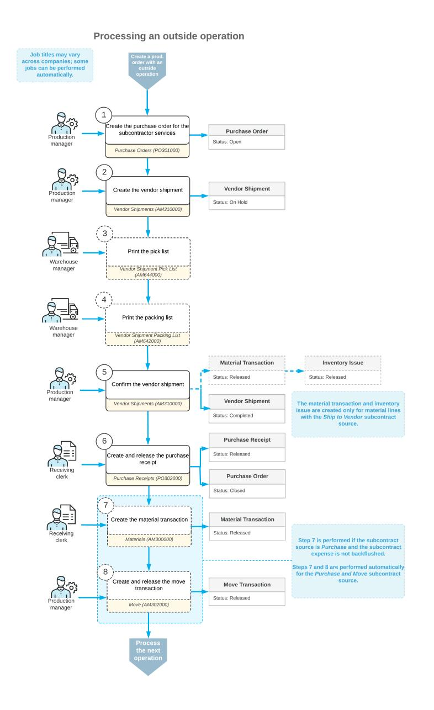

# **Outside Processing: Process Activity**

The following activity will walk you through the process of creating and processing a production order that contains an outside processing operation.

#### **Story**

Suppose that GoodFood One Restaurant has ordered 10 juicers from the SweetLife Fruits & Jams company. Production managers have analyzed the workload of the production department and decided to outsource the assembly of these juicers to a subcontractor, Custom Assembly Services. Further suppose that all components required for the assembly of the juicer are available in SweetLife Fruits & Jams's warehouse and will be shipped to the subcontractor. Also, SweetLife Fruits & Jams will pay \$50 per juicer for the subcontractor's services by using a purchase order.

Acting as a production manager, you will create a production order for producing 10 juicers, create a purchase order for the subcontractor's services, create a vendor shipment with the required materials for the juicer assembly, and process all transactions related to the production order.

#### **Configuration Overview**

In the *U100* dataset, the following tasks have been performed to support this activity:

- On the *[Warehouses](https://help-2025r1.acumatica.com/Help?ScreenId=ShowWiki&pageid=264b0ef7-2b6c-40b4-a7d9-f1a5e067939b)* (IN204000) form, the *WORKHOUSE* warehouse has been defined, and its locations include *MGI* and *MTL*.
- On the *[Stock Items](https://help-2025r1.acumatica.com/Help?ScreenId=ShowWiki&pageid=77786a70-1f1e-4d63-ad98-96f98e4fcb0e)* (IN202500) form, the *CFJFRUIT*, *PULPCONT1L*, *JUICECUP05L*, *MRBASE*, *FNSIEVE*, and *GRDISC01* stock items have been defined.
- On the *[Vendors](https://help-2025r1.acumatica.com/Help?ScreenId=ShowWiki&pageid=a9584be3-f2bd-4d67-80d4-8041d809df56)* (AP303000) form, the *CSEMBLY* vendor (which provides the subcontractor services for juicer assembly) has been defined.
- On the *[Non-Stock Items](https://help-2025r1.acumatica.com/Help?ScreenId=ShowWiki&pageid=bf68dd4f-63d4-460d-8dc0-9152f2bd6bf1)* (IN202000) form, the *MFGSUBCON* non-stock item has been created.

#### **Process Overview**

In this activity, to process the documents and transactions related to the production of the juicers, you will do the following:

- 1. On the *[Production Order Maintenance](https://help-2025r1.acumatica.com/Help?ScreenId=ShowWiki&pageid=e5d2ddd4-8c80-4f5b-8e5f-e5151636a9d3)* (AM201500) form, create a production order for the juicer assembly
- 2. On the *[Purchase Orders](https://help-2025r1.acumatica.com/Help?ScreenId=ShowWiki&pageid=5565686c-96c4-4bfa-a51d-9a2566baa808)* (PO301000) form, create and process the purchase order for the subcontractor service
- 3. On the *Vendor [Shipments](https://help-2025r1.acumatica.com/Help?ScreenId=ShowWiki&pageid=2ccbfaf9-3ae0-43e9-b18a-5d65dedcafa6)* (AM310000) form, create and process the vendor shipment, which records the delivery of the materials required for the juicer assembly to the subcontractor
- 4. On the *[Purchase Receipts](https://help-2025r1.acumatica.com/Help?ScreenId=ShowWiki&pageid=d9901c8d-486d-45ed-8088-ea3d8ee3af19)* (PO302000) form, create and process the related purchase receipt
- 5. On the *[Move](https://help-2025r1.acumatica.com/Help?ScreenId=ShowWiki&pageid=b60a4897-b4be-40a5-b732-d3ff26fe1eef)* (AM302000) form, record the receipt of the assembled juicers from the subcontractor to the dedicated warehouse location
- 6. On the same form, you will record the movement of the inspected juicers to the warehouse location
- 7. On the *[Production Order Maintenance](https://help-2025r1.acumatica.com/Help?ScreenId=ShowWiki&pageid=e5d2ddd4-8c80-4f5b-8e5f-e5151636a9d3)* form, review the production order's balance
- 8. On the *[Close Production Orders](https://help-2025r1.acumatica.com/Help?ScreenId=ShowWiki&pageid=72b745fd-706b-4e76-b799-c8119cb5e8cf)* (AM506000) form, close the production order

#### **System Preparation**

Do the following:

- 1. Sign in to the system as theproduction managerby using the *peters* username and the provided password.
- 2. In the info area, in the upper-right corner of the top pane of the Acumatica ERP screen, make sure that the business date in your system is set to today's date. For simplicity, in this activity, you will create and process all documents in the system on this business date.

#### **System Preparation**

Do the following:

- 1. As a prerequisite to the current activity, complete *[Outside Processing: Implementation Activity](#page-125-1)* so that the system is ready for processing the production of juicers that includes an outside operation.
- 2. Launch the Acumatica ERP website, and sign in to the company in which the prerequisite activities have been performed. You should sign in as the production manager by using the *peters* username and the *123* password.

3. In the info area, in the upper-right corner of the top pane of the Acumatica ERP screen, make sure that the business date in your system is set to today's date. For simplicity, in this activity, you will create and process all documents in the system on this business date.

#### **Step 1: Creating the Production Order**

To create the production order for 10 juicers, do the following:

1. On the *[Production Order Maintenance](https://help-2025r1.acumatica.com/Help?ScreenId=ShowWiki&pageid=e5d2ddd4-8c80-4f5b-8e5f-e5151636a9d3)* (AM201500) form, add a new record.

Notice that the production order is assigned a status of *Planned*, and today's date has been automatically selected in the **Order Date** box.

- 2. In the Summary area, do the following:
  - In the **OrderType** box, make sure *RO* is specified.
  - In the **Inventory ID** box, select *CFJFRUIT*.
    - On the **General** tab, notice that the *WORKHOUSE* warehouse and the *MGI* location have been selected automatically.
  - In the **Qty. to Produce** box, specify 10.
  - In the **Description** box, specify Production of 10 juicers.
- 3. On the form toolbar, click**Save**.
- 4. On the form toolbar, click **Release Order**. The order status changes to *Released*.

#### **Step 2: Creating a Purchase Order for the Subcontractor's Service**

To create a purchase order for the subcontractor service, do the following:

- 1. On the *[Production Order Details](https://help-2025r1.acumatica.com/Help?ScreenId=ShowWiki&pageid=f24480d9-1fed-478e-9363-e48fa5833950)* (AM209000) form, open the production order you created earlier in this activity.
- 2. In the Operations table, click the row with the *OUTPROC* work center.
- 3. On the table toolbar, click **Create Purchase Order**. The system creates the purchase order for the CSEMBLY subcontractor, which is specified on the **Outside Process** tab, and opens the document on the *[Purchase](https://help-2025r1.acumatica.com/Help?ScreenId=ShowWiki&pageid=5565686c-96c4-4bfa-a51d-9a2566baa808) [Orders](https://help-2025r1.acumatica.com/Help?ScreenId=ShowWiki&pageid=5565686c-96c4-4bfa-a51d-9a2566baa808)* (PO301000) form.

Review the purchase order details (shown in the following screenshot). Notice that *CSEMBLY*, which is the subcontractor, is specified in the**Vendor** box of the Summary area. On the **Details** tab, make sure that the system has added one row of the *Non-Stock for MFG* type for the *MFGSUBCON* item with a unit cost of 1 and an extended cost of \$500.

4. In the **Description** box of the Summary area, enter Payment for the subcontractor service.

| <b>Purchase Orders</b>                        | Normal 000056 - Custom Assembly Services                                                                                       |                          |                                |                                        |                       |                      | <b>P NOTES</b>      | <b>ACTIVITIES</b>  | TOOLS $\sim$ <b>FILES</b>      |        |  |  |  |
|-----------------------------------------------|--------------------------------------------------------------------------------------------------------------------------------|--------------------------|--------------------------------|----------------------------------------|-----------------------|----------------------|---------------------|--------------------|-----------------------------------|--------|--|--|--|
| 周 n $\leftarrow$                        | 侕 $\Omega$                                                                                                                  | n К $\check{~}$    | Y. ‹                        | <b>REMOVE HOLD</b> $\lambda$        | $\cdots$              |                      |                     |                    |                                   |        |  |  |  |
| Type:                                         | <b>Normal</b> $\checkmark$                                                                                                  | * Vendor:                |                                | CSEMBLY - Custom Assembly Service Q    | $\cdot$               | <b>Detail Total:</b> | 500.00              |                    |                                   | $\sim$ |  |  |  |
| Order Nbr :                                   | Q 000056                                                                                                                    | * Location:              | <b>MAIN - Primary Location</b> | Q                                      |                       | Line Discounts:      | 0.00                |                    |                                   |        |  |  |  |
| Status:                                       | On Hold                                                                                                                        | Owner:                   | <b>Gladys Peters</b>           | Q                                      |                       |                      | 0.00                |                    |                                   |        |  |  |  |
| * Date:                                       | 11/25/2024 $\Box$                                                                                                           | Vendor Ref.:             |                                |                                        |                       | <b>Tax Total:</b>    | 0.00                |                    |                                   |        |  |  |  |
| Promised On:                                  | 11/25/2024 一                                                                                                                   |                          |                                |                                        |                       | <b>Order Total:</b>  | 500.00              |                    |                                   |        |  |  |  |
| Description:                                  | Payment for the subcontractor service                                                                                          |                          |                                |                                        |                       |                      |                     |                    |                                   |        |  |  |  |
| <b>DETAILS</b>                                | <b>COMPLIANCE</b> <b>TAXES</b> <b>SHIPPING</b> <b>VENDOR INFO</b> PO HISTORY <b>PREPAYMENTS</b> <b>OTHER</b> |                          |                                |                                        |                       |                      |                     |                    |                                   |        |  |  |  |
| ტ 0                                        | <b>ADD ITEMS</b> $\times$                                                                                                   | <b>ADD MATRIX ITEMS</b>  |                                | <b>ADD PROJECT ITEMS</b>               | <b>ADD BLANKET PO</b> |                      | ADD BLANKET PO LINE | <b>VIEW DEMAND</b> | $\left  \rightarrow \right $ ৡ |        |  |  |  |
| 0 ם 髙 <b>Inventory ID</b>            | <b>Line Type</b>                                                                                                               |                          | Warehouse                      | <b>Line Description</b>                |                       | <b>UOM</b>           | Order Qtv.          | <b>Unit Cost</b>   | Ext. Cost                         |        |  |  |  |
| 0 !!!!!!!!!!!!!!!!!!!!!!!!!!!!!!!!!!!!!!!! |                                                                                                                                | <b>Non-Stock for MFG</b> | <b>WORKHOUSE</b>               | Subcontractor service in manufacturing |                       | EA                   |                     | 500.00 1.0000   | 500.00                            |        |  |  |  |

*Figure: The purchase order for the subcontractor services*

5. On the form toolbar, click **Remove Hold**. The system changes the status of the purchase order to *Open*.

#### **Step 3: Creating a Vendor Shipment**

To create a vendor shipment for the materials required for the juicer assembly, do the following:

- 1. On the *[Production Order Details](https://help-2025r1.acumatica.com/Help?ScreenId=ShowWiki&pageid=f24480d9-1fed-478e-9363-e48fa5833950)* (AM209000) form, open the production order you created earlier in this activity.
- 2. In the Operations table, click the row with the *OUTPROC* work center.
- 3. On the table toolbar, click **CreateVendorShipment**. The system creates the vendor shipment for the CSEMBLY subcontractor, which is specified on the **Outside Process** tab, and opens the shipment on the *Vendor [Shipments](https://help-2025r1.acumatica.com/Help?ScreenId=ShowWiki&pageid=2ccbfaf9-3ae0-43e9-b18a-5d65dedcafa6)* (AM310000) form.

Review the details of the vendor shipment (shown in the screenshot below) as follows. Notice that *CSEMBLY*, which is the subcontractor, is specified in the**Vendor** box of the Summary area. On the **Details** tab, notice that the system has added one row of the *WIP* type for the *CFJFRUIT* item and five rows of the *Material* type for each of the materials required for the juicer assembly.

|               |                                   |        | <b>Vendor Shipments</b> <b>New Record</b> |             |                       |                                                  |                                           |        |                                                  |   |                               | <b>PINOTES</b> | <b>ACTIVITIES</b> | <b>FILES</b>   | TOOLS $\sim$ |
|---------------|-----------------------------------|--------|----------------------------------------------|-------------|-----------------------|--------------------------------------------------|-------------------------------------------|--------|--------------------------------------------------|---|-------------------------------|----------------|-------------------|----------------|--------------|
|               | $\leftarrow$                      | а      | H                                            | $\sim$      | $\pm$                 | n 血 $\overline{\mathbf{K}}$ $\check{ }$ | $\overline{\phantom{a}}$ $\rightarrow$ | $\geq$ | <b>REMOVE HOLD</b>                               |   | $\cdots$                      |                |                   |                |              |
|               |                                   |        | Shipment ID:                                 | <new></new> | Q                     | <b>*</b> Vendor:                                 |                                           |        | CSEMBLY - Custom Assembly Service Q              |   | <b>Shipped Quantity:</b> 0 |                |                   | 60.00          | $\sim$       |
|               | Type:                             |        |                                              | Shipment    | $\checkmark$          | * Location:                                      | <b>MAIN - Primary Location</b>            |        |                                                  | ρ |                               |                |                   |                |              |
|               | Status:                           |        |                                              | On Hold     |                       | * Warehouse:                                     |                                           |        | WORKHOUSE - Warehouse for manu Q                 |   |                               |                |                   |                |              |
|               |                                   |        | * Shipment Date:                             | 11/25/2024  | Ä                     | Workgroup:                                       |                                           |        |                                                  | Q |                               |                |                   |                |              |
|               |                                   |        |                                              |             |                       | Owner:                                           | EP00000029 - Gladys Peters                |        |                                                  | Q |                               |                |                   |                |              |
|               | <b>DETAILS</b> <b>SHIPPING</b> |        |                                              |             |                       |                                                  |                                           |        |                                                  |   |                               |                |                   |                |              |
|               | Ò                                 | $^{+}$ | $\mathscr{D}$                                | $\times$    |                       | <b>LINE DETAILS</b>                              | ADD PRODUCTION ORDERS                     |        | $\left  \leftrightarrow \right $ $\mathbf{N}$ |   |                               |                |                   |                |              |
| 目             | 0                                 | D      | <b>Type</b>                                  |             | *Order <b>Type</b> | * Production Nbr.                                | *Operation ID                             |        | *Inventory ID                                    |   | *Warehouse                    | Location       |                   | Quantity * UOM |              |
| $\rightarrow$ | 0                                 | ם      | <b>WIP</b>                                   |             | <b>RO</b>             | AMP000005                                        | 0010                                      |        | <b>CFJFRUIT</b>                                  |   | <b>WORKHOUSE</b>              | <b>MGI</b>     |                   | 10.00          | EA           |
|               | 0                                 | ם      | <b>Material</b>                              |             | <b>RO</b>             | !!!!!!!!!!!!!!!!!!!!!!!!!!!!!!!!!!!!!!!!         | 0010                                      |        | <b>PULPCONT1L</b>                                |   | <b>WORKHOUSE</b>              | <b>MTL</b>     |                   | 10.00          | EA           |
|               | 0                                 | ם      | <b>Material</b>                              |             | <b>RO</b>             | AMP000005                                        | 0010                                      |        | !!!!!!!!!!!!!!!!!!!!!!!!!!!!!!!!!!!!!!!!         |   | <b>WORKHOUSE</b>              | <b>MTL</b>     |                   | 10.00          | EA           |
|               | 0                                 | ם      | <b>Material</b>                              |             | <b>RO</b>             | AMP000005                                        | 0010                                      |        | <b>MRBASE</b>                                    |   | <b>WORKHOUSE</b>              | <b>MTL</b>     |                   | 10.00          | EA           |
|               | 0                                 | ◘      | <b>Material</b>                              |             | <b>RO</b>             | AMP000005                                        | 0010                                      |        | <b>FNSIEVE</b>                                   |   | <b>WORKHOUSE</b>              | <b>MTL</b>     |                   | 10.00          | EA           |
|               | 0                                 |        | <b>Material</b>                              |             | <b>RO</b>             | AMP000005                                        | 0010                                      |        | <b>GRDISC01</b>                                  |   | <b>WORKHOUSE</b>              | <b>MTL</b>     |                   | 10.00          | EA           |
|               |                                   |        |                                              |             |                       |                                                  |                                           |        |                                                  |   |                               |                |                   |                |              |

*Figure: The vendor shipment on the Vendor Shipments form*

- 4. On the form toolbar, click **Remove Hold**. The system changes the status to *Open*.
- 5. On the form toolbar, click **Confirm**. The system changes the status to *Completed*.
- 6. On the *[Production Order Maintenance](https://help-2025r1.acumatica.com/Help?ScreenId=ShowWiki&pageid=e5d2ddd4-8c80-4f5b-8e5f-e5151636a9d3)* (AM201500) form, open the production order that you created earlier in this activity.

On the **Totals** tab, notice that in the**Subcontract** box of the **Actual** section, *4,641.70* is specified (as shown in the following screenshot). This amount is the cost of the materials that have been shipped to the subcontractor.

| <b>Production Order Maintenance</b> RO AMP000005 - Production of 10 juicers  |          |                                        |   |                           |  |               |                   |                          |        | <b>P NOTES</b> | <b>ACTIVITIES</b> | <b>FILES</b>       | TOOLS $\sim$             |                                              |          |                 |  |               |
|---------------------------------------------------------------------------------|----------|----------------------------------------|---|---------------------------|--|---------------|-------------------|--------------------------|--------|----------------|-------------------|--------------------|--------------------------|----------------------------------------------|----------|-----------------|--|---------------|
| $\begin{smallmatrix} 1\\ 1\\ 1\\ 1 \end{smallmatrix}$ $\Box$ $\leftarrow$ | $\Omega$ | $\div$                                 | 血 | $\cap$ $\sim$             |  | - IK          | $\checkmark$      | $\rightarrow$            | $\geq$ |                |                   | <b>REMOVE HOLD</b> | $\cdots$                 |                                              |          |                 |  |               |
| * Order Type:                                                                   |          | RO - Regular production orders         |   |                           |  | Q             | 0                 | Inventory ID:            |        |                |                   |                    |                          | CFJFRUIT - Configurable juicer for fruit a 2 |          | Qty. Complete:  |  | $0.00^{\sim}$ |
| * Production Nbr.:                                                              |          | AMP000005 - Production of 10 juicers Q |   |                           |  |               |                   | Qty. to Produce:         |        |                |                   |                    | 10.00                    |                                              |          | Qty. Scrapped:  |  | 0.00          |
| Status:                                                                         |          | On Hold                                |   |                           |  |               |                   | UOM:                     |        |                |                   | EA                 |                          |                                              |          | Qtv. Remaining: |  | 10.00         |
| * Order Date:                                                                   |          | 11/25/2024 门                           |   |                           |  |               |                   | Description:             |        |                |                   |                    | Production of 10 juicers |                                              |          |                 |  |               |
| <b>GENERAL</b>                                                                  |          | <b>REFERENCES</b>                      |   | <b>RELATED PRODUCTION</b> |  |               |                   | <b>EVENTS</b>            |        |                | <b>ATTRIBUTES</b> |                    | <b>TOTALS</b>            | <b>LINE DETAILS</b>                          |          |                 |  |               |
| <b>PLANNED</b>                                                                  |          |                                        |   |                           |  | <b>ACTUAL</b> |                   |                          |        |                |                   |                    |                          | <b>VARIANCE</b>                              |          |                 |  |               |
| Labor Time:                                                                     |          | 2h30m                                  |   |                           |  |               | Labor Time:       |                          |        | $0h00$ m       |                   |                    |                          | Labor Time:                                  | 2 h 30 m |                 |  |               |
| Labor:                                                                          |          |                                        |   | 25.00                     |  | Labor:        |                   |                          |        |                |                   | 0.00               |                          | Labor:                                       |          | $-25.00$        |  |               |
| Machine:                                                                        |          |                                        |   | 0.00                      |  |               | Machine:          |                          |        |                |                   | 0.00               |                          | Machine:                                     |          | 0.00            |  |               |
| Material:                                                                       |          |                                        |   | 0.00                      |  |               | Material:         |                          |        |                |                   | 0.00               |                          | Material:                                    |          | 0.00            |  |               |
| Tool:                                                                           |          |                                        |   | 0.00                      |  | Tool:         |                   |                          |        |                |                   | 0.00               |                          | Tool:                                        |          | 0.00            |  |               |
| <b>Fixed Overhead:</b>                                                          |          |                                        |   | 0.00                      |  |               |                   | <b>Fixed Overhead:</b>   |        |                |                   | 0.00               |                          | <b>Fixed Overhead:</b>                       |          | 0.00            |  |               |
| Variable Overhead:                                                              |          |                                        |   | 0.00                      |  |               |                   | Variable Overhead:       |        |                |                   | 0.00               |                          | Variable Overhead:                           |          | 0.00            |  |               |
| Subcontract:                                                                    |          |                                        |   | 5,141.70                  |  |               | Subcontract:      |                          |        |                |                   | 4,641.70           |                          | Subcontract:                                 |          | $-500.00$       |  |               |
| Qty to Produce:                                                                 |          |                                        |   | 10.00                     |  |               | Qty Complete:     |                          |        |                |                   | 0.00               |                          | Qty Remaining:                               |          | 10.00           |  |               |
| Plan Total:                                                                     |          |                                        |   | 5,166.70                  |  |               | Adjustments:      |                          |        |                |                   | 0.00               |                          | <b>Total Variance:</b>                       |          | $-525.00$       |  |               |
| <b>Unit Cost:</b>                                                               |          |                                        |   | 516.6700                  |  | Scrap:        |                   |                          |        |                |                   | 0.00               |                          | <b>WIP Balance:</b>                          |          | 4.641.70        |  |               |
| Plan Cost Date:                                                                 |          | 11/25/2024                             |   |                           |  |               | <b>WIP Total:</b> |                          |        |                |                   | 4,641.70           |                          |                                              |          |                 |  |               |
| Ref. Material:                                                                  |          |                                        |   | 0.0000                    |  |               |                   | <b>MFG</b> to Inventory: |        |                |                   | 0.00               |                          |                                              |          |                 |  |               |

*Figure: The actual subcontract amount aer the confirmation of the vendor shipment*

#### **Step 4: Receiving Items from the Subcontractor**

Suppose that the subcontractor has assembled the juicers and delivered them to the warehouse. To record the receipt of the juicers, you will create the purchase receipt for the purchase order. Do the following:

- 1. On the *[Purchase Orders](https://help-2025r1.acumatica.com/Help?ScreenId=ShowWiki&pageid=5565686c-96c4-4bfa-a51d-9a2566baa808)* (PO301000) form, open the purchase order you created earlier in this activity.
- 2. On the form toolbar, click **Enter PO Receipt**. The system creates a purchase receipt and opens it on the *[Purchase Receipts](https://help-2025r1.acumatica.com/Help?ScreenId=ShowWiki&pageid=d9901c8d-486d-45ed-8088-ea3d8ee3af19)* (PO302000) form.
- 3. On the form toolbar, click **Release**. The system changes the status of the purchase receipt to *Released*.

## **Step 5: Recording the Completion of the Outside Operation**

To record the completion of the outside operation, create and release a move transaction as follows:

- 1. On the *[Production Order Maintenance](https://help-2025r1.acumatica.com/Help?ScreenId=ShowWiki&pageid=e5d2ddd4-8c80-4f5b-8e5f-e5151636a9d3)* (AM201500) form, open the production order that you created earlier in this activity.
- 2. On the form toolbar, click **Create MoveTransaction**. The system creates a move transaction for the *0010* operation and opens it on the *[Move](https://help-2025r1.acumatica.com/Help?ScreenId=ShowWiki&pageid=b60a4897-b4be-40a5-b732-d3ff26fe1eef)* (AM302000) form.
- 3. In the Summary area, do the following:
  - a. Make sure that today's date is specified in the **Date** box.
  - b. In the **Description** box, enter Recording the receipt of 10 juicers from the subcontractor.
  - c. Clear the **Hold** check box. The system changes the transaction's status to *Balanced*.
- 4. On the form toolbar, click **Release**. The system releases the move transaction.
- 5. Close the window with the *[Move](https://help-2025r1.acumatica.com/Help?ScreenId=ShowWiki&pageid=b60a4897-b4be-40a5-b732-d3ff26fe1eef)* form.
- 6. Go to the**Totals** tab of the *[Production Order Maintenance](https://help-2025r1.acumatica.com/Help?ScreenId=ShowWiki&pageid=e5d2ddd4-8c80-4f5b-8e5f-e5151636a9d3)* form, and notice that in the**Subcontract** box of the **Actual** section, *5,141.70* is specified (as shown in the following screenshot), which is the cost of the materials that have been shipped to the subcontractor plus the cost of the services. Because the material used for subcontractor services was set up to be backflushed, the system has created and released the material transaction for the subcontracting non-stock item and added the amount to the actual subcontract amount when you recorded the operation completion.

| <b>Production Order Maintenance</b> | RO AMP000005 - Production of 10 juicers |                                             |                       |                                              | <b>P</b> NOTES <b>ACTIVITIES</b> | <b>FILES</b> TOOLS $\star$ |
|-------------------------------------|-----------------------------------------|---------------------------------------------|-----------------------|----------------------------------------------|-------------------------------------|-------------------------------|
| 周 日 $\leftarrow$              | ↶ n                                  | K $\rightarrow$ ≺ $\check{~}$      | <b>HOLD</b> $\geq$ | <b>CREATE MOVE TRANSACTION</b>               | .                                   |                               |
| * Order Type:                       | RO - Regular production orders          | Q Inventory ID: $\mathscr{Q}$         |                       | CFJFRUIT - Configurable juicer for fruit a 2 | Qty. Complete:                      | $0.00^{\sim}$                 |
| * Production Nbr.:                  | AMP000005 - Production of 10 juicers Q  | Qty. to Produce:                            |                       | 10.00                                        | Qty. Scrapped:                      | 0.00                          |
| Status:                             | In Process                              | UOM:                                        | EA                    |                                              | Qty. Remaining:                     | 10.00                         |
| Order Date:                         | 11/25/2024                              | Description:                                |                       | Production of 10 juicers                     |                                     |                               |
| <b>GENERAL</b>                      | <b>REFERENCES</b>                       | <b>RELATED PRODUCTION</b> <b>EVENTS</b>  | <b>ATTRIBUTES</b>     | <b>TOTALS</b> <b>LINE DETAILS</b>         |                                     |                               |
| <b>PLANNED .</b>                    |                                         | ACTUAL ____________________________________ |                       | VARIANCE _                                   |                                     |                               |
| Labor Time:                         | 2 h 30 m                                | Labor Time:                                 | $0h00$ m              | Labor Time:                                  | 2 h 30 m                            |                               |
| Labor:                              | 25.00                                   | Labor:                                      |                       | Labor: 0.00                               | $-25.00$                            |                               |
| Machine:                            | 0.00                                    | Machine:                                    |                       | Machine: 0.00                             | 0.00                                |                               |
| Material:                           | 0.00                                    | Material:                                   |                       | Material: 0.00                            | 0.00                                |                               |
| Tool:                               | 0.00                                    | Tool:                                       |                       | Tool: 0.00                                | 0.00                                |                               |
| <b>Fixed Overhead:</b>              | 0.00                                    | <b>Fixed Overhead:</b>                      |                       | <b>Fixed Overhead:</b> 0.00               | 0.00                                |                               |
| Variable Overhead:                  | 0.00                                    | Variable Overhead:                          |                       | Variable Overhead: 0.00                   | 0.00                                |                               |
| Subcontract:                        | 5,141.70                                | Subcontract:                                |                       | Subcontract: 5,141.70                     | 0.00                                |                               |
| Qty to Produce:                     | 10.00                                   | Qty Complete:                               |                       | 0.00 <b>Qty Remaining:</b>                | 10.00                               |                               |
| Plan Total:                         | 5.166.70                                | Adjustments:                                |                       | <b>Total Variance:</b> 0.00               | $-25.00$                            |                               |
| <b>Unit Cost:</b>                   | 516.6700                                | Scrap:                                      |                       | <b>WIP Balance:</b> 0.00                  | 5.141.70                            |                               |
| Plan Cost Date:                     | 11/25/2024                              | <b>WIP Total:</b>                           |                       | 5,141.70                                     |                                     |                               |
| Ref. Material:                      | 0.0000                                  | MFG to Inventory:                           |                       | 0.00                                         |                                     |                               |

*Figure: The actual subcontract amount aer the movement of the item for the outside operation*

#### **Step 6: Recording the Inspected Items**

Suppose that a warehouse worker has inspected all 10 juicers and moved them to the *MGI* location of the *WORKHOUSE* warehouse. Labor is backflushed for this operation so you will record only the movement of the juicers. Do the following:

- 1. On the *[Production Order Maintenance](https://help-2025r1.acumatica.com/Help?ScreenId=ShowWiki&pageid=e5d2ddd4-8c80-4f5b-8e5f-e5151636a9d3)* (AM201500) form, open the production order that you created earlier in this activity.
- 2. On the form toolbar, click **Create MoveTransaction**. The system creates a move transaction for the *0020* operation and opens it on the *[Move](https://help-2025r1.acumatica.com/Help?ScreenId=ShowWiki&pageid=b60a4897-b4be-40a5-b732-d3ff26fe1eef)* (AM302000) form.
- 3. In the Summary area, do the following:
  - a. Make sure that today's date is specified in the **Date** box.
  - b. In the **Description** box, enter Recording the movement of 10 juicers to the warehouse.
  - c. Clear the **Hold** check box. The system changes the transaction's status to *Balanced*.
- 4. On the form toolbar, click **Release**. The system releases the move transaction.
- 5. Close the window with the *[Move](https://help-2025r1.acumatica.com/Help?ScreenId=ShowWiki&pageid=b60a4897-b4be-40a5-b732-d3ff26fe1eef)* form.

#### **Step 7: Reviewing the Production Order's Balance**

Before closing the production order, you will review its balance. Do the following:

1. On the *[Production Order Maintenance](https://help-2025r1.acumatica.com/Help?ScreenId=ShowWiki&pageid=e5d2ddd4-8c80-4f5b-8e5f-e5151636a9d3)* (AM201500) form, open the production order you created earlier in this activity.

Notice that the order has been assigned the *Completed* status.

2. Go to the**Totals** tab. Review the balance of the production order (shown in the following screenshot) as follows:

- a. Notice that in the **Actual** section, the value in the **Labor Time** box is *2 h 30 m* and the value in the **Labor** box is *25.00*. The actual values are the same as the planned values.
- b. Notice that the value of the**Subcontract** box is *5,141.70* and has not been changed aer you created the move transaction for the *0020* operation.
- c. Notice that the **WIP Total** and **MFG to Inventory** boxes both contain *5,166.70*, which is the sum of the values in the **Labor** and **Subcontract** boxes.
- d. Notice that in the**Variance** section, the**TotalVariance** and **WIP Balance** boxes both contain *0*.

| <b>Production Order Maintenance</b> 뭐 $\Box$ $\leftarrow$ | RO AMP000001 - Production of 10 juicers 侕 $\bigcap$ $\vee$ $\big $ $\big $ $\big $ $\Omega$ | $\left\langle \right\rangle$ $\sum$      | >1                | <b>P NOTES</b>                                | <b>ACTIVITIES</b> | <b>FILES</b>    | <b>CUSTOMIZATION</b> | TOOLS $\sim$    |
|--------------------------------------------------------------------|------------------------------------------------------------------------------------------------------|---------------------------------------------|-------------------|-----------------------------------------------|-------------------|-----------------|----------------------|-----------------|
| * Order Type:                                                      | RO - Regular production orders                                                                       | $\circ$ $\mathscr{Q}$ Inventory ID:   |                   | CFJFRUIT - Configurable juicer for fruit a    |                   | Qty. Complete:  |                      | $\sim$ 10.00 |
|                                                                    | * Production Nbr.: AMP000001 - Production of 10 juicers Q                                            | Qty. to Produce:                            |                   | 10 00                                         |                   | Qty. Scrapped:  |                      | 0.00            |
| Status:                                                            | Completed                                                                                            | UOM:                                        | EA                |                                               |                   | Qty. Remaining: |                      | 0.00            |
| Order Date:                                                        | 9/18/2024                                                                                            | Description:                                |                   | Production of 10 juicers                      |                   |                 |                      |                 |
| <b>GENERAL</b>                                                     | <b>REFERENCES</b> <b>RELATED PRODUCTION</b>                                                       | <b>EVENTS</b>                               | <b>ATTRIBUTES</b> | <b>TOTALS</b> <b>LINE DETAILS</b>          |                   |                 |                      |                 |
| PLANNED _                                                          |                                                                                                      | ACTUAL ____________________________________ |                   | VARIANCE ____________________________________ |                   |                 |                      |                 |
| Labor Time:                                                        | 2 h 30 m                                                                                             | Labor Time:                                 | 2 h 30 m          | Labor Time:                                   | $0h00$ m          |                 |                      |                 |
| Labor:                                                             | 25.00                                                                                                | Labor:                                      | 25.00             | Labor:                                        |                   | 0.00            |                      |                 |
| Machine:                                                           | 0.00                                                                                                 | Machine:                                    | 0.00              | Machine:                                      |                   | 0.00            |                      |                 |
| Material:                                                          | 0.00                                                                                                 | Material:                                   | 0.00              | Material:                                     |                   | 0.00            |                      |                 |
| Tool:                                                              | 0.00                                                                                                 | Tool:                                       | 0.00              | Tool:                                         |                   | 0.00            |                      |                 |
| <b>Fixed Overhead:</b>                                             | 0.00                                                                                                 | <b>Fixed Overhead:</b>                      | 0.00              | <b>Fixed Overhead:</b>                        |                   | 0.00            |                      |                 |
| Variable Overhead:                                                 | 0.00                                                                                                 | Variable Overhead:                          | 0.00              | Variable Overhead:                            |                   | 0.00            |                      |                 |
| Subcontract:                                                       | 5.141.70                                                                                             | Subcontract:                                | 5.141.70          | Subcontract:                                  |                   | 0.00            |                      |                 |
| Qty to Produce:                                                    | 10.00                                                                                                | Qty Complete:                               | 10.00             | Qty Remaining:                                |                   | 0.00            |                      |                 |
| Plan Total:                                                        | 5.166.70                                                                                             | Adjustments:                                | 0.00              | Total Variance:                               |                   | 0.00            |                      |                 |
| Unit Cost:                                                         | 516.6700                                                                                             | Scrap:                                      | 0.00              | WIP Balance:                                  |                   | 0.00            |                      |                 |
| Plan Cost Date:                                                    | 9/18/2024                                                                                            | WIP Total:                                  | 5,166.70          |                                               |                   |                 |                      |                 |
| Ref. Material:                                                     | 0.0000                                                                                               | MFG to Inventory:                           | 5,166.70          |                                               |                   |                 |                      |                 |

*Figure: The balance of the production order*

All costs have been applied correctly to the production order, so you can close the order.

#### **Step 8: Closing the Production Order**

Now you will close the production order. Do the following:

- 1. On the *[Close Production Orders](https://help-2025r1.acumatica.com/Help?ScreenId=ShowWiki&pageid=72b745fd-706b-4e76-b799-c8119cb5e8cf)* (AM506000) form, select the production order.
- 2. On the form toolbar, click **Process**. In the **Processing** dialog box, which opens, review the processing details, and when the processing is completed, click **Close**.
- 3. Go to the *[Production Order Maintenance](https://help-2025r1.acumatica.com/Help?ScreenId=ShowWiki&pageid=e5d2ddd4-8c80-4f5b-8e5f-e5151636a9d3)* form, and notice that the status of the production order has changed to *Closed*.

You have created the production order that includes an outside processing operation, created a purchase order to pay for the subcontractor services, created a vendor shipment for materials provided to the subcontractor, and processed the production order to the closing.

## **Outside Processing: Generated Transactions**

When you process production orders that include outside operations, you record payments for the subcontractor services (which may include material costs) by creating and processing purchase orders and the related documents and transactions. To track these expenses, the system generates the GL transactions described in the following section.

#### **Transactions Generated for Non-Stock Items Used as Materials**

Suppose that for a non-stock item that is used as a material for outside processing (that is, a subcontractor service), the **Accrue Cost** check box is selected on the **Price/Cost** tab of the *[Non-Stock Items](https://help-2025r1.acumatica.com/Help?ScreenId=ShowWiki&pageid=bf68dd4f-63d4-460d-8dc0-9152f2bd6bf1)* (IN202000) form, and the **Require Receipt** check box is selected on the **General** tab of the same form. As a result, the system posts to the Expense Accrual account the costs of materials when the items are received to a warehouse of your organization and a production order is released. Transactions generated on release of the inventory receipt are listed in the following table.

| Account                 | Source of Account | Debit  | Credit |
|-------------------------|-------------------|--------|--------|
| Expense Accrual account | Item              | Amount | 0.00   |
| PO Accrual account      | Item              | 0.00   | Amount |

On the *[Non-Stock Items](https://help-2025r1.acumatica.com/Help?ScreenId=ShowWiki&pageid=bf68dd4f-63d4-460d-8dc0-9152f2bd6bf1)* form for a non-stock item used for outside services, *Sales* is selected in the **Post Cost to Expenses On** box on the **Price/Cost** tab and the **Require Receipt** check box is cleared on the **General** tab, then you create the AP bill with this non-stock item. When you release the AP bill, the transactions listed in the following table are generated.

| Account         | Source of Account | Debit  | Credit |
|-----------------|-------------------|--------|--------|
| Expense account | Item              | Amount | 0.00   |
| AP account      | Item              | 0.00   | Amount |

When you issue or backflush the non-stock item that represents the subcontractor services, the transactions listed in the following table are generated for both the non-stock item and the materials shipped to the vendor.

| Account                 | Source of Account | Debit  | Credit |  |
|-------------------------|-------------------|--------|--------|--|
| Work in Process account | Item              | Amount | 0.00   |  |
| Expense Accrual account | Item              | 0.00   | Amount |  |

If the **Accrue Cost** check box is cleared on the **Price/Cost** tab of the *[Non-Stock Items](https://help-2025r1.acumatica.com/Help?ScreenId=ShowWiki&pageid=bf68dd4f-63d4-460d-8dc0-9152f2bd6bf1)* form, the amounts are posted to the Expense account instead of the Expense Accrual account.

# **Producing Items with Backflushing**

Your organization may use backflushing to minimize the number of manual entries in production, such as the releasing of materials, the recording of labor amount, and the recording of produced items for each operation. With backflushing configured in Acumatica ERP Manufacturing Edition, the system automatically issues materials, records labor hours, or performs both actions.

This chapter describes the production process that includes the backflushing of materials and labor.

# **Production with Backflushing: General Information**

Backflushing is a method for issuing materials or applying labor costs to production orders when workers record the items produced at a specific operation. Acumatica ERP Manufacturing Edition gives you the ability to backflush material and labor costs during item production, as described in the following sections.

#### **Learning Objectives**

In this chapter, you will learn how to process production orders with operations for which material and labor costs will be backflushed.

#### **Applicable Scenarios**

You process production orders with operations for which material and labor costs are backflushed in the following cases:

- Bills of material contain floor stock items whose costs are not significant; examples of such items include lubricants, labels, hardware, wiring, and packing materials. In this case, a production or warehouse manager periodically reconciles the on-hand balance of the items in stock.
- Your organization uses bulk materials, such as bar stock, roll stock, sheet goods, and dry goods or liquids in bulk containers. The exact quantity of these materials cannot be specified.
- In production operations, scrap is common in the finished product. Workers continue to produce the item until they have produced items whose quality is acceptable in a quantity equal to the quantity to produce in the production order.
- Workers record production at milestone operations but would like to also record materials being consumed at operations that are not milestones.
- Workers perform operations for multiple production orders simultaneously or in a continuous run. These operations might include cleaning, painting, or plating. In this case, it would be difficult to post labor costs to individual orders. A similar situation occurs in production areas—such as filling, testing, packing, or assembly—where multiple operators work on any item that appears at their work station, and these operators do not record their time against specific production orders.

#### **Backflushing in Production**

Backflushing is commonly referred to as *postproduction issuing*. This approach differs from *preproduction issuing*, for which materials are pulled from stores and issued to production orders prior to the start of an operation, and labor is directly reported for each operation.

With backflushing, material and labor costs are flushed backwards through operations to assign costs to products based on the quantity produced at the operations. This eliminates detailed tracking of costs. With backflushing, employees involved in production can save time on preliminary issue of materials, on recording the labor amount and produced items for each operation, and on recording returns of any unused materials.

Backflushing can ensure that the full cost of production is recognized when workers record the quantity of produced items for the final operation in the routing. In the backflushing process, the system automatically issues the materials consumed based on the item quantity reported for an operation. Thus, you can make the cost of the product more representative and minimize cost variances.

Backflushing is not appropriate if any of the following conditions are met:

- 1. The amount of labor recorded for operations may vary from one production run to another. This amount may represent a significant cost of the product.
- 2. Your organization tracks employees for the product being produced.
- 3. You use lot- or serial-tracked materials in production. Although the system can automatically issue lot- or serial-tracked items during backflushing, in this case, backflushing is generally not recommended.
- 4. Material consumption is variable, or significant waste of materials may occur.
- 5. Material substitutions are common and allowed during the production process.
- 6. Labor transactions for each employee need to be reconciled with time and attendance for payroll purposes, or a shop data collection system is used.

#### **The Production Process with Material and Labor Backflushing**

Suppose that a production order has the operations defined in the Operations table of the *[Production Order Details](https://help-2025r1.acumatica.com/Help?ScreenId=ShowWiki&pageid=f24480d9-1fed-478e-9363-e48fa5833950)* (AM209000) form with the settings shown in the following table.

| Operation ID | Backflush Labor | Backflush Materials |
|--------------|-----------------|---------------------|
| 0010         | Cleared         | Cleared             |
| 0020         | Selected        | Selected            |
| 0030         | Selected        | N/A                 |

In the following diagram, you can view the actions and generated documents for this production order.

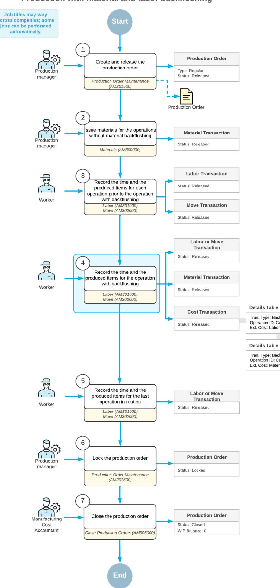

The employees involved do the following to process the production order and the related transactions:

1. *Create and release the production order.*

On the *[Production Order Maintenance](https://help-2025r1.acumatica.com/Help?ScreenId=ShowWiki&pageid=e5d2ddd4-8c80-4f5b-8e5f-e5151636a9d3)* (AM201500) form, the production manager creates and releases the production order.

2. *Issue the materials for the first operation*

On the *[Materials](https://help-2025r1.acumatica.com/Help?ScreenId=ShowWiki&pageid=bac20b22-8f5c-4252-8a7a-f022e0471c91)* (AM300000) form, the production manager issues the materials required for the first operation.

If a material has the **Backflush Materials** check box selected in the production order settings, it does not need to be issued before employees record the quantity of the item that is produced.

3. *Record the time spent and the quantity of completed items for the first operation.*

On the *[Labor](https://help-2025r1.acumatica.com/Help?ScreenId=ShowWiki&pageid=582f9540-0dc6-4515-9e9d-b52cefe0c13f)* (AM301000) form, workers record the time they spent on the first operation and the item quantity they produced during the operation.

4. *Record the quantity of the completed items for the second operation.*

On the *[Move](https://help-2025r1.acumatica.com/Help?ScreenId=ShowWiki&pageid=b60a4897-b4be-40a5-b732-d3ff26fe1eef)* (AM302000) form, a worker records the completion of the items for the second operation. When the worker releases the move transaction, the system also does the following:

- Creates and releases the material transaction on the *[Materials](https://help-2025r1.acumatica.com/Help?ScreenId=ShowWiki&pageid=bac20b22-8f5c-4252-8a7a-f022e0471c91)* form with the backflushed materials.
- Creates and releases the cost transaction on the *Cost [Transactions](https://help-2025r1.acumatica.com/Help?ScreenId=ShowWiki&pageid=bfaeb074-32ec-487b-9863-29b73e7c2037)* (AM309000) form. The transaction includes the cost of the backflushed labor and the cost of the backflushed materials.

If the worker also records the time for the operation, they use the *[Labor](https://help-2025r1.acumatica.com/Help?ScreenId=ShowWiki&pageid=582f9540-0dc6-4515-9e9d-b52cefe0c13f)* form instead of the *[Move](https://help-2025r1.acumatica.com/Help?ScreenId=ShowWiki&pageid=b60a4897-b4be-40a5-b732-d3ff26fe1eef)* form.

5. *Record the time spent and the quantity of completed items for the last operation.*

On the *[Labor](https://help-2025r1.acumatica.com/Help?ScreenId=ShowWiki&pageid=582f9540-0dc6-4515-9e9d-b52cefe0c13f)* form, the worker records the time they spent on the last operation and the item quantity they produced during the operation.

6. *Lock the production order.*

On the *[Production Order Maintenance](https://help-2025r1.acumatica.com/Help?ScreenId=ShowWiki&pageid=e5d2ddd4-8c80-4f5b-8e5f-e5151636a9d3)* form, the production manager locks the production order.

7. *Close the production order.*

On the *[Close Production Orders](https://help-2025r1.acumatica.com/Help?ScreenId=ShowWiki&pageid=72b745fd-706b-4e76-b799-c8119cb5e8cf)* (AM506000) form, the production cost accountant closes the production order.

#### **Material Transaction for Backflushed Materials**

When the system creates the material transaction for backflushed materials on the *[Materials](https://help-2025r1.acumatica.com/Help?ScreenId=ShowWiki&pageid=bac20b22-8f5c-4252-8a7a-f022e0471c91)* (AM300000) form, the system issues each material from the warehouse or warehouse location specified in the material row of the production order. If the warehouse or location is not specified, the system issues the items from the default issue location specified for each stock item that represents the material. For more information, see *[Production](#page-61-1) [Processing:](#page-61-1) Selection of Warehouse Locations*.

If the on-hand quantity of any material in stock is less than the recorded quantity of the produced item, the system will not release the material transaction and will display an error message. If you want the system to be able to release transactions that will cause a negative quantity in stock, you should select the **Allow Negative Quantity** check box on the *[Item Classes](https://help-2025r1.acumatica.com/Help?ScreenId=ShowWiki&pageid=80a3301b-4eb2-4ce2-94c5-0407c786a0f1)* (IN201000) form for the item class selected on the *[Stock Items](https://help-2025r1.acumatica.com/Help?ScreenId=ShowWiki&pageid=77786a70-1f1e-4d63-ad98-96f98e4fcb0e)* (IN202500) form for the stock item that represents the material.

#### **Material and Labor Cost Adjustments**

The purpose of the material and labor cost adjustments is to reconcile the costs charged to the production order accordingly.

If any previous operations contain backflushed materials, the system calculates the material quantity to be issued considering the completed quantity for the previous operations and for the current operation.

If labor should be backflushed for any previous operations, the system adjusts the labor hours, if necessary, to agree with the quantity recorded at the current operation.

## **Production with Backflushing: Implementation Checklist**

The following sections provide details that you can use to ensure that the system is configured properly for recording the production of items with material or labor backflushing, and to understand (and change, if needed) the settings that affect the processing workflow.

#### **Prerequisites**

Make sure that before you start implementing the production of items with backflushing, the system has been prepared for specifying manufacturing-specific settings, as described in *[System Preparation for Manufacturing](https://help-2025r1.acumatica.com/Help?ScreenId=ShowWiki&pageid=2fdbd4d4-6195-4c85-80a9-8a260873ac0a) [Implementation: General Information](https://help-2025r1.acumatica.com/Help?ScreenId=ShowWiki&pageid=2fdbd4d4-6195-4c85-80a9-8a260873ac0a)*.

#### **Implementation Checklist**

We recommend that before you initially start processing production orders with material or labor backflushing, you make sure the needed features have been enabled, settings have been specified, and entities have been created, as summarized in the following checklist.

| Form                               | Criteria to Check                                                                                                                                                                                                                                                                                                     |
|------------------------------------|-----------------------------------------------------------------------------------------------------------------------------------------------------------------------------------------------------------------------------------------------------------------------------------------------------------------------|
| Enable/Disable Features (CS100000) | The following features have been enabled:                                                                                                                                                                                                                                                                             |
|                                    | • The Manufacturing group of features. If you use ad ditional manufacturing functionality (such as esti mates), make sure that the corresponding features have been enabled within this group of features. • The Inventory feature within the Inventory and Or der Management group of features. |
| Production Order Types (AM201100)  | Production order types have been created, as de scribed in Production Order Types: General Information.                                                                                                                                                                                                            |
| Production Preferences (AM102000)  | All necessary settings related to production manage ment have been specified.                                                                                                                                                                                                                                      |
| Work Centers (AM207000)            | A work center for each operation with material or la bor backflushing has been created. For the work cen ter, in the Summary area, the Backflush Materials or Backflush Labor check box is selected, or both check boxes are selected.                                                                    |

| Form                        | Criteria to Check                                                                                                                                     |
|-----------------------------|-------------------------------------------------------------------------------------------------------------------------------------------------------|
| Bill of Material (AM208000) | The bill of material has been created and one or both of the following criteria are met for each operation with material or labor backflushing: |
|                             | • The Backflush Labor check box is selected in the row of the Operations table.                                                                 |
|                             | • On the Materials tab, the Backflush Materials check box is selected for some or all of the materi als required for each operation          |

## **Other Settings That Affect the Workflow**

You can affect the workflow of item production with material and labor backflushing by specifying additional settings. If you want the system to validate whether the material quantity in stock is available for the item quantity that a user records in a move or labor transaction for an operation with material backflushing, you select the *Not Allow* option in the **Under Issue Backflush Material** box on the *[Production](https://help-2025r1.acumatica.com/Help?ScreenId=ShowWiki&pageid=6283187d-54b7-4db1-8c3a-97d3ebc39a95) Order Types* (AM201100) form. If the previous operations also have materials backflushed, the system will validate the availability of the needed material quantity for these operations as well.

## **Validation of Configuration**

To make sure that all configuration has been performed correctly, we recommend that in your system, you manage item production with backflushed materials and labor by performing instructions similar to those described in *[Production with Backflushing: Process Activity](#page-145-1)*.

# **Production with Backflushing: Process Activity**

The following activity will walk you through the process of producing items with backflushed materials and labor.

#### **Story**

Suppose that GoodFood One Restaurant has ordered three juicers from the SweetLife Fruits & Jams company. The production process includes the assembly and packing of the juicers. In the production process of SweetLife Fruits & Jams, materials and labor are backflushed for the packing operation. Further suppose that all components required for the juicer assembly and packing are available in SweetLife Fruits & Jams's warehouse.

Acting as a production manager, you will create a production order for producing the juicers and process all transactions related to production.

## **Configuration Overview**

In the *U100* dataset, the following tasks have been performed to support this activity:

- On the *[Warehouses](https://help-2025r1.acumatica.com/Help?ScreenId=ShowWiki&pageid=264b0ef7-2b6c-40b4-a7d9-f1a5e067939b)* (IN204000) form, the *WORKHOUSE* warehouse has been defined, and its locations include *MGI* and *MTL*.
- On the *[Stock Items](https://help-2025r1.acumatica.com/Help?ScreenId=ShowWiki&pageid=77786a70-1f1e-4d63-ad98-96f98e4fcb0e)* (IN202500) form, the *CFJFRUITBF*, *PULPCONT1L*, *JUICECUP05L*, *MRBASE*, *FNSIEVE*, *GRDISC01*, *PACKTAPE*, *PPEANUTS*, and *PACKBOX* stock items have been defined.

#### **Process Overview**

In this activity, to process the documents and transactions related to the production of the juicers, you will do the following:

- 1. On the *[Production Order Maintenance](https://help-2025r1.acumatica.com/Help?ScreenId=ShowWiki&pageid=e5d2ddd4-8c80-4f5b-8e5f-e5151636a9d3)* (AM201500) form, create and release the production order
- 2. On the *[Materials](https://help-2025r1.acumatica.com/Help?ScreenId=ShowWiki&pageid=bac20b22-8f5c-4252-8a7a-f022e0471c91)* (AM300000) form, issue the materials required for the assembly operation
- 3. On the *[Labor](https://help-2025r1.acumatica.com/Help?ScreenId=ShowWiki&pageid=582f9540-0dc6-4515-9e9d-b52cefe0c13f)* (AM301000) form, record the labor spent on the juicer assembly and the produced quantity
- 4. On the *[Production Order Maintenance](https://help-2025r1.acumatica.com/Help?ScreenId=ShowWiki&pageid=e5d2ddd4-8c80-4f5b-8e5f-e5151636a9d3)* form, review the production order balances aer the assembly operation
- 5. On the *[Move](https://help-2025r1.acumatica.com/Help?ScreenId=ShowWiki&pageid=b60a4897-b4be-40a5-b732-d3ff26fe1eef)* (AM302000) form, record the produced items for the packing operation
- 6. On the *[Materials](https://help-2025r1.acumatica.com/Help?ScreenId=ShowWiki&pageid=bac20b22-8f5c-4252-8a7a-f022e0471c91)* and *Cost [Transactions](https://help-2025r1.acumatica.com/Help?ScreenId=ShowWiki&pageid=bfaeb074-32ec-487b-9863-29b73e7c2037)* (AM309000) forms, review the transactions that the system created and released when you released the move transaction
- 7. On the *[Production Order Maintenance](https://help-2025r1.acumatica.com/Help?ScreenId=ShowWiki&pageid=e5d2ddd4-8c80-4f5b-8e5f-e5151636a9d3)* form, review the production order balances aer you have completed the order
- 8. On the *[Close Production Orders](https://help-2025r1.acumatica.com/Help?ScreenId=ShowWiki&pageid=72b745fd-706b-4e76-b799-c8119cb5e8cf)* (AM506000) form, close the production order

### **System Preparation**

Do the following:

- 1. Sign in to the system as theproduction managerby using the *peters* username and the provided password.
- 2. In the info area, in the upper-right corner of the top pane of the Acumatica ERP screen, make sure that the business date in your system is set to today's date. For simplicity, in this activity, you will create and process all documents in the system on this business date.

#### **System Preparation**

Do the following:

- 1. As a prerequisite to the current activity, complete *[Configuration of Production with Backflushing:](https://help-2025r1.acumatica.com/Help?ScreenId=ShowWiki&pageid=84922725-2ece-4fa4-bbd0-71a508e5a4a7) [Implementation Activity](https://help-2025r1.acumatica.com/Help?ScreenId=ShowWiki&pageid=84922725-2ece-4fa4-bbd0-71a508e5a4a7)* so that the system is ready for processing the production of juicers with labor and material backflushing.
- 2. Launch the Acumatica ERP website, and sign in to the company in which the prerequisite activities have been performed. You should sign in as the production manager by using the *peters* username and the *123* password.
- 3. In the info area, in the upper-right corner of the top pane of the Acumatica ERP screen, make sure that the business date in your system is set to today's date. For simplicity, in this activity, you will create and process all documents in the system on this business date.

#### **Step 1: Creating the Production Order**

To create the production order for three juicers, do the following:

1. On the *[Production Order Maintenance](https://help-2025r1.acumatica.com/Help?ScreenId=ShowWiki&pageid=e5d2ddd4-8c80-4f5b-8e5f-e5151636a9d3)* (AM201500) form, add a new record.

Notice that the production order is assigned a status of *Planned*, and today's date has been automatically selected in the **Order Date** box.

- 2. In the Summary area, do the following:
  - In the **OrderType** box, make sure *RO* is specified.

• In the **Inventory ID** box, select *CFJFRUITBF*.

On the **General** tab, notice that the *WORKHOUSE* warehouse and the *MGI* location have been selected automatically.

- In the **Qty. to Produce** box, specify 3.
- In the **Description** box, specify Production of 3 juicers.
- 3. On the form toolbar, click**Save**.
- 4. On the form toolbar, click **Release Order**. The order's status changes to *Released*.

### **Step 2: Issuing Materials for the Assembly Operation**

In this step, you will issue the materials for the assembly operation of the production order. Do the following:

- 1. While you are still viewing the production order on the *[Production Order Maintenance](https://help-2025r1.acumatica.com/Help?ScreenId=ShowWiki&pageid=e5d2ddd4-8c80-4f5b-8e5f-e5151636a9d3)* (AM201500) form, on the More menu (under**Transactions**), click **Release Materials**. The system opens the *[Material](https://help-2025r1.acumatica.com/Help?ScreenId=ShowWiki&pageid=fc2d6b79-ca92-4808-8e7b-dae4b326b9e9) Wizard 2* (AM300020) form with the list of materials needed for the assembly operation.
- 2. On the form toolbar, click**Select All**. The system creates the material transaction and opens it on the *[Materials](https://help-2025r1.acumatica.com/Help?ScreenId=ShowWiki&pageid=bac20b22-8f5c-4252-8a7a-f022e0471c91)* (AM300000) form.
- 3. In the Summary area, do the following:
  - a. In the **Description** box, specify Materials for the assembly operation.
  - b. Clear the **Hold** check box. The system changes the transaction's status to *Balanced*.
- 4. On the form toolbar, click **Release**. The system releases the material transaction and changes the status of the transaction to *Released*.

#### **Step 3: Recording the Labor and Produced Items for the Assembly Operation**

Suppose that Carlos Cruz, a worker in the work center, spent 30 minutes setting up the working environment for juicer assembly and assembled three juicers for one hour. To record the time spent on juicer assembly and the assembled quantity of juicers, do the following:

- 1. On the *[Labor](https://help-2025r1.acumatica.com/Help?ScreenId=ShowWiki&pageid=582f9540-0dc6-4515-9e9d-b52cefe0c13f)* (AM301000) form, add a new record.
- 2. On the table toolbar, click **Add Row**.
- 3. In the row, specify the following settings:
  - **LaborType**: *Direct*
  - **OrderType**: *RO*
  - **Production Nbr.**: The number of the production order that you created earlier in this activity
  - **Operation**: *0010*
  - **Employee ID**: *EP00000027* (Carlos Cruz)
  - **Shi**: *0001*
  - **Labor Time**: *01:30*
  - **Quantity**: 3
- 4. In the Summary area, do the following:
  - a. Make sure that today's date is specified in the **Date** box.
  - b. In the **Description** box, specify Recording the time for assembly of 3 juicers and the completed quantity.
  - c. Clear the **Hold** check box. The system changes the transaction's status to *Balanced*.

5. On the form toolbar, click **Release**. The system creates and releases a cost transaction to record the labor costs and releases the labor transaction.

#### **Step 4: Reviewing the Production Order Balance**

To review the production order balance aer you have recorded the completion of the assembly operation, do the following:

- 1. On the *[Production Order Maintenance](https://help-2025r1.acumatica.com/Help?ScreenId=ShowWiki&pageid=e5d2ddd4-8c80-4f5b-8e5f-e5151636a9d3)* (AM201500) form, open the production order you created earlier in this activity.
- 2. On the **Totals** tab, review the production order balance (shown in the screenshot below) as follows:
  - a. Notice that in the **Actual** section, the following values are displayed:
    - **Labor Time**: *1 h 30 m*
    - **Labor**: *30.00*
    - **Material**: *1392.51*

This means that the system applied the labor and material costs of the assembly operation to the production order.

- b. Notice that in the**Variance** section, the following values are displayed:
  - **Labor Time**: *1 h 00 m*
  - **Labor**: *-12.00*
  - **Material**: *-11.16*

These costs relate to the packing operation and the system has not applied the costs to the production order yet.

| <b>Production Order Maintenance</b> RO AMP000007 - Production of 3 juicers |                                       |                   |                           |                         |                        |                          |                      |                   |          |                                             |          | <b>P NOTES</b> | <b>ACTIVITIES</b> | <b>FILES</b> | TOOLS $\star$ |
|-------------------------------------------------------------------------------|---------------------------------------|-------------------|---------------------------|-------------------------|------------------------|--------------------------|----------------------|-------------------|----------|---------------------------------------------|----------|----------------|-------------------|--------------|---------------|
| 뭐 圕 $\leftarrow$                                                        | $\Omega$ $\pm$                     | 血                 | ∩ิิ่ ิ                    | $\overline{\mathsf{K}}$ | ≺                      | ⋗                        | Ы                    | <b>HOLD</b>       |          | <b>CREATE MOVE TRANSACTION</b>              | $\cdots$ |                |                   |              |               |
| * Order Type:                                                                 | RO - Regular production orders        |                   |                           |                         | Q 0                 |                          | <b>Inventory ID:</b> |                   |          | CFJFRUITBF - Configurable juicer for frui 2 |          |                | Qty. Complete:    |              | $0.00^\circ$  |
| * Production Nbr.:                                                            | AMP000007 - Production of 3 juicers Q |                   |                           |                         |                        |                          | Qty. to Produce:     |                   |          | 3.00                                        |          |                | Qty. Scrapped:    |              | 0.00          |
| Status:                                                                       |                                       | <b>In Process</b> |                           |                         |                        | UOM:                     |                      |                   | EA       |                                             |          |                | Qty. Remaining:   |              | 3.00          |
| Order Date:                                                                   | 11/26/2024                            |                   |                           |                         |                        | Description:             |                      |                   |          | Production of 3 juicers                     |          |                |                   |              |               |
| <b>GENERAL</b>                                                                | <b>REFERENCES</b>                     |                   | <b>RELATED PRODUCTION</b> |                         |                        | <b>EVENTS</b>            |                      | <b>ATTRIBUTES</b> |          | <b>TOTALS</b> <b>LINE DETAILS</b>        |          |                |                   |              |               |
| <b>PLANNED</b>                                                                |                                       |                   |                           |                         | <b>ACTUAL</b>          |                          |                      |                   |          | <b>VARIANCE</b>                             |          |                |                   |              |               |
| Labor Time:                                                                   | 2 h 30 m                              |                   |                           |                         | Labor Time:            |                          |                      | 1 h 30 m          |          | Labor Time:                                 | 1 h 00 m |                |                   |              |               |
| Labor:                                                                        |                                       |                   | 42.00                     |                         | Labor:                 |                          |                      |                   | 30.00    | Labor:                                      |          |                | $-12.00$          |              |               |
| Machine:                                                                      |                                       |                   | 0.00                      |                         | Machine:               |                          |                      |                   | 0.00     | Machine:                                    |          |                | 0.00              |              |               |
| Material:                                                                     |                                       |                   | 1,403.67                  |                         | Material:              |                          |                      |                   | 1,392.51 | Material:                                   |          |                | $-11.16$          |              |               |
| Tool:                                                                         |                                       |                   | 0.66                      |                         | Tool:                  |                          |                      |                   | 0.66     | Tool:                                       |          |                | 0.00              |              |               |
| <b>Fixed Overhead:</b>                                                        |                                       |                   | 15.00                     |                         | <b>Fixed Overhead:</b> |                          |                      |                   | 15.00    | <b>Fixed Overhead:</b>                      |          |                | 0.00              |              |               |
| Variable Overhead:                                                            |                                       |                   | 9.00                      |                         |                        | Variable Overhead:       |                      |                   | 9.00     | Variable Overhead:                          |          |                | 0.00              |              |               |
| Subcontract:                                                                  |                                       |                   | 0.00                      |                         | Subcontract:           |                          |                      |                   | 0.00     | Subcontract:                                |          |                | 0.00              |              |               |
| Qty to Produce:                                                               |                                       |                   | 3.00                      |                         | <b>Qty Complete:</b>   |                          |                      |                   | 0.00     | <b>Qty Remaining:</b>                       |          |                | 3.00              |              |               |
| Plan Total:                                                                   |                                       |                   | 1.470.33                  |                         | Adjustments:           |                          |                      |                   | 0.00     | <b>Total Variance:</b>                      |          |                | $-23.16$          |              |               |
| Unit Cost:                                                                    |                                       |                   | 490.1100                  |                         | Scrap:                 |                          |                      |                   | 0.00     | <b>WIP Balance:</b>                         |          |                | 1,447.17          |              |               |
| Plan Cost Date:                                                               | 11/26/2024                            |                   |                           |                         | <b>WIP Total:</b>      |                          |                      |                   | 1,447.17 |                                             |          |                |                   |              |               |
| Ref. Material:                                                                |                                       |                   | 0.0000                    |                         |                        | <b>MFG</b> to Inventory: |                      |                   | 0.00     |                                             |          |                |                   |              |               |

*Figure: Production order balances aer the first operation*

#### **Step 5: Recording the Produced Items for the Packing Operation**

Suppose that a worker in the packing work center has packed all three assembled juicers. To record the completion of the packing operation, do the following:

- 1. While you are still viewing the production order on the *[Production Order Maintenance](https://help-2025r1.acumatica.com/Help?ScreenId=ShowWiki&pageid=e5d2ddd4-8c80-4f5b-8e5f-e5151636a9d3)* (AM201500) form, on the form toolbar, click **Create MoveTransaction**. The system creates a move transaction for the *0020* operation and opens it on the *[Move](https://help-2025r1.acumatica.com/Help?ScreenId=ShowWiki&pageid=b60a4897-b4be-40a5-b732-d3ff26fe1eef)* (AM302000) form.
- 2. In the Summary area, do the following:
  - a. Make sure that today's date is specified in the **Date** box.
  - b. In the **Description** box, enter Recording the completion of packing 3 juicers.
  - c. Clear the **Hold** check box. The system changes the transaction's status to *Balanced*.
- 3. On the form toolbar, click **Release**. The system releases the move transaction.

#### **Step 6: Reviewing the Transactions for the Packing Operation**

In this step, you will review the transactions that the system created and released when you released the move transaction for the packing operation. Do the following:

- 1. On the *[Materials](https://help-2025r1.acumatica.com/Help?ScreenId=ShowWiki&pageid=bac20b22-8f5c-4252-8a7a-f022e0471c91)* (AM300000) form, open the transaction for the materials needed for the packing operation with the total amount of \$11.16 (as shown in the following screenshot).
- 2. Notice that in the **Orig. Batch Nbr.** box, the reference number of the move transaction, which caused the creation of the material transaction, is displayed.

| <b>Materials</b> |              | !!!!!!!!!!!!!!!!!!!!!!!!!!!!!!!!!!!!!!!! |          |                     |                              |                        |                    |           |                  | $\Gamma$ NOTES       | <b>ACTIVITIES</b> | <b>FILES</b>  | TOOLS $\sim$ |
|------------------|--------------|------------------------------------------|----------|---------------------|------------------------------|------------------------|--------------------|-----------|------------------|----------------------|-------------------|---------------|--------------|
| $\leftarrow$     | 뭐            | Ħ                                        | $\Omega$ | $^{+}$              | 间                            | n. K $\check{~}$ | ≺ $\rightarrow$ | $\geq$    | RELEASE          | <b>WIZARD</b>        |                   |               |              |
|                  | Batch Nbr.:  |                                          |          | AMB000019           | Q                            | Orig Batch Nbr:        |                    | AMB000018 |                  | Total Qty.:          |                   | 18.00         | ㅅ            |
| Status:          |              |                                          | Released |                     |                              | Orig Doc Type:         | Move               |           |                  | <b>Total Amount:</b> |                   | 11.16         |              |
|                  |              |                                          | Hold     |                     |                              | Description:           |                    |           |                  |                      |                   |               |              |
| Date:            |              |                                          |          | 11/26/2024          |                              |                        |                    |           |                  |                      |                   |               |              |
|                  | Post Period: |                                          | 11-2024  |                     |                              |                        |                    |           |                  |                      |                   |               |              |
| Ò                | $^{+}$       | $\times$                                 |          | <b>LINE DETAILS</b> | $\left  \rightarrow \right $ | $\mathbf{N}$ đ,     |                    |           |                  |                      |                   |               |              |
| 冒 0           | D.           | *Order <b>Type</b>                    |          | * Production Nbr.   |                              | *Operatio ID        | *Inventory ID      |           | *Warehouse       | Location             |                   | Quantity *UOM |              |
| ≻ 0           | D            | <b>RO</b>                                |          | AMP000007           |                              | 0020                   | <b>PACKTAPE</b>    |           | <b>WORKHOUSE</b> | <b>MTL</b>           |                   | 9.00          | <b>METER</b> |
| 0                | ם            | <b>RO</b>                                |          | AMP000007           |                              | 0020                   | <b>PPEANUTS</b>    |           | <b>WORKHOUSE</b> | <b>MTL</b>           |                   | 6.00          | LITER        |
| 0                | ם            | <b>RO</b>                                |          | AMP000007           |                              | 0020                   | <b>PACKBOX</b>     |           | <b>WORKHOUSE</b> | <b>MTL</b>           |                   | 3.00          | EA           |

#### *Figure: The material transaction for the packing operation*

- 3. On the *Cost [Transactions](https://help-2025r1.acumatica.com/Help?ScreenId=ShowWiki&pageid=bfaeb074-32ec-487b-9863-29b73e7c2037)* (AM309000) form, open the transaction with the total amount of \$1482.33.
- 4. Notice that in the **Orig. Batch Nbr.** box, the reference number of the move transaction, which triggered the creation of the cost transaction, is displayed.
- 5. In the table of the form, notice that the transaction contains rows with the following**Tran.Type** values:
  - *Backflush Labor*: The system added the labor cost of \$12.00 for the packing operation to the *51000 - Direct Labor Costs* account. This was issued because quantity was reported.
  - *Operation MFG to Inventory* for an extended cost of \$23.16: The receipt took the cost from the *0020* operation and applied it to the inventory receipt cost.

• *Operation MFG to Inventory* for an extended cost of \$1447.17: The receipt took the cost from the *0010* operation and applied it to the inventory receipt cost.

#### **Step 7: Reviewing the Production Order Balance**

To review the production order balance aer you have recorded the completion of the packing operation, do the following:

- 1. On the *[Production Order Maintenance](https://help-2025r1.acumatica.com/Help?ScreenId=ShowWiki&pageid=e5d2ddd4-8c80-4f5b-8e5f-e5151636a9d3)* (AM201500) form, open the production order you created earlier in this activity.
- 2. On the **Totals** tab, review the production order balance aer the completion of the order (shown in the following screenshot) as follows:
  - a. Notice that in the **Actual** section, the **Labor** box contains *42.00*, which is the full labor cost for two operations.
  - b. Notice that the **Material** box contains *1403.67*, which is the full cost of the materials for two operations.
  - c. Notice that in the**Variance** section, the values in the**TotalVariance** and **WIP Balance** boxes are *0.00*.

| <b>Production Order Maintenance</b> | RO AMP000007 - Production of 3 juicers                                                                                       |                                                                                                 |          |                                             | <b>P NOTES</b> <b>ACTIVITIES</b> | TOOLS $\star$ <b>FILES</b> |
|-------------------------------------|------------------------------------------------------------------------------------------------------------------------------|-------------------------------------------------------------------------------------------------|----------|---------------------------------------------|-------------------------------------|-------------------------------|
| 뭐 $\Box$ $\leftarrow$         | 血 ∩ิิ่ ิ $\Omega$ $^{+}$                                                                                            | $\overline{\phantom{a}}$ $\left\langle \right\rangle$ $\rightarrow$ $\geq$ $\cdots$ |          |                                             |                                     |                               |
| * Order Type:                       | RO - Regular production orders                                                                                               | Q Inventory ID: 0                                                                         |          | CFJFRUITBF - Configurable juicer for frui 2 | Qty. Complete:                      | $\hat{\phantom{a}}$ 3.00   |
| * Production Nbr.:                  | AMP000007 - Production of 3 juicers Q                                                                                        | Qty. to Produce:                                                                                |          | 3.00                                        | Qty. Scrapped:                      | 0.00                          |
| Status:                             | Completed                                                                                                                    | UOM:                                                                                            | EA       |                                             | Qty. Remaining:                     | 0.00                          |
| Order Date:                         | 11/26/2024                                                                                                                   | Description:                                                                                    |          | Production of 3 juicers                     |                                     |                               |
| <b>GENERAL</b>                      | <b>TOTALS</b> <b>RELATED PRODUCTION</b> <b>REFERENCES</b> <b>EVENTS</b> <b>ATTRIBUTES</b> <b>LINE DETAILS</b> |                                                                                                 |          |                                             |                                     |                               |
| <b>PLANNED.</b>                     |                                                                                                                              | ACTUAL                                                                                          |          | VARIANCE _                                  |                                     |                               |
| Labor Time:                         | 2 h 30 m                                                                                                                     | Labor Time: 2 h 30 m                                                                         |          | Labor Time:                                 | $0h00$ m                            |                               |
| Labor:                              | 42.00                                                                                                                        | Labor:                                                                                          | 42.00    | Labor:                                      | 0.00                                |                               |
| Machine:                            | 0.00                                                                                                                         | Machine:                                                                                        | 0.00     | Machine:                                    | 0.00                                |                               |
| Material:                           | 1.403.67                                                                                                                     | Material:                                                                                       | 1,403.67 | Material:                                   | 0.00                                |                               |
| Tool:                               | 0.66                                                                                                                         | Tool:                                                                                           | 0.66     | Tool:                                       | 0.00                                |                               |
| <b>Fixed Overhead:</b>              | 15.00                                                                                                                        | <b>Fixed Overhead:</b>                                                                          | 15.00    | <b>Fixed Overhead:</b>                      | 0.00                                |                               |
| Variable Overhead:                  | 9.00                                                                                                                         | Variable Overhead:                                                                              | 9.00     | Variable Overhead:                          | 0.00                                |                               |
| Subcontract:                        | 0.00                                                                                                                         | Subcontract:                                                                                    | 0.00     | Subcontract:                                | 0.00                                |                               |
| Qty to Produce:                     | 3.00                                                                                                                         | <b>Qty Complete:</b>                                                                            | 3.00     | Qty Remaining:                              | 0.00                                |                               |
| Plan Total:                         | 1.470.33                                                                                                                     | Adjustments:                                                                                    | 0.00     | <b>Total Variance:</b>                      | 0.00                                |                               |
| Unit Cost:                          | 490 1100                                                                                                                     | Scrap:                                                                                          | 0.00     | WIP Balance:                                | 0.00                                |                               |
| Plan Cost Date:                     | 11/26/2024                                                                                                                   | <b>WIP Total:</b>                                                                               | 1,470.33 |                                             |                                     |                               |
| Ref. Material:                      | 0.0000                                                                                                                       | MFG to Inventory:                                                                               | 1,470.33 |                                             |                                     |                               |
|                                     |                                                                                                                              |                                                                                                 |          |                                             |                                     |                               |

*Figure: Production order balances aer the completion of the order*

#### **Step 8: Closing the Production Order**

Now you will close the production order. Do the following:

- 1. On the *[Close Production Orders](https://help-2025r1.acumatica.com/Help?ScreenId=ShowWiki&pageid=72b745fd-706b-4e76-b799-c8119cb5e8cf)* (AM506000) form, select the production order.
- 2. On the form toolbar, click **Process**. In the **Processing** dialog box, which opens, review the processing details, and when the processing is completed, click **Close**.
- 3. Go to the *[Production Order Maintenance](https://help-2025r1.acumatica.com/Help?ScreenId=ShowWiki&pageid=e5d2ddd4-8c80-4f5b-8e5f-e5151636a9d3)* form, and notice that the status of the production order has changed to *Closed*.

You have successfully created the production order for the assembly and packing of three juicers and have processed all the transactions related to the production.

# **Tracking Scrap and Waste in Production**

Acumatica ERP Manufacturing Edition provides you with the ability to enter the quantities of scrapped items along with the quantities of completed items when you create production-related transactions. By tracking this information, you can consider the costs of scrap or waste in production cost calculation.

In this chapter, you will read about the production process when scrap or waste are tracked.

## **Scrap and Waste in Production: General Information**

In Acumatica ERP Manufacturing Edition, a produced item is considered to be scrap when it does not meet the item specifications or quality requirements. If the business processes of your organization require that scrap costs affect production costs, shop-floor employees can record the quantities of scrapped items along with the quantities of completed items during their daily routines in the system.

Waste is a loss of materials used in the production process. Shop-floor employees do not need to do specific actions in the system to record waste. The system calculates the cost of waste and applies it to the production order cost if the appropriate settings are specified.

The system must be configured properly for the processing of scrap and waste, as described in *[Configuration of](https://help-2025r1.acumatica.com/Help?ScreenId=ShowWiki&pageid=b29b7509-9952-4c7d-8b70-1d2d4270148d) Scrap, Waste, and By-Products in Production: General [InformationConfiguration](https://help-2025r1.acumatica.com/Help?ScreenId=ShowWiki&pageid=b29b7509-9952-4c7d-8b70-1d2d4270148d) of Scrap and Waste in Production: [General Information](https://help-2025r1.acumatica.com/Help?ScreenId=ShowWiki&pageid=b29b7509-9952-4c7d-8b70-1d2d4270148d)*.

In the following sections, you can find information about item production that includes scrapped items.

#### **Learning Objectives**

In this chapter, you will learn the following:

- How to enter scrapped item quantities in a labor or move transaction for operations with various scrap actions
- How the system calculates waste costs
- How the system selects the default warehouses and warehouse locations for scrap
- How to enter quantities of scrapped items that are lot- or serial-tracked in a labor or move transaction for operations with various scrap actions

#### **Applicable Scenarios**

You process production orders and record scrapped items for operations in the following cases:

- In production operations, scrap is common in the finished product, and shop-floor employees need to record scrapped items during their everyday work.
- In production operations, scrap is rare, but if scrapped items appear, shop-floor employees must record the quantities of scrapped items in the system.
- Production managers need to review the costs of production orders that may include scrapped items or material waste.

#### **Scrap Recording Without Quarantine**

For operations with the *No Action* or *Write-Off* scrap action, you do the following to enter the scrap quantity when you enter the quantity of completed items for a particular operation of a production order on the *[Labor](https://help-2025r1.acumatica.com/Help?ScreenId=ShowWiki&pageid=582f9540-0dc6-4515-9e9d-b52cefe0c13f)* (AM301000) or *[Move](https://help-2025r1.acumatica.com/Help?ScreenId=ShowWiki&pageid=b60a4897-b4be-40a5-b732-d3ff26fe1eef)* (AM302000) form:

- 1. You add a line for the operation. In this line, you enter both the labor time and the completed quantity (for a labor transaction) or only the completed quantity (for a move transaction).
- 2. In the operation line, you specify the quantity of scrapped items in the **QtyScrapped** column.
- 3. For an operation with the *Write-Off* scrap action, in the **Reason Code** column, you specify a reason code dedicated for scrap.
- 4. You release the transaction. For lines with the *Write-Off* scrap action, the system also creates and releases a WIP adjustment transaction on the *[WIP Adjustment](https://help-2025r1.acumatica.com/Help?ScreenId=ShowWiki&pageid=c46fee19-78b8-48b7-9ee2-5f7950532556)* (AM308000) form to post scrap costs to the scrap account. For details, see *Scrap Cost Calculation: Generated [Transactions](#page-186-1)*.

You can create a separate labor or move transaction to record only scrapped items.

#### **Scrap Recording with Movement to Quarantine**

For an operation with the *Quarantine* scrap action, you do the following to enter the scrap quantity when you enter the quantity of completed items for a particular production order operation on the *[Labor](https://help-2025r1.acumatica.com/Help?ScreenId=ShowWiki&pageid=582f9540-0dc6-4515-9e9d-b52cefe0c13f)* (AM301000) or *[Move](https://help-2025r1.acumatica.com/Help?ScreenId=ShowWiki&pageid=b60a4897-b4be-40a5-b732-d3ff26fe1eef)* (AM302000) form:

- 1. You add a line for the operation. In this line, you enter both the labor time and the completed quantity (for a labor transaction) or only the completed quantity (for a move transaction).
- 2. For each scrapped item, you add a new line, and you specify the following in the line:
  - a. A reason code dedicated for scrap in the **Reason Code** column.
  - b. The quantity of scrapped items in the **Quantity** column. The system copies this quantity to the **Qty Scrapped** column and makes this column unavailable.
- 3. In the same line, you make sure that the warehouse in the **Warehouse** column and the warehouse location in the **Location** column are correct. The system will record the movement of the scrapped items to this warehouse and this location.
- 4. You release the transaction. For scrapped items, the system creates and releases the following transactions:
  - A WIP adjustment transaction on the *[WIP Adjustment](https://help-2025r1.acumatica.com/Help?ScreenId=ShowWiki&pageid=c46fee19-78b8-48b7-9ee2-5f7950532556)* (AM308000) form to post scrap costs to the scrap account
  - An inventory receipt on the *[Receipts](https://help-2025r1.acumatica.com/Help?ScreenId=ShowWiki&pageid=d6ecad5b-155f-44bf-baba-9ed006d298b5)* (IN301000) form that records the movement of the scrapped items to the scrap warehouse

For more information about the transactions, see *Scrap Cost Calculation: Generated [Transactions](#page-186-1)*.

#### **Inclusion of Scrapped Quantity in the Completed Quantity**

Depending on the state of the **IncludeScrap in Completions** check box on the *[Production Preferences](https://help-2025r1.acumatica.com/Help?ScreenId=ShowWiki&pageid=678a1833-f1f6-44f1-afce-55aa7438b3f3)* (AM102000) form, the system does not consider the scrapped quantity in the quantity of completed items (if the check box is cleared) or includes the scrapped quantity in the quantity of completed items (if the check box is selected). With the check box selected, the system will regard an operation as completed when the sum of the completed items and scrapped items entered for a production operation equals the quantity of items to be produced.

#### **Selection of the Default Values for the Scrap Warehouse and Location**

When the scrap action for an operation of a production order is *Quarantine*, the system may insert the values of the **Scrap Warehouse** and **Scrap Location** boxes of each new production order on the *[Production Order Maintenance](https://help-2025r1.acumatica.com/Help?ScreenId=ShowWiki&pageid=e5d2ddd4-8c80-4f5b-8e5f-e5151636a9d3)* (AM201500) form. The values to be inserted depend on the option selected in the**Scrap Source** box of the **General** tab on the *[Production](https://help-2025r1.acumatica.com/Help?ScreenId=ShowWiki&pageid=6283187d-54b7-4db1-8c3a-97d3ebc39a95) Order Types* (AM201100) form. For details, see *[Configuration](https://help-2025r1.acumatica.com/Help?ScreenId=ShowWiki&pageid=efb19596-5a78-4a86-bfbd-0540f7ebb148) of Scrap, Waste, and By-Products in Production: Scrap [QuarantineConfiguration](https://help-2025r1.acumatica.com/Help?ScreenId=ShowWiki&pageid=efb19596-5a78-4a86-bfbd-0540f7ebb148) of Scrap and Waste in Production: Scrap Quarantine*.

You can override the scrap warehouse or warehouse location for each particular production order on the *[Production](https://help-2025r1.acumatica.com/Help?ScreenId=ShowWiki&pageid=e5d2ddd4-8c80-4f5b-8e5f-e5151636a9d3) [Order Maintenance](https://help-2025r1.acumatica.com/Help?ScreenId=ShowWiki&pageid=e5d2ddd4-8c80-4f5b-8e5f-e5151636a9d3)* (AM201500) form as follows: On the **General** tab, you select the**Scrap Override** check box,

specify the needed warehouse in the**Scrap Warehouse** box, and specify the needed warehouse location in the **Scrap Location** box.

The system copies the warehouse and warehouse location specified in a production order to the lines of a labor or move transaction that contains a scrapped quantity. You can change the values in the transaction line if needed.

The functionality of selecting a warehouse and warehouse location for scrapped items is available only when the *Multiple Warehouses* and *Multiple Warehouse Locations* features are enabled on the *[Enable/Disable Features](https://help-2025r1.acumatica.com/Help?ScreenId=ShowWiki&pageid=c1555e43-1bc5-4f6f-ba9d-b323f94d8a6b)* (CS100000) form. If the features are disabled, the scrapped items are moved to the only warehouse and warehouse location, which are not displayed in the system.

#### **Scrap Recording for Lot- or Serial-Tracked Items**

If an item that you record as scrap is lot- or serial-tracked, you may need to assign a lot or serial number to the scrapped item in a labor transaction on the *[Labor](https://help-2025r1.acumatica.com/Help?ScreenId=ShowWiki&pageid=582f9540-0dc6-4515-9e9d-b52cefe0c13f)* (AM301000) form or a move transaction on the *[Move](https://help-2025r1.acumatica.com/Help?ScreenId=ShowWiki&pageid=b60a4897-b4be-40a5-b732-d3ff26fe1eef)* (AM302000) form, depending on the scrap action specified for an operation of a production order for which scrapped quantity has been entered as follows:

- *No Action* or *Write-Off*: The system does not request the assignment of a lot or serial number to the scrapped item.
- *Quarantine*: You must assign a lot or serial number to the scrapped item by using the **Line Details** dialog box, which you open on the *[Labor](https://help-2025r1.acumatica.com/Help?ScreenId=ShowWiki&pageid=582f9540-0dc6-4515-9e9d-b52cefe0c13f)* or *[Move](https://help-2025r1.acumatica.com/Help?ScreenId=ShowWiki&pageid=b60a4897-b4be-40a5-b732-d3ff26fe1eef)* form by clicking the line with the scrapped item and then clicking **Line Details** on the table toolbar.

If you preassign lot or serial numbers to production orders and lot- or serial-tracked items can be scrapped, we recommend that you select the **IncludeScrap in Completions** check box on the *[Production Preferences](https://help-2025r1.acumatica.com/Help?ScreenId=ShowWiki&pageid=678a1833-f1f6-44f1-afce-55aa7438b3f3)* (AM102000) form. Otherwise, if you record extra scrapped items, you will not be able to assign lot or serial numbers to these items because the quantity of items with assigned lot or serial numbers must be equal to the quantity being produced.

#### **Waste Cost Calculation**

If a nonzero waste percentage is specified in the**Scrap Factor** box of a material row in the **Materials** table for a production order on the *[Production Order Details](https://help-2025r1.acumatica.com/Help?ScreenId=ShowWiki&pageid=f24480d9-1fed-478e-9363-e48fa5833950)* (AM209000) form, the system increases the material cost by the specified percentage.

For example, suppose that the production of an item uses wooden boards, which are cut, and 5% waste is expected. Further suppose that 6 meters of wooden boards are needed for producing one finished item and the unit cost of the material is \$0.50. You specify *0.05* as the scrap factor, and the system calculates the waste cost as follows: 6 \* 0.5 \* 0.05, which is \$0.15 per finished item. The total material cost for the cutting operation will be \$0.65 per finished item.

## **Scrap and Waste In Production: Implementation Checklist**

The following sections provide details you can use to ensure that the system is configured properly for processing scrap and waste during item production, and to understand (and change, if needed) the settings that affect the processing workflow.

#### **Implementation Checklist**

We recommend that before you initially process scrap and waste, you make sure that the needed features have been enabled, settings have been specified and entities have been created, as summarized in the following checklist.

| Form                                                           | Criteria to Check                                                                                                                                                                                                                                                                                                                                                                                                                                                                                                                                                  |
|----------------------------------------------------------------|--------------------------------------------------------------------------------------------------------------------------------------------------------------------------------------------------------------------------------------------------------------------------------------------------------------------------------------------------------------------------------------------------------------------------------------------------------------------------------------------------------------------------------------------------------------------|
| Enable/Disable Features (CS100000)                             | The following features have been enabled: • The Manufacturing group of features. If you use ad ditional manufacturing functionality (such as esti mates), make sure that the corresponding features have been enabled within this group of features. • The Inventory feature within the Inventory and Or der Management group of features.                                                                                                                                                                                                 |
| Chart of Accounts (GL202500)                                   | The GL account to be used for posting scrap costs has been created.                                                                                                                                                                                                                                                                                                                                                                                                                                                                                             |
| Reason Codes (CS211000)                                        | The reason code that shop-floor employees will speci fy when entering scrap quantities has been created. The reason code is required only for operations with the Write-Off or Quarantine scrap action.                                                                                                                                                                                                                                                                                                                                                   |
| Production Order Types (AM201100)                              | The needed settings of scrap storage have been speci fied for each production order type with the Regular or Disassemble function.                                                                                                                                                                                                                                                                                                                                                                                                                           |
| Work Centers (AM207000)                                        | A work center for each operation that may have scrap or waste as an output has been created. For the work center, in the Scrap Action Default box on the Gener al tab, the appropriate option is selected.                                                                                                                                                                                                                                                                                                                                                |
| Bill of Material (AM208000)                                    | The bill of material has been created, and in the Op erations table, the needed option is selected in the Scrap Action column of each operation row. In addi tion, in the Scrap Factor column on the Materials tab, the scrap percentage is specified for the materials for which waste must be included in the material cost.                                                                                                                                                                                                                      |
| Item Warehouse Details (IN204500) Stock Items Warehouses | The scrap warehouse and location have been speci fied on the Manufacturing tab of the needed form, de pending on the option selected in the Scrap Source box of the Production Order Types form of a production order type with the Regular or Disassemble function. The scrap warehouse and location are needed only when multiple warehouses or warehouse locations are used in the system and when movement of scrapped items to storage is tracked (that is, the scrap action for some or all production operations is Quarantine). |

## **Other Settings That Affect the Workflow**

If you want the system to regard scrapped items as completed items and mark the operations of a production order as completed when the sum of completed items and scrapped items equals the quantity to produce of the production order, you select the **IncludeScrap in Completions** check box on the *[Production Preferences](https://help-2025r1.acumatica.com/Help?ScreenId=ShowWiki&pageid=678a1833-f1f6-44f1-afce-55aa7438b3f3)* (AM102000) form. For more information, see *[Configuration](https://help-2025r1.acumatica.com/Help?ScreenId=ShowWiki&pageid=b29b7509-9952-4c7d-8b70-1d2d4270148d) of Scrap, Waste, and By-Products in Production: General [InformationConfiguration](https://help-2025r1.acumatica.com/Help?ScreenId=ShowWiki&pageid=b29b7509-9952-4c7d-8b70-1d2d4270148d) of Scrap and Waste in Production: General Information*.

#### **Validation of Configuration**

To make sure that all configuration has been performed correctly, we recommend that in your system, you manage item production that may also produce scrap or waste by performing instructions similar to those described in *Scrap and Waste in [Production:](#page-155-1) To Process a Production Order with No Scrap Settings* and *Scrap and [Waste](#page-160-1) in Production: To Process a Production Order That Includes [Quarantined](#page-160-1) Scrap*.

# **Scrap and Waste in Production: To Process a Production Order with No Scrap Settings**

The following activity will walk you through the process of recording item production that includes scrapped items when no specific actions are required for scrapped items.

#### **Story**

Suppose that the GoodFood One Restaurant has ordered three juicers from the SweetLife Fruits & Jams company. Further suppose that during juicer assembly, a shop-floor employee assembled one of the juicers but found out that it does not work. The production manager asked the employee to record this juicer as scrap. Because the customer expects to have all three juicers at the same time, the employee assembled one extra juicer because the broken juicer must be scrapped and cannot be used to fulfill the customer's order.

Suppose that scrap is very rare on this shop floor, so scrapped items are not tracked by a warehouse and the scrap cost is applied to the cost of a production order.

Acting as a production manager, you will create a production order for producing three juicers and process all related transactions. In a production environment, a shop-floor employee would create a labor transaction on their own. To streamline this activity, you will enter this transaction as a production manager.

#### **Configuration Overview**

In the *U100* dataset, the following tasks have been performed to support this activity:

- On the *[Warehouses](https://help-2025r1.acumatica.com/Help?ScreenId=ShowWiki&pageid=264b0ef7-2b6c-40b4-a7d9-f1a5e067939b)* (IN204000) form, the *WORKHOUSE* warehouse has been defined, and its locations include *MGI* and *MTL*.
- On the *[Stock Items](https://help-2025r1.acumatica.com/Help?ScreenId=ShowWiki&pageid=77786a70-1f1e-4d63-ad98-96f98e4fcb0e)* (IN202500) form, the *CFJFRTSCR*, *PULPCONT1L*, *JUICECUP05L*, *MRBASE*, *FNSIEVE*, and *GRDISC01* stock items have been defined.

#### **Process Overview**

In this activity, to process the documents and transactions related to the production of the juicers with scrapped items and no scrap action, you will do the following:

- 1. On the *[Production Order Maintenance](https://help-2025r1.acumatica.com/Help?ScreenId=ShowWiki&pageid=e5d2ddd4-8c80-4f5b-8e5f-e5151636a9d3)* (AM201500) form, create and release the production order.
- 2. On the *[Materials](https://help-2025r1.acumatica.com/Help?ScreenId=ShowWiki&pageid=bac20b22-8f5c-4252-8a7a-f022e0471c91)* (AM300000) form, issue the materials required for the assembly operation.
- 3. On the *[Labor](https://help-2025r1.acumatica.com/Help?ScreenId=ShowWiki&pageid=582f9540-0dc6-4515-9e9d-b52cefe0c13f)* (AM301000) form, record the labor spent on the juicer assembly, the quantity of produced items, and the quantity of scrapped items.
- 4. On the *[Production Order Maintenance](https://help-2025r1.acumatica.com/Help?ScreenId=ShowWiki&pageid=e5d2ddd4-8c80-4f5b-8e5f-e5151636a9d3)* form, review the production order balance aer you have completed the assembly operation.
- 5. On the *[Close Production Orders](https://help-2025r1.acumatica.com/Help?ScreenId=ShowWiki&pageid=72b745fd-706b-4e76-b799-c8119cb5e8cf)* (AM506000) form, close the production order.

6. On the *[Production Order Maintenance](https://help-2025r1.acumatica.com/Help?ScreenId=ShowWiki&pageid=e5d2ddd4-8c80-4f5b-8e5f-e5151636a9d3)* form, review the production order balance aer you have closed the order.

#### **System Preparation**

Do the following:

- 1. Sign in to the system as theproduction managerby using the *peters* username and the provided password.
- 2. In the info area, in the upper-right corner of the top pane of the Acumatica ERP screen, make sure that the business date in your system is set to today's date. For simplicity, in this activity, you will create and process all documents in the system on this business date.

#### **System Preparation**

Before you start performing the activity, do the following in a company with the U100 dataset preloaded:

- 1. As prerequisites to the current activity, perform the *[Configuration](https://help-2025r1.acumatica.com/Help?ScreenId=ShowWiki&pageid=91423762-7cb1-49d2-8f97-ee2e45f8fe5d) of Scrap, Waste, and By-Products in Production: Implementation [ActivityConfiguration](https://help-2025r1.acumatica.com/Help?ScreenId=ShowWiki&pageid=91423762-7cb1-49d2-8f97-ee2e45f8fe5d) of Scrap and Waste in Production: Implementation Activity* so that the system is ready for processing the production of juicers with the recording of scrap.
- 2. Launch the Acumatica ERP website, and sign in to the company. You should sign in as the production manager by using the *peters* username and the *123* password.
- 3. In the info area, in the upper-right corner of the top pane of the Acumatica ERP screen, make sure that the business date in your system is set to today's date. For simplicity, in this activity, you will create and process all documents in the system on this business date.

#### **Step 1: Creating the Production Order**

To create the production order for the three juicers, do the following:

1. On the *[Production Order Maintenance](https://help-2025r1.acumatica.com/Help?ScreenId=ShowWiki&pageid=e5d2ddd4-8c80-4f5b-8e5f-e5151636a9d3)* (AM201500) form, add a new record.

Notice that the production order is assigned a status of *Planned*, and today's date has been automatically selected in the **Order Date** box.

- 2. In the Summary area, do the following:
  - a. In the **OrderType** box, make sure *RO* is specified.
  - b. In the **Inventory ID** box, select *CFJFRTSCR*.

On the **General** tab, notice that the *WORKHOUSE* warehouse and the *MGI* location have been selected automatically.

- c. In the **Qty. to Produce** box, specify 3.
- d. In the **Description** box, specify Production of 3 juicers.
- 3. On the **General** tab, make sure that *Estimated* is selected in the **Costing Method** box.
- 4. On the form toolbar, click**Save**.
- 5. On the form toolbar, click **Release Order**. The order's status is changed to *Released*.

#### **Step 2: Issuing Materials for the Operation**

In this step, you will issue the materials for the assembly operation of the production order. Do the following:

1. While you are still viewing the production order on the *[Production Order Maintenance](https://help-2025r1.acumatica.com/Help?ScreenId=ShowWiki&pageid=e5d2ddd4-8c80-4f5b-8e5f-e5151636a9d3)* (AM201500) form, on the More menu (under**Transactions**), click **Release Materials**. The system opens the *[Material](https://help-2025r1.acumatica.com/Help?ScreenId=ShowWiki&pageid=fc2d6b79-ca92-4808-8e7b-dae4b326b9e9) Wizard 2* (AM300020) form with the list of materials needed for the assembly operation.

- 2. On the form toolbar, click**Select All**. The system creates a material transaction and opens it on the *[Materials](https://help-2025r1.acumatica.com/Help?ScreenId=ShowWiki&pageid=bac20b22-8f5c-4252-8a7a-f022e0471c91)* (AM300000) form.
- 3. In the Summary area, do the following:
  - a. In the **Description** box, specify Materials for the assembly operation.
  - b. Clear the **Hold** check box. The system changes the transaction's status to *Balanced*.
- 4. On the form toolbar, click **Release**. The system releases the material transaction and changes the status of the transaction to *Released*.
- 5. Open the *[Production Order Maintenance](https://help-2025r1.acumatica.com/Help?ScreenId=ShowWiki&pageid=e5d2ddd4-8c80-4f5b-8e5f-e5151636a9d3)* form with the production order you created earlier in this activity, and notice that the status of the production order has changed to *In Process*.

#### **Step 3: Recording the Labor, Produced Items, and Scrapped Items for the Operation**

Suppose that Carlos Cruz, a worker in the work center, spent 30 minutes setting up the working environment for juicer assembly and assembled three juicers for one hour; one of the juicers does not work and must be recorded as scrap. To fulfill the production order, Carlos assembled one more juicer for 20 minutes. To record the time spent on juicer assembly, the assembled quantity of juicers, and the scrapped juicer, do the following:

- 1. On the *[Labor](https://help-2025r1.acumatica.com/Help?ScreenId=ShowWiki&pageid=582f9540-0dc6-4515-9e9d-b52cefe0c13f)* (AM301000) form, add a new record.
- 2. Add the columns with scrap settings to the table as follows:
  - a. In the table header, click the Column Configurator icon on the le to open the **Column Configurator** dialog box.
  - b. Move the following columns to the**Selected Columns** list:
    - **Scrap Action**
    - **Qty. isScrap**
  - c. Click **OK** to save your changes and close the dialog box.
  - d. Make sure that these columns have appeared in the table.
- 3. On the table toolbar, click **Add Row**.
- 4. In the row, specify the following settings:
  - **LaborType**: *Direct*
  - **OrderType**: *RO*
  - **Production Nbr.**: The number of the production order that you created earlier in this activity
  - **Operation ID**: *0010*
  - **Employee ID**: *EP00000027* (Carlos Cruz)
  - **Shi**: *0001*
  - **Labor Time**: *01:50*
  - **Quantity**: 3
- 5. Enter the scrap quantity as follows:
  - a. In the **Scrap Action** column, select *No Action*.

You need to change the scrap action for the purposes of this activity because for the assembly operation of the production order, the *Quarantine* action is specified, which is copied from the work center settings.

- b. In the **QtyScrapped** column, type 1.
- 6. In the Summary area, do the following:
  - a. Make sure that today's date is specified in the **Date** box.
  - b. In the **Description** box, specify Recording the time for assembly of 3 juicers, the completed quantity, and the scrapped quantity.

- c. Clear the **Hold** check box. The system changes the transaction's status to *Balanced*.
- 7. On the form toolbar, click **Release**. The system creates and releases a cost transaction to record the labor costs and releases the labor transaction.

#### **Step 4: Reviewing the Production Order Balance**

Now that you have recorded the completion of the assembly operation, you will review the production order balance. To do so, open the production order you created earlier in this activity on the *[Production Order](https://help-2025r1.acumatica.com/Help?ScreenId=ShowWiki&pageid=e5d2ddd4-8c80-4f5b-8e5f-e5151636a9d3) [Maintenance](https://help-2025r1.acumatica.com/Help?ScreenId=ShowWiki&pageid=e5d2ddd4-8c80-4f5b-8e5f-e5151636a9d3)* (AM201500) form.

In the Summary area, notice that the order status is *Completed*, and the following values are displayed in the listed boxes:

#### • **Qty. Complete**: *3*

#### • **Qty.Scrapped**: *1*

On the **Totals** tab, review the production order balance (shown in the screenshot below) as follows:

• Notice that in the **Actual** section, the values listed in the following table are displayed.

| Box               | Value    | Comment                                                                                                                                                                                    |
|-------------------|----------|--------------------------------------------------------------------------------------------------------------------------------------------------------------------------------------------|
| Labor Time        | 1 h 50 m | The actual labor time includes the time the worker spent for the scrapped item.                                                                                                         |
| Labor             | 36.67    | The actual labor cost includes the cost of the extra time spent for the scrapped item.                                                                                                  |
| Tool              | 0.88     | The actual tool cost includes the cost of the tools applied to the scrapped item.                                                                                                       |
| Fixed Overhead    | 15.00    | The actual fixed overhead cost does not de pend on the quantity and time entered in the labor transaction and is equal to the planned cost.                                       |
| Variable Overhead | 11.00    | The actual variable overhead cost depends on the labor time, and the cost is affected by the increased labor time.                                                                   |
| WIP Total         | 1456.06  | The WIP total is calculated as the cost applied to the production order minus the scrap costs and minus the costs in adjustment transactions that were created manually (if any). |
| MFG to Inventory  | 1091.88  | This is the total cost of the completed items that is used when the items are moved to stock by using an inventory receipt.                                                          |

• Notice that in the**Variance** section, the **WIP Balance** box contains *364.18* (as shown in the following screenshot), which is the difference between the values of the **WIP Total** and **MFG to Inventory** boxes.

| <b>Production Order Maintenance</b>          | RO AMP000008 - Production of 3 juicers                   |                                               |                    |                                           | <b>P NOTES</b>  | <b>ACTIVITIES</b> | <b>FILES</b> TOOLS $\sim$ |  |
|----------------------------------------------|----------------------------------------------------------|-----------------------------------------------|--------------------|-------------------------------------------|-----------------|-------------------|------------------------------|--|
| $\overline{\mathbb{C}}$ 日 $\leftarrow$ | ⋒ $\cap$ $\sim$ ↶                                  | $\overline{\mathbf{K}}$ $\rightarrow$ ≺ | $\geq$ $\cdots$ |                                           |                 |                   |                              |  |
| * Order Type:                                | RO - Regular production orders                           | Q <b>Inventory ID:</b> 0                |                    | CFJFRTSCR - Configurable juicer for fruit | Qty. Complete:  |                   | 3.00                         |  |
|                                              | * Production Nbr.: AMP000008 - Production of 3 juicers Q | Qty. to Produce:                              |                    | 3.00                                      | Qty. Scrapped:  |                   | 1.00                         |  |
| Status:                                      | Completed                                                | UOM:                                          | EA                 |                                           | Qty. Remaining: |                   | 0.00                         |  |
| Order Date:                                  | 11/26/2024                                               | Description:                                  |                    | Production of 3 juicers                   |                 |                   |                              |  |
| <b>GENERAL</b>                               | <b>RELATED PRODUCTION</b> <b>REFERENCES</b>           | <b>EVENTS</b>                                 | <b>ATTRIBUTES</b>  | <b>TOTALS</b> <b>LINE DETAILS</b>      |                 |                   |                              |  |
| <b>PLANNED</b>                               |                                                          | <b>ACTUAL</b> .                               |                    | <b>VARIANCE</b>                           |                 |                   |                              |  |
| Labor Time:                                  | 1 h 30 m                                                 | Labor Time:                                   | 1 h 50 m           | Labor Time:                               | 0 h 20 m        |                   |                              |  |
| Labor:                                       | 30.00                                                    | Labor:                                        | 36.67              | Labor:                                    | 6.67            |                   |                              |  |
| Machine:                                     | 0.00                                                     | Machine:                                      | 0.00               | Machine:                                  | 0.00            |                   |                              |  |
| <b>Material:</b>                             | 1,392.51                                                 | Material:                                     | 1,392.51           | Material:                                 | 0.00            |                   |                              |  |
| Tool:                                        | 0.66                                                     | Tool:                                         | 0.88               | Tool:                                     | 0.22            |                   |                              |  |
| <b>Fixed Overhead:</b>                       | 15.00                                                    | <b>Fixed Overhead:</b>                        | 15.00              | <b>Fixed Overhead:</b>                    | 0.00            |                   |                              |  |
| Variable Overhead:                           | 9.00                                                     | Variable Overhead:                            | 11.00              | Variable Overhead:                        | 2.00            |                   |                              |  |
| Subcontract:                                 | 0.00                                                     | Subcontract:                                  | 0.00               | Subcontract:                              | 0.00            |                   |                              |  |
| Qty to Produce:                              | 3.00                                                     | Qty Complete:                                 | 3.00               | Qty Remaining:                            | 0.00            |                   |                              |  |
| Plan Total:                                  | 1,447.17                                                 | Adjustments:                                  | 0.00               | <b>Total Variance:</b>                    | 8.89            |                   |                              |  |
| Unit Cost:                                   | 482.3900                                                 | Scrap:                                        | 0.00               | <b>WIP Balance:</b>                       | 364.18          |                   |                              |  |
| Plan Cost Date:                              | 11/26/2024                                               | <b>WIP Total:</b>                             | 1,456.06           |                                           |                 |                   |                              |  |
| Ref. Material:                               | 0.0000                                                   | <b>MFG</b> to Inventory:                      | 1,091.88           |                                           |                 |                   |                              |  |

*Figure: The balances of the completed production order*

#### **Step 5: Closing the Production Order**

Now you will close the production order. Do the following:

- 1. On the *[Close Production Orders](https://help-2025r1.acumatica.com/Help?ScreenId=ShowWiki&pageid=72b745fd-706b-4e76-b799-c8119cb5e8cf)* (AM506000) form, select the production order.
- 2. On the form toolbar, click **Process**. In the **Processing** dialog box, which opens, review the processing details, and when the processing is completed, click **Close**.
- 3. Go to the *[Production Order Maintenance](https://help-2025r1.acumatica.com/Help?ScreenId=ShowWiki&pageid=e5d2ddd4-8c80-4f5b-8e5f-e5151636a9d3)* form, and notice that the status of the production order has changed to *Closed*.

#### **Step 6: Reviewing the Production Order Balance aer Closing**

To review the production order balance aer you have closed the production order, while you are still viewing the production order you created earlier in this activity on the *[Production Order Maintenance](https://help-2025r1.acumatica.com/Help?ScreenId=ShowWiki&pageid=e5d2ddd4-8c80-4f5b-8e5f-e5151636a9d3)* (AM201500) form, open the **Totals** tab (shown in the screenshot below).

Notice the following:

- In the **Actual** section, the **WIP Total** value is the same as the **MFG to Inventory** value.
- In the **Variance** section, the **WIP Balance** box contains *0.00*.
- In the **Actual** section, the amount of the WIP balance has been moved to the WIP Adjustment GL account and is displayed as a negative value (*–364.18*) in the **Adjustments** box.

| <b>Production Order Maintenance</b> | RO AMP000008 - Production of 3 juicers                   |                                                                          |                    |                                             |          | <b>P</b> NOTES  | <b>ACTIVITIES</b> | <b>FILES</b> | TOOLS $\sim$ |                     |
|-------------------------------------|----------------------------------------------------------|--------------------------------------------------------------------------|--------------------|---------------------------------------------|----------|-----------------|-------------------|--------------|--------------|---------------------|
| 뭐 $\Box$ $\leftarrow$         | 侕 n. $\Omega$ $\check{~}$                       | $\overline{\mathsf{K}}$ $\left\langle \right\rangle$ $\rightarrow$ | $\geq$ $\cdots$ |                                             |          |                 |                   |              |              |                     |
| * Order Type:                       | RO - Regular production orders                           | Q 0 Inventory ID:                                                  |                    | CFJFRTSCR - Configurable juicer for fruit 2 |          | Qtv. Complete:  |                   |              | 3.00         | $\hat{\phantom{a}}$ |
|                                     | * Production Nbr.: AMP000008 - Production of 3 juicers Q | Qty. to Produce:                                                         |                    | 3.00                                        |          | Qty. Scrapped:  |                   |              | 1.00         |                     |
| Status:                             | <b>Closed</b>                                            | UOM:                                                                     | EA                 |                                             |          | Qty. Remaining: |                   |              | 0.00         |                     |
| Order Date:                         | 11/26/2024                                               | Description:                                                             |                    | Production of 3 juicers                     |          |                 |                   |              |              |                     |
| <b>GENERAL</b>                      | <b>RELATED PRODUCTION</b> <b>REFERENCES</b>           | <b>EVENTS</b>                                                            | <b>ATTRIBUTES</b>  | <b>TOTALS</b> <b>LINE DETAILS</b>        |          |                 |                   |              |              |                     |
|                                     |                                                          |                                                                          |                    |                                             |          |                 |                   |              |              |                     |
| <b>PLANNED</b>                      |                                                          | <b>ACTUAL</b>                                                            |                    | <b>VARIANCE</b>                             |          |                 |                   |              |              |                     |
| Labor Time:                         | 1 h 30 m                                                 | Labor Time:                                                              | 1 h 50 m           | Labor Time:                                 | 0 h 20 m |                 |                   |              |              |                     |
| Labor:                              | 30.00                                                    | Labor:                                                                   | 36.67              | Labor:                                      |          |                 | 6.67              |              |              |                     |
| Machine:                            | 0.00                                                     | Machine:                                                                 | 0.00               | Machine:                                    |          |                 | 0.00              |              |              |                     |
| Material:                           | 1,392.51                                                 | Material:                                                                | 1,392.51           | Material:                                   |          |                 | 0.00              |              |              |                     |
| Tool:                               | 0.66                                                     | Tool:                                                                    | 0.88               | Tool:                                       |          |                 | 0.22              |              |              |                     |
| <b>Fixed Overhead:</b>              | 15.00                                                    | <b>Fixed Overhead:</b>                                                   | 15.00              | <b>Fixed Overhead:</b>                      |          |                 | 0.00              |              |              |                     |
| Variable Overhead:                  | 9.00                                                     | Variable Overhead:                                                       | 11.00              | Variable Overhead:                          |          |                 | 2.00              |              |              |                     |
| Subcontract:                        | 0.00                                                     | Subcontract:                                                             | 0.00               | Subcontract:                                |          |                 | 0.00              |              |              |                     |
| Qty to Produce:                     | 3.00                                                     | Qty Complete:                                                            | 3.00               | Qty Remaining:                              |          |                 | 0.00              |              |              |                     |
| Plan Total:                         | 1,447.17                                                 | Adjustments:                                                             | $-364.18$          | <b>Total Variance:</b>                      |          |                 | 8.89              |              |              |                     |
| <b>Unit Cost:</b>                   | 482.3900                                                 | Scrap:                                                                   | 0.00               | <b>WIP Balance:</b>                         |          |                 | 0.00              |              |              |                     |
| Plan Cost Date:                     | 11/26/2024                                               | <b>WIP Total:</b>                                                        | 1,091.88           |                                             |          |                 |                   |              |              |                     |
| Ref. Material:                      | 0.0000                                                   | MFG to Inventory:                                                        | 1.091.88           |                                             |          |                 |                   |              |              |                     |

#### *Figure: The balances of the closed production order*

You have successfully created the production order for the assembly of three juicers, recorded the scrapped item, and processed all the transactions related to the production.

# **Scrap and Waste in Production: To Process a Production Order That Includes Quarantined Scrap**

The following activity will walk you through the process of recording item production that includes scrapped items; the cost of scrapped items must be written off to a specific GL account, and the scrapped items must be moved to a specific warehouse location (quarantined).

#### **Story**

Suppose that based on the analyzed demand from previous periods of sales, the sales department of SweetLife has asked the production department to produce three juicers. Further suppose that during juicer assembly, a shop-floor employee assembled one of the juicers but found out that it does not work. The production manager asked the employee to record this juicer as scrap and to move the juicer to the dedicated warehouse location for quarantined scrap. According to the system settings, the cost of the scrapped item will be moved to a specific GL account.

Also suppose that the quantity of scrapped items can be included in the quantity of completed items because although one of the juicers is defective and must be moved to quarantine to be inspected, a completely new juicer does not need to be produced.

Acting as a production manager, you will create a production order for producing three juicers and process all related transactions. In a production environment, a shop-floor employee would create a labor transaction on their own. To streamline this activity, you will enter this transaction as a production manager.

#### **Configuration Overview**

In the *U100* dataset, the following tasks have been performed to support this activity:

- On the *[Warehouses](https://help-2025r1.acumatica.com/Help?ScreenId=ShowWiki&pageid=264b0ef7-2b6c-40b4-a7d9-f1a5e067939b)* (IN204000) form, the *WORKHOUSE* warehouse has been defined, and its locations include *MGI* and *MTL*.
- On the *[Stock Items](https://help-2025r1.acumatica.com/Help?ScreenId=ShowWiki&pageid=77786a70-1f1e-4d63-ad98-96f98e4fcb0e)* (IN202500) form, the *CFJFRTSCR*, *PULPCONT1L*, *JUICECUP05L*, *MRBASE*, *FNSIEVE*, and *GRDISC01* stock items have been defined.

#### **Process Overview**

In this activity, to process the documents and transactions related to the production of the juicers with quarantined scrap, you will do the following:

- 1. On the *[Production Preferences](https://help-2025r1.acumatica.com/Help?ScreenId=ShowWiki&pageid=678a1833-f1f6-44f1-afce-55aa7438b3f3)* (AM102000) form, select the check box that causes the scrapped quantity to be added to the completed quantity.
- 2. On the *[Production Order Maintenance](https://help-2025r1.acumatica.com/Help?ScreenId=ShowWiki&pageid=e5d2ddd4-8c80-4f5b-8e5f-e5151636a9d3)* (AM201500) form, create and release the production order.
- 3. On the *[Materials](https://help-2025r1.acumatica.com/Help?ScreenId=ShowWiki&pageid=bac20b22-8f5c-4252-8a7a-f022e0471c91)* (AM300000) form, issue the materials required for the assembly operation.
- 4. On the *[Labor](https://help-2025r1.acumatica.com/Help?ScreenId=ShowWiki&pageid=582f9540-0dc6-4515-9e9d-b52cefe0c13f)* (AM301000) form, record the labor spent on the juicer assembly, the quantity of produced items, and the quantity of scrapped items.
- 5. On the *[Production Order Maintenance](https://help-2025r1.acumatica.com/Help?ScreenId=ShowWiki&pageid=e5d2ddd4-8c80-4f5b-8e5f-e5151636a9d3)* form, review the production order balances aer you have completed the assembly operation.
- 6. On the *[WIP Adjustment](https://help-2025r1.acumatica.com/Help?ScreenId=ShowWiki&pageid=c46fee19-78b8-48b7-9ee2-5f7950532556)* (AM308000) and *[Receipts](https://help-2025r1.acumatica.com/Help?ScreenId=ShowWiki&pageid=d6ecad5b-155f-44bf-baba-9ed006d298b5)* (IN301000) forms, review the scrap-related transactions, which the system generated when you released the labor transaction.
- 7. On the *[Close Production Orders](https://help-2025r1.acumatica.com/Help?ScreenId=ShowWiki&pageid=72b745fd-706b-4e76-b799-c8119cb5e8cf)* (AM506000) form, close the production order.

#### **System Preparation**

Do the following:

- 1. Sign in to the system as theproduction managerby using the *peters* username and the provided password.
- 2. In the info area, in the upper-right corner of the top pane of the Acumatica ERP screen, make sure that the business date in your system is set to today's date. For simplicity, in this activity, you will create and process all documents in the system on this business date.

#### **System Preparation**

Before you start performing the activity, do the following in a company with the U100 dataset preloaded:

- 1. As prerequisites to the current activity, perform the *[Configuration](https://help-2025r1.acumatica.com/Help?ScreenId=ShowWiki&pageid=91423762-7cb1-49d2-8f97-ee2e45f8fe5d) of Scrap, Waste, and By-Products in Production: Implementation [ActivityConfiguration](https://help-2025r1.acumatica.com/Help?ScreenId=ShowWiki&pageid=91423762-7cb1-49d2-8f97-ee2e45f8fe5d) of Scrap and Waste in Production: Implementation Activity* so that the system is ready for processing the production of juicers with the recording of scrap.
- 2. Launch the Acumatica ERP website, and sign in to the company. You should sign in as the production manager by using the *peters* username and the *123* password.
- 3. In the info area, in the upper-right corner of the top pane of the Acumatica ERP screen, make sure that the business date in your system is set to today's date. For simplicity, in this activity, you will create and process all documents in the system on this business date.

#### **Step 1: Setting Up the Scrapped Quantity to Be Included in the Completed Quantity**

You will select the check box that causes the scrap quantity to be added to the quantity of completed items in production orders. Do the following:

- 1. Open the *[Production Preferences](https://help-2025r1.acumatica.com/Help?ScreenId=ShowWiki&pageid=678a1833-f1f6-44f1-afce-55aa7438b3f3)* (AM102000) form.
- 2. In the **Data EntrySettings** section, select the **IncludeScrap in Completions** check box.
- 3. On the form toolbar, click**Save**.

#### **Step 2: Creating the Production Order**

To create the production order for the three juicers, do the following:

1. On the *[Production Order Maintenance](https://help-2025r1.acumatica.com/Help?ScreenId=ShowWiki&pageid=e5d2ddd4-8c80-4f5b-8e5f-e5151636a9d3)* (AM201500) form, add a new record.

Notice that the production order is assigned a status of *Planned*, and today's date has been automatically selected in the **Order Date** box.

- 2. In the Summary area, do the following:
  - a. In the **OrderType** box, make sure *RO* is specified.
  - b. In the **Inventory ID** box, select *CFJFRTSCR*.

On the **General** tab, notice that the *WORKHOUSE* warehouse and the *MGI* location have been selected automatically.

- c. In the **Qty. to Produce** box, specify 3.
- d. In the **Description** box, specify Production of 3 juicers.
- 3. On the **General** tab, do the following:
  - a. Make sure that *Estimated* is selected in the **Costing Method** box.
  - b. Notice that *WORKHOUSE* is selected in the**Scrap Warehouse** box. The system copied this value based on the settings of the *RO* production order type on the *[Production](https://help-2025r1.acumatica.com/Help?ScreenId=ShowWiki&pageid=6283187d-54b7-4db1-8c3a-97d3ebc39a95) Order Types* (AM201100) form.
  - c. Notice that *SCRAP* is selected in the**Scrap Location** box. The system also copied this value from the settings of the *RO* production order type.
- 4. On the form toolbar, click**Save**.
- 5. On the form toolbar, click **Release Order**. The order's status is changed to *Released*.

#### **Step 3: Issuing Materials for the Operation**

In this step, you will issue the materials for the assembly operation of the production order. Do the following:

- 1. While you are still viewing the production order on the *[Production Order Maintenance](https://help-2025r1.acumatica.com/Help?ScreenId=ShowWiki&pageid=e5d2ddd4-8c80-4f5b-8e5f-e5151636a9d3)* (AM201500) form, on the More menu (under**Transactions**), click **Release Materials**. The system opens the *[Material](https://help-2025r1.acumatica.com/Help?ScreenId=ShowWiki&pageid=fc2d6b79-ca92-4808-8e7b-dae4b326b9e9) Wizard 2* (AM300020) form with the list of materials needed for the assembly operation.
- 2. On the form toolbar, click**Select All**. The system creates a material transaction and opens it on the *[Materials](https://help-2025r1.acumatica.com/Help?ScreenId=ShowWiki&pageid=bac20b22-8f5c-4252-8a7a-f022e0471c91)* (AM300000) form.
- 3. In the Summary area, do the following:
  - a. In the **Description** box, specify Materials for the assembly operation.
  - b. Clear the **Hold** check box. The system changes the transaction's status to *Balanced*.
- 4. On the form toolbar, click **Release**. The system releases the material transaction and changes the status of the transaction to *Released*.

5. Open the *[Production Order Maintenance](https://help-2025r1.acumatica.com/Help?ScreenId=ShowWiki&pageid=e5d2ddd4-8c80-4f5b-8e5f-e5151636a9d3)* form with the production order you created earlier in this activity, and notice that the status of the production order has changed to *In Process*.

#### **Step 4: Releasing a Labor Transaction**

Suppose that Carlos Cruz, a worker in the work center, spent 30 minutes setting up the working environment for juicer assembly, assembled three juicers for one hour, tested the juicers, and found out that one juicer does not work. This item must be entered as a scrapped item. To record the time spent on juicer assembly, the assembled quantity of juicers, and the scrapped juicer, do the following:

- 1. On the *[Labor](https://help-2025r1.acumatica.com/Help?ScreenId=ShowWiki&pageid=582f9540-0dc6-4515-9e9d-b52cefe0c13f)* (AM301000) form, add a new record.
- 2. In the table, make sure that the following columns are displayed:
  - **Scrap Action**
  - **Qty. isScrap**

If the columns are not displayed, add the columns by using the **Column Configurator** dialog box.

- 3. On the table toolbar, click **Add Row**.
- 4. In the row, specify the following settings:
  - **LaborType**: *Direct*
  - **OrderType**: *RO*
  - **Production Nbr.**: The number of the production order that you created earlier in this activity
  - **Operation ID**: *0010*
  - **Employee ID**: *EP00000027* (Carlos Cruz)
  - **Shi**: *0001*
  - **Labor Time**: *01:10*
  - **Quantity**: 2
- 5. Add another row for the scrapped item, and in the row, specify the following settings:
  - **LaborType**: *Direct*
  - **OrderType**: *RO*
  - **Production Nbr.**: The number of the production order that you created earlier in this activity
  - **Operation ID**: *0010*
  - **Employee ID**: *EP00000027* (Carlos Cruz)
  - **Shi**: *0001*
  - **Labor Time**: *00:20* (the time the worker spent on the scrapped juicer)
  - **Scrap Action**: *Quarantine* (inserted automatically)
  - **Reason Code**: *SCRAP*
  - **Quantity**: 1
  - **Warehouse**: *WORKHOUSE* (inserted automatically)
  - **Location**: *SCRAP* (inserted automatically)
  - **QtyScrapped**: *1* (automatically copied from the **Quantity** column)
  - **Qty isScrap**: Selected (selected automatically when you specified the reason code and the scrapped quantity)
- 6. In the Summary area, do the following:
  - a. Make sure that today's date is specified in the **Date** box.
  - b. In the **Description** box, specify Recording the time for assembly of 3 juicers, the completed quantity, and the scrapped quantity.
  - c. Clear the **Hold** check box. The system changes the transaction's status to *Balanced*.

7. On the form toolbar, click **Release**. The system creates and releases the cost transaction to record the labor costs and releases the labor transaction.

#### **Step 5: Reviewing the Production Order Balance**

Now that you have recorded the completion of the assembly operation, you will review the production order balance. To do so, open the production order you created earlier in this activity on the *[Production Order](https://help-2025r1.acumatica.com/Help?ScreenId=ShowWiki&pageid=e5d2ddd4-8c80-4f5b-8e5f-e5151636a9d3) [Maintenance](https://help-2025r1.acumatica.com/Help?ScreenId=ShowWiki&pageid=e5d2ddd4-8c80-4f5b-8e5f-e5151636a9d3)* (AM201500) form.

In the Summary area, notice that the order status is *Completed* and that the following values are displayed in the listed boxes:

- **Qty. Complete**: *2*
- **Qty.Scrapped**: *1*

The sum of the completed and scrapped items is 3, which equals the quantity to produce.

On the **Totals** tab, review the production order balance (shown in the screenshot below). Notice the following:

- In the **Actual** section, the**Scrap** box contains *482.39*.
- The **WIP Total** and **MFG to Inventory** boxes contain *964.78*.
- All boxes in the**Variance** section contain *0.00*, which means that the planned costs are equal to the actual costs.

| <b>Production Order Maintenance</b> | RO AMP000009 - Production of 3 juicers         |                           |                                          |                                             | <b>P</b> NOTES | <b>ACTIVITIES</b> | <b>FILES</b> | TOOLS $\sim$  |
|-------------------------------------|------------------------------------------------|---------------------------|------------------------------------------|---------------------------------------------|----------------|-------------------|--------------|---------------|
| 뭐 圖 $\leftarrow$              | n $\pm$ ।ति $\Omega$ $\check{ }$   | -lK ≺ $\rightarrow$ | $\geq$ $\cdots$                       |                                             |                |                   |              |               |
| * Order Type:                       | RO - Regular production orders                 | Q Inventory ID: 0   |                                          | CFJFRTSCR - Configurable juicer for fruit 2 |                | Qty. Complete:    |              | $2.00^{\sim}$ |
| * Production Nbr.:                  | AMP000009 - Production of 3 juicers Q          | Qty. to Produce:          |                                          | 3.00                                        |                | Qty. Scrapped:    |              | 1.00          |
| Status:                             | Completed                                      | UOM:                      | EA                                       |                                             |                | Qty. Remaining:   |              | 0.00          |
| <b>Order Date:</b>                  | 11/26/2024                                     | Description:              |                                          | Production of 3 juicers                     |                |                   |              |               |
| <b>GENERAL</b>                      | <b>REFERENCES</b> <b>RELATED PRODUCTION</b> | <b>EVENTS</b>             | <b>ATTRIBUTES</b>                        | <b>TOTALS</b> <b>LINE DETAILS</b>        |                |                   |              |               |
| <b>PLANNED</b>                      |                                                | <b>ACTUAL</b>             |                                          | <b>VARIANCE</b>                             |                |                   |              |               |
| Labor Time:                         | 1 h 30 m                                       | Labor Time:               | 1 h 30 m                                 | Labor Time:                                 | $0h00$ m       |                   |              |               |
| Labor:                              | 30.00                                          | Labor:                    | 30.00                                    | Labor:                                      |                | 0.00              |              |               |
| Machine:                            | 0.00                                           | Machine:                  | 0.00                                     | Machine:                                    |                | 0.00              |              |               |
| Material:                           | 1.392.51                                       | Material:                 | 1.392.51                                 | Material:                                   |                | 0.00              |              |               |
| Tool:                               | 0.66                                           | Tool:                     | !!!!!!!!!!!!!!!!!!!!!!!!!!!!!!!!!!!!!!!! | Tool:                                       |                | 0.00              |              |               |
| <b>Fixed Overhead:</b>              | 15.00                                          | <b>Fixed Overhead:</b>    | 15.00                                    | <b>Fixed Overhead:</b>                      |                | 0.00              |              |               |
| Variable Overhead:                  | 9.00                                           | Variable Overhead:        | 9.00                                     | Variable Overhead:                          |                | 0.00              |              |               |
| Subcontract:                        | 0.00                                           | Subcontract:              | 0.00                                     | Subcontract:                                |                | 0.00              |              |               |
| Qty to Produce:                     | 3.00                                           | Qty Complete:             | 2.00                                     | <b>Qty Remaining:</b>                       |                | 0.00              |              |               |
| Plan Total:                         | 1,447.17                                       | Adjustments:              | 0.00                                     | <b>Total Variance:</b>                      |                | 0.00              |              |               |
| Unit Cost:                          | 482.3900                                       | Scrap:                    | 482.39                                   | <b>WIP Balance:</b>                         |                | 0.00              |              |               |
| Plan Cost Date:                     | 11/26/2024                                     | <b>WIP Total:</b>         | 964.78                                   |                                             |                |                   |              |               |
| Ref. Material:                      | 0.0000                                         | <b>MFG</b> to Inventory:  | 964.78                                   |                                             |                |                   |              |               |

*Figure: The balances of the completed production order*

#### **Step 6: Reviewing the Scrap-Related Transactions**

When you released the labor transaction, the system created a WIP adjustment transaction to move the cost of the scrapped item to the *51600* GL account and an inventory receipt transaction to move the scrapped item to the *SCRAP* warehouse location. To review the transactions, do the following:

1. While you are still viewing the production order on the *[Production Order Maintenance](https://help-2025r1.acumatica.com/Help?ScreenId=ShowWiki&pageid=e5d2ddd4-8c80-4f5b-8e5f-e5151636a9d3)* (AM201500) form, open the **Events** tab.

- 2. In the row with the *WIP Adjustment* document type, click the link in the **Batch Nbr.** column. The system opens the *[WIP Adjustment](https://help-2025r1.acumatica.com/Help?ScreenId=ShowWiki&pageid=c46fee19-78b8-48b7-9ee2-5f7950532556)* (AM308000) form in a new window with the WIP adjustment selected.
- 3. Notice that the only row contains the following settings:
  - The **Cost Adj** column contains the cost of the scrapped item.
  - The **Reason Code** column contains *SCRAP*, which you specified in the labor transaction.
  - The **Account** column contains *51600*, which is the GL account for scrap costs; the system copied the GL account from the reason code settings.
  - The **GL Batch Nbr.** column contains the reference number of the GL batch related to this transaction. (This column is hidden by default.)
- 4. On the *[Receipts](https://help-2025r1.acumatica.com/Help?ScreenId=ShowWiki&pageid=d6ecad5b-155f-44bf-baba-9ed006d298b5)* (IN301000) form, open the receipt with today's date and a total quantity of 1.

On the **Details** tab, notice that the only line contains the following settings

- **Warehouse**: *WORKHOUSE*
- **Location**: *SCRAP*
- **Quantity**: *1*
- **Ext. Cost.**: *482.39*
- **Reason Code**: *SCRAP*

On the **Financial** tab, notice that the reference number of the related GL batch is displayed.

#### **Step 7: Closing the Production Order**

Now you will close the production order. Do the following:

- 1. On the *[Close Production Orders](https://help-2025r1.acumatica.com/Help?ScreenId=ShowWiki&pageid=72b745fd-706b-4e76-b799-c8119cb5e8cf)* (AM506000) form, select the production order.
- 2. On the form toolbar, click **Process**. In the **Processing** dialog box, which opens, review the processing details, and when the processing is completed, click **Close**.
- 3. Go to the *[Production Order Maintenance](https://help-2025r1.acumatica.com/Help?ScreenId=ShowWiki&pageid=e5d2ddd4-8c80-4f5b-8e5f-e5151636a9d3)* form, and notice that the status of the production order has changed to *Closed*.

You have successfully created the production order for the assembly of three juicers, recorded the scrapped item, and processed all the transactions related to the production.

# **Calculating Costs of Scrapped Items**

Reviewing costs of scrapped items can be important for production accountants when they analyze production costs and search for the ways to optimize the costs. In this chapter, you will find information about how the system calculates costs of scrap with various production settings and how you can view the scrap costs in the system.

# **Scrap Cost Calculation: General Information**

In Acumatica ERP Manufacturing Edition, the system calculates costs of scrapped items depending on the costing method of each production order and the scrap action specified for the operations of the production order. For more information about the configuration of the tracking of scrapped items, see *[Configuration](https://help-2025r1.acumatica.com/Help?ScreenId=ShowWiki&pageid=b29b7509-9952-4c7d-8b70-1d2d4270148d) of Scrap, Waste, and By-Products in Production: General [InformationConfiguration](https://help-2025r1.acumatica.com/Help?ScreenId=ShowWiki&pageid=b29b7509-9952-4c7d-8b70-1d2d4270148d) of Scrap and Waste in Production: General Information*.

In the following sections, you will read about the ways the system calculates cost of scrap.

#### **Learning Objectives**

In this chapter, you will learn how the system calculates scrap costs, based on the production and scrap settings.

#### **Applicable Scenarios**

You analyze how the system calculates scrap costs in any of the following cases:

- When you need to investigate an increase in scrapped items or other quality issues
- When the cost of scrapped items differs from the expected cost
- When an unexpected variance of production costs has been discovered

## **Scrap Cost Calculation**

The system calculates the cost of scrapped items depending on the costing method specified for the production order in the **Costing Method** box of the **General** tab on the *[Production Order Maintenance](https://help-2025r1.acumatica.com/Help?ScreenId=ShowWiki&pageid=e5d2ddd4-8c80-4f5b-8e5f-e5151636a9d3)* (AM201500) form as follows:

• *Actual*: The system uses only the costs that have already been applied to a production order at the moment when a labor or move transaction that contains scrapped items is released. The system uses the following formula to calculate the cost of scrapped items for an operation for which the items have been recorded: (WIP Total - Scrap Cost - MFG to Inventory) / (Completed Quantity + Scrapped Quantity)

In the formula, the scrapped quantity is added to the completed quantity only when the **IncludeScrap in Completions** check box is cleared on the *[Production Preferences](https://help-2025r1.acumatica.com/Help?ScreenId=ShowWiki&pageid=678a1833-f1f6-44f1-afce-55aa7438b3f3)* (AM102000) form.

• *Estimated*: The system uses both the actual costs that have already been applied to a production order and the planned costs of the prior operations, such as labor or material overhead that has not been recorded. The system uses the following formula to calculate the cost of scrapped items for an operation for which the items have been recorded: (WIP Total + Estimated WIP Remaining - Scrap Cost - MFG to Inventory) / (Remaining Quantity)

In the formula, *Estimated WIP Remaining* is a cost calculated by the system and *Remaining Quantity* is the quantity of items that still need to be produced considering the scrapped quantity. If the **IncludeScrap in Completions** check box is selected on the *[Production Preferences](https://help-2025r1.acumatica.com/Help?ScreenId=ShowWiki&pageid=678a1833-f1f6-44f1-afce-55aa7438b3f3)* form, the remaining quantity is calculated as the quantity to be produced minus the scrapped quantity.

• *Standard*: The system calculates scrap costs in the same way as it does for the *Estimated* costing method.

#### **Scrap Cost for Operations with the No Action Scrap Action**

When you record scrapped items for an operation of a production order for which the *No Action* scrap action is specified, the cost of scrapped items is applied to the cost of completed items. The scrap cost is calculated according to the costing method of the production order.

When the production order is completed and the completed items are moved to stock, the system calculates the unit cost of the completed items by dividing the amount of the **WIP Total** box on the**Totals** tab of the *[Production](https://help-2025r1.acumatica.com/Help?ScreenId=ShowWiki&pageid=e5d2ddd4-8c80-4f5b-8e5f-e5151636a9d3) [Order Maintenance](https://help-2025r1.acumatica.com/Help?ScreenId=ShowWiki&pageid=e5d2ddd4-8c80-4f5b-8e5f-e5151636a9d3)* (AM201500) form by the completed quantity. This means that the cost of scrapped items increases the unit cost of completed items and is posted to the Inventory Asset GL account.

For operations with the *No Action* scrap action, the cost of scrap is not displayed in the**Scrap** box of the **Actual** section on the**Totals** tab of either the *[Production Order Maintenance](https://help-2025r1.acumatica.com/Help?ScreenId=ShowWiki&pageid=e5d2ddd4-8c80-4f5b-8e5f-e5151636a9d3)* (AM201500) or *[Production Order Details](https://help-2025r1.acumatica.com/Help?ScreenId=ShowWiki&pageid=f24480d9-1fed-478e-9363-e48fa5833950)* (AM209000) form because the scrap cost is included in the cost of completed items.

#### **Scrap Cost for Operations with the Write-Off or Quarantine Scrap Action**

When you record scrapped items for an operation of a production order for which the *Write-Off* or *Quarantine* scrap action is specified, the system calculates the cost of scrapped items according to the costing method of the production order and displays this cost in the**Scrap** box of the **Actual** section on the**Totals** tab of the *[Production](https://help-2025r1.acumatica.com/Help?ScreenId=ShowWiki&pageid=f24480d9-1fed-478e-9363-e48fa5833950) [Order Details](https://help-2025r1.acumatica.com/Help?ScreenId=ShowWiki&pageid=f24480d9-1fed-478e-9363-e48fa5833950)* (AM209000) form. You can also view the total scrap cost for the production order on the**Totals** tab of the *[Production Order Maintenance](https://help-2025r1.acumatica.com/Help?ScreenId=ShowWiki&pageid=e5d2ddd4-8c80-4f5b-8e5f-e5151636a9d3)* (AM201500) form.

When you complete a production order for which scrap has been recorded, the system posts scrap costs to a GL account specified in the reason code, which a production employee enters in a labor or move transaction when recording the scrapped quantity.

For operations with a scrap action of *Quarantine*, the system also creates the GL transaction that reflects the movement of the scrap cost from the Scrap Expense GL account to the Inventory GL account.

For a production order with the *Standard* costing method that includes operations with a scrap action of *Quarantine*, the system posts the variance between the calculated scrap cost and the standard item cost to the Standard Cost Variance GL account.

For the information about the GL accounts to which scrap costs are posted, see *[Scrap Cost Calculation: Generated](#page-186-1) [Transactions](#page-186-1)*.

## **Scrap Cost Calculation: To Process a Production Order with No Scrap Settings**

The following activity will walk you through the process of recording item production that includes scrapped items when no specific actions are required for scrapped items.

#### **Story**

Suppose that the GoodFood One Restaurant has ordered three juicers from the SweetLife Fruits & Jams company. The production process includes the assembly and packing of the juicers. In the production process of SweetLife Fruits & Jams, materials and labor are backflushed for the packing operation. Further suppose that components for the juicers are available in SweetLife Fruits & Jams's warehouse.

Also suppose that during juicer assembly, a shop-floor employee assembled one of the juicers but found out that it does not work. The production manager asked the employee to record this juicer as scrap. Because the customer expects to have all three juicers at the same time, the employee assembled one extra juicer because the broken juicer must be scrapped and cannot be used to fulfill the customer's order.

Suppose that scrap is very rare on this shop floor, so scrapped items are not tracked by a warehouse and the scrap cost is applied to the cost of produced items.

Also suppose that the system should use the *Actual* costing method for calculating the unit cost of produced juicers because produced items are moved to stock only when all transactions have been released and all costs have been applied to a production order.

Acting as a production manager, you will create a production order for producing three juicers and process all related transactions. In a production environment, a shop-floor employee would create labor and move transactions on their own. To streamline this activity, you will enter this transaction as a production manager.

Also, acting as a production accountant, you will review scrap costs applied to the production order.

#### **Configuration Overview**

In the *U100* dataset, the following tasks have been performed to support this activity:

- On the *[Warehouses](https://help-2025r1.acumatica.com/Help?ScreenId=ShowWiki&pageid=264b0ef7-2b6c-40b4-a7d9-f1a5e067939b)* (IN204000) form, the *WORKHOUSE* warehouse has been defined, and its locations include *MGI* and *MTL*.
- On the *[Stock Items](https://help-2025r1.acumatica.com/Help?ScreenId=ShowWiki&pageid=77786a70-1f1e-4d63-ad98-96f98e4fcb0e)* (IN202500) form, the *CFJFRUITBF*, *PULPCONT1L*, *JUICECUP05L*, *MRBASE*, *FNSIEVE*, *GRDISC01*, *PACKTAPE*, *PPEANUTS*, and *PACKBOX* stock items have been defined.

#### **Process Overview**

In this activity, to process the documents and transactions related to the production of the juicers, you will do the following:

- 1. On the *[Production Order Maintenance](https://help-2025r1.acumatica.com/Help?ScreenId=ShowWiki&pageid=e5d2ddd4-8c80-4f5b-8e5f-e5151636a9d3)* (AM201500) form, create and release the production order.
- 2. On the *[Materials](https://help-2025r1.acumatica.com/Help?ScreenId=ShowWiki&pageid=bac20b22-8f5c-4252-8a7a-f022e0471c91)* (AM300000) form, issue the materials required for the assembly operation.
- 3. On the *[Labor](https://help-2025r1.acumatica.com/Help?ScreenId=ShowWiki&pageid=582f9540-0dc6-4515-9e9d-b52cefe0c13f)* (AM301000) form, record the labor spent on the juicer assembly, the produced quantity, and the scrapped quantity.
- 4. On the *[Production Order Details](https://help-2025r1.acumatica.com/Help?ScreenId=ShowWiki&pageid=f24480d9-1fed-478e-9363-e48fa5833950)* (AM209000) form, review the production order balance aer the assembly operation.
- 5. On the *[Move](https://help-2025r1.acumatica.com/Help?ScreenId=ShowWiki&pageid=b60a4897-b4be-40a5-b732-d3ff26fe1eef)* (AM302000) form, record the produced items for the packing operation.
- 6. On the *[Production Order Maintenance](https://help-2025r1.acumatica.com/Help?ScreenId=ShowWiki&pageid=e5d2ddd4-8c80-4f5b-8e5f-e5151636a9d3)* form, review the production order balance aer you have completed the order.
- 7. On the *[Close Production Orders](https://help-2025r1.acumatica.com/Help?ScreenId=ShowWiki&pageid=72b745fd-706b-4e76-b799-c8119cb5e8cf)* (AM506000) form, close the production order.

#### **System Preparation**

Do the following:

- 1. As a prerequisite to the current activity, complete *[Configuration of Production with Backflushing:](https://help-2025r1.acumatica.com/Help?ScreenId=ShowWiki&pageid=84922725-2ece-4fa4-bbd0-71a508e5a4a7) [Implementation Activity](https://help-2025r1.acumatica.com/Help?ScreenId=ShowWiki&pageid=84922725-2ece-4fa4-bbd0-71a508e5a4a7)* so that the system is ready for processing the production of juicers with labor and material backflushing.
- 2. Launch the Acumatica ERP website, and sign in to the company in which the prerequisite activity have been performed. You should sign in as the production manager by using the *peters* username and the *123* password.
- 3. In the info area, in the upper-right corner of the top pane of the Acumatica ERP screen, make sure that the business date in your system is set to today's date. For simplicity, in this activity, you will create and process all documents in the system on this business date.

#### **Step 1: Creating the Production Order**

To create the production order for three juicers, do the following:

- 1. On the *[Production Order Maintenance](https://help-2025r1.acumatica.com/Help?ScreenId=ShowWiki&pageid=e5d2ddd4-8c80-4f5b-8e5f-e5151636a9d3)* (AM201500) form, add a new record.
- 2. In the Summary area, specify the following settings:
  - **OrderType**: *RO* (selected automatically)
  - **Inventory ID**: *CFJFRUITBF*
  - **Warehouse**: *WORKHOUSE* (selected automatically)
  - **Location**: *MGI* (selected automatically)
  - **Order Date**: Today's date (selected automatically)
  - **Description**: Production of 3 juicers
- 3. On the **General** tab, do the following:
  - a. In the **Qty. to Produce** box, specify 3.
  - b. In the **Costing Method** box, select *Actual*.
- 4. On the form toolbar, click**Save**.
- 5. On the More menu (under **Processing**), click **Release Order**. The order's status is changed to *Released*.

You open the More menu by clicking the More button (…) on the form toolbar.

### **Step 2: Issuing Materials for the Assembly Operation**

Suppose that you have been informed that the shop-floor worker had to assemble one extra juicer because one of the assembled juicers did not work. Therefore the worker used more materials than it was planned. In this step, you will issue the needed material quantity for the assembly operation of the production order. Do the following:

- 1. While you are still viewing the production order on the *[Production Order Maintenance](https://help-2025r1.acumatica.com/Help?ScreenId=ShowWiki&pageid=e5d2ddd4-8c80-4f5b-8e5f-e5151636a9d3)* (AM201500) form, on the More menu (under**Transactions**), click **Release Materials**. The system opens the *[Material](https://help-2025r1.acumatica.com/Help?ScreenId=ShowWiki&pageid=fc2d6b79-ca92-4808-8e7b-dae4b326b9e9) Wizard* (AM300020) form with the list of materials needed for the assembly operation.
- 2. On the form toolbar, click**Select All**. The system creates the material transaction and opens it on the *[Materials](https://help-2025r1.acumatica.com/Help?ScreenId=ShowWiki&pageid=bac20b22-8f5c-4252-8a7a-f022e0471c91)* (AM300000) form.
- 3. In the **Quantity** column of each material line, specify 4. Notice that the system displays the warning that you are going to issue more materials than it is needed to produce the planned item quantity.
- 4. In the Summary area, do the following:
  - a. In the **Description** box, specify Materials for the assembly operation.
  - b. Clear the **Hold** check box. The system changes the transaction's status to *Balanced*.
- 5. On the form toolbar, click **Release**. The system releases the material transaction and changes the status of the transaction to *Released*.

#### **Step 3: Recording the Labor, Produced Items, and Scrapped Items for the Assembly Operation**

Suppose that Carlos Cruz, a worker in the work center, spent 30 minutes setting up the working environment for juicer assembly and assembled three juicers for one hour; one of the juicers does not work and must be recorded as scrap. To fulfill the production order, Carlos assembled one more juicer for 20 minutes. To record the time spent on juicer assembly, the assembled quantity of juicers, and the scrapped juicer, do the following:

- 1. On the *[Production Order Maintenance](https://help-2025r1.acumatica.com/Help?ScreenId=ShowWiki&pageid=e5d2ddd4-8c80-4f5b-8e5f-e5151636a9d3)* (AM201500) form, open the production order you created earlier in this activity.
- 2. On the More menu (under**Transactions**), click **Create LaborTransaction**. The system creates the labor transaction for the *0010* operation and opens it on the *[Labor](https://help-2025r1.acumatica.com/Help?ScreenId=ShowWiki&pageid=582f9540-0dc6-4515-9e9d-b52cefe0c13f)* (AM301000) form.
- 3. Add the columns with scrap settings to the table as follows:
  - a. In the table header, click the Column Configurator icon on the le to open the **Column Configurator** dialog box.
  - b. Move the following columns to the**Selected Columns** list:
    - **Scrap Action**
    - **Qty isScrap**
  - c. Click **OK** to save your changes and close the dialog box.
  - d. Make sure that these columns have appeared in the table.
- 4. In the row that the system added for the *0010* operation, specify the following settings:
  - **Employee ID**: *EP00000027* (Carlos Cruz)
  - **Shi**: *0001*
  - **Labor Time**: *01:50*
  - **Quantity**: 3
- 5. Enter the scrap quantity as follows:
  - a. In the **Scrap Action** column, make sure that *No Action* is selected.
  - b. In the **QtyScrapped** column, type 1.
- 6. In the Summary area, do the following:
  - a. In the **Date** box, make sure that the today's date is specified.
  - b. In the **Description** box, specify Recording the time for assembly of 3 juicers, the completed quantity, and the scrapped quantity.
  - c. Clear the **Hold** check box. The system changes the transaction's status to *Balanced*.
- 7. On the form toolbar, click **Release**. The system creates and releases the cost transaction to record the labor costs and releases the labor transaction.

#### **Step 4: Reviewing the Production Order Balance**

In this step, acting as a production accountant, you will review the balance of the production order aer you have recorded the completion of the assembly operation. Do the following on the *[Production Order Details](https://help-2025r1.acumatica.com/Help?ScreenId=ShowWiki&pageid=f24480d9-1fed-478e-9363-e48fa5833950)* (AM209000) form:

- 1. Open the production order you created earlier in this activity.
- 2. In the Operations table, click the row for the *0010* operation.
- 3. On the **Totals** tab, review the production order balance as follows (see the screenshot below):
  - a. In the **Actual** section, make sure that the following values are displayed:
    - **Labor Time**: *1 h 50 m*
    - **Labor**: *36.67*
    - **Material**: *1856.68*
    - **Tool**: *0.88*
    - **Fixed Overhead**: *15.00*
    - **Variable Overhead**: *11.00*
    - **Scrap**: *0.00* (for the *No Action* scrap action, scrap costs are included in the cost of the completed items)

- **WIP Total**: *1920.23* (which is the sum of the actual costs applied to the production order)
- **MFG to Inventory**: *0.00* (no items have been moved to stock yet)

As you can see, the system applied the costs of the assembly operation to the production order.

- b. In the **Variance** section, make sure that the following values are displayed:
  - **Labor Time**: *0 h 20 m*
  - **Labor**: *6.67*
  - **Material**: *464.17*
  - **Tool**: *0.22*
  - **Variable Overhead**: *2.00*
  - **TotalVariance**: *473.06* (which is the sum of the variance costs)
  - **WIP Balance**: *1920.23*

The variance is caused by the costs of the scrapped juicer. The**TotalVariance** box by fact contains the cost of the scrapped juicer, which the system added to the cost of the completed juicers.

|                                                                                          | <b>Production Order Details</b> RO AMP000001 - Production of 3 juicers                               |          |                                    |                                            |                                                                                                            | $\Box$ NOTES          | <b>ACTIVITIES</b>              | <b>FILES</b>     | <b>NOTIFICATIONS</b> | <b>CUSTOMIZATION</b>                 | TOOLS *                |
|------------------------------------------------------------------------------------------|---------------------------------------------------------------------------------------------------------|----------|------------------------------------|--------------------------------------------|------------------------------------------------------------------------------------------------------------|-----------------------|--------------------------------|------------------|----------------------|--------------------------------------|------------------------|
| 품 H $\overline{\phantom{0}}$ * Order Type: * Production Nbr.: Order Date: | $\Omega$ n v RO - Regular production orde $\oslash$ AMP000001 - Production of 3 Q 3/15/2023 | К ≺   | $\geq$ $\rightarrow$ Status: | <b>HOLD</b> Inventory ID: Warehouse: | $\cdots$ CFJFRUITBF - Configurable juicer for frui WORKHOUSE - Warehouse for manufac 2 In Process |                       |                                | Branch:          |                      | SWEETEQUIP - Service and Equipment : | $\lambda$              |
| Ò $\times$                                                                            | <b>CREATE PURCHASE ORDER</b>                                                                            |          |                                    | CREATE VENDOR SHIPMENT                     | ℍ                                                                                                          | $\mathbf{x}$ Ĵ.    |                                |                  |                      |                                      |                        |
| $\omega$ $\Box$ Operation B ID                                                  | *Work Center                                                                                         |          | <b>Operation Description</b>       | * Setup Time                               | <b>Run Units</b>                                                                                           | *Run Time             | <b>Machine</b> <b>Units</b> | *Machine Time | * Queue Time         | * Finish Time                        | * Move Time            |
| D 0010                                                                                | <b>WCR10</b>                                                                                            |          | Work center for asse               | 00:30                                      | 3.00                                                                                                       | 01:00                 | 0.00                           | 01:00            | 00:00                | 00:00                                | 00:00                  |
| 0 0020 D                                                                           | <b>WCR200</b>                                                                                           |          | Work center for pack               | 00:00                                      | 3.00                                                                                                       | 01:00                 | 0.00                           | 01:00            | 00:00                | 00:00                                | 00:00                  |
| $\blacksquare$                                                                           |                                                                                                         |          |                                    |                                            |                                                                                                            |                       |                                |                  |                      | $\mathbb{R}$ $\langle$            | $>$   $\rightarrow$ |
| <b>MATERIALS</b>                                                                         | <b>STEPS</b> <b>TOOLS</b>                                                                            |          | OVERHEAD                           | <b>TOTALS</b>                              | <b>OUTSIDE PROCESS</b>                                                                                     |                       |                                |                  |                      |                                      |                        |
| <b>PLANNED</b>                                                                           |                                                                                                         |          | <b>ACTUAL</b>                      |                                            |                                                                                                            | <b>VARIANCE</b>       |                                |                  |                      |                                      |                        |
| Labor Time: Labor:                                                                    | 1 h 30 m                                                                                                | 30.00    | Labor Time: Labor:              |                                            | 1 h 50 m 36.67                                                                                          | Labor Time: Labor: |                                | 0 h 20 m         | 6.67                 |                                      |                        |
| Machine:                                                                                 |                                                                                                         | 0.00     | Machine:                           |                                            | 0.00                                                                                                       | Machine:              |                                |                  | 0.00                 |                                      |                        |
| Material:                                                                                |                                                                                                         | 1,392.51 | Material:                          |                                            | 1,856.68                                                                                                   | Material:             |                                |                  | 464.17               |                                      |                        |
| Tool:                                                                                    |                                                                                                         | 0.66     | Tool:                              |                                            | 0.88                                                                                                       | Tool:                 |                                |                  | 0.22                 |                                      |                        |
| <b>Fixed Overhead:</b>                                                                   |                                                                                                         | 15.00    | <b>Fixed Overhead:</b>             |                                            | 15.00                                                                                                      |                       | <b>Fixed Overhead:</b>         |                  | 0.00                 |                                      |                        |
| Variable Overhead:                                                                       |                                                                                                         | 9.00     | Variable Overhead:                 |                                            | 11.00                                                                                                      |                       | Variable Overhead:             |                  | 2.00                 |                                      |                        |
| Subcontract:                                                                             |                                                                                                         | 0.00     | Subcontract:                       |                                            | 0.00                                                                                                       |                       | Subcontract:                   |                  | 0.00                 |                                      |                        |
| Plan Qty:                                                                                |                                                                                                         | 3.00     | <b>Qty Complete:</b>               |                                            | 3.00                                                                                                       |                       | <b>Qty Remaining:</b>          |                  | 0.00                 |                                      |                        |
| <b>Planned Total:</b>                                                                    |                                                                                                         | 1,447.17 | Adjustments:                       |                                            | 0.00                                                                                                       |                       | <b>Total Variance:</b>         |                  | 473.06               |                                      |                        |
| Plan Cost Date: Ref. Material:                                                        | 3/15/2023                                                                                               | 0.0000   | Scrap: WIP Total:               |                                            | 0.00 1,920.23                                                                                           |                       | WIP Balance:                   |                  | 1,920.23             |                                      |                        |

*Figure: Production order balance for the assembly operation*

#### **Step 5: Recording the Produced Items for the Packing Operation**

Suppose that a worker in the packing work center has packed the assembled juicers. To record the completion of the packing operation, do the following:

- 1. On the *[Production Order Maintenance](https://help-2025r1.acumatica.com/Help?ScreenId=ShowWiki&pageid=e5d2ddd4-8c80-4f5b-8e5f-e5151636a9d3)* (AM201500) form, open the production order you created earlier in this activity.
- 2. On the More menu (under**Transactions**), click **Create MoveTransaction**. The system creates the move transaction for the *0020* operation and opens it on the *[Move](https://help-2025r1.acumatica.com/Help?ScreenId=ShowWiki&pageid=b60a4897-b4be-40a5-b732-d3ff26fe1eef)* (AM302000) form.
- 3. In the Summary area, do the following:
  - a. In the **Date** box, make sure that the today's date is specified.
  - b. In the **Description** box, enter Recording the completion of packing 3 juicers.
  - c. Clear the **Hold** check box. The system changes the transaction's status to *Balanced*.
- 4. On the form toolbar, click **Release**. The system releases the move transaction. Also, the system creates and releases a cost transaction for backflushed labor and a material transaction for backflushed materials. You can view these transactions on the **Events** tab of the *[Production Order Maintenance](https://help-2025r1.acumatica.com/Help?ScreenId=ShowWiki&pageid=e5d2ddd4-8c80-4f5b-8e5f-e5151636a9d3)* form. The packing operation is the last operation in the routing so the system changes the status of the production order to *Completed*.
- 5. On the *[Receipts](https://help-2025r1.acumatica.com/Help?ScreenId=ShowWiki&pageid=d6ecad5b-155f-44bf-baba-9ed006d298b5)* (IN301000) form, open the receipt with the today's date, the total quantity of three *CFJFRUITBF* items, and the total cost of 1943.39.
- 6. In the **Unit Cost** column of the only row, make sure that *647.7970* is specified.

#### **Step 6: Reviewing the Balance of the Completed Production Order**

In this step, acting as a production accountant, you will review the production order balance aer you have recorded the completion of the packing operation. Do the following on the *[Production Order Maintenance](https://help-2025r1.acumatica.com/Help?ScreenId=ShowWiki&pageid=e5d2ddd4-8c80-4f5b-8e5f-e5151636a9d3)* (AM201500) form:

- 1. Open the production order you created earlier in this activity.
- 2. On the **Totals** tab, review the production order balance as follows (see the following screenshot):
  - a. In the **Planned** section, make sure that the value of the **Unit Cost** box is *490.1100*.
  - b. In the **Actual** section, make sure that the values of the **WIP Total** and **MFG to Inventory** boxes are *1943.39*, which is the cost of three produced items plus the cost of the scrapped item. The cost of one item is *647.7970*, which equals the unit cost in the inventory receipt. To calculate the unit cost, the system divided the actual costs applied to the production order by the completed quantity.
  - c. In the **Variance** section, make sure that the value in the**TotalVariance** is *473.06*, which means that it has not been changed since the assembly operation has been completed.
  - d. Make sure that the value of the **WIP Balance** box is *0.00*, which means that the actual costs of the production order have been fully applied to the cost of the produced items.

| <b>Production Order Maintenance</b> RO AMP000001 - Production of 3 juicers |                                             |   |               |              |                   |                      |                    | $\Box$ NOTES     |                    | <b>ACTIVITIES</b>   | <b>FILES</b> | <b>NOTIFICATIONS</b>   | <b>CUSTOMIZATION</b> | TOOLS $\blacktriangledown$ |
|-------------------------------------------------------------------------------|---------------------------------------------|---|---------------|--------------|-------------------|----------------------|--------------------|------------------|--------------------|---------------------|--------------|------------------------|----------------------|----------------------------|
| 뭐 $\Xi$ $\overline{\phantom{0}}$                                        | ↶                                           | 侕 | n             | $\checkmark$ | $\mathsf{K}$      | ≺                    | $\rightarrow$      | >1               | $\cdots$           |                     |              |                        |                      |                            |
| * Order Type:                                                                 | RO - Regular production orders              |   |               |              | Ω                 | 0                    |                    | Order Date:      |                    |                     | 3/15/2023    |                        |                      |                            |
| * Production Nbr.:                                                            | AMP000001 - Production of 3 juicers Q       |   |               |              |                   |                      | Status:            |                  |                    |                     | Completed    |                        |                      |                            |
| Inventory ID:                                                                 | CFJFRUITBF - Configurable juicer for frui 2 |   |               |              |                   |                      |                    |                  | Product Workgroup: |                     |              |                        |                      |                            |
| Warehouse:                                                                    | WORKHOUSE - Warehouse for manufact          |   |               |              |                   | - 0                  |                    | Product Manager: |                    |                     |              |                        |                      |                            |
| Location:                                                                     | MGI - Location for storing manufactured i 2 |   |               |              |                   |                      |                    |                  |                    |                     |              |                        |                      |                            |
| Description:                                                                  | Production of 3 juicers                     |   |               |              |                   |                      |                    |                  |                    |                     |              |                        |                      |                            |
| <b>GENERAL</b>                                                                | <b>REFERENCES</b>                           |   | <b>EVENTS</b> |              | <b>ATTRIBUTES</b> |                      |                    | <b>TOTALS</b>    |                    | <b>LINE DETAILS</b> |              |                        |                      |                            |
|                                                                               |                                             |   |               |              |                   |                      |                    |                  |                    |                     |              |                        |                      |                            |
| <b>PLANNED</b>                                                                |                                             |   |               |              | <b>ACTUAL</b>     |                      |                    |                  |                    |                     |              | <b>VARIANCE</b>        |                      |                            |
| Labor Time:                                                                   | 2h30m                                       |   |               |              |                   | Labor Time:          |                    |                  | 2h50m              |                     |              | Labor Time:            | 0 h 20 m             |                            |
| Labor:                                                                        |                                             |   | 42.00         |              | Labor:            |                      |                    |                  |                    | 48.67               |              | Labor:                 |                      | 6.67                       |
| Machine:                                                                      |                                             |   | 0.00          |              | Machine:          |                      |                    |                  |                    |                     | 0.00         | Machine:               |                      | 0.00                       |
| Material:                                                                     |                                             |   | 1.403.67      |              | Material:         |                      |                    |                  |                    | 1.867.84            |              | Material:              |                      | 464.17                     |
| Tool:                                                                         |                                             |   | 0.66          |              | Tool:             |                      |                    |                  |                    |                     | 0.88         | Tool:                  |                      | 0.22                       |
| Fixed Overhead:                                                               |                                             |   | 15.00         |              |                   | Fixed Overhead:      |                    |                  |                    | 15.00               |              | Fixed Overhead:        |                      | 0.00                       |
| Variable Overhead:                                                            |                                             |   | 9.00          |              |                   |                      | Variable Overhead: |                  |                    | 11.00               |              | Variable Overhead:     |                      | 2.00                       |
| Subcontract:                                                                  |                                             |   | 0.00          |              |                   | Subcontract:         |                    |                  |                    |                     | 0.00         | Subcontract:           |                      | 0.00                       |
| Oty to Produce:                                                               |                                             |   | 3.00          |              |                   | <b>Qty Complete:</b> |                    |                  |                    |                     | 3.00         | <b>Qty Remaining:</b>  |                      | 0.00                       |
| Plan Total:                                                                   |                                             |   | 1,470.33      |              |                   | Adjustments:         |                    |                  |                    | 0.00                |              | <b>Total Variance:</b> |                      | 473.06                     |
| Unit Cost: Plan Cost Date:                                                 | 3/15/2023                                   |   | 490.1100      |              | Scrap:            | WIP Total:           |                    |                  |                    | 0.00                |              | WIP Balance:           |                      | 0.00                       |
|                                                                               |                                             |   |               |              |                   |                      |                    |                  |                    | 1,943.39            |              |                        |                      |                            |
| Ref. Material:                                                                |                                             |   | 0.0000        |              |                   |                      | MFG to Inventory:  |                  |                    | 1,943.39            |              |                        |                      |                            |

*Figure: Production order balance aer the completion of the order*

#### **Step 7: Closing the Production Order**

Now you will close the production order. Do the following:

- 1. On the *[Close Production Orders](https://help-2025r1.acumatica.com/Help?ScreenId=ShowWiki&pageid=72b745fd-706b-4e76-b799-c8119cb5e8cf)* (AM506000) form, select the production order.
- 2. On the form toolbar, click **Process**. In the **Processing** dialog box, which opens, review the processing details, and when the processing is completed, click **Close**.
- 3. Go to the *[Production Order Maintenance](https://help-2025r1.acumatica.com/Help?ScreenId=ShowWiki&pageid=e5d2ddd4-8c80-4f5b-8e5f-e5151636a9d3)* form, and notice that the status of the production order has changed to *Closed*.

You have successfully created the production order for the assembly and packing of three juicers, processed all the transactions related to the production, recorded a scrapped item, and reviewed the costs of the production order.

# **Scrap Cost Calculation: To Process a Production Order That Includes Written-Off Scrap**

The following activity will walk you through the process of recording item production that includes scrapped items; the cost of scrapped items must be written off to a specific GL account.

#### **Story**

Suppose that the GoodFood One Restaurant has ordered three juicers from the SweetLife Fruits & Jams company. Initially, the production process includes the assembly and packing of the juicers but the customer does not need the juicers to be packed. Further suppose that components for the juicers are available in SweetLife Fruits & Jams's warehouse.

Suppose that during juicer assembly, a shop-floor employee assembled one of the juicers but found out that it does not work. The production manager asked the employee to record this juicer as scrap. Because the customer expects to have all three juicers at the same time, the employee assembled one extra juicer because the broken juicer must be scrapped and cannot be used to fulfill the customer's order. According to the system settings, the cost of the scrapped item will be moved to a specific GL account.

Also suppose that the system should use the *Actual* costing method for calculating the unit cost of produced juicers because produced items are moved to stock only when all transactions have been released and all costs have been applied to a production order.

Acting as a production manager, you will create a production order for producing three juicers and process all related transactions. In a production environment, a shop-floor employee would create labor and move transactions on their own. To streamline this activity, you will enter this transaction as a production manager.

Also, acting as a production accountant, you will review the cost of the scrapped juicer.

## **Configuration Overview**

In the *U100* dataset, the following tasks have been performed to support this activity:

- On the *[Warehouses](https://help-2025r1.acumatica.com/Help?ScreenId=ShowWiki&pageid=264b0ef7-2b6c-40b4-a7d9-f1a5e067939b)* (IN204000) form, the *WORKHOUSE* warehouse has been defined, and its locations include *MGI* and *MTL*.
- On the *[Stock Items](https://help-2025r1.acumatica.com/Help?ScreenId=ShowWiki&pageid=77786a70-1f1e-4d63-ad98-96f98e4fcb0e)* (IN202500) form, the *CFJFRUITBF*, *PULPCONT1L*, *JUICECUP05L*, *MRBASE*, *FNSIEVE*, and *GRDISC01* stock items have been defined.

#### **Process Overview**

In this activity, to process the documents and transactions related to the production of the juicers, you will do the following:

- 1. On the *[Production Order Maintenance](https://help-2025r1.acumatica.com/Help?ScreenId=ShowWiki&pageid=e5d2ddd4-8c80-4f5b-8e5f-e5151636a9d3)* (AM201500) form, create and release the production order.
- 2. On the *[Materials](https://help-2025r1.acumatica.com/Help?ScreenId=ShowWiki&pageid=bac20b22-8f5c-4252-8a7a-f022e0471c91)* (AM300000) form, issue the materials required for the assembly operation.
- 3. On the *[Labor](https://help-2025r1.acumatica.com/Help?ScreenId=ShowWiki&pageid=582f9540-0dc6-4515-9e9d-b52cefe0c13f)* (AM301000) form, record the labor spent on the juicer assembly, the produced quantity, and the scrapped quantity.
- 4. On the *[Production Order Maintenance](https://help-2025r1.acumatica.com/Help?ScreenId=ShowWiki&pageid=e5d2ddd4-8c80-4f5b-8e5f-e5151636a9d3)* form, review the production order balance aer you have completed the order and on the *Journal [Transactions](https://help-2025r1.acumatica.com/Help?ScreenId=ShowWiki&pageid=dda046bc-5946-407f-88f7-1c0c966fbe72)* (GL301000) form, review the GL transaction related to scrap costs.
- 5. On the *[Close Production Orders](https://help-2025r1.acumatica.com/Help?ScreenId=ShowWiki&pageid=72b745fd-706b-4e76-b799-c8119cb5e8cf)* (AM506000) form, close the production order.

#### **System Preparation**

Do the following:

1. As a prerequisite to the current activity, complete *[Configuration of Production with Backflushing:](https://help-2025r1.acumatica.com/Help?ScreenId=ShowWiki&pageid=84922725-2ece-4fa4-bbd0-71a508e5a4a7) [Implementation Activity](https://help-2025r1.acumatica.com/Help?ScreenId=ShowWiki&pageid=84922725-2ece-4fa4-bbd0-71a508e5a4a7)* so that the system is ready for processing the production of juicers with labor and material backflushing.

- 2. Launch the Acumatica ERP website, and sign in to the company in which the prerequisite activities have been performed. You should sign in as the production manager by using the *peters* username and the *123* password.
- 3. In the info area, in the upper-right corner of the top pane of the Acumatica ERP screen, make sure that the business date in your system is set to today's date. For simplicity, in this activity, you will create and process all documents in the system on this business date.

#### **Step 1: Creating the Production Order**

To create the production order for three juicers, do the following:

- 1. On the *[Production Order Maintenance](https://help-2025r1.acumatica.com/Help?ScreenId=ShowWiki&pageid=e5d2ddd4-8c80-4f5b-8e5f-e5151636a9d3)* (AM201500) form, add a new record.
- 2. In the Summary area, specify the following settings:
  - **OrderType**: *RO* (selected automatically)
  - **Inventory ID**: *CFJFRUITBF*
  - **Warehouse**: *WORKHOUSE* (selected automatically)
  - **Location**: *MGI* (selected automatically)
  - **Order Date**: Today's date (selected automatically)
  - **Description**: Production of 3 juicers
- 3. On the **General** tab, do the following:
  - a. In the **Qty. to Produce** box, specify 3.
  - b. In the **Costing Method** box, select *Actual*.
- 4. On the form toolbar, click**Save**.
- 5. On the More menu (under **Other**), click **Production Detail**. The system opens the *[Production Order Details](https://help-2025r1.acumatica.com/Help?ScreenId=ShowWiki&pageid=f24480d9-1fed-478e-9363-e48fa5833950)* (AM209000) form with the production order selected.
- 6. In the Operations table, remove the packing operation as follows:
  - a. Click the row for the *0020* operation.
  - b. On the table toolbar, click **Delete Row**.
- 7. In the **Scrap Action** column of the row for the *0010* operation, select *Write-Off*.
- 8. On the form toolbar, click**Save**.
- 9. On the *[Production Order Maintenance](https://help-2025r1.acumatica.com/Help?ScreenId=ShowWiki&pageid=e5d2ddd4-8c80-4f5b-8e5f-e5151636a9d3)* form, open the production order.
- 10.On the More menu (under **Processing**), click **Release Order**. The order's status is changed to *Released*.

You open the More menu by clicking the More button (…) on the form toolbar.

#### **Step 2: Issuing Materials for the Assembly Operation**

Suppose that you have been informed that the shop-floor worker had to assemble one extra juicer because one of the assembled juicers did not work. Therefore the worker used more materials than it was planned. In this step, you will issue the needed material quantity for the assembly operation of the production order. Do the following:

- 1. While you are still viewing the production order on the *[Production Order Maintenance](https://help-2025r1.acumatica.com/Help?ScreenId=ShowWiki&pageid=e5d2ddd4-8c80-4f5b-8e5f-e5151636a9d3)* (AM201500) form, on the More menu (under**Transactions**), click **Release Materials**. The system opens the *[Material](https://help-2025r1.acumatica.com/Help?ScreenId=ShowWiki&pageid=fc2d6b79-ca92-4808-8e7b-dae4b326b9e9) Wizard* (AM300020) form with the list of materials needed for the assembly operation.
- 2. On the form toolbar, click**Select All**. The system creates the material transaction and opens it on the *[Materials](https://help-2025r1.acumatica.com/Help?ScreenId=ShowWiki&pageid=bac20b22-8f5c-4252-8a7a-f022e0471c91)* (AM300000) form.

- 3. In the **Quantity** column of each material line, specify 4. Notice that the system displays the warning that you are going to issue more materials than it is needed to produce the planned item quantity.
- 4. In the Summary area, do the following:
  - a. In the **Description** box, specify Materials for the assembly operation.
  - b. Clear the **Hold** check box. The system changes the transaction's status to *Balanced*.
- 5. On the form toolbar, click **Release**. The system releases the material transaction and changes the status of the transaction to *Released*.

#### **Step 3: Recording the Labor, Produced Items, and Scrapped Items for the Assembly Operation**

Suppose that Carlos Cruz, a worker in the work center, spent 30 minutes setting up the working environment for juicer assembly and assembled three juicers for one hour; one of the juicers does not work and must be recorded as scrap. To fulfill the production order, Carlos assembled one more juicer for 20 minutes. To record the time spent on juicer assembly, the assembled quantity of juicers, and the scrapped juicer, do the following:

- 1. On the *[Production Order Maintenance](https://help-2025r1.acumatica.com/Help?ScreenId=ShowWiki&pageid=e5d2ddd4-8c80-4f5b-8e5f-e5151636a9d3)* (AM201500) form, open the production order you created earlier in this activity.
- 2. On the More menu (under**Transactions**), click **Create LaborTransaction**. The system creates the labor transaction for the *0010* operation and opens it on the *[Labor](https://help-2025r1.acumatica.com/Help?ScreenId=ShowWiki&pageid=582f9540-0dc6-4515-9e9d-b52cefe0c13f)* (AM301000) form.
- 3. In the table, make sure that the**Scrap Action** column is displayed. If the column is not displayed, add the column by using the **Column Configurator** dialog box.
- 4. In the row that the system added for the *0010* operation, specify the following settings:
  - **Employee ID**: *EP00000027* (Carlos Cruz)
  - **Shi**: *0001*
  - **Labor Time**: *01:50*
  - **Quantity**: 3
- 5. Enter the scrap quantity as follows:
  - a. In the **Scrap Action** column, make sure that *Write-Off* is selected.
  - b. In the **QtyScrapped** column, type 1.
  - c. In the **Reason Code** column, select *SCRAP*.
- 6. In the Summary area, do the following:
  - a. In the **Date** box, make sure that the today's date is specified.
  - b. In the **Description** box, specify Recording the time for assembly of 3 juicers, the completed quantity, and the scrapped quantity.
  - c. Clear the **Hold** check box. The system changes the transaction's status to *Balanced*.
- 7. On the form toolbar, click **Release**. The system creates and releases the cost transaction to record the labor costs, creates and released the WIP adjustment transaction to move scrap costs to the scrap GL account, and releases the labor transaction.

#### **Step 4: Reviewing the Production Order Balance and the GL Transaction for Scrap Cost**

In this step, acting as a production accountant, you will review the balance of the completed production order. You will also review the GL transaction that the system created and released when the WIP adjustment transaction has been released. Do the following:

1. On the *[Production Order Maintenance](https://help-2025r1.acumatica.com/Help?ScreenId=ShowWiki&pageid=e5d2ddd4-8c80-4f5b-8e5f-e5151636a9d3)* (AM201500) form, open the production order you created earlier in this activity.

- 2. On the **Totals** tab, review the production order balance as follows (see the screenshot below):
  - a. In the **Actual** section, make sure that the following values are displayed:
    - **Labor Time**: *1 h 50 m*
    - **Labor**: *36.67*
    - **Material**: *1856.68*
    - **Tool**: *0.88*
    - **Fixed Overhead**: *15.00*
    - **Variable Overhead**: *11.00*
    - **Scrap**: *480.06*
    - **WIP Total**: *1440.17* (which is the sum of the actual costs minus the scrap cost)
    - **MFG to Inventory**: *1440.17*

According to the *Actual* costing method, the system calculated the scrap cost as follows: 1920.23 (the sum of actual costs) / 4 (the sum of the completed quantity and the scrapped quantity).

- b. In the **Variance** section, make sure that the following values are displayed:
  - **Labor Time**: *0 h 20 m*
  - **Labor**: *6.67*
  - **Material**: *464.17*
  - **Tool**: *0.22*
  - **Variable Overhead**: *2.00*
  - **TotalVariance**: *473.06* (which is the sum of the variance costs)
  - **WIP Balance**: *0.00*

The variance is caused by the costs of the scrapped juicer.

| <b>Production Order Maintenance</b> RO AMP000004 - Production of 3 juicers |                                              |               |                  |                   |                        |                    |                    | <b>TH NOTES</b> | <b>ACTIVITIES</b>   | <b>FILES</b> | <b>NOTIFICATIONS</b>   | <b>CUSTOMIZATION</b> | TOOLS $\blacktriangledown$ |
|-------------------------------------------------------------------------------|----------------------------------------------|---------------|------------------|-------------------|------------------------|--------------------|--------------------|-----------------|---------------------|--------------|------------------------|----------------------|----------------------------|
| 뭐 $\Box$ $\overline{\phantom{0}}$                                       | $\pm$ ↶                                   | 偷             | o $\check{ }$ | K                 | ≺                      | $\rightarrow$      | $\geq$             | $\cdots$        |                     |              |                        |                      |                            |
| * Order Type:                                                                 | RO - Regular production orders               |               |                  | $\circ$           | 0                      |                    | Order Date:        |                 |                     |              |                        |                      |                            |
| * Production Nbr.:                                                            |                                              |               |                  |                   |                        |                    |                    |                 | 3/16/2023           |              |                        |                      |                            |
|                                                                               | AMP000004 - Production of 3 juicers Q        |               |                  |                   |                        | Status:            |                    |                 | Completed           |              |                        |                      |                            |
| Inventory ID: Warehouse:                                                   | CFJFRUITBF - Configurable juicer for frui 2  |               |                  |                   |                        |                    | Product Workgroup: |                 |                     |              |                        |                      |                            |
|                                                                               | WORKHOUSE - Warehouse for manufac 2          |               |                  |                   |                        |                    | Product Manager:   |                 |                     |              |                        |                      |                            |
| Location:                                                                     | MGI - Location for storing manufactured it 2 |               |                  |                   |                        |                    |                    |                 |                     |              |                        |                      |                            |
| Description:                                                                  | Production of 3 juicers                      |               |                  |                   |                        |                    |                    |                 |                     |              |                        |                      |                            |
| <b>GENERAL</b>                                                                | <b>REFERENCES</b>                            | <b>EVENTS</b> |                  | <b>ATTRIBUTES</b> |                        |                    | <b>TOTALS</b>      |                 | <b>LINE DETAILS</b> |              |                        |                      |                            |
|                                                                               |                                              |               |                  |                   |                        |                    |                    |                 |                     |              |                        |                      |                            |
| <b>PLANNED</b>                                                                |                                              |               |                  | <b>ACTUAL.</b>    |                        |                    |                    |                 |                     | VARIANCE _   |                        |                      |                            |
| Labor Time:                                                                   | 1 h 30 m                                     |               |                  |                   | Labor Time:            |                    |                    | 1h50m           |                     | Labor Time:  |                        | 0 h 20 m             |                            |
| Labor:                                                                        |                                              |               | 30.00            | Labor:            |                        |                    |                    |                 | 36.67               | Labor:       |                        | 6.67                 |                            |
|                                                                               |                                              |               |                  |                   |                        |                    |                    |                 |                     |              |                        |                      |                            |
| Machine:                                                                      |                                              |               | 0.00             |                   | Machine:               |                    |                    |                 | 0.00                | Machine:     |                        | 0.00                 |                            |
| <b>Material:</b>                                                              |                                              |               | 1,392.51         | Material:         |                        |                    |                    |                 | 1,856.68            | Material:    |                        | 464.17               |                            |
| Tool:                                                                         |                                              |               | 0.66             | Tool:             |                        |                    |                    |                 | 0.88                | Tool:        |                        | 0.22                 |                            |
| <b>Fixed Overhead:</b>                                                        |                                              |               | 15.00            |                   | <b>Fixed Overhead:</b> |                    |                    |                 | 15.00               |              | <b>Fixed Overhead:</b> | 0.00                 |                            |
| Variable Overhead:                                                            |                                              |               | 9.00             |                   |                        | Variable Overhead: |                    |                 | 11.00               |              | Variable Overhead:     | 2.00                 |                            |
| Subcontract:                                                                  |                                              |               | 0.00             |                   | Subcontract:           |                    |                    |                 | 0.00                | Subcontract: |                        | 0.00                 |                            |
| <b>Qty to Produce:</b>                                                        |                                              |               | 3.00             |                   | <b>Qty Complete:</b>   |                    |                    |                 | 3.00                |              | <b>Qty Remaining:</b>  | 0.00                 |                            |
| Plan Total:                                                                   |                                              |               | 1,447.17         |                   | Adjustments:           |                    |                    |                 | 0.00                |              | <b>Total Variance:</b> | 473.06               |                            |
| Unit Cost:                                                                    |                                              |               | 482.3900         | Scrap:            |                        |                    |                    |                 | 480.06              |              | WIP Balance:           | 0.00                 |                            |
| Plan Cost Date:                                                               | 3/16/2023                                    |               |                  |                   | WIP Total:             |                    |                    |                 | 1,440.17            |              |                        |                      |                            |

#### *Figure: Production order balance aer the completion of the order*

- 3. On the *Journal [Transactions](https://help-2025r1.acumatica.com/Help?ScreenId=ShowWiki&pageid=dda046bc-5946-407f-88f7-1c0c966fbe72)* (GL301000) form, open the GL transaction with the following settings:
  - **Module**: *GL*
  - **Transaction Date**: Today's date
  - **Description**: *Production Scrap*
  - **ControlTotal**: *480.06*
- 4. On the **Details** tab, make sure that the *51600 COGS - Scrap Expense* account is debited and the *12500 Work in Progress for Manufacturing* account is credited for the scrap cost.

The system created and released this transaction when the WIP adjustment transaction for the scrap cost has been released on the *[WIP Adjustment](https://help-2025r1.acumatica.com/Help?ScreenId=ShowWiki&pageid=c46fee19-78b8-48b7-9ee2-5f7950532556)* (AM308000) for the production order.

|   | <b>Journal Transactions</b> GL GL000053 - Production Scrap 풉 $\Box$ 间 n. $\sim$ 10 $^{+}$ $\overline{\phantom{a}}$ $\rightarrow$ $\geq$ ↶ $\cdots$ $\leftarrow$ |   |                                |                                                                             |              |                                  |                               |  |                                                                        |          |                      | <b>TH NOTES</b> <b>ACTIVITIES</b> <b>FILES</b> <b>CUSTOMIZATION</b> |        |                                       |                                    | TOOLS $\blacktriangledown$   |        |
|---|--------------------------------------------------------------------------------------------------------------------------------------------------------------------------------------------------------|---|--------------------------------|-----------------------------------------------------------------------------|--------------|----------------------------------|-------------------------------|--|------------------------------------------------------------------------|----------|----------------------|------------------------------------------------------------------------------|--------|---------------------------------------|------------------------------------|------------------------------|--------|
|   | Module: Status: Post Period: Description: <b>DETAILS</b>                                                                                                                                   |   | Batch Number: Transaction D | GL GL000053 Posted 3/16/2023 03-2023 <b>Production Scrap</b> | v $\circ$ | Branch: Ledger:               | <b>ACTUAL - Actual Ledger</b> |  | HEADOFFICE - SweetLife Head Office a Auto Reversing Reversing Entry |          |                      | Type: Orig. Batch Number: Debit Total: <b>Credit Total:</b>         | Normal | 480.06 480.06                      |                                    |                              | $\sim$ |
|   | Ò                                                                                                                                                                                                      |   | 0                              | $\times$                                                                    |              | <b>VIEW SOURCE DOCUMENT</b>      |                               |  | RECLASSIFICATION HISTORY                                               | $\vdash$ | $\boxed{\mathbf{X}}$ | $\hat{\mathcal{L}}$                                                          |        |                                       |                                    |                              |        |
| в | $\omega$                                                                                                                                                                                               |   | $\Box$ * Branch                |                                                                             | *Account     | <b>Description</b>               |                               |  | Quantity UOM                                                           |          |                      | <b>Debit</b> Amount                                                       | Amount | <b>Credit Transaction Description</b> |                                    |                              |        |
|   | 0                                                                                                                                                                                                      | п | <b>HEADOFFICE</b>              |                                                                             | 51600        | COGS - Scrap Expense             |                               |  | 0.00                                                                   |          |                      | 480.06                                                                       | 0.00   |                                       | Scrap Write-Off for Operation 0010 |                              |        |
|   | 0                                                                                                                                                                                                      | D | <b>HEADOFFICE</b>              |                                                                             | 12500        | Work in Progress for Manufacturi |                               |  | 0.00                                                                   |          |                      | 0.00                                                                         | 480.06 |                                       | Scrap Write-Off for Operation 0010 |                              |        |
|   |                                                                                                                                                                                                        |   |                                |                                                                             |              |                                  |                               |  |                                                                        |          |                      |                                                                              |        |                                       | $\mathbb{R}$                       | $\langle \quad \rangle$ > |        |

*Figure: GL transaction for writing off the scrap cost*

#### **Step 5: Closing the Production Order**

Now you will close the production order. Do the following:

- 1. On the *[Close Production Orders](https://help-2025r1.acumatica.com/Help?ScreenId=ShowWiki&pageid=72b745fd-706b-4e76-b799-c8119cb5e8cf)* (AM506000) form, select the production order.
- 2. On the form toolbar, click **Process**. In the **Processing** dialog box, which opens, review the processing details, and when the processing is completed, click **Close**.
- 3. Go to the *[Production Order Maintenance](https://help-2025r1.acumatica.com/Help?ScreenId=ShowWiki&pageid=e5d2ddd4-8c80-4f5b-8e5f-e5151636a9d3)* form, and notice that the status of the production order has changed to *Closed*.

You have successfully created the production order for the assembly of three juicers, processed all the transactions related to the production, recorded a scrapped item whose cost must be written off, and reviewed the costs of the production order.

# **Scrap Cost Calculation: To Process a Production Order That Includes Quarantined Scrap**

The following activity will walk you through the process of recording item production that includes scrapped items; the cost of scrapped items must be written off to a specific GL account, and the scrapped items must be moved to a specific warehouse location (quarantined).

#### **Story**

Suppose that based on the analyzed demand from previous periods of sales, the sales department of SweetLife has asked the production department to produce three juicers. Initially, the production process includes the assembly and packing of the juicers but the sales department does not need the juicers to be packed until they are sold. Further suppose that components for the juicers are available in SweetLife Fruits & Jams's warehouse.

Also suppose that during juicer assembly, a shop-floor employee assembled one of the juicers but found out that it does not work. The production manager asked the employee to record this juicer as scrap and to move the juicer to the dedicated warehouse location for quarantined scrap. According to the system settings, the cost of the scrapped item will be moved to a specific GL account.

Further suppose that the quantity of scrapped items can be included in the quantity of completed items because although one of the juicers is defective and must be moved to quarantine to be inspected, a completely new juicer does not need to be produced.

Also suppose that the system should use the *Actual* costing method for calculating the unit cost of produced juicers because produced items are moved to stock only when all transactions have been released and all costs have been applied to a production order.

Acting as a production manager, you will create a production order for producing three juicers and process all related transactions. In a production environment, a shop-floor employee would create labor and move transactions on their own. To streamline this activity, you will enter this transaction as a production manager.

Also, acting as a production accountant, you will review the cost of the scrapped juicer.

#### **Configuration Overview**

In the *U100* dataset, the following tasks have been performed to support this activity:

- On the *[Warehouses](https://help-2025r1.acumatica.com/Help?ScreenId=ShowWiki&pageid=264b0ef7-2b6c-40b4-a7d9-f1a5e067939b)* (IN204000) form, the *WORKHOUSE* warehouse has been defined, and its locations include *MGI* and *MTL*.
- On the *[Stock Items](https://help-2025r1.acumatica.com/Help?ScreenId=ShowWiki&pageid=77786a70-1f1e-4d63-ad98-96f98e4fcb0e)* (IN202500) form, the *CFJFRUITBF*, *PULPCONT1L*, *JUICECUP05L*, *MRBASE*, *FNSIEVE*, and *GRDISC01* stock items have been defined.

#### **Process Overview**

In this activity, to process the documents and transactions related to the production of the juicers, you will do the following:

- 1. On the *[Production Preferences](https://help-2025r1.acumatica.com/Help?ScreenId=ShowWiki&pageid=678a1833-f1f6-44f1-afce-55aa7438b3f3)* (AM102000) form, select the check box that causes the scrapped quantity to be added to the completed quantity.
- 2. On the *[Production Order Maintenance](https://help-2025r1.acumatica.com/Help?ScreenId=ShowWiki&pageid=e5d2ddd4-8c80-4f5b-8e5f-e5151636a9d3)* (AM201500) form, create and release the production order.
- 3. On the *[Materials](https://help-2025r1.acumatica.com/Help?ScreenId=ShowWiki&pageid=bac20b22-8f5c-4252-8a7a-f022e0471c91)* (AM300000) form, issue the materials required for the assembly operation.
- 4. On the *[Labor](https://help-2025r1.acumatica.com/Help?ScreenId=ShowWiki&pageid=582f9540-0dc6-4515-9e9d-b52cefe0c13f)* (AM301000) form, record the labor spent on the juicer assembly, the produced quantity, and the scrapped quantity.
- 5. On the *[Production Order Maintenance](https://help-2025r1.acumatica.com/Help?ScreenId=ShowWiki&pageid=e5d2ddd4-8c80-4f5b-8e5f-e5151636a9d3)* form, review the production order balance aer you have completed the order and on the *Journal [Transactions](https://help-2025r1.acumatica.com/Help?ScreenId=ShowWiki&pageid=dda046bc-5946-407f-88f7-1c0c966fbe72)* (GL301000) form, review the GL transactions related to scrap costs.
- 6. On the *[Close Production Orders](https://help-2025r1.acumatica.com/Help?ScreenId=ShowWiki&pageid=72b745fd-706b-4e76-b799-c8119cb5e8cf)* (AM506000) form, close the production order.

#### **System Preparation**

Do the following:

- 1. As a prerequisite to the current activity, complete *[Configuration of Production with Backflushing:](https://help-2025r1.acumatica.com/Help?ScreenId=ShowWiki&pageid=84922725-2ece-4fa4-bbd0-71a508e5a4a7) [Implementation Activity](https://help-2025r1.acumatica.com/Help?ScreenId=ShowWiki&pageid=84922725-2ece-4fa4-bbd0-71a508e5a4a7)* so that the system is ready for processing the production of juicers with labor and material backflushing.
- 2. Launch the Acumatica ERP website, and sign in to the company in which the prerequisite activities have been performed. You should sign in as the production manager by using the *peters* username and the *123* password.
- 3. In the info area, in the upper-right corner of the top pane of the Acumatica ERP screen, make sure that the business date in your system is set to today's date. For simplicity, in this activity, you will create and process all documents in the system on this business date.

### **Step 1: Setting Up the Scrapped Quantity to Be Included in the Completed Quantity**

You will select the check box that causes the scrap quantity to be added to the quantity of completed items in production orders. Do the following:

- 1. Open the *[Production Preferences](https://help-2025r1.acumatica.com/Help?ScreenId=ShowWiki&pageid=678a1833-f1f6-44f1-afce-55aa7438b3f3)* (AM102000) form.
- 2. In the **Data EntrySettings** section, select the **IncludeScrap in Completions** check box.
- 3. On the form toolbar, click**Save**.

#### **Step 2: Creating the Production Order**

To create the production order for three juicers, do the following:

- 1. On the *[Production Order Maintenance](https://help-2025r1.acumatica.com/Help?ScreenId=ShowWiki&pageid=e5d2ddd4-8c80-4f5b-8e5f-e5151636a9d3)* (AM201500) form, add a new record.
- 2. In the Summary area, specify the following settings:
  - **OrderType**: *RO* (selected automatically)
  - **Inventory ID**: *CFJFRUITBF*
  - **Warehouse**: *WORKHOUSE* (selected automatically)
  - **Location**: *MGI* (selected automatically)
  - **Order Date**: Today's date (selected automatically)
  - **Description**: Production of 3 juicers
- 3. On the **General** tab, do the following:
  - a. In the **Qty. to Produce** box, specify 3.
  - b. In the **Costing Method** box, select *Actual*.
- 4. On the form toolbar, click**Save**.
- 5. On the More menu (under **Other**), click **Production Detail**. The system opens the *[Production Order Details](https://help-2025r1.acumatica.com/Help?ScreenId=ShowWiki&pageid=f24480d9-1fed-478e-9363-e48fa5833950)* (AM209000) form with the production order selected.
- 6. In the Operations table, remove the packing operation as follows:
  - a. Click the row for the *0020* operation.
  - b. On the table toolbar, click **Delete Row**.
- 7. In the **Scrap Action** column of the row for the *0010* operation, select *Quarantine*.
- 8. On the form toolbar, click**Save**.
- 9. On the *[Production Order Maintenance](https://help-2025r1.acumatica.com/Help?ScreenId=ShowWiki&pageid=e5d2ddd4-8c80-4f5b-8e5f-e5151636a9d3)* form, open the production order.
- 10.On the More menu (under **Processing**), click **Release Order**. The order's status is changed to *Released*.

You open the More menu by clicking the More button (…) on the form toolbar.

#### **Step 3: Issuing Materials for the Assembly Operation**

In this step, you will issue the materials for the assembly operation of the production order. Do the following:

1. While you are still viewing the production order on the *[Production Order Maintenance](https://help-2025r1.acumatica.com/Help?ScreenId=ShowWiki&pageid=e5d2ddd4-8c80-4f5b-8e5f-e5151636a9d3)* (AM201500) form, on the More menu (under**Transactions**), click **Release Materials**. The system opens the *[Material](https://help-2025r1.acumatica.com/Help?ScreenId=ShowWiki&pageid=fc2d6b79-ca92-4808-8e7b-dae4b326b9e9) Wizard* (AM300020) form with the list of materials needed for the assembly operation.

- 2. On the form toolbar, click**Select All**. The system creates the material transaction and opens it on the *[Materials](https://help-2025r1.acumatica.com/Help?ScreenId=ShowWiki&pageid=bac20b22-8f5c-4252-8a7a-f022e0471c91)* (AM300000) form.
- 3. In the Summary area, do the following:
  - a. In the **Description** box, specify Materials for the assembly operation.
  - b. Clear the **Hold** check box. The system changes the transaction's status to *Balanced*.
- 4. On the form toolbar, click **Release**. The system releases the material transaction and changes the status of the transaction to *Released*.

#### **Step 4: Recording the Labor, Produced Items, and Scrapped Items for the Assembly Operation**

Suppose that Carlos Cruz, a worker in the work center, spent 30 minutes setting up the working environment for juicer assembly, assembled three juicers for one hour, tested the juicers, and found out that one juicer does not work. This item must be entered as a scrapped item. To record the time spent on juicer assembly, the assembled quantity of juicers, and the scrapped juicer, do the following:

- 1. On the *[Production Order Maintenance](https://help-2025r1.acumatica.com/Help?ScreenId=ShowWiki&pageid=e5d2ddd4-8c80-4f5b-8e5f-e5151636a9d3)* (AM201500) form, open the production order you created earlier in this activity.
- 2. On the More menu (under**Transactions**), click **Create LaborTransaction**. The system creates the labor transaction for the *0010* operation and opens it on the *[Labor](https://help-2025r1.acumatica.com/Help?ScreenId=ShowWiki&pageid=582f9540-0dc6-4515-9e9d-b52cefe0c13f)* (AM301000) form.
- 3. In the table, make sure that the following columns are displayed:
  - **Scrap Action**
  - **Qty isScrap**

If the columns are not displayed, add the columns by using the **Column Configurator** dialog box.

- 4. In the row, specify the following settings:
  - **Employee ID**: *EP00000027* (Carlos Cruz)
  - **Shi**: *0001*
  - **Labor Time**: *01:10*
  - **Quantity**: 2
- 5. On the table toolbar, click **Add Row**.
- 6. In the row, specify the following settings for the scrapped item:
  - **LaborType**: *Direct* (selected automatically)
  - **OrderType**: *RO* (selected automatically)
  - **Production Nbr.**: The number of the production order that you created earlier in this activity
  - **Employee ID**: *EP00000027* (Carlos Cruz)
  - **Shi**: *0001*
  - **Labor Time**: *00:20* (the time the worker spent on the scrapped juicer)
  - **Scrap Action**: *Quarantine* (inserted automatically)
  - **Reason Code**: *SCRAP*
  - **Quantity**: 1
  - **Warehouse**: *WORKHOUSE* (inserted automatically)
  - **Location**: *SCRAP* (inserted automatically)
  - **QtyScrapped**: *1* (copied this value from the **Quantity** column)
  - **Qty isScrap**: Selected (selected automatically when you specified the reason code and the scrapped quantity)
- 7. In the Summary area, do the following:
  - a. In the **Date** box, make sure that the today's date is specified.

- b. In the **Description** box, specify Recording the time for assembly of 3 juicers, the completed quantity, and the scrapped quantity.
- c. Clear the **Hold** check box. The system changes the transaction's status to *Balanced*.
- 8. On the form toolbar, click **Release**. The system creates and releases the cost transaction to record the labor costs, creates and released the WIP adjustment transaction to move scrap costs to the scrap GL account, and releases the labor transaction.

#### **Step 5: Reviewing the Production Order Balance**

In this step, acting as a production accountant, you will review the balance of the completed production order. You will also review the GL transactions that the system created and released to reflect movement of the scrap cost to the appropriate GL accounts. Do the following:

- 1. On the *[Production Order Maintenance](https://help-2025r1.acumatica.com/Help?ScreenId=ShowWiki&pageid=e5d2ddd4-8c80-4f5b-8e5f-e5151636a9d3)* (AM201500) form, open the production order you created earlier in this activity.
- 2. On the **Totals** tab, review the production order balance as follows (see the screenshot below):
  - a. In the **Actual** section, make sure that the following values are displayed:
    - **Labor Time**: *1 h 30 m*
    - **Labor**: *30.00*
    - **Material**: *1392.51*
    - **Tool**: *0.66*
    - **Fixed Overhead**: *15.00*
    - **Variable Overhead**: *9.00*
    - **Scrap**: *482.39*
    - **WIP Total**: *964.78* (which is the sum of the actual costs minus the scrap cost)
    - **MFG to Inventory**: *964.78*

According to the *Actual* costing method, the system calculated the scrap cost as follows: 1447.17 (the sum of actual costs) / 3 (the sum of the completed quantity and the scrapped quantity).

b. In the **Variance** section, make sure that all boxes contain *0.00*, which means that the planned costs are equal to the actual costs.

| <b>Production Order Maintenance</b> RO AMP000005 - Production of 3 juicers                    |                                                                                                                                                                                                                            |   |               |                         |                              |               | notes                                                   |          | <b>ACTIVITIES</b>                | <b>FILES</b> | <b>NOTIFICATIONS</b>      | <b>CUSTOMIZATION</b> | TOOLS $\blacktriangledown$ |
|--------------------------------------------------------------------------------------------------|----------------------------------------------------------------------------------------------------------------------------------------------------------------------------------------------------------------------------|---|---------------|-------------------------|------------------------------|---------------|---------------------------------------------------------|----------|----------------------------------|--------------|---------------------------|----------------------|----------------------------|
| 뭐 昌 $\leftarrow$                                                                           | ↶ $^{+}$                                                                                                                                                                                                                | 偷 | n v           | $\overline{\mathsf{K}}$ | ≺                            | $\rightarrow$ | $\geq$                                                  | $\cdots$ |                                  |              |                           |                      |                            |
| * Order Type:                                                                                    | RO - Regular production orders                                                                                                                                                                                             |   |               |                         | $\circ$ 0                 |               | Order Date:                                             |          | 3/17/2023                        |              |                           |                      | ㅅ                          |
| * Production Nbr.: Inventory ID: Warehouse: Location: Description: <b>GENERAL</b> | AMP000005 - Production of 3 juicers CFJFRUITBF - Configurable juicer for frui 2 WORKHOUSE - Warehouse for manufact 2 MGI - Location for storing manufactured it 2 Production of 3 juicers <b>REFERENCES</b> |   | <b>EVENTS</b> |                         | Q <b>ATTRIBUTES</b>       | Status:       | Product Workgroup: Product Manager: <b>TOTALS</b> |          | Completed <b>LINE DETAILS</b> |              |                           |                      |                            |
| PLANNED. Labor Time:                                                                          | 1 h 30 m                                                                                                                                                                                                                   |   |               |                         | <b>ACTUAL</b> Labor Time: |               |                                                         | 1 h 30 m |                                  |              | VARIANCE _ Labor Time: | $0h$ 00 $m$          |                            |
| Labor:                                                                                           |                                                                                                                                                                                                                            |   | 30.00         |                         | Labor:                       |               |                                                         |          | 30.00                            |              | Labor:                    | 0.00                 |                            |
| Machine:                                                                                         |                                                                                                                                                                                                                            |   | 0.00          |                         | Machine:                     |               |                                                         |          | 0.00                             |              | Machine:                  | 0.00                 |                            |
| Material:                                                                                        |                                                                                                                                                                                                                            |   | 1.392.51      |                         | Material:                    |               |                                                         |          | 1.392.51                         |              | Material:                 | 0.00                 |                            |
| Tool:                                                                                            |                                                                                                                                                                                                                            |   | 0.66          |                         | Tool:                        |               |                                                         |          | 0.66                             | Tool:        |                           | 0.00                 |                            |
| Fixed Overhead:                                                                                  |                                                                                                                                                                                                                            |   | 15.00         |                         | Fixed Overhead:              |               |                                                         |          | 15.00                            |              | Fixed Overhead:           | 0.00                 |                            |
| Variable Overhead:                                                                               |                                                                                                                                                                                                                            |   | 9.00          |                         | Variable Overhead:           |               |                                                         |          | 9.00                             |              | Variable Overhead:        | 0.00                 |                            |
| Subcontract:                                                                                     |                                                                                                                                                                                                                            |   | 0.00          |                         | Subcontract:                 |               |                                                         |          | 0.00                             |              | Subcontract:              | 0.00                 |                            |
| Qty to Produce:                                                                                  |                                                                                                                                                                                                                            |   | 3.00          |                         | <b>Qty Complete:</b>         |               |                                                         |          | 2.00                             |              | <b>Qty Remaining:</b>     | 0.00                 |                            |
| Plan Total:                                                                                      |                                                                                                                                                                                                                            |   | 1,447.17      |                         | Adjustments:                 |               |                                                         |          | 0.00                             |              | <b>Total Variance:</b>    | 0.00                 |                            |
| Unit Cost:                                                                                       |                                                                                                                                                                                                                            |   | 482.3900      |                         | Scrap:                       |               |                                                         |          | 482.39                           |              | WIP Balance:              | 0.00                 |                            |
| Plan Cost Date:                                                                                  | 3/17/2023                                                                                                                                                                                                                  |   |               |                         | WIP Total:                   |               |                                                         |          | 964.78                           |              |                           |                      |                            |
| Ref. Material:                                                                                   |                                                                                                                                                                                                                            |   | 0.0000        |                         | MFG to Inventory:            |               |                                                         |          | 964.78                           |              |                           |                      |                            |

#### *Figure: Production order balance aer the completion of the order*

- 3. On the *Journal [Transactions](https://help-2025r1.acumatica.com/Help?ScreenId=ShowWiki&pageid=dda046bc-5946-407f-88f7-1c0c966fbe72)* (GL301000) form, do the following:
  - a. Open the GL transaction that has the following settings:
    - **Module**: *GL*
    - **Transaction Date**: Today's date
    - **Description**: *Production Scrap*
    - **ControlTotal**: *482.39*
  - b. On the **Details** tab, make sure that the *51600 COGS - Scrap Expense* account was debited and the *12500 Work in Progress for Manufacturing* account was credited for the scrap cost (see the following screenshot).

The system created and released this transaction when the WIP adjustment transaction for the scrap cost was released on the *[WIP Adjustment](https://help-2025r1.acumatica.com/Help?ScreenId=ShowWiki&pageid=c46fee19-78b8-48b7-9ee2-5f7950532556)* (AM308000) for the production order.

|   | <b>Journal Transactions</b> GL GL000055 - Production Scrap        |   |                                                                                                                                              |                             |                                                         |                                                                                                                                                    |                             |              |                                                               | <b>ACTIVITIES</b>      | <b>FILES</b> | <b>CUSTOMIZATION</b>                  | TOOLS $\blacktriangledown$ |
|---|----------------------------------------------------------------------|---|----------------------------------------------------------------------------------------------------------------------------------------------|-----------------------------|---------------------------------------------------------|----------------------------------------------------------------------------------------------------------------------------------------------------|-----------------------------|--------------|---------------------------------------------------------------|------------------------|--------------|---------------------------------------|----------------------------|
|   | $\leftarrow$ Module: Status: Description: <b>DETAILS</b> | 晋 | $\Box$ ↶ GL Batch Number: GL000055 Posted 3/17/2023 Transaction D Post Period: 03-2023 <b>Production Scrap</b> | $\mathrm{+}$ 间 v Q | n $\mathsf{K}$ $\checkmark$ Branch: Ledger: | $\geq$ $\left\langle \right\rangle$ $\rightarrow$ HEADOFFICE - SweetLife Head Office a <b>ACTUAL - Actual Ledger</b> Auto Reversing | $\cdots$ Reversing Entry |              | Type: Orig. Batch Number: Debit Total: Credit Total: | Normal                 |              | 482.39 482.39                      | $\sim$                     |
|   | Ò                                                                    |   | 0 $\times$                                                                                                                                |                             | <b>VIEW SOURCE DOCUMENT</b>                             | RECLASSIFICATION HISTORY                                                                                                                           |                             | $\mathbb{H}$ | Ĵ, $ \mathbf{x} $                                          |                        |              |                                       |                            |
| в | $\omega$                                                             |   | !!!!!!!!!!!!!!!!!!!!!!!!!!!!!!!!!!!!!!!!                                                                                                     | *Account                    | <b>Description</b>                                      |                                                                                                                                                    | Quantity UOM                |              | Amount                                                        | <b>Debit</b> Amount |              | <b>Credit Transaction Description</b> |                            |
|   | 0                                                                    |   | <b>HEADOFFICE</b>                                                                                                                            | 51600                       | COGS - Scrap Expense                                    |                                                                                                                                                    | 0.00                        |              | 482.39                                                        |                        | 0.00         | Scrap Quarantine for Operation 0010   |                            |
|   | 0                                                                    |   | <b>HEADOFFICE</b>                                                                                                                            | 12500                       |                                                         | Work in Progress for Manufacturi                                                                                                                   | 0.00                        |              | 0.00                                                          | 482.39                 |              | Scrap Quarantine for Operation 0010   |                            |
|   |                                                                      |   |                                                                                                                                              |                             |                                                         |                                                                                                                                                    |                             |              |                                                               |                        |              |                                       |                            |
|   |                                                                      |   |                                                                                                                                              |                             |                                                         |                                                                                                                                                    |                             |              |                                                               |                        |              | $\mathbb{R}$ $\langle$             | >1 $\rightarrow$        |

*Figure: GL transaction for writing off the scrap cost*

- c. Open the GL transaction that has the following settings:
  - **Module**: *IN*
  - **Transaction Date**: Today's date
  - **Description**: *Production Scrap*
  - **ControlTotal**: *482.39*
- d. On the **Details** tab, make sure that the *12100 Inventory Asset* account was debited and the *51600 COGS - Scrap Expense* account was credited for the scrap cost (see the following screenshot).

The system created and released this transaction when the inventory receipt that reflected movement of the scrapped item to the scrap location has been released on the *[Receipts](https://help-2025r1.acumatica.com/Help?ScreenId=ShowWiki&pageid=d6ecad5b-155f-44bf-baba-9ed006d298b5)* (IN301000) form.

|    | $\leftarrow$                         | 품                                                              | <b>Journal Transactions</b> IN IN000149 - Production Scrap $\Box$ $\curvearrowleft$ | $^{+}$ 间       | $\circ$ $\overline{\mathsf{K}}$ $\checkmark$ | $\left\langle \right\rangle$ $\rightarrow$                                           | $\geq$ $\cdots$       |   |              |                                                                      |                        | notes            | <b>ACTIVITIES</b>                     | <b>FILES</b> | <b>CUSTOMIZATION</b>                                        | TOOLS $\star$       |
|----|--------------------------------------|----------------------------------------------------------------|----------------------------------------------------------------------------------------------|-------------------|----------------------------------------------------|-----------------------------------------------------------------------------------------|--------------------------|---|--------------|----------------------------------------------------------------------|------------------------|------------------|---------------------------------------|--------------|-------------------------------------------------------------|---------------------|
|    | Module: Status: <b>DETAILS</b> | Batch Number: Transaction D Post Period: Description: | $\mathsf{IN}$ IN000149 Posted 3/17/2023 03-2023 <b>Production Scrap</b>       | $\checkmark$ Q | Branch: Ledger:                                 | HEADOFFICE - SweetLife Head Office a <b>ACTUAL - Actual Ledger</b> Auto Reversing | Reversing Entry          |   |              | Type: Orig. Batch Number: <b>Debit Total:</b> Credit Total: | Normal                 | 482.39 482.39 |                                       |              |                                                             | $\hat{\phantom{a}}$ |
|    | Ò                                    |                                                                | $\mathscr{Q}$ $\times$                                                                    |                   | <b>VIEW SOURCE DOCUMENT</b>                        |                                                                                         | RECLASSIFICATION HISTORY | н | $\mathbf{X}$ | 土                                                                    |                        |                  |                                       |              |                                                             |                     |
| B. | $\omega$                             |                                                                | !!!!!!!!!!!!!!!!!!!!!!!!!!!!!!!!!!!!!!!!                                                     | * Account         | <b>Description</b>                                 |                                                                                         | Transaction Date      |   | Quantity UOM |                                                                      | <b>Debit</b> Amount | Amount           | <b>Credit Transaction Description</b> |              |                                                             |                     |
|    | 0                                    |                                                                | <b>SWEETEQUIP</b>                                                                            | 12100             | <b>Inventory Asset</b>                             |                                                                                         | 3/17/2023                |   | 1.00 EA      |                                                                      | 482.39                 | 0.00             |                                       |              | Configurable juicer for fruit and vegetables (backflushing) |                     |
|    | 0                                    |                                                                | <b>HEADOFFICE</b>                                                                            | 51600             | COGS - Scrap Expense                               |                                                                                         | 3/17/2023                |   | $-1.00$ EA   |                                                                      | 0.00                   | 482.39           |                                       |              | Configurable juicer for fruit and vegetables (backflushing) |                     |
|    |                                      |                                                                |                                                                                              |                   |                                                    |                                                                                         |                          |   |              |                                                                      |                        |                  |                                       |              | $\mathbb{R}$                                                | >1 $\rightarrow$ |

*Figure: The transaction for moving the cost of the quarantined scrap to the inventory account*

#### **Step 6: Closing the Production Order**

Now you will close the production order. Do the following:

- 1. On the *[Close Production Orders](https://help-2025r1.acumatica.com/Help?ScreenId=ShowWiki&pageid=72b745fd-706b-4e76-b799-c8119cb5e8cf)* (AM506000) form, select the production order.
- 2. On the form toolbar, click **Process**. In the **Processing** dialog box, which opens, review the processing details, and when the processing is completed, click **Close**.
- 3. Go to the *[Production Order Maintenance](https://help-2025r1.acumatica.com/Help?ScreenId=ShowWiki&pageid=e5d2ddd4-8c80-4f5b-8e5f-e5151636a9d3)* form, and notice that the status of the production order has changed to *Closed*.

You have successfully created the production order for the assembly of three juicers, processed all the transactions related to the production, recorded a scrapped item to be quarantined, and reviewed the costs of the production order.

## **Scrap Cost Calculation: Generated Transactions**

If the system is configured so that scrap costs are posted to a specific GL account or a scrapped quantity is moved to a specific warehouse, when you process production orders and the related transactions to record scrap costs, the system also updates GL balances. Details about the transactions are described in the following sections.

## **Transactions Generated for Written-Off Scrap Costs**

When a scrap action for an operation of a production order is *Write Off* and a shop-floor employee enters the scrap quantity in a labor transaction on the *[Labor](https://help-2025r1.acumatica.com/Help?ScreenId=ShowWiki&pageid=582f9540-0dc6-4515-9e9d-b52cefe0c13f)* (AM301000) form or a move transaction on the *[Move](https://help-2025r1.acumatica.com/Help?ScreenId=ShowWiki&pageid=b60a4897-b4be-40a5-b732-d3ff26fe1eef)* (AM302000) form, the system creates a WIP adjustment transaction on the *[WIP Adjustment](https://help-2025r1.acumatica.com/Help?ScreenId=ShowWiki&pageid=c46fee19-78b8-48b7-9ee2-5f7950532556)* (AM308000) form to move the scrap cost from the Work in Process GL account to a Scrap Expense GL account. For this transaction, the system generates a batch of the general ledger transactions shown in the following table.

| Account         | Source of Account                                                       | Debit  | Credit |
|-----------------|-------------------------------------------------------------------------|--------|--------|
| Scrap Expense   | The reason code dedicat ed for scrap specified in the transaction | Amount | 0.00   |
| Work in Process | Settings of the produc tion order                                    | 0.00   | Amount |

You can view the reference number of the GL batch in the **GL Batch Nbr** column (which is hidden by default) on the *[WIP Adjustment](https://help-2025r1.acumatica.com/Help?ScreenId=ShowWiki&pageid=c46fee19-78b8-48b7-9ee2-5f7950532556)* form.

#### **Transactions Generated for Quarantined Scrap**

When a scrap action for an operation of a production order is *Quarantine* and a shop-floor employee enters the scrap quantity in a labor transaction on the *[Labor](https://help-2025r1.acumatica.com/Help?ScreenId=ShowWiki&pageid=582f9540-0dc6-4515-9e9d-b52cefe0c13f)* (AM301000) form or a move transaction on the *[Move](https://help-2025r1.acumatica.com/Help?ScreenId=ShowWiki&pageid=b60a4897-b4be-40a5-b732-d3ff26fe1eef)* (AM302000) form, the system creates the following transactions:

- A WIP adjustment transaction on the *[WIP Adjustment](https://help-2025r1.acumatica.com/Help?ScreenId=ShowWiki&pageid=c46fee19-78b8-48b7-9ee2-5f7950532556)* (AM308000) form to move the scrap cost from the Work in Process GL account to a Scrap Expense GL account
- An inventory receipt transaction on the *[Receipts](https://help-2025r1.acumatica.com/Help?ScreenId=ShowWiki&pageid=d6ecad5b-155f-44bf-baba-9ed006d298b5)* (IN301000) form to record the movement of the scrapped items from the shop floor to the warehouse and warehouse location specified in the labor or move transaction.

For the movement of the scrap cost, the system generates a batch of the general ledger transactions shown in the following table.

| Account         | Source of Account                                                       | Debit  | Credit |
|-----------------|-------------------------------------------------------------------------|--------|--------|
| Scrap Expense   | The reason code dedicat ed for scrap specified in the transaction | Amount | 0.00   |
| Work in Process | Settings of the produc tion order                                    | 0.00   | Amount |

You can view the reference number of the GL batch in the **GL Batch Nbr** column (which is hidden by default) on the *[WIP Adjustment](https://help-2025r1.acumatica.com/Help?ScreenId=ShowWiki&pageid=c46fee19-78b8-48b7-9ee2-5f7950532556)* form.

For the movement of the scrapped quantity to a warehouse, the system generates a batch of the general ledger transactions shown in the following table.

| Account       | Source of Account                                                       | Debit  | Credit |
|---------------|-------------------------------------------------------------------------|--------|--------|
| Inventory     | Settings of the item being produced                                  | Amount | 0.00   |
| Scrap Expense | The reason code dedicat ed for scrap specified in the transaction | 0.00   | Amount |

You can view the reference number of the GL batch on the **Financial** tab of the *[Receipts](https://help-2025r1.acumatica.com/Help?ScreenId=ShowWiki&pageid=d6ecad5b-155f-44bf-baba-9ed006d298b5)* form.

If a cost of a production order is calculated by using the *Standard* costing method, the system generates a batch of the general ledger transactions for the movement of the scrapped quantity to a warehouse, as shown in the following table.

| Account                | Source of Account                                                       | Debit                                                                                                                              | Credit                                      |
|------------------------|-------------------------------------------------------------------------|------------------------------------------------------------------------------------------------------------------------------------|---------------------------------------------|
| Inventory              | Settings of the item being produced                                  | Scrap cost calculated by using the standard item cost                                                                        | 0.00                                        |
| Standard Cost Variance | Settings of the item being produced                                  | Variance between the scrap cost in the produc tion order and the scrap cost calculated by using the standard item cost | 0.00                                        |
| Scrap Expense          | The reason code dedicat ed for scrap specified in the transaction | 0.00                                                                                                                               | Scrap cost applied to a production order |

You can view the reference number of the GL batch on the **Financial** tab of the *[Receipts](https://help-2025r1.acumatica.com/Help?ScreenId=ShowWiki&pageid=d6ecad5b-155f-44bf-baba-9ed006d298b5)* form.

# **Production Management**

The production management functionality of Acumatica ERP Manufacturing Edition provides you with easy entry of production orders, quick release of planned production orders, ability to use alternate BOMs and routing using revisions, an event history, and easy release of materials.

This chapter contains all the information you need to configure and use production management functionality.

## **Disassembly Process**

Sometimes the products you produce need to be issued out of inventory and disassembled to salvage their components. The item may be obsolete, returned non-functional from a customer, have appearance flaws that would not be accepted. or maybe purchased just for the value of a component. The disassembly process allow users to manage and track the disassembly process of a product, capture related costs, and put the usable component parts back into inventory. Defective or non-recoverable components can be scrapped. Disassemble type production orders are used to capture the costs incurred and a single-step disassembly transaction, which can be processed by using the *[Disassembly](https://help-2025r1.acumatica.com/Help?ScreenId=ShowWiki&pageid=330568b6-d885-4fd2-aa80-3b42f748d652)* (AM301500) form, used to record the inventory issue, scrap, and component returns to stock.

#### **Features**

The following features are provided:

- Generates an issue transaction for the item being disassembled and a receipt for the components salvaged.
- Allows for scrap of disassembled component materials.
- Create a new disassemble production order based on disassemble order type.
- Create a disassembly transaction directly on the *[Disassembly](https://help-2025r1.acumatica.com/Help?ScreenId=ShowWiki&pageid=330568b6-d885-4fd2-aa80-3b42f748d652)* (AM301500) form (and select a disassembly production order) or on the *[Production Order Maintenance](https://help-2025r1.acumatica.com/Help?ScreenId=ShowWiki&pageid=e5d2ddd4-8c80-4f5b-8e5f-e5151636a9d3)* (AM201500) form.
- The source for materials to be returned by the disassemble process can be a bill of material or copied from another production order.
- Disassembly entry allows for batch correction (reverse previous disassembly entry).
- By-products not supported for disassemble orders.
- Allows actual labor entry.
- Copies predefined attributes from the order type, bill of material, and source production orders to the disassemble orders.
- Allow for entry of attribute values for disassembly transactions.
- Allows for override of the unit cost of materials returned to stock.

#### **Processing Disassemble Production Orders**

Although production orders are used for disassembly the processing steps have been simplified.

- A disassembly transaction is performed in a single step. The item to disassembly is issued from inventory and the salvaged components received into inventory.
- The **Release Materials** and **Generate Orders forSubassemblies** commands cannot be used for disassemble production orders.
- The disassembly transaction will generate Inventory Issues and Receipt for the Disassembly transaction and Inventory Adjustments for correction transactions.
- Disassemble production orders can be selected only on the *[Disassembly](https://help-2025r1.acumatica.com/Help?ScreenId=ShowWiki&pageid=330568b6-d885-4fd2-aa80-3b42f748d652)* (AM301500) form. (On this form, only disassemble orders can be selected).

- Move and material transactions are not required and the forms do not allow the selection of disassemble production orders.
- Configuration entry performed on the *[Configuration Entry](https://help-2025r1.acumatica.com/Help?ScreenId=ShowWiki&pageid=dc9466e5-b880-44c7-9921-78f3f82b15d7)* (AM306000) form cannot be run for disassembly production orders. However, you can disassemble a configured item by using the production order that made it as the source.
- Labor transactions do allow selection of disassembly order types, but restrict entry to any quantity related fields. Disassembly orders do not require operations. Unlike Move/Labor transactions which are operation specific, the disassembly entry does not provide an entry for operation number for the production item.
- Disassemble orders use the same production order status codes as regular orders.

### **Configuration Requirements**

The disassembly process is the part of production management. Before you can use the process the you must create a production order type with the *Disassemble* function on the *[Production](https://help-2025r1.acumatica.com/Help?ScreenId=ShowWiki&pageid=6283187d-54b7-4db1-8c3a-97d3ebc39a95) Order Types* (AM201100) form.

- The order type can use a different numbering sequence and GL accounts.
- Define the following on the *[Production Preferences](https://help-2025r1.acumatica.com/Help?ScreenId=ShowWiki&pageid=678a1833-f1f6-44f1-afce-55aa7438b3f3)* (AM102000) form:
  - The **Disassembly NumberingSequence** for the disassembly transactions.
  - The optional **Default Disassembly OrderType**.

You may want to create a separate bill of material for disassembly production orders otherwise you may be adding additional costs for operations marked for backflush. Alternatively, remove the unnecessary operations, clear backflush, and/or set their run and machine times to zero.

#### **Accounting**

The costing method for disassemble production order is *Actual*. Any difference between the value of inventory issued and returned or scrap is booked to WIP Variance account when the production order is closed. When releasing the disassembly transaction the following accounting entries are generated:

- Credit Inventory and debit Work in Process account for the cost of the item being disassembled.
- Debit Inventory and credit Work in Process for the component returned to stock.
- Credit Work in Process and debit the scrap expense account for components scrapped.
- Credit Work in Process and debit the inventory account for components scrapped.
- Debit Work in Process and credit the expense accounts for labor, overhead, tools, and/machines.

## **Rework/Repair Orders**

A rework or repair order can be used to issue an existing item from inventory, do something to it, and return it to stock with the same or different inventory id. There are a number of reasons why this may be necessary:

- The item is an old revision and needs to be upgraded.
- A component from a supplier was found to be defective and needs to be replaced.
- It was returned by a customer or someone else and needs to be inspected and repaired if necessary.
- It can be converted into a different item that someone wants.
- You want to disassemble it for it's parts and dispose it.

#### **Create a Repair/Rework Bill of Material**

If you frequently do repair work for your customers you might create a repair bill of material for the stock item. You would list the operations to be performed and if required, any materials always used in the process. By having a special bill of material you can also add notes, attach procedures, or add attributes to the bill that will be copied to the production order based on the production order type settings specified on the *[Production](https://help-2025r1.acumatica.com/Help?ScreenId=ShowWiki&pageid=6283187d-54b7-4db1-8c3a-97d3ebc39a95) Order Types* (AM201100) form.

### **Create a Production Order Type**

On the *[Production](https://help-2025r1.acumatica.com/Help?ScreenId=ShowWiki&pageid=6283187d-54b7-4db1-8c3a-97d3ebc39a95) Order Types* (AM201100) form, you create an order type for repair and rework orders to help identify them and to use different settings, such as:

- Numbering Sequence
- WIP and WIP Variance Accounts (only if Posting Class is not used)
- Default Costing Method
- Copy Notes Settings
- Data Entry Settings

#### **Create the Production Order**

To start you need to create a production order for the item you plan to receive into inventory. If the item has a bill of material you can decide if you want to use an existing bill, either the default or a special repair bill, to start and then amend it as necessary by using the *[Production Order Details](https://help-2025r1.acumatica.com/Help?ScreenId=ShowWiki&pageid=f24480d9-1fed-478e-9363-e48fa5833950)* (AM209000) form. You delete unneeded operations with their materials; change, delete, or add materials; modify overhead and/or tools as required. Be sure to review the backflush check boxes for an operation or material and clear them when necessary.

Alternatively, you can remove the *BOM ID* on the **References** tab of the *[Production Order Maintenance](https://help-2025r1.acumatica.com/Help?ScreenId=ShowWiki&pageid=e5d2ddd4-8c80-4f5b-8e5f-e5151636a9d3)* (AM201500) form. If you do this, you will need to create at least one operation in order to report the quantity completed and issue materials. The first material to add is the inventory item to issue to the production order which can be the same as the item being reworked.

If known if advance, you can add other materials to the details or simply issue them as needed during the rework process; there is no restriction on materials being issued that are not in the production details. If some materials are recoverable and are known in advance, make the quantity required a negative and a receipt will be created to return the item to inventory when you use the *[Material](https://help-2025r1.acumatica.com/Help?ScreenId=ShowWiki&pageid=fc2d6b79-ca92-4808-8e7b-dae4b326b9e9) Wizard* (opened from the *[Materials](https://help-2025r1.acumatica.com/Help?ScreenId=ShowWiki&pageid=bac20b22-8f5c-4252-8a7a-f022e0471c91)* (AM300000) form) to create a materials batch.

Whether or not you use an existing bill of material or manually enter the production details you will need to add the item being issued from inventory for repair and this can be the same item you will return to stock or dispose. Although you cannot specify an inventory item as a component of itself in a bill of material because it would cause a circular reference in MRP Regeneration or the Cost Roll process, you can do this for a production order.

If you are using posting classes defined on the *[Posting Classes](https://help-2025r1.acumatica.com/Help?ScreenId=ShowWiki&pageid=edd4bd77-13f5-4e89-9e47-2861fc66bbb0)* (IN206000) form to specify default WIP and WIP Variance accounts, you can override these settings on the **References** tab of the *[Production Order Maintenance](https://help-2025r1.acumatica.com/Help?ScreenId=ShowWiki&pageid=e5d2ddd4-8c80-4f5b-8e5f-e5151636a9d3)* form.

#### **Returning Materials to Stock**

If there are components that are removed and can be used elsewhere or need to be returned to vendor, you can enter a negative quantity on the *[Materials](https://help-2025r1.acumatica.com/Help?ScreenId=ShowWiki&pageid=bac20b22-8f5c-4252-8a7a-f022e0471c91)* (AM300000) form. The cost of an item returned to stock is dependent on the *Default Returns Cost* settings for warehouses. If the materials need further processing (inspection, disposal,

repair, return to vendor, etc.), you should indicate a warehouse bin location that is not included in the quantity available calculations and excluded from MRP.

The cost of materials returned to stock will credit the work in process account specified on the production order and debit the inventory account associated with each inventory item.

#### **Returning Materials to Vendors**

Aer returning the item to stock, you use the *[Purchase Receipts](https://help-2025r1.acumatica.com/Help?ScreenId=ShowWiki&pageid=d9901c8d-486d-45ed-8088-ea3d8ee3af19)* (PO302000) form to create a vendor return. For more information about vendor returns, see *[Purchase Returns at the Original CostPurchase Returns: General](https://help-2025r1.acumatica.com/Help?ScreenId=ShowWiki&pageid=ae9b5bf9-4e84-4d5e-87c1-63a59a7c603c) [Information](https://help-2025r1.acumatica.com/Help?ScreenId=ShowWiki&pageid=ae9b5bf9-4e84-4d5e-87c1-63a59a7c603c)* and *[Purchase Returns at the Calculated Cost: General Information](https://help-2025r1.acumatica.com/Help?ScreenId=ShowWiki&pageid=e9984f47-0eac-48c4-b29f-9eace10813d5)*.

#### **Posting the Completion or Disposal**

If the repairs were successful, then you can receive the unit to stock by creating a move or labor transaction. If the unit is lot- or serial-tracked, you can use a new lot or serial number. You can add a suffix to indicate that the unit has been repaired.

If the repairs were not completely successful, then you can enter the scrap quantity on the Move or Labor transaction to complete the production order. Using this method can leave a balance for the WIP amount on the production order. Alternatively, you could receive the item into a disposal location and use an Inventory Issue with an appropriate reason code to charge the costs to whatever account you desire.

#### **Closing the Production Order**

The final step is to close production orders by using the *[Close Production Orders](https://help-2025r1.acumatica.com/Help?ScreenId=ShowWiki&pageid=72b745fd-706b-4e76-b799-c8119cb5e8cf)* (AM506000) form to zero out any WIP balance and to post those costs to the WIP Variance account. You can update the production order to change the WIP Variance account before closing the order.

## **Reversal of Production Receipts**

When a production order receipt is incorrect you can adjust production order and the inventory on hand balance by creating and releasing a negative move transaction on the *[Move](https://help-2025r1.acumatica.com/Help?ScreenId=ShowWiki&pageid=b60a4897-b4be-40a5-b732-d3ff26fe1eef)* (AM302000) form. This also applies to labor transactions on the *[Labor](https://help-2025r1.acumatica.com/Help?ScreenId=ShowWiki&pageid=582f9540-0dc6-4515-9e9d-b52cefe0c13f)* (AM301000) form when a quantity completed is reported. The receipt transaction cost have been incorrect for a number reasons:

- The quantity may have been wrong.
- The lot or serial numbers were incorrect.
- The receipt cost was wrong because transactions were not reported. This is particularly important when you are using Actual Costing.

#### **Creating the Move or Labor Batch**

You can directly enter the transaction or paste the original batch into the form. In either case the quantity to be reversed is entered as a negative. The following must be observed:

- 1. You cannot reverse more than you have completed on the last operation.
- 2. If you are reversing labor also, you cannot reverse more than the actual hours reported.
- 3. You cannot drive the on hand balance of the warehouse location negative if the **Allow Negative Inventory** check box is cleared on the *[Item Classes](https://help-2025r1.acumatica.com/Help?ScreenId=ShowWiki&pageid=80a3301b-4eb2-4ce2-94c5-0407c786a0f1)* (IN201000) form.
- 4. If the inventory item is lot controlled, you must select an existing lot and the quantity cannot exceed the on hand balance. For multiple lots, you must enter each lot on a separate line.

- 5. If the inventory item is serialized, you must enter each serial number on a separate line.
- 6. If the inventory item has a FIFO valuation method, you must select the receipt number to adjust and the quantity cannot exceed the receipt quantity. If more than one receipt number, each receipt must be on a separate line.

These business rules are validated and enforced by the inventory adjustment on the *[Adjustments](https://help-2025r1.acumatica.com/Help?ScreenId=ShowWiki&pageid=31ba83fe-8b3a-4d52-a355-edea838b5c8e)* (IN303000) form.

#### **Transaction Processing Details**

If the transaction is valid, then:

- The Inventory Adjustment batch is released and updates the on hand balance and unit cost.
- The production order *Quantity Completed* and *Quantity Remaining* are adjusted
- The production order total for *MFG to Inventory* is reduced by the extended cost.
- The production order total for *WIP Total* is increased by the extended cost.
- A cost batch is created to credit WIP and debit the labor (when the backflush is checked), overhead, machine, and tool costs.

Materials batches created by the initial transaction because of backflushing will not be reversed.

## **Period Closing Tasks**

There is no closing procedure for production management itself but because of its integration with inventory and general ledger functional areas there are processes that should be completed before closing the integrated modules.

#### **Release Production Transaction Batches**

There could be transactions that have been entered but not released. Their status can be *Balanced* or *On Hold*.

- To process balanced batches
  - The *[Release AM Documents](https://help-2025r1.acumatica.com/Help?ScreenId=ShowWiki&pageid=67686850-6ea6-47b9-9293-610c4147709d)* (AM503000) form lists all of the transaction batches that have a status of *Balanced*. You can open the batch from this form to review the data and release the batch from the form or just select the batches to process.
- To find batches on hold, do the following:
  - Use the *[Production Batch Register](https://help-2025r1.acumatica.com/Help?ScreenId=ShowWiki&pageid=a349d6fa-4a8c-4eb9-aa7d-d3342ab60f88)* (AM622000) report and add the AMBatch.Status = On Hold filter on the **Additional Filtering Conditions** tab.

If you are looking for all unreleased transactions, you can add a second line to the report filter Or AMBatchStatus = Balanced.

• Use the *[Transactions](https://help-2025r1.acumatica.com/Help?ScreenId=ShowWiki&pageid=25a52591-ffa5-4fda-8877-c1a605f9b2cb) by Production Order* (AM000011) report to find the all of the unreleased batches.

#### **Close Production Orders**

Closing completed production order zeros out the WIP balance and generates a WIP adjustment transaction on the *[WIP Adjustment](https://help-2025r1.acumatica.com/Help?ScreenId=ShowWiki&pageid=c46fee19-78b8-48b7-9ee2-5f7950532556)* (AM308000) form. The *[Close Production Orders](https://help-2025r1.acumatica.com/Help?ScreenId=ShowWiki&pageid=72b745fd-706b-4e76-b799-c8119cb5e8cf)* (AM506000) form lists the production orders that have been completed. Any order with a significant WIP Balance should be reviewed to determine if transactions were not posted or there have been data entry errors. A production order cannot be closed if it is in an unreleased transaction batch. Even if a production order has a status of *Completed*, additional transactions may be entered to correct the actuals.

Transactions posted to production orders aer they have been completed do not update the cost statistics for the item produced. If the received costs must be updated you may be able to reverse the move or labor transaction, post the missing transactions, and do the move labor transactions if the item produced still has a sufficient hand balance.

# **Inventory Planning with MRP**

Balancing supply and demand is critical to any manufacturing organization. Inventory planning (Material requirements planning or MRP) in Acumatica ERP Manufacturing Edition provides powerful planning tools that help your organization to satisfy customer requirements while maintaining optimal inventory levels.

In this chapter, you will find details about inventory requirements planning that includes planning of materials.

# **Inventory Planning with MRP: General Information**

Inventory planning helps your organization to balance item quantities on demand and supply documents by managing production based on data analysis. Acumatica ERP Manufacturing Edition provides you with the tools to maintain the data underlying inventory planning, run inventory planning, and analyze the results. This topic describes the inventory planning process and the related processes.

For details about configuring inventory planning, see *[Inventory Planning Configuration: General Information](https://help-2025r1.acumatica.com/Help?ScreenId=ShowWiki&pageid=bbdde314-b398-4d07-a026-7ea22d6130ec)*.

The inventory planning functionality is available only if one of the following features is enabled on the *[Enable/](https://help-2025r1.acumatica.com/Help?ScreenId=ShowWiki&pageid=c1555e43-1bc5-4f6f-ba9d-b323f94d8a6b) [Disable Features](https://help-2025r1.acumatica.com/Help?ScreenId=ShowWiki&pageid=c1555e43-1bc5-4f6f-ba9d-b323f94d8a6b)* (CS100000) form:

- *Material Requirements Planning*
- *Distribution Requirements Planning*

This topic describes how to perform inventory planning when the *Material Requirements Planning* is enabled on the *[Enable/Disable Features](https://help-2025r1.acumatica.com/Help?ScreenId=ShowWiki&pageid=c1555e43-1bc5-4f6f-ba9d-b323f94d8a6b)* form.

#### **Learning Objectives**

In this chapter, you will learn how to run inventory planning, analyze its results, and create production orders, purchase orders, and transfer orders based on the results.

#### **Applicable Scenarios**

You perform inventory planning when you would like to plan production based on demand and supply data.

#### **Performing of Inventory Planning**

Generally, it is recommended that you run inventory planning before each business day, aer all of the previous day's sales and purchase orders have been entered and their transactions affecting inventory have been posted. Because this is a very resource-dependent process, it should be run in a time frame that does not conflict with database maintenance processes.

You do the following to perform inventory planning:

- 1. Process and release all documents and transactions that affect inventory, such as sales invoices, purchase receipts, and production orders.
- 2. Run inventory planning regeneration by using the *[Regenerate Inventory Planning](https://help-2025r1.acumatica.com/Help?ScreenId=ShowWiki&pageid=588d4939-b533-4b84-8016-cf34e2be17d5)* (AM505000) form. (We recommend that you schedule the running of inventory planning. For details, see *[Inventory Planning](https://help-2025r1.acumatica.com/Help?ScreenId=ShowWiki&pageid=bbdde314-b398-4d07-a026-7ea22d6130ec) [Configuration: General Information](https://help-2025r1.acumatica.com/Help?ScreenId=ShowWiki&pageid=bbdde314-b398-4d07-a026-7ea22d6130ec)*.)
- 3. Review exceptions by using the *[Inventory Planning Exceptions](https://help-2025r1.acumatica.com/Help?ScreenId=ShowWiki&pageid=05634ed3-1a22-4751-960d-1782a9b08056)* (AM403000) form.
- 4. Correct the planned dates of documents, if needed.
- 5. Review the results of inventory planning regeneration by using the *[Inventory Planning Display](https://help-2025r1.acumatica.com/Help?ScreenId=ShowWiki&pageid=78238a83-ae79-47e6-b583-fd7c7fc6de69)* (AM400000) form.

6. Create the required documents (such as production orders, purchase orders, or transfer orders) by using the same form.

#### **Workflow of Inventory Planning**

The typical process of inventory planning that includes production orders involves the actions and documents shown in the following diagram.

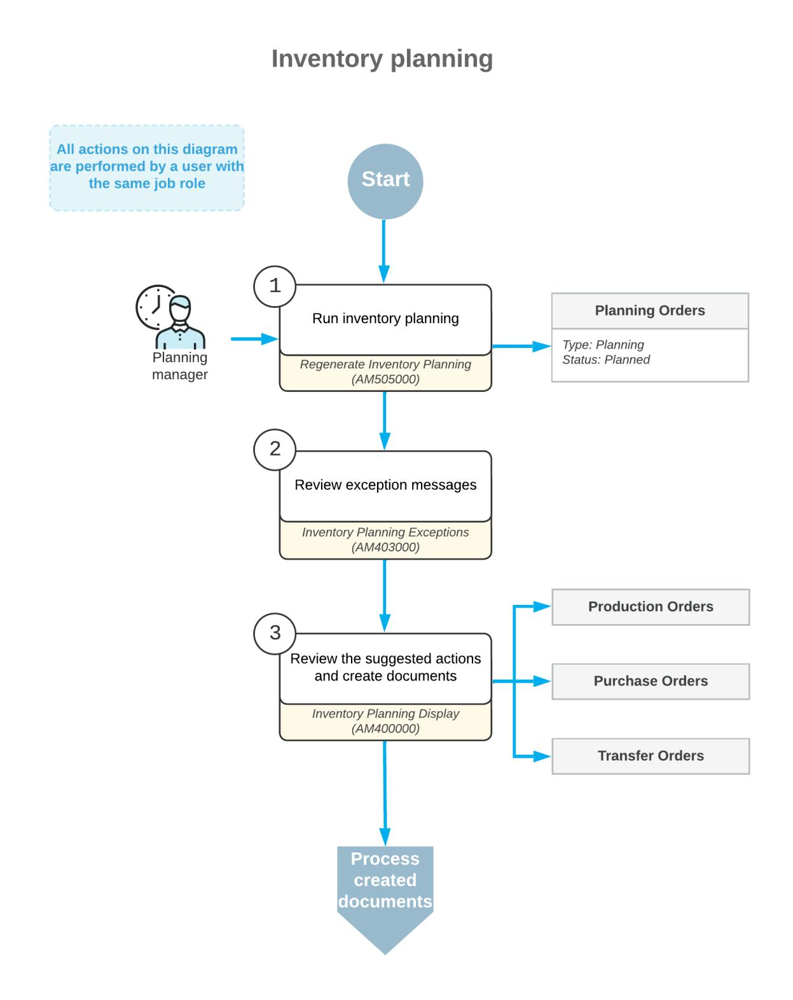

#### **Inventory Planning Exception Analysis**

Exception messages provide the reason for the exception according to inventory planning settings or suggest actions that you should take to balance supply and demand. You can view the exception messages on the *[Inventory](https://help-2025r1.acumatica.com/Help?ScreenId=ShowWiki&pageid=05634ed3-1a22-4751-960d-1782a9b08056) [Planning Exceptions](https://help-2025r1.acumatica.com/Help?ScreenId=ShowWiki&pageid=05634ed3-1a22-4751-960d-1782a9b08056)* (AM403000) form aer inventory planning has been regenerated. The types of exception messages that the system displays on this form are the following:

- *Defer*: You can defer the supply document (which can be a production order, a purchase order, or a transfer order) to a later date because the order date is outside the period specified in the **Days Before** box but still within the period specified in the **Grace Period** box on the *[Inventory Planning Preferences](https://help-2025r1.acumatica.com/Help?ScreenId=ShowWiki&pageid=c73f184e-6d99-47ff-a550-ae2d4f711ec2)* (AM100000) form.
- *Delete*: You can delete the supply document; the document date does not fall within the grace period specified on the *[Inventory Planning Preferences](https://help-2025r1.acumatica.com/Help?ScreenId=ShowWiki&pageid=c73f184e-6d99-47ff-a550-ae2d4f711ec2)* form, so the order is not needed.
- *Expedite*: You should expedite the supply document so that it meets the ship dates because the document date is within the period specified in the **Grace Period** box but outside the period specified in the **Days Aer** box on the *[Inventory Planning Preferences](https://help-2025r1.acumatica.com/Help?ScreenId=ShowWiki&pageid=c73f184e-6d99-47ff-a550-ae2d4f711ec2)* form.
- *Order on Hold*: You may want to consider the supply document that is on hold to be a supply document.
- *Late Order*: You may want to exclude this document from the potential supply because the document date is outside of the grace period defined on the *[Inventory Planning Preferences](https://help-2025r1.acumatica.com/Help?ScreenId=ShowWiki&pageid=c73f184e-6d99-47ff-a550-ae2d4f711ec2)* form.
- *Transfer Available*: You can create a transfer order to move the items required for shipping from another warehouse. This exception message is displayed when the needed item quantity is unavailable in the warehouse that is specified in the demand document but is available in that warehouse and only for past due demand documents.
- *Order Without Sched. Shipment Date*: You may want to consider the blanket sales order to be a supply document even though the scheduled shipment date is unspecified either in any line of the order or in any line detail (if details have been added to any order lines).
- *Transfer without Repl. Warehouse*: You need to specify a warehouse in the**Source Warehouse** box on the **Inventory Planning** tab of the *Item [Warehouse](https://help-2025r1.acumatica.com/Help?ScreenId=ShowWiki&pageid=ae2418af-7f53-4c09-8766-556452d8f8b8) Details* (IN204500) form for the item and source warehouse combination if you want to create a transfer order for the item.
- *Circular Transfer*: You need to change the transfer settings for the item on the *Item [Warehouse](https://help-2025r1.acumatica.com/Help?ScreenId=ShowWiki&pageid=ae2418af-7f53-4c09-8766-556452d8f8b8) Details* form so that one or more warehouses do not make a closed loop for transferring the item.

## **Creation of Documents Suggested by Inventory Planning**

When inventory planning is regenerated (manually or automatically), the system creates a list of potential supply orders to meet the demand, or planning recommendations, which you then can convert to supply documents that is, purchase, production, or transfer orders. Planning recommendations are temporary documents; the system deletes them once you convert them to supply documents. You can view the list of planning recommendations and create the supply documents by using the *[Inventory Planning Display](https://help-2025r1.acumatica.com/Help?ScreenId=ShowWiki&pageid=78238a83-ae79-47e6-b583-fd7c7fc6de69)* (AM400000) form.

You can create any type of supply document regardless of the source (*Purchase* or *Manufacturing*) specified for the planning recommendations. That is, you can create a purchase order or transfer order for an item with a source of *Manufacturing*.

## **Inventory Planning with MRP: Process Details**

When inventory planning is performed, the system analyzes particular data based on inventory planning settings and existing open documents that may influence the planning. In this topic, you will find information about how inventory planning works in Acumatica ERP Manufacturing Edition.

#### **Data Used in Inventory Planning**

During inventory planning, the system analyzes the following documents:

- Demand documents (such as a sales order or forecast), which generate demand for items or cause items to be issued from one of the company's warehouses
- Supply documents (such as a purchase order or transfer order), which cause receiving items in one of the company's warehouses

The extended list of documents and data used in inventory planning is the following:

- Forecasts on the *[Forecast](https://help-2025r1.acumatica.com/Help?ScreenId=ShowWiki&pageid=1b6be70b-e2d5-4202-bb38-eba98534c497)* (AM202000) form
- Sales orders on the *[Sales Orders](https://help-2025r1.acumatica.com/Help?ScreenId=ShowWiki&pageid=19e4021c-1b84-49fd-be12-0320c5f1c7e5)* (SO301000) form that are not processed to completion, including open transfer orders and blanket sales orders
- Shipments on the *[Shipments](https://help-2025r1.acumatica.com/Help?ScreenId=ShowWiki&pageid=f47cffcc-543e-469c-a204-a9c1e3da346d)* (SO302000) form with items that have not been issued
- Inventory on hand and unreleased inventory transactions, which include documents on the following forms:
  - Issues on the *[Issues](https://help-2025r1.acumatica.com/Help?ScreenId=ShowWiki&pageid=17b051f6-027d-4459-b542-65c1c1f9d0ea)* (IN302000) form
  - Receipts on the *[Receipts](https://help-2025r1.acumatica.com/Help?ScreenId=ShowWiki&pageid=d6ecad5b-155f-44bf-baba-9ed006d298b5)* (IN301000) form
  - Documents on the *[Adjustments](https://help-2025r1.acumatica.com/Help?ScreenId=ShowWiki&pageid=31ba83fe-8b3a-4d52-a355-edea838b5c8e)* (IN303000) form
- MPS orders on the *[Master Production Schedule](https://help-2025r1.acumatica.com/Help?ScreenId=ShowWiki&pageid=8c084fab-5c74-48b0-bc59-9e5d5385d7b7)* (AM201000) form
- Production orders that are not processed to completion on the *[Production Order Details](https://help-2025r1.acumatica.com/Help?ScreenId=ShowWiki&pageid=f24480d9-1fed-478e-9363-e48fa5833950)* (AM209000) form
- Purchase orders that are not processed to completion on the *[Purchase Orders](https://help-2025r1.acumatica.com/Help?ScreenId=ShowWiki&pageid=5565686c-96c4-4bfa-a51d-9a2566baa808)* (PO301000) form
- Two-step transfers between warehouses on the *[Transfers](https://help-2025r1.acumatica.com/Help?ScreenId=ShowWiki&pageid=ea1539b6-fafa-443e-8b49-cd1ced95389f)* (IN304000) form, if the *Multiple Warehouses* feature is enabled on the *[Enable/Disable Features](https://help-2025r1.acumatica.com/Help?ScreenId=ShowWiki&pageid=c1555e43-1bc5-4f6f-ba9d-b323f94d8a6b)* (CS100000) form
- Kit assembly orders or kit disassembly orders on the *[Kit Assembly](https://help-2025r1.acumatica.com/Help?ScreenId=ShowWiki&pageid=dbeb6a3a-153e-4731-bb21-850cd124bfa4)* (IN307000) form, if the *Kit Assembly* feature is enabled on the *[Enable/Disable Features](https://help-2025r1.acumatica.com/Help?ScreenId=ShowWiki&pageid=c1555e43-1bc5-4f6f-ba9d-b323f94d8a6b)* form

You manage the set of entities included in planning at the warehouse level. For details, see *[Inventory Planning](https://help-2025r1.acumatica.com/Help?ScreenId=ShowWiki&pageid=bbdde314-b398-4d07-a026-7ea22d6130ec) [Configuration: General Information](https://help-2025r1.acumatica.com/Help?ScreenId=ShowWiki&pageid=bbdde314-b398-4d07-a026-7ea22d6130ec)*.

#### **Components Used for Inventory Planning**

During inventory planning, the system analyzes which components of items to be produced will be needed and suggests creating purchase orders if it discovers any shortage. The system determines the needed components as follows:

- For production orders, the material details with a quantity remaining are always used.
- For planned orders, the most recent active revision of the bill of material whose identifier is specified in the **Planning BOM ID** box on the **Manufacturing** tab of the *[Stock Items](https://help-2025r1.acumatica.com/Help?ScreenId=ShowWiki&pageid=77786a70-1f1e-4d63-ad98-96f98e4fcb0e)* (IN202500) is used. If this box is empty, the bill of material specified in the **Default BOM ID** box on the same tab is used.
- For master production schedule (MPS) orders, the bill of material specified in the order is used.

Additionally, the system uses the effective start date and effective end date specified for each material line in the bill of material to determine if a component is effective at the time when planned orders are generated.

The system selects the active bill of material based on the effective dates of the BOM revision. For example, if a revision exists for a future start date, it will be used for planned orders with a start date on or aer this date.

## **Order of Creating Planning Orders**

During inventory planning, the system analyzes the hierarchy of items based on the bills of material assigned to items and starts creating planning orders from the top-level items. It generates low-level codes for each item and component. The top-level items, such as items to be produced, are assigned the zero code. Then the system analyzes the components of the top-level items and assigns them the 1 code. If any of the components is a

subassembly, which also should be produced, the system then analyzes its components and assigns them the 2 code. This procedure is repeated until the lowest level of components is reached.

#### **Dates on Supply and Demand Orders Used in Inventory Planning**

The system uses the following dates specified in supply and demand documents during inventory planning:

- Sales orders and transfer orders: The**Ship On** date in each document line on the *[Sales Orders](https://help-2025r1.acumatica.com/Help?ScreenId=ShowWiki&pageid=19e4021c-1b84-49fd-be12-0320c5f1c7e5)* (SO301000) form
- Purchase orders: The **Promised** date in each document line on the *[Purchase Orders](https://help-2025r1.acumatica.com/Help?ScreenId=ShowWiki&pageid=5565686c-96c4-4bfa-a51d-9a2566baa808)* (PO301000) form
- Production orders: The**Start Date** of each operation on the *[Production Order Details](https://help-2025r1.acumatica.com/Help?ScreenId=ShowWiki&pageid=f24480d9-1fed-478e-9363-e48fa5833950)* (AM209000) form
- MPS orders: The**Start Date** of each operation on the *[MPS Listing](https://help-2025r1.acumatica.com/Help?ScreenId=ShowWiki&pageid=89ebde1a-8557-4d87-9130-0313307ec80b)* (AM000004) form

#### **Consolidation of Demand Documents**

If the **Use Days ofSupply to Consolidate Orders** check box is selected in the **Consolidation** section of the *[Inventory Planning Preferences](https://help-2025r1.acumatica.com/Help?ScreenId=ShowWiki&pageid=c73f184e-6d99-47ff-a550-ae2d4f711ec2)* (AM100000) form, the system consolidates items with the same ID from multiple demand documents into a single planning recommendation during inventory planning. (For more information, see *Inventory Planning [Configuration:](https://help-2025r1.acumatica.com/Help?ScreenId=ShowWiki&pageid=4e134e8f-53a0-4a04-a82f-9753b4f0f263) System-Wide Settings*.) The system uses the earliest requested date from the demand documents of the group as the action date of the planning recommendation.

# **Inventory Planning with MRP: Forecasts and Master Production Schedule**

Forecasts and the master production schedule (MPS) provide data for inventory planning. In this topic, you will find details about forecasts and the MPS in Acumatica ERP.

#### **Master Production Schedule**

A master production schedule (MPS) is a plan for the production of finished goods within a short-term period, such as a week or a month. The schedule specifies which items must be produced and when they should be produced.

A master production schedule should consider multiple factors, including forecasts, sales order backlog, desired inventory levels, storage constraints, and production resources. MPS orders may depend on open production orders. When this is the case, the system reduces the quantity of the MPS order by the quantity of items in open production orders. To enable this dependency between MPS orders and production orders, you select the **Dependent** check box for the relevant MPS type on the *[MPS](https://help-2025r1.acumatica.com/Help?ScreenId=ShowWiki&pageid=ebed96e6-5eab-4852-b8f7-6ac1b1237426) Type* (AM203000) form.

You can create MPS orders manually by using the *[Master Production Schedule](https://help-2025r1.acumatica.com/Help?ScreenId=ShowWiki&pageid=8c084fab-5c74-48b0-bc59-9e5d5385d7b7)* (AM201000) form.

#### **Forecasts**

A forecast predicts future demand (that is, sales orders expected to be placed by customers) based on historical sales data, seasonality, or other business-specific patterns. You can adjust these forecasts for factors like promotions or anticipated demand spikes. Forecasts provide insights that you can use to determine replenishment strategies so that inventory levels are optimized to avoid stockouts or overstock.

The forecasted demand is fully integrated into inventory planning workflows. By leveraging forecasts, you can balance inventory-carrying costs while efficiently meeting customer demand.

Forecasts can be generated automatically through the *[Generate Forecasts](https://help-2025r1.acumatica.com/Help?ScreenId=ShowWiki&pageid=c9043b4a-6e6c-487b-9b1f-5b90282dd2f6)* (AM502000) form or you can create them manually by using the *[Forecast](https://help-2025r1.acumatica.com/Help?ScreenId=ShowWiki&pageid=1b6be70b-e2d5-4202-bb38-eba98534c497)* (AM202000) form.

If a forecast is marked as dependent (that is, the **Dependent** check box is selected for the forecast on the *[Forecast](https://help-2025r1.acumatica.com/Help?ScreenId=ShowWiki&pageid=1b6be70b-e2d5-4202-bb38-eba98534c497)* form), the system does the following:

- Reduces the forecasted quantity by the quantity of items in sales orders
- Excludes the consumed forecasted quantity from inventory planning

This helps reduce the risk of over-ordering or producing excess inventory that may not be needed. For example, suppose the forecast quantity is 200 items for September 1 to September 30, and sales orders with promised dates during this period total an open quantity of 150. In this case, the remaining forecast of 50 will be used for inventory planning.

If you specify a customer on a forecast and select the **Dependent** check box, that forecast will only apply to sales orders for that customer. However, we do not recommend mixing customer-specific and non-specific forecasts for the same inventory item because both forecasts will apply to sales orders for that customer.

Also, you can compare forecasted demand with actual demand for dependent forecasts via a side panel available on the *[Forecast](https://help-2025r1.acumatica.com/Help?ScreenId=ShowWiki&pageid=1b6be70b-e2d5-4202-bb38-eba98534c497)* and *[Forecast Listing](https://help-2025r1.acumatica.com/Help?ScreenId=ShowWiki&pageid=6bec2ed5-29cb-4faa-8fb0-eb99688b68bd)* (AM000005) forms. This provides visibility into actual demand during specific forecast intervals, helping companies refine their inventory planning.

# **Inventory Planning with MRP: Planning Transfers in MRP**

In your production environment, items may be stored in multiple warehouses, such as when items are produced in one warehouse but stored and shipped in another warehouse. In this case, you may want the system to create planning recommendations for the transfer of items during inventory planning. In Acumatica ERP Manufacturing Edition, the system creates planning recommendations for available item transfers during inventory planning if proper settings have been specified, as described in *[Inventory Planning Configuration: General Information](https://help-2025r1.acumatica.com/Help?ScreenId=ShowWiki&pageid=bbdde314-b398-4d07-a026-7ea22d6130ec)*.

In the following sections, you will read about planning recommendations for transfers that the system creates during inventory planning.

#### **Planning Recommendations for Transfers**

The system generates a planning recommendation for an item during inventory planning when both of the following are true:

- The available item quantity in the warehouse specified in a demand document is insufficient to meet the demand.
- The item can be transferred from a different (transfer) warehouse according to the item settings. That is, *Transfer* is specified in the **ReplenishmentSource** box of the **Inventory Planning** tab on the *[Item](https://help-2025r1.acumatica.com/Help?ScreenId=ShowWiki&pageid=ae2418af-7f53-4c09-8766-556452d8f8b8) [Warehouse](https://help-2025r1.acumatica.com/Help?ScreenId=ShowWiki&pageid=ae2418af-7f53-4c09-8766-556452d8f8b8) Details* (IN204500) form for the combination of the item and the transfer warehouse.

For a planned transfer order, the system creates the following records on the *[Inventory Planning Display](https://help-2025r1.acumatica.com/Help?ScreenId=ShowWiki&pageid=78238a83-ae79-47e6-b583-fd7c7fc6de69)* (AM400000) form:

- The demand document (such as a sales order) that contains the item. This record has the *Transfer* source and the transfer warehouse specified.
- The planning recommendation for a transfer order itself. This record has the *Planned Transfer Demand* type.

Suppose that your organization assembles juicers and has warehouses in New York, Ohio, and New Jersey. In the New York warehouse, which is a sales center, juicers are shipped to customers. In the Ohio warehouse, which is a production center, the juicers are assembled and stored. When the juicers are out of stock in the New York warehouse, they are produced in the Ohio warehouse and transferred from this warehouse. In the New Jersey warehouse, the purchased materials for the juicers are received from vendors and stored. If any materials are out of stock in the Ohio warehouse, they are transferred from the New Jersey warehouse.

Further suppose that in Acumatica ERP Manufacturing Edition, on the *Item [Warehouse](https://help-2025r1.acumatica.com/Help?ScreenId=ShowWiki&pageid=ae2418af-7f53-4c09-8766-556452d8f8b8) Details* form, the replenishment source of the juicers in the New York warehouse has been set as *Transfer*, and the Ohio warehouse has been specified as the replenishment warehouse. Also, the replenishment source for materials in the Ohio warehouse has been set as *Transfer*, and the New Jersey warehouse has been specified as the replenishment warehouse. Inventory planning is automatically run every night, and a planning engineer analyzes demand and supply for juicers based on the inventory planning results.

Now suppose that one of your customers would like to buy 10 juicers for its new restaurants. A sales manager has created a sales order for the juicers. Further suppose that you have three juicers in the New York warehouse and five juicers in the Ohio warehouse. To meet the customer's demand, you need to produce two juicers, but the materials are out of stock in the Ohio warehouse and must be transferred from the New Jersey warehouse.

When the planning engineer analyzes the inventory planning results, the engineer sees the following supply records related to the sales order:

- A planning recommendation for a production order to produce two juicers in the Ohio warehouse
- A planning recommendation for a transfer order to transfer materials for two juicers from the New Jersey warehouse to the Ohio warehouse
- A planning recommendation for a transfer order to transfer seven juicers from the Ohio warehouse to the New York warehouse

## **Calculation of an Action Date for Planning Recommendations for Transfer Orders**

If the transfer lead time between the warehouse selected in a demand document and the transfer warehouse has been specified during the system configuration, then the system subtracts the transfer lead time from the requested date in the demand document when calculating the action date for the planning recommendation for a transfer order. For example, suppose that transferring of items between warehouses takes two days. If a sales order has a requested date of January 30, then the action date for the planned transfer order is January 28.

You can specify the transfer lead time between warehouses on the **Manufacturing** tab of the *[Warehouses](https://help-2025r1.acumatica.com/Help?ScreenId=ShowWiki&pageid=264b0ef7-2b6c-40b4-a7d9-f1a5e067939b)* (IN204000) form. You can also override this time on the **Manufacturing** tab of the *[Item](https://help-2025r1.acumatica.com/Help?ScreenId=ShowWiki&pageid=ae2418af-7f53-4c09-8766-556452d8f8b8) [Warehouse](https://help-2025r1.acumatica.com/Help?ScreenId=ShowWiki&pageid=ae2418af-7f53-4c09-8766-556452d8f8b8) Details* (IN204500) form for a particular item.

## **Creation of a Transfer Order Based on Planning Recommendations**

If you decide to transfer items according to the planning recommendations resulting from the inventory planning process, on the *[Inventory Planning Display](https://help-2025r1.acumatica.com/Help?ScreenId=ShowWiki&pageid=78238a83-ae79-47e6-b583-fd7c7fc6de69)* (AM400000) form, you select the needed records in the table and click **Transfer** on the form toolbar. The system creates a transfer order on the *[Sales Orders](https://help-2025r1.acumatica.com/Help?ScreenId=ShowWiki&pageid=19e4021c-1b84-49fd-be12-0320c5f1c7e5)* (SO301000) form with a number of lines on the **Details** tab that is equal to the number of the selected records and a**Ship On** date for each line that is the same as the action date of each planning recommendation for a transfer order that you selected.

# **Inventory Planning with MRP: Implementation Checklist**

The following sections provide details that you can use to ensure that the system is configured properly for inventory planning, and to understand (and change, if needed) the settings that affect the processing workflow.

### **Implementation Checklist**

We recommend that before you initially perform inventory planning, you make sure the needed features have been enabled, settings have been specified, and entities have been created, as summarized in the following checklist. You can perform a sample configuration of inventory planning, as described in *Inventory Planning [Configuration:](https://help-2025r1.acumatica.com/Help?ScreenId=ShowWiki&pageid=7a71bef5-764e-4eab-821c-eb125556ae79) To [Implement MRP](https://help-2025r1.acumatica.com/Help?ScreenId=ShowWiki&pageid=7a71bef5-764e-4eab-821c-eb125556ae79)*.

| Form                               | Criteria to Check                                               |  |
|------------------------------------|-----------------------------------------------------------------|--|
| Enable/Disable Features (CS100000) | The Material Requirements Planning feature has been enabled. |  |

| Form                                      | Criteria to Check                                                                                                                                                              |  |
|-------------------------------------------|--------------------------------------------------------------------------------------------------------------------------------------------------------------------------------|--|
| Numbering Sequences (CS201010)            | The numbering sequences for planning recommenda tions, MPS orders, and forecast have been created.                                                                          |  |
|                                           | We recommend that you create a sepa rate numbering sequence for planning recommendations to distinguish these orders from regular production orders in the system. |  |
| Production Order Types (AM201100)         | At least one production order type with the Planning function has been created.                                                                                             |  |
| Work Calendar (CS209000)                  | Work calendars that will be used in inventory planning have been created.                                                                                                   |  |
| MPS Type (AM203000)                       | At least one MPS type has been created.                                                                                                                                        |  |
| Inventory Planning Preferences (AM100000) | The system settings that affect the inventory planning process have been specified.                                                                                         |  |
| Inventory Planning Buckets (AM201200)     | The inventory planning buckets have been created.                                                                                                                              |  |
| Warehouses (IN204000)                     | The needed settings for the warehouse and warehouse locations involved in inventory planning have been specified.                                                        |  |
| Stock Items (IN202500)                    | For items that should be included in inventory plan ning and are stored in only one warehouse, inventory planning and replenishment settings have been speci fied.    |  |
| Item Warehouse Details (IN204500)         | For items that are stored in multiple warehouses, in ventory planning and replenishment settings for ware house-stock item pairs have been specified.                    |  |

## **Other Settings That Affect the Workflow**

You can affect the processing by specifying additional settings on the *[Inventory Planning Preferences](https://help-2025r1.acumatica.com/Help?ScreenId=ShowWiki&pageid=c73f184e-6d99-47ff-a550-ae2d4f711ec2)* (AM100000) form as follows:

- To include sales orders, purchase orders, and production orders that have the *On Hold* status in the processing, select the **Include On Hold Sales Orders**, **Include On Hold Purchase Orders**, and **Include On Hold Production Orders** check boxes in the **General** section.
- To make the system calculate lead times for a planned order based on the run units and run times specified for each operation of a bill of material on the *[Bill of Material](https://help-2025r1.acumatica.com/Help?ScreenId=ShowWiki&pageid=1aae7d3a-d5f9-4693-b91f-663c4c2d362b)* (AM208000) form, select the **Use Fixed ManufacturingTimes** check box in the **General** section.
- You may want the system to consolidate items with the same ID from multiple demand documents into a single planning recommendation during inventory planning. To do this, select the **Use Days ofSupply to Consolidate Orders** check box in the **Consolidation** section.
- You may want the system to consolidate items with the same ID from multiple demand documents with deferred due dates into a single planning recommendation. To do this, select the **Use Long-Term Consolidation Bucket** check box in the **Consolidation** section. Then specify the following settings:

- **Consolidate Aer (Days)**: The delay period aer which the system starts consolidating items in demand documents
- **Bucket (Days)**: The number of days within which the due dates in the demand documents must fall

#### **Validation of Configuration**

To make sure that all configuration has been performed correctly, we recommend that in your system, you run inventory planning by performing instructions similar to those described in *[Inventory Planning with MRP: Process](#page-202-1) [Activity](#page-202-1)*.

## **Inventory Planning with MRP: Process Activity**

The following activity will walk you through the process of running inventory planning.

#### **Story**

Suppose that GoodFood One Restaurant ordered five citrus juicers from SweetLife Fruits & Jams. The company does not have the juicers in stock, so the juicers must be assembled to satisfy the customer's order. The company also does not have the components required for the juicer assembly in stock, so the components must be ordered from the Jalooza Inc. vendor. The default lead time of the vendor is seven days.

Acting as the sales manager, you need to create the sales order with the juicers and then create a production order to request the production of the juicers. Acting as the planning manager, you need to run inventory planning, analyze the results, and take the required actions to cause the juicers to be produced and shipped to the customer by the requested date.

#### **Configuration Overview**

In the *U100* dataset, the following tasks have been performed to support this activity:

- On the *[Customers](https://help-2025r1.acumatica.com/Help?ScreenId=ShowWiki&pageid=652929bc-9606-4056-aa6e-0c2d1147171b)* (AR303000) form, the *GOODFOOD* customer has been created.
- On the *[Vendors](https://help-2025r1.acumatica.com/Help?ScreenId=ShowWiki&pageid=a9584be3-f2bd-4d67-80d4-8041d809df56)* (AP303000) form, the *JALOOZA* vendor has been configured.
- On the *[Stock Items](https://help-2025r1.acumatica.com/Help?ScreenId=ShowWiki&pageid=77786a70-1f1e-4d63-ad98-96f98e4fcb0e)* (IN202500) form, the *CFJCITRUS*, *JCREAMER*, *JUICECUP1L*, *MRBASEHIGH*, *STRBASKET*, and *SPLGUARD* stock items have been predefined.

#### **Process Overview**

In this activity, to perform inventory planning and process the results, you will do the following:

- 1. On the *[Sales Orders](https://help-2025r1.acumatica.com/Help?ScreenId=ShowWiki&pageid=19e4021c-1b84-49fd-be12-0320c5f1c7e5)* (SO301000) form, create a sales order with a citrus juicer to generate demand for inventory planning analysis.
- 2. On the same form, create a production order linked to the sales order to generate the supply that will satisfy the customer's order.
- 3. On the *[Regenerate Inventory Planning](https://help-2025r1.acumatica.com/Help?ScreenId=ShowWiki&pageid=588d4939-b533-4b84-8016-cf34e2be17d5)* (AM505000) form, run inventory planning, and then on the *[Inventory](https://help-2025r1.acumatica.com/Help?ScreenId=ShowWiki&pageid=05634ed3-1a22-4751-960d-1782a9b08056) [Planning Exceptions](https://help-2025r1.acumatica.com/Help?ScreenId=ShowWiki&pageid=05634ed3-1a22-4751-960d-1782a9b08056)* (AM403000) form, view the list of exception messages.
- 4. On the *[Inventory Planning Display](https://help-2025r1.acumatica.com/Help?ScreenId=ShowWiki&pageid=78238a83-ae79-47e6-b583-fd7c7fc6de69)* (AM400000) form, view the list of actions the system has suggested as a result of inventory planning and create a purchase order for the materials required to produce the citrus juicers.
- 5. On the *[Regenerate Inventory Planning](https://help-2025r1.acumatica.com/Help?ScreenId=ShowWiki&pageid=588d4939-b533-4b84-8016-cf34e2be17d5)* form, rerun inventory planning, and on the *[Inventory Planning](https://help-2025r1.acumatica.com/Help?ScreenId=ShowWiki&pageid=05634ed3-1a22-4751-960d-1782a9b08056) [Exceptions](https://help-2025r1.acumatica.com/Help?ScreenId=ShowWiki&pageid=05634ed3-1a22-4751-960d-1782a9b08056)* form, view the changes in the list of exception messages.

- 6. On the *[Sales Orders](https://help-2025r1.acumatica.com/Help?ScreenId=ShowWiki&pageid=19e4021c-1b84-49fd-be12-0320c5f1c7e5)* form, change the requested date for the juicers to be shipped to the customer; on the *[Purchase Orders](https://help-2025r1.acumatica.com/Help?ScreenId=ShowWiki&pageid=5565686c-96c4-4bfa-a51d-9a2566baa808)* (PO301000) form, change the promised date to an earlier date to meet the date the customer wanted the juicers to be shipped; on the *[Production Order Maintenance](https://help-2025r1.acumatica.com/Help?ScreenId=ShowWiki&pageid=e5d2ddd4-8c80-4f5b-8e5f-e5151636a9d3)* (AM201500) form, change the production end date (at which the juicers will be ready for shipping).
- 7. On the *[Regenerate Inventory Planning](https://help-2025r1.acumatica.com/Help?ScreenId=ShowWiki&pageid=588d4939-b533-4b84-8016-cf34e2be17d5)* form, rerun inventory planning, and on the *[Inventory Planning](https://help-2025r1.acumatica.com/Help?ScreenId=ShowWiki&pageid=05634ed3-1a22-4751-960d-1782a9b08056) [Exceptions](https://help-2025r1.acumatica.com/Help?ScreenId=ShowWiki&pageid=05634ed3-1a22-4751-960d-1782a9b08056)* form, make sure that no exception messages are listed.

#### **System Preparation**

Do the following:

- 1. Sign in to the system as theproduction managerby using the *peters* username and the provided password.
- 2. In the info area, in the upper-right corner of the top pane of the Acumatica ERP screen, make sure that the business date in your system is set to today's date. For simplicity, in this activity, you will create and process all documents in the system on this business date.

#### **System Preparation**

Do the following:

- 1. As prerequisites to the current activity, perform the following activities in the listed order:
  - a. *[Bills of Material: Implementation Activity](#page-15-1)* so that the needed bill of material has been created in a company with the *U100* dataset preloaded.
  - b. *Production Order Types: To Create a Planning [Production](https://help-2025r1.acumatica.com/Help?ScreenId=ShowWiki&pageid=4c9ab85d-613d-4ae0-9907-df637ea055dd) Order Type* so that a production order type for planning orders has been created in this company.
- 2. Launch the Acumatica ERP website, and sign in to a company with the *U100* dataset preloaded. You should sign in as the sales and planning manager by using the *peters* username and the *123* password.
- 3. In the info area, in the upper-right corner of the top pane of the Acumatica ERP screen, make sure that the business date in your system is set to today's date. For simplicity, in this activity, you will create and process all documents in the system on this business date.

#### **Step 1: Creating a Sales Order**

To create a sales order for the GoodFood One Restaurant customer with five citrus juicers, do the following:

- 1. On the *[Sales Orders](https://help-2025r1.acumatica.com/Help?ScreenId=ShowWiki&pageid=19e4021c-1b84-49fd-be12-0320c5f1c7e5)* (SO301000) form, add a new record.
- 2. In the Summary area, specify the following settings:
  - **Customer**: *GOODFOOD*
  - **Requested On**: Today's date plus 1 day
  - **Description**: Sale of 5 citrus juicers to GoodFood One Restaurant
- 3. On the **Details** tab, add a new row and specify the following settings in the row:
  - **Inventory ID**: *CFJCITRUS*
  - **Quantity**: 5
  - **Unit Price**: 2000
- 4. On the form toolbar, click**Save**.

#### **Step 2: Creating a Production Order**

To create a production order from the sales order, do the following:

1. While you are still viewing the sales order on the *[Sales Orders](https://help-2025r1.acumatica.com/Help?ScreenId=ShowWiki&pageid=19e4021c-1b84-49fd-be12-0320c5f1c7e5)* (SO301000) form, on the More menu (under **Manufacturing**), click **Create Production Orders**.

You open the More menu by clicking the More button (…) on the form toolbar.

2. In the **Production Orders** dialog box, which opens, select the unlabeled check box in the only row, and click **Create**. The system creates the production order and closes the dialog box.

On the **Details** tab, notice that the system has added the reference number of the production order in the **Production Nbr.** column for the only line.

3. Click the link in the **Production Nbr.** column. The system opens the production order on the *[Production](https://help-2025r1.acumatica.com/Help?ScreenId=ShowWiki&pageid=e5d2ddd4-8c80-4f5b-8e5f-e5151636a9d3) [Order Maintenance](https://help-2025r1.acumatica.com/Help?ScreenId=ShowWiki&pageid=e5d2ddd4-8c80-4f5b-8e5f-e5151636a9d3)* (AM201500) form.

On the **General** tab, notice that today's date plus 1 day is specified in the **Due Date** box.

#### **Step 3: Running Inventory Planning and Viewing Exception Messages**

To run inventory planning and view exception messages, do the following:

- 1. Open the *[Regenerate Inventory Planning](https://help-2025r1.acumatica.com/Help?ScreenId=ShowWiki&pageid=588d4939-b533-4b84-8016-cf34e2be17d5)* (AM505000) form.
- 2. On the form toolbar, click **Process**. Wait until the log records appear in the table.
- 3. Open the *[Inventory Planning Exceptions](https://help-2025r1.acumatica.com/Help?ScreenId=ShowWiki&pageid=05634ed3-1a22-4751-960d-1782a9b08056)* (AM403000) form.
- 4. Notice that no exception messages are displayed in the table.

#### **Step 4: Creating a Purchase Order**

To create a purchase order for the components, do the following:

1. Open the *[Inventory Planning Display](https://help-2025r1.acumatica.com/Help?ScreenId=ShowWiki&pageid=78238a83-ae79-47e6-b583-fd7c7fc6de69)* (AM400000) form.

Notice that the table contains five rows of the *Production Material* type. These rows correspond to the components required for the juicer assembly. In the**Source** column, notice that *Purchase* is specified, which is the replenishment source for the items.

- 2. Select the unlabeled check box in each of the five rows.
- 3. On the form toolbar, click **Purchase** to create a purchase order for the components.
- 4. In the **Create Purchase Order** dialog box, which opens, make sure that the *JALOOZA* vendor is selected in the **Vendor** box and all five components are listed in the table.
- 5. Click **Create**. The system creates the purchase order and shows its type and reference number in the **Purchase Order Created** dialog box.
- 6. Click **OK** to close the dialog box.
- 7. Open the created purchase order on the *[Purchase Orders](https://help-2025r1.acumatica.com/Help?ScreenId=ShowWiki&pageid=5565686c-96c4-4bfa-a51d-9a2566baa808)* (PO301000) form.

Notice that the **Promised On** box contains the date that is today's date plus 7 days, which is the default lead time of the *JALOOZA* vendor. This purchase order does not satisfy the demand of the sales order because the components will be delivered later than the customer expected to receive the juicers.

#### **Step 5: Rerunning Inventory Planning and Viewing Exception Messages**

You will view how the list of inventory planning exception messages has changed because of the creation of the purchase order. Do the following:

1. Open the *[Regenerate Inventory Planning](https://help-2025r1.acumatica.com/Help?ScreenId=ShowWiki&pageid=588d4939-b533-4b84-8016-cf34e2be17d5)* (AM505000) form.

- 2. On the form toolbar, click **Process** and wait until the system completes processing.
- 3. Open the *[Inventory Planning Exceptions](https://help-2025r1.acumatica.com/Help?ScreenId=ShowWiki&pageid=05634ed3-1a22-4751-960d-1782a9b08056)* (AM403000) form.

Notice that the *Expedite* messages for the component lines from the purchase order have appeared in the list. This means that to satisfy the demand, you need to negotiate an earlier delivery date with the vendor or a later shipping date with the customer (or both).

#### **Step 6: Changing the Dates in the Documents**

Suppose that you have negotiated with the vendor an earlier delivery date of 2 days aer today's date for the juicer components. Do the following to change the date in the purchase order:

- 1. On the *[Purchase Orders](https://help-2025r1.acumatica.com/Help?ScreenId=ShowWiki&pageid=5565686c-96c4-4bfa-a51d-9a2566baa808)* (PO301000) form, open the purchase order that you created earlier in this activity.
- 2. In the **Promised On** box of the Summary area, change the value to today's date plus 2 days.
- 3. In the dialog box with the warning message that appears, click **Yes**.
- 4. On the form toolbar, click**Save**.

#### **Step 7: Rerunning Inventory Planning and Viewing Exceptions**

You will rerun inventory planning and make sure that all exception messages have been processed. Do the following:

- 1. Open the *[Regenerate Inventory Planning](https://help-2025r1.acumatica.com/Help?ScreenId=ShowWiki&pageid=588d4939-b533-4b84-8016-cf34e2be17d5)* (AM505000) form.
- 2. On the form toolbar, click **Process** and wait till the system completes processing.
- 3. Open the *[Inventory Planning Exceptions](https://help-2025r1.acumatica.com/Help?ScreenId=ShowWiki&pageid=05634ed3-1a22-4751-960d-1782a9b08056)* (AM403000) form.

Notice that no exception messages are displayed in the list.

You have successfully processed all the exception messages.

## **Inventory Planning with MRP: Related Report and Inquiry Forms**

In the following sections, you can find details about the reports and inquiry forms you may want to review to gather information about inventory planning that includes production orders.

If you do not see a particular report or form that is described, you may have signed in to the system with a user account that does not have access rights to the report or form. Contact your system administrator to obtain access to any needed reports or forms.

#### **Printing the List of Planning Recommendations**

To prepare a printable list of planning recommendations the system creates when you regenerate inventory planning, you can use the *[Inventory Planning Display](https://help-2025r1.acumatica.com/Help?ScreenId=ShowWiki&pageid=9ad4369a-5a17-4c91-baa3-5abdb8b2dc81)* (AM632000) report. You can also view the list of these documents on the *[Inventory Planning Display](https://help-2025r1.acumatica.com/Help?ScreenId=ShowWiki&pageid=78238a83-ae79-47e6-b583-fd7c7fc6de69)* (AM400000) form.

#### **Viewing Documents that Include a Particular Stock Item**

To view the list of supply and demand documents that include a specific stock item in a specific warehouse, you can use the *[Inventory Planning Results by Item](https://help-2025r1.acumatica.com/Help?ScreenId=ShowWiki&pageid=37d31db4-36a4-45f7-929b-aeeeea2b504e)* (AM404000) form. On this form, the system displays only the documents that have been created during the last inventory planning regeneration process.

#### **Viewing the List of MPS Orders**

To view the list of orders generated by the master production schedule (MPS) for all stock items of for a particular item-warehouse pair, you can use the *[MPS Listing](https://help-2025r1.acumatica.com/Help?ScreenId=ShowWiki&pageid=89ebde1a-8557-4d87-9130-0313307ec80b)* (AM000004) form.

#### **Viewing Generated Forecasts**

To view the forecasts generated by using the *[Generate Forecasts](https://help-2025r1.acumatica.com/Help?ScreenId=ShowWiki&pageid=c9043b4a-6e6c-487b-9b1f-5b90282dd2f6)* (AM502000) form for all stock items or a particular item–warehouse pair, you can use the *[Forecast Listing](https://help-2025r1.acumatica.com/Help?ScreenId=ShowWiki&pageid=6bec2ed5-29cb-4faa-8fb0-eb99688b68bd)* (AM000005) form.

### **Viewing Inventory Planning Regeneration Results for Stock Items by Period**

To view the results of inventory planning regeneration for a specific item–warehouse pair grouped by periods (or buckets), you can use the *[Inventory Planning Requirements by Item](https://help-2025r1.acumatica.com/Help?ScreenId=ShowWiki&pageid=3e3614ae-4275-444d-98ba-9da22efbca4b)* (AM402000) form.

## **Inventory Planning with MRP: MRP Processor**

| Step                | Description                                                                                                                                                                                                                                                                                                                                                                                                                                                              |
|---------------------|--------------------------------------------------------------------------------------------------------------------------------------------------------------------------------------------------------------------------------------------------------------------------------------------------------------------------------------------------------------------------------------------------------------------------------------------------------------------------|
| Initialization      | The first step the FRG performs is an Initialization phase. Certain variables are initialized. A connection is made to the database. Parameters are read from the Inventory Planning Preferences (AM100000) form.                                                                                                                                                                                                                                                  |
| Set Low Level Codes | The next step is to set the low-level codes of all the inventory items. Due to this MRP processes the highest level items that may generate demand for the lower items.                                                                                                                                                                                                                                                                                               |
| First Pass          | First Pass is the information-gathering phase. The MRP Processor will go out and bring to gether all the various supplies and demands for inventory.                                                                                                                                                                                                                                                                                                                  |
|                     | First Pass first gathers current inventory values, what the current quantity on hand is. The safety stock is removed from this value; MRP treats safety stock as if those quantities were not available.                                                                                                                                                                                                                                                           |
|                     | First Pass then determines where it will get future supplies. This may be Finished Good Items on Open Production Orders or it may Open Purchase Orders. It will then look at de mands from Sales Orders, Shippers, and Material Requirements on Purchase Orders.                                                                                                                                                                                                   |
|                     | First Pass will process the Master Planning Schedule (MPS). It first updates the MPS infor mation. Those MPS records that fall outside of the MPS Time Fence are marked as inac tive. In addition, existing Production Orders may consume the MPS. The Production Or der can consume the MPS even though that Production Order is completed and closed. A Production Order will consume the MPS based on the scheduled End Date of the Produc tion Order. |
| Forecasts           | Forecasts are processed when each level is processed. Therefore, if the forecast is depen dent, all requirements may consume the forecast. This allows the user to not only fore cast at the sales order level, but also forecast at lower levels.                                                                                                                                                                                                                 |

| Step              | Description                                                                                                                                                                                                                                                                                                                                                                                                                                                                                                                                                                              |
|-------------------|------------------------------------------------------------------------------------------------------------------------------------------------------------------------------------------------------------------------------------------------------------------------------------------------------------------------------------------------------------------------------------------------------------------------------------------------------------------------------------------------------------------------------------------------------------------------------------------|
| Adjust Quantities | The next step is to reconcile existing supplies with existing demands at each level. If we have a sales order for 100 units and a production order that is making 100 units in time, then MRP does not have to plan anything for that sales order.                                                                                                                                                                                                                                                                                                                                 |
|                   | The key to this routine is that to remember MRP is extremely date sensitive. In other words, in the above example, if that production order was not going to make those units for another 60 days then MRP does need to plan something else for that sales order so that it ships in time. MRP uses the Grace Period value on the Inventory Planning Prefer ences (AM100000) form to determine if that supply can be used for the current demand.                                                                                                                            |
| Blowdown          | Once all the existing data is reconciled, the blowdown routine will now plan MRP orders. This routine is looking at all demand items that are not being supplied in time for the lev el being processed. These are being planned out. If a Reorder Qty. is set for an Inventory Item, MRP will plan its orders in multiples of that reorder quantity. If the item is a manu factured item, MRP will explode through its bill of material and create more requirements for its materials that will be processed at a lower level.                                          |
|                   | The key to this phase is to plan accurate action dates. The system will calculate cumula tive lead times so that if a sales order needs to ship on March 22nd, that means the pro duction order must be created on March 10th. This also means that the purchase order for the raw material that we do not have needs to be placed by March 5th. During this phase, MRP is writing all of its requirements to the MRP details table. The details are re viewed by using the Inventory Planning Display (AM400000) and Inventory Planning Excep tions (AM403000) forms. |
| Completion        | Finally, once all of the requirements are planned, all the data is brought together into the MRP plan table. This table is used so you can view all of the requirements for an item us ing the Inventory Planning Results by Item (AM404000) form.                                                                                                                                                                                                                                                                                                                                 |

# **Inventory Planning with MRP: MRP Procedures**

In this topic, you will find descriptions of the typical procedures required for inventory planning.

### **Daily Procedures**

Most businesses will need to perform the regeneration of inventory planning on a daily basis. The frequency in which the process is run is dependent on the transactions processed each day. Inventory planning looks at all open demand and supply and needs to have the most accurate and up to date information in order to produce accurate recommendations on what to make or buy. Procedures that must be performed on the daily basis are listed in the following table.

| Procedure                                                                  | Form | Description                                                                                                     |
|----------------------------------------------------------------------------|------|-----------------------------------------------------------------------------------------------------------------|
| Process and release all dis tribution and manufacturing transactions |      | • Sales invoices • Purchase receipts • Inventory transactions • Manufacturing transactions |

| Procedure                 | Form                                        | Description                                                                                                                                                                                                                                                                       |
|---------------------------|---------------------------------------------|-----------------------------------------------------------------------------------------------------------------------------------------------------------------------------------------------------------------------------------------------------------------------------------|
| Update promise dates      |                                             | Having unrealistic promise dates impacts the planned order recommendations. • Sales orders • Production orders • Purchase orders                                                                                                                             |
| Run MRP regeneration      | Regenerate Inventory Planning (AM505000) | This process should be run before the next business day in most cases. It can be run at any time, but typically it is scheduled to be run at a fixed time before each business day.                                                                                      |
| Review exception messages | Inventory Planning Exceptions (AM403000) | Exception messages are generated for exist ing supply each time the MRP regeneration process is run. They need to be attended to particularly when they suggest an expedite. • Expedite • Late • Cancel • On Hold • Transfer • Defer |
| Review MRP display        | Inventory Planning Display (AM400000)    | The inventory planning display lists the rec ommended supply orders to create.                                                                                                                                                                                                 |

## **Periodic Procedures**

Procedures listed in the following table need to be reviewed on a regular basis.

| Procedure                           | Form                                              | Description                                                                                                                                                                |
|-------------------------------------|---------------------------------------------------|----------------------------------------------------------------------------------------------------------------------------------------------------------------------------|
| Review forecasts                    | Forecast Listing (AM000005)                       | Is the forecast still reasonable compared to the actual sales? You can use the Generate Forecasts (AM502000) form to use sales history to suggest a new forecast. |
| Review MPS orders                   | MPS Listing (AM000004)                            | Has the production plan changed?                                                                                                                                           |
| Review replenishment para meters | Calculate Replenishment Para meters (IN508500) | You need to review the following: • Safety stock or reorder point • Lot sizes                                                                                  |

# **Other Manufacturing Functionality**

In this chapter, you will find information about such functionality of Acumatica ERP Manufacturing Edition as backflushing, outside processing, and recording of by-products and scrap.

## **Using Attributes in Manufacturing**

Attributes created on the *[Attributes](https://help-2025r1.acumatica.com/Help?ScreenId=ShowWiki&pageid=de0a353f-40d0-452d-9152-e65605e69788)* (CS205000) form are used for multiple purposes in Acumatica ERP. In many cases they eliminate for customizing forms and when attached to a record, for example, a stock item record, they are automatically available for use in inquiries. You can use attributes in manufacturing forms as well.

### **Using Attributes in Bills of Material and Production Orders**

Attributes can be attached to bills of material header and/or operations and are copied onto the production order when the order is created. Attributes can be specified for each production order type on the *[Production Order](https://help-2025r1.acumatica.com/Help?ScreenId=ShowWiki&pageid=6283187d-54b7-4db1-8c3a-97d3ebc39a95) [Types](https://help-2025r1.acumatica.com/Help?ScreenId=ShowWiki&pageid=6283187d-54b7-4db1-8c3a-97d3ebc39a95)* (AM201100) form. Attributes can also be added to a production order manually by using the *[Production Order](https://help-2025r1.acumatica.com/Help?ScreenId=ShowWiki&pageid=e5d2ddd4-8c80-4f5b-8e5f-e5151636a9d3) [Maintenance](https://help-2025r1.acumatica.com/Help?ScreenId=ShowWiki&pageid=e5d2ddd4-8c80-4f5b-8e5f-e5151636a9d3)* (AM201500) form.

Attributes created at the BOM level become order level attributes for the production order. If an order level attribute is enabled for data entry it is available when reporting all operations of the production order. For example, you could create a required attribute for a quality control check for all operations or to record a process value.

A user can enter attribute values for a production order and operation when creating a labor transaction on the *[Labor](https://help-2025r1.acumatica.com/Help?ScreenId=ShowWiki&pageid=582f9540-0dc6-4515-9e9d-b52cefe0c13f)* (AM301000) form or a move transaction on the *[Move](https://help-2025r1.acumatica.com/Help?ScreenId=ShowWiki&pageid=b60a4897-b4be-40a5-b732-d3ff26fe1eef)* (AM302000) form. If an attribute is marked as *Transaction Required*, it must be entered. The attribute values entered in these transaction are specific to the transaction.

### **Using Attributes in Product Configurator**

Attributes have the following purposes in the product configurator:

- They can be used to collect data used in formulas to calculate the quantity required for an option. For example, calculating the quantity required based on an attribute value for length.
- They can be used to capture a value used in production. For example, the text for printing or engraving on a custom piece.
- They can be used to with rules to include or exclude features and options.

Attributes and their values used on the *[Configuration Entry](https://help-2025r1.acumatica.com/Help?ScreenId=ShowWiki&pageid=dc9466e5-b880-44c7-9921-78f3f82b15d7)* (AM306000) form are copied to the production order created as view only.

## **Manufacturing Data Collection**

Production transactions may be entered using hand held devices supporting the Acumatica mobile app similar to transactions for sale orders, purchasing, and inventory. The *Data Entry* rules specified for the production order types on the *[Production](https://help-2025r1.acumatica.com/Help?ScreenId=ShowWiki&pageid=6283187d-54b7-4db1-8c3a-97d3ebc39a95) Order Types* (AM201100) form are enforced.

#### **Transactions Supported**

The following transactions are available:

• Scan materials on the *[Scan Materials](https://help-2025r1.acumatica.com/Help?ScreenId=ShowWiki&pageid=e58cdd4e-0b23-407e-924d-cf346dbfe604)* (AM300030) form

- Scan moves on the *[Scan Move](https://help-2025r1.acumatica.com/Help?ScreenId=ShowWiki&pageid=737244b2-d13c-491d-9690-a2516cf07418)* (AM302010) form
- Scan labor on the *[Scan Labor](https://help-2025r1.acumatica.com/Help?ScreenId=ShowWiki&pageid=b2d6ac99-b321-4661-996a-37af447d9acf)* (AM302020) form

#### **Setup and Configuration**

The *Manufacturing Data Collection* feature is optional and must be enabled on the *[Enable/Disable Features](https://help-2025r1.acumatica.com/Help?ScreenId=ShowWiki&pageid=c1555e43-1bc5-4f6f-ba9d-b323f94d8a6b)* (CS100000) form.

You configure the default options for this feature on the *[Production Preferences](https://help-2025r1.acumatica.com/Help?ScreenId=ShowWiki&pageid=678a1833-f1f6-44f1-afce-55aa7438b3f3)* (AM102000) form.

The User Settings on each transaction manage settings specific for the current working mode.

In addition, production employees can clock on and off production orders using the mobile version of the *[Clock](https://help-2025r1.acumatica.com/Help?ScreenId=ShowWiki&pageid=db7bfb7a-c3d8-43e6-aca8-023936b8240d) [Entry](https://help-2025r1.acumatica.com/Help?ScreenId=ShowWiki&pageid=db7bfb7a-c3d8-43e6-aca8-023936b8240d)* (AM102000) form without having the *Manufacturing Data Collection* feature enabled.

## **Importing Master Data into Manufacturing**

You can import master data related to manufacturing by using import scenarios on the *[Import by Scenario](https://help-2025r1.acumatica.com/Help?ScreenId=ShowWiki&pageid=88ac7166-2cc0-4201-ab3e-659ada2d74f2)* (SM206036) form. In this topic, you will find information that will help you to import data. Also, you will find the Excel spreadsheets that you can use during import.

The format of all time values (Setup, Run, Machine, and Move) is specified in the **Operation Time Format** box on the *[BOM Preferences](https://help-2025r1.acumatica.com/Help?ScreenId=ShowWiki&pageid=7224e637-50bc-468d-bfb6-e97b87378ff6)* form. Times are now entered or displayed as in days, hours, and minutes. Regardless of the format, you can enter the time as 0000 for HHMM or 000000 for DDHHMM. Time values are actually stored as minutes in the tables. For importing, enter the time as HHMM; e,g. 0010 for 10 minutes, 0130 for 1 hour 30 minutes, 011013 for 1 day, 10 hours, 13 minutes.

#### **General Information**

Almost all of the master data is related to bills of material functionality consisting of the bills of material for each assembly and their supporting data such as work centers, tools, machines, and overhead. For details, see *[Importing](#page-212-1) [Bills of Material Master Data](#page-212-1)*.

Data providers and import scenarios are provided for each of the following; the provider and scenario have the same name and all use Excel as the provider type. The sample Excel files are provided at the end of this topic. You should import your data in the same order as in the following table.

| Master Data Form            | Provider / Import Scenario |
|-----------------------------|----------------------------|
| Machines (AM204500)         | Import Machines            |
| Tools (AM205500)            | Import Tools               |
| Work Centers (AM207000)     | Import Work Centers        |
| Bill of Material (AM208000) | Import BOM                 |

Additionally, you must specify BOM preferences on the *[BOM Preferences](https://help-2025r1.acumatica.com/Help?ScreenId=ShowWiki&pageid=7224e637-50bc-468d-bfb6-e97b87378ff6)* (AM101000) form and enter the following required data first in order to import work centers.

#### **Required Data**

The following data is required even if you do not intend to include labor and indirect costs for your bills of material and to post them to production orders:

- *[Work Calendar](https://help-2025r1.acumatica.com/Help?ScreenId=ShowWiki&pageid=9d01d650-0b68-4994-8146-c80fb5e34bbb)* (CS209000): Defines the hours available per day and is used to calculate both fixed and variable lead times in MRP and Production Management. You enter the calendar to use for shis of a work center, for fixed lead times in Production Preferences, and for purchasing in MRP Preferences.
- *[Shifts](https://help-2025r1.acumatica.com/Help?ScreenId=ShowWiki&pageid=5c53e402-782c-4ce2-98fb-6ec877a2675c)* (AM205000): Machines are used to factor labor rates.
- *[Labor Codes](https://help-2025r1.acumatica.com/Help?ScreenId=ShowWiki&pageid=7f308462-24c9-4bd4-b099-75c39960162c)* (AM206500): Define the GL accounts and subaccounts for direct and indirect labor expense.

Data providers and import scenarios are not supplied for *Shis*, *Labor Codes*, or *Overhead* since most users will have only a few of each. If you need to create one, then enter one of each type on the appropriate form and export the data to Excel. You then can use that spreadsheet to create the data provider and import scenario since it will have all of the columns available and the correct values for drop-down lists and check boxes. In Acumatica ERP, you enter the drop-down list caption and not codes and either *True* (selected) or *False* (cleared) for check boxes. Your reseller can assist you in creating data providers and import scenarios.

#### **Optional Data**

The following data are completely optional:

- *[Tools](https://help-2025r1.acumatica.com/Help?ScreenId=ShowWiki&pageid=8a5b6ca0-613a-46e8-9656-34c0c82378fe)* (AM205500): Can be entered as an additional cost element in a bill of material
- *[Machines](https://help-2025r1.acumatica.com/Help?ScreenId=ShowWiki&pageid=9053c704-59ca-4114-b25b-895f9b315014)* (AM204500): Can be entered as an additional cost element for work centers
- *[Overhead](https://help-2025r1.acumatica.com/Help?ScreenId=ShowWiki&pageid=78dd90ec-9bc6-4ea4-a901-4d6f531e9d99)* (AM202500): Can be entered as an additional cost element for both work centers and bills of material.

Once you have entered the required and optional data the next step is to create or import your work centers. In bills of material, components, as wells as tools, are tied to operations and operations require a work center.

#### **Importing Machines, Tools, or Work Centers**

The import scenarios for the following entities will default values for required form elements not supplied or le blank in the spreadsheet. To override the default value, specify a value in the spreadsheet.

| Form Element                     | Value       |
|----------------------------------|-------------|
| Machines > Active                | True        |
| Machines > Down                  | False       |
| Machines > Efficiency            | 1.00 (100%) |
| Tools > Active                   | True        |
| Tools > Unit Cost                | 0 (zero)    |
| Tools > Total Cost               | 0 (zero)    |
| Work Center > Active             | True        |
| Work Center > Outside Processing | False       |
| Work Center > Backflush Matls    | False       |

| Form Element                  | Value |
|-------------------------------|-------|
| Work Center > Backflush Labor | False |

#### **Sample Excel Files**

*[Machines](Published/UserGuide/Files/MFG_Import_Machines.xlsx) [Tools](Published/UserGuide/Files/MFG_Import_Tools.xlsx) [Work Centers](Published/UserGuide/Files/MFG_Import_Work_Centers.xlsx) [Bills of Material - Operations and Materials](Published/UserGuide/Files/MFG_BOM_Import_Operation_and_Material.xlsx)*

# **Importing Bills of Material Master Data**

In this topic, you will read about importing master data related to bills of material.

## **Importing Bills of Material**

*Steps*, *Tools*, *Reference Designators*, and *Overhead* data are not included in the *Import BOM* provider or scenario but can be added if desired.

The keys to the bill of master data are *BOMID* and *RevisionID* and both are required. Additionally, the *Hold* column should be specified as either *True* or *False*.

## **BOM ID**

BOM ID is up to 15 alphanumeric characters in length and its length is defined on the *[Numbering Sequences](https://help-2025r1.acumatica.com/Help?ScreenId=ShowWiki&pageid=a8d11c23-21f2-42a3-b17d-9637c9cf8031)* (CS201010 form. You can use manual or automatic numbering. For the automatic numbering you can use an alphabetic prefix; that is, to use a start number like BOM00000. If you have an external PDM or drawing system, you might want to synchronize the data between the external system and Acumatica ERP by using the same identity scheme. Keep in mind however that the BOM ID must be unique; that is, the same BOM ID cannot be used for another inventory id or warehouse.

#### Note the following:

- If you use automatic numbering for the BOM ID, then rerunning the import for the same data will create another bill of material with a different BOM ID. For this reason, we recommend that you select the **Manual Numbering** check box for the initial load. Generate in your spreadsheet a BOM ID conforming to the numbering sequence you plan to use and aer your final import you can set the *Last Number* to the appropriate value. The values in the **BOM ID** and **Revision** columns should be the same for each line associated with a particular bill or material.
- This import scenario cannot be used to update existing bills of material so if a bill of material was imported incorrectly then you should delete it by using the *[Bill of Material](https://help-2025r1.acumatica.com/Help?ScreenId=ShowWiki&pageid=1aae7d3a-d5f9-4693-b91f-663c4c2d362b)* (AM208000) form. On the *[Import by Scenario](https://help-2025r1.acumatica.com/Help?ScreenId=ShowWiki&pageid=88ac7166-2cc0-4201-ab3e-659ada2d74f2)* (SM206036) form, use the *TOGGLE ACTIVATION* and *TOGGLE PROCESSING* buttons to clear the **Active** and **Processed** check boxes respectively for all rows and then find the lines that need to be imported and select the **Active** check box for all of lines of a bill of material.

#### **Effective Start Date**

The effective start date of a new bill of material is the system date and cannot be overridden on the form but it can be included in the import data. The import mapping defaults the element to the current Acumatica ERP business date using the @Today parameter because all key fields must be specified on an import scenario.

#### **Inventory Subitems**

By default, the subitem elements are inactive in the both the data provider and import scenario. If you are using subitems, then select the **Active** boxes in both the provider and import scenario. The following elements are related to subitems:

- *Subitem*: The subitem ID for the assembly in the BOM Summary area
- *Matl Subitem*: The subitem for the material on the Materials area.

#### **Required Fields**

In the following table, you can find the fields that must be filled on import.

| Target Object                                                                                                                | Field / Action Name                        |
|------------------------------------------------------------------------------------------------------------------------------|--------------------------------------------|
| BOM Summary                                                                                                                  | BOM ID                                     |
| BOM Summary                                                                                                                  | Inventory ID                               |
| BOM Summary                                                                                                                  | Subitem (only if enabled)                  |
| BOM Summary                                                                                                                  | Warehouse                                  |
| Operations                                                                                                                   | Open Nbr                                   |
| Operations                                                                                                                   | Work Center                                |
| Operations You can clear the Active check box for this field in the import scenario to copy it from the work center | Operation Description                      |
| Operations                                                                                                                   | Backflush Labor (Default to Flash if null) |
| You can clear the Active check box for this field in the import scenario to copy it from the work center               |                                            |
| Materials                                                                                                                    | Inventory Id                               |
| If there are no materials for an operation, all materials columns need to be blank in the row.                         |                                            |

| Target Object |                                                                                                                                                | Field / Action Name       |
|---------------|------------------------------------------------------------------------------------------------------------------------------------------------|---------------------------|
| Materials     |                                                                                                                                                | Subitem (only if enabled) |
| Materials     | You can clear the Active check box for this field in the import scenario to copy it from the base UOM of the stock or non stocki tem. | UOM                       |
| Materials     |                                                                                                                                                | Backflush (True or False) |
|               | You can clear the Active check box for this field in the import scenario to copy it from the work center                                 |                           |

## **Additional Fields**

For these fields you can only leave blank if you make them inactive in the import scenario and they will be defaulted.

| Target Object | Field / Action Name | Default        |
|---------------|---------------------|----------------|
| Operations    | Setup Time          | 0 (zero)       |
| Operations    | Run Units           | 0 (zero)       |
| Operations    | Run Time            | 01:00 (1 hour) |
| Operations    | Machine Units       | 0 (zero)       |
| Operations    | Machine Time        | 01:00 (1 hour) |
| Operation     | Queue Time          | 0 (zero)       |
| Materials     | Qty Required        | 1              |

## **Integration with Projects**

The following features are only available when the *Projects* feature is enabled on the *[Enable/Disable Features](https://help-2025r1.acumatica.com/Help?ScreenId=ShowWiki&pageid=c1555e43-1bc5-4f6f-ba9d-b323f94d8a6b)* (CS100000) form and **PROD** is selected in the**VisibilitySettings** section on the *[Projects Preferences](https://help-2025r1.acumatica.com/Help?ScreenId=ShowWiki&pageid=de2ca225-4a0c-4129-b09d-3f3ed05198f9)* (PM101000) form.

- Includes project/task fields on production orders and estimates.
- Projects are updated by production transactions when the production order work in process or an inventory item has an account group used by the Project module and the Production Order has the *Update Project* box checked.
- Production orders can be created from a project task on the *[Projects](https://help-2025r1.acumatica.com/Help?ScreenId=ShowWiki&pageid=81c86417-3bde-444b-8f1c-682928d31a0c)* (PM301000) form when the project is active and the task status is *In Planning* or *Active*.

- Both the project and task must have a status of *Active* to process production transactions.
- Option on production order to reference a project, but not update it.
- Production orders created for a sales order copy the project references.
- Projects may be updated from labor transactions if the production order references a project and update project is checked. The process or creating labor time activities performed on the *[Create](https://help-2025r1.acumatica.com/Help?ScreenId=ShowWiki&pageid=e52606e3-2d20-4abb-b42a-c06d34f36957) Labor Time [Activities](https://help-2025r1.acumatica.com/Help?ScreenId=ShowWiki&pageid=e52606e3-2d20-4abb-b42a-c06d34f36957)* (AM513000) is used to create the employee time activities transactions.

For examples of integrating production management with projects, you can download the *[Project Integration](#page-0-0) [Examples](#page-0-0)* file.

#### **Project Form Changes**

The **PROD** check box has been added to the**VisibilitySettings** section on the *[Projects Preferences](https://help-2025r1.acumatica.com/Help?ScreenId=ShowWiki&pageid=de2ca225-4a0c-4129-b09d-3f3ed05198f9)* (PM101000). You have the flexibility to decide if specific projects and tasks are visible for production orders and estimates. The following project management forms have enhancements to support the production order integration.

- *[Projects Preferences](https://help-2025r1.acumatica.com/Help?ScreenId=ShowWiki&pageid=de2ca225-4a0c-4129-b09d-3f3ed05198f9)*
- *Project [Templates](https://help-2025r1.acumatica.com/Help?ScreenId=ShowWiki&pageid=11e7c776-03fb-405d-a1f4-26700dd319fc)* (PM208000)
- *Project [Template](https://help-2025r1.acumatica.com/Help?ScreenId=ShowWiki&pageid=70efdc85-fb54-4c39-add2-74abde2dba57) Tasks* (PM208010)
- *[Projects](https://help-2025r1.acumatica.com/Help?ScreenId=ShowWiki&pageid=81c86417-3bde-444b-8f1c-682928d31a0c)* (PM301000)
- *[Project](https://help-2025r1.acumatica.com/Help?ScreenId=ShowWiki&pageid=97a58591-40d8-4edf-a9ad-896d633d6980) Tasks* (PM302000)

For more information, you can download the *Project Visibility [Enhancements](#page-0-0)* file.

#### **Additional Changes**

- The production order selector used by multiple forms includes columns for project, task, and cost .
- The following forms similarly have been enhanced to show project, task, and cost code:
  - *[Close Production Orders](https://help-2025r1.acumatica.com/Help?ScreenId=ShowWiki&pageid=72b745fd-706b-4e76-b799-c8119cb5e8cf)* (AM506000)
  - *[Production Summary](https://help-2025r1.acumatica.com/Help?ScreenId=ShowWiki&pageid=dd1f9b01-ab5f-4491-bde9-e67be0019b17)* (AM000006)
  - *[Release Production Orders](https://help-2025r1.acumatica.com/Help?ScreenId=ShowWiki&pageid=33d76e28-11de-44ba-8fc4-5902a6304fe1)* (AM500000)

#### **Hints**

The work in process asset account associated with each production order collects all of the manufacturing expenses (materials, labor, overhead, scrap, etc.). The work in process and inventory asset accounts are the only accounts that are posted with project transactions. Expense transactions (such as those for labor, overhead, and scrap) do not post to projects. We strongly recommend that you create a work in process account to be used only for production orders in order to facilitate reconciliation with the GL:

- You should not purchase items you intend to issue to production orders that reference a project and the **Update Project** check box on the production order is selected otherwise you would charge the project twice.
- For the above reason, purchase orders created on the *[Critical Materials](https://help-2025r1.acumatica.com/Help?ScreenId=ShowWiki&pageid=ddb714c7-ffa5-49b8-a8e6-9e0695a81f37)* (AM401000) form do not reference the project from the production order. Projects are updated when the materials are issued to the production order and the **Update Project** check box for the production order is selected.
- Inventory items can be issued or received to any valid warehouse location; that is, transactions do not require project-specific warehouse locations.
- Estimates do not create accounting transactions and therefore do not update projects.
- Project references on estimates do not update the corresponding project references on opportunities or sales orders.
- If you have both project and non-project production orders it may make sense to create separate order types on the *[Production](https://help-2025r1.acumatica.com/Help?ScreenId=ShowWiki&pageid=6283187d-54b7-4db1-8c3a-97d3ebc39a95) Order Types* (AM201100) form to ensure the correct settings for account

numbers and costing methods. If you do this, you could also clear the default order type on the *[Production](https://help-2025r1.acumatica.com/Help?ScreenId=ShowWiki&pageid=678a1833-f1f6-44f1-afce-55aa7438b3f3) [Preferences](https://help-2025r1.acumatica.com/Help?ScreenId=ShowWiki&pageid=678a1833-f1f6-44f1-afce-55aa7438b3f3)* (AM102000) form to force the users to choose the correct order type.

## **Using Manufacturing Data in Inquiries and Reports**

This is not a complete list of all of the Data Access Classes (DAC) used by the Manufacturing forms for Acumatica ERP. All DAC and the underlying database tables start with AM; for example JAMS.AM.AMBatch is the DAC and AMBatch is the table.

All columns added to Acumatica ERP forms as a customization are stored in extension tables. The name of an extension table is <base table>AMExtension; such as InventoryItemAMExtension. Each added column has *AM* as the prefix, such as AMBOMID. For example, if you wanted to get a list of the bills of material by a warehouse you would access the PX.Objects.IN.INItemSite DAC and use the AMBOMID column.

### **Production Transactions**

The following tables contain all of the production transactions. You should always have the AMBatch table in generic inquiries if you wish to open the original document. A batch consists only of transactions of the same document type.

| DAC                  | Description                                               | Columns to Use for Joins                                                |
|----------------------|-----------------------------------------------------------|-------------------------------------------------------------------------|
| AMBatch              | Transaction Batch Header                                  | BatNbr, DocType                                                         |
| AMMTran              | Transaction Details                                       | BatNbr, DocType, LineNbr, OrderType, ProdOrdId                       |
| AMMTranSplit         | Contains the lot or serial numbers issued or received. | BatNbr, DocType, LineNbr, SplitLineNbr                                  |
| AMMTranAt tribute | Attributes collected for transactions                     | BatNbr, DocType, LineNbr, TranLineNbr, OrderType, ProdOrdId, OperNbr |

#### *Table: Document Type*

The document type (DocType) and original document codes used are listed in the following table. For generic inquires you can select the**Schema** check box and select the label.

| Code | Label                                                                                                                                                                                                   |
|------|---------------------------------------------------------------------------------------------------------------------------------------------------------------------------------------------------------|
| M    | Material: Inventory issue and return issue transactions. If the transaction was created by a move to backflush materials the table has references to the original batch number and document type. |
| O    | Move: Operation completions and receipts to inventory. A move will create inventory re ceipts and cost transactions when required.                                                                   |
| L    | Labor: Operation completions, receipts to inventory, labor hours. A move will create in ventory receipts and cost transactions when required                                                         |
| C    | Cost: labor, overhead, machine, and tooling costs. Cost transactions create GL transac tions                                                                                                         |

| Code | Label                                                                                                                                                                                                                                               |
|------|-----------------------------------------------------------------------------------------------------------------------------------------------------------------------------------------------------------------------------------------------------|
| W    | WIP Adjustment: These are created when the production order WIP Totals are adjusted by a reversal of a production receipt, a scrap write-off, or by cancelling or closing a produc tion order. A GL transaction is created by the adjustment. |
| D    | Disassembly: These are used for disassembly production orders to issue the item and ad just/receive the components.                                                                                                                              |
| V    | Vendor Shipment: This is only used as the original document type for materials transac tions created by a vendor shipment.                                                                                                                       |

#### *Table: Transaction Types*

Transactions types listed in the following table can be used to further select the data in the AMTran or AMTranSplit tables. For example, to create an inquiry or report of all scrap expenses you would select the WIP Adjustment document type (W) and the transaction types of Scrap Quarantine (XSQ) and Scrap Write-Off (XSW).

| TranType | Description            | Used by DocType |
|----------|------------------------|-----------------|
| ADJ      | Adjustment             | D, L, O         |
| DSY      | Disassembly            | D               |
| FGR      | Return FG              | L, O            |
| III      | Issue                  | M               |
| OWC      | Oper. Mfg to Inventory | C               |
| RCP      | Receipt                | D, l, M         |
| RET      | Return Matl            | M               |
| XBL      | Backflush Labor        | C               |
| XFO      | Fixed Overhead         | C               |
| XIL      | Indirect Labor         | C               |
| XLA      | Labor                  | C               |
| XMC      | Machine                | C               |
| XSQ      | Scrap Quarantine       | W               |
| XSW      | Scrap Write-Off        | W               |
| XTL      | Tool                   | C               |
| XVO      | Variable Overhead      | C               |
| XVV      | WIP Variance           | W               |
| XXX      | WIP Adjustment         | W               |

#### **Production Management**

| DAC                                                                    | Description                                                                                                          | Columns to Use for Joins                             |
|------------------------------------------------------------------------|----------------------------------------------------------------------------------------------------------------------|------------------------------------------------------|
| AMOrderType                                                            | Production Order Type                                                                                                | OrderType                                            |
| AMProdItem                                                             | Production Order Header; contains the bal ance (WIPTotal), completed amounts (WIP Comp), and status (StatusID) | OrderType, ProdOrdId, InventoryID                    |
| AMProdTotal                                                            | Plan and Actual totals by cost element                                                                               | OrderType, ProdOrdId                                 |
|                                                                        | Prior to Manufactuting Edition 2018R2 OperNbr was part of the key for the following columns.                         |                                                      |
| AMProdOper                                                             | Operations                                                                                                           | OrderType, ProdOrdId, OperNbr                        |
| AMProdMatl                                                             | Materials for Operation                                                                                              | OrderType, ProdOrdId, OperNbr, Invento ryID       |
| AMProdAt tribute                                                    | Attributes                                                                                                           | OrderType, ProdOrdId, AttributeId, (OperNbr)      |
| AMProdOvhd                                                             | Overhead                                                                                                             | OrderType, ProdOrdId, OperNbr, OvhdID                |
| AMProdStep                                                             | Steps                                                                                                                | OrderType, ProdOrdId, OperNbr, StepID                |
| AMProdTool                                                             | Tools                                                                                                                | OrderType, ProdOrdId, OperNbr, ToolID                |
|                                                                        | For Manufacturing Edition 2018R2 and above OperNbr has been replaced with OperationID.                               |                                                      |
| AMProdOper                                                             | Operations                                                                                                           | OrderType, ProdOrdId, OperationID                    |
| AMProdMatl                                                             | Materials for Operation                                                                                              | OrderType, ProdOrdId, OperationID, Inven toryID   |
| AMProdAt tribute                                                    | Attributes                                                                                                           | OrderType, ProdOrdId, AttributeId, (Opera tionID) |
| AMProdOvhd                                                             | Overhead                                                                                                             | OrderType, ProdOrdId, OperationID, OvhdID         |
| AMProdStep                                                             | Steps                                                                                                                | OrderType, ProdOrdId, OperationID, StepID         |
| AMProdTool                                                             | Tools                                                                                                                | OrderType, ProdOrdId, OperationID, ToolID            |
| For Manufacturing Edition 2019R2 the following tables have been added. |                                                                                                                      |                                                      |
| AMVendorShip ment                                                   | Vendor Shipment Header                                                                                               | ShipmentNbr                                          |

In the following table, you can find the key tables used for production orders.

| DAC                           | Description                                                                                                                                  | Columns to Use for Joins           |
|-------------------------------|----------------------------------------------------------------------------------------------------------------------------------------------|------------------------------------|
| AMVendorShip mentAddress   | The address of the vendor location from the header ShipAdressID.                                                                          | AddressID                          |
| AMVendorShip mentContact   | The vendor contact from the header Ship ContactID                                                                                         | ContactID                          |
| AMVen dorShipLine          | Vendor Shipment Lines                                                                                                                        | ShipmentNbr, LineNbr               |
| AMVen dorShipLineS plit | Lot/serials for shipment line.                                                                                                               | ShipmentNbr, LineNbr, SplitLineNbr |
| AMClockItem                   | A single record for each production em ployee showing if they are clocked in and what production order they are or were working on. | EmployeeID                         |
| AMClockTran                   | Listing of all clocked out transactions                                                                                                      | EmployeeID                         |

## **Production Configurator Master Files**

| DAC                          | Description                               | Columns to Use for Joins                                                           |
|------------------------------|-------------------------------------------|------------------------------------------------------------------------------------|
| AMFeature                    | Feature header                            | FeatureID                                                                          |
| AMFeatureOp tion          | Options for a Feature                     | FeatureID, LineNbr, InventoryID                                                    |
| AMFeatureAt tribute       | Attributes for a Feature                  | FeatureID, LineNbr, AttributeID                                                    |
| AMConfigura tion          | Configuration Definition                  | ConfigurationID, Revision                                                          |
| AMConfigura tionFeature   | Features for configuration                | ConfigurationID, Revision, LineNbr, Fea tureID                                  |
| AMConfigura tionOption    | Options for a feature for a configuration | ConfigurationID, Revision, ConfigFeatureLi neNbr, LineNbr, InventoryID, OperNbr |
| AMConfigura tionAttribute | Attributes for a configuration            | ConfigurationID, Revision, LineNbr, Attrib uteID                                |
| AMConfigura tionDefault   | Reserved for future use                   | ConfigurationID, Revision, DefaultID                                               |

## **Product Configurator Results**

| DAC                          | Description                                                                                                      | Columns to Use for Joins                                                                                                     |
|------------------------------|------------------------------------------------------------------------------------------------------------------|------------------------------------------------------------------------------------------------------------------------------|
| AMConfigura tionResults   | Configuration Results Header with refer ences to the sales order line and produc tion order if applicable. | ConfigResultsId, ConfigurationID, Revision, CustomerID, OrdTypeRef, OrdNbrRef, Ord LineRef , ProdOrderType, ProdOrdNBr |
| AMConfigRe sultsFeature   | Features for a configuration result.                                                                             | ConfigResultsId, ConfigurationID, Revision, FeatureLineNbr                                                                |
| AMConfigRe sultsOption    | Options selected for each feature for a con figuration result.                                                | ConfigResultsId, ConfigurationID, Revision, FeatureLineNbr, InventoryID                                                   |
| AMConfigRe sultsAttribute | Attributes and their values for a configura tion result. These are copied to the produc tion order.        | ConfigResultsId, ConfigurationID, Revision, LineNbr, AttributeLineNbr, AttributeID                                        |

#### **Using Configuration Results in a Report**

For example, to produce a query of all sales order lines with a configured item you can use AMConfigurationResults and link it to SOLine by using the following: OrdTypeRef = OrderType, OrdNbrRef = OrderNbr, and OrdLineRef = LineNbr.

Getting a list of the options selected for a configuration result is a bit more complex. Link the data as follows:

- AMConfigResultsOption to AMConfigurationResults by using ConfigResultsId
- AMConfigResultsOption to AMConfigResultsFeature by using ConfigResultsId, FeatureLineNbr. Use the Included flag to get only the options that were selected.
- AMConfigResultsFeature to AMConfigurationFeature by using ConfigurationID, Revision, and AMConfigResultsFeature FeatureLineNbr = AMConfigurationFeature.LineNbr to get the FeatureID

#### **Joining Configuration Results toSales and CRM Documents**

For sales orders, you use the following:

- AMConfigurationResults to SOLine
  - ordTypeRef to orderType
  - ordNbrRef to orderNbr
  - ordLineRef to LineNbr

For CRM opportunities or CRM quote, you use the following:

The products table is linked to the CRQuote by the QuoteID because the details are contained in the opportunity.

- AMConfigurationResults to CROpportunityProducts
  - OpportunityQuoteID to QuoteID
  - OpportunityLineNbr to LineNbr

#### **Bill of Material**

In the following table, the primary tables for the bill of material master data are listed. The bill of material table structure was redesigned in 2018R2 Manufacturing Edition.

| DAC                                                                                                                                                    | Description                                               | Columns to Use for Joins                        |
|--------------------------------------------------------------------------------------------------------------------------------------------------------|-----------------------------------------------------------|-------------------------------------------------|
| Prior to Manufactuting Edition 2018R2 EffStartDate was part of the key for the following columns.                                                      |                                                           |                                                 |
| AMBomItem                                                                                                                                              | Bill of material header                                   | BOMID, EffStartDate, InventoryID                |
| AMBomOper                                                                                                                                              | Operations                                                | BOMID, EffStartDate, OperNbr, WCID              |
| AMBOMMatl                                                                                                                                              | Materials for an operation                                | BOMID, EffStartDate, OperNbr InventoryID        |
| AMBomOvhd                                                                                                                                              | Overheads for an operation                                | BOMID, EffStartDate, OperNbr OvhdID             |
| AMBomRef                                                                                                                                               | Reference Designators for a material of the operations | BOMID, EffStartDate, OperNbr. MatlLineID        |
| AMBomStep                                                                                                                                              | Steps                                                     | BOMID, EffStartDate, OperNbr                    |
| AMBomTool                                                                                                                                              | Tools for an operation                                    | BOMID, EffStartDate, OperNbr, ToolID            |
| AMBomAttribute                                                                                                                                         | Attributes for a bill of material                         | BOMID, AttributeID, (OperNbr)                   |
| For Manufacturing Edition 2018R2 and above RevisionID is now part of the key for the following columns. OperNbr has been replaced with OperationID. |                                                           |                                                 |
| AMBomItem                                                                                                                                              | Bill of material header                                   | BOMID, RevisionID, InventoryID                  |
| AMBomOper                                                                                                                                              | Operations                                                | BOMID, RevisionID, OperationID, WCID            |
| AMBOMMatl                                                                                                                                              | Materials for an operation                                | BOMID, RevisionID, OperationID, Invento ryID |
| AMBomOvhd                                                                                                                                              | Overheads for an operation                                | BOMID, RevisionID, OperationID, OvhdID          |
| AMBomRef                                                                                                                                               | Reference Designators for a material of the operations | BOMID, RevisionID, OperationID. MatlLineID   |
| AMBomStep                                                                                                                                              | Steps                                                     | BOMID, RevisionID, OperationID                  |
| AMBomTool                                                                                                                                              | Tools for an operation                                    | BOMID, RevisionID, OperationID, ToolID          |
| AMBomAttribute                                                                                                                                         | Attributes for a bill of material                         | BOMID, RevisionID, (OperationID)                |
| AMBOMCostHis tory                                                                                                                                   | Bill of Material Cost Roll History                        | BOMID, RevisionID, StartDate                    |
| The following tables are not linked to the bill of material tables.                                                                                    |                                                           |                                                 |
| AMLaborCode                                                                                                                                            | Labor Codes                                               | LaborCodeID                                     |
| AMMach                                                                                                                                                 | Machines                                                  | MachID                                          |
| AMOverhead                                                                                                                                             | Overheads                                                 | OvhdID                                          |
| AMShift                                                                                                                                                | Shis for a work center                                   | WCID, ShiID                                    |

| DAC        | Description                 | Columns to Use for Joins |
|------------|-----------------------------|--------------------------|
| AMShiftMst | Shi Master                 | ShiID                   |
| AMToolMst  | Tool Master                 | ToolID                   |
| AMWC       | Work Centers                | WCID                     |
| AMWCMach   | Machines for a work center  | WCID, MachID             |
| AMWCOvhd   | Overheads for a work center | WCID, OvhdID             |

## **Engineering Change Control**

The Engineering Change Requests (ECR) and Engineering Change Orders (ECO) can be found in a single DAC AMECOItem.

The pending bills of material are in the bill of material tables with the BOMID equal to the ECR or ECO number and the RevisionID will be *-ECR* or *-ECO*.

# **Estimating**

The estimating functionality of Acumatica ERP Manufacturing Edition provides users with the ability to create quick and detailed manufacturing estimates with improved estimate accuracy and turnaround times. Users can accurately calculate costs and prices for new or existing parts by using material costs, work center rates, overheads, and other data. The part is integrated with customer management, sales orders, bill of material, and production management. Multiple quantity-based price breaks can be created within a single estimate.

This chapter contains all the information you need to configure and use estimations in Acumatica ERP.

# **Estimating: General Information**

The estimating functionality of Acumatica ERP provides the ability to create quick or detailed manufacturing estimates for improved estimate accuracy and turnaround times. An estimate is created for a single inventory or non-inventory item. You build an estimate from bills of materials, production orders, or other estimates to accurately calculate costs and prices for new or existing parts using material costs, work center rates, overheads, and other cost data. Alternatively, you can start by entering just summary cost data and later on add the details.

Estimating is designed to supplement and enhance the customer management processes from opportunity, through quoting, to sales order. It also supplements engineering from design, through building a prototype, and final conversion to a standard product with a bill of material.

The estimating functionality is available only when the *Estimating* feature in the *Manufacturing* group of features is enabled on the *[Enable/Disable Features](https://help-2025r1.acumatica.com/Help?ScreenId=ShowWiki&pageid=c1555e43-1bc5-4f6f-ba9d-b323f94d8a6b)* (CS100000) form.

#### **Scenarios**

- 1. A direct estimate, which is not linked to a quote, sales order, or opportunity
- 2. An estimate created from a quote or sales order
- 3. An estimate created from an opportunity

#### **Features**

- Estimate data is tracked through revisions.
- Estimate detail can be created by copying an existing estimate revision, bill of material, or production order.
- Estimates can be printed.
- Notes and files can be attached to an estimate.
- Estimates can be entered directly or created from an opportunity, quote, or sales order.
- Non-inventory items can be converted to stock or non-stock items.
- Margin or selling price can be altered in a convenient way.
- Various levels and combination of estimate details provides you with ability of quick or detailed entry.
- Estimates can be converted to standard sales order lines.
- A bill of material can be created from an estimate.
- A production order can be created from an estimate or sales order line converted from an estimate.
- Estimates are not multilevel; that is, one estimate cannot be referenced by another estimate.
- Estimates may include multiple quantity-based price breaks. For details, see *[Estimating: Price Breaks](#page-230-1)*.

#### **Cost Levels and Calculations**

Estimate costs can be defined at the following levels: detail, operation, and estimate. The costs for an estimate always update the parent level totals. This includes any changes on the estimate or the estimate operation pages. The concept for calculating the cost types is the same as currently calculated for production planned costs on a production order with an exception that labor is broken out into fixed and variable. The extended information about the estimate cost levels is the following:

- Detail
  - The lowest level of detail, which is represented by the **Material**, **Tools**, and **Overhead** tabs of the *[Estimate Operation](https://help-2025r1.acumatica.com/Help?ScreenId=ShowWiki&pageid=a9b4c781-62e1-462e-907c-2a84e970b4cf)* (AM304000) form.
  - When you modify the cost at these levels, the system rolls up the costs to the cost of the parent operation.
  - The detail level cannot exist without an operation level because details are linked to an operation.
- Operation
  - The middle level of an estimate.
  - All detail-level costs roll up to the estimate level unless the **Override** check box is selected for a specific cost type.
  - When a cost type has the **Override** check box selected, any value can be entered. No updates will automatically calculate the value that has been overridden.
  - Operations define the labor and machine costs related to the run rates and work center/machine costs.
  - The operation level cannot exist without an estimate level because operations are linked to an estimate.
- Estimate
  - The summary and highest level of an estimate.
  - All operation-level costs roll up to the estimate level unless the **Override** check box is selected for a specific cost type.
  - When a cost type has the **Override** check box selected, any value can be entered. No updates will automatically calculate the value that has been overridden.

The summarized order of calculating costs for estimates or estimate operations is the following:

- 1. For each operation, fixed labor, variable labor, machine, material, tools, and overhead are rolled up and update the operation cost type field if not set to override.
- 2. Sum each operation cost type and update the estimate cost type fields if not set to override.
- 3. Sum all cost types to show total cost.
- 4. Divide total cost by order quantity to set the unit cost field.
- 5. If unit price override is selected: calculate margin percent.
- 6. If unit price override is cleared: calculate unit price.
- 7. If the estimate is referenced on a sales order or opportunity and the estimate reference is not completed or canceled, then the source order must also have its pricing recalculated using the reference graph.

## **Estimating: Implementation Checklist**

The estimating functionality uses master data from the bills of material forms for estimating labor, overhead, tooling, and machine costs. Therefore you need to define this elements and create the necessary work centers before operation details.

## **Estimating Configuration Check List**

| No. | Task                                                                | Description                                                                                                                                                                                                                                                                                                                                                                                                                                                                                                                         |
|-----|---------------------------------------------------------------------|-------------------------------------------------------------------------------------------------------------------------------------------------------------------------------------------------------------------------------------------------------------------------------------------------------------------------------------------------------------------------------------------------------------------------------------------------------------------------------------------------------------------------------------|
| 1   | Enable the estimating feature                                       | On the Enable/Disable Features (CS100000) form, make sure that the Estimating feature is enabled under the Manufac turing Suite group of features.                                                                                                                                                                                                                                                                                                                                                                            |
| 2   | Create the required estimate classes                                | Use the Estimate Classes (AM206000) form to define them. You must specify a class when you build an estimate.                                                                                                                                                                                                                                                                                                                                                                                                                    |
| 3   | Define the numbering sequence for the estimation ID              | Create a numbering sequence for estimate IDs on the Num bering Sequences (CS201010) form and specify the se quence on the Estimate Preferences (AM103000) form.                                                                                                                                                                                                                                                                                                                                                               |
| 4   | Define work centers                                                 | Use the Work Centers (AM207000) form to define the areas where work will be performed. Normally these are areas of a warehouse intended to be used in the production pro cessing such as assembly, cutting, painting, and testing. These can also be used to track outside processing. These track standard labor rates (optional), overheads (optional) and machines (optional). You cannot add an estimate oper ation details on the Estimate Operation (AM304000) form un less you define a work center. |
| 5   | Complete the estimate setup                                         | Use the Estimate Preferences (AM103000) form. This must be completed before you can use the estimating functionality.                                                                                                                                                                                                                                                                                                                                                                                                            |
| 6   | Optionally create notification tem plates                        | Estimates use Employees (EP203000) records to indicate the Owner and/or Engineer of an estimate. You can use busi ness events functionality to track changes of estimates. For details, see Using Business Events.                                                                                                                                                                                                                                                                                                         |
| 7   | Determine if estimates will be used on customer management forms | On the Customer Management Preferences (CR101000) form, select the Allow Estimating check box.                                                                                                                                                                                                                                                                                                                                                                                                                                   |
| 8   | Determine if estimates will be used in sales orders              | On the Order Types (SO201000) form, select the Allow Esti mating check box. Typically, estimates are used for orders with the Quote type because they may contain non-invento ry items.                                                                                                                                                                                                                                                                                                                                    |

# **Estimating: Implementation Activity**

In the following implementation activity, you will learn how to configure the estimating functionality.

## **Process Overview**

In this activity, you will create an estimate class by using the *[Estimate Classes](https://help-2025r1.acumatica.com/Help?ScreenId=ShowWiki&pageid=b925b22f-8a4a-4eb5-8e9a-c516ff46b1c7)* (AM206000) form. You will also specify the default settings by using the *[Estimate Preferences](https://help-2025r1.acumatica.com/Help?ScreenId=ShowWiki&pageid=91a8f03f-8090-4199-959e-bf98867c8989)* (AM103000) form; the system will apply these settings to new estimates.

#### **System Preparation**

Before you start configuring estimates, do the following:

- 1. Launch the Acumatica ERP website, and sign in to a company with the *SalesDemo* dataset preloaded. You should sign in as the system administrator with the *admin* username and the password for this user valid for your instance.
- 2. On the *[Enable/Disable Features](https://help-2025r1.acumatica.com/Help?ScreenId=ShowWiki&pageid=c1555e43-1bc5-4f6f-ba9d-b323f94d8a6b)* (CS100000) form, do the following:
  - a. In the *Inventory and Order Management* group of features, disable the *Distribution Requirements Planning* feature.
  - b. Enable the *Manufacturing* group of features, and then enable the *Estimating* feature in this group.

#### **Step 1: Creating an Estimate Class**

To create an estimate class that will provide default settings for new estimates, do the following:

- 1. Open the *[Estimate Classes](https://help-2025r1.acumatica.com/Help?ScreenId=ShowWiki&pageid=b925b22f-8a4a-4eb5-8e9a-c516ff46b1c7)* (AM206000) form.
- 2. Specify the following settings:
  - **Class ID**: DEFAULT
  - **Description**: Default estimate class
  - **Item Class**: *MFGFG*
  - **Tax Category**: *EXEMPT*
  - **Engineer**: Empty
  - **Lead Time (Days)**: 15
  - **Order Qty**: 1
  - **Labor Markup (%)**: 10
  - **Machine Markup (%)**: 10
  - **Material Markup (%)**: 20
  - **Tool Markup (%)**: 20
  - **Overhead Markup (%)**: 20
  - **Subcontract Markup (%)**: 10
- 3. On the form toolbar, click**Save**.

#### **Step 2: Specifying the Default Estimate Settings**

To specify default estimate settings, do the following:

- 1. Open the *[Estimate Preferences](https://help-2025r1.acumatica.com/Help?ScreenId=ShowWiki&pageid=91a8f03f-8090-4199-959e-bf98867c8989)* (AM103000) form.
- 2. Ensure that the following settings are specified on the form:
  - **Estimate NumberSequence**: *AMESTIMATE*
  - **Default Revision**: A
  - **Default Estimate Class**: *DEFAULT*
  - **Default Work Center**: *WC10*
  - **Default Prod. OrderType**: *RO*
  - **New Revision Is Primary**: Selected
  - **Update All Revisions**: Selected

- **Update Price Info**: Selected
- 3. On the form toolbar, click**Save**.

# **Estimating: Process Activity**

The following activity will walk you through the estimating-related processes.

#### **Process Overview**

In this activity, to perform processes related to estimates, you will do the following:

- 1. On the *[Estimate](https://help-2025r1.acumatica.com/Help?ScreenId=ShowWiki&pageid=71f0fff4-7fcf-4d9e-a4b4-178277be9027)* (AM303000) form, create an estimate.
- 2. On the *[Estimate Operation](https://help-2025r1.acumatica.com/Help?ScreenId=ShowWiki&pageid=a9b4c781-62e1-462e-907c-2a84e970b4cf)* (AM304000) form, specify operation details.
- 3. On the *[Create Inventory Items](https://help-2025r1.acumatica.com/Help?ScreenId=ShowWiki&pageid=3e5f6d51-80c8-4ac5-ab20-0deb7fd7849b)* (AM507000) form, create stock items from non-inventory items.
- 4. On the *[Estimate](https://help-2025r1.acumatica.com/Help?ScreenId=ShowWiki&pageid=71f0fff4-7fcf-4d9e-a4b4-178277be9027)* form, create a bill of material based on the estimate.
- 5. On the same form, create a production order based on the estimate.
- 6. On the same form, create an estimate and replace its details with the details of another estimate.

## **System Preparation**

Do the following:

- 1. As prerequisites to the current activity, perform the *[Estimating: Implementation Activity](#page-225-1)* activity so that the needed settings related to estimates have been specified.
- 2. Launch the Acumatica ERP website, and sign in to the company in which the prerequisite activity has been performed. You should sign in as the implementation consultant by using the *admin* username and the password for this user valid for your instance.
- 3. In the info area, in the upper-right corner of the top pane of the Acumatica ERP screen, make sure that the business date in your system is set to today's date. For simplicity, in this activity, you will create and process all documents in the system on this business date.
- 4. Make sure that the *Estimating* feature in the *Manufacturing* group of features has been enabled on the *[Enable/Disable Features](https://help-2025r1.acumatica.com/Help?ScreenId=ShowWiki&pageid=c1555e43-1bc5-4f6f-ba9d-b323f94d8a6b)* (CS100000) form.

#### **Step 1: Creating an Estimate**

To create an estimate, do the following:

1. On the *[Estimate](https://help-2025r1.acumatica.com/Help?ScreenId=ShowWiki&pageid=71f0fff4-7fcf-4d9e-a4b4-178277be9027)* (AM303000) form, add a new record.

To open the form for creating a new record, type the form ID in the Search box, and on the Search form, point at the form title and click **New** right of the title.

- 2. In the Summary area, specify the following:
  - **Revision**: *A* (automatically specified)
  - **Inventory ID**: NEWITEM (This item does not exist in the system.)
  - **Item Description**: New Item
  - **Estimate Class**: *DEFAULT* (automatically selected)
- 3. Go to the**Totals** tab, and notice that the following has been done:

- In the **UOM** box of the **Order Qty** section, *EA* has been selected.
- In the **Markup** section, the box values have been copied from the settings of the DEFAULT estimate class.
- 4. On the **Operations** tab, do the following:
  - a. On the table toolbar, click **Add Row**.
  - b. In the row, specify the following information:
    - **Operation ID**: 010
    - **Work Center**: *WC10* (automatically selected)
    - **Setup Time**: 02:00
    - **Run Units**: 15
    - **Run Time**: 01:00
  - c. On the form toolbar, click**Save**.

#### **Step 2: Specifying Operation Details**

To specify operation details, do the following:

- 1. While you are still viewing the estimate on the *[Estimate](https://help-2025r1.acumatica.com/Help?ScreenId=ShowWiki&pageid=71f0fff4-7fcf-4d9e-a4b4-178277be9027)* (AM303000) form, in the **Operation ID** column on the **Operations** tab, click the link with the *010* operation ID. The system opens the *[Estimate Operation](https://help-2025r1.acumatica.com/Help?ScreenId=ShowWiki&pageid=a9b4c781-62e1-462e-907c-2a84e970b4cf)* (AM304000) form for the operation in a new browser tab.
- 2. On the **Material** tab, click **Add Row**.
- 3. In the row, specify the following:
  - **Inventory ID**: *WIDGET01*
  - **Qty. Required**: 1 (automatically specified)
  - **Warehouse**: *RETAIL*
- 4. On the same tab, click **Add Row** to add another material row.
- 5. In the row, specify the following:
  - **Inventory ID**: NEWMTL (This ID does not exist in the system, so you need to type it in the box.)
  - **Description**: New material
  - **Item Class**: *WIDGETS*
  - **Qty. Required**: 1 (automatically specified)
  - **UOM**: *EA* (automatically specified)
  - **Unit Cost**: 70.00
  - **Backflush Materials**: Cleared
  - **Warehouse**: *RETAIL*
  - **Non-Inventory**: Selected (automatically specified)
- 6. On the **Overhead** tab, click **Add Row**.
- 7. In the row, specify the following:
  - **Overhead ID**: *ADMIN*
  - **Factor**: 1 (automatically specified)
- 8. On the form toolbar, click**Save**.

## **Step 3: Creating Stock Items for Non-Inventory Items**

To create stock items for non-inventory items, do the following:

- 1. On the *[Estimate](https://help-2025r1.acumatica.com/Help?ScreenId=ShowWiki&pageid=71f0fff4-7fcf-4d9e-a4b4-178277be9027)* (AM303000) form, open the estimate you created earlier in this activity.
- 2. On the More menu (under **Estimate Management**), click **Create Inventory Items**. The system opens the *[Create Inventory Items](https://help-2025r1.acumatica.com/Help?ScreenId=ShowWiki&pageid=3e5f6d51-80c8-4ac5-ab20-0deb7fd7849b)* (AM507000) form in a new browser tab.

You open the More menu by clicking the More button (…) on the form toolbar.

- 3. Make sure that in the **Estimate ID** box, the estimate you created earlier in this activity is specified.
- 4. Notice that *A* is specified in the **Revision** box.
- 5. Notice that two rows (for the new item and new material) are displayed in the table.
- 6. On the form toolbar, click **Process All**.

The system opens the **Processing** dialog box and creates stock items from non-inventory items.

7. Wait until the processing is completed and close the **Processing** dialog box.

#### **Step 4: Creating a Bill of Material Based on an Estimate**

To create a bill of material based on the estimate, do the following on the *[Estimate](https://help-2025r1.acumatica.com/Help?ScreenId=ShowWiki&pageid=71f0fff4-7fcf-4d9e-a4b4-178277be9027)* (AM303000) form:

- 1. Open the estimate you created earlier in this activity.
- 2. On the More menu, click **Create BOM**.

You may need to refresh the page aer stock items have been created so that the command becomes available on the menu.

- 3. In the **Create BOM** dialog box, which opens, do the following:
  - a. Make sure that *A* is specified in the **Revision** box.
  - b. In the **Warehouse** box, select *RETAIL*.
  - c. Click **Create**. The system opens the *[Bill of Material](https://help-2025r1.acumatica.com/Help?ScreenId=ShowWiki&pageid=1aae7d3a-d5f9-4693-b91f-663c4c2d362b)* (AM208000) form in a new browser window with a new bill of material and the values copied from the estimate.
- 4. On the form toolbar, click**Save**.
- 5. Close the *[Bill of Material](https://help-2025r1.acumatica.com/Help?ScreenId=ShowWiki&pageid=1aae7d3a-d5f9-4693-b91f-663c4c2d362b)* form.

#### **Step 5: Creating a Production Order Based on an Estimate**

To create a production order based on the estimate, while you are still viewing the estimate on the *[Estimate](https://help-2025r1.acumatica.com/Help?ScreenId=ShowWiki&pageid=71f0fff4-7fcf-4d9e-a4b4-178277be9027)* (AM303000) form, do the following:

- 1. Refresh the browser tab with the *[Estimate](https://help-2025r1.acumatica.com/Help?ScreenId=ShowWiki&pageid=71f0fff4-7fcf-4d9e-a4b4-178277be9027)* form.
- 2. On the More menu, click **Create Production Order**.
- 3. In the **Create Production Order** dialog box, which opens, do the following:
  - a. Notice that *RO* is selected by default in the **OrderType** box.
  - b. In the **Warehouse** box, select *RETAIL*.
  - c. Notice that *STORAGE* has been automatically specified in the **Location** box.
  - d. Click **Create**. The system creates a production order and opens it on the *[Production Order Maintenance](https://help-2025r1.acumatica.com/Help?ScreenId=ShowWiki&pageid=e5d2ddd4-8c80-4f5b-8e5f-e5151636a9d3)* (AM201500) form in a new browser window.
- 4. Notice that *Estimate* is specified in the **Source** box of the **References** tab (the**Source** section). This means that the production order has been created based on an estimate.

5. Close the *[Production Order Maintenance](https://help-2025r1.acumatica.com/Help?ScreenId=ShowWiki&pageid=e5d2ddd4-8c80-4f5b-8e5f-e5151636a9d3)* form.

#### **Step 6: Replacing Estimate Details with the Details of Another Estimate**

To replace details of a new estimate by details of another estimate, do the following:

- 1. On the *[Estimate](https://help-2025r1.acumatica.com/Help?ScreenId=ShowWiki&pageid=71f0fff4-7fcf-4d9e-a4b4-178277be9027)* (AM303000) form, add a new record.
- 2. Make sure that A is specified in the **Revision** box.
- 3. In the **Inventory ID** box, select *MGWIDGET*.
- 4. On the form toolbar, click**Save**.
- 5. On the More menu (under **Estimate Management**), click **Create by Copying**.
- 6. In the **Copy From** dialog box, which opens, do the following:
  - a. Make sure that *Estimate* is selected in the **Copy From** box.
  - b. In the **Estimate ID** box, select the previous estimate that you created earlier in this activity.
  - c. In the **Revision** box, select *A*.
  - d. Select the **Override Inventory ID** check box.
  - e. Click **Copy**. The system copies the settings of the specified estimate to the current estimate.
- 7. Notice that NEWITEM is selected in the **Inventory ID** box.

## **Estimating: Price Breaks**

In Acumatica ERP, you can create estimates with multiple price points based on the quantity of units a customer plans to purchase.

By specifying price breaks on estimates, you can accurately reflect cost variations based on order quantities and subcontracting costs, so that you can maintain margins and provide competitive pricing to customers. If you are a sales engineer, you may find the new functionality beneficial in the following scenarios:

- If a vendor provides quantity price breaks for purchase parts, you can specify these price breaks on the estimate to accurately reflect how the quantity ordered by the manufacturing customer affects the cost and margin of the finished product.
- If subcontracting costs are involved, minimum flat fees may be charged by subcontractor vendors for smaller order quantities. By specifying these price breaks on the estimate, you can accurately calculate the increased price and cost of the product, ensuring that margins are maintained despite the additional costs.
- If you intend to provide discounts for order quantities in batch or lot size increments by reducing the markup, you can specify price breaks on the estimate and thus adjust pricing accordingly for different order quantities. This ensures that customers will receive discounts for larger orders while the company still meets its margin requirements.

#### **Estimates with Price Breaks**

By using the **Price Breaks** tab of the *[Estimate](https://help-2025r1.acumatica.com/Help?ScreenId=ShowWiki&pageid=71f0fff4-7fcf-4d9e-a4b4-178277be9027)* (AM303000) form, you can add, update, or remove price breaks for primary revisions of estimates with the *New* or *In Process* status. The system automatically calculates the cost and price components for each price break.

Among the price breaks listed on the **Price Breaks** tab, one is always marked as primary—that is, the **Primary** check box is selected for that price break. The settings of the primary price break are the source for the order quantity and cost and price components displayed on the**Totals** tab of the form. If a user creates an estimate for a sales quote, the system uses the quantity specified in the primary price break of the estimate as the order quantity. For each price break, you can specify the following settings:

- The lead time if the **Override Lead Time** check box is selected for that price break
- The unit price if the **Override Unit Price** check box is selected for that price break
- The overall markup percent if the **Override Overall Markup (%)** check box is selected for that price break
- The markup percent for any cost component
- Any cost component if the corresponding check box that enables the override is selected for that price break

If you manually update a cost component in a price break, the system automatically recalculates the costs and prices of the price break that have not been overridden manually.

#### **Price Breaks in Reports**

By selecting check boxes in the **Print** column of the table on the **Price Breaks** tab of the *[Estimate](https://help-2025r1.acumatica.com/Help?ScreenId=ShowWiki&pageid=71f0fff4-7fcf-4d9e-a4b4-178277be9027)* (AM303000) form, you can indicate which price breaks are to be included in the *[Sales Quote](https://help-2025r1.acumatica.com/Help?ScreenId=ShowWiki&pageid=381a6d25-6bde-445d-aa8f-d403e5617617)* (CR604500), *[Quote](https://help-2025r1.acumatica.com/Help?ScreenId=ShowWiki&pageid=2296a92c-994c-468d-a609-3cf390b48ba6)* (SO641000), and *[Estimate Summary](https://help-2025r1.acumatica.com/Help?ScreenId=ShowWiki&pageid=3f42766a-e961-4a45-b7a5-0cccef2a4272)* (AM641000) reports.

In the out-of-the-box system, these reports display estimates if the information is available, without requiring any additional modifications.

## **Estimating: General Information**

The estimating functionality of Acumatica ERP provides the ability to create quick or detailed manufacturing estimates for improved estimate accuracy and turnaround times. An estimate is created for a single inventory or non-inventory item. You build an estimate from bills of materials, production orders, or other estimates to accurately calculate costs and prices for new or existing parts using material costs, work center rates, overheads, and other cost data. Alternatively, you can start by entering just summary cost data and later on add the details.

Estimating is designed to supplement and enhance the customer management processes from opportunity, through quoting, to sales order. It also supplements engineering from design, through building a prototype, and final conversion to a standard product with a bill of material.

The estimating functionality is available only when the *Estimating* feature in the *Manufacturing* group of features is enabled on the *[Enable/Disable Features](https://help-2025r1.acumatica.com/Help?ScreenId=ShowWiki&pageid=c1555e43-1bc5-4f6f-ba9d-b323f94d8a6b)* (CS100000) form.

#### **Scenarios**

- 1. A direct estimate, which is not linked to a quote, sales order, or opportunity
- 2. An estimate created from a quote or sales order
- 3. An estimate created from an opportunity

#### **Features**

- Estimate data is tracked through revisions.
- Estimate detail can be created by copying an existing estimate revision, bill of material, or production order.
- Estimates can be printed.
- Notes and files can be attached to an estimate.
- Estimates can be entered directly or created from an opportunity, quote, or sales order.
- Non-inventory items can be converted to stock or non-stock items.
- Margin or selling price can be altered in a convenient way.
- Various levels and combination of estimate details provides you with ability of quick or detailed entry.

- Estimates can be converted to standard sales order lines.
- A bill of material can be created from an estimate.
- A production order can be created from an estimate or sales order line converted from an estimate.
- Estimates are not multilevel; that is, one estimate cannot be referenced by another estimate.
- Estimates may include multiple quantity-based price breaks. For details, see *[Estimating: Price Breaks](#page-230-1)*.

#### **Cost Levels and Calculations**

Estimate costs can be defined at the following levels: detail, operation, and estimate. The costs for an estimate always update the parent level totals. This includes any changes on the estimate or the estimate operation pages. The concept for calculating the cost types is the same as currently calculated for production planned costs on a production order with an exception that labor is broken out into fixed and variable. The extended information about the estimate cost levels is the following:

- Detail
  - The lowest level of detail, which is represented by the **Material**, **Tools**, and **Overhead** tabs of the *[Estimate Operation](https://help-2025r1.acumatica.com/Help?ScreenId=ShowWiki&pageid=a9b4c781-62e1-462e-907c-2a84e970b4cf)* (AM304000) form.
  - When you modify the cost at these levels, the system rolls up the costs to the cost of the parent operation.
  - The detail level cannot exist without an operation level because details are linked to an operation.
- Operation
  - The middle level of an estimate.
  - All detail-level costs roll up to the estimate level unless the **Override** check box is selected for a specific cost type.
  - When a cost type has the **Override** check box selected, any value can be entered. No updates will automatically calculate the value that has been overridden.
  - Operations define the labor and machine costs related to the run rates and work center/machine costs.
  - The operation level cannot exist without an estimate level because operations are linked to an estimate.
- Estimate
  - The summary and highest level of an estimate.
  - All operation-level costs roll up to the estimate level unless the **Override** check box is selected for a specific cost type.
  - When a cost type has the **Override** check box selected, any value can be entered. No updates will automatically calculate the value that has been overridden.

The summarized order of calculating costs for estimates or estimate operations is the following:

- 1. For each operation, fixed labor, variable labor, machine, material, tools, and overhead are rolled up and update the operation cost type field if not set to override.
- 2. Sum each operation cost type and update the estimate cost type fields if not set to override.
- 3. Sum all cost types to show total cost.
- 4. Divide total cost by order quantity to set the unit cost field.
- 5. If unit price override is selected: calculate margin percent.
- 6. If unit price override is cleared: calculate unit price.
- 7. If the estimate is referenced on a sales order or opportunity and the estimate reference is not completed or canceled, then the source order must also have its pricing recalculated using the reference graph.

## **Estimating: Implementation Checklist**

The estimating functionality uses master data from the bills of material forms for estimating labor, overhead, tooling, and machine costs. Therefore you need to define this elements and create the necessary work centers before operation details.

#### **Estimating Configuration Check List**

| No. | Task                                                                | Description                                                                                                                                                                                                                                                                                                                                                                                                                                                                                                                         |
|-----|---------------------------------------------------------------------|-------------------------------------------------------------------------------------------------------------------------------------------------------------------------------------------------------------------------------------------------------------------------------------------------------------------------------------------------------------------------------------------------------------------------------------------------------------------------------------------------------------------------------------|
| 1   | Enable the estimating feature                                       | On the Enable/Disable Features (CS100000) form, make sure that the Estimating feature is enabled under the Manufac turing Suite group of features.                                                                                                                                                                                                                                                                                                                                                                            |
| 2   | Create the required estimate classes                                | Use the Estimate Classes (AM206000) form to define them. You must specify a class when you build an estimate.                                                                                                                                                                                                                                                                                                                                                                                                                    |
| 3   | Define the numbering sequence for the estimation ID              | Create a numbering sequence for estimate IDs on the Num bering Sequences (CS201010) form and specify the se quence on the Estimate Preferences (AM103000) form.                                                                                                                                                                                                                                                                                                                                                               |
| 4   | Define work centers                                                 | Use the Work Centers (AM207000) form to define the areas where work will be performed. Normally these are areas of a warehouse intended to be used in the production pro cessing such as assembly, cutting, painting, and testing. These can also be used to track outside processing. These track standard labor rates (optional), overheads (optional) and machines (optional). You cannot add an estimate oper ation details on the Estimate Operation (AM304000) form un less you define a work center. |
| 5   | Complete the estimate setup                                         | Use the Estimate Preferences (AM103000) form. This must be completed before you can use the estimating functionality.                                                                                                                                                                                                                                                                                                                                                                                                            |
| 6   | Optionally create notification tem plates                        | Estimates use Employees (EP203000) records to indicate the Owner and/or Engineer of an estimate. You can use busi ness events functionality to track changes of estimates. For details, see Using Business Events.                                                                                                                                                                                                                                                                                                         |
| 7   | Determine if estimates will be used on customer management forms | On the Customer Management Preferences (CR101000) form, select the Allow Estimating check box.                                                                                                                                                                                                                                                                                                                                                                                                                                   |
| 8   | Determine if estimates will be used in sales orders              | On the Order Types (SO201000) form, select the Allow Esti mating check box. Typically, estimates are used for orders with the Quote type because they may contain non-invento ry items.                                                                                                                                                                                                                                                                                                                                    |

## **Estimating: Implementation Activity**

In the following implementation activity, you will learn how to configure the estimating functionality.

#### **Process Overview**

In this activity, you will create an estimate class by using the *[Estimate Classes](https://help-2025r1.acumatica.com/Help?ScreenId=ShowWiki&pageid=b925b22f-8a4a-4eb5-8e9a-c516ff46b1c7)* (AM206000) form. You will also specify the default settings by using the *[Estimate Preferences](https://help-2025r1.acumatica.com/Help?ScreenId=ShowWiki&pageid=91a8f03f-8090-4199-959e-bf98867c8989)* (AM103000) form; the system will apply these settings to new estimates.

#### **System Preparation**

Before you start configuring estimates, do the following:

- 1. Launch the Acumatica ERP website, and sign in to a company with the *SalesDemo* dataset preloaded. You should sign in as the system administrator with the *admin* username and the password for this user valid for your instance.
- 2. On the *[Enable/Disable Features](https://help-2025r1.acumatica.com/Help?ScreenId=ShowWiki&pageid=c1555e43-1bc5-4f6f-ba9d-b323f94d8a6b)* (CS100000) form, do the following:
  - a. In the *Inventory and Order Management* group of features, disable the *Distribution Requirements Planning* feature.
  - b. Enable the *Manufacturing* group of features, and then enable the *Estimating* feature in this group.

#### **Step 1: Creating an Estimate Class**

To create an estimate class that will provide default settings for new estimates, do the following:

- 1. Open the *[Estimate Classes](https://help-2025r1.acumatica.com/Help?ScreenId=ShowWiki&pageid=b925b22f-8a4a-4eb5-8e9a-c516ff46b1c7)* (AM206000) form.
- 2. Specify the following settings:
  - **Class ID**: DEFAULT
  - **Description**: Default estimate class
  - **Item Class**: *MFGFG*
  - **Tax Category**: *EXEMPT*
  - **Engineer**: Empty
  - **Lead Time (Days)**: 15
  - **Order Qty**: 1
  - **Labor Markup (%)**: 10
  - **Machine Markup (%)**: 10
  - **Material Markup (%)**: 20
  - **Tool Markup (%)**: 20
  - **Overhead Markup (%)**: 20
  - **Subcontract Markup (%)**: 10
- 3. On the form toolbar, click**Save**.

#### **Step 2: Specifying the Default Estimate Settings**

To specify default estimate settings, do the following:

- 1. Open the *[Estimate Preferences](https://help-2025r1.acumatica.com/Help?ScreenId=ShowWiki&pageid=91a8f03f-8090-4199-959e-bf98867c8989)* (AM103000) form.
- 2. Ensure that the following settings are specified on the form:
  - **Estimate NumberSequence**: *AMESTIMATE*
  - **Default Revision**: A
  - **Default Estimate Class**: *DEFAULT*
  - **Default Work Center**: *WC10*
  - **Default Prod. OrderType**: *RO*
  - **New Revision Is Primary**: Selected
  - **Update All Revisions**: Selected
  - **Update Price Info**: Selected
- 3. On the form toolbar, click**Save**.

## **Estimating: Process Activity**

The following activity will walk you through the estimating-related processes.

#### **Process Overview**

In this activity, to perform processes related to estimates, you will do the following:

- 1. On the *[Estimate](https://help-2025r1.acumatica.com/Help?ScreenId=ShowWiki&pageid=71f0fff4-7fcf-4d9e-a4b4-178277be9027)* (AM303000) form, create an estimate.
- 2. On the *[Estimate Operation](https://help-2025r1.acumatica.com/Help?ScreenId=ShowWiki&pageid=a9b4c781-62e1-462e-907c-2a84e970b4cf)* (AM304000) form, specify operation details.
- 3. On the *[Create Inventory Items](https://help-2025r1.acumatica.com/Help?ScreenId=ShowWiki&pageid=3e5f6d51-80c8-4ac5-ab20-0deb7fd7849b)* (AM507000) form, create stock items from non-inventory items.
- 4. On the *[Estimate](https://help-2025r1.acumatica.com/Help?ScreenId=ShowWiki&pageid=71f0fff4-7fcf-4d9e-a4b4-178277be9027)* form, create a bill of material based on the estimate.
- 5. On the same form, create a production order based on the estimate.
- 6. On the same form, create an estimate and replace its details with the details of another estimate.

#### **System Preparation**

Do the following:

- 1. As prerequisites to the current activity, perform the *[Estimating: Implementation Activity](#page-225-1)* activity so that the needed settings related to estimates have been specified.
- 2. Launch the Acumatica ERP website, and sign in to the company in which the prerequisite activity has been performed. You should sign in as the implementation consultant by using the *admin* username and the password for this user valid for your instance.
- 3. In the info area, in the upper-right corner of the top pane of the Acumatica ERP screen, make sure that the business date in your system is set to today's date. For simplicity, in this activity, you will create and process all documents in the system on this business date.
- 4. Make sure that the *Estimating* feature in the *Manufacturing* group of features has been enabled on the *[Enable/Disable Features](https://help-2025r1.acumatica.com/Help?ScreenId=ShowWiki&pageid=c1555e43-1bc5-4f6f-ba9d-b323f94d8a6b)* (CS100000) form.

#### **Step 1: Creating an Estimate**

To create an estimate, do the following:

1. On the *[Estimate](https://help-2025r1.acumatica.com/Help?ScreenId=ShowWiki&pageid=71f0fff4-7fcf-4d9e-a4b4-178277be9027)* (AM303000) form, add a new record.

To open the form for creating a new record, type the form ID in the Search box, and on the Search form, point at the form title and click **New** right of the title.

- 2. In the Summary area, specify the following:
  - **Revision**: *A* (automatically specified)
  - **Inventory ID**: NEWITEM (This item does not exist in the system.)
  - **Item Description**: New Item
  - **Estimate Class**: *DEFAULT* (automatically selected)
- 3. Go to the**Totals** tab, and notice that the following has been done:
  - In the **UOM** box of the **Order Qty** section, *EA* has been selected.
  - In the **Markup** section, the box values have been copied from the settings of the DEFAULT estimate class.
- 4. On the **Operations** tab, do the following:
  - a. On the table toolbar, click **Add Row**.
  - b. In the row, specify the following information:
    - **Operation ID**: 010
    - **Work Center**: *WC10* (automatically selected)
    - **Setup Time**: 02:00
    - **Run Units**: 15
    - **Run Time**: 01:00
  - c. On the form toolbar, click**Save**.

#### **Step 2: Specifying Operation Details**

To specify operation details, do the following:

- 1. While you are still viewing the estimate on the *[Estimate](https://help-2025r1.acumatica.com/Help?ScreenId=ShowWiki&pageid=71f0fff4-7fcf-4d9e-a4b4-178277be9027)* (AM303000) form, in the **Operation ID** column on the **Operations** tab, click the link with the *010* operation ID. The system opens the *[Estimate Operation](https://help-2025r1.acumatica.com/Help?ScreenId=ShowWiki&pageid=a9b4c781-62e1-462e-907c-2a84e970b4cf)* (AM304000) form for the operation in a new browser tab.
- 2. On the **Material** tab, click **Add Row**.
- 3. In the row, specify the following:
  - **Inventory ID**: *WIDGET01*
  - **Qty. Required**: 1 (automatically specified)
  - **Warehouse**: *RETAIL*
- 4. On the same tab, click **Add Row** to add another material row.
- 5. In the row, specify the following:
  - **Inventory ID**: NEWMTL (This ID does not exist in the system, so you need to type it in the box.)
  - **Description**: New material
  - **Item Class**: *WIDGETS*
  - **Qty. Required**: 1 (automatically specified)
  - **UOM**: *EA* (automatically specified)
  - **Unit Cost**: 70.00
  - **Backflush Materials**: Cleared
  - **Warehouse**: *RETAIL*
  - **Non-Inventory**: Selected (automatically specified)

- 6. On the **Overhead** tab, click **Add Row**.
- 7. In the row, specify the following:
  - **Overhead ID**: *ADMIN*
  - **Factor**: 1 (automatically specified)
- 8. On the form toolbar, click**Save**.

#### **Step 3: Creating Stock Items for Non-Inventory Items**

To create stock items for non-inventory items, do the following:

- 1. On the *[Estimate](https://help-2025r1.acumatica.com/Help?ScreenId=ShowWiki&pageid=71f0fff4-7fcf-4d9e-a4b4-178277be9027)* (AM303000) form, open the estimate you created earlier in this activity.
- 2. On the More menu (under **Estimate Management**), click **Create Inventory Items**. The system opens the *[Create Inventory Items](https://help-2025r1.acumatica.com/Help?ScreenId=ShowWiki&pageid=3e5f6d51-80c8-4ac5-ab20-0deb7fd7849b)* (AM507000) form in a new browser tab.

You open the More menu by clicking the More button (…) on the form toolbar.

- 3. Make sure that in the **Estimate ID** box, the estimate you created earlier in this activity is specified.
- 4. Notice that *A* is specified in the **Revision** box.
- 5. Notice that two rows (for the new item and new material) are displayed in the table.
- 6. On the form toolbar, click **Process All**.

The system opens the **Processing** dialog box and creates stock items from non-inventory items.

7. Wait until the processing is completed and close the **Processing** dialog box.

#### **Step 4: Creating a Bill of Material Based on an Estimate**

To create a bill of material based on the estimate, do the following on the *[Estimate](https://help-2025r1.acumatica.com/Help?ScreenId=ShowWiki&pageid=71f0fff4-7fcf-4d9e-a4b4-178277be9027)* (AM303000) form:

- 1. Open the estimate you created earlier in this activity.
- 2. On the More menu, click **Create BOM**.

You may need to refresh the page aer stock items have been created so that the command becomes available on the menu.

- 3. In the **Create BOM** dialog box, which opens, do the following:
  - a. Make sure that *A* is specified in the **Revision** box.
  - b. In the **Warehouse** box, select *RETAIL*.
  - c. Click **Create**. The system opens the *[Bill of Material](https://help-2025r1.acumatica.com/Help?ScreenId=ShowWiki&pageid=1aae7d3a-d5f9-4693-b91f-663c4c2d362b)* (AM208000) form in a new browser window with a new bill of material and the values copied from the estimate.
- 4. On the form toolbar, click**Save**.
- 5. Close the *[Bill of Material](https://help-2025r1.acumatica.com/Help?ScreenId=ShowWiki&pageid=1aae7d3a-d5f9-4693-b91f-663c4c2d362b)* form.

#### **Step 5: Creating a Production Order Based on an Estimate**

To create a production order based on the estimate, while you are still viewing the estimate on the *[Estimate](https://help-2025r1.acumatica.com/Help?ScreenId=ShowWiki&pageid=71f0fff4-7fcf-4d9e-a4b4-178277be9027)* (AM303000) form, do the following:

1. Refresh the browser tab with the *[Estimate](https://help-2025r1.acumatica.com/Help?ScreenId=ShowWiki&pageid=71f0fff4-7fcf-4d9e-a4b4-178277be9027)* form.

- 2. On the More menu, click **Create Production Order**.
- 3. In the **Create Production Order** dialog box, which opens, do the following:
  - a. Notice that *RO* is selected by default in the **OrderType** box.
  - b. In the **Warehouse** box, select *RETAIL*.
  - c. Notice that *STORAGE* has been automatically specified in the **Location** box.
  - d. Click **Create**. The system creates a production order and opens it on the *[Production Order Maintenance](https://help-2025r1.acumatica.com/Help?ScreenId=ShowWiki&pageid=e5d2ddd4-8c80-4f5b-8e5f-e5151636a9d3)* (AM201500) form in a new browser window.
- 4. Notice that *Estimate* is specified in the **Source** box of the **References** tab (the**Source** section). This means that the production order has been created based on an estimate.
- 5. Close the *[Production Order Maintenance](https://help-2025r1.acumatica.com/Help?ScreenId=ShowWiki&pageid=e5d2ddd4-8c80-4f5b-8e5f-e5151636a9d3)* form.

#### **Step 6: Replacing Estimate Details with the Details of Another Estimate**

To replace details of a new estimate by details of another estimate, do the following:

- 1. On the *[Estimate](https://help-2025r1.acumatica.com/Help?ScreenId=ShowWiki&pageid=71f0fff4-7fcf-4d9e-a4b4-178277be9027)* (AM303000) form, add a new record.
- 2. Make sure that A is specified in the **Revision** box.
- 3. In the **Inventory ID** box, select *MGWIDGET*.
- 4. On the form toolbar, click**Save**.
- 5. On the More menu (under **Estimate Management**), click **Create by Copying**.
- 6. In the **Copy From** dialog box, which opens, do the following:
  - a. Make sure that *Estimate* is selected in the **Copy From** box.
  - b. In the **Estimate ID** box, select the previous estimate that you created earlier in this activity.
  - c. In the **Revision** box, select *A*.
  - d. Select the **Override Inventory ID** check box.
  - e. Click **Copy**. The system copies the settings of the specified estimate to the current estimate.
- 7. Notice that NEWITEM is selected in the **Inventory ID** box.

## **Estimating: Price Breaks**

In Acumatica ERP, you can create estimates with multiple price points based on the quantity of units a customer plans to purchase.

By specifying price breaks on estimates, you can accurately reflect cost variations based on order quantities and subcontracting costs, so that you can maintain margins and provide competitive pricing to customers. If you are a sales engineer, you may find the new functionality beneficial in the following scenarios:

- If a vendor provides quantity price breaks for purchase parts, you can specify these price breaks on the estimate to accurately reflect how the quantity ordered by the manufacturing customer affects the cost and margin of the finished product.
- If subcontracting costs are involved, minimum flat fees may be charged by subcontractor vendors for smaller order quantities. By specifying these price breaks on the estimate, you can accurately calculate the increased price and cost of the product, ensuring that margins are maintained despite the additional costs.
- If you intend to provide discounts for order quantities in batch or lot size increments by reducing the markup, you can specify price breaks on the estimate and thus adjust pricing accordingly for different order

quantities. This ensures that customers will receive discounts for larger orders while the company still meets its margin requirements.

#### **Estimates with Price Breaks**

By using the **Price Breaks** tab of the *[Estimate](https://help-2025r1.acumatica.com/Help?ScreenId=ShowWiki&pageid=71f0fff4-7fcf-4d9e-a4b4-178277be9027)* (AM303000) form, you can add, update, or remove price breaks for primary revisions of estimates with the *New* or *In Process* status. The system automatically calculates the cost and price components for each price break.

Among the price breaks listed on the **Price Breaks** tab, one is always marked as primary—that is, the **Primary** check box is selected for that price break. The settings of the primary price break are the source for the order quantity and cost and price components displayed on the**Totals** tab of the form. If a user creates an estimate for a sales quote, the system uses the quantity specified in the primary price break of the estimate as the order quantity.

For each price break, you can specify the following settings:

- The lead time if the **Override Lead Time** check box is selected for that price break
- The unit price if the **Override Unit Price** check box is selected for that price break
- The overall markup percent if the **Override Overall Markup (%)** check box is selected for that price break
- The markup percent for any cost component
- Any cost component if the corresponding check box that enables the override is selected for that price break

If you manually update a cost component in a price break, the system automatically recalculates the costs and prices of the price break that have not been overridden manually.

#### **Price Breaks in Reports**

By selecting check boxes in the **Print** column of the table on the **Price Breaks** tab of the *[Estimate](https://help-2025r1.acumatica.com/Help?ScreenId=ShowWiki&pageid=71f0fff4-7fcf-4d9e-a4b4-178277be9027)* (AM303000) form, you can indicate which price breaks are to be included in the *[Sales Quote](https://help-2025r1.acumatica.com/Help?ScreenId=ShowWiki&pageid=381a6d25-6bde-445d-aa8f-d403e5617617)* (CR604500), *[Quote](https://help-2025r1.acumatica.com/Help?ScreenId=ShowWiki&pageid=2296a92c-994c-468d-a609-3cf390b48ba6)* (SO641000), and *[Estimate Summary](https://help-2025r1.acumatica.com/Help?ScreenId=ShowWiki&pageid=3f42766a-e961-4a45-b7a5-0cccef2a4272)* (AM641000) reports.

In the out-of-the-box system, these reports display estimates if the information is available, without requiring any additional modifications.

# **Product Configurator**

The product configurator part of Acumatica ERP Manufacturing Edition is a rules-based system that provides you with the ability to configure and build custom products to order. This functionality is optional for the Manufacturing Edition and is integrated with the bills of material and production management functionality.

The product configurator benefits your organization in the following ways:

- Provides the organization with the ability to respond to customer inquiries more quickly and accurately
- Gives users without deep product knowledge the ability to correctly configure and price products
- Eliminates the need to create stock items and bills of material for every variation of a product offering
- Reduces storage space because configured products are built or assembled to order
- Is fully integrated with the inventory and order management functionality of Acumatica ERP
- Provides the ability for products to be configured in opportunities and sales orders

In this chapter, you will read about using the product configurator in Acumatica ERP.

## **Product Configurator: General Information**

The product configurator translates product knowledge into a set of rules to guide an end user through all of the steps necessary to produce a valid product and its options. You can use the configurator in both sales orders and production orders. A configure to order (CTO) item must be a stock item. The *[Configuration Maintenance](https://help-2025r1.acumatica.com/Help?ScreenId=ShowWiki&pageid=d035ebab-8408-4d8b-8948-11139426db15)* (AM207500) form is used to define configurations.

This functionality is available if the *Product Configurator* feature in the *Manufacturing* group of features is enabled on the *[Enable/Disable Features](https://help-2025r1.acumatica.com/Help?ScreenId=ShowWiki&pageid=c1555e43-1bc5-4f6f-ba9d-b323f94d8a6b)* (CS100000) form.

#### **Revision Control**

Configuration definitions are stored as non-date driven configuration revisions. This provides you with the ability to work on a new configuration definition for the same inventory item while the active revision is being used by end users.

#### **Features**

Features are lists of options available for user selection. Labels are used to identity the feature. You can navigate whatever way you choose by using the Features pane of the *[Configuration Entry](https://help-2025r1.acumatica.com/Help?ScreenId=ShowWiki&pageid=dc9466e5-b880-44c7-9921-78f3f82b15d7)* (AM306000) form.

A feature can specify the minimum and maximum options a user can select. Rules are used when an option selected for a feature may restrict the options available for another feature. For example, selecting a fabric option may restrict the available options for the color feature. Features can also be hidden when user selection is not required. For example, once the options for the color and fabric features are selected, the inventory item to use is determined in a hidden feature.

#### **Options**

Options can be either a list of selections, stock items, or non-stock items. An inventory item associated with an option becomes a material component of the configuration. You can use subassemblies as options and mark an item as phantom; the subassembly, and optionally its routing, is exploded during production order creation and added to the list of components.

In the following diagram, you can see the relationships between options and features.

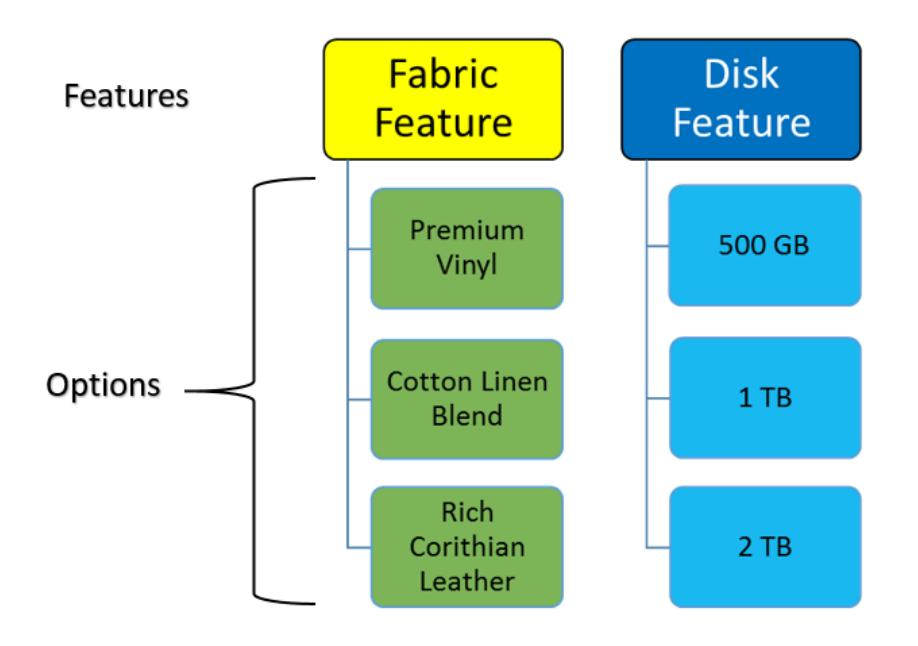

*Figure: Relationships between features and options*

## **Attributes**

You can add attributes to features and configurations. Attributes can be used for multiple purposes, such as the following:

- They can be used as lists of available values in a configuration or a user can enter attribute values manually. Rules can use attribute values to determine allowed options.
- They can be assigned variables and used in formulas such as a width dimension and a height dimension used to calculate the area of material required.
- They can be used to gather information used in the manufacturing or assembly process, for example, switch settings or dimensions.
- You enter a formula in the list of attributes that you wish to display during configuration entry and forbid manual typing of values.

#### **Configuration Rules**

Configuration rules apply to and drive both quantity (that is, dimensions) and features (that is, options). Rules are used to present the user with option choices based on other options they have selected. For example, the options for fabric change based on the color option selection. Option selection can be enforced by minimum and maximum criteria for the number of options a user can select. Rules can specify minimum quantity, maximum quantity, or lot sizes.

Rules can also be used with attributes to include or exclude features or options.

Rules are optional; a feature might just require a user to select from a list such as storage or memory options.

#### **Formula Support**

Dimensions are handled by using formulas for designated fields, such as computing the square meters of fabric required based on the entered linear dimensions. Formulas can be expressed for any numeric field including quantities and attributes.

#### **Configuration Keys**

A configuration key identifies what values out of a configuration define its uniqueness compared to other completed configurations of the same configuration ID. A key value is an output of a completed configuration entry which can be preselected before entering a configuration to bring up the same configuration completed in the past using the same key. The key can be a numbering sequence unique to each configuration result or a formula using attribute values.

Additionally, formulas may be used to create a key description and a transaction description.

### **Completion**

A configuration is completed when all required features have been selected and all rules are validated and the user indicates that they are finished. This provides the user with the ability to save a configuration in progress without having to abandon data entry.

#### **Output**

The output of a configuration consists of the selected features and quantities, attributes and values, and configured item price. The options are combined with the template bill of material of the CTO item to build the production order details.

# **Product Configurator: Processes and Functions**

In this topic, you will read about processes related to product configuration.

## **Defining a Configured Item**

Each item to be configured must be set up as a configured item, source of manufacturing, contain a bill of material, and have an active revision configuration definition. You set up these values as follows:

- 1. On the *[Bill of Material](https://help-2025r1.acumatica.com/Help?ScreenId=ShowWiki&pageid=1aae7d3a-d5f9-4693-b91f-663c4c2d362b)* (AM208000) form, you create an active bill of material (BOM) for an item–warehouse pair. This bill of material will be used as a template to add materials to each of the operations.
- 2. On the *[Configuration Maintenance](https://help-2025r1.acumatica.com/Help?ScreenId=ShowWiki&pageid=d035ebab-8408-4d8b-8948-11139426db15)* (AM207500) form, you create a configuration with an active revision for the stock item and BOM.
- 3. On the *Item [Warehouse](https://help-2025r1.acumatica.com/Help?ScreenId=ShowWiki&pageid=ae2418af-7f53-4c09-8766-556452d8f8b8) Details* (IN204500) form, you do the following:
  - In the **Inventory ID** box, you select the stock item.
  - In the **Warehouse** box, you select the warehouse.
  - On the **Replenishment** tab, you make sure that *Manufacturing* is selected in the **ReplenishmentSource** box.
  - In the **Default BOM ID** box on the **Manufacturing** tab, you select the BOM linked to configuration definition.
  - In the **Configuration ID** box on the same tab, you select the configuration to be assigned for the item.

If the record for the needed item–warehouse pair does not exist, you specify the default BOM ID and the configuration ID in the same boxes of the **Manufacturing** tab on the *[Stock Items](https://help-2025r1.acumatica.com/Help?ScreenId=ShowWiki&pageid=77786a70-1f1e-4d63-ad98-96f98e4fcb0e)* (IN202500) form.

#### **Labels**

You can create labels to make selections more user-friendly. The concept of labels is similar to an ID and CD configuration in the Acumatica ERP database, such as Inventory ID and Inventory CD: Inventory ID is the database key but the Inventory CD can be changed. This concept provides you with the ability to select rules, attributes, and other parameters based on the label value (visible string label) but the stored value in the database is the ID-like value (non-visible integer value). Due to this, you can rename the label while keeping the related data connected without needing to update all necessary tables.

## **Formulas**

To support dimensional configurations of certain fields by using the *[Configuration Maintenance](https://help-2025r1.acumatica.com/Help?ScreenId=ShowWiki&pageid=d035ebab-8408-4d8b-8948-11139426db15)* (AM207500) form, you can enter formulas. The formula concept is the same as used in Acumatica Report Designer and general inquiries. The configuration maintenance provides you with the ability to enter a fixed value or a formula value to be calculated during configuration entry on the *[Configuration Entry](https://help-2025r1.acumatica.com/Help?ScreenId=ShowWiki&pageid=dc9466e5-b880-44c7-9921-78f3f82b15d7)* (AM306000) form. The calculation of formulas in configuration entry is constantly updated when rules are processed and values are changed. Formulas are only visible on the *[Configuration Maintenance](https://help-2025r1.acumatica.com/Help?ScreenId=ShowWiki&pageid=d035ebab-8408-4d8b-8948-11139426db15)* form and never displayed on the *[Configuration Entry](https://help-2025r1.acumatica.com/Help?ScreenId=ShowWiki&pageid=dc9466e5-b880-44c7-9921-78f3f82b15d7)* form. On the *[Configuration Entry](https://help-2025r1.acumatica.com/Help?ScreenId=ShowWiki&pageid=dc9466e5-b880-44c7-9921-78f3f82b15d7)* form, boxes that contain formulas will always contain a value as a result of the formula execution. The *[Formula Editor Dialog Box](https://help-2025r1.acumatica.com/Help?ScreenId=ShowWiki&pageid=7f062f40-561a-41fd-99a4-19a1d9d59e4a)* is used for building formulas. Aer entering a formula, you should click **Validate** in the editor.

## **Rule Processing**

Rules are controlled by three types: *Exclude*, *Include*, and *Require*. When rules are processed, you only see the available remaining options. You can select attributes, features, and options in any order. For example, one user might select color as an important choice and select it first. Another user might select the fabric first as the importance. For additional information, see *[Product Configurator: Rule Processing](#page-244-1)*.

## **Supplemental Items**

Supplemental items are supporting option items selected during configuration entry and indicated as a supplemental item in the configuration definition. When supplemental items are selected and the configuration entry is complete, the options will be added to a quote or sales order as a new line item. The concept is a supporting item that is shipped and sold separately from the configured item. These line items cannot be edited by the user in the quote or sales order. Supplemental item price and cost does not get rolled into the configured item. For additional information, see *[Product Configurator: Supplemental Items](#page-249-1)*.

## **Configuration Keys**

The concept for configuration keys is to define a completed configuration entry with a selectable value for future configuration. It also supports the selections of subitems when the subitem feature is enabled. Configuration keys are generated at the completion of a configuration and recalculated if adjustments to a configuration entry are made. Completions of configuration entries are made when the user clicks the finish button. A user can select a configuration key before starting a new configuration entry to preload the selections or attributes used from the last completed configuration entry with the same configuration key. Only those features and options not selected to *Results Copy* will not be included in the preloaded configuration.

#### **Pricing**

The standard Acumatica ERP pricing logic is used for the parent item, including items in the parent bill of material, and the options selected. For more information, see *[Sales Prices: General Information](https://help-2025r1.acumatica.com/Help?ScreenId=ShowWiki&pageid=d63d6b6c-15ee-4576-bf27-8de69f8f5da6)*.

#### **Cost**

Factors that impact costing are the same as those used for calculating the cost of produced items. Cost factors are labor, machine, material, tools, and overhead and are not individual, configurable components. These cost factors are attached to the BOM as fixed entries. The only configurable cost factor is material which may vary depending on the configuration results through selected options and multilevel configurations. Cost is determined only when a production order is created.

For more information about costs, see *[Configuring Production Cost Drivers: General Information](https://help-2025r1.acumatica.com/Help?ScreenId=ShowWiki&pageid=6d790206-ba52-442a-be12-3e7fbfd77327)*.

## **Production Order Details**

When a production order is created for a configured item, the *[Production Order Details](https://help-2025r1.acumatica.com/Help?ScreenId=ShowWiki&pageid=f24480d9-1fed-478e-9363-e48fa5833950)* (AM209000) form displays the operations defined in the bill of material of the configured item. The operations may have materials, steps, overhead, and tools predefined. The materials selected by a configuration are attached to their defined operations.

## **Product Configurator: Rule Processing**

This topic describes rules that can be used with configurations.

## **Types of Rules**

You can create rules of the following types: *Exclude*, *Include*, and *Require*. When rules are processed, you can only see the available remaining options. Selection of attributes, features, and options can go in any order. For example, one user might choose color as their first choice. Another user might select the fabric as their first choice.

Rules are triggered by the source feature, any option or a specific option being selected, or the conditional value of an attribute. Then the rule type determines what action to take against the target feature and its options as follows:

- *Exclude:* All of the options or specific options of a feature cannot be selected. The options are not displayed unless the user chooses to see them.
- *Include:* All of the options or specific options of a feature are automatically selected.
- *Require:* An option selection must be made for the target feature.
- *Validate:* The attribute value must meet a condition. This type is available only for attributes.

### **Rule Examples**

#### **Example 1: Excluding an Option Based on Another Option**

- Feature A has Options A1, A2, and A3
- Feature B has Options B1 and B2. Option B2 must be unavailable for selection when Option A1 is selected.

The rule for Feature A to exclude Option B2 for Feature B is displayed in the following table.

| Rule    | Source | Target Feature | Target Option |
|---------|--------|----------------|---------------|
| Exclude | A1     | Feature B      | B2            |

Because you can select features in any order, you need to have a rule for Feature B also to exclude Option A1 if Option B2 is selected, as shown in the following table.

You can use this rule with the same feature, for example, to make Option A2 unavailable when Option A1 is selected.

| Rule    | Source | Target Feature | Target Option |
|---------|--------|----------------|---------------|
| Exclude | B2     | Feature A      | A1            |

You can use *Include* instead of *Exclude* when an option is to be automatically selected based on the selection of another option.

#### **Using ANY and ALL**

<ANY> is used for the *Source* feature when any option selection will trigger the rule. <ALL> is used to include or exclude all *Target* feature options.

For example, suppose that any option selected for Feature A must exclude Feature B Option B2, as shown in the following table.

| Rule    | Source      | Target Feature | Target Option |
|---------|-------------|----------------|---------------|
| Exclude | <any></any> | Feature B      | B2            |

Further suppose that if Option A1 of Feature A is selected, then all options for Feature B must be excluded and Feature B must be unavailable for selection. The following table displays this rule.

| Rule    | Source | Target Feature | Target Option |
|---------|--------|----------------|---------------|
| Exclude | A1     | Feature B      | <all></all>   |

In the example above, if the source were <ANY>, then Feature A and Feature B would be mutually exclusive. If the rule was of the *Include* type, then all options of Feature B would be added when Option A1 of Feature A was selected.

#### **Including an Option Based on an Attribute Value**

When you define attributes on the *[Attributes](https://help-2025r1.acumatica.com/Help?ScreenId=ShowWiki&pageid=de0a353f-40d0-452d-9152-e65605e69788)* (CS205000) form, you can enter a list of valid values for attributes with the *Combo* and *Multi Select Combo* control types. You can also use attribute values specified in the**Value ID** column in rules.

For example, suppose that you have an attribute with the list of colors (see the following table).

| Value ID | Description |
|----------|-------------|
| R        | Rudy Red    |
| B        | Baby Blue   |
| G        | Lime Green  |

Based on the color selection, you want to include Option B2 of Feature B when the red color (Value ID = R) is selected. The rule will be the following.

| Rule    | Condition | Value 1 | Target Feature | Target Option |
|---------|-----------|---------|----------------|---------------|
| Include | Equals    | ='R'    | Feature B      | B2            |

Attribute values are text fields so they need to be in single quotes to validate by using the Equal operation or converted to decimals to validate by using the Between, Greater, or Less operations.

#### **Validating an AttributeValue**

You may need to validate an attribute value. Since attributes are text fields, you need to convert them to decimals in the **Value** boxes by using the CDec(x) conversion function. The**Target Feature** and **Target Option** boxes are unavailable for rules of the *Validate* type.

For example, suppose that a user must enter a value between 1 and 5; such as 1, 1.5, 4.33, 5. The rule is the following.

| Rule     | Condition  | Value 1 | Value 2 | Target Feature | Target Option |
|----------|------------|---------|---------|----------------|---------------|
| Validate | Is Between | CDec(1) | CDec(5) | N/A            | N/A           |

#### **Rule Concepts**

- Rules are triggered by option selection or attribute value changing:
  - Rules for features can be triggered by a single option or any option being selected.
  - *Source* and *Target Feature* can be the same.
  - Rules for attributes can be triggered by the conditional value of the attribute.
  - Rules for features and attributes can target a single option or all options.
- Features and their options can be selected in any order. When defining a configuration you need to account for the dependency of options; that is, if B2 is excluded when A1 is selected, then A1 is excluded when B2 is selected.
- Deleting options will revert all rules previously applied during that deleted options selection.
  - If the option was included from another rules, the parent rule or rules will also need to be reverted.
  - These are most likely include options. The parent and child rules of the include option being deleted will all be reverted as this implementation considers the *Include* rule type to be treated like an include required rule.
- When rules are triggered, the processing of each should be included in a recordable action to allow undo of parent and child processed rules. For example:
  - User selects Option 1 of Feature 1 which has a rule that includes Option 3 of Feature 2.
  - User selects Option 5 of Feature 6 which also has a rule that includes Option 3 of Feature 2.
  - If the user removes Option 3 of Feature 2 from being selected Option 1 of Feature 1 and Option 5 of Feature 6 are also reversed.
  - If Option 3 of Feature 2 had child rules, they would also be removed.
- The rule trigger for features or options is the change in option selections. *Selected* or *Included* to apply rules and *Unselected* or *Excluded* to reverse any previously applied rules.
- The trigger for attribute rules are the change in attribute values.
- Attribute rules are applied before option rules when configuration entry orders are started.
- Options with the **Fixed** check box selected cannot be excluded by any rule. A user could write rules that would attempt to include, exclude, or require this type of option but all rules processing would ignore application to the options with the **Fixed** check box selected.

#### **Order of Rules**

Rules are validated in the following order:

- 1. Selected or cleared option
- 2. Rule type: Exclude, Include, Require (in that order)
- 3. Source option with <ANY> being last
- 4. Sort order of applied feature
- 5. Applied option with <ALL> being last
- 6. Repeat step 1 for each sub rule that needs to be processed as a result of any include or exclude rule previously executed.
- 7. Exclude rules will override include rules when multiple rules are executed against an option.
- 8. Include rules cannot override exclude rules when multiple rules are executed against an option.
- 9. Rules that exclude/include entire features also run each rule against each option if one exists:
  - Example: Feature 1 was excluded by a rule on Option 2 in Feature 4. Option 1 within Feature 1 has a rule to exclude an option from Feature 2 which needs to be executed when Feature 1 was excluded the same was as if Feature 1 was specifically excluded.
- 10.Required rules that have an empty applied option (<ALL>) do not get applied to all options like Include or Exclude rules do. Instead, the Required flag is set on the feature forcing a selection of any option while the selection still fits within the selection/quantity requirements.
- 11.Attribute rules run as they are sorted in the rules grid.
- 12.Attribute rules only execute if the condition is true. If the condition was previously true and the user changes a value or the overall condition from the result of a formula value is no longer true, all rules are reversed that were previously applied from that rule.
- 13.Rules processing is chained to each feature/option rule executed from a previous rules execution:
  - Example: Option 1 of Feature 1 has a rule that includes Option 3 of Feature 2. Option 3 also has an exclude on Feature 4. When the rule for including Option 3 execute it also needs to run any rules attached to it such as excluding all of Feature 4.
- 14.Options within a feature can only be selected once. If a user needs more than 1 of a specific option, the qty required field is used to indicate the number of units required.
- 15.The Option selection panel is used to include the set of selections.
- 16.The status of attributes, features, and options are updated at the end of each rules processing.
- 17.Defaults are applied when the configuration entry order is started for the first time. The execution order is as follows:
  - a. Attribute defaults and any related rules
  - b. The options listed on the page with entry defaults, in the order they appear

Each default processes its rules the same way as if the user had manually selected the options in that sequence.

- 18.If an option was auto-included from the processing of a rule, the system should prevent a user from removing it and should give a proper message indicating the source selected option.
- 19.If an option was added by a user, and a user selects an option which makes the previously selected option now excluded, the user should see a message indicating if the selection should continue with the exclusion or cancel the selection.

# **Product Configurator: Managing Configurations**

This topic describes ways to manage configurations.

### **Managing Configurations and Revisions**

Configuration definitions are linked to a single bill of material which in turn makes each definition specific to an inventory item and warehouse. The following rules are applied to configuration definitions:

- You can have multiple bills of material for an inventory item and warehouse.
- You can have multiple configuration definitions for a bill of material.
- Only one configuration definition can be the default for a stock item and warehouse but you can change the default to another active configuration definition.

A configuration definition revision can have the following statuses:

- *Pending:* This is the status for a new configuration. You can test the configuration but it cannot be used in sales orders or production orders and it cannot be the default configuration for an inventory item. You can delete configuration definitions with only this status.
- *Active:* This is the only status allowed for configuration entry and specified as a default.
- *Inactive:* This configuration definition cannot be used for new sales orders and production orders. However, you can reconfigure existing orders that are using this configuration and revision.

There can be only one revision with the *Active* status, one revision with the *Pending* status, and multiple revisions with the *Inactive* status. You change revision statuses as follows:

- Before creating a new revision, you must change the status of the current revision with the *Pending* status to *Active* or *Inactive*.
- If you want to change the revision status to *Active* or *Pending*, you must first change the status of the current revision with the *Active* or *Pending* status to *Inactive*.

| Status From/To     | Pending     | Active  | Inactive |
|--------------------|-------------|---------|----------|
| Pending            | N/A         | Allowed | Allowed  |
| Active             | Allowed     | N/A     | Allowed  |
| Active with orders | Not Allowed | N/A     | Allowed  |
| Inactive           | Allowed     | Allowed | N/A      |

The following table displays the possible status changes for revisions of a configuration definition.

#### **Fixing Incorrectly Configured Orders**

Each configuration result has the configuration ID and revision level used, and although the configuration definition may be inactive, you can reconfigure the order and that definition and revision will be used. On the **References** tab of the *[Production Order Maintenance](https://help-2025r1.acumatica.com/Help?ScreenId=ShowWiki&pageid=e5d2ddd4-8c80-4f5b-8e5f-e5151636a9d3)* (AM201500) form, if the source of the item is a configuration, you can view the configuration ID and revision. At this time, you can only delete and reenter the sales order line but first delete the production order. For production orders, you can delete and recreate if no activity has occurred, or if in process, correct the production details for any incorrect materials similar to adjusting the order because the bill of material was incorrect.

#### **Copying Sales Documents with Configured Items**

Additional columns have been added to the **Details** tab of the *[Sales Orders](https://help-2025r1.acumatica.com/Help?ScreenId=ShowWiki&pageid=19e4021c-1b84-49fd-be12-0320c5f1c7e5)* (SO301000) form to display information about configurable items. These include a column to identify if an item is configurable and if the configuration is complete and columns to link any supplemental items to their parent configured items. In the latter case, if you delete the line for a configured item, the supplemental items are deleted also; deletion of a supplemental item is disabled.

When you copy a sales order with configurable items by using the **Copy Order** command on the More menu of the *[Sales Orders](https://help-2025r1.acumatica.com/Help?ScreenId=ShowWiki&pageid=19e4021c-1b84-49fd-be12-0320c5f1c7e5)* form, you select the **Copy Configurations** check box in the **CopyTo** dialog box that opens. The system will copy configuration and any supplemental items appropriately and you can configure the copied lines.

# **Product Configurator: Supplemental Items**

Supplemental items are supporting option items selected during configuration entry and indicated as a supplemental item in the configuration definition. When supplemental items are selected and the configuration entry is complete, the options will be added to a quote, sales order, or opportunity as a new line item. The concept is a supporting item that is shipped and sold separately from the configured item. Supplemental item price and cost do not get rolled into the configured item price. The sales order lines for supplemental items are linked to and controlled by the sales order line for the configured item:

- The sales order line quantity ordered for supplemental item is the quantity required for the option times the quantity ordered for the configured line.
- The sales order lines for supplemental items are deleted if the sales order line for the configured item is deleted. You may have to refresh the details table or save the order to see the updated lines.
- A change to the configuration, whether in the sales order or in an associated production order, will add or remove the sales order lines for any supplemental items associated with the configured sales order line and recalculate the order quantity.
- Changing the order quantity for the configured item will not change the order quantity for the associated supplemental items.
- You can change the quantity, warehouse, price, and other parameters for supplemental items.

### **Examples**

Consider supplemental items as materials that are not required to build the configured item but are selected based on the configured item and should be shipped with it:

- A desktop computer where the monitor and keyboard are separate inventory items that must be picked and shipped with the sales order. The monitor and keyboard selections may affect the configuration of the computer components but they are components themselves for the production order for the computer.
- Accessories such as power cords, cables, installation CD's, and manuals for equipment that are included with the configured item.
- Miscellaneous charges for rush orders, extra fees for services, or packaging and shipping charges.

You indicate supplemental items on the *[Configuration Maintenance](https://help-2025r1.acumatica.com/Help?ScreenId=ShowWiki&pageid=d035ebab-8408-4d8b-8948-11139426db15)* (AM207500) form by selecting the material type for an option of a feature. Since supplemental items will not be components on a production order, the operation number is not required. All other capabilities such as calculation of the quantity required and rules are available.

# **Product Configurator: Implementation Checklist**

Before you start using the product configurator functionality, you must configure the system as described in the following table.

| No. | Task                                                                             | Description                                                                                                                                                                                                                                                                                                                                                                                                                                                                                                                                                                                                                                                                                                                                        |
|-----|----------------------------------------------------------------------------------|----------------------------------------------------------------------------------------------------------------------------------------------------------------------------------------------------------------------------------------------------------------------------------------------------------------------------------------------------------------------------------------------------------------------------------------------------------------------------------------------------------------------------------------------------------------------------------------------------------------------------------------------------------------------------------------------------------------------------------------------------|
| 1   | Enable the Product Configurator fea ture                                      | On the Enable/Disable Features (CS100000) form, make sure that the Product Configurator feature is enabled under the Manufacturing Suite group of features.                                                                                                                                                                                                                                                                                                                                                                                                                                                                                                                                                                                  |
| 2   | Define the numbering sequences for the configuration data                     | Create numbering sequences for the configuration ID and defaults ID by using the Numbering Sequences (CS201010) form.                                                                                                                                                                                                                                                                                                                                                                                                                                                                                                                                                                                                                        |
| 3   | Specify preferences                                                              | Use the Configurator Preferences (AM104000) form. This must be completed before you can use the functionality.                                                                                                                                                                                                                                                                                                                                                                                                                                                                                                                                                                                                                                  |
| 4   | Create stock items                                                               | Use the Stock Items (IN202500) form to create the items. Once you have built a configuration you will need to select the configuration ID of the active revision. Do the same on the Item Warehouse Details (IN204500) form. Stock items should have a lot or serial class specified,where the lot or serial number is assigned upon receipt to help the system in selecting the proper item to allocate or ship. You can use the sales order number and line as the lot or serial number (such as SO123456/3) because the number is the reference in the production order. Alternatively, you can use the pro duction order number as the lot or serial number because it is referenced in the sales order line. |
| 5   | Create bills of material for configured items                                 | The bill of material defines the manufacturing process and fixed materials for each configured stock item. Use the Bill of Material (AM208000) form to create the bill. The bill need to have a least one operation in order to attach the selected inventory items to the configuration. A fixed material is one always used to build the configured item.                                                                                                                                                                                                                                                                                                                                                                         |
| 6   | Define the attributes you will use in configurations                          | Attributes are optional are used to capture the data en tered. When you add an attribute to a configuration defini tion you assign each a variable that can be used for formu las. The configurator uses the same attributes used else where in Acumatica ERP. Create the data using the Attributes (CS205000) form.                                                                                                                                                                                                                                                                                                                                                                                                                |
| 7   | Define the features and their options you will use for your configured items. | Defined the features and options on the Features (AM203500) form. Features can be used in multiple configu rations. The options are inventory items available for each feature as well as non-inventory items used for calculations,                                                                                                                                                                                                                                                                                                                                                                                                                                                                                                      |

| No. | Task                             | Description                                                                                                                                                                                                                                                                                                                                                                                                                             |
|-----|----------------------------------|-----------------------------------------------------------------------------------------------------------------------------------------------------------------------------------------------------------------------------------------------------------------------------------------------------------------------------------------------------------------------------------------------------------------------------------------|
| 8   | Build and test the configuration | You use the Configuration Maintenance (AM207500) from to define configurations. You add features, modify the list of options as required, add attributes, pricing rules, and add rules. Once built, you can test the configuration directly from the form. When your satisfied, you make the configura tion and its revision active and add the configuration ID on the Stock Items and Item Warehouse Details forms. |
| 10  | Configure the Order Types        | You must select the Allow Configuration Entry and Allow Production Orders check boxes for a sales order type on the Order Types (SO201000) form for which you will use the product configurator and create production orders. For in formation on printing the configuration options selected on sales order forms, see Product Configurator: Adding Configu ration Data to Forms.                                    |
| 11  | Configure the CRM Preferences    | On the Customer Management Preferences (CR101000) form, select the Allow Configuration Entry check box for oppor tunities.                                                                                                                                                                                                                                                                                                        |

# **Product Configurator: Production Management Integration**

Production orders are used to build the configured product. The production order can be created directly from a sales order, as described in *[Production Processing: Production for Sales](#page-46-1)*, or directly by using the *[Production Order](https://help-2025r1.acumatica.com/Help?ScreenId=ShowWiki&pageid=e5d2ddd4-8c80-4f5b-8e5f-e5151636a9d3) [Maintenance](https://help-2025r1.acumatica.com/Help?ScreenId=ShowWiki&pageid=e5d2ddd4-8c80-4f5b-8e5f-e5151636a9d3)* (AM201500) form. Production orders can also be created by using the *[Inventory Planning Display](https://help-2025r1.acumatica.com/Help?ScreenId=ShowWiki&pageid=78238a83-ae79-47e6-b583-fd7c7fc6de69)* (AM400000) or *[Critical Materials](https://help-2025r1.acumatica.com/Help?ScreenId=ShowWiki&pageid=ddb714c7-ffa5-49b8-a8e6-9e0695a81f37)* (AM401000) form. However, they will contain only the template bill of material and must be configured by using the *[Configuration Entry](https://help-2025r1.acumatica.com/Help?ScreenId=ShowWiki&pageid=dc9466e5-b880-44c7-9921-78f3f82b15d7)* (AM306000) form that can be accessed by clicking the **Configure** button on the **References** tab of the *[Production Order Maintenance](https://help-2025r1.acumatica.com/Help?ScreenId=ShowWiki&pageid=e5d2ddd4-8c80-4f5b-8e5f-e5151636a9d3)* form.

You can plan bills of material, as described in *[Bills of Material: Planning BOMs](#page-24-1)*, for configure to order (CTO) inventory items.

The following diagram illustrates how production orders are integrated with the order management functionality and other parts of Acumatica ERP.

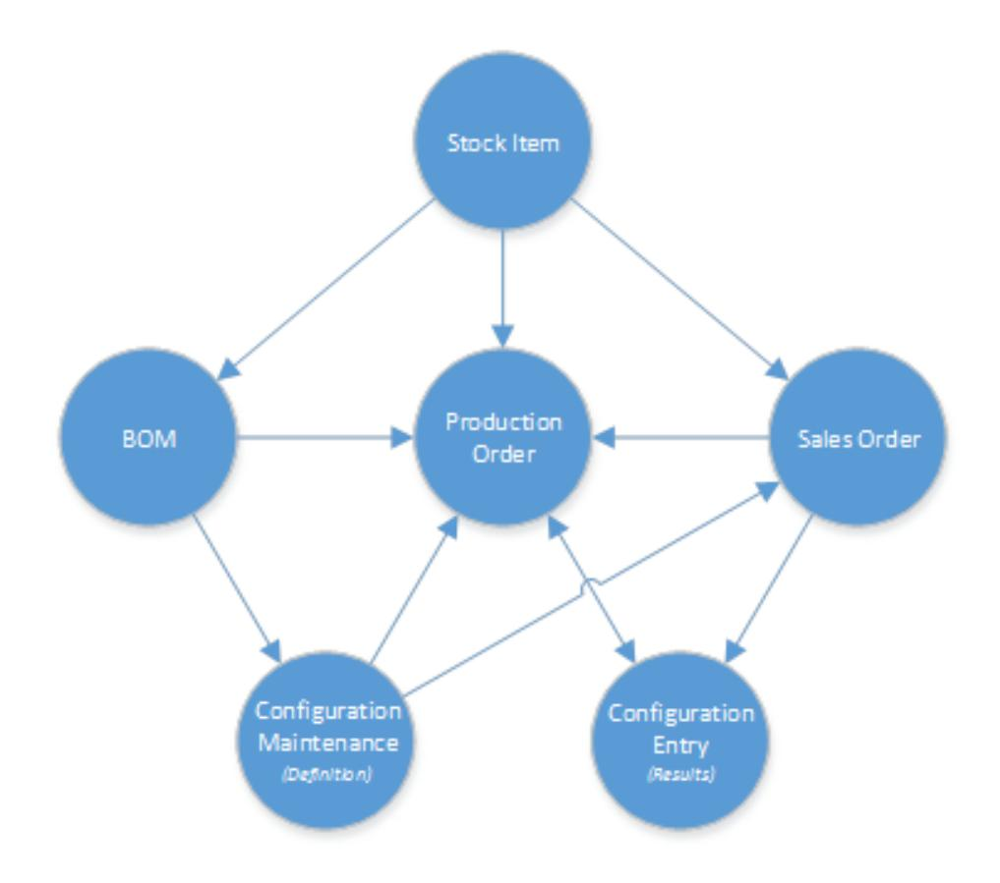

#### *Figure: Relations between production orders and other entities and documents*

The process of creating a production order combines the template bill of material with the material options selected during the configuration process. As with standard bills of material, a material option can be a phantom and accordingly the components of the phantom replace the phantom in the production order details and optionally insert the operations of the phantom.

# **Product Configurator: Implementation Activity**

In the following implementation activity, you will learn how to implement the product configuration functionality.

#### **Process Overview**

In this activity, you will do the following:

- 1. On the *[Configurator Preferences](https://help-2025r1.acumatica.com/Help?ScreenId=ShowWiki&pageid=9a8cbb6c-3a80-453c-9f4d-e9570b79154a)* (AM104000) form, review the default settings of the product configuration functionality.
- 2. On the *[Configuration Maintenance](https://help-2025r1.acumatica.com/Help?ScreenId=ShowWiki&pageid=d035ebab-8408-4d8b-8948-11139426db15)* (AM207500) form, create a new revision of an existing configuration and add rules.
- 3. On the *[Configuration Entry](https://help-2025r1.acumatica.com/Help?ScreenId=ShowWiki&pageid=dc9466e5-b880-44c7-9921-78f3f82b15d7)* (AM306000) form, test the configuration.

#### **System Preparation**

Before you start implementing the product configuration functionality, do the following:

- 1. Launch the Acumatica ERP website, and sign in to a company with the *SalesDemo* dataset preloaded. You should sign in as the system administrator with the *admin* username and the password for this user valid for your instance.
- 2. Enable the *Product Configurator* feature in the *Manufacturing* group of features on the *[Enable/Disable](https://help-2025r1.acumatica.com/Help?ScreenId=ShowWiki&pageid=c1555e43-1bc5-4f6f-ba9d-b323f94d8a6b) [Features](https://help-2025r1.acumatica.com/Help?ScreenId=ShowWiki&pageid=c1555e43-1bc5-4f6f-ba9d-b323f94d8a6b)* (CS100000) form.

#### **Step 1: Reviewing Default Settings of the Product Configurator**

To review default settings of the product configurator, do the following:

- 1. Open the *[Configurator Preferences](https://help-2025r1.acumatica.com/Help?ScreenId=ShowWiki&pageid=9a8cbb6c-3a80-453c-9f4d-e9570b79154a)* (AM104000) form.
- 2. Notice that the following settings are specified in the **General** section:
  - **Config NumberingSequence**: *AMCONFIG*
  - **Default Revision**: *A*
  - **Config Key Format**: *No Keys* (That is, a configuration key is not required.)
  - **Default Key NumberSequence**: Empty
  - **Completion Required Before Production**: Selected (That is, a user will have to complete the configuration before creating a production order.)
- 3. Notice that the following settings are specified in the **Price** section:
  - **Hide Price Details**: Cleared (That is, the price details will be displayed when a user configures items.)
  - **Rollup**: *Children All* (That is, the system will calculate the selling price as the rolled up selling price of each option, including all fixed materials in the bill of material.)
  - **Override Default on Configuration**: Selected (That is, the user can override the calculated price rollup for a configuration.)
  - **Calculate**: *Aer Selection* (That is, the system calculates the selling price each time the user selects an option or enters a quantity.)
  - **Override Default on Configuration**: Selected (That is, the user can override the calculation method of a selling price for a particular configuration.)
- 4. Notice that all check boxes are selected in the **Order Fields** section. This means that the corresponding boxes of a sales order line will be editable.

#### **Step 2: Setting Up a Configuration**

To set up a configuration, do the following:

- 1. Open the *Configuration Maintenance (AM2075PL)* form and click *AMC000002* in the **Configuration ID** column. The configuration for the *AMDOORDH01* item opens on the *[Configuration Maintenance](https://help-2025r1.acumatica.com/Help?ScreenId=ShowWiki&pageid=d035ebab-8408-4d8b-8948-11139426db15)* (AM207500) form.
- 2. In the **Revision** box, type B to add a new revision of the configuration.
- 3. On the form toolbar, click**Save**.
- 4. On the **Features** tab, add rules to features as follows:
  - a. Click the row with the *JAMB* feature and on the **Rules** tab in the lower part of the form, add the rules listed in the following table.

| Rule    | Source Option           | Target Feature | Target Option                 |
|---------|-------------------------|----------------|-------------------------------|
| Include | F/J Pine, 18x90 2 Piece | ARCHITRAVE     | FJ Pine Ex 40x25 Pro filed |

| Rule    | Source Option          | Target Feature | Target Option                  |
|---------|------------------------|----------------|--------------------------------|
| Include | FJ Pine 115x30 Arkline | ARCHITRAVE     | FJ Pine Ex 75x25 Pro filed  |
| Exclude | FJ Pine 115x30 Arkline | ARCHITRAVE     | FJ Pine Ex 100x25 Pro filed |
| Require | Undershot Jamb         | HARDWARE       | AMDOORHDSS                     |

b. Click the row with the *ARCHITRAVE* feature and on the **Rules** tab in the lower part of the form, add the rules listed in the following table.

| Rule    | Source Option                  | Target Feature | Target Option              |
|---------|--------------------------------|----------------|----------------------------|
| Exclude | FJ Pine Ex 100x25 Pro filed | DOORS          | Horizon SQ10 1980 x 510 |
| Include | FJ Pine Ex 75x25 Pro filed  | HARDWARE       | AMDOORHDE1                 |
| Require | FJ Pine Ex 40x25 Pro filed  | HARDWARE       | AMDOORHDE2                 |

c. Click the row with the *DOORS* feature and on the **Rules** tab in the lower part of the form, add the rules listed in the following table.

| Rule    | Source Option | Target Feature | Target Option  |
|---------|---------------|----------------|----------------|
| Exclude | EPS S/C       | HARDWARE       | AMDOORHDD2     |
| Exclude | Solid Core    | JAMB           | J2P38/90 Set A |

- 5. On the form toolbar, click**Save**.
- 6. Select the attributes below on the **Attributes** tab, and then on the **Rules** tab in the lower part of the form, add the rules listed in the following table.

| Rule                                       | Condition                      | Value 1     | Value 2  |  |
|--------------------------------------------|--------------------------------|-------------|----------|--|
| Label: Jamb thickness, Attribute ID: Units |                                |             |          |  |
| Validate                                   | Is Between                     | =CDbl(1.25) | =CDbl(3) |  |
| Label: Height waste, Attribute ID: Units   |                                |             |          |  |
| Validate                                   | Is Greater Than or Equal To | =CDbl(0)    |          |  |
| Label: Width waste, Attribute ID: Units    |                                |             |          |  |
| Validate                                   | Is Greater Than or Equal To | =CDbl(0)    |          |  |

| Rule                                                | Condition                      | Value 1    | Value 2 |  |  |  |  |  |
|-----------------------------------------------------|--------------------------------|------------|---------|--|--|--|--|--|
| Label: Architrave height, Attribute ID: Units       |                                |            |         |  |  |  |  |  |
| Validate                                            | Is Greater Than or Equal To | =CDbl(0)   |         |  |  |  |  |  |
| Validate                                            | Is Less Than or Equal To       | =CDbl(180) |         |  |  |  |  |  |
| Label: Architrave height waste, Attribute ID: Units |                                |            |         |  |  |  |  |  |
| Validate                                            | Is Greater Than or Equal To | =CDbl(0)   |         |  |  |  |  |  |
| Label: Architrave width waste, Attribute ID: Units  |                                |            |         |  |  |  |  |  |
| Validate                                            | Is Greater Than or Equal To | =CDbl(0)   |         |  |  |  |  |  |

7. On the form toolbar, click**Save**.

#### **Step 3: Testing the Configuration**

To test the configuration, do the following:

- 1. While you are still viewing the configuration on the *[Configuration Maintenance](https://help-2025r1.acumatica.com/Help?ScreenId=ShowWiki&pageid=d035ebab-8408-4d8b-8948-11139426db15)* (AM207500) form, on the form toolbar, click**Test Configuration**.
- 2. On the *[Configuration Entry](https://help-2025r1.acumatica.com/Help?ScreenId=ShowWiki&pageid=dc9466e5-b880-44c7-9921-78f3f82b15d7)* (AM306000) form, which opens in the popup window, do the following:
  - a. In the Features pane, click *JAMBS*.
  - b. On the **Options** tab, select the check box in the **Included** column for the row with the *FJ Pine 115x30 Arkline* option. The system displays this option under the *JAMB* feature in the Features pane.
  - c. Notice that the system added the *FJ Pine Ex 75x25 Profiled* option under the *ARCHITRAVE* feature because of the *Include* rule you added for the *JAMB* feature and the *FJ Pine 115x30 Arkline* option.
  - d. Notice that the system also added the *AMDOORHDE1* option under the *HARDWARE* feature according to the rule you added for the *ARCHITRAVE* feature and the *FJ Pine Ex 75x25 Profiled* option.
  - e. In the Features pane, click *DOORS*.
  - f. On the **Options** tab, select the check box in the **Included** column for the row with the *Horizon SQ10 1980 x 760* option. The system displays this option under the *DOORS* feature on the Features pane.
  - g. On the **Attributes** tab, view the warning message displayed for the *Jamb thickness* attribute. According to the rule for this attribute, its value must be between 1.25 and 3 but the value of the attribute is *5*.
  - h. Change the value of the attribute to 3. Notice that the warning message has disappeared.
  - j. On the form toolbar, click **Finish** to indicate that you finished testing, and close the form.

You have successfully implemented the product configuration.

## **Product Configurator: To Create a Sales Order with a Configurable Item**

The following activity will walk you through the process of creating a sales order with a configurable item.

#### **Process Overview**

In this activity, you will do the following:

- 1. On the *Order [Types](https://help-2025r1.acumatica.com/Help?ScreenId=ShowWiki&pageid=e6984218-4260-4438-99e1-aee2b3765369)* (SO201000) form, you will review the settings of the SO order type to make sure that the settings required for adding configurable items and creating production orders have been specified.
- 2. On the *[Sales Orders](https://help-2025r1.acumatica.com/Help?ScreenId=ShowWiki&pageid=19e4021c-1b84-49fd-be12-0320c5f1c7e5)* (SO301000) form, you will create a sales order and add a configurable item to the order. You will also select the needed options for features of the item on the *[Configuration Entry](https://help-2025r1.acumatica.com/Help?ScreenId=ShowWiki&pageid=dc9466e5-b880-44c7-9921-78f3f82b15d7)* (AM306000) form.
- 3. On the same form, you will create a production order for the item and on the *[Production Order Details](https://help-2025r1.acumatica.com/Help?ScreenId=ShowWiki&pageid=f24480d9-1fed-478e-9363-e48fa5833950)* (AM209000) form, you will make sure that the options you selected have been added as materials.

#### **System Preparation**

Before you start creating a sales order with a configurable item, do the following:

- 1. As a prerequisite activity, in the company to which you are signed in, be sure you have set up the product configuration as described in *[Product Configurator: Implementation Activity](#page-252-1)*.
- 2. Launch the Acumatica ERP website, and sign in to the company in which the prerequisite activity has been performed. You should sign in as the implementation consultant by using the *admin* username and the password for this user valid for your instance.
- 3. In the info area, in the upper-right corner of the top pane of the Acumatica ERP screen, make sure that the business date in your system is set to today's date. For simplicity, in this activity, you will create and process all documents in the system on this business date.
- 4. Make sure that the *Product Configurator* feature in the *Manufacturing* group of features has been enabled on the *[Enable/Disable Features](https://help-2025r1.acumatica.com/Help?ScreenId=ShowWiki&pageid=c1555e43-1bc5-4f6f-ba9d-b323f94d8a6b)* (CS100000) form.

#### **Step 1: Reviewing Settings of the SO Order Type**

To make sure that the SO order type has the settings needed for creating sales orders with configurable items, do the following:

1. Open the *Order Types (SO2010PL)* form and click *SO* in the **OrderType** column.

The *SO* order type opens on the *Order [Types](https://help-2025r1.acumatica.com/Help?ScreenId=ShowWiki&pageid=e6984218-4260-4438-99e1-aee2b3765369)* (SO201000) form.

- 2. Notice that in the **ManufacturingSettings** section of the **General** tab, the following check boxes are selected:
  - **Allow Production Orders - Approved**
  - **Allow Production Orders - Hold**
  - **Allow Configuration Entry**

This means that you can assign production orders to sales orders of this type and add configurable items to the orders.

#### **Step 2: Creating a Sales Order**

To create a sales order with a configurable item, do the following:

1. On the *[Sales Orders](https://help-2025r1.acumatica.com/Help?ScreenId=ShowWiki&pageid=19e4021c-1b84-49fd-be12-0320c5f1c7e5)* (SO301000) form, create a new record.

To open the form for creating a new record, type the form ID in the Search box, and on the Search form, point at the form title and click **New** right of the title.

- 2. In the Summary area, specify the following:
  - **OrderType**: *SO* (automatically selected)
  - **Customer**: *ABCSTUDIOS*
  - **Description**: Sale of a configurable item
  - **Requested On**: Today's date (automatically specified)
- 3. On the table toolbar of the **Details** tab, click **Add Row**.
- 4. In the row, specify the following:
  - **Branch**: *PRODWHOLE*
  - **Inventory ID**: *AMDOORDH01*
  - **Warehouse**: *WHOLESALE* (automatically selected)
  - **Quantity**: 1

Notice that the system selected the check box in the **Configurable** column of the line, which indicates that the item is configurable.

- 5. On the form toolbar, click**Save**.
- 6. On the table toolbar, click **Configure**. The system opens the *[Configuration Entry](https://help-2025r1.acumatica.com/Help?ScreenId=ShowWiki&pageid=dc9466e5-b880-44c7-9921-78f3f82b15d7)* (AM306000) form in a popup window and displays a list of features for the *AMDOORDH01* item in the Features pane.
- 7. Select an option for the *JAMB* feature as follows:
  - a. In the Features pane, click *JAMB*.
  - b. On the **Options** tab, select the check box in the **Included** column of the *FJ Pine 40x10 19 Single BevelF* row.
- 8. Select an option for the *ARCHITRAVE* feature as follows:
  - a. In the Features pane, click *ARCHITRAVE*.
  - b. On the **Options** tab, select the check box in the **Included** column of the *FJ Pine Ex 50x25 Profiled* row.
- 9. Select an option for the *DOORS* feature as follows:
  - a. In the Features pane, click *DOORS*.
  - b. On the **Options** tab, select the check box in the **Included** column of the *Horizon SQ10 1980 x 510* row.

10.Select an option for the *HARDWARE* feature as follows:

- a. In the Features pane, click *HARDWARE*.
- b. On the **Options** tab, select the check box in the **Included** column of the *AMDOORHDB2* row.
- 11.On the form toolbar, click**Save**.
- 12.On the form toolbar, click **Finish** to complete the configuration, and close the form.

#### **Step 3: Creating a Production Order**

To create a production order from the sales order, do the following:

1. While you are still viewing the sales order on the *[Sales Orders](https://help-2025r1.acumatica.com/Help?ScreenId=ShowWiki&pageid=19e4021c-1b84-49fd-be12-0320c5f1c7e5)* (SO301000) form, on the More menu, click **Create Production Orders**.

You open the More menu by clicking the More button (…) on the form toolbar.

- 2. In the **Production Orders** dialog box, which opens, select the check box in the unlabeled column of the only row and click **Create**. The system creates a production order, closes the dialog box, and displays the reference number of the production order in the **Production Nbr.** column of the line on the **Details** tab.
- 3. On the *[Production Order Details](https://help-2025r1.acumatica.com/Help?ScreenId=ShowWiki&pageid=f24480d9-1fed-478e-9363-e48fa5833950)* (AM209000) form, open the created production order to review its details.

4. In the Operations table, click through operation rows from *0010* to *0040*, and for each row, make sure that the options you selected in Step 2 have been added as materials on the **Materials** tab in the lower part of the form.

You have created a sales order with the configurable item and created a production order for this item.

# **Product Configurator: Adding Configuration Data to Forms**

This topic is intended to provide some methods to print the configuration results data on customer and prospect facing forms such as Sales Order, CRM Quote, Invoice, etc. The configuration results data is created and assigned a unique id when the configuration is saved on the related document. The relationships of the tables are described in *[Using Manufacturing Data in Inquiries and Reports](#page-216-1)*.

#### **Sales Documents**

To print the configuration data on sales documents a subreport can be used. The main report needs to pass the order type, order number, and line number to the subreport. In most cases, the options selected during configuration would be printed. If desired the attribute values could also be printed.

The sales form (Quote, Sale Order, and Invoice) have the same column layout of line number, inventory id, description, quantity, UOM, unit price, discount, and extended price. The *[Shipment Confirmation](https://help-2025r1.acumatica.com/Help?ScreenId=ShowWiki&pageid=129778af-33eb-45a5-a096-59bcd4241f5d)* (SO642000) report removes the pricing information but the line number and inventory id and description are in the same location. Therefore the same subreport could be used for all four forms using visible expressions to suppress the pricing information if price is to be shown on the other three forms.

The following reports are provided:

- SO6410AM Example of the *[Quote](https://help-2025r1.acumatica.com/Help?ScreenId=ShowWiki&pageid=2296a92c-994c-468d-a609-3cf390b48ba6)* (SO641000) report with the Estimates subreport. This could be used in a similar way to add the Configurator subreport.
- SO6411AM Subreport for estimates
- SO6410PC Subreport to print product configurator options that can be used for quotes, sales orders, and invoices.

#### **Subreport to Print Options for Sales Documents**

From the main report, you create the collection of columns to pass to the subreport:

- SOLine.OrderType
- SOLine.OrderNbr
- SOLine.LineNbr

These same columns must be defined in the susbreport as parameters and used as filters as follows:

- The following filters can be used to only print selected features or options:
  - AMConfigurationOption.PrintResults Equals 1
  - AMConfigurationFeaturen.PrintResults Equals 1
- The last filter below, selects only those options that were selected for this configuration. Without it, all options would be shown.
  - AMConfigResultsOption.Included Equals 1

For the example of a sales order form with configuration options, you can download the *[Sales Order with](#page-0-0) [Configuration Options](#page-0-0)* file.

# **Product Configurator: Pricing and Cost**

Pricing for product configuration is calculated and processed based on configuration pricing settings specified on the **Price** tab of the *[Configuration Maintenance](https://help-2025r1.acumatica.com/Help?ScreenId=ShowWiki&pageid=d035ebab-8408-4d8b-8948-11139426db15)* (AM207500) form. This topic describes the values available in boxes on this tab and costs.

## **Price Tab Reference**

| Element   | Description                                                                                                                                                  |
|-----------|--------------------------------------------------------------------------------------------------------------------------------------------------------------|
| Rollup    | The source of the configured total price. In this box, you can select any of the following values:                                                        |
|           | • Parent: You select this value of the price is fixed.                                                                                                    |
|           | • Children All: The children of the order (stock and non-stock items). All material already existing in the bill of material is included in the price. |
|           | Children CFG: The children of the order (stock and non-stock items). The existing mate • rial is not added to the price.                               |
|           | • Parent/Children: Both the parent and children. This value combines the Parent and Children All values.                                               |
| Calculate | The moment when the prices are calculated. In this box, you can select any of the follow ing values:                                                      |
|           | • On Completion: At the end of configuration                                                                                                              |
|           | After Selections: After each option selection and attribute value change •                                                                                |

The standard Acumatica ERP pricing logic is used for the parent item, including items in parent bill of material, and the options selected. For more information, see *[Sales Prices: General Information](https://help-2025r1.acumatica.com/Help?ScreenId=ShowWiki&pageid=d63d6b6c-15ee-4576-bf27-8de69f8f5da6)*.

You can download the following file for an example of pricing: *[Pricing Example](#page-0-0)*.

#### **Cost**

Factors that impact costing are the same as currently implemented in Manufacturing Edition. Cost factors are the following: labor, machine, material, tools, and overhead. These factors are not individual, configurable components. The cost factors are attached to bill of material as fixed entries. The only configurable cost factor is material which may vary depending on the configuration results through selected options and multilevel configurations.

# **Advanced Planning and Scheduling**

The advanced planning and scheduling (APS) part of Acumatica ERP Manufacturing Edition provides you with the ability to manage and monitor your shop floor schedule. APS forms and procedure are included in production management.

APS provides the following capabilities:

- Finite capacity scheduling
- Rough cut capacity planning
- Work center schedules and utilization
- Machine schedule and utilization
- Tool scheduling and usage

In this chapter, you will read about using APS in Acumatica ERP.

## **Advanced Planning and Scheduling: General Information**

Advanced planning and scheduling (APS) provides the first elements of finite scheduling. This gives you a competitive and operational advantage if it is implemented and executed correctly. This functionality is available only when the *Advanced Planning and Scheduling* feature in the *Manufacturing* group of features is enabled on the *[Enable/Disable Features](https://help-2025r1.acumatica.com/Help?ScreenId=ShowWiki&pageid=c1555e43-1bc5-4f6f-ba9d-b323f94d8a6b)* (CS100000) form.

In this topic, you will read about implementation of advanced planning and scheduling and the related processes.

#### **APS Implementation**

You need to do the following to prepare the system for using APS:

- 1. On the *[Production Preferences](https://help-2025r1.acumatica.com/Help?ScreenId=ShowWiki&pageid=678a1833-f1f6-44f1-afce-55aa7438b3f3)* (AM102000) form, do the following:
  - a. In the **BlockSize** box, select the size of the schedule block size.
  - b. If you want to schedule machines, select the **Machine Scheduling** check box.
  - c. If you want to schedule tools, select the**ToolScheduling** check box.
- 2. On the *[Work Calendar](https://help-2025r1.acumatica.com/Help?ScreenId=ShowWiki&pageid=9d01d650-0b68-4994-8146-c80fb5e34bbb)* (CS209000) form, create work calendars to use for each work center and machines.
- 3. On the *[Shifts](https://help-2025r1.acumatica.com/Help?ScreenId=ShowWiki&pageid=5c53e402-782c-4ce2-98fb-6ec877a2675c)* (AM205000) form, create shis to use for each work center.
- 4. On the *[Machines](https://help-2025r1.acumatica.com/Help?ScreenId=ShowWiki&pageid=9053c704-59ca-4114-b25b-895f9b315014)* (AM204500) form, create machines to be used in each work center.
- 5. On the *[Tools](https://help-2025r1.acumatica.com/Help?ScreenId=ShowWiki&pageid=8a5b6ca0-613a-46e8-9656-34c0c82378fe)* (AM205500) form, create tools to be used for operations.
- 6. On the *[Work Centers](https://help-2025r1.acumatica.com/Help?ScreenId=ShowWiki&pageid=6543295f-b1eb-4991-868f-503435b1d67a)* (AM207000) form, do the following:
  - a. Add the shis and calendars and specify the basis for capacity for each of your work centers.
  - b. Add the machines to the work centers if machine scheduling is used in your organization.
- 7. On the *[Bill of Material](https://help-2025r1.acumatica.com/Help?ScreenId=ShowWiki&pageid=1aae7d3a-d5f9-4693-b91f-663c4c2d362b)* (AM208000) form, do the following:
  - a. Specify the setup time, run units, and run time for each operation in your bill of material. The units and time depend on the basis for capacity specified for each work center.
  - b. Specify the tools required for each operation.
- 8. On the *[APS Maintenance Process](https://help-2025r1.acumatica.com/Help?ScreenId=ShowWiki&pageid=4414c558-36b9-465a-922a-3e6b5123ff75)* (AM512000) form, run the APS maintenance process to build the work center schedules.

#### **Maintenance Process**

The purpose of the advanced planning and scheduling maintenance process is to rebuild and refresh work center schedules. To run the process, you use the *[APS Maintenance Process](https://help-2025r1.acumatica.com/Help?ScreenId=ShowWiki&pageid=4414c558-36b9-465a-922a-3e6b5123ff75)* (AM512000) form.

You run this process in the following cases:

- During the first implementation of advanced planning and scheduling aer you have defined work centers and their capacities.
- When you changed the calendar working hours, added shis, added break times, or changed calendar exception days for work centers. The process does not remove break times from the work center, but it adds new ones.
- When you have changed the schedule block size on the *[Production Preferences](https://help-2025r1.acumatica.com/Help?ScreenId=ShowWiki&pageid=678a1833-f1f6-44f1-afce-55aa7438b3f3)* (AM102000) form.
- Periodically to clean and remove old schedules.

The process will fill the empty schedule days for each work center for the next 180 days and adjust the schedule time blocks. This process can be scheduled to run automatically by using automation schedules.

#### **Rough Cut Planning Process**

The rough-cut planning process applies finite scheduling to open and planned production orders.

The system loads and schedules orders in the following sequence:

- By the dispatch priority ascending
- By the constraint date ascending
- By the production order number ascending

The availability of material is considered. Supply orders (that is, purchase orders, transfer orders, and production orders) that are allocated to the order being scheduled constrain the order start date as follows:

- If a supply order line is allocated to the production order, then the supply order promise date is the first day an order can be scheduled.
- If material is not already allocated, then allocate available material as *Production Demand Prepared*.
- Finally, look for supply orders without allocations and use their promise date as a start date constraint. The supply orders are not allocated to the production order.

To run rough-cut planning, you use the *[Rough Cut Planning](https://help-2025r1.acumatica.com/Help?ScreenId=ShowWiki&pageid=5d320648-5798-4c83-9911-7c89d17e71d1)* (AM501000) form and select the orders you wish to schedule. The system will only schedule orders that can be manufactured. If there is a material shortage or some other issue, the order will not be scheduled. Once scheduled, the items will remain on the *[Rough Cut Planning](https://help-2025r1.acumatica.com/Help?ScreenId=ShowWiki&pageid=5d320648-5798-4c83-9911-7c89d17e71d1)* form.

For more information about advanced scheduling, see *[Advanced Planning and Scheduling: Scheduling Details](#page-262-1)*.

For details about defining capacity, see *[Advanced Planning and Scheduling: Capacity Definition](#page-261-1)*.

# **Advanced Planning and Scheduling: Capacity Definition**

This topic explains how capacity is calculated for work centers in Acumatica ERP Manufacturing Edition.

#### **Working Calendars**

A working calendar defines the starting and ending times for each working day and break times, such as lunch. A work calendar can have exceptions for days not worked, such as holidays or shutdown periods, or non-working days that are work days, such as unplanned overtime on a weekend not normally worked. You create working calendars by using the *[Work Calendar](https://help-2025r1.acumatica.com/Help?ScreenId=ShowWiki&pageid=9d01d650-0b68-4994-8146-c80fb5e34bbb)* (CS209000) form.

Each work center can have multiple shis and each shi has a working calendar. You specify a working calendar for each shi of a work center in the **Calendar ID** column on the**Shis** tab of the *[Work Centers](https://help-2025r1.acumatica.com/Help?ScreenId=ShowWiki&pageid=6543295f-b1eb-4991-868f-503435b1d67a)* (AM207000) form.

When you create machines on the *[Machines](https://help-2025r1.acumatica.com/Help?ScreenId=ShowWiki&pageid=9053c704-59ca-4114-b25b-895f9b315014)* (AM204500) form, you need to specify a working calendar for machine operation in the **Calendar ID** box. The system uses this calendar during scheduling when the **Machine Scheduling** check box is selected on the *[Production Preferences](https://help-2025r1.acumatica.com/Help?ScreenId=ShowWiki&pageid=678a1833-f1f6-44f1-afce-55aa7438b3f3)* (AM102000) form. For correct scheduling, you must specify the calendar with the same working hours as the calendar for the work center to which the machine is assigned.

#### **Work Centers**

The daily capacity for a work center is the total number of working hours for all shis. The value of the **Basis for Capacity** box on the **General** tab of the *[Work Centers](https://help-2025r1.acumatica.com/Help?ScreenId=ShowWiki&pageid=6543295f-b1eb-4991-868f-503435b1d67a)* (AM207000) form determines which settings the system uses when scheduling operations in each work center. In this box, you can select either of the following values:

- *Crew Size*: The system uses the crew size and efficiency specified in the **Crew Size** and **Efficiency** boxes on the **Shis** tab of the *[Work Centers](https://help-2025r1.acumatica.com/Help?ScreenId=ShowWiki&pageid=6543295f-b1eb-4991-868f-503435b1d67a)* form; it also uses the run time and run units specified in the **Run Time** and **Run Units** columns, correspondingly, of the Operations table on the *[Bill of Material](https://help-2025r1.acumatica.com/Help?ScreenId=ShowWiki&pageid=1aae7d3a-d5f9-4693-b91f-663c4c2d362b)* (AM208000) form.
- *Machines*: The system uses the machine time and machine units specified in the **Machine Time** and **Machine Units** columns, respectively, of the Operations table of the *[Bill of Material](https://help-2025r1.acumatica.com/Help?ScreenId=ShowWiki&pageid=1aae7d3a-d5f9-4693-b91f-663c4c2d362b)* form.

If multiple work centers are set up with the *Machines* basis for capacity and the same machine has been added to the settings of more than one of these work centers, the system will not schedule operations for those work centers at the same time.

#### **Schedule Blocks**

To simplify the scheduling process and to accommodate different types of manufacturing, schedule blocks are used in finite scheduling. The size of the schedule block is defined on the *[Production Preferences](https://help-2025r1.acumatica.com/Help?ScreenId=ShowWiki&pageid=678a1833-f1f6-44f1-afce-55aa7438b3f3)* (AM102000) form and applies to all work centers. The block size can be as small as 5 minutes or as large as 1 hour with options for 10, 15, and 30 minutes.

## **Advanced Planning and Scheduling: Scheduling Details**

In this topic, you will read about scheduling details in advanced planning and scheduling (APS).

#### **Scheduling Method**

In conjunction with the constraint date, this determines the sequence by which the operations of the production order are scheduled. You can select any of the following scheduling methods in the**Scheduling Method** box on the **General** tab of the *[Production Order Maintenance](https://help-2025r1.acumatica.com/Help?ScreenId=ShowWiki&pageid=e5d2ddd4-8c80-4f5b-8e5f-e5151636a9d3)* (AM201500) form:

- *Finish On:* The operations are scheduled backwards from the constraint date. Production orders created from a sales order, or orders created as linked orders from a parent order, have this value selected by default. For sales orders, the constraint date is one day earlier than the scheduled ship date.
- *Start On:* The operations are scheduled forward from the constraint date.
- *User Dates:* This value provides you with the ability to define the start and end dates of the production order. This is a way for the user to override the manufacturing lead times or to use any calendar dates including non-working days.

#### **Constraint Date**

This is a particular date by which the production order is needed or needs to be started. It is only entered when the scheduling method is either *Finish On* or *Start On*.

You specify the constraint date on the **General** tab of the *[Production Order Maintenance](https://help-2025r1.acumatica.com/Help?ScreenId=ShowWiki&pageid=e5d2ddd4-8c80-4f5b-8e5f-e5151636a9d3)* (AM201500) form.

#### **Dispatch Priority**

Dispatch priority is used in APS to load the production orders and operations in priority sequence. Orders with the same priority are loaded by the constraint date. Orders with the highest priority are scheduled first. One (1) is the highest priority and ten (10) is the lowest.

You specify the dispatch priority on the **General** tab of the *[Production Order Maintenance](https://help-2025r1.acumatica.com/Help?ScreenId=ShowWiki&pageid=e5d2ddd4-8c80-4f5b-8e5f-e5151636a9d3)* (AM201500) form.

#### **Infinite Capacity Planning**

Production order operations starting and ending dates are calculated solely on the basis of operation duration. In APS, the system uses infinite capacity planning for production orders whose end date is beyond 120 days from the date when the planning is initiated.

Also, the system uses infinite planning when creating planning orders during inventory planning. For more details about calculating operation and production order dates, see *Inventory Planning [Configuration:](https://help-2025r1.acumatica.com/Help?ScreenId=ShowWiki&pageid=4e134e8f-53a0-4a04-a82f-9753b4f0f263) System-Wide [Settings](https://help-2025r1.acumatica.com/Help?ScreenId=ShowWiki&pageid=4e134e8f-53a0-4a04-a82f-9753b4f0f263)*.

#### **Finite Capacity Planning**

Production orders can be scheduled and rescheduled respecting the capacity and current load of work centers, machines and tools and, optionally, the availability of materials.

If the scheduling method is *Finish On*, the operations are scheduled backwards from the constraint date. If the constraint date cannot be met (that is, the calculated operation start date is in the past), the sequence is reversed and the operations are forward-scheduled. In this case, the scheduling method and the constraint date that were originally specified for the production order are preserved. This helps the production planning manager to compare the calculated earliest end date with the original constraint date and make informed scheduling decisions (for example, which production orders can be late and which require additional capacity).

Operations are always scheduled in contiguous blocks skipping over non-working hours and schedule breaks. See the following example:

- A work center has capacity available today starting at 11 AM with a noon to 1 PM lunch break and a shi ending at 5 PM; so 5 hours are the remaining capacity and 8 hours are available tomorrow.
- The schedule blocks are 1 hour.
- An operation has a duration of 9 hours.

The following table shows the schedule blocks consumed by the operation.

| Schedule Date | Schedule Blocks | Start Time | End Time |
|---------------|-----------------|------------|----------|
| Today         | 1               | 11:00 AM   | 12:00 PM |
| Today         | Lunch Break     | 12:00 PM   | 01:00 PM |
| Today         | 4               | 01:00 PM   | 05:00 PM |
| Tomorrow      | 4               | 08:00 AM   | 12:00 PM |

Finite scheduling may result in the following issues:

• Gaps may appear between operations when a resource is not available on the desired time slot. For example, an operation requires 8 hours of a resource and a contiguous block of time is not available for the next operation. This may not be desirable when the next operation must be started immediately aer completion of the previous operation.

- The calculated finish date of the production order may be aer the required date for a sales order or linked production order.
- If all material is not available for the order, either in stock or allocated from a supply order, the order will not be scheduled.
- If machine scheduling is used, the machine may not be available although the work center is available.
- If tool scheduling is used, the tools required may not be available although the work center is available and the machine is available.

For more information about the calculation of the duration of operations, see *[Advanced Planning and Scheduling:](#page-265-1) [Operation](#page-265-1) Lead Time*.

## **Firm Scheduling of Production Orders**

You can prevent a production order from being rescheduled if strict production dates are important for the production order (for example, because of the commitment with the customer). You can firm the order—that is, fix the production dates. When you run finite scheduling of production orders, the system does not reschedule the firmed production orders.

To firm any number of production orders, you do the following on the *[Rough Cut Planning](https://help-2025r1.acumatica.com/Help?ScreenId=ShowWiki&pageid=5d320648-5798-4c83-9911-7c89d17e71d1)* (AM501000) form:

- 1. Select the check box in the unlabeled column of each row that contains a production order to be firmed.
- 2. In the **Action** box of the Selection area, select *Firm*.
- 3. Click **Process** on the form toolbar. The system firms the dates of the processed production orders and changes the schedule status of the orders to *Firm*.

To undo firm for a production order, you perform the same steps but select the *Undo Firm* action.

Firm production orders are not visible on the *[Rough Cut Planning](https://help-2025r1.acumatica.com/Help?ScreenId=ShowWiki&pageid=5d320648-5798-4c83-9911-7c89d17e71d1)* form by default—that is, the **Exclude Firm Orders** check box in the Selection area is selected—but you can display these orders by clearing the check box.

You can also firm production orders by using the *[Production Schedule Board](https://help-2025r1.acumatica.com/Help?ScreenId=ShowWiki&pageid=c03a4712-ba0a-48c9-a168-826684b26403)* (AM215555) form.

#### **Checking of Material Availability**

You have the option to exclude the validation for available materials during advanced planning and scheduling as follows:

- For an entire production order type by clearing the **Check for Material Availability** check box on the *[Production](https://help-2025r1.acumatica.com/Help?ScreenId=ShowWiki&pageid=6283187d-54b7-4db1-8c3a-97d3ebc39a95) Order Types* (AM201100) form.
- For specific materials by clearing the **Check for Material Availability** check box on the **Manufacturing** tab of the *[Stock Items](https://help-2025r1.acumatica.com/Help?ScreenId=ShowWiki&pageid=77786a70-1f1e-4d63-ad98-96f98e4fcb0e)* (IN202500) form.

When the **Check for Material Availability** check box is selected on the *[Production](https://help-2025r1.acumatica.com/Help?ScreenId=ShowWiki&pageid=6283187d-54b7-4db1-8c3a-97d3ebc39a95) Order Types* form for the production order type of the production order being scheduled and on the **Manufacturing** tab of the *[Stock Items](https://help-2025r1.acumatica.com/Help?ScreenId=ShowWiki&pageid=77786a70-1f1e-4d63-ad98-96f98e4fcb0e)* form for the material being evaluated, the system checks the material availability as follows:

- 1. Checks supply orders (that is, purchase orders, production orders, and transfer orders) that will be received prior to the scheduled start date of the production order's operation.
- 2. Checks the on-hand quantity of the material.
- 3. Checks future unlinked supply orders that will be received prior to the scheduled start date of the production order operation.
- 4. Checks future unlinked supply orders for any date.

If no supply has been found, the system schedules the production order based on the assumption that supply orders will be created. The following lead times are used:

- 1. If a default vendor is assigned, the purchase lead time is used to evaluate if supply can be provided by the current scheduled operation start date. If supply cannot be received on time, the production operation is rescheduled based on the expected lead time.
- 2. If no default vendor is assigned, the manufacturing lead time is used to evaluate if supply can be provided by the current scheduled operation start date. If supply cannot be received on time, the production operation will be rescheduled.
- 3. If no manufacturing lead time is defined, the production order operation will not be scheduled.

Note the following:

- If multiple materials of the production order are going to be late, the greatest date of all supply orders will be used to attempt a new scheduled start date for that production order.
- If a material of one operation is not available, the entire production order (not just the specific operation) will be rescheduled.
- All materials must be available in full to schedule the production order. Partial available quantity is not considered during scheduling.

# **Advanced Planning and Scheduling: Operation Lead Time**

When the system schedules production orders by using advanced planning and scheduling on the *[Rough Cut](https://help-2025r1.acumatica.com/Help?ScreenId=ShowWiki&pageid=5d320648-5798-4c83-9911-7c89d17e71d1) [Planning](https://help-2025r1.acumatica.com/Help?ScreenId=ShowWiki&pageid=5d320648-5798-4c83-9911-7c89d17e71d1)* (AM501000) form, it calculates the duration of each operation (that is, the operation lead time). These calculations determine the start and end dates and times of the operation and the whole production order.

In advanced planning and scheduling, the system does not use fixed manufacturing lead times.

In the following sections, you will find details about the calculation of the operation lead time.

#### **Components of the Operation Lead Time**

The lead time of an operation of a production order is based on the settings in the Operations table of the *[Production Order Details](https://help-2025r1.acumatica.com/Help?ScreenId=ShowWiki&pageid=f24480d9-1fed-478e-9363-e48fa5833950)* (AM209000) form. The lead time of each operation consists of the following components:

- Worker throughput: The quantity of item units produced during a certain period of time when machines are not involved in the operation. The system determines that machines are not involved when *Crew Size* is selected in the **Basis for Capacity** box on the *[Work Centers](https://help-2025r1.acumatica.com/Help?ScreenId=ShowWiki&pageid=6543295f-b1eb-4991-868f-503435b1d67a)* (AM207000) form for the work center specified in the operation row. In the **Run Time** column of the row, you specify the period of time (such as *01:00* for one hour), and in the **Run Units** column, you specify the quantity of item units that workers produce during this period of time (such as *5*).
- Machine throughput: The quantity of item units produced during a certain period of time when machines are used in the operation. The system determines that machines are involved when *Machines* is selected in the **Basis for Capacity** box on the *[Work Centers](https://help-2025r1.acumatica.com/Help?ScreenId=ShowWiki&pageid=6543295f-b1eb-4991-868f-503435b1d67a)* form for the work center specified in the operation row. In the **Machine Time** column of the row, you specify the period of time, and in the **Machine Units** column, you specify the quantity of item units that workers produce during this period of time by using the machine.
- Setup time: The time it takes to prepare to start the operation, which is specified in the**Setup Time** column of the operation row. For example, to prepare for the operation, workers may need to print drawings or take parts from a stock room. Based on this value, the system adds a fixed labor cost to the cost of the produced item, regardless of the size of the order.
- Queue time: The time a semi-finished item has to wait in the work center before workers can start processing the item. For example, the previous operation may take less time than the current operation, so the item needs to be stacked before the current operation is started. This time is specified in the **Queue**

**Time** column of the operation row. The system extends the operation's lead time and the production order's lead time by the queue time.

- Move time: The time for a semi-finished item to be moved from the work center where the current operation is performed to the work center where the next operation will be performed. For example, the work centers may be located in different buildings, and it may take significant time to move the items from one building to the other. This time is specified in the **MoveTime** column of the operation row. The system delays the start of the next operation and extends the production order lead time by the move time.
- Finish time: The time required for the semi-finished item to be prepared for the next operation when the current operation has been finished. For example, the item being produced may need time to dry, cure, or age. This time is specified in the **Finish Time** column of the operation row. The system extends the operation's lead time and the production order lead time by the finish time.

Further in the topic, you can find details about the queue time, move time, and finish time.

#### **Calculation of the Operation Lead Time**

The system uses the following formula for calculating the lead time of each operation during scheduling production orders the *[Rough Cut Planning](https://help-2025r1.acumatica.com/Help?ScreenId=ShowWiki&pageid=5d320648-5798-4c83-9911-7c89d17e71d1)* (AM501000) form.

Setup Time + (Qty. to Produce \* (Run Time / (Run Units \* Work Center Capacity))) + Move Time + Queue Time + Finish Time

*Work Center Capacity* is calculated as follows: Crew Size \* Efficiency. The crew size and efficiency are specified on the *[Work Centers](https://help-2025r1.acumatica.com/Help?ScreenId=ShowWiki&pageid=6543295f-b1eb-4991-868f-503435b1d67a)* (AM207000) form.

For example, suppose that the operation of sticking labels on jam jars is performed in the *WC10* work center, and the throughput of the operation is 10 jars per hour (that is, run time is 1 hour, and run units are 10). Also suppose that *0* is specified for all additional times (such as queue time or move time) that make up the lead time of the operation. Further suppose that one employee, Martha, works in the *WC10* work center with 100% efficiency. If a production order for 20 jars has been created in the system, by the system's calculations, Martha will be able to process this number of jars in 2 hours.

Then suppose that Martha has been moved to another operation, and a new employee, Kim, has started to stick labels. Because Kim is not yet familiar with this operation, a planning manager sets the efficiency to 80%. With this setting, by the system's calculations, the sticking operation for the production order with 20 jars is expected to take 2.5 hours.

Further suppose that a packing operation is performed aer the sticking operation. Also, the work center where the packing operation takes place is idle, so to reduce the idle time, the planning manager decides to involve a second employee, Ben, in sticking labels in the *WC10* work center. Because Ben and Kim are new to the sticking operation, their efficiency is still set to 80%. By the system's calculations, the sticking operation for 20 jars will now take 1.25 hours.

#### **Settings of Operation Lead Time**

You specify the following settings to configure the calculation of operation lead time of a production order as follows:

- 1. On the *[Production Preferences](https://help-2025r1.acumatica.com/Help?ScreenId=ShowWiki&pageid=678a1833-f1f6-44f1-afce-55aa7438b3f3)* (AM102000) form, in the corresponding boxes of the**Scheduling** section, you specify the default values for the queue time, finish time, and move time, which the system will use as the default times for new work centers.
- 2. On the *[Work Centers](https://help-2025r1.acumatica.com/Help?ScreenId=ShowWiki&pageid=6543295f-b1eb-4991-868f-503435b1d67a)* (AM207000) form, you specify the following settings for each work center:
  - In the **Basis for Capacity** box on the **General** tab, you specify which throughput settings (run units and time, or machine units and time) the system will use for operations in this work center.
  - On the same tab, you specify the values for the queue time, finish time, and move time that the system will use as the default times when the work center is selected in newly added operations of bills of material or production orders.

- In the **Calendar ID** column on the**Shis** tab, you specify the work calendar the system will use for calculating lead times for operations performed in this work center.
- In the **Crew Size** and **Efficiency** columns of the same tab, you specify the needed values if the basis for capacity is the crew size.
- 3. On the *[Bill of Material](https://help-2025r1.acumatica.com/Help?ScreenId=ShowWiki&pageid=1aae7d3a-d5f9-4693-b91f-663c4c2d362b)* (AM208000) form, in the Operations table, you specify the lead time components for each operation when you create a bill of material.

## **Queue Time**

You can specify the queue time of an operation to account for potential delays in the start of the operation, which can be useful if these delays are planned or regular. During scheduling, the system extends the operation's lead time and the production order's lead time by the queue time. During advanced planning and scheduling, the system also does the following when a nonzero queue time is specified for a particular operation:

- Delays the start time of the operation.
- If the queue time is specified for the first operation in the routing, does one of the following with the production order, depending on the value in the**Scheduling Method** box on the *[Production Order](https://help-2025r1.acumatica.com/Help?ScreenId=ShowWiki&pageid=e5d2ddd4-8c80-4f5b-8e5f-e5151636a9d3) [Maintenance](https://help-2025r1.acumatica.com/Help?ScreenId=ShowWiki&pageid=e5d2ddd4-8c80-4f5b-8e5f-e5151636a9d3)* (AM201500) form:
  - *Start On*: Delays the start time of the first operation and therefore delays the finish time (and possibly date) of the production order. For example, suppose that the initial start date of a production order is January 5, the finish date is January 6, and a queue time of one day is specified for the first operation. When the system schedules the production order, it keeps January 5 as the start date of the production order and changes the finish date to January 7 to account for the queue time.
  - *Finish On*: Moves the start date of the entire production order to the earlier date. For example, suppose that the initial start date of a production order is January 5, the finish date is January 6, and a queue time of one day is specified for the first operation. When the system schedules the production order, it keeps January 6 as the finish date and changes the start date to January 4 to account for the queue time.

The system does not increase the occupation time of the crew, machine, tool, or work center resources by the value of the queue time.

#### **Finish Time**

You can specify the finish time for an operation to account for the time needed to finalize the operation before workers can move the items to the next operation. During scheduling, the system extends the operation's lead time and the production order's lead time by the finish time. During advanced planning and scheduling, the system also does the following when a nonzero finish time is specified for a particular operation:

- Increases the occupation time of the work center resource where the operation takes place
- Starts counting the finish time when a user records an operation as completed

The system does not increase the occupation time of the crew, machine, or tool resources by the value of the finish time.

#### **Move Time**

You can specify the move time for an operation so that the system considers the time needed to move items in production between the work center where the current operation was performed and the work center where the next operation will be performed. During scheduling, the system delays the start of the next operation and extends the production order lead time by the move time.

During advanced planning and scheduling, when a nonzero move time is specified for the last operation in the routing, the system also does the following with the production order, depending on the value in the**Scheduling Method** box on the *[Production Order Maintenance](https://help-2025r1.acumatica.com/Help?ScreenId=ShowWiki&pageid=e5d2ddd4-8c80-4f5b-8e5f-e5151636a9d3)* (AM201500) form:

• *Start On*: Delays the finish time (and possibly date) of the entire production order. For example, suppose that the initial start date of a production order is January 5, the finish date is January 6, and a move time of one day is specified for the last operation. When the system schedules the production order, it keeps January 5 as the start date of the production order and changes the finish date to January 7 to account for the move time.

• *Finish On*: Moves the scheduled start date of the production order to the earlier date. For example, suppose that the initial start date of a production order is January 5, the finish date is January 6, and a move time of one day is specified for the last operation. When the system schedules the production order, it keeps January 6 as the finish date and changes the start date to January 4 to account for the move time.

The system does not increase the occupation time of the crew, machine, tool, or work center resources by the value of the move time.

# **Advanced Planning and Scheduling: Production Schedule Board**

You can view the production schedule in a graphical format by using the *[Production Schedule Board](https://help-2025r1.acumatica.com/Help?ScreenId=ShowWiki&pageid=c03a4712-ba0a-48c9-a168-826684b26403)* (AM215555) form. On this form, a Gantt chart illustrates the schedule for the selected production orders over time.

This topic describes the graphical parts of the *[Production Schedule Board](https://help-2025r1.acumatica.com/Help?ScreenId=ShowWiki&pageid=c03a4712-ba0a-48c9-a168-826684b26403)* form.

#### **Parts of the Schedule Board**

The schedule board consists of the following parts, whose numbers correspond to those in the screenshot below:

- 1. The form toolbar. For descriptions of these buttons, see *[Production Schedule Board](https://help-2025r1.acumatica.com/Help?ScreenId=ShowWiki&pageid=c03a4712-ba0a-48c9-a168-826684b26403)*.
- 2. The Selection area. The elements in this area are described in *[Production Schedule Board](https://help-2025r1.acumatica.com/Help?ScreenId=ShowWiki&pageid=c03a4712-ba0a-48c9-a168-826684b26403)*.
- 3. The upper pane, which has the **Production Orders** tab. The tab displays the list of production orders that meet the selection criteria, and the Gantt chart for each production order. For details, see the *Production Orders Tab (Upper Pane)* section below.
- 4. The lower pane, which has the **Work Centers** and **Machines** tabs. These tabs contain lists of all work centers and machines, showing histograms with details about the available and scheduled capacity for each work center and machine. For more information, see the *Work Centers and Machines Tabs (Lower Pane)* section below.

|    | !!!!!!!!!!!!!!!!!!!!!!!!!!!!!!!!!!!!!!!! |             |                                                  |                   |               |                          |   |        |        |           |                   |                                                               |                                 | <b>CUSTOMIZATION</b> | TOOLS $\star$                            |                         |
|----|------------------------------------------|-------------|--------------------------------------------------|-------------------|---------------|--------------------------|---|--------|--------|-----------|-------------------|---------------------------------------------------------------|---------------------------------|----------------------|------------------------------------------|-------------------------|
|    | <b>SCHEDULE</b>                          | <b>FIRM</b> | <b>UNDO FIRM</b>                                 |                   |               |                          |   |        |        |           |                   |                                                               |                                 |                      |                                          | $\blacksquare$          |
|    | PRODUCTION ORDER FILTERS                 |             |                                                  |                   |               | <b>REFERENCE FILTERS</b> |   |        |        |           | <b>DATE RANGE</b> |                                                               |                                 |                      |                                          | $\overline{\mathbf{2}}$ |
|    | Warehouse:                               |             |                                                  |                   | $\varphi$     | Inventory ID:            |   |        |        | $\varphi$ |                   | From: 8/29/2021 - To:                                         | 9/7/2021 $\scriptstyle\rm v$ |                      |                                          |                         |
|    | Order Type:                              |             |                                                  |                   | $\varphi$     | SO Order Type:           |   |        |        | $\varphi$ |                   | <b>DISPLAY SETTINGS</b>                                       |                                 |                      |                                          |                         |
|    | Production Nbr.:                         |             |                                                  |                   | $\circ$       | SO Order Nbr.:           |   |        |        | $\varphi$ |                   | <b>Production Order Status</b> Color Coding: $\check{}$ |                                 |                      |                                          |                         |
|    | <b>Production Order Status:</b>          |             |                                                  |                   |               | Customer:                |   |        |        | $\varphi$ |                   |                                                               |                                 |                      |                                          |                         |
|    | Schedule status:                         |             | <b>Both</b>                                      |                   | $\ddot{}$     |                          |   |        |        |           |                   |                                                               |                                 |                      |                                          |                         |
|    | Product Workgroup:                       |             |                                                  |                   | $\varnothing$ |                          |   |        |        |           |                   |                                                               |                                 |                      |                                          |                         |
|    | Product Manager:                         |             |                                                  |                   | $\varphi$     |                          |   |        |        |           |                   |                                                               |                                 |                      |                                          |                         |
|    |                                          |             | □ Include on Hold                                |                   |               |                          |   |        |        |           |                   |                                                               |                                 |                      |                                          |                         |
|    | PRODUCTION ORDERS                        |             |                                                  |                   |               |                          |   |        |        |           |                   |                                                               | $\Phi$ $\mathbf{r}$          | LATE ORDERS Days     |                                          | $\overline{3}$          |
| ىد | Selected                                 | Type        | Production N   Inventory   Dispatch   Constraint |                   |               |                          | F |        |        |           |                   | 2021 August 29                                                |                                 |                      |                                          |                         |
|    |                                          |             |                                                  |                   |               |                          |   | 29 Aug | 30 Aug |           | 31 Aug            | 01 Sep                                                        | 02 Sep                          | 03 Sep               | !!!!!!!!!!!!!!!!!!!!!!!!!!!!!!!!!!!!!!!! |                         |
|    | ப                                        | <b>RO</b>   | AM000005                                         | AMKEURIG 5        |               | 8/12/2020 12             |   |        |        |           |                   |                                                               |                                 |                      |                                          |                         |
|    | П                                        | <b>RO</b>   | AM000010                                         | <b>MGPCB</b>      | 5             | 8/12/2020 12             |   |        |        |           |                   |                                                               |                                 |                      |                                          |                         |
|    | $\Box$                                   | <b>RO</b>   | AM000012                                         | MGRESVIN 5        |               | 8/11/2020 12:            |   |        |        |           |                   | 0020 Plan                                                     |                                 |                      |                                          |                         |
|    | П                                        | <b>RO</b>   | AM000013                                         | MGBASE 5          |               | 9/1/2021 12:0            |   |        |        |           |                   |                                                               |                                 |                      |                                          |                         |
|    | <b>WORK CENTERS MACHINES</b>             |             |                                                  |                   |               |                          |   |        |        |           |                   |                                                               |                                 |                      |                                          |                         |
|    | ✔ Work Center                            |             | Shift                                            | Crew Size Machine |               |                          |   |        |        |           |                   | 2021 August 29                                                |                                 |                      |                                          |                         |
|    |                                          |             |                                                  |                   |               |                          |   | 29 Aug | 30 Aug |           | 31 Aug            | 01 Sep                                                        | 02 Sep                          | 03 Sep               | 04 Sep                                   |                         |
|    |                                          |             |                                                  |                   |               | $8h -$                   |   |        |        |           |                   |                                                               |                                 |                      |                                          |                         |
|    | <b>WC10</b>                              |             | 0002                                             | $\mathbf{1}$      | 0             |                          |   |        |        |           |                   |                                                               |                                 |                      |                                          |                         |
|    | <b>WC100</b>                             |             | 0001                                             | $\mathbf{1}$      | $\mathbf{0}$  | $8h -$                   |   |        |        |           |                   |                                                               |                                 |                      |                                          |                         |

*Figure: The parts of the Production Schedule Board form*

#### **Production Orders Tab (Upper Pane)**

The **Production Orders** tab (in the upper pane) displays production orders and their schedules. This tab consists of the following parts, whose numbers correspond to those in the screenshot below:

- 1. The upper pane toolbar. For descriptions of its elements, see the *Upper Pane Toolbar* section below.
- 2. The list of production orders. For descriptions of its columns, see *[Production Schedule Board](https://help-2025r1.acumatica.com/Help?ScreenId=ShowWiki&pageid=c03a4712-ba0a-48c9-a168-826684b26403)*.
- 3. The Gantt chart with details about the operations of each production order. For the chart description, see the *Gantt Chart for Production Orders* section below.

|   | PRODUCTION ORDERS |           |                 |                   |                               |        |        |              | ⊕              |        | LATE ORDERS Days | $\overline{\phantom{a}}$ |
|---|-------------------|-----------|-----------------|-------------------|-------------------------------|--------|--------|--------------|----------------|--------|------------------|--------------------------|
| ۶ | Selected          | Type      | Production Nbr. | Inventory ID      | $\overline{2}$ Constraint  |        |        |              | 2021 August 29 |        |                  | 3                        |
|   |                   |           |                 |                   |                               | 29 Aug | 30 Aug | 31 Aug       | 01 Sep         | 02 Sep | 03 Sep           | 04 Sep                   |
|   |                   | <b>RO</b> | AM000002        | <b>MGRESVINLT</b> | 8/26/2020 12:00 AM            |        |        |              |                |        |                  | $\hat{\phantom{a}}$      |
|   | Г                 | <b>RO</b> | AM000003        | <b>MGPCB</b>      | 9/1/2021 12:00 AM             |        |        |              |                |        |                  |                          |
|   |                   | <b>RO</b> | AM000004        | MGBASE            | 8/12/2020 12:00 AM            |        |        | 0010 Release | 0030 Release   |        |                  |                          |
|   | г                 | <b>RO</b> | AM000005        |                   | AMKEURIG45 8/12/2020 12:00 AM |        |        |              |                |        |                  |                          |
|   |                   | <b>RO</b> | AM000010        | <b>MGPCB</b>      | 8/12/2020 12:00 AM            |        |        |              |                |        |                  |                          |
|   | L                 | <b>RO</b> | AM000012        | <b>MGRESVINLT</b> | 8/11/2020 12:00 AM            |        |        | 0020 PI      |                |        |                  |                          |
|   |                   | <b>RO</b> | AM000013        | MGBASE            | 9/1/2021 12:00 AM             |        |        |              |                |        |                  |                          |
|   |                   | <b>RO</b> | AM000016        | <b>MGPCB</b>      | 1/28/2021 12:00 AM            |        |        |              |                |        |                  |                          |

*Figure: Production Orders tab*

#### **Upper Pane Toolbar**

The pane toolbar is located in the top right corner of the upper pane. The toolbar elements are described in the following table.

| Element     | Icon | Description                                                                                                                                                                        |
|-------------|------|------------------------------------------------------------------------------------------------------------------------------------------------------------------------------------|
| FullScreen  |      | A button you click to display the panes in full screen mode. In this mode, the system hides the form title bar and the Selection area.                                          |
| Maximize    |      | A button you click to hide the lower pane and display only the upper pane.                                                                                                      |
| Late Orders |      | A button you click to display only production orders with commitment dates that have passed.                                                                                    |
| Timescale   |      | A box that displays the current timescale for the Gantt chart. In the box, you can select any of the following options: • Months • Weeks • Days Hours • |

#### **Gantt Chart for Production Orders**

The Gantt chart for production orders, which is shown on the **Production Orders** tab of the upper pane, displays information about the scheduled operations in production orders (see the following screenshot).

|        |        |              | 2021 August 29 |              |        |                                          |
|--------|--------|--------------|----------------|--------------|--------|------------------------------------------|
| 29 Aug | 30 Aug | 31 Aug       | 01 Sep         | 02 Sep       | 03 Sep | !!!!!!!!!!!!!!!!!!!!!!!!!!!!!!!!!!!!!!!! |
|        |        |              |                |              |        | $\hat{\phantom{a}}$                      |
|        |        |              |                |              |        |                                          |
|        |        | 0010 Release |                | 0030 Release |        |                                          |
|        |        |              |                |              |        |                                          |
|        |        |              |                |              |        |                                          |
|        |        |              | 0020 PI        |              |        |                                          |
|        |        |              |                |              |        |                                          |
|        |        |              |                |              |        |                                          |
|        |        | J.           |                |              |        |                                          |
|        |        |              |                |              |        |                                          |
|        |        |              |                |              |        |                                          |
|        |        |              |                |              |        |                                          |
|        |        | $\bullet$    |                |              |        |                                          |
|        |        |              |                |              |        |                                          |

#### *Figure: The Gantt chart for production orders*

Any of the following graphical elements may be used on the chart:

- A bar, which represents an operation of a production order and is displayed as follows:
  - The length corresponds to the duration of the operation—that is, the start date and time, and end date and time.
  - The label displays the operation number.
  - The color represents the option specified in the **Color Coding** box of the Selection area. If *Production Order Status* is selected, for instance, each color corresponds to a particular order status.
- A diamond shape, which indicates that the production order is linked to a sales order. The system compares the **Requested On** date of the sales order, which is in the Summary area of the *[Sales Orders](https://help-2025r1.acumatica.com/Help?ScreenId=ShowWiki&pageid=19e4021c-1b84-49fd-be12-0320c5f1c7e5)* (SO301000) form, to the **End Date** in the production order, which is on the **General** tab of the *[Production Order](https://help-2025r1.acumatica.com/Help?ScreenId=ShowWiki&pageid=e5d2ddd4-8c80-4f5b-8e5f-e5151636a9d3) [Maintenance](https://help-2025r1.acumatica.com/Help?ScreenId=ShowWiki&pageid=e5d2ddd4-8c80-4f5b-8e5f-e5151636a9d3)* (AM201500) form. Based on this comparison, the color of the shape means one of the following:
  - Green: The date the items are requested on in the sales order is later than the **End Date** in the production order. That is, the production order meets the date commitment.
  - Yellow: The date the items are requested on in the sales order is the same as the **End Date** in the production order. That is, the production schedule is tight, and production dates should not be shied later to meet the commitment.
  - Red: The date the items are requested on in the sales order is earlier than the **End Date** in the production order. That is, the production order does not meet the commitment.
- A lightening bolt icon, which indicates that the on-hand quantity of some materials required for the operation is insufficient.
- A white circle shape, which indicates that the operation is performed outside of the organization.

You can point to a graphical element and view the details of the scheduled operation and the related production order (see the following screenshot).

| 2021 August 29 |                                                                                 |                                                                                                                                                                                                                     |                |        |        |  |
|----------------|---------------------------------------------------------------------------------|---------------------------------------------------------------------------------------------------------------------------------------------------------------------------------------------------------------------|----------------|--------|--------|--|
| 30 Aug         | 31 Aug                                                                          | 01 Sep                                                                                                                                                                                                              | 02 Sep         | 03 Sep | 04 Sep |  |
|                |                                                                                 |                                                                                                                                                                                                                     |                |        |        |  |
|                |                                                                                 |                                                                                                                                                                                                                     |                |        |        |  |
|                | 0010 Release                                                                    |                                                                                                                                                                                                                     | 0030 Release O |        |        |  |
|                |                                                                                 |                                                                                                                                                                                                                     |                |        |        |  |
|                | 0030 (AM000004) Period: 9/1/2021 - 9/2/2021 <b>Operation Description:</b> |                                                                                                                                                                                                                     |                |        |        |  |
|                | Inspection                                                                      |                                                                                                                                                                                                                     |                |        |        |  |
|                |                                                                                 | <b>Production Order Information:</b> Production Nbr.: AM000004 Inventory ID: MGBASE Order Type <b>Description: Regular Orders Production Order Status: Released</b> <b>Customer ID: - Customer Name: -</b> |                |        |        |  |
|                |                                                                                 |                                                                                                                                                                                                                     |                |        |        |  |

*Figure: Information about an operation*

#### **Work Centers and Machines Tabs (Lower Pane)**

The **Work Centers** and **Machines** tabs (in the lower pane) display lists of work centers and machines, respectively, and histograms for their schedules. These tabs consist of the following elements, whose numbers correspond to those on the **Work Centers** tab in the screenshot below:

- 1. The list of work centers (or machines on the **Machines** tab). For descriptions of the columns, see *[Production](https://help-2025r1.acumatica.com/Help?ScreenId=ShowWiki&pageid=c03a4712-ba0a-48c9-a168-826684b26403) [Schedule Board](https://help-2025r1.acumatica.com/Help?ScreenId=ShowWiki&pageid=c03a4712-ba0a-48c9-a168-826684b26403)*.
- 2. The histogram for the work centers (or machines on the **Machines** tab).

| WORK CENTERS MACHINES $\mathbf{2}$ |       |                                          |                                          |                                                                                                   |        |        |        |                |        |        |        |
|---------------------------------------|-------|------------------------------------------|------------------------------------------|---------------------------------------------------------------------------------------------------|--------|--------|--------|----------------|--------|--------|--------|
| ▶ Work Center                         | Shift | Crew Size                                | Machine                                  |                                                                                                   |        |        |        | 2021 August 29 |        |        |        |
|                                       |       |                                          |                                          |                                                                                                   | 29 Aug | 30 Aug | 31 Aug | 01 Sep         | 02 Sep | 03 Sep | 04 Sep |
| AASERVICES                            | 0001  | !!!!!!!!!!!!!!!!!!!!!!!!!!!!!!!!!!!!!!!! | !!!!!!!!!!!!!!!!!!!!!!!!!!!!!!!!!!!!!!!! | $8h -$ $\sim$ $\sim$                                                                        |        |        |        |                |        |        |        |
| <b>WC10</b>                           | 0001  |                                          | $\mathbf 0$                              | $8h -$ $\frac{1}{2} \left( \frac{1}{2} \right) \left( \frac{1}{2} \right)$ $\sim$ $\sim$ |        |        |        |                |        |        |        |
| <b>WC10</b>                           | 0002  |                                          | $\mathbf 0$                              | $8h -$ $\frac{1}{2}$ $\sim$ <b>Service</b>                                               |        |        |        |                |        |        |        |
| WC100                                 | 0001  |                                          | $\mathbf 0$                              | $8h -$ $\sim$ $\sim$ $\sim$                                                              |        |        |        |                |        |        |        |
| WC110                                 | 0001  | 1                                        | 0                                        | $8h -$ $\sim$ $\sim$ $\sim$                                                              |        |        |        |                |        |        |        |

#### *Figure: The Work Centers tab*

The histograms for work centers and machines consist of bars. The height of each bar represents the workload of the work center or machine resource for a particular timescale unit. The red line represents the maximum capacity of each work center or machine resource. You can point to the bar to view details about the work center or machine workload (see the following screenshot).

| WORK CENTERS MACHINES |             |                    |                                          |                                          |                                      |                |        |        |                                                                   |        |        |  |
|-----------------------|-------------|--------------------|------------------------------------------|------------------------------------------|--------------------------------------|----------------|--------|--------|-------------------------------------------------------------------|--------|--------|--|
| r                     | Work Center | Shift Crew Size |                                          | Machine                                  |                                      | 2021 August 29 |        |        |                                                                   |        |        |  |
|                       |             |                    |                                          |                                          |                                      | 29 Aug         | 30 Aug | 31 Aug | 01 Sep                                                            | 02 Sep | 03 Sep |  |
|                       | WC120       | 0001               | !!!!!!!!!!!!!!!!!!!!!!!!!!!!!!!!!!!!!!!! | $^{\circ}$                               | $8h -$ $\sim$ $\sim$           |                |        |        |                                                                   |        |        |  |
|                       | <b>WC20</b> | 0001               | !!!!!!!!!!!!!!!!!!!!!!!!!!!!!!!!!!!!!!!! |                                          | $8h -$ $\sim$ $\sim$           |                |        |        | WC30 0001 on 09/01/2021 8BL of 18BL allocated AM000012 0020 |        |        |  |
|                       | <b>WC20</b> | 0002               | 0                                        |                                          | $8h -$ ۰ $\sim$                |                |        |        | AM000002 0020 AM000016 0020 AM000003 0020                   |        |        |  |
|                       | WC30        | 0001               |                                          | !!!!!!!!!!!!!!!!!!!!!!!!!!!!!!!!!!!!!!!! | $8h -$ $\sim$ $\sim$ $\sim$ |                |        |        |                                                                   |        |        |  |
|                       | <b>WC40</b> | 0001               |                                          | !!!!!!!!!!!!!!!!!!!!!!!!!!!!!!!!!!!!!!!! | $8h -$ $\sim$ $\sim$           |                |        |        |                                                                   |        |        |  |

*Figure: Work center workload*

# **Advanced Planning and Scheduling: Work Center Planned Utilization**

You can view a graphical representation of the planned load for a specific work center on the *Work Center Planned Utilization (AM0044DB)* dashboard. The dashboard helps manufacturing planners quickly identify overloads and redistribute or reschedule production orders to balance work center loads efficiently.

The dashboard is available only if the *Advanced Planning and Scheduling* feature is enabled on the *[Enable/Disable Features](https://help-2025r1.acumatica.com/Help?ScreenId=ShowWiki&pageid=c1555e43-1bc5-4f6f-ba9d-b323f94d8a6b)* (CS100000) form. In the out-of-the-box system, you can find the link to it in the **Dashboards** workspace under the **Dashboard: Manufacturing** category.

The **Planned Utilization (%)** widget displays a bar graph illustrating work center utilization over time. You can select a work center to analyze and define a time range to display the data on the graph. The planned load is shown as a percentage of the work center's capacity. The graph uses the following color coding to represent planned load:

- *Green*: Planned load is between 0% and 100%.
- *Yellow*: Planned load is greater than or equal to 100% and less than 101%.
- *Orange*: Planned load is greater than or equal to 101% and less than 120%.
- *Red*: Planned load is greater than or equal to 120%.

The **Work CenterSchedule** table below the graph displays information about the production schedule and load details for the date selected in the**Schedule Date** box. The dashboard is shown in the following screenshot.

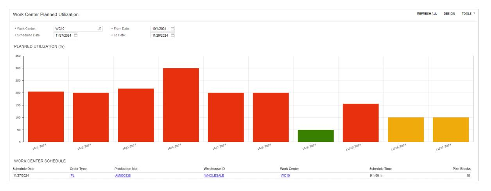

*Figure: The Work Center Planned Utilization dashboard*

# **Advanced Planning and Scheduling: Process Activity**

The following activity will walk you through the process of advanced scheduling of production orders.

#### **Process Overview**

In this activity, you will do the following:

- 1. On the *[Production Order Maintenance](https://help-2025r1.acumatica.com/Help?ScreenId=ShowWiki&pageid=e5d2ddd4-8c80-4f5b-8e5f-e5151636a9d3)* (AM201500) form, you will create a production order to be scheduled.
- 2. On the *[APS Maintenance Process](https://help-2025r1.acumatica.com/Help?ScreenId=ShowWiki&pageid=4414c558-36b9-465a-922a-3e6b5123ff75)* (AM512000) form, you will run the maintenance process of advanced planning and scheduling.
- 3. On the *[Rough Cut Planning](https://help-2025r1.acumatica.com/Help?ScreenId=ShowWiki&pageid=5d320648-5798-4c83-9911-7c89d17e71d1)* (AM501000) form, you will schedule the created production order.
- 4. On the *[Work Center Schedule](https://help-2025r1.acumatica.com/Help?ScreenId=ShowWiki&pageid=3c5ff810-f3bc-4a36-8e89-f36ea78b26c9)* (AM000001) form, you will view how the system scheduled the production order considering other open production orders.

#### **System Preparation**

Before you start making changes to a bill of material by using engineering change control, do the following:

- 1. Launch the Acumatica ERP website, and sign in to a company with the *SalesDemo* dataset preloaded. You should sign in as the system administrator with the *admin* username and the password for this user valid for your instance.
- 2. Enable the *Advanced Planning and Scheduling* feature in the *Manufacturing* group of features on the *[Enable/](https://help-2025r1.acumatica.com/Help?ScreenId=ShowWiki&pageid=c1555e43-1bc5-4f6f-ba9d-b323f94d8a6b) [Disable Features](https://help-2025r1.acumatica.com/Help?ScreenId=ShowWiki&pageid=c1555e43-1bc5-4f6f-ba9d-b323f94d8a6b)* (CS100000) form.
- 3. In the info area, in the upper-right corner of the top pane of the Acumatica ERP screen, make sure that the business date in your system is set to today's date. For simplicity, in this activity, you will create and process all documents in the system on this business date.

## **Step 1: Creating a Production Order**

To create a production order to be scheduled, do the following:

1. On the *[Production Order Maintenance](https://help-2025r1.acumatica.com/Help?ScreenId=ShowWiki&pageid=e5d2ddd4-8c80-4f5b-8e5f-e5151636a9d3)* (AM201500) form, add a new record.

To open the form for creating a new record, type the form ID in the Search box, and on the Search form, point at the form title and click **New** right of the title.

- 2. In the **Inventory ID** box of the Summary area, select *MGWIDGET*.
- 3. In the **Qty. to Produce** box of the Summary area, enter 5.
- 4. On the form toolbar, click**Save**.
- 5. Memorize or write down the number in the **Production Nbr.** box. You will need this value in the following steps.

#### **Step 2: Performing APS Maintenance**

To update the work center schedule and clean up history before running scheduling, do the following:

1. Open the *[APS Maintenance Process](https://help-2025r1.acumatica.com/Help?ScreenId=ShowWiki&pageid=4414c558-36b9-465a-922a-3e6b5123ff75)* (AM512000) form.

- 2. In the Selection area, select the following check boxes:
  - **Update Work CenterSchedule from Calendar**
  - **Cleanup History**
- 3. On the form toolbar, click **Process**. Wait until the system performs maintenance. On the **Process History** tab, the system updates the dates and usernames in the **Work CenterSchedule** and **History Cleanup** sections.

#### **Step 3: Scheduling the Production Orders**

To schedule the production order, do the following:

- 1. Open the *[Rough Cut Planning](https://help-2025r1.acumatica.com/Help?ScreenId=ShowWiki&pageid=5d320648-5798-4c83-9911-7c89d17e71d1)* (AM501000) form.
- 2. Notice that the **Release Orders** check box in the Selection area is cleared and the **Exclude Planning Orders** and **Exclude Firm Orders** check boxes are selected.
- 3. Schedule the production order you created earlier in this activity as follows:
  - a. Select the check box in the unlabeled column of the row for the production order.
  - b. Make sure that *Schedule* is selected in the **Action** box of the Selection area.
  - c. On the form toolbar, click **Process**.

The system opens the **Processing** dialog box and runs the process of the production order scheduling.

d. Wait until the processing is completed, and close the **Processing** dialog box.

#### **Step 4: Viewing Work Center Schedule**

To review the schedule of work centers where the *MGWIDGET* will be produced, do the following:

- 1. Open the *[Work Center Schedule](https://help-2025r1.acumatica.com/Help?ScreenId=ShowWiki&pageid=3c5ff810-f3bc-4a36-8e89-f36ea78b26c9)* (AM000001) form.
- 2. In the Selection area, select the following:
  - **OrderType**: *RO*
  - **Production Nbr.**: The number of the production order you created earlier in this activity.

In the table, the system displays only the rows related to the selected production order.

- 3. Notice that in the row for the *WC10* work center, the system scheduled 5 blocks (30 minutes each) and specified the start and end time of the operation.
- 4. Notice that in the row for the *WC100* work center, the system scheduled 3 blocks (30 minutes each) and specified the start and end time of the operation

You have scheduled the created production order by using advanced planning and scheduling.

## **Advanced Planning and Scheduling: Related Forms**

In the following sections, you can find details about the forms you may want to review to gather information about advanced planning and scheduling.

If you do not see a particular report or form that is described, you may have signed in to the system with a user account that does not have access rights to the report or form. Contact your system administrator to obtain access to any needed reports or forms.

#### **Viewing the Capacity of a Work Center**

You can use the *[Work Center Capacity](https://help-2025r1.acumatica.com/Help?ScreenId=ShowWiki&pageid=96aa1fe4-a393-4aa1-b30a-50ff21c50a05)* (AM405000) form to view the capacity of work centers for which production orders are scheduled.

#### **Viewing Open Operations for a Work Center**

On the *[Work Center Dispatch](https://help-2025r1.acumatica.com/Help?ScreenId=ShowWiki&pageid=8ad69ba9-65fd-4d19-9818-d5783afec874)* (AM000007) form, you can view the list of production orders that require operations assigned to work centers.

### **Viewing Production Schedules for Each Work Center**

You can view the production schedule for each work center by date and time on the *[Work Center Schedule](https://help-2025r1.acumatica.com/Help?ScreenId=ShowWiki&pageid=3c5ff810-f3bc-4a36-8e89-f36ea78b26c9)* (AM000001) form. The schedule includes planned orders generated by forms of the material requirements planning functional area.

# **Processing Capable to Promise**

To build customer loyalty, an organization that produces items must be able to promise the customer a shipping date that can be delivered upon. During the process of entering a sales order, the customer provides the requested date to the customer service manager, and the customer wants confirmation that the order will be fulfilled by this date. If the date cannot be met, the customer service manager needs to give the customer a realistic projected date when this order will be fulfilled.

Acumatica ERP Manufacturing Edition provides the capable-to-promise (CTP) functionality, which enables companies to commit to shipping dates for customer orders based on production, resource capacity, and inventory.

In this chapter, you will find information about configuring the system for users to be able to use the CTP functionality and about calculating the projected dates for ordered items.

# **Capable to Promise: General Information**

Acumatica ERP Manufacturing Edition provides the capable-to-promise (CTP) functionality, which is valuable for your organization if you use advanced planning and scheduling. This functionality provides you with the ability to commit to shipping dates for customer orders with the system taking into account production and on resource capacity and inventory on production, resource capacity, and inventory.

When you use the CTP functionality, the system determines when shipping will be possible by using finite scheduling. The system takes into consideration the constraints of the manufacturing system that might hinder production, such as the accessibility of necessary resources, the lead times for acquiring raw materials or purchased parts, and the ability to acquire the resources needed for subassemblies or lower-level components.

This functionality is available only when the *Advanced Planning and Scheduling* feature is enabled on the *[Enable/](https://help-2025r1.acumatica.com/Help?ScreenId=ShowWiki&pageid=c1555e43-1bc5-4f6f-ba9d-b323f94d8a6b) [Disable Features](https://help-2025r1.acumatica.com/Help?ScreenId=ShowWiki&pageid=c1555e43-1bc5-4f6f-ba9d-b323f94d8a6b)* (CS100000) form.

#### **Learning Objectives**

In this chapter, you will learn how to do the following:

- Prepare the system for using the capable-to-promise functionality
- Perform the calculation of projected dates (also referred to as *CTP dates*) for items in sales orders

## **Applicable Scenario**

You may need to calculate the CTP dates for items of a sales order when your organization uses the advanced planning and scheduling functionality of Acumatica ERP Manufacturing Edition and wants be able to give the customers a realistic projected shipping date during sales order creation.

#### **Calculation of Projected Dates for a Sales Order**

When you create a sales order on the *[Sales Orders](https://help-2025r1.acumatica.com/Help?ScreenId=ShowWiki&pageid=19e4021c-1b84-49fd-be12-0320c5f1c7e5)* (SO301000) form with items to be produced, you can specify the date by which the customer expects to receive each item in the **Requested On** column of the **Document Details** tab. You can then estimate the projected date when the requested quantity of items can be shipped to the customer. To do this, you click **Process CTP** on the More menu, which causes the system to open the *[Process](https://help-2025r1.acumatica.com/Help?ScreenId=ShowWiki&pageid=d8e754cb-9df9-49c2-96c6-642c42b78476) [Capable to Promise](https://help-2025r1.acumatica.com/Help?ScreenId=ShowWiki&pageid=d8e754cb-9df9-49c2-96c6-642c42b78476)* (AM515000) form with the lines of the sales order whose items have the **CTP Item** check box selected on the **Manufacturing** tab of the *[Stock Items](https://help-2025r1.acumatica.com/Help?ScreenId=ShowWiki&pageid=77786a70-1f1e-4d63-ad98-96f98e4fcb0e)* (IN202500) form.

The **Process CTP** command is available when all of the following conditions are met:

- The *Advanced Planning and Scheduling* feature is enabled on the *[Enable/Disable Features](https://help-2025r1.acumatica.com/Help?ScreenId=ShowWiki&pageid=c1555e43-1bc5-4f6f-ba9d-b323f94d8a6b)* (CS100000) form.
- The type of the sales order has the **Allow Production Orders - Approved** and **Allow Production Orders - Hold** check boxes selected in the **ManufacturingSettings** section of the **General** tab on the *Order [Types](https://help-2025r1.acumatica.com/Help?ScreenId=ShowWiki&pageid=e6984218-4260-4438-99e1-aee2b3765369)* (SO201000) form.
- The sales order has the *On Hold* or *Open* status.

On the *[Process Capable to Promise](https://help-2025r1.acumatica.com/Help?ScreenId=ShowWiki&pageid=d8e754cb-9df9-49c2-96c6-642c42b78476)* form, you can select one line or multiple lines of the sales order (by selecting the unlabeled Included check box for each line), select *Process CTP* in the **Action** box, and click **Process** on the form toolbar to calculate the projected dates for the items in the selected lines. When the system finishes the calculation, the projected dates are displayed in the **CTP Date** column. During the calculation of the projected date, the system creates a planning order, which can be viewed on the *[Production Order Details](https://help-2025r1.acumatica.com/Help?ScreenId=ShowWiki&pageid=f24480d9-1fed-478e-9363-e48fa5833950)* (AM209000) form.

The system also inserts the planning order's type and number in the **Prod. OrderType** and **Prod. Order Nbr.** columns, respectively, of the *[Process Capable to Promise](https://help-2025r1.acumatica.com/Help?ScreenId=ShowWiki&pageid=d8e754cb-9df9-49c2-96c6-642c42b78476)* form. On the form, you can accept the dates by selecting the needed lines of the sales order (using the Included check boxes), selecting the *Accept* action, and clicking **Process** on the form toolbar. For each accepted line, the system deletes the planning order, creates a production order (whose type and number are displayed in the **Prod. OrderType** and **Prod. Order Number** columns, respectively), and selects the check box in the **CTP Accepted** column.

If any CTP dates do not meet the date requested by the customer, you can reject the dates by selecting the needed lines of the sales order (using the Included check boxes), selecting the *Reject* action, and clicking **Process** on the form toolbar. For each rejected line, the system deletes the planning order. In this case, you can negotiate with the customer to agree on new dates when the items in the order can be shipped; you can then update the requested dates in the sales order.

Also, you may want to find out how many of the item you can actually ship to the customer by the requested date. You can click the quantity in the **Open Qty.** column of the needed line to open the **Quantity Available** dialog box, which displays the available quantities of the item.

#### **Workflow of Generating Capable-to-Promise Dates for Sales Orders**

The typical workflow of generating capable-to-promise dates for sales orders involves the actions and generated documents shown in the following diagram.

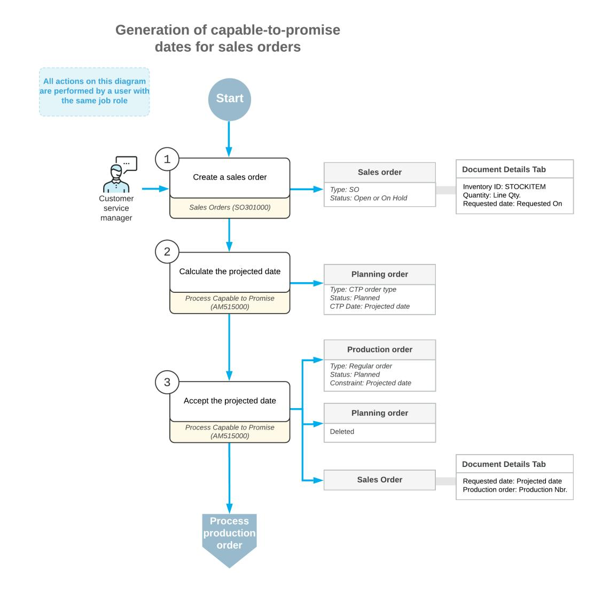

# **Capable to Promise: Implementation Checklist**

The following sections provide details you can use to ensure that the system is configured properly for using the capable-to-promise (CTP) functionality.

#### **Implementation Checklist**

We recommend that before you initially run the calculation of projected dates for sales orders, you make sure the needed features have been enabled, settings have been specified, and entities have been created, as summarized in the following checklist. You can perform the instructions similar to those described in *[Capable to Promise:](#page-280-1) [Implementation Activity](#page-280-1)* to configure the system.

| Form                               | Criteria to Check                                                 |
|------------------------------------|-------------------------------------------------------------------|
| Enable/Disable Features (CS100000) | The Advanced Planning and Scheduling feature has been enabled. |

| Form                              | Criteria to Check                                                                                                                                                                                                                                        |
|-----------------------------------|----------------------------------------------------------------------------------------------------------------------------------------------------------------------------------------------------------------------------------------------------------|
| Numbering Sequences (CS201000)    | The numbering sequence has been created for the CTP-related planning orders to be created by the CTP process.                                                                                                                                      |
|                                   | We recommend that you create a sepa rate numbering sequence for these plan ning to distinguish them from the plan ning orders unrelated to CTP.                                                                                                 |
| Production Order Types (AM201100) | The production order type has been created for the CTP-related planning orders, and the following recom mended settings have been specified:                                                                                                       |
|                                   | • Function: Planning                                                                                                                                                                                                                                  |
|                                   | • Order Numbering Sequence: The specific number ing sequence for CTP-related planning orders                                                                                                                                                       |
|                                   | • Exclude from MRP: Cleared                                                                                                                                                                                                                           |
|                                   | We recommend that you create a sepa rate order type for all CTP-related plan ning orders.                                                                                                                                                          |
| Production Preferences (AM102000) | The order type for the CTP-related planning orders has been specified in the Capable to Promise OrderType box in the Data Entry Settings section.                                                                                                  |
| Stock Items (IN202500)            | The CTP Item check box has been selected on the Manufacturing tab (General section) for all stock items for which you want to calculate projected dates.                                                                                           |
| Order Types (SO201000)            | The Allow Production Orders - Approved and Allow Production Orders - Hold check boxes have been se lected in the Manufacturing Settings section of the General tab for the sales order type for which project ed dates should be calculated. |

## **Validation of Configuration**

To make sure that all configuration has been performed correctly, we recommend that in your system, you calculate the projected dates for items in sales order by performing instructions similar to those described in *[Capable to Promise: Process Activity](#page-282-1)*.

# **Capable to Promise: Implementation Activity**

In the following implementation activity, you will learn how to configure the system so that you can use the capable-to-promise (CTP) functionality.

#### **Story**

Suppose that SweetLife Fruits & Jams has decided to use the capable-to-promise functionality so that sales managers can provide customers with accurate dates when ordered items will be shipped. You will act in the role of the implementation manager who needs to prepare the system for the use of the CTP functionality.

You need to create a separate order type for CTP-related planning orders and specify this order type in the production settings. You also need to set up the configurable citrus juicer stock item so that the system can include the stock item in calculation of CTP dates.

## **Configuration Overview**

The following entities, which you will use in this activity, have been predefined in the *U100* dataset:

- On the *[Numbering Sequences](https://help-2025r1.acumatica.com/Help?ScreenId=ShowWiki&pageid=a8d11c23-21f2-42a3-b17d-9637c9cf8031)* (CS201010) form, the *AMCTP* numbering sequence
- On the *[Stock Items](https://help-2025r1.acumatica.com/Help?ScreenId=ShowWiki&pageid=77786a70-1f1e-4d63-ad98-96f98e4fcb0e)* (IN202500) form, the *CFJCITRUS* stock item

#### **Process Overview**

In this activity, to specify the settings and create the entity related to the capable-to-promise functionality, you will do the following:

- 1. On the *[Production](https://help-2025r1.acumatica.com/Help?ScreenId=ShowWiki&pageid=6283187d-54b7-4db1-8c3a-97d3ebc39a95) Order Types* (AM201100) form, create a production order type to be used by the CTP functionality for creating planning orders.
- 2. On the *[Production Preferences](https://help-2025r1.acumatica.com/Help?ScreenId=ShowWiki&pageid=678a1833-f1f6-44f1-afce-55aa7438b3f3)* (AM102000) form, specify the created production order type as the default order type for CTP-related planning orders.
- 3. On the *[Stock Items](https://help-2025r1.acumatica.com/Help?ScreenId=ShowWiki&pageid=77786a70-1f1e-4d63-ad98-96f98e4fcb0e)* (IN202500) form, set up the configurable citrus juicer stock item and include the item in calculation of CTP dates.

#### **System Preparation**

Before you start preparing the system to process CTP, do the following:

- 1. As a prerequisite to the current activity, complete *[Bills of Material: Implementation Activity](#page-15-1)* and the all prerequisite activities to configure manufacturing functionality in the company with the *U100* dataset preloaded.
- 2. As a prerequisite to the current activity, complete *[Production](https://help-2025r1.acumatica.com/Help?ScreenId=ShowWiki&pageid=8be58249-2847-4739-9864-2fd03f6911ef) Order Types: To Create a Regular Production [Order](https://help-2025r1.acumatica.com/Help?ScreenId=ShowWiki&pageid=8be58249-2847-4739-9864-2fd03f6911ef) Type* so that the system can use this production order type for creating regular production orders.
- 3. Sign in to the company in which the prerequisite activities have been performed as a system administrator by using the *gibbs* username and *123* password.
- 4. Make sure that the *Advanced Planning and Scheduling* feature has been enabled on the *[Enable/Disable](https://help-2025r1.acumatica.com/Help?ScreenId=ShowWiki&pageid=c1555e43-1bc5-4f6f-ba9d-b323f94d8a6b) [Features](https://help-2025r1.acumatica.com/Help?ScreenId=ShowWiki&pageid=c1555e43-1bc5-4f6f-ba9d-b323f94d8a6b)* (CS100000) form.

#### **Step 1: Creating a Production Order Type Dedicated to CTP**

To create a production order type that the system will use for new CTP-related planning orders, do the following:

- 1. Open the *[Production](https://help-2025r1.acumatica.com/Help?ScreenId=ShowWiki&pageid=6283187d-54b7-4db1-8c3a-97d3ebc39a95) Order Types* (AM201100) form.
- 2. On the form toolbar, click **Add New Record**.
- 3. In the Summary area, specify the following settings:
  - a. **OrderType**: CP

- b. **Active**: Selected
- c. **Description**: CTP planning orders
- d. **Function**: *Planning*
- 4. On the **General** tab, do the following:
  - a. In the **Order NumberingSequence** box of the **NumberingSettings** section, select *AMCTP*.
  - b. In the **AccountSettings** section, select the following accounts:
    - **Work in Process Account**: *12400*
    - **WIP Variance Account**: *51500*
  - c. In the **Order Defaults** section, do the following:
    - a. In the **Costing Method** box, select *Estimated*.
    - b. Select the **Exclude from MRP** check box.
  - d. In the **Copy BOM Notes** section, select all the check boxes so that the system copies the notes to production orders of the type.
- 5. On the form toolbar, click**Save**.

#### **Step 2: Specifying Production Preferences**

Now that you have created an order type for planning orders to be created during the calculation of projected dates, you will specify this type as the default type for these orders in the production settings. Do the following:

- 1. Open the *[Production Preferences](https://help-2025r1.acumatica.com/Help?ScreenId=ShowWiki&pageid=678a1833-f1f6-44f1-afce-55aa7438b3f3)* (AM102000) form.
- 2. In the **Capable to Promise OrderType** box (**Data EntrySettings** section), select *CP*.
- 3. On the form toolbar, click**Save**.

#### **Step 3: Specifying Settings of Stock Items**

To indicate that projected dates can be calculated for the configurable citrus juicer stock item, do the following:

- 1. Open the *[Stock Items](https://help-2025r1.acumatica.com/Help?ScreenId=ShowWiki&pageid=77786a70-1f1e-4d63-ad98-96f98e4fcb0e)* (IN202500) form.
- 2. In the **Inventory ID** box, select *CFJCITRUS*.
- 3. On the **Manufacturing** tab (**General** section), select the **CTP Item** check box.
- 4. On the form toolbar, click**Save**.

In this activity, you have created the production order type to be used by the CTP process, specified this type in production preferences, and marked the configurable citrus juicer stock item to be used by the CTP process.

## **Capable to Promise: Process Activity**

The following activity will walk you through the process of calculating projected dates for producing ordered items by using the capable-to-promise functionality.

#### **Story**

Suppose that on January 30, 2025, the Thai Food Restaurant customer has ordered two configurable citrus juicers and 10 pounds of oranges from the main office of SweetLife. Further suppose that the customer wanted the juicers to be shipped in three weeks. You, as the customer service manager, need to make sure that the production department can produce the juicers by the requested date and negotiate a new shipping datewith the customer if the requested shipping date cannot be met.

#### **Configuration Overview**

In the *U100* dataset, for the purposes of this activity, the following tasks have been performed:

- On the *Order [Types](https://help-2025r1.acumatica.com/Help?ScreenId=ShowWiki&pageid=e6984218-4260-4438-99e1-aee2b3765369)* (SO201000) form, the *SO* sales order type has been predefined and activated.
- On the *[Customers](https://help-2025r1.acumatica.com/Help?ScreenId=ShowWiki&pageid=652929bc-9606-4056-aa6e-0c2d1147171b)* (AR303000) form, the *TOMYUM* customer has been predefined.
- On the *[Stock Items](https://help-2025r1.acumatica.com/Help?ScreenId=ShowWiki&pageid=77786a70-1f1e-4d63-ad98-96f98e4fcb0e)* (IN202500) form, the *CFJCITRUS* and *ORANGES* stock items have been predefined.
- On the *[Warehouses](https://help-2025r1.acumatica.com/Help?ScreenId=ShowWiki&pageid=264b0ef7-2b6c-40b4-a7d9-f1a5e067939b)* (IN204000) form, the *WORKHOUSE* and *WHOLESALE* warehouses have been predefined.

#### **Process Overview**

In this activity, to calculate the projected date by using the capable-to-promise functionality, on the *[Sales Orders](https://help-2025r1.acumatica.com/Help?ScreenId=ShowWiki&pageid=19e4021c-1b84-49fd-be12-0320c5f1c7e5)* (SO301000) form, you will create a sales order with the items the customer has ordered and use the **Process CTP** command to open the *[Process Capable to Promise](https://help-2025r1.acumatica.com/Help?ScreenId=ShowWiki&pageid=d8e754cb-9df9-49c2-96c6-642c42b78476)* (AM515000) form for the sales order. On this form, the system will calculate the projected date for the configurable citrus juicers, and you will view available quantities of the juicer and reject the projected date. Then on the *[Sales Orders](https://help-2025r1.acumatica.com/Help?ScreenId=ShowWiki&pageid=19e4021c-1b84-49fd-be12-0320c5f1c7e5)* form, you will change the requested date for the configurable citrus juicer and again open the *[Process Capable to Promise](https://help-2025r1.acumatica.com/Help?ScreenId=ShowWiki&pageid=d8e754cb-9df9-49c2-96c6-642c42b78476)* form. On this form, the system will recalculate the projected date, which you will accept. Finally, on the *[Sales Orders](https://help-2025r1.acumatica.com/Help?ScreenId=ShowWiki&pageid=19e4021c-1b84-49fd-be12-0320c5f1c7e5)* form, you will view the changes the system made to the sales order.

## **System Preparation**

Do the following:

- 1. As a prerequisite to the current activity, complete *[Capable to Promise: Implementation Activity](#page-280-1)*, so that the system is configured for you to use the capable-to-promise (CTP) functionality in a company with the *U100* dataset preloaded.
- 2. Sign in to the company in which the prerequisite activities have been performed as a customer service manager by using the *blevy* username and *123* password.
- 3. In the info area, in the upper-right corner of the top pane of the Acumatica ERP screen, make sure that the business date in your system is set to *1/30/2025*. If a different date is displayed, click the Business Date menu button, and select *1/30/2025* on the calendar. For simplicity, in this activity, you will create and process all documents in the system on this business date.
- 4. On the *[Enable/Disable Features](https://help-2025r1.acumatica.com/Help?ScreenId=ShowWiki&pageid=c1555e43-1bc5-4f6f-ba9d-b323f94d8a6b)* (CS100000) form, make sure that the *Advanced Planning and Scheduling* feature has been enabled.
- 5. On the **General** tab (**ManufacturingSettings** section) of the *Order [Types](https://help-2025r1.acumatica.com/Help?ScreenId=ShowWiki&pageid=e6984218-4260-4438-99e1-aee2b3765369)* (SO201000) form for the *SO* order type, make sure that the **Allow Production Orders - Approved** and **Allow Production Orders - Hold** check boxes have been selected.

### **Step 1: Creating a Sales Order**

To create a sales order, do the following:

- 1. Open the *[Sales Orders](https://help-2025r1.acumatica.com/Help?ScreenId=ShowWiki&pageid=19e4021c-1b84-49fd-be12-0320c5f1c7e5)* (SO301000) form.
- 2. On the form toolbar, click **Add New Record**.
- 3. In the Summary area, specify the following settings:
  - a. **OrderType**: *SO*
  - b. **Customer**: *TOMYUM*

- c. **Date**: *1/30/2025*
- d. **Requested On**: *1/30/2025*
- e. **Description**: Sale of 2 configurable juicers for fruit and 10 pounds of oranges
- 4. On the **Details** tab, add rows with the settings shown in the following table.

| Inventory ID | Warehouse | Quantity | Unit Price | Requested On |
|--------------|-----------|----------|------------|--------------|
| CFJCITRUS    | WORKHOUSE | 2        | 3000.00    | 02/19/2025   |
| ORANGES      | WHOLESALE | 10       | 2.1500     | 1/30/2025    |

5. On the form toolbar, click**Save**.

You have created the sales order, and now you will calculate the projected date for the *CFJCITRUS* item. The *ORANGES* item has not been configured to be included in calculation of CTP dates so you could immediately create a shipment for this item, which is outside of the scope of this activity.

#### **Step 2: Calculating the Projected Date**

To calculate the projected date on which the *CFJCITRUS* stock item can be shipped to the customer, do the following:

1. While you are still viewing the sales order on the *[Sales Orders](https://help-2025r1.acumatica.com/Help?ScreenId=ShowWiki&pageid=19e4021c-1b84-49fd-be12-0320c5f1c7e5)* (SO301000) form, on the form toolbar, click **Process CTP** on the More menu. The system opens the *[Process Capable to Promise](https://help-2025r1.acumatica.com/Help?ScreenId=ShowWiki&pageid=d8e754cb-9df9-49c2-96c6-642c42b78476)* (AM515000) form with the line for the *CFJCITRUS* stock item shown in the table.

For the *ORANGES* item, the **CTP Item** check box is cleared on the **Manufacturing** tab of the *[Stock Items](https://help-2025r1.acumatica.com/Help?ScreenId=ShowWiki&pageid=77786a70-1f1e-4d63-ad98-96f98e4fcb0e)* (IN202500) form; therefore the line with this item is not displayed on the form.

- 2. Make sure that *Process CTP* is selected in the **Actions** box of the Selection area.
- 3. Select the check box in the unlabeled column of the *CFJCITRUS* line.
- 4. On the form toolbar, click **Process**; wait while the system completes the processing.

Notice that the system has specified the type and reference number of the planning order (which the system has created during processing) in the **Prod. OrderType** and **Prod. Order Nbr.** columns. In the **CTP Date** column, notice that the system has calculated the projected date as *3/2/2025*, which is 12 days later than the customer expected the juicers to be shipped.

#### **Step 3: Viewing the Available Quantities**

Suppose that you would like to see if any configurable citrus juicers are available in a warehouse or in production, so that you can negotiate a new requested date with the customer. Do the following on the *[Process Capable to](https://help-2025r1.acumatica.com/Help?ScreenId=ShowWiki&pageid=d8e754cb-9df9-49c2-96c6-642c42b78476) [Promise](https://help-2025r1.acumatica.com/Help?ScreenId=ShowWiki&pageid=d8e754cb-9df9-49c2-96c6-642c42b78476)* (AM515000) form, which is still open:

- 1. In the row with the *CFJCITRUS* stock item, click the link in the **Open Qty.** column.
- 2. In the **Quantity Available** dialog box, which opens, notice that all quantities except **Requested** are *0*. This means that the *CFJCITRUS* stock item is not currently available.
- 3. Close the dialog box.

#### **Step 4: Rejecting the Projected Date**

Suppose that you have decided to reject the projected date, call the customer, and negotiate the new requested date. Do the following on the *[Process Capable to Promise](https://help-2025r1.acumatica.com/Help?ScreenId=ShowWiki&pageid=d8e754cb-9df9-49c2-96c6-642c42b78476)* (AM515000) form, which is still open:

- 1. In the **Action** box of the Selection area, select *Reject*.
- 2. Select the check box in the unlabeled column of the *CFJCITRUS* line.
- 3. On the form toolbar, click **Process**; wait while the system completes the processing. The system has deleted the planning order and cleared the **Prod. OrderType**, **Prod. Order Nbr.**, and **CTP Date** columns for the line with the *CFJCITRUS* item.

Now you need to negotiate a new requested date with the customer.

#### **Step 5: Recalculating the Projected Date**

Suppose that the customer has agreed to receive the juicers on *3/2/2025* and you need to recalculate the projected date and send the order to production. Do the following:

1. Open the *[Sales Orders](https://help-2025r1.acumatica.com/Help?ScreenId=ShowWiki&pageid=19e4021c-1b84-49fd-be12-0320c5f1c7e5)* (SO301000) form with the sales order you created in Step 1.

You will not change the requested date in the line for the *CFJCITRUS* stock item because it will be changed automatically when you accept the CTP date.

2. On the form toolbar, click **Process CTP** on the More menu. The system opens the *[Process Capable to](https://help-2025r1.acumatica.com/Help?ScreenId=ShowWiki&pageid=d8e754cb-9df9-49c2-96c6-642c42b78476) [Promise](https://help-2025r1.acumatica.com/Help?ScreenId=ShowWiki&pageid=d8e754cb-9df9-49c2-96c6-642c42b78476)* (AM515000) form with the line for the *CFJCITRUS* stock item shown in the table.

You open the More menu by clicking the More button (…) on the form toolbar.

- 3. Make sure that *Process CTP* is selected in the **Actions** box of the Selection area.
- 4. Select the check box in the unlabeled column of the *CFJCITRUS* line.
- 5. On the form toolbar, click **Process**; wait while the system completes the processing.

Notice that the system has again specified the type and reference number of the planning order (which the system has created during processing) in the **Prod. OrderType** and **Prod. Order Nbr.** columns. In the **CTP Date** column, notice that the system has calculated the same projected date, *3/2/2025*, as it did in Step 2.

Now you can accept the projected date and send the order to production.

#### **Step 6: Accepting the Projected Date**

To accept the projected date, do the following on the *[Process Capable to Promise](https://help-2025r1.acumatica.com/Help?ScreenId=ShowWiki&pageid=d8e754cb-9df9-49c2-96c6-642c42b78476)* (AM515000) form, which is still open:

- 1. In the **Action** box of the Selection area, select *Accept*.
- 2. Select the check box in the unlabeled column of the *CFJCITRUS* line.
- 3. On the form toolbar, click **Process**; wait while the system completes the processing.
- 4. Make sure that the system has done the following:
  - Inserted the type and reference number of the production order that has been created in the **Prod. OrderType** and **Prod. Order Nbr.** columns, respectively.

Note: You can click the number in the **Prod. Order Nbr.** column to view the production order on the *[Production Order Details](https://help-2025r1.acumatica.com/Help?ScreenId=ShowWiki&pageid=f24480d9-1fed-478e-9363-e48fa5833950)* (AM209000) form.

- Selected the **CTP Accepted** check box.
- Copied the CTP date to the **Requested On** and **Ship On** columns.
- Copied the original requested date to the **Original Request Date** column.

You have accepted the projected date, and now you will view the changes the system made in the sales order.

#### **Step 7: Viewing the Sales Order**

To view the changes the system made in the sales order when you accepted the CTP date, do the following:

- 1. Open the *[Sales Orders](https://help-2025r1.acumatica.com/Help?ScreenId=ShowWiki&pageid=19e4021c-1b84-49fd-be12-0320c5f1c7e5)* (SO301000) form with the sales order you created in Step 1.
- 2. In the **Requested On** and **Ship On** columns of the *CFJCITRUS* line of the **Details** tab, make sure that the *3/2/2025* date is specified (which is the accepted projected date).
- 3. In the **Production Nbr.** column, make sure that the system has copied the production order number created when you accepted the projected date. You can click the link to view the production order on the *[Production](https://help-2025r1.acumatica.com/Help?ScreenId=ShowWiki&pageid=e5d2ddd4-8c80-4f5b-8e5f-e5151636a9d3) [Order Maintenance](https://help-2025r1.acumatica.com/Help?ScreenId=ShowWiki&pageid=e5d2ddd4-8c80-4f5b-8e5f-e5151636a9d3)* (AM201500) form.

You have successfully calculated and accepted the projected dates for the customer's order by using the capableto-promise functionality.

# **Engineering Change Control**

Engineering change control (ECC), a part of Acumatica ERP Manufacturing Edition, is an essential requirement for maintaining control of manufacturing master data in a rapidly changing world. The primary purpose of ECC is to control changes to bills of material. The ECC functionality gives users the following capabilities:

- Tracking pending changes and reviewing the change history
- Coordinating between purchasing, production, and inventory
- Managing version control and updates to bills of material and routing
- Controlling effective dates, which specify when changes take effect

In this chapter, you will find information about ECC.

# **Engineering Change Control: General Information**

Engineering change control (ECC) is an essential requirement for maintaining control of manufacturing master data in a rapidly changing world. The primary purpose of ECC is to control changes to bills of material. For a rapidly changing or heavily regulated manufacturing company, ECC will assist and monitor the process of changing a bill of material (BOM) and gaining approval if required.

You can use engineering change control functionality only if the *Engineering Change Control* feature in the *Manufacturing* group of features is enabled on the *[Enable/Disable Features](https://help-2025r1.acumatica.com/Help?ScreenId=ShowWiki&pageid=c1555e43-1bc5-4f6f-ba9d-b323f94d8a6b)* (CS100000) form.

In this topic, you will read about ECC in Acumatica ERP.

## **ECC Functionality**

Engineering change control provides the following abilities:

- Automates, controls, and organizes all change requests, plans, and actual changes to a bill of material.
- Full control from an engineering change request (ECR) to an engineering change order (ECO) to updating the bill of material.
- The ability to create multiple engineering change orders from multiple approved engineering change requests with the option to merge ECRs for the same bill of material and revision to a single ECO.
- The ability to use approval and assignment maps to control the approval process for both change requests and change orders. You can specify if approvals are required for either ECRs or ECOs, or for both.
- Create notification templates on the *Email [Templates](https://help-2025r1.acumatica.com/Help?ScreenId=ShowWiki&pageid=ebcda76a-433f-4bde-8aed-efc69474fd03)* (SM204003) form to inform users of the statuses of an ECR, ECO, and bill of material updates.

The following restrictions apply if the **Require ECR/ECO for New BOM Revisions** check box is selected on the *[BOM](https://help-2025r1.acumatica.com/Help?ScreenId=ShowWiki&pageid=7224e637-50bc-468d-bfb6-e97b87378ff6) [Preferences](https://help-2025r1.acumatica.com/Help?ScreenId=ShowWiki&pageid=7224e637-50bc-468d-bfb6-e97b87378ff6)* (AM101000) form:

- You cannot select the **Hold** check box for a bill of material (BOM) to edit it directly. You must use the ECR or ECO process to update the BOM once an ECR is created for the BOM.
- You can optionally forbid manual creation of a new revision for a bill of material and force all new revisions to be created by the ECC process.

## **Direct Creation of Engineering Change Orders**

If you organization has a small engineering team, you may find it undesirable to create an engineering change request as a prerequisite to creating an engineering change order. The team may want to eliminate the extra step of reviewing and generating the ECO and avoid storing unnecessary data in the system.

To allow the direct creation of ECOs, you clear the **Require ECR before Creating ECO** check box on the *[BOM](https://help-2025r1.acumatica.com/Help?ScreenId=ShowWiki&pageid=7224e637-50bc-468d-bfb6-e97b87378ff6) [Preferences](https://help-2025r1.acumatica.com/Help?ScreenId=ShowWiki&pageid=7224e637-50bc-468d-bfb6-e97b87378ff6)* (AM101000) form. Aer that, you can create an ECO directly on the *[Engineering Change Order](https://help-2025r1.acumatica.com/Help?ScreenId=ShowWiki&pageid=8c2aec10-0d67-4972-9403-fff2c900a8df)* (AM215000) form by clicking **Add New Record** on the form toolbar.

Once the check box has been cleared, we do not recommend selecting it again because this may cause the engineering change control functionality to work improperly.

## **ECC Workflow**

In the following diagram, you can view the workflow of engineering change control with the following settings on the *[BOM Preferences](https://help-2025r1.acumatica.com/Help?ScreenId=ShowWiki&pageid=7224e637-50bc-468d-bfb6-e97b87378ff6)* (AM101000) form:

- **Require ECR before Creating ECO**: Selected
- **ECR Require Approval**: Selected
- **ECO Require Approval**: Selected

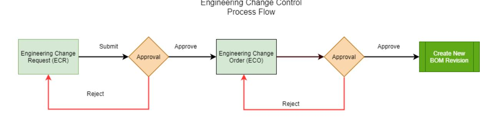

#### *Figure: Workflow of engineering change control*

To initiate changes in an existing bill of material, you perform the following steps:

- 1. Create an ECR by using the *[Engineering Change Request](https://help-2025r1.acumatica.com/Help?ScreenId=ShowWiki&pageid=9861aeb7-b393-42a9-94df-7256421f1b21)* (AM210000) form. The ECR status is *On Hold*.
- 2. Submit the ECR. The ECR status is changed to *Pending Approval*.
- 3. Acting as an approver, approve the ECR. The ECR status is changed to *Approved*.
- 4. Initiate the creation of the ECO based on the ECR. The ECR status is changed to *Completed*.
- 5. Open the created ECO on the *[Engineering Change Order](https://help-2025r1.acumatica.com/Help?ScreenId=ShowWiki&pageid=8c2aec10-0d67-4972-9403-fff2c900a8df)* (AM215000) form.
- 6. Review the ECO details and submit the ECO. The ECO status is changed to *Pending Approval*.
- 7. Acting as an approver, approve the ECO. The ECO status is changed to *Approved*.
- 8. Initiate the creation of the bill of material revision from the ECO. The ECO status is changed to *Completed*.

# **Engineering Change Control: Implementation Checklist**

The following sections provides details that you can use to ensure that engineering change control is configured properly.

#### **Implementation Checklist**

We recommend that before you start using engineering change control, you make sure the needed features have been enabled, settings have been specified, and entities have been created, as summarized in the following checklist.

| Form                               | Criteria to Check                                                                                                                  |
|------------------------------------|------------------------------------------------------------------------------------------------------------------------------------|
| Enable/Disable Features (CS100000) | The Engineering Change Control feature is enabled un der the Manufacturing group of features.                                   |
| Numbering Sequences (CS201010)     | The numbering sequences have been created for the identifiers of engineering change requests and engi neering change orders. |
| BOM Preferences (AM101000)         | The following settings have been specified on the Gen eral tab (Numbering Settings):                                            |
|                                    | • The numbering sequence for ECRs in the ECR Num bering Sequence box                                                         |
|                                    | • The numbering sequence for ECOs in the ECO Num bering Sequence box                                                         |
| Email Templates (SM204003)         | The corresponding notification templates have been created if you want to inform users about any of the following events:    |
|                                    | • An ECR or ECO has been created.                                                                                               |
|                                    | • An ECR or ECO is waiting for an approval. • An ECR or ECO has been approved.                                            |
|                                    | • An ECR or ECO has been rejected.                                                                                              |

## **Other Settings That Affect the Workflow**

You can affect the workflow of engineering change control by doing any of the following on the *[BOM Preferences](https://help-2025r1.acumatica.com/Help?ScreenId=ShowWiki&pageid=7224e637-50bc-468d-bfb6-e97b87378ff6)* (AM101000) form:

- If you want to restrict the creation of new revisions of bills of material based on engineering change requests or engineering change orders so that the revisions can be created only by using an ECR or an ECO, you select the **Require ECR/ECO for New BOM Revisions** check box in the **Data EntrySettings** section of the **General** tab.
- If you want to allow engineers to create engineering change orders without creating engineering change requests, you clear the **Require ECR Before Creating ECO** check box in the **Data EntrySettings** section of the **General** tab.
- If you want to use approvals for engineering change requests, on the **ECR Approval** tab, you select the **ECR Require Approval** check box, and in the table, you add the needed approval map for ECRs, which is created on the *[Assignment and Approval Maps](https://help-2025r1.acumatica.com/Help?ScreenId=ShowWiki&pageid=54d9618b-c27b-47d5-9748-24441084e99e)* (EP205500) form.
- If you want to use approvals for engineering change orders, on the **ECO Approval** tab, you select the **ECO Require Approval** check box, and in the table, you add the approval map for ECOs, which is created on the *[Assignment and Approval Maps](https://help-2025r1.acumatica.com/Help?ScreenId=ShowWiki&pageid=54d9618b-c27b-47d5-9748-24441084e99e)* form.

# **Engineering Change Control: Implementation Activity**

In the following implementation activity, you will learn how to configure engineering change control.

#### **Process Overview**

In this activity, you will review the settings related to engineering change control by using the *[BOM Preferences](https://help-2025r1.acumatica.com/Help?ScreenId=ShowWiki&pageid=7224e637-50bc-468d-bfb6-e97b87378ff6)* (AM101000) form.

#### **System Preparation**

Before you start implementing the product configuration functionality, do the following:

- 1. Launch the Acumatica ERP website, and sign in to a company with the *SalesDemo* dataset preloaded. You should sign in as the system administrator with the *admin* username and the password for this user valid for your instance.
- 2. Enable the *Engineering Change Control* feature in the *Manufacturing* group of features on the *[Enable/Disable](https://help-2025r1.acumatica.com/Help?ScreenId=ShowWiki&pageid=c1555e43-1bc5-4f6f-ba9d-b323f94d8a6b) [Features](https://help-2025r1.acumatica.com/Help?ScreenId=ShowWiki&pageid=c1555e43-1bc5-4f6f-ba9d-b323f94d8a6b)* (CS100000) form.

#### **Step: Reviewing ECC Settings**

To review the default settings of engineering change control, do the following:

- 1. Open the *[BOM Preferences](https://help-2025r1.acumatica.com/Help?ScreenId=ShowWiki&pageid=7224e637-50bc-468d-bfb6-e97b87378ff6)* (AM101000) form.
- 2. Go to the **General** tab, and notice that the following settings related to engineering change control have been specified:
  - **ECR NumberingSequence**: *AMECR*
  - **ECO NumberingSequence**: *AMECO*
  - **Require ECR/ECO for New BOM Revisions**: Cleared

With this setting, a user can create new revisions of bills of material based on ECR or ECO directly on the *[Bill of Material](https://help-2025r1.acumatica.com/Help?ScreenId=ShowWiki&pageid=1aae7d3a-d5f9-4693-b91f-663c4c2d362b)* (AM208000) form.

• **Require ECR Before Creating ECO**: Selected

With this setting, a user must create an engineering change request first and then create an engineering change order based on the request.

- 3. Go to the **ECR Approval** tab, and notice that the following settings have been specified:
  - The **ECR Require Approval** check box is selected.
  - The *Engineering Change Request* approval map has been added to the table.
- 4. Go to the **ECO Approval** tab, and notice that the following settings have been specified:
  - The **ECO Require Approval** check box is selected.
  - The *Engineering Change Order* approval map has been added to the table.

# **Engineering Change Control: Process Activity**

The following activity will walk you through the process of making changes in a bill of material by using engineering change control.

#### **Process Overview**

In this activity, you will do the following:

1. On the *[Engineering Change Request](https://help-2025r1.acumatica.com/Help?ScreenId=ShowWiki&pageid=9861aeb7-b393-42a9-94df-7256421f1b21)* (AM210000) form, you will create an engineering change request for changes in the bill of material and approve the request.

- 2. On the *[Engineering Change Order](https://help-2025r1.acumatica.com/Help?ScreenId=ShowWiki&pageid=8c2aec10-0d67-4972-9403-fff2c900a8df)* (AM215000) form, you will create an engineering change order based on the engineering change request and approve the order.
- 3. On the same form you will commit changes from the engineering change order to the bill of material.

#### **System Preparation**

Before you start making changes to a bill of material by using engineering change control, do the following:

- 1. Launch the Acumatica ERP website, and sign in to a company with the *SalesDemo* dataset preloaded. You should sign in as the system administrator with the *admin* username and the password for this user valid for your instance.
- 2. In the info area, in the upper-right corner of the top pane of the Acumatica ERP screen, make sure that the business date in your system is set to today's date. For simplicity, in this activity, you will create and process all documents in the system on this business date.
- 3. Make sure that the *Engineering Change Control* feature in the *Manufacturing* group of features has been enabled on the *[Enable/Disable Features](https://help-2025r1.acumatica.com/Help?ScreenId=ShowWiki&pageid=c1555e43-1bc5-4f6f-ba9d-b323f94d8a6b)* (CS100000) form.

#### **Step 1: Creating an Engineering Change Request**

To create an engineering change request for changes in a bill of material, do the following:

1. On the *[Engineering Change Request](https://help-2025r1.acumatica.com/Help?ScreenId=ShowWiki&pageid=9861aeb7-b393-42a9-94df-7256421f1b21)* (AM210000) form, add a new record.

To open the form for creating a new record, type the form ID in the Search box, and on the Search form, point at the form title and click **New** right of the title.

- 2. In the **BOM ID** box of the Summary area, select *BOM000001*.
- 3. Notice that *A* is specified by default in the **BOM Revision** box.
- 4. In the **Description** box, enter Assemble Printed Circuit Board with inspection.
- 5. On the form toolbar, click**Save**.
- 6. On the table toolbar of the **Operations** tab, click **Add Row**.
- 7. In the row, specify the following:
  - **Operation ID**: 0040
  - **Work Center**: *WC100*
  - **Run Units**: 10
  - **Run Time**: 01:00
  - **Queue Time**: 00:00
- 8. Make sure that all other values of time boxes (except **Machine Time**) are 00:00.
- 9. Notice that the value of the **ChangeStatus** is *Inserted*.
- 10.On the form toolbar, click**Save**.
- 11.On the form toolbar, click**Submit** to confirm that you completed making changes in the request.
- 12.On the form toolbar, click **Approve** to approve the changes made in the request.

#### **Step 2: Creating an Engineering Change Order**

To create an engineering change order based on the engineering change request, do the following:

- 1. While you are still viewing the engineering change request on the *[Engineering Change Request](https://help-2025r1.acumatica.com/Help?ScreenId=ShowWiki&pageid=9861aeb7-b393-42a9-94df-7256421f1b21)* (AM210000) form, on the form toolbar, click **Create ECO**. The system opens the *[Engineering Change Order](https://help-2025r1.acumatica.com/Help?ScreenId=ShowWiki&pageid=8c2aec10-0d67-4972-9403-fff2c900a8df)* (AM215000) form for the new order and copies details from the request.
- 2. On the form toolbar, click**Save**.
- 3. On the form toolbar, click**Submit** to confirm the order details.
- 4. On the form toolbar, click **Approve** to approve the order.

#### **Step 3: Committing Changes to BOM**

To commit changes from the engineering change order to the bill of material, do the following:

- 1. While you are still viewing the engineering change order on the *[Engineering Change Order](https://help-2025r1.acumatica.com/Help?ScreenId=ShowWiki&pageid=8c2aec10-0d67-4972-9403-fff2c900a8df)* (AM215000) form, on the form toolbar, click **Commit Changes to BOM**. The system opens the *[Bill of Material](https://help-2025r1.acumatica.com/Help?ScreenId=ShowWiki&pageid=1aae7d3a-d5f9-4693-b91f-663c4c2d362b)* (AM208000) form with the new revision of the *BOM000001* bill of material.
- 2. Notice that the system specified *E* in the **Revision** box.
- 3. Clear the **Hold** check box, and notice that the system has changed the status of the bill of material to **Active**.
- 4. On the form toolbar, click**Save**.

You have successfully created a new revision of a bill of material by using engineering change control.

# **Appendix**

The appendix provides some reference information relevant for this document. The additional information in this section is a useful source for readers who need some reference material that is related to system forms and tables, as well as running reports.

#### **In this section:**

- *[Reports](#page-293-3)*
- *Form [Toolbar](#page-300-1) and More Menu*
- *Table [Toolbar](#page-307-1)*
- *[Glossary](https://help-2025r1.acumatica.com/Help?ScreenId=ShowWiki&pageid=a2c92852-5ae8-4f4b-bf82-7f70cca0fdfa)*

## **Reports**

In addition to offering a comprehensive collection of reports, Acumatica ERP gives you a high degree of control over each report.

On a typical report form, described in *[Report Form](#page-293-4)*, you can adjust the report settings to meet your specific informational needs. You can specify sorting and filtering options and select the data by using report-specific settings—such as financial period, ledger, and account—and configure additional processing settings for each report. The settings can be saved as a report template for later use. For details, see *To Run a [Report](https://help-2025r1.acumatica.com/Help?ScreenId=ShowWiki&pageid=d0531b2f-178f-4d70-8c4c-6bc897cd6c0a)* and *To [Create](https://help-2025r1.acumatica.com/Help?ScreenId=ShowWiki&pageid=5adbb4bd-4347-4f81-a1ff-4d4d47d1fb1b) a Report [Template](https://help-2025r1.acumatica.com/Help?ScreenId=ShowWiki&pageid=5adbb4bd-4347-4f81-a1ff-4d4d47d1fb1b)*.

Aer you run a report, the prepared report appears on your screen. You can print the report, export the report to a file, or send the report by email.

This chapter describes a typical report form and the main tasks related to using reports.

#### **In This Chapter**

- *[Report Form](#page-293-4)*
- *To Run a [Report](https://help-2025r1.acumatica.com/Help?ScreenId=ShowWiki&pageid=d0531b2f-178f-4d70-8c4c-6bc897cd6c0a)*
- *To Modify a Filter on a [Report](https://help-2025r1.acumatica.com/Help?ScreenId=ShowWiki&pageid=2513e10e-abb1-432e-85e0-a5e3f6cabf9c) Form*
- *To Create a Report [Template](https://help-2025r1.acumatica.com/Help?ScreenId=ShowWiki&pageid=5adbb4bd-4347-4f81-a1ff-4d4d47d1fb1b)*

## **Report Form**

Before you run a report, you specify the needed parameters on the report form. You can select a template and manually make selections that affect the information collected. Also, you can specify appropriate settings to print or email the finished report.

The following screenshot shows a typical report form.

| TOOLS $\star$ <b>Daily Sales Profitability</b>                     |                                                                                       |   |  |
|-----------------------------------------------------------------------|---------------------------------------------------------------------------------------|---|--|
| ↶ <b>RUN REPORT</b>                                                | REMOVE TEMPLATE 1 <b>SAVE TEMPLATE</b>                                          |   |  |
| Template $\times$ $\scriptstyle\rm\sim$ 2 □ Default □ Shared |                                                                                       |   |  |
| <b>REPORT PARAMETERS</b>                                              | ADDITIONAL SORT AND FILTERS PRINT AND EMAIL SETTINGS <b>EMAIL NOTIFICATIONS</b> |   |  |
| <b>Report Format</b>                                                  | <b>Detailed</b> $\checkmark$                                                       |   |  |
| Company/Branch:                                                       | HEADOFFICE - SweetLife Head Offi v                                                    |   |  |
| <b>From Date</b>                                                      | 2/1/2025 Ä                                                                         |   |  |
| <b>To Date</b>                                                        | 2/20/2025 Ħ                                                                        |   |  |
| <b>Document Type</b>                                                  | $\checkmark$                                                                          | 3 |  |
| Warehouse:                                                            | Q                                                                                     |   |  |
| Customer:                                                             | Q                                                                                     |   |  |
| Inventory:                                                            | Q                                                                                     |   |  |
|                                                                       | Released Transactions Only                                                            |   |  |
|                                                                       | Completed Transactions Only                                                           |   |  |
|                                                                       |                                                                                       |   |  |

#### *Figure: Report form*

- 1. Report form toolbar
- 2. Selection area
- 3. Details area

#### **Report Form Toolbar**

The following table lists the buttons of the report form toolbar, which appears on the report form when you are configuring a report.

| Button              | Description                                                                                                              |
|---------------------|--------------------------------------------------------------------------------------------------------------------------|
| Cancel              | Clears any changes you have made on the report form and restores the default settings.                                   |
| Run Report          | Initiates data collection for the report and displays the generated report.                                              |
| SaveTemplate        | Gives you the ability to save the currently selected report as a template with all the select ed settings.            |
| Remove Tem plate | Removes the previously saved template. This button is available only when a template is specified on the report form. |

#### **Report Toolbar**

The following table lists the buttons of the report toolbar, which is shown on the generated report that you have run.

| Buttons    | Icon | Description                                                                |
|------------|------|----------------------------------------------------------------------------|
| Parameters |      | Navigates back to the report form to let you change the report parameters. |

| Buttons                 | Icon | Description                                                                                                                                                                                                    |
|-------------------------|------|----------------------------------------------------------------------------------------------------------------------------------------------------------------------------------------------------------------|
| Refresh                 |      | Refreshes the information displayed in the report (if any data changes were made).                                                                                                                             |
| Groups                  |      | Adds to the report a le pane where the report structure is shown. Click a report node to highlight the pertinent data in the right pane.                                                                   |
| View PDF / View HTML | /    | Displays the report as a PDF, or displays the report in HTML format. The available but ton depends on the current report view; if you're viewing a PDF, for instance, you will see the View HTML button. |
| First                   |      | Displays the first page of the report.                                                                                                                                                                         |
| Previous                |      | Displays the previous page.                                                                                                                                                                                    |
| Next                    |      | Displays the next page.                                                                                                                                                                                        |
| Last                    |      | Displays the last page of the report.                                                                                                                                                                          |
| Print                   |      | Opens the browser dialog box so you can print the report.                                                                                                                                                      |
| Send                    |      | Opens the Email Activity dialog box, which you use to send the report file (in the se lected format) to the specified email address.                                                                        |
| Export                  |      | Enables you to export the data in the selected format (Excel or PDF).                                                                                                                                          |

#### **Selection Area**

You use the elements in this area to select an existing template, which you can share with other users or use as your default report settings. You can also select the locale and the localization.

The elements of this area, which are available for all reports, are described in the following table.

| Element  | Description                                                                                                                                            |
|----------|--------------------------------------------------------------------------------------------------------------------------------------------------------|
| Template | The template to be used for the report. If any templates have been created and saved, you can select a template to use its settings for the report. |
| Default  | A check box that indicates (if selected) that the selected template is marked as the default one for you. A default template cannot be shared.      |

| Element      | Description                                                                                                                                                                                                                                                                                                            |
|--------------|------------------------------------------------------------------------------------------------------------------------------------------------------------------------------------------------------------------------------------------------------------------------------------------------------------------------|
| Shared       | A check box that indicates (if selected) that the selected template is shared with other users. A shared template cannot be marked as the default.                                                                                                                                                                  |
| Locale       | A locale that you select to indicate to the system that the report should be prepared with the data translated to the language associated with this locale. This box is displayed if there are multiple active locales in the system. For details, see Locales and Languages.                                    |
| Localization | The localization that is used for the report.                                                                                                                                                                                                                                                                          |
|              | This box appears on the form if the following conditions are met:                                                                                                                                                                                                                                                      |
|              | • The Canadian Localization or UK Localization feature is enabled on the Enable/Disable Features (CS100000) form.                                                                                                                                                                                                |
|              | • A localized version of the report exists in the system.                                                                                                                                                                                                                                                           |
|              | One of the following options can be selected in the box:                                                                                                                                                                                                                                                               |
|              | • None (default): Even though the report has a localized version, the report will be printed without any localization applied.                                                                                                                                                                                   |
|              | Canada: The Canadian version of the report will be printed. If the company in which you • are signed in has Canada selected in the Localization box on the Company Details tab (Configuration Settings section) on the Companies (CS101500) form, this setting is se lected by default in the current box. |
|              | To determine if a localized version of a report exists, the system checks the Site\ReportsDefault directory, the database, the ReportsCus tomized folder, and the ReportsDefault folder.                                                                                                                         |

#### **Report Parameters Tab**

The **Report Parameters** tab has sections where you can specify the contents of the report depending on the current report and vary in the following regards:

- Which elements are available on a particular report
- Whether elements contain default values
- Whether specific elements require values to be selected
- Whether elements may be le blank to let you display a broader range of data

## **Additional Sort and Filters Tab**

The **AdditionalSort and Filter** tab contains additional sorting and filtering conditions:

- **Additional sorting conditions**: Defines the sorting order. You can add a line, select one of the reportspecific properties, and select the *Descending* or *Ascending* sort order for the column.
- **Additional filtering conditions**: Defines the report filter. You can add a line, select one of the reportspecific properties, and define a condition and its value. The list of conditions include one-operand and two-operand conditions. To create a more complicated logical expression, you can use brackets and logical operations between brackets. For more information on creating filters, see *[Managing Advanced Filters](https://help-2025r1.acumatica.com/Help?ScreenId=ShowWiki&pageid=c621d79a-274d-4b72-a699-0e92d78a7b23)*. For detailed procedures on using ad hoc filters, see *[Reports: Process Activity](https://help-2025r1.acumatica.com/Help?ScreenId=ShowWiki&pageid=2b4d7aa8-25dc-4777-880a-fee2274990c7)*.

## **Print and Email Settings Tab**

If you plan to print the report or save the report as a PDF, select the appropriate settings in the **PrintSettings** area.

#### *Table: Print Settings Section*

| Element                 | Description                                                          |
|-------------------------|----------------------------------------------------------------------|
| Deleted Records         | Selects the visibility of the data deleted from the database.        |
| Print All Pages         | Causes all pages of the report to be printed.                        |
| Print in PDF format     | Displays the report in PDF format.                                   |
| Compress PDF file       | Indicates that the system will generate a compressed PDF.            |
| Embed fonts in PDF file | Indicates that the system will generate the PDF with fonts embedded. |

If you plan to send the report as an email, in the **EmailSettings** area, specify the format in which the report will be sent, as well as the email subject, the recipients of copies of the report, and the email account of the recipient.

#### *Table: Email Settings Section*

| Field         | Description                                                                                                                                                                                                                 |
|---------------|-----------------------------------------------------------------------------------------------------------------------------------------------------------------------------------------------------------------------------|
| Format        | The format (HTML, PDF, or Excel) in which the report will be emailed.                                                                                                                                                       |
|               | Merge function for reports in Excel format is not supported. If you want to merge a report with other reports and send an aggregated report by email, you should select either the HTML or PDF format for the report. |
| Email Account | The email address of the recipient.                                                                                                                                                                                         |
| CC            | An additional addressee to receive a carbon copy (CC) of the email.                                                                                                                                                         |
| BCC           | The email address of a person to receive a blind carbon copy (BCC) of the email; an address entered in this box will be hidden from other recipients.                                                                    |
| Subject       | The subject of the email.                                                                                                                                                                                                   |

#### **Report Versions Tab**

If the report has multiple versions, you can select one of them.

This tab displays the data only to users assigned with report designer user role.

Report versions are designed in the Report Designer. To activate editing report versions, give the user report designer role.

*Table: Report Versions Tab Toolbar*

| Button  | Description                            |
|---------|----------------------------------------|
| Refresh | Refreshes the list of report versions. |

| Button | Description                                        |
|--------|----------------------------------------------------|
| Select | Temporarily activates the selected report version. |

#### **Email Notifications Tab**

The **Email Notifications** tab lists the email templates used to send the report.

#### *Table: Table Toolbar*

The table toolbar includes standard buttons and buttons that are specific to this table. For the list of standard buttons, see *Table [Toolbar](#page-307-1)*. The table-specific buttons are listed below.

| Button          | Description                                                                                                                                                                     |
|-----------------|---------------------------------------------------------------------------------------------------------------------------------------------------------------------------------|
| Schedule Report | Opens the Email Templates (SM204003) form, where you can select or create a new email template that can be used to send the report and specify a schedule for notifications. |
|                 | The button appears only if the user account to which you are signed in has at least the Insert level of access rights to the Email Templates (SM204003) form.                |

#### *Table: Table Columns*

| Column                   | Description                                                                                                     |
|--------------------------|-----------------------------------------------------------------------------------------------------------------|
| Email Template           | The email template to be used to generate the body of the email notification.                                   |
| Screen ID                | The identifier of the form whose elements are used as the source of specific placeholders for this template. |
| Recipients               | The email addresses of the people to receive the email. Use semicolons as separators be tween addresses.     |
| Report Template          | The template configured for the report.                                                                         |
| Report Template Owner | The name of the user who created the template.                                                                  |

#### **Related Links**

- *To Run a [Report](https://help-2025r1.acumatica.com/Help?ScreenId=ShowWiki&pageid=d0531b2f-178f-4d70-8c4c-6bc897cd6c0a)*
- *To Create a Report [Template](https://help-2025r1.acumatica.com/Help?ScreenId=ShowWiki&pageid=5adbb4bd-4347-4f81-a1ff-4d4d47d1fb1b)*
- *Types of [Filters](https://help-2025r1.acumatica.com/Help?ScreenId=ShowWiki&pageid=9371f240-f73a-4b7a-8f16-72add7be7b62)*
- *[Automation Schedule Statuses](https://help-2025r1.acumatica.com/Help?ScreenId=ShowWiki&pageid=97fb65d2-2303-4993-9351-b6fbe112c37d)*

## **Report**

Once you click **Run Report**, the prepared report appears on your screen. You can print the report, export the report to a file, or send the report by email.

The prepared report is displayed in the report view of the report form. For more information about setting up the report parameters and the parameters view of the report form, see *[Report Form](#page-293-4)*.

## **Report Toolbar**

The following table lists report toolbar buttons.

| Buttons                 | Icon | Description                                                                                                                                                                                                    |
|-------------------------|------|----------------------------------------------------------------------------------------------------------------------------------------------------------------------------------------------------------------|
| Parameters              |      | Navigates back to the report form to let you change the report parameters.                                                                                                                                     |
| Refresh                 |      | Refreshes the information displayed in the report (if any data changes were made).                                                                                                                             |
| Groups                  |      | Adds to the report a le pane where the report structure is shown. Click a report node to highlight the pertinent data in the right pane.                                                                   |
| View PDF / View HTML | /    | Displays the report as a PDF, or displays the report in HTML format. The available but ton depends on the current report view; if you're viewing a PDF, for instance, you will see the View HTML button. |
| First                   |      | Displays the first page of the report.                                                                                                                                                                         |
| Previous                |      | Displays the previous page.                                                                                                                                                                                    |
| Next                    |      | Displays the next page.                                                                                                                                                                                        |
| Last                    |      | Displays the last page of the report.                                                                                                                                                                          |
| Print                   |      | Opens the browser dialog box so you can print the report.                                                                                                                                                      |
| Send                    |      | Opens the Email Activity dialog box, which you use to send the report file (in the cho sen format) to the specified email address.                                                                          |
| Export                  |      | Enables you to export the data in the chosen format (Excel or PDF).                                                                                                                                            |

#### **Related Links**

- *[Filters](https://help-2025r1.acumatica.com/Help?ScreenId=ShowWiki&pageid=fad0b170-9d7c-4851-8f73-4b841f977c0f)*
- *[Report](#page-298-1)*

## **Form Toolbar and More Menu**

The form toolbar, which is available on most forms, is located near the top of the form, under the form name (and record title, if the form has one), as shown in the following screenshot.

The form toolbar includes the following:

- Standard buttons (see Item 1 in the following screenshot), with the particular set of buttons depending on the specific form
- On some forms, form-specific buttons (Item 2)
- On some form, the More button (Item 3); clicking this button opens the More menu (Item 4), which contains additional form-specific commands

| Opportunities 000004 - A juicer with the installation and training for Lake Cafe 3                                                                                                                                                                                                                                                                                 |                                  |  |                          |                                |                         |   |                                                              |                                                             |                                  | <b>P</b> NOTES | <b>FILES</b> | <b>CUSTOMIZATION</b>                                          | TOOLS $\blacktriangleright$ |                                                               |  |                     |
|--------------------------------------------------------------------------------------------------------------------------------------------------------------------------------------------------------------------------------------------------------------------------------------------------------------------------------------------------------------------------|----------------------------------|--|--------------------------|--------------------------------|-------------------------|---|--------------------------------------------------------------|-------------------------------------------------------------|----------------------------------|----------------|--------------|---------------------------------------------------------------|-----------------------------|---------------------------------------------------------------|--|---------------------|
| - 3 $\Box$ $\Omega$ $\leftarrow$                                                                                                                                                                                                                                                                                                                                | $+$                              |  | $\Omega$ -               | 面                              | $\overline{\mathsf{K}}$ | ≺ |                                                              | <b>OPEN</b> $\geq$                                       | <b>CREATE QUOTE</b>              |                | $\cdots$     |                                                               |                             |                                                               |  |                     |
| Opportunity ID: Status: * Class ID: Stage: * Estimated Close Date:                                                                                                                                                                                                                                                                                           | 000004 <b>New</b> Prospect |  | $\overline{\phantom{a}}$ | <b>PROJECT - Project Sales</b> |                         |   | $\circ$ $\circ$ $\sqrt{2}$ $\overline{\phantom{a}}$ | <b>Business Account:</b> Location: Contact: Owner: | 2 LAKECAFE - MAIN - Primal |                |              | Processing Open $\bullet$ Close as Won Close as Lost |                             | <b>Activities</b> <b>Create Task</b> <b>Create Note</b> |  | $\hat{\phantom{a}}$ |
| 1/4/2021 Other <b>Record Creation</b> * Subject: A juicer with the installation and training for Lake Cafe <b>Create Quote</b> <b>Create Sales Order</b> <b>ACTIVITIES</b> <b>FINANCIAL</b> <b>SHIPPING</b> <b>DETAILS</b> <b>QUOTES</b> CONTACT <b>CRM INFO</b> AT 1 <b>Create Account</b>                      |                                  |  |                          |                                |                         |   | <b>Recalculate Prices</b> <b>Validate Addresses</b>       |                                                             |                                  |                |              |                                                               |                             |                                                               |  |                     |
| <b>CREATE TASK</b> <b>CREATE EVENT</b> CREATE ACTIVITY + <b>PIN/UNPIN</b> $\left  \rightarrow \right $ <b>CREATE EMAIL</b> $\mathcal{C}$ <b>Create Contact</b> $\uparrow \qquad \qquad \uparrow$ $\uparrow$ $\uparrow$ $\uparrow$ D. Type RI * Summary <b>Status</b> Start <b>Create Invoice</b> $\overline{\mathbf{k}}$ |                                  |  |                          |                                |                         |   |                                                              | $\triangledown$                                             |                                  |                |              |                                                               |                             |                                                               |  |                     |

#### *Figure: The form toolbar and the More menu*

You use the standard buttons on the form toolbar to navigate through entities that were created by using the current form, insert or delete an entity, use the clipboard, save the data you have entered, or cancel your work on the form.

A form toolbar on a particular form may include form-specific buttons in addition to standard buttons; it may also (or instead) include commands on the More menu. By using these form-specific buttons and commands, users can navigate to related records and forms, initiate specific actions, and perform modifications or processing related to the functionality of the form.

#### **Standard Form Toolbar Buttons**

The following table lists the standard buttons of the form toolbar. A form toolbar may include some or all of these buttons.

#### *Table: Standard Form Toolbar Buttons*

| Button                       | Icon | Description                                                                                                                                                                                                                                                                                                                                                                                                        |
|------------------------------|------|--------------------------------------------------------------------------------------------------------------------------------------------------------------------------------------------------------------------------------------------------------------------------------------------------------------------------------------------------------------------------------------------------------------------|
| Discard Changes and Close |      | Discards any unsaved changes made to the entity, and navigates to the list of records that is related to the current form.                                                                                                                                                                                                                                                                                      |
|                              |      | If the system opened the current form in a pop-up window (from a different form), this button is not displayed. To return to the original form, click Close.                                                                                                                                                                                                                                                 |
| Save & Close                 |      | Saves the changes made to the entity, and navigates to the list of records that is related to the current form.                                                                                                                                                                                                                                                                                                 |
| Save                         |      | Saves the changes made to the entity.                                                                                                                                                                                                                                                                                                                                                                              |
| Cancel                       |      | Depending on the context, does one of the following:                                                                                                                                                                                                                                                                                                                                                               |
|                              |      | • Discards any unsaved changes you have made to entities and retrieves the last saved version.                                                                                                                                                                                                                                                                                                               |
|                              |      | • Clears all changes and restores the default settings.                                                                                                                                                                                                                                                                                                                                                         |
| Add New Record               |      | Clears any values you've specified on the form, restores any default values, and initiates the creation of a new entity.                                                                                                                                                                                                                                                                                        |
| Delete                       |      | Deletes the currently selected entity, clears any values you have specified on the form, and populates elements with the default values that the system in serts when a new entity is created.                                                                                                                                                                                                               |
|                              |      | You can delete an entity only if it is not linked with another enti ty.                                                                                                                                                                                                                                                                                                                                         |
| Archive                      |      | Archives the document that is opened on the form. This button is available if archival is set up on the Archival Policy (SM200400) form for the type of the document open on the form and if the document meets the archival crite ria—that is, if the document is older than the retention period specified on the Archival Policy form and has been processed to completion or canceled.             |
|                              |      | For more information on archiving the documents, see Archiving Old Docu ments in the Acumatica ERP System Administration guide.                                                                                                                                                                                                                                                                                 |
| Extract                      |      | Extracts the archived document from the archive and makes the system use this document in day-to-day operations. This button is available if archival is set up on the Archival Policy (SM200400) form for the type of the document opened on the form is archived. For more information on archiving the documents, see Archiving Old Docu ments in the Acumatica ERP System Administration guide. |

#### Appendix | **303**

| Button                   | Icon | Description                                                                                                                                                                                                                                                                                                                                                                                                                                                                                                                                                                                                                                                           |
|--------------------------|------|-----------------------------------------------------------------------------------------------------------------------------------------------------------------------------------------------------------------------------------------------------------------------------------------------------------------------------------------------------------------------------------------------------------------------------------------------------------------------------------------------------------------------------------------------------------------------------------------------------------------------------------------------------------------------|
| Clipboard                |      | Provides menu commands you can use to do the following: • Copy: Copy the selected entity to the clipboard. • Paste: Paste an entity or template from the clipboard. • Save asTemplate: Create a template based on the selected entity. • Import from XML: Import an entity or a template from an .xml file. • Export to XML: Export the selected entity to an .xml file. For more information on templates and copy-and-paste operations in Acumatica ERP, see Using Forms. For more information on importing and ex porting .xml files, see Importing and Exporting Data to Excel and XML in the Acumatica ERP User Guide. |
| Go to First Record       |      | Displays the first entity (in the list of entities of the specific type) and its de tails.                                                                                                                                                                                                                                                                                                                                                                                                                                                                                                                                                                         |
| Go to Previous Record |      | Displays the previous entity and its details.                                                                                                                                                                                                                                                                                                                                                                                                                                                                                                                                                                                                                         |
| Go to Next Record        |      | Displays the next entity and its details.                                                                                                                                                                                                                                                                                                                                                                                                                                                                                                                                                                                                                             |
| Go to Last Record        |      | Displays the last entity (in the list of entities of the specific type) and its de tails.                                                                                                                                                                                                                                                                                                                                                                                                                                                                                                                                                                          |
| View Schedule            |      | Gives you the ability to schedule the processing. For more information, see Automated Processing: General Information.                                                                                                                                                                                                                                                                                                                                                                                                                                                                                                                                             |

#### **Inquiry Form Toolbar Buttons**

Acumatica ERP inquiry forms present data in a tabular format; they may also have selection criteria you can use to filter the data in the table. Predefined inquiry forms are provided as part of Acumatica ERP out of the box, and inquiry forms can be designed by a user with the appropriate access rights by using the Generic Inquiry tool (for details, see *[Managing Generic Inquiries](https://help-2025r1.acumatica.com/Help?ScreenId=ShowWiki&pageid=5737bca9-aebb-446d-9e1a-bc5fcfad6797)* in the Acumatica ERP Reporting Tools Guide). A form toolbar of an inquiry form contains both the standard form toolbar buttons (described in the table above) and the additional buttons described below.

| Button  | Icon | Description                                                                                                                                                    |
|---------|------|----------------------------------------------------------------------------------------------------------------------------------------------------------------|
| Refresh |      | Refreshes the inquiry data in the table.                                                                                                                       |
| Cancel  |      | Clears all changes (including selection criteria that has been specified, if the generic inquiry form has this criteria) and restores the default settings. |

| Button          | Icon | Description                                                                                                                                                                                                                       |
|-----------------|------|-----------------------------------------------------------------------------------------------------------------------------------------------------------------------------------------------------------------------------------|
| Add New Record  |      | Initiates the creation of a new entity.                                                                                                                                                                                           |
| Edit            |      | Opens the applicable data entry form with the selected record.                                                                                                                                                                    |
| Fit toScreen    |      | Expands the form to fit on the screen and adjusts the column widths propor tionally.                                                                                                                                           |
| Export to Excel |      | Exports the data to an Excel file. For more information, see Integration with Ex cel in the Acumatica ERP Getting Started Guide.                                                                                               |
| Filter Settings |      | Opens the Filter Settings dialog box, which you can use to define a new filter. After the filter has been created and saved, the corresponding tab appears on the table. For more information about filtering, see Filters. |

#### **The More Menu and Form-Specific Buttons**

If there are multiple form-specific commands on the form toolbar, they are displayed on a single menu—the More menu—and listed under descriptive categories, which makes it easier to find the needed menu command. On the More menu, you can easily define your favorite menu commands, which eases access to them.

On some forms, the system places a button (which is highlighted in green) on the form toolbar for the expected next command, which represents the likely next step to be performed on the selected record. The following screenshot, which shows the *Cash [Transactions](https://help-2025r1.acumatica.com/Help?ScreenId=ShowWiki&pageid=1e55821c-556b-4c3e-829c-95383eb2c8e2)* (CA304000) form, illustrates an example of the form toolbar and the More menu, which contains categories and menu commands.

|              | <b>Transactions</b> |                     | Cash Entry 000228 - 10200 Company Checking Account |          |                      |        |                          |   |                |                 |                         |               | $\overline{2}$ | $\lceil 3 \rceil$             | <b>PINOTES</b> | <b>ACTIVITIES</b> | <b>FILES</b>   | <b>CUSTOMIZATION</b> | TOOLS $\sim$           |
|--------------|---------------------|---------------------|----------------------------------------------------|----------|----------------------|--------|--------------------------|---|----------------|-----------------|-------------------------|---------------|----------------|-------------------------------|----------------|-------------------|----------------|----------------------|------------------------|
| $\leftarrow$ | 周                   | $\Box$              | $\Omega$                                           |          | 顶                    | n ٠ | $\overline{\mathsf{K}}$  | ∢ | ⋗              | $\geq$          | <b>RELEASE</b>          |               | <b>HOLD</b>    | $\cdots$                      |                |                   | 4              |                      |                        |
|              | Tran. Type:         |                     | <b>Cash Entry</b>                                  |          |                      |        |                          |   | * Tran. Date:  |                 | 5/26/2021               |               |                | Reports                       |                |                   | Corrections    |                      |                        |
|              | Reference Nbr.      |                     | 000228                                             | Q        |                      |        |                          |   | * Fin. Period: |                 | 05-2021                 | $\mathcal{L}$ |                | $\hat{\mathbf{x}}$ Activities |                |                   | Reverse        |                      |                        |
|              | Cash Account:       |                     | 10200 - Company Checking Account                   |          |                      |        |                          |   |                | Entry Type:     | <b>INTEREST - In</b>    |               |                |                               |                |                   |                |                      |                        |
|              | Currency:           |                     | <b>USD</b>                                         | 1.00     |                      |        | - VIEW BASE              |   |                | Disbursement/.  | Receipt                 |               |                | Processing                    |                |                   |                |                      |                        |
| Status:      |                     |                     | Balanced                                           |          |                      |        |                          |   |                | * Document Ref. | <b>INT-145</b>          |               |                | Hold                          |                |                   |                |                      |                        |
|              |                     |                     |                                                    |          |                      |        |                          |   | Owner:         |                 | EP00000002-             |               |                | Remove Hold                   | $6^{\circ}$    |                   |                |                      |                        |
|              | Description:        |                     |                                                    |          |                      |        |                          |   |                |                 |                         |               |                | Release ®          |                |                   |                |                      |                        |
|              |                     |                     | <b>TRANSACTION DETAILS</b>                         |          | <b>TAX DETAILS</b>   |        | <b>FINANCIAL DETAILS</b> |   |                |                 | <b>APPROVAL DETAILS</b> |               |                |                               |                |                   |                |                      |                        |
|              |                     | 1                   | $\times$                                           | $\vdash$ | $\boxed{\mathbf{x}}$ | 工      |                          |   |                |                 |                         |               |                |                               |                |                   |                |                      |                        |
| B 0          | D.                  | * Branch |                                                    | Item ID  |                      |        | <b>Description</b>       |   |                |                 |                         |               |                | Quantity                      | <b>UOM</b>     | Price             | Amount *Offset | Account              | <b>Account Descrip</b> |
| $\Omega$     | $\Box$              | PRODWHOLF           |                                                    |          |                      |        | Interest                 |   |                |                 |                         |               |                | 100                           |                | 20.00             | 20.00          | 49300                | Other Income: In       |

*Figure: The form toolbar of the Transactions form*

The numbered items in the screenshot indicate the following:

- 1. A highlighted button for the expected next command, which represents the next logical step to be performed on the record selected on the form
- 2. Another button for a command that is commonly performed on the form
- 3. The More button, which you click to open the More menu

- 4. The More menu with most form-specific menu commands and descriptive categories on it
- 5. The star icon, which is used to mark the individual user's favorite commands on the form
- 6. An unavailable command

#### **Favorite Commands**

Based on your role in the company and your job duties, you may use some commands more oen than others. On the form toolbar, you can specify these commands as favorites. This will cause the system to duplicate the commands as form toolbar buttons, easing access to them.

To add a command to the form toolbar as a button, you open the More menu, hover over the needed command, and click the star icon when it appears. The yellow color of the star indicates that the command has been added to your favorites, and a button for the command appears on the form toolbar immediately. The following example shows two commands that have been added to the user's favorites on the *[Invoices and Memos](https://help-2025r1.acumatica.com/Help?ScreenId=ShowWiki&pageid=5e6f3b27-b7af-412f-a40a-1d4f4be70cba)* (AR301000) form and thus added as buttons on the form toolbar.

| <b>Invoices and Memos</b> <b>T</b> NOTES <b>ACTIVITIES</b> <b>FILES</b> <b>CUSTOMIZATION</b> TOOLS $\blacktriangleright$ Invoice AR009654 - Alphabetland School Center |                                                                            |                                                            |                                                                            |  |  |  |  |  |  |  |  |
|------------------------------------------------------------------------------------------------------------------------------------------------------------------------------------------|----------------------------------------------------------------------------|------------------------------------------------------------|----------------------------------------------------------------------------|--|--|--|--|--|--|--|--|
| 周 $\Box$ 顶 $^+$ $\curvearrowleft$ $\leftarrow$                                                                                                                            | $\bigcirc$ - $\lambda$ $\overline{\mathsf{K}}$ $\rightarrow$ ≺ | <b>HOLD</b> <b>RELEASE</b> <b>CUSTOMER DETAILS</b>   | $\cdots$                                                                   |  |  |  |  |  |  |  |  |
| Type: Invoice $\overline{\phantom{a}}$ AR009654 Q Reference Nbr.: <b>Balanced</b> Status: 5/27/2021 * Date: $\overline{\phantom{a}}$                          | Processing <b>Remove Hold</b> $\star$ Hold                           | Intercompany <b>Generate AP Document</b> Approval    | <b>Related Documents</b> SO Invoice Pro Forma                        |  |  |  |  |  |  |  |  |
| 05-2021 * Post Period: $\mathcal{Q}$ Customer Ord                                                                                                                               | Release O Pay Release Retainage                           | <b>Remove Credit Hold</b> <b>Credit Hold</b> $\star$ | <b>Inquiries</b> <b>Customer Details</b> <b>Project Transactions</b> |  |  |  |  |  |  |  |  |
| Weekly Description: <b>DETAILS</b> <b>ADDRES</b>                                                                                                                                | Corrections Reverse Reverse and Apply to Memo                        | <b>Printing and Emailing</b> Print Email             | Reports <b>AR Edit Detailed</b>                                         |  |  |  |  |  |  |  |  |
| <b>FINANCIAL</b> $\mathcal{C}_{1}$ $\times$ P <b>VIEW DEFE</b> ョ <b>Inventory ID</b> *Branch                                                                        | Write Off Reclassify GL Batch                                           | Mark as Do not Email Other <b>Add to Schedule</b>    | <b>AR Register Detailed</b>                                                |  |  |  |  |  |  |  |  |
| <b>PRODWHOLE</b> <b>SUPP OFF</b> $\mathbf{0}$ n                                                                                                                                 |                                                                            | <b>Recalculate Prices</b> <b>Send Email</b>             |                                                                            |  |  |  |  |  |  |  |  |

#### *Figure: Favorite commands on the More menu and the corresponding toolbar buttons*

Favorites are individual to each user account, specific to a particular form, and preserved across user sessions.

#### **Highlighted Buttons and Commands**

On some forms, the system applies predefined logic to commands for specific records. Based on this logic, the system may place a button on the form toolbar, highlight it using some color, or do both of these things.

If a command is the expected next command (that is, the command that is most likely to be clicked for a record with the current status), it is shown both on the form toolbar and on the More menu. The primary command on the form toolbar is highlighted in green (see Item 1 in the following screenshot), and on the More menu, it is marked with a green dot (Item 2). Below is an example of a cash transaction on the *Cash [Transactions](https://help-2025r1.acumatica.com/Help?ScreenId=ShowWiki&pageid=1e55821c-556b-4c3e-829c-95383eb2c8e2)* (CA304000) form that has the *On Hold* status (Item 3). Before you can process it, you need to remove it from hold. Because **Remove Hold** is the next logical command, it is displayed as a button on the form toolbar and highlighted in green.

| <b>Transactions</b> Cash Entry 000228 - 10200 Company Checking Account $\begin{array}{c} \square \\ \square \end{array}$ $\Box$ 血 $\curvearrowleft$ $\leftarrow$ $\pm$                          | Õ $\mathsf{K}$ $\geq$ ≺ $\mathcal{P}$ $\overline{\phantom{a}}$                                                    | <b>P</b> NOTES <b>REMOVE HOLD</b> $\cdots$                                                                           | <b>ACTIVITIES</b> <b>FILES</b> | TOOLS $\blacktriangledown$ <b>CUSTOMIZATION</b> |  |  |  |  |  |
|----------------------------------------------------------------------------------------------------------------------------------------------------------------------------------------------------------------------|----------------------------------------------------------------------------------------------------------------------------------|----------------------------------------------------------------------------------------------------------------------------|-----------------------------------|----------------------------------------------------|--|--|--|--|--|
| Tran. Type: <b>Cash Entry</b> Reference Nbr.: 000228 $\mathcal{Q}$ Cash Account: 10200 - Company Checking Account 1.00 <b>USD</b> Currency: Status: On Hold l 3. Description: | * Tran. Date: * Fin. Period: Entry Type: $\blacktriangleright$ VIEW BASE Disbursement/ * Document Ref.: Owner: | Reports Corrections <b>Activities</b> Reverse Processing Hold $\mathfrak{p}$ Remove Hold ● Release |                                   |                                                    |  |  |  |  |  |
| <b>TRANSACTION DETAILS</b> <b>TAX DETAILS</b> <b>FINANCIAL DETAILS</b> <b>APPROVAL DETAILS</b>                                                                                                              |                                                                                                                                  |                                                                                                                            |                                   |                                                    |  |  |  |  |  |
| $\mathbf{\overline{X}}$ رم $\vdash$ $\times$ $\mathscr{D}$ 90 n. *Branch <b>Item ID</b>                                                                                                      | 土 <b>Description</b>                                                                                                          | Quantity                                                                                                                   | <b>UOM</b> Price               | Amount * Offset <b>Account</b>                  |  |  |  |  |  |
| <b>PRODWHOLE</b> $\omega$ D                                                                                                                                                                                    | Interest                                                                                                                         | 1.00                                                                                                                       | 20.00                             | 20.00 49300                                     |  |  |  |  |  |

*Figure: The highlighted command and the corresponding status*

#### **Unavailable Commands on the More Menu**

By default, on the More menu, the system displays all commands that could be available for the form, based on the system configuration. Some of these commands may be unavailable (that is, they are listed but cannot be clicked). These are the commands that are not applicable to the record based on its current status or other factors.

#### **The Responsive Form Toolbar and More Menu**

The form toolbar and the More menu have a responsive layout, meaning that they dynamically adjust to different screen sizes. When there is enough space, buttons for highlighted and favorite commands are displayed on the form toolbar. When the screen size decreases, the system moves the commands off the form toolbar one by one but keeps them on the More menu.

If there are multiple categories on the More menu, the categories and menu commands can be displayed in multiple columns on the More menu, depending on the screen size and the number of categories. When the screen size decreases, the system moves some categories and menu commands to the le to decrease the number of columns, and in the screens of the smallest size, all categories are displayed in one column. Below are two examples of the same menu in different screen sizes for a record on the *[Bills and Adjustments](https://help-2025r1.acumatica.com/Help?ScreenId=ShowWiki&pageid=956b4e51-3078-4d2d-85b3-65c080d95234)* (AP301000) form.

| <b>Bills and Adjustments</b> 周 $\Box$ $\leftarrow$                              | $\curvearrowleft$                                                                                                                                    | Bill 002862 - Empire BlueCross BlueShield O 侕 $\overline{\phantom{a}}$                               | <b>REMOVE HOLD</b>                                                                                                                              | <b>P</b> NOTES <b>ACTIVITIES</b> <b>RECALCULATE PRICES</b> <b>VENDOR DETAILS</b> | <b>FILES</b> <b>CUSTOMIZATION</b> AP EDIT DETAILED $\cdots$                                               | TOOLS $\blacktriangleright$ |
|------------------------------------------------------------------------------------------|------------------------------------------------------------------------------------------------------------------------------------------------------|---------------------------------------------------------------------------------------------------------------|-------------------------------------------------------------------------------------------------------------------------------------------------|-------------------------------------------------------------------------------------------|--------------------------------------------------------------------------------------------------------------------|-----------------------------|
| Type: Reference Nbr.: Status: $\star$ Date: * Post Period: * Vendor Ref.: | <b>Bill</b> $\mathbf{v}$ 002862 $\mathcal{Q}$ On Hold 5/27/2021 $\overline{\mathbf{v}}$ 05-2021 $\circ$ <b>REG 000472</b> | Vendor: * Location: Currency: * Terms: * Due Date: * Cash Discount 6/26/2021                   | <b>EBLUECROSS - Empire</b> <b>MAIN - Primary Location</b> $USD \quad \rho$ 1.00 30D - 30 Days 6/26/2021 $\Box$ App $\Box$ Pay | Processing Remove Hold O Hold Pre-release Release Pay           | Other Add to Schedule <b>Recalculate Prices</b> ÷ <b>Inquiries</b> <b>Vendor Details</b> $\star$ |                             |
| Description: <b>DETAILS</b> Ò $\mathscr{Q}$ 阊 *Branch n                | <b>Payroll Liabilities</b> <b>FINANCIAL</b> $\times$                                                                                           | <b>TAXES</b> <b>APPROVALS</b> <b>VIEW DEFERRALS</b> <b>Transaction Descr.</b> <b>Inventory ID</b> | <b>DISCOUNTS</b> AP <b>ADD PO RECEIPT</b> <b>ADD PC</b>                                                                                | Release Retainage Corrections Reverse Void <b>Reclassify GL Batch</b>         | Reports <b>AP Edit Detailed</b> ÷ <b>AP Register Detailed</b>                                             |                             |

*Figure: The form toolbar and More menu on a wide screen*

*Figure: The form toolbar and More menu on a narrow screen*

#### **Related Links**

- *[Integration with Excel](https://help-2025r1.acumatica.com/Help?ScreenId=ShowWiki&pageid=d4e757d5-bdf6-4d82-92e3-f26563d48ad4)*
- *To Copy a [Document](https://help-2025r1.acumatica.com/Help?ScreenId=ShowWiki&pageid=aa2b9a0f-794d-4dc7-80b4-14ed0702aea3) Contents to a New Document*
- *To Create a [Document](https://help-2025r1.acumatica.com/Help?ScreenId=ShowWiki&pageid=480487bd-b225-4065-9d82-97a3b68d7994) with a Template*

# **Table Toolbar**

Each table on an Acumatica ERP form, tab, dialog box, or page has a table toolbar, which contains the buttons you can use to work with the details or objects of the table. A toolbar, shown in the following screenshot, includes buttons that are specific to the table, standard buttons that most table toolbars have, and the search box (for some tables; for others, the search box is displayed in the filtering area).

| $\mathbf{x}$ с ∣⇔∣ ∽                |                              |   |                                          |                                   |                          |               |                       |               |                 |               |  |
|----------------------------------------------|------------------------------|---|------------------------------------------|-----------------------------------|--------------------------|---------------|-----------------------|---------------|-----------------|---------------|--|
|                                              | ALL RECORDS <b>ACTIVE</b> |   |                                          |                                   |                          |               |                       |               |                 |               |  |
| Drag column header here to configure filter  |                              |   |                                          |                                   |                          |               | R                     |               |                 | ρ             |  |
| 髙                                            | O,                           | n | <b>Customer ID</b>                       | <b>Customer Name</b>              | Customer <b>Class</b> | Country       | City                  | Currenc ID | <b>Terms</b>    | <b>Status</b> |  |
| $\rightarrow$                                | ा                            | n | <b>ABARTENDE</b>                         | <b>USA Bartending School</b>      | <b>KEY</b>               | <b>US</b>     | <b>Little Falls</b>   | USD.          | 30 D | Active        |  |
|                                              | O                            |   | <b>ABCHOLDING</b>                        | <b>ABC Holdings Inc.</b>          | <b>KEY</b>               | <b>US</b>     | New York              | <b>USD</b>    | 30 D | Active        |  |
|                                              | û,                           |   | !!!!!!!!!!!!!!!!!!!!!!!!!!!!!!!!!!!!!!!! | <b>ABC Studios Inc.</b>           | <b>KEY</b>               | <b>US</b>     | New York              | <b>USD</b>    | 30 D | Active        |  |
|                                              | Û                            |   | <b>ABCVENTURE</b>                        | <b>ABC Capital Ventures</b>       | <b>KEY</b>               | <b>US</b>     | Philadelphia          | <b>USD</b>    | 30 D | Active        |  |
|                                              | Û                            |   | <b>ACTIVESTAF</b>                        | <b>Active Staffing Service</b>    | <b>LOCAL</b>             | <b>US</b>     | <b>New York</b>       | <b>USD</b>    | 30 D | Active        |  |
|                                              | Û                            |   | ALPHABETLD                               | <b>Alphabetland School Center</b> | LOCAL                    | <b>US</b>     | <b>North Bellmore</b> | <b>USD</b>    | 30 D | Active        |  |
|                                              |                              |   |                                          |                                   |                          |               |                       |               |                 |               |  |
| 1-6 of 103 records К 1. of 18 pages |                              |   |                                          |                                   |                          | $\rightarrow$ |                       |               |                 |               |  |

#### *Figure: Table toolbar*

#### **Standard Table Toolbar Buttons**

The following table describes the standard table toolbar buttons. A table toolbar may include some or all of those buttons. If a table toolbar includes table-specific buttons, they are described in the reference help topic.

| Button                          | Icon | Description                                                                                                                                                                                           |
|---------------------------------|------|-------------------------------------------------------------------------------------------------------------------------------------------------------------------------------------------------------|
| Refresh                         |      | Refreshes the data in the table.                                                                                                                                                                      |
| Switch Between Grid and Form |      | Controls how the elements are displayed: in a table (grid) with rows and columns; or as separately arranged elements for one table row, with navigation tools you use to move between row data. |
| Add Row                         |      | Appends a new row to the table so you can define a new detail or object. The new row may contain some default values.                                                                              |
| Delete Row                      |      | Deletes the selected row or rows.                                                                                                                                                                     |

| Button                    | Icon | Description                                                                                                                                                                                                                                                                                                               |
|---------------------------|------|---------------------------------------------------------------------------------------------------------------------------------------------------------------------------------------------------------------------------------------------------------------------------------------------------------------------------|
| Move Row Up               |      | Moves the selected row one position up.                                                                                                                                                                                                                                                                                   |
| Move Row Down             |      | Moves the selected row one position down.                                                                                                                                                                                                                                                                                 |
| Fit toScreen              |      | Adjusts the table to the screen width and makes the column width proportional.                                                                                                                                                                                                                                            |
| Export to Excel           |      | Exports the data in the table to an Excel file. For more information, see Integration with Excel in the Acumatica ERP Getting Started Guide.                                                                                                                                                                           |
| Filter Settings           |      | Opens the Filter Settings dialog box, which you can use to define a new advanced filter. After you create and save the filter, the corresponding tab appears on the ta ble. For more information about filtering, see Filters. For details on the Filter Settings dialog box, see Filter Settings Dialog Box. |
| Load Records from File |      | Opens the File Upload dialog box, described in detail below, so you can locate and upload a local file for import. You can use this option to import data from an Excel spreadsheet (.xlsx) or .csv file. For the detailed procedure, see To Import Data from a Local File to a Table.                           |
| Search                    |      | A box in which you can type a word, part of a word, or multiple words. As you type, the system filters the contents of the table to display only rows that contain the string you have typed in any column.                                                                                                         |
| Download                  |      | Downloads the selected file.                                                                                                                                                                                                                                                                                              |

## **File Upload Dialog Box**

With the **File Upload** dialog box, you select a file of one of the supported formats (.csv or .xlsx) to import data from the file.

| Element                                  | Description                                                                                                                         |  |  |  |
|------------------------------------------|-------------------------------------------------------------------------------------------------------------------------------------|--|--|--|
| File Path                                | The path to the file you want to upload. To select the file, click Browse, and then find and select the file you want to upload. |  |  |  |
| The dialog box has the following button. |                                                                                                                                     |  |  |  |
| Upload                                   | Closes the dialog box and opens the Common Settings dialog box, where you specify the import settings.                           |  |  |  |

#### **Common Settings Dialog Box**

In the **Common Settings** dialog box, which opens if you click **Upload** in the **File Upload** dialog box, you specify the import settings for a file that you has selected in the **File Upload** dialog box.

| Element                                   | Description                                                                                                                                                                    |  |  |  |  |
|-------------------------------------------|--------------------------------------------------------------------------------------------------------------------------------------------------------------------------------|--|--|--|--|
| Separator Chars                           | The character that is used as the separator in the imported file.                                                                                                              |  |  |  |  |
|                                           | By default, the comma is used as the separator. You specify the separator character if the imported file uses any other separator.                                          |  |  |  |  |
|                                           | This box appears only if you import data from a .csv file.                                                                                                                     |  |  |  |  |
| Null Value                                | Optional. The value that is used to mark an empty column in the imported file. You speci fy the null value if the value in the imported file differs from the empty string. |  |  |  |  |
| Encoding                                  | The encoding that is used in the imported file.                                                                                                                                |  |  |  |  |
|                                           | This box appears only if you import data from a .csv file.                                                                                                                     |  |  |  |  |
| Culture                                   | The regional format that has been used to display the time, currency, and other measure ments in the imported file.                                                         |  |  |  |  |
| Mode                                      | The mode that determines which rows of the uploaded file will be imported into the ta ble. The following options are available:                                             |  |  |  |  |
|                                           | Update Existing: The rows already present in the table will be updated, and the rows • not present in the table will be added.                                           |  |  |  |  |
|                                           | • Bypass Existing: Only the new rows that are not present in the table will be imported. The rows that are already present in the table will not be updated.             |  |  |  |  |
|                                           | • Insert All Records: All the rows from the file will be imported into the table.                                                                                           |  |  |  |  |
|                                           | If you select this option, you may get duplicated rows because the sys tem does not check for duplicates when importing rows from the file.                                 |  |  |  |  |
| The dialog box has the following buttons. |                                                                                                                                                                                |  |  |  |  |
| OK                                        | Closes the dialog box and opens the Columns dialog box.                                                                                                                        |  |  |  |  |
| Cancel                                    | Closes the dialog box without importing the data from the file.                                                                                                                |  |  |  |  |

#### **Columns Dialog Box**

In the **Columns** dialog box, which opens if you click **OK** in the **Common Settings** dialog box, you match the columns in the imported file that you have selected in the **File Upload** dialog box to the columns in the Acumatica ERP table to which you are importing data.

| Element       | Description                                                         |
|---------------|---------------------------------------------------------------------|
| Column Name   | The name of the column in the uploaded file.                        |
| Property Name | The name of the corresponding column in the table in Acumatica ERP. |

| Element                                   | Description                                                     |
|-------------------------------------------|-----------------------------------------------------------------|
| The dialog box has the following buttons. |                                                                 |
| OK                                        | Closes the dialog box and imports the selected file.            |
| Cancel                                    | Closes the dialog box without importing the data from the file. |

#### **Related Links**

- *[Tables](https://help-2025r1.acumatica.com/Help?ScreenId=ShowWiki&pageid=87a128a5-1230-4584-8c7a-ad05bcd08b75)*
- *[Integration with Excel](https://help-2025r1.acumatica.com/Help?ScreenId=ShowWiki&pageid=d4e757d5-bdf6-4d82-92e3-f26563d48ad4)*
- *To [Import](https://help-2025r1.acumatica.com/Help?ScreenId=ShowWiki&pageid=96773e07-5811-474d-a088-243f76f48f61) Data from a Local File to a Table*