# **Order Management 2025 R1**


| Copyright12                                                                    |  |
|--------------------------------------------------------------------------------|--|
| Reviewing the Interaction of Inventory and Order Management with Financials 13 |  |
| Configuring Carriers, Packaging, and Freight  15                               |  |
| Integration with Carriers 15                                                   |  |
| Automatic Packaging for Integrated Carriers17                                  |  |
| Carrier Labels and Tracking Numbers18                                          |  |
| Integration with Carriers: Pacejet Implementation Checklist22                  |  |
| To Set Up Integration with EasyPost23                                          |  |
| To Set Up Integration with FedEx REST26                                        |  |
| To Set Up Integration with UPS REST 29                                         |  |
| To Set Up Integration with ShipEngine33                                        |  |
| To Set Up Integration with USPS via Stamps.com35                               |  |
| To Validate Addresses37                                                        |  |
| To Define a Box38                                                              |  |
| To Create Ship via Codes for the Integrated Carrier39                          |  |
| To Configure a Stock Item for Automatic Packaging40                            |  |
| Automatic Packaging for Local Carriers 41                                      |  |
| To Configure Automatic Packaging 42                                            |  |
| To Create a Ship via Code  43                                                  |  |
| Manual Packaging of Items 44                                                   |  |
| To Manually Select the Package Box for an Order 45                             |  |
| Freight Calculation 45                                                         |  |
| Managing Sales Documents 50                                                    |  |
| Changing the Processing of Sales Documents50                                   |  |
| Managing Lines in Sales Documents 52                                           |  |
| Changing the Customer in a Sales Order 53                                      |  |
| Checking the Credit Limit in Sales Documents54                                 |  |
| Printing Sales Documents56                                                     |  |
| To Print an Order or Quote 57                                                  |  |
| To Print a Pick List for a Shipment57                                          |  |
| To Print Pick Lists for Multiple Shipments 58                                  |  |
| To Print a Shipment Confirmation 58                                            |  |
| To Print Shipment Confirmations for Multiple Shipments59                       |  |
| To Print a Sales Orders Invoice or Memo59                                      |  |

| Configuration of Automatic Write-Offs in Invoices 60                             |  |
|----------------------------------------------------------------------------------|--|
| To Configure a Reason Code61                                                     |  |
| Tax Application in Sales Documents 62                                            |  |
| Weight and Volume in Sales Orders 66                                             |  |
| Posting Settings in Sales Order Types67                                          |  |
| To Approve a Sales Order67                                                       |  |
| Managing Purchase Documents 69                                                   |  |
| Support of COD Transactions69                                                    |  |
| Purchase Order Configuration 70                                                  |  |
| Purchase Order Statuses71                                                        |  |
| Purchase Order Fulfillment 74                                                    |  |
| Drop-Ship Purchase Orders76                                                      |  |
| Stock Item Lines in Purchase Orders77                                            |  |
| Non-Stock Lines in Purchase Orders 79                                            |  |
| Service Lines in Purchase Orders 80                                              |  |
| Managing Lines in Purchase Documents 84                                          |  |
| Changing the Vendor in a Purchase Order85                                        |  |
| Changing the Processing of Purchase Documents 86                                 |  |
| Calculating Use and Sales Taxes in Purchase Documents 88                         |  |
| Inclusive VAT Support in Purchase Orders90                                       |  |
| Vendor Catalogs91                                                                |  |
| Vendor Relations in Purchase Documents93                                         |  |
| Processing Pre-Sale Quotes 95                                                    |  |
| Presales Quotes: General Information 95                                          |  |
| Presales Quotes: Implementation Checklist 97                                     |  |
| Presales Quotes: Process Activity 98                                             |  |
| Processing Sales of Stock Items 102                                              |  |
| Sales of Stock Items: General Information102                                     |  |
| Sales of Stock Items: Implementation Checklist 104                               |  |
| Sales of Stock Items: Process Activity 105                                       |  |
| Sales of Stock Items: Stock Allocation with Multiple UOMs109                     |  |
| Sales of Stock Items: To Allocate Stock with Multiple UOMs and Process a Sale110 |  |
| Sales of Stock Items: Generated Transactions115                                  |  |
| Sales of Stock Items: Mass-Processing of Documents116                            |  |
| Sales of Stock Items: Related Report and Inquiry Forms119                        |  |
| To Reserve an Inventory Item for an Order120                                     |  |

| To Create a Sales Order with Automatic Allocation (SA) 121     |  |
|----------------------------------------------------------------|--|
| To Quickly Process an Order 123                                |  |
| To Add Sales Orders to an Invoice124                           |  |
| To Create Invoices for Multiple Shipments 124                  |  |
| To Create Invoices for Multiple Orders 124                     |  |
| To Prepare an Invoice for a Sales Order125                     |  |
| To Specify Lot or Serial Numbers for Ordered Items125          |  |
| To Create Shipments for Multiple Orders126                     |  |
| Canceling Sales Orders128                                      |  |
| Sales Order Cancellation: General Information 128              |  |
| Sales Order Cancellation: Reopening of a Sales Order 129       |  |
| Sales Order Cancellation: Implementation Checklist129          |  |
| Sales Order Cancellation: Process Activity130                  |  |
| Correcting Sales Invoices133                                   |  |
| Sales Invoice Correction: General Information133               |  |
| Sales Invoice Correction: Cancellation of an Invoice136        |  |
| Sales Invoice Correction: Implementation Checklist138          |  |
| Sales Invoice Correction: To Correct an Invoice 138            |  |
| Sales Invoice Correction: To Cancel an Invoice141              |  |
| Sales Invoice Correction: Generated Transactions 143           |  |
| Sales Invoice Correction: Related Report and Inquiry Forms 144 |  |
| Sales Invoice Correction: Mass-Processing Documents 145        |  |
| Processing Partial Shipments 146                               |  |
| Shipping Rule Settings 146                                     |  |
| Shipment Creation Rules 147                                    |  |
| Shipment Processing Steps148                                   |  |
| Shipment Process Variations 151                                |  |
| Shipping Rule Combinations 153                                 |  |
| Partial Shipping of Orders158                                  |  |
| Back Ordering and Replanning Back Orders 159                   |  |
| To Replan Back Orders 160                                      |  |
| To Add Sales Orders to a Shipment161                           |  |
| Processing Sales from Multiple Warehouses163                   |  |
| Sales from Multiple Warehouses: General Information163         |  |
| Sales from Multiple Warehouses: Implementation Checklist 165   |  |
| Sales from Multiple Warehouses: Process Activity 166           |  |
|                                                                |  |

| Sales from Multiple Warehouses: Generated Transactions170                               |  |
|-----------------------------------------------------------------------------------------|--|
| Sales from Multiple Warehouses: Mass Processing of Documents 171                        |  |
| Sales from Multiple Warehouses: Related Report and Inquiry Forms 172                    |  |
| To Create Transfer Orders for Multiple Sales Orders 172                                 |  |
| Processing Sales of Stock Items Without Shipment174                                     |  |
| To Enter an Invoice Order (IN) 175                                                      |  |
| To Process an Invoice Order176                                                          |  |
| Processing Cash Sales of Stock Items 177                                                |  |
| To Enter a Cash Sale Order (CS)178                                                      |  |
| To Process a Cash Sale Order (CS)179                                                    |  |
| Processing Sales with Payments and Prepayments180                                       |  |
| Sales with Payments and Prepayments: General Information 180                            |  |
| Sales with Payments and Prepayments: Increasing of the Authorized Amount 181            |  |
| Sales with Payments and Prepayments: Implementation Checklist 183                       |  |
| Sales with Payments and Prepayments: To Process a Sales Order with a Payment185         |  |
| Sales with Payments and Prepayments: Sales Orders with a Required Prepayment Amount 188 |  |
| Sales with Payments and Prepayments: Prepayments and Payments in Invoices 189           |  |
| Sales with Payments and Prepayments: Generated Transactions190                          |  |
| Sales with Payments and Prepayments: Related Report and Forms191                        |  |
| Processing Prepayment Invoices for Sales Orders192                                      |  |
| Prepayment Invoices for Sales Orders: General Information192                            |  |
| Prepayment Invoices: Linking a Prepayment Invoice to a Sales Order 197                  |  |
| Processing Blanket Sales Orders 199                                                     |  |
| Blanket Sales Orders: General Information199                                            |  |
| Blanket Sales Orders: Process Activity 202                                              |  |
| Blanket Sales Orders: Related Reports and Inquiry Form205                               |  |
| Processing Sales of Related Items 206                                                   |  |
| Related Items in Sales Orders: General Information 206                                  |  |
| Related Items in Sales Orders: Implementation Activity208                               |  |
| Related Items in Sales Orders: To Sell a Cross-Sell Item210                             |  |
| Related Items in Sales Orders: To Sell a Substitute Item 213                            |  |
| Processing Sales with Returns 217                                                       |  |
| Sales with Returns: General Information 217                                             |  |
| Sales with Returns: Mixed Orders and Related Documents 219                              |  |
| Sales with Returns: Implementation Checklist221                                         |  |
| Sales with Returns: Process Activity223                                                 |  |
|                                                                                         |  |

#### Contents | **6**

| Sales with Returns: Generated Transactions 226                             |  |
|----------------------------------------------------------------------------|--|
| Processing Customer Returns for Credit with Receipts229                    |  |
| Returns for Credit with Receipts: General Information 229                  |  |
| Returns for Credit with Receipts: Implementation Checklist 231             |  |
| Returns for Credit with Receipts: Process Activity232                      |  |
| Returns for Credit with Receipts: Mass-Processing of Documents 235         |  |
| Processing Customer Returns for Replacement at the Same Price237           |  |
| Returns for Replacement at the Same Price: General Information237          |  |
| Returns for Replacement at the Same Price: Implementation Checklist 239    |  |
| Returns for Replacement at the Same Price: Process Activity 240            |  |
| Returns for Replacement at the Same Price: Mass-Processing of Documents244 |  |
| Processing Customer Returns for Replacement at Another Price245            |  |
| Returns for Replacement at Another Price: General Information 245          |  |
| Returns for Replacement at Another Price: Implementation Checklist247      |  |
| Returns for Replacement at Another Price: Process Activity248              |  |
| Processing Customer Returns with Refunds 253                               |  |
| Customer Returns with Refunds: General Information 253                     |  |
| Customer Returns with Refunds: Implementation Checklist 255                |  |
| Customer Returns with Refunds: Process Activity 256                        |  |
| Customer Returns with Refunds: Generated Transactions259                   |  |
| Customer Returns with Refunds: Related Reports and Forms260                |  |
| Customer Returns with Refunds: Mass-Processing of Documents 261            |  |
| Processing Returns for Credit Without Receipts262                          |  |
| To Create a Credit Memo Order (CM)264                                      |  |
| To Process a Credit Memo Order (CM)265                                     |  |
| Processing Returns for Cash 266                                            |  |
| To Create a Cash Return Order (CR) 267                                     |  |
| To Process a Cash Return Order (CR) 269                                    |  |
| Processing Sales of Non-Stock Items with Shipping 270                      |  |
| Sales of Non-Stock Items with Shipping: General Information 270            |  |
| Sales of Non-Stock Items with Shipping: Implementation Checklist 272       |  |
| Sales of Non-Stock Items with Shipping: Process Activity 273               |  |
| Sales of Non-Stock Items with Shipping: Generated Transactions275          |  |
| Sales of Non-Stock Items with Shipping: Related Reports and Forms 276      |  |
| Sales of Non-Stock Items with Shipping: Mass Processing of Documents  277  |  |
| Processing Sales of Services 278                                           |  |

| Sales of Services: General Information 278                         |  |
|--------------------------------------------------------------------|--|
| Sales of Services: Implementation Checklist 279                    |  |
| Sales of Services: Process Activity 280                            |  |
| Sales of Services: Generated Transactions282                       |  |
| Sales of Services: Related Report 283                              |  |
| Sales of Services: Mass Processing of Documents283                 |  |
| Processing Sales with Drop Shipping285                             |  |
| Sales with Drop Shipping: General Information 285                  |  |
| Sales with Drop Shipping: Implementation Checklist286              |  |
| Sales with Drop Shipping: Process Activity288                      |  |
| Sales with Drop Shipping: Mass Processing of Documents291          |  |
| Sales with Drop Shipping: Related Report and Inquiry Forms 291     |  |
| To Create Drop-Ship Purchase Orders for Multiple Sales Orders292   |  |
| To Create a Consolidated Purchase Receipt for Drop-Ship Orders293  |  |
| Processing Drop-Ship Vendor Returns 294                            |  |
| Drop-Ship Vendor Returns: General Information294                   |  |
| Drop-Ship Vendor Returns: Process Activity 295                     |  |
| Drop-Ship Vendor Returns: Mass-Processing Forms 298                |  |
| Drop-Ship Vendor Returns: Generated Transactions299                |  |
| Processing Drop Shipments of Non-Stock Items 300                   |  |
| Drop Shipments of Non-Stock Items: General Information 300         |  |
| Drop Shipments of Non-Stock Items: Implementation Checklist 301    |  |
| Drop Shipments of Non-Stock Items: Process Activity302             |  |
| Drop Shipments of Non-Stock Items: Generated Transactions306       |  |
| Drop Shipments of Non-Stock Items: Related Reports and Forms307    |  |
| Drop Shipments of Non-Stock Items: Mass Processing of Documents307 |  |
| Reserving Payments for Sales Orders 309                            |  |
| To Enter a New Payment for an Order310                             |  |
| To Enter a New Prepayment for an Order311                          |  |
| To Link an Existing Payment to an Order 311                        |  |
| To Link an Existing Prepayment to an Order 311                     |  |
| Processing Purchases for Sale313                                   |  |
| Purchases for Sale: General Information 313                        |  |
| Purchases for Sale: Linking Sales and Purchase Documents316        |  |
| Purchases for Sale: Implementation Checklist 316                   |  |
| Purchases for Sale: Process Activity 318                           |  |
|                                                                    |  |

#### Contents | **8**

| Purchases for Sale: Mass-Processing of Documents 322                                  |  |
|---------------------------------------------------------------------------------------|--|
| Purchases for Sale: Related Reports, Inquiry Forms, and Dialog Boxes323               |  |
| To Link a Sales Order to an Existing Purchase Order 324                               |  |
| To Create a Purchase Order for Multiple Sales Orders 324                              |  |
| Processing Purchases of Stock Items 325                                               |  |
| Purchases of Stock Items: General Information 325                                     |  |
| Purchases of Stock Items: Implementation Checklist 327                                |  |
| Purchases of Stock Items: Process Activity 328                                        |  |
| Purchases of Stock Items: Generated Transactions331                                   |  |
| Purchases of Stock Items: Linking Documents332                                        |  |
| Purchases of Stock Items: Mass-Processing of Documents 333                            |  |
| Purchases of Stock Items: Related Report and Inquiry Forms333                         |  |
| To Add Purchase Orders to an Existing Purchase Receipt334                             |  |
| To Add Purchase Order Lines to an Existing Purchase Receipt335                        |  |
| To Link a Bill Line to a Purchase Receipt Line 335                                    |  |
| To Link a Bill Line to a Purchase Order Line 336                                      |  |
| To Manually Create an Accounts Payable Bill for a Purchase Receipt 337                |  |
| To Manually Create an Accounts Payable Bill for a Purchase Order 338                  |  |
|                                                                                       |  |
| Correcting Purchase Receipts340                                                       |  |
| Purchase Receipt Correction: General Information340                                   |  |
| Purchase Receipt Correction: Inventory Validation344                                  |  |
| Purchase Receipt Correction: Correction Inventory Issue345                            |  |
| Purchase Receipt Correction: Correction of Receipts for Drop-Ship Purchase Orders 347 |  |
| Purchase Receipt Correction: Cancellation of a Purchase Receipt351                    |  |
| Purchase Receipt Correction: Implementation Checklist353                              |  |
| Purchase Receipt Correction: Generated Transactions 353                               |  |
| Processing Purchases with Billing Before Receipt 355                                  |  |
| Purchases with Billing Before Receipt: General Information 355                        |  |
| Purchases with Billing Before Receipt: Implementation Checklist357                    |  |
| Purchases with Billing Before Receipt: Process Activity359                            |  |
| Purchases with Billing Before Receipt: Mass Processing of Documents361                |  |
| Purchases with Billing Before Receipt: Related Report and Inquiry Forms362            |  |
| Processing Purchases of Non-Stock Items and Services with Receipts 364                |  |
| Purchases of Non-Stock Items and Services with Receipts: General Information 364      |  |
| Purchases of Non-Stock Items and Services with Receipts: Implementation Checklist 366 |  |

| Purchases of Non-Stock Items and Services with Receipts: To Process a Purchase of Services370 |  |
|-----------------------------------------------------------------------------------------------|--|
| Purchases of Non-Stock Items and Services with Receipts: Generated Transactions373            |  |
| Purchases of Non-Stock Items and Services with Receipts: Related Reports and Forms 374        |  |
| Purchases of Non-Stock Items and Services with Receipts: Mass Processing of Documents375      |  |
| Processing Purchases of Services Without Receipts 377                                         |  |
| Purchases of Services Without Receipts: General Information377                                |  |
| Purchases of Services Without Receipts: Implementation Checklist378                           |  |
| Purchases of Services Without Receipts: Process Activity379                                   |  |
| Purchases of Services Without Receipts: Generated Transactions 382                            |  |
| Purchases of Services Without Receipts: Related Reports and Forms 382                         |  |
| Purchases of Services Without Receipts: Mass Processing of Documents 383                      |  |
| Processing Blanket Purchase Orders 384                                                        |  |
| Blanket Purchase Orders: General Information384                                               |  |
| Blanket Purchase Orders: Rules of Line Completion and Closure 386                             |  |
| Blanket Purchase Orders: Purchases for Sale387                                                |  |
| Blanket Purchase Orders: Implementation Checklist388                                          |  |
| Blanket Purchase Orders: Process Activity389                                                  |  |
| Blanket Purchase Orders: Generated Transactions 396                                           |  |
| Processing Direct Sales398                                                                    |  |
| Direct Sales: General Information398                                                          |  |
| Direct Sales: Direct Sale with a Link to the Related Sales Order399                           |  |
| Direct Sales: Implementation Checklist 400                                                    |  |
| Direct Sales: Process Activity 401                                                            |  |
| Direct Sales: Generated Transactions404                                                       |  |
| Processing Direct Returns406                                                                  |  |
| Direct Returns: General Information 406                                                       |  |
| Direct Returns: Direct Return with Replacement407                                             |  |
| Direct Returns: Implementation Checklist 408                                                  |  |
|                                                                                               |  |
| Direct Returns: Process Activity 409                                                          |  |
| Direct Returns: Generated Transactions412                                                     |  |
| Processing Prepayments for Purchase Orders 413                                                |  |
| Prepayments for Purchase Orders: General Information 413                                      |  |
| Prepayments for Purchase Orders: Implementation Checklist416                                  |  |
| Prepayments for Purchase Orders: Calculation of the Prepayment Amount417                      |  |
| Prepayments for Purchase Orders: Implementation Activity418                                   |  |
|                                                                                               |  |

| Prepayments for Purchase Orders: To Process Multiple Prepayments for a Purchase Order423 |  |
|------------------------------------------------------------------------------------------|--|
| Prepayments for Purchase Orders: Canceling Prepayments 427                               |  |
| Prepayments for Purchase Orders: Linking Documents428                                    |  |
| Prepayments for Purchase Orders: Generated Transactions 429                              |  |
| Prepayments for Purchase Orders: Related Reports and Inquiry Forms430                    |  |
| Purchases with Direct Purchase Receipts431                                               |  |
| Processing Purchase Returns at the Original Cost433                                      |  |
| Purchase Returns at the Original Cost: General Information433                            |  |
| Purchase Returns at the Original Cost: Implementation Checklist 435                      |  |
| Purchase Returns at the Original Cost: Process Activity 436                              |  |
| Purchase Returns at the Original Cost: Generated Transactions439                         |  |
| Processing Purchase Returns at the Calculated Cost442                                    |  |
| Purchase Returns at the Calculated Cost: General Information 442                         |  |
| Purchase Returns at the Calculated Cost: Implementation Checklist444                     |  |
| Purchase Returns at the Calculated Cost: Process Activity445                             |  |
| Purchase Returns at the Calculated Cost: Generated Transactions 448                      |  |
| Allocating Landed Costs 451                                                              |  |
| Configuration of Landed Cost Codes451                                                    |  |
| Processing Landed Cost Documents 452                                                     |  |
| Adjusting the Landed Cost Variance455                                                    |  |
| Adding Landed Costs to Items' Costs 455                                                  |  |
| Applying Direct-Entry Taxes to Landed Cost Documents458                                  |  |
| To Create a Landed Cost Document458                                                      |  |
| To Add Landed Costs to a Bill 459                                                        |  |
| To Link a Bill Line to Landed Cost Document460                                           |  |
| Allocating the Purchase Price Variance 461                                               |  |
| Purchase Price Variance Allocation: Example 1 463                                        |  |
| Purchase Price Variance Allocation: Example 2 465                                        |  |
| Performing Inventory Planning with DRP 469                                               |  |
| Inventory Planning with DRP: General Information 469                                     |  |
| Inventory Planning with DRP: Processing of Documents472                                  |  |
| Inventory Planning with DRP: Transfers473                                                |  |
| Inventory Planning with DRP: Forecasts 474                                               |  |
| Inventory Planning with DRP: Implementation Checklist474                                 |  |
| Inventory Planning with DRP: Process Activity475                                         |  |
| Inventory Planning with DRP: Related Report and Inquiry Forms479                         |  |
|                                                                                          |  |

| Replenishing Inventory Through Transfers481                                       |  |
|-----------------------------------------------------------------------------------|--|
| Replenishment Through Transfers: General Information481                           |  |
| Replenishment Through Transfers: Implementation Checklist 484                     |  |
| Replenishment Through Transfers: Process Activity 484                             |  |
| Replenishing Inventory Through Purchases 490                                      |  |
| Replenishment Through Purchases: General Information490                           |  |
| Replenishment Through Purchases: Implementation Checklist492                      |  |
| Replenishment Through Purchases: Process Activity 493                             |  |
| Replenishing Inventory Through a Distribution Center 498                          |  |
| Replenishment Through a Distribution Center: General Information 498              |  |
| Replenishment Through a Distribution Center: Implementation Checklist502          |  |
| Replenishment Through a Distribution Center: Process Activity502                  |  |
| Processing Intercompany Purchases and Returns508                                  |  |
| Intercompany Purchases and Returns: General Information508                        |  |
| Intercompany Purchases and Returns: Intercompany Returns 510                      |  |
| Intercompany Purchases and Returns: Implementation Checklist 511                  |  |
| Intercompany Purchases and Returns: Implementation Activity 514                   |  |
| Intercompany Purchases and Returns: Generated Transactions515                     |  |
| Intercompany Purchases and Returns: To Process an Intercompany Purchase 517       |  |
| Intercompany Purchases and Returns: To Process an Intercompany Return 522         |  |
| Intercompany Purchases and Returns: Mass-Processing of Documents526               |  |
| Intercompany Purchases and Returns: Related Report and Inquiry Forms 527          |  |
| Processing Purchase Requests and Requisitions528                                  |  |
| Purchase Requests and Requisitions: General Information528                        |  |
| Purchase Requests and Requisitions: Implementation Checklist535                   |  |
| Purchase Requests and Requisitions: To Process Customer Requests536               |  |
| Purchase Requests and Requisitions: To Process Employee Requests 544              |  |
| Purchase Requests and Requisitions: To Process a Requisition Without Requests 549 |  |
| Appendix555                                                                       |  |
| Reports 555                                                                       |  |
| Report Form555                                                                    |  |
| Report560                                                                         |  |
| Form Toolbar and More Menu562                                                     |  |
| Table Toolbar 569                                                                 |  |

# <span id="page-11-0"></span>**Copyright**

#### **© 2025 Acumatica, Inc.**

#### **ALL RIGHTS RESERVED.**

No part of this document may be reproduced, copied, or transmitted without the express prior consent of Acumatica, Inc.

3075 112th Avenue NE, Suite 200, Bellevue, WA 98004, USA

#### **Restricted Rights**

The product is provided with restricted rights. Use, duplication, or disclosure by the United States Government is subject to restrictions as set forth in the applicable License and Services Agreement and in subparagraph (c)(1)(ii) of the Rights in Technical Data and Computer Soware clause at DFARS 252.227-7013 or subparagraphs (c)(1) and (c)(2) of the Commercial Computer Soware-Restricted Rights at 48 CFR 52.227-19, as applicable.

#### **Disclaimer**

Acumatica, Inc. makes no representations or warranties with respect to the contents or use of this document, and specifically disclaims any express or implied warranties of merchantability or fitness for any particular purpose. Further, Acumatica, Inc. reserves the right to revise this document and make changes in its content at any time, without obligation to notify any person or entity of such revisions or changes.

#### **Trademarks**

Acumatica is a registered trademark of Acumatica, Inc. HubSpot is a registered trademark of HubSpot, Inc. Microso Exchange and Microso Exchange Server are registered trademarks of Microso Corporation. All other product names and services herein are trademarks or service marks of their respective companies.

Soware Version: 2025 R1 Last Updated: 06/01/2025

# <span id="page-12-0"></span>**Reviewing the Interaction of Inventory and Order Management with Financials**

To support financial accounting processes, maintain data consistency during the sales and purchase operations, and track items' costs, the inventory and order management is tightly integrated with financials. The system also provides instant access to accurate inventory allocation information and notifies the user if the item quantity specified in an order is not available.

The following diagram illustrates the general workflow of sales and purchase processes performed in Acumatica ERP, the documents that are produced, and the interaction between inventory, order management, and financials during the order fulfillment processes.

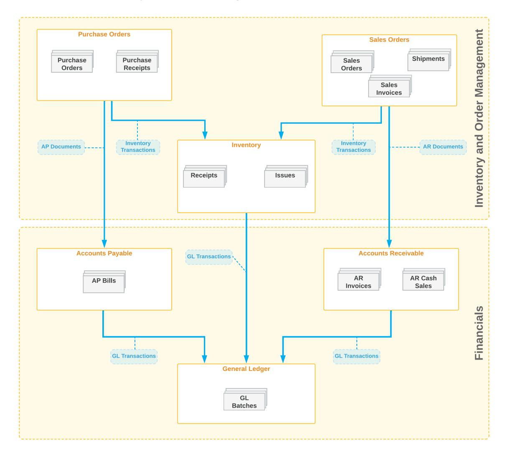

The purchase process (shown in the diagram above) consists of the following steps:

- 1. A user creates a purchase order. A purchase order itself does not produce general ledger transactions.
- 2. A user creates a purchase receipt for a purchase order to record the receipt of items to inventory. On release of a purchase receipt, an inventory receipt is created to increase the item quantity in the inventory.

- 3. On release of the purchase receipt, an AP bill is created to adjust the vendor's balance in the system.
- 4. On release of the inventory receipt and AP bill, the batches of transactions are generated and posted to the general ledger to update the account balances.

The sales process (shown in the diagram above) consists of the following steps:

- 1. A user creates a sales order. A sales order itself does not produce general ledger transactions.
- 2. A user creates a shipment document to record the shipping of the items to the customer.
- 3. A user creates a sales invoice to adjust the customer's balance in the system. On release of the sales invoice, an inventory issue is created to decrease the item quantity in the inventory.
- 4. On release of the inventory issue and sales invoice, the batches of transactions are generated and posted to the general ledger to update the account balances.

# <span id="page-14-2"></span><span id="page-14-0"></span>**Configuring Carriers, Packaging, and Freight**

With Acumatica ERP, your company can configure integration with nationwide carriers for up-to-date rates, automatic freight calculation, and customer notifications about shipments. With the integration configured, you can print carrier labels to put on packages, so that customers can track their packages.

Acumatica ERP provides options that give your company the ability to configure and use the automatic packaging functionality for the sales orders and shipments to be shipped, either via carriers with which integration is established or via other carriers whose delivery services your company uses. You can set up Acumatica ERP to calculate a set of boxes for each sales order and shipment and calculate the freight.

# <span id="page-14-3"></span><span id="page-14-1"></span>**Integration with Carriers**

Large carriers operating over a broad geographical area—such as FedEx, Stamps.com, UPS, EasyPost, and Pacejet —provide shipping solutions to clients with whom they have service agreements. A user can access the carrier's system, enter package details, get actual rates, print authorized labels for shipments, and track the delivery of shipments. If you configure integration with the carrier, your users do not need to enter the same information into both Acumatica ERP and the carrier's system.

The functionality of integrating with carriers is available only if the *Shipping Carrier Integration* feature is enabled on the *[Enable/Disable Features](https://help-2025r1.acumatica.com/Help?ScreenId=ShowWiki&pageid=c1555e43-1bc5-4f6f-ba9d-b323f94d8a6b)* (CS100000) form.

#### **Carrier-Specific Plug-ins and Their Parameters**

Before you configure integration with a carrier, your company should have an account with the carrier and a signed service agreement. For each of the plug-ins, you specify parameters that are specific to the carrier, including the account number and password for authorization with the carrier's system. Such services as *FedEx SmartPost* and *UPS SurePost* require additional service contracts to be signed with the respective carriers. These services employ the USPS for final delivery of low-weight packages to customers in the residential areas.

To configure integration with a carrier, you use the *[Carriers](https://help-2025r1.acumatica.com/Help?ScreenId=ShowWiki&pageid=753b8913-fc66-4831-b70e-98c4dafc160e)* (CS207700) form. On this form, you specify a name to be used for this carrier in your system, select the appropriate plug-in, and enter the values for the parameters, which are specific to the plug-in you have selected. Some parameters are used for authentication with the carrier's system, while others are used to print carrier labels. All plug-ins include a parameter that can be used if recipient's signature is required to confirm shipments.

Acumatica ERP provides the following plug-ins for integration with nationwide and worldwide carriers through the carriers' APIs:

- PX.ShipEngineCarrier.ShipEngineCarrier: For use with the ShipEngine service
- PX.UpsRestCarrier.UpsRestCarrier: For use with UPS via the OATH 2.0 authorization method of the REST API

This plug-in does not support international shipments.

• PX.FedExRestCarrier.FedExRestCarrier: For use with FedEx via REST API

This plug-in does not support international shipments.

- PX.StampsCarrier.StampsCarrier: For use with USPS
- PX.EasyPostCarrier.EasyPostCarrier: For use with EasyPost
- PX.PacejetCarrier.PacejetCarrier: For use with Pacejet


Plug-ins for other carriers can be developed on request.

For more information, see *To Set Up [Integration](#page-25-1) with FedEx REST*, *To Set Up [Integration](#page-28-1) with UPS REST*, *To [Set](#page-34-1) Up [Integration with USPS via Stamps.com](#page-34-1)*, and *To Set Up Integration with [ShipEngine](#page-32-1)*.

#### **Ship via Codes Based on Carrier Service Methods**

Generally, carriers provide multiple service methods. Each service method has its own rates and time frame for delivery. In Acumatica ERP, for each service method of the integrated carrier to be used by your company, you can define a ship via code by using the *[Ship via Codes](https://help-2025r1.acumatica.com/Help?ScreenId=ShowWiki&pageid=ba3b1fc4-3656-4ed9-b5a9-21377637841a)* (CS207500) form. Then, when a user creates a sales order, the user can easily select the appropriate carrier and its service method by specifying the appropriate ship via code.

You also can specify for each ship via code whether shipment confirmation for each box is required and whether at least one package (box) is required to confirm a shipment. For details, see *To [Create](#page-38-1) Ship via Codes for the [Integrated Carrier](#page-38-1)*.

#### **Use of Customer Accounts with Carriers**

You can set up billing of the customers, rather than your company, for shipping if the customers provide information about their accounts with the carrier. On the **Customer Accounts** tab of the *[Carriers](https://help-2025r1.acumatica.com/Help?ScreenId=ShowWiki&pageid=753b8913-fc66-4831-b70e-98c4dafc160e)* (CS207700) form, create a list of customers with their locations and their accounts with the integrated carrier. Only customers with the **Active** check box selected on the *[Customers](https://help-2025r1.acumatica.com/Help?ScreenId=ShowWiki&pageid=652929bc-9606-4056-aa6e-0c2d1147171b)* (AR303000) form can be billed by the carrier. For each customer, you can view the list of customer accounts with carriers on the **DeliverySettings** tab of the *[Customers](https://help-2025r1.acumatica.com/Help?ScreenId=ShowWiki&pageid=652929bc-9606-4056-aa6e-0c2d1147171b)* form.

#### **Automatic Packaging**

For effective integration with carriers, you can configure the system to automatically suggest packaging options for sales orders and then for shipments based on item quantities, weights, or volumes. To use this functionality, you need to enable the *Automatic Packaging* feature on the *[Enable/Disable Features](https://help-2025r1.acumatica.com/Help?ScreenId=ShowWiki&pageid=c1555e43-1bc5-4f6f-ba9d-b323f94d8a6b)* (CS100000) form.

For more information, see *[Automatic Packaging for Integrated Carriers](#page-16-1)*.

#### **Freight Calculation**

Once integration with carriers is configured, the system will be able to automatically evaluate freight cost on shipping the sales orders via integrated carriers. On the**Shipping** tab of the *[Sales Orders](https://help-2025r1.acumatica.com/Help?ScreenId=ShowWiki&pageid=19e4021c-1b84-49fd-be12-0320c5f1c7e5)* (SO301000) form, for each sales order, you can click the**Shop for Rates** button to view the estimated freight costs for the specified packages if they are sent by different methods of the selected carrier available for this particular shipment. You can then select the most appropriate ship via code for this shipment.

The freight that a system calculates for a sales order is approximate. The full freight amount you charge your customers may include not only the freight cost, but also insurance, handling, packaging, and premium freight amounts defined by your shipping terms, which is received from the carrier when a shipment for the sales order is being processed. Thus, the final freight charges calculated for the shipment may differ from those calculated for the sales order.

For details on defining and calculating freight, see *[Freight Calculation](#page-44-2)*.

#### **Related Links**

- *[Ship via Codes](https://help-2025r1.acumatica.com/Help?ScreenId=ShowWiki&pageid=ba3b1fc4-3656-4ed9-b5a9-21377637841a)*
- *[Boxes](https://help-2025r1.acumatica.com/Help?ScreenId=ShowWiki&pageid=ff38094d-bc30-4cf1-9008-0f1070ada514)*
- *[Carriers](https://help-2025r1.acumatica.com/Help?ScreenId=ShowWiki&pageid=753b8913-fc66-4831-b70e-98c4dafc160e)*
- *[FOB Points](https://help-2025r1.acumatica.com/Help?ScreenId=ShowWiki&pageid=71035b67-3810-426b-83ac-f18841b3a6cf)*
- *[Shipments](https://help-2025r1.acumatica.com/Help?ScreenId=ShowWiki&pageid=f47cffcc-543e-469c-a204-a9c1e3da346d)*
- *[Carrier Labels](https://help-2025r1.acumatica.com/Help?ScreenId=ShowWiki&pageid=259f07b3-f75d-414e-8695-540f4fd2112e)*

# <span id="page-16-1"></span><span id="page-16-0"></span>**Automatic Packaging for Integrated Carriers**

To automate the processing of sales orders, you can configure the system to automatically determine the optimal set of boxes for sales orders and for shipments to be sent via the integrated carriers. For detailed instructions on configuring integration with the carriers, refer to *[Configuring Carriers, Packaging, and Freight](#page-14-2)*.

To be able to use the automatic packaging functionality, make sure the *Automatic Packaging* feature is enabled on *[Enable/Disable Features](https://help-2025r1.acumatica.com/Help?ScreenId=ShowWiki&pageid=c1555e43-1bc5-4f6f-ba9d-b323f94d8a6b)* (CS100000) form. If this feature is disabled, you will need to select the boxes and specify the weights and volumes of the resulting packages for each order and shipment manually.

The configuration of automatic packaging is described in detail in *To Configure Automatic [Packaging](#page-41-1)*.

#### **Package Calculation for a Sales Order**

Once the automatic packaging functionality has been configured, you can use it when you prepare a sales order for shipping or create a consolidated shipment.

Because the calculation of packages is resource-intensive, the system calculates packages only when the user requests this calculation. As you are preparing a sales order on the *[Sales Orders](https://help-2025r1.acumatica.com/Help?ScreenId=ShowWiki&pageid=19e4021c-1b84-49fd-be12-0320c5f1c7e5)* (SO301000) form and adding items, the system calculates the weight and volume of the sales order. Once you specify the shipping information on the **Shipping** tab—including the ship via code of the integrated carrier, the shipping terms, and the shipping zone—and save the order, the system determines the set of boxes and the weight and volume of each package.

The system uses an heuristic algorithm (one that is not guarantee to find the best set of boxes, but quickly finds a satisfactory set for these purposes) and the following information to make suggestions about the boxes required for the order:

- The lists of boxes assigned to each ship via code, with the maximum weight and volume each box can hold and the weight of the box (which must include the weight of any packaging material)
- For each stock item in the order, the quantity in base units, the weight and volume of the base unit of the item, and the option instructing the system how to pack this item

To view carrier charges, you can click the**Shop for Rates** button on the**Shipping** tab. When you click**Shop for Rates**, the system performs the following actions:

- 1. Sends the information about the calculated packages (box ID, weight, volume, linear dimensions, declared value, and COD) to the carrier system
- 2. Requests rates from the carriers and calculates carrier charges for the order for each ship via code associated with the carrier

Based on the system's suggestions, you can select the ship via code with lowest cost for the order.

In some cases, you may need to edit the packages manually. If you select the **Manual Packaging** check box, you can adjust information about the boxes and their contents to match the quantities and weights of actual packages. For more information, see *[Manual Packaging of Items](#page-43-1)*. If you have specified the declared values or changed the COD settings for any packages of the order, selecting the **Manual Packaging** option will prevent the system from automatically recalculating these packages and thus resetting the specified values.

#### **Package Calculation for Consolidated Shipments**

When you initiate a shipment creation for the order, the system recalculates the packages and the carrier charges based on the selected ship via code because there may be insufficient quantities of items listed in the order. Information about particular boxes used for the shipment becomes available for reviewing on the **Packages** tab. Packages will not be recalculated if the **Manual Packaging** option has been selected for the order.

You can create shipments for multiple orders by using the *[Process Orders](https://help-2025r1.acumatica.com/Help?ScreenId=ShowWiki&pageid=c06a334c-f39d-4eff-9d80-b167657dff73)* (SO501000) form. If multiple orders are consolidated in one shipment, you can recalculate the packages initially determined for sales orders by clicking the **Refresh Packages** button on the table toolbar on the **Packages** tab of the *[Shipments](https://help-2025r1.acumatica.com/Help?ScreenId=ShowWiki&pageid=f47cffcc-543e-469c-a204-a9c1e3da346d)* (SO302000) form. Once the set of boxes is determined for the consolidated shipment, you can review and edit this list if needed on the **Packages** tab. You can manually specify the declared values and COD amounts for packages if needed.

#### **Related Links**

- *[Freight Calculation](#page-44-2)*
- *[Sales Orders](https://help-2025r1.acumatica.com/Help?ScreenId=ShowWiki&pageid=19e4021c-1b84-49fd-be12-0320c5f1c7e5)*
- *[Shipments](https://help-2025r1.acumatica.com/Help?ScreenId=ShowWiki&pageid=f47cffcc-543e-469c-a204-a9c1e3da346d)*

# <span id="page-17-0"></span>**Carrier Labels and Tracking Numbers**

With integration between Acumatica ERP and carriers, you can initiate printing carrier labels for particular packages (boxes) by using the *[Shipments](https://help-2025r1.acumatica.com/Help?ScreenId=ShowWiki&pageid=f47cffcc-543e-469c-a204-a9c1e3da346d)* (SO302000) form. If RMA orders are used in your system, you can also print carrier labels for RMA orders. Labels are generated by the carrier services and are received (through the integration between the carrier and Acumatica ERP) as images ready for printing. In Acumatica ERP, labels are printed by using the *[Carrier Labels](https://help-2025r1.acumatica.com/Help?ScreenId=ShowWiki&pageid=259f07b3-f75d-414e-8695-540f4fd2112e)* (SO645000) report.


Any information you type in the **Custom Ref. Number 1** and **Custom Ref. Number 2** columns on the **Packages** tab of the *[Shipments](https://help-2025r1.acumatica.com/Help?ScreenId=ShowWiki&pageid=f47cffcc-543e-469c-a204-a9c1e3da346d)* form will be printed on the labels.

#### **Process of Generating Tracking Numbers and Labels**

The general process of generating tracking numbers and labels is the following:

- 1. A user confirms a shipment in Acumatica ERP.
- 2. The carrier's service generates a tracking number and a label for each package of a shipment and sends this information to Acumatica ERP.

Users can view the generated tracking numbers in the**Tracking Number** column on the **Packages** tab of the *[Shipments](https://help-2025r1.acumatica.com/Help?ScreenId=ShowWiki&pageid=f47cffcc-543e-469c-a204-a9c1e3da346d)* form. Labels can be found in the **Files** column of each shipment line.

3. A user initiates printing labels in Acumatica ERP by using the *[Shipments](https://help-2025r1.acumatica.com/Help?ScreenId=ShowWiki&pageid=f47cffcc-543e-469c-a204-a9c1e3da346d)* form, as described in *To [Print](#page-20-0) a [Label](#page-20-0)*.

#### **Configuration of Label Printing**

To configure the printing of carrier labels, you do the following:

- 1. Register file extensions for labels as described in *To Register the Label File [Extension](#page-18-0)*.
- 2. Configure printing in one of the following ways:
  - If you use DeviceHub, configure printing as described in *Printers: To Add a Printer to [DeviceHub](https://help-2025r1.acumatica.com/Help?ScreenId=ShowWiki&pageid=e647fab3-b7cc-437b-a063-5eaaf271bb96)*.

In addition, if a carrier you work with uses labels of specific size, you can configure the system so that it uses a particular printer for printing the labels of this carrier. These settings are specified on the *[User](https://help-2025r1.acumatica.com/Help?ScreenId=ShowWiki&pageid=8430c8b2-a79c-4f7b-9768-b0b7fad23a59) [Profile](https://help-2025r1.acumatica.com/Help?ScreenId=ShowWiki&pageid=8430c8b2-a79c-4f7b-9768-b0b7fad23a59)* (SM203010) form. For more information, see *[Printers: Specification of Default Printers](https://help-2025r1.acumatica.com/Help?ScreenId=ShowWiki&pageid=db0abec8-d37a-4673-a04e-6284590d16f1)*.

• If you do not use DeviceHub, you configure printing as described in *To Set Up the [Printing](#page-18-1) of Carrier Labels [on a Thermal Printer](#page-18-1)*.

# <span id="page-18-0"></span>**To Register the Label File Extension**

To be able to print carrier labels, you need to register each file extension on the *[File Upload Preferences](https://help-2025r1.acumatica.com/Help?ScreenId=ShowWiki&pageid=83ab66ec-f00e-4487-bbe7-969734a99693)* (SM202550) form.

#### **To Register the File Extension**

- 1. Open the *[File Upload Preferences](https://help-2025r1.acumatica.com/Help?ScreenId=ShowWiki&pageid=83ab66ec-f00e-4487-bbe7-969734a99693)* (SM202550) form.
- 2. Add a new row.
- 3. In the **File Extension** column, type the file extension (for example, .dpl).
- 4. Make sure the **Forbidden** check box is cleared.
- 5. In the **Image** column, select the check box.
- 6. In the **Default Application** column, type a string such as image/dpl to match the specified format.
- 7. Save the changes.

#### **Notes About the Procedure**

The notes in this section describe the nuances of the UI elements available on the form, such as when an element is required and when it is not, and when the system fills in settings by default. This section can include other notes.

Note the following about this procedure:

- The list of allowed file extensions includes .tiff, .png, .zplii, .dpl, and .epl2 by default. You may need to register one of these file extensions only if it had been deleted.
- Before registering the file extensions, make sure that the format supported by your printer is selected for the appropriate carrier plug-in on the **Parameters** tab of the *[Carriers](https://help-2025r1.acumatica.com/Help?ScreenId=ShowWiki&pageid=753b8913-fc66-4831-b70e-98c4dafc160e)* (CS207700) form.

#### **Related Links**

- *To Print a [Label](#page-20-0)*
- *To Set Up the Printing of Carrier Labels on a [Thermal](#page-18-1) Printer*

# <span id="page-18-1"></span>**To Set Up the Printing of Carrier Labels on a Thermal Printer**

For thermal printers, the carriers usually provide labels in EPL or ZPL formats.

You can create a batch file for the operating system so that the system sends the label file to the thermal printer once you double-click the label file. To create the batch file, follow the steps in the following sections.

#### **To Share a Printer**

Connect the printer to a local network computer by using a USB cable, and turn the printer on. To share the printer on the network, do the following:

- For Windows 11:
  - a. Click the **Start** button, and open**Settings**.
  - b. On the le side, click **Network & internet**.
  - c. On the right side, click **Advanced network settings**.

- d. Click **Advanced sharing settings > Private networks**.
- e. Under **Private networks**, turn on **Network discovery** and **File and printer sharing**.
- f. Click **Bluetooth and Devices > Printers & scanners**.
- g. Select the printer to share.
- h. Click **Printer Properties**.
- j. On the **Sharing** tab of the dialog box, do the following:
  - a. Select the**Share this printer** check box.
  - b. In the **Share name** box, specify the shared printer name and write down the name (or copy it to the clipboard).
  - c. Click **OK** to close the dialog box.
- For Windows 10:
  - a. Click the **Start** button, then click**Settings > Devices > Printers & scanners**.
  - b. In the list of the devices, click the thermal printer, and then click **Manage**.
  - c. On the le of the window that opens, click **Printer Properties**.
  - d. On the **Sharing** tab of the dialog box, do the following:
    - a. Select the**Share this printer** check box.
    - b. In the **Share name** box, specify the shared printer name and write down the name (or copy it to the clipboard).
    - c. Click **OK** to close the dialog box.

#### **To Prepare a Batch File for Label Printing**

On the computer to which the printer is connected, create the batch file PrintLabels.bat that will handle the printing. (You can change the suggested batch name if needed.)

If you will use a USB printer, create the file as follows:

1. Open Notepad, and type the following text:

```
Net use LPT2: \\%ComputerName%\SharedPrinterName
Copy %1 LPT2
Net use LPT2: /Delete
```

- 2. Replace SharedPrinterName with the shared printer's actual name that you wrote down or copied earlier. Do not change %ComputerName%; the system will replace it automatically with your computer name.
- 3. Save the file as PrintLabels.bat to the appropriate location. Make sure that you select *All Files* for the **Save asType** action.

If you will use a network printer, take these steps:

1. In Notepad, type the following text:

print /d:\\ServerName\PrinterName %1

- 2. Replace ServerName with the name of your network server.
- 3. Replace PrinterName with the name of your network thermal printer.
- 4. Save the file as PrintLabels.bat to the appropriate location. Make sure that you select *All Files* for the **Save asType** action.

#### **To Associate the File Extension with the Created Batch File**

You can associate the file extension with the created batch file as follows:

- For Windows 11:
  - a. Double-click a label file.
  - b. In the **Select an app to open this file** dialog box, click **Choose an app**.
  - c. Select the PrintLabels.bat file that you have created in the previous step.
  - d. Click **Always**.
- For Windows 10:
  - a. Double-click a label file.
  - b. In the **How do you want to open this file** dialog box, click **More apps**.
  - c. Click **Look for another app on this PC**.
  - d. Select the PrintLabels.bat file that you have created in the previous step.
  - e. Make sure that the **Always** check box is selected.
  - f. Click **OK**.

Connect the printer and load the label stock.

#### **Related Links**

- *To Print a [Label](#page-20-0)*
- *To Register the Label File [Extension](#page-18-0)*

# <span id="page-20-0"></span>**To Print a Label**

If you need to print labels for the stock items in a particular shipment, you can do this from the *[Shipments](https://help-2025r1.acumatica.com/Help?ScreenId=ShowWiki&pageid=f47cffcc-543e-469c-a204-a9c1e3da346d)* (SO302000) form, as described in the instructions below.

#### **To Print a Label**

- 1. Open the *[Shipments](https://help-2025r1.acumatica.com/Help?ScreenId=ShowWiki&pageid=f47cffcc-543e-469c-a204-a9c1e3da346d)* (SO302000) form.
- 2. In the **Shipment Nbr.** box, select the reference number of the needed shipment.
- 3. Confirm the shipment if it has not been confirmed.
- 4. On the More menu (under **Labels**), click **Print Labels**.
- 5. On the *[Carrier Labels](https://help-2025r1.acumatica.com/Help?ScreenId=ShowWiki&pageid=259f07b3-f75d-414e-8695-540f4fd2112e)* (SO645000) report, which opens, review the generated label.
- 6. On the form toolbar, click **Print** to print the label.

#### **Related Links**

- *To Set Up the Printing of Carrier Labels on a [Thermal](#page-18-1) Printer*
- *To Register the Label File [Extension](#page-18-0)*

# <span id="page-21-0"></span>**Integration with Carriers: Pacejet Implementation Checklist**

Before you configure integration with the Pacejet carrier service, your organization should have an account with the carrier and a signed license agreement. The settings for the plug-in are specified in accordance with the information available in the agreement and the settings of your Pacejet account.

The following sections provide details you can use to ensure that the system is configured properly for processing shipments with the Pacejet carrier service, and to understand (and change, if needed) the settings that affect the processing workflow.

### **Implementation Checklist**

We recommend that before you initially process shipments with the Pacejet carrier service, you make sure the needed features have been enabled, settings have been specified, and entities have been created, as summarized in the following checklist.

| Form                                                                               | Criteria to Check                                                                                                                                                                  |
|------------------------------------------------------------------------------------|------------------------------------------------------------------------------------------------------------------------------------------------------------------------------------|
| Enable/Disable Features (CS100000) form                                            | Make sure that the Inventory and Pacejet features are<br>enabled.                                                                                                                  |
| Units of Measure (CS203500) form                                                   | Make sure that units of measure that will be used for<br>measuring the dimensions and weight of shipments<br>delivered by the Pacejet carrier service are configured.              |
| Companies (CS101500) form                                                          | Make sure that the linear and weight UOM have been<br>specified for the company in the Weight UOM and Lin<br>ear UOM boxes.                                                        |
| Boxes (CS207600)                                                                   | Make sure that the boxes that you are going to use for<br>packaging in shipments with the Pacejet carrier ser<br>vice have a value specified in the Carrier's Package<br>column.   |
| Sales Orders Preferences (SO101000) form, Inventory<br>Preferences (IN101000) form | Make sure that all necessary settings related to sales<br>orders and inventory have been specified, as de<br>scribed in Configuration of Order Management: General<br>Information. |
| Order Types (SO201000) form                                                        | Make sure that the SO order types are active and have<br>been configured, as described in Sales Order Types: To<br>Activate the SO Order TypeImplementation Activity.              |
| Customers (AR303000) form                                                          | Make sure that all needed customers have been de<br>fined in the system, as described in Customers: Imple<br>mentation Activity .                                                  |
| Stock Items (IN202500) form                                                        | Make sure that all stock items have been defined in the<br>system, as described in Stock Items: Implementation Ac<br>tivity.                                                       |

| Form                          | Criteria to Check                                                                                                                                                      |
|-------------------------------|------------------------------------------------------------------------------------------------------------------------------------------------------------------------|
| Carriers (CS207700) form      | Make sure that a carrier with the PX.PacejetCarri<br>er.PacejetCarrier plug-in has been configured in the<br>system.                                                   |
| Ship via Codes (CS20750) form | Make sure that a Ship Via code for each service method<br>of the carrier service that you are going to use to deliv<br>er shipments has been configured in the system. |

#### **Other Settings That Affect the Workflow**

You can affect the processing of shipments delivered the Pacejet carrier service by specifying additional settings as follows:

- To make the system automatically send the ID of the workstation used to print shipping documents to Pacejet, specify this ID in the **Pacejet Workstation ID** box on the **PersonalSettings** tab of the *[Users](https://help-2025r1.acumatica.com/Help?ScreenId=ShowWiki&pageid=834cc181-97fa-4db4-a7e0-3eaba142c166)* (SM201010) form or in the **PersonalSettings** section on the *[User Profile](https://help-2025r1.acumatica.com/Help?ScreenId=ShowWiki&pageid=8430c8b2-a79c-4f7b-9768-b0b7fad23a59)* (SM203010) forms.
- To map Acumatica ERP shipping terms to the Pacejet freight terms, select an option in the **Pacejet Freight Terms** on the *[Shipping](https://help-2025r1.acumatica.com/Help?ScreenId=ShowWiki&pageid=705d3726-b8f8-4c96-8562-1b475d2fb653) Terms* (CS208000) form.

# <span id="page-22-0"></span>**To Set Up Integration with EasyPost**

EasyPost is a shipping API carrier service that incorporates multiple carriers in one place. Before configuring the integration with EasyPost, your organization must have an account with the carrier service and a signed service agreement. Aerward, you must obtain the production and test API keys, which are required for the configuration of the integration in Acumatica ERP. For details on API keys, refer to the *[Authentication and Key Management](https://docs.easypost.com/docs/authentication)* in the documentation of the carrier service.

To configure integration between Acumatica ERP and EasyPost, you use the *[Carriers](https://help-2025r1.acumatica.com/Help?ScreenId=ShowWiki&pageid=753b8913-fc66-4831-b70e-98c4dafc160e)* (CS207700) form. On this form, you specify a name to be used for this carrier in your system. Then you select the *PX.EasyPostCarrier.EasyPostCarrier* plug-in developed for this integration and enter the values for the plug-in parameters. Some parameters are used for authentication with the carrier's system, while others are used for configuring shipping settings.

Some EasyPost carriers available in Acumatica ERP support only domestic shipping. Other carriers support both domestic and international shipping. For an international shipment, the carrier service can generate a commercial invoice and attache it to the shipment in Acumatica ERP. A commercial invoice is a document that facilitates the customs clearance of international shipments. You need to perform the initial configuration of the commercial invoice at the carrier service. In the parameters of an EasyPost carrier in the system, you can modify additional settings of the commercial invoice for specific carriers. For more information about the commercial invoices at EasyPost, refer to the *[Commercial Invoice Guide](https://docs.easypost.com/guides/commercial-invoice-guide)*.

When you create an EasyPost carrier, the system fetches the list of available service methods for this carrier. When you create a ship-via code for this carrier on the *[Ship via Codes](https://help-2025r1.acumatica.com/Help?ScreenId=ShowWiki&pageid=ba3b1fc4-3656-4ed9-b5a9-21377637841a)* (CS207500) form, you select one of these service methods. The list does not update automatically once you create a ship-via code. To obtain the latest list of service methods for your account with the carrier service, you must recreate the carrier on the *[Carriers](https://help-2025r1.acumatica.com/Help?ScreenId=ShowWiki&pageid=753b8913-fc66-4831-b70e-98c4dafc160e)* (CS207700) form.

#### **To Set Up Integration with EasyPost**

- 1. Open the *[Carriers](https://help-2025r1.acumatica.com/Help?ScreenId=ShowWiki&pageid=753b8913-fc66-4831-b70e-98c4dafc160e)* (CS207700) form and add a new record.
- 2. In the **Carrier ID** box, type an easy-to-remember name for the carrier to be integrated.
- 3. Provide a description for this carrier.

- 4. In the **Plug-in (Type)** box, select *PX.EasyPostCarrier.EasyPostCarrier*.
- 5. Select the **Active** check box.
- 6. In the **Carrier Units** box, select the measuring system used by the carrier: *SI Units (Kilogram/Centimeter)* or *US Units (Pound/Inch)*. Based on the selected option, one of the following pairs of boxes is shown on the form: **Kilogram** and **Centimeter**, or **Pound** and **Inch**.
- 7. In the **Kilogram** and **Centimeter** boxes (or in the **Pound** and **Inch** boxes, depending on the measuring system selected for the carrier), select the units of measure defined in the system that correspond to the weight and linear units of measure used by the carrier.

If you select a UOM other than the default weight or linear UOM, which is specified in the **Weight UOM** box or **Linear UOM** box on the *[Companies](https://help-2025r1.acumatica.com/Help?ScreenId=ShowWiki&pageid=fedad435-8496-4397-b8a3-50a473629f76)* (CS101500) form, use the *[Units of](https://help-2025r1.acumatica.com/Help?ScreenId=ShowWiki&pageid=c25c9971-01e2-4021-aa3b-8809f8045e58) [Measure](https://help-2025r1.acumatica.com/Help?ScreenId=ShowWiki&pageid=c25c9971-01e2-4021-aa3b-8809f8045e58)* (CS203500) form to specify the conversion from the default weight or linear UOM of the company to the unit you have selected as the equivalent to the UOM used by the carrier.

- 8. In the **Warehouse** box, specify a particular warehouse for which the carrier's rates are applicable, or leave the box empty if the carrier's rates are applicable for all warehouses.
- 9. On the **Plug-in Parameters** tab, do the following:
  - For the **EASYPOST PRODUCTION API KEY** parameter, specify the production key of your EasyPost account if you need access to the production environment of the carrier service.
  - For the **EASYPOSTTEST API KEY** parameter, specify the test key of your EasyPost account if you need access to test mode of the carrier service.
  - For the **USETEST KEY** parameter, select the check box if you want to use test mode at the carrier service. In test mode, the carrier service generates sample labels without real value. You will not be charged for those labels.
  - For the **EASYPOST CARRIER** parameter, specify the ID of the carrier that you are going to use at the carrier service.
  - For the **LOG TRACE** parameter, select the check box if you want the system to record the requests and results of the web calls in the trace log.
  - For the**SHIPPER FROM** parameter, select the source of information about the shipper's contact information from one of the following options:
    - *Company Branch*: The system takes the shipper's contact information from the branch.
    - *Warehouse*: The system takes the shipper's contact information from the warehouse.
  - For the **CONFIRMATION** parameter, select the delivery confirmation type from one of the following options:
    - *None* (default): No confirmation is requested.
    - *No Signature*: The carrier requests the delivery confirmation without a signature.
    - *Signature*: A non-authorized signature (from someone at the delivery address) is required for the shipment to be delivered.
    - *Adult Signature*: Delivery requires a signature of the addressee only, who must be 21 years of age or older.
  - For the **INSURANCE** parameter, select the source of the insurance from one of the following options:
    - *Carrier*: You buy the insurance from the carrier.
    - *EasyPost*: You buy the insurance from the EasyPost carrier service.
  - For the **LABEL FORMAT**parameter, select the format of the shipping labels provided by the carrier service (*PDF*, *PNG*, *ZPL*, or *EPL2*).
  - For the **LABELSIZE** parameter, select the size of the shipping label provided by the carrier service.
  - For the **INTERNATIONAL NON DELIVERY** parameter, select the action performed by the carrier of the outbound shipment that cannot be delivered. You can select one of the following options:

- *Return*: The carrier makes an attempt to return the package to the shipper (who may be subject to return shipping fees in this case).
- *Abandon*: The carrier does not return the package to the shipper.
- For the**TERMS OF SALE** parameter, select the terms of sale. These terms define the responsibilities for paying for and managing the shipment, insurance, documentation, customs clearance, and other logistical activities. You can select one of the following options:
  - *CFR - Cost and Freight*
  - *CIP - Carriage and Insurance Paid To*
  - *CPT - Carriage Paid To*
  - *DAP - Delivered at Place*
  - *DAT - Delivered at Terminal*
  - *DDP - Delivered Duty Paid*
  - *DDU - Delivered Duty Un-Paid*
  - *EXW - Ex Works*
  - *FACE - Free Carrier*
  - *FAS - Free Alongside Ship*
  - *FOB - Free on Board*
- For the **USESHIPPER ID** parameter, select this check box if you need the system to send a tax registration ID to the EasyPost carrier service. The carrier service inserts this ID into the commercial invoice, which it generated for international shipments.
- For the **LETTERHEAD** parameter, select one of the options of the letterhead of the commercial invoice provided by the carrier service for the FedEx international shipments.
- For the**SIGNATURE** parameter, select one of the signatures for the commercial invoice provided by the carrier service for the FedEx international shipments.
- For the **FULFILLER ORDER ID FIELD** parameter, select a sales order field that the carrier service will add to the fulfillment order of the Amazon Marketplace Web Service.
- For the **FULFILLED ORDER ITEMID FIELD** parameter, select a data field of a column on the **Details** tab of the *[Sales Orders](https://help-2025r1.acumatica.com/Help?ScreenId=ShowWiki&pageid=19e4021c-1b84-49fd-be12-0320c5f1c7e5)* (SO301000) form. The carrier service will add value of this column to the fulfillment order of the Amazon Marketplace Web Service.
- For the **ENDORSEMENTSERVICE** parameter, select one of the available endorsement services for failed deliveries at the carrier service. You can select one of the following options:
  - *No Endorsement Service*
  - *Address Service Required*
  - *Forwarding Service Required*
  - *Change Service Required*
  - *Return Service Required*
  - *Leave if no Response*
- For the**SCANFORM TIMEOUT**parameter, specify the timeout for the manifest generation for the DHL carrier at the EasyPost carrier service.
- For the **NUMBER OFSHIPMENTS PER BATCH** parameter, specify the maximum number of shipments that can be displayed simultaneously on the *[Create Manifest](https://help-2025r1.acumatica.com/Help?ScreenId=ShowWiki&pageid=1ea752d1-29e5-4fe9-85c4-87e9c3048058)* (SO506000) form. This parameter applies only to the DHL carrier at the EasyPost carrier service.
- For the **INCLUDE FREIGHT PRICE** parameter, select the check box if you want to include the freight price in the commercial invoice for international shipments via EasyPost UPS and USPS.
- On the **Customer Accounts** tab, add all customers that have accounts with the carrier and should be billed for the shipments they receive via this carrier. For each customer you add, do the following:
  - Make sure the **Active** check box is selected.
  - In the **Customer ID** column, select the customer by its ID.

- In the **Customer Location** column, select the customer location to receive shipments via the carrier.
- In the **BillingType** column, select the party, which is responsible for paying shipping costs
- In the **Carrier Billing Account** column, enter the billing account of the customer or third-party company in the system of the carrier.
- If you have selected *Third-Party* in the **BillingType** column, in the **Billing Country** column, specify the country ID of the carrier's billing account.
- If you have selected *Third-Party* in the **BillingType** column, in the **Billing Country** column, specify the postal code of the carrier's billing account.
- Click **Save** on the form toolbar.

# <span id="page-25-1"></span><span id="page-25-0"></span>**To Set Up Integration with FedEx REST**

Before you configure integration with FedEx, your organization should have an account with the carrier and a signed service agreement. The SmartPost service requires an additional service contract signed with FedEx. The settings for the plug-in are specified in accordance with the information available in the agreement.

FedEx provides the ability to use their services via FedEx REST API. To configure integration between Acumatica ERP and FedEx, you use the *[Carriers](https://help-2025r1.acumatica.com/Help?ScreenId=ShowWiki&pageid=753b8913-fc66-4831-b70e-98c4dafc160e)* (CS207700) form. On this form, specify a name to be used for this carrier in your system, select the *PX.FedExRestCarrier.FedExRestCarrier* plug-in developed for this integration, and enter the values for the plug-in parameters. Some parameters are used for authentication with the carrier's system, while others are used for printing carrier labels or enabling recipient notifications.

The FedEx integration can only be used for processing of domestic shipments.

#### **Creation of a Project in the FedEx Developer Portal**

Before you start configuring the settings of the plug-in for FedEx in Acumatica ERP, you need to create a project in the FedEx Developer Portal. The project provides the API key and client secret that are required for the configuration of the plug-in.

Please note that the following section describes settings in a third-party product. The user interface of the third-party product is subject to change. We disclaim any responsibility for inaccuracies resulting from such changes.

To create a project in the FedEx Developer Portal, do the following:

- Sign in to the *[FedEx Developer Portal](https://developer.fedex.com/)* using your username and password.
- In the le pane, click **My Projects**.
- In the right pane, click **Create a Project.**
- In the **Tell us about your API needs** dialog box, select an appropriate option in the **I work for a company that** box and click **Next**.
- On the **Step 1 -Select API(s)** page, select an appropriate API for your project.
- In the list of available APIs, select the required APIs and click **Next**.
- On the **Step 2 - Configure project** page, specify appropriate settings for your project and click **Next**.
- On the **Step 3 - Confirm details** page, select the check boxes in the **AcceptTerms** section and click **Create**.
- In the confirmation box, click **Okay**.
- On the **Production Key** tab, select your shipping account in the **Account number** box and click **Next**.

The system generates an API key and client secret that you can use to set up the FedEx plug-in in Acumatica ERP.

#### **To Set Up Integration with FedEx**

- 1. Open the *[Carriers](https://help-2025r1.acumatica.com/Help?ScreenId=ShowWiki&pageid=753b8913-fc66-4831-b70e-98c4dafc160e)* (CS207700) form and add a new record.
- 2. In the **Carrier ID** box, type an easy-to-remember name for the carrier to be integrated.
- 3. Provide a description for this carrier.
- 4. In the **Plug-in (Type)** box, select *PX.FedExRestCarrier.FedExRestCarrier*.
- 5. Select the **Active** check box.
- 6. In the **Carrier Units** box, select the measuring system used by the carrier: *SI Units (Kilogram/Centimeter)* or *US Units (Pound/Inch)*. Based on the selected option, one of the following pairs of boxes is shown on the form: **Kilogram** and **Centimeter**, or **Pound** and **Inch**.
- 7. In the **Kilogram** and **Centimeter** boxes (or in the **Pound** and **Inch** boxes, depending on the measuring system selected for the carrier), select the units of measure defined in the system that correspond to the weight and linear units of measure used by the carrier.

If you select a UOM other than the default weight or linear UOM, which is specified in the **Weight UOM** box or **Linear UOM** box on the *[Companies](https://help-2025r1.acumatica.com/Help?ScreenId=ShowWiki&pageid=fedad435-8496-4397-b8a3-50a473629f76)* (CS101500) form, use the *[Units of](https://help-2025r1.acumatica.com/Help?ScreenId=ShowWiki&pageid=c25c9971-01e2-4021-aa3b-8809f8045e58) [Measure](https://help-2025r1.acumatica.com/Help?ScreenId=ShowWiki&pageid=c25c9971-01e2-4021-aa3b-8809f8045e58)* (CS203500) form to specify the conversion from the default weight or linear UOM of the company to the unit you have selected as the equivalent to the UOM used by the carrier.

- 8. In the **Warehouse** box, specify a particular warehouse for which the carrier's rates are applicable, or leave the box empty if the carrier's rates are applicable for all warehouses.
- 9. On the **Plug-in Parameters** tab, do the following:
  - For the **ACCOUNTID** parameter, enter the ID or number of the account your organization has with the carrier.
  - For the **CLIENT ID** parameter, enter the API key that FedEx generates when you create a project in the FedEx Developer Portal.
  - For the **CLIENT SECRET**parameter, enter the client secret that FedEx generates when you create a project in the FedEx Developer Portal.
  - For the **LOGIN ENDPOINT**parameter, copy and paste one of the following URLs of the FedEx API services:
    - For production environment: *https://apis.fedex.com/oauth/token*
    - For sandbox environment: *https://apis-sandbox.fedex.com/oauth/token*
  - For the **CANCEL ENDPOINT**parameter, copy and paste one of the following URLs of the FedEx canceling service:
    - For production environment: *https://apis.fedex.com/ship/v1/shipments/cancel*
    - For sandbox environment: *https://apis-sandbox.fedex.com/ship/v1/shipments/cancel*
  - For the **RATE ENDPOINT**parameter, copy and paste one of the following URLs of the FedEx rate service:
    - For production environment: *https://apis.fedex.com/rate/v1/rates/quotes*
    - For sandbox environment: *https://apis-sandbox.fedex.com/rate/v1/rates/quotes*
  - For**SHIP ENDPOINT**parameter, copy and paste one of the following URLs of the FedEx ship service:
    - For production environment: *https://apis.fedex.com/ship/v1/shipments*
    - For sandbox environment: *https://apis-sandbox.fedex.com/ship/v1/shipments*
  - For the**SHIPPER FROM** parameter, leave the default *Company Branch* value if you want the system to get the shipper information from the company branch, or select *Warehouse* to make the system get the shipper information from the warehouse.

- For the **NOTIFY** parameter, select the check box if you want a notification to be sent to the recipient. Then on release of each shipment, the carrier's online service will generate a notification email to the email address of the contact specified for the shipment on the**Shipping** tab of the *[Shipments](https://help-2025r1.acumatica.com/Help?ScreenId=ShowWiki&pageid=f47cffcc-543e-469c-a204-a9c1e3da346d)* (SO302000) form.
- For the **LIST RATES**parameter, select the check box if you want the carrier to provide general rates that are not based on your account along with the account-specific rates.
- For the **DROPOFF** parameter, select the appropriate method to be used by FedEx to pick up the packages:
  - *CONTACT\_FEDEX\_TO\_SCHEDULE*
  - *DROP\_AT\_FEDEX\_LOCATION*
  - *USE\_SCHEDULED\_PICKUP*
  - *ON\_CALL*
  - *PACKAGE\_RETURN\_PROGRAM*
  - *REGULAR\_STOP*
- *TAG*
- For the **LBL FORMAT**parameter, select the format of the shipping labels provided by the carrier service (*DOC*, *EPL2*, *PDF*, *PNG*, *RTF*, *TEXT*, or *ZPLII*).
- For the **LBLSTOCK TYPE** parameter, select the stock type of the labels to be used.
- For the **LBL PRINT ORT**parameter, select one of the available options:
  - *BOTTOM\_EDGE\_OF\_TEXT\_FIRST*
  - *TOP\_EDGE\_OF\_TEXT\_FIRST*
- For the **POSTENDORS**parameter, select the appropriate endorsement type for FedEx SmartPost shipments from the following options:
  - *ADDRESS\_CORRECTION*
  - *CARRIER\_LEAVE\_IF\_NO\_RESPONSE*
  - *CHANGE\_SERVICE*
  - *FORWARDING\_SERVICE*
  - *RETURN\_SERVICE*
- For the **POST HUBID** parameter, type the four-digit number that is an identifier of the USPS or FedEx hub to be used for delivery by FedEx SmartPost.
- For the **POSTINDICIA** parameter, select the appropriate indicia type to be used by SmartPost:
  - *MEDIA\_MAIL*
  - *PARCEL\_RETURN*
  - *PARCEL\_SELECT*
  - *PRESORTED\_BOUNDED\_PRINTED\_MATTER*
  - *PRESORTED\_STANDARD*
- For the**SIGNATURE** parameter, select the appropriate signature requesting option according to your service agreement:
  - *ADULT*
  - *DIRECT*
  - *INDIRECT*
  - *NO\_SIGNATURE\_REQUIRED*
  - *SERVICE\_DEFAULT*
- For the **SIGN RELZ NO** parameter, enter the signature release number according to your service agreement.
- For the **ALCOHOL** parameter, select the check box if your company is a FedEx-approved shipper of alcohol.

- For the **ALCOHOL CONTENT ON LABEL** parameter, indicate on which label the information about alcohol shipment must be printed by selecting one of the following options:
  - *CONTENT\_ON\_SHIPPING\_LABEL\_ONLY*
  - *CONTENT\_ON\_SHIPPING\_LABEL\_PREFERRED*
  - *CONTENT\_ON\_SUPPLEMENTAL\_LABEL\_ONLY*
- For the **ALCOHOL RECIPIENTTYPE** parameter, select the license type of the recipient of the alcohol shipments, which is one of the following options:
  - *CONSUMER*
  - *LICENSEE*
- For the**TRACKING URL** parameter, leave the default value if you want the system to use the predefined URL to form the tracking link to a package in the shipment.

10.On the **Customer Accounts** tab, add all customers that have accounts with the carrier and should be billed for the shipments they receive via this carrier. For each customer you add, do the following:

- Make sure the **Active** check box is selected.
- In the **Customer ID** column, select the customer by its ID.
- In the **Customer Location** column, select the customer location to receive shipments via the carrier.
- In the **BillingType** column, select the party, which is responsible for paying shipping costs
- In the **Carrier Billing Account** column, enter the billing account of the customer or third-party company in the system of the carrier.
- If you have selected *Third-Party* in the **BillingType** column, in the **Billing Country** column, specify the country ID of the carrier's billing account.
- If you have selected *Third-Party* in the **BillingType** column, in the **Billing Country** column, specify the postal code of the carrier's billing account.

11.Click **Save** on the form toolbar.

#### **Related Links**

- *To [Define](#page-37-1) a Box*
- *To Create Ship via Codes for the [Integrated](#page-38-1) Carrier*
- *To Register the Label File [Extension](#page-18-0)*
- *To Set Up the Printing of Carrier Labels on a [Thermal](#page-18-1) Printer*

# <span id="page-28-1"></span><span id="page-28-0"></span>**To Set Up Integration with UPS REST**

Before you configure integration with UPS, your organization should have an account with the carrier and a signed service agreement. The SurePost service requires an additional service contract signed with USPS. The settings for the plug-in are specified in accordance with the information available in the agreement.

UPS provides the ability to use their services via the REST API. To configure integration between Acumatica ERP and UPS, you use the *[Carriers](https://help-2025r1.acumatica.com/Help?ScreenId=ShowWiki&pageid=753b8913-fc66-4831-b70e-98c4dafc160e)* (CS207700) form. On this form, you specify a name to be used for this carrier in your system, select the *PX.UpsRestCarrier.UpsRestCarrier* plug-in developed for this integration, and enter the values for the plug-in parameters. Some parameters are used for authentication with the carrier's system, while others are used for configuring shipping settings.

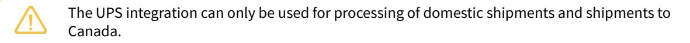

#### <span id="page-29-0"></span>**Creation of an App in the UPS Developer Portal**

Before you start configuring the settings of the plug-in for UPS in Acumatica ERP, you need to create an app in the UPS Developer Portal. The app provides the client ID and client secret that are required for the configuration of the plug-in. You also use the app to define UPS endpoints that you will use for processing of shipments with a UPS carrier.

Please note that the following section describes settings in a third-party product. The user interface of the third-party product is subject to change. We disclaim any responsibility for inaccuracies resulting from such changes.

To create an app, do the following:

- 1. Sign in to the *[UPS Developer Portal](https://developer.ups.com/catalog?loc=en_US)* by using your username and password.
- 2. In the upper right part of the page, click **My Apps**.
- 3. In the bottom part of the page, click **Add Apps**,
- 4. On the **Which of these scenarios best describes you** page, do the following:
  - a. In the **I need API credentials because** box, select *I want to integrate UPS technology into my business*.
  - b. In the **Choose an account to associate with this credentials** box, select the account ID of your UPS account. You can also add an existing account or create a new one.
  - c. Select the **I agree, and confirm I have the authority to agree on behalf of my organization, to the UPS API ACCESS AGREEMENT, which contains important terms governing use of UPStechnologies and information like limiting UPS's liability and how disputes with UPS will be handled** check box.
  - d. Click **Next**.
- 5. On the **Who should we contact?** page, do the following:
  - a. In the **Primary Contact** section, specify the following required settings:
    - **First Name**
    - **Last Name**
    - **Country orTerritory.**

This is the country or territory where you are going to use the UPS shipping services.

- **Street Address**
- **City**
- **State**
- **ZIP Code**
- **Email**

This is the email specified in your UPS account.

- **Phone**
- b. Click **Next**.
- 6. On the **Apps Details** page, do the following:
  - a. In the **App Name** box, specify the name of your app in the UPS Developer Portal.
  - b. In the **Add Products** pane, add the following products besides the Authorization (OAuth) product, which is added by default:
    - **Rating**
    - **Shipping**
    - **Time in Transit**

c. Click **Save**.

The UPS portal creates your app and shows the list of apps on the **My Apps** page. You can click the name of the app to view and copy the client ID and client secret that you will use for the configuration of the UPS plug-in.

For more details about the settings of your account in the UPS Developer Portal, see *[Getting Started with UPS APIs](https://developer.ups.com/get-started)*.

#### **To Specify Plug-in Settings for UPS**

- 1. Open the *[Carriers](https://help-2025r1.acumatica.com/Help?ScreenId=ShowWiki&pageid=753b8913-fc66-4831-b70e-98c4dafc160e)* (CS207700) form and add a new record.
- 2. In the **Carrier ID** box, type an easy-to-remember name for the carrier to be integrated.
- 3. Provide a description for this carrier.
- 4. In the **Plug-in (Type)** box, select *PX.UpsRestCarrier.UpsRestCarrier*.
- 5. Select the **Active** check box.
- 6. In the **Carrier Units** box, select the measuring system used by the carrier: *SI Units (Kilogram/Centimeter)* or *US Units (Pound/Inch)*. Based on the selected option, one of the following pairs of boxes is shown on the form: **Kilogram** and **Centimeter**, or **Pound** and **Inch**.
- 7. In the **Kilogram** and **Centimeter** boxes (or in the **Pound** and **Inch** boxes, depending on the measuring system selected for the carrier), select the units of measure defined in the system that correspond to the weight and linear units of measure used by the carrier.

If you select a UOM other than the default weight or linear UOM, which is specified in the **Weight UOM** box or **Linear UOM** box on the *[Companies](https://help-2025r1.acumatica.com/Help?ScreenId=ShowWiki&pageid=fedad435-8496-4397-b8a3-50a473629f76)* (CS101500) form, use the *[Units of](https://help-2025r1.acumatica.com/Help?ScreenId=ShowWiki&pageid=c25c9971-01e2-4021-aa3b-8809f8045e58) [Measure](https://help-2025r1.acumatica.com/Help?ScreenId=ShowWiki&pageid=c25c9971-01e2-4021-aa3b-8809f8045e58)* (CS203500) form to specify the conversion from the default weight or linear UOM of the company to the unit you have selected as the equivalent to the UOM used by the carrier.

- 8. In the **Warehouse** box, specify a particular warehouse for which the carrier's rates are applicable, or leave the box empty if the carrier's rates are applicable for all warehouses.
- 9. On the **Plug-in Parameters** tab, do the following:
  - If you need to get certification from UPS to use its API in production, prepare the certification files. To generate the files for certification with this carrier, click **Prepare Certification Files** on the table toolbar of the **Plug-in Parameters** tab.
  - For **CLIENT ID**, enter the client ID that you obtain in your app in the UPS Developer Portal.

For more information about the way to obtain a client ID and secret in the UPS Developer Portal, see *[Configuration of Settings in the UPS Developer Portal](#page-29-0)*

- For the **CLIENT SECRET**parameter, enter the client secret that you obtain in your app in the UPS Developer Portal.
- For the **LOGIN ENDPOINT**parameter, copy and paste one of the following URLs of the UPS service:
  - For production environment: *https://onlinetools.ups.com/security/v1/oauth/token*
  - For sandbox environment: *https://wwwcie.ups.com/security/v1/oauth/token*
- For the **RATE ENDPOINT**parameter, copy and paste one of the following URLs of the UPS rate service:
  - For production environment: *https://onlinetools.ups.com/api/rating/v1/rate*
  - For sandbox environment: *https://wwwcie.ups.com/api/rating/v1/rate*
- For the**TNT ENDPOINT**parameter, copy and paste one of the following URLs of the UPS time-in-transit service:
  - For production environment: *https://onlinetools.ups.com/api/shipments/v1/transittimes*
  - For sandbox environment: *https://wwwcie.ups.com/api/shipments/v1/transittimes*
- For the**SHIP ENDPOINT**parameter, copy and paste one of the following URLs of the UPS ship service:

- For production environment: *https://onlinetools.ups.com/api/shipments/v1/ship*
- For sandbox environment: *https://wwwcie.ups.com/api/shipments/v1/ship*
- For the**VOID ENDPOINT**parameter, copy and paste one of the following URLs of the UPS void service:
  - For production environment: *https://onlinetools.ups.com/api/shipments/v1/cancel*
  - For sandbox environment: *https://wwwcie.ups.com/api/shipments/v1/cancel*
- For the **ACCOUNTID** parameter, enter the identifier of the account your company has with the carrier.
- For the **NEGOTIATED** parameter, select the check box if your organization has special rates that should be used for calculating freight costs.
- For the**TEST MODE** parameter, select the check box to test the integration.
- For the **LABEL FORMAT**parameter, select the format (*EPL*, *SPL*, *ZPL*, *GIF*, or *STARPL*) to be used for printing labels on your printer.
- For the **PICKUP TYPE** parameter, select the appropriate option according to the agreement:
  - *Daily Pickup*
  - *Customer Counter*
  - *One-Time Pickup*
  - *On-Call Air*
  - *Suggested Retail Rates*
  - *Letter Center*
  - *Air Service Center*
- For the**SUREPOSTEND** parameter, select one of the following USPS endorsement options for SurePost shipments delivered by the USPS:
  - *Return Service Requested*
  - *Forwarding Service Requested*
  - *Address Service Requested*
  - *Change Service Requested*
- For the**SUREPOSTSUB** parameter, select the appropriate type of packages (less than 1 lb) for shipments by SurePost:
  - *Irregular*
  - *Machinable*
- For the**SIGNATURE** parameter, select the appropriate signature request option according to the agreement:
  - *System Default*
  - *Delivery Confirmation*
  - *Delivery Confirmation Signature Required*
  - *Delivery Confirmation Adult Signature Required*
- For the**SIGN RELZ NO** parameter, enter the signature release (DCIS) number according to your service agreement.
- For the **NOTIFY** parameter, select the check box if you want notifications to be sent to the recipients. Then on release of each shipment, the carrier's online service will generate a notification email to the email address of the contact specified for the shipment on the**Shipping** tab of the *[Shipments](https://help-2025r1.acumatica.com/Help?ScreenId=ShowWiki&pageid=f47cffcc-543e-469c-a204-a9c1e3da346d)* (SO302000) form.
- For the**SHIPPER FROM** parameter, leave the default *Company Branch* value if you want the system to get the shipper information from the company branch, or select *Warehouse* to make the system get the shipper information from the warehouse.
- For the**TRACKING URL** parameter, leave the default value if you want the system to use the predefined URL to form the tracking link to a package in the shipment.

10.On the **Customer Accounts** tab, add all customers that have accounts with the carrier and should be billed for the shipments they receive via this carrier. For each customer you add, do the following:

- Make sure the **Active** check box is selected.
- In the **Customer ID** column, select the customer by its ID.
- In the **Customer Location** column, select the customer location to receive shipments via the carrier.
- In the **BillingType** column, select the party, which is responsible for paying shipping costs
- In the **Carrier Billing Account** column, enter the billing account of the customer or third-party company in the system of the carrier.
- If you have selected *Third-Party* in the **BillingType** column, in the **Billing Country** column, specify the country ID of the carrier's billing account.
- If you have selected *Third-Party* in the **BillingType** column, in the **Billing Country** column, specify the postal code of the carrier's billing account.
- 11.Click **Save** on the form toolbar.

#### **Related Links**

- *To [Define](#page-37-1) a Box*
- *To Create Ship via Codes for the [Integrated](#page-38-1) Carrier*
- *To Register the Label File [Extension](#page-18-0)*
- *To Set Up the Printing of Carrier Labels on a [Thermal](#page-18-1) Printer*

## <span id="page-32-1"></span><span id="page-32-0"></span>**To Set Up Integration with ShipEngine**

Before you configure integration with ShipEngine, your organization should have an account with the carrier and a signed service agreement. The settings for the plug-in are specified in accordance with the information available in this agreement.

To configure integration between Acumatica ERP and the ShipEngine service, which provides integration with multiple carriers, you use the *[Carriers](https://help-2025r1.acumatica.com/Help?ScreenId=ShowWiki&pageid=753b8913-fc66-4831-b70e-98c4dafc160e)* (CS207700) form. On this form, you specify a name to be used for this carrier in your system, select the plug-in, and specify one of the carriers connected to your ShipEngine account. Also, you can specify shipping and delivery settings.

This topic walks you through the configuration of third-party soware. Please note the following:

- The procedure below is designed for the most common usage scenarios. If you are implementing a more complicated scenario and you encounter difficulties, contact Acumatica ERP technical support.
- The vendor of the third-party soware may change the user interface and settings. Therefore, the screen elements and setting names that you see may differ from the ones described in the procedure.
- The procedure will be updated to describe new common scenarios and changes in the user interface and settings.

#### **To Configure a ShipEngine Account**

- 1. Open the *<https://app.shipengine.com/#/public/createaccount/?ref=acumatica>* link, and create a ShipEngine account.
- 2. Sign in to the created ShipEngine account.
- 3. On the **Connections** page, click **Add a Carrier** to connect a carrier to the ShipEngine account. (The list of available carriers depends on the shipping origin country that you have specified when you created a ShipEngine account.)

4. On the **Partners** tab of the **AccountSettings** page, click **Add a Partner**, and in the **Connect a Partner** dialog box, which opens, select Acumatica. The system displays the connection parameters that you will use for configuring the ShipEngine carrier in Acumatica ERP.

#### **To Set Up Integration with ShipEngine**

- 1. Open the *[Carriers](https://help-2025r1.acumatica.com/Help?ScreenId=ShowWiki&pageid=753b8913-fc66-4831-b70e-98c4dafc160e)* (CS207700) form.
- 2. In the **Carrier ID** box, type a name for the ShipEngine carrier.
- 3. Provide a description for this carrier.
- 4. In the **Plug-in (Type)** box, select *PX.ShipEngineCarrier.ShipEngineCarrier*.
- 5. Select the **Active** check box.
- 6. In the **Carrier Units** box, select the measuring system used by the carrier: *SI Units (Kilogram/Centimeter)* or *US Units (Pound/Inch)*. Based on the selected option, one of the following pairs of boxes is shown on the form: **Kilogram** and **Centimeter**, or **Pound** and **Inch**.
- 7. In the **Kilogram** and **Centimeter** boxes (or in the **Pound** and **Inch** boxes, depending on the measuring system selected for the carrier), select the units of measure defined in the system that correspond to the weight and linear units of measure used by the carrier.

If you select a UOM other than the default weight or linear UOM, which is specified in the **Weight UOM** box or **Linear UOM** box on the *[Companies](https://help-2025r1.acumatica.com/Help?ScreenId=ShowWiki&pageid=fedad435-8496-4397-b8a3-50a473629f76)* (CS101500) form, use the *[Units of](https://help-2025r1.acumatica.com/Help?ScreenId=ShowWiki&pageid=c25c9971-01e2-4021-aa3b-8809f8045e58) [Measure](https://help-2025r1.acumatica.com/Help?ScreenId=ShowWiki&pageid=c25c9971-01e2-4021-aa3b-8809f8045e58)* (CS203500) form to specify the conversion from the default weight or linear UOM of the company to the unit you have selected as the equivalent to the UOM used by the carrier.

- 8. Optional: In the **Warehouse** box, specify a particular warehouse for which the carrier's rates are applicable, or leave the box empty if the carrier's rates are applicable for all warehouses.
- 9. On the **Plug-in Parameters** tab, specify the values of the parameters as follows:
  - **SHIP ENGINE ACCOUNT**: Enter the ShipEngine Account ID that you have received in ShipEngine.
  - **SHIP ENGINE CARRIER**: Select one of the carriers that you have connected to your ShipEngine account.
  - **TEST MODE**: Select the check box if you want to use the carrier in test mode for the generation of sample labels. (This setting applies to the Stamps.com carrier only.)
  - **LOG TRACE**: Select the check box if you want the system to record the requests and results of the web calls in the trace log.
  - **SHIPPER FROM**: Select the source of the contact information of the shipper.
  - **CONFIRMATION**: Select the delivery confirmation type according to your agreement with the carrier.
  - **INSURANCE**: Select the appropriate insurance type (which can be purchased from the carrier or from the Shipsurance.com service).
  - **LABEL FORMAT**: Select the format (*ZPL*, *PNG*, or *PDF*) to be used for printing labels on your printer.
  - **INTERNATIONAL NON DELIVERY**: Select how the carrier should process non-delivered international shipments.
  - **DUTY BILLTO PARTY**: Select the payer of customs charges for international shipments.

#### *Table: Parameters of the PX.ShipEngineCarrier.ShipEngineCarrier Plug-in*


The information in this example cannot be used for production. The sensitive data is partially or completely masked by asterisks.

| ID                            | Description    |
|-------------------------------|----------------|
| SHIP ENGINE AC<br>COUNT       | 21*****3       |
| SHIP ENGINE CAR<br>RIER       | USPS           |
| TEST MODE                     | Cleared        |
| LOG TRACE                     | Selected       |
| SHIPPER FROM                  | Company Branch |
| CONFIRMATION                  | Delivery       |
| INSURANCE                     | Carrier        |
| LABEL FORMAT                  | PDF            |
| INTERNATIONAL<br>NON DELIVERY | Returntosender |
| DUTY BILLTO PAR<br>TY         | Recipient      |
| MULTI PACKAGE<br>SUPPORT      | Selected       |
| LABEL MESSAGE<br>SUPPORT      | Selected       |

# <span id="page-34-1"></span><span id="page-34-0"></span>**To Set Up Integration with USPS via Stamps.com**

Before you configure integration with USPS by using the Stamps.com plug-in, your organization should have an account and a signed service agreement with Stamps.com. The settings for the plug-in are specified in accordance with the information available in the agreement. To configure integration between Acumatica ERP and USPS, you use the *[Carriers](https://help-2025r1.acumatica.com/Help?ScreenId=ShowWiki&pageid=753b8913-fc66-4831-b70e-98c4dafc160e)* (CS207700) form.

#### **To Set Up Integration with USPS via Stamps.com**

- 1. Open the *[Carriers](https://help-2025r1.acumatica.com/Help?ScreenId=ShowWiki&pageid=753b8913-fc66-4831-b70e-98c4dafc160e)* (CS207700) form.
- 2. In the **Carrier ID** box, type the unique identifier for the carrier to be integrated.
- 3. In the **Description** box, type the brief information about the carrier.
- 4. In the **Plug-in (Type)** box, select *PX.StampsCarrier.StampsCarrier*.
- 5. Select the **Active** check box.
- 6. In the **Carrier Units** box, select the measuring system used by the carrier: *SI Units (Kilogram/Centimeter)* or *US Units (Pound/Inch)*. Based on the selected option, one of the following pairs of boxes is shown on the form: **Kilogram** and **Centimeter**, or **Pound** and **Inch**.

7. In the **Kilogram** and **Centimeter** boxes (or in the **Pound** and **Inch** boxes, depending on the measuring system selected for the carrier), select the units of measure defined in the system that correspond to the weight and linear units of measure used by the carrier.

> If you select a UOM other than the default weight or linear UOM, which is specified in the **Weight UOM** box or **Linear UOM** box on the *[Companies](https://help-2025r1.acumatica.com/Help?ScreenId=ShowWiki&pageid=fedad435-8496-4397-b8a3-50a473629f76)* (CS101500) form, use the *[Units of](https://help-2025r1.acumatica.com/Help?ScreenId=ShowWiki&pageid=c25c9971-01e2-4021-aa3b-8809f8045e58) [Measure](https://help-2025r1.acumatica.com/Help?ScreenId=ShowWiki&pageid=c25c9971-01e2-4021-aa3b-8809f8045e58)* (CS203500) form to specify the conversion from the default weight or linear UOM of the company to the unit you have selected as the equivalent to the UOM used by the carrier.

- 8. Optional: In the **Warehouse** box, specify a particular warehouse for which the carrier's rates are applicable, or leave the box empty if the carrier's rates are applicable for all warehouses.
- 9. On the **Plug-in Parameters** tab, do the following:
  - For the **ENDPOINT**parameter, enter *https://swsim.stamps.com/swsim/swsimv111.asmx*.
  - For the **LOGIN** parameter, type the login to be used to sign in to your organization's Stamps.com account.
  - For the **PASSWORD** parameter, type the password to be used to sign in to your organization's Stamps.com account.
  - For the**STAMPS CUSTOMER** parameter, specify the customer identifier in Stamps.com, which is required for USPS audits, aviation security, and insurance purchases.
  - For the**TEST MODE** parameter, select the check box if you want to use the carrier in test mode for the generation of sample labels.
  - For the **LOG TRACE** parameter, select the check box if you want the system to record the requests and results of the web calls in the trace log.
  - For the**SHIPPER FROM** parameter, select the source of the contact information of the shipper.
  - For the **NOTIFY** parameter, select the check box if you want the system to send a notification to the recipient on the release of each shipment.
  - For the **LABEL FORMAT**parameter, specify the type of data stream or bitmap to be returned for a label.
  - For the **PACKAGETYPE** parameter, specify the package type specific to USPS.
  - For the **ROTATION DEGREE** parameter, specify the degree of counter-clockwise rotation of the label if you want the system to rotate the label.
  - If you selected *PDF* as the **LABEL FORMAT**parameter, for the **PAPER SIZE** parameter, select the paper size for labels.
  - If you have selected *GIF*, *JPG*, or *PNG* as the **LABEL FORMAT**parameter, for the **IMAGE DPITYPE** parameter, select the resolution of labels.
  - If you use a thermal printer to print labels, for the **ELTRON DPITYPE** parameter, select the appropriate resolution.
  - For the **CERTIFIED MAIL** parameter, select the check box if you want to use the USPS Certified Mail service.
  - For the **REGISTERED MAIL** parameter, select the check box if you want to use the USPS Registered Mail service.
  - For the **CONFIRMATION** parameter, specify the delivery confirmation type.
  - If you want to use insurance, for the **INSURANCE** parameter, select the type of insurance.
  - For the **RETURN RECEIPT**parameter, select the check box to use the USPS Return Receipt service.
  - For the **RETURN RECEIPTELECTRONIC** parameter, select the check box to use the Electronic Return Receipt service.
  - For the **RETURN RECEIPT MERCHANDISE** parameter, select the check box to request the Return Receipt for Merchandise service.
  - For the **INCLUDE RECEIPT**parameter, select the check box if you want to include the receipt in each label.
  - For the **PAY ON PRINT**parameter, select the check box if you want to use the pay-on-print return labels.

- If you selected the **PAY ON PRINT**check box, for the **RETURN LABEL EXPIRATION DAYS**parameter, specify the number of days until the expiration of the return label URL.
- For the**TRACKING URL** parameter, leave the default value if you want the system to use the predefined URL to form the tracking link to a package in the shipment.

10.Click **Save** on the form toolbar.

## <span id="page-36-0"></span>**To Validate Addresses**

If you need to validate the addresses of branches, warehouses and customers, you can do this on the *[Companies](https://help-2025r1.acumatica.com/Help?ScreenId=ShowWiki&pageid=fedad435-8496-4397-b8a3-50a473629f76)* (CS101500), *[Branches](https://help-2025r1.acumatica.com/Help?ScreenId=ShowWiki&pageid=b97ab72d-4ab4-4f02-b69c-f7f61b316ced)* (CS102000), *[Warehouses](https://help-2025r1.acumatica.com/Help?ScreenId=ShowWiki&pageid=264b0ef7-2b6c-40b4-a7d9-f1a5e067939b)* (IN204000), and *[Customers](https://help-2025r1.acumatica.com/Help?ScreenId=ShowWiki&pageid=652929bc-9606-4056-aa6e-0c2d1147171b)* (AR303000) forms as described in the instructions below.

#### **To Validate the Addresses of Companies**

- 1. Open the *[Companies](https://help-2025r1.acumatica.com/Help?ScreenId=ShowWiki&pageid=fedad435-8496-4397-b8a3-50a473629f76)* (CS101500) form.
- 2. For each of the companies, do the following:
  - a. Make sure that the following information is provided on the **General Info** tab: company name, country, state, city, postal code, phone number (**Phone 1**), and address.
  - b. If the *Validate Addresses* feature is enabled on the *[Enable/Disable Features](https://help-2025r1.acumatica.com/Help?ScreenId=ShowWiki&pageid=c1555e43-1bc5-4f6f-ba9d-b323f94d8a6b)* (CS100000) form, click **Validate Addresses** on the form toolbar. If the feature is not enabled, click the**View on map** button and validate the address manually.

#### **To Validate the Addresses of Branches**

- 1. Open the *[Branches](https://help-2025r1.acumatica.com/Help?ScreenId=ShowWiki&pageid=b97ab72d-4ab4-4f02-b69c-f7f61b316ced)* (CS102000) form.
- 2. For each of your organization's branches, do the following:
  - a. Make sure that the following information is provided on the **General Info** tab: company name, country, state, city, postal code, phone number (**Phone 1**), and address.
  - b. If the *Validate Addresses* feature is enabled on the *[Enable/Disable Features](https://help-2025r1.acumatica.com/Help?ScreenId=ShowWiki&pageid=c1555e43-1bc5-4f6f-ba9d-b323f94d8a6b)* (CS100000) form, click **Validate Addresses** on the form toolbar. Otherwise, click the**View on map** button and validate the address manually.

#### **To Validate the Addresses of Warehouses**

- 1. Open the *[Warehouses](https://help-2025r1.acumatica.com/Help?ScreenId=ShowWiki&pageid=264b0ef7-2b6c-40b4-a7d9-f1a5e067939b)* (IN204000) form.
- 2. For each warehouse defined in the system, perform the following:
  - a. On the **Address Information** tab, make sure the required address is specified.
  - b. If the *Validate Addresses* feature is enabled on the *[Enable/Disable Features](https://help-2025r1.acumatica.com/Help?ScreenId=ShowWiki&pageid=c1555e43-1bc5-4f6f-ba9d-b323f94d8a6b)* (CS100000) form, click **Validate Addresses** on the More menu. Otherwise, click the**View on map** button and validate the address manually.

#### **To Validate the Addresses of Customers**

- 1. Open the *[Customers](https://help-2025r1.acumatica.com/Help?ScreenId=ShowWiki&pageid=652929bc-9606-4056-aa6e-0c2d1147171b)* (AR303000) form.
- 2. For each customer to which shipments will be sent via the integrated carrier, perform the following steps:
  - a. Open the **General Info** tab, and make sure that the main address is specified.

b. On the More menu, click**Validate Addresses** if the *Address Validation* feature is enabled on the *[Enable/](https://help-2025r1.acumatica.com/Help?ScreenId=ShowWiki&pageid=c1555e43-1bc5-4f6f-ba9d-b323f94d8a6b) [Disable Features](https://help-2025r1.acumatica.com/Help?ScreenId=ShowWiki&pageid=c1555e43-1bc5-4f6f-ba9d-b323f94d8a6b)* (CS100000) form. If the *Address Validation* feature is not enabled, validate the addresses manually.

You can run validation for multiple business accounts at once by using the *Validate [Addresses](https://help-2025r1.acumatica.com/Help?ScreenId=ShowWiki&pageid=5a246da7-5339-48ca-886e-8dc3d2796d33) in Profiles* (CR509020) form.

- c. Open the **Locations** tab, and make sure that the address information is specified for each customer location.
- d. On the More menu, click**Validate Addresses** if the *Address Validation* feature is enabled on the *[Enable/](https://help-2025r1.acumatica.com/Help?ScreenId=ShowWiki&pageid=c1555e43-1bc5-4f6f-ba9d-b323f94d8a6b) [Disable Features](https://help-2025r1.acumatica.com/Help?ScreenId=ShowWiki&pageid=c1555e43-1bc5-4f6f-ba9d-b323f94d8a6b)* form. If the *Address Validation* feature is not enabled, validate the addresses manually.

# <span id="page-37-1"></span><span id="page-37-0"></span>**To Define a Box**

To send shipments via different delivery services and carriers, including integrated carriers (UPS, or FedEx), you need to define the types of boxes used by each of the carriers. You can define boxes by using the *[Boxes](https://help-2025r1.acumatica.com/Help?ScreenId=ShowWiki&pageid=ff38094d-bc30-4cf1-9008-0f1070ada514)* (CS207600) form.

#### **To Define a Box**

- 1. Open the *[Boxes](https://help-2025r1.acumatica.com/Help?ScreenId=ShowWiki&pageid=ff38094d-bc30-4cf1-9008-0f1070ada514)* (CS207600) form.
- 2. On the table toolbar, click **Add Row**.
- 3. In the **Box ID** column, type a unique identifier for the box.
- 4. In the **Description** column, specify a description for this box.
- 5. In the **Box Weight** column, specify the weight of the box in the selected UOM.
- 6. In the **Max. Weight** column, specify the maximum weight the box can hold.
- 7. In the **MaxVolume** column, specify the maximum volume that the box can hold.
- 8. If the box will be used for shipping via an integrated carrier, specify the box's **Length**, **Width**, and **Height**.
- 9. If the box is used by an integrated carrier, in the **Carrier's Package** column, provide the identifier used for this box by the carrier.
- 10.Make sure the **Active by Default** check box is selected for the box if boxes of this type are used for shipping by most of the carriers and should appear by default on the list of boxes used for any ship via code on the *[Ship via Codes](https://help-2025r1.acumatica.com/Help?ScreenId=ShowWiki&pageid=ba3b1fc4-3656-4ed9-b5a9-21377637841a)* (CS207500) form.
- 11.Click **Save** on the form toolbar.

#### **Notes About the Procedure**

The notes in this section describe the nuances of the UI elements available on the form, such as when an element is required and when it is not, and when the system fills in settings by default. This section can include other notes.

Note the following about this procedure:

- The measurement system that is used by the integrated carrier is specified in the **Carrier Units** box on the *[Carriers](https://help-2025r1.acumatica.com/Help?ScreenId=ShowWiki&pageid=753b8913-fc66-4831-b70e-98c4dafc160e)* (CS207700) form. If the linear UOM specified for the carrier differs from the company's linear UOM specified on the *[Companies](https://help-2025r1.acumatica.com/Help?ScreenId=ShowWiki&pageid=fedad435-8496-4397-b8a3-50a473629f76)* (CS101500) form, you must define conversion rules between these units of measure on the *[Units of Measure](https://help-2025r1.acumatica.com/Help?ScreenId=ShowWiki&pageid=c25c9971-01e2-4021-aa3b-8809f8045e58)* (CS203500) form so that shipping rates can be calculated correctly.
- For boxes to be used for shipping by delivery services that are not integrated carriers, you can specify the linear dimensions (such as width, height,or length) for informational purposes only; the values are not used in any calculations.

• The **Carrier's Package** column is displayed only if the *Shipping Carrier Integration* feature is enabled on the *[Enable/Disable Features](https://help-2025r1.acumatica.com/Help?ScreenId=ShowWiki&pageid=c1555e43-1bc5-4f6f-ba9d-b323f94d8a6b)* (CS100000) form.

#### **Related Links**

- *To Create Ship via Codes for the [Integrated](#page-38-1) Carrier*
- *To [Create](#page-42-1) a Ship via Code*
- *To [Manually](#page-44-3) Select the Package Box for an Order*

# <span id="page-38-1"></span><span id="page-38-0"></span>**To Create Ship via Codes for the Integrated Carrier**

In Acumatica ERP, you can create multiple ship via codes for an integrated carrier, each based on a service method provided by the carrier and used by your company. You create ship via codes by using the *[Ship via Codes](https://help-2025r1.acumatica.com/Help?ScreenId=ShowWiki&pageid=ba3b1fc4-3656-4ed9-b5a9-21377637841a)* (CS207500) form. Perform the following steps for each ship via code you define.

#### **To Create a Ship via Code for the Carrier**

- 1. Open the *[Ship via Codes](https://help-2025r1.acumatica.com/Help?ScreenId=ShowWiki&pageid=ba3b1fc4-3656-4ed9-b5a9-21377637841a)* (CS207500) form.
- 2. Enter the ship via code, which is an alphanumerical string of up to 15 characters. Consider using *UPS*, or *FedEx* plus a string indicating the specific service method.
- 3. Enter a description of the code.
- 4. Select the **External Plug-in** check box to indicate that the ship via code is associated with an integrated carrier. The elements used for integrated carriers appear on the form.
- 5. On the **Details** tab, do the following:
  - Select the calendar that provides information about this carrier's work hours.
  - Specify the carrier whose service method will be used under this code.
  - Select the service method this code is based on.
  - Make sure the **Common Carrier** check box is selected.
  - Optional: Select the **Confirmation for Each Box Is Required** check box to help reduce errors on shipments.
  - Optional: Select the **At Least One Package is Required** check box if a shipment should have at least one package.
  - In the **Tax Category** box, select the tax category to be applied to the shipping and handling fees for shipments performed under this code.
  - In the **FreightSales Account** box, select the income account to be used to record the freight sales (the shipping and handling fees).
  - If the *Subaccounts* feature is enabled on the *[Enable/Disable Features](https://help-2025r1.acumatica.com/Help?ScreenId=ShowWiki&pageid=c1555e43-1bc5-4f6f-ba9d-b323f94d8a6b)* (CS100000) form, in the **Freight SalesSub.** box, select the subaccount to be used to record the freight sales.
  - In the **Freight Expense Account** box, select the income account to be used to record the freight expenses.
  - If the *Subaccounts* feature is enabled on the *[Enable/Disable Features](https://help-2025r1.acumatica.com/Help?ScreenId=ShowWiki&pageid=c1555e43-1bc5-4f6f-ba9d-b323f94d8a6b)* form, in the **Freight ExpenseSub.** box, select the subaccount to record the freight expenses.
- 6. On the **Packages** tab, do the following for each of the boxes to be used by this carrier with this service method:
  - Click **Add Row** on the table toolbar to add a row with information about a box.
  - In the **Box ID** column, select a box that is used by the carrier with this service method.
  - Click **Save** on the form toolbar. The system inserts the settings of the box in the appropriate columns.

# <span id="page-39-1"></span><span id="page-39-0"></span>**To Configure a Stock Item for Automatic Packaging**

To enable the system to determine optimal packages for any sales order or shipment, you must specify packaging settings for each stock item on the *[Stock Items](https://help-2025r1.acumatica.com/Help?ScreenId=ShowWiki&pageid=77786a70-1f1e-4d63-ad98-96f98e4fcb0e)* (IN202500) form. If the *Automatic Packaging* feature is not enabled on the *[Enable/Disable Features](https://help-2025r1.acumatica.com/Help?ScreenId=ShowWiki&pageid=c1555e43-1bc5-4f6f-ba9d-b323f94d8a6b)* (CS100000) form, you can use these settings for the calculation of weight and volume of each sales order and shipment, and users will be able to select the boxes for each order manually.

#### **Before You Proceed**

- 1. On the *[Companies](https://help-2025r1.acumatica.com/Help?ScreenId=ShowWiki&pageid=fedad435-8496-4397-b8a3-50a473629f76)* (CS101500) form, make sure that the base weight UOM is selected in the **Weight UOM** box and that the base volume UOM is selected in the**Volume UOM** box.
- 2. On the *[Units of Measure](https://help-2025r1.acumatica.com/Help?ScreenId=ShowWiki&pageid=c25c9971-01e2-4021-aa3b-8809f8045e58)* (CS203500) form, make sure that the UOM to measure the weight of the item's base unit is defined and that a conversion factor to convert this UOM to the base weight UOM is specified. Also, make sure that the UOM to measure the volume of the item's base unit is defined and that the conversion factor to convert this UOM to the base volume UOM is specified.

#### **To Configure a Stock Item for Automatic Packaging**

- 1. Open the *[Stock Items](https://help-2025r1.acumatica.com/Help?ScreenId=ShowWiki&pageid=77786a70-1f1e-4d63-ad98-96f98e4fcb0e)* (IN202500) form.
- 2. In the **Inventory ID** box, select a stock item.
- 3. On the **Packages** tab, in the **Weight** box, type the weight of the base unit of the item.
- 4. In the **Weight UOM** box, select the UOM used to measure the weight.
- 5. In the **Volume** box, type the volume of the base unit of the item.
- 6. In the **Volume UOM** box, select the UOM used to measure the volume.
- 7. If this item should always be packed separately from other items, select the **PackSeparately** check box.
- 8. If the *Automatic Packaging* feature is not enabled on the *[Enable/Disable Features](https://help-2025r1.acumatica.com/Help?ScreenId=ShowWiki&pageid=c1555e43-1bc5-4f6f-ba9d-b323f94d8a6b)* (CS100000) form, proceed to Step 10.
- 9. In the **Packaging Option** box, select one of the available options:
  - *Manual*: If the item should always be packed manually.
  - *By Weight*: If the item should be packed by weight. In the **Boxes** table (which appears), create a list of boxes that can be used for this item.
  - *By Quantity*: If the item should always be packed by quantity. An item to be packed by quantity is always packed separately from other items. (When you select this option, the **PackSeparately** check box is selected and unavailable for editing.)

In the **Boxes** table (which appears when you select this option), create the list of boxes, and for each box, specify the maximum quantity of the base units of this item that this box can hold.

• *By Weight and Volume*: If the item can be packed by weight or volume jointly with other items from a sales order.

In the **Boxes** table (which appears when you select this option), create the list of boxes that can be used for this item.

10.Click **Save** on the form toolbar.

# <span id="page-40-1"></span><span id="page-40-0"></span>**Automatic Packaging for Local Carriers**

If you use a set of standard boxes for shipping goods, you can configure the system to suggest boxes for each sales order and shipment based on the packaging options and weights specified for stock items. With Acumatica ERP, you can configure and use the automatic packaging functionality for all the local carriers used by your organization to ship the sales orders. To use the automatic packaging functionality, make sure the *Automatic Packaging* feature is enabled on *[Enable/Disable Features](https://help-2025r1.acumatica.com/Help?ScreenId=ShowWiki&pageid=c1555e43-1bc5-4f6f-ba9d-b323f94d8a6b)* (CS100000) form.

#### **Package Calculation for a Sales Order**

Once the automatic packaging functionality has been configured, you can use it when you prepare a sales order for shipping or create a consolidated shipment.

Because the calculation of packages is resource-intensive, the system calculates packages only when the user requests this calculation. As you are preparing a sales order on the *[Sales Orders](https://help-2025r1.acumatica.com/Help?ScreenId=ShowWiki&pageid=19e4021c-1b84-49fd-be12-0320c5f1c7e5)* (SO301000) form and adding items, the system calculates the weight and volume of the sales order. Once you specify the shipping information on the **Shipping** tab—including the ship via code, the shipping terms, and the shipping zone—and save the order, the system determines the set of boxes, each package weight, the freight cost, and the freight charges.

The system uses a heuristic algorithm (an algorithm that quickly finds a satisfactory set of boxes, however it does not guarantee that this set is the best one) and the following information to make suggestions about the boxes required for the order:

- The lists of boxes assigned to each ship via code, with the maximum weight and volume each box can hold and the weight of the box (which must include the weight of any packaging material)
- The quantity of each stock item in base units, the weight and volume of the base unit of the item, and the option instructing the system about how to pack this item
- The quantity of each non-stock item in base units, and the weight and volume of the base unit of the item

You can view the particular packages on the**Shop for Rates** dialog box, which opens when you click the**Shop for Rates** button on the**Shipping** tab. You can review the calculated totals on the**Totals** tab of the *[Sales Orders](https://help-2025r1.acumatica.com/Help?ScreenId=ShowWiki&pageid=19e4021c-1b84-49fd-be12-0320c5f1c7e5)* form. If freight for a specific ship via code should be specified manually, you can enter the total freight amount in the **Freight** box on the**Totals** tab.

In some cases, you may need to edit the packages manually. If you select the **Manual Packaging** check box, you can adjust information about the boxes and their contents to match the quantities and weights of actual packages. For more information, see *[Manual Packaging of Items](#page-43-1)*.

#### **Automatic Packaging Suggestions for Shipments**

If the automatic packaging is configured, once a shipment is generated for a sales order, the system updates the packages calculated for the order. You can view the suggested minimal set of boxes for a shipment on the **Packages** tab of the *[Shipments](https://help-2025r1.acumatica.com/Help?ScreenId=ShowWiki&pageid=f47cffcc-543e-469c-a204-a9c1e3da346d)* (SO302000) form. For packages that have been suggested automatically (those with *Auto* selected in the**Type** column on the **Packages** tab of the *[Shipments](https://help-2025r1.acumatica.com/Help?ScreenId=ShowWiki&pageid=f47cffcc-543e-469c-a204-a9c1e3da346d)* (SO302000) form), the system adds the weights of the boxes automatically. If needed, you can manually correct information about packages to match the quantities and weights of the actual packages, or select another box or boxes.

You can create shipments for multiple orders by using the *[Process Orders](https://help-2025r1.acumatica.com/Help?ScreenId=ShowWiki&pageid=c06a334c-f39d-4eff-9d80-b167657dff73)* (SO501000) form. If multiple orders are consolidated into one shipment, you can recalculate the packages initially determined for sales orders by clicking the **Refresh Packages** button on the table toolbar on the **Packages** tab of the *[Shipments](https://help-2025r1.acumatica.com/Help?ScreenId=ShowWiki&pageid=f47cffcc-543e-469c-a204-a9c1e3da346d)* (SO302000) form. Once the set of boxes is determined for the consolidated shipment, you can review and edit this list if needed on the **Packages** tab.

#### **Related Links**

• *[Freight Calculation](#page-44-2)*

• *[Shipments](https://help-2025r1.acumatica.com/Help?ScreenId=ShowWiki&pageid=f47cffcc-543e-469c-a204-a9c1e3da346d)*

# <span id="page-41-1"></span><span id="page-41-0"></span>**To Configure Automatic Packaging**

To make sales order processing more effective, you can configure the system to automatically determine the optimal set of boxes for sales orders and for shipments to be sent via carriers, including integrated carriers.

Configuration includes the following major steps.

#### **Before You Proceed**

Make sure the *Automatic Packaging* feature is enabled on the *[Enable/Disable Features](https://help-2025r1.acumatica.com/Help?ScreenId=ShowWiki&pageid=c1555e43-1bc5-4f6f-ba9d-b323f94d8a6b)* (CS100000) form.

#### **1. Create the Weight and Volume UOMs**

Start by compiling a list of the units of measure used in your system to measure weights and volumes for different stock items that are usually shipped via carriers.

Then make sure that all these UOMs are defined in the system on the *[Units of Measure](https://help-2025r1.acumatica.com/Help?ScreenId=ShowWiki&pageid=c25c9971-01e2-4021-aa3b-8809f8045e58)* (CS203500) form. If any UOM is not listed among the predefined UOMs, define it. For details, see *[Units of Measure: Implementation Activity](https://help-2025r1.acumatica.com/Help?ScreenId=ShowWiki&pageid=04182e66-05a9-4e86-a091-4d88fb30e39a)*.

#### **2. Specify the Base UOMs to Measure Weights and Volumes**

Decide on the base unit of measure (UOM) to be used for weight and the base unit of measure to be used for volume in your system. Aer you have created the UOMS that you planned to use as the base UOMs for weights and volumes, you use the *[Companies](https://help-2025r1.acumatica.com/Help?ScreenId=ShowWiki&pageid=fedad435-8496-4397-b8a3-50a473629f76)* (CS101500) form to select these UOMs as the base weight and volume UOMs as follows:

- 1. Open the *[Companies](https://help-2025r1.acumatica.com/Help?ScreenId=ShowWiki&pageid=fedad435-8496-4397-b8a3-50a473629f76)* form.
- 2. In the **Weight UOM** box, specify the UOM to be used to measure the weights of the stock items.
- 3. In the **Volume UOM** box, specify the UOM to be used to measure the volumes of the stock items.
- 4. Click **Save** on the form toolbar.

#### **3. Specify the Rule for Converting the Base UOM to the Carrier UOM for Weight**

If integration with any carrier system is configured in your system, notice the UOM (in the **UOM** box on the *[Carriers](https://help-2025r1.acumatica.com/Help?ScreenId=ShowWiki&pageid=753b8913-fc66-4831-b70e-98c4dafc160e)* (CS207700) form) selected as the unit that is equal to the UOM specified for the carrier in the **Carrier Unit of Weight** box. Make sure that the conversion rules from the base weight UOM to the UOM (which is equal to the carrier unit of weight) are defined on the *[Units of Measure](https://help-2025r1.acumatica.com/Help?ScreenId=ShowWiki&pageid=c25c9971-01e2-4021-aa3b-8809f8045e58)* (CS203500) form.

For more information on setting up integration with carriers, see *To Set Up [Integration](#page-25-1) with FedEx REST*, and *To [Set](#page-28-1) [Up Integration with UPS REST](#page-28-1)*.

#### **4. Define the Boxes to Be Used for Shipping**

To make it possible for the system to make packaging suggestions for sales orders, on the *[Boxes](https://help-2025r1.acumatica.com/Help?ScreenId=ShowWiki&pageid=ff38094d-bc30-4cf1-9008-0f1070ada514)* (CS207600) form, list all the available boxes with their own weights (which may include the weight of all packaging materials) and their capacities for weight and volume. For each box that will be used for the integrated carrier, you must specify the box's linear dimensions (height, width, and length) because dimensions may affect the rates.

By selecting the carrier's unit of weight, you also select the UOM to be used to specify the linear dimensions (height, width, and length) of boxes used by the carrier. If the carrier uses *SI Units (Kilogram)*, the UOM for linear dimensions is *centimeter*; if the carrier uses *US Units (Pound)*, the UOM is inch.

For carriers that are not integrated with your system, linear dimensions for boxes are optional, and because they can be used for information purposes only, the UOM for measurement can be selected arbitrary.

For details, see *To [Define](#page-37-1) a Box*.

#### **5. Create Ship via Codes and Assign Boxes**

For each delivery service used by your organization, create a ship via code by using the *[Ship via Codes](https://help-2025r1.acumatica.com/Help?ScreenId=ShowWiki&pageid=ba3b1fc4-3656-4ed9-b5a9-21377637841a)* (CS207500) form, specify the freight calculation method and freight rates, and create a list of boxes on the **Packages** tab. The rates of different carriers or different delivery services for boxes of the same capacity may vary significantly, and some services may be available for only packages with specific weights, volumes, or dimensions. For more details, see *To [Create](#page-42-1) a Ship via Code*.

If your system is integrated with any carrier, also create a ship via code for each service method of each carrier that your organization uses, and assign the boxes. For details, see *To Create Ship via Codes for the [Integrated](#page-38-1) Carrier*.

#### **6. Configure Stock Items for Automatic Packaging**

For each stock item, on the **PackagingSettings** tab of the *[Stock Items](https://help-2025r1.acumatica.com/Help?ScreenId=ShowWiki&pageid=77786a70-1f1e-4d63-ad98-96f98e4fcb0e)* (IN202500) form, specify the weight and volume of the base unit and the packaging option that defines how this stock item should be packed:

- By quantity, separately from other items
- By weight, separately from other items
- By weight, not necessarily separately from other items
- By weight and volume, generally with other items
- Manually

For detailed instructions, see *To Configure a Stock Item for Automatic [Packaging](#page-39-1)*.

#### **Related Links**

- *To [Define](#page-37-1) a Box*
- *To [Create](#page-42-1) a Ship via Code*
- *To Configure a Stock Item for Automatic [Packaging](#page-39-1)*

# <span id="page-42-1"></span><span id="page-42-0"></span>**To Create a Ship via Code**

In Acumatica ERP, you can create a ship via code for each delivery service your organization uses and specify which boxes are used for this service and what the freight rates are.

You create ship via codes by using the *[Ship via Codes](https://help-2025r1.acumatica.com/Help?ScreenId=ShowWiki&pageid=ba3b1fc4-3656-4ed9-b5a9-21377637841a)* (CS207500) form. Perform the following steps for each ship via code you need to define.

#### **To Create a Ship via Code**

- 1. Open the *[Ship via Codes](https://help-2025r1.acumatica.com/Help?ScreenId=ShowWiki&pageid=ba3b1fc4-3656-4ed9-b5a9-21377637841a)* (CS207500) form.
- 2. Enter the ship via code (which is an alphanumerical string of up to 15 characters) clearly identifying the specific delivery service.
- 3. Enter a description of the code.

- 4. Makes sure that the **External Plug-in** check box is cleared.
- 5. On the **Details** tab, select the calendar that provides information about this carrier's work hours.
- 6. Select the method to calculate the freight from the following options:
  - *Per Unit*: To calculate the freight as the rate by weight.
  - *Net*: To use flat rate.
  - *Manual*: To specify the freight amount manually for each sales order in the **Freight Cost** box on the **Totals** tab of the *[Sales Orders](https://help-2025r1.acumatica.com/Help?ScreenId=ShowWiki&pageid=19e4021c-1b84-49fd-be12-0320c5f1c7e5)* form.
- 7. In the **Base Rate** box, if *Net* is selected as the calculation method, type the value of the flat-rate charge to be added to the freight amount. If *Per Unit* is selected as the calculation method, type the value of the per unit rate.
- 8. On the **Freight Rates** tab, if *Net* is selected as the calculation method, specify the rate ranges as follows:
  - a. Click **Add Row** on the table toolbar to add a new rate range.
  - b. In the **Rate** column, specify the rate.
  - c. In the **Weight** column, specify the minimum weight to which the rate may be applied.
  - d. In the **Volume** column, specify the minimum volume to which the rate may be applied.
  - e. In the **Zone** column, specify the shipping zone to which the goods with the specified weight and volume are shipped.
- 9. If integration with AvaTax is active, select the **Common Carrier** check box if the taxes associated with the address of the customer location must be applied. Clear the check box if the taxes associated with the address of the selling branch must be applied.

10.In the **Tax Category** box, select the tax category to be applied to the freight charges.

11.In the **FreightSales Account** box, select an income account to record the freight sales.

12.In the **FreightSalesSub.** box, select a subaccount to record the freight sales.

13.In the **Freight Expense Account** box, select an income account to record the freight expenses.

14.In the **Freight ExpenseSub.** box, select a subaccount to record the freight expenses.

15.On the **Packages** tab, select each of the boxes to be used with this delivery service as follows:

- Click **Add Row** on the table toolbar to add information about a box.
- In the **Box ID** column, select a box that is used by the service method.
- Click **Save** on the form toolbar. The box information will appear in the appropriate columns.

16.Click **Save** on the form toolbar.

#### **Related Links**

• *To Configure a Stock Item for Automatic [Packaging](#page-39-1)*

# <span id="page-43-1"></span><span id="page-43-0"></span>**Manual Packaging of Items**

You can specify that certain items should always be packed manually—for example, if the items are small and can fit into a box packed with other items. To exclude such items from automatic packaging, you should select *Manual* in the **Packaging Option** box on the *[Stock Items](https://help-2025r1.acumatica.com/Help?ScreenId=ShowWiki&pageid=77786a70-1f1e-4d63-ad98-96f98e4fcb0e)* (IN202500) form (on the **Packaging** tab). Manual packaging can be configured for items regardless of which carrier, integrated or local, is used for shipping these items.

Then when a user prepares a sales order with these items on the *[Sales Orders](https://help-2025r1.acumatica.com/Help?ScreenId=ShowWiki&pageid=19e4021c-1b84-49fd-be12-0320c5f1c7e5)* (SO301000) form, the user needs to select the boxes to be used to ship these items in the**Shop for Rates** dialog box, and specify their gross weights and the declared values in the **Packages** table. Recalculation of these packages will not be performed

automatically for this order and that these particular packages will be used for shipping (even if the order is a part of a consolidated shipment).

### <span id="page-44-3"></span><span id="page-44-0"></span>**To Manually Select the Package Box for an Order**

If you need to select the box for a sales order manually, you can do this from the *[Sales Orders](https://help-2025r1.acumatica.com/Help?ScreenId=ShowWiki&pageid=19e4021c-1b84-49fd-be12-0320c5f1c7e5)* (SO301000) form, as described in the instructions below.

#### **To Manually Select the Package Box for an Existing Order**

- 1. Open the *[Sales Orders](https://help-2025r1.acumatica.com/Help?ScreenId=ShowWiki&pageid=19e4021c-1b84-49fd-be12-0320c5f1c7e5)* (SO301000) form.
- 2. In the **OrderType** box, select the order type of the order for which you need to specify boxes.
- 3. In the **Order Nbr.** box, select the reference number of the needed order.
- 4. On the **Shipping** tab, click the**Shop for Rates** button.
- 5. In the **Shop for Rates** dialog box, which opens, select the **Manual Packaging** check box to indicate that the packages selected for the order will be used for shipping.
- 6. In the **Packages** table in the lower part of the dialog box, add a row, and in the **Box ID** column of the row, select the needed box.
- 7. In the **Ship From Warehouse** column, select the warehouse from which the package should be shipped.
- 8. Click **OK** to save your changes and close the dialog box.
- 9. Review the**Totals** tab to make sure the calculated freight cost (in the **Freight Info** section) is correct.

If the *Shipping Carrier Integration* feature is disabled on the *[Enable/Disable Features](https://help-2025r1.acumatica.com/Help?ScreenId=ShowWiki&pageid=c1555e43-1bc5-4f6f-ba9d-b323f94d8a6b)* (CS100000) form), you have to click the **Packages** button on the**ShippingSettings** tab of the *[Sales Orders](https://help-2025r1.acumatica.com/Help?ScreenId=ShowWiki&pageid=19e4021c-1b84-49fd-be12-0320c5f1c7e5)*(SO301000) form to open the**Shop For Rates** button. Further instructions do not change.

#### **Related Links**

• *To [Define](#page-37-1) a Box*

# <span id="page-44-2"></span><span id="page-44-1"></span>**Freight Calculation**

When you provide delivery service to customers of your organization, you need to calculate the freight price to charge customers. The freight price usually depends on any number of the following factors, most of which affect the freight costs to your company: the shipping rates of the third-party carriers whose services your organization uses, the shipping zones, the weight or volume of goods, and the total amount of the applicable order.

In Acumatica ERP, you can configure the system so that it calculates the freight price automatically on sales documents. Also users can enter the freight price manually for each document. If automatic freight calculation is set up, in most cases, users can still override the automatically calculated freight price on a sales order or shipment.

In this topic, you will read about the calculation of freight costs and prices in Acumatica ERP.

#### **Configuration of Automatic Freight Calculation**

If you want to calculate freight cost and price automatically for particular order types, you do the following:

1. You enable automatic freight calculation for each applicable order type by selecting the **Calculate Freight** check box on the **General** tab of the *Order [Types](https://help-2025r1.acumatica.com/Help?ScreenId=ShowWiki&pageid=e6984218-4260-4438-99e1-aee2b3765369)* (SO201000) form. For shipments of sales orders of this

type, this setting applies to only those with the *Issue* operation—that is, to only shipments for which *Issue* is selected in the **Operation** box in the Summary area of the *[Shipments](https://help-2025r1.acumatica.com/Help?ScreenId=ShowWiki&pageid=f47cffcc-543e-469c-a204-a9c1e3da346d)* (SO302000) form.

- 2. For shipments of the *Receipt* operation (in the Summary area of the *[Shipments](https://help-2025r1.acumatica.com/Help?ScreenId=ShowWiki&pageid=f47cffcc-543e-469c-a204-a9c1e3da346d)* form) shipped via a local carrier, you specify that the freight charges must be calculated and applied to these shipments by selecting the **Calculate Freight on Returns** check box for the applicable ship via code on the *[Ship via Codes](https://help-2025r1.acumatica.com/Help?ScreenId=ShowWiki&pageid=ba3b1fc4-3656-4ed9-b5a9-21377637841a)* (CS207500) form.
- 3. You create shipping settings for each shipping method by using the *[Ship via Codes](https://help-2025r1.acumatica.com/Help?ScreenId=ShowWiki&pageid=ba3b1fc4-3656-4ed9-b5a9-21377637841a)* form. Shipping settings depend on the carrier. For details, see *To Create Ship via Codes for the [Integrated](#page-38-1) Carrier* and *To [Create](#page-42-1) a Ship [via Code](#page-42-1)*.
- 4. You create shipping terms, which the system will use to calculate freight price depending on the order amount, by using the *[Shipping](https://help-2025r1.acumatica.com/Help?ScreenId=ShowWiki&pageid=705d3726-b8f8-4c96-8562-1b475d2fb653) Terms* (CS208000) form. For details, see *[Freight Price Calculation](#page-45-0)*.

#### <span id="page-45-0"></span>**Freight Price Calculation**

The ship via code specified on a sales order defines the freight cost. To calculate the freight price, the system uses either default shipping terms that can be specified for a customer on the *[Customers](https://help-2025r1.acumatica.com/Help?ScreenId=ShowWiki&pageid=652929bc-9606-4056-aa6e-0c2d1147171b)* (AR303000) form or shipping terms that you specify manually on the sales order. The freight price may include insurance, handling fees, or line handling fees.

To encourage larger orders, you can configure shipping terms so that customers won't pay freight on orders with total amounts greater than a specified value. On the *[Shipping](https://help-2025r1.acumatica.com/Help?ScreenId=ShowWiki&pageid=705d3726-b8f8-4c96-8562-1b475d2fb653) Terms* (CS208000) form, you can create tiers (or break points) based on shipping amount and specify the lower freight price for larger amounts.

The freight price is calculated similarly for all ship via codes, as shown below.

```
FreightPrice = (FreightCost * FreightCost% / 100) + 
 (LineTotal x InvoiceAmt% / 100) + 
 ShippingHandling + 
 (NumberOfLines x LineHandling)
```

#### **Freight Information on Sales Documents**

The first sales document that contains freight information is the sales order. If the sales process in your organization includes shipments, you can edit the freight information on shipments (or leave the information if it is correct for the shipment). An invoice (or multiple invoices) based on a sales order or shipment can contain the freight price copied from the sales order or the shipment. For each shipping term, you can specify which document will provide freight information to an invoice with this shipping term—a sales order or shipment—by selecting the corresponding option in the **Invoice Freight Price Based On** box on the *[Shipping](https://help-2025r1.acumatica.com/Help?ScreenId=ShowWiki&pageid=705d3726-b8f8-4c96-8562-1b475d2fb653) Terms* (CS208000) form.

The value of the **Invoice Freight Price Based On** box on this form cannot be changed for the shipping terms aer any order or shipment has been created with these shipping terms.

If the freight price can be determined when the sales order is entered, you can select *Sales Order* in this box, so that changes of freight information on any shipment created for this sales order do not influence the freight price on the invoice or invoices for the sales order. If the freight price should instead be defined during shipping, you can select *Shipment* as the base document for freight price.

#### **Freight Cost for Integrated Carriers**

National carriers, such as UPS or FedEx, allow direct access to their automated systems to provide real-time information about rates for their clients. In Acumatica ERP, you can configure integration with these carriers, so they are referred to as *integrated carriers*. For more information, see *[Integration with Carriers](#page-14-3)*.

With integrated carriers, the freight cost is calculated on the carrier's side based on the specified shipping settings and the dimensions and weights of packages. The full freight amount on the shipment is calculated based on the freight charged by the carrier and on the shipping terms that apply to the shipments.

You can compare the freight amounts charged by various carriers by using the**Shop for Rates** dialog box, which you open from the *[Sales Orders](https://help-2025r1.acumatica.com/Help?ScreenId=ShowWiki&pageid=19e4021c-1b84-49fd-be12-0320c5f1c7e5)* (SO301000) form by clicking the**Shop for Rates** button on the**Shipping** tab. You will be able to see the freight rates offered by all the integrated carriers and select the carrier with the lowest freight amount.

The freight price the customer is charged for goods delivered by an integrated carrier is calculated as a sum of the bill amount for this delivery, the freight price calculated according to shipping terms, and the premium freight price.

#### **Freight Cost for Local Carriers**

If the goods for a sales order are shipped via a local carrier, the system estimates the freight cost based on the rates defined by the ship via code specified on the *[Ship via Codes](https://help-2025r1.acumatica.com/Help?ScreenId=ShowWiki&pageid=ba3b1fc4-3656-4ed9-b5a9-21377637841a)* (CS207500) form. You enter rates for each ship via code based on a local carrier on the **Freight Rates** tab of the *[Ship via Codes](https://help-2025r1.acumatica.com/Help?ScreenId=ShowWiki&pageid=ba3b1fc4-3656-4ed9-b5a9-21377637841a)* (CS207500) form. For details, see *To [Create](#page-42-1) a [Ship via Code](#page-42-1)*.

The number of decimal places for freight rates is defined by the value in the **Price/Cost Decimal Places** box on the *[Companies](https://help-2025r1.acumatica.com/Help?ScreenId=ShowWiki&pageid=fedad435-8496-4397-b8a3-50a473629f76)* (CS101500) form.

When a user enters a sales order with goods to be shipped by a local carrier, the system estimates the freight cost for the order based on the ship via code—that is, based on the predefined rates you have specified for the carrier. The weight of each order is calculated automatically in the same weight UOM that is specified in the **Weight UOM** box on the *[Companies](https://help-2025r1.acumatica.com/Help?ScreenId=ShowWiki&pageid=fedad435-8496-4397-b8a3-50a473629f76)* form. For details on setting up the weight calculation of a sales order, see *[Automatic](#page-40-1) [Packaging for Local Carriers](#page-40-1)*.

By default, the currency of the freight is the base currency.

Rates are specified for shipping zones based on the weight of the total shipment and, optionally, the volume. The weight of an order is compared to break points, and the first break point that is less than the order weight determines the freight rate.

The system calculates the freight cost based on the calculation method selected on the *[Ship via Codes](https://help-2025r1.acumatica.com/Help?ScreenId=ShowWiki&pageid=ba3b1fc4-3656-4ed9-b5a9-21377637841a)* form for the carrier as follows:

• For the *Per Unit* calculation method:

FreightCost = BaseRate + (FreightRate x Weight)

• For the *Net* calculation method:

FreightCost = BaseRate + FreightRate

Here, FreightRate is equal to the rate defined for a specific range of the shipment's weight and volume, as specified on the **Freight Rates** tab of the *[Ship via Codes](https://help-2025r1.acumatica.com/Help?ScreenId=ShowWiki&pageid=ba3b1fc4-3656-4ed9-b5a9-21377637841a)* form.

#### **Manual Entry of Freight Amounts**

You can configure the system so that users can manually enter the freight cost, the freight price, or both of these on a sales order or shipment.

To set up the ability to enter freight cost manually on sales orders, you select *Manual* in the **Calculation Method** box of the **Details** tab on the *[Ship via Codes](https://help-2025r1.acumatica.com/Help?ScreenId=ShowWiki&pageid=ba3b1fc4-3656-4ed9-b5a9-21377637841a)* (CS207500) form for a ship via code of a local carrier. With this setting, you can specify the freight cost manually in the **Freight Cost** box on the**Totals** tab on the *[Sales Orders](https://help-2025r1.acumatica.com/Help?ScreenId=ShowWiki&pageid=19e4021c-1b84-49fd-be12-0320c5f1c7e5)* (SO301000) form.

As an alternative to creating a ship via code, you can enter a freight price manually in a sales order or shipment. The system preserves the manually entered freight price in the sales order or shipment, and does not recalculate the price if any of the order lines (in particular, the quantities, extended price, or amount) are modified. You can do the following to enter the freight price manually for the particular document type:

- Sales order: On the**Totals** tab of the *[Sales Orders](https://help-2025r1.acumatica.com/Help?ScreenId=ShowWiki&pageid=19e4021c-1b84-49fd-be12-0320c5f1c7e5)* (SO301000) form, you select the **Override Freight Price** check box, and in the **Freight Price** box, you type the freight price for this sales order.
- Shipment: On the**Shipping** tab of the *[Shipments](https://help-2025r1.acumatica.com/Help?ScreenId=ShowWiki&pageid=f47cffcc-543e-469c-a204-a9c1e3da346d)* (SO302000) form, you select the **Override Freight Price** check box, and in the **Freight Price** box, you type the freight price for this shipment.

The **Override Freight Price** check box is available for documents that meet any of the following conditions:

- The **ShippingTerms** box is empty for the sales order or shipment on the *[Sales Orders](https://help-2025r1.acumatica.com/Help?ScreenId=ShowWiki&pageid=19e4021c-1b84-49fd-be12-0320c5f1c7e5)* or *[Shipments](https://help-2025r1.acumatica.com/Help?ScreenId=ShowWiki&pageid=f47cffcc-543e-469c-a204-a9c1e3da346d)* form, respectively.
- *Sales Order* is specified in the **Invoice Freight Price Based On** box on the**Totals** tab of the *[Sales Orders](https://help-2025r1.acumatica.com/Help?ScreenId=ShowWiki&pageid=19e4021c-1b84-49fd-be12-0320c5f1c7e5)* form for the sales order.
- *Shipment* is specified in the **Invoice Freight Price Based On** box on the**Shipping** tab of the *[Shipments](https://help-2025r1.acumatica.com/Help?ScreenId=ShowWiki&pageid=f47cffcc-543e-469c-a204-a9c1e3da346d)* form for the shipment.

#### **Freight Amount on Partial Shipments**

A sales order can be fulfilled by multiple shipments if the *Back Order Allowed* option is selected in the**Shipping Rule** box of the**Shipping** tab on the *[Sales Orders](https://help-2025r1.acumatica.com/Help?ScreenId=ShowWiki&pageid=19e4021c-1b84-49fd-be12-0320c5f1c7e5)* (SO301000) form. With multiple shipments, you can define how the freight amount (that is, the freight price and the premium freight price, if one is specified) should be allocated among shipments by selecting one of the following options in the **Freight Allocation on PartialShipping** box of the **General** tab of the *[Sales Orders Preferences](https://help-2025r1.acumatica.com/Help?ScreenId=ShowWiki&pageid=1817779c-413b-4187-b7fe-38e97845a1cb)* (SO101000) form:

- *Full Amount First Time* to assign the freight amount to the first shipment created for the order
- *Allocate Proportionally* to distribute the freight amount among shipments proportionally to partial shipment amounts

#### **Correction of Freight Price**

If you want to charge a customer for any additional conditions, such as extreme fragility or unusual dimensions, you can enter a premium freight price that the system will add to the order total. The premium freight price is specified for a sales order as a flat amount on the**Totals** tab of the *[Sales Orders](https://help-2025r1.acumatica.com/Help?ScreenId=ShowWiki&pageid=19e4021c-1b84-49fd-be12-0320c5f1c7e5)* (SO301000) form.

Sometimes the real cost of freight and handling becomes known only aer all shipments have been completed and the actual shipping charges for all packages have been provided by the carrier. With local carriers, the probability of change is higher because the rates used can become obsolete, while integrated carriers provide real-time rates at the time of shipment.

If you need to correct the excessive freight charges that were specified in one of the earlier orders, you can manually adjust the premium freight price in the current order by decreasing it by an adjustment amount or by entering a negative freight amount. If you need to adjust the total freight price in an invoice, you can specify the needed positive or negative value in the **Premium Freight Price** column of the shipment line on the **Freight** tab of the *[Invoices](https://help-2025r1.acumatica.com/Help?ScreenId=ShowWiki&pageid=0acc9738-f141-4ea0-a2be-f34ea9d1b63a)* (SO303000) form.

The order's total amount aer you adjust the premium freight price must be greater than zero or, at minimum, equal to zero—otherwise, the invoice that is later generated for the order cannot be released.

#### **Posting Settings for Freight Amounts**

You can specify the General Ledger accounts that the system uses for posting freight amounts in the settings of the following entities:

- Order type
- Customer location
- Ship via code

You select the source of the freight account in the **Use Freight Account From** box on the *Order [Types](https://help-2025r1.acumatica.com/Help?ScreenId=ShowWiki&pageid=e6984218-4260-4438-99e1-aee2b3765369)* (SO201000) form. The freight account that you specify on this form in the **Freight Account** box is used as the default freight account. If the *Subaccounts* feature is enabled on the *[Enable/Disable Features](https://help-2025r1.acumatica.com/Help?ScreenId=ShowWiki&pageid=c1555e43-1bc5-4f6f-ba9d-b323f94d8a6b)* (CS100000) form, the freight subaccount to record freight is generated according to the rule specified in the **Combine FreightSub. From** box on the *Order [Types](https://help-2025r1.acumatica.com/Help?ScreenId=ShowWiki&pageid=e6984218-4260-4438-99e1-aee2b3765369)* form.

If you need to post a freight cost to an expense account, you specify this account in the **Freight Expense Account** box on the *[Ship via Codes](https://help-2025r1.acumatica.com/Help?ScreenId=ShowWiki&pageid=ba3b1fc4-3656-4ed9-b5a9-21377637841a)* (CS207500) form. The freight cost determined for a sales order is not recorded to any expense account until a bill from the carrier is processed. A bill from the carrier may include freight charges for all the sales orders that were shipped by the carrier during a specific time interval (a week, two weeks, or a month). If the bills are created for each ship via code used for shipping, the freight expense account can be manually selected on the appropriate lines of the bill.

#### **Related Links**

- *[Ship via Codes](https://help-2025r1.acumatica.com/Help?ScreenId=ShowWiki&pageid=ba3b1fc4-3656-4ed9-b5a9-21377637841a)*
- *[Shipping](https://help-2025r1.acumatica.com/Help?ScreenId=ShowWiki&pageid=705d3726-b8f8-4c96-8562-1b475d2fb653) Terms*
- *[Sales Orders Preferences](https://help-2025r1.acumatica.com/Help?ScreenId=ShowWiki&pageid=1817779c-413b-4187-b7fe-38e97845a1cb)*

# <span id="page-49-0"></span>**Managing Sales Documents**

The topics of this chapter describe the specifics of processing sales documents (orders, invoices, and shipments) and the system settings that you can specify to control the processing flow of documents. These topics also explain how to print various types of sales documents.

# <span id="page-49-1"></span>**Changing the Processing of Sales Documents**

In Acumatica ERP, you can require a user to perform additional steps during the processing of sales orders of a particular order type and related documents, by configuring order settings on the **General** tab of the *Order [Types](https://help-2025r1.acumatica.com/Help?ScreenId=ShowWiki&pageid=e6984218-4260-4438-99e1-aee2b3765369)* (SO201000) form, and by configuring module preferences on the *[Sales Orders Preferences](https://help-2025r1.acumatica.com/Help?ScreenId=ShowWiki&pageid=1817779c-413b-4187-b7fe-38e97845a1cb)* (SO101000) form.

#### **Holding Sales Documents on Entry**

On the **GeneralSettings** tab of the *Order [Types](https://help-2025r1.acumatica.com/Help?ScreenId=ShowWiki&pageid=e6984218-4260-4438-99e1-aee2b3765369)* (SO201000) form, you can specify the following settings, which indicate whether orders of this type and the related documents should be on hold on creation:

- **Hold Orders on Entry** (**OrderSettings** section): If this check box is selected for an order type, new orders of this type will be created with the *On Hold* status by default. Otherwise, if the check box is cleared, a newly created order will be created with the *Open* status.
- **Hold Invoices on Entry** (**Accounts ReceivableSettings** section): If this check box is selected for an order type, new sales invoices prepared for the order of this type will be created with the *On Hold* status by default. Otherwise, if the check box is cleared, invoices will be created with the status based on the invoice workflow.


If approval is configured for sales invoices, they will be created with the *On Hold* status, regardless of the state of this check box.

#### **Holding Orders on a Failed Credit Check**

By default, a credit check is performed for sales orders of any type; the system displays a warning if the customer fails the credit check. If you want to instead hold sales orders on a failed credit check, you need to select **Hold Document on Failed Credit Check** (**OrderSettings** section) on the *Order [Types](https://help-2025r1.acumatica.com/Help?ScreenId=ShowWiki&pageid=e6984218-4260-4438-99e1-aee2b3765369)* (SO201000) form for the needed order type. Then if the customer fails the credit check, the order is assigned the *Credit Hold* status.

When **Hold Document on Failed Credit Check** is selected for an order type, the system automatically selects the **Remove Credit Hold on Payment Application** check box. This means that the system will automatically remove a sales order of the type from credit hold when a payment has been applied to the full order amount. If you clear the **Remove Credit Hold on Payment Application** check box for the order type, the *Credit Hold* status will remain unchanged in the order when the payment has been applied to the full order amount. In this case, you can change the *Credit Hold* status in either of the following ways:

- For an individual order by opening the order on the *[Sales Orders](https://help-2025r1.acumatica.com/Help?ScreenId=ShowWiki&pageid=19e4021c-1b84-49fd-be12-0320c5f1c7e5)* (SO301000) form and clicking **Remove Credit Hold**
- For any number of orders by selecting the *Remove Credit Hold* action on the *[Process Orders](https://help-2025r1.acumatica.com/Help?ScreenId=ShowWiki&pageid=c06a334c-f39d-4eff-9d80-b167657dff73)* (SO501000) form and processing the needed orders

For each order for which the credit hold is removed, the system performs credit checks and gives the order the *Open* status if the credit check is successful. For more details, see *[Checking the Credit Limit in Sales Documents](#page-53-1)*.

If the customer specified in a sales order has the *Credit Hold* status on the *[Customers](https://help-2025r1.acumatica.com/Help?ScreenId=ShowWiki&pageid=652929bc-9606-4056-aa6e-0c2d1147171b)* (AR303000) form, the sales order cannot be moved from the *Credit Hold* status. It maintains this status even if the **Remove Credit Hold on Payment Application** check box is selected for the order type on the *[Order](https://help-2025r1.acumatica.com/Help?ScreenId=ShowWiki&pageid=e6984218-4260-4438-99e1-aee2b3765369) [Types](https://help-2025r1.acumatica.com/Help?ScreenId=ShowWiki&pageid=e6984218-4260-4438-99e1-aee2b3765369)* form and a payment has been applied to the full order amount. The status of the order can be changed only when the customer's status is no longer *Credit Hold*.

#### **Holding Invoices on a Failed Credit Check**

New and edited invoices are put on credit hold for customers that fail credit check if the **Hold Invoices on Failed Credit Check** check box is selected on the *[Sales Orders Preferences](https://help-2025r1.acumatica.com/Help?ScreenId=ShowWiki&pageid=1817779c-413b-4187-b7fe-38e97845a1cb)* (SO101000) form.

#### **Affecting the Processing of Inventory Issues**

Generated inventory issues are released automatically if the **Automatically Release IN Documents** check box is selected on the *[Sales Orders Preferences](https://help-2025r1.acumatica.com/Help?ScreenId=ShowWiki&pageid=1817779c-413b-4187-b7fe-38e97845a1cb)* (SO101000) form. If the check box is cleared, inventory issues are generated and saved with the *Balanced* status.

#### **Making the Entry of Orders Error-Proof**

You select the **Require ControlTotal** check box in the settings of an order type on the *Order [Types](https://help-2025r1.acumatica.com/Help?ScreenId=ShowWiki&pageid=e6984218-4260-4438-99e1-aee2b3765369)* (SO201000) form to prevent the orders of this type from being processed until a user types the total order amount in the **Control Total** box, which is displayed on the data entry form if the check box is selected for an order type. The control total that the user enters must be equal to the order total calculated by the system.

#### **Making the Entry of Shipments Error-Proof**

You select the**ValidateShipmentTotal on Confirmation** check box on the *[Sales Orders Preferences](https://help-2025r1.acumatica.com/Help?ScreenId=ShowWiki&pageid=1817779c-413b-4187-b7fe-38e97845a1cb)* (SO101000) form to prevent the shipment from being confirmed until a user types the total quantity of the items being shipped in the **Control Quantity** box, which is displayed on the data entry form if the check box is selected. The quantity that the user enters must be equal to the quantity calculated by the system.

#### **Causing the Documents to Be Processed Separately**

In the settings of an order type on the *Order [Types](https://help-2025r1.acumatica.com/Help?ScreenId=ShowWiki&pageid=e6984218-4260-4438-99e1-aee2b3765369)* (SO201000) form, you can configure the following settings, which specify whether the orders of this type and related documents should be processed individually from other orders of this type:

- **BillSeparately**: If this check box is selected, the system prepares individual Sales Orders invoices for each order of this type. Otherwise, if the check box is cleared, the system prepares consolidated invoices.
- **Ship Separately**: If this check box is selected, the system prepares individual shipments for each order of this type. Otherwise, if the check box is cleared, the system prepares consolidated shipments.

The orders of the type for which the**Ship Separately** check box is selected can still be consolidated into a single shipment if you manually add them using the **Add Order** button on the **Details** tab of the *[Shipments](https://help-2025r1.acumatica.com/Help?ScreenId=ShowWiki&pageid=f47cffcc-543e-469c-a204-a9c1e3da346d)* (SO302000) form.

#### **Affecting the Date of the Invoice Generation**

In the settings on the *[Sales Orders Preferences](https://help-2025r1.acumatica.com/Help?ScreenId=ShowWiki&pageid=1817779c-413b-4187-b7fe-38e97845a1cb)* (SO101000) form, you can select the **UseShipment Date for Invoice Date** check box, if you want to generate Sales Orders invoices with the date of shipment. Otherwise, if the check box is cleared, the system uses the current business date for invoice generation.

# <span id="page-51-0"></span>**Managing Lines in Sales Documents**

You may need to reorder document lines in sales orders and invoices—for example, if you need the lines of the printed document to be in a specific order, or if the customer wants you to sort the document lines in some custom order (for example, by the shipment number and order number to make it easier to review a printable invoice). Also, you may need to reorder a line or multiple lines in an existing sales order, or add a new line at the beginning of a list or in the middle of it. The following sections describe how you can reorder lines in various sales documents.

#### **Reordering Lines in Sales Orders and Invoices**

The order number of each document line is shown in the **Line Order** column on the **Details** tab of the *[Sales Orders](https://help-2025r1.acumatica.com/Help?ScreenId=ShowWiki&pageid=19e4021c-1b84-49fd-be12-0320c5f1c7e5)* (SO301000) form for sales orders, and of the *[Invoices](https://help-2025r1.acumatica.com/Help?ScreenId=ShowWiki&pageid=0acc9738-f141-4ea0-a2be-f34ea9d1b63a)* (SO303000) form for invoices. (On both forms, these columns are hidden by default, so you should use the **Column Configuration** dialog box to make the columns available before you reorder lines.) Once you reorder the lines, the system automatically regenerates the order numbers for each document line.

You can select the lines to be reordered in any combinations, such as the following:

- A single document line (for example, line 3 or 8). To select a single line, click it.
- Multiple non-contiguous lines (for example, lines 1, 3, and 7). To select these lines, hold Ctrl while clicking the row selector next to the needed lines.
- A contiguous group of document lines (for example, line 5 through line 9). To select a group of lines, select the first line in the group, and hold Shi while clicking the last line in the group. (Alternatively, you can click the first line and then press Shi+Down Arrow until all the needed lines are selected.)
- A group of some contiguous lines and some non-contiguous lines (for example, line 5 through line 7, and line 10). To select a non-contiguous group of lines, hold Ctrl while clicking the row selector next to the needed lines.

All selected document lines are grouped, and thus are moved contiguously, even if you have selected multiple noncontiguous document lines. Aer you have selected the needed lines, you move them to the new place in the table in one of the following ways:

- Drag the selected document line or lines to the place where you want to move them. A thin red line between the lines shows where these lines will be inserted. Once you drag the selected lines, the system moves these lines and regenerates the **Line Order** numbers for all the lines in the table.
- When you need to move document lines between pages, cut the selected document lines and paste them to the new place in the table. To cut the lines, press Ctrl+X, or right-click the table and then click **Cut Row**. Then click the line above which the cut lines should be inserted, and press Ctrl+V; alternatively, you can right-click the table, and then click **Insert Cut Row**.

Once you reorder the document lines, the system automatically regenerates the line number for each document line. These numbers are used for numbering lines in the printable reports, such as the printable sales order shown on the *[Sales Orders](https://help-2025r1.acumatica.com/Help?ScreenId=ShowWiki&pageid=19e4021c-1b84-49fd-be12-0320c5f1c7e5)* (SO641010) form or the printable invoice shown on the *[Invoice & Memo](https://help-2025r1.acumatica.com/Help?ScreenId=ShowWiki&pageid=4ae85fa6-7297-4d4c-b956-77d36e67e13f)* (SO643010) form. You can cancel the line reordering by clicking **Cancel** on the form toolbar before you save these changes. You can reorder the lines of a sales order until it has been completed; the lines of an invoice can be reordered until it has been released.

#### **Resetting the Line Order in Invoices**

The invoice lines that you add by using the **Add Order** dialog box, which opens when you click the **Add Order** button on the table toolbar of the **Details** tab of the *[Invoices](https://help-2025r1.acumatica.com/Help?ScreenId=ShowWiki&pageid=0acc9738-f141-4ea0-a2be-f34ea9d1b63a)* (SO303000) form, are added to the table in the order in which you have added them. If you need to rearrange the lines in the table to sort them by shipment numbers and order numbers, you can click the **Reset Order** button on the table toolbar of the **Details** tab. When you click this

button, the system automatically sorts the invoice lines and regenerates **Line Order** numbers for all the lines in the table.

#### **Inserting New Lines into Sales Orders and Invoices**

You can insert a single line anywhere in the document. To do this, click the line above which the new line should be inserted and then press Shi+Insert, or right-click the needed line and then click **Insert Row**. The system adds a new blank line. When you finish populating the line information and save your changes, the system automatically regenerates the line numbers for all lines in the table.

# <span id="page-52-0"></span>**Changing the Customer in a Sales Order**

To simplify entering an order and minimize errors on data entry, you may start to create a sales order by copying and pasting another sales order, which you use as a template. In this case, you need to change the customer ID specified for the sales order to another one. You can change the customer ID in the **Customer** box of the *[Sales](https://help-2025r1.acumatica.com/Help?ScreenId=ShowWiki&pageid=19e4021c-1b84-49fd-be12-0320c5f1c7e5) [Orders](https://help-2025r1.acumatica.com/Help?ScreenId=ShowWiki&pageid=19e4021c-1b84-49fd-be12-0320c5f1c7e5)* (SO301000) form for a sales order that has one of the following statuses:

- *On Hold*
- *Open* (if the order is new)
- *Credit Hold* (if the order is new)
- *Back Order* (if the new order has been placed on back order manually)

You can also change the customer ID in a return order that does not have lines linked to invoices and in a sales quote that is not linked to a sales order.

The following sections describe the specifics of changing the customer in a document.

#### **Information Kept Aer the Customer Is Changed**

When you change the customer ID in the sales order, the system preserves the following information:

- Order type, order number, and description
- Currency ID, currency rate type, and currency rate
- Document date and date when the customer wants to receive the goods
- Order-level shipping rule, and shipping rules in the order lines
- Inventory IDs and warehouses specified in the order lines
- Hard allocations of inventory
- Notes, activities, and attachments

#### **Information Updated Aer the Customer Is Changed**

When you change the customer ID in the sales order, the system updates the following document information by using the settings of the newly selected customer:

- Credit verification status
- Salesperson commissions
- Customer-specific settings on the **Details**, **FinancialSettings**, **PaymentSettings**, and **ShippingSettings** tabs
- Taxes and freight tax category
- Group and document discounts
- Unit prices, except manual unit prices for which the **Manual Price** check box is selected in the document line

• Line discounts, except manual line discounts for which the **Manual Discount** check box is selected in the document line

The system does not automatically save the document aer you change the customer ID, so you can easily cancel these changes.

#### **Restrictions on Customer Override**

There are some restrictions on changing the customer in a sales order. You cannot save the sales order aer changing the customer in any of the following cases:

- The sales order has the *Open* status and is subject for approval.
- The sales order has a linked shipment, invoice, inventory issue, or drop-ship purchase order.
- Credit card payments have been authorized or captured for the sales order.
- Accounts Receivable payments or prepayments have been applied to the sales order.
- The currency of the newly selected customer differs from the currency that was previously specified in the sales order, and the system cannot override the currency in the sales order. (This could happen if the currency override is not allowed for the newly selected customer.)

To avoid situations when the system does not allow you to override the customer, we recommend that you create order templates by currency and for each unique set of shipping rules, to make sure that shipments are processed as expected.

# <span id="page-53-1"></span><span id="page-53-0"></span>**Checking the Credit Limit in Sales Documents**

This topic describes the credit check settings for sales orders and invoices. For details on setting up credit verification rules for customers, see *Credit Verification Rules: General [Information](https://help-2025r1.acumatica.com/Help?ScreenId=ShowWiki&pageid=0f697653-47c8-45bd-8be4-d839f1e13636)*.

#### **Credit Check for Sales Orders**

For sales orders of most predefined types, the system performs a credit check of the customer when you select this customer on the *[Sales Orders](https://help-2025r1.acumatica.com/Help?ScreenId=ShowWiki&pageid=19e4021c-1b84-49fd-be12-0320c5f1c7e5)* (SO301000) form. If the credit rules specified for the customer on the *[Customers](https://help-2025r1.acumatica.com/Help?ScreenId=ShowWiki&pageid=652929bc-9606-4056-aa6e-0c2d1147171b)* (AR303000) form have been violated (that is, if the customer has exceeded the credit limit, the days past due, or both criteria), the system displays a yellow exclamation point to the le of the **Customer** box. By pointing at this icon, you can view the warning message.

Also, if a customer has the *Credit Hold* status on the *[Customers](https://help-2025r1.acumatica.com/Help?ScreenId=ShowWiki&pageid=652929bc-9606-4056-aa6e-0c2d1147171b)* form, you can still select the customer in the **Customer** box on the *[Sales Orders](https://help-2025r1.acumatica.com/Help?ScreenId=ShowWiki&pageid=19e4021c-1b84-49fd-be12-0320c5f1c7e5)* form and save the order with the *On Hold* status. When you remove the order from hold, the order's status changes to *Credit Hold* because of the customer's status, regardless of the customer's credit limit and the state of the **Hold Documents on Failed Credit Check** check box on the *Order [Types](https://help-2025r1.acumatica.com/Help?ScreenId=ShowWiki&pageid=e6984218-4260-4438-99e1-aee2b3765369)* (SO201000) form.

You can use the **Hold Document on Failed Credit Check** check box on the *Order [Types](https://help-2025r1.acumatica.com/Help?ScreenId=ShowWiki&pageid=e6984218-4260-4438-99e1-aee2b3765369)* form to indicate to the system how the orders of the specific type should be processed if the customer fails the credit check:

- If this check box is selected for the order type, when an order of this type is saved (or taken off hold, depending on whether the **Hold Orders on Entry** check box is selected for the order type), it will be assigned the *Credit Hold* status. By default, the check box is selected only for the *SA (Sales Orders with Allocation)* order type.
- If the check box is cleared for the order type, when an order of this type is saved or taken off hold, it will be assigned the next status based on the order's workflow. The order can be processed in the same ways that the orders that passed the credit check can be processed.

With **Hold Documents on Failed Credit Check** selected for an order type, the **Remove Credit Hold on Payment Application** check box is automatically selected. This means that the system will automatically remove a sales order of the type from credit hold when a payment has been applied to the full sales order amount. If you clear

the **Remove Credit Hold on Payment Application** check box for the order type, the *Credit Hold* status will remain unchanged in the order when the payment was applied to the full sales order amount. In this case, you can change the *Credit Hold* status in either of the following ways:

- For an individual order by opening the order on the *[Sales Orders](https://help-2025r1.acumatica.com/Help?ScreenId=ShowWiki&pageid=19e4021c-1b84-49fd-be12-0320c5f1c7e5)* form and clicking **Remove Credit Hold** on the More menu to change the status of the order to *Open* and process it further despite the failed credit check. If while editing this order you increase the order amount and save the order, it will be assigned the *Credit Hold* status. If you do not change the order amount, you can process the order further; an invoice generated for the order can be released. This invoice will not get the *Credit Hold* status, even if the **Hold Invoices on Failed Credit Check** check box is selected on the *[Sales Orders Preferences](https://help-2025r1.acumatica.com/Help?ScreenId=ShowWiki&pageid=1817779c-413b-4187-b7fe-38e97845a1cb)* (SO101000) form.
- For any number of sales orders by selecting the *Remove Credit Hold* action on the *[Process Orders](https://help-2025r1.acumatica.com/Help?ScreenId=ShowWiki&pageid=c06a334c-f39d-4eff-9d80-b167657dff73)* (SO501000) form, selecting the needed orders, and clicking **Process** on the form toolbar. This initiates credit checks for each selected order, and if the credit check is successful, the order receives a status of *Open*. If there is a prepayment or payment applied for the full balance of the order, the system automatically changes the *Credit Hold* status to the next status based on the order's workflow.
  - You may be unable to remove sales orders from credit hold based on the access rights assigned to your user account.
  - If a customer specified in a sales order has the *Credit Hold* status on the *[Customers](https://help-2025r1.acumatica.com/Help?ScreenId=ShowWiki&pageid=652929bc-9606-4056-aa6e-0c2d1147171b)* form, the order cannot be moved from the *Credit Hold* status. This limitation applies even if the **Remove Credit Hold on Payment Application** check box is selected for the order type on the *[Order](https://help-2025r1.acumatica.com/Help?ScreenId=ShowWiki&pageid=e6984218-4260-4438-99e1-aee2b3765369) [Types](https://help-2025r1.acumatica.com/Help?ScreenId=ShowWiki&pageid=e6984218-4260-4438-99e1-aee2b3765369)* form and a payment has been applied to the full sales order amount. The status of the sales order can be changed only when the customer's status is no longer *Credit Hold*.

#### **Credit Check for Invoices**

Generally, invoices are generated for sales orders that have passed the credit check of the customer. However, you may need to perform a separate credit check for sales invoices and hold them if the customer's credit check has failed. Depending on your organization's business processes, the time range between shipment creation and invoice generation may be significant, and during this time, the prices may change. Also, services and warranties may be added manually to invoices, rather than to sales orders.

A credit check is performed for each new sales invoice that is created by using the *[Invoices](https://help-2025r1.acumatica.com/Help?ScreenId=ShowWiki&pageid=0acc9738-f141-4ea0-a2be-f34ea9d1b63a)* (SO303000) form. If the customer fails the credit check, the system displays a yellow exclamation point to the le of the **Customer** box and the corresponding warning. However, you may want invoices to be placed on credit hold if they fail the credit check. You can select the **Hold Invoices on Failed Credit Check** check box on the *[Sales Orders Preferences](https://help-2025r1.acumatica.com/Help?ScreenId=ShowWiki&pageid=1817779c-413b-4187-b7fe-38e97845a1cb)* (SO101000) form. This indicates to the system that all sales invoices whose customers have failed the credit check should be assigned the *Credit Hold* status. You can change the status by doing either of the following:

- For an individual invoice, by opening the invoice on the *[Invoices](https://help-2025r1.acumatica.com/Help?ScreenId=ShowWiki&pageid=0acc9738-f141-4ea0-a2be-f34ea9d1b63a)* form and clicking **Remove Credit Hold**.
- For any number of invoices, by selecting the *Remove Credit Hold* action on the *[Process Invoices and Memos](https://help-2025r1.acumatica.com/Help?ScreenId=ShowWiki&pageid=9a26ac3c-34d8-4d56-a809-396ab92efa91)* (SO505000) form, selecting the needed invoices, and clicking **Process** on the form toolbar.

This initiates a credit check and removes from credit hold the invoices of those customers who have paid their outstanding balances fully or have extended the credit limits.

#### **Related Links**

- *Credit Verification Rules: General [Information](https://help-2025r1.acumatica.com/Help?ScreenId=ShowWiki&pageid=0f697653-47c8-45bd-8be4-d839f1e13636)*
- *To Configure Default Credit [Verification](https://help-2025r1.acumatica.com/Help?ScreenId=ShowWiki&pageid=085d1618-6cdf-4358-8145-6ab55bcfb4c6) Rules*

# <span id="page-55-0"></span>**Printing Sales Documents**

During the processing of orders, you may need to print copies of the processed documents. The printer the system uses for printing documents, must be configured, as described in *[Configuring Printers](https://help-2025r1.acumatica.com/Help?ScreenId=ShowWiki&pageid=06681984-282b-47a8-998a-2e6d7ac50b96)*. The following sections describe which printable sales orders you can prepare in Acumatica ERP.

### **Printing Sales Orders**

You can print a sales order by clicking the **PrintSales Order** command on the More menu of the *[Sales Orders](https://help-2025r1.acumatica.com/Help?ScreenId=ShowWiki&pageid=19e4021c-1b84-49fd-be12-0320c5f1c7e5)* (SO301000) form. This action opens the *[Sales Order](https://help-2025r1.acumatica.com/Help?ScreenId=ShowWiki&pageid=5cf7adff-3a33-41f5-8903-997636fe2c8a)* (SO641010) report form with a printable version of the order.

#### **Printing Blanket Sales Orders**

You can print a blanket sales order by clicking the **Print BlanketSales Order** command on the More menu of the *[Sales Orders](https://help-2025r1.acumatica.com/Help?ScreenId=ShowWiki&pageid=19e4021c-1b84-49fd-be12-0320c5f1c7e5)* (SO301000) form. This command opens the *[Blanket Sales Order](https://help-2025r1.acumatica.com/Help?ScreenId=ShowWiki&pageid=19ae2eb8-4e86-4f7b-87df-544c6f14857b)* (SO641040) report with a printable version of the order.

#### **Printing Quotes**

You can print a quote by clicking the **Print Quote** command on the More menu of the *[Sales Orders](https://help-2025r1.acumatica.com/Help?ScreenId=ShowWiki&pageid=19e4021c-1b84-49fd-be12-0320c5f1c7e5)* (SO301000) form. This action opens the *[Quote](https://help-2025r1.acumatica.com/Help?ScreenId=ShowWiki&pageid=2296a92c-994c-468d-a609-3cf390b48ba6)* (SO641000) report form with a printable version of the quote.

### **Printing Pick Lists**

A pick list is a document that is printed for a warehouse worker. It contains the lines from the shipment with quantities, lot or serial numbers of items, and warehouse locations from which the items have to be collected; a pick list does not contain information about prices. The pick list is prepared based on item availability information and the pick priorities of warehouse locations. If the highest priority location has insufficient stock of any of the requested items, the system will search for another location with some quantity available for shipping to fill the remainder. On a pick list, items are ordered based on location, pick priority, and expiration dates of items.

With Acumatica ERP, you can print a pick list for a particular shipment with the *On Hold* or *Open* status by clicking **Print Pick List** on the form toolbar of the *[Shipments](https://help-2025r1.acumatica.com/Help?ScreenId=ShowWiki&pageid=f47cffcc-543e-469c-a204-a9c1e3da346d)* (SO302000) form. For a step-by-step procedure on how to print a pick list for a particular shipment, see *To Print a Pick List for a [Shipment](#page-56-2)*.

If you need to print pick lists for multiple shipments, you can select the *Print Pick List* action on the *[Process](https://help-2025r1.acumatica.com/Help?ScreenId=ShowWiki&pageid=2e27f8fd-ddd4-47f0-a83b-5a7db31feede) [Shipments](https://help-2025r1.acumatica.com/Help?ScreenId=ShowWiki&pageid=2e27f8fd-ddd4-47f0-a83b-5a7db31feede)* (SO503000) form and process all the shipments on the list or only the selected shipments. For a step-bystep procedure on how to mass-print pick lists for multiple shipments, see *To Print Pick Lists for Multiple [Shipments](#page-57-2)*.

If a pick list was once printed for a shipment, the shipment will be listed on the *[Process Shipments](https://help-2025r1.acumatica.com/Help?ScreenId=ShowWiki&pageid=2e27f8fd-ddd4-47f0-a83b-5a7db31feede)* form for this processing only if the**Show Printed** check box is selected—this helps avoid double packing for the same shipment.

#### **Printing Shipment Confirmations**

You can print a shipment confirmation for a particular shipment by clicking **Print Shipment Confirmation** on the More menu of the *[Shipments](https://help-2025r1.acumatica.com/Help?ScreenId=ShowWiki&pageid=f47cffcc-543e-469c-a204-a9c1e3da346d)* (SO302000) form. This action opens the *[Shipment Confirmation](https://help-2025r1.acumatica.com/Help?ScreenId=ShowWiki&pageid=129778af-33eb-45a5-a096-59bcd4241f5d)* (SO642000) report form with a printable version of the shipment confirmation. For a step-by-step procedure on how to print a shipment confirmation, see *To Print a Shipment [Confirmation](#page-57-3)*.

For multiple shipments, you can print shipment confirmations by using the *Print Shipment Confirmation* action on the *[Process Shipments](https://help-2025r1.acumatica.com/Help?ScreenId=ShowWiki&pageid=2e27f8fd-ddd4-47f0-a83b-5a7db31feede)* (SO503000) form. For a step-by-step procedure on how to mass-print shipment confirmations, see *To Print Shipment [Confirmations](#page-58-2) for Multiple Shipments*.

#### **Printing Sales Orders Invoices**

You can print a Sales Orders invoice by clicking **Print Invoice** on the More menu of the *[Invoices](https://help-2025r1.acumatica.com/Help?ScreenId=ShowWiki&pageid=0acc9738-f141-4ea0-a2be-f34ea9d1b63a)* (SO303000) form. This action opens the *[Invoice & Memo](https://help-2025r1.acumatica.com/Help?ScreenId=ShowWiki&pageid=4ae85fa6-7297-4d4c-b956-77d36e67e13f)* (SO643000) report form with a printable version of the sales invoice.

You can mass-print multiple invoices by using the *Print Invoices* action on the *[Process Invoices and Memos](https://help-2025r1.acumatica.com/Help?ScreenId=ShowWiki&pageid=9a26ac3c-34d8-4d56-a809-396ab92efa91)* (SO505000) form.

# <span id="page-56-0"></span>**To Print an Order or Quote**

If you need to print a sales order or a quote, you can do this from the *[Sales Orders](https://help-2025r1.acumatica.com/Help?ScreenId=ShowWiki&pageid=19e4021c-1b84-49fd-be12-0320c5f1c7e5)* (SO301000) form.

#### **To Print a Sales Order**

- 1. Open the *[Sales Orders](https://help-2025r1.acumatica.com/Help?ScreenId=ShowWiki&pageid=19e4021c-1b84-49fd-be12-0320c5f1c7e5)* (SO301000) form.
- 2. In the **OrderType** box, select the order type of the order to be printed.
- 3. In the **Order Nbr.** box, select the reference number of the order to be printed.
- 4. On the More menu, click **PrintSales Order**.
- 5. On the *[Sales Order](https://help-2025r1.acumatica.com/Help?ScreenId=ShowWiki&pageid=5cf7adff-3a33-41f5-8903-997636fe2c8a)* (SO641010) report form, which opens, review the generated printed document.
- 6. On the report toolbar, click **Print** to print the order.

#### **To Print a Quote**

- 1. Open the *[Sales Orders](https://help-2025r1.acumatica.com/Help?ScreenId=ShowWiki&pageid=19e4021c-1b84-49fd-be12-0320c5f1c7e5)* (SO301000) form.
- 2. In the **OrderType** box, select the *QT* order type.
- 3. In the **Order Nbr.** box, select the reference number of the order to be printed.
- 4. On the More menu, click **Print Quote**.
- 5. On the *[Quote](https://help-2025r1.acumatica.com/Help?ScreenId=ShowWiki&pageid=2296a92c-994c-468d-a609-3cf390b48ba6)* (SO641000) report form, which opens, review the generated printed document.
- 6. On the report toolbar, click **Print** to print the quote.

## <span id="page-56-2"></span><span id="page-56-1"></span>**To Print a Pick List for a Shipment**

If you need to print a pick list for a particular shipment, you can do this from the *[Shipments](https://help-2025r1.acumatica.com/Help?ScreenId=ShowWiki&pageid=f47cffcc-543e-469c-a204-a9c1e3da346d)* (SO302000) form, as described in the instructions below.

#### **To Print a Pick List for a Shipment**

- 1. Open the *[Shipments](https://help-2025r1.acumatica.com/Help?ScreenId=ShowWiki&pageid=f47cffcc-543e-469c-a204-a9c1e3da346d)* (SO302000) form.
- 2. In the **Shipment Nbr.** box, select the reference number of the needed shipment.
- 3. On the More menu (under **Printing and Emailing**), click **Print Pick List**.
- 4. On the *[Pick List](https://help-2025r1.acumatica.com/Help?ScreenId=ShowWiki&pageid=682aa302-6f0c-4f7f-99fc-bb5af7c4a610)* (SO644000) report, which opens, review the prepared pick list.

5. On the report toolbar, click **Print** to print the pick list. Prepare the items for packaging and shipping according to the pick list.

# <span id="page-57-2"></span><span id="page-57-0"></span>**To Print Pick Lists for Multiple Shipments**

You can print multiple pick lists for multiple shipments by using *[Process Shipments](https://help-2025r1.acumatica.com/Help?ScreenId=ShowWiki&pageid=2e27f8fd-ddd4-47f0-a83b-5a7db31feede)* (SO503000) form.

#### **To Print Pick Lists for Multiple Shipments**

- 1. Open the *[Process Shipments](https://help-2025r1.acumatica.com/Help?ScreenId=ShowWiki&pageid=2e27f8fd-ddd4-47f0-a83b-5a7db31feede)* (SO503000) form.
- 2. In the **Action** box, select *Print Pick List*.
- 3. In the table, select the check boxes in the rows of the shipments for which you want to print a pick list.
- 4. Click **Process** on the form toolbar.
- 5. Review the pick lists, which appear on the *[Pick List](https://help-2025r1.acumatica.com/Help?ScreenId=ShowWiki&pageid=682aa302-6f0c-4f7f-99fc-bb5af7c4a610)* (SO644000) report.
- 6. On the report toolbar, click **Print** to print the pick lists.

#### **Notes About the Procedure**

The notes in this section describe the nuances of the UI elements available on the form, such as when an element is required and when it is not, and when the system fills in settings by default. This section can include other notes.

To narrow the range of documents shown in the table, do any of the following:

- In the **Start Date** and **End Date** boxes, specify the date range for the dates of the type you selected.
- To further narrow the list of documents, select a particular customer in the **Customer** box.
- In the **Carrier** box, select the carrier to be used for shipping.
- In the **Ship Via** box, select a particular ship via code.
- In the **Warehouse** box, select the source warehouse.
- Specify and apply a filter to select documents by specific criteria. You can create a reusable filter for the form that will give you the ability to display particular documents each time you bring up this form. For more information, see *[Filters](https://help-2025r1.acumatica.com/Help?ScreenId=ShowWiki&pageid=fad0b170-9d7c-4851-8f73-4b841f977c0f)*.

# <span id="page-57-3"></span><span id="page-57-1"></span>**To Print a Shipment Confirmation**

If you need to print a shipment confirmation for a particular shipment, you can do this from the *[Shipments](https://help-2025r1.acumatica.com/Help?ScreenId=ShowWiki&pageid=f47cffcc-543e-469c-a204-a9c1e3da346d)* (SO302000) form.

#### **To Print a Shipment Confirmation**

- 1. Open the *[Shipments](https://help-2025r1.acumatica.com/Help?ScreenId=ShowWiki&pageid=f47cffcc-543e-469c-a204-a9c1e3da346d)* (SO302000) form.
- 2. In the **Shipment Nbr.** box, select the reference number of the needed shipment.
- 3. On the More menu (under **Printing and Emailing**), click **Print Shipment Confirmation**.
- 4. On the *[Shipment Confirmation](https://help-2025r1.acumatica.com/Help?ScreenId=ShowWiki&pageid=129778af-33eb-45a5-a096-59bcd4241f5d)* (SO642000) report, which opens, review the generated shipment confirmation.
- 5. On the report toolbar, click **Print** to print the shipment confirmation.

# <span id="page-58-2"></span><span id="page-58-0"></span>**To Print Shipment Confirmations for Multiple Shipments**

Shipment confirmations can be printed on a per-shipment basis from the *[Shipments](https://help-2025r1.acumatica.com/Help?ScreenId=ShowWiki&pageid=f47cffcc-543e-469c-a204-a9c1e3da346d)* (SO302000) form. Alternatively, you can print multiple shipment confirmations for multiple shipments by using the *[Process](https://help-2025r1.acumatica.com/Help?ScreenId=ShowWiki&pageid=2e27f8fd-ddd4-47f0-a83b-5a7db31feede) [Shipments](https://help-2025r1.acumatica.com/Help?ScreenId=ShowWiki&pageid=2e27f8fd-ddd4-47f0-a83b-5a7db31feede)* (SO503000) form.

### **To Print Shipment Confirmations for Multiple Shipments**

- 1. Open the *[Process Shipments](https://help-2025r1.acumatica.com/Help?ScreenId=ShowWiki&pageid=2e27f8fd-ddd4-47f0-a83b-5a7db31feede)* (SO503000) form.
- 2. In the **Action** box, select *Print Shipment Confirmation*.
- 3. In the table, select the unlabeled check boxes in the rows of the shipments for which the shipment confirmations have to be printed.
- 4. On the form toolbar, click **Process**.
- 5. Review the printed shipment confirmations, which appear on the *[Shipment Confirmation](https://help-2025r1.acumatica.com/Help?ScreenId=ShowWiki&pageid=129778af-33eb-45a5-a096-59bcd4241f5d)* (SO642000) report.
- 6. On the report toolbar, click **Print** to print the shipment confirmations.

#### **Notes About the Procedure**

The notes in this section describe the nuances of the UI elements available on the form, such as when an element is required and when it is not, and when the system fills in settings by default. This section can include other notes.

To narrow the range of documents shown in the table, do any of the following:

- In the **Start Date** and **End Date** boxes, specify the date range for the dates of the type you selected.
- To further narrow the list of documents, select a particular customer in the **Customer** box.
- In the **Carrier** box, select the carrier to be used for shipping.
- In the **Ship Via** box, select a particular ship via code.
- In the **Warehouse** box, select the source warehouse.
- Specify and apply a filter to select documents by specific criteria. You can create a reusable filter for the form that will give you the ability to display particular documents each time you bring up this form. For more information, see *[Filters](https://help-2025r1.acumatica.com/Help?ScreenId=ShowWiki&pageid=fad0b170-9d7c-4851-8f73-4b841f977c0f)*.

#### **Related Links**

- *To Print a Shipment [Confirmation](#page-57-3)*
- *To Print a Pick List for a [Shipment](#page-56-2)*
- *To Print Pick Lists for Multiple [Shipments](#page-57-2)*

# <span id="page-58-1"></span>**To Print a Sales Orders Invoice or Memo**

If you need to print a Sales Orders invoice or memo, you can do this from the *[Invoices](https://help-2025r1.acumatica.com/Help?ScreenId=ShowWiki&pageid=0acc9738-f141-4ea0-a2be-f34ea9d1b63a)* (SO303000) form.

#### **To Print a Sales Orders invoice or Memo**

- 1. Open the *[Invoices](https://help-2025r1.acumatica.com/Help?ScreenId=ShowWiki&pageid=0acc9738-f141-4ea0-a2be-f34ea9d1b63a)* (SO303000) form.
- 2. In the **Type** box, select the type of the document to be printed.
- 3. In the **Reference Nbr.** box, select the reference number of the invoice or memo to be printed.

- 4. On the form toolbar, click **Reports > Print Invoice**.
- 5. On the *[Invoice & Memo](https://help-2025r1.acumatica.com/Help?ScreenId=ShowWiki&pageid=4ae85fa6-7297-4d4c-b956-77d36e67e13f)* (SO643000) report form, which opens, review the generated printed document.
- 6. On the report toolbar, click **Print** to print the document.

# <span id="page-59-1"></span><span id="page-59-0"></span>**Configuration of Automatic Write-Offs in Invoices**

When a company is integrating its ecommerce system with Acumatica ERP, sales orders and their applied payments are imported to Acumatica ERP. The payment amounts are then transferred to the sales invoices created for these sales orders. In some cases, a small discrepancy can occur between the payment amount applied to a sales order and the amount of sales invoice created for this sales order (for example, as a result of the system recalculating the applicable taxes in the sales invoice). You can configure the system to write off these small discrepancies automatically when the sales invoice is released.

You configure the system to automatically generate adjustments on small discrepancies by doing the following:

- 1. On the *[Chart of Accounts](https://help-2025r1.acumatica.com/Help?ScreenId=ShowWiki&pageid=85557f41-a4af-47a8-b198-2a01461ce9c3)* (GL202500) form, you configure an expense account (and subaccount, if needed) to be used for the small amounts that are written off.
- 2. On the *[Reason Codes](https://help-2025r1.acumatica.com/Help?ScreenId=ShowWiki&pageid=fe53f1bf-3670-465e-8b7c-922d8246f123)* (CS211000) form, you configure a reason code that specifies the account and subaccount to be used for writing off balances. For details, see *To [Configure](#page-60-1) a Reason Code*.
- 3. On the *[Accounts Receivable Preferences](https://help-2025r1.acumatica.com/Help?ScreenId=ShowWiki&pageid=f7b52067-5299-45e8-b601-485cd709f58b)* (AR101000), you specify the reason code that you have configured in the **Balance Write-Off Reason Code** box. By default, the system will use this reason code for writing off balances.
- 4. On the *Order [Types](https://help-2025r1.acumatica.com/Help?ScreenId=ShowWiki&pageid=e6984218-4260-4438-99e1-aee2b3765369)* (SO201000) form, you select a particular sales order type, and you allow write-offs for the orders of this type by selecting the **Auto Write-Off** check box on the **General** tab.
- 5. For each customer for whose documents you want to allow write-offs, on the *[Customers](https://help-2025r1.acumatica.com/Help?ScreenId=ShowWiki&pageid=652929bc-9606-4056-aa6e-0c2d1147171b)* (AR303000) form, you select the customer, and then you do the following on the **General Info** tab:
  - a. To allow write-offs for the documents for which this customer is selected, you select the **Enable Write-Offs** check box.

On the *[Customer Classes](https://help-2025r1.acumatica.com/Help?ScreenId=ShowWiki&pageid=806e39d6-6f89-4e6c-9a24-61c6fb0c9a57)* (AR201000) form, you can specify that write-offs are enabled (or not enabled) by default for customers of a particular class. (If needed, you can modify the default setting for any customer of the class.)

b. In the **Write-Off Limit** box, you specify the customer's write-off limit. The system processes a write-off for an invoice to the customer only if the calculated discrepancy does not exceed the customer's write-off limit.

Aer you configure the listed entities and settings, the system will automatically calculate small write-offs for sales invoices that are prepared for the orders of the order type for which you enabled write-offs. This calculation occurs if the invoice balance or amount of the payment applied to the sales order differs from the amount of the payment transferred to the invoice, and this difference does not exceed the write-off limit specified for the customer.

The write-off amount can be either positive or negative:

- The write-off amount is positive if the balance of the invoice is greater than the amount of the payment that was transferred to the invoice from the sales order. For example, a positive write-off can occur if the shipping of the goods incurs additional freight expenses.
- The write-off amount is negative if the amount of the payment that was transferred to the invoice from the sales order is less than the amount of the payment that is applied to the sales order. For example, a negative write-off can occur if the freight price decreases during the shipping of the goods.

#### *Table: Batch generated for positive write-off*

| Account                   | Debit  | Credit |
|---------------------------|--------|--------|
| Balance Write-Off Account | Amount | 0.0    |
| AR Account                | 0.0    | Amount |

#### *Table: Batch generated for negative write-off*

| Account                  | Debit  | Credit |
|--------------------------|--------|--------|
| Credit Write-Off Account | 0.0    | Amount |
| AR Account               | Amount | 0.0    |

Note that if a payment is applied to multiple sales orders, the system automatically creates a write-off only on the closing of the last payment application for the invoice that is related to the last sales order to which the payment is applicable. If multiple payments are applied to the same sales order, then the system writes off the discrepancy for the last payment application (the one that causes the sales invoice and the last payment to be closed).

Also, you can manually process small write-offs by entering them directly on the **Documents to Apply** tab of the *[Payments and Applications](https://help-2025r1.acumatica.com/Help?ScreenId=ShowWiki&pageid=ae844bf4-1aef-42cd-9e2f-49b3ee1bc8d7)* (AR302000) form before applying a payment. For more information, see *[Invoice](https://help-2025r1.acumatica.com/Help?ScreenId=ShowWiki&pageid=5ed87c78-b875-4e5b-a509-710f12aea229) [Payments: Manual Payment Application](https://help-2025r1.acumatica.com/Help?ScreenId=ShowWiki&pageid=5ed87c78-b875-4e5b-a509-710f12aea229)*. For a detailed description of the batch that is generated and posted to the general ledger when you release the payment application with the written-off balance, see *[Invoice Payments:](https://help-2025r1.acumatica.com/Help?ScreenId=ShowWiki&pageid=885c8ba7-2e22-4489-bde7-45d23f78c5ed) [Release of Application Records](https://help-2025r1.acumatica.com/Help?ScreenId=ShowWiki&pageid=885c8ba7-2e22-4489-bde7-45d23f78c5ed)*.

#### **Related Links**

- *To [Configure](#page-60-1) a Reason Code*
- *[Invoice Payments: Manual Payment Application](https://help-2025r1.acumatica.com/Help?ScreenId=ShowWiki&pageid=5ed87c78-b875-4e5b-a509-710f12aea229)*

# <span id="page-60-1"></span><span id="page-60-0"></span>**To Configure a Reason Code**

You define reason codes on the *[Reason Codes](https://help-2025r1.acumatica.com/Help?ScreenId=ShowWiki&pageid=fe53f1bf-3670-465e-8b7c-922d8246f123)* (CS211000) form. For each reason code, you must specify with what transaction it will be used. The transaction type determines the Acumatica ERP functional area in which the reason code can be used in. You can define the reason codes for the following types of transactions originating in the accounts receivable functional area: credit write-off and balance write-off.

#### **Before You Proceed**

Make sure that the general ledger accounts and subaccounts you are going to use for write-offs have been configured.

#### **To Add a Reason Code**

- 1. Open the *[Reason Codes](https://help-2025r1.acumatica.com/Help?ScreenId=ShowWiki&pageid=fe53f1bf-3670-465e-8b7c-922d8246f123)* (CS211000) form.
- 2. On the form toolbar, click **Add New Record**.
- 3. In the **Reason Code** box, type the identifier of the reason code. An alphanumeric string of up to 10 characters may be used.
- 4. In the **Description** box, type a short description of the reason code.
- 5. In the **Usage** box, select the option indicating where the reason code will be used:

- To use the reason code for writing off credits, select *Credit Write-Off*.
- To use the reason code for writing off balances, select *Balance Write-Off*.
- 6. In the **CombineSub. From** box, construct a subaccount mask. Point to each segment and press F3 to open the list of options.
- 7. In the **Account** box, select the account to be updated by the transaction amount for transactions marked by the reason code.
- 8. In the **Subaccount** box, specify a subaccount according to the mask. Point to each segment and press F3 to open the list of options.
- 9. Click **Save** to save changes.

# <span id="page-61-0"></span>**Tax Application in Sales Documents**

Based on where items are ordered from, they may be subject to particular sales taxes. The rate and the amount of the sales taxes that apply to sales orders and sales invoices can depend on many factors, including the types of items purchased, the delivery address of the customer, the address of the selling branch, and the business presence of your organization in the customer location.

If automatic calculation of taxes is configured in your system, the system determines the applicable taxes for each sales order or invoice based on the tax categories of the items sold and the tax zones assigned to customer locations. For more information, see *Tax Zones and Tax [Categories](https://help-2025r1.acumatica.com/Help?ScreenId=ShowWiki&pageid=be4d6333-82c9-4148-980c-e11c5252de60)*.

With Acumatica ERP, to minimize tax-related errors that users make when they enter sales orders, cash sales, and invoices, you can provide default values for the tax zones used for tax calculation, as described in this topic.

#### **Sales Taxes on Sales Orders**

You enter customers' sales orders on the *[Sales Orders](https://help-2025r1.acumatica.com/Help?ScreenId=ShowWiki&pageid=19e4021c-1b84-49fd-be12-0320c5f1c7e5)* (SO301000) form. The system inserts the default tax zone (displayed in the **CustomerTax Zone** box on the **Financial** tab) into the sales order, copying it as follows:

- If the sales order is generated based on a sales quote or an opportunity, the tax zone is copied from the original document on the *[Sales Quotes](https://help-2025r1.acumatica.com/Help?ScreenId=ShowWiki&pageid=9c81a05c-ee3b-4ca1-8ae8-390076631d03)* (CR304500) or *[Opportunities](https://help-2025r1.acumatica.com/Help?ScreenId=ShowWiki&pageid=5cb49cd5-2be8-4617-9341-958f1c5d6d53)* (CR304000) form.
- If the sales order is created by using the *[Sales Orders](https://help-2025r1.acumatica.com/Help?ScreenId=ShowWiki&pageid=19e4021c-1b84-49fd-be12-0320c5f1c7e5)* form as a starting point, the system determines the default tax zone by performing the following steps in the listed order:
  - a. If the sales order is related to a project and the **Calculate Project-SpecificTaxes** check box is selected on the *[Projects Preferences](https://help-2025r1.acumatica.com/Help?ScreenId=ShowWiki&pageid=de2ca225-4a0c-4129-b09d-3f3ed05198f9)* (PM101000) form, the tax zone is copied from the project's default tax zone. This tax zone is specified in the **RevenueTax Zone** box on the **Addresses** tab of the *[Projects](https://help-2025r1.acumatica.com/Help?ScreenId=ShowWiki&pageid=81c86417-3bde-444b-8f1c-682928d31a0c)* (PM301000) form.
  - b. If no tax zone has been inserted in the previous step, the tax zone is copied from the customer location specified in the sales order. Tax zones for customer locations can be specified on the *[Customer Locations](https://help-2025r1.acumatica.com/Help?ScreenId=ShowWiki&pageid=61a8c6de-6a51-434b-8c2d-4304ec982ae0)* (AR303020) form if the *Business Account Locations* feature is enabled on the *[Enable/Disable Features](https://help-2025r1.acumatica.com/Help?ScreenId=ShowWiki&pageid=c1555e43-1bc5-4f6f-ba9d-b323f94d8a6b)* (CS100000) form. If this feature is disabled, the tax zone is copied from the customer—that is, from **Tax Zone** box on the**Shipping** tab of the *[Customers](https://help-2025r1.acumatica.com/Help?ScreenId=ShowWiki&pageid=652929bc-9606-4056-aa6e-0c2d1147171b)* (AR303000) form for the customer selected in the sales order.
  - c. If no tax zone has been inserted in the previous step, the tax zone is determined depending on the state of the **Will Call** check box on the**Shipping** tab of the *[Sales Orders](https://help-2025r1.acumatica.com/Help?ScreenId=ShowWiki&pageid=19e4021c-1b84-49fd-be12-0320c5f1c7e5)* form as follows:
    - If the check box is selected, the system uses the tax zone of the selling branch, which is specified in the **Tax Zone** box on the **DeliverySettings** tab of the *[Branches](https://help-2025r1.acumatica.com/Help?ScreenId=ShowWiki&pageid=b97ab72d-4ab4-4f02-b69c-f7f61b316ced)* (CS102000) form. If the *Multibranch Support* feature is disabled on the *[Enable/Disable Features](https://help-2025r1.acumatica.com/Help?ScreenId=ShowWiki&pageid=c1555e43-1bc5-4f6f-ba9d-b323f94d8a6b)* form, the system uses the tax zone specified for the selling company on the *[Companies](https://help-2025r1.acumatica.com/Help?ScreenId=ShowWiki&pageid=fedad435-8496-4397-b8a3-50a473629f76)* (CS101500) form. If the *Multibranch Support* feature is enabled, the system copies the tax zone that is specified either on the *[Branches](https://help-2025r1.acumatica.com/Help?ScreenId=ShowWiki&pageid=b97ab72d-4ab4-4f02-b69c-f7f61b316ced)* form or on the *[Companies](https://help-2025r1.acumatica.com/Help?ScreenId=ShowWiki&pageid=fedad435-8496-4397-b8a3-50a473629f76)* form, depending on who is the seller—a company or a branch.

• If the check box is cleared, the tax zone is determined by the shipping address. For more details, see *Tax Zones and Categories: Automatic [Assignment](https://help-2025r1.acumatica.com/Help?ScreenId=ShowWiki&pageid=3e2f1acf-b363-4bb3-bab4-c9449ca86e9b) of a Tax Zone in Documents*.

> If you want the system to determine the tax zone for a sales order based on the shipping address, do the following:

- a. Make sure that the **Calculate Project-SpecificTaxes** check box is cleared on the *[Projects Preferences](https://help-2025r1.acumatica.com/Help?ScreenId=ShowWiki&pageid=de2ca225-4a0c-4129-b09d-3f3ed05198f9)* form.
- b. On the *[Customers](https://help-2025r1.acumatica.com/Help?ScreenId=ShowWiki&pageid=652929bc-9606-4056-aa6e-0c2d1147171b)* form, clear the**Tax Zone** box on the**Shipping** tab for the customer.
- c. Make sure that the **Will Call** check box is cleared on the**Shipping** tab of the *[Sales](https://help-2025r1.acumatica.com/Help?ScreenId=ShowWiki&pageid=19e4021c-1b84-49fd-be12-0320c5f1c7e5) [Orders](https://help-2025r1.acumatica.com/Help?ScreenId=ShowWiki&pageid=19e4021c-1b84-49fd-be12-0320c5f1c7e5)* form.

If you know exactly which tax zone should be used for a specific sales order, you can override the default setting and select it in the **CustomerTax Zone** box. For details, see *Taxable Sales with Freight [Charges:](https://help-2025r1.acumatica.com/Help?ScreenId=ShowWiki&pageid=cc1d7e34-059d-4a5c-9d4c-66a9f7e8a4ad) Process Activity*.

#### **Taxes Applicable to Freight Sales**

If your company provides freight as an additional service that is subject to taxes, you configure a ship via code for the shipping options provided by your company (that is, a ship via code with the **Common Carrier** check box cleared on the *[Ship via Codes](https://help-2025r1.acumatica.com/Help?ScreenId=ShowWiki&pageid=ba3b1fc4-3656-4ed9-b5a9-21377637841a)* (CS207500) form), in the ship via code settings, you can specify the appropriate tax category that applies to freight. The list of taxes that apply to the freight includes the taxes that are present both in the tax category of the ship via code and in the tax zone of the branch that sold the goods.

If the goods are being shipped by an integrated carrier, the tax category is applied to only the amount of freight that exceeds the freight cost. The list of taxes applied to the specified amount consists of the taxes from both the tax category and the tax zone of the customer's delivery address (the specified tax zone of the customer location or, if one has not been specified, the tax zone automatically determined by the ZIP code of the delivery address). For details, see *Taxable Sales with Freight [Charges:](https://help-2025r1.acumatica.com/Help?ScreenId=ShowWiki&pageid=cc1d7e34-059d-4a5c-9d4c-66a9f7e8a4ad) Process Activity*.

#### **Sales Taxes on Sales Invoices**

When a sales order is shipped, you create a related sales invoice, which you can view on the *[Invoices](https://help-2025r1.acumatica.com/Help?ScreenId=ShowWiki&pageid=0acc9738-f141-4ea0-a2be-f34ea9d1b63a)* (SO303000) form. For these invoices, the system copies all the details from the associated sales orders. Sales orders with different tax zones cannot be added to the same invoice. When you mass-create invoices for multiple sales orders by using the *Prepare Invoice* action on the *[Process Orders](https://help-2025r1.acumatica.com/Help?ScreenId=ShowWiki&pageid=c06a334c-f39d-4eff-9d80-b167657dff73)* (SO501000) form, the system groups the sales orders by tax zone.


When a user mass-prepares invoices to a customer that is assigned to the tax zone configured for Avalara, shipments that have different ship-to addresses can be consolidated into one sales invoice.

Also, you can manually create invoices to bill customers for services rendered, or you can enter cash sales when the customer immediately pays for the services. You can create an invoice by using the *[Invoices and Memos](https://help-2025r1.acumatica.com/Help?ScreenId=ShowWiki&pageid=5e6f3b27-b7af-412f-a40a-1d4f4be70cba)* (AR301000) or the *[Invoices](https://help-2025r1.acumatica.com/Help?ScreenId=ShowWiki&pageid=0acc9738-f141-4ea0-a2be-f34ea9d1b63a)* (SO303000) form. Cash sales can be created on the *[Cash Sales](https://help-2025r1.acumatica.com/Help?ScreenId=ShowWiki&pageid=f8e8a35f-4de7-40c0-8030-ebf9f7910119)* (AR304000) form.

The system inserts the default tax zone for the accounts receivable or sales invoice or cash sale (displayed in the **CustomerTax Zone** box on the **Financial** tab of the applicable form), copying it as follows:

- 1. From the **RevenueTax Zone** box on the **Addresses** tab of the *[Projects](https://help-2025r1.acumatica.com/Help?ScreenId=ShowWiki&pageid=81c86417-3bde-444b-8f1c-682928d31a0c)* (PM301000) form, if the invoice or cash sale is related to a particular project, and the **Calculate Project-SpecificTaxes** check box is selected on the *[Projects Preferences](https://help-2025r1.acumatica.com/Help?ScreenId=ShowWiki&pageid=de2ca225-4a0c-4129-b09d-3f3ed05198f9)* (PM101000) form.
- 2. From the tax zone specified for the opportunity on the *[Opportunities](https://help-2025r1.acumatica.com/Help?ScreenId=ShowWiki&pageid=5cb49cd5-2be8-4617-9341-958f1c5d6d53)* (CR304000) form if the order has been created from an opportunity that has a tax zone specified.
- 3. From the tax zone of the customer location specified on the document. Tax zones for customer locations can be selected on the *[Customer Locations](https://help-2025r1.acumatica.com/Help?ScreenId=ShowWiki&pageid=61a8c6de-6a51-434b-8c2d-4304ec982ae0)* (AR303020) form.

4. From the tax zone associated with the selling branch if no tax zone is specified for this customer location. If the *Multibranch Support* feature is disabled on the *[Enable/Disable Features](https://help-2025r1.acumatica.com/Help?ScreenId=ShowWiki&pageid=c1555e43-1bc5-4f6f-ba9d-b323f94d8a6b)* (CS100000) form, the tax zone assigned to your organization on the *[Branches](https://help-2025r1.acumatica.com/Help?ScreenId=ShowWiki&pageid=b97ab72d-4ab4-4f02-b69c-f7f61b316ced)* (CS102000) form is used.

If you know exactly which tax zone should be used on a specific invoice or cash sale document, you can override the default tax zone and select it in the **CustomerTax Zone** box.

On release of the sales invoice, the system generates a batch of the following general ledger transactions.

| Account                     | Debit               | Credit     |
|-----------------------------|---------------------|------------|
| Accounts Receivable account | Amount + Tax Amount |            |
| Sales account               |                     | Amount     |
| Tax Payable account         |                     | Tax amount |

#### **Tax Calculation with Specialized Third-Party Soware**

If your system is integrated with the AvaTax service of Avalara or another third-party tax calculation soware, the applicable taxes are calculated by this service or soware and recorded to the sales order or invoice when you save the document.

Once you remove a sales order or a sales invoice from hold, the system checks whether the customer location specified in the document is in the tax zone configured for the tax calculation soware. If so, the system sends a request to the tax calculation soware to determine the applicable taxes, based on the customer location address, entity code, available exemption certificates, and tax rules (if any). The tax amounts computed by the tax calculation soware are sent to Acumatica ERP and can be reviewed on the**Taxes** tab of the document entry form.

For sales orders, the taxes are shown for informational purposes only. Only taxes on invoices are actually reported.

The way the system applies taxes depends on the settings of the origin (**From**) and destination (**To**) addresses specified in a document (sales order or invoice). For the addresses that are specified in the document header, the system inserts the address of the company branch (as specified on the *[Branches](https://help-2025r1.acumatica.com/Help?ScreenId=ShowWiki&pageid=b97ab72d-4ab4-4f02-b69c-f7f61b316ced)* (CS102000) form) as the **From** address, and the address of the customer location specified in the document as the**To** address.

The system inserts the **From** and **To** addresses of each sales order line by using the following rules:

• If the customer picks up the ordered item directly from a warehouse (that is, if the **Will Call** check box is selected on the**Shipping** tab of the *[Sales Orders](https://help-2025r1.acumatica.com/Help?ScreenId=ShowWiki&pageid=19e4021c-1b84-49fd-be12-0320c5f1c7e5)* (SO301000) form), the system uses the **From** and **To** addresses of the warehouse selected in the sales order line, as specified on the *[Warehouses](https://help-2025r1.acumatica.com/Help?ScreenId=ShowWiki&pageid=264b0ef7-2b6c-40b4-a7d9-f1a5e067939b)* (IN204000) form.

For a line in which the warehouse is not specified—that is, the line with a non-stock item that has the **RequireShipment** check box cleared on the **General** tab of the *[Non-Stock Items](https://help-2025r1.acumatica.com/Help?ScreenId=ShowWiki&pageid=bf68dd4f-63d4-460d-8dc0-9152f2bd6bf1)* (IN202000) form—the system uses the address of the branch in the sales order line as the **From** and **To** addresses. This address is copied from the **Main Address** section on the *[Branches](https://help-2025r1.acumatica.com/Help?ScreenId=ShowWiki&pageid=b97ab72d-4ab4-4f02-b69c-f7f61b316ced)* (CS102000) form.

• If the ordered item is shipped via a common carrier (that is, if the **Will Call** check box is cleared on the **Shipping** tab of the *[Sales Orders](https://help-2025r1.acumatica.com/Help?ScreenId=ShowWiki&pageid=19e4021c-1b84-49fd-be12-0320c5f1c7e5)* form), the system uses the warehouse address as the **From** address and the **Ship-To** address of the sales order as the**To** address.

In the lines of sales orders marked for drop-shipment, the system inserts the address of the default location of the warehouse as the **From** address. If the warehouse's address is empty, the system uses the address of the branch. The system inserts the**Ship-To** address specified in the sales order as the**To** address. In each related line of the drop-ship invoice, the system uses the vendor's location address in the related purchase receipt as the **From** address. The system inserts the**Ship-To** address in the related purchase order as the**To** address.

In a direct sales invoice, the system uses the **From** and **To** addresses of the warehouse selected in the sales order line, as specified on the *[Warehouses](https://help-2025r1.acumatica.com/Help?ScreenId=ShowWiki&pageid=264b0ef7-2b6c-40b4-a7d9-f1a5e067939b)* (IN204000) form.

In an sales invoice that was created from a sales order, on the *[Invoices](https://help-2025r1.acumatica.com/Help?ScreenId=ShowWiki&pageid=0acc9738-f141-4ea0-a2be-f34ea9d1b63a)* (SO303000) form, the system uses the following rules to insert the from and ship-to information:

- In the document header, the system uses the address of the company branch as the **From** address, and the **Ship-To** address of the sales invoice as the**To** address.
- In the document lines, if the sales invoice was prepared from a sales order that requires shipment, the system uses the address of the warehouse specified in the line as the **From** address, and the**Ship-To** address of the shipment as the**To** address.
- In the document lines, if the sales invoice was prepared from an order that does not require shipment, the system uses the address of the warehouse or branch specified in the line as the **From** address, and the**Ship-To** address of the sales order as the**To** address.
- If the sales invoice was prepared for multiple shipments, for each line, the system uses the address specified for the line in the corresponding shipment.


If multiple shipments or sales orders with different addresses are included in the sales invoice, the system selects the **MultipleShip-To Addresses** check box on the **Address Details** tab of the *[Invoices](https://help-2025r1.acumatica.com/Help?ScreenId=ShowWiki&pageid=0acc9738-f141-4ea0-a2be-f34ea9d1b63a)* form.

• In a line added to the sales invoice without a link to sales order or shipment, the system inserts the address of the company branch as the **From** address, and the**Ship-To** address of the sales invoice as the**To** address.

For an overview of the integration with Avalara AvaTax and instructions on how to configure the integration, see *Setup of Online [Integration](https://help-2025r1.acumatica.com/Help?ScreenId=ShowWiki&pageid=8a0eea54-8340-458b-973d-28a29f09b24a) with Avalara AvaTax*.

#### **Disabled Calculation of Taxes on Sales Orders and Sales Invoices**

If automatic calculation of taxes is configured in your system, Acumatica ERP always calculates taxes when you create a sales order and recalculates taxes when you update the order (for example, when you adjust quantities in lines of a sales order or create an invoice or shipment for this order).

If you are using an e-сommerce system, you may want to calculate taxes in external tax calculation systems and then import them to Acumatica ERP. In this case, you may have tax rates configured inaccurately in the system or not configured at all. If the taxes are not configured properly, the recalculation of taxes in the updated sales orders or invoices created for these orders can cause incorrect amounts to be posted to the general ledger in the system.

Also, you may need to adjust the tax rates manually in sales orders. When you update a sales order that has manually adjusted taxes or create an invoice for this order, the system by default recalculates taxes in the sales order and invoice.

To avoid issues with tax recalculation, you can disable the automatic calculation of taxes for the order types intended for e-сommerce sales by selecting the **Disable AutomaticTax Calculation** check box on the **General** tab (**OrderSettings** section) of the *Order [Types](https://help-2025r1.acumatica.com/Help?ScreenId=ShowWiki&pageid=e6984218-4260-4438-99e1-aee2b3765369)* (SO201000) form. When a sales order of this type is created on the *[Sales](https://help-2025r1.acumatica.com/Help?ScreenId=ShowWiki&pageid=19e4021c-1b84-49fd-be12-0320c5f1c7e5) [Orders](https://help-2025r1.acumatica.com/Help?ScreenId=ShowWiki&pageid=19e4021c-1b84-49fd-be12-0320c5f1c7e5)* (SO301000) form, the system does not calculate taxes for this order. If this sales order has manually specified taxes or taxes that were imported from an ecommerce system, taxes are not recalculated when you update the order.

For sales orders with the disabled automatic calculation of taxes, the **Disable AutomaticTax Calculation** check box is selected by default on the **Financial** tab (**Financial Information** section) of the *[Sales Orders](https://help-2025r1.acumatica.com/Help?ScreenId=ShowWiki&pageid=19e4021c-1b84-49fd-be12-0320c5f1c7e5)* form. You can change the state of this check box manually until at least one invoice is prepared for the sales order. When the sales order has at least one prepared invoice, the **Disable AutomaticTax Calculation** check box becomes unavailable for editing.

If you create multiple invoices for a sales order with the automatic calculation of taxes disabled,—that is, if you create a several partial shipments for the sales order with the *Back Order Allowed* option selected in the**Shipping Rule** box on the**Shipping** tab of the *[Sales Orders](https://help-2025r1.acumatica.com/Help?ScreenId=ShowWiki&pageid=19e4021c-1b84-49fd-be12-0320c5f1c7e5)* form and then prepare a sales invoice for each shipment—the whole taxable amount is transferred to the first created invoice.

If you add multiple sales orders to a single invoice, those orders must have the same state of the **Disable AutomaticTax Calculation** check box. In the **Add Order** dialog box on the *[Invoices](https://help-2025r1.acumatica.com/Help?ScreenId=ShowWiki&pageid=0acc9738-f141-4ea0-a2be-f34ea9d1b63a)* (SO303000) form, the system displays only sales orders with the same state of the **Disable AutomaticTax Calculation** check box as the first sales order added to the invoice has.

In a sales invoice that is prepared for a sales order with the automatic calculation of taxes disabled, the system automatically selects the **Disable AutomaticTax Calculation** check box on the **Financial** tab (**Tax Info** section) of the *[Invoices](https://help-2025r1.acumatica.com/Help?ScreenId=ShowWiki&pageid=0acc9738-f141-4ea0-a2be-f34ea9d1b63a)* (SO303000) form. This check box is always unavailable for editing.

The following limitations apply to this functionality:

- The functionality does not work with taxes that have the *Inclusive Line-Level* or *Inclusive Document-Level* calculation rule selected on the *[Taxes](https://help-2025r1.acumatica.com/Help?ScreenId=ShowWiki&pageid=692e30c9-e0af-4aa3-b0f6-f3ba190d257a)* (TX205000) form.
- The functionality does not work if the *Gross* option is selected in the**Tax Calculation Method** box on the **Financial** tab of the *[Sales Orders](https://help-2025r1.acumatica.com/Help?ScreenId=ShowWiki&pageid=19e4021c-1b84-49fd-be12-0320c5f1c7e5)* (SO301000) form for the customer in the sales order while the *Net/Gross Entry Mode* feature is enabled on the *[Enable/Disable Features](https://help-2025r1.acumatica.com/Help?ScreenId=ShowWiki&pageid=c1555e43-1bc5-4f6f-ba9d-b323f94d8a6b)* (CS100000) form.
- The feature is incompatible with the functionality provided by the *Estimating* feature of Acumatica ERP Manufacturing Edition.

#### **Related Links**

- *[Integration with Carriers](#page-14-3)*
- *[Freight Calculation](#page-44-2)*
- *[Sales Orders](https://help-2025r1.acumatica.com/Help?ScreenId=ShowWiki&pageid=19e4021c-1b84-49fd-be12-0320c5f1c7e5)*
- *[Invoices](https://help-2025r1.acumatica.com/Help?ScreenId=ShowWiki&pageid=0acc9738-f141-4ea0-a2be-f34ea9d1b63a)*

# <span id="page-65-0"></span>**Weight and Volume in Sales Orders**

A third-party carrier used to deliver products from your company to a customer can charge your company specific freight amounts that depend on the weights or volumes of the packages in shipments. The carrier may also set restrictions on the weight or volume of packages. Landed costs incurred for shipments delivered from vendors to your company can be allocated by the weight or volume of the items in the shipment.

In Acumatica ERP, you can configure the system to automatically calculate freight charges or suggest a box for packing the order for shipping based on the total weight and volume of stock and non-stock items in this order. Base units of weight and volume, which are used by default for each inventory item, are specified in the configuration settings of a company on the *[Companies](https://help-2025r1.acumatica.com/Help?ScreenId=ShowWiki&pageid=fedad435-8496-4397-b8a3-50a473629f76)* (CS101500) form. For each particular inventory item, you can specify the weight and volume (and, optionally, change the units of weight and volume) on the **Packaging** tab of the *[Stock Items](https://help-2025r1.acumatica.com/Help?ScreenId=ShowWiki&pageid=77786a70-1f1e-4d63-ad98-96f98e4fcb0e)* (IN202500) form. For each item, its ordered quantity specified in the sales units is calculated in the base units and multiplied by the weight of the base unit. You can view the calculated weight and volume totals for a sales order on the**Totals** tab of the *[Sales Orders](https://help-2025r1.acumatica.com/Help?ScreenId=ShowWiki&pageid=19e4021c-1b84-49fd-be12-0320c5f1c7e5)* (SO301000) form. For more information on units of measure, see *[Units of Measure: General Information](https://help-2025r1.acumatica.com/Help?ScreenId=ShowWiki&pageid=0b5677b4-e4a0-4b08-adc4-62a12d516c4e)*.

If freight calculation is configured for a sales order, the system calculates freight charges by using freight rates that are based on the total shipment weight and (optionally) volume. The weight of a shipment is compared to break points, and the first one that is less than the shipment weight provides the freight rate. For more information on calculating freight charges, see *[Freight Calculation](#page-44-2)*.

If the *Automatic Packaging* feature is enabled on the *[Enable/Disable Features](https://help-2025r1.acumatica.com/Help?ScreenId=ShowWiki&pageid=c1555e43-1bc5-4f6f-ba9d-b323f94d8a6b)* (CS100000) form, the system uses the packaging options of the ship via code and the items' weight and volume to determine the set of boxes for each shipment. If integration with any of the nationwide carriers is also configured, you can select the best rates for boxes and print labels with tracking numbers for each package.

#### **Related Links**

- *[Configuring Carriers, Packaging, and Freight](#page-14-2)*
- *[Companies](https://help-2025r1.acumatica.com/Help?ScreenId=ShowWiki&pageid=fedad435-8496-4397-b8a3-50a473629f76)*

# <span id="page-66-0"></span>**Posting Settings in Sales Order Types**

Each order type has its own posting settings that specify to which accounts and subaccounts specific General Ledger transactions should be posted during the processing of orders of this order type. The following sections describe which accounts and subaccounts you can specify to be used for posting.

#### **Posting Settings of Order Types**

The system can obtain the accounts for transactions generated during the processing of a sales order from several sources, depending on the policies established in your company. For each order type, you can specify the source of the following accounts:

• The sales account (of the *Income* type) and subaccount to be used for each inventory item that is sold and issued from your company's inventory. The system can obtain the sales account from the settings of the inventory item, warehouse (if applicable), posting class, customer location (if applicable), or the reason code.


This setting overrides the posting settings of a sales account specified in the posting class assigned to an item.

- The freight account (of the *Income* type) and subaccount to be used for recording the freight revenue for each item sold. The system can obtain the freight account from the settings of the order type, customer location (if applicable), or ship via code.
- The discount account (of the *Income* type) and subaccount to be used for recording the discounts provided for an order of this type. The system can obtain the discount account from the settings of the order type or the customer location (if applicable).

#### **Rules for Selecting Subaccounts**

If the *Subaccounts* feature is enabled on the *[Enable/Disable Features](https://help-2025r1.acumatica.com/Help?ScreenId=ShowWiki&pageid=c1555e43-1bc5-4f6f-ba9d-b323f94d8a6b)* (CS100000) form, you also need to specify for each order type how the system selects the appropriate subaccounts to be used for transaction posting. By default, for the subaccounts, the system uses the same sources as those for the corresponding accounts (as summarized in the previous section). You can configure the posting settings in an order type to combine the segment values of multiple subaccount segments from different sources to get subaccounts that would perfectly reflect all the details of the transaction. For more details on the rules for combining subaccounts, see *[Combined Subaccounts: General](https://help-2025r1.acumatica.com/Help?ScreenId=ShowWiki&pageid=f9429f96-d2fb-45fe-bc49-d15b996f1f7f) [Information](https://help-2025r1.acumatica.com/Help?ScreenId=ShowWiki&pageid=f9429f96-d2fb-45fe-bc49-d15b996f1f7f)*.

#### **Related Links**

• *[Posting Classes: General Information](https://help-2025r1.acumatica.com/Help?ScreenId=ShowWiki&pageid=88764275-a449-42b4-9153-2284efc1026d)*

# <span id="page-66-1"></span>**To Approve a Sales Order**

If the *Approval Workflow* feature is enabled on the *[Enable/Disable Features](https://help-2025r1.acumatica.com/Help?ScreenId=ShowWiki&pageid=c1555e43-1bc5-4f6f-ba9d-b323f94d8a6b)* (CS100000) form and approval is configured for an order type on the *[Sales Orders Preferences](https://help-2025r1.acumatica.com/Help?ScreenId=ShowWiki&pageid=1817779c-413b-4187-b7fe-38e97845a1cb)* (SO101000) form, before an order of this type can be processed further, you need to approve it.

You can approve a particular sales order on the *[Sales Orders](https://help-2025r1.acumatica.com/Help?ScreenId=ShowWiki&pageid=19e4021c-1b84-49fd-be12-0320c5f1c7e5)* (SO301000) form, or mass-approve multiple orders on the *[Approvals](https://help-2025r1.acumatica.com/Help?ScreenId=ShowWiki&pageid=1fe1afcc-e676-466e-8c3f-cbf64857e32a)* (EP503010) form.

#### **To Approve a Sales Order**

- 1. Open the *[Sales Orders](https://help-2025r1.acumatica.com/Help?ScreenId=ShowWiki&pageid=19e4021c-1b84-49fd-be12-0320c5f1c7e5)* (SO301000) form.
- 2. In the **OrderType** box, select the order type.
- 3. In the **Order Nbr.** box, select the reference number of the order to be approved.
- 4. On the form toolbar, click **Approve**.

#### **To Approve Multiple Sales Orders**

- 1. Open the *[Approvals](https://help-2025r1.acumatica.com/Help?ScreenId=ShowWiki&pageid=1fe1afcc-e676-466e-8c3f-cbf64857e32a)* (EP503010) form.
- 2. On the **My Approvals** tab, select the unlabeled check boxes in the rows of the documents that require your approval.
- 3. On the form toolbar, click **Approve** to approve the selected documents.

#### **Related Links**

• *[Approvals](https://help-2025r1.acumatica.com/Help?ScreenId=ShowWiki&pageid=1fe1afcc-e676-466e-8c3f-cbf64857e32a)*

# <span id="page-68-0"></span>**Managing Purchase Documents**

The topics of this chapter describe the specifics of processing purchase orders and receipts, and the system settings that you can specify to control the processing flow of these documents. These topics also explain how to manage lines in the purchase documents.

# <span id="page-68-1"></span>**Support of COD Transactions**

The type of purchasing transaction for which a buyer pays at the time of delivery is generally referred to as *cash on delivery (COD)* or, because other methods of payment besides cash might be involved, *collect on delivery (COD)*. Acumatica ERP provides you with functionality that you can use to account for payments made on delivery.

This topic describes the basic workflow when you process a purchase order to be paid on delivery.

#### **Basic Process**

To process a purchase order that will be paid on delivery, you perform the following general steps:

1. *Create a purchase order.*

On the *[Purchase Orders](https://help-2025r1.acumatica.com/Help?ScreenId=ShowWiki&pageid=5565686c-96c4-4bfa-a51d-9a2566baa808)* (PO301000) form, create a purchase order. Select the vendor, and provide all the required details about the goods and services to be purchased. Save the order.


Depending on your company's policies, additional steps might follow the creation of the purchase order—for instance, for approval of the order.

2. *Create a prepayment request linked to the purchase order.*

While you are viewing the purchase order, on the More menu, select **Create Prepayment Request**. The system opens the *[Bills and Adjustments](https://help-2025r1.acumatica.com/Help?ScreenId=ShowWiki&pageid=956b4e51-3078-4d2d-85b3-65c080d95234)* (AP301000) form, with information filled in for a new prepayment request from the purchase order; the reference number of the purchase order is shown in the**Vendor Ref.** box. Save the prepayment request. For more details, see *To Enter a [Prepayment](https://help-2025r1.acumatica.com/Help?ScreenId=ShowWiki&pageid=7595dbdc-d6ba-49a4-af1f-00c3bc619577) in the Simplified Way*. Release the prepayment request.


An unreleased prepayment request is synchronized with a purchase order as follows: If you edit the details of the purchase order, the prepayment request is changed accordingly.

Open the purchase order on the *[Purchase Orders](https://help-2025r1.acumatica.com/Help?ScreenId=ShowWiki&pageid=5565686c-96c4-4bfa-a51d-9a2566baa808)* (AP301000) form, and make sure that the reference number of the prepayment request is shown in the **Prepayment Ref. Nbr.** box.

3. *Prepare an AP payment*.

On the *[Bills and Adjustments](https://help-2025r1.acumatica.com/Help?ScreenId=ShowWiki&pageid=956b4e51-3078-4d2d-85b3-65c080d95234)* (AP301000) form, open the prepayment request, and click **Pay** on the More menu. This action opens the *[Checks and Payments](https://help-2025r1.acumatica.com/Help?ScreenId=ShowWiki&pageid=81659f97-cb14-4a27-bc3e-0f67b3945613)* (AP302000) form with information filled in for a new AP payment, which is ready to be saved. Save and release the payment.

4. *Create a receipt for the purchase order*.

Once the goods are received and payment is made, you can create a receipt in either of the following ways:

- On the *[Purchase Orders](https://help-2025r1.acumatica.com/Help?ScreenId=ShowWiki&pageid=5565686c-96c4-4bfa-a51d-9a2566baa808)* form, open the original purchase order. On the More menu, select **Enter PO Receipt**. This opens the *[Purchase Receipts](https://help-2025r1.acumatica.com/Help?ScreenId=ShowWiki&pageid=d9901c8d-486d-45ed-8088-ea3d8ee3af19)* form with a ready-to-save receipt.
- On the *[Purchase Receipts](https://help-2025r1.acumatica.com/Help?ScreenId=ShowWiki&pageid=d9901c8d-486d-45ed-8088-ea3d8ee3af19)* form, specify the vendor, and on the table toolbar of the **Details** tab, click **Add PO**. Select the original purchase order to add to the receipt.

Save the receipt.

5. *Release the receipt.*

On release of the receipt, the system generates an AP bill, applies prepayment to the purchase order, and changes the status of the purchase order to *Closed*.

#### **Related Links**

- *[Purchase Orders](https://help-2025r1.acumatica.com/Help?ScreenId=ShowWiki&pageid=5565686c-96c4-4bfa-a51d-9a2566baa808)*
- *[Bills and Adjustments](https://help-2025r1.acumatica.com/Help?ScreenId=ShowWiki&pageid=956b4e51-3078-4d2d-85b3-65c080d95234)*

# <span id="page-69-0"></span>**Purchase Order Configuration**

In the purchase orders functionality of Acumatica ERP, many elements on the data entry forms may have default values. If the default values you set are the values your organization uses most frequently, your users will save time and minimize errors. Users can, of course, override these values at any time.

Some default settings are defined within the purchase orders functionality; others are defined on inventory and accounts payable forms that integrate closely with the purchase orders functionality.

#### **Default GL Accounts**

To specify the default accounts for use in the purchase orders functionality, use the *[Purchase Orders Preferences](https://help-2025r1.acumatica.com/Help?ScreenId=ShowWiki&pageid=13d09c43-8696-4f92-ad9b-3d0209ee3d9b)* (PO101000) form. These default accounts include the following ones:

- Account and subaccount for freight expenses: You need to specify the account and subaccount for the freight expenses incurred in the delivery of purchased goods from vendors. Enter the appropriate **Freight Expense Account** and **Freight ExpenseSub.** values.
- Accounts used for purchase return operations: You can define the accounts and subaccounts used for purchase return operations by assigning a specific reason code for purchase returns in the **PO Return Reason Code** box on the *[Purchase Orders Preferences](https://help-2025r1.acumatica.com/Help?ScreenId=ShowWiki&pageid=13d09c43-8696-4f92-ad9b-3d0209ee3d9b)* form. Reason codes are defined on the *[Reason Codes](https://help-2025r1.acumatica.com/Help?ScreenId=ShowWiki&pageid=fe53f1bf-3670-465e-8b7c-922d8246f123)* (CS211000) form.

For a detailed description of other settings that you can use to control the workflow of purchase orders and related documents, see *[Changing the Processing of Purchase Documents](#page-85-1)*.

#### **Vendor Defaults**

Once you select a vendor on a new purchase order, many elements on the order get default values. These values, specified on the *[Vendors](https://help-2025r1.acumatica.com/Help?ScreenId=ShowWiki&pageid=a9584be3-f2bd-4d67-80d4-8041d809df56)* (AP303000) form, are used as default values on data entry forms related to the accounts payable and purchase orders functionality. These settings include the following:

- The currency used by the vendor. The currency can be overridden on particular documents, if this is allowed by vendor settings located on the **General Info** tab of the *[Vendors](https://help-2025r1.acumatica.com/Help?ScreenId=ShowWiki&pageid=a9584be3-f2bd-4d67-80d4-8041d809df56)* form.
- The credit terms.
- The shipping instructions.
- The vendor's shipping location.
- The carrier used by the vendor.
- The vendor's contact information.
- The payment settings used for payments made to vendors.
- GL accounts and subaccounts used to record expenses, freights, prepayments, and total liability.

A vendor's default settings also include the tax zone, which determines the taxes applicable to goods and services purchased from the vendor. You can also define the minimum and maximum percentage of ordered goods that can be accepted, and the actions to be performed if the ordered quantity differs from the received quantity when the quantities of received goods fall outside the specified range.

#### **Inventory Item Defaults**

The inventory item records provide default values for purchase orders and receipts, such as the units of measure, vendor prices, and accounts involved. You can also provide the item settings associated with the specific warehouse that is used in purchase receipts, and in the inventory receipts automatically generated to update the costs and availability data of the item.

The default settings for stock items are defined on the *[Stock Items](https://help-2025r1.acumatica.com/Help?ScreenId=ShowWiki&pageid=77786a70-1f1e-4d63-ad98-96f98e4fcb0e)* (IN202500) form.

#### **Related Links**

- *[Processing Landed Cost Documents](#page-451-1)*
- *[Purchase Orders Preferences](https://help-2025r1.acumatica.com/Help?ScreenId=ShowWiki&pageid=13d09c43-8696-4f92-ad9b-3d0209ee3d9b)*
- *[Landed Cost Codes](https://help-2025r1.acumatica.com/Help?ScreenId=ShowWiki&pageid=38b79074-9243-4682-8ff9-5d870d829b9e)*
- *[Numbering Sequences](https://help-2025r1.acumatica.com/Help?ScreenId=ShowWiki&pageid=a8d11c23-21f2-42a3-b17d-9637c9cf8031)*
- *[Reason Codes](https://help-2025r1.acumatica.com/Help?ScreenId=ShowWiki&pageid=fe53f1bf-3670-465e-8b7c-922d8246f123)*
- *[Assignment and Approval Maps](https://help-2025r1.acumatica.com/Help?ScreenId=ShowWiki&pageid=54d9618b-c27b-47d5-9748-24441084e99e)*
- *[Vendors](https://help-2025r1.acumatica.com/Help?ScreenId=ShowWiki&pageid=a9584be3-f2bd-4d67-80d4-8041d809df56)*

# <span id="page-70-0"></span>**Purchase Order Statuses**

Acumatica ERP supports four purchase order types: normal, drop ship, blanket, and standard. For all these types, the same set of statuses is used; however, different processing steps can be configured for purchase orders of different types.

The purchasing process usually starts when you create a purchase order in Acumatica ERP on the *[Purchase Orders](https://help-2025r1.acumatica.com/Help?ScreenId=ShowWiki&pageid=5565686c-96c4-4bfa-a51d-9a2566baa808)* (PO301000) form. You can add goods to the purchase order and specify the details for each line. The system changes the status of the purchase order during its processing.

The following table describes each of the possible statuses and the ways they fit into purchase order processing; the statuses are listed in the order in which they occur, if applicable.

| Status           | Description                                                                                                                                                                                                                                                                                                                                                                                                                                                                                                                                                                                              |
|------------------|----------------------------------------------------------------------------------------------------------------------------------------------------------------------------------------------------------------------------------------------------------------------------------------------------------------------------------------------------------------------------------------------------------------------------------------------------------------------------------------------------------------------------------------------------------------------------------------------------------|
| On Hold          | A newly created purchase order that does not originate from a change order has a status<br>of On Hold. The system may also assign the purchase order this status if it has been re<br>jected by the person assigned to approve it or if you have selected the Hold check box on<br>the Purchase Orders form. The purchase order can be le on hold for future editing, in<br>cluding the addition or removal of lines.                                                                                                                                                                                   |
|                  | If a purchase order has a line related to a project with the change order workflow en<br>abled, you can click Hold on the form toolbar only if the purchase order has the Rejected<br>status. You cannot click Hold for a purchase order that has at least one related change or<br>der. For more information about change orders, see Tracking Changes to the Project Bud<br>get.                                                                                                                                                                                                                       |
|                  | When a purchase order is on hold, its totals and quantities of listed goods are not traced<br>or checked. To move the On Hold purchase order to the next step in its processing and<br>change its status, you click Remove Hold. You can turn on the validation of totals for pur<br>chase orders of specific types by selecting the relevant check boxes in theValidate Total<br>on Entry section on the Purchase Orders Preferences (PO101000) form. This validation (if<br>it is turned on for purchase orders of the specific type) is performed when you clear the<br>Hold check box for the order. |
|                  | Whether or not validation is performed, when you clear this check box, the system<br>changes the status of the purchase order to Pending Approval, Pending Printing, Pending<br>Email, or Open, depending on the purchase order approval rules specified in the system<br>and your required processing steps.                                                                                                                                                                                                                                                                                            |
| Pending Approval | Depending on your organization's approval rules for purchase orders as defined in<br>Acumatica ERP, the status of a purchase order might be changed to Pending Approval af<br>ter the Hold check box has been cleared. This status indicates that the purchase order re<br>quires approval. This status remains until all required approvals have been performed.                                                                                                                                                                                                                                        |
|                  | To approve a purchase order with this status, an authorized user selects Approve on the<br>More menu of the Purchase Orders form. When the user performing the last (or only) re<br>quired approval invokes this action, the system changes its status to Pending Printing,<br>Pending Email, or Open.                                                                                                                                                                                                                                                                                                   |
|                  | To reject a purchase order with this status, an authorized user selects Reject on the<br>More menu of the Purchase Orders form. When this user invokes this action, the system<br>changes its status to Rejected.                                                                                                                                                                                                                                                                                                                                                                                        |
| Rejected         | Depending on your organization's approval rules for purchase orders as defined in<br>Acumatica ERP, the status of a purchase order might be changed to Rejected after an em<br>ployee who was assigned to approve the purchase order has rejected it.                                                                                                                                                                                                                                                                                                                                                    |
|                  | You can save a purchase order with the Rejected status with the On Hold status for further<br>editing by selecting the Hold check box.                                                                                                                                                                                                                                                                                                                                                                                                                                                                   |

| Status           | Description                                                                                                                                                                                                                                                                                                                                                                                                                                                                                                                                                                                                                                                         |
|------------------|---------------------------------------------------------------------------------------------------------------------------------------------------------------------------------------------------------------------------------------------------------------------------------------------------------------------------------------------------------------------------------------------------------------------------------------------------------------------------------------------------------------------------------------------------------------------------------------------------------------------------------------------------------------------|
| Pending Printing | Printing a purchase order is an optional step in purchase order processing that is per<br>formed if the vendor prefers to receive printed purchase orders by fax or postal mail.<br>Depending on the vendor settings, the status of the purchase order may be changed to<br>Pending Printing from On Hold or Pending Approval to Pending Printing. To require print<br>ing in the purchase order processing steps for a particular vendor, you select the Print<br>Order check box on the Purchase Settings tab of the Vendors (AP303000) form. The<br>Printed check box on the Other tab of the Purchase Orders form shows whether the or<br>der has been printed. |
|                  | A newly created purchase order that originates from a change order is assigned the Pend<br>ing Printing status if the vendor's settings require the printing of purchase orders. The<br>system also assigns the Pending Printing status to a purchase order if the vendor's set<br>tings require the printing of purchase orders and the purchase order, which had the Open<br>status, has been changed by means of change orders.                                                                                                                                                                                                                                  |
|                  | The Pending Printing status indicates that an employee must print the purchase order<br>and then send or fax it to the vendor. To print the purchase order, you select Reports ><br>Print Purchase Order on the form toolbar of the Purchase Orders form. This changes the<br>status of the purchase order to Pending Email or Open.                                                                                                                                                                                                                                                                                                                                |
| Pending Email    | Emailing a purchase order to the vendor is an optional step in purchase order processing<br>that is performed if the vendor prefers to receive purchase orders by email. Depending on<br>the vendor settings, the status of the purchase order may be changed to Pending Email<br>from On Hold, Pending Approval, or Pending Printing. To require emailing in the purchase<br>order processing steps for a particular vendor, select the Email Order check box on the<br>Purchase Settings tab of the Vendors form. The Emailed check box on the Other tab of<br>the Purchase Orders form shows whether the order has been emailed.                                 |
|                  | A newly created purchase order that originates from a change order is assigned the Pend<br>ing Email status if the vendor's settings require the emailing of purchase orders. The sys<br>tem also assigns the Pending Email status to a purchase order if the vendor's settings re<br>quire the emailing of purchase orders and the purchase order, which had the Open sta<br>tus, has been changed by means of change orders.                                                                                                                                                                                                                                      |
|                  | When a purchase order has the Pending Email status, the purchase order must be sent by<br>email to the vendor. To complete this step, you select Email Purchase Order on the More<br>menu of the Purchase Orders form. This changes the order status to Open.                                                                                                                                                                                                                                                                                                                                                                                                       |
| Canceled         | The status of the purchase order is changed to Canceled if the purchase order has been<br>canceled by a user selecting Cancel Order on the More menu of the Purchase Orders<br>form. This status means the purchase order cannot be edited, and no receipts can be cre<br>ated for it.                                                                                                                                                                                                                                                                                                                                                                              |
|                  | The canceled purchase order keeps this status unless you change the status to On Hold<br>by selecting the Hold check box for it. If the status is changed to On Hold, the document<br>can be edited, and the usual purchase order processing steps can be performed.                                                                                                                                                                                                                                                                                                                                                                                                |

| Status    | Description                                                                                                                                                                                                                                                                                                                                                                                                                                                                           |  |  |  |  |  |  |
|-----------|---------------------------------------------------------------------------------------------------------------------------------------------------------------------------------------------------------------------------------------------------------------------------------------------------------------------------------------------------------------------------------------------------------------------------------------------------------------------------------------|--|--|--|--|--|--|
| Open      | The status of the purchase order is changed to Open after any necessary approvals and<br>any other required processing steps (printing the order, emailing it, or both) have been<br>performed for the purchase order. If no approvals or optional processing steps are re<br>quired, the status of the purchase order changes from On Hold to Open when the Hold<br>check box is cleared.                                                                                            |  |  |  |  |  |  |
|           | A newly created purchase order that originates from a change order is assigned the Open<br>status if the vendor's settings do not require the printing or emailing of purchase orders.                                                                                                                                                                                                                                                                                                |  |  |  |  |  |  |
|           | The Open status means that the quantity of the items on purchase receipts for this pur<br>chase order is less than the quantity required to complete the purchase order. In Acumat<br>ica ERP, you create the receipts for the ordered and received items by using the Purchase<br>Receipts (PO302000) form.                                                                                                                                                                          |  |  |  |  |  |  |
|           | When a purchase order has the Open status, the system traces the quantities of items re<br>ceived for the order and displays the item availability information on the Inventory Alloca<br>tion Details (IN402000) form in accordance with the availability calculation rule assigned<br>to the item class to which the item belongs. This rule is specified for the item class in the<br>Availability Calculation Rule box on the General tab of the Item Classes (IN201000)<br>form. |  |  |  |  |  |  |
| Completed | The status of the purchase order is changed from Open to Completed when all the lines of<br>the purchase order have been completed based on the appropriate rules (that is, when<br>the Completed check box is selected for all the purchase order lines).                                                                                                                                                                                                                            |  |  |  |  |  |  |
|           | Also, you can manually complete the order by clicking Complete Order on the More<br>menu of the Purchase Orders form.                                                                                                                                                                                                                                                                                                                                                                 |  |  |  |  |  |  |
| Closed    | The status of the purchase order is changed from Completed to Closed when all the lines<br>of the order have been received and billed in full.                                                                                                                                                                                                                                                                                                                                        |  |  |  |  |  |  |

# <span id="page-73-0"></span>**Purchase Order Fulfillment**

By using the Purchase Orders module of Acumatica ERP, you can gauge how promptly and completely vendors fulfill the purchase orders. As you create purchase receipts and link them to purchase orders, you can track how the purchase orders are fulfilled.

#### **Linking Multiple Purchase Receipts to One Purchase Order**

Based on the availability and delivery dates of purchased goods, there may be multiple purchase receipts to fulfill a single purchase order—for example, when the vendor ships the ordered goods in several different lots. In Acumatica ERP, each purchase order can be linked with multiple purchase receipts or a single receipt, based on how you actually receive the goods.

You can create a purchase receipt for the vendor that has supplied the ordered goods by using the *[Purchase](https://help-2025r1.acumatica.com/Help?ScreenId=ShowWiki&pageid=d9901c8d-486d-45ed-8088-ea3d8ee3af19) [Receipts](https://help-2025r1.acumatica.com/Help?ScreenId=ShowWiki&pageid=d9901c8d-486d-45ed-8088-ea3d8ee3af19)* (PO302000) form and link a purchase receipt to purchase orders of the *Normal* or *Drop-Ship* types—you can add entire purchase orders to the receipt by using the **Add Purchase Order Line** action on the table toolbar, or you can copy separate lines from different purchase orders by using the **Add Purchase Order Line** action. If this is a partial receipt of the ordered items and more item quantities are expected, clear the **Complete PO Line** check box for the relevant purchase receipt lines.

#### **Completing an Order Line**

You can configure the system to take a specific action (*Accept but Warn*, *Accept*, or *Reject*) if the quantity of the items received from a particular vendor on a receipt is outside the limits specified for this vendor on the **Purchase Settings** tab of the *[Vendors](https://help-2025r1.acumatica.com/Help?ScreenId=ShowWiki&pageid=a9584be3-f2bd-4d67-80d4-8041d809df56)* (AP303000) form. You can specify the minimum and the maximum receipt percents. These settings of the vendor provide the default values for the same-name settings on all purchase orders created for this vendor. On any order, the user can change these values if needed.

With the *Reject* action selected on a purchase order line, a receipt cannot be saved if any line item quantity is greater than the maximum receipt quantity or less than the minimum receipt quantity (the minimum and maximum receipt quantities are calculated based on the line's ordered quantity and **Max. Receipt (%)** and **Min. Receipt (%)**, respectively).

With the *Accept but Warn*, or *Accept* action selected, any partial quantities can be accepted. On each subsequent receipt, the system checks whether the order line has been completed by comparing the total received and the threshold quantities.

In addition to the **Min. Receipt (%)** and **Max. Receipt (%)** values, you can specify the **ReceiptThreshold (%)** value for the vendor on the *[Vendors](https://help-2025r1.acumatica.com/Help?ScreenId=ShowWiki&pageid=a9584be3-f2bd-4d67-80d4-8041d809df56)* form. The threshold percent will provide the default value for the **Complete at** setting for purchase orders of the vendor and will be used as follows: Once the total received quantity is equal to or greater than the threshold quantity, the order line will be automatically completed.

When creating a new receipt on the *[Purchase Receipts](https://help-2025r1.acumatica.com/Help?ScreenId=ShowWiki&pageid=d9901c8d-486d-45ed-8088-ea3d8ee3af19)* (PO302000) form, you can manually complete a line of the linked purchase order by selecting the **Complete PO Line** check box on the line of the purchase receipt.

#### **Tracking the Open Quantity and Balance**

To check on the fulfillment of a purchase order, users can consult the *[Purchase Orders](https://help-2025r1.acumatica.com/Help?ScreenId=ShowWiki&pageid=5565686c-96c4-4bfa-a51d-9a2566baa808)* form, where the system automatically keeps data up to date as receipts are entered. When some purchased goods have not been delivered, the system tracks the open quantity and open balance, which can be found on the **Other** tab of the form. The open quantity is calculated as the difference between the quantity of ordered goods and the quantity of received goods on this purchase order (for purchase orders having the *Normal* or *Drop-Ship* type) or as the quantity of the ordered goods and the received quantities on the *Normal* type orders that are linked to this purchase order (for *Blanket* and *Standard* purchase orders if the *Blanket and Standard Purchase Orders* feature is enabled in your system). The open balance is calculated as the difference between the total amount of the ordered items and the amount of the received items (included in purchase receipts linked to the purchase order).

When the open quantity and open balance values are calculated, only released receipt documents are taken into account.

### **Closing a Purchase Order**

Once you have received all ordered items, the relevant lines of the purchase order are completed and the **Completed** check box is selected for the lines. A purchase order does not receive the *Closed* status until all its lines are completed. When all ordered goods have been received on the purchase order (and, thus, all lines are completed), the system changes the purchase order's status to *Closed*. To manually complete the purchase order lines, you can select the **Completed** check box on the **Document Details** tab of the *[Purchase Orders](https://help-2025r1.acumatica.com/Help?ScreenId=ShowWiki&pageid=5565686c-96c4-4bfa-a51d-9a2566baa808)* form.

#### **Related Links**

- *[Purchase Orders](https://help-2025r1.acumatica.com/Help?ScreenId=ShowWiki&pageid=5565686c-96c4-4bfa-a51d-9a2566baa808)*
- *[Purchase Receipts](https://help-2025r1.acumatica.com/Help?ScreenId=ShowWiki&pageid=d9901c8d-486d-45ed-8088-ea3d8ee3af19)*
- *[Vendors](https://help-2025r1.acumatica.com/Help?ScreenId=ShowWiki&pageid=a9584be3-f2bd-4d67-80d4-8041d809df56)*

# <span id="page-75-0"></span>**Drop-Ship Purchase Orders**

Drop-ship purchase orders are used for goods that will be delivered directly from the vendor to the customer that ordered the goods from your company. These goods are not received in the inventory at your company. Orders of this type are available only if the *Drop Shipments* feature is enabled on the *[Enable/Disable Features](https://help-2025r1.acumatica.com/Help?ScreenId=ShowWiki&pageid=c1555e43-1bc5-4f6f-ba9d-b323f94d8a6b)* (CS100000) form.

To create a drop-ship purchase order, you create a new purchase order on the *[Purchase Orders](https://help-2025r1.acumatica.com/Help?ScreenId=ShowWiki&pageid=5565686c-96c4-4bfa-a51d-9a2566baa808)* (PO301000) form and select the *Drop-Ship* type. If there are sales orders for the items your company plans to purchase from the vendor, you can create a drop-ship order by using the *[Create Purchase Orders](https://help-2025r1.acumatica.com/Help?ScreenId=ShowWiki&pageid=dc527541-a18a-44c9-8d51-6d2d77a37443)* (PO505000) form. Once you select an item and a vendor for a new drop-ship order, sales orders (if they include a line with the selected inventory item that has the **Mark for PO** check box selected) are available for selection and can be added as document lines on the *[Create Purchase Orders](https://help-2025r1.acumatica.com/Help?ScreenId=ShowWiki&pageid=dc527541-a18a-44c9-8d51-6d2d77a37443)* form. For details, see *[Sales with Drop Shipping: General Information](#page-284-2)*. You can also add lines with the *Service* line type to drop-ship purchase orders to record extra charges without generating another invoice for the customer.

### **Processing Different Line Types in Drop-Ship Orders**

Drop-ship orders can include lines of different types. The type a particular line has depends on the settings of the item selected in the **Inventory ID** box; the system processes lines of different types in different ways. The following line types are available in drop-ship orders:

- *Goods for Drop-Ship*: The system assigns this line type to all stock items. Lines of this type are copied to purchase receipts, where each *Goods for Drop-Ship* line must be linked to a sales order document. For more information, see *[Sales with Drop Shipping: General Information](#page-284-2)*.
- *Non-Stock for Drop-Ship*: The system assigns this line type to non-stock items that have both the **Require Receipt** and **RequireShipment** check boxes selected on the *[Non-Stock Items](https://help-2025r1.acumatica.com/Help?ScreenId=ShowWiki&pageid=bf68dd4f-63d4-460d-8dc0-9152f2bd6bf1)* (IN202000) form. Lines of this type are copied to purchase receipts, where each *Non-Stock for Drop-Ship* line must be linked to a sales order document.
- *Non-Stock*: The system assigns this line type to non-stock items that have the **Require Receipt** check box selected and the **RequireShipment** check box cleared on the *[Non-Stock Items](https://help-2025r1.acumatica.com/Help?ScreenId=ShowWiki&pageid=bf68dd4f-63d4-460d-8dc0-9152f2bd6bf1)* form. The *Non-Stock* lines are copied to purchase receipts and do not need to be linked to a sales order document.
- *Service*: The system assigns this line type to non-stock items that have the **Require Receipt** check box cleared on the *[Non-Stock Items](https://help-2025r1.acumatica.com/Help?ScreenId=ShowWiki&pageid=bf68dd4f-63d4-460d-8dc0-9152f2bd6bf1)* form, and to lines in which no **Inventory ID** is specified. The way the system processes *Service* lines in drop-ship orders depends on whether the **ProcessService Lines from Drop-Ship Purchase Orders via Purchase Receipt** check box is selected on the *[Purchase Orders Preferences](https://help-2025r1.acumatica.com/Help?ScreenId=ShowWiki&pageid=13d09c43-8696-4f92-ad9b-3d0209ee3d9b)* (PO101000) form. For more details, see the next section.
- *Freight*: You can add a line without an **Inventory ID** specified and select this line type manually to record freight expenses for the order. Lines of this type are copied to purchase receipt, or could be added directly to purchase receipt, and do not need to be linked to a sales order document. The freight amount is posted to the Freight Expense account and subaccount specified on the *[Purchase Orders Preferences](https://help-2025r1.acumatica.com/Help?ScreenId=ShowWiki&pageid=13d09c43-8696-4f92-ad9b-3d0209ee3d9b)* form.
- *Description*: You can add a line without an **Inventory ID** specified and select this line type manually. These lines are used for informational purposes. Lines of this type are not copied to purchase receipts.

Kits cannot be drop-shipped, because they are manufactured in your company.

#### **Processing Service Lines in Drop-Ship Orders**

Depending on your business processes, you can select which workflow the system should use for processing *Service* lines. You select the needed workflow by using the **ProcessService Lines from Drop-Ship Purchase Orders via Purchase Receipt** check box on the *[Purchase Orders Preferences](https://help-2025r1.acumatica.com/Help?ScreenId=ShowWiki&pageid=13d09c43-8696-4f92-ad9b-3d0209ee3d9b)* (PO101000) form as follows:

• If the check box is selected, you can process *Service* lines through purchase receipts: When you create a purchase receipt for the drop-ship purchase order, the non-stock lines of the *Service* type that haven't been billed to the vendor yet are copied to the created purchase receipt. You cannot create an Accounts Payable bill for the *Service* lines for which the purchase receipt has not been created yet. Also, you can add lines of the *Service* type directly to purchase receipts without linking them to a purchase order and sales order.

This setting gives you the ability to handle charges added by vendors of drop-ship orders when their goods are delivered to the customer. Your company will absorb these charges without again billing the customer for them.

• If the check box is cleared (the default setting), processing *Service* lines doesn't involve creating a purchase receipt an Accounts Payable bill (or multiple bills) has to be created directly from the drop-ship order. These lines do not have to be linked to a sales order.

> When you create a purchase receipt for a purchase order with lines of different types, the system does not copy *Service* lines to a purchase receipt prepared from a purchase order. Also, *Service* lines cannot be added to the purchase receipt manually.

#### **Approving Drop-Ship Purchase Orders**

Depending on the order processing flows established in your company, you use the *[Approvals](https://help-2025r1.acumatica.com/Help?ScreenId=ShowWiki&pageid=1fe1afcc-e676-466e-8c3f-cbf64857e32a)* (EP503010) form to approve drop-ship purchase orders and the *[Print/Email Purchase Orders](https://help-2025r1.acumatica.com/Help?ScreenId=ShowWiki&pageid=354eeef6-4143-49a3-9cb9-4e2da15cbf77)* (PO503000) form to email them to vendors or to print them for sending by mail. Optionally, the *[Purchase Orders](https://help-2025r1.acumatica.com/Help?ScreenId=ShowWiki&pageid=5565686c-96c4-4bfa-a51d-9a2566baa808)* (PO301000) form can be used by the users involved in this processing because the More menu includes the **Approve**, **Email Purchase Order**, and **Print Purchase Order** menu commands.

#### **Related Links**

- *[Sales Orders](https://help-2025r1.acumatica.com/Help?ScreenId=ShowWiki&pageid=19e4021c-1b84-49fd-be12-0320c5f1c7e5)*
- *[Purchase Orders](https://help-2025r1.acumatica.com/Help?ScreenId=ShowWiki&pageid=5565686c-96c4-4bfa-a51d-9a2566baa808)*
- *[Purchase Receipts](https://help-2025r1.acumatica.com/Help?ScreenId=ShowWiki&pageid=d9901c8d-486d-45ed-8088-ea3d8ee3af19)*
- *[Create Purchase Orders](https://help-2025r1.acumatica.com/Help?ScreenId=ShowWiki&pageid=dc527541-a18a-44c9-8d51-6d2d77a37443)*
- *[Process Shipments](https://help-2025r1.acumatica.com/Help?ScreenId=ShowWiki&pageid=2e27f8fd-ddd4-47f0-a83b-5a7db31feede)*

# <span id="page-76-1"></span><span id="page-76-0"></span>**Stock Item Lines in Purchase Orders**

When you add a stock item to a purchase order on the *[Purchase Orders](https://help-2025r1.acumatica.com/Help?ScreenId=ShowWiki&pageid=5565686c-96c4-4bfa-a51d-9a2566baa808)* (PO301000) form, the system inserts *Goods for IN* as the line type for this line. If a purchase order includes only stock items that are intended for inventory and not linked to a drop-ship order or any other sales order, its processing involves the creation of a purchase receipt (or multiple receipts if the order is fulfilled by multiple shipments from the vendor) and the preparation of an accounts payable bill. You can configure a particular vendor so that the AP bill for a purchase order can be created before the purchase receipt is processed.

This topic describes how the system processes stock lines added to a purchase order.

#### **Processing of the Purchase Receipt for the Purchase Order**

You can create a receipt for a purchase order by clicking **Enter PO Receipt** on the form toolbar of the *[Purchase](https://help-2025r1.acumatica.com/Help?ScreenId=ShowWiki&pageid=5565686c-96c4-4bfa-a51d-9a2566baa808) [Orders](https://help-2025r1.acumatica.com/Help?ScreenId=ShowWiki&pageid=5565686c-96c4-4bfa-a51d-9a2566baa808)* (PO301000) form. Alternatively, on the *[Purchase Receipts](https://help-2025r1.acumatica.com/Help?ScreenId=ShowWiki&pageid=d9901c8d-486d-45ed-8088-ea3d8ee3af19)* (PO302000) form, you can create a receipt and link it to an existing purchase order or a particular line of the order by clicking **Add PO** or **Add PO Line** on the table toolbar of the **Details** tab. You can also allocate the lines with the *Goods for IN* line type by clicking **Line Details** on the table toolbar of the **Details** tab of the *[Purchase Receipts](https://help-2025r1.acumatica.com/Help?ScreenId=ShowWiki&pageid=d9901c8d-486d-45ed-8088-ea3d8ee3af19)* (PO302000) form.

The inventory account that is used for a stock item on a receipt by default is selected according to the **Use Inventory/Accrual Account from** setting of the posting class. On release of each purchase receipt linked to the purchase order, the system automatically generates an inventory receipt for the items listed in the purchase receipt and calculates the quantities of the received goods for each order line. These values are displayed in the **Qty. On Receipts** column on the **Details** tab of the *[Purchase Orders](https://help-2025r1.acumatica.com/Help?ScreenId=ShowWiki&pageid=5565686c-96c4-4bfa-a51d-9a2566baa808)* form.

For each purchase receipt, you can create an AP bill or multiple bills.

#### **Processing of the Accounts Payable Bill for the Purchase Order**

The general workflow of processing purchase orders with lines of any type is to process a purchase receipt (if one is needed) before creating an AP bill (see *[Purchases of Stock Items: General Information](#page-324-2)* for details). However, if you receive bills from a particular vendor before the ordered items are received to inventory, you can configure this vendor so that for the purchase orders of this vendor, you can create and process an AP bill before the purchase receipt is released.

To do this, you need to select the **Allow AP Bill Before Receipt** check box in the vendor settings on the *[Vendors](https://help-2025r1.acumatica.com/Help?ScreenId=ShowWiki&pageid=a9584be3-f2bd-4d67-80d4-8041d809df56)* (AP303000) form; in addition, you can select this check box for a particular vendor location on the *Vendor [Locations](https://help-2025r1.acumatica.com/Help?ScreenId=ShowWiki&pageid=aeeccc5c-465f-4bca-9cd7-a3c792da38e1)* (AP303010) form. The state of this check box is copied to each purchase order created for this vendor, and can be reviewed on the **Other** tab of the *[Purchase Orders](https://help-2025r1.acumatica.com/Help?ScreenId=ShowWiki&pageid=5565686c-96c4-4bfa-a51d-9a2566baa808)* (PO301000) form. For a detailed description on how to process a purchase order with the associated bill being prepared before the receipt, see *[Purchases with Billing Before Receipt:](#page-354-2) [General Information](#page-354-2)*.

#### **Rules for Closing and Completing Goods for IN Lines**

A *Goods for IN* line of a purchase order is considered closed on release of the purchase receipt or AP bill if the sum of the received quantity for all released purchase receipts prepared for this line is equal to the line quantity in all released AP bills prepared for this line, and the quantity in the AP bill lines is equal to or greater than purchase order line quantity \* (**Complete On %**/100). The line is also considered closed on release of the purchase receipt or AP bill if the sum of the received quantity for all released purchase receipts prepared for this line is equal to the line quantity in all released AP bills prepared for this line, and the user has selected the **Completed** check box manually.

A *Goods for IN* line of a purchase order is completed in any of the following cases:

- Automatically if the system has closed the line (that is, if the **Closed** check box is selected)
- On release of the purchase receipt prepared for the line if the user has selected the **Completed** check box manually
- If the sum of the received quantity for all released purchase receipts prepared for this line is equal to or greater than the quantity of the purchase order line \* (**Complete On %**/100)

If a user processes the lines of a purchase order partially, multiple related purchase receipts and AP bills can be prepared for a single purchase order. The system determines which purchase order lines should be added to the prepared purchase receipt or AP bill depending on the status of the **Completed** and **Closed** check boxes in each line, as follows:

- Completed purchase order lines are not added to the purchase receipt.
- Closed lines are added to neither purchase receipts, nor to AP bills.

If all purchase order lines have the **Completed** check box selected, and at least one line still has the **Closed** check box cleared, the purchase order is assigned the *Completed* status. If all purchase order lines have the **Completed** and **Closed** check boxes selected, the purchase order is assigned the *Closed* status.

#### **Related Links**

- *[Non-Stock Lines in Purchase Orders](#page-78-1)*
- *[Service Lines in Purchase Orders](#page-79-1)*

# <span id="page-78-1"></span><span id="page-78-0"></span>**Non-Stock Lines in Purchase Orders**

For each non-stock item, you define whether a purchase receipt is required by selecting or clearing the **Require Receipt** check box on the **General** tab of the *[Non-Stock Items](https://help-2025r1.acumatica.com/Help?ScreenId=ShowWiki&pageid=bf68dd4f-63d4-460d-8dc0-9152f2bd6bf1)* (IN202000) form. This setting affects the processing of non-stock items that are included in purchase orders. In a purchase order line on the *[Purchase Orders](https://help-2025r1.acumatica.com/Help?ScreenId=ShowWiki&pageid=5565686c-96c4-4bfa-a51d-9a2566baa808)* (PO301000) form, when you select a non-stock item that requires a receipt, the system inserts *Non-Stock* as the line type.

Processing a purchase order with *Non-Stock* lines always involves creating a receipt (or multiple receipts if the ordered items are not delivered at the same time). When you create a purchase receipt for a purchase order, the system copies all *Non-Stock* lines to the purchase receipt.

This topic describes how the system processes purchase order lines for non-stock items requiring receipt.

#### **Processing of the Accounts Payable Bill for the Purchase Order**

The general workflow of processing purchase orders with lines of any type is to process the associated purchase receipt (if one is needed) before the creation of the associated AP bill (see *[Purchases of Stock Items: General](#page-324-2) [Information](#page-324-2)* for details). However, if you receive bills from a particular vendor before the purchased items are received to inventory, you can configure this vendor so that for its purchase orders, you can create and process an AP bill before the purchase receipt is released.

To do this, you need to select the **Allow AP Bill Before Receipt** check box in the vendor settings on the *[Vendors](https://help-2025r1.acumatica.com/Help?ScreenId=ShowWiki&pageid=a9584be3-f2bd-4d67-80d4-8041d809df56)* (AP303000) form; in addition, you can select this check box for a particular vendor location on the *Vendor [Locations](https://help-2025r1.acumatica.com/Help?ScreenId=ShowWiki&pageid=aeeccc5c-465f-4bca-9cd7-a3c792da38e1)* (AP303010) form. The state of this check box will be copied to each purchase order created to this vendor, and can be reviewed on the **Other** tab of the *[Purchase Orders](https://help-2025r1.acumatica.com/Help?ScreenId=ShowWiki&pageid=5565686c-96c4-4bfa-a51d-9a2566baa808)* (PO301000) form. For a detailed description on how to process a purchase order with the associated bill being prepared before the receipt, see *[Purchases with Billing](#page-354-2) [Before Receipt: General Information](#page-354-2)*.

#### **Posting Accounts for Non-Stock Lines**

For the *Non-Stock* lines on the *[Purchase Orders](https://help-2025r1.acumatica.com/Help?ScreenId=ShowWiki&pageid=5565686c-96c4-4bfa-a51d-9a2566baa808)* form, in the **Account** column, the system inserts the Expense account defined by the **Use COGS/ Expense Account From** setting of the posting class specified on the *[Posting](https://help-2025r1.acumatica.com/Help?ScreenId=ShowWiki&pageid=edd4bd77-13f5-4e89-9e47-2861fc66bbb0) [Classes](https://help-2025r1.acumatica.com/Help?ScreenId=ShowWiki&pageid=edd4bd77-13f5-4e89-9e47-2861fc66bbb0)* (IN206000) form. If the *Subaccounts* feature is enabled in your system, in the**Sub.** column of the *[Purchase](https://help-2025r1.acumatica.com/Help?ScreenId=ShowWiki&pageid=5565686c-96c4-4bfa-a51d-9a2566baa808) [Orders](https://help-2025r1.acumatica.com/Help?ScreenId=ShowWiki&pageid=5565686c-96c4-4bfa-a51d-9a2566baa808)* form, the system also inserts the subaccount, which is composed as defined by the rule in the **Combine ExpenseSub. From** box on the **GeneralSettings** tab of the *[Accounts Payable Preferences](https://help-2025r1.acumatica.com/Help?ScreenId=ShowWiki&pageid=c3f9353e-95e6-448d-bb3f-e20643879ec7)* (AP101000) form.

If the subaccount mask associated with the non-stock item—that is, *I*— is selected in the **Combine ExpenseSub. From** box on the *[Accounts Payable Preferences](https://help-2025r1.acumatica.com/Help?ScreenId=ShowWiki&pageid=c3f9353e-95e6-448d-bb3f-e20643879ec7)* form, the subaccount is composed according to the rule which is specified in the **Use COGS/ Expense Account From** box on the *[Posting Classes](https://help-2025r1.acumatica.com/Help?ScreenId=ShowWiki&pageid=edd4bd77-13f5-4e89-9e47-2861fc66bbb0)* form for the posting class of the non-stock item.

Accounts and subaccounts are used for processing *Non-Stock* lines as follows:

- When an inventory receipt linked to the purchase receipt is released, the Expense account (with the Expense subaccount) is debited for the line amount and the PO Accrual account (with the PO Accrual subaccount) is credited for the same amount.
- When a bill is released for the purchase receipt, the PO Accrual account (with the PO Accrual subaccount) is debited for the line amount and the Accounts Payable account (with the Accounts Payable subaccount) is credited for the same amount.

The PO Accrual account to be used for receipt-related transactions is defined by the posting class of the item on the *[Posting Classes](https://help-2025r1.acumatica.com/Help?ScreenId=ShowWiki&pageid=edd4bd77-13f5-4e89-9e47-2861fc66bbb0)* (IN206000) form; the default account assigned to the item on the **GL Accounts** tab of the *[Non-](https://help-2025r1.acumatica.com/Help?ScreenId=ShowWiki&pageid=bf68dd4f-63d4-460d-8dc0-9152f2bd6bf1)[Stock Items](https://help-2025r1.acumatica.com/Help?ScreenId=ShowWiki&pageid=bf68dd4f-63d4-460d-8dc0-9152f2bd6bf1)* form will be used if the posting class's **Use PO Accrual Account From** settings have the *Inventory Item* option selected. The PO Accrual subaccount is also defined by the settings of the posting class of the item; the default subaccounts assigned to the item on the **GL Accounts** tab will be used as the segment value sources for the resulting subaccount based on the **Combine PO AccrualSub From** rule. For more information, see *[Posting Classes:](https://help-2025r1.acumatica.com/Help?ScreenId=ShowWiki&pageid=88764275-a449-42b4-9153-2284efc1026d) [General Information](https://help-2025r1.acumatica.com/Help?ScreenId=ShowWiki&pageid=88764275-a449-42b4-9153-2284efc1026d)*.

#### **Rules for Closing and Completing Non-Stock Lines**

The way the lines of the *Non-Stock* type are completed and closed depends on the completion rule specified for the applicable non-stock item in the **Close PO Line** box on the *[Non-Stock Items](https://help-2025r1.acumatica.com/Help?ScreenId=ShowWiki&pageid=bf68dd4f-63d4-460d-8dc0-9152f2bd6bf1)* (IN202000) form. The system determines if a line of the *Non-Stock* type should be closed and completed by using the following rules:

- If *By Quantity* is selected in the **Close PO Line** box for the item (the default option for non-stock items of the *Non-Stock Item* type), the purchase order line is considered completed in either of the following cases:
  - If the sum of the received quantity for the released purchase receipts prepared for the line is equal to or greater than the quantity of the purchase order line \* (**Complete On %**/100)
  - On release of the purchase receipt prepared for the line if the user has selected the **Completed** check box manually

With the *By Quantity* completion rule selected for the item, the line is considered closed on release of the purchase receipt or AP bill if the sum of the received quantity for all released purchase receipts prepared for this line is equal to the line quantity in all released AP bills prepared for this line, and the quantity in the AP bill lines is equal to or greater than purchase order line quantity \* (**Complete On %**/100). The line is also considered closed on release of the purchase receipt or AP bill if the sum of the received quantity for all released purchase receipts prepared for this line is equal to the line quantity in all released AP bills prepared for this line, and the user has selected the **Completed** check box manually in the purchase receipt line.

- If *By Amount* is selected in the **Close PO Line** box for the item (the default option for non-stock items of the *Labor, Service, Charge*, and *Expense* types), the purchase order line is considered completed in either of the following cases:
  - Automatically if the system has closed the line (that is, if the **Closed** check box is selected)
  - On release of the purchase receipt prepared for the line if the user has selected the **Completed** check box manually

With the *By Quantity* completion rule selected for the item, the line is considered closed on release of the purchase receipt or AP bill if the sum of received quantity for all released purchase receipts prepared for this line is equal to the quantity in all released AP bills prepared for this line, and if the amount in the AP bill lines is equal to or greater than the amount of the purchase order line.

If a user processes the lines of a purchase order partially, multiple related purchase receipts and AP bills can be prepared for a single purchase order. The system determines which purchase order lines should be added to the prepared purchase receipt or AP bill depending on the status of the **Completed** and **Closed** check boxes in each line, as follows:

- Completed purchase order lines are not added to the purchase receipt.
- Closed lines are added to neither purchase receipts nor AP bills.

If all purchase order lines have the **Completed** check box selected, and at least one line still has the **Closed** check box cleared, the purchase order is assigned the *Completed* status. If all purchase order lines have the **Completed** and **Closed** check boxes selected, the purchase order is assigned the *Closed* status.

#### **Related Links**

- *[Stock Item Lines in Purchase Orders](#page-76-1)*
- *[Service Lines in Purchase Orders](#page-79-1)*

# <span id="page-79-1"></span><span id="page-79-0"></span>**Service Lines in Purchase Orders**

For each non-stock item, you define whether a purchase receipt is required by selecting or clearing the **Require Receipt** check box on the **General** tab of the *[Non-Stock Items](https://help-2025r1.acumatica.com/Help?ScreenId=ShowWiki&pageid=bf68dd4f-63d4-460d-8dc0-9152f2bd6bf1)* (IN202000) form. In a purchase order line on the *[Purchase Orders](https://help-2025r1.acumatica.com/Help?ScreenId=ShowWiki&pageid=5565686c-96c4-4bfa-a51d-9a2566baa808)* (PO301000) form, when you select a non-stock item that does not require receipt, the system

inserts *Service* as the line type; also, the system inserts the *Service* line type in purchase order lines with no item specified. Although the *Service* lines are not tracked in inventory and do not require receipt, if you want to list them in purchase receipts for informational purposes, you can configure the system so that these lines are added to purchase receipts.

This topic describes how the system processes *Service* lines added to a purchase order, and explains how the lines with these items are completed.

#### **General Workflow and Related Documents**

The following diagram illustrates how the *Service* lines in purchase orders can be processed depending on the system settings.

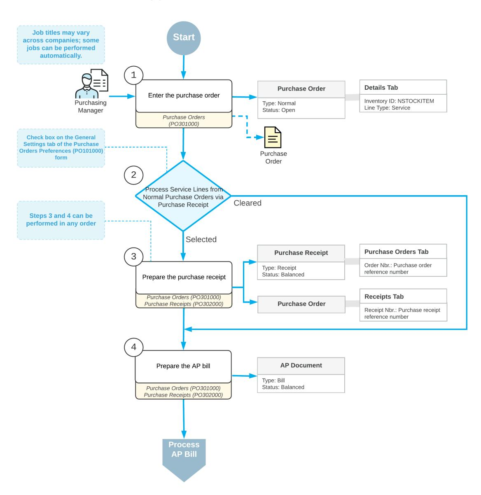

The remainder of this topic describes in detail the processing steps shown in the diagram and issues related to how this processing unfolds. The processing of the service order consists of the following steps:

1. *Entering a purchase order*

You enter a purchase order of the *Normal* type on the *[Purchase Orders](https://help-2025r1.acumatica.com/Help?ScreenId=ShowWiki&pageid=5565686c-96c4-4bfa-a51d-9a2566baa808)* (PO301000) form, and you add a *Service* line or multiple lines to the order. The reference number for a new purchase order is generated in accordance with the numbering sequence specified on the *[Purchase Orders Preferences](https://help-2025r1.acumatica.com/Help?ScreenId=ShowWiki&pageid=13d09c43-8696-4f92-ad9b-3d0209ee3d9b)* (PO101000) form. If the order is created with the *On Hold* status, you should click **Remove Hold** on the form toolbar for the order to process it further.

2. *Conditionally processing* Service *lines*

The way the system processes *Service* lines depends on the state of the **ProcessService Lines from Normal Purchase Orders via Purchase Receipt** check box on the *[Purchase Orders Preferences](https://help-2025r1.acumatica.com/Help?ScreenId=ShowWiki&pageid=13d09c43-8696-4f92-ad9b-3d0209ee3d9b)* (IN101000) form.

If the check box is cleared (the default setting), processing *Service* lines doesn't involve creating a purchase receipt; an AP bill (or multiple bills) has to be created directly from the purchase order (see Step 4). When a user creates a purchase receipt for a purchase order with lines of different types, some of which require receipt and some of which do not require receipt, the system does not copy *Service* lines to a purchase receipt that is prepared from this purchase order. Also, in this case, *Service* lines cannot be added to the purchase receipt manually.

3. *Preparing a purchase receipt (optional)*

If the **ProcessService Lines from Normal Purchase Orders via Purchase Receipt** check box is selected, a purchase receipt is required for the lines of the *Service* type. A user creates a purchase receipt from a purchase order by clicking **Enter PO Receipt** on the form toolbar of the *[Purchase Orders](https://help-2025r1.acumatica.com/Help?ScreenId=ShowWiki&pageid=5565686c-96c4-4bfa-a51d-9a2566baa808)* form. The prepared purchase receipt is available for reviewing on the *[Purchase Receipts](https://help-2025r1.acumatica.com/Help?ScreenId=ShowWiki&pageid=d9901c8d-486d-45ed-8088-ea3d8ee3af19)* (PO302000) form. If the purchase receipt is created with the *On Hold* status, you should click **Remove Hold** on the form toolbar for the receipt to process it further.

As an alternative to creating the purchase receipt while viewing the purchase order, a user can create a new purchase receipt manually and add *Service* lines to it by clicking **Add PO** or **Add PO Line** on the table toolbar of the **Details** tab of the *[Purchase Receipts](https://help-2025r1.acumatica.com/Help?ScreenId=ShowWiki&pageid=d9901c8d-486d-45ed-8088-ea3d8ee3af19)* form and using the dialog box that opens.

4. *Preparing an AP bill*

You prepare the AP bill by clicking **Enter AP Bill** on the form toolbar of the *[Purchase Orders](https://help-2025r1.acumatica.com/Help?ScreenId=ShowWiki&pageid=5565686c-96c4-4bfa-a51d-9a2566baa808)* form. The system brings up the generated AP bill on the *[Bills and Adjustments](https://help-2025r1.acumatica.com/Help?ScreenId=ShowWiki&pageid=956b4e51-3078-4d2d-85b3-65c080d95234)* (AP301000) form.

#### **Processing of the Accounts Payable Bill for the Purchase Order**

The general workflow of processing purchase orders with lines of any type is to process a purchase receipt (if it is needed) before creating an AP bill (see *[Purchases of Stock Items: General Information](#page-324-2)* for details). However, if you receive bills from a particular vendor before the ordered items are received to inventory, you can configure this vendor so that for the purchase orders of this vendor, you can create and process an AP bill before the purchase receipt is released.

To do this, you need to select the **Allow AP Bill Before Receipt** check box in the vendor settings on the *[Vendors](https://help-2025r1.acumatica.com/Help?ScreenId=ShowWiki&pageid=a9584be3-f2bd-4d67-80d4-8041d809df56)* (AP303000) form; in addition, you can select this check box for a particular vendor location on the *Vendor [Locations](https://help-2025r1.acumatica.com/Help?ScreenId=ShowWiki&pageid=aeeccc5c-465f-4bca-9cd7-a3c792da38e1)* (AP303010) form. The state of this check box is copied to each purchase order created for this vendor, and can be reviewed on the **Other** tab of the *[Purchase Orders](https://help-2025r1.acumatica.com/Help?ScreenId=ShowWiki&pageid=5565686c-96c4-4bfa-a51d-9a2566baa808)* (PO301000) form. For a detailed description on how to process a purchase order with the associated bill being prepared before the receipt, see *[Purchases with Billing Before Receipt:](#page-354-2) [General Information](#page-354-2)*.

#### **Posting Accounts for Service Lines**

When you add a *Service* line to a purchase order on the **Details** tab of the *[Purchase Orders](https://help-2025r1.acumatica.com/Help?ScreenId=ShowWiki&pageid=5565686c-96c4-4bfa-a51d-9a2566baa808)* (PO301000) form, in the **Account** column, the system inserts the Expense account specified in the **Expense Account** box of the item on the **GL Accounts** tab of the *[Non-Stock Items](https://help-2025r1.acumatica.com/Help?ScreenId=ShowWiki&pageid=bf68dd4f-63d4-460d-8dc0-9152f2bd6bf1)* (IN202000) form. If the *Subaccounts* feature is enabled on the *[Enable/Disable Features](https://help-2025r1.acumatica.com/Help?ScreenId=ShowWiki&pageid=c1555e43-1bc5-4f6f-ba9d-b323f94d8a6b)* (CS100000) form, in the**Sub.** column of the *[Purchase Orders](https://help-2025r1.acumatica.com/Help?ScreenId=ShowWiki&pageid=5565686c-96c4-4bfa-a51d-9a2566baa808)* form, the system inserts the subaccount composed as defined by the **Combine ExpenseSub. From** box of the *[Accounts Payable Preferences](https://help-2025r1.acumatica.com/Help?ScreenId=ShowWiki&pageid=c3f9353e-95e6-448d-bb3f-e20643879ec7)* (AP101000) form.

#### **Rules for Closing and Completing Service Lines**

The way the lines of the *Service* type (including the *Service* lines with the **Inventory ID** column empty) are completed and closed depends on whether the service lines are processed through receipts, and on the completion rule specified for each non-stock item in the **Close PO Line** box on the *[Non-Stock Items](https://help-2025r1.acumatica.com/Help?ScreenId=ShowWiki&pageid=bf68dd4f-63d4-460d-8dc0-9152f2bd6bf1)* (IN202000) form.

If you change the **Close PO Line** setting for a non-stock item on the *[Non-Stock Items](https://help-2025r1.acumatica.com/Help?ScreenId=ShowWiki&pageid=bf68dd4f-63d4-460d-8dc0-9152f2bd6bf1)* form, the system does not change this setting for already existing purchase orders; the newly specified setting applies to new purchase orders only. Existing purchase orders will be billed with the settings that were specified when the order was entered.

The system determines if a line of the *Service* type should be closed and completed by using the following rules:

- If the *Service* line is processed through a receipt and *By Amount* is selected in the **Close PO Line** box for an item, the line is completed automatically when the line is closed or on release of the purchase receipt if the user has selected the **Completed** check box manually. The line is closed in either of the following cases:
  - When a purchase receipt for the line is released if a user has selected the **Complete PO Line** check box manually in the purchase receipt line on the **Details** tab of the *[Purchase Receipts](https://help-2025r1.acumatica.com/Help?ScreenId=ShowWiki&pageid=d9901c8d-486d-45ed-8088-ea3d8ee3af19)* (PO302000) form.
  - When an AP bill for the line is released if the billed quantity for all bills that have been released for this line is equal to or greater than the amount of the purchase order line.
- If the *Service* line is processed through a receipt and *By Quantity* is selected in the **Close PO Line** box for an item, the line is closed when an AP bill for the line is released if the sum of the line quantities in all released bills for this line is equal to or greater than the quantity of the purchase order line \* (**Complete On %**/100). The line is completed in the following cases:
  - Automatically if the system has closed the line (that is, if the **Closed** check box is selected)
  - On release of the purchase receipt prepared for the line if the user has selected the **Completed** check box manually
  - If the sum of the received quantity for the released purchase receipts prepared for the line is equal to or greater than the quantity of the purchase order line \* (**Complete On %**/100)
- If the *Service* line is processed without a receipt and *By Amount* is selected in the **Close PO Line** box for the line item, the line is closed on release of the AP bill if the billed amount for all released bills for this line is equal to or greater than the amount of the purchase order line. The line is completed automatically when it is closed.
- If the *Service* line is processed without a receipt and *By Quantity* is selected in the **Close PO Line** box for the line item, the line is closed on release of the AP bill if the sum of the quantities in released bills for this line is equal to or greater than the quantity of the purchase order line \* (**Complete On %**/100). The line is completed automatically when it is closed.

If a user processes the lines of a purchase order partially, multiple related purchase receipts and AP bills can be prepared for a single purchase order. The system determines which purchase order lines should be added to the prepared purchase receipt or AP bill depending on the status of the **Completed** and **Closed** check boxes in each line, as follows:

- Completed purchase order lines are not added to the purchase receipt.
- Closed lines are added to neither purchase receipts nor AP bills.

If all purchase order lines have the **Completed** check box selected, and at least one line still has the **Closed** check box cleared, the purchase order is assigned the *Completed* status. If all purchase order lines have the **Completed** and **Closed** check boxes selected, the purchase order is assigned the *Closed* status.

#### **Related Links**

- *[Non-Stock Lines in Purchase Orders](#page-78-1)*
- *[Stock Item Lines in Purchase Orders](#page-76-1)*

# <span id="page-83-1"></span><span id="page-83-0"></span>**Managing Lines in Purchase Documents**

You may need to reorder document lines in purchase orders and purchase receipts—for example, if you need the lines of the printed document to be in a specific order other than in the document sent by vendor. Also, you may need to add a new line to a purchase order or purchase receipt at the beginning of a list or in the middle of it. The following sections describe how you can reorder lines in various Purchase Orders documents.

#### **Reordering Lines in Purchase Orders**

The order number of each document line is shown in the **Line Order** column on the **Details** tab of the *[Purchase](https://help-2025r1.acumatica.com/Help?ScreenId=ShowWiki&pageid=5565686c-96c4-4bfa-a51d-9a2566baa808) [Orders](https://help-2025r1.acumatica.com/Help?ScreenId=ShowWiki&pageid=5565686c-96c4-4bfa-a51d-9a2566baa808)* (PO301000) form for purchase orders, and of the *[Purchase Receipts](https://help-2025r1.acumatica.com/Help?ScreenId=ShowWiki&pageid=d9901c8d-486d-45ed-8088-ea3d8ee3af19)* (PO302000) form for purchase receipts. (On both forms, these columns are hidden by default so you should use the **Column Configuration** dialog box to make the columns available before you reorder lines.)

Once you reorder the lines, the system automatically regenerates the order numbers for each document line. You can reorder lines in a purchase order that is on hold; in a purchase receipt, you can reorder the lines until this receipt has been released. You can select the lines to be reordered in any combinations, such as the following:

- A single document line (for example, line 3 or 8). To select a single line, click it.
- Multiple non-contiguous lines (for example, lines 1, 3, and 7). To select these lines, hold Ctrl while clicking the row selector next to the needed lines.
- A contiguous group of document lines (for example, line 5 through line 9). To select a group of lines, select the first line in the group, and hold Shi while clicking the last line in the group. (Alternatively, you can click the first line and then press Shi+Down Arrow until all the needed lines are selected.)
- A group of some contiguous lines and some non-contiguous lines (for example, line 5 through line 7, and line 10). To select a non-contiguous group of lines, hold Ctrl while clicking the row selector next to the needed lines.

All selected lines are grouped and thus are moved contiguously, even if you have selected multiple non-contiguous document lines. Aer you have selected the needed lines, move them to the new place in the table in one of the following ways:

- Drag the selected line or lines to the place where you want to move them. A thin red line between the table lines shows where these lines will be inserted. Once you drag the selected lines, the system moves these lines and regenerates the **Line Order** numbers for all the lines in the table.
- When you need to move purchase order or purchase receipt lines between pages, cut the selected document lines and paste them to the new place in the table. To cut the lines, press Ctrl+X, or right-click the table and then click **Cut Row**. Then click the line the cut lines should be inserted above, and press Ctrl+V; alternatively, you can right-click the table, and then click **Insert Cut Row**.

Once you reorder the lines, the system automatically regenerates the line number for each document line. For purchase receipts, these numbers are used for numbering lines in the printable reports, such as the printable purchase receipt shown on the *[Purchase Receipt](https://help-2025r1.acumatica.com/Help?ScreenId=ShowWiki&pageid=6ebfd7cf-6cf6-421d-8cc8-ded8db3a5041)* (PO646000) report. You can cancel the line reordering by clicking **Cancel** on the form toolbar before you save these changes.


You cannot rearrange lines in the table if custom sorting by any column is applied to the table.

### **Inserting Lines into Purchase Orders and Purchase Receipts**

On the *[Purchase Orders](https://help-2025r1.acumatica.com/Help?ScreenId=ShowWiki&pageid=5565686c-96c4-4bfa-a51d-9a2566baa808)* (PO301000) and *[Purchase Receipts](https://help-2025r1.acumatica.com/Help?ScreenId=ShowWiki&pageid=d9901c8d-486d-45ed-8088-ea3d8ee3af19)* (PO302000) form, you can insert a single line anywhere in the document. To do this, click the line above which the new line should be inserted and then press Shi+Insert, or right-click the needed line and then click **Insert Row**. The system adds a new blank line. When you finish

entering the line information and save your changes, the system automatically regenerates the line numbers for all lines in the table.

# <span id="page-84-0"></span>**Changing the Vendor in a Purchase Order**

You may want to change the vendor in the existing purchase order—for example, if you want to compare the order total for different vendors, or if the wrong vendor was selected in the purchase order. To change the vendor, you need to change the vendor ID specified for the purchase order.

You change the vendor ID in the**Vendor** box of the *[Purchase Orders](https://help-2025r1.acumatica.com/Help?ScreenId=ShowWiki&pageid=5565686c-96c4-4bfa-a51d-9a2566baa808)* (PO301000) form for a purchase order that has the *On Hold* status, check the settings of the purchase order that have changed, and save your changes. The following sections describe the settings that are and are not preserved, as well as the restrictions on changing the vendor in a document.

### **Settings that Are Preserved When the Vendor Is Changed**

When you change the vendor ID of the purchase order on the *[Purchase Orders](https://help-2025r1.acumatica.com/Help?ScreenId=ShowWiki&pageid=5565686c-96c4-4bfa-a51d-9a2566baa808)* (PO301000) form, the system preserves the following settings in the Summary area:

- **Type**
- **Order Nbr.**
- **Description**
- **Currency**

The system also preserves the following information in the appropriate columns of the order lines on the **Details** tab:

- **Branch**
- **Inventory ID**, **UOM**, and **Order Qty.**
- **Warehouse**
- **LineType**
- **Project** and **ProjectTask** (if applicable)
- **Tax Category**
- The state of the **Completed** and **Canceled** check boxes
- Files and notes that have been attached to the line

#### **Settings that Are Changed When the Vendor Is Changed**

When you change the vendor ID in the purchase order on the *[Purchase Orders](https://help-2025r1.acumatica.com/Help?ScreenId=ShowWiki&pageid=5565686c-96c4-4bfa-a51d-9a2566baa808)* (PO301000) form, the system updates the following information in the Summary area based on the new date and on the settings of the newly selected vendor on the *[Vendors](https://help-2025r1.acumatica.com/Help?ScreenId=ShowWiki&pageid=a9584be3-f2bd-4d67-80d4-8041d809df56)* (AP303000) form:

- **Date**: The system inserts the current business date, but you can override it.
- **Promised On**: The system calculates this as the current business date plus the value specified as the **Lead Time (Days)** of the new vendor.
- **Location**: The system inserts the default location of the selected vendor (or it inserts *MAIN*, if it is the only location of this vendor). This box appears only if the *Business Account Locations* feature is enabled on the *[Enable/Disable Features](https://help-2025r1.acumatica.com/Help?ScreenId=ShowWiki&pageid=c1555e43-1bc5-4f6f-ba9d-b323f94d8a6b)* (CS100000) form.
- **Owner**: The system inserts the identifier of the employee corresponding to the user who changes the vendor.
- **Vendor Ref. Nbr.**: This box is cleared so that a new vendor reference number can be entered, if applicable.

• Currency Rate: This rate, which can be found in the box right of the **Currency** box that shows the identifier, is recalculated based on the new date specified for the order.

The system also updates certain document-level settings on the following tabs of the form:

- **Shipping** tab: In the**Ship Via** section, the **FOB Point** and **Ship Via** settings of the new vendor are inserted.
- **Vendor Info** tab: The settings of the newly selected vendor are inserted by default in the**Vendor Contact** and **Vendor Address** sections, but you can override the inserted settings. Also, in the **Info** section, the system inserts the vendor's settings in the following boxes:
  - **Terms**: This box holds the credit terms of the vendor.
  - **VendorTax Zone**: The system recalculates the taxes in the order based on the new tax settings).
  - **Pay-ToVendor** : This box appears on the tab if the *Vendor Relations* feature is enabled on the *[Enable/](https://help-2025r1.acumatica.com/Help?ScreenId=ShowWiki&pageid=c1555e43-1bc5-4f6f-ba9d-b323f94d8a6b) [Disable Features](https://help-2025r1.acumatica.com/Help?ScreenId=ShowWiki&pageid=c1555e43-1bc5-4f6f-ba9d-b323f94d8a6b)* form.
- **Other** tab: The system specifies the default states of the **Don't Print** and **Don't Email** check boxes based on the **Print Orders** and **Send Orders by Email** settings (respectively) of the new vendor, which have been specified on the **PurchaseSettings** tab of the *[Vendors](https://help-2025r1.acumatica.com/Help?ScreenId=ShowWiki&pageid=a9584be3-f2bd-4d67-80d4-8041d809df56)* form. Also, the **Retainage Percent** box is filled with the percentage specified for the vendor; this box appear on the tab if the **Apply Retainage** check box is selected on this tab and the *Retainage Support* feature is enabled on the *[Enable/Disable Features](https://help-2025r1.acumatica.com/Help?ScreenId=ShowWiki&pageid=c1555e43-1bc5-4f6f-ba9d-b323f94d8a6b)* form.

On the **Details** tab, the system also updates information in the appropriate columns of the purchase order lines as follows:

- The following columns related to prices and costs use the vendor-specific costs: **Unit Cost** and **Ext. Cost**
- **Alternate ID**: The system updates the column with the alternate ID of the item with the new vendor or clears the box if no alternate ID is specified for a new vendor.
- **Min. Receipt (%)**, **Max. Receipt (%)**, **Complete On (%)**, and **Receipt Action**: The default settings of the vendor are inserted for each line, but they can be overridden.
- The following columns related to discounts are updated: **Discount Percent** and **Discount Amount**.
- The expense and accrual accounts and subaccounts: The system inserts the appropriate values in the following columns: **Account**, **Sub.**, **Accrual Account**, and **AccrualSub.**
- The following columns related to dates are updated: **Requested** and **Promised**.

The system does not automatically save the document aer you change the vendor ID, so you can easily cancel these changes by clicking **Cancel** on the form toolbar.

#### **Restrictions on Changing the Vendor**

You cannot save the purchase order aer changing the vendor in any of the following cases:

- At least one AP bill, prepayment, or purchase receipt has been linked to the purchase order.
- The purchase order has a line or multiple lines that have been created based on a blanket purchase order.

# <span id="page-85-1"></span><span id="page-85-0"></span>**Changing the Processing of Purchase Documents**

In Acumatica ERP, you can require a user to perform additional steps during the processing of purchase orders and related documents. The following sections of this topic explain how you can adjust the workflow for processing the purchase orders and the related documents as needed in your organization.

#### **Holding Purchase Receipts and Landed Cost Documents on Entry**

The following documents are created with the *On Hold* status if the respective check box is selected on the *[Purchase Orders Preferences](https://help-2025r1.acumatica.com/Help?ScreenId=ShowWiki&pageid=13d09c43-8696-4f92-ad9b-3d0209ee3d9b)* (PO101000) form:

• Purchase receipts: **Hold Receipts on Entry**

• Landed cost documents: **Hold Landed Costs on Entry**

If one of these check boxes is cleared, the newly created documents of the associated type are created with the *Balanced* status.

#### **Affecting the Processing of Generated Documents**

The following documents are released automatically upon generation if the respective check box is selected on the *[Purchase Orders Preferences](https://help-2025r1.acumatica.com/Help?ScreenId=ShowWiki&pageid=13d09c43-8696-4f92-ad9b-3d0209ee3d9b)* (PO101000) form:

- Inventory receipts: **Release IN Documents Automatically**
- Landed cost adjustments: **Release LC IN Adjustments Automatically**
- Accounts payable documents: **Release AP Documents Automatically**

If one of these check boxes is cleared, the documents of the associated type are generated and saved with the *Balanced* status.

#### **Making the Entry of Documents Error-Proof**

In the **ValidateTotal on Entry** section on the *[Purchase Orders Preferences](https://help-2025r1.acumatica.com/Help?ScreenId=ShowWiki&pageid=13d09c43-8696-4f92-ad9b-3d0209ee3d9b)* (PO101000) form, you can prevent the particular type of document from being processed until a user types the total order amount in the **Control Total** box (for orders and landed costs), or the total receipt quantity in the **Control Qty.** box, on the corresponding document entry form. The control total or quantity that the user enters must be equal to the order total calculated by the system. You can select the corresponding check boxes in this section to enable total validation for receipts, normal and standard purchase orders, blanket orders, drop-ship purchase orders, and landed cost documents.

#### **Making the Entry of an External Reference Number Foolproof**

You select the **RequireVendor Reference** check box on the *[Accounts Payable Preferences](https://help-2025r1.acumatica.com/Help?ScreenId=ShowWiki&pageid=c3f9353e-95e6-448d-bb3f-e20643879ec7)* (AP101000) form to prevent any actions from being performed on a purchase receipt or a landed cost document (that is still editable) until a user types the external reference number of the vendor's original document in the**Vendor Ref.** box, which is displayed on the *[Purchase Receipts](https://help-2025r1.acumatica.com/Help?ScreenId=ShowWiki&pageid=d9901c8d-486d-45ed-8088-ea3d8ee3af19)* (PO302000) form (for purchase receipts) or *[Landed Costs](https://help-2025r1.acumatica.com/Help?ScreenId=ShowWiki&pageid=849e4a26-8c54-4a98-b366-02ea6a35e9fd)* (PO303000) form (for landed cost documents).

#### **Affecting the Purchase Receipt Creation**

You can use the **Default Receipt Quantity** box on the *[Purchase Orders Preferences](https://help-2025r1.acumatica.com/Help?ScreenId=ShowWiki&pageid=13d09c43-8696-4f92-ad9b-3d0209ee3d9b)* (PO101000) form to define which quantities the system should specify in purchase receipts created from purchase orders. You can configure the system to create purchase receipt lines with items' quantities from a purchase order (if the *Open Quantity* is selected), or to create lines with a quantity of zero by default, so that the user enters the received quantity manually.

#### **Determining Whether Bills Are Created**

To set up the workflow of the processing of purchase receipts, landed cost documents, and bills, you can use the **Create Bill On Receipt Release** and **Create Bill on LC Release** check boxes on the *[Purchase Orders Preferences](https://help-2025r1.acumatica.com/Help?ScreenId=ShowWiki&pageid=13d09c43-8696-4f92-ad9b-3d0209ee3d9b)* (PO101000) form. These check boxes provides the default value for the **Create Bill** check box on the *[Purchase](https://help-2025r1.acumatica.com/Help?ScreenId=ShowWiki&pageid=d9901c8d-486d-45ed-8088-ea3d8ee3af19) [Receipts](https://help-2025r1.acumatica.com/Help?ScreenId=ShowWiki&pageid=d9901c8d-486d-45ed-8088-ea3d8ee3af19)* (PO302000) form and on the *[Landed Costs](https://help-2025r1.acumatica.com/Help?ScreenId=ShowWiki&pageid=849e4a26-8c54-4a98-b366-02ea6a35e9fd)* (PO303000) form, respectively.

For the convenience of users, you should select these check boxes if bills should be generated automatically for most receipts and landed cost documents. You should clear these check boxes if users should enter bills manually for most receipts or landed cost documents or if users enter or import the bills and later link them to receipts and landed cost documents. A user can override this setting if needed for a particular purchase receipt or landed cost document.

#### **Affecting the Processing of Bills**

The **Allow AP Bill Before Receipt** check box, which can be selected or cleared for a particular vendor on the *[Vendors](https://help-2025r1.acumatica.com/Help?ScreenId=ShowWiki&pageid=a9584be3-f2bd-4d67-80d4-8041d809df56)* (AP303000) form or for a particular vendor location on the *Vendor [Locations](https://help-2025r1.acumatica.com/Help?ScreenId=ShowWiki&pageid=aeeccc5c-465f-4bca-9cd7-a3c792da38e1)* (AP303010) form, defines the workflow for processing purchase orders and related documents. The state of the check box is copied to purchase orders prepared for the vendor, and affects the processing as follows:

- If the check box is selected, you can create a purchase receipt and an AP bill for the purchase order in any order.
- If the check box is cleared, you can prepare an AP bill for the lines with stock items and non-stock items requiring receipt only aer the purchase receipt has been prepared and processed.

#### **Affecting the Processing of Service Lines**

On the *[Purchase Orders Preferences](https://help-2025r1.acumatica.com/Help?ScreenId=ShowWiki&pageid=13d09c43-8696-4f92-ad9b-3d0209ee3d9b)* (PO101000) form, you can specify whether the system should process lines of the *Service* type in normal and drop-ship purchase orders, respectively, through purchase receipts by selecting or clearing the following check boxes:

- **ProcessService Lines from Normal Purchase Orders via Purchase Receipt**: If this check box is selected, non-stock lines of the *Service* type in purchase orders of the *Normal* type are processed through purchase receipts. If the check box is cleared, the non-stock lines of the *Service* type are not copied to purchase receipts and are billed directly from purchase orders.
- **ProcessService Lines from Drop-Ship Purchase Orders via Purchase Receipt**: If this check box is selected, non-stock lines of the *Service* type in purchase orders of the *Drop-Ship* type are processed through purchase receipts. If the check box is cleared, the non-stock lines of the *Service* type are not copied to purchase receipts and are billed directly from drop-ship orders.

# <span id="page-87-1"></span><span id="page-87-0"></span>**Calculating Use and Sales Taxes in Purchase Documents**

A use tax is a type of a tax that is applied when a merchant purchases a product or service on which sales tax was not initially paid, and then converts this product or service for its own use. For example, if your company purchases tax-free goods from a vendor that is not registered in the state of your purchase, it must report the purchases and pay the use tax directly to the tax agency of your state.

The rate and the amount of the use taxes that apply to a purchase document can depend on many factors, including the types of items purchased, the vendor relations you have configured, the remittance address of the vendor, and the address of the warehouse.

#### **Use Tax Calculation with Avalara AvaTax**

If your system is integrated with the AvaTax service of Avalara or another third-party tax calculation soware, the applicable taxes are calculated by this service or soware and recorded to the purchase order or AP bill when you save the document.

Once a user creates a document that is subject to taxes and removes it from hold (if applicable), the system checks whether the vendor location specified in the document is in the tax zone configured for the tax calculation soware. If so, the system sends a request to the tax calculation soware to determine the applicable taxes, based on the vendor location address, entity code, available exemption certificates, and tax rules (if any). The tax amounts computed by the tax calculation soware are sent to Acumatica ERP and can be reviewed on the**Taxes** tab of the *[Purchase Orders](https://help-2025r1.acumatica.com/Help?ScreenId=ShowWiki&pageid=5565686c-96c4-4bfa-a51d-9a2566baa808)* (PO301000) form or *[Bills and Adjustments](https://help-2025r1.acumatica.com/Help?ScreenId=ShowWiki&pageid=956b4e51-3078-4d2d-85b3-65c080d95234)* (AP301000) form.

For purchase orders, the taxes are shown for informational purposes only. Only taxes on AP bills are actually reported to the applicable tax agency.

The way the tax calculation soware calculates use taxes depends on the settings of the origin (**From**) and destination (**To**) addresses specified in an Acumatica ERP document. The following sections describes how the system selects the **From** and **To** addresses in documents and individual document lines, depending on the document type and vendor settings.

### **Sales Tax Calculation in Acumatica ERP**

Acumatica ERP supports automatic calculation of sales taxes in purchase orders with the sales tax amount included in the document total. You can also select a sales tax with the *Input* group manually on the**Taxes** tab of the *[Purchase Orders](https://help-2025r1.acumatica.com/Help?ScreenId=ShowWiki&pageid=5565686c-96c4-4bfa-a51d-9a2566baa808)* (PO301000) form.

For details on creating a sales tax of the *Input* type, see *Sales Taxes: To [Configure](https://help-2025r1.acumatica.com/Help?ScreenId=ShowWiki&pageid=90e34a12-31c5-4acf-80eb-9b8e6a006eb5) a Sales Tax for Use in AP*.

#### **Addresses in Purchase Orders**

In the document header of a purchase order, the system specifies the remittance address of the vendor selected in the purchase order as the **From** address, and the**Ship-To** address of the purchase order as the**To** address.

In the individual purchase order lines, the system specifies the **From** and **To** addresses by using the following rules:

- For lines of *Normal*, *Blanket*, and *Standard* purchase orders, the system specifies the vendor remittance address as the **From** address, and the address of the warehouse in the line as the**To** address. (If the *Multiple Warehouses* feature is not used in the system, the**Ship-To** address of the purchase order is used as the**To** address.)
- For lines of *Drop-Ship* and *Project Drop-Ship* purchase orders, the system specifies the vendor remittance address as the **From** address, and the**Ship-To** address of the purchase order as the**To** address.

#### **Addresses in Accounts Payable Bills**

If the **Vendor Relations** feature is disabled on the *[Enable/Disable Features](https://help-2025r1.acumatica.com/Help?ScreenId=ShowWiki&pageid=c1555e43-1bc5-4f6f-ba9d-b323f94d8a6b)* (CS100000) form, the system specifies the vendor location address of the bill as the **From** address, and the main address of the bill's branch as the**To** address.

If the **Vendor Relations** feature is enabled on the *[Enable/Disable Features](https://help-2025r1.acumatica.com/Help?ScreenId=ShowWiki&pageid=c1555e43-1bc5-4f6f-ba9d-b323f94d8a6b)* form and vendor relations are set up, the system specifies the supplied-by vendor's location address of the bill as the **From** address, and the main address of the bill's branch as the**To** address.

In the individual lines of the bills, the system specifies the **From** and **To** addresses by using the following rules:

- If a bill line is related to a line of a *Normal* purchase order, the system specifies the vendor address of the related purchase order line as the **From** address, and the address of the warehouse in the related purchase receipt line (or in the related purchase order line if the receipt has not been prepared yet) as the**To** address. (If the *Multiple Warehouses* feature is not used in the system, the**Ship-To** address of the purchase order is used as the **To** address.)
- If a bill line is related to a line of a *Drop-Ship* or *Project Drop-Ship* purchase order, the system specifies the vendor address of the related purchase order line as the **From** address, and the**Ship-To** address of the purchase order as the**To** address.
- If a bill line is related to a line of a direct purchase receipt (that is, one that is not linked to a purchase order), the system uses the vendor location address of the related purchase receipt as the **From** address, and the address of the warehouse in the related purchase receipt as the**To** address. (If the *Multiple Warehouses* feature is not used in the system, the main address of the bill's branch is used as the**To** address.)
- If a bill line is not related to any line of a purchase order or purchase receipt, the system uses the vendor location address of the bill as the **From** address, and the main address of the bill's branch as the**To** address.

For an overview of the integration with Avalara AvaTax and instructions on how to configure the integration, see *[Integrating](https://help-2025r1.acumatica.com/Help?ScreenId=ShowWiki&pageid=f048ad33-3308-49aa-aac8-fec1a470fc0f) Acumatica ERP with Avalara Avatax*.

# <span id="page-89-0"></span>**Inclusive VAT Support in Purchase Orders**

The Purchase Orders module supports value added taxes (VATs) on purchased items if the *VAT Reporting* feature is enabled on the *[Enable/Disable Features](https://help-2025r1.acumatica.com/Help?ScreenId=ShowWiki&pageid=c1555e43-1bc5-4f6f-ba9d-b323f94d8a6b)* (CS100000) form.

In most European countries, where VATs are oen used, prices for consumers are tax-inclusive—that is, specified with the tax amount included. In Acumatica ERP, you can configure the VAT-like taxes or sales taxes as calculated separately on item prices or as extracted from prices. The base and sale prices, too, can be specified as including or excluding the appropriate tax amount.

Inclusive and non-inclusive taxes are configured on the *[Taxes](https://help-2025r1.acumatica.com/Help?ScreenId=ShowWiki&pageid=692e30c9-e0af-4aa3-b0f6-f3ba190d257a)* (TX205000) form. For inclusive taxes, the **Extract from Item Amount** option is selected.

On the *[Purchase Orders](https://help-2025r1.acumatica.com/Help?ScreenId=ShowWiki&pageid=5565686c-96c4-4bfa-a51d-9a2566baa808)* (PO301000) form, the document details include applicable taxes shown for informational purposes on the **Tax Details** tab; the list of applicable taxes includes the taxes present in both the vendor tax zone and the ordered item's tax category. On the *[Purchase Receipts](https://help-2025r1.acumatica.com/Help?ScreenId=ShowWiki&pageid=d9901c8d-486d-45ed-8088-ea3d8ee3af19)* (PO302000) form, tax amounts are calculated because although value-added taxes for inventory items are paid to vendors, they are claimable from the tax agency.

Correcting taxes in a purchase order does not affect the taxes in documents (purchase receipts and Accounts Payable bills) created from this purchase order. The taxes for each document are calculated when the document is created based on the tax settings of this document.

#### **Example of Inclusive Tax Processing**

Consider an example in which a company purchases 100 motherboards at \$22 each with a 10% VAT included. The total amount is \$2200, and the VAT amount calculated for the document is \$200.

The following transactions will be generated for the Inventory receipt.

| Account                | Credit | Debit             |  |  |  |  |
|------------------------|--------|-------------------|--|--|--|--|
| Inventory (Components) | 0      | 2200 – 200 = 2000 |  |  |  |  |
| PO Accruals            | 2000   | 0                 |  |  |  |  |

The following transactions will be generated for the Accounts Payable bill.

| Account               | Credit                     | Debit                 |
|-----------------------|----------------------------|-----------------------|
| PO Accruals           | 0                          | 2000 (accrued amount) |
| Accounts Payable      | 2200 (full receipt amount) | 0                     |
| VAT Claimable Account | 0                          | 200                   |

If any difference arises, because of rounding, between the original order amount and the sum of the tax amount and the amount to be recorded to the accrual account, it will be added to the Purchase Price Variance account.

#### **Related Links**

- *[Bills and Adjustments](https://help-2025r1.acumatica.com/Help?ScreenId=ShowWiki&pageid=956b4e51-3078-4d2d-85b3-65c080d95234)*
- *[Receipts](https://help-2025r1.acumatica.com/Help?ScreenId=ShowWiki&pageid=d6ecad5b-155f-44bf-baba-9ed006d298b5)*
- *[Purchase Orders Preferences](https://help-2025r1.acumatica.com/Help?ScreenId=ShowWiki&pageid=13d09c43-8696-4f92-ad9b-3d0209ee3d9b)*
- *[Purchase Orders](https://help-2025r1.acumatica.com/Help?ScreenId=ShowWiki&pageid=5565686c-96c4-4bfa-a51d-9a2566baa808)*
- *[Purchase Receipts](https://help-2025r1.acumatica.com/Help?ScreenId=ShowWiki&pageid=d9901c8d-486d-45ed-8088-ea3d8ee3af19)*
- *[Taxes](https://help-2025r1.acumatica.com/Help?ScreenId=ShowWiki&pageid=692e30c9-e0af-4aa3-b0f6-f3ba190d257a)*

# <span id="page-90-0"></span>**Vendor Catalogs**

In Acumatica ERP, you can populate and maintain a vendor catalog for each vendor. A vendor catalog is a list of the inventory items you purchase from the vendor, along with the last prices of the items and the purchasing settings of the items, which are generally used for automated replenishment.

By populating and maintaining vendor catalogs, you give users the ability to efficiently select the vendors that sell specific items. For any item in the vendor catalog, you can also specify vendor-specific alternate IDs, so that users can enter them in purchase orders.

#### **Manual Population of Vendor Catalogs**

You use the *Vendor [Inventory](https://help-2025r1.acumatica.com/Help?ScreenId=ShowWiki&pageid=7963881f-4de3-4375-a0b0-335ef7aa7155)* (PO201000) form to maintain and populate vendor catalogs. On this form, you can select a vendor and populate the table with the items your company can purchase from this vendor.

If the *Business Account Locations* feature is enabled on the *[Enable/Disable Features](https://help-2025r1.acumatica.com/Help?ScreenId=ShowWiki&pageid=c1555e43-1bc5-4f6f-ba9d-b323f94d8a6b)* (CS100000) form, the **Location** box appears in the Summary area of the *Vendor [Inventory](https://help-2025r1.acumatica.com/Help?ScreenId=ShowWiki&pageid=7963881f-4de3-4375-a0b0-335ef7aa7155)* form. In this case, you can populate and view the items your company can purchase from the selected vendor location.

For each item, you can specify (and update aer initial entry) the following information, some of which may be specific to the vendor location:

- The vendor inventory ID, which is the identifier used by the vendor for the item. If you specify an alternate ID, a user can enter the ID in a purchase order or receipt for the vendor, and the system will insert the correct inventory ID. This alternate ID can be assigned to the item (or to the item–subitem pair if your organization uses subitems). When you enter the alternate ID in the vendor catalog, the system copies the alternate ID to the item settings on the *[Stock Items](https://help-2025r1.acumatica.com/Help?ScreenId=ShowWiki&pageid=77786a70-1f1e-4d63-ad98-96f98e4fcb0e)* (IN202500) or *[Non-Stock Items](https://help-2025r1.acumatica.com/Help?ScreenId=ShowWiki&pageid=bf68dd4f-63d4-460d-8dc0-9152f2bd6bf1)* (IN202000) form. If the alternate ID is entered for the item, the system inserts in to the vendor catalog automatically.
- The unit of measure (UOM) in which the vendor sells the item at this location (defined as the item's *purchase unit* in your organization). The system automatically copies the purchase UOM for the item from the item settings on the *[Stock Items](https://help-2025r1.acumatica.com/Help?ScreenId=ShowWiki&pageid=77786a70-1f1e-4d63-ad98-96f98e4fcb0e)* or *[Non-Stock Items](https://help-2025r1.acumatica.com/Help?ScreenId=ShowWiki&pageid=bf68dd4f-63d4-460d-8dc0-9152f2bd6bf1)* form, but you can override the unit of measure.
- The economic order quantity, which represents the quantity of this item required to minimize the costs of ordering from this vendor location.
- The vendor lead time, and the additional lead time (if any) for the inventory item purchased from the vendor. The system uses the additional lead time to schedule the purchases from the vendor and calculate the promised date. When a user creates a purchase order with the item, the system automatically calculates the promised date by adding the lead time and additional lead time (if any was specified for the item) to the requested date.
- The purchasing information that is used in automated replenishment:
  - The minimum frequency of orders.
  - The minimum and maximum quantity that form the range in which the order quantity must fall.

You cannot enter the prices in the **LastVendor Price** column. The column is populated by the system and updated automatically with the prices that were last used for the items. For details on setting up automatic price updating, see the *Updating of Last Vendor Prices* section.

#### **System Population of Vendor Catalogs**

As mentioned, you can manually add a vendor's items to the vendor catalog on the *Vendor [Inventory](https://help-2025r1.acumatica.com/Help?ScreenId=ShowWiki&pageid=7963881f-4de3-4375-a0b0-335ef7aa7155)* (PO201000) form and edit item settings. The system also populates and updates the vendor's catalog based on events and settings in the system.

The vendors from which an item can be or has been purchased are listed on the**Vendors** tab of the *[Stock Items](https://help-2025r1.acumatica.com/Help?ScreenId=ShowWiki&pageid=77786a70-1f1e-4d63-ad98-96f98e4fcb0e)* (IN202500) form for a stock item and the *[Non-Stock Items](https://help-2025r1.acumatica.com/Help?ScreenId=ShowWiki&pageid=bf68dd4f-63d4-460d-8dc0-9152f2bd6bf1)* (IN202000) form for a non-stock item. If you add a vendor for an item on one of these forms, when you open the *Vendor [Inventory](https://help-2025r1.acumatica.com/Help?ScreenId=ShowWiki&pageid=7963881f-4de3-4375-a0b0-335ef7aa7155)* form and select the vendor, the added item is listed in the vendor catalog. Similarly, if you delete the vendor in the item settings because the vendor no longer provides the item or your company prefers not to purchase it from this vendor, the system removes it from the vendor catalog.

If an item not already in the catalog is purchased from a vendor, the system can add the item to the vendor catalog, depending on the option selected in the**Vendor Price Update** box on the **Price/DiscountSettings** tab of the *[Accounts Payable Preferences](https://help-2025r1.acumatica.com/Help?ScreenId=ShowWiki&pageid=c3f9353e-95e6-448d-bb3f-e20643879ec7)* (AP101000) form. If *On PO Entry* or *On AP Bill Release* is selected, the item is added to the vendor catalog either when the purchase order is created or when the corresponding AP bill is released, respectively. If *None* is selected in the**Vendor Price Update** box, the purchased item is not added to the vendor catalog at all. In this case, you can add the item to the vendor catalog only manually.

#### **Updating of Last Vendor Prices**

You can update vendor catalogs manually at any time by adding items and updating any changed settings on the *Vendor [Inventory](https://help-2025r1.acumatica.com/Help?ScreenId=ShowWiki&pageid=7963881f-4de3-4375-a0b0-335ef7aa7155)* (PO201000) form. However, the last used prices in the catalogs cannot be entered manually; the system updates these prices automatically from prices used in vendor documents.

The system can automatically update the last used vendor prices in the vendor catalog based on the entry or release of specific vendor documents. To make this possible, on the **Pricing** tab of the *[Accounts Payable](https://help-2025r1.acumatica.com/Help?ScreenId=ShowWiki&pageid=c3f9353e-95e6-448d-bb3f-e20643879ec7) [Preferences](https://help-2025r1.acumatica.com/Help?ScreenId=ShowWiki&pageid=c3f9353e-95e6-448d-bb3f-e20643879ec7)* (AP101000) form, in the**Vendor Price Update** box, select one of the following options:

- *On PO Entry*
- *On AP Bill Release*

When the event specified by the respective**Vendor Price Update** option (purchase order entry, or release of an AP bill that is linked to a purchase receipt or order) occurs, the item's unit price from the document replaces the last price of the item with the same UOM in the vendor catalog. If the UOM of the last price is the same as in the document, but the currency differs from the document's currency, the item's unit price in the document currency replaces the last price. If the UOM in the document line differs from the UOM of the last price, the system adds a new line to the vendor catalog.

The system does not keep the history of price changes in the vendor catalog.

If you do not want to maintain information about the last used prices in the vendor catalogs, select *None* as the **Vendor Price Update** option. With this setting, the last used prices will not be updated automatically.

#### **Use of the Prices from Vendor Catalogs**

If you regularly receive vendors' price lists for all or most of their items, you can use the *[Vendor](https://help-2025r1.acumatica.com/Help?ScreenId=ShowWiki&pageid=d14478b3-0718-4632-9fe2-a563f79aa038) Prices* (AP202000) and *Vendor Price [Worksheets](https://help-2025r1.acumatica.com/Help?ScreenId=ShowWiki&pageid=793d5d6c-e530-4f19-996d-4a3bfd7ce690)* (AP202010) forms instead of the vendor catalog. These forms provide greater flexibility in price maintenance because you can import price lists and calculate the updated prices by applying specific percentages.

Maintaining vendor prices through vendor catalogs on the *Vendor [Inventory](https://help-2025r1.acumatica.com/Help?ScreenId=ShowWiki&pageid=7963881f-4de3-4375-a0b0-335ef7aa7155)* (PO201000) form is a better option if a vendor's prices do not change oen or information about prices is not available in advance. Once the system populates the **LastVendor Price** column for items in the vendor catalogs, the system uses these last used prices as the default prices for the corresponding items on new purchase orders.

When you create a purchase order on the *[Purchase Orders](https://help-2025r1.acumatica.com/Help?ScreenId=ShowWiki&pageid=5565686c-96c4-4bfa-a51d-9a2566baa808)* (PO301000) form or a purchase receipt on the *[Purchase](https://help-2025r1.acumatica.com/Help?ScreenId=ShowWiki&pageid=d9901c8d-486d-45ed-8088-ea3d8ee3af19) [Receipts](https://help-2025r1.acumatica.com/Help?ScreenId=ShowWiki&pageid=d9901c8d-486d-45ed-8088-ea3d8ee3af19)* (PO302000) form, the system inserts the price of each item on the **Details** tab (**Unit Cost** column) as follows:

- If no prices are listed for the item on the *[Vendor](https://help-2025r1.acumatica.com/Help?ScreenId=ShowWiki&pageid=d14478b3-0718-4632-9fe2-a563f79aa038) Prices* form, the system inserts the last price from the vendor catalog.
- If prices are listed for the item on the *[Vendor](https://help-2025r1.acumatica.com/Help?ScreenId=ShowWiki&pageid=d14478b3-0718-4632-9fe2-a563f79aa038) Prices* form, the system selects the price to be inserted as described in *Vendor Prices: [Automatic](https://help-2025r1.acumatica.com/Help?ScreenId=ShowWiki&pageid=75003a13-2613-4725-b2fe-07c5afe0f1f5) Price Selection*. This may be a warehouse-specific price if the *Multiple Warehouses* feature is enabled on the *[Enable/Disable Features](https://help-2025r1.acumatica.com/Help?ScreenId=ShowWiki&pageid=c1555e43-1bc5-4f6f-ba9d-b323f94d8a6b)* (CS1000000) form. For details about vendor prices, see *Vendor Prices: General [Information](https://help-2025r1.acumatica.com/Help?ScreenId=ShowWiki&pageid=b8a92f04-1346-443b-aba0-9809a9d996e0)*.

When you create a new purchase order based on a purchase requisition that has been created on the *[Requisitions](https://help-2025r1.acumatica.com/Help?ScreenId=ShowWiki&pageid=511c0b78-a659-4ff7-9b1f-bd82eb063dbc)* (RQ302000) form, the system uses the price defined in the purchase requisition for each item as the unit price of the item in the purchase order. If the *[Vendor](https://help-2025r1.acumatica.com/Help?ScreenId=ShowWiki&pageid=d14478b3-0718-4632-9fe2-a563f79aa038) Prices* form includes prices (including warehouse-specific prices) for the item, the system will not override the price of the item, even though you changed the warehouse in the created purchase order.

If you are browsing the vendor catalog on the *Vendor [Inventory](https://help-2025r1.acumatica.com/Help?ScreenId=ShowWiki&pageid=7963881f-4de3-4375-a0b0-335ef7aa7155)* form, you can view this vendor's current item prices by clicking the row with the item and then clicking the**Vendor Prices** button on the table toolbar, which opens the *[Vendor](https://help-2025r1.acumatica.com/Help?ScreenId=ShowWiki&pageid=d14478b3-0718-4632-9fe2-a563f79aa038) Prices* (AP202000) form.

You can override the default catalog prices on a purchase order or purchase receipt if the actual purchase prices for inventory items are different from those listed in the vendor catalog. In this case, the new prices that you enter will automatically appear in the vendor catalog as the last used prices; the particular event triggering this update depends on the option selected in the**Vendor Price Update** box. The new prices will then appear on a new purchase order when a user creates it.

However, if the *Volume Pricing* feature is enabled in your system and you purchase different volumes with different prices from your vendors, consider whether you need to maintain price updating in the catalog, taking into account that you will not know what volume the price listed in the catalog corresponds to.

#### **Related Links**

- *[Item Cross-References](https://help-2025r1.acumatica.com/Help?ScreenId=ShowWiki&pageid=07b78589-6e40-4fb0-826c-7ed4d1e08e91)*
- *[Purchase Orders Preferences](https://help-2025r1.acumatica.com/Help?ScreenId=ShowWiki&pageid=13d09c43-8696-4f92-ad9b-3d0209ee3d9b)*
- *Vendor [Inventory](https://help-2025r1.acumatica.com/Help?ScreenId=ShowWiki&pageid=7963881f-4de3-4375-a0b0-335ef7aa7155)*

### <span id="page-92-0"></span>**Vendor Relations in Purchase Documents**

If the *Vendor Relations* feature is enabled on the *[Enable/Disable Features](https://help-2025r1.acumatica.com/Help?ScreenId=ShowWiki&pageid=c1555e43-1bc5-4f6f-ba9d-b323f94d8a6b)* (CS100000) form, the vendor relations functionality can be configured. The following sections describe how the vendor relations you configure may affect the AP bills and debit adjustments created based on a purchase order or purchase receipt.

#### **Vendor Relations Overview**

In some companies that consist of multiple branches, the branches can collectively make on order to a vendor on behalf of the company (that is, its head office) by sending purchase orders to that vendor. The supplier provides goods and issues a bill to the head office of the company. The head office pays it, and, in turn, issues bills to its branches. As a result, a branch receives goods from one vendor (specified in the purchase order), but pays for those goods to another vendor (specified in the bill). In Acumatica ERP, you can set up vendor relations so that the system accurately handles those vendor relations in documents. On the *[Vendors](https://help-2025r1.acumatica.com/Help?ScreenId=ShowWiki&pageid=a9584be3-f2bd-4d67-80d4-8041d809df56)* (AP303000) form, for each vendor that supplies goods and services but does not receive payment (a *supplied-by* vendor), you specify its vendor for which an AP bill or debit adjustment should be created if this vendor is specified in a purchase order or receipt (the pay-to vendor). For details, see *Vendor Relations: General [Information](https://help-2025r1.acumatica.com/Help?ScreenId=ShowWiki&pageid=59fb000e-e055-4516-819c-3c1601f579d3)*.

#### **Vendor Relations in Purchase Orders and Purchase Receipts**

When you create a purchase order on the *[Purchase Orders](https://help-2025r1.acumatica.com/Help?ScreenId=ShowWiki&pageid=5565686c-96c4-4bfa-a51d-9a2566baa808)* (PO301000) form, in the**Vendor** box of the Summary area, you can select a vendor with either vendor relations set up (a supplied-by vendor) or a vendor with no vendor relations set up. The system does one of the following for the purchase order:

- If the selected vendor is a supplied-by vendor, the system inserts in the **Pay-toVendor** box of the**Vendor Info** tab the pay-to vendor that is specified for the selected supplied-by vendor on the *[Vendors](https://help-2025r1.acumatica.com/Help?ScreenId=ShowWiki&pageid=a9584be3-f2bd-4d67-80d4-8041d809df56)* form.
- If vendor relations are not configured for the selected vendor, the system inserts this same vendor in the **Pay-toVendor** box of the**Vendor Info** tab.

For purchase receipts on the *[Purchase Receipts](https://help-2025r1.acumatica.com/Help?ScreenId=ShowWiki&pageid=d9901c8d-486d-45ed-8088-ea3d8ee3af19)* (PO302000) form, the system selects the **Pay-to Vendor** in the same way. The only difference is that this box is located on the **Financial Details** tab, in the **BillingSettings** section.

For a purchase order or a purchase receipt, you can override the vendor in the **Pay-toVendor** box, if needed.

With the vendor relations functionality set up, when you click **Enter AP Bill** on the form toolbar of the *[Purchase](https://help-2025r1.acumatica.com/Help?ScreenId=ShowWiki&pageid=5565686c-96c4-4bfa-a51d-9a2566baa808) [Orders](https://help-2025r1.acumatica.com/Help?ScreenId=ShowWiki&pageid=5565686c-96c4-4bfa-a51d-9a2566baa808)* or *[Purchase Receipts](https://help-2025r1.acumatica.com/Help?ScreenId=ShowWiki&pageid=d9901c8d-486d-45ed-8088-ea3d8ee3af19)* form, the system creates an AP bill (or, for example, a debit adjustment for a purchase receipt of the *Return* type) on the *[Bills and Adjustments](https://help-2025r1.acumatica.com/Help?ScreenId=ShowWiki&pageid=956b4e51-3078-4d2d-85b3-65c080d95234)* (AP301000) form that has all the details copied from the initial document except the vendor in the**Vendor** box. In this box, the system inserts the vendor specified in the **Pay-toVendor** box of the *[Purchase Orders](https://help-2025r1.acumatica.com/Help?ScreenId=ShowWiki&pageid=5565686c-96c4-4bfa-a51d-9a2566baa808)* or *[Purchase Receipts](https://help-2025r1.acumatica.com/Help?ScreenId=ShowWiki&pageid=d9901c8d-486d-45ed-8088-ea3d8ee3af19)* form. As a result, the bill will be paid to a different vendor than the vendor for which the purchase order was created.

#### **Discount Calculation**

In an accounts payable document (bill or debit adjustment) on the *[Bills and Adjustments](https://help-2025r1.acumatica.com/Help?ScreenId=ShowWiki&pageid=956b4e51-3078-4d2d-85b3-65c080d95234)* (AP301000) form that is based on the purchase order, the system uses the discounts of the supplied-by vendor to calculate document discounts.

Neither manual discounts nor automatic discounts are transferred from a purchase order on the *[Purchase Orders](https://help-2025r1.acumatica.com/Help?ScreenId=ShowWiki&pageid=5565686c-96c4-4bfa-a51d-9a2566baa808)* (PO301000) form to the related bill on the *[Bills and Adjustments](https://help-2025r1.acumatica.com/Help?ScreenId=ShowWiki&pageid=956b4e51-3078-4d2d-85b3-65c080d95234)* form. The discounts are recalculated when the bill is created.

#### **Tax Calculation**

For a purchase order or purchase receipt on the *[Purchase Orders](https://help-2025r1.acumatica.com/Help?ScreenId=ShowWiki&pageid=5565686c-96c4-4bfa-a51d-9a2566baa808)* (PO301000) or *[Purchase Receipts](https://help-2025r1.acumatica.com/Help?ScreenId=ShowWiki&pageid=d9901c8d-486d-45ed-8088-ea3d8ee3af19)* (PO302000) form with vendor relations set up, the system calculates the tax and taxable amounts of the purchase order or purchase receipt by using the tax zones of the supplied-by vendors (that is, of the vendor specified in the**Vendor** box of the Summary area of the *[Purchase Orders](https://help-2025r1.acumatica.com/Help?ScreenId=ShowWiki&pageid=5565686c-96c4-4bfa-a51d-9a2566baa808)* or *[Purchase Receipts](https://help-2025r1.acumatica.com/Help?ScreenId=ShowWiki&pageid=d9901c8d-486d-45ed-8088-ea3d8ee3af19)* form). With vendor relations set up, the system calculates the tax and taxable amounts of the Accounts Payable documents similarly.

If integration with Avalara AvaTax is configured and used for calculating taxes for purchase documents, the vendor relations you configure may affect the way the system selects the **From** and **To** addresses in these purchase documents. For more information, see *Calculating Use and Sales Taxes in Purchase [Documents](#page-87-1)*.

#### **Related Links**

- *Vendor Relations: Application in AP [Documents](https://help-2025r1.acumatica.com/Help?ScreenId=ShowWiki&pageid=233dc916-55e7-40dd-a948-373cfb7a4134)*
- *Vendor Relations: General [Information](https://help-2025r1.acumatica.com/Help?ScreenId=ShowWiki&pageid=59fb000e-e055-4516-819c-3c1601f579d3)*
- *[Vendors](https://help-2025r1.acumatica.com/Help?ScreenId=ShowWiki&pageid=a9584be3-f2bd-4d67-80d4-8041d809df56)*
- *[Bills and Adjustments](https://help-2025r1.acumatica.com/Help?ScreenId=ShowWiki&pageid=956b4e51-3078-4d2d-85b3-65c080d95234)*
- *[Purchase Orders](https://help-2025r1.acumatica.com/Help?ScreenId=ShowWiki&pageid=5565686c-96c4-4bfa-a51d-9a2566baa808)*

# <span id="page-94-0"></span>**Processing Pre-Sale Quotes**

You create a quote of the predefined *QT* type on the *[Sales Orders](https://help-2025r1.acumatica.com/Help?ScreenId=ShowWiki&pageid=19e4021c-1b84-49fd-be12-0320c5f1c7e5)* (SO301000) form to record a customer's interest in possibly purchasing goods.

# <span id="page-94-1"></span>**Presales Quotes: General Information**

You can create a quote (an order of the *QT* type) on the *[Sales Orders](https://help-2025r1.acumatica.com/Help?ScreenId=ShowWiki&pageid=19e4021c-1b84-49fd-be12-0320c5f1c7e5)* (SO301000) form to record a planned sale of products and services to a customer. You can use these quotes if your company does not use customer relationship management (CRM)—that is, if the *Customer Management* and *Sales Quotes* features are disabled on the *[Enable/](https://help-2025r1.acumatica.com/Help?ScreenId=ShowWiki&pageid=c1555e43-1bc5-4f6f-ba9d-b323f94d8a6b) [Disable Features](https://help-2025r1.acumatica.com/Help?ScreenId=ShowWiki&pageid=c1555e43-1bc5-4f6f-ba9d-b323f94d8a6b)* (CS100000) form.

#### **Learning Objectives**

In this chapter, you will learn how to do the following:

- Create a quote
- Print and email the quote to the customer
- Create a sales order from the quote

#### **Applicable Scenario**

You may need to create a quote to prepare an offer with a list of products, services, and prices to a customer if your company does not use the CRM functionality.

#### **Creation of a Quote**

You create a sales order of the *QT* (*Quote*) type on the *[Sales Orders](https://help-2025r1.acumatica.com/Help?ScreenId=ShowWiki&pageid=19e4021c-1b84-49fd-be12-0320c5f1c7e5)* (SO301000) form to represent a customer's interest in possibly purchasing goods in a specified quantity on a specified date. For a quote, you specify the customer and its location, the planned order date and requested date, and stock and non-stock items with their quantities, units of measure, unit prices, and tax categories.

You can also specify the following settings on the**Shipping** tab:

- In the **ShippingTerms** box (**DeliverySettings** section), the shipping terms. These terms are copied from the customer's settings by default. For details, see *[Freight Calculation](#page-44-2)*.
- In the **Shipping Rule** box (**OrderShippingSettings** section), the shipping rule for the order and for each order line. The shipping rules determine whether the goods in the sales order should be shipped in full or partially. This rule is copied from the customer's settings by default. For details, see *[Shipping Rule](#page-152-1) [Combinations](#page-152-1)*.
- In the **Cancel By** box (**OrderShippingSettings** section), the expiration date of the quote. For details, see the *Cancellation of a Quote* section below.

New orders of the *QT* type are saved with the *Open* status by default because by default, the **Hold Documents on Entry** check box is cleared for this order type on the *Order [Types](https://help-2025r1.acumatica.com/Help?ScreenId=ShowWiki&pageid=e6984218-4260-4438-99e1-aee2b3765369)* (SO201000) form. (You can change this default setting for the type.) The first time you save the new quote on the *[Sales Orders](https://help-2025r1.acumatica.com/Help?ScreenId=ShowWiki&pageid=19e4021c-1b84-49fd-be12-0320c5f1c7e5)* form, the system generates a reference number for it according to the numbering sequence assigned to this order type on the *Order [Types](https://help-2025r1.acumatica.com/Help?ScreenId=ShowWiki&pageid=e6984218-4260-4438-99e1-aee2b3765369)* form.

#### **Creation of a Sales Order from a Quote**

From the open quote on the *[Sales Orders](https://help-2025r1.acumatica.com/Help?ScreenId=ShowWiki&pageid=19e4021c-1b84-49fd-be12-0320c5f1c7e5)* (SO301000) form, you can create an order of any of the following order behaviors: *Sales Order* , *Invoice*, *Transfer Order*, *Credit Memo*, *RMA Order*, and *Quote*. To begin the process of

creating an order from a quote, you click **Copy Order** on the More menu. The system copies the details of the quote (including the document lines and the specified accounts and subaccounts) to the created order on the same form.

If the *Customer Discounts* feature is enabled on the *[Enable/Disable Features](https://help-2025r1.acumatica.com/Help?ScreenId=ShowWiki&pageid=c1555e43-1bc5-4f6f-ba9d-b323f94d8a6b)* (CS100000) form, when you are copying a quote, you can select whether to recalculate discounts in a sales order copied from a quote.

The quantities of items and the document amounts on open quotes do not cause the allocation of stock items in inventory and do not update accounts receivable. To be able to prepare an invoice for the quote to the customer and issue the included items from inventory, you need to create a sales order of the needed type based on that quote and process the sales order. Aer you have copied a quote to a sales order and saved the sales order (even for a partial quantity of items), the status of the quote changes to *Completed*. In the newly created sales order on the *[Sales Orders](https://help-2025r1.acumatica.com/Help?ScreenId=ShowWiki&pageid=19e4021c-1b84-49fd-be12-0320c5f1c7e5)* form, the system inserts the link to the quote in the **Orig. Order Nbr.** box **(Other Information** section) on the **Financial** tab.

#### **Cancellation of a Quote**

On the *[Sales Orders](https://help-2025r1.acumatica.com/Help?ScreenId=ShowWiki&pageid=19e4021c-1b84-49fd-be12-0320c5f1c7e5)* (SO301000) from, for each newly created quote, you can specify an expiration date in the **Cancel By** box on the**Shipping** tab. By default, the system calculates the **Cancel By** date by adding the number of days specified in the **Days to Keep** box for the *QT* order type on the *Order [Types](https://help-2025r1.acumatica.com/Help?ScreenId=ShowWiki&pageid=e6984218-4260-4438-99e1-aee2b3765369)* form (SO201000) to the **Date** specified in the quote.

The system does not cancel expired quotes automatically. You cancel an expired quote on the *[Sales Orders](https://help-2025r1.acumatica.com/Help?ScreenId=ShowWiki&pageid=19e4021c-1b84-49fd-be12-0320c5f1c7e5)* form or cancel multiple expired quotes by selecting the *Cancel Order* action on the *[Process Orders](https://help-2025r1.acumatica.com/Help?ScreenId=ShowWiki&pageid=c06a334c-f39d-4eff-9d80-b167657dff73)* (SO501000) form and processing the order. This changes the status of the order to *Canceled*. The status reflects in the system that the customer is no longer considering the particular quote or that your company is no longer offering the included item or items at the specified price or prices.

#### **Processing of a Quote**

To process a quote, you perform the following general steps on the *[Sales Orders](https://help-2025r1.acumatica.com/Help?ScreenId=ShowWiki&pageid=19e4021c-1b84-49fd-be12-0320c5f1c7e5)* (SO301000) form:

- 1. You create a quote (that is, an order of the *QT* type).
- 2. Optional: You print the quote by clicking **Print Quote** on the More menu.
- 3. Optional: You email the quote to the customer by clicking **Email Quote** on the More menu.
- 4. You create a sales order from the quote by clicking **Copy Order** on the form toolbar.

#### **Workflow of the Quote Processing**

For a quote, the typical process involves the actions and generated documents shown in the following diagram.

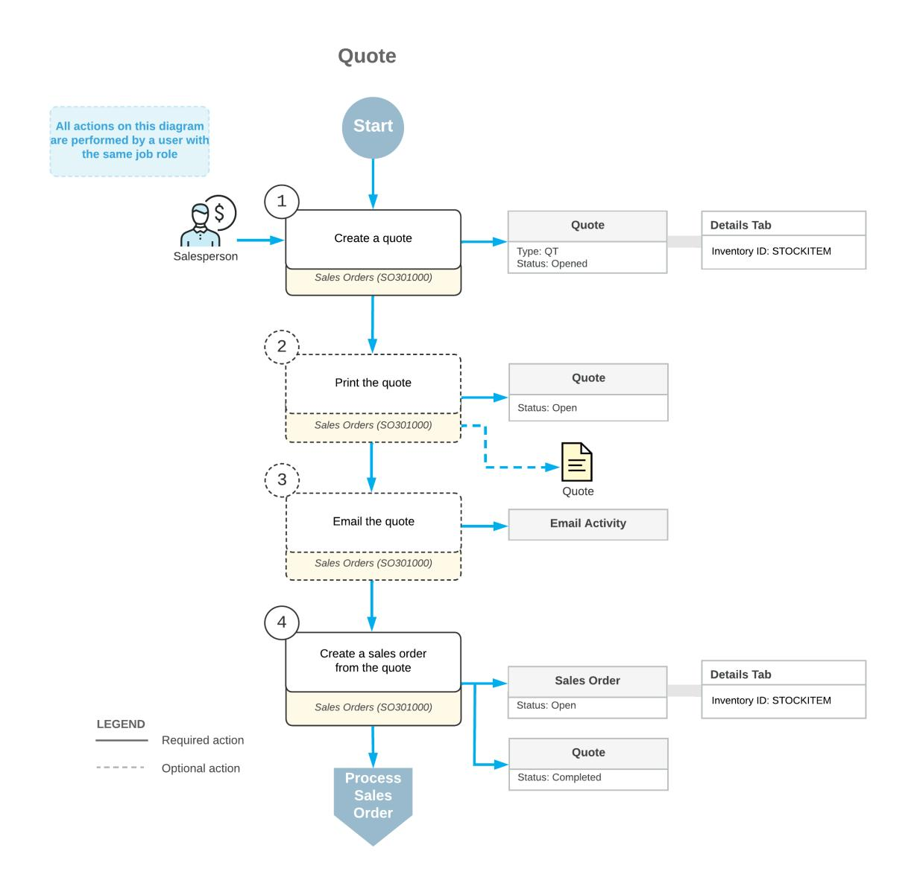

# <span id="page-96-0"></span>**Presales Quotes: Implementation Checklist**

The following sections provide details you can use to ensure that the system is configured properly for processing sales orders of the *QT* type (quotes), and to understand (and change, if needed) the settings that affect the processing workflow.

#### **Implementation Checklist**

We recommend that before you initially begin processing quotes, you make sure the needed features have been enabled, settings have been specified, and entities have been created, as summarized in the following checklist.

| Form                               | Criteria to Check                                |
|------------------------------------|--------------------------------------------------|
| Enable/Disable Features (CS100000) | Make sure that the Inventory feature is enabled. |

| Form                                                                     | Criteria to Check                                                                                                                                                                                                                       |
|--------------------------------------------------------------------------|-----------------------------------------------------------------------------------------------------------------------------------------------------------------------------------------------------------------------------------------|
| Sales Orders Preferences (SO101000), Inventory<br>Preferences (IN101000) | Make sure that all necessary settings related to sales orders<br>and inventory have been specified, as described in Configura<br>tion of Order Management: General Information.                                                         |
| Order Types (SO201000)                                                   | Make sure that the QT and SO order types are active and have<br>been configured, as demonstrated in Sales Order Types: To<br>Activate the SO Order TypeImplementation Activity and Sales<br>Order Types: To Activate the QT Order Type. |

#### **Other Settings That Affect the Workflow**

You can affect the workflow of processing quotes by specifying additional settings as follows:

- To cause the system to automatically calculate discounts, enable the *Customer Discounts* feature on the *[Enable/Disable Features](https://help-2025r1.acumatica.com/Help?ScreenId=ShowWiki&pageid=c1555e43-1bc5-4f6f-ba9d-b323f94d8a6b)* (CS100000) form.
- To cause the system to automatically calculate freight for the requested quantities of stock items, select the **Calculate Freight** check box on the **General** tab of the *Order [Types](https://help-2025r1.acumatica.com/Help?ScreenId=ShowWiki&pageid=e6984218-4260-4438-99e1-aee2b3765369)* (SO201000) form (**OrderSettings** section).
- To cause the system to create quotes with the *On Hold* status, select the **Hold Orders on Entry** check box on the **General** tab of the *Order [Types](https://help-2025r1.acumatica.com/Help?ScreenId=ShowWiki&pageid=e6984218-4260-4438-99e1-aee2b3765369)* form (**OrderSettings** section).

#### **Validation of Configuration**

To make sure that all the configuration has been performed correctly, we recommend that in your system, you process a quote by performing instructions similar to those described in *[Presales Quotes: Process Activity](#page-97-1)*.

# <span id="page-97-1"></span><span id="page-97-0"></span>**Presales Quotes: Process Activity**

The following activity demonstrates how to process a quote.

This activity is based on the *U100* dataset. If you are using another dataset, or if any system settings have been changed in *U100*, these changes can affect the workflow of the activity and the results of the processing. To avoid any issues, restore the *U100* dataset to its initial state.

#### **Story**

Suppose that you are Pam Brawner, a sales manager at the SweetLife Fruits & Jams company. Your customer, Allen's Bakery, would like to purchase five juicers, and would like an quote to compare it with other vendors' quotes and choose the best one. You and the customer agreed on a 5% discount for the juicers. You need to prepare a quote and email it to the customer. Further suppose that the customer decided to choose SweetLife's offer. Now you need to create a sales order from the quote for the customer.

#### **Configuration Overview**

In the *U100* dataset, the following tasks have been performed to support this activity:

- On the *[Enable/Disable Features](https://help-2025r1.acumatica.com/Help?ScreenId=ShowWiki&pageid=c1555e43-1bc5-4f6f-ba9d-b323f94d8a6b)* (CS100000) form, the following features have been enabled:
  - *Inventory and Order Management*, which provides the standard functionality of inventory and order management

- *Inventory*, which gives you the ability to maintain stock items by using forms related to the inventory functionality and to create and process sales and purchase documents that include stock items
- On the *Order [Types](https://help-2025r1.acumatica.com/Help?ScreenId=ShowWiki&pageid=e6984218-4260-4438-99e1-aee2b3765369)* (SO201000) form, the *QT* order type, which has the *Quote* automation behavior, has been created.
- On the *[Customers](https://help-2025r1.acumatica.com/Help?ScreenId=ShowWiki&pageid=652929bc-9606-4056-aa6e-0c2d1147171b)* (AR303000) form, the *ABAKERY* (Allen's Bakery) customer has been created.
- On the *[Stock Items](https://help-2025r1.acumatica.com/Help?ScreenId=ShowWiki&pageid=77786a70-1f1e-4d63-ad98-96f98e4fcb0e)* (IN202500) form, the *JUICER15* (Commercial juicer with a production rate of 1.5 liters per minute) stock item has been created.

#### **Process Overview**

In this activity, you will create an order of the *QT* type on the *[Sales Orders](https://help-2025r1.acumatica.com/Help?ScreenId=ShowWiki&pageid=19e4021c-1b84-49fd-be12-0320c5f1c7e5)* (SO301000) form. You will add the stock item to the quote. You will print the quote and email it to the customer. You will then create a sales order from the quote to the customer.

#### **System Preparation**

Before you start processing a quote, do the following:

- 1. Launch the Acumatica ERP website with the *U100* dataset preloaded, and sign in as sales manager Regina Wiley by using the *brawner* username and the *123* password.
- 2. In the info area, in the upper-right corner of the top pane of the Acumatica ERP screen, make sure that the business date in your system is set to *1/30/2025*. If a different date is displayed, click the Business Date menu button and select *1/30/2025* on the calendar. For simplicity, in this activity, you will create and process all documents in the system on this business date.
- 3. In the company to which you are signed in, be sure that you have performed the *Sales Order [Types:](https://help-2025r1.acumatica.com/Help?ScreenId=ShowWiki&pageid=4b701a27-dc1c-4599-95a8-63e1964c5c47) To [Activate](https://help-2025r1.acumatica.com/Help?ScreenId=ShowWiki&pageid=4b701a27-dc1c-4599-95a8-63e1964c5c47) the QT Order Type* prerequisite activity to activate the *QT* order type.

#### **Step 1: Creating a Quote**

To create the quote for Allen's Bakery, do the following:

- 1. On the *[Sales Orders](https://help-2025r1.acumatica.com/Help?ScreenId=ShowWiki&pageid=19e4021c-1b84-49fd-be12-0320c5f1c7e5)* (SO301000) form, add a new record.
- 2. In the Summary area, specify the following settings:
  - **OrderType**: *QT*
  - **Customer**: *ABAKERY*
  - **Date**: *1/30/2025*
  - **Description**: Sale of commercial juicers
- 3. On the **Details** tab, do the following:
  - a. On the table toolbar, click **Add Row**.
  - b. Specify the following settings in this row:
    - **Inventory ID**: *JUICER15*
    - **Warehouse**: *EQUIPHOUSE*
    - **Quantity**: 5
    - **Discount Percent**: 5
- 4. On the **Shipping** tab, notice that 2/13/2025 is inserted in the **Cancel By** box. Because on the *Order [Types](https://help-2025r1.acumatica.com/Help?ScreenId=ShowWiki&pageid=e6984218-4260-4438-99e1-aee2b3765369)* (SO201000) form, *14* days has been specified in the **DaysTo Keep** box, the expiration date has been calculated as 14 days aer the business date that you specified in the system.
- 5. On the form toolbar, click**Save**.

#### **Step 2: Printing and Emailing the Quote to the Customer**

To email a ready-to-print version of the quote to Allen's Bakery, do the following:

1. While you are still viewing the *Sale of commercial juicers* quote on the *[Sales Orders](https://help-2025r1.acumatica.com/Help?ScreenId=ShowWiki&pageid=19e4021c-1b84-49fd-be12-0320c5f1c7e5)* (SO301000) form, on the More menu, under **Printing and Emailing**, click **Print Quote**.

The system opens the *[Quote](https://help-2025r1.acumatica.com/Help?ScreenId=ShowWiki&pageid=2296a92c-994c-468d-a609-3cf390b48ba6)* (SO641000) report, which displays a ready-to-print version of the quote, in a new browser tab.

- 2. On the report toolbar, click**Send**. The *[Email Activity](https://help-2025r1.acumatica.com/Help?ScreenId=ShowWiki&pageid=5f2ec363-ec67-4dce-ae28-1158b6dd8ef3)* (CR306015) form opens with the quote attached to the email message. In the**To** box, the customer's email address is specified.
- 3. On the form toolbar, click**Send**. The system adds an email activity associated with the quote to the outgoing mail. If a schedule has been configured in the system, the email will be sent automatically to the customer email address from the default system email account the next time this schedule is executed.
- 4. Return to the *[Sales Orders](https://help-2025r1.acumatica.com/Help?ScreenId=ShowWiki&pageid=19e4021c-1b84-49fd-be12-0320c5f1c7e5)* form with the quote open. You can view the email by clicking **Activities** on the form title bar and then clicking the link in the**Tasks & Activities** dialog box, which opens.

#### **Step 3: Creating a Sales Order from the Quote**

To create a sales order from the quote, do the following:

- 1. While you are still viewing the *Sale of commercial juicers* quote on the *[Sales Orders](https://help-2025r1.acumatica.com/Help?ScreenId=ShowWiki&pageid=19e4021c-1b84-49fd-be12-0320c5f1c7e5)* (SO301000) form, on the form toolbar, click **Copy Order**.
- 2. In the **CopyTo** dialog box, which opens, do the following:
  - a. In the **OrderType** box, make sure that *SO* is selected.
  - b. Clear the **Recalculate Unit Prices** check box. Because the quote and the sales order are created on the same date, the prices remain unchanged, and you do not need to recalculate them.
  - c. Click **OK**. The system closes the dialog box and opens the sales order on the *[Sales Orders](https://help-2025r1.acumatica.com/Help?ScreenId=ShowWiki&pageid=19e4021c-1b84-49fd-be12-0320c5f1c7e5)* form with the settings copied from the quote. Make sure that the item quantity, the discount percent, and the discount amount are copied from the quote.
  - d. On the form toolbar, click**Save**.
- 3. Open the **Financial** tab. Notice that the system has inserted the link to the quote in the **Orig. Order Nbr.** box (**Other Information** section), as shown in the following screenshot.

| <b>Sales Orders</b><br>SO 000072 - Allen's Bakery |              |                                                             |   |                  |                                     |                                |               |                                                 |                          |                      |                 | <b>PINOTES</b>         | <b>ACTIVITIES</b> | <b>FILES</b>  |      | <b>CUSTOMIZATION</b> | TOOLS $\sim$ |
|---------------------------------------------------|--------------|-------------------------------------------------------------|---|------------------|-------------------------------------|--------------------------------|---------------|-------------------------------------------------|--------------------------|----------------------|-----------------|------------------------|-------------------|---------------|------|----------------------|--------------|
| 圓<br>$\mathcal{L}$<br>$\leftarrow$                | $\Omega$     | $\pm$                                                       | 侕 | $\bigcap$ $\vee$ | $\overline{\mathsf{K}}$             | $\left\langle \right\rangle$   | $\rightarrow$ | $\geq$                                          |                          | <b>QUICK PROCESS</b> |                 | <b>CREATE SHIPMENT</b> |                   | <b>HOLD</b>   |      | .                    |              |
| * Order Type:                                     | <b>SO</b>    | $\varphi$<br><b>ABAKERY - Allen's Bakery</b><br>* Customer: |   |                  |                                     |                                |               |                                                 |                          |                      | $\circ$         | Ordered Qty.:          |                   | 5.00          |      |                      | $\sim$       |
| Order Nbr.:                                       | 000072       | Q                                                           |   | * Location:      |                                     | <b>MAIN - Primary Location</b> |               |                                                 |                          | $\varphi$            | 0               | <b>Discount Total:</b> |                   |               | 0.00 |                      |              |
| Status:                                           | Open         |                                                             |   | Contact:         |                                     | <b>Beverly Hail</b>            |               |                                                 |                          | Q                    | 0               | <b>Tax Total:</b>      |                   |               | 0.00 |                      |              |
| * Date:                                           | 1/30/2023    | $\checkmark$                                                |   | * Project:       |                                     | X - Non-Project Code.          |               |                                                 |                          | $\circ$              | 0               | Order Total:           | 11,875.00         |               |      |                      |              |
| * Requested On:                                   | 1/30/2023    | $\checkmark$                                                |   | Description:     |                                     | Sale of commercial juicers     |               |                                                 |                          |                      |                 |                        |                   |               |      |                      |              |
| Customer Ord                                      |              |                                                             |   |                  |                                     |                                |               |                                                 |                          |                      |                 |                        |                   |               |      |                      |              |
| External Refer                                    |              |                                                             |   |                  |                                     |                                |               |                                                 |                          |                      |                 |                        |                   |               |      |                      |              |
| <b>DETAILS</b>                                    | <b>TAXES</b> | <b>FINANCIAL</b>                                            |   |                  | <b>SHIPPING</b>                     | <b>ADDRESSES</b>               |               |                                                 | <b>SHIPMENTS</b>         |                      | <b>PAYMENTS</b> |                        | <b>RELATIONS</b>  | <b>TOTALS</b> |      |                      |              |
| <b>FINANCIAL INFORMATION</b>                      |              |                                                             |   |                  |                                     |                                |               |                                                 |                          | PAYMENT INFORMATION  |                 |                        |                   |               |      |                      |              |
| * Branch:                                         |              |                                                             |   |                  | SWEETEQUIP - Service and Equipme Q  |                                |               | Payment Method:<br><b>CHECK - Check Payment</b> |                          |                      |                 |                        | $\varphi$         |               |      |                      |              |
|                                                   |              |                                                             |   |                  | □ Disable Automatic Tax Calculation |                                |               | Card/Account Nbr.:                              |                          |                      |                 |                        |                   |               |      |                      |              |
|                                                   |              | Override Tax Zone                                           |   |                  |                                     |                                |               | 10200EQ - Equipment Checking<br>Cash Account:   |                          |                      |                 |                        | Q                 |               |      |                      |              |
| Customer Tax Zone:                                |              |                                                             |   |                  |                                     |                                |               |                                                 | <b>OWNERSHIP.</b>        |                      |                 |                        |                   |               |      |                      |              |
|                                                   |              | □ Bill Separately                                           |   |                  |                                     |                                |               | Workgroup:                                      |                          |                      |                 |                        | $\varphi$         |               |      |                      |              |
| Invoice Nbr.:                                     |              |                                                             |   |                  |                                     |                                |               | Owner:                                          |                          | Pam Brawner<br>Q     |                 |                        |                   |               |      |                      |              |
| Invoice Date:                                     |              |                                                             |   |                  |                                     |                                |               |                                                 | <b>OTHER INFORMATION</b> |                      |                 |                        |                   |               |      |                      |              |
| * Terms:                                          |              | 30D - 30 Days                                               |   |                  |                                     |                                | Q             |                                                 | Orig. Order Type:        |                      | QT              |                        |                   |               |      |                      |              |
| Due Date:                                         |              |                                                             |   |                  |                                     |                                |               |                                                 | Orig. Order Nbr.:        |                      |                 | 000117                 |                   |               |      |                      |              |
| Cash Discount Date:                               |              |                                                             |   |                  |                                     |                                |               |                                                 |                          |                      |                 | $□$ Emailed            |                   |               |      |                      |              |
| Post Period:                                      |              |                                                             |   |                  |                                     |                                |               |                                                 |                          |                      |                 | $\Box$ Printed         |                   |               |      |                      |              |

*Figure: The link to the quote in the sales order*

4. Open the *Sale of commercial juicers* quote. Notice that now it has a status of *Completed*, as shown in the following screenshot.

|              | <b>Sales Orders</b> | QT 000117 - Allen's Bakery |                  |                                        |                                                        |                 |                        |                          | <b>NOTES</b>             | <b>ACTIVITIES (1)</b>      | <b>FILES</b>              | TOOLS $\star$ |
|--------------|---------------------|----------------------------|------------------|----------------------------------------|--------------------------------------------------------|-----------------|------------------------|--------------------------|--------------------------|----------------------------|---------------------------|---------------|
| $\leftarrow$ | 뭐                   | $\mathbb{R}$<br>$\Omega$   | $\pm$            | 而<br>n<br>$\mathsf{K}$<br>$\checkmark$ | $\geq$<br>$\rightarrow$<br>$\cdots$<br>≺               |                 |                        |                          |                          |                            |                           |               |
|              | * Order Type:       | <b>QT</b>                  | ρ                | Customer:                              | ABAKERY - Allen's Bakery                               | 0               | Ordered Qty.:          | 5.00                     |                          |                            |                           | $\sim$        |
|              | Order Nbr.:         | 000117                     | Q                | Location:                              | MAIN - Primary Location                                | 0               | <b>Discount Total:</b> | 0.00                     |                          |                            |                           |               |
|              | Status:             | Completed                  |                  | Contact:                               | <b>Beverly Hail</b>                                    | 0               | <b>Tax Total:</b>      | 0.00                     |                          |                            |                           |               |
|              | Date:               | 1/30/2023                  |                  | Project:                               | !!!!!!!!!!!!!!!!!!!!!!!!!!!!!!!!!!!!!!!!               | 0               | Order Total:           | 11,875.00                |                          |                            |                           |               |
|              |                     | Requested On:<br>1/30/2023 |                  | Description:                           | Sale of commercial juicers                             |                 |                        |                          |                          |                            |                           |               |
|              |                     | Customer Ord               |                  |                                        |                                                        |                 |                        |                          |                          |                            |                           |               |
|              |                     | External Refer             |                  |                                        |                                                        |                 |                        |                          |                          |                            |                           |               |
|              | <b>DETAILS</b>      | <b>TAXES</b>               | <b>FINANCIAL</b> | <b>SHIPPING</b>                        | <b>ADDRESSES</b><br><b>SHIPMENTS</b>                   | <b>PAYMENTS</b> | <b>RELATIONS</b>       | <b>TOTALS</b>            |                          |                            |                           |               |
| Õ            | $^{+}$              | 1<br>$\times$              | <b>ADD ITEMS</b> | ADD MATRIX ITEMS                       | ADD INVOICE<br>LINE DETAILS                            |                 | PO LINK                | <b>ITEM AVAILABILITY</b> | $\mathbf{N}$<br>$\vdash$ | $\Lambda$                  |                           |               |
| 圓            | n.                  | * Inventory ID             | Free<br>Item     | Warehouse                              | <b>Line Description</b>                                |                 | *UOM                   | Quantity                 | <b>Unit Price</b>        | <b>Discount</b><br>Percent | <b>Discount</b><br>Amount | Ext. Price    |
|              | D<br>$\omega$       | JUICER15                   | п                | <b>EQUIPHOUSE</b>                      | Commercial juicer with a production rate of 1.5 litres |                 | PIECE                  | 5.00                     | 2,500.0000               | 5.000000                   | 625.00                    | 12,500.00     |

*Figure: The quote with the Completed status*

# <span id="page-101-2"></span><span id="page-101-0"></span>**Processing Sales of Stock Items**

Goods that are stored in inventory are called *stock items*. For these items, the system tracks the on-hand quantity and the changes in the cost. In Acumatica ERP, you use sales orders of the predefined *SO* and *SA* types to record the sales of stock items.

The topics of this chapter explain how to process a sale of stock items with shipping, and which documents are prepared during the processing of the sale.

# <span id="page-101-1"></span>**Sales of Stock Items: General Information**

In a typical distribution organization, a customer order may be taken over the phone or received by email. In Acumatica ERP, you can process a sale of stock items by creating and processing a corresponding sales order. A sales order represents a customer request to buy particular goods in a specified quantity on a specified date.

#### **Learning Objectives**

In this chapter, you will do the following:

- Create a sales order with stock items
- Create the shipment for the sales order
- Confirm the shipment
- Create the invoice for the sales order
- Process the sales invoice and the related inventory and accounts receivable documents

#### **Applicable Scenario**

You process a sales order with a stock item if you need to record the sale of goods with shipping the items to a customer, updating item quantities in inventory, and preparing an invoice to the customer for the sold goods.

#### **Sale of Stock Items with Automatic or Manual Allocation**

The standard sales process typically includes entering a sales order, processing a shipment of the items with items being issued from inventory, and preparing the related invoice to a customer. In Acumatica ERP, to process a sale that requires the items to be shipped before an invoice can be prepared, you can use a sales order of the *SO* or *SA* type on the *[Sales Orders](https://help-2025r1.acumatica.com/Help?ScreenId=ShowWiki&pageid=19e4021c-1b84-49fd-be12-0320c5f1c7e5)* (SO301000) form. Consider the following points as you decide which of the order types to use:

- For a new order of the *SO* type, the items are not reserved in inventory automatically. You can manually allocate (reserve) the requested quantity for a specific stock item or multiple items if this is required by your company policies or was requested by the customer. Also, you may want to reserve a line item if the item is available but the quantity required for the order line is distributed between different warehouses and any transfers are required.
- When you save a new order of the *SA* type, the system automatically reserves the requested quantities of stock items for this order (or the available part, if only part of requested quantity is available for any item). If the ordered quantity cannot be fully allocated at the specified location or warehouse, you can manually allocate the unavailable quantity in other warehouses or locations. If you prepare a shipment for an *SA* order that has an unallocated quantity, the order will be shipped partially even if the ordered quantities are available for shipping at another warehouse or warehouse location but were not allocated for this particular order.

On the **Details** tab of the *[Sales Orders](https://help-2025r1.acumatica.com/Help?ScreenId=ShowWiki&pageid=19e4021c-1b84-49fd-be12-0320c5f1c7e5)* form, you can view the allocation for each sales order line and change it, if needed, by clicking a line and clicking **Line Details** on the table toolbar. The quantities of the items that have been allocated for the order (automatically or manually) cannot be shipped for another order.

The way the order will be fulfilled depends on the item availability and on the shipping rules specified for the order and for the sales order lines on the *[Sales Orders](https://help-2025r1.acumatica.com/Help?ScreenId=ShowWiki&pageid=19e4021c-1b84-49fd-be12-0320c5f1c7e5)* form. These shipping rules determine whether the goods in the sales order should be shipped only in full, partial shipments for the available quantities are allowed with the remainder canceled, or partial shipments are allowed with the remainder on back order. For detailed information, see *[Shipping Rule Combinations](#page-152-1)*. On the *[Shipments](https://help-2025r1.acumatica.com/Help?ScreenId=ShowWiki&pageid=f47cffcc-543e-469c-a204-a9c1e3da346d)* (SO302000) form, you can review the details of a shipment document prepared for an order; then you can confirm the shipment of items.

You can create a shipment only if each item listed on the **Details** tab of the *[Sales Orders](https://help-2025r1.acumatica.com/Help?ScreenId=ShowWiki&pageid=19e4021c-1b84-49fd-be12-0320c5f1c7e5)* form has a location for which sales are allowed—that is, the**Sales Allowed** check box is selected on the **Locations** tab of the *[Warehouses](https://help-2025r1.acumatica.com/Help?ScreenId=ShowWiki&pageid=264b0ef7-2b6c-40b4-a7d9-f1a5e067939b)* (IN204000) form.

Aer you have prepared and confirmed the shipment or shipments related to the sales order, you need to bill the customer for the shipped items by preparing a sales invoice, which is a financial document in the system that contains links to the applicable shipments and sales orders. You can review the prepared sales invoice on the *[Invoices](https://help-2025r1.acumatica.com/Help?ScreenId=ShowWiki&pageid=0acc9738-f141-4ea0-a2be-f34ea9d1b63a)* (SO303000) form; then you can release it. When the sales invoice is released, the system automatically generates a corresponding inventory issue for the shipped items with the date and posting period of the invoice. Also, the sales invoice becomes visible on the *[Invoices and Memos](https://help-2025r1.acumatica.com/Help?ScreenId=ShowWiki&pageid=5e6f3b27-b7af-412f-a40a-1d4f4be70cba)* (AR301000) form as an AR invoice.

An AR invoice on the *[Invoices and Memos](https://help-2025r1.acumatica.com/Help?ScreenId=ShowWiki&pageid=5e6f3b27-b7af-412f-a40a-1d4f4be70cba)* form is a financial document that does not contain links to the applicable shipments and sales orders, as the sales invoice does. The AR invoice and sales invoice have the same reference number, which the system prints in the customer statement. On both the *[Invoices](https://help-2025r1.acumatica.com/Help?ScreenId=ShowWiki&pageid=0acc9738-f141-4ea0-a2be-f34ea9d1b63a)* form and the *[Invoices and Memos](https://help-2025r1.acumatica.com/Help?ScreenId=ShowWiki&pageid=5e6f3b27-b7af-412f-a40a-1d4f4be70cba)* form, you can view the link to the batch of the general ledger transactions that was generated when the invoice was released. For more information on processing AR invoices, see *[Processing AR Invoices](https://help-2025r1.acumatica.com/Help?ScreenId=ShowWiki&pageid=f5eea8b8-c260-4f1f-8603-d65e9bf25e9d)*.

#### **Workflow of a Sale of Stock Items**

For a sales order of the *SO* or *SA* type that includes stock items, the typical processing involves the actions and generated documents shown in the following diagram.

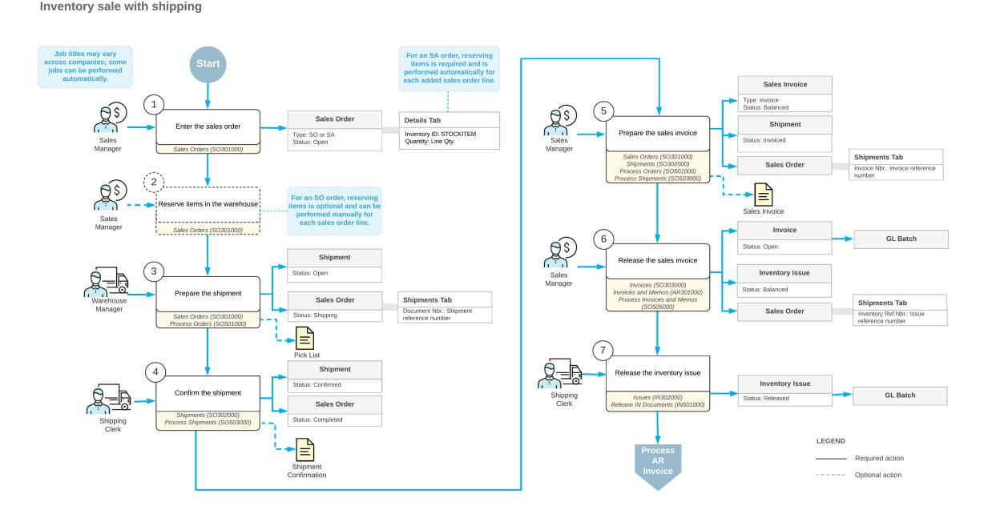

# <span id="page-103-0"></span>**Sales of Stock Items: Implementation Checklist**

The following sections provide details you can use to ensure that the system is configured properly for the processing of sales of stock items, and to understand (and change, if needed) the settings that affect the processing workflow.

### **Implementation Checklist**

Before you begin processing sales of stock items, you should make sure the needed features have been enabled, settings have been specified, and entities have been created, as summarized in the following checklist.

| Form                                                                               | Criteria to Check                                                                                                                                                                  |
|------------------------------------------------------------------------------------|------------------------------------------------------------------------------------------------------------------------------------------------------------------------------------|
| Enable/Disable Features (CS100000) form                                            | Make sure that the Inventory feature is enabled.                                                                                                                                   |
| Sales Orders Preferences (SO101000) form, Inventory<br>Preferences (IN101000) form | Make sure that all necessary settings related to sales<br>orders and inventory have been specified, as de<br>scribed in Configuration of Order Management: General<br>Information. |
| Order Types (SO201000) form                                                        | Make sure that the SO and SA order types are active<br>and have been configured, as described in Sales Or<br>der Types: To Activate the SO Order TypeImplementa<br>tion Activity.  |
| Customers (AR303000) form                                                          | Make sure that all needed customers have been de<br>fined in the system, as described in Customers: Imple<br>mentation Activity .                                                  |
| Stock Items (IN202500) form                                                        | Make sure that all stock items have been defined in the<br>system, as described in Stock Items: Implementation Ac<br>tivity.                                                       |

#### **Other Settings That Affect the Workflow**

You can affect the workflow of processing inventory sales by specifying additional settings as follows:

- To cause shipments to be created with the *On Hold* status (so that the user can verify them before processing them further), select the **Hold Shipments on Entry** check box on the *[Sales Orders Preferences](https://help-2025r1.acumatica.com/Help?ScreenId=ShowWiki&pageid=1817779c-413b-4187-b7fe-38e97845a1cb)* (SO101000) form.
- To cause inventory issues to be automatically generated and released on release of sales invoices, select the **Automatically Release IN Documents** check box on the *[Sales Orders Preferences](https://help-2025r1.acumatica.com/Help?ScreenId=ShowWiki&pageid=1817779c-413b-4187-b7fe-38e97845a1cb)* form.
- To cause the shipment dates to appear in invoices as invoice dates, select the **UseShipment Date for Invoice Date** check box on the *[Sales Orders Preferences](https://help-2025r1.acumatica.com/Help?ScreenId=ShowWiki&pageid=1817779c-413b-4187-b7fe-38e97845a1cb)* form.
- To cause general ledger batches generated during the processing of sales documents to be posted automatically, select the **Automatically Post on Release** check box on the *[General Ledger Preferences](https://help-2025r1.acumatica.com/Help?ScreenId=ShowWiki&pageid=e4913d06-c511-4258-a0f9-f36c1b854e6b)* (GL102000) form. For information on processing general ledger batches, see *GL [Transactions:](https://help-2025r1.acumatica.com/Help?ScreenId=ShowWiki&pageid=35393020-6269-466d-8a08-df558cd43367) General [Information](https://help-2025r1.acumatica.com/Help?ScreenId=ShowWiki&pageid=35393020-6269-466d-8a08-df558cd43367)*.

#### **Testing of Settings**

To make sure that all settings are configured correctly, we recommend that you process a sale of stock items, as described in *[Sales of Stock Items: Process Activity](#page-104-1)*.

# <span id="page-104-1"></span><span id="page-104-0"></span>**Sales of Stock Items: Process Activity**

The following activity demonstrates how to prepare and process to completion a sales order with manual allocation of stock items.

This activity is based on the *U100* dataset. If you are using another dataset, or if any system settings have been changed in *U100*, these changes can affect the workflow of the activity and the results of the processing. To avoid any issues, restore the *U100* dataset to its initial state.

#### **Video Tutorial**

This video shows you the common process but may contain less detail than the activity has. If you want to repeat the activity on your own or you are preparing to take the certification exam, we recommend that you follow the instructions in the steps of the activity.

#### *[FEEDBACK](https://www.surveymonkey.com/r/BLBL7RJ?Video=Processing%20Sales%20of%20Stock%20Items&Source=Open%20Uni&Course=D100)*

#### **Story**

Suppose that you are Grace Norman, a sales manager of the SweetLife Fruits & Jams company. On January 30, 2025, the GoodFood One Restaurant wholesale customer has ordered a large amount of orange and apple jams in 96-ounce jars from the main office of SweetLife, where you are employed, for the café's baking needs. The ordered jams are stored in the warehouse of the SweetLife's main office. You, as a sales manager, need to enter and process the appropriate documents.

#### **Configuration Overview**

In the *U100* dataset, for the purposes of this activity, the following tasks have been performed:

- On the *[Enable/Disable Features](https://help-2025r1.acumatica.com/Help?ScreenId=ShowWiki&pageid=c1555e43-1bc5-4f6f-ba9d-b323f94d8a6b)* (CS100000) form, the following features have been enabled:
  - *Inventory and Order Management*, which provides the standard functionality of inventory and order management
  - *Inventory*, which gives you the ability to maintain stock items by using forms related to the inventory functionality and to create and process sales and purchase documents that include stock items
- On the *Order [Types](https://help-2025r1.acumatica.com/Help?ScreenId=ShowWiki&pageid=e6984218-4260-4438-99e1-aee2b3765369)* (SO201000) form, the *SO* order type has been configured and activated.
- On the *[Customers](https://help-2025r1.acumatica.com/Help?ScreenId=ShowWiki&pageid=652929bc-9606-4056-aa6e-0c2d1147171b)* (AR303000) form, the *GOODFOOD (GoodFood One Restaurant)* customer has been configured.
- On the *[Stock Items](https://help-2025r1.acumatica.com/Help?ScreenId=ShowWiki&pageid=77786a70-1f1e-4d63-ad98-96f98e4fcb0e)* (IN202500) form, the *APJAM96* and *ORJAM96* stock items have been configured.
- On the *[Warehouses](https://help-2025r1.acumatica.com/Help?ScreenId=ShowWiki&pageid=264b0ef7-2b6c-40b4-a7d9-f1a5e067939b)* (IN204000) form, in the *WHOLESALE* warehouse, which has been configured, sufficient quantities of the *APJAM96* and *ORJAM96* items are on hand.

#### **Process Overview**

To perform a sale of stock items with manual allocation, you create a sales order on the *[Sales Orders](https://help-2025r1.acumatica.com/Help?ScreenId=ShowWiki&pageid=19e4021c-1b84-49fd-be12-0320c5f1c7e5)* (SO301000) form, select the customer to which the items are being sold, add items to the order, and reserve the items in

inventory. Then you create a shipment document on the *[Shipments](https://help-2025r1.acumatica.com/Help?ScreenId=ShowWiki&pageid=f47cffcc-543e-469c-a204-a9c1e3da346d)* (SO302000) form. On this form, you confirm the settings that the system has inserted automatically based on the sales order, and then confirm the shipment. Aer shipment confirmation, you use the *[Invoices](https://help-2025r1.acumatica.com/Help?ScreenId=ShowWiki&pageid=0acc9738-f141-4ea0-a2be-f34ea9d1b63a)* (SO303000) form to prepare a corresponding invoice to the customer and release it.

#### **System Preparation**

Before you start performing a sale of stock items with manual allocation, you should do the following:

- 1. Launch the Acumatica ERP website with the *U100* dataset preloaded, and sign in to the system as sales manager Grace Norman by using the *norman* username and the *123* password.
- 2. In the info area, in the upper-right corner of the top pane of the Acumatica ERP screen, make sure that the business date in your system is set to *1/30/2025*. If a different date is displayed, click the Business Date menu button and select *1/30/2025* on the calendar. For simplicity, in this activity, you will create and process all documents in the system on this business date.
- 3. On the Company and Branch Selection menu, in the top pane of the Acumatica ERP screen, make sure the *SweetLife Head Office and Wholesale Center* branch is selected.

#### **Step 1: Creating a Sales Order**

To create a sales order, do the following:

- 1. On the *[Sales Orders](https://help-2025r1.acumatica.com/Help?ScreenId=ShowWiki&pageid=19e4021c-1b84-49fd-be12-0320c5f1c7e5)* (SO301000) form, create a sales order, and specify the following settings:
  - **OrderType**: *SO*
  - **Customer**: *GOODFOOD*
  - **Date**: *1/30/2025*
  - **Requested On**: *1/30/2025*
  - **Description**: Orange and apple jams

To open the form for creating a new record, type the form ID in the Search box, and on the Search form, point at the form title and click **New** right of the title.

- 2. On the table toolbar of the **Details** tab, click **Add Row**.
- 3. Specify the following settings in the added row:
  - **Inventory ID**: *APJAM96*
  - **Warehouse**: *WHOLESALE*
  - **Quantity**: 20
  - **Unit Price**: 45.15
- 4. On the table toolbar, click **Add Row**.
- 5. Specify the following settings in the added row:
  - **Inventory ID**: *ORJAM96*
  - **Warehouse**: *WHOLESALE*
  - **Quantity**: 20
  - **Unit Price**: 35.99
- 6. On the form toolbar, click**Save**.

The sales order is saved with the *Open* status.

#### **Step 2: Allocating Inventory Items**

To manually allocate the inventory items for the sales order you have created, while you are still viewing the sales order on the *[Sales Orders](https://help-2025r1.acumatica.com/Help?ScreenId=ShowWiki&pageid=19e4021c-1b84-49fd-be12-0320c5f1c7e5)* (SO301000) form, do the following:

- 1. On the **Details** tab, click the *APJAM96* line, and review the Allocated quantity for the *APJAM96* inventory item in the table footer (which is currently equal to 0 because the system does not automatically allocate stock items for *SO* orders).
- 2. On the table toolbar, click **Line Details**.
- 3. In the **Line Details** dialog box, which opens, make sure that *WHOLESALE* is selected in the **Alloc. Warehouse** column of the only row.
- 4. Select the **Allocated** check box for the allocation line.
- 5. Click **OK** to save the created allocation and close the dialog box.
- 6. In the table footer, review the Allocated quantity, and notice that it is now equal to the quantity specified in the line, which means that the item has been allocated in inventory.
- 7. On the form toolbar, click**Save**.
- 8. Click the *ORJAM96* line, and review the Allocated quantity for the *ORJAM96* stock item in the table footer (which is currently equal to 0 because the system does not automatically allocate stock items for *SO* orders).
- 9. On the table toolbar, click **Line Details**.
- 10.In the **Line Details** dialog box, which opens, make sure that *WHOLESALE* is selected in the **Alloc. Warehouse** column of the only row.
- 11.Select the **Allocated** check box for the allocation line.

12.Click **OK** to save the created allocation and close the dialog box.

- 13.In the table footer, review the Allocated quantity, and notice that it is now equal to the quantity specified in the line, which means that the item has been allocated in inventory.
- 14.On the form toolbar, click**Save**.

You have manually allocated the inventory items for the sales order. Now you need to create a shipment document for the sales order.

#### **Step 3: Creating a Shipment**

To create a shipment, do the following:

- 1. While you are still viewing the sales order you have created on the *[Sales Orders](https://help-2025r1.acumatica.com/Help?ScreenId=ShowWiki&pageid=19e4021c-1b84-49fd-be12-0320c5f1c7e5)* (SO301000) form, on the form toolbar, click **CreateShipment**.
- 2. In the **SpecifyShipment Parameters** dialog box, which opens, make sure that the *1/30/2025* date and the *WHOLESALE* warehouse are selected, and click **OK**. The system closes the dialog box, creates a shipment, and opens it on the *[Shipments](https://help-2025r1.acumatica.com/Help?ScreenId=ShowWiki&pageid=f47cffcc-543e-469c-a204-a9c1e3da346d)* (SO302000) form.

#### **Step 4: Confirming the Shipment**

To confirm the shipment, do the following:

- 1. While you are still viewing the shipment on the *[Shipments](https://help-2025r1.acumatica.com/Help?ScreenId=ShowWiki&pageid=f47cffcc-543e-469c-a204-a9c1e3da346d)* (SO302000) form, review the lines on the **Details** tab. Make sure that both order lines have been included in the shipment and that the shipped quantity in both lines is equal to the ordered quantity.
- 2. In both lines, specify *Main* in the **Location** column.
- 3. On the form toolbar, click **Confirm Shipment**.

The shipment is assigned the *Confirmed* status. Now you can prepare the invoice to bill the customer and increase the customer's debt in the system.

#### **Step 5: Processing the Invoice**

To prepare and release the invoice, do the following:

- 1. While you are still viewing the shipment on the *[Shipments](https://help-2025r1.acumatica.com/Help?ScreenId=ShowWiki&pageid=f47cffcc-543e-469c-a204-a9c1e3da346d)* (SO302000) form, on the form toolbar, click **Prepare Invoice**. The system prepares the invoice and opens it on the *[Invoices](https://help-2025r1.acumatica.com/Help?ScreenId=ShowWiki&pageid=0acc9738-f141-4ea0-a2be-f34ea9d1b63a)* (SO303000) form.
- 2. On this form, review the details of the prepared invoice. The invoice has two lines, as the initial sales order does. In the **Shipment Nbr.** and **Order Nbr.** columns of the **Details** tab, notice that the system has inserted the reference number links to the related shipment and sales order.
- 3. On the form toolbar, click **Release** to release the invoice. Wait for the system to complete the operation.
- 4. Return to the *[Sales Orders](https://help-2025r1.acumatica.com/Help?ScreenId=ShowWiki&pageid=19e4021c-1b84-49fd-be12-0320c5f1c7e5)* (SO301000) form, and open the sales order that you have processed.
- 5. On the **Shipments** tab, in the only row, click the link in the **Inventory Ref. Nbr.** column to view the inventory issue that was generated when you released the invoice.
- 6. On the *[Issues](https://help-2025r1.acumatica.com/Help?ScreenId=ShowWiki&pageid=17b051f6-027d-4459-b542-65c1c1f9d0ea)* (IN302000) form, which opens in a pop-up window, review the details of the inventory issue, shown in the following screenshot. Make sure that the issue has the *Released* status, which means that the issue has been released and the quantities of items in inventory have been decreased appropriately.

| <b>Issues</b><br>000069                                        |                                                                  |                          |                                         |                      |       |                   | $\Box$ NOTES | <b>FILES</b><br><b>ACTIVITIES</b> | TOOLS $\sim$ |
|----------------------------------------------------------------|------------------------------------------------------------------|--------------------------|-----------------------------------------|----------------------|-------|-------------------|--------------|-----------------------------------|--------------|
| $\boxdot$<br>뭐<br>$\widehat{\mathbb{H}}$<br>$^{+}$<br>$\Omega$ | Ĥ<br>$\mathsf{K}$<br>$\left\langle \right\rangle$<br>$\check{~}$ | $\geq$<br>$\rightarrow$  | $\cdots$                                |                      |       |                   |              |                                   |              |
| Reference Nbr.:<br>Q<br>000069                                 | External Ref.:                                                   |                          |                                         | Total Qty.:          |       | 40.00             |              |                                   | $\sim$       |
| Released<br>Status:                                            |                                                                  |                          |                                         | <b>Total Amount:</b> |       | 1,622.80          |              |                                   |              |
| Date:<br>1/30/2025                                             |                                                                  |                          |                                         | <b>Total Cost:</b>   |       | 181.10            |              |                                   |              |
| Post Period:<br>01-2025                                        | Description:                                                     |                          |                                         |                      |       |                   |              |                                   |              |
|                                                                |                                                                  |                          |                                         |                      |       |                   |              |                                   |              |
| <b>DETAILS</b><br><b>FINANCIAL</b>                             |                                                                  |                          |                                         |                      |       |                   |              |                                   |              |
| Ò<br><b>LINE DETAILS</b><br>$+$<br>$\times$                    | ADD ITEMS                                                        | <b>INVENTORY SUMMARY</b> | $\mathbf{\overline{x}}$<br>$\mathbb{H}$ | $\uparrow$           |       |                   |              |                                   |              |
| D<br>$\omega$<br>冒<br>Tran. Type                               | <b>Inventory ID</b>                                              | Warehouse                | Location                                | Quantity UOM         |       | <b>Unit Price</b> | Ext. Price   | <b>Unit Cost</b>                  | Ext. Cost    |
| $\mathbf{0}$<br>⋟<br>Invoice<br>D                              | APJAM96                                                          | WHOLESALE                | <b>MAIN</b>                             | 20.00                | PIECE | 45.1500           | 903.00       | 6.7717                            | 135.43       |
| $\boldsymbol{0}$<br>Invoice<br>D                               | ORJAM96                                                          | WHOLESALE                | <b>MAIN</b>                             | 20.00                | PIECE | 35.9900           | 719.80       | 2.2835                            | 45.67        |
|                                                                |                                                                  |                          |                                         |                      |       |                   |              |                                   |              |

#### *Figure: Inventory issue generated on release of the invoice*

The sales order processing is now complete.

#### **Activity Recap**

In this activity, we have illustrated how the sales manager has done the following:

- 1. Created a sales order for the items to be sold
- 2. Manually allocated the inventory items for the sales order
- 3. Created and confirmed the shipment of the items
- 4. Prepared the invoice for the customer and has released it

# <span id="page-108-0"></span>**Sales of Stock Items: Stock Allocation with Multiple UOMs**

If the *Multiple Units of Measure* feature is enabled on the *[Enable/Disable Features](https://help-2025r1.acumatica.com/Help?ScreenId=ShowWiki&pageid=c1555e43-1bc5-4f6f-ba9d-b323f94d8a6b)* (CS100000) form, you can specify multiple units of measure (UOMs) for a stock item on the *[Stock Items](https://help-2025r1.acumatica.com/Help?ScreenId=ShowWiki&pageid=77786a70-1f1e-4d63-ad98-96f98e4fcb0e)* (IN202500) form.

During stock allocation, if an item's sales UOM is not divisible and the ordered quantity is not fully available in the warehouse specified in the line, the system divides the order line's quantity into an integer quantity in the line's UOM and the remaining quantity in the base UOM.

### **Allocation of Stock Items in Multiple UOMs**

In a sales order, when the system partially allocates an item that is either lot tracked or not tracked, it checks the divisibility of the item's sales unit. That is, the system checks the state of the **Divisible Unit** check box right of the **Sales Unit** box on the **General** tab of the *[Stock Items](https://help-2025r1.acumatica.com/Help?ScreenId=ShowWiki&pageid=77786a70-1f1e-4d63-ad98-96f98e4fcb0e)* (IN202500) form.

An item can be lot- or serial-tracked only if the *Lot and Serial Tracking* feature is enabled on the *[Enable/Disable Features](https://help-2025r1.acumatica.com/Help?ScreenId=ShowWiki&pageid=c1555e43-1bc5-4f6f-ba9d-b323f94d8a6b)* (CS100000) form. For details, see *Items with Lot and Serial [Numbers:](https://help-2025r1.acumatica.com/Help?ScreenId=ShowWiki&pageid=7d0568cc-3a1a-4e9c-a7ea-9df31601d445) Tracking [Settings](https://help-2025r1.acumatica.com/Help?ScreenId=ShowWiki&pageid=7d0568cc-3a1a-4e9c-a7ea-9df31601d445)*.

Suppose that a line has an item quantity on the *[Sales Orders](https://help-2025r1.acumatica.com/Help?ScreenId=ShowWiki&pageid=19e4021c-1b84-49fd-be12-0320c5f1c7e5)* (SO301000) form. This quantity is specified for the item in a non-base UOM with the *Multiply* conversion factor on the *[Stock Items](https://help-2025r1.acumatica.com/Help?ScreenId=ShowWiki&pageid=77786a70-1f1e-4d63-ad98-96f98e4fcb0e)* form. The **Divisible Unit** check box is cleared for the item's sales UOM. You open the **Line Details** dialog box on the *[Sales Orders](https://help-2025r1.acumatica.com/Help?ScreenId=ShowWiki&pageid=19e4021c-1b84-49fd-be12-0320c5f1c7e5)* form and selects the **Allocated** check box in the line split. If the quantity can be allocated only partially, the system does the following:

- 1. Changes the quantity in this line split to an integer quantity in the order line's UOM if this quantity is available in a warehouse (that is, inserts this quantity in the **Quantity** column for the line split).
- 2. If the available quantity in the order line's UOM is not sufficient in the warehouse but a few more item units in the base UOM are available, adds another line split for this quantity. For this line split, the system selects the **Allocated** check box.
- 3. For any integer quantity that is not sufficient in the warehouse, adds another line split. For this line split, the **Allocated** check box is cleared.
- 4. For the remaining quantity in the base UOM (the quantity that is not available in the warehouse), adds another line split. For this line split, the **Allocated** check box is cleared.

The system uses base UOMs in a line split only for allocated quantities—that is, when the **Allocated** check box is manually or automatically selected for the line split in the **Line Details** dialog box of the *[Sales Orders](https://help-2025r1.acumatica.com/Help?ScreenId=ShowWiki&pageid=19e4021c-1b84-49fd-be12-0320c5f1c7e5)* form. If items are not allocated and then processed (for example, if they have been partially shipped), the system will create line splits in the order line's UOM regardless of the divisibility of the sales UOM.

For a serial-tracked item, the system always splits lines on the *[Sales Orders](https://help-2025r1.acumatica.com/Help?ScreenId=ShowWiki&pageid=19e4021c-1b84-49fd-be12-0320c5f1c7e5)* form in the base UOM during the allocation.

You can allocate lot- and serial-tracked items without specifying their lot or serial numbers, respectively.

In an order with a type whose automation behavior is *Blanket Order* on the *Order [Types](https://help-2025r1.acumatica.com/Help?ScreenId=ShowWiki&pageid=e6984218-4260-4438-99e1-aee2b3765369)* (SO201000) form, the system always uses the UOM of the order line when the line is partially allocated and split.

#### **Processing of a Sales Order with Partially Allocated Quantities**

When you have created the sales order with partially allocated quantities, you create a transfer order on the *[Create](https://help-2025r1.acumatica.com/Help?ScreenId=ShowWiki&pageid=aaf05359-02c9-4281-8d86-210a63c3d0df) [Transfer](https://help-2025r1.acumatica.com/Help?ScreenId=ShowWiki&pageid=aaf05359-02c9-4281-8d86-210a63c3d0df) Orders* (SO509000) form to move the allocated items to the needed warehouse. In the transfer order, the system adds the split lines with the UOMs specified in the **Line Details** dialog box of the *[Sales Orders](https://help-2025r1.acumatica.com/Help?ScreenId=ShowWiki&pageid=19e4021c-1b84-49fd-be12-0320c5f1c7e5)* (SO301000) form for the sales order.

When you create a shipment for the sales order on the *[Shipments](https://help-2025r1.acumatica.com/Help?ScreenId=ShowWiki&pageid=f47cffcc-543e-469c-a204-a9c1e3da346d)* (SO302000) form, the system adds to the shipment the split lines specified in the **Line Details** dialog box of the sales order.

If the UOM in a sales order line is specified as the**Sales UOM** on the *[Stock Items](https://help-2025r1.acumatica.com/Help?ScreenId=ShowWiki&pageid=77786a70-1f1e-4d63-ad98-96f98e4fcb0e)* (IN202500) form and the **Divisible Unit** check box is cleared, you will not be able to create a shipment if the split lines have the base UOM.

On shipment confirmation, the system sums the splits of an order line. When the related sales invoice is created on the *[Invoices](https://help-2025r1.acumatica.com/Help?ScreenId=ShowWiki&pageid=0acc9738-f141-4ea0-a2be-f34ea9d1b63a)* (SO303000) form, the system inserts the lines as follows:

- If the sum of all line splits is an integer (that is, it can be fully converted to the order line's UOM), inserts the order line's UOM in the corresponding line of the sales invoice
- If the sum of all line splits is not an integer, inserts the base UOM in the invoice line

#### **Example of Stock Allocation**

Suppose that a company sells computers and accessories, including 1 TB hard drives. It sells hard drives by piece and in boxes of 10 pieces per box. The base and sales units of measure are *EA* (each), and a conversion to *BOX10* (a box of 10 pieces) is specified in the item's settings on the **General** tab of the *[Stock Items](https://help-2025r1.acumatica.com/Help?ScreenId=ShowWiki&pageid=77786a70-1f1e-4d63-ad98-96f98e4fcb0e)* (IN202500) form.

Further suppose that a customer orders 40 hard drives. A salesperson creates a sales order for 4 boxes of hard drives. In the retail warehouse, only 25 hard drives are available (that is, two boxes and five pieces). The rest of the hard drives are available in the wholesale warehouse. Thus, the salesperson wants to allocate all the available hard drives in the retail warehouse to the order and transfer the remaining hard drives from the wholesale warehouse.

On the *[Sales Orders](https://help-2025r1.acumatica.com/Help?ScreenId=ShowWiki&pageid=19e4021c-1b84-49fd-be12-0320c5f1c7e5)* (SO301000) form, the salesperson opens the **Line Details** dialog box for the order line with the hard drives and selects the **Allocated** check box in the line. The system splits the line as follows:

- Line split 1: A quantity of 2 boxes, which are available and allocated in the warehouse.
- Line split 2: A quantity of 5 pieces, which are available and allocated in the warehouse.
- Line split 3: A quantity of 1 box, which is not available. The **Allocated** check box is cleared in the line because the quantity needs to be transferred from another warehouse.
- Line split 4: A quantity of 5 pieces, which are not available. The **Allocated** check box is cleared in the line because the quantity needs to be transferred from another warehouse.

When all the items are available in the retail warehouse, the shipment has been confirmed, and the sales invoice has been prepared for the order, the sales invoice contains the sum of the splits of the order line.

# <span id="page-109-0"></span>**Sales of Stock Items: To Allocate Stock with Multiple UOMs and Process a Sale**

In the following activity, you will allocate stock and process a sales order whose item has a sales UOM that differs from the UOM specified in the sales order line.

This activity is based on the *U100* dataset. If you are using another dataset, or if any system settings have been changed in *U100*, these changes can affect the workflow of the activity and the results of the processing. To avoid any issues, restore the *U100* dataset to its initial state.

#### **Story**

Suppose that you are Regina Wiley, a sales manager of the SweetLife Fruits & Jams company. On January 30, 2025, the Four Stars Coffee and Sweets Shop has ordered four boxes of grape jam in eight-ounce jars from SweetLife's retail store. Each box has 10 jars.

When you allocated the jars for this sales order, you have noticed that only 25 jars (two boxes and five jars) are available in the retail warehouse. The other 15 jars are available in SweetLife's wholesale warehouse. Because the company sells jams by boxes, you need to transfer the unavailable 15 jars (one box and five jars) from the wholesale warehouse to the retail warehouse and process the sale.

### **Configuration Overview**

In the *U100* dataset, the following tasks have been performed to support this activity:

- On the *[Enable/Disable Features](https://help-2025r1.acumatica.com/Help?ScreenId=ShowWiki&pageid=c1555e43-1bc5-4f6f-ba9d-b323f94d8a6b)* (CS100000) form, the following features have been enabled:
  - *Inventory and Order Management*, which provides the standard functionality of inventory and order management
  - *Inventory*, which gives you the ability to maintain stock items by using forms related to the inventory functionality and to create and process sales and purchase documents that include stock items
  - *Multiple Warehouses*, which provides the ability to process transfers of items between warehouses
  - *Multiple Units of Measure*, which provides the ability to use different units of measure as base, sales, and purchase units for item classes and stock items
- On the *[Warehouses](https://help-2025r1.acumatica.com/Help?ScreenId=ShowWiki&pageid=264b0ef7-2b6c-40b4-a7d9-f1a5e067939b)* (IN204000) form, the *WHOLESALE* and *RETAIL* warehouses have been created.
- On the *[Customers](https://help-2025r1.acumatica.com/Help?ScreenId=ShowWiki&pageid=652929bc-9606-4056-aa6e-0c2d1147171b)* (AR303000) form, the *COFFEESHOP* customer has been created.
- On the *[Stock Items](https://help-2025r1.acumatica.com/Help?ScreenId=ShowWiki&pageid=77786a70-1f1e-4d63-ad98-96f98e4fcb0e)* (IN202500) form, the *GRAPEJAM08* stock item has been created. For the item, the following UOMs have been specified on the **General** tab:
  - **Base Unit**: *PIECE*
  - **Sales Unit**: *PIECE*, for which the **Divisible** check box is cleared
  - Additional UOM in the unit conversion table with the following settings to convert 10 pieces to one box: *BOX* as the **From Unit** with the *Multiply* operation, a conversion factor of 10, and *PIECE* as the **To Unit** (10 pieces are converted to one box)
- On the *Order [Types](https://help-2025r1.acumatica.com/Help?ScreenId=ShowWiki&pageid=e6984218-4260-4438-99e1-aee2b3765369)* (SO201000) form, the *SO* and *TR* order types have been configured.
- On the *[Receipts](https://help-2025r1.acumatica.com/Help?ScreenId=ShowWiki&pageid=d6ecad5b-155f-44bf-baba-9ed006d298b5)* (IN301000) form, a receipt dated 1/20/2025 has been created with 20 jars of the *GRAPEJAM08* item at a cost of \$6.75 each.

#### **Process Overview**

In this activity, you will do the following:

- 1. On the *[Sales Orders](https://help-2025r1.acumatica.com/Help?ScreenId=ShowWiki&pageid=19e4021c-1b84-49fd-be12-0320c5f1c7e5)* (SO301000) form, create a sales order.
- 2. On the same form, allocate the stock items for the sales order in the retail and wholesale warehouses.
- 3. On the same form, create a transfer order to transfer the missing items from the wholesale warehouse to the retail warehouse.
- 4. Process the transfer order.
- 5. On the *[Purchase Receipts](https://help-2025r1.acumatica.com/Help?ScreenId=ShowWiki&pageid=d9901c8d-486d-45ed-8088-ea3d8ee3af19)* (PO302000) form, process the transfer receipt.
- 6. On the *[Sales Orders](https://help-2025r1.acumatica.com/Help?ScreenId=ShowWiki&pageid=19e4021c-1b84-49fd-be12-0320c5f1c7e5)* form, create and quickly process the sales order with the allocated items.
- 7. On the *[Shipments](https://help-2025r1.acumatica.com/Help?ScreenId=ShowWiki&pageid=f47cffcc-543e-469c-a204-a9c1e3da346d)* (SO302000) form, review the shipment, and on the *[Invoices](https://help-2025r1.acumatica.com/Help?ScreenId=ShowWiki&pageid=0acc9738-f141-4ea0-a2be-f34ea9d1b63a)* (SO303000) form, review the sales invoice.

#### **System Preparation**

Before you start allocating stock items with multiple UOMs for a sales order and processing the sale, do the following:

- 1. Launch the Acumatica ERP website with the *U100* dataset preloaded, and sign in as purchasing manager Regina Wiley by using the *wiley* username and the *123* password.
- 2. In the info area, in the upper-right corner of the top pane of the Acumatica ERP screen, make sure that the business date in your system is set to *1/30/2025*. If a different date is displayed, click the Business Date menu button and select *1/30/2025* on the calendar. For simplicity, in this activity, you will create and process all documents in the system on this business date.
- 3. On the Company and Branch Selection menu in the top pane of the Acumatica ERP screen, select the *SweetLife Store* branch.

#### **Step 1: Creating a Sales Order**

To create a sales order, do the following:

- 1. On the *[Sales Orders](https://help-2025r1.acumatica.com/Help?ScreenId=ShowWiki&pageid=19e4021c-1b84-49fd-be12-0320c5f1c7e5)* (SO301000) form, add a new record.
- 2. In the Summary area, specify the following settings:
  - **OrderType**: *SO*
  - **Customer**: *COFFEESHOP*
  - **Description**: Sale of four boxes of grape jam
- 3. On the table toolbar of the **Details** tab, click **Add Row**.
- 4. Specify the following settings in this row:
  - **Branch**: *RETAIL* (inserted automatically)
  - **Inventory ID**: *GRAPEJAM08*
  - **Warehouse**: *RETAIL*
  - **UOM**: *BOX*
  - **Quantity**: 4
- 5. On the form toolbar, click**Save**.

#### **Step 2: Allocating the Items**

To allocate the items for the sales order, do the following:

- 1. While you are still viewing the sales order on the **Details** tab of the *[Sales Orders](https://help-2025r1.acumatica.com/Help?ScreenId=ShowWiki&pageid=19e4021c-1b84-49fd-be12-0320c5f1c7e5)* (SO301000) form, click the *GRAPEJAM08* line, and on the table toolbar, click **Line Details**.
- 2. In the **Line Details** dialog box, which opens, do the following:
  - a. In the only line, select the **Allocated** check box. The system splits the line into four lines.

Notice that only two boxes and five items are available in the *RETAIL* warehouse. Because the quantity can be allocated only partially, the system has split the line. It has changed the quantity to *2* in the first line split and added a quantity of *5* in the second line split, a *1* in the third line split, and *5* in the fourth line split. For the third and fourth line splits, the **Allocated** check box is cleared.

- b. In the third line, select the **Allocated** check box and specify *WHOLESALE* in the **Alloc. Warehouse** box.
- c. In the fourth line, select the **Allocated** check box and specify *WHOLESALE* in the **Alloc. Warehouse** box.
- d. Click **OK** to save your changes and close the dialog box.

Notice that the warehouse in the line on the **Details** tab has not changed, but in the table footer, the **Allocated** quantity is now *4*.

3. On the form toolbar, click**Save**.

#### **Step 3: Creating the Transfer Order**

Now you will create the transfer order to transfer the allocated items from the wholesale warehouse to the retail warehouse. Do the following:

- 1. While you are still viewing the sales order on the *[Sales Orders](https://help-2025r1.acumatica.com/Help?ScreenId=ShowWiki&pageid=19e4021c-1b84-49fd-be12-0320c5f1c7e5)* (SO301000) form, click **CreateTransfer Order** on the More menu.
- 2. On the *Create [Transfer](https://help-2025r1.acumatica.com/Help?ScreenId=ShowWiki&pageid=aaf05359-02c9-4281-8d86-210a63c3d0df) Orders* (SO509000) form, which opens, select the unlabeled check boxes in the lines with *SO Allocated* specified as the **Plan Type** and *GRAPEJAM08* specified as the **Inventory ID**. These lines are the transfer requests related to the line of the sales order that you have allocated in the wholesale warehouse. In both lines, make sure that *WHOLESALE* is specified as the **From Warehouse** and *RETAIL* is specified as the **To Warehouse**.
- 3. On the form toolbar, click **Process** to process the transfer requests that you have selected. The system creates an order of the *TR* order type and opens it on the *[Sales Orders](https://help-2025r1.acumatica.com/Help?ScreenId=ShowWiki&pageid=19e4021c-1b84-49fd-be12-0320c5f1c7e5)* form.
- 4. In the **Description** box in the Summary area, type Transferred grape jam for a sales order from COFFEESHOP.
- 5. On the form toolbar, click**Save**.

#### **Step 4: Processing the Transfer Order**

To process the transfer order to completion, do the following:

- 1. While you are still viewing the transfer order that you have created on the *[Sales Orders](https://help-2025r1.acumatica.com/Help?ScreenId=ShowWiki&pageid=19e4021c-1b84-49fd-be12-0320c5f1c7e5)* (SO301000) form, on the form toolbar, click **CreateShipment**.
- 2. In the **SpecifyShipment Parameters** dialog box, which opens, make sure that today's date and the *WHOLESALE* warehouse are selected, and click **OK**. The system creates a shipment with the *Transfer* type and opens it on the *[Shipments](https://help-2025r1.acumatica.com/Help?ScreenId=ShowWiki&pageid=f47cffcc-543e-469c-a204-a9c1e3da346d)* (SO302000) form.
- 3. Review the Summary area of the shipment, and make sure that **Warehouse ID** is *WHOLESALE* and **To Warehouse** is *RETAIL*. Also, review both lines included in the shipment, and make sure that their details are correct.
- 4. On the form toolbar, click **Confirm Shipment**. The shipment is assigned the *Confirmed* status.
- 5. On the form toolbar, click **Update IN** to generate the inventory transfer transaction that issues the items from the source warehouse to the destination warehouse. The shipment is assigned the *Completed* status.

Now you can process the receipt of the items in the *RETAIL* warehouse.

#### **Step 5: Processing the Transfer Receipt**

To process the transfer receipt, do the following:

- 1. On the *[Purchase Receipts](https://help-2025r1.acumatica.com/Help?ScreenId=ShowWiki&pageid=d9901c8d-486d-45ed-8088-ea3d8ee3af19)* (PO302000) form, add a new record.
- 2. In the Summary area, specify the following settings:
  - **Type**: *Transfer Receipt*
  - **Warehouse**: *RETAIL*
- 3. On the table toolbar of the **Details** tab, click **Add Transfer**. The **Add Transfer Order** dialog box opens. It shows the list of completed transfer orders with completed shipments whose items have not been received in the destination warehouse yet.

- 4. In the dialog box, select the unlabeled check box for the transfer order you have processed earlier, and click **Add & Close** to close the dialog box and return to the *[Purchase Receipts](https://help-2025r1.acumatica.com/Help?ScreenId=ShowWiki&pageid=d9901c8d-486d-45ed-8088-ea3d8ee3af19)* form.
- 5. On the **Details** tab, review the added lines with the *GRAPEJAM08* item.
- 6. On the form toolbar, click **Release**.

#### **Step 6: Creating and Quickly Processing Sales Documents**

Now you will use quick processing to create and process the sales documents related to the sales order you created in Step 1. Do the following:

- 1. On the *[Sales Orders](https://help-2025r1.acumatica.com/Help?ScreenId=ShowWiki&pageid=19e4021c-1b84-49fd-be12-0320c5f1c7e5)* (SO301000) form, open the sales order for *COFFEESHOP* that you have created earlier.
- 2. On the More menu, click **Quick Process**.
- 3. In the **Process Order** dialog box, which opens, do the following:
  - a. In the **Warehouse ID** box, make sure that *RETAIL* is selected.
  - b. In the **Shipment Date** section, make sure that *Today* is selected.
  - c. In the **Shipping** section, make sure that the following check boxes are selected:
    - **CreateShipment**
    - **Confirm Shipment**
    - **Update IN**
  - d. In the **Invoicing** section, make sure that the **Prepare Invoice** check box is selected.
  - e. Select the **Release Invoice** check box.
  - f. Click **OK**.
  - g. Aer the system creates the shipment, issue, and invoice, close the **Processing Results** dialog box. Notice that the sales order now has the *Completed* status.

#### **Step 7: Reviewing the Shipment and the Sales Invoice**

To review the shipment and the sales invoice for the sales order, do the following:

- 1. While you are still viewing the sales order on the *[Sales Orders](https://help-2025r1.acumatica.com/Help?ScreenId=ShowWiki&pageid=19e4021c-1b84-49fd-be12-0320c5f1c7e5)* (SO301000) form, go to the**Shipments** tab.
- 2. Click the link in the **Document Nbr.** column of the only row.
- 3. On the *[Shipments](https://help-2025r1.acumatica.com/Help?ScreenId=ShowWiki&pageid=f47cffcc-543e-469c-a204-a9c1e3da346d)* (SO302000) form, which opens, notice that the system has added the four split lines that were specified in the **Line Details** dialog box of the sales order (see the following screenshot).

|   | 뭐                                                                | <b>Shipments</b><br>$\Xi$                | $\curvearrowleft$          | 000068 - FourStar Coffee & Sweets Shop<br>间<br>K<br>$\pm$ | ⋗<br>≺                    | $\geq$<br>$\cdots$             |                          |                                       |                         |                 |                    | <b>PINOTES</b> | <b>ACTIVITIES</b>          | <b>FILES</b><br>TOOLS $\star$ |        |
|---|------------------------------------------------------------------|------------------------------------------|----------------------------|-----------------------------------------------------------|---------------------------|--------------------------------|--------------------------|---------------------------------------|-------------------------|-----------------|--------------------|----------------|----------------------------|-------------------------------|--------|
|   |                                                                  |                                          | Shipment Nbr.:             | 000068<br>Q                                               | Customer:                 |                                |                          | COFFEESHOP - FourStar Coffee & Swee / |                         | Shipped Quant   | 13.00              |                |                            |                               | $\sim$ |
|   | Type:<br>Status:<br>Operation:<br>Shipment Date:<br>Description: |                                          |                            | Shipment                                                  | Location:                 | <b>MAIN - Primary Location</b> |                          |                                       | Shipped Weight:         |                 | 0.000000           |                |                            |                               |        |
|   |                                                                  |                                          | Warehouse ID:<br>Completed |                                                           | RETAIL - Retail Warehouse |                                |                          | Shipped Volume:                       |                         | 0.000000        |                    |                |                            |                               |        |
|   |                                                                  |                                          |                            | <b>Issue</b><br>Workgroup:                                |                           |                                |                          |                                       | Packages:               |                 | $\mathbf 0$        |                |                            |                               |        |
|   |                                                                  |                                          |                            | 1/30/2025                                                 | Owner:                    |                                |                          |                                       | Package Weight:         |                 | 0.000000           |                |                            |                               |        |
|   |                                                                  |                                          |                            | Sale of four boxes of grape jam                           |                           |                                |                          |                                       |                         |                 |                    |                |                            |                               |        |
|   |                                                                  | <b>DETAILS</b>                           |                            | <b>ORDERS</b><br><b>SHIPPING</b>                          | <b>ADDRESSES</b>          |                                | <b>PACKAGES</b>          |                                       |                         |                 |                    |                |                            |                               |        |
|   | Ò                                                                |                                          | P                          | $\times$<br><b>LINE DETAILS</b>                           | ADD ORDER                 |                                | <b>INVENTORY SUMMARY</b> | $\vdash$                              | $\mathbf{\overline{N}}$ |                 |                    |                |                            |                               |        |
| 圓 |                                                                  |                                          | Order<br>Type              | Order Nbr.                                                | <b>Inventory ID</b>       | Free<br>Item                   | Location                 | *UOM                                  | Shipped<br>Qty.         | Ordered<br>Qty. | Open<br>Order Qty. | Picked<br>Qty. | Packed Reason<br>Qty. Code | <b>Description</b>            |        |
|   | $\mathbf{0}$                                                     | $\Box$                                   | SO <sub>1</sub>            | 000073                                                    | GRAPEJAM08                | $\Box$                         | <b>MAIN</b>              | <b>BOX</b>                            | 2.00                    | 4.00            | 0.00               | 0.00           | 0.00                       | Grape jam 08 oz               |        |
|   | 0                                                                | $\Box$                                   | <b>SO</b>                  | 000073                                                    | GRAPEJAM08                | $\Box$                         | <b>MAIN</b>              | PIECE                                 | 5.00                    | 40.00           | 0.00               | 0.00           | 0.00                       | Grape jam 08 oz               |        |
|   | 0                                                                | !!!!!!!!!!!!!!!!!!!!!!!!!!!!!!!!!!!!!!!! | <b>SO</b>                  | 000073                                                    | GRAPEJAM08                | $\Box$                         | <b>MAIN</b>              | <b>BOX</b>                            | 1.00                    | 4.00            | 0.00               | 0.00           | 0.00                       | Grape jam 08 oz               |        |
|   | 0                                                                |                                          | $D$ so                     | 000073                                                    | GRAPEJAM08                | $\Box$                         | <b>MAIN</b>              | PIECE                                 | 5.00                    | 40.00           | 0.00               | 0.00           | 0.00                       | Grape jam 08 oz               |        |

#### *Figure: The shipment lines*

- 4. Return to the sales order, and click the link in the **Invoice Nbr.** column.
- 5. On the *[Invoices](https://help-2025r1.acumatica.com/Help?ScreenId=ShowWiki&pageid=0acc9738-f141-4ea0-a2be-f34ea9d1b63a)* (SO303000) form, which opens, notice that the system has summed the splits of the order line.

| Invoices                                |                                 | Invoice 000117 - FourStar Coffee & Sweets Shop |                                |                                       |   |                           |                   | <b>NOTES</b> | <b>ACTIVITIES</b> | <b>FILES</b> | TOOLS $\star$       |
|-----------------------------------------|---------------------------------|------------------------------------------------|--------------------------------|---------------------------------------|---|---------------------------|-------------------|--------------|-------------------|--------------|---------------------|
| 뭐<br>$\Xi$<br>$\Omega$                  | 间<br>$\pm$                      | n<br>-IK<br>≺<br>$\checkmark$                  | $\geq$<br>$\rightarrow$        | $\cdots$                              |   |                           |                   |              |                   |              |                     |
| Type:                                   | Invoice<br>$\checkmark$         | Customer:                                      |                                | COFFEESHOP - FourStar Coffee & Swee 2 |   | Detail Total:             | 340.00            |              |                   |              | $\hat{\phantom{a}}$ |
| Reference Nbr.                          | 000117<br>Q                     | Location:                                      | <b>MAIN - Primary Location</b> |                                       |   | Line Discounts:           | 0.00              |              |                   |              |                     |
| Status:                                 | Open                            | Terms:                                         | 30D - 30 Days                  |                                       |   | Document Dis              | 0.00              |              |                   |              |                     |
| Date:                                   | 1/30/2025                       | * Due Date:                                    | $\Box$<br>3/1/2025             |                                       |   | Freight Total:            | 0.00              |              |                   |              |                     |
| Post Period:                            | 01-2025                         | * Cash Discount.                               | 3/1/2025<br>$\Box$             |                                       |   | <b>Tax Total:</b>         | 30.18             |              |                   |              |                     |
| Customer Ord                            |                                 |                                                |                                |                                       |   | Amount:                   | 370.18            |              |                   |              |                     |
| Project/Contract: X - Non-Project Code. |                                 |                                                |                                |                                       | 0 | Balance:                  | 370.18            |              |                   |              |                     |
| Description:                            | Sale of four boxes of grape jam |                                                |                                |                                       |   | Cash Discount:            | 0.00              |              |                   |              |                     |
| <b>DETAILS</b>                          | <b>TAXES</b><br><b>FREIGHT</b>  | <b>FINANCIAL</b>                               | <b>ADDRESSES</b>               | <b>APPLICATIONS</b>                   |   |                           |                   |              |                   |              |                     |
| Ò<br>P                                  | $\times$                        | <b>ADD ITEMS</b><br>ADD ORDER                  | ADD SO LINE                    | ADD RETURN LINE                       |   | <b>RESET ORDER</b>        | н<br>$\mathbf{x}$ |              |                   |              |                     |
| <b>B</b> 0<br>D<br>*Branch              |                                 | <b>Shipment Nbr.</b><br>Order<br>Type          | Order Nbr.                     | <b>Inventory ID</b>                   |   | <b>Transaction Descr.</b> | Warehouse         | Location     | Quantity UOM      |              | <b>Unit Price</b>   |
| 0<br>$\Box$<br><b>RETAIL</b>            | 000068                          | <b>SO</b>                                      | 000073                         | GRAPEJAM08                            |   | Grape jam 08 oz           | <b>RETAIL</b>     | <b>MAIN</b>  | 4.00              | <b>BOX</b>   | 85.0000             |

#### *Figure: The line of the sales invoice*

You have completed processing the sales order.

# <span id="page-114-0"></span>**Sales of Stock Items: Generated Transactions**

To be able to process a sale of stock items, you create and process a sales order. The following sections describe the GL transactions generated during processing the documents for a sale of stock items.


Sales orders of the *SO* and *SA* type and shipment documents do not produce any GL transactions.

#### **Transactions Generated for a Sales Invoice**

When you create and release a sales invoice with one line with a stock item, the system generates the following general ledger transactions:

| Account                        | Source of Account                                                                   | Debit  | Credit |
|--------------------------------|-------------------------------------------------------------------------------------|--------|--------|
| Accounts Receivable<br>account | Customer                                                                            | Amount | 0.00   |
| Sales account                  | Depends on the settings of the<br>order type on the Order Types<br>(SO201000) form. | 0.00   | Amount |

You can view the reference number of the GL batch in the **Batch Nbr.** box on the **Financial** tab of the *[Invoices](https://help-2025r1.acumatica.com/Help?ScreenId=ShowWiki&pageid=0acc9738-f141-4ea0-a2be-f34ea9d1b63a)* (SO303000) form. You can click the link in this box to view the details of the batch on the *Journal [Transactions](https://help-2025r1.acumatica.com/Help?ScreenId=ShowWiki&pageid=dda046bc-5946-407f-88f7-1c0c966fbe72)* (GL301000) form.

#### **Transactions Generated for Inventory Issue**

On release of the sales invoice, the system generates an inventory issue transaction with the line that has the *Invoice* transaction type. When an inventory issue with one line of the *Invoice* type is released, the system generates the following general ledger transactions:

| Account           | Source of Account                                                                                                     | Debit  | Credit |
|-------------------|-----------------------------------------------------------------------------------------------------------------------|--------|--------|
| Inventory account | Depends on the settings<br>of the posting class of<br>the item specified on<br>the Posting Classes<br>(IN206000) form | 0.00   | Amount |
| GOGS account      | Depends on the settings<br>of the posting class of<br>the item specified on<br>the Posting Classes<br>(IN206000) form | Amount | 0.00   |

You can view the reference number of the GL batch in the **Batch Nbr.** box on the **Financial** tab of the *[Issues](https://help-2025r1.acumatica.com/Help?ScreenId=ShowWiki&pageid=17b051f6-027d-4459-b542-65c1c1f9d0ea)* (IN302000) form. You can click the link in this box to view the details of the batch on the *Journal [Transactions](https://help-2025r1.acumatica.com/Help?ScreenId=ShowWiki&pageid=dda046bc-5946-407f-88f7-1c0c966fbe72)* (GL301000) form.

# <span id="page-115-0"></span>**Sales of Stock Items: Mass-Processing of Documents**

The following sections explain how to process multiple sales-related documents, and how the system generates, changes, or works with documents as a result of the mass processing.

#### **Mass-Creating Shipments**

Shipments can be mass-generated for sales orders. To generate shipments for multiple sales orders at a time, you open the *[Process Orders](https://help-2025r1.acumatica.com/Help?ScreenId=ShowWiki&pageid=c06a334c-f39d-4eff-9d80-b167657dff73)* (SO501000) form and select the *Create Shipment* action, as well as any other needed selection criteria to narrow the orders to be listed.

Then you select the unlabeled check boxes in the rows of the orders whose shipments should be created, and click **Process** on the form toolbar. As an alternative to creating shipments for only selected orders, you can click **Process All** to prepare shipments for all the listed orders.

#### **Mass-Confirming Shipments**

Shipments can be confirmed in bulk. To confirm multiple shipments at a time, you open the *[Process Shipments](https://help-2025r1.acumatica.com/Help?ScreenId=ShowWiki&pageid=2e27f8fd-ddd4-47f0-a83b-5a7db31feede)* (SO503000) form and select the *Confirm Shipment* action, as well as any other selection criteria to narrow the shipments to be listed.

Then you select the unlabeled check boxes in the rows of the shipments to be confirmed, and click **Process** on the form toolbar. The system confirms the selected shipment documents. As an alternative to confirming only the selected shipments, you can click **Process All** to confirm all the listed shipments.

#### **Mass-Creating Invoices**

Invoices can be mass-created for sales orders or for the corresponding shipments. To create multiple invoices for sales orders, you open the *[Process Orders](https://help-2025r1.acumatica.com/Help?ScreenId=ShowWiki&pageid=c06a334c-f39d-4eff-9d80-b167657dff73)* (SO501000) form. To create multiple invoices for shipments, you open the *[Process Shipments](https://help-2025r1.acumatica.com/Help?ScreenId=ShowWiki&pageid=2e27f8fd-ddd4-47f0-a83b-5a7db31feede)* (SO503000) form and select the *Prepare Invoice* action, as well as any selection criteria to narrow the documents to be listed.

Then you select the unlabeled check boxes in the rows of the sales orders or shipments for which invoices should be created, and click **Process** on the form toolbar. The system creates invoices for the selected documents. As an alternative to creating invoices for only selected documents, you can click **Process All** to create invoices for all the listed documents.

Invoices are created for shipment lines and service and miscellaneous lines of orders. These lines can be aggregated in one invoice if the following conditions are met:

- The date of the invoice, which is calculated based on the sales order documents, is the same
- The **BillSeparately** check box is cleared on the *[Process Shipments](https://help-2025r1.acumatica.com/Help?ScreenId=ShowWiki&pageid=2e27f8fd-ddd4-47f0-a83b-5a7db31feede)* form
- The **BillSeparately** check box is cleared on the **Financial** tab of the *[Sales Orders](https://help-2025r1.acumatica.com/Help?ScreenId=ShowWiki&pageid=19e4021c-1b84-49fd-be12-0320c5f1c7e5)* (SO301000) form
- The following settings are the same on the *[Sales Orders](https://help-2025r1.acumatica.com/Help?ScreenId=ShowWiki&pageid=19e4021c-1b84-49fd-be12-0320c5f1c7e5)* form for all the sales orders that are included in this shipment:
  - Summary area: **Customer**, **Location**, **Currency**, **Currency RateType ID**, and the currency rate if the **Use Currency Rate from Sales Order** check box is selected on the *Order [Types](https://help-2025r1.acumatica.com/Help?ScreenId=ShowWiki&pageid=e6984218-4260-4438-99e1-aee2b3765369)* (SO201000) form for orders of the type
  - **Financial** tab: **Branch**, **CustomerTax Zone**, **Tax Calculation Mode**, **Terms**, **Card/Account Nbr.**, **Cash Account** (if its value is not empty), and **Payment Ref.**
  - **Addressees** tab: The settings in the **Bill-To Contact** and **Bill-To Address** sections

#### **Mass-Printing Sales Orders**

You can print multiple sales orders at a time by using the *[Print/Email Orders](https://help-2025r1.acumatica.com/Help?ScreenId=ShowWiki&pageid=3f6e2e2f-5c21-4030-a05f-706c4b8b6e36)* (SO502000) form. In the Selection area on this form, you select the *Print Sales Order* action and the type of the orders to be printed, as well as any other selection criteria to narrow the orders to be listed.

Then you select the unlabeled check boxes in the rows of the sales orders to be printed, and click **Process** on the form toolbar. As an alternative to printing only the selected sales orders, you can click **Process All** to print all the listed sales orders.

#### **Mass-Printing Pick Lists**

For multiple shipments with the *On Hold* and *Open* statuses, you can mass-print pick lists by using the *[Process](https://help-2025r1.acumatica.com/Help?ScreenId=ShowWiki&pageid=2e27f8fd-ddd4-47f0-a83b-5a7db31feede) [Shipments](https://help-2025r1.acumatica.com/Help?ScreenId=ShowWiki&pageid=2e27f8fd-ddd4-47f0-a83b-5a7db31feede)* (SO503000) form. On this form, you select the *Print Pick List* action, as well as any selection criteria to narrow the shipments to be listed.

Then you select the unlabeled check boxes in the rows of the shipments for which you need to print pick lists, and click **Process** on the form toolbar. As an alternative to printing pick lists for only the selected shipments, you can click **Process All** to print pick lists for all the listed shipments.

#### **Mass-Printing Labels**

You can mass-print labels for packages included in multiple shipments by using the *[Process Shipments](https://help-2025r1.acumatica.com/Help?ScreenId=ShowWiki&pageid=2e27f8fd-ddd4-47f0-a83b-5a7db31feede)* (SO503000) form. On this form, you select the *Print Label* action, as well as any selection criteria to narrow the shipments to be listed.

Then you select the unlabeled check boxes in the rows of the shipments for which you need to print labels, and click **Process** on the form toolbar. As an alternative to printing labels for only the selected shipments, you can click **Process All** to print labels for all the listed shipments.

#### **Mass-Printing Shipment Confirmations**

For multiple shipments with the *Open* status, you can mass-print shipment confirmations by using the *[Process](https://help-2025r1.acumatica.com/Help?ScreenId=ShowWiki&pageid=2e27f8fd-ddd4-47f0-a83b-5a7db31feede) [Shipments](https://help-2025r1.acumatica.com/Help?ScreenId=ShowWiki&pageid=2e27f8fd-ddd4-47f0-a83b-5a7db31feede)* (SO503000) form. On this form, you select the *Print Shipment Confirmation* action, as well as any selection criteria to narrow the shipments to be listed.

Then you select the unlabeled check boxes in the rows of the shipments for which you need to print shipment confirmations, and click **Process** on the form toolbar. As an alternative to printing only selected shipment confirmations, you can click **Process All** to print all the listed shipment confirmations.

#### **Mass-Printing Invoices**

You can print multiple sales invoices at a time by using the *[Process Invoices and Memos](https://help-2025r1.acumatica.com/Help?ScreenId=ShowWiki&pageid=9a26ac3c-34d8-4d56-a809-396ab92efa91)* (SO505000) form. On this form, you select the *Print Invoice* action, as well as any other selection criteria to narrow the invoices to be listed.

Then you select the unlabeled check boxes in the rows of the invoices to be printed, and click **Process** on the form toolbar. As an alternative to printing only the selected invoices, you can click **Process All** to print all the listed invoices.

#### **Mass-Emailing Sales Orders**

You can email multiple sales orders at the same time by using the *[Print/Email Orders](https://help-2025r1.acumatica.com/Help?ScreenId=ShowWiki&pageid=3f6e2e2f-5c21-4030-a05f-706c4b8b6e36)* (SO502000) form. To do this for multiple sales orders simultaneously, you select the *Email Sales Order* action, as well as any other selection criteria to narrow the orders to be listed.

Then you select the unlabeled check boxes in the rows of the orders to be emailed, and click **Process** on the form toolbar to email the selected orders. As an alternative to emailing only the selected orders, you can click **Process All** to email all the listed orders.

#### **Mass-Emailing Shipments**

You can email multiple shipments at the same time by using the *[Process Shipments](https://help-2025r1.acumatica.com/Help?ScreenId=ShowWiki&pageid=2e27f8fd-ddd4-47f0-a83b-5a7db31feede)* (SO503000) form. To do this for multiple shipments simultaneously, you select the *Email Shipment* action, as well as any other selection criteria to narrow the shipments to be listed.

Then you select the unlabeled check boxes in the rows of the shipments to be emailed, and click **Process** on the form toolbar. As an alternative to emailing only the selected shipments, you can click **Process All** to email all the listed shipments.

#### **Mass-Emailing Invoices**

You can email multiple sales invoices at the same time by using the *[Process Invoices and Memos](https://help-2025r1.acumatica.com/Help?ScreenId=ShowWiki&pageid=9a26ac3c-34d8-4d56-a809-396ab92efa91)* (SO505000) form. To do this for multiple invoices simultaneously, you select the *Email Invoice* action, as well as any other selection criteria to narrow the invoices to be listed.

Then you select the unlabeled check boxes in the rows of the invoices to be emailed, and click **Process** on the form toolbar. As an alternative to emailing only the selected invoices, you can click **Process All** to email all the listed invoices.

#### **Mass-Allocating Stock Items for Orders**

You can mass-allocate or mass-deallocate stock items for sales orders by using the *[Manage Sales Allocations](https://help-2025r1.acumatica.com/Help?ScreenId=ShowWiki&pageid=98ffa8b8-40c3-40fa-86d5-e7c9c9ef751d)* (SO501010) form. The use of this form makes it easy to change the allocation status of multiple sales order lines without opening each sales order and doing so manually.

To mass-allocate stock items, you select the *Allocate Sales Orders* action, as well as any other selection criteria to narrow the listed sales order lines. To mass-deallocate stock items, you select the *Deallocate Sales Orders* action along with the needed selection criteria.

Then you select the unlabeled check boxes in the rows of the sales order lines to be processed and click **Process** on the form toolbar. As an alternative to processing only selected sales order lines, you can click **Process All** to process all the listed sales order lines.

# <span id="page-118-0"></span>**Sales of Stock Items: Related Report and Inquiry Forms**

In the following sections, you can find details about the reports and inquiry forms you may want to review to gather information about sales of stock items that have been processed or are being processed in the system.

If you do not see a particular report or form that is described, you may have signed in to the system with a user account that does not have access rights to the report or form. Contact your system administrator to obtain access to any needed reports or forms.

#### **Finding Shipments Related to a Sales Order**

If you need to find a shipment linked to a particular sales order and review it, you can do this by opening the sales order on the *[Sales Orders](https://help-2025r1.acumatica.com/Help?ScreenId=ShowWiki&pageid=19e4021c-1b84-49fd-be12-0320c5f1c7e5)* (SO301000) form and reviewing the**Shipments** tab, which lists all the shipments that have been prepared for the order. To review the details of a shipment, you click its reference number in the **Document Nbr.** column; the system opens the shipment for review on the *[Shipments](https://help-2025r1.acumatica.com/Help?ScreenId=ShowWiki&pageid=f47cffcc-543e-469c-a204-a9c1e3da346d)* (SO302000) form.

#### **Tracking the Status of Order Fulfillment**

To track how a sales order is being fulfilled, you can check its status in the Summary area of the *[Sales Orders](https://help-2025r1.acumatica.com/Help?ScreenId=ShowWiki&pageid=19e4021c-1b84-49fd-be12-0320c5f1c7e5)* (SO301000) form. You can also check the quantities and amounts that are not yet shipped and not yet billed, and the amount that is not yet paid, on the**Totals** tab.

#### **Printing Sales Orders**

To prepare a printable version of the sales order that is being processed, you use the *[Sales Order](https://help-2025r1.acumatica.com/Help?ScreenId=ShowWiki&pageid=5cf7adff-3a33-41f5-8903-997636fe2c8a)* (SO641010) report. While you are viewing a sales order on the *[Sales Orders](https://help-2025r1.acumatica.com/Help?ScreenId=ShowWiki&pageid=19e4021c-1b84-49fd-be12-0320c5f1c7e5)* (SO301000) form, you can print the sales order by clicking **PrintSales Order** on the More menu. The system opens the printable version of the sales order on the *[Sales Order](https://help-2025r1.acumatica.com/Help?ScreenId=ShowWiki&pageid=5cf7adff-3a33-41f5-8903-997636fe2c8a)* report; then you can review the sales order and print it by clicking **Print** on the report toolbar.

#### **Printing Pick Lists**

To prepare a printable pick list for a shipment document that is being processed, you use the *[Pick List](https://help-2025r1.acumatica.com/Help?ScreenId=ShowWiki&pageid=682aa302-6f0c-4f7f-99fc-bb5af7c4a610)* (SO644000) report. While you are viewing a shipment on the *[Shipments](https://help-2025r1.acumatica.com/Help?ScreenId=ShowWiki&pageid=f47cffcc-543e-469c-a204-a9c1e3da346d)* (SO302000) form, you can print the pick list for a particular shipment by clicking **Print Pick List** on the More menu. The system opens the printable pick list on the *[Pick List](https://help-2025r1.acumatica.com/Help?ScreenId=ShowWiki&pageid=682aa302-6f0c-4f7f-99fc-bb5af7c4a610)* report; then you can review the pick list and print it by clicking **Print** on the report toolbar.

#### **Printing Invoices**

To prepare a printable form of the invoice that is being processed, you use the *[Invoice & Memo](https://help-2025r1.acumatica.com/Help?ScreenId=ShowWiki&pageid=4ae85fa6-7297-4d4c-b956-77d36e67e13f)* (SO643000) report. While you are viewing a sales invoice on the *[Invoices](https://help-2025r1.acumatica.com/Help?ScreenId=ShowWiki&pageid=0acc9738-f141-4ea0-a2be-f34ea9d1b63a)* (SO303000) form, you can print the sales invoice by clicking **Print Invoice** on the More menu. The system opens the printable version of the invoice on the *[Invoice & Memo](https://help-2025r1.acumatica.com/Help?ScreenId=ShowWiki&pageid=4ae85fa6-7297-4d4c-b956-77d36e67e13f)* report; then you can review the invoice and print it by clicking **Print** on the report toolbar.

# <span id="page-119-1"></span><span id="page-119-0"></span>**To Reserve an Inventory Item for an Order**

If some of the specific items require reservation (allocation) for the order, you can reserve them on the *[Sales Orders](https://help-2025r1.acumatica.com/Help?ScreenId=ShowWiki&pageid=19e4021c-1b84-49fd-be12-0320c5f1c7e5)* (SO301000) form, as described in the following instructions.

#### **To Reserve an Inventory Item in an Order**

- 1. Open the *[Sales Orders](https://help-2025r1.acumatica.com/Help?ScreenId=ShowWiki&pageid=19e4021c-1b84-49fd-be12-0320c5f1c7e5)* (SO301000) form.
- 2. In the **OrderType** box, select the order type of the order for which you want to allocate items.
- 3. In the **Order Nbr.** box, select the reference number of the needed order.
- 4. On the **Details** tab, for each item whose quantities should be reserved in the source warehouse, perform the following steps:
  - a. Click the order line with the needed item, and click **Line Details** on the table toolbar.
  - b. In the **Line Details** dialog box, which opens, select the **Allocated** check box for the allocation line. If the full quantity is not available in the source warehouse, the system replaces the quantity in the line with the available quantity and adds one more line for the remaining quantity.
  - c. For the additional line (if added), select the check box in the **Line Details** column. In the **Alloc. Warehouse** column, select the source warehouse from the list of warehouses. If the item quantity available in this warehouse (**Quantity**) is less than the remaining quantity, the system adds one more allocation line with the remaining quantity; if it does, either adjust the requested quantity or continue reserving item quantities in other warehouses.

d. Click **OK** to save the created allocations and close the dialog box.

#### **Notes About the Procedure**

Note the following about reserving an inventory item for an order:

• The functionality of stock allocation (reservation) is available only if any of the following features is enabled on the *[Enable/Disable Features](https://help-2025r1.acumatica.com/Help?ScreenId=ShowWiki&pageid=c1555e43-1bc5-4f6f-ba9d-b323f94d8a6b)* (CS100000) form: *Multiple Warehouses*, *Sales Order to Purchase Order Link*, or *Lot and Serial Tracking* or *Inventory Subitems*.

> The **InventorySubitems** check box has been removed from the *[Enable/Disable Features](https://help-2025r1.acumatica.com/Help?ScreenId=ShowWiki&pageid=c1555e43-1bc5-4f6f-ba9d-b323f94d8a6b)* (CS100000) form because the functionality associated with the *Inventory Subitems* feature will be phased out. If you have this feature enabled in your system, the associated functionality remains available. To disable the feature, contact your Acumatica support provider.

- If your order requires any transfers, you will need to create and process transfer orders.
- Non-stock items cannot be allocated.

#### **Related Links**

- *To Create a Sales Order with [Automatic](#page-120-1) Allocation (SA)*
- *To Specify Lot or Serial [Numbers](#page-124-2) for Ordered Items*

# <span id="page-120-1"></span><span id="page-120-0"></span>**To Create a Sales Order with Automatic Allocation (SA)**

You create a sales order of the predefined *SA* type with automatic stock reservation by using the *[Sales Orders](https://help-2025r1.acumatica.com/Help?ScreenId=ShowWiki&pageid=19e4021c-1b84-49fd-be12-0320c5f1c7e5)* (SO301000) form.

#### **To Create a Sales Order with Allocations**

1. Open the *[Sales Orders](https://help-2025r1.acumatica.com/Help?ScreenId=ShowWiki&pageid=19e4021c-1b84-49fd-be12-0320c5f1c7e5)* (SO301000) form.


To open the form for creating a new record, type the form ID in the Search box, and on the Search form, point at the form title and click **New** right of the title.

- 2. On the form toolbar, click **Add New Record**.
- 3. In the **OrderType** box in the Summary area, select *SA (Sales Order With Allocation)*.
- 4. In the **Customer** box, select the customer.
- 5. If needed, in the **Location** box, change the default location of the customer.
- 6. If this sales order is associated with a particular project, in the **Project** box, select the project. Otherwise, leave *X (Non-Project Code)* specified by default.
- 7. In the **Date** box, change the date of the order (which by default is the current business date) if needed.
- 8. In the **Requested On** box, specify the date when the customer wants to receive the order.
- 9. If needed, in the **Customer Order** box, enter the reference number of the original customer document the sales order is based on.

10.If needed, in the **Description** box, enter a brief description for this sales order.

11.On the **Shipping** tab, in the**Sched. Shipment** box, review the date when the shipment of this order is scheduled. By default, it is the **Requested On** date minus the lead days for this customer. Change the date, if needed.

- 12.In the **Shipping Rule** box, notice the default shipping rule used for this customer. Select another rule, if needed.
- 13.On the **Details** tab, perform the following steps to add one item or multiple items to the sales order with allocation:
  - a. Click **Add Items** on the table toolbar. The **Inventory Lookup** dialog box appears with the list of active inventory items. You can use the selection criteria at the top of the dialog box to narrow the list of items.
  - b. In the line or lines with the items that you want to add, in the **Qty.Selected** column, specify the requested quantity of the items (measured in the default unit of measure shown in the **UOM** column). Notice the item availability data for the selected warehouse, which appears in the columns to the right.
  - c. Click **Add & Close** at the bottom of the dialog box.
  - d. In the added line or lines, review the**Shipping Rule**, **Requested On**, and **Ship On** columns. Change any of these, if needed.
  - e. Click **Save** on the form toolbar.
- 14.If needed, on the **Details** tab, select the needed order line, and click **Line Details** on the table toolbar to review how the system has allocated the quantities of the items for the order.

15.On the form toolbar, click**Save**.

#### **Notes About the Procedure**

The notes in this section describe the nuances of the UI elements available on the form, such as when an element is required and when it is not, and when the system fills in settings by default. This section can include other notes.

Note the following about this procedure:

- If *SA* is not available for selection in the **OrderType** box, select the **Active** check box for the *SA* order type on the *Order [Types](https://help-2025r1.acumatica.com/Help?ScreenId=ShowWiki&pageid=e6984218-4260-4438-99e1-aee2b3765369)* (SO201000) form.
- The functionality of stock allocation (reservation) is available only if any of the following features are enabled on the *[Enable/Disable Features](https://help-2025r1.acumatica.com/Help?ScreenId=ShowWiki&pageid=c1555e43-1bc5-4f6f-ba9d-b323f94d8a6b)* (CS100000) form: *Multiple Warehouses*, *Sales Order to Purchase Order Link*, and *Lot and Serial Tracking*.
- To facilitate order processing and tracking, you can attach scanned images or electronic versions of original customer orders to sales orders. For instructions, see *To Attach a File to a [Record](https://help-2025r1.acumatica.com/Help?ScreenId=ShowWiki&pageid=286cb1ea-a5df-48c8-a093-3ace3414b842)*.
- To limit the range of items in the **Inventory Lookup** dialog box, you can do any of the following:
  - Type a string in the **Inventory** box to find the item by this string in its inventory ID, description, or alternate ID type.
  - Click the **Sold Since** option button if the item has been sold recently. When you do, the**Sold Since** box appears with a date that is three months earlier than the current business date; select another date if needed. The list of items is populated with the items that have been sold in this date range.
  - Select the**Show Available Items Only** check box to review only items whose available quantities are greater than 0. Clear this check box to see all items.
  - If subitems are used in your system, to narrow the resulting list to a particular subitem of the item, select the needed subitem in the**Subitem** box.
  - To narrow the list to items located in a particular warehouse, select the warehouse in the **Warehouse** box.
- If the reserved quantity is split between multiple warehouses, the appropriate allocations will be visible on the *Create [Transfer](https://help-2025r1.acumatica.com/Help?ScreenId=ShowWiki&pageid=aaf05359-02c9-4281-8d86-210a63c3d0df) Orders* (SO509000) form, and you can generate transfer orders for the allocations you select or for all listed allocations.

#### **Related Links**

- *To Reserve an [Inventory](#page-119-1) Item for an Order*
- *To Specify Lot or Serial [Numbers](#page-124-2) for Ordered Items*

• *To [Manually](#page-44-3) Select the Package Box for an Order*

# <span id="page-122-0"></span>**To Quickly Process an Order**

If you need to perform quick processing for particular sales order, you can do this by using the *[Sales Orders](https://help-2025r1.acumatica.com/Help?ScreenId=ShowWiki&pageid=19e4021c-1b84-49fd-be12-0320c5f1c7e5)* (SO301000) form.

#### **To Quickly Process an Order**

- 1. Open the *[Sales Orders](https://help-2025r1.acumatica.com/Help?ScreenId=ShowWiki&pageid=19e4021c-1b84-49fd-be12-0320c5f1c7e5)* (SO301000) form.
- 2. In the **OrderType** box, select the order type of the order that you want to process.
- 3. In the **Order Nbr.** box, select the reference number of the order that you want to process, or create a new order and enter its information.
- 4. On the form toolbar, click **Quick Process**.
- 5. If the order type requires shipping, in the **Process Order** dialog box, which appears, specify the source warehouse in the **Warehouse ID** box and the**Shipment Date**. Check the availability message that indicates whether all ordered items are available.
- 6. Optional: In the **PrintingSettings** section, modify the printing settings, if required
- 7. Optional: Modify the processing steps in the**Shipping** and **Invoicing** sections, if required.
- 8. Click **OK** to close the dialog box and run processing of the order.

#### **Notes About the Procedure**

The notes in this section describe the nuances of the UI elements available on the form, such as when an element is required and when it is not, and when the system fills in settings by default. This section can include other notes.

Note the following about the steps in this procedure:

- If the **Quick Process** button is not shown on the toolbar of the *[Sales Orders](https://help-2025r1.acumatica.com/Help?ScreenId=ShowWiki&pageid=19e4021c-1b84-49fd-be12-0320c5f1c7e5)* (SO301000) form, this means that quick processing has not been configured for the selected order type on the *Order [Types](https://help-2025r1.acumatica.com/Help?ScreenId=ShowWiki&pageid=e6984218-4260-4438-99e1-aee2b3765369)* (SO201000) form.
- The default processing steps are copied from the settings of the order type, which have been specified on the **Quick Processing** tab of the *Order [Types](https://help-2025r1.acumatica.com/Help?ScreenId=ShowWiki&pageid=e6984218-4260-4438-99e1-aee2b3765369)* (SO201000) form.
- When quick processing runs, the system shows processing steps and links to prepared documents and printable forms in the **Processing Results** window in real-time mode.
- The **Shipping** section appears in the **Process Order** dialog box for orders of the order type that have the **ProcessShipments** check box selected in the**Template** of the *Order [Types](https://help-2025r1.acumatica.com/Help?ScreenId=ShowWiki&pageid=e6984218-4260-4438-99e1-aee2b3765369)* (SO201000) form.
- The **Invoicing** section appears in the **Process Order** dialog box for orders of the order types that have the **AR DocumentType** set to *Invoice*, *Debit Memo*, *Credit Memo*, *Cash Sale*, or *Cash Return* on the **Template** tab of the *Order [Types](https://help-2025r1.acumatica.com/Help?ScreenId=ShowWiki&pageid=e6984218-4260-4438-99e1-aee2b3765369)* (SO201000) form.
- The **PrintingSettings** section appears in the **Process Order** dialog box only if the *DeviceHub* feature is enabled on the *[Enable/Disable Features](https://help-2025r1.acumatica.com/Help?ScreenId=ShowWiki&pageid=c1555e43-1bc5-4f6f-ba9d-b323f94d8a6b)* form and if any of the printing actions is selected to be performed during quick processing.

For details about setting up quick processing of sales orders, see *Sales Order Types: Quick [Processing](https://help-2025r1.acumatica.com/Help?ScreenId=ShowWiki&pageid=2920c85c-5678-40f7-b80a-e068ac3a137f) of Sales [Orders](https://help-2025r1.acumatica.com/Help?ScreenId=ShowWiki&pageid=2920c85c-5678-40f7-b80a-e068ac3a137f)*.

# <span id="page-123-0"></span>**To Add Sales Orders to an Invoice**

You can create an invoice manually on the *[Invoices](https://help-2025r1.acumatica.com/Help?ScreenId=ShowWiki&pageid=0acc9738-f141-4ea0-a2be-f34ea9d1b63a)* (SO303000) form, and add to it the lines of one sales order or multiple sales orders of the same customer.

#### **To Add Sales Orders to Invoice**

- 1. Open the *[Invoices](https://help-2025r1.acumatica.com/Help?ScreenId=ShowWiki&pageid=0acc9738-f141-4ea0-a2be-f34ea9d1b63a)* (SO303000) form.
- 2. In the **Type** box in the Summary area, select *Invoice*.
- 3. Select the customer in the **Customer** box.
- 4. In the **Date** box, specify the date on which the invoice should be prepared.
- 5. On the **Details** tab, add the lines of each order to be invoiced as follows:
  - a. Click **Add Order** on the table toolbar. The **Add Order** dialog box appears.
  - b. Select the unlabeled check boxes in the rows of the orders to be added to the invoice.
  - c. Click **Add & Close** at the bottom of the dialog box.
- 6. Save the invoice.

# <span id="page-123-1"></span>**To Create Invoices for Multiple Shipments**

You can mass-create invoices for multiple shipments simultaneously on the *[Process Shipments](https://help-2025r1.acumatica.com/Help?ScreenId=ShowWiki&pageid=2e27f8fd-ddd4-47f0-a83b-5a7db31feede)* (SO503000) form.

#### **To Create Invoices for Multiple Shipments**

- 1. Open the *[Process Shipments](https://help-2025r1.acumatica.com/Help?ScreenId=ShowWiki&pageid=2e27f8fd-ddd4-47f0-a83b-5a7db31feede)* (SO503000) form.
- 2. In the **Action** box, select *Prepare Invoice*.
- 3. In the table, select the unlabeled check boxes in the rows of the shipments to be processed.
- 4. If needed, select the **BillSeparately** check box for the shipment or shipments for which separate invoices must be prepared.
- 5. Click **Process** on the form toolbar.

The system processes the selected shipments and generates one invoice or multiple invoices, based on whether the **BillSeparately** check box is selected for any shipments, or for an order type (the system groups invoices by order type). The generated invoices are linked to the original sales orders.

# <span id="page-123-3"></span><span id="page-123-2"></span>**To Create Invoices for Multiple Orders**

You can mass-create invoices for multiple orders simultaneously on the *[Process Orders](https://help-2025r1.acumatica.com/Help?ScreenId=ShowWiki&pageid=c06a334c-f39d-4eff-9d80-b167657dff73)* (SO501000) form.

#### **To Create Invoices for Multiple Orders**

- 1. Open the *[Process Orders](https://help-2025r1.acumatica.com/Help?ScreenId=ShowWiki&pageid=c06a334c-f39d-4eff-9d80-b167657dff73)* (SO501000) form.
- 2. In the **Action** box, select *Prepare Invoice*.

- 3. In the table, select the unlabeled check boxes in the rows of the orders to be processed.
- 4. Click **Process** on the form toolbar.

### <span id="page-124-0"></span>**To Prepare an Invoice for a Sales Order**

If you need to prepare an invoice for a particular sales order, you can do this from the *[Sales Orders](https://help-2025r1.acumatica.com/Help?ScreenId=ShowWiki&pageid=19e4021c-1b84-49fd-be12-0320c5f1c7e5)* (SO301000) form.

#### **To Prepare an Invoice for a Sales Order**

- 1. Open the *[Sales Orders](https://help-2025r1.acumatica.com/Help?ScreenId=ShowWiki&pageid=19e4021c-1b84-49fd-be12-0320c5f1c7e5)* (SO301000) form.
- 2. In the **OrderType** box of the Summary area, select the order type of the order for which you want to create an invoice.
- 3. In the **Order Nbr.** box, select the reference number of the order for which you want to create an invoice.
- 4. On the form toolbar, click **Prepare Invoice**.
- 5. Review the details of the prepared invoice on the *[Invoices](https://help-2025r1.acumatica.com/Help?ScreenId=ShowWiki&pageid=0acc9738-f141-4ea0-a2be-f34ea9d1b63a)* (SO303000) form, which opens.

#### **Notes About the Procedure**

The notes in this section describe the nuances of the UI elements available on the form, such as when an element is required and when it is not, and when the system fills in settings by default. This section can include other notes.

Note the following about this procedure:

- By default, when a user prepares invoices, the system uses the dates of corresponding shipments as invoice date if the **UseShipment Date for Invoice Date** check box is selected on the *[Sales Orders Preferences](https://help-2025r1.acumatica.com/Help?ScreenId=ShowWiki&pageid=1817779c-413b-4187-b7fe-38e97845a1cb)* (SO101000) form. If you clear this check box, the system will prepare invoices with the current business date.
- The invoices are created with the *Balanced* status if the **Hold Invoices on Entry** check box is cleared in the settings of the order type on the *Order [Types](https://help-2025r1.acumatica.com/Help?ScreenId=ShowWiki&pageid=e6984218-4260-4438-99e1-aee2b3765369)* (SO201000) form. Otherwise, if the check box is selected, the invoices are created with the *On Hold* status.
- You can mass-prepare invoices for orders by using the *Prepare Invoice* action on the *[Process Orders](https://help-2025r1.acumatica.com/Help?ScreenId=ShowWiki&pageid=c06a334c-f39d-4eff-9d80-b167657dff73)* (SO501000) form, as described in the *To Create [Invoices](#page-123-3) for Multiple Orders* topic.
- If a sales order has any lines with the *0* quantity and the order's type has the **ProcessShipments** check box selected on the *Order [Types](https://help-2025r1.acumatica.com/Help?ScreenId=ShowWiki&pageid=e6984218-4260-4438-99e1-aee2b3765369)* form, these order lines are not added to the corresponding shipment and invoice.
- Sale order lines with the *0* quantity are not listed in the **Add SO Line** dialog box, which a user opens by clicking **Add SO Line** on the table toolbar of the **Details** tab on the *[Invoices](https://help-2025r1.acumatica.com/Help?ScreenId=ShowWiki&pageid=0acc9738-f141-4ea0-a2be-f34ea9d1b63a)* (SO303000) form if the *Advanced SO Invoices* feature is enabled on the *[Enable/Disable Features](https://help-2025r1.acumatica.com/Help?ScreenId=ShowWiki&pageid=c1555e43-1bc5-4f6f-ba9d-b323f94d8a6b)* (CS100000) form.

### <span id="page-124-2"></span><span id="page-124-1"></span>**To Specify Lot or Serial Numbers for Ordered Items**

If you need to specify lot numbers or serial numbers for the items in a particular order, you can do this on the *[Sales](https://help-2025r1.acumatica.com/Help?ScreenId=ShowWiki&pageid=19e4021c-1b84-49fd-be12-0320c5f1c7e5) [Orders](https://help-2025r1.acumatica.com/Help?ScreenId=ShowWiki&pageid=19e4021c-1b84-49fd-be12-0320c5f1c7e5)* (SO301000) form, as described in the instructions below.

#### **To Specify Lot or Serial Number For the Ordered Items**

1. Open the *[Sales Orders](https://help-2025r1.acumatica.com/Help?ScreenId=ShowWiki&pageid=19e4021c-1b84-49fd-be12-0320c5f1c7e5)* (SO301000) form.

- 2. In the **OrderType** box of the Summary area, select the order type of the order for which you want to specify lot or serial numbers.
- 3. In the **Order Nbr.** box, select the reference number of the needed order.
- 4. For each item for which lot or serial numbers should be specified, perform the following steps:
  - a. On the **Details** tab, click the order line with the item, and click **Line Details** on the table toolbar.
  - b. In the **Line Details** dialog box, which opens, to specify particular lot or serial numbers for the item in the allocation line, in the **Lot/Serial Nbr.** column, select one of the lot or serial numbers available in the allocation warehouse. The line quantity changes to *1* if the item has serial numbers, or to the lot quantity if the item has lot numbers; the system adds a new line for the remaining quantity. In the new line, select another serial or lot number. Repeat this step until the remaining quantity is zero.
  - c. Click **OK** to save your changes and close the dialog box.

You can specify lot and serial numbers for items only if the *Lot and Serial Tracking* feature is enabled on the *[Enable/Disable Features](https://help-2025r1.acumatica.com/Help?ScreenId=ShowWiki&pageid=c1555e43-1bc5-4f6f-ba9d-b323f94d8a6b)* (CS100000) form.

#### **Related Links**

- *To Create a Sales Order with [Automatic](#page-120-1) Allocation (SA)*
- *To Reserve an [Inventory](#page-119-1) Item for an Order*

# <span id="page-125-0"></span>**To Create Shipments for Multiple Orders**

You can mass-create shipments for multiple orders simultaneously on the *[Process Orders](https://help-2025r1.acumatica.com/Help?ScreenId=ShowWiki&pageid=c06a334c-f39d-4eff-9d80-b167657dff73)* (SO501000) form.

#### **To Create Shipments for Multiple Orders**

- 1. Open the *[Process Orders](https://help-2025r1.acumatica.com/Help?ScreenId=ShowWiki&pageid=c06a334c-f39d-4eff-9d80-b167657dff73)* (SO501000) form.
- 2. In the **Action** box, select *Create Shipment*.
- 3. In the table, select the unlabeled check boxes next to the orders to be processed.
- 4. Click **Process** on the form toolbar.
- 5. In the **Processing** dialog box, click **Close** when processing completes.

#### **Notes About the Procedure**

The notes in this section describe the nuances of the UI elements available on the form, such as when an element is required and when it is not, and when the system fills in settings by default. This section can include other notes.

Note the following about the creation of shipments for multiple orders:

- Aer you have created shipments, you need to confirm each shipment and create transfer receipts for transfer orders, if any have been processed.
- To narrow the range of documents shown in the table, do any of the following:
  - In the **Start Date** and **End Date** boxes, specify the date range for the dates of the type you selected.
  - To further narrow the list of documents, select a particular customer in the **Customer** box.
  - In the **Carrier** box, select the carrier to be used for shipping.
  - In the **Ship Via** box, select a particular ship via code.
  - In the **Warehouse** box, select the source warehouse.

• Specify and apply a filter to select documents by specific criteria. You can create a reusable filter for the form that will give you the ability to display particular documents each time you bring up this form. For more information, see *[Filters](https://help-2025r1.acumatica.com/Help?ScreenId=ShowWiki&pageid=fad0b170-9d7c-4851-8f73-4b841f977c0f)*.

#### **Related Links**

- *To Print a Pick List for a [Shipment](#page-56-2)*
- *To Print a Shipment [Confirmation](#page-57-3)*

# <span id="page-127-0"></span>**Canceling Sales Orders**

In some cases, you may need to cancel a sales order or reopen a sales order that has previously been canceled.

The topics of this chapter explain how to cancel and reopen sales orders.

# <span id="page-127-1"></span>**Sales Order Cancellation: General Information**

You may need to cancel a sales order if a customer wants to withdraw a previously placed order or reopen a sales order that was previously canceled or completed. In Acumatica ERP, you can cancel a sales order as long as it does not yet have related shipments, invoices, child orders, payments, prepayments, prepayment invoices, or credit memos. You can also reopen a previously canceled or completed sales order.

#### **Learning Objectives**

In this chapter, you will learn how to do the following:

- Learn about with the general workflow of a sales order cancellation and reopening
- Cancel a sales order
- Reopen and process a sales order to completion

#### **Applicable Scenario**

You may need to cancel a sales order if a customer no longer wants the goods they have ordered.

#### **Cancellation of a Sales Order**

You cancel a sales order by clicking **Cancel Order** on the More menu of the *[Sales Orders](https://help-2025r1.acumatica.com/Help?ScreenId=ShowWiki&pageid=19e4021c-1b84-49fd-be12-0320c5f1c7e5)* (SO301000) form. You can cancel the sales order if it has one of the following statuses: *On Hold*, *Open*, *Awaiting Payment*, or *Credit Hold*. When you click **Cancel Order**, the sales order is assigned the *Canceled* status.

You can cancel the order regardless of the **Cancel By** date on the**Shipping** tab. (It can be earlier or later than the current date.) The system uses this date for the mass cancellation of sales orders on the *[Process Orders](https://help-2025r1.acumatica.com/Help?ScreenId=ShowWiki&pageid=c06a334c-f39d-4eff-9d80-b167657dff73)* (SO501000) form.

On the **Details** tab, the system completes all incomplete sales order lines with stock items and non-stock items requiring shipment. That is, it selects the check box in the **Completed** column for all the lines with stock items and non-stock items.

You can cancel multiple sales orders on the *[Process Orders](https://help-2025r1.acumatica.com/Help?ScreenId=ShowWiki&pageid=c06a334c-f39d-4eff-9d80-b167657dff73)* form. When you select the *Cancel Order* action, the table shows sales orders that have the applicable statuses and a **Cancel By** date that is the same as or sooner than the current date. When you select the unlabeled check boxes in the rows with the sales orders to be processed and click **Process** on the form toolbar, the system cancels the orders.

You cannot cancel a sales order if it has at least one of the following related documents:

- A shipment created on the *[Shipments](https://help-2025r1.acumatica.com/Help?ScreenId=ShowWiki&pageid=f47cffcc-543e-469c-a204-a9c1e3da346d)* (SO302000) form
- A drop-shipment created on the *[Purchase Receipts](https://help-2025r1.acumatica.com/Help?ScreenId=ShowWiki&pageid=d9901c8d-486d-45ed-8088-ea3d8ee3af19)* (PO302000) form
- A child order created on the *[Sales Orders](https://help-2025r1.acumatica.com/Help?ScreenId=ShowWiki&pageid=19e4021c-1b84-49fd-be12-0320c5f1c7e5)* form
- A sales invoice created on the *[Invoices](https://help-2025r1.acumatica.com/Help?ScreenId=ShowWiki&pageid=0acc9738-f141-4ea0-a2be-f34ea9d1b63a)* (SO303000) form
- A payment or prepayment created on the *[Payments and Applications](https://help-2025r1.acumatica.com/Help?ScreenId=ShowWiki&pageid=ae844bf4-1aef-42cd-9e2f-49b3ee1bc8d7)* (AR302000) form

• A credit memo or prepayment invoice created on the *[Invoices and Memos](https://help-2025r1.acumatica.com/Help?ScreenId=ShowWiki&pageid=5e6f3b27-b7af-412f-a40a-1d4f4be70cba)* (AR301000) form

# <span id="page-128-0"></span>**Sales Order Cancellation: Reopening of a Sales Order**

You can reopen a sales order with the *Completed* or *Canceled* status by clicking **Reopen Order** on the More menu of the *[Sales Orders](https://help-2025r1.acumatica.com/Help?ScreenId=ShowWiki&pageid=19e4021c-1b84-49fd-be12-0320c5f1c7e5)* (SO301000) form. When you reopen the sales order, the system does the following:

• If the sales order has the *Completed* status, checks whether the credit terms requiring prepayments have been satisfied and whether the order has been partially shipped. Depending on the sales order's workflow, the system changes the order status to one of the following: *Open*, *Awaiting Payment*, or *Back Order*.

If a user completed the sales order by using the **Complete Order** command on the More menu, the check box in the **Completed** column remains selected aer the order's reopening for all the lines on the **Details** tab. You can manually clear this check box.

• If the sales order has the *Canceled* status, checks whether the credit terms requiring prepayments have been satisfied, the customer's credit limit has been exceeded, and the *Credit Hold* status was previously assigned to the order. Based on the sales order's workflow, the system changes the order status to one of the following: *Open*, *Awaiting Payment*, or *Credit Hold*.

Aer the order's reopening, the check box in the **Completed** column on the **Details** tab remains selected for the lines of the *Misc. Charge* type that had been completed before the cancellation. For lines of other types, the check box becomes cleared if these lines were not fully shipped before the cancellation.

# <span id="page-128-1"></span>**Sales Order Cancellation: Implementation Checklist**

The following sections provide details you can use to ensure that the system is configured properly for the cancellation of sales orders, and to understand (and change, if needed) the settings that affect the processing workflow.

#### **Implementation Checklist**

We recommend that before you initially begin canceling sales orders, you make sure that the needed features have been enabled, settings have been specified, and entities have been created, as summarized in the following checklist.

| Form                                                                    | Criteria to Check                                                                                                                                                                                  |
|-------------------------------------------------------------------------|----------------------------------------------------------------------------------------------------------------------------------------------------------------------------------------------------|
| Sales Orders Preferences (SO101000)<br>Inventory Preferences (IN101000) | Make sure that all necessary configuration settings re<br>lated to sales orders and inventory have been spec<br>ified, as described in Configuration of Order Manage<br>ment: General Information. |
| Order Types (SO201000)                                                  | Make sure that the SO order type is active and has<br>been configured, as described in Sales Order Types: To<br>Activate the SO Order TypeImplementation Activity.                                 |
| Customers (AR303000)                                                    | Make sure that all needed customers have been de<br>fined in the system, as described in Customers: Imple<br>mentation Activity.                                                                   |

#### **Validation of Configuration**

To make sure that all configuration has been performed correctly, we recommend that in your system, you cancel and then reopen a sales order by performing instructions similar to those described in *[Sales Order Cancellation:](#page-129-1) [Process Activity](#page-129-1)*.

# <span id="page-129-1"></span><span id="page-129-0"></span>**Sales Order Cancellation: Process Activity**

The following activity demonstrates how to create a sales order with a prepayment, cancel the order, reopen it, and process it to completion.

This activity is based on the *U100* dataset. If you are using another dataset, or if any system settings have been changed in *U100*, these changes can affect the workflow of the activity and the results of the processing. To avoid any issues, restore the *U100* dataset to its initial state.

#### **Story**

Suppose that you are Grace Norman, a sales manager of the SweetLife Fruits & Jams company. On January 30, 2025, the GoodFood One Restaurant wholesale customer has ordered four boxes of fresh pomegranates from SweetLife's main office. The customer has made a prepayment for the fruit. The ordered pomegranates are stored in the warehouse of the company's main office. You, as a sales manager, need to enter and process the appropriate documents.

Further suppose that the customer wants the order to be delivered on the same day. SweetLife can deliver only two boxes today and the remaining two boxes tomorrow. The customer informs you that they are canceling the order, so you need to cancel the sales order.

Finally, suppose that later that day, the customer informs you that they have not found a vendor who can deliver the fruit on the same day and that they again want to order the four boxes of pomegranates from SweetLife. You need to reopen and process the sales order.

#### **Configuration Overview**

In the *U100* dataset, the following tasks have been performed to support this activity:

- On the *[Enable/Disable Features](https://help-2025r1.acumatica.com/Help?ScreenId=ShowWiki&pageid=c1555e43-1bc5-4f6f-ba9d-b323f94d8a6b)* (CS100000) form, the following features have been enabled:
  - *Inventory and Order Management*, which provides the standard functionality of inventory and order management
  - *Inventory*, which gives you the ability to maintain stock items by using forms related to the inventory functionality and to create and process sales and purchase documents that include stock items
- On the *Order [Types](https://help-2025r1.acumatica.com/Help?ScreenId=ShowWiki&pageid=e6984218-4260-4438-99e1-aee2b3765369)* (SO201000) form, the *SO* order type has been configured and activated.
- On the *[Customers](https://help-2025r1.acumatica.com/Help?ScreenId=ShowWiki&pageid=652929bc-9606-4056-aa6e-0c2d1147171b)* (AR303000) form, the *GOODFOOD (GoodFood One Restaurant)* customer has been created.
- On the *[Stock Items](https://help-2025r1.acumatica.com/Help?ScreenId=ShowWiki&pageid=77786a70-1f1e-4d63-ad98-96f98e4fcb0e)* (IN202500) form, the *POMEGRANATES* stock item has been created.

#### **Process Overview**

In this activity, to process a sales order with a prepayment, you will first create a sales order of the *SO* type on the *[Sales Orders](https://help-2025r1.acumatica.com/Help?ScreenId=ShowWiki&pageid=19e4021c-1b84-49fd-be12-0320c5f1c7e5)* (SO301000) form and add the items to be sold. Then you will add a prepayment on the **Payments** tab of the *[Sales Orders](https://help-2025r1.acumatica.com/Help?ScreenId=ShowWiki&pageid=19e4021c-1b84-49fd-be12-0320c5f1c7e5)* form and release it on the *[Payments and Applications](https://help-2025r1.acumatica.com/Help?ScreenId=ShowWiki&pageid=ae844bf4-1aef-42cd-9e2f-49b3ee1bc8d7)* (AR302000) form.

Then you will unapply the prepayment by removing the link from the **Payments** tab of the *[Sales Orders](https://help-2025r1.acumatica.com/Help?ScreenId=ShowWiki&pageid=19e4021c-1b84-49fd-be12-0320c5f1c7e5)* form and cancel the order. Finally, you will reopen the order and create and quickly process it.

#### **System Preparation**

Before you start performing the steps of this activity, do the following:

- 1. Launch the Acumatica ERP website with the *U100* dataset preloaded, and sign in to the system as sales manager Grace Norman. You should sign in by using the *norman* username and the *123* password.
- 2. In the info area, in the upper-right corner of the top pane of the Acumatica ERP screen, make sure that the business date in your system is set to *1/30/2025*. If a different date is displayed, click the Business Date menu button and select *1/30/2025* on the calendar. For simplicity, in this activity, you will create and process all documents in the system on this business date.
- 3. On the Company and Branch Selection menu, in the top pane of the Acumatica ERP screen, make sure the *SweetLife Head Office and Wholesale Center* branch is selected.

#### **Step 1: Creating the Sales Order**

To create the sales order for GoodFood One Restaurant, do the following:

- 1. On the *[Sales Orders](https://help-2025r1.acumatica.com/Help?ScreenId=ShowWiki&pageid=19e4021c-1b84-49fd-be12-0320c5f1c7e5)* (SO301000) form, add a new record.
- 2. In the Summary area, specify the following settings:
  - **OrderType**: *SO*
  - **Customer**: *GOODFOOD*
  - **Date**: *1/30/2025*
  - **Description**: Sale of four boxes of pomegranates
- 3. On the table toolbar of the **Details** tab, click **Add Row**.
- 4. Specify the following settings in this row:
  - **Inventory ID**: *POMEGRANATES*
  - **Warehouse**: *WHOLESALE* (inserted automatically)
  - **Quantity**: 4
- 5. On the form toolbar, click**Save**.

#### **Step 2: Creating the Prepayment for the Sales Order**

To create the prepayment made by the *GOODFOOD* customer and apply it to the sales order, do the following:

- 1. While you are still viewing the sales order on the *[Sales Orders](https://help-2025r1.acumatica.com/Help?ScreenId=ShowWiki&pageid=19e4021c-1b84-49fd-be12-0320c5f1c7e5)* (SO301000) form, open the **Payments** tab.
- 2. On the table toolbar, click **Create Prepayment**.
- 3. In the **Create Prepayment** dialog box, which opens, do the following:
  - a. Make sure that *10200WH Wholesale Checking* is specified in the **Cash Account** box.
  - b. In the **Payment Amount** box, type 200.
  - c. Click **OK** to close the dialog box.

The system creates a prepayment and applies it to the sales order. Notice that in the row with the prepayment, the system has inserted *200* in the **Applied to Order** column.

4. Click the link in the **Reference Nbr.** column.

The system opens the prepayment on the *[Payments and Applications](https://help-2025r1.acumatica.com/Help?ScreenId=ShowWiki&pageid=ae844bf4-1aef-42cd-9e2f-49b3ee1bc8d7)* (AR302000) form in a pop-up window.

5. On the form toolbar, click **Remove Hold**, and then click **Release**.

6. Close the pop-up window with the *[Payments and Applications](https://help-2025r1.acumatica.com/Help?ScreenId=ShowWiki&pageid=ae844bf4-1aef-42cd-9e2f-49b3ee1bc8d7)* form, which returns you to the sales order on the *[Sales Orders](https://help-2025r1.acumatica.com/Help?ScreenId=ShowWiki&pageid=19e4021c-1b84-49fd-be12-0320c5f1c7e5)* form.

#### **Step 3: Unapplying the Prepayment and Canceling the Sales Order**

Suppose that the customer informed you that they want to cancel the order. Before canceling the sales order, you need to unapply the prepayment from the sales order. Do the following:

- 1. While you are still viewing the sales order on the *[Sales Orders](https://help-2025r1.acumatica.com/Help?ScreenId=ShowWiki&pageid=19e4021c-1b84-49fd-be12-0320c5f1c7e5)* (SO301000) form, on the table toolbar of the **Payments** tab, click **Delete Row**. This unapplies the prepayment and removes the link between the sales order and the prepayment. (It does not delete the prepayment.)
- 2. On the form toolbar, click**Save**.
- 3. On the More menu, click **Cancel Order**. Notice that the sales order is assigned the *Canceled* status and that you can no longer change its settings.

#### **Step 4: Reopening the Sales Order**

Suppose that later the same day, the customer informed you that they want to buy the pomegranates because they have not found a vendor who can deliver the fruit more quickly. To reopen the order, do the following:

- 1. While you are still viewing the sales order on the *[Sales Orders](https://help-2025r1.acumatica.com/Help?ScreenId=ShowWiki&pageid=19e4021c-1b84-49fd-be12-0320c5f1c7e5)* (SO301000) form, click **Reopen Order** on the form toolbar. The sales order is assigned the *Open* status.
- 2. On the **Payments** tab, click **Add Row**.
- 3. In the **Doc.Type** column, select *Prepayment*. In the **Reference Nbr.** column, select the prepayment that you have created earlier in this activity.
- 4. In the **Applied To Order** column, type 200.
- 5. On the form toolbar, click**Save**.

#### **Step 5: Quickly Processing the Sales Order**

Now you will create and process the sales documents related to the sales order through quick processing of the order. Do the following:

- 1. While you are still viewing the sales order on the *[Sales Orders](https://help-2025r1.acumatica.com/Help?ScreenId=ShowWiki&pageid=19e4021c-1b84-49fd-be12-0320c5f1c7e5)* (SO301000) form, click **Quick Process** on the form toolbar.
- 2. In the **Process Order** dialog box, which opens, do the following:
  - a. In the **Warehouse ID** box, make sure that *WHOLESALE* is selected.
  - b. In the **Shipment Date** section, make sure that *Today* is selected.
  - c. In the **Shipping** section, make sure that the following check boxes are selected:
    - **CreateShipment**
    - **Confirm Shipment**
    - **Update IN**
  - d. In the **Invoicing** section, do the following:
    - a. Make sure that the **Prepare Invoice** check box is selected.
    - b. Select the **Release Invoice** check box.
  - e. Click **OK**. The **Processing Results** dialog box opens. Wait for the system to create the documents.
  - f. Close the dialog box. Notice that the sales order now has the *Completed* status.

# <span id="page-132-0"></span>**Correcting Sales Invoices**

In some cases, you may need to correct a sales invoice that has already been released to change some significant data. You can do this either by creating a correction invoice (which replaces the original invoice) or by canceling the invoice and then creating a replacement invoice. In some situations, you may also need to cancel an invoice at the customer's request and not create any replacement invoice.

The topics of this chapter explain how to correct and cancel sales invoices.

# <span id="page-132-1"></span>**Sales Invoice Correction: General Information**

Aer items have been shipped to a customer, you create and release a sales invoice, which increases the customer's debt. Once the sales invoice has been released, the settings of the invoice, including the invoice amounts, cannot be changed directly in the sales invoice.

In Acumatica ERP, there are two ways to correct a sales invoice that has been released (which in this context is the *original invoice*): either create correction invoice, or cancel the original sales invoice and then create a new invoice with the correct settings.

#### **Learning Objectives**

In this chapter, you will learn how to do the following:

- Create a correction document for a sales invoice
- Cancel a sales invoice by creating a cancellation credit memo and applying this credit memo to it
- Review the correction and cancellation documents
- Review the GL transactions generated on release of correction or cancellation documents

#### **Applicable Scenarios**

You correct sales invoices in any of the following cases:

- You need to decrease the outstanding amount of a sales invoice because the invoice overcharged the customer, the customer reported receiving damaged goods, or the applicable taxes were calculated incorrectly.
- You need to increase the amount of a sales invoice because of additional expenses being incurred during the delivery of the goods or services listed in the original invoice, or if the applicable taxes have been calculated incorrectly.
- You need to cancel a sales invoice because the customer decided to negate the sale.
- You need to cancel a sales invoice and create a new one if some significant data in the invoice needs to be changed (for example, if you need to add more lines to this invoice).

#### **Correction of a Sales Invoice**

You can correct a sales invoice on the *[Invoices](https://help-2025r1.acumatica.com/Help?ScreenId=ShowWiki&pageid=0acc9738-f141-4ea0-a2be-f34ea9d1b63a)* (SO303000) form if it has the *Open* status. If a payment or credit memo has been applied to the sales invoice, you must first reverse the application and then correct the invoice.

To correct the sales invoice, while viewing it on the *[Invoices](https://help-2025r1.acumatica.com/Help?ScreenId=ShowWiki&pageid=0acc9738-f141-4ea0-a2be-f34ea9d1b63a)* form, you click **Correct Invoice** on the More menu. The system creates a correction invoice and displays it on the same form, with all the settings from the original invoice copied to the correction invoice. Aer you have made all needed changes in the correction invoice, you release it. On release of the correction invoice, the system automatically generates and releases a credit memo on the *[Invoices](https://help-2025r1.acumatica.com/Help?ScreenId=ShowWiki&pageid=0acc9738-f141-4ea0-a2be-f34ea9d1b63a)* form in the amount of the original invoice, applies it to the original invoice, and assigns the *Canceled*

status to the original invoice. Also, the correction invoice is assigned the *Open* status; in the related sales order and shipment, the system replaces the links to the original invoice with the links to the correction invoice.

The following documents are involved in the process of correcting a sales invoice:

- The original sales invoice, a document with the *Invoice* type and *Open* status.
- The correction invoice, a document with the *Invoice* type. This document is linked to the original invoice. In the correction invoice, you can correct any settings as needed, but you cannot add new lines or remove existing lines.
- The cancellation credit memo, a document with the *Credit Memo* type. In this document, the system uses the latest date from the original invoice or the correction invoice. If the original invoice has a non-base currency, for the credit memo, the system will insert the currency rate that is effective on this date in the Summary area of the form.

Although the documents are created on the *[Invoices](https://help-2025r1.acumatica.com/Help?ScreenId=ShowWiki&pageid=0acc9738-f141-4ea0-a2be-f34ea9d1b63a)* form, aer they have been released, they can also be viewed on the *[Invoices and Memos](https://help-2025r1.acumatica.com/Help?ScreenId=ShowWiki&pageid=5e6f3b27-b7af-412f-a40a-1d4f4be70cba)* (AR301000) form.

#### **Workflow of Invoice Correction**

The following diagram illustrates the workflow related to the correction of a sales invoice.

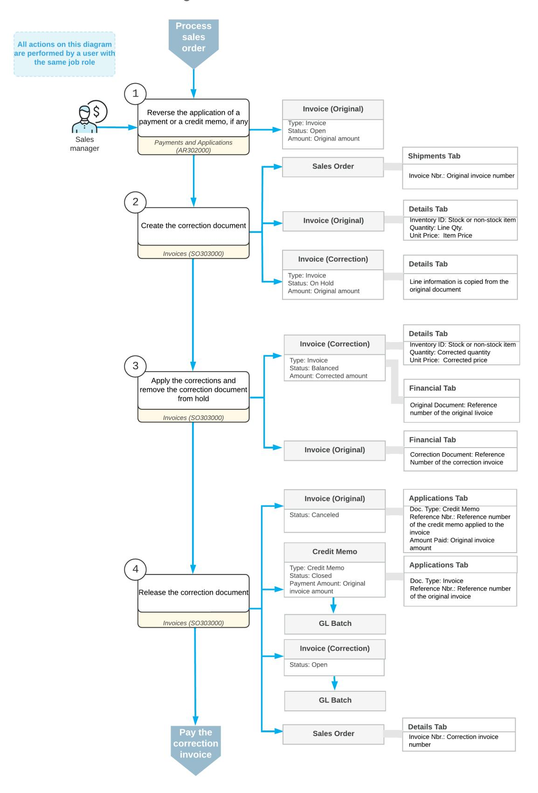

#### **Known Process Limitations**

The following limitations apply to the processes of correcting and canceling sales invoices that have been created on the *[Invoices](https://help-2025r1.acumatica.com/Help?ScreenId=ShowWiki&pageid=0acc9738-f141-4ea0-a2be-f34ea9d1b63a)* (SO303000) form:

- It is not possible to cancel or correct sales invoices whose credit terms (specified in the**Terms** box of the Summary area of the form) are multiple-installment.
- It is not possible to cancel or correct sales invoices related to direct sales—that is, the invoices in which the stock items listed on the **Details** tab have been added directly without links to related shipments and sales orders (in the**Shipment Nbr.** and **Order Nbr.** columns, respectively).
- It is not possible to cancel or correct sales invoices created for sales orders that are processed and completed without processing a shipment. For example, if an invoice is created and released for a sales order that contains only service items (a service item is a non-stock item that has the **Require Receipt** and **RequireShipment** check boxes cleared on the **General** tab of the *[Non-Stock Items](https://help-2025r1.acumatica.com/Help?ScreenId=ShowWiki&pageid=bf68dd4f-63d4-460d-8dc0-9152f2bd6bf1)* (IN202000) form), this invoice cannot be canceled or corrected.
- It is not possible to reverse an application of the cancellation credit memo to a sales invoice on the **Application History** tab of the *[Payments and Applications](https://help-2025r1.acumatica.com/Help?ScreenId=ShowWiki&pageid=ae844bf4-1aef-42cd-9e2f-49b3ee1bc8d7)* (AP302000) form.

# <span id="page-135-0"></span>**Sales Invoice Correction: Cancellation of an Invoice**

This topic explains how you can cancel a sales invoice that has been prepared for a sales order and released.

#### **Cancellation of a Sales Invoice**

You can cancel a sales invoice on the *[Invoices](https://help-2025r1.acumatica.com/Help?ScreenId=ShowWiki&pageid=0acc9738-f141-4ea0-a2be-f34ea9d1b63a)* (SO303000) form if it has the *Open* status. If a payment or credit memo has been applied the sales invoice, you must first reverse the application and then cancel the invoice.

To cancel the invoice, while viewing it on the *[Invoices](https://help-2025r1.acumatica.com/Help?ScreenId=ShowWiki&pageid=0acc9738-f141-4ea0-a2be-f34ea9d1b63a)* form, you click **Cancel Invoice** on the More menu. The system creates a credit memo—the cancellation credit memo—in the full amount of the invoice being canceled, with all the settings from the original invoice copied, and displays it on the same form. In the credit memo that has been created you can change the date, posting period, and description, all of which are copied from the sales invoice being canceled.

The cancellation credit memo can be applied only to the original invoice for which it has been prepared. When you release the cancellation credit memo, the system applies it to the original invoice automatically, assigns the *Canceled* status to the original invoice, and assigns the *Closed* status to the cancellation credit memo.

When the original invoice is canceled, the system removes the links between it and the related sales orders and shipments, and assigns the related shipment the *Confirmed* status. You can now create a new sales invoice for this shipment, if needed. The inventory issue transaction related to the canceled invoice is not affected by the invoice cancellation; it is still linked to the shipment.

#### **Workflow of Invoice Cancellation**

The following diagram illustrates the workflow related to the cancellation of a sales invoice.

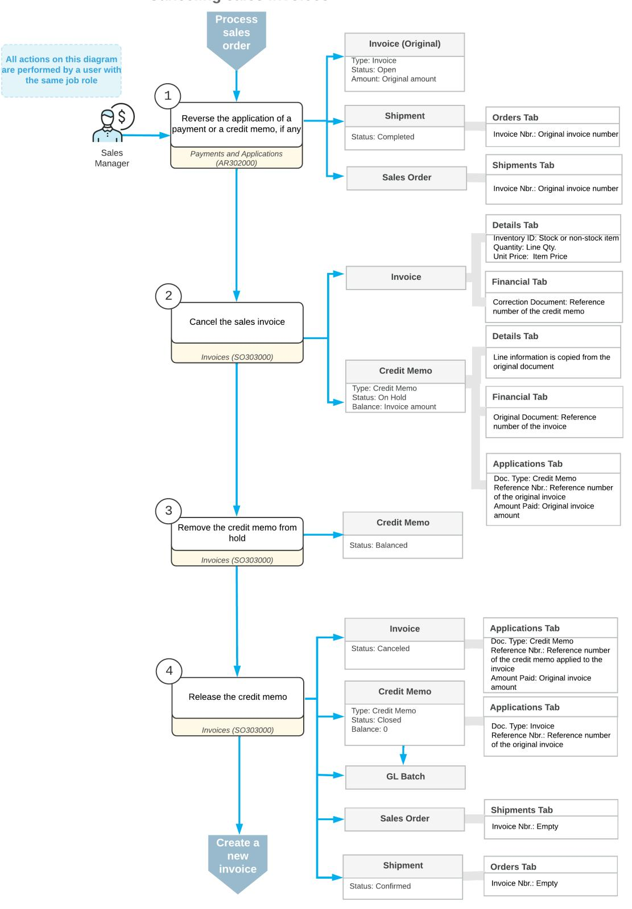

# <span id="page-137-0"></span>**Sales Invoice Correction: Implementation Checklist**

The following sections provide details you can use to ensure that the system is configured properly for the correcting of sales invoices, and to understand (and change, if needed) the settings that affect the processing workflow.

#### **Implementation Checklist**

Before you begin correcting sales invoices, you should make sure the needed settings have been specified and entities have been created, as summarized in the following checklist.

| Form                                                                               | Criteria to Check                                                                                                                                                                  |
|------------------------------------------------------------------------------------|------------------------------------------------------------------------------------------------------------------------------------------------------------------------------------|
| Sales Orders Preferences (SO101000) form, Inventory<br>Preferences (IN101000) form | Make sure that all necessary settings related to sales<br>orders and inventory have been specified, as de<br>scribed in Configuration of Order Management: General<br>Information. |
| Order Types (SO201000) form                                                        | Make sure that the SO order type is active and has<br>been configured, as described in Sales Order Types: To<br>Activate the SO Order TypeImplementation Activity.                 |
| Customers (AR303000) form                                                          | Make sure that all needed customers have been de<br>fined in the system, as described in Customers: Imple<br>mentation Activity.                                                   |

### **Other Settings That Affect the Workflow**

You can affect the workflow of correcting invoices by specifying additional settings as follows:

- To cause correction invoices and cancellation credit memos to be created with the *Balanced* (instead of *On Hold*) status, clear the **Hold Documents on Entry** check box on the **GeneralSettings** tab of the *[Accounts](https://help-2025r1.acumatica.com/Help?ScreenId=ShowWiki&pageid=f7b52067-5299-45e8-b601-485cd709f58b) [Receivable Preferences](https://help-2025r1.acumatica.com/Help?ScreenId=ShowWiki&pageid=f7b52067-5299-45e8-b601-485cd709f58b)* (AR101000) form.
- To cause general ledger batches generated during the processing of sales documents to be posted automatically, select the **Automatically Post on Release** check box on the *[General Ledger Preferences](https://help-2025r1.acumatica.com/Help?ScreenId=ShowWiki&pageid=e4913d06-c511-4258-a0f9-f36c1b854e6b)* (GL102000) form. For information on processing general ledger batches, see *GL [Transactions:](https://help-2025r1.acumatica.com/Help?ScreenId=ShowWiki&pageid=35393020-6269-466d-8a08-df558cd43367) General [Information](https://help-2025r1.acumatica.com/Help?ScreenId=ShowWiki&pageid=35393020-6269-466d-8a08-df558cd43367)*.

#### **Testing of Settings**

To make sure that all settings are configured correctly, we recommend that for testing purposes, you correct a sales invoice, as described in *Sales Invoice [Correction:](#page-137-2) To Correct an Invoice*, and cancel a sales invoice, as described in *Sales Invoice [Correction:](#page-140-1) To Cancel an Invoice*.

# <span id="page-137-2"></span><span id="page-137-1"></span>**Sales Invoice Correction: To Correct an Invoice**

The following activity will walk you through the process of correcting a sales invoice that was created for a sales order.

This activity is based on the *U100* dataset. If you are using another dataset, or if any system settings have been changed in *U100*, these changes can affect the workflow of the activity and the results of the processing. To avoid any issues, restore the *U100* dataset to its initial state.

#### **Story**

Suppose that on January 21, 2025, GoodFood One Restaurant ordered 92 pounds of oranges from the main office of SweetLife. The ordered fruits were shipped from the Wholesale warehouse to the customer's location, and a sales invoice were prepared and paid. Further suppose that the customer later informed you that the price of oranges in the invoice was specified incorrectly (the price in the invoice sent to customer was \$2.15, and it should have been \$1.99). Acting as a sales manager, you need to correct the error introduced in sales documents, and prepare a correct invoice for the customer.

#### **Configuration Overview**

In the *U100* dataset, for the purposes of this activity, the following tasks have been performed:

- The *Inventory* feature, which provides the ability to create sales and purchase orders that include stock items, have been enabled on the *[Enable/Disable Features](https://help-2025r1.acumatica.com/Help?ScreenId=ShowWiki&pageid=c1555e43-1bc5-4f6f-ba9d-b323f94d8a6b)* (CS101000) form.
- On the *Order [Types](https://help-2025r1.acumatica.com/Help?ScreenId=ShowWiki&pageid=e6984218-4260-4438-99e1-aee2b3765369)* (SO201000) form, the *SO* order type has been configured and activated.
- On the *[Stock Items](https://help-2025r1.acumatica.com/Help?ScreenId=ShowWiki&pageid=77786a70-1f1e-4d63-ad98-96f98e4fcb0e)* (IN202500) form, the *ORANGES* stock item has been defined.
- On the *[Customers](https://help-2025r1.acumatica.com/Help?ScreenId=ShowWiki&pageid=652929bc-9606-4056-aa6e-0c2d1147171b)* (AR303000) form, the *GOODFOOD (GoodFood One Restaurant)* customer has been defined. Additionally, the following sales documents that you need to correct have been processed in the system: a sales order for *GOODFOOD* has been created, a shipment for the sales order has been prepared and confirmed, and a sales invoice has been prepared, released, and paid in full.

#### **Process Overview**

To be able to correct the sales invoice that was processed and paid, you will first reverse the payment application on the *[Payments and Applications](https://help-2025r1.acumatica.com/Help?ScreenId=ShowWiki&pageid=ae844bf4-1aef-42cd-9e2f-49b3ee1bc8d7)* (AR302000) form. Then on the *[Invoices](https://help-2025r1.acumatica.com/Help?ScreenId=ShowWiki&pageid=0acc9738-f141-4ea0-a2be-f34ea9d1b63a)* (SO303000) form, you will create a correction invoice with the correct unit price and release this invoice, which will cause the system to cancel the invoice with the incorrect data and apply a credit memo to it. You will then apply the payment to the correction invoice.

#### **System Preparation**

Do the following:

- 1. Launch the Acumatica ERP website, and sign in to a company with the *U100* dataset preloaded. To sign in as a sales and purchasing manager, use the *wiley* username and the *123* password.
- 2. In the info area, in the upper-right corner of the top pane of the Acumatica ERP screen, make sure that the business date in your system is set to *1/30/2025*. If a different date is displayed, click the Business Date menu button, and select *1/30/2025* on the calendar. For simplicity, in this activity, you will create and process all documents in the system on this business date.
- 3. On the Company and Branch Selection menu, also on the top pane of the Acumatica ERP screen, make sure that the *SweetLife Head Office and Wholesale Center* branch is selected. If it is not selected, click the Company and Branch Selection menu to view the list of branches that you have access to, and then click *SweetLife Head Office and Wholesale Center*.

#### **Step 1: Reversing the Payment Application**

To reverse the payment application to the sales invoice that you are going to correct, do the following:

- 1. On the *[Sales Orders](https://help-2025r1.acumatica.com/Help?ScreenId=ShowWiki&pageid=19e4021c-1b84-49fd-be12-0320c5f1c7e5)* (SO301000) form, open the sales order for the *GOODFOOD* customer in the amount of \$210.66, dated *1/21/2025*.
- 2. On the **Shipments** tab, click the link in the **Invoice Nbr.** column to open the sales invoice prepared for the sales order on the *[Invoices](https://help-2025r1.acumatica.com/Help?ScreenId=ShowWiki&pageid=0acc9738-f141-4ea0-a2be-f34ea9d1b63a)* (SO303000) form.

In the Summary area of the form, notice that the sales invoice is assigned the *Closed* status because it was paid in full. You need to reverse the payment to be able to correct the invoice.

- 3. On the **Applications** tab, click the link in the **Reference Nbr.** column of the only row to open the payment that was applied to invoice on the *[Payments and Applications](https://help-2025r1.acumatica.com/Help?ScreenId=ShowWiki&pageid=ae844bf4-1aef-42cd-9e2f-49b3ee1bc8d7)* (AR302000) form.
- 4. On the table toolbar of the **Application History** tab, click **Reverse Application**.
- 5. On the form toolbar, click **Release** to release the reversal of the payment application.

On the **Application History** tab, a reversing line for the full payment amount appears. The payment application is now reversed; the payment is assigned the *Open* status.

#### **Step 2: Creating the Correction Invoice**

Now that you have reversed the payment, you can create the correction sales invoice as follows:

- 1. While you are still viewing the payment you have reversed on the *[Payments and Applications](https://help-2025r1.acumatica.com/Help?ScreenId=ShowWiki&pageid=ae844bf4-1aef-42cd-9e2f-49b3ee1bc8d7)* (AR302000) form, on the **Application History** tab, click the link in the **Reference Nbr.** column of either row to open the sales invoice on the *[Invoices](https://help-2025r1.acumatica.com/Help?ScreenId=ShowWiki&pageid=0acc9738-f141-4ea0-a2be-f34ea9d1b63a)* (SO303000) form. Notice that the invoice is now assigned the *Open* status.
- 2. On the More menu, click **Correct Invoice**. The system creates a correction invoice and opens it on the same form.
- 3. On the form toolbar, click**Save** to save the prepared invoice. The system displays a warning on the **Financial** tab indicating that the current document is a correction document.
- 4. In the only line on the **Details** tab, change the **Unit Price** to 1.99.


In the correction invoice, it is not allowed to change the data related to the shipment, such as inventory ID, quantity, or warehouse.

- 5. On the form toolbar, click **Remove Hold**, and then click **Release**. Notice that the invoice is assigned the *Open* status.
- 6. On the **Financial** tab, click the **Original Document** link to open the original invoice (that is, the invoice that was corrected) on the *[Invoices](https://help-2025r1.acumatica.com/Help?ScreenId=ShowWiki&pageid=0acc9738-f141-4ea0-a2be-f34ea9d1b63a)* form.
- 7. On the **Applications** tab, review the line with the *Credit Memo* document type, as shown in the following screenshot. The credit memo was automatically generated when you released the correction invoice and was applied to the original document; this is why the original invoice is now assigned the *Canceled* status, as you can also see in the screenshot.

| Invoices<br><b>PINOTES</b><br>Invoice 000030 - GoodFood One Restaurant<br>$\boxdot$<br>뭐<br>而<br>Ω÷<br>$\overline{\mathbf{K}}$<br>$\lambda$<br>$\Omega$<br>$+$<br>$\sim$<br>$\rightarrow$<br>$\cdots$                                                                                                                                                                                                                                                                                                                                                                                                                                                            |                                          |                  |                          |                                  |                                 |                                  |                                  |                |                   |                                        |                                      | <b>ACTIVITIES</b>   | <b>FILES</b>    | $TOOLS -$     |                         |                          |  |              |
|------------------------------------------------------------------------------------------------------------------------------------------------------------------------------------------------------------------------------------------------------------------------------------------------------------------------------------------------------------------------------------------------------------------------------------------------------------------------------------------------------------------------------------------------------------------------------------------------------------------------------------------------------------------|------------------------------------------|------------------|--------------------------|----------------------------------|---------------------------------|----------------------------------|----------------------------------|----------------|-------------------|----------------------------------------|--------------------------------------|---------------------|-----------------|---------------|-------------------------|--------------------------|--|--------------|
| Detail Total:<br>Invoice<br>GOODFOOD - GoodFood One Restaurar /<br>197.80<br>Customer:<br>Type:<br>$\scriptstyle\star$<br>000030<br>$\circ$<br><b>Discount Total:</b><br>Reference Nbr.<br>Location:<br>0.00<br><b>MAIN - Primary Location</b><br>Canceled<br><b>Tax Total:</b><br>Terms:<br>12.86<br>Status:<br>30D - 30 Days<br>Write-Off Total:<br>Due Date:<br>Date:<br>1/21/2023<br>2/20/2023<br>0.00<br>Balance:<br>0.00<br>Post Period:<br>Cash Discount 2/20/2023<br>01-2023<br>Amount:<br>210.66<br>Customer Ord.<br>Cash Discount:<br>0.00<br>Project/Contract: X - Non-Project Code.<br>$\mathscr{D}$<br>Description:<br>Sale of 92 pounds of oranges |                                          |                  |                          |                                  |                                 |                                  |                                  |                |                   |                                        |                                      | $\hat{\phantom{a}}$ |                 |               |                         |                          |  |              |
| O                                                                                                                                                                                                                                                                                                                                                                                                                                                                                                                                                                                                                                                                | <b>DETAILS</b><br>$\! +$                 |                  | <b>TAXES</b><br>$\times$ | <b>FREIGHT</b><br>LOAD DOCUMENTS | <b>OFINANCIAL</b><br>AUTO APPLY | ADDRESSES<br>CREATE PAYMENT      | <b>APPLICATIONS</b><br>CAPTURE   |                | VOID CARD PAYMENT | IMPORT CARD PAYMENT                    | $\mathbb{H}$<br>$\boxed{\mathbf{x}}$ |                     |                 |               |                         | Not Released:            |  | 0.00         |
| <b>B &amp; D</b>                                                                                                                                                                                                                                                                                                                                                                                                                                                                                                                                                                                                                                                 |                                          |                  | D *Doc. Type             | *Reference<br>Nbr.               | Amount<br>Paid                  | Cash<br><b>Discount</b><br>Taken | Write-Off Payment<br>Amount Date |                |                   | <b>Balance Description</b>             | Currency                             | Payment<br>Period   | Payment<br>Ref. | <b>Status</b> | Proc. Status            | Authorized:<br>Released: |  | 0.00<br>0.00 |
| > 0                                                                                                                                                                                                                                                                                                                                                                                                                                                                                                                                                                                                                                                              |                                          | $\overline{\Xi}$ | <b>Credit Memo</b>       | 000121                           | 210.66                          | 0.0000                           |                                  | 0.00 1/30/2023 |                   | 0.00 Correction of the 000030 invoice. | <b>USD</b>                           | 01-2023             |                 | Closed        |                         | <b>Total Paid:</b>       |  | 210.66       |
| !!!!!!!!!!!!!!!!!!!!!!!!!!!!!!!!!!!!!!!!                                                                                                                                                                                                                                                                                                                                                                                                                                                                                                                                                                                                                         | !!!!!!!!!!!!!!!!!!!!!!!!!!!!!!!!!!!!!!!! | ☑                | Payment                  | 000042                           | 210.66                          | 0.0000                           | 0.00                             | 1/21/2023      |                   | 210.66 Sale of 92 pounds of oranges    | <b>USD</b>                           | 01-2023             | 0019            | Open          |                         | <b>Unpaid Balance:</b>   |  | 0.00         |
|                                                                                                                                                                                                                                                                                                                                                                                                                                                                                                                                                                                                                                                                  | !!!!!!!!!!!!!!!!!!!!!!!!!!!!!!!!!!!!!!!! | ☑                | Payment                  | 000042                           | $-210.66$                       | 0.0000                           | 0.00                             | 1/21/2023      |                   | 210.66 Sale of 92 pounds of oranges    | <b>USD</b>                           | 01-2023             | 0019            | Open          |                         |                          |  |              |
|                                                                                                                                                                                                                                                                                                                                                                                                                                                                                                                                                                                                                                                                  |                                          |                  |                          |                                  |                                 |                                  |                                  |                |                   |                                        |                                      |                     |                 |               | $ c  \leq  c  \geq  c $ |                          |  |              |

*Figure: The original invoice, which is now canceled*

8. On the *[Sales Orders](https://help-2025r1.acumatica.com/Help?ScreenId=ShowWiki&pageid=19e4021c-1b84-49fd-be12-0320c5f1c7e5)* (SO301000) form, again open the sales order for the *GOODFOOD* customer in the amount of \$210.66, dated *1/21/2025*. On the **Shipments** tab, notice that the reference number of the correction invoice (and a link to this invoice) is now shown in the **Invoice Nbr.** column.

#### **Step 3: Applying a Payment to Correction Document**

To apply the payment to the correction sales invoice that you have created, do the following:

- 1. On the *[Payments and Applications](https://help-2025r1.acumatica.com/Help?ScreenId=ShowWiki&pageid=ae844bf4-1aef-42cd-9e2f-49b3ee1bc8d7)* (AR302000) form, open the payment to *GOODFOOD* in the amount of \$210.66.
- 2. On the **Documents to Apply** tab, add a new line with the *Invoice* type, and in the **Reference Nbr.** box, select the reference number of the correction invoice that you have created earlier in this activity.
- 3. On the form toolbar, click **Release**. Due to the changed price of the oranges, the payment still has an available balance of \$11.33 that can be applied to any other customer invoice (which is shown in the **Available Balance** box in the Summary area).
- 4. On the **Application History** tab, click the reference number of the invoice to which you applied the payment (that is, the correction invoice), to open it on the *[Invoices](https://help-2025r1.acumatica.com/Help?ScreenId=ShowWiki&pageid=0acc9738-f141-4ea0-a2be-f34ea9d1b63a)* (SO303000) form. The invoice that was paid is now assigned the *Closed* status.

<span id="page-140-1"></span>You have finished the process of correcting the sales invoice.

# <span id="page-140-0"></span>**Sales Invoice Correction: To Cancel an Invoice**

The following activity will walk you through the process of canceling a sales invoice that was created for a sales order.

This activity is based on the *U100* dataset. If you are using another dataset, or if any system settings have been changed in *U100*, these changes can affect the workflow of the activity and the results of the processing. To avoid any issues, restore the *U100* dataset to its initial state.

#### **Story**

Suppose that on January 28, 2025, FourStar Coffee & Sweets Shop ordered 15 pounds of apples from the main office of SweetLife. The ordered fruits were shipped from the Wholesale warehouse to the customer's location, and a sales invoice was prepared. Further suppose that you later noticed that the sales taxes had not been calculated for the sales invoice because the *EXEMPT* tax category had been specified in the sales order line by mistake. Acting as a sales manager, you need to cancel the incorrect invoice and create a new one with the correct information.

#### **Configuration Overview**

In the *U100* dataset, for the purposes of this activity, the following tasks have been performed:

- The *Inventory* feature, which provides the ability to create sales and purchase orders that include stock items, have been enabled on the *[Enable/Disable Features](https://help-2025r1.acumatica.com/Help?ScreenId=ShowWiki&pageid=c1555e43-1bc5-4f6f-ba9d-b323f94d8a6b)* (CS101000) form.
- On the *Order [Types](https://help-2025r1.acumatica.com/Help?ScreenId=ShowWiki&pageid=e6984218-4260-4438-99e1-aee2b3765369)* (SO201000) form, the *SO* order type has been configured and activated.
- On the *[Stock Items](https://help-2025r1.acumatica.com/Help?ScreenId=ShowWiki&pageid=77786a70-1f1e-4d63-ad98-96f98e4fcb0e)* (IN202500) form, the *APPLES* stock item has been defined.
- On the *[Customers](https://help-2025r1.acumatica.com/Help?ScreenId=ShowWiki&pageid=652929bc-9606-4056-aa6e-0c2d1147171b)* (AR303000) form, the *COFFEESHOP (FourStar Coffee & Sweets Shop)* customer has been defined. Additionally, the sales documents that you need to correct have been processed in the system: a sales order to *COFFEESHOP* has been created, a shipment for the sales order has been prepared and confirmed, and a sales invoice has been prepared and released.

#### **Process Overview**

To correct the mistake of taxes not being charged on the sales invoice on the *[Invoices](https://help-2025r1.acumatica.com/Help?ScreenId=ShowWiki&pageid=0acc9738-f141-4ea0-a2be-f34ea9d1b63a)* (SO303000) form, you will cancel the invoice. Then you will change the tax category in the sales order line on the *[Sales Orders](https://help-2025r1.acumatica.com/Help?ScreenId=ShowWiki&pageid=19e4021c-1b84-49fd-be12-0320c5f1c7e5)* (SO301000) form, and prepare a new sales invoice for the sales order with the correct information.

#### **System Preparation**

Do the following:

- 1. Launch the Acumatica ERP website, and sign in to a company with the *U100* dataset preloaded. To sign in as a sales and purchasing manager, use the *wiley* username and the *123* password.
- 2. In the info area, in the upper-right corner of the top pane of the Acumatica ERP screen, make sure that the business date in your system is set to *1/30/2025*. If a different date is displayed, click the Business Date menu button, and select *1/30/2025* on the calendar. For simplicity, in this activity, you will create and process all documents in the system on this business date.
- 3. On the Company and Branch Selection menu, also on the top pane of the Acumatica ERP screen, make sure that the *SweetLife Head Office and Wholesale Center* branch is selected. If it is not selected, click the Company and Branch Selection menu to view the list of branches that you have access to, and then click *SweetLife Head Office and Wholesale Center*.

#### **Step 1: Canceling the Sales Invoice**

To cancel the sales invoice with the incorrect tax category, do the following:

- 1. On the *[Sales Orders](https://help-2025r1.acumatica.com/Help?ScreenId=ShowWiki&pageid=19e4021c-1b84-49fd-be12-0320c5f1c7e5)* (SO301000) form, open the sales order for the *COFFEESHOP* customer in the amount of \$37.50, dated *1/28/2025*.
- 2. On the **Shipments** tab, click the **Invoice Nbr.** link to open the sales invoice on the *[Invoices](https://help-2025r1.acumatica.com/Help?ScreenId=ShowWiki&pageid=0acc9738-f141-4ea0-a2be-f34ea9d1b63a)* (SO303000) form.
- 3. Review the**Taxes** tab. Notice that the *NYNOTAX* tax code with the 0% tax rate has been applied to the sales invoice, so the tax amount is \$0.00, which is incorrect.
- 4. On the More menu, click **Cancel Invoice**.

The system creates a cancellation credit memo with the same settings as the invoice you were viewing, and opens it on the same form.

5. On the form toolbar, click **Remove Hold**, and then click **Release**. The credit memo is assigned the *Closed* status, because it has been applied in full to the invoice.

6. On the **Financial** tab, click the link in the **Original Document** box to open the invoice that was canceled on the *[Invoices](https://help-2025r1.acumatica.com/Help?ScreenId=ShowWiki&pageid=0acc9738-f141-4ea0-a2be-f34ea9d1b63a)* form. Notice that the invoice is now assigned the *Canceled* status.

#### **Step 2: Creating the New Sales invoice**

To create the sales invoice with the correct tax information, do the following:

- 1. On the *[Sales Orders](https://help-2025r1.acumatica.com/Help?ScreenId=ShowWiki&pageid=19e4021c-1b84-49fd-be12-0320c5f1c7e5)* (SO301000) form, again open the sales order for *COFFEESHOP (FourStar Coffee & Sweets Shop)* dated *1/28/2025*.
- 2. On the form toolbar, click **Prepare Invoice**. The system creates the new sales invoice for the sales order and opens it on the *[Invoices](https://help-2025r1.acumatica.com/Help?ScreenId=ShowWiki&pageid=0acc9738-f141-4ea0-a2be-f34ea9d1b63a)* (SO303000) form.
- 3. In the only line on the **Details** tab, change the tax category to *TAXABLE* and save the invoice.
- 4. Review the**Taxes** tab, and make sure that the *NYSTATETAX* has been applied to the invoice and the calculated tax amount is \$3.33, as shown in the following screenshot.

| Invoices<br>Invoice 000123 - FourStar Coffee & Sweets Shop |                   |                          |   |                  |   |           |                                |                          | $\Gamma$ NOTES                      | <b>ACTIVITIES</b> | <b>FILES</b> | TOOLS $\star$          |       |   |
|------------------------------------------------------------|-------------------|--------------------------|---|------------------|---|-----------|--------------------------------|--------------------------|-------------------------------------|-------------------|--------------|------------------------|-------|---|
| 목<br>Ħ<br>$\leftarrow$                                     | ↶                 | $^{+}$                   | 血 | n -              | K | ≺         | $\rightarrow$                  | >1                       | <b>RELEASE</b>                      |                   | <b>HOLD</b>  | .                      |       |   |
| Type:                                                      | Invoice           | $\overline{\phantom{a}}$ |   | Customer:        |   |           |                                |                          | COFFEESHOP - FourStar Coffee & Swee |                   | 0            | Detail Total:          | 37.50 | ∼ |
| Reference Nbr.:                                            | 000123            | Q                        |   | * Location:      |   |           | <b>MAIN - Primary Location</b> |                          |                                     | Q                 |              | <b>Discount Total:</b> | 0.00  |   |
| Status:                                                    | <b>Balanced</b>   |                          |   | * Terms:         |   |           | 30D - 30 Days                  |                          |                                     | Q                 |              | <b>Tax Total:</b>      | 3.33  |   |
| $\star$ Date:                                              | 1/28/2023         | $\overline{\phantom{a}}$ |   | * Due Date:      |   | 2/27/2023 | $\overline{\mathbf{v}}$        |                          |                                     |                   |              | Write-Off Total:       | 0.00  |   |
| * Post Period:                                             | 01-2023           | Q                        |   | * Cash Discount  |   | 2/27/2023 |                                | $\overline{\phantom{a}}$ |                                     |                   |              | Balance:               | 40.83 |   |
| Customer Ord                                               |                   |                          |   |                  |   |           |                                |                          |                                     |                   |              | Cash Discount:         | 0.00  |   |
| * Project/Contract:   X - Non-Project Code.                |                   |                          |   |                  |   |           |                                |                          |                                     | Q                 | $\mathcal O$ |                        |       |   |
| Description:<br>Sale of 15 pounds of apples                |                   |                          |   |                  |   |           |                                |                          |                                     |                   |              |                        |       |   |
|                                                            |                   |                          |   |                  |   |           |                                |                          |                                     |                   |              |                        |       |   |
|                                                            |                   |                          |   |                  |   |           |                                |                          |                                     |                   |              |                        |       |   |
| <b>DETAILS</b>                                             | <b>TAXES</b>      | <b>FREIGHT</b>           |   | <b>FINANCIAL</b> |   |           | <b>ADDRESSES</b>               |                          | <b>APPLICATIONS</b>                 |                   |              |                        |       |   |
| Õ<br>$^{+}$<br>$\times$                                    | $\leftrightarrow$ | $ \mathbf{x} $           |   |                  |   |           |                                |                          |                                     |                   |              |                        |       |   |
| 图 *Tax ID                                                  |                   |                          |   | <b>Tax Rate</b>  |   |           | <b>Taxable Amount</b>          |                          | <b>Tax Amount</b>                   |                   |              |                        |       |   |
| <b>NYSTATETAX</b>                                          |                   |                          |   | 8.875000         |   |           | 37.50                          |                          | 3.33                                |                   |              |                        |       |   |

*Figure: The correct tax amounts in the corrected sales invoice*

- 5. On the form toolbar, click **Release** to release the invoice.
- 6. On the **Details** tab, click the link in the **Order Nbr.** column in the only line to open the related sales order on the *[Sales Orders](https://help-2025r1.acumatica.com/Help?ScreenId=ShowWiki&pageid=19e4021c-1b84-49fd-be12-0320c5f1c7e5)* form.
- 7. On the **Shipments** tab, notice that the reference number of the newly created invoice is now shown in the **Invoice Nbr.** column.

You have canceled the sales invoice with incorrect data and prepared a new one.

### <span id="page-142-0"></span>**Sales Invoice Correction: Generated Transactions**

To be able to correct an sales invoice created for a sales order, you create and process a correction document (which in this case is a sales invoice of the *Credit Memo* type). Similarly, to be able to cancel a sales invoice created for a sales order, the correction document you create and process is a cancellation credit memo. On release of these correction documents, the system generates the GL transactions described in the following sections.

#### **Transactions Generated for a Correction Sales Invoice**

When you release a correction sales invoice, the system generates the following general ledger transactions.

| Account                        | Source of Account | Debit            | Credit           |
|--------------------------------|-------------------|------------------|------------------|
| Accounts Receivable<br>account | Customer          | Corrected amount | 0.00             |
| Sales account                  | Order type        | 0.00             | Corrected amount |

You can view the reference number of the GL batch in the **Batch Nbr.** box on the **Financial Details** tab of the *[Invoices](https://help-2025r1.acumatica.com/Help?ScreenId=ShowWiki&pageid=0acc9738-f141-4ea0-a2be-f34ea9d1b63a)* (SO303000) form while you are viewing the correction invoice. You can click the link in this box to view the details of the batch on the *Journal [Transactions](https://help-2025r1.acumatica.com/Help?ScreenId=ShowWiki&pageid=dda046bc-5946-407f-88f7-1c0c966fbe72)* (GL301000) form.

#### **Transactions Generated for Credit Memo**

When you release a correction of a sales invoice or cancel an sales invoice, a credit memo is generated (which is a sales invoice of the *Credit Memo* type). On release of this credit memo, the system generates the following general ledger transactions, which are the opposite of the transactions generated for original sales invoice.

| Account                        | Source of Account | Debit                      | Credit                     |
|--------------------------------|-------------------|----------------------------|----------------------------|
| Accounts Receivable<br>account | Customer          | 0.00                       | Original invoice<br>amount |
| Sales account                  | Order type        | Original invoice<br>amount | 0.00                       |

You can view the reference number of the GL batch in the **Batch Nbr.** box on the **Financial Details** tab of the *[Invoices](https://help-2025r1.acumatica.com/Help?ScreenId=ShowWiki&pageid=0acc9738-f141-4ea0-a2be-f34ea9d1b63a)* (SO303000) form while you are viewing the credit memo. You can click the link in this box to view the details of the batch on the *Journal [Transactions](https://help-2025r1.acumatica.com/Help?ScreenId=ShowWiki&pageid=dda046bc-5946-407f-88f7-1c0c966fbe72)* (GL301000) form.

# <span id="page-143-0"></span>**Sales Invoice Correction: Related Report and Inquiry Forms**

In the following sections, you can find details about the reports and inquiry forms you may want to review to gather information about sales invoices that have been processed or are being processed in the system.

If you do not see a particular report or form that is described, you may have signed in to the system with a user account that does not have access rights to the report or form. Contact your system administrator to obtain access to any needed reports or forms.

#### **Reviewing the Customer Information**

You can review the balances of a specific customer on the *[Customer Details](https://help-2025r1.acumatica.com/Help?ScreenId=ShowWiki&pageid=2ed5542b-a76c-4cfd-9ee3-52c2f08a2692)* (AR402000) form. When you open this inquiry and select a customer in the **Customer** box, the form shows the outstanding balances of the selected customer and a list of the documents of this customer that have the *Open* status. If you want to include the documents with the *Canceled* and *Closed* status in the inquiry, select the**Show All Documents** check box in the Selection area of the form.

#### **Reviewing the Details of an Unreleased Invoice**

When a sales invoice has not yet been released, you can review the details of the invoice by running the *[AR Edit](https://help-2025r1.acumatica.com/Help?ScreenId=ShowWiki&pageid=9b517c23-e989-422a-8933-0fdb2a388218) [Detailed](https://help-2025r1.acumatica.com/Help?ScreenId=ShowWiki&pageid=9b517c23-e989-422a-8933-0fdb2a388218)* (AR610500) report. When you run this report from the *[Invoices](https://help-2025r1.acumatica.com/Help?ScreenId=ShowWiki&pageid=0acc9738-f141-4ea0-a2be-f34ea9d1b63a)* (SO303000) form by clicking **Reports > AR Edit**, the report shows the details of the invoice that is opened on this form. You can review what GL batch the system will create when you release the invoice, which accounts will be updated by the transaction, and how the customer's balance will be affected.

When you run this report directly from the report form, you specify the needed report parameters and can view a list of unreleased invoices based on these parameters.

#### **Printing Invoices and Credit Memos**

To prepare a printable form of a sales invoice or credit memo that is being processed, you use the *[Invoice & Memo](https://help-2025r1.acumatica.com/Help?ScreenId=ShowWiki&pageid=4ae85fa6-7297-4d4c-b956-77d36e67e13f)* (SO643000) report. While you are viewing an sales invoice or credit memo on the *[Invoices](https://help-2025r1.acumatica.com/Help?ScreenId=ShowWiki&pageid=0acc9738-f141-4ea0-a2be-f34ea9d1b63a)* (SO303000) form, you can print the document by clicking **Print Invoice** on the More menu. The system opens the printable version of the document on the *[Invoice & Memo](https://help-2025r1.acumatica.com/Help?ScreenId=ShowWiki&pageid=4ae85fa6-7297-4d4c-b956-77d36e67e13f)* report; then you can review the invoice or credit memo and print it by clicking **Print** on the report toolbar.

# <span id="page-144-0"></span>**Sales Invoice Correction: Mass-Processing Documents**

The following sections explain how to mass-process sales invoices, and how the system generates, changes, or works with documents as a result of the mass processing.

#### **Mass-Creating Sales Invoices**

Invoices can be mass-generated for sales orders or for the corresponding shipments. To prepare multiple invoices for sales orders, you open the *[Process Orders](https://help-2025r1.acumatica.com/Help?ScreenId=ShowWiki&pageid=c06a334c-f39d-4eff-9d80-b167657dff73)* (SO501000) form; to prepare multiple invoices for shipments, you open the *[Process Shipments](https://help-2025r1.acumatica.com/Help?ScreenId=ShowWiki&pageid=2e27f8fd-ddd4-47f0-a83b-5a7db31feede)* (SO503000) form. Then you select the *Prepare Invoice* action, select the unlabeled check boxes in the rows of the sales orders or shipments to be processed, and click **Process** on the form toolbar. The system prepares invoices for the selected documents.

#### **Mass-Printing Sales Invoices**

You can print multiple sales invoices at a time by using the *[Process Invoices and Memos](https://help-2025r1.acumatica.com/Help?ScreenId=ShowWiki&pageid=9a26ac3c-34d8-4d56-a809-396ab92efa91)* (SO505000) form. On this form, you select the *Print Invoice* action, select the unlabeled check boxes in the rows of the invoices to be printed, and click **Process** on the form toolbar.

#### **Mass-Releasing Sales Invoices**

You can release multiple sales invoices at a time by using the *[Process Invoices and Memos](https://help-2025r1.acumatica.com/Help?ScreenId=ShowWiki&pageid=9a26ac3c-34d8-4d56-a809-396ab92efa91)* (SO505000) form. On this form, you select the *Release* action, select the unlabeled check boxes in the rows of the sales invoices to be printed, and click **Process** on the form toolbar.

# <span id="page-145-2"></span><span id="page-145-0"></span>**Processing Partial Shipments**

Shipping goods is the main part of the order fulfillment process. Aer a sales order has been entered and the goods have been picked for sending them to a customer, you process a shipment or multiple partial shipments. This chapter includes an overview of shipment processing in Acumatica ERP.

# <span id="page-145-1"></span>**Shipping Rule Settings**

The shipping rules specified for a particular sales order define whether the goods for the sales order should be shipped only in full or partial shipments for the available quantities are allowed. This topic explains how you can set up the shipping rules to be used in sales orders by default.

#### **Shipping Settings of a Customer**

You can specify the shipping rule for each customer class in the **Default DeliverySettings** section on the **General Settings** tab of the *[Customer Classes](https://help-2025r1.acumatica.com/Help?ScreenId=ShowWiki&pageid=806e39d6-6f89-4e6c-9a24-61c6fb0c9a57)* (AR201000) form. Then when you create a new customer and select this class on the *[Customers](https://help-2025r1.acumatica.com/Help?ScreenId=ShowWiki&pageid=652929bc-9606-4056-aa6e-0c2d1147171b)* (AR303000) form, the shipping rule specified in the customer class will be copied to the**Shipping Rule** box on the **DeliverySettings** tab. If needed, for the selected customer, you can override the default shipping rule copied from the customer class.

When you create a new sales order on the *[Sales Orders](https://help-2025r1.acumatica.com/Help?ScreenId=ShowWiki&pageid=19e4021c-1b84-49fd-be12-0320c5f1c7e5)* (SO301000) form and select the customer, the system inserts the default shipping rule of the selected customer as the document-level shipping rule for this sales order in the **Shipping Rule** box on the**Shipping** tab. Then when you add lines to the sales order, the system specifies the document-level shipping rule to each added line by default.

You can override the document-level shipping rule so that all new lines in this sales order will be added with this new rule (which differs from the customer's default shipping rule). Also, you can change the shipping rule manually in any sales order line.

#### **Shipping Settings of Customer Locations**

If the *Business Account Locations* feature is enabled in your system on the *[Enable/Disable Features](https://help-2025r1.acumatica.com/Help?ScreenId=ShowWiki&pageid=c1555e43-1bc5-4f6f-ba9d-b323f94d8a6b)* (CS100000) form, the system copies the default shipping rule values from the customer to the customer locations. If needed, you can specify different default shipping rules for different customer locations on the *[Customer Locations](https://help-2025r1.acumatica.com/Help?ScreenId=ShowWiki&pageid=61a8c6de-6a51-434b-8c2d-4304ec982ae0)* (AR303020) form.

#### **Shipping Settings for Transfer Orders**

Because transfer orders are created to account for transfers of items between warehouses, and warehouses are assigned to particular branches, default shipping rules can be specified for branches on the **DeliverySettings** tab of the *[Branches](https://help-2025r1.acumatica.com/Help?ScreenId=ShowWiki&pageid=b97ab72d-4ab4-4f02-b69c-f7f61b316ced)* (CS102000) form.

#### **Related Links**

- *[Shipment Creation Rules](#page-146-1)*
- *[Shipment Processing Steps](#page-147-1)*
- *Shipment Process [Variations](#page-150-1)*
- *[Shipping Rule Combinations](#page-152-1)*
- *[Partial Shipping of Orders](#page-157-1)*
- *[Back Ordering and Replanning Back Orders](#page-158-1)*

# <span id="page-146-1"></span><span id="page-146-0"></span>**Shipment Creation Rules**

This topic briefly explains how the system creates shipments for sales orders depending on the shipping rules specified in these orders, and how you can consolidate shipments for multiple sales orders.

#### **Shipment Creation by Shipping Rules**

Each shipment is generated from one particular warehouse. The system creates an individual shipment from each warehouse that is specified in sales order lines, as if these were multiple orders being shipped from different warehouses. If you are creating shipments by processing orders on the *[Process Orders](https://help-2025r1.acumatica.com/Help?ScreenId=ShowWiki&pageid=c06a334c-f39d-4eff-9d80-b167657dff73)* (SO501000) form, the system creates the shipments one by one from each warehouse that is referred to in each processed order. The documentlevel shipping rule of the sales order, which is specified on the**ShippingSettings** tab of the *[Sales Orders](https://help-2025r1.acumatica.com/Help?ScreenId=ShowWiki&pageid=19e4021c-1b84-49fd-be12-0320c5f1c7e5)*form (SO301000), is applied to each warehouse as follows:

- If the document-level shipping rule is *Ship Complete*, a shipment is created from the warehouse selected in the line only if all other order lines with the same warehouse can be shipped from that warehouse according to the shipping rule of each line. *Ship Complete* lines can be shipped in full, and other lines can be shipped at least partially.
- If the document-level shipping rule is *Cancel Remainder* or *Back-Order Allowed*, a shipment is created from the selected warehouse if at least one order line can be shipped from that warehouse according to the shipping rule of the line.

When a shipment is created for a sales order, the system adds the lines with a nonzero open quantity to the shipment according to the following logic:

- 1. The system adds to the shipment only the lines that have a**Ship On** date no later than the specified shipment date and have to be shipped from the warehouse specified for the shipment.
- 2. The system adds the lines to the shipment according to the shipping rule of the line as follows:
  - A *Ship Complete* line is added to the shipment only if the open quantity can be shipped in full from the quantity available for shipping.
  - A *Back Order Allowed* or *Cancel Remainder* line is added to the shipment with the quantity that is available for shipping at the moment of shipment creation even if the quantity is less than the open quantity of the line.

For more detailed information on shipping rules, see *[Shipping Rule Combinations](#page-152-1)*.

#### **Consolidated Shipments**

You can consolidate shipments, creating one shipment (and corresponding shipment document) for multiple sales orders of the same customer, unless the**Ship Separately** check box on the *Order [Types](https://help-2025r1.acumatica.com/Help?ScreenId=ShowWiki&pageid=e6984218-4260-4438-99e1-aee2b3765369)* (SO201000) form is selected for the order type being used. As long as the check box is cleared, you can use the *[Process Orders](https://help-2025r1.acumatica.com/Help?ScreenId=ShowWiki&pageid=c06a334c-f39d-4eff-9d80-b167657dff73)* (SO501000) form to create one shipment for multiple sales orders associated with the same customer. Sales orders with the predefined order type *SO* don't require goods to be shipped separately for separate sales orders.

The orders of the type for which the**Ship Separately** check box is selected can still be consolidated into a single shipment if you manually add them using the **Add Order** button on the **Details** tab of the *[Shipments](https://help-2025r1.acumatica.com/Help?ScreenId=ShowWiki&pageid=f47cffcc-543e-469c-a204-a9c1e3da346d)* (SO302000) form.

One more setting that affects the creation of consolidated shipments is the **Use Customer's Account** setting specified in a shipment document on the **ShipmentSettings** tab of the *[Shipments](https://help-2025r1.acumatica.com/Help?ScreenId=ShowWiki&pageid=f47cffcc-543e-469c-a204-a9c1e3da346d)* (SO302000) form. The system copies the state of this check box from the related sales order. Thus, if you mass-process multiple sales orders that have different states of the **Use Customer's Account** check box on the**Shipping** tab of the *[Sales Orders](https://help-2025r1.acumatica.com/Help?ScreenId=ShowWiki&pageid=19e4021c-1b84-49fd-be12-0320c5f1c7e5)* (SO301000) form, the system will group the sales orders by the state of this check box and create two consolidated shipments:

The first shipment will include the sales orders in which the check box is selected, and the second shipment will include the sales orders in which this check box is cleared.

#### **Related Links**

- *[Shipping Rule Combinations](#page-152-1)*
- *[Shipment Processing Steps](#page-147-1)*
- *[Partial Shipping of Orders](#page-157-1)*
- *[Back Ordering and Replanning Back Orders](#page-158-1)*

# <span id="page-147-1"></span><span id="page-147-0"></span>**Shipment Processing Steps**

Shipments, which are a key part of the order fulfillment process, can be incoming or outgoing. This topic discusses the outgoing shipments (based on the *Issue* operation) that are generated when a user processes a sale of items and ships the items to a customer; further we will refer to them as *shipments*. The processing of incoming shipments (which are based on the *Receipt* operation, and thus are called *receipts*) involve customer returns based on return orders and is described in the topics of the *[Returns for Replacement at the Same Price: General Information](#page-236-2)* section.

For a shipment prepared for a sales order, the typical processing involves the actions and generated documents shown in the following diagram.

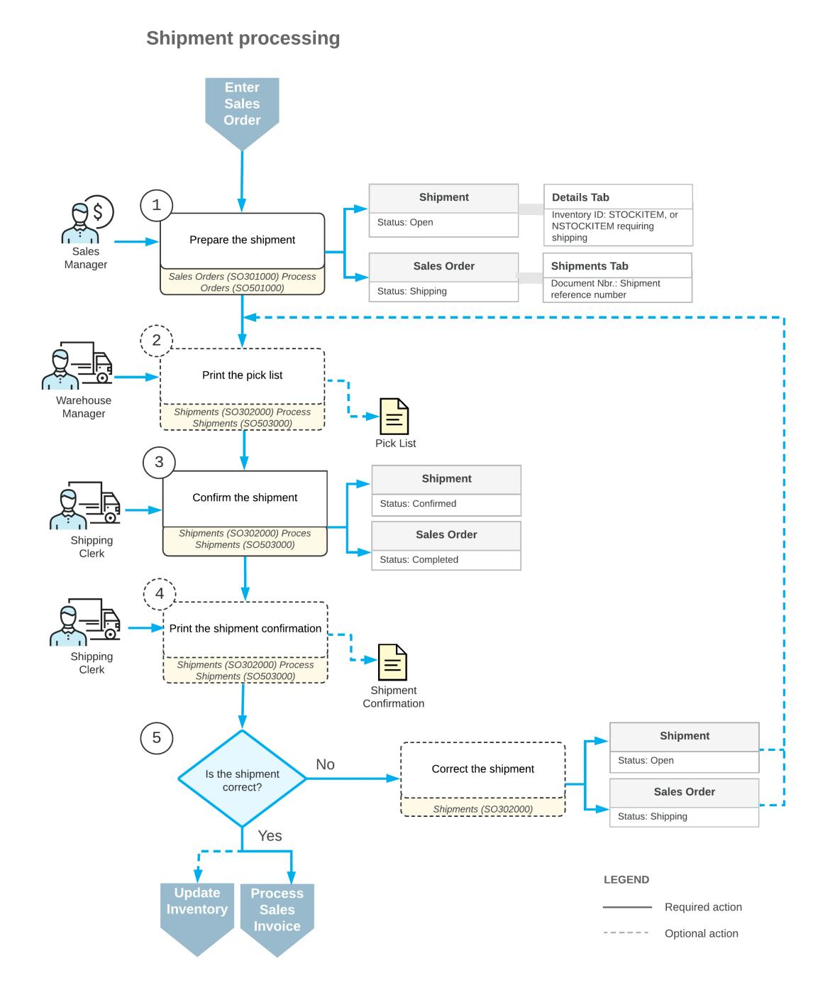

The following sections describe in detail the processing steps shown in the diagram.

#### **1. Prepare the Shipment**

You can directly create a shipment document for a particular sales order on the *[Sales Orders](https://help-2025r1.acumatica.com/Help?ScreenId=ShowWiki&pageid=19e4021c-1b84-49fd-be12-0320c5f1c7e5)* (SO301000) form by selecting **CreateShipment** on the form toolbar; this brings up the *[Shipments](https://help-2025r1.acumatica.com/Help?ScreenId=ShowWiki&pageid=f47cffcc-543e-469c-a204-a9c1e3da346d)* (SO302000) form with the new shipment document that includes the lines with items to be shipped. Alternatively, by using the *[Shipments](https://help-2025r1.acumatica.com/Help?ScreenId=ShowWiki&pageid=f47cffcc-543e-469c-a204-a9c1e3da346d)* form as a starting point, you can create a new shipment document and add one order or multiple orders of the same customer.

To create multiple shipments for multiple sales orders of multiple customers, you use the *[Process Orders](https://help-2025r1.acumatica.com/Help?ScreenId=ShowWiki&pageid=c06a334c-f39d-4eff-9d80-b167657dff73)* (SO501000) form. The system automatically assigns reference numbers to the created shipment documents, in accordance with the numbering sequence assigned to shipments on the *[Sales Orders Preferences](https://help-2025r1.acumatica.com/Help?ScreenId=ShowWiki&pageid=1817779c-413b-4187-b7fe-38e97845a1cb)* (SO101000) form.

If you use the *[Sales Orders](https://help-2025r1.acumatica.com/Help?ScreenId=ShowWiki&pageid=19e4021c-1b84-49fd-be12-0320c5f1c7e5)* form to create shipments for a sales order that includes items to be shipped from multiple warehouses, you can create only one shipment at a time. Because an order with the *Shipping* status is read-only, there can be only one open shipment for the order from a particular warehouse. Once you confirm the open shipment, you can create a shipment to be sent from another warehouse. However, by using the *[Process](https://help-2025r1.acumatica.com/Help?ScreenId=ShowWiki&pageid=c06a334c-f39d-4eff-9d80-b167657dff73) [Orders](https://help-2025r1.acumatica.com/Help?ScreenId=ShowWiki&pageid=c06a334c-f39d-4eff-9d80-b167657dff73)* form, you can create multiple shipments for these orders at once.

#### **2. Print the Pick List**

You can print a pick list for a particular shipment by using the *[Shipments](https://help-2025r1.acumatica.com/Help?ScreenId=ShowWiki&pageid=f47cffcc-543e-469c-a204-a9c1e3da346d)* (SO302000) form. For multiple shipments with the *On Hold* or *Open* status, you can print pick lists by using the *[Process Shipments](https://help-2025r1.acumatica.com/Help?ScreenId=ShowWiki&pageid=2e27f8fd-ddd4-47f0-a83b-5a7db31feede)* (SO503000) form. For more details, see *[Shipment Processing Steps](#page-147-1)*.

#### **3. Confirm the Shipment**

Aer all the required goods are picked and packed, you can confirm the shipment by clicking **Confirm Shipment** on the form toolbar of the *[Shipments](https://help-2025r1.acumatica.com/Help?ScreenId=ShowWiki&pageid=f47cffcc-543e-469c-a204-a9c1e3da346d)* (SO302000) form. You can confirm multiple shipments by executing the *Confirm Shipment* action for the selected shipments on the *[Process Shipments](https://help-2025r1.acumatica.com/Help?ScreenId=ShowWiki&pageid=2e27f8fd-ddd4-47f0-a83b-5a7db31feede)* (SO503000) form. Shipment confirmation updates the available quantities and changes the status of the associated sales order. During shipment confirmation, the system checks that for all items for which lot or serial numbers are tracked, the appropriate numbers were specified.

#### **4. Print Shipment Confirmation**

If authorization is required before the shipment is confirmed, you can print a shipment confirmation document to be signed by the authorized person by clicking **Reports > PrintShipment Confirmation** on the form toolbar of the *[Shipments](https://help-2025r1.acumatica.com/Help?ScreenId=ShowWiki&pageid=f47cffcc-543e-469c-a204-a9c1e3da346d)* (SO302000) form. For multiple shipments, you can print shipment confirmations by using the *[Process](https://help-2025r1.acumatica.com/Help?ScreenId=ShowWiki&pageid=2e27f8fd-ddd4-47f0-a83b-5a7db31feede) [Shipments](https://help-2025r1.acumatica.com/Help?ScreenId=ShowWiki&pageid=2e27f8fd-ddd4-47f0-a83b-5a7db31feede)* (SO503000) form.

To complete the sale, you must generate sales invoices and inventory issues and release these documents. The general workflow for most organizations is to first generate sales invoices and then release them; on release of these invoices, inventory issues are generated automatically. Another shipment processing workflow, in which an organization updates inventory and processes inventory issues before generating and processing customer invoices, is described in *Shipment Process [Variations](#page-150-1)*.

#### **5. Correct the Shipment**

If you need to correct a shipment that has already been confirmed, click **CorrectShipment** on the More menu of the *[Shipments](https://help-2025r1.acumatica.com/Help?ScreenId=ShowWiki&pageid=f47cffcc-543e-469c-a204-a9c1e3da346d)* (SO302000) form to reopen the shipment and make the required corrections. The associated order's status is changed to *Shipping* once you reopen the shipment.

If an order that has a confirmed shipment has been canceled, you can reopen the order by clicking **Reopen Order** on the More menu of the *[Sales Orders](https://help-2025r1.acumatica.com/Help?ScreenId=ShowWiki&pageid=19e4021c-1b84-49fd-be12-0320c5f1c7e5)* (SO301000) form. You can then delete or correct the shipment by using the *[Shipments](https://help-2025r1.acumatica.com/Help?ScreenId=ShowWiki&pageid=f47cffcc-543e-469c-a204-a9c1e3da346d)* form.

If a shipment includes a sales order line that is also included in any subsequent shipments, you have to correct the subsequent shipments prior to correcting the preceding one. Aer you have completed all needed corrections, you can confirm the shipment or shipments that you have reopened.

#### **Related Links**

- *[Sales Orders Preferences](https://help-2025r1.acumatica.com/Help?ScreenId=ShowWiki&pageid=1817779c-413b-4187-b7fe-38e97845a1cb)*
- *[Sales Orders](https://help-2025r1.acumatica.com/Help?ScreenId=ShowWiki&pageid=19e4021c-1b84-49fd-be12-0320c5f1c7e5)*
- *[Shipments](https://help-2025r1.acumatica.com/Help?ScreenId=ShowWiki&pageid=f47cffcc-543e-469c-a204-a9c1e3da346d)*
- *[Process Orders](https://help-2025r1.acumatica.com/Help?ScreenId=ShowWiki&pageid=c06a334c-f39d-4eff-9d80-b167657dff73)*

- *[Process Shipments](https://help-2025r1.acumatica.com/Help?ScreenId=ShowWiki&pageid=2e27f8fd-ddd4-47f0-a83b-5a7db31feede)*
- *[Assignment and Approval Maps](https://help-2025r1.acumatica.com/Help?ScreenId=ShowWiki&pageid=54d9618b-c27b-47d5-9748-24441084e99e)*

# <span id="page-150-1"></span><span id="page-150-0"></span>**Shipment Process Variations**

Due to shipment policies, your organization may process customer invoices later than it does inventory issues. In this case, you can first create issues, then generate invoices, and finally release invoices and issues.

The processing of a sales order with issues created before invoices includes the steps and generated documents shown in the following diagram.

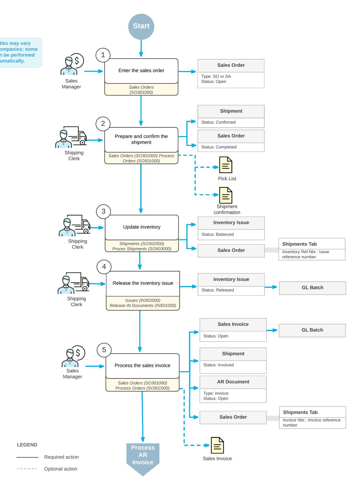

The following sections describe in detail the processing steps shown in the diagram.

#### **1. Enter the Sales Order**

You create a new sales order on the *[Sales Orders](https://help-2025r1.acumatica.com/Help?ScreenId=ShowWiki&pageid=19e4021c-1b84-49fd-be12-0320c5f1c7e5)* (SO301000) form. If the order is created with the *On Hold* status, you should click **Remove Hold** on the form toolbar to process the order further.

#### **2. Prepare and Confirm the Shipment**

For a particular order, you can create a shipment by clicking **CreateShipment** on the form toolbar of the *[Sales](https://help-2025r1.acumatica.com/Help?ScreenId=ShowWiki&pageid=19e4021c-1b84-49fd-be12-0320c5f1c7e5) [Orders](https://help-2025r1.acumatica.com/Help?ScreenId=ShowWiki&pageid=19e4021c-1b84-49fd-be12-0320c5f1c7e5)* (SO301000) form. Then you need to confirm the shipment. For more details, see *[Shipment Processing Steps](#page-147-1)*.

#### **3. Update Inventory**

To manually create the inventory issue for a shipment, you can click **CreateShipment** on the form toolbar of the *[Shipments](https://help-2025r1.acumatica.com/Help?ScreenId=ShowWiki&pageid=f47cffcc-543e-469c-a204-a9c1e3da346d)* (SO302000) form, or you can create inventory issues for multiple selected shipments by executing the *Update IN* action on the *[Process Shipments](https://help-2025r1.acumatica.com/Help?ScreenId=ShowWiki&pageid=2e27f8fd-ddd4-47f0-a83b-5a7db31feede)* (SO503000) form.

#### **4. Release the Inventory Issue**

To release the inventory issue (and thus, to update the item availability information in inventory), you click **Release** on the form toolbar of the *[Issues](https://help-2025r1.acumatica.com/Help?ScreenId=ShowWiki&pageid=17b051f6-027d-4459-b542-65c1c1f9d0ea)* (IN302000) form. When the inventory issue is released, the batch of General Ledger transactions is generated.

#### **5. Process the Sales Invoice**

You can prepare a sales invoice for a particular order by clicking **Prepare Invoice** on the form toolbar of the *[Shipments](https://help-2025r1.acumatica.com/Help?ScreenId=ShowWiki&pageid=f47cffcc-543e-469c-a204-a9c1e3da346d)* (SO302000) form, or you can create invoices for multiple selected shipments by executing the *Prepare Invoice* action on the *[Process Shipments](https://help-2025r1.acumatica.com/Help?ScreenId=ShowWiki&pageid=2e27f8fd-ddd4-47f0-a83b-5a7db31feede)* (SO503000) form.

To release the sales invoice, you click **Release** on the form toolbar of the *[Invoices](https://help-2025r1.acumatica.com/Help?ScreenId=ShowWiki&pageid=0acc9738-f141-4ea0-a2be-f34ea9d1b63a)* (SO303000) form aer reviewing its details. When the sales invoice is released, the batch of GL transactions is generated.

To adjust the dates in the invoices generated for confirmed shipments, you can use the **UseShipment Date for Invoice Date** check box on the *[Sales Orders Preferences](https://help-2025r1.acumatica.com/Help?ScreenId=ShowWiki&pageid=1817779c-413b-4187-b7fe-38e97845a1cb)* (SO101000) form as follows:

- Select this check box to set the shipment date as the invoice date.
- Clear the check box to use the current business date as the default date for the invoice.

# <span id="page-152-1"></span><span id="page-152-0"></span>**Shipping Rule Combinations**

The shipping rules specified for a particular sales order define how the goods in the sales order should be shipped —whether they should be shipped only in full or partial shipments for the available quantities are allowed. The shipment rules for a sales order are applied when you create a shipment for a single order—by using the **Create Shipment** action on the *[Sales Orders](https://help-2025r1.acumatica.com/Help?ScreenId=ShowWiki&pageid=19e4021c-1b84-49fd-be12-0320c5f1c7e5)* (SO301000) form—or mass-create shipments for multiple orders, by running the **CreateShipments** process from the *[Process Orders](https://help-2025r1.acumatica.com/Help?ScreenId=ShowWiki&pageid=c06a334c-f39d-4eff-9d80-b167657dff73)* (SO501000) form.

#### **Shipping Rule Options**

On the *[Sales Orders](https://help-2025r1.acumatica.com/Help?ScreenId=ShowWiki&pageid=19e4021c-1b84-49fd-be12-0320c5f1c7e5)* (SO301000) form, you can specify the document-level shipping rule for the sales order document as a whole (in the **Shipping Rule** box on the**Shipping** tab) and for each sales order line (in the**Shipping Rule** column on the **Details** tab).

You can specify any of the following shipping rule options for order lines and for orders:

- *Ship Complete*
- *Cancel Remainder*
- *Back Order Allowed*

The shipping rules applied to order lines are explained in the following table.

*Table: Line-Level Shipping Rules*

| Shipping Rule Option | Result                                                                                                                                                                                                                                                                                                                                                                                                                                                                                                                                                        |
|----------------------|---------------------------------------------------------------------------------------------------------------------------------------------------------------------------------------------------------------------------------------------------------------------------------------------------------------------------------------------------------------------------------------------------------------------------------------------------------------------------------------------------------------------------------------------------------------|
| Ship Complete        | If a negative quantity is not allowed for the item specified in the line, the item can<br>be included in a shipment only if the full ordered quantity is available for shipping.<br>If the quantity of the item that is available for shipping is less than the ordered<br>quantity, then the item in this line is not included in the shipment. The ordered<br>quantity is shown as the Open Quantity, and the line remains Open.                                                                                                                            |
|                      | If shipping of the negative stock is allowed for the order type—that is, ifShip in Full<br>If NegativeStock Is Allowed is selected on the Order Types (SO201000) form—the<br>items for which a negative quantity is allowed are included in a shipment in the full<br>ordered quantity, regardless of whether this quantity is available for shipping. (This<br>rule does not apply to lot- or serial-tracked stock items.)                                                                                                                                   |
|                      | After this shipment has been confirmed, the line has the Completed status on the<br>Sales Orders form. For details, see Processing Partial Shipments.                                                                                                                                                                                                                                                                                                                                                                                                         |
| Cancel Remainder     | With this shipping rule, shipping for the line is performed only once.                                                                                                                                                                                                                                                                                                                                                                                                                                                                                        |
|                      | If a negative quantity is not allowed for the item specified in the line, the item can<br>be included in a shipment if any nonzero quantity that is less than or equal to the<br>ordered quantity is available for shipping.                                                                                                                                                                                                                                                                                                                                  |
|                      | If shipping of the negative stock is allowed for the order type, the items for which a<br>negative quantity is allowed are included in a shipment in the full ordered quantity,<br>regardless of whether it is available for shipping. (This rule does not apply to lot- or<br>serial-tracked stock items.)                                                                                                                                                                                                                                                   |
|                      | After this shipment has been confirmed, the line is marked as Completed, and the<br>Open Quantity value is set to zero.                                                                                                                                                                                                                                                                                                                                                                                                                                       |
|                      | If you reopen a sales order line for which at least one shipment has<br>been performed, the system changes the shipping rule to Back-Order<br>Allowed for this line on the Sales Orders form.                                                                                                                                                                                                                                                                                                                                                                 |
| Back Order Allowed   | If a negative quantity is not allowed for the item specified in the line, the item can<br>be included in a shipment if any nonzero quantity that is less than or equal to the<br>ordered quantity is available for shipping. The remaining quantity (if applicable) is<br>shown as the Open Quantity on the line. The ordered quantity can be shipped in<br>multiple shipments. The line gets the Completed status once the full ordered quan<br>tity has been shipped.                                                                                       |
|                      | If shipping of the negative stock is allowed for the order type, the items for which a<br>negative quantity is allowed are included in a shipment in the full ordered quantity,<br>regardless of whether the full quantity is available for shipping. (This rule does not<br>apply to lot- or serial-tracked stock items.) After this shipment has been confirmed,<br>the line has the Completed status.                                                                                                                                                      |
|                      | If shipping of the negative stock is not allowed for an order type, but you don't want<br>to rely completely on availability data for the classes of items for which negative<br>quantity is allowed, select the Add Zero Lines for Items Not in Stock check box on<br>the Sales Orders Preferences form. Then in the orders of this type, for order lines<br>with the Back Order Allowed shipping rule, a zero-quantity line is added to the<br>shipment if the item is not in stock; you can manually enter the actually available<br>quantity of the item. |

See the table below for details about how the shipping rule of a sales order affects the mass-processing of the sales orders, which you perform by using the *[Process Orders](https://help-2025r1.acumatica.com/Help?ScreenId=ShowWiki&pageid=c06a334c-f39d-4eff-9d80-b167657dff73)* (SO501000) form.

If you initiate shipment creation for an individual sales order (by using the *[Sales Orders](https://help-2025r1.acumatica.com/Help?ScreenId=ShowWiki&pageid=19e4021c-1b84-49fd-be12-0320c5f1c7e5)* form) and the system detects a shortage of the items, the system displays the message informing you that the order cannot be shipped in full so that you can make an appropriate decision on the fulfillment of this order and change the quantities, create a partial shipment, or change the order status to *Back Order* manually.

*Table: Document-Level Shipping Rules*

| Document-Level Rule | Result                                                                                                                                                                                                                                                                                                                                           |  |
|---------------------|--------------------------------------------------------------------------------------------------------------------------------------------------------------------------------------------------------------------------------------------------------------------------------------------------------------------------------------------------|--|
| Ship Complete       | If shipping cannot be performed for each line of the order, no shipment is created,<br>and the order is assigned the Back Order status.<br>The shipment is created (and the order is assigned the Shipping status) if shipping<br>can be performed for each line—that is, if the lines meet the following criteria:                              |  |
|                     |                                                                                                                                                                                                                                                                                                                                                  |  |
|                     | •<br>For each Ship Complete line: The ordered quantity is available for shipping and<br>can be shipped in full.                                                                                                                                                                                                                                  |  |
|                     | •<br>For each Cancel Remainder line: Any nonzero quantity that is equal to or less<br>than the ordered quantity is available for shipping.                                                                                                                                                                                                       |  |
|                     | •<br>For each Back Order Allowed line: Any nonzero quantity that is equal to or less<br>than the ordered quantity is available for shipping.                                                                                                                                                                                                     |  |
|                     | You cannot specify different Requested On dates for different lines in the order.                                                                                                                                                                                                                                                                |  |
|                     | When the shipment has been confirmed, the order is assigned the Completed sta<br>tus if all the lines have the Completed status. If any line is not completed, the order<br>is assigned the Back Order status.                                                                                                                                   |  |
| Cancel Remainder    | If shipping cannot be performed for any of order lines, no shipment is created, and<br>the order is assigned the Back Order status.                                                                                                                                                                                                              |  |
|                     | If full or partial shipping can be performed for at least one line (according to the<br>line's shipping rule), the shipment is created.                                                                                                                                                                                                          |  |
|                     | You cannot specify different Requested On dates for different lines in the order.                                                                                                                                                                                                                                                                |  |
|                     | When the shipment has been confirmed, the order is assigned the Completed sta<br>tus if at least one line has the Completed status and the lines not included in ship<br>ment have the Cancel Remainder rule. The order is assigned the Back Order status if<br>at least one line is not completed (that is, if it has a nonzero open quantity). |  |

| Document-Level Rule | Result                                                                                                                                                                                                                                                         |
|---------------------|----------------------------------------------------------------------------------------------------------------------------------------------------------------------------------------------------------------------------------------------------------------|
| Back Order Allowed  | If shipping cannot be performed for any of the order lines, no shipment is created,<br>and the order is assigned the Back Order status.                                                                                                                        |
|                     | You can specify different Requested On dates for different lines in the order, and<br>different lines will be shipped on different dates.                                                                                                                      |
|                     | If you change the Requested On date for the order, the system<br>prompts you to choose whether you want to keep the dates specified<br>for each line or to update the respective dates with the new Request<br>ed On date.                                     |
|                     | If full or partial shipping can be performed for at least one line according to the<br>line's shipping rule, the shipment is created. After the shipment has been con<br>firmed, the order is assigned the Back Order status if other lines are not completed. |

#### **Examples of the Application of Shipping Rules**

The table below presents the examples that illustrate how the shipping rules specified for the sales order and its lines affect the fulfillment of the order. Assume this order has the following lines:

- Line 1: *Product 1* with an ordered quantity of 150
- Line 2: *Product 2* with an ordered quantity of 100

Each row of the table shows a combination of shipping rules, with the first column indicating the rule specified for the sales order as a whole and the second column indicating the rules specified for the lines of the sales orders. The third column shows the quantity of each product that is available for shipping in the example in the row. The fourth column then shows, for the particular shipping rules and available quantities, the result of and conditions. The table includes enough combinations to give you an idea how these settings work together without covering an overwhelming amount of detail.

| Document-Level Rule | Shipping Rules for Order<br>Lines)                          | Qty. Avail<br>able for<br>Shipping | Result                                                                                                                                                                                                                               |
|---------------------|-------------------------------------------------------------|------------------------------------|--------------------------------------------------------------------------------------------------------------------------------------------------------------------------------------------------------------------------------------|
| Ship Complete       | •<br>Line 1: Ship Complete<br>•<br>Line 2: Ship Complete    | •<br>300<br>•<br>2000              | A shipment is created that includes both<br>lines (150 of Product 1 and 100 of Prod<br>uct 2), and the sales order is assigned<br>the Shipping status. On shipment confir<br>mation, the order is assigned the Com<br>pleted status. |
| Ship Complete       | •<br>Line 1: Ship Complete<br>•<br>Line 2: Ship Complete    | •<br>300<br>•<br>99                | No shipment is created, and the sales<br>order is assigned the Back Order status.                                                                                                                                                    |
| Ship Complete       | Line 1: Ship Complete<br>•<br>Line 2: Cancel Remainder<br>• | •<br>300<br>•<br>50                | A shipment is created that includes both<br>lines (150 of Product 1, and 50 of Product<br>2), and the sales order is assigned the<br>Shipping status. On shipment confirma<br>tion, the order is assigned the Complet<br>ed status.  |

#### *Table: Examples of the Application of Shipping Rules*

| Document-Level Rule | Shipping Rules for Order<br>Lines)                                   | Qty. Avail<br>able for<br>Shipping | Result                                                                                                                                                                                                                                    |
|---------------------|----------------------------------------------------------------------|------------------------------------|-------------------------------------------------------------------------------------------------------------------------------------------------------------------------------------------------------------------------------------------|
| Ship Complete       | •<br>Line 1: Ship Complete<br>•<br>Line 2: Back Order Al<br>lowed    | •<br>300<br>•<br>50                | A shipment is created that includes both<br>lines (150 of Product 1, and 50 of Product<br>2), and the sales order is assigned the<br>Shipping status. On shipment confirma<br>tion, the sales order is assigned the Back<br>Order status. |
| Cancel Remainder    | •<br>Line 1: Ship Complete<br>•<br>Line 2: Cancel Remainder          | •<br>300<br>•<br>0                 | A shipment is created that includes only<br>one line (150 of Product 1), and the sales<br>order is assigned the Shipping status. On<br>shipment confirmation, the order is as<br>signed the Completed status.                             |
| Cancel Remainder    | Line 1: Ship Complete<br>•<br>•<br>Line 2: Cancel Remainder          | •<br>100<br>•<br>50                | A shipment is created that includes only<br>one line (50 of Product 2), and the sales<br>order is assigned the Shipping status. On<br>shipment confirmation, the order is as<br>signed the Back Order status.                             |
| Cancel Remainder    | •<br>Line 1: Cancel Remainder<br>•<br>Line 2: Cancel Remainder       | •<br>0<br>•<br>0                   | No shipment is created and the sales or<br>der is assigned the Back Order status.                                                                                                                                                         |
| Back Order Allowed  | •<br>Line 1: Ship Complete<br>•<br>Line 2: Cancel Remainder          | •<br>300<br>•<br>50                | A shipment is created that includes both<br>lines (150 of Product 1 and 50 of Prod<br>uct 2), and the sales order is assigned<br>the Shipping status. On shipment confir<br>mation, the sales order is assigned the<br>Completed status.  |
| Back Order Allowed  | •<br>Line 1: Ship Complete<br>•<br>Line 2: Back Order Al<br>lowed    | •<br>300<br>•<br>50                | A shipment is created that includes both<br>lines (150 of Product 1 and 50 of Product<br>2), and the sales order is assigned the<br>Shipping status. On shipment confirma<br>tion, the order is assigned the Back Or<br>der status.       |
| Back Order Allowed  | •<br>Line 1: Cancel Remainder<br>•<br>Line 2: Back Order Al<br>lowed | •<br>100<br>•<br>50                | A shipment is created that includes both<br>lines (100 of Product 1 and 50 of Product<br>2), and the sales order is assigned the<br>Shipping status. On shipment confirma<br>tion, the sales order is assigned the Back<br>Order status.  |

### **Shipment Thresholds**

You can use undershipment and overshipment thresholds, in addition to shipping rules, to determine whether a shipment results in changing the status of the sales order line to *Completed*.

On the **Details** tab on the *[Sales Orders](https://help-2025r1.acumatica.com/Help?ScreenId=ShowWiki&pageid=19e4021c-1b84-49fd-be12-0320c5f1c7e5)* (SO301000) form, for each line of a sales order, you can specify whether undershipment and overshipment are allowed as follows:

- To allow overshipment, you enter in the **Overship.Threshold (%)** column a value greater than 100 (meaning 100%). For an order line with the *Ship Complete* shipping rule for 100 yards of fabric, you might opt to have the whole lap shipped (a lap of fabric has 100 meters, and each meter is 1.093 yards). To do this, you can specify the overshipment threshold at 110%, which allows up to 10% more fabric than the ordered amount to be shipped.
- To allow undershipment, you enter in the **Undership.Threshold (%)** a value that is less than 100. Suppose that when you create a shipment, for an order line with the *Back Order Allowed* shipping rule, the system detects a small shortage of goods—for example, only 99 units are available for shipping and 100 have been ordered. If the line's undershipment threshold was specified at 99% or lower, the 99 units for the line will be included in the shipment, the line will be marked as *Completed*, and no open quantity will be le on the line for a back order.

If 100 is specified in both these columns, it means that undershipment or overshipment are not allowed.

#### **Related Links**

- *[Sales Orders](https://help-2025r1.acumatica.com/Help?ScreenId=ShowWiki&pageid=19e4021c-1b84-49fd-be12-0320c5f1c7e5)*
- *[Customer Classes](https://help-2025r1.acumatica.com/Help?ScreenId=ShowWiki&pageid=806e39d6-6f89-4e6c-9a24-61c6fb0c9a57)*
- *[Customers](https://help-2025r1.acumatica.com/Help?ScreenId=ShowWiki&pageid=652929bc-9606-4056-aa6e-0c2d1147171b)*

# <span id="page-157-1"></span><span id="page-157-0"></span>**Partial Shipping of Orders**

When you create a shipment for a sales order (by using either *[Sales Orders](https://help-2025r1.acumatica.com/Help?ScreenId=ShowWiki&pageid=19e4021c-1b84-49fd-be12-0320c5f1c7e5)* or *[Process Orders](https://help-2025r1.acumatica.com/Help?ScreenId=ShowWiki&pageid=c06a334c-f39d-4eff-9d80-b167657dff73)* form), the system checks the availability of the items included in the sales order and uses the shipping rules to determine whether the shipment can be created. This topic describes how the partial shipments are created and processed, and how to add zero lines for the items that currently are not available for shipment.

#### **Shipping of Stock Items in Parts**

You can create partial shipments for the sales orders if the**Shipping Rule** box on the *[Sales Orders](https://help-2025r1.acumatica.com/Help?ScreenId=ShowWiki&pageid=19e4021c-1b84-49fd-be12-0320c5f1c7e5)* (SO301000) form has the *Back Order Allowed* option selected and *Back Order Allowed* shipping rule is selected for at least one order line. These settings let you ship the available quantity of goods in one shipment and the remainder in one shipment or multiple shipments as the goods are received.

If the *Cancel Remainder* shipping rule is specified in a line, shipping for the line is performed only once. Aer the partial shipment of available items has been prepared and confirmed, the line is completed, and the open quantity of the line is set to zero. The lines with the *Ship Complete* shipping rule cannot be shipped partially. For more information on shipping rules, overshipment, and undershipment, see *[Shipping Rule Combinations](#page-152-1)*.

When you create a shipment by using the *[Sales Orders](https://help-2025r1.acumatica.com/Help?ScreenId=ShowWiki&pageid=19e4021c-1b84-49fd-be12-0320c5f1c7e5)* form, if the system detects that no shipment can be created according to the shipment rules (due to a shortage of items), the system displays a warning; you then decide how to process the order further. If you mass-create shipments for multiple sales orders from the *[Process Orders](https://help-2025r1.acumatica.com/Help?ScreenId=ShowWiki&pageid=c06a334c-f39d-4eff-9d80-b167657dff73)* form, and the system detects that no shipment can be created for a particular order according to the shipment rules, the system changes the status of the order to *Back Order*. For information, on how to replan back-orders, see *[Back](#page-158-1) [Ordering and Replanning Back Orders](#page-158-1)*.

#### **Partial Shipping of Free Items**

If a sales order is fulfilled with multiple partial shipments, the **Free Item Shipping** setting, located on the **Price/ Discount Calculation** tab of the *[Sales Orders Preferences](https://help-2025r1.acumatica.com/Help?ScreenId=ShowWiki&pageid=1817779c-413b-4187-b7fe-38e97845a1cb)* (SO101000) form, defines how free items should be shipped: proportionally to the amounts of goods in the partial shipments (*Proportional*), or sent with the last shipment (*On Last Shipment*).

If free items are sent with the last shipment and only part of the needed quantity of free items is available, only the available quantity is shipped, and no back order is initiated for the missing free items.

If the quantity of the free items should be distributed between the partial shipments, the total quantity of free items on all partial shipments for the order may be less than the quantity initially calculated for the applicable group discount, because the system rounds the free item quantity down on each partial shipment. In such a case, you can add the missing quantity of the free item manually to any of the partial shipments.

#### **Shipments With Zero Lines**

Your organization may prefer to send customer invoices that list all the items from their sales orders so that they can see which items were ordered but at the time were unavailable. To allow the system to add these zero lines to shipments, select the **Add Zero Lines for Items Not in Stock** check box on the *[Sales Orders Preferences](https://help-2025r1.acumatica.com/Help?ScreenId=ShowWiki&pageid=1817779c-413b-4187-b7fe-38e97845a1cb)* form.

Selecting this option also can be helpful if you don't want to rely completely on availability data, because in some cases, although the system shows an item as not in stock, the quantities required for a shipment may be available for some reason. You should select this check box if you have item classes for items of which negative quantities are allowed and if shipments are created manually on a per-order basis—then users can edit the shipments and specify the quantities that are currently not reflected on the books correctly and may be available on shipment confirmation (for instance, if shown as quantities on purchase receipts). For example, if you prepare a shipment for a sales order with a line that have the *Back Order Allowed* shipping rule, and the available quantity of the item is zero, the shipment will include a zero-line for this item, if the **Add Zero Lines for Items Not in Stock** is selected. You can then correct the quantity tho specify the quantity that is actually available for this order line.

If the **Add Zero Lines for Items Not in Stock** check box is selected, you should also decide whether to allow the creation of shipments with all zero-quantity lines. To allow the creation of such shipments, you should select the **Create ZeroShipments** check box on the *[Sales Orders Preferences](https://help-2025r1.acumatica.com/Help?ScreenId=ShowWiki&pageid=1817779c-413b-4187-b7fe-38e97845a1cb)* form. However, we do not recommend using this option if in your organization, shipments are generally created automatically by using the *[Process Orders](https://help-2025r1.acumatica.com/Help?ScreenId=ShowWiki&pageid=c06a334c-f39d-4eff-9d80-b167657dff73)* form.

#### **Related Links**

• *[Back Ordering and Replanning Back Orders](#page-158-1)*

### <span id="page-158-1"></span><span id="page-158-0"></span>**Back Ordering and Replanning Back Orders**

This topic explains when the system back-orders a sales order and how to replan a back order to process it further.

#### **Completing Sales Orders Lines on Shipping**

Lines with stock and non-stock items that require shipping are completed based on the item quantity in the shipments prepared for the sales order. When you confirm a shipment of the full open quantity of an order line, the **Completed** check box becomes selected in the order line. Non-stock lines that do not require shipping are completed by the prepared invoice. Aer all lines have been completed, the order is assigned the *Completed* status.

When you confirm a partial shipment, if an open *Ship Complete* line or an incomplete *Back Order Allowed* line remains in the order, the remaining open quantity of the line becomes classified to the *SO Back Ordered* allocation type, and the sales order is assigned the *Back Order* status. The open quantities of *Cancel Remainder* lines are set to zero and the **Completed** check box is selected for the lines.

Sales order lines that require shipping but cannot be shipped at the moment are assigned the *SO Back Ordered* allocation type if shipment creation has failed for them. For an individual sales order with the *Back Order* status, you can create a shipment directly from the *[Sales Orders](https://help-2025r1.acumatica.com/Help?ScreenId=ShowWiki&pageid=19e4021c-1b84-49fd-be12-0320c5f1c7e5)* (SO301000) form without replanning the order once the quantities of the items become above zero. To be able to mass-prepare shipments for back orders by using the *Create Shipment* action on the *[Process Orders](https://help-2025r1.acumatica.com/Help?ScreenId=ShowWiki&pageid=c06a334c-f39d-4eff-9d80-b167657dff73)* (SO501000) form, you need to replan the back orders.

#### **Automatic Replanning of Back Orders**

Replanning of a back order is a process that moves the ordered items with the *SO Back Ordered* allocation type to the *SO Booked* allocation type so that the back order can be shipped. You can make the system auto-replan back orders by selecting the **Replan Back-Orders** check box on the *[Inventory Preferences](https://help-2025r1.acumatica.com/Help?ScreenId=ShowWiki&pageid=f2eb4e55-f802-4259-a41f-609965c856f1)* (IN101000) form. If this check box is selected, the system automatically replans back orders on release of every inventory transaction that increases the inventory on hand (inventory receipt, inventory transfer, or positive inventory adjustment). The system performs the replanning process for the items that are involved in the released inventory transactions.

#### **Manual Replanning of Back Orders**

If automatic replanning is switched off— that is, if the **Replan Back-Orders** check box is cleared on the *[Inventory](https://help-2025r1.acumatica.com/Help?ScreenId=ShowWiki&pageid=f2eb4e55-f802-4259-a41f-609965c856f1) [Preferences](https://help-2025r1.acumatica.com/Help?ScreenId=ShowWiki&pageid=f2eb4e55-f802-4259-a41f-609965c856f1)* (IN101000) form— you can run the manual replanning process for the needed inventory items from the *[Recalculate Inventory](https://help-2025r1.acumatica.com/Help?ScreenId=ShowWiki&pageid=37f40700-1bff-42c4-a3ea-969cca7d464e)* (IN505000) form with the **Replan Back Orders** check box selected. Also, you can configure a schedule to run the process on that form at an appropriate interval, such as once a day.

#### **Back Order Replanning Process**

When automatic replanning is in process, for each inventory item being processed, the system selects the *SO Booked* and *SO Back Ordered* lines of open sales orders. The selected lines are sorted by**Ship On** date (starting from the earliest one), allocation type (*SO Booked* lines are organized before *SO Back Ordered* lines), and line quantity, starting from the greatest quantity. *SO Booked* lines are included in the process to make sure that the units that are booked for orders created earlier are not counted for the fulfillment of back orders created later. The system distributes the quantity available for shipping among the selected lines in their sort order as follows:

- 1. The quantities of *SO Booked* lines are subtracted from the quantity available for shipping that can be distributed to the next lines.
- 2. If there is some quantity available for shipping that can be distributed to an *SO Back Ordered* line, the system changes the allocation type of the line to *SO Booked*. For lines with the *Ship Complete* shipping rule, the system changes the allocation type to *SO Booked* only if the line quantity can be booked in full.
- 3. If the quantity available for shipping is not enough to distribute among all the selected lines, the remaining lines maintain the original *SO Back Ordered* status. Each processed line is replanned in full or not replanned at all (and never split) if the quantity that can be booked for the line is less than the line quantity.

The system does not reallocate items when it replans back orders. For each replanned back order of an order type that requires allocation—that is, if the **RequireStock Allocation** check box is selected for the order type on the *Order [Types](https://help-2025r1.acumatica.com/Help?ScreenId=ShowWiki&pageid=e6984218-4260-4438-99e1-aee2b3765369)* (SO201000) form—you have to manually allocate items before further processing the order.

#### **Related Links**

- *To [Replan](#page-159-1) Back Orders*
- *[Shipment Creation Rules](#page-146-1)*
- *[Shipping Rule Combinations](#page-152-1)*
- *[Shipment Processing Steps](#page-147-1)*
- *[Partial Shipping of Orders](#page-157-1)*

### <span id="page-159-1"></span><span id="page-159-0"></span>**To Replan Back Orders**

If some items have been received to inventory, you can replan the back orders that include these items from the *[Recalculate Inventory](https://help-2025r1.acumatica.com/Help?ScreenId=ShowWiki&pageid=37f40700-1bff-42c4-a3ea-969cca7d464e)* (IN505000) form. Alternatively, you can open the particular back orders from the *[Process](https://help-2025r1.acumatica.com/Help?ScreenId=ShowWiki&pageid=c06a334c-f39d-4eff-9d80-b167657dff73) [Orders](https://help-2025r1.acumatica.com/Help?ScreenId=ShowWiki&pageid=c06a334c-f39d-4eff-9d80-b167657dff73)* (SO501000) form.

#### **To Replan Back Orders for Received Items**

- 1. Open the *[Recalculate Inventory](https://help-2025r1.acumatica.com/Help?ScreenId=ShowWiki&pageid=37f40700-1bff-42c4-a3ea-969cca7d464e)* (IN505000) form.
- 2. In the table, select the unlabeled check boxes for the items that have become available for shipping.
- 3. On the table toolbar, select the **Replan Back Orders** check box.
- 4. On the form toolbar, click **Process**.

The system does not reallocate items when it replans back orders. For each replanned back order of the order type that requires allocation—that is, if the **RequireStock Allocation** check box is selected for the applicable order type on the *Order [Types](https://help-2025r1.acumatica.com/Help?ScreenId=ShowWiki&pageid=e6984218-4260-4438-99e1-aee2b3765369)* (SO201000) form—you have to manually allocate items before further processing the order.

#### **To Open Back Orders**

- 1. Open the *[Process Orders](https://help-2025r1.acumatica.com/Help?ScreenId=ShowWiki&pageid=c06a334c-f39d-4eff-9d80-b167657dff73)* (SO501000) form.
- 2. In the **Action** box, select *Open Order*.
- 3. In the table, select the unlabeled check boxes in the rows of the orders with the *Back Order* status that you want to open.
- 4. On the form toolbar, click **Process**.

# <span id="page-160-0"></span>**To Add Sales Orders to a Shipment**

You can create a shipment manually on the *[Shipments](https://help-2025r1.acumatica.com/Help?ScreenId=ShowWiki&pageid=f47cffcc-543e-469c-a204-a9c1e3da346d)* (SO302000) form, and add to it the lines of one sales order or multiple sales orders of the same customer to it.

#### **To Add Sales Orders to Shipment**

- 1. Open the *[Shipments](https://help-2025r1.acumatica.com/Help?ScreenId=ShowWiki&pageid=f47cffcc-543e-469c-a204-a9c1e3da346d)* (SO302000) form.
- 2. In the **Type** box in the Summary area, select *Shipment*.
- 3. Select the customer in the **Customer** box.
- 4. Change the default warehouse and location, if needed.
- 5. In the **Operation** box, select *Issue*.
- 6. In the **Shipment Date** box, select the date of the shipment.
- 7. On the **Details** tab, add the lines of each order to be shipped as follows:
  - a. Click **Add Order** on the table toolbar. The **Add Sales Order** dialog box appears.
  - b. In the **OrderType** box, select the type of the order whose lines you want to add to shipment.
  - c. In the **Order Nbr.** box, select the reference number of the order whose lines you want to add to shipment. The lines available for shipping appears in the table.
  - d. Select the unlabeled check boxes next to the lines to be shipped.
  - e. Click **Add & Close** at the bottom of the dialog box.
- 8. Save the shipment.

#### **Notes About the Procedure**

The notes in this section describe the nuances of the UI elements available on the form, such as when an element is required and when it is not, and when the system fills in settings by default. This section can include other notes.

Note the following about this procedure:

- You can add to a shipment sales orders only if they have the same customer and warehouse specified.
- You can add the sales orders to a shipment regardless of whether the orders of this type need to be shipped separately.

# <span id="page-162-0"></span>**Processing Sales from Multiple Warehouses**

In some cases, you may need to fulfill a sales order with items that are stored in different warehouses, which require the allocation of some items in another warehouse (or multiple warehouses) and transfer of the items to a destination warehouse, from which the order will then be shipped.

The topics of this chapter explain how to process sales orders for which not all items are located in the same warehouse.

# <span id="page-162-1"></span>**Sales from Multiple Warehouses: General Information**

When you are entering a sales order, you may notice that some of the ordered items are not available in the warehouse from which you are going to ship the order, but the quantity needed to fulfill the order is available in another warehouse. For fulfilling this sales order, you need to allocate items in the other warehouse, and then transfer these items to the warehouse from which the order will be shipped. In Acumatica ERP, you can process the transfer of allocated goods from one warehouse to another by creating and processing a transfer order based on the applicable sales order.

#### **Learning Objectives**

In this chapter, you will do the following:

- Create a sales order with items allocated in different warehouses.
- Prepare a transfer order for a sales order.
- Process a transfer order to completion to transfer the included items.
- Process a sales order aer the items have been transferred to the destination warehouse.

#### **Applicable Scenarios**

You may need to process a sales order with goods from multiple warehouses in the following cases:

- You have only a part of the ordered items in the warehouse specified in the sales order, but the rest of the items are currently available at another warehouse (or multiple warehouses), so the sales order can be completed with the items from different warehouses.
- Your company uses one warehouse as a distribution center, so that all items are received to this warehouse and then are distributed to smaller warehouses on demand.

#### **Sale of Stock Items from Multiple Warehouses**

When you process a sale of inventory items, you can reserve one line or multiple lines of an open sales order of the *SO* type in a warehouse other than the warehouse selected in the line. To be able to process a sales order with stock items that you have allocated (that is, reserved) in a remote warehouse (that is, a warehouse other than the one specified in the order), you first need to transfer the reserved items from the remote source warehouse (where you reserved the items) to the destination warehouse (for which the sales order is processed). For this purpose, you need to prepare and process a transfer order (that is, an order of the *TR* predefined order type).

The standard sales process typically starts with the entry of a sales order on the *[Sales Orders](https://help-2025r1.acumatica.com/Help?ScreenId=ShowWiki&pageid=19e4021c-1b84-49fd-be12-0320c5f1c7e5)* (SO301000) form. To obtain the sufficient quantity of items for the sales order, you manually reserve the quantity for each specific item in the source warehouse. For the items allocated in a warehouse other than the warehouse specified in the sales order, the system automatically generates transfer requests of the *SO Allocated* plan type based on which you generate transfer orders related to sales orders. To be able to complete the sales order, you need to perform a transfer of the items allocated in a source warehouse to the destination warehouse by creating and processing a transfer order (or multiple orders).

To create a transfer order for a sales order, while viewing the sales order with allocated items on the *[Sales Orders](https://help-2025r1.acumatica.com/Help?ScreenId=ShowWiki&pageid=19e4021c-1b84-49fd-be12-0320c5f1c7e5)* form, you click **CreateTransfer Order** on the More menu; then you create one transfer order or multiple transfer orders on the *Create [Transfer](https://help-2025r1.acumatica.com/Help?ScreenId=ShowWiki&pageid=aaf05359-02c9-4281-8d86-210a63c3d0df) Orders* (SO509000) form, which opens. This form shows transfer requests for the sales orders that have the *Open* status.

A transfer order is fulfilled by one shipment or by multiple shipments from the source warehouse (in which the item is allocated) to the destination warehouse. You create a shipment for a transfer order from the *[Sales Orders](https://help-2025r1.acumatica.com/Help?ScreenId=ShowWiki&pageid=19e4021c-1b84-49fd-be12-0320c5f1c7e5)* form by clicking **CreateShipment** on the More menu; on the *[Shipments](https://help-2025r1.acumatica.com/Help?ScreenId=ShowWiki&pageid=f47cffcc-543e-469c-a204-a9c1e3da346d)* (SO302000) form, which opens, you then confirm the shipment by clicking **Confirm Shipment** on the More menu.

To update the item quantities in the source warehouse and complete the shipment, while you are still viewing the shipment on the *[Shipments](https://help-2025r1.acumatica.com/Help?ScreenId=ShowWiki&pageid=f47cffcc-543e-469c-a204-a9c1e3da346d)* form, you click **Update IN** on the More menu; the system generates the two-step inventory transfer transaction, which issues items from the source warehouse. On release of this inventory transfer, the system generates a batch of general ledger transactions.

To complete the processing of the two-step inventory transfer, you prepare a transfer receipt to record the receiving of items to the destination warehouse. You manually create the transfer receipt (a receipt of the *Transfer Receipt* type) on the *[Purchase Receipts](https://help-2025r1.acumatica.com/Help?ScreenId=ShowWiki&pageid=d9901c8d-486d-45ed-8088-ea3d8ee3af19)* (PO302000) form and add to the receipt the lines from one transfer order or multiple transfer orders. A transfer receipt may include only some of the lines from a transfer order; also, you can change the quantity in a particular line if the items specified in this line were received partially.

On release of the transfer receipt, the inventory receipt transaction is generated in the system to reflect the receipt of the items to the destination warehouse. On release of the inventory receipt, a batch of GL transactions is generated. Thus, the quantity of the item that has been transferred from the source warehouse to the destination warehouse becomes available for sale.

Aer all transferred stock items have been received to the destination warehouse, you complete the sales order as you would if you had just entered it: You process a shipment of all items from the destination warehouse, and you process the related sales invoice. For details about the general steps of sales order processing, see *[Processing Sales](#page-101-2) [of Stock Items](#page-101-2)*.

#### **Workflow of a Sale from Multiple Warehouses**

For a sales order for which the items have been allocated in multiple warehouses, the processing involves the actions and generated documents shown in the following diagram.

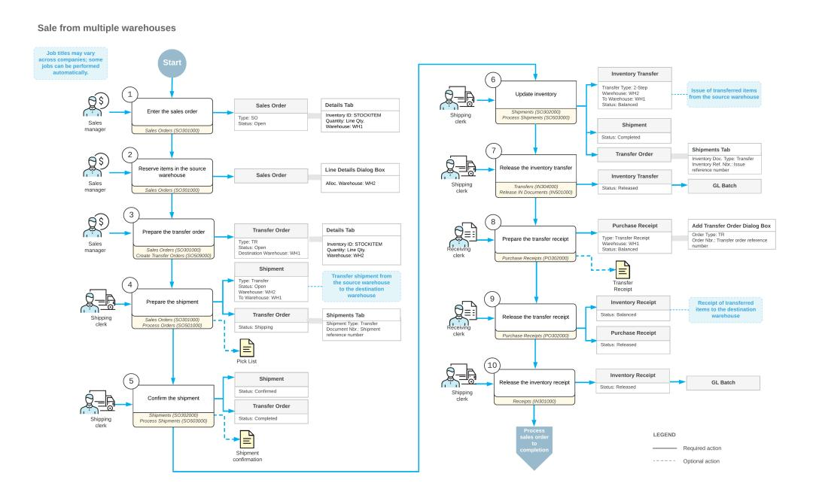

# <span id="page-164-0"></span>**Sales from Multiple Warehouses: Implementation Checklist**

The following sections provide details you can use to ensure that the system is configured properly for processing sales from multiple warehouses, and to understand (and change, if needed) the settings that affect the processing workflow.

### **Implementation Checklist**

Before you begin processing sales from multiple warehouses, you should make sure the needed features have been enabled, settings have been specified, and entities have been created, as summarized in the following checklist.

| Form                                                                               | Criteria to Check                                                                                                                                                                                                                                                                                                          |
|------------------------------------------------------------------------------------|----------------------------------------------------------------------------------------------------------------------------------------------------------------------------------------------------------------------------------------------------------------------------------------------------------------------------|
| Enable/Disable Features (CS100000) form                                            | Make sure that the Inventory and Order Management,<br>Inventory, and Multiple Warehouses features are en<br>abled.                                                                                                                                                                                                         |
| Sales Orders Preferences (SO101000) form, Inventory<br>Preferences (IN101000) form | Make sure that all necessary settings related to sales<br>orders and inventory have been specified, as de<br>scribed in Configuration of Order Management: General<br>Information.                                                                                                                                         |
| Warehouses (IN204000) form                                                         | Make sure that all warehouses have been configured,<br>as described in Warehouses: Implementation Activity.                                                                                                                                                                                                                |
| Order Types (SO201000) form                                                        | Make sure that the SO and TR order types are active.<br>The configuration and activation of these types is de<br>scribed in Sales Order Types: To Activate the SO Or<br>der TypeImplementation Activity and Sales Order Type<br>sSales from Multiple Warehouses: Implementation Activi<br>tyTo Activate the TR Order Type. |
| Customers (AR303000) form                                                          | Make sure that all needed customers have been de<br>fined in the system, as described in Customers: Imple<br>mentation Activity.                                                                                                                                                                                           |
| Stock Items (IN202500) form                                                        | Make sure that all stock items have been defined in the<br>system, as described in Stock Items: Implementation Ac<br>tivity.                                                                                                                                                                                               |

#### **Other Settings That Affect the Workflow**

You can affect the workflow of processing sales from multiple warehouses by specifying additional settings as follows:

- To cause shipments to be created with the *On Hold* status (so that the user can verify them before processing them further), select the **Hold Shipments on Entry** check box on the *[Sales Orders Preferences](https://help-2025r1.acumatica.com/Help?ScreenId=ShowWiki&pageid=1817779c-413b-4187-b7fe-38e97845a1cb)* (SO101000) form.
- To cause inventory transfers to be automatically released when a user releases a transfer order, select the **Automatically Release IN Documents** check box on the *[Sales Orders Preferences](https://help-2025r1.acumatica.com/Help?ScreenId=ShowWiki&pageid=1817779c-413b-4187-b7fe-38e97845a1cb)* (SO101000) form.
- To cause inventory receipts to be automatically released when a user releases a transfer receipt, select the **Release IN Documents Automatically** check box on the *[Purchase Orders Preferences](https://help-2025r1.acumatica.com/Help?ScreenId=ShowWiki&pageid=13d09c43-8696-4f92-ad9b-3d0209ee3d9b)* (PO101000) form.

• To cause general ledger batches generated during the processing of sales and inventory documents to be posted automatically, select the **Automatically Post on Release** check box on the *[General Ledger](https://help-2025r1.acumatica.com/Help?ScreenId=ShowWiki&pageid=e4913d06-c511-4258-a0f9-f36c1b854e6b) [Preferences](https://help-2025r1.acumatica.com/Help?ScreenId=ShowWiki&pageid=e4913d06-c511-4258-a0f9-f36c1b854e6b)* (GL102000) form. For information on the processing of general ledger batches, see *[GL](https://help-2025r1.acumatica.com/Help?ScreenId=ShowWiki&pageid=35393020-6269-466d-8a08-df558cd43367) [Transactions:](https://help-2025r1.acumatica.com/Help?ScreenId=ShowWiki&pageid=35393020-6269-466d-8a08-df558cd43367) General Information*.

#### **Testing of Settings**

To make sure that all settings are configured correctly, we recommend that you process a sale of stock items from multiple warehouses, as described in *Sales from Multiple [Warehouses:](#page-165-1) Process Activity*.

# <span id="page-165-1"></span><span id="page-165-0"></span>**Sales from Multiple Warehouses: Process Activity**

In the following activity, you will process a sales order with items allocated in multiple warehouses.

This activity is based on the *U100* dataset. If you are using another dataset, or if any system settings have been changed in *U100*, these changes can affect the workflow of the activity and the results of the processing. To avoid any issues, restore the *U100* dataset to its initial state.

#### **Story**

Suppose that the FourStar Coffee & Sweets Shop customer ordered cherry jam in 32-ounce jars and lemon jam in 96-ounce jars at SweetLife's retail store. When entering this sales order, a sales manager has noticed that the 32-ounce jars of cherry jam are currently out of stock in the retail warehouse, and has decided to allocate the unavailable quantity of jam in the SweetLife's wholesale warehouse.

To complete the customer's request, acting as sales manager of the SweetLife store Regina Wiley, you need to enter the sales order and allocate the needed items, process a transfer of cherry jam from the wholesale warehouse to the SweetLife store's warehouse, and then process the sales order to completion.

#### **Configuration Overview**

In the *U100* dataset, for the purposes of this activity, the following tasks have been performed:

- On the *[Enable/Disable Features](https://help-2025r1.acumatica.com/Help?ScreenId=ShowWiki&pageid=c1555e43-1bc5-4f6f-ba9d-b323f94d8a6b)* (CS100000) form, the following features have been enabled:
  - *Inventory and Order Management*, which provides the standard functionality of inventory and order management
  - *Inventory*, which gives you the ability to maintain stock items by using forms related to the inventory functionality and to create and process sales and purchase documents that include stock items
  - *Multiple Warehouses*, which provides the ability to process transfers of items between warehouses
- On the *[Warehouses](https://help-2025r1.acumatica.com/Help?ScreenId=ShowWiki&pageid=264b0ef7-2b6c-40b4-a7d9-f1a5e067939b)* (IN204000) form, the *WHOLESALE* and *RETAIL* warehouses have been created.
- On the *[Customers](https://help-2025r1.acumatica.com/Help?ScreenId=ShowWiki&pageid=652929bc-9606-4056-aa6e-0c2d1147171b)* (AR303000) form, the *COFFEESHOP* customer has been created.
- On the *[Stock Items](https://help-2025r1.acumatica.com/Help?ScreenId=ShowWiki&pageid=77786a70-1f1e-4d63-ad98-96f98e4fcb0e)* (IN202500) form, the *CHERJAM32* and *LEMJAM96* stock items have been created.
- On the *Order [Types](https://help-2025r1.acumatica.com/Help?ScreenId=ShowWiki&pageid=e6984218-4260-4438-99e1-aee2b3765369)* (SO201000) form, the *TR* order type has been configured.

#### **Process Overview**

In this activity, to perform a sale of stock items from multiple warehouses, you will create a sales order on the *[Sales](https://help-2025r1.acumatica.com/Help?ScreenId=ShowWiki&pageid=19e4021c-1b84-49fd-be12-0320c5f1c7e5) [Orders](https://help-2025r1.acumatica.com/Help?ScreenId=ShowWiki&pageid=19e4021c-1b84-49fd-be12-0320c5f1c7e5)* (SO301000) form, select the customer to which the items are being sold, and add items to the order. Then you will allocate the unavailable items in the warehouse in which these items are currently on hand.

To transfer items from the source warehouse to the destination warehouse, you will create a transfer order on the *Create [Transfer](https://help-2025r1.acumatica.com/Help?ScreenId=ShowWiki&pageid=aaf05359-02c9-4281-8d86-210a63c3d0df) Orders* (SO509000) form. Then you will process the transfer order to completion as follows:

- 1. Process the related shipment between warehouses (which causes the items to be issued from the source warehouse) on the *[Shipments](https://help-2025r1.acumatica.com/Help?ScreenId=ShowWiki&pageid=f47cffcc-543e-469c-a204-a9c1e3da346d)* (SO302000) form.
- 2. Process the related transfer receipt (which records the receipt of the items to the destination warehouse) on the *[Purchase Receipts](https://help-2025r1.acumatica.com/Help?ScreenId=ShowWiki&pageid=d9901c8d-486d-45ed-8088-ea3d8ee3af19)* (PO302000) form. Aer you process the transfer receipt, all the items required for the sales order become available in the destination warehouse, so that you can process the initial sales order to completion.

On the *[Shipments](https://help-2025r1.acumatica.com/Help?ScreenId=ShowWiki&pageid=f47cffcc-543e-469c-a204-a9c1e3da346d)* form, you will create a shipment document for the sales order and confirm the shipment. You then will use the *[Invoices](https://help-2025r1.acumatica.com/Help?ScreenId=ShowWiki&pageid=0acc9738-f141-4ea0-a2be-f34ea9d1b63a)* (SO303000) form to prepare the corresponding invoice for the customer and release it.

#### **System Preparation**

Before you start performing a sale of stock items from multiple warehouses, you should do the following:

- 1. Launch the Acumatica ERP website with the *U100* dataset preloaded, and sign in as purchasing manager Regina Wiley by using the *wiley* username and the *123* password.
- 2. In the info area, in the upper-right corner of the top pane of the Acumatica ERP screen, make sure that the business date in your system is set to today's date. For simplicity, in this activity, you will create and process all documents in the system on this business date.
- 3. On the Company and Branch Selection menu in the top pane of the Acumatica ERP screen, select the *SweetLife Store* branch.
- 4. Make sure that you have completed the *Sales Order TypesSales from Multiple Warehouses: [Implementation](https://help-2025r1.acumatica.com/Help?ScreenId=ShowWiki&pageid=92df640d-ee61-43fa-a312-54164a515cc5) [ActivityTo](https://help-2025r1.acumatica.com/Help?ScreenId=ShowWiki&pageid=92df640d-ee61-43fa-a312-54164a515cc5) Activate the TR Order Type*.

#### **Step 1: Creating the Sales Order**

To create the sales order, do the following:

- 1. On the *[Sales Orders](https://help-2025r1.acumatica.com/Help?ScreenId=ShowWiki&pageid=19e4021c-1b84-49fd-be12-0320c5f1c7e5)* (SO301000) form, add a new record.
- 2. In the Summary area, specify the following settings:
  - **OrderType**: *SO*
  - **Customer**: *COFFEESHOP*
  - **Description**: Sale of cherry jam and lemon jam
- 3. On the **Details** tab, add rows with the settings shown in the following table.

| Branch | Inventory ID | Warehouse | Quantity | Unit Price |
|--------|--------------|-----------|----------|------------|
| RETAIL | CHERJAM32    | RETAIL    | 10       | 16.89      |
| RETAIL | LEMJAM96     | RETAIL    | 3        | 49.49      |

Notice that the system displays a warning in the **Quantity** column of the *CHERJAM32* line indicating that the specified quantity is not available in the selected warehouse.

4. On the form toolbar, click**Save**. The sales order is saved with the *Open* status.

Now you can reserve 32-ounce jars of cherry jam, which are not available in the SweetLife Store warehouse, in a warehouse which has a sufficient quantity of the item.

#### **Step 2: Allocating the Items in Another Warehouse**

To allocate the items that are not available in the *RETAIL* warehouse, while you are still viewing the sales order on the *[Sales Orders](https://help-2025r1.acumatica.com/Help?ScreenId=ShowWiki&pageid=19e4021c-1b84-49fd-be12-0320c5f1c7e5)* (SO301000) form, do the following:

- 1. On the **Details** tab, click the *CHERJAM32* line, and on the table toolbar, click **Line Details**.
- 2. In the **Line Details** dialog box, which opens, do the following:
  - a. In the only line, select the **Allocated** check box.
  - b. In the **Alloc. Warehouse** box, select *WHOLESALE*.
  - c. Click **OK** to save your changes and close the dialog box.

Notice that the warehouse in the line on the **Details** tab has not changed, but in the table footer, the **Allocated** quantity is now equal to 10.

3. On the form toolbar, click**Save**.

Now you can create a transfer order to move the items from the Wholesale warehouse to the SweetLife's Store warehouse.

#### **Step 3: Creating the Transfer Order**

To create the transfer order for the allocated items from the sales order, do the following:

- 1. While you are still viewing the sales order on the *[Sales Orders](https://help-2025r1.acumatica.com/Help?ScreenId=ShowWiki&pageid=19e4021c-1b84-49fd-be12-0320c5f1c7e5)* (SO301000) form, click **CreateTransfer Order** on the More menu.
- 2. On the *Create [Transfer](https://help-2025r1.acumatica.com/Help?ScreenId=ShowWiki&pageid=aaf05359-02c9-4281-8d86-210a63c3d0df) Orders* (SO509000) form, which opens, select the unlabeled check box in the line with *SO Allocated* specified as the **Plan Type** and *CHERJAM32* specified as the **Inventory ID**. This line is the transfer request related to the line of the sales order that you have allocated in another warehouse. In the line, make sure that *WHOLESALE* is specified as the **From Warehouse** and *RETAIL* is specified as the **To Warehouse**.
- 3. On the form toolbar, click **Process** to process the transfer request you have selected. The system creates a transfer order of the *TR* order type and opens it on the *[Sales Orders](https://help-2025r1.acumatica.com/Help?ScreenId=ShowWiki&pageid=19e4021c-1b84-49fd-be12-0320c5f1c7e5)* form.
- 4. In the **Description** box in the Summary area, type Transferred goods for sales order from COFFEESHOP.
- 5. On the form toolbar, click**Save**.

Now you can process the created transfer order to completion.

#### **Step 4: Processing the Transfer Order**

To process the transfer order to completion, do the following:

- 1. While you are still viewing the transfer order that you have created on the *[Sales Orders](https://help-2025r1.acumatica.com/Help?ScreenId=ShowWiki&pageid=19e4021c-1b84-49fd-be12-0320c5f1c7e5)* (SO301000) form, on the form toolbar, click **CreateShipment**.
- 2. In the **SpecifyShipment Parameters** dialog box, which opens, make sure that today's date and the *WHOLESALE* warehouse are selected, and click **OK**. The system creates a shipment with the *Transfer* type and opens it on the *[Shipments](https://help-2025r1.acumatica.com/Help?ScreenId=ShowWiki&pageid=f47cffcc-543e-469c-a204-a9c1e3da346d)* (SO302000) form.
- 3. Review the Summary area of the shipment, and make sure that **Warehouse ID** is *WHOLESALE* and **To Warehouse** is *RETAIL*. Also, review the only line included in the shipment, and make sure its details are correct.
- 4. On the form toolbar, click **Confirm Shipment**. The shipment is assigned the *Confirmed* status.

- 5. On the form toolbar, click **Update IN** to generate the inventory transfer transaction that issues the items from the source warehouse to the destination warehouse. The shipment is assigned the *Completed* status.
- 6. On the **Orders** tab, click the link in the **Inventory Ref. Nbr.** column in the only row.
- 7. On the *[Transfers](https://help-2025r1.acumatica.com/Help?ScreenId=ShowWiki&pageid=ea1539b6-fafa-443e-8b49-cd1ced95389f)* (IN304000) form, which opens in a pop-up window, make sure that the generated inventory transfer has the *Released* status.

#### **Step 5: Processing the Transfer Receipt**

To process the transfer receipt, do the following:

- 1. On the *[Purchase Receipts](https://help-2025r1.acumatica.com/Help?ScreenId=ShowWiki&pageid=d9901c8d-486d-45ed-8088-ea3d8ee3af19)* (PO302000) form, add a new record.
- 2. In the Summary area, specify the following settings:
  - **Type**: *Transfer Receipt*
  - **Warehouse**: *RETAIL*
- 3. On the table toolbar of the **Details** tab, click **Add Transfer**. The **Add Transfer Order** dialog box opens. It shows the list of completed transfer orders with completed shipments whose items have not been received to the destination warehouse yet.
- 4. In the dialog box, select the unlabeled check box for the transfer order you have processed earlier, and click **Add & Close** to close the dialog box and return to the *[Purchase Receipts](https://help-2025r1.acumatica.com/Help?ScreenId=ShowWiki&pageid=d9901c8d-486d-45ed-8088-ea3d8ee3af19)* form.
- 5. On the **Details** tab, review the details of the added line with the *CHERJAM32* item.
- 6. On the form toolbar, click **Release** to release the transfer receipt.
- 7. On the **Other** tab, click the **IN Ref. Nbr.** link to open the related inventory receipt transaction on the *[Receipts](https://help-2025r1.acumatica.com/Help?ScreenId=ShowWiki&pageid=d6ecad5b-155f-44bf-baba-9ed006d298b5)* (IN302000) form.
- 8. Make sure the inventory receipt has the *Released* status, which means that the items have been received to the *RETAIL* warehouse and are now available for shipping. Close the pop-up window.

Now you can finish processing the sales order, because all of the ordered items are on hand in the SweetLife's Store warehouse.

#### **Step 6: Processing the Shipment**

To create and process the shipment that is associated with the sales order, do the following:

- 1. On the *[Sales Orders](https://help-2025r1.acumatica.com/Help?ScreenId=ShowWiki&pageid=19e4021c-1b84-49fd-be12-0320c5f1c7e5)* (SO301000) form, open the sales order of the *SO* type that you have created in Step 1, and on the form toolbar, click **CreateShipment**.
- 2. In the **SpecifyShipment Parameters** dialog box, which opens, make sure that today's date and the *RETAIL* warehouse are selected, and click **OK**. The system creates a shipment and opens it on the *[Shipments](https://help-2025r1.acumatica.com/Help?ScreenId=ShowWiki&pageid=f47cffcc-543e-469c-a204-a9c1e3da346d)* (SO302000) form.
- 3. On the **Details** tab, make sure that both order lines have been included in the shipment and that the shipped quantity in both lines is equal to the ordered quantity.
- 4. On the More menu, click **Confirm Shipment**.

The shipment is assigned the *Confirmed* status, and now you can prepare the invoice to bill the customer and increase the customer's debt in the system.

#### **Step 7: Processing the Sales Invoice for the Customer**

To complete the processing of a sale, you need to generate an invoice to the customer. Do the following:

1. While you are still viewing the shipment that you have created on the *[Shipments](https://help-2025r1.acumatica.com/Help?ScreenId=ShowWiki&pageid=f47cffcc-543e-469c-a204-a9c1e3da346d)* (SO302000) form, on the form toolbar, click **Prepare Invoice**.

- 2. On the *[Invoices](https://help-2025r1.acumatica.com/Help?ScreenId=ShowWiki&pageid=0acc9738-f141-4ea0-a2be-f34ea9d1b63a)* (SO303000) form, which opens, review the details of the invoice to make sure that both items have been included in the invoice.
- 3. On the form toolbar, click **Release** to release the invoice.
- 4. Return to the sales order of the *SO* type on the *[Sales Orders](https://help-2025r1.acumatica.com/Help?ScreenId=ShowWiki&pageid=19e4021c-1b84-49fd-be12-0320c5f1c7e5)* (SO301000) form that you created in Step 1, and notice that the order is now assigned the *Completed* status, as shown in the following screenshot.

| <b>Sales Orders</b><br><b>PINOTES</b><br><b>FILES</b><br>TOOLS $\sim$<br><b>ACTIVITIES</b><br>SO 000079 - FourStar Coffee & Sweets Shop<br>목<br>$\Box$<br>血<br>n<br>$\overline{\mathsf{K}}$<br>$\Omega$<br>$^{+}$<br>$\geq$<br>$\leftarrow$<br>$\rightarrow$<br>∢<br>$\check{ }$<br>$\cdots$ |                  |                                                |                                                 |                                                                                   |                            |                                                                                   |              |                                                                                                                                                                                                    |                         |                                 |                                                                                                                                                     |                                                                             |          |                             |           |                     |
|----------------------------------------------------------------------------------------------------------------------------------------------------------------------------------------------------------------------------------------------------------------------------------------------|------------------|------------------------------------------------|-------------------------------------------------|-----------------------------------------------------------------------------------|----------------------------|-----------------------------------------------------------------------------------|--------------|----------------------------------------------------------------------------------------------------------------------------------------------------------------------------------------------------|-------------------------|---------------------------------|-----------------------------------------------------------------------------------------------------------------------------------------------------|-----------------------------------------------------------------------------|----------|-----------------------------|-----------|---------------------|
|                                                                                                                                                                                                                                                                                              | Status:<br>Date: | * Order Type:<br>Order Nbr.:<br><b>DETAILS</b> | Requested On:<br>Customer Ord<br>External Refer | <b>SO</b><br>000079<br><b>Completed</b><br>9/25/2024<br>9/25/2024<br><b>TAXES</b> | Q<br>Q<br><b>FINANCIAL</b> | Customer:<br>Location:<br>Contact:<br>Project:<br>Description:<br><b>SHIPPING</b> |              | COFFEESHOP - FourStar Coffee & Swee 2<br><b>MAIN - Primary Location</b><br>Andrea A. Weaver<br>!!!!!!!!!!!!!!!!!!!!!!!!!!!!!!!!!!!!!!!!<br>Sale of cherry jam and<br>lemon jam<br><b>ADDRESSES</b> | h<br><b>SHIPMENTS</b>   | 0<br>/)<br>0<br><b>PAYMENTS</b> | Ordered Qtv.:<br>Detail Total:<br>Line Discounts:<br>Document Dis<br><b>Freight Total:</b><br><b>Tax Total:</b><br>Order Total:<br><b>RELATIONS</b> | 13.00<br>317.37<br>0.00<br>0.00<br>0.00<br>28.17<br>345.54<br><b>TOTALS</b> |          |                             |           | $\hat{\phantom{a}}$ |
| Ò<br><b>ADD ITEMS</b><br><b>ADD MATRIX ITEMS</b><br>ADD INVOICE<br>ADD BLANKET SO LINE<br><b>LINE DETAILS</b><br>PO LINK<br><b>ITEM AVAILABILITY</b><br>$\vdash$<br>$\ddot{\mathcal{L}}$<br>0<br>$\times$                                                                                    |                  |                                                |                                                 |                                                                                   |                            |                                                                                   |              |                                                                                                                                                                                                    |                         |                                 |                                                                                                                                                     |                                                                             |          |                             |           |                     |
| 目<br>0                                                                                                                                                                                                                                                                                       |                  | D.                                             | *Branch                                         |                                                                                   | *Inventory ID              |                                                                                   | Free<br>Item | Warehouse                                                                                                                                                                                          | <b>Line Description</b> |                                 |                                                                                                                                                     | *UOM                                                                        | Quantity | Qty. On<br><b>Shipments</b> | Open Qty. |                     |
|                                                                                                                                                                                                                                                                                              | 0                | D                                              | <b>RETAIL</b>                                   |                                                                                   | CHERJAM32                  |                                                                                   |              | <b>RETAIL</b>                                                                                                                                                                                      | Cherry jam 32 oz        |                                 |                                                                                                                                                     | <b>PIECE</b>                                                                | 10.00    | 10.00                       | 0.00      |                     |
|                                                                                                                                                                                                                                                                                              | 0                | ו ו                                            | <b>RETAIL</b>                                   |                                                                                   | LEMJAM96                   |                                                                                   | П            | <b>RETAIL</b>                                                                                                                                                                                      | Lemon jam 96 oz         |                                 |                                                                                                                                                     | <b>PIECE</b>                                                                | 3.00     | 3.00                        | 0.00      |                     |

*Figure: Sale from multiple warehouses completed*

# <span id="page-169-0"></span>**Sales from Multiple Warehouses: Generated Transactions**

To be able to process a sales order with items from multiple warehouses, you create and process a transfer order. Processing a transfer order includes initially creating a shipment of the *Transfer* type and the related twostep inventory transfer transaction; it then involves creating a transfer receipt and the related inventory receipt transaction. To record the movements of items between warehouses in the general ledger, the system generates the GL transactions described in the following sections.

#### **Transactions Generated for the Inventory Transfer**

When you create and release a two-step transfer, the system generates the following general ledger transactions.

| Account            | Source of Account                                                         | Debit       | Credit      |
|--------------------|---------------------------------------------------------------------------|-------------|-------------|
| Inventory account  | Posting class settings on the<br>Posting Classes (IN206000) form          | 0.00        | COGS amount |
| In-Transit account | Inventory preferences on the In<br>ventory Preferences (IN101000)<br>form | COGS amount | 0.00        |

You can view the reference number of the GL batch on the **Financial** tab of the *[Transfers](https://help-2025r1.acumatica.com/Help?ScreenId=ShowWiki&pageid=ea1539b6-fafa-443e-8b49-cd1ced95389f)* (IN304000) form. You can click the link in this box to view the details of the batch on the *Journal [Transactions](https://help-2025r1.acumatica.com/Help?ScreenId=ShowWiki&pageid=dda046bc-5946-407f-88f7-1c0c966fbe72)* (GL301000) form.

#### **Transactions Generated for the Inventory Receipt**

Aer you have received the goods, you need to create an inventory receipt to record receiving items in the destination warehouse. When this inventory receipt is released, the system generates a batch of the following GL transactions.

| Account            | Source of Account                                                                  | Debit       | Credit      |
|--------------------|------------------------------------------------------------------------------------|-------------|-------------|
| In-Transit account | In-Transit layer (that is, the ac<br>count specified in the inventory<br>transfer) | 0.00        | COGS amount |
| Inventory account  | Posting class settings on the<br>Posting Classes (IN206000) form                   | COGS amount | 0.00        |

You can find the reference number of the GL batch on the **Financial** tab of the *[Receipts](https://help-2025r1.acumatica.com/Help?ScreenId=ShowWiki&pageid=d6ecad5b-155f-44bf-baba-9ed006d298b5)* (IN301000) form. You can click the link in this box to view the details of the batch on the *Journal [Transactions](https://help-2025r1.acumatica.com/Help?ScreenId=ShowWiki&pageid=dda046bc-5946-407f-88f7-1c0c966fbe72)* (GL301000) form.

# <span id="page-170-0"></span>**Sales from Multiple Warehouses: Mass Processing of Documents**

The following sections explain how to create multiple transfer orders and related documents, and how the system generates, changes, or works with documents as a result of the mass processing.

#### **Mass-Creating Transfer Orders**

Transfer orders can be mass-generated for multiple sales orders at a time. To mass-create transfer orders, you open the *Create [Transfer](https://help-2025r1.acumatica.com/Help?ScreenId=ShowWiki&pageid=aaf05359-02c9-4281-8d86-210a63c3d0df) Orders* (SO509000) form, on which you can create transfer orders based on the transfer requests that have been created for sales orders.

On this form, aer you specify any needed criteria to limit the requests listed, you select the unlabeled check boxes in the rows of the transfer requests to be processed (which are the lines with the *SO Allocated* plan type) and click **Process** on the form toolbar to generate the applicable transfer orders. The system creates a consolidated transfer order for each group of transfer requests with the same source warehouse–destination warehouse pair.

#### **Mass-Creating Shipments**

Shipments can be mass-generated for transfer orders. To generate shipments for multiple transfer orders at a time, you open the *[Process Orders](https://help-2025r1.acumatica.com/Help?ScreenId=ShowWiki&pageid=c06a334c-f39d-4eff-9d80-b167657dff73)* (SO501000) form and select the *Create Shipment* action, as well as any selection criteria for filtering the orders. Then you select the unlabeled check boxes in the rows of the orders to be processed, and click **Process** on the form toolbar. The system prepares a consolidated shipment document for each group of the selected transfer orders with the same source warehouse–destination warehouse pair; the lines in the prepared shipments are grouped by stock items in these lines.

#### **Mass-Confirming Shipments**

Shipments can be confirmed in bulk. To confirm multiple shipments at a time, you open the *[Process Shipments](https://help-2025r1.acumatica.com/Help?ScreenId=ShowWiki&pageid=2e27f8fd-ddd4-47f0-a83b-5a7db31feede)* (SO503000) form and select the *Confirm Shipment* action, as well as any selection criteria for filtering the shipments. Then you select the unlabeled check boxes in the rows of the shipments to be processed, and click **Process** on the form toolbar. The system confirms the selected shipment documents.

#### **Mass-Printing Pick Lists**

For multiple shipments with the *On Hold* and *Open* statuses, you can mass-print pick lists by using the *[Process](https://help-2025r1.acumatica.com/Help?ScreenId=ShowWiki&pageid=2e27f8fd-ddd4-47f0-a83b-5a7db31feede) [Shipments](https://help-2025r1.acumatica.com/Help?ScreenId=ShowWiki&pageid=2e27f8fd-ddd4-47f0-a83b-5a7db31feede)* (SO503000) form. On this form, you select the *Print Pick List* action (and any other needed selection criteria for filtering the shipments), select the unlabeled check boxes in the rows of the shipments for which you need to print pick lists, and click **Process** on the form toolbar.

# <span id="page-171-0"></span>**Sales from Multiple Warehouses: Related Report and Inquiry Forms**

In the following sections, you can find details about report and inquiry forms that provide information related to warehouses.

If you do not see a particular report or form that is described, you may have signed in to the system with a user account that does not have access rights to the report or form. Contact your system administrator to obtain access to any needed reports or forms.

#### **Viewing Items' Availability by Warehouse**

If you want to view detailed information about inventory items that are available at particular warehouses, you use the *[Inventory Summary](https://help-2025r1.acumatica.com/Help?ScreenId=ShowWiki&pageid=2fd70552-e564-4e71-be30-e63b9415baa2)* (IN401000) form.

#### **Viewing Inventory Valuation by Warehouse**

To review the quantities on hand and the total cost of inventory by inventory account you use the *[Inventory](https://help-2025r1.acumatica.com/Help?ScreenId=ShowWiki&pageid=0c0944a5-336a-4282-9c57-000b9eea0774) [Valuation](https://help-2025r1.acumatica.com/Help?ScreenId=ShowWiki&pageid=0c0944a5-336a-4282-9c57-000b9eea0774)* (IN615500) report. In this report, you can view details for different warehouses or for only a particular warehouse.

#### **Viewing Goods That Need to Be Received**

To find information about the items that have been transferred from the source warehouse and have not yet been received at the destination warehouse, you use the *Goods in [Transit](https://help-2025r1.acumatica.com/Help?ScreenId=ShowWiki&pageid=ba010b64-257e-43f5-815b-299818cefeb5)* (IN616500) report.

#### **Finding Documents with Items in Transit**

When you need to find documents with stock items that are in transit, you can use the *[Inventory Allocation Details](https://help-2025r1.acumatica.com/Help?ScreenId=ShowWiki&pageid=6d8011ac-1d4e-4a34-8bc2-1fa1ff002c05)* (IN402000) form. On this form, you can select a stock item and view the on-hand quantity of the item in a particular warehouse, the actual quantity of the item according to unreleased documents, and the list of unreleased documents that contain this item.

# <span id="page-171-1"></span>**To Create Transfer Orders for Multiple Sales Orders**

If you need to record the movement of goods from one warehouse to another, you create a transfer order of the predefined *TR* type. You can create transfer orders for multiple sales orders simultaneously on the *Create [Transfer](https://help-2025r1.acumatica.com/Help?ScreenId=ShowWiki&pageid=aaf05359-02c9-4281-8d86-210a63c3d0df) [Orders](https://help-2025r1.acumatica.com/Help?ScreenId=ShowWiki&pageid=aaf05359-02c9-4281-8d86-210a63c3d0df)* (SO509000) form.

#### **To Create Transfer Orders for Multiple Orders**

1. Open the *Create [Transfer](https://help-2025r1.acumatica.com/Help?ScreenId=ShowWiki&pageid=aaf05359-02c9-4281-8d86-210a63c3d0df) Orders* (SO509000) form.

- 2. In the **Creation Date** box, select the date on which the transfer order or orders should be prepared.
- 3. In the table, select the unlabeled check boxes in the needed line or lines with the *SO Allocated* plan type.
- 4. Click **Process** on the form toolbar, or click **Process All** to process all lines shown in the table.

#### **Notes About the Procedure**

The notes in this section describe the nuances of the UI elements available on the form, such as when an element is required and when it is not, and when the system fills in settings by default. This section can include other notes.

To narrow the range of documents shown in the table, you can do any of the following:

- In the **From Warehouse** and **To Warehouse** boxes, specify the source and destination warehouses, respectively.
- In the **Customer** box, specify a particular customer whose orders you want to process.
- In the **Item Class ID**, specify a particular item class.
- In the **Inventory ID** box, specify a particular inventory item to see the transfer requests for this item.
- Specify and apply a filter to select documents by specific criteria. You can create a reusable filter for the form that, once created, gives you the ability to display particular documents each time you bring up this form. For more information, see *[Filters](https://help-2025r1.acumatica.com/Help?ScreenId=ShowWiki&pageid=fad0b170-9d7c-4851-8f73-4b841f977c0f)*.

# <span id="page-173-0"></span>**Processing Sales of Stock Items Without Shipment**

An invoice order, which has the *IN* order type selected on the *[Sales Orders](https://help-2025r1.acumatica.com/Help?ScreenId=ShowWiki&pageid=19e4021c-1b84-49fd-be12-0320c5f1c7e5)* (SO301000) form, is a special type of sales order that you create when the goods requested by a customer have been shipped or delivered already, and thus the order does not require a shipment to be processed. The processing of an invoice order involves the actions and generated documents shown in the following diagram.

If quick processing is configured for the *IN* order type, you can perform complete processing of the order directly from the *[Sales Orders](https://help-2025r1.acumatica.com/Help?ScreenId=ShowWiki&pageid=19e4021c-1b84-49fd-be12-0320c5f1c7e5)* form. For more information, see *Sales Order [Types:](https://help-2025r1.acumatica.com/Help?ScreenId=ShowWiki&pageid=2920c85c-5678-40f7-b80a-e068ac3a137f) Quick [Processing of Sales Orders](https://help-2025r1.acumatica.com/Help?ScreenId=ShowWiki&pageid=2920c85c-5678-40f7-b80a-e068ac3a137f)*.

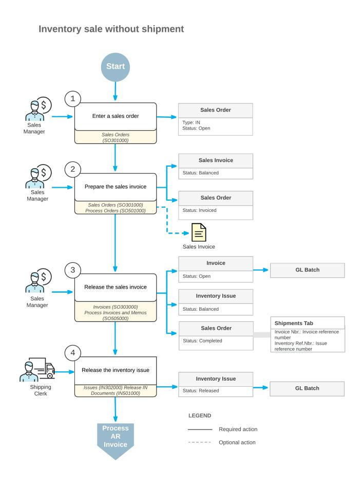

The following sections describe in detail the processing steps shown in the diagram.

#### **1. Enter the Sales Order**

A new sales order of the *IN* type is created on the *[Sales Orders](https://help-2025r1.acumatica.com/Help?ScreenId=ShowWiki&pageid=19e4021c-1b84-49fd-be12-0320c5f1c7e5)* (SO301000) form. The reference numbers for a new order is generated according to the numbering sequence assigned to this order type on the *Order [Types](https://help-2025r1.acumatica.com/Help?ScreenId=ShowWiki&pageid=e6984218-4260-4438-99e1-aee2b3765369)* (SO201000) form. If the order is created with the *On Hold* status, you should click **Remove Hold** on the form toolbar to process the order further.


For items that have lot or serial numbers tracked in Acumatica ERP, you can specify these numbers in the document lines, thus indicating that these particular items have been delivered to the customer.

#### **2. Prepare the Sales Invoice**

You can prepare a sales invoice for an order by clicking **Prepare Invoice** on the More menu of the *[Sales Orders](https://help-2025r1.acumatica.com/Help?ScreenId=ShowWiki&pageid=19e4021c-1b84-49fd-be12-0320c5f1c7e5)* (SO301000) form, or you can create multiple invoices by specifying the *Prepare Invoice* action on the *[Process Orders](https://help-2025r1.acumatica.com/Help?ScreenId=ShowWiki&pageid=c06a334c-f39d-4eff-9d80-b167657dff73)* (SO501000) form and processing multiple selected orders.

Any prepared sales invoice can be reviewed on the *[Invoices](https://help-2025r1.acumatica.com/Help?ScreenId=ShowWiki&pageid=0acc9738-f141-4ea0-a2be-f34ea9d1b63a)* (SO303000) form.

#### **3. Release the Sales Invoice**

To release the sales invoice, you click **Release** on the form toolbar of the *[Invoices](https://help-2025r1.acumatica.com/Help?ScreenId=ShowWiki&pageid=0acc9738-f141-4ea0-a2be-f34ea9d1b63a)* (SO303000) form. When the sales invoice is released, a batch of GL transactions is generated. Also, when the sales invoice is released, the system automatically generates a corresponding inventory issue with the date and posting period of the invoice. Also, the sales invoice becomes visible on the *[Invoices and Memos](https://help-2025r1.acumatica.com/Help?ScreenId=ShowWiki&pageid=5e6f3b27-b7af-412f-a40a-1d4f4be70cba)* (AR301000) form as an AR invoice. The AR invoice and sales invoice have the same reference number. For more information on processing AR invoices, see *[Processing AR](https://help-2025r1.acumatica.com/Help?ScreenId=ShowWiki&pageid=f5eea8b8-c260-4f1f-8603-d65e9bf25e9d) [Invoices](https://help-2025r1.acumatica.com/Help?ScreenId=ShowWiki&pageid=f5eea8b8-c260-4f1f-8603-d65e9bf25e9d)*.

#### **4. Release the Inventory Issue**

The generated inventory issue is released automatically if the **Automatically Release IN Documents** check box is selected on the *[Sales Orders Preferences](https://help-2025r1.acumatica.com/Help?ScreenId=ShowWiki&pageid=1817779c-413b-4187-b7fe-38e97845a1cb)* (SO101000) form. If this check box is cleared, you have to release the inventory issue manually by clicking **Release** on the form toolbar of the *[Issues](https://help-2025r1.acumatica.com/Help?ScreenId=ShowWiki&pageid=17b051f6-027d-4459-b542-65c1c1f9d0ea)* (IN302000) form. On release of the inventory issue, a batch of GL transactions is generated.

#### **Related Links**

• *Sales Order Types: General [Information](https://help-2025r1.acumatica.com/Help?ScreenId=ShowWiki&pageid=96a00780-a0c3-4314-86ca-093004844268)*

# <span id="page-174-0"></span>**To Enter an Invoice Order (IN)**

You create an order of the predefined *IN* type to record a sale of stock items that have been already shipped to customer (or customer picks them at the sale point). You create an *IN* order on the *[Sales Orders](https://help-2025r1.acumatica.com/Help?ScreenId=ShowWiki&pageid=19e4021c-1b84-49fd-be12-0320c5f1c7e5)* (SO301000) form.

#### **To Enter an Invoice Order**

1. Open the *[Sales Orders](https://help-2025r1.acumatica.com/Help?ScreenId=ShowWiki&pageid=19e4021c-1b84-49fd-be12-0320c5f1c7e5)* (SO301000) form.

To open the form for creating a new record, type the form ID in the Search box, and on the Search form, point at the form title and click **New** right of the title.

- 2. On the form toolbar, click **Add New Record**.
- 3. In the **OrderType** box in the Summary area, select *IN (Invoice)*.
- 4. Select the customer in the **Customer** box.
- 5. If needed, in the **Location** box, change the default location of the customer.
- 6. If this invoice order is associated with a particular project, in the **Project** box, change the *X* non-project code (which is shown by default) to the particular project.
- 7. In the **Date** and **Requested On** boxes, change the dates of the order (which by default is the current business date) if needed.

- 8. If needed, in the **Customer Order** box, enter the reference number of the original customer document the invoice order is based on.
- 9. If needed, in the **Description** box, provide a brief description for this invoice order.
- 10.On the **Details** tab, perform the following steps to add one item or multiple items to the invoice order:
  - a. Click **Add Items** on the table toolbar. The **Inventory Lookup** dialog box appears with the list of active stock items. You can use the selection criteria at the top of the dialog box to narrow the list of items.
  - b. In the line or lines with the items that you want to add, in the **Qty.Selected** column, specify the requested quantity of the items (measured in the default unit of measure shown in the **UOM** column). Notice the item availability data in the **Qty. Available** and **Qty. On Hand** column, and make sure that the specified quantity is available in the selected warehouse for each item to be added to the invoice order.
  - c. Click **Add & Close** at the bottom of the dialog box.
- 11.On the form toolbar, click**Save**.

# <span id="page-175-0"></span>**To Process an Invoice Order**

To record a sale of stock items that have been already shipped to customer, you process an invoice order (that is, an order of the *IN* order type) by using the *[Sales Orders](https://help-2025r1.acumatica.com/Help?ScreenId=ShowWiki&pageid=19e4021c-1b84-49fd-be12-0320c5f1c7e5)* (SO301000) form.

#### **To Process an Invoice Order**

- 1. Open the *[Sales Orders](https://help-2025r1.acumatica.com/Help?ScreenId=ShowWiki&pageid=19e4021c-1b84-49fd-be12-0320c5f1c7e5)* (SO301000) form.
- 2. Select the order by specifying its type (*IN*) and its reference number.
- 3. On the form toolbar, click **Prepare Invoice**. This generates a sales orders invoice. The system opens the *[Invoices](https://help-2025r1.acumatica.com/Help?ScreenId=ShowWiki&pageid=0acc9738-f141-4ea0-a2be-f34ea9d1b63a)* (SO303000) form to display the new document.
- 4. On the form toolbar of the opened form, click **Release** to release the sales orders invoice. The system generates an inventory transaction of the *Invoice* type to issue the items from inventory. Once you release the sales orders invoice, the original *IN* order gets the *Completed* status.

# <span id="page-176-0"></span>**Processing Cash Sales of Stock Items**

To process a sale of items directly to the customer when you are receiving payment at that time (by cash or check), you can create a cash sale order of the *CS* order type by using the *[Sales Orders](https://help-2025r1.acumatica.com/Help?ScreenId=ShowWiki&pageid=19e4021c-1b84-49fd-be12-0320c5f1c7e5)* (SO301000) form. The processing of cash sales orders involves the actions and generated documents shown in the following diagram.

If quick processing is configured for the *CS* order type, you can perform complete processing of the order directly from the *[Sales Orders](https://help-2025r1.acumatica.com/Help?ScreenId=ShowWiki&pageid=19e4021c-1b84-49fd-be12-0320c5f1c7e5)* (SO301000) form. For more information, see *Sales Order [Types:](https://help-2025r1.acumatica.com/Help?ScreenId=ShowWiki&pageid=2920c85c-5678-40f7-b80a-e068ac3a137f) [Quick Processing of Sales Orders](https://help-2025r1.acumatica.com/Help?ScreenId=ShowWiki&pageid=2920c85c-5678-40f7-b80a-e068ac3a137f)*.

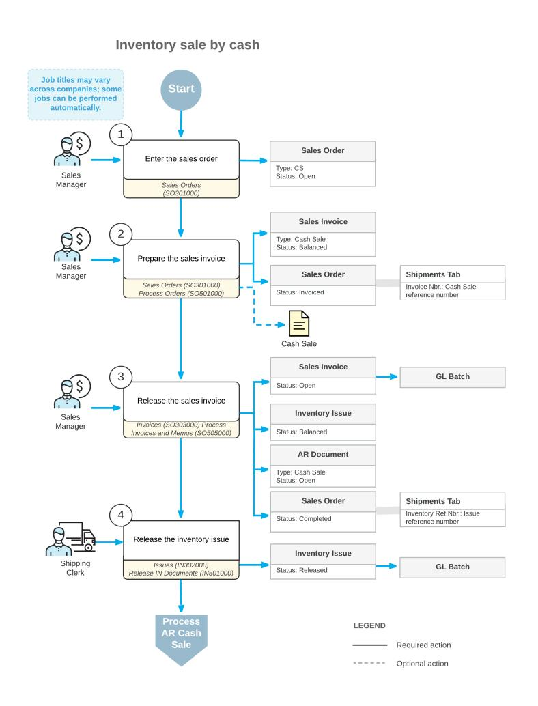

The following sections describe in detail the processing steps shown in the diagram.

#### **1. Enter the Sales Order**

You create a new sales order of the *CS* type on the *[Sales Orders](https://help-2025r1.acumatica.com/Help?ScreenId=ShowWiki&pageid=19e4021c-1b84-49fd-be12-0320c5f1c7e5)* (SO301000) form. You can save the order of the *CS* type only aer you specify the payment information, including the payment method, cash account, and payment reference number.

The reference number for a new order is generated according to the numbering sequence assigned to this order type on the *Order [Types](https://help-2025r1.acumatica.com/Help?ScreenId=ShowWiki&pageid=e6984218-4260-4438-99e1-aee2b3765369)* (SO201000) form. If the order is created with the *On Hold* status, you should click **Remove Hold** on the form toolbar to process the order further.

#### **2. Prepare the Sales Invoice**

You can prepare a sales invoice by clicking **Prepare Invoice** on the More menu of the *[Sales Orders](https://help-2025r1.acumatica.com/Help?ScreenId=ShowWiki&pageid=19e4021c-1b84-49fd-be12-0320c5f1c7e5)* (SO301000) form, or you can create invoices by specifying the *Prepare Invoice* action on the *[Process Orders](https://help-2025r1.acumatica.com/Help?ScreenId=ShowWiki&pageid=c06a334c-f39d-4eff-9d80-b167657dff73)* (SO501000) form and processing multiple selected orders. For the cash sale order, a sales invoice of the *Cash Sale* type is prepared.

Any prepared sales invoice can be reviewed on the *[Invoices](https://help-2025r1.acumatica.com/Help?ScreenId=ShowWiki&pageid=0acc9738-f141-4ea0-a2be-f34ea9d1b63a)* (SO303000) form.

#### **3. Release the Sales Invoice**

To release the sales invoice, you click **Release** on the More menu of the *[Invoices](https://help-2025r1.acumatica.com/Help?ScreenId=ShowWiki&pageid=0acc9738-f141-4ea0-a2be-f34ea9d1b63a)* form. When a sales invoice of the *Cash Sale* type is released, a batch of GL transactions is generated. Also, when the sales invoice is released, the system automatically generates a corresponding inventory issue with the date and posting period of the sales invoice. The related AR cash sale with the same reference number becomes available for reviewing on the *[Cash](https://help-2025r1.acumatica.com/Help?ScreenId=ShowWiki&pageid=f8e8a35f-4de7-40c0-8030-ebf9f7910119) [Sales](https://help-2025r1.acumatica.com/Help?ScreenId=ShowWiki&pageid=f8e8a35f-4de7-40c0-8030-ebf9f7910119)* (AR304000) form. For more information on processing AR cash sales, see *[Cash Sales and Cash Returns:](https://help-2025r1.acumatica.com/Help?ScreenId=ShowWiki&pageid=053ee98d-1b18-4fcb-ad25-aea1f7d7226d) [Process Activity](https://help-2025r1.acumatica.com/Help?ScreenId=ShowWiki&pageid=053ee98d-1b18-4fcb-ad25-aea1f7d7226d)*.

#### **4. Release the Inventory Issue**

The generated inventory issue is released automatically if the **Automatically Release IN Documents** check box is selected on the *[Sales Orders Preferences](https://help-2025r1.acumatica.com/Help?ScreenId=ShowWiki&pageid=1817779c-413b-4187-b7fe-38e97845a1cb)* (SO101000) form. If this check box is cleared, you have to release the inventory issue manually by clicking **Release** on the form toolbar of the *[Issues](https://help-2025r1.acumatica.com/Help?ScreenId=ShowWiki&pageid=17b051f6-027d-4459-b542-65c1c1f9d0ea)* (IN302000) form. On release of the inventory issue, a batch of GL transactions is generated.

#### **Important Notes**

Note the following about the processing of cash sales orders:

- If you process a cash sales order with only non-stock items, no inventory issue is generated when the sales invoice of the *Cash Sale* type is released.
- For non-stock items and services, you can enter a process a cash sale directly on the*[Cash Sales](https://help-2025r1.acumatica.com/Help?ScreenId=ShowWiki&pageid=f8e8a35f-4de7-40c0-8030-ebf9f7910119)* (AR304000) form without creating and processing a cash sale order.
- For items that have lot or serial numbers tracked in Acumatica ERP, you can specify these numbers, thus indicating that these particular items have been delivered to the customer.

#### **Related Links**

• *Sales Order Types: General [Information](https://help-2025r1.acumatica.com/Help?ScreenId=ShowWiki&pageid=96a00780-a0c3-4314-86ca-093004844268)*

# <span id="page-177-0"></span>**To Enter a Cash Sale Order (CS)**

You create an order of the predefined *CS* type to record a sale of stock items that is immediately paid by cash and does not require shipping. You use the *[Sales Orders](https://help-2025r1.acumatica.com/Help?ScreenId=ShowWiki&pageid=19e4021c-1b84-49fd-be12-0320c5f1c7e5)* (SO301000) form to enter the *CS* order.

#### **To Create a Cash Sale Order**

1. Open the *[Sales Orders](https://help-2025r1.acumatica.com/Help?ScreenId=ShowWiki&pageid=19e4021c-1b84-49fd-be12-0320c5f1c7e5)* (SO301000) form.

To open the form for creating a new record, type the form ID in the Search box, and on the Search form, point at the form title and click **New** right of the title.

2. On the form toolbar, click **Add New Record**.

- 3. In the **OrderType** box in the Summary area, select *CS (Cash Sale)*.
- 4. Select the customer in the **Customer** box.
- 5. If needed, in the **Location** box, change the default location of the customer.
- 6. If needed, in the **Project** box, change the *X* non-project code to the particular project.
- 7. In the **Date** and **Requested On** boxes, change the dates of the order (which by default is the current business date) if needed.
- 8. If needed, in the **Customer Order** box, enter the reference number of the original customer document the case sale order is based on.
- 9. If needed, in the **Description** box, provide a brief description for this cash sale order.
- 10.On the **Financial** tab specify the following information:
  - a. In the **Payment Method** box, check the customer's default payment method. The cash sale must be paid by a method based on cash or check.
  - b. In the **Cash Account** box, check the default cash account of the selected payment method. Change it, if needed.
  - c. In the **Payment Ref.** box, enter the reference number of the customer payment.

11.On the **Details** tab, perform the following steps to add one item or multiple items to the cash sale order:

- a. Click **Add Items** on the table toolbar. The **Inventory Lookup** dialog box appears with the list of active stock items. You can use the selection criteria at the top of the dialog box to narrow the list of items.
- b. In the line or lines with the items that you want to add, in the **Qty.Selected** column, specify the requested quantity of the items (measured in the default unit of measure shown in the **UOM** column). Notice the item availability data in the **Qty. Available** and **Qty. On Hand** column, and make sure that the specified quantity is available in the selected warehouse for each item to be added to the cash sale.
- c. Click **Add & Close** at the bottom of the dialog box.

12.On the form toolbar, click**Save**.

# <span id="page-178-0"></span>**To Process a Cash Sale Order (CS)**

You process an order of the predefined *CS* type to record a sale of stock items that is immediately paid by cash and does not require shipping. You process a *CS* order on the *[Sales Orders](https://help-2025r1.acumatica.com/Help?ScreenId=ShowWiki&pageid=19e4021c-1b84-49fd-be12-0320c5f1c7e5)* (SO301000) form.

#### **To Process a Cash Sale**

- 1. Open the *[Sales Orders](https://help-2025r1.acumatica.com/Help?ScreenId=ShowWiki&pageid=19e4021c-1b84-49fd-be12-0320c5f1c7e5)* (SO301000) form.
- 2. Select the order by specifying its type (*CS*) and its reference number.
- 3. On the form toolbar, click **Prepare Invoice**. This generates an invoice with a *Cash Sale* type. The system opens the *[Invoices](https://help-2025r1.acumatica.com/Help?ScreenId=ShowWiki&pageid=0acc9738-f141-4ea0-a2be-f34ea9d1b63a)* (SO303000) form to display the new document.
- 4. On the form toolbar of the opened form, click **Release** to release the cash sale. The system generates an inventory transaction of the *Credit Memo* type to issue the items from inventory. Once you release the cash sale, the original *CS* order gets the *Completed* status.

# <span id="page-179-0"></span>**Processing Sales with Payments and Prepayments**

In Acumatica ERP, you can use the payment and prepayment functionality to record the incoming funds for sales orders and invoices.

# <span id="page-179-1"></span>**Sales with Payments and Prepayments: General Information**

Companies need to keep track of the incoming funds that are paid for the sold items in order to accurately account for what has been paid and what needs to be paid. In some cases, these funds need to be paid before the items can be purchased or produced.

In Acumatica ERP, the you use payment and prepayment functionality to record the amount of funds that has already been paid for each sales order.

#### **Learning Objectives**

In this chapter, you will learn how to do the following:

- Create a sales order
- Create a prepayment or payment for the sales order
- Create a shipment for the sales order
- Confirm the shipment
- Create an invoice for a sales order
- Process the invoice

#### **Applicable Scenarios**

You create sales orders with payments and prepayments in the following cases:

- When you sell goods that you produce or purchase only aer you have received a payment, according to company policy
- When you have a contract with a customer that requires a certain prepayment percent before the goods can be shipped

#### **Sales Orders with Payments and Prepayments**

The standard processing of a sales order with a payment or prepayment typically involves entering a sales order, entering a payment or prepayment, processing a shipment of the items, and preparing the related invoice for the customer.

In Acumatica ERP, to begin processing a sale that requires the items to be shipped before billing occurs, you enter a sales order on the *[Sales Orders](https://help-2025r1.acumatica.com/Help?ScreenId=ShowWiki&pageid=19e4021c-1b84-49fd-be12-0320c5f1c7e5)* (SO301000) form and add to the order the items the customer has requested.

When the customer pays the amount that is required before the sales order can be processed further, you create a prepayment document and apply it to the sales order.

Then you use the *[Shipments](https://help-2025r1.acumatica.com/Help?ScreenId=ShowWiki&pageid=f47cffcc-543e-469c-a204-a9c1e3da346d)* (SO302000) form to prepare and confirm the shipment or shipments related to the sales order. When the shipment confirmation is complete, you need to bill the customer for the shipped items by preparing a sales invoice, which is a financial document in the system that contains links to the related shipments and sales orders. You can view the prepared sales invoice on the *[Invoices](https://help-2025r1.acumatica.com/Help?ScreenId=ShowWiki&pageid=0acc9738-f141-4ea0-a2be-f34ea9d1b63a)* (SO303000) form. If any payment is still required for the sales order, aer the money is received, you create a payment and apply it to the sales invoice;

then you can release the invoice. When the sales invoice is released, you can view it on the *[Invoices and Memos](https://help-2025r1.acumatica.com/Help?ScreenId=ShowWiki&pageid=5e6f3b27-b7af-412f-a40a-1d4f4be70cba)* (AR301000) form.

An AR invoice on the *[Invoices and Memos](https://help-2025r1.acumatica.com/Help?ScreenId=ShowWiki&pageid=5e6f3b27-b7af-412f-a40a-1d4f4be70cba)* form is a financial document that does not contain links to the applicable shipments and sales orders, as the sales invoice does. The AR invoice and sales invoice have the same reference number, which the system prints in the customer statement. On both the *[Invoices](https://help-2025r1.acumatica.com/Help?ScreenId=ShowWiki&pageid=0acc9738-f141-4ea0-a2be-f34ea9d1b63a)* form and the *[Invoices and Memos](https://help-2025r1.acumatica.com/Help?ScreenId=ShowWiki&pageid=5e6f3b27-b7af-412f-a40a-1d4f4be70cba)* form, you can view the link to the batch of the general ledger transactions that was generated when the invoice was released. For more information on processing AR invoices, see *[Processing AR Invoices](https://help-2025r1.acumatica.com/Help?ScreenId=ShowWiki&pageid=f5eea8b8-c260-4f1f-8603-d65e9bf25e9d)*.

#### **Workflow of Processing a Sales Order with a Payment or Prepayment**

For a sales orders with a payment or prepayment, the typical processing involves the actions and generated documents shown in the following diagram.

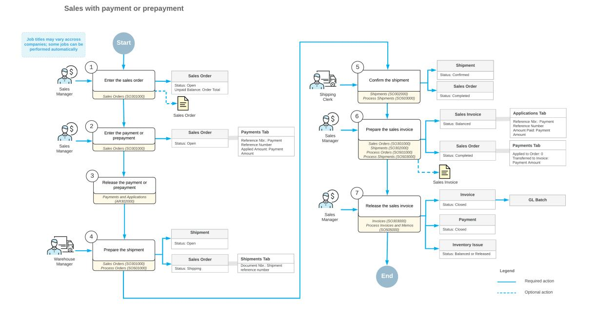

# <span id="page-180-0"></span>**Sales with Payments and Prepayments: Increasing of the Authorized Amount**

When you create a payment whose payment method has the *Credit Card* means of payment, you can capture an amount that is less than, the same as, or more than the authorized payment amount. If you increase the authorized amount, the system changes only the authorized amount in the original transaction. It does not change the other transaction settings, such as the expiration date.

#### **Setting Up the Functionality**

To make it possible for users to increase authorized amount for payments, an administrative user should do the following:

- 1. Open the *[Processing Centers](https://help-2025r1.acumatica.com/Help?ScreenId=ShowWiki&pageid=e27d8932-6b69-4d7b-9b8e-198f13cc17e3)* (CA205000) form and select the processing center that is used for credit card payments. Its payment method must have the *Credit Card* means of payment on the *[Payment Methods](https://help-2025r1.acumatica.com/Help?ScreenId=ShowWiki&pageid=509285d1-cfae-4e87-95c3-a968451952e6)* (CA204000) form.
- 2. In the Summary area (**Payment Processing** section), select the **Allow Increasing Authorized Amounts** check box.
- 3. Save the changes.

#### **Increasing the Authorized Amount in Payments**

On the *[Sales Orders](https://help-2025r1.acumatica.com/Help?ScreenId=ShowWiki&pageid=19e4021c-1b84-49fd-be12-0320c5f1c7e5)* (SO301000) and *[Invoices](https://help-2025r1.acumatica.com/Help?ScreenId=ShowWiki&pageid=0acc9738-f141-4ea0-a2be-f34ea9d1b63a)* (SO303000) forms, you can increase the authorized amount for payments on orders and sales invoices, as long as the**SO Unpaid Balance** or **SO Invoice Balance** is greater than *0*.

You can increase the authorized amount of payments on sales orders whose order type has one of the following behaviors: *Blanket Order*, *RMA Order*, *Sales Order*, and *Invoice*. The behavior of an order type is specified on the *Order [Types](https://help-2025r1.acumatica.com/Help?ScreenId=ShowWiki&pageid=e6984218-4260-4438-99e1-aee2b3765369)* (SO201000) form.

The **Increase Authorized Amount** button is available if the payment selected in the table on the **Payments** tab (for sales orders) or on the **Applications** tab (for sales invoices) meets all of the following criteria:

- The payment method of the payment has the *Credit Card* means of payment specified on the *[Payment](https://help-2025r1.acumatica.com/Help?ScreenId=ShowWiki&pageid=509285d1-cfae-4e87-95c3-a968451952e6) [Methods](https://help-2025r1.acumatica.com/Help?ScreenId=ShowWiki&pageid=509285d1-cfae-4e87-95c3-a968451952e6)* (CA204000) form.
- The processing center of the payment has the **Allow Increasing Authorized Amounts** check box selected on the *[Processing Centers](https://help-2025r1.acumatica.com/Help?ScreenId=ShowWiki&pageid=e27d8932-6b69-4d7b-9b8e-198f13cc17e3)* (CA205000) form.
- The payment has the *Pre-Authorized* processing status.

To increase the authorized amount for a payment on the *[Sales Orders](https://help-2025r1.acumatica.com/Help?ScreenId=ShowWiki&pageid=19e4021c-1b84-49fd-be12-0320c5f1c7e5)* form, you perform the following actions:

- 1. You open the needed sales order with a payment and go to the **Payments** tab.
- 2. In the table, you select the needed payment.
- 3. On the table toolbar, you click **Increase Authorized Amount**.

The system opens the **Increase Authorized Amount** dialog box.

- 4. In the **Authorized** box (**Increased Amounts** section), you enter the needed amount or leave the default value.
- 5. You click **Increase**.

The system calculates the default value as the current amount authorized on the payment plus the unpaid balance from the sales order or sales invoice. You can manually decrease this value, but you cannot enter a larger amount.

If you change the amount in the **Authorized** box, the **Applied to Document** amount in the **Increased Amounts** section will be recalculated automatically.

The system updates the amount in the **Payment Amount** column of the table.

To increase the authorized amount for a payment on the *[Invoices](https://help-2025r1.acumatica.com/Help?ScreenId=ShowWiki&pageid=0acc9738-f141-4ea0-a2be-f34ea9d1b63a)* (SO303000) form, you perform the following actions:

- 1. You open the needed sales invoice and go to the **Applications** tab.
- 2. In the table, you select the needed payment.
- 3. On the table toolbar, you click **Increase Authorized Amount**.

The system opens the **Increase Authorized Amount** dialog box.

- 4. In the **Authorized** box (**Increased Amounts** section), you enter the needed amount or leave the default value.
- 5. You click **Increase** to increase the amount or **Increase and Capture** to increase the authorized amount and capture the payment.

The system updates the amount in the **Amount Paid** column of the table.

#### **Mass-Processing to Increase the Authorized Amounts**

You can use the *[Credit Card Processing for Sales](https://help-2025r1.acumatica.com/Help?ScreenId=ShowWiki&pageid=383e9780-6da1-4f59-9585-fea564cd7880)* (SO507000) form to increase the authorized amounts for multiple documents. To do this, you perform the following actions:

- 1. On the *[Credit Card Processing for Sales](https://help-2025r1.acumatica.com/Help?ScreenId=ShowWiki&pageid=383e9780-6da1-4f59-9585-fea564cd7880)* form, you select *Increase Authorized Amount* in the **Action** box. This causes the following columns to be displayed in the table:
  - **Increased Authorized Amount**: The default value of this column is calculated as the current amount authorized on the payment plus the unpaid balance from the sales order or sales invoice. This value cannot be changed on the *[Credit Card Processing for Sales](https://help-2025r1.acumatica.com/Help?ScreenId=ShowWiki&pageid=383e9780-6da1-4f59-9585-fea564cd7880)* form. If a correction is needed, you should click **Increase Authorized Amount** on the More menu of the *[Sales Orders](https://help-2025r1.acumatica.com/Help?ScreenId=ShowWiki&pageid=19e4021c-1b84-49fd-be12-0320c5f1c7e5)* (SO301000) or *[Invoices](https://help-2025r1.acumatica.com/Help?ScreenId=ShowWiki&pageid=0acc9738-f141-4ea0-a2be-f34ea9d1b63a)* (SO303000) form.
  - **Increased Applied Amount**: The value of this column is calculated as the current amount applied to the document plus the difference between the **New Authorized Amount** and the **Current Authorized Amount**.

The payments that appear in the table meet the previously described criteria. Additionally, there should be no other credit card payments with the *Pre-Authorized* status applied to the same sales order or sales invoice. If a sales order has multiple card payments in the *Pre-Authorized* status, these payments will not be shown for processing. If you want to increase the amount of this sales order or the sales invoice based on it, you should use the **Increase Authorized Amount** command on the *[Sales Orders](https://help-2025r1.acumatica.com/Help?ScreenId=ShowWiki&pageid=19e4021c-1b84-49fd-be12-0320c5f1c7e5)* or *[Invoices](https://help-2025r1.acumatica.com/Help?ScreenId=ShowWiki&pageid=0acc9738-f141-4ea0-a2be-f34ea9d1b63a)* form instead.

- 2. In the Selection area, you specify the selection criteria of the documents you want to view (and potentially process).
- 3. You select the unlabeled check box for each needed table row and click **Process** on the form toolbar to process the selected documents. Alternatively, you click **Process All** on the form toolbar to process all listed documents.

The system increases the authorization amount for each processed document.

You can also use the *[Credit Card Processing for Sales](https://help-2025r1.acumatica.com/Help?ScreenId=ShowWiki&pageid=383e9780-6da1-4f59-9585-fea564cd7880)* form to increase the authorization amount when you are capturing a payment. To do this, you perform the following actions:

- 1. On the *[Credit Card Processing for Sales](https://help-2025r1.acumatica.com/Help?ScreenId=ShowWiki&pageid=383e9780-6da1-4f59-9585-fea564cd7880)* form, you select *Capture* in the **Action** box of the Selection area.
- 2. You select the **Increase Authorized Amount Before Capture** check box.

The system displays the increased amount in the **Increased Authorized Amount** column and the **Increased Applied Amount** column. If these columns are empty, the authorized amount cannot be increased and the system will only capture the payment.

3. You select the unlabeled check box for each needed table row and click **Process** on the form toolbar to process the selected documents. Alternatively, you click **Process All** on the form toolbar to process all listed documents.

The system increases the authorization amount for each processed document.

# <span id="page-182-0"></span>**Sales with Payments and Prepayments: Implementation Checklist**

The following sections provide details you can use to ensure that the system is configured properly for the processing of sales orders with payments and prepayments, and to understand (and change, if needed) additional settings that affect the processing workflow.

#### **Implementation Checklist**

Before you begin processing sales orders with payments and prepayments, you should make sure the needed features have been enabled, settings have been specified, and entities have been created, as summarized in the following checklist.

| Form                                                            | Criteria to Check                                                                                                                                                                                                                                                                                                                                                                                                                                                             |
|-----------------------------------------------------------------|-------------------------------------------------------------------------------------------------------------------------------------------------------------------------------------------------------------------------------------------------------------------------------------------------------------------------------------------------------------------------------------------------------------------------------------------------------------------------------|
| Sales Orders Preferences (SO101000) form                        | All necessary settings related to sales orders have<br>been specified, as described in Order Management Ba<br>sic Configuration: General Information.                                                                                                                                                                                                                                                                                                                         |
| Enable/Disable Features (CS100000) form                         | The Inventory feature is enabled.                                                                                                                                                                                                                                                                                                                                                                                                                                             |
| Order Types (SO201000) form                                     | The SO order type is active and has been configured,<br>as described in Sales Order Types: To Activate the SO<br>Order TypeImplementation Activity.                                                                                                                                                                                                                                                                                                                           |
|                                                                 | To streamline the sales process and avoid small dis<br>crepancies between the payment amount applied to<br>a sales order and the amount of the sales invoice cre<br>ated for this sales order (for example, as a result of<br>the system recalculating the applicable taxes in the<br>sales invoice), select the Auto Write-Off check box. For<br>more information on the configuration of automatic<br>write-offs, see Configuration of Automatic Write-Offs in<br>Invoices. |
| Customers (AR303000) form                                       | All needed customers have been defined in the sys<br>tem, as described in Customers: Implementation Activi<br>ty.                                                                                                                                                                                                                                                                                                                                                             |
| Stock Items (IN202500) form, Non-Stock Items<br>(IN202000) form | All stock and non-stock items to be sold have been de<br>fined in the system, as described in Stock Items: Imple<br>mentation Activity and Non-Stock Items: Implementation<br>Activity.                                                                                                                                                                                                                                                                                       |
| Credit Terms (CS2065000) form                                   | For each applicable set of credit terms, if you need to<br>predefine the prepayment percent that must be paid<br>before the shipment can be created, the Prepayment<br>Required check box is selected and the required per<br>cent is specified in the Prepayment Percent box.                                                                                                                                                                                                |

#### **Other Settings That Affect the Workflow**

You can affect the workflow of processing sales orders with payments and prepayments by specifying additional settings as follows:

- To cause shipments to be created with the *On Hold* status (so that the user can verify them before processing them further), select the **Hold Shipments on Entry** check box on the *[Sales Orders Preferences](https://help-2025r1.acumatica.com/Help?ScreenId=ShowWiki&pageid=1817779c-413b-4187-b7fe-38e97845a1cb)* (SO101000) form.
- To cause general ledger batches generated during the processing of sales documents to be posted automatically, select the **Automatically Post on Release** check box on the *[General Ledger Preferences](https://help-2025r1.acumatica.com/Help?ScreenId=ShowWiki&pageid=e4913d06-c511-4258-a0f9-f36c1b854e6b)*

(GL102000) form. For information on processing general ledger batches, see *GL [Transactions:](https://help-2025r1.acumatica.com/Help?ScreenId=ShowWiki&pageid=35393020-6269-466d-8a08-df558cd43367) General [Information](https://help-2025r1.acumatica.com/Help?ScreenId=ShowWiki&pageid=35393020-6269-466d-8a08-df558cd43367)*.

# <span id="page-184-0"></span>**Sales with Payments and Prepayments: To Process a Sales Order with a Payment**

The following activity will walk you through the processing of a sales order with a payment.

This activity is based on the *U100* dataset. If you are using another dataset, or if any system settings have been changed in *U100*, these changes can affect the workflow of the activity and the results of the processing. To avoid any issues, restore the *U100* dataset to its initial state.

#### **Story**

Suppose the on January 30, 2025, the CoffeeShop customer has orders a large amount of banana and cherry jam for milkshakes. According to the credit terms of the CoffeeShop customer, a payment equal to the order amount must be made before you can ship the goods to the customer's location. The CoffeeShop company pays the required amount the same day as order has been made.

Acting as the sales manager of SweetLife Fruits & Jams, you need to enter and process a sales order for CoffeeShop and record the payment made by the customer.

#### **Configuration Overview**

In the *U100* dataset, the following configuration tasks have been performed to prepare the system for this activity to be performed:

- On the *[Enable/Disable Features](https://help-2025r1.acumatica.com/Help?ScreenId=ShowWiki&pageid=c1555e43-1bc5-4f6f-ba9d-b323f94d8a6b)* (CS100000) form, the *Inventory* feature, which provides the ability to create sales orders that include stock items, has been enabled.
- On the *Order [Types](https://help-2025r1.acumatica.com/Help?ScreenId=ShowWiki&pageid=e6984218-4260-4438-99e1-aee2b3765369)* (SO201000) form, the predefined *SO* order type has been activated.
- On the *[Customers](https://help-2025r1.acumatica.com/Help?ScreenId=ShowWiki&pageid=652929bc-9606-4056-aa6e-0c2d1147171b)* (AR303000) form, the *COFFEESHOP (FourStar Coffee & Sweets Shop)* customer has been defined.
- On the *[Stock Items](https://help-2025r1.acumatica.com/Help?ScreenId=ShowWiki&pageid=77786a70-1f1e-4d63-ad98-96f98e4fcb0e)* (IN202500) form, the *BANJAM96* and *CHERAM96* stock items have been defined.

#### **Process Overview**

In the activity, to process a sales order with a payment, you will first create a sales order of the *SO* type on the *[Sales](https://help-2025r1.acumatica.com/Help?ScreenId=ShowWiki&pageid=19e4021c-1b84-49fd-be12-0320c5f1c7e5) [Orders](https://help-2025r1.acumatica.com/Help?ScreenId=ShowWiki&pageid=19e4021c-1b84-49fd-be12-0320c5f1c7e5)* (SO301000) form and add items to be sold. Then you will create a payment on the **Payments** tab of the *[Sales](https://help-2025r1.acumatica.com/Help?ScreenId=ShowWiki&pageid=19e4021c-1b84-49fd-be12-0320c5f1c7e5) [Orders](https://help-2025r1.acumatica.com/Help?ScreenId=ShowWiki&pageid=19e4021c-1b84-49fd-be12-0320c5f1c7e5)* form and release it on the *[Payments and Applications](https://help-2025r1.acumatica.com/Help?ScreenId=ShowWiki&pageid=ae844bf4-1aef-42cd-9e2f-49b3ee1bc8d7)* (AR302000) form.

Then you will click **CreateShipment** on the form toolbar of the *[Sales Orders](https://help-2025r1.acumatica.com/Help?ScreenId=ShowWiki&pageid=19e4021c-1b84-49fd-be12-0320c5f1c7e5)* form. The system will create the shipment and open it on the *[Shipments](https://help-2025r1.acumatica.com/Help?ScreenId=ShowWiki&pageid=f47cffcc-543e-469c-a204-a9c1e3da346d)* (SO302000) form. You will release the shipment and click **Prepare Invoice** on the form toolbar. The system will create a sales invoice and open it on the *[Invoices](https://help-2025r1.acumatica.com/Help?ScreenId=ShowWiki&pageid=0acc9738-f141-4ea0-a2be-f34ea9d1b63a)* (SO303000) form. Then you will release the invoice.

#### **System Preparation**

Do the following:

- 1. Launch the Acumatica ERP website, and sign in to a company with the *U100* dataset preloaded. You should sign in as sales manager by using the *wiley* username and the *123* password.
- 2. In the info area, in the upper-right corner of the top pane of the Acumatica ERP screen, make sure that the business date in your system is set to *1/30/2025*. If a different date is displayed, click the Business Date menu

button and select *1/30/2025* on the calendar. For simplicity, in this activity, you will create and process all documents in the system on this business date.

3. On the Company and Branch Selection menu in the top pane of the Acumatica ERP screen, select the *SweetLife Store* branch.

#### **Step 1: Entering the Sales Order**

To create the sales order for the FourStar Coffee & Sweets Shop, do the following:

1. Open the *[Sales Orders](https://help-2025r1.acumatica.com/Help?ScreenId=ShowWiki&pageid=19e4021c-1b84-49fd-be12-0320c5f1c7e5)* (SO301000) form.


To open the form for creating a new record, type the form ID in the Search box, and on the Search form, point at the form title and click **New** right of the title.

- 2. On the form toolbar, click **Add New Record**.
- 3. In the Summary area, specify the following settings:
  - **OrderType**: *SO*
  - **Customer**: *COFFEESHOP*
  - **Description**: Sale of banana and cherry jam
- 4. On the table toolbar of the **Details** tab, click **Add Row**.
- 5. In the added row, specify the following settings:
  - **Inventory ID**: *BANJAM96*
  - **Warehouse**: *RETAIL* (inserted automatically)
  - **Quantity**: 15
- 6. Click **Add Row** again.
- 7. In the added row, specify the following settings:
  - **Inventory ID**: *CHERJAM96*
  - **Warehouse**: *RETAIL*
  - **Quantity**: 15
- 8. On the form toolbar, click**Save**.

#### **Step 2: Creating and Releasing the Payment**

Now you need to record the payment made by the *COFFEESHOP* customer. To perform this task, do the following while you are still viewing the sales order on the *[Sales Orders](https://help-2025r1.acumatica.com/Help?ScreenId=ShowWiki&pageid=19e4021c-1b84-49fd-be12-0320c5f1c7e5)* (SO301000) form:

- 1. On the table toolbar of the **Payments** tab, click **Create Payment**.
- 2. In the **Create Payment** dialog box, which opens, make sure that *10200WH Wholesale Checking* is specified in the **Cash Account** box.
- 3. In the **Payment Amount** box, verify that the payment amount is *1390.61*.
- 4. Click **OK** to close the dialog box.

The system creates a payment and applies it to the sales order.

5. In the only row on the **Payments** tab, click the link in the **Reference Nbr.** column.

The system opens the payment on the *[Payments and Applications](https://help-2025r1.acumatica.com/Help?ScreenId=ShowWiki&pageid=ae844bf4-1aef-42cd-9e2f-49b3ee1bc8d7)* (AR302000) form in a new browser window.

6. On the form toolbar, click **Remove Hold**, and then click **Release**.

7. Close the browser window with the *[Payments and Applications](https://help-2025r1.acumatica.com/Help?ScreenId=ShowWiki&pageid=ae844bf4-1aef-42cd-9e2f-49b3ee1bc8d7)* form and return to the sales order on the *[Sales Orders](https://help-2025r1.acumatica.com/Help?ScreenId=ShowWiki&pageid=19e4021c-1b84-49fd-be12-0320c5f1c7e5)* form.

The payment has been created and released. Now you can process the shipment.

#### **Step 3: Creating the Shipment**

While you are still viewing the sales order on the *[Sales Orders](https://help-2025r1.acumatica.com/Help?ScreenId=ShowWiki&pageid=19e4021c-1b84-49fd-be12-0320c5f1c7e5)* (SO301000) form, process the shipment as follows:

- 1. On the form toolbar, click **CreateShipment**.
- 2. In the **SpecifyShipment Parameters** dialog box, which opens, make sure the *1/30/2025* date and the *RETAIL* warehouse are selected, and click **OK**.

The system creates a shipment and opens it on the *[Shipments](https://help-2025r1.acumatica.com/Help?ScreenId=ShowWiki&pageid=f47cffcc-543e-469c-a204-a9c1e3da346d)* (SO302000) form.

#### **Step 4: Confirming the Shipment**

To confirm the shipment you have created, do the following, while you are still viewing the shipment on the *[Shipments](https://help-2025r1.acumatica.com/Help?ScreenId=ShowWiki&pageid=f47cffcc-543e-469c-a204-a9c1e3da346d)* (SO302000) form:

- 1. Review the lines on the **Details** tab. Make sure that both order lines have been included in the shipment and that the shipped quantity in both lines is equal to the ordered quantity.
- 2. On the form toolbar, click **Confirm Shipment**.

The shipment is assigned the *Confirmed* status, and now you can prepare the invoice to bill the customer and increase the customer's debt in the system.

#### **Step 5: Processing the Invoice**

To prepare and release the invoice related to the sales order and shipment, do the following:

- 1. While you are still viewing the shipment on the *[Shipments](https://help-2025r1.acumatica.com/Help?ScreenId=ShowWiki&pageid=f47cffcc-543e-469c-a204-a9c1e3da346d)* (SO302000) form, on the form toolbar, click **Prepare Invoice**. The system prepares the invoice and opens it on the *[Invoices](https://help-2025r1.acumatica.com/Help?ScreenId=ShowWiki&pageid=0acc9738-f141-4ea0-a2be-f34ea9d1b63a)* (SO303000) form.
- 2. On this form, review the details of the prepared invoice. The invoice has two lines, as the sales order does. On the **Applications** tab, notice that the system has inserted the line with the payment, which you have created in Step 2.
- 3. On the form toolbar, click **Release** to release the invoice.

The invoice is assigned the *Closed* status and the value in the **Balance** box in the Summary area is *0*, which means that the invoice has been fully processed.

- 4. Return to the *[Sales Orders](https://help-2025r1.acumatica.com/Help?ScreenId=ShowWiki&pageid=19e4021c-1b84-49fd-be12-0320c5f1c7e5)* (SO301000) form, and open the sales order that you have processed.
- 5. On the **Shipments** tab, in the only row, click the link in the **Inventory Ref. Nbr.** column to view the inventory issue that was generated when you released the invoice.
- 6. On the *[Issues](https://help-2025r1.acumatica.com/Help?ScreenId=ShowWiki&pageid=17b051f6-027d-4459-b542-65c1c1f9d0ea)* (IN302000) form, which opens, review the details of the inventory issue, which is shown in the following screenshot. Make sure the issue has the *Released* status, which means that the issue has been released and the items' quantities in inventory have been decreased appropriately.

| <b>Issues</b><br>000064<br>$\overline{\mathcal{L}}$ | $\Box$                   | $\Omega$         | 而<br>O<br>$^{+}$    | -l<<br>$\overline{\phantom{0}}$<br>$\bullet$ | $\geq$<br>$\rightarrow$  | $\cdots$ |                      |                    |                   |            |                  |      | <b>PINOTES</b>        | <b>ACTIVITIES</b><br><b>FILES</b> | TOOLS $\star$ |
|-----------------------------------------------------|--------------------------|------------------|---------------------|----------------------------------------------|--------------------------|----------|----------------------|--------------------|-------------------|------------|------------------|------|-----------------------|-----------------------------------|---------------|
|                                                     | Reference Nbr.:          | 000064           | Q                   | External Ref.:                               |                          |          |                      | Total Qty.:        |                   | 30.00      |                  |      |                       |                                   | $\sim$        |
| Status:                                             |                          | Released         |                     |                                              |                          |          | <b>Total Amount:</b> |                    | 1,277.25          |            |                  |      |                       |                                   |               |
| Date:                                               |                          |                  | 1/30/2023           |                                              |                          |          |                      | <b>Total Cost:</b> |                   | 0.00       |                  |      |                       |                                   |               |
|                                                     | Post Period:             |                  | 01-2023             | Description:                                 |                          |          |                      |                    |                   |            |                  |      |                       |                                   |               |
|                                                     | <b>DETAILS</b>           | <b>FINANCIAL</b> | <b>LINE DETAILS</b> | <b>ADD ITEMS</b>                             |                          |          |                      |                    |                   |            |                  |      |                       |                                   |               |
| Ò                                                   | $\overline{\phantom{0}}$ | $\times$         |                     |                                              | <b>INVENTORY SUMMARY</b> |          | $\mathbf{N}$<br>н    | Ĵ.                 |                   |            |                  |      |                       |                                   |               |
| <b>B</b> 0                                          | $\Box$<br><b>Branch</b>  |                  | Tran. Type          | <b>Inventory ID</b>                          | Warehouse                | Location | Quantity UOM         |                    | <b>Unit Price</b> | Ext. Price | <b>Unit Cost</b> |      | Ext. Cost Reason Code | Cost<br>Layer<br>Type             | Project       |
| > 0                                                 | <b>RETAIL</b><br>D       |                  | Invoice             | BANJAM96                                     | <b>RETAIL</b>            | JS1      | 15.00                | PIECE              | 40.0000           | 600.00     | 0.0000           | 0.00 |                       | Normal                            | X             |
| $\mathbf{0}$                                        | <b>RETAIL</b><br>Ð       |                  | Invoice             | CHERJAM96                                    | <b>RETAIL</b>            | JS1      | 15.00                | PIECE              | 45.1500           | 677.25     | 0.0000           | 0.00 |                       | Normal                            | X             |

#### *Figure: The inventory issue generated on release of the invoice*

The processing of the sales order with a payment is now complete.

# <span id="page-187-0"></span>**Sales with Payments and Prepayments: Sales Orders with a Required Prepayment Amount**

If a sales order has credit terms with the **Prepayment Required** check box selected and a defined prepayment percent in the **Prepayment Percent** box on the *Credit [Terms](https://help-2025r1.acumatica.com/Help?ScreenId=ShowWiki&pageid=c39f7b9f-4ab2-4b67-b449-667802d58a57)* (CS206500) form, its workflow on the *[Sales Orders](https://help-2025r1.acumatica.com/Help?ScreenId=ShowWiki&pageid=19e4021c-1b84-49fd-be12-0320c5f1c7e5)* (SO301000) form consists of the following general steps:

1. When you create a sales order and remove it from hold, the system checks whether any prepayments or payments have been applied to the sales order.


If the approval is configured for the type of the sales order, the order must be approved before the system performs this check.

- 2. If the sales order has applied prepayments or payments, the system checks the following conditions and performs the noted steps:
  - a. If at least one credit card payment requiring validation has been applied to the sales order, the system assigns the *Pending Processing* status to the sales order until the prepayment or payment is validated. When all of these payments have been validated, the system performs the next step.
  - b. If the sum of all applied prepayments or payments is not sufficient to satisfy the required prepayment amount, the system assigns the *Awaiting Payment* status to the sales order which causes the **Create Shipment** command on the More menu of the *[Sales Orders](https://help-2025r1.acumatica.com/Help?ScreenId=ShowWiki&pageid=19e4021c-1b84-49fd-be12-0320c5f1c7e5)* form to be unavailable. If the amount of the applied prepayments or payments is greater than or equal to the required prepayment amount, the system performs the next step.

Prepayments and payments with the cash, check, or credit card payment method can satisfy the prepayment amount requirement. Pre-authorized payments with the credit card payment method can also satisfy the prepayment requirement.

c. If any option except *Disabled* is selected in the **CreditVerification** box on the **Financial** tab of the *[Customers](https://help-2025r1.acumatica.com/Help?ScreenId=ShowWiki&pageid=652929bc-9606-4056-aa6e-0c2d1147171b)* (AR303000) form for the customer specified in the sales order and the **Hold Documents on Failed Credit Check** check box is selected on the *Order [Types](https://help-2025r1.acumatica.com/Help?ScreenId=ShowWiki&pageid=e6984218-4260-4438-99e1-aee2b3765369)* (SO201000) form for the order's type, the customer's credit limit is verified.

If the verification fails, the system assigns the *Credit Hold* status to the sales order.

# <span id="page-188-0"></span>**Sales with Payments and Prepayments: Prepayments and Payments in Invoices**

When you prepare an invoice for a shipment or sales order, any prepayments and payments that were applied to the sales order are transferred to the invoice. If the sales order has a pre-authorized credit card payment, it is also transferred to the invoice and can be captured on the *[Invoices](https://help-2025r1.acumatica.com/Help?ScreenId=ShowWiki&pageid=0acc9738-f141-4ea0-a2be-f34ea9d1b63a)* (SO303000) form.

#### **Pre-Authorized Prepayments and Payments**

Suppose that for a sales order with the *Back Order Allowed* shipping rule specified on **Shipping** tab of the *[Sales](https://help-2025r1.acumatica.com/Help?ScreenId=ShowWiki&pageid=19e4021c-1b84-49fd-be12-0320c5f1c7e5) [Orders](https://help-2025r1.acumatica.com/Help?ScreenId=ShowWiki&pageid=19e4021c-1b84-49fd-be12-0320c5f1c7e5)* (SO301000) form, you have confirmed a partial shipment. When you prepare an invoice for the shipped goods in this sales order, the pre-authorized credit card payment is partially transferred to the invoice, with the remainder applied to the sales order. If the payment application amount that is transferred to the invoice is less than the pre-authorized payment amount and you click **Capture** on the **Applications** tab of the *[Invoices](https://help-2025r1.acumatica.com/Help?ScreenId=ShowWiki&pageid=0acc9738-f141-4ea0-a2be-f34ea9d1b63a)* (SO303000) form, only the amount applied to the invoice is captured.

Once a pre-authorized credit card payment has been captured, it is automatically released, and the payment has no more balance applied to the sales order. Then the system recalculates the application of the payment amount to the sales order.

If the sum of the total payment amount applied to the sales order and the total payment amount transferred to invoices is less than the required prepayment amount for the sales order, the system assigns the *Awaiting Payment* status instead of the *Back Order* status to the sales order on the *[Sales Orders](https://help-2025r1.acumatica.com/Help?ScreenId=ShowWiki&pageid=19e4021c-1b84-49fd-be12-0320c5f1c7e5)* form.

When an invoice with applied prepayments or payments is created on the *[Invoices](https://help-2025r1.acumatica.com/Help?ScreenId=ShowWiki&pageid=0acc9738-f141-4ea0-a2be-f34ea9d1b63a)* form, the system checks the following conditions and performs the noted steps:

- If any payment requires validation, the system assigns the *Pending Processing* status to the invoice.
- If any payment has the credit card payment method and a pre-authorized transaction, the system assigns the *Pending Processing* status to the invoice.


An invoice with this status cannot be released.

• If the **Hold Invoices on Failed Credit Check** check box is selected on the *[Sales Orders Preferences](https://help-2025r1.acumatica.com/Help?ScreenId=ShowWiki&pageid=1817779c-413b-4187-b7fe-38e97845a1cb)* (SO101000) form and the customer's credit limit has been exceeded, the system assigns the *Credit Hold* status to the invoice.

If a pre-authorized credit card payment is transferred from a sales order to the invoice, the system creates the invoice with the *Pending Processing* status. If the invoice has the *Balanced* status and a credit card payment with a pre-authorized transaction is created or applied to the invoice, the invoice receives the *Pending Processing* status.

A user can capture pre-authorized credit card payments applied to an invoice on the **Applications** tab of the *[Invoices](https://help-2025r1.acumatica.com/Help?ScreenId=ShowWiki&pageid=0acc9738-f141-4ea0-a2be-f34ea9d1b63a)* form by clicking **Capture**. If a pre-authorized credit card payment is captured successfully, the system automatically releases the payment and assigns the *Open* status to it. The system then assigns the *Balanced* status to the invoice (if the customer's credit limit is not exceeded). If the capture of the pre-authorized credit card payment fails, the system assigns the *Credit Hold* status to the invoice (despite the customer's credit limit state). If multiple pre-authorized credit card payments are applied to a single invoice, the invoice keeps the *Pending Processing* status as long as at least one payment has not been captured.

Credit card payments cannot be captured on the *[Invoices](https://help-2025r1.acumatica.com/Help?ScreenId=ShowWiki&pageid=0acc9738-f141-4ea0-a2be-f34ea9d1b63a)* form if they are applied to multiple documents.

#### **Credit Hold in Invoices with a Required Prepayment Amount**

On the *[Invoices](https://help-2025r1.acumatica.com/Help?ScreenId=ShowWiki&pageid=0acc9738-f141-4ea0-a2be-f34ea9d1b63a)* (SO303000) form, the system assigns the *Credit Hold* status to an invoice with transferred prepayments or payments if all of the following conditions are met when the invoice is created from a sales order or shipment:

- The invoice has credit terms for which the **Prepayment Required** check box is selected and a prepayment percent is defined in the **Prepayment Percent** box on the *Credit [Terms](https://help-2025r1.acumatica.com/Help?ScreenId=ShowWiki&pageid=c39f7b9f-4ab2-4b67-b449-667802d58a57)* (CS206500) form.
- The unpaid balance of the invoice is greater than 0. This can occur if the amount of the invoice is greater than the sales order amount (for example, the freight price has been added aer the shipment was confirmed) and the difference between this amount has not been recorded as a write-off amount.

The invoice is also assigned the *Credit Hold* status on the failure of the capture of a pre-authorized credit card payment that is transferred from a sales order or applied directly to the invoice.

# <span id="page-189-0"></span>**Sales with Payments and Prepayments: Generated Transactions**

To be able to process a sale of items, you create and process a sales order. The following sections describe the GL transactions generated during the processing of the documents for a sale of an item.

Sales orders and shipment documents do not produce any GL transactions.

#### **Transaction Generated for a Sales Invoice**

When you create and release a sales invoice, the system generates the following general ledger transaction.

| Account                     | Source of Account                                                                       | Debit  | Credit |
|-----------------------------|-----------------------------------------------------------------------------------------|--------|--------|
| Accounts Receivable account | Customer                                                                                | Amount | 0.00   |
| Sales account               | Specified in the settings<br>of the order type on the<br>Order Types (SO201000)<br>form | 0.00   | Amount |

You can view the reference number of the GL batch in the **Batch Nbr.** box on the **Details** tab of the *[Invoices](https://help-2025r1.acumatica.com/Help?ScreenId=ShowWiki&pageid=0acc9738-f141-4ea0-a2be-f34ea9d1b63a)* (SO303000) form. You can click the link in this box to view the details of the batch on the *Journal [Transactions](https://help-2025r1.acumatica.com/Help?ScreenId=ShowWiki&pageid=dda046bc-5946-407f-88f7-1c0c966fbe72)* (GL301000) form.


Sales orders and shipment documents do not produce any GL transactions.

#### **Transaction Generated on Release of Inventory Issue**

When an inventory issue is created and released, the system generates the following general ledger transaction.

| Account                                                  | Source of Account | Quantity                        | Debit | Credit |
|----------------------------------------------------------|-------------------|---------------------------------|-------|--------|
| Inventory asset account for line 1<br>of the sales order | Stock item        | Quantity with the<br>minus sign | 0.00  | 0.00   |
| COGS account for line 1 of the<br>sales order            | Stock item        | Quantity                        | 0.00  | 0.00   |
| Inventory asset account for line 2<br>of the sales order | Stock item        | Quantity with the<br>minus sign | 0.00  | 0.00   |

| Account                                       | Source of Account | Quantity | Debit | Credit |
|-----------------------------------------------|-------------------|----------|-------|--------|
| COGS account for line 2 of the<br>sales order | Stock item        | Quantity | 0.00  | 0.00   |

You can view the reference number of the GL batch in the **Batch Nbr.** box on the **Financial** tab of the *[Issues](https://help-2025r1.acumatica.com/Help?ScreenId=ShowWiki&pageid=17b051f6-027d-4459-b542-65c1c1f9d0ea)* (IN302000) form. You can click the link in this box to view the details of the batch on the *Journal [Transactions](https://help-2025r1.acumatica.com/Help?ScreenId=ShowWiki&pageid=dda046bc-5946-407f-88f7-1c0c966fbe72)* (GL301000) form.

# <span id="page-190-0"></span>**Sales with Payments and Prepayments: Related Report and Forms**

In the following sections, you can find details about ways to gather information about the sales of items that have been processed or are being processed in the system.

If you do not see a particular report or form that is described, you may have signed in to the system with a user account that does not have access rights to the report or form. Contact your system administrator to obtain access to any needed reports or forms.

#### **Finding Shipments Related to a Sales Order**

If you need to find a shipment that is linked to a particular sales order and view it, you can do this by opening the sales order on the *[Sales Orders](https://help-2025r1.acumatica.com/Help?ScreenId=ShowWiki&pageid=19e4021c-1b84-49fd-be12-0320c5f1c7e5)* (SO301000) form and viewing the**Shipments** tab, which lists all the shipments that have been prepared for the order. To view the details of a listed shipment, you click its reference number in the **Document Nbr.** column; the system opens the shipment on the *[Shipments](https://help-2025r1.acumatica.com/Help?ScreenId=ShowWiki&pageid=f47cffcc-543e-469c-a204-a9c1e3da346d)* (SO302000) form.

#### **Tracking the Status of Order Fulfillment**

To track how a sales order is being fulfilled, you can check its status in the Summary area of the *[Sales Orders](https://help-2025r1.acumatica.com/Help?ScreenId=ShowWiki&pageid=19e4021c-1b84-49fd-be12-0320c5f1c7e5)* form. On the **Totals** tab of this form, you can also check the quantities and amounts that are not yet shipped and not yet billed, as well as the amount that is not yet paid.

#### **Printing Pick Lists**

To prepare a printable pick list for a shipment document that is being processed, you use the *[Pick List](https://help-2025r1.acumatica.com/Help?ScreenId=ShowWiki&pageid=682aa302-6f0c-4f7f-99fc-bb5af7c4a610)* (SO644000) report. While you are viewing a shipment on the *[Shipments](https://help-2025r1.acumatica.com/Help?ScreenId=ShowWiki&pageid=f47cffcc-543e-469c-a204-a9c1e3da346d)* (SO302000) form, you can go to this report for the selected shipment by clicking **Print Pick List** on the More menu. The system opens the printable pick list on the *[Pick List](https://help-2025r1.acumatica.com/Help?ScreenId=ShowWiki&pageid=682aa302-6f0c-4f7f-99fc-bb5af7c4a610)* report; then you can view the pick list and print it by clicking **Print** on the report toolbar.

#### **Printing Invoices**

To prepare a printable form of the sales invoice that is being processed, you use the *[Invoice & Memo](https://help-2025r1.acumatica.com/Help?ScreenId=ShowWiki&pageid=4ae85fa6-7297-4d4c-b956-77d36e67e13f)* (SO643000) report. While you are viewing a sales invoice on the *[Invoices](https://help-2025r1.acumatica.com/Help?ScreenId=ShowWiki&pageid=0acc9738-f141-4ea0-a2be-f34ea9d1b63a)* (SO303000) form, you can go to this report by clicking **Print Invoice** on the More menu. The system opens the printable version of the sales invoice on the *[Invoice & Memo](https://help-2025r1.acumatica.com/Help?ScreenId=ShowWiki&pageid=4ae85fa6-7297-4d4c-b956-77d36e67e13f)* report; then you can view the sales invoice and print it by clicking **Print** on the report toolbar.

# <span id="page-191-0"></span>**Processing Prepayment Invoices for Sales Orders**

In certain countries, when a company requests a prepayment for a sales order, they must record taxes on the received prepayment. To meet these requirements, in Acumatica ERP, you can create prepayment invoices containing the same items as a particular sales order, as well as the taxes calculated based on the prepayment amount.

You can create a prepayment invoice directly from the sales order; alternatively, if a prepayment invoice has been created manually, you can link it to a sales order.

In this chapter, you will learn how to create prepayment invoices for a sales order in both ways:

- By creating a new prepayment invoice directly from the sales order.
- By linking an already-created prepayment invoice to a sales order.

# <span id="page-191-1"></span>**Prepayment Invoices for Sales Orders: General Information**

If prepayments are subject to tax reporting in the country where your company is operating, you can create prepayment invoices, when your company requires prepayments for sales orders.

In Acumatica ERP, you can create any number of prepayment invoices for a sales order with the tax and taxable amounts stated in the prepayment invoice.

To avoid manual entry of a prepayment invoice on the *[Invoices and Memos](https://help-2025r1.acumatica.com/Help?ScreenId=ShowWiki&pageid=5e6f3b27-b7af-412f-a40a-1d4f4be70cba)* (AR301000) form, you can create a prepayment invoice from the sales order. This prepayment invoice will include the same items as the sales order has, with taxes calculated based on the specified prepayment amount.


The functionality is available only if the *VAT Recognition on Prepayments* feature is enabled on the *[Enable/Disable Features](https://help-2025r1.acumatica.com/Help?ScreenId=ShowWiki&pageid=c1555e43-1bc5-4f6f-ba9d-b323f94d8a6b)* (CS100000) form.

For details on manually entering a prepayment invoice, see *[Prepayment Invoices: General Information](https://help-2025r1.acumatica.com/Help?ScreenId=ShowWiki&pageid=bee18808-f7db-4b59-9956-b3c5c383851e)*.

#### **Learning Objectives**

In this chapter, you will learn how to do the following:

- From a sales order, create a prepayment invoice that covers the full sales order amount
- From a sales order, create a prepayment invoice that partially covers the sales order amount
- Create two or more prepayment invoices for a sales order
- Link an already-created prepayment invoice to a sales order

#### **Applicable Scenarios**

You create a prepayment invoice in such cases as the following:


All percentages in these scenarios are given as examples. Your company may specify any percentage in prepayment invoices.

• Your company produces goods and requires a deposit that is typically 50% of the order amount before starting the production job. In this case, your company sends a prepayment invoice to the customer for 50% of the order amount; the invoice includes a detailed list of the items to be produced along with their quantities and prices. Upon receipt of the payment for this prepayment invoice, your company initiates work on the order. The remaining payment is settled upon shipment of the order.

- Your company distributes goods and typically requests a 20% prepayment before delivery, with the remaining 80% due upon receipt of the shipment. Goods are not dispatched without prepayment. Your company creates a prepayment invoice for 20% of the order amount and sends it to the customer. Upon receiving the prepayment, the order is delivered to the customer.
- A customer placed an order, and your company sent a prepayment invoice for 20% of the total order amount. Later, the customer requested that additional items be added to the order. In response, your company issued another prepayment invoice, covering 20% of the updated total amount.
- Your company requires a full prepayment before shipping the ordered goods to a customer. When multiple shipments are expected for an order, you need to create a separate prepayment invoice for each shipment.

#### **Workflow of a Prepayment Invoice Created from a Sales Order**

The processing of a prepayment invoice created from a sales order typically involves the actions shown in the following diagram.

The amounts mentioned in the diagram are provided as examples based on the following assumptions:

- The tax total is calculated based on tax settings that define the calculation of the tax amount on a per-document basis when the tax is not included in the document amount.
- The company requires a prepayment of 50% of the order total.

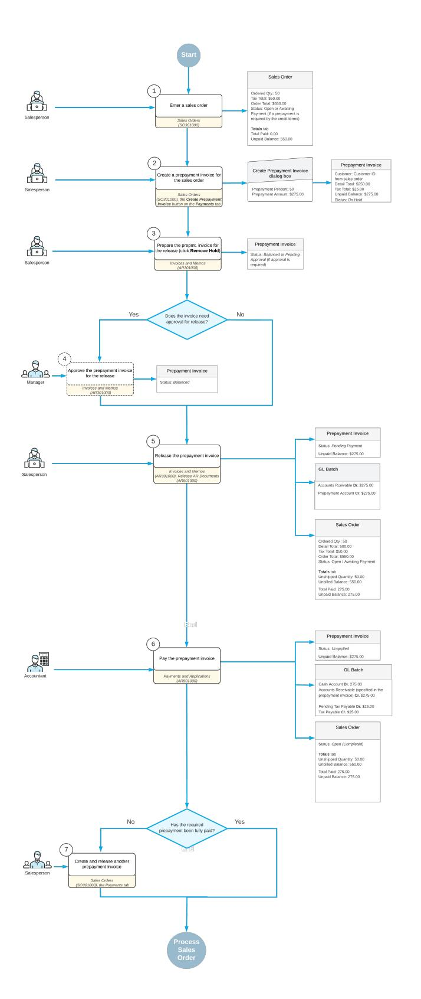

*Figure: Creation of a prepayment invoice from a sales order*

In the next sections of this topic, the main steps of the process are described in detail.

#### **Creating a Prepayment Invoice from a Sales Order**

When a sales order is created and saved on the *[Sales Orders](https://help-2025r1.acumatica.com/Help?ScreenId=ShowWiki&pageid=19e4021c-1b84-49fd-be12-0320c5f1c7e5)* (SO301000) form, you can create a prepayment invoice to request a full or partial prepayment for the sales order. On the **Payments** tab of the form, you click the **Create Prepayment Invoice** button.

In the **Create Prepayment Invoice** dialog box, which opens, the **Prepayment Percent** and the **Prepayment Amount** boxes are populated depending on the state of the **Prepayment Required** check box in the customer's credit terms specified on the *Credit [Terms](https://help-2025r1.acumatica.com/Help?ScreenId=ShowWiki&pageid=c39f7b9f-4ab2-4b67-b449-667802d58a57)* (CS206500) form:

- If the check box is cleared, the following values are specified:
  - **Prepayment Percent**: 100 for the first prepayment invoice created for the sales order; the percentage calculated proportionally to the specified prepayment amount for subsequent prepayment invoices
  - **Prepayment Amount**: The unpaid balance of the sales order for the first prepayment invoice created for the sales order; the unpaid balance of the sales order for subsequent prepayment invoices (if the prepayment percentage or prepayment amount was changed for the first prepayment invoice)

You can either keep these values unchanged (thus creating a prepayment invoice covering the order total) or specify a required prepayment percent or amount, which causes the other to be calculated automatically.

- If the check box is selected and the prepayment percent is defined in the customer's credit terms, the following values are specified:
  - **Prepayment Percent**: The percent defined by the credit terms for the first prepayment invoice; the percentage calculated proportionally to the specified prepayment amount for subsequent prepayment invoices
  - **Prepayment Amount**: The amount calculated according to the prepayment percent for the first prepayment invoice; the unpaid balance of the sales order for subsequent prepayment invoices

You can either keep these values unchanged (thus creating a prepayment invoice covering the required prepayment amount) or change the prepayment percent or amount. If you reduce the prepayment percent, an additional prepayment invoice or multiple invoices will be required.

Aer reviewing the prepayment percentage and amount, and making any necessary changes, you click **Create**. The system closes the dialog box and opens the prepayment invoice on the *[Invoices and Memos](https://help-2025r1.acumatica.com/Help?ScreenId=ShowWiki&pageid=5e6f3b27-b7af-412f-a40a-1d4f4be70cba)* (AR301000) form with most of the settings populated from the sales order. The reference number of the prepayment invoice is assigned according to the numbering sequence specified in the **Prepayment Invoice NumberingSequence** box on the *[Accounts Receivable Preferences](https://help-2025r1.acumatica.com/Help?ScreenId=ShowWiki&pageid=f7b52067-5299-45e8-b601-485cd709f58b)* (AR101000) form.

On the **Details** tab of the *[Invoices and Memos](https://help-2025r1.acumatica.com/Help?ScreenId=ShowWiki&pageid=5e6f3b27-b7af-412f-a40a-1d4f4be70cba)* form, the system has added only the unbilled lines of the sales order to the prepayment invoice that is created. The following settings are specified in the corresponding columns:

- **Prepayment Percent**: The prepayment percent specified in the dialog box during the creation of the invoice
- **Prepayment Amount**: The prepayment amount calculated for the line, which it determines by applying the prepayment percentage to the line's **Ext. Price** minus the line's **Discount Amount** (if any)
- **OrderType**: The sales order type
- **Order Nbr.**: The reference number of the sales order from which the prepayment invoice has been created.

On the **Discounts** tab of the *[Invoices and Memos](https://help-2025r1.acumatica.com/Help?ScreenId=ShowWiki&pageid=5e6f3b27-b7af-412f-a40a-1d4f4be70cba)* form, the system has added group or documents (or both) discounts, if they have been applied to the sales order. For details, see *[Applying Group and Document Discounts to](#page-195-0) [the Prepayment Invoice](#page-195-0)*.

You can edit the settings of the prepayment invoice (excluding the **Customer** and **Currency** settings) before you release the document.

Once the prepayment invoice has been created, the system does the following on the *[Sales Orders](https://help-2025r1.acumatica.com/Help?ScreenId=ShowWiki&pageid=19e4021c-1b84-49fd-be12-0320c5f1c7e5)* form:

- On the **Payments** tab, adds a row with the following settings of the created prepayment invoice:
  - **Doc.Type**: *Prepmt. Invoice*

- **Reference Nbr.**: The reference number of the prepayment invoice
- **Applied to Order**: The **Unpaid Balance** of the prepayment invoice
- On the **Totals** tab, updates the**Total Paid** and the **Unpaid Balance** boxes

For details of how to process prepayment invoices, see *[Prepayment Invoices: General Information](https://help-2025r1.acumatica.com/Help?ScreenId=ShowWiki&pageid=bee18808-f7db-4b59-9956-b3c5c383851e)*.

#### <span id="page-195-0"></span>**Applying Group and Document Discounts to the Prepayment Invoice**

If group or document (or both) discounts have been applied to a sales order and listed on the **Discounts** tab of the *[Sales Orders](https://help-2025r1.acumatica.com/Help?ScreenId=ShowWiki&pageid=19e4021c-1b84-49fd-be12-0320c5f1c7e5)* (SO301000) form, the system applies these discounts to the created prepayment invoice. The discount amount is recalculated proportionally to the prepayment amount and inserted in the **Document Discount** box in the Summary area of the *[Invoices and Memos](https://help-2025r1.acumatica.com/Help?ScreenId=ShowWiki&pageid=5e6f3b27-b7af-412f-a40a-1d4f4be70cba)* form. These discounts are also added to the **Discounts** tab of the *[Invoices and Memos](https://help-2025r1.acumatica.com/Help?ScreenId=ShowWiki&pageid=5e6f3b27-b7af-412f-a40a-1d4f4be70cba)* form. If you edit any details copied from the sales order in the prepayment invoice, the system recalculates the discount amount accordingly.

If a sales order includes multiple discounts, the system aggregates these discounts by type (group or document) and adds one consolidated line for all group discounts and another line for all document discounts (including the external document discount) to the created prepayment invoice to the **Discounts** tab of the *[Invoices and Memos](https://help-2025r1.acumatica.com/Help?ScreenId=ShowWiki&pageid=5e6f3b27-b7af-412f-a40a-1d4f4be70cba)* form leaving the **Discount Code** and **Sequence ID** columns empty in these lines.

The *Customer Discounts* feature should be enabled on the *[Enable/Disable Features](https://help-2025r1.acumatica.com/Help?ScreenId=ShowWiki&pageid=c1555e43-1bc5-4f6f-ba9d-b323f94d8a6b)* (CS100000) form and the group and document discounts are configured in your Acumatica ERP instance.

If you add a line or lines to the prepayment invoice on the **Details** tab of the *[Invoices and Memos](https://help-2025r1.acumatica.com/Help?ScreenId=ShowWiki&pageid=5e6f3b27-b7af-412f-a40a-1d4f4be70cba)* form and any added item is eligible for a group or document discount, the system applies the corresponding discount to the prepayment invoice. On the **Discounts** tab, the system adds a line with that discount with the **Discount Code** and **Sequence ID** columns filled in. This does not affect the original sales order, and the discounts from the sales order are not recalculated.

If the *Customer Discounts* feature is disabled on the *[Enable/Disable Features](https://help-2025r1.acumatica.com/Help?ScreenId=ShowWiki&pageid=c1555e43-1bc5-4f6f-ba9d-b323f94d8a6b)* form, the discount specified in the **Document Discount** box in the Summary area of the *[Sales Orders](https://help-2025r1.acumatica.com/Help?ScreenId=ShowWiki&pageid=19e4021c-1b84-49fd-be12-0320c5f1c7e5)* form is used for the prepayment invoice. Upon creating the prepayment invoice, the system recalculates the discount amount based on the prepayment amount and inserts the value in the **Document Discount** box in the Summary area of the *[Invoices and Memos](https://help-2025r1.acumatica.com/Help?ScreenId=ShowWiki&pageid=5e6f3b27-b7af-412f-a40a-1d4f4be70cba)* form. In that case, no lines are added to the **Discounts** tab.

#### **Payment of a Sales Order**

If a prepayment invoice has been created for a total amount of a sales order and then paid in full, when you create a sales invoice for the sales order, the system automatically applies the prepayment invoice to the sales invoice. In the sales invoice, on the **Applications** tab of the *[Invoices and Memos](https://help-2025r1.acumatica.com/Help?ScreenId=ShowWiki&pageid=5e6f3b27-b7af-412f-a40a-1d4f4be70cba)* (AR301000) form, the system adds a line with the prepayment invoice. Once you release the sales invoice, it is assigned the *Closed* status and the sales order is assigned the *Completed* status.

If a prepayment invoice has been created for a part of an order total amount and then paid, when you create a sales invoice for the sales order, the system automatically applies the prepayment invoice to the sales invoice on the **Applications** tab of the *[Invoices and Memos](https://help-2025r1.acumatica.com/Help?ScreenId=ShowWiki&pageid=5e6f3b27-b7af-412f-a40a-1d4f4be70cba)* form. Once the sales invoice has been released, in the **Balance** box of the Summary area of the *[Invoices and Memos](https://help-2025r1.acumatica.com/Help?ScreenId=ShowWiki&pageid=5e6f3b27-b7af-412f-a40a-1d4f4be70cba)* form, the system specifies the invoice balance, from which it has subtracted the amount paid by the prepayment invoice. The sales invoice remains open and you will need to pay the amount that has not been covered by the prepayment invoice.

If a particular prepayment percent is required based on the customer's credit terms settings on the *Credit [Terms](https://help-2025r1.acumatica.com/Help?ScreenId=ShowWiki&pageid=c39f7b9f-4ab2-4b67-b449-667802d58a57)* (CS206500) form, then a sales order retains the *Awaiting Payment* status until you pay the full required prepayment amount. You can create a prepayment invoice that covers 100% of the required prepayment amount. In that case, aer the prepayment invoice has been paid, the sales order is assigned the *Open* status and you can prepare a sales invoice for the remaining amount of the order. You can also create two or more prepayment invoices that in total will cover the required prepayment percent.

# <span id="page-196-0"></span>**Prepayment Invoices: Linking a Prepayment Invoice to a Sales Order**

In Acumatica ERP, you create prepayment invoices to request a prepayment that is subject to tax reporting. You can create a separate prepayment invoice manually on the *[Invoices and Memos](https://help-2025r1.acumatica.com/Help?ScreenId=ShowWiki&pageid=5e6f3b27-b7af-412f-a40a-1d4f4be70cba)* (AR301000) form, link it to the applicable sales order, and then apply it to any customer's sales invoice. You can also create a prepayment invoice directly from a sales order so that the prepayment invoice will be applied to the sales order invoice automatically.

The functionality is available only if the *VAT Recognition on Prepayments* feature is enabled on the *[Enable/Disable Features](https://help-2025r1.acumatica.com/Help?ScreenId=ShowWiki&pageid=c1555e43-1bc5-4f6f-ba9d-b323f94d8a6b)* (CS100000) form.

In this topic, you will learn how to link a separately created prepayment invoice to a sales order of the same customer.

#### **Linking Prepayment Invoices to a Sales Order**

You create a prepayment invoice on the *[Invoices and Memos](https://help-2025r1.acumatica.com/Help?ScreenId=ShowWiki&pageid=5e6f3b27-b7af-412f-a40a-1d4f4be70cba)* (AR301000) form. For details, see *[Prepayment Invoices:](https://help-2025r1.acumatica.com/Help?ScreenId=ShowWiki&pageid=bee18808-f7db-4b59-9956-b3c5c383851e) [General Information](https://help-2025r1.acumatica.com/Help?ScreenId=ShowWiki&pageid=bee18808-f7db-4b59-9956-b3c5c383851e)*. You link a released prepayment invoice—that is, an invoice of the *Pending Payment* status—to a sales order in either of the following ways:

- You open a sales order on the *[Sales Orders](https://help-2025r1.acumatica.com/Help?ScreenId=ShowWiki&pageid=19e4021c-1b84-49fd-be12-0320c5f1c7e5)* (SO301000) form. On the **Payments** tab, you add a line. In the line, you select *Prepmt. Invoice* in the **Doc.Type** column and the reference number of the prepayment invoice in the **Reference Nbr.** column. In the **Applied to Order** column, you specify the amount to be applied to the sales order. Once you save your changes, the system updates the values in the**Total Paid** and the **Unpaid Balance** boxes on the**Totals** tab of the form.
- You open a prepayment invoice on the *[Payments and Applications](https://help-2025r1.acumatica.com/Help?ScreenId=ShowWiki&pageid=ae844bf4-1aef-42cd-9e2f-49b3ee1bc8d7)* (AR302000) form. On the**Sales Orders** tab, you add a line. In the **Order Nbr.** column of the added line, you specify the reference number of the customer's sales order. In the **Applied to Order** column, you specify the amount to be applied to the sales order. Note that the amount cannot exceed the available balance of the prepayment invoice (the amount specified in the **Available Balance** box of the Summary area of the form) or the unpaid balance of the sales order (the amount specified in the **Unpaid Balance** box on the**Totals** tab of the *[Sales Orders](https://help-2025r1.acumatica.com/Help?ScreenId=ShowWiki&pageid=19e4021c-1b84-49fd-be12-0320c5f1c7e5)* form). In the **OrderTotal** column of the line, the order amount not covered by the prepayment invoice is shown. Once the prepayment invoice has been linked to the sales order, the system adds a line with the prepayment invoice to the sales order on the **Payments** tab of the *[Sales Orders](https://help-2025r1.acumatica.com/Help?ScreenId=ShowWiki&pageid=19e4021c-1b84-49fd-be12-0320c5f1c7e5)* form.

When the sales order with the linked prepayment invoice is billed—that is, a sales invoice is created for the sales order—the system automatically applies the fully paid prepayment invoice to the sales invoice by adding a line on the **Applications** tab of the *[Invoices and Memos](https://help-2025r1.acumatica.com/Help?ScreenId=ShowWiki&pageid=5e6f3b27-b7af-412f-a40a-1d4f4be70cba)* (AR301000) form. On release of the sales invoice, its balance decreases by the **Amount Paid** amount that has been specified in the line on the **Applications** tab.

One released prepayment invoice can be linked to multiple sales orders of the same customer.

A prepayment invoice cannot be linked to a sales orders if the following conditions are met:

- The order type selected for the sales order on the *[Sales Orders](https://help-2025r1.acumatica.com/Help?ScreenId=ShowWiki&pageid=19e4021c-1b84-49fd-be12-0320c5f1c7e5)* form has the *Blanket Order* automation behavior on the *Order [Types](https://help-2025r1.acumatica.com/Help?ScreenId=ShowWiki&pageid=e6984218-4260-4438-99e1-aee2b3765369)* (SO201000) form.
- The customer specified in the sales order has multiple-installment credit terms specified on the *[Customers](https://help-2025r1.acumatica.com/Help?ScreenId=ShowWiki&pageid=652929bc-9606-4056-aa6e-0c2d1147171b)* (AR303000) form.

#### **Unlinking the Prepayment Invoice and Sales Order**

You can unlink the prepayment invoice linked to a sales order and link another one, if needed. You unlink the documents in either of the following ways:

- In a sales order on the *[Sales Orders](https://help-2025r1.acumatica.com/Help?ScreenId=ShowWiki&pageid=19e4021c-1b84-49fd-be12-0320c5f1c7e5)* (SO301000) form: On the **Payments** tab, you click the line with the linked prepayment invoice and click **Remove** on the table toolbar. You can add a new line and select another prepayment invoice, if needed.
- In a prepayment invoice on the *[Payments and Applications](https://help-2025r1.acumatica.com/Help?ScreenId=ShowWiki&pageid=ae844bf4-1aef-42cd-9e2f-49b3ee1bc8d7)* (AR302000) form: On the**Sales Orders** tab, you click the line with the sales order and click **Remove** on the table toolbar. You can add a new line and select another sales order, if needed.

Once you have removed the connection between a prepayment invoice and a sales order, the total amounts of the sales order on the**Totals** tab of the *[Sales Orders](https://help-2025r1.acumatica.com/Help?ScreenId=ShowWiki&pageid=19e4021c-1b84-49fd-be12-0320c5f1c7e5)* form will be affected as follows:

- The **Not Released** amount is decreased by the **Applied to Order** amount of the removed line.
- The **Total Paid** amount is decreased by the **Applied to Order** amount of the removed line.
- The **Unpaid Balance** value is increased by the amount specified in the **Applied to Order** box of the removed line.

#### **Impact of a Voided Prepayment Invoice on a Sales Order**

If a prepayment invoice linked to a sales order has been fully written off by a credit memo and the prepayment invoice has been assigned the *Voided* status, then on release of the application of the credit memo to the prepayment invoice, the system does the following on the *[Sales Orders](https://help-2025r1.acumatica.com/Help?ScreenId=ShowWiki&pageid=19e4021c-1b84-49fd-be12-0320c5f1c7e5)* (SO301000) form:

- Reduces the **Applied to Order** amount to *0* in the prepayment invoice line on the **Payments** tab. The line is not removed from the tab.
- Updates the values on the**Totals** tab as follows:
  - Reduces the **Not Released** amount by the **Applied to Order** amount
  - Reduces the**Total Paid** amount by the **Applied to Order** amount
  - Increases the **Unpaid Balanced** by the **Applied to Order** amount

# <span id="page-198-0"></span>**Processing Blanket Sales Orders**

This chapter describes blanket sales orders in Acumatica ERP.

# <span id="page-198-1"></span>**Blanket Sales Orders: General Information**

In Acumatica ERP, a blanket sales order is an order with large item quantities that you enter to reflect a customer's plans to buy this quantity over a period of time. The quantities in a blanket sales order are used for planning purposes and do not affect the item availability in the warehouse, unlike the quantities in regular sales orders. The blanket sales order will be used as a framework from which multiple child orders will be created. These orders may involve delivery to multiple locations of the customer.

#### **Learning Objectives**

In this chapter, you will learn how to do the following:

- Activate an order type with the minimum required settings
- Create a blanket sales order
- Generate child orders for a blanket sales order
- Perform quick processing of the child orders

#### **Applicable Scenarios**

You use blanket sales orders in the following cases:

- When you need to record the sales of large quantities of items to the same customer over a specified period
- When you need to plan, monitor, or forecast sales to a customer without affecting the availability of the included items in stock

#### **Sales with Blanket Sales Orders**

A blanket sales order in Acumatica ERP has an order type for which the *Blanket Order* automation behavior is specified on the **Template** tab of the *Order [Types](https://help-2025r1.acumatica.com/Help?ScreenId=ShowWiki&pageid=e6984218-4260-4438-99e1-aee2b3765369)* (SO201000) form. You can use the predefined *BL* order type, which has this automation behavior, for the processing of blanket sales orders. For details, see *Sales Order [Types:](https://help-2025r1.acumatica.com/Help?ScreenId=ShowWiki&pageid=96a00780-a0c3-4314-86ca-093004844268) [General Information](https://help-2025r1.acumatica.com/Help?ScreenId=ShowWiki&pageid=96a00780-a0c3-4314-86ca-093004844268)*.

You create a blanket sales order of the *BL* order type on the *[Sales Orders](https://help-2025r1.acumatica.com/Help?ScreenId=ShowWiki&pageid=19e4021c-1b84-49fd-be12-0320c5f1c7e5)* (SO301000) form. In the Summary area, you select a customer, and then on the **Details** tab, you add the items expected to be ordered by the customer.

For each line of the blanket sales order, you create line splits for each planned sale of the line item by selecting the line and clicking the **Line Details** button on the table toolbar. In the **Line Details** dialog box, which opens, you change the quantity in the **Quantity** column for the only line to the quantity of the first sale; the system automatically creates another line split with the remaining quantity of the original line on the **Details** tab. You create line splits for each item in each sale planned for this blanket sales order. Then in the**Sched. Order Date** column, you specify the date of shipping for each line split.

Line splits of the blanket sales order are converted to child orders when it is time to ship the items to a customer location. A child order is a regular sales order with the *Sales Order* automation behavior, which has a link to the blanket sales order.

You create child orders for a blanket sales order in one of the following ways:

• By doing either of the following on the *[Sales Orders](https://help-2025r1.acumatica.com/Help?ScreenId=ShowWiki&pageid=19e4021c-1b84-49fd-be12-0320c5f1c7e5)* form:

- Clicking **Create Child Orders** on the form toolbar or the More menu while you are viewing a blanket sales order with the *Open* status.
- Clicking **Add BlanketSO Line** on the table toolbar of the **Details** tab while you are creating a child sales order. In the **Add BlanketSales Order Line** dialog box, which opens, you select the needed blanket order line and click **Add & Close**. This links the selected sales order to the blanket order.
- On the *[Process Orders](https://help-2025r1.acumatica.com/Help?ScreenId=ShowWiki&pageid=c06a334c-f39d-4eff-9d80-b167657dff73)* (SO501000) form: You select *Create Child Orders* in the **Actions** box of the Selection area, select the blanket sales orders for which child orders should be created in the table, and click **Process** on the form toolbar.

Then you use the *[Shipments](https://help-2025r1.acumatica.com/Help?ScreenId=ShowWiki&pageid=f47cffcc-543e-469c-a204-a9c1e3da346d)* (SO302000) form to prepare and confirm the shipment or shipments related to the child sales order whose items you want to ship. The system changes the status of the blanket sales order to *Completed* when all child orders are shipped.

When a shipment for a child order is confirmed, you need to bill the customer for the shipped items by preparing a sales invoice, which is a financial document in the system that contains links to the applicable shipments and sales orders. You can review the prepared sales invoice on the *[Invoices](https://help-2025r1.acumatica.com/Help?ScreenId=ShowWiki&pageid=0acc9738-f141-4ea0-a2be-f34ea9d1b63a)* (SO303000) form and then you release it. When the sales invoice is released, it becomes visible on the *[Invoices and Memos](https://help-2025r1.acumatica.com/Help?ScreenId=ShowWiki&pageid=5e6f3b27-b7af-412f-a40a-1d4f4be70cba)* (AR301000) form as an AR invoice.

#### **Splitting of Lines in the Line Details Dialog Box**

By default, when you add a line with an item to the blanket sales order on the *[Sales Orders](https://help-2025r1.acumatica.com/Help?ScreenId=ShowWiki&pageid=19e4021c-1b84-49fd-be12-0320c5f1c7e5)* (SO301000) form, the system displays only one line in the **Line Details** dialog box. You open this dialog box on the **Details** tab by clicking the line and then clicking **Line Details** on the table toolbar. In blanket sales orders, you can split the line in the **Line Details** dialog box into multiple lines and enter different data for each of the lines in the following columns:**Sched. Order Date**, **Customer Order Nbr.**, **Allocated**, and **PO Creation Date**. The editing of the **Alloc. Warehouse** column is disabled because transfers between warehouses are not supported for blanket sales order processing.

You can create a new line in the **Line Details** box by reducing the value in the **Quantity** column and pressing Enter. The system automatically creates a new line with the remaining quantity of the item.

By default, the current business date is automatically inserted in the**Sched. Order Date** column on the **Details** tab of the *[Sales Orders](https://help-2025r1.acumatica.com/Help?ScreenId=ShowWiki&pageid=19e4021c-1b84-49fd-be12-0320c5f1c7e5)* form for each line of the blanket sales order. When you create multiple lines with different scheduled order dates in the **Line Details** dialog box for a blanket order line, the system changes the value in the **Sched. Order Date** column on the **Details** tab to *<SPLIT>* for this line.

When you create child orders, the system generates a separate child order on the *[Sales Orders](https://help-2025r1.acumatica.com/Help?ScreenId=ShowWiki&pageid=19e4021c-1b84-49fd-be12-0320c5f1c7e5)* form for each line split with a different scheduled order date if the scheduled order date is earlier than or the same as the current business date. If the**Sched. Order Date** column is empty in a line split of a blanket sales order in the **Line Details** dialog box, the system does not add this line split to the generated child orders. If the blanket sales order has only line splits with the empty**Sched. Order Date** column in the **Line Details** dialog box, the system does not generate any child orders.

The customer order number in the **Line Details** dialog box is empty by default. If you specify the customer order number, the system inserts it into the **Customer Order Nbr.** box in the Summary area of the *[Sales Orders](https://help-2025r1.acumatica.com/Help?ScreenId=ShowWiki&pageid=19e4021c-1b84-49fd-be12-0320c5f1c7e5)* form for the generated child order.

#### **Expiration of a Blanket Sales Order**

You can specify an expiration date for a blanket sales order in the **Expires On** box in the Summary area of the *[Sales](https://help-2025r1.acumatica.com/Help?ScreenId=ShowWiki&pageid=19e4021c-1b84-49fd-be12-0320c5f1c7e5) [Orders](https://help-2025r1.acumatica.com/Help?ScreenId=ShowWiki&pageid=19e4021c-1b84-49fd-be12-0320c5f1c7e5)* (SO301000) form. This box is empty by default, and you can leave it empty if no expiration date is known.

When the current business date is later than the expiration date of the blanket sales order, the system displays a warning message in the Summary area. The order maintains the *Open* status. If you try to make changes in the order, you will not be able to save those changes in the expired blanket sales order until the expiration date is changed to a later date.

If you don't want to extend the expiration date of the blanket sales order, you can assign the *Expired* status to it in one of the following ways:

• Click **Process Expired Order** on the More menu of the *[Sales Orders](https://help-2025r1.acumatica.com/Help?ScreenId=ShowWiki&pageid=19e4021c-1b84-49fd-be12-0320c5f1c7e5)* form for the blanket sales order.

• Select the *Process Expired Order* action in the Summary area of the *[Process Orders](https://help-2025r1.acumatica.com/Help?ScreenId=ShowWiki&pageid=c06a334c-f39d-4eff-9d80-b167657dff73)* (SO501000) form, select the unlabeled check box for the order in the table, and click **Process** on the form toolbar.

You can also create a schedule for the system to regularly process expired orders on the *[Process Orders](https://help-2025r1.acumatica.com/Help?ScreenId=ShowWiki&pageid=c06a334c-f39d-4eff-9d80-b167657dff73)* form for all listed blanket sales orders.

If the blanket sales order has any payment applications, allocations of items, or links to purchase orders, they are not removed when the order is assigned the *Expired* status. Instead, the system displays warning messages about the lines with payment methods, allocations, or links to purchase orders, which you can review and manually remove. Alternatively, you can extend the expiration date if the agreement with the customer will continue. If you cancel a blanket sales order with the *Expired* status by clicking **Cancel Order** on the More menu, the allocations and the links to purchase orders are removed automatically.

#### **Shipping Location in Blanket Sales Orders**

The **Ship-To Location** on the **Details** tab of the *[Sales Orders](https://help-2025r1.acumatica.com/Help?ScreenId=ShowWiki&pageid=19e4021c-1b84-49fd-be12-0320c5f1c7e5)* (SO301000) form is mandatory for each line of the blanket sales order. By default, the system copies this value from the customer location specified in the **Location** box in the Summary area of the *[Sales Orders](https://help-2025r1.acumatica.com/Help?ScreenId=ShowWiki&pageid=19e4021c-1b84-49fd-be12-0320c5f1c7e5)* form. You can manually change the value in any line.

In child orders, the value of the **Location** box in the Summary area is copied from the**Ship-To Location** column of the blanket sales order line. When you create child orders, the system generates a separate child order for each location and groups lines with the same location within one child order.

#### **Transfer of a Payment or Prepayment Application from a Blanket Sales Order to a Child Order**

You can apply a payment or prepayment from a blanket sales order to one of its child orders. A payment or prepayment can be transferred from a blanket sales order to one of its child orders in either of the following ways:

- If the child order is created from a blanket order, the payment is automatically transferred from the blanket order to the child order.
- If the selected child order on the *[Sales Orders](https://help-2025r1.acumatica.com/Help?ScreenId=ShowWiki&pageid=19e4021c-1b84-49fd-be12-0320c5f1c7e5)* (SO301000) form has been linked to the blanket order through the **Add BlanketSales Order Line** dialog box (as described in the *Sales with Blanket Sales Orders* section), you can manually add the payment or prepayment. To do this, on the **Payments** tab, you add a row for the payment or prepayment that is applied to the blanket order. In the **Applied to Order** column, you specify the amount that the system will transfer from the blanket order to the child order.

Regardless of how the payment or prepayment application was transferred to the child order, while you are viewing the child order, you can view the reference number of the blanket order in the **BlanketSO Ref. Nbr.** column on the **Payments** tab. (By default, the column is hidden.)

On the **Payments** tab for the blanket order, the system does the following:

- Updates the amount in the **Applied to Order** column for the payment.
- Updates the payment amount that is applied to child orders in the**Transferred to Child Orders** column.

Suppose that a payment is applied to multiple blanket orders, and a child order has lines from these multiple blanket orders. The system will use the payment application from only the blanket order that is listed first on the **Details** tab for the child order at the time a user adds the payment on the **Payments** tab for the child order. (The blanket order listed first is the first one for which the **BlanketSO Ref. Nbr.** column is filled in.) You can apply to the child order a payment application amount that is equal to the payment application amount in the blanket order plus the available payment balance, which is the **Available Balance** amount on the *[Payments and Applications](https://help-2025r1.acumatica.com/Help?ScreenId=ShowWiki&pageid=ae844bf4-1aef-42cd-9e2f-49b3ee1bc8d7)* (AR302000) form for the payment.

If a nonzero payment application has been transferred from a blanket order to a child order, and you delete the blanket order line from the **Details** tab of the *[Sales Orders](https://help-2025r1.acumatica.com/Help?ScreenId=ShowWiki&pageid=19e4021c-1b84-49fd-be12-0320c5f1c7e5)* form for the child order, the system updates these orders as follows:

- For the child order, leaves only the available payment balance of the applied payment in the **Applied to Order** column on the **Payments** tab.
- For the child order, deletes the blanket order number from the **BlanketSO Ref. Nbr.** column on the **Payments** tab for the child order.
- Transfers the payment application amount back to the blanket sales order. This amount is shown in the **Applied to Order** column of the **Payments** tab for the blanket order.

# <span id="page-201-0"></span>**Blanket Sales Orders: Process Activity**

The following activity will walk you through the processing of a blanket sales order.

#### **Story**

Suppose that you are Grace Norman, a sales manager of the SweetLife Fruits & Jams company. On January 30, 2025, the GoodFood One Restaurant wholesale customer has ordered 200 jars of kiwi and banana jams, each in 32-ounce jars, from the main office of SweetLife, where you are employed. The ordered jams are stored in the warehouse of the SweetLife's main office. The manager of the GoodFood One Restaurant wants to split the purchase into two parts:

- The sale of half of the goods should be processed now.
- The sale of the rest of the goods must be processed in July of the current year.

You need to enter and process the appropriate documents.

### **Configuration Overview**

In the *U100* dataset, the following tasks have been performed to support this activity:

- On the *[Enable/Disable Features](https://help-2025r1.acumatica.com/Help?ScreenId=ShowWiki&pageid=c1555e43-1bc5-4f6f-ba9d-b323f94d8a6b)* (CS100000) form, the following features have been enabled:
  - *Inventory and Order Management*, which provides the standard functionality of inventory and order management
  - *Inventory*, which gives you the ability to maintain stock items by using forms related to the inventory functionality and to create and process sales and purchase documents that include stock items
- On the *Order [Types](https://help-2025r1.acumatica.com/Help?ScreenId=ShowWiki&pageid=e6984218-4260-4438-99e1-aee2b3765369)* (SO201000) form, the *SO* order type has been configured and activated.
- On the *[Customers](https://help-2025r1.acumatica.com/Help?ScreenId=ShowWiki&pageid=652929bc-9606-4056-aa6e-0c2d1147171b)* (AR303000) form, the *GOODFOOD (GoodFood One Restaurant)* customer has been defined.
- On the *[Stock Items](https://help-2025r1.acumatica.com/Help?ScreenId=ShowWiki&pageid=77786a70-1f1e-4d63-ad98-96f98e4fcb0e)* (IN202500) form, the *RASPJAM32* and *STRAWJAM32* stock items have been defined.
- On the *[Warehouses](https://help-2025r1.acumatica.com/Help?ScreenId=ShowWiki&pageid=264b0ef7-2b6c-40b4-a7d9-f1a5e067939b)* (IN204000) form, the *WHOLESALE* warehouse, which has been defined. In this warehouse, sufficient quantities of the *RASPJAM32* and *STRAWJAM32* items are on hand.

#### **System Preparation**

Before you begin processing sales with blanket orders, do the following:

- 1. Sign in to the system as the sales manager by using the *norman* username and the provided password.
- 2. In the info area, in the upper-right corner of the top pane of the Acumatica ERP screen, make sure that the business date in your system is set to *1/30/2025*. If a different date is displayed, click the Business Date menu button and select *1/30/2025* on the calendar. For simplicity, in this activity, you will create and process all documents in the system on this business date.
- 3. On the Company and Branch Selection menu, in the top pane of the Acumatica ERP screen, make sure the *SweetLife Head Office and Wholesale Center* branch is selected.

4. As a prerequisite activity, configure and activate the *BL* order type, as described in *Sales Order [TypesBlanket](https://help-2025r1.acumatica.com/Help?ScreenId=ShowWiki&pageid=a5d01d25-1ae5-4a3e-9c9b-2d33d533b1d0) Sales Orders: To [Activate](https://help-2025r1.acumatica.com/Help?ScreenId=ShowWiki&pageid=a5d01d25-1ae5-4a3e-9c9b-2d33d533b1d0) the BL Order Type*

#### **Step 1: Creating a Blanket Sales Order**

To create a blanket sales order, do the following:

- 1. On the *[Sales Orders](https://help-2025r1.acumatica.com/Help?ScreenId=ShowWiki&pageid=19e4021c-1b84-49fd-be12-0320c5f1c7e5)* (SO301000) form, add a new record.
- 2. In the Summary area, specify the following settings:
  - **OrderType**: *BL*
  - **Customer**: *COFFEESHOP*
  - **Description**: Sale of raspberry and strawberry jams: two parts
- 3. On the **Details** tab, add rows with the settings shown in the following table.

| Inventory ID | Warehouse | Quantity | Unit Price |
|--------------|-----------|----------|------------|
| RASPJAM32    | WHOLESALE | 100      | 7.47       |
| STRAWJAM32   | WHOLESALE | 100      | 4.64       |

4. On the form toolbar, click**Save**.

#### **Step 2: Creating the Line Splits for Child Sales Orders**

To create line splits for the generation of child orders, do the following:

- 1. While you are still viewing the blanket sales order on the *[Sales Orders](https://help-2025r1.acumatica.com/Help?ScreenId=ShowWiki&pageid=19e4021c-1b84-49fd-be12-0320c5f1c7e5)* form, click the line with the *RASPJAM32* item, and click **Line Details** on the table toolbar.
- 2. In the **Line Details** dialog box, which opens, specify 50 in the **Quantity** column.

The system automatically creates another line split with the remaining quantity of the item.

- 3. In the new line created by the system, specify *7/3/2025* in the **Sched. Order Date** column.
- 4. Click **OK** to close the **Line Details** dialog box.
- 5. Select the line with the *STRAWJAM32* item, and repeat the actions in Instructions 1—4.
- 6. On the form toolbar, click**Save**.

#### **Step 3: Processing the First Child Order**

To generate a child order for the first line split, do the following:

1. While you are still viewing the blanket sales order on the *[Sales Orders](https://help-2025r1.acumatica.com/Help?ScreenId=ShowWiki&pageid=19e4021c-1b84-49fd-be12-0320c5f1c7e5)* (SO301000) form, click **Create Child Orders** on the form toolbar.

The system creates a child order with the *SO* type for the first line split with the current business date and opens it on the same form.

- 2. On the form toolbar, click **Quick Process**.
- 3. In the **Process Order** dialog box, which opens, select the **Release Invoice** check box in the **Invoicing** section.
- 4. Click **OK** to start processing the child sales order.

The system opens the **Processing Results** dialog box and processes the child order to completion.

- 5. Click **OK** to close the **Processing Results** dialog box.
- 6. Notice that the child order has the *Completed* status, which means that the order has been processed to completion.
- 7. In the line with the *RASPJAM32* item, click the link in the **BlanketSO Ref. Nbr.** column.

The system opens the blanket sales order on the same form in a new browser window.

8. Review the quantity in the **Qty. on Orders** and **Blanket Open Qty.** columns for both lines. The quantity is *50* in both columns, which means that half of the items have been transferred to the child sales order and the other half is still on the blanket sales order (as shown in the following screenshot). The blanket sales order has the *Open* status, which means that the processing of the order is not complete.

| Sales Orders<br>BL 000072 - FourStar Coffee & Sweets Shop                 |                                                           |                                               |                                         |                        |                          |
|---------------------------------------------------------------------------|-----------------------------------------------------------|-----------------------------------------------|-----------------------------------------|------------------------|--------------------------|
| 日<br>로<br>m<br>Ô<br>К<br>↶<br>≺<br>$\checkmark$                           | <b>CREATE CHILD ORDERS</b><br>×.<br>Ы                     | <b>HOLD</b><br>$\cdots$                       |                                         |                        |                          |
| <b>BL</b><br>Q<br>* Order Type:<br>Customer:                              | COFFEESHOP - FourStar Coffee & Swee 0                     | Ordered Qtv.:                                 | 200.00                                  |                        |                          |
| Order Nhr :<br>$\mathcal{L}$<br>* Location:<br>000072                     | <b>MAIN - Primary Location</b>                            | ρ<br><b>Tax Total:</b><br>0                   | 107.48                                  |                        |                          |
| Open<br>Status:<br>Contact:                                               | Andrea A Weaver                                           | $\varphi$<br><b>Order Total:</b><br>$\hat{a}$ | 1.318.48                                |                        |                          |
| 1/30/2023<br>* Date:<br>$\checkmark$<br>Description:                      | Sale of raspberry and strawberry jams: two parts          |                                               |                                         |                        |                          |
| Expires On:<br>$\checkmark$                                               |                                                           |                                               |                                         |                        |                          |
| Customer Ord                                                              |                                                           |                                               |                                         |                        |                          |
| External Refer                                                            |                                                           |                                               |                                         |                        |                          |
| <b>DETAILS</b><br><b>TAXES</b><br><b>FINANCIAL</b><br><b>CHILD ORDERS</b> | <b>RELATIONS</b><br><b>PAYMENTS</b>                       | <b>TOTALS</b>                                 |                                         |                        |                          |
| Ò<br><b>ADD ITEMS</b><br>0<br>$\times$                                    | <b>ADD MATRIX ITEMS</b><br>LINE DETAILS<br><b>PO LINK</b> | <b>ITEM AVAILABILITY</b>                      | $\mathbf{\overline{x}}$<br>$\mathbb{H}$ | $\mathbf{.}^{\dagger}$ |                          |
| <b>B</b> 0<br>D<br>* Inventory ID<br>Free<br>Warehouse<br>Item            | <b>Line Description</b>                                   | *UOM<br>Quantity                              | Otv. On<br>Orders                       | Blanket<br>Open Qtv.   | <b>Unshipped</b><br>Otv. |
| $\Box$<br>RASPJAM32<br><b>WHOLESALE</b><br>0<br>n                         | Raspberry jam 32 oz                                       | PIECE<br>100 00                               | 50.00                                   | 50.00                  | 50.00                    |
| ٥<br>STRAWJAM32<br><b>WHOLESALE</b><br>□                                  | Strawberry jam 32 oz                                      | PIECE<br>100.00                               | 50.00                                   | 50.00                  | 50.00                    |

*Figure: The blanket sales order aer the processing of the first child order*

#### **Step 4: Processing the Second Child Order**

To process the second child order, do the following:

- 1. Close the browser window with the blanket sales order.
- 2. In the info area, in the upper-right corner of the top pane of the Acumatica ERP screen, click the Business Date menu button, and select *7/3/2025* from the calendar.
- 3. On the *[Sales Orders](https://help-2025r1.acumatica.com/Help?ScreenId=ShowWiki&pageid=19e4021c-1b84-49fd-be12-0320c5f1c7e5)* (SO301000) form, open the blanket sales order that you have created in Step 1.
- 4. On the form toolbar, click **Create Child Orders**.

The system creates a child order with the *SO* type and opens it on the same form.

- 5. On the form toolbar, click **Quick Process**.
- 6. In the **Process Order** dialog box, which opens, select the **Release Invoice** check box in the **Invoicing** section.
- 7. Click **OK** to start processing the child sales order.

The system opens the **Processing Results** dialog box and processes the child order to completion.

- 8. Click **OK** to close the **Processing Results** dialog box.
- 9. In the line with the *RASPJAM32* item, click the link in the **BlanketSO Ref. Nbr.** column.

The system opens the blanket sales order on the same form in a new browser window.

10.Review the quantity in the **Qty. on Orders** and **Blanket Open Qty.** columns for both lines. The quantity is *200* in the **Qty. on Orders** column, which means that all items have been transferred to the child sales orders. The quantity in the **Blanket Open Qty.** column is *0*, which means that there are no items le in the blanket sales order (as shown in the following screenshot). The blanket sales order has the *Completed* status, which means that the processing of the order is complete.

| <b>Sales Orders</b><br>BL 000072 - FourStar Coffee & Sweets Shop |                                                                  |                                     |               |                          |                                            |                      |                          |
|------------------------------------------------------------------|------------------------------------------------------------------|-------------------------------------|---------------|--------------------------|--------------------------------------------|----------------------|--------------------------|
| 日<br>周<br>$\pm$<br>$\Omega$<br>m<br>n                            | $\overline{\mathbf{K}}$<br>∢<br>$\checkmark$                     | PREPARE INVOICE<br>Ы<br>У           | .             |                          |                                            |                      |                          |
| Q<br>* Order Type:<br><b>BL</b>                                  | Customer                                                         | COFFEESHOP - FourStar Coffee & Swer | $\Lambda$     | Ordered Qtv.:            | 200.00                                     |                      |                          |
| Order Nbr.:<br>000072<br>₽                                       | Location:                                                        | <b>MAIN - Primary Location</b>      | 0             | <b>Tax Total:</b>        | 107.48                                     |                      |                          |
| Completed<br>Status:                                             | Contact:                                                         | Andrea A. Weaver                    | 0             | Order Total:             | 1.318.48                                   |                      |                          |
| Date:<br>1/30/2023                                               | Description:<br>Sale of raspberry and strawberry jams: two parts |                                     |               |                          |                                            |                      |                          |
| Expires On:                                                      |                                                                  |                                     |               |                          |                                            |                      |                          |
| Customer Ord                                                     |                                                                  |                                     |               |                          |                                            |                      |                          |
| <b>External Refer</b>                                            |                                                                  |                                     |               |                          |                                            |                      |                          |
| <b>DETAILS</b><br><b>TAXES</b><br><b>FINANCIAL</b>               | <b>CHILD ORDERS</b>                                              | <b>PAYMENTS</b><br><b>RELATIONS</b> | <b>TOTALS</b> |                          |                                            |                      |                          |
| Ò<br>p<br>ADD ITEMS<br>$\times$                                  | ADD MATRIX ITEMS                                                 | LINE DETAILS<br><b>PO LINK</b>      |               | <b>ITEM AVAILABILITY</b> | $\sqrt{N}$<br>$\left  \rightarrow \right $ | $\cdot$ .            |                          |
| D<br>$^{\circ}$<br>* Inventory ID<br>麘<br>Free<br>Item           | Warehouse                                                        | <b>Line Description</b>             | *UOM          | Quantity                 | Otv. On<br>Orders                          | Blanket<br>Open Otv. | <b>Unshipped</b><br>Qty. |
| $\Box$<br>0<br>RASPJAM32<br>D                                    | <b>WHOLESALE</b>                                                 | Raspberry jam 32 oz                 | PIECE         | 100.00                   | 100 00                                     | 0.00                 | 0.00                     |
| □<br>STRAWJAM32<br>0                                             | <b>WHOLESALE</b>                                                 | PIECE<br>Strawberry jam 32 oz       |               | 100.00                   | 100.00                                     | 0.00                 |                          |

*Figure: The blanket sales order aer the processing of the second child order*

### <span id="page-204-0"></span>**Blanket Sales Orders: Related Reports and Inquiry Form**

In the following sections, you can find details about the reports and inquiry form that you may want to review to gather information about sales with blanket sales orders.

If you do not see a particular report or form that is described, you may have signed in to the system with a user account that does not have access rights to the report or form. Contact your system administrator to obtain access to any needed reports or forms.

#### **Reviewing Summary Information About Blanket Sales Orders**

On the *[Blanket Sales Order Summary](https://help-2025r1.acumatica.com/Help?ScreenId=ShowWiki&pageid=6d6d55ec-e48f-4d66-8d5d-d943a58f155e)* (SO610600) report, you can review summary information about all blanket sales orders. This information is grouped by order type, reference number, and date.

#### **Reviewing Detailed Information About Blanket Sales Orders**

On the *[Blanket Sales Order Details](https://help-2025r1.acumatica.com/Help?ScreenId=ShowWiki&pageid=d55b5c8d-f40a-4476-acdb-58e7064da5e8)* (SO610700) report, you can review detailed information about blanket sales order lines and child orders created for these lines.

#### **Reviewing the Expiration Dates of Blanket Sales Orders**

On the *[Blanket Sales Order Review](https://help-2025r1.acumatica.com/Help?ScreenId=ShowWiki&pageid=eab0e70f-8712-4589-b37b-5564cb54f29d)* (SO403000) inquiry form, you can review blanket sales orders and their expiration dates if these dates have been specified.

The inquiry form provides some statistical information on each listed blanket sales order: the open quantity in the blanket sales order, the quantity in its child orders, the percent of the unshipped quantity, sand the number of days before the expiration of the order. You can click any blanket sales order in the inquiry results and then click the **BlanketSales Order Details** icon on the side panel in the right part of the form to view the *[Blanket Sales Order](https://help-2025r1.acumatica.com/Help?ScreenId=ShowWiki&pageid=d55b5c8d-f40a-4476-acdb-58e7064da5e8) [Details](https://help-2025r1.acumatica.com/Help?ScreenId=ShowWiki&pageid=d55b5c8d-f40a-4476-acdb-58e7064da5e8)* (SO610700) report for the selected blanket sales order.

#### **Printing Blanket Sales Orders**

To prepare a printable version of the blanket sales order that is being processed, you use the *[Blanket Sales Order](https://help-2025r1.acumatica.com/Help?ScreenId=ShowWiki&pageid=19ae2eb8-4e86-4f7b-87df-544c6f14857b)* (SO641040) report. While you are viewing a blanket sales order on the *[Sales Orders](https://help-2025r1.acumatica.com/Help?ScreenId=ShowWiki&pageid=19e4021c-1b84-49fd-be12-0320c5f1c7e5)* (SO303000) form, you can print the sales order by clicking **Print BlanketSales Order** on the More menu. The system opens the printable version of the blanket sales order on the *[Blanket Sales Order](https://help-2025r1.acumatica.com/Help?ScreenId=ShowWiki&pageid=19ae2eb8-4e86-4f7b-87df-544c6f14857b)* report; then you can review the blanket sales order and print it by clicking **Print** on the report toolbar.

# <span id="page-205-0"></span>**Processing Sales of Related Items**

This chapter describes processing of sales orders with related items.

# <span id="page-205-1"></span>**Related Items in Sales Orders: General Information**

In Acumatica ERP, if the *Related Items* feature is enabled on the *[Enable/Disable Features](https://help-2025r1.acumatica.com/Help?ScreenId=ShowWiki&pageid=c1555e43-1bc5-4f6f-ba9d-b323f94d8a6b)* (CS100000) form, you can use the functionality of related items to increase the value of sales and improve customer satisfaction. You can specify cross-sell, up-sell, and substitute items in the settings of any stock or non-stock item. Defining related items simplifies item selection when an employee enters a sales order in the following scenarios:

- An additional item would add value.
- The customer may benefit from a higher-quality item.
- The original item is sold out and should be replaced.

#### **Learning Objectives**

In this chapter, you will learn how to do the following:

- In the settings of an original item, specify items related to the original item
- Add cross-sell items to a sales order
- Replace original items in a sales order with up-sell and substitute items

#### **Applicable Scenarios**

You may want to sell related items in the following cases:

- You want to increase the value of a sale by giving users the ability to replace the original item with a highercost item.
- You want to increase the value of a sale by making it easy to add useful related items to the sales order.
- The original item is sold out, and you want to give users the ability to suggest an item with similar characteristics.

#### **Types of Item Relations**

In Acumatica ERP, you specify related items for a stock or non-stock item on the **Related Items** tab of the *[Stock](https://help-2025r1.acumatica.com/Help?ScreenId=ShowWiki&pageid=77786a70-1f1e-4d63-ad98-96f98e4fcb0e) [Items](https://help-2025r1.acumatica.com/Help?ScreenId=ShowWiki&pageid=77786a70-1f1e-4d63-ad98-96f98e4fcb0e)* (IN202500) or *[Non-Stock Items](https://help-2025r1.acumatica.com/Help?ScreenId=ShowWiki&pageid=bf68dd4f-63d4-460d-8dc0-9152f2bd6bf1)* (IN202000) form, respectively. For each item that is related to the item selected on the form, you add a row in which you specify the ID of the item and the type of the relation, among other settings.

In the **Relation** column, you select one of the following relation types for each related item:

- *Cross-Sell*: This related item can be sold along with the original item to increase the value of a sale. For example, you can specify apple jam as a cross-sell item for apples.
- *Up-Sell*: This related item can be sold instead of the original item to increase the value of a sale. For example, you can specify a jar of jam of a higher volume as an up-sell item for a jar of jam.
- *Substitute*: This related item can be sold instead of the original item if the original item is out of stock so that a sale can still occur. For example, you can specify three 32-ounce jars of jam as a substitute item for one 96 ounce jar of jam if the 96-ounce jars of jam are out of stock.
- *Other*: This item is related to the original item in some other regard.

#### **Entry of a Sales Order with Related Items**

•

•

•

To enter a sale and obtain information about related items, you create a sales order on the *[Sales Orders](https://help-2025r1.acumatica.com/Help?ScreenId=ShowWiki&pageid=19e4021c-1b84-49fd-be12-0320c5f1c7e5)* (SO301000) form, specify the customer and the description of the order (among any other order settings), and add the original items on the **Details** tab. If an original item in a line has any related items, the system shows one of the following buttons in the **Related Items** column:

: There is at least one item with the *Cross-Sell* or *Other* type of relation that is marked as required for the original item. That is, the **Required** check box is selected for a line with such a related item on the **Related Items** tab of the *[Stock Items](https://help-2025r1.acumatica.com/Help?ScreenId=ShowWiki&pageid=77786a70-1f1e-4d63-ad98-96f98e4fcb0e)* (IN202500) or *[Non-Stock Items](https://help-2025r1.acumatica.com/Help?ScreenId=ShowWiki&pageid=bf68dd4f-63d4-460d-8dc0-9152f2bd6bf1)* (IN202000) form. When this button appears, you can create a shipment and process the sales order to completion even if the original item has not been replaced and no extra items have been added to the sales order.

: There are related items of any relation type for the original item, and the substitution or crossselling is not mandatory. That is, the **Required** check box is not selected for all lines with related items on the **Related Items** tab of the *[Stock Items](https://help-2025r1.acumatica.com/Help?ScreenId=ShowWiki&pageid=77786a70-1f1e-4d63-ad98-96f98e4fcb0e)* or *[Non-Stock Items](https://help-2025r1.acumatica.com/Help?ScreenId=ShowWiki&pageid=bf68dd4f-63d4-460d-8dc0-9152f2bd6bf1)* form. When this button appears, you can process the sales order to completion without replacing the original item.

: There are substitute items for the original item, and the substitution is mandatory. That is, the **Required** check box is selected for at least one line with the *Substitute* type selected in the **Relation** column on the **Related Items** tab of the *[Stock Items](https://help-2025r1.acumatica.com/Help?ScreenId=ShowWiki&pageid=77786a70-1f1e-4d63-ad98-96f98e4fcb0e)* or *[Non-Stock Items](https://help-2025r1.acumatica.com/Help?ScreenId=ShowWiki&pageid=bf68dd4f-63d4-460d-8dc0-9152f2bd6bf1)* form. When this button appears, you cannot create a shipment until the original item has been replaced with a substitute item.

You click the button in the **Related Items** column and review the list of related items in the **Add Related Items** dialog box, which opens. This dialog box can have up to five tabs: four for the types of items related to the original item, and one for items with all types of relations displayed together. If the customer's approval is required (that is, if the **Customer Approval Not Needed** check box is cleared), you request the approval. If the customer agrees to replace the original item or buy an additional item, you select the unlabeled check box in the line with the related item on the appropriate tab of the dialog box and click **Add and Close**. You repeat these actions for each line with an original item for which the **Related Items** column contains a button indicating that related items exist for this original item.

#### **Processing of a Sales Order with Related Items**

When you are done editing the list of items on the **Details** tab of the *[Sales Orders](https://help-2025r1.acumatica.com/Help?ScreenId=ShowWiki&pageid=19e4021c-1b84-49fd-be12-0320c5f1c7e5)* (SO301000) form, you save the sales order and then click **CreateShipment** on the form toolbar. The system opens the shipment on the *[Shipments](https://help-2025r1.acumatica.com/Help?ScreenId=ShowWiki&pageid=f47cffcc-543e-469c-a204-a9c1e3da346d)* (SO302000) form. When the sold items are shipped to the customer's destination, you release the shipment on the same form.

Once the shipment has been released, you bill the customer for the shipped items by preparing the sales invoice, which contains links to the related shipments and sales orders. While you are still viewing the shipment, you click **Prepare Invoice** on the form toolbar. The system creates the sales invoice and opens it on the *[Invoices](https://help-2025r1.acumatica.com/Help?ScreenId=ShowWiki&pageid=0acc9738-f141-4ea0-a2be-f34ea9d1b63a)* (SO303000) form. You review the sales invoice and then release it. When the sales invoice is released, the system automatically generates a corresponding inventory issue on the *[Issues](https://help-2025r1.acumatica.com/Help?ScreenId=ShowWiki&pageid=17b051f6-027d-4459-b542-65c1c1f9d0ea)* (IN302000) form for the shipped items; the issue has the same date and posting period as the invoice does. When the sales invoice is released, it becomes visible on the *[Invoices and Memos](https://help-2025r1.acumatica.com/Help?ScreenId=ShowWiki&pageid=5e6f3b27-b7af-412f-a40a-1d4f4be70cba)* (AR301000) form as an AR invoice.

An AR invoice on the *[Invoices and Memos](https://help-2025r1.acumatica.com/Help?ScreenId=ShowWiki&pageid=5e6f3b27-b7af-412f-a40a-1d4f4be70cba)* form is a financial document that does not contain links to the applicable sales orders, as the sales invoice does. The AR invoice and sales invoice have the same reference number, which the system prints in the customer statement. On both the *[Invoices](https://help-2025r1.acumatica.com/Help?ScreenId=ShowWiki&pageid=0acc9738-f141-4ea0-a2be-f34ea9d1b63a)* form and the *[Invoices and Memos](https://help-2025r1.acumatica.com/Help?ScreenId=ShowWiki&pageid=5e6f3b27-b7af-412f-a40a-1d4f4be70cba)* form, you can view the link to the batch of the general ledger transactions that was generated when the invoice was released. For more information on processing AR invoices, see *[Processing AR Invoices](https://help-2025r1.acumatica.com/Help?ScreenId=ShowWiki&pageid=f5eea8b8-c260-4f1f-8603-d65e9bf25e9d)*.

#### **Workflow of Sales that May Include Related Items**

For sales that may include related items, the typical process involves the actions and generated documents shown in the following diagram.

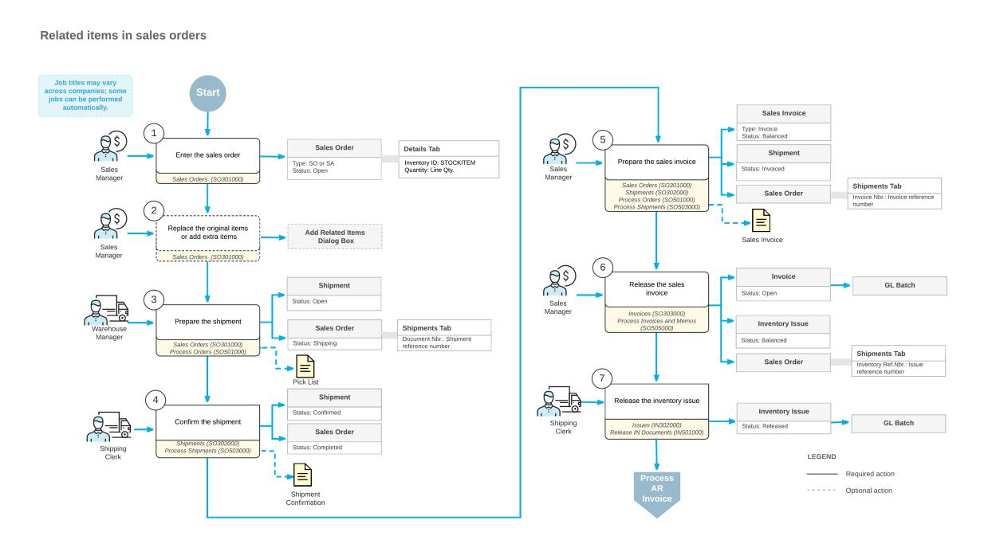

# <span id="page-207-0"></span>**Related Items in Sales Orders: Implementation Activity**

In the following implementation activity, you will learn how to specify related items for existing stock items.

This activity is based on the *U100* dataset. If you are using another dataset, or if any system settings have been changed in *U100*, these changes can affect the workflow of the activity and the results of the processing. To avoid any issues, restore the *U100* dataset to its initial state.

#### **Story**

Suppose that the sales department of SweetLife Fruits & Jams has decided to implement the related items functionality to increase the value of sales.

Acting as the implementation manager, you need to specify related items with the *Cross-Sell*, *Up-Sell*, and *Substitute* relation types for existing stock items.

#### **Process Overview**

In this activity, you will do the following:

- 1. On the *[Enable/Disable Features](https://help-2025r1.acumatica.com/Help?ScreenId=ShowWiki&pageid=c1555e43-1bc5-4f6f-ba9d-b323f94d8a6b)* (CS100000) form, you will enable the needed feature.
- 2. On the *[Stock Items](https://help-2025r1.acumatica.com/Help?ScreenId=ShowWiki&pageid=77786a70-1f1e-4d63-ad98-96f98e4fcb0e)* (IN202500) form, you will open an existing stock item and specify a cross-sell item on the **Related Items** tab.
- 3. On the *[Stock Items](https://help-2025r1.acumatica.com/Help?ScreenId=ShowWiki&pageid=77786a70-1f1e-4d63-ad98-96f98e4fcb0e)* form, you will open an existing stock item and specify an up-sell item on the **Related Items** tab.

4. On the *[Stock Items](https://help-2025r1.acumatica.com/Help?ScreenId=ShowWiki&pageid=77786a70-1f1e-4d63-ad98-96f98e4fcb0e)* form, you will open an existing stock item and specify a substitute item on the **Related Items** tab.

#### **System Preparation**

Before you start specifying related items for existing stock items, launch the Acumatica ERP website, and sign in to a company with the *U100* dataset preloaded. You should sign in as Kimberly Gibbs, the implementation manager, by using the *gibbs* username and the *123* password.

#### **Step 1: Enabling the Needed Feature**

To enable the *Related Items* feature, which is required for sales of related items via sales orders in Acumatica ERP, do the following:

- 1. Open the *[Enable/Disable Features](https://help-2025r1.acumatica.com/Help?ScreenId=ShowWiki&pageid=c1555e43-1bc5-4f6f-ba9d-b323f94d8a6b)* (CS100000) form.
- 2. On the form toolbar, click **Modify**, and select the **Related Items** check box under the **Inventory and Order Management** group of features.
- 3. On the form toolbar, click **Enable**.

#### **Step 2: Specifying a Related Item with the Cross-Sell Relation Type**

First, you will specify an item with the *Cross-Sell* relation type for fresh apples (*APPLES*). The related item is a 96 ounce jar of apple jam (*APJAM96*), which is an existing stock item. Do the following:

- 1. On the *[Stock Items](https://help-2025r1.acumatica.com/Help?ScreenId=ShowWiki&pageid=77786a70-1f1e-4d63-ad98-96f98e4fcb0e)* (IN202500) form, select *APPLES* in the **Inventory ID** box.
- 2. Open the **Related Items** tab.
- 3. On the table toolbar, click **Add Row**.
- 4. In the row that you have added, specify the following settings (leaving the default values in the remaining columns):
  - **Relation**: *Cross-Sell*
  - **Inventory ID**: *APJAM96*
- 5. On the form toolbar, click**Save**.

You have specified a related item with the *Cross-Sell* relation type for the *APPLES* stock item.

#### **Step 3: Specifying a Related Item with the Up-Sell Relation Type**

You need to specify an item with the *Up-Sell* relation type for an existing stock item, a 32-ounce jar of cherries (*CHERJAM32*). The related item is a 96-ounce jar of cherry jam (*CHERJAM96*). Do the following:

- 1. On the *[Stock Items](https://help-2025r1.acumatica.com/Help?ScreenId=ShowWiki&pageid=77786a70-1f1e-4d63-ad98-96f98e4fcb0e)* (IN202500) form, select *CHERJAM32* in the **Inventory ID** box.
- 2. Open the **Related Items** tab.
- 3. On the table toolbar, click **Add Row**.
- 4. In the row that you have added, specify the following settings (leaving the default values in the remaining columns):
  - **Relation**: *Up-Sell*
  - **Inventory** ID: *CHERJAM96*
- 5. On the form toolbar, click**Save**.

You have specified a related item with the *Up-Sell* relation type for the *CHERJAM32* stock item.

#### **Step 4: Adding a Related Item with the Substitute Relation Type**

Now you will specify an item with the *Substitute* relation type for a 96-ounce jar of orange jam (*ORJAM96*), which is an existing stock item. Three 32-ounce jars of orange jam (*ORJAM32*) can be substituted for the 96-ounce jar. Do the following:

- 1. On the *[Stock Items](https://help-2025r1.acumatica.com/Help?ScreenId=ShowWiki&pageid=77786a70-1f1e-4d63-ad98-96f98e4fcb0e)* (IN202500) form, select *ORJAM96* in the **Inventory ID** box.
- 2. Open the **Related Items** tab.
- 3. On the table toolbar, click **Add Row**.
- 4. In the row that you have added, specify the following settings (leaving the default values in the remaining columns):
  - **Relation**: *Substitute*
  - **Inventory** ID: *ORJAM32*
  - **Quantity**: *3*
- 5. On the form toolbar, click**Save**.

You have specified a related item with the *Substitute* relation type for the *ORJAM96* stock item.

# <span id="page-209-0"></span>**Related Items in Sales Orders: To Sell a Cross-Sell Item**

The following activity will walk you through the processing of a sales order with a cross-sell item.

This activity is based on the *U100* dataset. If you are using another dataset, or if any system settings have been changed in *U100*, these changes can affect the workflow of the activity and the results of the processing. To avoid any issues, restore the *U100* dataset to its initial state.

#### **Story**

Suppose that the FourStar Coffee & Sweets Shop customer orders three 96-ounce jars of raspberry jam from the SweetLife retail store. When the sales manager enters the sales order, she notices that the raspberry jam has cinnamon specified as a cross-sell item for the raspberry jam. The sales manager offers to add the cinnamon to the order, and the purchasing manager of FourStar Coffee & Sweets Shop agrees to buy one pound of the spice.

Acting as the sales manager of SweetLife Fruits & Jams, you need to enter and process the sales order for the original item and the cross-sell item.

#### **Configuration Overview**

In the *U100* dataset, the following configuration tasks have been performed to prepare the system for this activity to be performed:

- On the *[Enable/Disable Features](https://help-2025r1.acumatica.com/Help?ScreenId=ShowWiki&pageid=c1555e43-1bc5-4f6f-ba9d-b323f94d8a6b)* (CS100000) form, the *Inventory* feature, which provides the ability to create sales orders that include stock items, has been enabled.
- On the *Order [Types](https://help-2025r1.acumatica.com/Help?ScreenId=ShowWiki&pageid=e6984218-4260-4438-99e1-aee2b3765369)* (SO201000) form, the predefined *SO* order type has been activated.
- On the *[Customers](https://help-2025r1.acumatica.com/Help?ScreenId=ShowWiki&pageid=652929bc-9606-4056-aa6e-0c2d1147171b)* (AR303000) form, the *COFFEESHOP (FourStar Coffee & Sweets Shop)* customer has been defined.
- On the *[Stock Items](https://help-2025r1.acumatica.com/Help?ScreenId=ShowWiki&pageid=77786a70-1f1e-4d63-ad98-96f98e4fcb0e)* (IN202500) form, the *RASPJAM96* and *CINNAMON* stock items have been defined.

#### **Process Overview**

In this activity, to process a sales order with the original item and a cross-sell item, you will first create a sales order of the *SO* type on the *[Sales Orders](https://help-2025r1.acumatica.com/Help?ScreenId=ShowWiki&pageid=19e4021c-1b84-49fd-be12-0320c5f1c7e5)* (SO301000) form and add a line with the original item to the sales order. You will then review the suggestions and add the cross-sell item.

Then you will save the sales order and click **Prepare Invoice** on the form toolbar. The system will create an sales invoice and open it on the *[Invoices](https://help-2025r1.acumatica.com/Help?ScreenId=ShowWiki&pageid=0acc9738-f141-4ea0-a2be-f34ea9d1b63a)* (SO303000) form. Finally, you will release the invoice.

#### **System Preparation**

Do the following:

- 1. Launch the Acumatica ERP website, and sign in to a company with the *U100* dataset preloaded. You should sign in as the sales manager by using the *wiley* username and the *123* password.
- 2. In the info area, in the upper-right corner of the top pane of the Acumatica ERP screen, make sure that the business date in your system is set to *1/30/2025*. If a different date is displayed, click the Business Date menu button and select *1/30/2025* on the calendar. For simplicity, in this activity, you will create and process all documents in the system on this business date.
- 3. On the company and branch selection menu, on the top pane of the Acumatica ERP screen, select the *SweetLife Store* branch.

#### **Step 1: Entering the Sales Order**

To create the sales order for FourStar Coffee & Sweets Shop, do the following:

1. Open the *[Sales Orders](https://help-2025r1.acumatica.com/Help?ScreenId=ShowWiki&pageid=19e4021c-1b84-49fd-be12-0320c5f1c7e5)* (SO301000) form.


To open the form for creating a new record, type the form ID in the Search box, and on the Search form, point at the form title and click **New** right of the title.

- 2. On the form toolbar, click **New Record**.
- 3. Specify the following settings in the Summary area:
  - **OrderType**: *SO*
  - **Customer**: *COFFEESHOP*
  - **Description**: *Sale of raspberry jam*
- 4. On the table toolbar, click **Add Row**.
- 5. In the added row, specify the following settings:
  - **Inventory ID**: *RASPJAM96*
  - **Warehouse**: *RETAIL*
  - **Quantity**: *3*
- 6. On the form toolbar, click**Save**.

Notice that on the table toolbar, the system displays a warning message that this item has a cross-sell item.

#### **Step 2: Adding the Cross-Sell Item**

In this step, you need to add the cross-sell item to the sales order. While you are still viewing the sales order that you have created on the *[Sales Orders](https://help-2025r1.acumatica.com/Help?ScreenId=ShowWiki&pageid=19e4021c-1b84-49fd-be12-0320c5f1c7e5)* (SO301000) form, do the following:

1. In the only line on the **Details** tab, click the button in the **Related Items** column.

- 2. In the **Add Related Items** dialog box, which opens, select the unlabeled check box in the line with the *RETAIL* value in the **Warehouse** column on the **Cross-Sell Items** tab.
- 3. Click **Add and Close**.

The system closes the dialog box and adds the line with the *CINNAMON* item to the sales order.

- 4. In the line with the *CINNAMON* item, specify the following settings:
  - **Quantity**: *1*
  - **Unit Price**: *12.99*
- 5. On the form toolbar, click**Save**.

#### **Step 3: Creating the Shipment**

While you are still viewing the sales order on the *[Sales Orders](https://help-2025r1.acumatica.com/Help?ScreenId=ShowWiki&pageid=19e4021c-1b84-49fd-be12-0320c5f1c7e5)* (SO301000) form, process the shipment for it as follows:

- 1. On the form toolbar, click **CreateShipment**.
- 2. In the **SpecifyShipment Parameters** dialog box, which opens, make sure the *1/30/2025* date and the *RETAIL* warehouse are selected, and click **OK**.

The system creates a shipment and opens it on the *[Shipments](https://help-2025r1.acumatica.com/Help?ScreenId=ShowWiki&pageid=f47cffcc-543e-469c-a204-a9c1e3da346d)* (SO302000) form.

#### **Step 4: Confirming the Shipment**

To confirm the shipment you have created, do the following, while you are still viewing the shipment on the *[Shipments](https://help-2025r1.acumatica.com/Help?ScreenId=ShowWiki&pageid=f47cffcc-543e-469c-a204-a9c1e3da346d)* (SO302000) form:

- 1. Review the lines on the **Details** tab. Make sure that both order lines have been included in the shipment and that the shipped quantity in both lines is equal to the ordered quantity.
- 2. On the form toolbar, click **Confirm Shipment**.

The shipment is assigned the *Confirmed* status, and now you can prepare the invoice to bill the customer and increase the customer's debt in the system.

#### **Step 5: Processing the Invoice**

To prepare and release the invoice related to the sales order and shipment, do the following:

- 1. While you are still viewing the shipment on the *[Shipments](https://help-2025r1.acumatica.com/Help?ScreenId=ShowWiki&pageid=f47cffcc-543e-469c-a204-a9c1e3da346d)* (SO302000) form, on the form toolbar, click **Prepare Invoice**. The system creates the invoice and opens it on the *[Invoices](https://help-2025r1.acumatica.com/Help?ScreenId=ShowWiki&pageid=0acc9738-f141-4ea0-a2be-f34ea9d1b63a)* (SO303000) form.
- 2. On this form, review the details of the prepared invoice. The invoice has two lines, as the initial sales order does. In the **Shipment Nbr.** and **Order Nbr.** columns of the **Details** tab, notice that the system has inserted the reference numbers of the related shipment and sales order, which are links you can click to open these documents.
- 3. On the form toolbar, click **Release** to release the invoice.
- 4. Return to the *[Sales Orders](https://help-2025r1.acumatica.com/Help?ScreenId=ShowWiki&pageid=19e4021c-1b84-49fd-be12-0320c5f1c7e5)* (SO301000) form, and open the sales order that you have processed.
- 5. On the **Shipments** tab, in the only row, click the link in the **Inventory Ref. Nbr.** column to view the inventory issue that was generated when you released the invoice.
- 6. On the *[Issues](https://help-2025r1.acumatica.com/Help?ScreenId=ShowWiki&pageid=17b051f6-027d-4459-b542-65c1c1f9d0ea)* (IN302000) form, which opens, review the details of the inventory issue, which is shown in the following screenshot. Make sure the issue has the *Released* status, which means that the issue has been released and the items' quantities in inventory have been decreased appropriately.

| <b>Issues</b><br>뭐 | 000065         | $\boxdot$<br>$\Omega$<br>$^{+}$ | $\widehat{[\mathbb{H}]}$<br>Ô<br>K<br>$\check{ }$ | $\geq$<br>$\left\langle \right\rangle$<br>$\rightarrow$ | $\cdots$      |                      |              |           | $\bigcap$ NOTES   | <b>ACTIVITIES</b> |
|--------------------|----------------|---------------------------------|---------------------------------------------------|---------------------------------------------------------|---------------|----------------------|--------------|-----------|-------------------|-------------------|
|                    |                | Reference Nbr.:<br>000065       | Q<br>External Ref.:                               |                                                         |               | Total Qty.:          |              | 4.00      |                   |                   |
|                    | Status:        | Released                        |                                                   |                                                         |               | <b>Total Amount:</b> | 235.53       |           |                   |                   |
|                    | Date:          | 1/30/2023                       |                                                   |                                                         |               | <b>Total Cost:</b>   |              | 0.00      |                   |                   |
|                    |                | Post Period:<br>01-2023         | Description:                                      |                                                         |               |                      |              |           |                   |                   |
|                    | <b>DETAILS</b> | <b>FINANCIAL</b>                |                                                   |                                                         |               |                      |              |           |                   |                   |
| $\circ$            |                | $^{+}$<br>$\times$              | LINE DETAILS<br>ADD ITEMS                         | <b>INVENTORY SUMMARY</b>                                | $\vdash$      | $\mathbf{x}$<br>土    |              |           |                   |                   |
| $\omega$<br>圓      | D.             | <b>Branch</b>                   | Tran. Type                                        | <b>Inventory ID</b>                                     | Warehouse     | Location             | Quantity UOM |           | <b>Unit Price</b> | Ext. Price        |
|                    |                |                                 |                                                   |                                                         |               |                      |              |           |                   |                   |
| > 0                | $\Box$         | <b>RETAIL</b>                   | Invoice                                           | RASPJAM96                                               | <b>RETAIL</b> | <b>MAIN</b>          | 3.00         | PIECE     | 74.1800           | 222.54            |
|                    | 0<br>D         | <b>RETAIL</b>                   | Invoice                                           | <b>CINNAMON</b>                                         | <b>RETAIL</b> | <b>MAIN</b>          | 1.00         | <b>LB</b> | 12.9900           | 12.99             |

#### *Figure: The inventory issue generated on release of the invoice*

The processing of the sales order is now complete.

# <span id="page-212-0"></span>**Related Items in Sales Orders: To Sell a Substitute Item**

The following activity will walk you through the processing of a sales order with a substitute item.

This activity is based on the *U100* dataset. If you are using another dataset, or if any system settings have been changed in *U100*, these changes can affect the workflow of the activity and the results of the processing. To avoid any issues, restore the *U100* dataset to its initial state.

#### **Story**

Suppose that the GoodFood One Restaurant customer orders five 96-ounce jars of mango jam from the SweetLife retail store. When the sales manager enters the sales order, she notices that the 96-ounce jars of mango jam are out of stock, but this item has 32-ounce jars, which are defined as the required substitute with a one-to-three ratio (of 96-ounce jars to 32-ounce jars). The sales manager offers to replace five 96-ounce jars with fieen 32-ounce jars, and the purchasing manager of GoodFood One Restaurant agrees with the replacement.

Acting as the sales manager of SweetLife Fruits & Jams, you need to enter and process the sales order for the substitute item.

#### **Configuration Overview**

In the *U100* dataset, the following configuration tasks have been performed to prepare the system for this activity to be performed:

- On the *[Enable/Disable Features](https://help-2025r1.acumatica.com/Help?ScreenId=ShowWiki&pageid=c1555e43-1bc5-4f6f-ba9d-b323f94d8a6b)* (CS100000) form, the *Inventory* feature, which provides the ability to create sales orders that include stock items, has been enabled.
- On the *Order [Types](https://help-2025r1.acumatica.com/Help?ScreenId=ShowWiki&pageid=e6984218-4260-4438-99e1-aee2b3765369)* (SO201000) form, the predefined *SO* order type has been activated.
- On the *[Customers](https://help-2025r1.acumatica.com/Help?ScreenId=ShowWiki&pageid=652929bc-9606-4056-aa6e-0c2d1147171b)* (AR303000) form, the *GOODFOOD (GoodFood One Restaurant)* customer has been defined.
- On the *[Stock Items](https://help-2025r1.acumatica.com/Help?ScreenId=ShowWiki&pageid=77786a70-1f1e-4d63-ad98-96f98e4fcb0e)* (IN202500) form, the *MANJAM96* and *MANJAM32* stock items have been defined.

#### **Process Overview**

In this activity, to process a sales order with the substitute item replacing the original item, you will first create a sales order of the *SO* type on the *[Sales Orders](https://help-2025r1.acumatica.com/Help?ScreenId=ShowWiki&pageid=19e4021c-1b84-49fd-be12-0320c5f1c7e5)* (SO301000) form and add a line with the original item to the sales order. You will then review the suggestions and replace the original item with the substitute item.

Then you will save the sales order and click **Prepare Invoice** on the form toolbar. The system will create a sales invoice and open it on the *[Invoices](https://help-2025r1.acumatica.com/Help?ScreenId=ShowWiki&pageid=0acc9738-f141-4ea0-a2be-f34ea9d1b63a)* (SO303000) form. Finally, you will release the invoice.

#### **System Preparation**

Do the following:

- 1. Launch the Acumatica ERP website, and sign in to a company with the *U100* dataset preloaded. You should sign in as sales manager by using the *wiley* username and the *123* password.
- 2. In the info area, in the upper-right corner of the top pane of the Acumatica ERP screen, make sure that the business date in your system is set to *1/30/2025*. If a different date is displayed, click the Business Date menu button and select *1/30/2025* on the calendar. For simplicity, in this activity, you will create and process all documents in the system on this business date.
- 3. On the company and branch selection menu, on the top pane of the Acumatica ERP screen, select the *SweetLife Store* branch.

#### **Step 1: Entering the Sales Order**

To create the sales order for the GoodFood One Restaurant, do the following:

1. Open the *[Sales Orders](https://help-2025r1.acumatica.com/Help?ScreenId=ShowWiki&pageid=19e4021c-1b84-49fd-be12-0320c5f1c7e5)* (SO301000) form.


To open the form for creating a new record, type the form ID in the Search box, and on the Search form, point at the form title and click **New** right of the title.

- 2. On the form toolbar, click **New Record**.
- 3. Specify the following settings in the Summary area:
  - **OrderType**: *SO*
  - **Customer**: *GOODFOOD*
  - **Description**: *Sale of mango jam*
- 4. On the table toolbar, click **Add Row**.
- 5. In the added row, specify the following settings:
  - **Inventory ID**: *MANJAM96*
  - **Warehouse**: *RETAIL*
  - **Quantity**: *5*
- 6. On the form toolbar, click**Save**.

Notice that on the table toolbar, the system displays a warning message that the quantity of this item is not sufficient to fulfill the order. Also, *MANGOJAM96* has a substitute item.

#### **Step 2: Replacing the Original Item with the Substitute Item**

In this step, you will replace the original item in the sales order with the substitute item. While you are still viewing the sales order that you have created on the *[Sales Orders](https://help-2025r1.acumatica.com/Help?ScreenId=ShowWiki&pageid=19e4021c-1b84-49fd-be12-0320c5f1c7e5)* (SO301000) form, do the following:

- 1. In the only line on the **Details** tab, click the button in the **Related Items** column.
- 2. In the **Add Related Items** dialog box, which opens, select the unlabeled check box in the line with the *RETAIL* value in the **Warehouse** column on the**Substitute Items** tab.
- 3. Click **Add and Close**.

The system closes the dialog box and replaces the *MANJAM96* item with the *MANJAM32* item. Notice that the value in the **Quantity** column has changed from *5* to *15*.

4. On the form toolbar, click**Save**.

#### **Step 3: Creating the Shipment**

While you are still viewing the sales order on the *[Sales Orders](https://help-2025r1.acumatica.com/Help?ScreenId=ShowWiki&pageid=19e4021c-1b84-49fd-be12-0320c5f1c7e5)* (SO301000) form, process the related shipment as follows:

- 1. On the form toolbar, click **CreateShipment**.
- 2. In the **SpecifyShipment Parameters** dialog box, which opens, make sure the *1/30/2025* date and the *RETAIL* warehouse are selected, and click **OK**.

The system creates a shipment and opens it on the *[Shipments](https://help-2025r1.acumatica.com/Help?ScreenId=ShowWiki&pageid=f47cffcc-543e-469c-a204-a9c1e3da346d)* (SO302000) form.

#### **Step 4: Confirming the Shipment**

To confirm the shipment you have created, do the following while you are still viewing the shipment on the *[Shipments](https://help-2025r1.acumatica.com/Help?ScreenId=ShowWiki&pageid=f47cffcc-543e-469c-a204-a9c1e3da346d)* (SO302000) form:

- 1. Review the line on the **Details** tab. Make sure that both order lines have been included in the shipment and that the shipped quantity in the line is equal to the ordered quantity.
- 2. On the form toolbar, click **Confirm Shipment**.

The shipment is assigned the *Confirmed* status, and now you can prepare the invoice to bill the customer and increase the customer's debt in the system.

#### **Step 5: Processing the Invoice**

To prepare and release the invoice related to the sales order and shipment, do the following:

- 1. While you are still viewing the shipment on the *[Shipments](https://help-2025r1.acumatica.com/Help?ScreenId=ShowWiki&pageid=f47cffcc-543e-469c-a204-a9c1e3da346d)* (SO302000) form, on the form toolbar, click **Prepare Invoice**. The system creates the invoice and opens it on the *[Invoices](https://help-2025r1.acumatica.com/Help?ScreenId=ShowWiki&pageid=0acc9738-f141-4ea0-a2be-f34ea9d1b63a)* (SO303000) form.
- 2. On this form, review the detail line of the prepared invoice. In the**Shipment Nbr.** and **Order Nbr.** columns of the **Details** tab, notice that the system has inserted the reference numbers of the related shipment and sales order, which are links you can click to open these documents.
- 3. On the form toolbar, click **Release** to release the invoice.
- 4. Return to the *[Sales Orders](https://help-2025r1.acumatica.com/Help?ScreenId=ShowWiki&pageid=19e4021c-1b84-49fd-be12-0320c5f1c7e5)* (SO301000) form, and open the sales order that you have processed.
- 5. On the **Shipments** tab, in the only row, click the link in the **Inventory Ref. Nbr.** column to view the inventory issue that was generated when you released the invoice.
- 6. On the *[Issues](https://help-2025r1.acumatica.com/Help?ScreenId=ShowWiki&pageid=17b051f6-027d-4459-b542-65c1c1f9d0ea)* (IN302000) form, which opens, review the details of the inventory issue, which is shown in the following screenshot. Make sure the issue has the *Released* status, which means that the issue has been released and the items' quantities in inventory have been decreased appropriately.

| <b>Issues</b><br>000066<br>$\Xi$<br>뭐<br>$\overline{\text{[1]}}$<br>$\Omega$<br>$\Omega$<br>$+$<br>$\overline{\phantom{1}}$<br>$\sim$ $\sim$<br>$\rightarrow$<br>$\checkmark$ | $\geq$<br>$\cdots$           |                | $\bigcap$ NOTES   | <b>ACTIVITIES</b><br><b>FILES</b> |  |  |  |  |  |  |
|-------------------------------------------------------------------------------------------------------------------------------------------------------------------------------|------------------------------|----------------|-------------------|-----------------------------------|--|--|--|--|--|--|
| $\varphi$<br>Reference Nbr.:<br>000066<br>External Ref.:                                                                                                                      | Total Qty.:                  | 15.00          |                   |                                   |  |  |  |  |  |  |
| Released<br>Status:                                                                                                                                                           | <b>Total Amount:</b>         | 451.50         |                   |                                   |  |  |  |  |  |  |
| Date:<br>1/30/2023                                                                                                                                                            | <b>Total Cost:</b>           | 0.00           |                   |                                   |  |  |  |  |  |  |
| Post Period:<br>01-2023<br>Description:                                                                                                                                       |                              |                |                   |                                   |  |  |  |  |  |  |
| <b>DETAILS</b><br><b>FINANCIAL</b><br>Ò<br>$\boxed{\mathbf{N}}$<br>$\vdash$<br>土<br>$^{+}$<br><b>LINE DETAILS</b><br><b>INVENTORY SUMMARY</b><br>$\times$<br>ADD ITEMS        |                              |                |                   |                                   |  |  |  |  |  |  |
| $\Box$<br><b>B</b> 0<br><b>Branch</b><br>Tran. Type<br><b>Inventory ID</b>                                                                                                    | Warehouse<br>Location        | Quantity UOM   | <b>Unit Price</b> | Ext. Price                        |  |  |  |  |  |  |
| > 0<br>$\Box$<br><b>RETAIL</b><br>Invoice<br>MANJAM32                                                                                                                         | <b>RETAIL</b><br><b>MAIN</b> | PIECE<br>15.00 | 30.1000           | 451.50                            |  |  |  |  |  |  |

*Figure: Inventory issue generated on release of the invoice*

The processing of the sales order is now complete.

# <span id="page-216-0"></span>**Processing Sales with Returns**

In Acumatica ERP, you can process both a sale and a return in the same order on the *[Sales Orders](https://help-2025r1.acumatica.com/Help?ScreenId=ShowWiki&pageid=19e4021c-1b84-49fd-be12-0320c5f1c7e5)* (SO301000) form, as well as the customer payments and refunds related to this order. You can use a mixed order if a customer needs to buy and return products or services (or receive a replacement for the returned products) at the same time at a counter or through a point-of-sale (POS) system operated by a cashier.

The topics of this chapter explain how to process sales and returns in mixed orders.

# <span id="page-216-1"></span>**Sales with Returns: General Information**

In Acumatica ERP, you can create a mixed order to process both a sale and a return in the same order on the *[Sales](https://help-2025r1.acumatica.com/Help?ScreenId=ShowWiki&pageid=19e4021c-1b84-49fd-be12-0320c5f1c7e5) [Orders](https://help-2025r1.acumatica.com/Help?ScreenId=ShowWiki&pageid=19e4021c-1b84-49fd-be12-0320c5f1c7e5)* (SO301000) form.

#### **Learning Objectives**

In this chapter, you will do the following:

- Become familiar with the general settings and workflow of a mixed order
- Create a mixed order
- Process a sale with a return in a mixed order and the related documents

#### **Applicable Scenario**

You may need to perform a sale and a return through a mixed order if all or most of the following are true for your company:

- Your company sells many products at a big store, with employees processing many orders per day through counter sales.
- Some customers need to buy and return products or services (or replace the returned products) at the same time.
- The new items or items for replacement can have higher or lower prices.
- The order balance may be positive or negative.

Because you perform these sales and returns at a counter, you process no shipments. You also need to process AR documents.

#### **Processing of a Sale with a Return**

This section describes the general workflow of a sale with a return in the same order; for simplicity, a single item is returned and a single item is sold in this workflow.

To process the sale of a stock item and the return of a stock item in the same mixed order, you perform the following general steps:

- 1. You create a mixed order (that is, an order of the *MO* type) on the *[Sales Orders](https://help-2025r1.acumatica.com/Help?ScreenId=ShowWiki&pageid=19e4021c-1b84-49fd-be12-0320c5f1c7e5)* (SO301000) form.
- 2. On the **Details** tab, you add lines by doing any of the following:
  - You add a line with the item for sale and specify a positive quantity. Because the line has a positive quantity, the system inserts the *Issue* operation for the line.
  - You add the stock item to be returned without linking it to the original invoice, which you may need to do if the original invoice cannot be found or if a customer is returning a part of a kit. To do this, you click **Add Items** on the table toolbar of the **Details** tab; in the **Inventory Lookup** dialog box, which opens, you

add the needed lines and click **Add & Close**. Then you specify a negative quantity for these lines in the **Quantity** column. In the order line, because you have specified a negative quantity, the system inserts *Receipt* in the **Operation** column instead of the default setting of *Issue*.

- You add the stock item to be returned and include a link to the original sales invoice (that is, the sales invoice for which the return is being performed). To do this, you click **Add Invoice** on the table toolbar; in the **Add Invoice Details** dialog box, which opens, you select the line of the invoice and click **Add & Close**. The system adds the selected lines to the order with the quantity specified in the **Qty. to Return** column. In the order line, the system inserts the *Receipt* operation in the **Operation** column and a negative quantity in the **Quantity** column.
  - To specify the quantity to be returned in the **Add Invoice Details** dialog box, you first check the **Available for Return** column, which shows the maximum quantity of the item that can be returned, considering any already-returned quantities of the item from the AR document. Then you can do either or both of the following:
    - Select the unlabeled check box for the line, which causes the system to automatically set the **Qty. to Return** to be the same as the **Available for Return** quantity. You can specify another quantity.
    - Manually specify the **Qty. to Return**, which causes the system to automatically select the unlabeled check box in the line.
- 3. Depending on the order balance (**OrderTotal**), you do either of the following:
  - a. You process a payment. If the **OrderTotal** is positive, you click **Create Payment** on the table toolbar of the **Payments** tab of the *[Sales Orders](https://help-2025r1.acumatica.com/Help?ScreenId=ShowWiki&pageid=19e4021c-1b84-49fd-be12-0320c5f1c7e5)* form. In the **Create Payment** dialog box, you specify the needed settings and click the appropriate button to create the payment. You then release the payment on the *[Payments and Applications](https://help-2025r1.acumatica.com/Help?ScreenId=ShowWiki&pageid=ae844bf4-1aef-42cd-9e2f-49b3ee1bc8d7)* (AR302000) form.
  - b. You process a refund. If the **OrderTotal** is negative, you click **Create Refund** on the table toolbar of the **Payments** tab of the *[Sales Orders](https://help-2025r1.acumatica.com/Help?ScreenId=ShowWiki&pageid=19e4021c-1b84-49fd-be12-0320c5f1c7e5)* form. In the **Create Refund** dialog box, you specify the needed settings and click **Refund** to create the refund. You then release the refund on the *[Payments and](https://help-2025r1.acumatica.com/Help?ScreenId=ShowWiki&pageid=ae844bf4-1aef-42cd-9e2f-49b3ee1bc8d7) [Applications](https://help-2025r1.acumatica.com/Help?ScreenId=ShowWiki&pageid=ae844bf4-1aef-42cd-9e2f-49b3ee1bc8d7)* form.
- 4. You prepare a credit memo or sales invoice for the mixed order by clicking **Prepare Invoice** on the *[Sales](https://help-2025r1.acumatica.com/Help?ScreenId=ShowWiki&pageid=19e4021c-1b84-49fd-be12-0320c5f1c7e5) [Orders](https://help-2025r1.acumatica.com/Help?ScreenId=ShowWiki&pageid=19e4021c-1b84-49fd-be12-0320c5f1c7e5)* form, which results in either of the following:
  - If the **OrderTotal** of the mixed order is negative, the system generates an invoice of the *Credit Memo* type.
  - If the **OrderTotal** of the mixed order is positive, the system generates a sales invoice of the *Invoice* type.

When you release the document on the *[Invoices](https://help-2025r1.acumatica.com/Help?ScreenId=ShowWiki&pageid=0acc9738-f141-4ea0-a2be-f34ea9d1b63a)* (SO303000) form, the mixed order is assigned the *Completed* status. The system automatically generates and releases inventory issues with the *Credit Memo* transaction type and the *Invoice* transaction type on the *[Issues](https://help-2025r1.acumatica.com/Help?ScreenId=ShowWiki&pageid=17b051f6-027d-4459-b542-65c1c1f9d0ea)* (IN302000) form. On release of each inventory issue, a batch of GL transactions is generated. The inventory is updated.

When the sales invoice or credit memo is released and assigned the *Closed* status, you can view this invoice or credit memo as an AR invoice or AR credit memo, respectively, on the *[Invoices and Memos](https://help-2025r1.acumatica.com/Help?ScreenId=ShowWiki&pageid=5e6f3b27-b7af-412f-a40a-1d4f4be70cba)* (AR301000) form.

#### **Workflow of Processing a Sale with a Return**

For a sale with a return in the same order, the typical process involves the actions and generated documents shown in the following diagram.

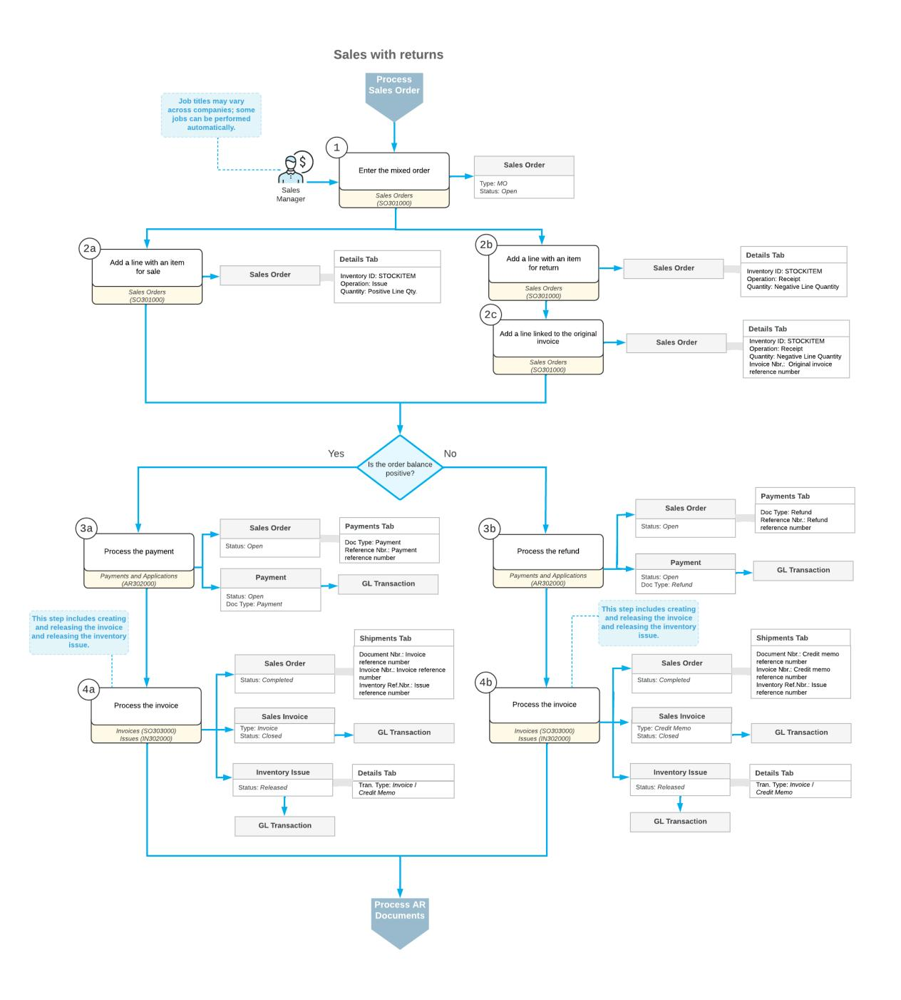

# <span id="page-218-0"></span>**Sales with Returns: Mixed Orders and Related Documents**

When you need to process a sale and a return in the same order, you create a mixed order on the *[Sales Orders](https://help-2025r1.acumatica.com/Help?ScreenId=ShowWiki&pageid=19e4021c-1b84-49fd-be12-0320c5f1c7e5)* (SO301000) form, create a payment or refund, and then create an invoice or credit memo. The following sections describe this processing in detail, including key settings of these documents.

#### **Creation of a Mixed Order**

A mixed order in Acumatica ERP has an order type for which the *Mixed Order* automation behavior is specified on the **Template** tab of the *Order [Types](https://help-2025r1.acumatica.com/Help?ScreenId=ShowWiki&pageid=e6984218-4260-4438-99e1-aee2b3765369)* (SO201000) form. You can use the predefined *MO* order type, which has this

automation behavior, for the processing of mixed orders. A mixed order does not support shipments because you use this order for counter sales. For details about order types, see *Sales Order Types: General [Information](https://help-2025r1.acumatica.com/Help?ScreenId=ShowWiki&pageid=96a00780-a0c3-4314-86ca-093004844268)*.

You create a mixed order on the *[Sales Orders](https://help-2025r1.acumatica.com/Help?ScreenId=ShowWiki&pageid=19e4021c-1b84-49fd-be12-0320c5f1c7e5)* (SO301000) form. In the Summary area, you select the type and the customer. Then on the **Details** tab, you can add lines with items for sale, which have a positive quantity, and lines with items for return, which have a negative quantity.

Each new line that you manually add on the **Details** tab has the default *Issue* operation in the **Operation** column. The **Quantity** specified for the line affects the value in the **Operation** column as follows:

- If you specify a positive quantity for the line (which means that the quantity is being issued for sale), the *Issue* operation remains unchanged. This line amount increases the balance of the order.
- If you specify a negative quantity for the line (which means that the customer is returning the quantity), the system automatically changes the operation from *Issue* to *Receipt*. This line amount decreases the balance of the order.

You can add an item to be returned from the original invoice by clicking **Add Invoice** on the table toolbar and selecting the line of the needed invoice in the **Add Invoice Details** dialog box, which opens. In this case, *Receipt* is inserted in the **Operation** column and the negative line quantity (that is, the quantity of the original line with a minus sign) is inserted in the **Quantity** column.

Depending on whether the order has a positive or negative balance, you then process either a customer payment or a customer refund. For details, see the next section.

#### **Preparation of a Customer Payment or Refund for a Mixed Order**

If a mixed order has the *Open* status, you can create a payment or refund by using the **Payments** tab of the *[Sales](https://help-2025r1.acumatica.com/Help?ScreenId=ShowWiki&pageid=19e4021c-1b84-49fd-be12-0320c5f1c7e5) [Orders](https://help-2025r1.acumatica.com/Help?ScreenId=ShowWiki&pageid=19e4021c-1b84-49fd-be12-0320c5f1c7e5)* (SO301000) form as a starting point as follows:

- If the **OrderTotal** value is positive, you can click **Create Payment** on the table toolbar. You use the **Create Payment** dialog box, which opens, to specify the payment's settings and create the payment.
- If the **OrderTotal** value is negative, you can click **Create Refund** on the table toolbar. You use the **Create Refund** dialog box, which opens, to specify the refund's settings and create the refund.

You can delete an unreleased payment or unreleased refund from the system by clicking the line with the applicable payment or refund on the tab to select it and then clicking the **Delete Payment** or **Delete Refund** button, respectively, on the table toolbar of the **Payments** tab. This deletes the payment or the refund from the current tab and from the system.

Also, if a payment was made by credit card and the payment has the *Open* status, you can void the payment on the **Payments** tab of the *[Sales Orders](https://help-2025r1.acumatica.com/Help?ScreenId=ShowWiki&pageid=19e4021c-1b84-49fd-be12-0320c5f1c7e5)* form by clicking the line with the payment, and then clicking the**Void Card Payment** button on the table toolbar.

#### **Preparation of an Invoice or Credit Memo for a Mixed Order**

To prepare an invoice or a credit memo for a mixed order, you can click **Prepare Invoice** on the form toolbar of the *[Sales Orders](https://help-2025r1.acumatica.com/Help?ScreenId=ShowWiki&pageid=19e4021c-1b84-49fd-be12-0320c5f1c7e5)* (SO301000) form. Depending on the order's balance, the system will create a document on the *[Invoices](https://help-2025r1.acumatica.com/Help?ScreenId=ShowWiki&pageid=0acc9738-f141-4ea0-a2be-f34ea9d1b63a)* (SO303000) form as follows:

- A document of the *Invoice* or *Cash Sale* type if the **OrderTotal** is positive or zero
- A document of the *Credit Memo* or *Cash Return* type if the **OrderTotal** is negative

The type of document created depends on whether the **AR DocumentType** setting on the**Template** tab of the *Order [Types](https://help-2025r1.acumatica.com/Help?ScreenId=ShowWiki&pageid=e6984218-4260-4438-99e1-aee2b3765369)* (SO201000) form contains *Invoice/Credit Memo* or *Cash Sale/Cash Return*.

#### **Tracking of Return Documents Related to a Sales Order**

You can the track return documents related to a sales order on the Return Documents Related to Sales Order (SO4010SP) inquiry form. You open the form by clicking **Related Return Documents** on the side panel of either of the following:

- The *[Sales Orders](https://help-2025r1.acumatica.com/Help?ScreenId=ShowWiki&pageid=19e4021c-1b84-49fd-be12-0320c5f1c7e5)* (SO301000) form
- The Sales Orders (SO3010PL) list of records

For the selected sales order, the form displays the related return orders, their related shipments, and return invoices. The form also shows AP documents for drop-ship returns.

The form displays all the documents related to the return of items that have been sold in the selected sales order. The **Qty. on Shipments** box shows the total quantity of shipped items and items added to shipments that have not been processed yet. The **Qty. on Returns** box shows the quantities of items on return orders of all types and return invoices. These quantities are calculated in items' base UOMs.

The **Related Return Documents** table shows links to return orders, as well as the related shipments and AR documents. For drop-ship vendor returns (orders that are used to process the return of the drop-shipped items directly from a customer to a vendor), the links to these returns and their AP documents are shown.

The **Return Documents by Line** table lists the inventory IDs of the items in the sales order lines with links to the respective return orders and return invoices.

# <span id="page-220-0"></span>**Sales with Returns: Implementation Checklist**

The following sections provide details you can use to ensure that the system is configured properly for the processing of a sale with a return, and to understand (and change, if needed) the settings that affect the processing workflow.

#### **Implementation Checklist**

We recommend that before you initially process a sale with a return in the same order, you make sure that the needed features have been enabled, settings have been specified, and entities have been created, as summarized in the following checklist.

| Form                   | Criteria to Check                                                                                                                                                                                                                                                    |
|------------------------|----------------------------------------------------------------------------------------------------------------------------------------------------------------------------------------------------------------------------------------------------------------------|
| Multiple forms         | Make sure that all necessary settings related to sales orders have<br>been specified, as described in Order Management Basic Configu<br>ration: General Information.                                                                                                 |
|                        | Make sure that the Inventory feature is enabled on the En<br>able/Disable Features (CS100000) form and that the process<br>ing for orders that have stock items has been configured, as de<br>scribed in Configuration of Order Management: General Informa<br>tion. |
| Order Types (SO201000) | Make sure that the MO order type is active and has been config<br>ured, as described in Sales Order Types: General Information.                                                                                                                                      |
| Customers (AR303000)   | Make sure that all needed customers have been configured, as<br>described in Customers: General Information.                                                                                                                                                         |

| Form                       | Criteria to Check                                                                                                         |
|----------------------------|---------------------------------------------------------------------------------------------------------------------------|
| Stock Items (IN202500)     | Make sure that all the stock items have been created, as illustrat<br>ed in Stock Items: Implementation Activity.         |
| Non-Stock Items (IN202000) | Make sure that all the non-stock items have been created, as il<br>lustrated in Non-Stock Items: Implementation Activity. |

#### **Other Settings That Affect the Workflow**

You can affect the workflow of processing of a sale and a return in the same order by specifying additional settings as follows:

- To cause inventory issues to be automatically generated and released on the release of sales invoices that contain stock items, select the **Automatically Release IN Documents** check box on the *[Sales Orders](https://help-2025r1.acumatica.com/Help?ScreenId=ShowWiki&pageid=1817779c-413b-4187-b7fe-38e97845a1cb) [Preferences](https://help-2025r1.acumatica.com/Help?ScreenId=ShowWiki&pageid=1817779c-413b-4187-b7fe-38e97845a1cb)* (SO101000) form.
- To configure quick processing for orders of the *MO* type, on the **Template** tab of the *Order [Types](https://help-2025r1.acumatica.com/Help?ScreenId=ShowWiki&pageid=e6984218-4260-4438-99e1-aee2b3765369)* (SO201000) form, select the **Allow Quick Processing** check box. This causes the **Quick Processing** tab to appear, and you specify the needed settings on this tab. For more information, see *Sales Order Types: Quick [Processing](https://help-2025r1.acumatica.com/Help?ScreenId=ShowWiki&pageid=2920c85c-5678-40f7-b80a-e068ac3a137f) [of Sales Orders](https://help-2025r1.acumatica.com/Help?ScreenId=ShowWiki&pageid=2920c85c-5678-40f7-b80a-e068ac3a137f)*.
- To cause the system to automatically post general ledger batches generated during the processing of sales documents, select the **Automatically Post on Release** check box on the *[General Ledger Preferences](https://help-2025r1.acumatica.com/Help?ScreenId=ShowWiki&pageid=e4913d06-c511-4258-a0f9-f36c1b854e6b)* (GL102000) form. For information on processing general ledger batches, see *GL [Transactions:](https://help-2025r1.acumatica.com/Help?ScreenId=ShowWiki&pageid=35393020-6269-466d-8a08-df558cd43367) General [Information](https://help-2025r1.acumatica.com/Help?ScreenId=ShowWiki&pageid=35393020-6269-466d-8a08-df558cd43367)*.
- To cause the system to automatically post inventory transactions to the general ledger, select the **Update GL** check box on the *[Inventory Preferences](https://help-2025r1.acumatica.com/Help?ScreenId=ShowWiki&pageid=f2eb4e55-f802-4259-a41f-609965c856f1)* (IN101000) form.

#### **Known Process Limitations**

The following limitations apply to the processing of mixed orders and invoices prepared for these orders:

- One invoice or credit memo (depending on the balance of the order) can be created for one mixed order. If documents are created from the *[Process Orders](https://help-2025r1.acumatica.com/Help?ScreenId=ShowWiki&pageid=c06a334c-f39d-4eff-9d80-b167657dff73)* (SO501000) form through the *Prepare Invoice* action, a separate invoice or credit memo will be created for each order.
- An invoice or credit memo can be created only for the full quantity of items in a mixed order. A user cannot create an invoice or credit memo for a partial quantity of items in the order or order line.
- A user cannot do the following on the **Details** tab of the *[Invoices](https://help-2025r1.acumatica.com/Help?ScreenId=ShowWiki&pageid=0acc9738-f141-4ea0-a2be-f34ea9d1b63a)* (SO303000) form:
  - Add a mixed order to the invoice or credit memo by using the **Add Order** dialog box
  - Add an order line of a mixed order by using the **Add SO Line** dialog box

Limitations apply to the processing of customer payments and refunds related to mixed orders and their invoices or credit memos. On the **Payments** tab of the *[Sales Orders](https://help-2025r1.acumatica.com/Help?ScreenId=ShowWiki&pageid=19e4021c-1b84-49fd-be12-0320c5f1c7e5)* (SO301000) form and on the **Applications** tab of the *[Invoices](https://help-2025r1.acumatica.com/Help?ScreenId=ShowWiki&pageid=0acc9738-f141-4ea0-a2be-f34ea9d1b63a)* form, a user cannot do the following:

- Add an application for an existing payment or for an existing refund.
- Remove a payment application or refund application from the order or the invoice or credit memo.
- Change the amount of a payment application or refund application. The application amount can be changed only on the *[Payments and Applications](https://help-2025r1.acumatica.com/Help?ScreenId=ShowWiki&pageid=ae844bf4-1aef-42cd-9e2f-49b3ee1bc8d7)* (AR302000) form.

#### **Validation of Configuration**

To make sure that all configuration has been performed correctly, we recommend that in your system, you process a sale with a return by performing instructions similar to those described in *[Sales with Returns: Process Activity](#page-222-1)*.

# <span id="page-222-1"></span><span id="page-222-0"></span>**Sales with Returns: Process Activity**

The following activity demonstrates how to process to completion a sale with a return in the same order.

This activity is based on the *U100* dataset. If you are using another dataset, or if any system settings have been changed in *U100*, these changes can affect the workflow of the activity and the results of the processing. To avoid any issues, restore the *U100* dataset to its initial state.

#### **Story**

Suppose that you are Regina Wiley, a sales manager at the SweetLife Fruits & Jams company. On January 29, 2025, a representative of the Allen's Bakery customer came to the SweetLife's store and bought 30 jars of peach jam and 15 jars of cranberry jam. The next day, the representative came to the store again to return the 15 jars of cranberry jam because these jars were leaking. While returning the cranberry jam, the customer decided to also buy 10 jars of grape jam.

Because the representative has come to the counter to perform both the sale and the return, you want to simplify the process by using a mixed order. SweetLife owes some money to Allen's Bakery because the total amount of the purchased items is less than the amount to be returned for the received items. Aer you create the order, you need to process the customer refund as well. Acting as the sales manager, you need to process the sale and the return of the jam.

### **Configuration Overview**

In the *U100* dataset, the following tasks have been performed to support this activity:

- On the *[Enable/Disable Features](https://help-2025r1.acumatica.com/Help?ScreenId=ShowWiki&pageid=c1555e43-1bc5-4f6f-ba9d-b323f94d8a6b)* (CS100000) form, the following features have been enabled:
  - *Inventory and Order Management*, which provides the standard functionality of inventory and order management
  - *Inventory*, which gives you the ability to maintain stock items by using forms related to the inventory functionality and to create and process sales and purchase documents that include stock items
- On the *[Sales Orders Preferences](https://help-2025r1.acumatica.com/Help?ScreenId=ShowWiki&pageid=1817779c-413b-4187-b7fe-38e97845a1cb)* (SO101000) form, the **Automatically Release IN Documents** check box has been selected.
- On the *Order [Types](https://help-2025r1.acumatica.com/Help?ScreenId=ShowWiki&pageid=e6984218-4260-4438-99e1-aee2b3765369)* (SO201000), the *MO* order type, which has the *Mixed Order* automation behavior, has been activated.
- On the *[Customers](https://help-2025r1.acumatica.com/Help?ScreenId=ShowWiki&pageid=652929bc-9606-4056-aa6e-0c2d1147171b)* (AR303000) form, the *ABAKERY* (Allen's Bakery) customer has been created.
- On the *[Stock Items](https://help-2025r1.acumatica.com/Help?ScreenId=ShowWiki&pageid=77786a70-1f1e-4d63-ad98-96f98e4fcb0e)* (IN202500) form, the *PEACHJAM32*, *CRANBJAM32*, and *GRAPEJAM32* items have been created.
- The following sales documents, for which you will process a return, have been created:
  - On the *[Sales Orders](https://help-2025r1.acumatica.com/Help?ScreenId=ShowWiki&pageid=19e4021c-1b84-49fd-be12-0320c5f1c7e5)* (SO301000) form, a sales order for the *ABAKERY* customer has been created. (The order has 30 units of the *PEACHJAM32* stock item and 15 units of the *CRANBJAM32* stock item, and is dated 1/29/2025.)
  - On the *[Payments and Applications](https://help-2025r1.acumatica.com/Help?ScreenId=ShowWiki&pageid=ae844bf4-1aef-42cd-9e2f-49b3ee1bc8d7)* (AR302000) form, a payment dated 1/29/2025 and linked to the sales order has been created and released.
  - On the *[Invoices](https://help-2025r1.acumatica.com/Help?ScreenId=ShowWiki&pageid=0acc9738-f141-4ea0-a2be-f34ea9d1b63a)* (SO303000) form, a sales invoice that is related to the sales order has been created and released.

#### **Process Overview**

In this activity, you will create an order of the *MO* type on the *[Sales Orders](https://help-2025r1.acumatica.com/Help?ScreenId=ShowWiki&pageid=19e4021c-1b84-49fd-be12-0320c5f1c7e5)* (SO301000) form. You will add the returned stock item from the released sales invoice and a new stock item for sale. You will create a customer refund related to this order. You will release the customer refund on the *[Payments and Applications](https://help-2025r1.acumatica.com/Help?ScreenId=ShowWiki&pageid=ae844bf4-1aef-42cd-9e2f-49b3ee1bc8d7)* (AR302000) form. On the *[Sales Orders](https://help-2025r1.acumatica.com/Help?ScreenId=ShowWiki&pageid=19e4021c-1b84-49fd-be12-0320c5f1c7e5)* form, you will initiate the creation of the credit memo linked to the mixed order; finally, you will release the credit memo on the *[Invoices](https://help-2025r1.acumatica.com/Help?ScreenId=ShowWiki&pageid=0acc9738-f141-4ea0-a2be-f34ea9d1b63a)* (SO303000) form.

#### **System Preparation**

Before you start processing sales with returns in the same order, do the following:

- 1. Launch the Acumatica ERP website with the *U100* dataset preloaded, and sign in as sales manager Regina Wiley by using the *wiley* username and the *123* password.
- 2. In the info area, in the upper-right corner of the top pane of the Acumatica ERP screen, make sure that the business date in your system is set to *1/30/2025*. If a different date is displayed, click the Business Date menu button and select *1/30/2025* on the calendar. For simplicity, in this activity, you will create and process all documents in the system on this business date.
- 3. On the Company and Branch Selection menu in the top pane of the Acumatica ERP screen, select the *SweetLife Store* branch.

#### **Step 1: Creating a Mixed Order**

To create the mixed order for Allen's Bakery, do the following:

- 1. On the *[Sales Orders](https://help-2025r1.acumatica.com/Help?ScreenId=ShowWiki&pageid=19e4021c-1b84-49fd-be12-0320c5f1c7e5)* (SO301000) form, add a new record.
- 2. In the Summary area, specify the following settings:
  - **OrderType**: *MO*
  - **Customer**: *ABAKERY*
  - **Date**: *1/30/2025*
  - **Description**: Return of cranberry jam and sale of grape jam
- 3. On the table toolbar of the **Details** tab, click **Add Invoice** to begin adding the line for the returned item.
- 4. In the **Add Invoice Details** dialog box, which opens, do the following:
  - a. In the **AR Doc.Type** box, make sure that *Invoice* is selected.
  - b. In the **Inventory ID** box, select *CRANBJAM32*.

The table shows the order line with the selected item. Notice that in the line, the **Available for Return** quantity is *15* and the **Qty. to Return** is *0*. Also notice that the order number is shown in the **Order Nbr.** column and the number of the related invoice is shown in the **AR Doc. Nbr.** column. These numbers are also links that you can click to open the document in a pop-up window.

c. In the table, select the unlabeled check box for the line with the *CRANBJAM32* item.

Notice that the **Qty. to Return** is now the same as the **Available for Return** quantity, which is *15*. You could change the **Qty. to Return** if fewer units of the item were being returned.

d. Click **Add & Close** to close the dialog box.

In the line on the **Details** tab of the form, notice that the number of the original invoice has been inserted in the **Invoice Nbr.** column, *Receipt* has been inserted in the **Operation** column, and *-15* has been inserted in the **Quantity** column (the original line quantity was *15*).

- 5. On the table toolbar of the **Details** tab, click **Add Row** to manually add the line for the item to be sold.
- 6. Specify the following settings in this row:

- **Branch**: *RETAIL*
- **Inventory ID**: *GRAPEJAM32*
- **Warehouse**: *RETAIL*
- **Location**: *MAIN*
- **Quantity**: 10
- 7. On the form toolbar, click**Save**.

You have created the mixed order. Because the order balance is negative (notice that **OrderTotal** in the Summary area is *-113.50*), you need to process a customer refund for this order, which you will do in the next step.

#### **Step 2: Processing a Customer Refund for the Mixed Order**

To create a customer refund for the mixed order, do the following:

- 1. While you are still viewing the *Return of cranberry jam and sale of grape jam* order on the *[Sales Orders](https://help-2025r1.acumatica.com/Help?ScreenId=ShowWiki&pageid=19e4021c-1b84-49fd-be12-0320c5f1c7e5)* (SO301000) form, on the table toolbar of the **Payments** tab, click **Create Refund**.
- 2. In the **Create Refund** dialog box, which opens, do the following:
  - a. In the **Refund Amount** box, make sure that the amount is the same as the **Unrefunded Balance** amount on the **Payments** tab.
  - b. In the **Payment Method** box, select *CASH*.
  - c. In the **Cash Account** box, select *10100ST - SweetStore Petty Cash*.
  - d. Click **OK** to close the dialog box.
- 3. On the **Payments** tab, in the **Reference Nbr.** column, click the link to open the customer refund on the *[Payments and Applications](https://help-2025r1.acumatica.com/Help?ScreenId=ShowWiki&pageid=ae844bf4-1aef-42cd-9e2f-49b3ee1bc8d7)* (AR302000) form in a pop-up window.
- 4. On the form toolbar, click **Remove Hold**.
- 5. Click **Release**. Notice that the released customer refund is assigned the *Open* status.
- 6. Close the *[Payments and Applications](https://help-2025r1.acumatica.com/Help?ScreenId=ShowWiki&pageid=ae844bf4-1aef-42cd-9e2f-49b3ee1bc8d7)* form.
- 7. Refresh the webpage for the *[Sales Orders](https://help-2025r1.acumatica.com/Help?ScreenId=ShowWiki&pageid=19e4021c-1b84-49fd-be12-0320c5f1c7e5)* form, to which you return.

#### **Step 3: Processing a Credit Memo for the Mixed Order**

To process a credit memo for the mixed order, do the following:

- 1. While you are still viewing the *Return of cranberry jam and sale of grape jam* order on the *[Sales Orders](https://help-2025r1.acumatica.com/Help?ScreenId=ShowWiki&pageid=19e4021c-1b84-49fd-be12-0320c5f1c7e5)* (SO301000) form, on the form toolbar, click **Prepare Invoice**.
- 2. On the *[Invoices](https://help-2025r1.acumatica.com/Help?ScreenId=ShowWiki&pageid=0acc9738-f141-4ea0-a2be-f34ea9d1b63a)* (SO303000) form, which opens with the *Credit Memo* type selected for the document, review the detail lines of the credit memo.
- 3. On the form toolbar, click **Release**. The credit memo is assigned the *Closed* status.
- 4. On the *[Sales Orders](https://help-2025r1.acumatica.com/Help?ScreenId=ShowWiki&pageid=19e4021c-1b84-49fd-be12-0320c5f1c7e5)* form, return to the mixed order that you created earlier. Notice that the order now has the *Completed* status, as shown in the following screenshot.

| Sales Orders<br>$\Box$<br>뭐                      | MO 000129 - Allen's Bakery<br>$\Omega$<br>$^{+}$ | 间<br>!!!!!!!!!!!!!!!!!!!!!!!!!!!!!!!!!!!!!!!!               | $\mathsf{K}$<br>$\overline{\phantom{a}}$<br>$\check{~}$ | $\rightarrow$       | $\mathcal{H}$<br>$\cdots$                        |                                                                          |                         |                               |                                                                        | <b>PINOTES</b>                            | <b>ACTIVITIES</b> | <b>FILES</b><br>$TOOLS$ $\sim$ |
|--------------------------------------------------|--------------------------------------------------|-------------------------------------------------------------|---------------------------------------------------------|---------------------|--------------------------------------------------|--------------------------------------------------------------------------|-------------------------|-------------------------------|------------------------------------------------------------------------|-------------------------------------------|-------------------|--------------------------------|
| * Order Type:                                    | <b>MO</b>                                        | Q                                                           | Customer:                                               |                     | <b>ABAKERY - Allen's Bakery</b>                  | 0                                                                        | Ordered Qtv.:           |                               | 10.00                                                                  |                                           |                   | $\lambda$                      |
| Order Nbr.:                                      | 000129                                           | Q                                                           | Location:                                               |                     | <b>MAIN - Primary Location</b>                   | $\mathscr{O}$                                                            | <b>Detail Total:</b>    |                               | $-113.50$                                                              |                                           |                   |                                |
| Status:                                          | Completed                                        |                                                             | Contact:                                                | <b>Beverly Hail</b> |                                                  | $\mathscr{O}$                                                            |                         | Line Discounts:               | 0.00                                                                   |                                           |                   |                                |
| Date:                                            | 1/30/2025                                        |                                                             | Project:                                                |                     | X - Non-Project Code.                            | ∥                                                                        |                         | Document Dis                  | 0.00                                                                   |                                           |                   |                                |
| Requested On:                                    | 1/30/2025                                        |                                                             | Description:                                            |                     | Return of cranberry jam                          |                                                                          | Freight Total:          |                               | 0.00                                                                   |                                           |                   |                                |
| Customer Ord                                     |                                                  |                                                             |                                                         |                     | and sale of grape jam<br>x                       |                                                                          | <b>Tax Total:</b>       |                               | 0.00                                                                   |                                           |                   |                                |
| External Refer                                   |                                                  |                                                             |                                                         |                     |                                                  |                                                                          | <b>Order Total:</b>     |                               | $-113.50$                                                              |                                           |                   |                                |
| <b>DETAILS</b><br>Ò<br>$\div$<br>D<br><b>B</b> 0 | <b>TAXES</b><br>0<br>$\times$<br>*Branch         | <b>FINANCIAL</b><br><b>ADD ITEMS</b><br><b>Invoice Nbr.</b> | <b>SHIPPING</b><br>ADD MATRIX ITEMS<br>Operation        | <b>ADDRESSES</b>    | <b>SHIPMENTS</b><br>ADD INVOICE<br>*Inventory ID | <b>PAYMENTS</b><br><b>LINE DETAILS</b><br>Auto<br>Create<br><b>Issue</b> | PO LINK<br>Free<br>Item | <b>RELATIONS</b><br>Warehouse | <b>TOTALS</b><br><b>ITEM AVAILABILITY</b><br>$\mathbb{H}$<br>*Location | $\bar{x}$<br>土<br><b>Line Description</b> | *UOM              | Quantity                       |
| $\mathbf{0}$                                     | <b>RETAIL</b>                                    | 000114                                                      | Receipt                                                 |                     | CRANBJAM32                                       | $\Box$                                                                   | п                       | <b>RETAIL</b>                 | <b>MAIN</b>                                                            | Cranberry jam 32 oz                       | PIECE             | $-15.00$                       |
|                                                  |                                                  |                                                             | Issue                                                   |                     | GRAPEJAM32                                       | п                                                                        | п                       | <b>RETAIL</b>                 | <b>MAIN</b>                                                            | Grape jam 32 oz                           | PIECE             | 10.00                          |

#### *Figure: The mixed order with the Completed status*

You have processed a sale with a return in the same order on the *[Sales Orders](https://help-2025r1.acumatica.com/Help?ScreenId=ShowWiki&pageid=19e4021c-1b84-49fd-be12-0320c5f1c7e5)* form.

### <span id="page-225-0"></span>**Sales with Returns: Generated Transactions**

To be able to process both a sale and a return of stock items in the same order, you create a mixed order (that is, an order of the *MO* type) on the *[Sales Orders](https://help-2025r1.acumatica.com/Help?ScreenId=ShowWiki&pageid=19e4021c-1b84-49fd-be12-0320c5f1c7e5)* (SO301000) form. The following sections describe the GL transactions generated during the processing of the documents for a sale of one stock item and a return of one stock item (that is, a mixed order has one sales line and one return line).

#### **Transactions Generated for a Sales Invoice**

If the **OrderTotal** of the related mixed order is positive, the system creates and releases a sales invoice with one sales line and one return line (when you click **Prepare Invoice** on the form toolbar of the *[Sales Orders](https://help-2025r1.acumatica.com/Help?ScreenId=ShowWiki&pageid=19e4021c-1b84-49fd-be12-0320c5f1c7e5)* (SO301000) form). On release of the invoice, the system generates the following general ledger transactions:

For a mixed order on the *[Sales Orders](https://help-2025r1.acumatica.com/Help?ScreenId=ShowWiki&pageid=19e4021c-1b84-49fd-be12-0320c5f1c7e5)* form, the sales account is specified based on the **UseSales Account From** setting of the order type on the *Order [Types](https://help-2025r1.acumatica.com/Help?ScreenId=ShowWiki&pageid=e6984218-4260-4438-99e1-aee2b3765369)* (SO201000) form.

| Account                         | Source of Account | Debit          | Credit       |
|---------------------------------|-------------------|----------------|--------------|
| Accounts Receivable ac<br>count | Customer          | Invoice amount | 0.00         |
| Sales account                   | Mixed order       | 0.00           | Sales amount |
| Sales account                   | Mixed order       | Return Amount  | 0.00         |

#### **Transactions Generated for a Payment**

If the **OrderTotal** of the mixed order is positive, you create and release a payment. The system generates the following general ledger transactions:

| Account                         | Source of Account | Debit          | Credit         |
|---------------------------------|-------------------|----------------|----------------|
| Cash Account                    | Payment method    | Payment amount | 0.00           |
| Accounts Receivable ac<br>count | Customer          | 0.00           | Payment amount |

#### **Transactions Generated for a Credit Memo**

If the **OrderTotal** of the mixed order is negative, you create and release a credit memo with one return line (that is, a line with a positive amount) and one sales line (that is, a line with a negative amount). The system generates the following general ledger transactions:

| Account                         | Source of Account | Debit         | Credit       |
|---------------------------------|-------------------|---------------|--------------|
| Accounts Receivable ac<br>count | Customer          | 0.00          | Amount       |
| Sales account                   | Mixed order       | Return amount | 0.00         |
| Sales account                   | Mixed order       | 0.00          | Sales amount |

You can view the reference number of the GL batch in the **Batch Nbr.** box on the **Financial** tab of the *[Invoices](https://help-2025r1.acumatica.com/Help?ScreenId=ShowWiki&pageid=0acc9738-f141-4ea0-a2be-f34ea9d1b63a)* (SO303000) form. You can click the link in this box to view the details of the batch on the *Journal [Transactions](https://help-2025r1.acumatica.com/Help?ScreenId=ShowWiki&pageid=dda046bc-5946-407f-88f7-1c0c966fbe72)* (GL301000) form.

#### **Transactions Generated for a Refund**

If the **OrderTotal** of the mixed order is negative, you create and release a refund. The system generates the following general ledger transactions:

| Account                         | Source of Account | Debit         | Credit        |
|---------------------------------|-------------------|---------------|---------------|
| Cash Account                    | Payment method    | 0.00          | Return amount |
| Accounts Receivable ac<br>count | Customer          | Return amount | 0.00          |

#### **Transactions Generated for an Inventory Issue**

On release of the sales invoice, the system generates an inventory issue transaction with the line that has the *Invoice* transaction type. When an inventory issue with one line of the *Invoice* type is released, the system generates the following general ledger transactions:

| Account           | Transaction Type | Source of Account                                                                                                           | Debit                        | Credit                       |
|-------------------|------------------|-----------------------------------------------------------------------------------------------------------------------------|------------------------------|------------------------------|
| Inventory account | Credit Memo      | Depends on the set<br>tings of the post<br>ing class of the item<br>specified on the<br>Posting Classes<br>(IN206000) form) | Cost of the returned<br>item | 0.00                         |
| COGS account      | Credit Memo      | Depends on the set<br>tings of the post<br>ing class of the item<br>specified on the<br>Posting Classes<br>(IN206000) form) | 0.00                         | Cost of the returned<br>item |
| Inventory account | Invoice          | Depends on the set<br>tings of the post<br>ing class of the item<br>specified on the<br>Posting Classes<br>(IN206000) form) | 0.00                         | Cost of the sold<br>item     |
| COGS account      | Invoice          | Depends on the set<br>tings of the post<br>ing class of the item<br>specified on the<br>Posting Classes<br>(IN206000) form) | Cost of the sold<br>item     | 0.00                         |

You can view the reference number of the GL batch in the **Batch Nbr.** box on the **Financial** tab of the *[Issues](https://help-2025r1.acumatica.com/Help?ScreenId=ShowWiki&pageid=17b051f6-027d-4459-b542-65c1c1f9d0ea)* (IN302000) form. You can click the link in this box to view the details of the batch on the *Journal [Transactions](https://help-2025r1.acumatica.com/Help?ScreenId=ShowWiki&pageid=dda046bc-5946-407f-88f7-1c0c966fbe72)* (GL301000) form.

# <span id="page-228-0"></span>**Processing Customer Returns for Credit with Receipts**

Acumatica ERP supports the basic types of customer returns of items your company has sold. This includes returns in which you receive the item or items to inventory and issue a credit memo to adjust the customer's balance in the system. The topics of this chapter explain how to process customer returns of items with returned items being received to inventory and a credit memo being prepared for the customer.

# <span id="page-228-1"></span>**Returns for Credit with Receipts: General Information**

Acumatica ERP provides support for the most common types of return processes, which gives you the flexibility to manage various types of customer returns according to the return policies of your company.

Returns for credit with receipt of items are one type of returns. These returns are processed in the system as return orders of the *RC* order type. With this type, a customer returns an item, which you need to receive to inventory. You then process a credit memo to adjust the customer's balance in the system.

#### **Learning Objectives**

In this chapter, you will do the following:

- Create a return order that is linked to the sales order in which the returned items were sold
- Create an incoming shipment (receipt) of the returned item or items, and confirm the shipment
- Create a credit memo for the original sales order
- Process the credit memo and the related inventory and AR documents

#### **Applicable Scenario**

You create a return order for credit (that is, an order with the *RC* predefined order type) to perform a customer return for credit with the returned item or items received to inventory and the AR documents issued to adjust the customer balance in the system.

#### **Processing of Returned Items for Credit**

The standard process of return for credit typically includes the entry of a return order, the addition of items to be returned, the processing of the receipt of the returned items to inventory, and the preparation of the related AR document to a customer.

In general, the *[Sales Orders](https://help-2025r1.acumatica.com/Help?ScreenId=ShowWiki&pageid=19e4021c-1b84-49fd-be12-0320c5f1c7e5)* (SO301000) form is the starting point for the creation of a customer return. You create a new return order and add the item or items that are being returned by the customer. You can add a line and select the item to be returned without linking it to a sales document, or add a line with a reference to the original sales invoice for which the return is performed. To add an item with a link to the original sales invoice, on the *[Sales](https://help-2025r1.acumatica.com/Help?ScreenId=ShowWiki&pageid=19e4021c-1b84-49fd-be12-0320c5f1c7e5) [Orders](https://help-2025r1.acumatica.com/Help?ScreenId=ShowWiki&pageid=19e4021c-1b84-49fd-be12-0320c5f1c7e5)* form, you click **Add Invoice** on the table toolbar of the **Details** tab and select the line of the needed invoice in the **Add Invoice Details** dialog box (which opens). If an item to be returned has a specific lot or serial number, you should select this particular item from the list of invoice lines.

The receipt of the items returned to inventory is processed in the system as an incoming shipment document with the *Receipt* operation type. Aer you have prepared and confirmed the document reflecting the receipt of items to inventory, you need to update the customer's balance in the amount of the returned items by preparing and releasing a credit memo (which is a sales invoice of the *Credit Memo* type). The credit memo is a financial document in the system that contains links to the applicable shipments and sales orders. You can review the prepared credit memo on the *[Invoices](https://help-2025r1.acumatica.com/Help?ScreenId=ShowWiki&pageid=0acc9738-f141-4ea0-a2be-f34ea9d1b63a)* (SO303000) form; then you can release it. When the credit memo is released, you can view it

on the *[Invoices and Memos](https://help-2025r1.acumatica.com/Help?ScreenId=ShowWiki&pageid=5e6f3b27-b7af-412f-a40a-1d4f4be70cba)* (AR301000) form as an AR credit memo. An AR credit memo does not contain the links to the applicable shipments and sales orders. Also, the AR credit memo can be applied to the customer balance.

To finish the return process, you need to process the AR credit memo to completion. You can apply the credit memo to the original invoice, or process a customer refund if the original invoice was already paid. For details on credit memo application, see *[AR Invoice Correction: General Information](https://help-2025r1.acumatica.com/Help?ScreenId=ShowWiki&pageid=1da8f906-8674-4a1a-b6a1-b92d573e60e8)*. For details on the processing of a customer refund, see *[Refunds:](https://help-2025r1.acumatica.com/Help?ScreenId=ShowWiki&pageid=90d571d6-946c-4a2e-9927-2438b8f65a38) To Create a Refund and Apply a Credit Memo to It*.

#### **Workflow of a Return for Credit with a Receipt**

The processing of a return order for credit involves the actions and generated documents shown in the following diagram.

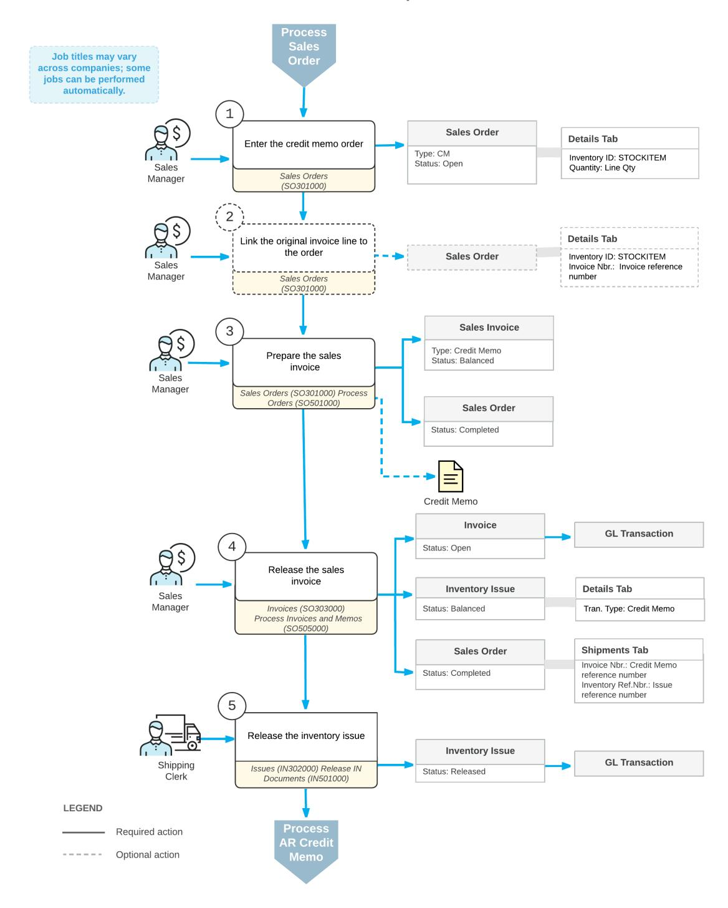

# <span id="page-230-0"></span>**Returns for Credit with Receipts: Implementation Checklist**

The following sections provide details you can use to ensure that the system is configured properly for the processing of customer returns for credit with the returned items being received to inventory, and to understand (and change, if needed) the settings that affect the processing workflow.

#### **Implementation Checklist**

Before you begin processing returns for credit with the returned items received to inventory, you should make sure the needed settings have been specified, as summarized in the following checklist.

| Form                                     | Criteria to Check                                                                                                                                                                        |
|------------------------------------------|------------------------------------------------------------------------------------------------------------------------------------------------------------------------------------------|
| Sales Orders Preferences (SO101000) form | Make sure that all necessary settings related to sales<br>orders and purchase orders have been specified, as<br>described in Configuration of Order Management: Gen<br>eral Information. |
| Order Types (SO201000) form              | Make sure that the RC order type is active and has<br>been configured, as described in Sales Order Types: To<br>Activate the RC Order Type.                                              |

#### **Specifying Other Settings That Affect the Workflow**

You can affect the workflow of processing customer returns for credit with the returned items received to inventory by specifying additional settings as follows:

- To cause sales orders of a particular order type to be created with the *On Hold* status (so that the user can verify them before processing them further), select the **Hold Documents on Entry** check box for the order type on the *Order [Types](https://help-2025r1.acumatica.com/Help?ScreenId=ShowWiki&pageid=e6984218-4260-4438-99e1-aee2b3765369)* form. For more information on other order type settings that affect the workflow of sales orders, see *Sales Order Types: General [Information](https://help-2025r1.acumatica.com/Help?ScreenId=ShowWiki&pageid=96a00780-a0c3-4314-86ca-093004844268)*.
- To cause the system to automatically post general ledger batches generated during the processing of sales documents, select the **Automatically Post on Release** check box on the *[General Ledger Preferences](https://help-2025r1.acumatica.com/Help?ScreenId=ShowWiki&pageid=e4913d06-c511-4258-a0f9-f36c1b854e6b)* (GL102000) form. For information on processing general ledger batches, see *GL [Transactions:](https://help-2025r1.acumatica.com/Help?ScreenId=ShowWiki&pageid=35393020-6269-466d-8a08-df558cd43367) General [Information](https://help-2025r1.acumatica.com/Help?ScreenId=ShowWiki&pageid=35393020-6269-466d-8a08-df558cd43367)*.

#### **Testing of Settings**

To make sure that all settings are configured correctly, we recommend that you process a return for credit with returned items received to inventory, as described in *[Returns for Credit with Receipts: Process Activity](#page-231-1)*.

# <span id="page-231-1"></span><span id="page-231-0"></span>**Returns for Credit with Receipts: Process Activity**

The following activity demonstrates how to prepare and process to completion a customer return for a particular sales order with the returned item or items being received to inventory and a credit memo to the customer being created.

This activity is based on the *U100* dataset. If you are using another dataset, or if any system settings have been changed in *U100*, these changes can affect the workflow of the activity and the results of the processing. To avoid any issues, restore the *U100* dataset to its initial state.

#### **Video Tutorial**

This video shows you the common process but may contain less detail than the activity has. If you want to repeat the activity on your own or you are preparing to take the certification exam, we recommend that you follow the instructions in the steps of the activity.

#### *[FEEDBACK](https://www.surveymonkey.com/r/BLBL7RJ?Video=Processing%20Customer%20Returns%20for%20Credit&Source=Open%20Uni&Course=D100)*

#### **Story**

Suppose that you are Grace Norman, a sales manager in the SweetLife Fruits & Jams company. On January 30, 2025, the FourStar Coffee & Sweets Shop customer requests authorization for the return of the oranges ordered on January 29, 2025, because the customer was not satisfied with the quality of the shipped fruits. You authorize the return with shipping of the returned items to SweetLife's main warehouse. Acting as the sales manager, you need to process this return.

#### **Configuration Overview**

In the *U100* dataset, for the purposes of this activity, the following tasks have been performed:

- On the *[Enable/Disable Features](https://help-2025r1.acumatica.com/Help?ScreenId=ShowWiki&pageid=c1555e43-1bc5-4f6f-ba9d-b323f94d8a6b)* (CS100000) form, the following features have been enabled:
  - *Inventory and Order Management*, which provides the standard functionality of inventory and order management
  - *Inventory*, which gives you the ability to maintain stock items by using forms related to the inventory functionality and to create and process sales and purchase documents that include stock items
- On the *Order [Types](https://help-2025r1.acumatica.com/Help?ScreenId=ShowWiki&pageid=e6984218-4260-4438-99e1-aee2b3765369)* (SO201000) form, the *RC* order type has been configured and activated.
- On the *[Customers](https://help-2025r1.acumatica.com/Help?ScreenId=ShowWiki&pageid=652929bc-9606-4056-aa6e-0c2d1147171b)* (AR303000) form, the *COFFEESHOP (FourStar Coffee & Sweets Shop)* customer has been defined.
- On the *[Stock Items](https://help-2025r1.acumatica.com/Help?ScreenId=ShowWiki&pageid=77786a70-1f1e-4d63-ad98-96f98e4fcb0e)* (IN202500) form, the *ORANGES* and *LEMONS* stock items have been created.
- On the *[Invoices](https://help-2025r1.acumatica.com/Help?ScreenId=ShowWiki&pageid=0acc9738-f141-4ea0-a2be-f34ea9d1b63a)* (SO303000) form, an invoice for the *COFFEESHOP* customer has been created that has the *ORANGES* and *LEMONS* stock items and is dated *1/29/2025*.
- The following sales documents, for which you will process a return, have been created:
  - On the *[Sales Orders](https://help-2025r1.acumatica.com/Help?ScreenId=ShowWiki&pageid=19e4021c-1b84-49fd-be12-0320c5f1c7e5)* (SO301000) form, a sales order for the *COFFEESHOP* customer dated *1/29/2025*
  - On the *[Shipments](https://help-2025r1.acumatica.com/Help?ScreenId=ShowWiki&pageid=f47cffcc-543e-469c-a204-a9c1e3da346d)* (SO302000) form, a shipment for the *COFFEESHOP* customer dated *1/29/2025*

#### **Process Overview**

To process a return for credit with a receipt, you will create a return order of the *RC* type on the *[Sales Orders](https://help-2025r1.acumatica.com/Help?ScreenId=ShowWiki&pageid=19e4021c-1b84-49fd-be12-0320c5f1c7e5)* (SO301000) form, and add to it the line or lines of the sales invoice that has been prepared for the sales order for which you need to process a return. Then you will receive the returned items to inventory on the *[Shipments](https://help-2025r1.acumatica.com/Help?ScreenId=ShowWiki&pageid=f47cffcc-543e-469c-a204-a9c1e3da346d)* (SO302000) form by creating a shipment with the *Receipt* operation and confirming it. Aer the items have been received to inventory, you will create a credit memo to decrease the customer's debt in the system by the amount of the returned items. Finally, aer reviewing the details of the prepared credit memo on the *[Invoices](https://help-2025r1.acumatica.com/Help?ScreenId=ShowWiki&pageid=0acc9738-f141-4ea0-a2be-f34ea9d1b63a)* (SO303000) form, you will release it.

#### **System Preparation**

Before you start preparing and processing the customer return, you should do the following:

- 1. Launch the Acumatica ERP website with the *U100* dataset preloaded, and sign in as sales manager Grace Norman by using the *norman* username and the *123* password.
- 2. In the info area, in the upper-right corner of the top pane of the Acumatica ERP screen, make sure that the business date in your system is set to *1/30/2025*. If a different date is displayed, click the Business Date menu button and select *1/30/2025* on the calendar. For simplicity, in this activity, you will create and process all documents in the system on this business date.
- 3. On the Company and Branch Selection menu, in the top pane of the Acumatica ERP screen, make sure the *SweetLife Head Office and Wholesale Center* branch is selected.

#### **Step 1: Creating a Return Order**

To create a return order, do the following:

1. On the *[Sales Orders](https://help-2025r1.acumatica.com/Help?ScreenId=ShowWiki&pageid=19e4021c-1b84-49fd-be12-0320c5f1c7e5)* (SO301000) form, add a new record.


To open the form for creating a new record, type the form ID in the Search box, and on the Search form, point at the form title and click **New** right of the title.

- 2. In the Summary area, specify the following settings:
  - **OrderType**: *RC*
  - **Customer**: *COFFEESHOP*
  - **Date**: *1/30/2025*
  - **Requested On**: *1/30/2025*
  - **Description**: Return of unconditional fruits
- 3. On the form toolbar, click**Save**.

#### **Step 2: Adding the Item to Be Returned**

To add the invoice line with the *SO* type to the return order, do the following:

- 1. While you are still viewing the return order on the *[Sales Orders](https://help-2025r1.acumatica.com/Help?ScreenId=ShowWiki&pageid=19e4021c-1b84-49fd-be12-0320c5f1c7e5)* (SO301000) form, on the table toolbar of the **Details** tab, click **Add Invoice**.
- 2. In the **Add Invoice Details** dialog box, which opens, do the following:
  - a. In the **AR Doc.Type** box, select *Invoice*.
  - b. In the **AR Doc. Nbr.** box, select the reference number of the invoice to *COFFEESHOP* dated *1/29/2025*. The invoice lines appear in the table of the dialog box.
  - c. In the table, select the unlabeled check box in the *ORANGES* line.
  - d. Click **Add & Close**, which closes the dialog box and adds the line to the **Details** tab of the return order.
- 3. Review the details of the added line, and make sure that the related invoice reference number is specified in the **Invoice Nbr.** column.
- 4. On the form toolbar, click**Save**.

#### **Step 3: Receiving the Returned Items**

To process the receipt of items to inventory, do the following:

- 1. While you are still viewing the return order on the *[Sales Orders](https://help-2025r1.acumatica.com/Help?ScreenId=ShowWiki&pageid=19e4021c-1b84-49fd-be12-0320c5f1c7e5)* (SO301000) form, on the form toolbar, click **Create Receipt** to create a receipt of the returned items.
- 2. In the **SpecifyShipment Parameters** dialog box, which opens, make sure that *1/30/2025* is selected as the **Shipment Date** and *WHOLESALE* is selected as the **Warehouse ID**.
- 3. Click **OK**. The system closes the dialog box and opens the prepared shipment with the *Receipt* operation on the *[Shipments](https://help-2025r1.acumatica.com/Help?ScreenId=ShowWiki&pageid=f47cffcc-543e-469c-a204-a9c1e3da346d)* (SO302000) form.
- 4. On the form toolbar, click **Confirm Shipment**.

#### **Step 4: Processing a Credit Memo**

To prepare a credit memo to the customer to adjust the customer's balance, do the following:

- 1. While you are still viewing the shipment on the *[Shipments](https://help-2025r1.acumatica.com/Help?ScreenId=ShowWiki&pageid=f47cffcc-543e-469c-a204-a9c1e3da346d)* (SO302000) form, on the form toolbar, click **Prepare Invoice**. Wait for the system to complete the operation. The system creates a credit memo to the customer and opens it on the *[Invoices](https://help-2025r1.acumatica.com/Help?ScreenId=ShowWiki&pageid=0acc9738-f141-4ea0-a2be-f34ea9d1b63a)* (SO303000) form.
- 2. In the Summary area, make sure that the **Date** is set to *1/30/2025*.
- 3. On the form toolbar, click **Release** to release the credit memo, which is assigned the *Open* status, as shown in the following screenshot.

| Invoices<br>Credit Memo 000121 - FourStar Coffee & Sweets Shop                                                  | $\Box$ NOTES                                                   |                                          | <b>ACTIVITIES</b><br><b>FILES</b>     | TOOLS $\sim$       |               |              |           |                   |        |
|-----------------------------------------------------------------------------------------------------------------|----------------------------------------------------------------|------------------------------------------|---------------------------------------|--------------------|---------------|--------------|-----------|-------------------|--------|
| 목<br>日<br>$\Omega$<br>$^{+}$<br>$\leftarrow$                                                                    | n<br>而<br>K<br>$\check{~}$                                     | $\geq$<br>$\rightarrow$<br>≺             | $\cdots$                              |                    |               |              |           |                   |        |
| Credit Me ~<br>Type:                                                                                            | Customer:                                                      |                                          | COFFEESHOP - FourStar Coffee & Swee 2 | Detail Total:      | 64.50         |              |           |                   | $\sim$ |
| $\varphi$<br>Reference Nbr.:<br>000121                                                                          | Location:                                                      | <b>MAIN - Primary Location</b>           |                                       | Line Discounts:    | 0.00          |              |           |                   |        |
| Status:<br>Open                                                                                                 | Terms:                                                         |                                          |                                       | Document Dis       | 0.00          |              |           |                   |        |
| Date:<br>1/30/2025                                                                                              | Due Date:                                                      |                                          |                                       | Freight Total:     | 0.00          |              |           |                   |        |
| Post Period:<br>01-2025                                                                                         | Cash Discount                                                  |                                          |                                       | <b>Tax Total:</b>  | 5.72          |              |           |                   |        |
| Customer Ord                                                                                                    |                                                                |                                          |                                       | Amount:            | 70.22         |              |           |                   |        |
| Project/Contract: X - Non-Project Code.                                                                         |                                                                |                                          | $\hat{a}$                             | Balance:           | 70.22         |              |           |                   |        |
| Description:<br>Return of unconditional fruits                                                                  |                                                                |                                          |                                       | Cash Discount:     | 0.00          |              |           |                   |        |
| <b>DETAILS</b><br><b>TAXES</b><br><b>FREIGHT</b><br><b>FINANCIAL</b><br><b>ADDRESSES</b><br><b>APPLICATIONS</b> |                                                                |                                          |                                       |                    |               |              |           |                   |        |
| Ò<br>0<br>$\times$                                                                                              | ADD ITEMS<br>ADD ORDER                                         | ADD SO LINE                              | ADD RETURN LINE                       | <b>RESET ORDER</b> | $\vdash$<br>⊠ |              |           |                   |        |
| 圓<br>D<br>$\omega$<br><b>Shipment Nbr.</b>                                                                      | $\overline{\phantom{a}}$<br>Order Nbr.<br>Order<br><b>Type</b> | <b>Inventory ID</b>                      | <b>Transaction Descr.</b>             | Warehouse          | Location      | Quantity UOM |           | <b>Unit Price</b> | Amount |
| 0<br>DΙ<br>000069                                                                                               | <b>RC</b><br>000120                                            | !!!!!!!!!!!!!!!!!!!!!!!!!!!!!!!!!!!!!!!! | Fresh oranges 1 lb                    | WHOLESALE          | <b>MAIN</b>   | 30.00        | <b>LB</b> | 2.1500            | 64.50  |

#### *Figure: Credit memo prepared for the return order*

You have completely processed the customer return.

#### **Activity Recap**

In this activity, we have illustrated how the sales manager has done the following:

- 1. Created a return order of the *RC* type and has added the items the customer is returning
- 2. Created and confirmed a shipment with the *Receipt* operation type
- 3. Prepared and released a credit memo to adjust the customer's balance

### <span id="page-234-0"></span>**Returns for Credit with Receipts: Mass-Processing of Documents**

The following sections explain how to mass-process documents related to the processing of customer returns for receipt, and how the system generates, changes, or works with documents as a result of the mass processing.

#### **Mass-Creating Shipments**

You can create multiple shipments on the *[Process Orders](https://help-2025r1.acumatica.com/Help?ScreenId=ShowWiki&pageid=c06a334c-f39d-4eff-9d80-b167657dff73)* (SO501000) form by selecting the *Create Shipment* action, selecting the unlabeled check box in the return order lines to be processed (which could include lines from the return order or orders you were working with, as well as lines of any other order requiring shipping), and click **Process** on the form toolbar to generate the shipments.

#### **Mass-Printing Pick Lists**

For multiple shipments that have the *On Hold* or *Open* status, you can mass-print pick lists by using the *[Process](https://help-2025r1.acumatica.com/Help?ScreenId=ShowWiki&pageid=2e27f8fd-ddd4-47f0-a83b-5a7db31feede) [Shipments](https://help-2025r1.acumatica.com/Help?ScreenId=ShowWiki&pageid=2e27f8fd-ddd4-47f0-a83b-5a7db31feede)* (SO503000) form. On this form, you select the *Print Pick List* action, select the unlabeled check boxes in the rows of the shipments for which you need to print pick lists, and click **Process** on the form toolbar.

#### **Mass-Confirming Shipments**

Shipments can be confirmed in bulk. To confirm multiple incoming and outgoing shipments at a time, you open the *[Process Shipments](https://help-2025r1.acumatica.com/Help?ScreenId=ShowWiki&pageid=2e27f8fd-ddd4-47f0-a83b-5a7db31feede)* (SO503000) form and select the *Confirm Shipment* action. Then you select the unlabeled check boxes in the rows of the shipments to be processed, and click **Process** on the form toolbar. The system confirms the selected shipment documents.

#### **Mass-Creating Sales Invoices**

You can create multiple sales invoices (which are invoices of the *Credit Memo* type for returns for credit) on the *[Process Orders](https://help-2025r1.acumatica.com/Help?ScreenId=ShowWiki&pageid=c06a334c-f39d-4eff-9d80-b167657dff73)* (SO501000) form. On this form, you select the *Prepare Invoice* action, select the unlabeled check boxes in the return order lines to be processed (which could include lines from the return order or orders you were working with, or lines of any other order), and click **Process** on the form toolbar.

# <span id="page-236-0"></span>**Processing Customer Returns for Replacement at the Same Price**

Acumatica ERP supports the basic types of customer returns of items your company has sold. This includes returns in which you receive the items to inventory and replace the items with the same items or other items at exactly the same price. With this return type, you do not need to process an invoice or a credit memo.

The topics of this chapter explain how to process customer returns of items with replacement items being received to inventory and replacement items being shipped to the customer.

# <span id="page-236-2"></span><span id="page-236-1"></span>**Returns for Replacement at the Same Price: General Information**

Acumatica ERP provides support for the most common types of return processes, which gives you the flexibility to manage various types of customer returns according to the return policies of your company.

Returns for replacement at the same price are one type of returns. These returns are processed in the system as return orders of the *RR* (*Return with Replacement*) order type. With this type, a customer returns an item and requests that the item be replaced with the same or another item at exactly the same price, so that you do not need to process an invoice or a credit memo. Return orders of the *RR* type may involve the exact replacement of a single item or multiple items.

#### **Learning Objectives**

In this chapter, you will do the following:

- Create a return order that is linked to the invoice that was used to record the sale of the returned items
- Create an incoming shipment (receipt) of the returned items, and confirm the shipment
- Create a shipment of the replacement items to the customer
- Update inventory to reflect the replacement of the returned items

#### **Applicable Scenario**

You create a return for replacement at the same price (that is, an order with the *RR* predefined order type) to perform a customer return in which the customer receives an exact replacement of a particular item or specific items. The exact replacement is the replacement of the same items at the same price. The customer returns the rejected goods, the goods are returned to inventory, and the customer receives a replacement for the rejected goods. Since the items are replaced at exactly the same price, you do not need to process any AR documents.

#### **Processing of Returned Items for Replacement**

The standard process of return for replacement at the same price typically includes the following steps:

- The entry of an order of the *RR* type
- The addition of the items to be returned and the items to be shipped for replacement
- The processing of the receipt of the returned items to inventory
- The processing of a shipment of replacement items to the customer
- The updating of the inventory

In general, the *[Sales Orders](https://help-2025r1.acumatica.com/Help?ScreenId=ShowWiki&pageid=19e4021c-1b84-49fd-be12-0320c5f1c7e5)* (SO301000) form is the starting point for the creation of a customer return. You create a new order of the *RR* type and add the item or items that the customer has returned. You can add an item to be returned without linking it to a sales document, or add a line with a reference to the original sales invoice for which you perform the return. To add the item to be returned with a link to the original sales invoice, on the *[Sales Orders](https://help-2025r1.acumatica.com/Help?ScreenId=ShowWiki&pageid=19e4021c-1b84-49fd-be12-0320c5f1c7e5)* form, you click **Add Invoice** on the table toolbar of the **Details** tab and select the line of the needed invoice in the **Add Invoice Details** dialog box, which opens.

A line corresponding to an item being returned (whether or not it is linked to a sales invoice) has the *Receipt* operation specified in the **Operation** column. Because this is an order of the *RR* type, each return line should have a corresponding replacement line: a line with the *Issue* operation type for a replacement item. If the item in a line with the *Receipt* operation is not tracked by serial or lot numbers, you can select the **Auto-Create Issue** check box for the line so that the system will automatically add the corresponding replacement line when you confirm the receipt of the returned items.

If an item to be returned has a specific lot or serial number, you should select this particular item (with its lot or serial number) from the list of invoice lines. For the items to be returned that are lot- or serial- tracked, you must clear the **Auto Create Issue** check box for the return line. Instead, you add the replacement line manually.

Aer you have specified the details in the *RR* order, you need to create and confirm two documents: a receipt of returned items (also referred to as an *incoming shipment*) and a shipment of replacement items to customer. To create a receipt, on the More menu of the *[Sales Orders](https://help-2025r1.acumatica.com/Help?ScreenId=ShowWiki&pageid=19e4021c-1b84-49fd-be12-0320c5f1c7e5)* form, you click **Create Receipt**. To create a shipment, on the More menu of the *[Sales Orders](https://help-2025r1.acumatica.com/Help?ScreenId=ShowWiki&pageid=19e4021c-1b84-49fd-be12-0320c5f1c7e5)* form, you click **CreateShipment**. You create the incoming shipment for the return of items on the *[Shipments](https://help-2025r1.acumatica.com/Help?ScreenId=ShowWiki&pageid=f47cffcc-543e-469c-a204-a9c1e3da346d)* (SO302000) form and confirm it by clicking **Confirm Shipment**. Then you create the outgoing shipment for the replacement of items; you also review and confirm the shipment.

You can update the inventory for each shipment separately by opening the shipment on the *[Shipments](https://help-2025r1.acumatica.com/Help?ScreenId=ShowWiki&pageid=f47cffcc-543e-469c-a204-a9c1e3da346d)* form and clicking **Update IN** on the More menu; this causes the system to generate the appropriate inventory transaction and to update the item availability data. On release of the inventory documents, batches of GL transactions are generated.

Sales invoices are not generated for an *RR* order because the returned item is replaced with another item at the same price.

#### **Workflow of a Return for Replacement at the Same Price**

The processing of a return for replacement at the same price involves the actions and generated documents shown in the following diagram.

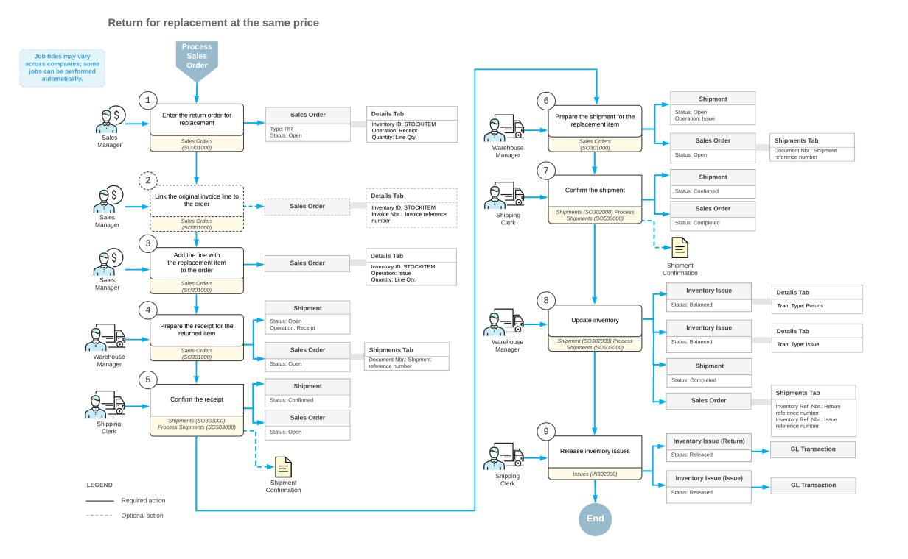

# <span id="page-238-0"></span>**Returns for Replacement at the Same Price: Implementation Checklist**

The following sections provide details that you can use to ensure that the system is configured properly for the processing of returns for replacement, and to understand (and change, if needed) the settings that affect the processing workflow.

#### **Implementation Checklist**

Before you begin processing returns for replacement, you should make sure the needed settings have been specified, as summarized in the following checklist.

| Form                                | Criteria to Check                                                                                                                                                                        |
|-------------------------------------|------------------------------------------------------------------------------------------------------------------------------------------------------------------------------------------|
| Sales Orders Preferences (SO101000) | Make sure that all necessary settings related to sales<br>orders and purchase orders have been specified, as<br>described in Configuration of Order Management: Gen<br>eral Information. |
| Order Types (SO201000)              | Make sure that the RR order type is active and has<br>been configured, as described in Sales Order TypesRe<br>turns for Replacement at the Same Price: To Activate the<br>RR Order Type. |

### **Other Settings That Affect the Workflow**

You can affect the workflow of processing returns for replacement by specifying additional settings as follows:

- To cause sales orders of a particular order type to be created with the *On Hold* status (so that the user can verify them before processing them further), select the **Hold Documents on Entry** check box for the order type on the *Order [Types](https://help-2025r1.acumatica.com/Help?ScreenId=ShowWiki&pageid=e6984218-4260-4438-99e1-aee2b3765369)* (SO201000) form. For more information on other order type settings that affect the workflow of sales orders, see *Sales Order Types: General [Information](https://help-2025r1.acumatica.com/Help?ScreenId=ShowWiki&pageid=96a00780-a0c3-4314-86ca-093004844268)*.
- To cause the system to automatically post general ledger batches generated during the processing of sales documents, select the **Automatically Post on Release** check box on the *[General Ledger Preferences](https://help-2025r1.acumatica.com/Help?ScreenId=ShowWiki&pageid=e4913d06-c511-4258-a0f9-f36c1b854e6b)* (GL102000) form. For information on processing general ledger batches, see *GL [Transactions:](https://help-2025r1.acumatica.com/Help?ScreenId=ShowWiki&pageid=35393020-6269-466d-8a08-df558cd43367) General [Information](https://help-2025r1.acumatica.com/Help?ScreenId=ShowWiki&pageid=35393020-6269-466d-8a08-df558cd43367)*.
- To cause the system to automatically release inventory documents on release of the sales-related documents, select the **Automatically Release IN Documents** check box on the *[Sales Orders Preferences](https://help-2025r1.acumatica.com/Help?ScreenId=ShowWiki&pageid=1817779c-413b-4187-b7fe-38e97845a1cb)* (SO101000) form.
- To cause the shipment dates to appear in invoices as invoice dates, select the **UseShipment Date for Invoice Date** check box on the *[Sales Orders Preferences](https://help-2025r1.acumatica.com/Help?ScreenId=ShowWiki&pageid=1817779c-413b-4187-b7fe-38e97845a1cb)* form.

#### **Validation of Configuration**

To make sure that all configuration has been performed correctly, we recommend that in your system, you process a return for replacement by performing instructions similar to those described in *[Returns for Replacement at the](#page-239-1) [Same Price: Process Activity](#page-239-1)*.

# <span id="page-239-1"></span><span id="page-239-0"></span>**Returns for Replacement at the Same Price: Process Activity**

The following activity demonstrates how to prepare and process to completion a customer return of items with the exact replacement of items (that is, with the same items for the same price), which does not require an invoice to be processed.

This activity is based on the *U100* dataset. If you are using another dataset, or if any system settings have been changed in *U100*, these changes can affect the workflow of the activity and the results of the processing. To avoid any issues, restore the *U100* dataset to its initial state.

#### **Video Tutorial**

This video shows you the common process but may contain less detail than the activity has. If you want to repeat the activity on your own or you are preparing to take the certification exam, we recommend that you follow the instructions in the steps of the activity.

#### *[FEEDBACK](https://www.surveymonkey.com/r/BLBL7RJ?Video=Processing%20Customer%20Returns%20for%20Replacement&Source=Open%20Uni&Course=D100)*

#### **Story**

Suppose that you are Grace Norman, a sales manager in the SweetLife Fruits & Jams company. On January 30, 2025, the GoodFood One Restaurant customer asks for the replacement of five small jars of orange jam (ordered on January 25, 2025) with the same number of the same jam jars because the lids appeared to be dented. The returned jars must be temporarily placed to inventory so that the quality assurance would assess them to track the source of the damage. You authorize the return.

Acting as the sales manager, you need to process the return of items to inventory with shipping the exact replacement of the returned items to the customer.

#### **Configuration Overview**

In the *U100* dataset, for the purposes of this activity, the following tasks have been performed:

- On the *[Enable/Disable Features](https://help-2025r1.acumatica.com/Help?ScreenId=ShowWiki&pageid=c1555e43-1bc5-4f6f-ba9d-b323f94d8a6b)* (CS100000) form, the following features have been enabled:
  - *Inventory and Order Management*, which provides the standard functionality of inventory and order management
  - *Inventory*, which gives you the ability to maintain stock items by using forms related to the inventory functionality and to create and process sales and purchase documents that include stock items
- On the *[Sales Orders Preferences](https://help-2025r1.acumatica.com/Help?ScreenId=ShowWiki&pageid=1817779c-413b-4187-b7fe-38e97845a1cb)* (SO101000) form, the **Automatically Release IN Documents** check box has been selected.
- On the *Order [Types](https://help-2025r1.acumatica.com/Help?ScreenId=ShowWiki&pageid=e6984218-4260-4438-99e1-aee2b3765369)* (SO201000) form, the *RR* order type has been configured and activated.
- On the *[Customers](https://help-2025r1.acumatica.com/Help?ScreenId=ShowWiki&pageid=652929bc-9606-4056-aa6e-0c2d1147171b)* (AR303000) form, the *GOODFOOD (GoodFood One Restaurant)* customer has been defined.
- On the *[Stock Items](https://help-2025r1.acumatica.com/Help?ScreenId=ShowWiki&pageid=77786a70-1f1e-4d63-ad98-96f98e4fcb0e)* (IN202500) form, the *ORJAM08* and *APJAM08* stock items have been created.
- The following sales documents, for which you will process a return, have been created:
  - On the *[Sales Orders](https://help-2025r1.acumatica.com/Help?ScreenId=ShowWiki&pageid=19e4021c-1b84-49fd-be12-0320c5f1c7e5)* (SO301000) form, the sales order for the *GOODFOOD* customer that includes the *ORJAM08* and *APJAM08* stock items and is dated *1/25/2025*
  - On the *[Invoices](https://help-2025r1.acumatica.com/Help?ScreenId=ShowWiki&pageid=0acc9738-f141-4ea0-a2be-f34ea9d1b63a)* (SO303000) form, the invoice for the *GOODFOOD* customer has been created in the amount of \$201.74.
  - On the *[Shipments](https://help-2025r1.acumatica.com/Help?ScreenId=ShowWiki&pageid=f47cffcc-543e-469c-a204-a9c1e3da346d)* (SO302000) form, the shipment to the *GOODFOOD* customer that includes the *ORJAM08* and *APJAM08* stock items and is dated *1/25/2025*

#### **Process Overview**

To process a customer return with an exact replacement, you will create an order of the *RR* (*Return with Replacement*) type on the *[Sales Orders](https://help-2025r1.acumatica.com/Help?ScreenId=ShowWiki&pageid=19e4021c-1b84-49fd-be12-0320c5f1c7e5)* (SO301000) form, and add to it the line or lines of the sales invoice that has been prepared for the sales order for which you need to process a return. You will receive the returned items to inventory by creating a shipment with the *Receipt* operation. Then you will process another shipment to record the delivery of the replacement items to the customer. Because the returned and replacement items have the same price, you will not need to process any accounts receivable documents.

Finally, you will update the inventory by using the **Update IN** command on the *[Process Shipments](https://help-2025r1.acumatica.com/Help?ScreenId=ShowWiki&pageid=2e27f8fd-ddd4-47f0-a83b-5a7db31feede)* (SO503000) form; this action generates inventory documents that record the receiving and issuing of the items in this order.

#### **System Preparation**

Before you start preparing and processing the customer return for replacement at the same price, do the following:

- 1. Launch the Acumatica ERP website, and sign in as a sales manager Grace Norman by using the *norman* username and the *123* password.
- 2. In the info area, in the upper-right corner of the top pane of the Acumatica ERP screen, make sure that the business date in your system is set to *1/30/2025*. If a different date is displayed, click the Business Date menu button and select *1/30/2025* on the calendar. For simplicity, in this activity, you will create and process all documents in the system on this business date.
- 3. On the Company and Branch Selection menu, in the top pane of the Acumatica ERP screen, make sure the *SweetLife Head Office and Wholesale Center* branch is selected.

#### **Step 1: Creating a Return Order of the RR Type**

To create a return order of the *RR* (*Return with Replacement*) type, do the following:

1. On the *[Sales Orders](https://help-2025r1.acumatica.com/Help?ScreenId=ShowWiki&pageid=19e4021c-1b84-49fd-be12-0320c5f1c7e5)* (SO301000) form, add a new record.


To open the form for creating a new record, type the form ID in the Search box, and on the Search form, point at the form title and click **New** right of the title.

- 2. In the Summary area, specify the following settings:
  - **OrderType**: *RR*
  - **Customer**: *GOODFOOD*
  - **Date**: *1/30/2025*
  - **Requested On**: *1/30/2025*
  - **Description**: Authorized replacement of orange jam
- 3. On the form toolbar, click**Save**.

You have created a sales order of the *RR* type, but have not added lines to it. Now you can add to the return order the line of the sales invoice that had been prepared for the sales order for which you need to process a return.

#### **Step 2: Adding the Items to Be Returned**

To add the line of the sales invoice to return order for which you need to process a return, do the following:

- 1. While you are still viewing the return order on the *[Sales Orders](https://help-2025r1.acumatica.com/Help?ScreenId=ShowWiki&pageid=19e4021c-1b84-49fd-be12-0320c5f1c7e5)* (SO301000) form, on the table toolbar of the **Details** tab, click **Add Invoice**.
- 2. In the **Add Invoice Details** dialog box, which opens, do the following:

- a. In the **AR Doc.Type** box, select *Invoice*.
- b. In the **AR Doc. Nbr.** box, select the reference number of the invoice to *GOODFOOD* in the amount of *201.74* dated *1/25/2025*. The invoice lines appear in the table of the dialog box.
- c. In the table, select the unlabeled check box in the *ORJAM08* line.
- d. Click **Add & Close**, which closes the dialog box and adds the line to the **Details** tab.
- 3. Review the details of the added line, and make sure that the related invoice reference number is specified in the **Invoice Nbr.** column.
- 4. In the line, change **Quantity** to 5, which is the number of jars to be replaced.
- 5. Also, in the line, make sure that the **Auto Create Issue** check box is selected. With this check box selected, the line with the item for replacement will be created and added automatically to the return order on receipt confirmation.
- 6. On the form toolbar, click**Save**. Notice that the return order has the *Open* status.

#### **Step 3: Receiving the Returned Items**

To process the receipt of items to inventory, do the following:

- 1. While you are still viewing the return order on the *[Sales Orders](https://help-2025r1.acumatica.com/Help?ScreenId=ShowWiki&pageid=19e4021c-1b84-49fd-be12-0320c5f1c7e5)* (SO301000) form, on the form toolbar, click **Create Receipt** to create a receipt of returned items.
- 2. In the **SpecifyShipment Parameters** dialog box, which opens, make sure that *1/30/2025* is selected as the **Shipment Date** and *WHOLESALE* is specified in the **Warehouse ID** box.
- 3. Click **OK**. Wait for the system to complete the operation. The system closes the dialog box and opens the prepared shipment with the *Receipt* operation on the *[Shipments](https://help-2025r1.acumatica.com/Help?ScreenId=ShowWiki&pageid=f47cffcc-543e-469c-a204-a9c1e3da346d)* (SO302000) form.
- 4. On the form toolbar, click **Confirm Shipment** to confirm the receipt of the returned items.

Now you can process the shipping of the items replacement to the customer.

#### **Step 4: Shipping the Replacement Items**

To process the shipping of the items replacement to the customer, do the following:

- 1. Open the *RR* order that you have prepared on the *[Sales Orders](https://help-2025r1.acumatica.com/Help?ScreenId=ShowWiki&pageid=19e4021c-1b84-49fd-be12-0320c5f1c7e5)* (SO301000) form and review it. On the **Details** tab, notice that the line with the replacement item has been added automatically when you confirmed the receipt of the returned items. The line has the same inventory item and unit price as the item that had been returned. Also, it has *Issue* in the **Operation** column, and a negative quantity in the **Quantity** column.
- 2. On the form toolbar, click **CreateShipment** to create a shipment of the replacement item to the customer.
- 3. In the **SpecifyShipment Parameters** dialog box, which opens, make sure that *1/30/2025* is selected in the **Shipment Date** box and *WHOLESALE* is specified in the **Warehouse ID** box. Click **OK**. Wait for the system to complete the operation. The system opens the prepared shipment with the *Issue* operation on the *[Shipments](https://help-2025r1.acumatica.com/Help?ScreenId=ShowWiki&pageid=f47cffcc-543e-469c-a204-a9c1e3da346d)* (SO302000) form.
- 4. On the **Details** tab, in the only line, specify *Main* in the **Location** column.
- 5. On the form toolbar, click **Confirm Shipment**.

The replacement item has the same price and quantity, so no invoice to the customer is required. To record the movement of items and complete the process, you need to update the inventory.

#### **Step 5: Updating Inventory**

To update the inventory, do the following:

- 1. Open the *[Process Shipments](https://help-2025r1.acumatica.com/Help?ScreenId=ShowWiki&pageid=2e27f8fd-ddd4-47f0-a83b-5a7db31feede)* (SO503000) form.
- 2. In the **Action** box, select *Update IN*.
- 3. In the **End Date** box, specify *1/30/2025*.
- 4. In the table, select the unlabeled check boxes next to the lines with two confirmed shipments to the *GOODFOOD* customer that you have prepared earlier in this activity.
- 5. On the form toolbar, click **Process**. The **Processing** dialog box opens. Wait for the system to complete the operation. Close the dialog box. The table no longer lists any lines with shipments. For the selected shipment lines, the system generates two inventory issues: an issue with the *Return* transaction type for the receipt, and an issue with the *Issue* transaction type for the shipment of the replacement item.
- 6. Open the order of the *RR* type that you have prepared on the *[Sales Orders](https://help-2025r1.acumatica.com/Help?ScreenId=ShowWiki&pageid=19e4021c-1b84-49fd-be12-0320c5f1c7e5)* (SO301000) form and review the return order. The return order now has the *Completed* status, as you can see in the following screenshot. On the **Shipments** tab, make sure that the reference numbers of the issues generated for both the receipt and the shipment are shown in the **Inventory Ref. Nbr.** column (also shown in the following screenshot), which indicates that the corresponding inventory documents have been generated.

|                   |                                                                                                                                                                       | <b>Sales Orders</b> | RR 000122 - GoodFood One Restaurant    |                         |              |                  |                                          |               |            |    |                 |      |                          | <b>FINOTES</b> |              | <b>ACTIVITIES</b>           | <b>FILES</b> | TOOLS $\sim$               |
|-------------------|-----------------------------------------------------------------------------------------------------------------------------------------------------------------------|---------------------|----------------------------------------|-------------------------|--------------|------------------|------------------------------------------|---------------|------------|----|-----------------|------|--------------------------|----------------|--------------|-----------------------------|--------------|----------------------------|
| $\leftarrow$      |                                                                                                                                                                       | 뭐                   | 日<br>$\Omega$<br>$^+$                  | 间                       | n            | K<br>$\check{ }$ | ≺                                        | $\rightarrow$ | $\geq$     |    | PREPARE INVOICE |      | .                        |                |              |                             |              |                            |
|                   |                                                                                                                                                                       | * Order Type:       | <b>RR</b>                              | Q                       | Customer:    |                  | !!!!!!!!!!!!!!!!!!!!!!!!!!!!!!!!!!!!!!!! |               |            |    |                 | △    | Ordered Qty.:            |                | 5.00         |                             |              | ᄉ                          |
|                   |                                                                                                                                                                       | Order Nbr.:         | 000122                                 | Q                       | Location:    |                  | <b>MAIN - Primary Location</b>           |               |            |    |                 |      | Detail Total:            |                | 0.00         |                             |              |                            |
|                   | Status:                                                                                                                                                               |                     | Completed                              |                         | Contact:     |                  | Darrell M. Kramer                        |               |            |    |                 |      | Line Discounts:          |                | 0.00         |                             |              |                            |
|                   | Date:                                                                                                                                                                 |                     | 1/30/2025                              |                         | Project:     |                  | X - Non-Project Code.                    |               |            |    |                 | //   | Document Dis             |                | 0.00         |                             |              |                            |
|                   |                                                                                                                                                                       | Requested On:       | 1/30/2025                              |                         | Description: |                  | Authorized replacement of<br>orange jam  |               |            |    |                 |      | Freight Total:           |                | 0.00         |                             |              |                            |
|                   |                                                                                                                                                                       | Customer Ord        |                                        |                         |              |                  |                                          |               |            | 7, |                 |      | Tax Total:               |                | 0.00         |                             |              |                            |
|                   |                                                                                                                                                                       | External Refer      |                                        |                         |              |                  |                                          |               |            |    |                 |      | Order Total:             |                | 0.00         |                             |              |                            |
|                   | <b>SHIPMENTS</b><br><b>TAXES</b><br><b>SHIPPING</b><br><b>DETAILS</b><br><b>FINANCIAL</b><br><b>ADDRESSES</b><br><b>PAYMENTS</b><br><b>RELATIONS</b><br><b>TOTALS</b> |                     |                                        |                         |              |                  |                                          |               |            |    |                 |      |                          |                |              |                             |              |                            |
| Ò                 |                                                                                                                                                                       | $^{+}$              | $ \mathbf{x} $<br>$\vdash$<br>$\times$ |                         |              |                  |                                          |               |            |    |                 |      |                          |                |              |                             |              |                            |
| 圓<br>$\mathbb{0}$ |                                                                                                                                                                       |                     | <b>Shipment Type</b>                   | <b>Document</b><br>Nbr. |              | <b>Status</b>    |                                          | Date          | * Shipment |    | Shipped Qty.    |      | <b>Shipped</b><br>Weight | Volume         |              | Shipped Inventory Doc. Type |              | <b>Inventory Ref. Nbr.</b> |
|                   | 0                                                                                                                                                                     | Shipment            |                                        | 000070                  |              | Completed        |                                          |               | 1/30/2025  |    |                 | 5.00 | 1.550000                 | 1.550000       | <b>Issue</b> |                             | 000071       |                            |
|                   | 0                                                                                                                                                                     | Shipment            |                                        | 000071                  |              | Completed        |                                          |               | 1/30/2025  |    |                 | 5.00 | 1.550000                 | 1.550000       | <b>Issue</b> |                             | 000072       |                            |
|                   |                                                                                                                                                                       |                     |                                        |                         |              |                  |                                          |               |            |    |                 |      |                          |                |              |                             |              |                            |

#### *Figure: Return order processed to completion*

- 7. Click the link in the **Inventory Ref Nbr.** column in the first line. On the *[Issues](https://help-2025r1.acumatica.com/Help?ScreenId=ShowWiki&pageid=17b051f6-027d-4459-b542-65c1c1f9d0ea)* (IN302000) form, which opens in a pop-up window, make sure that the issue has the *Released* status. Close the issue.
- 8. Click the link in the **Inventory Ref Nbr.** column in the second line. On the *[Issues](https://help-2025r1.acumatica.com/Help?ScreenId=ShowWiki&pageid=17b051f6-027d-4459-b542-65c1c1f9d0ea)* form, which opens in a popup window, make sure that the issue has the *Released* status. Close the issue.

The customer return with replacement for the same price is now complete.

#### **Activity Recap**

In this activity, we have illustrated how the sales manager has done the following:

- 1. Created a return order of the *RR* type and has added the items the customer is returning
- 2. Created and confirmed a shipment with the *Receipt* operation type
- 3. Created and confirmed a shipment of the replacement items to the customer
- 4. Updated the inventory to reflect the movement of received and issued items

# <span id="page-243-0"></span>**Returns for Replacement at the Same Price: Mass-Processing of Documents**

The following sections explain how to mass-process documents related to the processing of customer returns with replacement, and how the system generates, changes, or works with documents as a result of the mass processing.

#### **Mass-Creating Shipments**

You can create multiple shipments on the *[Process Orders](https://help-2025r1.acumatica.com/Help?ScreenId=ShowWiki&pageid=c06a334c-f39d-4eff-9d80-b167657dff73)* (SO501000) form by selecting the *Create Shipment* action, selecting the unlabeled check box in the return order lines to be processed (which could include replacement lines from the return order or orders you were working with, as well as lines of any other order requiring shipping), and click **Process** on the form toolbar to generate the shipments.

#### **Mass-Printing Pick Lists**

For multiple shipments that have the *On Hold* or *Open* status, you can mass-print pick lists by using the *[Process](https://help-2025r1.acumatica.com/Help?ScreenId=ShowWiki&pageid=2e27f8fd-ddd4-47f0-a83b-5a7db31feede) [Shipments](https://help-2025r1.acumatica.com/Help?ScreenId=ShowWiki&pageid=2e27f8fd-ddd4-47f0-a83b-5a7db31feede)* (SO503000) form. On this form, you select the *Print Pick List* action, select the unlabeled check boxes in the rows of the shipments for which you need to print pick lists, and click **Process** on the form toolbar.

#### **Mass-Confirming Shipments**

Shipments can be confirmed in bulk. To confirm multiple incoming and outgoing shipments at a time, you open the *[Process Shipments](https://help-2025r1.acumatica.com/Help?ScreenId=ShowWiki&pageid=2e27f8fd-ddd4-47f0-a83b-5a7db31feede)* (SO503000) form and select the *Confirm Shipment* action. Then you select the unlabeled check boxes in the rows of the shipments to be processed, and click **Process** on the form toolbar. The system confirms the selected shipment documents.

#### **Mass-Updating Inventory**

To reflect the replacement of the items in inventory for multiple return orders at a time, you can use the *[Process](https://help-2025r1.acumatica.com/Help?ScreenId=ShowWiki&pageid=2e27f8fd-ddd4-47f0-a83b-5a7db31feede) [Shipments](https://help-2025r1.acumatica.com/Help?ScreenId=ShowWiki&pageid=2e27f8fd-ddd4-47f0-a83b-5a7db31feede)* (SO503000) form. On this form, you select the *Update IN* action, select the unlabeled check boxes in the rows of the confirmed shipments for which you need to update inventory, and click **Process** on the form toolbar.

# <span id="page-244-0"></span>**Processing Customer Returns for Replacement at Another Price**

Acumatica ERP supports the basic types of customer returns of goods that your company has sold. This includes returns in which you receive the items to inventory and replace these items with different items. With this return type, you also need to process an AR invoice or a credit memo.

The topics of this chapter explain how to process customer returns of items with replacement items that can differ from the returned items and that may be sold at higher or lower prices than the returned items.

# <span id="page-244-1"></span>**Returns for Replacement at Another Price: General Information**

Acumatica ERP supports returns of goods for replacement with goods that differ from those that are returned. The returns may include freight, shipping, and handling charges, and the goods may be returned at higher or lower prices. To process such a return, you use a return merchandise authorization (RMA) order, which is an order with the *RM* predefined order type.

#### **Learning Objectives**

In this chapter, you will do the following:

- Become familiar with the general steps involved in the workflow of processing an RMA order
- Create an RMA order
- Process an RMA order

#### **Applicable Scenario**

You create a return for replacement at another price (that is, an order of the *RM* predefined order type) to perform a customer return in which you return an inventory item for replacement. The customer returns the rejected goods, the goods are returned to inventory, and the customer receives a replacement for the rejected goods at another price. For this RMA order, different items than those returned may be included for replacement; freight, shipping, and handling charges may be included, and the replacement items have higher or lower prices than the returned items. Because the items are replaced at a different price, you also need to process AR documents.

#### **General Steps of Returns for Replacement at Another Price**

This section describes the general workflow of a return for replacement at another price; for simplicity, a single item is returned and replaced in this workflow.

To process a return of a stock item for replacement at another price, you perform the following general steps:

- 1. On the *[Sales Orders](https://help-2025r1.acumatica.com/Help?ScreenId=ShowWiki&pageid=19e4021c-1b84-49fd-be12-0320c5f1c7e5)* (SO301000) form, you create a new RMA order.
- 2. Optional: On the same form, you add the item to be returned by doing either of the following:
  - You add the stock item to be returned and include a link to the original invoice (that is, the invoice for which the return is being performed) by clicking **Add Invoice** on the table toolbar of the **Details** tab and selecting the line of the needed invoice in the **Add Invoice Details** dialog box, which opens. For the line, notice that by default, the *Receipt* operation is inserted in the **Operation** column, and a negative quantity is inserted in the **Quantity** column.
  - You add the stock item to be returned without linking it to an invoice. To do this, you click **Add Items** on the table toolbar of the **Details** tab, and select the item in the **Inventory Lookup** dialog box, which opens. In this case, for the line that has the stock item, you need to specify a negative quantity in the

**Quantity** column. When you do, the option in the **Operation** column will be changed to *Receipt* from *Issue* (the default operation).


The default operation inserted for a new line on the **Details** tab of the *[Sales Orders](https://help-2025r1.acumatica.com/Help?ScreenId=ShowWiki&pageid=19e4021c-1b84-49fd-be12-0320c5f1c7e5)* form is specified on the **Templates** tab of the *Order [Types](https://help-2025r1.acumatica.com/Help?ScreenId=ShowWiki&pageid=e6984218-4260-4438-99e1-aee2b3765369)* form for the sales order type.

Aer you have added the *Receipt* lines, make sure that the **Auto-Create Issue** check box is cleared in these lines (because you need to add replacement items and specify their details manually).

- 3. While you are still on the *[Sales Orders](https://help-2025r1.acumatica.com/Help?ScreenId=ShowWiki&pageid=19e4021c-1b84-49fd-be12-0320c5f1c7e5)* form, you manually add a line with a positive quantity for the replacement item. Notice that by default, this line has the *Issue* operation. Each line with the *Receipt* operation type in an RMA order has a negative quantity, and the corresponding line with the *Issue* operation type has a positive quantity for a replacement item. Alternatively, if the returned item is not tracked by serial or lot numbers, you can select the **Auto-Create Issue** check box for the line and manually change the price; on shipment confirmation, the system will add the corresponding lines of the *Issue* type automatically and copy the line details from the lines of the *Receipt* type.
- 4. You process the receipt of the returned item and the shipment of the replacement item (both of which are processed as shipments) by performing the following general steps (see Items 4a and 4b in the diagram below):
  - a. Prepare the receipt (for return) and the shipment (for replacement) by doing the following on the *[Sales](https://help-2025r1.acumatica.com/Help?ScreenId=ShowWiki&pageid=19e4021c-1b84-49fd-be12-0320c5f1c7e5) [Orders](https://help-2025r1.acumatica.com/Help?ScreenId=ShowWiki&pageid=19e4021c-1b84-49fd-be12-0320c5f1c7e5)* form:
    - To begin preparing the receipt (that is, the incoming shipment with the *Receipt* operation type), you click **Create Receipt** on the More menu. You enter the needed settings in the **Specify Shipment Parameters** dialog box, which opens.
    - To begin preparing the outgoing shipment with the *Issue* operation type, you click **CreateShipment** on the form toolbar. You then enter the needed settings in the **SpecifyShipment Parameters** dialog box.

You can review the prepared shipments on the *[Shipments](https://help-2025r1.acumatica.com/Help?ScreenId=ShowWiki&pageid=f47cffcc-543e-469c-a204-a9c1e3da346d)* (SO302000) form.

b. Confirm the receipt and the shipment.

You can confirm a particular receipt or shipment by selecting it on the *[Shipments](https://help-2025r1.acumatica.com/Help?ScreenId=ShowWiki&pageid=f47cffcc-543e-469c-a204-a9c1e3da346d)* form and clicking **Confirm Shipment**. When both the receipt and the shipment are confirmed, the original RMA order is assigned the *Completed* status.

c. Prepare the sales invoices for the receipt and the shipment by selecting the document on the *[Shipments](https://help-2025r1.acumatica.com/Help?ScreenId=ShowWiki&pageid=f47cffcc-543e-469c-a204-a9c1e3da346d)* form and then clicking **Prepare Invoice** on the More menu.

You can review the prepared documents on the *[Invoices](https://help-2025r1.acumatica.com/Help?ScreenId=ShowWiki&pageid=0acc9738-f141-4ea0-a2be-f34ea9d1b63a)* (SO303000) form. For the return, the system generates an invoice of the *Credit Memo* type; for the shipment, the system generates a sales invoice of the *Invoice* type.


You can print an invoice by clicking **Print Invoice**, under **Printing and Emailing**, on the More menu of the *[Invoices](https://help-2025r1.acumatica.com/Help?ScreenId=ShowWiki&pageid=0acc9738-f141-4ea0-a2be-f34ea9d1b63a)* form.

- d. Release the sales invoices. The system automatically generates the following inventory issues:
  - The issue with the *Return* transaction type for the return
  - The issue with the *Issue* transaction type for replacement

Also, you can review the related AR credit memo and invoice on the *[Invoices and Memos](https://help-2025r1.acumatica.com/Help?ScreenId=ShowWiki&pageid=5e6f3b27-b7af-412f-a40a-1d4f4be70cba)* (AR301000) form.

e. Release the generated inventory issues.

The generated inventory issues are released automatically if the **Automatically Release IN Documents** check box is selected on the *[Sales Orders Preferences](https://help-2025r1.acumatica.com/Help?ScreenId=ShowWiki&pageid=1817779c-413b-4187-b7fe-38e97845a1cb)* (SO101000) form. If this check box is cleared, you have to release each inventory issue manually by clicking **Release** on the form toolbar of the *[Issues](https://help-2025r1.acumatica.com/Help?ScreenId=ShowWiki&pageid=17b051f6-027d-4459-b542-65c1c1f9d0ea)* (IN302000) form. On release of each inventory issue, a batch of GL transactions is generated.

#### **Workflow of a Return for Replacement at Another Price**

A general workflow of a return for replacement at another price involves the steps and generated documents shown in the following diagram.

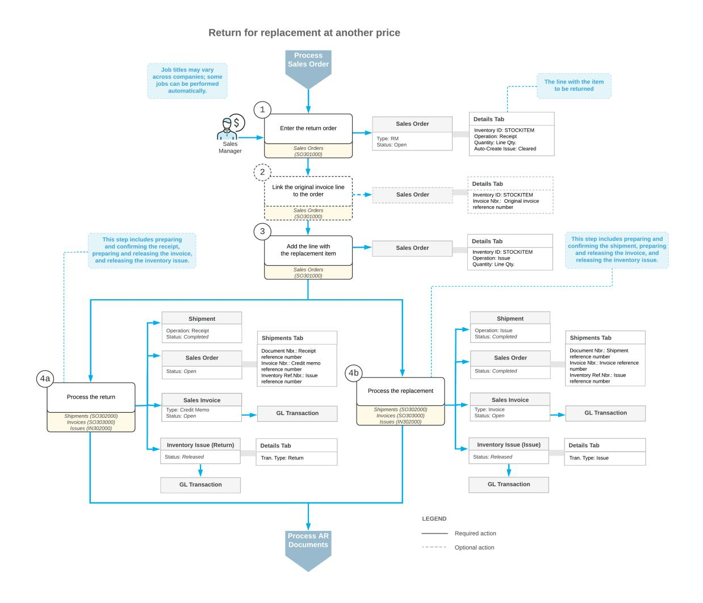

# <span id="page-246-0"></span>**Returns for Replacement at Another Price: Implementation Checklist**

The following sections provide details that you can use to ensure that the system is configured properly for the processing of returns for replacement at another price, and to understand (and change, if needed) the settings that affect the processing workflow.

#### **Implementation Checklist**

Before you begin processing returns for replacement at another price, you should make sure that the needed features have been enabled, and settings have been specified as summarized in the following checklist.

| Form                   | Criteria to Check                                                                                                                                                                        |
|------------------------|------------------------------------------------------------------------------------------------------------------------------------------------------------------------------------------|
| Multiple forms         | Make sure that all necessary settings related to sales<br>orders and purchase orders have been specified, as<br>described in Configuration of Order Management: Gen<br>eral Information. |
| Order Types (SO201000) | Make sure that the RM order type is active and has<br>been configured, as described in Sales Order Types:<br>General Information.                                                        |

#### **Other Settings That Affect the Workflow**

You can affect the workflow of returns for replacement at another price by specifying additional settings as follows:

- To cause sales orders of a particular order type to be created with the *On Hold* status (so that the user can verify them before processing them further), select the **Hold Documents on Entry** check box for the order type on the *Order [Types](https://help-2025r1.acumatica.com/Help?ScreenId=ShowWiki&pageid=e6984218-4260-4438-99e1-aee2b3765369)* (SO201000) form. For more information on other order type settings that affect the workflow of sales orders, see *Sales Order Types: General [Information](https://help-2025r1.acumatica.com/Help?ScreenId=ShowWiki&pageid=96a00780-a0c3-4314-86ca-093004844268)*.
- To cause the system to automatically post general ledger batches generated during the processing of sales documents, select the **Automatically Post on Release** check box on the *[General Ledger Preferences](https://help-2025r1.acumatica.com/Help?ScreenId=ShowWiki&pageid=e4913d06-c511-4258-a0f9-f36c1b854e6b)* (GL102000) form. For information on processing general ledger batches, see *GL [Transactions:](https://help-2025r1.acumatica.com/Help?ScreenId=ShowWiki&pageid=35393020-6269-466d-8a08-df558cd43367) General [Information](https://help-2025r1.acumatica.com/Help?ScreenId=ShowWiki&pageid=35393020-6269-466d-8a08-df558cd43367)*.
- To cause the system to automatically release inventory documents on release of the sales-related documents, select the **Automatically Release IN Documents** check box on the *[Sales Orders Preferences](https://help-2025r1.acumatica.com/Help?ScreenId=ShowWiki&pageid=1817779c-413b-4187-b7fe-38e97845a1cb)* (SO101000) form.

### **Validation of Configuration**

To make sure that all configuration has been performed correctly, we recommend that in your system, you process a return for replacement at another price by performing instructions similar to those described in *[Returns for](#page-247-1) [Replacement at Another Price: Process Activity](#page-247-1)*.

# <span id="page-247-1"></span><span id="page-247-0"></span>**Returns for Replacement at Another Price: Process Activity**

The following activity demonstrates how to prepare and process to completion a customer return of items with the replacement of items that differ from those that are returned. Because the replacement items have a higher price, you also need to process an invoice.

This activity is based on the *U100* dataset. If you are using another dataset, or if any system settings have been changed in *U100*, these changes can affect the workflow of the activity and the results of the processing. To avoid any issues, restore the *U100* dataset to its initial state.

#### **Story**

Suppose that you are Grace Norman, a sales manager in the SweetLife Fruits & Jams company. On January 20, 2023, the FourStar Coffee & Sweets Shop customer ordered 12 medium jars of raspberry jam and 10 medium jars of strawberry jam. On January 30, 2025, the customer asks for the replacement of 6 jars of raspberry jam with 20 small jars of kiwi jam. You authorize the return.

### **Configuration Overview**

In the *U100* dataset, the following tasks have been performed to support this activity:

- On the *[Enable/Disable Features](https://help-2025r1.acumatica.com/Help?ScreenId=ShowWiki&pageid=c1555e43-1bc5-4f6f-ba9d-b323f94d8a6b)* (CS100000) form, the following features have been enabled:
  - *Inventory and Order Management*, which provides the standard functionality of inventory and order management
  - *Inventory*, which gives you the ability to maintain stock items by using forms related to the inventory functionality and to create and process sales and purchase documents that include stock items
- On the *[Sales Orders Preferences](https://help-2025r1.acumatica.com/Help?ScreenId=ShowWiki&pageid=1817779c-413b-4187-b7fe-38e97845a1cb)* (SO101000) form, the **Automatically Release IN Documents** check box has been selected.
- On the *Order [Types](https://help-2025r1.acumatica.com/Help?ScreenId=ShowWiki&pageid=e6984218-4260-4438-99e1-aee2b3765369)* (SO201000) form, the *RM* order type has been configured and activated.
- On the *[Customers](https://help-2025r1.acumatica.com/Help?ScreenId=ShowWiki&pageid=652929bc-9606-4056-aa6e-0c2d1147171b)* (AR303000) form, the *COFFEESHOP (FourStar Coffee & Sweets Shop)* customer has been created.
- On the *[Stock Items](https://help-2025r1.acumatica.com/Help?ScreenId=ShowWiki&pageid=77786a70-1f1e-4d63-ad98-96f98e4fcb0e)* (IN202500) form, the *RASPJAM32*, *STRAWJAM32*, and *KIWIJAM08* stock items have been created.
- The following sales documents, for which you will process a return, have been created:
  - On the *[Sales Orders](https://help-2025r1.acumatica.com/Help?ScreenId=ShowWiki&pageid=19e4021c-1b84-49fd-be12-0320c5f1c7e5)* (SO301000) form, the sales order for the *COFFEESHOP* customer that includes the *RASPJAM32* and *STRAWJAM32* stock items and is dated *1/20/2025*
  - On the *[Shipments](https://help-2025r1.acumatica.com/Help?ScreenId=ShowWiki&pageid=f47cffcc-543e-469c-a204-a9c1e3da346d)* (SO302000) form, the shipment to the *COFFEESHOP* customer that includes the *RASPJAM32* and *STRAWJAM32* stock items and is dated *1/20/2025*
  - On the *[Invoices](https://help-2025r1.acumatica.com/Help?ScreenId=ShowWiki&pageid=0acc9738-f141-4ea0-a2be-f34ea9d1b63a)* (SO303000) form, the invoice for the *COFFEESHOP* customer has been created in the amount of \$127.91.

#### **Process Overview**

To process a customer return with a replacement for another price, you will create an order of the *RM* type (RMA order) on the *[Sales Orders](https://help-2025r1.acumatica.com/Help?ScreenId=ShowWiki&pageid=19e4021c-1b84-49fd-be12-0320c5f1c7e5)* (SO301000) form, and add to it the line of the sales invoice that has been prepared for the sales order for which you need to process a return. You will receive the returned items to inventory by creating a shipment with the *Receipt* operation. Then you will process another shipment to record the delivery of the replacement items to the customer.

You will update the inventory by using the **Update IN** command on the *[Process Shipments](https://help-2025r1.acumatica.com/Help?ScreenId=ShowWiki&pageid=2e27f8fd-ddd4-47f0-a83b-5a7db31feede)* (SO503000) form; this action generates inventory documents that record the receiving and issuing of the items in this order. Finally, because the returned and replacement items have different prices, you will process accounts receivable documents.

#### **System Preparation**

Before you start preparing and processing the customer return for replacement at another price, do the following:

- 1. Launch the Acumatica ERP website with the *U100* dataset preloaded, and sign in as sales manager Grace Norman by using the *norman* username and the *123* password.
- 2. In the info area, in the upper-right corner of the top pane of the Acumatica ERP screen, make sure that the business date in your system is set to *1/30/2025*. If a different date is displayed, click the Business Date menu button and select *1/30/2025* on the calendar. For simplicity, in this activity, you will create and process all documents in the system on this business date.

#### **Step 1: Creating an RMA Order**

To create an RMA order, do the following:

- 1. On the *[Sales Orders](https://help-2025r1.acumatica.com/Help?ScreenId=ShowWiki&pageid=19e4021c-1b84-49fd-be12-0320c5f1c7e5)* (SO301000) form, add a new record.
- 2. In the Summary area, specify the following settings:
  - **OrderType**: *RM*
  - **Customer**: *COFFEESHOP*
  - **Date**: *1/30/2025*
  - **Requested On**: *1/30/2025*
  - **Description**: Authorized replacement of raspberry jam with kiwi jam
- 3. On the form toolbar, click**Save**.

You have created the RMA order. Notice that the order has the *Open* status. Now you can add the line of the sales invoice that had been prepared for the sales order for which you need to process a return with replacement.

#### **Step 2: Adding the Items to the RMA Order**

To add the line of the original sales invoice to the RMA order for which you need to process a return with replacement, do the following:

- 1. While you are still viewing the *RM* order on the *[Sales Orders](https://help-2025r1.acumatica.com/Help?ScreenId=ShowWiki&pageid=19e4021c-1b84-49fd-be12-0320c5f1c7e5)* (SO301000) form, on the table toolbar of the **Details** tab, click **Add Invoice**.
- 2. In the **Add Invoice Details** dialog box, which opens, do the following:
  - a. In the **AR Doc.Type** box, select *Invoice*.
  - b. In the **AR Doc. Nbr.** box, select the reference number of the invoice to the *COFFEESHOP* customer in the amount of *127.91* dated *1/20/2025*. The invoice lines appear in the table of the dialog box.
  - c. In the table, select the unlabeled check box in the *RASPJAM32* line.
  - d. Click **Add & Close** to add the line to the **Details** tab and close the dialog box.
- 3. Review the details of the added line, and make sure that the related invoice reference number is specified in the **Invoice Nbr.** column.
- 4. In the line, change **Quantity** to -6, which is the number of jars to be replaced.
- 5. Clear the **Auto Create Issue** check box. With this check box cleared, no line with the item for replacement will be created and added to the return order on receipt confirmation.
- 6. On the table toolbar of the **Details** tab, do the following:
  - a. On the table toolbar, click **Add Row**.
  - b. Specify the following settings for this row:
    - **Inventory ID**: *KIWIJAM08*
    - **Warehouse**: *WHOLESALE*
    - **Order Qty.**: 20
- 7. On the form toolbar, click**Save**.

#### **Step 3: Receiving the Returned Items from the Customer**

To process the receipt of items to inventory, do the following:

- 1. While you are still viewing the RMA order on the *[Sales Orders](https://help-2025r1.acumatica.com/Help?ScreenId=ShowWiki&pageid=19e4021c-1b84-49fd-be12-0320c5f1c7e5)* (SO301000) form, on the form toolbar, click **Create Receipt** to create a receipt of returned items.
- 2. In the **SpecifyShipment Parameters** dialog box, which opens, make sure that *1/30/2025* is selected as the **Shipment Date**and *WHOLESALE* is specified in the **Warehouse ID** box.

- 3. Click **OK**. Wait for the system to complete the operation. The system closes the dialog box and opens the prepared shipment with the *Receipt* operation on the *[Shipments](https://help-2025r1.acumatica.com/Help?ScreenId=ShowWiki&pageid=f47cffcc-543e-469c-a204-a9c1e3da346d)* (SO302000) form.
- 4. On the form toolbar, click **Confirm Shipment** to confirm the receipt of the returned items from the customer.

#### **Step 4: Shipping the Replacement Items to the Customer**

To process the shipping of the items replacement to the customer, do the following:

- 1. Open the RMA order that you have prepared on the *[Sales Orders](https://help-2025r1.acumatica.com/Help?ScreenId=ShowWiki&pageid=19e4021c-1b84-49fd-be12-0320c5f1c7e5)* (SO301000) form.
- 2. On the form toolbar, click **CreateShipment** to create a shipment of the replacement item to the customer.
- 3. In the **SpecifyShipment Parameters** dialog box, which opens, make sure that *1/30/2025* is selected in the **Shipment Date** box and *WHOLESALE* is specified in the **Warehouse ID** box. Click **OK**. Wait for the system to complete the operation. The system opens the prepared shipment with the *Issue* operation on the *[Shipments](https://help-2025r1.acumatica.com/Help?ScreenId=ShowWiki&pageid=f47cffcc-543e-469c-a204-a9c1e3da346d)* (SO302000) form.
- 4. On the form toolbar, click **Confirm Shipment**.

#### **Step 5: Updating Inventory**

To update the inventory, do the following:

- 1. Open the *[Process Shipments](https://help-2025r1.acumatica.com/Help?ScreenId=ShowWiki&pageid=2e27f8fd-ddd4-47f0-a83b-5a7db31feede)* (SO503000) form.
- 2. In the **Action** box, select *Update IN*.
- 3. In the **End Date** box, specify *1/30/2025*.
- 4. In the table, select the unlabeled check boxes next to the lines with two confirmed shipments to the *COFFEESHOP* customer that you have prepared earlier in this activity.
- 5. On the form toolbar, click **Process**. The **Processing** dialog box opens. Wait for the system to complete the operation. Close the dialog box. The table no longer lists any lines with shipments. For the selected shipment lines, the system generates two inventory issues: an issue with the *Return* transaction type for the receipt, and an issue with the *Issue* transaction type for the shipment of the replacement item.
- 6. Open the RMA order that you have earlier prepared on the *[Sales Orders](https://help-2025r1.acumatica.com/Help?ScreenId=ShowWiki&pageid=19e4021c-1b84-49fd-be12-0320c5f1c7e5)* (SO301000) form and review the order. The return order now has the *Completed* status, as you can see in the following screenshot. On the **Shipments** tab, make sure that the reference numbers of the issues generated for both the receipt and the shipment are shown in the **Inventory Ref. Nbr.** column (also shown in the following screenshot), which indicates that the corresponding inventory documents have been generated.

| Sales Orders<br>뭐<br>$\leftarrow$                | RM 000116 - FourStar Coffee & Sweets Shop<br>$\Xi$<br>$\Omega$<br>$^{+}$ | 间<br>n           | $\overline{\mathsf{K}}$<br>$\check{~}$ | $\geq$<br>$\rightarrow$<br>≺   | PREPARE INVOICE                                       |                   | $\cdots$                       |               |                 | <b>P NOTES</b><br><b>ACTIVITIES</b> | <b>FILES</b><br>TOOLS $\sim$ |
|--------------------------------------------------|--------------------------------------------------------------------------|------------------|----------------------------------------|--------------------------------|-------------------------------------------------------|-------------------|--------------------------------|---------------|-----------------|-------------------------------------|------------------------------|
| * Order Type:                                    | <b>RM</b>                                                                | Q<br>Customer:   |                                        |                                | COFFEESHOP - FourStar Coffee & Swee                   | - 1               | Ordered Qtv.:                  | 20.00         |                 |                                     | $\sim$                       |
| Order Nbr.:                                      | 000116                                                                   | Q<br>Location:   |                                        | <b>MAIN - Primary Location</b> |                                                       | 0                 | <b>Discount Total:</b>         | 0.00          |                 |                                     |                              |
| Status:                                          | Completed                                                                | Contact:         |                                        | Andrea A. Weaver               |                                                       | 0                 | <b>Tax Total:</b>              | 3.39          |                 |                                     |                              |
| Date:                                            | 1/30/2023                                                                | Project:         |                                        | X - Non-Project Code.          |                                                       | 0                 | Order Total:                   | 41.57         |                 |                                     |                              |
| Requested On:                                    | 1/30/2023                                                                |                  | Description:                           |                                | Authorized replacement of raspberry jam with kiwi jam |                   |                                |               |                 |                                     |                              |
| Customer Ord<br>External Refer<br><b>DETAILS</b> | <b>TAXES</b>                                                             | <b>FINANCIAL</b> | <b>SHIPPING</b>                        | <b>ADDRESSES</b>               | <b>SHIPMENTS</b>                                      | <b>PAYMENTS</b>   | <b>RELATIONS</b>               | <b>TOTALS</b> |                 |                                     |                              |
| Ò<br>$+$                                         | $\mathbf{x}$<br>$\vdash$<br>$\times$                                     |                  |                                        |                                |                                                       |                   |                                |               |                 |                                     |                              |
| 圓<br>n                                           | <b>Shipment Type</b>                                                     | Document<br>Nbr. | <b>Status</b>                          | * Shipment<br>Date             | Shipped Qty.                                          | Shipped<br>Weight | Shipped Invoice<br>Volume Type |               | Invoice<br>Nbr. | <b>Inventory Doc. Type</b>          | Inventory Ref. Nbr.          |
| D<br>≻<br>0                                      | Shipment                                                                 | 000067           | Confirmed                              | 1/30/2023                      | 6.00                                                  | 0.000000          | 0.000000                       |               |                 | <b>Issue</b>                        | 000066                       |
| 0<br>!!!!!!!!!!!!!!!!!!!!!!!!!!!!!!!!!!!!!!!!    | Shipment                                                                 | 000068           | Confirmed                              | 1/30/2023                      | 20.00                                                 | 0.000000          | 0.000000                       |               |                 | <b>Issue</b>                        | 000067                       |

*Figure: The RM order processed to completion*

- 7. Click the link in the **Inventory Ref Nbr.** column in the first line. On the *[Issues](https://help-2025r1.acumatica.com/Help?ScreenId=ShowWiki&pageid=17b051f6-027d-4459-b542-65c1c1f9d0ea)* (IN302000) form, which opens in a pop-up window, make sure that the issue has the *Released* status. Close the issue.
- 8. Click the link in the **Inventory Ref Nbr.** column in the second line. On the *[Issues](https://help-2025r1.acumatica.com/Help?ScreenId=ShowWiki&pageid=17b051f6-027d-4459-b542-65c1c1f9d0ea)* form, which opens in a popup window, make sure that the issue has the *Released* status. Close the issue.

#### **Step 6: Processing an Invoice for the RMA Order**

To process an invoice for the RMA order, do the following:

- 1. While you are still viewing the RMA order on the *[Sales Orders](https://help-2025r1.acumatica.com/Help?ScreenId=ShowWiki&pageid=19e4021c-1b84-49fd-be12-0320c5f1c7e5)* (SO301000) form, on the form toolbar, click **Prepare Invoice**.
- 2. On the *[Invoices](https://help-2025r1.acumatica.com/Help?ScreenId=ShowWiki&pageid=0acc9738-f141-4ea0-a2be-f34ea9d1b63a)* (SO303000) form, which opens, review the details of the document of the *Invoice* type.
- 3. On the form toolbar, click **Release**. The invoice is assigned the *Open* status.
- 4. Return to the RMA order on the *[Sales Orders](https://help-2025r1.acumatica.com/Help?ScreenId=ShowWiki&pageid=19e4021c-1b84-49fd-be12-0320c5f1c7e5)* form. On the**Shipments** tab, notice that the links to the invoice has been inserted for each line in the **Invoice Nbr.** column.

The customer return for replacement at another price is now complete.

# <span id="page-252-0"></span>**Processing Customer Returns with Refunds**

If a customer requests a return for goods or services that they have already paid for, you need to record a refund issued to them.

The topics of this chapter explain how to process a return order or credit memo with a refund, and which documents are prepared during the processing of the return.

# <span id="page-252-1"></span>**Customer Returns with Refunds: General Information**

A traceable refund for items returned by customers is an essential part of sales. In Acumatica ERP, you can create refunds directly in a return order on the *[Sales Orders](https://help-2025r1.acumatica.com/Help?ScreenId=ShowWiki&pageid=19e4021c-1b84-49fd-be12-0320c5f1c7e5)* (SO301000) form or a credit memo on the *[Invoices](https://help-2025r1.acumatica.com/Help?ScreenId=ShowWiki&pageid=0acc9738-f141-4ea0-a2be-f34ea9d1b63a)* (SO303000) form. These refunds are automatically applied to the return order or credit memo.

#### **Learning Objectives**

In this chapter, you will do the following:

- Create a return order with goods that the customer returns
- Process a refund applied to the return order
- Process an incoming shipment (receipt) for goods that the customer returns
- Process a credit memo for the return order

#### **Applicable Scenarios**

You may need to create return orders or credit memos and apply a refund to them if your company sells goods, and customers pay for these goods but may later request a return. You need to refund the customers' payments and ensure that these refunds are applied to the related return orders or credit memos.

#### **Processing of a Refund for a Return Order**

In general, the *[Sales Orders](https://help-2025r1.acumatica.com/Help?ScreenId=ShowWiki&pageid=19e4021c-1b84-49fd-be12-0320c5f1c7e5)* (SO301000) form is the starting point for a customer return. On this form, you create a new return order for a customer and add the items to be returned.

To quickly add the items with links to the original sales invoice, you click **Add Invoice** on the table toolbar of the **Details** tab and select the invoice lines of returned items in the **Add Invoice Details** dialog box. You can also add items directly on the **Details** tab without the links to the initial sales invoice by clicking **Add Row** and selecting the returned items in the **Inventory ID** column.

Aer you have added the items to the return order and saved it, you click **Create Refund** on the table toolbar of the **Payments** tab. In the dialog box that opens, the system inserts the full amount of the return order; you can edit this amount, if required. When you click **OK** in this dialog box, the system creates a refund and applies it to the return order. To release the refund with the *Cash/Check* payment method, you open it on the *[Payments and Applications](https://help-2025r1.acumatica.com/Help?ScreenId=ShowWiki&pageid=ae844bf4-1aef-42cd-9e2f-49b3ee1bc8d7)* (AR302000) form and click **Release** on the form toolbar. The refunds with the *Credit Card* payment method are released automatically.

The receipt of the items returned to inventory is processed in the system as a shipment with the *Receipt* operation type, which indicates an incoming shipment. Aer you have prepared and confirmed this shipment, you need to update the customer's balance in the amount of the items by preparing and releasing a credit memo. This credit memo is a financial document in the system that contains links to the applicable shipments and sales orders. You can review the prepared credit memo on the *[Invoices](https://help-2025r1.acumatica.com/Help?ScreenId=ShowWiki&pageid=0acc9738-f141-4ea0-a2be-f34ea9d1b63a)* (SO303000) form; then you release it. When the credit memo is released, it becomes visible on the *[Invoices and Memos](https://help-2025r1.acumatica.com/Help?ScreenId=ShowWiki&pageid=5e6f3b27-b7af-412f-a40a-1d4f4be70cba)* (AR301000) form as an AR credit memo. The AR credit memo does not contain the links to the shipments and sales orders.

When you create a credit memo for a return order, the application of the refund is automatically transferred from the sales order to this credit memo. When you release the credit memo, the application of the released refund is also released.

#### **Processing of a Refund for a Credit Memo**

While refunds can be processed through return orders, you can create and process a refund for a credit memo instead. This method is commonly used when you can issue the refund only aer the returned goods have been received to the inventory, meaning that the return order has already been completed. Another applicable scenario for refunds on credit memos is a direct sale, for which you do not create a sales order.

On the *[Invoices](https://help-2025r1.acumatica.com/Help?ScreenId=ShowWiki&pageid=0acc9738-f141-4ea0-a2be-f34ea9d1b63a)* (SO303000) form, you create a new invoice of the *Credit Memo* type and save it; then you add lines with items to be returned by clicking **Add Return Line** on the table toolbar of the **Details** tab. Aer you have added the items, you click **Create Refund** on the table toolbar of the **Application** tab. In the dialog box that opens, the system inserts the full amount of the credit memo; you can edit this amount, if required. When you click **OK** in this dialog box, the system creates a refund and applies it to the credit memo. To release the refund with the *Cash/ Check* payment method, you open it on the *[Payments and Applications](https://help-2025r1.acumatica.com/Help?ScreenId=ShowWiki&pageid=ae844bf4-1aef-42cd-9e2f-49b3ee1bc8d7)* (AR302000) form and click **Release** on the form toolbar. The refunds with the *Credit Card* payment method are released automatically.

Aer you have processed the refund, you release the credit memo on the *[Invoices](https://help-2025r1.acumatica.com/Help?ScreenId=ShowWiki&pageid=0acc9738-f141-4ea0-a2be-f34ea9d1b63a)* form; when you release it, the application of the released refund is also released.

#### **Settings of Return Documents for Processing a Refund**

If a refund is created in a return order on the *[Sales Orders](https://help-2025r1.acumatica.com/Help?ScreenId=ShowWiki&pageid=19e4021c-1b84-49fd-be12-0320c5f1c7e5)* (SO301000) form, the return order must have an order type for which settings have been specified as follows on the *Order [Types](https://help-2025r1.acumatica.com/Help?ScreenId=ShowWiki&pageid=e6984218-4260-4438-99e1-aee2b3765369)* (SO201000) form:

- On the **General** tab, the **Allow Refund Before Return** check box is selected.
- On the **Template** tab, the following settings have been specified:
  - In the **Automation Behavior** box, the *RMA Order*, *Credit Memo*, or *Mixed Order* behavior is selected.
  - In the **AR DocumentType** box, any type except for *No Update* is selected.
  - For order types with the *RMA Order* and *Credit Memo* behavior, in the **Operations** table, only one active operation is listed with *Receipt* selected in the **Operations** column.

In Acumatica ERP, the predefined *RC*, *CM*, and *MO* order types meet these criteria and can be used to create and process a refund.

On the *[Invoices](https://help-2025r1.acumatica.com/Help?ScreenId=ShowWiki&pageid=0acc9738-f141-4ea0-a2be-f34ea9d1b63a)* (SO303000) form, you create a refund for a credit memo, which is an invoice of the *Credit Memo* type.

#### **Workflow of Processing a Refund for a Return Order**

The processing of a customer return with a refund involves the actions and generated documents shown in the following diagram.

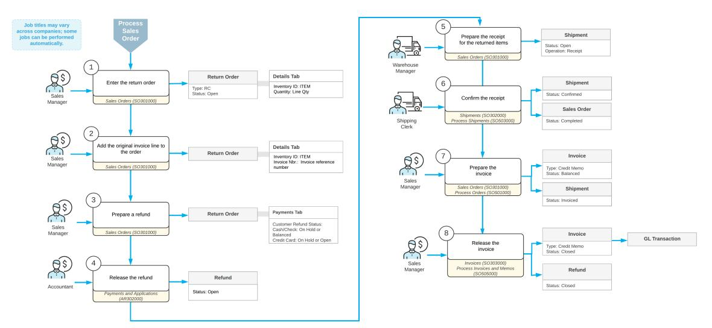

# <span id="page-254-0"></span>**Customer Returns with Refunds: Implementation Checklist**

The following sections provide details you can use to ensure that the system is configured properly for processing customer returns with refunds. You will also learn about the settings that affect the processing workflow so that you can make any needed changes.

#### **Implementation Checklist**

We recommend that before you initially create a customer return with a refund, you make sure that the needed features have been enabled, settings have been specified, and entities have been created. The following checklist summarizes the criteria you need to check.

| Form                                                                      | Criteria to Check                                                                                                                                                 |
|---------------------------------------------------------------------------|-------------------------------------------------------------------------------------------------------------------------------------------------------------------|
| Enable/Disable Features (CS100000)                                        | The Inventory feature has been enabled.                                                                                                                           |
| Sales Orders Preferences (SO101000), Inventory Prefer<br>ences (IN101000) | All necessary settings related to sales orders and in<br>ventory have been specified, as described in Configura<br>tion of Order Management: General Information. |
| Order Types (SO201000)                                                    | The RC, CM, or MO order type is active and has been<br>configured, as described in Sales Order Types: General<br>Information.                                     |
| Customers (AR303000)                                                      | All needed customers have been defined in the sys<br>tem, as described in Customers: Implementation Activi<br>ty.                                                 |
| Stock Items (IN202500)                                                    | All stock items have been defined in the system, as de<br>scribed in Stock Items: Implementation Activity.                                                        |

#### **Other Settings That Affect the Workflow**

You can affect the workflow of processing customer returns with refunds by specifying additional settings as follows:

- To cause sales orders of a particular order type to be created with the *On Hold* status, select the **Hold Documents on Entry** check box for the order type on the *Order [Types](https://help-2025r1.acumatica.com/Help?ScreenId=ShowWiki&pageid=e6984218-4260-4438-99e1-aee2b3765369)* form. This makes it possible for a responsible user to verify entered orders before they are processed. For more information on other order type settings that affect the workflow of sales orders, see *Sales Order Types: General [Information](https://help-2025r1.acumatica.com/Help?ScreenId=ShowWiki&pageid=96a00780-a0c3-4314-86ca-093004844268)*.
- To cause shipments to be created with the *On Hold* status, select the **Hold Shipments on Entry** check box on the *[Sales Orders Preferences](https://help-2025r1.acumatica.com/Help?ScreenId=ShowWiki&pageid=1817779c-413b-4187-b7fe-38e97845a1cb)* (SO101000) form. When shipments have this status, a responsible user can verify entered shipments before they are processed.
- To cause general ledger batches generated during the processing of sales documents to be posted automatically, select the **Automatically Post on Release** check box on the *[General Ledger Preferences](https://help-2025r1.acumatica.com/Help?ScreenId=ShowWiki&pageid=e4913d06-c511-4258-a0f9-f36c1b854e6b)* (GL102000) form. For information on processing general ledger batches, see *GL [Transactions:](https://help-2025r1.acumatica.com/Help?ScreenId=ShowWiki&pageid=35393020-6269-466d-8a08-df558cd43367) General [Information](https://help-2025r1.acumatica.com/Help?ScreenId=ShowWiki&pageid=35393020-6269-466d-8a08-df558cd43367)*.

### **Validation of Configuration**

To make sure that all configuration has been performed correctly, we recommend that in your system, you process a customer return with a refund by performing instructions similar to those described in *[Customer Returns with](#page-255-1) [Refunds: Process Activity](#page-255-1)*.

# <span id="page-255-1"></span><span id="page-255-0"></span>**Customer Returns with Refunds: Process Activity**

This activity will walk you through the process of creating and processing a return order with a refund.

This activity is based on the *U100* dataset. If you are using another dataset, or if any system settings have been changed in *U100*, these changes can affect the workflow of the activity and the results of the processing. To avoid any issues, restore the *U100* dataset to its initial state.

#### **Story**

Suppose that on January 18, 2025, the GoodFood One Restaurant ordered jars of strawberry jam, which were delivered on that day. The customer paid for the jam, and the payment was applied to the original invoice. Then on January 30, 2025, a manager of the GoodFood One Restaurant discovered that some of the jars of the strawberry jam were damaged and decided to return all the jars. GoodFood One Restaurant requested a refund of their payment.

Acting as a sales manager, you will process the refund of the payment and the return of the items to SweetLife's main warehouse.

### **Configuration Overview**

In the *U100* dataset, the following configuration tasks have been performed to prepare the system for this activity to be performed:

- The *Inventory* feature in the *Inventory and Order Management* group of features has been enabled on the *[Enable/Disable Features](https://help-2025r1.acumatica.com/Help?ScreenId=ShowWiki&pageid=c1555e43-1bc5-4f6f-ba9d-b323f94d8a6b)* (CS100000) form.
- On the *Order [Types](https://help-2025r1.acumatica.com/Help?ScreenId=ShowWiki&pageid=e6984218-4260-4438-99e1-aee2b3765369)* (SO201000) form, the *RC* order type has been configured and activated.
- On the *[Customers](https://help-2025r1.acumatica.com/Help?ScreenId=ShowWiki&pageid=652929bc-9606-4056-aa6e-0c2d1147171b)* (AR303000) form, the *GOODFOOD (GoodFood One Restaurant)* customer has been created.

- On the *[Stock Items](https://help-2025r1.acumatica.com/Help?ScreenId=ShowWiki&pageid=77786a70-1f1e-4d63-ad98-96f98e4fcb0e)* (SO202500) form, the *APJAM96* item has been created.
- The following sales documents, for which you will process a customer return, have been created in the system:
  - A sales order on the *[Sales Orders](https://help-2025r1.acumatica.com/Help?ScreenId=ShowWiki&pageid=19e4021c-1b84-49fd-be12-0320c5f1c7e5)* (SO301000), which has the *Completed* status.
  - A shipment on the *[Shipments](https://help-2025r1.acumatica.com/Help?ScreenId=ShowWiki&pageid=f47cffcc-543e-469c-a204-a9c1e3da346d)* (SO302000), which has the *Completed* status.
  - A sales invoice on the *[Invoices](https://help-2025r1.acumatica.com/Help?ScreenId=ShowWiki&pageid=0acc9738-f141-4ea0-a2be-f34ea9d1b63a)* (SO303000) form, which has the *Closed* status.

#### **Process Overview**

In this activity, you will first create a return order of the *RC* type on the *[Sales Orders](https://help-2025r1.acumatica.com/Help?ScreenId=ShowWiki&pageid=19e4021c-1b84-49fd-be12-0320c5f1c7e5)* (SO301000) form. You will add to this order a line of a sales invoice. Then you will create a refund by clicking **Create Refund** on the table toolbar on the **Payments** tab.

On the *[Payments and Applications](https://help-2025r1.acumatica.com/Help?ScreenId=ShowWiki&pageid=ae844bf4-1aef-42cd-9e2f-49b3ee1bc8d7)* (AR302000) form, you will release the refund you have created. Aer that, on the *[Shipments](https://help-2025r1.acumatica.com/Help?ScreenId=ShowWiki&pageid=f47cffcc-543e-469c-a204-a9c1e3da346d)* (SO302000) form, you will record the receipt of the returned items to inventory by creating and confirming a shipment with the *Receipt* operation. As the final step, on the *[Invoices](https://help-2025r1.acumatica.com/Help?ScreenId=ShowWiki&pageid=0acc9738-f141-4ea0-a2be-f34ea9d1b63a)* (SO303000) form, you will create and release a credit memo to adjust the customer's balance in the system by the amount of the returned items.

#### **System Preparation**

Do the following:

- 1. Launch the Acumatica ERP website and sign in to a company with the *U100* dataset preloaded. You should sign in as a sales manager by using the *norman* username and the *123* password.
- 2. In the info area, in the upper-right corner of the top pane of the Acumatica ERP screen, make sure that the business date in your system is set to *1/30/2025*. If a different date is displayed, click the Business Date menu button and select *1/30/2025* on the calendar. For simplicity, in this activity, you will create and process all documents in the system on this business date.

#### **Step 1: Creating a Return Order**

You create a return order as follows:

1. On the *[Sales Orders](https://help-2025r1.acumatica.com/Help?ScreenId=ShowWiki&pageid=19e4021c-1b84-49fd-be12-0320c5f1c7e5)* (SO301000) form, add a new record.


To open the form for creating a new record, type the form ID in the Search box, and on the Search form, point at the form title and click **New** right of the title.

- 2. Specify the following settings in the Summary area:
  - **OrderType**: *RC*
  - **Customer**: *GOODFOOD*
  - **Date**: *1/30/2025*
  - **Requested On**: *1/30/2025*
  - **Description**: Return of strawberry jam
- 3. On the form toolbar, click**Save**.

#### **Step 2: Adding the Item to Be Returned**

Now you need to add a line of the sales invoice to the return order. Do the following:

1. While you are still viewing the return order on the *[Sales Orders](https://help-2025r1.acumatica.com/Help?ScreenId=ShowWiki&pageid=19e4021c-1b84-49fd-be12-0320c5f1c7e5)* (SO301000) form, on the table toolbar of the **Details** tab, click **Add Invoice**.

- 2. In the **Add Invoice Details** dialog box, which opens, do the following:
  - a. In the **AR Doc.Type** box, select *Invoice*.
  - b. In the **AR Doc. Nbr.** box, select the reference number of the invoice to *GOODFOOD* in the amount of *1048.47* dated *1/18/2025*. The invoice lines appear in the table of the dialog box.
  - c. In the table, select the unlabeled check box in the *STRAWJAM96* line.
  - d. Click **Add & Close**, which closes the dialog box and adds the line to the **Details** tab of the return order.
- 3. On the form toolbar, click**Save**.

#### **Step 3: Creating a Refund**

To create a refund, do the following:

- 1. While you are still viewing the return order on the *[Sales Orders](https://help-2025r1.acumatica.com/Help?ScreenId=ShowWiki&pageid=19e4021c-1b84-49fd-be12-0320c5f1c7e5)* (SO301000) form, on the table toolbar of the **Payments** tab, click **Create Refund**.
- 2. In the **Create Refund** dialog box, which opens, make sure that *1048.47* is specified in the **Refund Amount** box. This is the amount of the payment in the original invoice.
- 3. Make sure that *CHECK - Check Payment* is selected in the **Payment Method** box.
- 4. Click **OK** to close the dialog box.

The system creates a refund for the *GOODGOOD* customer and applies it to the return order.

5. In the only line on the **Payments** tab, click the link in the **Reference Nbr.** column.

The system opens the refund on the *[Payments and Applications](https://help-2025r1.acumatica.com/Help?ScreenId=ShowWiki&pageid=ae844bf4-1aef-42cd-9e2f-49b3ee1bc8d7)* (AR302000) form in a new browser window.

- 6. On the form toolbar, click **Remove Hold** and then click **Release**.
- 7. Close the browser window with the *[Payments and Applications](https://help-2025r1.acumatica.com/Help?ScreenId=ShowWiki&pageid=ae844bf4-1aef-42cd-9e2f-49b3ee1bc8d7)* form.

The refund has been created and released. Now you can process the incoming shipment.

#### **Step 4: Receiving the Returned Items**

To receive the returned items, you process the incoming shipment as follows:

- 1. While you are still viewing the return order on the *[Sales Orders](https://help-2025r1.acumatica.com/Help?ScreenId=ShowWiki&pageid=19e4021c-1b84-49fd-be12-0320c5f1c7e5)* (SO301000) form, on the form toolbar, click **Create Receipt**.
- 2. In the **SpecifyShipment Parameters** dialog box, which opens, make sure that *1/30/2025* is selected as the **Shipment Date** and *WHOLESALE* is selected as the **Warehouse ID**.
- 3. Click **OK**. The system closes the dialog box and opens the prepared shipment with the *Receipt* operation on the *[Shipments](https://help-2025r1.acumatica.com/Help?ScreenId=ShowWiki&pageid=f47cffcc-543e-469c-a204-a9c1e3da346d)* (SO302000) form.
- 4. On the form toolbar, click **Confirm Shipment**.

#### **Step 5: Processing a Credit Memo**

Now that you have processed the return of the items to inventory, you need to prepare a credit memo for the customer to adjust the customer's balance and apply the refund to the credit memo. Do the following:

- 1. While you are still viewing the shipment on the *[Shipments](https://help-2025r1.acumatica.com/Help?ScreenId=ShowWiki&pageid=f47cffcc-543e-469c-a204-a9c1e3da346d)* (SO302000) form, on the form toolbar, click **Prepare Invoice**. The system creates a credit memo (that is, a document with the *Credit Memo* type) for the customer and opens it on the *[Invoices](https://help-2025r1.acumatica.com/Help?ScreenId=ShowWiki&pageid=0acc9738-f141-4ea0-a2be-f34ea9d1b63a)* (SO303000) form.
- 2. On the form toolbar, click **Release** to release the credit memo.
- 3. On the **Applications** tab of the *[Invoices](https://help-2025r1.acumatica.com/Help?ScreenId=ShowWiki&pageid=0acc9738-f141-4ea0-a2be-f34ea9d1b63a)* form, review the only line (which has the refund), as shown in the following screenshot. Notice that the credit memo and refund have the *Closed* status. This means that the

refund has been applied to the credit memo and the customer return with the refund has been processed to completion.

| Invoices<br>Credit Memo 000121 - GoodFood One Restaurant                                             |                                                                     |                            | <b>PINOTES</b> | <b>ACTIVITIES</b><br><b>FILES</b> | TOOLS $\star$ |
|------------------------------------------------------------------------------------------------------|---------------------------------------------------------------------|----------------------------|----------------|-----------------------------------|---------------|
| 목<br>$\Box$<br>n<br>$\overline{\mathbf{K}}$<br>Ĥ<br>$\Omega$<br>$^+$<br>$\leftarrow$<br>$\checkmark$ | $\left\langle \right\rangle$<br>$\geq$<br>$\rightarrow$<br>$\cdots$ |                            |                |                                   |               |
| Credit Me ~<br>Customer:<br>Type:                                                                    | !!!!!!!!!!!!!!!!!!!!!!!!!!!!!!!!!!!!!!!!                            | Detail Total:<br>$\Lambda$ | 963.00         |                                   | ∼             |
| Reference Nbr.:<br>Q<br>Location:<br>000121                                                          | <b>MAIN - Primary Location</b>                                      | Line Discounts:            | 0.00           |                                   |               |
| Status:<br>Closed<br>Terms:                                                                          |                                                                     | Document Dis               | 0.00           |                                   |               |
| Due Date:<br>Date:<br>1/30/2025                                                                      |                                                                     | <b>Freight Total:</b>      | 0.00           |                                   |               |
| Post Period:<br>Cash Discount<br>01-2025                                                             |                                                                     | <b>Tax Total:</b>          | 85.47          |                                   |               |
| Customer Ord                                                                                         |                                                                     | Amount:                    | 1,048.47       |                                   |               |
| Project/Contract: X - Non-Project Code.                                                              |                                                                     | Balance:<br>$\hat{a}$      | 0.00           |                                   |               |
| Description:<br>Return of strawberry jam                                                             |                                                                     | Cash Discount:             | 0.00           |                                   |               |
| <b>DETAILS</b><br><b>TAXES</b><br><b>FREIGHT</b><br><b>FINANCIAL</b>                                 | <b>APPLICATIONS</b><br><b>ADDRESSES</b>                             |                            |                |                                   |               |
| $^{+}$<br>Ò<br><b>CREATE REFUND</b><br>$\vdash$<br>$\sqrt{N}$<br>$\times$                            |                                                                     |                            |                | Not Released:                     | 0.00          |
| 冒<br>$\Box$ Doc. Type<br>0<br>*Reference Nbr.                                                        | <b>Amount Paid Date</b><br>Customer                                 | <b>Balance Status</b>      |                | Released:                         | 0.00          |
|                                                                                                      |                                                                     |                            |                | <b>Total Paid:</b>                | 1.048.47      |
| 0<br>Refund<br>D<br>000080                                                                           | !!!!!!!!!!!!!!!!!!!!!!!!!!!!!!!!!!!!!!!!<br>1.048.47                | 1/30/2025<br>0.00          | <b>Closed</b>  | Write-Off Total:                  | 0.00          |
|                                                                                                      |                                                                     |                            |                |                                   |               |
|                                                                                                      |                                                                     |                            |                | <b>Unpaid Balance:</b>            | 0.00          |
|                                                                                                      |                                                                     |                            |                |                                   |               |

*Figure: Credit memo prepared for the return order*

# <span id="page-258-0"></span>**Customer Returns with Refunds: Generated Transactions**

As you process a customer return with a refund, you create and process a refund and a credit memo. To update customer balances and track the movements of items, the system generates the GL transactions described in the following sections.

#### **Transactions Generated for a Refund**

When you create and release a refund, the system generates the following general ledger transactions.

| Account                     | Source of Account                                      | Debit  | Credit |
|-----------------------------|--------------------------------------------------------|--------|--------|
| Cash account                | The default cash ac<br>count for the payment<br>method | 0.00   | Amount |
| Accounts Receivable account | Settings on the Cus<br>tomers (AR303000) form          | Amount | 0.00   |

You can view the reference number of the GL batch on the **Financial** tab of the *[Payments and Applications](https://help-2025r1.acumatica.com/Help?ScreenId=ShowWiki&pageid=ae844bf4-1aef-42cd-9e2f-49b3ee1bc8d7)* (AR302000) form.

#### **Transactions Generated for a Credit Memo**

When you create and release a credit memo, the system generates the following general ledger transactions.

| Account             | Source of Account                             | Debit  | Credit |
|---------------------|-----------------------------------------------|--------|--------|
| Accounts Receivable | Settings on the Cus<br>tomers (AR303000) form | 0.00   | Amount |
| Sales Account       | Settings on the Cus<br>tomers form            | Amount | 0.00   |

The system also releases an inventory issue, which generates the following general ledger transactions.

| Account                   | Source of Account                                      | Debit  | Credit |
|---------------------------|--------------------------------------------------------|--------|--------|
| Inventory/Accrual account | Settings on the Post<br>ing Classes (IN206000)<br>form | Amount | 0.00   |
| COGS/Expense account      | Settings on the Posting<br>Classes form                | 0.00   | Amount |

You can view the reference number of the GL batch on the **Financial** tab of the *[Issues](https://help-2025r1.acumatica.com/Help?ScreenId=ShowWiki&pageid=17b051f6-027d-4459-b542-65c1c1f9d0ea)* (IN302000) form.

# <span id="page-259-0"></span>**Customer Returns with Refunds: Related Reports and Forms**

In the following sections, you can find details about ways to gather information about the returns of items that have been processed or are being processed in the system.

If you do not see a particular report or form that is described, you may have signed in to the system with a user account that does not have access rights to the report or form. Contact your system administrator to obtain access to any needed reports or forms.

#### **Printing Return Orders**

To prepare a printable version of the return order that is being processed, you use the *[Sales Order](https://help-2025r1.acumatica.com/Help?ScreenId=ShowWiki&pageid=5cf7adff-3a33-41f5-8903-997636fe2c8a)* (SO641010) report. While you are viewing a return order on the *[Sales Orders](https://help-2025r1.acumatica.com/Help?ScreenId=ShowWiki&pageid=19e4021c-1b84-49fd-be12-0320c5f1c7e5)* (SO301000) form, you can print the sales order by clicking **PrintSales Order** on the More menu. The system opens the *[Sales Order](https://help-2025r1.acumatica.com/Help?ScreenId=ShowWiki&pageid=5cf7adff-3a33-41f5-8903-997636fe2c8a)* report with the printable version of the return order; then you can view the return order and print it by clicking **Print** on the report toolbar.

### **Finding Shipments Related to a Return Order**

If you need to view a shipment that is linked to a particular return order, you open the return order on the *[Sales](https://help-2025r1.acumatica.com/Help?ScreenId=ShowWiki&pageid=19e4021c-1b84-49fd-be12-0320c5f1c7e5) [Orders](https://help-2025r1.acumatica.com/Help?ScreenId=ShowWiki&pageid=19e4021c-1b84-49fd-be12-0320c5f1c7e5)* (SO301000) form and go to the**Shipments** tab, which lists all the shipments that have been prepared for the order. To view the details of a listed shipment, you click its reference number in the **Document Nbr.** column; the system opens the shipment on the *[Shipments](https://help-2025r1.acumatica.com/Help?ScreenId=ShowWiki&pageid=f47cffcc-543e-469c-a204-a9c1e3da346d)* (SO302000) form.

#### **Printing Invoices**

To prepare a printable form of the credit memo that is being processed, you use the *[Invoice & Memo](https://help-2025r1.acumatica.com/Help?ScreenId=ShowWiki&pageid=4ae85fa6-7297-4d4c-b956-77d36e67e13f)* (SO643000) report. While you are viewing a credit memo on the *[Invoices](https://help-2025r1.acumatica.com/Help?ScreenId=ShowWiki&pageid=0acc9738-f141-4ea0-a2be-f34ea9d1b63a)* (SO303000) form, you can go to this report by clicking **Print Invoice** on the More menu. The system opens the *[Invoice & Memo](https://help-2025r1.acumatica.com/Help?ScreenId=ShowWiki&pageid=4ae85fa6-7297-4d4c-b956-77d36e67e13f)* report with the printable version of the credit memo; then you can view the credit memo and print it by clicking **Print** on the report toolbar.

# <span id="page-260-0"></span>**Customer Returns with Refunds: Mass-Processing of Documents**

The following sections explain how to mass-process documents related to the processing of customer returns with refunds, and how the system generates, changes, or works with documents as a result of the mass processing.

### **Mass-Confirming Shipments**

You can confirm multiple incoming and outgoing shipments at a time. To do this, you open the *[Process Shipments](https://help-2025r1.acumatica.com/Help?ScreenId=ShowWiki&pageid=2e27f8fd-ddd4-47f0-a83b-5a7db31feede)* (SO503000) form and select the *Confirm Shipment* action. Then you select the unlabeled check boxes in the rows of the shipments to be processed and click **Process** on the form toolbar. The system confirms the selected shipment documents.

#### **Mass-Creating Credit Memos**

You can create multiple credit memos (which are invoices of the *Credit Memo* type) on the *[Process Orders](https://help-2025r1.acumatica.com/Help?ScreenId=ShowWiki&pageid=c06a334c-f39d-4eff-9d80-b167657dff73)* (SO501000) or *[Process Shipments](https://help-2025r1.acumatica.com/Help?ScreenId=ShowWiki&pageid=2e27f8fd-ddd4-47f0-a83b-5a7db31feede)* (SO503000) form. On these forms, you select the *Prepare Invoice* action. Then you select the unlabeled check boxes in the return order lines to be processed, which could include lines of the return order or orders you were working with, and lines of any other order. Finally, you click **Process** on the form toolbar.

# <span id="page-261-0"></span>**Processing Returns for Credit Without Receipts**

Acumatica ERP gives you the flexibility to manage various types of customer returns. Depending on your company's return policies, you may need to perform a return for credit when shipping of returned items to inventory is not needed. This topic describes the processing steps you need to perform, and the transactions generated during these steps.

To process an unauthorized return without receipt and shipment, you can use a credit memo (*CM*) order. The processing of a return for credit involves the actions and generated documents shown in the following diagram.

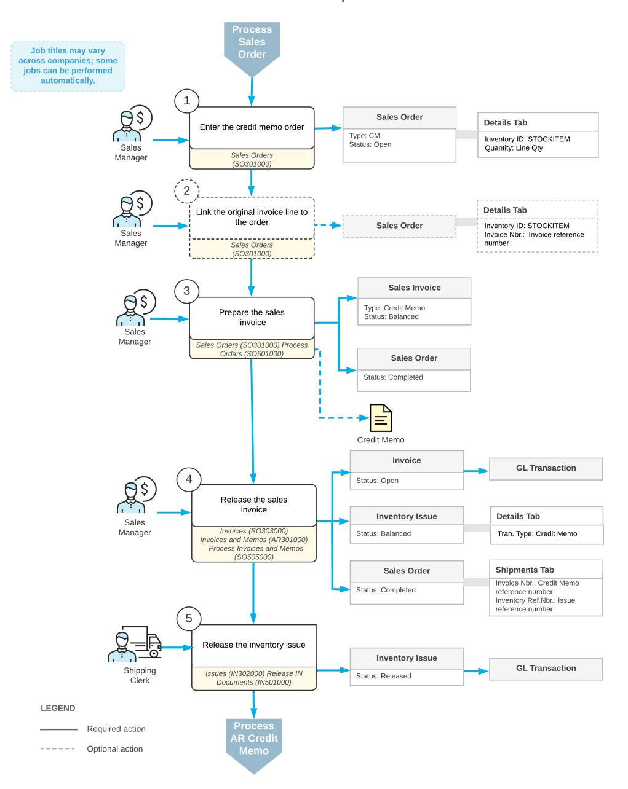

The following sections describe in detail the processing steps shown in the diagram.

#### **1. Enter the Credit Memo**

You create a new credit memo order on the *[Sales Orders](https://help-2025r1.acumatica.com/Help?ScreenId=ShowWiki&pageid=19e4021c-1b84-49fd-be12-0320c5f1c7e5)* (SO301000) form. A reference number for the new return order is generated according to the numbering sequence assigned to this order type on the *Order [Types](https://help-2025r1.acumatica.com/Help?ScreenId=ShowWiki&pageid=e6984218-4260-4438-99e1-aee2b3765369)* (SO201000) form. If the order is created with the *On Hold* status, you should click **Remove Hold** on the form toolbar to process the order further.

#### **2. Link the Original Invoice Line to the Order**

Each line in the order of the *CM* order type can include a reference to the original invoice for which the return is performed. To add an item to be returned and include a link to original invoice, on the *[Sales Orders](https://help-2025r1.acumatica.com/Help?ScreenId=ShowWiki&pageid=19e4021c-1b84-49fd-be12-0320c5f1c7e5)* (SO301000) form, you can click **Add Invoice** on the table toolbar of the **Details** tab and select the line of the needed invoice in the **Add Invoice Details** dialog box (which opens).

You can also add a stock item to be returned without linking it to an invoice. To do this, click **Add Items** on the table toolbar of the **Details** tab, and select the item in the **Inventory Lookup** dialog box (which opens).

#### **3. Prepare the Sales Invoice**

You can prepare the sales invoice by clicking **Prepare Invoice** on the More menu of the *[Sales Orders](https://help-2025r1.acumatica.com/Help?ScreenId=ShowWiki&pageid=19e4021c-1b84-49fd-be12-0320c5f1c7e5)* (SO301000) form, or you can create any number of invoices by selecting the *Prepare Invoice* action and processing multiple orders on the *[Process Orders](https://help-2025r1.acumatica.com/Help?ScreenId=ShowWiki&pageid=c06a334c-f39d-4eff-9d80-b167657dff73)* (SO501000) form.

The prepared document or documents of the *Credit Memo* type can be reviewed on the *[Invoices](https://help-2025r1.acumatica.com/Help?ScreenId=ShowWiki&pageid=0acc9738-f141-4ea0-a2be-f34ea9d1b63a)* (SO303000) form. You can print a sales invoice by clicking **Print Invoice** (under **Printing and Emailing**) on the More menu of this form.

#### **4. Release the Sales Invoice**

For the credit memo order, the released sales invoice acts as a shipment does: On release of the invoice, the system updates the **Qty. on Shipments** value in the order lines based on the quantity specified in the credit memo lines, and inserts the reference number of the SO credit memo on the**Shipments** tab of the *[Sales Orders](https://help-2025r1.acumatica.com/Help?ScreenId=ShowWiki&pageid=19e4021c-1b84-49fd-be12-0320c5f1c7e5)* (SO301000) form.

When the sales invoice is released, a batch of GL transactions is generated, and the system automatically generates an inventory issue with the *Credit Memo* transaction type that adds the returned item to inventory. Also, a corresponding AR credit memo is generated and becomes available for review on the *[Invoices and Memos](https://help-2025r1.acumatica.com/Help?ScreenId=ShowWiki&pageid=5e6f3b27-b7af-412f-a40a-1d4f4be70cba)* (AR301000) form.

#### **5. Release the Inventory Issue**

The generated inventory issue is released automatically if the **Automatically Release IN Documents** check box is selected on the *[Sales Orders Preferences](https://help-2025r1.acumatica.com/Help?ScreenId=ShowWiki&pageid=1817779c-413b-4187-b7fe-38e97845a1cb)* (SO101000) form. If this check box is cleared, you have to release the inventory issue manually by clicking **Release** on the form toolbar of the *[Issues](https://help-2025r1.acumatica.com/Help?ScreenId=ShowWiki&pageid=17b051f6-027d-4459-b542-65c1c1f9d0ea)* (IN302000) form. On release of the inventory issue, a batch of GL transactions is generated.

To finish the return process, you need to process the AR credit memo to completion. You can apply the credit memo to the original invoice, or process the refund if the original invoice was already paid. For details on credit memo application, see *AR Invoice [Correction:](https://help-2025r1.acumatica.com/Help?ScreenId=ShowWiki&pageid=6018887a-76b9-4ff1-8bd4-20d95da075a8) To Create a Credit Memo*. For details on the processing of a refund, see *[Refunds:](https://help-2025r1.acumatica.com/Help?ScreenId=ShowWiki&pageid=90d571d6-946c-4a2e-9927-2438b8f65a38) To Create a Refund and Apply a Credit Memo to It*.

#### **Related Links**

- *Sales Order Types: General [Information](https://help-2025r1.acumatica.com/Help?ScreenId=ShowWiki&pageid=96a00780-a0c3-4314-86ca-093004844268)*
- *To [Process](#page-264-1) a Credit Memo Order (CM)*
- *[Refunds:](https://help-2025r1.acumatica.com/Help?ScreenId=ShowWiki&pageid=90d571d6-946c-4a2e-9927-2438b8f65a38) To Create a Refund and Apply a Credit Memo to It*

# <span id="page-263-0"></span>**To Create a Credit Memo Order (CM)**

To credit a customer for returned goods without shipping items, you enter a credit memo order (that is, an order of the *CM* order type) by using the *[Sales Orders](https://help-2025r1.acumatica.com/Help?ScreenId=ShowWiki&pageid=19e4021c-1b84-49fd-be12-0320c5f1c7e5)* (SO301000) form.

#### **To Enter a Credit Memo Order**

- 1. Open the *[Sales Orders](https://help-2025r1.acumatica.com/Help?ScreenId=ShowWiki&pageid=19e4021c-1b84-49fd-be12-0320c5f1c7e5)* (SO301000) form.
- 2. In the Summary area, select *CM* as the order type.
- 3. Select the customer in the **Customer** box.
- 4. Check the location of the customer in the order, and change it if needed.
- 5. Check the currency and the currency exchange rate on the corresponding document from the customer, and change these in the order if needed.
- 6. Notice the non-project code that is shown in the **Project** box; if this order is associated with a particular project, select the project.
- 7. Check the date of the order, and change it if needed.
- 8. In the **Requested On** box, specify the date of the customer document.
- 9. In the **Description** box, provide a brief description of this credit memo order.
- 10.On the **Details** tab, add all the invoices that list the items that have been returned. For each invoice, click **Add Invoice** on the table toolbar and perform the following steps:
  - a. In the **AR Doc. Nbr.** box of the **Add Invoice Details** dialog box, which opens, select the customer invoice by its identifier.
  - b. Once the line or lines of the selected document appear in the table, select the unlabeled check box to the le of each line with an item to be returned.
  - c. Click the **Add & Close** button to add the selected lines to the order (on the **Details** tab) and close the dialog box.
  - d. Click **Save** on the form toolbar.

11.Optional: To add other items that will be returned, perform the following steps for each item:

- a. On the **Details** tab, click **Add Items** on the table toolbar. The **Inventory Lookup** dialog box appears with a list of active inventory items.
- b. In the dialog box, to find the item by a string in its inventory ID or description, type this string in the **Inventory** box.
- c. To further narrow the list to a particular subitem of the item (if subitems are used in your system), select it in the **Subitem** box.
- d. In the resulting list of items, select the unlabeled check box in the row of the item you want to add, and in the **Qty.Selected** column, specify the quantity of the item to be returned (measured in the sales unit of measure shown in the**Sales Unit** column).
- e. Click the **Add & Close** button, which adds the items and closes the dialog box.
- f. Click **Save** on the form toolbar.

12.On the form toolbar, click **Remove Hold**.

13.On the form toolbar, click**Save**.

To view and add particular stock items of non-stock kits in the **Inventory Lookup** dialog box, select the **Show Non-Stock Kits by Components** check box.

# <span id="page-264-1"></span><span id="page-264-0"></span>**To Process a Credit Memo Order (CM)**

To credit a customer for returned goods without shipping items, you process a credit memo order (that is, an order of the *CM* order type) by using the *[Sales Orders](https://help-2025r1.acumatica.com/Help?ScreenId=ShowWiki&pageid=19e4021c-1b84-49fd-be12-0320c5f1c7e5)* (SO301000) form.

#### **To Process a Credit Memo Order**

- 1. Open the *[Sales Orders](https://help-2025r1.acumatica.com/Help?ScreenId=ShowWiki&pageid=19e4021c-1b84-49fd-be12-0320c5f1c7e5)* (SO301000) form.
- 2. In the Summary area, select the credit memo order to be processed by specifying its type (*CM*) and reference number.
- 3. On the More menu, click **Prepare Invoice**.

This generates a credit memo with the returned items listed. The system opens the *[Invoices](https://help-2025r1.acumatica.com/Help?ScreenId=ShowWiki&pageid=0acc9738-f141-4ea0-a2be-f34ea9d1b63a)* (SO303000) form to display the new document.

4. On this form, release the credit memo by clicking **Release** on the form toolbar.

This creates an issue transaction of the *Credit Memo* type in the Inventory module. Once you release the credit memo, the original *CM* order is assigned the *Completed* status.

#### **Related Links**

• *To [Process](#page-264-1) a Credit Memo Order (CM)*

# <span id="page-265-0"></span>**Processing Returns for Cash**

Acumatica ERP gives you the flexibility to manage various types of customer returns. Depending on your company's return policies, you may need to perform a return of an inventory item for cash. This topic describes the processing steps you need to perform and the transactions generated during these steps.

To process a return for cash, you can use a return order for cash (that is, an order with the *CR* predefined order type). The processing of a return for cash involves the actions and generated documents shown in the following diagram.

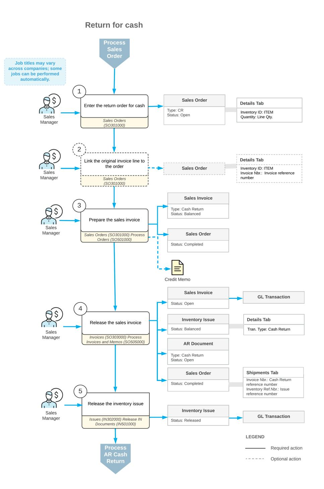

The following sections describe in detail the processing steps shown in the diagram.

#### **1. Enter the Return Order for Cash**

You create a new return order for cash on the *[Sales Orders](https://help-2025r1.acumatica.com/Help?ScreenId=ShowWiki&pageid=19e4021c-1b84-49fd-be12-0320c5f1c7e5)* (SO301000) form. A reference number for the new return order for cash is generated according to the numbering sequence assigned to this order type on the *Order [Types](https://help-2025r1.acumatica.com/Help?ScreenId=ShowWiki&pageid=e6984218-4260-4438-99e1-aee2b3765369)* (SO201000) form. If the order is created with the *On Hold* status, you should click **Remove Hold** on the form toolbar to process the order further.

#### **2. Link the Original Invoice Line to the Order**

Each line in the order of the *CR* order type can include a link to the original invoice for which the return is performed. To add an item to be returned with a link to the original invoice, on the *[Sales Orders](https://help-2025r1.acumatica.com/Help?ScreenId=ShowWiki&pageid=19e4021c-1b84-49fd-be12-0320c5f1c7e5)* (SO301000) form, you can click **Add Invoice** on the table toolbar of the **Details** tab and select the line of the needed invoice in the **Add Invoice Details** dialog box (which opens). If an item to be returned has a specific lot or serial number, you should select this particular item from the list of invoice lines.

You can also add a stock item to be returned without linking it to an invoice. To do this, click **Add Items** on the table toolbar of the **Details** tab, and select an item in the **Inventory Lookup** dialog box (which opens).

In each line added on the **Details** tab for an order of the *CR* type, you must specify a reason code. Also, the payment information on the **PaymentSettings** tab is required for the cash return.

#### **3. Prepare the Sales Invoice**

You can prepare the sales invoice by clicking **Prepare Invoice** on the More menu of the *[Sales Orders](https://help-2025r1.acumatica.com/Help?ScreenId=ShowWiki&pageid=19e4021c-1b84-49fd-be12-0320c5f1c7e5)* (SO301000) form, or you can create multiple invoices by selecting the *Prepare Invoice* action and performing this action for multiple orders on the *[Process Orders](https://help-2025r1.acumatica.com/Help?ScreenId=ShowWiki&pageid=c06a334c-f39d-4eff-9d80-b167657dff73)* (SO501000) form.

The prepared document or documents of the *Cash Return* type can be reviewed on the *[Invoices](https://help-2025r1.acumatica.com/Help?ScreenId=ShowWiki&pageid=0acc9738-f141-4ea0-a2be-f34ea9d1b63a)* (SO303000) form. You can print a sales invoice by clicking **Reports > Print Invoice** on the form toolbar of the *[Invoices](https://help-2025r1.acumatica.com/Help?ScreenId=ShowWiki&pageid=0acc9738-f141-4ea0-a2be-f34ea9d1b63a)* (SO303000) form.

#### **4. Release the Sales Invoice**

When the sales invoice of the *Cash Return* type is released, the system automatically generates an inventory issue with the *Credit Memo* transaction type that adds the returned item to inventory; you can review the generated issue on the *[Issues](https://help-2025r1.acumatica.com/Help?ScreenId=ShowWiki&pageid=17b051f6-027d-4459-b542-65c1c1f9d0ea)* (IN302000) form. Also, the related AR cash return with the same reference number becomes available for reviewing on the *[Cash Sales](https://help-2025r1.acumatica.com/Help?ScreenId=ShowWiki&pageid=f8e8a35f-4de7-40c0-8030-ebf9f7910119)* (AR304000) form. The document updates the appropriate sales and cash accounts.

#### **5. Release the Inventory Issue**

The generated inventory issue is released automatically if the **Automatically Release IN Documents** check box is selected on the *[Sales Orders Preferences](https://help-2025r1.acumatica.com/Help?ScreenId=ShowWiki&pageid=1817779c-413b-4187-b7fe-38e97845a1cb)* form. If this check box is cleared, you have to release the inventory issue manually by clicking **Release** on the form toolbar of the *[Issues](https://help-2025r1.acumatica.com/Help?ScreenId=ShowWiki&pageid=17b051f6-027d-4459-b542-65c1c1f9d0ea)* (IN302000) form. On release of the inventory issue, a batch of GL transactions is generated.

### <span id="page-266-0"></span>**To Create a Cash Return Order (CR)**

To process a return of items that were sold on a cash sale, you create a cash return order (that is, an order of the *CR* order type) by using the *[Sales Orders](https://help-2025r1.acumatica.com/Help?ScreenId=ShowWiki&pageid=19e4021c-1b84-49fd-be12-0320c5f1c7e5)* (SO301000) form.

#### **To Create a Cash Return Order**

- 1. Open the *[Sales Orders](https://help-2025r1.acumatica.com/Help?ScreenId=ShowWiki&pageid=19e4021c-1b84-49fd-be12-0320c5f1c7e5)* (SO301000) form.
- 2. In the Summary area, select *CR* as the order type.
- 3. Select the customer in the **Customer** box.
- 4. Check the location of the customer in the order, and change it if needed.
- 5. Check the currency and the currency exchange rate on the corresponding document from the customer, and change these in the order if needed.
- 6. Notice the non-project code that is shown in the **Project** box; if this order is associated with a particular project, select the project.
- 7. Check the date of the order, and change it if needed.
- 8. In the **Requested On** box, specify the date of the customer document.
- 9. In the **Description** box, provide a brief description of this return order.
- 10.To specify the items to be returned, you can either add items or add original documents. To add the items to be returned, go to Step 12. If the items to be returned were listed on cash sales documents, on the **Details** tab, add the original cash sales document. To do this, click **Add Invoice** on the table toolbar and perform the following steps for each returned item:
  - a. In the **AR Doc.Type** box of the **Add Invoice Details** dialog box, which opens, select *Cash Sales*.
  - b. In the **AR Doc. Nbr.** box, select the customer document by its identifier.
  - c. Once the line or lines of the selected invoice appear in the table, select the unlabeled check boxes to the le of each line with an item that is being returned.

To view and add particular stock items of non-stock kits, select the**Show Non-Stock Kits by Components** check box.

- d. Click the **Add & Close** button to add selected lines to the order and close the dialog box.
- e. On the **Details** tab, specify the **Reason Code** for the return in each added line.
- f. Click **Save** on the form toolbar.
- 11.To add the items that will be returned and that were paid by one payment, perform the following steps for each item:
  - a. On the **Details** tab, click **Add Items** on the table toolbar. The **Inventory Lookup** dialog box appears with a list of active inventory items.
  - b. In the dialog box, to find the item by a string in its inventory ID or description, type this string in the **Inventory** box.
  - c. To further narrow the list to a particular subitem of the item (if subitems are used in your system), select it in the **Subitem** box.
  - d. In the resulting list of items, select an unlabeled check box in the row of the item you want to add, and in the **Qty.Selected** column, specify the requested quantity of the item (measured in the default unit of measure shown in the **UOM** column).
  - e. Click the **Add & Close** button, which closes the dialog box.
  - f. In the row on the **Details** tab with the item you added, specify the **Reason Code** for the return.
  - g. Click **Save** on the form toolbar.
- 12.In the **Payment Ref.** box on the **Payments** tab, type the payment reference number.

13.On the form toolbar, click **Remove Hold**.

14.On the form toolbar, click**Save**.

# <span id="page-268-0"></span>**To Process a Cash Return Order (CR)**

To record a return of items that were sold in a cash sale, you process a cash return order (that is, an order of the *CR* order type) by using the *[Sales Orders](https://help-2025r1.acumatica.com/Help?ScreenId=ShowWiki&pageid=19e4021c-1b84-49fd-be12-0320c5f1c7e5)* (SO301000) form.

#### **To Process a Cash Return Order**

- 1. Open the *[Sales Orders](https://help-2025r1.acumatica.com/Help?ScreenId=ShowWiki&pageid=19e4021c-1b84-49fd-be12-0320c5f1c7e5)* (SO301000) form.
- 2. In the Summary area, select the order by specifying its type (*CR*) and reference number.
- 3. On the More menu, click **Prepare Invoice**.

This generates a cash return document with the returned items listed. The system opens the *[Invoices](https://help-2025r1.acumatica.com/Help?ScreenId=ShowWiki&pageid=0acc9738-f141-4ea0-a2be-f34ea9d1b63a)* (SO303000) form to display the new document.

4. On the More menu of the opened form, select **Release** to release the cash return document.

The system updates the availability data by creating an inventory transaction of the *Credit Memo* type, and generates a cash transaction of the *Cash Return* type. Once you release the cash return, the original *CR* order is assigned the *Completed* status.

# <span id="page-269-0"></span>**Processing Sales of Non-Stock Items with Shipping**

If your company sells and ships items whose quantities are not tracked in inventory, these items can be defined as non-stock items in Acumatica ERP. You can then process sales of these items by using sales orders of the *SO* type.

In Acumatica ERP, a sales order can contain stock items, non-stock items, or a mix of both types of items. For simplicity, this chapter will focus on sales orders of the *SO* type that contain only non-stock items that will be shipped.

The topics of this chapter explain how to process a sale of non-stock items with shipping, and which documents are prepared during the processing of the sale.

# <span id="page-269-1"></span>**Sales of Non-Stock Items with Shipping: General Information**

Non-stock items in Acumatica ERP, which are defined on the *[Non-Stock Items](https://help-2025r1.acumatica.com/Help?ScreenId=ShowWiki&pageid=bf68dd4f-63d4-460d-8dc0-9152f2bd6bf1)* (IN202000) form during implementation, are used to represent products that cannot be stocked in warehouses (such as services or charges) or physical entities whose quantities you do not need to track.

The following sections describe the sales process of non-stock items that are shipped to the customer.

#### **Learning Objectives**

In this chapter, you will do the following:

- Prepare a sales order for a sale of non-stock items with shipping
- Prepare the shipment for the sales order
- Prepare the invoice that corresponds to the sales order

#### **Applicable Scenario**

You process a sales order with non-stock lines and then create a shipment if a customer buys some goods that are defined as non-stock items in the system, and the goods must be shipped to the customer's place.

#### **Sales of Non-Stock Items with Shipping**

The standard sales process with order management soware typically includes entering a sales order, processing a shipment of the items, and preparing the related sales invoice for the customer. In Acumatica ERP, to begin processing a sale that requires the items to be shipped before billing occurs, you enter a sales order of the *SO* type on the *[Sales Orders](https://help-2025r1.acumatica.com/Help?ScreenId=ShowWiki&pageid=19e4021c-1b84-49fd-be12-0320c5f1c7e5)* (SO301000) form and add the requested non-stock items to the order.

Then you use the *[Shipments](https://help-2025r1.acumatica.com/Help?ScreenId=ShowWiki&pageid=f47cffcc-543e-469c-a204-a9c1e3da346d)* (SO302000) form to prepare and confirm each shipment related to the sales order. When each shipment is confirmed, you need to bill the customer for the shipped items by preparing a sales invoice, which is a financial document in the system that contains links to the applicable shipments and sales orders. You can review the prepared sales invoice on the *[Invoices](https://help-2025r1.acumatica.com/Help?ScreenId=ShowWiki&pageid=0acc9738-f141-4ea0-a2be-f34ea9d1b63a)* (SO303000) form; then you can release it. When the sales invoice is released, the sales invoice becomes visible on the *[Invoices and Memos](https://help-2025r1.acumatica.com/Help?ScreenId=ShowWiki&pageid=5e6f3b27-b7af-412f-a40a-1d4f4be70cba)* (AR301000) form as an AR invoice.

An AR invoice on the *[Invoices and Memos](https://help-2025r1.acumatica.com/Help?ScreenId=ShowWiki&pageid=5e6f3b27-b7af-412f-a40a-1d4f4be70cba)* form is a financial document that does not contain links to the applicable sales orders, as the sales invoice does. The AR invoice and sales invoice have the same reference number, which the system prints in the customer statement. On both the *[Invoices](https://help-2025r1.acumatica.com/Help?ScreenId=ShowWiki&pageid=0acc9738-f141-4ea0-a2be-f34ea9d1b63a)* form and the *[Invoices and Memos](https://help-2025r1.acumatica.com/Help?ScreenId=ShowWiki&pageid=5e6f3b27-b7af-412f-a40a-1d4f4be70cba)* form, you can view the link to the batch of the general ledger transactions that was generated when the invoice was released. For more information on processing AR invoices, see *[Processing AR Invoices](https://help-2025r1.acumatica.com/Help?ScreenId=ShowWiki&pageid=f5eea8b8-c260-4f1f-8603-d65e9bf25e9d)*.

#### **Workflow of Sales of Non-Stock Items with Shipping**

If a sales order includes only non-stock items with shipment, the processing of the sales order involves the actions and generated documents shown in the following diagram.

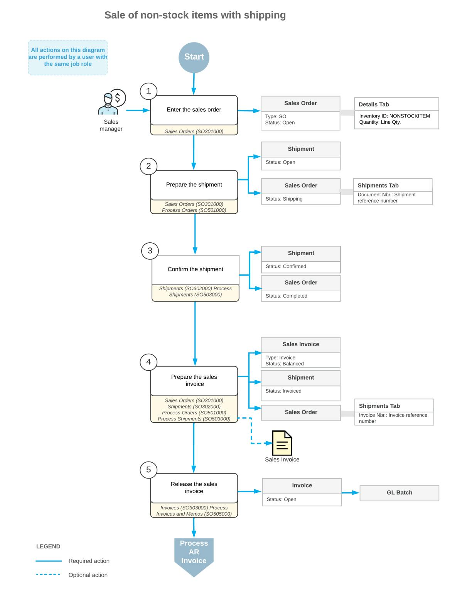

# <span id="page-271-0"></span>**Sales of Non-Stock Items with Shipping: Implementation Checklist**

The following sections provide details you can use to ensure that the system is configured properly for the processing of sales of non-stock items with shipping, and to understand (and change, if needed) the settings that affect the processing workflow.

### **Implementation Checklist**

Before you begin processing sales of non-stock items with shipping, you should make sure the needed features have been enabled, settings have been specified, and entities have been created, as summarized in the following checklist.

| Form                                | Criteria to Check                                                                                                                                                    |
|-------------------------------------|----------------------------------------------------------------------------------------------------------------------------------------------------------------------|
| Sales Orders Preferences (SO101000) | Make sure that all necessary settings related to sales<br>orders have been specified, as described in Order Man<br>agement Basic Configuration: General Information. |
| Enable/Disable Features (CS100000)  | Make sure that the Inventory feature is enabled.                                                                                                                     |
| Order Types (SO201000)              | Make sure that the SO order type is active and has<br>been configured, as described in Sales Order Types: To<br>Activate the SO Order TypeImplementation Activity.   |
| Customers (AR303000)                | Make sure that all needed customers have been de<br>fined in the system, as described in Customers: Imple<br>mentation Activity.                                     |
| Non-Stock Items (IN202000)          | •<br>Make sure that all non-stock items have been de<br>fined in the system, as described in Non-Stock<br>Items: Implementation Activity.                            |
|                                     | •<br>Make sure that the Require Shipment check box is<br>selected for non-stock items that you plan to ship.                                                         |

### **Other Settings That Affect the Workflow**

You can affect the workflow of processing sales of non-stock items with shipping by specifying additional settings as follows:

- To cause shipments to be created with the *On Hold* status (so that the user can verify them before processing them further), select the **Hold Shipments on Entry** check box on the *[Sales Orders Preferences](https://help-2025r1.acumatica.com/Help?ScreenId=ShowWiki&pageid=1817779c-413b-4187-b7fe-38e97845a1cb)* (SO101000) form.
- To cause the shipment dates to appear in invoices as invoice dates, select the **UseShipment Date for Invoice Date** check box on the *[Sales Orders Preferences](https://help-2025r1.acumatica.com/Help?ScreenId=ShowWiki&pageid=1817779c-413b-4187-b7fe-38e97845a1cb)* form.
- To cause general ledger batches generated during the processing of sales documents to be posted automatically, select the **Automatically Post on Release** check box on the *[General Ledger Preferences](https://help-2025r1.acumatica.com/Help?ScreenId=ShowWiki&pageid=e4913d06-c511-4258-a0f9-f36c1b854e6b)* (GL102000) form. For information on processing general ledger batches, see *GL [Transactions:](https://help-2025r1.acumatica.com/Help?ScreenId=ShowWiki&pageid=35393020-6269-466d-8a08-df558cd43367) General [Information](https://help-2025r1.acumatica.com/Help?ScreenId=ShowWiki&pageid=35393020-6269-466d-8a08-df558cd43367)*.

#### **Validation of Configuration**

To make sure that all configuration has been performed correctly, we recommend that in your system, you process a sale of non-stock items by performing instructions similar to those described in *[Sales of Non-Stock Items with](#page-272-1) [Shipping: Process Activity](#page-272-1)*.

# <span id="page-272-1"></span><span id="page-272-0"></span>**Sales of Non-Stock Items with Shipping: Process Activity**

In this activity, you will prepare and process a sales order for non-stock items that need to be shipped to the customer's location.

This activity is based on the *U100* dataset. If you are using another dataset, or if any system settings have been changed in *U100*, these changes can affect the workflow of the activity and the results of the processing. To avoid any issues, restore the *U100* dataset to its initial state.

#### **Story**

Suppose that the GoodFood One Restaurant customer has asked SweetLife Fruits & Jams to conduct a two-day training course on home canning for the café's employees.

The materials to be used for the upcoming training on home canning (which are included in the price of the training) need to be delivered to the customer's location before the course is conducted. You, as a sales manager, need to reflect these details in the system by entering and processing the appropriate documents.

#### **Configuration Overview**

In the *U100* dataset, the following tasks have been performed to support this activity:

- On the *[Enable/Disable Features](https://help-2025r1.acumatica.com/Help?ScreenId=ShowWiki&pageid=c1555e43-1bc5-4f6f-ba9d-b323f94d8a6b)* (CS100000) form, the *Inventory* feature has been enabled.
- On the *Order [Types](https://help-2025r1.acumatica.com/Help?ScreenId=ShowWiki&pageid=e6984218-4260-4438-99e1-aee2b3765369)* (SO201000) form, the *SO* order type has been configured and activated.
- On the *[Customers](https://help-2025r1.acumatica.com/Help?ScreenId=ShowWiki&pageid=652929bc-9606-4056-aa6e-0c2d1147171b)* (AR303000) form, the *GOODFOOD (GoodFood One Restaurant)* customer has been created.
- On the *[Non-Stock Items](https://help-2025r1.acumatica.com/Help?ScreenId=ShowWiki&pageid=bf68dd4f-63d4-460d-8dc0-9152f2bd6bf1)* (IN202000) form, the *OFLCOURSE (Home canning courses at customer's place)* nonstock item has been created, and the **RequireShipment** check box has been selected for this item on the **General** tab.

#### **Process Overview**

In this activity, you will create a sales order on the *[Sales Orders](https://help-2025r1.acumatica.com/Help?ScreenId=ShowWiki&pageid=19e4021c-1b84-49fd-be12-0320c5f1c7e5)* (SO301000) form, and then add a non-stock item to it. Aer that, you will create a related shipment document on the *[Shipments](https://help-2025r1.acumatica.com/Help?ScreenId=ShowWiki&pageid=f47cffcc-543e-469c-a204-a9c1e3da346d)* (SO302000) form. On this form, you will check the settings that the system has specified automatically, and then confirm the shipment. Aer shipment confirmation, you will use the *[Invoices](https://help-2025r1.acumatica.com/Help?ScreenId=ShowWiki&pageid=0acc9738-f141-4ea0-a2be-f34ea9d1b63a)* (SO303000) form to prepare a sales invoice to the customer and release it.

#### **System Preparation**

Before you start processing a sales order that includes non-stock items with shipping, you should do the following:

- 1. Launch the Acumatica ERP website with the *U100* dataset preloaded and sign in to the system as a sales and purchasing manager by using the *norman* username and the *123* password.
- 2. In the info area, in the upper-right corner of the top pane of the Acumatica ERP screen, make sure that the business date in your system is set to *1/30/2025*. If a different date is displayed, click the Business Date menu

button and select *1/30/2025* on the calendar. For simplicity, in this activity, you will create and process all documents in the system on this business date.

#### **Step 1: Creating a Sales Order**

To create a sales order, do the following:

- 1. On the *[Sales Orders](https://help-2025r1.acumatica.com/Help?ScreenId=ShowWiki&pageid=19e4021c-1b84-49fd-be12-0320c5f1c7e5)* (SO301000) form, add a new record.
- 2. In the Summary area, specify the following settings:
  - **OrderType**: *SO*
  - **Customer**: *GOODFOOD*
  - **Description**: Home canning training
- 3. On the **Details** tab, click **Add Row** on the table toolbar, and specify the following settings in the row:
  - **Inventory ID**: *OFLCOURSE*
  - **Warehouse**: *WHOLESALE*
  - **Quantity**: 2
  - **Unit Price**: 45
- 4. On the form toolbar, click**Save**.

Now you need to create a shipment for the materials that need to be shipped in advance of the training.

#### **Step 2: Creating a Shipment**

To create the shipment related to the sales order, do the following:

- 1. While you are still viewing the sales order that you have created on the *[Sales Orders](https://help-2025r1.acumatica.com/Help?ScreenId=ShowWiki&pageid=19e4021c-1b84-49fd-be12-0320c5f1c7e5)* (SO301000) form, on the form toolbar, click **CreateShipment**.
- 2. In the **SpecifyShipment Parameters** dialog box, which opens, make sure that make sure that the *1/30/2025* business date and the *WHOLESALE* warehouse are selected, and click **OK**.

The system closes the dialog box, creates a shipment and opens it on the *[Shipments](https://help-2025r1.acumatica.com/Help?ScreenId=ShowWiki&pageid=f47cffcc-543e-469c-a204-a9c1e3da346d)* (SO302000) form.

#### **Step 3: Confirming the Shipment**

To confirm the shipment, do the following:

- 1. While you are still viewing the shipment on the *[Shipments](https://help-2025r1.acumatica.com/Help?ScreenId=ShowWiki&pageid=f47cffcc-543e-469c-a204-a9c1e3da346d)* (SO302000) form, make sure that the order line with the non-stock item has been included in the shipment on the **Details** tab.
- 2. On the form toolbar, click **Confirm Shipment**.

Notice that the shipment is assigned the *Confirmed* status. Now you can prepare the invoice to bill the customer and increase the customer's debt in the system.

#### **Step 4: Processing the Sales Invoice**

To prepare and release a sales invoice related to the sales order (and shipment), do the following:

- 1. While you are still viewing the shipment on the *[Shipments](https://help-2025r1.acumatica.com/Help?ScreenId=ShowWiki&pageid=f47cffcc-543e-469c-a204-a9c1e3da346d)* (SO302000) form, on the form toolbar, click **Prepare Invoice**. The system prepares the invoice and opens it on the *[Invoices](https://help-2025r1.acumatica.com/Help?ScreenId=ShowWiki&pageid=0acc9738-f141-4ea0-a2be-f34ea9d1b63a)* (SO303000) form.
- 2. On this form, review the details of the prepared invoice. The invoice has one line on the **Details** tab, as the initial sales order does. In the**Shipment Nbr.** and **Order Nbr.** columns of this tab, the system has inserted the reference numbers of the related shipment and sales order (which you created in Steps 1 and 2 of

this activity); these numbers are also links that you can click to view the shipment and sales order on the appropriate forms.

- 3. On the form toolbar, click **Release** to release the sales invoice. The invoice is assigned the *Open* status.
- 4. On the **Details** tab, in the only row, click the link in the **Order Nbr.** column to view the associated sales order.
- 5. On the *[Sales Orders](https://help-2025r1.acumatica.com/Help?ScreenId=ShowWiki&pageid=19e4021c-1b84-49fd-be12-0320c5f1c7e5)* (SO301000) form, which opens, review the details of the sales order, as shown in the following screenshot. Notice that the sales order has the *Completed* status, which the system assigned on release of the sales invoice, and which means that the processing of the sale is completed.

| <b>Sales Orders</b><br>SO 000074 - GoodFood One Restaurant                                                                                                                                                                                                                                                                                                         |                                                                                   |                      |       |          | <b>P</b> NOTES              | <b>ACTIVITIES</b><br><b>FILES</b> | TOOLS $\sim$      |
|--------------------------------------------------------------------------------------------------------------------------------------------------------------------------------------------------------------------------------------------------------------------------------------------------------------------------------------------------------------------|-----------------------------------------------------------------------------------|----------------------|-------|----------|-----------------------------|-----------------------------------|-------------------|
| 日<br>뭐<br>$\overline{\mathsf{K}}$<br>$\Omega$<br>而<br>n<br>$^+$<br>$\checkmark$                                                                                                                                                                                                                                                                                    | $\geq$<br>≺<br>$\rightarrow$<br>$\cdots$                                          |                      |       |          |                             |                                   |                   |
| <b>SO</b><br>Q<br>* Order Type:<br>Customer:                                                                                                                                                                                                                                                                                                                       | !!!!!!!!!!!!!!!!!!!!!!!!!!!!!!!!!!!!!!!!                                          | Ordered Qty.:<br>0   | 2.00  |          |                             |                                   | $\sim$            |
| 000074<br>Q<br>Order Nbr.:<br>Location:                                                                                                                                                                                                                                                                                                                            | MAIN - Primary Location                                                           | 0<br>Detail Total:   | 90.00 |          |                             |                                   |                   |
| Status:<br>Contact:<br>Completed                                                                                                                                                                                                                                                                                                                                   | Darrell M. Kramer                                                                 | Line Discounts:<br>0 | 0.00  |          |                             |                                   |                   |
| Date:<br>1/30/2025<br>Project:                                                                                                                                                                                                                                                                                                                                     | !!!!!!!!!!!!!!!!!!!!!!!!!!!!!!!!!!!!!!!!                                          | Document Dis<br>0    | 0.00  |          |                             |                                   |                   |
| Description:<br>1/30/2025<br>Requested On:                                                                                                                                                                                                                                                                                                                         | Home canning training                                                             | Freight Total:       | 0.00  |          |                             |                                   |                   |
| Customer Ord.                                                                                                                                                                                                                                                                                                                                                      | h                                                                                 | <b>Tax Total:</b>    | 0.00  |          |                             |                                   |                   |
| External Refer.                                                                                                                                                                                                                                                                                                                                                    |                                                                                   | Order Total:         | 90.00 |          |                             |                                   |                   |
| <b>DETAILS</b><br><b>TAXES</b><br><b>FINANCIAL</b><br><b>SHIPPING</b><br><b>ADDRESSES</b><br><b>SHIPMENTS</b><br><b>PAYMENTS</b><br><b>RELATIONS</b><br><b>TOTALS</b><br>$\boxtimes$<br>Ò<br>$\uparrow$<br>ADD ITEMS<br><b>ITEM AVAILABILITY</b><br>ADD MATRIX ITEMS<br>ADD INVOICE<br>ADD BLANKET SO LINE<br><b>LINE DETAILS</b><br>PO LINK<br>⊢<br>╱<br>$\times$ |                                                                                   |                      |       |          |                             |                                   |                   |
| D<br><b>B</b> 0<br>*Inventory ID<br>Warehouse<br>Free<br>Item                                                                                                                                                                                                                                                                                                      | <b>Line Description</b>                                                           |                      | *UOM  | Quantity | Qty. On<br><b>Shipments</b> | Open Qty.                         | <b>Unit Price</b> |
| !!!!!!!!!!!!!!!!!!!!!!!!!!!!!!!!!!!!!!!!<br>П<br>$\omega$<br><b>OFLCOURSE</b>                                                                                                                                                                                                                                                                                      | <b>WHOLESALE</b><br>Home canning courses at customer's place (materials included) |                      | DAY   | 2.00     | 2.00                        | 0.00                              | 45.0000           |
|                                                                                                                                                                                                                                                                                                                                                                    |                                                                                   |                      |       |          |                             |                                   |                   |

*Figure: Sales order completed on release of the sales invoice*

# <span id="page-274-0"></span>**Sales of Non-Stock Items with Shipping: Generated Transactions**

To be able to process a sale of non-stock items, you create and process a sales order. The following sections describe the GL transactions generated during the processing of the documents for a sale of non-stock items.

Sales orders of the *SO* type and shipment documents do not produce any GL transactions.

#### **Transactions Generated for a Sales Invoice**

When you create and release a sales invoice with one line with a non-stock item, the system generates the following general ledger transactions.

| Account                        | Source of Account                                                                  | Debit  | Credit |
|--------------------------------|------------------------------------------------------------------------------------|--------|--------|
| Accounts Receivable<br>account | Customer                                                                           | Amount | 0.00   |
| Sales account                  | Depends on the settings of the<br>order type on the Order Types<br>(SO201000) form | 0.00   | Amount |

You can view the reference number of the GL batch in the **Batch Nbr.** box on the **Financial** tab of the *[Invoices](https://help-2025r1.acumatica.com/Help?ScreenId=ShowWiki&pageid=0acc9738-f141-4ea0-a2be-f34ea9d1b63a)* (SO303000) form. You can click the link in this box to view the details of the batch on the *Journal [Transactions](https://help-2025r1.acumatica.com/Help?ScreenId=ShowWiki&pageid=dda046bc-5946-407f-88f7-1c0c966fbe72)* (GL301000) form.

If your company sells non-stock items, you may want to recognize the expenses for these items when they are sold to accurately calculate revenue or for other accounting purposes. To do this, you need to select *Sales* in the **Post Cost to Expenses On** box on the *[Non-Stock Items](https://help-2025r1.acumatica.com/Help?ScreenId=ShowWiki&pageid=bf68dd4f-63d4-460d-8dc0-9152f2bd6bf1)* (IN202000) form for the non-stock item. When the item is sold, on release of the sales invoice,additional transactions are added to the batch and the following transactions are generated.

| Account                         | Source of Account                                                                                                      | Debit  | Credit |
|---------------------------------|------------------------------------------------------------------------------------------------------------------------|--------|--------|
| Accounts Receivable ac<br>count | Customer                                                                                                               | Amount | 0.00   |
| Sales Revenue account           | Depends on the settings<br>of the order type on the<br>Order Types (SO201000)<br>form                                  | 0.00   | Amount |
| Expense Accrual account         | Depends on the settings<br>specified on the Posting<br>Classes (IN206000) form<br>for the posting class of<br>the item | 0.00   | Amount |
| COGS account                    | Depends on the settings<br>specified on the Posting<br>Classes form for the post<br>ing class of the item              | Amount | 0.00   |

# <span id="page-275-0"></span>**Sales of Non-Stock Items with Shipping: Related Reports and Forms**

In the following sections, you can find details about ways to gather information about sales of non-stock items that have been processed or are being processed in the system.

If you do not see a particular report or form that is described, you may have signed in to the system with a user account that does not have access rights to the report or form. Contact your system administrator to obtain access to any needed reports or forms.

#### **Tracking the Status of Order Fulfillment**

To track how a sales order is being fulfilled, you can check its status in the Summary area of the *[Sales Orders](https://help-2025r1.acumatica.com/Help?ScreenId=ShowWiki&pageid=19e4021c-1b84-49fd-be12-0320c5f1c7e5)* (SO301000) form. On the**Totals** tab of this form, you can also check the quantities and amounts that are not yet shipped and not yet billed, and the amount that is not yet paid.

#### **Printing Invoices**

To prepare a printable form of the sales invoice that is being processed, you use the *[Invoice & Memo](https://help-2025r1.acumatica.com/Help?ScreenId=ShowWiki&pageid=4ae85fa6-7297-4d4c-b956-77d36e67e13f)* (SO643000) report. While you are viewing a sales invoice on the *[Invoices](https://help-2025r1.acumatica.com/Help?ScreenId=ShowWiki&pageid=0acc9738-f141-4ea0-a2be-f34ea9d1b63a)* (SO303000) form, you can navigate to this report by clicking **Print Invoice** on the More menu. The system opens the printable version of the sales invoice on the *[Invoice](https://help-2025r1.acumatica.com/Help?ScreenId=ShowWiki&pageid=4ae85fa6-7297-4d4c-b956-77d36e67e13f) [& Memo](https://help-2025r1.acumatica.com/Help?ScreenId=ShowWiki&pageid=4ae85fa6-7297-4d4c-b956-77d36e67e13f)* report; then you can review the sales invoice and print it by clicking **Print** on the report toolbar.

# <span id="page-276-0"></span>**Sales of Non-Stock Items with Shipping: Mass Processing of Documents**

The following sections explain how to process multiple sales documents, and how the system generates, changes, or works with documents as a result of the mass processing.

#### **Mass-Creating Shipments**

Shipments can be mass-created for sales orders. To create shipments for multiple sales orders at a time, you open the *[Process Orders](https://help-2025r1.acumatica.com/Help?ScreenId=ShowWiki&pageid=c06a334c-f39d-4eff-9d80-b167657dff73)* (SO501000) form and select the *Create Shipment* action, as well as any other selection criteria to narrow the listed sales orders.

Then you select the unlabeled check boxes in the rows of the orders to be processed, and click **Process** on the form toolbar. The system prepares shipments for the selected sales orders. As an alternative to creating shipments for only the selected orders, you can click **Process All** to create shipments for all the listed orders.

#### **Mass-Confirming Shipments**

Shipments can be mass-confirmed. To confirm multiple shipments at a time, you open the *[Process Shipments](https://help-2025r1.acumatica.com/Help?ScreenId=ShowWiki&pageid=2e27f8fd-ddd4-47f0-a83b-5a7db31feede)* (SO503000) form and select the *Confirm Shipment* action, as well as any other selection criteria to narrow the listed shipments.

Then you select the unlabeled check boxes for the shipments to be processed, and click **Process** on the form toolbar. The system confirms the selected shipment documents. Instead of confirming only the selected shipments, you can click **Process All** to confirm all the listed shipments.

#### **Mass-Creating Invoices**

Sales invoices can be mass-created for sales orders or for the shipments that correspond to sales orders. To create multiple sales invoices for sales orders, you open the *[Process Orders](https://help-2025r1.acumatica.com/Help?ScreenId=ShowWiki&pageid=c06a334c-f39d-4eff-9d80-b167657dff73)* (SO501000) form. To create multiple sales invoices for shipments, you open the *[Process Shipments](https://help-2025r1.acumatica.com/Help?ScreenId=ShowWiki&pageid=2e27f8fd-ddd4-47f0-a83b-5a7db31feede)* (SO503000) form.

On either form, you select the *Prepare Invoice* action, as well as any other selection criteria to narrow the listed documents. Then you select the unlabeled check boxes for the sales orders or shipments to be processed, and click **Process** on the form toolbar. The system prepares invoices for the selected documents. Alternatively, you can click **Process All** to create invoices for all the listed documents.

#### **Mass-Printing Pick Lists**

For multiple shipments with the *On Hold* or *Open* status, you can mass-print pick lists by using the *[Process](https://help-2025r1.acumatica.com/Help?ScreenId=ShowWiki&pageid=2e27f8fd-ddd4-47f0-a83b-5a7db31feede) [Shipments](https://help-2025r1.acumatica.com/Help?ScreenId=ShowWiki&pageid=2e27f8fd-ddd4-47f0-a83b-5a7db31feede)* (SO503000) form. On this form, you select the *Print Pick List* action, as well as any other selection criteria to narrow the listed shipments.

Then you select the unlabeled check boxes for the shipments for which you need to print pick lists, and click **Process** on the form toolbar. As an alternative to printing pick lists for only the selected shipments, you can click **Process All** to print pick lists for all the listed documents.

#### **Mass-Printing Invoices**

You can print multiple sales invoices at a time by using the *[Process Invoices and Memos](https://help-2025r1.acumatica.com/Help?ScreenId=ShowWiki&pageid=9a26ac3c-34d8-4d56-a809-396ab92efa91)* (SO505000) form. On this form, you select the *Print Invoice* action, as well as any other selection criteria to narrow the listed sales invoices.

Then you select the unlabeled check boxes for the sales invoices to be printed, and click **Process** on the form toolbar. As an alternative to printing only the selected sales invoices, you can click **Process All** to print all the listed sales invoices.

# <span id="page-277-0"></span>**Processing Sales of Services**

If your company sells services, these services can be defined as non-stock items in Acumatica ERP. You can then process sales of services by using sales orders of the *SO* or *IN* type.

In Acumatica ERP, a sales order can contain stock items, non-stock items (including services), or a mix of both types of items. For simplicity, this chapter will focus on sales orders that contain only nonstock items that are services.

The topics of this chapter explain how to process a sale of services, and which documents are prepared during the processing of the sale.

# <span id="page-277-1"></span>**Sales of Services: General Information**

Non-stock items in Acumatica ERP, which are defined on the *[Non-Stock Items](https://help-2025r1.acumatica.com/Help?ScreenId=ShowWiki&pageid=bf68dd4f-63d4-460d-8dc0-9152f2bd6bf1)* (IN202000) form during implementation, are used to represent the products that cannot be stocked in warehouses (such as services or charges) or physical entities whose quantities you do not need to track.

The following sections describe the sales process of non-stock items that represent services.

#### **Learning Objectives**

In this chapter, you will do the following:

- Create a sales order for a sale of services
- Prepare an invoice that corresponds to the sales order

#### **Applicable Scenario**

You process a sales order with a service line or multiple service lines if you need to track this sale (and then bill the customer for the provided services), which does not involve a shipment being processed in the system.

#### **Sales of Services**

Although you could record the billing for a sale of services directly in the system by using an AR invoice, by entering sales orders for all sales, you implement a single entry point for the processing and tracking of sales. For a sale of services, you start with entering a sales order of the *SO* or *IN* type on the *[Sales Orders](https://help-2025r1.acumatica.com/Help?ScreenId=ShowWiki&pageid=19e4021c-1b84-49fd-be12-0320c5f1c7e5)* (SO301000) form and add to the order the non-stock item or items representing the needed services.

Aer you have entered the sales order, you need to bill the customer for the sold services by preparing a sales invoice, which is a financial document in the system that contains links to the applicable sales orders. You can review the prepared sales invoice on the *[Invoices](https://help-2025r1.acumatica.com/Help?ScreenId=ShowWiki&pageid=0acc9738-f141-4ea0-a2be-f34ea9d1b63a)* (SO303000) form; then you can release it. When the sales invoice is released, it becomes visible on the *[Invoices and Memos](https://help-2025r1.acumatica.com/Help?ScreenId=ShowWiki&pageid=5e6f3b27-b7af-412f-a40a-1d4f4be70cba)* (AR301000) form as an AR invoice.

An AR invoice on the *[Invoices and Memos](https://help-2025r1.acumatica.com/Help?ScreenId=ShowWiki&pageid=5e6f3b27-b7af-412f-a40a-1d4f4be70cba)* form is a financial document that does not contain links to the applicable sales orders, as the sales invoice does. The AR invoice and sales invoice have the same reference number, which the system prints in the customer statement. On both the *[Invoices](https://help-2025r1.acumatica.com/Help?ScreenId=ShowWiki&pageid=0acc9738-f141-4ea0-a2be-f34ea9d1b63a)* form and the *[Invoices and Memos](https://help-2025r1.acumatica.com/Help?ScreenId=ShowWiki&pageid=5e6f3b27-b7af-412f-a40a-1d4f4be70cba)* form, you can view the link to the batch of the general ledger transactions that was generated when the invoice was released. For more information on processing AR invoices, see *[Processing AR Invoices](https://help-2025r1.acumatica.com/Help?ScreenId=ShowWiki&pageid=f5eea8b8-c260-4f1f-8603-d65e9bf25e9d)*.

#### **Workflow of Sales of Services**

If a sales order includes only services that do not involve shipping, the typical processing of the sales order involves the actions and generated documents shown in the following diagram.

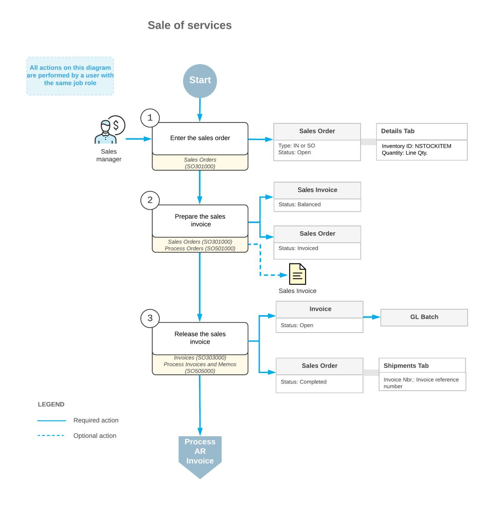

# <span id="page-278-0"></span>**Sales of Services: Implementation Checklist**

The following sections provide details you can use to ensure that the system is configured properly for the processing of sales of services, and to understand (and change, if needed) the settings that affect the processing workflow.

#### **Implementation Checklist**

Before you begin processing sales of services, you should make sure the needed features have been enabled, settings have been specified, and entities have been created, as summarized in the following checklist.

| Form                                | Criteria to Check                                                                                                                                                                                                                                   |
|-------------------------------------|-----------------------------------------------------------------------------------------------------------------------------------------------------------------------------------------------------------------------------------------------------|
| Sales Orders Preferences (SO101000) | Make sure that all necessary settings related to sales<br>orders have been specified, as described in Order Man<br>agement Basic Configuration: General Information.                                                                                |
| Order Types (SO201000)              | Make sure that the SO or IN order type is active and has<br>been configured, as described in Sales Order Types: To<br>Activate the SO Order TypeImplementation Activity. (If<br>needed, you can set up and activate both of these or<br>der types.) |
| Customers (AR303000)                | Make sure that all needed customers have been de<br>fined in the system, as described in Customers: Imple<br>mentation Activity.                                                                                                                    |
| Non-Stock Items (IN202000)          | Make sure that all non-stock items have been defined<br>in the system, as described in Non-Stock Items: Imple<br>mentation Activity.                                                                                                                |

#### **Other Settings That Affect the Workflow**

To cause general ledger batches generated during the processing of sales documents to be posted automatically, select the **Automatically Post on Release** check box on the *[General Ledger Preferences](https://help-2025r1.acumatica.com/Help?ScreenId=ShowWiki&pageid=e4913d06-c511-4258-a0f9-f36c1b854e6b)* (GL102000) form. For information on processing general ledger batches, see *GL [Transactions:](https://help-2025r1.acumatica.com/Help?ScreenId=ShowWiki&pageid=35393020-6269-466d-8a08-df558cd43367) General Information*.

#### **Validation of Configuration**

To make sure that all configuration has been performed correctly, we recommend that in your system, you process a sale of services by performing instructions similar to those described in *[Sales of Services: Process Activity](#page-279-1)*.

# <span id="page-279-1"></span><span id="page-279-0"></span>**Sales of Services: Process Activity**

In this activity, you will prepare and process a sales order for non-stock items that represent services and thus do not need to be shipped to the customer's location.

This activity is based on the *U100* dataset. If you are using another dataset, or if any system settings have been changed in *U100*, these changes can affect the workflow of the activity and the results of the processing. To avoid any issues, restore the *U100* dataset to its initial state.

#### **Story**

Suppose that the GoodFood One Restaurant manager has ordered a three-day training course on home canning for the restaurant's employees. The online course is a service, so no shipping needs to occur. You, as a sales manager, need to reflect these details in the system by entering and processing the appropriate documents.

#### **Configuration Overview**

In the *U100* dataset, the following tasks have been performed to support this activity:

- On the *[Enable/Disable Features](https://help-2025r1.acumatica.com/Help?ScreenId=ShowWiki&pageid=c1555e43-1bc5-4f6f-ba9d-b323f94d8a6b)* (CS100000) form, the *Inventory and Order Management* feature has been enabled.
- On the *Order [Types](https://help-2025r1.acumatica.com/Help?ScreenId=ShowWiki&pageid=e6984218-4260-4438-99e1-aee2b3765369)* (SO201000) form, the *SO* order type has been configured and activated.
- On the *[Customers](https://help-2025r1.acumatica.com/Help?ScreenId=ShowWiki&pageid=652929bc-9606-4056-aa6e-0c2d1147171b)* (AR303000) form, the *GOODFOOD (GoodFood One Restaurant)* customer has been created.
- On the *[Non-Stock Items](https://help-2025r1.acumatica.com/Help?ScreenId=ShowWiki&pageid=bf68dd4f-63d4-460d-8dc0-9152f2bd6bf1)* (IN202000) form, the *ONLCOURSE (Home canning courses online (website session)* non-stock item has been created.

#### **Process Overview**

In this activity, you will create a sales order on the *[Sales Orders](https://help-2025r1.acumatica.com/Help?ScreenId=ShowWiki&pageid=19e4021c-1b84-49fd-be12-0320c5f1c7e5)* (SO301000) form, and then add a service line to it. Aer that, you will use the *[Invoices](https://help-2025r1.acumatica.com/Help?ScreenId=ShowWiki&pageid=0acc9738-f141-4ea0-a2be-f34ea9d1b63a)* (SO303000) form to prepare a related invoice to the customer and release it.

#### **System Preparation**

Before you start processing a sales order that includes service items, you should do the following:

- 1. Launch the Acumatica ERP website with the *U100* dataset preloaded, and sign in to the system as a sales and purchasing manager. You should sign in by using the *norman* username and the *123* password.
- 2. In the info area, in the upper-right corner of the top pane of the Acumatica ERP screen, make sure that the business date in your system is set to *1/30/2025*. If a different date is displayed, click the Business Date menu button and select *1/30/2025* on the calendar. For simplicity, in this activity, you will create and process all documents in the system on this business date.

#### **Step 1: Creating a Sales Order**

To create a sales order, do the following:

- 1. On the *[Sales Orders](https://help-2025r1.acumatica.com/Help?ScreenId=ShowWiki&pageid=19e4021c-1b84-49fd-be12-0320c5f1c7e5)* (SO301000) form, add a new record.
- 2. In the Summary area, specify the following settings:
  - **OrderType**: *SO*
  - **Customer**: *GOODFOOD*
  - **Description**: Home canning training
- 3. On the **Details** tab, click **Add Row** on the table toolbar.
- 4. Specify the following settings in the row:
  - **Inventory ID**: *ONLCOURSE*
  - **Quantity**: 3
  - **Unit Price**: 14.5 (inserted automatically)
- 5. On the form toolbar, click**Save**. Notice that the sales order has the *Open* status.

#### **Step 2: Processing the Sales Invoice**

To prepare and release the sales invoice that is related to the sales order, do the following:

1. While you are still viewing the sales order on the *[Sales Orders](https://help-2025r1.acumatica.com/Help?ScreenId=ShowWiki&pageid=19e4021c-1b84-49fd-be12-0320c5f1c7e5)* (SO301000) form, on the More menu, click **Prepare Invoice**. The system prepares a sales invoice and opens it on the *[Invoices](https://help-2025r1.acumatica.com/Help?ScreenId=ShowWiki&pageid=0acc9738-f141-4ea0-a2be-f34ea9d1b63a)* (SO303000) form.

- 2. On this form, review the details of the prepared invoice. The invoice has one line on the **Details** tab, as the initial sales order does. In the **Order Nbr.** column of this tab, the system has inserted the reference number of the related sales order; this number is also a link you can click to view the document on the *[Sales Orders](https://help-2025r1.acumatica.com/Help?ScreenId=ShowWiki&pageid=19e4021c-1b84-49fd-be12-0320c5f1c7e5)* form. Notice that the**Shipment Nbr.** column of the **Details** tab does not have a reference number.
- 3. On the form toolbar, click **Release** to release the invoice. The invoice is assigned the *Open* status. Once released, the invoice becomes visible on the *[Invoices and Memos](https://help-2025r1.acumatica.com/Help?ScreenId=ShowWiki&pageid=5e6f3b27-b7af-412f-a40a-1d4f4be70cba)* (AR301000) form.
- 4. On the **Details** tab, in the only row, click the link in the **Order Nbr.** column to view the associated sales order.
- 5. On the *[Sales Orders](https://help-2025r1.acumatica.com/Help?ScreenId=ShowWiki&pageid=19e4021c-1b84-49fd-be12-0320c5f1c7e5)* form, which opens, review the details of the sales order, as shown in the following screenshot. Notice that the sales order has the *Completed* status, which the system assigned on release of the sales invoice, and which means that the processing of the sale is completed.

|   | 뭐     | Sales Orders<br>$\Box$                  | $\Omega$                                        | SO 000075 - GoodFood One Restaurant<br>血<br>$\pm$              | n                                                    | $\overline{\mathsf{K}}$<br>≺<br>$\check{~}$                    | $\geq$<br>$\rightarrow$<br>$\cdots$                                                                                                                                 |                                          |                                                                                                                                 |                       |                                                        |          | n NOTES                                                 | <b>ACTIVITIES</b>                    | <b>FILES</b> | TOOLS $\star$       |
|---|-------|-----------------------------------------|-------------------------------------------------|----------------------------------------------------------------|------------------------------------------------------|----------------------------------------------------------------|---------------------------------------------------------------------------------------------------------------------------------------------------------------------|------------------------------------------|---------------------------------------------------------------------------------------------------------------------------------|-----------------------|--------------------------------------------------------|----------|---------------------------------------------------------|--------------------------------------|--------------|---------------------|
|   | Date: | * Order Type:<br>Order Nbr.:<br>Status: | Requested On:<br>Customer Ord<br>External Refer | <sub>SO</sub><br>000075<br>Completed<br>1/30/2025<br>1/30/2025 | Q<br>Q                                               | Customer:<br>Location:<br>Contact:<br>Project:<br>Description: | GOODFOOD - GoodFood One Restaurar<br><b>MAIN - Primary Location</b><br>Darrell M. Kramer<br>!!!!!!!!!!!!!!!!!!!!!!!!!!!!!!!!!!!!!!!!<br>Home canning training<br>1. | $\mathscr{D}$<br>$\mathscr{O}$<br>0<br>0 | Ordered Qtv.:<br>Detail Total:<br>Line Discounts:<br>Document Dis<br><b>Freight Total:</b><br><b>Tax Total:</b><br>Order Total: |                       | 0.00<br>43.50<br>0.00<br>0.00<br>0.00<br>0.00<br>43.50 |          |                                                         |                                      |              | $\hat{\phantom{a}}$ |
| 圄 | Ò     | <b>DETAILS</b><br>$\Box$                | ∥<br>*Inventory ID                              | <b>TAXES</b><br>$\times$                                       | <b>FINANCIAL</b><br><b>ADD ITEMS</b><br>Free<br>Item | <b>SHIPPING</b><br><b>ADD MATRIX ITEMS</b><br>Warehouse        | <b>SHIPMENTS</b><br><b>ADDRESSES</b><br>ADD BLANKET SO LINE<br>ADD INVOICE<br><b>Line Description</b>                                                               | <b>PAYMENTS</b>                          | <b>RELATIONS</b><br><b>LINE DETAILS</b>                                                                                         | <b>TOTALS</b><br>*UOM | PO LINK                                                | Quantity | <b>ITEM AVAILABILITY</b><br>Qty. On<br><b>Shipments</b> | $\mathbf x$<br>$\vdash$<br>Open Qty. | $\uparrow$   | <b>Unit Price</b>   |
|   | > 0   |                                         | D ONLCOURSE                                     |                                                                | □                                                    |                                                                | Home canning courses online (website session)                                                                                                                       |                                          |                                                                                                                                 | <b>DAY</b>            |                                                        | 3.00     | 0.00                                                    | 0.00                                 |              | 14.5000             |

*Figure: Completed sales order*

# <span id="page-281-0"></span>**Sales of Services: Generated Transactions**

To be able to process a sale of non-stock items, you create and process a sales order. The following sections describe the GL transactions generated during the processing of the documents for a sale of non-stock items.


#### **Transactions Generated for a Sales Invoice**

When you create and release a sales invoice with one line with a non-stock item that does not require shipping, the system generates the following general ledger transactions.

| Account                        | Source of Account | Debit  | Credit |
|--------------------------------|-------------------|--------|--------|
| Accounts Receivable<br>account | Customer          | Amount | 0.00   |

| Account       | Source of Account                                                                  | Debit | Credit |
|---------------|------------------------------------------------------------------------------------|-------|--------|
| Sales account | Depends on the settings of the<br>order type on the Order Types<br>(SO201000) form | 0.00  | Amount |

You can view the reference number of the GL batch in the **Batch Nbr.** box on the **Financial** tab of the *[Invoices](https://help-2025r1.acumatica.com/Help?ScreenId=ShowWiki&pageid=0acc9738-f141-4ea0-a2be-f34ea9d1b63a)* (SO303000) form. You can click the link in this box to view the details of the batch on the *Journal [Transactions](https://help-2025r1.acumatica.com/Help?ScreenId=ShowWiki&pageid=dda046bc-5946-407f-88f7-1c0c966fbe72)* (GL301000) form.

# <span id="page-282-0"></span>**Sales of Services: Related Report**

In the following sections, you can find details about ways to gather information about sales of services that have been processed or are being processed in the system.

If you do not see a particular report or form that is described, you may have signed in to the system with a user account that does not have access rights to the report or form. Contact your system administrator to obtain access to any needed reports or forms.

#### **Printing Invoices**

To prepare a printable form of the invoice that is being processed, you use the *[Invoice & Memo](https://help-2025r1.acumatica.com/Help?ScreenId=ShowWiki&pageid=4ae85fa6-7297-4d4c-b956-77d36e67e13f)* (SO643000) report. While you are viewing a sales invoice on the *[Invoices](https://help-2025r1.acumatica.com/Help?ScreenId=ShowWiki&pageid=0acc9738-f141-4ea0-a2be-f34ea9d1b63a)* (SO303000) form, you can navigate to this report by clicking **Print Invoice** on the More menu. The system opens the printable version of the invoice on the *[Invoice & Memo](https://help-2025r1.acumatica.com/Help?ScreenId=ShowWiki&pageid=4ae85fa6-7297-4d4c-b956-77d36e67e13f)* report; then you can review the invoice and print it by clicking **Print** on the report toolbar.

# <span id="page-282-1"></span>**Sales of Services: Mass Processing of Documents**

The following sections explain how to process multiple sales orders and related documents, and how the system generates, changes, or works with documents as a result of the mass processing.

#### **Mass-Creating Invoices**

Invoices can be mass-generated for sales orders or for the shipments that correspond to sales orders. To prepare multiple invoices for sales orders, you open the *[Process Orders](https://help-2025r1.acumatica.com/Help?ScreenId=ShowWiki&pageid=c06a334c-f39d-4eff-9d80-b167657dff73)* (SO501000) form. To prepare multiple sales invoices for shipments, you open the *[Process Shipments](https://help-2025r1.acumatica.com/Help?ScreenId=ShowWiki&pageid=2e27f8fd-ddd4-47f0-a83b-5a7db31feede)* (SO503000) form. On either form, you select the *Prepare Invoice* action, as well as any other selection criteria to narrow the listed documents.

Then you select the unlabeled check boxes in the rows of the sales orders or shipments to be processed, and click **Process** on the form toolbar. The system prepares invoices for the selected documents. As an alternative to creating invoices for only the selected documents, you can click **Process All** to create invoices for all the listed documents.

#### **Mass-Printing Invoices**

You can print multiple sales invoices at a time by using the *[Process Invoices and Memos](https://help-2025r1.acumatica.com/Help?ScreenId=ShowWiki&pageid=9a26ac3c-34d8-4d56-a809-396ab92efa91)* (SO505000) form. On this form, you select the *Print Invoice* action, as well as any other selection criteria to narrow the sales invoices to be listed.

Then you select the unlabeled check boxes in the rows of the invoices to be printed, and click **Process** on the form toolbar. Instead of printing only the selected invoices, you can click **Process All** to print all the listed invoices.

# <span id="page-284-0"></span>**Processing Sales with Drop Shipping**

In Acumatica ERP, you can add items to sales orders that will be drop-shipped from the vendor directly to the customer. The topics of this chapter explain how to create and process sales orders whose goods are intended for drop shipping.

# <span id="page-284-2"></span><span id="page-284-1"></span>**Sales with Drop Shipping: General Information**

In Acumatica ERP, you can create sales orders whose goods are intended for drop shipping. Drop shipping means that a customer orders the goods from your company, pays your company for the order, and receives the goods (which your company has ordered) directly from one of your vendors. With the *Drop Shipments* feature enabled on the *[Enable/Disable Features](https://help-2025r1.acumatica.com/Help?ScreenId=ShowWiki&pageid=c1555e43-1bc5-4f6f-ba9d-b323f94d8a6b)* (CS100000) form, you can mark particular goods for drop shipping and create drop-ship orders for these goods.

#### **Learning Objectives**

In this chapter, you will do the following:

- Configure the processing of drop shipments in Acumatica ERP
- Mark items for drop shipment in a sales order
- Create a drop-ship purchase order for a sales order and process the drop shipment to completion
- Mass-process drop shipments
- Process the sales order and related purchase documents, inventory documents, and accounts payable documents
- Find the information about documents related to drop shipment

#### **Applicable Scenario**

You use drop shipment to fulfill a sales order with items that your company does not have in stock.

#### **Drop Shipment Process**

To process a sale with drop shipment, you create a sales order of the *SO* order type on the *[Sales Orders](https://help-2025r1.acumatica.com/Help?ScreenId=ShowWiki&pageid=19e4021c-1b84-49fd-be12-0320c5f1c7e5)* (SO301000) form, and add the stock items ordered by the customer. You mark items for drop shipping by selecting the check box in the **Mark for PO** column and selecting *Drop-Ship* in the **PO Source** column, which means that the items will be ordered from the vendor and shipped directly to the customer. The system does not allocate stock items in inventory based on the quantities of goods and the document amounts on sales orders for drop shipping.

When you mark items for drop shipping, the system creates purchase requests of the *Drop-Ship* plan type. You create drop-ship purchase orders by processing *Drop-Ship* purchase requests on the *[Create Purchase Orders](https://help-2025r1.acumatica.com/Help?ScreenId=ShowWiki&pageid=dc527541-a18a-44c9-8d51-6d2d77a37443)* (PO505000) form. Each drop-ship purchase order generated from purchase requests has a reference number of the related sales order in the**Sales Order Nbr.** box on the**Shipping** tab of the *[Purchase Orders](https://help-2025r1.acumatica.com/Help?ScreenId=ShowWiki&pageid=5565686c-96c4-4bfa-a51d-9a2566baa808)* (PO301000) form; you can create a separate purchase order for each sales order line that is marked for drop shipping but a drop-ship purchase order can only be linked to one sales order.

The items from the drop-ship purchase order are not shipped to the company's warehouse; rather, they are shipped directly to the customer. Aer you have received confirmation that the customer has received the goods from the vendor, you prepare and release the purchase receipt for the drop-ship purchase order. When you release the purchase receipt (which functions as a shipment document for drop-ship lines of sales orders), the status of the drop-ship purchase order is changed to *Completed*; the sales order is also assigned the *Completed* status, and then you prepare a sales invoice to the customer.

On release of a purchase receipt prepared for drop-ship purchase order, the system does not create an inventory receipt, because the items are not received to inventory and are instead delivered directly to the customer. The quantities of stock items on completed drop-ship orders are not included in the quantities available at any warehouse of your company.

#### **Workflow of a Sale with Drop Shipment**

For a sales order that includes stock items intended for drop shipping, the typical processing involves the actions and generated documents shown in the following diagram.

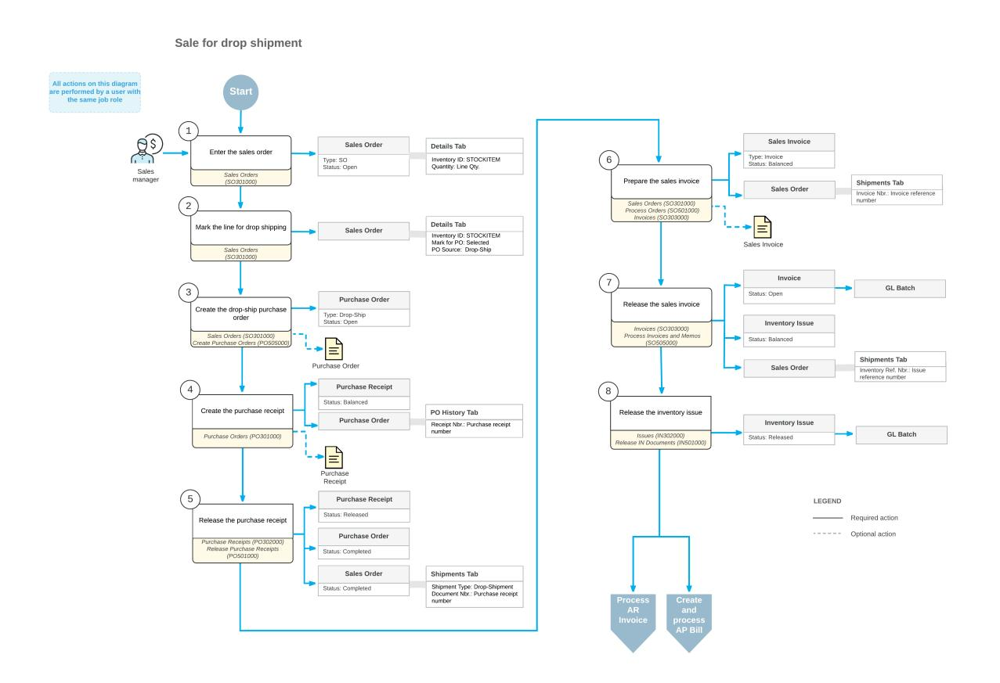

# <span id="page-285-0"></span>**Sales with Drop Shipping: Implementation Checklist**

The following sections provide details you can use to ensure that the system is configured properly for the processing of sales for drop shipment, and to understand (and change, if needed) the settings that affect the processing workflow.

#### **Implementation Checklist**

Before you initially process sales for drop shipment, you should make sure the needed features have been enabled, settings have been specified, and entities have been created, as summarized in the following checklist.

| Form                               | Criteria to Check                                     |
|------------------------------------|-------------------------------------------------------|
| Enable/Disable Features (CS100000) | Make sure that the Drop Shipments feature is enabled. |

| Form                                                                           | Criteria to Check                                                                                                                                                                            |
|--------------------------------------------------------------------------------|----------------------------------------------------------------------------------------------------------------------------------------------------------------------------------------------|
| Sales Orders Preferences (SO101000), Purchase Orders<br>Preferences (PO101000) | Make sure that all necessary settings related to sales<br>orders and purchase orders have been specified as de<br>scribed in Configuration of Order Management: Imple<br>mentation Activity. |
| Order Types (SO201000)                                                         | Make sure that the SO order type is active and has<br>been configured as described in Sales Order Types: To<br>Activate the SO Order TypeImplementation Activity.                            |
| Vendors (AP303000)                                                             | Make sure that all needed vendors have been config<br>ured as described in Vendors: Implementation Activity.                                                                                 |
| Customers (AR303000)                                                           | Make sure that all needed customers have been con<br>figured as described in Customers: Implementation Ac<br>tivity.                                                                         |
| Stock Items (IN202500)                                                         | Make sure that all stock items are configured as de<br>scribed in Stock Items: Implementation Activity.                                                                                      |

### **Other Settings That Affect the Workflow**

You can affect the processing workflow by specifying additional settings:

- To cause sales orders of a particular order type to be created with the *On Hold* status (so the user can verify them before processing them further), select the **Hold Orders on Entry** check box for the order type on the *Order [Types](https://help-2025r1.acumatica.com/Help?ScreenId=ShowWiki&pageid=e6984218-4260-4438-99e1-aee2b3765369)* (SO201000) form. For more information on other order type settings affecting the workflow of sales orders, see *Sales Order Types: General [Information](https://help-2025r1.acumatica.com/Help?ScreenId=ShowWiki&pageid=96a00780-a0c3-4314-86ca-093004844268)*.
- To cause the system to automatically create an accounts payable bill on release of a purchase receipt by default, select the **Create Bill on Receipt Release** check box on the *[Purchase Orders Preferences](https://help-2025r1.acumatica.com/Help?ScreenId=ShowWiki&pageid=13d09c43-8696-4f92-ad9b-3d0209ee3d9b)* (PO101000) form. In this case, when a user creates a purchase receipt on the *[Purchase Receipts](https://help-2025r1.acumatica.com/Help?ScreenId=ShowWiki&pageid=d9901c8d-486d-45ed-8088-ea3d8ee3af19)* (PO302000) form, the system automatically selects the **Create Bill** check box. (The user can clear this check box for a particular bill.) For information on processing bills, see *[AP Bills: General Information](https://help-2025r1.acumatica.com/Help?ScreenId=ShowWiki&pageid=1ea1e770-b81c-437e-831f-64f702f968f4)*.
- To cause the system to automatically post general ledger batches generated during the processing of sales and purchase documents, select the **Automatically Post on Release** check box on the *[General Ledger](https://help-2025r1.acumatica.com/Help?ScreenId=ShowWiki&pageid=e4913d06-c511-4258-a0f9-f36c1b854e6b) [Preferences](https://help-2025r1.acumatica.com/Help?ScreenId=ShowWiki&pageid=e4913d06-c511-4258-a0f9-f36c1b854e6b)* (GL102000) form. For information on processing general ledger batches, see *GL [Transactions:](https://help-2025r1.acumatica.com/Help?ScreenId=ShowWiki&pageid=35393020-6269-466d-8a08-df558cd43367) [General Information](https://help-2025r1.acumatica.com/Help?ScreenId=ShowWiki&pageid=35393020-6269-466d-8a08-df558cd43367)*.

#### **Validation of Settings**

To make sure that all settings are configured correctly, process a sale with drop shipping, as described in the *[Sales](#page-287-1) [with Drop Shipping: Process Activity](#page-287-1)*.

#### **Known Process Limitations**

• Drop shipping is not supported for sales order lines that are split into multiple lines in the **Line Details** dialog box on the *[Sales Orders](https://help-2025r1.acumatica.com/Help?ScreenId=ShowWiki&pageid=19e4021c-1b84-49fd-be12-0320c5f1c7e5)* (SO301000) form. If you select the **Mark for PO** check box and select *Drop-Ship* in the **Source** column on the **Details** tab for a line with multiple splits, you will not be able to save the order.

The only exception occurs when you need to process a return of previously drop-shipped lot- or serialtracked items to your own warehouse and you use a sales order whose order type has the *RMA Order* automation behavior on the *Order [Types](https://help-2025r1.acumatica.com/Help?ScreenId=ShowWiki&pageid=e6984218-4260-4438-99e1-aee2b3765369)* (SO201000) form.

- If there is at least one released purchase receipt generated for a line of a drop-ship purchase order that has been created for a sales order, you will not be able to perform the following actions:
  - Unlink the lines of the sales and purchase orders.
  - Clear the **Mark for PO** check box on the **Details** tab of the *[Sales Orders](https://help-2025r1.acumatica.com/Help?ScreenId=ShowWiki&pageid=19e4021c-1b84-49fd-be12-0320c5f1c7e5)* form for the line of the sales order that is linked to this line of the drop-ship purchase order.
- If there is at least one confirmed shipment that has been generated for the part of the quantity in a sales order line, you cannot select the **Mark for PO** check box on the **Details** tab of the *[Sales Orders](https://help-2025r1.acumatica.com/Help?ScreenId=ShowWiki&pageid=19e4021c-1b84-49fd-be12-0320c5f1c7e5)* form for this line in order to drop-ship the remaining quantity.

# <span id="page-287-1"></span><span id="page-287-0"></span>**Sales with Drop Shipping: Process Activity**

In the following activity, you will learn how to prepare and process to completion a sales order with items marked for drop shipping.

This activity is based on the *U100* dataset. If you are using another dataset, or if any system settings have been changed in *U100*, these changes can affect the workflow of the activity and the results of the processing. To avoid any issues, restore the *U100* dataset to its initial state.

#### **Story**

Suppose that the FourStar Coffee & Sweets Shop (*COFFEESHOP*) customer ordered a variety of green, black, and fruit teas at the SweetLife's retail store. Although the tea varieties are presented in SweetLife's website catalog, the company does not keep tea in the wholesale or retail warehouse. When a customer orders tea, SweetLife dropships it from the Tea & Spices (*TEACOMPANY*) vendor directly to the customer who ordered the tea. To complete the customer's request, acting as the sales manager of the SweetLife store, you need to process a drop shipment.

#### **Configuration Overview**

In the *U100* dataset, for the purposes of this activity, the following tasks have been performed:

- On the *[Enable/Disable Features](https://help-2025r1.acumatica.com/Help?ScreenId=ShowWiki&pageid=c1555e43-1bc5-4f6f-ba9d-b323f94d8a6b)* (CS100000) form, the following features have been enabled:
  - *Inventory and Order Management*, which provides the standard functionality of inventory and order management
  - *Inventory*, which gives you the ability to maintain stock items by using forms related to the inventory functionality and to create and process sales and purchase documents that include stock items
  - *Drop Shipments*, which provides the ability to create and process drop-shipped orders
- On the *[Customers](https://help-2025r1.acumatica.com/Help?ScreenId=ShowWiki&pageid=652929bc-9606-4056-aa6e-0c2d1147171b)* (AP303000) form, the *COFFEESHOP* customer has been created.
- On the *[Vendors](https://help-2025r1.acumatica.com/Help?ScreenId=ShowWiki&pageid=a9584be3-f2bd-4d67-80d4-8041d809df56)* (AP303000) form, the *TEACOMPANY* vendor has been created.
- On the *[Stock Items](https://help-2025r1.acumatica.com/Help?ScreenId=ShowWiki&pageid=77786a70-1f1e-4d63-ad98-96f98e4fcb0e)* (IN202500) form, the *GREENTEA06*, *BLACKTEA06*, and *FRUITTEA12* stock items have been created. For each of these items, the *TEACOMPANY* vendor has been added to the**Vendors** tab.

#### **Process Overview**

In this activity, to process a sale with drop shipment, you will create a sales order of the *SO* order type on the *[Sales](https://help-2025r1.acumatica.com/Help?ScreenId=ShowWiki&pageid=19e4021c-1b84-49fd-be12-0320c5f1c7e5) [Orders](https://help-2025r1.acumatica.com/Help?ScreenId=ShowWiki&pageid=19e4021c-1b84-49fd-be12-0320c5f1c7e5)* (SO301000) form; on the **Details** tab, you will add the inventory items ordered by the customer. Because the items are not in stock, you will mark each of them for drop shipping by selecting the check box in the **Mark for PO** column and selecting *Drop-Ship* in the **PO Source** column, which means that the items will be ordered from the vendor and shipped directly to the customer. You will create drop-ship purchase orders by processing *Drop-Ship* purchase requests on the *[Create Purchase Orders](https://help-2025r1.acumatica.com/Help?ScreenId=ShowWiki&pageid=dc527541-a18a-44c9-8d51-6d2d77a37443)* (PO505000) form. Each drop-ship purchase order generated from purchase requests can be viewed and processed further on the *[Purchase Orders](https://help-2025r1.acumatica.com/Help?ScreenId=ShowWiki&pageid=5565686c-96c4-4bfa-a51d-9a2566baa808)* (PO301000) form and contains links to the related sales order.

Aer you have received confirmation that the customer has received the goods from the vendor, on the *[Purchase](https://help-2025r1.acumatica.com/Help?ScreenId=ShowWiki&pageid=d9901c8d-486d-45ed-8088-ea3d8ee3af19) [Receipts](https://help-2025r1.acumatica.com/Help?ScreenId=ShowWiki&pageid=d9901c8d-486d-45ed-8088-ea3d8ee3af19)* (PO302000) form, you will prepare and release the purchase receipt for the drop-ship purchase order. Aer drop shipping has completed, you will prepare an invoice for the customer by using the *[Invoices](https://help-2025r1.acumatica.com/Help?ScreenId=ShowWiki&pageid=0acc9738-f141-4ea0-a2be-f34ea9d1b63a)* (SO303000) form.

#### **System Preparation**

Before you start processing a sale with drop shipping, you should do the following:

- 1. Launch the Acumatica ERP website with the *U100* dataset preloaded, and sign in as purchasing manager Regina Wiley by using the *wiley* username and the *123* password.
- 2. In the info area, in the upper-right corner of the top pane of the Acumatica ERP screen, make sure that the business date in your system is set to today's date. For simplicity, in this activity, you will create and process all documents in the system on this business date.
- 3. On the Company and Branch Selection menu in the top pane of the Acumatica ERP screen, select the *SweetLife Store* branch.

#### **Step 1: Creating a Sales Order**

To create a sales order, do the following:

- 1. On the *[Sales Orders](https://help-2025r1.acumatica.com/Help?ScreenId=ShowWiki&pageid=19e4021c-1b84-49fd-be12-0320c5f1c7e5)* (SO301000) form, add a new record.
- 2. In the Summary area, specify the following settings:
  - **OrderType**: *SO*
  - **Customer**: *COFFEESHOP*
  - **Description**: Website order #00784 (tea)
- 3. On the **Details** tab, add rows with the settings shown in the following table.

| Branch | Inventory ID | Warehouse | Quantity | Unit Price |
|--------|--------------|-----------|----------|------------|
| RETAIL | GREENTEA06   | RETAIL    | 2        | 22.99      |
| RETAIL | BLACKTEA06   | RETAIL    | 1        | 23.99      |
| RETAIL | FRUITTEA12   | RETAIL    | 2        | 32.99      |

Notice that the system displays warnings in the **Quantity** column in each line on the **Details** tab indicating that the specified quantity is not available in the selected warehouse.

4. On the form toolbar, click**Save**. The sales order is saved with the *Open* status.

#### **Step 2: Marking the Items for Drop Shipment**

To mark items for drop shipment, do the following:

- 1. While you are still viewing the sales order on the *[Sales Orders](https://help-2025r1.acumatica.com/Help?ScreenId=ShowWiki&pageid=19e4021c-1b84-49fd-be12-0320c5f1c7e5)* (SO301000) form, for each of the lines on the **Details** tab, do the following:
  - Select the **Mark for PO** check box.
  - Select *Drop-Ship* in the **PO Source** column.
- 2. On the form toolbar, click**Save**.

#### **Step 3: Creating a Drop-Ship Purchase Order**

To create a drop-ship purchase order from purchase requests, do the following:

- 1. While you are still viewing the sales order on the *[Sales Orders](https://help-2025r1.acumatica.com/Help?ScreenId=ShowWiki&pageid=19e4021c-1b84-49fd-be12-0320c5f1c7e5)* (SO301000) form, on the More menu, click **Create Purchase Order**.
- 2. On the *[Create Purchase Orders](https://help-2025r1.acumatica.com/Help?ScreenId=ShowWiki&pageid=dc527541-a18a-44c9-8d51-6d2d77a37443)* (PO505000) form, which opens, select the unlabeled check boxes in the three lines with *SO to Drop-Ship* specified as the **Plan Type**. These are the lines that are related to the sales order that you have prepared earlier in this activity.
- 3. In all of the lines, specify *TEACOMPANY* in the **Vendor** column.
- 4. On the form toolbar, click **Process** to process the purchase requests you have selected.

The system creates a drop-ship purchase order for the *TEACOMPANY* vendor and opens it on the *[Purchase](https://help-2025r1.acumatica.com/Help?ScreenId=ShowWiki&pageid=5565686c-96c4-4bfa-a51d-9a2566baa808) [Orders](https://help-2025r1.acumatica.com/Help?ScreenId=ShowWiki&pageid=5565686c-96c4-4bfa-a51d-9a2566baa808)* (PO301000) form. On the **Details** tab, in the**Sales Order Nbr.** column, review the number of the sales order to which this purchase order lines are linked.

- 5. In the **Description** box in the Summary area, type Purchase for website order #00784.
- 6. On the form toolbar, click **Remove Hold**.

#### **Step 4: Processing the Drop-Ship Purchase Order**

To process the drop-ship purchase order to completion, do the following:

- 1. While you are still viewing the purchase order on the *[Purchase Orders](https://help-2025r1.acumatica.com/Help?ScreenId=ShowWiki&pageid=5565686c-96c4-4bfa-a51d-9a2566baa808)* (PO301000) form, on the form toolbar, click **Enter PO Receipt**.
- 2. On the *[Purchase Receipts](https://help-2025r1.acumatica.com/Help?ScreenId=ShowWiki&pageid=d9901c8d-486d-45ed-8088-ea3d8ee3af19)* (PO302000) form, which the system opens with the created receipt, review the details of the prepared purchase receipt, and make sure that all purchase order lines have been added with the appropriate quantities.
- 3. In the Summary area, select the **Create Bill** check box to make the system generate the bill automatically on release of the purchase receipt.
- 4. On the form toolbar, click **Release** to release the purchase receipt.

The system releases the purchase receipt and assigns it the *Released* status.

- 5. On the **Billing** tab, review the only line in the table, which shows the generated bill, and make sure that the bill has the *Open* status.
- 6. On the **Other** tab, notice that **IN Ref. Nbr.** is empty. No inventory documents need to be generated because the items are shipped directly from the vendor to the customer.

#### **Step 5: Processing the Sales Invoice for the Customer**

To complete the processing of a sale with drop shipment, you need to generate an invoice to the customer. Do the following:

- 1. On the *[Sales Orders](https://help-2025r1.acumatica.com/Help?ScreenId=ShowWiki&pageid=19e4021c-1b84-49fd-be12-0320c5f1c7e5)* (SO301000) form, open the sales order for the *COFFEESHOP* customer that you have created earlier in this activity.
- 2. On the form toolbar, click **Prepare Invoice**.
- 3. On the *[Invoices](https://help-2025r1.acumatica.com/Help?ScreenId=ShowWiki&pageid=0acc9738-f141-4ea0-a2be-f34ea9d1b63a)* (SO303000) form, which opens, review the details of the invoice to make sure that all items have been included in the invoice.
- 4. On the form toolbar, click **Release** to release the invoice.
- 5. Return to the sales order on the *[Sales Orders](https://help-2025r1.acumatica.com/Help?ScreenId=ShowWiki&pageid=19e4021c-1b84-49fd-be12-0320c5f1c7e5)* form, and on the**Shipments** tab, review the only line, which has the shipment for the order. Notice that the purchase receipt that you have processed acts as a shipment

for this sales order, and the reference number link to this purchase receipt is shown in the **Document Nbr.** column in the only line in the table (see the following screenshot).

|   | <b>Sales Orders</b><br>$\Box$<br>뭐 | $\Omega$             | 面<br>$^+$                    | Ô                | SO 000077 - FourStar Coffee & Sweets Shop<br>K<br>$\check{~}$ | >1<br>><br>≺            | $\cdots$                              |                 |                   |               |                      |                     | $\Box$ NOTES               | <b>ACTIVITIES</b> | <b>FILES</b>        | TOOLS $\sim$ |
|---|------------------------------------|----------------------|------------------------------|------------------|---------------------------------------------------------------|-------------------------|---------------------------------------|-----------------|-------------------|---------------|----------------------|---------------------|----------------------------|-------------------|---------------------|--------------|
|   | * Order Type:                      |                      | <b>SO</b>                    | Q                | Customer:                                                     |                         | COFFEESHOP - FourStar Coffee & Swee 2 |                 | Ordered Qty.:     | 5.00          |                      |                     |                            |                   |                     | $\sim$       |
|   | Order Nbr.:                        |                      | 000077                       | Q                | Location:                                                     | MAIN - Primary Location |                                       | 0               | Detail Total:     | 135.95        |                      |                     |                            |                   |                     |              |
|   | Status:                            |                      | Completed                    |                  | Contact:                                                      | Andrea A. Weaver        |                                       | 0               | Line Discounts:   | 0.00          |                      |                     |                            |                   |                     |              |
|   | Date:                              |                      | 9/25/2024                    |                  | Project:                                                      | X - Non-Project Code.   |                                       | 0               | Document Dis      | 0.00          |                      |                     |                            |                   |                     |              |
|   | Requested On:                      |                      | 9/25/2024                    |                  | Description:                                                  | Website order #00784    |                                       |                 | Freight Total:    | 0.00          |                      |                     |                            |                   |                     |              |
|   | Customer Ord                       |                      |                              |                  |                                                               | (tea)                   | 1.                                    |                 | <b>Tax Total:</b> | 12.07         |                      |                     |                            |                   |                     |              |
|   |                                    | External Refer       |                              |                  |                                                               |                         |                                       |                 | Order Total:      | 148.02        |                      |                     |                            |                   |                     |              |
|   | <b>DETAILS</b>                     |                      | <b>TAXES</b>                 | <b>FINANCIAL</b> | <b>SHIPPING</b>                                               | <b>ADDRESSES</b>        | <b>SHIPMENTS</b>                      | <b>PAYMENTS</b> | <b>RELATIONS</b>  | <b>TOTALS</b> |                      |                     |                            |                   |                     |              |
|   | Ò                                  | $+$<br>$\times$      | $\mathbf{x}$<br>$\mathbb{H}$ |                  |                                                               |                         |                                       |                 |                   |               |                      |                     |                            |                   |                     |              |
| R | 0                                  | $\Box$ Shipment Type |                              | Document Nbr.    |                                                               | <b>Status</b>           | * Shipment<br>Date                    | Shipped<br>Qty. | Shipped<br>Weight | Volume        | Shipped Invoice Type | <b>Invoice Nbr.</b> | <b>Inventory Doc. Type</b> |                   | Inventory Ref. Nbr. |              |
|   | 0<br>D                             | Drop-Shipment        |                              |                  | Receipt, 000050                                               | Auto-Generated          | 9/25/2024                             | 5.00            | 0.900000          | 0.900000      | Invoice              | 000122              | <b>Issue</b>               |                   | 000071              |              |
|   |                                    |                      |                              |                  |                                                               |                         |                                       |                 |                   |               |                      |                     |                            |                   |                     |              |

*Figure: Sales order with drop shipment processed to completion*

# <span id="page-290-0"></span>**Sales with Drop Shipping: Mass Processing of Documents**

This topic explains how to process multiple sales for drop shipment, and how the system generates, changes, or works with documents as a result of the mass processing.

#### **Mass-Creating Drop-Ship Purchase Orders**

Drop-ship purchase orders can be mass-generated for multiple sales orders at a time. To mass-process sales orders marked for drop shipping, you open the *[Create Purchase Orders](https://help-2025r1.acumatica.com/Help?ScreenId=ShowWiki&pageid=dc527541-a18a-44c9-8d51-6d2d77a37443)* (PO505000) form, on which you can create dropship purchase orders based on the drop-ship purchase requests that have been created for this sales order. On this form, you select the unlabeled check boxes in the rows of the lines to be processed (which could include lines from the sales order you were working with or any other order) and click **Process** on the form toolbar to generate the purchase order or orders of the *Drop-Ship* type. A sales order can have two or more linked drop-ship orders, but each generated drop-ship order has only one linked sales order. The system creates a consolidated drop-ship order for each group of purchase requests for which both the sales order and the vendor are the same.

#### **Mass-Creating Sales Invoices**

You can create multiple invoices on the *[Process Orders](https://help-2025r1.acumatica.com/Help?ScreenId=ShowWiki&pageid=c06a334c-f39d-4eff-9d80-b167657dff73)* (SO501000) form by selecting the *Prepare Invoice* action, selecting the unlabeled check box in the sales order lines to be processed (which could include lines from the sales order you were working with, or lines of any other order), and click **Process** on the form toolbar to generate the sales invoice or invoices.

### <span id="page-290-1"></span>**Sales with Drop Shipping: Related Report and Inquiry Forms**

In the following sections, you can find details about the reports, inquiry forms, and dialog boxes you may want to review to gather information about sales for drop shipment that have been processed or are being processed in the system.

If you do not see a particular report or form that is described, you may have signed in to the system with a user account that does not have access rights to the report or form. Contact your system administrator to obtain access to any needed reports or forms.

#### **Finding Orders Pending Drop Shipment**

You can find purchase requests of the *SO to Drop-Ship* type on the *[Create Purchase Orders](https://help-2025r1.acumatica.com/Help?ScreenId=ShowWiki&pageid=dc527541-a18a-44c9-8d51-6d2d77a37443)* (PO505000) form. On the form, you can filter purchase requests by any of the following criteria: warehouse, vendor, order type, order number, inventory identifier, item class, customer, product manager, and workgroup. For the selected list of purchase requests, you can generate purchase orders of the *Drop-Ship* type for all the lines in the list, or you can select particular lines (by selecting the unlabeled check boxes in the lines) and generate these purchase orders.

#### **Reviewing the Purchase Order Linked to a Sales Order Line**

You can find the purchase order that is linked to a particular line of a sales order by clicking the sales order line on the **Details** tab of the *[Sales Orders](https://help-2025r1.acumatica.com/Help?ScreenId=ShowWiki&pageid=19e4021c-1b84-49fd-be12-0320c5f1c7e5)* (SO301000) form, and then clicking **PO Link** on the table toolbar. The **Purchasing Details** dialog box, which opens, lists all the purchase orders that are linked to the selected line of the sales order.

#### **Reviewing Item Plans Related to Drop-Ship Orders**

On the *[Inventory Allocation Details](https://help-2025r1.acumatica.com/Help?ScreenId=ShowWiki&pageid=6d8011ac-1d4e-4a34-8bc2-1fa1ff002c05)* (IN402000) form, you can select an item in the **Inventory ID** box, and on the **Item Plans** tab, review the quantity of the item that is currently listed in drop-ship orders. The *SO to Drop-Ship* plan type indicates that a sales order has items marked for drop shipping. The *Drop-Ship for SO Prepared* plan type indicates that a purchase order was prepared for the sales order with items marked for drop shipment.

#### **Printing Reports and Documents**

To prepare a printable form of the purchase order that is being processed, you use the *[Purchase Order](https://help-2025r1.acumatica.com/Help?ScreenId=ShowWiki&pageid=b0fb90cc-f338-43c9-8eaa-a80fe53cb678)* (PO641000) report. While you are viewing a purchase order on the *[Purchase Orders](https://help-2025r1.acumatica.com/Help?ScreenId=ShowWiki&pageid=5565686c-96c4-4bfa-a51d-9a2566baa808)* (PO301000) form, you can print the purchase order by clicking **Print Purchase Order** on the More menu. The system opens the printable version of the document on the *[Purchase Order](https://help-2025r1.acumatica.com/Help?ScreenId=ShowWiki&pageid=b0fb90cc-f338-43c9-8eaa-a80fe53cb678)* report; then you can review the order and print it by clicking **Print** on the report toolbar.

#### **Finding Drop-Ship SO Lines Awaiting Link**

To find sales order lines that have the *Drop-Ship* value in the**Source** column on the **Details** tab of the *[Sales Orders](https://help-2025r1.acumatica.com/Help?ScreenId=ShowWiki&pageid=19e4021c-1b84-49fd-be12-0320c5f1c7e5)* (SO30100) form and do not have a link to lines of a drop-ship purchase order or that have an inactive link, you use the *SO [Drop-Ship](https://help-2025r1.acumatica.com/Help?ScreenId=ShowWiki&pageid=473b4b1d-4834-4ef2-a454-69f6e67f334e) Lines Awaiting Link* (SO402000) inquiry form.

#### **Finding Drop-Ship PO Lines Awaiting Link**

To find drop-ship purchase order lines that do not have a link to lines of a sales order or that have an inactive link, you use the *[Drop-Ship](https://help-2025r1.acumatica.com/Help?ScreenId=ShowWiki&pageid=8b7839b0-c21f-45cc-9c82-d54b4879f6aa) PO Lines Awaiting Link* (PO401000) inquiry form.

# <span id="page-291-0"></span>**To Create Drop-Ship Purchase Orders for Multiple Sales Orders**

You can create multiple drop-ship purchase orders for sales orders at the same time by mass-processing purchase requests of the *Drop-Ship* type on the *[Create Purchase Orders](https://help-2025r1.acumatica.com/Help?ScreenId=ShowWiki&pageid=dc527541-a18a-44c9-8d51-6d2d77a37443)* (PO505000) form.

#### **To Create Drop-Ship Purchase Orders for Multiple Sales Orders**

- 1. Open the *[Create Purchase Orders](https://help-2025r1.acumatica.com/Help?ScreenId=ShowWiki&pageid=dc527541-a18a-44c9-8d51-6d2d77a37443)* (PO505000) form.
- 2. In the **OrderType** box of the Selection area of the form, select *SO* (or a custom order type used in your organization for drop shipping).
- 3. If needed, change the **Creation Date**, which is the date on which the purchase order will be generated.
- 4. In the table, select the unlabeled check boxes in the rows of the needed lines with the *Drop-Ship* type, and make sure each of the selected lines has the proper vendor specified.
- 5. Click **Process** on the form toolbar, or click **Process All** to generate purchase orders for all listed sales orders. The system generates the drop-ship purchase orders.

# <span id="page-292-0"></span>**To Create a Consolidated Purchase Receipt for Drop-Ship Orders**

You can create a consolidated purchase receipt for multiple drop-ship purchase orders of the same vendor by using the *[Purchase Receipts](https://help-2025r1.acumatica.com/Help?ScreenId=ShowWiki&pageid=d9901c8d-486d-45ed-8088-ea3d8ee3af19)* (PO302000) form.

#### **To Create a Consolidated Purchase Receipt for a Drop-Ship Order**

- 1. Open the *[Purchase Receipts](https://help-2025r1.acumatica.com/Help?ScreenId=ShowWiki&pageid=d9901c8d-486d-45ed-8088-ea3d8ee3af19)* (PO302000) form.
- 2. Select *Receipt* as the document type.
- 3. Select the vendor that has delivered the goods or services to the customers.
- 4. On the table toolbar of the **Details** tab, click **Add PO**.

The **Add Purchase Order** dialog box opens with the list of the vendor's open purchase orders.

- 5. In the **Type** box of the dialog box, select *Drop-Ship*.
- 6. Select the unlabeled check boxes in the rows of the drop-ship purchase orders you want to add to the receipt.
- 7. Click **Add & Close** to add the lines of the selected orders to the receipt and close the dialog box.
- 8. On the **Details** tab, for each line with an item that is tracked by lot or serial numbers and for which the **Required for Drop Shipments** check box is selected on the *[Lot/Serial Classes](https://help-2025r1.acumatica.com/Help?ScreenId=ShowWiki&pageid=9806d94b-097e-4082-9f01-9ca66d031ab7)* (IN207000) form, click **Allocations** on the table toolbar, and assign the lot numbers to specific quantities or the serial numbers to particular units of the item.


The system ignores the assignment method of the lot or serial class for items on drop-ship orders and, by default, requires assignment in the purchase receipt.

9. If the **Control Qty.** box appears in the Summary area of the form, type the control total.

10.Make sure the **Hold** check box is cleared, and save the receipt.

# <span id="page-293-0"></span>**Processing Drop-Ship Vendor Returns**

This chapter describes how you can process a return of drop-shipped items directly from a customer to a vendor, without receiving the items into your inventory.

# <span id="page-293-1"></span>**Drop-Ship Vendor Returns: General Information**

In Acumatica ERP, you can process the return of the drop-shipped items directly from a customer to a vendor, without receiving the items to your inventory. You handle these vendor returns by creating and processing a return order (that is, a sales order of an order type designated for returns) with the drop-shipped items to be returned and a purchase return, as well as the needed documents to adjust the customer and vendor balances.

#### **Learning Objectives**

In this chapter, you will learn how to do the following:

- Create a return order and add the drop-shipped items to this order
- Create a purchase return (that is, a purchase order of the *Return* type) for the drop-shipped items
- Process the purchase return and the related documents

#### **Applicable Scenarios**

In most cases, the drop-ship sales process is completed when the customer receives the items from the vendor and the corresponding accounts payable and receivable documents are released to adjust your balance with the vendor and customer. In some cases, however, items are delivered in an unsatisfactory condition or shipped by mistake and should be returned to the vendor for replacement or reimbursement.

#### **Drop-Ship Vendor Returns**

The standard drop-ship vendor return process includes the creation of a return order (which is a type of sales order document), the specification of the returned items and their quantities in the return order, the return of the items to the vendor, and the adjustment to the vendor and customer balances in the system in the returned amount.

In Acumatica ERP, to begin processing a drop-ship vendor return, on the *[Sales Orders](https://help-2025r1.acumatica.com/Help?ScreenId=ShowWiki&pageid=19e4021c-1b84-49fd-be12-0320c5f1c7e5)* (SO301000) form, the sales manager enters a return order—that is, an order whose type is based on a template with *RMA Order* automation behavior. Then the manager finds the invoice with the items to be returned by clicking **Add Invoice** on the **Details** tab of the *[Sales Orders](https://help-2025r1.acumatica.com/Help?ScreenId=ShowWiki&pageid=19e4021c-1b84-49fd-be12-0320c5f1c7e5)* form; the manager selects the lines with the items to be returned and adds them to this tab of the return order. The manager selects the **Mark for PO** check box for each added line to indicate that the items will be returned by the customer and shipped directly to the vendor. Then the manager saves the return order.

You cannot select **Mark for PO** in the sales order lines with the *Issue* operation if the return order type has the following settings on the**Template** tab of the *Order [Types](https://help-2025r1.acumatica.com/Help?ScreenId=ShowWiki&pageid=e6984218-4260-4438-99e1-aee2b3765369)* (SO201000) form:

- *RMA Order* in the **Automation Behavior** box
- *No Update* in the **AR DocumentType** box

While still viewing the return order on the *[Sales Orders](https://help-2025r1.acumatica.com/Help?ScreenId=ShowWiki&pageid=19e4021c-1b84-49fd-be12-0320c5f1c7e5)* form, the sales manager creates a direct purchase return from the customer to the vendor by clicking **CreateVendor Return** on the More menu. The system creates the purchase return on the *[Purchase Receipts](https://help-2025r1.acumatica.com/Help?ScreenId=ShowWiki&pageid=d9901c8d-486d-45ed-8088-ea3d8ee3af19)* (PO302000) form with the line details copied from the sales order. On the **Shipments** tab of the *[Sales Orders](https://help-2025r1.acumatica.com/Help?ScreenId=ShowWiki&pageid=19e4021c-1b84-49fd-be12-0320c5f1c7e5)* form, the system inserts a link to this purchase return in the **Document Nbr.** box. When the items are delivered to the vendor, the sales manager opens the purchase return (by clicking the link in the **Document Nbr.** box or by navigating directly to the *[Purchase Receipts](https://help-2025r1.acumatica.com/Help?ScreenId=ShowWiki&pageid=d9901c8d-486d-45ed-8088-ea3d8ee3af19)* form) and releases it.

To process a debit adjustment for the items that have been returned to the vendor, the purchasing manager opens the purchase return on the *[Purchase Receipts](https://help-2025r1.acumatica.com/Help?ScreenId=ShowWiki&pageid=d9901c8d-486d-45ed-8088-ea3d8ee3af19)* form and creates a debit adjustment by clicking **Enter AP Bill** on the More menu. The system opens the *[Bills and Adjustments](https://help-2025r1.acumatica.com/Help?ScreenId=ShowWiki&pageid=956b4e51-3078-4d2d-85b3-65c080d95234)* (AP301000) form with a debit adjustment for the vendor with line details copied.

To process the credit memo to the customer, the sales manager opens the previously created return order on the *[Sales Orders](https://help-2025r1.acumatica.com/Help?ScreenId=ShowWiki&pageid=19e4021c-1b84-49fd-be12-0320c5f1c7e5)* form and creates an invoice by clicking **Prepare Invoice** on the form toolbar. The system opens the *[Invoices](https://help-2025r1.acumatica.com/Help?ScreenId=ShowWiki&pageid=0acc9738-f141-4ea0-a2be-f34ea9d1b63a)* (SO303000) form with a credit memo created. Then you release the credit memo by clicking **Release** on the form toolbar.

#### **Workflow of a Drop-Ship Vendor Return**

For a drop-ship vendor return, the typical processing involves the actions and generated documents shown in the following diagram.

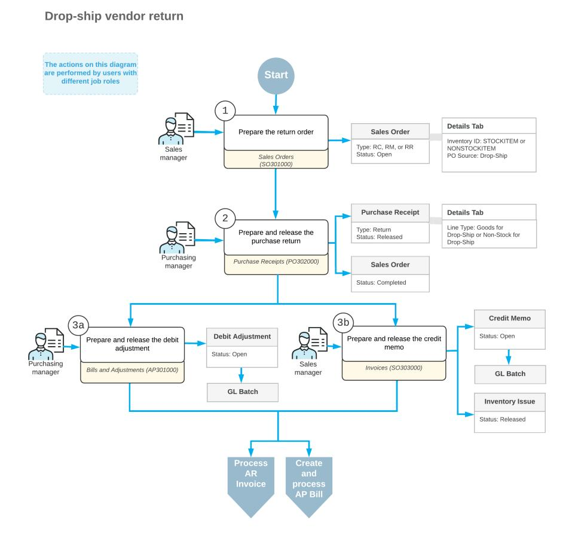

# <span id="page-294-0"></span>**Drop-Ship Vendor Returns: Process Activity**

The following activity will walk you through the processing of a drop-ship vendor return.

This activity is based on the *U100* dataset. If you are using another dataset, or if any system settings have been changed in *U100*, these changes can affect the workflow of the activity and the results of the processing. To avoid any issues, restore the *U100* dataset to its initial state.

#### **Story**

Suppose that SweetLife's retail store regularly drop-ships a variety of green, black, and fruit teas from the Tea & Spices (*TEACOMPANY*) vendor to the FourStar Coffee & Sweets Shop (*COFFEESHOP*) customer. Based on a customer satisfaction survey, a manager of the FourStar Coffee & Sweets Shop has found out that the demand for the fruit tea is very low. Thus, the FourStar Coffee & Sweets Shop has decided to stop buying the fruit tea from the SweetLife store. Also, the FourStar Coffee & Sweets Shop wants to return the fruit tea from its last order.

To complete the customer's request, acting as the sales and purchasing manager of the SweetLife store, you need to process the drop-ship vendor return for the Tea & Spices (*TEACOMPANY*) vendor by creating and processing the needed documents in the system.

#### **Configuration Overview**

In the *U100* dataset, for the purposes of this activity, the following features have been enabled on the *[Enable/](https://help-2025r1.acumatica.com/Help?ScreenId=ShowWiki&pageid=c1555e43-1bc5-4f6f-ba9d-b323f94d8a6b) [Disable Features](https://help-2025r1.acumatica.com/Help?ScreenId=ShowWiki&pageid=c1555e43-1bc5-4f6f-ba9d-b323f94d8a6b)* (CS100000) form:

- *Inventory*, which provides the ability to create sales orders that include stock items
- *Drop Shipments*, which provides the ability to create and process drop-shipped orders

Also, the following entities, which you will use in this activity, have been configured in the system:

- The *COFFEESHOP* customer on the *[Customers](https://help-2025r1.acumatica.com/Help?ScreenId=ShowWiki&pageid=652929bc-9606-4056-aa6e-0c2d1147171b)* (AP303000) form.
- The *TEACOMPANY* vendor on the *[Vendors](https://help-2025r1.acumatica.com/Help?ScreenId=ShowWiki&pageid=a9584be3-f2bd-4d67-80d4-8041d809df56)* (AP303000) form.
- The *GREENTEA6*, *BLACKTEA6*, and *FRUITTEA12* stock items on the *[Stock Items](https://help-2025r1.acumatica.com/Help?ScreenId=ShowWiki&pageid=77786a70-1f1e-4d63-ad98-96f98e4fcb0e)* (IN202500) form. For each of these items, the *TEACOMPANY* vendor has been added on the**Vendors** tab.

Additionally, the purchase documents for which you will process a drop-ship purchase return have been created and processed in the system.

#### **Process Overview**

In this activity, to process a drop-ship vendor return, you will first create a sales order of the *RC* type (that is, a return order) on the *[Sales Orders](https://help-2025r1.acumatica.com/Help?ScreenId=ShowWiki&pageid=19e4021c-1b84-49fd-be12-0320c5f1c7e5)* (SO301000) form; on the **Details** tab, you will add a line with *FRUITTEA12* stock item to be returned by selecting it from the invoice. Because you want the customer to return the item directly to the *TEACOMPANY* vendor without receiving it at your warehouse, you will select the check box in the **Mark for PO** column. You will create a purchase return—a purchase receipt of the *Return* type— for the vendor on the *[Purchase](https://help-2025r1.acumatica.com/Help?ScreenId=ShowWiki&pageid=d9901c8d-486d-45ed-8088-ea3d8ee3af19) [Receipts](https://help-2025r1.acumatica.com/Help?ScreenId=ShowWiki&pageid=d9901c8d-486d-45ed-8088-ea3d8ee3af19)* (PO302000) form and then release it.

Then you will prepare a debit adjustment for the vendor on the *[Bills and Adjustments](https://help-2025r1.acumatica.com/Help?ScreenId=ShowWiki&pageid=956b4e51-3078-4d2d-85b3-65c080d95234)* (AP301000) form. When the vendor receives the returned items, you will release the debit adjustment. Finally, you will prepare a credit memo for the customer on the *[Invoices](https://help-2025r1.acumatica.com/Help?ScreenId=ShowWiki&pageid=0acc9738-f141-4ea0-a2be-f34ea9d1b63a)* (SO303000) form.

#### **System Preparation**

Do the following:

- 1. Launch the Acumatica ERP website, and sign in to a company with the *U100* dataset preloaded. To sign in as a sales and purchasing manager, use the *wiley* username and the *123* password.
- 2. In the info area, in the upper-right corner of the top pane of the Acumatica ERP screen, make sure that the business date in your system is set to *1/30/2025*. If a different date is displayed, click the Business Date menu button, and select *1/30/2025* from the calendar. For simplicity, in this activity, you will create and process all documents in the system during this business date.
- 3. On the Company and Branch Selection menu in the top pane of the Acumatica ERP screen, select the *SweetLife Store* branch.

#### **Step 1: Creating a Return Order**

To create a return order (a sales order of the *RC* type), do the following:

- 1. Open the *[Sales Orders](https://help-2025r1.acumatica.com/Help?ScreenId=ShowWiki&pageid=19e4021c-1b84-49fd-be12-0320c5f1c7e5)* (SO301000) form, create a sales order, and specify the following settings in the Summary area:
  - **OrderType**: *RC*
  - **Customer**: *COFFEESHOP*
  - **Description**: *Return of drop-shipped tea (FRUITTEA12)*
- 2. On the table toolbar of the **Details** tab, click **Add Invoice**.
- 3. In the **Add Invoice Details** dialog box, which opens, do the following:
  - a. In the **AR Doc.Type** box, make sure that *Invoice* is selected.
  - b. In the **AR Doc. Nbr.** box, select the reference number of the invoice to *COFFEESHOP* in the amount of *2612.02* dated *1/15/2025*. The invoice lines appear in the table of the dialog box.
  - c. In the table of the dialog box, select the unlabeled check box in the *FRUITTEA12* line.
  - d. Click **Add and Close** to add this line to the return order and close the dialog box.
- 4. On the form toolbar, click**Save**.

#### **Step 2: Creating and Releasing a Direct Purchase Return**

To create a direct purchase return for the vendor, do the following:

1. While you are still viewing the return order on the *[Sales Orders](https://help-2025r1.acumatica.com/Help?ScreenId=ShowWiki&pageid=19e4021c-1b84-49fd-be12-0320c5f1c7e5)* (SO301000) form, on the **Details** tab, select the **Mark for PO** check box for the only line to indicate that this item has been previously drop-shipped to the customer and should not be shipped to the warehouse of your company.

For the line, the system automatically inserts the *Drop-Ship* value in the **PO Source** column.

- 2. On the form toolbar, click**Save**.
- 3. On the More menu, click **CreateVendor Return**.

The system has created a corresponding direct purchase return for the vendor on the *[Purchase Receipts](https://help-2025r1.acumatica.com/Help?ScreenId=ShowWiki&pageid=d9901c8d-486d-45ed-8088-ea3d8ee3af19)* (PO302000) form with line details copied from the sales order.

4. On the **Shipments** tab of the *[Sales Orders](https://help-2025r1.acumatica.com/Help?ScreenId=ShowWiki&pageid=19e4021c-1b84-49fd-be12-0320c5f1c7e5)* form, click the link in the **Document Nbr.** box, which the system has inserted upon creation of the direct purchase return.

The system opens the purchase return on the *[Purchase Receipts](https://help-2025r1.acumatica.com/Help?ScreenId=ShowWiki&pageid=d9901c8d-486d-45ed-8088-ea3d8ee3af19)* form in a pop-up window. In the Summary area, notice that the system has inserted *Return* in the **Type** box and *TEACOMPANY* in the **Vendor** box.

- 5. On the **Details** tab, review the only line (for which relevant settings have been copied from the sales order line), and notice that it has the *Goods for Drop-Ship* value in the **LineType** column.
- 6. On the form toolbar, click **Release**.

#### **Step 3: Entering the Debit Adjustment**

To process the debit adjustment for the items that have been returned to the vendor, do the following:

1. While you are still viewing the purchase return on the *[Purchase Receipts](https://help-2025r1.acumatica.com/Help?ScreenId=ShowWiki&pageid=d9901c8d-486d-45ed-8088-ea3d8ee3af19)* (PO302000) form, click **Enter AP Bill** on the form toolbar.

The system opens the *[Bills and Adjustments](https://help-2025r1.acumatica.com/Help?ScreenId=ShowWiki&pageid=956b4e51-3078-4d2d-85b3-65c080d95234)* (AP301000) form and creates a debit adjustment for the vendor with the line details copied from the purchase return.

2. On the form toolbar, click **Remove Hold**, and then click **Release**.

3. Close the window with the current form.

#### **Step 4: Preparing and Releasing a Credit Memo for the Customer**

To process the return of money to the customer, do the following:

- 1. Return to the previously created sales order of the *RC* type on the *[Sales Orders](https://help-2025r1.acumatica.com/Help?ScreenId=ShowWiki&pageid=19e4021c-1b84-49fd-be12-0320c5f1c7e5)* (SO301000) form and refresh the browser window.
- 2. On the form toolbar, click **Prepare Invoice**.

The system opens the *[Invoices](https://help-2025r1.acumatica.com/Help?ScreenId=ShowWiki&pageid=0acc9738-f141-4ea0-a2be-f34ea9d1b63a)* (SO303000) form and creates a credit memo.

3. On the form toolbar, click **Release**.

Return to the sales order of the *RC* type on the *[Sales Orders](https://help-2025r1.acumatica.com/Help?ScreenId=ShowWiki&pageid=19e4021c-1b84-49fd-be12-0320c5f1c7e5)* form, and on the**Shipments** tab, review the only line, which has the shipment for the order. The following screenshot shows the resulting drop-ship return order, which has the *Completed* status.

| <b>Sales Orders</b><br>RC 000123 - FourStar Coffee & Sweets Shop |                            |                                     |                                          |                                       |                 |                   |               |                      |                     | <b>PINOTES</b><br><b>ACTIVITIES</b> | TOOLS $\sim$<br><b>FILES</b> |
|------------------------------------------------------------------|----------------------------|-------------------------------------|------------------------------------------|---------------------------------------|-----------------|-------------------|---------------|----------------------|---------------------|-------------------------------------|------------------------------|
| 목<br>$\Xi$<br>$\Omega$                                           | 间<br>÷                     | n<br>$\mathsf{K}$<br>$\check{~}$    | $\geq$<br>≺<br>$\rightarrow$             | $\cdots$                              |                 |                   |               |                      |                     |                                     |                              |
| * Order Type:                                                    | RC                         | Q<br>Customer:                      |                                          | COFFEESHOP - FourStar Coffee & Swee 2 |                 | Ordered Qtv.:     | 30.00         |                      |                     |                                     | $\sim$                       |
| Order Nbr.:                                                      | 000123                     | Q<br>Location:                      | <b>MAIN - Primary Location</b>           |                                       | 0               | Detail Total:     | 989.70        |                      |                     |                                     |                              |
| Status:                                                          | <b>Completed</b>           | Contact:                            | Andrea A. Weaver                         |                                       | 0               | Line Discounts:   | 0.00          |                      |                     |                                     |                              |
| Date:                                                            | 1/30/2025                  | Project:                            | !!!!!!!!!!!!!!!!!!!!!!!!!!!!!!!!!!!!!!!! |                                       | 0               | Document Dis      | 0.00          |                      |                     |                                     |                              |
| Requested On:                                                    | 1/30/2025                  | Description:                        | Return of drop-shipped tea               |                                       |                 | Freight Total:    | 0.00          |                      |                     |                                     |                              |
| Customer Ord                                                     |                            |                                     | (FRUITTEA12)                             | h                                     |                 | <b>Tax Total:</b> | 87.84         |                      |                     |                                     |                              |
| External Refer                                                   |                            |                                     |                                          |                                       |                 | Order Total:      | 1.077.54      |                      |                     |                                     |                              |
| <b>DETAILS</b>                                                   | <b>TAXES</b>               | <b>SHIPPING</b><br><b>FINANCIAL</b> | <b>ADDRESSES</b>                         | <b>SHIPMENTS</b>                      | <b>PAYMENTS</b> | <b>RELATIONS</b>  | <b>TOTALS</b> |                      |                     |                                     |                              |
| ↻<br>$+$<br>$\times$                                             | $\sqrt{N}$<br>$\mathbb{H}$ |                                     |                                          |                                       |                 |                   |               |                      |                     |                                     |                              |
| R<br>$\mathbf{0}$<br>D.<br><b>Shipment Type</b>                  |                            | <b>Document Nbr.</b>                | <b>Status</b>                            | * Shipment<br>Date                    | Shipped<br>Qty. | Shipped<br>Weight | Volume        | Shipped Invoice Type | <b>Invoice Nbr.</b> | <b>Inventory Doc. Type</b>          | Inventory Ref. Nbr.          |
| $\mathbf{0}$<br>Drop-Shipment                                    |                            | Return. 000051                      | Auto-Generated                           | 1/30/2025                             | 30.00           | 27.300000         | 27.300000     | <b>Credit Memo</b>   | 000124              | Issue                               | 000072                       |
|                                                                  |                            |                                     |                                          |                                       |                 |                   |               |                      |                     |                                     |                              |

*Figure: The drop-ship return order aer it has been processed to completion*

# <span id="page-297-0"></span>**Drop-Ship Vendor Returns: Mass-Processing Forms**

In the following sections, you can find details about the mass-processing forms you may want to review to simplify the processing of documents.

If you do not see a particular report or form that is described, you may have signed in to the system with a user account that does not have access rights to the report or form. Contact your system administrator to obtain access to any needed reports or forms.

#### **Processing Multiple Returns**

You can release multiple returns on the *[Release Purchase Receipts](https://help-2025r1.acumatica.com/Help?ScreenId=ShowWiki&pageid=a65e7a2b-08ff-42fd-80ff-0e26078b1f3b)* (PO501000) form by selecting the unlabeled check box for the purchase returns to be processed in the table and clicking **Process** on the form toolbar to release the process return.

#### **Mass-Creating Sales Invoices**

You can create multiple invoices on the *[Process Orders](https://help-2025r1.acumatica.com/Help?ScreenId=ShowWiki&pageid=c06a334c-f39d-4eff-9d80-b167657dff73)* (SO501000) form by selecting the *Prepare Invoice* action, selecting the unlabeled check box for the sales orders to be processed in the table, and clicking **Process** on the form toolbar to generate the sales invoice or invoices.

#### **Mass-Creating Drop-Ship Invoices**

You can create multiple drop-ship invoices on the *[Process Shipments](https://help-2025r1.acumatica.com/Help?ScreenId=ShowWiki&pageid=2e27f8fd-ddd4-47f0-a83b-5a7db31feede)* (SO503000) form by selecting the *Prepare Drop-Ship Invoice* action in the Selection area, selecting the unlabeled check box for the documents to be processed in the table, and clicking **Process** on the form toolbar to generate the drop-ship invoice or invoices.

# <span id="page-298-0"></span>**Drop-Ship Vendor Returns: Generated Transactions**

When you process a drop-ship vendor return, you create and process a debit adjustment and credit memo. To update customer and vendor balances, the system generates the GL transactions described in the following sections.

#### **Transactions Generated for a Debit Adjustment**

When you create and release a debit adjustment, the system generates the following general ledger transactions.

| Account                  | Source of Account                                      | Debit  | Credit |  |
|--------------------------|--------------------------------------------------------|--------|--------|--|
| Accounts Payable account | Vendor                                                 | Amount | 0.00   |  |
| Purchase Accrual account | Settings on the Post<br>ing Classes (IN206000)<br>form | 0.00   | Amount |  |

#### **Transactions Generated for a Credit Memo**

When you create and release a credit memo, the system releases an inventory issue, which generates the following general ledger transactions.

| Account                  | Source of Account                                      | Debit  | Credit |
|--------------------------|--------------------------------------------------------|--------|--------|
| Purchase Accrual account | Settings on the Post<br>ing Classes (IN206000)<br>form | Amount | 0.00   |
| COGS account             | Settings on the Posting<br>Classes form                | 0.00   | Amount |

# <span id="page-299-0"></span>**Processing Drop Shipments of Non-Stock Items**

The topics of this chapter explain how to process sales and purchase orders for non-stock items your company will sell and then drop-ship to the customer.

# <span id="page-299-1"></span>**Drop Shipments of Non-Stock Items: General Information**

In Acumatica ERP, you can create sales orders whose goods are intended for drop shipping. Drop shipping means that a customer orders the goods from your company, pays your company for the order, and receives the goods (which your company has ordered) directly from one of your vendors. In the system, you define these goods as nonstock items because your company does not keep them in stock.

If the *Drop Shipments* feature is enabled on the *[Enable/Disable Features](https://help-2025r1.acumatica.com/Help?ScreenId=ShowWiki&pageid=c1555e43-1bc5-4f6f-ba9d-b323f94d8a6b)* (CS100000) form, you can mark particular non-stock items for drop shipping and create drop-ship orders for these items.

#### **Learning Objectives**

In this chapter, you will do the following:

- Process a sales order for non-stock items to be drop-shipped
- Mark items for drop shipment in a sales order
- Create a drop-ship purchase order for the sales order and process the drop shipment to completion

#### **Applicable Scenario**

You use a drop shipment to fulfill a sale of non-stock items that your company does not keep in its warehouses. Instead, your company processes the needed documents to have your vendor ship the items directly to the customer.

#### **Drop-Shipping Process**

To process a sale with drop shipment, you create a sales order of the *SO* order type on the *[Sales Orders](https://help-2025r1.acumatica.com/Help?ScreenId=ShowWiki&pageid=19e4021c-1b84-49fd-be12-0320c5f1c7e5)* (SO301000) form, and add the non-stock items ordered by the customer. On the **Details** tab of the form, you mark the nonstock items for drop shipping by selecting the check box in the **Mark for PO** column and selecting *Drop-Ship* in the **PO Source** column, which means that the items will be ordered from the vendor and shipped directly to the customer.

When you mark items for drop shipping and save the sales order with the *Open* status, the system creates purchase requests of the *Drop-Ship* plan type. You then create a drop-ship purchase order by processing *Drop-Ship* purchase requests on the *[Create Purchase Orders](https://help-2025r1.acumatica.com/Help?ScreenId=ShowWiki&pageid=dc527541-a18a-44c9-8d51-6d2d77a37443)* (PO505000) form. This drop-ship purchase order contains links to the related sales order.

The items from this purchase order are not shipped to the company's warehouse; rather, they are shipped directly to the customer. Aer you have received confirmation that the customer has received the items from the vendor, you prepare and release the purchase receipt for the drop-ship purchase order. When you release the purchase receipt (which is listed as a shipment document for the sales order on the *[Sales Orders](https://help-2025r1.acumatica.com/Help?ScreenId=ShowWiki&pageid=19e4021c-1b84-49fd-be12-0320c5f1c7e5)* form), the status of the drop-ship purchase order and sales order is changed to *Completed*. You can then prepare a sales invoice for the customer.

#### **Workflow of a Sale with Drop Shipment**

For a sales order with non-stock items intended for drop shipment, the typical processing involves the actions and generated documents shown in the following diagram.

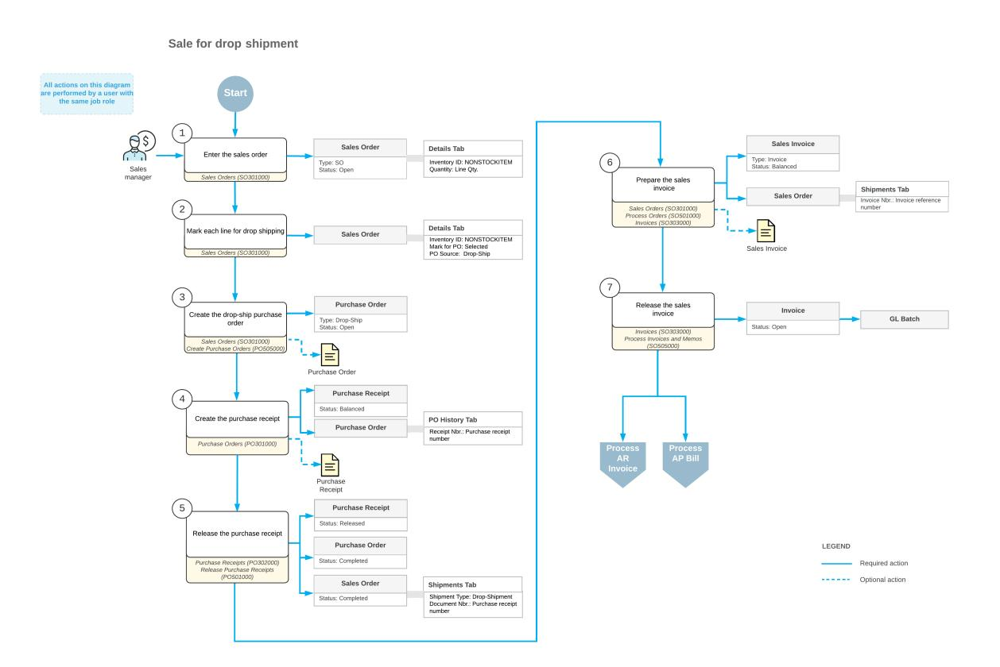

# <span id="page-300-0"></span>**Drop Shipments of Non-Stock Items: Implementation Checklist**

The following sections provide details you can use to ensure that the system is configured properly for the processing of sales of non-stock items intended to be drop-shipped, and to understand (and change, if needed) the settings that affect the processing workflow.

#### **Implementation Checklist**

Before you initially process sales with drop shipment, you should make sure the needed features have been enabled, settings have been specified, and entities have been created, as summarized in the following checklist.

| Form                                                                          | Criteria to Check                                                                                                                                                                            |
|-------------------------------------------------------------------------------|----------------------------------------------------------------------------------------------------------------------------------------------------------------------------------------------|
| Enable/Disable Features (CS100000)                                            | Make sure that the Drop Shipments feature is enabled.                                                                                                                                        |
| Sales Orders Preferences (SO101000)<br>Purchase Orders Preferences (PO101000) | Make sure that all necessary settings related to sales<br>orders and purchase orders have been specified as de<br>scribed in Configuration of Order Management: Imple<br>mentation Activity. |

| Form                       | Criteria to Check                                                                                                                                                 |
|----------------------------|-------------------------------------------------------------------------------------------------------------------------------------------------------------------|
| Order Types (SO201000)     | Make sure that the SO order type is active and has<br>been configured as described in Sales Order Types: To<br>Activate the SO Order TypeImplementation Activity. |
| Vendors (AP303000)         | Make sure that all needed vendors have been config<br>ured as described in Vendors: Implementation Activity.                                                      |
| Customers (AR303000)       | Make sure that all needed customers have been con<br>figured as described in Customers: Implementation Ac<br>tivity.                                              |
| Non-Stock Items (IN202000) | Make sure that all non-stock items are configured as<br>described in Non-Stock Items: Implementation Activity.                                                    |

#### **Other Settings That Affect the Workflow**

You can affect the processing workflow by specifying additional settings as follows:

- To process service lines marked for drop shipment on the *[Sales Orders](https://help-2025r1.acumatica.com/Help?ScreenId=ShowWiki&pageid=19e4021c-1b84-49fd-be12-0320c5f1c7e5)* (SO301000) form with receipt, select the **ProcessService Lines from Drop-Ship Purchase Orders via Purchase Receipts** on the *[Purchase](https://help-2025r1.acumatica.com/Help?ScreenId=ShowWiki&pageid=13d09c43-8696-4f92-ad9b-3d0209ee3d9b) [Orders Preferences](https://help-2025r1.acumatica.com/Help?ScreenId=ShowWiki&pageid=13d09c43-8696-4f92-ad9b-3d0209ee3d9b)* (PO101000) form.
- To cause sales orders of a particular order type to be created with the *On Hold* status (so the user can verify them before processing them further), select the **Hold Orders on Entry** check box for the order type on the *Order [Types](https://help-2025r1.acumatica.com/Help?ScreenId=ShowWiki&pageid=e6984218-4260-4438-99e1-aee2b3765369)* (SO201000) form. For more information on other order type settings affecting the workflow of sales orders, see *Sales Order Types: General [Information](https://help-2025r1.acumatica.com/Help?ScreenId=ShowWiki&pageid=96a00780-a0c3-4314-86ca-093004844268)*.
- To cause the system to automatically create an accounts payable bill on release of a purchase receipt by default, select the **Create Bill on Receipt Release** check box on the *[Purchase Orders Preferences](https://help-2025r1.acumatica.com/Help?ScreenId=ShowWiki&pageid=13d09c43-8696-4f92-ad9b-3d0209ee3d9b)* form. In this case, when a user creates a purchase receipt on the *[Purchase Receipts](https://help-2025r1.acumatica.com/Help?ScreenId=ShowWiki&pageid=d9901c8d-486d-45ed-8088-ea3d8ee3af19)* (PO302000) form, the system automatically selects the **Create Bill** check box. (The user can clear this check box for a particular bill.) For information on processing bills, see *[AP Bills: General Information](https://help-2025r1.acumatica.com/Help?ScreenId=ShowWiki&pageid=1ea1e770-b81c-437e-831f-64f702f968f4)*.
- To cause the system to automatically post general ledger batches generated during the processing of sales and purchase documents, select the **Automatically Post on Release** check box on the *[General Ledger](https://help-2025r1.acumatica.com/Help?ScreenId=ShowWiki&pageid=e4913d06-c511-4258-a0f9-f36c1b854e6b) [Preferences](https://help-2025r1.acumatica.com/Help?ScreenId=ShowWiki&pageid=e4913d06-c511-4258-a0f9-f36c1b854e6b)* (GL102000) form. For information on processing general ledger batches, see *GL [Transactions:](https://help-2025r1.acumatica.com/Help?ScreenId=ShowWiki&pageid=35393020-6269-466d-8a08-df558cd43367) [General Information](https://help-2025r1.acumatica.com/Help?ScreenId=ShowWiki&pageid=35393020-6269-466d-8a08-df558cd43367)*.

#### **Validation of Configuration**

To make sure that all configuration has been performed correctly, we recommend that in your system, you process a sale with drop shipment by performing instructions similar to those described in the *[Drop Shipments of Non-Stock](#page-301-1) [Items: Process Activity](#page-301-1)*.

# <span id="page-301-1"></span><span id="page-301-0"></span>**Drop Shipments of Non-Stock Items: Process Activity**

In this activity, you will prepare a sales order with non-stock items marked for drop shipping and process this sales order to completion.

This activity is based on the *U100* dataset. If you are using another dataset, or if any system settings have been changed in *U100*, these changes can affect the workflow of the activity and the results of the processing. To avoid any issues, restore the *U100* dataset to its initial state.

#### **Story**

Suppose that the FourStar Coffee & Sweets Shop (*COFFEESHOP*) customer has ordered two rare teas at SweetLife's store. Although these teas are presented in SweetLife's website catalog, the company does not keep them in the wholesale or retail warehouse; they are defined in Acumatica ERP as non-stock items.

When a customer orders these teas, SweetLife drop-ships them from the Tea & Spices (*TEACOMPANY*) vendor, which regularly stocks these teas, directly to the customer who ordered the teas. To fulfill the customer's request, acting as the sales manager of the SweetLife Store, you need to process a drop shipment.

### **Configuration Overview**

In the *U100* dataset, the following tasks have been performed to support this activity:

- On the *[Enable/Disable Features](https://help-2025r1.acumatica.com/Help?ScreenId=ShowWiki&pageid=c1555e43-1bc5-4f6f-ba9d-b323f94d8a6b)* (CS101000) form, the *Drop Shipments* feature, which provides the ability to create and process sales orders with drop shipment, has been enabled.
- On the *[Customers](https://help-2025r1.acumatica.com/Help?ScreenId=ShowWiki&pageid=652929bc-9606-4056-aa6e-0c2d1147171b)* (AP303000) form, the *COFFEESHOP* customer has been created.
- On the *[Vendors](https://help-2025r1.acumatica.com/Help?ScreenId=ShowWiki&pageid=a9584be3-f2bd-4d67-80d4-8041d809df56)* (AP303000) form, the *TEACOMPANY* vendor has been created.
- On the *[Non-Stock Items](https://help-2025r1.acumatica.com/Help?ScreenId=ShowWiki&pageid=bf68dd4f-63d4-460d-8dc0-9152f2bd6bf1)* (IN202000) form, the *EMPTEA* and *KINGTEA* non-stock items have been created. For each of these items, the *TEACOMPANY* vendor has been added to the**Vendors** tab. Also, the **Require Receipt** and **RequireShipment** check boxes have been selected for these items on the **General** tab. These settings are required to process drop-ship sales.

#### **Process Overview**

In this activity, to process a sale with drop shipment, you will create a sales order of the *SO* order type on the *[Sales](https://help-2025r1.acumatica.com/Help?ScreenId=ShowWiki&pageid=19e4021c-1b84-49fd-be12-0320c5f1c7e5) [Orders](https://help-2025r1.acumatica.com/Help?ScreenId=ShowWiki&pageid=19e4021c-1b84-49fd-be12-0320c5f1c7e5)* (SO301000) form; on the **Details** tab, you will add the items ordered by the customer. Because the items are not kept in stock, you will mark each of them for drop shipping by selecting the check box in the **Mark for PO** column and selecting *Drop-Ship* in the **PO Source** column, which means that the items will be ordered from the vendor and shipped directly to the customer.

You will then create a drop-ship purchase order by processing purchase requests of the *Drop-Ship* plan type on the *[Create Purchase Orders](https://help-2025r1.acumatica.com/Help?ScreenId=ShowWiki&pageid=dc527541-a18a-44c9-8d51-6d2d77a37443)* (PO505000) form. The drop-ship purchase order generated from purchase requests, which can be viewed and processed further on the *[Purchase Orders](https://help-2025r1.acumatica.com/Help?ScreenId=ShowWiki&pageid=5565686c-96c4-4bfa-a51d-9a2566baa808)* (PO301000) form, contains links to the related sales order.

Aer you have received confirmation that the customer has received the items from the vendor, on the *[Purchase](https://help-2025r1.acumatica.com/Help?ScreenId=ShowWiki&pageid=d9901c8d-486d-45ed-8088-ea3d8ee3af19) [Receipts](https://help-2025r1.acumatica.com/Help?ScreenId=ShowWiki&pageid=d9901c8d-486d-45ed-8088-ea3d8ee3af19)* (PO302000) form, you will prepare and release the purchase receipt for the drop-ship purchase order. You will then prepare an invoice for the customer by using the *[Invoices](https://help-2025r1.acumatica.com/Help?ScreenId=ShowWiki&pageid=0acc9738-f141-4ea0-a2be-f34ea9d1b63a)* (SO303000) form.

#### **System Preparation**

Before you start processing a sales order with non-stock items marked for drop shipping, do the following:

- 1. Launch the Acumatica ERP website with the *U100* dataset preloaded and sign in to the system as a sales and purchasing manager. You should sign in by using the *wiley* username and the *123* password.
- 2. In the info area, in the upper-right corner of the top pane of the Acumatica ERP screen, make sure that the business date in your system is set to *1/30/2025*. If a different date is displayed, click the Business Date menu button and select *1/30/2025* on the calendar. For simplicity, in this activity, you will create and process all documents in the system on this business date.
- 3. On the Company and Branch Selection menu in the top pane of the Acumatica ERP screen, select the *SweetLife Store* branch.

#### **Step 1: Creating a Sales Order**

To create a sales order, do the following:

- 1. On the *[Sales Orders](https://help-2025r1.acumatica.com/Help?ScreenId=ShowWiki&pageid=19e4021c-1b84-49fd-be12-0320c5f1c7e5)* (SO301000) form, add a new record.
- 2. In the Summary area, specify the following settings:
  - **OrderType**: *SO*
  - **Customer**: *COFFEESHOP*
  - **Description**: Website order #00785 (tea)
- 3. On the table toolbar of the **Details** tab, click **Add Row**.
- 4. Specify the following settings in the added row:
  - **Branch**: *RETAIL*
  - **Inventory ID**: *EMPTEA*
  - **Warehouse**: *RETAIL*
  - **Quantity**: 10
  - **Unit Price**: 47.99
- 5. On the table toolbar of the **Details** tab, click **Add Row**.
- 6. Specify the following settings in the added row:
  - **Branch**: *RETAIL*
  - **Inventory ID**: *KINGTEA*
  - **Warehouse**: *RETAIL*
  - **Quantity**: 10
  - **Unit Price**: 54.99
- 7. On the form toolbar, click**Save**. Notice that the sales order is assigned the *Open* status.

#### **Step 2: Marking the Items for Drop Shipment**

You mark the items for drop shipment as follows:

- 1. While you are still viewing the sales order on the *[Sales Orders](https://help-2025r1.acumatica.com/Help?ScreenId=ShowWiki&pageid=19e4021c-1b84-49fd-be12-0320c5f1c7e5)* (SO301000) form, for each line on the **Details** tab, do the following:
  - a. Select the **Mark for PO** check box.
  - b. In the **PO Source** column, select *Drop-Ship*.
- 2. On the form toolbar, click**Save**.

#### **Step 3: Creating a Drop-Ship Purchase Order**

To create a drop-ship purchase order from purchase requests, do the following:

- 1. While you are still viewing the sales order on the *[Sales Orders](https://help-2025r1.acumatica.com/Help?ScreenId=ShowWiki&pageid=19e4021c-1b84-49fd-be12-0320c5f1c7e5)* (SO301000) form, on the More menu, click **Create Purchase Order**.
- 2. On the *[Create Purchase Orders](https://help-2025r1.acumatica.com/Help?ScreenId=ShowWiki&pageid=dc527541-a18a-44c9-8d51-6d2d77a37443)* (PO505000) form, which opens, select the unlabeled check boxes in the two rows with *SO to Drop-Ship* specified as the **Plan Type** (which are the lines that are related to the sales order that you have prepared).
- 3. In both of the rows, make sure that *TEACOMPANY* is specified in the **Vendor** column.
- 4. On the form toolbar, click **Process** to process the purchase requests you have selected.

The system creates a drop-ship purchase order for the *TEACOMPANY* vendor and opens it on the *[Purchase](https://help-2025r1.acumatica.com/Help?ScreenId=ShowWiki&pageid=5565686c-96c4-4bfa-a51d-9a2566baa808) [Orders](https://help-2025r1.acumatica.com/Help?ScreenId=ShowWiki&pageid=5565686c-96c4-4bfa-a51d-9a2566baa808)* (PO301000) form.

- 5. On the **Details** tab of this form, review the**Sales Order Nbr.** column, which shows the number of the sales order to which this purchase order lines are linked.
- 6. In the **Description** box of the Summary area, type Purchase for website order #00785.
- 7. On the form toolbar, click **Remove Hold**.

#### **Step 4: Processing the Drop-Ship Purchase Order**

Suppose that you have been notified that the customer has received the ordered teas. To process the drop-ship purchase order to completion, do the following:

- 1. While you are still viewing the purchase order on the *[Purchase Orders](https://help-2025r1.acumatica.com/Help?ScreenId=ShowWiki&pageid=5565686c-96c4-4bfa-a51d-9a2566baa808)* (PO301000) form, click **Enter PO Receipt** on the form toolbar.
- 2. On the *[Purchase Receipts](https://help-2025r1.acumatica.com/Help?ScreenId=ShowWiki&pageid=d9901c8d-486d-45ed-8088-ea3d8ee3af19)* (PO302000) form, which the system opens with the created receipt, review the details of the prepared purchase receipt, and make sure that both purchase order lines have been added with the appropriate quantities.
- 3. In the Summary area, select the **Create Bill** check box to make the system generate the bill automatically on release of the purchase receipt.
- 4. On the form toolbar, click **Release**. Notice that the purchase receipt is assigned the *Released* status.
- 5. On the **Billing** tab, review the only line in the table, which shows the generated bill, and make sure the bill has a status of *Open*.

#### **Step 5: Processing the Sales Invoice for the Customer**

To complete the processing of a sale with drop shipment, you need to generate an invoice to the customer. Do the following:

- 1. On the *[Sales Orders](https://help-2025r1.acumatica.com/Help?ScreenId=ShowWiki&pageid=19e4021c-1b84-49fd-be12-0320c5f1c7e5)* (SO301000) form, open the sales order for the *COFFEESHOP* customer that you have created earlier in this activity.
- 2. On the form toolbar, click **Prepare Invoice**.
- 3. On the *[Invoices](https://help-2025r1.acumatica.com/Help?ScreenId=ShowWiki&pageid=0acc9738-f141-4ea0-a2be-f34ea9d1b63a)* (SO303000) form, which opens, make sure that both items have been included in the invoice.
- 4. On the form toolbar, click **Release** to release the invoice.
- 5. Return to the sales order on the *[Sales Orders](https://help-2025r1.acumatica.com/Help?ScreenId=ShowWiki&pageid=19e4021c-1b84-49fd-be12-0320c5f1c7e5)* form, and notice the *Completed* status, which reflects that you have processed the sales order to completion. Then on the**Shipments** tab, review the only row, which indicates the shipment for the order. Notice that the purchase receipt that you have processed is listed as a shipment for this sales order and that the reference number of this purchase receipt is shown in the **Document Nbr.** column of the row. The following screenshot shows the *Completed* sales order with drop shipment.

| <b>Sales Orders</b> |                |                      |                              |                  |   | SO 000076 - FourStar Coffee & Sweets Shop |                                |               |                                       |                     |       |                          | <b>P NOTES</b> |               | <b>ACTIVITIES</b>    | <b>FILES</b> |                          | TOOLS $\sim$ |
|---------------------|----------------|----------------------|------------------------------|------------------|---|-------------------------------------------|--------------------------------|---------------|---------------------------------------|---------------------|-------|--------------------------|----------------|---------------|----------------------|--------------|--------------------------|--------------|
| $\leftarrow$        | ㅋ              | H                    | $\Omega$                     | +                | 间 | n<br>-lK<br>$\check{ }$                   | ∢                              | $\rightarrow$ | $\mathcal{H}$<br>$\cdots$             |                     |       |                          |                |               |                      |              |                          |              |
| * Order Type:       |                |                      | <b>SO</b>                    | Q                |   | Customer:                                 |                                |               | COFFEESHOP - FourStar Coffee & Swee 2 |                     |       | Ordered Qty.:            |                | 20.00         |                      |              |                          | ᄉ            |
|                     | Order Nbr.:    |                      | 000076                       | Q                |   | Location:                                 | <b>MAIN - Primary Location</b> |               |                                       | $\mathscr{Q}$       |       | Detail Total:            |                | 1,029.80      |                      |              |                          |              |
| Status:             |                |                      | Completed                    |                  |   | Contact:                                  | Andrea A. Weaver               |               |                                       | 0                   |       | Line Discounts:          |                | 0.00          |                      |              |                          |              |
| Date:               |                |                      | 1/30/2025                    |                  |   | Project:                                  | X - Non-Project Code.          |               |                                       | 0                   |       | Document Dis             |                | 0.00          |                      |              |                          |              |
|                     |                | Requested On:        | 1/30/2025                    |                  |   | Description:                              |                                |               | Website order #00785 (tea)            |                     |       | Freight Total:           |                | 0.00          |                      |              |                          |              |
|                     |                | Customer Ord         |                              |                  |   |                                           |                                |               |                                       |                     |       | <b>Tax Total:</b>        |                | 0.00          |                      |              |                          |              |
|                     |                | External Refer       |                              |                  |   |                                           |                                |               |                                       |                     |       | Order Total:             |                | 1,029.80      |                      |              |                          |              |
|                     | <b>DETAILS</b> |                      | <b>TAXES</b>                 | <b>FINANCIAL</b> |   | <b>SHIPPING</b>                           | <b>ADDRESSES</b>               |               | <b>SHIPMENTS</b>                      | <b>PAYMENTS</b>     |       | <b>RELATIONS</b>         | <b>TOTALS</b>  |               |                      |              |                          |              |
| Ò                   | $\pm$          | $\times$             | $\left  \rightarrow \right $ | $\mathbf{x}$     |   |                                           |                                |               |                                       |                     |       |                          |                | Active        |                      |              | $\overline{\phantom{a}}$ | Υ            |
| 髙<br>0              | ם              | <b>Shipment Type</b> |                              |                  |   | <b>Document Nbr.</b>                      | <b>Status</b>                  |               | * Shipment<br>Date                    | <b>Shipped Qtv.</b> |       | <b>Shipped</b><br>Weight |                | <b>Volume</b> | Shipped Invoice Type |              | <b>Invoice Nbr.</b>      |              |
| $\mathbf{0}$        | ם              | Drop-Shipment        |                              |                  |   | Receipt, 000049                           | <b>Released</b>                |               | 1/30/2025                             |                     | 20.00 | 0.000000                 |                | 0.000000      | Invoice              |              | 000120                   |              |

*Figure: The completed sales order with drop shipment*

# <span id="page-305-0"></span>**Drop Shipments of Non-Stock Items: Generated Transactions**

To be able to process a sale of non-stock items intended for drop shipment, you create and process a sales order and a purchase order. The following sections describe the GL transactions generated during the processing of the documents for a sale of non-stock items for drop shipment.


Sales orders of the *SO* type do not produce any GL transactions.

#### **Transactions Generated for a Sales Invoice**

When you create and release a sales invoice with a line with a non-stock item, the system generates the following general ledger transactions.

| Account                        | Source of Account                                                                  | Debit  | Credit |
|--------------------------------|------------------------------------------------------------------------------------|--------|--------|
| Accounts Receivable<br>account | Customer                                                                           | Amount | 0.00   |
| Sales account                  | Depends on the settings of the<br>order type on the Order Types<br>(SO201000) form | 0.00   | Amount |

You can view the reference number of the GL batch in the **Batch Nbr.** box on the **Financial** tab of the *[Invoices](https://help-2025r1.acumatica.com/Help?ScreenId=ShowWiki&pageid=0acc9738-f141-4ea0-a2be-f34ea9d1b63a)* (SO303000) form. You can click the link in this box to view the details of the batch on the *Journal [Transactions](https://help-2025r1.acumatica.com/Help?ScreenId=ShowWiki&pageid=dda046bc-5946-407f-88f7-1c0c966fbe72)* (GL301000) form.

#### **Transactions Generated on AP Bill Release**

When an accounts payable bill prepared for a purchase order (or for purchase receipt) is released, the system creates a batch of the following transactions.

| Account                  | Source of Account | Debit  | Credit |
|--------------------------|-------------------|--------|--------|
| Accounts Payable account | Vendor            | 0.00   | Amount |
| PO Accrual account       | Item              | Amount | 0.00   |

You can view the reference number of the GL batch generated for a particular AP bill in the **Batch Nbr.** box on the **Financial** tab of the *[Bills and Adjustments](https://help-2025r1.acumatica.com/Help?ScreenId=ShowWiki&pageid=956b4e51-3078-4d2d-85b3-65c080d95234)* (AP301000) form. You can click the link in this box to view the details of the batch on the *Journal [Transactions](https://help-2025r1.acumatica.com/Help?ScreenId=ShowWiki&pageid=dda046bc-5946-407f-88f7-1c0c966fbe72)* (GL301000) form.

# <span id="page-306-0"></span>**Drop Shipments of Non-Stock Items: Related Reports and Forms**

In the following sections, you can find details about the reports, inquiry forms, and dialog boxes you may want to review to gather information about sales with drop shipment that have been processed or are being processed in the system.

If you do not see a particular report or form that is described, you may have signed in to the system with a user account that does not have access rights to the report or form. Contact your system administrator to obtain access to any needed reports or forms.

#### **Finding Purchase Requests Pending Drop Shipment**

You can find purchase requests of the *SO to Drop-Ship* type on the *[Create Purchase Orders](https://help-2025r1.acumatica.com/Help?ScreenId=ShowWiki&pageid=dc527541-a18a-44c9-8d51-6d2d77a37443)* (PO505000) form. On the form, you can filter purchase requests by any of the following criteria: warehouse, vendor, order type, order number, inventory ID, item class, customer, product manager, and workgroup.

You can generate purchase orders of the *Drop-Ship* type for all the listed purchase requests, or you can select particular purchase requests (by selecting the unlabeled check boxes in the rows) and generate these purchase orders.

#### **Reviewing the Purchase Order Linked to a Sales Order Line**

You can find the purchase order that is linked to a particular line of a sales order by clicking the sales order line on the **Details** tab of the *[Sales Orders](https://help-2025r1.acumatica.com/Help?ScreenId=ShowWiki&pageid=19e4021c-1b84-49fd-be12-0320c5f1c7e5)* (SO301000) form, and then clicking **PO Link** on the table toolbar. The **Purchasing Details** dialog box, which opens, lists all the purchase orders that are linked to the selected line of the sales order.

#### **Printing Reports and Documents**

To prepare a printable form of the purchase order that is being processed, you use the *[Purchase Order](https://help-2025r1.acumatica.com/Help?ScreenId=ShowWiki&pageid=b0fb90cc-f338-43c9-8eaa-a80fe53cb678)* (PO641000) report. To do this while you are viewing the purchase order on the *[Purchase Orders](https://help-2025r1.acumatica.com/Help?ScreenId=ShowWiki&pageid=5565686c-96c4-4bfa-a51d-9a2566baa808)* (PO301000) form, you click **Print Purchase Order** on the More menu. The system opens the printable version of the purchase order on the *[Purchase Order](https://help-2025r1.acumatica.com/Help?ScreenId=ShowWiki&pageid=b0fb90cc-f338-43c9-8eaa-a80fe53cb678)* report; aer you review the order, you can print it by clicking **Print** on the report toolbar.

# <span id="page-306-1"></span>**Drop Shipments of Non-Stock Items: Mass Processing of Documents**

This topic explains how to process multiple documents related to sales with drop shipment, and how the system generates, changes, or works with documents as a result of the mass processing.

#### **Mass-Creating Drop-Ship Purchase Orders**

Drop-ship purchase orders can be mass-generated for purchase requests related to multiple sales orders at a time. To mass-process sales orders marked for drop shipment, you open the *[Create Purchase Orders](https://help-2025r1.acumatica.com/Help?ScreenId=ShowWiki&pageid=dc527541-a18a-44c9-8d51-6d2d77a37443)* (PO505000) form, on which you can create drop-ship purchase orders based on the drop-ship purchase requests that have been created for sales orders.

On this form, you select the unlabeled check boxes in the rows of the purchase requests of the *Drop-Ship* plan type to be processed and click **Process** on the form toolbar to generate the purchase order or orders of this type. A sales order can have two or more linked drop-ship purchase orders, but each generated drop-ship purchase order can have only one linked sales order. The system creates a consolidated drop-ship purchase order for each group of purchase requests for which both the sales order and the vendor are the same. Instead of processing only selected purchase requests, you can click **Process All** to process all the listed purchase requests.

#### **Mass-Creating Sales Invoices**

You can create multiple invoices on the *[Process Orders](https://help-2025r1.acumatica.com/Help?ScreenId=ShowWiki&pageid=c06a334c-f39d-4eff-9d80-b167657dff73)* (SO501000) form by selecting the *Prepare Invoice* action, selecting the unlabeled check box for the sales orders to be processed, and clicking **Process** on the form toolbar to generate the sales invoice or invoices. As an alternative to processing only selected orders, you can click **Process All** to generate sales invoices for all the listed sales orders.

# <span id="page-308-0"></span>**Reserving Payments for Sales Orders**

Many businesses perform sales on credit: A customer order is paid aer the order has been shipped and an invoice for the shipped goods and services has been sent to the customer. In some cases, businesses may require prepayments or payments to be made for particular orders, or your organization may charge a customer card for specific orders. If you rely on payment auto-application, payments are applied to unrelated invoices starting from the earliest documents, and it is difficult to perform reconciliation of balances later.

With Acumatica ERP, you can create payments and prepayments directly on the *[Sales Orders](https://help-2025r1.acumatica.com/Help?ScreenId=ShowWiki&pageid=19e4021c-1b84-49fd-be12-0320c5f1c7e5)* (SO301000) form, thus reserving these payments or prepayments for the particular order in full or in part. Also, you can link an order to existing prepayments or payments by their reference numbers. There may be many variations of processing a sales order with a reserved payment, such as multiple shipments and multiple invoices for the order, multiple payments reserved for one order, and multiple orders paid by one prepayment. If the order is being shipped in multiple shipments, you can track how the payment's partial amounts were applied to multiple invoices.

#### **Linking of Orders and Payments**

When you enter a new sales order on the *[Sales Orders](https://help-2025r1.acumatica.com/Help?ScreenId=ShowWiki&pageid=19e4021c-1b84-49fd-be12-0320c5f1c7e5)* (SO301000) form, you can create a payment or prepayment directly from the **Payments** tab by clicking **Create Payment** or **Create Prepayment** on the table toolbar. The system brings up the *[Payments and Applications](https://help-2025r1.acumatica.com/Help?ScreenId=ShowWiki&pageid=ae844bf4-1aef-42cd-9e2f-49b3ee1bc8d7)* (AR302000) form in a pop-up window. Aer you enter and save the payment or prepayment, it is linked to the sales order and can be reviewed on the **Payments** tab of the *[Sales](https://help-2025r1.acumatica.com/Help?ScreenId=ShowWiki&pageid=19e4021c-1b84-49fd-be12-0320c5f1c7e5) [Orders](https://help-2025r1.acumatica.com/Help?ScreenId=ShowWiki&pageid=19e4021c-1b84-49fd-be12-0320c5f1c7e5)*form.

When you enter a new customer prepayment or payment on the *[Payments and Applications](https://help-2025r1.acumatica.com/Help?ScreenId=ShowWiki&pageid=ae844bf4-1aef-42cd-9e2f-49b3ee1bc8d7)* form, you can link it directly to a particular order or multiple orders by adding the order or orders on the **Orders to Apply** tab. Payments with balances that have been partially applied to invoices (whether or not the invoices are related to the order) can also be reserved for sales orders.

If the customer pays by using a credit card, you can create a payment, link it to a particular sales order or multiple orders, and charge the credit card by using the same form, *[Payments and Applications](https://help-2025r1.acumatica.com/Help?ScreenId=ShowWiki&pageid=ae844bf4-1aef-42cd-9e2f-49b3ee1bc8d7)*.

#### **Application of Parent and Child Payments**

If the *Parent-Child Customer Relationship* feature has been enabled on the *[Enable/Disable Features](https://help-2025r1.acumatica.com/Help?ScreenId=ShowWiki&pageid=c1555e43-1bc5-4f6f-ba9d-b323f94d8a6b)* (CS100000) form, you can configure parent-child relationships between customer accounts. If the **Consolidate Balance** check box is selected for a child account on the **BillingSettings** tab of the *[Customers](https://help-2025r1.acumatica.com/Help?ScreenId=ShowWiki&pageid=652929bc-9606-4056-aa6e-0c2d1147171b)* (AR303000) form, you can apply parent payments and prepayments to the open sales orders of this child account. When the invoice is prepared for the sales order, the payment application amount is transferred to the invoice. If you enter an invoice for a child customer directly on the *[Invoices](https://help-2025r1.acumatica.com/Help?ScreenId=ShowWiki&pageid=0acc9738-f141-4ea0-a2be-f34ea9d1b63a)* (SO303000) form, you can also apply payments and prepayments of the parent customer to this invoice.

For more information on the configuration of parent-child relationships, see *[Managing Parent-Child Relationships](https://help-2025r1.acumatica.com/Help?ScreenId=ShowWiki&pageid=31bce200-b3c2-48d6-b79f-a3a219869c8a)*.

#### **Processing of Orders with Reserved Payments**

An order with a payment linked is processed in the same way as any other order is. Once an order with linked payments or prepayments is shipped, the payment or prepayment amount applied to an order is transferred to the Sales Orders invoice or invoices generated for the order. On release of the sales invoices, the system applies the payment amounts reserved for the order to the invoices. If the amount of payments is equal to the order total, the invoices are closed. If the total amount of payments or prepayments applied to the order is less than the order total, the system leaves one of the invoices open with the unpaid balance (which is the difference between the order total and the payments' total).

You can view the history of application on the **Application History** tab of the *[Payments and Applications](https://help-2025r1.acumatica.com/Help?ScreenId=ShowWiki&pageid=ae844bf4-1aef-42cd-9e2f-49b3ee1bc8d7)* (AR302000) form. As orders linked to this payment are shipped and completed, you will see the list of applied invoices (generated for those orders) on this tab.

When a full-amount payment has been reserved for an order, once the order has been shipped and an invoice has been generated and released, the payment amount is applied to the invoice; the invoice is assigned the *Closed* status on the *[Invoices](https://help-2025r1.acumatica.com/Help?ScreenId=ShowWiki&pageid=0acc9738-f141-4ea0-a2be-f34ea9d1b63a)* (SO303000) form, while the order is assigned the *Completed* status on the *[Sales Orders](https://help-2025r1.acumatica.com/Help?ScreenId=ShowWiki&pageid=19e4021c-1b84-49fd-be12-0320c5f1c7e5)* (SO301000) form. If an order with a full-amount payment is shipped partially and then is completed or canceled, the amount applied to the order is reset to zero, while the payment with an unapplied balance is assigned the *Open* status and its applied amount is transferred to the invoice.

#### **Limitations on Payment Application**

The application of payments to sales orders has the following limitations:

- Payments and prepayments can be applied to only sales orders with single-installment credit terms specified in the **Terms** box on the **FinancialSettings** tab of the *[Sales Orders](https://help-2025r1.acumatica.com/Help?ScreenId=ShowWiki&pageid=19e4021c-1b84-49fd-be12-0320c5f1c7e5)* (SO301000) form. If you change single-installment credit terms to multiple-installment terms for an existing sales order with payments or prepayments applied, these applications will be unlinked from the sales order. For more information on configuring credit terms, see *Setup of Credit [Terms](https://help-2025r1.acumatica.com/Help?ScreenId=ShowWiki&pageid=bb0d243d-508c-4bf5-85b4-7b4fcc3d5fac)*.
- If approval of sales orders is required in your organization, you can specify payments for only orders that have undergone the required approvals and have the *Open* status. For details about approval processes, see *[Specific Approvals: Sales Orders](https://help-2025r1.acumatica.com/Help?ScreenId=ShowWiki&pageid=9073dc65-9824-4a3c-b924-c16ddd75728c)*.

#### **Canceling of Payment Reservation**

If no invoice has been generated for the order, you can cancel payment application by removing the reserved payment from the list on the **Payments** tab of the *[Sales Orders](https://help-2025r1.acumatica.com/Help?ScreenId=ShowWiki&pageid=19e4021c-1b84-49fd-be12-0320c5f1c7e5)* (SO301000) form.

#### **Related Links**

- *[Checking the Credit Limit in Sales Documents](#page-53-1)*
- *[Specific Approvals: Sales Orders](https://help-2025r1.acumatica.com/Help?ScreenId=ShowWiki&pageid=9073dc65-9824-4a3c-b924-c16ddd75728c)*

# <span id="page-309-0"></span>**To Enter a New Payment for an Order**

You can enter a customer prepayment or a payment intended for a particular sales order directly from the *[Sales](https://help-2025r1.acumatica.com/Help?ScreenId=ShowWiki&pageid=19e4021c-1b84-49fd-be12-0320c5f1c7e5) [Orders](https://help-2025r1.acumatica.com/Help?ScreenId=ShowWiki&pageid=19e4021c-1b84-49fd-be12-0320c5f1c7e5)* (SO301000) form.

#### **To Enter a New Payment for an Order**

- 1. Open the *[Sales Orders](https://help-2025r1.acumatica.com/Help?ScreenId=ShowWiki&pageid=19e4021c-1b84-49fd-be12-0320c5f1c7e5)* (SO301000) form.
- 2. In the **OrderType** box, select the order type.
- 3. In the **Order Nbr.** box, select the reference number of the order.
- 4. On the table toolbar of the **Payments** tab, click **Create Payment**.
- 5. In the **Create Payment** dialog box, which opens, do the following:
  - a. In the **Payment Amount** box, specify the total of the payment.
  - b. In the **Description** box, specify the description of the payment.
  - c. Make sure that in the **Payment Method** box, the appropriate payment method is selected.
  - d. Make sure that in the **Cash Account** box, the appropriate cash account is selected.
  - e. Click **OK**.
- 6. While you are still on the **Payments** tab, click the link in the **Reference Nbr.** column.
- 7. The *[Payments and Applications](https://help-2025r1.acumatica.com/Help?ScreenId=ShowWiki&pageid=ae844bf4-1aef-42cd-9e2f-49b3ee1bc8d7)* (AR302000) form opens in a pop-up window with the created document of the *Payment* type.

8. On the form toolbar, click **Release** to release the payment.

# <span id="page-310-0"></span>**To Enter a New Prepayment for an Order**

You can enter a customer prepayment intended for a particular sales order directly from the *[Sales Orders](https://help-2025r1.acumatica.com/Help?ScreenId=ShowWiki&pageid=19e4021c-1b84-49fd-be12-0320c5f1c7e5)* (SO301000) form.

#### **To Enter a New Prepayment for an Order**

- 1. Open the *[Sales Orders](https://help-2025r1.acumatica.com/Help?ScreenId=ShowWiki&pageid=19e4021c-1b84-49fd-be12-0320c5f1c7e5)* (SO301000) form.
- 2. In the **OrderType** box, select the order type.
- 3. In the **Order Nbr.** box, select the reference number of the order.
- 4. On the table toolbar of the **Payments** tab, click **Create Prepayment**.
- 5. In the **Create Prepayment** dialog box, which opens, specify the following:
  - a. In the **Payment Amount** box, specify the total of the prepayment.
  - b. In the **Description** box, specify the description of the prepayment.
  - c. Make sure that in the **Payment Method** box, the appropriate payment method is selected.
  - d. Make sure that in the **Cash Account** box, the appropriate cash account is selected.
  - e. Click **OK**.
- 6. While you are still on the **Payment** tab, click the link in the **Reference Nbr.** column.
- 7. The *[Payments and Applications](https://help-2025r1.acumatica.com/Help?ScreenId=ShowWiki&pageid=ae844bf4-1aef-42cd-9e2f-49b3ee1bc8d7)* (AR302000) form opens in a pop-up window with created document of the *Prepayment* type.
- 8. On the form toolbar, click **Release** to release the payment.

### <span id="page-310-1"></span>**To Link an Existing Payment to an Order**

You can link an existing customer payment to a particular sales order on the *[Sales Orders](https://help-2025r1.acumatica.com/Help?ScreenId=ShowWiki&pageid=19e4021c-1b84-49fd-be12-0320c5f1c7e5)* (SO301000) form.

#### **To Link an Existing Payment to an Order**

- 1. Open the *[Sales Orders](https://help-2025r1.acumatica.com/Help?ScreenId=ShowWiki&pageid=19e4021c-1b84-49fd-be12-0320c5f1c7e5)* (SO301000) form.
- 2. In the **OrderType** box, select the order type.
- 3. In the **Order Nbr.** box, select the reference number of the order.
- 4. On the **Payments** tab, add a new row to the table. In the **Doc.Type** column, select *Payment*, and in the **Reference Nbr.** column, select the reference number of the payment to be linked to the order.
- 5. On the form toolbar, click**Save** to save your changes.

# <span id="page-310-2"></span>**To Link an Existing Prepayment to an Order**

You can link an existing customer prepayment to a particular sales order on the *[Sales Orders](https://help-2025r1.acumatica.com/Help?ScreenId=ShowWiki&pageid=19e4021c-1b84-49fd-be12-0320c5f1c7e5)* (SO301000) form.

#### **To Link an Existing Prepayment to an Order**

- 1. Open the *[Sales Orders](https://help-2025r1.acumatica.com/Help?ScreenId=ShowWiki&pageid=19e4021c-1b84-49fd-be12-0320c5f1c7e5)* (SO301000) form.
- 2. In the **OrderType** box, select the order type.
- 3. In the **Order Nbr.** box, select the reference number of the order.
- 4. On the **Payments** tab, add a new row to the table. In the **Doc.Type** column, select *Prepayment*, and in the **Reference Nbr.** column, select the reference number of the prepayment to be linked to the order.
- 5. On the form toolbar, click**Save** to save your changes.

# <span id="page-312-0"></span>**Processing Purchases for Sale**

Your company may purchase certain items from vendors only when those items are added to a sales order. In Acumatica ERP, you can add these items to a sales order and mark them for purchase. When you create a purchase order for these items, it will be linked to the sales order. The topics of this chapter explain how to create and process sales orders whose goods are intended for purchasing.

# <span id="page-312-2"></span><span id="page-312-1"></span>**Purchases for Sale: General Information**

If your company sells certain items that are purchased only when sales orders for these items exist, a sales order may result in multiple purchase orders for different vendors, and a purchase order may include items from multiple sales orders. These factors could make it difficult to track the fulfillment of sales orders. In Acumatica ERP, you can link sales orders to existing purchase orders and receipts, so that the system will allocate the items listed on purchase receipts to specific sales orders.

#### **Learning Objectives**

In this chapter, you will do the following:

- Become familiar with the processing of purchases for sale in Acumatica ERP
- Create a sales order, and mark the items to be purchased for the sale
- Create a purchase order linked to a sales order
- Mass-create purchase orders
- Process the sales order and related purchase documents, inventory documents, and accounts payable documents
- Find information about documents related to a purchase for sale

#### **Applicable Scenarios**

You may need to process purchases for sale in the following cases:

- You need to process a sales order that includes items that your company does not have in stock; such items are purchased only for specific sales orders.
- You have multiple warehouses and perform purchasing only to particular larger warehouses (distribution centers). During the processing of a purchase for sale, the system will generate the required transfers between warehouses, so you can easily track where the particular sales order is in the fulfillment process.
- You need to promptly fulfill a sales order line for which the quantity of the item is insufficient. Aer you have shipped the available quantity of the item (if any units are available), you need to order the quantity that was unavailable at the time of shipping.

#### **Creation of Sales Orders with Items Requested for Purchase**

If the quantity of an item added to a sales order is fully or partially out of stock, you can purchase the remaining quantity. You specify that the remaining quantity should be purchased for the order by selecting the **Mark for PO** check box for the line on the **Details** tab of the *[Sales Orders](https://help-2025r1.acumatica.com/Help?ScreenId=ShowWiki&pageid=19e4021c-1b84-49fd-be12-0320c5f1c7e5)* (SO301000) form. The quantity initially allocated for the sales order remains allocated, while the quantity that must be purchased remains unallocated.

If you click **Remove Hold** on the form toolbar, the system creates a purchase request for this sales order on the *[Create Purchase Orders](https://help-2025r1.acumatica.com/Help?ScreenId=ShowWiki&pageid=dc527541-a18a-44c9-8d51-6d2d77a37443)* (PO505000) form. By default, for each line, the system specifies the vendor, which is set as default for a stock item specified in this line. You can change the vendor, if needed. From the purchase requests, you generate purchase orders that will be linked to the original sales order. Once you prepare and release the purchase receipt for the purchase order, the items become available for shipping, so you can complete the processing of the sales order.

#### **Workflow of a Purchase for Sale**

For a sales order that includes stock items intended for purchasing, the typical processing involves the actions and generated documents shown in the following diagram.

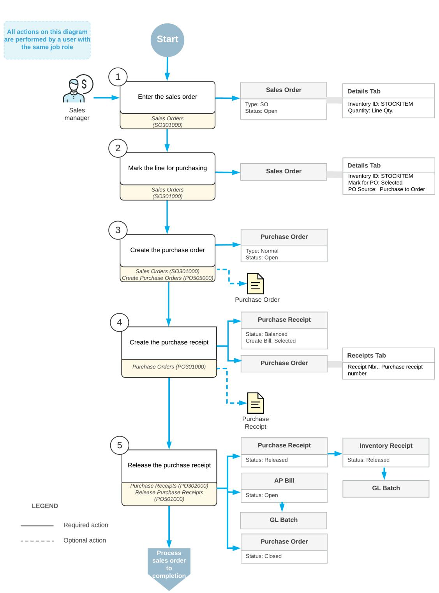

# <span id="page-315-0"></span>**Purchases for Sale: Linking Sales and Purchase Documents**

The following sections describe how you can establish connections between sales orders and the purchase documents that relate to these sales orders.

### **Linking Sales Orders to Purchase Orders**

You can link a line of a sales order with the **Mark for PO** check box selected to an existing purchase order, for instance, if you have created a new sales order that lists the same items as an open purchase order does. To link a sales order line to a purchase order line, on the **Details** tab of the *[Sales Orders](https://help-2025r1.acumatica.com/Help?ScreenId=ShowWiki&pageid=19e4021c-1b84-49fd-be12-0320c5f1c7e5)* (SO301000) form, you need to click the sales order line and then click **PO Link** on the table toolbar. In the **Purchasing Details** dialog box, which opens, you should select the unlabeled check box in the needed line of the needed purchase order, and click**Save**.

If the linked purchase order or purchase order line has become completed, the **Completed** check box remains cleared in the sales order line, and on the **Details** tab of the *[Sales Orders](https://help-2025r1.acumatica.com/Help?ScreenId=ShowWiki&pageid=19e4021c-1b84-49fd-be12-0320c5f1c7e5)* form, the system shows the warning message in this line about the completion of the linked purchase order line. Also, the **Completed** check box remains cleared in the line split in the **Line Details** dialog box. You can do either of the following in the sales order line:

- Select the **Completed** check box to complete the line
- Link the line to another purchase order line by clicking **PO Link** and selecting this purchase order in the **Purchasing Details** dialog box

#### **Linking Purchase Receipts to Sales Orders**

Items marked for purchase in a sales order may be received to warehouses other than the warehouse specified on the sales order. If the users properly specify the links between the purchase receipts and purchase orders, Acumatica ERP enables the tracking of sales order fulfillment, reserves the received items for sales orders, and automates the transfers of the items to the needed warehouses.

To make it possible to track items in receipts to the original sales orders, when you create these receipts, you need to link each receipt to the corresponding purchase order in one of the following ways:

- Open the purchase order on the *[Purchase Orders](https://help-2025r1.acumatica.com/Help?ScreenId=ShowWiki&pageid=5565686c-96c4-4bfa-a51d-9a2566baa808)* (PO301000) form, and create a receipt for it by clicking **Enter PO Receipt** on the More menu
- Create a receipt on the *[Purchase Receipts](https://help-2025r1.acumatica.com/Help?ScreenId=ShowWiki&pageid=d9901c8d-486d-45ed-8088-ea3d8ee3af19)* (PO302000) form, and link all the related purchase orders or purchase order lines to this new receipt by clicking **Add PO** or **Add PO Line** on the table toolbar

Aer a purchase receipt has been properly linked to all the related purchase orders, you will be able to track the stage of fulfillment for each line of the original sales order. On release of the purchase receipt, the quantities of items required for the sales orders are deducted from the item quantities available for shipping. If items are received to a warehouse other than the warehouse specified on the sales order, the system will generate a transfer request, which you can use to create a transfer order by using the *[Sales Orders](https://help-2025r1.acumatica.com/Help?ScreenId=ShowWiki&pageid=19e4021c-1b84-49fd-be12-0320c5f1c7e5)* (SO301000) form for a single transfer order, or by using the *Create [Transfer](https://help-2025r1.acumatica.com/Help?ScreenId=ShowWiki&pageid=aaf05359-02c9-4281-8d86-210a63c3d0df) Orders* (SO509000) form for multiple transfer orders.

# <span id="page-315-1"></span>**Purchases for Sale: Implementation Checklist**

The following sections provide details you can use to ensure that the system is configured properly for the processing of purchases for sale, and to understand (and change, if needed) the settings that affect the processing workflow.

#### **Implementation Checklist**

Before you initially process purchases for sale, you should make sure the needed features have been enabled, settings have been specified, and entities have been created, as summarized in the following checklist.

| Form                                                                           | Criteria to Check                                                                                                                                                                        |
|--------------------------------------------------------------------------------|------------------------------------------------------------------------------------------------------------------------------------------------------------------------------------------|
| Enable/Disable Features (CS100000)                                             | Make sure that the Sales Order to Purchase Order Link feature<br>is enabled.                                                                                                             |
| Sales Orders Preferences (SO101000), Purchase<br>Orders Preferences (PO101000) | Make sure that all necessary settings related to sales orders<br>and purchase orders have been specified as described in Con<br>figuration of Order Management: Implementation Activity. |
| Order Types (SO201000)                                                         | Make sure that the SO order type is active and has been con<br>figured as described in Sales Order Types: To Activate the SO<br>Order TypeImplementation Activity.                       |
| Vendors (AP303000)                                                             | Make sure that all needed vendors have been configured as<br>described in Vendors: Implementation Activity.                                                                              |
| Customers (AR303000)                                                           | Make sure that all needed customers have been configured as<br>described in Customers: Implementation Activity.                                                                          |
| Stock Items (IN202500)                                                         | Make sure that all stock items are configured as described in<br>Stock Items: Implementation Activity.                                                                                   |

#### **Other Settings That Affect the Workflow**

You can affect the processing workflow by specifying the following additional settings:

- To cause sales orders of a particular order type to be created with the *On Hold* status (so the user can verify them before processing them further), select the **Hold Documents on Entry** check box for the order type on the *Order [Types](https://help-2025r1.acumatica.com/Help?ScreenId=ShowWiki&pageid=e6984218-4260-4438-99e1-aee2b3765369)* form. For more information on other order type settings affecting the workflow of sales orders, see *Sales Order Types: General [Information](https://help-2025r1.acumatica.com/Help?ScreenId=ShowWiki&pageid=96a00780-a0c3-4314-86ca-093004844268)*.
- To cause the system to automatically create an accounts payable bill on release of a purchase receipt by default, select the **Create Bill on Receipt Release** check box on the *[Purchase Orders Preferences](https://help-2025r1.acumatica.com/Help?ScreenId=ShowWiki&pageid=13d09c43-8696-4f92-ad9b-3d0209ee3d9b)* (PO101000) form. In this case, when a user creates a purchase receipt on the *[Purchase Receipts](https://help-2025r1.acumatica.com/Help?ScreenId=ShowWiki&pageid=d9901c8d-486d-45ed-8088-ea3d8ee3af19)* (PO302000) form, the system automatically selects the **Create Bill** check box. (The user can clear this check box for a particular bill.) For information on processing bills, see *[AP Bills: General Information](https://help-2025r1.acumatica.com/Help?ScreenId=ShowWiki&pageid=1ea1e770-b81c-437e-831f-64f702f968f4)*.
- To cause the system to automatically post general ledger batches generated during the processing of sales and purchase documents, select the **Automatically Post on Release** check box on the *[General Ledger](https://help-2025r1.acumatica.com/Help?ScreenId=ShowWiki&pageid=e4913d06-c511-4258-a0f9-f36c1b854e6b) [Preferences](https://help-2025r1.acumatica.com/Help?ScreenId=ShowWiki&pageid=e4913d06-c511-4258-a0f9-f36c1b854e6b)* (GL102000) form. For information on processing general ledger batches, see *GL [Transactions:](https://help-2025r1.acumatica.com/Help?ScreenId=ShowWiki&pageid=35393020-6269-466d-8a08-df558cd43367) [General Information](https://help-2025r1.acumatica.com/Help?ScreenId=ShowWiki&pageid=35393020-6269-466d-8a08-df558cd43367)*.

#### **Known Process Limitations**

The following limitations apply to the processing of purchases for sale:

• Sales order lines marked for purchasing cannot be processed during the quick processing of a sales order until the items are received to stock. For more information, see *Sales Order Types: Quick [Processing](https://help-2025r1.acumatica.com/Help?ScreenId=ShowWiki&pageid=2920c85c-5678-40f7-b80a-e068ac3a137f) of Sales [Orders](https://help-2025r1.acumatica.com/Help?ScreenId=ShowWiki&pageid=2920c85c-5678-40f7-b80a-e068ac3a137f)*.

• On the *[Sales Orders](https://help-2025r1.acumatica.com/Help?ScreenId=ShowWiki&pageid=19e4021c-1b84-49fd-be12-0320c5f1c7e5)* (SO301000) form, for a sales order of the *RR* or *RM* type, lines with the *Return* operation type cannot be marked for purchasing for sale, because these are the items to be received to inventory.

#### **Validation of Configuration**

To make sure that all settings are configured correctly, we recommend that in your system, you process a purchase for sale, as described in *[Purchases for Sale: Process Activity](#page-317-1)*.

# <span id="page-317-1"></span><span id="page-317-0"></span>**Purchases for Sale: Process Activity**

In this activity, you will learn how to process a purchase of items that are not in stock for a particular sales order, and how to process the sales order to completion aer receipt of the items that were purchased for sale.

This activity is based on the *U100* dataset. If you are using another dataset, or if any system settings have been changed in *U100*, these changes can affect the workflow of the activity and the results of the processing. To avoid any issues, restore the *U100* dataset to its initial state.

#### **Story**

Suppose that the GoodFood One Restaurant customer has ordered tropical fruits (15 pounds of papayas and 10 pounds of lychees) on SweetLife's website. SweetLife's warehouses do not have the appropriate conditions for keeping delicate tropical fruits; also, these fruits are ordered rarely and in small quantities. To provide fresh and high-quality fruits to the customers, the sales manager purchases these tropical fruits on demand from the All Fruits Mall company, and once the fruits are delivered to the retail warehouse of the SweetLife store, they are immediately shipped to the customer that ordered them.

Acting as sales manager Regina Wiley, you need to process the sales order and the related purchase order in the system.

#### **Configuration Overview**

In the *U100* dataset, for the purposes of this activity, the following tasks have been performed:

- On the *[Enable/Disable Features](https://help-2025r1.acumatica.com/Help?ScreenId=ShowWiki&pageid=c1555e43-1bc5-4f6f-ba9d-b323f94d8a6b)* (CS100000) form, the following features have been enabled:
  - *Inventory and Order Management*, which provides the standard functionality of inventory and order management
  - *Inventory*, which gives you the ability to maintain stock items by using forms related to the inventory functionality and to create and process sales and purchase documents that include stock items
  - *Sales Order to Purchase Order Link*, which provides the ability to link sales orders to existing purchase orders and receipts, and to create new purchase orders for existing sales orders
- On the *[Customers](https://help-2025r1.acumatica.com/Help?ScreenId=ShowWiki&pageid=652929bc-9606-4056-aa6e-0c2d1147171b)* (AR303000) form, the *GOODFOOD (GoodFood One Restaurant)* customer has been created.
- On the *[Vendors](https://help-2025r1.acumatica.com/Help?ScreenId=ShowWiki&pageid=a9584be3-f2bd-4d67-80d4-8041d809df56)* (AP303000) form, the *ALLFRUITS (All Fruits Mall)* vendor has been created.
- On the *[Stock Items](https://help-2025r1.acumatica.com/Help?ScreenId=ShowWiki&pageid=77786a70-1f1e-4d63-ad98-96f98e4fcb0e)* (IN202500) form, the *PAPAYAS (Fresh papayas 1 lb)* and *LYCHEES (Fresh lychees 1 lb)* stock items have been created. For each item, the *ALLFRUITS* vendor has been added on the**Vendors** tab.

#### **Process Overview**

In this activity, to process a sales order that includes stock items that must be purchased for sale, you will first create a sales order on the *[Sales Orders](https://help-2025r1.acumatica.com/Help?ScreenId=ShowWiki&pageid=19e4021c-1b84-49fd-be12-0320c5f1c7e5)* (SO301000) form and add all of the stock items that were ordered by the customer. Because the items are not in stock, you will mark them for purchasing in the sales order; to ship these lines, you have to receive the purchased items at the warehouse specified in the sales order lines.

When you mark items for purchasing, the system creates purchase requests of the *SO to Purchase* type. You will create purchase orders by mass-processing purchase requests of this type on the *[Create Purchase Orders](https://help-2025r1.acumatica.com/Help?ScreenId=ShowWiki&pageid=dc527541-a18a-44c9-8d51-6d2d77a37443)* (PO505000) form. Each purchase order generated from a purchase request or from multiple requests will be linked to the related sales order. When you receive the items of each linked purchase order to inventory, the items will be allocated directly to the related sales orders.

Aer all purchased items have been received to inventory, you will process the sales order to completion. That is, you will ship the items to the customer and prepare the invoice for the customer.

#### **System Preparation**

Before you start processing a sales order that includes stock items that must be purchased for sale, you should do the following:

- 1. Launch the Acumatica ERP website with the *U100* dataset preloaded, and sign in as purchasing manager Regina Wiley by using the *wiley* username and the *123* password.
- 2. In the info area, in the upper-right corner of the top pane of the Acumatica ERP screen, make sure that the business date in your system is set to today's date. For simplicity, in this activity, you will create and process all documents in the system on this business date.
- 3. On the Company and Branch Selection menu in the top pane of the Acumatica ERP screen, select the *SweetLife Store* branch.

#### **Step 1: Creating a Sales Order**

To create the sales order for GoodFood One Restaurant, do the following:

- 1. On the *[Sales Orders](https://help-2025r1.acumatica.com/Help?ScreenId=ShowWiki&pageid=19e4021c-1b84-49fd-be12-0320c5f1c7e5)* (SO301000) form, create an order with the following settings:
  - **OrderType**: *SO*
  - **Customer**: *GOODFOOD*
  - **Description**: Website order #00782 (tropical fruits)
- 2. On the **Details** tab, add rows with the settings shown in the following table.

| Branch | Inventory ID | Warehouse | Quantity | Unit Price |
|--------|--------------|-----------|----------|------------|
| RETAIL | PAPAYAS      | RETAIL    | 15       | 5.56       |
| RETAIL | LYCHEES      | RETAIL    | 10       | 10.99      |

Notice that the system displays warnings on the **Details** tab and in the **Quantity** column of both lines indicating that the specified quantity is not available in the selected warehouse.

3. On the form toolbar, click**Save**. The sales order is saved with the *Open* status.

#### **Step 2: Marking the Stock Items to Be Purchased for Sale**

To mark the stock items for purchase in the sales order, do the following:

- 1. While you are still viewing the order on the *[Sales Orders](https://help-2025r1.acumatica.com/Help?ScreenId=ShowWiki&pageid=19e4021c-1b84-49fd-be12-0320c5f1c7e5)* (SO301000) form, in the *PAPAYAS* line of the **Details** tab, select the **Mark for PO** check box, and make sure that *Purchase to Order* is selected in the **PO Source** column.
- 2. In the *LYCHEES* line, select the **Mark for PO** check box, and make sure that *Purchase to Order* is selected in the **PO Source** column.
- 3. On the form toolbar, click**Save**.

#### **Step 3: Creating a Purchase Order That Is Linked to the Sales Order**

To create a purchase order for the stock items that are marked for purchase, do the following:

- 1. While you are still viewing the sales order on the *[Sales Orders](https://help-2025r1.acumatica.com/Help?ScreenId=ShowWiki&pageid=19e4021c-1b84-49fd-be12-0320c5f1c7e5)* (SO301000) form, on the More menu, click **Create Purchase Order**.
- 2. On the *[Create Purchase Orders](https://help-2025r1.acumatica.com/Help?ScreenId=ShowWiki&pageid=dc527541-a18a-44c9-8d51-6d2d77a37443)* (PO505000) form, which opens, select the unlabeled check boxes in the two lines with *SO to Purchase* specified as the **Plan Type**. (The *SO to Purchase* plan type indicates that this line is a purchase request.)
- 3. In both of these lines, make sure that the stock items have the following settings:
  - a. **Vendor**: *ALLFRUITS*
  - b. **Warehouse**: *RETAIL*
- 4. On the form toolbar, click **Process** to process the purchase requests that you have selected.

The system creates a purchase order for the *ALLFRUITS* vendor, and opens it on the *[Purchase Orders](https://help-2025r1.acumatica.com/Help?ScreenId=ShowWiki&pageid=5565686c-96c4-4bfa-a51d-9a2566baa808)* (PO301000) form.

- 5. In the **Description** box of the Summary area, type Purchase for website order #00782.
- 6. On the **Details** tab, click the *PAPAYAS* line, and on the table toolbar, click**View Demand**. The **Demand** dialog box, which opens, shows the sales order to which this purchase order line is linked.
- 7. Click **Close** to close the dialog box.
- 8. On the **Details** tab, do the following:
  - In the **Unit Cost** column of the *PAPAYAS* line, specify 5.
  - In the **Unit Cost** column of the *LYCHEES* line, specify 9.
- 9. On the form toolbar, click **Remove Hold**.

#### **Step 4: Processing the Purchase Order**

To process the purchase order to completion, do the following:

- 1. While you are still viewing the purchase order on the *[Purchase Orders](https://help-2025r1.acumatica.com/Help?ScreenId=ShowWiki&pageid=5565686c-96c4-4bfa-a51d-9a2566baa808)* (PO301000) form, click **Enter PO Receipt** on the form toolbar.
- 2. On the *[Purchase Receipts](https://help-2025r1.acumatica.com/Help?ScreenId=ShowWiki&pageid=d9901c8d-486d-45ed-8088-ea3d8ee3af19)* (PO302000) form, which opens, review the details of the prepared purchase receipt, and make sure that both purchase order lines have been added with the appropriate quantities.
- 3. In the Summary area, select the **Create Bill** check box to make the system generate the bill automatically on release of the purchase receipt.
- 4. On the form toolbar, click **Release** to release the purchase receipt.

The system releases the purchase receipt, which is assigned the *Released* status.

- 5. On the **Billing** tab, review the only line in the table, which shows the generated bill, and make sure that the bill has the *Open* status, reflecting that it has been released.
- 6. On the **Other** tab, click the **IN Ref. Nbr.** link.
- 7. On the *[Receipts](https://help-2025r1.acumatica.com/Help?ScreenId=ShowWiki&pageid=d6ecad5b-155f-44bf-baba-9ed006d298b5)* (IN301000) form, which opens in a pop-up window, review the generated inventory receipt. Make sure that the inventory receipt has the *Released* status.
- 8. Close the *[Receipts](https://help-2025r1.acumatica.com/Help?ScreenId=ShowWiki&pageid=d6ecad5b-155f-44bf-baba-9ed006d298b5)* form.

Now the items are in stock in the *RETAIL* warehouse and can be shipped to the GoodFood One Restaurant customer.

#### **Step 5: Processing the Sales Order to Completion**

To process to completion the sales order that you have created in this activity, do the following:

- 1. On the *[Inventory Allocation Details](https://help-2025r1.acumatica.com/Help?ScreenId=ShowWiki&pageid=6d8011ac-1d4e-4a34-8bc2-1fa1ff002c05)* (IN402000) form, select *PAPAYAS* as the **Inventory ID** and *RETAIL* as the **Warehouse**.
- 2. On the **Item Plans** tab, review the only line in the table, which has *15* in the **Qty.** column. This indicates that 15 *PAPAYAS* units are allocated directly for the sales order for which you have processed the purchase.
- 3. Select *LYCHEES* as the **Inventory ID**. In the only table line, make sure that *10* is specified in the **Qty.** column. This indicates that 10 *LYCHEES* units are also allocated for the sales order for which you purchased them.
- 4. In the table, double-click the line to open the sales order on the *[Sales Orders](https://help-2025r1.acumatica.com/Help?ScreenId=ShowWiki&pageid=19e4021c-1b84-49fd-be12-0320c5f1c7e5)* (SO301000) form.
- 5. On the **Details** tab, click the *PAPAYAS* line, and on the table toolbar, click **PO Link**.
- 6. In the **Purchasing Details** dialog box, which opens, review the purchase order to which this sales order line is linked.
- 7. Close the dialog box.
- 8. On the **Details** tab, click the *LYCHEES* line, and on the table toolbar, click **Line Details**.
- 9. In the **Line Details** dialog box, which opens, review the allocation line, which shows that the ordered items are allocated in the *RETAIL* warehouse.
- 10.Click **OK** to close the dialog box.
- 11.On the form toolbar of the *[Sales Orders](https://help-2025r1.acumatica.com/Help?ScreenId=ShowWiki&pageid=19e4021c-1b84-49fd-be12-0320c5f1c7e5)* form, click **CreateShipment**.
- 12.In the **SpecifyShipment Parameters** dialog box, which opens, make sure that today's date is specified in the **Shipment Date** box and the *RETAIL* warehouse is specified in the **Warehouse ID** box, and click **OK**. The dialog box is closed. The system creates a shipment and opens it on the *[Shipments](https://help-2025r1.acumatica.com/Help?ScreenId=ShowWiki&pageid=f47cffcc-543e-469c-a204-a9c1e3da346d)* (SO302000) form.
- 13.On this form, review the details of the shipment, and make sure that both lines have been added with the appropriate quantities.
- 14.On the form toolbar, click **Confirm Shipment** to confirm the shipment, and then click **Prepare Invoice** to prepare the invoice for the customer.
- 15.On the *[Invoices](https://help-2025r1.acumatica.com/Help?ScreenId=ShowWiki&pageid=0acc9738-f141-4ea0-a2be-f34ea9d1b63a)* (SO303000) form, which opens, review the details of the prepared invoice.
- 16.On the form toolbar, click **Release** to release the invoice.
- 17.Return to the *[Sales Orders](https://help-2025r1.acumatica.com/Help?ScreenId=ShowWiki&pageid=19e4021c-1b84-49fd-be12-0320c5f1c7e5)* form with the *Website order #00782 (tropical fruits)* sales order for the *GOODFOOD* customer open, and notice that it has the *Completed* status, as shown in the following screenshot.

|    | $\leftarrow$     | <b>Sales Orders</b><br>뭐                       | 眉                                                      | ↶                                                                          | 俞<br>+                             | SO 000078 - GoodFood One Restaurant<br>n<br>$\checkmark$                          | K                               | $\geq$<br>←<br>$\rightarrow$                                                                                                                                                                          | $\cdots$                                       |                                     |                                                                                                                                                     |                                                                             | <b>PI NOTES</b>            | <b>ACTIVITIES</b>                   | <b>FILES</b><br>TOOLS $\sim$                  |
|----|------------------|------------------------------------------------|--------------------------------------------------------|----------------------------------------------------------------------------|------------------------------------|-----------------------------------------------------------------------------------|---------------------------------|-------------------------------------------------------------------------------------------------------------------------------------------------------------------------------------------------------|------------------------------------------------|-------------------------------------|-----------------------------------------------------------------------------------------------------------------------------------------------------|-----------------------------------------------------------------------------|----------------------------|-------------------------------------|-----------------------------------------------|
|    | Status:<br>Date: | * Order Type:<br>Order Nbr.:<br><b>DETAILS</b> | Requested On:<br>Customer Ord<br><b>External Refer</b> | <b>SO</b><br>000078<br>Completed<br>9/25/2024<br>9/25/2024<br><b>TAXES</b> | Q<br>$\varphi$<br><b>FINANCIAL</b> | Customer:<br>Location:<br>Contact:<br>Project:<br>Description:<br><b>SHIPPING</b> |                                 | GOODFOOD - GoodFood One Restaurar<br><b>MAIN - Primary Location</b><br>Darrell M. Kramer<br>!!!!!!!!!!!!!!!!!!!!!!!!!!!!!!!!!!!!!!!!<br>Website order #00782<br>(tropical fruits)<br><b>ADDRESSES</b> | 1,<br><b>SHIPMENTS</b>                         | 0<br>0<br>0<br>0<br><b>PAYMENTS</b> | Ordered Qtv.:<br>Detail Total:<br>Line Discounts:<br>Document Dis<br><b>Freight Total:</b><br><b>Tax Total:</b><br>Order Total:<br><b>RELATIONS</b> | 25.00<br>193.30<br>0.00<br>0.00<br>0.00<br>17.16<br>210.46<br><b>TOTALS</b> |                            |                                     | $\sim$                                        |
| B. | O<br>0           | n.                                             | 0<br>*Branch                                           | $\times$                                                                   | <b>ADD ITEMS</b><br>*Inventory ID  |                                                                                   | <b>ADD MATRIX ITEMS</b><br>Free | ADD INVOICE<br>Warehouse                                                                                                                                                                              | ADD BLANKET SO LINE<br><b>Line Description</b> |                                     | <b>LINE DETAILS</b>                                                                                                                                 | *UOM                                                                        | <b>PO LINK</b><br>Quantity | <b>ITEM AVAILABILITY</b><br>Qty. On | $\vdash$<br>$\ddot{\mathcal{L}}$<br>Open Qty. |
|    |                  |                                                |                                                        |                                                                            |                                    |                                                                                   | Item                            |                                                                                                                                                                                                       |                                                |                                     |                                                                                                                                                     |                                                                             |                            | <b>Shipments</b>                    |                                               |
|    | 0                | n                                              | <b>RETAIL</b>                                          |                                                                            | <b>PAPAYAS</b>                     |                                                                                   | п                               | <b>RETAIL</b>                                                                                                                                                                                         | Fresh papayas 1 lb                             |                                     |                                                                                                                                                     | LB                                                                          | 15.00                      | 15.00                               | 0.00                                          |
|    | 0                | n                                              | <b>RETAIL</b>                                          |                                                                            | <b>LYCHEES</b>                     |                                                                                   | $\Box$                          | <b>RETAIL</b>                                                                                                                                                                                         | Fresh lychees 1 lb                             |                                     |                                                                                                                                                     | LB                                                                          | 10.00                      | 10.00                               | 0.00                                          |

*Figure: Sales order processed to completion*

### <span id="page-321-0"></span>**Purchases for Sale: Mass-Processing of Documents**

This topic explains how to process multiple documents related to purchases for sale, and how the system generates, changes, or works with documents as a result of the mass processing.

#### **Mass-Creating Purchase Orders**

Purchase orders related to sales orders can be mass-generated for multiple sales orders at a time. To mass-process sales order lines that have been marked for purchase, you open the *[Create Purchase Orders](https://help-2025r1.acumatica.com/Help?ScreenId=ShowWiki&pageid=dc527541-a18a-44c9-8d51-6d2d77a37443)* (PO505000) form, on which you can create purchase orders based on the purchase requests (which are the lines with the *SO to Purchase* plan type) that have been created for these sales order lines. On this form, you select the unlabeled check boxes in the rows of the lines to be processed and click **Process** on the form toolbar to generate the purchase order or orders of the *Normal* type.

When multiple purchase orders are generated from purchase requests, the system creates consolidated purchase orders grouped by order type, vendor, vendor location, and warehouse; if the project accounting functionality is in use, the purchase orders are also grouped by project. In each prepared purchase order, purchase order lines are grouped by item, subitem, and date on which they are requested; if the project accounting functionality is in use, the purchase order lines are also grouped by project, project task, and cost code.

#### **Mass-Creating Shipments**

Shipments can be mass-generated for sales orders. To generate shipments for multiple sales orders at a time, you open the *[Process Orders](https://help-2025r1.acumatica.com/Help?ScreenId=ShowWiki&pageid=c06a334c-f39d-4eff-9d80-b167657dff73)* (SO501000) form and select the *Create Shipment* action. Then you select the unlabeled check boxes in the rows of the orders to be processed, and click **Process** on the form toolbar. The system prepares shipment documents for the selected sales orders.

#### **Mass-Creating Sales Invoices**

You can create multiple invoices on the *[Process Orders](https://help-2025r1.acumatica.com/Help?ScreenId=ShowWiki&pageid=c06a334c-f39d-4eff-9d80-b167657dff73)* (SO501000) form by selecting the *Prepare Invoice* action, selecting the unlabeled check box in the sales order lines to be processed, and clicking **Process** on the form toolbar to generate the sales invoice or invoices.

# <span id="page-322-0"></span>**Purchases for Sale: Related Reports, Inquiry Forms, and Dialog Boxes**

In the following sections, you can find details about the reports, inquiry forms, and dialog boxes you may want to review to gather information about purchases for sale that have been processed or are being processed in the system.

If you do not see a particular report or form that is described, you may have signed in to the system with a user account that does not have access rights to the report or form. Contact your system administrator to obtain access to any needed reports or forms.

#### **Finding Orders Pending Purchase**

You can find purchase requests of the *SO to Purchase* type on the *[Create Purchase Orders](https://help-2025r1.acumatica.com/Help?ScreenId=ShowWiki&pageid=dc527541-a18a-44c9-8d51-6d2d77a37443)* (PO505000) form. On the form, you can filter purchase requests by any of the following criteria: warehouse, vendor, order type, order number, inventory identifier, item class, customer, product manager, and workgroup. For the selected list of purchase requests, you can generate purchase orders for all the lines in the list, or you can select particular lines (by selecting the unlabeled check boxes in the lines) and generate these purchase orders.

#### **Reviewing Allocations for a Sales Order**

On the *[Sales Orders](https://help-2025r1.acumatica.com/Help?ScreenId=ShowWiki&pageid=19e4021c-1b84-49fd-be12-0320c5f1c7e5)* (SO301000) form, you can track the stage of fulfillment for each line of a sales order by clicking the line and then **Line Details** on the table toolbar of the **Details** tab. In the **Line Details** dialog box, which opens, you can view an allocation that the system automatically performs to reserve the line item quantity required for the sales order on the purchase receipt.

If a purchase order line that corresponds to a sales order is completed or canceled, the system adds a new allocation line, which can be viewed in the **Line Details** dialog box. This line has the **Mark for PO** check box cleared and indicates that the shipment should be prepared for the item quantity in this line. When the shipment is confirmed for this line, the line is removed from the **Line Details** dialog box.

#### **Reviewing the Demand for Purchase Orders**

You can find the sales order that is linked to a particular line of a purchase order by clicking the purchase order line on the **Details** tab of the *[Purchase Orders](https://help-2025r1.acumatica.com/Help?ScreenId=ShowWiki&pageid=5565686c-96c4-4bfa-a51d-9a2566baa808)* (PO301000) form, and then clicking**View Demand** on the table toolbar. The **Demand** dialog box, which opens, lists all the sales orders that are linked to the selected line of the purchase order.

#### **Reviewing the Links Between Sales Order Lines and Purchase Order Lines**

You can link a sales order line to an existing purchase order line, or find the purchase order that is linked to a particular line of a sales order by clicking the sales order line on the **Details** tab of the *[Sales Orders](https://help-2025r1.acumatica.com/Help?ScreenId=ShowWiki&pageid=19e4021c-1b84-49fd-be12-0320c5f1c7e5)* (SO301000) form, and then clicking **PO Link** on the table toolbar. The **Purchasing Details** dialog box, which opens, lists all the purchase orders that are linked to the selected line of the sales order. To link a sales order line to a purchase order line, you select the**Selected** check box next to need line in the table, and click**Save**.

#### **Reviewing the Item Plans Related to Purchases for Sale**

On the *[Inventory Allocation Details](https://help-2025r1.acumatica.com/Help?ScreenId=ShowWiki&pageid=6d8011ac-1d4e-4a34-8bc2-1fa1ff002c05)* (IN402000) form, you can select an item in the **Inventory ID** box, and on the **Item Plans** tab, review the quantity of the item that is currently listed in purchase orders. The *SO to Purchase* plan type indicates that a sales order has items marked for purchasing. The *Purchase for SO Prepared* plan type indicates that a purchase order was prepared for the sales-order with items marked for purchasing.

#### **Printing a Purchase Order**

To prepare a printable version of the purchase order that is being processed, you use the *[Purchase Order](https://help-2025r1.acumatica.com/Help?ScreenId=ShowWiki&pageid=b0fb90cc-f338-43c9-8eaa-a80fe53cb678)* (PO641000) report. While you are viewing a purchase order on the *[Purchase Orders](https://help-2025r1.acumatica.com/Help?ScreenId=ShowWiki&pageid=5565686c-96c4-4bfa-a51d-9a2566baa808)* (PO301000) form, you can print the purchase order by clicking **Print Purchase Order** on the More menu. The system opens the printable version of the document on the *[Purchase Order](https://help-2025r1.acumatica.com/Help?ScreenId=ShowWiki&pageid=b0fb90cc-f338-43c9-8eaa-a80fe53cb678)* report; then you can review the order and print it by clicking **Print** on the report toolbar.

# <span id="page-323-0"></span>**To Link a Sales Order to an Existing Purchase Order**

To link an existing sales order with items marked for purchasing to an existing purchase order, you use the *[Sales](https://help-2025r1.acumatica.com/Help?ScreenId=ShowWiki&pageid=19e4021c-1b84-49fd-be12-0320c5f1c7e5) [Orders](https://help-2025r1.acumatica.com/Help?ScreenId=ShowWiki&pageid=19e4021c-1b84-49fd-be12-0320c5f1c7e5)* (SO301000) form.

#### **To Link a Sales Order to an Existing Purchase Order**

- 1. Open the *[Sales Orders](https://help-2025r1.acumatica.com/Help?ScreenId=ShowWiki&pageid=19e4021c-1b84-49fd-be12-0320c5f1c7e5)* (SO301000) form.
- 2. In the **OrderType** box, select the order type.
- 3. In the **Order Nbr.** box, select the reference number of the order to be linked.
- 4. On the **Details** tab, for each line that is marked for purchasing, do the following:
  - a. Click the line, and on the table toolbar, click **PO Link**.
  - b. In the **Purchasing Details** dialog box, which opens, select *Purchase to Order* in the **PO Source** box.
  - c. In the **Vendor** box, select the vendor from which the items have to be purchased.
  - d. In the **Purchase Warehouse** box, specify the destination warehouse.
  - e. In the table of the dialog box, select the unlabeled check boxes in the row of a purchase order line to be linked to the sales order line.
  - f. Click **Save** to link the orders and close the dialog box.
- 5. Save your changes to the sales order.

# <span id="page-323-1"></span>**To Create a Purchase Order for Multiple Sales Orders**

You can create purchase orders for multiple sales orders that have lines marked for purchasing at once by using the *[Create Purchase Orders](https://help-2025r1.acumatica.com/Help?ScreenId=ShowWiki&pageid=dc527541-a18a-44c9-8d51-6d2d77a37443)* (PO505000) form, as described in this topic.

#### **To Create a Purchase Order for Multiple Sales Orders**

- 1. Open the *[Create Purchase Orders](https://help-2025r1.acumatica.com/Help?ScreenId=ShowWiki&pageid=dc527541-a18a-44c9-8d51-6d2d77a37443)* (PO505000) form.
- 2. If needed, change the **Creation Date**, which is the date that the system will insert for the generated purchase order.
- 3. In the table, select the unlabeled check boxes next to the needed lines with the *SO to Purchase* type, and make sure that each of the selected lines has the proper vendor specified.
- 4. Click **Process** on the form toolbar, or click **Process All** to generate purchase orders for all listed sales orders. The system generates the purchase orders.

# <span id="page-324-0"></span>**Processing Purchases of Stock Items**

For most companies, the majority of purchase orders are purchases to inventory: the bills are generated aer the ordered goods and services have been received from the vendors. The topics of this chapter describe how to process purchase orders with stock items being received before the related AP bill is prepared for the vendor for the purchased goods and services.

# <span id="page-324-2"></span><span id="page-324-1"></span>**Purchases of Stock Items: General Information**

In Acumatica ERP, you can process purchases of stock items: purchases in which the bills are generated aer the ordered goods and services have been received into inventory from the vendors.

#### **Learning Objectives**

In this chapter, you will do the following:

- Create a purchase order with stock items
- Prepare a purchase receipt for an existing purchase order
- Release a purchase receipt
- Enter the accounts payable bill for the receipt
- Process the purchase order and the related inventory documents and accounts payable documents

#### **Applicable Scenario**

You process a purchase order if you need to record a purchase of stock items with item quantities updated in inventory and to prepare a bill for the purchased goods to the vendor of the goods. Your purchase process includes entering a purchase order, processing the purchase receipt when the purchased items are received to inventory, and preparing a bill to the vendor.

#### **Process of Purchasing of Stock Items**

A purchase process typically includes entering a purchase order, processing the purchase receipt when the purchased items are received to inventory, and preparing a bill to the vendor. In general, the *[Purchase Orders](https://help-2025r1.acumatica.com/Help?ScreenId=ShowWiki&pageid=5565686c-96c4-4bfa-a51d-9a2566baa808)* (PO301000) form is the starting point for creating a purchase order. In Acumatica ERP, for processing purchases of inventory items, purchase orders of the *Normal* type are used.

In a new purchase order created on the *[Purchase Orders](https://help-2025r1.acumatica.com/Help?ScreenId=ShowWiki&pageid=5565686c-96c4-4bfa-a51d-9a2566baa808)* form, you should first select the vendor. Then on the **Details** tab, you list the stock items to be purchased from the vendor. You can add stock items by clicking the **Add Items** button on the table toolbar of the **Details** tab and selecting from only the vendor's items or from the entire list of stock items. Once the purchased items have been received to inventory, you need to create a purchase receipt (or multiple partial receipts). When a purchase receipt is released, the system automatically generates a corresponding inventory receipt, with the date and posting period of the purchase receipt. On release of the inventory receipt, the system updates the inventory on hand with the quantity and cost of the received goods and generates a batch of GL transactions to update account balances in the general ledger. If all the lines in the purchase order have been received in full, the system assigns the purchase order the *Completed* status. Then you need to create a bill to increase the vendor's balance in the system with amount to be paid for received goods. If all the lines in the purchase order have been billed in full, the system assigns the purchase order the *Closed* status. For more information on the rules that affect line closing and completion, see *[Stock Item Lines in Purchase Orders](#page-76-1)*.

#### **Workflow of Purchasing Stock Items**

The following diagram represents the general workflow of the processing of a purchase order in Acumatica ERP, in which a purchase receipt is processed before the bill is generated.

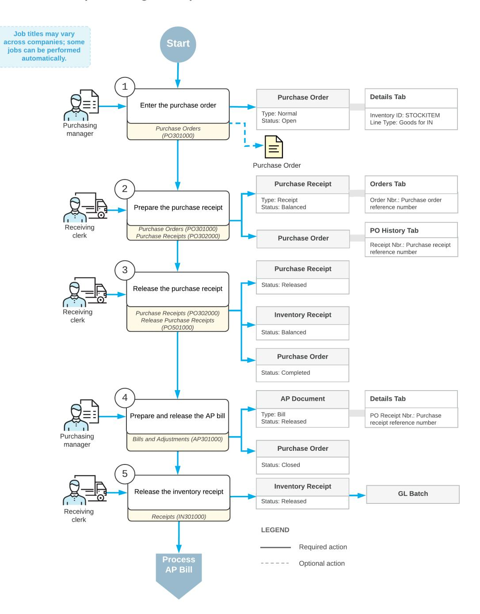

# <span id="page-326-0"></span>**Purchases of Stock Items: Implementation Checklist**

The following sections provide details you can use to ensure that the system is configured properly for the processing of purchases of stock items, and to understand (and change, if needed) the settings that affect the processing workflow.

### **Implementation Checklist**

We recommend that before you initially process purchases of stock items, you make sure the needed features have been enabled, settings have been specified, and entities have been created, as summarized in the following checklist.

| Form                                   | Criteria to Check                                                                                                                                                                 |
|----------------------------------------|-----------------------------------------------------------------------------------------------------------------------------------------------------------------------------------|
| Purchase Orders Preferences (PO101000) | Make sure that all necessary settings related to pur<br>chase order management have been specified as de<br>scribed in Configuration of Order Management: General<br>Information. |
| Vendors (AP303000)                     | Make sure that all needed vendors have been config<br>ured as described in Vendors: General Information.                                                                          |
| Stock Items (IN202500)                 | Make sure that all stock items have been configured as<br>described in Stock Items: General Information.                                                                          |

#### **Other Settings That Affect the Workflow**

You can affect the workflow of processing purchases by specifying additional settings:

- To reduce input errors when users enter orders, set up the validation of order totals by selecting the **For Normal and Standard Orders** check box in the**ValidateTotal on Entry** section of the *[Purchase Orders](https://help-2025r1.acumatica.com/Help?ScreenId=ShowWiki&pageid=13d09c43-8696-4f92-ad9b-3d0209ee3d9b) [Preferences](https://help-2025r1.acumatica.com/Help?ScreenId=ShowWiki&pageid=13d09c43-8696-4f92-ad9b-3d0209ee3d9b)* (PO101000) form (**GeneralSettings** tab). If this check box is selected, when a user creates a new purchase order on the *[Purchase Orders](https://help-2025r1.acumatica.com/Help?ScreenId=ShowWiki&pageid=5565686c-96c4-4bfa-a51d-9a2566baa808)* (PO301000) form, to take the order off hold, the user must enter the order total in the **ControlTotal** box aer verifying the order details.
- To cause an accounts payable bill to be created automatically on release of a purchase receipt by default, select the **Create Bill on Receipt Release** check box on the *[Purchase Orders Preferences](https://help-2025r1.acumatica.com/Help?ScreenId=ShowWiki&pageid=13d09c43-8696-4f92-ad9b-3d0209ee3d9b)* form. In this case, when a user creates a purchase receipt on the *[Purchase Receipts](https://help-2025r1.acumatica.com/Help?ScreenId=ShowWiki&pageid=d9901c8d-486d-45ed-8088-ea3d8ee3af19)* (PO302000) form, the system automatically selects the **Create Bill** check box. (The user can clear this check box for a particular bill.)

To cause the system to automatically release accounts payable bills generated on release of purchase receipts, select the **Release AP Documents Automatically** check box on the *[Purchase Orders Preferences](https://help-2025r1.acumatica.com/Help?ScreenId=ShowWiki&pageid=13d09c43-8696-4f92-ad9b-3d0209ee3d9b)* form. For information on processing bills, see *[AP Bills: General Information](https://help-2025r1.acumatica.com/Help?ScreenId=ShowWiki&pageid=1ea1e770-b81c-437e-831f-64f702f968f4)*.

- To cause purchase receipts to be created with the *On Hold* status (so that users can verify them before processing them further), select the **Hold Receipts on Entry** check box on the *[Purchase Orders Preferences](https://help-2025r1.acumatica.com/Help?ScreenId=ShowWiki&pageid=13d09c43-8696-4f92-ad9b-3d0209ee3d9b)* form.
- To cause the system to automatically release inventory receipts generated on release of purchase receipts, select the **Release IN Documents Automatically** check box on the *[Purchase Orders Preferences](https://help-2025r1.acumatica.com/Help?ScreenId=ShowWiki&pageid=13d09c43-8696-4f92-ad9b-3d0209ee3d9b)* form.
- To cause the system to automatically post general ledger batches generated during processing purchase documents, select the **Automatically Post on Release** check box on the *[General Ledger Preferences](https://help-2025r1.acumatica.com/Help?ScreenId=ShowWiki&pageid=e4913d06-c511-4258-a0f9-f36c1b854e6b)* (GL102000) form. For information on processing general ledger batches, see *GL [Transactions:](https://help-2025r1.acumatica.com/Help?ScreenId=ShowWiki&pageid=35393020-6269-466d-8a08-df558cd43367) General [Information](https://help-2025r1.acumatica.com/Help?ScreenId=ShowWiki&pageid=35393020-6269-466d-8a08-df558cd43367)*.

#### **Validation of Configuration**

To make sure that all configuration has been performed correctly, we recommend that in your system, you process a purchase order, as described in *[Purchases of Stock Items: Process Activity](#page-327-1)*.

# <span id="page-327-1"></span><span id="page-327-0"></span>**Purchases of Stock Items: Process Activity**

The following activity demonstrates how to prepare and process to completion a purchase order with items received to inventory before the vendor is billed.

This activity is based on the *U100* dataset. If you are using another dataset, or if any system settings have been changed in *U100*, these changes can affect the workflow of the activity and the results of the processing. To avoid any issues, restore the *U100* dataset to its initial state.

#### **Video Tutorial**

This video shows you the common process but may contain less detail than the activity has. If you want to repeat the activity on your own or you are preparing to take the certification exam, we recommend that you follow the instructions in the steps of the activity.

#### *[FEEDBACK](https://www.surveymonkey.com/r/BLBL7RJ?Video=Processing%20Standard%20Inventory%20Purchases&Source=Open%20Uni&Course=D100)*

#### **Story**

Suppose that you are Regina Wiley, a purchasing manager in the SweetLife Fruits & Jams company. On January 30, 2025, you are purchasing the following fruits from the Glory Fruit Case vendor: 100 pounds of apples, 200 pounds of oranges, and 50 pounds of lemons. The purchased fruits are to be delivered to the main office's warehouse. As the purchasing manager, you need to enter and process a purchase order, process a purchase receipt, and create a bill that should be paid to the vendor for the received fruits.

#### **Configuration Overview**

In the *U100* dataset, for the purposes of this activity, the following tasks have been performed:

- On the *[Enable/Disable Features](https://help-2025r1.acumatica.com/Help?ScreenId=ShowWiki&pageid=c1555e43-1bc5-4f6f-ba9d-b323f94d8a6b)* (CS100000) form, the following features have been enabled:
  - *Inventory and Order Management*, which provides the standard functionality of inventory and order management
  - *Inventory*, which gives you the ability to maintain stock items by using forms related to the inventory functionality and to create and process sales and purchase documents that include stock items
- On the *[Vendors](https://help-2025r1.acumatica.com/Help?ScreenId=ShowWiki&pageid=a9584be3-f2bd-4d67-80d4-8041d809df56)* (AP303000) form, the *GLORYFRUIT (Glory Fruit Case)* vendor has been configured.
- On the *[Stock Items](https://help-2025r1.acumatica.com/Help?ScreenId=ShowWiki&pageid=77786a70-1f1e-4d63-ad98-96f98e4fcb0e)* (IN202500) form, the *APPLES*, *LEMONS*, and *ORANGES* stock items have been created.

#### **Process Overview**

In the process of purchasing stock items, you create a purchase order on the *[Purchase Orders](https://help-2025r1.acumatica.com/Help?ScreenId=ShowWiki&pageid=5565686c-96c4-4bfa-a51d-9a2566baa808)* (PO301000) form and add the purchased items to it. When the items have been received, on the *[Purchase Receipts](https://help-2025r1.acumatica.com/Help?ScreenId=ShowWiki&pageid=d9901c8d-486d-45ed-8088-ea3d8ee3af19)* (PO302000) form, you create a purchase receipt for the ordered items. On release of the purchase receipt, the system automatically generates an inventory receipt to reflect the receipt of the items in inventory. Then on the *[Bills and Adjustments](https://help-2025r1.acumatica.com/Help?ScreenId=ShowWiki&pageid=956b4e51-3078-4d2d-85b3-65c080d95234)* (AP301000) form, you create an accounts payable bill to the vendor.

#### **System Preparation**

Before you start creating and processing a purchase order to completion, you should do the following:

- 1. Launch the Acumatica ERP website with the *U100* dataset preloaded and sign in to the system as purchasing manager Regina Wiley by using the *wiley* username and the *123* password.
- 2. In the info area, in the upper-right corner of the top pane of the Acumatica ERP screen, make sure that the business date in your system is set to *1/30/2025*. If a different date is displayed, click the Business Date menu button, and select *1/30/2025* from the calendar. For simplicity, in this activity, you will create and process all documents in the system on this business date.
- 3. On the Company and Branch Selection menu, in the top pane of the Acumatica ERP screen, make sure the *SweetLife Head Office and Wholesale Center* branch is selected.

### **Step 1: Reviewing the Quantity of Items in the Warehouse**

To review the quantity of items in the *WHOLESALE* warehouse, you should do the following:

- 1. Open the *Inventory [Valuation](https://help-2025r1.acumatica.com/Help?ScreenId=ShowWiki&pageid=0c0944a5-336a-4282-9c57-000b9eea0774)* (IN615500) report form.
- 2. On the **Report Parameters** tab, specify the following settings:
  - a. **Company/Branch**: *HEADOFFICE - SweetLife Head Office and Wholesale Center*
  - b. **Warehouse**: *WHOLESALE*
  - c. **Report Format**: *Summary*

Leave other settings unchanged.

- 3. On the form toolbar of the report form, click **Run Report**. The print form of the report opens. Review the report.
- 4. Memorize or write down the quantity of items with the following inventory IDs:
  - *APPLES*
  - *LEMONS*
  - *ORANGES*
  - In Step 3, you will compare the original quantity of these items with the resulting quantity.

#### **Step 2: Creating a Purchase Order**

To create a purchase order, do the following:

1. On the *[Purchase Orders](https://help-2025r1.acumatica.com/Help?ScreenId=ShowWiki&pageid=5565686c-96c4-4bfa-a51d-9a2566baa808)* (PO301000) form, add a new record.


To open the form for creating a new record, type the form ID in the Search box, and on the Search form, point at the form title and click **New** right of the title.

- 2. In the Summary area, specify the following settings:
  - **Type**: *Normal*
  - **Vendor**: *GLORYFRUIT*
  - **Date**: *1/30/2025*
  - **Promised On**: *1/30/2025*
  - **Description**: Purchase of fruits
- 3. On the **Details** tab, on the table toolbar, click **Add Row** and specify the following settings in the added row:

- **Branch**: *HEADOFFICE*
- **Inventory ID**: *APPLES*
- **Warehouse**: *WHOLESALE*
- **Order Qty.**: 100
- **Unit Cost**: 2.29
- 4. On the table toolbar, click **Add Row** and specify the following settings in the second row:
  - **Branch**: *HEADOFFICE*
  - **Inventory ID**: *LEMONS*
  - **Warehouse**: *WHOLESALE*
  - **Order Qty.**: 50
  - **Unit Cost**: 2.59
- 5. On the table toolbar, click **Add Row** and specify the following settings in the third row:
  - **Branch**: *HEADOFFICE*
  - **Inventory ID**: *ORANGES*
  - **Warehouse**: *WHOLESALE*
  - **Order Qty.**: 200
  - **Unit Cost**: 1.85
- 6. On the form toolbar, click**Save**.
- 7. On the form toolbar, click **Remove Hold**. Now you can continue processing the purchase order, which has the *Open* status.

#### **Step 3: Processing the Purchase Receipt**

To create a purchase receipt for the purchase order, do the following:

- 1. While you are still viewing the *Purchase of fruits* purchase order on the *[Purchase Orders](https://help-2025r1.acumatica.com/Help?ScreenId=ShowWiki&pageid=5565686c-96c4-4bfa-a51d-9a2566baa808)* (PO301000) form, on the form toolbar, click **Enter PO Receipt**. The system prepares the purchase receipt for the selected purchase order and opens it on the *[Purchase Receipts](https://help-2025r1.acumatica.com/Help?ScreenId=ShowWiki&pageid=d9901c8d-486d-45ed-8088-ea3d8ee3af19)* (PO302000) form.
- 2. On the form toolbar, click**Save**.

Review the details of the prepared purchase receipt. Make sure that the **Create Bill** check box is cleared in the Summary area. (In the next step, you will prepare the bill manually.)

- 3. On the form toolbar, click **Release**. Wait for the system to complete the operation.
- 4. On the **Other** tab, click the **IN Ref. Nbr.** link. The inventory receipt opens on the *[Receipts](https://help-2025r1.acumatica.com/Help?ScreenId=ShowWiki&pageid=d6ecad5b-155f-44bf-baba-9ed006d298b5)* (IN301000) form in a pop-up window. Review the details of the generated inventory receipt. Make sure the inventory receipt has the *Released* status. Close the inventory receipt.
- 5. Open the *Inventory [Valuation](https://help-2025r1.acumatica.com/Help?ScreenId=ShowWiki&pageid=0c0944a5-336a-4282-9c57-000b9eea0774)* (IN615500) report form.
- 6. On the **Report Parameters** tab, specify the following settings:
  - **Company/Branch**: *HEADOFFICE - SweetLife Head Office and Wholesale Center*
  - **Warehouse**: *WHOLESALE*
  - **Report Format**: *Summary*

Leave the default settings for the other parameters.

7. On the form toolbar of the report form, click **Run Report**. The print form of the report opens. Review the report. Make sure that the report reflects the receipt (to the warehouse) of the purchased items and their availability.

#### **Step 4: Processing the AP Bill**

To process the AP bill to the *GLORYFRUIT* vendor, do the following:

- 1. Open the purchase receipt that you have processed earlier in this activity on the *[Purchase Receipts](https://help-2025r1.acumatica.com/Help?ScreenId=ShowWiki&pageid=d9901c8d-486d-45ed-8088-ea3d8ee3af19)* (PO302000) form.
- 2. On the form toolbar, click **Enter AP Bill**. The system generates an accounts payable bill to the vendor of the goods and shows the created document on the *[Bills and Adjustments](https://help-2025r1.acumatica.com/Help?ScreenId=ShowWiki&pageid=956b4e51-3078-4d2d-85b3-65c080d95234)* (AP301000) form.
- 3. On the form toolbar, click**Save**.
- 4. Click **Remove Hold**, which gives you the ability to release the bill.
- 5. Click **Release**.
- 6. Return to the purchase order to the *GLORYFRUIT* vendor on the *[Purchase Orders](https://help-2025r1.acumatica.com/Help?ScreenId=ShowWiki&pageid=5565686c-96c4-4bfa-a51d-9a2566baa808)* (PO301000) form, and review its details. Notice that the order now has a status of *Closed*, as shown in the following screenshot. On the **PO History** tab, notice that the information about the purchase receipt and accounts payable bill that were prepared for the order is displayed. According to this information, the purchased items have been received to inventory and billed in full, so the purchasing process is completed.

| 圓          |                                                          | <b>Purchase Orders</b><br>$\boxdot$<br>$\Omega$ | Normal 000054 - Glory Fruit Case<br>间<br>$^{+}$                                                        | Ô<br>$\mathsf{K}$<br>$\check{ }$               | $\geq$<br>≺<br>$\rightarrow$ | $\cdots$                                                               |          |                                                                                                     |                                          |                       | <b>PINOTES</b>               | <b>ACTIVITIES</b>            | <b>FILES</b>                    | TOOLS $\star$ |
|------------|----------------------------------------------------------|-------------------------------------------------|--------------------------------------------------------------------------------------------------------|------------------------------------------------|------------------------------|------------------------------------------------------------------------|----------|-----------------------------------------------------------------------------------------------------|------------------------------------------|-----------------------|------------------------------|------------------------------|---------------------------------|---------------|
|            | Type:<br>Order Nbr.:<br>Status:<br>Date:<br>Description: | Promised On:                                    | Normal<br>$\checkmark$<br>Q<br>000054<br><b>Closed</b><br>1/30/2025<br>1/30/2025<br>Purchase of fruits | Vendor:<br>Location:<br>Owner:<br>Vendor Ref.: | Regina Wiley                 | <b>GLORYFRUIT - Glory Fruit Case</b><br><b>MAIN - Primary Location</b> | 0        | <b>Detail Total:</b><br>Line Discounts:<br>Document Dis<br><b>Tax Total:</b><br><b>Order Total:</b> | 728.50<br>0.00<br>0.00<br>0.00<br>728.50 |                       |                              |                              |                                 | $\sim$        |
|            | <b>DETAILS</b><br>Ò                                      | $+$<br>$\times$                                 | <b>TAXES</b><br><b>SHIPPING</b><br>$\mathbf{\overline{x}}$<br>$\vdash$                                 | <b>VENDOR INFO</b>                             | PO HISTORY                   | <b>PREPAYMENTS</b>                                                     | Ò<br>$+$ | <b>OTHER</b><br><b>COMPLIANCE</b><br>$\mathbf{\Sigma}$<br>$\vdash$<br>$\times$                      |                                          |                       |                              |                              |                                 |               |
| <b>B</b> 0 | D<br>$\omega$<br>ÐI                                      | Type<br>Receipt                                 | Receipt Nbr.<br>000046                                                                                 | Date<br>1/30/2025                              | <b>Status</b><br>Released    | Received Qty. <b>B</b> Type<br>350.00                                  | Bill     | Reference Nbr.<br>000166                                                                            | Date<br>1/30/2025                        | <b>Status</b><br>Open | <b>Billed Qty.</b><br>350.00 | <b>Billed Amt.</b><br>728.50 | <b>PPV Amt Currency</b><br>0.00 | <b>USD</b>    |

*Figure: Purchase order processed to completion*

#### **Activity Recap**

In this activity, we have illustrated how the purchasing manager has done the following:

- 1. Reviewed the remaining quantity of the specific items in the warehouse
- 2. Created a purchase order for the items
- 3. Created and processed a purchase receipt for the purchased items
- 4. Run an inventory valuation report to make sure that the purchased items have been received to the warehouse
- 5. Created and processed an AP bill to the vendor that provides the goods

### <span id="page-330-1"></span><span id="page-330-0"></span>**Purchases of Stock Items: Generated Transactions**

To process a purchase of items, you create a purchase order and process a purchase receipt and an AP bill. On release of purchase receipt, an inventory receipt transaction is generated and released. On release of the AP bill and inventory receipt, the system generates GL transactions described in the following sections.

#### **Transactions Generated on Inventory Receipt Release**

When an inventory receipt generated from a purchase receipt is released, the system generates a batch of the following transactions.

| Account            | Source of Account | Debit  | Credit |
|--------------------|-------------------|--------|--------|
| Inventory account  | Item              | Amount | 0.00   |
| PO Accrual account | Item              | 0.00   | Amount |

You can view the reference number of the GL batch generated for a particular inventory receipt in the **Batch Nbr.** box on the **Financial** tab of the *[Receipts](https://help-2025r1.acumatica.com/Help?ScreenId=ShowWiki&pageid=d6ecad5b-155f-44bf-baba-9ed006d298b5)* (IN301000) form. You can click the link in this box to view the details of the batch on the *Journal [Transactions](https://help-2025r1.acumatica.com/Help?ScreenId=ShowWiki&pageid=dda046bc-5946-407f-88f7-1c0c966fbe72)* (GL301000) form.

#### **Transactions Generated on AP Bill Release**

When an accounts payable bill prepared for a purchase order (or for purchase receipt) is released, the system creates a batch of the following transactions.

| Account                  | Source of Account | Debit  | Credit |
|--------------------------|-------------------|--------|--------|
| Accounts Payable account | Vendor            | 0.00   | Amount |
| PO Accrual account       | Item              | Amount | 0.00   |

You can view the reference number of the GL batch generated for a particular AP bill in the **Batch Nbr.** box on the **Financial** tab of the *[Bills and Adjustments](https://help-2025r1.acumatica.com/Help?ScreenId=ShowWiki&pageid=956b4e51-3078-4d2d-85b3-65c080d95234)* (AP301000) form. You can click the link in this box to view the details of the batch on the *Journal [Transactions](https://help-2025r1.acumatica.com/Help?ScreenId=ShowWiki&pageid=dda046bc-5946-407f-88f7-1c0c966fbe72)* (GL301000) form.

# <span id="page-331-0"></span>**Purchases of Stock Items: Linking Documents**

The following sections describe how you can establish connection between purchase documents and related finance documents.

#### **Linking Accounts Payable Bills to Purchase Documents**

When you process a purchase of stock items by using the purchase order or purchase receipt as a starting point, the AP bills generated based on these documents are automatically linked to the related purchase documents. However, in some organizations, AP bills could be imported from a third-party application, or bills received from the vendors could be entered manually on the *[Bills and Adjustments](https://help-2025r1.acumatica.com/Help?ScreenId=ShowWiki&pageid=956b4e51-3078-4d2d-85b3-65c080d95234)* (AP302000) form, thus they would contain no reference to the purchase documents. To correctly track the order fulfillment and the relationships between documents in the system, lines with stock items in independently created bills must be linked to purchase orders or purchase receipts.

Stock and non-stock items may be listed in a bill. When you add a stock item to a bill, the system displays a message that warns you that the line must be linked to a purchase receipt before the bill can be released. On the *[Bills and Adjustments](https://help-2025r1.acumatica.com/Help?ScreenId=ShowWiki&pageid=956b4e51-3078-4d2d-85b3-65c080d95234)* form, you must link each line of a bill with a stock item to a line of a released purchase receipt. If the bill includes non-stock items, you also may link the lines with non-stock items to the lines of released purchase receipts or open purchase orders, depending on the type of non-stock items.

#### **Linking Purchase Receipts and Purchase Orders**

When you receive purchases from a single vendor and create a new purchase receipt on the *[Purchase Receipts](https://help-2025r1.acumatica.com/Help?ScreenId=ShowWiki&pageid=d9901c8d-486d-45ed-8088-ea3d8ee3af19)* (PO302000) form, you can add an entire purchase order, multiple purchase orders, or particular purchase order lines to this receipt. The lines that can be added to a purchase receipt depend on the line types of these lines and on particular system settings. Purchase receipts can be linked to only normal or drop-ship purchase orders.

# <span id="page-332-0"></span>**Purchases of Stock Items: Mass-Processing of Documents**

The following sections explain how to mass-process purchase orders and related documents, and how the system generates, changes, or works with documents as a result of the mass processing.

#### **Mass-Releasing Purchase Receipts**

You can release multiple purchase receipts at the same time by using the *[Release Purchase Receipts](https://help-2025r1.acumatica.com/Help?ScreenId=ShowWiki&pageid=a65e7a2b-08ff-42fd-80ff-0e26078b1f3b)* (PO501000) form. On this form, you select the unlabeled check boxes in the rows to be processed, and click **Process** on the form toolbar to release the selected documents.

#### **Printing and Emailing Multiple Purchase Orders**

If needed, you can print or email multiple purchase orders at the same time by using the *[Print/Email Purchase](https://help-2025r1.acumatica.com/Help?ScreenId=ShowWiki&pageid=354eeef6-4143-49a3-9cb9-4e2da15cbf77) [Orders](https://help-2025r1.acumatica.com/Help?ScreenId=ShowWiki&pageid=354eeef6-4143-49a3-9cb9-4e2da15cbf77)* (PO503000) form. To do this for multiple purchase orders simultaneously, you select the *Print Purchase Order* or *Email Purchase Order* action, select the unlabeled check boxes for the rows to be processed, and click **Process** on the form toolbar to process the selected documents.

#### **Consolidating Purchase Orders or Lines into a Single Purchase Receipt**

Instead of preparing an individual purchase receipt for each purchase order, you can add multiple purchase orders of one vendor to a single purchase receipt; you can also add individual lines of one purchase order or multiple purchase orders. To do this, you create a new purchase receipt of the *Receipt* type manually on the *[Purchase](https://help-2025r1.acumatica.com/Help?ScreenId=ShowWiki&pageid=d9901c8d-486d-45ed-8088-ea3d8ee3af19) [Receipts](https://help-2025r1.acumatica.com/Help?ScreenId=ShowWiki&pageid=d9901c8d-486d-45ed-8088-ea3d8ee3af19)* (PO302000) form; you then click **Add PO** on the table toolbar of the **Details** tab and add the lines of multiple purchase orders with the same vendor to the purchase receipt. If you click **Add PO Line** on the table toolbar, you can add purchase receipt lines.

#### **Consolidating Purchase Receipts or Lines into a Single Bill**

Instead of preparing an individual accounts payable bill for each purchase receipt, you can add multiple purchase receipts of one vendor to a single bill; you can also add individual lines of one purchase receipt or multiple purchase receipts. To do this, you create a new accounts payable bill manually on the *[Bills and Adjustments](https://help-2025r1.acumatica.com/Help?ScreenId=ShowWiki&pageid=956b4e51-3078-4d2d-85b3-65c080d95234)* (AP301000) form and make sure that the *Tax Settings* option is selected in the**Tax Calculation Mode** box on the **Financial** tab. The**Tax Calculation Mode** box is only available if the *Net/Gross Entry Mode* feature is enabled on the *[Enable/Disable Features](https://help-2025r1.acumatica.com/Help?ScreenId=ShowWiki&pageid=c1555e43-1bc5-4f6f-ba9d-b323f94d8a6b)* (CS100000) form. You then click **Add PO Receipt** on the table toolbar of the **Details** tab and add the lines of multiple purchase receipts with the same vendor to the bill. If you click **Add PO Receipt Line** on the table toolbar, you can add purchase receipt lines.

# <span id="page-332-1"></span>**Purchases of Stock Items: Related Report and Inquiry Forms**

In the following sections, you can find details about the reports and inquiry forms you may want to review to gather information about the purchases of stock items that have been processed or are being processed in the system.

If you do not see a particular report or form that is described, you may have signed in to the system with a user account that does not have access rights to the report or form. Contact your system administrator to obtain access to any needed reports or forms.

#### **Reviewing Purchase Order Information**

If you need to review all information related to a purchase order—including the order total, open quantities, unbilled quantities and amounts, and related purchase receipts and accounts payable bills with their dates, amounts, and current statuses—you first open the particular purchase order on the *[Purchase Orders](https://help-2025r1.acumatica.com/Help?ScreenId=ShowWiki&pageid=5565686c-96c4-4bfa-a51d-9a2566baa808)* (PO301000) form. Then on the More menu, you click **Purchase Order Receipt and Billing History** to open the *[Purchase Order](https://help-2025r1.acumatica.com/Help?ScreenId=ShowWiki&pageid=c9cdd4d9-11d7-4029-9210-05c0463cac2c) [Receipt and Billing History](https://help-2025r1.acumatica.com/Help?ScreenId=ShowWiki&pageid=c9cdd4d9-11d7-4029-9210-05c0463cac2c)* (PO643000) report for this purchase order.

#### **Finding the Purchase Receipts Related to a Purchase Order**

If you need to find a purchase receipt linked to a particular purchase order, you can open the purchase order on the *[Purchase Orders](https://help-2025r1.acumatica.com/Help?ScreenId=ShowWiki&pageid=5565686c-96c4-4bfa-a51d-9a2566baa808)* (PO301010) form and review the **PO History** tab. The le table on this tab lists all the purchase receipts that have been prepared for the order, and the table footer shows the summary information for all listed documents. To review the details of a listed purchase receipt, you click its reference number in the **Receipt Nbr.** column; the system opens the purchase receipt for review on the *[Purchase Receipts](https://help-2025r1.acumatica.com/Help?ScreenId=ShowWiki&pageid=d9901c8d-486d-45ed-8088-ea3d8ee3af19)* (PO302000) form.

#### **Finding the Bills Related to a Purchase Order**

If you need to find an accounts payable bill linked to a particular purchase order, you can open the purchase order on the *[Purchase Orders](https://help-2025r1.acumatica.com/Help?ScreenId=ShowWiki&pageid=5565686c-96c4-4bfa-a51d-9a2566baa808)* (PO301000) form and review the **PO History** tab. The right table on this tab lists all the accounts payable documents that have been prepared for the order, and the table footer shows the summary information for all listed documents. To review the details of a listed bill, you click its reference number in the **Reference Nbr.** column; the system opens the accounts payable bill for review on the *[Bills and Adjustments](https://help-2025r1.acumatica.com/Help?ScreenId=ShowWiki&pageid=956b4e51-3078-4d2d-85b3-65c080d95234)* (AP301000) form.

#### **Reviewing the Unbilled Quantities of a Purchase Order**

To check whether a purchase order has quantities of items and amounts that have not yet been billed, you can review the **Unbilled Quantity** and **Unbilled Amount** boxes on the **Other** tab of the *[Purchase Orders](https://help-2025r1.acumatica.com/Help?ScreenId=ShowWiki&pageid=5565686c-96c4-4bfa-a51d-9a2566baa808)* (PO301000) form.

#### **Printing a Purchase Order**

To prepare a printable version of the purchase order that is being processed, you use the *[Purchase Order](https://help-2025r1.acumatica.com/Help?ScreenId=ShowWiki&pageid=b0fb90cc-f338-43c9-8eaa-a80fe53cb678)* (PO641000) report. While you are viewing a purchase order on the *[Purchase Orders](https://help-2025r1.acumatica.com/Help?ScreenId=ShowWiki&pageid=5565686c-96c4-4bfa-a51d-9a2566baa808)* (PO301000) form, you can print the purchase order by clicking **Print Purchase Order** on the More menu. The system opens the printable version of the document on the *[Purchase Order](https://help-2025r1.acumatica.com/Help?ScreenId=ShowWiki&pageid=b0fb90cc-f338-43c9-8eaa-a80fe53cb678)* report; then you can review the order and print it by clicking **Print** on the report toolbar.

# <span id="page-333-0"></span>**To Add Purchase Orders to an Existing Purchase Receipt**

On the *[Purchase Receipts](https://help-2025r1.acumatica.com/Help?ScreenId=ShowWiki&pageid=d9901c8d-486d-45ed-8088-ea3d8ee3af19)* (PO302000) form, you can add all lines of a purchase order or multiple purchase orders to an existing purchase receipt in which the same vendor is specified.

#### **To Add Purchase Orders to an Existing Purchase Receipt**

1. Open the *[Purchase Receipts](https://help-2025r1.acumatica.com/Help?ScreenId=ShowWiki&pageid=d9901c8d-486d-45ed-8088-ea3d8ee3af19)* (PO302000) form.

- 2. Select the needed purchase receipt by its reference number.
- 3. On the table toolbar of the **Details** tab, click **Add PO**.
- 4. In the **Add Purchase Order** dialog box, which opens, select the unlabeled check boxes in the rows of the purchase order or orders whose lines should be added to the purchase receipt.
- 5. Click **Add & Close** to add the purchase orders and close the dialog box.
- 6. On the **Details** tab, review the information in the added lines, and make any needed changes.
- 7. Optional: In the **Control Qty.** box, if it appears in the Summary area, enter the total quantity in all purchase receipt lines.
- 8. Click **Save** to save the purchase receipt.

# <span id="page-334-0"></span>**To Add Purchase Order Lines to an Existing Purchase Receipt**

On the *[Purchase Receipts](https://help-2025r1.acumatica.com/Help?ScreenId=ShowWiki&pageid=d9901c8d-486d-45ed-8088-ea3d8ee3af19)* (PO302000) form, you can add any number of lines from a particular purchase order or multiple purchase orders to an existing purchase receipt of the same vendor specified for the purchase order or orders.

#### **To Add a Purchase Order Line to an Existing Purchase Receipt**

- 1. Open the *[Purchase Receipts](https://help-2025r1.acumatica.com/Help?ScreenId=ShowWiki&pageid=d9901c8d-486d-45ed-8088-ea3d8ee3af19)* (PO302000) form.
- 2. Select the needed purchase receipt by its reference number.
- 3. On the table toolbar of the **Details** tab, click **Add PO Line**. In the **Add Purchase Order Line** dialog box, which opens, do one of the following:
  - To add lines from one particular purchase order of the vendor: In the **Order Nbr.** box, select the reference number of the particular purchase order whose line or lines you want to add. In the table, select the unlabeled check box in the row of each purchase order line to be added to the purchase receipt. Click **Add & Close**.
  - To select lines from all available purchase order lines of the vendor: In the table, select the unlabeled check box in the row of each purchase order line to be added to the purchase receipt. Click **Add & Close**.
- 4. On the **Details** tab, review the information in the added line or lines, and make any needed changes.
- 5. Optional: In the **Control Qty.** box on the Summary area, enter the total quantity in all purchase receipt lines.
- 6. On the form toolbar, click**Save** to save the purchase receipt.

# <span id="page-334-1"></span>**To Link a Bill Line to a Purchase Receipt Line**

In Acumatica ERP, you can link the lines of an existing bill (for example, one that has been imported from a thirdparty soware product) to the lines of the corresponding purchase receipt. To link the lines of a bill to the lines of a purchase receipt, you use the *[Bills and Adjustments](https://help-2025r1.acumatica.com/Help?ScreenId=ShowWiki&pageid=956b4e51-3078-4d2d-85b3-65c080d95234)* (AP301000) form.

#### **To Link a Line of an Accounts Payable Bill to a Line of a Purchase Receipt**

- 1. Open the *[Bills and Adjustments](https://help-2025r1.acumatica.com/Help?ScreenId=ShowWiki&pageid=956b4e51-3078-4d2d-85b3-65c080d95234)* (AP301000) form.
- 2. In the Summary area, select *Bill* in the **Type** box, and select the reference number of the needed bill in the **Reference Nbr.** box.
- 3. On the **Document Details** tab, click the line to which a purchase receipt line is to be linked.

4. On the table toolbar, click **Link Line**.

The system opens the **Link Line** dialog box.

- 5. In the dialog box, select the **Purchase Receipt** option button. The dialog box displays the purchase receipt lines with the same inventory ID used in the bill line that can be linked to the current line.
- 6. Select the unlabeled check box for the purchase receipt line to be linked to the bill.
- 7. Click **Save** to link the lines and close the dialog box.
- 8. On the form toolbar, click**Save**.

#### **Notes About the Procedure**

The notes in this section describe the nuances of the UI elements available on the form, such as when an element is required and when it is not, and when the system fills in settings by default. This section can include other notes.

Note the following about linking lines of Accounts Payable bills to purchase receipt lines:

- To be able to link the lines of a bill to the lines of a corresponding purchase receipt, make sure that for the bill the *Tax Settings* option is selected in the**Tax Calculation Mode** box on the **Financial Details** tab of the *[Bills and Adjustments](https://help-2025r1.acumatica.com/Help?ScreenId=ShowWiki&pageid=956b4e51-3078-4d2d-85b3-65c080d95234)* (AP301000) form.
- You can link a bill line to only one line of a purchase receipt. If you have received only a partial quantity of an item, you can link the purchase receipt with the remaining quantity to another bill's line.
- Information about the related documents appears for each linked line of the bill on the **Document Details** tab of the *[Bills and Adjustments](https://help-2025r1.acumatica.com/Help?ScreenId=ShowWiki&pageid=956b4e51-3078-4d2d-85b3-65c080d95234)* form (in the **PO Type**, **PO Number**, **PO Receipt Nbr.**, and **PO Receipt Line** columns). While the bill is unreleased, you can cancel the established links and link the bill lines to other documents if needed.

## <span id="page-335-0"></span>**To Link a Bill Line to a Purchase Order Line**

In Acumatica ERP, you can link the lines of an existing bill (for example, one that has been imported from a thirdparty soware product) to the lines of corresponding purchase order. To link the lines of a bill to the lines of a purchase order, you use the *[Bills and Adjustments](https://help-2025r1.acumatica.com/Help?ScreenId=ShowWiki&pageid=956b4e51-3078-4d2d-85b3-65c080d95234)* (AP301000) form.

#### **To Link a Line of an Accounts Payable Bill to a Line of a Purchase Order**

- 1. Open the *[Bills and Adjustments](https://help-2025r1.acumatica.com/Help?ScreenId=ShowWiki&pageid=956b4e51-3078-4d2d-85b3-65c080d95234)* (AP301000) form.
- 2. In the Summary area, select *Bill* in the **Type** box, and select the reference number of the bill in the **Reference Nbr.** box.
- 3. On the **Document Details** tab, click the line to which a purchase order line is to be linked.
- 4. On the table toolbar, click **Link Line**.

The system opens the **Link Line** dialog box.

- 5. In the dialog box, select the **Purchase Order** option button. The dialog box displays the purchase order lines with the same inventory ID that can be linked to the current line.
- 6. Select the unlabeled check box for the purchase order line to be linked to the bill.
- 7. Click **Save** to link the lines and close the dialog box.
- 8. On the form toolbar, click**Save**.

#### **Notes About the Procedure**

The notes in this section describe the nuances of the UI elements available on the form, such as when an element is required and when it is not, and when the system fills in settings by default. This section can include other notes.

Note the following about linking AP bill lines to purchase order lines:

- To be able to link the lines of a bill to the lines of a corresponding purchase order, make sure that for the bill, the *Tax Settings* option is selected in the**Tax Calculation Mode** box on the **Financial Details** tab of the *[Bills](https://help-2025r1.acumatica.com/Help?ScreenId=ShowWiki&pageid=956b4e51-3078-4d2d-85b3-65c080d95234) [and Adjustments](https://help-2025r1.acumatica.com/Help?ScreenId=ShowWiki&pageid=956b4e51-3078-4d2d-85b3-65c080d95234)* (AP301000) form.
- You can link bill lines to the lines of only purchase orders for which billing before receipt is allowed (that is, purchase orders for which the **Allows AP Bill Before Receipt** check box is selected for the purchase order on the **Other** tab of the *[Purchase Orders](https://help-2025r1.acumatica.com/Help?ScreenId=ShowWiki&pageid=5565686c-96c4-4bfa-a51d-9a2566baa808)* (PO301000) form).
- Information about the related documents appears for each linked line of the bill on the **Document Details** tab of the *[Bills and Adjustments](https://help-2025r1.acumatica.com/Help?ScreenId=ShowWiki&pageid=956b4e51-3078-4d2d-85b3-65c080d95234)* form (in the **PO Type**, **PO Number**, **PO Receipt Nbr.**, and **PO Receipt Line** columns). While the bill is unreleased, you can cancel the established links and link the bill lines to other documents if needed.

# <span id="page-336-0"></span>**To Manually Create an Accounts Payable Bill for a Purchase Receipt**

In Acumatica ERP, you can create an AP bill and add to the bill particular purchase receipts, or individual purchase receipt lines, of the same vendor specified in the bill. To create a bill for a purchase receipt, you use the *[Bills and](https://help-2025r1.acumatica.com/Help?ScreenId=ShowWiki&pageid=956b4e51-3078-4d2d-85b3-65c080d95234) [Adjustments](https://help-2025r1.acumatica.com/Help?ScreenId=ShowWiki&pageid=956b4e51-3078-4d2d-85b3-65c080d95234)* (AP301000) form.

#### **To Manually Create an Accounts Payable Bill for a Purchase Receipt**

- 1. Open the *[Bills and Adjustments](https://help-2025r1.acumatica.com/Help?ScreenId=ShowWiki&pageid=956b4e51-3078-4d2d-85b3-65c080d95234)* (AP301000) form.
- 2. On the form toolbar, click **Add New Record**.
- 3. In the **Type** box of the Summary area, select *Bill*.
- 4. In the **Date** box, enter the date of the bill.
- 5. In the **Vendor Ref.** box, enter the reference number of the vendor's purchase document that this bill is based on. (This value may be required, based on your organization's settings.)
- 6. In the **Vendor** box, select the applicable vendor.

The system fills in the following boxes automatically with the default settings of the selected vendor: **Location**, **Terms**, **Due Date**, and **Cash Discount Date**. Review these settings, and make any needed changes.

- 7. In the **Currency** box, ensure that the document currency is correct. If it is not, select another currency.
- 8. To add an entire purchase receipt (or multiple receipts), do the following:
  - a. On the **Document Details** tab, click **Add PO Receipt**.

The system opens the **Add PO Receipt** dialog box, which displays the list of the purchase receipts of the selected vendor.

- b. In the table of the dialog box, select the unlabeled check boxes for the purchase receipts to be added to the bill.
- c. Click **Add & Close** to close the dialog box.
- 9. To add particular lines of a purchase receipt (or of multiple receipts), do the following:
  - a. On the **Document Details** tab, click **Add PO Receipt Line**.

The system opens the **Add Receipt Line** dialog box, which displays the list of the unbilled purchase receipt lines of the selected vendor.

- b. Select the unlabeled check boxes for the purchase receipt lines to be added to the bill.
- c. Click **Add & Close** to close the dialog box.
- 10.In the table on the **Document Details** tab (where the lines of the selected purchase receipts or the selected purchase receipt lines have been added), check the items' quantities and costs, and correct them, if needed.
- 11.On the form toolbar, click**Save**.

#### **Notes About the Procedure**

The notes in this section describe the nuances of the UI elements available on the form, such as when an element is required and when it is not, and when the system fills in settings by default. This section can include other notes.

Note the following about adding purchase orders to AP bills:

- You can consolidate the lines of multiple purchase receipts of one vendor into one bill.
- Information about the related documents appears for each linked line of the bill on the **Document Details** tab of the *[Bills and Adjustments](https://help-2025r1.acumatica.com/Help?ScreenId=ShowWiki&pageid=956b4e51-3078-4d2d-85b3-65c080d95234)* (AP301000) form (in the **PO Type**, **PO Number**, **PO Receipt Nbr.**, and **PO Receipt Line** columns). Until the bill is released, you can cancel the established links and link the bill lines to other documents if needed.

### <span id="page-337-0"></span>**To Manually Create an Accounts Payable Bill for a Purchase Order**

In Acumatica ERP, you can create an AP bill and add to this bill a particular purchase order or multiple purchase orders of the same vendor specified in the bill. To create a bill for a purchase order, you use the *[Bills and](https://help-2025r1.acumatica.com/Help?ScreenId=ShowWiki&pageid=956b4e51-3078-4d2d-85b3-65c080d95234) [Adjustments](https://help-2025r1.acumatica.com/Help?ScreenId=ShowWiki&pageid=956b4e51-3078-4d2d-85b3-65c080d95234)* (AP301000) form.

#### **To Manually Create an Accounts Payable Bill for a Purchase Order**

- 1. Open the *[Bills and Adjustments](https://help-2025r1.acumatica.com/Help?ScreenId=ShowWiki&pageid=956b4e51-3078-4d2d-85b3-65c080d95234)* (AP301000) form.
- 2. On the form toolbar, click **Add New Record**.
- 3. In the **Type** box of the Summary area, select *Bill*.
- 4. In the **Date** box, enter the date of the bill.
- 5. In the **Vendor Ref.** box, enter the reference number of the vendor's purchase document that this bill is based on. (This value may be required, based on your organization's settings.)
- 6. In the **Vendor** box, select the applicable vendor.

The system fills in the following boxes automatically with the default settings of the selected vendor: **Location**, **Terms**, **Due Date**, and **Cash Discount Date**. Review these settings, and make any needed changes.

- 7. In the **Currency** box, ensure that the document currency is correct. If it is not, select another currency.
- 8. On the **Document Details** tab, click **Add PO**.

The system opens the **Add PO Order** dialog box, which displays the list of the purchase orders of the selected vendor.

- 9. In the table of the dialog box, select the unlabeled check boxes for the purchase orders to be added.
- 10.Click **Add & Close** to close the dialog box.
- 11.In the table on the **Document Details** tab (where the lines of the selected purchase orders have been added), check the items' quantities and costs, and correct them, if needed.

12.On the form toolbar, click**Save**.

#### **Notes About the Procedure**

The notes in this section describe the nuances of the UI elements available on the form, such as when an element is required and when it is not, and when the system fills in settings by default. This section can include other notes.

Note the following about adding purchase orders to AP bills:

- You can consolidate the lines of multiple purchase orders of one vendor into one bill.
- The system adds lines of a purchase order to the bill depending on the **Allows AP Bill Before Receipt** setting specified for the purchase order on the **Other** tab of the *[Purchase Orders](https://help-2025r1.acumatica.com/Help?ScreenId=ShowWiki&pageid=5565686c-96c4-4bfa-a51d-9a2566baa808)* (PO301000) form. If the check box is cleared, only unbilled lines with the *Service* line type are added to the bill. If the check box is selected, all unbilled lines are added to the bill.
- Information about the related documents appears for each linked line of the bill on the **Document Details** tab of the *[Bills and Adjustments](https://help-2025r1.acumatica.com/Help?ScreenId=ShowWiki&pageid=956b4e51-3078-4d2d-85b3-65c080d95234)* (AP301000) form (in the **PO Type**, **PO Number**, **PO Receipt Nbr.**, and **PO Receipt Line** columns). Until the bill is released, you can cancel the established links and link the bill lines to other documents if needed.

# <span id="page-339-0"></span>**Correcting Purchase Receipts**

In Acumatica ERP, you can edit a released purchase receipt created for a purchase order of the *Normal* or *Drop-Ship* type. With the ability to correct the receipt's settings, you can efficiently fix errors or adapt to changes in procurement processes.

This chapter provides guidance on how to correct purchase receipts effectively.

# <span id="page-339-1"></span>**Purchase Receipt Correction: General Information**

In Acumatica ERP, you can modify released purchase receipts created for normal and drop-ship purchase orders that is, purchase orders of the *Normal* and *Drop-Ship* types.

Receipt correction is unavailable if the *Manufacturing* or *Service Management* feature is enabled on the *[Enable/Disable Features](https://help-2025r1.acumatica.com/Help?ScreenId=ShowWiki&pageid=c1555e43-1bc5-4f6f-ba9d-b323f94d8a6b)* (CS100000) form. If your company wants to enable one of these features, we highly recommend first verifying that there are no unreleased correction receipts in the system.

This topic focuses on the correction of normal purchase receipts. For details on purchase receipt correction for drop-ship purchase orders, see *[Purchase Receipt Correction: Correction of Receipts for Drop-Ship Purchase Orders](#page-346-1)*.

#### **Learning Objectives**

In this chapter, you will learn how to do the following:

- Find out whether a purchase receipt can be corrected
- Create and release a correction purchase receipt
- Identify which lines of a correction purchase receipt have been changed
- Check whether a purchase receipt can be canceled
- Cancel a purchase receipt

#### **Applicable Scenarios**

You correct a purchase receipt if an error was made in its lines during processing. For example, an incorrect item quantity, lot or serial number, or expiration date was specified.

#### **Correction of a Purchase Receipt**

You can correct a purchase receipt for a normal purchase order on the *[Purchase Receipts](https://help-2025r1.acumatica.com/Help?ScreenId=ShowWiki&pageid=d9901c8d-486d-45ed-8088-ea3d8ee3af19)* (PO302000) form if this receipt has the *Released* status. While viewing the purchase receipt, you click **Correct Receipt** on the More menu. The system checks whether the purchase receipt meets all the requirements for correction. (See *[Requirements for](#page-341-0) [the Original Purchase Receipt](#page-341-0)*.)

If the purchase receipt meets all requirements, the system creates a new purchase receipt with the next sequential number.


For simplicity, we use *correction receipt* to describe the newly created purchase receipt and *original receipt* for the purchase receipt in which you clicked **Correct Receipt**.

In the original receipt, the system inserts the number of the correction receipt as a clickable link in the **Correction Doc. Ref. Nbr.** box on the **Other** tab of the *[Purchase Receipts](https://help-2025r1.acumatica.com/Help?ScreenId=ShowWiki&pageid=d9901c8d-486d-45ed-8088-ea3d8ee3af19)* form. Similarly, the correction receipt displays the original receipt number as a clickable link in the **Original Doc. Ref. Nbr.** box on the same tab.

The system copies all data from the original receipt to the correction receipt on the *[Purchase Receipts](https://help-2025r1.acumatica.com/Help?ScreenId=ShowWiki&pageid=d9901c8d-486d-45ed-8088-ea3d8ee3af19)* form, and you can update the correction receipt. When you save the correction receipt for the first time, the system assigns the *Under Correction* status to the original receipt.

If you update a purchase receipt line on the **Details** tab, the system automatically selects the **Corrected** check box in this line. If you change the date or currency exchange rate in the Summary area, the system automatically selects the **Corrected** check box in all lines of the purchase receipt. This column is hidden by default. For more information about what you can change in the correction receipt, see *[Editable Details and Settings of the Correction Purchase](#page-342-0) [Receipt](#page-342-0)*.

To complete the correction process, you click **Release** on the More menu for the correction receipt. This causes the system to validate the state of inventory, as described in *Purchase Receipt [Correction:](#page-343-1) Inventory Validation*.

#### **Results of Releasing the Correction Receipt**

On successful inventory validation, the system generates a correction inventory issue for the correction receipt. You can find its link in the **IN Ref. Nbr.** box on the **Other** tab of the *[Purchase Receipts](https://help-2025r1.acumatica.com/Help?ScreenId=ShowWiki&pageid=d9901c8d-486d-45ed-8088-ea3d8ee3af19)* form. This issue is released automatically, regardless of the state of the **Release IN Documents Automatically** check box on the *[Purchase](https://help-2025r1.acumatica.com/Help?ScreenId=ShowWiki&pageid=13d09c43-8696-4f92-ad9b-3d0209ee3d9b) [Orders Preferences](https://help-2025r1.acumatica.com/Help?ScreenId=ShowWiki&pageid=13d09c43-8696-4f92-ad9b-3d0209ee3d9b)* (PO101000) form. For details on this inventory issue, see *[Purchase Receipt Correction: Correction](#page-344-1) [Inventory Issue](#page-344-1)*.

When the correction inventory issue is released, the system assigns the *Released* status to the correction receipt and the *Canceled* status to the original receipt.

Also, for each line of the correction receipt that has changes in the **Receipt Qty.** column on the *[Purchase Receipts](https://help-2025r1.acumatica.com/Help?ScreenId=ShowWiki&pageid=d9901c8d-486d-45ed-8088-ea3d8ee3af19)* form, the system updates the **Qty. On Receipts** value on the **Details** tab of the *[Purchase Orders](https://help-2025r1.acumatica.com/Help?ScreenId=ShowWiki&pageid=5565686c-96c4-4bfa-a51d-9a2566baa808)* (PO301000) form for the related purchase order. The system changes the purchase order based on whether the line's corrected receipt quantity has increased or decreased:

- If the line quantity has decreased, the system reopens the corresponding purchase order line if it has already been completed. That is, it clears the **Completed** check box for the line on the **Details** tab. If the purchase order had the *Completed* status but now has at least one reopened line, the purchase order's status becomes *Open*.
- If the line quantity has increased and the full quantity of the item has been received, the system selects the **Completed** check box in the corresponding purchase order line. If all lines of the purchase order are now completed, the purchase order's status becomes *Completed*.

Also, if the purchase order has a related sales order with lines marked for purchase, the system updates the lines' allocated quantities in this sales order. You can view the updated quantities in the **Line Details** dialog box of the *[Sales Orders](https://help-2025r1.acumatica.com/Help?ScreenId=ShowWiki&pageid=19e4021c-1b84-49fd-be12-0320c5f1c7e5)* (SO301000) form.

#### **Workflow of the Correction of a Purchase Receipt**

The following diagram illustrates the workflow related to the correction of a purchase receipt for a normal purchase order.

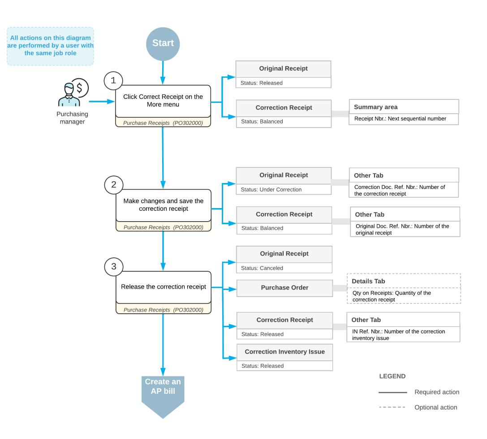

#### <span id="page-341-0"></span>**Requirements for the Original Purchase Receipt**

On the *[Purchase Receipts](https://help-2025r1.acumatica.com/Help?ScreenId=ShowWiki&pageid=d9901c8d-486d-45ed-8088-ea3d8ee3af19)* (PO302000) form, you can correct a purchase receipt for a normal purchase order only if the receipt meets all of these requirements:

- It has at least one line of the *Goods for IN*, *Non-Stock for IN*, *Service*, or *Freight* type.
- It has no related AP bills, except for those that have been fully reversed.
- It contains no lines of the *Goods for RP*, *Goods for Project*, or *Non Stock for Project* type.
- No landed cost documents have been applied to it.
- No putaway transfers have been prepared for it
- It does not have related unreleased purchase returns.
- Its stock is not locked due to a physical inventory count.
- Its related purchase order has no related AP bills, except for those that have been fully reversed. The system checks the purchase order if it has the **Allow AP Bill Before Receipt** check box selected on the **Other** tab of the *[Purchase Orders](https://help-2025r1.acumatica.com/Help?ScreenId=ShowWiki&pageid=5565686c-96c4-4bfa-a51d-9a2566baa808)* (PO301000) form.

### <span id="page-342-0"></span>**Editable Details and Settings of the Correction Purchase Receipt**

In a correction receipt for a normal purchase order, you can update the following elements in the Summary area of the *[Purchase Receipts](https://help-2025r1.acumatica.com/Help?ScreenId=ShowWiki&pageid=d9901c8d-486d-45ed-8088-ea3d8ee3af19)* (PO302000) form:

- The **Date** box
- The **Create AP Bill** check box
- The **Vendor Ref.** box
- The **Workgroup** box
- The **Owner** box

You can also update the exchange rate in this area if both of following conditions are met:

- The vendor has the **Enable Rate Override** check box selected on the **Financial** tab of the *[Vendors](https://help-2025r1.acumatica.com/Help?ScreenId=ShowWiki&pageid=a9584be3-f2bd-4d67-80d4-8041d809df56)* (AP303000) form.
- The **Allow Changing Currency Rate on Receipt** check box is selected on the *[Purchase Orders Preferences](https://help-2025r1.acumatica.com/Help?ScreenId=ShowWiki&pageid=13d09c43-8696-4f92-ad9b-3d0209ee3d9b)* (PO101000) form.

In a line of the correction receipt, you can edit the values in the following columns of the **Details** tab:

- **Warehouse**
- **Location**
- **Transaction Descr.**
- **UOM**
- **Receipt Qty.**
- **Expiration Date**
- **Lot/Serial Nbr.**
- **Unit Cost**
- **Ext. Cost**
- **Account** (only if the line is a non-stock item)
- **Subaccount** (only if the line is a non-stock item)
- **Accrual Account**
- **AccrualSub.**

You can't correct a line with a non-stock kit.

During the correction, if you accidentally make changes to a line on the **Details** tab, you can click **Cancel** for this line on the table toolbar. The system will discard all changes and revert the line to its original state at the time of document creation. Also, it will clear the **Corrected** check box in the line. Note that if the **Corrected** check box in the line is selected due to the change of **Date** or **Exchange Rate** in the Summary area, it will remain selected.

#### **Restrictions Applied to the Original and Correction Receipts**

While an original receipt has the *Under Correction* status, you can't do the following:

- Create an associated AP bill on the *[Purchase Receipts](https://help-2025r1.acumatica.com/Help?ScreenId=ShowWiki&pageid=d9901c8d-486d-45ed-8088-ea3d8ee3af19)* (PO302000) form
- Add it to an AP bill on the *[Bills and Adjustments](https://help-2025r1.acumatica.com/Help?ScreenId=ShowWiki&pageid=956b4e51-3078-4d2d-85b3-65c080d95234)* (AP301000) form
- Recognize it on the *[Incoming Documents](https://help-2025r1.acumatica.com/Help?ScreenId=ShowWiki&pageid=c5a67fb3-c6f0-4ba0-9950-a68d320866ef)* (AP301100) form
- Create a related purchase return on the *[Purchase Receipts](https://help-2025r1.acumatica.com/Help?ScreenId=ShowWiki&pageid=d9901c8d-486d-45ed-8088-ea3d8ee3af19)* form
- Apply it to a landed cost document on the *[Purchase Receipts](https://help-2025r1.acumatica.com/Help?ScreenId=ShowWiki&pageid=d9901c8d-486d-45ed-8088-ea3d8ee3af19)* or *[Landed Costs](https://help-2025r1.acumatica.com/Help?ScreenId=ShowWiki&pageid=849e4a26-8c54-4a98-b366-02ea6a35e9fd)* (PO303000) form
- Process putaway transfers for it on the *[Receive](https://help-2025r1.acumatica.com/Help?ScreenId=ShowWiki&pageid=fd850b21-96b8-4c2c-8c4a-f79272d8cacc) and Put Away* (PO302020) form

In a correction receipt, you can't add lines or delete lines that were copied from the original receipt. If a line in the original receipt was added by mistake, you can specify *0* in the **Receipt Qty.** column for the corresponding line in the correction receipt. This prevents the line from being included in any AP bills or landed cost documents during the processing of the correction receipt.

# <span id="page-343-1"></span><span id="page-343-0"></span>**Purchase Receipt Correction: Inventory Validation**

In correction purchase receipts for a normal purchase order, you can make these types of corrections:

- A correction that does not update the state of the inventory or the information in the original inventory receipt. For example, suppose that you change the vendor reference number or the transaction description.
- A correction that updates the state of the inventory or the information in the original inventory receipt, such as the correction of the receipt quantity or unit cost.

For the first type of correction, the system does not perform any additional actions. For the second type, the system performs inventory validation when the correction receipt is released. That is, it verifies whether stock items can be issued in the quantity of the original receipt and at the original cost based on the current inventory state. This validation is required because some quantities could have already been sold, shipped, or transferred by the time the correction receipt is released.

An item can be issued at a cost that differs from the cost in the original receipt if the resulting on-hand quantity is *0* in the cost layer from which the item is issued.

If the inventory validation fails, the system shows an error message, and you can make additional changes if you want to proceed with the correction. You can also delete the correction receipt if the correction cannot be performed. For example, the correction will not be possible if the correction receipt includes a serial-tracked item that has already been sold. If the validation is successful, the system generates and releases a correction inventory issue for the correction receipt. For details on this issue, see *[Purchase Receipt Correction: Correction Inventory Issue](#page-344-1)*.

The system validates only stock items from the original inventory receipt. For items with the *FIFO* and *Specific* valuation methods, the validation is performed for the cost layers that have been updated on release of the original inventory receipt as follows:

- *FIFO* valuation method: The system verifies if these items can be issued from a cost layer of the original inventory receipt.
- *Specific* valuation method: The system verifies the cost layers of the lot or serial numbers included in the original inventory receipt.

To determine whether the original quantity of a stock item can be issued, the system validates its available-forissue quantity. For an item with the *FIFO*, *Average*, or *Standard* valuation method, if this quantity is not sufficient in the cost layer of the item, the system also checks whether a negative quantity is allowed. That is, it checks the state of the **Allow Negative Quantity** check box on the *[Item Classes](https://help-2025r1.acumatica.com/Help?ScreenId=ShowWiki&pageid=80a3301b-4eb2-4ce2-94c5-0407c786a0f1)* (IN201000) form for the item's class. Depending on the state of the check box, the system does either of the following:

- **If the check box is cleared:** The system prohibits the issue. The validation fails, and the system shows an error message.
- **If the check box is selected:** The system allows the issue if the original quantity of the item is greater than the available-for-issue quantity and is not greater than the quantity on hand.

The system does not allow the release of a correction receipt if an included stock item's resulting on-hand quantity in the inventory will remain or become negative due to the correction. This is true regardless of the state of the **Allow Negative Quantity** check box for the item's class.

The inventory validation applies a specific rule if the original receipt was prepared for a purchase order linked to a sales order that is marked for purchase. If this sales order has a prepared shipment for an item, the quantity of this item in the correction receipt cannot be less than the quantity in the shipment.

<span id="page-344-1"></span>The system does not validate the quantity and cost of lines with non-stock items.

# <span id="page-344-0"></span>**Purchase Receipt Correction: Correction Inventory Issue**

Inventory validation is performed on release of a correction purchase receipt for a normal purchase order. If the validation succeeds, the system generates and releases a corresponding correction inventory issue. You can find the link to this issue in the **IN Ref. Nbr.** box on the *[Purchase Receipts](https://help-2025r1.acumatica.com/Help?ScreenId=ShowWiki&pageid=d9901c8d-486d-45ed-8088-ea3d8ee3af19)* (PO302000) form. This issue will be released automatically, regardless of the state of the **Release IN Documents Automatically** check box on the *[Purchase](https://help-2025r1.acumatica.com/Help?ScreenId=ShowWiki&pageid=13d09c43-8696-4f92-ad9b-3d0209ee3d9b) [Orders Preferences](https://help-2025r1.acumatica.com/Help?ScreenId=ShowWiki&pageid=13d09c43-8696-4f92-ad9b-3d0209ee3d9b)* (PO101000) form.

The inventory issue includes transactions of the following types:

- *Issue*
- *Receipt*
- *Adjustment* (optional)

The transactions of the *Issue* and *Receipt* type are generated for each corrected line of the purchase receipt on the *[Purchase Receipts](https://help-2025r1.acumatica.com/Help?ScreenId=ShowWiki&pageid=d9901c8d-486d-45ed-8088-ea3d8ee3af19)* (PO302000) form, excluding the following lines:

- Those whose correction does not update the state of the inventory.
- Those whose quantity was changed to *0*. For these lines, only transactions with the *Issue* type are generated.
- Those with the *Service* or *Freight* type. These lines are not included either in the inventory receipt for the original receipt or in the inventory issue for the correction receipt.

On release of the correction inventory issue, the system first processes the transaction with the *Receipt* type and then processes the transaction with the *Issue* type.

The correction inventory issue can also include transactions of the *Adjustment* type if one of the following conditions is met for an item in the correction purchase receipt:

- The unit cost or extended cost of the item has been changed while part of the received quantity has already been issued, sold, or transferred from the receiving warehouse.
- The item is issued with a cost that differs from the original cost and the resulting quantity on hand for the item is *0*.

In the *Adjustment* transactions, the system does the following:

- Debits the inventory account
- Credits the account specified in the **Purchase Receipt Correction Reason Code** box on the of the *[Posting](https://help-2025r1.acumatica.com/Help?ScreenId=ShowWiki&pageid=edd4bd77-13f5-4e89-9e47-2861fc66bbb0) [Classes](https://help-2025r1.acumatica.com/Help?ScreenId=ShowWiki&pageid=edd4bd77-13f5-4e89-9e47-2861fc66bbb0)* (IN206000) form for the posting class of the stock item

If the correction purchase receipt has lines with non-stock items, the system includes them in the related correction inventory issue if at least one of the following values has been changed in the line:

- **Warehouse**
- **Location**
- **UOM**
- **Receipt Qty.**
- **Unit Cost**
- **Ext. Cost**
- **Account**
- **Sub.**
- **Accrual Account**
- **AccrualSub.**

#### **Example of a Correction Inventory Issue for Stock Items with FIFO and Specific Valuation Methods**

The following example illustrates the process of the correction and the generated inventory issue for stock items with the *FIFO* and *Specific* valuation methods. Suppose that the company has the following items in stock:

- An item with the *FIFO* valuation method whose on-hand quantity is *100*. This quantity has been received in a single purchase in which the unit cost of the item is *100*.
- A serial-tracked item with the *Specific* valuation method. The serial numbers from *LRF00001* to *LRF000015* are on hand.
- A lot-tracked item with the *Specific* valuation method.

On the *[Purchase Receipts](https://help-2025r1.acumatica.com/Help?ScreenId=ShowWiki&pageid=d9901c8d-486d-45ed-8088-ea3d8ee3af19)* (PO302000), a purchase manager releases a purchase receipt for a purchase order of the *Normal* type. The purchase receipt includes lines with the following items:

- An item with the *FIFO* valuation method whose quantity is *100* and unit cost is *90*.
- Two serial-tracked items with the following numbers: *LRF000016* and *LRF000017*. Both items have a unit cost of *150*.
- A lot-tracked item whose quantity is *10* and unit cost is *250*.

On the *[Purchase Receipts](https://help-2025r1.acumatica.com/Help?ScreenId=ShowWiki&pageid=d9901c8d-486d-45ed-8088-ea3d8ee3af19)* form, the purchase manager clicks **Correct Receipt** on the More menu. The system creates a correction receipt. The manager changes the unit cost of the *FIFO* item from *90* to *95* and the serial number of one of the serial-tracked items from *LRF000016* to *LRFC00016*.

The purchase manager releases the correction receipt, and the system generates a correction inventory issue with the following lines:

- A line with the *Issue* transaction type and the following settings for the item with the *FIFO* valuation method:
  - **Receipt Qty.**: *100*
  - **Unit Cost**: *90*

The item is issued from the cost layer of the original purchase receipt.

- A line with the *Issue* transaction type and the following settings for the serial-tracked item:
  - **Lot/Serial Nbr.**: *LRF000016* and *LRF000017*
  - **Qty.**: *2*
  - **Unit Cost**: *150*
- A line with the *Receipt* transaction type and the following settings for the item with the *FIFO* valuation method:
  - **Receipt Qty.**: *100*
  - **Unit Cost**: *95*
- A line with the *Receipt* transaction type and the following settings for the serial-tracked items:
  - **Lot/Serial Nbr.**: *LRFC00016* and *LRF000017*
  - **Qty.**: *2*
  - **Unit Cost**: *150*

The system does not include the line with the lot-tracked item in the correction inventory issue because the purchase manager did not make any changes to this line in the correction purchase receipt.

#### **Example of General Ledger Transactions for a Correction with Cost Adjustments**

Suppose that on the *[Purchase Receipts](https://help-2025r1.acumatica.com/Help?ScreenId=ShowWiki&pageid=d9901c8d-486d-45ed-8088-ea3d8ee3af19)* (PO302000) form, a purchase manager has processed a purchase receipt with a line that contains 10 items with the *Average* valuation method and a unit cost of *10*. Once the purchase receipt is released, the on-hand quantity of the item is *10*, and its total cost is *100*.

On the same day, a sales manager has sold five units of the item with a unit cost of *10*. The remaining on-hand quantity of the item is *5*, and the total cost is *50*.

The purchase manager finds out that the unit cost of the received item should be *7*, not *10*. The manager clicks **Correct Receipt** on the *[Purchase Receipts](https://help-2025r1.acumatica.com/Help?ScreenId=ShowWiki&pageid=d9901c8d-486d-45ed-8088-ea3d8ee3af19)* form and specifies *7* as the unit cost in the line of the correction receipt. On release of the correction receipt, the system generates and releases a correction inventory issue. On release of the issue, the system posts the following transactions to the general ledger.

| Account                                       | Debit Amount                                                 | Credit Amount                                         |
|-----------------------------------------------|--------------------------------------------------------------|-------------------------------------------------------|
| Inventory account                             | 70 (the receipt of the item with the<br>corrected unit cost) | 0                                                     |
| PO accrual account                            | 0                                                            | 70                                                    |
| Inventory account                             | 15 (the difference in cost for the<br>sold units)            | 0                                                     |
| The account of the correction rea<br>son code | 0                                                            | 15 (the difference in cost for the off<br>set units)  |
| Inventory account                             | 0                                                            | 100 (the issue of the item with the<br>original cost) |
| PO accrual account                            | 100                                                          | 0                                                     |

# <span id="page-346-1"></span><span id="page-346-0"></span>**Purchase Receipt Correction: Correction of Receipts for Drop-Ship Purchase Orders**

This topic explains how you can correct a released purchase receipt for a drop-ship purchase order—that is, a purchase order of the *Drop-Ship* type.

Receipt correction is unavailable if the Manufacturing or Service Management feature is enabled on the (CS100000) form. If your company wants to enable one of these features, we highly recommend first verifying that there are no unreleased correction receipts in the system.

On the *[Purchase Receipts](https://help-2025r1.acumatica.com/Help?ScreenId=ShowWiki&pageid=d9901c8d-486d-45ed-8088-ea3d8ee3af19)* (PO302000) form, you can correct a purchase receipt related to a drop-ship purchase order if this receipt has the *Released* status. While viewing the purchase receipt, you click **Correct Receipt** on the More menu. The system checks whether the purchase receipt meets all the requirements for correction (as described in *[Requirements for the Original Purchase Receipt](#page-348-0)*).

If the purchase receipt meets all requirements, the system creates a new purchase receipt with the next sequential number.

For simplicity, we use *correction receipt* to describe the newly created purchase receipt and *original receipt* for the purchase receipt in which you clicked **Correct Receipt**.

In the original receipt, the system inserts the number of the correction receipt as a clickable link in the **Correction Doc. Ref. Nbr.** box on the **Other** tab of the *[Purchase Receipts](https://help-2025r1.acumatica.com/Help?ScreenId=ShowWiki&pageid=d9901c8d-486d-45ed-8088-ea3d8ee3af19)* form. Similarly, the correction receipt displays the original receipt number as a clickable link in the **Original Doc. Ref. Nbr.** box on the same tab.

The system copies all data from the original receipt to the correction receipt on the *[Purchase Receipts](https://help-2025r1.acumatica.com/Help?ScreenId=ShowWiki&pageid=d9901c8d-486d-45ed-8088-ea3d8ee3af19)* form, and you can update the correction receipt. When you save the correction receipt for the first time, the system assigns the *Under Correction* status to the original receipt.

If you update a purchase receipt line on the **Details** tab, the system automatically selects the **Corrected** check box in this line. If you change the date or currency exchange rate in the Summary area, the system automatically selects the **Corrected** check box in all lines of the purchase receipt. This column is hidden by default. For more information about what you can change in the correction receipt, see *[Editable Details and Settings of the Correction Purchase](#page-349-0) [Receipt](#page-349-0)*.

To complete the correction process, you click **Release** on the More menu. The system assigns the *Released* status to the correction receipt and the *Canceled* status to the original receipt.

#### **Results of Releasing the Correction Receipt**

If the receipt quantity of a correction receipt line changes on the *[Purchase Receipts](https://help-2025r1.acumatica.com/Help?ScreenId=ShowWiki&pageid=d9901c8d-486d-45ed-8088-ea3d8ee3af19)* (PO302000) form, the system does the following:

- Updates the **Qty. On Receipts** column in the detail line of the related purchase order on the *[Purchase](https://help-2025r1.acumatica.com/Help?ScreenId=ShowWiki&pageid=5565686c-96c4-4bfa-a51d-9a2566baa808) [Orders](https://help-2025r1.acumatica.com/Help?ScreenId=ShowWiki&pageid=5565686c-96c4-4bfa-a51d-9a2566baa808)* (PO301000) form
- Updates the **Qty. On Shipments** and **Open Qty.** columns in the detail line of the related sales order on the *[Sales Orders](https://help-2025r1.acumatica.com/Help?ScreenId=ShowWiki&pageid=19e4021c-1b84-49fd-be12-0320c5f1c7e5)* (SO301000) form

For each correction receipt line with a changed quantity, the system also changes the related purchase order and sales order based on whether the line's corrected receipt quantity has increased or decreased:

- If the line's quantity has decreased, the system does the following:
  - Reopens the corresponding lines of the related sales and purchase orders if the lines have already been completed. That is, it clears the **Completed** check box for these lines on the **Details** tab of the *[Purchase](https://help-2025r1.acumatica.com/Help?ScreenId=ShowWiki&pageid=5565686c-96c4-4bfa-a51d-9a2566baa808) [Orders](https://help-2025r1.acumatica.com/Help?ScreenId=ShowWiki&pageid=5565686c-96c4-4bfa-a51d-9a2566baa808)* and *[Sales Orders](https://help-2025r1.acumatica.com/Help?ScreenId=ShowWiki&pageid=19e4021c-1b84-49fd-be12-0320c5f1c7e5)* form.
  - If the purchase order had the *Completed* status but now has at least one reopened line, assigns the *Open* status to this purchase order.
  - If the sales order had the *Completed* status but now has at least one reopened line, assigns another status (based on the order's workflow) to it.
- If the line's quantity has increased, the system does the following:
  - Selects the **Completed** check box in the corresponding lines of the related sales order and purchase order if the full quantity of the item has been received.
  - If all lines of the related sales or purchase order become completed, assigns the *Completed* status to this order.

#### **Workflow of the Correction of a Purchase Receipt**

The following diagram illustrates the workflow related to the correction of a purchase receipt for a drop-ship purchase order.

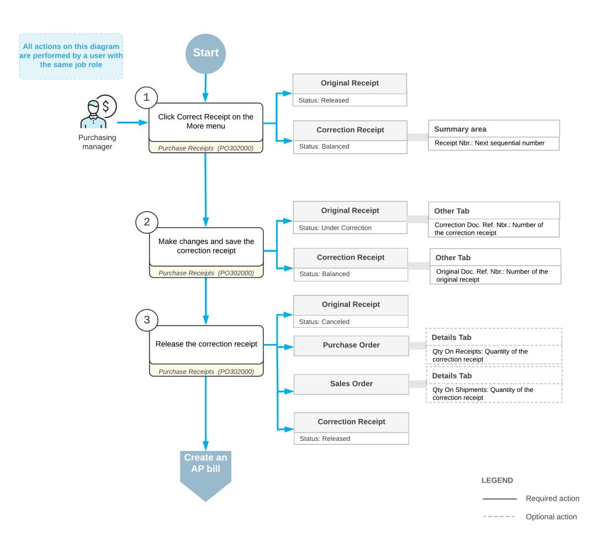

#### <span id="page-348-0"></span>**Requirements for the Original Purchase Receipt**

On the *[Purchase Receipts](https://help-2025r1.acumatica.com/Help?ScreenId=ShowWiki&pageid=d9901c8d-486d-45ed-8088-ea3d8ee3af19)* (PO302000) form, you can correct a purchase receipt for a drop-ship purchase order only if the receipt meets all of these requirements:

- It has at least one line of the *Goods for Drop-Ship* or *Non-Stock for Drop-Ship* type.
- It contains no lines of the *Goods for IN* or *Non-Stock* type.
- It has no related AP bills, except for AP bills that have been fully reversed.
- No landed cost documents have been applied to the it.
- It does not have related unreleased purchase returns.
- Its lines are not included in sales invoices that haven't been canceled.
- Its related purchase order has no related AP bills, except for those that have been fully reversed. The system checks the purchase order if it has the **Allow AP Bill Before Receipt** check box selected on the **Other** tab of the *[Purchase Orders](https://help-2025r1.acumatica.com/Help?ScreenId=ShowWiki&pageid=5565686c-96c4-4bfa-a51d-9a2566baa808)* (PO301000) form.

### <span id="page-349-0"></span>**Editable Details and Settings of the Correction Purchase Receipt**

In a correction receipt for a drop-ship purchase order, you can update the following elements in the Summary area of the *[Purchase Receipts](https://help-2025r1.acumatica.com/Help?ScreenId=ShowWiki&pageid=d9901c8d-486d-45ed-8088-ea3d8ee3af19)* (PO302000) form:

- The **Date** box
- The **Create AP Bill** check box
- The **Vendor Ref.** box
- The **Workgroup** box
- The **Owner** box

You can also update the exchange rate in this area if both of following conditions are met:

- The vendor has the **Enable Rate Override** check box selected on the **Financial** tab of the *[Vendors](https://help-2025r1.acumatica.com/Help?ScreenId=ShowWiki&pageid=a9584be3-f2bd-4d67-80d4-8041d809df56)* (AP303000) form.
- The **Allow Changing Currency Rate on Receipt** check box is selected on the *[Purchase Orders Preferences](https://help-2025r1.acumatica.com/Help?ScreenId=ShowWiki&pageid=13d09c43-8696-4f92-ad9b-3d0209ee3d9b)* (PO101000) form.

In a line of the correction receipt, you can edit the values in the following columns of the **Details** tab:

- **Warehouse**
- **Transaction Descr.**
- **UOM**
- **Receipt Qty.**
- **Expiration Date**
- **Lot/Serial Nbr.**
- **Unit Cost**
- **Ext. Cost**
- **Account** (only if the item is a non-stock item)
- **Subaccount** (only if the item is a non-stock item)
- **Accrual Account**
- **AccrualSub.**

During the correction, if you accidentally make changes to a line on the **Details** tab, you can then click **Cancel** for this line on the table toolbar. The system will discard all changes and revert the line to its original state at the time of document creation. Also, it will clear the **Corrected** check box in the line. Note that if the **Corrected** check box in the line is selected due to the change of **Date** or **Exchange Rate** in the Summary area, it will remain selected.

#### **Restrictions Applied to the Original and Correction Receipts**

While an original receipt has the *Under Correction* status, you can't do the following:

- Create an AP bill associated with the original receipt by clicking the *[Purchase Receipts](https://help-2025r1.acumatica.com/Help?ScreenId=ShowWiki&pageid=d9901c8d-486d-45ed-8088-ea3d8ee3af19)* (PO302000) form
- Add it to an AP bill on the *[Bills and Adjustments](https://help-2025r1.acumatica.com/Help?ScreenId=ShowWiki&pageid=956b4e51-3078-4d2d-85b3-65c080d95234)* (AP301000) form
- Recognize it on the *[Incoming Documents](https://help-2025r1.acumatica.com/Help?ScreenId=ShowWiki&pageid=c5a67fb3-c6f0-4ba0-9950-a68d320866ef)* (AP301100) form
- Create a related purchase return on the *[Purchase Receipts](https://help-2025r1.acumatica.com/Help?ScreenId=ShowWiki&pageid=d9901c8d-486d-45ed-8088-ea3d8ee3af19)* form
- Apply it to a landed cost document on the *[Purchase Receipts](https://help-2025r1.acumatica.com/Help?ScreenId=ShowWiki&pageid=d9901c8d-486d-45ed-8088-ea3d8ee3af19)* or *[Landed Costs](https://help-2025r1.acumatica.com/Help?ScreenId=ShowWiki&pageid=849e4a26-8c54-4a98-b366-02ea6a35e9fd)* (PO303000) form

Also, you cannot include the lines of an original receipt with the *Under Correction* status in the following documents:

- An AP bill for a related purchase order
- A sales invoice for a related sales order

In a correction receipt, you can't add lines or delete lines that were copied from the original receipt. If a line in the original receipt was added by mistake, you can specify *0* in the **Receipt Qty.** column for the corresponding line in the correction receipt. This prevents the line from being included in any of the following related documents during the processing of the correction receipt:

- AP bills
- Sales invoices
- Landed cost documents

#### **Correction of a Purchase Receipt with a Canceled Invoice**

If a purchase receipt for a drop-ship purchase order has a related sales invoice that has been released, this receipt also has a related inventory issue. If you cancel the sales invoice and then correct the purchase receipt, the system cancels the original purchase receipt. The system also automatically generates and releases a reversal inventory issue with a reversal batch of transactions that fully reverse the transactions generated on the release of the original inventory issue. The reversal inventory issue is released automatically, regardless of the state of the **Release IN Documents Automatically** check box on the *[Purchase Orders Preferences](https://help-2025r1.acumatica.com/Help?ScreenId=ShowWiki&pageid=13d09c43-8696-4f92-ad9b-3d0209ee3d9b)* (PO101000) form.

The link to the reversal inventory issue appears in the **Reversal IN Ref. Nbr.** box on the **Other** tab of the *[Purchase](https://help-2025r1.acumatica.com/Help?ScreenId=ShowWiki&pageid=d9901c8d-486d-45ed-8088-ea3d8ee3af19) [Receipts](https://help-2025r1.acumatica.com/Help?ScreenId=ShowWiki&pageid=d9901c8d-486d-45ed-8088-ea3d8ee3af19)* (PO302000) form.

# <span id="page-350-0"></span>**Purchase Receipt Correction: Cancellation of a Purchase Receipt**

This topic explains how you can cancel a released purchase receipt that has been prepared for a purchase order of the *Normal* or *Drop-Ship* type—that is, for a normal or drop-ship purchase order.

The functionality of receipt cancellation is unavailable if the *Manufacturing* or *Service Management* feature is enabled on the *[Enable/Disable Features](https://help-2025r1.acumatica.com/Help?ScreenId=ShowWiki&pageid=c1555e43-1bc5-4f6f-ba9d-b323f94d8a6b)* (CS100000) form.

#### **Cancellation of a Purchase Receipt for a Normal Purchase Order**

You can cancel a purchase receipt related to a normal purchase order if this receipt has the *Released* status. To cancel a purchase receipt, while viewing it on the *[Purchase Receipts](https://help-2025r1.acumatica.com/Help?ScreenId=ShowWiki&pageid=d9901c8d-486d-45ed-8088-ea3d8ee3af19)* (PO302000) form, you click **Cancel Receipt** on the More menu. The system checks whether all requirements are met for the purchase receipt:

- It has at least one line of the *Goods for IN* , *Non-Stock for IN*, *Service*, or *Freight* type.
- It has no related AP bills, except for those that have been fully reversed.
- It contains no lines of the *Goods for RP* , *Goods for Project*, or *Non Stock for Project* type.
- It has no lines with non-stock kits.
- No landed cost documents have been applied to it.
- No putaway transfers have been prepared for it.
- It does not have related purchase returns.
- Its stock is not locked due to a physical inventory count.
- Its related purchase order has no related AP bills, except for those that have been fully reversed. The system checks the purchase order if it has the **Allow AP Bill Before Receipt** check box selected on the **Other** tab of the *[Purchase Orders](https://help-2025r1.acumatica.com/Help?ScreenId=ShowWiki&pageid=5565686c-96c4-4bfa-a51d-9a2566baa808)* (PO301000) form.

If all of these conditions are met, the system displays a confirmation dialog box. If you click **OK**, the system validates the state of inventory. That is, it verifies whether it is possible to issue the items with the original quantity and cost. For details on the validation, see *Purchase Receipt [Correction:](#page-343-1) Inventory Validation*.

If the validation fails, the system shows an error message. If the validation is successful, the system generates and releases a reversal inventory issue with the *Issue* type of transactions. This issue will be released automatically,

regardless of the state of the **Release IN Documents Automatically** check box on the *[Purchase Orders Preferences](https://help-2025r1.acumatica.com/Help?ScreenId=ShowWiki&pageid=13d09c43-8696-4f92-ad9b-3d0209ee3d9b)* (PO101000) form. You can find its link in the **Reversal IN Ref. Nbr.** box on the **Other** tab of *[Purchase Receipts](https://help-2025r1.acumatica.com/Help?ScreenId=ShowWiki&pageid=d9901c8d-486d-45ed-8088-ea3d8ee3af19)* form. Then the system assigns the *Canceled* status to the purchase receipt.

If a purchase receipt is canceled, the system does not recalculate the cost statistics on the **Price/ Cost** tab of the *[Stock Items](https://help-2025r1.acumatica.com/Help?ScreenId=ShowWiki&pageid=77786a70-1f1e-4d63-ad98-96f98e4fcb0e)* (IN202500) or *Item [Warehouse](https://help-2025r1.acumatica.com/Help?ScreenId=ShowWiki&pageid=ae2418af-7f53-4c09-8766-556452d8f8b8) Details* (IN204500) form for items that were included in this receipt.

As soon as the purchase receipt is canceled, the system updates the related purchase order on the *[Purchase Orders](https://help-2025r1.acumatica.com/Help?ScreenId=ShowWiki&pageid=5565686c-96c4-4bfa-a51d-9a2566baa808)* form as follows:

- It reopens the linked lines of the related purchase order if these lines have already been completed.
- If the related purchase order has the *Completed* status, the system assigns the *Open* status to it.
- In each linked line of the related purchase order, the system updates the value in the **Qty. On Receipts** column on the **Details** tab.

#### **Cancellation of a Purchase Receipt for a Drop-Ship Purchase Order**

You can cancel a purchase receipt related to a drop-ship purchase order if this receipt has the *Released* status. To cancel a purchase receipt, while viewing it on the *[Purchase Receipts](https://help-2025r1.acumatica.com/Help?ScreenId=ShowWiki&pageid=d9901c8d-486d-45ed-8088-ea3d8ee3af19)* form, you click **Correct Receipt** on the More menu. The system checks whether all of the following conditions are met for the purchase receipt:

- It has at least one line of the *Goods for Drop-Ship* or *Non-Stock for Drop-Ship* type.
- It contains no lines of the *Goods for IN* or *Non-Stock* types.
- It has no related AP bills, except for AP bills that have been fully reversed.
- No landed cost documents have been applied to the it.
- It does not have related purchase returns.
- No sales invoices include its lines, except for canceled invoices.
- Its related purchase order has no related AP bills, except for those that have been fully reversed. The system checks the purchase order if it has the **Allow AP Bill Before Receipt** check box selected on the **Other** tab of the *[Purchase Orders](https://help-2025r1.acumatica.com/Help?ScreenId=ShowWiki&pageid=5565686c-96c4-4bfa-a51d-9a2566baa808)* (PO301000) form.

If all of these conditions are met, the system displays a confirmation dialog box. If you click **OK**, the system assigns the *Canceled* status to the purchase receipt.

As soon as the purchase receipt is canceled, the system updates the related documents as follows:

- It reopens the linked lines of the related purchase and sales order if these lines have already been completed.
- If the related purchase order has the *Completed* status on the *[Purchase Orders](https://help-2025r1.acumatica.com/Help?ScreenId=ShowWiki&pageid=5565686c-96c4-4bfa-a51d-9a2566baa808)* (PO301000) form, the system assigns the *Open* status to it.
- If a related sales order has the *Completed* status on the *[Sales Orders](https://help-2025r1.acumatica.com/Help?ScreenId=ShowWiki&pageid=19e4021c-1b84-49fd-be12-0320c5f1c7e5)* (SO301000) form, the system assigns another status based on the order's workflow.
- In each linked line of the related purchase order, the system updates the value in the **Qty. On Receipts** column on the **Details** tab of the *[Purchase Orders](https://help-2025r1.acumatica.com/Help?ScreenId=ShowWiki&pageid=5565686c-96c4-4bfa-a51d-9a2566baa808)* form.
- In each linked line of the related sales order, the system updates the values in the **Qty. On Shipments** and **Open Qty.** columns on the **Details** tab of the *[Sales Orders](https://help-2025r1.acumatica.com/Help?ScreenId=ShowWiki&pageid=19e4021c-1b84-49fd-be12-0320c5f1c7e5)* form.

#### **Cancellation of a Purchase Receipt with a Canceled Invoice**

If a purchase receipt for a purchase order of the *Drop-Ship* type has a related released sales invoice, this receipt also has a related inventory issue. If you cancel the sales invoice and then cancel the purchase receipt, the system automatically generates and releases a reversal inventory issue with a reversal GL batch of transactions. In this issue, the system fully reverts the transactions that were generated on the release of the original inventory issue.

The reversal inventory issue is released automatically, regardless of the state of the **Release IN Documents Automatically** check box on the *[Purchase Orders Preferences](https://help-2025r1.acumatica.com/Help?ScreenId=ShowWiki&pageid=13d09c43-8696-4f92-ad9b-3d0209ee3d9b)* (PO101000) form.

The link to the reversal inventory issue appears in the **Reversal IN Ref. Nbr.** box on the **Other** tab of the *[Purchase](https://help-2025r1.acumatica.com/Help?ScreenId=ShowWiki&pageid=d9901c8d-486d-45ed-8088-ea3d8ee3af19) [Receipts](https://help-2025r1.acumatica.com/Help?ScreenId=ShowWiki&pageid=d9901c8d-486d-45ed-8088-ea3d8ee3af19)* (PO302000) form.

# <span id="page-352-0"></span>**Purchase Receipt Correction: Implementation Checklist**

The following sections provide details you can use to ensure that the system is configured properly for the correction or cancellation of purchase receipts. You will also learn about the settings that affect the processing workflow so that you can make any needed changes.

#### **Implementation Checklist**

We recommend that before you initially perform the correction or cancellation of purchase receipts, you make sure that the needed features have been enabled, settings have been specified, and entities have been created. The following checklist summarizes the criteria you need to check.

| Form                                   | Criteria to Check                                                                                                                                                |
|----------------------------------------|------------------------------------------------------------------------------------------------------------------------------------------------------------------|
| Enable/Disable Features (CS100000)     | The Inventory feature has been enabled.                                                                                                                          |
| Purchase Orders Preferences (PO101000) | All necessary settings related to purchase order man<br>agement have been specified, as described in Configu<br>ration of Order Management: General Information. |
| Vendors (AP303000)                     | All needed vendors have been created, as described in<br>Vendors: General Information.                                                                           |
| Stock Items (IN202500)                 | All stock items have been defined, as described in<br>Stock Items: General Information.                                                                          |

#### **Other Settings That Affect the Workflow**

You can affect the workflow of correcting and canceling purchase receipts by specifying additional settings as follows:

- To cause purchase receipts to be created with the *On Hold* status, select the **Hold Receipts on Entry** check box on the *[Purchase Orders Preferences](https://help-2025r1.acumatica.com/Help?ScreenId=ShowWiki&pageid=13d09c43-8696-4f92-ad9b-3d0209ee3d9b)* (PO101000) form. This makes it possible for a responsible user to verify entered receipts before they are processed.
- To cause the system to automatically post general ledger batches generated during the processing of purchase documents, select the **Automatically Post on Release** check box on the *[General Ledger](https://help-2025r1.acumatica.com/Help?ScreenId=ShowWiki&pageid=e4913d06-c511-4258-a0f9-f36c1b854e6b) [Preferences](https://help-2025r1.acumatica.com/Help?ScreenId=ShowWiki&pageid=e4913d06-c511-4258-a0f9-f36c1b854e6b)* (GL102000) form. For information on processing general ledger batches, see *GL [Transactions:](https://help-2025r1.acumatica.com/Help?ScreenId=ShowWiki&pageid=35393020-6269-466d-8a08-df558cd43367) [General Information](https://help-2025r1.acumatica.com/Help?ScreenId=ShowWiki&pageid=35393020-6269-466d-8a08-df558cd43367)*.

# <span id="page-352-1"></span>**Purchase Receipt Correction: Generated Transactions**

To correct a purchase receipt, you create and process a correction purchase receipt. To track the movements of items, the system generates the GL transactions described in the following sections.

#### **Transactions Generated for a Correction Purchase Receipt**

On release of the correction receipt, the system generates a correction inventory issue transaction with lines that have the *Issue* and *Receipt* transaction type. Additionally, the system may include a line with the *Adjustment* type. When an inventory issue with lines of the *Issue*, *Receipt*, and *Adjustment* transaction types is released, the system generates the following general ledger transactions.

| Account            | Source of Account                                                                                                                                                              | Debit  | Credit |
|--------------------|--------------------------------------------------------------------------------------------------------------------------------------------------------------------------------|--------|--------|
| Inventory account  | Depends on the option<br>Amount<br>selected in the Use In<br>ventory/Accrual Ac<br>count From box on<br>the Posting Classes<br>(IN206000) form for the<br>item's posting class |        | 0.00   |
| PO accrual account | The account in the Ac<br>crual Account box<br>on the Details tab of<br>the Purchase Receipts<br>(PO302000) in the line<br>of the correction pur<br>chase receipt               | 0.00   | Amount |
| Inventory account  | Depends on the option<br>selected in the Use In<br>ventory/Accrual Ac<br>count From box on the<br>Posting Classes form for<br>the item's posting class                         | Amount | 0.00   |
| Adjustment account | Depends on the ac<br>count specified in the<br>Purchase Receipt Cor<br>rection Reason Code<br>box on the Posting<br>Classes form for the<br>item's posting class               | 0.00   | Amount |
| Inventory account  | Inventory account used<br>in the original inventory<br>receipt for the item                                                                                                    | 0.00   | Amount |
| PO accrual account | PO accrual account<br>used in the original in<br>ventory receipt for the<br>item                                                                                               | Amount | 0.00   |

On the **Financial** tab of the *[Issues](https://help-2025r1.acumatica.com/Help?ScreenId=ShowWiki&pageid=17b051f6-027d-4459-b542-65c1c1f9d0ea)* (IN302000) form, the **Batch Nbr.** box shows the reference number of the GL batch. You can click this link to view the GL batch on the *Journal [Transactions](https://help-2025r1.acumatica.com/Help?ScreenId=ShowWiki&pageid=dda046bc-5946-407f-88f7-1c0c966fbe72)* (GL301000) form.

# <span id="page-354-0"></span>**Processing Purchases with Billing Before Receipt**

In some cases, a vendor may want your company to pay for purchased goods in advance. The topics of this chapter describe how to process purchases in which the bills are received and need to be paid before the vendor ships the ordered goods.

# <span id="page-354-2"></span><span id="page-354-1"></span>**Purchases with Billing Before Receipt: General Information**

In Acumatica ERP, you can process purchases in which the bills are received and need to be paid before the vendor ships the ordered goods.

#### **Learning Objectives**

In this chapter, you will do the following:

- Create a purchase order with stock items
- Prepare an accounts payable bill for the purchase order
- Prepare and release a purchase receipt and the related inventory documents

#### **Applicable Scenario**

In your organization, if bills are received from some vendors and entered into the system before the purchased goods arrive or if bills are imported from a third-party system, you can establish a workflow in which an accounts payable bill can be processed before the ordered items have been received. In this case, the purchasing process typically includes entering a purchase order, preparing a bill for the vendor, and then, when the purchased items are received to inventory, processing the purchase receipt.

#### **Purchasing Process with Billing Before Receipt**

In general, the *[Purchase Orders](https://help-2025r1.acumatica.com/Help?ScreenId=ShowWiki&pageid=5565686c-96c4-4bfa-a51d-9a2566baa808)* (PO301000) form is the starting point for creating a purchase order. In Acumatica ERP, purchase orders of the *Normal* type are used for the processing of purchases of inventory items with billing before receipt.

In a new purchase order created on the *[Purchase Orders](https://help-2025r1.acumatica.com/Help?ScreenId=ShowWiki&pageid=5565686c-96c4-4bfa-a51d-9a2566baa808)* form, you first select the vendor. Then on the **Details** tab, you list the stock items to be purchased from the vendor. You can add stock items by clicking the **Add Items** button on the table toolbar of this tab and selecting from only the vendor's items or from the entire list of stock items.

Then you need to create a bill on the *[Bills and Adjustments](https://help-2025r1.acumatica.com/Help?ScreenId=ShowWiki&pageid=956b4e51-3078-4d2d-85b3-65c080d95234)* (AP301000) form to increase the vendor's balance in the system by the amount to be paid for the goods. You can release the prepared bill at any time—before or aer the processing of the receipt of the ordered items. Once the purchased items have been received to inventory, you create a purchase receipt (or multiple partial receipts) on the *[Purchase Receipts](https://help-2025r1.acumatica.com/Help?ScreenId=ShowWiki&pageid=d9901c8d-486d-45ed-8088-ea3d8ee3af19)* (PO302000) form. When a purchase receipt is released, the system automatically generates a corresponding inventory receipt on the *[Receipts](https://help-2025r1.acumatica.com/Help?ScreenId=ShowWiki&pageid=d6ecad5b-155f-44bf-baba-9ed006d298b5)* (IN301000) form, with the date and posting period copied from the purchase receipt. On release of the inventory receipt, the system updates the inventory on hand with the quantity and cost of the received goods, and generates a batch of GL transactions to update account balances in the general ledger. If all the lines in the purchase order have been received and billed in full, the system assigns the purchase order the *Closed* status. For more information on the rules that affect line closing and completion, see *[Stock Item Lines in Purchase Orders](#page-76-1)*, *[Non-](#page-78-1)[Stock Lines in Purchase Orders](#page-78-1)*, and *[Service Lines in Purchase Orders](#page-79-1)*.

#### **Vendor Setting for Billing Before Receipt**

You can create an AP bill before the corresponding purchase receipt for a purchase order in both of the following cases:

- If on the *[Vendors](https://help-2025r1.acumatica.com/Help?ScreenId=ShowWiki&pageid=a9584be3-f2bd-4d67-80d4-8041d809df56)* (AP303000) form, the **Allow AP Bill Before Receipt** check box is selected for the vendor specified in the purchase order
- If on the *Vendor [Locations](https://help-2025r1.acumatica.com/Help?ScreenId=ShowWiki&pageid=aeeccc5c-465f-4bca-9cd7-a3c792da38e1)* (AP303010) form, the **Allow AP Bill Before Receipt** check box is selected for the vendor location selected in the purchase order

When a purchase order is created on the *[Purchase Orders](https://help-2025r1.acumatica.com/Help?ScreenId=ShowWiki&pageid=5565686c-96c4-4bfa-a51d-9a2566baa808)* (PO301000) form and this vendor or vendor location is selected, the state of this check box is copied to the check box of the same name on the **Other** tab of the form.

If the **Allow AP Bill Before Receipt** check box is selected for a purchase order, you can also use the inventory purchase workflow in which the purchase receipt is processed and then the AP bill is prepared; the check box merely determines whether it is permissible to create the AP bill before the corresponding purchase receipt is created. For a description of the workflow with the receipt processed before the related bill, see *[Purchases of Stock Items: General Information](#page-324-2)*.

#### **Workflow of a Purchase with Billing Before Receipt**

The following diagram represents the general workflow of the processing of a purchase order in Acumatica ERP, in which a bill is processed before the purchased items are received to inventory.

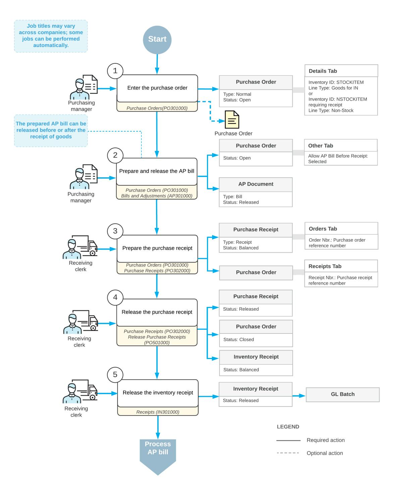

# <span id="page-356-0"></span>**Purchases with Billing Before Receipt: Implementation Checklist**

The following sections provide details you can use to ensure that the system is configured properly for the processing of purchases of stock items with billing before receipt, and to understand (and change, if needed) the settings that affect the processing workflow.

#### **Implementation Checklist**

We recommend that before you initially process purchases of stock items with billing before receipt, you make sure the needed features have been enabled, settings have been specified, and entities have been created, as summarized in the following checklist.

| Form                                           | Criteria to Check                                                                                                                                                                                                            | Notes                                                                                                                                                                                                                                                        |
|------------------------------------------------|------------------------------------------------------------------------------------------------------------------------------------------------------------------------------------------------------------------------------|--------------------------------------------------------------------------------------------------------------------------------------------------------------------------------------------------------------------------------------------------------------|
| Purchase Orders Preferences<br>(PO101000) form | Make sure that all necessary set<br>tings related to purchase order<br>management have been specified<br>as described in Configuration of Or<br>der Management: Implementation<br>Activity.                                  |                                                                                                                                                                                                                                                              |
| Vendors (AP303000) form                        | Make sure that all needed vendors<br>have been configured as described<br>in Vendors: General Information and<br>the Allow AP Bill Before Receipt is<br>selected on the Purchase Settings<br>tab for the applicable vendors. | The system copies the state of the<br>Allow AP Bill Before Receipt check<br>box from the vendor settings to<br>each purchase order that is created<br>for this vendor. (You cannot change<br>the state of this check box in indi<br>vidual purchase orders.) |
| Stock Items (IN202500) form                    | Make sure that all stock items have<br>been configured as described in<br>Stock Items: General Information.                                                                                                                  |                                                                                                                                                                                                                                                              |

#### **Other Settings That Affect the Workflow**

You can affect the workflow of processing purchases by specifying the following additional settings:

- To reduce input errors when users enter orders, set up the validation of order totals by selecting the **For Normal and Standard Orders** check box in the**ValidateTotal on Entry** section of the *[Purchase Orders](https://help-2025r1.acumatica.com/Help?ScreenId=ShowWiki&pageid=13d09c43-8696-4f92-ad9b-3d0209ee3d9b) [Preferences](https://help-2025r1.acumatica.com/Help?ScreenId=ShowWiki&pageid=13d09c43-8696-4f92-ad9b-3d0209ee3d9b)* (PO101000) form (**GeneralSettings** tab). If this check box is selected, when a user creates a new purchase order on the *[Purchase Orders](https://help-2025r1.acumatica.com/Help?ScreenId=ShowWiki&pageid=5565686c-96c4-4bfa-a51d-9a2566baa808)* (PO301000) form, to take the order off hold, the user must enter the order total in the **ControlTotal** box aer verifying the order details.
- To cause an accounts payable bill to be created automatically on release of a purchase receipt by default, select the **Create Bill on Receipt Release** check box on the *[Purchase Orders Preferences](https://help-2025r1.acumatica.com/Help?ScreenId=ShowWiki&pageid=13d09c43-8696-4f92-ad9b-3d0209ee3d9b)* form. In this case, when a user creates a purchase receipt on the *[Purchase Receipts](https://help-2025r1.acumatica.com/Help?ScreenId=ShowWiki&pageid=d9901c8d-486d-45ed-8088-ea3d8ee3af19)* (PO302000) form, the system automatically selects the **Create Bill** check box. (The user can clear this check box for a particular bill.)
- To cause the system to automatically release accounts payable bills generated on release of purchase receipts, select the **Release AP Documents Automatically** check box on the *[Purchase Orders Preferences](https://help-2025r1.acumatica.com/Help?ScreenId=ShowWiki&pageid=13d09c43-8696-4f92-ad9b-3d0209ee3d9b)* form. For information on processing accounts payable bills, see *[AP Bills: General Information](https://help-2025r1.acumatica.com/Help?ScreenId=ShowWiki&pageid=1ea1e770-b81c-437e-831f-64f702f968f4)*.
- To cause purchase receipts to be created with the *On Hold* status (so that users can verify them before processing them further), select the **Hold Receipts on Entry** check box on the *[Purchase Orders Preferences](https://help-2025r1.acumatica.com/Help?ScreenId=ShowWiki&pageid=13d09c43-8696-4f92-ad9b-3d0209ee3d9b)* form.
- To cause the system to automatically release inventory receipts generated on release of purchase receipts, select the **Release IN Documents Automatically** check box on the *[Purchase Orders Preferences](https://help-2025r1.acumatica.com/Help?ScreenId=ShowWiki&pageid=13d09c43-8696-4f92-ad9b-3d0209ee3d9b)* form.
- To cause the system to automatically post general ledger batches generated during the processing of purchase documents, select the **Automatically Post on Release** check box on the *[General Ledger](https://help-2025r1.acumatica.com/Help?ScreenId=ShowWiki&pageid=e4913d06-c511-4258-a0f9-f36c1b854e6b) [Preferences](https://help-2025r1.acumatica.com/Help?ScreenId=ShowWiki&pageid=e4913d06-c511-4258-a0f9-f36c1b854e6b)* (GL102000) form. For information on processing general ledger transactions, see *[GL](https://help-2025r1.acumatica.com/Help?ScreenId=ShowWiki&pageid=35393020-6269-466d-8a08-df558cd43367) [Transactions:](https://help-2025r1.acumatica.com/Help?ScreenId=ShowWiki&pageid=35393020-6269-466d-8a08-df558cd43367) General Information*.

#### **Validation of Configuration**

To make sure that all settings are configured correctly, you can process a purchase order with billing before receipt, as described in *[Purchases with Billing Before Receipt: Process Activity](#page-358-1)*.

# <span id="page-358-1"></span><span id="page-358-0"></span>**Purchases with Billing Before Receipt: Process Activity**

In this activity, you will learn how to process a purchase of stock items if the accounts payable bill from the vendor is received before the goods have been delivered.

This activity is based on the *U100* dataset. If you are using another dataset, or if any system settings have been changed in *U100*, these changes can affect the workflow of the activity and the results of the processing. To avoid any issues, restore the *U100* dataset to its initial state.

#### **Story**

Suppose that you, acting as purchasing manager Regina Wiley, order a large quantity of labeled paper bags and jar labels for SweetLife's needs. The Wingman Printing Company vendor, from which these goods were purchased, sent a bill to SweetLife, which received the original paper bill before the goods were delivered to the warehouse of the company's main office. You need to enter the purchase order, enter the accounts payable bill for the purchase order, and later, when the goods arrive to the wholesale warehouse, create and process a purchase receipt related to the purchase order.

### **Configuration Overview**

In the *U100* dataset, for the purposes of this activity, the following tasks have been performed:

- On the *[Enable/Disable Features](https://help-2025r1.acumatica.com/Help?ScreenId=ShowWiki&pageid=c1555e43-1bc5-4f6f-ba9d-b323f94d8a6b)* (CS100000) form, the following features have been enabled:
  - *Inventory and Order Management*, which provides the standard functionality of inventory and order management
  - *Inventory*, which gives you the ability to maintain stock items by using forms related to the inventory functionality and to create and process sales and purchase documents that include stock items
- On the *[Vendors](https://help-2025r1.acumatica.com/Help?ScreenId=ShowWiki&pageid=a9584be3-f2bd-4d67-80d4-8041d809df56)* (AP303000) form, the *PRINTICO (Wingman Printing Company)* vendor has been created. The **Allow AP Bill Before Receipt** check box has been selected for the vendor on the **PurchaseSettings** tab.
- On the *Vendor [Locations](https://help-2025r1.acumatica.com/Help?ScreenId=ShowWiki&pageid=aeeccc5c-465f-4bca-9cd7-a3c792da38e1)* (AP303010), for the *MAIN* location of the *PRINTICO* vendor, the **Allow AP Bill Before Receipt** check box has been selected on the **PurchaseSettings** tab.
- On the *[Stock Items](https://help-2025r1.acumatica.com/Help?ScreenId=ShowWiki&pageid=77786a70-1f1e-4d63-ad98-96f98e4fcb0e)* (IN202500) form, the *PAPERBAG* and *LABELS* stock items have been created.

#### **Process Overview**

In this activity, to process a purchase order with billing before the items have been received, you will first create the purchase order on the *[Purchase Orders](https://help-2025r1.acumatica.com/Help?ScreenId=ShowWiki&pageid=5565686c-96c4-4bfa-a51d-9a2566baa808)* (PO301000) form and add the purchased items to it. You will then create an accounts payable bill for the vendor on the *[Bills and Adjustments](https://help-2025r1.acumatica.com/Help?ScreenId=ShowWiki&pageid=956b4e51-3078-4d2d-85b3-65c080d95234)* (AP301000) form and release the bill. When the ordered items are received, you will create a purchase receipt for them on the *[Purchase Receipts](https://help-2025r1.acumatica.com/Help?ScreenId=ShowWiki&pageid=d9901c8d-486d-45ed-8088-ea3d8ee3af19)* (PO302000) form. On release of the purchase receipt, the system generates a corresponding inventory receipt to reflect the receipt of the items to inventory, which you will review on the *[Receipts](https://help-2025r1.acumatica.com/Help?ScreenId=ShowWiki&pageid=d6ecad5b-155f-44bf-baba-9ed006d298b5)* (IN301000) form.

#### **System Preparation**

Before you start processing a purchase order with billing before the items have been received, you should do the following:

- 1. Launch the Acumatica ERP website with the *U100* dataset preloaded, and sign in as purchasing manager Regina Wiley by using the *wiley* username and the *123* password.
- 2. In the info area, in the upper-right corner of the top pane of the Acumatica ERP screen, make sure that the business date in your system is set to today's date. For simplicity, in this activity, you will create and process all documents in the system on this business date.
- 3. On the Company and Branch Selection menu, in the top pane of the Acumatica ERP screen, make sure the *SweetLife Head Office and Wholesale Center* branch is selected.

#### **Step 1: Creating the Purchase Order**

To create a purchase order, which includes labeled paper bags and jar labels, for the Wingman Printing Company, do the following:

- 1. On the *[Purchase Orders](https://help-2025r1.acumatica.com/Help?ScreenId=ShowWiki&pageid=5565686c-96c4-4bfa-a51d-9a2566baa808)* (PO301000) form, add a new record.
- 2. In the Summary area, specify the following settings:
  - **Type**: *Normal*
  - **Vendor**: *PRINTICO*
  - **Description**: Order of labels and paper bags
- 3. On the **Details** tab, add rows with the settings listed in the following table.

| Branch     | Inventory ID | Warehouse | Order Qty. | Unit Cost |
|------------|--------------|-----------|------------|-----------|
| HEADOFFICE | LABELS       | WHOLESALE | 40         | 7.49      |
| HEADOFFICE | PAPERBAG     | WHOLESALE | 25         | 16.70     |

- 4. Review the **Other** tab, and notice that the **Allow AP Bill Before Receipt** check box is selected. This setting, which was specified for the *PRINTICO* vendor on the *[Vendors](https://help-2025r1.acumatica.com/Help?ScreenId=ShowWiki&pageid=a9584be3-f2bd-4d67-80d4-8041d809df56)* (AP303000) form, means that you can create the accounts payable bill for the purchase order even though the purchase receipt has not yet been entered for the purchase order.
- 5. On the form toolbar, click **Remove Hold**. The system saves the purchase order.

#### **Step 2: Processing the Accounts Payable Bill**

To create an accounts payable bill for the purchase order, do the following:

- 1. While you are still viewing the purchase order on the *[Purchase Orders](https://help-2025r1.acumatica.com/Help?ScreenId=ShowWiki&pageid=5565686c-96c4-4bfa-a51d-9a2566baa808)* (PO301000) form, click **Enter AP Bill** on the More menu. The system generates an accounts payable bill (to which it copies the vendor of goods, the details, and other relevant information) and opens the created document on the *[Bills and Adjustments](https://help-2025r1.acumatica.com/Help?ScreenId=ShowWiki&pageid=956b4e51-3078-4d2d-85b3-65c080d95234)* (AP301000) form.
- 2. Review the details of the created bill. In a production environment, you would make sure that the details of the bill created in the system correspond to the details of the paper document that was received from the vendor.
- 3. On the form toolbar, click **Remove Hold**.

#### 4. Click **Release**.

#### **Step 3: Processing the Purchase Receipt**

To create the purchase receipt for the purchase order, do the following:

- 1. Return to the purchase order for *PRINTICO* on the *[Purchase Orders](https://help-2025r1.acumatica.com/Help?ScreenId=ShowWiki&pageid=5565686c-96c4-4bfa-a51d-9a2566baa808)* (PO301000) form, which still has the *Open* status, and review the **PO History** tab. Notice that the details of the bill are shown in the right table.
- 2. On the form toolbar, click **Enter PO Receipt**. The system prepares the purchase receipt for the selected purchase order, with all lines and other relevant settings copied, and opens it on the *[Purchase Receipts](https://help-2025r1.acumatica.com/Help?ScreenId=ShowWiki&pageid=d9901c8d-486d-45ed-8088-ea3d8ee3af19)* (PO302000) form.
- 3. Make sure that the purchase receipt has the *Balanced* status, save the purchase receipt, and review its details. Notice that on the **Billing** tab, the bill that you have created is listed.
- 4. In the Summary area, make sure that the **Create Bill** check box is cleared (because you have already created a bill for the entire quantity).
- 5. On the form toolbar, click **Release**.
- 6. On the **Other** tab, click the **IN Ref. Nbr.** link, and review the details of the generated inventory receipt, which the system opens on the *[Receipts](https://help-2025r1.acumatica.com/Help?ScreenId=ShowWiki&pageid=d6ecad5b-155f-44bf-baba-9ed006d298b5)* (IN301000) form in a pop-up window. Make sure that the inventory receipt has the *Released* status.
- 7. Return to the purchase receipt on the *[Purchase Receipts](https://help-2025r1.acumatica.com/Help?ScreenId=ShowWiki&pageid=d9901c8d-486d-45ed-8088-ea3d8ee3af19)* form, and on the **Orders** tab, review the information about the related purchase order, and make sure it now has the *Closed* status, as shown in the following screenshot.

|   |              |                | <b>Purchase Receipts</b> |                | Receipt 000054 - Wingman Printing Company |              |   |            |              |                |      |                |               |                                     |                     |               |              | $\Gamma$ NOTES | <b>ACTIVITIES</b> | <b>FILES</b> | TOOLS $\star$ |
|---|--------------|----------------|--------------------------|----------------|-------------------------------------------|--------------|---|------------|--------------|----------------|------|----------------|---------------|-------------------------------------|---------------------|---------------|--------------|----------------|-------------------|--------------|---------------|
|   | $\leftarrow$ | 뭐              |                          | n              | $\pm$                                     | ↶            |   | 侕          | Ĥ            | $\checkmark$   | - 1< | ≺              | $\rightarrow$ | ≻⊦                                  | <b>RETURN</b>       |               | .            |                |                   |              |               |
|   | Type:        |                |                          |                | Receipt                                   | $\checkmark$ |   |            | Vendor:      |                |      |                |               | PRINTICO - Wingman Printing Company |                     |               |              | 0              | Total Qty.:       | 65.00        | ㅅ             |
|   |              |                | Receipt Nbr.:            |                | 000054                                    |              | Q |            | Location:    |                |      |                |               | <b>MAIN - Primary Location</b>      |                     |               |              |                | Control Qty.:     | 65.00        |               |
|   | Status:      |                |                          |                | <b>Released</b>                           |              |   |            |              |                |      | □ Create Bill  |               |                                     |                     |               |              |                | Unbilled Quant    | 0.00         |               |
|   | Date:        |                |                          |                | 9/25/2024                                 |              |   |            | Vendor Ref.: |                |      |                |               |                                     |                     |               |              |                |                   |              |               |
|   |              |                | Post Period:             |                | 09-2024                                   |              |   |            | Workgroup:   |                |      |                |               |                                     |                     |               |              |                |                   |              |               |
|   |              |                |                          |                |                                           |              |   |            | Owner:       |                |      |                |               |                                     |                     |               |              |                |                   |              |               |
|   |              | <b>DETAILS</b> |                          |                | <b>ORDERS</b>                             |              |   | PUT AWAY   |              | <b>HISTORY</b> |      | <b>BILLING</b> |               |                                     | <b>LANDED COSTS</b> |               | <b>OTHER</b> |                |                   |              |               |
|   | Ò            |                | ℍ                        | $ \mathbf{x} $ |                                           |              |   |            |              |                |      |                |               |                                     |                     |               |              |                |                   |              |               |
| 圖 | 0            |                | $\Box$ Type              |                |                                           |              |   | Order Nbr. |              |                |      | Currency       |               | <b>Vendor Tax Zone</b>              |                     | <b>Status</b> |              |                |                   |              |               |
|   | 0            | D              | Normal                   |                |                                           |              |   | 000060     |              |                |      | <b>USD</b>     |               |                                     |                     | <b>Closed</b> |              |                |                   |              |               |

*Figure: The line with the closed purchase order on the Purchase Receipts form*

### <span id="page-360-0"></span>**Purchases with Billing Before Receipt: Mass Processing of Documents**

The following sections explain how to mass-process purchase orders and related documents, and how the system generates, changes, or works with documents as a result of the mass processing.

#### **Mass-Releasing Purchase Receipts**

You can release multiple purchase receipts at the same time by using the *[Release Purchase Receipts](https://help-2025r1.acumatica.com/Help?ScreenId=ShowWiki&pageid=a65e7a2b-08ff-42fd-80ff-0e26078b1f3b)* (PO501000) form. On this form, you select the unlabeled check boxes in the rows to be processed, and click **Process** on the form toolbar to release the selected documents.

#### **Printing and Emailing Multiple Purchase Orders**

If needed, you can print or email multiple purchase orders at the same time by using the *[Print/Email Purchase](https://help-2025r1.acumatica.com/Help?ScreenId=ShowWiki&pageid=354eeef6-4143-49a3-9cb9-4e2da15cbf77) [Orders](https://help-2025r1.acumatica.com/Help?ScreenId=ShowWiki&pageid=354eeef6-4143-49a3-9cb9-4e2da15cbf77)* (PO503000) form. To do this for multiple purchase orders simultaneously, you select the *Print Purchase Order* or *Email Purchase Order* action, select the unlabeled check boxes for the rows to be processed, and click **Process** on the form toolbar to process the selected documents.

#### **Consolidating Purchase Orders or Lines into a Single Purchase Receipt**

Instead of preparing an individual purchase receipt for each purchase order, you can add multiple purchase orders of one vendor to a single purchase receipt; you can also add individual lines of one purchase order or multiple purchase orders. To do this, you create a new purchase receipt of the *Receipt* type manually on the *[Purchase](https://help-2025r1.acumatica.com/Help?ScreenId=ShowWiki&pageid=d9901c8d-486d-45ed-8088-ea3d8ee3af19) [Receipts](https://help-2025r1.acumatica.com/Help?ScreenId=ShowWiki&pageid=d9901c8d-486d-45ed-8088-ea3d8ee3af19)* (PO302000) form; you then click **Add PO** on the table toolbar of the **Details** tab and add the lines of multiple purchase orders with the same vendor to the purchase receipt. If you click **Add PO Line** on the table toolbar, you can add purchase receipt lines.

#### **Consolidating Purchase Receipts or Lines into a Single Bill**

Instead of preparing an individual accounts payable bill for each purchase receipt, you can add multiple purchase receipts of one vendor to a single bill; you can also add individual lines of one purchase receipt or multiple purchase receipts. To do this, you create a new accounts payable bill manually on the *[Bills and Adjustments](https://help-2025r1.acumatica.com/Help?ScreenId=ShowWiki&pageid=956b4e51-3078-4d2d-85b3-65c080d95234)* (AP301000) form and make sure that the *Tax Settings* option is selected in the**Tax Calculation Mode** box on the **Financial** tab. The**Tax Calculation Mode** box is only available if the *Net/Gross Entry Mode* feature is enabled on the *[Enable/Disable Features](https://help-2025r1.acumatica.com/Help?ScreenId=ShowWiki&pageid=c1555e43-1bc5-4f6f-ba9d-b323f94d8a6b)* (CS100000) form. You then click **Add PO Receipt** on the table toolbar of the **Details** tab and add the lines of multiple purchase receipts with the same vendor to the bill. If you click **Add PO Receipt Line** on the table toolbar, you can add purchase receipt lines.

# <span id="page-361-0"></span>**Purchases with Billing Before Receipt: Related Report and Inquiry Forms**

In the following sections, you can find details about the reports and inquiry forms you may want to review to gather information about the purchases of stock items that have been processed or are being processed in the system.

If you do not see a particular report or form that is described, you may have signed in to the system with a user account that does not have access rights to the report or form. Contact your system administrator to obtain access to any needed reports or forms.

#### **Reviewing Purchase Order Information**

If you need to review all information related to a purchase order—including the order total, open quantities, unbilled quantities and amounts, and related purchase receipts and accounts payable bills with their dates, amounts, and current statuses—you first open the particular purchase order on the *[Purchase Orders](https://help-2025r1.acumatica.com/Help?ScreenId=ShowWiki&pageid=5565686c-96c4-4bfa-a51d-9a2566baa808)* (PO301000) form. Then on the More menu, you click **Purchase Order Receipt and Billing History** to open the *[Purchase Order](https://help-2025r1.acumatica.com/Help?ScreenId=ShowWiki&pageid=c9cdd4d9-11d7-4029-9210-05c0463cac2c) [Receipt and Billing History](https://help-2025r1.acumatica.com/Help?ScreenId=ShowWiki&pageid=c9cdd4d9-11d7-4029-9210-05c0463cac2c)* (PO643000) report for this purchase order.

#### **Finding the Purchase Receipts Related to a Purchase Order**

If you need to find a purchase receipt linked to a particular purchase order, you can open the purchase order on the *[Purchase Orders](https://help-2025r1.acumatica.com/Help?ScreenId=ShowWiki&pageid=5565686c-96c4-4bfa-a51d-9a2566baa808)* (PO301010) form and review the **PO History** tab. The le table on this tab lists all the purchase receipts that have been prepared for the order, and the table footer shows the summary information for all listed documents. To review the details of a listed purchase receipt, you click its reference number in the **Receipt Nbr.** column; the system opens the purchase receipt for review on the *[Purchase Receipts](https://help-2025r1.acumatica.com/Help?ScreenId=ShowWiki&pageid=d9901c8d-486d-45ed-8088-ea3d8ee3af19)* (PO302000) form.

#### **Finding the Bills Related to a Purchase Order**

If you need to find an accounts payable bill linked to a particular purchase order, you can open the purchase order on the *[Purchase Orders](https://help-2025r1.acumatica.com/Help?ScreenId=ShowWiki&pageid=5565686c-96c4-4bfa-a51d-9a2566baa808)* (PO301000) form and review the **PO History** tab. The right table on this tab lists all the accounts payable documents that have been prepared for the order, and the table footer shows the summary information for all listed documents. To review the details of a listed bill, you click its reference number in the **Reference Nbr.** column; the system opens the accounts payable bill for review on the *[Bills and Adjustments](https://help-2025r1.acumatica.com/Help?ScreenId=ShowWiki&pageid=956b4e51-3078-4d2d-85b3-65c080d95234)* (AP301000) form.

### **Reviewing the Unbilled Quantities of a Purchase Order**

To check whether a purchase order has quantities of items and amounts that have not yet been billed, you can review the **Unbilled Quantity** and **Unbilled Amount** boxes on the **Other** tab of the *[Purchase Orders](https://help-2025r1.acumatica.com/Help?ScreenId=ShowWiki&pageid=5565686c-96c4-4bfa-a51d-9a2566baa808)* (PO301000) form.

#### **Printing a Purchase Order**

To prepare a printable version of the purchase order that is being processed, you use the *[Purchase Order](https://help-2025r1.acumatica.com/Help?ScreenId=ShowWiki&pageid=b0fb90cc-f338-43c9-8eaa-a80fe53cb678)* (PO641000) report. While you are viewing a purchase order on the *[Purchase Orders](https://help-2025r1.acumatica.com/Help?ScreenId=ShowWiki&pageid=5565686c-96c4-4bfa-a51d-9a2566baa808)* (PO301000) form, you can print the purchase order by clicking **Print Purchase Order** on the More menu. The system opens the printable version of the document on the *[Purchase Order](https://help-2025r1.acumatica.com/Help?ScreenId=ShowWiki&pageid=b0fb90cc-f338-43c9-8eaa-a80fe53cb678)* report; then you can review the order and print it by clicking **Print** on the report toolbar.

# <span id="page-363-0"></span>**Processing Purchases of Non-Stock Items and Services with Receipts**

If your company purchases items, including services, whose quantities will not be tracked in inventory, these items can be defined as non-stock items in Acumatica ERP. You can process purchases of these items by using purchase orders, which may have associated purchase receipts.

The topics of this chapter describe how to prepare and process purchase orders containing non-stock items and services that have to be included in the corresponding purchase receipts.

In Acumatica ERP, a purchase order can contain stock items, non-stock items, or a mix of both types of items. Each non-stock item included in a purchase order may or may not need to be included in a purchase receipt, based on the item's settings in the system.

For simplicity, this chapter will focus on purchase orders that contain only non-stock items (including services) that must be included in the corresponding purchase receipts.

# <span id="page-363-1"></span>**Purchases of Non-Stock Items and Services with Receipts: General Information**

Non-stock items in Acumatica ERP, which are defined on the *[Non-Stock Items](https://help-2025r1.acumatica.com/Help?ScreenId=ShowWiki&pageid=bf68dd4f-63d4-460d-8dc0-9152f2bd6bf1)* (IN202000) form during implementation, are used to represent products that cannot be stocked in warehouses (such as services or charges) or physical entities whose quantities you do not need to track. In Acumatica ERP, you can process purchases of non-stock items and services with purchase receipts.

The following sections explain how to process a purchase of non-stock items and services with receipts, and which documents are prepared during the processing of the purchase.

#### **Learning Objectives**

In this chapter, you will do the following:

- Enter a purchase order for a purchase of non-stock items including services
- Prepare a purchase receipt for the purchase order
- Prepare an AP bill that corresponds to the purchase order

#### **Applicable Scenario**

You process a purchase order for non-stock items (potentially including services) and process the corresponding purchase receipt if you need to prepare a bill to pay the vendor for the purchased non-stock items. The standard purchase process of non-stock items includes entering a purchase order, processing the purchase receipt when the purchased non-stock items are received, and preparing a bill to the vendor.

Purchases of services are usually processed without purchase receipts also being processed in the system. You might want to process a purchase of a service with a corresponding purchase receipt if you want the receipt to serve as proof that the work was finished. If the service is paid by the hour, the receipt is also needed to track the actual number of hours, which may differ from the expected number of hours in the purchase order.

#### **Purchase of Non-Stock Items (Including Services) with a Corresponding Receipt**

In Acumatica ERP, you create a purchase order by using the *[Purchase Orders](https://help-2025r1.acumatica.com/Help?ScreenId=ShowWiki&pageid=5565686c-96c4-4bfa-a51d-9a2566baa808)* (PO301000) form. You use a purchase order of the *Normal* type for processing a standard purchase of non-stock items (including services).

When you create a new purchase order, you first select the vendor and the *Normal* type in the Summary area. Then on the **Details** tab, you add lines with the non-stock items, including services, to be purchased from the vendor.

For this scenario, once the purchased items have been received, you need to create a purchase receipt on the *[Purchase Receipts](https://help-2025r1.acumatica.com/Help?ScreenId=ShowWiki&pageid=d9901c8d-486d-45ed-8088-ea3d8ee3af19)* (PO302000) form.

Then you need to create an AP bill to increase the vendor's balance in the system with the amount to be paid for the received items. You can review the AP bill on the *[Bills and Adjustments](https://help-2025r1.acumatica.com/Help?ScreenId=ShowWiki&pageid=956b4e51-3078-4d2d-85b3-65c080d95234)* (AP301000) form. If all the lines in the purchase order have been billed in full, the system assigns the purchase order the *Closed* status. For more information on the rules that affect line closing and completion, see *[Non-Stock Lines in Purchase Orders](#page-78-1)*.

#### **Workflow of a Purchase of Non-Stock Items with a Receipt**

When you process a purchase of non-stock items (including services) with a purchase receipt, the typical processing of a purchase order involves the actions and generated documents shown in the following diagram.

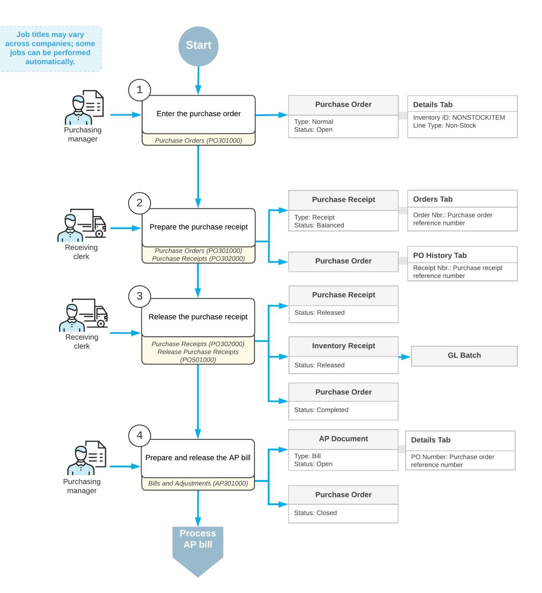

# <span id="page-365-0"></span>**Purchases of Non-Stock Items and Services with Receipts: Implementation Checklist**

The following sections provide details you can use to ensure that the system is configured properly for the processing of purchases of non-stock items (including services) with purchase receipts, and to understand (and change, if needed) the settings that affect the processing workflow.

#### **Implementation Checklist**

We recommend that before you initially process purchases of non-stock items which may include services, you make sure the needed settings have been specified, and entities have been created, as summarized in the following checklist.

| Form                                   | Criteria to Check                                                                                                                                                                                                                               |
|----------------------------------------|-------------------------------------------------------------------------------------------------------------------------------------------------------------------------------------------------------------------------------------------------|
| Purchase Orders Preferences (PO101000) | •<br>Make sure that all necessary settings related to pur<br>chase order management have been specified as<br>described in Order Management Basic Configuration:<br>General Information.                                                        |
|                                        | •<br>Make sure that the ProcessService lines from<br>Normal Purchase Orders via Purchase Receipts<br>check box (in the Other section of the General tab)<br>is selected.                                                                        |
| Vendors (AP303000)                     | Make sure that all needed vendors have been created<br>as described in Vendors: General Information.                                                                                                                                            |
| Non-Stock Items (IN202000)             | Make sure that all non-stock items have been config<br>ured as described in Non-Stock Items: Implementation<br>Activity.                                                                                                                        |
|                                        | Also, make sure that the Require Receipt check box<br>(in the Item Defaults section of the General tab) is se<br>lected in the settings of each non-stock item for which<br>a purchase receipt will be processed when the item is<br>purchased. |
| Enable/Disable Features (CS100000)     | Make sure that the Inventory feature is enabled to be<br>able to create purchase receipts.                                                                                                                                                      |

#### **Other Settings That Affect the Workflow**

You can affect the workflow of processing purchases by specifying additional settings:

- To cause an accounts payable bill to be created automatically on release of a purchase receipt by default, select the **Create Bill on Receipt Release** check box on the *[Purchase Orders Preferences](https://help-2025r1.acumatica.com/Help?ScreenId=ShowWiki&pageid=13d09c43-8696-4f92-ad9b-3d0209ee3d9b)* (PO101000) form (in the **Other** section of the **General** tab). In this case, when a user creates a purchase receipt on the *[Purchase Receipts](https://help-2025r1.acumatica.com/Help?ScreenId=ShowWiki&pageid=d9901c8d-486d-45ed-8088-ea3d8ee3af19)* (PO302000) form, the system automatically selects the **Create Bill** check box in the Summary area. (The user can clear this check box for a particular receipt, if needed.)
- To cause the system to automatically release accounts payable bills that are generated on release of purchase receipts, select the **Release AP Documents Automatically** check box on the *[Purchase Orders](https://help-2025r1.acumatica.com/Help?ScreenId=ShowWiki&pageid=13d09c43-8696-4f92-ad9b-3d0209ee3d9b) [Preferences](https://help-2025r1.acumatica.com/Help?ScreenId=ShowWiki&pageid=13d09c43-8696-4f92-ad9b-3d0209ee3d9b)* form. For information on processing bills, see *[AP Bills: General Information](https://help-2025r1.acumatica.com/Help?ScreenId=ShowWiki&pageid=1ea1e770-b81c-437e-831f-64f702f968f4)*.
- To cause purchase receipts to be created with the *On Hold* status (so that users can verify them before processing them further), select the **Hold Receipts on Entry** check box on the *[Purchase Orders Preferences](https://help-2025r1.acumatica.com/Help?ScreenId=ShowWiki&pageid=13d09c43-8696-4f92-ad9b-3d0209ee3d9b)* form (in the **Other** section of the **General** tab).
- To cause the system to automatically release inventory receipts generated on release of purchase receipts, select the **Release IN Documents Automatically** check box on the *[Purchase Orders Preferences](https://help-2025r1.acumatica.com/Help?ScreenId=ShowWiki&pageid=13d09c43-8696-4f92-ad9b-3d0209ee3d9b)* form (in the **Other** section of the **General** tab).
- To cause the system to automatically post general ledger batches generated during processing purchase documents, select the **Automatically Post on Release** check box in the **PostingSettings** section of the

*[General Ledger Preferences](https://help-2025r1.acumatica.com/Help?ScreenId=ShowWiki&pageid=e4913d06-c511-4258-a0f9-f36c1b854e6b)* (GL102000) form. For information on processing general ledger batches, see *[GL](https://help-2025r1.acumatica.com/Help?ScreenId=ShowWiki&pageid=35393020-6269-466d-8a08-df558cd43367) [Transactions:](https://help-2025r1.acumatica.com/Help?ScreenId=ShowWiki&pageid=35393020-6269-466d-8a08-df558cd43367) General Information*.

#### **Validation of Configuration**

To make sure that all configuration has been performed correctly, we recommend that in your system, you perform instructions similar to those described in *[Purchases](#page-367-1) of Non-Stock Items and Services with Receipts: To Process a [Purchase of Non-Stock Items](#page-367-1)* and *[Purchases](#page-369-1) of Non-Stock Items and Services with Receipts: To Process a Purchase of [Services](#page-369-1)*.

# <span id="page-367-1"></span><span id="page-367-0"></span>**Purchases of Non-Stock Items and Services with Receipts: To Process a Purchase of Non-Stock Items**

In this activity, you will prepare and process a purchase order for non-stock items that must be included in a purchase receipt. This activity involves non-stock items that are not services.

This activity is based on the *U100* dataset. If you are using another dataset, or if any system settings have been changed in *U100*, these changes can affect the workflow of the activity and the results of the processing. To avoid any issues, restore the *U100* dataset to its initial state.

#### **Story**

Suppose that the SweetLife Store gives a free magnet with a SweetLife Fruits & Jams advertisement to every customer who buys goods in the retail shop. Further suppose that today one of the managers has reported that the supply of magnets is extremely low.

As a purchasing manager, you need to enter and process a purchase order for the Wingman Printing Company, from which SweetLife buys these magnets. You also need to process the corresponding purchase receipt and AP bill.

#### **Configuration Overview**

In the *U100* dataset, the following tasks have been performed to support this activity:

- On the *[Enable/Disable Features](https://help-2025r1.acumatica.com/Help?ScreenId=ShowWiki&pageid=c1555e43-1bc5-4f6f-ba9d-b323f94d8a6b)* (CS100000) form, the *Inventory* feature has been enabled.
- On the *[Vendors](https://help-2025r1.acumatica.com/Help?ScreenId=ShowWiki&pageid=a9584be3-f2bd-4d67-80d4-8041d809df56)* (AP303000) form, the *PRINTICO (Wingman Printing Company)* vendor has been defined.
- On the *[Non-Stock Items](https://help-2025r1.acumatica.com/Help?ScreenId=ShowWiki&pageid=bf68dd4f-63d4-460d-8dc0-9152f2bd6bf1)* (IN202000) form, the *MAGNETS (A box of magnets with company advertisement, 50pcs)* non-stock item has been defined, and the **Require Receipt** check box has been selected for this item on the **General** tab. This indicates that when this item is purchased, it needs to be included in a purchase receipt.

#### **Process Overview**

In this activity, you will create a purchase order on the *[Purchase Orders](https://help-2025r1.acumatica.com/Help?ScreenId=ShowWiki&pageid=5565686c-96c4-4bfa-a51d-9a2566baa808)* (PO301000) form and add the *MAGNETS* non-stock item to it. When the magnets have been received, on the *[Purchase Receipts](https://help-2025r1.acumatica.com/Help?ScreenId=ShowWiki&pageid=d9901c8d-486d-45ed-8088-ea3d8ee3af19)* (PO302000) form, you will then create a purchase receipt for them. On release of the purchase receipt, the system automatically generates an inventory receipt, which creates a GL batch. Then on the *[Bills and Adjustments](https://help-2025r1.acumatica.com/Help?ScreenId=ShowWiki&pageid=956b4e51-3078-4d2d-85b3-65c080d95234)* (AP301000) form, you will create an AP bill to pay the vendor.

#### **System Preparation**

Before you start processing the purchase order, you should do the following:

- 1. Launch the Acumatica ERP website with the *U100* dataset preloaded and sign in to the system as a sales and purchasing manager by using the *wiley* username and *123* password.
- 2. In the info area, in the upper-right corner of the top pane of the Acumatica ERP screen, make sure that the business date in your system is set to today's date. For simplicity, in this activity, you will create and process all documents in the system on this business date.
- 3. On the Company and Branch Selection menu in the top pane of the Acumatica ERP screen, select the *SweetLife Store* branch.

### **Step 1: Creating a Purchase Order**

To create a purchase order for the magnets, do the following:

- 1. On the *[Purchase Orders](https://help-2025r1.acumatica.com/Help?ScreenId=ShowWiki&pageid=5565686c-96c4-4bfa-a51d-9a2566baa808)* (PO301000) form, add a new record.
- 2. In the Summary area, specify the following settings:
  - **Type**: *Normal*
  - **Vendor**: *PRINTICO*
  - **Description**: Purchase of magnets
- 3. On the table toolbar of the **Details** tab, click **Add Row**.
- 4. Specify the following settings in the added row:
  - **Branch**: *RETAIL*
  - **Inventory ID**: *MAGNETS*
  - **Warehouse**: *RETAIL*
  - **Order Qty.**: *20*
  - **Unit Cost**: *100*
- 5. On the form toolbar, click **Remove Hold**. Notice that the purchase order is assigned the *Open* status.

#### **Step 2: Processing the Purchase Receipt**

To create the purchase receipt for the purchase order, do the following:

- 1. While you are still viewing the purchase order on the *[Purchase Orders](https://help-2025r1.acumatica.com/Help?ScreenId=ShowWiki&pageid=5565686c-96c4-4bfa-a51d-9a2566baa808)* (PO301000) form, on the form toolbar, click **Enter PO Receipt**. The system prepares the purchase receipt for the selected purchase order and opens it on the *[Purchase Receipts](https://help-2025r1.acumatica.com/Help?ScreenId=ShowWiki&pageid=d9901c8d-486d-45ed-8088-ea3d8ee3af19)* (PO302000) form.
- 2. On the form toolbar, click**Save**.
- 3. Review the details of the prepared purchase receipt. Make sure that the **Create Bill** check box is cleared in the Summary area. (In the next step, you will prepare the bill manually.)
- 4. On the form toolbar, click **Release**.
- 5. On the **Other** tab, click the **IN Ref. Nbr.** link, and review the details of the generated inventory receipt, which the system opens on the *[Receipts](https://help-2025r1.acumatica.com/Help?ScreenId=ShowWiki&pageid=d6ecad5b-155f-44bf-baba-9ed006d298b5)* (IN301000) form. Make sure that the inventory receipt has the *Released* status.
- 6. Close the *[Receipts](https://help-2025r1.acumatica.com/Help?ScreenId=ShowWiki&pageid=d6ecad5b-155f-44bf-baba-9ed006d298b5)* form.

#### **Step 3: Processing the AP Bill**

To process the AP bill associated with the purchase order and purchase receipt, do the following:

- 1. While you are still viewing the purchase receipt on the *[Purchase Receipts](https://help-2025r1.acumatica.com/Help?ScreenId=ShowWiki&pageid=d9901c8d-486d-45ed-8088-ea3d8ee3af19)* (PO302000) form, on the form toolbar, click **Enter AP Bill**. The system generates an AP bill for the vendor of the goods and opens the created document on the *[Bills and Adjustments](https://help-2025r1.acumatica.com/Help?ScreenId=ShowWiki&pageid=956b4e51-3078-4d2d-85b3-65c080d95234)* (AP301000) form.
- 2. On the form toolbar, click **Remove Hold**, and then click **Release** to release the bill.
- 3. In the only row on the **Details** tab, click the link in the **PO Number** column to view the associated purchase order.
- 4. On the *[Purchase Orders](https://help-2025r1.acumatica.com/Help?ScreenId=ShowWiki&pageid=5565686c-96c4-4bfa-a51d-9a2566baa808)* (PO301000) form, which opens, review the details of the purchase order. Notice that the order now has a status of *Closed*, as shown in the following screenshot.

On the **PO History** tab (also shown in the screenshot), notice that the le pane lists the corresponding purchase receipt, and the right pane lists the AP bill that was prepared for the order. The inclusion of these documents on the tab indicates that the purchased magnets have been received and billed in full, so the purchasing process is completed.

| <b>Purchase Orders</b><br>Normal 000054 - Wingman Printing Company |                          |                     |                                                  |                                     |                                |             |               |                         |          |               | <b>PINOTES</b>        | <b>ACTIVITIES</b>     | <b>FILES</b> | TOOLS $\sim$     |
|--------------------------------------------------------------------|--------------------------|---------------------|--------------------------------------------------|-------------------------------------|--------------------------------|-------------|---------------|-------------------------|----------|---------------|-----------------------|-----------------------|--------------|------------------|
| $\Box$<br>뭐                                                        | $\Omega$<br>$\pm$        | 而                   | Ô<br>$\overline{\mathbf{K}}$<br>≺<br>$\check{ }$ | $\geq$<br>$\rightarrow$<br>$\cdots$ |                                |             |               |                         |          |               |                       |                       |              |                  |
| Type:                                                              | Normal                   | $\checkmark$        | Vendor:                                          | PRINTICO - Wingman Printing Company |                                | //          | Detail Total: |                         | 2.000.00 |               |                       |                       |              | $\sim$           |
| Order Nbr.:                                                        | 000054                   | Q                   | Location:                                        | MAIN - Primary Location             |                                |             |               | Line Discounts:<br>0.00 |          |               |                       |                       |              |                  |
| Status:                                                            | Closed                   |                     | Owner:                                           | <b>Regina Wiley</b>                 |                                |             | Document Dis  |                         | 0.00     |               |                       |                       |              |                  |
| Date:                                                              | 9/9/2024                 |                     | Vendor Ref.:                                     |                                     |                                |             | Tax Total:    |                         | 0.00     |               |                       |                       |              |                  |
| Promised On:                                                       | 9/9/2024                 |                     |                                                  |                                     |                                |             | Order Total:  |                         | 2,000.00 |               |                       |                       |              |                  |
| Description:                                                       |                          | Purchase of magnets |                                                  |                                     |                                |             |               |                         |          |               |                       |                       |              |                  |
| <b>DETAILS</b>                                                     | <b>TAXES</b>             | <b>SHIPPING</b>     | <b>VENDOR INFO</b>                               | PO HISTORY                          | <b>PREPAYMENTS</b>             |             | <b>OTHER</b>  | COMPLIANCE              |          |               |                       |                       |              |                  |
| Ò<br>$^{+}$                                                        | $\mathbb{H}$<br>$\times$ | $\mathbf{x}$        |                                                  |                                     |                                | Ò<br>$^{+}$ | $\times$      | $\boxtimes$<br>$\vdash$ |          |               |                       |                       |              |                  |
| <b>B</b> 0<br>D<br>Type                                            |                          | Receipt Nbr.        | Date                                             | <b>Status</b>                       | Received <b>B</b> Type<br>Qty. |             |               | Reference Nbr.          | Date     | <b>Status</b> | <b>Billed</b><br>Qty. | <b>Billed</b><br>Amt. |              | PPV Amt Currency |
| $>$ 0<br>D<br>Receipt                                              |                          | 000046              | 9/9/2024                                         | Released                            | 20.00                          | Bill        |               | 000166                  | 9/9/2024 | Open          | 20.00                 | 2,000.00              |              | $0.00$ USD       |

*Figure: The purchase receipt and AP bill for the closed purchase order*

# <span id="page-369-1"></span><span id="page-369-0"></span>**Purchases of Non-Stock Items and Services with Receipts: To Process a Purchase of Services**

In this activity, you will prepare and process a purchase order for non-stock items that must be included in a purchase receipt. This activity involves non-stock items that are services.

This activity is based on the *U100* dataset. If you are using another dataset, or if any system settings have been changed in *U100*, these changes can affect the workflow of the activity and the results of the processing. To avoid any issues, restore the *U100* dataset to its initial state.

#### **Story**

Suppose that a manager has reported that a computer in the SweetLife Store does not work. Your system administrator has contacted the company that provides computer services, Compulink and Co., and the company has sent a service technician to repair the computer.

Acting as a purchasing manager, you will process the relevant documents in the system. Because Compulink and Co. charges for repair services by the hour, you will prepare the purchase order aer the technician finishes the job. You will also process a purchase receipt for this job to verify that the job was completed and the computer works now. You will then process the corresponding AP bill.

#### **Configuration Overview**

In the *U100* dataset, the following tasks have been performed to support this activity:

- On the *[Enable/Disable Features](https://help-2025r1.acumatica.com/Help?ScreenId=ShowWiki&pageid=c1555e43-1bc5-4f6f-ba9d-b323f94d8a6b)* (CS100000) form, the *Inventory* feature has been enabled.
- On the *[Vendors](https://help-2025r1.acumatica.com/Help?ScreenId=ShowWiki&pageid=a9584be3-f2bd-4d67-80d4-8041d809df56)* (AP303000) form, the *COMPULINK (Compulink and Co.)* vendor has been created.
- On the *[Non-Stock Items](https://help-2025r1.acumatica.com/Help?ScreenId=ShowWiki&pageid=bf68dd4f-63d4-460d-8dc0-9152f2bd6bf1)* (IN202000) form, the *MAINTENANCE (Repair of hardware)* non-stock item has been created.

#### **Process Overview**

In this activity, you will create a purchase order on the *[Purchase Orders](https://help-2025r1.acumatica.com/Help?ScreenId=ShowWiki&pageid=5565686c-96c4-4bfa-a51d-9a2566baa808)* (PO301000) form and add the purchased service to it. On the *[Purchase Receipts](https://help-2025r1.acumatica.com/Help?ScreenId=ShowWiki&pageid=d9901c8d-486d-45ed-8088-ea3d8ee3af19)* (PO302000) form, you will then create a purchase receipt for the ordered items. On release of the purchase receipt, the system automatically generates an inventory receipt to create a GL batch. Then on the *[Bills and Adjustments](https://help-2025r1.acumatica.com/Help?ScreenId=ShowWiki&pageid=956b4e51-3078-4d2d-85b3-65c080d95234)* (AP301000) form, you create an AP bill to pay the vendor.

#### **System Preparation**

Before you start processing a purchase order that includes non-stock items that must be included in a purchase receipt, you should do the following:

- 1. Launch the Acumatica ERP website with the *U100* dataset preloaded and sign in to the system. You should sign in as a sales and purchasing manager by using the *wiley* username and *123* password.
- 2. In the info area, in the upper-right corner of the top pane of the Acumatica ERP screen, make sure that the business date in your system is set to today's date. For simplicity, in this activity, you will create and process all documents in the system on this business date.
- 3. On the Company and Branch Selection menu in the top pane of the Acumatica ERP screen, select the *SweetLife Store* branch.
- 4. On the *[Purchase Orders Preferences](https://help-2025r1.acumatica.com/Help?ScreenId=ShowWiki&pageid=13d09c43-8696-4f92-ad9b-3d0209ee3d9b)* (PO101000) form (**Other** section on the **General** tab), select the **ProcessService Lines from Normal Purchase Orders via Purchase Receipts** check box. With the check box selected, service lines from *Normal* purchase orders must be included in the corresponding purchase receipts.

#### **Step 1: Creating a Purchase Order**

To create a purchase order for the computer repair service, do the following:

- 1. On the *[Purchase Orders](https://help-2025r1.acumatica.com/Help?ScreenId=ShowWiki&pageid=5565686c-96c4-4bfa-a51d-9a2566baa808)* (PO301000) form, add a new record.
- 2. In the Summary area, specify the following settings:
  - **Type**: *Normal*
  - **Vendor**: *COMPULINK*
  - **Description**: Repair of a computer in the shop
- 3. On the **Details** tab, click **Add Row** on the table toolbar.
- 4. Specify the following settings in the row:
  - **Branch**: *RETAIL*
  - **Inventory ID**: *MAINTENANCE*
  - **Warehouse**: *RETAIL*
  - **Order Qty.**: *3*

This indicates that the repair service is going to take three hours to complete; each unit represents one hour of work.

- **Unit Cost**: *20*
- 5. On the form toolbar, click **Remove Hold**. Notice that the purchase order has the *Open* status.

#### **Step 2: Processing the Purchase Receipt**

To create the purchase receipt for the purchase order, do the following:

- 1. While you are still viewing the purchase order on the *[Purchase Orders](https://help-2025r1.acumatica.com/Help?ScreenId=ShowWiki&pageid=5565686c-96c4-4bfa-a51d-9a2566baa808)* (PO301000) form, on the form toolbar, click **Enter PO Receipt**. The system prepares the purchase receipt for the selected purchase order and opens it on the *[Purchase Receipts](https://help-2025r1.acumatica.com/Help?ScreenId=ShowWiki&pageid=d9901c8d-486d-45ed-8088-ea3d8ee3af19)* (PO302000) form.
- 2. On the form toolbar, click**Save**.
- 3. Review the details of the prepared purchase receipt. Make sure that the **Create Bill** check box is cleared in the Summary area. (In the next step, you will prepare the bill manually.)
- 4. On the form toolbar, click **Release**.

#### **Step 3: Processing the AP Bill**

To process the AP bill associated with the purchase order, do the following:

- 1. While you are still viewing the purchase receipt on the *[Purchase Receipts](https://help-2025r1.acumatica.com/Help?ScreenId=ShowWiki&pageid=d9901c8d-486d-45ed-8088-ea3d8ee3af19)* (PO302000) form, on the form toolbar, click **Enter AP Bill**. The system generates an AP bill for the vendor of the goods and shows the created document on the *[Bills and Adjustments](https://help-2025r1.acumatica.com/Help?ScreenId=ShowWiki&pageid=956b4e51-3078-4d2d-85b3-65c080d95234)* (AP301000) form.
- 2. On the form toolbar, click **Remove Hold**, and then click **Release** to release the bill.
- 3. In the only row on the **Details** tab, click the link in the **PO Number** column to view the associated purchase order.
- 4. On the *[Purchase Orders](https://help-2025r1.acumatica.com/Help?ScreenId=ShowWiki&pageid=5565686c-96c4-4bfa-a51d-9a2566baa808)* (PO301000) form, which opens, review the details of the purchase order. Notice that the order now has a status of *Closed*, as shown in the following screenshot.

On the **PO History** tab (also shown in the screenshot), notice that the le pane lists the corresponding purchase receipt, and the right pane lists the AP bill that was prepared for the order. The inclusion of these documents on the tab indicates that the purchased service has been received and billed in full, so the purchasing process is completed.

| <b>Purchase Orders</b><br>$\Box$<br>뭐<br>$\Omega$          | Normal 000055 - Compulink and Co<br>而<br>$\pm$ | Ô<br>$\overline{\mathsf{K}}$<br>$\left\langle \right\rangle$<br>$\checkmark$ | $\geq$<br>$\rightarrow$<br>$\cdots$ |                                |                   |                                 |                |               | notes                 | <b>ACTIVITIES</b>     | <b>FILES</b><br>TOOLS $\sim$ |
|------------------------------------------------------------|------------------------------------------------|------------------------------------------------------------------------------|-------------------------------------|--------------------------------|-------------------|---------------------------------|----------------|---------------|-----------------------|-----------------------|------------------------------|
| Type:                                                      | Normal<br>$\checkmark$                         | Vendor:                                                                      | COMPULINK - Compulink and Co        |                                | 0                 | Detail Total:                   | 60.00          |               |                       |                       | $\sim$                       |
| Order Nbr.:                                                | $\circ$<br>000055                              | Location:                                                                    | <b>MAIN - Primary Location</b>      |                                |                   | Line Discounts:<br>Document Dis |                |               |                       |                       |                              |
| Status:                                                    | Closed                                         | Owner:                                                                       | <b>Regina Wiley</b>                 |                                |                   |                                 |                |               |                       |                       |                              |
| Date:                                                      | 9/10/2024                                      | Vendor Ref.:                                                                 |                                     |                                | <b>Tax Total:</b> |                                 | 0.00           |               |                       |                       |                              |
| Promised On:                                               | 9/10/2024                                      |                                                                              |                                     |                                |                   | Order Total:                    | 60.00          |               |                       |                       |                              |
| Description:                                               | Repair of a computer in the shop               |                                                                              |                                     |                                |                   |                                 |                |               |                       |                       |                              |
| <b>DETAILS</b>                                             | <b>TAXES</b><br><b>SHIPPING</b>                | <b>VENDOR INFO</b>                                                           | PO HISTORY                          | <b>PREPAYMENTS</b>             | <b>OTHER</b>      | COMPLIANCE                      |                |               |                       |                       |                              |
| Ò<br>$\times$<br>$^{+}$                                    | $\mathbf{x}$<br>$\mathbf{H}$                   |                                                                              |                                     | Ò                              | $+$<br>$\times$   | $\mathbb{H}$<br>$\boxtimes$     |                |               |                       |                       |                              |
| <b>B</b> 0<br>D<br>Type                                    | Receipt Nbr.                                   | Date                                                                         | <b>Status</b>                       | Received <b>B</b> Type<br>Qty. |                   | Reference Nbr.                  | Date           | <b>Status</b> | <b>Billed</b><br>Qty. | <b>Billed</b><br>Amt. | PPV Amt Currency             |
| !!!!!!!!!!!!!!!!!!!!!!!!!!!!!!!!!!!!!!!!<br>> 0<br>Receipt | 000047                                         | 9/10/2024                                                                    | Released                            | 3.00<br>Bill                   |                   | 000167                          | 9/10/2024 Open |               | 3.00                  | 60.00                 | 0.00<br><b>USD</b>           |

*Figure: The purchase receipt and AP bill for the closed purchase order*

# <span id="page-372-0"></span>**Purchases of Non-Stock Items and Services with Receipts: Generated Transactions**

To process a purchase of non-stock items and services for which a receipt is required, you create an AP bill and a receipt. On release of these documents, the system generates GL transactions described in the following sections.

#### **Transaction Generated on AP Bill Release**

When an AP bill prepared for a purchase order (or for purchase receipt) is released, the system creates a batch of the following entries.

| Account                  | Source of Account | Debit  | Credit |
|--------------------------|-------------------|--------|--------|
| Accounts Payable account | Vendor            | 0.00   | Amount |
| PO Accrual account       | Item              | Amount | 0.00   |

You can view the reference number of the GL batch generated for a particular AP bill in the **Batch Nbr.** box on the **Financial** tab of the *[Bills and Adjustments](https://help-2025r1.acumatica.com/Help?ScreenId=ShowWiki&pageid=956b4e51-3078-4d2d-85b3-65c080d95234)* (AP301000) form. You can click the link in this box to view the details of the batch on the *Journal [Transactions](https://help-2025r1.acumatica.com/Help?ScreenId=ShowWiki&pageid=dda046bc-5946-407f-88f7-1c0c966fbe72)* (GL301000) form.

#### **Transaction Generated on Release of an Inventory Receipt**

When the inventory receipt for the purchase receipt is released, the system creates a batch of the following entries.

| Account                                | Source of Account | Debit  | Credit |
|----------------------------------------|-------------------|--------|--------|
| Expense account                        | Vendor            | Amount | 0.00   |
| Inventory Purchase Accrual ac<br>count | Item              | 0.00   | Amount |

You can view the reference number of the GL batch generated for a particular receipt in the **Batch Nbr.** box on the **Financial** tab of the *[Receipts](https://help-2025r1.acumatica.com/Help?ScreenId=ShowWiki&pageid=d6ecad5b-155f-44bf-baba-9ed006d298b5)* (IN301000) form. You can click the link in this box to view the details of the batch on the *Journal [Transactions](https://help-2025r1.acumatica.com/Help?ScreenId=ShowWiki&pageid=dda046bc-5946-407f-88f7-1c0c966fbe72)* (GL301000) form.

Your company may want to recognize expenses when a non-stock item is sold—that is, to post the item's cost to an expense account when it is sold. To do this, you need to select *Sales* in the **Post Cost to Expenses On** box on the *[Non-Stock Items](https://help-2025r1.acumatica.com/Help?ScreenId=ShowWiki&pageid=bf68dd4f-63d4-460d-8dc0-9152f2bd6bf1)* (IN202000) form for the non-stock item. With this setting, if the *Inventory* feature is enabled on the *[Enable/Disable Features](https://help-2025r1.acumatica.com/Help?ScreenId=ShowWiki&pageid=c1555e43-1bc5-4f6f-ba9d-b323f94d8a6b)* (CS100000) form and the item is purchased, the system creates a batch of the following transactions on release of the inventory receipt. The Expense Accrual account is used instead of the Expense account. The item's cost is posted to the Expense account on release of a sales invoice.

| Account            | Source of Account                                                   | Debit | Credit |
|--------------------|---------------------------------------------------------------------|-------|--------|
| PO Accrual account | Posting class settings<br>on the Posting Classes<br>(IN206000) form | 0.00  | Amount |

| Account                 | Source of Account                                            | Debit  | Credit |  |  |
|-------------------------|--------------------------------------------------------------|--------|--------|--|--|
| Expense Accrual account | The posting class settings<br>on the Posting Classes<br>form | Amount | 0.00   |  |  |

If the *Inventory* feature is disabled, on release of an AP bill, the system creates a batch of the following transactions.

| Account                      | Source of Account | Debit  | Credit |  |  |
|------------------------------|-------------------|--------|--------|--|--|
| Accounts Payable ac<br>count | Vendor            | 0.00   | Amount |  |  |
| Expense Accrual account      | Item              | Amount | 0.00   |  |  |

# <span id="page-373-0"></span>**Purchases of Non-Stock Items and Services with Receipts: Related Reports and Forms**

In the following sections, you can find details about ways to gather information about the purchases of non-stock items or services that have been processed or are being processed in the system.

If you do not see a particular report or form that is described, you may have signed in to the system with a user account that does not have access rights to the report or form. Contact your system administrator to obtain access to any needed reports or forms.

#### **Reviewing Purchase Order Information**

If you need to review all information related to a purchase order—including the order total, open quantities, unbilled quantities and amounts, and related purchase receipts and accounts payable bills with their dates, amounts, and current statuses—you first open the particular purchase order on the *[Purchase Orders](https://help-2025r1.acumatica.com/Help?ScreenId=ShowWiki&pageid=5565686c-96c4-4bfa-a51d-9a2566baa808)* (PO301000) form. Then on the More menu, you click **Purchase Order Receipt and Billing History** to open the *[Purchase Order](https://help-2025r1.acumatica.com/Help?ScreenId=ShowWiki&pageid=c9cdd4d9-11d7-4029-9210-05c0463cac2c) [Receipt and Billing History](https://help-2025r1.acumatica.com/Help?ScreenId=ShowWiki&pageid=c9cdd4d9-11d7-4029-9210-05c0463cac2c)* (PO643000) report for this purchase order.

#### **Finding the Purchase Receipts Related to a Purchase Order**

If you need to find a purchase receipt linked to a particular purchase order, you can open the purchase order on the *[Purchase Orders](https://help-2025r1.acumatica.com/Help?ScreenId=ShowWiki&pageid=5565686c-96c4-4bfa-a51d-9a2566baa808)* (PO301000) form and review the **PO History** tab. The le table on this tab lists all the purchase receipts that have been prepared for the order, and the table footer shows the summary information for all listed documents. To review the details of any receipt, you click its reference number in the **Receipt Nbr.** column; the system opens the purchase receipt for review on the *[Purchase Receipts](https://help-2025r1.acumatica.com/Help?ScreenId=ShowWiki&pageid=d9901c8d-486d-45ed-8088-ea3d8ee3af19)* (PO302000) form.

#### **Finding the Bills Related to a Purchase Order**

If you need to find an AP bill linked to a particular purchase order, you can open the purchase order on the *[Purchase Orders](https://help-2025r1.acumatica.com/Help?ScreenId=ShowWiki&pageid=5565686c-96c4-4bfa-a51d-9a2566baa808)* (PO301000) form and review the **PO History** tab. The right table on this tab lists all the AP documents that have been prepared for the order, and the table footer shows the summary information for all listed documents. To review the details any listed bill, you click its reference number in the **Reference Nbr.** column; the system opens the AP bill for review on the *[Bills and Adjustments](https://help-2025r1.acumatica.com/Help?ScreenId=ShowWiki&pageid=956b4e51-3078-4d2d-85b3-65c080d95234)* (AP302000) form.

#### **Reviewing the Unbilled Quantities of a Purchase Order**

To check whether a purchase order has quantities of items and amounts that have not yet been billed, you can review the **Unbilled Quantity** and **Unbilled Amount** boxes on the **Other** tab of the *[Purchase Orders](https://help-2025r1.acumatica.com/Help?ScreenId=ShowWiki&pageid=5565686c-96c4-4bfa-a51d-9a2566baa808)* (PO301000) form.

#### **Printing a Purchase Order**

To prepare a printable version of the purchase order that is being processed, you use the *[Purchase Order](https://help-2025r1.acumatica.com/Help?ScreenId=ShowWiki&pageid=b0fb90cc-f338-43c9-8eaa-a80fe53cb678)* (PO641000) report. While you are viewing a purchase order on the *[Purchase Orders](https://help-2025r1.acumatica.com/Help?ScreenId=ShowWiki&pageid=5565686c-96c4-4bfa-a51d-9a2566baa808)* (PO301000) form, you can print the purchase order by clicking **Print Purchase Order** on the More menu. The system opens the printable version of the document on the *[Purchase Order](https://help-2025r1.acumatica.com/Help?ScreenId=ShowWiki&pageid=b0fb90cc-f338-43c9-8eaa-a80fe53cb678)* report; then you can review the order and print it by clicking **Print** on the report toolbar.

# <span id="page-374-0"></span>**Purchases of Non-Stock Items and Services with Receipts: Mass Processing of Documents**

The following sections explain how to mass-process purchase orders and related documents, and how the system generates, changes, or works with documents as a result of the mass processing.

#### **Mass-Releasing Purchase Receipts**

You can release multiple purchase receipts at the same time by using the *[Release Purchase Receipts](https://help-2025r1.acumatica.com/Help?ScreenId=ShowWiki&pageid=a65e7a2b-08ff-42fd-80ff-0e26078b1f3b)* (PO501000) form. On this form, you select the unlabeled check boxes for the purchase receipts to be processed and click **Process** on the form toolbar to release the selected purchase receipts. Alternatively, you can click **Process All** to release all the listed purchase receipts.

#### **Printing and Emailing Multiple Purchase Orders**

If needed, you can print or email multiple purchase orders at the same time by using the *[Print/Email Purchase](https://help-2025r1.acumatica.com/Help?ScreenId=ShowWiki&pageid=354eeef6-4143-49a3-9cb9-4e2da15cbf77) [Orders](https://help-2025r1.acumatica.com/Help?ScreenId=ShowWiki&pageid=354eeef6-4143-49a3-9cb9-4e2da15cbf77)* (PO503000) form. To do this for multiple purchase orders simultaneously, you select the *Print Purchase Order* or *Email Purchase Order* action, as well as any other selection criteria to narrow the orders to be listed.

Then you select the unlabeled check boxes for the orders to be printed or emailed, and click **Process** on the form toolbar to print or email the selected orders. As an alternative to printing or emailing only selected orders, you can click **Process All** to print or email all the listed purchase orders.

#### **Consolidating Purchase Orders or Lines into a Single Purchase Receipt**

Instead of preparing an individual purchase receipt for each purchase order, you can add multiple purchase orders of one vendor to a single purchase receipt; you can also add individual lines of one purchase order or multiple purchase orders.

To do this, you create a new purchase receipt of the *Receipt* type manually on the *[Purchase Receipts](https://help-2025r1.acumatica.com/Help?ScreenId=ShowWiki&pageid=d9901c8d-486d-45ed-8088-ea3d8ee3af19)* (PO302000) form; you then click **Add PO** on the table toolbar of the **Details** tab and add the lines of multiple purchase orders with the same vendor to the purchase receipt. If you click **Add PO Line** on the table toolbar, you can add purchase receipt lines.

#### **Consolidating Purchase Receipts or Lines into a Single Bill**

Instead of preparing an individual accounts payable bill for each purchase receipt, you can add multiple purchase receipts of one vendor to a single bill; you can also add individual lines of one purchase receipt or multiple purchase receipts.

To do this, you create a new accounts payable bill manually on the *[Bills and Adjustments](https://help-2025r1.acumatica.com/Help?ScreenId=ShowWiki&pageid=956b4e51-3078-4d2d-85b3-65c080d95234)* (AP301000) form and make sure that the *Tax Settings* option is selected in the**Tax Calculation Mode** box on the **Financial** tab. You then click **Add PO Receipt** on the table toolbar of the **Details** tab and add the lines of multiple purchase receipts with the same vendor to the bill. If you click **Add PO Receipt Line** on the table toolbar, you can add purchase receipt lines.

# <span id="page-376-0"></span>**Processing Purchases of Services Without Receipts**

If your company buys services, these services can be defined as non-stock items in Acumatica ERP. You can process purchases of services and other items by using purchase orders whose items may or may not need to be included in purchase receipts.

The topics of this chapter describe how to prepare and process purchase orders containing services that do not have to be included in corresponding purchase receipts.

In Acumatica ERP, a purchase order can contain stock items, non-stock items (including services), or a mix of both types of items. Also, each non-stock item included in a purchase order may or may not need to be included in a purchase receipt, based on the item's settings in the system.

For simplicity, this chapter will focus primarily on purchase orders that contain non-stock items that are services. To illustrate a more typical purchasing example, the chapter includes *[Purchases](#page-378-1) of Services Without [Receipts:](#page-378-1) Process Activity*, in which the purchase order includes a purchase of a physical item and a service not requiring a receipt.

# <span id="page-376-1"></span>**Purchases of Services Without Receipts: General Information**

Non-stock items in Acumatica ERP are used to represent products that cannot be stocked in warehouses (such as services or charges) or physical entities whose quantities you do not need to track. If a non-stock item is included in a purchase order, the item's settings determine whether the item must be included in a corresponding purchase receipt.

The following sections explain how to process a purchase order with services that will not be included in purchase receipts for the order. They also explain which documents are prepared during the processing of the purchase.

#### **Learning Objectives**

In this chapter, you will do the following:

- Enter a purchase order for a service that does not need to be included in the corresponding purchase receipt
- Prepare an AP bill for the purchase order

#### **Applicable Scenario**

You may need to process a purchase order that includes services. Purchases of services are usually processed without purchase receipts and the corresponding bills are created in the system.

Some services may need a receipt. For example, you may want to track the quantity of hours spent on rendering the service or you may want proof of receiving the service.

#### **Purchase of Services Not Included in Receipts**

In Acumatica ERP, you create a purchase order by using the *[Purchase Orders](https://help-2025r1.acumatica.com/Help?ScreenId=ShowWiki&pageid=5565686c-96c4-4bfa-a51d-9a2566baa808)* (PO301000) form. You use a purchase order of the *Normal* type for processing a standard purchase of services.

When you create a new purchase order, you first select the *Normal* type and the vendor in the Summary area. Then on the **Details** tab, you add lines with items and services to be purchased from the vendor. These lines include services that do not need to be added to the purchase receipt for the order.

Once the purchased services have been provided, you need to create an AP bill on the *[Bills and Adjustments](https://help-2025r1.acumatica.com/Help?ScreenId=ShowWiki&pageid=956b4e51-3078-4d2d-85b3-65c080d95234)* (AP301000) form to increase the vendor's balance in the system by the amount to be paid for the received services.

#### **Workflow of a Purchase of Services Without a Purchase Receipt**

Services that do not require purchase receipts may or may not be included in purchase orders with items that require a corresponding purchase receipt. If you are processing a purchase order with only services that do not require a receipt, the typical processing of a purchase order involves the actions and generated documents shown in the following diagram.

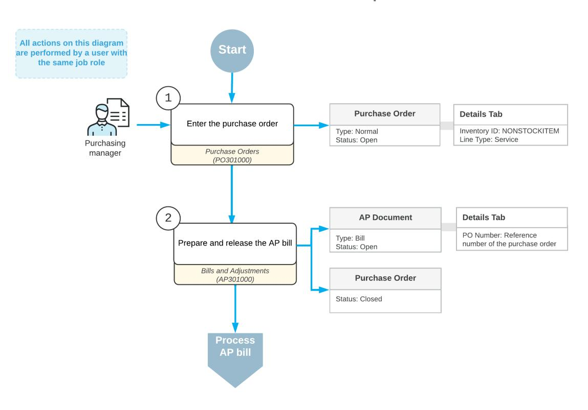

# <span id="page-377-0"></span>**Purchases of Services Without Receipts: Implementation Checklist**

The following sections provide details you can use to ensure that the system is configured properly for the processing of purchases of services that will not be included in a purchase receipt, and to understand (and change, if needed) the settings that affect the processing workflow.

#### **Implementation Checklist**

We recommend that before you initially process purchases of services without receipt, you make sure the needed settings have been specified, and entities have been created, as summarized in the following checklist.

| Form                                   | Criteria to Check |
|----------------------------------------|-------------------|
| Purchase Orders Preferences (PO101000) |                   |

| Form                       | Criteria to Check                                                                                        |
|----------------------------|----------------------------------------------------------------------------------------------------------|
| Vendors (AP303000)         | Make sure that all needed vendors have been config<br>ured as described in Vendors: General Information. |
| Non-Stock Items (IN202000) |                                                                                                          |

#### **Other Settings That Affect the Workflow**

You can affect the workflow of processing purchases of services without receipt by selecting the **Automatically Post on Release** check box on the *[General Ledger Preferences](https://help-2025r1.acumatica.com/Help?ScreenId=ShowWiki&pageid=e4913d06-c511-4258-a0f9-f36c1b854e6b)* (GL102000) form to cause the system to automatically post GL batches generated during processing purchase documents. For information on processing GL batches, see *GL [Transactions:](https://help-2025r1.acumatica.com/Help?ScreenId=ShowWiki&pageid=35393020-6269-466d-8a08-df558cd43367) General Information*.

#### **Validation of Configuration**

To make sure that all configuration has been performed correctly, we recommend that in your system, you process a purchase order by performing instructions similar to those described in *[Purchases](#page-378-1) of Services Without Receipts: [Process Activity](#page-378-1)*.

# <span id="page-378-1"></span><span id="page-378-0"></span>**Purchases of Services Without Receipts: Process Activity**

In this activity, you will prepare and process a purchase order that includes a line for a service that does not need to be included in a purchase receipt when it is purchased.

For simplicity, this chapter focuses on purchases of only services that do not require corresponding purchase receipts. However, this activity demonstrates a purchase of both a service that does not need to be included in a purchase receipt and a stock item that does need to be included in a purchase receipt.

This activity is based on the *U100* dataset. If you are using another dataset, or if any system settings have been changed in *U100*, these changes can affect the workflow of the activity and the results of the processing. To avoid any issues, restore the *U100* dataset to its initial state.

#### **Story**

Suppose that you, as a purchasing manager for SweetLife Fruits & Jams, urgently need to buy some jars for packing SweetLife's produced jam, which is sold in the retail store. The company buys these jars (which are tracked as stock items in the system) from Jar Co., which offers free delivery of the jars.

You order the jars, but you will not be able to use Jar Co.'s regular delivery service because its soonest free delivery is in three days. Because you are in urgent need of the jars, you agree to pay Jar Co. an extra service fee to arrange for delivery by a third party. You have defined this delivery in the system as a service that does not need to be included in a purchase receipt.

Thus, you need to process a purchase order for Jar Co. that includes both the jars (at their normal price) and the expedited delivery service. You also need to process the corresponding purchase receipt (which includes only the jars) and AP bill (which includes the jars and the expedited delivery service).

#### **Configuration Overview**

In the *U100* dataset, the following tasks have been performed to support this activity:

• On the *[Enable/Disable Features](https://help-2025r1.acumatica.com/Help?ScreenId=ShowWiki&pageid=c1555e43-1bc5-4f6f-ba9d-b323f94d8a6b)* (CS100000) form, the *Inventory* feature has been enabled.

- On the *[Vendors](https://help-2025r1.acumatica.com/Help?ScreenId=ShowWiki&pageid=a9584be3-f2bd-4d67-80d4-8041d809df56)* (AP303000) form, the *JARCO (Jar Co.)* vendor has been defined.
- On the *[Non-Stock Items](https://help-2025r1.acumatica.com/Help?ScreenId=ShowWiki&pageid=bf68dd4f-63d4-460d-8dc0-9152f2bd6bf1)* (IN202000) form, the *URGDELIVERY (One-time delivery service)* non-stock item has been defined, and the **Require Receipt** check box has been cleared for this item on the **General** tab. This indicates that when this item is purchased, it does not need to be included in a purchase receipt.
- On the *[Stock Items](https://help-2025r1.acumatica.com/Help?ScreenId=ShowWiki&pageid=77786a70-1f1e-4d63-ad98-96f98e4fcb0e)* (IN202500) form, the *JAR96 (Glass jar 96 oz., 24 pcs)* stock item has been defined. Because stock items are by definition items whose movements are tracked in inventory, when they are purchased, they must be included in the purchase receipt corresponding to the purchase order.


For details about the process of purchasing stock items, see *[Purchases of Stock Items: Process](#page-327-1) [Activity](#page-327-1)*.

#### **Process Overview**

In this activity, you will create a purchase order on the *[Purchase Orders](https://help-2025r1.acumatica.com/Help?ScreenId=ShowWiki&pageid=5565686c-96c4-4bfa-a51d-9a2566baa808)* (PO301000) form and add the purchased expedited delivery service and jars to it. Although the service does not need to be included in a purchase receipt, because the jars are stock items, you will process a purchase receipt for them on the *[Purchase Receipts](https://help-2025r1.acumatica.com/Help?ScreenId=ShowWiki&pageid=d9901c8d-486d-45ed-8088-ea3d8ee3af19)* (PO302000) form. Then on the *[Bills and Adjustments](https://help-2025r1.acumatica.com/Help?ScreenId=ShowWiki&pageid=956b4e51-3078-4d2d-85b3-65c080d95234)* (AP301000) form, you will create an AP bill to pay the vendor.

#### **System Preparation**

Before you start processing the purchase of services without a receipt, you should do the following:

- 1. Launch the Acumatica ERP website with the *U100* dataset preloaded and sign in to the system as a sales and purchasing manager by using the *wiley* username and *123* password.
- 2. On the *[Purchase Orders Preferences](https://help-2025r1.acumatica.com/Help?ScreenId=ShowWiki&pageid=13d09c43-8696-4f92-ad9b-3d0209ee3d9b)* (PO101000) form, make sure that the **ProcessService lines from Normal Purchase Orders via Purchase Receipts** check box is cleared so that the system does not include service lines in purchase receipts.
- 3. In the info area, in the upper-right corner of the top pane of the Acumatica ERP screen, make sure that the business date in your system is set to today's date. For simplicity, in this activity, you will create and process all documents in the system on this business date.
- 4. On the Company and Branch Selection menu in the top pane of the Acumatica ERP screen, select the *SweetLife Store* branch.

#### **Step 1: Creating a Purchase Order**

To create a purchase order that includes the jars and the expedited delivery service, do the following:

- 1. On the *[Purchase Orders](https://help-2025r1.acumatica.com/Help?ScreenId=ShowWiki&pageid=5565686c-96c4-4bfa-a51d-9a2566baa808)* (PO301000) form, add a new record.
- 2. In the Summary area, specify the following settings:
  - **Type**: *Normal*
  - **Vendor**: *JARCO*
  - **Description**: Purchase of jars
- 3. On the table toolbar of the **Details** tab, click **Add Row**.
- 4. Specify the following settings in the added row:
  - **Branch**: *RETAIL*
  - **Inventory ID**: *JAR96*
  - **Warehouse**: *RETAIL*
  - **Order Qty.**: 5
  - **Unit Cost**: 30

- 5. On the table toolbar of the **Details** tab, click **Add Row**.
- 6. Specify the following settings in the added row:
  - **Branch**: *RETAIL*
  - **Inventory ID**: *URGDELIVERY*
  - **Order Qty.**: 1
  - **Unit Cost**: 20
- 7. On the form toolbar, click **Remove Hold**. Notice that the purchase order is assigned the *Open* status.

#### **Step 2: Processing the Purchase Receipt for the Jars**

Although the *URGDELIVERY* non-stock item does not need to be included in a purchase receipt, the purchase order also consists of the *JAR96* stock item. When this item is purchased, it needs to be included in the corresponding purchase receipt, because the movements of all stock items are carefully tracked in inventory. Thus, you still need to create a purchase receipt.

Create the purchase receipt for the purchase order as follows:

- 1. While you are still viewing the purchase order on the *[Purchase Orders](https://help-2025r1.acumatica.com/Help?ScreenId=ShowWiki&pageid=5565686c-96c4-4bfa-a51d-9a2566baa808)* (PO301000) form, click **Enter PO Receipt** on the form toolbar. The system prepares the purchase receipt for the selected purchase order and opens it on the *[Purchase Receipts](https://help-2025r1.acumatica.com/Help?ScreenId=ShowWiki&pageid=d9901c8d-486d-45ed-8088-ea3d8ee3af19)* (PO302000) form.
- 2. Review the purchase receipt.

Notice that the line with the *URGDELIVERY* service, which had been included in the purchase order, is absent in the purchase receipt. This is because the **Require Receipt** check box is cleared for the non-stock item on the *[Non-Stock Items](https://help-2025r1.acumatica.com/Help?ScreenId=ShowWiki&pageid=bf68dd4f-63d4-460d-8dc0-9152f2bd6bf1)* (IN202000) form.

- 3. On the form toolbar, click**Save**.
- 4. Review the details of the prepared purchase receipt. Notice that the **Create Bill** check box is cleared in the Summary area. (You will create the bill manually in the next step.)
- 5. On the form toolbar, click **Release**.

#### **Step 3: Processing the AP Bill**

To process the AP bill related to the purchase order, do the following:

1. Return to the purchase order that you have processed earlier in this activity on the *[Purchase Orders](https://help-2025r1.acumatica.com/Help?ScreenId=ShowWiki&pageid=5565686c-96c4-4bfa-a51d-9a2566baa808)* (PO301000) form, and click **Enter AP Bill** on the More menu.

The system generates an AP bill for the vendor of the goods and shows the created document on the *[Bills](https://help-2025r1.acumatica.com/Help?ScreenId=ShowWiki&pageid=956b4e51-3078-4d2d-85b3-65c080d95234) [and Adjustments](https://help-2025r1.acumatica.com/Help?ScreenId=ShowWiki&pageid=956b4e51-3078-4d2d-85b3-65c080d95234)* (AP301000) form.

- 2. In the **Description** box, enter Purchase of jars with expedited delivery.
- 3. On the form toolbar, click **Remove Hold**.
- 4. Click **Release**.
- 5. Return to the purchase order for *JARCO* on the *[Purchase Orders](https://help-2025r1.acumatica.com/Help?ScreenId=ShowWiki&pageid=5565686c-96c4-4bfa-a51d-9a2566baa808)* form, and review its settings. Notice that the order now has a status of *Closed*, as shown in the screenshot below.
- 6. On the **PO History** tab, notice the following:
  - The le pane lists the purchase receipt, which includes only the received stock item from this purchase order.
  - The right pane lists the AP bill that you prepared for the purchase order. It includes the received stock item and a service item.

The inclusion of these documents on the tab indicates that the purchased jars have been received and the jars and the delivery have been billed in full, so the purchasing process is completed.

| <b>Purchase Orders</b><br>Normal 000056 - Jar Co.<br>$\Box$<br>뭐<br>$\sim$ | !!!!!!!!!!!!!!!!!!!!!!!!!!!!!!!!!!!!!!!!<br>间<br>$\pm$ | $\overline{\mathsf{K}}$<br>$\sim$ $\sim$<br>$\checkmark$ | $\geq$<br>$\rightarrow$                    | $\cdots$                |     |                                      |                |               | notes                 | <b>ACTIVITIES</b>     | <b>FILES</b> | TOOLS $\star$       |
|----------------------------------------------------------------------------|--------------------------------------------------------|----------------------------------------------------------|--------------------------------------------|-------------------------|-----|--------------------------------------|----------------|---------------|-----------------------|-----------------------|--------------|---------------------|
| Type:<br>Order Nbr.:                                                       | Normal<br>$\checkmark$<br>000056<br>Q                  | Vendor:<br>Location:                                     | JARCO - Jar Co.<br>MAIN - Primary Location |                         | 0   | Detail Total:<br>Line Discounts:     | 170.00<br>0.00 |               |                       |                       |              | $\hat{\phantom{a}}$ |
| Status:                                                                    | Closed                                                 | Owner:                                                   | Regina Wiley                               |                         |     | Document Dis                         | 0.00           |               |                       |                       |              |                     |
| Date:                                                                      | 9/10/2024                                              | Vendor Ref.:                                             |                                            |                         |     | <b>Tax Total:</b>                    | 0.00           |               |                       |                       |              |                     |
| Promised On:                                                               | 9/10/2024                                              |                                                          |                                            |                         |     | Order Total:                         | 170.00         |               |                       |                       |              |                     |
| Description:                                                               | Purchase of jars                                       |                                                          |                                            |                         |     |                                      |                |               |                       |                       |              |                     |
| <b>DETAILS</b>                                                             | <b>TAXES</b><br><b>SHIPPING</b>                        | <b>VENDOR INFO</b>                                       | PO HISTORY                                 | PREPAYMENTS             |     | <b>OTHER</b><br>COMPLIANCE           |                |               |                       |                       |              |                     |
| ⊘<br>$+$<br>$\times$                                                       | $\vdash$<br>$\mathbf{\overline{N}}$                    |                                                          |                                            | Ò                       | $+$ | $\mathbf{X}$<br>$\vdash$<br>$\times$ |                |               |                       |                       |              |                     |
| D<br><b>B</b> 0<br>Type                                                    | Receipt Nbr.                                           | Date                                                     | <b>Status</b>                              | Received 图 Type<br>Qty. |     | Reference Nbr.                       | Date           | <b>Status</b> | <b>Billed</b><br>Qty. | <b>Billed</b><br>Amt. |              | PPV Amt Currency    |
| $\mathbb{O}$ $\Box$ Receipt                                                | 000048                                                 | 9/10/2024                                                | Released                                   | Bill<br>5.00            |     | 000168                               | 9/10/2024 Open |               | 6.00                  | 170.00                | 0.00         | <b>USD</b>          |

*Figure: The corresponding purchase receipt and AP bill for the closed purchase order*

# <span id="page-381-0"></span>**Purchases of Services Without Receipts: Generated Transactions**

To process a purchase of services without receipt, you create an AP bill. On release of the AP bill, the system generates GL transactions described in the following section.

#### **Transaction Generated on AP Bill Release**

When an AP bill prepared for a purchase order is released, the system creates a batch of the following entries.

| Account                  | Source of Account | Debit  | Credit |
|--------------------------|-------------------|--------|--------|
| Accounts Payable account | Vendor            | 0.00   | Amount |
| PO Accrual account       | Item              | Amount | 0.00   |

You can view the reference number of the GL batch generated for a particular AP bill in the **Batch Nbr.** box on the **Financial** tab of the *[Bills and Adjustments](https://help-2025r1.acumatica.com/Help?ScreenId=ShowWiki&pageid=956b4e51-3078-4d2d-85b3-65c080d95234)* (AP301000) form. You can click the link in this box to view the details of the batch on the *Journal [Transactions](https://help-2025r1.acumatica.com/Help?ScreenId=ShowWiki&pageid=dda046bc-5946-407f-88f7-1c0c966fbe72)* (GL301000) form.

# <span id="page-381-1"></span>**Purchases of Services Without Receipts: Related Reports and Forms**

In the following sections, you can find details about ways to gather information about the purchases of services that have been processed or are being processed in the system.

If you do not see a particular report or form that is described, you may have signed in to the system with a user account that does not have access rights to the report or form. Contact your system administrator to obtain access to any needed reports or forms.

#### **Reviewing Purchase Order Information**

If you need to review all information related to a purchase order—including the order total, open quantities, unbilled quantities and amounts, and related purchase receipts and accounts payable bills with their dates, amounts, and current statuses—you first open the particular purchase order on the *[Purchase Orders](https://help-2025r1.acumatica.com/Help?ScreenId=ShowWiki&pageid=5565686c-96c4-4bfa-a51d-9a2566baa808)* (PO301000) form. Then on the More menu, you click **Purchase Order Receipt and Billing History** to open the *[Purchase Order](https://help-2025r1.acumatica.com/Help?ScreenId=ShowWiki&pageid=c9cdd4d9-11d7-4029-9210-05c0463cac2c) [Receipt and Billing History](https://help-2025r1.acumatica.com/Help?ScreenId=ShowWiki&pageid=c9cdd4d9-11d7-4029-9210-05c0463cac2c)* (PO643000) report for this purchase order.

#### **Finding the Bills Related to a Purchase Order**

If you need to find an AP bill linked to a particular purchase order, you can open the purchase order on the *[Purchase Orders](https://help-2025r1.acumatica.com/Help?ScreenId=ShowWiki&pageid=5565686c-96c4-4bfa-a51d-9a2566baa808)* (PO301000) form and review the **PO History** tab. The right table on this tab lists all the AP documents that have been prepared for the order, and the table footer shows the summary information for all listed documents. To review any listed bill, you click its reference number in the **Reference Nbr.** column; the system opens the AP bill for review on the *[Bills and Adjustments](https://help-2025r1.acumatica.com/Help?ScreenId=ShowWiki&pageid=956b4e51-3078-4d2d-85b3-65c080d95234)* (AP302000) form.

#### **Reviewing the Unbilled Quantities of a Purchase Order**

To check whether a purchase order has quantities of items and amounts that have not yet been billed, you can review the **Unbilled Quantity** and **Unbilled Amount** boxes on the **Other** tab of the *[Purchase Orders](https://help-2025r1.acumatica.com/Help?ScreenId=ShowWiki&pageid=5565686c-96c4-4bfa-a51d-9a2566baa808)* (PO301000) form.

#### **Printing a Purchase Order**

To prepare a printable version of the purchase order that is being processed, you use the *[Purchase Order](https://help-2025r1.acumatica.com/Help?ScreenId=ShowWiki&pageid=b0fb90cc-f338-43c9-8eaa-a80fe53cb678)* (PO641000) report. While you are viewing a purchase order on the *[Purchase Orders](https://help-2025r1.acumatica.com/Help?ScreenId=ShowWiki&pageid=5565686c-96c4-4bfa-a51d-9a2566baa808)* (PO301000) form, you can print the purchase order by clicking **Print Purchase Order** on the More menu. The system opens the printable version of the document on the *[Purchase Order](https://help-2025r1.acumatica.com/Help?ScreenId=ShowWiki&pageid=b0fb90cc-f338-43c9-8eaa-a80fe53cb678)* report; then you can review the order and print it by clicking **Print** on the report toolbar.

# <span id="page-382-0"></span>**Purchases of Services Without Receipts: Mass Processing of Documents**

The following sections explain how to mass-process purchase orders, and how the system generates, changes, or works with documents as a result of the mass processing.

#### **Mass-Printing Purchase Orders**

You can print multiple purchase orders at the same time by using the *[Print/Email Purchase Orders](https://help-2025r1.acumatica.com/Help?ScreenId=ShowWiki&pageid=354eeef6-4143-49a3-9cb9-4e2da15cbf77)* (PO503000) form. To do this for multiple purchase orders simultaneously, you select the *Print Purchase Order* action, as well as any other selection criteria to narrow the orders to be listed.

Then you select the unlabeled check boxes for the purchase orders to be printed, and click **Process** on the form toolbar. As an alternative to printing only selected orders, you can click **Process All** to print all the listed purchase orders.

#### **Mass-Emailing Purchase Orders**

If needed, you can email multiple purchase orders at the same time by using the *[Print/Email Purchase Orders](https://help-2025r1.acumatica.com/Help?ScreenId=ShowWiki&pageid=354eeef6-4143-49a3-9cb9-4e2da15cbf77)* (PO503000) form. To do this for multiple purchase orders simultaneously, you first select the *Email Purchase Order* action, as well as any other selection criteria to narrow the orders to be listed.

Then you select the unlabeled check boxes for the purchase orders to be emailed, and click **Process** on the form toolbar. As an alternative to emailing only selected orders, you can click **Process All** to email all the listed purchase orders.

# <span id="page-383-0"></span>**Processing Blanket Purchase Orders**

In Acumatica ERP, you can create a blanket purchase order if you need to record your company's intention to buy a large quantity of goods during a long period of time. You may use a blanket order to order goods in larger volumes if a vendor offers a considerable volume discounts or the specified goods are not always available from the vendor. A blanket order is not directly fulfilled or billed. Instead, the blanket order is fulfilled through a number of child orders, and each child order is billed.

The topics of this chapter explain how to process blanket purchase orders.

# <span id="page-383-1"></span>**Blanket Purchase Orders: General Information**

In Acumatica ERP, a blanket purchase order is an order whose items are not directly fulfilled or billed. It contains a large item quantity that you enter to reflect your company's plans to buy this quantity over a period of time. A blanket purchase order has child orders, which are the linked purchase orders that include item quantities from the blanket order. The blanket purchase order is a parent order for the linked child orders. The items in the child orders are received and billed.

#### **Learning Objectives**

In this chapter, you will do the following:

- Become familiar with the general settings of a blanket purchase order and its child orders
- Create a blanket purchase order
- Create child orders for the blanket purchase order
- Process the blanket purchase order to completion

#### **Applicable Scenarios**

You process blanket purchase orders in the following cases:

- You need to record the planned purchases of large quantities of items from the same vendor over a specified period of time.
- A vendor offers considerable volume discounts or the specified goods are not always available from the vendor, and you want to ensure their availability when they are needed.

#### **Blanket Purchase Orders**

To create a blanket purchase order in Acumatica ERP, you select *Blanket* in the **Type** box of the *[Purchase Orders](https://help-2025r1.acumatica.com/Help?ScreenId=ShowWiki&pageid=5565686c-96c4-4bfa-a51d-9a2566baa808)* (PO301000) form. In the **Expires On** box of the Summary area, you can specify an expiration date aer which a child order can no longer be linked to the blanket purchase order.

On the **Details** tab, you add the needed items and the quantity that you plan to buy over a period of time. You can add both stock items and non-stock items to a blanket purchase order.

You also use the *[Purchase Orders](https://help-2025r1.acumatica.com/Help?ScreenId=ShowWiki&pageid=5565686c-96c4-4bfa-a51d-9a2566baa808)* form to create multiple child orders for a blanket purchase order, which are purchase orders of the *Normal* or *Drop-Ship* type. On the **Details** tab, you link a child order to the blanket purchase order that has the *Open* status in either of the following ways:

• By clicking the **Add Blanket PO Line** button on the table toolbar, and in the **Add Purchase Order Line** dialog box, which opens, selecting the blanket purchase order, then selecting the needed lines, and clicking **Save**

• By clicking the **Add Blanket PO** button on the table toolbar, and in the **Add Purchase Order** dialog box, which opens, selecting the needed blanket purchase order, and clicking**Save**

When you add the needed order lines by using either of the dialog boxes, the unit costs and open item quantities are copied from the blanket order to the child order. Aer making any needed changes to the unit costs and item quantities, you save the child order. When a child order is linked to a blanket purchase order, these orders' item settings on the **Details** tab are affected as follows:

- In each line of the blanket order, the **Blanket Open Qty.** quantity of each item is reduced by the quantity specified for the item in this child order.
- In each line of a child order, the link to the blanket purchase order is inserted in the **Blanket PO Nbr.** column.

#### **Tracking of Received Items' Quantities and Related Documents**

When you are viewing a blanket purchase order on the *[Purchase Orders](https://help-2025r1.acumatica.com/Help?ScreenId=ShowWiki&pageid=5565686c-96c4-4bfa-a51d-9a2566baa808)* (PO301000) form, you can track the quantity of items received at warehouses by doing the following:

- On the **Details** tab, by viewing item quantities in the **Qty. on Orders**, **Blanket Open Qty.**, and **Qty. on Receipts** columns.
- On the **PO History** tab, in the le table, you can view the information about the blanket order's child orders and their related purchase receipts and returns. In the right table, you can view the information about the AP bills and debit adjustments created for child orders and related purchase receipts or returns.

#### **Processing of a Blanket Purchase Order**

To process a blanket purchase order, you perform the following general steps:

- 1. You create a blanket purchase order on the *[Purchase Orders](https://help-2025r1.acumatica.com/Help?ScreenId=ShowWiki&pageid=5565686c-96c4-4bfa-a51d-9a2566baa808)* (PO301000) form. The blanket purchase order contains the full quantity of items to be included in and fulfilled through the associated child orders.
- 2. Also on the *[Purchase Orders](https://help-2025r1.acumatica.com/Help?ScreenId=ShowWiki&pageid=5565686c-96c4-4bfa-a51d-9a2566baa808)* form, you create the needed child orders at the time of the blanket purchase order's creation or at some later time. You link each child order to the blanket purchase order.
- 3. You create and process the purchase receipts for the stock items as they are received in a warehouse. You use the child order on the *[Purchase Orders](https://help-2025r1.acumatica.com/Help?ScreenId=ShowWiki&pageid=5565686c-96c4-4bfa-a51d-9a2566baa808)* form as a starting point for creating the associated purchase receipt. You release the purchase receipts on the *[Purchase Receipts](https://help-2025r1.acumatica.com/Help?ScreenId=ShowWiki&pageid=d9901c8d-486d-45ed-8088-ea3d8ee3af19)* (PO302000) form. This causes the corresponding inventory receipt transaction to be generated on the *[Receipts](https://help-2025r1.acumatica.com/Help?ScreenId=ShowWiki&pageid=d6ecad5b-155f-44bf-baba-9ed006d298b5)* (IN301000) form with the date and posting period of the purchase receipt. As a result, the system updates the inventory on hand with the quantity and cost of the received items and generates a batch of GL transactions to update account balances.

When the entire quantity of items included in a blanket order has been purchased and received through child orders—that is, each child order has the *Completed* status, and each purchase receipt linked to each child order has the *Released* status—the system changes the blanket order's status to *Completed*.

4. For each child order, you create and process an AP bill on the *[Bills and Adjustments](https://help-2025r1.acumatica.com/Help?ScreenId=ShowWiki&pageid=956b4e51-3078-4d2d-85b3-65c080d95234)* (AP301000) form.

When the AP bill linked to each child order has the *Open* status, and each child order has the *Closed* status, the blanket order's status is changed to *Closed*.

#### **Workflow of the Processing of Blanket Purchase Orders**

The general workflow of processing of a blanket purchase order involves the steps and generated documents shown in the following diagram.

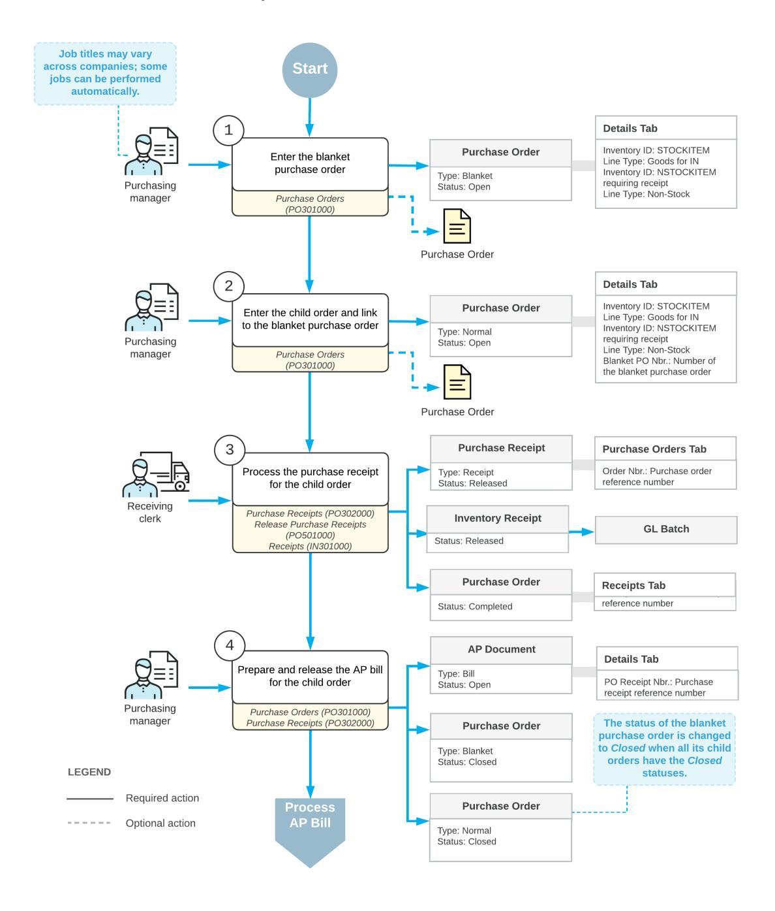

# <span id="page-385-0"></span>**Blanket Purchase Orders: Rules of Line Completion and Closure**

Blanket purchase orders on the *[Purchase Orders](https://help-2025r1.acumatica.com/Help?ScreenId=ShowWiki&pageid=5565686c-96c4-4bfa-a51d-9a2566baa808)* (PO301000) form have the following rules of line completion:

• If the line has the *Goods for IN*, *Non-Stock*, *Goods for Drop-Ship*, or *Non-Stock for Drop-Ship* type and the item in the line has *By Quantity* selected in the **Close PO Line** box of the *[Stock Items](https://help-2025r1.acumatica.com/Help?ScreenId=ShowWiki&pageid=77786a70-1f1e-4d63-ad98-96f98e4fcb0e)* (IN202500) or *[Non-Stock](https://help-2025r1.acumatica.com/Help?ScreenId=ShowWiki&pageid=bf68dd4f-63d4-460d-8dc0-9152f2bd6bf1) [Items](https://help-2025r1.acumatica.com/Help?ScreenId=ShowWiki&pageid=bf68dd4f-63d4-460d-8dc0-9152f2bd6bf1)* (IN202000) form, completing and closing occur as follows:

- The blanket PO line is completed when all related lines in child orders are completed and **Qty. on Receipts** on the **Details** tab of the *[Purchase Orders](https://help-2025r1.acumatica.com/Help?ScreenId=ShowWiki&pageid=5565686c-96c4-4bfa-a51d-9a2566baa808)* form for the blanket order line is greater than or equal to the results of the following calculation for the line: Order Qty. \* Complete On % / 100.
- The blanket PO line is closed when the **Completed** check box on the **Details** tab of the *[Purchase Orders](https://help-2025r1.acumatica.com/Help?ScreenId=ShowWiki&pageid=5565686c-96c4-4bfa-a51d-9a2566baa808)* form is selected and all related lines in child orders are closed.
- If the line has the *Service* type and the item in the line has *By Quantity* selected in the **Close PO Line** box of the *[Non-Stock Items](https://help-2025r1.acumatica.com/Help?ScreenId=ShowWiki&pageid=bf68dd4f-63d4-460d-8dc0-9152f2bd6bf1)* form, the line is completed and closed when both of the following conditions are met:
  - For the blanket order line, the quantity in the **Billed Qty.** column on the **Details** tab of the *[Purchase](https://help-2025r1.acumatica.com/Help?ScreenId=ShowWiki&pageid=5565686c-96c4-4bfa-a51d-9a2566baa808) [Orders](https://help-2025r1.acumatica.com/Help?ScreenId=ShowWiki&pageid=5565686c-96c4-4bfa-a51d-9a2566baa808)* form is greater than or equal to the results of the following calculation: Order Qty. \* Complete On % / 100.
  - All related lines in child orders are completed and closed.
- If the line has the *Non-Stock* or *Service* type and the item in the line has *By Amount* selected in the **Close PO Line** box of the *[Non-Stock Items](https://help-2025r1.acumatica.com/Help?ScreenId=ShowWiki&pageid=bf68dd4f-63d4-460d-8dc0-9152f2bd6bf1)* form, the line is completed and closed when both of the following conditions are met:
  - For the blanket order line, the amount in the **Billed Amount** column of the **Details** tab of the *[Purchase](https://help-2025r1.acumatica.com/Help?ScreenId=ShowWiki&pageid=5565686c-96c4-4bfa-a51d-9a2566baa808) [Orders](https://help-2025r1.acumatica.com/Help?ScreenId=ShowWiki&pageid=5565686c-96c4-4bfa-a51d-9a2566baa808)* form is greater than or equal to the amount in the **Amount** column in the same line.
  - All related lines in child orders are completed and closed.

# <span id="page-386-0"></span>**Blanket Purchase Orders: Purchases for Sale**

You can use a blanket purchase order while processing a purchase for sale in order to purchase items that are not in stock and will be sold to a customer. On the *[Sales Orders](https://help-2025r1.acumatica.com/Help?ScreenId=ShowWiki&pageid=19e4021c-1b84-49fd-be12-0320c5f1c7e5)* (SO301000) form, you create a sales order, add a line with the item on the **Details** tab, select the **Mark for PO** check box for this line, and select *Blanket for Normal* or *Blanket for Drop-Ship* in the **PO Source** column, depending on the needed order type. Then on the **Details** tab, you link a blanket purchase order with the sales order by clicking **PO Link** on the table toolbar, and in the **Purchasing Details** dialog box, which opens, clicking the line with the needed blanket purchase order and clicking**Save**. Aer linking a sales order with a blanket purchase order you can generate a purchase order (of the *Normal* or *Drop-Ship* type) for the sales order by clicking **Create Purchase Orders** on the More menu and processing the purchase request on the *[Create Purchase Orders](https://help-2025r1.acumatica.com/Help?ScreenId=ShowWiki&pageid=dc527541-a18a-44c9-8d51-6d2d77a37443)* (PO505000) form.

Depending on the option selected in the **PO Source** column of a sales order line, in the **Purchasing Details** dialog box, the system makes available for selection the following purchase orders of the *Blanket* type:

- If *Blanket for Normal* is selected, the purchase orders of the *Blanket* type with the *Open* status.
- If *Blanket for Drop-Ship* is selected, the purchase orders of the *Blanket* type with the *Open* status in which the quantity of the purchase order line is greater than or equal to the quantity of the sales order line.

When you generate a child order for a blanket purchase order on the *[Create Purchase Orders](https://help-2025r1.acumatica.com/Help?ScreenId=ShowWiki&pageid=dc527541-a18a-44c9-8d51-6d2d77a37443)* (PO505000) form, the option in the **PO Source** column of the *[Sales Orders](https://help-2025r1.acumatica.com/Help?ScreenId=ShowWiki&pageid=19e4021c-1b84-49fd-be12-0320c5f1c7e5)* form in the related sales order line is changed from *Blanket for Normal* to *Purchase to Order* or from *Blanket for Drop-Ship* to *Drop-Ship*. Also, for the line of the sales order that is marked for drop shipping, the system inserts the reference number of the child order into the **Drop-Ship PO Nbr.** column. If you create a normal or drop-ship purchase order manually on the *[Purchase Orders](https://help-2025r1.acumatica.com/Help?ScreenId=ShowWiki&pageid=5565686c-96c4-4bfa-a51d-9a2566baa808)* (PO301000) form and link it to the blanket purchase order by using the **Add Purchase Order Line** dialog box on the same form, the values in the **PO Source** and **Drop-Ship PO Nbr.** columns do not change in the sales order lines.

For details about the purchases for sales process, see *[Purchases for Sale: General Information](#page-312-2)*.

# <span id="page-387-0"></span>**Blanket Purchase Orders: Implementation Checklist**

The following sections provide details you can use to ensure that the system is configured properly for the processing of blanket purchase orders, and to understand (and change, if needed) the settings that affect the processing workflow.

### **Implementation Checklist**

We recommend that before you initially process blanket purchase orders, you make sure that the needed features have been enabled, settings have been specified, and entities have been created, as summarized in the following checklist.

| Form                                   | Criteria to Check                                                                                                                                                                                                                                             |
|----------------------------------------|---------------------------------------------------------------------------------------------------------------------------------------------------------------------------------------------------------------------------------------------------------------|
| Multiple forms                         | The needed features have been enabled and the neces<br>sary settings have been specified, as demonstrated in<br>Configuration of Order Management: Implementation Activi<br>ty.                                                                               |
| Enable/Disable Features (CS100000)     | The Blanket and Standard Purchase Orders feature has<br>been enabled.                                                                                                                                                                                         |
| Purchase Orders Preferences (PO101000) | The account and subaccount for the freight expenses re<br>quired for the delivery of purchased goods from vendors<br>have been specified on the General tab (Other section) in<br>the Freight Expense Account and Freight ExpenseSub.<br>boxes, respectively. |
| Vendors (AP303000)                     | All the needed vendors have been created, as demonstrat<br>ed in Vendors: Implementation Activity.                                                                                                                                                            |
| Stock Items (IN202500)                 | All the needed stock items have been created, as demon<br>strated in Stock Items: Implementation Activity.                                                                                                                                                    |
| Non-Stock Items (IN202000)             | All the needed non-stock items have been created, as<br>demonstrated in Non-Stock Items: Implementation Activity                                                                                                                                              |

### **Other Settings That Affect the Workflow**

You can affect the workflow in which blanket purchase orders are processed by specifying additional settings on the **General** tab of the *[Purchase Orders Preferences](https://help-2025r1.acumatica.com/Help?ScreenId=ShowWiki&pageid=13d09c43-8696-4f92-ad9b-3d0209ee3d9b)* (PO101000) form as follows:

- To reduce input errors when users enter child orders, select the **For Normal and Standard Orders** check box in the**ValidateTotal on Entry** section. If this check box is selected, validation of the order total is required when a user creates a new purchase order of the *Normal* or *Standard* type on the *[Purchase Orders](https://help-2025r1.acumatica.com/Help?ScreenId=ShowWiki&pageid=5565686c-96c4-4bfa-a51d-9a2566baa808)* (PO301000) form. To take the order off hold, the user must enter the order total in the **ControlTotal** box aer verifying the order details.
- To cause the system to automatically create an accounts payable bill on release of a purchase receipt, select the **Create Bill on Receipt Release** check box in the **Other** section. In this case, when a user creates a purchase receipt on the *[Purchase Receipts](https://help-2025r1.acumatica.com/Help?ScreenId=ShowWiki&pageid=d9901c8d-486d-45ed-8088-ea3d8ee3af19)* (PO302000) form, the system automatically selects the **Create Bill** check box. (The user can clear this check box for a particular bill on the *[Bills and Adjustments](https://help-2025r1.acumatica.com/Help?ScreenId=ShowWiki&pageid=956b4e51-3078-4d2d-85b3-65c080d95234)* (AP301000) form.)

To cause the system to automatically release accounts payable bills generated on release of purchase receipts, select the **Release AP Documents Automatically** check box in the **Other** section. For information on processing bills, see *[AP Bills: General Information](https://help-2025r1.acumatica.com/Help?ScreenId=ShowWiki&pageid=1ea1e770-b81c-437e-831f-64f702f968f4)*.

- To cause purchase receipts to be created with the *On Hold* status (so that users can verify them before processing them further), select the **Hold Receipts on Entry** check box in the **Other** section.
- To cause the system to automatically release inventory transactions that have been generated on release of purchase receipts, select the **Release IN Documents Automatically** check box in the **Other** section.

Also, to cause the system to automatically post general ledger batches generated during the processing of purchase documents, select the **Automatically Post on Release** check box on the *[General Ledger Preferences](https://help-2025r1.acumatica.com/Help?ScreenId=ShowWiki&pageid=e4913d06-c511-4258-a0f9-f36c1b854e6b)* (GL102000) form. For information on processing general ledger batches, see *GL [Transactions:](https://help-2025r1.acumatica.com/Help?ScreenId=ShowWiki&pageid=35393020-6269-466d-8a08-df558cd43367) General Information*.

#### **Validation of Configuration**

To make sure that all configuration has been performed correctly, we recommend that in your system, you process a blanker purchase order by performing instructions similar to those described in *[Blanket Purchase Orders: Process](#page-388-1) [Activity](#page-388-1)*.

# <span id="page-388-1"></span><span id="page-388-0"></span>**Blanket Purchase Orders: Process Activity**

The following activity demonstrates how to process a blanket purchase order.

This activity is based on the *U100* dataset. If you are using another dataset, or if any system settings have been changed in *U100*, these changes can affect the workflow of the activity and the results of the processing. To avoid any issues, restore the *U100* dataset to its initial state.

#### **Story**

Suppose that you are Matt Parker, a purchasing manager in the SweetLife Fruits & Jams company. SweetLife's customer, Delicious Energy restaurant, has ordered juicers as well as installation and training services. SweetLife does not have much free space for juicers in its warehouses, and you asked the vendor to deliver the juicers in portions, so that you have time to move this juicers to the customer's place where they should be installed. On December 1, 2024 you have finalized a contract with the Squeezo Inc. vendor, which will provide the juicers and services to the customer. According to the contract, the vendor will supply the juicers as follows:

- Five juicers without installation and training services on December 15, 2024
- Five juicers without installation and training services and one citrus juicer with installation and training services on January 5, 2025. (The vendor will be able to deliver only two *JUICER15* juicers for this purchase order. The vendor can deliver the other three juicers later this month. You will need to process the documents in the system accordingly.)
- Two citrus juicers with installation and training services on January 30, 2025

The purchased juicers will be delivered to the company's Wholesale warehouse. As the purchasing manager, you need to create a blanket purchase order, create and process its child orders, process purchase receipts, and create bills that should be paid to the vendor for the received juicers and services.

#### **Configuration Overview**

In the *U100* dataset, the following tasks have been performed to support this activity:

- On the *[Enable/Disable Features](https://help-2025r1.acumatica.com/Help?ScreenId=ShowWiki&pageid=c1555e43-1bc5-4f6f-ba9d-b323f94d8a6b)* (CS100000) form, the following features have been enabled:
  - *Inventory and Order Management*, which provides the standard functionality of inventory and order management

- *Inventory*, which gives you the ability to maintain stock items by using forms related to the inventory functionality and to create and process sales and purchase documents that include stock items
- *Blanket and Standard Purchase Orders*, which gives you the ability to create and process these types of purchase orders
- On the *[Purchase Orders Preferences](https://help-2025r1.acumatica.com/Help?ScreenId=ShowWiki&pageid=13d09c43-8696-4f92-ad9b-3d0209ee3d9b)* (PO101000) form, the following settings have been specified:
  - The **Release IN Documents Automatically** check box has been selected, which causes the system to automatically release inventory receipts generated on release of purchase receipts.
  - The **Release AP Documents Automatically** check box, which causes the system to automatically release accounts payable bills generated on release of purchase receipts.
- On the *[Vendors](https://help-2025r1.acumatica.com/Help?ScreenId=ShowWiki&pageid=a9584be3-f2bd-4d67-80d4-8041d809df56)* (AP303000) form, the *SQUEEZO (Squeezo Inc.)* vendor has been created.
- On the *[Stock Items](https://help-2025r1.acumatica.com/Help?ScreenId=ShowWiki&pageid=77786a70-1f1e-4d63-ad98-96f98e4fcb0e)* (IN202500) form, the *JUICER15* and *JUICER20C* stock items have been created.
- On the *[Non-Stock Items](https://help-2025r1.acumatica.com/Help?ScreenId=ShowWiki&pageid=bf68dd4f-63d4-460d-8dc0-9152f2bd6bf1)* (IN202000) form, the *INSTALL* and *TRAINING* non-stock items of the *Service* type have been created. For both stock items, in the **Close PO Line** box on the **General** tab, *By Amount* has been selected.

#### **Process Overview**

In this activity, you will create a blanket purchase order on the *[Purchase Orders](https://help-2025r1.acumatica.com/Help?ScreenId=ShowWiki&pageid=5565686c-96c4-4bfa-a51d-9a2566baa808)* (PO301000) form. Then you will create three child orders on the same form and add items from the blanket purchase order to the child orders. For each child order, you will create and release a purchase receipt on the *[Purchase Receipts](https://help-2025r1.acumatica.com/Help?ScreenId=ShowWiki&pageid=d9901c8d-486d-45ed-8088-ea3d8ee3af19)* (PO302000) form. Also, for each child order, you will create and release an AP bill on the *[Bills and Adjustments](https://help-2025r1.acumatica.com/Help?ScreenId=ShowWiki&pageid=956b4e51-3078-4d2d-85b3-65c080d95234)* (AP301000) form. Finally, you will return to the *[Purchase Orders](https://help-2025r1.acumatica.com/Help?ScreenId=ShowWiki&pageid=5565686c-96c4-4bfa-a51d-9a2566baa808)* form and review the blanket purchase order to make sure that it is closed.

#### **System Preparation**

Before you start processing a blanket purchase order, do the following:

- 1. Launch the Acumatica ERP website with the *U100* dataset preloaded and sign in as purchasing manager Matt Parker by using the *parker* username and the *123* password.
- 2. In the info area, in the upper-right corner of the top pane of the Acumatica ERP screen, make sure that the business date in your system is set to *12/1/2024*. If a different date is displayed, click the Business Date menu button, and select *12/1/2024* on the calendar.
- 3. On the Company and Branch Selection menu, in the top pane of the Acumatica ERP screen, select the *Service and Equipment Sales Center* branch.

#### **Step 1: Creating a Blanket Purchase Order**

To create a blanket purchase order, do the following:

- 1. On the *[Purchase Orders](https://help-2025r1.acumatica.com/Help?ScreenId=ShowWiki&pageid=5565686c-96c4-4bfa-a51d-9a2566baa808)* (PO301000) form, add a new record.
- 2. In the Summary area, specify the following settings:
  - **Type**: *Blanket*
  - **Vendor**: *SQUEEZO*
  - **Date**: *12/1/2024*
  - **Expires On**: *2/1/2025*
  - **Description**: Juicers, installation, and training for Delienergy
- 3. On the form toolbar, click**Save**.
- 4. On the table toolbar of the **Details** tab, click **Add Row**.
- 5. Specify the following settings for this row:

- **Branch**: *SWEETEQUIP*
- **Inventory ID**: *JUICER20C*
- **Warehouse**: *EQUIPHOUSE*
- **Order Qty.**: 3
- 6. On the table toolbar, click **Add Row**.
- 7. Specify the following settings for this row:
  - **Branch**: *SWEETEQUIP*
  - **Inventory ID**: *JUICER15*
  - **Warehouse**: *EQUIPHOUSE*
  - **Order Qty.**: 10
- 8. On the table toolbar, click **Add Row**.
- 9. Specify the following settings for this row:
  - **Branch**: *SWEETEQUIP*
  - **Inventory ID**: *INSTALL*
  - **Order Qty.**: 6
  - **Project**: *X - Non-Project Code*

10.On the table toolbar, click **Add Row**.

11.Specify the following settings for this row:

- **Branch**: *SWEETEQUIP*
- **Inventory ID**: *TRAINING*
- **Order Qty.**: 3
- **Project**: *X - Non-Project Code*

12.On the form toolbar, click **Remove Hold**.

#### **Step 2: Creating the First Child Order**

To create the first child order for the blanket purchase order, do the following:

- 1. In the top pane of the Acumatica ERP screen, click the Business Date menu button, and select *12/15/2024* on the calendar.
- 2. On the *[Purchase Orders](https://help-2025r1.acumatica.com/Help?ScreenId=ShowWiki&pageid=5565686c-96c4-4bfa-a51d-9a2566baa808)* (PO301000) form, add a new record.
- 3. In the Summary area, specify the following settings:
  - **Type**: *Normal*
  - **Vendor**: *SQUEEZO*
  - **Date**: *12/15/2024*
  - **Promised On**: *12/15/2024*
  - **Description**: Purchase of juicers for Delienergy, stage 1
- 4. On the table toolbar of the **Details** tab, click **Add Blanket PO Line**.
- 5. In the **Add Purchase Order Line** dialog box, which opens, do the following:
  - a. In the **Order Nbr.** box, select the number of the blanket purchase order that you have created earlier in this activity.
  - b. In the table, select the unlabeled check box in the line with the *JUICER15* item.
  - c. At the bottom of the dialog box, click**Save**, which closes the dialog box, adds the line to the **Details** tab, and returns you to the current form.

In the **Blanket PO Nbr.** column, make sure that the link to the blanket purchase order has been inserted.

- 6. In the **Inventory ID** column of the only line, type 5 in the **Order Qty.** column.
- 7. On the form toolbar, click **Remove Hold**.

#### **Step 3: Processing the First Child Order**

To process the first child order, do the following:

- 1. While you are still viewing the *Purchase of juicers for Delienergy, stage 1* purchase order on the *[Purchase](https://help-2025r1.acumatica.com/Help?ScreenId=ShowWiki&pageid=5565686c-96c4-4bfa-a51d-9a2566baa808) [Orders](https://help-2025r1.acumatica.com/Help?ScreenId=ShowWiki&pageid=5565686c-96c4-4bfa-a51d-9a2566baa808)* (PO301000) form, on the form toolbar, click **Enter PO Receipt**. The system prepares the purchase receipt for the selected purchase order and opens it on the *[Purchase Receipts](https://help-2025r1.acumatica.com/Help?ScreenId=ShowWiki&pageid=d9901c8d-486d-45ed-8088-ea3d8ee3af19)* (PO302000) form. Review the detail line of the prepared purchase receipt. Notice that both in the **Ordered Qty.** column and in the **Receipt Qty.** column, *5* is specified.
- 2. In the Summary area, select the **Create Bill** check box. This will cause the system to automatically create an accounts payable bill on release of the purchase receipt.
- 3. On the form toolbar, click **Release**. Wait for the system to complete the operation.
- 4. On the **Billing** tab, notice that the line with the AP bill has been added. Review the detail line of the generated AP bill. Make sure that the bill has the *Open* status.
- 5. On the **Other** tab, click the **IN Ref. Nbr.** link. The inventory receipt opens on the *[Receipts](https://help-2025r1.acumatica.com/Help?ScreenId=ShowWiki&pageid=d6ecad5b-155f-44bf-baba-9ed006d298b5)* (IN301000) form in a pop-up window. Make sure that the inventory receipt has the *Released* status.
- 6. Close the window with the inventory receipt.
- 7. On the **Orders** tab of the *[Purchase Receipts](https://help-2025r1.acumatica.com/Help?ScreenId=ShowWiki&pageid=d9901c8d-486d-45ed-8088-ea3d8ee3af19)* form, to which you return, make sure that the purchase order that you have just processed has the *Closed* status.
- 8. Open the *Juicers, installation, and training for Delienergy* blanket purchase order on the *[Purchase Orders](https://help-2025r1.acumatica.com/Help?ScreenId=ShowWiki&pageid=5565686c-96c4-4bfa-a51d-9a2566baa808)* (PO301000) form.
- 9. On the **Details** tab, in the line with *JUICER15*, make sure that the following quantities are specified:
  - **Qty. On Orders**: *5*
  - **Blanket Open Qty.**: *5*
  - **Qty. On Receipts**: *5*

#### **Step 4: Creating the Second Child Order**

To create the second child order for the blanket purchase order, do the following:

- 1. In the top pane of the Acumatica ERP screen, click the Business Date menu button, and select *1/5/2025* on the calendar.
- 2. On the *[Purchase Orders](https://help-2025r1.acumatica.com/Help?ScreenId=ShowWiki&pageid=5565686c-96c4-4bfa-a51d-9a2566baa808)* (PO301000) form, add a new record.
- 3. In the Summary area, specify the following settings:
  - **Type**: *Normal*
  - **Vendor**: *SQUEEZO*
  - **Date**: *1/5/2025*
  - **Description**: Purchase of juicers for Delienergy, stage 2
- 4. On the table toolbar of the **Details** tab, click **Add Blanket PO Line**.
- 5. In the **Add Purchase Order Line** dialog box, which opens, do the following:
  - a. In the **Order Nbr.** box, select the number of the blanket purchase order that you have created earlier in this activity.
  - b. In the table, select the unlabeled check boxes in the lines that have the following items:

- *JUICER20C*
- *JUICER15*
- *INSTALL*
- *TRAINING*
- c. Click **Save**, which closes the dialog box, adds the lines to the **Details** tab, and returns you to the current form.
- 6. In the **Order Qty.** column, specify item quantities as follows:
  - In the line that has *JUICER20C* in the **Inventory ID** column, type 1.
  - In the line that has *JUICER15* in the **Inventory ID** column, make sure that *5* is specified.
  - In the line that has *INSTALL* in the **Inventory ID** column, type 2.
  - In the line that has *TRAINING* in the **Inventory ID** column, type 1.
- 7. On the form toolbar, click**Save**.

In the **OrderTotal** box of the Summary area, make sure that *13,200.00* is specified.

8. On the form toolbar, click **Remove Hold**.

#### **Step 5: Processing the Second Child Order**

Suppose that the vendor can deliver only two *JUICER15* juicers for this purchase order. The vendor can deliver the other three juicers later this month.

To process the second child order, do the following:

- 1. While you are still viewing the *Purchase of juicers for Delienergy, stage 2* child order on the *[Purchase Orders](https://help-2025r1.acumatica.com/Help?ScreenId=ShowWiki&pageid=5565686c-96c4-4bfa-a51d-9a2566baa808)* (PO301000) form, on the form toolbar, click **Enter PO Receipt**. The system prepares the purchase receipt for the selected purchase order and opens it on the *[Purchase Receipts](https://help-2025r1.acumatica.com/Help?ScreenId=ShowWiki&pageid=d9901c8d-486d-45ed-8088-ea3d8ee3af19)* (PO302000) form. Review the detail lines of the purchase receipt.
- 2. In the Summary area, make sure that the **Create Bill** check box is cleared.
- 3. On the **Details** tab, in the line that has *JUICER15* in the **Inventory ID** column, type 2 in the **Receipt Qty.** column.
- 4. On the form toolbar, click**Save**.
- 5. In the line with the *JUICER15* item, select the **Complete PO Line** check box. With this check box selected, the line of the related child order will be completed, and the in the **Qty. On Orders** and **Blanket Open Qty.** will be recalculated.
- 6. On the form toolbar, click **Release**. Wait for the system to complete the operation.
- 7. On the **Other** tab, click the **IN Ref. Nbr.** link. The inventory receipt opens on the *[Receipts](https://help-2025r1.acumatica.com/Help?ScreenId=ShowWiki&pageid=d6ecad5b-155f-44bf-baba-9ed006d298b5)* (IN301000) form in a pop-up window. Make sure that the inventory receipt has two *JUICER15* items and the *Released* status. Close the window with the inventory receipt.
- 8. On the form toolbar of the *[Purchase Receipts](https://help-2025r1.acumatica.com/Help?ScreenId=ShowWiki&pageid=d9901c8d-486d-45ed-8088-ea3d8ee3af19)* form, click **Enter AP Bill**. The system generates an accounts payable bill to the vendor and shows the created bill on the *[Bills and Adjustments](https://help-2025r1.acumatica.com/Help?ScreenId=ShowWiki&pageid=956b4e51-3078-4d2d-85b3-65c080d95234)* (AP301000) form. Make sure that the quantity of the *JUICER15* item is *2*. Notice that the bill has only the two lines with the juicers, but does not have the other two lines with the services. Because the purchase receipt does not have any lines with the services, the related bill does not have them either.
- 9. On the table toolbar of the **Details** tab, click **Add PO Line**.

10.In the **Add PO Line** dialog box, which opens, do the following:

- a. In the **Order Nbr.** box, select the number of the child order dated *1/5/2025*, which you are processing in this step.
- b. In the table, select the unlabeled check boxes in the lines that have the following items:
  - *INSTALL*

- *TRAINING*
- c. At the bottom of the dialog box, click **Add & Close**, which closes the dialog box and adds the lines to the **Details** tab.
- 11.On the form toolbar, click **Remove Hold** to assign the bill the *Balanced* status.
- 12.Click **Release**. Make sure that the bill has the *Open* status.
- 13.On the **Details** tab, in the **PO Number** column, click the link in any line to open the related purchase order. On the *[Purchase Orders](https://help-2025r1.acumatica.com/Help?ScreenId=ShowWiki&pageid=5565686c-96c4-4bfa-a51d-9a2566baa808)* form, which opens, make sure that the status of the purchase order is *Closed*. (Only two juicers out of five have been received from the vendor, but the purchase order line has been completed earlier in this step.)

14.In the child order that you are currently viewing on the *[Purchase Orders](https://help-2025r1.acumatica.com/Help?ScreenId=ShowWiki&pageid=5565686c-96c4-4bfa-a51d-9a2566baa808)* form, in the **Blanket PO Nbr.** column, click the link in any line to open the blanket purchase order.

15.On the **Details** tab, review item quantities as follows:

- In the line with the *JUICER15* item, make sure that the following quantities are specified:
  - **Qty. On Orders**: *7*. Both child orders that you have created earlier in this activity had five *JUICER15* items each, but for the second child order, the vendor can deliver only two items instead of five.
  - **Blanket Open Qty.**: *3*.
  - **Qty. On Receipts**: *7*. The purchase receipt for the second child order has only two *JUICER15* items. You will process the receipt of the remaining three *JUICER15* items further in this activity.
- In the line with the *JUICER20* item, make sure that the following quantities are specified:
  - **Qty. On Orders**: *1*
  - **Blanket Open Qty.**: *2*
  - **Qty. On Receipts**: *1*

#### **Step 6: Creating the Last Child Order**

To create the last child order for the blanket purchase order, do the following:

- 1. In the top pane of the Acumatica ERP screen, click the Business Date menu button, and select *1/30/2025* on the calendar.
- 2. On the *[Purchase Orders](https://help-2025r1.acumatica.com/Help?ScreenId=ShowWiki&pageid=5565686c-96c4-4bfa-a51d-9a2566baa808)* (PO301000) form, add a new record.
- 3. In the Summary area, specify the following settings:
  - **Type**: *Normal*
  - **Vendor**: *SQUEEZO*
  - **Date**: *1/30/2025*
  - **Promised On**: *1/30/2025*
  - **Description**: Purchase of juicers for Delienergy, stage 3

4. On the table toolbar of the **Details** tab, click **Add Blanket PO Line**.

- 5. In the **Add Purchase Order Line** dialog box, which opens, do the following:
  - a. In the **Order Nbr.** box, select the number of the blanket purchase order that you have created earlier in this activity.
  - b. In the table, select the unlabeled check boxes in the lines that have the following items:
    - *JUICER20C*
    - *JUICER15*
    - *INSTALL*
    - *TRAINING*

- c. At the bottom of the dialog box, click**Save**, which closes the dialog box, adds the lines to the **Details** tab, and returns you to the current form.
- 6. In the **Order Qty.** column, make sure that the following item quantities are specified:
  - In the line with the *JUICER20C* item, *2*
  - In the line with the *JUICER15* item, *3*
  - In the line with the *INSTALL* item, *4*
  - In the line with the *TRAINING* item, *2*
- 7. On the form toolbar, click **Remove Hold**.

#### **Step 7: Processing the Last Child Order**

Suppose that the vendor can now supply the remaining three *JUICER15* items that had not been received for the second child order. In this step, you will process the last child order and the receipt of the three *JUICER15* items.

To process the last child order, do the following:

- 1. While you are still viewing the *Purchase of juicers for Delienergy, stage 3* child order on the *[Purchase Orders](https://help-2025r1.acumatica.com/Help?ScreenId=ShowWiki&pageid=5565686c-96c4-4bfa-a51d-9a2566baa808)* (PO301000) form, on the form toolbar, click **Enter PO Receipt**. The system prepares the purchase receipt for the selected purchase order and opens it on the *[Purchase Receipts](https://help-2025r1.acumatica.com/Help?ScreenId=ShowWiki&pageid=d9901c8d-486d-45ed-8088-ea3d8ee3af19)* (PO302000) form. Review the detail lines of the purchase receipt. In the line with the *JUICER15* item, make sure that *3* is specified in the **Receipt Qty.** column.
- 2. In the Summary area, make sure that the **Create Bill** check box is cleared.
- 3. On the form toolbar, click **Release**. Wait for the system to complete the operation.
- 4. On the **Other** tab, click the link in the **IN Ref. Nbr.** box. The inventory receipt opens on the *[Receipts](https://help-2025r1.acumatica.com/Help?ScreenId=ShowWiki&pageid=d6ecad5b-155f-44bf-baba-9ed006d298b5)* (IN301000) form in a pop-up window. Review the settings of the generated inventory receipt. Make sure that it has the *Released* status and the *JUICER20C* and *JUICER15* items. Close the window with the inventory receipt.
- 5. On the form toolbar of the *[Purchase Receipts](https://help-2025r1.acumatica.com/Help?ScreenId=ShowWiki&pageid=d9901c8d-486d-45ed-8088-ea3d8ee3af19)* form to which you return, click **Enter AP Bill**. The system generates an accounts payable bill for the vendor and shows the created bill on the *[Bills and Adjustments](https://help-2025r1.acumatica.com/Help?ScreenId=ShowWiki&pageid=956b4e51-3078-4d2d-85b3-65c080d95234)* (AP301000) form. Make sure that the quantity of the *JUICER15* item is *3*. Notice that the bill currently has only two lines with the items, but it does not have the other two lines with the services.
- 6. On the table toolbar of the **Details** tab, click **Add PO Line**.
- 7. In the **Add PO Line** dialog box, which opens, do the following:
  - a. In the **Order Nbr.** box, select the number of the child order dated *1/30/2025*, which you have been processing in this step.
  - b. In the table, select the unlabeled check boxes in the lines that have the following inventory IDs:
    - *INSTALL*
    - *TRAINING*
  - c. Click **Add & Close**, which closes the dialog box and adds the lines to the **Details** tab.
- 8. On the form toolbar, click **Remove Hold**.
- 9. Click **Release**. Make sure that the bill has the *Open* status.
- 10.On the *[Purchase Orders](https://help-2025r1.acumatica.com/Help?ScreenId=ShowWiki&pageid=5565686c-96c4-4bfa-a51d-9a2566baa808)* form, open the blanket purchase order with the *Juicers, installation, and training for Delienergy* description. Notice that the order has now the *Closed* status.
- 11.Review the quantities in the **Qty. On Orders** and **Qty. On Receipts** columns. In the **Blanket Open Qty.** column, make sure that *0* is specified for all lines. In the **Billed Amount** column, the sum of the amounts equals the **OrderTotal** amount. The **Unbilled Amount** is *0* (see the following screenshot). This indicates that the full quantity of all lines of the order has been processed and all the order amount has been billed.

| <b>Purchase Orders</b>           | Blanket 000051 - Squeezo Inc.                      |                          |                                |                               |                                              |             |            | <b>R</b> NOTES    | <b>ACTIVITIES</b>           | <b>FILES</b>               | <b>CUSTOMIZATION</b>    | TOOLS $\blacktriangledown$ |
|----------------------------------|----------------------------------------------------|--------------------------|--------------------------------|-------------------------------|----------------------------------------------|-------------|------------|-------------------|-----------------------------|----------------------------|-------------------------|----------------------------|
|                                  |                                                    |                          |                                |                               |                                              |             |            |                   |                             |                            |                         |                            |
| $\boxdot$<br>$\leftarrow$        | 로<br>而<br>$\Omega$<br>$+$                          | Ô<br>-IK<br>$\checkmark$ | $\geq$<br>≺<br>$\rightarrow$   | <b>REOPEN ORDER</b>           | $\cdots$                                     |             |            |                   |                             |                            |                         |                            |
| Type:                            | Blanket<br>$\checkmark$                            | Vendor:                  | SQUEEZO - Squeezo Inc.         |                               | Detail Total:<br>╱                           | 29,600.00   |            |                   |                             |                            |                         | $\hat{\phantom{a}}$        |
| Order Nbr.                       | 000051<br>Q                                        | Location:                | <b>MAIN - Primary Location</b> |                               | Line Discounts:                              | 0.00        |            |                   |                             |                            |                         |                            |
| Status:                          | Closed                                             | Owner:                   | <b>Matt Parker</b>             |                               | Document Dis                                 | 0.00        |            |                   |                             |                            |                         |                            |
| Date:                            | 12/1/2023                                          | Vendor Ref.:             |                                |                               | <b>Tax Total:</b>                            | 0.00        |            |                   |                             |                            |                         |                            |
| Expires On:                      | 2/1/2024                                           |                          |                                |                               | Order Total:                                 | 29.600.00   |            |                   |                             |                            |                         |                            |
| Description:                     | Juicers, installation, and training for Delienergy |                          |                                |                               |                                              |             |            |                   |                             |                            |                         |                            |
|                                  |                                                    |                          |                                |                               |                                              |             |            |                   |                             |                            |                         |                            |
| <b>DETAILS</b>                   | <b>TAXES</b><br><b>SHIPPING</b>                    | <b>VENDOR INFO</b>       | PO HISTORY                     | <b>PREPAYMENTS</b>            | <b>OTHER</b><br>COMPLIANCE                   |             |            |                   |                             |                            |                         |                            |
| Ò<br>$\!+\!$                     | 0<br><b>ADD ITEMS</b><br>$\times$                  | ADD MATRIX ITEMS         |                                | ADD PROJECT ITEMS<br>$\vdash$ | $\overline{\mathbf{x}}$<br>đ,                |             |            |                   |                             |                            |                         |                            |
| <b>B</b> 0<br>D<br><b>Branch</b> | <b>Inventory ID</b>                                | Line Type                | Warehouse                      | <b>Line Description</b>       |                                              | <b>UOM</b>  | Order Qty. | Qty. On<br>Orders | <b>Blanket</b><br>Open Qty. | Qty. On<br><b>Receipts</b> | <b>Billed</b><br>Amount | <b>Unbilled</b><br>Amount  |
| > 0                              | <b>SWEETEQUIP</b><br>JUICER20C                     | Goods for IN             | <b>EQUIPHOUSE</b>              |                               | Commercial citrus juicer with a production r | PIECE       | 3.00       | 3.00              | 0.00                        | 3.00                       | 9,000.00                |                            |
|                                  |                                                    |                          | <b>EQUIPHOUSE</b>              |                               | Commercial juicer with a production rate of  | PIECE       | 10.00      | 10.00             | 0.00                        | 10.00                      |                         | 0.00                       |
| 0                                | <b>SWEETEQUIP</b><br><b>JUICER15</b>               | Goods for IN             |                                |                               |                                              |             |            |                   |                             |                            | 20,000.00               | 0.00                       |
| 00 D                             | <b>SWEETEQUIP</b><br><b>INSTALL</b>                | Service                  |                                |                               | Installation of equipment at the customers'  | <b>HOUR</b> | 6.00       | 6.00              | 0.00                        | 0.00                       | 480.00                  | 0.00                       |

*Figure: The blanket purchase order with the Closed status*

12.Open the **PO History** tab. Notice that the le table shows the numbers, dates, and statuses of the child orders of the selected blanket order, as well as the ordered and received quantities. You could click the link in the **Order Nbr.** column of any row to open the needed child order in a pop-up window.

|                                                                                                                                                                   |                | <b>Purchase Orders</b> | Blanket 000051 - Squeezo Inc.                      |                        |                    |                              |                        |                    |                                |                 |                         |        |                   |                                              |               | notes         | <b>ACTIVITIES</b>     | <b>FILES</b> | TOOLS $\sim$     |
|-------------------------------------------------------------------------------------------------------------------------------------------------------------------|----------------|------------------------|----------------------------------------------------|------------------------|--------------------|------------------------------|------------------------|--------------------|--------------------------------|-----------------|-------------------------|--------|-------------------|----------------------------------------------|---------------|---------------|-----------------------|--------------|------------------|
| Ĥ<br>$\Box$<br>뭐<br>而<br><b>REOPEN ORDER</b><br>$\Omega$<br>$+$<br>- IK<br>$\geq$<br>$\left\langle \right\rangle$<br>$\rightarrow$<br>$\leftarrow$<br>$\check{~}$ |                |                        |                                                    |                        | $\cdots$           |                              |                        |                    |                                |                 |                         |        |                   |                                              |               |               |                       |              |                  |
|                                                                                                                                                                   | Type:          |                        | Blanket<br>$\checkmark$                            | Vendor:                |                    |                              | SQUEEZO - Squeezo Inc. |                    | $\mathscr{O}$<br>Detail Total: |                 | 29,600.00               |        |                   |                                              |               |               |                       |              | ∼                |
|                                                                                                                                                                   | Order Nbr.:    |                        | 000051<br>ρ                                        | Location:              |                    | MAIN - Primary Location      |                        |                    |                                | Line Discounts: |                         | 0.00   |                   |                                              |               |               |                       |              |                  |
|                                                                                                                                                                   | Status:        |                        | Closed                                             | Owner:                 |                    | <b>Matt Parker</b>           |                        |                    |                                | Document Dis    |                         | 0.00   |                   |                                              |               |               |                       |              |                  |
|                                                                                                                                                                   | Date:          |                        | 12/1/2023                                          | Vendor Ref.:           |                    |                              |                        |                    | <b>Tax Total:</b>              |                 |                         | 0.00   |                   |                                              |               |               |                       |              |                  |
|                                                                                                                                                                   | Expires On:    |                        | 2/1/2024                                           |                        |                    |                              |                        |                    | Order Total:                   |                 | 29,600.00               |        |                   |                                              |               |               |                       |              |                  |
|                                                                                                                                                                   | Description:   |                        | Juicers, installation, and training for Delienergy |                        |                    |                              |                        |                    |                                |                 |                         |        |                   |                                              |               |               |                       |              |                  |
|                                                                                                                                                                   | <b>DETAILS</b> |                        | <b>TAXES</b><br><b>SHIPPING</b>                    |                        | <b>VENDOR INFO</b> | PO HISTORY                   |                        | <b>PREPAYMENTS</b> | <b>OTHER</b>                   | COMPLIANCE      |                         |        |                   |                                              |               |               |                       |              |                  |
|                                                                                                                                                                   |                |                        |                                                    |                        |                    |                              |                        |                    |                                |                 |                         |        |                   |                                              |               |               |                       |              |                  |
|                                                                                                                                                                   | Ò              | $^{+}$<br>$\times$     | $\mathbf{x}$<br>$\vdash$                           |                        |                    |                              |                        |                    |                                |                 | Ò                       | $^{+}$ | $\times$          | $\mathbf{x}$<br>$\left  \rightarrow \right $ |               |               |                       |              |                  |
| 图 0                                                                                                                                                               | ם              | Order<br>Nbr.          | Order<br>Date                                      | Order<br><b>Status</b> |                    | Ordered Receipt<br>Qty. Type | Receipt<br>Nbr.        | Receipt<br>Date    | Receipt<br><b>Status</b>       |                 | Received 图 Type<br>Qty. |        | Reference<br>Nbr. | Date                                         | <b>Status</b> | Bille<br>Qty. | <b>Billed</b><br>Amt. |              | PPV Amt Currency |
|                                                                                                                                                                   | > 0            | 000052                 | 12/15/2023                                         | Closed                 |                    | 5.00 Receipt                 | 000043                 | 12/15/2023         | Released                       | 5.00            | Bill                    |        | 000163            | 12/15/2023 Open                              |               | 5.00          | 10,000.00             |              | $0.00$ USD       |
|                                                                                                                                                                   | $\bf \omega$   | 000053                 | 1/15/2024                                          | Closed                 | 9.00               | Receipt                      | 000044                 | 1/15/2024          | Released                       | 3.00            | Bill                    |        | 000164            | 1/15/2024                                    | Open          | 6.00          | 7,200.00              |              | $0.00$ USD       |
|                                                                                                                                                                   | $\mathbf{0}$   | 000054                 | 1/30/2024                                          | Closed                 | 11.00              | Receipt                      | 000045                 | 1/30/2024          | Released                       | 5.00            | Bill                    |        | 000165            | 1/30/2024                                    | Open          | 11.00         | 12,400.00             |              | $0.00$ USD       |
|                                                                                                                                                                   |                |                        |                                                    |                        |                    |                              |                        |                    |                                |                 |                         |        |                   |                                              |               |               |                       |              |                  |

#### *Figure: The PO History tab of the blanket purchase order*

You have processed the blanket purchase order and the related child orders.

### <span id="page-395-0"></span>**Blanket Purchase Orders: Generated Transactions**

To process a blanket purchase order, you create a blanket purchase order, create the needed child orders and process a purchase receipt and an AP bill to each child order. On release of the purchase receipt, an inventory receipt transaction is generated and released. On release of the AP bill and inventory receipt, the system generates GL transactions described in the following sections.

#### **Transactions Generated on Inventory Receipt Release**

When an inventory receipt generated from a purchase receipt is released, the system generates a batch of the following transactions.

| Account            | Source of Account | Debit  | Credit |
|--------------------|-------------------|--------|--------|
| Inventory account  | Item              | Amount | 0.00   |
| PO Accrual account | Item              | 0.00   | Amount |

You can view the reference number of the GL batch generated for a particular inventory receipt in the **Batch Nbr.** box on the **Financial** tab of the *[Receipts](https://help-2025r1.acumatica.com/Help?ScreenId=ShowWiki&pageid=d6ecad5b-155f-44bf-baba-9ed006d298b5)* (IN301000) form. You can click the link in this box to view the details of the batch on the *Journal [Transactions](https://help-2025r1.acumatica.com/Help?ScreenId=ShowWiki&pageid=dda046bc-5946-407f-88f7-1c0c966fbe72)* (GL301000) form.

#### **Transactions Generated on AP Bill Release**

When an accounts payable bill prepared for a child order (or for a purchase receipt linked to the child order) is released, the system creates a batch of the following transactions.

| Account                  | Source of Account | Debit  | Credit |
|--------------------------|-------------------|--------|--------|
| Accounts Payable account | Vendor            | 0.00   | Amount |
| PO Accrual account       | Item              | Amount | 0.00   |

You can view the reference number of the GL batch generated for a particular AP bill in the **Batch Nbr.** box on the **Financial** tab of the *[Bills and Adjustments](https://help-2025r1.acumatica.com/Help?ScreenId=ShowWiki&pageid=956b4e51-3078-4d2d-85b3-65c080d95234)* (AP301000) form. You can click the link in this box to view the details of the batch on the *Journal [Transactions](https://help-2025r1.acumatica.com/Help?ScreenId=ShowWiki&pageid=dda046bc-5946-407f-88f7-1c0c966fbe72)* (GL301000) form.

# <span id="page-397-0"></span>**Processing Direct Sales**

This chapter describes how you can process a direct sale through the point-of-sale (POS) system without processing the related shipment and sales order or with a link to related sales order.

# <span id="page-397-1"></span>**Direct Sales: General Information**

A point-of-sale (POS) system is an electronic system that is used to record the sales, payment, and return transactions of a retail store. The POS system can be operated by a cashier or can be a self-service terminal where customers perform all operations. Your organization can integrate Acumatica ERP with an external POS system for simplified processing of direct sales if the *Advanced SO Invoices* feature is enabled on the *[Enable/Disable Features](https://help-2025r1.acumatica.com/Help?ScreenId=ShowWiki&pageid=c1555e43-1bc5-4f6f-ba9d-b323f94d8a6b)* (CS100000) form.

With a *direct sale*, a customer purchases and immediately procures goods and services in the retail store. These purchased items may or may not be linked to a sales order that the customer has placed previously. In the POS system, a direct sale is processed through the creation of a sales invoice on the *[Invoices](https://help-2025r1.acumatica.com/Help?ScreenId=ShowWiki&pageid=0acc9738-f141-4ea0-a2be-f34ea9d1b63a)* (SO303000) form. The processing of the sales invoice records the sale and updates inventory without a sales order and a shipment being processed.

### **Learning Objectives**

In this chapter, you will do the following:

- Create a sales invoice for a direct sale
- Add to the sales invoice a sale line not linked to a previously prepared sales order
- Add to the sales invoice a line with a link to a previously prepared sales order
- Process the direct sale to completion

#### **Applicable Scenarios**

You may need to create and process a direct sale in the following cases:

- A customer comes to the retail store, purchases goods, and directly procures the items, so that you need to process a direct sale through the POS system. In this case, you create and process only the sales invoice; there is no need to process a related shipment or sales order.
- A customer picks up all or a part of items included in a sales order that has been added to the system based on a phone or online sale. In this case, you need to process a direct sale through the POS system by linking the sales invoice you create to the related sales order.

#### **Direct Sale Process**

To process a direct sale, you create a sales invoice of the *Invoice* type on the *[Invoices](https://help-2025r1.acumatica.com/Help?ScreenId=ShowWiki&pageid=0acc9738-f141-4ea0-a2be-f34ea9d1b63a)* (SO303000) form. To the sales invoice, you add a line for each item included in the sale, and specify the quantity of items to be sold. For serialized items, you should add a separate invoice line with this item and a quantity of 1 for each serial number.

To release the sales invoice, you click **Release** on the More menu. The system does the following:

- Automatically generates a batch of general ledger transactions.
- Automatically generates and releases an inventory issue for the stock items, which causes the system to decrease the on-hand item quantity. For the lines in the sales invoice, the system adds to the inventory issue lines with the *Invoice* transaction type.
- Makes the invoice visible on the *[Invoices and Memos](https://help-2025r1.acumatica.com/Help?ScreenId=ShowWiki&pageid=5e6f3b27-b7af-412f-a40a-1d4f4be70cba)* (AR301000) form as an AR invoice.

An AR invoice on the *[Invoices and Memos](https://help-2025r1.acumatica.com/Help?ScreenId=ShowWiki&pageid=5e6f3b27-b7af-412f-a40a-1d4f4be70cba)* form is a financial document that does not contain links to the applicable shipments and sales orders, as the sales invoice does. The AR invoice and sales invoice have the same reference number, which the system prints in the customer statement. On both the *[Invoices](https://help-2025r1.acumatica.com/Help?ScreenId=ShowWiki&pageid=0acc9738-f141-4ea0-a2be-f34ea9d1b63a)* form and the *[Invoices and Memos](https://help-2025r1.acumatica.com/Help?ScreenId=ShowWiki&pageid=5e6f3b27-b7af-412f-a40a-1d4f4be70cba)* form, you can view the link to the batch of the general ledger transactions that was generated when the invoice was released. For more information on processing AR invoices, see *[Processing AR Invoices](https://help-2025r1.acumatica.com/Help?ScreenId=ShowWiki&pageid=f5eea8b8-c260-4f1f-8603-d65e9bf25e9d)*.

#### **Workflow of a Direct Sale**

For a sales invoice created for processing a direct sale, the typical processing involves the actions and generated documents shown in the following diagram.

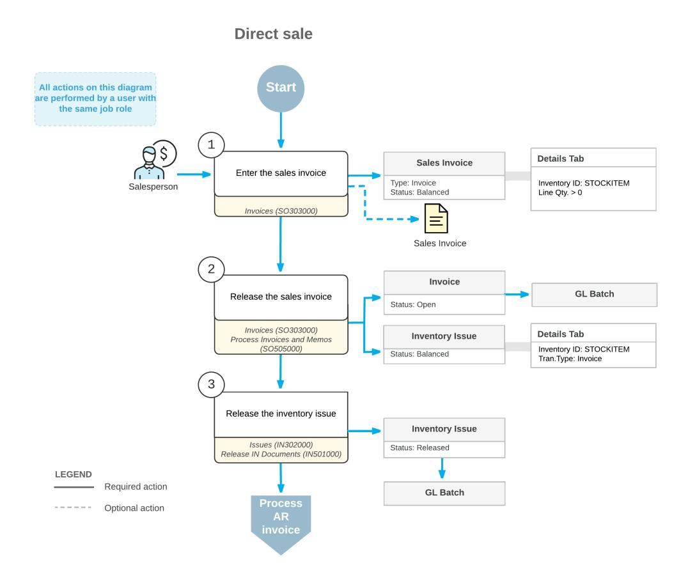

## <span id="page-398-0"></span>**Direct Sales: Direct Sale with a Link to the Related Sales Order**

The customer may want to pick up in the retail store all or a part of items included in a sales order that has been added to the system based on a phone or online sale. In this case, you need to process a direct sale through the POS system with a link to the related sales order to record in the system that some of the items from the order have been taken by the customer.

To process a direct sale, you create a sales invoice on the *[Invoices](https://help-2019r2.acumatica.com/(W(2))/Wiki/ShowWiki.aspx?wikiname=HelpRoot_FormReference&PageID=0acc9738-f141-4ea0-a2be-f34ea9d1b63a)* (SO303000) form. If the customer is picking up items as recorded in a sales order that has already been added to the system, you can add a sales line in a direct sale document that you create on the *[Invoices](https://help-2025r1.acumatica.com/Help?ScreenId=ShowWiki&pageid=0acc9738-f141-4ea0-a2be-f34ea9d1b63a)* form with a link to this sales order.

#### **Linking a Direct Sale Line to a Sales Order**

To add a line (or multiple lines) linked to a sales order, you click the **Add SO Line** button on the table toolbar of the **Details** tab of the *[Invoices](https://help-2025r1.acumatica.com/Help?ScreenId=ShowWiki&pageid=0acc9738-f141-4ea0-a2be-f34ea9d1b63a)* (SO303000) form. In the dialog box that opens, you select the line or lines of one or multiple open sales orders to be added to the sales invoice. The details of the added line or lines are filled in automatically by the system and are not available for editing. The reference number of the sales order to which a line is linked is shown in the **Order Nbr.** column of the line.

If a line of the sales invoice is linked to an open line of a sales order, on release of the sales invoice, on the *[Sales](https://help-2025r1.acumatica.com/Help?ScreenId=ShowWiki&pageid=19e4021c-1b84-49fd-be12-0320c5f1c7e5) [Orders](https://help-2025r1.acumatica.com/Help?ScreenId=ShowWiki&pageid=19e4021c-1b84-49fd-be12-0320c5f1c7e5)* (SO301000) form, the system updates the shipped quantity of the sales order line by the quantity specified in the invoice line. (Thus, the released sales invoice functions as a shipment does for the linked sales order line.) Also, on the**Shipments** tab of this form, the system inserts the reference number of the sales invoice in the **Shipment Nbr.** box.

# <span id="page-399-0"></span>**Direct Sales: Implementation Checklist**

The following sections provide details that you can use to ensure that the system is configured properly for processing direct sales, and to understand (and change, if needed) the settings that affect the processing workflow.

#### **Implementation Checklist**

Before you begin processing direct sales, you should make sure the needed features have been enabled, settings have been specified, and entities have been created, as summarized in the following checklist.

| Form                                     | Criteria to Check                                                                                                                                                             |
|------------------------------------------|-------------------------------------------------------------------------------------------------------------------------------------------------------------------------------|
| Enable/Disable Features (CS100000) form  | Make sure that the Advanced SO Invoices feature has<br>been enabled.                                                                                                          |
| Sales Orders Preferences (SO101000) form | Make sure that all necessary settings related to or<br>der management have been specified, as described in<br>Configuration of Order Management: Implementation Ac<br>tivity. |
| Customers (AR303000) form                | Make sure that all needed customers have been de<br>fined in the system, as described in Customers: Imple<br>mentation Activity.                                              |
| Stock Items (IN202500) form              | Make sure that all stock items are defined in the sys<br>tem, as described in Stock Items: Implementation Activi<br>ty.                                                       |

#### **Other Settings that Affect the Workflow**

You can affect the workflow of processing direct sales by specifying additional settings as follows:

- To cause inventory issues generated on release of sales invoices be released automatically, select the **Automatically Release IN Documents** check box on the *[Sales Orders Preferences](https://help-2025r1.acumatica.com/Help?ScreenId=ShowWiki&pageid=1817779c-413b-4187-b7fe-38e97845a1cb)* (SO101000) form.
- To cause general ledger batches generated during the processing of sales documents to be posted automatically, select the **Automatically Post on Release** check box on the *[General Ledger Preferences](https://help-2025r1.acumatica.com/Help?ScreenId=ShowWiki&pageid=e4913d06-c511-4258-a0f9-f36c1b854e6b)* (GL102000) form. For information on processing general ledger batches, see *GL [Transactions:](https://help-2025r1.acumatica.com/Help?ScreenId=ShowWiki&pageid=35393020-6269-466d-8a08-df558cd43367) General [Information](https://help-2025r1.acumatica.com/Help?ScreenId=ShowWiki&pageid=35393020-6269-466d-8a08-df558cd43367)*.

#### **Testing of Settings**

To make sure that all settings are configured correctly, we recommend that you process a direct sale for testing purposes, as described in *[Direct Sales: Process Activity](#page-400-1)*.

# <span id="page-400-1"></span><span id="page-400-0"></span>**Direct Sales: Process Activity**

In this activity, you will learn how to process a direct sale through a point-of-sale (POS) terminal, and how to link an existing sales order to the direct sale.

This activity is based on the *U100* dataset. If you are using another dataset, or if any system settings have been changed in *U100*, these changes can affect the workflow of the activity and the results of the processing. To avoid any issues, restore the *U100* dataset to its initial state.

#### **Story**

Suppose that on January 29, 2025, an individual customer (that is, a customer purchasing items for personal use rather than for a company) ordered five small jars of apple jam and 15 pounds of oranges on the company's website, and selected the option to pick up the jars and pay for them in the SweetLife retail store. When the customer submitted the order on the website, a sales order was created in Acumatica ERP.

Then on January 30, 2025, the customer comes to SweetLife store and picks up ordered apple jam (five small jars) from the store shelves; the customer also picks up one small jar of orange jam (which was not in the online sales order). For the remainder of the website order, the customer asks to have the items shipped to the customer's address. The sales manager of the SweetLife store needs to scan the goods that the customer has picked up, enter them by using the POS terminal, and collect a payment from the customer. Aer the customer pays for the picked goods, sales manager Regina Wiley needs to give him a receipt. You will act as the sales manager in performing the needed actions in the system.

#### **Configuration Overview**

In the *U100* dataset, for the purposes of this activity, the following tasks have been performed:

- On the *[Enable/Disable Features](https://help-2025r1.acumatica.com/Help?ScreenId=ShowWiki&pageid=c1555e43-1bc5-4f6f-ba9d-b323f94d8a6b)* (CS100000) form, the following features have been enabled:
  - *Inventory and Order Management*, which provides the standard functionality of inventory and order management
  - *Inventory*, which gives you the ability to maintain stock items by using forms related to the inventory functionality and to create and process sales and purchase documents that include stock items
  - *Advanced SO invoices*, which provides support for direct sales and returns and integration with POS systems
- In the SweetLife store, the integration between the store's POS system and Acumatica ERP has been configured to work as follows:
  - When a sales manager processes a sale through the POS system, the POS system creates two documents in Acumatica ERP by using the API: a sales invoice on the *[Invoices](https://help-2025r1.acumatica.com/Help?ScreenId=ShowWiki&pageid=0acc9738-f141-4ea0-a2be-f34ea9d1b63a)* (SO303000) form with all the lines from the receipt given to the customer, and a released payment on the *[Payments and Applications](https://help-2025r1.acumatica.com/Help?ScreenId=ShowWiki&pageid=ae844bf4-1aef-42cd-9e2f-49b3ee1bc8d7)* (AR302000) form that is linked to the sales invoice.
  - If any lines of a direct sale relate to an existing sales order, the POS operator selects the needed lines directly via the POS terminal when processing a sale.


In this activity, to simulate the POS functionality that occurs in a production system, you will link lines of an existing sales order to lines of the sales invoice.

- When the sales manager releases the sales invoice, Acumatica ERP creates an inventory issue that decreases the quantities of items in inventory by the quantity of the sold items.
- On the *[Customers](https://help-2025r1.acumatica.com/Help?ScreenId=ShowWiki&pageid=652929bc-9606-4056-aa6e-0c2d1147171b)* (AR303000) form, the *RETSALE (Individual Retail Customer)* customer has been defined. This is the customer account used to represent any individual customer making a retail purchase in the store.
- On the *[Stock Items](https://help-2025r1.acumatica.com/Help?ScreenId=ShowWiki&pageid=77786a70-1f1e-4d63-ad98-96f98e4fcb0e)* (IN202500) form, the *APJAM08* and *ORJAM08* stock items have been created.

### **Process Overview**

In this activity, to process a direct sale with a link to a sales order, you will create a payment on the *[Payments and](https://help-2025r1.acumatica.com/Help?ScreenId=ShowWiki&pageid=ae844bf4-1aef-42cd-9e2f-49b3ee1bc8d7) [Applications](https://help-2025r1.acumatica.com/Help?ScreenId=ShowWiki&pageid=ae844bf4-1aef-42cd-9e2f-49b3ee1bc8d7)* (AR302000) form that will later be applied to a sales invoice used to record the direct sale. Then you will create this sales invoice on the *[Invoices](https://help-2025r1.acumatica.com/Help?ScreenId=ShowWiki&pageid=0acc9738-f141-4ea0-a2be-f34ea9d1b63a)* (SO303000) form. You will add the appropriate lines to the sales invoice. Then you will apply the payment to the sales invoice and release the sales invoice.

#### **System Preparation**

Before you start processing a direct sale with a link to a sales order, you should do the following:

- 1. Launch the Acumatica ERP website with the *U100* dataset preloaded, and sign in as sales manager Regina Wiley by using the *wiley* username and the *123* password.
- 2. In the info area, in the upper-right corner of the top pane of the Acumatica ERP screen, make sure that the business date in your system is set to *1/30/2025*. If a different date is displayed, click the Business Date menu button and select *1/30/2025* on the calendar. For simplicity, in this activity, you will create and process all documents in the system on this business date.
- 3. On the Company and Branch Selection menu in the top pane of the Acumatica ERP screen, select the *SweetLife Store* branch.

#### **Step 1: Preparing a Payment**

To prepare a payment document that represents the customer's payment for the direct sale, do the following:

- 1. On the *[Payments and Applications](https://help-2025r1.acumatica.com/Help?ScreenId=ShowWiki&pageid=ae844bf4-1aef-42cd-9e2f-49b3ee1bc8d7)* (AR302000) form, add a new record.
- 2. In the Summary area, specify the following settings:
  - **Type**: *Payment*
  - **Customer**: *RETSALE*
  - **Payment Method**: *CASH*
  - **Cash Account**: *10100ST*
  - **Application Date**: *1/30/2025* (inserted by default)
  - **Application Period**: *01-2025* (inserted by default)
  - **Description**: Payment for retail sale
  - **Payment Amount**: 26.34
- 3. On the form toolbar, click **Remove Hold**.
- 4. Click **Release**.

As an alternative to the workflow described in this activity, you can enter a sales invoice prior to entering a payment.

You have created and released the payment.

#### **Step 2: Entering a Sales Invoice**

To enter a sales invoice to record the direct sale, do the following:

- 1. On the *[Invoices](https://help-2025r1.acumatica.com/Help?ScreenId=ShowWiki&pageid=0acc9738-f141-4ea0-a2be-f34ea9d1b63a)* (SO303000) form, add a new record.
- 2. In the Summary area specify the following settings:
  - **Type**: *Invoice*
  - **Customer**: *RETSALE*
  - **Date**: *1/30/2025* (inserted by default)
  - **Post Period**: *01-2025* (inserted by default)
  - **Description**: Retail sale, website order #00687 partial
- 3. On the **Details** tab, add a row for the jar of orange jam the customer picks up in the retail store, and specify the following settings:
  - **Branch**: *RETAIL*
  - **Inventory ID**: *ORJAM08*
  - **Warehouse**: *RETAIL*
  - **Quantity**: 1
  - **Unit Price**: 3.44
- 4. To add a line for the jars of apple jam in the already-entered sales order, on the table toolbar of the **Details** tab, click **Add SO Line**.
- 5. In the **Add SO Line** dialog box, which opens, select the unlabeled check box in the line with *APJAM08* item, and click **Add & Close**.

The system adds the line to the sales invoice with a link to the sales order on which the item was added. Notice that in the **OrderType** and **Order Nbr.** columns in this line, the system has inserted the type of the related sales order and the link to the order. In the sales invoice line that you have added, these columns are empty thus indicating that this line is not related to a sales order.

- 6. On the form toolbar, click **Remove Hold**; the invoice now has the *Balanced* status.
- 7. On the form toolbar, click**Save**.

#### **Step 3: Applying the Payment to the Sales Invoice**

To apply the payment to the sales invoice, do the following:

- 1. While you are still viewing the invoice on the *[Invoices](https://help-2025r1.acumatica.com/Help?ScreenId=ShowWiki&pageid=0acc9738-f141-4ea0-a2be-f34ea9d1b63a)* (SO303000) form, on the table toolbar of the **Applications** tab, click **Load Documents**. The system adds a line with the payment that you have created in Step 1 of this activity.
- 2. In the **Amount Paid** column, specify 26.34 (which is the payment amount to be applied to the invoice).
- 3. On the form toolbar, click**Save**.

#### **Step 4: Releasing the Sales Invoice**

To release the sales invoice, do the following:

- 1. While you are still viewing the sales invoice on the *[Invoices](https://help-2025r1.acumatica.com/Help?ScreenId=ShowWiki&pageid=0acc9738-f141-4ea0-a2be-f34ea9d1b63a)* (SO303000) form, click **Release** on the form toolbar. Notice that the invoice now has the *Closed* status.
- 2. On the **Details** tab, in either of the invoice lines, click the link in the **Inventory Ref. Nbr.** column.

The system opens the *[Issues](https://help-2025r1.acumatica.com/Help?ScreenId=ShowWiki&pageid=17b051f6-027d-4459-b542-65c1c1f9d0ea)* (IN302000) form in a pop-up window with the inventory issue that was generated on release of the sales invoice.

- 3. On this form, review the details of the inventory issue, and make sure that it includes both invoice lines, and it has a status of *Released*.
- 4. Return to the *[Invoices](https://help-2025r1.acumatica.com/Help?ScreenId=ShowWiki&pageid=0acc9738-f141-4ea0-a2be-f34ea9d1b63a)* (SO303000) form with the sales invoice that you have processed, and on the **Details** tab, click the **Order Nbr.** link in the *APJAM08* line to open the related sales order.
- 5. On the *[Sales Orders](https://help-2025r1.acumatica.com/Help?ScreenId=ShowWiki&pageid=19e4021c-1b84-49fd-be12-0320c5f1c7e5)* (SO301000) form, which opens in a pop-up window, review its details. On the **Details** tab, in the *APJAM08* line, notice that **Qty. on Shipments** is 5 and the **Open Qty.** is 0, which means that the line was shipped in full.
- 6. Review the**Shipments** tab. The processed sales invoice acts as a shipment for the related SO line with *APJAM08* item (see the following screenshot): On release of the sales invoice, the inventory issue that records the issuing of the items from inventory has been generated and released. The sales order retains a status of *Open*; the sales manager can process a shipment for the rest of the items to the customer's location.

| <b>Sales Orders</b>                       |                                          | SO 000029 - Individual Retail Customer      |                                          |                                        |                          |                 |                        |                         |                      |                     | <b>PINOTES</b> | <b>ACTIVITIES</b>          | <b>FILES</b>        | TOOLS $\sim$ |
|-------------------------------------------|------------------------------------------|---------------------------------------------|------------------------------------------|----------------------------------------|--------------------------|-----------------|------------------------|-------------------------|----------------------|---------------------|----------------|----------------------------|---------------------|--------------|
| $\Box$<br>뭐                               | 圎<br>$\Omega$<br>$^+$                    | Ô<br>$\overline{\mathbf{K}}$<br>$\check{~}$ | $\geq$<br>≺<br>$\rightarrow$             | <b>QUICK PROCESS</b>                   |                          |                 | <b>CREATE SHIPMENT</b> | <b>HOLD</b><br>$\cdots$ |                      |                     |                |                            |                     |              |
| * Order Type:                             | <b>SO</b>                                | Q<br>* Customer:                            |                                          | RETSALE - Individual Retail Customer O | 0                        |                 | Ordered Qty.:          | 20.00                   |                      |                     |                |                            |                     | $\sim$       |
| Order Nbr.:                               | 000029                                   | Q<br>* Location:                            | <b>MAIN - Primary Location</b>           |                                        | $\circ$<br>$\mathscr{O}$ |                 | <b>Detail Total:</b>   | 53.00                   |                      |                     |                |                            |                     |              |
| Status:                                   | Open                                     | Contact:                                    |                                          |                                        | Q<br>$\mathscr{Q}$       |                 | Line Discounts:        | 0.00                    |                      |                     |                |                            |                     |              |
| * Date:                                   | 1/29/2025                                | ⊟<br>* Project:                             | !!!!!!!!!!!!!!!!!!!!!!!!!!!!!!!!!!!!!!!! |                                        | $\rho$                   |                 | Document Dis           | 0.00                    |                      |                     |                |                            |                     |              |
| * Requested On:                           | 1/29/2025                                | Description:<br>户                           | Website order #00687                     |                                        |                          |                 | Freight Total:         | 0.00                    |                      |                     |                |                            |                     |              |
| Customer Ord                              |                                          |                                             |                                          |                                        |                          |                 | <b>Tax Total:</b>      | 3.45                    |                      |                     |                |                            |                     |              |
| External Refer                            |                                          |                                             |                                          |                                        |                          |                 | <b>Order Total:</b>    | 56.45                   |                      |                     |                |                            |                     |              |
| <b>DETAILS</b>                            | <b>TAXES</b>                             | <b>FINANCIAL</b><br><b>SHIPPING</b>         | <b>ADDRESSES</b>                         | <b>SHIPMENTS</b>                       | <b>PAYMENTS</b>          |                 | <b>RELATIONS</b>       | <b>O</b> TOTALS         |                      |                     |                |                            |                     |              |
| Ò<br>$^{+}$                               | $\mathbf{x}$<br>$\times$<br>$\mathbb{H}$ |                                             |                                          |                                        |                          |                 |                        |                         |                      |                     |                |                            |                     |              |
| $\Box$ Shipment Type<br>в<br>$\mathbf{0}$ |                                          | <b>Document Nbr.</b>                        | <b>Status</b>                            | * Shipment<br>Date                     |                          | Shipped<br>Qty. | Shipped<br>Weight      | Volume                  | Shipped Invoice Type | <b>Invoice Nbr.</b> |                | <b>Inventory Doc. Type</b> | Inventory Ref. Nbr. |              |
| $\omega$<br>D<br>Invoice                  |                                          | <b>Invoice, 000127</b>                      | Auto-Generated                           | 1/30/2025                              |                          | 5.00            | 0.000000               | 0.000000                | Invoice              | 000127              | <b>Issue</b>   |                            | 000075              |              |
|                                           |                                          |                                             |                                          |                                        |                          |                 |                        |                         |                      |                     |                |                            |                     |              |

*Figure: Partial shipment of the sales order via the sales invoice*

# <span id="page-403-0"></span>**Direct Sales: Generated Transactions**

To be able to process a direct sale of stock items, you create and process a sales invoice. The following sections describe the GL transactions generated during the complete processing of a sales invoice with a sale line.

#### **Transaction Generated for a Sales Invoice**

When you create and release a sales invoice with one sale line (that is, a line with a positive amount), the system generates the following general ledger transactions.

| Account                     | Source of Account | Debit  | Credit |
|-----------------------------|-------------------|--------|--------|
| Accounts Receivable account | Customer          | Amount | 0.00   |
| Sales account               | Item              | 0.00   | Amount |

You can view the reference number of the GL batch in the **Batch Nbr.** box on the **Financial** tab of the *[Invoices](https://help-2025r1.acumatica.com/Help?ScreenId=ShowWiki&pageid=0acc9738-f141-4ea0-a2be-f34ea9d1b63a)* (SO303000) form. You can click the link in this box to view the details of the batch on the *Journal [Transactions](https://help-2025r1.acumatica.com/Help?ScreenId=ShowWiki&pageid=dda046bc-5946-407f-88f7-1c0c966fbe72)* (GL301000) form.

#### **Transaction Generated for an Inventory Issue**

On release of the sales invoice, the system generates an inventory issue transaction with sales lines of the *Invoice* transaction type. When an inventory issue with one line of the *Invoice* type is released, the system generates the following general ledger transactions.

| Account           | Source of Account | Debit  | Credit |
|-------------------|-------------------|--------|--------|
| Inventory account | Item              | 0.00   | Amount |
| GOGS account      | Item              | Amount | 0.00   |

You can view the reference number of the GL batch in the **Batch Nbr.** box on the **Financial** tab of the *[Issues](https://help-2025r1.acumatica.com/Help?ScreenId=ShowWiki&pageid=17b051f6-027d-4459-b542-65c1c1f9d0ea)* (IN302000) form. You can click the link in this box to view the details of the batch on the *Journal [Transactions](https://help-2025r1.acumatica.com/Help?ScreenId=ShowWiki&pageid=dda046bc-5946-407f-88f7-1c0c966fbe72)* (GL301000) form.

# <span id="page-405-0"></span>**Processing Direct Returns**

This chapter describes how you can process a direct return through the point-of-sale (POS) system. For the direct return, you can specify a link to the original sales invoice.

# <span id="page-405-1"></span>**Direct Returns: General Information**

A point-of-sale (POS) system is an electronic system that is used to record the sales, payment, and return transactions of a retail store. The POS system can be operated by a cashier or can be a self-service terminal where customers perform all operations. Your organization can integrate Acumatica ERP with an external POS system for simplified processing of direct returns if the *Advanced SO Invoices* feature is enabled on the *[Enable/Disable Features](https://help-2025r1.acumatica.com/Help?ScreenId=ShowWiki&pageid=c1555e43-1bc5-4f6f-ba9d-b323f94d8a6b)* (CS100000) form.

With a *direct return*, a customer returns stock items directly to the retail store rather than shipping them. In the POS system, a direct return is processed through the creation of a credit memo—a sales-related document of the *Credit Memo* type created on the *[Invoices](https://help-2025r1.acumatica.com/Help?ScreenId=ShowWiki&pageid=0acc9738-f141-4ea0-a2be-f34ea9d1b63a)* (SO303000) form.

#### **Learning Objectives**

In this chapter, you will do the following:

- Create a credit memo (an invoice of the *Credit Memo* type) for a direct return
- Add to the credit memo a return line with a link to an original sales document
- Add to the credit memo a replacement line
- Process the direct return to completion

#### **Applicable Scenarios**

You may need to create and process a direct return in the following cases:

- A customer returns goods directly at the store. In this case, you process a credit memo in the system.
- A customer returns goods directly at the store and requests the replacement of returned items. In this case, you process either a credit memo or a sales invoice, and the document includes both return lines and replacement (sales) lines.

#### **Direct Return Process**

You use the *[Invoices](https://help-2025r1.acumatica.com/Help?ScreenId=ShowWiki&pageid=0acc9738-f141-4ea0-a2be-f34ea9d1b63a)* (SO303000) form to enter a credit memo (an invoice of the *Credit Memo* type), and you add a line for each returned or replaced item. To add a line (or multiple lines) with a link to related sales invoice, you click **Add Return Line** on the table toolbar of the **Details** tab. In the dialog box that opens, you select the invoice line or lines to be added as return lines to the document you are creating. In the added line, you can correct the quantity to be returned if partial return of the item quantity is requested (for example, if four units of the item were purchased and the customer is returning only two). For serialized items, you should add a separate line with this item and a quantity of 1 for each serial number.

To release the credit memo, you click **Release** on the More menu. The system does the following:

- Automatically generates a batch of general ledger transactions.
- Automatically generates and releases an inventory issue for the stock items, which causes the system to increase the on-hand quantity with the quantity of the returned items. For return lines, the system adds lines with the *Credit Memo* transaction type to the inventory issue.
- Makes the credit memo visible on the *[Invoices and Memos](https://help-2025r1.acumatica.com/Help?ScreenId=ShowWiki&pageid=5e6f3b27-b7af-412f-a40a-1d4f4be70cba)* (AR301000) form as an AR credit memo.

An AR credit memo on the *[Invoices and Memos](https://help-2025r1.acumatica.com/Help?ScreenId=ShowWiki&pageid=5e6f3b27-b7af-412f-a40a-1d4f4be70cba)* form is a financial document that does not contain links to the applicable shipments and sales orders, as the credit memo (an invoice of the *Credit Memo* type) does. The credit memos have the same reference number, which the system prints in the customer statement. On both the *[Invoices](https://help-2025r1.acumatica.com/Help?ScreenId=ShowWiki&pageid=0acc9738-f141-4ea0-a2be-f34ea9d1b63a)* form and the *[Invoices and Memos](https://help-2025r1.acumatica.com/Help?ScreenId=ShowWiki&pageid=5e6f3b27-b7af-412f-a40a-1d4f4be70cba)* form, you can view the link to the batch of the general ledger transactions that was generated when the credit memo was released.

#### **Workflow of a Direct Return**

For a credit memo created for processing a direct return, the typical processing involves the actions and generated documents shown in the following diagram.

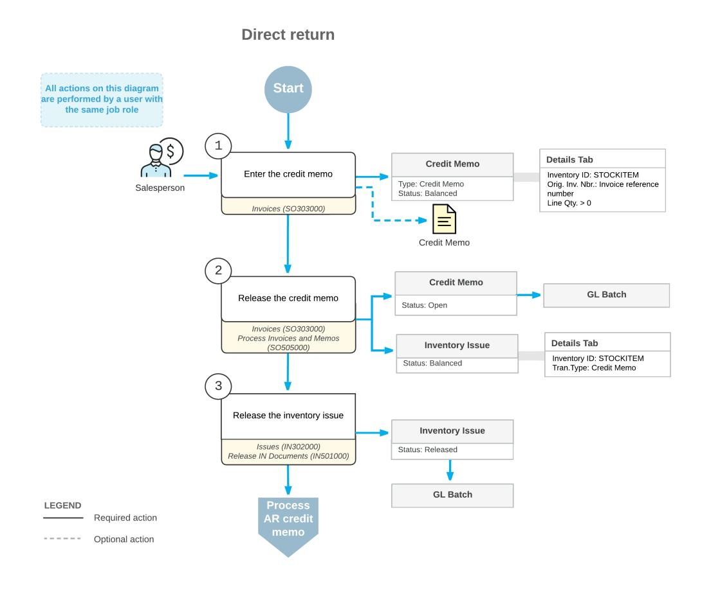

# <span id="page-406-0"></span>**Direct Returns: Direct Return with Replacement**

If a customer returns stock items directly to the retail store and requests for the exact replacement of these items, you can process both return and replacement in a single document.

#### **Processing Direct Return with Replacement**

To process a direct return with replacement, you create sales invoice or credit memo on the *[Invoices](https://help-2025r1.acumatica.com/Help?ScreenId=ShowWiki&pageid=0acc9738-f141-4ea0-a2be-f34ea9d1b63a)* (SO303000) form, and add to the document the lines with items to be returned and the lines with items for replacement.

In the created document, return and replacement lines will have different signs. In a credit memo (an invoice of the *Credit Memo* type), return lines have quantities with positive sign, and replacement lines have quantities with negative sign. In a sales invoice, return lines have quantities with negative sign, and replacement lines

have quantities with positive sign. You must select the type of the document for processing a direct return for replacement so that the total balance of the document will be equal to zero or above zero.

When the sales invoice or credit memo is released, the system generates an inventory issue transaction to update the item information in inventory. The inventory operation is specified on the line level in the generated inventory transaction, in the inventory issue. For a replacement line, an inventory issue line with the *Invoice* type is generated to issue the replacement item from inventory. For a return line, an inventory issue line with the *Credit Memo* type is generated to return an item to inventory.

Also, on release of the sales invoice or credit memo, this invoice or credit memo, respectively, becomes visible and available for further processing on the *[Invoices and Memos](https://help-2025r1.acumatica.com/Help?ScreenId=ShowWiki&pageid=5e6f3b27-b7af-412f-a40a-1d4f4be70cba)* (AR301000) form.

# <span id="page-407-0"></span>**Direct Returns: Implementation Checklist**

The following sections provide details that you can use to ensure that the system is configured properly for processing direct returns, and to understand (and change, if needed) the settings that affect the processing workflow.

#### **Implementation Checklist**

Before you begin processing direct returns, you should make sure the needed features have been enabled, settings have been specified, and entities have been created, as summarized in the following checklist.

| Form                                     | Criteria to Check                                                                                                                                                             |
|------------------------------------------|-------------------------------------------------------------------------------------------------------------------------------------------------------------------------------|
| Enable/Disable Features (CS100000) form  | Make sure that the Advanced SO Invoices feature has<br>been enabled.                                                                                                          |
| Sales Orders Preferences (SO101000) form | Make sure that all necessary settings related to or<br>der management have been specified, as described in<br>Configuration of Order Management: Implementation Ac<br>tivity. |
| Customers (AR303000) form                | Make sure that all needed customers have been de<br>fined in the system, as described in Customers: Imple<br>mentation Activity.                                              |
| Stock Items (IN202500) form              | Make sure that all stock items have been defined in the<br>system, as described in Stock Items: Implementation Ac<br>tivity.                                                  |

#### **Other Settings that Affect the Workflow**

You can affect the workflow of processing direct returns by specifying additional settings as follows:

- To cause inventory issues to be automatically generated and released on release of credit memos (invoices of the *Credit Memo* type), select the **Automatically Release IN Documents** check box on the *[Sales Orders](https://help-2025r1.acumatica.com/Help?ScreenId=ShowWiki&pageid=1817779c-413b-4187-b7fe-38e97845a1cb) [Preferences](https://help-2025r1.acumatica.com/Help?ScreenId=ShowWiki&pageid=1817779c-413b-4187-b7fe-38e97845a1cb)* (SO101000) form.
- To cause general ledger batches generated during the processing of sales documents to be posted automatically, select the **Automatically Post on Release** check box on the *[General Ledger Preferences](https://help-2025r1.acumatica.com/Help?ScreenId=ShowWiki&pageid=e4913d06-c511-4258-a0f9-f36c1b854e6b)* (GL102000) form. For information on processing general ledger batches, see *GL [Transactions:](https://help-2025r1.acumatica.com/Help?ScreenId=ShowWiki&pageid=35393020-6269-466d-8a08-df558cd43367) General [Information](https://help-2025r1.acumatica.com/Help?ScreenId=ShowWiki&pageid=35393020-6269-466d-8a08-df558cd43367)*.

#### **Testing of Settings**

To make sure that all settings are configured correctly, we recommend that you process a direct return for testing purposes, as described in *[Direct Returns: Process Activity](#page-408-1)*.

# <span id="page-408-1"></span><span id="page-408-0"></span>**Direct Returns: Process Activity**

In this activity, you will learn how to process a direct return of stock items through a point-of-sale (POS) terminal, and how to process a replacement of the returned items.

This activity is based on the *U100* dataset. If you are using another dataset, or if any system settings have been changed in *U100*, these changes can affect the workflow of the activity and the results of the processing. To avoid any issues, restore the *U100* dataset to its initial state.

#### **Story**

Suppose that on January 30, 2025, an employee of the small retail customer FourStar Coffee & Sweets Shop came to the SweetLife store and asked for an exact replacement of a large jar of apple jam that is leaking. This jar is one of ten jars that were bought two days ago, on January 28, 2025.

Acting as the sales manager of the SweetLife company, you need to process the return of the jar and the sale of the new jar by using the POS terminal. The previous sale, dated January 28, 2025, was recorded through the sales invoice (created automatically through the integration of the POS system and Acumatica ERP), which was paid in full and now has the *Closed* status. You need to replace the inventory item with the same item at the same price, so that no payment needs to be processed.

#### **Configuration Overview**

In the *U100* dataset, for the purposes of this activity, the following tasks have been performed:

- On the *[Enable/Disable Features](https://help-2025r1.acumatica.com/Help?ScreenId=ShowWiki&pageid=c1555e43-1bc5-4f6f-ba9d-b323f94d8a6b)* (CS100000) form, the following features have been enabled:
  - *Inventory and Order Management*, which provides the standard functionality of inventory and order management
  - *Inventory*, which gives you the ability to maintain stock items by using forms related to the inventory functionality and to create and process sales and purchase documents that include stock items
  - *Advanced SO invoices*, which provides support for direct sales and returns and integration with POS systems
- In the SweetLife store, the integration between the store's POS system and Acumatica ERP has been configured to work as follows:
  - When the sales manager processes a return through the POS system, the POS system creates an invoice of the *Credit Memo* type with the item or items being returned on the *[Invoices](https://help-2025r1.acumatica.com/Help?ScreenId=ShowWiki&pageid=0acc9738-f141-4ea0-a2be-f34ea9d1b63a)* (SO303000) form.
  - If any lines of a direct return relate to an existing sales order, the POS operator selects the needed order directly via the terminal when processing a return.


In this activity, to simulate the POS functionality that occurs in a production system, you will add a return line with a link to the original sales invoice.

• To process a replacement, the sales manager adds to this credit memo a line with the same inventory item or items and a quantity with the opposite sign.

- When the sales manager releases the credit memo, Acumatica ERP creates an inventory issue that includes two lines with different operation types: one line adds the returned item or items to inventory, and another line issues the replacement item or items from inventory.
- On the *[Customers](https://help-2025r1.acumatica.com/Help?ScreenId=ShowWiki&pageid=652929bc-9606-4056-aa6e-0c2d1147171b)* (AR303000) form, the *COFFEESHOP* customer has been created.
- On the *[Stock Items](https://help-2025r1.acumatica.com/Help?ScreenId=ShowWiki&pageid=77786a70-1f1e-4d63-ad98-96f98e4fcb0e)* (IN202500) form, the *APJAM96* stock item has been created.
- On the *[Invoices](https://help-2025r1.acumatica.com/Help?ScreenId=ShowWiki&pageid=0acc9738-f141-4ea0-a2be-f34ea9d1b63a)* (SO303000) form, the sales invoice for which you will process a return has been entered into the system.

#### **Process Overview**

In this activity, to handle a direct return, you will create a credit memo on the *[Invoices](https://help-2025r1.acumatica.com/Help?ScreenId=ShowWiki&pageid=0acc9738-f141-4ea0-a2be-f34ea9d1b63a)* (SO303000) form. You will add the appropriate lines to the credit memo, some of which are linked to the original sales order and some of which are for replacement items and have a negative quantity. Then you will release the invoice to process both the receipt of returned items to inventory and the issue of replacement items from inventory.

#### **System Preparation**

Before you start replacing the inventory item with the same item at the same price, do the following:

- 1. Launch the Acumatica ERP website with the *U100* dataset preloaded, and sign in as sales manager Joseph Becher by using the *becher* username and the *123* password.
- 2. In the info area, in the upper-right corner of the top pane of the Acumatica ERP screen, make sure that the business date in your system is set to *1/30/2025*. If a different date is displayed, click the Business Date menu button and select *1/30/2025* on the calendar. For simplicity, in this activity, you will create and process all documents in the system on this business date.

#### **Step 1: Entering a Credit Memo**

To enter a credit memo, do the following:

- 1. On the *[Invoices](https://help-2025r1.acumatica.com/Help?ScreenId=ShowWiki&pageid=0acc9738-f141-4ea0-a2be-f34ea9d1b63a)* (SO303000) form, add a new record.
- 2. In the Summary area, specify the following settings:
  - **Type**: *Credit Memo*
  - **Customer**: *COFFEESHOP*
  - **Date**: *1/30/2025*
  - **Post Period**: *01-2025*
  - **Description**: Replacement of the leaking jar
- 3. On the form toolbar, click **Remove Hold**. Notice that the credit memo has the *Balanced* status.

#### **Step 2: Adding the Return Line**

To add a line with the item to be returned, do the following:

- 1. While you are still viewing the credit memo on the *[Invoices](https://help-2025r1.acumatica.com/Help?ScreenId=ShowWiki&pageid=0acc9738-f141-4ea0-a2be-f34ea9d1b63a)* (SO303000) form, on the table toolbar of the **Details** tab, click **Add Return Line**.
- 2. In the **Add Return Line** dialog box, which opens, select the unlabeled check box in the line dated *1/28/2025* with the *APJAM96* item, and click **Add & Close**. The system adds the return line to the credit memo and closes the dialog box.
- 3. In the line added to the credit memo, change the **Quantity** to 1 (because only one of the jars is being returned). In the **Orig. Inv. Nbr.** column in the line, notice that the system has inserted the reference number of the original invoice for which the return is being performed.

4. On the form toolbar, click**Save**.

#### **Step 3: Adding the Replacement Line**

To add the line with the replacement item the credit memo, do the following:

- 1. While you are still viewing the credit memo on the *[Invoices](https://help-2025r1.acumatica.com/Help?ScreenId=ShowWiki&pageid=0acc9738-f141-4ea0-a2be-f34ea9d1b63a)* (SO303000) form, on the **Details** tab, add one more line (for the replacement item) with the following settings:
  - **Inventory ID**: *APJAM96*
  - **Warehouse**: *RETAIL*
  - **Quantity**: -1
    - The quantity is negative because the item is to be issued from inventory.
  - **Unit Price**: 45.15 (the same as in the line with the item being returned)
- 2. On the form toolbar, click**Save**.

#### **Step 4: Releasing the Credit Memo**

To release the credit memo, do the following:

1. While you are still viewing the credit memo on the *[Invoices](https://help-2025r1.acumatica.com/Help?ScreenId=ShowWiki&pageid=0acc9738-f141-4ea0-a2be-f34ea9d1b63a)* (SO303000) form, on the form toolbar, click **Release**.

Notice that the status of the credit memo is now *Closed*. On release of the credit memo, the returned item has been received to inventory, and the replacement item has been issued from inventory. Because the price of the returned item was the same as the price of the replacement item, the credit memo balance is *0.00*; thus, no payment needs to be processed.

- 2. On the **Details** tab, in either of the lines, click the link in the **Inventory Ref. Nbr.** column. On the *[Issues](https://help-2025r1.acumatica.com/Help?ScreenId=ShowWiki&pageid=17b051f6-027d-4459-b542-65c1c1f9d0ea)* (IN302000) form, the system opens the inventory issue that was generated on release of the credit memo.
- 3. On this form, review the settings of the inventory issue, and make sure the inventory issue has the *Released* status, as shown in the following screenshot. Notice that the line with the returned item has the *Credit Memo* transaction type, while the line with the replacement item has the *Invoice* transaction type.

| <b>Issues</b><br>000076 |                |                                           |                                                          |                          |             |                      |            |                   | $\bigcap$ NOTES   | <b>ACTIVITIES</b><br><b>FILES</b> | TOOLS $\sim$        |
|-------------------------|----------------|-------------------------------------------|----------------------------------------------------------|--------------------------|-------------|----------------------|------------|-------------------|-------------------|-----------------------------------|---------------------|
| 뭐                       |                | $\Xi$<br>一面<br>$\pm$<br>$\Omega$          | $\circ$<br>$\mathsf{K}$<br>$\sim$ $\sim$<br>$\checkmark$ | $\geq$<br>$\rightarrow$  | $\cdots$    |                      |            |                   |                   |                                   |                     |
|                         |                | Reference Nbr.:<br>000076                 | Q<br>External Ref.:                                      |                          |             | Total Qty.:          |            | 2.00              |                   |                                   | $\hat{\phantom{a}}$ |
|                         | Status:        | Released                                  |                                                          |                          |             | <b>Total Amount:</b> |            | 90.30             |                   |                                   |                     |
| Date:                   |                | 1/30/2025                                 |                                                          |                          |             | <b>Total Cost:</b>   |            | 0.00              |                   |                                   |                     |
|                         |                | Post Period:<br>01-2025                   | Description:                                             |                          |             |                      |            |                   |                   |                                   |                     |
|                         |                |                                           |                                                          |                          |             |                      |            |                   |                   |                                   |                     |
|                         | <b>DETAILS</b> | <b>FINANCIAL</b>                          |                                                          |                          |             |                      |            |                   |                   |                                   |                     |
|                         |                |                                           |                                                          |                          |             |                      |            |                   |                   |                                   |                     |
| Ò                       |                | <b>LINE DETAILS</b><br>$^{+}$<br>$\times$ | ADD ITEMS                                                | <b>INVENTORY SUMMARY</b> | $\vdash$    | $\mathbf{N}$<br>土    |            |                   |                   |                                   |                     |
| B<br>0                  |                | $\Box$ Tran. Type                         | <b>Inventory ID</b>                                      | Warehouse                | Location    | Quantity UOM         |            | <b>Unit Price</b> | <b>Ext. Price</b> | <b>Unit Cost</b>                  | Ext. Cost           |
|                         |                |                                           |                                                          |                          |             |                      |            |                   |                   |                                   |                     |
| $\mathbf{0}$            | $\Box$         | <b>Credit Memo</b>                        | APJAM96                                                  | <b>RETAIL</b>            | <b>MAIN</b> | 1.00                 | PIECE      | 45.1500           | 45.15             | 0.0000                            | 0.00                |
| 0                       | D              | Invoice                                   | APJAM96                                                  | <b>RETAIL</b>            | <b>MAIN</b> |                      | 1.00 PIECE | 45.1500           | 45.15             | 0.0000                            | 0.00                |
|                         |                |                                           |                                                          |                          |             |                      |            |                   |                   |                                   |                     |

*Figure: Inventory document generated for processing the direct return*

# <span id="page-411-0"></span>**Direct Returns: Generated Transactions**

To be able to process a direct return of stock items, you create and process a credit memo, which is an invoice of the *Credit Memo* type on the *[Invoices](https://help-2025r1.acumatica.com/Help?ScreenId=ShowWiki&pageid=0acc9738-f141-4ea0-a2be-f34ea9d1b63a)* (SO303000) form. The following sections describe the GL transactions generated during the complete processing of a credit memo with a return line.

### **Transactions Generated for a Credit Memo**

When you create and release a credit memo with one return line (that is, a line with a positive amount), the system generates the following general ledger transactions.

| Account                        | Source of Account | Debit  | Credit |
|--------------------------------|-------------------|--------|--------|
| Accounts Receivable<br>account | Customer          | 0.00   | Amount |
| Sales account                  | Item              | Amount | 0.00   |

You can view the reference number of the GL batch in the **Batch Nbr.** box on the **Financial** tab of the *[Invoices](https://help-2025r1.acumatica.com/Help?ScreenId=ShowWiki&pageid=0acc9738-f141-4ea0-a2be-f34ea9d1b63a)* (SO303000) form. You can click the link in this box to view the details of the batch on the *Journal [Transactions](https://help-2025r1.acumatica.com/Help?ScreenId=ShowWiki&pageid=dda046bc-5946-407f-88f7-1c0c966fbe72)* (GL301000) form.

#### **Transactions Generated for an Inventory Issue**

On release of the credit memo, the system generates an inventory issue transaction with return lines of the *Credit Memo* transaction type. When an inventory issue with one line of the *Credit Memo* type is released, the system generates the following general ledger transactions.

| Account           | Source of Account | Debit  | Credit |
|-------------------|-------------------|--------|--------|
| Inventory account | Item              | Amount | 0.00   |
| COGS account      | Item              | 0.00   | Amount |

You can view the reference number of the GL batch in the **Batch Nbr.** box on the **Financial** tab of the *[Issues](https://help-2025r1.acumatica.com/Help?ScreenId=ShowWiki&pageid=17b051f6-027d-4459-b542-65c1c1f9d0ea)* (IN302000) form. You can click the link in this box to view the details of the batch on the *Journal [Transactions](https://help-2025r1.acumatica.com/Help?ScreenId=ShowWiki&pageid=dda046bc-5946-407f-88f7-1c0c966fbe72)* (GL301000) form.

# <span id="page-412-0"></span>**Processing Prepayments for Purchase Orders**

If a vendor requires your company to pay a part of the order amount in advance, you can process a prepayment for the purchase order, which will later be applied to the corresponding AP bill. The topics of this chapter explain how you can prepare and process prepayments of purchase orders.

# <span id="page-412-1"></span>**Prepayments for Purchase Orders: General Information**

Different vendors have different conditions for supplying goods and services. A vendor may request that your company pay a part of the order amount in advance before those goods or services are provided. To support this process in Acumatica ERP, you can process a prepayment for the purchase order; this prepayment is later automatically applied to the AP bill prepared for the vendor of goods or services.

#### **Learning Objectives**

In this chapter, you will do the following:

- Change the default prepayment amount for a vendor
- Create a prepayment request for a purchase order
- Create a prepayment from a prepayment request
- Apply a prepayment to an accounts payable bill created for a purchase order
- Process a single prepayment for a purchase order
- Process multiple prepayments for a purchase order

#### **Applicable Scenarios**

You may want to create and process a prepayment in the following cases:

- You are processing a new purchase order for the vendor that requires a partial payment in advance before the ordered items will be sent.
- You have corrected the details of an existing purchase order that was already prepaid, so that an extra prepayment amount needs to be processed.

#### **Prepayments for Purchase Orders**

To process a prepayment in the system, you have to first create and release the prepayment request, which denotes the vendor's request for prepayment in the system. A prepayment request is not a financial document; it is an internal document that can be approved (if required in your system) before the prepayment is actually paid to the vendor.

In general, the *[Purchase Orders](https://help-2025r1.acumatica.com/Help?ScreenId=ShowWiki&pageid=5565686c-96c4-4bfa-a51d-9a2566baa808)* (PO301000) form is the starting point for creating a prepayment request for a particular purchase order. You can create prepayment requests for purchase orders of the *Normal* and *Drop-Ship* types.

On the More menu of the *[Purchase Orders](https://help-2025r1.acumatica.com/Help?ScreenId=ShowWiki&pageid=5565686c-96c4-4bfa-a51d-9a2566baa808)* form, you click **Create Prepayment Request**. On the *[Bills and](https://help-2025r1.acumatica.com/Help?ScreenId=ShowWiki&pageid=956b4e51-3078-4d2d-85b3-65c080d95234) [Adjustments](https://help-2025r1.acumatica.com/Help?ScreenId=ShowWiki&pageid=956b4e51-3078-4d2d-85b3-65c080d95234)* (AP301000) form, which opens, you specify the quantity and extended cost in each of the prepayment request lines. The total amount of prepayments prepared for a purchase order cannot exceed the total amount of the purchase order. Aer you have specified the details, you release the prepayment request. A prepayment request does not generate general ledger transactions and does not change the vendor balance.

If approval is required in your system, the prepayment request must be approved on the *[Approve Bills](https://help-2025r1.acumatica.com/Help?ScreenId=ShowWiki&pageid=76c4ad15-d7b5-477b-a514-f7dc93faf2be) [for Payment](https://help-2025r1.acumatica.com/Help?ScreenId=ShowWiki&pageid=76c4ad15-d7b5-477b-a514-f7dc93faf2be)* (AP502000) form before it can be paid. For details on approval configuration, see *[Approval](https://help-2025r1.acumatica.com/Help?ScreenId=ShowWiki&pageid=d2db53f8-d3ed-47fd-b34e-c743a59a4b83) [Configuration: Approval Maps](https://help-2025r1.acumatica.com/Help?ScreenId=ShowWiki&pageid=d2db53f8-d3ed-47fd-b34e-c743a59a4b83)*.

To create a prepayment document from a prepayment request, you need to pay the prepayment. A prepayment request is always paid in the full amount; you cannot pay it partially. To pay the prepayment, you prepare an accounts payable payment on the *[Checks and Payments](https://help-2025r1.acumatica.com/Help?ScreenId=ShowWiki&pageid=81659f97-cb14-4a27-bc3e-0f67b3945613)* (AP302000) form, apply it to the prepayment request, and release the payment along with the application; depending on the system settings, processing a payment may require you to print it before releasing it. Aer you apply the AP payment to the prepayment request, the system changes the status of this payment to *Closed* and changes the status of the original prepayment to *Open*. Also, a document with the *Prepayment* type and the same reference number as that of the original prepayment request becomes available on the *[Checks and Payments](https://help-2025r1.acumatica.com/Help?ScreenId=ShowWiki&pageid=81659f97-cb14-4a27-bc3e-0f67b3945613)* form. Then you can apply this prepayment to bills and credit adjustments prepared for the vendor of the goods.

Once the purchased items have been received to inventory, you create a purchase receipt on the *[Purchase Receipts](https://help-2025r1.acumatica.com/Help?ScreenId=ShowWiki&pageid=d9901c8d-486d-45ed-8088-ea3d8ee3af19)* (PO302000) form and an accounts payable bill on the *[Bills and Adjustments](https://help-2025r1.acumatica.com/Help?ScreenId=ShowWiki&pageid=956b4e51-3078-4d2d-85b3-65c080d95234)* form.

Depending on the vendor's settings, you may need to process the bill before the receipt or the receipt before the bill. The prepared prepayment document is automatically applied to the accounts payable bill; on release of the AP bill, the prepayment is applied to the bill.

On release of the prepayment application to the bill, a batch of general ledger transactions is posted. The open balance of the bill is decreased by the balance of the applied prepayment.

#### **Workflow of Purchase with Prepayment**

The following diagram illustrates the workflow of processing a purchase with prepayment.

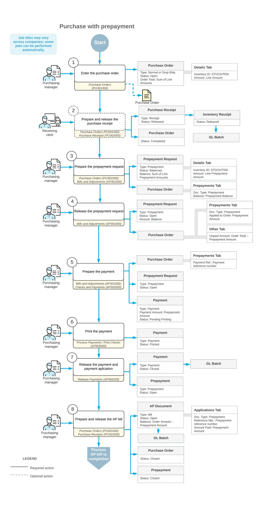

# <span id="page-415-0"></span>**Prepayments for Purchase Orders: Implementation Checklist**

The following sections provide details you can use to ensure that the system is configured properly for the processing of prepayments for purchases of stock items, and to understand (and change, if needed) the settings that affect the processing workflow.

#### **Implementation Checklist**

We recommend that before you initially process prepayments for purchase orders, you make sure the needed features have been enabled, settings have been specified, and entities have been created, as summarized in the following checklist.

| Form                                        | Criteria to Check                                                                                                                                                                      |
|---------------------------------------------|----------------------------------------------------------------------------------------------------------------------------------------------------------------------------------------|
| Purchase Orders Preferences (PO101000) form | Make sure that all necessary settings related to pur<br>chase order management have been specified as de<br>scribed in Configuration of Order Management: Imple<br>mentation Activity. |
| Vendors (AP303000) form                     | Make sure that all needed vendors have been config<br>ured as described in Vendors: General Information.                                                                               |

#### **Vendor Settings Checklist**

Make sure that all needed vendors have been configured as described in *Vendors: General [Information](https://help-2025r1.acumatica.com/Help?ScreenId=ShowWiki&pageid=34b5a8f9-85fa-4a79-b68a-ae02e611b76f)*. For a vendor, on the *[Vendors](https://help-2025r1.acumatica.com/Help?ScreenId=ShowWiki&pageid=a9584be3-f2bd-4d67-80d4-8041d809df56)* (AP303000) form, you can specify the following settings, which affects the processing of prepayments.

| Tab              | Criteria to Check                                                            | Notes                                                                                                                                |
|------------------|------------------------------------------------------------------------------|--------------------------------------------------------------------------------------------------------------------------------------|
| GL Accounts      | Specify the prepayment account in<br>the Prepayment Account box.             | If you do not specify a separate ac<br>count for prepayments, the vendor<br>prepayments will be debited to the<br>vendor AP account. |
| Payment Settings | Specify the default prepayment<br>percent in the Prepayment Per<br>cent box. |                                                                                                                                      |

To learn how to configure the settings, you can complete *[Prepayments for Purchase Orders: Implementation Activity](#page-417-1)*.

#### **Other Settings That Affect the Workflow**

You can affect the workflow of processing purchases with prepayments by specifying additional settings as follows:

• To reduce input errors when users enter orders, set up the validation of order totals by selecting the **For Normal and Standard Orders** check box in the**ValidateTotal on Entry** section of the *[Purchase Orders](https://help-2025r1.acumatica.com/Help?ScreenId=ShowWiki&pageid=13d09c43-8696-4f92-ad9b-3d0209ee3d9b) [Preferences](https://help-2025r1.acumatica.com/Help?ScreenId=ShowWiki&pageid=13d09c43-8696-4f92-ad9b-3d0209ee3d9b)* (PO101000) form (**GeneralSettings** tab). If this check box is selected, when a user creates a new purchase order on the *[Purchase Orders](https://help-2025r1.acumatica.com/Help?ScreenId=ShowWiki&pageid=5565686c-96c4-4bfa-a51d-9a2566baa808)* (PO301000) form, to take the order off hold, the user must enter the order total in the **ControlTotal** box aer verifying the order details.

- To cause an accounts payable bill to be created automatically on release of a purchase receipt by default, select the **Create Bill on Receipt Release** check box on the *[Purchase Orders Preferences](https://help-2025r1.acumatica.com/Help?ScreenId=ShowWiki&pageid=13d09c43-8696-4f92-ad9b-3d0209ee3d9b)* form. In this case, when a user creates a purchase receipt on the *[Purchase Receipts](https://help-2025r1.acumatica.com/Help?ScreenId=ShowWiki&pageid=d9901c8d-486d-45ed-8088-ea3d8ee3af19)* (PO302000) form, the system automatically selects the **Create Bill** check box. (The user can clear this check box for a particular bill.)
- To cause the system to automatically release accounts payable bills that are generated on release of purchase receipts, select the **Release AP Documents Automatically** check box on the *[Purchase Orders](https://help-2025r1.acumatica.com/Help?ScreenId=ShowWiki&pageid=13d09c43-8696-4f92-ad9b-3d0209ee3d9b) [Preferences](https://help-2025r1.acumatica.com/Help?ScreenId=ShowWiki&pageid=13d09c43-8696-4f92-ad9b-3d0209ee3d9b)* form. For information on processing bills, see *[AP Bills: General Information](https://help-2025r1.acumatica.com/Help?ScreenId=ShowWiki&pageid=1ea1e770-b81c-437e-831f-64f702f968f4)*.
- To cause purchase receipts to be created with the *On Hold* status (so that users can verify them before processing them further), select the **Hold Receipts on Entry** check box on the *[Purchase Orders Preferences](https://help-2025r1.acumatica.com/Help?ScreenId=ShowWiki&pageid=13d09c43-8696-4f92-ad9b-3d0209ee3d9b)* form.
- To cause the system to automatically release inventory receipts generated on release of purchase receipts, select the **Release IN Documents Automatically** check box on the *[Purchase Orders Preferences](https://help-2025r1.acumatica.com/Help?ScreenId=ShowWiki&pageid=13d09c43-8696-4f92-ad9b-3d0209ee3d9b)* form.
- To cause the system to automatically post general ledger batches generated during processing purchase documents, select the **Automatically Post on Release** check box on the *[General Ledger Preferences](https://help-2025r1.acumatica.com/Help?ScreenId=ShowWiki&pageid=e4913d06-c511-4258-a0f9-f36c1b854e6b)* (GL102000) form. For information on processing general ledger batches, see *GL [Transactions:](https://help-2025r1.acumatica.com/Help?ScreenId=ShowWiki&pageid=35393020-6269-466d-8a08-df558cd43367) General [Information](https://help-2025r1.acumatica.com/Help?ScreenId=ShowWiki&pageid=35393020-6269-466d-8a08-df558cd43367)*.

#### **Validation of Configuration**

To make sure that all settings are configured correctly, you can process a prepayment for a purchase order, as described in *[Prepayments](#page-418-1) for Purchase Orders: To Process a Prepayment*.

# <span id="page-416-0"></span>**Prepayments for Purchase Orders: Calculation of the Prepayment Amount**

In some cases, you need to prepay a percent of the cost of a purchase order before the vendor produces, ships, or delivers the goods to your company. While you are working with the purchase order on the *[Purchase Orders](https://help-2025r1.acumatica.com/Help?ScreenId=ShowWiki&pageid=5565686c-96c4-4bfa-a51d-9a2566baa808)* (PO301000) form, you can click **Create Prepayment Request** on the More menu. The system opens the *[Bills and](https://help-2025r1.acumatica.com/Help?ScreenId=ShowWiki&pageid=956b4e51-3078-4d2d-85b3-65c080d95234) [Adjustments](https://help-2025r1.acumatica.com/Help?ScreenId=ShowWiki&pageid=956b4e51-3078-4d2d-85b3-65c080d95234)* (AP301000) form with a new prepayment request linked to the purchase order, with the lines of the purchase order copied to the **Details** tab and the prepayment amount inserted in each prepayment request line.

To simplify the creation of prepayment requests for purchase orders, you can define a standard percentage of the prepayment amount for the applicable records (those that correspond to a particular requirement for a prepayment); these default percentages can be used in the appropriate situations for calculating the prepayment amount in prepayment request lines. You can specify a default prepayment percent for the following records:

- A particular purchase order: On the**Vendor Info** tab of the *[Purchase Orders](https://help-2025r1.acumatica.com/Help?ScreenId=ShowWiki&pageid=5565686c-96c4-4bfa-a51d-9a2566baa808)* form, specify this percent in the **Prepayment Percent** box.
- A stock item purchased by a specific vendor: On the**Vendors** tab of the *[Stock Items](https://help-2025r1.acumatica.com/Help?ScreenId=ShowWiki&pageid=77786a70-1f1e-4d63-ad98-96f98e4fcb0e)* (IN202500) form, in a row with this vendor selected, specify this percent in the **Prepayment Percent** column.
- A non-stock item purchased by a specific vendor: On the**Vendors** tab of the *[Non-Stock Items](https://help-2025r1.acumatica.com/Help?ScreenId=ShowWiki&pageid=bf68dd4f-63d4-460d-8dc0-9152f2bd6bf1)* (IN202000) form, in a row with this vendor selected, specify this percent in the **Prepayment Percent** column.
- A particular vendor: Specify this percent in the **Prepayment Percent** box on the **Payment** tab of the *[Vendors](https://help-2025r1.acumatica.com/Help?ScreenId=ShowWiki&pageid=a9584be3-f2bd-4d67-80d4-8041d809df56)* (AP303000) form.

For each line of the prepayment request, the system calculates the value in the **Prepayment Amount** column by using the value in the **Prepayment Percent** column. The system checks related system settings in the following order and uses the first source value it finds:

- 1. If a default prepayment percent is specified in the settings of a purchase order for which the prepayment request is prepared, the system inserts this percentage for the line (regardless of the applicable vendor and item settings).
- 2. If a default prepayment percent is specified in the settings of the stock item or non-stock item selected in the line, the system inserts this percentage for this line (regardless of the applicable vendor settings).

3. If a default prepayment percent is specified for the vendor selected for this prepayment, the system inserts this percentage for this line.

If a default prepayment percent is not specified for any of these system settings, the system inserts *100* as the default value, which indicates that the full amount of the purchase order line should be inserted in the related line of a prepayment request.

You can manually override the default prepayment percent that the system has inserted into any line to change the prepayment amount on the *[Bills and Adjustments](https://help-2025r1.acumatica.com/Help?ScreenId=ShowWiki&pageid=956b4e51-3078-4d2d-85b3-65c080d95234)* form; also, you can delete any of the lines copied from the original purchase order to exclude them from prepayment.

# <span id="page-417-1"></span><span id="page-417-0"></span>**Prepayments for Purchase Orders: Implementation Activity**

In the following implementation activity, you will learn how to specify a default prepayment percentage for a particular vendor and stock item.

This activity is based on the *U100* dataset. If you are using another dataset, or if any system settings have been changed in *U100*, these changes can affect the workflow of the activity and the results of the processing. To avoid any issues, restore the *U100* dataset to its initial state.

#### **Story**

Suppose that SweetLife buys eco-friendly reusable bags with personalized logos from the Ginkgo Tree Printing Company vendor. The vendor notifies the SweetLife company that future orders will need to be partially paid in advance before the vendor starts to manufacture the goods for the order. The vendor requests that your company pay 15% of any order in advance, and for ecobags, the vendor instead requests a prepayment of 25%. Acting as implementation manager Kimberly Gibbs, you need to specify the vendor settings so that the prepayment amount will be automatically filled in for each newly created prepayment.

#### **System Preparation**

Before you start making changes to the settings of the vendor and stock item, you should launch the Acumatica ERP website with the *U100* dataset preloaded, and sign in as implementation manager Kimberly Gibbs by using the *gibbs* username and the *123* password.

#### **Step 1: Editing the Vendor Settings**

To update the vendor account with the prepayment percent, do the following:

- 1. On the *[Vendors](https://help-2025r1.acumatica.com/Help?ScreenId=ShowWiki&pageid=a9584be3-f2bd-4d67-80d4-8041d809df56)* (AP303000) form, open the *GINKGO* vendor.
- 2. On the **Payment** tab, specify 15 in the **Prepayment Percent** box.
- 3. On the **GL Accounts** tab, make sure that *13200 - Deposit to Vendor* is selected in the **Prepayment Account** box.
- 4. On the form toolbar, click**Save**.

#### **Step 2: Editing the Stock Item Settings**

To specify the prepayment percent of the *ECOBAG* stock item when it is included in a purchase order for the *GINKGO* vendor, do the following:

- 1. On the *[Stock Items](https://help-2025r1.acumatica.com/Help?ScreenId=ShowWiki&pageid=77786a70-1f1e-4d63-ad98-96f98e4fcb0e)* (IN202500) form, open the *ECOBAG* item.
- 2. On the **Vendors** tab, click **Add Row**.

- 3. Specify the following settings in the added row:
  - **Active**: Selected
  - **Vendor ID**: *GINKGO*
  - **Prepayment Percent**: 25.
- 4. On the form toolbar, click**Save**.

You have specified the default prepayment settings for the *GINKGO* vendor and item-specific prepayment settings for the *ECOBAG* stock item.

# <span id="page-418-1"></span><span id="page-418-0"></span>**Prepayments for Purchase Orders: To Process a Prepayment**

In the following activity, you will create a prepayment request for a purchase order, make a payment based on the prepayment request, and apply the prepayment to an AP bill.

This activity is based on the *U100* dataset. If you are using another dataset, or if any system settings have been changed in *U100*, these changes can affect the workflow of the activity and the results of the processing. To avoid any issues, restore the *U100* dataset to its initial state.

#### **Story**

Suppose that the SweetLife Fruits & Jams company has ordered a large quantity of eco-friendly reusable bags with the company's logo for SweetLife's needs. The Ginkgo Tree Printing Company vendor has requested an advance payment in the amount of \$500.

Acting as purchasing manager Regina Wiley, you have to enter the purchase order and record a request for a prepayment. You then need to make a payment for the prepayment request, process the purchase order to completion, and make sure that the prepayment was applied to the bill created for the purchase order.

#### **Configuration Overview**

In the *U100* dataset, for the purposes of this activity, the following tasks have been performed:

- On the *[Enable/Disable Features](https://help-2025r1.acumatica.com/Help?ScreenId=ShowWiki&pageid=c1555e43-1bc5-4f6f-ba9d-b323f94d8a6b)* (CS100000) form, the following features have been enabled:
  - *Inventory and Order Management*, which provides the standard functionality of inventory and order management
  - *Inventory*, which gives you the ability to maintain stock items by using forms related to the inventory functionality and to create and process sales and purchase documents that include stock items
- On the *[Vendors](https://help-2025r1.acumatica.com/Help?ScreenId=ShowWiki&pageid=a9584be3-f2bd-4d67-80d4-8041d809df56)* (AP303000) form, the *GINKGO (Ginkgo Tree Printing Company)* vendor has been created. The **Allow AP Bill Before Receipt** check box has been selected for the vendor on the **PurchaseSettings** tab (which means that for this vendor, accounts payable bills can be processed before purchase receipts).
- On the *[Stock Items](https://help-2025r1.acumatica.com/Help?ScreenId=ShowWiki&pageid=77786a70-1f1e-4d63-ad98-96f98e4fcb0e)* (IN202500) form, the *ECOBAG* stock item has been created.

#### **Process Overview**

In this activity, you will start with creating a purchase order on the *[Purchase Orders](https://help-2025r1.acumatica.com/Help?ScreenId=ShowWiki&pageid=5565686c-96c4-4bfa-a51d-9a2566baa808)* (PO301000) form and adding the purchased item to it. Then you will create a prepayment request by clicking **Create Prepayment Request** on the More menu; on the *[Bills and Adjustments](https://help-2025r1.acumatica.com/Help?ScreenId=ShowWiki&pageid=956b4e51-3078-4d2d-85b3-65c080d95234)* (AP301000) form, you will specify the prepayment amount for the line copied from the purchase order. To create a prepayment document from the prepayment request, you will pay the prepayment by clicking **Pay/Apply** on the More menu of the *[Bills and Adjustments](https://help-2025r1.acumatica.com/Help?ScreenId=ShowWiki&pageid=956b4e51-3078-4d2d-85b3-65c080d95234)* form; you will review the prepared payment on the *[Checks and Payments](https://help-2025r1.acumatica.com/Help?ScreenId=ShowWiki&pageid=81659f97-cb14-4a27-bc3e-0f67b3945613)* (AP302000) form. Then you will print a check and release the payment.

To complete the processing of the purchase order, you will create a purchase receipt for the ordered items on the *[Purchase Receipts](https://help-2025r1.acumatica.com/Help?ScreenId=ShowWiki&pageid=d9901c8d-486d-45ed-8088-ea3d8ee3af19)* (PO302000) form and an accounts payable bill to the vendor on the *[Bills and Adjustments](https://help-2025r1.acumatica.com/Help?ScreenId=ShowWiki&pageid=956b4e51-3078-4d2d-85b3-65c080d95234)* form. On release of the AP bill, the system automatically applies the prepayment to the bill and updates the vendor's balance.

#### **System Preparation**

Before you start processing a prepayment, you should do the following:

- 1. Make sure that you have completed the *[Prepayments for Purchase Orders: Implementation Activity](#page-417-1)*.
- 2. Launch the Acumatica ERP website with the *U100* dataset preloaded, and sign in as purchasing manager Regina Wiley by using the *wiley* username and the *123* password.
- 3. In the info area, in the upper-right corner of the top pane of the Acumatica ERP screen, make sure that the business date in your system is set to today's date. For simplicity, in this activity, you will create and process all documents in the system on this business date.
- 4. On the Company and Branch Selection menu, in the top pane of the Acumatica ERP screen, make sure the *SweetLife Head Office and Wholesale Center* branch is selected.

#### **Step 1: Creating the Purchase Order**

To create the purchase order, do the following:

- 1. On the *[Purchase Orders](https://help-2025r1.acumatica.com/Help?ScreenId=ShowWiki&pageid=5565686c-96c4-4bfa-a51d-9a2566baa808)* (PO301000) form, add a new record.
- 2. In the Summary area, specify the following settings:
  - **Type**: *Normal*
  - **Vendor**: *GINKGO*
  - **Description**: Purchase of eco-friendly bags with company logo
- 3. On the **Details** tab, click **Add Row**.
- 4. Specify the following settings in this row:
  - **Branch**: *HEADOFFICE*
  - **Inventory ID**: *ECOBAG*
  - **Warehouse**: *WHOLESALE*
  - **Order Qty.**: 15
  - **Unit Cost**: 250
- 5. On the form toolbar, click **Remove Hold** to save the purchase order and prepare for further processing.

#### **Step 2: Creating a Prepayment Request**

To prepare a prepayment request for the purchase order, do the following:

- 1. While you are still viewing the purchase order on the *[Purchase Orders](https://help-2025r1.acumatica.com/Help?ScreenId=ShowWiki&pageid=5565686c-96c4-4bfa-a51d-9a2566baa808)* (PO301000) form, on the More menu, click **Create Prepayment Request**.
- 2. On the *[Bills and Adjustments](https://help-2025r1.acumatica.com/Help?ScreenId=ShowWiki&pageid=956b4e51-3078-4d2d-85b3-65c080d95234)* (AP301000) form, which opens, in the only line of the prepared prepayment request, specify the following settings:
  - **Ext. Cost**: 2000
  - **Account**: *81000 Other Expenses*
- 3. Make sure that the calculated **Prepayment Amount** is *500* in the prepayment request line.
- 4. On the form toolbar, click **Remove Hold**.

5. Click **Release** on the form toolbar to release the prepayment request.

You have created a prepayment request to make the prepayment to the vendor.

#### **Step 3: Creating a Payment to Pay for the Prepayment Request**

To prepare an AP payment to pay the vendor in the prepayment amount, do the following:

- 1. While you are still viewing the prepayment request on the *[Bills and Adjustments](https://help-2025r1.acumatica.com/Help?ScreenId=ShowWiki&pageid=956b4e51-3078-4d2d-85b3-65c080d95234)* (AP301000) form, on the form toolbar, click **Pay/Apply**.
- 2. On the *[Checks and Payments](https://help-2025r1.acumatica.com/Help?ScreenId=ShowWiki&pageid=81659f97-cb14-4a27-bc3e-0f67b3945613)* (AP302000) form, which opens, review the payment and verify that it has the following settings in the Summary area:
  - **Type**: *Payment*
  - **Vendor**: *GINKGO*
  - **Payment Method**: *CHECK*
  - **Cash Account**: *10200WH Wholesale Checking*
  - **Payment Amount**: 500
- 3. Change **Description** to Prepayment for eco-friendly bags with company logo.
- 4. On the **Documents to Apply** tab, make sure that the following settings are specified in the only row:
  - **DocumentType**: *Prepayment*
  - **Reference Nbr.**: The reference number of the prepayment document you created in Step 2
  - **Amount Paid**: 500
- 5. On the form toolbar, click **Remove Hold**.
- 6. Click **Save**. The payment is assigned the *Pending Print* status, which means that it requires printing before it can be released.

#### **Step 4: Processing the Payment**

To apply the payment to prepayment request, do the following:

- 1. While you are still viewing the payment on the *[Checks and Payments](https://help-2025r1.acumatica.com/Help?ScreenId=ShowWiki&pageid=81659f97-cb14-4a27-bc3e-0f67b3945613)* (AP302000) form, on the form toolbar, click **Print/Process**.
- 2. On the *[Process Payments / Print Checks](https://help-2025r1.acumatica.com/Help?ScreenId=ShowWiki&pageid=e632860a-8905-424a-8e27-ad66cf9f64c7)* (AP505000) form, which opens, notice that the system has added a row with the payment and selected the unlabeled check box for it. On the form toolbar, click **Process**.

A new browser tab opens showing a printable check for the selected payment.

3. Review the printable check for the payment. Notice that the check has *500* as the **Payment Amount**.


In a production system, you would print out the payment.

Close the browser tab.

- 4. On the *[Release Payments](https://help-2025r1.acumatica.com/Help?ScreenId=ShowWiki&pageid=0a981976-131b-4150-81d0-19b54a46e510)* (AP505200) form, which opens, click **Process**. The **Processing** dialog box opens. Wait for the system to complete the operation.
- 5. Click **Close** to close the dialog box.

You have created a payment and applied it to the prepayment request you created earlier. Now the prepayment is ready to be applied to the vendor's bill.

#### **Step 5: Processing the Accounts Payable Bill with the Prepayment**

To create an accounts payable bill for the purchase order, do the following:

- 1. On the *[Purchase Orders](https://help-2025r1.acumatica.com/Help?ScreenId=ShowWiki&pageid=5565686c-96c4-4bfa-a51d-9a2566baa808)* (PO301000) form, open the purchase order that you created in Step 1.
- 2. On the More menu, click **Enter AP Bill**. The system creates an accounts payable bill for the vendor of the goods and opens the created document on the *[Bills and Adjustments](https://help-2025r1.acumatica.com/Help?ScreenId=ShowWiki&pageid=956b4e51-3078-4d2d-85b3-65c080d95234)* (AP301000) form.
- 3. Review the details of the prepared bill.


In a production environment, you would make sure that the details of the bill created in the system correspond to the details of the document that was received from the vendor.

- 4. On the **Applications** tab, make sure that the line with the prepayment has been automatically added to the table and that *500* has been specified in the **Amount Paid** column.
- 5. On the form toolbar, click **Remove Hold**, and then click **Release** to release the bill. Make sure that the bill now has the *Open* status and that the bill's open balance has been decreased by the prepaid amount (see the following screenshot).

|   |                | <b>Bills and Adjustments</b> |                   |                   | Bill 000173 - Ginkgo Tree Printing Company      |                         |                         |                |               |                                |                                       |          |                                 |                         |          | <b>P</b> NOTES             | <b>ACTIVITIES</b>                     | <b>FILES</b> | TOOLS $\star$  |
|---|----------------|------------------------------|-------------------|-------------------|-------------------------------------------------|-------------------------|-------------------------|----------------|---------------|--------------------------------|---------------------------------------|----------|---------------------------------|-------------------------|----------|----------------------------|---------------------------------------|--------------|----------------|
|   | $\leftarrow$   | 믑                            | 日<br>$\Omega$     | $^{+}$            | 血                                               | ∩ ∽                     | $\overline{\mathsf{K}}$ | ≺              | $\rightarrow$ | $\geq$                         | PAY                                   | $\cdots$ |                                 |                         |          |                            |                                       |              |                |
|   | Type:          |                              | Bill              | $\checkmark$      |                                                 | Vendor:                 |                         |                |               |                                | GINKGO - Ginkgo Tree Printing Company |          |                                 | <b>Detail Total:</b>    | 3.750.00 |                            |                                       |              | $\lambda$      |
|   |                | Reference Nbr.:              | 000173            | $\mathcal{Q}$     |                                                 | Location:               |                         |                |               | <b>MAIN - Primary Location</b> |                                       |          |                                 | Line Discounts:         |          | 0.00                       |                                       |              |                |
|   | Status:        |                              | Open              |                   |                                                 | Terms:                  |                         |                | 30D - 30 Days |                                |                                       |          |                                 | Document Discou         |          | 0.00                       |                                       |              |                |
|   | Date:          |                              | 9/25/2024         |                   |                                                 | * Due Date:             |                         |                | 10/25/2024 日  |                                |                                       |          |                                 | <b>Retained Amount:</b> |          | 0.00                       |                                       |              |                |
|   |                | Post Period:                 | 09-2024           |                   |                                                 | * Cash Discount         |                         |                | 10/25/2024 一  |                                | Pay by Line                           |          |                                 | <b>Tax Total:</b>       |          | 0.00                       |                                       |              |                |
|   |                | Vendor Ref.:                 |                   |                   |                                                 |                         |                         |                | Joint Payees  |                                |                                       |          |                                 | With, Tax:              |          | 0.00                       |                                       |              |                |
|   |                | Description:                 |                   |                   | Purchase of eco-friendly bags with company logo |                         |                         |                |               |                                |                                       |          |                                 | Amount:                 | 3.750.00 |                            |                                       |              |                |
|   |                |                              |                   |                   |                                                 |                         |                         |                |               |                                |                                       |          |                                 | Balance:                | 3,250.00 |                            |                                       |              |                |
|   |                |                              |                   |                   |                                                 |                         |                         |                |               |                                |                                       |          |                                 | Cash Discount:          |          | 0.00                       |                                       |              |                |
|   | <b>DETAILS</b> |                              | <b>FINANCIAL</b>  |                   | <b>TAXES</b>                                    | <b>APPLICATIONS</b>     |                         |                | COMPLIANCE    |                                |                                       |          |                                 |                         |          |                            |                                       |              |                |
|   | Ò              | $\overline{+}$               | $\times$          | <b>AUTO APPLY</b> | ℍ                                               | $\overline{\mathbf{x}}$ |                         |                |               |                                |                                       |          |                                 |                         |          |                            |                                       |              |                |
| 圓 | $\mathbb{O}$   | $\Box$<br><b>Branch</b>      |                   |                   | Doc. Type                                       |                         |                         | Reference Nbr. |               |                                | <b>Amount Paid</b>                    |          | <b>Discount</b><br><b>Taken</b> | Cash Date               |          | <b>Balance Description</b> |                                       |              | Post<br>Period |
|   | 0              | ם                            | <b>HEADOFFICE</b> |                   | Prepayment                                      |                         | 000172                  |                |               |                                | 500.00                                |          | 0.0000                          | 9/25/2024               | 0.00     |                            | Purchase of eco-friendly bags with co |              | 09-2024        |
|   |                |                              |                   |                   |                                                 |                         |                         |                |               |                                |                                       |          |                                 |                         |          |                            |                                       |              |                |

*Figure: Prepayment applied to the bill prepared for the purchase order*

You have applied the prepayment that you made for the vendor to the vendor's bill and released the application.

#### **Step 6: Processing the Purchase Receipt**

Now you need to complete the processing of the purchase order. To create the purchase receipt for the purchase order, do the following:

- 1. Return to the purchase order to *GINKGO* on the *[Purchase Orders](https://help-2025r1.acumatica.com/Help?ScreenId=ShowWiki&pageid=5565686c-96c4-4bfa-a51d-9a2566baa808)* (PO301000) form, which still has the *Open* status, and review the **Prepayments** tab. Notice that the prepayment is now closed and that the full amount of the prepayment was applied to the order and is shown in the **Applied to Order** column.
- 2. On the form toolbar, click **Enter PO Receipt**. The system prepares the purchase receipt for the selected purchase order and opens it on the *[Purchase Receipts](https://help-2025r1.acumatica.com/Help?ScreenId=ShowWiki&pageid=d9901c8d-486d-45ed-8088-ea3d8ee3af19)* (PO302000) form.
- 3. In the Summary area, make sure the **Create Bill** check box is cleared because you have already prepared a bill for the entire quantity.
- 4. On the form toolbar, click **Release**.

5. On the **Orders** tab, make sure that the related purchase order now has the *Closed* status.

# <span id="page-422-0"></span>**Prepayments for Purchase Orders: To Process Multiple Prepayments for a Purchase Order**

In the following activity, you will prepare multiple prepayments for a single purchase order, and apply these prepayments to an AP bill prepared for the vendor.

This activity is based on the *U100* dataset. If you are using another dataset, or if any system settings have been changed in *U100*, these changes can affect the workflow of the activity and the results of the processing. To avoid any issues, restore the *U100* dataset to its initial state.

#### **Story**

Suppose that on January 30, 2025, the SweetLife Fruits & Jams company has ordered a large quantity of ecofriendly reusable bags for SweetLife's needs. The Ginkgo Tree Printing Company vendor has requested an advance payment in the amount of \$500. Suppose that on February 7, 2025, the vendor notifies you that an additional prepayment in the amount of \$200 is needed for the order. Also suppose that the first prepayment request has not been paid yet.

Acting as Regina Wiley, a purchasing manager in SweetLife, you have to enter the purchase order and record the prepayment request. Then you need to create the second prepayment for the same purchase order, and pay both prepayment requests with the same payment. Finally, you need to process the order to completion and make sure that both prepayments have been applied to the AP bill that you prepare for the purchase order.

#### **Configuration Overview**

In the *U100* dataset, for the purposes of this activity, the following tasks have been performed:

- On the *[Enable/Disable Features](https://help-2025r1.acumatica.com/Help?ScreenId=ShowWiki&pageid=c1555e43-1bc5-4f6f-ba9d-b323f94d8a6b)* (CS100000) form, the following features have been enabled:
  - *Inventory and Order Management*, which provides the standard functionality of inventory and order management
  - *Inventory*, which gives you the ability to maintain stock items by using forms related to the inventory functionality and to create and process sales and purchase documents that include stock items
- On the *[Vendors](https://help-2025r1.acumatica.com/Help?ScreenId=ShowWiki&pageid=a9584be3-f2bd-4d67-80d4-8041d809df56)* (AP303000) form, the *GINKGO (Ginkgo Tree Printing Company)* vendor has been created. The **Allow AP Bill Before Receipt** check box has been selected for the vendor on the **PurchaseSettings** tab (which means that for this vendor, accounts payable bills can be processed before purchase receipts).
- On the *[Stock Items](https://help-2025r1.acumatica.com/Help?ScreenId=ShowWiki&pageid=77786a70-1f1e-4d63-ad98-96f98e4fcb0e)* (IN202500) form, the *ECOBAG* stock item has been created.

#### **Process Overview**

In this activity, to process a purchase order when multiple prepayments are required, you will start with creating a purchase order on the *[Purchase Orders](https://help-2025r1.acumatica.com/Help?ScreenId=ShowWiki&pageid=5565686c-96c4-4bfa-a51d-9a2566baa808)* (PO301000) form and adding the purchased items to it. Then you will create the first prepayment request by clicking **Create Prepayment Request** on the More menu; on the *[Bills and](https://help-2025r1.acumatica.com/Help?ScreenId=ShowWiki&pageid=956b4e51-3078-4d2d-85b3-65c080d95234) [Adjustments](https://help-2025r1.acumatica.com/Help?ScreenId=ShowWiki&pageid=956b4e51-3078-4d2d-85b3-65c080d95234)* (AP301000) form, you will specify the prepayment amount for each line copied from the purchase order. Then you will create a subsequent prepayment request, and release both prepayment requests on the *[Release AP Documents](https://help-2025r1.acumatica.com/Help?ScreenId=ShowWiki&pageid=b0977bf2-a93e-408f-8fb1-fbbbb812df0a)* (AP501000) form.

Then you will pay two prepayment requests with a single AP payment; you will do this by clicking **Pay/Apply** on the More menu of the *[Bills and Adjustments](https://help-2025r1.acumatica.com/Help?ScreenId=ShowWiki&pageid=956b4e51-3078-4d2d-85b3-65c080d95234)* form while viewing one of the prepayment requests, and adding the second prepayment request to the payment on the *[Checks and Payments](https://help-2025r1.acumatica.com/Help?ScreenId=ShowWiki&pageid=81659f97-cb14-4a27-bc3e-0f67b3945613)* (AP302000) form. Then you will print a check, and release the payment and its application to two prepayment requests.

To complete the processing of the purchase order, you will create a purchase receipt for the ordered items on the *[Purchase Receipts](https://help-2025r1.acumatica.com/Help?ScreenId=ShowWiki&pageid=d9901c8d-486d-45ed-8088-ea3d8ee3af19)* (PO302000) form, and an accounts payable bill to the vendor on the *[Bills and Adjustments](https://help-2025r1.acumatica.com/Help?ScreenId=ShowWiki&pageid=956b4e51-3078-4d2d-85b3-65c080d95234)* form. On release of the AP bill, the system will automatically apply the prepayments to the bill and update the vendor's balance.

#### **System Preparation**

Before you start processing a purchase order when multiple prepayments are required, you should do the following:

- 1. Make sure that you have completed the *[Prepayments for Purchase Orders: Implementation Activity](#page-417-1)*.
- 2. Launch the Acumatica ERP website with the *U100* dataset preloaded, and sign in as purchasing manager Regina Wiley by using the *wiley* username and the *123* password.
- 3. In the info area, in the upper-right corner of the top pane of the Acumatica ERP screen, make sure that the business date in your system is set to *1/30/2025*. If a different date is displayed, click the Business Date menu button and select *1/30/2025* on the calendar. For simplicity, in this activity, you will create and process all documents in the system on this business date.
- 4. On the Company and Branch Selection menu, in the top pane of the Acumatica ERP screen, make sure the *SweetLife Head Office and Wholesale Center* branch is selected.

#### **Step 1: Creating the Purchase Order**

To create the purchase order to the *GINKGO* vendor, do the following:

- 1. On the *[Purchase Orders](https://help-2025r1.acumatica.com/Help?ScreenId=ShowWiki&pageid=5565686c-96c4-4bfa-a51d-9a2566baa808)* (PO301000) form, add a new record.
- 2. In the Summary area, specify the following settings:
  - **Type**: *Normal*
  - **Vendor**: *GINKGO*
  - **Date**: *1/30/2025*
  - **Promised On**: *1/30/2025*
  - **Description**: Purchase of eco-friendly bags with company logo
- 3. On the **Details** tab, add a row with the following settings:
  - **Branch**: *HEADOFFICE*
  - **Inventory ID**: *ECOBAG*
  - **Warehouse**: *WHOLESALE*
  - **Order Qty.**: 15
  - **Unit Cost**: 250
- 4. On the form toolbar, click **Remove Hold** to save the purchase order and prepare for further processing.

#### **Step 2: Creating Prepayment Requests**

To prepare the two prepayment requests for the purchase order, do the following:

- 1. While you are still viewing the purchase order on the *[Purchase Orders](https://help-2025r1.acumatica.com/Help?ScreenId=ShowWiki&pageid=5565686c-96c4-4bfa-a51d-9a2566baa808)* (PO301000) form, on the More menu, click **Create Prepayment Request**.
- 2. On the *[Bills and Adjustments](https://help-2025r1.acumatica.com/Help?ScreenId=ShowWiki&pageid=956b4e51-3078-4d2d-85b3-65c080d95234)* (AP301000) form, which opens, in the only line of the prepared prepayment request, specify the following settings:
  - **Ext. Cost**: 2000
  - **Account**: *81000 Other Expenses*

- 3. Make sure that the calculated **Prepayment Amount** is *500* in the prepayment request line.
- 4. On the form toolbar, click **Remove Hold**.
- 5. On the form toolbar, click **Release** to release the prepayment request.
- 6. Close the prepayment request and return to the purchase order on the *[Purchase Orders](https://help-2025r1.acumatica.com/Help?ScreenId=ShowWiki&pageid=5565686c-96c4-4bfa-a51d-9a2566baa808)* form.
- 7. On this form, review the **Prepayments** tab. The line with the prepared prepayment request in the amount of \$500 is shown in the table.
- 8. In the info area, in the upper-right corner of the top pane of the Acumatica ERP screen, click the Business Date menu button, and select *2/7/2025* from the calendar to change the business date.
- 9. On the More menu, click **Create Prepayment Request**.
- 10.On the *[Bills and Adjustments](https://help-2025r1.acumatica.com/Help?ScreenId=ShowWiki&pageid=956b4e51-3078-4d2d-85b3-65c080d95234)* form, which opens, in the only line of the prepared prepayment request, specify the following settings:
  - **Ext. Cost**: 800
  - **Account**: *81000 Other Expenses*

11.Make sure that the calculated **Prepayment Amount** is *200* in the prepayment request line.

12.On the form toolbar, click **Remove Hold**.

13.On the form toolbar, click **Release** to release the prepayment request.

#### **Step 3: Creating a Payment to Pay for the Prepayment Requests**

To prepare an AP payment for both prepayment requests, do the following:

- 1. On the *[Bills and Adjustments](https://help-2025r1.acumatica.com/Help?ScreenId=ShowWiki&pageid=956b4e51-3078-4d2d-85b3-65c080d95234)* (AP301000) form, open the \$500 prepayment request that you have prepared for the purchase order.
- 2. On the form toolbar, click **Pay/Apply**.
- 3. On the *[Checks and Payments](https://help-2025r1.acumatica.com/Help?ScreenId=ShowWiki&pageid=81659f97-cb14-4a27-bc3e-0f67b3945613)* (AP302000) form, which opens, review the payment and verify that it has the following settings in the Summary area:
  - **Type**: *Payment*
  - **Vendor**: *GINKGO*
  - **Payment Method**: *CHECK*
  - **Cash Account**: *10200WH Wholesale Checking*
  - **Application Date**: *2/7/2025*
  - **Application Period**: *02-2025*
- 4. Change **Description** to Prepayments for eco-friendly bags with company logo.
- 5. Change the value of the **Payment Amount** box in the Summary area to 700. Notice that in the **Unapplied Balance** box, the value changes to *200*.
- 6. On the **Documents to Apply** tab, verify the details of the row with the following settings:
  - **DocumentType**: *Prepayment*
  - **Reference Nbr.**: The reference number of the \$500 prepayment that you created in Step 2
  - **Amount Paid**: 500
- 7. On the table toolbar, click **Add Row**. In the new row, do the following:
  - a. In the **DocumentType** column, select *Prepayment*.
  - b. In the **Reference Nbr.** column, select the reference number of the \$200 prepayment you created in Step 2.

8. On the form toolbar, click **Remove Hold**. The payment is assigned the *Pending Print* status, which means that a check needs to be printed before the payment can be released.

#### **Step 4: Processing the Payment**

To apply the payment to the prepayment requests, do the following:

- 1. While you are still viewing the payment on the *[Checks and Payments](https://help-2025r1.acumatica.com/Help?ScreenId=ShowWiki&pageid=81659f97-cb14-4a27-bc3e-0f67b3945613)* (AP302000) form, on the form toolbar, click **Print/Process**.
- 2. On the *[Process Payments / Print Checks](https://help-2025r1.acumatica.com/Help?ScreenId=ShowWiki&pageid=e632860a-8905-424a-8e27-ad66cf9f64c7)* (AP505000) form, which opens, notice that the system has added a line with the payment and selected the unlabeled check box for it.
- 3. On the form toolbar, click **Process**.

A new browser tab opens showing a printable check for the selected payment.

4. Review the printable check for the printed payment. Notice that the check has *700* as **Payment Amount**.


In a production system, you would print out the check.

Close the browser tab.

- 5. On the *[Release Payments](https://help-2025r1.acumatica.com/Help?ScreenId=ShowWiki&pageid=0a981976-131b-4150-81d0-19b54a46e510)* (AP505200) form, which opens, click **Process** to process the line for which the unlabeled check box was selected automatically. The **Processing** dialog box opens. Wait for the system to complete the operation.
- 6. Click **Close** to close the dialog box. Notice that the line with the payment is no longer displayed in the table.

You have created a payment and applied it to the prepayment requests that you created earlier. Now the prepayment is ready to be applied to the vendor's bill.

#### **Step 5: Processing the Accounts Payable Bill with the Prepayments**

To create an accounts payable bill for the purchase order, do the following:

- 1. On the *[Purchase Orders](https://help-2025r1.acumatica.com/Help?ScreenId=ShowWiki&pageid=5565686c-96c4-4bfa-a51d-9a2566baa808)* (PO301000) form, open the purchase order that you have created earlier in this activity.
- 2. On the **Other** tab, review the amount in the **Unpaid Amount** box: It is the order total in the Summary area minus the prepaid amount in the only line on the **Details** tab.
- 3. On the More menu, click **Enter AP Bill**. The system generates an accounts payable bill for the vendor of the goods and opens the bill on the *[Bills and Adjustments](https://help-2025r1.acumatica.com/Help?ScreenId=ShowWiki&pageid=956b4e51-3078-4d2d-85b3-65c080d95234)* (AP301000) form.
- 4. On the **Applications** tab, make sure that two lines with the prepayments have been automatically added to the table. Make sure that in each line, the **Amount Paid** equal to prepayment balance is specified (\$500 and \$200, respectively).
- 5. On the form toolbar, click **Remove Hold**.
- 6. Click **Release** to release the bill. Make sure that the bill now has the *Open* status, and that the bill's open balance has been decreased by the prepaid amount (see the following screenshot).

| <b>Bills and Adjustments</b>                                                                                                                          |                                                                       | Bill 000176 - Ginkgo Tree Printing Company      |                                |                                       |                                 |                         |          | <b>P</b> NOTES<br><b>ACTIVITIES</b>   | <b>FILES</b>   | TOOLS $\sim$        |  |
|-------------------------------------------------------------------------------------------------------------------------------------------------------|-----------------------------------------------------------------------|-------------------------------------------------|--------------------------------|---------------------------------------|---------------------------------|-------------------------|----------|---------------------------------------|----------------|---------------------|--|
| $\overline{\Xi}$<br>$\begin{array}{ c } \hline \hline \hline \hline \hline \hline \hline \hline \hline \hline \hline \hline \hline \$<br>$\leftarrow$ | $\Omega$                                                              | $+$<br>m<br>n.                                  | $\sim$ K<br>≺<br>$\rightarrow$ | $\geq$<br>PAY<br>$\cdots$             |                                 |                         |          |                                       |                |                     |  |
| Type:                                                                                                                                                 | Bill                                                                  | Vendor:<br>$\checkmark$                         |                                | GINKGO - Ginkgo Tree Printing Company |                                 | Detail Total:           | 3,750.00 |                                       |                | $\hat{\phantom{a}}$ |  |
| Reference Nbr.:                                                                                                                                       | 000176                                                                | Q<br>Location:                                  | <b>MAIN - Primary Location</b> |                                       |                                 | Line Discounts:         |          | 0.00                                  |                |                     |  |
| Status:                                                                                                                                               | Open                                                                  | Terms:                                          | 30D - 30 Days                  |                                       |                                 | Document Discou         |          | 0.00                                  |                |                     |  |
| Date:                                                                                                                                                 | 2/7/2025                                                              | * Due Date:                                     | 3/9/2025<br>Ä                  |                                       |                                 | <b>Retained Amount:</b> |          | 0.00                                  |                |                     |  |
| Post Period:                                                                                                                                          | * Cash Discount.<br>3/9/2025<br>Pay by Line<br>02-2025<br>A           |                                                 |                                |                                       |                                 | <b>Tax Total:</b>       |          | 0.00                                  |                |                     |  |
| Vendor Ref.:<br>Joint Payees                                                                                                                          |                                                                       |                                                 |                                |                                       |                                 | With, Tax:              |          | 0.00                                  |                |                     |  |
| Description:                                                                                                                                          |                                                                       | Purchase of eco-friendly bags with company logo |                                |                                       |                                 | Amount:                 | 3.750.00 |                                       |                |                     |  |
|                                                                                                                                                       |                                                                       |                                                 |                                |                                       |                                 | Balance:                | 3,050.00 |                                       |                |                     |  |
|                                                                                                                                                       |                                                                       |                                                 |                                |                                       |                                 | Cash Discount:          |          | 0.00                                  |                |                     |  |
| <b>DETAILS</b><br>÷                                                                                                                                   | <b>APPLICATIONS</b><br><b>FINANCIAL</b><br>COMPLIANCE<br><b>TAXES</b> |                                                 |                                |                                       |                                 |                         |          |                                       |                |                     |  |
| O<br>×                                                                                                                                                | <b>AUTO APPLY</b>                                                     | $\mathbf{x}$<br>H                               |                                |                                       |                                 |                         |          |                                       |                |                     |  |
| 日<br>10<br>$\Box$ Branch                                                                                                                              |                                                                       | Doc. Type                                       | Reference Nbr.                 | <b>Amount Paid</b>                    | <b>Discount</b><br><b>Taken</b> | Cash Date               |          | <b>Balance Description</b>            | Post<br>Period | <b>Status</b>       |  |
| <b>HEADOFFICE</b><br>0                                                                                                                                |                                                                       | Prepayment                                      | 000174                         | 500.00                                | 0.0000                          | 2/7/2025                | 0.00     | Purchase of eco-friendly bags with co | 02-2025        | Closed              |  |
| 0<br><b>HEADOFFICE</b>                                                                                                                                |                                                                       | Prepayment                                      | 000175                         | 200.00                                | 0.0000                          | 2/7/2025                | 0.00     | Purchase of eco-friendly bags with co | 02-2025        | <b>Closed</b>       |  |
|                                                                                                                                                       |                                                                       |                                                 |                                |                                       |                                 |                         |          |                                       |                |                     |  |

*Figure: Prepayments applied to the bill prepared for the purchase order*

You have applied the prepayments you made for the vendor to the vendor's bill and released the application.

#### **Step 6: Processing the Purchase Receipt**

Now you need to complete the processing of the purchase order. To create the purchase receipt for the purchase order, do the following:

- 1. Return to the purchase order to *GINKGO* on the *[Purchase Orders](https://help-2025r1.acumatica.com/Help?ScreenId=ShowWiki&pageid=5565686c-96c4-4bfa-a51d-9a2566baa808)* (PO301000) form, which still has the *Open* status, and open the **Prepayments** tab. Notice that the prepayments are now closed and that the full amount of the prepayments has been applied to the order (as the **Applied to Order** column displays).
- 2. On the form toolbar, click **Enter PO Receipt**. The system prepares the purchase receipt for the selected purchase order and opens it on the *[Purchase Receipts](https://help-2025r1.acumatica.com/Help?ScreenId=ShowWiki&pageid=d9901c8d-486d-45ed-8088-ea3d8ee3af19)* (PO302000) form. In the Summary area, make sure the **Create Bill** check box is cleared (because you have already prepared a bill for the entire quantity).
- 3. On the form toolbar, click**Save**.
- 4. Click **Release**.
- 5. On the **Orders** tab, make sure that the related purchase order now has the *Closed* status.

### <span id="page-426-0"></span>**Prepayments for Purchase Orders: Canceling Prepayments**

The following sections explains how you can cancel prepayments in the system if you have applied a prepayment to the wrong purchase order, or if the prepaid amount was incorrect.

#### **Voiding a Prepayment Request**

To cancel a prepayment request that was prepared for a purchase order if a payment was not prepared for the prepayment request yet, open the prepayment request on the *[Bills and Adjustments](https://help-2025r1.acumatica.com/Help?ScreenId=ShowWiki&pageid=956b4e51-3078-4d2d-85b3-65c080d95234)* (AP301000) form, and on the More menu, click**Void Prepayment**. The system changes the status of the prepayment request to *Voided*.

If an AP payment was prepared for a prepayment request, but no check has yet been printed, you cannot void the prepayment request. You can, however, remove the line with this prepayment request from the **Documents to Apply** tab of the *[Checks and Payments](https://help-2025r1.acumatica.com/Help?ScreenId=ShowWiki&pageid=81659f97-cb14-4a27-bc3e-0f67b3945613)* (AP302000) form, or process the AP payment to completion and then void it. To cancel the application to a purchase order of a prepayment request paid with an AP payment, you must void the AP payment, and the prepayment will be voided automatically. (The prepayment itself cannot be voided until the payment is voided.) To void the payment, open it on the *[Checks and Payments](https://help-2025r1.acumatica.com/Help?ScreenId=ShowWiki&pageid=81659f97-cb14-4a27-bc3e-0f67b3945613)* form, and on the form toolbar, click **Void**. The system prepares the document with the *Voided Payment* type and opens this document on the same form; the line with the prepayment is added on the **Documents to Apply** tab. Aer you release the voided payment and its application, the system assigns the *Voided* status to the AP payment and to the prepayment request.

#### **Canceling the Application of a Prepayment to a Purchase Order**

If a prepayment document was created manually on the *[Checks and Payments](https://help-2025r1.acumatica.com/Help?ScreenId=ShowWiki&pageid=81659f97-cb14-4a27-bc3e-0f67b3945613)* (AP302000) form, and the application of a prepayment to a purchase order has not been released yet, you can select the **Hold** check box to assign the prepayment the *Reserved* status; you then delete the line with a purchase order from the **Orders to Apply** tab.

If the application of a prepayment to a purchase order has been released, you cannot delete the purchase order from the **Orders to Apply** tab; to cancel the application, you have to void the prepayment by clicking**Void** on the form toolbar of the *[Checks and Payments](https://help-2025r1.acumatica.com/Help?ScreenId=ShowWiki&pageid=81659f97-cb14-4a27-bc3e-0f67b3945613)* form. The system creates a document of the *Voided Payment* type; on release of this payment, the prepayment is assigned the *Voided* status.

#### **Reversing a Prepayment Application to a Bill**

If the application of a prepayment document to an AP bill was released, you can reverse it to cancel the application. To do this, on the **Application History** tab of the *[Checks and Payments](https://help-2025r1.acumatica.com/Help?ScreenId=ShowWiki&pageid=81659f97-cb14-4a27-bc3e-0f67b3945613)* (AP302000) form, click the row of the bill whose application you want to reverse, and then click **Reverse Application** on the table toolbar. The system adds a reversing row with the opposite amount on the **Documents to Apply** tab. Aer you release the application of the reversing entry, the prepayment becomes unapplied to the bill, and system increases the prepayment balance by the amount that has been unapplied. Then you can apply this prepayment to another document, or void it, if needed.

# <span id="page-427-0"></span>**Prepayments for Purchase Orders: Linking Documents**

The following sections describe how you can establish connections between existing prepayments and related finance and purchase documents.

#### **Linking a Prepayment to Bills and Prepayment Requests**

When you enter a vendor prepayment as a document of the *Prepayment* type on the *[Checks and Payments](https://help-2025r1.acumatica.com/Help?ScreenId=ShowWiki&pageid=81659f97-cb14-4a27-bc3e-0f67b3945613)* (AP302000) form, you can add the finance documents to which the prepayment will be applied on release to the **Documents to Apply** tab. You can add accounts payable bills, credit adjustments, and prepayment requests. Prepayment requests are added only manually. To add accounts payable bills and credit adjustments, you can click **Load Documents** on the table toolbar, so that the system will find the needed documents and add them to the table.


A prepayment request is always paid in the full amount; you cannot pay it partially.

#### **Linking Prepayment to Purchase Orders and Related Bills**

According to the business processes established in your company, you may need to reserve a prepayment for a purchase order for which the related accounts payable bill has not yet been received.

When you enter a vendor prepayment as a document of the *Prepayment* type on the *[Checks and Payments](https://help-2025r1.acumatica.com/Help?ScreenId=ShowWiki&pageid=81659f97-cb14-4a27-bc3e-0f67b3945613)* (AP302000) form, you can add the purchase order to which the prepayment will be reserved on the **Orders to** **Apply** tab. You can add documents manually, or you can click **Load Orders** on the table toolbar and specify filtering conditions in the **Load Orders** dialog box; the system will find the needed documents and add them to the table.

Aer the prepayment and prepayment application are released, the **Applied to Order** column on the **Orders to Apply** tab of the *[Checks and Payments](https://help-2025r1.acumatica.com/Help?ScreenId=ShowWiki&pageid=81659f97-cb14-4a27-bc3e-0f67b3945613)* form shows the amount that was prepaid for the purchase order. When an accounts payable bill is prepared for the purchase order and released, the prepaid amount is applied to the bill balance; this amount is shown in the**Transferred to Bill** column on the **Orders to Apply** tab.

#### **Linking Accounts Payable Bills to Prepaid Purchase Orders**

You can create an AP bill manually on the *[Bills and Adjustments](https://help-2025r1.acumatica.com/Help?ScreenId=ShowWiki&pageid=956b4e51-3078-4d2d-85b3-65c080d95234)* (AP301000) form, and add to this bill the lines of any number of purchase documents of the vendor that is specified in the bill. If any of the added purchase documents has any linked prepayments, these prepayments appear on the **Applications** tab and on release of the bill are applied automatically to the bill. You can add the lines of purchase documents to a bill in the following ways:

- By clicking the **Add PO Receipt** or **Add PO** button on the table toolbar of the **Details** tab, and selecting the documents to be added in the **Add PO Receipt** or **Add PO** dialog box, which opens. The system adds all lines of the selected document or documents to the **Details** tab, and automatically specifies the **Amount Paid** for each applicable prepayment on the **Applications** tab.
- By clicking the **Add PO Receipt Line** or **Add PO Line** button on the table toolbar of the **Details** tab, and selecting the particular lines to be added in the **Add Receipt Line** or **Add PO Line** dialog box, which opens. The system adds the selected lines to the **Details** tab. In this case, the prepayment amount is not suggested by the system; you need to manually specify the **Amount Paid** for each applicable prepayment on the **Applications** tab.

# <span id="page-428-0"></span>**Prepayments for Purchase Orders: Generated Transactions**

To process a prepayment for a purchase order, you create a prepayment request and pay it with a payment. Then you apply a prepayment document to an AP bill. During these processes, the system generates GL transactions described in the following sections.

#### **Transaction Generated on Applying AP Payment to Prepayment Request**

When the payment that has been applied to a prepayment request is released, the system generates a batch of the following transactions.

| Account                                                                         | Source of Account | Debit             | Credit            |
|---------------------------------------------------------------------------------|-------------------|-------------------|-------------------|
| Cash account                                                                    | Vendor            | 0.00              | Prepayment Amount |
| Prepayment account, if spec<br>ified, or Accounts Payable ac<br>count otherwise | Vendor            | Prepayment Amount | 0.00              |

You can view the reference number of the GL batch generated for a particular AP payment application on the **Financial** tab of the *[Checks and Payments](https://help-2025r1.acumatica.com/Help?ScreenId=ShowWiki&pageid=81659f97-cb14-4a27-bc3e-0f67b3945613)* (AP302000) form. You can click the link in this box to view the details of the batch on the *Journal [Transactions](https://help-2025r1.acumatica.com/Help?ScreenId=ShowWiki&pageid=dda046bc-5946-407f-88f7-1c0c966fbe72)* (GL301000) form.

#### **Transaction Generated on Applying Prepayment to AP Bill**

When a prepayment application to the accounts payable bill is released, the system creates a batch of the following transactions.

| Account                                                                         | Source of Account | Debit             | Credit            |
|---------------------------------------------------------------------------------|-------------------|-------------------|-------------------|
| Prepayment account, if spec<br>ified, or Accounts Payable ac<br>count otherwise | Vendor            | 0.00              | Prepayment Amount |
| Accounts Payable account                                                        | Vendor            | Prepayment Amount | 0.00              |

You can view the reference number of the GL batch generated for application of prepayment to particular bill in the **Batch Number** box on the **Application History** tab of the *[Checks and Payments](https://help-2025r1.acumatica.com/Help?ScreenId=ShowWiki&pageid=81659f97-cb14-4a27-bc3e-0f67b3945613)* (AP302000) form. You can click the link in this box to view the details of the batch on the *Journal [Transactions](https://help-2025r1.acumatica.com/Help?ScreenId=ShowWiki&pageid=dda046bc-5946-407f-88f7-1c0c966fbe72)* (GL301000) form.

For the list of transactions that are generated during the processing of a purchase, see *[Purchases of Stock Items:](#page-330-1) Generated [Transactions](#page-330-1)*.

# <span id="page-429-0"></span>**Prepayments for Purchase Orders: Related Reports and Inquiry Forms**

This topic describes the reports, inquiries, and forms you may review to gather information about prepayments and their balances.

If you do not see a report or inquiry, this could mean that you have signed in to the system with a user account that does not have access rights to the particular form. Sign in as the *admin* user, or contact your system administrator.

#### **Reviewing Prepayment Balances**

You use the *Vendor [Summary](https://help-2025r1.acumatica.com/Help?ScreenId=ShowWiki&pageid=621040cc-666f-4bde-9480-50516e8a95a4)* (AP401000) form to review the total prepayment balance of all vendors. The table of this form shows the prepayment balances of the listed vendors.

#### **Reviewing a Vendor's Prepayments**

You use the *[Vendor](https://help-2025r1.acumatica.com/Help?ScreenId=ShowWiki&pageid=22c03d80-cbb0-449d-9325-c12f623aaefd) Details* (AP402000) form to review the prepayments and the prepayment balance of a particular vendor.

#### **Reviewing All Prepayments**

You run the *[AP Balance by GL Account](https://help-2025r1.acumatica.com/Help?ScreenId=ShowWiki&pageid=92545582-aa05-4b36-9aed-1c894ebfe0d2)* (AP632000) report to view all prepayments collected on the prepayment account. To review the balance of the prepayment account, you select *Account Summary* in the **Report Format** box on the **Report Parameters** tab of the report form.

# <span id="page-430-0"></span>**Purchases with Direct Purchase Receipts**

In Acumatica ERP, you can process direct purchase receipts that do not have corresponding purchase orders.

The following diagram represents the general workflow of processing a direct purchase receipt.

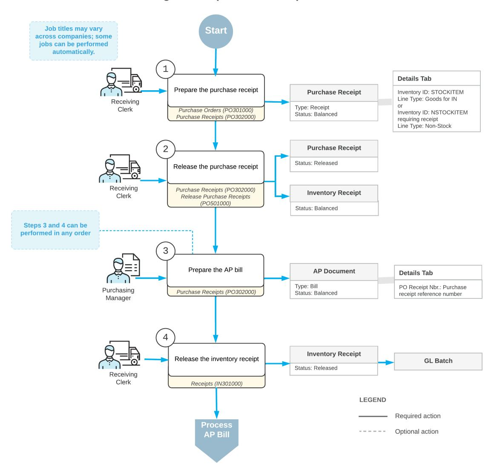

The remaining sections of this topic describe in detail the processing steps shown in the diagram.

#### **1. Enter the Purchase Receipt**

You create a new purchase receipt on the *[Purchase Receipts](https://help-2025r1.acumatica.com/Help?ScreenId=ShowWiki&pageid=d9901c8d-486d-45ed-8088-ea3d8ee3af19)* (PO302000) form and assign it the *Receipt* type. On the purchase receipt, you can list the stock and non-stock items received from the particular vendor. The reference number for a new purchase receipt is generated in accordance with the numbering sequence specified on the *[Purchase Orders Preferences](https://help-2025r1.acumatica.com/Help?ScreenId=ShowWiki&pageid=13d09c43-8696-4f92-ad9b-3d0209ee3d9b)* (PO101000) form. If the purchase receipt is created with the *On Hold* status, you should click **Remove Hold** on the form toolbar when you are ready to process the receipt further.

#### **2. Release the Purchase Receipt**

To release the purchase receipt, while you are viewing it on the *[Purchase Receipts](https://help-2025r1.acumatica.com/Help?ScreenId=ShowWiki&pageid=d9901c8d-486d-45ed-8088-ea3d8ee3af19)* (PO302000) form, you click **Release** on the form toolbar. Alternatively, you can release multiple purchase receipts at the same time by using the *[Release Purchase Receipts](https://help-2025r1.acumatica.com/Help?ScreenId=ShowWiki&pageid=a65e7a2b-08ff-42fd-80ff-0e26078b1f3b)* (PO501000) form.

When the purchase receipt is released, the system automatically generates a corresponding inventory receipt, with the date and posting period of the purchase receipt, to add the received items to inventory. You can review the generated inventory receipt on the *[Receipts](https://help-2025r1.acumatica.com/Help?ScreenId=ShowWiki&pageid=d6ecad5b-155f-44bf-baba-9ed006d298b5)* (IN301000) form.

### **3. Prepare the Accounts Payable Bill**

If the **Create Bill** check box is selected for the purchase receipt on the *[Purchase Receipts](https://help-2025r1.acumatica.com/Help?ScreenId=ShowWiki&pageid=d9901c8d-486d-45ed-8088-ea3d8ee3af19)* (PO302000) form, when you release the purchase receipt, the system generates an accounts payable bill to the vendor automatically. Otherwise, you need to prepare the bill manually from the related purchase receipt on the *[Purchase Receipts](https://help-2025r1.acumatica.com/Help?ScreenId=ShowWiki&pageid=d9901c8d-486d-45ed-8088-ea3d8ee3af19)* form by clicking **Enter AP Bill** on the form toolbar.

You can view the generated AP bill on the *[Bills and Adjustments](https://help-2025r1.acumatica.com/Help?ScreenId=ShowWiki&pageid=956b4e51-3078-4d2d-85b3-65c080d95234)* (AP301000) form. For more information on the processing of AP bills, see *[Processing AP Bills](https://help-2025r1.acumatica.com/Help?ScreenId=ShowWiki&pageid=8ba950cc-2db8-4f19-b6a7-b1281cb1db29)* and *[Paying AP Bills](https://help-2025r1.acumatica.com/Help?ScreenId=ShowWiki&pageid=085e9460-cebd-454e-8a8b-74b591bccfc1)*.

#### **4. Release the Inventory Receipt**

The generated inventory receipt is released automatically if the **Release IN Documents Automatically** check box is selected on the *[Purchase Orders Preferences](https://help-2025r1.acumatica.com/Help?ScreenId=ShowWiki&pageid=13d09c43-8696-4f92-ad9b-3d0209ee3d9b)* (PO101000) form. If this check box is cleared, you have to release the inventory receipt manually by clicking **Release** on the form toolbar of the *[Receipts](https://help-2025r1.acumatica.com/Help?ScreenId=ShowWiki&pageid=d6ecad5b-155f-44bf-baba-9ed006d298b5)* (IN301000) form. On release of the inventory receipt, a batch of GL transactions is generated.

You can release the receipt before or aer you prepare the AP bill.

#### **Related Links**

- *[Changing the Processing of Purchase Documents](#page-85-1)*
- *[Managing Lines in Purchase Documents](#page-83-1)*

# <span id="page-432-0"></span>**Processing Purchase Returns at the Original Cost**

In some cases, you may need to return purchased items to the vendor. You can issue the returned items from inventory at the original item cost. This chapter describes how you can create and process purchase returns of stock items at the items' original cost.

# <span id="page-432-1"></span>**Purchase Returns at the Original Cost: General Information**

In Acumatica ERP, you can create and process purchase returns if any purchased items need to be returned to the vendor for some reason.

#### **Learning Objectives**

In this chapter, you will do the following:

In this lesson, you will do the following:

- Create a purchase return document
- Specify the items to be returned and define at which cost the items will be issued from inventory
- Process the purchase return and the related inventory and accounts payable documents

#### **Applicable Scenarios**

In most cases, the purchasing process is completed when your company receives the goods and the corresponding accounts payable bill is released to adjust your outstanding balance with the vendor. In some cases, however, items are delivered in an unsatisfactory condition or shipped by mistake and should be returned to the vendor for replacement or reimbursement. A purchase return can also occur when services were not rendered or were provided partially, and your company should be reimbursed.

A purchase return process includes the creation of a purchase return document, the specification of the returned items and their quantities, the issuing of the returned item from inventory, and the adjustment to the outstanding vendor balance in the system in the returned amount.

#### **Creation of a Purchase Return**

A purchase return is a purchase receipt of the *Return* type created on the *[Purchase Receipts](https://help-2025r1.acumatica.com/Help?ScreenId=ShowWiki&pageid=d9901c8d-486d-45ed-8088-ea3d8ee3af19)* (PO302000) form that includes a line for each stock or non-stock item being returned. You can create a purchase return from scratch on this form or by first opening the corresponding purchase receipt on this form.

To create a purchase return manually on the *[Purchase Receipts](https://help-2025r1.acumatica.com/Help?ScreenId=ShowWiki&pageid=d9901c8d-486d-45ed-8088-ea3d8ee3af19)* form, you specify the needed settings in the Summary area of the form. Then on the **Details** tab, you add any number of purchase receipts or purchase receipt lines to it by clicking **Add PR** or **Add PR Line**, respectively, on the table toolbar.

To create a purchase return by using the purchase receipt as a starting point, you open the purchase receipt on the *[Purchase Receipts](https://help-2025r1.acumatica.com/Help?ScreenId=ShowWiki&pageid=d9901c8d-486d-45ed-8088-ea3d8ee3af19)* form, select the unlabeled check boxes on the **Details** tab in the lines of the purchase receipt with the items to be returned, and click **Return** on the form toolbar. The system copies the relevant information, including the lines you selected, from the purchase receipt to a new purchase return on the same form.

Regardless of how you have created the purchase return, in each copied line on the **Details** tab, you specify the quantity of items to be returned in the **Receipt Qty.** column and a reason code of the *Vendor Return* usage type in the **Reason Code** column. By default, the system inserts the reason code that is specified in the **PO Return Reason Code** box on the *[Purchase Orders Preferences](https://help-2025r1.acumatica.com/Help?ScreenId=ShowWiki&pageid=13d09c43-8696-4f92-ad9b-3d0209ee3d9b)* (PO101000) form.

For each item on the **Details** tab of the *[Purchase Receipts](https://help-2025r1.acumatica.com/Help?ScreenId=ShowWiki&pageid=d9901c8d-486d-45ed-8088-ea3d8ee3af19)* form, you must specify the warehouse (and warehouse location, if applicable) from which the items will be issued to be sent back to the vendor. For stock items with lot or serial numbers, you have to click **Allocations** on the table toolbar of the **Details** tab and specify the particular lot or serial numbers for the units being returned.

On the **Details** tab of the *[Purchase Receipts](https://help-2025r1.acumatica.com/Help?ScreenId=ShowWiki&pageid=d9901c8d-486d-45ed-8088-ea3d8ee3af19)* form, lines of the purchase return are linked to lines of a purchase order if the **PO OrderType** and **PO Order Nbr.** columns are filled in. These settings are copied from the associated purchase receipt. For purchase receipt lines that are linked to a purchase order, you can select the **Open PO Line** check box on the **Details** tab to specify that the system should change the status of the related purchase order to *Open* when the purchase return is released. You do this if you expect to receive replacement items for the order from the vendor and thus want to open the purchase order again. If the **Open PO Line** check box is cleared, the related purchase order remains closed.

Aer you have specified the settings of the returned items on the **Details** tab of the *[Purchase Receipts](https://help-2025r1.acumatica.com/Help?ScreenId=ShowWiki&pageid=d9901c8d-486d-45ed-8088-ea3d8ee3af19)* form, you define the cost at which the items will be issued from inventory by selecting one of the following options in the **Cost of Inventory Return From** box of the Summary area:

- *Original Cost from Receipt*: The items are issued from inventory at exactly the cost at which the items were purchased.
- *Cost by Issue Strategy*: The items are issued at the cost calculated by the system according to the items' valuation methods.
- *Manual Cost Input*: You can enter the cost manually.

#### **Processing of a Purchase Return**

Aer you have created a purchase return on the **Details** tab of the *[Purchase Receipts](https://help-2025r1.acumatica.com/Help?ScreenId=ShowWiki&pageid=d9901c8d-486d-45ed-8088-ea3d8ee3af19)* (PO302000) form, you need to process the issuing of items from inventory and adjust the vendor's balance in the system for the amount of the returned items.

On release of the purchase return, the corresponding inventory issue is generated automatically and can be viewed on the *[Issues](https://help-2025r1.acumatica.com/Help?ScreenId=ShowWiki&pageid=17b051f6-027d-4459-b542-65c1c1f9d0ea)* (IN302000) form. On release of this issue, the quantities of each of the returned items are deducted from the item quantities available at the warehouse specified in the **Warehouse** column of the **Details** tab of the *[Purchase Receipts](https://help-2025r1.acumatica.com/Help?ScreenId=ShowWiki&pageid=d9901c8d-486d-45ed-8088-ea3d8ee3af19)* form.

Also, on release of the purchase return, an accounts payable debit adjustment is generated automatically if the **Create Bill** check box is selected in the Summary area of the purchase return on the *[Purchase Receipts](https://help-2025r1.acumatica.com/Help?ScreenId=ShowWiki&pageid=d9901c8d-486d-45ed-8088-ea3d8ee3af19)* form. You can view the generated debit adjustment on the *[Bills and Adjustments](https://help-2025r1.acumatica.com/Help?ScreenId=ShowWiki&pageid=956b4e51-3078-4d2d-85b3-65c080d95234)* (AP301000) form.

If the purchase receipt for which the return was created is linked to a line of a purchase order, then on the **Details** tab of the *[Purchase Orders](https://help-2025r1.acumatica.com/Help?ScreenId=ShowWiki&pageid=5565686c-96c4-4bfa-a51d-9a2566baa808)* (PO301000) form for the purchase order, the applicable values in the **Qty. On Receipts** column are decreased by the quantity of the listed item that is returned.

The further processing of a purchase return depends on the agreement between your company and the vendor. You can complete the processing of the return by processing a vendor refund or by receiving replacement items for the original purchase order.

#### **Workflow of a Purchase Return**

For purchase return documents, the typical processing involves the actions and generated documents shown in the following diagram.

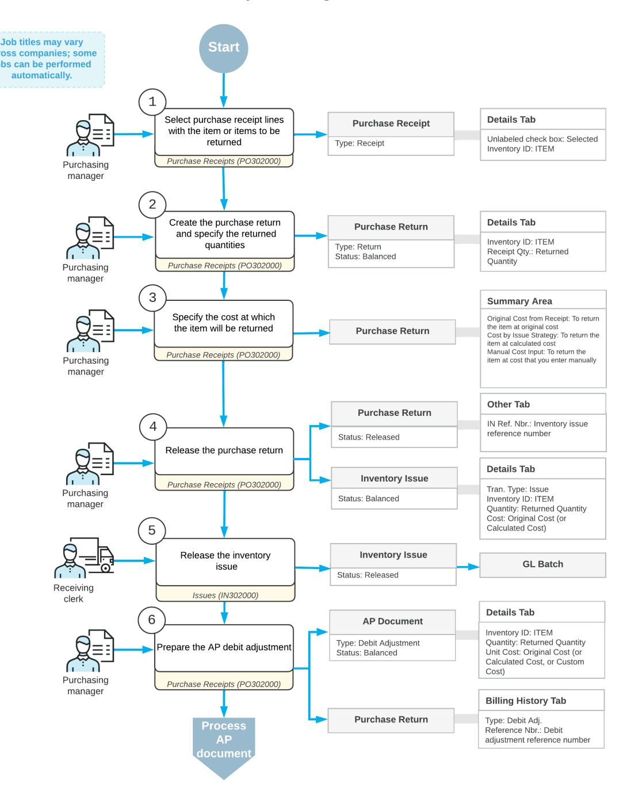

# <span id="page-434-0"></span>**Purchase Returns at the Original Cost: Implementation Checklist**

The following sections provide details you can use to ensure that the system is configured properly for the processing of purchase returns at the original cost, and to understand (and change, if needed) the settings that affect the processing workflow.

#### **Implementation Checklist**

Before you begin processing purchase returns at the original cost, you should make sure the needed settings have been specified, as summarized in the following checklist.

| Form                                           | Criteria to Check                                                                                                                                                          | Notes                                                                                                                                                                                                                                                                                                                        |
|------------------------------------------------|----------------------------------------------------------------------------------------------------------------------------------------------------------------------------|------------------------------------------------------------------------------------------------------------------------------------------------------------------------------------------------------------------------------------------------------------------------------------------------------------------------------|
|                                                | Make sure that the basic invento<br>ry and order management prefer<br>ences are configured, as described<br>in Configuration of Order Manage<br>ment: General Information. |                                                                                                                                                                                                                                                                                                                              |
| Purchase Orders Preferences<br>(PO101000) form | Make sure the Process Return with<br>Original Cost check box is select<br>ed.                                                                                              | By default, the system copies the<br>state of this check box to each pur<br>chase return that is created. (You<br>can change the way to specify the<br>cost in an individual purchase re<br>turn by selecting the Cost by Is<br>sue Strategy or Manual Cost Input<br>options on the Purchase Receipts<br>(PO302000) form.).) |

#### **Settings that Affect the Workflow**

You can affect the workflow of processing purchase returns at the original cost by specifying additional settings as follows:

- To automatically create debit adjustments on release of purchase returns, select the **Create Bill** check box on the *[Purchase Orders Preferences](https://help-2025r1.acumatica.com/Help?ScreenId=ShowWiki&pageid=13d09c43-8696-4f92-ad9b-3d0209ee3d9b)* (PO101000) form. By default, the state of this check box is copied to each purchase return that is created. If the check box is cleared in a purchase return document, you can select it before releasing a purchase return.
- To set up the system to automatically release debit adjustments that are generated, select the **Release AP Documents Automatically** check box on the *[Purchase Orders Preferences](https://help-2025r1.acumatica.com/Help?ScreenId=ShowWiki&pageid=13d09c43-8696-4f92-ad9b-3d0209ee3d9b)* form.

#### **Testing of Settings**

To make sure that all settings are configured correctly, we recommend that you process a purchase return at the original cost, as described in the *[Purchase Returns at the Original Cost: Process Activity](#page-435-1)*.

# <span id="page-435-1"></span><span id="page-435-0"></span>**Purchase Returns at the Original Cost: Process Activity**

The following activity demonstrates how to process the return of stock items from your company's inventory to the vendor at the items' original cost.

This activity is based on the *U100* dataset. If you are using another dataset, or if any system settings have been changed in *U100*, these changes can affect the workflow of the activity and the results of the processing. To avoid any issues, restore the *U100* dataset to its initial state.

#### **Video Tutorial**

This video shows you the common process but may contain less detail than the activity has. If you want to repeat the activity on your own or you are preparing to take the certification exam, we recommend that you follow the instructions in the steps of the activity.

#### *[FEEDBACK](https://www.surveymonkey.com/r/BLBL7RJ?Video=Processing%20Purchase%20Returns%20at%20Original%20Cost&Source=Open%20Uni&Course=D100)*

#### **Story**

Suppose that you are Regina Wiley, a purchasing manager in the SweetLife Fruits & Jams company. On January 30, 2025, you have noticed that three packs of paper that were purchased and delivered on January 29, 2025 have been damaged during shipping. You have decided to return these packs to the Spectra Stationery Office vendor without requesting a replacement. You, acting as the purchasing manager, need to create and process a purchase return of the damaged items at the items' original cost.

#### **Configuration Overview**

In the *U100* dataset, for the purposes of this activity, the following tasks have been performed:

- On the *[Enable/Disable Features](https://help-2025r1.acumatica.com/Help?ScreenId=ShowWiki&pageid=c1555e43-1bc5-4f6f-ba9d-b323f94d8a6b)* (CS100000) form, the following features have been enabled:
  - *Inventory and Order Management*, which provides the standard functionality of inventory and order management
  - *Inventory*, which gives you the ability to maintain stock items by using forms related to the inventory functionality and to create and process sales and purchase documents that include stock items
- On the *[Vendors](https://help-2025r1.acumatica.com/Help?ScreenId=ShowWiki&pageid=a9584be3-f2bd-4d67-80d4-8041d809df56)* (AP303000) form, the *STATOFFICE (Spectra Stationery Office)* vendor has been defined.
- On the *[Stock Items](https://help-2025r1.acumatica.com/Help?ScreenId=ShowWiki&pageid=77786a70-1f1e-4d63-ad98-96f98e4fcb0e)* (IN202500) form, the *PAPER*, *PEN*, and *PENCIL* stock items have been created.
- On the *[Purchase Orders Preferences](https://help-2025r1.acumatica.com/Help?ScreenId=ShowWiki&pageid=13d09c43-8696-4f92-ad9b-3d0209ee3d9b)* (PO101000) form, the **Process Return with Original Cost** check box has been selected. The state of this check box is copied to each purchase return that is created as the default state; when the check box is selected, the system processes the return of items at the cost specified in the original receipt.
- On the *[Purchase Receipts](https://help-2025r1.acumatica.com/Help?ScreenId=ShowWiki&pageid=d9901c8d-486d-45ed-8088-ea3d8ee3af19)* (PO302000) form, a purchase receipt for the *STATOFFICE* vendor has been created.

#### **Process Overview**

A purchase return document, which represents a vendor return in the system, is prepared based on the applicable purchase receipt. In this activity, to create a purchase return, you will open the purchase receipt on the *[Purchase](https://help-2025r1.acumatica.com/Help?ScreenId=ShowWiki&pageid=d9901c8d-486d-45ed-8088-ea3d8ee3af19) [Receipts](https://help-2025r1.acumatica.com/Help?ScreenId=ShowWiki&pageid=d9901c8d-486d-45ed-8088-ea3d8ee3af19)* (PO302000) form, and on the **Details** tab, you will select the lines of all items that need to be returned. Then on the form toolbar, you will click **Return**; on the same form, the system will copy the relevant information to a new document of the *Return* type that includes the lines selected for return.

Before you process the prepared purchase return further, on the **Details** tab of the *[Purchase Receipts](https://help-2025r1.acumatica.com/Help?ScreenId=ShowWiki&pageid=d9901c8d-486d-45ed-8088-ea3d8ee3af19)* form, you can correct the quantities to be returned (if you need to return only part of the purchased items) and the reason code for the line (if it is different than the default reason code inserted by the system). In the Summary area, you will specify that the items should be issued from inventory at the cost at which they were purchased by selecting the **Original Cost from Receipt** option in the **Cost of Inventory Return From** box. You will then release the purchase return and review the related documents to make sure the return has been processed fully in the system.

#### **System Preparation**

Before you start processing a purchase return document, you should do the following:

1. Launch the Acumatica ERP website with the *U100* dataset preloaded, and sign in to the system as purchasing manager Regina Wiley by using the *wiley* username and the *123* password.

- 2. In the info area, in the upper-right corner of the top pane of the Acumatica ERP screen, make sure that the business date in your system is set to *1/30/2025*. If a different date is displayed, click the Business Date menu button and select *1/30/2025* on the calendar. For simplicity, in this activity, you will create and process all documents in the system on this business date.
- 3. On the Company and Branch Selection menu, in the top pane of the Acumatica ERP screen, make sure the *SweetLife Head Office and Wholesale Center* branch is selected.

#### **Step 1: Creating a Purchase Return from the Related Purchase Receipt**

To create a purchase return from the purchase receipt, do the following:

- 1. On the *[Purchase Receipts](https://help-2025r1.acumatica.com/Help?ScreenId=ShowWiki&pageid=d9901c8d-486d-45ed-8088-ea3d8ee3af19)* (PO302000) form, open the purchase receipt from the *STATOFFICE* vendor and dated *1/29/2025*.
- 2. On the **Details** tab, select the unlabeled check box in the line of the purchase receipt with the *PAPER* item.
- 3. On the form toolbar, click **Return** to create a document in which you will process the return of the item. The system opens the document on the same form. It has the *Return* type and includes the selected line. In this line, notice that the system has inserted the number of the initial purchase receipt into the **PO Receipt Nbr.** column on the **Details** tab.
- 4. On the form toolbar, click**Save**.

#### **Step 2: Specifying the Settings of the Purchase Return**

To specify settings of the purchase return, do the following:

- 1. While you are still viewing the purchase return on the *[Purchase Receipts](https://help-2025r1.acumatica.com/Help?ScreenId=ShowWiki&pageid=d9901c8d-486d-45ed-8088-ea3d8ee3af19)* (PO302000) form, in the Summary area, make sure that *1/30/2025* is specified as the **Date**.
- 2. In the **Cost of Inventory Return From** box, make sure that the *Original Cost from Receipt* option is selected. With this option selected, the items will be issued from inventory at exactly the same cost at which they were purchased.
- 3. Select the **Create Bill** check box so that the system generates a debit adjustment automatically on release of the purchase return.
- 4. In the only return line on the **Details** tab, change the **Receipt Qty.** to 3 (which is the quantity of items to be returned).
- 5. In the line, clear the **Open PO Line** check box to indicate that no replacement is needed for the returned items.
- 6. On the form toolbar, click**Save**.

The purchase return has the *Balanced* status and can thus be released.

#### **Step 3: Releasing the Purchase Return**

To release the purchase return and to review how the return of items is processed in the system, do the following:

- 1. While you are still viewing the purchase return on the *[Purchase Receipts](https://help-2025r1.acumatica.com/Help?ScreenId=ShowWiki&pageid=d9901c8d-486d-45ed-8088-ea3d8ee3af19)* (PO302000) form, click **Release** on the form toolbar. Wait for the system to complete the operation.
- 2. On the **Billing** tab, review the information about the debit adjustment that was prepared, and make sure that it now has a status of *Open* (indicating that it was released).
- 3. On the **Other** tab, click the **IN Ref. Nbr.** link, and review the inventory issue, which opens on the *[Issues](https://help-2025r1.acumatica.com/Help?ScreenId=ShowWiki&pageid=17b051f6-027d-4459-b542-65c1c1f9d0ea)* (IN302000) form in a pop-up window. Make sure that the issue has the *Released* status.
- 4. Close the *[Issues](https://help-2025r1.acumatica.com/Help?ScreenId=ShowWiki&pageid=17b051f6-027d-4459-b542-65c1c1f9d0ea)* form.

- 5. On the *[Purchase Orders](https://help-2025r1.acumatica.com/Help?ScreenId=ShowWiki&pageid=5565686c-96c4-4bfa-a51d-9a2566baa808)* (PO301000) form, open the purchase order to *STATOFFICE* for which the return was processed.
- 6. On the **Details** tab, in the **Qty. on Receipts** column, notice that the received quantity in the *PAPER* line has been decreased by the returned quantity and is now *17*.
- 7. On the **PO History** tab, review the documents related to the purchase order, as shown in the following screenshot. The le table shows the purchase receipt and purchase return; the right table shows the bill and the debit adjustment. In the line with the debit adjustment, notice the zero purchase price variance amount in the **PPV Amt.** column, which means that the items were returned at the cost at which they were purchased.

| <b>Purchase Orders</b><br>Normal 000002 - Spectra Stationery Office                      |                                          |                                               | <b>TH NOTES</b>                     | <b>ACTIVITIES</b>  | TOOLS $\sim$<br><b>FILES</b> |
|------------------------------------------------------------------------------------------|------------------------------------------|-----------------------------------------------|-------------------------------------|--------------------|------------------------------|
| 릡<br>$\Xi$<br>侕<br>0<br>$\mathsf{K}$<br>$\Omega$<br>$^+$<br>$\leftarrow$<br>$\checkmark$ | $\geq$<br>$\rightarrow$<br>≺<br>$\cdots$ |                                               |                                     |                    |                              |
| Type:<br>Normal<br>Vendor:<br>$\checkmark$                                               | STATOFFICE - Spectra Stationery Office   | Detail Total:<br>342.00<br>0                  |                                     |                    | $\hat{\phantom{a}}$          |
| $\circ$<br>Order Nbr.:<br>Location:<br>000002                                            | <b>MAIN - Primary Location</b>           | Line Discounts:                               | 0.00                                |                    |                              |
| <b>Closed</b><br>Owner:<br>Status:                                                       |                                          | Document Dis                                  | 0.00                                |                    |                              |
| Vendor Ref.:<br>1/29/2025<br>Date:                                                       |                                          | <b>Tax Total:</b>                             | 0.00                                |                    |                              |
| Promised On:<br>1/29/2025                                                                |                                          | <b>Order Total:</b><br>342.00                 |                                     |                    |                              |
| Description:<br>Stationery purchase for office                                           |                                          |                                               |                                     |                    |                              |
|                                                                                          |                                          |                                               |                                     |                    |                              |
| <b>TAXES</b><br><b>DETAILS</b><br><b>SHIPPING</b><br><b>VENDOR INFO</b>                  | PO HISTORY<br><b>PREPAYMENTS</b>         | <b>OTHER</b><br>COMPLIANCE                    |                                     |                    |                              |
| Ò<br>$\boxtimes$<br>$\times$<br>$^{+}$<br>$\vdash$                                       | Ò<br>$^{+}$                              | 図<br>$\times$<br>$\left  \rightarrow \right $ |                                     |                    |                              |
| D<br>$\mathbb{O}$<br>퇌<br>Date<br>Type<br>Receipt Nbr.<br><b>Status</b>                  | <b>图 Type</b><br>Received Qty.           | Date<br>Reference Nbr.                        | <b>Status</b><br><b>Billed Qtv.</b> | <b>Billed Amt.</b> | <b>PPV Amt Currency</b>      |
| 0<br>D<br>1/29/2025<br>Receipt<br>000002                                                 | Bill<br>32.00<br>Released                | 1/29/2025<br>000015                           | Open<br>32.00                       | 342.00             | $0.00$ USD                   |
| 0<br>1/30/2025<br>Return<br>000047                                                       | $-3.00$<br>Debit Adj.<br>Released        | 000167<br>1/30/2025                           | Open<br>$-3.00$                     | $-29.97$           | $0.00$ USD                   |
|                                                                                          |                                          |                                               |                                     |                    |                              |

#### *Figure: Documents related to the purchase order*

You have processed the return to the vendor without requesting a replacement.

#### **Activity Recap**

In this activity, we have illustrated how the purchasing manager has done the following:

- 1. Created a purchase return from the purchase receipt that was created on receipt of the items to be returned
- 2. Specified the settings of the purchase return
- 3. Released the purchase return and reviewed the changes in the original purchase order

### <span id="page-438-0"></span>**Purchase Returns at the Original Cost: Generated Transactions**

The costs of items purchased from vendors may change over time, so the correct costs must be reflected on the purchase return document. To specify that items to be returned should be issued from inventory at exactly the same cost at which the items were purchased, you need to select the *Original Cost from Receipt* option in the **Cost of Inventory Return From** box in the Summary area of the purchase return document on the *[Purchase Receipts](https://help-2025r1.acumatica.com/Help?ScreenId=ShowWiki&pageid=d9901c8d-486d-45ed-8088-ea3d8ee3af19)* (PO302000) form.

On release of the purchase return, the system prepares an inventory issue document to update inventory, which you can review on the *[Issues](https://help-2025r1.acumatica.com/Help?ScreenId=ShowWiki&pageid=17b051f6-027d-4459-b542-65c1c1f9d0ea)* (IN302000) form, and a debit adjustment to decrease the vendor balance in the system, which you can review on the *[Bills and Adjustments](https://help-2025r1.acumatica.com/Help?ScreenId=ShowWiki&pageid=956b4e51-3078-4d2d-85b3-65c080d95234)* (AP301000) form.

#### **Rules of Original Cost Calculation**

In the general ledger transactions that are posted during the processing of a purchase return, the posted amount is the original cost of the item multiplied by the returned quantity.

The original cost for stock items is defined depending on the valuation method specified for each item in the **Valuation Method** box on the **General** tab of the *[Stock Items](https://help-2025r1.acumatica.com/Help?ScreenId=ShowWiki&pageid=77786a70-1f1e-4d63-ad98-96f98e4fcb0e)* (IN202500) form:

- For items with the FIFO valuation method, the system uses the average cost of the cost layer that corresponds to the purchase receipt for which the return is processed.
- For items with the average, specific, and standard valuation methods, the system uses the cost specified in the line of the original inventory receipt or purchase receipt.

For any of the valuation methods, the cost adjustments, such as landed costs or purchase price variance, are not included in the original cost. For more information on how the system calculates items' costs depending on valuation methods, see *Item Costs and Valuation Methods: General [Information](https://help-2025r1.acumatica.com/Help?ScreenId=ShowWiki&pageid=79edcbf8-e18b-4817-875f-6cbfd7a32384)*.

#### **Transaction Generated for a Return of Stock Items**

Once the purchase return of a stock item at original cost is released on the *[Purchase Receipts](https://help-2025r1.acumatica.com/Help?ScreenId=ShowWiki&pageid=d9901c8d-486d-45ed-8088-ea3d8ee3af19)* (PO302000) form, the system automatically generates a corresponding inventory issue and releases it immediately; when the inventory issue is released, the availability data for the stock item or items in inventory is updated. For each line with a stock item being returned, the following general ledger transactions are generated on release of the corresponding inventory issue.

| Account            | Source of Account                | Debit                         | Credit |
|--------------------|----------------------------------|-------------------------------|--------|
| PO Accrual account | Original purchase or<br>der line | Amount = Original Cost * Qty. | 0.0    |
| Inventory account  | Posting class                    | 0.0                           | Amount |

The processing of a purchase return also includes the processing of the debit adjustment that is generated when the purchase return is released. On release of the debit adjustment, the following general ledger transactions are generated for each line with a stock item being returned.

| Account                      | Source of Account                | Debit                         | Credit |
|------------------------------|----------------------------------|-------------------------------|--------|
| Accounts Payable ac<br>count | Vendor                           | Amount = Original Cost * Qty. | 0.0    |
| PO Accrual account           | Original purchase or<br>der line | 0.0                           | Amount |

### **Transaction Generated for a Return of Non-Stock Items**

On the *[Purchase Receipts](https://help-2025r1.acumatica.com/Help?ScreenId=ShowWiki&pageid=d9901c8d-486d-45ed-8088-ea3d8ee3af19)* (PO302000) form, you can process a purchase return of non-stock items requiring receipt (lines with the *Non-Stock* line type specified on the **Details** tab). Purchase return lines of this type are added to the inventory issue generated on the release of the purchase return. For a line with a non-stock item, the following general ledger transactions are generated on release of the inventory issue corresponding to the purchase return.

| Account            | Source of Account                | Debit                         | Credit |
|--------------------|----------------------------------|-------------------------------|--------|
| PO Accrual account | Original purchase or<br>der line | Amount = Original Cost * Qty. | 0.0    |
| Expense account    | Purchase return line             | 0.0                           | Amount |

On release of the debit adjustment that is generated when the purchase return is released, the following general ledger transaction is generated.

| Account                      | Source of Account                | Debit                         | Credit |
|------------------------------|----------------------------------|-------------------------------|--------|
| Accounts Payable ac<br>count | Vendor                           | Amount = Original Cost * Qty. | 0.0    |
| PO Accrual account           | Original purchase or<br>der line | 0.0                           | Amount |

# <span id="page-441-0"></span>**Processing Purchase Returns at the Calculated Cost**

In some cases, you may need to return purchased items to the vendor. You can issue the returned items from inventory at a cost calculated by the system. This chapter describes how you can create and process purchase returns of stock items at item costs that are calculated by the system.

# <span id="page-441-1"></span>**Purchase Returns at the Calculated Cost: General Information**

In Acumatica ERP, you can create and process purchase returns if any purchased items need to be returned to the vendor for some reason.

#### **Learning Objectives**

In this chapter, you will do the following:

In this lesson, you will do the following:

- Create a purchase return document
- Specify the items to be returned and define at which cost the items will be issued from inventory
- Process the purchase return and the related inventory and accounts payable documents

#### **Applicable Scenarios**

In most cases, the purchasing process is completed when your company receives the goods and the corresponding accounts payable bill is released to adjust your outstanding balance with the vendor. In some cases, however, items are delivered in an unsatisfactory condition or shipped by mistake and should be returned to the vendor for replacement or reimbursement. A purchase return can also occur when services were not rendered or were provided partially, and your company should be reimbursed.

A purchase return process includes the creation of a purchase return document, the specification of the returned items and their quantities, the issuing of the returned item from inventory, and the adjustment to the outstanding vendor balance in the system in the returned amount.

#### **Creation of a Purchase Return**

A purchase return is a purchase receipt of the *Return* type created on the *[Purchase Receipts](https://help-2025r1.acumatica.com/Help?ScreenId=ShowWiki&pageid=d9901c8d-486d-45ed-8088-ea3d8ee3af19)* (PO302000) form that includes a line for each stock or non-stock item being returned. You can create a purchase return from scratch on this form or by first opening the corresponding purchase receipt on this form.

To create a purchase return manually on the *[Purchase Receipts](https://help-2025r1.acumatica.com/Help?ScreenId=ShowWiki&pageid=d9901c8d-486d-45ed-8088-ea3d8ee3af19)* form, you specify the needed settings in the Summary area of the form. Then on the **Details** tab, you add any number of purchase receipts or purchase receipt lines to it by clicking **Add PR** or **Add PR Line**, respectively, on the table toolbar.

To create a purchase return by using the purchase receipt as a starting point, you open the purchase receipt on the *[Purchase Receipts](https://help-2025r1.acumatica.com/Help?ScreenId=ShowWiki&pageid=d9901c8d-486d-45ed-8088-ea3d8ee3af19)* form, select the unlabeled check boxes on the **Details** tab in the lines of the purchase receipt with the items to be returned, and click **Return** on the form toolbar. The system copies the relevant information, including the lines you selected, from the purchase receipt to a new purchase return on the same form.

Regardless of how you have created the purchase return, in each copied line on the **Details** tab, you specify the quantity of items to be returned in the **Receipt Qty.** column and a reason code of the *Vendor Return* usage type in the **Reason Code** column. By default, the system inserts the reason code that is specified in the **PO Return Reason Code** box on the *[Purchase Orders Preferences](https://help-2025r1.acumatica.com/Help?ScreenId=ShowWiki&pageid=13d09c43-8696-4f92-ad9b-3d0209ee3d9b)* (PO101000) form.

For each item on the **Details** tab of the *[Purchase Receipts](https://help-2025r1.acumatica.com/Help?ScreenId=ShowWiki&pageid=d9901c8d-486d-45ed-8088-ea3d8ee3af19)* form, you must specify the warehouse (and warehouse location, if applicable) from which the items will be issued to be sent back to the vendor. For stock items with lot or serial numbers, you have to click **Allocations** on the table toolbar of the **Details** tab and specify the particular lot or serial numbers for the units being returned.

On the **Details** tab of the *[Purchase Receipts](https://help-2025r1.acumatica.com/Help?ScreenId=ShowWiki&pageid=d9901c8d-486d-45ed-8088-ea3d8ee3af19)* form, lines of the purchase return are linked to lines of a purchase order if the **PO OrderType** and **PO Order Nbr.** columns are filled in. These settings are copied from the associated purchase receipt. For purchase receipt lines that are linked to a purchase order, you can select the **Open PO Line** check box on the **Details** tab to specify that the system should change the status of the related purchase order to *Open* when the purchase return is released. You do this if you expect to receive replacement items for the order from the vendor and thus want to open the purchase order again. If the **Open PO Line** check box is cleared, the related purchase order remains closed.

Aer you have specified the settings of the returned items on the **Details** tab of the *[Purchase Receipts](https://help-2025r1.acumatica.com/Help?ScreenId=ShowWiki&pageid=d9901c8d-486d-45ed-8088-ea3d8ee3af19)* form, you define the cost at which the items will be issued from inventory by selecting one of the following options in the **Cost of Inventory Return From** box of the Summary area:

- *Original Cost from Receipt*: The items are issued from inventory at exactly the cost at which the items were purchased.
- *Cost by Issue Strategy*: The items are issued at the cost calculated by the system according to the items' valuation methods.
- *Manual Cost Input*: You can enter the cost manually.

#### **Processing of a Purchase Return**

Aer you have created a purchase return on the **Details** tab of the *[Purchase Receipts](https://help-2025r1.acumatica.com/Help?ScreenId=ShowWiki&pageid=d9901c8d-486d-45ed-8088-ea3d8ee3af19)* (PO302000) form, you need to process the issuing of items from inventory and adjust the vendor's balance in the system for the amount of the returned items.

On release of the purchase return, the corresponding inventory issue is generated automatically and can be viewed on the *[Issues](https://help-2025r1.acumatica.com/Help?ScreenId=ShowWiki&pageid=17b051f6-027d-4459-b542-65c1c1f9d0ea)* (IN302000) form. On release of this issue, the quantities of each of the returned items are deducted from the item quantities available at the warehouse specified in the **Warehouse** column of the **Details** tab of the *[Purchase Receipts](https://help-2025r1.acumatica.com/Help?ScreenId=ShowWiki&pageid=d9901c8d-486d-45ed-8088-ea3d8ee3af19)* form.

Also, on release of the purchase return, an accounts payable debit adjustment is generated automatically if the **Create Bill** check box is selected in the Summary area of the purchase return on the *[Purchase Receipts](https://help-2025r1.acumatica.com/Help?ScreenId=ShowWiki&pageid=d9901c8d-486d-45ed-8088-ea3d8ee3af19)* form. You can view the generated debit adjustment on the *[Bills and Adjustments](https://help-2025r1.acumatica.com/Help?ScreenId=ShowWiki&pageid=956b4e51-3078-4d2d-85b3-65c080d95234)* (AP301000) form.

If the purchase receipt for which the return was created is linked to a line of a purchase order, then on the **Details** tab of the *[Purchase Orders](https://help-2025r1.acumatica.com/Help?ScreenId=ShowWiki&pageid=5565686c-96c4-4bfa-a51d-9a2566baa808)* (PO301000) form for the purchase order, the applicable values in the **Qty. On Receipts** column are decreased by the quantity of the listed item that is returned.

The further processing of a purchase return depends on the agreement between your company and the vendor. You can complete the processing of the return by processing a vendor refund or by receiving replacement items for the original purchase order.

#### **Workflow of a Purchase Return**

For purchase return documents, the typical processing involves the actions and generated documents shown in the following diagram.

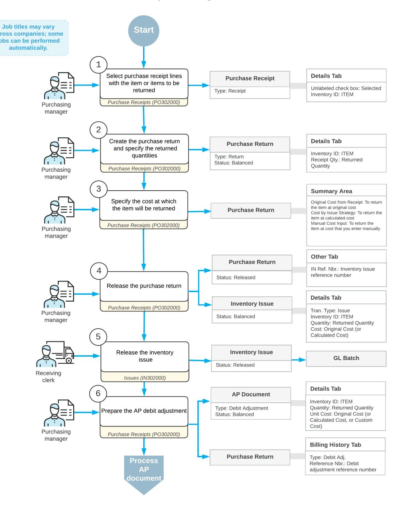

# <span id="page-443-0"></span>**Purchase Returns at the Calculated Cost: Implementation Checklist**

The following sections provide details you can use to ensure that the system is configured properly for the processing of purchase returns at the cost calculated by the system, and to understand (and change, if needed) the settings that affect the processing workflow.

#### **Implementation Checklist**

Before you begin processing returns at the calculated cost, you should make sure the needed settings have been specified, as summarized in the following checklist.

| Form                                           | Criteria to Check                                                                                                                                                          | Notes                                                                                                                                                                                                                                                                                                                                                                    |
|------------------------------------------------|----------------------------------------------------------------------------------------------------------------------------------------------------------------------------|--------------------------------------------------------------------------------------------------------------------------------------------------------------------------------------------------------------------------------------------------------------------------------------------------------------------------------------------------------------------------|
|                                                | Make sure that the basic invento<br>ry and order management prefer<br>ences are configured, as described<br>in Configuration of Order Manage<br>ment: General Information. |                                                                                                                                                                                                                                                                                                                                                                          |
| Purchase Orders Preferences<br>(PO101000) form | Make sure that the Process Return<br>with Original Cost check box is<br>cleared.                                                                                           | By default, the system copies the<br>state of this check box to each pur<br>chase return that is created. (You<br>can change the way to specify the<br>cost in an individual purchase re<br>turn by selecting the Cost by Issue<br>Strategy or Manual Cost Input op<br>tions in the Cost of Inventory Re<br>turn From box on the Purchase Re<br>ceipts (PO302000) form.) |

#### **Settings that Affect the Workflow**

You can affect the workflow of processing purchase returns at the system-calculated cost by specifying additional settings as follows:

- To cause debit adjustments to be automatically created on release of purchase returns, select the **Create Bill** check box on the *[Purchase Orders Preferences](https://help-2025r1.acumatica.com/Help?ScreenId=ShowWiki&pageid=13d09c43-8696-4f92-ad9b-3d0209ee3d9b)* (PO101000) form. By default, the state of this check box is copied to each purchase return that is created. If the check box is cleared in a purchase return document, you can select it before releasing a purchase return.
- To set up the system to automatically release debit adjustments that are generated, select the **Release AP Documents Automatically** check box on the *[Purchase Orders Preferences](https://help-2025r1.acumatica.com/Help?ScreenId=ShowWiki&pageid=13d09c43-8696-4f92-ad9b-3d0209ee3d9b)* form.

### **Testing of Settings**

To make sure that all settings are configured correctly, we recommend that you process a purchase return at the system-calculated cost, as described in the *[Purchase Returns at the Calculated Cost: Process Activity](#page-444-1)*.

# <span id="page-444-1"></span><span id="page-444-0"></span>**Purchase Returns at the Calculated Cost: Process Activity**

In this activity, you will learn how to process a return of stock items from your company's inventory to the vendor, with the system calculating the items' cost.

This activity is based on the *U100* dataset. If you are using another dataset, or if any system settings have been changed in *U100*, these changes can affect the workflow of the activity and the results of the processing. To avoid any issues, restore the *U100* dataset to its initial state.

#### **Video Tutorial**

This video shows you the common process but may contain less detail than the activity has. If you want to repeat the activity on your own or you are preparing to take the certification exam, we recommend that you follow the instructions in the steps of the activity.

#### *[FEEDBACK](https://www.surveymonkey.com/r/BLBL7RJ?Video=Processing%20Purchase%20Returns%20at%20Original%20Cost&Source=Open%20Uni&Course=D100)*

#### **Story**

Suppose that on January 30, 2025 you, acting as purchasing manager at the SweetLife Fruits & Jams company Regina Wiley, notice that three packs of paper that were purchased and delivered on January 29, 2025 have been damaged during shipping. You have decided to return these packs to the Spectra Stationery Office vendor without requesting a replacement. You need to create and process a purchase return of the damaged items at the cost calculated by the system.

#### **Configuration Overview**

In the *U100* dataset, for the purposes of this activity, the following tasks have been performed:

- On the *[Enable/Disable Features](https://help-2025r1.acumatica.com/Help?ScreenId=ShowWiki&pageid=c1555e43-1bc5-4f6f-ba9d-b323f94d8a6b)* (CS100000) form, the following features have been enabled:
  - *Inventory and Order Management*, which provides the standard functionality of inventory and order management
  - *Inventory*, which gives you the ability to maintain stock items by using forms related to the inventory functionality and to create and process sales and purchase documents that include stock items
- On the *[Vendors](https://help-2025r1.acumatica.com/Help?ScreenId=ShowWiki&pageid=a9584be3-f2bd-4d67-80d4-8041d809df56)* (AP303000) form, the *STATOFFICE* vendor has been created.
- On the *[Stock Items](https://help-2025r1.acumatica.com/Help?ScreenId=ShowWiki&pageid=77786a70-1f1e-4d63-ad98-96f98e4fcb0e)* (IN202500) form, the *PAPER* stock item has been created.
- On the *[Purchase Orders](https://help-2025r1.acumatica.com/Help?ScreenId=ShowWiki&pageid=5565686c-96c4-4bfa-a51d-9a2566baa808)* (PO301000) form, the purchase order has been created with stationary items ordered from the *STATOFFICE* vendor and, on the *[Purchase Receipts](https://help-2025r1.acumatica.com/Help?ScreenId=ShowWiki&pageid=d9901c8d-486d-45ed-8088-ea3d8ee3af19)* (PO302000) form, the related purchase receipt has been created and released.

#### **Process Overview**

A purchase return document, which represents a vendor return in the system, is prepared based on the applicable purchase receipt. In this activity, to create a purchase return, you will open the purchase receipt on the *[Purchase](https://help-2025r1.acumatica.com/Help?ScreenId=ShowWiki&pageid=d9901c8d-486d-45ed-8088-ea3d8ee3af19) [Receipts](https://help-2025r1.acumatica.com/Help?ScreenId=ShowWiki&pageid=d9901c8d-486d-45ed-8088-ea3d8ee3af19)* (PO302000) form, and on the **Details** tab, you will select (by selecting the unlabeled check boxes) the lines of all items to be returned. Then on the form toolbar, you will click **Return**; on the same form, the system will copy the relevant information to a new document of the *Return* type that includes the lines selected for return.

Before you process the prepared purchase return further, on the **Details** tab of the *[Purchase Receipts](https://help-2025r1.acumatica.com/Help?ScreenId=ShowWiki&pageid=d9901c8d-486d-45ed-8088-ea3d8ee3af19)* form, you will correct the quantities to be returned. In the Summary area, you will specify that the items should be issued from inventory at the cost calculated by the system by selecting the *Cost by Issue Strategy* option in the **Cost of Inventory Return From** box. You will then release the purchase return and review the related documents to make sure that the return has been processed fully in the system.

#### **System Preparation**

Before you start preparing a purchase return, you should do the following:

- 1. Launch the Acumatica ERP website with the *U100* dataset preloaded, and sign in as purchasing manager Regina Wiley by using the *wiley* username and the *123* password.
- 2. In the info area, in the upper-right corner of the top pane of the Acumatica ERP screen, make sure that the business date in your system is set to *1/30/2025*. If a different date is displayed, click the Business Date menu

button and select *1/30/2025* on the calendar. For simplicity, in this activity, you will create and process all documents in the system on this business date.

3. On the Company and Branch Selection menu, in the top pane of the Acumatica ERP screen, make sure the *SweetLife Head Office and Wholesale Center* branch is selected.

#### **Step 1: Creating a Purchase Return from the Related Purchase Receipt**

The easiest way to create a purchase return is to start from the purchase receipt in which you received the items to be returned. To create the purchase return from the purchase receipt, do the following:

- 1. On the *[Purchase Receipts](https://help-2025r1.acumatica.com/Help?ScreenId=ShowWiki&pageid=d9901c8d-486d-45ed-8088-ea3d8ee3af19)* (PO302000) form, open the purchase receipt to *STATOFFICE* dated *1/29/2025*.
- 2. On the **Details** tab, select the unlabeled check box in the line of the purchase receipt with the *PAPER* item.
- 3. On the form toolbar, click **Return** to create a document in which you will process the return of the item. The system opens the document on the same form. It has the *Return* type and includes the selected line. In this line, notice that the system has inserted the number of the initial purchase receipt into the **PO Receipt Nbr.** column on the **Details** tab.

#### **Step 2: Specifying the Settings of the Return**

To define the specific settings of the return document, do the following:

- 1. While you are still viewing the purchase return that you have created on the *[Purchase Receipts](https://help-2025r1.acumatica.com/Help?ScreenId=ShowWiki&pageid=d9901c8d-486d-45ed-8088-ea3d8ee3af19)* (PO302000) form, in the Summary area, make sure that 1/30/2025 is specified as the **Date**.
- 2. In the **Cost of Inventory Return From** box, select the *Cost by Issue Strategy* option. With this option selected, the items will be issued from inventory at the cost calculated by the system.
- 3. Select the **Create Bill** check box to make the system generate a debit adjustment automatically on release of the purchase return.
- 4. In the only return line on the **Details** tab, change the **Receipt Qty.** to 3 (which is the quantity of items to be returned).
- 5. In the line, clear the **Open PO Line** check box to indicate that no replacement is needed for returned items.
- 6. On the form toolbar, click**Save** to save the purchase return, which has the *Balanced* status and can thus be released.

#### **Step 3: Releasing the Purchase Return**

To release the purchase return and to review how the return of items is processed in the system, do the following:

- 1. While you are still viewing the purchase return on the *[Purchase Receipts](https://help-2025r1.acumatica.com/Help?ScreenId=ShowWiki&pageid=d9901c8d-486d-45ed-8088-ea3d8ee3af19)* (PO302000) form, click **Release** on the form toolbar.
- 2. On the **Billing** tab, review the information about the debit adjustment that was prepared, and make sure that it now has the *Open* status (reflecting that it was released).
- 3. On the **Other** tab, click the **IN Ref. Nbr.** link, and review the inventory issue, which is opened on the *[Issues](https://help-2025r1.acumatica.com/Help?ScreenId=ShowWiki&pageid=17b051f6-027d-4459-b542-65c1c1f9d0ea)* (IN302000) form. Make sure the issue has the *Released* status. Close the *[Issues](https://help-2025r1.acumatica.com/Help?ScreenId=ShowWiki&pageid=17b051f6-027d-4459-b542-65c1c1f9d0ea)* form.
- 4. On the **Orders** tab, click the link in the **Order Nbr.** column. The system opens the purchase order for which the return was processed on the *[Purchase Orders](https://help-2025r1.acumatica.com/Help?ScreenId=ShowWiki&pageid=5565686c-96c4-4bfa-a51d-9a2566baa808)* (PO301000) form in a pop-up window.
- 5. On the **PO History** tab, review the documents related to the purchase order, as shown in the following screenshot. The le table shows the purchase receipt and purchase return; the right table shows the bill and the debit adjustment. In the line with the debit adjustment, notice the nonzero purchase price variance amount in the **PPV Amount** column, which shows the difference between the amounts at which the items were purchased and at which the items were returned.

| Normal<br>STATOFFICE - Spectra Stationery Office<br>0<br>Line Total:<br>342.00<br>Type:<br>Vendor:<br>$\checkmark$<br>000002<br>$\varphi$<br><b>Discount Total:</b><br>0.00<br>Order Nbr.:<br>MAIN - Primary Location<br>Location:<br>Tax Total:<br>Owner:<br>0.00<br>Status:<br>Closed<br>Vendor Ref.<br>Order Total:<br>Date:<br>1/29/2023<br>342.00<br>1/29/2023<br>Promised On:<br>Description:<br>Stationery purchase for office<br><b>DETAILS</b><br><b>TAXES</b><br><b>SHIPPING</b><br><b>VENDOR INFO</b><br>PO HISTORY<br>PREPAYMENTS<br><b>OTHER</b><br>COMPLIANCE<br>Ò<br>$\overline{\mathbf{x}}$<br>Ò<br>$\boxed{\mathbf{x}}$<br>$\times$<br>$+$<br>$^{+}$<br>$\times$<br>$\mathbb{H}$<br>$\mathbb{H}$<br><b>图 Type</b><br>!!!!!!!!!!!!!!!!!!!!!!!!!!!!!!!!!!!!!!!!<br>图 0<br>Date<br>Received<br><b>Billed</b><br>Type<br>Receipt Nbr.<br><b>Status</b><br>Reference Nbr.<br>Date<br><b>Billed Qty.</b><br><b>Status</b><br>Qty.<br>Amt.<br>$0$ D<br>Bill<br>Released<br>1/29/2023<br>Receipt<br>1/29/2023<br>32.00<br>000015<br>Open<br>32.00<br>342.00<br>000002<br>$\Box$ Return<br>$^{\circ}$<br>Debit Adj.<br>$\rightarrow$<br>000052<br>1/30/2023<br>Released<br>$-3.00$<br>000169<br>1/30/2023<br>Open<br>$-3.00$<br>$-29.97$<br>$-1.27$ | <b>TH NOTES</b><br>TOOLS $\sim$<br><b>ACTIVITIES</b><br><b>FILES</b> |  |  | $\geq$<br>$\cdots$ | $\sim$<br>$\rightarrow$ | Normal 000002 - Spectra Stationery Office<br>$\circ$<br>$\overline{\mathbf{K}}$<br>$\checkmark$ | 间<br>$\Omega$<br>$+$ | <b>Purchase Orders</b><br>$\boxdot$<br>뭐 |
|-------------------------------------------------------------------------------------------------------------------------------------------------------------------------------------------------------------------------------------------------------------------------------------------------------------------------------------------------------------------------------------------------------------------------------------------------------------------------------------------------------------------------------------------------------------------------------------------------------------------------------------------------------------------------------------------------------------------------------------------------------------------------------------------------------------------------------------------------------------------------------------------------------------------------------------------------------------------------------------------------------------------------------------------------------------------------------------------------------------------------------------------------------------------------------------------------------------------------------------------------------------|----------------------------------------------------------------------|--|--|--------------------|-------------------------|-------------------------------------------------------------------------------------------------|----------------------|------------------------------------------|
|                                                                                                                                                                                                                                                                                                                                                                                                                                                                                                                                                                                                                                                                                                                                                                                                                                                                                                                                                                                                                                                                                                                                                                                                                                                             | $\hat{\phantom{a}}$                                                  |  |  |                    |                         |                                                                                                 |                      |                                          |
|                                                                                                                                                                                                                                                                                                                                                                                                                                                                                                                                                                                                                                                                                                                                                                                                                                                                                                                                                                                                                                                                                                                                                                                                                                                             |                                                                      |  |  |                    |                         |                                                                                                 |                      |                                          |
|                                                                                                                                                                                                                                                                                                                                                                                                                                                                                                                                                                                                                                                                                                                                                                                                                                                                                                                                                                                                                                                                                                                                                                                                                                                             |                                                                      |  |  |                    |                         |                                                                                                 |                      |                                          |
|                                                                                                                                                                                                                                                                                                                                                                                                                                                                                                                                                                                                                                                                                                                                                                                                                                                                                                                                                                                                                                                                                                                                                                                                                                                             |                                                                      |  |  |                    |                         |                                                                                                 |                      |                                          |
|                                                                                                                                                                                                                                                                                                                                                                                                                                                                                                                                                                                                                                                                                                                                                                                                                                                                                                                                                                                                                                                                                                                                                                                                                                                             |                                                                      |  |  |                    |                         |                                                                                                 |                      |                                          |
|                                                                                                                                                                                                                                                                                                                                                                                                                                                                                                                                                                                                                                                                                                                                                                                                                                                                                                                                                                                                                                                                                                                                                                                                                                                             |                                                                      |  |  |                    |                         |                                                                                                 |                      |                                          |
|                                                                                                                                                                                                                                                                                                                                                                                                                                                                                                                                                                                                                                                                                                                                                                                                                                                                                                                                                                                                                                                                                                                                                                                                                                                             |                                                                      |  |  |                    |                         |                                                                                                 |                      |                                          |
|                                                                                                                                                                                                                                                                                                                                                                                                                                                                                                                                                                                                                                                                                                                                                                                                                                                                                                                                                                                                                                                                                                                                                                                                                                                             |                                                                      |  |  |                    |                         |                                                                                                 |                      |                                          |
|                                                                                                                                                                                                                                                                                                                                                                                                                                                                                                                                                                                                                                                                                                                                                                                                                                                                                                                                                                                                                                                                                                                                                                                                                                                             | PPV Amt Currency                                                     |  |  |                    |                         |                                                                                                 |                      |                                          |
|                                                                                                                                                                                                                                                                                                                                                                                                                                                                                                                                                                                                                                                                                                                                                                                                                                                                                                                                                                                                                                                                                                                                                                                                                                                             | $0.00$ USD                                                           |  |  |                    |                         |                                                                                                 |                      |                                          |
| $\mathbb{R}$<br>$  \langle \quad \langle \quad \rangle$<br>$\rightarrow$<br><b>Total Received Qty. 29.00</b><br>$\langle \quad \rangle$<br>Total Billed Qty. 29.00, Total Billed Amt. 312.03, Total PPV Amt. -1.27                                                                                                                                                                                                                                                                                                                                                                                                                                                                                                                                                                                                                                                                                                                                                                                                                                                                                                                                                                                                                                          | <b>USD</b>                                                           |  |  |                    |                         |                                                                                                 |                      |                                          |

*Figure: Documents related to the purchase order*

# <span id="page-447-0"></span>**Purchase Returns at the Calculated Cost: Generated Transactions**

The costs of items purchased from vendors may change over time, so the correct costs must be reflected on the purchase return document. To specify that items to be returned should be issued from inventory at the cost calculated by the system according to the items' valuation methods, you need to select the *Cost by Issue Strategy* option in the **Cost of Inventory Return From** box in the Summary area of the purchase return document on the *[Purchase Receipts](https://help-2025r1.acumatica.com/Help?ScreenId=ShowWiki&pageid=d9901c8d-486d-45ed-8088-ea3d8ee3af19)* (PO302000) form.

On release of the purchase return, the system prepares an inventory issue document to update inventory, which you can review on the *[Issues](https://help-2025r1.acumatica.com/Help?ScreenId=ShowWiki&pageid=17b051f6-027d-4459-b542-65c1c1f9d0ea)* (IN302000) form, and a debit adjustment to decrease the vendor balance in the system, which you can review on the *[Bills and Adjustments](https://help-2025r1.acumatica.com/Help?ScreenId=ShowWiki&pageid=956b4e51-3078-4d2d-85b3-65c080d95234)* (AP301000) form. If the calculated cost at the time of the return differs from the cost at which the items were purchased, the purchase price variance difference is posted to general ledger.

#### **Rules of Cost Calculation**

In the general ledger transactions that are posted during the processing of a purchase return, posted amount is the calculated unit cost of the item multiplied by the returned quantity (which is specified in the **Receipt Qty.** column of the purchase return line on the *[Purchase Receipts](https://help-2025r1.acumatica.com/Help?ScreenId=ShowWiki&pageid=d9901c8d-486d-45ed-8088-ea3d8ee3af19)* (PO302000) form). The cost is calculated according to the issue rules of the item's valuation method specified for the item in the**Valuation Method** box on the **General** tab of the *[Stock Items](https://help-2025r1.acumatica.com/Help?ScreenId=ShowWiki&pageid=77786a70-1f1e-4d63-ad98-96f98e4fcb0e)* (IN202500) form. (For instance, for items with *Average* as the valuation method, it is the current unit cost calculated at the moment of release of the issue that corresponds to the vendor return. For items with the *Specific* valuation method, the return cost is calculated as the accumulated quantity of items in the warehouse divided by the accumulated cost.)

#### **Transactions Generated for a Return of Stock Items**

Once the purchase return of a stock item at calculated cost is released on the *[Purchase Receipts](https://help-2025r1.acumatica.com/Help?ScreenId=ShowWiki&pageid=d9901c8d-486d-45ed-8088-ea3d8ee3af19)* (PO302000) form, the system automatically generates a corresponding inventory issue and releases it immediately; when the inventory issue is released, the availability data for the included stock items in inventory is updated. For each line with a stock item being returned, the following general ledger transactions are generated on release of the corresponding inventory issue.

| Account            | Source of Account                | Debit                           | Credit |
|--------------------|----------------------------------|---------------------------------|--------|
| PO Accrual account | Original purchase or<br>der line | Amount = Calculated Cost * Qty. | 0.0    |
| Inventory account  | Posting class                    | 0.0                             | Amount |

The processing of a purchase return also includes the processing of the debit adjustment that is generated when the purchase return is released. On release of the debit adjustment, the following general ledger transactions are generated for each line with a stock item being returned.

| Account                      | Source of Account                | Debit                           | Credit |
|------------------------------|----------------------------------|---------------------------------|--------|
| Accounts Payable ac<br>count | Vendor                           | Amount = Calculated Cost * Qty. | 0.0    |
| PO Accrual account           | Original purchase or<br>der line | 0.0                             | Amount |

### **Transactions Generated for a Return of Non-Stock Items**

On the *[Purchase Receipts](https://help-2025r1.acumatica.com/Help?ScreenId=ShowWiki&pageid=d9901c8d-486d-45ed-8088-ea3d8ee3af19)* (PO302000) form, you can process purchase return of non-stock items requiring receipt (lines with the *Non-Stock* line type specified on the **Details** tab). Purchase return lines of this type are added to the inventory issue generated on the release of the purchase return. For a line with a non-stock item, the following general ledger transactions are generated on release of the inventory issue that corresponds to the purchase return.

| Account            | Source of Account                | Debit                           | Credit |
|--------------------|----------------------------------|---------------------------------|--------|
| PO Accrual account | Original purchase or<br>der line | Amount = Calculated Cost * Qty. | 0.0    |
| Expense account    | Posting class                    | 0.0                             | Amount |

On release of the debit adjustment that is generated when the purchase return is released, the following general ledger transactions are generated.

| Account                      | Source of Account                | Debit                           | Credit |
|------------------------------|----------------------------------|---------------------------------|--------|
| Accounts Payable ac<br>count | Vendor                           | Amount = Calculated Cost * Qty. | 0.0    |
| PO Accrual account           | Original purchase or<br>der line | 0.0                             | Amount |

### **Record of the Purchase Price Variance**

For stock items included in a purchase return on the *[Purchase Receipts](https://help-2025r1.acumatica.com/Help?ScreenId=ShowWiki&pageid=d9901c8d-486d-45ed-8088-ea3d8ee3af19)* (PO302000) form, the system records any PO accrual difference to the Purchase Price Variance account defined in the posting class of the stock item.

For non-stock items included in a purchase return on the *[Purchase Receipts](https://help-2025r1.acumatica.com/Help?ScreenId=ShowWiki&pageid=d9901c8d-486d-45ed-8088-ea3d8ee3af19)* form, the system records any PO accrual difference based on the **Allocation Mode** selected on the *[Purchase Orders Preferences](https://help-2025r1.acumatica.com/Help?ScreenId=ShowWiki&pageid=13d09c43-8696-4f92-ad9b-3d0209ee3d9b)* (PO101000) form as follows:

- If *Purchase Price Variance Account* is selected, the system posts the PO accrual difference to the Purchase Price Variance account specified in the posting class of the item on the *[Posting Classes](https://help-2025r1.acumatica.com/Help?ScreenId=ShowWiki&pageid=edd4bd77-13f5-4e89-9e47-2861fc66bbb0)* (IN206000) form.
- If *Inventory Account* is selected, the system posts the PO accrual difference to the Expense account specified in the purchase return line.

# <span id="page-450-2"></span><span id="page-450-0"></span>**Allocating Landed Costs**

In Acumatica ERP, you can design and maintain the landed cost codes to be used to account for various types of additional costs that your company incurs when purchased goods are being shipped to your company warehouses, or when a transfer of certain stock is performed between warehouses via an external carrier. Landed cost amounts may depend on specific items or on items' weight or volume.

This chapter describes how you can configure and process landed cost documents in Acumatica ERP, and how the cost of inventory items is updated on release of the landed cost documents.

#### **In This Chapter**

- *[Processing Landed Cost Documents](#page-451-1)*
- *[Adjusting](#page-454-2) the Landed Cost Variance*
- *[Adding Landed Costs to Items' Costs](#page-454-3)*
- *To Create a Landed Cost [Document](#page-457-2)*
- *To Add [Landed](#page-458-1) Costs to a Bill*
- *To Link a Bill Line to Landed Cost [Document](#page-459-1)*

# <span id="page-450-3"></span><span id="page-450-1"></span>**Configuration of Landed Cost Codes**

The total cost of goods purchased generally includes the purchase price and additional charges, such as freight or other shipping costs and insurance; for an international shipment, it may also include customs duties and other taxes. All these charges, oen referred to as *landed costs*, affect the total product cost. Landed costs are the costs incurred, beyond the purchase price the vendor charges for the goods, in the process of bringing the goods to one of your company's warehouses.

To accurately calculate the total product cost, you must consider all landed costs. By accurately analyzing total product cost statistics, your company can assign the most appropriate prices to the products you sell.

#### **Landed Cost Code Definition**

In Acumatica ERP, landed cost codes are used to capture various types of landed costs. For each type of landed costs your company may encounter, create a landed cost code to be used to enter and process that type of landed costs.

Most landed costs are not fixed amounts associated with a specific inventory item. Landed costs may be fees, such as for shipping and handling, whose amount depends on the weight, volume, or quantity of items. Accordingly, you need to define how to allocate the incurred amounts among all items in the receipt. The landed cost amounts are ultimately paid to a carrier or customs office—the landed cost vendor—rather than to the vendor that sells the goods.

In Acumatica ERP, you create and maintain landed cost codes by using the *[Landed Cost Codes](https://help-2025r1.acumatica.com/Help?ScreenId=ShowWiki&pageid=38b79074-9243-4682-8ff9-5d870d829b9e)* (PO202000) form. For each code, you specify the following information:

- The type of landed cost
- The method of allocating landed cost amounts among the lines of the documents added to landed cost document
- The reason code to be used in the inventory adjustment that is generated on release of a landed cost document
- The accounts and subaccounts used to accrue landed cost amounts and landed cost variance
- The tax category (if the landed costs are subject to taxes)

A landed cost code is not associated with any specific currency, so if multicurrency support has been enabled in the system, landed costs are considered as specified in the currency of the document.

#### **Landed Cost Allocation Method**

The allocation method of a landed cost defines how the landed cost is distributed among lines of the documents specified in the landed cost document. When you are creating a landed cost code for specific type of landed cost, you can select one of the following allocation methods:

• *By Quantity*: The landed cost amount is distributed among the document lines in proportion to their quantities. This adds a greater percentage of the landed cost to the goods purchased in the largest quantities. If units of measure (UOMs) other than the base UOMs are specified for items, item quantities are calculated with respect to the base UOMs.


Use this option for only documents that include similar items with the same base UOM or similar base UOMs. Do not use this option for documents that include disparate items with base units that cannot be compared, such as pallets and tons, or meters and pounds.

- *By Cost*: The landed cost amount is distributed among the document lines in proportion to their extended cost. The extended cost is calculated based on the item's valuation method. This adds a greater percentage of the landed cost amount to more expensive goods.
- *By Weight*: The landed cost amount is distributed among the inventory items proportionally to their weights. This adds a greater percentage of the landed cost to the goods that weigh the most. The weight of the base unit of the inventory item is specified on the **Packaging** tab of the *[Stock Items](https://help-2025r1.acumatica.com/Help?ScreenId=ShowWiki&pageid=77786a70-1f1e-4d63-ad98-96f98e4fcb0e)* (IN202500) form.
- *By Volume*: The landed cost amount is distributed among the applicable items proportionally to their volumes. This adds a greater percentage of the landed cost to goods with more bulk. The volume of the base unit of the inventory item is specified on the **Packaging** tab of the *[Stock Items](https://help-2025r1.acumatica.com/Help?ScreenId=ShowWiki&pageid=77786a70-1f1e-4d63-ad98-96f98e4fcb0e)* form.

When you add purchase receipts (or transfer receipts) to a landed cost document, the system automatically allocates the landed cost amounts between the added document lines. The system uses the allocation method to calculate the landed cost amount to be added to the cost of a particular inventory item listed on the adjustment. The system also recalculates the allocated amounts on any changes in the landed cost amounts or document lines to which these amounts are allocated.

On release of the landed cost document, the system generates an inventory adjustment for the inventory items listed in the landed cost document to adjust the items' costs.

#### **Related Links**

- *[Allocating Landed Costs](#page-450-2)*
- *[Landed Cost Codes](https://help-2025r1.acumatica.com/Help?ScreenId=ShowWiki&pageid=38b79074-9243-4682-8ff9-5d870d829b9e)*

# <span id="page-451-1"></span><span id="page-451-0"></span>**Processing Landed Cost Documents**

With Acumatica ERP, your company can track the landed costs incurred for purchased or transferred stock items, to accurately calculate the total costs of the items. Landed costs in Acumatica ERP are processed through landed cost documents. In a landed cost document, you specify the landed cost amounts, and the purchase receipts or transfer receipts, to which these landed cost amounts should be allocated.

#### **General Workflow and Related Documents**

You can add to a single landed cost document either purchase receipts or transfer receipts (but not both types). The type of the added receipts does not affect the landed cost document workflow. The diagram below shows the processing steps for landed cost documents.

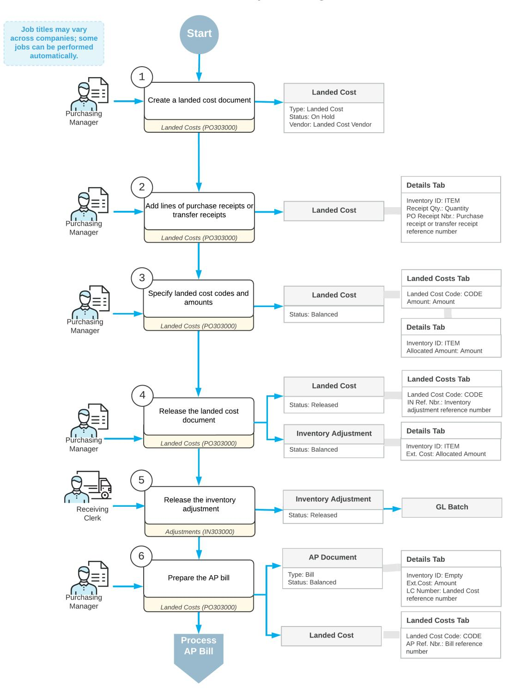

The following sections describe in detail the processing steps shown in the diagram.

#### **1. Enter the Landed Cost Document**

You create a new landed cost document on the *[Landed Costs](https://help-2025r1.acumatica.com/Help?ScreenId=ShowWiki&pageid=849e4a26-8c54-4a98-b366-02ea6a35e9fd)* (PO303000) form. The reference number for the new landed cost document is generated in accordance with the numbering sequence specified on the *[Purchase Orders](https://help-2025r1.acumatica.com/Help?ScreenId=ShowWiki&pageid=13d09c43-8696-4f92-ad9b-3d0209ee3d9b)* *[Preferences](https://help-2025r1.acumatica.com/Help?ScreenId=ShowWiki&pageid=13d09c43-8696-4f92-ad9b-3d0209ee3d9b)* (PO101000) form. If the landed cost document is created with the *On Hold* status, you should click **Remove Hold** on the form toolbar for the document before releasing it.

#### **2. Add Receipt Lines to which Landed Costs Will Be Allocated**

You add the documents or particular document lines for which the landed costs were incurred by clicking **Add PO Receipt** or **Add PO Receipt Line** on the **Details** tab of the *[Landed Costs](https://help-2025r1.acumatica.com/Help?ScreenId=ShowWiki&pageid=849e4a26-8c54-4a98-b366-02ea6a35e9fd)* (PO303000) form. You then select the unlabeled check boxes in the rows of the needed lines in the dialog box that opens, and click **Add & Close** to add the selected lines. You can add the lines of either purchase receipts or transfer receipts to a landed cost document.

#### **3. Specify Landed Cost Codes and Amounts**

You add the landed costs to be allocated between the added receipt lines by adding the landed cost code and specifying the amount to be allocated on the **Landed Costs** tab of the *[Landed Costs](https://help-2025r1.acumatica.com/Help?ScreenId=ShowWiki&pageid=849e4a26-8c54-4a98-b366-02ea6a35e9fd)* (PO303000) form.

#### **4. Release the Landed Cost Document**

To release the prepared landed cost document, you click **Release** on the form toolbar of the *[Landed Costs](https://help-2025r1.acumatica.com/Help?ScreenId=ShowWiki&pageid=849e4a26-8c54-4a98-b366-02ea6a35e9fd)* (PO303000) form. Alternatively, you can release multiple landed cost documents at the same time by using the *[Release Landed Costs](https://help-2025r1.acumatica.com/Help?ScreenId=ShowWiki&pageid=20cb2a86-1347-4cdb-9e8c-99a9b4bd3e9e)* (PO506000) form.

When the landed cost document is released, the system automatically generates a corresponding inventory adjustment (one for each landed cost code) to update the cost of items in inventory. You can view the generated inventory adjustment on the *[Adjustments](https://help-2025r1.acumatica.com/Help?ScreenId=ShowWiki&pageid=31ba83fe-8b3a-4d52-a355-edea838b5c8e)* (IN301000) form.

#### **5. Release the Inventory Adjustment**

The generated inventory adjustment is released automatically if the **Release LC IN Adjustments Automatically** check box is selected on the *[Purchase Orders Preferences](https://help-2025r1.acumatica.com/Help?ScreenId=ShowWiki&pageid=13d09c43-8696-4f92-ad9b-3d0209ee3d9b)* (PO101000) form. If this check box is cleared, you have to release the inventory adjustment manually by clicking **Release** on the form toolbar of the *[Adjustments](https://help-2025r1.acumatica.com/Help?ScreenId=ShowWiki&pageid=31ba83fe-8b3a-4d52-a355-edea838b5c8e)* (IN301000) form.

On release of the inventory adjustment, a batch of GL transactions is generated. The costs of inventory items are updated according to the items' valuation methods, as described in the *[Adding Landed Costs to Items' Costs](#page-454-3)*.

#### **6. Prepare the Accounts Payable Bill**

If the **Create Bill** check box is selected in the landed cost document on the *[Landed Costs](https://help-2025r1.acumatica.com/Help?ScreenId=ShowWiki&pageid=849e4a26-8c54-4a98-b366-02ea6a35e9fd)* (PO303000) form, when you release the landed cost document, the system generates an AP bill to the landed cost vendor automatically.

Otherwise, you need to prepare the bill from the purchase receipt by clicking **Enter AP Bill** on the More menu of the *[Purchase Receipts](https://help-2025r1.acumatica.com/Help?ScreenId=ShowWiki&pageid=d9901c8d-486d-45ed-8088-ea3d8ee3af19)* (PO302000) form. Alternatively, you can create a new AP bill manually on the *[Bills](https://help-2025r1.acumatica.com/Help?ScreenId=ShowWiki&pageid=956b4e51-3078-4d2d-85b3-65c080d95234) [and Adjustments](https://help-2025r1.acumatica.com/Help?ScreenId=ShowWiki&pageid=956b4e51-3078-4d2d-85b3-65c080d95234)* (AP301000) form and add or link the lines of the landed cost document to the bill. For more information on the processing of AP bills, see *[Processing AP Bills](https://help-2025r1.acumatica.com/Help?ScreenId=ShowWiki&pageid=8ba950cc-2db8-4f19-b6a7-b1281cb1db29)*.

If the exact amount of the landed costs has changed, in the generated AP bill, you can manually adjust the amount of the landed costs. Any difference will be posted to dedicated accounts, as described in the *[Adjusting the Landed](#page-454-2) Cost [Variance](#page-454-2)*.

#### **Related Links**

• *[Configuration of Landed Cost Codes](#page-450-3)*

# <span id="page-454-2"></span><span id="page-454-0"></span>**Adjusting the Landed Cost Variance**

Some landed costs, such as freight, are typically known when the goods are received. Other types of landed costs may become known later, when a bill from the service provider is received. When you need to enter the landed costs of a specific type in a landed cost document, if the exact amount of the landed costs is not known yet, you can enter the estimated amount for the appropriate landed cost code in the landed cost document on the **Landed Costs** tab of the *[Landed Costs](https://help-2025r1.acumatica.com/Help?ScreenId=ShowWiki&pageid=849e4a26-8c54-4a98-b366-02ea6a35e9fd)* (PO303000) tab.

Later, when the exact amount becomes known, you can manually adjust the amount of the landed costs in the accounts payable bill generated for the landed cost document, and release the bill. The difference between the estimated amount and the adjusted amount is automatically added to the Landed Cost Variance account specified on the *[Landed Cost Codes](https://help-2025r1.acumatica.com/Help?ScreenId=ShowWiki&pageid=38b79074-9243-4682-8ff9-5d870d829b9e)* (PO202000) form for the landed cost used on the original receipt.

The following accounts are involved in the GL transactions that are generated on release of the AP bill to the landed cost vendor:

- Accounts Payable account of the landed cost vendor
- Landed Cost Accrual account of the landed cost code
- Landed Cost Variance account of the landed cost code

On release of the AP bill to the landed cost vendor, if the landed cost amount specified in the landed cost document hasn't been changed, the following general ledger transactions are posted:

- Accounts Payable account: Cr, landed cost amount
- Landed Cost Accrual account: Dr, landed cost amount

On release of the AP bill to landed cost vendor, if the landed cost amount has been changed in the bill, the following general ledger transactions are posted:

- Accounts Payable account: Cr, bill amount
- Landed Cost Accrual account: Cr, correction amount
- Landed Cost Variance account of the landed cost code: Dr, correction amount
- Landed Cost Accrual account: Dr, bill amount

For information on how the system allocates the landed cost variance for landed costs added to items' cost, see *[Adding Landed Costs to Items' Costs](#page-454-3)*.

#### **Related Links**

• *[Processing Landed Cost Documents](#page-451-1)*

# <span id="page-454-3"></span><span id="page-454-1"></span>**Adding Landed Costs to Items' Costs**

On release of the landed cost document, the system generates the inventory adjustment that updates the items' cost in inventory according to the allocated landed cost amounts and the valuation method of these items. The following sections describe how the system updates costs for the items of purchase receipts and transfer receipts.

#### **Cost Updating When Landed Costs Are Allocated to Purchase Receipts**

Upon release, an inventory adjustment updates the inventory costs of items differently depending on the valuation method of the item:

• For inventory items with the *FIFO* valuation method, the cost in a particular cost layer (created by the purchase receipt) is updated as follows:

- If the layer still has the original quantity, the cost of all items on the layer is updated, and the landed cost amount from the Landed Cost Accrual account is transferred to the Inventory account assigned to the item.
- If the current quantity on the layer is less than the original quantity, the landed cost amount is moved from the Landed Cost Accrual account to update the Landed Cost Variance account of the stock item and the Inventory account in proportion with the issued from the warehouse and remaining quantities, respectively. (If you need to adjust the sales account on release of the inventory adjustment, you can use the same account for the COGS account and the Landed Cost Variance account.)
- For items with the *Average* valuation method, the landed cost amount from the Landed Cost Accrual account is transferred to the Inventory account assigned to the item and updates the average cost of the unit in a cost layer, which is identified by the warehouse.

At the moment of inventory adjustment release, if some of the units listed on the purchase receipt were issued from the warehouse, the landed cost amount updates both the Landed Cost Variance account of the stock item and the Inventory account of the stock item proportionally to the issued and remaining quantities (as on the original purchase receipt), respectively.

• For items with the *Specific* valuation method, the landed cost amount from the Landed Cost Accrual account is transferred to the Inventory account assigned to the item. This amount updates the cost of the unit in a cost layer, which is identified by a serial or lot number of the item.

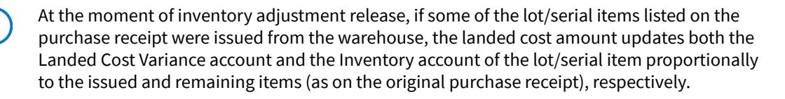

• For items with the *Standard* valuation method, the amount from the Landed Cost Accrual account is moved to the Landed Cost Variance account of the stock item. The system records the cost in a cost layer, which is identified by the warehouse.

#### **Cost Updating When Landed Costs Are Allocated to Transfer Receipts**

Upon release, an inventory adjustment updates the inventory costs of items differently depending on the valuation method of the item as follows:

- For items with the *Standard* valuation method, the landed cost amount is moved from the Landed Cost Accrual account to the Standard Cost Variance account. The following transactions are generated:
  - Standard Cost Accrual account: Cr, landed cost amount
  - COGS account: Dr, landed cost amount
- For items with the *Average* cost valuation method, the landed cost amount moved from the Landed Cost Accrual account to the Inventory account (determined by the posting class of the item) updates the average cost of the unit. The following transactions are generated:
  - Landed Cost Accrual account: Cr, landed cost amount
  - Inventory account: Dr, landed cost amount

At the moment of the release of the inventory adjustment, if some of the units (listed on the transfer receipt) were issued from the warehouse, the landed cost amount updates both the Landed Cost Variance account and the Inventory account of the item proportionally to the issued and remaining quantities (as specified on the original transfer receipt), respectively.

• For items with the *Specific* cost valuation method, the landed cost amount moved from the Landed Cost Accrual account to the Inventory account (determined by the posting class of the item) updates the cost of the unit. The following transactions are generated:

- Landed Cost Accrual account: Cr, landed cost amount
- Inventory account: Dr, landed cost amount

At the moment of the release of the inventory adjustment, if some of the units (listed on the transfer receipt) were issued from the warehouse, the landed cost amount updates both the Landed Cost Variance account and the Inventory account of the lot/serial item proportionally to the issued and remaining items (as specified on the original transfer receipt), respectively.

- For inventory items with the *FIFO* valuation method, the system creates a new cost layer based on the transfer receipt (this layer has the date and the quantity from the transfer receipt) and the amounts moved between accounts vary as follows, based on the quantity of the layer:
  - If the layer still has the original quantity, the cost of all items in the layer is updated, and the landed cost amount from the Landed Cost Accrual account is transferred to the Inventory account assigned to the item.
  - If the current quantity in the layer is less than the original quantity on the receipt, the landed cost amount is moved from the Landed Cost Accrual account to update the Landed Cost Variance account and the Inventory account in proportion to the sold and unsold quantities, respectively.

#### **An Example of Cost Updating for a Transferred FIFO Item**

If a stock item with the *FIFO* valuation method was transferred from one warehouse to another, a new cost layer for the transferred quantity is created with the date of the transfer receipt.

The history of receipts in the table below illustrates how the landed costs update the cost of the transferred item with the *FIFO* valuation method.

| N | Tran. Type                                                                        | Date            | Ref. Nbr. | Qty. | Warehouse | Unit Cost                      | Comment                                                                  |
|---|-----------------------------------------------------------------------------------|-----------------|-----------|------|-----------|--------------------------------|--------------------------------------------------------------------------|
| 1 | Receipt                                                                           | Febru<br>ary 01 | RCP001    | 5    | WHL1      | 300                            | A new cost layer for 5 units<br>was created with the date<br>February 1. |
| 2 | Receipt                                                                           | Febru<br>ary 01 | RCP001    | 7    | WHL2      | 450                            | A new cost layer for 7 units<br>was created with the date<br>February 1. |
| 3 | Transfer from<br>warehouse<br>WHL1                                                | Febru<br>ary 08 | TRAN001   | -3   | WHL1      | 300                            | The cost layer was updated.                                              |
| 4 | Transfer re<br>ceipt at ware<br>house WHL2<br>Landed cost<br>amount<br>added: 240 | Febru<br>ary 09 | TRREC01   | 3    | WHL2      | (3 * 300 +<br>240) / 3=<br>380 | A new cost layer for 3 units<br>was created with the date<br>February 9. |

If the item is moved within the same warehouse from a location with the **CostSeparately** check box selected on the *[Warehouses](https://help-2025r1.acumatica.com/Help?ScreenId=ShowWiki&pageid=264b0ef7-2b6c-40b4-a7d9-f1a5e067939b)* (IN204000) form to a location with the **CostSeparately** check box cleared (or if the reverse is true), a new cost layer is created too; however, it has the date of the original receipt. In the above example, if a transfer was performed between the L1 and L2 locations (which have different cost settings) of the same warehouse, the cost layer mentioned in Row 4 would have the date February 1.

# <span id="page-457-0"></span>**Applying Direct-Entry Taxes to Landed Cost Documents**

On the *[Landed Costs](https://help-2025r1.acumatica.com/Help?ScreenId=ShowWiki&pageid=849e4a26-8c54-4a98-b366-02ea6a35e9fd)* (PO303000) form, you can create a landed cost document to which a direct-entry tax is applied. A direct-entry tax has the **Direct-EntryTax** check box selected on the *[Taxes](https://help-2025r1.acumatica.com/Help?ScreenId=ShowWiki&pageid=692e30c9-e0af-4aa3-b0f6-f3ba190d257a)* (TX205000) form. For details, see *Direct Tax Payment: General [Information](https://help-2025r1.acumatica.com/Help?ScreenId=ShowWiki&pageid=7e82806b-e9bd-439b-a468-702f0b76b207)*.

For a direct-entry tax to be applied, all of the following conditions should be met:

- The landed cost document belongs to a tax zone in which the direct-entry tax is included.
- The line of the landed cost document has the *None* allocation method specified on the **Landed Costs** tab.
- The tax category selected in the document line contains the direct-entry tax and has the **Exclude Listed Taxes** check box cleared on the *Tax [Categories](https://help-2025r1.acumatica.com/Help?ScreenId=ShowWiki&pageid=db5e7fad-054d-467d-877e-2db4ee180ead)* (TX205500) form.

For a direct-entry tax, the following columns are filled in by the system and cannot be edited on the**Taxes** tab of the *[Landed Costs](https://help-2025r1.acumatica.com/Help?ScreenId=ShowWiki&pageid=849e4a26-8c54-4a98-b366-02ea6a35e9fd)* form:**Taxable Amount**, **Tax Amount**, and **Tax Rate**.

You cannot manually delete a direct-entry tax from the**Taxes** tab of the *[Landed Costs](https://help-2025r1.acumatica.com/Help?ScreenId=ShowWiki&pageid=849e4a26-8c54-4a98-b366-02ea6a35e9fd)* form by selecting its row and clicking **Delete Row** on the table toolbar. To delete a direct-entry tax, you should change the tax category for the document line on the **Landed Costs** tab or delete the document line with the tax on the same tab.

When a bill is created for a line of the landed cost document to which a direct-entry tax is applied, on the *[Bills and](https://help-2025r1.acumatica.com/Help?ScreenId=ShowWiki&pageid=956b4e51-3078-4d2d-85b3-65c080d95234) [Adjustments](https://help-2025r1.acumatica.com/Help?ScreenId=ShowWiki&pageid=956b4e51-3078-4d2d-85b3-65c080d95234)* (AP301000) form, the**Taxable Amount** for this tax is *0* and the **Tax Amount** (shown on the**Taxes** tab) equals the line amount.

## <span id="page-457-2"></span><span id="page-457-1"></span>**To Create a Landed Cost Document**

To allocate landed costs among items of either purchase receipts or transfer receipts, you create a landed cost document on the *[Landed Costs](https://help-2025r1.acumatica.com/Help?ScreenId=ShowWiki&pageid=849e4a26-8c54-4a98-b366-02ea6a35e9fd)* (PO303000) form.

#### **To Create a Purchase Order**

- 1. Open the *[Landed Costs](https://help-2025r1.acumatica.com/Help?ScreenId=ShowWiki&pageid=849e4a26-8c54-4a98-b366-02ea6a35e9fd)* (PO303000) form.
- 2. Select the landed cost vendor in the**Vendor** box.
- 3. Check the location of the vendor, and change it if needed.
- 4. Optional: In the **Currency** box, heck the currency and the currency exchange rate; change these, if needed.
- 5. Check the date of the purchase order, and change it if needed.
- 6. Optional: In the**Vendor Ref.** box, specify the reference number of the vendor's original document. (This value may be required, based on your organization's settings.)
- 7. Optional: Select the **Create Bill** box, if you want the system to generate the Accounts Payable bill automatically on release of the landed cost document.
- 8. Specify a short description of the landed cost document.
- 9. To add all lines of documents to which the landed costs should be allocated, on the table toolbar of the **Details** tab, click **Add PO Receipt**, and do the following in the **Add Receipt** dialog box, which opens:
  - a. In the **Type** box, select *Receipt* to display purchase receipts in the table, or *Transfer Receipt* to display transfer receipts.
  - b. Select the unlabeled check boxes in the rows with the receipts whose lines should be added.
  - c. Click **Add & Close** to add the lines of the receipts and close the dialog box.

- 10.To add the particular lines of either purchase receipts or transfer receipts to which the landed costs should be allocated, on the table toolbar of the **Details** tab, click **Add PO Receipt Line**, and do the following in the **Add Receipt Line** dialog box, which opens:
  - a. In the **Type** box, if it is available, select *Receipt* to display purchase receipts in the table, or *Transfer Receipt* to display transfer receipts.
  - b. Select the unlabeled check boxes in the rows with the receipt lines to be added.
  - c. Click **Add & Close** to add the selected receipt lines and close the dialog box.
- 11.On the **Details** tab, review the information in the added lines, and make changes to weight and volume in lines, if needed.
- 12.On the **Landed Costs** tab, for each landed cost amount that you want to allocate to the added receipt lines, click **Add Row** on the table toolbar, and do the following:
  - a. In the **Branch** column, ensure that the system has specified the correct branch.
  - b. In the **Landed Cost Code** column, select the landed cost code.
  - c. In the **Amount** column, specify the landed cost amount to be allocated.
  - d. Optional: In the**Tax Category** box, change the appropriate tax category if the landed cost amounts are subject to taxes.
  - e. Optional: In the **Inventory ID** box, select a particular item if the landed cost amount should be allocated to only lines with this particular item ID.
  - f. Click **Save** on the form toolbar.

13.On the form toolbar, click **Remove Hold**.

14.On the form toolbar, click**Save**.

# <span id="page-458-1"></span><span id="page-458-0"></span>**To Add Landed Costs to a Bill**

To add line or lines of a landed cost document to an Accounts Payable bill to a landed cost vendor, you use the *[Bills](https://help-2025r1.acumatica.com/Help?ScreenId=ShowWiki&pageid=956b4e51-3078-4d2d-85b3-65c080d95234) [and Adjustments](https://help-2025r1.acumatica.com/Help?ScreenId=ShowWiki&pageid=956b4e51-3078-4d2d-85b3-65c080d95234)* (AP301000) form.

#### **To Add a Landed Cost Line to Bill**

- 1. Open the *[Bills and Adjustments](https://help-2025r1.acumatica.com/Help?ScreenId=ShowWiki&pageid=956b4e51-3078-4d2d-85b3-65c080d95234)* (AP301000) form.
- 2. In the **Type** box, select *Bill*, and select the needed bill by its reference number.
- 3. On the table toolbar of the **Document Details** tab, click **Add LC**. In the **Add LC** dialog box, which opens, do the following:
  - a. Optional: Filter the lines in the table by selecting any of the following: the particular landed cost document in the **LC Nbr.** box, the particular receipt in the **Receipt Nbr.** box, or the particular landed cost code in the **LC Code** box.
  - b. In the table, select the unlabeled check boxes in the line or lines with the landed costs to be added to the bill.
  - c. Click **Add & Close** to close the dialog box and add the selected lines.
- 4. On the **Document Details** tab, review the added lines, and correct their **Ext. Cost**, if needed.
- 5. On the form toolbar, click**Save** to save your changes.

#### **Notes About the Procedure**

The notes in this section describe the nuances of the UI elements available on the form, such as when an element is required and when it is not, and when the system fills in settings by default. This section can include other notes.

Note the following about adding landed costs to a bill:

- The **Add LC** dialog box shows the lines of released landed cost documents for which the AP bill wasn't created on release.
- If you correct the landed cost amount in the bill, the occurred difference between the estimated amount in the landed cost document and corrected amount billed to landed cost vendor is posted to the Landed Cost Variance account. For details, see *[Adjusting](#page-454-2) the Landed Cost Variance*.

# <span id="page-459-1"></span><span id="page-459-0"></span>**To Link a Bill Line to Landed Cost Document**

To link a particular line of an existing Accounts Payable bill to a line of landed cost document, you use the *[Bills and](https://help-2025r1.acumatica.com/Help?ScreenId=ShowWiki&pageid=956b4e51-3078-4d2d-85b3-65c080d95234) [Adjustments](https://help-2025r1.acumatica.com/Help?ScreenId=ShowWiki&pageid=956b4e51-3078-4d2d-85b3-65c080d95234)* (AP301000) form.

#### **To Link an Accounts Payable Bill to Landed Cost Document**

- 1. Open the *[Bills and Adjustments](https://help-2025r1.acumatica.com/Help?ScreenId=ShowWiki&pageid=956b4e51-3078-4d2d-85b3-65c080d95234)* (AP301000) form.
- 2. In the **Type** box, select *Bill*, and select the needed bill by its reference number.
- 3. On the table toolbar of the **Document Details** tab, click a line with an empty inventory ID to which a landed cost should be linked, and click **Link Line** on the table toolbar. In the **Link Line** dialog box, which opens with the **Landed Cost** mode selected, select the unlabeled check box next to the landed cost line to be linked.
- 4. Click **Add & Close** to close the dialog box and link the selected line.
- 5. Optional: Correct the **Ext. Cost** of the bill line, if needed.
- 6. Click **Save** to save your changes.

#### **Notes About the Procedure**

The notes in this section describe the nuances of the UI elements available on the form, such as when an element is required and when it is not, and when the system fills in settings by default. This section can include other notes.

Note the following about adding landed costs to a bill:

- You can link a landed costs line to a line with empty **Inventory ID** only. Once you have linked a landed cost line, the description of a bill line changes to the description of the linked landed cost.
- Each bill line can be linked to only one landed cost line.
- The **Link Line** dialog box shows the lines of released landed cost documents for which the Accounts Payable bill wasn't created on release.
- If the amount in the bill line differs from the amount in the landed cost line that you linked, the occurred difference is posted to the Landed Cost Variance account. For details, see *[Adjusting the Landed Cost](#page-454-2) [Variance](#page-454-2)*.

# <span id="page-460-0"></span>**Allocating the Purchase Price Variance**

The purchase price variance (PPV) amount is the difference between an item's actual unit cost on a purchase receipt (calculated as the item extended cost divided by its quantity) and its actual unit cost on a bill (calculated as the extended cost divided by the quantity on the bill) multiplied by the quantity of the item on the bill.

In Acumatica ERP, on purchase orders, purchase receipts, inventory receipts, and bills, the purchase prices of items are referred to as *costs*.

The difference may occur for various reasons, such as exchange rate fluctuations or unplanned changes in the vendor price or delivery costs. Different businesses may use different approaches when accounting for the purchase price variance amounts. This topic describes the options available in Acumatica ERP for the allocation of the purchase price variance amounts for stock items.

#### **PPV Calculation**

Generally, actual vendor prices and discounts change frequently, so when you enter a purchase receipt on the *[Purchase Receipts](https://help-2025r1.acumatica.com/Help?ScreenId=ShowWiki&pageid=d9901c8d-486d-45ed-8088-ea3d8ee3af19)* (PO302000) form and specify an item by its inventory ID, the exact vendor price and applicable discounts are not known. Even if the unit cost appears automatically in the **Unit Cost** column, you can manually enter only the item quantity and the extended cost (which may include the vendor's current promotional price and discount for the specified quantity not yet configured in the system); the extended cost will not be recalculated based on the unit cost. For the PPV calculation, the system will use the actual unit cost (calculated as the extended amount per unit), not the unit cost that is available in the system and was inserted automatically.

When you enter a related bill by using the *[Bills and Adjustments](https://help-2025r1.acumatica.com/Help?ScreenId=ShowWiki&pageid=956b4e51-3078-4d2d-85b3-65c080d95234)* (AP301000) form, you know the prices and any additional costs, and you can reflect them on the bill. On release of a bill that is linked to the purchase receipt, the system calculates the purchase price variance amount for each line item as follows:

- Calculates the unit's actual cost on the purchase receipt as the extended cost on the purchase receipt divided by the quantity
- Calculates the unit's actual cost on the bill as the extended cost on the bill divided by the quantity on the bill
- Subtracts the unit's actual cost on the bill from the unit's actual cost on the receipt
- Multiplies the difference by the quantity on the bill

For example, suppose that the following documents (a purchase receipt and the AP bill linked to the receipt) were entered into the system.

#### *Table: Receipt Details*

| Item       | Quantity | Extended Cost |
|------------|----------|---------------|
| New Item 1 | 20       | 4500          |
| New Item 2 | 30       | 9000          |

#### *Table: Bill Details*

| Item       | Quantity | Extended Cost |
|------------|----------|---------------|
| New Item 1 | 10       | 2000          |
| New Item 2 | 30       | 9900          |

The PPV amounts are calculated as follows:

#### *Table: PPV Calculation*

| Item       | Quantity | PPV  |
|------------|----------|------|
| New Item 1 | 10       | 250  |
| New Item2  | 30       | –900 |

If the PPV appears, its amount is included in a GL transaction, which is generated on release of an AP bill. The quantity in the transaction line with the PPV is always *0*.

The ways the calculated PPV amounts can be allocated depend on the item valuation method and the selected allocation mode, as described in the following sections.

#### **PPV Allocation for Exchange Rate Changes**

By default, in a purchase receipt, the system inserts the currency rate that is current on the purchase receipt date. If needed, you can override the default currency rate if all of the following are true:

- The *Multicurrency Accounting* feature is enabled on the *[Enable/Disable Features](https://help-2025r1.acumatica.com/Help?ScreenId=ShowWiki&pageid=c1555e43-1bc5-4f6f-ba9d-b323f94d8a6b)* (CS100000) form.
- The **Allow Changing Currency Rate on Receipt** check box is selected on the *[Purchase Orders Preferences](https://help-2025r1.acumatica.com/Help?ScreenId=ShowWiki&pageid=13d09c43-8696-4f92-ad9b-3d0209ee3d9b)* (PO101000) form.
- The **Enable Rate Override** check box is selected on the *[Vendors](https://help-2025r1.acumatica.com/Help?ScreenId=ShowWiki&pageid=a9584be3-f2bd-4d67-80d4-8041d809df56)* (AP303000) form for the vendor specified in the purchase receipt.

The system will use the new exchange rate for calculating the unit cost of the items in the inventory receipt that it creates on release of the current purchase receipt.

On release of an AP bill that is linked to this purchase receipt, the system calculates the purchase price variance amount for each line item as follows:

- Calculates the unit's actual cost on the purchase receipt based on the exchange rate of the purchase receipt
- Calculates the unit's actual cost on the bill based on the exchange rate of the bill
- Subtracts the unit's actual cost on the bill from the unit's actual cost on the receipt
- Multiplies the difference by the quantity on the bill

#### **PPV Allocation for Items with Standard Costs**

For stock items with *Standard* assigned as the cost valuation method on the *[Stock Items](https://help-2025r1.acumatica.com/Help?ScreenId=ShowWiki&pageid=77786a70-1f1e-4d63-ad98-96f98e4fcb0e)* (IN202500) form, any PPV amounts are allocated to the Purchase Price Variance account defined by the posting class of the item. For more information, see *Item Costs and [Valuation](https://help-2025r1.acumatica.com/Help?ScreenId=ShowWiki&pageid=fd82a373-1996-496f-8177-fbc4c6b091cd) Methods: Standard Method*.

### **PPV Allocation Modes for Items with Other Valuation Methods**

In Acumatica ERP, you can select how you want to process the purchase price variance amounts for stock items with the following valuation methods: *Average*, *FIFO*, or *Specific*. On the *[Purchase Orders Preferences](https://help-2025r1.acumatica.com/Help?ScreenId=ShowWiki&pageid=13d09c43-8696-4f92-ad9b-3d0209ee3d9b)* (PO101000) form, you can select one of the following modes of PPV allocation:

- *Inventory Account*: To record the variance to the inventory accounts to update the item costs. If you select this mode, you also need to select the reason code (in the adjacent box) that will provide the expense accounts and subaccounts used for the allocation of the PPV amounts.
- *Purchase Price Variance Account*: To record any variance amounts to the purchase price variance accounts to be further processed as additional expenses.

The modes of PPV allocation are discussed in detail in the sections below.

#### **The Inventory Account Mode of PPV Allocation**

If *Inventory Account* is selected as the mode of PPV allocation, on release of a bill, an inventory adjustment for the PPV amounts is generated automatically. You can view the reference number of the adjustment in the **PPV Ref. Nbr.** column on the **Document Details** tab of the *[Bills and Adjustments](https://help-2025r1.acumatica.com/Help?ScreenId=ShowWiki&pageid=956b4e51-3078-4d2d-85b3-65c080d95234)* (AP301000) form.

Consider a few scenarios that may occur with a received stock item (with no lot or serial numbers) when the bill is released:

- If no units of the item have been issued from a warehouse since the item was received, this adjustment debits the inventory account of the item for the positive variance amount and credits the PO Accrual account (or credits the inventory account for the negative amount and debits the PO Accrual account for the same amount). See *Purchase Price Variance [Allocation:](#page-462-1) Example 1*.
- If all the units of the item have been issued from a warehouse before the bill has been created and an adjustment has been generated, this adjustment debits the variance amount to the expense account associated with the reason code.
- If some (but not all) of the units of the item have been issued from the warehouse, the adjustment distributes the variance amount proportionally between the quantity of units issued and the quantity of units still in the warehouse, and allocates the respective amounts to the expense account (associated with the reason code) and to the inventory account. For details, see *Purchase Price Variance [Allocation:](#page-464-1) Example [2](#page-464-1)*.

If multiple bills are created for partial quantities of items from a receipt and certain quantities of the items (from that receipt) have been issued from the warehouse, the PPV amounts on each adjustment generated for a partial bill are allocated between the inventory accounts and the expense accounts in the same proportion in which the original quantities from the receipt are distributed between the quantities issued and the quantities still in stock.

If a PPV adjustment would result in negative balance of the inventory account, the adjustment amount is posted to the expense account.

On reversal of a bill linked to a purchase receipt, a PPV adjustment can be created depending on the amount difference between the purchase receipt and the bill. The new adjustment does not have a link to the original adjustment. The original adjustment remains in the system. The amount of the new adjustment depends on the amount difference between the purchase receipt and the debit adjustment.

#### **The Purchase Price Variance Account Mode of PPV Allocation**

If *Purchase Price Variance Account* is selected as the mode of PPV allocation, on release of a bill, the entire PPV amount is recorded to the Purchase Price Variance account defined by the posting class of the item.

#### **Related Links**

- *Item Costs and Valuation Methods: General [Information](https://help-2025r1.acumatica.com/Help?ScreenId=ShowWiki&pageid=79edcbf8-e18b-4817-875f-6cbfd7a32384)*
- *[Purchase Orders Preferences](https://help-2025r1.acumatica.com/Help?ScreenId=ShowWiki&pageid=13d09c43-8696-4f92-ad9b-3d0209ee3d9b)*
- *Purchase Price Variance [Allocation:](#page-462-1) Example 1*
- *Purchase Price Variance [Allocation:](#page-464-1) Example 2*

# <span id="page-462-1"></span><span id="page-462-0"></span>**Purchase Price Variance Allocation: Example 1**

This topic describes all the documents that you would need to create and the transactions generated for the following scenario:

• The *Inventory Account* mode is selected for allocation of purchase price variance (PPV) amounts.

- Purchased items have the *Average* cost valuation method assigned.
- All the quantities of the items remain in stock at the date when a bill is created.

#### **Step 1: Creating a Purchase Receipt**

By using the *[Purchase Receipts](https://help-2025r1.acumatica.com/Help?ScreenId=ShowWiki&pageid=d9901c8d-486d-45ed-8088-ea3d8ee3af19)* (PO302000) form, you create a purchase receipt for the following items.

#### *Table: Purchase Receipt*

.

| Item   | Quantity | Unit Cost | Amount |
|--------|----------|-----------|--------|
| Item1  | 10       | 250       | 2500   |
| Item2  | 23       | 120       | 2760   |
| Item3  | 15       | 380       | 5700   |
| Total: |          |           | 10960  |

As a result, an inventory receipt is created and released. On its release, the following transactions are generated.

| Table: GL Transactions Generated for the Inventory Receipt |  |
|------------------------------------------------------------|--|
|------------------------------------------------------------|--|

| Account           | Debit Amount | Credit Amount |
|-------------------|--------------|---------------|
| Inventory (Item1) | 2500         | 0             |
| Inventory (Item2) | 2760         | 0             |
| Inventory (Item3) | 5700         | 0             |
| PO Accrual        | 0            | 10960         |

#### **Step 2: Creating a Bill**

Later, you receive and enter the vendor bill for the initial quantities of the items with the following information.

*Table: Vendor Bill*

| Item   | Quantity | Unit Cost | Amount |
|--------|----------|-----------|--------|
| Item1  | 10       | 450       | 4500   |
| Item2  | 23       | 120       | 2760   |
| Item3  | 15       | 180       | 2700   |
| Total: |          |           | 9960   |

On release of the bill, the following transactions have been generated.

#### *Table: GL Transactions Generated for the Vendor Bill*

| Account    | Debit Amount | Credit Amount |
|------------|--------------|---------------|
| PO Accrual | 9960         | 0             |
| Vendor AP  | 0            | 9960          |

Also, on release of this bill, an inventory adjustment has been generated with the following lines.

#### *Table: Inventory Adjustment*

| Item  | Extended Cost |
|-------|---------------|
| Item1 | 2000          |
| Item3 | -3000         |

*Table: GL Transactions Generated for the Inventory Adjustment*

| Account           | Debit Amount | Credit Amount |
|-------------------|--------------|---------------|
| Inventory (Item1) | 2000         | 0             |
| Inventory (Item2) | 0            | 3000          |
| PO Accrual        | 1000         | 0             |

# <span id="page-464-1"></span><span id="page-464-0"></span>**Purchase Price Variance Allocation: Example 2**

This topic describes all the documents that you would have to create and the transactions generated for these documents for the following scenario:

- The *Inventory Account* mode is selected for allocation of purchase price variance (PPV) amounts.
- Purchased items have the *Average* cost valuation method assigned.
- Between the date of the receipt and the date of the bill, some quantities of the purchased items were issued (sold).

#### **Step 1. Creating a Purchase Receipt**

By using the *[Purchase Receipts](https://help-2025r1.acumatica.com/Help?ScreenId=ShowWiki&pageid=d9901c8d-486d-45ed-8088-ea3d8ee3af19)* (PO302000), suppose that you create a purchase receipt for the following items.

#### *Table: Purchase Receipt*

| Item  | Quantity | Unit Cost | Amount |
|-------|----------|-----------|--------|
| Item1 | 10       | 250       | 2500   |
| Item2 | 23       | 120       | 2760   |
| Item3 | 15       | 380       | 5700   |

| Item   | Quantity | Unit Cost | Amount |
|--------|----------|-----------|--------|
| Total: |          |           | 10960  |

As a result, an inventory receipt is created and released. On its release, the following transactions are generated.

#### *Table: GL Transactions Generated for the Inventory Receipt*

| Account           | Debit Amount | Credit Amount |
|-------------------|--------------|---------------|
| Inventory (Item1) | 2500         | 0             |
| Inventory (Item2) | 2760         | 0             |
| Inventory (Item3) | 5700         | 0             |
| PO Accrual        | 0            | 10960         |

#### **Step 2. Creating an Inventory Issue**

During the next few days, you sell some quantities of the items. The inventory issue is generated with the following lines.

#### *Table: Inventory Issue*

| Item   | Quantity | Unit Cost | Amount |
|--------|----------|-----------|--------|
| Item1  | 7        | 250       | 1750   |
| Item2  | 23       | 120       | 2760   |
| Item3  | 5        | 380       | 1900   |
| Total: |          |           | 6410   |

And this issue generates the following transactions.

*Table: GL Transactions Generated for the Issue*

| Account           | Debit Amount | Credit Amount |
|-------------------|--------------|---------------|
| Inventory (Item1) | 0            | 1750          |
| Inventory (Item2) | 0            | 2760          |
| Inventory (Item3) | 0            | 1900          |
| Expense (COGS)    | 6410         | 0             |

#### **Step 3: Creating a Bill**

Later, you receive and enter the vendor bill for the initial quantities of the items with the following information.

| Item   | Quantity | Unit Cost | Amount |
|--------|----------|-----------|--------|
| Item1  | 10       | 450       | 4500   |
| Item2  | 23       | 200       | 4600   |
| Item3  | 15       | 180       | 2700   |
| Total: |          |           | 11800  |

*Table: Vendor Bill*

On release of this bill, the following transactions are generated.

*Table: GL Transactions Generated for the Bill*

| Account    | Debit Amount | Credit Amount |
|------------|--------------|---------------|
| PO Accrual | 11800        | 0             |
| Vendor AP  | 0            | 11800         |

Also, on release of this bill, an inventory adjustment is generated with the following lines.

#### *Table: Inventory Adjustment*

| Item               | Extended Cost |
|--------------------|---------------|
| Item1              | 600           |
| Item3              | -2000         |
| Item1 (PPVexpense) | 1400          |
| Item2 (PPVexpense) | 1840          |
| Item3 (PPVexpense) | -1000         |

On release of the adjustment, the following transactions are generated.

*Table: GL Transactions Generated for the Inventory Adjustment*

| Account            | Debit Amount | Credit Amount |
|--------------------|--------------|---------------|
| Inventory (Item1)  | 600          | 0             |
| Inventory (Item3)  | 0            | 2000          |
| PPVexpense (Item1) | 1400         | 0             |
| PPVexpense (Item2) | 1840         | 0             |
| PPVexpense (Item3) | 0            | 1000          |
| PO Accrual         | 0            | 2000          |

| Account    | Debit Amount | Credit Amount |
|------------|--------------|---------------|
| PO Accrual | 0            | 1840          |
| PO Accrual | 3000         | 0             |

# <span id="page-468-0"></span>**Performing Inventory Planning with DRP**

With its distribution requirements planning (DRP) capabilities, Acumatica ERP provides time-phased inventory planning and sales forecasting for handling orders within a supply chain. DRP inventory planning does not include the use of production orders. You can precisely plan your supply at the required time, minimizing the inventory stored in warehouses for orders placed well ahead of the needed date.

# <span id="page-468-1"></span>**Inventory Planning with DRP: General Information**

In Acumatica ERP, you can take advantage of time-phased inventory planning and sales forecasting for handling orders within a supply chain. You can precisely plan your supply to arrive at the required time, minimizing the inventory stored in warehouses for orders placed long before the needed date. You can match supply to demand based on date-specific recommendations for unmet demand. The system can group supply and demand by time periods and generate exceptions for supply issues, such as late delivery dates in documents.

The inventory planning functionality is available only if one of the following features is enabled on the *[Enable/](https://help-2025r1.acumatica.com/Help?ScreenId=ShowWiki&pageid=c1555e43-1bc5-4f6f-ba9d-b323f94d8a6b) [Disable Features](https://help-2025r1.acumatica.com/Help?ScreenId=ShowWiki&pageid=c1555e43-1bc5-4f6f-ba9d-b323f94d8a6b)* (CS100000) form: *Distribution Requirements Planning* (DRP) or *Material Requirements Planning* (MRP). This chapter describes how to perform inventory planning with DRP. For details about configuring inventory planning, see *[Inventory Planning Configuration: General Information](https://help-2025r1.acumatica.com/Help?ScreenId=ShowWiki&pageid=bbdde314-b398-4d07-a026-7ea22d6130ec)*.

Some facets of inventory planning depend on the features enabled in your system on the *[Enable/Disable Features](https://help-2025r1.acumatica.com/Help?ScreenId=ShowWiki&pageid=c1555e43-1bc5-4f6f-ba9d-b323f94d8a6b)* form:

- You can specify planning requirements by warehouse and transfer stock items between warehouses if the *Multiple Warehouses* feature is enabled. For details, see *Inventory Planning with DRP: [Transfers](#page-472-1)*.
- You can plan stock components needed to assemble a kit by using the inventory planning functionality if the *Kit Assembly* feature is enabled.

### **Learning Objectives**

In this chapter, you will learn how to do the following:

- Run inventory planning and analyze the results
- View the exceptions and take the needed actions
- Create supply documents based on the results of the inventory planning analysis

#### **Applicable Scenarios**

You may need to perform inventory planning in the following cases:

- Your company has supply and demand orders spread out over a time period and wants to avoid stockouts on any particular date.
- Your company has multiple warehouses, and you restock the inventory in a warehouse by transferring items from another warehouse where they are available.
- Your company uses inventory kits and needs to ensure that it has the stock components needed to assemble the kits.

#### **General Steps of Inventory Planning**

You can run the inventory planning process at any time, but the process may affect the performance of the Acumatica ERP instance. We recommend that you use an automation schedule to run the inventory planning process before each business day begins. The process should be run aer all of the previous day's sales orders and purchase orders have been entered into the system, all transactions affecting inventory have been posted, and most or all users have signed out of the system. We recommend that you create any needed purchase orders by using the *[Create Purchase Orders](https://help-2025r1.acumatica.com/Help?ScreenId=ShowWiki&pageid=dc527541-a18a-44c9-8d51-6d2d77a37443)* (PO505000) form and any needed transfer orders by using the *Create [Transfer](https://help-2025r1.acumatica.com/Help?ScreenId=ShowWiki&pageid=aaf05359-02c9-4281-8d86-210a63c3d0df) [Orders](https://help-2025r1.acumatica.com/Help?ScreenId=ShowWiki&pageid=aaf05359-02c9-4281-8d86-210a63c3d0df)* (SO509000) form at the end of the business day. Also, because inventory planning is a very resourcedependent process, it should be run in a time frame that does not conflict with database maintenance processes.

On inventory planning forms, the system does not show allocation links between a sales order and the corresponding purchase order when it is matching supply and demand. (The **PO Source** column on the *[Sales Orders](https://help-2025r1.acumatica.com/Help?ScreenId=ShowWiki&pageid=19e4021c-1b84-49fd-be12-0320c5f1c7e5)* (SO301000) form for the sales order may contain *Purchase to Order* or any other option.) The system only matches supply and demand based on dates.

Inventory planning consists of the following general steps:

- 1. Before the end of a business day, processing and releasing all sales documents (such as sales orders or sales invoices) transfer orders, and transactions that affect inventory.
- 2. Before the end of a business day, processing and releasing all purchase documents (such as purchase receipts) and transactions that affect inventory.
- 3. Include kits in inventory planning (if applicable).
- 4. Either manually or through the use of an automation schedule, regenerating inventory planning by using the *[Regenerate Inventory Planning](https://help-2025r1.acumatica.com/Help?ScreenId=ShowWiki&pageid=588d4939-b533-4b84-8016-cf34e2be17d5)* (AM505000) form.
- 5. Reviewing the inventory planning exceptions on the *[Inventory Planning Exceptions](https://help-2025r1.acumatica.com/Help?ScreenId=ShowWiki&pageid=05634ed3-1a22-4751-960d-1782a9b08056)* (AM403000) form. Depending on the exceptions, the planning manager should evaluate and take the needed recommended actions, such as contacting a vendor to expedite delivery. Then the planning manager should make the needed changes to the dates in the demand and supply documents.
- 6. Reviewing the results of inventory planning regeneration by using the *[Inventory Planning Display](https://help-2025r1.acumatica.com/Help?ScreenId=ShowWiki&pageid=78238a83-ae79-47e6-b583-fd7c7fc6de69)* (AM400000) form and creating the required purchase orders or transfer orders by using the same form.

#### **Workflow of Inventory Planning with DRP**

A general workflow of DRP—inventory planning that does not include production orders—involves the steps and generated documents shown in the following diagram.

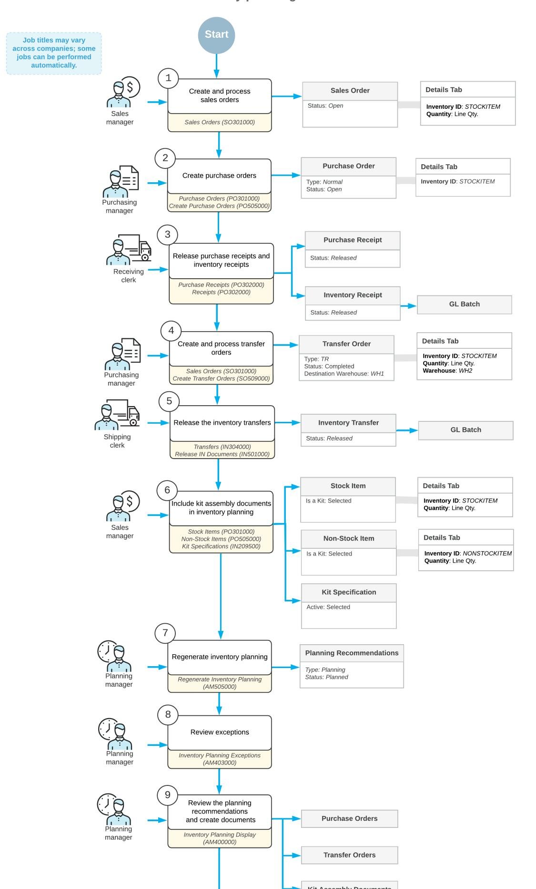

# <span id="page-471-0"></span>**Inventory Planning with DRP: Processing of Documents**

When inventory planning is performed, the system analyzes particular data based on the inventory planning settings and the existing open documents that may influence the planning. In this topic, you will find information about how documents are processed in inventory planning in Acumatica ERP when you are using distribution requirements planning (DRP)—that is, inventory planning that does not include production orders.

#### **Documents Used in Inventory Planning**

During inventory planning, the system analyzes the following documents:

- Demand documents (such as sales orders or forecasts), which generate demand for items or cause items to be issued from one of the company's warehouses
- Supply documents (such as purchase orders or transfer orders), which cause items to be received in one of the company's warehouses

All of the following documents and data may be used in inventory planning:

- Forecasts on the *[Forecast](https://help-2025r1.acumatica.com/Help?ScreenId=ShowWiki&pageid=1b6be70b-e2d5-4202-bb38-eba98534c497)* (AM202000) form
- Sales orders on the *[Sales Orders](https://help-2025r1.acumatica.com/Help?ScreenId=ShowWiki&pageid=19e4021c-1b84-49fd-be12-0320c5f1c7e5)* (SO301000) form that have not been processed to completion, including open transfer orders and blanket sales orders
- Shipments on the *[Shipments](https://help-2025r1.acumatica.com/Help?ScreenId=ShowWiki&pageid=f47cffcc-543e-469c-a204-a9c1e3da346d)* (SO302000) form with items that have not been issued
- Inventory on hand and unreleased inventory transactions, which include documents on the following forms:
  - Issues on the *[Issues](https://help-2025r1.acumatica.com/Help?ScreenId=ShowWiki&pageid=17b051f6-027d-4459-b542-65c1c1f9d0ea)* (IN302000) form
  - Receipts on the *[Receipts](https://help-2025r1.acumatica.com/Help?ScreenId=ShowWiki&pageid=d6ecad5b-155f-44bf-baba-9ed006d298b5)* (IN301000) form
  - Documents on the *[Adjustments](https://help-2025r1.acumatica.com/Help?ScreenId=ShowWiki&pageid=31ba83fe-8b3a-4d52-a355-edea838b5c8e)* (IN303000) form
- Two-step transfers of items between warehouses on the *[Transfers](https://help-2025r1.acumatica.com/Help?ScreenId=ShowWiki&pageid=ea1539b6-fafa-443e-8b49-cd1ced95389f)* (IN304000) form if the *Multiple Warehouses* feature is enabled on the *[Enable/Disable Features](https://help-2025r1.acumatica.com/Help?ScreenId=ShowWiki&pageid=c1555e43-1bc5-4f6f-ba9d-b323f94d8a6b)* (CS100000) form
- Purchase orders on the *[Purchase Orders](https://help-2025r1.acumatica.com/Help?ScreenId=ShowWiki&pageid=5565686c-96c4-4bfa-a51d-9a2566baa808)* (PO301000) form that have not been processed to completion
- Kit assembly orders or kit disassembly orders on the *[Kit Assembly](https://help-2025r1.acumatica.com/Help?ScreenId=ShowWiki&pageid=dbeb6a3a-153e-4731-bb21-850cd124bfa4)* (IN307000) form if the *Kit Assembly* feature is enabled on the *[Enable/Disable Features](https://help-2025r1.acumatica.com/Help?ScreenId=ShowWiki&pageid=c1555e43-1bc5-4f6f-ba9d-b323f94d8a6b)* form

You manage the set of entities included in inventory planning at the warehouse level. For details, see *[Inventory](https://help-2025r1.acumatica.com/Help?ScreenId=ShowWiki&pageid=bbdde314-b398-4d07-a026-7ea22d6130ec) [Planning Configuration: General Information](https://help-2025r1.acumatica.com/Help?ScreenId=ShowWiki&pageid=bbdde314-b398-4d07-a026-7ea22d6130ec)*.

#### **Order Dates Used in Inventory Planning**

The system uses the following dates, which are specified in supply and demand documents, during inventory planning:

- In sales orders and transfer orders, the**Ship On** date in each document line on the *[Sales Orders](https://help-2025r1.acumatica.com/Help?ScreenId=ShowWiki&pageid=19e4021c-1b84-49fd-be12-0320c5f1c7e5)* (SO301000) form
- In purchase orders, the **Promised** date in each document line on the *[Purchase Orders](https://help-2025r1.acumatica.com/Help?ScreenId=ShowWiki&pageid=5565686c-96c4-4bfa-a51d-9a2566baa808)* (PO301000) form

#### **Consolidation of Demand Documents**

If the **Use Days ofSupply to Consolidate Orders** check box is selected in the **Consolidation** section of the *[Inventory Planning Preferences](https://help-2025r1.acumatica.com/Help?ScreenId=ShowWiki&pageid=c73f184e-6d99-47ff-a550-ae2d4f711ec2)* (AM100000) form, the system consolidates items with the same ID from multiple demand documents into a single planning recommendation during inventory planning. (For more information, see *Inventory Planning [Configuration:](https://help-2025r1.acumatica.com/Help?ScreenId=ShowWiki&pageid=4e134e8f-53a0-4a04-a82f-9753b4f0f263) System-Wide Settings*.) The system uses the earliest requested date from the demand documents of the group as the action date of the planning recommendation.

### <span id="page-472-1"></span><span id="page-472-0"></span>**Inventory Planning with DRP: Transfers**

Items may be stored in multiple warehouses, such as when items are purchased to one warehouse but stored in and shipped from another warehouse. In this case, you may want the system to create planning recommendations for the transfer of items during inventory planning.

As you perform distribution requirements planning (DRP) in Acumatica ERP, the system creates planning recommendations for available item transfers during inventory planning if the proper settings have been specified, as described in the *Transfer Orders in Inventory Planning* section of *[Inventory Planning Configuration: General](https://help-2025r1.acumatica.com/Help?ScreenId=ShowWiki&pageid=bbdde314-b398-4d07-a026-7ea22d6130ec) [Information](https://help-2025r1.acumatica.com/Help?ScreenId=ShowWiki&pageid=bbdde314-b398-4d07-a026-7ea22d6130ec)*.

#### **Planning Recommendations for Transfers**

The system generates a planning recommendation for an item during inventory planning when both of the following conditions are met:

- The available item quantity in the warehouse specified in a demand document is insufficient to meet the demand.
- The item can be transferred from a different warehouse (referred to as a *transfer warehouse*) according to the item settings. This condition is met if *Transfer* is specified in the **ReplenishmentSource** box of the **Inventory Planning** tab on the *Item [Warehouse](https://help-2025r1.acumatica.com/Help?ScreenId=ShowWiki&pageid=ae2418af-7f53-4c09-8766-556452d8f8b8) Details* (IN204500) form for the combination of the item and the source warehouse.

For a planned transfer order, the system displays the following records on the *[Inventory Planning Display](https://help-2025r1.acumatica.com/Help?ScreenId=ShowWiki&pageid=78238a83-ae79-47e6-b583-fd7c7fc6de69)* (AM400000) form:

- The demand document (such as a sales order) that contains the item. This record has the *Transfer* source and the transfer warehouse specified.
- The created planning recommendation for the transfer order. This record has the *Planned Transfer Demand* type.

Suppose that your organization purchases juicers and has warehouses in New York and New Jersey. In the New York warehouse, which is a sales center, juicers are shipped to customers. In the New Jersey warehouse, the purchased juicers are received from vendors and stored. If any materials are out of stock in the New York warehouse, they are transferred from the New Jersey warehouse.

Further suppose that in Acumatica ERP, on the *Item [Warehouse](https://help-2025r1.acumatica.com/Help?ScreenId=ShowWiki&pageid=ae2418af-7f53-4c09-8766-556452d8f8b8) Details* form, the *Transfer* replenishment source is specified for the juicers in the New York warehouse, and the New Jersey warehouse has been specified as the replenishment warehouse. Inventory planning is automatically run every night, and a planning manager analyzes the demand and supply for juicers based on the inventory planning results.

Now suppose that one of your customers would like to buy 10 juicers for its new restaurants. A sales manager has created a sales order for the juicers. Further suppose that you have five juicers in the New York warehouse and two juicers in the New Jersey warehouse. To meet the customer's demand, you need to purchase three juicers, which will be received in the New Jersey warehouse, and then transfer five juicers from the New Jersey warehouse to the New York warehouse.

When the planning manager analyzes the inventory planning results, they see the following supply records related to the sales order:

- A planning recommendation for a purchase order to purchase three juicers (which will be shipped to the New Jersey warehouse)
- A planning recommendation for a transfer order to transfer five juicers from the New Jersey warehouse to the New York warehouse

#### **Creation of a Transfer Order Based on Planning Recommendations**

If you decide to transfer items according to the planning recommendations resulting from the inventory planning process, on the *[Inventory Planning Display](https://help-2025r1.acumatica.com/Help?ScreenId=ShowWiki&pageid=78238a83-ae79-47e6-b583-fd7c7fc6de69)* (AM400000) form, you select the needed records in the table and click **Transfer** on the form toolbar. The system creates a transfer order on the *[Sales Orders](https://help-2025r1.acumatica.com/Help?ScreenId=ShowWiki&pageid=19e4021c-1b84-49fd-be12-0320c5f1c7e5)* (SO301000) form. On the **Details** tab, each line has a number of lines that is equal to the number of the selected records and a**Ship On** date that is the same as the action date of each planning recommendation that you selected for the transfer order.

# <span id="page-473-0"></span>**Inventory Planning with DRP: Forecasts**

A forecast predicts future demand (that is, sales orders that will be placed by customers) based on historical data. Forecast may depend on seasonality.

You can generate forecasts automatically by using the *[Generate Forecasts](https://help-2025r1.acumatica.com/Help?ScreenId=ShowWiki&pageid=c9043b4a-6e6c-487b-9b1f-5b90282dd2f6)* (AM502000) form or create a forecast manually by using the *[Forecast](https://help-2025r1.acumatica.com/Help?ScreenId=ShowWiki&pageid=1b6be70b-e2d5-4202-bb38-eba98534c497)* (AM202000) form.

A manually created forecast may be dependent or independent. For an independent forecast, the check box in the **Dependent** column on the *[Forecast](https://help-2025r1.acumatica.com/Help?ScreenId=ShowWiki&pageid=1b6be70b-e2d5-4202-bb38-eba98534c497)* form is cleared. Thus, the full quantity specified for the forecast will be included in the demand data by inventory planning regardless of sales orders.

For a dependent forecast, you select the check box in the **Dependent** column and optionally select a customer in the **Customer** column. This means that the forecast depends on the sales created in the system for the customer; that is, the quantity of items in the sales orders will reduce the forecast quantity. For example, suppose that the forecast is an item quantity of 200 for September 1 to September 30, and sales orders with promised dates between September 1 and September 30 have a total open quantity of 150. Then the remaining forecast of 50 is used by inventory planning.

### <span id="page-473-1"></span>**Inventory Planning with DRP: Implementation Checklist**

The following sections provide details that you can use to ensure that the system is configured properly for distribution requirements planning (DRP)—that is, inventory planning that does not include production orders and to understand (and change, if needed) the settings that affect the processing workflow.

#### **Implementation Checklist**

We recommend that before you initially perform inventory planning, you make sure the needed features have been enabled, settings have been specified, and entities have been created, as summarized in the following checklist. You can perform a sample configuration of inventory planning in a test instance before its configuration in a production instance, as described in *Inventory Planning [Configuration:](https://help-2025r1.acumatica.com/Help?ScreenId=ShowWiki&pageid=91349161-e616-4a0e-8d59-585f7a4c72ae) To Implement DRP*.

| Form                               | Criteria to Check                                                                       |
|------------------------------------|-----------------------------------------------------------------------------------------|
| Enable/Disable Features (CS100000) | The following features have been enabled:                                               |
|                                    | •<br>Distribution Requirements Planning                                                 |
|                                    | •<br>Multiple Warehouses if your company transfers stock items be<br>tween warehouses   |
|                                    | •<br>Multiple Warehouse Locations if your company uses multiple ware<br>house locations |
|                                    | •<br>Kit Assembly if your company uses stock kits or non-stock kits                     |

| Form                              | Criteria to Check                                                                                                                                                                                                                                                                |
|-----------------------------------|----------------------------------------------------------------------------------------------------------------------------------------------------------------------------------------------------------------------------------------------------------------------------------|
| Multiple forms                    | The inventory planning functionality has been configured, as de<br>scribed in Inventory Planning Configuration: General Information.                                                                                                                                             |
| Stock Items (IN202500)            | For items that should be included in inventory planning, the planning<br>method, inventory planning settings, and replenishment settings have<br>been specified, as described in Inventory Planning Configuration: Gener<br>al Information.                                      |
| Item Warehouse Details (IN204500) | If your company transfers stock items between warehouses or has<br>specific planning requirements for each warehouse, the inventory<br>planning settings have been specified for item–warehouse pairs, as<br>described in Inventory Planning Configuration: General Information. |

### **Other Settings That Affect the Workflow**

You can affect the workflow of inventory planning by specifying additional settings on the *[Inventory Planning](https://help-2025r1.acumatica.com/Help?ScreenId=ShowWiki&pageid=c73f184e-6d99-47ff-a550-ae2d4f711ec2) [Preferences](https://help-2025r1.acumatica.com/Help?ScreenId=ShowWiki&pageid=c73f184e-6d99-47ff-a550-ae2d4f711ec2)* (AM100000) form as follows:

- To include orders in the processing that are typically excluded, select any of the following check boxes in the **General** section: **Include On Hold Sales Orders**, **Include On Hold Purchase Orders**, and **Include Expired Blanket Orders**.
- To cause the system to consolidate items with the same ID from multiple demand documents into a single planning recommendation during inventory planning, select the **Use Days ofSupply to Consolidate Orders** check box in the **Consolidation** section.
- To cause the system to consolidate items with the same ID from multiple demand documents with deferred due dates into a single planning recommendation, select the **Use Long-Term Consolidation Bucket** check box in the **Consolidation** section. Then specify the following settings:
  - **Consolidate Aer (Days)**: The delay period aer which the system starts consolidating items in demand documents
  - **Bucket (Days)**: The number of days within which the due dates in the demand documents must fall

#### **Validation of Configuration**

To make sure that all configuration has been performed correctly, we recommend that in your system, you perform inventory planning by completing instructions similar to those described in *[Inventory Planning with DRP: Process](#page-474-1) [Activity](#page-474-1)*.

# <span id="page-474-1"></span><span id="page-474-0"></span>**Inventory Planning with DRP: Process Activity**

The following activity demonstrates how to perform distribution requirements planning (that is, inventory planning that does not include production orders) and analyze the results in order to take the needed actions.

This activity is based on the *U100* dataset. If you are using another dataset, or if any system settings have been changed in *U100*, these changes can affect the workflow of the activity and the results of the processing. To avoid any issues, restore the *U100* dataset to its initial state.

#### **Story**

Suppose that GoodFood One Restaurant ordered three citrus juicers from SweetLife Fruits & Jams. The customer requested that the juicers be delivered a week from today's date. SweetLife has the juicers in stock, but not enough to maintain the safety stock. Thus, some juicers must be bought from the Squeezo vendor, which has a default lead time of three days. Further suppose that the customer decided that they need the juicers to be delivered at a later date; thus, you need to move back the promised date of the purchased juicers as well.

Acting as the sales manager, you need to create a sales order for the juicers. Acting as the purchasing manager, you need to create a purchase order for the juicers. Acting as the planning manager, you need to run inventory planning, analyze the results, and take the required actions to cause the juicers to be shipped to the customer by the requested date. For simplicity, you will perform the entire activity while signed in to the same user account.

#### **Configuration Overview**

In the *U100* dataset, the following tasks have been performed to support this activity:

- On the *[Customers](https://help-2025r1.acumatica.com/Help?ScreenId=ShowWiki&pageid=652929bc-9606-4056-aa6e-0c2d1147171b)* (AR303000) form, the *GOODFOOD* customer has been created.
- On the *[Vendors](https://help-2025r1.acumatica.com/Help?ScreenId=ShowWiki&pageid=a9584be3-f2bd-4d67-80d4-8041d809df56)* (AP303000) form, the *SQUEEZO* vendor has been created.
- On the *[Stock Items](https://help-2025r1.acumatica.com/Help?ScreenId=ShowWiki&pageid=77786a70-1f1e-4d63-ad98-96f98e4fcb0e)* (IN202500) form, the *JUICER35C* stock item has been created. On the**Vendors** tab, the *SQUEEZO* vendor has been specified.

#### **Process Overview**

In this activity, you will do the following:

- 1. On the *[Sales Orders](https://help-2025r1.acumatica.com/Help?ScreenId=ShowWiki&pageid=19e4021c-1b84-49fd-be12-0320c5f1c7e5)* (SO301000) form, create a sales order.
- 2. On the *[Regenerate Inventory Planning](https://help-2025r1.acumatica.com/Help?ScreenId=ShowWiki&pageid=588d4939-b533-4b84-8016-cf34e2be17d5)* (AM505000) form, regenerate inventory planning, and on the *[Inventory](https://help-2025r1.acumatica.com/Help?ScreenId=ShowWiki&pageid=05634ed3-1a22-4751-960d-1782a9b08056) [Planning Exceptions](https://help-2025r1.acumatica.com/Help?ScreenId=ShowWiki&pageid=05634ed3-1a22-4751-960d-1782a9b08056)* (AM403000) form, check whether any exceptions are shown.
- 3. On the *[Inventory Planning Display](https://help-2025r1.acumatica.com/Help?ScreenId=ShowWiki&pageid=78238a83-ae79-47e6-b583-fd7c7fc6de69)* (AM400000) form, review the planning recommendations for the *JUICER35C* stock item based on the last execution of inventory requirements planning.
- 4. By using the *[Inventory Planning Display](https://help-2025r1.acumatica.com/Help?ScreenId=ShowWiki&pageid=78238a83-ae79-47e6-b583-fd7c7fc6de69)* form as a starting point, create a purchase order on the *[Purchase](https://help-2025r1.acumatica.com/Help?ScreenId=ShowWiki&pageid=5565686c-96c4-4bfa-a51d-9a2566baa808) [Orders](https://help-2025r1.acumatica.com/Help?ScreenId=ShowWiki&pageid=5565686c-96c4-4bfa-a51d-9a2566baa808)* (PO301000) form.
- 5. On the *[Sales Orders](https://help-2025r1.acumatica.com/Help?ScreenId=ShowWiki&pageid=19e4021c-1b84-49fd-be12-0320c5f1c7e5)* form, change the **Requested On** date.
- 6. On the *[Regenerate Inventory Planning](https://help-2025r1.acumatica.com/Help?ScreenId=ShowWiki&pageid=588d4939-b533-4b84-8016-cf34e2be17d5)* form, regenerate inventory planning, and on the *[Inventory Planning](https://help-2025r1.acumatica.com/Help?ScreenId=ShowWiki&pageid=05634ed3-1a22-4751-960d-1782a9b08056) [Exceptions](https://help-2025r1.acumatica.com/Help?ScreenId=ShowWiki&pageid=05634ed3-1a22-4751-960d-1782a9b08056)* form, check whether any exceptions are shown.
- 7. On the *[Purchase Orders](https://help-2025r1.acumatica.com/Help?ScreenId=ShowWiki&pageid=5565686c-96c4-4bfa-a51d-9a2566baa808)* form, change the **Promised On** date.
- 8. On the *[Regenerate Inventory Planning](https://help-2025r1.acumatica.com/Help?ScreenId=ShowWiki&pageid=588d4939-b533-4b84-8016-cf34e2be17d5)* form, regenerate inventory planning, and on the *[Inventory Planning](https://help-2025r1.acumatica.com/Help?ScreenId=ShowWiki&pageid=05634ed3-1a22-4751-960d-1782a9b08056) [Exceptions](https://help-2025r1.acumatica.com/Help?ScreenId=ShowWiki&pageid=05634ed3-1a22-4751-960d-1782a9b08056)* form, make sure that no exceptions are shown.

#### **System Preparation**

Before you start performing inventory planning, do the following:

- 1. Launch the Acumatica ERP website with the *U100* dataset preloaded, and sign in to the system by using the *gibbs* username and the *123* password.
- 2. In the info area, in the upper-right corner of the top pane of the Acumatica ERP screen, make sure that the business date in your system is set to today's date. For simplicity, in this activity, you will create and process all documents in the system on this business date.

3. Be sure that you have configured DRP, as described in the *Inventory Planning [Configuration:](https://help-2025r1.acumatica.com/Help?ScreenId=ShowWiki&pageid=91349161-e616-4a0e-8d59-585f7a4c72ae) To Implement [DRP](https://help-2025r1.acumatica.com/Help?ScreenId=ShowWiki&pageid=91349161-e616-4a0e-8d59-585f7a4c72ae)* prerequisite activity.

#### **Step 1: Creating a Sales Order**

To create a sales order with three citrus juicers for the GoodFood One Restaurant customer, do the following:

- 1. On the *[Sales Orders](https://help-2025r1.acumatica.com/Help?ScreenId=ShowWiki&pageid=19e4021c-1b84-49fd-be12-0320c5f1c7e5)* (SO301000) form, add a new record.
- 2. In the Summary area, specify the following settings:
  - **Customer**: *GOODFOOD*
  - **Requested On**: The date that is one week aer today's date
  - **Description**: Sale of 3 citrus juicers to GoodFood One Restaurant
- 3. On the **Details** tab, add a new row, and specify the following settings in the row:
  - **Inventory ID**: *JUICER35C*
  - **Quantity**: 3
  - **Unit Price**: *5000*
- 4. On the form toolbar, click**Save**.

#### **Step 2: Regenerating Inventory Planning and Viewing Exceptions**

To regenerate inventory planning and view exceptions, do the following:

- 1. Open the *[Regenerate Inventory Planning](https://help-2025r1.acumatica.com/Help?ScreenId=ShowWiki&pageid=588d4939-b533-4b84-8016-cf34e2be17d5)* (AM505000) form.
- 2. On the form toolbar, click **Process**. Wait for the system to complete the operation.
- 3. Open the *[Inventory Planning Exceptions](https://help-2025r1.acumatica.com/Help?ScreenId=ShowWiki&pageid=05634ed3-1a22-4751-960d-1782a9b08056)* (AM403000) form. Make sure that no exceptions are displayed in the table.

#### **Step 3: Reviewing Planning Recommendations for Supply Orders**

To review planning recommendations for the juicers, do the following:

- 1. Open the *[Inventory Planning Display](https://help-2025r1.acumatica.com/Help?ScreenId=ShowWiki&pageid=78238a83-ae79-47e6-b583-fd7c7fc6de69)* (AM400000) form. Among other rows, the table shows one row with the *JUICER35C* stock item. The row has the following settings:
  - **Source**: *Purchase*
  - **Base Qty.**: *3*
  - **Promise Date**: The date that is a week from today
  - **Type**: *Sales Order*
- 2. Click the row with the *JUICER35C* stock item, and then click **Results by Item** in the side panel. On the *[Inventory Planning Results by Item](https://help-2025r1.acumatica.com/Help?ScreenId=ShowWiki&pageid=37d31db4-36a4-45f7-929b-aeeeea2b504e)* (AM404000) form, which opens in the side panel (see the screenshot below), review the following settings in the Selection area:
  - **Qty. On Hand**: *10*
  - **SafetyStock**: *10*
  - **Lead Time**: *3*

| <b>CUSTOMIZATION</b><br><b>Inventory Planning Display</b><br><b>PURCHASE</b><br>TRANSFER<br>$\cdots$ |          |                                                                                                 |                              |             |                   |                    | TOOLS $\blacktriangledown$      | $\bullet$<br>Results by<br>Item | $\Omega$ | Inventory Planning Results by Item<br><b>WAREHOUSE DETAILS</b> |                                                                      |                 |                                                                                   | пп<br>ïэ      | ×                    |        |
|------------------------------------------------------------------------------------------------------|----------|-------------------------------------------------------------------------------------------------|------------------------------|-------------|-------------------|--------------------|---------------------------------|---------------------------------|----------|----------------------------------------------------------------|----------------------------------------------------------------------|-----------------|-----------------------------------------------------------------------------------|---------------|----------------------|--------|
|                                                                                                      |          | <b>Related Document:</b><br><b>Related Parent Document:</b><br><b>Related Product Document:</b> |                              | Q<br>₽<br>Q |                   |                    |                                 |                                 |          |                                                                | * Inventory ID:<br>* Warehouse:<br>Qty On Hand:<br><b>Base Unit:</b> |                 | JUICER35C - Commercial citi Q 2<br>EQUIPHOUSE - Warehouse 1 0 0<br>10.00<br>PIECE |               |                      | $\sim$ |
| Ò                                                                                                    | $\vdash$ | $\mathbf{x}$                                                                                    |                              |             |                   | <b>All Records</b> |                                 | $\triangledown$<br>$\star$      |          |                                                                | Safety Stock:<br>Min. Order Qtv:                                     |                 |                                                                                   | 10.00<br>0.00 |                      |        |
| 圓                                                                                                    |          | <b>Inventory ID</b>                                                                             | <b>Description</b>           | Source      | Warehouse         |                    | <b>Base Promise</b><br>Qty Date | Action<br>Date                  |          |                                                                | Max. Order Qty:                                                      |                 |                                                                                   | 0.00          |                      |        |
|                                                                                                      | □        | <b>JUICER15C</b>                                                                                | Commercial citrus juicer wit | Transfer    | <b>EQUIPHOUSE</b> |                    | 5.00 1/29/2024                  | 1/26/2024                       |          |                                                                | Lot Qty:                                                             |                 |                                                                                   | 0.00          |                      |        |
|                                                                                                      | □        | JUICER15C                                                                                       | Commercial citrus juicer wit | Purchase    | <b>WHOLESALE</b>  | 5.00               | 1/26/2024                       | 1/26/2024                       |          |                                                                | Source:                                                              |                 | Purchase                                                                          |               |                      |        |
|                                                                                                      | □        | <b>JUICER15C</b>                                                                                | Commercial citrus juicer wit | Transfer    | <b>EQUIPHOUSE</b> | 15.00              | 3/8/2024                        | 3/5/2024                        |          |                                                                | Source Warehouse:                                                    |                 |                                                                                   |               |                      |        |
|                                                                                                      | □        | JUICER15C                                                                                       | Commercial citrus juicer wit | Purchase    | <b>WHOLESALE</b>  | 15.00              | 3/5/2024                        | 3/5/2024                        |          |                                                                | Transfer Lead Time:                                                  |                 |                                                                                   | $\circ$       |                      |        |
|                                                                                                      | □        | JUICER15C                                                                                       | Commercial citrus juicer wit | Purchase    | <b>WHOLESALE</b>  | 50.00              | 3/8/2024                        | 3/8/2024                        |          |                                                                | Lead Time:                                                           |                 |                                                                                   | 3             |                      |        |
| l>                                                                                                   | □        | JUICER35C                                                                                       | Commercial citrus juicer wit | Purchase    | <b>EQUIPHOUSE</b> |                    | 3.00 3/15/2024                  | 3/12/2024                       |          |                                                                | C REFRESH                                                            | <b>HADJUST</b>  | $X$ EXPORT                                                                        |               |                      |        |
|                                                                                                      |          |                                                                                                 |                              |             |                   |                    |                                 |                                 |          | <b>图 Type</b>                                                  |                                                                      | Promise<br>Date | <b>Related Document</b>                                                           | Qty           | Projected<br>On-Hand | Qty    |
|                                                                                                      |          |                                                                                                 |                              |             |                   |                    |                                 |                                 |          |                                                                | Requirement Plan                                                     |                 | 3/15/2024 SO 000073                                                               | 3.00          | 13.00                |        |
|                                                                                                      |          |                                                                                                 |                              |             |                   |                    | $\mathbf{K}$                    | >1                              | >        |                                                                | Sales Order                                                          |                 | 3/15/2024 SO 000073                                                               | $-3.00$       |                      | 10.00  |

#### *Figure: The planning recommendation for the juicer*

Review the table rows. In the row with the *Sales Order* type, notice that *-3* is specified in the **Qty.** column, meaning that 3 items will be sold to the customer. In the row with the *Requirement Plan* type, notice that *3* is specified in the **Qty.** column, meaning that *3* juicers should be received in the warehouse to meet a safety stock of *10*.

3. Close the side panel.

#### **Step 4: Creating a Purchase Order**

To create a purchase order for the juicers, do the following:

- 1. While you are still viewing the planning recommendations on the *[Inventory Planning Display](https://help-2025r1.acumatica.com/Help?ScreenId=ShowWiki&pageid=78238a83-ae79-47e6-b583-fd7c7fc6de69)* (AM400000) form, do the following:
- 2. Select the unlabeled check box in the row with the *JUICER35C* stock item.
- 3. On the form toolbar, click **Purchase**.
- 4. In the **Create Purchase Order** dialog box, which opens, do the following:
  - a. In the **Vendor** box, make sure that the *SQUEEZO* vendor is selected.
  - b. In the table, make sure that the row with *JUICER35C* is shown.
  - c. Click **Create**.

The system closes this dialog box, creates the purchase order, and shows its type and reference number in the **Purchase Order Created** dialog box, which opens.

- 5. Click **OK** to close the dialog box. Notice that the table no longer lists the row with the *JUICER35C* item.
- 6. Open the created purchase order on the *[Purchase Orders](https://help-2025r1.acumatica.com/Help?ScreenId=ShowWiki&pageid=5565686c-96c4-4bfa-a51d-9a2566baa808)* (PO301000) form.
- 7. Make sure that the **Promised On** box contains today's date. This purchase order satisfies the demand of the sales order because the juicers will be delivered in time for the customer to receive them.

#### **Step 5: Changing the Requested On Date in the Sales Order**

Suppose that a customer contacted you and said they want to receive the juicers at a later date, which is a month from today. To change the date in the sales order, do the following:

- 1. On the *[Sales Orders](https://help-2025r1.acumatica.com/Help?ScreenId=ShowWiki&pageid=19e4021c-1b84-49fd-be12-0320c5f1c7e5)* (SO301000) form, open the sales order that you created earlier in this activity.
- 2. In the **Requested On** box of the Summary area, change the date to today's date plus one month.

3. On the form toolbar, click**Save**.

#### **Step 6: Rerunning Inventory Planning and Viewing the Exceptions**

To view how the changed date in the sales order has affected the exceptions, do the following:

- 1. Open the *[Regenerate Inventory Planning](https://help-2025r1.acumatica.com/Help?ScreenId=ShowWiki&pageid=588d4939-b533-4b84-8016-cf34e2be17d5)* (AM505000) form.
- 2. On the form toolbar, click **Process**, and wait until the system completes processing.
- 3. Open the *[Inventory Planning Exceptions](https://help-2025r1.acumatica.com/Help?ScreenId=ShowWiki&pageid=05634ed3-1a22-4751-960d-1782a9b08056)* (AM403000) form.

Make sure that the exception of the *Defer* type for the *JUICER35C* item has appeared in the table. The **Promised Date** is next week, which means that the juicer will be in a warehouse at this time. The **Required Date** is a month from today, which means that the juicer will be stored at the warehouse for three extra weeks. To minimize the days when the juicer will be kept in the warehouse, you should negotiate a later purchase date with the vendor.

#### **Step 7: Changing the Promised On Date in the Purchase Order**

Suppose that you have negotiated a later delivery date (three weeks aer today) with the vendor for the juicer. To change the date in the purchase order, do the following:

- 1. On the *[Purchase Orders](https://help-2025r1.acumatica.com/Help?ScreenId=ShowWiki&pageid=5565686c-96c4-4bfa-a51d-9a2566baa808)* (PO301000) form, open the purchase order that you created earlier in this activity.
- 2. In the **Promised On** box of the Summary area, change the date to three weeks aer today's date.
- 3. In the dialog box with the warning message that appears, click **Yes**.
- 4. On the form toolbar, click**Save**.

#### **Step 8: Rerunning Inventory Planning and Viewing Exceptions**

To rerun inventory planning and make sure that all exceptions have been processed, do the following:

- 1. Open the *[Regenerate Inventory Planning](https://help-2025r1.acumatica.com/Help?ScreenId=ShowWiki&pageid=588d4939-b533-4b84-8016-cf34e2be17d5)* (AM505000) form.
- 2. On the form toolbar, click **Process**, and wait until the system completes processing.
- 3. Open the *[Inventory Planning Exceptions](https://help-2025r1.acumatica.com/Help?ScreenId=ShowWiki&pageid=05634ed3-1a22-4751-960d-1782a9b08056)* (AM403000) form.
- 4. Make sure that no exceptions are displayed in the list.

You have successfully planned the demand and supply for the juicer.

# <span id="page-478-0"></span>**Inventory Planning with DRP: Related Report and Inquiry Forms**

In the following sections, you can find details about the reports and inquiry forms you may want to review to gather information about distribution requirements planning—that is, inventory planning that does not include production orders.

If you do not see a particular report or form that is described, you may have signed in to the system with a user account that does not have access rights to the report or form. Contact your system administrator to obtain access to any needed reports or forms.

#### **Printing the List of Planning Recommendations**

To prepare a printable list of the planning recommendations the system creates when you regenerate inventory planning, you can use the *[Inventory Planning Display](https://help-2025r1.acumatica.com/Help?ScreenId=ShowWiki&pageid=9ad4369a-5a17-4c91-baa3-5abdb8b2dc81)* (AM632000) report. You can also view the list of these documents on the *[Inventory Planning Display](https://help-2025r1.acumatica.com/Help?ScreenId=ShowWiki&pageid=78238a83-ae79-47e6-b583-fd7c7fc6de69)* (AM400000) form.

#### **Viewing Documents That Include a Particular Stock Item**

To view the list of supply and demand documents that include a specific stock item in a specific warehouse, you can use the *[Inventory Planning Results by Item](https://help-2025r1.acumatica.com/Help?ScreenId=ShowWiki&pageid=37d31db4-36a4-45f7-929b-aeeeea2b504e)* (AM404000) form. On this form, the system displays only the documents that have been created during the last inventory planning regeneration process.

#### **Viewing Generated Forecasts**

To view the forecasts generated by using the *[Generate Forecasts](https://help-2025r1.acumatica.com/Help?ScreenId=ShowWiki&pageid=c9043b4a-6e6c-487b-9b1f-5b90282dd2f6)* (AM502000) form, you can use the *[Forecast Listing](https://help-2025r1.acumatica.com/Help?ScreenId=ShowWiki&pageid=6bec2ed5-29cb-4faa-8fb0-eb99688b68bd)* (AM000005) form. You can narrow the list of forecasts by item, warehouse, and customer.

#### **Viewing Inventory Planning Regeneration Results for Stock Items by Period**

To view the results of inventory planning regeneration for a specific item–warehouse pair grouped by periods (or buckets), you can use the *[Inventory Planning Requirements by Item](https://help-2025r1.acumatica.com/Help?ScreenId=ShowWiki&pageid=3e3614ae-4275-444d-98ba-9da22efbca4b)* (AM402000) form.

# <span id="page-480-0"></span>**Replenishing Inventory Through Transfers**

A company that has multiple warehouses can replenish stock items by transferring them from a warehouse where they are available to a warehouse where they are needed. The topics of this chapter explain the general workflow of item replenishment through transfers.

# <span id="page-480-1"></span>**Replenishment Through Transfers: General Information**

The replenishment functionality in Acumatica ERP can accommodate various ways of replenishing stock items. You can maintain a particular quantity of stock items by transferring items from a warehouse where the items are available to a destination warehouse.

#### **Learning Objectives**

In this chapter, you will do the following:

- Become familiar with the general workflow of item replenishment through transfers
- Replenish stock by transferring items between warehouses

#### **Applicable Scenario**

You perform replenishment through transfers if your company has multiple warehouses and replenishes stock items by transferring them from another warehouse where they are available.

### **Replenishment Through Transfers in Acumatica ERP**

You can use the functionality of replenishment through transfers between warehouses if the *Inventory Replenishment* and *Multiple Warehouses* features are enabled on the *[Enable/Disable Features](https://help-2025r1.acumatica.com/Help?ScreenId=ShowWiki&pageid=c1555e43-1bc5-4f6f-ba9d-b323f94d8a6b)* (CS100000) form.

On the *[Prepare Replenishment](https://help-2025r1.acumatica.com/Help?ScreenId=ShowWiki&pageid=f4b6b214-78db-46ee-9034-c43f803baf20)* (IN508000) form, you can view the list of stock items that require replenishment. A stock item is listed on the form if for the item at the warehouse where the item is needed, the following settings are specified on the **Inventory Planning** tab of the *Item [Warehouse](https://help-2025r1.acumatica.com/Help?ScreenId=ShowWiki&pageid=ae2418af-7f53-4c09-8766-556452d8f8b8) Details* (IN204500) form:

- **Reorder Point**: The stock level that prompts the system to replenish the stock of the item at this warehouse when the available quantity is below the reorder point specified for this item at this warehouse.
- **ReplenishmentSource**: *Transfer*.

You initially specify these settings on the *[Stock Items](https://help-2025r1.acumatica.com/Help?ScreenId=ShowWiki&pageid=77786a70-1f1e-4d63-ad98-96f98e4fcb0e)* (IN202500) form for a stock item. These settings are copied to the *Item [Warehouse](https://help-2025r1.acumatica.com/Help?ScreenId=ShowWiki&pageid=ae2418af-7f53-4c09-8766-556452d8f8b8) Details* form for each combination of the stock item and a warehouse. On this form, you can adjust the settings for the item in the warehouse where the item is stocked.

On the *[Prepare Replenishment](https://help-2025r1.acumatica.com/Help?ScreenId=ShowWiki&pageid=f4b6b214-78db-46ee-9034-c43f803baf20)* form, the quantity to process is calculated in the base unit of measure (UOM). On the *Create [Transfer](https://help-2025r1.acumatica.com/Help?ScreenId=ShowWiki&pageid=aaf05359-02c9-4281-8d86-210a63c3d0df) Orders* (SO509000) form, the quantity specified in the **Quantity** column is recalculated in the purchase UOM and displayed in the **UOM** column. For example, if ten stock items should be transferred in one box, then the quantity of ten UOMs is converted to one box to be transferred.

For details about the configuration of replenishment and the calculation of replenishment parameters, see *[Replenishment for Stock Items](https://help-2025r1.acumatica.com/Help?ScreenId=ShowWiki&pageid=c53ea183-5811-4189-9a9c-e2f251cbf443)*.

#### **General Steps of Replenishment Through Transfers**

To replenish stock items by transferring them from one warehouse to another, you perform the following general steps:

- 1. On the *[Prepare Replenishment](https://help-2025r1.acumatica.com/Help?ScreenId=ShowWiki&pageid=f4b6b214-78db-46ee-9034-c43f803baf20)* (IN508000) form, which lists the stock items that require replenishment, you process all stock items or only those you select. As a result, the system creates replenishment requests, which are internal Acumatica ERP records that are used as the basis for transfer orders. Replenishment requests for items of the *Transfer* source are listed on the *Create [Transfer](https://help-2025r1.acumatica.com/Help?ScreenId=ShowWiki&pageid=aaf05359-02c9-4281-8d86-210a63c3d0df) Orders* (SO509000) form.
- 2. You generate transfer orders requesting replenishment by using the *Create [Transfer](https://help-2025r1.acumatica.com/Help?ScreenId=ShowWiki&pageid=aaf05359-02c9-4281-8d86-210a63c3d0df) Orders* form. The system will generate orders of the *TR* type on the *[Sales Orders](https://help-2025r1.acumatica.com/Help?ScreenId=ShowWiki&pageid=19e4021c-1b84-49fd-be12-0320c5f1c7e5)* (SO301000) form.
- 3. When the stock items are shipped from the source warehouse to the destination warehouse, you create the shipment on the *[Shipments](https://help-2025r1.acumatica.com/Help?ScreenId=ShowWiki&pageid=f47cffcc-543e-469c-a204-a9c1e3da346d)* (SO302000) form, confirm the shipment, and update the inventory.
- 4. When you are receiving the items, you create purchase receipts of the *Transfer* type and release them on the *[Purchase Receipts](https://help-2025r1.acumatica.com/Help?ScreenId=ShowWiki&pageid=d9901c8d-486d-45ed-8088-ea3d8ee3af19)* (PO302000) form.

#### **Workflow of Replenishment Through Transfers**

A general workflow of replenishment through transfers involves the steps and generated documents shown in the following diagram.

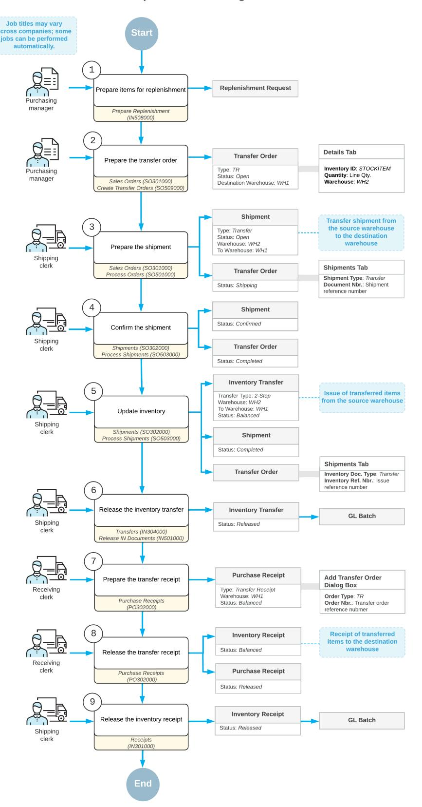

# <span id="page-483-0"></span>**Replenishment Through Transfers: Implementation Checklist**

The following sections provide details you can use to ensure that the system is configured properly for performing replenishment through transfers, and to understand (and change, if needed) the settings that affect the processing workflow.

### **Implementation Checklist**

We recommend that before you start performing replenishment through transfers, you make sure that the needed features have been enabled, settings have been specified, and entities have been created, as summarized in the following checklist.

| Form                               | Criteria to Check                                                                                                                                                                                                                                                                                                   |
|------------------------------------|---------------------------------------------------------------------------------------------------------------------------------------------------------------------------------------------------------------------------------------------------------------------------------------------------------------------|
| Enable/Disable Features (CS100000) | The following features have been enabled:<br>•<br>Inventory and Order Management<br>Inventory<br>•<br>Inventory Replenishment<br>•<br>•<br>Multiple Warehouses if your company replenishes inventory<br>through transfers<br>•<br>Multiple Warehouse Locations if your company uses multiple<br>warehouse locations |
| Multiple forms                     | The replenishment functionality has been configured, as de<br>scribed in Configuration of Replenishment: General Information.                                                                                                                                                                                       |
| Stock Items (IN202500)             | The needed stock items have been created and the replenish<br>ment settings have been specified for each existing stock item<br>for which replenishment will be performed.                                                                                                                                          |
| Order Types (SO201000)             | The needed order types have been created.                                                                                                                                                                                                                                                                           |

#### **Validation of Configuration**

To make sure that all configuration has been performed correctly, we recommend that in your system, you perform instructions similar to those described in *[Replenishment](#page-483-2) Through Transfers: Process Activity*.

# <span id="page-483-2"></span><span id="page-483-1"></span>**Replenishment Through Transfers: Process Activity**

The following activity demonstrates how to prepare and perform replenishment in Acumatica ERP by transferring goods between warehouses.

This activity is based on the *U100* dataset. If you are using another dataset, or if any system settings have been changed in *U100*, these changes can affect the workflow of the activity and the results of the processing. To avoid any issues, restore the *U100* dataset to its initial state.

#### **Story**

Suppose that you are Matt Parker, a purchasing manager of the SweetLife Fruits & Jams company. You are going to buy grapefruit for the SweetLife Store branch and refill the stock in the Retail warehouse. In this branch, replenishment is performed by transferring the needed goods from the Wholesale warehouse of the SweetLife Head Office and Wholesale Center branch to the Retail warehouse.

#### **Configuration Overview**

In the *U100* dataset, the following tasks have been performed to support this activity:

- On the *[Enable/Disable Features](https://help-2025r1.acumatica.com/Help?ScreenId=ShowWiki&pageid=c1555e43-1bc5-4f6f-ba9d-b323f94d8a6b)* (CS100000) form, the following features have been enabled:
  - *Multiple Warehouses*
  - *Multiple Warehouse Locations*
  - *Inventory Replenishment*
- On the *[Warehouses](https://help-2025r1.acumatica.com/Help?ScreenId=ShowWiki&pageid=264b0ef7-2b6c-40b4-a7d9-f1a5e067939b)* (IN204000) form, the *WHOLESALE* and *RETAIL* warehouses have been created.
- On the *[Stock Items](https://help-2025r1.acumatica.com/Help?ScreenId=ShowWiki&pageid=77786a70-1f1e-4d63-ad98-96f98e4fcb0e)* (IN202500) form, the *GRAPEFRUIT* stock item has been created.
- On the *Order [Types](https://help-2025r1.acumatica.com/Help?ScreenId=ShowWiki&pageid=e6984218-4260-4438-99e1-aee2b3765369)* (SO201000) form, the *Transfer* (*TR*) order type, which can be specified on the *[Sales](https://help-2025r1.acumatica.com/Help?ScreenId=ShowWiki&pageid=19e4021c-1b84-49fd-be12-0320c5f1c7e5) [Orders](https://help-2025r1.acumatica.com/Help?ScreenId=ShowWiki&pageid=19e4021c-1b84-49fd-be12-0320c5f1c7e5)* (SO301000) form for a transfer order, has been created.
- On the *[Sales Orders](https://help-2025r1.acumatica.com/Help?ScreenId=ShowWiki&pageid=19e4021c-1b84-49fd-be12-0320c5f1c7e5)* form, for the Cakeado customer, a sales order dated *01/25/2025* has been created for 25 pounds of grapefruit.

#### **Process Overview**

In this activity, you will do the following:

- 1. On the *[Stock Items](https://help-2025r1.acumatica.com/Help?ScreenId=ShowWiki&pageid=77786a70-1f1e-4d63-ad98-96f98e4fcb0e)* (IN202500) form, specify the replenishment settings of the *GRAPEFRUIT* stock item.
- 2. On the *Item [Warehouse](https://help-2025r1.acumatica.com/Help?ScreenId=ShowWiki&pageid=ae2418af-7f53-4c09-8766-556452d8f8b8) Details* (IN204500) form, review the replenishment settings of the *GRAPEFRUIT* stock item in the *RETAIL* warehouse.
- 3. Prepare and process the stock items that require replenishment on the *[Prepare Replenishment](https://help-2025r1.acumatica.com/Help?ScreenId=ShowWiki&pageid=f4b6b214-78db-46ee-9034-c43f803baf20)* (IN508000) form.
- 4. Prepare and process the documents for shipping items from the *WHOLESALE* warehouse by using the *[Create](https://help-2025r1.acumatica.com/Help?ScreenId=ShowWiki&pageid=aaf05359-02c9-4281-8d86-210a63c3d0df) [Transfer](https://help-2025r1.acumatica.com/Help?ScreenId=ShowWiki&pageid=aaf05359-02c9-4281-8d86-210a63c3d0df) Orders* (SO509000), *[Sales Orders](https://help-2025r1.acumatica.com/Help?ScreenId=ShowWiki&pageid=19e4021c-1b84-49fd-be12-0320c5f1c7e5)* (SO301000), and *[Shipments](https://help-2025r1.acumatica.com/Help?ScreenId=ShowWiki&pageid=f47cffcc-543e-469c-a204-a9c1e3da346d)* (SO302000) forms.
- 5. Prepare and process the purchase receipt for the items in the *RETAIL* warehouse on the *[Purchase Receipts](https://help-2025r1.acumatica.com/Help?ScreenId=ShowWiki&pageid=d9901c8d-486d-45ed-8088-ea3d8ee3af19)* (PO302000) form; the corresponding inventory receipt is automatically created on the *[Receipts](https://help-2025r1.acumatica.com/Help?ScreenId=ShowWiki&pageid=d6ecad5b-155f-44bf-baba-9ed006d298b5)* (IN301000) form and released.

#### **System Preparation**

Before you start preparing and performing replenishment through transfers, do the following:

- 1. Launch the Acumatica ERP website, and sign in to a company with the *U100* dataset preloaded. You should sign in as purchasing manager Matt Parker with the *parker* username and the *123* password.
- 2. In the info area, in the upper-right corner of the top pane of the Acumatica ERP screen, make sure that the business date in your system is set to *1/30/2025*. If a different date is displayed, click the Business Date menu button and select *1/30/2025* on the calendar. For simplicity, in this activity, you will create and process all documents in the system on this business date.
- 3. On the Company and Branch Selection menu in the top pane of the Acumatica ERP screen, select the *SweetLife Store* branch.

#### **Step 1: Specifying the Replenishment Settings of a Stock Item**

To specify the replenishment settings of the *GRAPEFRUIT* stock item, do the following:

- 1. Open the *GRAPEFRUIT* stock item on the *[Stock Items](https://help-2025r1.acumatica.com/Help?ScreenId=ShowWiki&pageid=77786a70-1f1e-4d63-ad98-96f98e4fcb0e)* (IN202500) form.
- 2. On the **Inventory Planning** tab, in the row that has *Transfer* in the **Source** column, specify the following settings:
  - **Reorder Point**: *30*
  - **Max Qty.**: *100*
- 3. On the form toolbar, click**Save**.

#### **Step 2: Reviewing the Replenishment Settings of the Item-Warehouse Pair**

To review the replenishment settings of the *GRAPEFRUIT* stock item in the *RETAIL* warehouse, you should do the following:

- 1. Open the *Item [Warehouse](https://help-2025r1.acumatica.com/Help?ScreenId=ShowWiki&pageid=ae2418af-7f53-4c09-8766-556452d8f8b8) Details* (IN204500) form.
- 2. In the Summary area, specify the following settings:
  - **Inventory ID**: *GRAPEFRUIT*
  - **Warehouse**: *RETAIL*
- 3. On the **Inventory Planning** tab, make sure that the following settings are specified:
  - **Override ReplenishmentSettings**: Cleared
  - **Seasonality**: *NONE*
  - **ReplenishmentSource**: *Transfer*
  - **Replenishment Method**: *Min./Max.*
  - **Replenishment Warehouse**: *WHOLESALE*
  - **Reorder Point**: 30
  - **Max. Qty.**: 100

With these settings, you replenish grapefruit in the *RETAIL* warehouse by transferring the needed quantities of the item from the *WHOLESALE* warehouse. The *GRAPEFRUIT* stock item appears in the list of items for replenishment on the *[Prepare Replenishment](https://help-2025r1.acumatica.com/Help?ScreenId=ShowWiki&pageid=f4b6b214-78db-46ee-9034-c43f803baf20)* (IN508000) form when you have 30 pounds (which is the base unit of measure for this item) or less of the item in stock. The **Max Qty.** value is used for the calculation of replenishment parameters in the *RETAIL* warehouse. For details, see *[Configuration of Replenishment:](https://help-2025r1.acumatica.com/Help?ScreenId=ShowWiki&pageid=c961e0d4-e87d-4099-b6e6-431a00ad471a) [Replenishment Methods](https://help-2025r1.acumatica.com/Help?ScreenId=ShowWiki&pageid=c961e0d4-e87d-4099-b6e6-431a00ad471a)*.

#### **Step 3: Preparing the Replenishment**

To process any items in the SweetLife Store branch that require replenishment, do the following:

- 1. Open the *[Prepare Replenishment](https://help-2025r1.acumatica.com/Help?ScreenId=ShowWiki&pageid=f4b6b214-78db-46ee-9034-c43f803baf20)* (IN508000) form.
- 2. In the Selection area, specify the following settings to view in the table the items pending replenishment in the SweetLife Store branch:
  - **Warehouse**: *RETAIL*
  - **Purchase Date**: *1/30/2025*
  - **Me**: Cleared
  - **OnlySuggested Items**: Selected

With this setting, only items that require replenishment are displayed on the form.

The table shows the items pending replenishment in the SweetLife Store branch (to which you are signed in).

- 3. In the row for the *GRAPEFRUIT* stock item, make sure that the following settings are specified:
  - **ReplenishmentSource**: *Transfer*
  - **Source Warehouse**: *WHOLESALE*
- 4. In the **Qty. to Process** column of this row, notice that *125* is shown. Because a sales order for 25 pounds of grapefruit exists in the system, the system added this quantity to the quantity to be replenished.


To view this sales order, on the *[Sales Orders](https://help-2025r1.acumatica.com/Help?ScreenId=ShowWiki&pageid=19e4021c-1b84-49fd-be12-0320c5f1c7e5)* (SO301000) form, open the sales order for the Cakeado customer dated *01/25/2025*.

- 5. In the row for the *GRAPEFRUIT* stock item, select the check box in the unlabeled column.
- 6. On the form toolbar, click **Process**. The **Processing** dialog box opens, showing the progress and then the results of the processing. The system generates the replenishment request for the transfer, which consists of the *GRAPEFRUIT* item, and adds the request on the *Create [Transfer](https://help-2025r1.acumatica.com/Help?ScreenId=ShowWiki&pageid=aaf05359-02c9-4281-8d86-210a63c3d0df) Orders* (SO509000) form.
- 7. Close the **Processing** dialog box. Notice that the row with the *GRAPEFRUIT* stock item is no longer displayed in the table.

#### **Step 4: Shipping the Stock Items Between the Warehouses**

Now that you have prepared the replenishment request for the grapefruit, you need to prepare the documents for shipping the fruits from the *WHOLESALE* warehouse to the *RETAIL* warehouse. Do the following:

- 1. On the *Create [Transfer](https://help-2025r1.acumatica.com/Help?ScreenId=ShowWiki&pageid=aaf05359-02c9-4281-8d86-210a63c3d0df) Orders* (SO509000) form, in the row with *IN Replanned* in the **Plan Type** box and *GRAPEFRUIT* in the **Inventory ID** box, select the unlabeled check box.
- 2. On the form toolbar, click **Process**.

The system creates a transfer order for a two-step transfer and opens the order on the *[Sales Orders](https://help-2025r1.acumatica.com/Help?ScreenId=ShowWiki&pageid=19e4021c-1b84-49fd-be12-0320c5f1c7e5)* (SO301000) form.

- 3. On the form toolbar, click **CreateShipment**.
- 4. In the **SpecifyShipment Parameters** dialog box, which opens, make sure that the *1/30/2025* date and the *WHOLESALE* source warehouse are specified, and click **OK**. The system closes the dialog box, creates the related shipment of the *Transfer* type, and opens it on the *[Shipments](https://help-2025r1.acumatica.com/Help?ScreenId=ShowWiki&pageid=f47cffcc-543e-469c-a204-a9c1e3da346d)* (SO302000) form.
- 5. In the **Warehouse ID** box of the Summary area, notice that *WHOLESALE* is specified, and in the **To Warehouse** box, notice that *RETAIL* is specified. This indicates that the grapefruit will be shipped from the *WHOLESALE* warehouse to the *RETAIL* warehouse.
- 6. To confirm the created shipment, on the form toolbar, click **Confirm Shipment**.
- 7. To update the inventory of the *WHOLESALE* warehouse, on the form toolbar, click **Update IN**. The system issues the *GRAPEFRUIT* stock item from the *WHOLESALE* warehouse. On the **Orders** tab, in the **Inventory Ref. Nbr.** column, you can see the reference number of the transfer, which is also a link; you could click the link to open the transfer of the *2-Step* type on the *[Transfers](https://help-2025r1.acumatica.com/Help?ScreenId=ShowWiki&pageid=ea1539b6-fafa-443e-8b49-cd1ced95389f)* (IN304000) form.
- 8. On the *[Inventory Allocation Details](https://help-2025r1.acumatica.com/Help?ScreenId=ShowWiki&pageid=6d8011ac-1d4e-4a34-8bc2-1fa1ff002c05)* (IN402000) form, in the Selection area, do the following:
  - a. In the **Inventory ID** box of the Selection area, select *GRAPEFRUIT*.
  - b. In the **Warehouse** box, select *RETAIL*.
  - c. In the **On Hand** box, note the current quantity of grapefruit on hand.
- 9. On the **Qty by Plan Type** tab, on the toolbar of the **Addition** table, select *All Records*.
- 10.In the row that has *In-Transit* in the **Plan Type** column, make sure that the quantity is *125*, as shown in the following screenshot. This quantity of grapefruit is ready to be received in the *RETAIL* warehouse.

| TOOLS $\blacktriangledown$<br><b>Inventory Allocation Details</b> |                                            |              |                            |                 |  |                                       |              |                                   |                        |                         |      |                     |
|-------------------------------------------------------------------|--------------------------------------------|--------------|----------------------------|-----------------|--|---------------------------------------|--------------|-----------------------------------|------------------------|-------------------------|------|---------------------|
| <b>INVENTORY SUMMARY</b><br>Ò<br>$\curvearrowleft$                |                                            |              |                            |                 |  |                                       |              |                                   |                        |                         |      | $\hat{\phantom{a}}$ |
| * Inventory ID:                                                   | GRAPEFRUIT - Fresh grapefi Q<br>0          | On Hand:     |                            |                 |  | 0.00                                  |              | On Loc. Not Available:            |                        |                         | 0.00 |                     |
| Warehouse:                                                        | RETAIL - Retail Warehouse<br>$\mathcal{Q}$ | Available:   |                            |                 |  | $-25.00$                              |              | [*] Except Location Not Available |                        |                         |      |                     |
| Location:                                                         | Q                                          |              | Available for Shipping:    |                 |  | 0.00                                  |              |                                   |                        |                         |      |                     |
| <b>Base Unit:</b>                                                 | LB                                         |              | Available for Issue:       |                 |  | 0.00                                  |              |                                   |                        |                         |      |                     |
| <b>ITEM PLANS</b><br>QTY BY PLAN TYPE                             |                                            |              |                            |                 |  |                                       |              |                                   |                        |                         |      |                     |
| <b>Addition</b>                                                   |                                            |              |                            |                 |  | <b>Deduction</b>                      |              |                                   |                        |                         |      |                     |
| $\mathbf{\overline{N}}$<br>Ò<br>$\left  \rightarrow \right $      |                                            | All Records  | ۰                          | $\triangledown$ |  | Ò<br>$\left  \leftrightarrow \right $ | $\mathbf{X}$ |                                   | Deduction Non-Zero Qty |                         | ۰    | $\triangledown$     |
| <b>B</b> Plan Type                                                |                                            | Quantity     | Included                   |                 |  | <b>B</b> Plan Type                    |              |                                   | Quantity               | Included                |      |                     |
| <b>Purchase Prepared</b>                                          |                                            | 0.00         | $\Box$                     |                 |  | > SO Booked [*]                       |              |                                   | 25.00                  |                         | ☑    |                     |
| Purchase Orders                                                   |                                            | 0.00         | $\Box$                     |                 |  | <b>Total Deduction</b>                |              |                                   | 25.00                  | $\Box$                  |      |                     |
| PO Receipts                                                       |                                            | 0.00         | ☑                          |                 |  |                                       |              |                                   |                        |                         |      |                     |
| IN Receipts [*]                                                   |                                            | 0.00         | ☑                          |                 |  |                                       |              |                                   |                        |                         |      |                     |
| In-Transit <sup>[*]</sup>                                         |                                            | 125.00       | $\Box$                     |                 |  |                                       |              |                                   |                        |                         |      |                     |
| Purchase for SO Prepared                                          |                                            | 0.00         | $\Box$                     |                 |  |                                       |              |                                   |                        |                         |      |                     |
| Purchase for SO                                                   |                                            | 0.00         | $\Box$                     |                 |  |                                       |              |                                   |                        |                         |      |                     |
|                                                                   |                                            |              |                            |                 |  |                                       |              |                                   |                        |                         |      |                     |
|                                                                   |                                            | $\mathbf{K}$ | $\langle$<br>$\rightarrow$ | $\geq$          |  |                                       |              |                                   | $\mathbf{K}$           | $\langle \quad \rangle$ |      | $\geq$              |

*Figure: The stock item in transit*

#### **Step 5: Receiving the Stock Items in the Retail Warehouse**

To create the documents to reflect the receipt of the grapefruit in the *RETAIL* warehouse, do the following:

- 1. On the *[Purchase Receipts](https://help-2025r1.acumatica.com/Help?ScreenId=ShowWiki&pageid=d9901c8d-486d-45ed-8088-ea3d8ee3af19)* (PO302000) form, add a new record.
- 2. In the Summary area, specify the following settings:
  - **Type**: *Transfer Receipt*
  - **Date**: *1/30/2025*
  - **Warehouse**: *RETAIL*
- 3. On the **Details** tab, do the following:
  - a. On the table toolbar, click **Add Transfer**.
  - b. In the **Add Transfer Order** dialog box, which opens, select the check box in the unlabeled column of the only row with the transfer order that you have processed earlier in this activity.
  - c. Click **Add & Close** to close the dialog box and add the line of the transfer order to the receipt.
- 4. On the form toolbar, click **Release** to release the transfer receipt. The system creates and releases the inventory receipt.
- 5. Open the *[Inventory Summary](https://help-2025r1.acumatica.com/Help?ScreenId=ShowWiki&pageid=2fd70552-e564-4e71-be30-e63b9415baa2)* (IN401000) form.
- 6. In the Selection area, specify the following settings:
  - a. **Inventory ID**: *GRAPEFRUIT*
  - b. **Warehouse**: *RETAIL*

Notice that in the **On Hand** column, the quantity is *125*, as shown in the following screenshot.

|   | TOOLS $\star$<br><b>Inventory Summary</b> |                                                              |           |                                  |                  |                                  |                   |                           |                           |              |                     |
|---|-------------------------------------------|--------------------------------------------------------------|-----------|----------------------------------|------------------|----------------------------------|-------------------|---------------------------|---------------------------|--------------|---------------------|
|   | Ò<br>∽                                    | $\mathbf{x}$<br>$\triangledown$<br>$\mapsto$                 |           |                                  |                  |                                  |                   |                           |                           |              | Q                   |
|   | * Inventory ID:                           | GRAPEFRUIT - Fresh grapefi Q 2<br>Expand by Cost Layer Types |           | Warehouse:<br>Location:          |                  | <b>RETAIL - Retail Warehouse</b> | Q<br>Q            |                           |                           |              | $\hat{\phantom{a}}$ |
|   | 图 Warehouse                               | Location                                                     | Available | Available for<br><b>Shipment</b> | <b>SO Booked</b> | <b>SO Allocated</b>              | <b>SO Shipped</b> | <b>SO Back</b><br>Ordered | Purchase<br><b>Orders</b> | On Hand Base | Unit                |
| ≻ | <b>RETAIL</b>                             | <unassigned></unassigned>                                    | $-25.00$  | 0.00                             | 25.00            | 0.00                             | 0.00              | 0.00                      | 0.00                      | $0.00$ LB    |                     |
|   | <b>RETAIL</b>                             | <b>MAIN</b>                                                  | 125.00    | 125.00                           | 0.00             | 0.00                             | 0.00              | 0.00                      | 0.00                      | 125.00 LB    |                     |
|   |                                           | Total:                                                       | 100.00    | 125.00                           | 25.00            | 0.00                             | 0.00              | 0.00                      | 0.00                      | 125.00       | LB                  |

#### *Figure: The stock item received in the RETAIL warehouse*

If you need to change the order of columns in any table, you can drag a column by its header to the new place in the table.

You have replenished grapefruit in the *RETAIL* warehouse.

# <span id="page-489-0"></span>**Replenishing Inventory Through Purchases**

A company can replenish stock items by purchasing them from various vendors when the stock is below a certain level. The topics of this chapter explain the general workflow of item replenishment through purchases.

# <span id="page-489-1"></span>**Replenishment Through Purchases: General Information**

The replenishment functionality in Acumatica ERP can accommodate various ways of replenishing stock items. You can maintain the needed level of stock at your warehouses by purchasing the appropriate quantity of items from vendors.

#### **Learning Objectives**

In this chapter, you will do the following:

- Become familiar with the general workflow of item replenishment through purchases
- Replenish stock by purchasing items from a vendor

#### **Applicable Scenario**

You perform replenishment through purchases if your company needs to optimize the replenishment of stock and to purchase stock items at the right time from particular vendors when the stock is below a certain level.

#### **Replenishment Through Purchases in Acumatica ERP**

You can use the functionality of replenishment through purchases if the *Inventory Replenishment* feature and one or both of the following features are enabled on the *[Enable/Disable Features](https://help-2025r1.acumatica.com/Help?ScreenId=ShowWiki&pageid=c1555e43-1bc5-4f6f-ba9d-b323f94d8a6b)* (CS100000) form:

- *Multiple Warehouse Locations*
- *Multiple Warehouses*

On the *[Prepare Replenishment](https://help-2025r1.acumatica.com/Help?ScreenId=ShowWiki&pageid=f4b6b214-78db-46ee-9034-c43f803baf20)* (IN508000) form, you can view the list of stock items that require replenishment. A stock item is listed on the form if for the item at a warehouse where the item is needed, the following settings are specified on the **Inventory Planning** tab of the *Item [Warehouse](https://help-2025r1.acumatica.com/Help?ScreenId=ShowWiki&pageid=ae2418af-7f53-4c09-8766-556452d8f8b8) Details* (IN204500) form:

- **Reorder Point**: The stock level that prompts the system to replenish the stock of the item at this warehouse when the available quantity is below the reorder point specified for this item at this warehouse.
- **ReplenishmentSource**: *Purchase*.

On the *[Prepare Replenishment](https://help-2025r1.acumatica.com/Help?ScreenId=ShowWiki&pageid=f4b6b214-78db-46ee-9034-c43f803baf20)* form, the quantity to process is calculated in the base unit of measure (UOM). On the *[Create Purchase Orders](https://help-2025r1.acumatica.com/Help?ScreenId=ShowWiki&pageid=dc527541-a18a-44c9-8d51-6d2d77a37443)* (PO505000) form, the quantity specified in the **Quantity** column is recalculated in the purchase UOM and displayed in the **UOM** column. For example, if ten stock items should be purchased in one box, then the quantity of ten UOMs is converted to one box to be purchased.

For details about the configuration of replenishment and the calculation of replenishment parameters, see *[Replenishment for Stock Items](https://help-2025r1.acumatica.com/Help?ScreenId=ShowWiki&pageid=c53ea183-5811-4189-9a9c-e2f251cbf443)*.

#### **General Steps of Replenishment Through Purchases**

To replenish stock items by purchasing them from a vendor, you perform the following general steps:

1. On the *[Prepare Replenishment](https://help-2025r1.acumatica.com/Help?ScreenId=ShowWiki&pageid=f4b6b214-78db-46ee-9034-c43f803baf20)* (IN508000) form, which lists the stock items that require replenishment, you process all stock items or only those you select.

- 2. You create the needed purchase orders for all the stock items to be purchased from vendors by using the *[Create Purchase Orders](https://help-2025r1.acumatica.com/Help?ScreenId=ShowWiki&pageid=dc527541-a18a-44c9-8d51-6d2d77a37443)* (PO505000) form. You can work with each purchase order on the *[Purchase Orders](https://help-2025r1.acumatica.com/Help?ScreenId=ShowWiki&pageid=5565686c-96c4-4bfa-a51d-9a2566baa808)* (PO301000) form.
- 3. You create and release the following documents to reflect the receipt of the purchased items:
  - The purchase receipt on the *[Purchase Receipts](https://help-2025r1.acumatica.com/Help?ScreenId=ShowWiki&pageid=d9901c8d-486d-45ed-8088-ea3d8ee3af19)* (PO302000) form
  - The inventory receipt on the *[Receipts](https://help-2025r1.acumatica.com/Help?ScreenId=ShowWiki&pageid=d6ecad5b-155f-44bf-baba-9ed006d298b5)* (IN301000) form

#### **Workflow of Replenishment Through Purchases**

A general workflow of replenishment through purchases involves the steps and generated documents shown in the following diagram.

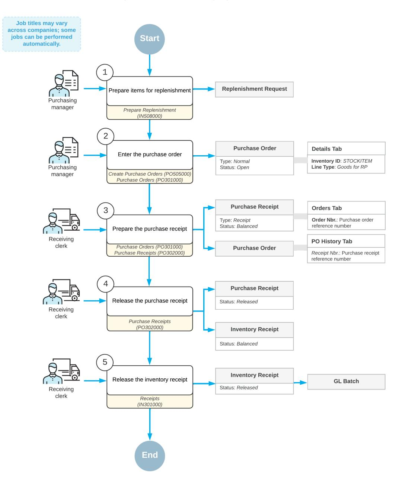

# <span id="page-491-0"></span>**Replenishment Through Purchases: Implementation Checklist**

The following sections provide details you can use to ensure that the system is configured properly for performing replenishment through purchases, and to understand (and change, if needed) the settings that affect the processing workflow.

#### **Implementation Checklist**

We recommend that before you start performing replenishment by purchase, you make sure the needed features have been enabled, settings have been specified, and entities have been created, as summarized in the following checklist.

| Form                               | Criteria to Check                                                                                                                                                                                                                                        |
|------------------------------------|----------------------------------------------------------------------------------------------------------------------------------------------------------------------------------------------------------------------------------------------------------|
| Enable/Disable Features (CS100000) | The following features have been enabled:<br>•<br>Inventory and Order Management<br>•<br>Inventory<br>•<br>Inventory Replenishment<br>•<br>Multiple Warehouses<br>Multiple Warehouse Locations if your company uses<br>•<br>multiple warehouse locations |
| Multiple forms                     | The replenishment functionality has been configured, as<br>described in Configuration of Replenishment: General Infor<br>mation.                                                                                                                         |
| Stock Items (IN202500)             | The needed stock items have been created and the re<br>plenishment settings have been specified for each existing<br>stock item for which replenishment will be performed.                                                                               |

#### **Other Settings That Affect the Workflow**

You can affect the workflow of replenishment through purchases by specifying additional settings. To cause the system to use the default vendor of the inventory item, select the **Default** check box for this vendor on the**Vendors** tab of the *[Stock Items](https://help-2025r1.acumatica.com/Help?ScreenId=ShowWiki&pageid=77786a70-1f1e-4d63-ad98-96f98e4fcb0e)* (IN202500) form.

If your organization uses multiple warehouses, you can also specify the preferred vendor on the *[Item](https://help-2025r1.acumatica.com/Help?ScreenId=ShowWiki&pageid=ae2418af-7f53-4c09-8766-556452d8f8b8) [Warehouse](https://help-2025r1.acumatica.com/Help?ScreenId=ShowWiki&pageid=ae2418af-7f53-4c09-8766-556452d8f8b8) Details* (IN204500) form for the combination of an item and a warehouse. By default, the system inserts the default vendor specified for the item, but you can override the preferred vendor by selecting the **Override Preferred Vendor** check box and then selecting the needed vendor in the **Preferred Vendor** box.

### **Validation of Configuration**

To make sure that all configuration has been performed correctly, we recommend that in your system, you perform instructions similar to those described in *[Replenishment Through Purchases: Process Activity](#page-492-1)*.

# <span id="page-492-1"></span><span id="page-492-0"></span>**Replenishment Through Purchases: Process Activity**

The following activity demonstrates how to prepare and perform a replenishment by purchasing the required quantity of goods from a vendor.

This activity is based on the *U100* dataset. If you are using another dataset, or if any system settings have been changed in *U100*, these changes can affect the workflow of the activity and the results of the processing. To avoid any issues, restore the *U100* dataset to its initial state.

#### **Story**

Suppose that you are Matt Parker, a purchasing manager of the SweetLife Fruits & Jams company. As part of your everyday routine, you buy fruits, including kiwis, in the SweetLife Head Office and Wholesale Center branch and refill stock. This branch orders fruit directly from vendors. It is time to buy kiwis when you have 50 pounds or less of the item in the available stock. You need to specify replenishment settings for the item and replenish the item in the Wholesale warehouse.

You replenish kiwis in the *WHOLESALE* warehouse by purchasing the stock item from a vendor. The *KIWIS* stock item appears in the list of items for replenishment on the *[Prepare Replenishment](https://help-2025r1.acumatica.com/Help?ScreenId=ShowWiki&pageid=f4b6b214-78db-46ee-9034-c43f803baf20)* (IN508000) form when you have 50 pounds (which is the base unit of measure for this item) or less of the item in the available stock.

#### **Configuration Overview**

In the *U100* dataset, the following tasks have been performed to support this activity:

- On the *[Enable/Disable Features](https://help-2025r1.acumatica.com/Help?ScreenId=ShowWiki&pageid=c1555e43-1bc5-4f6f-ba9d-b323f94d8a6b)* (CS100000) form, the following features have been enabled:
  - *Multiple Warehouses*
  - *Inventory Replenishment*
- On the *[Replenishment Classes](https://help-2025r1.acumatica.com/Help?ScreenId=ShowWiki&pageid=bd28e119-db72-4659-bded-292a0b072620)* (IN208800) form, the *PURCHASE* replenishment class has been created.
- On the *[Warehouses](https://help-2025r1.acumatica.com/Help?ScreenId=ShowWiki&pageid=264b0ef7-2b6c-40b4-a7d9-f1a5e067939b)* (IN204000) form, the *WHOLESALE* warehouse has been created.
- On the *[Stock Items](https://help-2025r1.acumatica.com/Help?ScreenId=ShowWiki&pageid=77786a70-1f1e-4d63-ad98-96f98e4fcb0e)* (IN202500) form, the *KIWIS* stock item has been created.

#### **Process Overview**

In this activity, you will do the following:

- 1. On the *[Stock Items](https://help-2025r1.acumatica.com/Help?ScreenId=ShowWiki&pageid=77786a70-1f1e-4d63-ad98-96f98e4fcb0e)* (IN202500) form, specify the replenishment and vendor settings of the *KIWIS* stock item.
- 2. On the *Item [Warehouse](https://help-2025r1.acumatica.com/Help?ScreenId=ShowWiki&pageid=ae2418af-7f53-4c09-8766-556452d8f8b8) Details* (IN204500) form, review the replenishment settings of the *KIWIS* stock item in the *WHOLESALE* warehouse.
- 3. On the *[Prepare Replenishment](https://help-2025r1.acumatica.com/Help?ScreenId=ShowWiki&pageid=f4b6b214-78db-46ee-9034-c43f803baf20)* (IN508000) form, prepare and process the stock items that require replenishment.
- 4. On the *[Create Purchase Orders](https://help-2025r1.acumatica.com/Help?ScreenId=ShowWiki&pageid=dc527541-a18a-44c9-8d51-6d2d77a37443)* (PO505000) form, prepare a purchase order for the vendor. On the *[Purchase](https://help-2025r1.acumatica.com/Help?ScreenId=ShowWiki&pageid=5565686c-96c4-4bfa-a51d-9a2566baa808) [Orders](https://help-2025r1.acumatica.com/Help?ScreenId=ShowWiki&pageid=5565686c-96c4-4bfa-a51d-9a2566baa808)* (PO301000) form, you will take it off hold and send it to the vendor.
- 5. On the *[Purchase Receipts](https://help-2025r1.acumatica.com/Help?ScreenId=ShowWiki&pageid=d9901c8d-486d-45ed-8088-ea3d8ee3af19)* (PO302000) form, prepare and process the purchase receipt for the items; the corresponding inventory receipt is automatically created on the *[Receipts](https://help-2025r1.acumatica.com/Help?ScreenId=ShowWiki&pageid=d6ecad5b-155f-44bf-baba-9ed006d298b5)* (IN301000) form and released.

#### **System Preparation**

Before you start preparing and performing replenishment through purchases, you should do the following:

- 1. Launch the Acumatica ERP website, and sign in to a company with the *U100* dataset preloaded. You should sign in as purchasing manager Matt Parker with the *parker* username and the *123* password.
- 2. In the info area, in the upper-right corner of the top pane of the Acumatica ERP screen, make sure that the business date in your system is set to *1/30/2025*. If a different date is displayed, click the Business Date menu button and select *1/30/2025* on the calendar. For simplicity, in this activity, you will create and process all documents in the system on this business date.

3. On the Company and Branch Selection menu, in the top pane of the Acumatica ERP screen, select the *SweetLife Head Office and Wholesale Center* branch.

#### **Step 1: Specifying the Replenishment and Vendor Settings of the Stock Item**

To specify the replenishment and vendor settings of the *KIWIS* stock item, do the following:

- 1. Open the *KIWIS* stock item on the *[Stock Items](https://help-2025r1.acumatica.com/Help?ScreenId=ShowWiki&pageid=77786a70-1f1e-4d63-ad98-96f98e4fcb0e)* (IN202500) form.
- 2. Go the **Vendors** tab. Notice that there is one row for the *ALLFRUITS* vendor.
- 3. In the **LotSize** column, type 15.
- 4. On the **Inventory Planning** tab, in the row that has *Purchase* in the **Source** column, specify the following settings:
  - **Reorder Point**: *50*
  - **Max Qty.**: *140*
- 5. On the form toolbar, click**Save**.

#### **Step 2: Reviewing the Replenishment Settings of the Item-Warehouse Pair**

To review the replenishment settings of the *KIWIS* stock item in the *WHOLESALE* warehouse, do the following:

- 1. Open the *Item [Warehouse](https://help-2025r1.acumatica.com/Help?ScreenId=ShowWiki&pageid=ae2418af-7f53-4c09-8766-556452d8f8b8) Details* (IN204500) form.
- 2. In the Summary area, specify the following settings:
  - **Inventory ID**: *KIWIS*
  - **Warehouse**: *WHOLESALE*
- 3. On the **Inventory Planning** tab, make sure that the following settings have been specified:
  - **Override ReplenishmentSettings**: Cleared
  - **Seasonality**: *NONE*
  - **ReplenishmentSource**: *Purchase*
  - **Replenishment Method**: *Min./Max.*
  - **Replenishment Warehouse**: Not selected
  - **Reorder Point**: *50*
  - **Max Qty.**: *140*

With these settings, you replenish kiwis in the *WHOLESALE* warehouse by purchasing the stock item from a vendor. The *KIWIS* stock item appears in the list of items for replenishment on the *[Prepare Replenishment](https://help-2025r1.acumatica.com/Help?ScreenId=ShowWiki&pageid=f4b6b214-78db-46ee-9034-c43f803baf20)* (IN508000) form when you have 50 pounds (which is the base unit of measure for this item) or less of the item in the available stock. The **Max Qty.** value is used for the calculation of replenishment parameters in the *WHOLESALE* warehouse. For details, see *[Configuration of Replenishment: Replenishment Methods](https://help-2025r1.acumatica.com/Help?ScreenId=ShowWiki&pageid=c961e0d4-e87d-4099-b6e6-431a00ad471a)*.

#### **Step 3: Preparing the Replenishment**

Suppose that as part of your everyday routine, you need to check whether any stock items in the *SweetLife Head Office and Wholesale Center* branch require replenishment; if so, you need to process them. Do the following:

- 1. Open the *[Prepare Replenishment](https://help-2025r1.acumatica.com/Help?ScreenId=ShowWiki&pageid=f4b6b214-78db-46ee-9034-c43f803baf20)* (IN508000) form.
- 2. In the Selection area, specify the following settings:
  - **Warehouse**: *WHOLESALE*
  - **Purchase Date**: *1/30/2025*
  - **Me**: Cleared

#### • **OnlySuggested Items**: Selected

With this setting, only items that require replenishment are displayed in the table.

The table shows the items pending replenishment in the *SweetLife Head Office and Wholesale Center* branch.

- 3. In the row for the *KIWIS* stock item, make sure that the following settings are specified:
  - **ReplenishmentSource**: *Purchase*
  - **Preferred Vendor ID**: *ALLFRUITS*
- 4. In the **Qty. to Process** column of this row, notice that *150* is specified. On the **Vendors** tab of the *[Stock Items](https://help-2025r1.acumatica.com/Help?ScreenId=ShowWiki&pageid=77786a70-1f1e-4d63-ad98-96f98e4fcb0e)* (IN202500) form, the *ALLFRUITS* vendor's lot size is 15, so the system has increased the quantity to be a multiple of 15.
- 5. In this row, select the check box in the unlabeled column.
- 6. On the form toolbar, click **Process**. The **Processing** dialog box opens, showing the progress and then the results of the processing. The system generates the replenishment request for the purchase, which consists of the *KIWIS* item, and adds the request to the *[Create Purchase Orders](https://help-2025r1.acumatica.com/Help?ScreenId=ShowWiki&pageid=dc527541-a18a-44c9-8d51-6d2d77a37443)* (PO505000) form.
- 7. Click **Close** to close the **Processing** dialog box.

Notice that the row for the *KIWIS* stock item is no longer displayed in the table.

Now you can create a purchase order for the 150 pounds of kiwis.

#### **Step 4: Creating the Purchase Order**

To create the purchase order for the All Fruits Mall vendor, do the following:

- 1. On the *[Create Purchase Orders](https://help-2025r1.acumatica.com/Help?ScreenId=ShowWiki&pageid=dc527541-a18a-44c9-8d51-6d2d77a37443)* (PO505000) form, in the row with the *IN Replanned* plan type and the *KIWIS* stock item, select the check box in the unlabeled column.
- 2. On the form toolbar, click **Process**.

The system creates a purchase order for 150 pounds of kiwis for the *ALLFRUITS* vendor and opens the order on the *[Purchase Orders](https://help-2025r1.acumatica.com/Help?ScreenId=ShowWiki&pageid=5565686c-96c4-4bfa-a51d-9a2566baa808)* (PO301000) form.

3. On the form toolbar, click **Remove Hold**. The system saves the purchase order and changes its status to *Open*.

Suppose that you now send the purchase order to the All Fruits Mall vendor by email.

- 4. Open the *[Inventory Summary](https://help-2025r1.acumatica.com/Help?ScreenId=ShowWiki&pageid=2fd70552-e564-4e71-be30-e63b9415baa2)* (IN401000) form.
- 5. In the Selection area, specify the following settings:
  - **Inventory ID**: *KIWIS*
  - **Warehouse**: *WHOLESALE*

Notice that in the **On Hand** column, the quantity is *0*.

### **Step 5: Receiving the Stock Items from the Vendor**

Suppose that the All Fruits Mall vendor has delivered kiwis to your *WHOLESALE* warehouse.

To create the documents that reflect the receipt of the purchased item, do the following:

- 1. On the *[Purchase Orders](https://help-2025r1.acumatica.com/Help?ScreenId=ShowWiki&pageid=5565686c-96c4-4bfa-a51d-9a2566baa808)* (PO301000) form, open the purchase order with 150 pounds of kiwis, which you have created in the previous step.
- 2. On the form toolbar, click **Enter PO Receipt**. The system opens the *[Purchase Receipts](https://help-2025r1.acumatica.com/Help?ScreenId=ShowWiki&pageid=d9901c8d-486d-45ed-8088-ea3d8ee3af19)* (PO302000) form with the new purchase receipt. The receipt has the *Balanced* status and the data copied from the linked purchase order.

- 3. On the form toolbar, click **Release**. The system creates and releases the inventory receipt. On the **Other** tab, in the **Inventory Ref. Nbr.** column, you can view the reference number of the created inventory receipt; you could also click the reference number link to view the inventory receipt on the *[Receipts](https://help-2025r1.acumatica.com/Help?ScreenId=ShowWiki&pageid=d6ecad5b-155f-44bf-baba-9ed006d298b5)* (IN301000) form.
- 4. Open the *[Inventory Summary](https://help-2025r1.acumatica.com/Help?ScreenId=ShowWiki&pageid=2fd70552-e564-4e71-be30-e63b9415baa2)* (IN401000) form.
- 5. In the Selection area, specify the following settings:
  - **Inventory ID**: *KIWIS*
  - **Warehouse**: *WHOLESALE*

In the **On Hand** column, notice that the quantity is *150*, as shown in the following screenshot.

| <b>Inventory Summary</b> |                                                                        |                                                        |           |                           |                  |                                 |                   |                           | TOOLS $\sim$       |              |                     |
|--------------------------|------------------------------------------------------------------------|--------------------------------------------------------|-----------|---------------------------|------------------|---------------------------------|-------------------|---------------------------|--------------------|--------------|---------------------|
|                          | Ò<br>$\mathbf{x}$<br>$\sqrt{}$<br>$\Omega$<br>$\overline{\phantom{a}}$ |                                                        |           |                           |                  |                                 |                   |                           | ٩                  |              |                     |
|                          | * Inventory ID:                                                        | KIWIS - Fresh kiwis 1 lb<br>Expand by Cost Layer Types | $\Omega$  | Warehouse:<br>Location:   |                  | WHOLESALE - Wholesale Wi O<br>Q |                   |                           |                    |              | $\hat{\phantom{a}}$ |
|                          | <b>B</b> Warehouse                                                     | Location                                               | Available | Available for<br>Shipment | <b>SO Booked</b> | <b>SO Allocated</b>             | <b>SO Shipped</b> | <b>SO Back</b><br>Ordered | Purchase<br>Orders | On Hand Base | Unit                |
|                          | WHOLESALE                                                              | <b>MAIN</b>                                            | 150.00    | 150.00                    | 0.00             | 0.00                            | 0.00              | 0.00                      | 0.00               | 150.00       | - LB                |
|                          |                                                                        | Total:                                                 | 150.00    | 150.00                    | 0.00             | 0.00                            | 0.00              | 0.00                      | 0.00               | 150.00       | <b>LB</b>           |

#### *Figure: The stock items received in the WHOLESALE warehouse*

If you need to change the order of columns in any table, you can drag a column by its header to the new place in the table.

You have replenished kiwis in the *WHOLESALE* warehouse.

# <span id="page-497-0"></span>**Replenishing Inventory Through a Distribution Center**

A company that has multiple warehouses can replenish stock items by purchasing them through a distribution center and transferring them to a destination warehouse. The topics of this chapter explain the general workflow of item replenishment using a source warehouse as a distribution center.

# <span id="page-497-1"></span>**Replenishment Through a Distribution Center: General Information**

The replenishment functionality in Acumatica ERP can accommodate various ways of replenishing stock items. You can maintain a particular quantity of stock items in a destination warehouse by purchasing items that are first received at a source warehouse and then transferred to the destination warehouse. The company may use this source warehouse as a distribution center.

#### **Learning Objectives**

In this chapter, you will do the following:

- Become familiar with the general workflow of item replenishment through a distribution center
- Replenish stock by transferring items from a distribution center to the destination warehouse

#### **Applicable Scenario**

You perform replenishment through a warehouse that functions as a distribution center if your company performs consolidated purchasing to this warehouse and other warehouses are replenished from the distribution center.

#### **Replenishment Through a Distribution Center in Acumatica ERP**

You can use the functionality of replenishment through a distribution center if the *Inventory Replenishment* and *Multiple Warehouses* features are enabled on the *[Enable/Disable Features](https://help-2025r1.acumatica.com/Help?ScreenId=ShowWiki&pageid=c1555e43-1bc5-4f6f-ba9d-b323f94d8a6b)* (CS100000) form.

In Acumatica ERP, if your company has multiple warehouses, you can configure replenishment for multiple warehouses by performing centralized purchasing to a distribution center. This distribution center is then the source warehouse for transfers to destination warehouses.

On the *[Prepare Replenishment](https://help-2025r1.acumatica.com/Help?ScreenId=ShowWiki&pageid=f4b6b214-78db-46ee-9034-c43f803baf20)* (IN508000) form, you can view the list of stock items that require replenishment. A stock item is listed on the form if for the item at the warehouse where the item is needed, the following settings are specified on the **Inventory Planning** tab of the *Item [Warehouse](https://help-2025r1.acumatica.com/Help?ScreenId=ShowWiki&pageid=ae2418af-7f53-4c09-8766-556452d8f8b8) Details* (IN204500) form:

- **Reorder Point**: The stock level that prompts the system to replenish the stock of the item at this warehouse when the available quantity is below the reorder point specified for this item at this warehouse.
- **ReplenishmentSource**: *Purchase*.
- **Replenishment Warehouse**: The warehouse that functions as a distribution center.

For details about the configuration of replenishment and the calculation of replenishment parameters, see *[Replenishment for Stock Items](https://help-2025r1.acumatica.com/Help?ScreenId=ShowWiki&pageid=c53ea183-5811-4189-9a9c-e2f251cbf443)*.

On the *[Prepare Replenishment](https://help-2025r1.acumatica.com/Help?ScreenId=ShowWiki&pageid=f4b6b214-78db-46ee-9034-c43f803baf20)* form, the quantity to process is calculated in the base unit of measure (UOM). On the *[Create Purchase Orders](https://help-2025r1.acumatica.com/Help?ScreenId=ShowWiki&pageid=dc527541-a18a-44c9-8d51-6d2d77a37443)* (IN505000) and *Create [Transfer](https://help-2025r1.acumatica.com/Help?ScreenId=ShowWiki&pageid=aaf05359-02c9-4281-8d86-210a63c3d0df) Orders* (SO509000) forms, the quantity specified in the **Quantity** column is recalculated in the purchase UOM and displayed in the **UOM** column. For example, if ten stock items should be purchased in one box, then the quantity of ten UOMs is converted to one box to be purchased.

#### **General Steps of Replenishment Through a Distribution Center**

To replenish stock items by purchasing items that are first received at a distribution center and transferring the items to the destination warehouse, you perform the following general steps:

- 1. On the **Inventory Planning** tab of the *Item [Warehouse](https://help-2025r1.acumatica.com/Help?ScreenId=ShowWiki&pageid=ae2418af-7f53-4c09-8766-556452d8f8b8) Details* (IN204500) form, for the stock items in the distribution center, you select *Purchase* as the replenishment source; you do not specify a replenishment warehouse. For the stock items in the destination warehouses (which should be replenished through purchasing to a distribution center), you specify *Purchase* as the replenishment source and select the distribution center as the replenishment warehouse.
- 2. For the source warehouses, you process the needed stock items that require replenishment: On the *[Prepare](https://help-2025r1.acumatica.com/Help?ScreenId=ShowWiki&pageid=f4b6b214-78db-46ee-9034-c43f803baf20) [Replenishment](https://help-2025r1.acumatica.com/Help?ScreenId=ShowWiki&pageid=f4b6b214-78db-46ee-9034-c43f803baf20)* (IN508000) form, which lists the stock items that require replenishment, you process all stock items or only those you select.
- 3. You generate transfer orders requesting replenishment by using the *Create [Transfer](https://help-2025r1.acumatica.com/Help?ScreenId=ShowWiki&pageid=aaf05359-02c9-4281-8d86-210a63c3d0df) Orders* (SO509000) form. These orders will move the products from the replenishment warehouse to the warehouse in which you need to replenish the item. When you generate the transfer orders, for the orders of the *TR* type on the **Details** tab of the *[Sales Orders](https://help-2025r1.acumatica.com/Help?ScreenId=ShowWiki&pageid=19e4021c-1b84-49fd-be12-0320c5f1c7e5)* (SO301000) form, the system selects the **Mark for PO** check box for each row.
- 4. You generate purchase orders by using the *[Create Purchase Orders](https://help-2025r1.acumatica.com/Help?ScreenId=ShowWiki&pageid=dc527541-a18a-44c9-8d51-6d2d77a37443)* (PO505000) form. The system will create a purchase order for the source warehouse, which you can work with on the *[Purchase Orders](https://help-2025r1.acumatica.com/Help?ScreenId=ShowWiki&pageid=5565686c-96c4-4bfa-a51d-9a2566baa808)* (PO301000) form.
- 5. You create and release the following documents to reflect the receipt of the purchased items in the source warehouse:
  - The purchase receipt on the *[Purchase Receipts](https://help-2025r1.acumatica.com/Help?ScreenId=ShowWiki&pageid=d9901c8d-486d-45ed-8088-ea3d8ee3af19)* (PO302000) form
  - The inventory receipt on the *[Receipts](https://help-2025r1.acumatica.com/Help?ScreenId=ShowWiki&pageid=d6ecad5b-155f-44bf-baba-9ed006d298b5)* (IN301000) form
- 6. By using the *[Sales Orders](https://help-2025r1.acumatica.com/Help?ScreenId=ShowWiki&pageid=19e4021c-1b84-49fd-be12-0320c5f1c7e5)* form as a starting point, you create the shipment from the transfer order that you have created. On the *[Shipments](https://help-2025r1.acumatica.com/Help?ScreenId=ShowWiki&pageid=f47cffcc-543e-469c-a204-a9c1e3da346d)* (SO302000) form, you confirm the shipment and update the inventory.
- 7. You receive the stock items in the destination warehouse as follows:
  - a. You create and release a transfer receipt on the *[Purchase Receipts](https://help-2025r1.acumatica.com/Help?ScreenId=ShowWiki&pageid=d9901c8d-486d-45ed-8088-ea3d8ee3af19)* form.
  - b. The system creates and releases the related inventory receipt on the *[Receipts](https://help-2025r1.acumatica.com/Help?ScreenId=ShowWiki&pageid=d6ecad5b-155f-44bf-baba-9ed006d298b5)* form.

#### **Workflow of Replenishment Through a Distribution Center**

A general workflow of replenishment by purchase though a distribution center involves the steps and generated documents shown in the following diagrams.

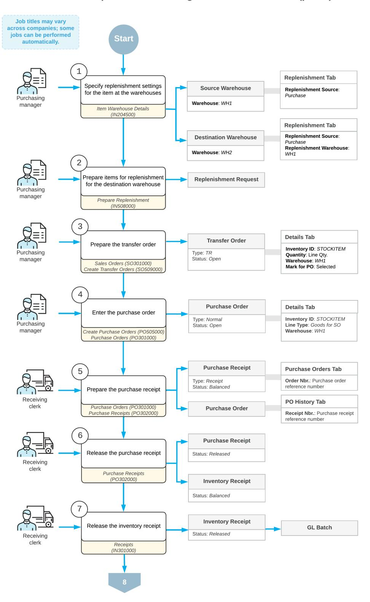

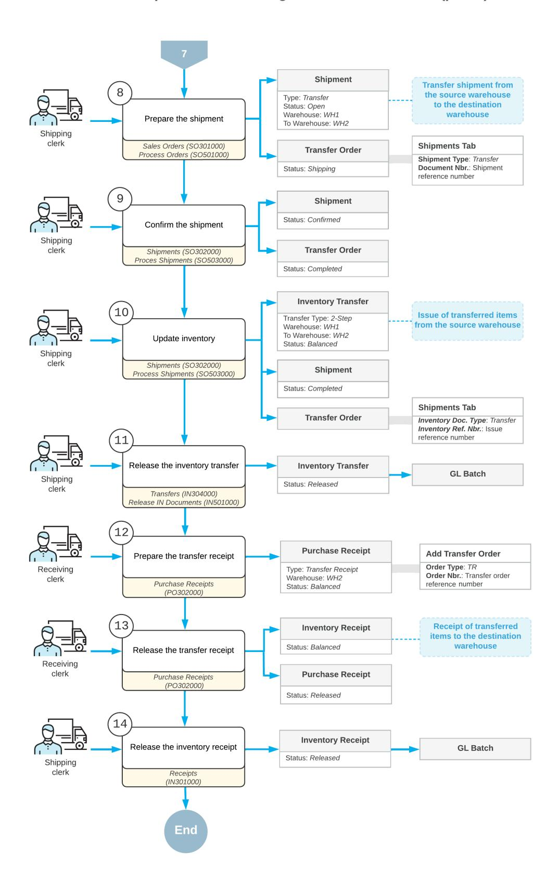

# <span id="page-501-0"></span>**Replenishment Through a Distribution Center: Implementation Checklist**

The following sections provide details you can use to ensure that the system is configured properly for performing replenishment through a distribution center, and to understand (and change, if needed) the settings that affect the processing workflow.

### **Implementation Checklist**

We recommend that before you start performing replenishment through a distribution center, you make sure the needed features have been enabled, settings have been specified, and entities have been created, as summarized in the following checklist.

| Form                               | Criteria to Check                                                                                                                                                          |
|------------------------------------|----------------------------------------------------------------------------------------------------------------------------------------------------------------------------|
| Enable/Disable Features (CS100000) | The following features have been enabled:<br>•<br>Inventory and Order Management<br>•<br>Inventory<br>•<br>Inventory Replenishment<br>Multiple Warehouses<br>•             |
| Multiple forms                     | The replenishment functionality has been configured, as de<br>scribed in Configuration of Replenishment: General Informa<br>tion.                                          |
| Stock Items (IN202500)             | The needed stock items have been created and the replen<br>ishment settings have been specified for each existing stock<br>item for which replenishment will be performed. |

#### **Validation of Configuration**

To make sure that all configuration has been performed correctly, we recommend that in your system, you perform instructions similar to those described in *[Replenishment Through a Distribution Center: Process Activity](#page-501-2)*.

# <span id="page-501-2"></span><span id="page-501-1"></span>**Replenishment Through a Distribution Center: Process Activity**

The following activity demonstrates how to prepare and perform the replenishment of goods through a distribution center.

This activity is based on the *U100* dataset. If you are using another dataset, or if any system settings have been changed in *U100*, these changes can affect the workflow of the activity and the results of the processing. To avoid any issues, restore the *U100* dataset to its initial state.

#### **Story**

Suppose that you are Matt Parker, a purchasing manager at the SweetLife Fruits & Jams company. The SweetLife Store branch regularly receives small orders for mangoes from a customer. To fill your stock, you order mangoes from the Glory Fruit Case vendor by using the replenishment functionality.

In the SweetLife company, fruits are delivered to the Wholesale warehouse, which serves as a distribution center for the other warehouses. To make sure that mangoes are allocated for the Retail warehouse, you will purchase mangoes to the Wholesale warehouse and then transfer the fruits from the Wholesale warehouse to the Retail warehouse.

#### **Configuration Overview**

In the *U100* dataset, the following tasks have been performed to support this activity:

- On the *[Enable/Disable Features](https://help-2025r1.acumatica.com/Help?ScreenId=ShowWiki&pageid=c1555e43-1bc5-4f6f-ba9d-b323f94d8a6b)* (CS100000) form, the following features have been enabled:
  - *Multiple Warehouses*
  - *Inventory Replenishment*
- On the *[Warehouses](https://help-2025r1.acumatica.com/Help?ScreenId=ShowWiki&pageid=264b0ef7-2b6c-40b4-a7d9-f1a5e067939b)* (IN204000) form, the *WHOLESALE* and *RETAIL* warehouses have been created.
- On the *[Stock Items](https://help-2025r1.acumatica.com/Help?ScreenId=ShowWiki&pageid=77786a70-1f1e-4d63-ad98-96f98e4fcb0e)* (IN202500) form, the *MANGOES* stock item has been created.
- On the *Order [Types](https://help-2025r1.acumatica.com/Help?ScreenId=ShowWiki&pageid=e6984218-4260-4438-99e1-aee2b3765369)* (SO201000) form, the *Transfer* (*TR*) order type, which can be selected on the *[Sales Orders](https://help-2025r1.acumatica.com/Help?ScreenId=ShowWiki&pageid=19e4021c-1b84-49fd-be12-0320c5f1c7e5)* (SO301000) form for a transfer order, has been created.

### **Process Overview**

In this activity, you will do the following:

- 1. On the *[Stock Items](https://help-2025r1.acumatica.com/Help?ScreenId=ShowWiki&pageid=77786a70-1f1e-4d63-ad98-96f98e4fcb0e)* (IN202500) form, specify the economic order quantity for the *MANGOES* stock item.
- 2. On the *Item [Warehouse](https://help-2025r1.acumatica.com/Help?ScreenId=ShowWiki&pageid=ae2418af-7f53-4c09-8766-556452d8f8b8) Details* (IN204500) form, review the replenishment settings of the *MANGOES* stock item in the *RETAIL* warehouse.
- 3. Prepare replenishment for the needed stock items in the *RETAIL* warehouse on the *[Prepare Replenishment](https://help-2025r1.acumatica.com/Help?ScreenId=ShowWiki&pageid=f4b6b214-78db-46ee-9034-c43f803baf20)* (IN508000) form.
- 4. Prepare a transfer order on the *Create [Transfer](https://help-2025r1.acumatica.com/Help?ScreenId=ShowWiki&pageid=aaf05359-02c9-4281-8d86-210a63c3d0df) Orders* (SO509000) form.
- 5. Prepare a purchase order for the vendor to the *WHOLESALE* warehouse on the *[Create Purchase Orders](https://help-2025r1.acumatica.com/Help?ScreenId=ShowWiki&pageid=dc527541-a18a-44c9-8d51-6d2d77a37443)* (PO505000) form. On the *[Purchase Orders](https://help-2025r1.acumatica.com/Help?ScreenId=ShowWiki&pageid=5565686c-96c4-4bfa-a51d-9a2566baa808)* (PO301000) form, you will take it off hold.
- 6. Prepare and process the purchase receipt for the items in the *WHOLESALE* warehouse on the *[Purchase](https://help-2025r1.acumatica.com/Help?ScreenId=ShowWiki&pageid=d9901c8d-486d-45ed-8088-ea3d8ee3af19) [Receipts](https://help-2025r1.acumatica.com/Help?ScreenId=ShowWiki&pageid=d9901c8d-486d-45ed-8088-ea3d8ee3af19)* (PO302000) form; the corresponding inventory receipt is automatically created on the *[Receipts](https://help-2025r1.acumatica.com/Help?ScreenId=ShowWiki&pageid=d6ecad5b-155f-44bf-baba-9ed006d298b5)* (IN301000) form and released.
- 7. Prepare and process the sales order on the *[Sales Orders](https://help-2025r1.acumatica.com/Help?ScreenId=ShowWiki&pageid=19e4021c-1b84-49fd-be12-0320c5f1c7e5)* (SO301000) form and the shipment on the *[Shipments](https://help-2025r1.acumatica.com/Help?ScreenId=ShowWiki&pageid=f47cffcc-543e-469c-a204-a9c1e3da346d)* (SO302000) form to ship items from the *WHOLESALE* warehouse to the *RETAIL* warehouse.
- 8. Prepare and process the purchase receipt for the items in the *RETAIL* warehouse on the *[Purchase Receipts](https://help-2025r1.acumatica.com/Help?ScreenId=ShowWiki&pageid=d9901c8d-486d-45ed-8088-ea3d8ee3af19)* form; the corresponding inventory receipt is automatically created on the *[Receipts](https://help-2025r1.acumatica.com/Help?ScreenId=ShowWiki&pageid=d6ecad5b-155f-44bf-baba-9ed006d298b5)* form and released.

#### **System Preparation**

Before you start preparing and performing replenishment through a distribution center, you should do the following:

- 1. Launch the Acumatica ERP website, and sign in to a company with the *U100* dataset preloaded. You should sign in as purchasing manager Matt Parker with the *parker* username and the *123* password.
- 2. In the info area, in the upper-right corner of the top pane of the Acumatica ERP screen, make sure that the business date in your system is set to *1/30/2025*. If a different date is displayed, click the Business Date menu button and select *1/30/2025* on the calendar. For simplicity, in this activity, you will create and process all documents in the system on this business date.
- 3. On the Company and Branch Selection menu, in the top pane of the Acumatica ERP screen, make sure the *SweetLife Head Office and Wholesale Center* branch is selected.

#### **Step 1: Specifying the Economic Order Quantity for the Stock Item**

To specify the economic order quantity for the *MANGOES* stock item, do the following:

- 1. Open the *MANGOES* stock item on the *[Stock Items](https://help-2025r1.acumatica.com/Help?ScreenId=ShowWiki&pageid=77786a70-1f1e-4d63-ad98-96f98e4fcb0e)* (IN202500) form.
- 2. Go to the**Vendors** tab. Notice that there is one row for the *GLORYFRUIT* vendor.
- 3. In the **EOQ** column, type 20. You will use the economic order quantity as the fixed quantity. SweetLife's warehouse specialists have determined this quantity of the *MANGOES* item by estimating the cost of ordering mangoes from the Glory Fruit Case vendor.
- 4. On the form toolbar, click**Save**.

For the *MANGOES* stock item, the *Fixed Reorder Quantity* replenishment method is used in the *RETAIL* warehouse. Based on this quantity, a request for replenishment for the same quantity can be generated on the *[Prepare](https://help-2025r1.acumatica.com/Help?ScreenId=ShowWiki&pageid=f4b6b214-78db-46ee-9034-c43f803baf20) [Replenishment](https://help-2025r1.acumatica.com/Help?ScreenId=ShowWiki&pageid=f4b6b214-78db-46ee-9034-c43f803baf20)* (IN508000) form.

#### **Step 2: Reviewing the Replenishment Settings of the Item-Warehouse Pair**

To review the replenishment settings of the *MANGOES* stock item in the *RETAIL* warehouse, do the following:

- 1. Open the *Item [Warehouse](https://help-2025r1.acumatica.com/Help?ScreenId=ShowWiki&pageid=ae2418af-7f53-4c09-8766-556452d8f8b8) Details* (IN204500) form.
- 2. In the Summary area, specify the following settings:
  - **Inventory ID**: *MANGOES*
  - **Warehouse**: *RETAIL*
- 3. On the **Inventory Planning** tab, make sure that the following settings are specified:
  - **Override ReplenishmentSettings**: Selected
  - **Seasonality**: *NONE*
  - **ReplenishmentSource**: *Purchase*
  - **Replenishment Method**: *Fixed Reorder Qty*
  - **Replenishment Warehouse**: *WHOLESALE*
  - **Reorder Point**: *10*
  - **EOQ**: *20*

With these settings, you replenish mangoes in the *RETAIL* warehouse by purchasing the item through the *WHOLESALE* warehouse. The *MANGOES* item appears in the list of items for replenishment on the *[Prepare](https://help-2025r1.acumatica.com/Help?ScreenId=ShowWiki&pageid=f4b6b214-78db-46ee-9034-c43f803baf20) [Replenishment](https://help-2025r1.acumatica.com/Help?ScreenId=ShowWiki&pageid=f4b6b214-78db-46ee-9034-c43f803baf20)* (IN508000) form when you have 10 pounds (which is the base unit of measure for this item) or less of the item in the available stock. Also, 20 pounds of mangoes will be used as the fixed quantity for the calculation of replenishment parameters in the *RETAIL* warehouse.

#### **Step 3: Preparing the Replenishment**

To prepare the replenishment for mangoes in the *RETAIL* warehouse, do the following:

- 1. Open the *[Prepare Replenishment](https://help-2025r1.acumatica.com/Help?ScreenId=ShowWiki&pageid=f4b6b214-78db-46ee-9034-c43f803baf20)* (IN508000) form.
- 2. In the Selection area, specify the following settings:
  - **Warehouse**: *RETAIL*
  - **Purchase Date**: *1/30/2025*
  - **Me**: Cleared
  - **OnlySuggested Items**: Selected With this setting, only items that require replenishment are displayed.

The table shows the items pending replenishment in the *SweetLife Head Office and Wholesale Center* branch, to which you are signed in.

- 3. In the row for the *MANGOES* stock item, review the following settings:
  - **Qty. to Process**: *20*
  - **ReplenishmentSource**: *Purchase*
  - **Source Warehouse** (replenishment warehouse): *WHOLESALE*
  - **Preferred Vendor ID**: *GLORYFRUIT*
- 4. In this row, select the check box in the unlabeled column.
- 5. On the form toolbar, click **Process**. The **Processing** dialog box opens, showing the progress and then the results of the processing. The system generates a replenishment request for the *MANGOES* stock item and adds the request to the *Create [Transfer](https://help-2025r1.acumatica.com/Help?ScreenId=ShowWiki&pageid=aaf05359-02c9-4281-8d86-210a63c3d0df) Orders* (SO509000) form.
- 6. Click **Close** to close the **Processing** dialog box.

Notice that the row for the *MANGOES* stock item is no longer displayed in the table.

Now you can create a transfer order.

#### **Step 4: Creating the Transfer Order**

To create a transfer order for the 20 pounds of mangoes, do the following:

- 1. On the *Create [Transfer](https://help-2025r1.acumatica.com/Help?ScreenId=ShowWiki&pageid=aaf05359-02c9-4281-8d86-210a63c3d0df) Orders* (SO509000) form, in the row with the *IN Replanned* plan type and the *MANGOES* stock item, select the check box in the unlabeled column.
- 2. On the form toolbar, click **Process**.

The system creates a transfer order for 20 pounds of mangoes and opens it on the *[Sales Orders](https://help-2025r1.acumatica.com/Help?ScreenId=ShowWiki&pageid=19e4021c-1b84-49fd-be12-0320c5f1c7e5)* (SO301000) form. Notice that the status of the order is *Open*. In the table footer, you can see that the *On Hand* quantity of mangoes is *0*. This means that you cannot ship mangoes from the *WHOLESALE* warehouse yet because the item is not in stock and needs to be purchased.

3. On the **Details** tab, for the *MANGOES* line, make sure that the **Mark for PO** check box is selected. This means that the order line is marked for purchasing.

#### **Step 5: Creating the Purchase Order**

To create the purchase order to purchase mangoes from the Glory Fruit Case vendor, do the following:

- 1. While you are still viewing the transfer order on the *[Sales Orders](https://help-2025r1.acumatica.com/Help?ScreenId=ShowWiki&pageid=19e4021c-1b84-49fd-be12-0320c5f1c7e5)* (SO301000) form, click **Create Purchase Order** on the More menu, under **Replenishment**.
- 2. On the *[Create Purchase Orders](https://help-2025r1.acumatica.com/Help?ScreenId=ShowWiki&pageid=dc527541-a18a-44c9-8d51-6d2d77a37443)* (PO505000) form, which opens, in the row with the *SO to Purchase* plan type and the *MANGOES* stock item, select the check box in the unlabeled column.
- 3. On the form toolbar, click **Process**.

The system creates a purchase order for 20 pounds of mangoes and opens it on the *[Purchase Orders](https://help-2025r1.acumatica.com/Help?ScreenId=ShowWiki&pageid=5565686c-96c4-4bfa-a51d-9a2566baa808)* (PO301000) form. Notice that the status of the order is *On Hold*.

4. On the form toolbar, click **Remove Hold**. The system changes the status of the purchase order to *Open*.

Suppose that you now print the purchase order and send it to the Glory Fruit Case vendor by mail.

#### **Step 6: Receiving the Stock Items from the Vendor**

Suppose that the Glory Fruit Case vendor has delivered the mangoes to the Wholesale warehouse. To prepare the documents to reflect the receipt of the mangoes, do the following:

- 1. While you are still viewing the purchase order with 20 pounds of mangoes on the *[Purchase Orders](https://help-2025r1.acumatica.com/Help?ScreenId=ShowWiki&pageid=5565686c-96c4-4bfa-a51d-9a2566baa808)* (PO301000) form, click **Enter PO Receipt** on the form toolbar. The system opens the *[Purchase Receipts](https://help-2025r1.acumatica.com/Help?ScreenId=ShowWiki&pageid=d9901c8d-486d-45ed-8088-ea3d8ee3af19)* (PO302000) form with the new receipt. The receipt has the *Balanced* status and the data copied from the linked purchase order.
- 2. On the form toolbar, click **Release**. The system creates and releases the purchase receipt. On the **Other** tab, in the **IN Ref. Nbr.** box, you can view the reference number of the created inventory receipt; you could also click the reference number link to view the inventory receipt on the *[Receipts](https://help-2025r1.acumatica.com/Help?ScreenId=ShowWiki&pageid=d6ecad5b-155f-44bf-baba-9ed006d298b5)* (IN301000) form.
- 3. Open the *[Inventory Summary](https://help-2025r1.acumatica.com/Help?ScreenId=ShowWiki&pageid=2fd70552-e564-4e71-be30-e63b9415baa2)* (IN401000) form.
- 4. In the Selection area, specify the following settings:
  - a. **Inventory ID**: *MANGOES*
  - b. **Warehouse**: *WHOLESALE*

In the **On Hand** column, notice that the quantity of *20*, representing the 20 pounds of mangoes that you have received. In the**SO Allocated** column, notice that *20* is displayed, which means that this quantity is allocated for the sales order of the *Transfer* type to the *RETAIL* warehouse.

The mangoes are ready for shipment to the *RETAIL* warehouse.

#### **Step 7: Shipping the Stock Items from the Distribution Center**

To prepare the documents for shipping the mangoes from the *WHOLESALE* warehouse to the *RETAIL* warehouse, do the following:

- 1. On the *[Sales Orders](https://help-2025r1.acumatica.com/Help?ScreenId=ShowWiki&pageid=19e4021c-1b84-49fd-be12-0320c5f1c7e5)* (SO301000) form, open the transfer order for the 20 pounds of mangoes. You prepared this transfer order in Step 4 of this activity to transfer the purchased fruits from the *WHOLESALE* warehouse to the *RETAIL* warehouse.
- 2. On the form toolbar, click **CreateShipment**.
- 3. In the **SpecifyShipment Parameters** dialog box, which opens, make sure that the *1/30/2025* date and the *WHOLESALE* source warehouse are specified, and click **OK**. The system closes the dialog box, creates the related shipment of the *Transfer* type, and opens it on the *[Shipments](https://help-2025r1.acumatica.com/Help?ScreenId=ShowWiki&pageid=f47cffcc-543e-469c-a204-a9c1e3da346d)* (SO302000) form.
- 4. On the form toolbar, click **Confirm Shipment**.
- 5. To update the inventory of the *WHOLESALE* warehouse and issue the items from the *WHOLESALE* warehouse, on the form toolbar, click **Update IN**. The system issues the mangoes from the *WHOLESALE* warehouse and changes the status of the shipment to *Completed*. On the **Orders** tab, in the **Inventory Ref. Nbr.** column, you can view the reference number of the created transfer order; if needed, you could click the link to open the transfer of the *2-Step* type on the *[Transfers](https://help-2025r1.acumatica.com/Help?ScreenId=ShowWiki&pageid=ea1539b6-fafa-443e-8b49-cd1ced95389f)* (IN304000) form.

#### **Step 8: Receiving the Stock Items in the Warehouse**

Suppose that the *RETAIL* warehouse receives the mangoes. To update the stock, do the following:

- 1. On the *[Purchase Receipts](https://help-2025r1.acumatica.com/Help?ScreenId=ShowWiki&pageid=d9901c8d-486d-45ed-8088-ea3d8ee3af19)* (PO302000) form, add a new record.
- 2. In the Summary area, specify the following settings:
  - **Type**: *Transfer Receipt*
  - **Warehouse**: *RETAIL*
- 3. On the **Details** tab, do the following:
  - a. On the table toolbar, click **Add Transfer**.
  - b. In the **Add Transfer Order** dialog box, which opens, select the check box in the unlabeled column of the only row, which is for the transfer that you have processed earlier in this activity.
  - c. Click **Add & Close** to add the line with the stock item to be received to the transfer receipt.

- 4. On the form toolbar, click **Release**. The system releases the transfer receipt and creates and releases the related inventory receipt. On the **Other** tab, in the **IN Ref. Nbr.** box, you can view the reference number of the created inventory receipt; if needed, you could also click the reference number link to view the inventory receipt on the *[Receipts](https://help-2025r1.acumatica.com/Help?ScreenId=ShowWiki&pageid=d6ecad5b-155f-44bf-baba-9ed006d298b5)* (IN301000) form.
- 5. Open the *[Inventory Summary](https://help-2025r1.acumatica.com/Help?ScreenId=ShowWiki&pageid=2fd70552-e564-4e71-be30-e63b9415baa2)* (IN401000) form.
- 6. In the Selection area, specify the following settings:
  - a. **Inventory ID**: *MANGOES*
  - b. **Warehouse**: *RETAIL*

Notice that in the **On Hand** column, the quantity is *20*, as shown in the following screenshot.

|                                                         | TOOLS $\star$<br><b>Inventory Summary</b> |                                                           |           |                           |                                  |                     |                   |                           |                           |              |                     |
|---------------------------------------------------------|-------------------------------------------|-----------------------------------------------------------|-----------|---------------------------|----------------------------------|---------------------|-------------------|---------------------------|---------------------------|--------------|---------------------|
| Õ<br>$\mathbf{x}$<br>Υ<br>↶<br>$\overline{\phantom{a}}$ |                                           |                                                           |           |                           |                                  |                     |                   |                           | Q                         |              |                     |
|                                                         | * Inventory ID:                           | MANGOES - Fresh mangoes Q 2<br>Expand by Cost Layer Types |           | Warehouse:<br>Location:   | <b>RETAIL - Retail Warehouse</b> | Q<br>Q.             |                   |                           |                           |              | $\hat{\phantom{a}}$ |
|                                                         | <b>B</b> Warehouse                        | Location                                                  | Available | Available for<br>Shipment | <b>SO Booked</b>                 | <b>SO Allocated</b> | <b>SO Shipped</b> | <b>SO Back</b><br>Ordered | Purchase<br><b>Orders</b> | On Hand Base | Unit                |
|                                                         | <b>RETAIL</b>                             | <b>MAIN</b>                                               | 20.00     | 20.00                     | 0.00                             | 0.00                | 0.00              | 0.00                      | 0.00                      | 20.00 LB     |                     |
|                                                         |                                           | Total:                                                    | 20.00     | 20.00                     | 0.00                             | 0.00                | 0.00              | 0.00                      | 0.00                      | 20.00        | <b>LB</b>           |

#### *Figure: The stock item received in the RETAIL warehouse*

If you need to change the order of columns in any table, you can drag a column by its header to the new place in the table.

Now the 20 pounds of mangoes are available for sale in the *RETAIL* warehouse.

# <span id="page-507-0"></span>**Processing Intercompany Purchases and Returns**

This chapter provides information about intercompany purchases and returns.

# <span id="page-507-1"></span>**Intercompany Purchases and Returns: General Information**

If the intercompany sales functionality is configured in Acumatica ERP, you can automatically generate a sales order for each purchase order from a company or branch within the same tenant to process a sale of stock or nonstock items.

#### **Learning Objectives**

In this chapter, you will learn how to do the following:

- Process an intercompany purchase of stock items
- Process and intercompany return of stock items

#### **Applicable Scenarios**

You use the intercompany sales functionality if there are multiple companies defined in the same tenant and one of the companies (the purchasing company) has ordered a service or purchased stock items from another company (the selling company).

#### **Processing an Intercompany Purchase**

Once the intercompany sales functionality has been configured, as described in *[Intercompany Sales Setup:](https://help-2025r1.acumatica.com/Help?ScreenId=ShowWiki&pageid=4f8bfd07-a771-4b94-8b51-92fa2d1da3b0) [Implementation Activity](https://help-2025r1.acumatica.com/Help?ScreenId=ShowWiki&pageid=4f8bfd07-a771-4b94-8b51-92fa2d1da3b0)*, the sale and purchase documents between the selling and purchasing companies can be processed.

Intercompany documents can be created only one to one. That is, for an intercompany purchase order, only one sales order can be generated. Only one intercompany sales order can be added to one shipment. For one intercompany shipment, only one purchase receipt can be generated.

In Acumatica ERP, to begin processing an intercompany purchase, on the *[Purchase Orders](https://help-2025r1.acumatica.com/Help?ScreenId=ShowWiki&pageid=5565686c-96c4-4bfa-a51d-9a2566baa808)* (PO301000) form, the manager of the purchasing company creates a purchase order of the *Normal* type to the selling company. The manager of the purchasing company adds the required items to the purchase order and removes the *On Hold* status from the order. Then the manager of the selling company opens the *[Generate Intercompany Sales Orders](https://help-2025r1.acumatica.com/Help?ScreenId=ShowWiki&pageid=c46ba07b-01f1-4878-affb-fd8baccf8a14)* (SO504000) form and generates a sales order for this purchase order by selecting the unlabeled check box in the line with the purchase order and clicking **Process**. The system generates a sales order with the *Open* status for the purchasing company and automatically copies the relevant settings and the line details of the originating purchase order.

Then the manager of the selling company creates a shipment by clicking **CreateShipment** on the form toolbar of the *[Sales Orders](https://help-2025r1.acumatica.com/Help?ScreenId=ShowWiki&pageid=19e4021c-1b84-49fd-be12-0320c5f1c7e5)* (SO301000) form and confirms the shipment on the *[Shipments](https://help-2025r1.acumatica.com/Help?ScreenId=ShowWiki&pageid=f47cffcc-543e-469c-a204-a9c1e3da346d)* (SO302000) form. When the shipment is confirmed, the manager of the purchasing company opens the *[Generate Intercompany Purchase](https://help-2025r1.acumatica.com/Help?ScreenId=ShowWiki&pageid=3484378d-ae42-47e5-bbef-188bddc14d13) [Receipts](https://help-2025r1.acumatica.com/Help?ScreenId=ShowWiki&pageid=3484378d-ae42-47e5-bbef-188bddc14d13)* (PO504000) form and generates a purchase receipt based on the shipment's settings and line details by selecting the unlabeled check box in the line with the shipment and clicking **Process**. Then the manager of the purchasing company releases the generated purchase receipt on the *[Purchase Receipts](https://help-2025r1.acumatica.com/Help?ScreenId=ShowWiki&pageid=d9901c8d-486d-45ed-8088-ea3d8ee3af19)* (PO302000) form.

The manager of the selling company bills the purchasing company for the shipped items by preparing a sales invoice, which is a financial document in the system that contains links to the applicable shipments and sales orders. The prepared sales invoice can be reviewed and released on the *[Invoices](https://help-2025r1.acumatica.com/Help?ScreenId=ShowWiki&pageid=0acc9738-f141-4ea0-a2be-f34ea9d1b63a)* (SO303000) form. When the sales invoice is released, the sales invoice becomes visible on the *[Invoices and Memos](https://help-2025r1.acumatica.com/Help?ScreenId=ShowWiki&pageid=5e6f3b27-b7af-412f-a40a-1d4f4be70cba)* (AR301000) form as an AR invoice.

When the AR invoice is released, the manager of the purchasing company opens the *[Generate Intercompany](https://help-2025r1.acumatica.com/Help?ScreenId=ShowWiki&pageid=50e6ea07-42a0-4c44-884c-2e5f0b74474b) [Documents](https://help-2025r1.acumatica.com/Help?ScreenId=ShowWiki&pageid=50e6ea07-42a0-4c44-884c-2e5f0b74474b)* (AP503500) form and generates an AP bill by selecting the unlabeled check box in the line with the purchase receipt and clicking **Process**. Then the manager of the purchasing company releases the AP bill on the *[Bills and Adjustments](https://help-2025r1.acumatica.com/Help?ScreenId=ShowWiki&pageid=956b4e51-3078-4d2d-85b3-65c080d95234)* (AP301000) form.

#### **Workflow of the Intercompany Purchase**

For an intercompany purchase between the branches of two different companies, the typical process involves the actions and generated documents shown in the following diagram.

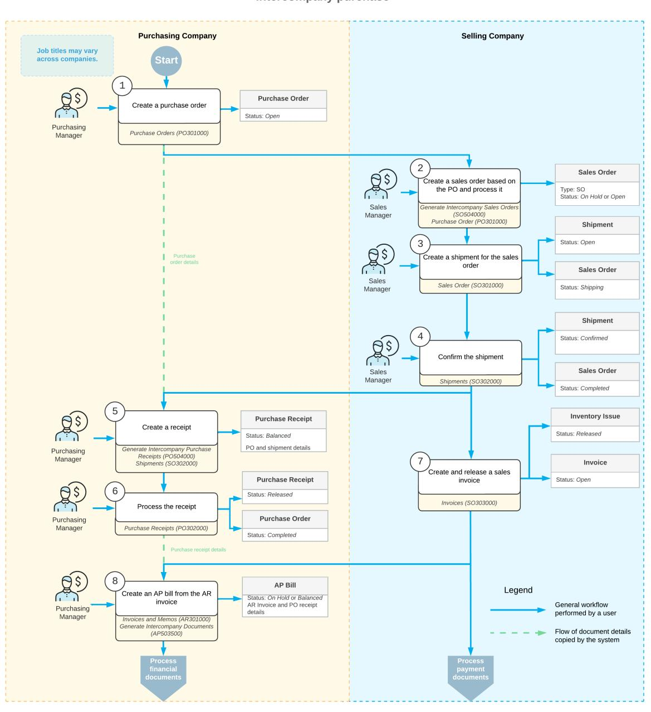

# <span id="page-509-0"></span>**Intercompany Purchases and Returns: Intercompany Returns**

For intercompany purchases, you can generate purchase returns.

#### **Learning Objectives**

In this chapter, you will learn how to create a purchase return and automatically generate a sales return based on the purchase return.

#### **Applicable Scenarios**

You use the intercompany returns functionality if there are multiple companies defined in the same tenant and one of the companies (the purchasing company) needs to make a return of a purchased item to another company (the selling company).

#### **Processing an Intercompany Return**

In Acumatica ERP, to begin processing an intercompany return, on the *[Purchase Receipts](https://help-2025r1.acumatica.com/Help?ScreenId=ShowWiki&pageid=d9901c8d-486d-45ed-8088-ea3d8ee3af19)* (PO302000) form, the manager of the purchasing company creates a purchase return, which is a document of the *Return* type, that includes a line for each item being returned. To create a purchase return, the manager of the purchasing company opens the purchase receipt with the items to be returned, select the unlabeled check boxes on the **Details** tab for the lines with these items, and clicks **Return** on the form toolbar. The system copies the relevant information from the purchase receipt to a new purchase return on the *[Purchase Receipts](https://help-2025r1.acumatica.com/Help?ScreenId=ShowWiki&pageid=d9901c8d-486d-45ed-8088-ea3d8ee3af19)* form. In the copied lines, the purchasing manage specifies the quantity of items to be returned in the **Receipt Qty.** column. If no replacement required, the purchasing manager clears the **Open PO** check box in the lines of the purchase return. Then the manager saves the purchase return and releases the return by clicking **Release** on the form toolbar.

The manager of the selling company opens the *[Generate Intercompany Sales Orders](https://help-2025r1.acumatica.com/Help?ScreenId=ShowWiki&pageid=c46ba07b-01f1-4878-affb-fd8baccf8a14)* (SO504000), selects the *Purchase Return* option in the **Purchase Doc.Type** box in the Summary area of the form, selects the unlabeled check box in the line with the purchase return and clicks **Process** on the form toolbar. The system generates sales return of the *RC* type with the *Open* status and automatically copies the relevant settings and the line details of the originating purchase return. The manager of the selling company opens sales return on the *[Sales Orders](https://help-2025r1.acumatica.com/Help?ScreenId=ShowWiki&pageid=19e4021c-1b84-49fd-be12-0320c5f1c7e5)* (SO301000) form and creates a shipment with the **Receipt** operation by clicking **Create Receipt** on the form toolbar. Then the manager releases the shipment by clicking **Confirm Shipment** on the form toolbar.

To adjust the customer's balance, the manager of the selling company create an SO credit memo on the *[Shipments](https://help-2025r1.acumatica.com/Help?ScreenId=ShowWiki&pageid=f47cffcc-543e-469c-a204-a9c1e3da346d)* form by clicking **Prepare Invoice** on the form toolbar while the manager is still viewing the shipment. The system creates a credit memo to the customer and opens it on the *[Invoices](https://help-2025r1.acumatica.com/Help?ScreenId=ShowWiki&pageid=0acc9738-f141-4ea0-a2be-f34ea9d1b63a)* (SO303000) form. On the form toolbar of the *[Invoices](https://help-2025r1.acumatica.com/Help?ScreenId=ShowWiki&pageid=0acc9738-f141-4ea0-a2be-f34ea9d1b63a)* form, the manager clicks **Release** to release the credit memo.

When the manager of the selling company releases the SO credit memo, the system automatically generates a corresponding inventory receipt for the returned items on the *[Receipts](https://help-2025r1.acumatica.com/Help?ScreenId=ShowWiki&pageid=d6ecad5b-155f-44bf-baba-9ed006d298b5)* (IN301000) form; it also creates and releases a credit memo on the *[Invoices and Memos](https://help-2025r1.acumatica.com/Help?ScreenId=ShowWiki&pageid=5e6f3b27-b7af-412f-a40a-1d4f4be70cba)* (AR301000) form. Then the manager of the purchasing company open the *[Generate Intercompany Documents](https://help-2025r1.acumatica.com/Help?ScreenId=ShowWiki&pageid=50e6ea07-42a0-4c44-884c-2e5f0b74474b)* (AP503500) form, selects the unlabeled check box in the line with the credit memo and clicks **Process** on the form toolbar. The system generates a debit adjustment on the *[Bills and](https://help-2025r1.acumatica.com/Help?ScreenId=ShowWiki&pageid=956b4e51-3078-4d2d-85b3-65c080d95234) [Adjustments](https://help-2025r1.acumatica.com/Help?ScreenId=ShowWiki&pageid=956b4e51-3078-4d2d-85b3-65c080d95234)* (AP301000) form. The manager of the purchasing company opens the generated debit adjustment on the *[Bills and Adjustments](https://help-2025r1.acumatica.com/Help?ScreenId=ShowWiki&pageid=956b4e51-3078-4d2d-85b3-65c080d95234)* form, clicks **Remove Hold** on the form toolbar and then clicks **Release**. The system adds the details of the debit adjustment to the **Billing History** tab of the *[Purchase Receipts](https://help-2025r1.acumatica.com/Help?ScreenId=ShowWiki&pageid=d9901c8d-486d-45ed-8088-ea3d8ee3af19)* (PO302000) form for the initial purchase return.

#### **Workflow of an Intercompany Return**

For an intercompany return between the branches of two different companies, the typical process involves the actions and generated documents shown in the following diagram.

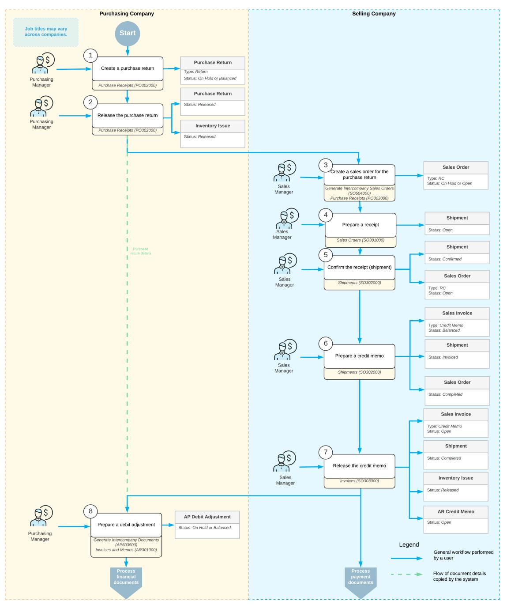

# <span id="page-510-0"></span>**Intercompany Purchases and Returns: Implementation Checklist**

The following sections provide details you can use to ensure that the system is configured properly for processing intercompany sales orders, and to understand (and change, if needed) the settings that affect the processing workflow.

#### **Implementation Checklist**

We recommend that before you initially process intercompany sales, you make sure the needed features have been enabled, settings have been specified, and entities have been created, as summarized in the following checklist.

| Form                               | Criteria to Check                                                                                                                                                                                                                                                                                                                                                                                                                   |  |  |
|------------------------------------|-------------------------------------------------------------------------------------------------------------------------------------------------------------------------------------------------------------------------------------------------------------------------------------------------------------------------------------------------------------------------------------------------------------------------------------|--|--|
| Enable/Disable Features (CS100000) | Make sure that the following features have been en<br>abled:                                                                                                                                                                                                                                                                                                                                                                        |  |  |
|                                    | •<br>Standard Financials                                                                                                                                                                                                                                                                                                                                                                                                            |  |  |
|                                    | •<br>Multibranch Support                                                                                                                                                                                                                                                                                                                                                                                                            |  |  |
|                                    | •<br>Multicompany Support                                                                                                                                                                                                                                                                                                                                                                                                           |  |  |
|                                    | •<br>Advanced Financials                                                                                                                                                                                                                                                                                                                                                                                                            |  |  |
|                                    | •<br>Inter-Branch Transactions                                                                                                                                                                                                                                                                                                                                                                                                      |  |  |
|                                    | •<br>Inventory and Order Management                                                                                                                                                                                                                                                                                                                                                                                                 |  |  |
|                                    | •<br>Inventory (this feature is required for sales and pur<br>chases of stock items)                                                                                                                                                                                                                                                                                                                                                |  |  |
| Companies (CS101500)               | If you are going to extend as a customer or vendor<br>any company that has the Without Branches compa<br>ny type, make sure that the company has been config<br>ured. For details, see Company Without Branches: To<br>Configure a Company Without Branches.                                                                                                                                                                        |  |  |
| Branches (CS102000)                | If you are going to extend as a customer or vendor any<br>branches of companies with the With Branches Not Re<br>quiring Balancing or With Branches Requiring Balanc<br>ing company type, make sure that the companies have<br>been configured. For details, see Company with Branch<br>es that Do Not Require Balancing: Implementation Activ<br>ity and Company with Branches that Require Balancing:<br>Implementation Activity. |  |  |
| Vendor Classes (AP201000)          | Make sure that the vendor class to be used for a ven<br>dor extended from a company or branch has been de<br>fined. For details, see Accounts Payable: To Create a<br>Vendor Class.                                                                                                                                                                                                                                                 |  |  |
| Customer Classes (AR201000)        | Make sure that the customer class to be used for a cus<br>tomer extended from a company or branch has been<br>defined. For details, see Accounts Receivable: To Cre<br>ate a Customer Class.                                                                                                                                                                                                                                        |  |  |

| Form                                | Criteria to Check                                                                                                                                                                                                                                                                                                                                                 |
|-------------------------------------|-------------------------------------------------------------------------------------------------------------------------------------------------------------------------------------------------------------------------------------------------------------------------------------------------------------------------------------------------------------------|
| Order Types (SO201000)              | Make sure that the SO order type is active and has<br>•<br>been configured, as described in Sales Order Types:<br>To Activate the SO Order TypeImplementation Activi<br>ty. Note that in production, you can use any type of<br>the sales order. The SO order type is required for In<br>tercompany Purchases and Returns: To Process an<br>Intercompany Purchase |
|                                     | •<br>Make sure that the RC order type is active and has<br>been configured, as described in Sales Order Types:<br>To Activate the RC Order Type. Note that in produc<br>tion, you can use any type of the sales order. The RC<br>order type is required for Intercompany Purchases<br>and Returns: To Process an Intercompany Purchase                            |
| Sales Orders Preferences (SO101000) | •<br>Make sure that SO is selected in the DefaultType<br>for IntercompanySales box. The system will use<br>this order type by default when creating an inter<br>company sales order.                                                                                                                                                                              |
|                                     | Make sure that RC is selected in the DefaultType<br>•<br>for Intercompany Returns box. The system will<br>use this order type by default when creating an in<br>tercompany sales return.                                                                                                                                                                          |

#### **Other Settings That Affect the Workflow**

You can affect the workflow of intercompany sales and purchases by specifying additional settings as follows:

- To cause sales orders of a particular order type to be created with the *On Hold* status (so the user can verify them before processing them further), select the **Hold Documents on Entry** check box for the order type on the *Order [Types](https://help-2025r1.acumatica.com/Help?ScreenId=ShowWiki&pageid=e6984218-4260-4438-99e1-aee2b3765369)* form. For more information on other order type settings affecting the workflow of sales orders, see *Sales Order Types: General [Information](https://help-2025r1.acumatica.com/Help?ScreenId=ShowWiki&pageid=96a00780-a0c3-4314-86ca-093004844268)*.
- To cause the system to automatically create an accounts payable bill on release of a purchase receipt by default, select the **Create Bill on Receipt Release** check box on the *[Purchase Orders Preferences](https://help-2025r1.acumatica.com/Help?ScreenId=ShowWiki&pageid=13d09c43-8696-4f92-ad9b-3d0209ee3d9b)* (PO101000) form. In this case, when a user creates a purchase receipt on the *[Purchase Receipts](https://help-2025r1.acumatica.com/Help?ScreenId=ShowWiki&pageid=d9901c8d-486d-45ed-8088-ea3d8ee3af19)* (PO302000) form, the system automatically selects the **Create Bill** check box. (The user can clear this check box for a particular bill.) For information on processing bills, see *[AP Bills: General Information](https://help-2025r1.acumatica.com/Help?ScreenId=ShowWiki&pageid=1ea1e770-b81c-437e-831f-64f702f968f4)*.
- To cause the system to automatically post general ledger batches generated during the processing of sales and purchase documents, select the **Automatically Post on Release** check box on the *[General Ledger](https://help-2025r1.acumatica.com/Help?ScreenId=ShowWiki&pageid=e4913d06-c511-4258-a0f9-f36c1b854e6b) [Preferences](https://help-2025r1.acumatica.com/Help?ScreenId=ShowWiki&pageid=e4913d06-c511-4258-a0f9-f36c1b854e6b)* (GL102000) form. For information on processing general ledger batches, see *GL [Transactions:](https://help-2025r1.acumatica.com/Help?ScreenId=ShowWiki&pageid=35393020-6269-466d-8a08-df558cd43367) [General Information](https://help-2025r1.acumatica.com/Help?ScreenId=ShowWiki&pageid=35393020-6269-466d-8a08-df558cd43367)*.
- To select the source of the expense account used in the AP documents, purchase orders, and purchase receipts, select a value in the **Use Intercompany Expense Account From** box on the *[Accounts Payable](https://help-2025r1.acumatica.com/Help?ScreenId=ShowWiki&pageid=c3f9353e-95e6-448d-bb3f-e20643879ec7) [Preferences](https://help-2025r1.acumatica.com/Help?ScreenId=ShowWiki&pageid=c3f9353e-95e6-448d-bb3f-e20643879ec7)* (AP101000) form.
- To select the source of the sales account used in the AR documents, select a value in the **Use Intercompany Sales Account From** box on the *[Accounts Receivable Preferences](https://help-2025r1.acumatica.com/Help?ScreenId=ShowWiki&pageid=f7b52067-5299-45e8-b601-485cd709f58b)* (AR101000) form.
- To cause inventory issues to be automatically generated and released on release of sales invoices, select the **Automatically Release IN Documents** check box on the *[Sales Orders Preferences](https://help-2025r1.acumatica.com/Help?ScreenId=ShowWiki&pageid=1817779c-413b-4187-b7fe-38e97845a1cb)* (SO101000) form.
- To cause general ledger batches generated during the processing of sales documents to be posted automatically, select the **Automatically Post on Release** check box on the *[General Ledger Preferences](https://help-2025r1.acumatica.com/Help?ScreenId=ShowWiki&pageid=e4913d06-c511-4258-a0f9-f36c1b854e6b)* (GL102000) form. For information on processing general ledger batches, see *GL [Transactions:](https://help-2025r1.acumatica.com/Help?ScreenId=ShowWiki&pageid=35393020-6269-466d-8a08-df558cd43367) General [Information](https://help-2025r1.acumatica.com/Help?ScreenId=ShowWiki&pageid=35393020-6269-466d-8a08-df558cd43367)*.

### **Validation of Configuration**

To make sure that all configuration has been performed correctly, we recommend that in your system, you perform instructions similar to those described in *[Intercompany](#page-516-1) Purchases and Returns: To Process an Intercompany [Purchase](#page-516-1)*.

#### **Known Process Limitations**

The following limitations apply to the processing of intercompany purchases and sales:

- Intercompany documents can be created only one to one. That is, for an intercompany purchase order, only one sales order can be generated. Only one intercompany sales order can be added to one shipment. For one intercompany shipment, only one purchase receipt can be generated.
- Only purchase orders of the *Normal* type can be used for intercompany purchases.
- Drop-ship purchase orders cannot be created for or linked to a line of an intercompany sales order that has the **Mark for PO** check box selected on the **Details** tab of the *[Sales Orders](https://help-2025r1.acumatica.com/Help?ScreenId=ShowWiki&pageid=19e4021c-1b84-49fd-be12-0320c5f1c7e5)* (SO301000) form.
- For lot or serial-tracked items, a lot or serial number is assigned to an item only when it is shipped to a customer. The number is not assigned to an item in an intercompany shipment.

# <span id="page-513-0"></span>**Intercompany Purchases and Returns: Implementation Activity**

The following activity will walk you through the configuring branches of two companies within the same tenant for processing intercompany sales and purchases.

This activity is based on the *U100* dataset. If you are using another dataset, or if any system settings have been changed in *U100*, these changes can affect the workflow of the activity and the results of the processing. To avoid any issues, restore the *U100* dataset to its initial state.

### **Story**

Suppose that the Head Office of the Muffins & Cakes company has to purchase juicers from the Service and Equipment Sales Center of SweetLife Fruits & Jams. To avoid the creation of a new customer and vendor to represent the selling and purchasing companies and the processing of a sales transaction by the accounting departments of two branches, the chief accountant of SweetLife has decided to use the intercompany sales functionality.

Acting as a system administrator, you need to extend the *SWEEPEQUIP* branch of SweetLife to be a vendor and the *MHEAD* branch of Muffins & Cakes to be a customer.

### **Configuration Overview**

For the purposes of this activity, the following features have been enabled:

- *Standard Financials*
- *Multibranch Support*
- *Multicompany Support*
- *Advanced Financials*
- *Inter-Branch Transactions*

On the *[Branches](https://help-2025r1.acumatica.com/Help?ScreenId=ShowWiki&pageid=b97ab72d-4ab4-4f02-b69c-f7f61b316ced)* (CS102000) form, the *SWEETEQUIP* (Service and Equipment Sales Center) and *MHEAD* (Muffins Head Office & Wholesale Center) branches of SweetLife and Muffins & Cakes, respectively, have been defined.

On the *Vendor [Classes](https://help-2025r1.acumatica.com/Help?ScreenId=ShowWiki&pageid=20dc8b93-d83a-49cf-8cfb-d2ffd2f0db87)* (AP201000) form, the *INTERCO* vendor class for vendors extended from companies and branches has been configured.

On the *[Customer Classes](https://help-2025r1.acumatica.com/Help?ScreenId=ShowWiki&pageid=806e39d6-6f89-4e6c-9a24-61c6fb0c9a57)* (AR201000) form, the *INTERCO* customer class for customers extended from companies and branches has been configured.

#### **Process Overview**

In this activity, on the *[Branches](https://help-2025r1.acumatica.com/Help?ScreenId=ShowWiki&pageid=b97ab72d-4ab4-4f02-b69c-f7f61b316ced)* (CS102000) form, you will extend the *SWEETEQUIP* branch to be a vendor and the *MHEAD* branch to be a customer. On the *[Vendors](https://help-2025r1.acumatica.com/Help?ScreenId=ShowWiki&pageid=a9584be3-f2bd-4d67-80d4-8041d809df56)* (AP303000) form, you will update the settings of the new vendor and on the *[Customers](https://help-2025r1.acumatica.com/Help?ScreenId=ShowWiki&pageid=652929bc-9606-4056-aa6e-0c2d1147171b)* (AR303000) form, you will update the settings of the new customer.

#### **System Preparation**

To prepare the system, do the following:

- 1. Launch the Acumatica ERP website, and sign in as a system administrator by using the following credentials:
  - Username: *gibbs*
  - Password: *123*
- 2. In the info area, in the upper-right corner of the top pane of the Acumatica ERP screen, make sure that today's date is displayed.

# <span id="page-514-0"></span>**Intercompany Purchases and Returns: Generated Transactions**

As you perform intercompany purchases and returns, you create and process a purchase order, a sales order, a shipment, a purchase receipt, an AR invoice, and an AP bill. When you release the AR and AP documents, the system updates the customer's and vendor's balances. Inventory documents are used to track item movements. To update the account balances, the system generates and posts the GL transactions described in the following sections.

#### **Transaction Generated for an AR Invoice**

When you create and release an AR invoice, the system generates the following general ledger transaction.

| Branch                         | Account                                          | Debit  | Credit |
|--------------------------------|--------------------------------------------------|--------|--------|
| SWEETEQUIP (Selling<br>branch) | 19010 - Accounts Receivable - Related<br>Company | Amount | 00.00  |
| SWEETEQUIP (Selling<br>branch) |                                                  | 00.00  | Amount |

You can view the reference number of the GL batch on the **Financial** tab of the *[Invoices](https://help-2025r1.acumatica.com/Help?ScreenId=ShowWiki&pageid=0acc9738-f141-4ea0-a2be-f34ea9d1b63a)* (SO303000) form and on the **Financial** tab of the *[Invoices and Memos](https://help-2025r1.acumatica.com/Help?ScreenId=ShowWiki&pageid=5e6f3b27-b7af-412f-a40a-1d4f4be70cba)* (AR301000) form.

#### **Transaction Generated for an Issue**

When the goods are issued from the warehouse of the selling branch, the system generates the following general ledger transaction.

| Branch                         | Account                 | Debit  | Credit |
|--------------------------------|-------------------------|--------|--------|
| SWEETEQUIP (Selling<br>branch) | 12100 - Inventory Asset | 0.00   | Amount |
| SWEETEQUIP (Selling<br>branch) | 50000 - COGS Inventory  | Amount | 00.00  |

You can view the reference number of the GL batch on the **Financial** tab of the *[Issues](https://help-2025r1.acumatica.com/Help?ScreenId=ShowWiki&pageid=17b051f6-027d-4459-b542-65c1c1f9d0ea)* (IN302000) form.

#### **Transaction Generated on Release of PO Receipt**

When you process a purchase receipt, the system generates the following general ledger transaction on release of the inventory receipt.

| Branch                    | Account                                         | Debit  | Credit |
|---------------------------|-------------------------------------------------|--------|--------|
| MHEAD (Purchasing branch) | 12700 - Inventory Asset for MHEAD ware<br>house | Amount | 00.00  |
| MHEAD (Purchasing branch) | 20100 - Inventory Purchase Accrual              | 00.00  | Amount |

You can view the reference number of the GL batch on the **Financial** tab of the *[Receipts](https://help-2025r1.acumatica.com/Help?ScreenId=ShowWiki&pageid=d6ecad5b-155f-44bf-baba-9ed006d298b5)* (IN301000) form.

#### **Transaction Generated for an AP Bill**

When the system creates an AP bill based on the AR invoice you created, the system generates the following general ledger transaction aer release of this bill.

| Branch                    | Account                                        | Debit  | Credit |
|---------------------------|------------------------------------------------|--------|--------|
| MHEAD (Purchasing branch) | 26010 - Accounts Payable - Related Compa<br>ny | 00.00  | Amount |
| MHEAD (Purchasing branch) | 20100 - Inventory Purchase Accrual             | Amount | 00.00  |

You can view the reference number of the GL batch on the **Financial** tab of the *[Bills and Adjustments](https://help-2025r1.acumatica.com/Help?ScreenId=ShowWiki&pageid=956b4e51-3078-4d2d-85b3-65c080d95234)* (AP301000) form.

#### **Transaction Generated on Release of PO Return**

When you process a purchase return, the system generates the following general ledger transaction on release of the return.

| Branch                    | Account                                         | Debit         | Credit        |
|---------------------------|-------------------------------------------------|---------------|---------------|
| MHEAD (Purchasing branch) | 12700 - Inventory Asset for MHEAD ware<br>house | 00.00         | Return amount |
| MHEAD (Purchasing branch) | 20100 - Inventory Purchase Accrual              | Return amount | 00.00         |

You can view the reference number of the GL batch on the **Financial** tab of the *[Issues](https://help-2025r1.acumatica.com/Help?ScreenId=ShowWiki&pageid=17b051f6-027d-4459-b542-65c1c1f9d0ea)* (IN302000) form.

#### **Transaction Generated for an SO Credit Memo**

When you process a return of items, you create an SO credit memo. The system generates the following general ledger transaction aer the release of the credit memo.

| Branch                      | Account                                          | Debit         | Credit        |
|-----------------------------|--------------------------------------------------|---------------|---------------|
| SWEETEQUIP (Selling branch) | 19010 - Accounts Receivable - Related<br>Company | 00.00         | Return amount |
| SWEETEQUIP (Selling branch) | 43000 - Related Company Sales                    | Return amount | 00.00         |

You can view the reference number of the GL batch on the **Financial** tab of the *[Invoices and Memos](https://help-2025r1.acumatica.com/Help?ScreenId=ShowWiki&pageid=5e6f3b27-b7af-412f-a40a-1d4f4be70cba)* (AR301000) form.

#### **Transaction Generated for a Sales Return**

When you process the return of items to the warehouse of the selling branch, the system generates the following general ledger transaction.

| Branch                      | Account                  | Debit         | Credit        |
|-----------------------------|--------------------------|---------------|---------------|
| SWEETEQUIP (Selling branch) | 12100 - Inventory Asset  | Return amount | 00.00         |
| SWEETEQUIP (Selling branch) | 50000 - COGS - Inventory | 00.00         | Return amount |

You can view the reference number of the GL batch on the **Financial** tab of the *[Issues](https://help-2025r1.acumatica.com/Help?ScreenId=ShowWiki&pageid=17b051f6-027d-4459-b542-65c1c1f9d0ea)* (IN302000) form.

#### **Transaction Generated for a Debit Adjustment**

When you process a return of items, aer the creation of an AR credit memo to adjust the customer's balance, you create a debit adjustment to adjust the vendor's balance. The system generates the following general ledger transaction aer the release of the debit adjustment.

| Branch                    | Account                                        | Debit         | Credit        |
|---------------------------|------------------------------------------------|---------------|---------------|
| MHEAD (Purchasing branch) | 26010 - Accounts Payable - Related Com<br>pany | Return amount | 00.00         |
| MHEAD (Purchasing branch) | 20100 - Inventory Purchase Accrual             | 00.00         | Return amount |

You can view the reference number of the GL batch on the **Financial** tab of the *[Bills and Adjustments](https://help-2025r1.acumatica.com/Help?ScreenId=ShowWiki&pageid=956b4e51-3078-4d2d-85b3-65c080d95234)* (AP301000) form.

### <span id="page-516-1"></span><span id="page-516-0"></span>**Intercompany Purchases and Returns: To Process an Intercompany Purchase**

The following activity will walk you through the process of selling an item from one company to another company within the same tenant.

#### **Story**

Suppose that the Head Office of the Muffins & Cakes company has to purchase two new juicers from the Service and Equipment Sales Center of SweetLife Fruits & Jams. The system administrator has set up the intercompany sales functionality to enable generation of sales orders based on purchase orders, purchase receipts based on shipments, and AP bills based on AR invoices.

Acting as a purchasing manager of Head Office of Muffins & Cakes, you need to create a purchase order to the *SWEETEQIP* branch.

### **Configuration Overview**

In the *U100* dataset, the following tasks have been performed to support this activity:

- On the *[Enable/Disable Features](https://help-2025r1.acumatica.com/Help?ScreenId=ShowWiki&pageid=c1555e43-1bc5-4f6f-ba9d-b323f94d8a6b)* (CS100000) form, the following features have been enabled:
  - *Standard Financials*
  - *Multibranch Support*
  - *Multicompany Support*
  - *Advanced Financials*
  - *Inter-Branch Transactions*
  - *Inventory and Order Management*
  - *Inventory*
- On the *[Companies](https://help-2025r1.acumatica.com/Help?ScreenId=ShowWiki&pageid=fedad435-8496-4397-b8a3-50a473629f76)* (CS101500) form, the *MUFFINS* and *SWEETLIFE* companies have been defined.
- On the *[Branches](https://help-2025r1.acumatica.com/Help?ScreenId=ShowWiki&pageid=b97ab72d-4ab4-4f02-b69c-f7f61b316ced)* (CS102000) form, the *SWEETEQUIP* and *MHEAD* branches have been defined.
- On the *[Stock Items](https://help-2025r1.acumatica.com/Help?ScreenId=ShowWiki&pageid=77786a70-1f1e-4d63-ad98-96f98e4fcb0e)* (IN202500) form, the *JUICER35* inventory item has been configured.
- On the *[Warehouses](https://help-2025r1.acumatica.com/Help?ScreenId=ShowWiki&pageid=264b0ef7-2b6c-40b4-a7d9-f1a5e067939b)* (IN204000) form, the *MHEADWH* warehouse has been created and specified for the *MAIN* location of the *MHEAD* branch.

#### **Process Overview**

In this activity, you will first review the intercompany sales settings on the *[Sales Orders Preferences](https://help-2025r1.acumatica.com/Help?ScreenId=ShowWiki&pageid=1817779c-413b-4187-b7fe-38e97845a1cb)* (SO101000) form. On the *[Vendors](https://help-2025r1.acumatica.com/Help?ScreenId=ShowWiki&pageid=a9584be3-f2bd-4d67-80d4-8041d809df56)* (AP303000) form, you will specify the warehouse of the Muffins & Cakes company as the default one for the *SWEETEQUIP* vendor. On the *[Purchase Orders](https://help-2025r1.acumatica.com/Help?ScreenId=ShowWiki&pageid=5565686c-96c4-4bfa-a51d-9a2566baa808)* (PO301000) form, you will create a purchase order from *Muffins Head Office & Wholesale Center* to *Service and Equipment Sales Center*, specifying *SWEETEQUIP* as the vendor, and save the purchase order. You will then cause the system to generate a sales order based on the purchase order on the *[Generate Intercompany Sales Orders](https://help-2025r1.acumatica.com/Help?ScreenId=ShowWiki&pageid=c46ba07b-01f1-4878-affb-fd8baccf8a14)* (SO504000) form. When the sales order is generated, on the *[Sales Orders](https://help-2025r1.acumatica.com/Help?ScreenId=ShowWiki&pageid=19e4021c-1b84-49fd-be12-0320c5f1c7e5)* (SO301000) form, you will create and confirm a shipment for this sales order, and then you will cause the system to generate a purchase receipt based on the shipment on the *[Generate Intercompany Purchase](https://help-2025r1.acumatica.com/Help?ScreenId=ShowWiki&pageid=3484378d-ae42-47e5-bbef-188bddc14d13) [Receipts](https://help-2025r1.acumatica.com/Help?ScreenId=ShowWiki&pageid=3484378d-ae42-47e5-bbef-188bddc14d13)* (PO504000) form. You will then create a sales invoice by clicking **Prepare Invoice** on the form toolbar of the *[Shipments](https://help-2025r1.acumatica.com/Help?ScreenId=ShowWiki&pageid=f47cffcc-543e-469c-a204-a9c1e3da346d)* (SO302000) form. You will release the sales invoice on the *[Invoices](https://help-2025r1.acumatica.com/Help?ScreenId=ShowWiki&pageid=0acc9738-f141-4ea0-a2be-f34ea9d1b63a)* (SO303000) form, and it will become visible on the *[Invoices and Memos](https://help-2025r1.acumatica.com/Help?ScreenId=ShowWiki&pageid=5e6f3b27-b7af-412f-a40a-1d4f4be70cba)* (AR301000) form as an AR invoice. You will cause the system to generate an AP bill on the *[Generate Intercompany Documents](https://help-2025r1.acumatica.com/Help?ScreenId=ShowWiki&pageid=50e6ea07-42a0-4c44-884c-2e5f0b74474b)* (AP503500) form and release this bill on the *[Bills and](https://help-2025r1.acumatica.com/Help?ScreenId=ShowWiki&pageid=956b4e51-3078-4d2d-85b3-65c080d95234) [Adjustments](https://help-2025r1.acumatica.com/Help?ScreenId=ShowWiki&pageid=956b4e51-3078-4d2d-85b3-65c080d95234)* (AP301000) form.

#### **System Preparation**

Before you begin performing the steps of this activity, do the following:

1. Launch the Acumatica ERP website with the *U100* dataset preloaded, and sign in as an accountant Nenad Pasic by using the *pasic* username and the *123* password.

For simplicity, you perform all steps of this activity under the username which has access to both *Service and Equipment Sales Center* and *Muffins Head Office & Wholesale Center* branches. However, in a production environment, the steps for different branches may be performed by different users.

- 2. In the info area, in the upper-right corner of the top pane of the Acumatica ERP screen, make sure that the business date in your system is set to *1/30/2025*. If a different date is displayed, click the Business Date menu button and select *1/30/2025* on the calendar. For simplicity, in this activity, you will create and process all documents in the system on this business date.
- 3. On the Company and Branch Selection menu on the top pane of the Acumatica ERP screen, select the *Muffins Head Office & Wholesale Center* branch.
- 4. Make sure the *SWEETEQUIP* branch has been extended as a vendor and the *MHEAD* branch has been extended as a customer, as described in *[Intercompany Sales Setup: Implementation Activity](https://help-2025r1.acumatica.com/Help?ScreenId=ShowWiki&pageid=4f8bfd07-a771-4b94-8b51-92fa2d1da3b0)*.

#### **Step 1: Reviewing the Sales Order Preferences**

To review the type of sales orders that will be used for intercompany sales, do the following:

- 1. Open the *[Sales Orders Preferences](https://help-2025r1.acumatica.com/Help?ScreenId=ShowWiki&pageid=1817779c-413b-4187-b7fe-38e97845a1cb)* (SO101000) form.
- 2. On the **General** tab, in the **Intercompany OrderSettings** section, review the following settings:
  - **DefaultType for IntercompanySales**: *SO - Sales Order*

This is the type of sales order that the system will use by default when creating an intercompany sales order.

• **DefaultType for Intercompany Returns**: *RC - Return for Credit* This is the type of an order that the system will use by default when creating an intercompany return.

#### **Step 2: Specifying the Default Warehouse for the Vendor**

To specify the warehouse of the Muffins & Cakes company as the default warehouse for the *SWEETEQUIP* vendor in the *MHEAD* branch to which you are currently signed in, do the following:

- 1. Open the *[Vendors](https://help-2025r1.acumatica.com/Help?ScreenId=ShowWiki&pageid=a9584be3-f2bd-4d67-80d4-8041d809df56)* (AP303000) form.
- 2. In the **Vendor ID** box, select *SWEETEQUIP*.
- 3. Go to the **PurchaseSettings** tab.
- 4. In the **Warehouse** box (**Shipping Instructions** section), select *MHEADWH*.
- 5. On the form toolbar, click**Save** to save your changes.

#### **Step 3: Creating an Intercompany Purchase Order**

To create an intercompany purchase order, do the following:

1. Open the *[Purchase Orders](https://help-2025r1.acumatica.com/Help?ScreenId=ShowWiki&pageid=5565686c-96c4-4bfa-a51d-9a2566baa808)* (PO301000) form.


To open the form for creating a new record, type the form ID in the Search box, and on the Search form, point at the form title and click **New** right of the title.

- 2. Click **Add New Record** on the form toolbar, and in the Summary area, specify the following settings:
  - **Type**: *Normal*
  - **Vendor**: *SWEETEQUIP*

- **Date**: *1/30/2025* (inserted automatically)
- **Description**: Purchase of juicers
- 3. On the **Details** tab, click **Add Row** on the table toolbar and specify the following settings for the new row:
  - **Branch**: *MHEAD*
  - **Inventory ID**: *JUICER35*
  - **Warehouse**: *MHEADWH* (inserted automatically based on the selected vendor)
  - **Order Qty.**: 2
  - **Unit Cost**: 1200
  - **Ext. Cost**: *2,400* (calculated automatically)
- 4. On the form toolbar, click **Remove Hold** to save the document with the *Open* status.

#### **Step 4: Generating an Intercompany Sales Order**

To generate an intercompany sales order, do the following:

- 1. Open the *[Generate Intercompany Sales Orders](https://help-2025r1.acumatica.com/Help?ScreenId=ShowWiki&pageid=c46ba07b-01f1-4878-affb-fd8baccf8a14)* (SO504000) form.
- 2. In the only line, select the unlabeled check box and click **Process** on the form toolbar.

The system generates a sales order with the *SO* type and *Open* status for the *MHEAD* customer and automatically copies the relevant settings and the line details of the originating purchase order.

- 3. In the dialog box, which opens, click **Close**.
- 4. On the *[Purchase Orders](https://help-2025r1.acumatica.com/Help?ScreenId=ShowWiki&pageid=5565686c-96c4-4bfa-a51d-9a2566baa808)* (PO301000) form, open the purchase order that you have created in Step 3 (the top record in the list on the Purchase Orders (PO3010PL) list of records).
- 5. On the **Other** tab, notice that the system inserted the number of the generated sales order into the **Related Order Nbr.** box. This number is a link to the sales order.
- 6. Click the link in the **Related Order Nbr.** box. The system opens the sales order on the *[Sales Orders](https://help-2025r1.acumatica.com/Help?ScreenId=ShowWiki&pageid=19e4021c-1b84-49fd-be12-0320c5f1c7e5)* (SO301000) form.
- 7. Review the sales order.

Notice that *MHEAD* is specified in the **Customer** box for this order. On the **Details** tab, *SWEETEQUIP* is specified in the **Branch** column and the order details have been copied from the originating purchase order. On the **Shipping** tab, notice that the system has inserted the number of the originating purchase order in the **Related Order Nbr.** box (the **Intercompany Purchase** section). This number is a link to the purchase order.

#### **Step 5: Creating a Shipment**

To generate a shipment for the intercompany sales order, do the following:

- 1. While you are still viewing the sales order for the *MHEAD* customer, on the form toolbar, click **Create Shipment**.
- 2. In the **SpecifyShipment Parameters** dialog box, which opens, make sure that *1/30/2025* is selected in the **Shipment Date** box and *EQUIPHOUSE* is selected in the **Warehouse ID** box, and click **OK**.
- 3. The system creates a shipment for the sales order and opens it on the *[Shipments](https://help-2025r1.acumatica.com/Help?ScreenId=ShowWiki&pageid=f47cffcc-543e-469c-a204-a9c1e3da346d)* (SO302000) form.
- 4. On the form toolbar, click **Confirm Shipment**.

#### **Step 6: Creating a Purchase Receipt**

To create a purchase receipt, do the following:

- 1. Open the *[Generate Intercompany Purchase Receipts](https://help-2025r1.acumatica.com/Help?ScreenId=ShowWiki&pageid=3484378d-ae42-47e5-bbef-188bddc14d13)* (PO504000) form.
- 2. In the only line, select the unlabeled check box and click **Process** on the form toolbar.

The system generates a purchase receipt that contains the relevant settings and detail rows copied from the shipment.

- 3. In the dialog box, which opens, click **Close**.
- 4. On the *[Shipments](https://help-2025r1.acumatica.com/Help?ScreenId=ShowWiki&pageid=f47cffcc-543e-469c-a204-a9c1e3da346d)* (SO302000) form, open the shipment that you have created in Step 5.
- 5. On the **Shipping** tab, click the link in the **Related PO Receipt Nbr.** box.
- 6. On the *[Purchase Receipts](https://help-2025r1.acumatica.com/Help?ScreenId=ShowWiki&pageid=d9901c8d-486d-45ed-8088-ea3d8ee3af19)* (PO302000) form, which the system opens, review the purchase receipt with the *SWEETEQUIP* vendor and the *1/30/2025* date.
- 7. On the form toolbar, click **Remove Hold** and then click **Release**.

#### **Step 7: Creating a Sales Invoice**

To prepare a sales invoice for the shipment, do the following:

- 1. On the *[Shipments](https://help-2025r1.acumatica.com/Help?ScreenId=ShowWiki&pageid=f47cffcc-543e-469c-a204-a9c1e3da346d)* (SO302000) form, open the shipment that you created in Step 5.
- 2. On the form toolbar, click **Prepare Invoice**.

The system creates a sales invoice for the shipment and opens it on the *[Invoices](https://help-2025r1.acumatica.com/Help?ScreenId=ShowWiki&pageid=0acc9738-f141-4ea0-a2be-f34ea9d1b63a)* (SO303000) form.

3. On the form toolbar, click **Release**.

The system assigns the *Open* status to the sales invoice and makes it visible on the *[Invoices and Memos](https://help-2025r1.acumatica.com/Help?ScreenId=ShowWiki&pageid=5e6f3b27-b7af-412f-a40a-1d4f4be70cba)* (AR301000) form as an AR invoice.

#### **Step 8: Creating an AP Bill**

To create an AP bill, do the following:

- 1. Open the *[Generate Intercompany Documents](https://help-2025r1.acumatica.com/Help?ScreenId=ShowWiki&pageid=50e6ea07-42a0-4c44-884c-2e5f0b74474b)* (AP503500) form.
- 2. In the only line, select the unlabeled check box and click **Process** on the form toolbar.

The system generates an AP bill. The line in the AP bill is linked to the lines of the purchase order and purchase receipt that you have created in Steps 3 and 6.

- 3. In the dialog box, which opens, click **Close**.
- 4. On the *[Bills and Adjustments](https://help-2025r1.acumatica.com/Help?ScreenId=ShowWiki&pageid=956b4e51-3078-4d2d-85b3-65c080d95234)* (AP301000) form, open the bill with the *SWEETEQUIP* vendor and the *1/30/2025* date.
- 5. On the form toolbar, click **Remove Hold** and then click **Release** to release the bill.
- 6. Return to the purchase order to *SWEETEQUIP* on the *[Purchase Orders](https://help-2025r1.acumatica.com/Help?ScreenId=ShowWiki&pageid=5565686c-96c4-4bfa-a51d-9a2566baa808)* (PO301000) form, and review its details.

Notice that the order now has a status of *Closed*, as shown in the screenshot below. On the **PO History** tab, notice that the information about the purchase receipt and AP bill that were prepared for the order is displayed. According to this information, the purchased items have been received to inventory of the *Muffins Head Office & Wholesale Center* branch and billed in full, so the intercompany purchasing process is completed.

|              | <b>Purchase Orders</b>                                                                                                                    |                                                    |                                                  |                                           |                    |          |                                          |                         |               |                    | <b>P NOTES</b>     | <b>ACTIVITIES</b><br><b>FILES</b> | TOOLS $\sim$        |
|--------------|-------------------------------------------------------------------------------------------------------------------------------------------|----------------------------------------------------|--------------------------------------------------|-------------------------------------------|--------------------|----------|------------------------------------------|-------------------------|---------------|--------------------|--------------------|-----------------------------------|---------------------|
|              |                                                                                                                                           | Normal 000054 - Service and Equipment Sales Center |                                                  |                                           |                    |          |                                          |                         |               |                    |                    |                                   |                     |
| $\leftarrow$ | 周                                                                                                                                         | $\Box$<br>$\Omega$<br>$+$                          | 冊<br>n<br>$\overline{\mathbf{K}}$<br>$\check{ }$ | $\overline{\phantom{a}}$<br>$\mathcal{P}$ | $\geq$<br>$\cdots$ |          |                                          |                         |               |                    |                    |                                   |                     |
| Type:        |                                                                                                                                           | Normal<br>$\checkmark$                             | Vendor:                                          | SWEETEQUIP - Service and Equipment ! 0    |                    |          | Detail Total:                            |                         | 2.400.00      |                    |                    |                                   | $\hat{\phantom{a}}$ |
|              | Order Nbr.:                                                                                                                               | Q<br>000054                                        | Location:                                        | <b>MAIN - Primary Location</b>            |                    |          | Line Discounts:                          |                         | 0.00          |                    |                    |                                   |                     |
| Status:      |                                                                                                                                           | Closed                                             | Owner:                                           | <b>Nenad Pasic</b>                        |                    |          | Document Dis                             |                         | 0.00          |                    |                    |                                   |                     |
| Date:        |                                                                                                                                           | 1/30/2025                                          | Vendor Ref.:                                     | 000074                                    |                    |          | <b>Tax Total:</b>                        |                         | 0.00          |                    |                    |                                   |                     |
|              | Promised On:                                                                                                                              | 1/30/2025                                          |                                                  |                                           |                    |          | <b>Order Total:</b>                      |                         | 2.400.00      |                    |                    |                                   |                     |
|              | Description:                                                                                                                              | Purchase of juicers                                |                                                  |                                           |                    |          |                                          |                         |               |                    |                    |                                   |                     |
|              |                                                                                                                                           |                                                    |                                                  |                                           |                    |          |                                          |                         |               |                    |                    |                                   |                     |
|              | PO HISTORY<br><b>DETAILS</b><br><b>TAXES</b><br><b>SHIPPING</b><br><b>VENDOR INFO</b><br><b>PREPAYMENTS</b><br><b>OTHER</b><br>COMPLIANCE |                                                    |                                                  |                                           |                    |          |                                          |                         |               |                    |                    |                                   |                     |
|              |                                                                                                                                           |                                                    |                                                  |                                           |                    |          |                                          |                         |               |                    |                    |                                   |                     |
| Ò            | $\pm$                                                                                                                                     | $\mathbf{\overline{x}}$<br>$\vdash$<br>$\times$    |                                                  |                                           |                    | Ò<br>$+$ | $\left  \rightarrow \right $<br>$\times$ | $\mathbf{\overline{x}}$ |               |                    |                    |                                   |                     |
| 80           | D<br>Type                                                                                                                                 | Receipt Nbr.                                       | Date                                             | <b>Status</b>                             | Received           | 图 Type   | Reference                                | Date                    | <b>Status</b> | <b>Billed Qty.</b> | <b>Billed Amt.</b> |                                   | PPV Amt Currency    |
|              |                                                                                                                                           |                                                    |                                                  |                                           | Qty.               |          | Nbr.                                     |                         |               |                    |                    |                                   |                     |
| $\omega$     | D<br>Receipt                                                                                                                              | 000046                                             | 1/30/2025                                        | Released                                  | 2.00               | Bill     | 000171                                   | 1/30/2025               | Open          | 2.00               | 2.400.00           |                                   | $0.00$ USD          |
|              |                                                                                                                                           |                                                    |                                                  |                                           |                    |          |                                          |                         |               |                    |                    |                                   |                     |
|              |                                                                                                                                           |                                                    |                                                  |                                           |                    |          |                                          |                         |               |                    |                    |                                   |                     |
|              |                                                                                                                                           |                                                    |                                                  |                                           |                    |          |                                          |                         |               |                    |                    |                                   |                     |
|              |                                                                                                                                           |                                                    |                                                  |                                           |                    |          |                                          |                         |               |                    |                    |                                   |                     |

*Figure: Intercompany purchase order processed to completion*

## <span id="page-521-0"></span>**Intercompany Purchases and Returns: To Process an Intercompany Return**

The following activity will walk you through the process of processing an intercompany return.

#### **Story**

Suppose that the Head Office of the Muffins & Cakes company has purchased two new juicers from the Service and Equipment Sales Center of SweetLife Fruits & Jams and then the company discovered that one juicer was enough to produce the required amount of juice.

Acting as an accountant of Muffins & Cakes, you need to process a purchase return of one juicer.

#### **Configuration Overview**

In the *U100* dataset, the following tasks have been performed to support this activity:

- On the *[Enable/Disable Features](https://help-2025r1.acumatica.com/Help?ScreenId=ShowWiki&pageid=c1555e43-1bc5-4f6f-ba9d-b323f94d8a6b)* (CS100000) form, the following features have been enabled:
  - *Standard Financials*
  - *Multibranch Support*
  - *Multicompany Support*
  - *Advanced Financials*
  - *Inter-Branch Transactions*
  - *Inventory and Order Management*
  - *Inventory*
- On the *[Companies](https://help-2025r1.acumatica.com/Help?ScreenId=ShowWiki&pageid=fedad435-8496-4397-b8a3-50a473629f76)* (CS101500) form, the *MUFFINS* and *SWEETLIFE* companies have been defined.
- On the *[Branches](https://help-2025r1.acumatica.com/Help?ScreenId=ShowWiki&pageid=b97ab72d-4ab4-4f02-b69c-f7f61b316ced)* (CS102000) form, the *SWEETEQUIP* and *MHEAD* branches have been defined.
- On the *[Stock Items](https://help-2025r1.acumatica.com/Help?ScreenId=ShowWiki&pageid=77786a70-1f1e-4d63-ad98-96f98e4fcb0e)* (IN202500) form, the *JUICER35* inventory item has been configured.
- On the *[Warehouses](https://help-2025r1.acumatica.com/Help?ScreenId=ShowWiki&pageid=264b0ef7-2b6c-40b4-a7d9-f1a5e067939b)* (IN204000) form, the *MHEADWH* warehouse has been created and specified for the *MAIN* location of the *MHEAD* branch.

#### **Process Overview**

In this activity, on the *Order [Types](https://help-2025r1.acumatica.com/Help?ScreenId=ShowWiki&pageid=e6984218-4260-4438-99e1-aee2b3765369)* (SO201000) form, you will review the intercompany settings of the *RC* order type. On the *[Vendors](https://help-2025r1.acumatica.com/Help?ScreenId=ShowWiki&pageid=a9584be3-f2bd-4d67-80d4-8041d809df56)* (AP303000) form, you will review the default warehouse of the *SWEETEQUIP* vendor. On the *[Purchase Receipts](https://help-2025r1.acumatica.com/Help?ScreenId=ShowWiki&pageid=d9901c8d-486d-45ed-8088-ea3d8ee3af19)* (PO302000) form, you will create and release a purchase return. You will then cause the system to generate a sales return based on the purchase return on the *[Generate Intercompany Sales Orders](https://help-2025r1.acumatica.com/Help?ScreenId=ShowWiki&pageid=c46ba07b-01f1-4878-affb-fd8baccf8a14)* (SO504000) form. On the *[Sales Orders](https://help-2025r1.acumatica.com/Help?ScreenId=ShowWiki&pageid=19e4021c-1b84-49fd-be12-0320c5f1c7e5)* (SO301000) form, you will create and release a receipt for the sales return. You will then process an SO credit memo on the *[Invoices](https://help-2025r1.acumatica.com/Help?ScreenId=ShowWiki&pageid=0acc9738-f141-4ea0-a2be-f34ea9d1b63a)* (SO303000) form and prepare a debit adjustment on the *[Generate](https://help-2025r1.acumatica.com/Help?ScreenId=ShowWiki&pageid=50e6ea07-42a0-4c44-884c-2e5f0b74474b) [Intercompany Documents](https://help-2025r1.acumatica.com/Help?ScreenId=ShowWiki&pageid=50e6ea07-42a0-4c44-884c-2e5f0b74474b)* (AP503500) form. On the *[Bills and Adjustments](https://help-2025r1.acumatica.com/Help?ScreenId=ShowWiki&pageid=956b4e51-3078-4d2d-85b3-65c080d95234)* (AP301000) form, you will release the debit adjustment and finally, you will review the initial purchase return on the *[Purchase Receipts](https://help-2025r1.acumatica.com/Help?ScreenId=ShowWiki&pageid=d9901c8d-486d-45ed-8088-ea3d8ee3af19)* form.

#### **System Preparation**

Before you begin performing the steps of this activity, do the following:

1. Launch the Acumatica ERP website with the *U100* dataset preloaded, and sign in as an accountant Nenad Pasic by using the *pasic* username and the *123* password.


For simplicity, you perform all steps of this activity under the username which has access to both *Service and Equipment Sales Center* and *Muffins Head Office & Wholesale Center* branches. However, in a production environment, the steps for different branches may be performed by different users.

- 2. In the info area, in the upper-right corner of the top pane of the Acumatica ERP screen, make sure that the business date in your system is set to *1/30/2025*. If a different date is displayed, click the Business Date menu button and select *1/30/2025* on the calendar. For simplicity, in this activity, you will create and process all documents in the system on this business date.
- 3. On the Company and Branch Selection menu on the top pane of the Acumatica ERP screen, select the *Muffins Head Office & Wholesale Center* branch.
- 4. Make sure the *SWEETEQUIP* branch has been extended as a vendor and the *MHEAD* branch has been extended as a customer, as described in *[Intercompany Sales Setup: Implementation Activity](https://help-2025r1.acumatica.com/Help?ScreenId=ShowWiki&pageid=4f8bfd07-a771-4b94-8b51-92fa2d1da3b0)*.
- 5. Make sure an intercompany purchase of juicers has been processed, as described in *[Intercompany Purchases](#page-516-1) and Returns: To Process an [Intercompany](#page-516-1) Purchase*.

#### **Step 1: Reviewing the Intercompany Sales Return Settings**

To review the settings the system uses when processing intercompany sales returns, do the following:

- 1. Open the *Order [Types](https://help-2025r1.acumatica.com/Help?ScreenId=ShowWiki&pageid=e6984218-4260-4438-99e1-aee2b3765369)* (SO201000) form.
- 2. In the **OrderType** box, select *RC*.

This is the order type that the system will use later when generating a sales return. This order type is specified in the **DefaultType for Intercompany Returns** box on the *[Sales Orders Preferences](https://help-2025r1.acumatica.com/Help?ScreenId=ShowWiki&pageid=1817779c-413b-4187-b7fe-38e97845a1cb)* (SO101000) form.

3. Review the settings specified in the **Intercompany PostingSettings** section on the **General** tab.

In the **UseSales Account From** and **Use COGS Account From** boxes, *Inventory Item* is selected. It means that the system will use the sales account and COGS account associated with the inventory item when creating an intercompany sales return.

- 4. Open the *[Vendors](https://help-2025r1.acumatica.com/Help?ScreenId=ShowWiki&pageid=a9584be3-f2bd-4d67-80d4-8041d809df56)* (AP303000) form.
- 5. In the **Vendor ID** box, select *SWEETEQUIP*.

6. On the **PurchaseSettings** tab, in the **Warehouse** box, review the default warehouse of this vendor specified for the *MHEAD* branch to which you are signed in.

This is the warehouse you specified in *Intercompany Purchases and Returns: To Process an [Intercompany](#page-516-1) [Purchase](#page-516-1)*. It is used by default in documents created for the *SWEETEQUIP* vendor in the *MHEAD* branch.

#### **Step 2: Creating an Intercompany Purchase Return**

To create an intercompany purchase return, do the following:

- 1. Open the *[Purchase Receipts](https://help-2025r1.acumatica.com/Help?ScreenId=ShowWiki&pageid=d9901c8d-486d-45ed-8088-ea3d8ee3af19)* (PO302000) form.
- 2. Open the purchase receipt with the *SWEETEQUIP* vendor, which you created in *[Intercompany Purchases and](#page-516-1) Returns: To Process an [Intercompany](#page-516-1) Purchase*.
- 3. On the **Details** tab, select the unlabeled check box in the line of the purchase receipt with the *JUICER35* item.
- 4. On the form toolbar, click **Return** to create a purchase return that corresponds to the purchase receipt and includes the selected line.

The system creates a document with the *Return* type and with appropriate settings copied from the purchase receipt, and opens it on the same form.

#### **Step 3: Specifying the Settings of the Intercompany Purchase Return and Releasing the Return**

To define the specific settings of the return document, do the following:

- 1. While you are still viewing the purchase return that was created on the *[Purchase Receipts](https://help-2025r1.acumatica.com/Help?ScreenId=ShowWiki&pageid=d9901c8d-486d-45ed-8088-ea3d8ee3af19)* (PO302000) form, in the Summary area, make sure that the *Original Cost from Receipt* option is selected in the **Cost of Inventory Return From** box. With this option selected, the item will be issued from inventory at the cost at which it was purchased.
- 2. Make sure that the **Create Bill** check box is cleared. You will later generate a debit adjustment manually.
- 3. In the only return line on the **Details** tab, change the **Receipt Qty.** to 1 (which is the quantity of items to be returned).
- 4. In the line, clear the **Open PO Line** check box to indicate that no replacement is needed for the returned item.
- 5. On the form toolbar, click**Save** to save the purchase return, which has the *Balanced* status and can thus be released.
- 6. On the form toolbar, click **Release**.

#### **Step 4: Creating an Intercompany Sales Return**

To generate an intercompany sales return, do the following:

- 1. Open the *[Generate Intercompany Sales Orders](https://help-2025r1.acumatica.com/Help?ScreenId=ShowWiki&pageid=c46ba07b-01f1-4878-affb-fd8baccf8a14)* (SO504000) form.
- 2. In the Summary area, select the *Purchase Returns* option in the **Purchase Doc.Type** box.
- 3. In the only line, select the unlabeled check box and click **Process** on the form toolbar.

The system generates a sales return of the *RC* type with the *Open* status and automatically copies the relevant settings and the line details of the originating purchase return.

- 4. In the dialog box, which opens, click **Close**.
- 5. On the *[Sales Orders](https://help-2025r1.acumatica.com/Help?ScreenId=ShowWiki&pageid=19e4021c-1b84-49fd-be12-0320c5f1c7e5)* (SO301000) form, open the sales order of the *RC* type with the *MHEAD* customer and review its details.

#### **Step 5: Preparing and Releasing a Receipt**

To create a receipt for the intercompany sales return, do the following:

- 1. While you are still viewing the sales return on the *[Sales Orders](https://help-2025r1.acumatica.com/Help?ScreenId=ShowWiki&pageid=19e4021c-1b84-49fd-be12-0320c5f1c7e5)* (SO301000) form, on the form toolbar, click **Create Receipt**.
- 2. In the **SpecifyShipment Parameters** dialog box, which opens, make sure that *1/30/2025* is selected in the **Shipment Date** box and *EQUIPHOUSE* is selected in the **Warehouse ID** box, and click **OK**.

The system creates a shipment with the *Receipt* operation and *Open* status, and opens this shipment on the *[Shipments](https://help-2025r1.acumatica.com/Help?ScreenId=ShowWiki&pageid=f47cffcc-543e-469c-a204-a9c1e3da346d)* (SO302000) form.

3. On the form toolbar, click **Confirm Shipment**.

#### **Step 6: Processing an SO Credit Memo**

Now that you have processed the return of the items to SweetLife's inventory, you need to prepare an SO credit memo to Muffins & Cakes to adjust the customer's balance. To prepare the credit memo, do the following:

- 1. While you are still viewing the shipment on the *[Shipments](https://help-2025r1.acumatica.com/Help?ScreenId=ShowWiki&pageid=f47cffcc-543e-469c-a204-a9c1e3da346d)* (SO302000) form, on the form toolbar, click **Prepare Invoice**. The system creates a credit memo to the customer and opens it on the *[Invoices](https://help-2025r1.acumatica.com/Help?ScreenId=ShowWiki&pageid=0acc9738-f141-4ea0-a2be-f34ea9d1b63a)* (SO303000) form.
- 2. On the form toolbar, click **Release** to release the credit memo, which is assigned the *Open* status, as shown in the following screenshot.

| Invoices                                 |                                                                                                                 |                                         |                  | Credit Memo 000124 - Muffins Head Office & Wholesale Center |                    |                                |                                         |                                                |              |                   |             |              |       |                   |                 | <b>PINOTES</b> | <b>ACTIVITIES</b> | <b>FILES</b>               | TOOLS $\star$             |
|------------------------------------------|-----------------------------------------------------------------------------------------------------------------|-----------------------------------------|------------------|-------------------------------------------------------------|--------------------|--------------------------------|-----------------------------------------|------------------------------------------------|--------------|-------------------|-------------|--------------|-------|-------------------|-----------------|----------------|-------------------|----------------------------|---------------------------|
| $\leftarrow$                             | 圕<br>$\Box$                                                                                                     | $\Omega$                                | 面<br>$+$         | n.<br>$\overline{\mathbf{K}}$<br>$\checkmark$               | ≺<br>$\rightarrow$ | $\geq$<br>$\cdots$             |                                         |                                                |              |                   |             |              |       |                   |                 |                |                   |                            |                           |
| Type:                                    |                                                                                                                 | Credit Me ~                             |                  | Customer:                                                   |                    |                                | MHEAD - Muffins Head Office & Wholesa 2 | Detail Total:                                  |              | 1,200.00          |             |              |       |                   |                 |                |                   |                            | $\sim$                    |
|                                          | Reference Nbr.                                                                                                  | 000124                                  | $\circ$          | Location:                                                   |                    | <b>MAIN - Primary Location</b> |                                         | Line Discounts:                                |              | 0.00              |             |              |       |                   |                 |                |                   |                            |                           |
| Status:                                  |                                                                                                                 | Open                                    |                  | Terms:                                                      |                    |                                |                                         | Document Dis                                   |              | 0.00              |             |              |       |                   |                 |                |                   |                            |                           |
| Date:                                    |                                                                                                                 | 1/30/2025                               |                  | Due Date:                                                   |                    |                                |                                         | Freight Total:                                 |              | 0.00              |             |              |       |                   |                 |                |                   |                            |                           |
|                                          | Post Period:                                                                                                    | 01-2025                                 |                  | Cash Discount                                               |                    |                                |                                         | <b>Tax Total:</b>                              |              | 0.00              |             |              |       |                   |                 |                |                   |                            |                           |
|                                          | Customer Ord                                                                                                    | 000047                                  |                  |                                                             |                    |                                |                                         | <b>Amount:</b>                                 |              | 1,200.00          |             |              |       |                   |                 |                |                   |                            |                           |
|                                          |                                                                                                                 | Project/Contract: X - Non-Project Code. |                  |                                                             |                    |                                | $\mathscr{D}$                           | Balance:                                       |              | 1,200.00          |             |              |       |                   |                 |                |                   |                            |                           |
|                                          | Description:                                                                                                    |                                         |                  |                                                             |                    |                                |                                         | Cash Discount:                                 |              | 0.00              |             |              |       |                   |                 |                |                   |                            |                           |
|                                          | <b>DETAILS</b><br><b>TAXES</b><br><b>FREIGHT</b><br><b>FINANCIAL</b><br><b>ADDRESSES</b><br><b>APPLICATIONS</b> |                                         |                  |                                                             |                    |                                |                                         |                                                |              |                   |             |              |       |                   |                 |                |                   |                            |                           |
| Ò                                        | $\pm$<br>D                                                                                                      | $\times$                                | ADD ITEMS        | ADD ORDER                                                   | ADD SO LINE        |                                | ADD RETURN LINE                         | <b>RESET ORDER</b>                             | $\mathbb{H}$ | $\mathbf{x}$      |             |              |       |                   |                 |                |                   |                            |                           |
| BOD                                      | *Branch                                                                                                         |                                         | Shipment<br>Nbr. | Order<br>Type                                               | Order Nbr.         | <b>Inventory ID</b>            | <b>Transaction Descr.</b>               |                                                |              | Warehouse         | Location    | Quantity UOM |       | <b>Unit Price</b> | Manual<br>Price | Ext. Price     |                   | <b>Discount</b><br>Percent | <b>Discount</b><br>Amount |
| !!!!!!!!!!!!!!!!!!!!!!!!!!!!!!!!!!!!!!!! | $\Box$                                                                                                          | SWEETEQUIP                              | 000069           | RC                                                          | 000123             | JUICER35                       |                                         | Juicer with a production rate of 3.5 litre per |              | <b>EQUIPHOUSE</b> | <b>MAIN</b> | 1.00         | PIECE | 1,200.0000        | ☑               | 1,200.00       |                   | 0.000000                   | 0.00                      |

#### *Figure: Credit memo created for processing of a return*

When you release the SO credit memo, the system automatically generates a corresponding inventory receipt for the returned items on the *[Receipts](https://help-2025r1.acumatica.com/Help?ScreenId=ShowWiki&pageid=d6ecad5b-155f-44bf-baba-9ed006d298b5)* (IN301000) form; it also creates and releases a credit memo on the *[Invoices and Memos](https://help-2025r1.acumatica.com/Help?ScreenId=ShowWiki&pageid=5e6f3b27-b7af-412f-a40a-1d4f4be70cba)* (AR301000) form. In the AR credit memo, the *MHEAD* company is specified as the customer so that an intercompany AP debit adjustment can be created.

#### **Step 7: Preparing a Debit Adjustment**

To prepare a debit adjustment, do the following:

- 1. Open the *[Generate Intercompany Documents](https://help-2025r1.acumatica.com/Help?ScreenId=ShowWiki&pageid=50e6ea07-42a0-4c44-884c-2e5f0b74474b)* (AP503500) form.
- 2. In the only line, select the unlabeled check box and click **Process** on the form toolbar.

The system generates a debit adjustment on the *[Bills and Adjustments](https://help-2025r1.acumatica.com/Help?ScreenId=ShowWiki&pageid=956b4e51-3078-4d2d-85b3-65c080d95234)* (AP301000) form.

- 3. In the dialog box, which opens, click **Close**.
- 4. On the *[Bills and Adjustments](https://help-2025r1.acumatica.com/Help?ScreenId=ShowWiki&pageid=956b4e51-3078-4d2d-85b3-65c080d95234)* form, open the generated debit adjustment, click **Remove Hold** on the form toolbar and then click **Release**.

The system adds the details of the debit adjustment to the **Billing** tab of the *[Purchase Receipts](https://help-2025r1.acumatica.com/Help?ScreenId=ShowWiki&pageid=d9901c8d-486d-45ed-8088-ea3d8ee3af19)* (PO302000) form for the initial purchase return as shown in the following screenshot.

| <b>Purchase Receipts</b>                                                                                                          | Return 000047 - Service and Equipment Sales Center                                                      |                                        |                    |                    | <b>P</b> NOTES      | <b>ACTIVITIES</b><br><b>FILES</b> | TOOLS $\sim$        |
|-----------------------------------------------------------------------------------------------------------------------------------|---------------------------------------------------------------------------------------------------------|----------------------------------------|--------------------|--------------------|---------------------|-----------------------------------|---------------------|
| 뭐<br>圕<br>$\pm$<br>$\leftarrow$                                                                                                   | $\mathsf{K}$<br>n<br>$\sim$<br>侕<br>$\check{ }$                                                         | $\geq$<br>≺<br>$\rightarrow$           | $\cdots$           |                    |                     |                                   |                     |
| Return<br>Type:                                                                                                                   | Vendor:<br>$\checkmark$                                                                                 | SWEETEQUIP - Service and Equipment ! 2 |                    | Total Qty.:        |                     | 1.00                              | ᄉ                   |
| Receipt Nbr.:<br>000047                                                                                                           | Location:<br>Q                                                                                          | <b>MAIN - Primary Location</b>         |                    | Control Qty.:      |                     | 1.00                              |                     |
| Released<br>Status:                                                                                                               |                                                                                                         | Create Bill                            |                    | Unbilled Quant     |                     | 0.00                              |                     |
| Date:<br>1/30/2025                                                                                                                | Cost of Invent                                                                                          | <b>Original Cost from Receipt</b>      |                    |                    |                     |                                   |                     |
| Post Period:<br>01-2025                                                                                                           | Vendor Ref.:                                                                                            |                                        |                    |                    |                     |                                   |                     |
|                                                                                                                                   | Workgroup:                                                                                              |                                        |                    |                    |                     |                                   |                     |
|                                                                                                                                   | Owner:                                                                                                  |                                        |                    |                    |                     |                                   |                     |
| <b>DETAILS</b><br><b>ORDERS</b>                                                                                                   | <b>PUT AWAY</b><br><b>HISTORY</b>                                                                       | <b>BILLING</b><br><b>OTHER</b>         |                    |                    |                     |                                   |                     |
| Ò<br>$\mathbf x$<br>$\vdash$                                                                                                      | The values in the Billed Amt., Accrued Amt., and PPV Amt columns are always shown in the base currency. |                                        |                    |                    |                     |                                   |                     |
| <b>图 Type</b>                                                                                                                     | Reference Nbr.<br>Date                                                                                  | <b>Status</b>                          | <b>Billed Qty.</b> | <b>Billed Amt.</b> | <b>Accrued Qty.</b> | Accrued<br>Amt.                   | <b>PPV Amt</b>      |
| Debit Adj.<br>000172                                                                                                              | 1/30/2025                                                                                               | Open                                   | $-1.00$            | $-1.200.00$        | $-1.00$             | $-1.200.00$                       | 0.00                |
|                                                                                                                                   |                                                                                                         |                                        |                    |                    |                     |                                   |                     |
| Total Billed Qty. -1.00, Total Billed Amt. -1,200.00, Total Accrued Qty. -1.00, Total Accrued Amt. -1,200.00, Total PPV Amt. 0.00 |                                                                                                         |                                        |                    |                    |                     | $\mathsf{K}$<br>≺                 | >1<br>$\rightarrow$ |

*Figure: Purchase return processed to completion*

### <span id="page-525-0"></span>**Intercompany Purchases and Returns: Mass-Processing of Documents**

This topic explains how to process multiple documents related to intercompany purchases and returns.

#### **Mass-Creating Intercompany Sales Orders**

You can create multiple sales orders on the *[Generate Intercompany Sales Orders](https://help-2025r1.acumatica.com/Help?ScreenId=ShowWiki&pageid=c46ba07b-01f1-4878-affb-fd8baccf8a14)* (SO504000) form by selecting the *Purchase Orders* option in the **Purchase Doc.Type** box, selecting the unlabeled check box in the purchase order lines to be processed, and clicking **Process** on the form toolbar to generate an intercompany sales order or sales orders.

#### **Mass-Creating Intercompany Purchase Receipts**

You can create multiple purchase receipts on the *[Generate Intercompany Purchase Receipts](https://help-2025r1.acumatica.com/Help?ScreenId=ShowWiki&pageid=3484378d-ae42-47e5-bbef-188bddc14d13)* (PO504000) form by selecting the unlabeled check box in the shipment lines to be processed, and clicking **Process** on the form toolbar to generate an intercompany purchase receipt or purchase receipts.

#### **Mass-Creating Intercompany Sales Returns**

You can create multiple sales returns on the *[Generate Intercompany Sales Orders](https://help-2025r1.acumatica.com/Help?ScreenId=ShowWiki&pageid=c46ba07b-01f1-4878-affb-fd8baccf8a14)* (SO504000) form by selecting the *Purchase Returns* option in the **Purchase Doc.Type** box, selecting the unlabeled check box in the purchase order lines to be processed, and clicking **Process** on the form toolbar to generate an intercompany sales order or sales orders.

# <span id="page-526-0"></span>**Intercompany Purchases and Returns: Related Report and Inquiry Forms**

In the following sections, you can find details about the inquiry forms you may want to review to gather information about intercompany purchases and returns.

If you do not see a particular report or form that is described, you may have signed in to the system with a user account that does not have access rights to the report or form. Contact your system administrator to obtain access to any needed reports or forms.

#### **Finding Items in Transit in Intercompany Shipments**

If you need to find stock items that have been issued from the warehouse of the selling company but have not arrived at the warehouse of the purchasing company, you can use the *[Intercompany](https://help-2025r1.acumatica.com/Help?ScreenId=ShowWiki&pageid=b92e38d0-67cf-4927-a4ab-09af11baf768) Goods in Transit* (IN402010) inquiry form.

In the boxes of the Selection area of the inquiry form, you specify the selection criteria for the documents to be loaded in the table. You can also narrow the search results by selecting the**Show Only Overdue Items** and **Show Only Items Without Receipt** check boxes.

If the **Show Only Overdue Items** check box is selected, the system shows only documents for which a value exists in the **Days Overdue** column of the inquiry table. If the check box is cleared, all in-transit items are shown.

If the **Show Only Items Without Receipt** check box is selected, the system shows only items for which purchase receipts have not yet been generated. That is, the shipments that contain these items are not linked to intercompany purchase receipts. If this check box is cleared, all in-transit items are shown.

#### **Finding Returned Items in Transit in Intercompany Shipments**

If you need to find stock items that have been returned from the warehouse of the purchasing company but have not arrived at the warehouse of the selling company, you can use the *[Intercompany](https://help-2025r1.acumatica.com/Help?ScreenId=ShowWiki&pageid=e5f5a52f-0cc6-4aee-8309-4c0aaf15410e) Returned Goods in Transit* (IN402020) inquiry form.

In the boxes of the Selection area of the inquiry form, you specify the selection criteria for the documents to be loaded in the table.

# <span id="page-527-0"></span>**Processing Purchase Requests and Requisitions**

By using purchase requisitions, your organization can create and process customer requests and employee requests for goods and services and prevent cost overruns. You can use budget validation for employee requests and process bids from multiple vendors for a particular requisition.

# <span id="page-527-1"></span>**Purchase Requests and Requisitions: General Information**

In Acumatica ERP, you can create purchase requisitions directly on the *[Requisitions](https://help-2025r1.acumatica.com/Help?ScreenId=ShowWiki&pageid=511c0b78-a659-4ff7-9b1f-bd82eb063dbc)* (RQ302000) form or first create purchase requests on the *[Requests](https://help-2025r1.acumatica.com/Help?ScreenId=ShowWiki&pageid=445683d4-dbf7-42dc-9ed0-079fdc336cac)* (RQ301000) form. Each request is associated with the specific customer or employee that wants the item, so requests are described as *customer requests* or *employee requests*.

You can create customer purchase requests, create purchase requisitions based on these requests, and solicit bids from multiple vendors so that you can select the best bid. You can also create employee purchase requests, validate requests against the budget, create purchase requisitions based on these requests, and solicit bids from multiple vendors so that you can select the best bid.

### **Learning Objectives**

In this chapter, you will do the following:

- Become familiar with the general workflow of the purchase requisition functionality based on customer requests and employee requests
- Learn about budget validation
- Learn about the selection and acceptance of vendor bids
- Process a purchase requisition based on customer requests
- Process a purchase requisition based on employee requests
- Process a purchase requisition that is not based on requests

#### **Applicable Scenarios**

You process a purchase requisition in the following cases:

- You are reselling hard-to-find products, such as exotic products or products that are not produced in your country.
- You offer products directly from manufacturers.
- You purchase products by using invitations to bid.

#### **Creation of Purchase Requests**

A purchase request on the *[Requests](https://help-2025r1.acumatica.com/Help?ScreenId=ShowWiki&pageid=445683d4-dbf7-42dc-9ed0-079fdc336cac)* (RQ301000) form has the list of stock items to be purchased on the **Details** tab. Aer you have created the requests, you can create a requisition document based on them.

If you want to purchase stock items from a vendor and then sell to a customer, you create a customer request. In the **Request Class** box, you select a customer request class. For such a request class, the **Customer Request** check box is selected on the *[Request Classes](https://help-2025r1.acumatica.com/Help?ScreenId=ShowWiki&pageid=59f2fb9c-ff2a-4bb7-8f47-8a6273dfece9)* (RQ201000) form. You create a purchase requisition based on any number of customer requests. You can manually select the vendor to purchase items from, or you can request vendor bids and then select the best offers for the items. For details, see *Purchase Requests and [Requisitions:](#page-535-1) To Process Customer [Requests](#page-535-1)*.

If you want to purchase stock items from a vendor for employee needs, you create an employee request. In the **Request Class** box, you select a request class that defines requests as used for employee needs. For such a class, the **Customer Request** check box is cleared on the *[Request Classes](https://help-2025r1.acumatica.com/Help?ScreenId=ShowWiki&pageid=59f2fb9c-ff2a-4bb7-8f47-8a6273dfece9)* form. For details, see *[Purchase Requests and](#page-543-1) [Requisitions:](#page-543-1) To Process Employee Requests*.

If employees of your company order low-cost items, such as office supplies, you can create any number of employee requests and create a purchase requisition based on these requests. You can configure employee requests to require approval or budget verification—or use both of these controls to keep costs in check.

If you already work with a vendor that gives your company the best prices and discounts for these items (that is, if no bidding should occur for the items), you can manually specify the vendor from which you want to purchase items. If you know that all items will be purchased from the same vendor, you can specify that vendor on the **Vendor Info** tab of the *[Requests](https://help-2025r1.acumatica.com/Help?ScreenId=ShowWiki&pageid=445683d4-dbf7-42dc-9ed0-079fdc336cac)* form. The system will populate the selected vendor for each item in the**Vendor** column (hidden by default) of the **Details** tab.

If a default vendor is selected on the *[Stock Items](https://help-2025r1.acumatica.com/Help?ScreenId=ShowWiki&pageid=77786a70-1f1e-4d63-ad98-96f98e4fcb0e)* (IN202500) form for a stock item added to a request, the system populates the**Vendor** and **Alternate ID** (hidden by default) columns on the **Details** tab of the *[Requests](https://help-2025r1.acumatica.com/Help?ScreenId=ShowWiki&pageid=445683d4-dbf7-42dc-9ed0-079fdc336cac)* form.

#### **Budget Validation**

If your organization allocates budgets for internal purchases, you can use budget validation for employee requests to prevent cost overruns of requested goods and services. Before you can use budget validation, you should make sure that the budgets have been created and released in the system on the *[Budgets](https://help-2025r1.acumatica.com/Help?ScreenId=ShowWiki&pageid=4f19354b-f537-4951-814b-43ff7f57febe)* (GL302010) form.

On the **Budget** tab of the *[Requests](https://help-2025r1.acumatica.com/Help?ScreenId=ShowWiki&pageid=445683d4-dbf7-42dc-9ed0-079fdc336cac)* (RQ301000) form, you can see if the cost of the stock items included in a request complies with the budget. If the cost exceeds the budget, you can edit the list of items in the request, reject the request, or process it in the next financial period.

#### **Creation of a Purchase Requisition**

On the *[Requisitions](https://help-2025r1.acumatica.com/Help?ScreenId=ShowWiki&pageid=511c0b78-a659-4ff7-9b1f-bd82eb063dbc)* (RQ302000) form, you add items for purchase and select the vendors from which the items will be purchased. The process of creating a requisition can begin differently depending on whether you have already created purchase requests on the *[Requests](https://help-2025r1.acumatica.com/Help?ScreenId=ShowWiki&pageid=445683d4-dbf7-42dc-9ed0-079fdc336cac)* (RQ301000) form for the items to be included in the requisition:

- If you have not first entered requests for the items, you use the *[Requisitions](https://help-2025r1.acumatica.com/Help?ScreenId=ShowWiki&pageid=511c0b78-a659-4ff7-9b1f-bd82eb063dbc)* form as a starting point. You add the items directly on the **Details** tab by clicking **Add Items** on the table toolbar for each item to be added. For details, see *Purchase Requests and [Requisitions:](#page-548-1) To Process a Requisition Without Requests*.
- If you have already entered the requests to be included in the requisition, you start the creation of the requisition on one of the following forms:
  - *[Create Requisitions](https://help-2025r1.acumatica.com/Help?ScreenId=ShowWiki&pageid=a5d71a3a-6701-46f5-820c-d1b97c228642)* (RQ504000): You can use this form as a starting point to create a requisition based on requests that have been created in the system. You can enter any needed selection criteria and view the list of requests that meet this criteria. You can then process—that is, include in the purchase requisition the system will create—all listed requests or only those you select. You can include multiple requests in one requisition if the stock items in these requests will be ordered from the same vendor or set of vendors. Aer you process requests on this form, you use the *[Requisitions](https://help-2025r1.acumatica.com/Help?ScreenId=ShowWiki&pageid=511c0b78-a659-4ff7-9b1f-bd82eb063dbc)* form for all future processing of the created requisition. You can create multiple requisitions by repeating the steps of including the needed requests and clicking **Process** on the form toolbar.
  - *[Requisitions](https://help-2025r1.acumatica.com/Help?ScreenId=ShowWiki&pageid=511c0b78-a659-4ff7-9b1f-bd82eb063dbc)*: On the **Details** tab of this form, you can click **Add Requested Items** on the table toolbar to add items in purchase requests. You can include additional stock items in a requisition by clicking **Add Items** on the table toolbar.

You use the *[Requisitions](https://help-2025r1.acumatica.com/Help?ScreenId=ShowWiki&pageid=511c0b78-a659-4ff7-9b1f-bd82eb063dbc)* form to fully process a requisition from creation to release. The form also lists the purchase orders and sales orders created for the requisition, with links you can use to quickly open these orders.

On the *[Requisitions](https://help-2025r1.acumatica.com/Help?ScreenId=ShowWiki&pageid=511c0b78-a659-4ff7-9b1f-bd82eb063dbc)* form, you can merge lines on the **Details** tab with the same stock item into one line. These lines can be merged if the stock item was requested by the same requester (a customer or an employee), has the same estimated unit cost specified in the **Est. Unit Cost** column, and the same expense account in the **Account** column.

If you create a requisition from requests by using the *[Create Requisitions](https://help-2025r1.acumatica.com/Help?ScreenId=ShowWiki&pageid=a5d71a3a-6701-46f5-820c-d1b97c228642)* form, you can select the **Merge Lines** check box in the Selection area of the form to merge the lines of all the requests included in the requisition that contain the same stock item with the same **LineSource**, **Inventory ID**, **UOM**, and **Account** (expense account) settings. The state of the **Merge Lines by Default** check box on the *[Purchase Requisitions Preferences](https://help-2025r1.acumatica.com/Help?ScreenId=ShowWiki&pageid=d0a79e78-7dc8-4b65-98ea-f92478bb0a56)* (RQ101000) form also determines the default state of the **Merge Lines** check box on the *[Create Requisitions](https://help-2025r1.acumatica.com/Help?ScreenId=ShowWiki&pageid=a5d71a3a-6701-46f5-820c-d1b97c228642)* form.

In an existing requisition, you can merge lines manually on the **Details** tab of the *[Requisitions](https://help-2025r1.acumatica.com/Help?ScreenId=ShowWiki&pageid=511c0b78-a659-4ff7-9b1f-bd82eb063dbc)* form by selecting the Included check box for the lines in the list and clicking **Merge Lines** on the table toolbar.

#### **Requesting of Bids**

If you will be obtaining bids from vendors and choosing the best offers, you send requests for proposal to vendors once the requisition contains all the needed information. On the form toolbar of the *[Requisitions](https://help-2025r1.acumatica.com/Help?ScreenId=ShowWiki&pageid=511c0b78-a659-4ff7-9b1f-bd82eb063dbc)* (RQ302000) form, you click**Send Requests for Proposal**. The system creates a PDF file that contains a request for proposal, generates an email to each vendor listed on the **Bidding** tab of the form, attaches the file to the email, and adds the email to the outgoing mail. If a schedule has been configured in the system, the email will be sent automatically the next time this schedule is executed. Alternatively, you can send a request to a particular vendor. On the **Bidding** tab, you select a vendor in the **BiddingVendors** table and click**Send Request** on the table toolbar.

#### **Selection and Acceptance of Bids**

If you have requested bids from multiple vendors for a requisition, you can process these bids from multiple vendors to select the best offers with the lowest prices. You start the selection process by entering these responses into the system on the *[Bidding Responses](https://help-2025r1.acumatica.com/Help?ScreenId=ShowWiki&pageid=a299848c-abee-4e4c-808f-8a0b3393526b)* (RQ303000) form.

You process the bids for a particular requisition by using the *[Complete Bidding](https://help-2025r1.acumatica.com/Help?ScreenId=ShowWiki&pageid=240bf8e1-d189-4eb6-bc03-ecacc75ac0da)* (RQ503000) form, where you select the reference number of the requisition in the Summary area. To run automatic bidding, you click **Update Result** on the form toolbar. The system selects a vendor or multiple vendors for each stock item automatically based on the offered price and any quantity limitations from vendor responses. In the **Bidding Details** table of the **Bidding Results** tab, the price is shown in the **Bid Unit Cost** column and the quantity is shown in the **Bid Qty.** column. You can view the bidding results and manually correct them if you want to change the automatically selected vendors.

If any vendor response has been changed or withdrawn aer the system selected vendors for a requisition, you enter new responses on the *[Bidding Responses](https://help-2025r1.acumatica.com/Help?ScreenId=ShowWiki&pageid=a299848c-abee-4e4c-808f-8a0b3393526b)* form by editing the existing responses. Then if you want to again begin vendor selection, you go back to the *[Complete Bidding](https://help-2025r1.acumatica.com/Help?ScreenId=ShowWiki&pageid=240bf8e1-d189-4eb6-bc03-ecacc75ac0da)* form, click **Clear Result** on the form toolbar to clear the selected vendors for all lines of the requisition, and click **Update Result** again.

When you analyze the bidding responses, you can select the bids manually. You may want to take into account the lowest price, the number of days needed to deliver the order, the vendor shipping terms, and any special offers from a vendor. You can select a vendor with a better bid by using the *[Requisitions](https://help-2025r1.acumatica.com/Help?ScreenId=ShowWiki&pageid=511c0b78-a659-4ff7-9b1f-bd82eb063dbc)* (RQ302000) form as follows: You click the vendor line in the **BiddingVendors** table on the **Bidding** tab and click **ChooseVendor** on the table toolbar. You can select only one vendor per requisition on the *[Requisitions](https://help-2025r1.acumatica.com/Help?ScreenId=ShowWiki&pageid=511c0b78-a659-4ff7-9b1f-bd82eb063dbc)* form.

Aer you have analyzed and corrected the bidding results, you accept the results by clicking **Complete Bidding** on the form toolbar. You can view the selected vendors as follows:

- If one vendor is selected for a requisition, you can view the vendor's settings on the**Vendor Info** tab of the *[Requisitions](https://help-2025r1.acumatica.com/Help?ScreenId=ShowWiki&pageid=511c0b78-a659-4ff7-9b1f-bd82eb063dbc)* form.
- If more than one vendor is selected for a requisition, you can click**View Bidding** on the More menu (which opens the *[Complete Bidding](https://help-2025r1.acumatica.com/Help?ScreenId=ShowWiki&pageid=240bf8e1-d189-4eb6-bc03-ecacc75ac0da)* form) and view the selected vendors on the **Bidding Results** tab.

#### **Processing of Purchase Requisitions**

To process a purchase requisition, you perform the following general steps:

1. Optional: Create a purchase request or multiple requests on the *[Requests](https://help-2025r1.acumatica.com/Help?ScreenId=ShowWiki&pageid=445683d4-dbf7-42dc-9ed0-079fdc336cac)* (RQ301000) form. For an employee purchase request, you can use validation against the budget before you add the request to the purchase requisition. For details, see *Purchase Requisition [Configuration:](https://help-2025r1.acumatica.com/Help?ScreenId=ShowWiki&pageid=1d564e0e-2ff4-4e6d-b85e-1b4f39a6cec9) Setup of Budget Validation for [Employee Requests](https://help-2025r1.acumatica.com/Help?ScreenId=ShowWiki&pageid=1d564e0e-2ff4-4e6d-b85e-1b4f39a6cec9)*.

- 2. Create a requisition as follows: You create a requisition that is not based on requests on the *[Requisitions](https://help-2025r1.acumatica.com/Help?ScreenId=ShowWiki&pageid=511c0b78-a659-4ff7-9b1f-bd82eb063dbc)* (RQ302000) form. If a requisition is based on requests, you can use the *[Create Requisitions](https://help-2025r1.acumatica.com/Help?ScreenId=ShowWiki&pageid=a5d71a3a-6701-46f5-820c-d1b97c228642)* (RQ504000) form as a starting point.
- 3. Prepare a purchase requisition for the bidding. On the *[Requisitions](https://help-2025r1.acumatica.com/Help?ScreenId=ShowWiki&pageid=511c0b78-a659-4ff7-9b1f-bd82eb063dbc)* form, you can edit a requisition that was created by using the *[Create Requisitions](https://help-2025r1.acumatica.com/Help?ScreenId=ShowWiki&pageid=a5d71a3a-6701-46f5-820c-d1b97c228642)* form or created from scratch. You can use buttons on the **Details** tab to add stock items for purchase and to add customer or employee requests that have been entered.

If you will be requesting bids from vendors, you add the vendors to the **BiddingVendors** table on the **Bidding** tab to specify which vendors will be considered for this requisition. (The next step describes the continuation of requesting and processing bids.) To manually select a vendor for the requisition, you specify it in the unlabeled area of the tab (above the **BiddingVendors** table) and leave the table blank.

- 4. Optional: Send requests for proposal (RFPs) to vendors. On the *[Requisitions](https://help-2025r1.acumatica.com/Help?ScreenId=ShowWiki&pageid=511c0b78-a659-4ff7-9b1f-bd82eb063dbc)* form, you can send requests for proposal as follows:
  - To a specific vendor listed in the **BiddingVendors** table by clicking the vendor and then clicking**Send Request** on the table toolbar
  - To all the vendors listed on the **Bidding** tab by clicking**Send Requests for Proposal** on the form toolbar


When a request for proposal has been sent, the system selects the check box in the **Request Sent** column in the **BiddingVendors** table of the **Bidding** tab.

- 5. Enter bids from vendors into the system on the *[Bidding Responses](https://help-2025r1.acumatica.com/Help?ScreenId=ShowWiki&pageid=a299848c-abee-4e4c-808f-8a0b3393526b)* (RQ303000) form.
- 6. Optional: For a requisition that has stock items that have been requested by customers, you may need to generate a sales quote for the customer and reach agreement on the requisition with the customer. On the *[Requisitions](https://help-2025r1.acumatica.com/Help?ScreenId=ShowWiki&pageid=511c0b78-a659-4ff7-9b1f-bd82eb063dbc)* form, you create a sales quote by clicking **Create Quote** on the More menu. This creates an order with the *Quote* behavior of the type specified on the *[Purchase Requisitions Preferences](https://help-2025r1.acumatica.com/Help?ScreenId=ShowWiki&pageid=d0a79e78-7dc8-4b65-98ea-f92478bb0a56)* (RQ101000) form. When the quote has been approved by the customer, you can proceed with the sale of the stock items, as described in Step 9.
- 7. Process bidding responses and select a vendor for the requisition. If you have run automatic bidding, you analyze and correct the automatic bidding results by using the *[Complete Bidding](https://help-2025r1.acumatica.com/Help?ScreenId=ShowWiki&pageid=240bf8e1-d189-4eb6-bc03-ecacc75ac0da)* (RQ503000) form. Also, you can use this form to select multiple vendors.


When you know which vendor you wanted to select for the requisition and do not initiate the bidding process, you manually select the vendor on the **Bidding** tab of the *[Requisitions](https://help-2025r1.acumatica.com/Help?ScreenId=ShowWiki&pageid=511c0b78-a659-4ff7-9b1f-bd82eb063dbc)* form.

- 8. Create purchase orders (and sales orders for customer requests, see the following step). On the *[Requisitions](https://help-2025r1.acumatica.com/Help?ScreenId=ShowWiki&pageid=511c0b78-a659-4ff7-9b1f-bd82eb063dbc)* form, you click **Create Orders**, which creates a purchase order or multiple purchase orders for the vendor or vendors on the *[Purchase Orders](https://help-2025r1.acumatica.com/Help?ScreenId=ShowWiki&pageid=5565686c-96c4-4bfa-a51d-9a2566baa808)* (PO301000) form.
- 9. Create sales orders for customer requests. On the *[Requisitions](https://help-2025r1.acumatica.com/Help?ScreenId=ShowWiki&pageid=511c0b78-a659-4ff7-9b1f-bd82eb063dbc)* form, you click **Create Orders**, which creates a sales order or multiple sales orders for the customer or customers on the *[Sales Orders](https://help-2025r1.acumatica.com/Help?ScreenId=ShowWiki&pageid=19e4021c-1b84-49fd-be12-0320c5f1c7e5)* (SO301000) form. A sales order has the *Sales Order* automation behavior and the type specified on the *[Purchase Requisitions](https://help-2025r1.acumatica.com/Help?ScreenId=ShowWiki&pageid=d0a79e78-7dc8-4b65-98ea-f92478bb0a56) [Preferences](https://help-2025r1.acumatica.com/Help?ScreenId=ShowWiki&pageid=d0a79e78-7dc8-4b65-98ea-f92478bb0a56)* form.

The lines of the created sales order on the *[Sales Orders](https://help-2025r1.acumatica.com/Help?ScreenId=ShowWiki&pageid=19e4021c-1b84-49fd-be12-0320c5f1c7e5)* form have the **Mark for PO** check box selected and are linked to the corresponding lines of the created purchase orders.

- 10.Send the purchase order or orders to each vendor. On the *[Purchase Orders](https://help-2025r1.acumatica.com/Help?ScreenId=ShowWiki&pageid=5565686c-96c4-4bfa-a51d-9a2566baa808)* form, you click **Email Purchase Order** on the More menu to send the created purchase order to the vendor or vendors selected to fulfill the requisition.
- 11.Receive the stock items in a warehouse: You create and process the documents related to the stock items being received in a warehouse by using the *[Purchase Receipts](https://help-2025r1.acumatica.com/Help?ScreenId=ShowWiki&pageid=d9901c8d-486d-45ed-8088-ea3d8ee3af19)* (PO302000) and *[Receipts](https://help-2025r1.acumatica.com/Help?ScreenId=ShowWiki&pageid=d6ecad5b-155f-44bf-baba-9ed006d298b5)* (IN301000) forms.
- 12.Provide items to the customers. You use the *[Sales Orders](https://help-2025r1.acumatica.com/Help?ScreenId=ShowWiki&pageid=19e4021c-1b84-49fd-be12-0320c5f1c7e5)* form to create the shipment and the *[Shipments](https://help-2025r1.acumatica.com/Help?ScreenId=ShowWiki&pageid=f47cffcc-543e-469c-a204-a9c1e3da346d)* (SO302000) form to create and process the documents for shipping stock items to customers.


If you are instead providing the stock items to employees, you create and process inventory transactions for issuing the items to the employees of your organization by using the *[Issues](https://help-2025r1.acumatica.com/Help?ScreenId=ShowWiki&pageid=17b051f6-027d-4459-b542-65c1c1f9d0ea)* (IN302000) form.

#### **Workflow of a Purchase Requisition**

The following diagrams illustrate the workflow of a purchase requisition, which may or may not be based on requests.

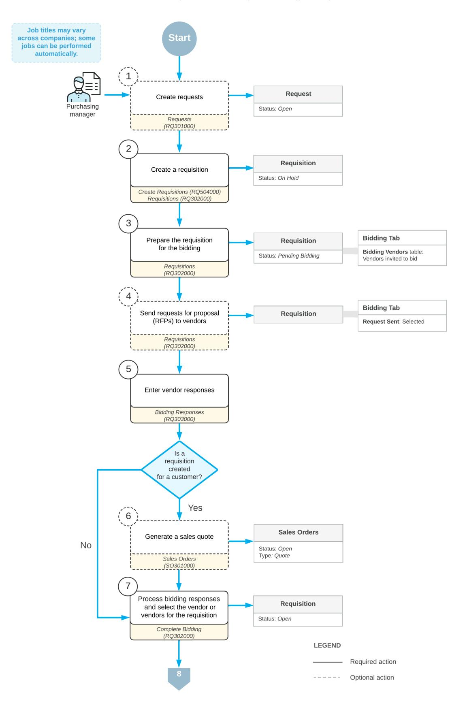

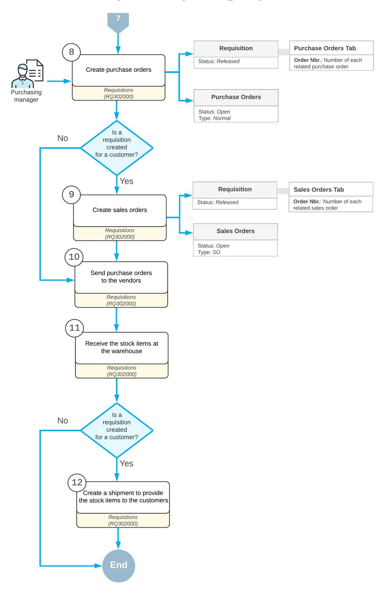

# <span id="page-534-0"></span>**Purchase Requests and Requisitions: Implementation Checklist**

The following sections provide details you can use to ensure that the system is configured properly for processing purchase requests and requisitions, and to understand (and change, if needed) the settings that affect the processing workflow.

### **Implementation Checklist**

We recommend that before you start processing purchase requests and requisitions, you make sure the needed features have been enabled, settings have been specified, and entities have been created, as summarized in the following checklist.

| Form                               | Criteria to Check                                                                                                                                                                                                                                      |
|------------------------------------|--------------------------------------------------------------------------------------------------------------------------------------------------------------------------------------------------------------------------------------------------------|
| Enable/Disable Features (CS100000) | The following features have been enabled:                                                                                                                                                                                                              |
|                                    | •<br>Inventory and Order Management: This group of fea<br>tures includes the features associated with the stan<br>dard functionality of inventory and order manage<br>ment.                                                                            |
|                                    | •<br>Inventory: Gives you the ability to maintain stock items<br>using forms related to the inventory functionality and<br>use the inventory and order management functionali<br>ty for creating and processing documents that include<br>stock items. |
|                                    | •<br>Purchase Requisitions: This feature gives users the abil<br>ity to create purchase requests and requisitions, per<br>form bidding to find the best prices, and control bud<br>get compliance.                                                     |
| Request Classes (RQ201000)         | The needed request classes for purchase requests have<br>been created, as shown in the Purchase Requisition Con<br>figuration: To Create Customer Request Class activity.                                                                              |

#### **Other Settings That Affect the Workflow**

You can affect the workflow of processing purchase requests by specifying additional settings. When you are preparing to create a purchase requisition from requests, you can select the **Merge Lines** check box in the Selection area of the *[Create Requisitions](https://help-2025r1.acumatica.com/Help?ScreenId=ShowWiki&pageid=a5d71a3a-6701-46f5-820c-d1b97c228642)* (RQ504000) form. This causes the system to merge the lines of all the requests included in a requisition and containing the same stock item with the same unit cost.

If a purchase requisition has already been created, you can merge lines manually on the **Details** tab of the *[Requisitions](https://help-2025r1.acumatica.com/Help?ScreenId=ShowWiki&pageid=511c0b78-a659-4ff7-9b1f-bd82eb063dbc)* (RQ302000) form by selecting the Included check box for the lines to be merged and clicking **Merge Lines** on the table toolbar.

With manual merging in this way, the system will merge lines even if they have different unit costs and requesters. For customer requests, we do not recommend that you merge items requested by different customers, because this may cause sales documents to be linked incorrectly to purchase requisitions.

### **Validation of Configuration**

To make sure that all configuration has been performed correctly, we recommend that in your system, you process purchase requests and requisitions by performing instructions similar to those described in the following topics:

- *Purchase Requests and [Requisitions:](#page-535-1) To Process Customer Requests*
- *Purchase Requests and [Requisitions:](#page-543-1) To Process Employee Requests*
- *Purchase Requests and [Requisitions:](#page-548-1) To Process a Requisition Without Requests*

# <span id="page-535-1"></span><span id="page-535-0"></span>**Purchase Requests and Requisitions: To Process Customer Requests**

The following activity demonstrates how to process a purchase requisition that is based on customer requests.

This activity is based on the *U100* dataset. If you are using another dataset, or if any system settings have been changed in *U100*, these changes can affect the workflow of the activity and the results of the processing. To avoid any issues, restore the *U100* dataset to its initial state.

#### **Story**

Suppose that you are Matt Parker, a purchasing manager in the *SweetLife Head Office and Wholesale Center* branch, and you are responsible for processing requests from customers who order fruit in your company. The company works with two fruit vendors: All Fruits Mall and Good Fruits. SweetLife's sales managers have received the following requests for fruit from the FourStar Coffee & Sweets Shop and HM's Bakery & Cafe customers:

- 30 pounds of tangerines and 43 pounds of lemons for a cocktail party from FourStar Coffee & Sweets Shop
- 200 pounds of oranges and 80 pounds of apples for a big birthday party from HM's Bakery & Cafe

You need to enter these requests into the system, create a purchase requisition, and request bids from the vendors. You will select the best vendors to fulfill the requests. The selected vendors will ship fruits to your company's warehouse. You will then process the needed documents to receive the fruits and ship them to the customers.

#### **Configuration Overview**

In the *U100* dataset, the following tasks have been performed to support this activity:

- On the *[Enable/Disable Features](https://help-2025r1.acumatica.com/Help?ScreenId=ShowWiki&pageid=c1555e43-1bc5-4f6f-ba9d-b323f94d8a6b)* (CS100000) form, the following features have been enabled:
  - *Inventory*
  - *Purchase Requisitions*
- On the *[Warehouses](https://help-2025r1.acumatica.com/Help?ScreenId=ShowWiki&pageid=264b0ef7-2b6c-40b4-a7d9-f1a5e067939b)* (IN204000) form, the *WHOLESALE* warehouse has been created.
- On the *[Request Classes](https://help-2025r1.acumatica.com/Help?ScreenId=ShowWiki&pageid=59f2fb9c-ff2a-4bb7-8f47-8a6273dfece9)* (RQ201000) form, the *CUSTOMER* request class has been created with the following settings:
  - **Customer Request**: Selected, which indicates that this class is used for requests received from customers
  - **Allow MultipleVendors per Request**: Selected, which indicates that purchase orders can be split by multiple vendors
- On the *[Stock Items](https://help-2025r1.acumatica.com/Help?ScreenId=ShowWiki&pageid=77786a70-1f1e-4d63-ad98-96f98e4fcb0e)* (IN202500) form, the following stock items have been created: *APPLES*, *LEMONS*, *ORANGES*, and *TANGERINES*.
- On the *[Customers](https://help-2025r1.acumatica.com/Help?ScreenId=ShowWiki&pageid=652929bc-9606-4056-aa6e-0c2d1147171b)* (AR303000) form, the following customers have been created:
  - *HMBAKERY* (HM's Bakery & Cafe)
  - *COFFEESHOP* (FourStar Coffee & Sweets Shop)

- On the *[Vendors](https://help-2025r1.acumatica.com/Help?ScreenId=ShowWiki&pageid=a9584be3-f2bd-4d67-80d4-8041d809df56)* (AP303000) form, the following vendors have been created: *ALLFRUITS* and *GOODFRUITS*.
- On the *[Purchase Requisitions Preferences](https://help-2025r1.acumatica.com/Help?ScreenId=ShowWiki&pageid=d0a79e78-7dc8-4b65-98ea-f92478bb0a56)* (RQ101000) form, the **Create Purchase Order on Hold** check box is cleared, which means that purchase orders are created in the *Open* status.

#### **Process Overview**

In this activity, you will do the following:

- 1. On the *[Requests](https://help-2025r1.acumatica.com/Help?ScreenId=ShowWiki&pageid=445683d4-dbf7-42dc-9ed0-079fdc336cac)* (RQ301000) form, enter the customer requests into the system.
- 2. On the *[Create Requisitions](https://help-2025r1.acumatica.com/Help?ScreenId=ShowWiki&pageid=a5d71a3a-6701-46f5-820c-d1b97c228642)* (RQ504000) form, initiate the creation of a purchase requisition based on the customer requests. Then on the *[Requisitions](https://help-2025r1.acumatica.com/Help?ScreenId=ShowWiki&pageid=511c0b78-a659-4ff7-9b1f-bd82eb063dbc)* (RQ302000) form, send the requisition to the vendors that may participate in bidding.
- 3. On the *[Bidding Responses](https://help-2025r1.acumatica.com/Help?ScreenId=ShowWiki&pageid=a299848c-abee-4e4c-808f-8a0b3393526b)* (RQ303000) form, enter bids from vendors into the system.
- 4. On the *[Complete Bidding](https://help-2025r1.acumatica.com/Help?ScreenId=ShowWiki&pageid=240bf8e1-d189-4eb6-bc03-ecacc75ac0da)* (RQ503000) form, initiate automatic bidding among the vendors and manually select a vendor.
- 5. On the *[Requisitions](https://help-2025r1.acumatica.com/Help?ScreenId=ShowWiki&pageid=511c0b78-a659-4ff7-9b1f-bd82eb063dbc)* form, initiate the creation of the purchase orders for the selected vendors.
- 6. On the *[Purchase Orders](https://help-2025r1.acumatica.com/Help?ScreenId=ShowWiki&pageid=5565686c-96c4-4bfa-a51d-9a2566baa808)* (PO301000) and *[Purchase Receipts](https://help-2025r1.acumatica.com/Help?ScreenId=ShowWiki&pageid=d9901c8d-486d-45ed-8088-ea3d8ee3af19)* (PO302000) forms, prepare and process the purchase receipts for the ordered stock items.
- 7. On the *[Sales Orders](https://help-2025r1.acumatica.com/Help?ScreenId=ShowWiki&pageid=19e4021c-1b84-49fd-be12-0320c5f1c7e5)* (SO301000) form, prepare the sales order and the related shipment of the stock items to the customer.

#### **System Preparation**

Before you start performing the steps of this activity, do the following:

- 1. Launch the Acumatica ERP website, and sign in to a company with the *U100* dataset preloaded. You should sign in as purchasing manager Matt Parker with the *parker* username and the *123* password.
- 2. In the info area, in the upper-right corner of the top pane of the Acumatica ERP screen, make sure that the business date in your system is set to *1/30/2025*. If a different date is displayed, click the Business Date menu button and select *1/30/2025* on the calendar. For simplicity, in this activity, you will create and process all documents in the system on this business date.
- 3. On the Company and Branch Selection menu, in the top pane of the Acumatica ERP screen, make sure the *SweetLife Head Office and Wholesale Center* branch is selected.

#### **Step 1: Creating the Customer Requests in the System**

To create the customer requests from the *COFFEESHOP* and *HMBAKERY* customers, do the following:

- 1. On the *[Requests](https://help-2025r1.acumatica.com/Help?ScreenId=ShowWiki&pageid=445683d4-dbf7-42dc-9ed0-079fdc336cac)* (RQ301000) form, add a new record.
- 2. In the Summary area, do the following:
  - a. In the **Request Class** box, make sure that *CUSTOMER* is selected.
  - b. In the **Requested By** box, select *COFFEESHOP*.
  - c. In the **Description** box, type Order for tangerines and lemons.
- 3. On the **Details** tab, do the following:
  - a. On the table toolbar, click **Add Row**.
  - b. In the row, specify the following settings:
    - **Inventory**: *TANGERINES*
    - **Order Qty.**: 30

- c. On the table toolbar, click **Add Row**.
- d. In the row, specify the following settings:
  - **Inventory**: *LEMONS*
  - **Order Qty.**: 43
- 4. On the form toolbar, click **Remove Hold**. The system saves the request and assigns the request the *Open* status.
- 5. While you are still on the *[Requests](https://help-2025r1.acumatica.com/Help?ScreenId=ShowWiki&pageid=445683d4-dbf7-42dc-9ed0-079fdc336cac)* form, add another new record.
- 6. In the Summary area, do the following:
  - a. In the **Request Class** box, make sure that *CUSTOMER* is selected.
  - b. In the **Requested By** box, select *HMBAKERY*.
  - c. In the **Description** box, type Order for oranges and apples.
- 7. On the **Details** tab, do the following:
  - a. On the table toolbar, click **Add Row**.
  - b. In the row, specify the following settings:
    - **Inventory**: *ORANGES*
    - **Order Qty.**: 200
  - c. On the table toolbar, click **Add Row**.
  - d. In the row, specify the following settings:
    - **Inventory**: *APPLES*
    - **Order Qty.**: 80
- 8. On the form toolbar, click **Remove Hold**. The system saves the request and assigns it the *Open* status.

#### **Step 2: Creating a Purchase Requisition**

To create a combined requisition for the customers' requests that you have created in the previous step, do the following:

- 1. On the *[Create Requisitions](https://help-2025r1.acumatica.com/Help?ScreenId=ShowWiki&pageid=a5d71a3a-6701-46f5-820c-d1b97c228642)* (RQ504000) form, make sure that all four request lines are displayed in the table.
- 2. On the form toolbar, click **Process All**.
- 3. In the **Confirmation** dialog box, which opens, click **Yes**. On the *[Requisitions](https://help-2025r1.acumatica.com/Help?ScreenId=ShowWiki&pageid=511c0b78-a659-4ff7-9b1f-bd82eb063dbc)* (RQ302000) form, the system opens the requisition that it has created based on the requests.
- 4. On the **Bidding** tab, in the **BiddingVendors** table, make sure that *ALLFRUITS* is specified.
- 5. Add the *GOODFRUITS* vendor as follows:
  - a. On the table toolbar, click **Add Row**.
  - b. In the **Vendor** column, select *GOODFRUITS*.

The *ALLFRUITS* and *GOODFRUITS* vendors will be invited to take part in bidding.

6. On the form toolbar, click **Remove Hold**. The system saves the requisition and assigns it the *Pending Bidding* status.

Suppose that you have sent the requisition to these vendors by email. In a system where email functionality has been configured, you would click**Send Requests for Proposal** on the table toolbar of the *[Requisitions](https://help-2025r1.acumatica.com/Help?ScreenId=ShowWiki&pageid=511c0b78-a659-4ff7-9b1f-bd82eb063dbc)* form to send all the requests to the vendors or send each request by clicking the vendor on the **Bidding** tab and clicking**Send Request** on the table toolbar.

#### **Step 3: Entering the Vendor Responses into the System**

Suppose that you have received bids from both vendors. The *ALLFRUITS* vendor can deliver only 150 pounds of oranges, and a minimum of 50 pounds must be purchased from this vendor. This vendor does not have tangerines in stock but can provide the requested quantity of lemons and apples. Also, this vendor provides you a discount if you purchase more than two items in one order.

The *GOODFRUITS* vendor can deliver the requested quantity of oranges but at a higher price than the one offered by *ALLFRUITS*. The *GOODFRUITS* vendor has tangerines in stock and can deliver the requested quantity of lemons and apples.

To add the responses from the vendors to the system, do the following:

- 1. Open the *[Bidding Responses](https://help-2025r1.acumatica.com/Help?ScreenId=ShowWiki&pageid=a299848c-abee-4e4c-808f-8a0b3393526b)* (RQ303000) form.
- 2. In the Summary area, do the following:
  - a. In the **Requisition** box, select the identifier of the only requisition with the *Pending Bidding* status.
  - b. In the **Vendor** box, select *ALLFRUITS*.
- 3. On the **Bidding Details** tab, specify the listed settings in the following table rows:
  - The row with *TANGERINES* in the **Inventory ID** column:
    - **Min. Qty.**: 0.00
      - This is the minimum quantity of the item that the vendor can supply.
    - **Bid Qty.**: 0.00

This is the total quantity of items that the vendor can supply, according to the bidding response.

• **Bid Unit Cost**: 0.00

This is the total cost of items that the vendor can supply, according to the bidding response.

- The row with *LEMONS* in the **Inventory ID** column:
  - **Min. Qty.**: 0.00
  - **Bid Qty.**: 43.00
  - **Bid Unit Cost**: 2.60
- The row with *ORANGES* in the **Inventory ID** column:
  - **Min. Qty.**: 50.00
  - **Bid Qty.**: 150.00
  - **Bid Unit Cost**: 2.00
- The row with *APPLES* in the **Inventory ID** column:
  - **Min. Qty.**: 0.00
  - **Bid Qty.**: 80.00
  - **Bid Unit Cost**: 2.20
- 4. On the form toolbar, click**Save**.
- 5. In the **Vendor** box of the Summary area, select *GOODFRUITS*.
- 6. On the **Bidding Details** tab, specify the listed settings in the following table rows:
  - The row with *TANGERINES* in the **Inventory ID** column:
    - **Min. Qty.**: 0.00
    - **Bid Qty.**: 30.00
    - **Bid Unit Cost**: 1.60
  - The row with *LEMONS* in the **Inventory ID** column:
    - **Min. Qty.**: 0.00

- **Bid Qty.**: 43.00
- **Bid Unit Cost**: 2.55
- The row with *ORANGES* in the **Inventory ID** column:
  - **Min. Qty.**: 0.00
  - **Bid Qty.**: 200.00
  - **Bid Unit Cost**: 2.20
- The row with *APPLES* in the **Inventory ID** column:
  - **Min. Qty.**: 0.00
  - **Bid Qty.**: 80.00
  - **Bid Unit Cost**: 2.30
- 7. On the form toolbar, click**Save**.

#### **Step 4: Selecting the Best Bids from Vendors**

To perform automatic bidding and then correct the bidding results manually, do the following:

- 1. On the *[Complete Bidding](https://help-2025r1.acumatica.com/Help?ScreenId=ShowWiki&pageid=240bf8e1-d189-4eb6-bc03-ecacc75ac0da)* (RQ503000) form, in the **Ref. Nbr.** box, select the reference number of the only requisition with the *Pending Bidding* status.
- 2. On the form toolbar, click **Update Result**. The system selects vendors automatically and updates the information on the **Bidding Results** tab.

Notice that in the Selection area, the**Splittable** check box is selected because the **Allow MultipleVendors per Request** check box has been selected on the *[Request Classes](https://help-2025r1.acumatica.com/Help?ScreenId=ShowWiki&pageid=59f2fb9c-ff2a-4bb7-8f47-8a6273dfece9)* (RQ201000) form for the class of the request based on which the requisition has been created. This setting means that the system can split the order between multiple vendors.

- 3. On the form toolbar, click**Save**.
- 4. On the **Bidding Results** tab, analyze the results of the automatic bidding as follows:
  - a. In the **Requisition Details** table, click the *TANGERINES* row.

In the **Bidding Details** table, the *GOODFRUITS* vendor is selected because only this vendor can supply tangerines.

b. In the **Requisition Details** table, click the *ORANGES* row.

In the **Bidding Details** table, in the unlabeled column, the check boxes for both vendors are selected. This means that the quantity of the oranges is split between these two vendors. The *ALLFRUITS* vendor offered the best price for the oranges, but the vendor can provide only 150 pounds of oranges, whereas the needed quantity is 200 pounds. Thus, you will order another 50 pounds of oranges from the *GOODFRUIT* vendor at a higher cost.

c. In the **Requisition Details** table, click the *APPLES* row.

In the **Bidding Details** table, in the unlabeled column, the check box for the row with the *ALLFRUITS* vendor is selected because this vendor offered a lower price and can provide the required amount of apples.

d. In the **Requisition Details** table, click the *LEMONS* row.

In the **Bidding Details** table, in the unlabeled column, the row with the *GOODFRUITS* vendor is selected because this vendor offered a lower price. However, the *ALLFRUITS* vendor provides you a discount if you purchase more than two items in one order.

- 5. In the **Bidding Details** table, select the *ALLFRUITS* vendor for the *LEMONS* stock item as follows:
  - a. Clear the unlabeled check box for the *GOODFRUITS* vendor.
  - b. On the form toolbar, click**Save**.
  - c. Select the unlabeled check box for the *ALLFRUITS* vendor.

- d. On the form toolbar, click**Save**.
- 6. On the form toolbar, click **Complete Bidding**. The status of the requisition is changed to *Open*.

Now that you have selected the vendors, you can create the needed purchase orders to be sent to the vendors.

#### **Step 5: Creating the Purchase Orders**

To create the purchase orders for the vendors, do the following:

- 1. On the *[Requisitions](https://help-2025r1.acumatica.com/Help?ScreenId=ShowWiki&pageid=511c0b78-a659-4ff7-9b1f-bd82eb063dbc)* (RQ302000) form, open the requisition with the *Open* status that you have earlier created in this activity.
- 2. On the More menu, click **Create Orders**. The system creates purchase orders for the *ALLFRUITS* and *GOODFRUITS* vendors. Because the requisition is based on customer requests of these items, the system also creates sales orders for the *HMBAKERY* and *COFFESHOP* customers. Also, the requisition is assigned the *Released* status.
- 3. On the **Purchase Orders** tab, make sure that purchase orders with the *Open* status are listed for the *ALLFRUITS* and *GOODFRUITS* vendors, as shown in the following screenshot.

If your system has a different set of purchase and sales documents than those in the initial *U100* dataset, you may see different values in the screenshots.

|              |              | <b>Requisitions</b><br>0000001 |          |                   |                   |                |                   |                                                                          |                         |                        |                     |            | R NOTES           | <b>ACTIVITIES</b> | TOOLS $\blacktriangledown$<br><b>FILES</b> |
|--------------|--------------|--------------------------------|----------|-------------------|-------------------|----------------|-------------------|--------------------------------------------------------------------------|-------------------------|------------------------|---------------------|------------|-------------------|-------------------|--------------------------------------------|
| $\leftarrow$ |              | $\overline{\mathbb{C}}$        | $\Box$   | $\curvearrowleft$ | $\pm$             | 面              | ∩<br>$\checkmark$ | $\overline{\mathsf{K}}$<br>$\left\langle \right\rangle$<br>$\rightarrow$ | $\geq$<br>$\cdots$      |                        |                     |            |                   |                   |                                            |
|              |              | Ref. Nbr.:                     |          | 0000001           | Q                 |                | Priority:         | Normal                                                                   |                         |                        | Est. Ext. Cost:     | 705.80     |                   |                   | $\sim$                                     |
|              | Status:      |                                |          | Released          |                   |                | Creator:          | EP00000056 - Matt Parker                                                 |                         |                        |                     |            |                   |                   |                                            |
|              | Date:        |                                |          | 1/30/2025         |                   |                | Customer:         |                                                                          |                         | $\mathcal O$           |                     |            |                   |                   |                                            |
|              |              |                                |          |                   |                   |                | Location:         |                                                                          |                         |                        |                     |            |                   |                   |                                            |
|              |              | Description:                   |          |                   |                   |                |                   |                                                                          |                         |                        |                     |            |                   |                   |                                            |
|              |              |                                |          |                   |                   |                |                   |                                                                          |                         |                        |                     |            |                   |                   |                                            |
|              |              | <b>DETAILS</b>                 |          | <b>SHIPPING</b>   |                   | <b>BIDDING</b> |                   | <b>VENDOR INFO</b>                                                       | <b>OTHER</b>            | <b>PURCHASE ORDERS</b> | <b>SALES ORDERS</b> |            |                   |                   |                                            |
| Ò            |              | $^{+}$                         | $\times$ |                   | <b>VIEW ORDER</b> |                | CREATE ORDERS     | $\vdash$                                                                 | $\mathbf{\overline{x}}$ |                        |                     |            |                   |                   |                                            |
| E 0          |              | $\Box$                         | Type     |                   | Order Nbr.        |                | <b>Status</b>     | * Date                                                                   | *Vendor                 | *Location              | Vendor<br>Ref.      | *Currency  | <b>Line Total</b> | <b>Tax Total</b>  | <b>Order Total</b>                         |
|              | 0            | $\Box$                         | Normal   |                   | 000054            |                | Open              | 1/30/2025                                                                | <b>ALLFRUITS</b>        | <b>MAIN</b>            |                     | <b>USD</b> | 587.80            | 0.00              | 587.80                                     |
|              | $\bf \Theta$ | ▫                              | Normal   |                   | 000055            |                | Open              | 1/30/2025                                                                | <b>GOODFRUITS</b>       | <b>MAIN</b>            |                     | <b>USD</b> | 158.00            | 0.00              | 158.00                                     |
|              |              |                                |          |                   |                   |                |                   |                                                                          |                         |                        |                     |            |                   |                   |                                            |

*Figure: The purchase orders for the vendors*

4. On the **Sales Orders** tab, make sure that sales orders with the *Open* status are listed for the *COFFEESHOP* and *HMBAKERY* customers, as shown in the following screenshot.

#### *Figure: The sales orders for the customers*

You have created purchase orders for both vendors. Suppose that you have emailed the purchase orders to the vendors.

#### **Step 6: Receiving the Items from the Vendors**

Suppose that the vendors have delivered the ordered fruits to the *WHOLESALE* warehouse. To create the documents that reflect the receipt of the items in the warehouse, do the following:

- 1. On the *[Purchase Orders](https://help-2025r1.acumatica.com/Help?ScreenId=ShowWiki&pageid=5565686c-96c4-4bfa-a51d-9a2566baa808)* (PO301000) form, open the purchase order for the *ALLFRUITS* vendor that you have prepared earlier. (The purchase order contains the *ORANGES*, *APPLES*, and *LEMONS* stock items.)
- 2. On the form toolbar, click **Enter PO Receipt**. The system opens the *[Purchase Receipts](https://help-2025r1.acumatica.com/Help?ScreenId=ShowWiki&pageid=d9901c8d-486d-45ed-8088-ea3d8ee3af19)* (PO302000) form with the new receipt. Notice that the receipt has the *Balanced* status and the data copied from the linked purchase order.
- 3. On the form toolbar, click **Release**. The system releases the purchase receipt; it also creates the corresponding inventory receipt and releases it. On the **Other** tab, in the **IN Ref. Nbr.** box, you can view the reference number of the inventory receipt. (The reference number is also a link that you can click to view the inventory receipt on the *[Receipts](https://help-2025r1.acumatica.com/Help?ScreenId=ShowWiki&pageid=d6ecad5b-155f-44bf-baba-9ed006d298b5)* (IN301000) form.) On the **Orders** tab, notice that the listed purchase order now has the *Completed* status.
- 4. On the *[Inventory Allocation Details](https://help-2025r1.acumatica.com/Help?ScreenId=ShowWiki&pageid=6d8011ac-1d4e-4a34-8bc2-1fa1ff002c05)* (IN402000) form, do the following:
  - a. In the **Inventory ID** box of the Selection area, select *ORANGES*.
  - b. In the **Warehouse** box, select *WHOLESALE*.
  - c. On the **Qty by Plan Type** tab, on the toolbar of the **Deduction** table, select *All Records* in the filter box.
  - d. Make sure that the quantity in the**SO Allocated** row is *150* (the quantity on unconfirmed shipments) and the quantity in the **SO to Purchase** row is *50* (the quantity included in open purchase orders created for sales orders, this quantity will come from the other vendor).
  - e. In the **Inventory ID** box, select *APPLES*.
  - f. In the **Deduction** table, make sure that the quantity in the**SO Allocated** row is *80*.
  - g. In the **Inventory ID** box, select *LEMONS*.
  - h. Make sure that the quantity in the**SO Allocated** row is *43*.
- 5. On the *[Purchase Orders](https://help-2025r1.acumatica.com/Help?ScreenId=ShowWiki&pageid=5565686c-96c4-4bfa-a51d-9a2566baa808)* form, open the purchase order for the *GOODFRUITS* vendor that you have prepared earlier. The purchase order has the *Open* status and contains the *ORANGES* and *TANGERINES* stock items.
- 6. On the form toolbar, click **Enter PO Receipt**. The system opens the *[Purchase Receipts](https://help-2025r1.acumatica.com/Help?ScreenId=ShowWiki&pageid=d9901c8d-486d-45ed-8088-ea3d8ee3af19)* form with the new receipt, which has the *Balanced* status and the data copied from the linked purchase order.

- 7. On the form toolbar, click **Release**. The system releases the purchase receipt; it also creates the corresponding inventory receipt and releases it. On the **Other** tab, in the **IN Ref. Nbr.** box, you can view the reference number of the inventory receipt. (The reference number is also a link that you can click to view the inventory receipt on the *[Receipts](https://help-2025r1.acumatica.com/Help?ScreenId=ShowWiki&pageid=d6ecad5b-155f-44bf-baba-9ed006d298b5)* form). On the **Orders** tab, notice that the listed purchase order now has the *Completed* status.
- 8. On the *[Inventory Allocation Details](https://help-2025r1.acumatica.com/Help?ScreenId=ShowWiki&pageid=6d8011ac-1d4e-4a34-8bc2-1fa1ff002c05)* form, do the following:
  - a. In the **Inventory ID** box of the Selection area, select *ORANGES*.
  - b. In the **Warehouse** box, select *WHOLESALE*.
  - c. In the **Deduction** table of the **Qty by Plan Type** tab, make sure that the quantity in the**SO Allocated** row is *200* (which is now the full amount to fulfill the customer's order).
  - d. In the **Inventory ID** box, select *TANGERINES*.
  - e. In the **Deduction** table, make sure that the quantity in the**SO Allocated** row is *30*.

All fruits are allocated for sales orders, which means that these fruits are not available for other orders. Now you can prepare and process the documents for shipping the fruits to the customers, which you will do in the next step.

#### **Step 7: Shipping the Fruits to the Customers**

In this step, you will perform the needed actions to ship the fruits to the customers. You will process the sales orders, create and confirm shipments for them, create and release the related invoices, and generate the needed inventory transactions. Do the following:

- 1. On the *[Sales Orders](https://help-2025r1.acumatica.com/Help?ScreenId=ShowWiki&pageid=19e4021c-1b84-49fd-be12-0320c5f1c7e5)* (SO301000) form, open the sales order with the *Open* status for the *HMBAKERY* customer that the system prepared earlier in this activity. (The sales order contains the *ORANGES* and *APPLES* stock items.)
- 2. On the form toolbar, click **Quick Process**.
- 3. In the **Process Order** dialog box, which opens, do the following:
  - a. In the **Warehouse ID** box, make sure that *WHOLESALE* is selected.
  - b. In the **Shipment Date** section, make sure that *Custom* is selected and the date is *1/30/2025*.
  - c. In the **Shipping** section, make sure that the following check boxes are selected:
    - **CreateShipment**
    - **Confirm Shipment**
    - **Update IN**

With this check box selected, the system will generate the inventory transactions for confirmed shipments.

- d. In the **Invoicing** section, make sure that the **Prepare Invoice** check box is selected.
- e. Select the **Release Invoice** check box.
- f. Click **OK**. The system completes the sales order and creates and processes the documents related to the sales order. You can see the links to these documents in the **Processing Results** dialog box.
- g. Click **OK** to close the dialog box. Notice that the sales order now has the *Completed* status.
- 4. On the *[Inventory Allocation Details](https://help-2025r1.acumatica.com/Help?ScreenId=ShowWiki&pageid=6d8011ac-1d4e-4a34-8bc2-1fa1ff002c05)* (IN402000) form, do the following:
  - a. In the **Inventory ID** box of the Selection area, select *APPLES*.
  - b. In the **Warehouse** box, select *WHOLESALE*.
  - c. On the **Qty by Plan Type** tab, on the toolbar of the **Deduction** table, select *All Records* in the filter box.
  - d. Make sure that the quantity in the**SO Allocated** row is *0*.
  - e. In the **Inventory ID** box, select *ORANGES*.

- f. Make sure that the quantity in the**SO Allocated** row is *0*.
- 5. On the *[Sales Orders](https://help-2025r1.acumatica.com/Help?ScreenId=ShowWiki&pageid=19e4021c-1b84-49fd-be12-0320c5f1c7e5)* form, open the sales order with the *Open* status for the *COFFESHOP* customer that the system created earlier in this activity. (The sales order contains the *TANGERINES* and *LEMONS* stock items.)
- 6. On the form toolbar, click **Quick Process**.
- 7. In the **Process Order** dialog box, which opens, do the following:
  - a. In the **Warehouse ID** box, make sure that *WHOLESALE* is selected.
  - b. In the **Shipment Date** section, make sure that *Custom* is selected and the date is *1/30/2025*.
  - c. In the **Shipping** section, make sure that the following check boxes are selected:
    - **CreateShipment**
    - **Confirm Shipment**
    - **Update IN**
  - d. In the **Invoicing** section, make sure that the **Prepare Invoice** check box is selected.
  - e. Select the **Release Invoice** check box.
  - f. Click **OK**. The system completes the sales order and creates and processes the documents related to the sales order. You can see the links to the documents in the **Processing Results** dialog box.
  - g. Click **OK** to close the dialog box. Notice that the sales order now has the *Completed* status.
- 8. On the *[Inventory Allocation Details](https://help-2025r1.acumatica.com/Help?ScreenId=ShowWiki&pageid=6d8011ac-1d4e-4a34-8bc2-1fa1ff002c05)* form, do the following:
  - a. In the **Inventory ID** box of the Selection area, select *TANGERINES*.
  - b. In the **Warehouse** box, select *WHOLESALE*.
  - c. On the **Qty by Plan Type** tab, on the toolbar of the **Deduction** table, select *All Records* in the filter box.
  - d. Make sure that the quantity in the**SO Allocated** row is *0*.
  - e. In the **Inventory ID** box, select *LEMONS*.
  - f. Make sure that the quantity in the**SO Allocated** row is *0*.

<span id="page-543-1"></span>You have performed the needed processing for shipping the ordered fruits to the customers.

# <span id="page-543-0"></span>**Purchase Requests and Requisitions: To Process Employee Requests**

The following activity demonstrates how to process a purchase requisition initiated by employee requests within the company. These requests do not require approval.

This activity is based on the *U100* dataset. If you are using another dataset, or if any system settings have been changed in *U100*, these changes can affect the workflow of the activity and the results of the processing. To avoid any issues, restore the *U100* dataset to its initial state.

#### **Story**

Suppose that you are an office manager in the SweetLife Fruits & Jams company who orders office supplies for all departments of the company. These supplies are ordered from a single preferred vendor, the Spectra Stationery Office vendor, and bidding is not involved in the requisition process. The company orders these items based on requests that employees enter into the system. Employees can select only items from a predefined list. Office supplies do not require approval from department leads due to their relatively low value.

You need to add the requests that employees have submitted over the past week into one purchase requisition and send the related purchase order to the vendor. You will then process the receipt and issuing of these items.

#### **Configuration Overview**

In the *U100* dataset, the following tasks have been performed to support this activity:

- On the *[Enable/Disable Features](https://help-2025r1.acumatica.com/Help?ScreenId=ShowWiki&pageid=c1555e43-1bc5-4f6f-ba9d-b323f94d8a6b)* (CS100000) form, the following features have been enabled:
  - *Inventory and Order Management*
  - *Inventory*
  - *Purchase Requisitions*
- On the *[Warehouses](https://help-2025r1.acumatica.com/Help?ScreenId=ShowWiki&pageid=264b0ef7-2b6c-40b4-a7d9-f1a5e067939b)* (IN204000) form, the *WHOLESALE* warehouse has been created.
- On the *[Stock Items](https://help-2025r1.acumatica.com/Help?ScreenId=ShowWiki&pageid=77786a70-1f1e-4d63-ad98-96f98e4fcb0e)* (IN202500) form, the following stock items have been created: *PEN*, *PENCIL*, and *PAPER*.
- On the *[Request Classes](https://help-2025r1.acumatica.com/Help?ScreenId=ShowWiki&pageid=59f2fb9c-ff2a-4bb7-8f47-8a6273dfece9)* (RQ201000) form, the *INTSUPPLY* request class has been created as follows:
  - The **Restrict Requested Items to theSpecified List** check box has been selected, and the *PEN*, *PENCIL*, and *PAPER* items have been added to the **Item List** tab. Restricting the list of items in a request class reduces the probability of mistakes made during the data entry of requests of the class.
  - The **Allow MultipleVendors per Request** check box has been cleared. Per the company's business practices, all of the items in requests of the class are purchased from one vendor.
- On the *[Vendors](https://help-2025r1.acumatica.com/Help?ScreenId=ShowWiki&pageid=a9584be3-f2bd-4d67-80d4-8041d809df56)* (AP303000) form, the *STATOFFICE* vendor has been created.

#### **Process Overview**

In this activity, you will do the following:

- 1. On the *[Requests](https://help-2025r1.acumatica.com/Help?ScreenId=ShowWiki&pageid=445683d4-dbf7-42dc-9ed0-079fdc336cac)* (RQ301000) form, enter all employee requests into the system.
- 2. On the *[Create Requisitions](https://help-2025r1.acumatica.com/Help?ScreenId=ShowWiki&pageid=a5d71a3a-6701-46f5-820c-d1b97c228642)* (RQ504000) form, initiate the creation of a purchase requisition based on the employees' requests.
- 3. On the *[Requisitions](https://help-2025r1.acumatica.com/Help?ScreenId=ShowWiki&pageid=511c0b78-a659-4ff7-9b1f-bd82eb063dbc)* (RQ302000) form, initiate the creation of a purchase order and send it to the selected vendor.
- 4. On the *[Purchase Orders](https://help-2025r1.acumatica.com/Help?ScreenId=ShowWiki&pageid=5565686c-96c4-4bfa-a51d-9a2566baa808)* (PO301000) and *[Purchase Receipts](https://help-2025r1.acumatica.com/Help?ScreenId=ShowWiki&pageid=d9901c8d-486d-45ed-8088-ea3d8ee3af19)* (PO302000) forms, prepare and process the purchase receipt for the ordered stock items.
- 5. On the *[Issues](https://help-2025r1.acumatica.com/Help?ScreenId=ShowWiki&pageid=17b051f6-027d-4459-b542-65c1c1f9d0ea)* (IN302000) form, create the inventory issue to reflect the items being issued to the employees who requested the items.

#### **System Preparation**

Before you start processing a purchase requisition based on requests from employees, do the following:

- 1. Launch the Acumatica ERP website, and sign in to a company with the *U100* dataset preloaded. You should sign in as office manager Joshua Mueller with the *mueller* username and the *123* password.
- 2. In the info area, in the upper-right corner of the top pane of the Acumatica ERP screen, make sure that the business date in your system is set to *1/30/2025*. If a different date is displayed, click the Business Date menu button and select *1/30/2025* on the calendar. For simplicity, in this activity, you will create and process all documents in the system on this business date.
- 3. On the Company and Branch Selection menu, in the top pane of the Acumatica ERP screen, make sure the *SweetLife Head Office and Wholesale Center* branch is selected.

#### **Step 1: Creating the Employee Requests**

Suppose that you have received requests for pens, paper, and pencils from the Sales department and the Operations department of the company. To enter these requests, do the following:

- 1. On the *[Requests](https://help-2025r1.acumatica.com/Help?ScreenId=ShowWiki&pageid=445683d4-dbf7-42dc-9ed0-079fdc336cac)* (RQ301000) form, add a new record.
- 2. In the Summary area, do the following:
  - a. In the **Request Class** box, select *INTSUPPLY*.
  - b. In the **Requested By** box, notice that the employee ID and name that corresponds to your user account is automatically inserted.
  - c. In the **Description** box, type The Sales department's order for office supplies.
- 3. On the **Details** tab, do the following:
  - a. On the table toolbar, click **Add Row**.
  - b. In the row, specify the following settings:
    - **Inventory**: *PEN*
    - **Order Qty.**: 15
  - c. On the table toolbar, click **Add Row**.
  - d. In the row, specify the following settings:
    - **Inventory**: *PAPER*
    - **Order Qty.**: 12
  - e. On the table toolbar, click **Add Row**.
  - f. In the row, specify the following settings:
    - **Inventory**: *PENCIL*
    - **Order Qty.**: 10
- 4. On the form toolbar, click **Remove Hold**. The system saves the request and changes the status of the request to *Open*.
- 5. While you are still on the *[Requests](https://help-2025r1.acumatica.com/Help?ScreenId=ShowWiki&pageid=445683d4-dbf7-42dc-9ed0-079fdc336cac)* (RQ301000) form, add another new record.
- 6. In the Summary area, do the following:
  - a. In the **Request Class** box of the Summary area, select *INTSUPPLY*.
  - b. In the **Description** box, type The Operations department's order for office supplies.
- 7. On the **Details** tab, do the following:
  - a. On the table toolbar, click **Add Row**.
  - b. In the row, specify the following settings:
    - **Inventory**: *PEN*
    - **Order Qty.**: 25
  - c. On the table toolbar, click **Add Row**.
  - d. In the row, specify the following settings:
    - **Inventory**: *PAPER*
    - **Order Qty.**: 15
  - e. On the table toolbar, click **Add Row**.
  - f. In the row, specify the following settings:
    - **Inventory**: *PENCIL*
    - **Order Qty.**: 5
- 8. On the form toolbar, click **Remove Hold**. The system saves the request and changes the status of the request to *Open*.

#### **Step 2: Creating a Purchase Requisition**

To create a requisition for the requests that you entered in the previous step, do the following:

- 1. On the *[Create Requisitions](https://help-2025r1.acumatica.com/Help?ScreenId=ShowWiki&pageid=a5d71a3a-6701-46f5-820c-d1b97c228642)* (RQ504000) form, make sure that all six lines with the requested items are listed.
- 2. In the **Vendor** box of the Summary area, select *STATOFFICE*. In this case, you will not request and process bids because you know that this vendor gives your company the best prices.
- 3. On the form toolbar, click **Process All**. On the *[Requisitions](https://help-2025r1.acumatica.com/Help?ScreenId=ShowWiki&pageid=511c0b78-a659-4ff7-9b1f-bd82eb063dbc)* (RQ302000) form, the system opens the requisition that it has created based on the requests.
- 4. On the **Details** tab, do the following:
  - a. For the two rows with the *PEN* inventory ID, select the check boxes in the unlabeled column.
  - b. On the table toolbar, click **Merge Lines** to reduce the number of lines in the purchase documents.
  - c. For the two rows with the *PAPER* inventory ID, select the check boxes in the unlabeled column.
  - d. On the table toolbar, click **Merge Lines**.
  - e. For the two rows with the *PENCIL* inventory ID, select the check boxes in the unlabeled column.
  - f. On the table toolbar, click **Merge Lines**.

Now the requisition contains three lines.

5. On the form toolbar, click **Remove Hold**. The system saves the requisition and changes its status to *Open*.

#### **Step 3: Creating the Purchase Order**

To create the purchase order for the *STATOFFICE* vendor, do the following:

- 1. While you are still viewing the open requisition that you have created on the *[Requisitions](https://help-2025r1.acumatica.com/Help?ScreenId=ShowWiki&pageid=511c0b78-a659-4ff7-9b1f-bd82eb063dbc)* (RQ302000) form, click **Create Orders** on the More menu. The system creates a purchase order for the requisition and assigns the requisition the *Released* status.
- 2. On the **Purchase Orders** tab, notice that the system has listed a purchase order with the *Open* status for the *STATOFFICE* vendor, as shown in the following screenshot.

If your system has a different set of purchase and sales documents than those in the initial *U100* dataset, you may see different values in the screenshots.

|                                                                                                                                                                                                                                                                                                                                                                                                                                                                                                                                         | Requisitions<br>0000002 |                  |                 |                     |               |                    |                         |                             |               |                     |            |            | <b>NOTES</b>     | <b>ACTIVITIES</b> | <b>FILES</b>      | TOOLS $\blacktriangledown$ |
|-----------------------------------------------------------------------------------------------------------------------------------------------------------------------------------------------------------------------------------------------------------------------------------------------------------------------------------------------------------------------------------------------------------------------------------------------------------------------------------------------------------------------------------------|-------------------------|------------------|-----------------|---------------------|---------------|--------------------|-------------------------|-----------------------------|---------------|---------------------|------------|------------|------------------|-------------------|-------------------|----------------------------|
| $\begin{picture}(120,20) \put(0,0){\dashbox{0.5}(120,0){ }} \put(120,20){\circle*{1}} \put(20,20){\circle*{1}} \put(20,20){\circle*{1}} \put(20,20){\circle*{1}} \put(20,20){\circle*{1}} \put(20,20){\circle*{1}} \put(20,20){\circle*{1}} \put(20,20){\circle*{1}} \put(20,20){\circle*{1}} \put(20,20){\circle*{1}} \put(20,20){\circle*{1}} \put(20,20){\circle*{1}} \put(20$<br>$\Box$<br>面<br>n<br>$\Omega$<br>$\overline{\mathsf{K}}$<br>$\geq$<br>$\leftarrow$<br>$\pm$<br>$\prec$<br>$\rightarrow$<br>$\checkmark$<br>$\cdots$ |                         |                  |                 |                     |               |                    |                         |                             |               |                     |            |            |                  |                   |                   |                            |
| Ref. Nbr.:                                                                                                                                                                                                                                                                                                                                                                                                                                                                                                                              |                         |                  |                 | 0000002<br>$\alpha$ | Priority:     | Normal             |                         |                             |               | Est. Ext. Cost:     | 925.58     |            |                  |                   |                   | $\sim$                     |
| Status:                                                                                                                                                                                                                                                                                                                                                                                                                                                                                                                                 |                         |                  | Released        |                     | Creator:      |                    |                         | EP00000007 - Joshua Mueller |               |                     |            |            |                  |                   |                   |                            |
| Date:                                                                                                                                                                                                                                                                                                                                                                                                                                                                                                                                   |                         |                  |                 | 1/30/2025           | Customer:     |                    |                         |                             | $\mathscr{O}$ |                     |            |            |                  |                   |                   |                            |
|                                                                                                                                                                                                                                                                                                                                                                                                                                                                                                                                         |                         |                  |                 |                     | Location:     |                    |                         |                             |               |                     |            |            |                  |                   |                   |                            |
| Description:                                                                                                                                                                                                                                                                                                                                                                                                                                                                                                                            |                         |                  |                 |                     |               |                    |                         |                             |               |                     |            |            |                  |                   |                   |                            |
| <b>DETAILS</b>                                                                                                                                                                                                                                                                                                                                                                                                                                                                                                                          |                         |                  | <b>SHIPPING</b> | <b>BIDDING</b>      |               | <b>VENDOR INFO</b> | <b>OTHER</b>            | <b>PURCHASE ORDERS</b>      |               | <b>SALES ORDERS</b> |            |            |                  |                   |                   |                            |
| Ò<br>$+$                                                                                                                                                                                                                                                                                                                                                                                                                                                                                                                                |                         |                  | $\times$        | <b>VIEW ORDER</b>   | CREATE ORDERS | $\vdash$           | $\mathbf{\overline{x}}$ |                             |               |                     |            |            |                  |                   |                   |                            |
| <b>B</b> 0                                                                                                                                                                                                                                                                                                                                                                                                                                                                                                                              |                         | $\Box$ Type      |                 | Order Nbr.          | <b>Status</b> | * Date             | *Vendor                 |                             | *Location     | Vendor Ref.         | * Currency | Line Total | <b>Tax Total</b> |                   | Order Total Owner |                            |
| $\rightarrow$                                                                                                                                                                                                                                                                                                                                                                                                                                                                                                                           | $\mathbf{0}$            | $\Box$<br>Normal |                 | 000056              | Open          | 1/30/2025          | <b>STATOFFICE</b>       | <b>MAIN</b>                 |               |                     | <b>USD</b> | 925.58     |                  | 0.00              | 925.58            | Joshua Mueller             |
|                                                                                                                                                                                                                                                                                                                                                                                                                                                                                                                                         |                         |                  |                 |                     |               |                    |                         |                             |               |                     |            |            |                  |                   |                   |                            |

#### *Figure: The purchase order for the vendor*

You have created the purchase order for the vendor. Suppose that you have sent the purchase order to the vendor.

#### **Step 4: Receiving the Items from the Vendor**

Suppose that the Spectra Stationery Office vendor has delivered the ordered items to the *WHOLESALE* warehouse. To create the documents that reflect the receipt of the items in the warehouse, do the following:

- 1. While you are still viewing the **Purchase Orders** tab of the *[Requisitions](https://help-2025r1.acumatica.com/Help?ScreenId=ShowWiki&pageid=511c0b78-a659-4ff7-9b1f-bd82eb063dbc)* (RQ302000) form for the requisition, click the link in the **Order Nbr.** column. The system opens the purchase order on the *[Purchase Orders](https://help-2025r1.acumatica.com/Help?ScreenId=ShowWiki&pageid=5565686c-96c4-4bfa-a51d-9a2566baa808)* (PO301000) form.
- 2. On the form toolbar, click **Enter PO Receipt**. The system opens the *[Purchase Receipts](https://help-2025r1.acumatica.com/Help?ScreenId=ShowWiki&pageid=d9901c8d-486d-45ed-8088-ea3d8ee3af19)* (PO302000) form with the new receipt. The receipt has the *Balanced* status and the data copied from the linked purchase order.
- 3. On the form toolbar, click **Release**. The system releases the purchase receipt; it also creates the corresponding inventory receipt and releases it. On the **Other** tab, you can view the reference number of the created inventory receipt. The reference number is also a link you can click to view the inventory receipt on the *[Receipts](https://help-2025r1.acumatica.com/Help?ScreenId=ShowWiki&pageid=d6ecad5b-155f-44bf-baba-9ed006d298b5)* (IN301000) form.
- 4. On the *[Inventory Allocation Details](https://help-2025r1.acumatica.com/Help?ScreenId=ShowWiki&pageid=6d8011ac-1d4e-4a34-8bc2-1fa1ff002c05)* (IN402000) form, do the following in the Selection area:
  - a. In the **Inventory ID** box, select *PEN*.
  - b. In the **Warehouse** box, select *WHOLESALE*.
  - c. Make sure that the quantity in the **Available for Issue** box is *50*.
  - d. In the **Inventory ID** box, select *PENCIL*.
  - e. Make sure that the quantity in the **Available for Issue** box is *22*.
  - f. In the **Inventory ID** box, select *PAPER*.
  - g. Make sure that the quantity in the **Available for Issue** box is *62*.

You have received the office supplies in the warehouse, and now you can issue the items to the departments that ordered them.

#### **Step 5: Issuing Inventory Items from a Warehouse**

Suppose that you have provided the office supplies that you ordered to the applicable departments. To create and process the needed documents for issuing the items from the *WHOLESALE* warehouse, do the following:

- 1. On the *[Issues](https://help-2025r1.acumatica.com/Help?ScreenId=ShowWiki&pageid=17b051f6-027d-4459-b542-65c1c1f9d0ea)* (IN302000) form, add a new record.
- 2. In the **Description** box of the Summary area, type Issue of office supplies to the Sales and Operations departments.
- 3. On the **Details** tab, click **Add Items** on the table toolbar.
- 4. In the Summary area of the **Inventory Lookup** dialog box, which opens, select *WHOLESALE* in the **Warehouse** box.
- 5. Make sure that the**Show Available Items Only** check box is selected.
- 6. To select the required items, do the following:
  - a. In the **Inventory** box, type pen to filter the list of items.
  - b. In the unlabeled column, select the check box for the row with the *PEN* item.
  - c. In the **Qty.Selected** column of the same row, type 40.
  - d. In the unlabeled column, select the check box for the row with the *PENCIL* item.
  - e. In the **Qty.Selected** column of the same row, type 15.
  - f. In the **Inventory** box, type paper.
  - g. In the unlabeled column, select the check box for the row with the *PAPER* item.

- h. In the **Qty.Selected** column of the same row, type 27.
- 7. Click **Add & Close** to add the selected items to the issue and close the dialog box.
- 8. On the form toolbar, click **Release**. The system changes the status of the issue to *Released*.
- 9. Open the *[Inventory Allocation Details](https://help-2025r1.acumatica.com/Help?ScreenId=ShowWiki&pageid=6d8011ac-1d4e-4a34-8bc2-1fa1ff002c05)* (IN402000) form.

10.In the Selection area, do the following:

- a. In the **Inventory ID** box, select *PEN*.
- b. In the **Warehouse** box, select *WHOLESALE*.
- c. Make sure that the value of the **Available for Issue** box is *10*.
- d. In the **Inventory ID** box, select *PENCIL*.
- e. Make sure that the value of the **Available for Issue** box is *7*.
- f. In the **Inventory ID** box, select *PAPER*.
- g. Make sure that the value of the **Available for Issue** box is *35*.

<span id="page-548-1"></span>You have issued the items from the *WHOLESALE* warehouse to the company's departments.

# <span id="page-548-0"></span>**Purchase Requests and Requisitions: To Process a Requisition Without Requests**

The following activity demonstrates how to process a purchase requisition that is not based on purchase requests.

This activity is based on the *U100* dataset. If you are using another dataset, or if any system settings have been changed in *U100*, these changes can affect the workflow of the activity and the results of the processing. To avoid any issues, restore the *U100* dataset to its initial state.

#### **Story**

Suppose that you are Joshua Mueller, an office manager in the SweetLife Fruits & Jams company who orders office supplies and furniture. You need to order new computer chairs for your company's employees: 15 high-back computer chairs, and 20 high-back mesh computer chairs. You need to send the related requests for proposals to the Compulink and Co and Space Computers Ltd. vendors. When you have the vendor bids, you need to select the vendor or vendors the company will buy from. You also need to purchase the new computer chairs and process them through their issuing.

#### **Configuration Overview**

In the *U100* dataset, the following tasks have been performed to support this activity:

- On the *[Enable/Disable Features](https://help-2025r1.acumatica.com/Help?ScreenId=ShowWiki&pageid=c1555e43-1bc5-4f6f-ba9d-b323f94d8a6b)* (CS100000) form, the following features have been enabled:
  - *Inventory and Order Management*
  - *Inventory*
  - *Purchase Requisitions*
- On the **Mailing & Printing** tab of the *[Purchase Requisitions Preferences](https://help-2025r1.acumatica.com/Help?ScreenId=ShowWiki&pageid=d0a79e78-7dc8-4b65-98ea-f92478bb0a56)* (RQ101000) form, the *RQPROPOSAL* predefined mailing has been listed and will be used for sending proposal requests to vendors by email.
- On the *[Stock Items](https://help-2025r1.acumatica.com/Help?ScreenId=ShowWiki&pageid=77786a70-1f1e-4d63-ad98-96f98e4fcb0e)* (IN202500) form, the following stock items have been created: *COMPCHAIR* (high-back computer chair) and *COMPCHAIRM* (high-back mesh computer chair).
- On the *[Vendors](https://help-2025r1.acumatica.com/Help?ScreenId=ShowWiki&pageid=a9584be3-f2bd-4d67-80d4-8041d809df56)* (AP303000) form, the *COMPULINK* and *SPACECOMP* vendors have been created.
- On the *[Warehouses](https://help-2025r1.acumatica.com/Help?ScreenId=ShowWiki&pageid=264b0ef7-2b6c-40b4-a7d9-f1a5e067939b)* (IN204000) form, the *WHOLESALE* warehouse has been created.

#### **Process Overview**

In this activity, you will do the following:

- 1. On the *[Requisitions](https://help-2025r1.acumatica.com/Help?ScreenId=ShowWiki&pageid=511c0b78-a659-4ff7-9b1f-bd82eb063dbc)* (RQ302000) form, create a purchase requisition and send it to the vendors that will participate in bidding.
- 2. On the *[Bidding Responses](https://help-2025r1.acumatica.com/Help?ScreenId=ShowWiki&pageid=a299848c-abee-4e4c-808f-8a0b3393526b)* (RQ303000) form, enter bids from vendors into the system.
- 3. On the *[Complete Bidding](https://help-2025r1.acumatica.com/Help?ScreenId=ShowWiki&pageid=240bf8e1-d189-4eb6-bc03-ecacc75ac0da)* (RQ503000) form, initiate automatic bidding among the vendors and review the bidding results.
- 4. On the *[Requisitions](https://help-2025r1.acumatica.com/Help?ScreenId=ShowWiki&pageid=511c0b78-a659-4ff7-9b1f-bd82eb063dbc)* form, initiate the creation of the purchase orders for the selected vendor.
- 5. On the *[Purchase Orders](https://help-2025r1.acumatica.com/Help?ScreenId=ShowWiki&pageid=5565686c-96c4-4bfa-a51d-9a2566baa808)* (PO301000) and the *[Purchase Receipts](https://help-2025r1.acumatica.com/Help?ScreenId=ShowWiki&pageid=d9901c8d-486d-45ed-8088-ea3d8ee3af19)* (PO302000) form, prepare and process the purchase receipt for the ordered stock items.
- 6. On the *[Issues](https://help-2025r1.acumatica.com/Help?ScreenId=ShowWiki&pageid=17b051f6-027d-4459-b542-65c1c1f9d0ea)* (IN302000) form, create the inventory issue to reflect the items being issued to the employees who requested the items.

#### **System Preparation**

Before you start processing a purchase requisition without requests, do the following:

- 1. Launch the Acumatica ERP website, and sign in to a company with the *U100* dataset preloaded. You should sign in as office manager Joshua Mueller with the *mueller* username and the *123* password.
- 2. In the info area, in the upper-right corner of the top pane of the Acumatica ERP screen, make sure that the business date in your system is set to *1/30/2025*. If a different date is displayed, click the Business Date menu button and select *1/30/2025* on the calendar. For simplicity, in this activity, you will create and process all documents in the system on this business date.
- 3. On the Company and Branch Selection menu, in the top pane of the Acumatica ERP screen, make sure the *SweetLife Head Office and Wholesale Center* branch is selected.

#### **Step 1: Creating a Purchase Requisition**

To create a requisition, do the following:

- 1. On the *[Requisitions](https://help-2025r1.acumatica.com/Help?ScreenId=ShowWiki&pageid=511c0b78-a659-4ff7-9b1f-bd82eb063dbc)* (RQ302000) form, add a new record.
- 2. In the **Description** box of the Summary area, type Purchase of computer chairs for employees.
- 3. On the **Details** tab, do the following:
  - a. On the table toolbar, click **Add Row**.
  - b. Specify the following settings for this row:
    - a. **Inventory ID**: *COMPCHAIR*
    - b. **Order Qty.**: 15
    - c. **Est. Unit Cost**: 139
  - c. On the table toolbar, click **Add Row**.
  - d. Specify the following settings for this row:
    - a. **Inventory ID**: *COMPCHAIRM*
    - b. **Order Qty.**: 20
    - c. **Est. Unit Cost**: 99

- 4. On the form toolbar, click**Save**.
- 5. On the **Bidding** tab, add the bidding vendors as follows:
  - a. On the table toolbar, click **Add Row**.
  - b. In the **Vendor** column, select *SPACECOMP*
  - c. On the table toolbar, click **Add Row**.
  - d. In the **Vendor** column, select *COMPULINK*
- 6. On the form toolbar, click **Remove Hold**. The system saves the requisition and assigns the requisition the *Pending Bidding* status.
- 7. On the table toolbar, click**Send Requests for Proposal**. The system creates a PDF file that contains a request for proposal for each vendor, generates an email to each vendor, attaches the files to the emails, and adds the emails to the outgoing mail. If a schedule has been configured in the system, the emails will be sent automatically the next time this schedule is executed.


You could refresh the webpage and click **Activities** on the title bar of the *[Requisitions](https://help-2025r1.acumatica.com/Help?ScreenId=ShowWiki&pageid=511c0b78-a659-4ff7-9b1f-bd82eb063dbc)* form. The system opens the**Tasks & Activities** dialog box, from which you can open the emails to the vendors.

You have created a purchase requisition and sent the requests for proposal to the vendors.

#### **Step 2: Entering the Vendor Responses into the System**

Suppose that you have received bids from both vendors. The *COMPULINK* vendor can provide the 15 computer chairs that you need, but at a higher price than that of the *SPACECOMP* vendor, and 10 mesh computer chairs (you need 20) at a lower price than that of *SPACECOMP*. The *SPACECOMP* vendor can provide the requested quantities of both kinds of chairs (15 computer chairs and 20 mesh computer chairs), but its price for mesh computer chairs is higher than that of *COMPULINK*.

To add the responses from the vendors to the system, do the following:

- 1. Open the *[Bidding Responses](https://help-2025r1.acumatica.com/Help?ScreenId=ShowWiki&pageid=a299848c-abee-4e4c-808f-8a0b3393526b)* (RQ303000) form.
- 2. In the Summary area, do the following:
  - a. In the **Requisition** box, select the identifier of the only requisition with the *Pending Bidding* status.
  - b. In the **Vendor** box, select *COMPULINK*.
- 3. On the **Bidding Details** tab, specify the listed settings in the following table rows:
  - The row with *COMPCHAIR* in the **Inventory ID** column:
    - **Min. Qty.**: 0.00

This is the minimum quantity of the item that the vendor can supply.

• **Bid Qty.**: 15.00

This is the total quantity of items that the vendor can supply, according to the bidding response.

• **Bid Unit Cost**: 149.00

This is the unit cost of the item from this vendor, according to the bidding response.

- The row with *COMPCHAIRM* in the **Inventory ID** column:
  - **Min. Qty.**: 0.00
  - **Bid Qty.**: 10.00
  - **Bid Unit Cost**: 99.00
- 4. On the form toolbar, click**Save**.
- 5. In the **Vendor** box of the Summary area, select *SPACECOMP*.

- 6. On the **Bidding Details** tab, specify the listed settings in the following table rows:
  - The row with *COMPCHAIR* in the **Inventory ID** column:
    - **Min. Qty.**: 0.00
    - **Bid Qty.**: 15.00
    - **Bid Unit Cost**: 139.00
  - The row with *COMPCHAIRM* in the **Inventory ID** column:
    - **Min. Qty.**: 0.00
    - **Bid Qty.**: 20.00
    - **Bid Unit Cost**: 119.00
- 7. On the form toolbar, click**Save**.

#### **Step 3: Selecting the Best Bids from Vendors**

To perform automatic bidding and review the bidding results, do the following:

- 1. On the *[Complete Bidding](https://help-2025r1.acumatica.com/Help?ScreenId=ShowWiki&pageid=240bf8e1-d189-4eb6-bc03-ecacc75ac0da)* (RQ503000) form, in the **Ref. Nbr.** box, select the reference number of the only requisition with the *Pending Bidding* status.
- 2. On the form toolbar, click **Update Result**. The system selects vendors automatically and updates the information on the **Bidding Results** tab.

Notice that in the Selection area, the**Splittable** check box is selected, which means that the system can split the order between multiple vendors.

- 3. On the form toolbar, click**Save**.
- 4. On the **Bidding Results** tab, analyze the results of the automatic bidding as follows:
  - a. In the **Requisition Details** table, click the *COMPCHAIR* row.

In the **Bidding Details** table, in the unlabeled column, the check box for the *SPACECOMP* vendor is selected. The *SPACECOMP* vendor offered the best price for the *COMPCHAIR* item and can provide the entire needed quantity of this item. Thus, you will order these chairs from this vendor.

b. In the **Requisition Details** table, click the *COMPCHAIRM* row.

In the **Bidding Details** table, notice the following:

- In the unlabeled column, the check boxes are selected for both vendors.
- In the **Order Qty.** column, *10* is specified for both vendors.

The *COMPULINK* vendor offered a lower price but can provide only 10 chairs. Thus, you will have to purchase the other 10 chairs from the *SPACECOMP* vendor.

5. On the form toolbar, click **Complete Bidding**. The status of the requisition is changed to *Open*.

#### **Step 4: Creating the Purchase Orders**

To create the purchase orders for the vendors, do the following:

- 1. On the *[Requisitions](https://help-2025r1.acumatica.com/Help?ScreenId=ShowWiki&pageid=511c0b78-a659-4ff7-9b1f-bd82eb063dbc)* (RQ302000) form, open the requisition with the *Open* status that you have earlier created in this activity.
- 2. On the More menu, click **Create Orders**. The system creates purchase orders for the *COMPULINK* and *SPACECOMP* vendors and assigns the requisition the *Released* status.
- 3. On the **Purchase Orders** tab, make sure that purchase orders with the *Open* status are listed for the *COMPULINK* and *SPACECOMP* vendors, as shown in the following screenshot.

If your system has a different set of purchase and sales documents than those in the initial *U100* dataset, you may see different values in the screenshots.

| <b>Requisitions</b><br><b>P NOTES</b><br>0000003 - Purchase of computer chairs for employees<br>몸<br>$\Box$<br>Ô<br>俞<br>$\leftarrow$<br>$\Omega$<br>K<br>Ы<br>$\pm$<br>≺<br>⋗<br>$\checkmark$<br>$\cdots$ |                                                                    |                                            |           |                                   |                        |                     |            |                   |                  | <b>ACTIVITIES (2)</b> | <b>FILES</b><br>TOOLS $\blacktriangleright$ |
|------------------------------------------------------------------------------------------------------------------------------------------------------------------------------------------------------------|--------------------------------------------------------------------|--------------------------------------------|-----------|-----------------------------------|------------------------|---------------------|------------|-------------------|------------------|-----------------------|---------------------------------------------|
| Ref. Nbr.:                                                                                                                                                                                                 | 0000003<br>$\mathfrak{O}$                                          | Priority:                                  | Normal    |                                   |                        | Est. Ext. Cost:     | 4,065.00   |                   |                  |                       | $\hat{ }$                                   |
| Status:                                                                                                                                                                                                    | Released                                                           | Creator:                                   |           | EP00000007 - Joshua Mueller       |                        |                     |            |                   |                  |                       |                                             |
| Date:                                                                                                                                                                                                      | 1/30/2025                                                          | Customer:                                  |           |                                   | $\mathscr{O}$          |                     |            |                   |                  |                       |                                             |
|                                                                                                                                                                                                            |                                                                    | Location:                                  |           |                                   |                        |                     |            |                   |                  |                       |                                             |
| Description:                                                                                                                                                                                               | Purchase of computer chairs for employees                          |                                            |           |                                   |                        |                     |            |                   |                  |                       |                                             |
| <b>DETAILS</b><br>Ò<br>$\pm$                                                                                                                                                                               | <b>SHIPPING</b><br><b>BIDDING</b><br><b>VIEW ORDER</b><br>$\times$ | <b>VENDOR INFO</b><br><b>CREATE ORDERS</b> | ℍ         | <b>OTHER</b><br>$\mathbf{\Sigma}$ | <b>PURCHASE ORDERS</b> | <b>SALES ORDERS</b> |            |                   |                  |                       |                                             |
| <b>B</b> 0<br>$\Box$ Type                                                                                                                                                                                  | Order Nbr.                                                         | * Date<br><b>Status</b>                    |           | *Vendor                           | *Location              | Vendor Ref.         | *Currency  | <b>Line Total</b> | <b>Tax Total</b> | Order Total Owner     |                                             |
| 0<br>$\Box$<br>8<br>Normal                                                                                                                                                                                 | 000057                                                             | Open                                       | 1/30/2025 | <b>COMPULINK</b>                  | <b>MAIN</b>            |                     | <b>USD</b> | 990.00            | 0.00             | 990.00                | Joshua Mueller                              |
| 0<br>Normal                                                                                                                                                                                                | 000058                                                             | Open                                       | 1/30/2025 | <b>SPACECOMP</b>                  | <b>MAIN</b>            |                     | <b>USD</b> | 3,275.00          | 0.00             | 3,275.00              | Joshua Mueller                              |

#### *Figure: The purchase orders for the vendors*

Suppose that you have emailed the purchase orders to the vendors.

#### **Step 5: Receiving the Items from the Vendors**

Suppose that the vendors have delivered the ordered chairs to the *WHOLESALE* warehouse. To create the documents that reflect the receipt of the items in the warehouse, do the following:

- 1. While you are still viewing the **Purchase Orders** tab of the *[Requisitions](https://help-2025r1.acumatica.com/Help?ScreenId=ShowWiki&pageid=511c0b78-a659-4ff7-9b1f-bd82eb063dbc)* (RQ302000) form for the requisition, click the link in the **Order Nbr.** column in the row with the *COMPULINK* vendor. The system opens the purchase order on the *[Purchase Orders](https://help-2025r1.acumatica.com/Help?ScreenId=ShowWiki&pageid=5565686c-96c4-4bfa-a51d-9a2566baa808)* (PO301000) form in a new browser window.
- 2. On the form toolbar, click **Enter PO Receipt**. The system navigates to the *[Purchase Receipts](https://help-2025r1.acumatica.com/Help?ScreenId=ShowWiki&pageid=d9901c8d-486d-45ed-8088-ea3d8ee3af19)* (PO302000) form with the new receipt. Notice that the receipt has the *Balanced* status and the data copied from the linked purchase order.
- 3. On the form toolbar, click **Release**. The system releases the purchase receipt as well as creating the corresponding inventory receipt and releasing it. On the **Other** tab, you can view the reference number of the created inventory receipt. The reference number is also a link that you can click to view the inventory receipt on the *[Receipts](https://help-2025r1.acumatica.com/Help?ScreenId=ShowWiki&pageid=d6ecad5b-155f-44bf-baba-9ed006d298b5)* (IN301000) form.
- 4. Close the browser window with the *[Purchase Receipts](https://help-2025r1.acumatica.com/Help?ScreenId=ShowWiki&pageid=d9901c8d-486d-45ed-8088-ea3d8ee3af19)* form.
- 5. On the **Purchase Orders** tab of the *[Requisitions](https://help-2025r1.acumatica.com/Help?ScreenId=ShowWiki&pageid=511c0b78-a659-4ff7-9b1f-bd82eb063dbc)* form, in the row that has *SPACECOMP* in the **Vendor** column, click the link in the **Order Nbr.** column. The system opens a purchase order on the *[Purchase Orders](https://help-2025r1.acumatica.com/Help?ScreenId=ShowWiki&pageid=5565686c-96c4-4bfa-a51d-9a2566baa808)* form in a new browser window.
- 6. On the form toolbar, click **Enter PO Receipt**. The system opens the *[Purchase Receipts](https://help-2025r1.acumatica.com/Help?ScreenId=ShowWiki&pageid=d9901c8d-486d-45ed-8088-ea3d8ee3af19)* form with the new receipt. The receipt has the *Balanced* status and the data copied from the linked purchase order.
- 7. On the form toolbar, click **Release**. The system releases the purchase receipt; it also creates the inventory receipt and releases it. On the **Other** tab, you can view the reference number of the created inventory receipt. The reference number is also a link that you can click to view the inventory receipt on the *[Receipts](https://help-2025r1.acumatica.com/Help?ScreenId=ShowWiki&pageid=d6ecad5b-155f-44bf-baba-9ed006d298b5)* form.
- 8. Close the browser window with the *[Purchase Receipts](https://help-2025r1.acumatica.com/Help?ScreenId=ShowWiki&pageid=d9901c8d-486d-45ed-8088-ea3d8ee3af19)* form.
- 9. On the *[Inventory Allocation Details](https://help-2025r1.acumatica.com/Help?ScreenId=ShowWiki&pageid=6d8011ac-1d4e-4a34-8bc2-1fa1ff002c05)* (IN402000) form, do the following in the Selection area:
  - a. In the **Inventory ID** box, select *COMPCHAIR*.
  - b. In the **Warehouse** box, select *WHOLESALE*.
  - c. Make sure that the quantity in the **Available for Issue** box is *15*.

- d. In the **Inventory ID** box, select *COMPCHAIRM*.
- e. Make sure that the quantity in the **Available for Issue** box is *20*.

You have received the computer chairs in the warehouse, and now you can issue the items to the employees that ordered them.

#### **Step 6: Issuing Inventory Items from the Warehouse**

Suppose that you have provided the chairs that you ordered to the employees. To create and process the needed documents for issuing the items from the *WHOLESALE* warehouse, do the following:

- 1. On the *[Issues](https://help-2025r1.acumatica.com/Help?ScreenId=ShowWiki&pageid=17b051f6-027d-4459-b542-65c1c1f9d0ea)* (IN302000) form, add a new record.
- 2. In the **Description** box of the Summary area, type Issue of computer chairs to employees.
- 3. On the **Details** tab, click **Add Items** on the table toolbar.
- 4. In the Summary area of the **Inventory Lookup** dialog box, which opens, select *WHOLESALE* in the **Warehouse** box.
- 5. Make sure that the**Show Available Items Only** check box is selected.
- 6. To select the required items, do the following:
  - a. In the **Inventory** box, type chair to filter the list of stock items.
  - b. In the unlabeled column, select the check box in the row with the *COMPCHAIR* item.
  - c. Copy the value in the **Qty. Available** column of the same row to the **Qty.Selected** column.
  - d. In the unlabeled column, select the check box in the row with the *COMPCHAIRM* item.
  - e. Copy the value in the **Qty. Available** column of the same row to the **Qty.Selected** column.
  - f. Click **Add & Close** to add the selected items to the issue and close the dialog box.
- 7. On the form toolbar, click **Release**. The system changes the status of the issue to *Released*.
- 8. Open the *[Inventory Allocation Details](https://help-2025r1.acumatica.com/Help?ScreenId=ShowWiki&pageid=6d8011ac-1d4e-4a34-8bc2-1fa1ff002c05)* (IN402000) form.
- 9. In the Selection area, do the following:
  - a. In the **Inventory ID** box, select *COMPCHAIR*.
  - b. In the **Warehouse** box, select *WHOLESALE*.
  - c. Make sure that the value of the **Available for Issue** box is *0*.
  - d. In the **Inventory ID** box, select *COMPCHAIRM*.
  - e. Make sure that the value of the **Available for Issue** box is *0*.

You have issued the items from the *WHOLESALE* warehouse to the company's employees.

# <span id="page-554-0"></span>**Appendix**

The appendix provides some reference information relevant for this document. The additional information in this section is a useful source for readers who need some reference material that is related to system forms and tables, as well as running reports.

#### **In this section:**

- *[Reports](#page-554-3)*
- *Form [Toolbar](#page-561-1) and More Menu*
- *Table [Toolbar](#page-568-1)*
- *[Glossary](https://help-2025r1.acumatica.com/Help?ScreenId=ShowWiki&pageid=a2c92852-5ae8-4f4b-bf82-7f70cca0fdfa)*

# <span id="page-554-3"></span><span id="page-554-1"></span>**Reports**

In addition to offering a comprehensive collection of reports, Acumatica ERP gives you a high degree of control over each report.

On a typical report form, described in *[Report Form](#page-554-4)*, you can adjust the report settings to meet your specific informational needs. You can specify sorting and filtering options and select the data by using report-specific settings—such as financial period, ledger, and account—and configure additional processing settings for each report. The settings can be saved as a report template for later use. For details, see *To Run a [Report](https://help-2025r1.acumatica.com/Help?ScreenId=ShowWiki&pageid=d0531b2f-178f-4d70-8c4c-6bc897cd6c0a)* and *To [Create](https://help-2025r1.acumatica.com/Help?ScreenId=ShowWiki&pageid=5adbb4bd-4347-4f81-a1ff-4d4d47d1fb1b) a Report [Template](https://help-2025r1.acumatica.com/Help?ScreenId=ShowWiki&pageid=5adbb4bd-4347-4f81-a1ff-4d4d47d1fb1b)*.

Aer you run a report, the prepared report appears on your screen. You can print the report, export the report to a file, or send the report by email.

This chapter describes a typical report form and the main tasks related to using reports.

#### **In This Chapter**

- *[Report Form](#page-554-4)*
- *To Run a [Report](https://help-2025r1.acumatica.com/Help?ScreenId=ShowWiki&pageid=d0531b2f-178f-4d70-8c4c-6bc897cd6c0a)*
- *To Modify a Filter on a [Report](https://help-2025r1.acumatica.com/Help?ScreenId=ShowWiki&pageid=2513e10e-abb1-432e-85e0-a5e3f6cabf9c) Form*
- *To Create a Report [Template](https://help-2025r1.acumatica.com/Help?ScreenId=ShowWiki&pageid=5adbb4bd-4347-4f81-a1ff-4d4d47d1fb1b)*

# <span id="page-554-4"></span><span id="page-554-2"></span>**Report Form**

Before you run a report, you specify the needed parameters on the report form. You can select a template and manually make selections that affect the information collected. Also, you can specify appropriate settings to print or email the finished report.

The following screenshot shows a typical report form.

| TOOLS $\star$<br><b>Daily Sales Profitability</b> |                                                                                       |   |  |  |  |  |  |
|---------------------------------------------------|---------------------------------------------------------------------------------------|---|--|--|--|--|--|
| ↶<br><b>RUN REPORT</b>                            | REMOVE TEMPLATE<br>1<br><b>SAVE TEMPLATE</b>                                          |   |  |  |  |  |  |
| Template                                          | $\times$ $\scriptstyle\rm\sim$<br>2<br>□ Default □ Shared                             |   |  |  |  |  |  |
| <b>REPORT PARAMETERS</b>                          | ADDITIONAL SORT AND FILTERS<br>PRINT AND EMAIL SETTINGS<br><b>EMAIL NOTIFICATIONS</b> |   |  |  |  |  |  |
| <b>Report Format</b>                              | <b>Detailed</b><br>$\checkmark$                                                       |   |  |  |  |  |  |
| Company/Branch:                                   | HEADOFFICE - SweetLife Head Offi v                                                    |   |  |  |  |  |  |
| <b>From Date</b>                                  | 2/1/2025<br>Ä                                                                         |   |  |  |  |  |  |
| <b>To Date</b>                                    | 2/20/2025<br>Ħ                                                                        |   |  |  |  |  |  |
| <b>Document Type</b>                              | $\checkmark$                                                                          | 3 |  |  |  |  |  |
| Warehouse:                                        | Q                                                                                     |   |  |  |  |  |  |
| Customer:                                         | Q                                                                                     |   |  |  |  |  |  |
| Inventory:                                        | Q                                                                                     |   |  |  |  |  |  |
|                                                   | Released Transactions Only                                                            |   |  |  |  |  |  |
|                                                   | Completed Transactions Only                                                           |   |  |  |  |  |  |
|                                                   |                                                                                       |   |  |  |  |  |  |

#### *Figure: Report form*

- 1. Report form toolbar
- 2. Selection area
- 3. Details area

#### **Report Form Toolbar**

The following table lists the buttons of the report form toolbar, which appears on the report form when you are configuring a report.

| Button              | Description                                                                                                              |
|---------------------|--------------------------------------------------------------------------------------------------------------------------|
| Cancel              | Clears any changes you have made on the report form and restores the default settings.                                   |
| Run Report          | Initiates data collection for the report and displays the generated report.                                              |
| SaveTemplate        | Gives you the ability to save the currently selected report as a template with all the select<br>ed settings.            |
| Remove Tem<br>plate | Removes the previously saved template.<br>This button is available only when a template is specified on the report form. |

#### **Report Toolbar**

The following table lists the buttons of the report toolbar, which is shown on the generated report that you have run.

| Buttons    | Icon | Description                                                                |
|------------|------|----------------------------------------------------------------------------|
| Parameters |      | Navigates back to the report form to let you change the report parameters. |

| Buttons                 | Icon | Description                                                                                                                                                                                                    |
|-------------------------|------|----------------------------------------------------------------------------------------------------------------------------------------------------------------------------------------------------------------|
| Refresh                 |      | Refreshes the information displayed in the report (if any data changes were made).                                                                                                                             |
| Groups                  |      | Adds to the report a le pane where the report structure is shown. Click a report node<br>to highlight the pertinent data in the right pane.                                                                   |
| View PDF /<br>View HTML | /    | Displays the report as a PDF, or displays the report in HTML format. The available but<br>ton depends on the current report view; if you're viewing a PDF, for instance, you will<br>see the View HTML button. |
| First                   |      | Displays the first page of the report.                                                                                                                                                                         |
| Previous                |      | Displays the previous page.                                                                                                                                                                                    |
| Next                    |      | Displays the next page.                                                                                                                                                                                        |
| Last                    |      | Displays the last page of the report.                                                                                                                                                                          |
| Print                   |      | Opens the browser dialog box so you can print the report.                                                                                                                                                      |
| Send                    |      | Opens the Email Activity dialog box, which you use to send the report file (in the se<br>lected format) to the specified email address.                                                                        |
| Export                  |      | Enables you to export the data in the selected format (Excel or PDF).                                                                                                                                          |

#### **Selection Area**

You use the elements in this area to select an existing template, which you can share with other users or use as your default report settings. You can also select the locale and the localization.

The elements of this area, which are available for all reports, are described in the following table.

| Element  | Description                                                                                                                                            |
|----------|--------------------------------------------------------------------------------------------------------------------------------------------------------|
| Template | The template to be used for the report. If any templates have been created and saved, you<br>can select a template to use its settings for the report. |
| Default  | A check box that indicates (if selected) that the selected template is marked as the default<br>one for you. A default template cannot be shared.      |

| Element      | Description                                                                                                                                                                                                                                                                                                            |
|--------------|------------------------------------------------------------------------------------------------------------------------------------------------------------------------------------------------------------------------------------------------------------------------------------------------------------------------|
| Shared       | A check box that indicates (if selected) that the selected template is shared with other<br>users. A shared template cannot be marked as the default.                                                                                                                                                                  |
| Locale       | A locale that you select to indicate to the system that the report should be prepared with<br>the data translated to the language associated with this locale. This box is displayed if<br>there are multiple active locales in the system. For details, see Locales and Languages.                                    |
| Localization | The localization that is used for the report.                                                                                                                                                                                                                                                                          |
|              | This box appears on the form if the following conditions are met:                                                                                                                                                                                                                                                      |
|              | •<br>The Canadian Localization or UK Localization feature is enabled on the Enable/Disable<br>Features (CS100000) form.                                                                                                                                                                                                |
|              | •<br>A localized version of the report exists in the system.                                                                                                                                                                                                                                                           |
|              | One of the following options can be selected in the box:                                                                                                                                                                                                                                                               |
|              | •<br>None (default): Even though the report has a localized version, the report will be printed<br>without any localization applied.                                                                                                                                                                                   |
|              | Canada: The Canadian version of the report will be printed. If the company in which you<br>•<br>are signed in has Canada selected in the Localization box on the Company Details tab<br>(Configuration Settings section) on the Companies (CS101500) form, this setting is se<br>lected by default in the current box. |
|              | To determine if a localized version of a report exists, the system checks the<br>Site\ReportsDefault directory, the database, the ReportsCus<br>tomized folder, and the ReportsDefault folder.                                                                                                                         |

#### **Report Parameters Tab**

The **Report Parameters** tab has sections where you can specify the contents of the report depending on the current report and vary in the following regards:

- Which elements are available on a particular report
- Whether elements contain default values
- Whether specific elements require values to be selected
- Whether elements may be le blank to let you display a broader range of data

#### **Additional Sort and Filters Tab**

The **AdditionalSort and Filter** tab contains additional sorting and filtering conditions:

- **Additional sorting conditions**: Defines the sorting order. You can add a line, select one of the reportspecific properties, and select the *Descending* or *Ascending* sort order for the column.
- **Additional filtering conditions**: Defines the report filter. You can add a line, select one of the reportspecific properties, and define a condition and its value. The list of conditions include one-operand and two-operand conditions. To create a more complicated logical expression, you can use brackets and logical operations between brackets. For more information on creating filters, see *[Managing Advanced Filters](https://help-2025r1.acumatica.com/Help?ScreenId=ShowWiki&pageid=c621d79a-274d-4b72-a699-0e92d78a7b23)*. For detailed procedures on using ad hoc filters, see *[Reports: Process Activity](https://help-2025r1.acumatica.com/Help?ScreenId=ShowWiki&pageid=2b4d7aa8-25dc-4777-880a-fee2274990c7)*.

#### **Print and Email Settings Tab**

If you plan to print the report or save the report as a PDF, select the appropriate settings in the **PrintSettings** area.

#### *Table: Print Settings Section*

| Element                 | Description                                                          |
|-------------------------|----------------------------------------------------------------------|
| Deleted Records         | Selects the visibility of the data deleted from the database.        |
| Print All Pages         | Causes all pages of the report to be printed.                        |
| Print in PDF format     | Displays the report in PDF format.                                   |
| Compress PDF file       | Indicates that the system will generate a compressed PDF.            |
| Embed fonts in PDF file | Indicates that the system will generate the PDF with fonts embedded. |

If you plan to send the report as an email, in the **EmailSettings** area, specify the format in which the report will be sent, as well as the email subject, the recipients of copies of the report, and the email account of the recipient.

#### *Table: Email Settings Section*

| Field         | Description                                                                                                                                                                                                                 |
|---------------|-----------------------------------------------------------------------------------------------------------------------------------------------------------------------------------------------------------------------------|
| Format        | The format (HTML, PDF, or Excel) in which the report will be emailed.                                                                                                                                                       |
|               | Merge function for reports in Excel format is not supported. If you want to<br>merge a report with other reports and send an aggregated report by email,<br>you should select either the HTML or PDF format for the report. |
| Email Account | The email address of the recipient.                                                                                                                                                                                         |
| CC            | An additional addressee to receive a carbon copy (CC) of the email.                                                                                                                                                         |
| BCC           | The email address of a person to receive a blind carbon copy (BCC) of the email; an address<br>entered in this box will be hidden from other recipients.                                                                    |
| Subject       | The subject of the email.                                                                                                                                                                                                   |

#### **Report Versions Tab**

If the report has multiple versions, you can select one of them.

This tab displays the data only to users assigned with report designer user role.

Report versions are designed in the Report Designer. To activate editing report versions, give the user report designer role.

*Table: Report Versions Tab Toolbar*

| Button  | Description                            |
|---------|----------------------------------------|
| Refresh | Refreshes the list of report versions. |

| Button | Description                                        |
|--------|----------------------------------------------------|
| Select | Temporarily activates the selected report version. |

#### **Email Notifications Tab**

The **Email Notifications** tab lists the email templates used to send the report.

#### *Table: Table Toolbar*

The table toolbar includes standard buttons and buttons that are specific to this table. For the list of standard buttons, see *Table [Toolbar](#page-568-1)*. The table-specific buttons are listed below.

| Button          | Description                                                                                                                                                                     |
|-----------------|---------------------------------------------------------------------------------------------------------------------------------------------------------------------------------|
| Schedule Report | Opens the Email Templates (SM204003) form, where you can select or create a new email<br>template that can be used to send the report and specify a schedule for notifications. |
|                 | The button appears only if the user account to which you are signed in has at least the<br>Insert level of access rights to the Email Templates (SM204003) form.                |

#### *Table: Table Columns*

| Column                   | Description                                                                                                     |
|--------------------------|-----------------------------------------------------------------------------------------------------------------|
| Email Template           | The email template to be used to generate the body of the email notification.                                   |
| Screen ID                | The identifier of the form whose elements are used as the source of specific placeholders<br>for this template. |
| Recipients               | The email addresses of the people to receive the email. Use semicolons as separators be<br>tween addresses.     |
| Report Template          | The template configured for the report.                                                                         |
| Report Template<br>Owner | The name of the user who created the template.                                                                  |

#### **Related Links**

- *To Run a [Report](https://help-2025r1.acumatica.com/Help?ScreenId=ShowWiki&pageid=d0531b2f-178f-4d70-8c4c-6bc897cd6c0a)*
- *To Create a Report [Template](https://help-2025r1.acumatica.com/Help?ScreenId=ShowWiki&pageid=5adbb4bd-4347-4f81-a1ff-4d4d47d1fb1b)*
- *Types of [Filters](https://help-2025r1.acumatica.com/Help?ScreenId=ShowWiki&pageid=9371f240-f73a-4b7a-8f16-72add7be7b62)*
- *[Automation Schedule Statuses](https://help-2025r1.acumatica.com/Help?ScreenId=ShowWiki&pageid=97fb65d2-2303-4993-9351-b6fbe112c37d)*

### <span id="page-559-1"></span><span id="page-559-0"></span>**Report**

Once you click **Run Report**, the prepared report appears on your screen. You can print the report, export the report to a file, or send the report by email.

The prepared report is displayed in the report view of the report form. For more information about setting up the report parameters and the parameters view of the report form, see *[Report Form](#page-554-4)*.

#### **Report Toolbar**

The following table lists report toolbar buttons.

| Buttons                 | Icon | Description                                                                                                                                                                                                    |
|-------------------------|------|----------------------------------------------------------------------------------------------------------------------------------------------------------------------------------------------------------------|
| Parameters              |      | Navigates back to the report form to let you change the report parameters.                                                                                                                                     |
| Refresh                 |      | Refreshes the information displayed in the report (if any data changes were made).                                                                                                                             |
| Groups                  |      | Adds to the report a le pane where the report structure is shown. Click a report node<br>to highlight the pertinent data in the right pane.                                                                   |
| View PDF /<br>View HTML | /    | Displays the report as a PDF, or displays the report in HTML format. The available but<br>ton depends on the current report view; if you're viewing a PDF, for instance, you will<br>see the View HTML button. |
| First                   |      | Displays the first page of the report.                                                                                                                                                                         |
| Previous                |      | Displays the previous page.                                                                                                                                                                                    |
| Next                    |      | Displays the next page.                                                                                                                                                                                        |
| Last                    |      | Displays the last page of the report.                                                                                                                                                                          |
| Print                   |      | Opens the browser dialog box so you can print the report.                                                                                                                                                      |
| Send                    |      | Opens the Email Activity dialog box, which you use to send the report file (in the cho<br>sen format) to the specified email address.                                                                          |
| Export                  |      | Enables you to export the data in the chosen format (Excel or PDF).                                                                                                                                            |

#### **Related Links**

- *[Filters](https://help-2025r1.acumatica.com/Help?ScreenId=ShowWiki&pageid=fad0b170-9d7c-4851-8f73-4b841f977c0f)*
- *[Report](#page-559-1)*

# <span id="page-561-1"></span><span id="page-561-0"></span>**Form Toolbar and More Menu**

The form toolbar, which is available on most forms, is located near the top of the form, under the form name (and record title, if the form has one), as shown in the following screenshot.

The form toolbar includes the following:

- Standard buttons (see Item 1 in the following screenshot), with the particular set of buttons depending on the specific form
- On some forms, form-specific buttons (Item 2)
- On some form, the More button (Item 3); clicking this button opens the More menu (Item 4), which contains additional form-specific commands

| Opportunities<br><b>PINOTES</b><br><b>CUSTOMIZATION</b><br><b>FILES</b><br>000004 - A juicer with the installation and training for Lake Cafe                                                                                                                                                                                                                                       |                                                        |   |                                                     |                           |                                                   |                                               | TOOLS $\blacktriangledown$                   |                                                        |        |
|-------------------------------------------------------------------------------------------------------------------------------------------------------------------------------------------------------------------------------------------------------------------------------------------------------------------------------------------------------------------------------------|--------------------------------------------------------|---|-----------------------------------------------------|---------------------------|---------------------------------------------------|-----------------------------------------------|----------------------------------------------|--------------------------------------------------------|--------|
| - 3<br>$\Box$<br>$\Omega$<br>$\leftarrow$                                                                                                                                                                                                                                                                                                                                           | $Q -$<br>$+$                                           | 面 | $\overline{\mathsf{K}}$<br>$\overline{\phantom{0}}$ |                           | <b>OPEN</b><br>$\lambda$                          | <b>CREATE QUOTE</b>                           | $\cdots$                                     |                                                        |        |
| Opportunity ID:<br>Status:<br>* Class ID:                                                                                                                                                                                                                                                                                                                                           | 000004<br><b>New</b><br><b>PROJECT - Project Sales</b> |   |                                                     | $\varphi$<br>$\circ$<br>0 | <b>Business Account:</b><br>Location:<br>Contact: | $\overline{2}$<br>LAKECAFE -<br>MAIN - Primal | Processing<br>Open $\bullet$<br>Close as Won | Activities<br><b>Create Task</b><br><b>Create Note</b> | $\sim$ |
| Stage:<br>* Estimated Close Date:                                                                                                                                                                                                                                                                                                                                                   | Prospect<br>1/4/2021<br>$\overline{\phantom{a}}$       |   |                                                     | $\overline{\phantom{a}}$  | Owner:                                            |                                               | Close as Lost                                | Other                                                  |        |
| <b>Record Creation</b><br><b>Recalculate Prices</b><br>* Subject:<br>A juicer with the installation and training for Lake Cafe<br><b>Create Quote</b><br><b>Validate Addresses</b><br><b>Create Sales Order</b><br><b>ACTIVITIES</b><br><b>DETAILS</b><br><b>QUOTES</b><br><b>CRM INFO</b><br><b>FINANCIAL</b><br><b>SHIPPING</b><br><b>ATT</b><br>CONTACT<br><b>Create Account</b> |                                                        |   |                                                     |                           |                                                   |                                               |                                              |                                                        |        |
| $\triangledown$<br><b>CREATE TASK</b><br><b>CREATE EVENT</b><br><b>CREATE EMAIL</b><br>CREATE ACTIVITY +<br><b>PIN/UNPIN</b><br>$\mathbb{H}$<br>$\mathcal{C}$<br><b>Create Contact</b><br>$\uparrow \qquad \qquad \uparrow$ $\uparrow$ $\uparrow$ $\uparrow$<br>D.<br>图 0<br>Type<br>* Summary<br><b>Status</b><br>Start<br><b>Create Invoice</b><br>$\overline{\mathbf{k}}$        |                                                        |   |                                                     |                           |                                                   |                                               |                                              |                                                        |        |

#### *Figure: The form toolbar and the More menu*

You use the standard buttons on the form toolbar to navigate through entities that were created by using the current form, insert or delete an entity, use the clipboard, save the data you have entered, or cancel your work on the form.

A form toolbar on a particular form may include form-specific buttons in addition to standard buttons; it may also (or instead) include commands on the More menu. By using these form-specific buttons and commands, users can navigate to related records and forms, initiate specific actions, and perform modifications or processing related to the functionality of the form.

#### **Standard Form Toolbar Buttons**

The following table lists the standard buttons of the form toolbar. A form toolbar may include some or all of these buttons.

#### *Table: Standard Form Toolbar Buttons*

| Button                       | Icon | Description                                                                                                                                                                                                                                                                                                                                                                                            |
|------------------------------|------|--------------------------------------------------------------------------------------------------------------------------------------------------------------------------------------------------------------------------------------------------------------------------------------------------------------------------------------------------------------------------------------------------------|
| Discard Changes<br>and Close |      | Discards any unsaved changes made to the entity, and navigates to the list of<br>records that is related to the current form.                                                                                                                                                                                                                                                                          |
|                              |      | If the system opened the current form in a pop-up window (from<br>a different form), this button is not displayed. To return to the<br>original form, click Close.                                                                                                                                                                                                                                     |
| Save & Close                 |      | Saves the changes made to the entity, and navigates to the list of records that<br>is related to the current form.                                                                                                                                                                                                                                                                                     |
| Save                         |      | Saves the changes made to the entity.                                                                                                                                                                                                                                                                                                                                                                  |
| Cancel                       |      | Depending on the context, does one of the following:                                                                                                                                                                                                                                                                                                                                                   |
|                              |      | •<br>Discards any unsaved changes you have made to entities and retrieves the<br>last saved version.                                                                                                                                                                                                                                                                                                   |
|                              |      | •<br>Clears all changes and restores the default settings.                                                                                                                                                                                                                                                                                                                                             |
| Add New Record               |      | Clears any values you've specified on the form, restores any default values,<br>and initiates the creation of a new entity.                                                                                                                                                                                                                                                                            |
| Delete                       |      | Deletes the currently selected entity, clears any values you have specified on<br>the form, and populates elements with the default values that the system in<br>serts when a new entity is created.                                                                                                                                                                                                   |
|                              |      | You can delete an entity only if it is not linked with another enti<br>ty.                                                                                                                                                                                                                                                                                                                             |
| Archive                      |      | Archives the document that is opened on the form. This button is available<br>if archival is set up on the Archival Policy (SM200400) form for the type of the<br>document open on the form and if the document meets the archival crite<br>ria—that is, if the document is older than the retention period specified on the<br>Archival Policy form and has been processed to completion or canceled. |
|                              |      | For more information on archiving the documents, see Archiving Old Docu<br>ments in the Acumatica ERP System Administration guide.                                                                                                                                                                                                                                                                     |
| Extract                      |      | Extracts the archived document from the archive and makes the system use<br>this document in day-to-day operations. This button is available if archival<br>is set up on the Archival Policy (SM200400) form for the type of the document<br>opened on the form is archived.                                                                                                                           |
|                              |      | For more information on archiving the documents, see Archiving Old Docu<br>ments in the Acumatica ERP System Administration guide.                                                                                                                                                                                                                                                                     |

#### Appendix | **564**

| Button                   | Icon | Description                                                                                                                                                                                                                                                                                                                                                                                                                                                                                                                                                                                                                                                           |
|--------------------------|------|-----------------------------------------------------------------------------------------------------------------------------------------------------------------------------------------------------------------------------------------------------------------------------------------------------------------------------------------------------------------------------------------------------------------------------------------------------------------------------------------------------------------------------------------------------------------------------------------------------------------------------------------------------------------------|
| Clipboard                |      | Provides menu commands you can use to do the following:<br>•<br>Copy: Copy the selected entity to the clipboard.<br>•<br>Paste: Paste an entity or template from the clipboard.<br>•<br>Save asTemplate: Create a template based on the selected entity.<br>•<br>Import from XML: Import an entity or a template from an .xml file.<br>•<br>Export to XML: Export the selected entity to an .xml file.<br>For more information on templates and copy-and-paste operations in<br>Acumatica ERP, see Using Forms. For more information on importing and ex<br>porting .xml files, see Importing and Exporting Data to Excel and XML in the<br>Acumatica ERP User Guide. |
| Go to First Record       |      | Displays the first entity (in the list of entities of the specific type) and its de<br>tails.                                                                                                                                                                                                                                                                                                                                                                                                                                                                                                                                                                         |
| Go to Previous<br>Record |      | Displays the previous entity and its details.                                                                                                                                                                                                                                                                                                                                                                                                                                                                                                                                                                                                                         |
| Go to Next Record        |      | Displays the next entity and its details.                                                                                                                                                                                                                                                                                                                                                                                                                                                                                                                                                                                                                             |
| Go to Last Record        |      | Displays the last entity (in the list of entities of the specific type) and its de<br>tails.                                                                                                                                                                                                                                                                                                                                                                                                                                                                                                                                                                          |
| View Schedule            |      | Gives you the ability to schedule the processing. For more information, see<br>Automated Processing: General Information.                                                                                                                                                                                                                                                                                                                                                                                                                                                                                                                                             |

#### **Inquiry Form Toolbar Buttons**

Acumatica ERP inquiry forms present data in a tabular format; they may also have selection criteria you can use to filter the data in the table. Predefined inquiry forms are provided as part of Acumatica ERP out of the box, and inquiry forms can be designed by a user with the appropriate access rights by using the Generic Inquiry tool (for details, see *[Managing Generic Inquiries](https://help-2025r1.acumatica.com/Help?ScreenId=ShowWiki&pageid=5737bca9-aebb-446d-9e1a-bc5fcfad6797)* in the Acumatica ERP Reporting Tools Guide). A form toolbar of an inquiry form contains both the standard form toolbar buttons (described in the table above) and the additional buttons described below.

| Button  | Icon | Description                                                                                                                                                    |
|---------|------|----------------------------------------------------------------------------------------------------------------------------------------------------------------|
| Refresh |      | Refreshes the inquiry data in the table.                                                                                                                       |
| Cancel  |      | Clears all changes (including selection criteria that has been specified, if the<br>generic inquiry form has this criteria) and restores the default settings. |

| Button          | Icon | Description                                                                                                                                                                                                                       |
|-----------------|------|-----------------------------------------------------------------------------------------------------------------------------------------------------------------------------------------------------------------------------------|
| Add New Record  |      | Initiates the creation of a new entity.                                                                                                                                                                                           |
| Edit            |      | Opens the applicable data entry form with the selected record.                                                                                                                                                                    |
| Fit toScreen    |      | Expands the form to fit on the screen and adjusts the column widths propor<br>tionally.                                                                                                                                           |
| Export to Excel |      | Exports the data to an Excel file. For more information, see Integration with Ex<br>cel in the Acumatica ERP Getting Started Guide.                                                                                               |
| Filter Settings |      | Opens the Filter Settings dialog box, which you can use to define a new filter.<br>After the filter has been created and saved, the corresponding tab appears on<br>the table. For more information about filtering, see Filters. |

#### **The More Menu and Form-Specific Buttons**

If there are multiple form-specific commands on the form toolbar, they are displayed on a single menu—the More menu—and listed under descriptive categories, which makes it easier to find the needed menu command. On the More menu, you can easily define your favorite menu commands, which eases access to them.

On some forms, the system places a button (which is highlighted in green) on the form toolbar for the expected next command, which represents the likely next step to be performed on the selected record. The following screenshot, which shows the *Cash [Transactions](https://help-2025r1.acumatica.com/Help?ScreenId=ShowWiki&pageid=1e55821c-556b-4c3e-829c-95383eb2c8e2)* (CA304000) form, illustrates an example of the form toolbar and the More menu, which contains categories and menu commands.

|              | <b>Transactions</b> |                     | Cash Entry 000228 - 10200 Company Checking Account |               |                                  |        |                          |                |                 |                |                    |             | 3                             | <b>PINOTES</b> | <b>ACTIVITIES</b> | <b>FILES</b> | <b>CUSTOMIZATION</b>      | TOOLS $\sim$           |
|--------------|---------------------|---------------------|----------------------------------------------------|---------------|----------------------------------|--------|--------------------------|----------------|-----------------|----------------|--------------------|-------------|-------------------------------|----------------|-------------------|--------------|---------------------------|------------------------|
| $\leftarrow$ | 周                   | $\Box$              | $\curvearrowleft$                                  |               | 面                                | n<br>٠ | $\overline{\mathsf{K}}$  | ゝ              | $\lambda$       | <b>RELEASE</b> |                    | <b>HOLD</b> | $\cdots$                      |                |                   | 4            |                           |                        |
|              | Tran. Type:         |                     | <b>Cash Entry</b>                                  |               |                                  |        |                          | * Tran. Date:  |                 |                | 5/26/2021          |             | Reports                       |                |                   |              | Corrections               |                        |
|              | Reference Nbr.:     |                     | 000228                                             | $\mathcal{L}$ |                                  |        |                          | * Fin. Period: |                 |                | 05-2021            | ₽           | $\hat{\mathbf{x}}$ Activities |                |                   | Reverse      |                           |                        |
|              | Cash Account:       |                     |                                                    |               | 10200 - Company Checking Account |        |                          |                | Entry Type:     |                | <b>INTEREST-In</b> |             |                               |                |                   |              |                           |                        |
|              | Currency:           |                     | <b>USD</b>                                         | 1.00          |                                  |        | - VIEW BASE              |                | Disbursement/.  |                | Receipt            |             | Processing                    |                |                   |              |                           |                        |
| Status:      |                     |                     | Balanced                                           |               |                                  |        |                          |                | * Document Ref. |                | <b>INT-145</b>     |             | Hold                          |                |                   |              |                           |                        |
|              |                     |                     |                                                    |               |                                  |        |                          | Owner:         |                 |                | EP00000002-        |             | Remove Hold                   | 6              |                   |              |                           |                        |
|              | Description:        |                     |                                                    |               |                                  |        |                          |                |                 |                |                    |             | Release <sup>®</sup>          |                |                   |              |                           |                        |
|              |                     |                     | <b>TRANSACTION DETAILS</b>                         |               | <b>TAX DETAILS</b>               |        | <b>FINANCIAL DETAILS</b> |                |                 |                | APPROVAL DETAILS   |             |                               |                |                   |              |                           |                        |
| Ò            |                     | $\mathscr{Q}$       | $\times$                                           | $\Box$        | $\boxed{\mathbf{x}}$             | 工      |                          |                |                 |                |                    |             |                               |                |                   |              |                           |                        |
| 图 0          | D.                  | <sup>*</sup> Branch |                                                    | Item ID       |                                  |        | <b>Description</b>       |                |                 |                |                    |             | Quantity                      | <b>UOM</b>     | Price             |              | Amount "Offset<br>Account | <b>Account Descrip</b> |
|              |                     | A D PRODWHOLF       |                                                    |               |                                  |        | Inferest                 |                |                 |                |                    |             | 1.00                          |                | 20.00             | 20.00        | 49300                     | Other Income: In       |

*Figure: The form toolbar of the Transactions form*

The numbered items in the screenshot indicate the following:

- 1. A highlighted button for the expected next command, which represents the next logical step to be performed on the record selected on the form
- 2. Another button for a command that is commonly performed on the form
- 3. The More button, which you click to open the More menu

- 4. The More menu with most form-specific menu commands and descriptive categories on it
- 5. The star icon, which is used to mark the individual user's favorite commands on the form
- 6. An unavailable command

#### **Favorite Commands**

Based on your role in the company and your job duties, you may use some commands more oen than others. On the form toolbar, you can specify these commands as favorites. This will cause the system to duplicate the commands as form toolbar buttons, easing access to them.

To add a command to the form toolbar as a button, you open the More menu, hover over the needed command, and click the star icon when it appears. The yellow color of the star indicates that the command has been added to your favorites, and a button for the command appears on the form toolbar immediately. The following example shows two commands that have been added to the user's favorites on the *[Invoices and Memos](https://help-2025r1.acumatica.com/Help?ScreenId=ShowWiki&pageid=5e6f3b27-b7af-412f-a40a-1d4f4be70cba)* (AR301000) form and thus added as buttons on the form toolbar.

| <b>Invoices and Memos</b><br><b>T</b> NOTES<br><b>ACTIVITIES</b><br><b>FILES</b><br><b>CUSTOMIZATION</b><br>TOOLS $\blacktriangleright$<br>Invoice AR009654 - Alphabetland School Center |                                                                            |                                                            |                                                                            |  |  |  |  |  |  |  |
|------------------------------------------------------------------------------------------------------------------------------------------------------------------------------------------|----------------------------------------------------------------------------|------------------------------------------------------------|----------------------------------------------------------------------------|--|--|--|--|--|--|--|
| 周<br>$\Box$<br>顶<br>$^+$<br>$\curvearrowleft$<br>$\leftarrow$                                                                                                                            | $\bigcirc$ -<br>$\lambda$<br>$\overline{\mathsf{K}}$<br>$\rightarrow$<br>≺ | <b>HOLD</b><br><b>RELEASE</b><br><b>CUSTOMER DETAILS</b>   | $\cdots$                                                                   |  |  |  |  |  |  |  |
| Type:<br>Invoice<br>$\overline{\phantom{a}}$<br>AR009654 Q<br>Reference Nbr.:<br><b>Balanced</b><br>Status:<br>5/27/2021<br>* Date:<br>$\overline{\phantom{a}}$                          | Processing<br><b>Remove Hold</b><br>$\star$ Hold                           | Intercompany<br><b>Generate AP Document</b><br>Approval    | <b>Related Documents</b><br>SO Invoice<br>Pro Forma                        |  |  |  |  |  |  |  |
| 05-2021<br>* Post Period:<br>$\mathcal{Q}$<br>Customer Ord                                                                                                                               | Release <sup>O</sup><br>Pay<br>Release Retainage                           | <b>Remove Credit Hold</b><br><b>Credit Hold</b><br>$\star$ | <b>Inquiries</b><br><b>Customer Details</b><br><b>Project Transactions</b> |  |  |  |  |  |  |  |
| Weekly<br>Description:<br><b>DETAILS</b><br><b>ADDRES</b>                                                                                                                                | Corrections<br>Reverse<br>Reverse and Apply to Memo                        | <b>Printing and Emailing</b><br>Print<br>Email             | Reports<br><b>AR Edit Detailed</b>                                         |  |  |  |  |  |  |  |
| <b>FINANCIAL</b><br>$\mathcal{C}_{1}$<br>$\times$<br>P<br><b>VIEW DEFE</b><br>ョ<br><b>Inventory ID</b><br>*Branch                                                                        | Write Off<br>Reclassify GL Batch                                           | Mark as Do not Email<br>Other<br><b>Add to Schedule</b>    | <b>AR Register Detailed</b>                                                |  |  |  |  |  |  |  |
| <b>PRODWHOLE</b><br><b>SUPP OFF</b><br>$\mathbf{0}$<br>n                                                                                                                                 |                                                                            | <b>Recalculate Prices</b><br><b>Send Email</b>             |                                                                            |  |  |  |  |  |  |  |

#### *Figure: Favorite commands on the More menu and the corresponding toolbar buttons*

Favorites are individual to each user account, specific to a particular form, and preserved across user sessions.

#### **Highlighted Buttons and Commands**

On some forms, the system applies predefined logic to commands for specific records. Based on this logic, the system may place a button on the form toolbar, highlight it using some color, or do both of these things.

If a command is the expected next command (that is, the command that is most likely to be clicked for a record with the current status), it is shown both on the form toolbar and on the More menu. The primary command on the form toolbar is highlighted in green (see Item 1 in the following screenshot), and on the More menu, it is marked with a green dot (Item 2). Below is an example of a cash transaction on the *Cash [Transactions](https://help-2025r1.acumatica.com/Help?ScreenId=ShowWiki&pageid=1e55821c-556b-4c3e-829c-95383eb2c8e2)* (CA304000) form that has the *On Hold* status (Item 3). Before you can process it, you need to remove it from hold. Because **Remove Hold** is the next logical command, it is displayed as a button on the form toolbar and highlighted in green.

| <b>Transactions</b><br>$\Xi$<br>$\Box$<br>$\Omega$<br>$\pm$<br>$\leftarrow$                                                                                                                     | Cash Entry 000228 - 10200 Company Checking Account<br>n<br>血<br>$\geq$<br>$\mathsf{K}$<br>≺<br>≻<br>$\overline{\phantom{a}}$                   | $\bigcap$ NOTES<br><b>REMOVE HOLD</b><br>$\cdots$                                                         | <b>ACTIVITIES</b><br><b>FILES</b> | TOOLS $\blacktriangledown$<br><b>CUSTOMIZATION</b> |  |  |  |  |  |
|-------------------------------------------------------------------------------------------------------------------------------------------------------------------------------------------------|------------------------------------------------------------------------------------------------------------------------------------------------|-----------------------------------------------------------------------------------------------------------|-----------------------------------|----------------------------------------------------|--|--|--|--|--|
| Tran. Type:<br><b>Cash Entry</b><br>Reference Nbr.:<br>000228<br>$\mathcal{Q}$<br>Cash Account:<br>1.00<br><b>USD</b><br>Currency:<br>Status:<br>3<br>On Hold<br>Description:                   | * Tran. Date:<br>* Fin. Period:<br>10200 - Company Checking Account<br>Entry Type:<br>VIEW BASE<br>Disbursement/<br>* Document Ref.:<br>Owner: | Reports<br><b>Activities</b><br>Processing<br>Hold<br>Remove Hold <sup>O</sup><br>$\mathbf{2}$<br>Release | Corrections<br>Reverse            |                                                    |  |  |  |  |  |
| <b>TRANSACTION DETAILS</b><br><b>TAX DETAILS</b><br><b>FINANCIAL DETAILS</b><br><b>APPROVAL DETAILS</b><br>$\mathbf{\overline{X}}$<br>土<br>Ò<br>$\times$<br>$^{+}$<br>$\vdash$<br>$\mathscr{D}$ |                                                                                                                                                |                                                                                                           |                                   |                                                    |  |  |  |  |  |
| 90<br>D.<br>*Branch<br>Item ID                                                                                                                                                                  | <b>Description</b>                                                                                                                             | Quantity                                                                                                  | <b>UOM</b><br>Price               | Amount * Offset<br>Account                         |  |  |  |  |  |
| <b>PRODWHOLE</b><br>n                                                                                                                                                                           | Interest                                                                                                                                       | 1.00                                                                                                      | 20.00                             | 20.00<br>49300                                     |  |  |  |  |  |

*Figure: The highlighted command and the corresponding status*

#### **Unavailable Commands on the More Menu**

By default, on the More menu, the system displays all commands that could be available for the form, based on the system configuration. Some of these commands may be unavailable (that is, they are listed but cannot be clicked). These are the commands that are not applicable to the record based on its current status or other factors.

#### **The Responsive Form Toolbar and More Menu**

The form toolbar and the More menu have a responsive layout, meaning that they dynamically adjust to different screen sizes. When there is enough space, buttons for highlighted and favorite commands are displayed on the form toolbar. When the screen size decreases, the system moves the commands off the form toolbar one by one but keeps them on the More menu.

If there are multiple categories on the More menu, the categories and menu commands can be displayed in multiple columns on the More menu, depending on the screen size and the number of categories. When the screen size decreases, the system moves some categories and menu commands to the le to decrease the number of columns, and in the screens of the smallest size, all categories are displayed in one column. Below are two examples of the same menu in different screen sizes for a record on the *[Bills and Adjustments](https://help-2025r1.acumatica.com/Help?ScreenId=ShowWiki&pageid=956b4e51-3078-4d2d-85b3-65c080d95234)* (AP301000) form.

| <b>Bills and Adjustments</b><br><b>P</b> NOTES<br><b>ACTIVITIES</b><br>TOOLS $\blacktriangleright$<br><b>FILES</b><br><b>CUSTOMIZATION</b><br>Bill 002862 - Empire BlueCross BlueShield<br>n<br>周<br>$\Box$<br><b>REMOVE HOLD</b><br>斦<br><b>RECALCULATE PRICES</b><br><b>VENDOR DETAILS</b><br>AP EDIT DETAILED<br>$\curvearrowleft$<br>$\cdots$<br>$\leftarrow$<br>$\overline{\phantom{0}}$ |                                                                                                                                                                  |                                                                                               |                                                                                                                     |                                                                                                             |  |                                                                                                    |  |
|-----------------------------------------------------------------------------------------------------------------------------------------------------------------------------------------------------------------------------------------------------------------------------------------------------------------------------------------------------------------------------------------------|------------------------------------------------------------------------------------------------------------------------------------------------------------------|-----------------------------------------------------------------------------------------------|---------------------------------------------------------------------------------------------------------------------|-------------------------------------------------------------------------------------------------------------|--|----------------------------------------------------------------------------------------------------|--|
| Type:<br>Reference Nbr.:<br>Status:<br>$\star$ Date:<br>* Post Period:<br>* Vendor Ref.:                                                                                                                                                                                                                                                                                                      | <b>Bill</b><br>$\overline{\mathbf{v}}$<br>$\mathcal{Q}$<br>002862<br>On Hold<br>5/27/2021<br>$\overline{\mathbf{v}}$<br>05-2021<br>$\Omega$<br><b>REG 000472</b> | Vendor:<br>* Location:<br>Currency:<br>$*$ Terms:<br>* Due Date:<br>* Cash Discount 6/26/2021 | <b>EBLUECROSS - Empire</b><br><b>MAIN - Primary Location</b><br>$USD \quad \rho$ 1.00<br>30D - 30 Days<br>6/26/2021 | Processing<br>Remove Hold <sup>O</sup><br>Hold<br>Pre-release<br>$\Box$ App<br>Release<br>$\Box$ Pay<br>Pay |  | Other<br>Add to Schedule<br><b>Recalculate Prices</b><br><b>Inquiries</b><br><b>Vendor Details</b> |  |
| Description:<br><b>DETAILS</b><br>Ò<br>$\Lambda$<br>割<br>*Branch<br>n                                                                                                                                                                                                                                                                                                                         | <b>Payroll Liabilities</b><br><b>FINANCIAL</b><br>$\times$<br><b>Inventory ID</b>                                                                                | <b>TAXES</b><br><b>APPROVALS</b><br><b>VIEW DEFERRALS</b><br><b>Transaction Descr.</b>        | <b>DISCOUNTS</b><br><b>ADD PO RECEIPT</b>                                                                           | Release Retainage<br>Corrections<br>AP<br>Reverse<br><b>ADD PC</b><br>Void<br><b>Reclassify GL Batch</b>    |  | Reports<br>★ AP Edit Detailed<br><b>AP Register Detailed</b>                                       |  |

*Figure: The form toolbar and More menu on a wide screen*

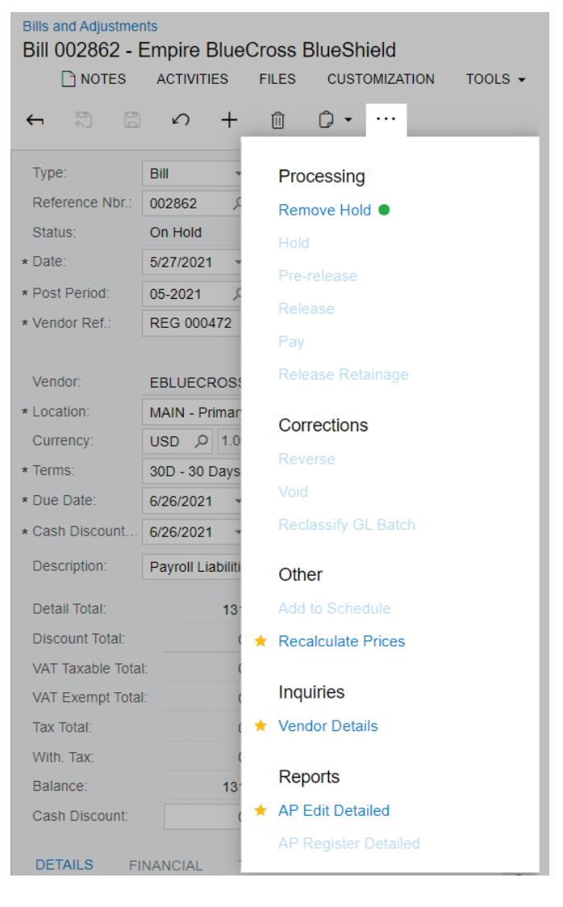

*Figure: The form toolbar and More menu on a narrow screen*

#### **Related Links**

- *[Integration with Excel](https://help-2025r1.acumatica.com/Help?ScreenId=ShowWiki&pageid=d4e757d5-bdf6-4d82-92e3-f26563d48ad4)*
- *To Copy a [Document](https://help-2025r1.acumatica.com/Help?ScreenId=ShowWiki&pageid=aa2b9a0f-794d-4dc7-80b4-14ed0702aea3) Contents to a New Document*
- *To Create a [Document](https://help-2025r1.acumatica.com/Help?ScreenId=ShowWiki&pageid=480487bd-b225-4065-9d82-97a3b68d7994) with a Template*

# <span id="page-568-1"></span><span id="page-568-0"></span>**Table Toolbar**

Each table on an Acumatica ERP form, tab, dialog box, or page has a table toolbar, which contains the buttons you can use to work with the details or objects of the table. A toolbar, shown in the following screenshot, includes buttons that are specific to the table, standard buttons that most table toolbars have, and the search box (for some tables; for others, the search box is displayed in the filtering area).

|               | $\mathbf{x}$<br>с<br>∣⇔∣<br>∽                        |   |                                          |                                   |                          |           |                       |               |                 |               |               |
|---------------|------------------------------------------------------|---|------------------------------------------|-----------------------------------|--------------------------|-----------|-----------------------|---------------|-----------------|---------------|---------------|
|               | ALL RECORDS<br><b>ACTIVE</b>                         |   |                                          |                                   |                          |           |                       |               |                 |               |               |
|               | R<br>Drag column header here to configure filter<br> |   |                                          |                                   |                          |           | ρ                     |               |                 |               |               |
| 髙             | O,                                                   | n | <b>Customer ID</b>                       | <b>Customer Name</b>              | Customer<br><b>Class</b> | Country   | City                  | Currenc<br>ID | <b>Terms</b>    | <b>Status</b> |               |
| $\rightarrow$ | ा                                                    | n | <b>ABARTENDE</b>                         | <b>USA Bartending School</b>      | <b>KEY</b>               | <b>US</b> | <b>Little Falls</b>   | USD.          | 30 <sub>D</sub> | Active        |               |
|               | O                                                    |   | <b>ABCHOLDING</b>                        | <b>ABC Holdings Inc.</b>          | <b>KEY</b>               | <b>US</b> | New York              | <b>USD</b>    | 30 <sub>D</sub> | Active        |               |
|               | û,                                                   |   | !!!!!!!!!!!!!!!!!!!!!!!!!!!!!!!!!!!!!!!! | <b>ABC Studios Inc.</b>           | <b>KEY</b>               | <b>US</b> | New York              | <b>USD</b>    | 30 <sub>D</sub> | Active        |               |
|               | Û                                                    |   | <b>ABCVENTURE</b>                        | <b>ABC Capital Ventures</b>       | <b>KEY</b>               | <b>US</b> | Philadelphia          | <b>USD</b>    | 30 <sub>D</sub> | Active        |               |
|               | Û                                                    |   | <b>ACTIVESTAF</b>                        | <b>Active Staffing Service</b>    | <b>LOCAL</b>             | <b>US</b> | <b>New York</b>       | <b>USD</b>    | 30 <sub>D</sub> | Active        |               |
|               | Û                                                    |   | ALPHABETLD                               | <b>Alphabetland School Center</b> | LOCAL                    | <b>US</b> | <b>North Bellmore</b> | <b>USD</b>    | 30 <sub>D</sub> | Active        |               |
|               |                                                      |   |                                          |                                   |                          |           |                       |               |                 |               |               |
|               |                                                      |   | 1-6 of 103 records                       |                                   |                          |           |                       | К             | 1.              | of 18 pages   | $\rightarrow$ |

#### *Figure: Table toolbar*

#### **Standard Table Toolbar Buttons**

The following table describes the standard table toolbar buttons. A table toolbar may include some or all of those buttons. If a table toolbar includes table-specific buttons, they are described in the reference help topic.

| Button                          | Icon | Description                                                                                                                                                                                           |
|---------------------------------|------|-------------------------------------------------------------------------------------------------------------------------------------------------------------------------------------------------------|
| Refresh                         |      | Refreshes the data in the table.                                                                                                                                                                      |
| Switch Between<br>Grid and Form |      | Controls how the elements are displayed: in a table (grid) with rows and columns;<br>or as separately arranged elements for one table row, with navigation tools you use<br>to move between row data. |
| Add Row                         |      | Appends a new row to the table so you can define a new detail or object. The new<br>row may contain some default values.                                                                              |
| Delete Row                      |      | Deletes the selected row or rows.                                                                                                                                                                     |

| Button                    | Icon | Description                                                                                                                                                                                                                                                                                                               |
|---------------------------|------|---------------------------------------------------------------------------------------------------------------------------------------------------------------------------------------------------------------------------------------------------------------------------------------------------------------------------|
| Move Row Up               |      | Moves the selected row one position up.                                                                                                                                                                                                                                                                                   |
| Move Row Down             |      | Moves the selected row one position down.                                                                                                                                                                                                                                                                                 |
| Fit toScreen              |      | Adjusts the table to the screen width and makes the column width proportional.                                                                                                                                                                                                                                            |
| Export to Excel           |      | Exports the data in the table to an Excel file. For more information, see Integration<br>with Excel in the Acumatica ERP Getting Started Guide.                                                                                                                                                                           |
| Filter Settings           |      | Opens the Filter Settings dialog box, which you can use to define a new advanced<br>filter. After you create and save the filter, the corresponding tab appears on the ta<br>ble.<br>For more information about filtering, see Filters. For details on the Filter Settings<br>dialog box, see Filter Settings Dialog Box. |
| Load Records<br>from File |      | Opens the File Upload dialog box, described in detail below, so you can locate and<br>upload a local file for import. You can use this option to import data from an Excel<br>spreadsheet (.xlsx) or .csv file. For the detailed procedure, see To Import Data<br>from a Local File to a Table.                           |
| Search                    |      | A box in which you can type a word, part of a word, or multiple words. As you type,<br>the system filters the contents of the table to display only rows that contain the<br>string you have typed in any column.                                                                                                         |
| Download                  |      | Downloads the selected file.                                                                                                                                                                                                                                                                                              |

### **File Upload Dialog Box**

With the **File Upload** dialog box, you select a file of one of the supported formats (.csv or .xlsx) to import data from the file.

| Element                                  | Description                                                                                                                         |  |  |  |
|------------------------------------------|-------------------------------------------------------------------------------------------------------------------------------------|--|--|--|
| File Path                                | The path to the file you want to upload.<br>To select the file, click Browse, and then find and select the file you want to upload. |  |  |  |
| The dialog box has the following button. |                                                                                                                                     |  |  |  |
| Upload                                   | Closes the dialog box and opens the Common Settings dialog box, where you specify the<br>import settings.                           |  |  |  |

#### **Common Settings Dialog Box**

In the **Common Settings** dialog box, which opens if you click **Upload** in the **File Upload** dialog box, you specify the import settings for a file that you has selected in the **File Upload** dialog box.

| Element                                   | Description                                                                                                                                                                    |  |  |  |  |
|-------------------------------------------|--------------------------------------------------------------------------------------------------------------------------------------------------------------------------------|--|--|--|--|
| Separator Chars                           | The character that is used as the separator in the imported file.                                                                                                              |  |  |  |  |
|                                           | By default, the comma is used as the separator. You specify the separator character if the<br>imported file uses any other separator.                                          |  |  |  |  |
|                                           | This box appears only if you import data from a .csv file.                                                                                                                     |  |  |  |  |
| Null Value                                | Optional. The value that is used to mark an empty column in the imported file. You speci<br>fy the null value if the value in the imported file differs from the empty string. |  |  |  |  |
| Encoding                                  | The encoding that is used in the imported file.                                                                                                                                |  |  |  |  |
|                                           | This box appears only if you import data from a .csv file.                                                                                                                     |  |  |  |  |
| Culture                                   | The regional format that has been used to display the time, currency, and other measure<br>ments in the imported file.                                                         |  |  |  |  |
| Mode                                      | The mode that determines which rows of the uploaded file will be imported into the ta<br>ble. The following options are available:                                             |  |  |  |  |
|                                           | •<br>Update Existing: The rows already present in the table will be updated, and the rows<br>not present in the table will be added.                                           |  |  |  |  |
|                                           | •<br>Bypass Existing: Only the new rows that are not present in the table will be imported.<br>The rows that are already present in the table will not be updated.             |  |  |  |  |
|                                           | •<br>Insert All Records: All the rows from the file will be imported into the table.                                                                                           |  |  |  |  |
|                                           | If you select this option, you may get duplicated rows because the sys<br>tem does not check for duplicates when importing rows from the file.                                 |  |  |  |  |
| The dialog box has the following buttons. |                                                                                                                                                                                |  |  |  |  |
| OK                                        | Closes the dialog box and opens the Columns dialog box.                                                                                                                        |  |  |  |  |
| Cancel                                    | Closes the dialog box without importing the data from the file.                                                                                                                |  |  |  |  |

#### **Columns Dialog Box**

In the **Columns** dialog box, which opens if you click **OK** in the **Common Settings** dialog box, you match the columns in the imported file that you have selected in the **File Upload** dialog box to the columns in the Acumatica ERP table to which you are importing data.

| Element       | Description                                                         |
|---------------|---------------------------------------------------------------------|
| Column Name   | The name of the column in the uploaded file.                        |
| Property Name | The name of the corresponding column in the table in Acumatica ERP. |

| Element                                   | Description                                                     |
|-------------------------------------------|-----------------------------------------------------------------|
| The dialog box has the following buttons. |                                                                 |
| OK                                        | Closes the dialog box and imports the selected file.            |
| Cancel                                    | Closes the dialog box without importing the data from the file. |

#### **Related Links**

- *[Tables](https://help-2025r1.acumatica.com/Help?ScreenId=ShowWiki&pageid=87a128a5-1230-4584-8c7a-ad05bcd08b75)*
- *[Integration with Excel](https://help-2025r1.acumatica.com/Help?ScreenId=ShowWiki&pageid=d4e757d5-bdf6-4d82-92e3-f26563d48ad4)*
- *To [Import](https://help-2025r1.acumatica.com/Help?ScreenId=ShowWiki&pageid=96773e07-5811-474d-a088-243f76f48f61) Data from a Local File to a Table*