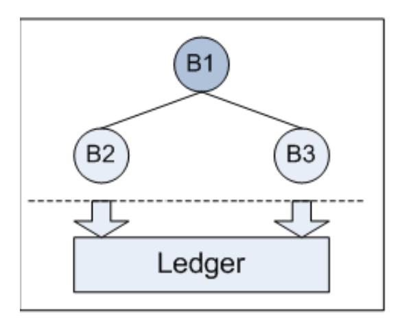
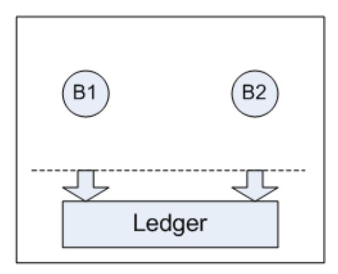
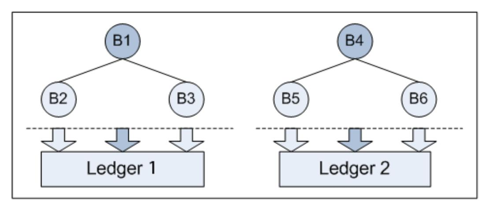
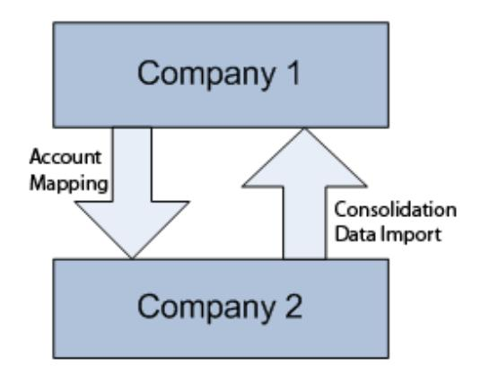
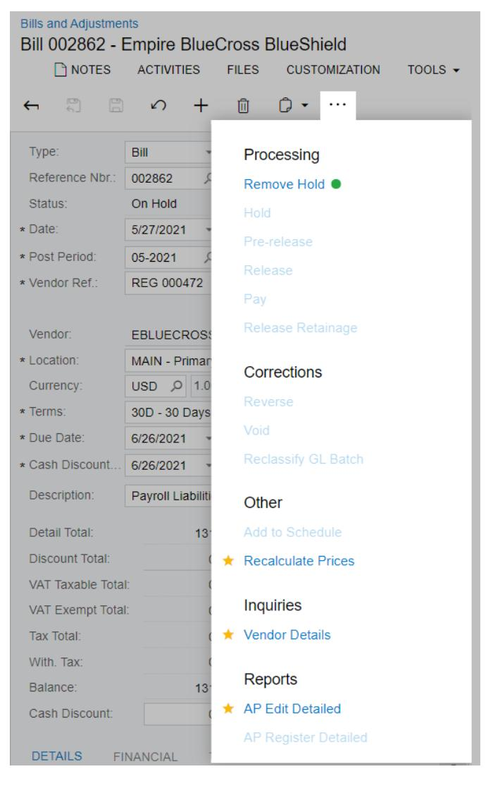

# **Organization Structure 2025 R1**

| Copyright3                                     |  |
|------------------------------------------------|--|
| Overview of Organization Structure Processes 4 |  |
| Managing Companies and Branches5               |  |
| Companies and Branches5                        |  |
| Multiple Branch Support 8                      |  |
| Basic Models for Multibranch Organization 10   |  |
| Security of Organization Branches 13           |  |
| Managing Employees 16                          |  |
| Employee Settings 16                           |  |
| Company Tree and Workgroups 17                 |  |
| Support of Multiple Work Calendars 19          |  |
| Managing Assignment Maps 20                    |  |
| Approvals: Reassignment of Approvals22         |  |
| Appendix23                                     |  |
| Reports 23                                     |  |
| Report Form23                                  |  |
| Report28                                       |  |
| Form Toolbar and More Menu30                   |  |
| Table Toolbar 37                               |  |

### **Copyright**

### **© 2025 Acumatica, Inc.**

### **ALL RIGHTS RESERVED.**

No part of this document may be reproduced, copied, or transmitted without the express prior consent of Acumatica, Inc.

3075 112th Avenue NE, Suite 200, Bellevue, WA 98004, USA

### **Restricted Rights**

The product is provided with restricted rights. Use, duplication, or disclosure by the United States Government is subject to restrictions as set forth in the applicable License and Services Agreement and in subparagraph (c)(1)(ii) of the Rights in Technical Data and Computer Soware clause at DFARS 252.227-7013 or subparagraphs (c)(1) and (c)(2) of the Commercial Computer Soware-Restricted Rights at 48 CFR 52.227-19, as applicable.

### **Disclaimer**

Acumatica, Inc. makes no representations or warranties with respect to the contents or use of this document, and specifically disclaims any express or implied warranties of merchantability or fitness for any particular purpose. Further, Acumatica, Inc. reserves the right to revise this document and make changes in its content at any time, without obligation to notify any person or entity of such revisions or changes.

### **Trademarks**

Acumatica is a registered trademark of Acumatica, Inc. HubSpot is a registered trademark of HubSpot, Inc. Microso Exchange and Microso Exchange Server are registered trademarks of Microso Corporation. All other product names and services herein are trademarks or service marks of their respective companies.

Soware Version: 2025 R1 Last Updated: 06/01/2025

### **Overview of Organization Structure Processes**

In Acumatica ERP, you can configure the structure of your organization as consisting of a single branch or multiple branches with different reporting settings to suit complex reporting requirements and data consolidation needs.

Also, by using the Organization Structure module, your organization can automate work assignments and document assignment for approvals.

### **Multibranch Functionality**

In Acumatica ERP, you can configure the system as a single entity or as a multibranch organization to match the actual organization's structure. All branches of the organization use the same currency and chart of accounts, and have shared lists of trade partners. You can configure automatic balancing of inter-branch transactions. If the branches operate separately, you can set up user access to specific branches only. For additional information, see the following topics:

- *[Multiple Branch Support](#page-7-1)*
- *[Basic Models for Multibranch Organization](#page-9-1)*
- *[Security of Organization Branches](#page-12-1)*

### **Organizational Chart and Assignment Automation**

You can build a company tree, which is a model of your organization's hierarchy that includes branches and departments, as well as temporary or permanent workgroups. The company tree may reflect the administrative hierarchy and include subhierarchies of workgroups created within specific branches or departments. The company tree is used for creating assignment rules in approval and assignment maps and for determining the scope of the users who want to view items assigned to them. You can use assignment maps to automatically distribute the work items (such as leads, contacts, opportunities, or cases) to be processed or you can use approval maps to distribute the documents (such as time cards, expense receipts, or orders) to be approved among the workgroups, based on relevant item or document properties. For more information, see the following articles:

- *Company Tree and [Workgroups](#page-16-1)*
- *[Managing Assignment Maps](#page-19-0)*
- *[Approval Configuration: Approval Maps](https://help-2025r1.acumatica.com/Help?ScreenId=ShowWiki&pageid=d2db53f8-d3ed-47fd-b34e-c743a59a4b83)*

### **Other Features and Options**

Acumatica ERP provides unmatched flexibility for each organization to implement its unique business processes by using the Organization Structure functionality. In addition to the features described above, the Organization Structure functionality offers the following features and options:

- You can use departments, employee positions, and information about to whom each employee reports to build any hierarchy to be used in assignment and approval maps.
- Buildings can be assigned to branches and depreciated accordingly in the respective branches.
- Multiple work calendars may be used in the organization to correctly estimate work time and overtime in different branches and on different projects, as described in *[Support of Multiple Work Calendars](#page-18-1)*.

### **Related Links**

• *[Interbranch Account Mapping](https://help-2025r1.acumatica.com/Help?ScreenId=ShowWiki&pageid=3ed4a109-0f5b-4b10-8710-6cb0ce3f788a)*

### **Managing Companies and Branches**

In Acumatica ERP, a company represents a legal entity with an independent balance sheet and separate tax reporting. An organization may consist of one company or multiple companies.

A company may have no branches, or it may consist of multiple branches, each being a separate office or a point of sale. Companies with multiple branches can be configured and maintained in Acumatica ERP only if the *Multibranch Support* and *Multicompany Support* features are enabled on the *[Enable/Disable Features](https://help-2025r1.acumatica.com/Help?ScreenId=ShowWiki&pageid=c1555e43-1bc5-4f6f-ba9d-b323f94d8a6b)* (CS100000) form. On the same form, the *Inter-Branch Transactions* feature should be enabled if different branches of a company can participate in one transaction.

All branches within a tenant have the same chart of accounts, calendar, and base currency.

### **In This Chapter**

- *[Companies and Branches](#page-4-2)*
- *[Multiple Branch Support](#page-7-1)*
- *[Basic Models for Multibranch Organization](#page-9-1)*
- *[Security of Organization Branches](#page-12-1)*

### **Companies and Branches**

In Acumatica ERP, a user can create new companies or maintain existing companies by using the *[Companies](https://help-2025r1.acumatica.com/Help?ScreenId=ShowWiki&pageid=fedad435-8496-4397-b8a3-50a473629f76)* (CS101500) form.

Multiple companies can be configured in one tenant of Acumatica ERP if the *Multicompany Support* feature has been enabled on the *[Enable/Disable Features](https://help-2025r1.acumatica.com/Help?ScreenId=ShowWiki&pageid=c1555e43-1bc5-4f6f-ba9d-b323f94d8a6b)* (CS100000) form.

### **Company Type**

Each company has one of the following types, which is specified in the **CompanyType** box on the *[Companies](https://help-2025r1.acumatica.com/Help?ScreenId=ShowWiki&pageid=fedad435-8496-4397-b8a3-50a473629f76)* (CS101500) form:

- *Without Branches*: A company with this type cannot have any branches. If the *Multibranch Support* feature is disabled on the *[Enable/Disable Features](https://help-2025r1.acumatica.com/Help?ScreenId=ShowWiki&pageid=c1555e43-1bc5-4f6f-ba9d-b323f94d8a6b)* (CS100000) form, this option is selected by default and cannot be changed. If the *Multibranch Support* feature is disabled and the *Multicompany Support* feature is enabled, you can create multiple companies without branches in one tenant.
- *With Branches Not Requiring Balancing*: A company with this type must have at least one branch. If multiple branches of the company are involved in a transaction, balancing entries are not required. This option is available if the *Multibranch Support* feature is enabled on the *[Enable/Disable Features](https://help-2025r1.acumatica.com/Help?ScreenId=ShowWiki&pageid=c1555e43-1bc5-4f6f-ba9d-b323f94d8a6b)* form.
- *With Branches Requiring Balancing*: A company with this type must have at least one branch. If multiple branches of the company are involved in a transaction, balancing entries are required. This option is available if the *Multibranch Support* and *Inter-Branch Transactions* features are enabled on the *[Enable/](https://help-2025r1.acumatica.com/Help?ScreenId=ShowWiki&pageid=c1555e43-1bc5-4f6f-ba9d-b323f94d8a6b) [Disable Features](https://help-2025r1.acumatica.com/Help?ScreenId=ShowWiki&pageid=c1555e43-1bc5-4f6f-ba9d-b323f94d8a6b)* form.

For details about how Acumatica ERP supports multiple branches for a company, see *[Multiple Branch Support](#page-7-1)*.

Aer a company has been configured, the company type still can be changed as follows.

| From                                                                                 | To                                                                                   | Condition                                                                                       |
|--------------------------------------------------------------------------------------|--------------------------------------------------------------------------------------|-------------------------------------------------------------------------------------------------|
| Without Branches                                                                     | With Branches Not Requiring Bal ancing or With Branches Requiring Balancing | The company has not been extend ed as a customer, vendor, or both a customer and vendor.  |
| With Branches Not Requiring Bal ancing or With Branches Requiring Balancing | Without Branches                                                                     | The company has only one branch or no branches at all.                                       |
| With Branches Not Requiring Bal ancing                                            | With Branches Requiring Balancing                                                    | No transactions have been posted by company branches or the com pany has only one branch. |
| With Branches Requiring Balancing                                                    | With Branches Not Requiring Bal ancing                                            | No transactions have been posted by company branches or the com pany has only one branch. |

### **Company Statuses**

When you create a new company on the *[Companies](https://help-2025r1.acumatica.com/Help?ScreenId=ShowWiki&pageid=fedad435-8496-4397-b8a3-50a473629f76)* (CS101500) form, the company is assigned the default status of *Active*. Active companies and their branches can be selected on data entry forms and in reports. However, at some point, you may need to remove a company from the system, so that users will not be able to select the company and its branches on data entry forms and reports. In this case, you deactivate the company by clicking **Deactivate** on the More menu of the *[Companies](https://help-2025r1.acumatica.com/Help?ScreenId=ShowWiki&pageid=fedad435-8496-4397-b8a3-50a473629f76)* form.

You can later activate the company again by clicking **Activate** on the More menu of the *[Companies](https://help-2025r1.acumatica.com/Help?ScreenId=ShowWiki&pageid=fedad435-8496-4397-b8a3-50a473629f76)* form.

If the *Multiple Calendar Support* feature is disabled on the *[Enable/Disable Features](https://help-2025r1.acumatica.com/Help?ScreenId=ShowWiki&pageid=c1555e43-1bc5-4f6f-ba9d-b323f94d8a6b)* (CS100000) form and you activate a company, the system performs the following actions:

- 1. Compares the set of financial periods in the master calendar with the set of financial periods of the current company. (Only the IDs of the periods are compared—not their starting and ending dates.) If these sets are different, the system generates the missing periods for the company. You can view these periods on the *[Company Financial Calendar](https://help-2025r1.acumatica.com/Help?ScreenId=ShowWiki&pageid=65ec8509-a3de-4381-94f0-c5ae2f8546fb)* (GL201100) form.
- 2. On the *[Company Financial Calendar](https://help-2025r1.acumatica.com/Help?ScreenId=ShowWiki&pageid=65ec8509-a3de-4381-94f0-c5ae2f8546fb)* form, assigns the period's status and the states of the **Closed in AP**, **Closed in AR**, **Closed in IN**, **Closed in CA**, and **Closed in FA** check boxes for each new period in the company calendar according to the following rules:
  - If the *Centralized Period Management* feature is enabled, the period's status and the states of the **Closed in <Subledger>** check boxes are copied from the corresponding settings of the master calendar.
  - If the *Centralized Period Management* feature is disabled and the missing period is the first added period in the company calendar, the period's status and the states of the **Closed in <Subledger>** check boxes are copied from earliest period of the company calendar.

If the missing period is added in the middle of the company calendar—that is, if there are periods before and aer the added period—the period's status and the states of the **Closed in <Subledger>** check boxes are copied from the period just before the added period.

If the missing period is added to the end of the company calendar—that is, if there are no periods aer the added period—the added period is assigned the *Inactive* status, and the **Closed in <Subledger>** check boxes are cleared.

If the *Fixed Asset Management* feature is enabled and the *Multiple Calendar Support* feature is disabled on the *[Enable/Disable Features](https://help-2025r1.acumatica.com/Help?ScreenId=ShowWiki&pageid=c1555e43-1bc5-4f6f-ba9d-b323f94d8a6b)* form, and you activate a company on the *[Companies](https://help-2025r1.acumatica.com/Help?ScreenId=ShowWiki&pageid=fedad435-8496-4397-b8a3-50a473629f76)* form, the system performs the following actions:

- Checks whether each period in the general ledger calendar has a matching period in the calendar of the company's posting book. (Only the IDs of the periods are compared.)
- Generates the missing periods in the company's posting book.

For more details about financial periods, see *[Generating Financial Calendars](https://help-2025r1.acumatica.com/Help?ScreenId=ShowWiki&pageid=2e1aae96-ae59-46a9-b1f7-951fa43df2fe)*, *[Financial Calendar Generation: General](https://help-2025r1.acumatica.com/Help?ScreenId=ShowWiki&pageid=03432fa3-d1ca-4972-b43e-2bc90bbcf2a5) [Information](https://help-2025r1.acumatica.com/Help?ScreenId=ShowWiki&pageid=03432fa3-d1ca-4972-b43e-2bc90bbcf2a5)*, and *[Managing Financial Periods](https://help-2025r1.acumatica.com/Help?ScreenId=ShowWiki&pageid=96e30f1d-3948-4405-aa90-8afdbaccd06a)*.

### **Company Maintenance**

For a company that has the *With Branches Not Requiring Balancing* or *With Branches Requiring Balancing* type, the **Branches** tab becomes available on the *[Companies](https://help-2025r1.acumatica.com/Help?ScreenId=ShowWiki&pageid=fedad435-8496-4397-b8a3-50a473629f76)* (CS101500) form. On this tab, a system administrator can add new branches to the company or delete branches from the list of company branches; when the company has no branches, it can be also deleted.

A company with the *Without Branches* type can be deleted if it has no GL history (that is, if no GL transactions are associated with the company) and if no cash accounts, employees, warehouses, and fixed assets are linked to the company.

If a user clicks **Deactivate** on the More menu of the *[Companies](https://help-2025r1.acumatica.com/Help?ScreenId=ShowWiki&pageid=fedad435-8496-4397-b8a3-50a473629f76)* form for a company that has branches, all the company branches will be deactivated. However, a branch cannot be deactivated if it is linked to an active warehouse, to an employee with a status other than *Inactive*, or to a fixed asset with a status other than *Disposed* or *Reversed*, and a company with such a branch also cannot be deactivated.

### **Configuration of Access to Company Data**

Access to the data related to a specific branch or to all branches of a company is regulated by an access role.

When an access role is specified for a company in the **Access Role** box on the *[Companies](https://help-2025r1.acumatica.com/Help?ScreenId=ShowWiki&pageid=fedad435-8496-4397-b8a3-50a473629f76)* (CS101500) form, the system prompts whether the access role should be copied to the settings of all branches of the company. When the **Access Role** box is cleared for the company, the system prompts whether the access role should be removed from the settings of all branches of the company. If no access role is specified for the company, an individual access role can be specified for each branch of the company on the *[Branches](https://help-2025r1.acumatica.com/Help?ScreenId=ShowWiki&pageid=b97ab72d-4ab4-4f02-b69c-f7f61b316ced)* (CS102000) from.

A user that has access to at least one of the company branches can select the company in corresponding boxes on data entry forms.

For more information about ways to manage the security of a branch, see *[Security of Organization Branches](#page-12-1)*.

### **Ledgers**

A company can post transactions to various ledgers, but it can be associated with only one actual ledger.

A user can manage ledgers associated with a company in any of the following ways:

- Create for a new company a ledger of the *Actual* type by clicking **Create Ledger** on the More menu (under **Other**) of the *[Companies](https://help-2025r1.acumatica.com/Help?ScreenId=ShowWiki&pageid=fedad435-8496-4397-b8a3-50a473629f76)* (CS101500) form
- Review the list of the ledgers associated with the company, add an existing ledger to the list, or remove a ledger from the list by using the **Ledgers** tab of the *[Companies](https://help-2025r1.acumatica.com/Help?ScreenId=ShowWiki&pageid=fedad435-8496-4397-b8a3-50a473629f76)* form
- Review the list of all ledgers associated with the company of the selected branch by using the **Ledgers** tab of the *[Branches](https://help-2025r1.acumatica.com/Help?ScreenId=ShowWiki&pageid=b97ab72d-4ab4-4f02-b69c-f7f61b316ced)* (CS102000) form
- Maintain the list of the companies that are allowed to post to non-actual ledgers by using the *[Ledgers](https://help-2025r1.acumatica.com/Help?ScreenId=ShowWiki&pageid=a5c9f3f5-7dc4-4b1b-a50c-396729a12e4e)* (GL201500) form

An actual ledger can be detached from a company if the ledger contains no transactions associated with any branch of the company.

For more information about ledgers, see the *[Managing Ledgers](https://help-2025r1.acumatica.com/Help?ScreenId=ShowWiki&pageid=3d13cf61-bd54-4f32-ba51-8899e1ff8df2)* chapter.

### **Tax Reports**

For a company with the *With Branches Requiring Balancing* type, the **FileTaxes by Branches** check box is available on the *[Companies](https://help-2025r1.acumatica.com/Help?ScreenId=ShowWiki&pageid=fedad435-8496-4397-b8a3-50a473629f76)* (CS101500) form. If the check box is cleared, each tax report includes data related to all branches of the company. If the check box is selected, each branch of the company requires an individual report.

For a company with any other type, tax reports always include company-wide data.

### **Visual Appearance**

On the **Visual Appearance** tab of the *[Companies](https://help-2025r1.acumatica.com/Help?ScreenId=ShowWiki&pageid=fedad435-8496-4397-b8a3-50a473629f76)* (CS101500) or *[Branches](https://help-2025r1.acumatica.com/Help?ScreenId=ShowWiki&pageid=b97ab72d-4ab4-4f02-b69c-f7f61b316ced)* (CS102000) form, a user can specify separate images for the logo displayed in the top le corner of Acumatica ERP and for the logo displayed on reports for the selected company or branch.

### **Multiple Branch Support**

Sooner or later, small and medium-sized businesses may face the challenges presented by growth. The organization can grow by adding new locations that become branches with some degree of autonomy.

Because most Acumatica ERP customers are small and mid-sized businesses, the multibranch functionality has been developed for organizations that meet certain requirements:

- All branches use the same base currency.
- The chart of accounts is shared among branches, or similar charts of accounts used by different branches can be merged into one chart of accounts used by all branches.
- The branches have the same financial year and periods.

Larger organizations with base currencies different in different branches, fiscal years, and periods can configure their subsidiaries as separate organizations with individual company IDs and use the consolidation functionality to be able to report as a single company. For details, see *[Configuring GL Consolidation](https://help-2025r1.acumatica.com/Help?ScreenId=ShowWiki&pageid=bf66b025-fbfb-4d21-900f-d773548d2aaa)* and *[Performing GL](https://help-2025r1.acumatica.com/Help?ScreenId=ShowWiki&pageid=684e17a1-75d9-4d12-ac65-a064944c0306) [Consolidation](https://help-2025r1.acumatica.com/Help?ScreenId=ShowWiki&pageid=684e17a1-75d9-4d12-ac65-a064944c0306)*.

### **Organization as a Structure of Branches**

Acumatica ERP supports multibranch functionality and provides several basic models for implementing most typical organization structures. For details, see *[Basic Models for Multibranch Organization](#page-9-1)*.

In Acumatica ERP, an organization has a company account with a company ID. Within a company account, at least one branch is needed to represent the organization itself. If the organization includes more than one branch, organization branches are created within the same company ID. The identifiers for branches (Branch IDs) are based on the *BIZACCT* segmented key—that is, they have the same segments as identifiers for organization's customers and vendors.

### **User Access to Branch Data**

Since the branches are created within the same organization, they have some shared data and some branchspecific data.

Each employee (user) is assigned to a specific branch. To restrict user access to branch-specific data, you can configure a branch access role for each branch. Then the branch employees will be able to access the shared data (as their roles allow) and the data specific to their branch. To employees who should have access to other branches too, you must assign the access roles for the branches in the user's scope. For details, see *[Security of Organization](#page-12-1)*

*[Branches](#page-12-1)*. If a user has access to several branches, the user will be able to choose the branch he or she needs by selecting it from the form toolbar on each data entry form.

### **Data Shared Between Branches**

Some of the data is unconditionally shared and available in all branches for all users who have access to this data by their roles.

In addition to the financial year and periods, the organization's branches share the following information:

- The chart of accounts.
- Subaccounts.
- Budget tree, for details, see *[Budget](https://help-2025r1.acumatica.com/Help?ScreenId=ShowWiki&pageid=970daac8-126a-472f-8ab1-2d01cd39dd6c) Tree*.
- Taxes, tax categories, and tax zones.
- Credit terms and overdue charges.
- Statement cycles.
- Customer and vendor classes.
- Customers and vendors. You can specify for some customer and vendor locations a default branch with which they have operations, and this location will be unavailable for selection from other branches.
- Stock and non-stock items. If you need to view inventory by branch, configure the *INVENTORY* segmented key appropriately, with a segment designating a branch to which the item belongs, but all items will be visible in the list of available items.
- Lot and serial classes.
- Units of measure and conversion rules.
- Posting classes for inventory.

Company tree and assignment maps should include workgroups that belong to all branches. Approval routes may pass across the entire organization.

You can use the functionality of restriction groups to assign specific accounts and subaccounts to a particular branch. For details, see *[Security of Organization Branches](#page-12-1)*.

### **Branch-Specific Data**

The following entities are assigned to only one of the branches:

- Cash accounts (each of which is denominated in a specific currency)
- Warehouses
- Employees
- Buildings (a sort of fixed asset)

Do not create a subaccount segment for branches; transactions are marked by the originating branch in other ways. Bills and invoices as well as other documents are associated with the particular branch in which they were created. To make them easily identifiable by branch, you can create branch-specific subsequences for all numbering sequences involved by using the *[Numbering Sequences](https://help-2025r1.acumatica.com/Help?ScreenId=ShowWiki&pageid=a8d11c23-21f2-42a3-b17d-9637c9cf8031)* (CS201020) form, so that a document originating in a specific branch will have a reference number clearly associated with the branch of origin.

If a user has a branch access role that provides access to only one of the branches, the user will be able to view only the documents related to the respective branch.

### **Data Consolidation**

The multibranch functionality, as it is implemented in Acumatica ERP, enables complex organizations to view the consolidated data from multiple branches without having to perform any additional operations and in real time. It is easy to configure consolidated replenishment or centralized payment of bill or view consolidated data on reports running them from the headquarters branch.

When a user opens a report or inquiry, the system checks the user's access rights to branches. If a user has access to all branches, this user can view the data of any selected branch or the consolidated data by leaving the **Branch** box blank. If a user has access to only one branch, this user will be able to view only the data related to the particular branch even if he or she runs the report that should show the consolidated data.

Replenishment is performed on a branch basis, although you can implement the following scenario: The headquarters has a large warehouse for which you configure automatic replenishment. Warehouses assigned to other branches are replenished through transfers from the headquarters' warehouse. Thus, your organization will be able to save on volume discounts.

In your system, bills can be paid by a headquarters branch on behalf of other branches. To do this, assign to authorized personnel the roles that provide access to branches. Then the employees who pay the bills will be able to view the bills from all branches on the *[Checks and Payments](https://help-2025r1.acumatica.com/Help?ScreenId=ShowWiki&pageid=81659f97-cb14-4a27-bc3e-0f67b3945613)* (AP302000) and *[Prepare Payments](https://help-2025r1.acumatica.com/Help?ScreenId=ShowWiki&pageid=e3b526e3-8b12-4fa9-a5b2-2955e763f238)* (AP503000) forms. The cash accounts from which payments are made should be assigned to the headquarters branch.

### **Related Links**

- *[Basic Models for Multibranch Organization](#page-9-1)*
- *[Security of Organization Branches](#page-12-1)*
- *[Branches](https://help-2025r1.acumatica.com/Help?ScreenId=ShowWiki&pageid=b97ab72d-4ab4-4f02-b69c-f7f61b316ced)*
- *[Buildings](https://help-2025r1.acumatica.com/Help?ScreenId=ShowWiki&pageid=fba3e351-1011-4fd2-8330-7611903db5aa)*
- *[Inter-Branch Account Mapping](https://help-2025r1.acumatica.com/Help?ScreenId=ShowWiki&pageid=858e6eba-172d-46fa-879e-d6f69f5b190c)*
- *[Restriction Groups by Branch](https://help-2025r1.acumatica.com/Help?ScreenId=ShowWiki&pageid=b9e577ab-37ea-4f57-8d9a-cd53433e6edb)*
- *[GL Accounts by Branch Access](https://help-2025r1.acumatica.com/Help?ScreenId=ShowWiki&pageid=970642d6-683a-444f-9de8-3f31bcf6c876)*
- *[Subaccounts by Branch Access](https://help-2025r1.acumatica.com/Help?ScreenId=ShowWiki&pageid=de56b70d-3b3d-4d52-95ac-5ef326b0d0e5)*
- *[Checks and Payments](https://help-2025r1.acumatica.com/Help?ScreenId=ShowWiki&pageid=81659f97-cb14-4a27-bc3e-0f67b3945613)*
- *[Prepare Payments](https://help-2025r1.acumatica.com/Help?ScreenId=ShowWiki&pageid=e3b526e3-8b12-4fa9-a5b2-2955e763f238)*

### **Basic Models for Multibranch Organization**

In today's global environment, an organization may have a hierarchic structure of subsidiaries or branches and complex multilevel reporting requirements. Such an organization may need tools for easy data consolidation, as well as better visibility into various layers of financial operations within the organization.

Acumatica ERP supports multibranch functionality and provides multiple basic one-level and two-level models, outlined in the sections below, for implementing the most typical organizational structures. For more complex organizations, such models may be combined to implement any structure.

Choosing the model (or combination of models) that suits your organization best is an important decision that must be made before you start implementing Acumatica ERP.

### **Model 1: Organization with Centralized Accounting**

With Model 1, shown in the illustration below, the organization, which is a single legal entity, consists of two branches (or locations), each branch representing a company office. Transactions are posted to these branches.

To implement this model in Acumatica ERP, you have to create an additional branch that will represent the legal entity. You also have to have one posting ledger of the *Actual* type.

You need to specify the additional branch as the consolidating branch for the posting ledger by using the **Consolidation Branch** column on the *[Ledgers](https://help-2025r1.acumatica.com/Help?ScreenId=ShowWiki&pageid=a5c9f3f5-7dc4-4b1b-a50c-396729a12e4e)* (GL201500) form. The consolidating branch is used only in Form 1099-MISC and tax reports to represent the legal entity. No transactions are posted to the consolidating branch.

To be able to use automatic generation of interbranch balancing entries for documents that involve multiple branches, you need to enable the *Inter-Branch Transactions* feature on the *[Enable/Disable Features](https://help-2025r1.acumatica.com/Help?ScreenId=ShowWiki&pageid=c1555e43-1bc5-4f6f-ba9d-b323f94d8a6b)* (CS100000) form, configure the posting ledger by selecting the check box in the **Branch Accounting** column for this ledger on the *[Ledgers](https://help-2025r1.acumatica.com/Help?ScreenId=ShowWiki&pageid=a5c9f3f5-7dc4-4b1b-a50c-396729a12e4e)* (GL201500) form, and define the interbranch account mapping by using the *[Inter-Branch Account](https://help-2025r1.acumatica.com/Help?ScreenId=ShowWiki&pageid=858e6eba-172d-46fa-879e-d6f69f5b190c) [Mapping](https://help-2025r1.acumatica.com/Help?ScreenId=ShowWiki&pageid=858e6eba-172d-46fa-879e-d6f69f5b190c)* (GL101010) form.

If the **Branch Accounting** check box is cleared for the ledger, you still can make transactions between the branches (for example, transfer fixed assets from one branch to another), but the system does not create interbranch balancing entries. The resulting batch remains unbalanced in each of the smaller branches, but the batch is balanced in the ledger that is assigned to the consolidating branch. In this case, the branches are not independent, and separate balance sheet reports cannot be prepared.

### **Model 2: Autonomous Branches**

In Model 2, illustrated below, the organization has a number of branches with a certain level of autonomy, with each branch being a legal entity. The organization and its branches share most of the vendors and customers but keep some of the trade partners as associated with a specific branch. Each branch keeps records of its own and has an accountant or accounting staff. The profitability of each branch can be equally important.

In Acumatica ERP, autonomous branches may use separate ledgers to post their transactions or they may post their transactions to a single ledger with no branch selected as a consolidation branch. If the branches post their transactions to separate ledgers, the system will generate interbranch transactions automatically. If the branches use the same ledger, to balance the original interbranch transactions in each branch, you should select for this

ledger a check box in the **Branch Accounting** column on the *[Ledgers](https://help-2025r1.acumatica.com/Help?ScreenId=ShowWiki&pageid=a5c9f3f5-7dc4-4b1b-a50c-396729a12e4e)* (GL201500) form. This allows each branch to file reports as a separate legal entity.

A certain level of independence requires that some of branches have their own General Ledger accounts that cannot be used by another branch. You can use restriction groups to assign selected General Ledger accounts and subaccounts to a specific branch for use by this branch only.

### **Model 3: Autonomous Multilocation Branches**

An organization might include a number of related legal entities with complex structures. Each legal entity has its headquarters and locations or smaller branches that are not separate legal entities. In this case, each autonomous multilocation entity keeps its own records and performs all accounting procedures.

In Acumatica ERP, such an organization can be configured as a Model 3, which combines Model 1 and Model 2, functioning within one Company ID. (See the following illustration.) Each autonomous branch has its headquarters and locations (or smaller branches that are not separate legal entities) configured as branches. Each autonomous multilocation branch records its operations to a separate ledger with a *headquarters* branch specified as the *consolidation branch* for the ledger.

Generally, when transactions occur between any two non-independent branches in one ledger, no interbranch transactions are generated; however, if they are needed for any reason, you can select a check box in the **Branch Accounting** column on the *[Ledgers](https://help-2025r1.acumatica.com/Help?ScreenId=ShowWiki&pageid=a5c9f3f5-7dc4-4b1b-a50c-396729a12e4e)* (GL201500) form for the ledger.

When the interbranch transactions occur between any branches with different posting ledgers, balancing interbranch transactions will be generated automatically. You should create interbranch receivable and payable accounts in each ledger and specify the rules to be used by the system for generating balancing transactions by using the *[Inter-Branch Account Mapping](https://help-2025r1.acumatica.com/Help?ScreenId=ShowWiki&pageid=858e6eba-172d-46fa-879e-d6f69f5b190c)* (GL101010) form.

### **Model 4: Multinational or Just Multicurrency Organization**

Small and midsize businesses sooner or later may face the problem of growth. They can grow by mergers or by creating local subsidiaries or branches in new regions or countries. Due to their locations, the organization subsidiaries use different base (functional) currency and should meet different reporting requirements (including non-matching financial years); their customers and vendors are not shared. For historical reasons, the organization subsidiaries may have different structures of accounts and subaccounts.

In Acumatica ERP, such subsidiaries can have separate tenant accounts with different Company IDs. The simplest structure is shown by Model 4, illustrated below. Although technically the parent organization and its subsidiaries may keep their data in the same database, they may have different base currencies, different financial year settings, and separate lists of trade partners. Such subsidiaries even can be hosted on different websites.

Acumatica ERP provides the consolidation-related functionality to be used by both sides: the parent organization and its subsidiaries. If different base currencies are used by the parent company and its subsidiary, such subsidiaries can translate their balances before they prepare the consolidation data for exporting. For details, see *[GL Consolidation Configuration: General Information](https://help-2025r1.acumatica.com/Help?ScreenId=ShowWiki&pageid=1dc0ec81-0965-4fc3-b789-bdc737e01bac)*, *[GL Consolidation: General Information](https://help-2025r1.acumatica.com/Help?ScreenId=ShowWiki&pageid=97089c09-c4d1-46d0-bfe6-2b74b5b72469)*, and *[Translation](https://help-2025r1.acumatica.com/Help?ScreenId=ShowWiki&pageid=368fcb87-3d61-4bcf-9d37-173240eacf35) of [Financial Statements: General Information](https://help-2025r1.acumatica.com/Help?ScreenId=ShowWiki&pageid=368fcb87-3d61-4bcf-9d37-173240eacf35)*.

If interbranch transactions take place, they should be eliminated manually during period-end or year-end routine procedures.

### **Related Links**

- *[Branches](https://help-2025r1.acumatica.com/Help?ScreenId=ShowWiki&pageid=b97ab72d-4ab4-4f02-b69c-f7f61b316ced)*
- *[Buildings](https://help-2025r1.acumatica.com/Help?ScreenId=ShowWiki&pageid=fba3e351-1011-4fd2-8330-7611903db5aa)*
- *[Inter-Branch Account Mapping](https://help-2025r1.acumatica.com/Help?ScreenId=ShowWiki&pageid=858e6eba-172d-46fa-879e-d6f69f5b190c)*
- *[Restriction Groups by Branch](https://help-2025r1.acumatica.com/Help?ScreenId=ShowWiki&pageid=b9e577ab-37ea-4f57-8d9a-cd53433e6edb)*
- *[GL Accounts by Branch Access](https://help-2025r1.acumatica.com/Help?ScreenId=ShowWiki&pageid=970642d6-683a-444f-9de8-3f31bcf6c876)*
- *[Subaccounts by Branch Access](https://help-2025r1.acumatica.com/Help?ScreenId=ShowWiki&pageid=de56b70d-3b3d-4d52-95ac-5ef326b0d0e5)*

### **Security of Organization Branches**

If your organization has multiple branches defined in Acumatica ERP, you may need to control which employees get access to which branches. Because branches share some data, you may also need to control access to the shared data. Acumatica ERP provides user access roles, which you can use to control users' access to branches, and restriction groups to limit the visibility of shared data. In this topic, you will read about ways to manage the security of a branch.

In Acumatica ERP, you can configure groups with direct and inverse restriction. In this topic, for simplicity, groups with direct restriction are used in examples. You can use inverse restriction groups in the same way as you use direct restriction groups. For details on the types of restriction groups, see *Types of [Restriction](https://help-2025r1.acumatica.com/Help?ScreenId=ShowWiki&pageid=a72c11e3-e181-4412-a462-ce333721a1e9) Groups*.

### **Usage Scenarios**

The most common scenarios of managing the security of company branches are the following:

- Managing user access to branches: If your organization has multiple branches (and you have created multiple branches in Acumatica ERP), you can configure access to branches for employees who work in these branches. For details, see *[User Access to Branches](#page-13-0)*.
- Managing the visibility of data shared between branches: If you need to make data shared between branches (such as general ledger accounts and subaccounts) visible only within a particular branch, you can use restriction groups to resolve this task. For more information, see *[Visibility](#page-13-1) of Data Within a Branch*.

You can create and maintain multiple branches in your Acumatica ERP instance only if the *Multibranch Support* feature is enabled in your system on the *[Enable/Disable Features](https://help-2025r1.acumatica.com/Help?ScreenId=ShowWiki&pageid=c1555e43-1bc5-4f6f-ba9d-b323f94d8a6b)* (CS100000) form (for details, see *[Multiple Branch Support](#page-7-1)*).

### **User Access to Branches**

Aer multiple branches have been defined in the system, you provide access to the branches for users who will work in the system as follows:

- 1. On the *[User Roles](https://help-2025r1.acumatica.com/Help?ScreenId=ShowWiki&pageid=c2879f3c-3739-430a-b02b-c225f5480966)* (SM201005) form, you create branch-specific user roles (one role per branch) and assign these roles to user accounts. For details on user roles, see *[User Roles: General Information](https://help-2025r1.acumatica.com/Help?ScreenId=ShowWiki&pageid=6aca93da-a187-4117-ae0a-bc7bbd39b2ce)*.
- 2. On the *[Branches](https://help-2025r1.acumatica.com/Help?ScreenId=ShowWiki&pageid=b97ab72d-4ab4-4f02-b69c-f7f61b316ced)* (CS102000) form, you assign the roles to branches as follows: For each branch, in the **Access Role** box, you select the user role created for this branch. To allow a user to access multiple branches, assign to him or her the roles for the branches to which the user should have access.

Once a role is assigned to one of the branches, other branches also must have roles assigned. A branch with no role assigned will be inaccessible to any user.

If a user, based on his or her role, has access to a data entry form where this user enters a document and specifies the branch of origin, only the branches to which the user has access are available on the drop-down list. The users who have access to multiple branches can select the specific branch from the **Branches** menu on the form's title toolbar and create documents on behalf of the selected branch.

No matter which branch users have access to, users who have access to the following forms, based on their roles, will see and work with all branches (because users configure system objects by using these forms):

- *[Inter-Branch Account Mapping](https://help-2025r1.acumatica.com/Help?ScreenId=ShowWiki&pageid=858e6eba-172d-46fa-879e-d6f69f5b190c)* (GL101010)
- *[Branches](https://help-2025r1.acumatica.com/Help?ScreenId=ShowWiki&pageid=b97ab72d-4ab4-4f02-b69c-f7f61b316ced)* (CS102000)
- *[Buildings](https://help-2025r1.acumatica.com/Help?ScreenId=ShowWiki&pageid=fba3e351-1011-4fd2-8330-7611903db5aa)* (CS205010)
- *[Assignment and Approval Maps](https://help-2025r1.acumatica.com/Help?ScreenId=ShowWiki&pageid=0e4ad524-7308-4eee-ab47-e9ae2dab8f82)* (EP205000)
- *Import [Company](https://help-2025r1.acumatica.com/Help?ScreenId=ShowWiki&pageid=cf3939de-e81d-4043-835c-44c667ca9b6a) Tree* (EP204060)
- *[Restriction Groups by Branch](https://help-2025r1.acumatica.com/Help?ScreenId=ShowWiki&pageid=b9e577ab-37ea-4f57-8d9a-cd53433e6edb)* (GL103020)
- *[GL Accounts by Branch Access](https://help-2025r1.acumatica.com/Help?ScreenId=ShowWiki&pageid=970642d6-683a-444f-9de8-3f31bcf6c876)* (GL103040)
- *[Subaccounts by Branch Access](https://help-2025r1.acumatica.com/Help?ScreenId=ShowWiki&pageid=de56b70d-3b3d-4d52-95ac-5ef326b0d0e5)* (GL103060)

### **Visibility of Data Within a Branch**

Branches have some data shared between branches and some data kept as branch-specific (for details, see *[Multiple](#page-7-1) [Branch Support](#page-7-1)*). You may need to restrict the visibility of data that is shared but may contain sensitive information, such as general ledger accounts and subaccounts. Acumatica ERP provides restriction groups so you can control which accounts and subaccounts are used with which branch. For details on configuring restriction groups for accounts and subaccounts, see *[Account and Subaccount Security](https://help-2025r1.acumatica.com/Help?ScreenId=ShowWiki&pageid=7f4d2128-5ca0-4f40-84e1-11b0d51603de)*.

Restriction groups configured for branches do not affect the visibility of projects that have these branches specified on the**Summary** tab of the *[Projects](https://help-2025r1.acumatica.com/Help?ScreenId=ShowWiki&pageid=81c86417-3bde-444b-8f1c-682928d31a0c)* (PM301000) form. You can manage the visibility of projects to particular users by creating restriction groups on the *[Project Access](https://help-2025r1.acumatica.com/Help?ScreenId=ShowWiki&pageid=153cba21-ff36-4723-bc26-c845974616f4)* (PM102000) form. For more information on configuring access for projects, see *[Project Security](https://help-2025r1.acumatica.com/Help?ScreenId=ShowWiki&pageid=acb29e28-bbd7-4e7d-8f1d-984b580e47a8)*.

### **Forms for Branch Security**

In the following table, you can find the list of the forms that you can use to manage restriction groups with branches and the tasks that you can resolve by using each form.

### *Table: Forms for Branch Security*

| Task                                                                                         | Form                                    |
|----------------------------------------------------------------------------------------------|-----------------------------------------|
| To initially configure the visibility of accounts by branches                             | GL Accounts by Branch Access (GL103040) |
| To initially configure the visibility of subaccounts (or subaccount segments) by branches | Subaccounts by Branch Access (GL103060) |
| To change the visibility of system objects by a branch in multiple groups                 | Restriction Groups by Branch (GL103020) |

For information about how to add or remove objects from a restriction group, see *[Operations with Restriction](https://help-2025r1.acumatica.com/Help?ScreenId=ShowWiki&pageid=af4b07a9-476a-4475-8183-8bffc9eb6947) [Groups](https://help-2025r1.acumatica.com/Help?ScreenId=ShowWiki&pageid=af4b07a9-476a-4475-8183-8bffc9eb6947)*.

### **Related Links**

- *[Account and Subaccount Security](https://help-2025r1.acumatica.com/Help?ScreenId=ShowWiki&pageid=7f4d2128-5ca0-4f40-84e1-11b0d51603de)*
- *[Multiple Branch Support](#page-7-1)*
- *Types of [Restriction](https://help-2025r1.acumatica.com/Help?ScreenId=ShowWiki&pageid=a72c11e3-e181-4412-a462-ce333721a1e9) Groups*
- *[Restriction Groups in Acumatica ERP](https://help-2025r1.acumatica.com/Help?ScreenId=ShowWiki&pageid=ad9a42c1-ff5d-4298-86d9-683039c18512)*
- *[Assignment and Approval Maps](https://help-2025r1.acumatica.com/Help?ScreenId=ShowWiki&pageid=54d9618b-c27b-47d5-9748-24441084e99e)*
- *[Branches](https://help-2025r1.acumatica.com/Help?ScreenId=ShowWiki&pageid=b97ab72d-4ab4-4f02-b69c-f7f61b316ced)*
- *[Buildings](https://help-2025r1.acumatica.com/Help?ScreenId=ShowWiki&pageid=fba3e351-1011-4fd2-8330-7611903db5aa)*
- *[Company](https://help-2025r1.acumatica.com/Help?ScreenId=ShowWiki&pageid=d6da67ae-145d-4eec-8732-74290afc7e74) Tree*
- *[GL Accounts by Branch Access](https://help-2025r1.acumatica.com/Help?ScreenId=ShowWiki&pageid=970642d6-683a-444f-9de8-3f31bcf6c876)*
- *[Inter-Branch Account Mapping](https://help-2025r1.acumatica.com/Help?ScreenId=ShowWiki&pageid=858e6eba-172d-46fa-879e-d6f69f5b190c)*
- *[Restriction Groups by Branch](https://help-2025r1.acumatica.com/Help?ScreenId=ShowWiki&pageid=b9e577ab-37ea-4f57-8d9a-cd53433e6edb)*
- *[Subaccounts by Branch Access](https://help-2025r1.acumatica.com/Help?ScreenId=ShowWiki&pageid=de56b70d-3b3d-4d52-95ac-5ef326b0d0e5)*

### **Managing Employees**

Acumatica ERP provides you with tools for managing your organization's employees. You can maintain the list of employees, specify employee payroll settings and calculate employee cost, manage all organizational processes in which a particular employee is involved, create a user account associated with an employee and set up its access rights in the system, and include employees in workgroups, approval maps, and assignment maps.

### **In This Section**

- *[Employee Settings](#page-15-2)*
- *Company Tree and [Workgroups](#page-16-1)*
- *[Support of Multiple Work Calendars](#page-18-1)*

### **Employee Settings**

In Acumatica ERP, each employee has a personal employee account with the following groups of settings, each of which is described in more detail in the sections below:

- *[Contact information](#page-15-3)*
- *[User account information](#page-15-4)*
- *[Employment settings](#page-15-5)*
- *[Financial settings](#page-16-2)*
- *[Approval settings](#page-16-3)*

On the *[Employee Classes](https://help-2025r1.acumatica.com/Help?ScreenId=ShowWiki&pageid=b2a027b6-d275-4f0d-a49a-cd6670c7bbc3)* (EP202000) form, you can specify default values of some of these settings for an employee class. When you create a new employee on the *[Employees](https://help-2025r1.acumatica.com/Help?ScreenId=ShowWiki&pageid=dae5144b-49b3-43a4-bce0-93f31b3f2321)* form, you specify an employee class, and then the system fills in many of the elements on the form with default values provided by the class.

### **Contact Information**

When you create an employee on the *[Employees](https://help-2025r1.acumatica.com/Help?ScreenId=ShowWiki&pageid=dae5144b-49b3-43a4-bce0-93f31b3f2321)* form, a contact record associated with this employee is created automatically. The name, contact information, and address specified on the **General Info** tab of the *[Employees](https://help-2025r1.acumatica.com/Help?ScreenId=ShowWiki&pageid=dae5144b-49b3-43a4-bce0-93f31b3f2321)* form always match those specified for the related contact on the *[Contacts](https://help-2025r1.acumatica.com/Help?ScreenId=ShowWiki&pageid=75a5dea9-d640-4b71-95b1-88534c4afad7)* (CR302000) form. If you modify these settings for an employee (or a contact), the changes are immediately reflected for the related contact (or an employee).

### **User Account Information**

An employee may have an associated user account so that the employee can access Acumatica ERP. On the **User Info** tab of the *[Employees](https://help-2025r1.acumatica.com/Help?ScreenId=ShowWiki&pageid=dae5144b-49b3-43a4-bce0-93f31b3f2321)* form, a system administrator can view and edit information about the user account, create a new user account if none exists, activate, enable, disable, or unlock the user account, assign roles to the existing user, and manage the user's password.

For more details about user accounts, see *[User Access: General Information](https://help-2025r1.acumatica.com/Help?ScreenId=ShowWiki&pageid=4fffce52-0091-4d33-ba3c-b4a756b45670)*.

### **Employment Settings**

On the **EmployeeSettings** tab of the *[Employees](https://help-2025r1.acumatica.com/Help?ScreenId=ShowWiki&pageid=dae5144b-49b3-43a4-bce0-93f31b3f2321)* form, you can specify the following settings:

• The branch with which all transactions related to this employee will be associated

- The calendar that describes the work hours of the employee and the time zone the employee works from (see *[Support of Multiple Work Calendars](#page-18-1)* for information about how you can define and maintain multiple calendars in the system)
- The requirement for using time cards for the employee (For details about time cards and time reporting, see *[Employee](https://help-2025r1.acumatica.com/Help?ScreenId=ShowWiki&pageid=df6eed30-5167-45c2-8419-da46715e16eb) Time Entry: Time Cards*.)
- The extent of validation of regular work hours for the employee. The requirements for the hourly rates of the employee are specified on the **Employee Cost** tab of the *[Employees](https://help-2025r1.acumatica.com/Help?ScreenId=ShowWiki&pageid=dae5144b-49b3-43a4-bce0-93f31b3f2321)* form.
- The non-stock item of the *Labor* type used as a source of expense accounts for transactions associated with projects or contracts. You can use the **Labor Item Overrides** tab of the *[Employees](https://help-2025r1.acumatica.com/Help?ScreenId=ShowWiki&pageid=dae5144b-49b3-43a4-bce0-93f31b3f2321)* form to define the relationship between an earning type and a labor item, which is the source of expense accounts.

You cannot change the status of your own employee record.

On the **Employment History** tab of the *[Employees](https://help-2025r1.acumatica.com/Help?ScreenId=ShowWiki&pageid=dae5144b-49b3-43a4-bce0-93f31b3f2321)* form, you can maintain information about the employee's history of employment in the company.

### **Financial Settings**

On the **FinancialSettings** tab of the *[Employees](https://help-2025r1.acumatica.com/Help?ScreenId=ShowWiki&pageid=dae5144b-49b3-43a4-bce0-93f31b3f2321)* form, you can specify the accounts involved in the recording of employee compensation and payments, the employee's tax zone, and the payment method to be used by default for compensation payments.

### **Approval Settings**

An employee may be assigned as an approver to approve a document or as an owner to process a record. On the **Assignment and Approval Maps** tab of the *[Employees](https://help-2025r1.acumatica.com/Help?ScreenId=ShowWiki&pageid=dae5144b-49b3-43a4-bce0-93f31b3f2321)* form, you can review the list of all assignment and approval maps in which the employee is involved.

On the *[Approvals](https://help-2025r1.acumatica.com/Help?ScreenId=ShowWiki&pageid=1fe1afcc-e676-466e-8c3f-cbf64857e32a)* (EP503010) form, an employee can approve or reject the documents of various types that have the *Pending Approval* status. Only the following documents are visible to the currently signed-in employee on this form:

- Those assigned to the employee.
- Those assigned to other users included in the workgroup to which the employee belongs.
- Escalated documents assigned to users of workgroups that are at lower levels in the company tree but in the node of the employee's workgroup. See *Company Tree and [Workgroups](#page-16-1)* for details about the company tree.

The *[Approvals](https://help-2025r1.acumatica.com/Help?ScreenId=ShowWiki&pageid=1fe1afcc-e676-466e-8c3f-cbf64857e32a)* form is available only if the *Approval Workflow* feature is enabled on the *[Enable/Disable Features](https://help-2025r1.acumatica.com/Help?ScreenId=ShowWiki&pageid=c1555e43-1bc5-4f6f-ba9d-b323f94d8a6b)* (CS100000) form. If the *Approval Workflow* feature is disabled, no approval of documents can be set up, with an exception of expense claims; in this case, the system assigns an expense claim for approval to the employee specified in the **Reports to** box on the **General Info** tab of the *[Employees](https://help-2025r1.acumatica.com/Help?ScreenId=ShowWiki&pageid=dae5144b-49b3-43a4-bce0-93f31b3f2321)* (EP203000) form for the employee who is claiming the expenses; if the **Reports to** box is empty, the claim requires no approval—it is assigned the *Open* status, and it can be released immediately aer submission. (For more information about the approval of expense claims, see *[Expense Claims: Expense Claim Approval](https://help-2025r1.acumatica.com/Help?ScreenId=ShowWiki&pageid=a76fae1a-2728-4156-9875-eae5bc3e6217)*.)

For details about assignment maps, see *[Managing Assignment Maps](#page-19-0)* and approval maps, see *[Approval Configuration:](https://help-2025r1.acumatica.com/Help?ScreenId=ShowWiki&pageid=d2db53f8-d3ed-47fd-b34e-c743a59a4b83) [Approval Maps](https://help-2025r1.acumatica.com/Help?ScreenId=ShowWiki&pageid=d2db53f8-d3ed-47fd-b34e-c743a59a4b83)*.

### **Company Tree and Workgroups**

In Acumatica ERP, you can build a company tree, which is a model of your organization's hierarchy that includes temporary and permanent workgroups. The company tree may reflect the administrative hierarchy and include subhierarchies of workgroups created within specific branches or departments. The company tree is used for

creating assignment rules in approval and assignment maps and for determining the scope of the users who want to view items assigned to them.

### **Company Tree**

You create a company tree by using the *[Company](https://help-2025r1.acumatica.com/Help?ScreenId=ShowWiki&pageid=d6da67ae-145d-4eec-8732-74290afc7e74) Tree* (EP204061) form. The company tree serves various purposes in addition to reflecting the administrative structure of your company. The tree doesn't directly include branches, departments, and administrative units within departments, but the tree should include all workgroups that participate in company workflows—for instance, the processing of leads and cases, the resolution of overdue cases, and the approval of various documents, such as time cards, expense claims, and purchase orders.

If your company includes multiple branches, consider whether the workflows are completely contained within branches. If they are, for each company branch, create a separate tree branch that arranges the workgroups involved in this organization branch's workflows. If a workgroup of one of the branches participates in workflows of multiple branches, make sure this workgroup is located one level higher on the company tree than other workgroups. Also, make sure the members of this group have access to all the branches involved.

### **Workgroups and Owners**

A workgroup includes members who are employees of the company. Acumatica ERP places no restrictions on the number of group members or the number of groups an employee may belong to. A group may include employees with different positions and from different departments.

An employee may be a member of more than one workgroup if he or she participates in multiple workflows. For example, an employee might approve purchase orders greater than \$1000 and all expense claims. On the other hand, a workgroup may include members from different departments if they participate in the same stage of a specific workflow, such as processing cases. Workgroups participating in the same workflow should be organized in a separate branch on the tree. Your company's tree should have a separate branch for assigning each type of document that can be automatically assigned.

One member of the group should be specified as the *owner*—the user to whom, by default, a new record or document will be assigned once the record or document is assigned to this workgroup. For example, if processing a case involves multiple employees and requires performing research, fixing the product or situation, filling out documents, and performing other activities, the owner can be a team lead who is responsible for the group. If processing a case involves only one person, the workgroup may include only one employee, who will also be its default owner.

Also, workgroups can be used for grouping employees by *crew*. If the *Time Reporting on Activity* feature is enabled on the *[Enable/Disable Features](https://help-2025r1.acumatica.com/Help?ScreenId=ShowWiki&pageid=c1555e43-1bc5-4f6f-ba9d-b323f94d8a6b)* (CS100000) form, activity time can be reported, approved, and released for an entire crew at a time on the *[Weekly](https://help-2025r1.acumatica.com/Help?ScreenId=ShowWiki&pageid=9c30fe6f-f846-4d3d-85d7-745d1c5fb7ea) Crew Time Entry* (EP307100), *Approve Time [Activities](https://help-2025r1.acumatica.com/Help?ScreenId=ShowWiki&pageid=adcdcd28-f66c-468f-88b2-e842c7ff8e05)* (EP507010), and *[Release](https://help-2025r1.acumatica.com/Help?ScreenId=ShowWiki&pageid=6c9e64df-a6d7-47f9-8a8d-7f3b102e08c6) Time [Activities](https://help-2025r1.acumatica.com/Help?ScreenId=ShowWiki&pageid=6c9e64df-a6d7-47f9-8a8d-7f3b102e08c6)* (EP507020) forms, respectively. For more information about group entry of time activities, see *[Employee](https://help-2025r1.acumatica.com/Help?ScreenId=ShowWiki&pageid=0ee6f7c3-a76f-49b1-ab65-f9e495d70118) Time [Entry:](https://help-2025r1.acumatica.com/Help?ScreenId=ShowWiki&pageid=0ee6f7c3-a76f-49b1-ab65-f9e495d70118) Crew Time*.

### **Workgroups in Assignment and Approval Maps**

In Acumatica ERP, you can set up automatic assignment of the following entities to workgroups and to particular employees:

- Records for processing: leads, contacts, opportunities, business accounts, and cases
- Documents for approval: expense claims, time cards, purchase orders, sales orders, and other documents

This functionality uses assignment maps; it may also use the company tree that contains all workgroups involved in the assignment processes. You don't necessarily have to create a company tree or, if a company tree has been set up, you don't have to always use workgroups in assignment maps because you can specify particular employees as assignees; however, you can create more efficient assignment rules when using a company tree. For each type of document or record that should be automatically assigned, you create any number of assignment maps that define the rules for such assignment, and then, on the related module's preferences form, you specify which assignment map is to be used during the assignment process; for details, see *[Managing Assignment Maps](#page-19-0)*.

### **Related Links**

- *[Configuring Assignment Maps](https://help-2025r1.acumatica.com/Help?ScreenId=ShowWiki&pageid=31f22879-2521-49da-8e57-b9948d00f2a8)*
- *[Managing Assignment Maps](#page-19-0)*
- *[Users](https://help-2025r1.acumatica.com/Help?ScreenId=ShowWiki&pageid=834cc181-97fa-4db4-a7e0-3eaba142c166)*
- *[Company](https://help-2025r1.acumatica.com/Help?ScreenId=ShowWiki&pageid=d6da67ae-145d-4eec-8732-74290afc7e74) Tree*
- *[Assignment and Approval Maps](https://help-2025r1.acumatica.com/Help?ScreenId=ShowWiki&pageid=54d9618b-c27b-47d5-9748-24441084e99e)*
- *[Cases](https://help-2025r1.acumatica.com/Help?ScreenId=ShowWiki&pageid=a492a091-9649-4826-bcc3-dccdf8765efd)*

### **Support of Multiple Work Calendars**

In Acumatica ERP, you can define and maintain multiple work calendars in the system. Work calendars are used for a variety of purposes, including the following:

- Labor calculations performed for contracts and projects
- Effective scheduling of events

### **Work Calendar Settings**

Work calendars can be defined on the *[Work Calendar](https://help-2025r1.acumatica.com/Help?ScreenId=ShowWiki&pageid=9d01d650-0b68-4994-8146-c80fb5e34bbb)* (CS209000) form. For each employee calendar, you can define the week's work days and specify working hours for each day. On the **Exceptions** tab, you can define holidays, which preempt work days or shi them to a day when the employee generally does not work, and specify any change in working hours for a particular date.

### **Employee Calendars**

On the *[Employees](https://help-2025r1.acumatica.com/Help?ScreenId=ShowWiki&pageid=dae5144b-49b3-43a4-bce0-93f31b3f2321)* (EP203000) form, you can associate calendars with particular employees, such as salespeople or members of customer service and support workgroups. If a calendar is to be used by others, the employee should mark his or her calendar as public by using the *[User Profile](https://help-2025r1.acumatica.com/Help?ScreenId=ShowWiki&pageid=8430c8b2-a79c-4f7b-9768-b0b7fad23a59)* (SM203010) form.

An employee's calendar can also be used for labor calculation if the employee works in customer support or on projects. Work time and overtime are calculated automatically for time cards when the employee reports time spent on a case or a project task, if billable tasks and activities are used for the service contract or project.

To organize work more efficiently, employees who work together should share information about their free and busy times. They can do this in the following ways:

- In Acumatica ERP, users can export their work calendars, which show their free and busy time, and email the resulting file to involved persons.
- Users can export their calendar data from MS Outlook and import it to Acumatica ERP (in .cvs format). MS Outlook continues to periodically update the .cvs file when changes are made in Outlook. Currently, changes to the work calendar in Acumatica ERP do not update the calendar file exported to MS Outlook.

### **Managing Assignment Maps**

Acumatica ERP gives you the capability to automatically assign records (such as leads and cases) to employees for processing, to appropriately distribute work. When assigning a record to an employee, the system follows the rules and conditions specified in a previously created assignment map.

### **Supported Types of Maps**

Acumatica ERP supports various types of maps that may include any number of steps, rules, and conditions for assigning a record to a qualified employee for processing or for assigning a document to an authorized employee for approval. Each map has a type, which can be one of the following:

- *Assignment Map*: Used for assigning business accounts, cases, contacts, email activities, leads, opportunities, purchase receipts, requests, or requisitions to owners for further processing.
- *Assignment and Approval Map*: Used for either assigning entities to owners or assigning approvers to documents. Maps of this type were created in earlier versions of Acumatica ERP. This type remains supported by the system to avoid data loss.

By using the **Add Assignment Map** button on the form toolbar of the *[Assignment and Approval Maps](https://help-2025r1.acumatica.com/Help?ScreenId=ShowWiki&pageid=54d9618b-c27b-47d5-9748-24441084e99e)* (EP205500) form, you can start creating an assignment map, which opens on a separate entry form.

### **Assignment Maps**

Assignment maps are created and modified on the *[Assignment Maps](https://help-2025r1.acumatica.com/Help?ScreenId=ShowWiki&pageid=1494c480-3256-4c71-a79f-9cd7716f4aec)* (EP205010) form.

An assignment map may include any number of rules, which are executed sequentially. Similarly to a rule in an approval map, a rule in an assignment map includes conditions and actions to be performed if the conditions are met.

If you use assignment maps to distribute a particular type of record or document—for instance, to assign cases to different owners who will handle them—be sure to create a complete set of conditions so that no record or document of the specific type is le unassigned.

If a condition or rule is no longer required in an assignment map, you can temporarily deactivate it by clearing the **Active** check box in the settings of that condition or rule on the *[Assignment Maps](https://help-2025r1.acumatica.com/Help?ScreenId=ShowWiki&pageid=1494c480-3256-4c71-a79f-9cd7716f4aec)* form. A deactivated rule is marked with the **(Inactive)** prefix in the **Rules** pane.

If conditions allow the same documents to be assigned to two or more groups, all assignments will be performed in the group that is positioned higher than the other groups in the assignment map, and the documents would never reach the other groups.

### **Map Application**

In Acumatica ERP, you can specify an assignment map for a particular type of record or document by using one of the following forms:

- *[Customer Management Preferences](https://help-2025r1.acumatica.com/Help?ScreenId=ShowWiki&pageid=63aa74fa-81fd-4d62-85ac-c6b845ab1ac0)* (CR101000) for leads, contacts, business accounts, opportunities, and cases
- *[Assign Request for Information](https://help-2025r1.acumatica.com/Help?ScreenId=ShowWiki&pageid=623c16bc-8ff0-4ad9-977c-a942a5cc5d7e)* (PJ501000) form to assign owners to requests for information

Users can assign such records as leads, contacts, business accounts, opportunities, and cases in bulk by using the appropriate mass-processing form, such as *[Assign Leads](https://help-2025r1.acumatica.com/Help?ScreenId=ShowWiki&pageid=6050aed6-5c5d-48c5-8769-490edfd792f1)* (CR503010) or *[Assign Cases](https://help-2025r1.acumatica.com/Help?ScreenId=ShowWiki&pageid=6d14d4e2-da51-4ef8-a9af-09f6fc55980c)* (CR503210).

### **Map Execution Issues**

Any issues that occur during the execution of an assignment map are recorded in the Acumatica ERP trace log. You can open the trace log by clicking **Help > Trace** on the form title bar.

### **Related Links**

- *[Configuring Assignment Maps](https://help-2025r1.acumatica.com/Help?ScreenId=ShowWiki&pageid=31f22879-2521-49da-8e57-b9948d00f2a8)*
- *[Assignment Maps](https://help-2025r1.acumatica.com/Help?ScreenId=ShowWiki&pageid=1494c480-3256-4c71-a79f-9cd7716f4aec)*
- *[Company](https://help-2025r1.acumatica.com/Help?ScreenId=ShowWiki&pageid=d6da67ae-145d-4eec-8732-74290afc7e74) Tree*

### **Approvals: Reassignment of Approvals**

In Acumatica ERP, you can reassign your approval requests to other users or create additional approval requests as exceptions to the normal approval flow on a temporary basis.

### **Enabling Reassignment of Approvals**

Approval requests assigned to a particular employee can be reassigned only if the **Allow Reassignment of Approvals** check box is selected on the **Rule Actions** tab of the *[Approval Maps](https://help-2025r1.acumatica.com/Help?ScreenId=ShowWiki&pageid=d97cb216-f487-4ec9-a561-d5034fd3b8b3)* (EP205015) form for the rules in the approval maps that appoint this employee as an original approver. If this check box is cleared for a rule, the system will not allow you to change the approver that has been assigned in accordance with this rule.

### **Reassigning Approvals**

To reassign an approval request to another user, first you need to select the approval request on the *[Approvals](https://help-2025r1.acumatica.com/Help?ScreenId=ShowWiki&pageid=1fe1afcc-e676-466e-8c3f-cbf64857e32a)* (EP503010) form or open the entry form with the record that requires your approval, and then you need to click the **Reassign** command on the form toolbar. As a result, the **Reassign Approval** dialog box opens, where you can specify a new approver.

If the **Ignore Approver's Delegations** check box is selected in the dialog box, the system will assign the selected approval requests to the selected new approver but not to their delegate, even if the new approver is unavailable and has a delegation set up for the current date.

If the **Ignore Approver's Delegations** check box is cleared and if the new approver is not available and has a delegation set up for the current date, the system will reassign the selected approval requests to the delegate if the delegate is available. If the delegate is unavailable, the system will reassign the requests to the delegate of the delegate. The system will continue the search in this way until it assigns an approver that has no active delegations set up for the current date or it detects a loop in the chain of delegations (in which case an error message will prompt you to specify a different approver).

For more information about delegates, see *[Approval Configuration: Delegation of Approvals](https://help-2025r1.acumatica.com/Help?ScreenId=ShowWiki&pageid=44d8c093-69a0-47f7-bee4-85490d905d24)*.

## **Appendix**

The appendix provides some reference information relevant for this document. The additional information in this section is a useful source for readers who need some reference material that is related to system forms and tables, as well as running reports.

### **In this section:**

- *[Reports](#page-22-3)*
- *Form [Toolbar](#page-29-1) and More Menu*
- *Table [Toolbar](#page-36-1)*
- *[Glossary](https://help-2025r1.acumatica.com/Help?ScreenId=ShowWiki&pageid=a2c92852-5ae8-4f4b-bf82-7f70cca0fdfa)*

### **Reports**

In addition to offering a comprehensive collection of reports, Acumatica ERP gives you a high degree of control over each report.

On a typical report form, described in *[Report Form](#page-22-4)*, you can adjust the report settings to meet your specific informational needs. You can specify sorting and filtering options and select the data by using report-specific settings—such as financial period, ledger, and account—and configure additional processing settings for each report. The settings can be saved as a report template for later use. For details, see *To Run a [Report](https://help-2025r1.acumatica.com/Help?ScreenId=ShowWiki&pageid=d0531b2f-178f-4d70-8c4c-6bc897cd6c0a)* and *To [Create](https://help-2025r1.acumatica.com/Help?ScreenId=ShowWiki&pageid=5adbb4bd-4347-4f81-a1ff-4d4d47d1fb1b) a Report [Template](https://help-2025r1.acumatica.com/Help?ScreenId=ShowWiki&pageid=5adbb4bd-4347-4f81-a1ff-4d4d47d1fb1b)*.

Aer you run a report, the prepared report appears on your screen. You can print the report, export the report to a file, or send the report by email.

This chapter describes a typical report form and the main tasks related to using reports.

### **In This Chapter**

- *[Report Form](#page-22-4)*
- *To Run a [Report](https://help-2025r1.acumatica.com/Help?ScreenId=ShowWiki&pageid=d0531b2f-178f-4d70-8c4c-6bc897cd6c0a)*
- *To Modify a Filter on a [Report](https://help-2025r1.acumatica.com/Help?ScreenId=ShowWiki&pageid=2513e10e-abb1-432e-85e0-a5e3f6cabf9c) Form*
- *To Create a Report [Template](https://help-2025r1.acumatica.com/Help?ScreenId=ShowWiki&pageid=5adbb4bd-4347-4f81-a1ff-4d4d47d1fb1b)*

### **Report Form**

Before you run a report, you specify the needed parameters on the report form. You can select a template and manually make selections that affect the information collected. Also, you can specify appropriate settings to print or email the finished report.

The following screenshot shows a typical report form.

| TOOLS $\tau$ <b>Daily Sales Profitability</b> |                                                                                              |                |  |
|--------------------------------------------------|----------------------------------------------------------------------------------------------|----------------|--|
| $\Omega$ <b>RUN REPORT</b>                    | REMOVE TEMPLATE <b>SAVE TEMPLATE</b> $\mathbf{1}$                                      |                |  |
| Template                                         | $\times$ $\scriptstyle\rm\sim$ 2 □ Default □ Shared                                    |                |  |
| <b>REPORT PARAMETERS</b>                         | <b>ADDITIONAL SORT AND FILTERS</b> <b>EMAIL NOTIFICATIONS</b> PRINT AND EMAIL SETTINGS |                |  |
| <b>Report Format</b>                             | <b>Detailed</b> $\checkmark$                                                              |                |  |
| Company/Branch:                                  | HEADOFFICE - SweetLife Head Offi v                                                           |                |  |
| <b>From Date</b>                                 | 2/1/2025 户                                                                                |                |  |
| <b>To Date</b>                                   | 2/20/2025 Ħ                                                                               |                |  |
| <b>Document Type</b>                             | $\checkmark$                                                                                 | $\overline{3}$ |  |
| Warehouse:                                       | Q                                                                                            |                |  |
| Customer:                                        | Q                                                                                            |                |  |
| Inventory:                                       | Q                                                                                            |                |  |
|                                                  | Released Transactions Only                                                                   |                |  |
|                                                  | Completed Transactions Only                                                                  |                |  |
|                                                  |                                                                                              |                |  |

#### *Figure: Report form*

- 1. Report form toolbar
- 2. Selection area
- 3. Details area

### **Report Form Toolbar**

The following table lists the buttons of the report form toolbar, which appears on the report form when you are configuring a report.

| Button              | Description                                                                                                              |
|---------------------|--------------------------------------------------------------------------------------------------------------------------|
| Cancel              | Clears any changes you have made on the report form and restores the default settings.                                   |
| Run Report          | Initiates data collection for the report and displays the generated report.                                              |
| SaveTemplate        | Gives you the ability to save the currently selected report as a template with all the select ed settings.            |
| Remove Tem plate | Removes the previously saved template. This button is available only when a template is specified on the report form. |

### **Report Toolbar**

The following table lists the buttons of the report toolbar, which is shown on the generated report that you have run.

| Buttons    | Icon | Description                                                                |
|------------|------|----------------------------------------------------------------------------|
| Parameters |      | Navigates back to the report form to let you change the report parameters. |

| Buttons                 | Icon | Description                                                                                                                                                                                                    |
|-------------------------|------|----------------------------------------------------------------------------------------------------------------------------------------------------------------------------------------------------------------|
| Refresh                 |      | Refreshes the information displayed in the report (if any data changes were made).                                                                                                                             |
| Groups                  |      | Adds to the report a le pane where the report structure is shown. Click a report node to highlight the pertinent data in the right pane.                                                                   |
| View PDF / View HTML | /    | Displays the report as a PDF, or displays the report in HTML format. The available but ton depends on the current report view; if you're viewing a PDF, for instance, you will see the View HTML button. |
| First                   |      | Displays the first page of the report.                                                                                                                                                                         |
| Previous                |      | Displays the previous page.                                                                                                                                                                                    |
| Next                    |      | Displays the next page.                                                                                                                                                                                        |
| Last                    |      | Displays the last page of the report.                                                                                                                                                                          |
| Print                   |      | Opens the browser dialog box so you can print the report.                                                                                                                                                      |
| Send                    |      | Opens the Email Activity dialog box, which you use to send the report file (in the se lected format) to the specified email address.                                                                        |
| Export                  |      | Enables you to export the data in the selected format (Excel or PDF).                                                                                                                                          |

### **Selection Area**

You use the elements in this area to select an existing template, which you can share with other users or use as your default report settings. You can also select the locale and the localization.

The elements of this area, which are available for all reports, are described in the following table.

| Element  | Description                                                                                                                                            |
|----------|--------------------------------------------------------------------------------------------------------------------------------------------------------|
| Template | The template to be used for the report. If any templates have been created and saved, you can select a template to use its settings for the report. |
| Default  | A check box that indicates (if selected) that the selected template is marked as the default one for you. A default template cannot be shared.      |

| Element      | Description                                                                                                                                                                                                                                                                                                            |
|--------------|------------------------------------------------------------------------------------------------------------------------------------------------------------------------------------------------------------------------------------------------------------------------------------------------------------------------|
| Shared       | A check box that indicates (if selected) that the selected template is shared with other users. A shared template cannot be marked as the default.                                                                                                                                                                  |
| Locale       | A locale that you select to indicate to the system that the report should be prepared with the data translated to the language associated with this locale. This box is displayed if there are multiple active locales in the system. For details, see Locales and Languages.                                    |
| Localization | The localization that is used for the report.                                                                                                                                                                                                                                                                          |
|              | This box appears on the form if the following conditions are met:                                                                                                                                                                                                                                                      |
|              | • The Canadian Localization or UK Localization feature is enabled on the Enable/Disable Features (CS100000) form.                                                                                                                                                                                                |
|              | • A localized version of the report exists in the system.                                                                                                                                                                                                                                                           |
|              | One of the following options can be selected in the box:                                                                                                                                                                                                                                                               |
|              | • None (default): Even though the report has a localized version, the report will be printed without any localization applied.                                                                                                                                                                                   |
|              | • Canada: The Canadian version of the report will be printed. If the company in which you are signed in has Canada selected in the Localization box on the Company Details tab (Configuration Settings section) on the Companies (CS101500) form, this setting is se lected by default in the current box. |
|              | To determine if a localized version of a report exists, the system checks the Site\ReportsDefault directory, the database, the ReportsCus tomized folder, and the ReportsDefault folder.                                                                                                                         |

### **Report Parameters Tab**

The **Report Parameters** tab has sections where you can specify the contents of the report depending on the current report and vary in the following regards:

- Which elements are available on a particular report
- Whether elements contain default values
- Whether specific elements require values to be selected
- Whether elements may be le blank to let you display a broader range of data

### **Additional Sort and Filters Tab**

The **AdditionalSort and Filter** tab contains additional sorting and filtering conditions:

- **Additional sorting conditions**: Defines the sorting order. You can add a line, select one of the reportspecific properties, and select the *Descending* or *Ascending* sort order for the column.
- **Additional filtering conditions**: Defines the report filter. You can add a line, select one of the reportspecific properties, and define a condition and its value. The list of conditions include one-operand and two-operand conditions. To create a more complicated logical expression, you can use brackets and logical operations between brackets. For more information on creating filters, see *[Managing Advanced Filters](https://help-2025r1.acumatica.com/Help?ScreenId=ShowWiki&pageid=c621d79a-274d-4b72-a699-0e92d78a7b23)*. For detailed procedures on using ad hoc filters, see *[Reports: Process Activity](https://help-2025r1.acumatica.com/Help?ScreenId=ShowWiki&pageid=2b4d7aa8-25dc-4777-880a-fee2274990c7)*.

### **Print and Email Settings Tab**

If you plan to print the report or save the report as a PDF, select the appropriate settings in the **PrintSettings** area.

### *Table: Print Settings Section*

| Element                 | Description                                                          |
|-------------------------|----------------------------------------------------------------------|
| Deleted Records         | Selects the visibility of the data deleted from the database.        |
| Print All Pages         | Causes all pages of the report to be printed.                        |
| Print in PDF format     | Displays the report in PDF format.                                   |
| Compress PDF file       | Indicates that the system will generate a compressed PDF.            |
| Embed fonts in PDF file | Indicates that the system will generate the PDF with fonts embedded. |

If you plan to send the report as an email, in the **EmailSettings** area, specify the format in which the report will be sent, as well as the email subject, the recipients of copies of the report, and the email account of the recipient.

### *Table: Email Settings Section*

| Field         | Description                                                                                                                                                                                                                 |
|---------------|-----------------------------------------------------------------------------------------------------------------------------------------------------------------------------------------------------------------------------|
| Format        | The format (HTML, PDF, or Excel) in which the report will be emailed.                                                                                                                                                       |
|               | Merge function for reports in Excel format is not supported. If you want to merge a report with other reports and send an aggregated report by email, you should select either the HTML or PDF format for the report. |
| Email Account | The email address of the recipient.                                                                                                                                                                                         |
| CC            | An additional addressee to receive a carbon copy (CC) of the email.                                                                                                                                                         |
| BCC           | The email address of a person to receive a blind carbon copy (BCC) of the email; an address entered in this box will be hidden from other recipients.                                                                    |
| Subject       | The subject of the email.                                                                                                                                                                                                   |

### **Report Versions Tab**

If the report has multiple versions, you can select one of them.

This tab displays the data only to users assigned with report designer user role.

Report versions are designed in the Report Designer. To activate editing report versions, give the user report designer role.

*Table: Report Versions Tab Toolbar*

| Button  | Description                            |
|---------|----------------------------------------|
| Refresh | Refreshes the list of report versions. |

| Button | Description                                        |
|--------|----------------------------------------------------|
| Select | Temporarily activates the selected report version. |

### **Email Notifications Tab**

The **Email Notifications** tab lists the email templates used to send the report.

### *Table: Table Toolbar*

The table toolbar includes standard buttons and buttons that are specific to this table. For the list of standard buttons, see *Table [Toolbar](#page-36-1)*. The table-specific buttons are listed below.

| Button          | Description                                                                                                                                                                     |
|-----------------|---------------------------------------------------------------------------------------------------------------------------------------------------------------------------------|
| Schedule Report | Opens the Email Templates (SM204003) form, where you can select or create a new email template that can be used to send the report and specify a schedule for notifications. |
|                 | The button appears only if the user account to which you are signed in has at least the Insert level of access rights to the Email Templates (SM204003) form.                |

### *Table: Table Columns*

| Column                   | Description                                                                                                     |
|--------------------------|-----------------------------------------------------------------------------------------------------------------|
| Email Template           | The email template to be used to generate the body of the email notification.                                   |
| Screen ID                | The identifier of the form whose elements are used as the source of specific placeholders for this template. |
| Recipients               | The email addresses of the people to receive the email. Use semicolons as separators be tween addresses.     |
| Report Template          | The template configured for the report.                                                                         |
| Report Template Owner | The name of the user who created the template.                                                                  |

### **Related Links**

- *To Run a [Report](https://help-2025r1.acumatica.com/Help?ScreenId=ShowWiki&pageid=d0531b2f-178f-4d70-8c4c-6bc897cd6c0a)*
- *To Create a Report [Template](https://help-2025r1.acumatica.com/Help?ScreenId=ShowWiki&pageid=5adbb4bd-4347-4f81-a1ff-4d4d47d1fb1b)*
- *Types of [Filters](https://help-2025r1.acumatica.com/Help?ScreenId=ShowWiki&pageid=9371f240-f73a-4b7a-8f16-72add7be7b62)*
- *[Automation Schedule Statuses](https://help-2025r1.acumatica.com/Help?ScreenId=ShowWiki&pageid=97fb65d2-2303-4993-9351-b6fbe112c37d)*

### **Report**

Once you click **Run Report**, the prepared report appears on your screen. You can print the report, export the report to a file, or send the report by email.

The prepared report is displayed in the report view of the report form. For more information about setting up the report parameters and the parameters view of the report form, see *[Report Form](#page-22-4)*.

### **Report Toolbar**

The following table lists report toolbar buttons.

| Buttons                 | Icon | Description                                                                                                                                                                                                    |
|-------------------------|------|----------------------------------------------------------------------------------------------------------------------------------------------------------------------------------------------------------------|
| Parameters              |      | Navigates back to the report form to let you change the report parameters.                                                                                                                                     |
| Refresh                 |      | Refreshes the information displayed in the report (if any data changes were made).                                                                                                                             |
| Groups                  |      | Adds to the report a le pane where the report structure is shown. Click a report node to highlight the pertinent data in the right pane.                                                                   |
| View PDF / View HTML | /    | Displays the report as a PDF, or displays the report in HTML format. The available but ton depends on the current report view; if you're viewing a PDF, for instance, you will see the View HTML button. |
| First                   |      | Displays the first page of the report.                                                                                                                                                                         |
| Previous                |      | Displays the previous page.                                                                                                                                                                                    |
| Next                    |      | Displays the next page.                                                                                                                                                                                        |
| Last                    |      | Displays the last page of the report.                                                                                                                                                                          |
| Print                   |      | Opens the browser dialog box so you can print the report.                                                                                                                                                      |
| Send                    |      | Opens the Email Activity dialog box, which you use to send the report file (in the cho sen format) to the specified email address.                                                                          |
| Export                  |      | Enables you to export the data in the chosen format (Excel or PDF).                                                                                                                                            |

**Related Links**

- *[Filters](https://help-2025r1.acumatica.com/Help?ScreenId=ShowWiki&pageid=fad0b170-9d7c-4851-8f73-4b841f977c0f)*
- *[Report](#page-27-1)*

### **Form Toolbar and More Menu**

The form toolbar, which is available on most forms, is located near the top of the form, under the form name (and record title, if the form has one), as shown in the following screenshot.

The form toolbar includes the following:

- Standard buttons (see Item 1 in the following screenshot), with the particular set of buttons depending on the specific form
- On some forms, form-specific buttons (Item 2)
- On some form, the More button (Item 3); clicking this button opens the More menu (Item 4), which contains additional form-specific commands

| Opportunities <b>PINOTES</b> <b>CUSTOMIZATION</b> <b>FILES</b> 000004 - A juicer with the installation and training for Lake Cafe                                                                                                                                                                                                                                       |                                                        |   |                                                     |                           |                                                   | TOOLS $\blacktriangledown$                    |                                              |                                                        |        |
|-------------------------------------------------------------------------------------------------------------------------------------------------------------------------------------------------------------------------------------------------------------------------------------------------------------------------------------------------------------------------------------|--------------------------------------------------------|---|-----------------------------------------------------|---------------------------|---------------------------------------------------|-----------------------------------------------|----------------------------------------------|--------------------------------------------------------|--------|
| - 3 $\Box$ $\Omega$ $\leftarrow$                                                                                                                                                                                                                                                                                                                                           | $Q -$ $+$                                           | 面 | $\overline{\mathsf{K}}$ $\overline{\phantom{0}}$ |                           | <b>OPEN</b> $\lambda$                          | <b>CREATE QUOTE</b>                           | $\cdots$                                     |                                                        |        |
| Opportunity ID: Status: * Class ID:                                                                                                                                                                                                                                                                                                                                           | 000004 <b>New</b> <b>PROJECT - Project Sales</b> |   |                                                     | $\varphi$ $\circ$ 0 | <b>Business Account:</b> Location: Contact: | $\overline{2}$ LAKECAFE - MAIN - Primal | Processing Open $\bullet$ Close as Won | Activities <b>Create Task</b> <b>Create Note</b> | $\sim$ |
| Stage: * Estimated Close Date:                                                                                                                                                                                                                                                                                                                                                   | Prospect 1/4/2021 $\overline{\phantom{a}}$       |   |                                                     | $\overline{\phantom{a}}$  | Owner:                                            |                                               | Close as Lost                                | Other                                                  |        |
| <b>Record Creation</b> <b>Recalculate Prices</b> * Subject: A juicer with the installation and training for Lake Cafe <b>Create Quote</b> <b>Validate Addresses</b> <b>Create Sales Order</b> <b>ACTIVITIES</b> <b>DETAILS</b> <b>QUOTES</b> <b>CRM INFO</b> <b>FINANCIAL</b> <b>SHIPPING</b> <b>ATT</b> CONTACT <b>Create Account</b> |                                                        |   |                                                     |                           |                                                   |                                               |                                              |                                                        |        |
| $\triangledown$ <b>CREATE TASK</b> <b>CREATE EVENT</b> <b>CREATE EMAIL</b> CREATE ACTIVITY + <b>PIN/UNPIN</b> $\mathbb{H}$ $\mathcal{C}$ <b>Create Contact</b> $\uparrow \qquad \qquad \uparrow$ $\uparrow$ $\uparrow$ $\uparrow$ D. 图 0 Type * Summary <b>Status</b> Start <b>Create Invoice</b> $\overline{\mathbf{k}}$        |                                                        |   |                                                     |                           |                                                   |                                               |                                              |                                                        |        |

### *Figure: The form toolbar and the More menu*

You use the standard buttons on the form toolbar to navigate through entities that were created by using the current form, insert or delete an entity, use the clipboard, save the data you have entered, or cancel your work on the form.

A form toolbar on a particular form may include form-specific buttons in addition to standard buttons; it may also (or instead) include commands on the More menu. By using these form-specific buttons and commands, users can navigate to related records and forms, initiate specific actions, and perform modifications or processing related to the functionality of the form.

### **Standard Form Toolbar Buttons**

The following table lists the standard buttons of the form toolbar. A form toolbar may include some or all of these buttons.

### *Table: Standard Form Toolbar Buttons*

| Button                       | Icon | Description                                                                                                                                                                                                                                                                                                                                                                                            |
|------------------------------|------|--------------------------------------------------------------------------------------------------------------------------------------------------------------------------------------------------------------------------------------------------------------------------------------------------------------------------------------------------------------------------------------------------------|
| Discard Changes and Close |      | Discards any unsaved changes made to the entity, and navigates to the list of records that is related to the current form.                                                                                                                                                                                                                                                                          |
|                              |      | If the system opened the current form in a pop-up window (from a different form), this button is not displayed. To return to the original form, click Close.                                                                                                                                                                                                                                     |
| Save & Close                 |      | Saves the changes made to the entity, and navigates to the list of records that is related to the current form.                                                                                                                                                                                                                                                                                     |
| Save                         |      | Saves the changes made to the entity.                                                                                                                                                                                                                                                                                                                                                                  |
| Cancel                       |      | Depending on the context, does one of the following:                                                                                                                                                                                                                                                                                                                                                   |
|                              |      | • Discards any unsaved changes you have made to entities and retrieves the last saved version.                                                                                                                                                                                                                                                                                                   |
|                              |      | • Clears all changes and restores the default settings.                                                                                                                                                                                                                                                                                                                                             |
| Add New Record               |      | Clears any values you've specified on the form, restores any default values, and initiates the creation of a new entity.                                                                                                                                                                                                                                                                            |
| Delete                       |      | Deletes the currently selected entity, clears any values you have specified on the form, and populates elements with the default values that the system in serts when a new entity is created.                                                                                                                                                                                                   |
|                              |      | You can delete an entity only if it is not linked with another enti ty.                                                                                                                                                                                                                                                                                                                             |
| Archive                      |      | Archives the document that is opened on the form. This button is available if archival is set up on the Archival Policy (SM200400) form for the type of the document open on the form and if the document meets the archival crite ria—that is, if the document is older than the retention period specified on the Archival Policy form and has been processed to completion or canceled. |
|                              |      | For more information on archiving the documents, see Archiving Old Docu ments in the Acumatica ERP System Administration guide.                                                                                                                                                                                                                                                                     |
| Extract                      |      | Extracts the archived document from the archive and makes the system use this document in day-to-day operations. This button is available if archival is set up on the Archival Policy (SM200400) form for the type of the document opened on the form is archived.                                                                                                                           |
|                              |      | For more information on archiving the documents, see Archiving Old Docu ments in the Acumatica ERP System Administration guide.                                                                                                                                                                                                                                                                     |

### Appendix | **32**

| Button                   | Icon | Description                                                                                                                                                                                                                                                                                                                                                                                                                                                                                                                                                                                                                                                           |
|--------------------------|------|-----------------------------------------------------------------------------------------------------------------------------------------------------------------------------------------------------------------------------------------------------------------------------------------------------------------------------------------------------------------------------------------------------------------------------------------------------------------------------------------------------------------------------------------------------------------------------------------------------------------------------------------------------------------------|
| Clipboard                |      | Provides menu commands you can use to do the following: • Copy: Copy the selected entity to the clipboard. • Paste: Paste an entity or template from the clipboard. • Save asTemplate: Create a template based on the selected entity. • Import from XML: Import an entity or a template from an .xml file. • Export to XML: Export the selected entity to an .xml file. For more information on templates and copy-and-paste operations in Acumatica ERP, see Using Forms. For more information on importing and ex porting .xml files, see Importing and Exporting Data to Excel and XML in the Acumatica ERP User Guide. |
| Go to First Record       |      | Displays the first entity (in the list of entities of the specific type) and its de tails.                                                                                                                                                                                                                                                                                                                                                                                                                                                                                                                                                                         |
| Go to Previous Record |      | Displays the previous entity and its details.                                                                                                                                                                                                                                                                                                                                                                                                                                                                                                                                                                                                                         |
| Go to Next Record        |      | Displays the next entity and its details.                                                                                                                                                                                                                                                                                                                                                                                                                                                                                                                                                                                                                             |
| Go to Last Record        |      | Displays the last entity (in the list of entities of the specific type) and its de tails.                                                                                                                                                                                                                                                                                                                                                                                                                                                                                                                                                                          |
| View Schedule            |      | Gives you the ability to schedule the processing. For more information, see Automated Processing: General Information.                                                                                                                                                                                                                                                                                                                                                                                                                                                                                                                                             |

### **Inquiry Form Toolbar Buttons**

Acumatica ERP inquiry forms present data in a tabular format; they may also have selection criteria you can use to filter the data in the table. Predefined inquiry forms are provided as part of Acumatica ERP out of the box, and inquiry forms can be designed by a user with the appropriate access rights by using the Generic Inquiry tool (for details, see *[Managing Generic Inquiries](https://help-2025r1.acumatica.com/Help?ScreenId=ShowWiki&pageid=5737bca9-aebb-446d-9e1a-bc5fcfad6797)* in the Acumatica ERP Reporting Tools Guide). A form toolbar of an inquiry form contains both the standard form toolbar buttons (described in the table above) and the additional buttons described below.

| Button  | Icon | Description                                                                                                                                                    |
|---------|------|----------------------------------------------------------------------------------------------------------------------------------------------------------------|
| Refresh |      | Refreshes the inquiry data in the table.                                                                                                                       |
| Cancel  |      | Clears all changes (including selection criteria that has been specified, if the generic inquiry form has this criteria) and restores the default settings. |

| Button          | Icon | Description                                                                                                                                                                                                                       |  |  |  |  |  |
|-----------------|------|-----------------------------------------------------------------------------------------------------------------------------------------------------------------------------------------------------------------------------------|--|--|--|--|--|
| Add New Record  |      | Initiates the creation of a new entity.                                                                                                                                                                                           |  |  |  |  |  |
| Edit            |      | Opens the applicable data entry form with the selected record.                                                                                                                                                                    |  |  |  |  |  |
| Fit toScreen    |      | Expands the form to fit on the screen and adjusts the column widths propor tionally.                                                                                                                                           |  |  |  |  |  |
| Export to Excel |      | Exports the data to an Excel file. For more information, see Integration with Ex cel in the Acumatica ERP Getting Started Guide.                                                                                               |  |  |  |  |  |
| Filter Settings |      | Opens the Filter Settings dialog box, which you can use to define a new filter. After the filter has been created and saved, the corresponding tab appears on the table. For more information about filtering, see Filters. |  |  |  |  |  |

### **The More Menu and Form-Specific Buttons**

If there are multiple form-specific commands on the form toolbar, they are displayed on a single menu—the More menu—and listed under descriptive categories, which makes it easier to find the needed menu command. On the More menu, you can easily define your favorite menu commands, which eases access to them.

On some forms, the system places a button (which is highlighted in green) on the form toolbar for the expected next command, which represents the likely next step to be performed on the selected record. The following screenshot, which shows the *Cash [Transactions](https://help-2025r1.acumatica.com/Help?ScreenId=ShowWiki&pageid=1e55821c-556b-4c3e-829c-95383eb2c8e2)* (CA304000) form, illustrates an example of the form toolbar and the More menu, which contains categories and menu commands.

|              | <b>Transactions</b>                      |                               | Cash Entry 000228 - 10200 Company Checking Account |          |                      |                           |                          |   |                                                |                 |  |                         | $\overline{2}$ | $\lceil 3 \rceil$    | <b>PINOTES</b> | <b>ACTIVITIES</b> | <b>FILES</b>   | <b>CUSTOMIZATION</b> | TOOLS $\sim$           |
|--------------|------------------------------------------|-------------------------------|----------------------------------------------------|----------|----------------------|---------------------------|--------------------------|---|------------------------------------------------|-----------------|--|-------------------------|----------------|----------------------|----------------|-------------------|----------------|----------------------|------------------------|
| $\leftarrow$ | 周                                        | $\Box$                        | $\Omega$                                           |          | 顶                    | n ٠                    | $\overline{\mathsf{K}}$  | ∢ | ⋗                                              | $\geq$          |  | <b>RELEASE</b>          | <b>HOLD</b>    | $\cdots$             |                |                   | 4              |                      |                        |
|              | Tran. Type:                              |                               | <b>Cash Entry</b>                                  |          |                      |                           |                          |   | * Tran. Date:                                  |                 |  | 5/26/2021               |                | Reports              |                |                   | Corrections    |                      |                        |
|              |                                          | Reference Nbr. Q 000228 |                                                    |          |                      | * Fin. Period: 05-2021 |                          |   | $\mathcal{L}$ $\hat{\mathbf{x}}$ Activities |                 |  | Reverse                 |                |                      |                |                   |                |                      |                        |
|              | Cash Account:                            |                               | 10200 - Company Checking Account                   |          |                      |                           |                          |   |                                                | Entry Type:     |  | <b>INTEREST - In</b>    |                |                      |                |                   |                |                      |                        |
|              | Currency:                                |                               | <b>USD</b>                                         | 1.00     |                      |                           | - VIEW BASE              |   |                                                | Disbursement/.  |  | Receipt                 |                | Processing           |                |                   |                |                      |                        |
| Status:      |                                          |                               | Balanced                                           |          |                      |                           |                          |   |                                                | * Document Ref. |  | <b>INT-145</b>          |                | Hold                 |                |                   |                |                      |                        |
|              |                                          |                               |                                                    |          |                      |                           |                          |   | Owner:                                         |                 |  | EP00000002-             |                | Remove Hold          | $6^{\circ}$    |                   |                |                      |                        |
|              | Description:                             |                               |                                                    |          |                      |                           |                          |   |                                                |                 |  |                         |                | Release ® |                |                   |                |                      |                        |
|              |                                          |                               | <b>TRANSACTION DETAILS</b>                         |          | <b>TAX DETAILS</b>   |                           | <b>FINANCIAL DETAILS</b> |   |                                                |                 |  | <b>APPROVAL DETAILS</b> |                |                      |                |                   |                |                      |                        |
|              |                                          | 1                             | $\times$                                           | $\vdash$ | $\boxed{\mathbf{x}}$ | 工                         |                          |   |                                                |                 |  |                         |                |                      |                |                   |                |                      |                        |
| B 0          | D.                                       | * Branch           |                                                    | Item ID  |                      |                           | <b>Description</b>       |   |                                                |                 |  |                         |                | Quantity             | <b>UOM</b>     | Price             | Amount *Offset | Account              | <b>Account Descrip</b> |
| $\Omega$     | !!!!!!!!!!!!!!!!!!!!!!!!!!!!!!!!!!!!!!!! | PRODWHOLF                     |                                                    |          |                      |                           | Interest                 |   |                                                |                 |  |                         |                | 100                  |                | 20.00             | 20.00          | 49300                | Other Income: In       |

*Figure: The form toolbar of the Transactions form*

The numbered items in the screenshot indicate the following:

- 1. A highlighted button for the expected next command, which represents the next logical step to be performed on the record selected on the form
- 2. Another button for a command that is commonly performed on the form
- 3. The More button, which you click to open the More menu

- 4. The More menu with most form-specific menu commands and descriptive categories on it
- 5. The star icon, which is used to mark the individual user's favorite commands on the form
- 6. An unavailable command

### **Favorite Commands**

Based on your role in the company and your job duties, you may use some commands more oen than others. On the form toolbar, you can specify these commands as favorites. This will cause the system to duplicate the commands as form toolbar buttons, easing access to them.

To add a command to the form toolbar as a button, you open the More menu, hover over the needed command, and click the star icon when it appears. The yellow color of the star indicates that the command has been added to your favorites, and a button for the command appears on the form toolbar immediately. The following example shows two commands that have been added to the user's favorites on the *[Invoices and Memos](https://help-2025r1.acumatica.com/Help?ScreenId=ShowWiki&pageid=5e6f3b27-b7af-412f-a40a-1d4f4be70cba)* (AR301000) form and thus added as buttons on the form toolbar.

| <b>RELEASE</b> $\Box$ $\bigcirc$ - $\geq$ <b>HOLD</b> <b>CUSTOMER DETAILS</b> 周 冊 $\pm$ $\overline{\mathsf{K}}$ $\rightarrow$ $\curvearrowleft$ ᄾ $\leftarrow$ Invoice Type: $\overline{\phantom{a}}$ Processing Intercompany | $\cdots$                                                                                         |
|-------------------------------------------------------------------------------------------------------------------------------------------------------------------------------------------------------------------------------------------------------------------------------------|--------------------------------------------------------------------------------------------------|
|                                                                                                                                                                                                                                                                                     |                                                                                                  |
| AR009654 Q Reference Nbr.: !!!!!!!!!!!!!!!!!!!!!!!!!!!!!!!!!!!!!!!! <b>Generate AP Document</b> <b>Balanced</b> Status: $\star$ Hold                                                                                                                              | <b>Related Documents</b> SO Invoice Pro Forma                                              |
| Approval 5/27/2021 * Date: $\overline{\phantom{a}}$ Release O 05-2021 * Post Period: <b>Remove Credit Hold</b> $\mathcal{Q}$ Pay Customer Ord <b>Credit Hold</b> $\star$ Release Retainage                                        | <b>Inquiries</b> <b>Customer Details</b>                                                      |
| <b>Printing and Emailing</b> Weekly Description: Corrections Print Reverse Email Reverse and Apply to Memo <b>FINANCIAL</b> <b>DETAILS</b> <b>ADDRES</b> Mark as Do not Email                                                                      | <b>Project Transactions</b> Reports <b>AR Edit Detailed</b> <b>AR Register Detailed</b> |
| Write Off $\mathcal{C}_{1}$ $\times$ P <b>VIEW DEFE</b> Reclassify GL Batch Other ョ <b>Inventory ID</b> *Branch <b>Add to Schedule</b> <b>Recalculate Prices</b> <b>Send Email</b> <b>PRODWHOLE</b> <b>SUPP OFF</b> $\mathbf{0}$ n  |                                                                                                  |

### *Figure: Favorite commands on the More menu and the corresponding toolbar buttons*

Favorites are individual to each user account, specific to a particular form, and preserved across user sessions.

### **Highlighted Buttons and Commands**

On some forms, the system applies predefined logic to commands for specific records. Based on this logic, the system may place a button on the form toolbar, highlight it using some color, or do both of these things.

If a command is the expected next command (that is, the command that is most likely to be clicked for a record with the current status), it is shown both on the form toolbar and on the More menu. The primary command on the form toolbar is highlighted in green (see Item 1 in the following screenshot), and on the More menu, it is marked with a green dot (Item 2). Below is an example of a cash transaction on the *Cash [Transactions](https://help-2025r1.acumatica.com/Help?ScreenId=ShowWiki&pageid=1e55821c-556b-4c3e-829c-95383eb2c8e2)* (CA304000) form that has the *On Hold* status (Item 3). Before you can process it, you need to remove it from hold. Because **Remove Hold** is the next logical command, it is displayed as a button on the form toolbar and highlighted in green.

| <b>Transactions</b> Cash Entry 000228 - 10200 Company Checking Account 同 $\boxdot$ 血 $\Omega$ $\pm$ $\leftarrow$                                                                             | Õ $\geq$ $\mathsf{K}$ ∢ $\mathcal{P}$ $\overline{\phantom{a}}$                              | <b>P</b> NOTES <b>REMOVE HOLD</b> $\cdots$                                    | <b>ACTIVITIES</b> <b>FILES</b> | TOOLS $\blacktriangleright$ <b>CUSTOMIZATION</b> |  |  |  |  |  |  |
|-------------------------------------------------------------------------------------------------------------------------------------------------------------------------------------------------------------------|------------------------------------------------------------------------------------------------------------|-------------------------------------------------------------------------------------|-----------------------------------|-----------------------------------------------------|--|--|--|--|--|--|
| Tran. Type: <b>Cash Entry</b> Reference Nbr.: 000228 $\mathcal{Q}$ Cash Account: 10200 - Company Checking Account 1.00 <b>USD</b> Currency: Status: On Hold 3 Description: | * Tran. Date: * Fin. Period: Entry Type: VIEW BASE Disbursement/ * Document Ref.: Owner: | Reports <b>Activities</b> Processing Hold 0 Remove Hold ● Release | Corrections Reverse            |                                                     |  |  |  |  |  |  |
| <b>TRANSACTION DETAILS</b> <b>TAX DETAILS</b> <b>FINANCIAL DETAILS</b> <b>APPROVAL DETAILS</b>                                                                                                           |                                                                                                            |                                                                                     |                                   |                                                     |  |  |  |  |  |  |
| $\mathbf{\overline{X}}$ Ò $^{+}$ $\times$ $\vdash$ $\mathscr{D}$                                                                                                                                   | 土                                                                                                          |                                                                                     |                                   |                                                     |  |  |  |  |  |  |
| 31 *Branch <b>(U)</b> n. <b>Item ID</b>                                                                                                                                                               | <b>Description</b>                                                                                         | Quantity                                                                            | <b>UOM</b> Price               | Amount * Offset Account                          |  |  |  |  |  |  |
| <b>PRODWHOLE</b> ו ו                                                                                                                                                                                           | Interest                                                                                                   | 1.00                                                                                | 20.00                             | 20.00 49300                                      |  |  |  |  |  |  |

*Figure: The highlighted command and the corresponding status*

### **Unavailable Commands on the More Menu**

By default, on the More menu, the system displays all commands that could be available for the form, based on the system configuration. Some of these commands may be unavailable (that is, they are listed but cannot be clicked). These are the commands that are not applicable to the record based on its current status or other factors.

### **The Responsive Form Toolbar and More Menu**

The form toolbar and the More menu have a responsive layout, meaning that they dynamically adjust to different screen sizes. When there is enough space, buttons for highlighted and favorite commands are displayed on the form toolbar. When the screen size decreases, the system moves the commands off the form toolbar one by one but keeps them on the More menu.

If there are multiple categories on the More menu, the categories and menu commands can be displayed in multiple columns on the More menu, depending on the screen size and the number of categories. When the screen size decreases, the system moves some categories and menu commands to the le to decrease the number of columns, and in the screens of the smallest size, all categories are displayed in one column. Below are two examples of the same menu in different screen sizes for a record on the *[Bills and Adjustments](https://help-2025r1.acumatica.com/Help?ScreenId=ShowWiki&pageid=956b4e51-3078-4d2d-85b3-65c080d95234)* (AP301000) form.

| <b>Bills and Adjustments</b> <b>P</b> NOTES <b>ACTIVITIES</b> TOOLS $\blacktriangleright$ <b>FILES</b> <b>CUSTOMIZATION</b> Bill 002862 - Empire BlueCross BlueShield |                                                                                                                                           |                                                                                                               |                                                                                                                     |                          |                                                                                          |  |                       |                                           |                                                                       |          |  |
|-----------------------------------------------------------------------------------------------------------------------------------------------------------------------------------------|-------------------------------------------------------------------------------------------------------------------------------------------|---------------------------------------------------------------------------------------------------------------|---------------------------------------------------------------------------------------------------------------------|--------------------------|------------------------------------------------------------------------------------------|--|-----------------------|-------------------------------------------|-----------------------------------------------------------------------|----------|--|
| 周 $\mathbb{R}$ $\leftarrow$                                                                                                                                                       | ↶                                                                                                                                         | O 侕 $\overline{\phantom{a}}$                                                                            | <b>REMOVE HOLD</b>                                                                                                  |                          | <b>RECALCULATE PRICES</b>                                                                |  | <b>VENDOR DETAILS</b> |                                           | AP EDIT DETAILED                                                      | $\cdots$ |  |
| Type: Reference Nbr.: Status: $\star$ Date: * Post Period: * Vendor Ref.:                                                                                                | <b>Bill</b> $\mathbf{v}$ 002862 $\mathcal{Q}$ On Hold 5/27/2021 $\overline{\mathbf{v}}$ 05-2021 <b>REG 000472</b> | Vendor: * Location: Currency: * Terms: * Due Date: $\circ$ * Cash Discount 6/26/2021        | <b>EBLUECROSS - Empire</b> <b>MAIN - Primary Location</b> $USD \quad \rho$ 1.00 30D - 30 Days 6/26/2021 | $\Box$ App $\Box$ Pay | Processing Remove Hold O Hold Pre-release Release                 |  |                       | Other ÷ <b>Inquiries</b> $\star$ | Add to Schedule <b>Recalculate Prices</b> <b>Vendor Details</b> |          |  |
| Description: <b>DETAILS</b> $\circ$ $\mathscr{O}$ 哥 *Branch n                                                                                                         | <b>Payroll Liabilities</b> <b>FINANCIAL</b> $\times$                                                                                | <b>TAXES</b> <b>APPROVALS</b> <b>VIEW DEFERRALS</b> <b>Transaction Descr.</b> <b>Inventory ID</b> | <b>DISCOUNTS</b> ADD PO RECEIPT                                                                                  | AP <b>ADD PC</b>      | Pay Release Retainage Corrections Reverse Void <b>Reclassify GL Batch</b> |  |                       | Reports $\star$                        | <b>AP Edit Detailed</b> <b>AP Register Detailed</b>                |          |  |

*Figure: The form toolbar and More menu on a wide screen*

*Figure: The form toolbar and More menu on a narrow screen*

### **Related Links**

- *[Integration with Excel](https://help-2025r1.acumatica.com/Help?ScreenId=ShowWiki&pageid=d4e757d5-bdf6-4d82-92e3-f26563d48ad4)*
- *To Copy a [Document](https://help-2025r1.acumatica.com/Help?ScreenId=ShowWiki&pageid=aa2b9a0f-794d-4dc7-80b4-14ed0702aea3) Contents to a New Document*
- *To Create a [Document](https://help-2025r1.acumatica.com/Help?ScreenId=ShowWiki&pageid=480487bd-b225-4065-9d82-97a3b68d7994) with a Template*

### **Table Toolbar**

Each table on an Acumatica ERP form, tab, dialog box, or page has a table toolbar, which contains the buttons you can use to work with the details or objects of the table. A toolbar, shown in the following screenshot, includes buttons that are specific to the table, standard buttons that most table toolbars have, and the search box (for some tables; for others, the search box is displayed in the filtering area).

| с             |                                                           | ∽ | ∣⇔∣                                      | $\mathbf{x}$                      |                          |           |                       |               |                 |               |               |
|---------------|-----------------------------------------------------------|---|------------------------------------------|-----------------------------------|--------------------------|-----------|-----------------------|---------------|-----------------|---------------|---------------|
|               | ALL RECORDS <b>ACTIVE</b>                              |   |                                          |                                   |                          |           |                       |               |                 |               |               |
|               | R ρ Drag column header here to configure filter  |   |                                          |                                   |                          |           |                       |               |                 |               |               |
| 髙             | O,                                                        | n | <b>Customer ID</b>                       | <b>Customer Name</b>              | Customer <b>Class</b> | Country   | City                  | Currenc ID | <b>Terms</b>    | <b>Status</b> |               |
| $\rightarrow$ | ा                                                         | n | <b>ABARTENDE</b>                         | <b>USA Bartending School</b>      | <b>KEY</b>               | <b>US</b> | <b>Little Falls</b>   | USD.          | 30 D | Active        |               |
|               | O                                                         |   | <b>ABCHOLDING</b>                        | <b>ABC Holdings Inc.</b>          | <b>KEY</b>               | <b>US</b> | New York              | <b>USD</b>    | 30 D | Active        |               |
|               | û,                                                        |   | !!!!!!!!!!!!!!!!!!!!!!!!!!!!!!!!!!!!!!!! | <b>ABC Studios Inc.</b>           | <b>KEY</b>               | <b>US</b> | New York              | <b>USD</b>    | 30 D | Active        |               |
|               | Û                                                         |   | <b>ABCVENTURE</b>                        | <b>ABC Capital Ventures</b>       | <b>KEY</b>               | <b>US</b> | Philadelphia          | <b>USD</b>    | 30 D | Active        |               |
|               | Û                                                         |   | <b>ACTIVESTAF</b>                        | <b>Active Staffing Service</b>    | <b>LOCAL</b>             | <b>US</b> | <b>New York</b>       | <b>USD</b>    | 30 D | Active        |               |
|               | Û                                                         |   | ALPHABETLD                               | <b>Alphabetland School Center</b> | LOCAL                    | <b>US</b> | <b>North Bellmore</b> | <b>USD</b>    | 30 D | Active        |               |
|               |                                                           |   |                                          |                                   |                          |           |                       |               |                 |               |               |
|               |                                                           |   | 1-6 of 103 records                       |                                   |                          |           |                       | К             | 1.              | of 18 pages   | $\rightarrow$ |

#### *Figure: Table toolbar*

### **Standard Table Toolbar Buttons**

The following table describes the standard table toolbar buttons. A table toolbar may include some or all of those buttons. If a table toolbar includes table-specific buttons, they are described in the reference help topic.

| Button                          | Icon | Description                                                                                                                                                                                           |
|---------------------------------|------|-------------------------------------------------------------------------------------------------------------------------------------------------------------------------------------------------------|
| Refresh                         |      | Refreshes the data in the table.                                                                                                                                                                      |
| Switch Between Grid and Form |      | Controls how the elements are displayed: in a table (grid) with rows and columns; or as separately arranged elements for one table row, with navigation tools you use to move between row data. |
| Add Row                         |      | Appends a new row to the table so you can define a new detail or object. The new row may contain some default values.                                                                              |
| Delete Row                      |      | Deletes the selected row or rows.                                                                                                                                                                     |

| Button                    | Icon | Description                                                                                                                                                                                                                                                                                                               |
|---------------------------|------|---------------------------------------------------------------------------------------------------------------------------------------------------------------------------------------------------------------------------------------------------------------------------------------------------------------------------|
| Move Row Up               |      | Moves the selected row one position up.                                                                                                                                                                                                                                                                                   |
| Move Row Down             |      | Moves the selected row one position down.                                                                                                                                                                                                                                                                                 |
| Fit toScreen              |      | Adjusts the table to the screen width and makes the column width proportional.                                                                                                                                                                                                                                            |
| Export to Excel           |      | Exports the data in the table to an Excel file. For more information, see Integration with Excel in the Acumatica ERP Getting Started Guide.                                                                                                                                                                           |
| Filter Settings           |      | Opens the Filter Settings dialog box, which you can use to define a new advanced filter. After you create and save the filter, the corresponding tab appears on the ta ble. For more information about filtering, see Filters. For details on the Filter Settings dialog box, see Filter Settings Dialog Box. |
| Load Records from File |      | Opens the File Upload dialog box, described in detail below, so you can locate and upload a local file for import. You can use this option to import data from an Excel spreadsheet (.xlsx) or .csv file. For the detailed procedure, see To Import Data from a Local File to a Table.                           |
| Search                    |      | A box in which you can type a word, part of a word, or multiple words. As you type, the system filters the contents of the table to display only rows that contain the string you have typed in any column.                                                                                                         |
| Download                  |      | Downloads the selected file.                                                                                                                                                                                                                                                                                              |

### **File Upload Dialog Box**

With the **File Upload** dialog box, you select a file of one of the supported formats (.csv or .xlsx) to import data from the file.

| Element                                  | Description                                                                                                                         |  |  |
|------------------------------------------|-------------------------------------------------------------------------------------------------------------------------------------|--|--|
| File Path                                | The path to the file you want to upload. To select the file, click Browse, and then find and select the file you want to upload. |  |  |
| The dialog box has the following button. |                                                                                                                                     |  |  |
| Upload                                   | Closes the dialog box and opens the Common Settings dialog box, where you specify the import settings.                           |  |  |

### **Common Settings Dialog Box**

In the **Common Settings** dialog box, which opens if you click **Upload** in the **File Upload** dialog box, you specify the import settings for a file that you has selected in the **File Upload** dialog box.

| Element                                   | Description                                                                                                                                                                    |  |  |  |  |
|-------------------------------------------|--------------------------------------------------------------------------------------------------------------------------------------------------------------------------------|--|--|--|--|
| Separator Chars                           | The character that is used as the separator in the imported file.                                                                                                              |  |  |  |  |
|                                           | By default, the comma is used as the separator. You specify the separator character if the imported file uses any other separator.                                          |  |  |  |  |
|                                           | This box appears only if you import data from a .csv file.                                                                                                                     |  |  |  |  |
| Null Value                                | Optional. The value that is used to mark an empty column in the imported file. You speci fy the null value if the value in the imported file differs from the empty string. |  |  |  |  |
| Encoding                                  | The encoding that is used in the imported file.                                                                                                                                |  |  |  |  |
|                                           | This box appears only if you import data from a .csv file.                                                                                                                     |  |  |  |  |
| Culture                                   | The regional format that has been used to display the time, currency, and other measure ments in the imported file.                                                         |  |  |  |  |
| Mode                                      | The mode that determines which rows of the uploaded file will be imported into the ta ble. The following options are available:                                             |  |  |  |  |
|                                           | Update Existing: The rows already present in the table will be updated, and the rows • not present in the table will be added.                                           |  |  |  |  |
|                                           | • Bypass Existing: Only the new rows that are not present in the table will be imported. The rows that are already present in the table will not be updated.             |  |  |  |  |
|                                           | • Insert All Records: All the rows from the file will be imported into the table.                                                                                           |  |  |  |  |
|                                           | If you select this option, you may get duplicated rows because the sys tem does not check for duplicates when importing rows from the file.                                 |  |  |  |  |
| The dialog box has the following buttons. |                                                                                                                                                                                |  |  |  |  |
| OK                                        | Closes the dialog box and opens the Columns dialog box.                                                                                                                        |  |  |  |  |
| Cancel                                    | Closes the dialog box without importing the data from the file.                                                                                                                |  |  |  |  |

### **Columns Dialog Box**

In the **Columns** dialog box, which opens if you click **OK** in the **Common Settings** dialog box, you match the columns in the imported file that you have selected in the **File Upload** dialog box to the columns in the Acumatica ERP table to which you are importing data.

| Element       | Description                                                         |
|---------------|---------------------------------------------------------------------|
| Column Name   | The name of the column in the uploaded file.                        |
| Property Name | The name of the corresponding column in the table in Acumatica ERP. |

| Element                                   | Description                                                     |
|-------------------------------------------|-----------------------------------------------------------------|
| The dialog box has the following buttons. |                                                                 |
| OK                                        | Closes the dialog box and imports the selected file.            |
| Cancel                                    | Closes the dialog box without importing the data from the file. |

### **Related Links**

- *[Tables](https://help-2025r1.acumatica.com/Help?ScreenId=ShowWiki&pageid=87a128a5-1230-4584-8c7a-ad05bcd08b75)*
- *[Integration with Excel](https://help-2025r1.acumatica.com/Help?ScreenId=ShowWiki&pageid=d4e757d5-bdf6-4d82-92e3-f26563d48ad4)*
- *To [Import](https://help-2025r1.acumatica.com/Help?ScreenId=ShowWiki&pageid=96773e07-5811-474d-a088-243f76f48f61) Data from a Local File to a Table*