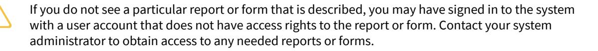

# **Payroll 2025 R1**

| Copyright5                                                        |  |
|-------------------------------------------------------------------|--|
| Overview of the Payroll Process 6                                 |  |
| Configuring Payroll7                                              |  |
| Payroll Basic Configuration: General Information 7                |  |
| Payroll Basic Configuration: Implementation Checklist10           |  |
| Payroll Basic Configuration: Implementation Activity11            |  |
| Setting Up Payment Methods 14                                     |  |
| Payment Methods: General Information 14                           |  |
| Payment Methods: Direct Deposits15                                |  |
| Payment Methods: To Set Up a Payment Method for Use in Payroll 16 |  |
| Payment Methods: To Define a Direct Deposit Payment Method 17     |  |
| Configuring Time Tracking 20                                      |  |
| Time Tracking: General Information20                              |  |
| Time Tracking: Implementation Activity 21                         |  |
| Creating Work Locations 22                                        |  |
| Work Locations: General Information 22                            |  |
| Work Locations: Configuration Prerequisites 22                    |  |
| Work Locations: Implementation Activity23                         |  |
| Setting Up Taxes25                                                |  |
| Taxes: General Information 25                                     |  |
| Taxes: Configuration Prerequisites 26                             |  |
| Taxes: Implementation Activity26                                  |  |
| Defining Earning Types 29                                         |  |
| Earning Types: General Information29                              |  |
| Earning Types: Configuration Prerequisites30                      |  |
| Earning Types: Implementation Activity 30                         |  |
| Creating Workers' Compensation Codes 34                           |  |
| Workers' Compensation Codes: General Information34                |  |
| Workers' Compensation Codes: Configuration Prerequisites35        |  |
| Workers' Compensation Codes: Implementation Activity 35           |  |
| Configuring Deductions and Benefits 37                            |  |
| Deduction and Benefit Codes: General Information 37               |  |
| Deduction and Benefit Codes: Configuration Prerequisites 40       |  |
| Deduction and Benefit Codes: Implementation Activity40            |  |

| Creating Unions45                                                             |  |
|-------------------------------------------------------------------------------|--|
| Unions: General Information45                                                 |  |
| Unions: Configuration Prerequisites45                                         |  |
| Unions: Implementation Activity 46                                            |  |
| Configuring Certified Projects48                                              |  |
| Certified Projects: General Information 48                                    |  |
| Certified Projects: Deductions and Benefits 50                                |  |
| Certified Projects: Fringe Benefits 50                                        |  |
| Configuring Overtime Rules52                                                  |  |
| Overtime Rules: General Information52                                         |  |
| Overtime Rules: Configuration Prerequisites54                                 |  |
| Overtime Rules: Implementation Activity 54                                    |  |
| Defining Pay Groups, Payroll Calendars, and Pay Periods 56                    |  |
| Pay Groups, Payroll Calendars, and Pay Periods: General Information56         |  |
| Pay Groups, Payroll Calendars, and Pay Periods: Configuration Prerequisites57 |  |
| Pay Groups, Payroll Calendars, and Pay Periods: Implementation Activity 58    |  |
| Configuring Government Reporting 61                                           |  |
| Government Reporting: General Information61                                   |  |
| Government Reporting: Affordable Care Act (ACA) Reporting 61                  |  |
| Government Reporting: Implementation Activity 62                              |  |
| Creating Employee Payroll Classes64                                           |  |
| Employee Payroll Classes: General Information64                               |  |
| Employee Payroll Classes: Configuration Prerequisites65                       |  |
| Employee Payroll Classes: Implementation Activity 66                          |  |
| Configuring Paid Time Off 68                                                  |  |
| Paid Time Off: General Information68                                          |  |
| Paid Time Off: Configuration Prerequisites71                                  |  |
| Paid Time Off: Implementation Activity 72                                     |  |
| Specifying Employee Payroll Settings 75                                       |  |
| Employee Payroll Settings: General Information75                              |  |
| Employee Payroll Settings: Configuration Prerequisites76                      |  |
| Employee Payroll Settings: Implementation Activity 77                         |  |
| Processing Payroll Batches81                                                  |  |
| Payroll Batches: General Information 81                                       |  |
| Calculating Paychecks84                                                       |  |
| Paychecks: General Information84                                              |  |

| Paychecks: Related Reports and Inquiry Forms 86       |  |
|-------------------------------------------------------|--|
| Processing Payments 87                                |  |
| Payroll Payments: General Information 87              |  |
| Payroll Payments: Related Reports and Inquiry Forms88 |  |
| Creating Liability Bills91                            |  |
| Liability Bills: General Information91                |  |
| Correcting Payroll Documents 92                       |  |
| Corrections: General Information 92                   |  |
| Corrections: Related Reports and Inquiry Forms 94     |  |
| Preparing Government Reports 96                       |  |
| Preparing Government Reports: General Information 96  |  |
| Preparing Government Reports: Records of Employment96 |  |
| Preparing Government Reports: Canadian Tax Forms 97   |  |
| Terminating Employment99                              |  |
| Employment Termination: General Information 99        |  |
| Appendix101                                           |  |
| Reports 101                                           |  |
| Report Form101                                        |  |
| Report106                                             |  |
| Form Toolbar and More Menu108                         |  |
| Table Toolbar 115                                     |  |
|                                                       |  |

# **Copyright**

#### **© 2025 Acumatica, Inc.**

#### **ALL RIGHTS RESERVED.**

No part of this document may be reproduced, copied, or transmitted without the express prior consent of Acumatica, Inc.

3075 112th Avenue NE, Suite 200, Bellevue, WA 98004, USA

#### **Restricted Rights**

The product is provided with restricted rights. Use, duplication, or disclosure by the United States Government is subject to restrictions as set forth in the applicable License and Services Agreement and in subparagraph (c)(1)(ii) of the Rights in Technical Data and Computer Soware clause at DFARS 252.227-7013 or subparagraphs (c)(1) and (c)(2) of the Commercial Computer Soware-Restricted Rights at 48 CFR 52.227-19, as applicable.

#### **Disclaimer**

Acumatica, Inc. makes no representations or warranties with respect to the contents or use of this document, and specifically disclaims any express or implied warranties of merchantability or fitness for any particular purpose. Further, Acumatica, Inc. reserves the right to revise this document and make changes in its content at any time, without obligation to notify any person or entity of such revisions or changes.

#### **Trademarks**

Acumatica is a registered trademark of Acumatica, Inc. HubSpot is a registered trademark of HubSpot, Inc. Microso Exchange and Microso Exchange Server are registered trademarks of Microso Corporation. All other product names and services herein are trademarks or service marks of their respective companies.

Soware Version: 2025 R1 Last Updated: 06/01/2025

# **Overview of the Payroll Process**

The payroll functionality of Acumatica ERP is used to set up, enter, and maintain employee payroll records and transactions.

You also can use the payroll forms to complete the following tasks:

- Set up employee payroll classes, which create default settings that can speed data entry of new employee records because the payroll information is grouped according to common factors, such as pay groups and work locations.
- Create batches for processing multiple employees at a time (a typical pay run process) or easily create onetime checks to handle special circumstances. Data from the Acumatica ERP time entry system could be automatically brought into payroll, along with sales commission data, if required.
- Use predefined inquiries and reports to view current and historical payroll information and pay activity for one employee or a selected group of employees.
- For direct deposits, automatically create the ACH file for the transfer of funds directly to employee bank accounts.
- Post General Ledger activity allocated in many possible ways.
- Automatically generate tax and deduction liability invoices to the accounts payable, and payment information to the cash management forms for bank reconciliation.

# **Configuring Payroll**

In this chapter, you can find information on setting up and maintaining the basic configuration of the payroll functionality.

# **Payroll Basic Configuration: General Information**

This topic provides a general overview of the configuration tasks that you have to perform before you can proceed with the initial configuration of the payroll functionality in Acumatica ERP. Also, this topic describes the recommended configuration steps for the payroll functionality.

#### **Learning Objectives**

In this chapter, you will do the following:

- Review the tasks that must be done for the initial configuration of an Acumatica ERP instance
- Enable the necessary feature
- Create numbering sequences for the payroll entities
- Specify payroll preferences

#### **Applicable Scenarios**

You configure the payroll functionality in the following cases:

- You initially implement Acumatica ERP and the *Payroll* feature is included to your license.
- You need to configure payroll in a previously configured fully functioning environment.

#### **Prerequisites**

To prepare the system for the implementation of payroll, you perform the following general steps:

1. You prepare an instance of Acumatica ERP for further implementation by enabling the default set of features, activating the product license, and configuring system-wide security policies. For details, see *[Preparing an Instance for Implementation](https://help-2025r1.acumatica.com/Help?ScreenId=ShowWiki&pageid=882fe280-df5b-4c25-a76c-7ecf2c7e826a)*.

Make sure that the license for Acumatica ERP includes the *Payroll* feature.

- 2. You complete the initial system configuration and implement the minimum general ledger before you implement payroll. The payroll functionality is tightly integrated with other Acumatica ERP functional areas, including general ledger, accounts payable, and organization structure. These areas do not require any change in their configuration when payroll is implemented; however, the functionality to be integrated with payroll should be implemented before payroll. For details, see *[Company](https://help-2025r1.acumatica.com/Help?ScreenId=ShowWiki&pageid=2942b1b3-fa19-449e-8c68-5ad3c0982d20) Without Branches*.
- 3. The following entities have to be defined in the system:
  - The numbering sequences to be used to numerate documents generated by payroll. We recommend that you use specific naming conventions for numbering sequences to differentiate payroll documents from other documents generated in the system. For details about numbering sequences, see *[Use of Numbering](https://help-2025r1.acumatica.com/Help?ScreenId=ShowWiki&pageid=71c26175-c78f-4e70-8518-2115f5bfaf2f) [Sequences](https://help-2025r1.acumatica.com/Help?ScreenId=ShowWiki&pageid=71c26175-c78f-4e70-8518-2115f5bfaf2f)*.
  - The expense and liability accounts and subaccounts to be used by default for recording the following:
    - *Earnings*: An expense account that will be used to record earnings.

- *Deductions*: A liability account that will be used to record deductions from employee paychecks.
- *Benefits*: An expense account that will be used to record benefits to employee paychecks and a liability account to off-set the benefit expense account.
- *Taxes*: An expense account that will be used to record taxes and a liability account to off-set the tax expense account.

You review the existing chart of accounts and add missing accounts (if needed) by using the *[Chart of](https://help-2025r1.acumatica.com/Help?ScreenId=ShowWiki&pageid=85557f41-a4af-47a8-b198-2a01461ce9c3) [Accounts](https://help-2025r1.acumatica.com/Help?ScreenId=ShowWiki&pageid=85557f41-a4af-47a8-b198-2a01461ce9c3)* (GL202500) form.

- Vendors to be used with payroll, such as tax agencies, benefit providers, and unions. For details about vendor configuration, see *Vendors: General [Information](https://help-2025r1.acumatica.com/Help?ScreenId=ShowWiki&pageid=34b5a8f9-85fa-4a79-b68a-ae02e611b76f)* and *Tax Agency: General [Information](https://help-2025r1.acumatica.com/Help?ScreenId=ShowWiki&pageid=0f36ec83-2b1a-41cc-9c87-7d6b59e4b51f)*.
- The departments and positions that are used in your organization. You can configure the organizational structure by using the *[Departments](https://help-2025r1.acumatica.com/Help?ScreenId=ShowWiki&pageid=46937a79-d374-4d5e-9438-3567b19dfa2a)* (EP201500) and *[Positions](https://help-2025r1.acumatica.com/Help?ScreenId=ShowWiki&pageid=5cd7ab06-48f2-4418-b66b-3372d7f06e95)* (EP201000) forms.
- The work calendar that reflects the work days, work times for each day, and unpaid break time of the employees that are involved in payroll. You define this calendar by using the *[Work Calendar](https://help-2025r1.acumatica.com/Help?ScreenId=ShowWiki&pageid=9d01d650-0b68-4994-8146-c80fb5e34bbb)* (CS209000) form.
- The employees to be defined as payroll employees. You maintain the list of employees employed in your organization by using the *[Employees](https://help-2025r1.acumatica.com/Help?ScreenId=ShowWiki&pageid=dae5144b-49b3-43a4-bce0-93f31b3f2321)* (EP203000) form.

Aer all prerequisites have been met and the necessary entities have been created, you can start implementing the payroll functionality in the system.

#### **Workflow of the Payroll Implementation**

To implement the payroll functionality, you perform the following general steps:

- 1. On the *[Enable/Disable Features](https://help-2025r1.acumatica.com/Help?ScreenId=ShowWiki&pageid=c1555e43-1bc5-4f6f-ba9d-b323f94d8a6b)* (CS100000) form, you enable the *Payroll* feature and the *US Payroll* or *Canadian Payroll* subfeature.
- 2. On the *[Payroll Preferences](https://help-2025r1.acumatica.com/Help?ScreenId=ShowWiki&pageid=277980e8-5f40-42c6-afe8-8260f5327081)* (PR101000) form, you specify the general settings of payroll, such as the numbering sequences, the posting and account settings, and the exceptions for transaction dates. Aer you have performed this basic configuration, you can start setting up payroll entities and using the payroll functionality. For an example of basic configuration, see *[Payroll Basic Configuration: Implementation Activity](#page-10-1)*.
- 3. On the *[Payment Methods](https://help-2025r1.acumatica.com/Help?ScreenId=ShowWiki&pageid=509285d1-cfae-4e87-95c3-a968451952e6)* (CA204000) form, you make sure that the payment methods to be used to generate paychecks for an employee are defined and set up for the use in payroll; also, a cash account that can be used in payroll must be specified for each payment method. If your employees receive direct deposits, you need to configure a direct deposit payment method as well. For details, see *Payment [Methods:](#page-15-1) To Set Up a [Payment Method for Use in Payroll](#page-15-1)*
- 4. If time tracking in payroll is planned, you perform a basic configuration of the time reporting functionality. For an example, see *Time Tracking: [Implementation](#page-20-1) Activity*.
- 5. If the organization's employees work different shis, you set up shi differentials in the system. For details, see *[Shift Codes: Implementation Activity](https://help-2025r1.acumatica.com/Help?ScreenId=ShowWiki&pageid=15fdbe06-a590-485e-9724-4ba44bef6804)*.
- 6. On the *[Work Locations](https://help-2025r1.acumatica.com/Help?ScreenId=ShowWiki&pageid=769f6d97-175f-47d6-b835-2f92ffa5f540)* (PR101040) form, for each location where work is to be performed, you enter all the address information through the postal code. For an example, see *[Work Locations: Implementation Activity](#page-22-1)*.
- 7. On the *Tax [Maintenance](https://help-2025r1.acumatica.com/Help?ScreenId=ShowWiki&pageid=16df97b6-3181-42b3-843b-9341f7a9486d)* (PR208000) form, you download the latest tax information from the Tax Symmetry engine so that the system will create tax codes related to all employee addresses and work locations stored in the system. On the**Tax Codes** tab of the form, for each tax, you specify a vendor (tax agency), default attribute settings, and general ledger accounts. On the **CompanyTax** tab, you specify the settings linked to the taxes at the company level. For details, see *Taxes: [Implementation](#page-25-2) Activity*.
- 8. On the *[Earning](https://help-2025r1.acumatica.com/Help?ScreenId=ShowWiki&pageid=646df4ae-b74f-4e6a-bc55-7b5676cefb70) Type Codes* (PR102000) form, you set up earning types. For the predefined earning types, you need to make sure that the settings are specified in the way that suits your organization's needs. Also, if you want a particular earning type to be always assigned to a specific project, you can set it up on this form. For details, see *Earning Types: [Implementation](#page-29-2) Activity*.
- 9. On the *[Payroll Preferences](https://help-2025r1.acumatica.com/Help?ScreenId=ShowWiki&pageid=277980e8-5f40-42c6-afe8-8260f5327081)* (PR101000) form, you specify earning type preferences. On the **General** tab, in the **MiscellaneousSettings** section, you need to define the earning codes used for the creation of payroll

batches when the quick pay process is used. For more information, see *Earning Types: [Implementation](#page-29-2) [Activity](#page-29-2)*.

- 10.On the *[Workers' Compensation Codes](https://help-2025r1.acumatica.com/Help?ScreenId=ShowWiki&pageid=4d0c0ad0-ec8a-4442-8c2b-6dcff0a5035d)* (PR209800) form, you create workers' compensation codes. For details, see *[Workers' Compensation Codes: Implementation Activity](#page-34-2)*.
- 11.On the *[Deduction and Benefit Codes](https://help-2025r1.acumatica.com/Help?ScreenId=ShowWiki&pageid=bf644703-ee05-4ecb-a4cf-7a039180dbd3)* (PR101060) form, you set up deduction and benefit codes. You can set up each deduction and benefit code to be only a deduction, only a benefit, or both a deduction and a benefit. Also, you can specify if it is subject to all taxes, no taxes, or specific taxes, in which case you need to add the taxes that it is subject to. For health care related benefits, you will be able to set up the information related to the ACA reporting to populate the information on the **ACA Reporting** tab. If you want to associate deduction and benefit codes with workers' compensation codes, you should create one deduction and benefit code for each state. For an example, see *[Deduction and Benefit Codes: Implementation Activity](#page-39-2)*.
- 12.On the *[Union Locals](https://help-2025r1.acumatica.com/Help?ScreenId=ShowWiki&pageid=10ead27b-20e0-45eb-af5b-73481c8ecde2)* (PR209700) form, you configure the unions the employees are part of. Different earning rates can be applied to different ranks inside a union and the specific benefits and deductions can be specified on this form to be added to paychecks. For details, see *[Unions: Implementation Activity](#page-45-1)*.
- 13.If you use Acumatica ERP Construction Edition, on the *[Certified Projects](https://help-2025r1.acumatica.com/Help?ScreenId=ShowWiki&pageid=801f9df3-c1d8-489f-81da-f8edc89be008)* (PR209900) form, you can set up the payroll-related information for government-linked projects. Different earning rates can be applied to different types of labor, specific benefits and deductions can be added, and a fringe benefit rate can be specified on this form to be used in the paycheck calculation.
- 14.On the *[Overtime Rules](https://help-2025r1.acumatica.com/Help?ScreenId=ShowWiki&pageid=4b7c63d6-6412-425e-83e5-61db35cfbda2)* (PR104000) form, you set up overtime rules. To use this functionality, you need to have earning types with the *Overtime* option selected in the **EarningType Category** box on the *[Earning](https://help-2025r1.acumatica.com/Help?ScreenId=ShowWiki&pageid=646df4ae-b74f-4e6a-bc55-7b5676cefb70) Type [Codes](https://help-2025r1.acumatica.com/Help?ScreenId=ShowWiki&pageid=646df4ae-b74f-4e6a-bc55-7b5676cefb70)* (PR102000) form. For such earning types, you can configure a list of overtime rules to be applied to the paycheck calculation for salaried non-exempt employees. For details, see *[Overtime Rules:](#page-53-2) [Implementation Activity](#page-53-2)*.
- 15.On the *[Pay Groups](https://help-2025r1.acumatica.com/Help?ScreenId=ShowWiki&pageid=5fd92075-9a1a-4336-b852-e5f423fd698f)* (PR205000) form, you set up pay groups to group employees that get paid in the same frequency. For details, see *[Pay Groups, Payroll Calendars, and Pay Periods: Implementation Activity](#page-57-1)*.
- 16.On the *[Payroll Calendar](https://help-2025r1.acumatica.com/Help?ScreenId=ShowWiki&pageid=2bec17ec-be26-41bb-bc3e-396108fc0911)* (PR206000) form, you define pay period frequency and pay dates for each pay group. For an example, see *[Pay Groups, Payroll Calendars, and Pay Periods: Implementation Activity](#page-57-1)*.
- 17.On the *[Pay Periods](https://help-2025r1.acumatica.com/Help?ScreenId=ShowWiki&pageid=ac2d4a78-5c15-4b1e-a9d6-e5ed1817aa0b)* (PR201000) form, you generate pay periods for each pay group that has a calendar configured. For details, see *[Pay Groups, Payroll Calendars, and Pay Periods: Implementation Activity](#page-57-1)*.
- 18.On the *[Companies](https://help-2025r1.acumatica.com/Help?ScreenId=ShowWiki&pageid=fedad435-8496-4397-b8a3-50a473629f76)* (CS101500) or *[Branches](https://help-2025r1.acumatica.com/Help?ScreenId=ShowWiki&pageid=b97ab72d-4ab4-4f02-b69c-f7f61b316ced)* (CS102000) form, you specify the employer identification number; you then use this number to enroll for Aatrix to enable government reporting. For details, see *[Government Reporting: Implementation Activity](#page-61-1)*.
- 19.On the *[Employee Payroll Class](https://help-2025r1.acumatica.com/Help?ScreenId=ShowWiki&pageid=8b8a02ff-644c-4e8e-b09b-af8f4701b3e5)* (PR202000) form, you set up payroll classes. By using employee classes, you can specify certain information as the default settings for employees, including the employee type, pay group, location, and union. This information can be overridden at the employee level later. Every change made at this level will propagate to the employee level if the **Use Class DefaultValue** check box is selected for the employee on the *[Employee Payroll Settings](https://help-2025r1.acumatica.com/Help?ScreenId=ShowWiki&pageid=701375c5-795d-417f-939c-12fc8d1e2007)* (PR203000) form. For an example, see *[Employee Payroll](#page-65-1) [Classes: Implementation Activity](#page-65-1)*.
- 20.On the *PTO [Banks](https://help-2025r1.acumatica.com/Help?ScreenId=ShowWiki&pageid=2f2fc04f-efe3-42f0-b00d-732b537366f9)* (PR204000) form, you define various PTO banks (accrual plans) to be used by your employees and tiered PTO rules so that employees may accrue or be eligible for different amounts of paid time off based on years of service. On the **Employee Classes** tab, you specify common PTO bank settings for employee classes; this information can be overridden at the employee level later. For an example, see *[Paid](#page-71-1) Time Off: [Implementation](#page-71-1) Activity*.
- 21.On the *[Employee Payroll Settings](https://help-2025r1.acumatica.com/Help?ScreenId=ShowWiki&pageid=701375c5-795d-417f-939c-12fc8d1e2007)* (PR203000) form, you need to create employee payroll records. A new payroll record can be created only for an employee that was created on the *[Employees](https://help-2025r1.acumatica.com/Help?ScreenId=ShowWiki&pageid=dae5144b-49b3-43a4-bce0-93f31b3f2321)* (EP203000) form and that is not yet a payroll employee. For more information, see *[Employee Payroll Settings: Implementation](#page-76-1) [Activity](#page-76-1)*
- 22.On the *Tax [Maintenance](https://help-2025r1.acumatica.com/Help?ScreenId=ShowWiki&pageid=16df97b6-3181-42b3-843b-9341f7a9486d)* (PR208000) form, update the taxes to include those related to the home addresses of the recently configured payroll employees. For details, see *[Employee Payroll Settings: Implementation](#page-76-1) [Activity](#page-76-1)*.

# **Payroll Basic Configuration: Implementation Checklist**

The following sections provide details you can use to ensure that the system is configured properly for processing payroll documents, and to understand (and change, if needed) the settings that affect the processing workflow.

#### **Prerequisites**

We recommend that before you start performing the minimum configuration of payroll, you make sure the needed features have been enabled, settings have been specified, and entities have been created, as summarized in the following checklist.

| Form                               | Criteria to Check                                                                                                                                                                                                                                                    |
|------------------------------------|----------------------------------------------------------------------------------------------------------------------------------------------------------------------------------------------------------------------------------------------------------------------|
| Multiple forms                     | Minimum company settings have been specified and the minimal required functionality has been imple mented for all other functional areas to be integrated with the payroll functionality, as described in Company Without Branches: General Information. |
| Work Calendar (CS209000)           | The work calendar that reflects the work days, work times for each day, and unpaid break time of the em ployees that are involved in payroll has been defined.                                                                                                 |
| Numbering Sequences (CS201010)     | The numbering sequences have been created for pay roll batches and transactions.                                                                                                                                                                                  |
| Departments (EP201500)             | The departments that are used in your organization have been created.                                                                                                                                                                                             |
| Positions (EP201000)               | The positions taken by the employees in your organi zation have been defined.                                                                                                                                                                                     |
| Employees (EP203000)               | The employees involved in payroll processes have been defined in the system.                                                                                                                                                                                      |
| Payment Methods (CA204000)         | Payment methods and a cash account for each pay ment method to be used to generate paychecks for an employee have been defined.                                                                                                                                |
| Vendors (AP303000)                 | Vendors to be used with payroll, such as tax agencies, benefit providers, and unions, have been created.                                                                                                                                                          |
| Enable/Disable Features (CS100000) | The Payroll feature has been enabled, which adds the forms and UI elements related to the payroll function ality.                                                                                                                                              |

#### **Minimum Required Settings**

To make it possible for users to process payroll documents, you should navigate to the forms listed below and perform the tasks described in the table.

| Form                           | Criteria to Check                                                                |
|--------------------------------|----------------------------------------------------------------------------------|
| Payroll Preferences (PR101000) | The numbering sequences have been specified and the settings have been saved. |

# **Payroll Basic Configuration: Implementation Activity**

In the following implementation activity, you will learn how to prepare the system to support the processing of payroll documents.

The following activity is based on the *U100 Payroll* snapshot. If you are using another dataset, or if any system settings have been changed in *U100 Payroll*, these changes can affect the workflow of the activity and the results of the processing. To avoid any issues, restore the *U100 Payroll* snapshot to its initial state.

#### **Story**

Suppose that you, as an implementation manager, need to specify the minimum settings that are required to start using the payroll functionality in the system.

#### **Process Overview**

In this activity, to prepare the system for the implementation of the payroll functionality, you will do the following:

- 1. On the *[Numbering Sequences](https://help-2025r1.acumatica.com/Help?ScreenId=ShowWiki&pageid=a8d11c23-21f2-42a3-b17d-9637c9cf8031)* (CS201010) form, you will create numbering sequences for payroll entities because the system offers no predefined numbering sequences to be used by default.
- 2. On the *[Payroll Preferences](https://help-2025r1.acumatica.com/Help?ScreenId=ShowWiki&pageid=277980e8-5f40-42c6-afe8-8260f5327081)* (PR101000) form, you will specify the numbering sequences and save the settings.

#### **System Preparation**

Before you start performing the initial configuration of the payroll functionality, you should launch the Acumatica ERP website and sign in as a system administrator by using the following credentials:

- Username: *gibbs*
- Password: *123*

#### **Step 1: Enabling the Payroll Feature**

On the *[Enable/Disable Features](https://help-2025r1.acumatica.com/Help?ScreenId=ShowWiki&pageid=c1555e43-1bc5-4f6f-ba9d-b323f94d8a6b)* (CS100000) form, enable the *Payroll* feature and the *US Payroll* subfeature.

#### **Step 2: Creating Numbering Sequences**

To create numbering sequences for payroll batches, transactions, and PTO adjustments, do the following:

- 1. On the form toolbar of the *[Numbering Sequences](https://help-2025r1.acumatica.com/Help?ScreenId=ShowWiki&pageid=a8d11c23-21f2-42a3-b17d-9637c9cf8031)* (CS201010) form, click **Add New Record**.
- 2. In the Summary area of the form, specify the following settings:
  - a. **Numbering ID**: BATCHPR
  - b. **Description**: PR Batch

- c. **New NumberSymbol**: <NEW>
- 3. In the table, add a row with the following settings:
  - a. **Start Number**: PR000000
  - b. **End Number**: PR999999

The system prefills the rest of the settings, which you can leave as-is.

- 4. On the form toolbar, click**Save** and then click **Add New Record**.
- 5. In the Summary area of the form, specify the following settings:
  - a. **Numbering ID**: PRTRANSAC
  - b. **Description**: PR Transactions
  - c. **New NumberSymbol**: <NEW>
- 6. In the table, add a row with the following settings:
  - a. **Start Number**: 000000
  - b. **End Number**: 999999
- 7. On the form toolbar, click**Save** and then click **Add New Record**.
- 8. In the Summary area of the form, specify the following settings:
  - a. **Numbering ID**: PRBATCH
  - b. **Description**: Payroll Batch Numbering
  - c. **New NumberSymbol**: <NEW>
- 9. In the table, add a row with the following settings:
  - a. **Start Number**: 000000
  - b. **End Number**: 999999
- 10.On the form toolbar, click**Save** and then click **Add New Record**.
- 11.In the Summary area of the form, specify the following settings:
  - a. **Numbering ID**: PRPTOADJ
  - b. **Description**: Payroll PTO Adjustments
  - c. **New NumberSymbol**: <NEW>

12.In the table, add a row with the following settings:

- a. **Start Number**: PRP0000000
- b. **End Number**: PRP9999999

13.On the form toolbar, click**Save**.

#### **Step 3: Specifying the Payroll Preferences**

To specify the numbering sequences and other payroll preferences that are required for using the payroll functionality, do the following:

- 1. On the **General** tab of the *[Payroll Preferences](https://help-2025r1.acumatica.com/Help?ScreenId=ShowWiki&pageid=277980e8-5f40-42c6-afe8-8260f5327081)* (PR101000) form, in the **NumberingSettings** section, specify the following settings:
  - **Batch NumberingSequence**: *BATCHPR*
  - **Transaction NumberingSequence**: *PRTRANSAC*
  - **Payroll Batch NumberingSequence**: *PRBATCH*
  - **PTO Adjustment NumberingSequence**: *PRPTOADJ*

- 2. On the **General** tab, in the **PostingSettings** section, specify the following information:
  - **Project Cost Assignment**: *No Cost Assigned*
  - **Time Posting Option**: *Do Not Post PM Transactions*
  - **Update GL**: Selected
  - **Automatically Post on Release**: Selected
- 3. On the form toolbar, click**Save**.

You have configured the basic payroll functionality. Now you can proceed with setting up payment methods for the use in payroll.

# **Setting Up Payment Methods**

In this chapter, you will learn how you can set up payment methods for use in payroll. Also, you will learn how to define a direct deposit payment method.

# **Payment Methods: General Information**

Acumatica ERP has predefined payment methods that you can adjust to the business needs of an organization, or you can define new payment methods. The settings of the payment methods describe how the particular payment is done and provide the default cash account to be used to record payments.

A payroll employee may receive either a printed paycheck or a direct deposit. The payment methods used for the generation of employee paychecks and the cash accounts for each of those payment methods must be set up for use in payroll.

#### **Learning Objectives**

In this chapter, you will learn how to do the following:

- Set up predefined payment methods and cash accounts for use in payroll
- Define a direct deposit payment method

#### **Applicable Scenarios**

You set up the payment methods and related cash accounts to be used in payroll so that you can generate paychecks and your employees can receive their payments.

#### **Payment Method Setup**

You use the *[Payment Methods](https://help-2025r1.acumatica.com/Help?ScreenId=ShowWiki&pageid=509285d1-cfae-4e87-95c3-a968451952e6)* (CA204000) form to make a payment method available for use in payroll. On this form, you need to select the necessary payment method and perform the following steps:

- In the Summary area, select the **Use in PR** check box.
- On the **Allowed Cash Accounts** tab, select the **Use in PR** check box for the cash accounts that you want to mark as available for use in payroll.
- On the same tab, make sure that the **AP/PR Default** check box is selected for the cash account that will be used as default for this payment method when it is used in payroll.

For the payment method that is marked for use in payroll, the**Settings for Use in PR** tab appears on the *[Payment](https://help-2025r1.acumatica.com/Help?ScreenId=ShowWiki&pageid=509285d1-cfae-4e87-95c3-a968451952e6) [Methods](https://help-2025r1.acumatica.com/Help?ScreenId=ShowWiki&pageid=509285d1-cfae-4e87-95c3-a968451952e6)* form. On this tab, you can specify the following settings:

- If the payment method involves printed paychecks, you select the **Print Checks** option box in the **Processing** section and selects a report to be used for printing paychecks in the **Report** box (the **Print Settings** section) by doing one of the following:
  - Selecting the *Paychecks (PR641010)* in the **Report** box.
  - Selecting the **Use Detailed PayStub Report** check box (the **ReportSettings** section), The system automatically selects the *Detailed Paychecks (PR642000)* report in the **Report** box.

When you clear the **Use Detailed PayStub Report** check box, the system selects the *Paychecks* report in the **Report** box.

- If the payment method involves direct deposit payments, you select the **Create Batch Payments** option box in the **Processing** section and do one of the following:
  - If the *US Payroll* feature is enabled on the *[Enable/Disable Features](https://help-2025r1.acumatica.com/Help?ScreenId=ShowWiki&pageid=c1555e43-1bc5-4f6f-ba9d-b323f94d8a6b)* (CS100000) form, you select *Export PR Payment to ACH* or *Export PR Payment to ACH Balanced* (depending on whether your bank requires that your ACH files include balance lines) in the **ExportScenario** box.
  - If the *Canadian Payroll* feature is enabled on the *[Enable/Disable Features](https://help-2025r1.acumatica.com/Help?ScreenId=ShowWiki&pageid=c1555e43-1bc5-4f6f-ba9d-b323f94d8a6b)* form, you select *Export PR Payments to EFT* in the **ExportScenario** box.

# **Payment Methods: Direct Deposits**

Direct deposit payments involve the direct transfer of funds from the company payroll account to the personal savings or checking accounts of its employees.

To be able to use direct deposit payments in Acumatica ERP, you need to define a direct deposit payment method first. You do this by using the *[Payment Methods](https://help-2025r1.acumatica.com/Help?ScreenId=ShowWiki&pageid=509285d1-cfae-4e87-95c3-a968451952e6)* (CA204000) form as follows:

1. In the Summary area, you specify the identifier, the means of payment (*Credit Card*, *Cash/Check*, or *Direct Deposit*), and the description of the payment method.

The selected means of payment will not have any effect on how the system will process direct deposit payments; you use this setting only for the informational purpose.

- 2. In the Summary area, you select the **Use in PR** check box because you want to use direct deposits in payroll, and then you select the **Require Remittance Information for Cash Account** check box because remittance information is used for ACH payments.
- 3. On the **Allowed Cash Accounts** tab, you add rows for each of the cash accounts to be linked to this payment method, and you select the **Use in PR** check box for each cash account.
- 4. On the **Settings for Use in PR** tab, you select the **Create Batch Payments** check box, and then you do one of the following:
  - If the *US Payroll* feature is enabled on the *[Enable/Disable Features](https://help-2025r1.acumatica.com/Help?ScreenId=ShowWiki&pageid=c1555e43-1bc5-4f6f-ba9d-b323f94d8a6b)* (CS100000) form, you select *Export PR Payment to ACH* or *Export PR Payment to ACH Balanced* (depending on whether your bank requires that your ACH files include balance lines) in the **ExportScenario** box.
  - If the *Canadian Payroll* feature is enabled on the *[Enable/Disable Features](https://help-2025r1.acumatica.com/Help?ScreenId=ShowWiki&pageid=c1555e43-1bc5-4f6f-ba9d-b323f94d8a6b)* form, you select *Export PR Payments to EFT* in the **ExportScenario** box.
- 5. On the **RemittanceSettings** tab, add remittance information, as described in *To Add a [Payment](https://help-2025r1.acumatica.com/Help?ScreenId=ShowWiki&pageid=03b95332-5391-44cb-bf7b-af3d867e1f09) Method for [ACH Payments \(Export Scenarios\)](https://help-2025r1.acumatica.com/Help?ScreenId=ShowWiki&pageid=03b95332-5391-44cb-bf7b-af3d867e1f09)*. This information will appear on the **RemittanceSettings** tab of the *[Cash](https://help-2025r1.acumatica.com/Help?ScreenId=ShowWiki&pageid=10f71454-88f9-4d6c-8d09-32856d8c6741) [Accounts](https://help-2025r1.acumatica.com/Help?ScreenId=ShowWiki&pageid=10f71454-88f9-4d6c-8d09-32856d8c6741)* (CA202000) form so you can enter the company's ACH credentials for the relevant cash account.

For the configuration of remittance settings for Canadian payroll, see *[Settings of the EFT Export Scenario for](https://help-2025r1.acumatica.com/Help?ScreenId=ShowWiki&pageid=5a78a4d5-7893-4b25-821a-3ba8b779d3cb) [Canadian Payroll](https://help-2025r1.acumatica.com/Help?ScreenId=ShowWiki&pageid=5a78a4d5-7893-4b25-821a-3ba8b779d3cb)*.

6. In the Summary area, you make sure that the **Active** check box is selected so that the payment method can be used.

An employee will receive direct deposit payments if you specify proper settings on the **Payment** tab of the *[Employee Payroll Settings](https://help-2025r1.acumatica.com/Help?ScreenId=ShowWiki&pageid=701375c5-795d-417f-939c-12fc8d1e2007)* (PR203000) form, such as the following:

- 1. In the Selection area, specify the direct deposit payment method that you previously created and a cash account.
- 2. In the **Direct Deposit** table, you specify each bank account that receives direct deposit amounts for the employee. In each line, you specify the following settings:
  - The employee's bank account number to receive the direct deposit
  - The type of the account, which can be either *Checking* or *Savings*

- The employee's bank name and bank routing number for the account
- The amount or percentage of the net paycheck to be directly deposited to the account
- The order in which the payment is to be processed, which is important if fixed amounts are specified for multiple bank accounts for the employee and the net pay is not sufficient to cover all amounts
- An indication of whether the account is to receive any remainder amount, based on rounding or insufficient or variable amounts. You must mark at least one active account in the table as receiving the remainder amounts.

For each line with an account, there will be a line in the employee's pay stub, direct deposit notification, and ACH file.

If no active direct deposit details are specified in the **Direct Deposit** table, the employee should receive a printed paycheck; an employee receives either a printed paycheck or a direct deposit, but not both.

For an example of the employee payment setup, see *[Employee Payroll Settings: Implementation Activity](#page-76-1)*.

### **Payment Methods: To Set Up a Payment Method for Use in Payroll**

In the following implementation activity, you will learn how to set up a predefined payment method for use in payroll.

#### **Story**

Suppose that some of the organization's employees should receive printed checks as their payments. Acting as the system administrator, you need to set up the *CHECK* payment method, which is a predefined method, for use in payroll.

#### **Configuration Overview**

In the *U100 Payroll* snapshot, for the purposes of this activity, the *10200WH* cash account has been created on the *[Cash Accounts](https://help-2025r1.acumatica.com/Help?ScreenId=ShowWiki&pageid=10f71454-88f9-4d6c-8d09-32856d8c6741)* (CA202000) form.

#### **Process Overview**

In this activity, to set up a predefined payment method for use in payroll, you will do the following:

- 1. On the *[Payment Methods](https://help-2025r1.acumatica.com/Help?ScreenId=ShowWiki&pageid=509285d1-cfae-4e87-95c3-a968451952e6)* (CA204000) form, you will configure a payment method for use in the payroll functional area.
- 2. On the *[Cash Accounts](https://help-2025r1.acumatica.com/Help?ScreenId=ShowWiki&pageid=10f71454-88f9-4d6c-8d09-32856d8c6741)* (CA202000) form, you will enable a cash account for use in the payroll functional area.

#### **System Preparation**

Before you start setting up the payment method, you should launch the Acumatica ERP website and sign in as a system administrator by using the following credentials:

- Username: *gibbs*
- Password: *123*

As a prerequisite activity, in the company to which you are signed in, be sure you have prepared the system for the implementation of the payroll functionality, as described in *[Payroll Basic Configuration: Implementation Activity](#page-10-1)*.

#### **Step 1: Configuring a Payment Method for Use in Payroll**

To enable a payment method for use in the payroll functional area, do the following:

- 1. On the *[Payment Methods](https://help-2025r1.acumatica.com/Help?ScreenId=ShowWiki&pageid=509285d1-cfae-4e87-95c3-a968451952e6)* (CA204000) form, open the *CHECK* payment method.
- 2. In the Summary area, select the **Use in PR** check box. Leave the **Use in AP** and **Use in AR** check boxes selected.
- 3. On the **Settings for Use in PR** tab, do the following:
  - a. Make sure that the **Print Checks** option button is selected in the **Processing** section.
  - b. In the **Report** box, select the *Paychecks (PR641010)* report.
- 4. On the form toolbar, click**Save**.

#### **Step 2: Enabling a Cash Account for Use in Payroll**

To enable a cash account for use in the payroll functional area, do the following:

- 1. On the *[Cash Accounts](https://help-2025r1.acumatica.com/Help?ScreenId=ShowWiki&pageid=10f71454-88f9-4d6c-8d09-32856d8c6741)* (CA202000) form, open the *10200WH* cash account.
- 2. On the **Payment Methods** tab , for the *CHECK* payment method, select the **Use in PR** check box.
- 3. On the form toolbar, click**Save**.

# **Payment Methods: To Define a Direct Deposit Payment Method**

In the following implementation activity, you will learn how to define a direct deposit payment method.

#### **Story**

Suppose that some of the organization's employees should receive direct deposits. Acting as the system administrator, you need to define a new payment method that will be used in payroll for direct deposit payments.

#### **Configuration Overview**

In the *U100 Payroll* snapshot, for the purposes of this activity, the *10200WH* cash account has been created on the *[Cash Accounts](https://help-2025r1.acumatica.com/Help?ScreenId=ShowWiki&pageid=10f71454-88f9-4d6c-8d09-32856d8c6741)* (CA202000) form.

#### **Process Overview**

You define a new payment method on the *[Payment Methods](https://help-2025r1.acumatica.com/Help?ScreenId=ShowWiki&pageid=509285d1-cfae-4e87-95c3-a968451952e6)* (CA204000) form.

#### **System Preparation**

Before you start defining a new payment method, you should launch the Acumatica ERP website and sign in as a system administrator by using the following credentials:

- Username: *gibbs*
- Password: *123*

As a prerequisite activity, in the company to which you are signed in, be sure you have completed the *[Payment](#page-15-1) [Methods:](#page-15-1) To Set Up a Payment Method for Use in Payroll*.

As a prerequisite activity, in the company to which you are signed in, be sure you have performed the activities in the preceding lessons of this part of the course.

#### **Step 1: Defining a Direct Deposit Payment Method**

To define a direct deposit payment method, do the following:

- 1. On the *[Payment Methods](https://help-2025r1.acumatica.com/Help?ScreenId=ShowWiki&pageid=509285d1-cfae-4e87-95c3-a968451952e6)* (CA204000) form, click **New Record** on the form toolbar.
- 2. In the Summary area, specify the following information:
  - **Payment Method ID**: DIRDEPOSIT
  - **Active**: Selected
  - **Means of Payment**: *Direct Deposit*
  - **Description**: Direct deposits
  - **Use in AP**: Cleared
  - **Use in AR**: Cleared
  - **Use in PR**: Selected
  - **Require Remittance Information for Cash Account**: Selected
- 3. On the **Allowed Cash Accounts** tab, add a row and specify the following settings in the added row:
  - **Cash Account**: *10200WH*
  - **Use in PR**: Selected
  - **AP/PR Default**: Selected
- 4. On the **Settings for Use in PR** tab, specify the following settings:
  - a. **Create Batch Payments**: Selected
  - b. **ExportScenario**: *Export PR Payment to ACH*
- 5. On the **RemittanceSettings** tab, insert rows with the information from the following table.

The regular expressions in the**Validation Reg. Exp.** column must contain no spaces.

| ID | Description                   | Required | Entry Mask | Validation Reg. Exp. |
|----|-------------------------------|----------|------------|-------------------------|
| 1  | Beneficiary Account No:    | Selected |            | ^\d{1,17}\$             |
| 2  | Beneficiary Name:          | Selected |            | ^([\w] \s) {0,22}\$  |
| 3  | Bank Routing Number (ABA): | Selected | 000000000  | ^\d{9,9}\$              |
| 4  | Bank Name:                    | Selected |            | ^([\w] \s) {0,22}\$  |
| 5  | Company ID                    | Selected |            | ^([\w] \s) {0,9}\$   |
| 6  | Company ID Type            | Selected | 0          | ^\d{1,1}\$              |

6. On the form toolbar, click**Save**.

#### **Step 2: Updating Remittance Settings of the Cash Account**

To enable a cash account for use in the payroll functional area, do the following:

- 1. On the *[Cash Accounts](https://help-2025r1.acumatica.com/Help?ScreenId=ShowWiki&pageid=10f71454-88f9-4d6c-8d09-32856d8c6741)* (CA202000) form, open the *10200WH* cash account.
- 2. On the **RemittanceSettings** tab, for the *DIRDEPOSIT* payment method, specify the following information in the **Remittance Details** table:
  - *Beneficiary Account No*: 1234567890
  - *Beneficiary Name*: SweetLife
  - *Bank Routing Number (ABA)*: 026009593
  - *Bank Name*: Bank of America
  - *Company ID*: SweetLife
  - *Company ID Type*: 1
- 3. On the form toolbar, click**Save**.

# **Configuring Time Tracking**

This chapter contains information about how you can configure time tracking to be used in payroll.

# **Time Tracking: General Information**

In Acumatica ERP, you can configure time tracking so that employees can report the time spent on various tasks and activities. Also, employee time may be imported from an external time tracking system through an import scenario. All that time tracking information can be brought to payroll and used for the calculation of employee paychecks.

#### **Learning Objectives**

In this chapter, you will learn how to configure time tracking in the system. In particular, you will do the following:

- Prepare the system for the configuration of time tracking
- Enable the needed system features
- Specify the minimum required configuration so that time activities and time cards can be used to track employee time

#### **Applicable Scenarios**

You configure time tracking if your organization is going to track the time that employees spend on work activities.

#### **Ways of Entering Employee Time**

If the *Time Management* feature is enabled on the *[Enable/Disable Features](https://help-2025r1.acumatica.com/Help?ScreenId=ShowWiki&pageid=c1555e43-1bc5-4f6f-ba9d-b323f94d8a6b)* (CS100000) form, employee time can be reported in Acumatica ERP through the following entities, depending on the configuration of your system:

- Employee time cards on the *[Employee](https://help-2025r1.acumatica.com/Help?ScreenId=ShowWiki&pageid=4493e479-b1e6-4f6a-ba98-360bb92692f0) Time Cards* (EP305000) form, which is available only if the *Advanced Financials* feature is enabled on the *[Enable/Disable Features](https://help-2025r1.acumatica.com/Help?ScreenId=ShowWiki&pageid=c1555e43-1bc5-4f6f-ba9d-b323f94d8a6b)* form
- Employee time activities on the *[Employee](https://help-2025r1.acumatica.com/Help?ScreenId=ShowWiki&pageid=c17a7186-e898-4e5e-b565-27730950ca51) Time Activities* (EP307000) form
- Weekly crew time entries on the *[Weekly](https://help-2025r1.acumatica.com/Help?ScreenId=ShowWiki&pageid=9c30fe6f-f846-4d3d-85d7-745d1c5fb7ea) Crew Time Entry* (EP307100) form
- Daily field reports on the *[Daily Field Report](https://help-2025r1.acumatica.com/Help?ScreenId=ShowWiki&pageid=d5854af8-f564-436d-bd27-815c584e3c89)* (PJ304000) form, which is available only if the *Construction* feature is enabled on the *[Enable/Disable Features](https://help-2025r1.acumatica.com/Help?ScreenId=ShowWiki&pageid=c1555e43-1bc5-4f6f-ba9d-b323f94d8a6b)* form

Also, employee time can be entered through field services or in the mobile app. If needed, employee time can be imported from an external time tracking service through the use of an import scenario.

If time cards are mandatory in your organization and are made required on a per-employee basis —that is, if the **Time Card is Required** check box is selected for employees on the *[Employees](https://help-2025r1.acumatica.com/Help?ScreenId=ShowWiki&pageid=dae5144b-49b3-43a4-bce0-93f31b3f2321)* (EP203000) form—users will not be able to process time activities that are not included in time cards. This may affect the work with time activities in payroll.

Regardless of the state of the *Time Management* feature, you can enter employee time directly in payroll in any of the following ways:

- By using the *[Payroll Batches](https://help-2025r1.acumatica.com/Help?ScreenId=ShowWiki&pageid=b670e107-d43c-4161-8f09-9b1b6165323d)* (PR301000) form, on which you can enter data manually or import a file with time reporting information collected through an external service
- By entering data manually on the *[Paychecks and Adjustments](https://help-2025r1.acumatica.com/Help?ScreenId=ShowWiki&pageid=102ddeb5-9877-42f9-9f84-43c19ffe49ce)* (PR302000) form

#### **Workflow of the Time Tracking Implementation**

To prepare the system for time reporting for payroll, you perform the following general steps:

- 1. You specify the minimum required configuration for time reporting and configure time tracking with time activities, as demonstrated in *Time Tracking: [Implementation](#page-20-1) Activity*.
- 2. On the *[Non-Stock Items](https://help-2025r1.acumatica.com/Help?ScreenId=ShowWiki&pageid=bf68dd4f-63d4-460d-8dc0-9152f2bd6bf1)* (IN202000) form, you define labor non-stock items that correspond to the services provided by employees; then on the *[Employees](https://help-2025r1.acumatica.com/Help?ScreenId=ShowWiki&pageid=dae5144b-49b3-43a4-bce0-93f31b3f2321)* (EP203000) form, you assign the labor items to the employees who will perform those types of labor.

Aer you have performed the basic time tracking configuration, employees will be able to report their work time by using time activities and time cards.

### **Time Tracking: Implementation Activity**

In the following implementation activity, you will learn how to configure the system to be able to track employee time in payroll.

#### **Story**

Suppose that you, as an administrative user of the SweetLife Fruits & Jams company, are configuring payroll. The manager of the company has decided to track time that employees spend on their work activities and calculate paychecks based on this information.

You must configure the basic time tracking configuration.

#### **System Preparation**

Before you start configuring time tracking, you should launch the Acumatica ERP website and sign in as a system administrator by using the following credentials:

- Username: *gibbs*
- Password: *123*

As a prerequisite activity, in the company to which you are signed in, be sure you have completed the *[Payment](#page-16-1) [Methods:](#page-16-1) To Define a Direct Deposit Payment Method*.

As a prerequisite activity, in the company to which you are signed in, be sure you have performed the activities in the preceding lessons of this part of the course.

#### **Step: Reviewing the Basic Configuration for Time Reporting**

Make sure the minimum required configuration for time reporting has been performed by doing the following:

- 1. On the *[Enable/Disable Features](https://help-2025r1.acumatica.com/Help?ScreenId=ShowWiki&pageid=c1555e43-1bc5-4f6f-ba9d-b323f94d8a6b)* (CS100000) form, make sure that the *Time Management* feature is enabled.
- 2. On the *[Company](https://help-2025r1.acumatica.com/Help?ScreenId=ShowWiki&pageid=d6da67ae-145d-4eec-8732-74290afc7e74) Tree* (EP204061) form, make sure that each employee who may need to report time activities is included in a proper workgroup and their manager is included in a parent workgroup to be able to review and approve reported time activities.
- 3. On the *[Activity](https://help-2025r1.acumatica.com/Help?ScreenId=ShowWiki&pageid=cd6e990d-e2b9-4138-a789-a9b4fb09ed1f) Types* (CR102000) form, make sure the**TrackTime and Costs** check box is selected for the *Work Item* activity type, which you will use for logging employee time.

# **Creating Work Locations**

In this chapter, you will learn how you can create work locations for a company.

# **Work Locations: General Information**

A work location includes an address and other information pertaining to a physical location where work is performed. This may be a business location of the employer, or it may be a job site where work is being carried out.

Work locations are used in the calculation of state and local taxes and workers' compensation. All work locations where taxes may need to be withheld need to be set up, and the work associated with them needs to be tracked in payroll.

#### **Learning Objectives**

In this chapter, you will learn how to create a work location.

#### **Applicable Scenarios**

If your company has no branches, you create a single work location using the company's address. You configure multiple work locations if your company has business in multiple states and you need to calculate state and local taxes for each of those locations.

#### **Configuration of Work Locations**

You create and edit work locations on the *[Work Locations](https://help-2025r1.acumatica.com/Help?ScreenId=ShowWiki&pageid=769f6d97-175f-47d6-b835-2f92ffa5f540)* (PR101040) form. For each location, you specify an address, including the postal code, which the system will use for the calculation of state and local taxes. You cannot edit a work location if it is already used in an employee class or employee payroll settings.

If a work location shares the address of a branch, you can select that branch in the **Use Address from Branch ID** box, and the address boxes on the form will be automatically populated with the information from the branch record. In this case, if the branch address changes, the work location address will also change automatically.

You can specify multiple work locations for an employee class in the **Work Locations** table on the **Payroll** tab of the *[Employee Payroll Class](https://help-2025r1.acumatica.com/Help?ScreenId=ShowWiki&pageid=8b8a02ff-644c-4e8e-b09b-af8f4701b3e5)* (PR202000) form. Only the work locations that are specified in the table will be available in an employee's paychecks and adjustments and in the related payroll batches if the **Use Class Default Work Locations** check box is selected for the employee on the **General** tab of the *[Employee Payroll Settings](https://help-2025r1.acumatica.com/Help?ScreenId=ShowWiki&pageid=701375c5-795d-417f-939c-12fc8d1e2007)* (PR203000) form. You must mark one work location as the default for the system to use it on transaction entry if no specific work location is specified.

# **Work Locations: Configuration Prerequisites**

Before you start creating work locations in Acumatica ERP, you must be sure that the system has been configured properly and that all required entities have been created, as described in the following sections.

#### **Enabling the Needed Features**

On the *[Enable/Disable Features](https://help-2025r1.acumatica.com/Help?ScreenId=ShowWiki&pageid=c1555e43-1bc5-4f6f-ba9d-b323f94d8a6b)* (CS100000) form, the *Payroll* feature has been enabled.

#### **Configuring the System**

On the *[Payroll Preferences](https://help-2025r1.acumatica.com/Help?ScreenId=ShowWiki&pageid=277980e8-5f40-42c6-afe8-8260f5327081)* (PR101000) form, the numbering sequences have been specified and saved to the system.

# **Work Locations: Implementation Activity**

In the following implementation activity, you will learn how to create a work location.

#### **Story**

Suppose that the SweetLife company needs to keep track of the work associated with its head office. Acting as an administrator, you need to create a work location that corresponds to the Head Office branch of SweetLife Fruits & Jams.

#### **Process Overview**

You create a work location on the *[Work Locations](https://help-2025r1.acumatica.com/Help?ScreenId=ShowWiki&pageid=769f6d97-175f-47d6-b835-2f92ffa5f540)* (PR101040) form.

#### **System Preparation**

Before you start creating a work location, you should launch the Acumatica ERP website and sign in as a system administrator by using the following credentials:

- Username: *gibbs*
- Password: *123*

As a prerequisite activity, in the company to which you are signed in, be sure you have completed the *[Shift Codes:](https://help-2025r1.acumatica.com/Help?ScreenId=ShowWiki&pageid=15fdbe06-a590-485e-9724-4ba44bef6804) [Implementation Activity](https://help-2025r1.acumatica.com/Help?ScreenId=ShowWiki&pageid=15fdbe06-a590-485e-9724-4ba44bef6804)*.

As a prerequisite activity, in the company to which you are signed in, be sure you have performed the activities in the preceding lessons of this part of the course.

#### **Step: Creating a Work Location**

To create a work location, do the following:

- 1. On the toolbar of the *[Work Locations](https://help-2025r1.acumatica.com/Help?ScreenId=ShowWiki&pageid=769f6d97-175f-47d6-b835-2f92ffa5f540)* (PR101040) form, click **Add New Record**.
- 2. Specify the following settings:
  - **Location ID**: HEADOFFICE
  - **Location Name**: Head office
  - **Active**: Selected
  - **Use Address from Branch ID**: *HEADOFFICE*
- 3. Notice that the system has inserted the following information in the address lines:
  - **Address Line 1**: 69 Main St, Flushing
  - **City**: New York
  - **Country**: *US*
  - **State**: *NY*
  - **Postal Code**: 11367

4. O n t h e f o r m t o o l b a r, c l i c k **S a v e** .

# **Setting Up Taxes**

This chapter contains information about how you can set up automatic creation of all necessary taxes that will be assigned to payroll employees based on their resident addresses and work locations.

# **Taxes: General Information**

Each payroll-related tax (whether it is of the employee withholding type or the employer type) is represented by a payroll tax code. The tax code describes the type of tax, the jurisdiction it is associated with, the tax agency that receives the tax payments, and the specific tax location information necessary for the calculation of the tax by the Symmetry Tax Engine soware. Many taxes require additional detailed information, as mandated by the specific government entity, and these details are entered and maintained through attributes associated with the specific tax code.

#### **Learning Objectives**

In this chapter, you will learn how to create payroll-related taxes and assign the appropriate taxes to employees based on their work location or address.

#### **Applicable Scenarios**

You configure payroll-related taxes if you want to process payroll documents with state withholding taxes and employer taxes calculated because the system will prevent you from calculating a paycheck if the relevant taxes are not assigned to the employee.

#### **Setting Up Taxes**

By clicking **UpdateTaxes** on the form toolbar of the *Tax [Maintenance](https://help-2025r1.acumatica.com/Help?ScreenId=ShowWiki&pageid=16df97b6-3181-42b3-843b-9341f7a9486d)* (PR208000) form, you download the latest tax details from the Tax Symmetry engine, and then the system creates tax codes related to all employee addresses and work locations stored in the system. As a result, the**Tax Codes** tab on that form becomes populated with data. You need to perform this operation during the initial configuration of taxes in the system and then each time new tax information becomes available in the Tax Symmetry engine—you will see a warning on the *[Paychecks and](https://help-2025r1.acumatica.com/Help?ScreenId=ShowWiki&pageid=102ddeb5-9877-42f9-9f84-43c19ffe49ce) [Adjustments](https://help-2025r1.acumatica.com/Help?ScreenId=ShowWiki&pageid=102ddeb5-9877-42f9-9f84-43c19ffe49ce)* (PR302000) and *[Payroll Batches](https://help-2025r1.acumatica.com/Help?ScreenId=ShowWiki&pageid=b670e107-d43c-4161-8f09-9b1b6165323d)* (PR301000) forms if tax information needs to be updated in the system.

On the **Tax Codes** tab of the *Tax [Maintenance](https://help-2025r1.acumatica.com/Help?ScreenId=ShowWiki&pageid=16df97b6-3181-42b3-843b-9341f7a9486d)* form, all available taxes are listed in the table. In the row of each tax code whose settings need to be updated or reviewed, a warning or an error icon is displayed, depending on whether the setting is marked as required. The settings of the selected tax code are displayed in the**TaxSettings** table. By clicking**View Tax Details** on the table toolbar, you can open the**Tax Details** dialog box, which displays the details of the selected tax, such as the government-issued identification code for the employer and information from the tax engine.

On the **CompanyTax** tab of the *Tax [Maintenance](https://help-2025r1.acumatica.com/Help?ScreenId=ShowWiki&pageid=16df97b6-3181-42b3-843b-9341f7a9486d)* form, you can review and edit details for various employee attributes used for taxation. The list of attributes is loaded from the Tax Symmetry engine and updated when you click **UpdateTaxes** on the form toolbar.

Aer the taxes have been created and reviewed, you can click **Assign Taxes to Employees** on the form toolbar. As a result, the system assigns the relevant taxes to all employees based on their work locations and resident addresses, which are specified on the **General** tab of the *[Employee Payroll Settings](https://help-2025r1.acumatica.com/Help?ScreenId=ShowWiki&pageid=701375c5-795d-417f-939c-12fc8d1e2007)* (PR203000) form. (For more information about work locations, see *[Work Locations: General Information](#page-21-3)*.)

To assign taxes to an individual employee, you need to click the **ImportTaxes** button on the**Taxes** tab of the *[Employee Payroll Settings](https://help-2025r1.acumatica.com/Help?ScreenId=ShowWiki&pageid=701375c5-795d-417f-939c-12fc8d1e2007)* form. As a result, the system fills in the table in the le pane of the tab with the relevant taxes based on the work locations and the address specified for the employee.

#### **Using Custom Notes**

To record a piece of information about a tax code or tax attribute and share it with other users, you can use custom text notes.

Each of the following tables has the Note column, which you can use to attach a custom text note to a particular line:

- The **Tax Codes** table on the**Tax Codes** tab of the *Tax [Maintenance](https://help-2025r1.acumatica.com/Help?ScreenId=ShowWiki&pageid=16df97b6-3181-42b3-843b-9341f7a9486d)* (PR208000) form
- The **TaxSettings** table on the**Tax Codes** tab of the *Tax [Maintenance](https://help-2025r1.acumatica.com/Help?ScreenId=ShowWiki&pageid=16df97b6-3181-42b3-843b-9341f7a9486d)* form. A note added through this table is displayed for the same tax attribute in the **Company Notes** column of the**TaxSettings** table on the**Taxes** tab of the *[Employee Payroll Settings](https://help-2025r1.acumatica.com/Help?ScreenId=ShowWiki&pageid=701375c5-795d-417f-939c-12fc8d1e2007)* (PR203000) form
- The table on the **CompanyTax** tab of the *Tax [Maintenance](https://help-2025r1.acumatica.com/Help?ScreenId=ShowWiki&pageid=16df97b6-3181-42b3-843b-9341f7a9486d)* form. A note added through this table is displayed for the same tax attribute in the **Company Notes** column of the table on the**TaxSettings** tab of the *[Employee Payroll Settings](https://help-2025r1.acumatica.com/Help?ScreenId=ShowWiki&pageid=701375c5-795d-417f-939c-12fc8d1e2007)* form
- The table on the**TaxSettings** tab of the *[Employee Payroll Settings](https://help-2025r1.acumatica.com/Help?ScreenId=ShowWiki&pageid=701375c5-795d-417f-939c-12fc8d1e2007)* form
- The **TaxSettings** table on the**Taxes** tab of the *[Employee Payroll Settings](https://help-2025r1.acumatica.com/Help?ScreenId=ShowWiki&pageid=701375c5-795d-417f-939c-12fc8d1e2007)* form

### **Taxes: Configuration Prerequisites**

Before you start setting up taxes, you must be sure that the system has been configured properly and that all required entities have been created, as described in the following sections.

#### **Enabling the Needed Features**

On the *[Enable/Disable Features](https://help-2025r1.acumatica.com/Help?ScreenId=ShowWiki&pageid=c1555e43-1bc5-4f6f-ba9d-b323f94d8a6b)* (CS100000) form, the *Payroll* feature has been enabled.

#### **Configuring the System**

The following tasks have been performed in Acumatica ERP:

- On the *[Payroll Preferences](https://help-2025r1.acumatica.com/Help?ScreenId=ShowWiki&pageid=277980e8-5f40-42c6-afe8-8260f5327081)* (PR101000) form, the numbering sequences have been specified and saved to the system.
- On the *[Work Locations](https://help-2025r1.acumatica.com/Help?ScreenId=ShowWiki&pageid=769f6d97-175f-47d6-b835-2f92ffa5f540)* (PR101040) form, necessary work locations have been created and their addresses have been specified.

### **Taxes: Implementation Activity**

In the following implementation activity, you will learn how to set up taxes in payroll.

#### **Story**

Suppose that you as a system administrator need to create all necessary tax codes related to the work locations stored in the system.

#### **Configuration Overview**

In the *U100 Payroll* snapshot, the following tasks have been performed for the purposes of this activity:

• On the *Tax [Categories](https://help-2025r1.acumatica.com/Help?ScreenId=ShowWiki&pageid=db5e7fad-054d-467d-877e-2db4ee180ead)* (TX205500) form, the *TAXABLE* and *EXEMPT* tax categories have been configured.

• On the *[Chart of Accounts](https://help-2025r1.acumatica.com/Help?ScreenId=ShowWiki&pageid=85557f41-a4af-47a8-b198-2a01461ce9c3)* (GL202500) form, all GL accounts that you will use for tax reporting purposes, including *24100 (Tax Payable)* and *65100 (Other Tax Expenses)*, have been added.

The *24100* liability account will be used for accumulating the tax amounts to be paid to the tax agency in a tax period. The *65100* expense account will be used to record tax adjustments and expenses for the tax agency.

• On the *[Vendors](https://help-2025r1.acumatica.com/Help?ScreenId=ShowWiki&pageid=a9584be3-f2bd-4d67-80d4-8041d809df56)* (AP303000) form, the *IRS* and *NYTAXDEP* tax agencies have been configured.

#### **Process Overview**

You download the latest tax details from the Tax Symmetry engine by clicking **UpdateTaxes** on the form toolbar of the *Tax [Maintenance](https://help-2025r1.acumatica.com/Help?ScreenId=ShowWiki&pageid=16df97b6-3181-42b3-843b-9341f7a9486d)* (PR208000) form and then you enter missing required settings on the**Tax Codes** tab of that form.

#### **System Preparation**

Before you start setting up taxes in the system, you should launch the Acumatica ERP website and sign in as a system administrator by using the following credentials:

- Username: *gibbs*
- Password: *123*

As a prerequisite activity, in the company to which you are signed in, be sure you have completed the *[Work](#page-22-1) [Locations: Implementation Activity](#page-22-1)*.

As a prerequisite activity, in the company to which you are signed in, be sure you have performed the activities in the preceding lessons of this part of the course.

#### **Step 1: Creating Taxes**

To download tax details from the tax engine and create all necessary taxes in the system, do the following:

1. On the form toolbar of the *Tax [Maintenance](https://help-2025r1.acumatica.com/Help?ScreenId=ShowWiki&pageid=16df97b6-3181-42b3-843b-9341f7a9486d)* (PR208000) form, click **UpdateTaxes**.

Wait until the update process is completed. As a result, the**Tax Codes** tab of the form becomes populated with tax data.

2. Review the data downloaded from the tax engine and the error messages about missing tax settings.

#### **Step 2: Specifying Missing Settings**

Because required settings are missing in the tax codes listed on the**Tax Codes** tab of the *Tax [Maintenance](https://help-2025r1.acumatica.com/Help?ScreenId=ShowWiki&pageid=16df97b6-3181-42b3-843b-9341f7a9486d)* (PR208000) form, do the following:

- 1. In the **Tax Codes** table of the**Tax Codes** tab, do the following:
  - For all federal taxes (the *FED* tax state), select the *IRS* vendor in the**Vendor** column.
  - For all New York taxes (the *NY* tax state), and select the *NYTAXDEP* vendor in the**Vendor** column.
  - For each tax, select *Code Name* in the **Invoice Description Source** column.
  - For each tax, select *24050* in the **Liability Account** column.
  - For all taxes of the *Employer Tax* category, select *65100* in the **Expense Account** column.
- 2. On the **Tax Codes** tab, for each tax that has an error message displayed in the**Tax Codes** table, specify appropriate values for the required settings in the**TaxSettings** table. Click rows with the following taxes in the **Tax Codes** table, and enter the corresponding values for the *Rate* setting in the**Value** column in the**Tax Settings** table:
  - *ER FUTA*: 6.2
  - *NY ER SUTA*: 3.2

- *N Y E R S U TA S C*: 0.5
- 3. O n t h e f o r m t o o l b a r, c l i c k **S a v e** .

# **Defining Earning Types**

This chapter contains information about earning type codes used by the payroll functionality.

# **Earning Types: General Information**

In payroll, an earning type code determines the type of earnings an employee is paid during the pay period.

#### **Learning Objectives**

In this chapter, you will learn how to create and set up earning type codes in payroll.

#### **Applicable Scenarios**

You configure earning type codes to be able to record hours and earnings information for employees.

#### **Categories of Earning Types**

The system recognizes the following categories of earning types:

- *Wage*: An earning type of this category is processed as a normal earning. These earning types are available on the **Compensation** tab of the *[Employee Payroll Settings](https://help-2025r1.acumatica.com/Help?ScreenId=ShowWiki&pageid=701375c5-795d-417f-939c-12fc8d1e2007)* (PR203000) form. Also, earning types of only this category are available in the **Regular Hours EarningType for Quick Pay** box on the *[Payroll Preferences](https://help-2025r1.acumatica.com/Help?ScreenId=ShowWiki&pageid=277980e8-5f40-42c6-afe8-8260f5327081)* (PR101000) form; the system uses this settings for the quick pay process, which may be run through the *[Payroll Batches](https://help-2025r1.acumatica.com/Help?ScreenId=ShowWiki&pageid=b670e107-d43c-4161-8f09-9b1b6165323d)* (PR301000) form, for regular hours.
- *Overtime*: The system processes an earning type of this category as overtime. For an overtime earning type, you need to specify the multiplier by which an employee's regular pay rate is to be multiplied to determine the final pay rate, and the earning type or earning types to be used as the source of the regular pay rate.
- *Amount-Based*: Earning types of this category are amount-based. That is, if such an earning type is specified for a record on the **Earning** tab of the *[Paychecks and Adjustments](https://help-2025r1.acumatica.com/Help?ScreenId=ShowWiki&pageid=102ddeb5-9877-42f9-9f84-43c19ffe49ce)* (PR302000) form, the **Hours** and **Rate** columns are non-editable for that record and you need to specify an amount in the **Amount** column.

Only an amount-based earning type may be selected in the **Commission EarningType** box on the *[Payroll](https://help-2025r1.acumatica.com/Help?ScreenId=ShowWiki&pageid=277980e8-5f40-42c6-afe8-8260f5327081) [Preferences](https://help-2025r1.acumatica.com/Help?ScreenId=ShowWiki&pageid=277980e8-5f40-42c6-afe8-8260f5327081)* form.

• *Piecework*: An earning type of this category is processed as a piecework. That is, if such an earning type is selected for a record on the **Earning** tab of the *[Paychecks and Adjustments](https://help-2025r1.acumatica.com/Help?ScreenId=ShowWiki&pageid=102ddeb5-9877-42f9-9f84-43c19ffe49ce)* form, the **Unit** and **UnitType** columns become available for the record and the system calculates earned amount by multiplying the rate by the number of units instead of hours.

If an employee has been assigned a piecework earning type on the *[Employee Payroll Settings](https://help-2025r1.acumatica.com/Help?ScreenId=ShowWiki&pageid=701375c5-795d-417f-939c-12fc8d1e2007)* form and you add such an employee to a payroll batch on the *[Payroll Batches](https://help-2025r1.acumatica.com/Help?ScreenId=ShowWiki&pageid=b670e107-d43c-4161-8f09-9b1b6165323d)* form, you can specify the number of units and their type in the table of the **Employee Earning Details** dialog box.

This type of earnings is not included in overtime calculation.

• *Time Off*: Earning types of this category are processed as time off. Only these earning types are available on the *PTO [Banks](https://help-2025r1.acumatica.com/Help?ScreenId=ShowWiki&pageid=2f2fc04f-efe3-42f0-b00d-732b537366f9)* (PR204000) form for a disbursing earning. Also, earning types of only this category are available in the **Holidays EarningType for Quick Pay** box on the *[Payroll Preferences](https://help-2025r1.acumatica.com/Help?ScreenId=ShowWiki&pageid=277980e8-5f40-42c6-afe8-8260f5327081)* form; the system uses this setting for the quick pay process, which may be run through the *[Payroll Batches](https://help-2025r1.acumatica.com/Help?ScreenId=ShowWiki&pageid=b670e107-d43c-4161-8f09-9b1b6165323d)* form, for time off hours. For a *Time Off* earning type, you need to specify an earning type of the *Wage* category that is to be used as the source of the pay rate.

You can create earning types by using the *[Earning](https://help-2025r1.acumatica.com/Help?ScreenId=ShowWiki&pageid=646df4ae-b74f-4e6a-bc55-7b5676cefb70) Type Codes* (PR102000) form. Earning types of the *Piecework* category can be created only if the **Enable Piecework as an EarningType** check box is selected on the *[Payroll](https://help-2025r1.acumatica.com/Help?ScreenId=ShowWiki&pageid=277980e8-5f40-42c6-afe8-8260f5327081) [Preferences](https://help-2025r1.acumatica.com/Help?ScreenId=ShowWiki&pageid=277980e8-5f40-42c6-afe8-8260f5327081)* form.

### **Predefined Earning Types**

By default, the following earning types are available in the system:

- *Regular Hours (RG)*: Standard working hours that are paid based on the standard employee rate.
- *Overtime (OT)*: Overtime working hours that are paid based on the standard rate multiplied by the value of the overtime multiplier.
- *Public Holidays (HL)*: Non-working hours for public holidays, which are payable. You can use this earning type to indicate that certain days included in the paycheck are public holidays when no work is done.
- *Vacations (VL)*: Non-working hours for vacations, which are also payable. You can use this earning type to indicate that the employee is on vacation and thus not working.

#### **Earning Type Settings**

For an earning type code, you can do the following:

- Indicate whether the hours linked with the earning type code are considered for PTO calculation
- Indicate whether the earning type is to appear in Box 12 of the W-2 report and which code it will use
- Specify the method used to determine the list of applicable taxes
- Specify a project and project task to be associated with the earning type code by default
- Specify GL accounts to be used to record transactions linked with the earning type code

Only earning types marked as *Active* can be used in the calculation of a paycheck.

# **Earning Types: Configuration Prerequisites**

Before you start creating earning type codes, you must be sure that the system has been configured properly and that all required entities have been created, as described in the following sections.

#### **Enabling the Needed Features**

On the *[Enable/Disable Features](https://help-2025r1.acumatica.com/Help?ScreenId=ShowWiki&pageid=c1555e43-1bc5-4f6f-ba9d-b323f94d8a6b)* (CS100000) form, the *Payroll* feature has been enabled.

#### **Configuring the System**

On the *[Payroll Preferences](https://help-2025r1.acumatica.com/Help?ScreenId=ShowWiki&pageid=277980e8-5f40-42c6-afe8-8260f5327081)* (PR101000) form, the numbering sequences have been specified and saved to the system.

# **Earning Types: Implementation Activity**

In the following implementation activity, you will learn how to define new earning types in addition to the predefined set of earning types in Acumatica ERP.

#### **Story**

Suppose that in addition to the predefined earning types for regular work hours, overtime, public holidays, and vacations, the SweetLife company is going to use earning type codes for bonuses, double time, personal time, and tips. Also, the predefined code for vacations will be used to accrue paid time off, so its default settings need to be

updated correspondingly. Acting as a system administrator, you need to create and define the needed earning type codes.

#### **Configuration Overview**

In the *U100 Payroll* snapshot, for the purposes of this activity, the *69500* account of the *Expense* type has been created on the *[Chart of Accounts](https://help-2025r1.acumatica.com/Help?ScreenId=ShowWiki&pageid=85557f41-a4af-47a8-b198-2a01461ce9c3)* (GL202500) form.

#### **Process Overview**

You create the needed earning type codes by using the *[Earning](https://help-2025r1.acumatica.com/Help?ScreenId=ShowWiki&pageid=646df4ae-b74f-4e6a-bc55-7b5676cefb70) Type Codes* (PR102000) form.

#### **System Preparation**

Before you start creating earning type codes, you should launch the Acumatica ERP website and sign in as a system administrator by using the following credentials:

- Username: *gibbs*
- Password: *123*

As a prerequisite activity, in the company to which you are signed in, be sure you have completed the *[Taxes:](#page-25-2) [Implementation Activity](#page-25-2)*.

As a prerequisite activity, in the company to which you are signed in, be sure you have performed the activities in the preceding lessons of this part of the course.

#### **Step 1: Creating an Earning Type Code for Bonuses**

To create an earning type code for bonuses, do the following:

- 1. On the *[Earning](https://help-2025r1.acumatica.com/Help?ScreenId=ShowWiki&pageid=646df4ae-b74f-4e6a-bc55-7b5676cefb70) Type Codes* (PR102000) form, create a new record.
- 2. In the Summary area of the form, specify the following settings:
  - **Code**: BN
  - **Description**: Bonus
  - **EarningType Category**: *Amount-Based*
  - **Active**: Selected (the default value)
  - **Contributes to WCC Calculation**: Selected (the default value)
- 3. On the **USTax and Reporting** tab, specify the following settings:
  - **WageType**: *SUPPLEMENTAL*
  - **ReportingType**: *NORMAL*
  - **Subject toTaxes**: *Per Tax Engine*
- 4. On the **GL Accounts** tab, in the **Earnings Account** box, specify *69500*.
- 5. On the form toolbar, click**Save**.

#### **Step 2: Creating an Earning Type Code for Double Time**

To create an earning type code for double time, while you are still on the *[Earning](https://help-2025r1.acumatica.com/Help?ScreenId=ShowWiki&pageid=646df4ae-b74f-4e6a-bc55-7b5676cefb70) Type Codes* (PR102000) form, do the following:

- 1. On the form toolbar, click **Add New Record**.
- 2. In the Summary area of the form, specify the following settings:
  - **Code**: DT

- **Description**: Double Time
- **EarningType Category**: *Overtime*
- **Multiplier**: 2.00
- **Active**: Selected (the default value)
- **Contributes to WCC Calculation**: Selected (the default value)
- 3. On the **RegularTime** tab, add a row to the table and select *RG* in the **Code** column for the added row.

Notice that the system has selected *Wage* in the **EarningType Category** column.

- 4. Review the following settings on the **USTax and Reporting** tab that the system inserted by default:
  - **WageType**: *REGULAR*
  - **ReportingType**: *NORMAL*
  - **Subject toTaxes**: *Per Tax Engine*
- 5. On the **GL Accounts** tab, in the **Earnings Account** box, specify *69500*.
- 6. On the form toolbar, click**Save**.

#### **Step 3: Creating an Earning Type Code for Personal Time**

To create an earning type code for personal time, while you are still on the *[Earning](https://help-2025r1.acumatica.com/Help?ScreenId=ShowWiki&pageid=646df4ae-b74f-4e6a-bc55-7b5676cefb70) Type Codes* (PR102000) form, do the following:

- 1. On the form toolbar, click **Add New Record**.
- 2. In the Summary area of the form, specify the following settings:
  - **Code**: PT
  - **Description**: Personal Time
  - **EarningType Category**: *Time Off*
  - **RegularTimeType Code**: *RG*
  - **Active**: Selected (the default value)
  - **Contributes to WCC Calculation**: Selected (the default value)
- 3. Review the following settings on the **USTax and Reporting** tab that the system inserted by default:
  - **WageType**: *REGULAR*
  - **ReportingType**: *NORMAL*
  - **Subject toTaxes**: *Per Tax Engine*
- 4. On the **GL Accounts** tab, in the **Earnings Account** box, specify *69500*.
- 5. On the form toolbar, click**Save**.

### **Step 4: Creating an Earning Type Code for Tips**

To create an earning type code for tips, while you are still on the *[Earning](https://help-2025r1.acumatica.com/Help?ScreenId=ShowWiki&pageid=646df4ae-b74f-4e6a-bc55-7b5676cefb70) Type Codes* (PR102000) form, do the following:

- 1. On the form toolbar, click **Add New Record**.
- 2. In the Summary area of the form, specify the following settings:
  - **Code**: TP
  - **Description**: Tips
  - **EarningType Category**: *Wage* (the default value)
  - **Active**: Selected (the default value)
  - **Contributes to WCC Calculation**: Selected (the default value)

- 3. On the **USTax and Reporting** tab, select *TIPS* in the **WageType** box.
- 4. Review the following settings on the **USTax and Reporting** tab that the system inserted by default:
  - **ReportingType**: *NORMAL*
  - **Subject toTaxes**: *Per Tax Engine*
- 5. On the **GL Accounts** tab, in the **Earnings Account** box, specify *69500*.
- 6. On the form toolbar, click**Save**.

#### **Step 5: Updating the Predefined Earning Type Codes**

To update the settings of the predefined earning type codes, while you are still on the *[Earning](https://help-2025r1.acumatica.com/Help?ScreenId=ShowWiki&pageid=646df4ae-b74f-4e6a-bc55-7b5676cefb70) Type Codes* (PR102000) form, do the following:

- 1. In the Summary area, select the *RG* earning type in the **Code** box, and do the following:
  - a. On the **GL Accounts** tab, in the **Earnings Account** box, specify *69500*.
  - b. On the form toolbar, click**Save**.
- 2. In the Summary area, select the *OT* earning type in the **Code** box, and do the following:
  - a. On the **RegularTime** tab, add a row with the *RG* code selected.
  - b. On the **GL Accounts** tab, in the **Earnings Account** box, specify *69500*.
  - c. On the form toolbar, click**Save**.
- 3. In the Summary area, select the *HL* earning type in the **Code** box, and do the following:
  - a. On the **GL Accounts** tab, in the **Earnings Account** box, specify *69500*.
  - b. On the form toolbar, click**Save**.
- 4. In the Summary area, select the *VL* earning type in the **Code** box, and do the following:
  - a. In the Summary area, specify the following information:
    - a. In the **EarningType Category** box, select *Time Off*.
    - b. In the **RegularTimeType Code** box, select *RG*.
  - b. On the **GL Accounts** tab, in the **Earnings Account** box, specify *69500*.
  - c. On the form toolbar, click**Save**.

# **Creating Workers' Compensation Codes**

This chapter contains information about how you can create workers' compensation class codes.

# **Workers' Compensation Codes: General Information**

Workers' compensation codes (WCC codes) are used to fairly distribute the costs of workers' compensation insurance among employers. A WCC code determines the amount of the workers' compensation depending on the category of work performed by the workers.

#### **Learning Objectives**

In this chapter, you will learn how to create workers' compensation codes.

#### **Applicable Scenarios**

You create workers' compensation codes to determine the compensation rates for the types of jobs that your employees do.

#### **Creating Workers' Compensation Codes**

You create new workers' compensation codes by using the *[Workers' Compensation Codes](https://help-2025r1.acumatica.com/Help?ScreenId=ShowWiki&pageid=4d0c0ad0-ec8a-4442-8c2b-6dcff0a5035d)* (PR209800) form. You may need to have one WCC code for each category of work performed by employees in your organization.

The system calculates workers' compensation through deduction and benefit codes. By using the **Rates** table on the *[Workers' Compensation Codes](https://help-2025r1.acumatica.com/Help?ScreenId=ShowWiki&pageid=4d0c0ad0-ec8a-4442-8c2b-6dcff0a5035d)* form, you can associate a WCC code with any number of deduction and benefit codes, each of which should be associated with a different state. In this table, through the use of deduction codes, you can specify the rate for the WCC code in different states. Alternatively, you can use the **WCC Code** tab of the *[Deduction and Benefit Codes](https://help-2025r1.acumatica.com/Help?ScreenId=ShowWiki&pageid=bf644703-ee05-4ecb-a4cf-7a039180dbd3)* form to specify a WCC code rate for a particular state.

Only deduction and benefit codes with *Workers' Compensation* selected in the **Associated With** box on the *[Deduction and Benefit Codes](https://help-2025r1.acumatica.com/Help?ScreenId=ShowWiki&pageid=bf644703-ee05-4ecb-a4cf-7a039180dbd3)* (PR101060) form can be associated with a workers' compensation code.

For each deduction code, you need to specify the effective date, which is the date when the specified rate comes into effect. A deduction code with an actual rate is marked as **Active**. The **Active** check box is cleared for a deduction code whose rate is no longer effective.

### **Specifying Sources for Workers' Compensation Codes**

By using the**Sources** pane on the *[Workers' Compensation Codes](https://help-2025r1.acumatica.com/Help?ScreenId=ShowWiki&pageid=4d0c0ad0-ec8a-4442-8c2b-6dcff0a5035d)* (PR209800) form, you can specify the sources for the workers' compensation codes that the system inserts by default when a paycheck or a time activity is created.

A project, project task, labor item, or cost code (which is available if the *Cost Codes* feature is enabled on the *[Enable/Disable Features](https://help-2025r1.acumatica.com/Help?ScreenId=ShowWiki&pageid=c1555e43-1bc5-4f6f-ba9d-b323f94d8a6b)* (CS100000) form) can be used as the source for workers' compensation codes. If a project is selected on the **ProjectTasks** tab of the**Sources** pane but no specific project task is specified, the system will use the WCC code from the project for all project tasks related to that project. One cost code, project, project task, or labor item cannot be assigned to multiple workers' compensation codes.

The system inserts the appropriate workers' compensation code as the default setting into the **WCC Code** column of an earning detail line when a user creates a paycheck by using the *[Paychecks and Adjustments](https://help-2025r1.acumatica.com/Help?ScreenId=ShowWiki&pageid=102ddeb5-9877-42f9-9f84-43c19ffe49ce)* (PR302000) or *[Payroll Batches](https://help-2025r1.acumatica.com/Help?ScreenId=ShowWiki&pageid=b670e107-d43c-4161-8f09-9b1b6165323d)* (PR301000) form, and into the **WCC Code** column of a time activity detail line when a user enters a time activity by using the *[Employee](https://help-2025r1.acumatica.com/Help?ScreenId=ShowWiki&pageid=c17a7186-e898-4e5e-b565-27730950ca51) Time Activities* (EP307000), *[Employee](https://help-2025r1.acumatica.com/Help?ScreenId=ShowWiki&pageid=4493e479-b1e6-4f6a-ba98-360bb92692f0) Time Cards* (EP305000), or *[Weekly](https://help-2025r1.acumatica.com/Help?ScreenId=ShowWiki&pageid=9c30fe6f-f846-4d3d-85d7-745d1c5fb7ea) Crew Time [Entry](https://help-2025r1.acumatica.com/Help?ScreenId=ShowWiki&pageid=9c30fe6f-f846-4d3d-85d7-745d1c5fb7ea)* (EP307100) form.

If multiple sources are specified for a workers' compensation code, the system checks the availability of the following sources and populates the **WCC Code** column with the first value it finds, in the specified order of priority:

- 1. Project task
- 2. Project
- 3. Labor item
- 4. Cost code
- 5. Employee payroll settings

### **Workers' Compensation Codes: Configuration Prerequisites**

Before you start creating workers' compensation class codes, you must be sure that the system has been configured properly and that all required entities have been created, as described in the following sections.

#### **Enabling the Needed Features**

On the *[Enable/Disable Features](https://help-2025r1.acumatica.com/Help?ScreenId=ShowWiki&pageid=c1555e43-1bc5-4f6f-ba9d-b323f94d8a6b)* (CS100000) form, the *Payroll* feature has been enabled.

#### **Configuring the System**

The following tasks have been performed in Acumatica ERP:

- On the *[Payroll Preferences](https://help-2025r1.acumatica.com/Help?ScreenId=ShowWiki&pageid=277980e8-5f40-42c6-afe8-8260f5327081)* (PR101000) form, the numbering sequences have been specified and saved to the system.
- On the *[Work Locations](https://help-2025r1.acumatica.com/Help?ScreenId=ShowWiki&pageid=769f6d97-175f-47d6-b835-2f92ffa5f540)* (PR101040) form, necessary work locations have been created and their addresses have been specified.

### **Workers' Compensation Codes: Implementation Activity**

In the following implementation activity, you will learn how to create workers' compensation codes.

#### **Story**

Suppose that the SweetLife company is going to calculate workers' compensation in paychecks. Acting as a system administrator, you need to create the following WCC codes: *8742 (Salespeople), 8810 (Clerical Work), 5606 (Project Manager), 8292 (Warehousing),* and *5437 (Installation)*.

#### **Process Overview**

You create the needed WCC codes by using the *[Workers' Compensation Codes](https://help-2025r1.acumatica.com/Help?ScreenId=ShowWiki&pageid=4d0c0ad0-ec8a-4442-8c2b-6dcff0a5035d)* (PR209800) form.

#### **System Preparation**

Before you start creating WCC codes, you should launch the Acumatica ERP website and sign in as a system administrator by using the following credentials:

• Username: *gibbs*

• Password: *123*

As a prerequisite activity, in the company to which you are signed in, be sure you have completed the *[Earning](#page-29-2) Types: [Implementation](#page-29-2) Activity*.

As a prerequisite activity, in the company to which you are signed in, be sure you have performed the activities in the preceding lessons of this part of the course.

#### **Step: Creating Workers' Compensation Codes**

To create the needed WCC codes, do the following:

1. On the *[Workers' Compensation Codes](https://help-2025r1.acumatica.com/Help?ScreenId=ShowWiki&pageid=4d0c0ad0-ec8a-4442-8c2b-6dcff0a5035d)* (PR209800) form, add five WCC codes to the table.

To add a code, click **Add Row** on the table toolbar of the **WCC Codes** table and specify the corresponding information from the table below.

| Row # | WCC Code | Description     |
|-------|----------|-----------------|
| 1     | 8742     | Salespeople     |
| 2     | 8810     | Clerical Work   |
| 3     | 5606     | Project Manager |
| 4     | 8292     | Warehousing     |
| 5     | 5437     | Installation    |

2. On the form toolbar, click**Save**.

# **Configuring Deductions and Benefits**

This chapter contains information about deduction and benefit codes.

# **Deduction and Benefit Codes: General Information**

A deduction code reduces the employee net pay and a benefit code increases the cost of payroll for the company. In Acumatica ERP, a deduction and benefit code may include an employee (deduction) or an employer (contribution) component, or both components. Each component may involve complex calculation methods. Also, a deduction and benefit code may or may not be subject to various taxes.

#### **Learning Objectives**

In this chapter, you will learn how to do the following:

- Create deduction and benefit codes
- Specify whether the created code is an employee deduction, an employer contribution, or both
- Specify a source entity with which the code can be used
- Specify how deductions or benefits should be calculated
- Specify what earning types may be used in the calculation of deductions and benefits
- Specify which payroll items may increase or decrease the applicable wage, if applicable

#### **Applicable Scenarios**

You configure deduction and benefit codes if you need to calculate employee deductions and employer contributions to employee wages.

#### **Creation of a Deduction and Benefit Code**

You can create deduction and benefit codes by using the *[Deduction and Benefit Codes](https://help-2025r1.acumatica.com/Help?ScreenId=ShowWiki&pageid=bf644703-ee05-4ecb-a4cf-7a039180dbd3)* (PR101060) form.

For each code, you need to specify in the **Contribution Type** box whether it should be calculated as an employee deduction, an employer contribution, or both.

You can also specify a vendor for a deduction and benefit code. This vendor is to be owed the liability resulting from the deduction or benefit and will be used for an AP liability bill.

#### **Calculation of Deductions and Benefits**

Depending on the contribution type specified for the deduction and benefit code, on the **Employee Deduction** or **Employer Contribution** tab (or on both tabs) of the *[Deduction and Benefit Codes](https://help-2025r1.acumatica.com/Help?ScreenId=ShowWiki&pageid=bf644703-ee05-4ecb-a4cf-7a039180dbd3)* (PR101060) form, you can select one of the following options in the **Calculation Method** box:

- *Fixed Amount*: The deduction uses the amount specified in the **Amount** box on the same tab. The amount is added in each pay period.
- *Percent of Gross*: The deduction is calculated by multiplying the gross wages (the total of all earning types that contribute to gross wages) by the percentage specified in the **Percent** box on the same tab.
- *Percent of Custom*: The deduction or benefit is calculated as a percentage of the applicable wage. For the calculation, the system uses the percent specified in the **Percent** box on this tab and the information specified on the **Applicable Wage** tab of this form where you can define which payroll items may increase or decrease the applicable wage.

- *Percent of Net*: The deduction is calculated by multiplying the net wages (the total of all earning types that contribute to net wages) by the percentage specified in the **Percent** box on the same tab.
- *Amount per Hour*: The deduction is calculated by multiplying the total hours for all earning types (typically hours, but could be piecework, miles, or another unit) by the amount specified in the **Amount** box on the same tab.

In the **Applicable Earnings** box on these tabs, you can specify what earning types can be used in the calculation of employee deductions or employer contributions based on the categories of those earning types. The category of each earning type code is specified in the Summary area of the *[Earning](https://help-2025r1.acumatica.com/Help?ScreenId=ShowWiki&pageid=646df4ae-b74f-4e6a-bc55-7b5676cefb70) Type Codes* (PR102000) form.

• *Total Earnings*: Earning types of the *Wage*, *Overtime*, *Amount-Based*, and *Time Off* categories can be used in the calculation.

This option appears in the drop-down list only if the *Percent of Gross*, *Percent of Custom*, or *Amount per Hour* calculation method is selected on this tab.

• *Regular Earnings*: Only *Wage* earnings can be used for the calculation.

This option appears in the drop-down list only if the *Percent of Gross* or *Amount per Hour* calculation method is selected on this tab.

• *Regular and Overtime Earnings*: Earning types of the *Wage* and *Overtime* categories can be used in the calculation.

This option appears in the drop-down list only if the *Percent of Gross* or *Amount per Hour* calculation method is selected on this tab.

• *Straight Time Earnings*: If the *Percent of Gross* calculation method is selected on this tab, earning types of the *Wage* and *Overtime* categories can be used in the calculation. If the *Percent of Custom* calculation method is selected on this tab, earning types of any category can be used in the calculation.

During the calculation, the system will not apply the overtime multiplier (if any), using overtime earnings as if they are regular time earnings—that is, for an overtime earning type, the system will use only the employee's standard pay rate, which is based on the earning type specified in the **RegularTimeType Code** box on the *[Earning](https://help-2025r1.acumatica.com/Help?ScreenId=ShowWiki&pageid=646df4ae-b74f-4e6a-bc55-7b5676cefb70) Type Codes* (PR102000), without the overtime multiplier applied to it.

This option appears in the drop-down list only for the *Percent of Gross* and *Percent of Custom* calculation methods.

• *Straight Time Earnings and Time Off*: Earning types of the *Wage*, *Overtime*, and *Time Off* categories can be used in the calculation.

During the calculation, the system will not apply the overtime multiplier (if any), using overtime earnings as if they are regular time earnings.

This option appears in the drop-down list only if the *Percent of Gross* calculation method is selected on this tab.

• *Total Earnings with Multiplier Applied to Overtime*: Earning types of the *Wage*, *Overtime*, and *Time Off* categories can be used in the calculation. For an earning type of the *Overtime* category, the overtime multiplier, which is specified in the settings of the earning type, is applied to the number of worked hours.

This option appears in the drop-down list only if the *Amount per Hour* calculation method is specified on this tab.

• *Regular and Overtime Earnings with Multiplier Applied to Overtime*: Earning types of the *Wage* and *Overtime* categories can be used in the calculation. For an earning type of the *Overtime* category, the overtime multiplier, which is specified in the settings of the earning type, is applied to the number of worked hours.

This option appears in the drop-down list only if the *Amount per Hour* calculation method is specified on this tab.

#### **Deduction and Benefit Code Source**

Each deduction and benefit code can be associated with only one source: employee settings, certified projects, unions, or workers' compensation codes. You can select a source in the **Associated With** box on the *[Deduction and](https://help-2025r1.acumatica.com/Help?ScreenId=ShowWiki&pageid=bf644703-ee05-4ecb-a4cf-7a039180dbd3) [Benefit Codes](https://help-2025r1.acumatica.com/Help?ScreenId=ShowWiki&pageid=bf644703-ee05-4ecb-a4cf-7a039180dbd3)* (PR101060) form.

With this capability, correct YTD, QTD, and MTD amounts of deductions and benefits associated with a particular union or certified project can be calculated for reports.

For an existing deduction and benefit code, you cannot modify the **Associated With** option specified for the code if the code is already associated with an entity or payment.

#### **Workers' Compensation Codes**

Workers' compensation is calculated through the use of deduction codes. If *Workers' Compensation* is selected in the **Associated With** box on the *[Deduction and Benefit Codes](https://help-2025r1.acumatica.com/Help?ScreenId=ShowWiki&pageid=bf644703-ee05-4ecb-a4cf-7a039180dbd3)* (PR101060) form, the **WCC Code** tab appears on that form, where you can specify all WCC code rates that should be calculated for the specified state through the selected deduction code. For each WCC code, you need to specify a rate, which is applicable in the specified state.

If you need to calculate workers' compensation for different states, you should create and set up a deduction code for each state.

#### **Reporting**

In the **ReportingType** box on the **Employee Deduction** and **Employer Contribution** tabs of the *[Deduction and](https://help-2025r1.acumatica.com/Help?ScreenId=ShowWiki&pageid=bf644703-ee05-4ecb-a4cf-7a039180dbd3) [Benefit Codes](https://help-2025r1.acumatica.com/Help?ScreenId=ShowWiki&pageid=bf644703-ee05-4ecb-a4cf-7a039180dbd3)* (PR101060) form, you can specify if the contribution is to appear in Box 12 of the W-2 report and which code it will use. If the contribution should not appear in Box 12 of the W-2 report, you need to select the *0- Normal* option.

#### **Taxes**

If you select the **AffectsTax Calculation** check box, the**TaxSettings** tab becomes available on the *[Deduction and](https://help-2025r1.acumatica.com/Help?ScreenId=ShowWiki&pageid=bf644703-ee05-4ecb-a4cf-7a039180dbd3) [Benefit Codes](https://help-2025r1.acumatica.com/Help?ScreenId=ShowWiki&pageid=bf644703-ee05-4ecb-a4cf-7a039180dbd3)* (PR101060) form. You can use that tab to determine which taxes this code is subject to.

#### **ACA Information**

You can mark a deduction and benefit code as containing ACA information by selecting the **ACA Applicable** check box in the Summary area of the *[Deduction and Benefit Codes](https://help-2025r1.acumatica.com/Help?ScreenId=ShowWiki&pageid=bf644703-ee05-4ecb-a4cf-7a039180dbd3)* (PR101060) form. As a result, the **ACA Information** tab will appear on the form where you can specify information needed for ACA reporting. For further details, see *[Government Reporting: Affordable Care Act \(ACA\) Reporting](#page-60-3)*.

#### **Benefits with No Impact on the General Ledger**

You can create benefits that do not produce financial transactions and thus have no impact on the posting to the general ledger. To set up such a benefit, select the **No FinancialTransaction** check box on the **Employer Contribution** tab of the *[Deduction and Benefit Codes](https://help-2025r1.acumatica.com/Help?ScreenId=ShowWiki&pageid=bf644703-ee05-4ecb-a4cf-7a039180dbd3)* (PR101060) form.

The **No FinancialTransaction** check box is not available if in the Summary area of the form, the **Payable Benefit** check box is selected or the *Workers' Compensation* option is specified in the **Associated With** box.

The deduction and benefit code with this check box selected is calculated and displayed on the **Deduction** tab of the *[Paychecks and Adjustments](https://help-2025r1.acumatica.com/Help?ScreenId=ShowWiki&pageid=102ddeb5-9877-42f9-9f84-43c19ffe49ce)* (PR302000) form for the related document, but this code is not displayed in the **Benefit Details** dialog box, which you can open by clicking **Benefit Details** on the table toolbar of that tab. Also, the system does not use the calculated amount of the benefit when verifying that the summary amount equals the details total. The system does not create a liability bill for this benefit, and when the document is released, the system does not create any record for the deduction and benefit code in the GL batch, but the benefit is included in the pay stub.

You do not need to specify GL accounts for the benefit when setting up the deduction and benefit code.

If the deduction and benefit code is associated with a certified project, the system uses this code in calculations for the certified project. Also, if a certified reporting type is specified for the deduction and benefit code, this code is

available for selection in the **Benefits Reducing the Rate** table on the **Fringe Benefits** tab of the *[Certified Projects](https://help-2025r1.acumatica.com/Help?ScreenId=ShowWiki&pageid=801f9df3-c1d8-489f-81da-f8edc89be008)* (PR209900) form.

#### **Payable Benefits**

A payable benefit is a recurring payment that may be included in employee paychecks. To be able to set up a payable benefit, you need to select the **Payable Benefit** check box in the Summary area of the *[Deduction and](https://help-2025r1.acumatica.com/Help?ScreenId=ShowWiki&pageid=bf644703-ee05-4ecb-a4cf-7a039180dbd3) [Benefit Codes](https://help-2025r1.acumatica.com/Help?ScreenId=ShowWiki&pageid=bf644703-ee05-4ecb-a4cf-7a039180dbd3)* (PR101060) form.

When this check box is selected, the system does the following:

- Inserts *Employer Contribution* in the **Contribution Type** box of the Summary area (in this case, no other option is available in the drop-down list)
- Makes the **Garnishment** and **ACA Applicable** check boxes in the Summary area unavailable
- Displays only the *Fixed Amount* and *Amount per Hour* options in the **Calculation Method** box on the **Employer Contribution** tab
- Displays only the **Benefit Expense Account** and **Benefit ExpenseSub.** settings on the **GL Accounts** tab
- If the **AffectsTax Calculation** check box is selected in the Summary area, displays only the *Increased by Contribution Except Listed Below* option—that is, the option that may increase the taxable wage if the payable benefit is properly configured—in the **Impact on Taxable Wage** box on the**TaxSettings** tab

A payable benefit increases the gross amount of the paycheck. As a result, the sum of the earnings might not be equal to the gross pay.

# **Deduction and Benefit Codes: Configuration Prerequisites**

Before you start creating deduction and benefit codes, you must be sure that the system has been configured properly and that all required entities have been created, as described in the following sections.

#### **Enabling the Needed Features**

On the *[Enable/Disable Features](https://help-2025r1.acumatica.com/Help?ScreenId=ShowWiki&pageid=c1555e43-1bc5-4f6f-ba9d-b323f94d8a6b)* (CS100000) form, the *Payroll* feature has been enabled.

#### **Configuring the System**

The following tasks have been performed in Acumatica ERP:

- On the *[Payroll Preferences](https://help-2025r1.acumatica.com/Help?ScreenId=ShowWiki&pageid=277980e8-5f40-42c6-afe8-8260f5327081)* (PR101000) form, the numbering sequences have been specified and saved to the system.
- On the *[Chart of Accounts](https://help-2025r1.acumatica.com/Help?ScreenId=ShowWiki&pageid=85557f41-a4af-47a8-b198-2a01461ce9c3)* (GL202500) form, necessary GL accounts have been created.
- On the *[Vendors](https://help-2025r1.acumatica.com/Help?ScreenId=ShowWiki&pageid=a9584be3-f2bd-4d67-80d4-8041d809df56)* (AP303000) form, necessary vendors have been created and set up.
- On the *Tax [Maintenance](https://help-2025r1.acumatica.com/Help?ScreenId=ShowWiki&pageid=16df97b6-3181-42b3-843b-9341f7a9486d)* (PR208000) form, taxes have been defined and brought up to date.
- On the *[Earning](https://help-2025r1.acumatica.com/Help?ScreenId=ShowWiki&pageid=646df4ae-b74f-4e6a-bc55-7b5676cefb70) Type Codes* (PR102000) form, necessary earning types have been defined.
- On the *[Workers' Compensation Codes](https://help-2025r1.acumatica.com/Help?ScreenId=ShowWiki&pageid=4d0c0ad0-ec8a-4442-8c2b-6dcff0a5035d)* (PR209800) form, all needed WCC codes have been created.

# **Deduction and Benefit Codes: Implementation Activity**

In the following implementation activity, you will learn how to create and set up deduction and benefit codes.

#### **Story**

Suppose that the SweetLife company needs to calculate the following deductions and benefits:

- 401(k) retirement plan, which has an employee deduction part and an employer contribution part
- Overdue child support deductions
- Workers' compensation for the New York state where the company is located
- Union dues

Acting as a system administrator, you need to create and define the needed deduction and benefit codes.

#### **Configuration Overview**

In the *U100 Payroll* snapshot, the following tasks have been performed for the purposes of this activity:

- On the *[Chart of Accounts](https://help-2025r1.acumatica.com/Help?ScreenId=ShowWiki&pageid=85557f41-a4af-47a8-b198-2a01461ce9c3)* (GL202500) form, GL accounts that you will use for deduction and benefit expenses and liabilities, including *20300* and *69600*, have been added.
- On the *[Vendors](https://help-2025r1.acumatica.com/Help?ScreenId=ShowWiki&pageid=a9584be3-f2bd-4d67-80d4-8041d809df56)* (AP303000) form, the *NYBANK*, *NYLABOR*, and *NYTAXDEP* vendors have been configured.

#### **Process Overview**

You create the needed deduction and benefit codes by using the *[Deduction and Benefit Codes](https://help-2025r1.acumatica.com/Help?ScreenId=ShowWiki&pageid=bf644703-ee05-4ecb-a4cf-7a039180dbd3)* (PR101060) form.

#### **System Preparation**

Before you start creating deduction and benefit codes, you should launch the Acumatica ERP website and sign in as a system administrator by using the following credentials:

- Username: *gibbs*
- Password: *123*

As a prerequisite activity, in the company to which you are signed in, be sure you have completed the *[Payment](#page-16-1) [Methods:](#page-16-1) To Define a Direct Deposit Payment Method*.

As a prerequisite activity, in the company to which you are signed in, be sure you have performed the activities in the preceding lessons of this part of the course.

#### **Step 1: Creating a Deduction and Benefit Code for the 401(k) Retirement Plan**

To create a deduction and benefit code for the 401(k) retirement plan, do the following:

- 1. On the *[Deduction and Benefit Codes](https://help-2025r1.acumatica.com/Help?ScreenId=ShowWiki&pageid=bf644703-ee05-4ecb-a4cf-7a039180dbd3)* (PR101060) form, add a new record.
- 2. In the Summary area, specify the following information:
  - **Code**: 401K
  - **Description**: 401(k) Retirement Plan
  - **Contribution Type**: *Both Deduction & Contribution*
  - **Associated With**: *Employee Settings*
  - **Vendor**: *NYBANK*
  - **Invoice Description Source**: *Code + Code Name*
  - **Active**: Selected
  - **AffectsTax Calculation**: Selected

Make sure that the remaining check boxes in the Summary area are cleared.

- 3. On the **USTaxSettings** tab, specify the following settings:
  - **Impact on Taxable Wage**: *Calculated by Tax Engine*
  - **CodeType**: *PLAN401K*
- 4. On the **Employee Deduction** tab, specify the following settings:
  - **Calculation Method**: *Percent of Gross*
  - **Percent**: 6.00
- 5. Review the following settings on the **Employee Deduction** tab that the system inserted by default:
  - **Limit Frequency**: *No Maximum*
  - **Applicable Earnings**: *Total Earnings*
  - **ReportingType**: *BOX12D*
- 6. On the **Employer Contribution** tab, specify the following information:
  - **Calculation Method**: *Percent of Gross*
  - **Percent**: 3
- 7. Review the following settings on the **Employer Contribution** tab that the system inserted by default:
  - **Limit Frequency**: *No Maximum*
  - **Applicable Earnings**: *Total Earnings*
  - **ReportingType**: *NORMAL*
  - **No FinancialTransaction**: Cleared
- 8. On the **GL Accounts** tab, specify the following accounts:
  - **Deduction Liability Account**: *20300*
  - **Benefit Expense Account**: *69600*
  - **Benefit Liability Account**: *20300*
- 9. On the form toolbar, click**Save**.

#### **Step 2: Creating a Deduction and Benefit Code for Workers' Compensation**

To create a deduction and benefit code for workers' compensation for the New York state, while you are still on the *[Deduction and Benefit Codes](https://help-2025r1.acumatica.com/Help?ScreenId=ShowWiki&pageid=bf644703-ee05-4ecb-a4cf-7a039180dbd3)* (PR101060) form, do the following:

- 1. On the form toolbar, click **Add New Record**.
- 2. In the Summary area, specify the following information:
  - **Code**: NYWC
  - **Description**: NY Workers' Compensation
  - **Contribution Type**: *Employer Contribution*
  - **Associated With**: *Workers' Compensation*
  - **Vendor**: *NYTAXDEP*
  - **Invoice Description Source**: *Code Name*
  - **Active**: Selected

Make sure that the remaining check boxes in the Summary area are cleared.

- 3. On the **Employer Contribution** tab, specify *Percent of Gross* in the **Calculation Method** box.
- 4. Review the following settings on the **Employer Contribution** tab that the system inserted by default:
  - **Applicable Earnings**: *Total Earnings*
  - **ReportingType**: *NORMAL*
- 5. On the **WCC Code** tab, in the Summary area, in the**State** box, select *NY*.

- 6. On the form toolbar, click**Save**.
- 7. In the table on the **WCC Code** tab, specify the previously created workers' compensation codes by specifying the settings from the following table and save the changes.

| WCC Code | Description     | Benefit Rate | Effective Date |
|----------|-----------------|--------------|----------------|
| 5437     | Installation    | 7.05         | 1/1/2021       |
| 5606     | Project Manager | 0.62         | 1/1/2021       |
| 8292     | Warehousing     | 5.62         | 1/1/2021       |
| 8742     | Salespeople     | 0.44         | 1/1/2021       |
| 8810     | Clerical Work   | 0.2          | 1/1/2021       |

- 8. On the form toolbar, click**Save**.
- 9. On the **GL Accounts** tab, specify the accounts as follows:
  - **Benefit Expense Account**: *69600*
  - **Benefit Liability Account**: *20300*

10.On the form toolbar, click**Save**.

#### **Step 3: Creating a Deduction and Benefit Code for Overdue Child Support**

To create a deduction and benefit code for workers' compensation that is applicable to the New York state, while you are still on the *[Deduction and Benefit Codes](https://help-2025r1.acumatica.com/Help?ScreenId=ShowWiki&pageid=bf644703-ee05-4ecb-a4cf-7a039180dbd3)* (PR101060) form, do the following:

- 1. On the form toolbar, click **Add New Record**.
- 2. In the Summary area, specify the following information:
  - **Code**: CHILD
  - **Description**: Overdue Child Support
  - **Contribution Type**: *Employee Deduction*
  - **Associated With**: *Employee Settings*
  - **Vendor**: *NYTAXDEP*
  - **Invoice Description Source**: *Code + Code Name*
  - **Active**: Selected
  - **Garnishment**: Selected

Notice that the remaining check boxes in the Summary area are cleared and non-editable.

- 3. On the **Employee Deduction** tab, specify the following information:
  - **Calculation Method**: *Fixed Amount*
  - **Amount**: 50
  - **Limit Frequency**: *Per Calendar Year*
  - **Limit Amount**: 2000
  - **ReportingType**: *NORMAL* (the default value)
- 4. On the **GL Accounts** tab, in the **Deduction Liability Account** box, select *20300*.
- 5. On the form toolbar, click**Save**.

#### **Step 4: Creating a Deduction and Benefit Code for Union Dues**

To create a deduction and benefit code for union dues, while you are still on the *[Deduction and Benefit Codes](https://help-2025r1.acumatica.com/Help?ScreenId=ShowWiki&pageid=bf644703-ee05-4ecb-a4cf-7a039180dbd3)* (PR101060) form, do the following:

- 1. On the form toolbar, click **Add New Record**.
- 2. In the Summary area, specify the following information:
  - **Code**: DUES
  - **Description**: Union Dues
  - **Contribution Type**: *Employee Deduction*
  - **Associated With**: *Union*
  - **Vendor**: *NYLABOR*
  - **Invoice Description Source**: *Code + Code Name*
  - **Active**: Selected

Make sure that the remaining check boxes in the Summary area are cleared.

- 3. On the **Employee Deduction** tab, specify the following information:
  - **Calculation Method**: *Amount per Hour*
  - **Amount**: 0
- 4. Review the following settings on the **Employee Deduction** tab that the system inserted by default:
  - **Limit Frequency**: *No Maximum*
  - **Applicable Earnings**: *Total Earnings*
  - **ReportingType**: *NORMAL*
- 5. On the **GL Accounts** tab, in the **Deduction Liability Account** box, select *20300*.
- 6. On the form toolbar, click**Save**.

# **Creating Unions**

This chapter contains information about unions.

# **Unions: General Information**

In Acumatica ERP, you can configure the unions that employees are part of. Different earning rates can be applied to different ranks inside a union. A union can be linked with specific benefits and deductions.

#### **Learning Objectives**

In this chapter, you will learn how to create a union and define specific earning rates within the union. Also, you will link deductions and benefits with the union.

#### **Applicable Scenarios**

You configure a union to be able to define specific earning rates within the union and to keep track of deductions and benefits associated with the union.

#### **Creation of a Union**

You can create a union record by using the *[Union Locals](https://help-2025r1.acumatica.com/Help?ScreenId=ShowWiki&pageid=10ead27b-20e0-45eb-af5b-73481c8ecde2)* (PR209700) form. Employees can be assigned only to unions that are marked as active.

#### **Earning Rates**

On the **Earning Rates** tab of the *[Union Locals](https://help-2025r1.acumatica.com/Help?ScreenId=ShowWiki&pageid=10ead27b-20e0-45eb-af5b-73481c8ecde2)* form, you can specify a list of labor items and their rates within the union. The system may use a rate from this list if the combination of the union and labor item is specified in the earning details of the employee. When calculating a paycheck, the system always uses the higher rate between the calculated pay rate and the union rate specified for the labor item.

In the table on the **Earning Rates** tab, you can add a row with no labor item specified, but with a specific earning rate. In this case, the system will use this rate for any labor entered for a union employee.

#### **Deductions and Benefits**

On the **Deductions and Benefits** tab of the *[Union Locals](https://help-2025r1.acumatica.com/Help?ScreenId=ShowWiki&pageid=10ead27b-20e0-45eb-af5b-73481c8ecde2)* form, you can specify deductions and benefits, such as union dues or health insurance, that will be included in paychecks of union employees. A deduction or benefit can be applied to any labor entered for a union employee if no particular labor item is specified for the deduction and benefit code, or you can associate a deduction or benefit with a specific labor item. The amount or percentage (depending on what is applicable) is editable for each deduction and benefit code listed in the table.

On this tab, you can select only deduction and benefit codes that have *Union* selected in the **Associated With** box on the *[Deduction and Benefit Codes](https://help-2025r1.acumatica.com/Help?ScreenId=ShowWiki&pageid=bf644703-ee05-4ecb-a4cf-7a039180dbd3)* (PR101060) form.

### **Unions: Configuration Prerequisites**

Before you start creating a union, you must be sure that the system has been configured properly and that all required entities have been created, as described in the following sections.

#### **Enabling the Needed Features**

On the *[Enable/Disable Features](https://help-2025r1.acumatica.com/Help?ScreenId=ShowWiki&pageid=c1555e43-1bc5-4f6f-ba9d-b323f94d8a6b)* (CS100000) form, the *Payroll* feature has been enabled.

#### **Configuring the System**

The following tasks have been performed in Acumatica ERP:

- On the *[Payroll Preferences](https://help-2025r1.acumatica.com/Help?ScreenId=ShowWiki&pageid=277980e8-5f40-42c6-afe8-8260f5327081)* (PR101000) form, the numbering sequences have been specified and saved to the system.
- On the *[Chart of Accounts](https://help-2025r1.acumatica.com/Help?ScreenId=ShowWiki&pageid=85557f41-a4af-47a8-b198-2a01461ce9c3)* (GL202500) form, necessary GL accounts have been created.
- On the *[Vendors](https://help-2025r1.acumatica.com/Help?ScreenId=ShowWiki&pageid=a9584be3-f2bd-4d67-80d4-8041d809df56)* (AP303000) form, necessary vendors have been created and set up.
- On the *Tax [Maintenance](https://help-2025r1.acumatica.com/Help?ScreenId=ShowWiki&pageid=16df97b6-3181-42b3-843b-9341f7a9486d)* (PR208000) form, taxes have been defined and brought up to date.
- On the *[Earning](https://help-2025r1.acumatica.com/Help?ScreenId=ShowWiki&pageid=646df4ae-b74f-4e6a-bc55-7b5676cefb70) Type Codes* (PR102000) form, necessary earning types have been defined.
- On the *[Non-Stock Items](https://help-2025r1.acumatica.com/Help?ScreenId=ShowWiki&pageid=bf68dd4f-63d4-460d-8dc0-9152f2bd6bf1)* (IN202000) form, necessary labor items have been created.

### **Unions: Implementation Activity**

In the following implementation activity, you will learn how to create and specify the settings of a union.

#### **Story**

Suppose that some employees in your company are part of a union. Your company will have to make sure it is paying the rate agreed in the collective agreement and withhold the union dues from the employees. Acting as a system administrator, you need to create a union record for the New York State Laborers' Union and define the earning rates.

#### **Configuration Overview**

In the *U100 Payroll* snapshot, on the *[Non-Stock Items](https://help-2025r1.acumatica.com/Help?ScreenId=ShowWiki&pageid=bf68dd4f-63d4-460d-8dc0-9152f2bd6bf1)* (IN202000) form, the *CONSULTJR* and *CONSULTSR* non-stock items have been created for the purposes of this activity.

#### **Process Overview**

You create unions and modify their settings by using the *[Union Locals](https://help-2025r1.acumatica.com/Help?ScreenId=ShowWiki&pageid=10ead27b-20e0-45eb-af5b-73481c8ecde2)* (PR209700) form.

#### **System Preparation**

Before you start creating a union, you should launch the Acumatica ERP website and sign in as a system administrator by using the following credentials:

- Username: *gibbs*
- Password: *123*

As a prerequisite activity, in the company to which you are signed in, be sure you have completed the *[Deduction and](#page-39-2) [Benefit Codes: Implementation Activity](#page-39-2)*.

As a prerequisite activity, in the company to which you are signed in, be sure you have performed the activities in the preceding lessons of this part of the course.

#### **Step: Creating a Union**

To create a union, do the following:

- 1. On the *[Union Locals](https://help-2025r1.acumatica.com/Help?ScreenId=ShowWiki&pageid=10ead27b-20e0-45eb-af5b-73481c8ecde2)* (PR209700) form, add a new record.
- 2. In the Summary area of the form, specify the following information:
  - **Union Local ID**: NYS
  - **Active**: Selected
  - **Description**: NYS Laborers Union
- 3. On the **Earning Rates** tab, add two rows and specify the settings from the table below.

| Labor Item | Wage Rate | Effective Date |
|------------|-----------|----------------|
| CONSULTJR  | 30.0000   | 1/1/2021       |
| CONSULTSR  | 45.0000   | 1/1/2021       |

- 4. On the **Deductions and Benefits** tab, add a row with the following settings:
  - **Deduction and Benefit Code**: *DUES*
  - **Deduction Amount**: 0.5
  - **Effective Date**: *1/1/2021*
- 5. On the form toolbar, click**Save**.

# **Configuring Certified Projects**

In this chapter, you will find information about how you can configure certified projects.

# **Certified Projects: General Information**

Certified projects are projects performed by private contractors for the government, such as a hospital construction project. A contract for a certified project determines guaranteed pay rates for different types of labor, deductions and benefits associated with the project, fringe benefits, and reporting requirements.

#### **Learning Objectives**

In this chapter, you will learn how to do the following:

- Prepare the system for the configuration of certified projects
- Set up certified projects
- Specify relevant deductions and benefits
- Configure fringe benefits
- Configure certified reporting

#### **Applicable Scenarios**

You configure certified projects in the system if your organization is awarded a contract for a construction project by the government.

#### **Configuration Prerequisites**

Before you start configuring certified projects in payroll, you need to make sure that the following configuration steps have been performed in the system:

- 1. The *Construction* feature has been enabled on the *[Enable/Disable Features](https://help-2025r1.acumatica.com/Help?ScreenId=ShowWiki&pageid=c1555e43-1bc5-4f6f-ba9d-b323f94d8a6b)* (CS100000) form. With this feature enabled, you can mark a project as a certified job.
- 2. The project accounting functionality has been configured in the system, as described in *[Basic Project](https://help-2025r1.acumatica.com/Help?ScreenId=ShowWiki&pageid=c1b33990-3af1-4712-862e-07d8f188f80b) [Configuration: General Information](https://help-2025r1.acumatica.com/Help?ScreenId=ShowWiki&pageid=c1b33990-3af1-4712-862e-07d8f188f80b)*.
- 3. Necessary labor items have been created on the *[Non-Stock Items](https://help-2025r1.acumatica.com/Help?ScreenId=ShowWiki&pageid=bf68dd4f-63d4-460d-8dc0-9152f2bd6bf1)* (IN202000) form, as described in *[Labor](https://help-2025r1.acumatica.com/Help?ScreenId=ShowWiki&pageid=0c33954b-bc4e-4bad-8d66-1f44fceedace) [Items: General Information](https://help-2025r1.acumatica.com/Help?ScreenId=ShowWiki&pageid=0c33954b-bc4e-4bad-8d66-1f44fceedace)*.
- 4. Labor cost rates have been configured on the *[Labor Rates](https://help-2025r1.acumatica.com/Help?ScreenId=ShowWiki&pageid=3bcc9979-ef23-4331-0598-19edc8babe03)* (PM209900) form, as described in *[Labor Items:](https://help-2025r1.acumatica.com/Help?ScreenId=ShowWiki&pageid=e8dfc9f1-caf5-4cc6-9d88-f3df12eca2fa) [Labor Cost Rates](https://help-2025r1.acumatica.com/Help?ScreenId=ShowWiki&pageid=e8dfc9f1-caf5-4cc6-9d88-f3df12eca2fa)*.
- 5. An active Aatrix account has been configured so that necessary government reports can be generated and filed for the organization.

Aer all prerequisites have been met and the necessary entities have been created, you can start setting up certified projects in the system.

#### **Setting Up Certified Projects**

You set up certified projects by using the *[Certified Projects](https://help-2025r1.acumatica.com/Help?ScreenId=ShowWiki&pageid=801f9df3-c1d8-489f-81da-f8edc89be008)* (PR209900) form. On this form, you can open only a project with the **Certified Job** check box selected in the **Project Properties** section on the**Summary** tab of the *[Projects](https://help-2025r1.acumatica.com/Help?ScreenId=ShowWiki&pageid=81c86417-3bde-444b-8f1c-682928d31a0c)* (PM301000) form; this check box becomes available on the form only aer the *Construction* feature has been enabled on the *[Enable/Disable Features](https://help-2025r1.acumatica.com/Help?ScreenId=ShowWiki&pageid=c1555e43-1bc5-4f6f-ba9d-b323f94d8a6b)* (CS100000) form.

On the *[Certified Projects](https://help-2025r1.acumatica.com/Help?ScreenId=ShowWiki&pageid=801f9df3-c1d8-489f-81da-f8edc89be008)* form, you can set up a certified project as follows:

- On the **Earning Rates** tab, you specify the pay rates based on employee work classification. For each type of labor involved in the project, you specify a labor item and the rate guaranteed by the federal contract. The rate may be applied to a particular project task or to all project tasks of the project. If the organization normally pays at a higher rate for the particular type of labor, the system will use the highest applicable rate when calculating the paycheck.
- On the **Deductions and Benefits** tab, you specify the deductions and benefits that will be calculated only for the earning lines associated with the certified project. On this tab, you can add only deduction and benefit codes with the *Certified Project* option selected in the **Associated With** box on the *[Deduction and](https://help-2025r1.acumatica.com/Help?ScreenId=ShowWiki&pageid=bf644703-ee05-4ecb-a4cf-7a039180dbd3) [Benefit Codes](https://help-2025r1.acumatica.com/Help?ScreenId=ShowWiki&pageid=bf644703-ee05-4ecb-a4cf-7a039180dbd3)* (PR101060) form.

For more information, see *[Certified Projects: Deductions and Benefits](#page-49-2)*.

• On the **Fringe Benefits** tab, you specify the fringe benefit rate to be added to the pay rate for the particular type of labor specified on the **Earning Rates** tab. Also, you can specify the benefits that your organization already pays its employees so that the system will use them to offset the fringe benefits. The remaining fringe amount may be added as an earning line to the paycheck or put to a specific benefit code.

For more information, see *[Certified Projects: Fringe Benefits](#page-49-3)*.

#### **Certified Reporting**

Employees who work on certified projects must be paid hourly on a weekly basis so that they may be included in certified reporting. These settings are defined through the employee type and pay group that are specified for each employee on the **General** tab of the *[Employee Payroll Settings](https://help-2025r1.acumatica.com/Help?ScreenId=ShowWiki&pageid=701375c5-795d-417f-939c-12fc8d1e2007)* (PR203000) form.

The *DOL WH-347 Report*, which is a federal report that you use to submit weekly payroll information, is generated through the *[Government Reporting](https://help-2025r1.acumatica.com/Help?ScreenId=ShowWiki&pageid=023bb6a0-c1ff-480d-8a91-18efe237bbe3)* (PR504000) form by using the Aatrix service.

Also, users can use the *[Certified Project Fringe Benefits by Employee](https://help-2025r1.acumatica.com/Help?ScreenId=ShowWiki&pageid=1305487f-de4d-4f2c-b30d-e218dc8b0d96)* (PR641090) report, which is a standard report, to review the following information for the specified period:

- Prevailing rates for selected certified projects
- Fringe rates associated with the projects
- Benefits used to reduce the rates
- Excess pay rates
- Details about how the reduced fringe benefit rate is calculated

If the **File Empty Report** check box is selected for a certified project on the *[Certified Projects](https://help-2025r1.acumatica.com/Help?ScreenId=ShowWiki&pageid=801f9df3-c1d8-489f-81da-f8edc89be008)* (PR209900) form, Aatrix will be able to generate an empty *DOL WH-347 Report*. This setting may be useful if no employees were working on the certified project on a certain week but the company still needs to file a report on that project.

In Acumatica ERP, you can mark an employee as exempt from certified reporting at the employee class level or at the employee level by selecting the **Exempt from Certified Reporting** check box on the *[Employee Payroll Class](https://help-2025r1.acumatica.com/Help?ScreenId=ShowWiki&pageid=8b8a02ff-644c-4e8e-b09b-af8f4701b3e5)* (PR202000) or *[Employee Payroll Settings](https://help-2025r1.acumatica.com/Help?ScreenId=ShowWiki&pageid=701375c5-795d-417f-939c-12fc8d1e2007)* (PR203000) form. If this check box is selected, none of the following will be applied to a new paycheck created for the employee or to a payroll batch generated for that employee:

- Earning rates associated with a certified project
- Fringe benefit rates
- Deductions and benefits from the deductions and benefits package specified for a certified project

Employees with the **Exempt from Certified Reporting** check box selected are not included in the certified reports generated through the *[Government Reporting](https://help-2025r1.acumatica.com/Help?ScreenId=ShowWiki&pageid=023bb6a0-c1ff-480d-8a91-18efe237bbe3)* form.

# **Certified Projects: Deductions and Benefits**

In Acumatica ERP, you can set up a package of deductions and benefits for a certified project. The deductions and benefits included in the package will be calculated only for the earning lines associated with the project.

### **Setting Up a Deduction and Benefit Package**

You create a package of deductions and benefits for a particular certified project by using the **Deductions and Benefits** tab of the *[Certified Projects](https://help-2025r1.acumatica.com/Help?ScreenId=ShowWiki&pageid=801f9df3-c1d8-489f-81da-f8edc89be008)* (PR209900) form.

Only a deduction and benefit code with the *Certified Project* option selected in the **Associated With** box on the *[Deduction and Benefit Codes](https://help-2025r1.acumatica.com/Help?ScreenId=ShowWiki&pageid=bf644703-ee05-4ecb-a4cf-7a039180dbd3)* (PR101060) form can be included in a deduction and benefit package.

On the **Deductions and Benefits** tab of the *[Certified Projects](https://help-2025r1.acumatica.com/Help?ScreenId=ShowWiki&pageid=801f9df3-c1d8-489f-81da-f8edc89be008)* form, you can associate a deduction and benefit code with a particular labor item. In this case, the system will calculate this deduction or benefit based on only the earning lines that are associated with the particular combination of project and labor item. If you specify no labor item for a code, the system will calculate the deduction or benefit for any earning line associated with the project.

# **Certified Projects: Fringe Benefits**

Specific types of employees that work on certified projects may have guaranteed fringe benefits that the organization is required to pay its employees. You use the **Fringe Benefits** tab of the *[Certified Projects](https://help-2025r1.acumatica.com/Help?ScreenId=ShowWiki&pageid=801f9df3-c1d8-489f-81da-f8edc89be008)* (PR209900) form to set up these fringe benefits as follows:

- In the **Rates** table, you specify fringe benefit rates that should be added to the pay rates specified for particular combinations of labor item and project task on the **Earning Rates** tab. You do not link a rate to a particular project task, this rate will be used for all project tasks of the project.
- In the **Benefits Reducing the Rate** table, you specify the benefits that the organization pays its employees and that may be used to offset the fringe benefit rates. That is, if the organization already pays the benefits required by the government contract, it can use these benefits to reduce the rate of fringe benefits so that it doesn't have to pay same benefits twice. Only benefits with a certified reporting type specified on the **Employer Contribution** tab of the *[Deduction and Benefit Codes](https://help-2025r1.acumatica.com/Help?ScreenId=ShowWiki&pageid=bf644703-ee05-4ecb-a4cf-7a039180dbd3)* (PR101060) form can be added to the table.

If the **Benefit Code to Use for Fringe Rate** box in the Summary area of the tab is empty, the calculated fringe benefits will be included in the earning details of the paycheck—a separate earning line will be created for each combination of labor item, project, and project task on the **Earning** tab of the *[Paychecks and Adjustments](https://help-2025r1.acumatica.com/Help?ScreenId=ShowWiki&pageid=102ddeb5-9877-42f9-9f84-43c19ffe49ce)* (PR302000) form. If you specify a benefit code in the **Benefit Code to Use for Fringe Rate** box, the fringe benefits will be added to that benefit code, and you will be able to see this information on the **Deductions** tab of the *[Paychecks and Adjustments](https://help-2025r1.acumatica.com/Help?ScreenId=ShowWiki&pageid=102ddeb5-9877-42f9-9f84-43c19ffe49ce)* form when the paycheck has been calculated.

Only a benefit code with the *Certified Project* option selected in the **Associated With** box on the *[Deduction and Benefit Codes](https://help-2025r1.acumatica.com/Help?ScreenId=ShowWiki&pageid=bf644703-ee05-4ecb-a4cf-7a039180dbd3)* form can be selected in the **Benefit Code to Use for Fringe Rate** box.

Aer the paycheck has been calculated, you can review the calculation details for the deductions and benefits related to certified projects on the **Certified Project** tab of the *[Paychecks and Adjustments](https://help-2025r1.acumatica.com/Help?ScreenId=ShowWiki&pageid=102ddeb5-9877-42f9-9f84-43c19ffe49ce)* form.

### **Annualization Requirements**

Normally, it is required that the benefit that reduces the fringe rate is annualized. This means that the benefit rate is calculated as the benefit amount divided by the number of working hours within the pay period. For a weekly payment, the number of working hours within the pay period is calculated as the yearly number of working hours divided by the number of pay periods within the year, which is normally 52 weeks.

A benefit rate is annualized if the **Annualization Exception** check box is cleared for the benefit in the **Benefits Reducing the Rate** table on the **Fringe Benefits** tab of the *[Certified Projects](https://help-2025r1.acumatica.com/Help?ScreenId=ShowWiki&pageid=801f9df3-c1d8-489f-81da-f8edc89be008)* (PR209900) form.

If annualization is not required, you select the **Annualization Exception** check box for the benefit. In this case, the benefit rate will be calculated as the benefit amount divided by the total number of hours the employee spent on various certified projects within the pay period, as displayed in the table on the **Certified Project** tab of the *[Paychecks and Adjustments](https://help-2025r1.acumatica.com/Help?ScreenId=ShowWiki&pageid=102ddeb5-9877-42f9-9f84-43c19ffe49ce)* (PR302000) form.

Also, you can annualize the excess pay rate by clearing the **Excess Pay Rate Annualization Exception** check box in the Summary area of the **Fringe Benefits** tab of the *[Certified Projects](https://help-2025r1.acumatica.com/Help?ScreenId=ShowWiki&pageid=801f9df3-c1d8-489f-81da-f8edc89be008)* form, which is selected by default because the excess pay rate is already calculated as an hourly rate and usually there is no need to annualize it.

# **Configuring Overtime Rules**

This chapter describes how you configure overtime rules used by the payroll functionality.

# **Overtime Rules: General Information**

Overtime rules are used for automatic tracking of overtime in the system. Overtime rules are applied during the calculation of a paycheck to transform regular hours into overtime hours according to the specified settings. Overtime rules can be disabled at the employee, batch, or paycheck level.

#### **Learning Objectives**

In this chapter, you will learn how to configure overtime rules and apply these rules to the calculation of paychecks.

#### **Applicable Scenarios**

You configure overtime rules if you want the system to determine overtime based on a specified set of rules.

#### **Configuration of Overtime Rules**

You can create new overtime rules and modify existing ones by using the *[Overtime Rules](https://help-2025r1.acumatica.com/Help?ScreenId=ShowWiki&pageid=4b7c63d6-6412-425e-83e5-61db35cfbda2)* (PR104000) form. An overtime rule includes the following information:

• Conditions that determine when the rule should be applied. In the**Type** box, you can select the type of the overtime rule, which can be *Daily*, *Weekly*, or *Consecutive*.

A rule of the *Daily* or *Weekly* type is applied on a daily basis or weekly. Weekly overtime rules are applicable only to weekly and bi-weekly pay periods. In the **Day of Week** box, which is editable only for the *Daily* type of rule, you can select a particular day of week when the rule is to be applied.

An overtime rule of the *Consecutive* type can be applied only on a particular day of consecutive work in a workweek, and this day is defined by the number (from *0* to *7*) specified in the **Number of Consecutive Days** column.

In the **Threshold for Overtime (Hours)** box, you can specify the number of hours (for instance, 8 if the rule should be applied daily or 40 if the rule should be applied weekly) aer which the system starts converting hours to overtime hours; if the threshold for overtime is set to 0, the rule will be applied to all hours entered for the specified overtime earning type.

- An overtime earning type, based on which overtime is to be calculated. The specified earning type would be the source of the regular earning type and the multiplier that will be used in the calculation of the overtime pay rate. If multiple regular time codes are associated with the overtime code, the system will use the regular time code with the highest rate when calculating overtime pay for employees.
- Filters, such as**State**, **Union Local**, or **Project**, that you can use to link the rule with only a particular state, union, or project. If these filters are empty, the rule is applicable to all employees that are not exempt from overtime rules.

You can create as many overtime rules of the *Consecutive* type as you need. For example, if the company pays their employees one-and-a-half times their regular rate of pay for eight hours on the seventh consecutive day in a workweek and double-time for more than eight hours on the seventh consecutive day in a workweek, you should create two overtime rules with the following settings.

| Disbursing Earning Type                       | Multiplier | Type        | Threshold for Over time (Hours) | Number of Consec utive Days |
|--------------------------------------------------|------------|-------------|------------------------------------|--------------------------------|
| <overtime earning<br="">type&gt;</overtime>      | 1.5        | Consecutive | 0                                  | 7                              |
| <double earn<br="" time="">ing type&gt;</double> | 2.0        | Consecutive | 8                                  | 7                              |

The system will not allow the creation of a duplicate overtime rule. Overtime rules are considered as duplicates if they are active and have the same type, disbursing earning type code, threshold for overtime, day of the week, number of consecutive days, state, union, and project.

In the case of conflicting overtime rules, the system will always use the overtime rule that produces the highest pay rate.

### **Calculation of the Overtime Pay Rate**

The overtime pay rate is calculated based on the earning type code, which can belong to only the *Overtime* category, that is specified for the overtime rule in the **Disbursing EarningType** box. This earning type code contains information about the multiplier by which an employee's regular pay rate is to be multiplied to determine the final pay rate, and an earning type to be used as the source of the regular pay rate. The system compares the calculated pay rate with the labor cost rate (if applicable) and the rate from the labor item, and then, during the paycheck calculation, the system uses the highest of the rates as the overtime pay rate.

#### **Application of Overtime Rules**

Employees of the *Salaried Exempt* employee type cannot have overtime hours and overtime rules are not applicable to them. For such employees, the **Exempt from Overtime Rules** check box is selected and non-editable on the **General** tab of the *[Employee Payroll Settings](https://help-2025r1.acumatica.com/Help?ScreenId=ShowWiki&pageid=701375c5-795d-417f-939c-12fc8d1e2007)* (PR203000) form.

For a salaried non-exempt employee, the **Exempt from Overtime Rules** check box is cleared and non-editable. Overtime hours are to be paid additionally to that employee in accordance with overtime rules, but before the paycheck is calculated, you still can disable overtime rules at the payroll batch or paycheck level by doing one of the following:

- On the **Overtime Rules** tab of the *[Payroll Batches](https://help-2025r1.acumatica.com/Help?ScreenId=ShowWiki&pageid=b670e107-d43c-4161-8f09-9b1b6165323d)* (PR301000) form, you can clear the **Apply Overtime Rules for the Document** check box to disable all overtime rules for the selected document, or you can deactivate particular rules in the table on that tab if the **Apply Overtime Rules for the Document** check box is selected.
- You can choose the overtime rules to be applied to a paycheck by using the **Overtime Rules** dialog box, which opens if you click the **Overtime Rules** button on the **Earning** tab of the *[Paychecks and Adjustments](https://help-2025r1.acumatica.com/Help?ScreenId=ShowWiki&pageid=102ddeb5-9877-42f9-9f84-43c19ffe49ce)* (PR302000) form.

For an employee of any other employee type, you can choose whether you want to select or clear the **Exempt from Overtime Rules** check box on the **General** tab of the *[Employee Payroll Settings](https://help-2025r1.acumatica.com/Help?ScreenId=ShowWiki&pageid=701375c5-795d-417f-939c-12fc8d1e2007)* form. If the check box is cleared, overtime rules will be applied to the calculation of employee paychecks unless you disable overtime rules at the payroll batch or paycheck level. If the check box is selected, the system will not calculate overtime hours for the employee, but a user will still be able to manually assign overtime hours to that employee.

Overtime rules of the *Consecutive* type are applicable only to employees who are paid hourly on a weekly or biweekly basis. For each employee, the number of working days in a workweek is defined through the work calendar assigned to this employee on the *[Employee Payroll Settings](https://help-2025r1.acumatica.com/Help?ScreenId=ShowWiki&pageid=701375c5-795d-417f-939c-12fc8d1e2007)* form. The counter of the days of consecutive work starts on the first day of the workweek and is reset to *0* at the start of each workweek.

An overtime rule of the *Consecutive* type is not applicable if the employee reported no working hours for any day of the specified number of consecutive days starting from the first day of the workweek.

### **Overtime Rules: Configuration Prerequisites**

Before you start configuring overtime rules, you must be sure that the system has been configured properly and that all required entities have been created, as described in the following sections.

#### **Enabling the Needed Features**

On the *[Enable/Disable Features](https://help-2025r1.acumatica.com/Help?ScreenId=ShowWiki&pageid=c1555e43-1bc5-4f6f-ba9d-b323f94d8a6b)* (CS100000) form, the *Payroll* feature has been enabled.

#### **Configuring the System**

The following tasks have been performed in Acumatica ERP:

- On the *[Payroll Preferences](https://help-2025r1.acumatica.com/Help?ScreenId=ShowWiki&pageid=277980e8-5f40-42c6-afe8-8260f5327081)* (PR101000) form, the numbering sequences have been specified and saved to the system.
- On the *[Earning](https://help-2025r1.acumatica.com/Help?ScreenId=ShowWiki&pageid=646df4ae-b74f-4e6a-bc55-7b5676cefb70) Type Codes* (PR102000) form, necessary earning types have been defined.

### **Overtime Rules: Implementation Activity**

In the following implementation activity, you will learn how to configure overtime rules.

#### **Story**

Suppose that the SweetLife company wants to use the following overtime rules:

- If an employee works over eight hours (but less than 10 hours) on any day, the overtime pay rate should be calculated based on the *OT* (*Overtime*) earning type.
- If an employee works over 10 hours on any day, the overtime pay rate should be calculated based on the *DT* (*Double Time*) earning type.

Acting as a system administrator, you need to configure the needed overtime rules.

#### **Process Overview**

You configure overtime rules on the *[Overtime Rules](https://help-2025r1.acumatica.com/Help?ScreenId=ShowWiki&pageid=4b7c63d6-6412-425e-83e5-61db35cfbda2)* (PR104000) form.

#### **System Preparation**

Before you start creating deduction and benefit codes, you should launch the Acumatica ERP website and sign in as a system administrator by using the following credentials:

- Username: *gibbs*
- Password: *123*

As a prerequisite activity, in the company to which you are signed in, be sure you have completed the *[Unions:](#page-45-1) [Implementation Activity](#page-45-1)*.

As a prerequisite activity, in the company to which you are signed in, be sure you have performed the activities in the preceding lessons of this part of the course.

#### **Step: Configuring Overtime Rules**

To configure overtime rules, do the following:

- 1. On the form toolbar of the *[Overtime Rules](https://help-2025r1.acumatica.com/Help?ScreenId=ShowWiki&pageid=4b7c63d6-6412-425e-83e5-61db35cfbda2)* (PR104000) form, click **Add Row**.
- 2. In the table, specify the following settings for the added row:
  - **Active**: Selected
  - **Overtime Rule**: DAILY8
  - **Description**: Daily over 8 hours
  - **Disbursing EarningType**: *OT*
  - **Type**: *Daily*
  - **Threshold for Overtime (Hours)**: 8
- 3. On the form toolbar, click **Add Row**.
- 4. In the table, specify the following settings for the added row:
  - **Active**: Selected
  - **Overtime Rule**: DAILY10
  - **Description**: Daily over 10 hours
  - **Disbursing EarningType**: *DT*
  - **Type**: *Daily*
  - **Threshold for Overtime (Hours)**: 10
- 5. On the form toolbar, click**Save**.

# **Defining Pay Groups, Payroll Calendars, and Pay Periods**

In this chapter, you will learn how to set up pay groups, payroll calendars, and pay periods for the defined pay groups.

# **Pay Groups, Payroll Calendars, and Pay Periods: General Information**

A pay group is a group of employees that have the same pay period frequency and pay dates, which are defined through a payroll calendar individually for each pay group. For a pay group that has a configured payroll calendar, pay periods are generated.

#### **Learning Objectives**

In this chapter, you will learn how to do the following:

- Create pay groups
- Configure payroll calendars for pay groups
- Generate pay periods

#### **Applicable Scenarios**

You create pay groups to group employees that have the same pay period frequency (for instance, once a month) and pay dates. For each pay group, you need to create a pay schedule, which you do by configuring a template for pay periods (that is, a payroll calendar) and then generating pay periods for a particular year.

#### **Pay Groups**

You create pay groups by using the *[Pay Groups](https://help-2025r1.acumatica.com/Help?ScreenId=ShowWiki&pageid=5fd92075-9a1a-4336-b852-e5f423fd698f)* (PR205000) form. Pay groups are used for grouping employees according to when they are paid during a specific pay run. For example, all hourly employees that are paid biweekly on Tuesdays might constitute a specific pay group. Pay groups can also be used to create different pay runs by location, department, or any other required category. An employee may be included in only one pay group at a time. A pay group may be assigned to an employee by default based on the employee class settings.

Employees who work on certified projects must be paid hourly on a weekly basis so that they may be included in certified reporting. For more information, see *[Certified Projects: General Information](#page-47-2)*.

#### **Payroll Data Visibility by Pay Group**

In the **User Role** column on the *[Pay Groups](https://help-2025r1.acumatica.com/Help?ScreenId=ShowWiki&pageid=5fd92075-9a1a-4336-b852-e5f423fd698f)* (PR205000) form, you can specify a user role for each pay group.

On the *[Payroll Batches](https://help-2025r1.acumatica.com/Help?ScreenId=ShowWiki&pageid=b670e107-d43c-4161-8f09-9b1b6165323d)* (PR301000), *[Paychecks and Adjustments](https://help-2025r1.acumatica.com/Help?ScreenId=ShowWiki&pageid=102ddeb5-9877-42f9-9f84-43c19ffe49ce)* (PR302000), *[Create Payroll Payment](https://help-2025r1.acumatica.com/Help?ScreenId=ShowWiki&pageid=0a9fcdea-e4f6-449a-a7f3-4fde7b02edbb)* (PR505000), *[Payment Batches](https://help-2025r1.acumatica.com/Help?ScreenId=ShowWiki&pageid=562d7a3f-64e2-47f7-bfe3-f217e3b99a6b)* (PR305000), and *[Employee Payroll Settings](https://help-2025r1.acumatica.com/Help?ScreenId=ShowWiki&pageid=701375c5-795d-417f-939c-12fc8d1e2007)* (PR203000) forms, only the users that are assigned the user role selected for a specific pay group have access to payroll data of the employees that belong to that pay group. For the other users, which are not assigned this user role, the pay group, the employees that belong to this pay group, and the related records are not available for selection in the corresponding UI elements.

Also, on the *[Payment Batches](https://help-2025r1.acumatica.com/Help?ScreenId=ShowWiki&pageid=562d7a3f-64e2-47f7-bfe3-f217e3b99a6b)* form, the batch total is not shown to a user whose access to payroll data is restricted for at least one employee from the batch. This user will not be able to delete, export, or release the batch.

#### **Payroll Calendars**

You create payroll calendars on the *[Payroll Calendar](https://help-2025r1.acumatica.com/Help?ScreenId=ShowWiki&pageid=2bec17ec-be26-41bb-bc3e-396108fc0911)* (PR206000) form. You can open this form from the *[Pay Groups](https://help-2025r1.acumatica.com/Help?ScreenId=ShowWiki&pageid=5fd92075-9a1a-4336-b852-e5f423fd698f)* form by selecting a pay group in the table and then clicking **Calendar** on the form toolbar.

A payroll calendar is a template that the system uses to generate a payroll schedule for a pay group. One payroll calendar can be assigned to one pay group.

For a payroll calendar, you need to specify the starting year of the payroll schedule and the pay frequency, which you can select from a list of predefined options or define by specifying a custom number of periods. If you have created a payroll calendar for a wrong year, you may need to shi the first year to one year earlier by clicking**Shi First Year** on the More menu.

If you select the weekly or biweekly pay frequency, you need to specify a day of the week on which the pay period starts and the day of the week on which employees are to be paid.

Once you have specified the necessary settings, you can click **Create Periods** on the More menu to create template pay periods for the selected pay group. (The **Create Periods** command is not available if the weekly or biweekly pay frequency is selected because in this case the number of pay periods may be different for different years, which cannot be reflected in a template schedule.) The system uses the created periods as a template when generating pay periods for a particular year on the *[Pay Periods](https://help-2025r1.acumatica.com/Help?ScreenId=ShowWiki&pageid=ac2d4a78-5c15-4b1e-a9d6-e5ed1817aa0b)* (PR201000) form.

You can delete the calendar periods created for a particular pay group by clicking **Delete Pay Group Periods** on the More menu.

#### **Pay Periods**

Aer a payroll calendar has been configured for a pay group, you can generate pay periods for this pay group by using the *[Pay Periods](https://help-2025r1.acumatica.com/Help?ScreenId=ShowWiki&pageid=ac2d4a78-5c15-4b1e-a9d6-e5ed1817aa0b)* (PR201000) form.

When you select a pay group and click **Create Periods** on the form toolbar, the **Create Periods** dialog box opens. In this dialog box, you can choose whether you want the system to automatically change transaction dates based on the exceptions calendar, which is maintained on the**Transaction Date Exceptions** tab of the *[Payroll Preferences](https://help-2025r1.acumatica.com/Help?ScreenId=ShowWiki&pageid=277980e8-5f40-42c6-afe8-8260f5327081)* (PR101000) form. Also, you can choose whether employees should be paid on the first business day before the exception or on the first business day aer the exception. When you click **Create**, pay periods are created for the pay group in accordance with the specified settings.

# **Pay Groups, Payroll Calendars, and Pay Periods: Configuration Prerequisites**

Before you start configuring pay groups, payroll calendars, and pay periods, you must be sure that the system has been configured properly and that all required entities have been created, as described in the following sections.

#### **Enabling the Needed Features**

On the *[Enable/Disable Features](https://help-2025r1.acumatica.com/Help?ScreenId=ShowWiki&pageid=c1555e43-1bc5-4f6f-ba9d-b323f94d8a6b)* (CS100000) form, the *Payroll* feature has been enabled.

#### **Configuring the System**

The following tasks have been performed in Acumatica ERP:

- On the *[Payroll Preferences](https://help-2025r1.acumatica.com/Help?ScreenId=ShowWiki&pageid=277980e8-5f40-42c6-afe8-8260f5327081)* (PR101000) form, the numbering sequences have been specified and saved to the system.
- On the *[Chart of Accounts](https://help-2025r1.acumatica.com/Help?ScreenId=ShowWiki&pageid=85557f41-a4af-47a8-b198-2a01461ce9c3)* (GL202500) form, necessary GL accounts have been created.
- On the *[Work Calendar](https://help-2025r1.acumatica.com/Help?ScreenId=ShowWiki&pageid=9d01d650-0b68-4994-8146-c80fb5e34bbb)* (CS209000) form, the work calendar has been defined.

# **Pay Groups, Payroll Calendars, and Pay Periods: Implementation Activity**

In the following implementation activity, you will learn how to create pay groups, configure payroll calendars, and generate pay periods for each pay group with the configured payroll calendar.

#### **Story**

Suppose that the SweetLife company is going to use the following pay period schedule:

- Hourly employees are to be paid on a weekly basis.
- Salaried employees are to be paid once a month.

Acting as a system administrator, you need to create two pay groups—one for hourly employees and one for monthly employees, and then prepare a pay period schedule by configuring payroll calendars and generating pay periods for these pay groups.

#### **Configuration Overview**

In the *U100 Payroll* snapshot, for the purposes of this activity, on the *[Chart of Accounts](https://help-2025r1.acumatica.com/Help?ScreenId=ShowWiki&pageid=85557f41-a4af-47a8-b198-2a01461ce9c3)* (GL202500) form, GL accounts that you will use for deduction and benefit expenses and liabilities, including *20300*, *24100*, *65100*, *69500*, and *69600*, have been added.

#### **Process Overview**

You create pay groups on the *[Pay Groups](https://help-2025r1.acumatica.com/Help?ScreenId=ShowWiki&pageid=5fd92075-9a1a-4336-b852-e5f423fd698f)* (PR205000) form. For each pay group, on the *[Payroll Calendar](https://help-2025r1.acumatica.com/Help?ScreenId=ShowWiki&pageid=2bec17ec-be26-41bb-bc3e-396108fc0911)* (PR206000) form, you configure a payroll calendar. For each pay group with the configured payroll calendar, on the *[Pay Periods](https://help-2025r1.acumatica.com/Help?ScreenId=ShowWiki&pageid=ac2d4a78-5c15-4b1e-a9d6-e5ed1817aa0b)* (PR201000) form, you generate pay periods.

#### **System Preparation**

Before you start configuring pay groups, payroll calendars, and pay periods, you should launch the Acumatica ERP website and sign in as a system administrator by using the following credentials:

- Username: *gibbs*
- Password: *123*

As a prerequisite activity, in the company to which you are signed in, be sure you have completed the *[Overtime](#page-53-2) [Rules: Implementation Activity](#page-53-2)*.

As a prerequisite activity, in the company to which you are signed in, be sure you have performed the activities in the preceding lessons of this part of the course.

#### **Step 1: Creating a Monthly Pay Group**

To create a monthly pay group, do the following:

- 1. On the form toolbar of the *[Pay Groups](https://help-2025r1.acumatica.com/Help?ScreenId=ShowWiki&pageid=5fd92075-9a1a-4336-b852-e5f423fd698f)* (PR205000) form, click **Add Row**.
- 2. In the table, specify the following settings for the added row:
  - **Pay Group ID**: MONTHLY
  - **Pay Group Name**: Salaried employee group
  - **Earnings Account**: *69500*
  - **Deduction Liability Account**: *20300*

- **Benefit Expense Account**: *69600*
- **Benefit Liability Account**: *20300*
- **Tax Expense Account**: *65100*
- **Tax Liability Account**: *24100*
- **Default**: Cleared
- 3. On the form toolbar, click**Save**.

#### **Step 2: Creating a Weekly Pay Group**

To create a weekly pay group, while you are still viewing pay groups on the *[Pay Groups](https://help-2025r1.acumatica.com/Help?ScreenId=ShowWiki&pageid=5fd92075-9a1a-4336-b852-e5f423fd698f)* (PR205000) form, do the following:

- 1. On the form toolbar, click **Add Row**.
- 2. In the table, specify the following settings for the added row:
  - **Pay Group ID**: WEEKLY
  - **Pay Group Name**: Hourly employee group
  - **Earnings Account**: *69500*
  - **Deduction Liability Account**: *20300*
  - **Benefit Expense Account**: *69600*
  - **Benefit Liability Account**: *20300*
  - **Tax Expense Account**: *65100*
  - **Tax Liability Account**: *24100*
  - **Default**: Cleared
- 3. On the form toolbar, click**Save**.

#### **Step 3: Configuring a Payroll Calendar for the Monthly Pay Group**

To configure a payroll calendar for the monthly pay group, , while you are still viewing pay groups on the *[Pay](https://help-2025r1.acumatica.com/Help?ScreenId=ShowWiki&pageid=5fd92075-9a1a-4336-b852-e5f423fd698f) [Groups](https://help-2025r1.acumatica.com/Help?ScreenId=ShowWiki&pageid=5fd92075-9a1a-4336-b852-e5f423fd698f)* (PR205000) form, do the following:

- 1. In the table, click the line with the *MONTHLY* pay group in the table.
- 2. On the form toolbar, click **Calendar**.

The *[Payroll Calendar](https://help-2025r1.acumatica.com/Help?ScreenId=ShowWiki&pageid=2bec17ec-be26-41bb-bc3e-396108fc0911)* (PR206000) form opens in the same tab with the *MONTHLY* pay group selected in the **Pay Group** box.

- 3. Make sure that *Monthly* is selected in the **Period Type** box.
- 4. On the form toolbar, click **Create Periods**.

As a result, the table on the form is populated with template periods.

5. On the form toolbar, click**Save**.

#### **Step 4: Configuring a Payroll Calendar for the Weekly Pay Group**

To configure a payroll calendar for the weekly pay group, while you are still on the *[Payroll Calendar](https://help-2025r1.acumatica.com/Help?ScreenId=ShowWiki&pageid=2bec17ec-be26-41bb-bc3e-396108fc0911)* (PR206000) form, do the following:

- 1. In the Summary area, in the **Pay Group** box, select *WEEKLY*.
- 2. In the **Period Type** box, select *Weekly*.
- 3. On the form toolbar, click**Save**.

#### **Step 5: Generate Pay Periods for the Monthly Pay Group**

To generate pay periods for the monthly pay group, do the following:

- 1. On the *[Pay Periods](https://help-2025r1.acumatica.com/Help?ScreenId=ShowWiki&pageid=ac2d4a78-5c15-4b1e-a9d6-e5ed1817aa0b)* (PR201000) form, open the *MONTHLY* pay group.
- 2. Make sure that the current year is selected in the **Year** box.
- 3. On the form toolbar, click **Create Periods**.
- 4. In the **Create Periods** dialog box, which opens, review the default settings and click **Create**.

As a result, the dialog box closes. The system populates the table on the form with pay periods according to the template of the payroll calendar that was set up for this pay group.

5. On the form toolbar, click**Save**.

### **Step 6: Generate Pay Periods for the Weekly Pay Group**

To generate pay periods for the weekly pay group, while you are still on the *[Pay Periods](https://help-2025r1.acumatica.com/Help?ScreenId=ShowWiki&pageid=ac2d4a78-5c15-4b1e-a9d6-e5ed1817aa0b)* (PR201000) form, do the following:

- 1. In the Summary area, in the **Pay Group** box, select *WEEKLY*.
- 2. Make sure that the current year is selected in the **Year** box.
- 3. On the form toolbar, click **Create Periods**.
- 4. In the **Create Periods** dialog box, which opens, review the default settings and click **Create**.

As a result, the dialog box closes. The system populates the table on the form with pay periods according to the template of the payroll calendar that was set up for this pay group.

5. On the form toolbar, click**Save**.

# **Configuring Government Reporting**

This chapter describes how you configure government reporting in payroll.

# **Government Reporting: General Information**

In Acumatica ERP, a user can generate Aatrix reports through the *[Government Reporting](https://help-2025r1.acumatica.com/Help?ScreenId=ShowWiki&pageid=023bb6a0-c1ff-480d-8a91-18efe237bbe3)* (PR504000) form. Aatrix is an integrated component of Acumatica ERP that gives your organization the ability to produce federal and all state forms. Aatrix reports use the information about ACA coverage, wages paid and taxes collected for each worker and for the entire company that is stored in the system. Users can also edit report data and electronically submit them to the appropriate government body.

#### **Learning Objectives**

In this chapter, you will learn how to configure the system to enable government reporting through Aatrix.

### **Applicable Scenarios**

You configure government reporting so that your organization can prepare and file required reports to the appropriate government body.

#### **Configuring Government Reporting**

To enable government reporting in Acumatica ERP, you need to perform the following steps:

- 1. In the **Tax Registration ID** box on the **Company Details** tab of the *[Companies](https://help-2025r1.acumatica.com/Help?ScreenId=ShowWiki&pageid=fedad435-8496-4397-b8a3-50a473629f76)* (CS101500) form or on the **Branch Details** tab of the *[Branches](https://help-2025r1.acumatica.com/Help?ScreenId=ShowWiki&pageid=b97ab72d-4ab4-4f02-b69c-f7f61b316ced)* (CS102000) form, you need to specify the employer identification number (EIN) that will be used for government reporting. Also, you will use this number to enroll for Aatrix.
- 2. Enroll for Aatrix at *<https://efile.aatrix.com/>*. Aatrix does not collect any fees for the enrollment, and you need to have an active Aatrix account to have access to all the state and federal forms.

If you use an EIN that starts with *19* followed by seven additional numbers and no dashes, you will be able to prepare government reports in Aatrix for educational purposes but not file them.

Once you have completed these steps, you can use the *[Government Reporting](https://help-2025r1.acumatica.com/Help?ScreenId=ShowWiki&pageid=023bb6a0-c1ff-480d-8a91-18efe237bbe3)* (PR504000) form to open the needed state or federal form in Aatrix, which will open in a pop-up panel.

# **Government Reporting: Affordable Care Act (ACA) Reporting**

To ensure successful Affordable Care Act (ACA) reporting, you need to first properly set up the deduction and benefit codes that contain ACA-related information. By using the *[ACA Reporting](https://help-2025r1.acumatica.com/Help?ScreenId=ShowWiki&pageid=e88c2123-41be-4a48-b031-52ce3136f2e0)* (PR207000) form, you can gather the reporting data and update it before feeding it to Aatrix.

#### **Setting Up Deduction and Benefit Codes**

You set up the deduction and benefit codes that contain ACA-related information on the *[Deduction and Benefit](https://help-2025r1.acumatica.com/Help?ScreenId=ShowWiki&pageid=bf644703-ee05-4ecb-a4cf-7a039180dbd3) [Codes](https://help-2025r1.acumatica.com/Help?ScreenId=ShowWiki&pageid=bf644703-ee05-4ecb-a4cf-7a039180dbd3)* (PR101060) form by performing the following steps:

- 1. In the Summary area of the form, you select the **ACA Applicable** check box.
- 2. On the **ACA Information** tab, which appears on the form, you specify the following information:
  - The coverage plan—that is, the person to be covered by the health insurance plan, which can be *Employee*, *Spouse*, or *Children*.
  - The type of a health plan for the specified person. You can choose among the following options:
    - *Meets Minimum Essential Coverage and Provides Minimum Value*: A health plan that covers the employee and all its dependents. It's designed to pay at least 60% of the total cost of medical services for a standard population. Also, its benefits include substantial coverage of physician and inpatient hospital services.
    - *Meets Minimum Essential Coverage but Does Not Provide Minimum Value*: A health plan that covers the employee and all its dependents, but it's not designed to pay at least 60% of the total cost of medical services for a standard population and its benefits may not include substantial coverage of physician and inpatient hospital services.
    - *Self-Insured*: The company is providing health insurance without using a third-party vendor.
    - *None of the Above*: The health insurance plan does not fit any of the above types.
  - The minimal amount an employee is required to pay to have access to the health insurance plan. If you select the *Meets Minimum Essential Coverage and Provides Minimum Value* health plan type, you can enter a zero minimal amount.

#### **Gathering the Reporting Data**

You use the *[ACA Reporting](https://help-2025r1.acumatica.com/Help?ScreenId=ShowWiki&pageid=e88c2123-41be-4a48-b031-52ce3136f2e0)* (PR207000) form to gather all relevant information, either for individual employees or at the company level, and update it before filing the applicable forms.

By using the elements in the Selection area of the form, you can filter data by company or branch and by reporting year. On the **Employee** and **Company** tabs of the form, you can edit information for an individual entry or mass update entries by using the **Update** or **Update All** button on the table toolbar.

Aer you have saved the changes (if any) on this form, you can use the *[Government Reporting](https://help-2025r1.acumatica.com/Help?ScreenId=ShowWiki&pageid=023bb6a0-c1ff-480d-8a91-18efe237bbe3)* (PR504000) form to prepare the necessary report.

#### **Correcting the Number of Hours Worked**

Even though the value in the **Number of Hours Worked** column on the **Employee** tab of the *[ACA Reporting](https://help-2025r1.acumatica.com/Help?ScreenId=ShowWiki&pageid=e88c2123-41be-4a48-b031-52ce3136f2e0)* (PR207000) form is non-editable, you still can adjust it for an individual employee if needed. You can do this by using the *[Paychecks and Adjustments](https://help-2025r1.acumatica.com/Help?ScreenId=ShowWiki&pageid=102ddeb5-9877-42f9-9f84-43c19ffe49ce)* (PR302000) form as follows:

- 1. Create a new document of the *Adjustment* type.
- 2. In the Summary area of the form, select the proper employee and pay period.
- 3. On the **Earning** tab, add an earning line with the needed number of hours specified (positive if you want to increase the number of hours worked or negative if you want to decrease it), and then specify a zero rate and select the **Manual Rate** check box for this line.
- 4. Release the adjustment.

### **Government Reporting: Implementation Activity**

In the following implementation activity, you will learn how to enable government reporting in Acumatica ERP.

#### **Story**

Suppose that the SweetLife company wants to electronically file federal and state forms to the appropriate government body. Acting as a system administrator, you need to set up the system and enroll for Aatrix to enable the government reporting functionality.

#### **Process Overview**

In this activity, to set up government reporting in payroll, you will do the following:

- 1. On the *[Companies](https://help-2025r1.acumatica.com/Help?ScreenId=ShowWiki&pageid=fedad435-8496-4397-b8a3-50a473629f76)* (CS101500) form, you will enter the company's Employer Identification Number.
- 2. On the Aatrix website, you will enroll for Aatrix.

#### **System Preparation**

Before you start configuring government reporting, you should launch the Acumatica ERP website and sign in as a system administrator by using the following credentials:

- Username: *gibbs*
- Password: *123*

As a prerequisite activity, in the company to which you are signed in, be sure you have completed the *Paid [Time](#page-71-1) Off: [Implementation Activity](#page-71-1)*.

As a prerequisite activity, in the company to which you are signed in, be sure you have performed the activities in the preceding lessons of this part of the course.

#### **Step 1: Specifying the Company's Employer Identification Number**

To specify the company's Employer Identification Number, do the following:

- 1. On the *[Companies](https://help-2025r1.acumatica.com/Help?ScreenId=ShowWiki&pageid=fedad435-8496-4397-b8a3-50a473629f76)* (CS101500) form, open the *SWEETLIFE* company.
- 2. On the **Company Details** tab, in the**Tax Registration ID** box, type the EIN of the company (for example, 12-3456789).
- 3. On the form toolbar, click**Save**.

#### **Step 2: Enrolling for Aatrix**

Enroll for Aatrix by doing the following:

- 1. Open the Aatrix website by using the following link: *<https://efile.aatrix.com/>*
- 2. At the top right corner of the website home page, click **Enroll**.
- 3. On the Enroll for eFiling page, enter the registration information and save the changes.

In the **EIN** box, enter the number you have specified in the**Tax Registration ID** box on the *[Companies](https://help-2025r1.acumatica.com/Help?ScreenId=ShowWiki&pageid=fedad435-8496-4397-b8a3-50a473629f76)* (CS101500) form.

As a result, you will have enrolled for Aatrix and can use the credentials of the new account when running an Aatrix report through the *[Government Reporting](https://help-2025r1.acumatica.com/Help?ScreenId=ShowWiki&pageid=023bb6a0-c1ff-480d-8a91-18efe237bbe3)* (PR504000) form.

# **Creating Employee Payroll Classes**

This chapter describes how you create and set up employee payroll classes.

# **Employee Payroll Classes: General Information**

In Acumatica ERP, an employee payroll class is used to group payroll employees by type and establish certain default settings for new employees of the class.

#### **Learning Objectives**

In this chapter, you will learn how to do the following:

- Create a new employee payroll class
- Specify class settings that will be used as default settings for new employees of the class

#### **Applicable Scenarios**

You create an employee payroll class in the following cases:

- You need to group payroll employees based on specific characteristics.
- You need to establish specific default settings for new payroll employees.

#### **Employee Payroll Classes**

You can create, view, and edit employee payroll classes by using the *[Employee Payroll Class](https://help-2025r1.acumatica.com/Help?ScreenId=ShowWiki&pageid=8b8a02ff-644c-4e8e-b09b-af8f4701b3e5)* (PR202000) form.

When you create a linked payroll record for an employee, you must specify an employee payroll class for that record. As a result, the system will fill in many of the elements on the form with default values provided by the class.

For a class, you can specify the following settings on the **DefaultSettings** tab of the form:

- An employee type, which can be one of the following:
  - *Salaried Exempt*: Employees of the class are compensated based on their salary, which is typically paid once or twice a month. For employees of this type, overtime hours are not allowed, and the payroll batch will always use the quick functionality and create one earning line per pay period with always the same amount for the entire year.
  - *Salaried Non-Exempt*: Employees of the class are compensated based on their salary, with overtime hours paid additionally. An employee of this type will be paid the same amount every pay period regardless of the number of regular hours worked.
  - *Hourly*: Employees of the class are paid (usually weekly or biweekly) based on an hourly rate for hours worked.
  - *Other*: Employees of the class are compensated based on some other factor (for example, for each item produced).
- A pay group, which is defined on the *[Pay Groups](https://help-2025r1.acumatica.com/Help?ScreenId=ShowWiki&pageid=5fd92075-9a1a-4336-b852-e5f423fd698f)* (PR205000) form
- A work calendar to be used by default to import the hours to the payroll batch for quick pay and to calculate the number of hours worked during the week. Work calendars are defined on the *[Work Calendar](https://help-2025r1.acumatica.com/Help?ScreenId=ShowWiki&pageid=9d01d650-0b68-4994-8146-c80fb5e34bbb)* (CS209000) form.

- A workers' compensation code to be used as the default code when a transaction is generated if no other specific code is specified in the payroll batch or paycheck. You use the *[Workers' Compensation Codes](https://help-2025r1.acumatica.com/Help?ScreenId=ShowWiki&pageid=4d0c0ad0-ec8a-4442-8c2b-6dcff0a5035d)* (PR209800) form to define the workers' compensation codes.
- A union to be used as the default union when a transaction is entered if no specific union is specified. You use the *[Union Locals](https://help-2025r1.acumatica.com/Help?ScreenId=ShowWiki&pageid=10ead27b-20e0-45eb-af5b-73481c8ecde2)* (PR209700) form to define unions.
- Work locations to be used for employees of the class. You can mark one of the specified work locations as the default. Only the work locations that are specified on this form are available in an employee's paychecks and adjustments and in the related payroll batches if the **Use Class DefaultValue** check box is selected for the employee on the **General** tab of the *[Employee Payroll Settings](https://help-2025r1.acumatica.com/Help?ScreenId=ShowWiki&pageid=701375c5-795d-417f-939c-12fc8d1e2007)* (PR203000) form.

Also, you can specify whether overtime rules should not be applied by default to employees of the class.

All these settings can be overridden for any employee if the **Use Class DefaultValue** check box is cleared for this employee on the **General** tab of the *[Employee Payroll Settings](https://help-2025r1.acumatica.com/Help?ScreenId=ShowWiki&pageid=701375c5-795d-417f-939c-12fc8d1e2007)* form.

If the **Use Class DefaultValue** check box is selected for a setting on the *[Employee Payroll Settings](https://help-2025r1.acumatica.com/Help?ScreenId=ShowWiki&pageid=701375c5-795d-417f-939c-12fc8d1e2007)* form, the system will automatically update this setting for the employee with the changes made to the corresponding class setting on the *[Employee Payroll Class](https://help-2025r1.acumatica.com/Help?ScreenId=ShowWiki&pageid=8b8a02ff-644c-4e8e-b09b-af8f4701b3e5)* form.

By using the **Employee Classes** tab of the *PTO [Banks](https://help-2025r1.acumatica.com/Help?ScreenId=ShowWiki&pageid=2f2fc04f-efe3-42f0-b00d-732b537366f9)* (PR204000) form, you can establish the default settings for paid time off for employees that belong to a particular class. These settings also may be overridden at the employee level on the *[Employee Payroll Settings](https://help-2025r1.acumatica.com/Help?ScreenId=ShowWiki&pageid=701375c5-795d-417f-939c-12fc8d1e2007)* form.

# **Employee Payroll Classes: Configuration Prerequisites**

Before you start creating employee payroll classes, you must be sure that the system has been configured properly and that all required entities have been created, as described in the following sections.

#### **Enabling the Needed Features**

On the *[Enable/Disable Features](https://help-2025r1.acumatica.com/Help?ScreenId=ShowWiki&pageid=c1555e43-1bc5-4f6f-ba9d-b323f94d8a6b)* (CS100000) form, the *Payroll* feature has been enabled.

#### **Configuring the System**

The following tasks have been performed in Acumatica ERP:

- On the *[Payroll Preferences](https://help-2025r1.acumatica.com/Help?ScreenId=ShowWiki&pageid=277980e8-5f40-42c6-afe8-8260f5327081)* (PR101000) form, the numbering sequences have been specified and saved to the system.
- On the *[Work Locations](https://help-2025r1.acumatica.com/Help?ScreenId=ShowWiki&pageid=769f6d97-175f-47d6-b835-2f92ffa5f540)* (PR101040) form, necessary work locations have been created and their addresses have been specified.
- On the *[Pay Groups](https://help-2025r1.acumatica.com/Help?ScreenId=ShowWiki&pageid=5fd92075-9a1a-4336-b852-e5f423fd698f)* (PR205000) form, the necessary pay groups have been created.
- On the *[Work Calendar](https://help-2025r1.acumatica.com/Help?ScreenId=ShowWiki&pageid=9d01d650-0b68-4994-8146-c80fb5e34bbb)* (CS209000) form, the work calendar has been defined.
- On the *[Workers' Compensation Codes](https://help-2025r1.acumatica.com/Help?ScreenId=ShowWiki&pageid=4d0c0ad0-ec8a-4442-8c2b-6dcff0a5035d)* (PR209800) form, the workers' compensation codes have been configured.
- On the *[Union Locals](https://help-2025r1.acumatica.com/Help?ScreenId=ShowWiki&pageid=10ead27b-20e0-45eb-af5b-73481c8ecde2)* (PR209700) form, the union records have been created.
- On the *[Overtime Rules](https://help-2025r1.acumatica.com/Help?ScreenId=ShowWiki&pageid=4b7c63d6-6412-425e-83e5-61db35cfbda2)* (PR104000) form, the overtime rules have been configured.

# **Employee Payroll Classes: Implementation Activity**

In the following implementation activity, you will learn how to create an employee payroll class.

#### **Story**

Suppose that the SweetLife company employs the following types of employees: salaried, who are paid once a month, and hourly, who are paid on a weekly basis and whose overtime is calculated additionally. Each of these types has specific characteristics that should be reflected in the settings of the employees and, eventually, in their paychecks. Acting as a system administrator, you need to create and set up the needed employee payroll classes.

#### **Configuration Overview**

In the *U100 Payroll* dataset, for the purposes of this activity, on the *[Work Calendar](https://help-2025r1.acumatica.com/Help?ScreenId=ShowWiki&pageid=9d01d650-0b68-4994-8146-c80fb5e34bbb)* (CS209000) form, the *MAIN* work calendar has been defined. This calendar is used for standard working hours.

#### **Process Overview**

You create and set up employee payroll classes by using the *[Employee Payroll Class](https://help-2025r1.acumatica.com/Help?ScreenId=ShowWiki&pageid=8b8a02ff-644c-4e8e-b09b-af8f4701b3e5)* (PR202000) form.

#### **System Preparation**

Before you start creating deduction and benefit codes, you should launch the Acumatica ERP website and sign in as a system administrator by using the following credentials:

- Username: *gibbs*
- Password: *123*

As a prerequisite activity, in the company to which you are signed in, be sure you have completed the *[Government](#page-61-1) [Reporting: Implementation Activity](#page-61-1)*.

As a prerequisite activity, in the company to which you are signed in, be sure you have performed the activities in the preceding lessons of this part of the course.

#### **Step 1: Creating a Payroll Class for Hourly Employees**

To create an employee payroll class for hourly employees, do the following:

- 1. On the *[Employee Payroll Class](https://help-2025r1.acumatica.com/Help?ScreenId=ShowWiki&pageid=8b8a02ff-644c-4e8e-b09b-af8f4701b3e5)* (PR202000) form, create a new record.
- 2. In the Summary area of the form, specify the following information:
  - **Payroll Class ID**: HOURLY
  - **Description**: Employees paid on a weekly basis
- 3. On the **DefaultSettings** tab, specify the following settings:
  - **EmployeeType**: *Hourly*
  - **Pay Group**: *WEEKLY*
  - **Default Calendar**: *MAIN*
  - **Net Pay Minimum**: 500.00
- 4. In the **Work Locations** table, add a new row, and in the added row select *HEADOFFICE* in the **Location** column.

For the rest of the settings on this tab, leave the default values.

5. On the form toolbar, click**Save**.

#### **Step 2: Creating a Payroll Class for Salaried Employees**

To create an employee payroll class for salaried employees, while you are still on the *[Employee Payroll Class](https://help-2025r1.acumatica.com/Help?ScreenId=ShowWiki&pageid=8b8a02ff-644c-4e8e-b09b-af8f4701b3e5)* (PR202000) form, do the following:

- 1. On the form toolbar, click **Add New Record**.
- 2. In the Summary area of the form, specify the following information:
  - **Payroll Class ID**: SALARIED
  - **Description**: Salaried employees
- 3. On the **DefaultSettings** tab, specify the following settings:
  - **EmployeeType**: *Salaried Non-Exempt*
  - **Pay Group**: *MONTHLY*
  - **Default Calendar**: *MAIN*
  - **Net Pay Minimum**: 1200.00
  - **Default WCC Code**: *8810*
- 4. In the **Work Locations** table, add a new row, and in the added row select *HEADOFFICE* in the **Location** column.

For the rest of the settings on this tab, leave the default values.

5. On the form toolbar, click**Save**.

# **Configuring Paid Time Off**

The topics of this chapter describe how you can configure paid time off banks for employees.

# **Paid Time Off: General Information**

Many companies permit employees to accrue hours or days of paid time off (PTO) as they work, to use for sick or vacation leave. In Acumatica ERP, you can define various accrual plans for paid time off (PTO banks) and apply them to entire employee classes or to individual employees.

#### **Learning Objectives**

In this chapter, you will learn how to create PTO banks and link them with individual employees.

#### **Applicable Scenarios**

You configure PTO banks if you want to be able to accrue hours that employees may use for paid time off and to keep track of these hours.

#### **PTO Banks**

You can create new PTO banks or modify existing ones by using the *PTO [Banks](https://help-2025r1.acumatica.com/Help?ScreenId=ShowWiki&pageid=2f2fc04f-efe3-42f0-b00d-732b537366f9)* (PR204000) form.

In the Summary area of the form, you need to specify a unique disbursing earning type for each PTO bank. This earning type defines the pay rate to be used to disburse the hours accrued in the bank.

On the **General** tab, you define a common configuration of the PTO bank, and the system applies these settings by default to all employees across all employee classes that use this PTO bank. On the **Employee Classes** tab, you can specify PTO settings for specific employee classes, which then can be adjusted for individual employees through the *[Employee Payroll Settings](https://help-2025r1.acumatica.com/Help?ScreenId=ShowWiki&pageid=701375c5-795d-417f-939c-12fc8d1e2007)* (PR203000) form. Common, class-specific, and individual employee settings are described in more detail in the following sections.

You can mark a PTO bank as active or inactive. Inactive PTO banks stop accruing hours, but you still can use hours from those banks.

#### **Common PTO Settings**

You use the **General** tab of the *PTO [Banks](https://help-2025r1.acumatica.com/Help?ScreenId=ShowWiki&pageid=2f2fc04f-efe3-42f0-b00d-732b537366f9)* (PR204000) form to specify PTO settings that are applied by default to employees of any employee class.

For each PTO bank, you need to specify an accrual method that defines the way how PTO hours are accrued for an employee. In the Accrual Method box, you can select one of the following options:

- *Percentage*: The accrual rate is calculated as a percentage. In the **Accrual %** column on the **Employee Classes** tab, you specify the accrual rate to be used to accumulate hours for the PTO bank for employees of the particular employee class.
- *Total Hours per Year*: A specific number of hours is added to the PTO bank every pay period. In the **Hours per Year** column on the **Employee Classes** tab, you specify the number of hours that an employee of the particular employee class may accrue throughout the year. This number is divided by the number of pay periods, which is specified in the **Number of Periods** box on the *[Pay Periods](https://help-2025r1.acumatica.com/Help?ScreenId=ShowWiki&pageid=ac2d4a78-5c15-4b1e-a9d6-e5ed1817aa0b)* (PR201000) form, to determine the number of hours included in a paycheck.

If the number of periods for a particular year is different from the usual number (for example, *53* against *52* for a weekly pay group), you can select the **Override** check box on the *[Pay](https://help-2025r1.acumatica.com/Help?ScreenId=ShowWiki&pageid=ac2d4a78-5c15-4b1e-a9d6-e5ed1817aa0b) [Periods](https://help-2025r1.acumatica.com/Help?ScreenId=ShowWiki&pageid=ac2d4a78-5c15-4b1e-a9d6-e5ed1817aa0b)* form and specify the usual number of periods (that would be *52* in our example) that will be used in the calculation of PTO hours accrued within one pay period; as a result, there will be no fluctuations in the numbers of accrued hours from period to period and year to year.

- *Front Loading*: Front-loading hours are added to the PTO balance of an employee on the transfer date. You specify this number in the **Front-Loading Hours** column on the **Employee Classes** tab.
- *Front Loading and Percentage* and *Front Loading and Hours per Year*: Paid time off is accrued with a combination of the *Front Loading* and *Percentage* or *Front Loading* and *Hours Per Year* accrual methods, respectively.

In the **Transfer DateType** box, you select the *Anniversary Date* option to use the individual employee's hire date as the transfer date; alternatively, you can select *Specific Date* and use the **Transfer Date** group of elements, which appears, to specify the month and day of a custom-defined transfer date. The transfer date is the date when the PTO bank resets. Depending on the selected accrual method, the system may use this date to add front-loading hours to the PTO balance. In most common scenarios, custom-defined transfer dates align with the start of the calendar or fiscal year.

The system also uses the transfer date of the PTO bank to carry over accruals from one year to the next. The carryover rules are determined by the option selected in the **CarryoverType** box, which may be one of the following:

- *None*: The system starts over to accrue hours every year and resets unused hours.
- *Partial*: The system carries over a number of hours accrued from the previous year. You specify how many hours to keep in the **Carryover Hours** box.
- *Total*: The system carries over all accrued hours from the previous year.

If the transfer date of a PTO bank falls between the start date and the end date of the pay period, the system includes the carryover and the front loading amount in the payroll payment calculation.

In the **On Settlement** box, you select the rule that will be applied to the PTO bank when a final paycheck is calculated for an employee who is assigned this PTO bank. You can select one of the following options:

- *Pay Balance*: The PTO bank will be automatically disbursed. This option is selected by default for a new PTO bank.
- *Keep Balance*: The system will preserve the balance of the PTO bank associated with the employee profile.
- *Discard Balance*: The system will empty the balance of the PTO bank but not disburse it to the employee.

All common settings, except the transfer date, can be adjusted at the employee level on the *[Employee Payroll](https://help-2025r1.acumatica.com/Help?ScreenId=ShowWiki&pageid=701375c5-795d-417f-939c-12fc8d1e2007) [Settings](https://help-2025r1.acumatica.com/Help?ScreenId=ShowWiki&pageid=701375c5-795d-417f-939c-12fc8d1e2007)* (PR203000) form.

#### **Class-Specific PTO Settings**

On the **Employee Classes** tab of the *PTO [Banks](https://help-2025r1.acumatica.com/Help?ScreenId=ShowWiki&pageid=2f2fc04f-efe3-42f0-b00d-732b537366f9)* (PR204000) form, you can specify PTO bank settings that will be applied by default to all employees of a particular employee class (if this class is specified in the **Employee Class** column) or to all employee classes (if no class is specified).

On this tab, for each combination of employee class and effective date, you can specify the following settings:

- **Accrual %**: The accrual rate to be used to accumulate hours.
- **Hours per Year**: The number of hours that an employee may accrue throughout the year.
- **Balance Limit**: The maximum number of available hours that can be accumulated for the bank.
- **Allow Negative Balance**: A check box that indicates (if selected) that the system does not put restrictions on the disbursing amount.
- **Disburse Only from Carryover**: A check box that indicates (if selected) that only the carryover hours from the previous year can be used for paid time off.

- **Carryover Hours**: The number of hours the system carries over to the following year on the transfer date.
- **Front Loading Hours**: The number of hours the system adds to the bank each year on the transfer date.
- **During Probation Period**: A new setting that determines the ability of the PTO bank to accrue and disburse paid time off during an employee's probation period. The following options are available:
  - *Accrued and Available*: Time off is accrued and can be used during the probation period.
  - *Accrued but Not Available*: Time off is accrued but cannot be used during the probation period.
  - *Not Accrued*: No time off can be accrued or used during the probation period.

If you want the same PTO bank to have different accrual rates over the course of time, you can specify this PTO bank multiple times, but each entry must have a different effective date.

All class-specific settings can be adjusted at the employee level on the *[Employee Payroll Settings](https://help-2025r1.acumatica.com/Help?ScreenId=ShowWiki&pageid=701375c5-795d-417f-939c-12fc8d1e2007)* (PR203000) form.

Aer an upgrade from a version preceding Acumatica ERP 2024 R1, settings previously specified in the Summary area and on the **GeneralSettings** tab might appear as a row on the **Employee Classes** tab with *<NONE>* specified in the **Employee Class** column and *1/1/1900* in the **Effective Date** column.

#### **Applicable Earning Types**

If you select the *Percentage* or *Front-Loading and Percentage* accrual method in the **Accrual Method** box on the **General** tab of the *PTO [Banks](https://help-2025r1.acumatica.com/Help?ScreenId=ShowWiki&pageid=2f2fc04f-efe3-42f0-b00d-732b537366f9)* (PR204000) form, the **Applicable EarningTypes** tab appears. On this tab, you define the earning types to be used for accruing time off for the PTO bank, You specify the earning types in one of the following ways:

- Select the *Selected Earning Types* option in the **AccrueTime Off Based On** box in the upper area of the tab, and add to the table the earning types to accrue time off. The system will use only the earning types added to the table to accrue time off for the PTO bank.
- Select the *All Earning Types Except Selected* option in the **AccrueTime Off Based On** box, and add to the table the earning types that will not accrue time off. The system will use all the earning types configured in the system on the *[Earning](https://help-2025r1.acumatica.com/Help?ScreenId=ShowWiki&pageid=646df4ae-b74f-4e6a-bc55-7b5676cefb70) Type Codes* (PR102000) form except the ones listed in the table to accrue time off for the PTO bank.

#### **Banding Rules**

If you select the **Apply Banding Rules** check box in the Summary area of the *PTO [Banks](https://help-2025r1.acumatica.com/Help?ScreenId=ShowWiki&pageid=2f2fc04f-efe3-42f0-b00d-732b537366f9)* (PR204000) form, the **Banding Rules** tab appears, where you can define tiered PTO rules so that employees may accrue or be eligible for different amounts of paid time off based on years of service.

You can add any number of banding rules to the table, associating them with specific employee classes in the **Employee Class** column or with all employees if no class is selected. In each table row, you need to specify the years of service, determining when the PTO settings in that row take precedence over the settings for the same employee class on the **Employee Classes** tab. If no settings exist for that class on the **Employee Classes** tab, the banding rule is not applied. Similarly, if no employee classes are specified on the **Employee Classes** tab (meaning that the PTO bank can be used for all employee classes), no banding rules can be applied to the PTO bank.

In the **Rounding Method for Years ofService** box, you need to select *Round Up* or *Round Down* to specify how employees' employment time is rounded during the transfer date or paycheck calculation, affecting the application of banding rules.

Once defined for a PTO bank, banding rules extend to employees, with further adjustments allowed at the employee level on the *[Employee Payroll Settings](https://help-2025r1.acumatica.com/Help?ScreenId=ShowWiki&pageid=701375c5-795d-417f-939c-12fc8d1e2007)* (PR203000) form. Banding rules apply only to the calculation of new paychecks; calculated paychecks are not affected by new banding rules.

#### **Paid Time Off in Employee Payroll Settings**

On the **Paid Time Off** tab of the *[Employee Payroll Settings](https://help-2025r1.acumatica.com/Help?ScreenId=ShowWiki&pageid=701375c5-795d-417f-939c-12fc8d1e2007)* (PR203000) form, you can review information about an employee's paid time off and modify the settings if needed.

If the **Use Custom Settings** check box is cleared in the Summary area of the tab, the system loads the PTO banks (those that are associated with the employee's class through the **Employee Classes** tab of the *PTO [Banks](https://help-2025r1.acumatica.com/Help?ScreenId=ShowWiki&pageid=2f2fc04f-efe3-42f0-b00d-732b537366f9)* (PR204000) form and those that are not associated with any particular class) to the table below the check box, and these settings are non-editable at the employee level.

If you select the **Use Custom Settings** check box, you can modify the settings in the table and add or delete rows. If you want the same PTO bank to have different accrual rates over the course of time, you can specify this PTO bank multiple times, but each entry must have a different effective date. The effective date of a PTO bank may differ from the start date of a pay period.

If the **Use Custom Settings** check box has been selected and you want to clear it, you may need to first remove all the rows with custom settings from the table.

If you want to temporarily disable an accrual plan used for the employee, you can clear the **Active** check box in the corresponding row on the **Paid Time Off** tab of the *[Employee Payroll Settings](https://help-2025r1.acumatica.com/Help?ScreenId=ShowWiki&pageid=701375c5-795d-417f-939c-12fc8d1e2007)* form. If the **Active** check box has been cleared for a PTO bank on the **Employee Classes** tab of the *PTO [Banks](https://help-2025r1.acumatica.com/Help?ScreenId=ShowWiki&pageid=2f2fc04f-efe3-42f0-b00d-732b537366f9)* form, the **Active** check box also becomes cleared for this PTO bank on the **Paid Time Off** tab of the *[Employee Payroll Settings](https://help-2025r1.acumatica.com/Help?ScreenId=ShowWiki&pageid=701375c5-795d-417f-939c-12fc8d1e2007)* form.

Accrual plans that are no longer applicable to the employee (for example, if a banding rule has been applied) are not shown in the table.

#### **Accrual of PTO Hours**

A PTO bank accrues hours from earnings that are specified for the bank. The system accrues PTO hours based on the date of an earning detail line in a paycheck.

If a PTO bank has the *Percentage* or *Front Loading and Percentage* accrual method and if the PTO bank becomes effective in the middle of a pay period, the system will apply the accrual rate based on the date specified in the earning detail line of the payroll document for that pay period. If a PTO bank has the *Total Hours per Year* or *Front Loading and Hours per Year* accrual method and if the PTO bank becomes effective in the middle of a pay period, the system will prorate the hours according to the number of days to which the rate applies during the pay period.

If the accrual settings of a PTO bank change within the pay period, the system displays one detail line for each accrual rate in the payroll document. Only the line with the latest effective rate will have values displayed in the **Total Accrued Hours**,**Total Used Hours**, and **Total Available Hours** columns on the **Paid Time Off** tab of the *[Paychecks and Adjustments](https://help-2025r1.acumatica.com/Help?ScreenId=ShowWiki&pageid=102ddeb5-9877-42f9-9f84-43c19ffe49ce)* (PR302000) form.

# **Paid Time Off: Configuration Prerequisites**

Before you start creating PTO banks, you must be sure that the system has been configured properly and that all required entities have been created, as described in the following sections.

#### **Enabling the Needed Features**

On the *[Enable/Disable Features](https://help-2025r1.acumatica.com/Help?ScreenId=ShowWiki&pageid=c1555e43-1bc5-4f6f-ba9d-b323f94d8a6b)* (CS100000) form, the *Payroll* feature has been enabled.

#### **Configuring the System**

The following tasks have been performed in Acumatica ERP:

- On the *[Payroll Preferences](https://help-2025r1.acumatica.com/Help?ScreenId=ShowWiki&pageid=277980e8-5f40-42c6-afe8-8260f5327081)* (PR101000) form, the numbering sequences have been specified and saved to the system.
- On the *[Earning](https://help-2025r1.acumatica.com/Help?ScreenId=ShowWiki&pageid=646df4ae-b74f-4e6a-bc55-7b5676cefb70) Type Codes* (PR102000) form, necessary earning types have been defined.
- On the *[Employee Payroll Class](https://help-2025r1.acumatica.com/Help?ScreenId=ShowWiki&pageid=8b8a02ff-644c-4e8e-b09b-af8f4701b3e5)* (PR202000) form, necessary employee classes have been created.

# **Paid Time Off: Implementation Activity**

In the following implementation activity, you will learn how to create PTO banks for accrual of paid time off.

#### **Story**

Suppose that in the SweetLife company, paid time off can be accrued and used for employees' personal time and vacation. Acting as a system administrator, you need to create corresponding PTO banks.

#### **Process Overview**

You create PTO banks by using the *PTO [Banks](https://help-2025r1.acumatica.com/Help?ScreenId=ShowWiki&pageid=2f2fc04f-efe3-42f0-b00d-732b537366f9)* (PR204000) form.

#### **System Preparation**

Before you start creating deduction and benefit codes, you should launch the Acumatica ERP website and sign in as a system administrator by using the following credentials:

- Username: *gibbs*
- Password: *123*

As a prerequisite activity, in the company to which you are signed in, be sure you have completed the *[Pay Groups,](#page-57-1) [Payroll Calendars, and Pay Periods: Implementation Activity](#page-57-1)*.

As a prerequisite activity, in the company to which you are signed in, be sure you have performed the activities in the preceding lessons of this part of the course.

#### **Step 1: Creating a Personal Time PTO Bank**

To create a PTO bank to accrue hours of personal time, do the following:

- 1. On the *PTO [Banks](https://help-2025r1.acumatica.com/Help?ScreenId=ShowWiki&pageid=2f2fc04f-efe3-42f0-b00d-732b537366f9)* (PR204000) form, create a new record.
- 2. In the Summary area, specify the following information:
  - **Bank ID**: PTO
  - **Description**: Personal Time
  - **Disbursing EarningType**: *PT*
  - **Active**: Selected

Make sure that the remaining check boxes in the Summary area are cleared.

- 3. On the **General** tab, specify the following settings:
  - **Accrual Method**: *Front Loading and Percentage*
  - **Transfer DateType**: *Specific Date*
  - **Transfer Date**: *January* 1
  - **CarryoverType**: *None*
  - **On Settlement**: *Pay Balance*
- 4. On the **Employee Classes** tab, add a row and specify the following settings in the added row:

- **Active**: Selected
- **Employee Class**: *SALARIED*
- **Effective Date**: *1/1/2021*
- **Accrual %**: 0
- **Balance Limit**: 0
- **Allow Negative Balance**: Cleared
- **Front Loading Hours**: 24.00
- **During Probation Period**: *Accrued and Available*
- 5. On the **Applicable EarningTypes** tab, in the **AccrueTime Off Based On** box in the Summary area, select the *All Earning Types Except Selected* option. Leave the table empty so that the system will use all the earning types configured in the system on the *[Earning](https://help-2025r1.acumatica.com/Help?ScreenId=ShowWiki&pageid=646df4ae-b74f-4e6a-bc55-7b5676cefb70) Type Codes* (PR102000) form to accrue time off for the PTO bank.
- 6. On the form toolbar, click**Save**.

#### **Step 2: Creating a Vacation PTO Bank**

To create a PTO bank to accrue hours of vacation time, while you are still on the *PTO [Banks](https://help-2025r1.acumatica.com/Help?ScreenId=ShowWiki&pageid=2f2fc04f-efe3-42f0-b00d-732b537366f9)* (PR204000) form, do the following :

- 1. On the form toolbar, click **Add New Record**.
- 2. In the Summary area, specify the following information:
  - **Bank ID**: VLC
  - **Description**: Vacation
  - **Disbursing EarningType**: *VL*
  - **Active**: Selected

Make sure that the remaining check boxes in the Summary area are cleared.

- 3. On the **General** tab, specify the following settings:
  - **Accrual Method**: *Percentage*
  - **Transfer DateType**: *Specific Date*
  - **Transfer Date**: *January* 1
  - **CarryoverType**: *Total*
  - **On Settlement**: *Pay Balance*
- 4. On the **Employee Classes** tab, add a row and specify the following settings in the added row:
  - **Active**: Selected
  - **Employee Class**: Empty
  - **Effective Date**: *1/1/2021*
  - **Accrual %**: 6.00
  - **Balance Limit**: 0
  - **Allow Negative Balance**: Selected
  - **During Probation Period**: *Accrued and Available*

Notice that the system has specified *<ALL>* in the **Employee Class** column for the added row.

5. On the **Applicable EarningTypes** tab, in the **AccrueTime Off Based On** box in the Summary area, select the *All Earning Types Except Selected* option. Leave the table empty so that the system will use all the earning types configured in the system on the *[Earning](https://help-2025r1.acumatica.com/Help?ScreenId=ShowWiki&pageid=646df4ae-b74f-4e6a-bc55-7b5676cefb70) Type Codes* (PR102000) form to accrue time off for the PTO bank.

6. O n t h e f o r m t o o l b a r, c l i c k **S a v e** .

# **Specifying Employee Payroll Settings**

In this chapter, you will find information about employee payroll settings.

# **Employee Payroll Settings: General Information**

To be able to process payroll documents related to a particular employee, you need to create a linked payroll record for that employee and specify necessary payroll settings for that record.

#### **Learning Objectives**

In this chapter, you will learn how to do the following:

- Create a payroll employee record linked with an employee
- Specify necessary payroll settings for payroll employees
- Update taxes to take into account the employee addresses specified for payroll employee records

#### **Applicable Scenarios**

You create a payroll employee record and specify employee payroll settings if you are going to process payroll documents for this employee and need to maintain all the payroll-related data of the employee.

#### **Creating a Payroll Employee Record**

In Acumatica ERP, you use the *[Employees](https://help-2025r1.acumatica.com/Help?ScreenId=ShowWiki&pageid=dae5144b-49b3-43a4-bce0-93f31b3f2321)* (EP203000) form to set up your employees. On this form, you need to fill in the following information:

- The general information, especially the employee's address for tax purposes
- The work calendar that determines the number of hours worked by the employee during a week
- The labor item to be used by default in the payroll transactions
- The employment history, including the employee's current position and hire date; some validations will be run to prevent the user from paying an employee before the start date or aer the end date
- The required GL accounts

Aer an employee has been set up, you create a linked payroll record by clicking the **Create Payroll Employee** command on the More menu. As a result, the *[Employee Payroll Settings](https://help-2025r1.acumatica.com/Help?ScreenId=ShowWiki&pageid=701375c5-795d-417f-939c-12fc8d1e2007)* (PR203000) form opens, populated with the settings of the employee.

Depending on whether the *US Payroll* or *Canadian Payroll* feature is enabled on the *[Enable/Disable Features](https://help-2025r1.acumatica.com/Help?ScreenId=ShowWiki&pageid=c1555e43-1bc5-4f6f-ba9d-b323f94d8a6b)* (CS100000) form, an employee may have a payroll record only if *US* or *Canada* is selected, respectively, in the **Country** box in the address information specified for each of the following entities:

- The employee record, on the *[Employees](https://help-2025r1.acumatica.com/Help?ScreenId=ShowWiki&pageid=dae5144b-49b3-43a4-bce0-93f31b3f2321)* form, in the **Address Info** section of the **General** tab
- The company or branch to which the employee belongs, on the *[Companies](https://help-2025r1.acumatica.com/Help?ScreenId=ShowWiki&pageid=fedad435-8496-4397-b8a3-50a473629f76)* (CS101500) or *[Branches](https://help-2025r1.acumatica.com/Help?ScreenId=ShowWiki&pageid=b97ab72d-4ab4-4f02-b69c-f7f61b316ced)* (CS102000) form, respectively, in the **Main Address** section of the **Company Details** or **Branch Details** tab

#### **Specifying Employee Payroll Settings**

On the *[Employee Payroll Settings](https://help-2025r1.acumatica.com/Help?ScreenId=ShowWiki&pageid=701375c5-795d-417f-939c-12fc8d1e2007)* (PR203000) form, you can specify the following payroll settings of an employee:

• On the **General** tab, if you need to change the default values that have been set up for the employee class, clear the **Use Class DefaultValue** check box next to each box you need to change and then make your change. On this tab, you also can modify the settings copied from the employee record.

> If the employee works on certified projects, make sure that they have a proper employee type and pay group specified—an employee must be paid hourly on a weekly basis so that they may be included in certified reporting. For more information, see *[Certified Projects: General](#page-47-2) [Information](#page-47-2)*.

- On the **Employment History** tab, you can adjust the end date of the probation period for a newly hired employee.
- On the **TaxSettings** tab, you need to enter the social security number for the employee as well as all the items that pertain to your employee taxes.
- On the **Taxes** tab, you need to make sure that all taxes that apply to this employee have been set up (home taxes and work location taxes). If you select a tax in the le panel, the system displays the attributes that belong to that tax on the right panel. You must fill in the items that apply.
- On the **Compensation** tab, you need to add the earning types that will be used as the normal earnings (wages) that apply to the employee. You can select the pay rate, such as hourly or annual (or miscellaneous for piecework). Also, you should enter a start date for each earning type. If you enter an earning type with the same code, you'll also have to specify an end date for the previous rate.
- On the **Deductions and Benefits** tab, you can enter the items that apply to the employee. You can change the default settings if you clear the **Use Deduction Defaults** or **Use Contribution Defaults** check box.
- On the **Paid Time Off** tab, you need to review the paid time off settings associated with the employee payroll class. You can change the default settings if you clear the **Use Custom Settings** check box.
- On the **Payment** tab, you must specify a payment method and a cash account and enter the direct deposit information (if applicable) for the employee. Employees can distribute their direct deposit payments into an unlimited number of bank accounts.
- On the **GL Accounts** tab, you can specify general ledger accounts to be used for this employee.

You can delete a payroll record with all the payroll settings only for an employee that has no linked payroll transactions.

Aer a new employee payroll record has been created or the resident address has been modified for an employee, you may need to update the tax details in the system by clicking **UpdateTaxes** on the form toolbar of the *[Tax](https://help-2025r1.acumatica.com/Help?ScreenId=ShowWiki&pageid=16df97b6-3181-42b3-843b-9341f7a9486d) [Maintenance](https://help-2025r1.acumatica.com/Help?ScreenId=ShowWiki&pageid=16df97b6-3181-42b3-843b-9341f7a9486d)* (PR208000) form, and then you may need to reassign the relevant taxes to employees by clicking **Assign Taxes to Employees** on the form toolbar of the same form.

# **Employee Payroll Settings: Configuration Prerequisites**

Before you start specifying employee payroll settings, you must be sure that the system has been configured properly and that all required entities have been created, as described in the following sections.

### **Enabling the Needed Features**

On the *[Enable/Disable Features](https://help-2025r1.acumatica.com/Help?ScreenId=ShowWiki&pageid=c1555e43-1bc5-4f6f-ba9d-b323f94d8a6b)* (CS100000) form, the *Payroll* feature has been enabled.

#### **Configuring the System**

The following tasks have been performed in Acumatica ERP:

- On the *[Chart of Accounts](https://help-2025r1.acumatica.com/Help?ScreenId=ShowWiki&pageid=85557f41-a4af-47a8-b198-2a01461ce9c3)* (GL202500) form, necessary GL accounts have been created.
- On the *[Work Calendar](https://help-2025r1.acumatica.com/Help?ScreenId=ShowWiki&pageid=9d01d650-0b68-4994-8146-c80fb5e34bbb)* (CS209000) form, the work calendar has been defined.

- On the *[Payroll Preferences](https://help-2025r1.acumatica.com/Help?ScreenId=ShowWiki&pageid=277980e8-5f40-42c6-afe8-8260f5327081)* (PR101000) form, the numbering sequences have been specified and saved to the system.
- On the *[Work Locations](https://help-2025r1.acumatica.com/Help?ScreenId=ShowWiki&pageid=769f6d97-175f-47d6-b835-2f92ffa5f540)* (PR101040) form, necessary work locations have been created and their addresses have been specified.
- On the *Tax [Maintenance](https://help-2025r1.acumatica.com/Help?ScreenId=ShowWiki&pageid=16df97b6-3181-42b3-843b-9341f7a9486d)* (PR208000) form, taxes have been defined and brought up to date.
- On the *[Earning](https://help-2025r1.acumatica.com/Help?ScreenId=ShowWiki&pageid=646df4ae-b74f-4e6a-bc55-7b5676cefb70) Type Codes* (PR102000) form, necessary earning types have been defined.
- On the *[Pay Groups](https://help-2025r1.acumatica.com/Help?ScreenId=ShowWiki&pageid=5fd92075-9a1a-4336-b852-e5f423fd698f)* (PR205000) form, the necessary pay groups have been created.
- On the *[Workers' Compensation Codes](https://help-2025r1.acumatica.com/Help?ScreenId=ShowWiki&pageid=4d0c0ad0-ec8a-4442-8c2b-6dcff0a5035d)* (PR209800) form, the workers' compensation codes have been configured.
- On the *[Union Locals](https://help-2025r1.acumatica.com/Help?ScreenId=ShowWiki&pageid=10ead27b-20e0-45eb-af5b-73481c8ecde2)* (PR209700) form, the union records have been created.
- On the *[Overtime Rules](https://help-2025r1.acumatica.com/Help?ScreenId=ShowWiki&pageid=4b7c63d6-6412-425e-83e5-61db35cfbda2)* (PR104000) form, the overtime rules have been configured.
- On the *PTO [Banks](https://help-2025r1.acumatica.com/Help?ScreenId=ShowWiki&pageid=2f2fc04f-efe3-42f0-b00d-732b537366f9)* (PR204000) form, the necessary PTO banks have been defined.
- On *[Positions](https://help-2025r1.acumatica.com/Help?ScreenId=ShowWiki&pageid=5cd7ab06-48f2-4418-b66b-3372d7f06e95)* (EP201000) form, positions have been created.
- On the *[Employees](https://help-2025r1.acumatica.com/Help?ScreenId=ShowWiki&pageid=dae5144b-49b3-43a4-bce0-93f31b3f2321)* (EP203000) form, employees have been configured.
- On the *[Employee Payroll Class](https://help-2025r1.acumatica.com/Help?ScreenId=ShowWiki&pageid=8b8a02ff-644c-4e8e-b09b-af8f4701b3e5)* (PR202000) form, employee payroll classes have been defined.
- On the *[Payment Methods](https://help-2025r1.acumatica.com/Help?ScreenId=ShowWiki&pageid=509285d1-cfae-4e87-95c3-a968451952e6)* (CA204000) form, payment methods and a cash account for each payment method to be used to generate paychecks for an employee have been defined.

### **Employee Payroll Settings: Implementation Activity**

In the following implementation activity, you will learn how to create a payroll employee record and specify payroll settings for that employee.

#### **Story**

Suppose that a payroll employee record should be created for Anna Johnson, an accountant in the SweetLife company, and the relative taxes, earnings, and other payroll settings need to be specified for this employee so that the necessary deductions and benefits are included in the paycheck calculation.

#### **Process Overview**

On the *[Employees](https://help-2025r1.acumatica.com/Help?ScreenId=ShowWiki&pageid=dae5144b-49b3-43a4-bce0-93f31b3f2321)* (EP203000) form, you open the employee record and click **Create Payroll Employee** on the More menu to create a payroll employee record. Then, on the *[Employee Payroll Settings](https://help-2025r1.acumatica.com/Help?ScreenId=ShowWiki&pageid=701375c5-795d-417f-939c-12fc8d1e2007)* (PR203000) form, you specify necessary payroll settings for the employee.

#### **System Preparation**

Before you start creating a payroll employee record and specifying employee payroll settings, you should launch the Acumatica ERP website and sign in as a system administrator by using the following credentials:

- Username: *gibbs*
- Password: *123*

As a prerequisite activity, in the company to which you are signed in, be sure you have completed the *[Employee](#page-65-1) [Payroll Classes: Implementation Activity](#page-65-1)*.

As a prerequisite activity, in the company to which you are signed in, be sure you have performed the activities in the preceding lessons of this part of the course.

#### **Step 1: Creating a Payroll Employee**

To perform a step, do the following:

- 1. On the *[Employees](https://help-2025r1.acumatica.com/Help?ScreenId=ShowWiki&pageid=dae5144b-49b3-43a4-bce0-93f31b3f2321)* (EP203000) form, open the *EP00000013* (*Anna Johnson*) employee.
- 2. On the **History** tab, add a row and specify the following settings in the added row:
  - **Active**: Selected
  - **Position**: *ACCOUNTANT*
  - **Start Date**: *1/1/2021*
  - **Start Reason**: *New Hire*
  - **Probation Period End Date**: *7/1/2021*
- 3. On the form toolbar, click**Save**.
- 4. On the More menu on the form toolbar, click **Create Payroll Employee**.

As a result, the *[Employee Payroll Settings](https://help-2025r1.acumatica.com/Help?ScreenId=ShowWiki&pageid=701375c5-795d-417f-939c-12fc8d1e2007)* (PR203000) form opens on the same tab, populated with the settings of the *Anna Johnson* employee.

#### **Step 2: Specifying Required Payroll Settings**

To specify the required payroll settings for Anna Johnson, while you are viewing her record on the *[Employee Payroll](https://help-2025r1.acumatica.com/Help?ScreenId=ShowWiki&pageid=701375c5-795d-417f-939c-12fc8d1e2007) [Settings](https://help-2025r1.acumatica.com/Help?ScreenId=ShowWiki&pageid=701375c5-795d-417f-939c-12fc8d1e2007)* (PR203000) form, do the following:

- 1. On the **General** tab, in the **General Info** section, do the following:
  - a. In the **Class ID** box, select *HOURLY*.
  - b. Clear the **Use Default** check box right to the **Default Union** box, and in the box, select *NYS*.
- 2. On the **TaxSettings** tab, in the *Social Security Number* line, specify the employee's SSN in the**Value** column (for example, 887-56-4321).
- 3. In the Summary area of the **Payment** tab, specify the following settings:
  - **Payment Method**: *DIRDEPOSIT*
  - **Cash Account**: *10200WH*
- 4. In the **Direct Deposit** table on the same tab, add two rows with the following settings:

| Account Number | Type     | Bank Name          | Bank Rout ing Number | Percent | Sequence | Gets Re mainder |
|-------------------|----------|--------------------|-------------------------|---------|----------|--------------------|
| 1565462           | Checking | Bank of America | 125000024               | 90      | 1        | Cleared            |
| 1562315           | Savings  | Bank of America | 125000024               | Empty   | 2        | Selected           |

5. On the form toolbar, click**Save**.

#### **Step 3: Specifying the Address Information**

While you are still reviewing Anna Johnson's record on the *[Employee Payroll Settings](https://help-2025r1.acumatica.com/Help?ScreenId=ShowWiki&pageid=701375c5-795d-417f-939c-12fc8d1e2007)* (PR203000) form, specify the address information as follows:

1. On the **General** tab, in the **Address Info** section, specify the following information:

- **Address Line 1**: 90 1ST Ave
- **City**: New York
- **Country**: *US*
- **State**: *NY*
- **Postal Code**: 10009
- 2. On the form toolbar, click**Save**.

#### **Step 4: Importing Taxes**

To update the employee's tax details with the relevant taxes based on the work locations and the address specified for the employee, while you are still reviewing Anna Johnson's record on the *[Employee Payroll Settings](https://help-2025r1.acumatica.com/Help?ScreenId=ShowWiki&pageid=701375c5-795d-417f-939c-12fc8d1e2007)* (PR203000) form, do the following:

1. On the **Taxes** tab, click **ImportTaxes** on the toolbar of the le table.

As a result, the table becomes populated with the relevant tax details.

- 2. In the le table, click the row with the *New York City Tax*.
- 3. In the right **TaxSettings** table, select the check box in the**Value** column for the *Employee is a resident of the state or location* setting.
- 4. On the form toolbar, click**Save**.

#### **Step 5: Defining the Regular Earnings**

To define the regular earnings of the employee, while you are still reviewing Anna Johnson's record on the *[Employee Payroll Settings](https://help-2025r1.acumatica.com/Help?ScreenId=ShowWiki&pageid=701375c5-795d-417f-939c-12fc8d1e2007)* (PR203000) form, do the following:

- 1. On the **Compensation** tab, add a row and specify the following settings in the added row:
  - **EarningType**: *RG*
  - **Active**: Selected
  - **Pay Rate**: 30.00
  - **Unit of Pay**: *Hour*
  - **Start Date**: *1/1/2021*
- 2. On the form toolbar, click**Save**.

#### **Step 6: Specifying Deductions and Benefits**

To specify deductions and benefits for the employee, while you are still reviewing Anna Johnson's record on the *[Employee Payroll Settings](https://help-2025r1.acumatica.com/Help?ScreenId=ShowWiki&pageid=701375c5-795d-417f-939c-12fc8d1e2007)* (PR203000) form, do the following:

- 1. On the **Deductions and Benefits** tab, add a row and specify the following settings in the added row:
  - **Deduction Code**: *401K*
  - **Active**: Selected
  - **Start**: *1/1/2021*
- 2. Add another row and specify the following settings in the added row:
  - **Deduction Code**: *CHILD*
  - **Active**: Selected
  - **Sequence**: 1
  - **Start**: *1/1/2021*
- 3. While the second row is selected in the table, click **Garnishment Details** on the table toolbar.

- 4. In the **Garnishment Details** dialog box, which opens, specify the following information:
  - **Vendor**: Empty

The system will use the vendor specified for the deduction code on the *[Deduction and Benefit Codes](https://help-2025r1.acumatica.com/Help?ScreenId=ShowWiki&pageid=bf644703-ee05-4ecb-a4cf-7a039180dbd3)* (PR101060) form.

- **Court Name**: Washington Labor Court
- **Document ID**: 00003578
- **Court Date**: *12/1/2020*
- **Original Amount**: 5000.00
- 5. Click **OK** to apply the changes and close the dialog box.
- 6. On the form toolbar, click**Save**.

#### **Step 7: Specifying PTO Banks**

To specify the PTO banks that the employee will be able to use, while you are still reviewing Anna Johnson's record on the *[Employee Payroll Settings](https://help-2025r1.acumatica.com/Help?ScreenId=ShowWiki&pageid=701375c5-795d-417f-939c-12fc8d1e2007)* (PR203000) form, do the following:

- 1. On the **Paid Time Off** tab of them, which already contains a row for the *VLC* bank associated with the selected employee payroll class, in the Summary area, select the **Use Custom Settings** check box.
- 2. Add a new row and specify the following settings in the added row:
  - **Active**: Selected
  - **PTO Bank**: *PTO*
  - **Start Date**: *1/1/2021*

This is the date when the PTO bank becomes effective for the employee and accrual of PTO hours starts. (Usually it is the same date as the employee's anniversary date of employment.)

Leave the default values for the remaining settings.

3. On the form toolbar, click**Save**.

#### **Step 8 (Optional): Updating Taxes in the System**

Aer the payroll settings of multiple payroll employees have been specified, you may need to update taxes in the system. Do the following:

1. On the form toolbar of the *Tax [Maintenance](https://help-2025r1.acumatica.com/Help?ScreenId=ShowWiki&pageid=16df97b6-3181-42b3-843b-9341f7a9486d)* (PR208000) form, click **UpdateTaxes**.

Wait until the update process is completed. As a result, the data on the**Tax Codes** tab of the form is updated. Review the data downloaded from the tax engine and make sure that there are no error messages about missing tax settings.

- 2. On the form toolbar, click**Save** to save new tax information (if any).
- 3. On the form toolbar, click **Assign Taxes to Employees** to assign the relevant taxes to all payroll employees based on their addresses and work locations.
- 4. Wait until the update process is completed and close the **Processing** dialog box.

# **Processing Payroll Batches**

This chapter describes how you can process payroll batches.

# **Payroll Batches: General Information**

Typically, employees are paid not on an individual basis but based on their membership in a pay group. In Acumatica ERP, you divide your workforce into pay groups that have the same schedule of pay period, such as weekly, biweekly, or monthly. You create a payroll batch to collect a pay group's payroll data, which is extracted from various sources, such as time activities, time cards, sales commissions, and employee default setup, and process it in batch mode. As a result of the payroll batch processing, the system creates one paycheck for each employee included in the batch.

#### **Learning Objectives**

In this chapter, you will learn how to do the following:

- Create payroll batches
- Add earning details about employees and their time activities to a payroll batch
- Import time activities from a file
- Release payroll batches

#### **Applicable Scenarios**

You use payroll batches as a way to quickly create multiple paychecks for employees from one pay group.

#### **Creating a Payroll Batch**

By using the *[Payroll Batches](https://help-2025r1.acumatica.com/Help?ScreenId=ShowWiki&pageid=b670e107-d43c-4161-8f09-9b1b6165323d)* (PR301000) form, you can create a payroll batch for a specific pay group. To create a payroll batch, first you need to select the type of batch you want to create (regular or special), specify a pay group, and then select a pay period.

You can add to a regular payroll batch only an employee that belongs to the selected pay group and has no paycheck created for the selected pay period. If the employee already has a regular paycheck for the selected pay period, the system displays a warning, and you cannot select this employee for the pay run.

For a special paycheck, no restrictions apply.

#### **Processing of Payroll Batches**

A payroll batch can have one of the following statuses:

- *On Hold*: The batch is a dra. This is the default status of a new batch, which also has the **Hold** check box selected. If you clear the **Hold** check box when you finish editing the batch details, the status changes to *Balanced*.
- *Balanced*: The batch is assigned this status when it is taken off hold, which you do when you finish editing the batch and no additional processing is required.
- *Open*: The batch has been released and the paychecks have been created but not yet released.
- *Closed*: All the paychecks included in the payroll batch have been released.

#### **Adding Employees**

On the **Employee** tab of the *[Payroll Batches](https://help-2025r1.acumatica.com/Help?ScreenId=ShowWiki&pageid=b670e107-d43c-4161-8f09-9b1b6165323d)* (PR301000) form, you can add one employee or multiple employees at a time by clicking the **Add Employees** button on the table toolbar. In the **Add Employees** dialog box, which opens, you can do any of the following:

- Select the **Pre-Populate with Employee Defaults (Quick Pay)** check box to use the *Quick Pay* functionality which brings hours using the calendar assigned to the employee . To populate the earning code, the system uses the settings specified on the *[Payroll Preferences](https://help-2025r1.acumatica.com/Help?ScreenId=ShowWiki&pageid=277980e8-5f40-42c6-afe8-8260f5327081)* (PR101000) form.
- Select the**Time Activities (will override defaults as applicable)** check box to import the time from the released time activities entered for the employee bringing all the details linked to them.
- Select the**Sales Commissions** check box to import the unpaid commission. It will create an amount-based earning line for each employee having unpaid commissions. The check box is available if the *Commissions* feature is enabled on the *[Enable/Disable Features](https://help-2025r1.acumatica.com/Help?ScreenId=ShowWiki&pageid=c1555e43-1bc5-4f6f-ba9d-b323f94d8a6b)* (CS100000) form.

### **Importing Time Worked from a File**

On the **Earning** tab of the *[Payroll Batches](https://help-2025r1.acumatica.com/Help?ScreenId=ShowWiki&pageid=b670e107-d43c-4161-8f09-9b1b6165323d)* (PR301000) form, you can upload earned hours from an Excel file directly to a payroll batch without having to use time cards. To do this, you need to use the **Load Records from File** button on the table toolbar. Only records related to employees who belong to the selected pay group and records whose date is within the specified pay period can be imported.

When importing records, the system uses the settings you specify in the **Mode** box in the **Common Settings** dialog box, which opens when you upload an Excel file, and the identifiers in the **Record ID** column of the table on the **Earning** tab in the following manner:

- If you select **Update Existing**, the system will replace only the records that are already in the batch by using the **Record ID** values to determine which record must be replaced.
- If you select **Bypass Existing**, the system will do nothing with the records that are already in the batch by using the **Record ID** values to determine which records must be bypassed.
- If you select **Insert All Records**, the system will import all the records from the file, regardless of the **Record ID** values.

If a GL account (and subaccount, if applicable) is specified for a record in the Excel file, this information is imported as is. For a record without an account (and subaccount), the system inserts the account (and subaccount) from the source entity according to the settings specified in the **AccountSettings** section on the **General** tab of the *[Payroll](https://help-2025r1.acumatica.com/Help?ScreenId=ShowWiki&pageid=277980e8-5f40-42c6-afe8-8260f5327081) [Preferences](https://help-2025r1.acumatica.com/Help?ScreenId=ShowWiki&pageid=277980e8-5f40-42c6-afe8-8260f5327081)* (PR101000) form.

Similarly, the following happens during the import if the *Shi Differential* feature is enabled on the *[Enable/Disable](https://help-2025r1.acumatica.com/Help?ScreenId=ShowWiki&pageid=c1555e43-1bc5-4f6f-ba9d-b323f94d8a6b) [Features](https://help-2025r1.acumatica.com/Help?ScreenId=ShowWiki&pageid=c1555e43-1bc5-4f6f-ba9d-b323f94d8a6b)* (CS100000) form:

- If a work shi is specified for a record, the shi code is imported as is.
- If no work shi is specified for a record, the system inserts by default the shi code specified in the**Shi Code** box in the **EmployeeSettings** section on the **General Info** tab of the *[Employees](https://help-2025r1.acumatica.com/Help?ScreenId=ShowWiki&pageid=dae5144b-49b3-43a4-bce0-93f31b3f2321)* (EP203000) form.

The system allows importing time activities with negative hours specified, which may be useful in some cases. For instance, if you want to cancel an activity that was associated with a wrong project, you can enter a similar time activity for that project but with the negative time specified, and then you need to enter the same time activity with the positive number of hours and associate it with the correct project. However, the system does not allow releasing payroll batches with negative time entries; to be able to release such a batch, in the employee earning details, you need to manually change to *0* the time of the both positive and negative time activities associated with the wrong project.

#### **Adjusting Earning Details**

On the *[Payroll Batches](https://help-2025r1.acumatica.com/Help?ScreenId=ShowWiki&pageid=b670e107-d43c-4161-8f09-9b1b6165323d)* (PR301000) form, you can review, edit, remove, or enter earning details for each employee included in the batch by using the **Employee Earning Details** dialog box, which opens if you click **Employee**

**Earning Details** on the table toolbar of the **Employee** tab, or by using the **Earning** tab. If you insert overtime hours for a salaried exempt employee or import time activities that include overtime hours for such an employee, an error message will be displayed until you delete the overtime record or change the employee type.

When you have the gross pay calculated for each employee, you may want to exclude a specific deductions or benefits or to prevent the system from using an overtime rule for a specific batch of employees. On the **Deductions and Benefits** and **Overtime Rules** tabs, you can deactivate an item specifically for the payroll batch.

You can edit a payroll batch only if its status is *On Hold*, which is when the **Hold** check box is selected for the batch in the Summary area of the *[Payroll Batches](https://help-2025r1.acumatica.com/Help?ScreenId=ShowWiki&pageid=b670e107-d43c-4161-8f09-9b1b6165323d)* form.

#### **Releasing a Payroll Batch**

If you have finished editing a payroll batch, you release it from hold by clearing the **Hold** check box in the Summary area of the *[Payroll Batches](https://help-2025r1.acumatica.com/Help?ScreenId=ShowWiki&pageid=b670e107-d43c-4161-8f09-9b1b6165323d)* (PR301000) form. Then you can release the batch by clicking **Release** on the form toolbar of the same form.

Upon the release of the batch, the system creates a paycheck for each selected employee. Aer that, you need to calculate a paycheck to apply the taxes and deductions and benefits, print the paycheck, and then release it.

# **Calculating Paychecks**

The topics of this chapter describe how you can calculate and further process paychecks.

# **Paychecks: General Information**

You can review and modify the details of an individual paycheck on the *[Paychecks and Adjustments](https://help-2025r1.acumatica.com/Help?ScreenId=ShowWiki&pageid=102ddeb5-9877-42f9-9f84-43c19ffe49ce)* (PR302000) form. Depending on the selected type of the payment and its current status, you can use the form for a number of different purposes, all related to the maintenance of paycheck information.

#### **Learning Objectives**

In this chapter, you will learn how to calculate regular employee paychecks and how to update a previously calculated paycheck.

#### **Applicable Scenarios**

You calculate regular paychecks to prepare necessary payroll information for a normal pay run.

#### **Creation of Paychecks**

A payroll clerk usually creates multiple regular paychecks at a time for employees that belong to one pay group by releasing a payroll batch on the *[Payroll Batches](https://help-2025r1.acumatica.com/Help?ScreenId=ShowWiki&pageid=b670e107-d43c-4161-8f09-9b1b6165323d)* (PR301000) form. However, you can use the *[Paychecks and](https://help-2025r1.acumatica.com/Help?ScreenId=ShowWiki&pageid=102ddeb5-9877-42f9-9f84-43c19ffe49ce) [Adjustments](https://help-2025r1.acumatica.com/Help?ScreenId=ShowWiki&pageid=102ddeb5-9877-42f9-9f84-43c19ffe49ce)* (PR302000) form to create an individual paycheck of one of the following types:

- *Regular*: Paychecks of this type are used for a normal pay run. An employee may have only one regular paycheck per pay period.
- *Special*: Paychecks of this type are used for specific payments, such as bonuses. An employee may have as many special paychecks as necessary for one pay period.
- *Adjustment*: Paychecks of this type can have negative and positive amounts. You can also adjust PTO using this type of paycheck. The transactions created on the release of an adjustment paycheck impact the general ledger as usual. You can edit any value of an adjustment paycheck and release it to update the value in the employee record.
- *Voiding Paycheck*: A paycheck of this type appears when you void a paycheck. A voiding paycheck has the same amounts as the voided paycheck but with the opposite sign.
- *Final*: A paycheck of this type is used for a final settlement with an employee whose employment in the company has been terminated. You need to specify the termination date and termination reason for this paycheck; this information will be synchronized with the employment history of the employee.

You can create only one paycheck of the *Regular* type for an employee during a specific pay period, but you can create as many adjustments and special paychecks as needed. If you open a pay period that already has a paycheck, the system will redirect you either to the paycheck or to the payroll batch if the batch is not released yet. (You can remove the paycheck from the batch to create one manually for the selected pay period.)

Also, you can use this form to review and process direct deposits. The settings on this form are used for both printed checks and direct deposits; depending on the payment method selected, the system will use the default settings specified on the *[Employee Payroll Settings](https://help-2025r1.acumatica.com/Help?ScreenId=ShowWiki&pageid=701375c5-795d-417f-939c-12fc8d1e2007)* (PR203000) form.

#### **Paycheck Calculation Logic**

You can use the *[Paychecks and Adjustments](https://help-2025r1.acumatica.com/Help?ScreenId=ShowWiki&pageid=102ddeb5-9877-42f9-9f84-43c19ffe49ce)* (PR302000) form for reviewing or modifying the details associated with a particular employee's paycheck before it is printed or released. Aer changes are made, you need to click the **Calculate** command on the More menu.

To calculate multiple paychecks at a time, you can use the *[Process Payroll Documents](https://help-2025r1.acumatica.com/Help?ScreenId=ShowWiki&pageid=468b7fa7-f437-4e98-b09c-d362e67c4f36)* (PR501000) form where you need to select *Calculate* in the **Action** box and then process all listed documents or only selected ones.

If you change the settings on the **Payment** tab of the *[Employee Payroll Settings](https://help-2025r1.acumatica.com/Help?ScreenId=ShowWiki&pageid=701375c5-795d-417f-939c-12fc8d1e2007)* (PR203000) form while open paychecks are available in the system, the changes will be applied to the paychecks only aer the paychecks are calculated.

For each pay period, the system will automatically calculate and use the right pay rate. If the employee has been assigned a yearly salary, the system will use the number of hours per week and the number of weeks worked during the year to calculate an hourly rate. If the rate is hourly, no calculation is done.

If a salaried employee has started or stopped working in the middle of a pay period, the system uses the following formula to calculate the rate based on the number of days the employee worked during the period.

If a salaried employee's rate was changed in the middle of a pay period, the system calculates the average rate for the period by using the following formula.

Once this rate is calculated, it will be compared to rates set for the certified project if the employee worked on a certified project or to rates set for a union if the employee is part of a union. The system will select the highest rate it could find and apply it to the hours linked with the union or the project.

If some paycheck was created for a prior pay period, the system will prevent you from calculating the paycheck and force you to release the previous one. It ensures that the year-to-date, quarter-to-date, and month-to-date information is always up to date.

The calculation process will launch the overtime rules validation and create new earning lines if some rules were triggered. It will then calculate the deduction and benefit amounts to apply to the paycheck. It will make sure the package from the unions and certified projects are applied if configured. Aerward, it will call the web service to fetch the right rate to apply to the employee taxes. Finally, it will accrue the paid time off and disburse it if an earning linked to a bank was entered in the earning details.

Calculation is not automatic aer each change, but the system ensures that you are asked to recalculate the paycheck every time it is necessary.

#### **Processing of Paychecks**

At various stages of processing, a paycheck can have the following statuses:

- *On Hold*: The document is a dra—it can be edited but not released. This is the default status for new documents if the **Hold Paycheck on Entry** check box is selected on the *[Payroll Preferences](https://help-2025r1.acumatica.com/Help?ScreenId=ShowWiki&pageid=277980e8-5f40-42c6-afe8-8260f5327081)* (PR101000) form.
- *Pending Calculation*: The document can be edited with this status. You click the **Calculate** command on the More menu to change the document status.
- *Pending Payment*: A paycheck has been calculated, but a check has not been printed and an ACH batch has not been generated.

• *Added to Payment Batch*: The paycheck has been processed and an associated payment batch has been created.

You can make changes to a paycheck with this status, although you cannot modify the specified payment method and cash account. Aer the changes are saved, the status of the paycheck changes to *Pending Calculation*, and then, aer the calculation, the information is correspondingly updated in the associated payment batch and the status of the paycheck changes again to *Added to Payment Batch*.

- *Paid*: The associated payment batch has been paid and you can release the paycheck. You can edit the accounts and subaccounts specified on the **Earning** tab.
- *Released*: The paycheck is released. That is, a payroll transaction is created and posted to the general ledger. A document with this status cannot be edited but can be voided.
- *Liability Partially Paid*: The liabilities created by the paycheck are partially processed to be converted to AP bills.
- *Closed*: All the liabilities linked with this paycheck have been processed to be converted to AP bills.
- *Voided*: The paycheck has been voided. Only a document with the *Released*, *Liability Partially Paid*, or *Closed* status can be voided.

### **Paychecks: Related Reports and Inquiry Forms**

In the following sections, you can find details about the reports you may want to review to gather information about calculated paychecks.

If you do not see a particular report or form that is described, you may have signed in to the system with a user account that does not have access rights to the report or form. Contact your system administrator to obtain access to any needed reports or forms.

#### **Reviewing the Details of Calculated Paychecks**

By using the *Payroll Time Details by [Paycheck](https://help-2025r1.acumatica.com/Help?ScreenId=ShowWiki&pageid=2edc7dc0-f9b4-4ce4-a74a-ff00c5906de4)* (PR641020) report, you can review information about the hours reported by employees along with the details, such as earning codes, rates, and wages, which are required for the payroll calculation.

By using the *[Deduction,](https://help-2025r1.acumatica.com/Help?ScreenId=ShowWiki&pageid=df06f509-3b1f-4c4b-9778-ea1b4c489614) Benefit and Tax Details* (PR641060) report, you can review information about calculated deductions, benefits, and taxes (employee and employer parts) for a list of paychecks aer they have been calculated but before they are printed and released.

# **Processing Payments**

The topics of this chapter describe how you can create and process payment batches in payroll.

# **Payroll Payments: General Information**

When paychecks have been calculated, you need to create a payment batch to be able to print checks or generate an ACH file and send money to the bank, depending on the payment method used.

#### **Learning Objectives**

In this chapter, you will learn how to create and process payment batches in payroll.

#### **Applicable Scenarios**

You create and process payment batches when you need to print checks or create direct deposit payments for your employees.

#### **Creation of Payment Batches**

You use the *[Create Payroll Payment](https://help-2025r1.acumatica.com/Help?ScreenId=ShowWiki&pageid=0a9fcdea-e4f6-449a-a7f3-4fde7b02edbb)* (PR505000) form for mass processing of the paychecks with the *Pending Payment* status. First, you select a payment method and a corresponding cash account, and then the system displays the list of relevant documents. A payment batch is created aer you have processed the listed documents. You can review or process a payment batch by using the *[Payment Batches](https://help-2025r1.acumatica.com/Help?ScreenId=ShowWiki&pageid=562d7a3f-64e2-47f7-bfe3-f217e3b99a6b)* (PR305000) form.

If you process multiple checks or direct deposit paychecks at once, the system generates a single batch and redirects you to the *[Payment Batches](https://help-2025r1.acumatica.com/Help?ScreenId=ShowWiki&pageid=562d7a3f-64e2-47f7-bfe3-f217e3b99a6b)* form for further processing. On the *[Payment Batches](https://help-2025r1.acumatica.com/Help?ScreenId=ShowWiki&pageid=562d7a3f-64e2-47f7-bfe3-f217e3b99a6b)* form, depending on the used payment method, you can print the paychecks by using the **Print Checks** command or generate ACH files by using the **Export** command.

#### **Processing of Payment Batches**

A payment batch may have one of the following statuses:

- *Ready for Export* (default): All the associated paychecks have the *Added to Payment Batch* status.
- *Waiting Paycheck Calculation*: At least one of the associated paychecks has a status that differs from *Added to Payment Batch*. Paychecks can still be added to a batch with this status.
- *Paid*: The associated paycheck has the *Paid* status. The **Cancel Payment** command is available for a batch with this status.
- *Closed*: One of the associated paychecks has been released and has the *Released*, *Liability Partially Paid*, or *Closed* status.

You can delete a payment batch that has the *Waiting Paycheck Calculation* or *Ready for Export* status.

On the *[Payment Batches](https://help-2025r1.acumatica.com/Help?ScreenId=ShowWiki&pageid=562d7a3f-64e2-47f7-bfe3-f217e3b99a6b)* form, depending on the used payment method, you can print the paychecks by using the **Print Checks** command or generate ACH files by using the **Export** command.

The **Print Checks** command is available only for payment batches that contain paychecks. This command is not available for a batch with the *Direct Deposit* payment method specified.

The **Export** command is available for a batch with the *Ready for Export*, *Paid*, or *Closed* status. This command is not available for a batch with the *Check* payment method specified.

#### **Paychecks in a Payment Batch**

In the **Payment Batch** box on the *[Create Payroll Payment](https://help-2025r1.acumatica.com/Help?ScreenId=ShowWiki&pageid=0a9fcdea-e4f6-449a-a7f3-4fde7b02edbb)* (PR505000) form, you can select a payment batch with the *Ready for Export* or *Waiting Paycheck Calculation* status. Only payment batches with the specified payment method and cash account are available for selection. If you select a payment batch and then process the paychecks selected in the table on this form, the system will include these paychecks in the payment batch and update the statistical values in the Summary area. If you do not select a payment batch but process the selected paychecks, the system will create a new payment batch for the processed paychecks.

You can make changes to a paycheck with the *Added to Payment Batch* status. Aer these changes are saved, the status of the paycheck changes to *Pending Calculation*. Aer the calculation, the information is correspondingly updated in the associated payment batch and the status of the paycheck changes again to *Added to Payment Batch*.

In a paycheck with the *Added to Payment Batch* status, you cannot change the specified payment method and cash account.

#### **Prenotes**

On the *[Payment Batches](https://help-2025r1.acumatica.com/Help?ScreenId=ShowWiki&pageid=562d7a3f-64e2-47f7-bfe3-f217e3b99a6b)* (PR305000) form, you can export the batch of payments as a prenote, which is an ACH file with a zero net pay amount specified for each transaction in the batch details. A prenote can be used for the validation of the payment information by the bank before the release of the payment. You can create a prenote by using the **Export as Prenote** command. This command is available for a batch with the *Ready for Export*, *Paid*, or *Closed* status. This command is not available for a batch with the *Check* payment method specified.

On the **Export History** tab, the system maintains the history of all export and printing attempts and logs the name of the user who ran the export, as well as the export date, time, reason, and batch total. Each time a prenote is created, the system inserts a log record with *Prenote Export* specified in the **Reason** column and *0* specified in the **Batch Total** column.

If you select an entry on the **Export History** tab and click **Export Details** on the table toolbar, the **Export Details** dialog box opens showing the username, log time, and reason, along with a list of the paychecks included in the export.

#### **Release of Paychecks in a Batch**

You can release the paychecks included in a payment batch by using the **Release** command on the *[Payment](https://help-2025r1.acumatica.com/Help?ScreenId=ShowWiki&pageid=562d7a3f-64e2-47f7-bfe3-f217e3b99a6b) [Batches](https://help-2025r1.acumatica.com/Help?ScreenId=ShowWiki&pageid=562d7a3f-64e2-47f7-bfe3-f217e3b99a6b)* (PR305000) form. To release paychecks in multiple payment batches at a time, you can use the *[Process](https://help-2025r1.acumatica.com/Help?ScreenId=ShowWiki&pageid=468b7fa7-f437-4e98-b09c-d362e67c4f36) [Payroll Documents](https://help-2025r1.acumatica.com/Help?ScreenId=ShowWiki&pageid=468b7fa7-f437-4e98-b09c-d362e67c4f36)* (PR501000) form with the *Release* option selected in the **Action** box.

If the **Automatically Release on Payment** check box is selected on the *[Payroll Preferences](https://help-2025r1.acumatica.com/Help?ScreenId=ShowWiki&pageid=277980e8-5f40-42c6-afe8-8260f5327081)* (PR101000) form, all paychecks associated with a payment batch will be released automatically when you select that payment batch and click the **Confirm Payment and Release** command on the *[Payment Batches](https://help-2025r1.acumatica.com/Help?ScreenId=ShowWiki&pageid=562d7a3f-64e2-47f7-bfe3-f217e3b99a6b)* form.

Aer you have selected the **Automatically Release on Payment** check box, all previously created paychecks with the *Paid* status will have to be released manually.

### **Payroll Payments: Related Reports and Inquiry Forms**

In the following sections, you can find details about the reports and inquiry forms you may want to review to gather information about employee time, compensations, deductions, benefits, and taxes.

If you do not see a particular report or form that is described, you may have signed in to the system with a user account that does not have access rights to the report or form. Contact your system administrator to obtain access to any needed reports or forms.

#### **Reviewing Information About Employee Pay Rates and Earnings**

You can use the following reports to review information about employee pay rates and earnings:

- *[Payroll Check Register](https://help-2025r1.acumatica.com/Help?ScreenId=ShowWiki&pageid=ed926cc5-3969-4101-a3fb-d785a90ce4fa)* (PR641011): Displays information about employee payroll payments and their calculation details, including benefits and employer taxes.
- *Paid Time Off Details by [Employee](https://help-2025r1.acumatica.com/Help?ScreenId=ShowWiki&pageid=d7f86b19-ca0c-44ab-914a-0bf878c3ff69)* (PR641050): Displays information about PTO liabilities and their usage statistics for the specified period, broken down by PTO bank and employee. The report includes information from regular paychecks, adjustments, and special checks.
- *[Union Hours and Rates by Labor Item](https://help-2025r1.acumatica.com/Help?ScreenId=ShowWiki&pageid=e600fd23-2afe-4e25-ba99-4bc4b8b14765)* (PR641080): Displays information about worked union hours and about the rates used to calculate wages, with a breakdown by paycheck and union.
- *[Earnings by Employee](https://help-2025r1.acumatica.com/Help?ScreenId=ShowWiki&pageid=74e962a2-8e22-424b-b266-ee2d6259cdbd)* (PR641065): Displays quarterly and YTD hours and amounts earned by each employee within the specified year broken down by earning type. The report includes information from regular paychecks, adjustments, and special checks.

Also, you can use the following inquiry forms to review employee earning details and payment information:

- *[Employee Pay Rates and Earnings](https://help-2025r1.acumatica.com/Help?ScreenId=ShowWiki&pageid=5a2eb9ad-ccff-49fd-8428-86776d301879)* (PR4030P2): Displays employee information about active pay rates combined with earning hours and amounts summarized by quarter. For each quarterly total, you can view details at the paycheck level.
- *[My Payroll Documents](https://help-2025r1.acumatica.com/Help?ScreenId=ShowWiki&pageid=89f2715a-d5d5-4f16-b7e8-97d2d878ae76)* (PR405000): By using this inquiry form, an employee can view their pay stubs. The system shows only pay stubs linked with the paychecks that have the *Printed* status.

#### **Reviewing Information About Deductions and Benefits**

You can use the following reports to review information about deductions and benefits:

- *[Deductions and Benefits by Paycheck](https://help-2025r1.acumatica.com/Help?ScreenId=ShowWiki&pageid=c7db2634-cfae-48ea-9324-d81fe7f9dcaa)* (PR641030): Displays information about employee deductions and benefits payed during the specified period. The report provides the capability to break down the information by contribution source—that is, you can generate reports separately for particular employees, certified projects, WCC codes, or unions.
- *[Deductions and Benefits by Employee](https://help-2025r1.acumatica.com/Help?ScreenId=ShowWiki&pageid=a831e8ac-2dff-49bc-8807-c99b2893d6a2)* (PR641066): Displays information about employee deductions and benefits payed during the specified year broken down by employee and deduction and benefit code.

Also, you can use the *[Employee Deductions and Benefits](https://help-2025r1.acumatica.com/Help?ScreenId=ShowWiki&pageid=8c2825c4-cc4d-4702-b624-d76d7eba1431)* (PR4030P4) inquiry form to review employee information about deductions and benefits for the selected year summarized by quarter. For each quarterly amount, you can view the relevant details at the paycheck level.

#### **Reviewing Information About Taxes**

To review information about taxes, you can use the following reports:

- *Taxes by [Paycheck](https://help-2025r1.acumatica.com/Help?ScreenId=ShowWiki&pageid=9f4102d1-3953-4613-b760-d98df38da442)* (PR641070): Displays information about calculated employee and employer taxes for a list of paychecks with an MTD, QTD, and YTD summary.
- *Taxes by [Employee](https://help-2025r1.acumatica.com/Help?ScreenId=ShowWiki&pageid=7c22117c-5ff1-4e46-8259-cd3448af3fa2)* (PR641067): Displays calculated quarterly and YTD tax amounts for each employee within the specified year broken down by tax code.

You can use the *[Employee](https://help-2025r1.acumatica.com/Help?ScreenId=ShowWiki&pageid=22ad96d3-7df8-4544-b052-bca1800a062c) Taxes* (PR4030P3) inquiry form to review employee information about tax exemption, tax applicable wages, tax amounts, and tax gross amounts summarized by quarter. For each quarterly amount, you can view the relevant tax details at the paycheck level.

#### **Printing Documents**

To prepare a printable form of the pay stubs generated for a payment batch, you use the **Display PayStubs** command on the More menu of the *[Payment Batches](https://help-2025r1.acumatica.com/Help?ScreenId=ShowWiki&pageid=562d7a3f-64e2-47f7-bfe3-f217e3b99a6b)* (PR305000) form.

To print checks related to a payment batch, you use the **Print Checks** command on the More menu of the *[Payment](https://help-2025r1.acumatica.com/Help?ScreenId=ShowWiki&pageid=562d7a3f-64e2-47f7-bfe3-f217e3b99a6b) [Batches](https://help-2025r1.acumatica.com/Help?ScreenId=ShowWiki&pageid=562d7a3f-64e2-47f7-bfe3-f217e3b99a6b)* form.

# **Creating Liability Bills**

In this chapter, you will find information about how you can create and process liability bills in payroll.

# **Liability Bills: General Information**

The pay run process generates payroll liability records in accordance with the setup of each specific deduction, benefit, and tax in the system. On the *[Create Liability Bills](https://help-2025r1.acumatica.com/Help?ScreenId=ShowWiki&pageid=f11e86d9-26d5-4624-b6a8-44f40728a549)* (PR503000) form, you can translate these liability records into accounts payable bills so that they can be paid through standard accounts payable processes.

#### **Learning Objectives**

In this chapter, you will learn how to create accounts payable bills for payroll liabilities.

#### **Applicable Scenarios**

You create payroll liability bills to be able to pay employer taxes and other contributions to corresponding legal entities (that is, vendors).

#### **Creation of Liability Bills**

You use the *[Create Liability Bills](https://help-2025r1.acumatica.com/Help?ScreenId=ShowWiki&pageid=f11e86d9-26d5-4624-b6a8-44f40728a549)* (PR503000) form to filter and select liability records, so you can determine which payroll liability activities need to be converted into AP bills. The boxes in the selection area of the form are used to determine which records to select for processing.

Only liability records and amounts that have not been previously processed are included in the table. Once a record is processed, it disappears from the list of available records.

If you void a paycheck with linked liabilities, the system does the following:

- It deletes the liabilities linked to the voided paycheck if they have not been previously processed.
- It creates liabilities with negative amounts linked to the voiding paycheck that correspond to the previously processed liabilities linked to the voided paycheck.

If you click the **Process** or **Process All** button on the form toolbar, the system creates AP bills for the selected liabilities or for all listed records, respectively. If the**Single Line Per Invoice** check box is selected, the system creates one bill for each record; if cleared, the system groups records by vendor and creates one bill per vendor. Also, liability bills are split by branch, if multiple branches are enabled in the system. You can select the **Create Zero Amount Lines on Bill** check box so that bills are also created for zero amount records.

If you process a liability with a negative amount, the system creates a debit adjustment with a positive balance.

# **Correcting Payroll Documents**

In this chapter, you will learn how to make corrections to released payroll documents.

# **Corrections: General Information**

In Acumatica ERP, you can correct a mistake in a released payroll document by doing one of the following:

- By voiding the incorrect paycheck and creating a new one with corrected data
- By creating an adjustment or special paycheck

#### **Learning Objectives**

In this chapter, you will learn how to do the following:

- Void a paycheck and create a replacement paycheck
- Create an adjustment paycheck
- Create a PTO adjustment
- Reverse a liability bill
- Create a special paycheck

#### **Applicable Scenarios**

You may need to make a correction to a payroll document in the following cases:

- You have entered an incorrect rate or number of hours, which resulted in incorrect amounts paid
- You have linked an earning detail line with an incorrect project, union, labor item, or workers' compensation code

#### **Corrections in Payroll**

If you have released a paycheck with incorrect information specified, you can void the paycheck and then create and release a similar paycheck but with the correctly adjusted details.

Another way to make the necessary correction is to create and release an adjustment. In the adjustment, you need to enter the exact earning detail line (or multiple lines) from the released paycheck that you want to correct but with negative hours. This will cancel out the effect of the incorrect lines in the previously released paycheck. Also, if needed, you can add the correct lines to the document to replace the previously released incorrect ones.

If you have underpaid an employee, you can create and release a special paycheck with an amount that will compensate the underpayment. If you have overpaid an employee, you only can make a verbal agreement with the employee that the amount of the next paycheck will be less (presumably for the amount of the overpayment) than the amount of the previous paycheck; there is no other way to correct an overpayment because the payroll functionality does not allow claiming overpayment from employees.

#### **PTO Adjustments**

To modify PTO balances for specific employees, you can use a dedicated document, a PTO adjustment, which you create and process on the *PTO [Adjustments](https://help-2025r1.acumatica.com/Help?ScreenId=ShowWiki&pageid=90d65855-af32-4a3f-b836-05dd53a5100a)* (PR306000) form.

When creating a PTO adjustment, you must fill in the table on the form, specifying in each row an employee, a PTO bank for balance adjustment, and the adjustment hours (positive or negative). In the **Adjustment Reason** column, you must select a reason for the PTO adjustment, which can be one of the following: *Initial Balance Correction*, *Bonus or Incentive Allocation*, *Accrual Modification*, *Time Card Usage Correction*, *Accrual Earned Correction*, *Data Entry Correction*, *Carryover Correction*, *Maximum Accrual Correction*, or *Other*. If you select the *Other* adjustment reason, the **Reason Details** column becomes editable for custom input. In the **Initial Balance**, **New Balance**, and **Balance Limit** read-only columns, the system displays the PTO balance before the adjustment, the adjusted balance, and the established balance limit for the PTO bank, respectively.

You can import PTO adjustments from an Excel file by using the **Load Records from File** button on the table toolbar.

The system does not allow the entry of multiple rows for the same combination of employee and PTO bank.

When you save a new PTO adjustment, the system assigns it the *New* status and inserts the current system date in the **Date** box. This date is non-editable to prevent adjustments to PTO balances in the past or future.

PTO adjustments with the *New* status can be deleted from the system.

For a PTO adjustment with the *New* status, the **Release** command is available on the More menu of the form. By clicking this command, you can release the PTO adjustment, causing the year-to-date available hours of the selected PTO bank to be corrected by the number of adjustment hours for the selected employee. The status of the PTO adjustments changes to *Released* as a result.

You can void a released PTO adjustment by clicking the**Void** command on the More menu of the form. This action generates a PTO adjustment with the *Voiding Adjustment* type, mirroring the original PTO adjustment but with reversed values in the **Adjustment Hours** column. Releasing this voiding adjustment restores the initial balances of the selected PTO banks for the selected employees. The original PTO adjustment is assigned the *Voided* status as a result.

On the *PTO Adjustments (PR3060PL)* list of records, which can be used to view PTO adjustments created on the *[PTO](https://help-2025r1.acumatica.com/Help?ScreenId=ShowWiki&pageid=90d65855-af32-4a3f-b836-05dd53a5100a) [Adjustments](https://help-2025r1.acumatica.com/Help?ScreenId=ShowWiki&pageid=90d65855-af32-4a3f-b836-05dd53a5100a)* (PR306000) form, you can view the history of all PTO adjustments.

#### **Adjustments and Special Paychecks**

The *[Paychecks and Adjustments](https://help-2025r1.acumatica.com/Help?ScreenId=ShowWiki&pageid=102ddeb5-9877-42f9-9f84-43c19ffe49ce)* (PR302000) form may be used to make any necessary adjustments if you select the *Adjustment* option in the**Type** box. In an adjustment, you can edit any setting except for the settings related to paid time off, and then you can release the document to update the corresponding value in the employee record. You can also use adjustments to enter employee beginning balances, typically by entering one check per employee per month or per quarter. You can enter negative amounts in adjustments, which may result in a negative net check.

You can enter the data on the **Earning** tab and then click the **Calculate** command on the More menu to have the system populate the **Deductions** and **Taxes** tabs. You can then override any or all amounts in order to make the net check come out as you need it to.

For taxes, you need to make sure the amount entered in the tax is equal to the amount entered in the tax details and tax split when using the labor item or earning type as the source of the expense accounts or if you assign the labor burden to the project. The source of the expense accounts can be specified on the *[Payroll Preferences](https://help-2025r1.acumatica.com/Help?ScreenId=ShowWiki&pageid=277980e8-5f40-42c6-afe8-8260f5327081)* (PR101000) form.

The transactions that are created when an adjustment is released impact the general ledger as usual. Projects and cash accounts are also affected.

Special paychecks (that is, paychecks with the *Special* option selected in the**Type** box on the *[Paychecks and](https://help-2025r1.acumatica.com/Help?ScreenId=ShowWiki&pageid=102ddeb5-9877-42f9-9f84-43c19ffe49ce) [Adjustments](https://help-2025r1.acumatica.com/Help?ScreenId=ShowWiki&pageid=102ddeb5-9877-42f9-9f84-43c19ffe49ce)* form) are mostly used for special payments, such as bonuses, outside the normal payroll run. In a special paycheck, you are not allowed to enter negative hours.

#### **Voiding of Paychecks**

The *[Paychecks and Adjustments](https://help-2025r1.acumatica.com/Help?ScreenId=ShowWiki&pageid=102ddeb5-9877-42f9-9f84-43c19ffe49ce)* (PR302000) form may be used to void a paycheck of any type.

You can void only a released paycheck—that is, a paycheck with the *Released*, *Liability Partially Paid*, or *Closed* status. If the pay group of the employee has changed since a paycheck was released, you still can void the paycheck.

When you click the**Void** command on the More menu, a paycheck with the *Voiding Paycheck* type is created. The voiding paycheck is identical to the voided paycheck but all its hours and amounts are negative. If the voided paycheck has linked liabilities that have already been processed, the system creates similar liabilities with negative amounts linked to the voiding paycheck. When you release the voiding paycheck, the employee's payroll information—such as gross pay, taxable wages, taxes, deductions, benefits, and sick time and PTO accrual—is automatically updated.

Upon the release of a voiding paycheck, GL posting amounts are automatically generated into a GL batch. For GL accounts and amounts, the system uses the activity previously generated for the check, reversing all amounts, rather than using the current system configuration, because the configuration may have changed since the check was originally released.

The system marks the original check as being voided and keeps a record of the activity related to the voided check.

In most cases, a voided payroll check needs to be immediately replaced by a new check that is either identical to the original check (in the case of a lost check) or very similar to it (in the case of a check that contained a mistake). To quickly make a copy of the voided paycheck, you can use the standard copy-and-paste options in the **Clipboard** menu on the form toolbar.

#### **Copying and Pasting of Paychecks**

By using the standard copy-and-paste options in the **Clipboard** menu on the *[Paychecks and Adjustments](https://help-2025r1.acumatica.com/Help?ScreenId=ShowWiki&pageid=102ddeb5-9877-42f9-9f84-43c19ffe49ce)* (PR302000) form, you can create a copy of any paycheck of the *Regular*, *Special*, or *Adjustment* type regardless of its status. The copied document can be pasted to a new paycheck of any type. The new document will be assigned the *Pending Calculation* status.

The following information is copied from the original document to the target document:

- In the Summary area: All settings are copied if you have not specified an employee in the target document. If an employee is already specified in the target document, the system copies all settings except the employee and pay group. If an employee and pay period are already specified in the target document, the system copies all settings except the employee, pay period, and pay group.
- On the **Earning** tab: The system copies all settings, including the overtime rules. If the pay period has been changed for the target document, the system adds the difference between the start date of the copied pay period and the start date of the new pay period to the earning detail record.
- On the **Deductions** and **Paid Time Off** tabs: The system copies all settings related to deductions and benefits and PTO banks. If any of the copied settings is no longer used for the specified employee, the system marks it as inactive in the target document.
- On the **Financial** tab: The system copies all editable settings, such as the branch, the regular amount to be paid (if applicable), and the employee type.

These settings can be also copied through the use of a document template, which you can create by using the**Save asTemplate** option on the **Clipboard** menu.

# **Corrections: Related Reports and Inquiry Forms**

In the following sections, you can find details about the inquiry forms you may want to review to gather information about employees' PTO balances.

#### **Reviewing Information About PTO Balances**

You can use the *[Employee](https://help-2025r1.acumatica.com/Help?ScreenId=ShowWiki&pageid=2cd2b37a-94be-44cc-add6-e84f541a31d6) PTO Balances* (PR406000) inquiry form to review employee information about PTO balances over a selected period. The displayed information is collected from paychecks and PTO adjustments. You can view details for all employees or for a single selected employee.

# **Preparing Government Reports**

In this chapter, you will find information about how you can prepare government reports by using Aatrix.

# **Preparing Government Reports: General Information**

On the *[Government Reporting](https://help-2025r1.acumatica.com/Help?ScreenId=ShowWiki&pageid=023bb6a0-c1ff-480d-8a91-18efe237bbe3)* (PR504000) form, you can choose on which company or branch you want to report on, the reporting period, and the state, and then select the report form that you want to submit. The report form opens on the Aatrix website where you need to log in to be able to edit and submit the report.

#### **Learning Objectives**

In this chapter, you will learn how to prepare and electronically submit reports to the appropriate government body through the Aatrix website.

#### **Applicable Scenarios**

You use government reporting to fill the proper reporting forms or to gather the necessary data to be compliant with the law.

#### **Preparation of Government Reports**

In the Selection area of the *[Government Reporting](https://help-2025r1.acumatica.com/Help?ScreenId=ShowWiki&pageid=023bb6a0-c1ff-480d-8a91-18efe237bbe3)* (PR504000) form, you can select the company or branch on which you want to report, and then you can sort the forms shown in the table by state and reporting period or choose to show only federal forms.

When you select a report, the Aatrix website opens in a pop-up panel and asks you for the necessary information to launch the form in Aatrix depending on the reporting period.

The system collects and stores information about ACA coverage, wages paid, and taxes collected for each worker and for the entire company, and it uses this information in government reporting, so mostly you only need to edit the necessary information (for instance, to correct a mistake or to fill missing information) before you can send it electronically to the proper authorities.

The data that you edit directly on an Aatrix form will not be synchronized back with the data stored in Acumatica ERP, so you need to make sure that you update the data in Acumatica ERP correspondingly, if needed.

Also, by clicking**View History** on the form toolbar of the *[Government Reporting](https://help-2025r1.acumatica.com/Help?ScreenId=ShowWiki&pageid=023bb6a0-c1ff-480d-8a91-18efe237bbe3)* (PR504000) form, you can open the history log on the Aatrix website where you can review log entries about the operations performed on a specific form.

# **Preparing Government Reports: Records of Employment**

In Canada, an employer must submit a record of employment to the government authorities for each employee whose employment in the company has been terminated for some reason.

If the *Canadian Payroll* feature is enabled on the *[Enable/Disable Features](https://help-2025r1.acumatica.com/Help?ScreenId=ShowWiki&pageid=c1555e43-1bc5-4f6f-ba9d-b323f94d8a6b)* (CS100000) form, you can create a record of employment for a particular employee by using the *[Record of Employment](https://help-2025r1.acumatica.com/Help?ScreenId=ShowWiki&pageid=c3b0b3d6-a897-4c47-8c0c-8d10759499d4)* (PR303000) form, either by navigating to the form directly or by clicking the **Create ROE** command on the More menu of the *[Paychecks and Adjustments](https://help-2025r1.acumatica.com/Help?ScreenId=ShowWiki&pageid=102ddeb5-9877-42f9-9f84-43c19ffe49ce)* (PR302000) form for the final paycheck that was created for the employee.

#### **Configuring Records of Employment**

On the **General** tab of the *[Payroll Preferences](https://help-2025r1.acumatica.com/Help?ScreenId=ShowWiki&pageid=277980e8-5f40-42c6-afe8-8260f5327081)* (PR101000) form, in the **ROE NumberingSequence** box of the **NumberingSettings** group of elements, you can specify a numbering sequence for records of employment. If no numbering sequence is specified, you will have to manually enter an ROE identifier when creating a new record on the *[Record of Employment](https://help-2025r1.acumatica.com/Help?ScreenId=ShowWiki&pageid=c3b0b3d6-a897-4c47-8c0c-8d10759499d4)* form.

#### **Filling in the Form**

The employee's company or branch and the final paycheck associated with the employee are used as the sources of the data that the system inserts on the *[Record of Employment](https://help-2025r1.acumatica.com/Help?ScreenId=ShowWiki&pageid=c3b0b3d6-a897-4c47-8c0c-8d10759499d4)* form. You can adjust this data on the form, if needed.

On the **Separation Payments** tab of the *[Record of Employment](https://help-2025r1.acumatica.com/Help?ScreenId=ShowWiki&pageid=c3b0b3d6-a897-4c47-8c0c-8d10759499d4)* form, in the**Statutory Holidays Paid For (Block 17B)** table, the system lists the earnings included in the final paycheck and for which the **Public Holiday** check box is selected on the *[Earning](https://help-2025r1.acumatica.com/Help?ScreenId=ShowWiki&pageid=646df4ae-b74f-4e6a-bc55-7b5676cefb70) Type Codes* (PR102000) form.

#### **Processing Records of Employment**

When processing a record of employment, you can perform the following actions:

- Export an ROE to an XML file and attach it to the document
- Mark an ROE as submitted aer the document has been sent to the government authorities
- Reopen a generated ROE
- Delete an ROE that has the *Open* or *Exported* status
- Amend a submitted record of employment

# **Preparing Government Reports: Canadian Tax Forms**

In Canada, an employer has to prepare T4 tax forms—and in Quebec, RL1 tax forms—and send them to the government on an annual basis. With these tax forms, the employer reports about the following:

- Salary, wages (including the notice about pay in lieu of termination), tips or gratuities, bonuses, vacation pay, employment commissions, gross and insurable earnings of self-employed fishers, and all other remuneration the employer paid to employees during the year
- Taxable benefits or allowances
- Retiring allowances
- Deductions withheld during the year
- Pension adjustment amounts for employees who accrued a benefit for the year under a registered pension plan (RPP) or deferred profit sharing plan (DPSP)

If the *Canadian Payroll* feature is enabled on the *[Enable/Disable Features](https://help-2025r1.acumatica.com/Help?ScreenId=ShowWiki&pageid=c1555e43-1bc5-4f6f-ba9d-b323f94d8a6b)* (CS100000) form, you can create necessary tax forms for Canadian employees by using the *[Prepare](https://help-2025r1.acumatica.com/Help?ScreenId=ShowWiki&pageid=5285dc4a-45d1-4900-8ac9-104ce8e5bbdf) Tax Forms* (PR502000) form.

#### **Preparing Tax Forms**

The tax forms are prepared for all employees who received remuneration from the employer during the year if the following conditions have been met:

- The employer had to deduct QPP contributions, EI premiums, PPIP premiums, or income tax from the remuneration.
- The remuneration exceeded the amount of \$500 CAD.

By using the *[Prepare](https://help-2025r1.acumatica.com/Help?ScreenId=ShowWiki&pageid=5285dc4a-45d1-4900-8ac9-104ce8e5bbdf) Tax Forms* form, you can do the following:

- Generate T4 and RL1 tax forms for every year for each relevant employee associated with any relevant legal entity available in the system.
- Preview generated documents.
- Generate corrected documents for selected employees.

Because tax forms are generated automatically based on the data stored in the system, a generated tax form cannot be corrected directly on the *[Prepare](https://help-2025r1.acumatica.com/Help?ScreenId=ShowWiki&pageid=5285dc4a-45d1-4900-8ac9-104ce8e5bbdf) Tax Forms* form. To correct a generated tax form, you need to update the relevant information in the system and then generate a correction document.

On the *[Prepare](https://help-2025r1.acumatica.com/Help?ScreenId=ShowWiki&pageid=5285dc4a-45d1-4900-8ac9-104ce8e5bbdf) Tax Forms* form, you can review the following information. If a tax form has already been generated, the identifier of the employee's last published batch for submission is displayed in the **Published From** column, and all the batches for submission in which the employee is included are listed in the **Batch ID** column. In the**Tax Form** pane, the system displays a preview of the generated tax form for the employee that is selected in the table.

#### **Submitting Tax Forms**

By using the *Tax Form [History](https://help-2025r1.acumatica.com/Help?ScreenId=ShowWiki&pageid=7330166b-c24b-4981-b3fa-6cd0a3eadc8f)* (PR3040PL) form, you can review existing batches for submission that have been generated through the *[Prepare](https://help-2025r1.acumatica.com/Help?ScreenId=ShowWiki&pageid=5285dc4a-45d1-4900-8ac9-104ce8e5bbdf) Tax Forms* form.

You need to click a link in the **Batch ID** column to open the *[Batch for Submission](https://help-2025r1.acumatica.com/Help?ScreenId=ShowWiki&pageid=f457fb5b-9ebe-4a37-8207-9aaad21dd554)* (PR304000) form populated with the data of the selected batch.

By using the *[Batch for Submission](https://help-2025r1.acumatica.com/Help?ScreenId=ShowWiki&pageid=f457fb5b-9ebe-4a37-8207-9aaad21dd554)* form, you can do the following:

- Prepare the slips in XML format to submit them to the government authorities.
- Generate PDFs of the tax forms included in the batch.
- Publish or unpublish tax forms for selected employees. Marking a tax form as published indicates that it has been submitted to the government authorities.

Aer a tax form has been published, the employee that owns this form can access it and download its printable version by using the *[My Payroll Documents](https://help-2025r1.acumatica.com/Help?ScreenId=ShowWiki&pageid=89f2715a-d5d5-4f16-b7e8-97d2d878ae76)* (PR405000) form.

# **Terminating Employment**

In this chapter, you will find information about how you can terminate the employment of a person in the company.

# **Employment Termination: General Information**

When a person's employment in the company comes to an end, a final settlement is calculated for this person and relevant PTO banks may be disbursed on the final day of the employment. Also, the person's employment information is updated in the system and the employee payroll record becomes deactivated.

#### **Learning Objectives**

In this chapter, you will learn how to do the following:

- Create a final paycheck
- Disburse accrued PTO hours
- Update an employment history
- Deactivate an employee payroll record

### **Applicable Scenarios**

You issue a final paycheck when you need to terminate a person's employment in the company.

#### **Final Paychecks**

You use the *[Paychecks and Adjustments](https://help-2025r1.acumatica.com/Help?ScreenId=ShowWiki&pageid=102ddeb5-9877-42f9-9f84-43c19ffe49ce)* (PR302000) form to create a paycheck of the *Final* type. A final paycheck is used for the final settlement with a person whose employment in the company has been terminated.

In the Summary area of the form, you need to specify the following settings that are specific to a final paycheck:

- In the **Termination Date** box, select the date when the person's employment in the company was terminated. This date must belong to the last pay period (specified in the **Pay Period** box) when the person was employed in the company. For a salaried employee, the system sets this date to the pay period's end date by default, but you can change it manually.
- In the **Termination Reason** box, select the reason the person's employment in the company was terminated.

Also, you can select the **Eligible for Rehire** check box if the person is eligible for rehire in the future.

These settings will appear on the **History** tab of the *[Employees](https://help-2025r1.acumatica.com/Help?ScreenId=ShowWiki&pageid=dae5144b-49b3-43a4-bce0-93f31b3f2321)* (EP203000) form and on the **Employment History** tab of the *[Employee Payroll Settings](https://help-2025r1.acumatica.com/Help?ScreenId=ShowWiki&pageid=701375c5-795d-417f-939c-12fc8d1e2007)* (PR203000) form when the final paycheck is released.

On the *[Paychecks and Adjustments](https://help-2025r1.acumatica.com/Help?ScreenId=ShowWiki&pageid=102ddeb5-9877-42f9-9f84-43c19ffe49ce)* form, aer you have specified the details of the employee earnings during the last pay period of their employment, you can calculate the paycheck by clicking the **Calculate** command on the More menu. As a result, the system calculates the paycheck and accrues the PTO hours up to the previously specified termination date. In the table on the **Earnings** tab, the system may insert (depending on the settlement rules specified for the relevant PTO banks on the *PTO [Banks](https://help-2025r1.acumatica.com/Help?ScreenId=ShowWiki&pageid=2f2fc04f-efe3-42f0-b00d-732b537366f9)* form) additional earnings detail lines with disbursed PTO hours and amounts. A warning will be displayed next to each of these lines informing you about the line's origin.

When the paycheck is calculated, the status of the paycheck changes from *Pending Calculation* to *Pending Payment*.

You can make changes to a previously calculated paycheck. When the changes are made, the status of the paycheck changes back to *Pending Calculation*, and you need to calculate the paycheck again.

Final paychecks can be processed in the same way as other paychecks can. You can release a final paycheck only if the employee has no released paychecks for pay periods that follow the pay period of the final paycheck. If the employee has such released paychecks, you first need to void all these paychecks to be able to release the final paycheck.

If you void a released final paycheck, the disbursed PTO banks (if any) become as they were before the final paycheck was calculated.

#### **Employment Termination**

Aer an employee's final paycheck is released on the *[Paychecks and Adjustments](https://help-2025r1.acumatica.com/Help?ScreenId=ShowWiki&pageid=102ddeb5-9877-42f9-9f84-43c19ffe49ce)* (PR302000) form, the system clears the **Active** check box in the Summary area of the *[Employee Payroll Settings](https://help-2025r1.acumatica.com/Help?ScreenId=ShowWiki&pageid=701375c5-795d-417f-939c-12fc8d1e2007)* form for the related employee record and updates the information on the **Employment History** tab of the *[Employee Payroll Settings](https://help-2025r1.acumatica.com/Help?ScreenId=ShowWiki&pageid=701375c5-795d-417f-939c-12fc8d1e2007)* (PR203000) form as follows:

- In the **Termination Date** box and in the **End Date** column, for the latest active position that is listed in the table, the system inserts the date from the**Termination Date** box on the *[Paychecks and Adjustments](https://help-2025r1.acumatica.com/Help?ScreenId=ShowWiki&pageid=102ddeb5-9877-42f9-9f84-43c19ffe49ce)* form.
- The check box in the**Terminated** column becomes selected and the **Active** check box becomes cleared for the latest active position.
- In the **Termination Reason** box, the option that is selected in the**Termination Reason** box on the *[Paychecks and Adjustments](https://help-2025r1.acumatica.com/Help?ScreenId=ShowWiki&pageid=102ddeb5-9877-42f9-9f84-43c19ffe49ce)* form is specified.
- The state of the check box in the **Eligible for Rehire** column for the latest active position matches the state of the **Eligible for Rehire** check box on the *[Paychecks and Adjustments](https://help-2025r1.acumatica.com/Help?ScreenId=ShowWiki&pageid=102ddeb5-9877-42f9-9f84-43c19ffe49ce)* form.

The system may insert a new detail line in the table on the **Employment History** tab of the *[Employee Payroll](https://help-2025r1.acumatica.com/Help?ScreenId=ShowWiki&pageid=701375c5-795d-417f-939c-12fc8d1e2007) [Settings](https://help-2025r1.acumatica.com/Help?ScreenId=ShowWiki&pageid=701375c5-795d-417f-939c-12fc8d1e2007)* form if none of the existing lines corresponds to the information in the released final paycheck. This new line is non-editable. If the final paycheck is voided, the system deletes this detail line.

# **Appendix**

The appendix provides some reference information relevant for this document. The additional information in this section is a useful source for readers who need some reference material that is related to system forms and tables, as well as running reports.

#### **In this section:**

- *[Reports](#page-100-3)*
- *Form [Toolbar](#page-107-1) and More Menu*
- *Table [Toolbar](#page-114-1)*
- *[Glossary](https://help-2025r1.acumatica.com/Help?ScreenId=ShowWiki&pageid=a2c92852-5ae8-4f4b-bf82-7f70cca0fdfa)*

### **Reports**

In addition to offering a comprehensive collection of reports, Acumatica ERP gives you a high degree of control over each report.

On a typical report form, described in *[Report Form](#page-100-4)*, you can adjust the report settings to meet your specific informational needs. You can specify sorting and filtering options and select the data by using report-specific settings—such as financial period, ledger, and account—and configure additional processing settings for each report. The settings can be saved as a report template for later use. For details, see *To Run a [Report](https://help-2025r1.acumatica.com/Help?ScreenId=ShowWiki&pageid=d0531b2f-178f-4d70-8c4c-6bc897cd6c0a)* and *To [Create](https://help-2025r1.acumatica.com/Help?ScreenId=ShowWiki&pageid=5adbb4bd-4347-4f81-a1ff-4d4d47d1fb1b) a Report [Template](https://help-2025r1.acumatica.com/Help?ScreenId=ShowWiki&pageid=5adbb4bd-4347-4f81-a1ff-4d4d47d1fb1b)*.

Aer you run a report, the prepared report appears on your screen. You can print the report, export the report to a file, or send the report by email.

This chapter describes a typical report form and the main tasks related to using reports.

#### **In This Chapter**

- *[Report Form](#page-100-4)*
- *To Run a [Report](https://help-2025r1.acumatica.com/Help?ScreenId=ShowWiki&pageid=d0531b2f-178f-4d70-8c4c-6bc897cd6c0a)*
- *To Modify a Filter on a [Report](https://help-2025r1.acumatica.com/Help?ScreenId=ShowWiki&pageid=2513e10e-abb1-432e-85e0-a5e3f6cabf9c) Form*
- *To Create a Report [Template](https://help-2025r1.acumatica.com/Help?ScreenId=ShowWiki&pageid=5adbb4bd-4347-4f81-a1ff-4d4d47d1fb1b)*

# **Report Form**

Before you run a report, you specify the needed parameters on the report form. You can select a template and manually make selections that affect the information collected. Also, you can specify appropriate settings to print or email the finished report.

The following screenshot shows a typical report form.

| TOOLS $\star$ <b>Daily Sales Profitability</b> |                                                                                       |   |  |  |
|---------------------------------------------------|---------------------------------------------------------------------------------------|---|--|--|
| ↶ <b>RUN REPORT</b>                            | REMOVE TEMPLATE 1 <b>SAVE TEMPLATE</b>                                          |   |  |  |
| Template                                          | $\times$ $\scriptstyle\rm\sim$ 2 □ Default □ Shared                             |   |  |  |
| <b>REPORT PARAMETERS</b>                          | ADDITIONAL SORT AND FILTERS PRINT AND EMAIL SETTINGS <b>EMAIL NOTIFICATIONS</b> |   |  |  |
| <b>Report Format</b>                              | <b>Detailed</b> $\checkmark$                                                       |   |  |  |
| Company/Branch:                                   | HEADOFFICE - SweetLife Head Offi v                                                    |   |  |  |
| <b>From Date</b>                                  | 2/1/2025 Ä                                                                         |   |  |  |
| <b>To Date</b>                                    | 2/20/2025 Ħ                                                                        |   |  |  |
| <b>Document Type</b>                              | $\checkmark$                                                                          | 3 |  |  |
| Warehouse:                                        | Q                                                                                     |   |  |  |
| Customer:                                         | Q                                                                                     |   |  |  |
| Inventory:                                        | Q                                                                                     |   |  |  |
|                                                   | Released Transactions Only                                                            |   |  |  |
|                                                   | Completed Transactions Only                                                           |   |  |  |
|                                                   |                                                                                       |   |  |  |

#### *Figure: Report form*

- 1. Report form toolbar
- 2. Selection area
- 3. Details area

#### **Report Form Toolbar**

The following table lists the buttons of the report form toolbar, which appears on the report form when you are configuring a report.

| Button              | Description                                                                                                              |
|---------------------|--------------------------------------------------------------------------------------------------------------------------|
| Cancel              | Clears any changes you have made on the report form and restores the default settings.                                   |
| Run Report          | Initiates data collection for the report and displays the generated report.                                              |
| SaveTemplate        | Gives you the ability to save the currently selected report as a template with all the select ed settings.            |
| Remove Tem plate | Removes the previously saved template. This button is available only when a template is specified on the report form. |

#### **Report Toolbar**

The following table lists the buttons of the report toolbar, which is shown on the generated report that you have run.

| Buttons    | Icon | Description                                                                |
|------------|------|----------------------------------------------------------------------------|
| Parameters |      | Navigates back to the report form to let you change the report parameters. |

| Buttons                 | Icon | Description                                                                                                                                                                                                    |
|-------------------------|------|----------------------------------------------------------------------------------------------------------------------------------------------------------------------------------------------------------------|
| Refresh                 |      | Refreshes the information displayed in the report (if any data changes were made).                                                                                                                             |
| Groups                  |      | Adds to the report a le pane where the report structure is shown. Click a report node to highlight the pertinent data in the right pane.                                                                   |
| View PDF / View HTML | /    | Displays the report as a PDF, or displays the report in HTML format. The available but ton depends on the current report view; if you're viewing a PDF, for instance, you will see the View HTML button. |
| First                   |      | Displays the first page of the report.                                                                                                                                                                         |
| Previous                |      | Displays the previous page.                                                                                                                                                                                    |
| Next                    |      | Displays the next page.                                                                                                                                                                                        |
| Last                    |      | Displays the last page of the report.                                                                                                                                                                          |
| Print                   |      | Opens the browser dialog box so you can print the report.                                                                                                                                                      |
| Send                    |      | Opens the Email Activity dialog box, which you use to send the report file (in the se lected format) to the specified email address.                                                                        |
| Export                  |      | Enables you to export the data in the selected format (Excel or PDF).                                                                                                                                          |

#### **Selection Area**

You use the elements in this area to select an existing template, which you can share with other users or use as your default report settings. You can also select the locale and the localization.

The elements of this area, which are available for all reports, are described in the following table.

| Element  | Description                                                                                                                                            |
|----------|--------------------------------------------------------------------------------------------------------------------------------------------------------|
| Template | The template to be used for the report. If any templates have been created and saved, you can select a template to use its settings for the report. |
| Default  | A check box that indicates (if selected) that the selected template is marked as the default one for you. A default template cannot be shared.      |

| Element      | Description                                                                                                                                                                                                                                                                                                            |  |
|--------------|------------------------------------------------------------------------------------------------------------------------------------------------------------------------------------------------------------------------------------------------------------------------------------------------------------------------|--|
| Shared       | A check box that indicates (if selected) that the selected template is shared with other users. A shared template cannot be marked as the default.                                                                                                                                                                  |  |
| Locale       | A locale that you select to indicate to the system that the report should be prepared with the data translated to the language associated with this locale. This box is displayed if there are multiple active locales in the system. For details, see Locales and Languages.                                    |  |
| Localization | The localization that is used for the report.                                                                                                                                                                                                                                                                          |  |
|              | This box appears on the form if the following conditions are met:                                                                                                                                                                                                                                                      |  |
|              | • The Canadian Localization or UK Localization feature is enabled on the Enable/Disable Features (CS100000) form.                                                                                                                                                                                                |  |
|              | • A localized version of the report exists in the system.                                                                                                                                                                                                                                                           |  |
|              | One of the following options can be selected in the box:                                                                                                                                                                                                                                                               |  |
|              | • None (default): Even though the report has a localized version, the report will be printed without any localization applied.                                                                                                                                                                                   |  |
|              | • Canada: The Canadian version of the report will be printed. If the company in which you are signed in has Canada selected in the Localization box on the Company Details tab (Configuration Settings section) on the Companies (CS101500) form, this setting is se lected by default in the current box. |  |
|              | To determine if a localized version of a report exists, the system checks the Site\ReportsDefault directory, the database, the ReportsCus tomized folder, and the ReportsDefault folder.                                                                                                                         |  |

#### **Report Parameters Tab**

The **Report Parameters** tab has sections where you can specify the contents of the report depending on the current report and vary in the following regards:

- Which elements are available on a particular report
- Whether elements contain default values
- Whether specific elements require values to be selected
- Whether elements may be le blank to let you display a broader range of data

#### **Additional Sort and Filters Tab**

The **AdditionalSort and Filter** tab contains additional sorting and filtering conditions:

- **Additional sorting conditions**: Defines the sorting order. You can add a line, select one of the reportspecific properties, and select the *Descending* or *Ascending* sort order for the column.
- **Additional filtering conditions**: Defines the report filter. You can add a line, select one of the reportspecific properties, and define a condition and its value. The list of conditions include one-operand and two-operand conditions. To create a more complicated logical expression, you can use brackets and logical operations between brackets. For more information on creating filters, see *[Managing Advanced Filters](https://help-2025r1.acumatica.com/Help?ScreenId=ShowWiki&pageid=c621d79a-274d-4b72-a699-0e92d78a7b23)*. For detailed procedures on using ad hoc filters, see *[Reports: Process Activity](https://help-2025r1.acumatica.com/Help?ScreenId=ShowWiki&pageid=2b4d7aa8-25dc-4777-880a-fee2274990c7)*.

#### **Print and Email Settings Tab**

If you plan to print the report or save the report as a PDF, select the appropriate settings in the **PrintSettings** area.

#### *Table: Print Settings Section*

| Element                 | Description                                                          |
|-------------------------|----------------------------------------------------------------------|
| Deleted Records         | Selects the visibility of the data deleted from the database.        |
| Print All Pages         | Causes all pages of the report to be printed.                        |
| Print in PDF format     | Displays the report in PDF format.                                   |
| Compress PDF file       | Indicates that the system will generate a compressed PDF.            |
| Embed fonts in PDF file | Indicates that the system will generate the PDF with fonts embedded. |

If you plan to send the report as an email, in the **EmailSettings** area, specify the format in which the report will be sent, as well as the email subject, the recipients of copies of the report, and the email account of the recipient.

#### *Table: Email Settings Section*

| Field         | Description                                                                                                                                                                                                                 |  |
|---------------|-----------------------------------------------------------------------------------------------------------------------------------------------------------------------------------------------------------------------------|--|
| Format        | The format (HTML, PDF, or Excel) in which the report will be emailed.                                                                                                                                                       |  |
|               | Merge function for reports in Excel format is not supported. If you want to merge a report with other reports and send an aggregated report by email, you should select either the HTML or PDF format for the report. |  |
| Email Account | The email address of the recipient.                                                                                                                                                                                         |  |
| CC            | An additional addressee to receive a carbon copy (CC) of the email.                                                                                                                                                         |  |
| BCC           | The email address of a person to receive a blind carbon copy (BCC) of the email; an address entered in this box will be hidden from other recipients.                                                                    |  |
| Subject       | The subject of the email.                                                                                                                                                                                                   |  |

#### **Report Versions Tab**

If the report has multiple versions, you can select one of them.

This tab displays the data only to users assigned with report designer user role.

Report versions are designed in the Report Designer. To activate editing report versions, give the user report designer role.

*Table: Report Versions Tab Toolbar*

| Button  | Description                            |
|---------|----------------------------------------|
| Refresh | Refreshes the list of report versions. |

| Button | Description                                        |
|--------|----------------------------------------------------|
| Select | Temporarily activates the selected report version. |

#### **Email Notifications Tab**

The **Email Notifications** tab lists the email templates used to send the report.

#### *Table: Table Toolbar*

The table toolbar includes standard buttons and buttons that are specific to this table. For the list of standard buttons, see *Table [Toolbar](#page-114-1)*. The table-specific buttons are listed below.

| Button          | Description                                                                                                                                                                     |
|-----------------|---------------------------------------------------------------------------------------------------------------------------------------------------------------------------------|
| Schedule Report | Opens the Email Templates (SM204003) form, where you can select or create a new email template that can be used to send the report and specify a schedule for notifications. |
|                 | The button appears only if the user account to which you are signed in has at least the Insert level of access rights to the Email Templates (SM204003) form.                |

#### *Table: Table Columns*

| Column                   | Description                                                                                                     |
|--------------------------|-----------------------------------------------------------------------------------------------------------------|
| Email Template           | The email template to be used to generate the body of the email notification.                                   |
| Screen ID                | The identifier of the form whose elements are used as the source of specific placeholders for this template. |
| Recipients               | The email addresses of the people to receive the email. Use semicolons as separators be tween addresses.     |
| Report Template          | The template configured for the report.                                                                         |
| Report Template Owner | The name of the user who created the template.                                                                  |

#### **Related Links**

- *To Run a [Report](https://help-2025r1.acumatica.com/Help?ScreenId=ShowWiki&pageid=d0531b2f-178f-4d70-8c4c-6bc897cd6c0a)*
- *To Create a Report [Template](https://help-2025r1.acumatica.com/Help?ScreenId=ShowWiki&pageid=5adbb4bd-4347-4f81-a1ff-4d4d47d1fb1b)*
- *Types of [Filters](https://help-2025r1.acumatica.com/Help?ScreenId=ShowWiki&pageid=9371f240-f73a-4b7a-8f16-72add7be7b62)*
- *[Automation Schedule Statuses](https://help-2025r1.acumatica.com/Help?ScreenId=ShowWiki&pageid=97fb65d2-2303-4993-9351-b6fbe112c37d)*

### **Report**

Once you click **Run Report**, the prepared report appears on your screen. You can print the report, export the report to a file, or send the report by email.

The prepared report is displayed in the report view of the report form. For more information about setting up the report parameters and the parameters view of the report form, see *[Report Form](#page-100-4)*.

#### **Report Toolbar**

The following table lists report toolbar buttons.

| Buttons                 | Icon | Description                                                                                                                                                                                                    |
|-------------------------|------|----------------------------------------------------------------------------------------------------------------------------------------------------------------------------------------------------------------|
| Parameters              |      | Navigates back to the report form to let you change the report parameters.                                                                                                                                     |
| Refresh                 |      | Refreshes the information displayed in the report (if any data changes were made).                                                                                                                             |
| Groups                  |      | Adds to the report a le pane where the report structure is shown. Click a report node to highlight the pertinent data in the right pane.                                                                   |
| View PDF / View HTML | /    | Displays the report as a PDF, or displays the report in HTML format. The available but ton depends on the current report view; if you're viewing a PDF, for instance, you will see the View HTML button. |
| First                   |      | Displays the first page of the report.                                                                                                                                                                         |
| Previous                |      | Displays the previous page.                                                                                                                                                                                    |
| Next                    |      | Displays the next page.                                                                                                                                                                                        |
| Last                    |      | Displays the last page of the report.                                                                                                                                                                          |
| Print                   |      | Opens the browser dialog box so you can print the report.                                                                                                                                                      |
| Send                    |      | Opens the Email Activity dialog box, which you use to send the report file (in the cho sen format) to the specified email address.                                                                          |
| Export                  |      | Enables you to export the data in the chosen format (Excel or PDF).                                                                                                                                            |

#### **Related Links**

- *[Filters](https://help-2025r1.acumatica.com/Help?ScreenId=ShowWiki&pageid=fad0b170-9d7c-4851-8f73-4b841f977c0f)*
- *[Report](#page-105-1)*

### **Form Toolbar and More Menu**

The form toolbar, which is available on most forms, is located near the top of the form, under the form name (and record title, if the form has one), as shown in the following screenshot.

The form toolbar includes the following:

- Standard buttons (see Item 1 in the following screenshot), with the particular set of buttons depending on the specific form
- On some forms, form-specific buttons (Item 2)
- On some form, the More button (Item 3); clicking this button opens the More menu (Item 4), which contains additional form-specific commands

| Opportunities 000004 - A juicer with the installation and training for Lake Cafe                                                                                                                                                                                                                                                                                                                                                       |                                                                                                                                                                                                                          |                             |                |  |           |                         |                          |  |                       |               |                     |                                                                                                     | 3                                                             | <b>PINOTES</b>                                                  | <b>FILES</b>        | <b>CUSTOMIZATION</b> | TOOLS $\blacktriangleright$ |
|-------------------------------------------------------------------------------------------------------------------------------------------------------------------------------------------------------------------------------------------------------------------------------------------------------------------------------------------------------------------------------------------------------------------------------------------|--------------------------------------------------------------------------------------------------------------------------------------------------------------------------------------------------------------------------|-----------------------------|----------------|--|-----------|-------------------------|--------------------------|--|-----------------------|---------------|---------------------|-----------------------------------------------------------------------------------------------------|---------------------------------------------------------------|-----------------------------------------------------------------|---------------------|----------------------|-----------------------------|
| - 5 $\Box$ $\Omega$ $\leftarrow$                                                                                                                                                                                                                                                                                                                                                                                                 |                                                                                                                                                                                                                          | $+$                         | $\mathbb{O}$ . |  | 面         | $\overline{\mathsf{K}}$ | $\overline{\phantom{0}}$ |  | <b>OPEN</b> $\geq$ |               | <b>CREATE QUOTE</b> |                                                                                                     | $\cdots$                                                      |                                                                 |                     |                      |                             |
| Opportunity ID: Status: * Class ID: Stage:                                                                                                                                                                                                                                                                                                                                                                                       | 2 000004 $\varphi$ <b>Business Account:</b> LAKECAFE - MAIN - Primal <b>New</b> Location: $\circ$ 10 PROJECT - Project Sales Contact: Owner: Prospect $\overline{\phantom{a}}$ |                             |                |  |           |                         |                          |  |                       |               |                     |                                                                                                     | Processing Open $\bullet$ Close as Won Close as Lost | Activities <b>Create Task</b> <b>Create Note</b> Other | $\hat{\phantom{a}}$ |                      |                             |
| * Estimated Close Date: 1/4/2021 $\overline{\phantom{a}}$ * Subject: A juicer with the installation and training for Lake Cafe <b>ACTIVITIES</b> <b>DETAILS</b> <b>CRM INFO</b> <b>FINANCIAL</b> <b>SHIPPING</b> <b>QUOTES</b> CONTACT <b>ATT</b>                                                                                                                                                     |                                                                                                                                                                                                                          |                             |                |  |           |                         |                          |  |                       |               |                     | <b>Record Creation</b> <b>Create Quote</b> <b>Create Sales Order</b> <b>Create Account</b> | <b>Recalculate Prices</b> <b>Validate Addresses</b>        |                                                                 |                     |                      |                             |
| <b>CREATE TASK</b> $\mathcal{C}$ $\uparrow \qquad \qquad \uparrow$ $\qquad \qquad$ $\uparrow$ $\qquad$ $\qquad$ $\qquad$ $\qquad$ $\qquad$ $\qquad$ $\qquad$ $\qquad$ $\qquad$ $\qquad$ $\qquad$ $\qquad$ $\qquad$ $\qquad$ $\qquad$ $\qquad$ $\qquad$ $\qquad$ $\qquad$ $\qquad$ $\qquad$ $\qquad$ $\qquad$ $\qquad$ $\qquad$ $\qquad$ $\qquad$ $\qquad$ $\qquad$ $\qquad$ $\qquad$ $\qquad$ D. 圓 $\overline{\mathbf{k}}$ |                                                                                                                                                                                                                          | <b>CREATE EVENT</b> Type |                |  | * Summary | <b>CREATE EMAIL</b>     |                          |  | CREATE ACTIVITY +     | <b>Status</b> | <b>PIN/UNPIN</b>    | $\left  \rightarrow \right $ Start                                                               | <b>Create Contact</b> <b>Create Invoice</b>                |                                                                 |                     |                      | $\triangledown$             |

#### *Figure: The form toolbar and the More menu*

You use the standard buttons on the form toolbar to navigate through entities that were created by using the current form, insert or delete an entity, use the clipboard, save the data you have entered, or cancel your work on the form.

A form toolbar on a particular form may include form-specific buttons in addition to standard buttons; it may also (or instead) include commands on the More menu. By using these form-specific buttons and commands, users can navigate to related records and forms, initiate specific actions, and perform modifications or processing related to the functionality of the form.

#### **Standard Form Toolbar Buttons**

The following table lists the standard buttons of the form toolbar. A form toolbar may include some or all of these buttons.

#### *Table: Standard Form Toolbar Buttons*

| Button                       | Icon | Description                                                                                                                                                                                                                                                                                                                                                                                                        |
|------------------------------|------|--------------------------------------------------------------------------------------------------------------------------------------------------------------------------------------------------------------------------------------------------------------------------------------------------------------------------------------------------------------------------------------------------------------------|
| Discard Changes and Close |      | Discards any unsaved changes made to the entity, and navigates to the list of records that is related to the current form.                                                                                                                                                                                                                                                                                      |
|                              |      | If the system opened the current form in a pop-up window (from a different form), this button is not displayed. To return to the original form, click Close.                                                                                                                                                                                                                                                 |
| Save & Close                 |      | Saves the changes made to the entity, and navigates to the list of records that is related to the current form.                                                                                                                                                                                                                                                                                                 |
| Save                         |      | Saves the changes made to the entity.                                                                                                                                                                                                                                                                                                                                                                              |
| Cancel                       |      | Depending on the context, does one of the following:                                                                                                                                                                                                                                                                                                                                                               |
|                              |      | • Discards any unsaved changes you have made to entities and retrieves the last saved version.                                                                                                                                                                                                                                                                                                               |
|                              |      | • Clears all changes and restores the default settings.                                                                                                                                                                                                                                                                                                                                                         |
| Add New Record               |      | Clears any values you've specified on the form, restores any default values, and initiates the creation of a new entity.                                                                                                                                                                                                                                                                                        |
| Delete                       |      | Deletes the currently selected entity, clears any values you have specified on the form, and populates elements with the default values that the system in serts when a new entity is created.                                                                                                                                                                                                               |
|                              |      | You can delete an entity only if it is not linked with another enti ty.                                                                                                                                                                                                                                                                                                                                         |
| Archive                      |      | Archives the document that is opened on the form. This button is available if archival is set up on the Archival Policy (SM200400) form for the type of the document open on the form and if the document meets the archival crite ria—that is, if the document is older than the retention period specified on the Archival Policy form and has been processed to completion or canceled.             |
|                              |      | For more information on archiving the documents, see Archiving Old Docu ments in the Acumatica ERP System Administration guide.                                                                                                                                                                                                                                                                                 |
| Extract                      |      | Extracts the archived document from the archive and makes the system use this document in day-to-day operations. This button is available if archival is set up on the Archival Policy (SM200400) form for the type of the document opened on the form is archived. For more information on archiving the documents, see Archiving Old Docu ments in the Acumatica ERP System Administration guide. |

#### Appendix | **110**

| Button                   | Icon | Description                                                                                                                                                                                                                                                                                                                                                                                                                                                                                                                                                                                                                                                           |
|--------------------------|------|-----------------------------------------------------------------------------------------------------------------------------------------------------------------------------------------------------------------------------------------------------------------------------------------------------------------------------------------------------------------------------------------------------------------------------------------------------------------------------------------------------------------------------------------------------------------------------------------------------------------------------------------------------------------------|
| Clipboard                |      | Provides menu commands you can use to do the following: • Copy: Copy the selected entity to the clipboard. • Paste: Paste an entity or template from the clipboard. • Save asTemplate: Create a template based on the selected entity. • Import from XML: Import an entity or a template from an .xml file. • Export to XML: Export the selected entity to an .xml file. For more information on templates and copy-and-paste operations in Acumatica ERP, see Using Forms. For more information on importing and ex porting .xml files, see Importing and Exporting Data to Excel and XML in the Acumatica ERP User Guide. |
| Go to First Record       |      | Displays the first entity (in the list of entities of the specific type) and its de tails.                                                                                                                                                                                                                                                                                                                                                                                                                                                                                                                                                                         |
| Go to Previous Record |      | Displays the previous entity and its details.                                                                                                                                                                                                                                                                                                                                                                                                                                                                                                                                                                                                                         |
| Go to Next Record        |      | Displays the next entity and its details.                                                                                                                                                                                                                                                                                                                                                                                                                                                                                                                                                                                                                             |
| Go to Last Record        |      | Displays the last entity (in the list of entities of the specific type) and its de tails.                                                                                                                                                                                                                                                                                                                                                                                                                                                                                                                                                                          |
| View Schedule            |      | Gives you the ability to schedule the processing. For more information, see Automated Processing: General Information.                                                                                                                                                                                                                                                                                                                                                                                                                                                                                                                                             |

#### **Inquiry Form Toolbar Buttons**

Acumatica ERP inquiry forms present data in a tabular format; they may also have selection criteria you can use to filter the data in the table. Predefined inquiry forms are provided as part of Acumatica ERP out of the box, and inquiry forms can be designed by a user with the appropriate access rights by using the Generic Inquiry tool (for details, see *[Managing Generic Inquiries](https://help-2025r1.acumatica.com/Help?ScreenId=ShowWiki&pageid=5737bca9-aebb-446d-9e1a-bc5fcfad6797)* in the Acumatica ERP Reporting Tools Guide). A form toolbar of an inquiry form contains both the standard form toolbar buttons (described in the table above) and the additional buttons described below.

| Button  | Icon | Description                                                                                                                                                    |
|---------|------|----------------------------------------------------------------------------------------------------------------------------------------------------------------|
| Refresh |      | Refreshes the inquiry data in the table.                                                                                                                       |
| Cancel  |      | Clears all changes (including selection criteria that has been specified, if the generic inquiry form has this criteria) and restores the default settings. |

| Button          | Icon | Description                                                                                                                                                                                                                       |
|-----------------|------|-----------------------------------------------------------------------------------------------------------------------------------------------------------------------------------------------------------------------------------|
| Add New Record  |      | Initiates the creation of a new entity.                                                                                                                                                                                           |
| Edit            |      | Opens the applicable data entry form with the selected record.                                                                                                                                                                    |
| Fit toScreen    |      | Expands the form to fit on the screen and adjusts the column widths propor tionally.                                                                                                                                           |
| Export to Excel |      | Exports the data to an Excel file. For more information, see Integration with Ex cel in the Acumatica ERP Getting Started Guide.                                                                                               |
| Filter Settings |      | Opens the Filter Settings dialog box, which you can use to define a new filter. After the filter has been created and saved, the corresponding tab appears on the table. For more information about filtering, see Filters. |

#### **The More Menu and Form-Specific Buttons**

If there are multiple form-specific commands on the form toolbar, they are displayed on a single menu—the More menu—and listed under descriptive categories, which makes it easier to find the needed menu command. On the More menu, you can easily define your favorite menu commands, which eases access to them.

On some forms, the system places a button (which is highlighted in green) on the form toolbar for the expected next command, which represents the likely next step to be performed on the selected record. The following screenshot, which shows the *Cash [Transactions](https://help-2025r1.acumatica.com/Help?ScreenId=ShowWiki&pageid=1e55821c-556b-4c3e-829c-95383eb2c8e2)* (CA304000) form, illustrates an example of the form toolbar and the More menu, which contains categories and menu commands.

| <b>Transactions</b> Cash Entry 000228 - 10200 Company Checking Account $\overline{2}$ |                                                   |                                   |                               |          |                      |                                   |                          |                                     |                            |         |  |                                |            | $\lceil 3 \rceil$ | <b>PINOTES</b> | <b>ACTIVITIES</b> |       | <b>FILES</b>     | <b>CUSTOMIZATION</b> | TOOLS $\sim$ |                        |
|---------------------------------------------------------------------------------------------|---------------------------------------------------|-----------------------------------|-------------------------------|----------|----------------------|-----------------------------------|--------------------------|-------------------------------------|----------------------------|---------|--|--------------------------------|------------|-------------------|----------------|-------------------|-------|------------------|----------------------|--------------|------------------------|
| $\leftarrow$                                                                                | 周                                                 | $\Box$                            | $\Omega$                      |          | 顶                    | n ٠                            | $\overline{\mathsf{K}}$  | ∢                                   | ⋗                          | $\geq$  |  | <b>RELEASE</b>                 |            | <b>HOLD</b>       | $\cdots$       |                   |       |                  | 4                    |              |                        |
|                                                                                             | Tran. Type:                                       |                                   | <b>Cash Entry</b>             |          |                      |                                   |                          |                                     | 5/26/2021 * Tran. Date: |         |  |                                |            |                   | Reports        |                   |       |                  | Corrections          |              |                        |
|                                                                                             |                                                   | Reference Nbr. Q 000228     |                               |          |                      | * Fin. Period:                    |                          |                                     | 05-2021 $\mathcal{L}$   |         |  | $\hat{\mathbf{x}}$ Activities  |            |                   |                | Reverse           |       |                  |                      |              |                        |
|                                                                                             | Cash Account: 10200 - Company Checking Account |                                   |                               |          |                      |                                   |                          | <b>INTEREST - In</b> Entry Type: |                            |         |  |                                |            |                   |                |                   |       |                  |                      |              |                        |
|                                                                                             | Currency:                                         | - VIEW BASE 1.00 <b>USD</b> |                               |          |                      |                                   | Disbursement/.           |                                     |                            | Receipt |  |                                | Processing |                   |                |                   |       |                  |                      |              |                        |
| Balanced Status:                                                                         |                                                   |                                   |                               |          |                      | * Document Ref. <b>INT-145</b> |                          |                                     |                            | Hold    |  |                                |            |                   |                |                   |       |                  |                      |              |                        |
|                                                                                             |                                                   |                                   |                               |          |                      |                                   |                          |                                     | Owner:                     |         |  | EP00000002-                    |            |                   | Remove Hold    | $6^{\circ}$       |       |                  |                      |              |                        |
|                                                                                             | Description:                                      |                                   |                               |          |                      |                                   |                          |                                     |                            |         |  | Release ®           |            |                   |                |                   |       |                  |                      |              |                        |
|                                                                                             |                                                   |                                   | <b>TRANSACTION DETAILS</b>    |          | <b>TAX DETAILS</b>   |                                   | <b>FINANCIAL DETAILS</b> |                                     |                            |         |  | <b>APPROVAL DETAILS</b>        |            |                   |                |                   |       |                  |                      |              |                        |
|                                                                                             |                                                   | 1                                 | $\times$                      | $\vdash$ | $\boxed{\mathbf{x}}$ | 工                                 |                          |                                     |                            |         |  |                                |            |                   |                |                   |       |                  |                      |              |                        |
| B 0                                                                                         | D.                                                | * Branch               | Item ID <b>Description</b> |          |                      |                                   |                          |                                     |                            |         |  |                                |            |                   | Quantity       | <b>UOM</b>        | Price |                  | Amount *Offset       | Account      | <b>Account Descrip</b> |
| $\Omega$                                                                                    | $\Box$                                            | PRODWHOLF                         |                               | Interest |                      |                                   |                          |                                     |                            |         |  | 100 20.00 20.00 49300 |            |                   |                |                   |       | Other Income: In |                      |              |                        |

*Figure: The form toolbar of the Transactions form*

The numbered items in the screenshot indicate the following:

- 1. A highlighted button for the expected next command, which represents the next logical step to be performed on the record selected on the form
- 2. Another button for a command that is commonly performed on the form
- 3. The More button, which you click to open the More menu

- 4. The More menu with most form-specific menu commands and descriptive categories on it
- 5. The star icon, which is used to mark the individual user's favorite commands on the form
- 6. An unavailable command

#### **Favorite Commands**

Based on your role in the company and your job duties, you may use some commands more oen than others. On the form toolbar, you can specify these commands as favorites. This will cause the system to duplicate the commands as form toolbar buttons, easing access to them.

To add a command to the form toolbar as a button, you open the More menu, hover over the needed command, and click the star icon when it appears. The yellow color of the star indicates that the command has been added to your favorites, and a button for the command appears on the form toolbar immediately. The following example shows two commands that have been added to the user's favorites on the *[Invoices and Memos](https://help-2025r1.acumatica.com/Help?ScreenId=ShowWiki&pageid=5e6f3b27-b7af-412f-a40a-1d4f4be70cba)* (AR301000) form and thus added as buttons on the form toolbar.

| <b>Invoices and Memos</b> <b>P</b> NOTES <b>FILES</b> TOOLS $\blacktriangleright$ <b>ACTIVITIES</b> <b>CUSTOMIZATION</b> Invoice AR009654 - Alphabetland School Center |                                                          |                                                                        |                                                                                |  |  |  |
|------------------------------------------------------------------------------------------------------------------------------------------------------------------------------------------|----------------------------------------------------------|------------------------------------------------------------------------|--------------------------------------------------------------------------------|--|--|--|
| $\Box$ 뭐 顶 $\curvearrowleft$ $\pm$ $\leftarrow$                                                                                                                           | ۰ ه $\geq$ $\overline{\mathcal{K}}$ $\sum$ ᄾ | <b>RELEASE</b> <b>HOLD</b> <b>CUSTOMER DETAILS</b>               | $\cdots$                                                                       |  |  |  |
| Invoice Type: $\overline{\phantom{a}}$ AR009654 Q Reference Nbr.: <b>Balanced</b> Status: 5/27/2021 * Date: $\mathbf{v}$                                      | Processing <b>Remove Hold</b> $\star$ Hold         | Intercompany <b>Generate AP Document</b> Approval                | <b>Related Documents</b> SO Invoice Pro Forma                            |  |  |  |
| 05-2021 * Post Period: $\mathcal{Q}$ Customer Ord                                                                                                                               | Release O Pay Release Retainage         | <b>Remove Credit Hold</b> <b>Credit Hold</b>                        | Inquiries <b>Customer Details</b> $\star$ <b>Project Transactions</b> |  |  |  |
| Weekly Description: <b>FINANCIAL</b> <b>ADDRES</b> <b>DETAILS</b>                                                                                                            | Corrections Reverse Reverse and Apply to Memo      | <b>Printing and Emailing</b> Print Email Mark as Do not Email | Reports <b>AR Edit Detailed</b> <b>AR Register Detailed</b>              |  |  |  |
| $\times$ Ò $\mathscr{D}$ <b>VIEW DEFE</b> ョ <b>Inventory ID</b> *Branch                                                                                                | Write Off <b>Reclassify GL Batch</b>                  | Other <b>Add to Schedule</b> <b>Recalculate Prices</b>           |                                                                                |  |  |  |
| <b>PRODWHOLE</b> <b>SUPP OFF</b>                                                                                                                                                      |                                                          | <b>Send Email</b>                                                      |                                                                                |  |  |  |

#### *Figure: Favorite commands on the More menu and the corresponding toolbar buttons*

Favorites are individual to each user account, specific to a particular form, and preserved across user sessions.

#### **Highlighted Buttons and Commands**

On some forms, the system applies predefined logic to commands for specific records. Based on this logic, the system may place a button on the form toolbar, highlight it using some color, or do both of these things.

If a command is the expected next command (that is, the command that is most likely to be clicked for a record with the current status), it is shown both on the form toolbar and on the More menu. The primary command on the form toolbar is highlighted in green (see Item 1 in the following screenshot), and on the More menu, it is marked with a green dot (Item 2). Below is an example of a cash transaction on the *Cash [Transactions](https://help-2025r1.acumatica.com/Help?ScreenId=ShowWiki&pageid=1e55821c-556b-4c3e-829c-95383eb2c8e2)* (CA304000) form that has the *On Hold* status (Item 3). Before you can process it, you need to remove it from hold. Because **Remove Hold** is the next logical command, it is displayed as a button on the form toolbar and highlighted in green.

| <b>Transactions</b> <b>P</b> NOTES <b>ACTIVITIES</b> <b>FILES</b> TOOLS $\blacktriangledown$ <b>CUSTOMIZATION</b> Cash Entry 000228 - 10200 Company Checking Account $\begin{array}{c} \square \\ \square \end{array}$ Õ <b>REMOVE HOLD</b> $\Box$ 血 $\mathsf{K}$ $\geq$ $\curvearrowleft$ ≺ $\mathcal{P}$ $\leftarrow$ $\cdots$ $\pm$ $\overline{\phantom{a}}$ |                                                                                                                                  |                                                                                                  |                        |                                   |  |  |  |  |
|-----------------------------------------------------------------------------------------------------------------------------------------------------------------------------------------------------------------------------------------------------------------------------------------------------------------------------------------------------------------------------------------------------------------------------|----------------------------------------------------------------------------------------------------------------------------------|--------------------------------------------------------------------------------------------------|------------------------|-----------------------------------|--|--|--|--|
| Tran. Type: <b>Cash Entry</b> Reference Nbr.: 000228 $\mathcal{Q}$ Cash Account: 10200 - Company Checking Account 1.00 <b>USD</b> Currency: Status: On Hold l 3. Description:                                                                                                                                                                                                        | * Tran. Date: * Fin. Period: Entry Type: $\blacktriangleright$ VIEW BASE Disbursement/ * Document Ref.: Owner: | Reports <b>Activities</b> Processing Hold $\mathfrak{p}$ Remove Hold ● Release | Corrections Reverse |                                   |  |  |  |  |
| <b>TRANSACTION DETAILS</b> <b>TAX DETAILS</b> <b>FINANCIAL DETAILS</b> <b>APPROVAL DETAILS</b>                                                                                                                                                                                                                                                                                                                     |                                                                                                                                  |                                                                                                  |                        |                                   |  |  |  |  |
| $\mathbf{\overline{X}}$ رم $\vdash$ $\times$ $\mathscr{D}$ 90 n. *Branch <b>Item ID</b>                                                                                                                                                                                                                                                                                                             | 土 <b>Description</b>                                                                                                          | Quantity                                                                                         | <b>UOM</b> Price    | Amount * Offset <b>Account</b> |  |  |  |  |
| <b>PRODWHOLE</b> $\omega$ D                                                                                                                                                                                                                                                                                                                                                                                           | Interest                                                                                                                         | 1.00                                                                                             | 20.00                  | 20.00 49300                    |  |  |  |  |

*Figure: The highlighted command and the corresponding status*

#### **Unavailable Commands on the More Menu**

By default, on the More menu, the system displays all commands that could be available for the form, based on the system configuration. Some of these commands may be unavailable (that is, they are listed but cannot be clicked). These are the commands that are not applicable to the record based on its current status or other factors.

#### **The Responsive Form Toolbar and More Menu**

The form toolbar and the More menu have a responsive layout, meaning that they dynamically adjust to different screen sizes. When there is enough space, buttons for highlighted and favorite commands are displayed on the form toolbar. When the screen size decreases, the system moves the commands off the form toolbar one by one but keeps them on the More menu.

If there are multiple categories on the More menu, the categories and menu commands can be displayed in multiple columns on the More menu, depending on the screen size and the number of categories. When the screen size decreases, the system moves some categories and menu commands to the le to decrease the number of columns, and in the screens of the smallest size, all categories are displayed in one column. Below are two examples of the same menu in different screen sizes for a record on the *[Bills and Adjustments](https://help-2025r1.acumatica.com/Help?ScreenId=ShowWiki&pageid=956b4e51-3078-4d2d-85b3-65c080d95234)* (AP301000) form.

| <b>Bills and Adjustments</b> <b>P</b> NOTES <b>ACTIVITIES</b> <b>FILES</b> TOOLS $\blacktriangleright$ <b>CUSTOMIZATION</b> Bill 002862 - Empire BlueCross BlueShield O 周 $\Box$ <b>REMOVE HOLD</b> 侕 <b>RECALCULATE PRICES</b> AP EDIT DETAILED <b>VENDOR DETAILS</b> $\curvearrowleft$ $\cdots$ $\leftarrow$ $\overline{\phantom{a}}$ |                                                                                                                                                      |                                                                                                               |                                                                                                                                                 |                                                                                   |                                                                                                                    |  |  |
|-----------------------------------------------------------------------------------------------------------------------------------------------------------------------------------------------------------------------------------------------------------------------------------------------------------------------------------------------------------------------------------------------|------------------------------------------------------------------------------------------------------------------------------------------------------|---------------------------------------------------------------------------------------------------------------|-------------------------------------------------------------------------------------------------------------------------------------------------|-----------------------------------------------------------------------------------|--------------------------------------------------------------------------------------------------------------------|--|--|
| Type: Reference Nbr.: Status: $\star$ Date: * Post Period: * Vendor Ref.:                                                                                                                                                                                                                                                                                                      | <b>Bill</b> $\mathbf{v}$ 002862 $\mathcal{Q}$ On Hold 5/27/2021 $\overline{\mathbf{v}}$ 05-2021 $\circ$ <b>REG 000472</b> | Vendor: * Location: Currency: * Terms: * Due Date: * Cash Discount 6/26/2021                   | <b>EBLUECROSS - Empire</b> <b>MAIN - Primary Location</b> $USD \quad \rho$ 1.00 30D - 30 Days 6/26/2021 $\Box$ App $\Box$ Pay | Processing Remove Hold O Hold Pre-release Release Pay   | Other Add to Schedule <b>Recalculate Prices</b> ÷ <b>Inquiries</b> <b>Vendor Details</b> $\star$ |  |  |
| Description: <b>DETAILS</b> Ò $\mathscr{Q}$ 阊 *Branch n                                                                                                                                                                                                                                                                                                                     | <b>Payroll Liabilities</b> <b>FINANCIAL</b> $\times$                                                                                           | <b>TAXES</b> <b>APPROVALS</b> <b>VIEW DEFERRALS</b> <b>Transaction Descr.</b> <b>Inventory ID</b> | <b>DISCOUNTS</b> AP <b>ADD PO RECEIPT</b> <b>ADD PC</b>                                                                                | Release Retainage Corrections Reverse Void <b>Reclassify GL Batch</b> | Reports <b>AP Edit Detailed</b> ÷ <b>AP Register Detailed</b>                                             |  |  |

*Figure: The form toolbar and More menu on a wide screen*

*Figure: The form toolbar and More menu on a narrow screen*

#### **Related Links**

- *[Integration with Excel](https://help-2025r1.acumatica.com/Help?ScreenId=ShowWiki&pageid=d4e757d5-bdf6-4d82-92e3-f26563d48ad4)*
- *To Copy a [Document](https://help-2025r1.acumatica.com/Help?ScreenId=ShowWiki&pageid=aa2b9a0f-794d-4dc7-80b4-14ed0702aea3) Contents to a New Document*
- *To Create a [Document](https://help-2025r1.acumatica.com/Help?ScreenId=ShowWiki&pageid=480487bd-b225-4065-9d82-97a3b68d7994) with a Template*

# **Table Toolbar**

Each table on an Acumatica ERP form, tab, dialog box, or page has a table toolbar, which contains the buttons you can use to work with the details or objects of the table. A toolbar, shown in the following screenshot, includes buttons that are specific to the table, standard buttons that most table toolbars have, and the search box (for some tables; for others, the search box is displayed in the filtering area).

|               | с                                                                 | ∽  | ⊢                                        | $\mathbf{x}$                      |                          |           |                       |               |                 |               |               |
|---------------|-------------------------------------------------------------------|----|------------------------------------------|-----------------------------------|--------------------------|-----------|-----------------------|---------------|-----------------|---------------|---------------|
|               | ALL RECORDS <b>ACTIVE</b>                                      |    |                                          |                                   |                          |           |                       |               |                 |               |               |
|               | a Y Drag column header here to configure filter $\cdots$ |    |                                          |                                   |                          |           |                       | ρ             |                 |               |               |
| 髙             | O,                                                                | D  | <b>Customer ID</b>                       | <b>Customer Name</b>              | Customer <b>Class</b> | Country   | City                  | Currenc ID | <b>Terms</b>    | <b>Status</b> |               |
| $\rightarrow$ | ा                                                                 | I٦ | <b>ABARTENDE</b>                         | <b>USA Bartending School</b>      | <b>KEY</b>               | <b>US</b> | <b>Little Falls</b>   | USD.          | 30 D | Active        |               |
|               | O                                                                 |    | <b>ABCHOLDING</b>                        | <b>ABC Holdings Inc.</b>          | <b>KEY</b>               | <b>US</b> | New York              | <b>USD</b>    | 30 D | Active        |               |
|               | ū                                                                 |    | !!!!!!!!!!!!!!!!!!!!!!!!!!!!!!!!!!!!!!!! | <b>ABC Studios Inc.</b>           | <b>KEY</b>               | <b>US</b> | <b>New York</b>       | <b>USD</b>    | 30 D | Active        |               |
|               | Ù                                                                 |    | <b>ABCVENTURE</b>                        | <b>ABC Capital Ventures</b>       | <b>KEY</b>               | <b>US</b> | Philadelphia          | <b>USD</b>    | 30 D | Active        |               |
|               | Û                                                                 |    | <b>ACTIVESTAF</b>                        | <b>Active Staffing Service</b>    | <b>LOCAL</b>             | <b>US</b> | <b>New York</b>       | <b>USD</b>    | 30 D | Active        |               |
|               | Û.                                                                |    | ALPHABETLD                               | <b>Alphabetland School Center</b> | LOCAL                    | <b>US</b> | <b>North Bellmore</b> | <b>USD</b>    | 30 D | Active        |               |
|               |                                                                   |    |                                          |                                   |                          |           |                       |               |                 |               |               |
|               |                                                                   |    | 1-6 of 103 records                       |                                   |                          |           |                       | K             | 1               | of 18 pages   | $\rightarrow$ |

#### *Figure: Table toolbar*

#### **Standard Table Toolbar Buttons**

The following table describes the standard table toolbar buttons. A table toolbar may include some or all of those buttons. If a table toolbar includes table-specific buttons, they are described in the reference help topic.

| Button                          | Icon | Description                                                                                                                                                                                           |
|---------------------------------|------|-------------------------------------------------------------------------------------------------------------------------------------------------------------------------------------------------------|
| Refresh                         |      | Refreshes the data in the table.                                                                                                                                                                      |
| Switch Between Grid and Form |      | Controls how the elements are displayed: in a table (grid) with rows and columns; or as separately arranged elements for one table row, with navigation tools you use to move between row data. |
| Add Row                         |      | Appends a new row to the table so you can define a new detail or object. The new row may contain some default values.                                                                              |
| Delete Row                      |      | Deletes the selected row or rows.                                                                                                                                                                     |

| Button                    | Icon | Description                                                                                                                                                                                                                                                                                                               |
|---------------------------|------|---------------------------------------------------------------------------------------------------------------------------------------------------------------------------------------------------------------------------------------------------------------------------------------------------------------------------|
| Move Row Up               |      | Moves the selected row one position up.                                                                                                                                                                                                                                                                                   |
| Move Row Down             |      | Moves the selected row one position down.                                                                                                                                                                                                                                                                                 |
| Fit toScreen              |      | Adjusts the table to the screen width and makes the column width proportional.                                                                                                                                                                                                                                            |
| Export to Excel           |      | Exports the data in the table to an Excel file. For more information, see Integration with Excel in the Acumatica ERP Getting Started Guide.                                                                                                                                                                           |
| Filter Settings           |      | Opens the Filter Settings dialog box, which you can use to define a new advanced filter. After you create and save the filter, the corresponding tab appears on the ta ble. For more information about filtering, see Filters. For details on the Filter Settings dialog box, see Filter Settings Dialog Box. |
| Load Records from File |      | Opens the File Upload dialog box, described in detail below, so you can locate and upload a local file for import. You can use this option to import data from an Excel spreadsheet (.xlsx) or .csv file. For the detailed procedure, see To Import Data from a Local File to a Table.                           |
| Search                    |      | A box in which you can type a word, part of a word, or multiple words. As you type, the system filters the contents of the table to display only rows that contain the string you have typed in any column.                                                                                                         |
| Download                  |      | Downloads the selected file.                                                                                                                                                                                                                                                                                              |

### **File Upload Dialog Box**

With the **File Upload** dialog box, you select a file of one of the supported formats (.csv or .xlsx) to import data from the file.

| Element                                  | Description                                                                                                                         |  |
|------------------------------------------|-------------------------------------------------------------------------------------------------------------------------------------|--|
| File Path                                | The path to the file you want to upload. To select the file, click Browse, and then find and select the file you want to upload. |  |
| The dialog box has the following button. |                                                                                                                                     |  |
| Upload                                   | Closes the dialog box and opens the Common Settings dialog box, where you specify the import settings.                           |  |

#### **Common Settings Dialog Box**

In the **Common Settings** dialog box, which opens if you click **Upload** in the **File Upload** dialog box, you specify the import settings for a file that you has selected in the **File Upload** dialog box.

| Element                                   | Description                                                                                                                                                                    |  |
|-------------------------------------------|--------------------------------------------------------------------------------------------------------------------------------------------------------------------------------|--|
| Separator Chars                           | The character that is used as the separator in the imported file.                                                                                                              |  |
|                                           | By default, the comma is used as the separator. You specify the separator character if the imported file uses any other separator.                                          |  |
|                                           | This box appears only if you import data from a .csv file.                                                                                                                     |  |
| Null Value                                | Optional. The value that is used to mark an empty column in the imported file. You speci fy the null value if the value in the imported file differs from the empty string. |  |
| Encoding                                  | The encoding that is used in the imported file.                                                                                                                                |  |
|                                           | This box appears only if you import data from a .csv file.                                                                                                                     |  |
| Culture                                   | The regional format that has been used to display the time, currency, and other measure ments in the imported file.                                                         |  |
| Mode                                      | The mode that determines which rows of the uploaded file will be imported into the ta ble. The following options are available:                                             |  |
|                                           | Update Existing: The rows already present in the table will be updated, and the rows • not present in the table will be added.                                           |  |
|                                           | • Bypass Existing: Only the new rows that are not present in the table will be imported. The rows that are already present in the table will not be updated.             |  |
|                                           | • Insert All Records: All the rows from the file will be imported into the table.                                                                                           |  |
|                                           | If you select this option, you may get duplicated rows because the sys tem does not check for duplicates when importing rows from the file.                                 |  |
| The dialog box has the following buttons. |                                                                                                                                                                                |  |
| OK                                        | Closes the dialog box and opens the Columns dialog box.                                                                                                                        |  |
| Cancel                                    | Closes the dialog box without importing the data from the file.                                                                                                                |  |

#### **Columns Dialog Box**

In the **Columns** dialog box, which opens if you click **OK** in the **Common Settings** dialog box, you match the columns in the imported file that you have selected in the **File Upload** dialog box to the columns in the Acumatica ERP table to which you are importing data.

| Element       | Description                                                         |
|---------------|---------------------------------------------------------------------|
| Column Name   | The name of the column in the uploaded file.                        |
| Property Name | The name of the corresponding column in the table in Acumatica ERP. |

| Element                                   | Description                                                     |  |
|-------------------------------------------|-----------------------------------------------------------------|--|
| The dialog box has the following buttons. |                                                                 |  |
| OK                                        | Closes the dialog box and imports the selected file.            |  |
| Cancel                                    | Closes the dialog box without importing the data from the file. |  |

#### **Related Links**

- *[Tables](https://help-2025r1.acumatica.com/Help?ScreenId=ShowWiki&pageid=87a128a5-1230-4584-8c7a-ad05bcd08b75)*
- *[Integration with Excel](https://help-2025r1.acumatica.com/Help?ScreenId=ShowWiki&pageid=d4e757d5-bdf6-4d82-92e3-f26563d48ad4)*
- *To [Import](https://help-2025r1.acumatica.com/Help?ScreenId=ShowWiki&pageid=96773e07-5811-474d-a088-243f76f48f61) Data from a Local File to a Table*