**Projects 2025 R1**


| Copyright10                            |                                                                            |  |  |  |
|----------------------------------------|----------------------------------------------------------------------------|--|--|--|
| Project Accounting in Acumatica ERP 11 |                                                                            |  |  |  |
|                                        | Creating Account Groups13                                                  |  |  |  |
|                                        | Account Groups: General Information13                                      |  |  |  |
|                                        | Account Groups: Configuration Prerequisites14                              |  |  |  |
|                                        | Account Groups: To Create an Expense Account Group 15                      |  |  |  |
|                                        | Account Groups: To Create an Off-Balance Group16                           |  |  |  |
|                                        | Account Groups: Related Reports and Forms 17                               |  |  |  |
|                                        | Creating Billing Rules18                                                   |  |  |  |
|                                        | Billing Rules: General Information18                                       |  |  |  |
|                                        | Billing Rules: Configuration Prerequisites20                               |  |  |  |
|                                        | Billing Rules: Progress Billing 20                                         |  |  |  |
|                                        | Billing Rules: To Configure a Progress Billing Rule22                      |  |  |  |
|                                        | Billing Rules: Time and Material Billing23                                 |  |  |  |
|                                        | Billing Rules: To Configure a Time and Material Rule25                     |  |  |  |
|                                        | Billing Rules: To Configure a Combined Billing Rule 27                     |  |  |  |
|                                        | Billing Rules: To Modify a Billing Rule 31                                 |  |  |  |
|                                        | Billing Rules: To Modify a Billing Rule to Track New Expenses 34           |  |  |  |
|                                        | Managing Billing Rates38                                                   |  |  |  |
|                                        | Billing Rates: General Information38                                       |  |  |  |
|                                        | Billing Rates: Configuration Prerequisites40                               |  |  |  |
|                                        | Billing Rates: To Create a Billing Rule with Rates 40                      |  |  |  |
|                                        | Billing Rates: To Configure Employee-Specific Rates43                      |  |  |  |
|                                        | Billing Rates: To Configure Employee- and Item-Specific Rates46            |  |  |  |
|                                        | Billing Rates: Rate Selection Rules 50                                     |  |  |  |
|                                        | Billing Rates: To Bill a Project with Different Billing Rates52            |  |  |  |
|                                        | Billing Rates: To Bill a Project with Employee-Specific Rates54            |  |  |  |
|                                        | Billing Rates: To Bill a Project with Employee- and Item-Specific Rates 57 |  |  |  |
|                                        | Creating Project Tasks 62                                                  |  |  |  |
|                                        | Project Tasks: General Information 62                                      |  |  |  |
|                                        | Project Tasks: Tracking Task Completion64                                  |  |  |  |
|                                        | Project Tasks: Configuration Prerequisites 65                              |  |  |  |
|                                        | Project Tasks: To Add a Project Task to a Project 66                       |  |  |  |
|                                        | Project Tasks: Related Report and Inquiry Forms 69                         |  |  |  |

| Creating Project Templates and Common Tasks 71                        |  |
|-----------------------------------------------------------------------|--|
| Project Templates and Common Tasks: General Information 71            |  |
| Project Templates and Common Tasks: Configuration Prerequisites 73    |  |
| Project Templates and Common Tasks: Implementation Checklist 73       |  |
| Project Templates and Common Tasks: Process Activity74                |  |
| Creating Labor Items 78                                               |  |
| Labor Items: General Information 78                                   |  |
| Labor Items: Rules of Billing 79                                      |  |
| Labor Items: Configuration Prerequisites 80                           |  |
| Labor Items: To Configure a Labor Item81                              |  |
| Labor Items: Labor Cost Rates83                                       |  |
| Labor Items: To Define Labor Cost Rates 85                            |  |
| Labor Items: Related Forms86                                          |  |
| Processing Project Quotes 88                                          |  |
| Project Quotes: General Information88                                 |  |
| Project Quotes: Implementation Checklist 90                           |  |
| Project Quotes: Creation of Project Quotes from Opportunities 92      |  |
| Project Quotes: To Process a Project Quote Based on an Opportunity94  |  |
| Project Quotes: Creation of a Project from a Project Quote 98         |  |
| Project Quotes: Related Report and Inquiry Forms102                   |  |
| Project Quotes: Mass Processing 102                                   |  |
| Creating and Processing Projects 103                                  |  |
| Project Creation and Processing: General Information103               |  |
| Project Creation and Processing: Project Security Configuration 104   |  |
| Project Creation and Processing: Configuration Prerequisites110       |  |
| Project Creation and Processing: To Create a Fixed-Price Project111   |  |
| Project Creation and Processing: To Create a Cost-Plus Project114     |  |
| Project Creation and Processing: A Project's Lifecycle117             |  |
| Project Creation and Processing: To Process a Fixed-Price Project120  |  |
| Project Creation and Processing: To Process a Cost-Plus Project122    |  |
| Project Creation and Processing: Related Report and Inquiry Forms 125 |  |
| Project Creation and Processing: Mass Processing 125                  |  |
| Processing Project Transactions127                                    |  |
| Project Transactions: General Information 127                         |  |
| Project Transactions: GL Transactions Related to Projects128          |  |
| Project Transactions: Implementation Checklist130                     |  |

| Project Transactions: Process Activity131                             |  |
|-----------------------------------------------------------------------|--|
| Project Transactions: Update of the Project Budget Structure134       |  |
| Project Transactions: Generated Transactions 137                      |  |
| Project Transactions: Related Reports and Forms138                    |  |
| Project Transactions: Mass Processing of Documents 139                |  |
| Preparing Projects to Billing 140                                     |  |
| Project Billing Preparation: General Information 140                  |  |
| Project Billing Preparation: Implementation Checklist141              |  |
| Project Billing Preparation: Billing Limits 142                       |  |
| Project Billing Preparation: Recurring Billing 143                    |  |
| Project Billing Preparation: Related Report and Inquiry Forms 144     |  |
| Project Billing Preparation: Mass Processing144                       |  |
| Billing Projects by Progress 146                                      |  |
| Progress Billing: General Information 146                             |  |
| Progress Billing: To Bill a Project by Progress147                    |  |
| Progress Billing: To Bill a Project by Quantity and Amount150         |  |
| Progress Billing: Generated Transactions 152                          |  |
| Progress Billing: Revenue Recognition153                              |  |
| Progress Billing: To Bill a Project for Unrecognized Revenue 155      |  |
| Progress Billing: Related Reports and Forms158                        |  |
| Progress Billing: Mass Processing of Documents159                     |  |
| Billing Projects for Time and Material160                             |  |
| Time and Material Billing: General Information 160                    |  |
| Time and Material Billing: To Bill a Project for Time and Material161 |  |
| Time and Material Billing: Adjustments, Remainders, and Write-Offs164 |  |
| Time and Material Billing: To Postpone and Write Off Amounts166       |  |
| Time and Material Billing: Generated Transactions169                  |  |
| Time and Material Billing: Related Report and Inquiry Forms170        |  |
| Time and Material Billing: Mass Processing171                         |  |
| Billing Employee Time173                                              |  |
| Employee Time Billing: General Information173                         |  |
| Employee Time Billing: Implementation Checklist 175                   |  |
| Employee Time Billing: To Enter a Project-Related Time Activity 176   |  |
| Employee Time Billing: To Enter a Project-Related Time Card 178       |  |
| Employee Time Billing: Process Activity 180                           |  |
| Employee Time Billing: Mass Processing of Documents 182               |  |
|                                                                       |  |

#### Contents | **5**

| Employee Time Billing: Related Report and Inquiry Forms 183                     |  |
|---------------------------------------------------------------------------------|--|
| Employee Time Billing: Generated Transactions184                                |  |
| Processing Pro Forma Invoices186                                                |  |
| Pro Forma Invoices: General Information 186                                     |  |
| Pro Forma Invoices: Implementation Checklist189                                 |  |
| Pro Forma Invoices: To Process a Pro Forma Invoice for a Project191             |  |
| Pro Forma Invoices: Manual Creation of Pro Forma Invoices 194                   |  |
| Pro Forma Invoices: To Create a Pro Forma Invoice for a Project Manually195     |  |
| Pro Forma Invoices: Links to Project Transactions198                            |  |
| Pro Forma Invoices: Generated Transactions 200                                  |  |
| Pro Forma Invoices: Deferred Revenue in Projects200                             |  |
| Pro Forma Invoices: Related Reports and Forms202                                |  |
| Pro Forma Invoices: Mass-Processing of Documents 203                            |  |
| Correcting Project Invoices205                                                  |  |
| Project Invoice Correction: General Information205                              |  |
| Project Invoice Correction: Reversing AR Documents 207                          |  |
| Project Invoice Correction: To Correct a Closed Pro Forma Invoice 208           |  |
| Project Invoice Correction: Credit Memos for Projects210                        |  |
| Project Invoice Correction: To Prepare a Credit Memo for a Project 210          |  |
| Project Invoice Correction: Related Report and Inquiry Forms 212                |  |
| Paying AP Bills by Project214                                                   |  |
| Vendor Payments for a Project: General Information214                           |  |
| Vendor Payments for a Project: Implementation Checklist 218                     |  |
| Vendor Payments for a Project: To Process a Payment for Multiple Bills 219      |  |
| Vendor Payments for a Project: To Process a Payment of Bill Lines221            |  |
| Vendor Payments for a Project: Generated Transactions223                        |  |
| Vendor Payments for a Project: Related Report and Inquiry Forms224              |  |
| Tracking Project Inventory 225                                                  |  |
| Project Inventory Tracking: General Information 225                             |  |
| Project Inventory Tracking: Item Availability Tracking226                       |  |
| Project Inventory Tracking: Implementation Checklist227                         |  |
| Project Inventory Tracking: To Track Project Inventory by Quantity230           |  |
| Project Inventory Tracking: To Track Project Inventory by Quantity and Cost 232 |  |
| Project Inventory Tracking: Generated Transactions 236                          |  |
| Project Inventory Tracking: Mass Processing238                                  |  |
| Tracking Project Inventory by Warehouse Location 239                            |  |

#### Contents | **6**

| Project Inventory Tracking by Warehouse Location: General Information 239                             |  |
|-------------------------------------------------------------------------------------------------------|--|
| Project Inventory Tracking by Warehouse Location: Purchases of Materials and Services 240             |  |
| Project Inventory Tracking by Warehouse Location: Implementation Checklist 242                        |  |
| Project Inventory Tracking by Warehouse Location: To Purchase Materials and Services for a Project245 |  |
| Project Inventory Tracking by Warehouse Location: To Bill a Project 247                               |  |
| Project Inventory Tracking by Warehouse Location: Generated Transactions250                           |  |
| Managing the Project Budget253                                                                        |  |
| Project Budget: General Information 253                                                               |  |
| Project Budget: Implementation Checklist 255                                                          |  |
| Project Budget: To Configure and Update the Budget257                                                 |  |
| Project Budget: Related Reports and Inquiry Forms260                                                  |  |
| Project Budget: To Review Project Balances262                                                         |  |
| Project Budget: Mass Processing of Documents265                                                       |  |
| Project Budget: Unit Rate in Budget Lines265                                                          |  |
| Project Budget: Automatic Generation of the Revenue Budget268                                         |  |
| Project Budget: Recalculation of the Project Balances 268                                             |  |
| Project Budget: To Restructure the Budget 272                                                         |  |
| Controlling the Project Budget276                                                                     |  |
| Project Budget Control: General Information 276                                                       |  |
| Project Budget Control: Overrun Notifications During Document Entry277                                |  |
| Project Budget Control: To Review the Budget Overruns 278                                             |  |
| Project Budget Control: Budget Locking282                                                             |  |
| Project Budget Control: To Lock a Project Budget 282                                                  |  |
| Purchasing Services for Projects 284                                                                  |  |
| Purchasing Services for Projects: General Information284                                              |  |
| Purchasing Services for Projects: Implementation Checklist 285                                        |  |
| Purchasing Services for Projects: Process Activity 287                                                |  |
| Purchasing Services for Projects: Generated Transactions289                                           |  |
| Purchasing Materials to Project Site290                                                               |  |
| Purchases to the Project Site: General Information 290                                                |  |
| Purchases to the Project Site: Return of Project Drop Shipments293                                    |  |
| Purchases to the Project Site: Implementation Checklist293                                            |  |
| Purchases to the Project Site: Process Activity296                                                    |  |
| Purchases to the Project Site: Generated Transactions 299                                             |  |
| Purchasing Materials to Project Site with Receipt301                                                  |  |
| Purchases to the Project Site with a Receipt: General Information301                                  |  |

#### Contents | **7**

| Purchases to the Project Site with a Receipt: Implementation Checklist 305        |  |
|-----------------------------------------------------------------------------------|--|
| Purchases to the Project Site with a Receipt: Process Activity 307                |  |
| Purchases to the Project Site with a Receipt: Generated Transactions310           |  |
| Tracking Changes to the Project Budget 312                                        |  |
| Single-Tier Change Management: General Information312                             |  |
| Single-Tier Change Management: Implementation Checklist 315                       |  |
| Single-Tier Change Management: To Track Changes to the Project Budget 316         |  |
| Single-Tier Change Management: Locking Commitments319                             |  |
| Single-Tier Change Management: To Prevent Direct Changes to Commitments320        |  |
| Single-Tier Change Management: Revenue Change Number 322                          |  |
| Single-Tier Change Management: Related Report and Forms323                        |  |
| Single-Tier Change Management: Mass Processing of Documents 323                   |  |
| Processing Change Requests325                                                     |  |
| Change Requests: General Information325                                           |  |
| Change Requests: Configuration of Markups328                                      |  |
| Change Requests: Implementation Checklist 330                                     |  |
| Change Requests: Implementation Activity 332                                      |  |
| Change Requests: Process Activity 334                                             |  |
| Change Requests: Related Report and Forms341                                      |  |
| Change Requests: Limitations to Processing Change Orders342                       |  |
| Tracking Cost Commitments 343                                                     |  |
| Committed Costs: General Information 343                                          |  |
| Committed Costs: Implementation Checklist 345                                     |  |
| Committed Costs: Process Activity 348                                             |  |
| Committed Costs: Generated Transactions351                                        |  |
| Committed Costs: Related Reports and Forms352                                     |  |
| Committed Costs: External Commitments353                                          |  |
| Committed Costs: Mass Processing of Documents354                                  |  |
| Tracking Changes to Commitments 355                                               |  |
| Change Orders for Commitments: General Information 355                            |  |
| Change Orders for Commitments: Commitment Updates on Release of Change Orders 357 |  |
| Change Orders for Commitments: Commitment Reopening359                            |  |
| Change Orders for Commitments: To Create a Change Order Class359                  |  |
| Change Orders for Commitments: Process Activity360                                |  |
| Forecasting Budgets by Periods 366                                                |  |
| Project Budget Forecasts: General Information366                                  |  |

| Project Budget Forecasts: Implementation Checklist 367                    |  |
|---------------------------------------------------------------------------|--|
| Project Budget Forecasts: Process Activity 368                            |  |
| Project Budget Forecasts: Generation of Periods 371                       |  |
| Project Budget Forecasts: Example of Rounding372                          |  |
| Project Budget Forecasts: Related Reports and Inquiries 372               |  |
| Reclassifying Project Expenses 374                                        |  |
| Project Expense Reclassification: General Information374                  |  |
| Project Expense Reclassification: Implementation Checklist 377            |  |
| Project Expense Reclassification: Generated Transactions377               |  |
| Project Expense Reclassification: Limitations379                          |  |
| Project Expense Reclassification: Related Reports380                      |  |
| Reclassifying Project-Related GL Transactions 382                         |  |
| Transaction Reclassification: General Information382                      |  |
| Transaction Reclassification: Implementation Checklist 385                |  |
| Transaction Reclassification: Generated Transactions385                   |  |
| Transaction Reclassification: Related Report and Inquiry Forms386         |  |
| Transaction Reclassification: Mass-Processing387                          |  |
| Transaction Reclassification: Limitations387                              |  |
|                                                                           |  |
| Accounting for WIP Labor Costs in Cost-Plus Projects  389                 |  |
| WIP Labor Costs in Cost-Plus Projects: General Information 389            |  |
| WIP Labor Costs in Cost-Plus Projects: Implementation Checklist391        |  |
| WIP Labor Costs in Cost-Plus Projects: Implementation Activity392         |  |
| WIP Labor Costs in Cost-Plus Projects: Process Activity394                |  |
| WIP Labor Costs in Cost-Plus Projects: Generated Transactions 397         |  |
| WIP Labor Costs in Cost-Plus Projects: Related Reports and Forms398       |  |
| WIP Labor Costs in Cost-Plus Projects: Mass-Processing of Documents 399   |  |
| Accounting for WIP Labor Costs in Fixed-Price Projects  400               |  |
| WIP Labor Costs in Fixed-Price Projects: General Information 400          |  |
| WIP Labor Costs in Fixed-Price Projects: Implementation Checklist 402     |  |
| WIP Labor Costs in Fixed-Price Projects: Implementation Activity403       |  |
| WIP Labor Costs in Fixed-Price Projects: Process Activity405              |  |
| WIP Labor Costs in Fixed-Price Projects: Generated Transactions408        |  |
| WIP Labor Costs in Fixed-Price Projects: Related Reports and Forms409     |  |
| WIP Labor Costs in Fixed-Price Projects: Mass-Processing of Documents 410 |  |
| Capturing Project Overhead411                                             |  |

| Overhead in the Project Budget: Implementation Checklist 412                |  |
|-----------------------------------------------------------------------------|--|
| Overhead in the Project Budget: Implementation Activity 413                 |  |
| Overhead in the Project Budget: Process Activity 415                        |  |
| Overhead in the Project Budget: Generated Transactions417                   |  |
| Overhead in the Project Budget: Related Reports and Forms 417               |  |
| Overhead in the Project Budget: Mass-Processing of Documents418             |  |
| Grouping Invoices 419                                                       |  |
| Grouping of Invoices: General Information419                                |  |
| Grouping Invoices: Implementation Checklist420                              |  |
| Grouping of Invoices: Process Activity420                                   |  |
| Grouping Invoices: Related Reports and Inquiry Forms424                     |  |
| Working with Taxes in Projects 425                                          |  |
| Taxes in Projects: General Information 425                                  |  |
| Taxes in Projects: Implementation Checklist 426                             |  |
| Taxes in Projects: Project Expenses with Taxes 429                          |  |
| Taxes in Projects: Inclusive Taxes in AR Documents430                       |  |
| Taxes in Projects: Project-Specific Tax Zones431                            |  |
| Taxes in Projects: Generated Transactions432                                |  |
| Managing Multicurrency Projects 435                                         |  |
| Multicurrency Projects: General Information435                              |  |
| Multicurrency Projects: Project-Related Documents in Multiple Currencies436 |  |
| Multicurrency Projects: Unit Rates in the Project Budget 437                |  |
| Multicurrency Projects: Implementation Checklist 439                        |  |
| Multicurrency Projects: Related Reports and Forms 439                       |  |
| Appendix441                                                                 |  |
| Reports 441                                                                 |  |
| Report Form441                                                              |  |
| Report446                                                                   |  |
| Form Toolbar and More Menu448                                               |  |
| Table Toolbar 455                                                           |  |
|                                                                             |  |

# <span id="page-9-0"></span>**Copyright**

#### **© 2025 Acumatica, Inc.**

#### **ALL RIGHTS RESERVED.**

No part of this document may be reproduced, copied, or transmitted without the express prior consent of Acumatica, Inc.

3075 112th Avenue NE, Suite 200, Bellevue, WA 98004, USA

#### **Restricted Rights**

The product is provided with restricted rights. Use, duplication, or disclosure by the United States Government is subject to restrictions as set forth in the applicable License and Services Agreement and in subparagraph (c)(1)(ii) of the Rights in Technical Data and Computer Soware clause at DFARS 252.227-7013 or subparagraphs (c)(1) and (c)(2) of the Commercial Computer Soware-Restricted Rights at 48 CFR 52.227-19, as applicable.

#### **Disclaimer**

Acumatica, Inc. makes no representations or warranties with respect to the contents or use of this document, and specifically disclaims any express or implied warranties of merchantability or fitness for any particular purpose. Further, Acumatica, Inc. reserves the right to revise this document and make changes in its content at any time, without obligation to notify any person or entity of such revisions or changes.

#### **Trademarks**

Acumatica is a registered trademark of Acumatica, Inc. HubSpot is a registered trademark of HubSpot, Inc. Microso Exchange and Microso Exchange Server are registered trademarks of Microso Corporation. All other product names and services herein are trademarks or service marks of their respective companies.

Soware Version: 2025 R1 Last Updated: 06/01/2025

# <span id="page-10-0"></span>**Project Accounting in Acumatica ERP**

In Acumatica ERP, a *project* is defined as a one-time effort planned for execution within specific time and cost limits, and with an expected budget and revenue. A project can consist of one task or multiple tasks, and you can associate individual projects and tasks with workgroups. You can define projects and specify their settings, including defining tasks and populating projects with employees, resources, and equipment.

The project accounting functionality helps you monitor and manage costs and budget, and predict expected revenue. You can associate any entered document with a specific project, which ensures that all project-related activity will be accounted for. You can manage projects of varying complexity across different project types and industries. The following sections briefly describe the specifics of project accounting in Acumatica ERP.

#### **Integration with Other Functional Areas**

Integration of projects with other Acumatica ERP functional areas makes it possible to maintain complete project information as the project-related data is entered into the system. Integration with accounts payable and inventory and order management gives users the ability to track project costs and re-bill them with or without a premium and manage billing information. Because employee time and expenses can be tracked in projects, users can track labor costs related to specific projects and bill the employee labor.

#### **Labor Time and Cost Accounting**

Acumatica ERP supports labor accounting through the attribution of labor hours to specific projects and tasks within projects. To this end, the time that employees spend on projects is recorded in time cards.

#### **Flexible Budget Tracking**

You can easily compare actual project costs with the original and revised budgets. As a project progresses, you can also continuously track budget execution, including whether actual costs match the budget, and act appropriately by either adjusting expenditures or revising the budget. In Acumatica ERP, you can also implement continuous budgeting.

#### **Fixed-Price and Cost-Based Projects**

Acumatica ERP supports two types of projects: fixed-price and cost-based. With fixed-price projects, the price for the project is defined at the beginning of the project and is not changed until the end of the project. With costbased projects, the final price of the project depends on the overall cost of fulfilling the project, and the costs may be invoiced again with or without a premium. You can also run projects with a cap.

#### **Work-in-Progress Accounting**

When maintaining project accounting in Acumatica ERP, you can track the work in progress (WIP) performed in the project. Work in progress is the amount of work that was performed but not yet invoiced. By using this functionality, you can use for billing only those project expenses that are relevant for specific billing periods.

#### **External and Internal Projects**

By using the project accounting functionality, you can manage both external and internal projects. Generally, the scope of internal projects is limited to the physical and organizational boundaries of an organization; these projects serve the needs of the organization and never produce any revenue. On the other hand, an external project is revenue-driven, and the key objective is balancing costs and income to make sure the organization remains profitable, while meeting project goals and maximizing customer satisfaction.

#### **Flexible Rate Calculation**

By using the flexible rate calculation engine in Acumatica ERP, you can implement complex pricing and accrual models that require the consideration of a large number of parameters. With this project management engine, you can differentiate rates depending on the project, task, account group, and employee class. You can even define different rates for specific dates or date ranges.

#### **Billable Revenue Tracking**

You can track future revenues as a project progresses from task to task. By using Acumatica ERP, you can accommodate complex pricing models with a high level of granularity.

#### **Templates for Projects and Tasks**

If your company routinely performs standardized projects (for instance, the building of standard houses), you do not need to create these projects from scratch and each time go through the entire procedure of defining a new project and its tasks. Instead, you can create templates for standard projects and tasks and use them each time you start a new project. For details, see *Creating Project [Templates](#page-70-2) and Common Tasks*.

#### **Commitment Tracking**

Acumatica ERP supports tracking purchase orders by project as the project cost commitments. These commitments affect the execution status of a project. A user can track the budget and actual amounts of a project, as well as the original commitments that remain open. For details, see *Tracking Cost [Commitments](#page-342-2)*.

#### **Pro Forma Invoice Workflow**

You can enable pro forma invoice workflow for a particular project to agree upon details with a customer before sending the final accounts receivable invoice. You can review and modify the dra invoice and reach agreement about the document with all required parties before the accounting team prepares the final accounts receivable invoice with all information copied from the pro forma invoice. With this process, the company can minimize corrections of accounts receivable documents. For details, see *[Pro Forma Invoices: General Information](#page-185-2)*.

#### **Automated Project Billing and Invoicing**

As a project progresses from milestone to milestone or when it is completed, you can define the project to automatically generate billing information and generate invoices for customers. This saves time, reduces errors, and helps you improve the cash flow in your organization.

#### **Project Security**

Acumatica ERP provides you with the variety of options that can be used to set up security of specific projects. For more information, see *[Project Creation and Processing: Project Security Configuration](#page-103-1)*.

# <span id="page-12-0"></span>**Creating Account Groups**

During the configuration of Acumatica ERP, you create account groups to facilitate the aggregation, tracking, control, and management of information related to the project budget, costs, and future revenues. This chapter explains how to define account groups and map general ledger accounts to these account groups.

# <span id="page-12-2"></span><span id="page-12-1"></span>**Account Groups: General Information**

An account group is an entity in Acumatica ERP that you map to a subset of general ledger accounts and then specify in project-related documents. Because they are mapped to general ledger accounts, account groups facilitate transfer of the project-related financial information between the general ledger transactions and project transactions.

#### **Learning Objectives**

In this chapter, you will learn how to do the following:

- Prepare the system for the creation of account groups
- Create an account group and map accounts to this group
- Review the chart of accounts and find the account group associated with a particular GL account

#### **Applicable Scenarios**

You may need to create an account group in the following cases:

- When you are initially configuring project accounting functionality
- When you are going to track a particular type of expenses or another type of project balances separately

#### **Types of Account Groups**

You create account groups on the *[Account Groups](https://help-2025r1.acumatica.com/Help?ScreenId=ShowWiki&pageid=94a2cdce-c36a-49a1-b572-9cd33cb5fa73)* (PM201000) form. An account group can belong to one of the following types: *Asset*, *Liability*, *Expense*, *Income*, or *Off-Balance*. An account group may include any number of general ledger accounts of particular types:

- An account group of the *Asset* or *Liability* type may include asset or liability accounts. Transactions posted to these account groups are displayed on the *[Project Budget](https://help-2025r1.acumatica.com/Help?ScreenId=ShowWiki&pageid=38eaf3fc-1d95-43f7-9014-d917b58fd8b8)* (PM309000) form and on the **Balances** tab of the *[Projects](https://help-2025r1.acumatica.com/Help?ScreenId=ShowWiki&pageid=81c86417-3bde-444b-8f1c-682928d31a0c)* (PM301000) form, but are not displayed on the **Revenue Budget** and **Cost Budget** tabs of the *[Projects](https://help-2025r1.acumatica.com/Help?ScreenId=ShowWiki&pageid=81c86417-3bde-444b-8f1c-682928d31a0c)* form.
- An account group of the *Income* or *Expense* type may include accounts of any type (income, expense, asset, or liability). Transactions posted to these account groups are displayed on the *[Project Budget](https://help-2025r1.acumatica.com/Help?ScreenId=ShowWiki&pageid=38eaf3fc-1d95-43f7-9014-d917b58fd8b8)* form, on the **Balances** tab of the *[Projects](https://help-2025r1.acumatica.com/Help?ScreenId=ShowWiki&pageid=81c86417-3bde-444b-8f1c-682928d31a0c)* form, and on the **Revenue Budget** and **Cost Budget** tabs of the *[Projects](https://help-2025r1.acumatica.com/Help?ScreenId=ShowWiki&pageid=81c86417-3bde-444b-8f1c-682928d31a0c)* form.
- Account groups of the *Off-Balance* type are not mapped to any general ledger accounts.

You can use account groups of the *Off-Balance* type to collect and track project statistical and other information that is unrelated to finance. The transactions posted to account groups of this type will not update the general ledger. For example, you might define an off-balance group for unrecognized revenue: You may want to see the amount in your project reporting, but you do not want to post to the general ledger until the actual billing is done and thus the revenue is recognized. As another example, you can create an off-balance group for recording all work hours spent by employees on the project if you want to know the total amount associated with the number of work hours spent, but you do not want to post this amount to the general ledger. In addition, you can select the **Expense** check box to track the amounts in the offbalance account group as expenses. The system displays the transactions posted to this account group on the *[Project Budget](https://help-2025r1.acumatica.com/Help?ScreenId=ShowWiki&pageid=38eaf3fc-1d95-43f7-9014-d917b58fd8b8)* form and on the **Balances** and **Cost Budget** tabs of the *[Projects](https://help-2025r1.acumatica.com/Help?ScreenId=ShowWiki&pageid=81c86417-3bde-444b-8f1c-682928d31a0c)* form.

#### **Recommendations for Creating Account Groups**

Before you define account groups, you should identify the accounts that will be used in project-related transactions. We recommend that you consider the following rules and limitations as you plan the account groups you will create:

- Each general ledger account can be mapped to only one account group.
- The following accounts should not be included in account groups:
  - An asset account that you might want to use as a control account for the AR subledger. For such an account, *AR* is selected in the **Control Account Module** box on the *[Chart of Accounts](https://help-2025r1.acumatica.com/Help?ScreenId=ShowWiki&pageid=85557f41-a4af-47a8-b198-2a01461ce9c3)* (GL202500) form. This can be, for example, an accounts receivable account that is debited by customer invoices.
  - An asset account that is used as an Inventory account for stock items.
  - A liability account that you might want to use as a control account for the AP subledger. For such an account, *AP* is selected in the **Control Account Module** box on the *[Chart of Accounts](https://help-2025r1.acumatica.com/Help?ScreenId=ShowWiki&pageid=85557f41-a4af-47a8-b198-2a01461ce9c3)* form. This can be an accounts payable account that is credited by vendor bills, or a retainage payable account.
  - An account that is linked to a cash account. On the *[Chart of Accounts](https://help-2025r1.acumatica.com/Help?ScreenId=ShowWiki&pageid=85557f41-a4af-47a8-b198-2a01461ce9c3)* form, this account has the **Cash Account** check box selected.
- Allocation and billing rules select transactions by account groups. If transactions of two accounts should follow different allocation or billing rules or use different rates, these two accounts should be included in different account groups. If the transactions usually use the same rate, consider including their accounts in one group.

# <span id="page-13-0"></span>**Account Groups: Configuration Prerequisites**

Before starting to create account groups, you must be sure that the system has been configured properly and that all required entities have been created, as described in the following sections.

#### **Enabling the Needed Features**

On the *[Enable/Disable Features](https://help-2025r1.acumatica.com/Help?ScreenId=ShowWiki&pageid=c1555e43-1bc5-4f6f-ba9d-b323f94d8a6b)* (CS100000) form, the *Projects* feature, which provides the basic project management functionality, must be enabled.

#### **Configuring the System**

Before you create account groups, you need to make sure that on the *[Chart of Accounts](https://help-2025r1.acumatica.com/Help?ScreenId=ShowWiki&pageid=85557f41-a4af-47a8-b198-2a01461ce9c3)* (GL202500) form, all GL accounts that are necessary for performing the financial operations of the company have been configured, as described in *General Ledger: To Create a Chart of [Accounts](https://help-2025r1.acumatica.com/Help?ScreenId=ShowWiki&pageid=535eabd7-26e2-4777-ac7d-fedf23846eb1)*.

#### **Configuring the Account Group Identifier**

The *ACCGROUP* segmented key on the *[Segmented Keys](https://help-2025r1.acumatica.com/Help?ScreenId=ShowWiki&pageid=78bd7bd1-6bf6-409e-a8a5-8b18e8b80722)* (CS202000) form defines the structure of identifiers of account groups. By default, this segmented key specifies that the account group identifier is an alphanumeric string of up to 10 characters. For the key, you can define how many segments it is to have, what values may be used, whether these values should be validated, and whether auto-numbering should be used in one of the segments. You can also divide account group identifiers into segments with specific values. For more information on configuring segmented keys, see *[Segmented Identifiers](https://help-2025r1.acumatica.com/Help?ScreenId=ShowWiki&pageid=a2f667ab-0de9-4738-9f05-58e9cbfc1735)*.

# <span id="page-14-1"></span><span id="page-14-0"></span>**Account Groups: To Create an Expense Account Group**

In the following implementation activity, you will learn how to create account groups.

This activity is based on the *U100* dataset. If you are using another dataset, or if any system settings have been changed in *U100*, these changes can affect the workflow of the activity and the results of the processing. To avoid any issues, restore the *U100* dataset to its initial state.

#### **Story**

Suppose that you, as an implementation manager, are configuring project accounting for SweetLife Fruits & Jams company. You need to create an account group for advertising expenses and map the general ledger account to which the expenses will be recorded to this group.

#### **System Preparation**

To prepare to perform the instructions of the activity, launch the Acumatica ERP website, and sign in to a company with the *U100* dataset preloaded; you should sign in as system administrator by using the *gibbs* username and the *123* password.

#### **Step 1: Creating an Account Group**

To create an account group, do the following:

- 1. On the *[Account Groups](https://help-2025r1.acumatica.com/Help?ScreenId=ShowWiki&pageid=94a2cdce-c36a-49a1-b572-9cd33cb5fa73)* (PM201000) form, create a new record.
- 2. In the **Account Group ID** box, type ADVERTEXP.

Notice that the **Active** check box is selected by default.

- 3. In the **Type** box, select *Expense*.
- 4. In the **Description** box, type Advertising Expenses.
- 5. On the table toolbar of the **Accounts** tab, click **Add Row**, and in the row, select the *61000 - Advertising Expense* account.
- 6. Save the account group.

#### **Step 2: Reviewing the Chart of Accounts**

To make sure that the account group has been configured correctly, do the following:

- 1. Open the *[Chart of Accounts](https://help-2025r1.acumatica.com/Help?ScreenId=ShowWiki&pageid=85557f41-a4af-47a8-b198-2a01461ce9c3)* (GL202500) form.
- 2. In the search box on the form, type 61000.
- 3. In the **Account Group** column of the only row, notice that *ADVERTEXP* is specified (as shown in the following screenshot), which means that the account is mapped to this account group.

|               | <b>Chart of Accounts</b>                                                                                                |  |                                                  |                  |         |        |                            |                              |                          |                |                 |                      |         |
|---------------|-------------------------------------------------------------------------------------------------------------------------|--|--------------------------------------------------|------------------|---------|--------|----------------------------|------------------------------|--------------------------|----------------|-----------------|----------------------|---------|
|               | $\mathbf{x}$<br>- 2<br>$\circ$<br>$\mathbf{Y}$<br>$\Omega$ + $\Omega$<br>$\mathsf{X}$<br>$\overline{a}$<br>$\mathbf{r}$ |  |                                                  |                  |         |        |                            |                              |                          | 61000          |                 |                      |         |
| 圓             |                                                                                                                         |  | $\Box$ * Account                                 | Account<br>Class | Type    | Active | Description                | Control<br>Account<br>Module | Allow<br>Manual<br>Entry | Post<br>Option | Cash<br>Account | <b>Account Group</b> | Secured |
| $\rightarrow$ |                                                                                                                         |  | $\begin{bmatrix} 0 & \Box & 61000 \end{bmatrix}$ | <b>EXADVERT</b>  | Expense | ☑      | <b>Advertising Expense</b> |                              |                          | Summary        |                 | <b>ADVERTEXP</b>     | □       |

*Figure: Account mapped to the account group*

You have created the account group and mapped a general ledger account to this group.

# <span id="page-15-0"></span>**Account Groups: To Create an Off-Balance Group**

In this implementation activity, you will learn how to create an account group to be used for collecting statistical information.

This activity is based on the *U100* dataset. If you are using another dataset, or if any system settings have been changed in *U100*, these changes can affect the workflow of the activity and the results of the processing. To avoid any issues, restore the *U100* dataset to its initial state.

#### **Story**

Suppose that you are a construction project manager who is configuring project accounting for the ToadGreen Building Group company. You want to know the total amount associated with the number of work hours spent by employees on construction projects (including an extra work beyond the budgeted number of work hours), but you do not want to post these amounts to the general ledger because these expenses are billed monthly under separate project budget lines related to labor.

You need to create an off-balance account group for tracking burden expenses in construction projects.

#### **System Preparation**

To prepare to perform the instructions of the activity, launch the Acumatica ERP website, and sign in to a company with the *U100* dataset preloaded; you should sign in as a construction project manager by using the *ewatson* username and the *123* password.

#### **Step: Creating an Account Group**

To create an account group for tracking burden expenses, do the following:

- 1. On the *[Account Groups](https://help-2025r1.acumatica.com/Help?ScreenId=ShowWiki&pageid=94a2cdce-c36a-49a1-b572-9cd33cb5fa73)* (PM201000) form, add a new record.
- 2. In the **Account Group ID** box, type BURDEN.

Notice that the **Active** check box is selected by default.

- 3. In the **Type** box, select *Off-Balance*. Leave the **Expense** check box selected.
- 4. In the **Description** box, type Burden Expenses.
- 5. Save the account group.

# <span id="page-16-0"></span>**Account Groups: Related Reports and Forms**

In the following sections, you can find details about report and inquiry forms that provide users with project information broken down by account groups.

If you do not see a particular report or form that is described, you may have signed in to the system with a user account that does not have access rights to the report or form. Contact your system administrator to obtain access to any needed reports or forms.

#### **Viewing a Budget Summary by Account Groups**

If you want to view a budget summary broken down by account groups, you can use the *[Budget Summary by](https://help-2025r1.acumatica.com/Help?ScreenId=ShowWiki&pageid=1cebeb0d-48bf-4b84-bfa1-bf6600f5f928) [Account Group](https://help-2025r1.acumatica.com/Help?ScreenId=ShowWiki&pageid=1cebeb0d-48bf-4b84-bfa1-bf6600f5f928)* (PMPV0010) form, which is a pivot table. On this form, you can explore the particular amounts of project budgets; the pivot table uses data provided by the *[Budget Details](https://help-2025r1.acumatica.com/Help?ScreenId=ShowWiki&pageid=7bc00e18-0c6b-4d25-afbf-d9201916365e)* (PMGI0010) generic inquiry form. The amounts are grouped by types of account groups and then by account groups.

You can edit the pivot table to reorganize and summarize the data of the underlying generic inquiry, so that you can view the data from different perspectives. You can also click any link in the table to explore the details of the budgets on the **Drilldown Filter Applied** filter tab of the *[Budget Details](https://help-2025r1.acumatica.com/Help?ScreenId=ShowWiki&pageid=7bc00e18-0c6b-4d25-afbf-d9201916365e)* generic inquiry form.

#### **Viewing Project Budget Amounts by Account Groups**

If you want to view the account group balances for project tasks grouped by project, use the *Summary* report format of the *[Project Balance](https://help-2025r1.acumatica.com/Help?ScreenId=ShowWiki&pageid=c70c26ab-20cb-4b15-9652-c11b49f693fd)* (PM621000) report. For each account group, this report shows the total of all amounts posted to all the accounts included in this account group for a particular project. The balances in this report are listed along with their budgeted, revised, and actual quantities and amounts. To view project balances at the project task level, you can use the *Detailed* report format of the report.

Also, you can view the budgeted, revised budgeted, and actual balance of each account group for a particular project on the **Balances** tab of the *[Projects](https://help-2025r1.acumatica.com/Help?ScreenId=ShowWiki&pageid=81c86417-3bde-444b-8f1c-682928d31a0c)* (PM301000) form.

# <span id="page-17-3"></span><span id="page-17-0"></span>**Creating Billing Rules**

The billing procedure in Acumatica ERP is based on billing rules that specify the conditions for which the system calculates the amounts to be billed to customers. The topics of this chapter describe how to configure billing rules for projects.

# <span id="page-17-2"></span><span id="page-17-1"></span>**Billing Rules: General Information**

In Acumatica ERP, billing rules are used to automate the calculation of amounts being billed to customers for a particular project. You assign a particular billing rule to each project task, and the rule defines which transactions should be used for billing and which accounts should be used to record the transactions that are generated in the billing process.

#### **Learning Objectives**

In this chapter, you will learn how to do the following:

- Configure billing rules for progress billing
- Configure billing rules for time and material billing
- Configure combined billing rules with multiple steps of different types
- Use billing rates and item prices in billing rules

#### **Applicable Scenarios**

You configure a billing rule to specify how the customers should be billed based on the project conditions:

- You configure a progress billing rule if you need to prepare an invoice for the customer that includes the services provided as a part of a fixed-price project.
- You configure a time and material billing rule if you need to prepare an invoice for the customer based on the project transactions that record the time and material spent on the project.
- You configure a combined billing rule that includes both progress billing and time and material billing steps if you need to calculate invoice amounts differently based on different project stages.

#### **Configuration of Billing Rules**

The billing process is defined by the billing rule of each project task. A billing rule is assigned to each project on the **Summary** tab (**Billing and Allocation Settings** section) of the *[Projects](https://help-2025r1.acumatica.com/Help?ScreenId=ShowWiki&pageid=81c86417-3bde-444b-8f1c-682928d31a0c)* (PM301000) form. When a task is added to the project on the**Tasks** tab of this form, by default, it is assigned the billing rule of the corresponding project, but a different billing rule can be specified for the task.

You create billing rules on the *[Billing Rules](https://help-2025r1.acumatica.com/Help?ScreenId=ShowWiki&pageid=6773c79b-216e-4725-b28c-3ce724d9a7c9)* (PM207000) form. In the **BillingSteps** table, you specify the sequence of steps for the selected billing rule. Then in the right pane, you define the calculation rules and invoice settings for each step. You can add either of the following to each billing rule:

- A single *Progress Billing* step to bill pending invoice amounts or quantities based on the progress of the performed work
- A single *Time and Material* step (or multiple steps of this type) to bill transactions by different account groups

A simple billing rule includes only one billing step. More complex billing rules consist of multiple steps with different conditions. Each step of a billing rule has a variety of settings, including the following, that depend on the step type:

• The account group that is used as a filter to select the transactions for billing if this is a *Time and Material* billing step.

When the billing procedure is run, the system selects all the transactions that are due for billing. Normally, you use the same account group (or groups) for billing that you use for accumulating the unrecognized revenue. By running billing for these account groups, you recognize the revenue.


If you configure multiple time and material steps for the same account group, only the last pro forma invoice line created based on these steps will be linked to the project transaction that has been used as a basis for billing.

- The formulas to define the description of the invoice and the description of each invoice line, to make the system compose each type of description dynamically during the billing process.
- The formulas to calculate the amount and the quantity of the invoice lines if this is a *Time and Material* billing step. In these formulas, you can use fields and attributes from such system entities as the project, project budget, project task, project transaction, customer, vendor, employee, inventory item, and account group. You can also use different sources of the project rates: those from the rate tables can be configured on the *Rate [Tables](https://help-2025r1.acumatica.com/Help?ScreenId=ShowWiki&pageid=09894686-e56f-4f33-8e95-2b6e9f6a1752)* (PM206000) form, and those from sales price lists, which are defined on the *[Sales Prices](https://help-2025r1.acumatica.com/Help?ScreenId=ShowWiki&pageid=62bfca2c-0893-495b-bb1d-125b64899afc)* (AR202000) form.
- The sources of the sales account and the destination branch for each invoice line.

The billing process uses the originating branch from the project settings on the *[Projects](https://help-2025r1.acumatica.com/Help?ScreenId=ShowWiki&pageid=81c86417-3bde-444b-8f1c-682928d31a0c)* form and the destination branches from the sources according to the billing rules. When an accounts receivable invoice is released, the accounts receivable account is updated under the originating branch of the invoice, while the revenue amounts are recorded to the destination branches of the invoice lines.

- The invoice group, if you want to make the system create separate invoices (either pro forma invoices or accounts receivable invoices, depending on the billing workflow of the project) for particular steps with the same invoice group during the project billing.
- Non-billable transactions that do not contribute to the amount billed to the customer and that you may decide to include in the invoice for informational purposes if this is a *Time and Material* billing step; the respective invoice lines will have a billed quantity and billed amount of 0.
- Grouping criteria by date, employee, vendor, and inventory item for the invoice lines if this is a *Time and Material* billing step.

#### **Formulas and Parameters in Billing Rules and Allocation Rules**

The parameters and objects listed in this section could be specified in allocation rules as well.

In formulas that are used in the settings of billing rules, you can use the *@Rate* parameter to refer to billing rates defined in the rate tables on the *Rate [Tables](https://help-2025r1.acumatica.com/Help?ScreenId=ShowWiki&pageid=09894686-e56f-4f33-8e95-2b6e9f6a1752)* (PM206000) form. For more information, see *[Billing Rates: General](#page-37-2) [Information](#page-37-2)*.

For project transactions with associated stock or non-stock items, you can retrieve the effective sales price of an inventory item by using the *@Price* parameter. For instance, to implement a price model that estimates the project billable amount as the billable quantity of the provided services multiplied by the price, you can use the following formula: =[PMTran.BillableQty]\*@Price. For more information about using billing rates, see *[Billing Rates: General](#page-37-2) [Information](#page-37-2)*.

Also, in formulas that are used in the settings of a billing rule, you can use the following data access classes to retrieve the data:

- PMAccountGroup
- PMBudget

When you bill a project using a billing rule with a formula that uses the PMBudget data access class, for each budget line of the project, the system retrieves the PMBudget records that are associated with the same project budget key. The project budget key includes the project, project task, account group, and

inventory item, as well as the cost code if the *Cost Codes* feature is enabled on the *[Enable/Disable Features](https://help-2025r1.acumatica.com/Help?ScreenId=ShowWiki&pageid=c1555e43-1bc5-4f6f-ba9d-b323f94d8a6b)* (CS100000) form.

- PMProject
- PMTask
- PMTran
- Customer (the customer of the project transaction that is being billed)
- EPEmployee (the employee of the project transaction that is being billed)
- InventoryItem (the inventory item of the project transaction that is being billed)
- Vendor (the vendor of the project transaction that is being billed)

# <span id="page-19-0"></span>**Billing Rules: Configuration Prerequisites**

Before starting to create billing rules, you must be sure that the system has been configured properly and that all required entities have been created, as described in the following sections.

#### **Enabling the Needed Features**

On the *[Enable/Disable Features](https://help-2025r1.acumatica.com/Help?ScreenId=ShowWiki&pageid=c1555e43-1bc5-4f6f-ba9d-b323f94d8a6b)* (CS100000) form, the *Projects* feature, which provides the basic project management functionality, must be enabled.

#### **Configuring the System**

You need to make sure the following tasks have been performed in Acumatica ERP before you begin to create billing rules:

- On the *[Projects Preferences](https://help-2025r1.acumatica.com/Help?ScreenId=ShowWiki&pageid=de2ca225-4a0c-4129-b09d-3f3ed05198f9)* (PM101000) form, the basic project accounting settings have been specified: numbering sequences, non-project code, visibility settings, and posting settings. The actual combination of settings you need to specify depends on the processes in your organization and on the features enabled on the *[Enable/Disable Features](https://help-2025r1.acumatica.com/Help?ScreenId=ShowWiki&pageid=c1555e43-1bc5-4f6f-ba9d-b323f94d8a6b)* (CS100000) form. For an example of configuring the basic project accounting settings, see *[Basic Project Configuration: Implementation Activity](https://help-2025r1.acumatica.com/Help?ScreenId=ShowWiki&pageid=95fc5aa8-7625-46ed-b233-8624245f7b3a)*.
- On the *[Account Groups](https://help-2025r1.acumatica.com/Help?ScreenId=ShowWiki&pageid=94a2cdce-c36a-49a1-b572-9cd33cb5fa73)* (PM201000) form, the GL accounts used for labor items have been mapped to the appropriate account groups. Otherwise, the transactions related to labor on projects will not be visible in projects. For an example of configuring account groups, see *Account Groups: To Create an [Expense](#page-14-1) Account [Group](#page-14-1)*.
- Optional: On the *Rate [Tables](https://help-2025r1.acumatica.com/Help?ScreenId=ShowWiki&pageid=09894686-e56f-4f33-8e95-2b6e9f6a1752)* (PM206000) form, billing rates have been specified in the rate table. For an example of configuring billing rate tables, see *Billing Rates: To Configure [Employee-Specific](#page-42-1) Rates* and *[Billing](#page-45-1) Rates: To Configure Employee- and [Item-Specific](#page-45-1) Rates*.

### <span id="page-19-2"></span><span id="page-19-1"></span>**Billing Rules: Progress Billing**

For a billing rule defined on the *[Billing Rules](https://help-2025r1.acumatica.com/Help?ScreenId=ShowWiki&pageid=6773c79b-216e-4725-b28c-3ce724d9a7c9)* (PM207000) form, you specify the sequence of steps in the le pane and the settings of each step in the right pane. The following sections list the settings that you can specify for a billing rule step of the *Progress Billing* type, and describes the process of billing a project for progress by using a simple one-step billing rule.

#### **Configuration of a Billing Rule Step**

Each billing rule can include only one step of the *Progress Billing* type. For the billing rule step of this type, you can define the following settings:

- A formula to define the description of the invoice and another formula to define the description of each invoice line, to make the system compose these descriptions dynamically during the billing process.
- The source of the sales account and the source of the destination branch for each invoice line.

The billing process uses the originating branch from the project settings on the *[Projects](https://help-2025r1.acumatica.com/Help?ScreenId=ShowWiki&pageid=81c86417-3bde-444b-8f1c-682928d31a0c)* (PM301000) form and the destination branches from the sources according to the billing rules. When an accounts receivable invoice is released, the accounts receivable account is updated under the originating branch of the invoice, while the revenue amounts are recorded to the destination branches of the invoice lines.

• The invoice group of the steps of the billing rules to which the project tasks refer.

#### **The Progress Billing Process**

Progress billing is a simple billing workflow for the projects that are gradually billed at a fixed contract amount. Progress billing does not involve project transactions. To bill a project task by its progress, you need to create a billing rule on the *[Billing Rules](https://help-2025r1.acumatica.com/Help?ScreenId=ShowWiki&pageid=6773c79b-216e-4725-b28c-3ce724d9a7c9)* (PM207000) form and configure a step of the *Progress Billing* type in this rule. Then you assign the configured billing rule to project tasks on the**Tasks** tab of the *[Projects](https://help-2025r1.acumatica.com/Help?ScreenId=ShowWiki&pageid=81c86417-3bde-444b-8f1c-682928d31a0c)* (PM301000) form.

If a project is billed with a billing rule that includes only a *Progress Billing* billing step, during the billing process, the system ignores any unbilled project transactions.

The progress billing procedure could be initiated for a project if either of the following is true:

- It has at least one revenue budget line with billable project revenue.
- It has pending values of 0 if the progress billing step of the billing rule assigned to any project task has the **Create Lines with Zero Amount and Quantity** check box selected on the *[Billing Rules](https://help-2025r1.acumatica.com/Help?ScreenId=ShowWiki&pageid=6773c79b-216e-4725-b28c-3ce724d9a7c9)* form.

For more information, see *[Project Billing Preparation: General Information](#page-139-2)*.

Each revenue budget line is billed based on amount or quantity, depending on the option selected in the **Progress Billing Basis** column on the **Revenue Budget** tab of the *[Projects](https://help-2025r1.acumatica.com/Help?ScreenId=ShowWiki&pageid=81c86417-3bde-444b-8f1c-682928d31a0c)* form as follows:

- For a line billed by amount, you need to specify a nonzero amount, which may be a negative amount, in the **Pending Invoice Amount** column. For these lines, the **Pending Invoice Quantity**, **Dra Invoice Quantity**, and **Actual Quantity** values are always *0*.
- For a line billed by quantity, you need to specify a nonzero quantity in the **Pending Invoice Quantity** column. In this case, the system will calculate the **Pending Invoice Amount** of the line as the pending invoice quantity multiplied by the unit rate specified in the line. The system will calculate the percentage of line completion (**Completed (%)**) based on the specified values.

You can also specify the **Completed (%)** value on the **Revenue Budget** tab for the needed revenue budget lines to indicate that the project tasks are being performed. The system will calculate the pending invoice values by using the following formulas:

```
Pending Invoice Amount = Revised Budgeted Amount * ( Completed (%) / 100 ) -
Draft Invoice Amount - Actual Amount
```

```
Pending Invoice Quantity = Revised Budgeted Quantity * ( Completed (%) / 100 )
- Draft Invoice Quantity - Actual Quantity
```

Project-related invoices, debit memos, and credit memos that have been created manually on the *[Invoices and Memos](https://help-2025r1.acumatica.com/Help?ScreenId=ShowWiki&pageid=5e6f3b27-b7af-412f-a40a-1d4f4be70cba)* (AR301000) form are not included in pending invoice quantities and amounts.

You run billing for one project by clicking the **Run Billing** button on the form toolbar of the *[Projects](https://help-2025r1.acumatica.com/Help?ScreenId=ShowWiki&pageid=81c86417-3bde-444b-8f1c-682928d31a0c)* form or process multiple projects on the *[Run Project Billing](https://help-2025r1.acumatica.com/Help?ScreenId=ShowWiki&pageid=1a586da4-beaa-4015-8834-b2eb87a21fc9)* (PM503000) form. When you run the project billing, the system prepares a project invoice whose type depends on the state of the **Create Pro Forma Invoice on Billing** check box on the **Summary** tab of the *[Projects](https://help-2025r1.acumatica.com/Help?ScreenId=ShowWiki&pageid=81c86417-3bde-444b-8f1c-682928d31a0c)* form as follows:

• If the check box is selected, the system generates a pro forma invoice with a positive or negative amount.

• If the check box is cleared, the system generates an accounts receivable invoice (if the billed amount is positive) or credit memo (if the billed amount is negative). For more information about credit memos, see *[Project Invoice Correction: Credit Memos for Projects](#page-209-2)*.

The system creates a project invoice with the unit prices, amounts, and quantities copied from the **Unit Rate**, **Pending Invoice Amount** and **Pending Invoice Quantity** columns of the **Revenue Budget** tab of the *[Projects](https://help-2025r1.acumatica.com/Help?ScreenId=ShowWiki&pageid=81c86417-3bde-444b-8f1c-682928d31a0c)* form for the corresponding revenue budget lines. If the project billing is performed by using the pro forma invoice workflow, the pro forma invoice lines that are produced by the progress billing steps are shown in the prepared pro forma invoice on the **Progress Billing** tab of the *[Pro Forma Invoices](https://help-2025r1.acumatica.com/Help?ScreenId=ShowWiki&pageid=37f1ed00-a7d7-4161-9307-1337662b8550)* (PM307000) form.

During the billing process, the system groups the billable amounts into invoices based on the following:

- The invoice group of the steps of the billing rules to which the project tasks refer
- The customer
- The customer location
- The **BillSeparately** setting of each project task defined on the *[Project](https://help-2025r1.acumatica.com/Help?ScreenId=ShowWiki&pageid=97a58591-40d8-4edf-a9ad-896d633d6980) Tasks* (PM302000) form

For more information, see *[Grouping of Invoices: General Information](#page-418-2)*.

Once an invoice is prepared, the **Dra Invoice Amount** and **Dra Invoice Quantity** of the revenue budget lines are updated with the amount and quantity for which the invoice has been prepared. The **Pending Invoice Amount** and **Pending Invoice Quantity** values become *0*.

If you manually adjust the **Amount to Invoice** of a pro forma invoice line, the system automatically recalculates the **Total Completed (%)** in this line. This is the percentage of the revised budgeted amount of the revenue budget line of the project that has been invoiced by all the pro forma invoices of the project, including the current one. However, the system does not update the **Completed (%)** of the corresponding revenue budget line on the **Revenue Budget** tab of the *[Projects](https://help-2025r1.acumatica.com/Help?ScreenId=ShowWiki&pageid=81c86417-3bde-444b-8f1c-682928d31a0c)* form accordingly. Also, the system does not update the **Completed (%)** of the revenue budget line if the related pro forma invoice with the corresponding progress billing line is deleted.

When you release a pro forma invoice and the system creates the corresponding accounts receivable invoice, the system copies the values in the **Amount to Invoice** column from the **Progress Billing** tab of the *[Pro Forma Invoices](https://help-2025r1.acumatica.com/Help?ScreenId=ShowWiki&pageid=37f1ed00-a7d7-4161-9307-1337662b8550)* form to the corresponding lines of the accounts receivable invoice on the **Details** tab of the *[Invoices and Memos](https://help-2025r1.acumatica.com/Help?ScreenId=ShowWiki&pageid=5e6f3b27-b7af-412f-a40a-1d4f4be70cba)* (AR301000) form.

# <span id="page-21-1"></span><span id="page-21-0"></span>**Billing Rules: To Configure a Progress Billing Rule**

The following implementation activity will walk you through the process of configuring a progress billing rule.

This activity is based on the *U100* dataset. If you are using another dataset, or if any system settings have been changed in *U100*, these changes can affect the workflow of the activity and the results of the processing. To avoid any issues, restore the *U100* dataset to its initial state.

#### **Story**

Suppose that you, as the project accountant of the SweetLife Fruits & Jams company, need to configure a billing rule to be used for billing a customer based on the progress of a project that your company completes for the customer.

#### **Configuration Overview**

For the purposes of this activity, on the *[Enable/Disable Features](https://help-2025r1.acumatica.com/Help?ScreenId=ShowWiki&pageid=c1555e43-1bc5-4f6f-ba9d-b323f94d8a6b)* (CS100000) form, the *Project Accounting* feature has been enabled to support the project accounting functionality.

#### **Process Overview**

You will configure a billing rule for progress billing on the *[Billing Rules](https://help-2025r1.acumatica.com/Help?ScreenId=ShowWiki&pageid=6773c79b-216e-4725-b28c-3ce724d9a7c9)* (PM207000) form.

#### **System Preparation**

Launch the Acumatica ERP website, and sign in to a company with the *U100* dataset preloaded; you should sign in as project accountant by using the *brawner* username and the *123* password.

#### **Step 1: Configuring a Billing Rule**

To configure a billing rule to be used for progress billing, perform the following instructions:

- 1. On the *[Billing Rules](https://help-2025r1.acumatica.com/Help?ScreenId=ShowWiki&pageid=6773c79b-216e-4725-b28c-3ce724d9a7c9)* (PM207000) form, add a new record.
- 2. In the Summary area of the le pane, specify the following settings:
  - **Billing Rule ID**: PRGRULE
  - **Description**: Billing projects by progress
- 3. In the le pane, add a row for the billing rule step, and specify the following settings in the row:
  - **Active**: Selected
  - **Step ID**: 10
  - **Description**: Billing by progress
- 4. In the right pane, specify the following settings for the step (which is selected in the le pane):
  - **BillingType**: *Progress Billing*
  - **Invoice Description Formula**: ='Invoice for '+[PMProject.ContractCD]

The system uses this formula to define the description of the invoice created based on the billing rule. The PMProject.ContractCD data field stores the project identifier.

• **Line Description Formula**: =[PMBudget.Description]

The system uses this formula to define the description of the invoice line created based on the billing step. The PMBudget.Description data field stores the description of a project budget line.

• **UseSales Account From**: *Account Group*

The system uses as the sales account the default account of the account group of a revenue budget line of a project.

• **Create Lines with Zero Amount and Quantity**: Cleared

You clear this check box to add to the created invoice only the lines with nonzero amounts.

5. Save the billing rule you have created.

You have configured the billing rule that can be used for billing a fixed-price project based on its progress. To bill a project by using this rule, you need to assign the rule to the project tasks. To review how a project is billed when you use a progress billing rule, complete the *Progress Billing: To Bill a Project by [Progress](#page-146-1)* activity.

# <span id="page-22-1"></span><span id="page-22-0"></span>**Billing Rules: Time and Material Billing**

For a billing rule defined on the *[Billing Rules](https://help-2025r1.acumatica.com/Help?ScreenId=ShowWiki&pageid=6773c79b-216e-4725-b28c-3ce724d9a7c9)* (PM207000) form, you specify the sequence of steps in the le pane and the settings of each step in the right pane. The following sections list the settings that you can specify for a billing rule step of the *Time and Material* type, and describes the process of billing a project for time and material by using a simple one-step billing rule.

### **Configuration of a Billing Rule Step**

For a billing rule step of the *Time and Material* type, you can specify the following settings:

- The account group that is used as a filter to select the transactions for billing by the *Time and Material* billing steps. When the billing procedure is run, the system selects all the transactions that are due for billing and that have this account group. Normally, you use for billing the same account group or groups that you use for accumulating the unrecognized revenue.
- A formula to define the description of the invoice and a formula to define the description of each invoice line, to make the system compose these descriptions dynamically during the billing process.
- A formula to calculate the amount of the invoice lines created by the *Time and Material* billing steps, and another formula to calculate the quantity of these invoice lines. In these formulas, you can use fields and attributes from such entities as the project, project budget, project task, project transaction, customer, vendor, employee, inventory item, and account group. You can also use different sources of the project rates: those from rate tables, which can be configured on the *Rate [Tables](https://help-2025r1.acumatica.com/Help?ScreenId=ShowWiki&pageid=09894686-e56f-4f33-8e95-2b6e9f6a1752)* (PM206000) form; and those from sales price lists, which are defined on the *[Sales Prices](https://help-2025r1.acumatica.com/Help?ScreenId=ShowWiki&pageid=62bfca2c-0893-495b-bb1d-125b64899afc)* (AR202000) form.

If inclusive taxes are configured in the system, the amounts of project transactions are considered gross amounts—that is, already including the inclusive taxes. If the project transaction amounts that you enter in your system are net amounts (that is, it does not include an inclusive tax), you need to configure the line amount formula to include the PMBudget.InclTaxAmount value in the calculations.

• The source of the sales account and the source of the destination branch for each invoice line.

The billing process uses the originating branch from the project settings on the *[Projects](https://help-2025r1.acumatica.com/Help?ScreenId=ShowWiki&pageid=81c86417-3bde-444b-8f1c-682928d31a0c)* (PM301000) form and the destination branches from the sources according to the billing rules. When an accounts receivable invoice is released, the accounts receivable account is updated under the originating branch of the invoice, while the revenue amounts are recorded to the destination branches of the invoice lines.

- The invoice group, which can be used during billing to make the system create separate invoices (either pro forma invoices or accounts receivable invoices, depending on the billing workflow of the project) for particular steps with the same invoice group during the project billing.
- Non-billable transactions that do not contribute to the amount billed to the customer and that you may decide to include in the invoice.
- Grouping criteria by date, employee, vendor, and inventory item for the invoice lines created by the *Time and Material* billing steps.

#### **The Time and Material Billing Process**

The time and material billing workflow is provided for project tasks that need to be billed based on project transactions. Time and material billing can be performed only for project tasks of a project that is pending billing —that is, if the project has at least one unbilled transaction that is ready to be billed on the invoice date. The *Time and Material* billing steps can be run once the project transactions that match the selection criteria have been processed. Optionally, the allocation process can be executed for these transactions before billing. For more information, see *[Project Billing Preparation: General Information](#page-139-2)*.

If a project is billed with a billing rule that includes only *Time and Material* billing steps, during the billing process, the system ignores any pending invoice amount of the revenue budget lines.

To bill a project task for time and material, you need to create a billing rule on the *[Billing Rules](https://help-2025r1.acumatica.com/Help?ScreenId=ShowWiki&pageid=6773c79b-216e-4725-b28c-3ce724d9a7c9)* (PM207000) form and configure a step or multiple steps of the *Time and Material* type in this rule. Multiple *Time and Material* steps are used in a billing rule for different account groups of transactions that should be used to determine the invoiced amounts by using different formulas. Then you assign the configured billing rule to project tasks on the**Tasks** tab of the *[Projects](https://help-2025r1.acumatica.com/Help?ScreenId=ShowWiki&pageid=81c86417-3bde-444b-8f1c-682928d31a0c)* (PM301000) form.

If you configure multiple time and material steps for the same account group, only the last pro forma invoice line created based on these steps will be linked to the project transaction that has been used as a basis for billing.

You can run billing for one project by clicking the **Run Billing** button on the form toolbar of the *[Projects](https://help-2025r1.acumatica.com/Help?ScreenId=ShowWiki&pageid=81c86417-3bde-444b-8f1c-682928d31a0c)* form or process multiple projects on the *[Run Project Billing](https://help-2025r1.acumatica.com/Help?ScreenId=ShowWiki&pageid=1a586da4-beaa-4015-8834-b2eb87a21fc9)* (PM503000) form. When you run the project billing, the system prepares a project invoice whose type depends on the state of the **Create Pro Forma Invoice on Billing** check box on the **Summary** tab of the *[Projects](https://help-2025r1.acumatica.com/Help?ScreenId=ShowWiki&pageid=81c86417-3bde-444b-8f1c-682928d31a0c)* form as follows:

- If the check box is selected, the system generates a pro forma invoice with a positive or negative amount.
- If the check box is cleared, the system generates an accounts receivable invoice (if the total billed amount is positive) or credit memo (if the total billed amount is negative). For more information about credit memos, see *[Project Invoice Correction: Credit Memos for Projects](#page-209-2)*.

The system creates a project invoice based on the unbilled project transactions with amounts calculated by using the billing rules of the project tasks. In the billing, the system includes the transactions with a date that is earlier than the billing date and does not include the transactions with a date that is later than the billing date. If the project billing is performed by using the pro forma invoice workflow, the invoice lines that are produced by the *Time and Material* billing steps are displayed on the**Time and Material** tab of the *[Pro Forma Invoices](https://help-2025r1.acumatica.com/Help?ScreenId=ShowWiki&pageid=37f1ed00-a7d7-4161-9307-1337662b8550)* (PM307000) form.

The transactions with the same date as the invoice date are billed if *Include Transactions with Billing Date* is selected as the **Billing Cutoff** on the *[Projects Preferences](https://help-2025r1.acumatica.com/Help?ScreenId=ShowWiki&pageid=de2ca225-4a0c-4129-b09d-3f3ed05198f9)* (PM101000) form; if *Include Only Transactions Before Billing Date* is selected, the system skips the transactions with the same date as the invoice date.

During the billing process, the system groups the billable amounts into separate invoices based on the following:

- The invoice group of the steps of the billing rules to which the project tasks refer
- The customer
- The customer location
- The **BillSeparately** setting of each project task defined on the *[Project](https://help-2025r1.acumatica.com/Help?ScreenId=ShowWiki&pageid=97a58591-40d8-4edf-a9ad-896d633d6980) Tasks* (PM302000) form

For more information, see *[Grouping of Invoices: General Information](#page-418-2)*.

If the status of a pro forma invoice is *On Hold*, you can change the **Amount to Invoice** values in the time and material lines of the pro forma invoice. When you release a pro forma invoice and the system creates the corresponding accounts receivable invoice or credit memo, the system copies the values in the **Amount to Invoice** column from the**Time and Material** tab of the *[Pro Forma Invoices](https://help-2025r1.acumatica.com/Help?ScreenId=ShowWiki&pageid=37f1ed00-a7d7-4161-9307-1337662b8550)* form to the lines of the accounts receivable invoice (or credit memo) on the **Details** tab of the *[Invoices and Memos](https://help-2025r1.acumatica.com/Help?ScreenId=ShowWiki&pageid=5e6f3b27-b7af-412f-a40a-1d4f4be70cba)* (AR301000) form. You cannot change the **Amount to Invoice** value in the lines of a pro forma invoice with the *Open* and *Closed* status.

If the *Construction* feature is in use, you may need to prepare an American Institute of Architects (AIA) report that includes time and material amounts from the prepared pro forma invoice. To do this, you include the time and material amounts to be billed in the progress billing amounts. For more information, see *[Construction](https://help-2025r1.acumatica.com/Help?ScreenId=ShowWiki&pageid=1def97f2-f6a6-4eea-a92e-99955b7968f9) Reports: Time and Material Amounts in AIA Reports*.

# <span id="page-24-1"></span><span id="page-24-0"></span>**Billing Rules: To Configure a Time and Material Rule**

The following implementation activity will walk you through the process of configuring a time and material billing rule.

This activity is based on the *U100* dataset. If you are using another dataset, or if any system settings have been changed in *U100*, these changes can affect the workflow of the activity and the results of the processing. To avoid any issues, restore the *U100* dataset to its initial state.

#### **Story**

Suppose that you, as the project accountant of the SweetLife Fruits & Jams company, need to configure a billing rule to be used for billing customers for the materials that have been spent on providing services as part of the project, and for the time that has been spent by SweetLife's employees performing work for the project.

#### **Configuration Overview**

In the *U100* dataset, the following tasks have been performed to support this activity:

- On the *[Enable/Disable Features](https://help-2025r1.acumatica.com/Help?ScreenId=ShowWiki&pageid=c1555e43-1bc5-4f6f-ba9d-b323f94d8a6b)* (CS100000) form, the *Project Accounting* feature has been enabled to support the project accounting functionality.
- On the *[Account Groups](https://help-2025r1.acumatica.com/Help?ScreenId=ShowWiki&pageid=94a2cdce-c36a-49a1-b572-9cd33cb5fa73)* (PM201000) form, the following account groups have been configured:
  - The *MATERIAL* account group of the expense type, which aggregates the amounts posted to the *50000 (GOGS – Inventory)* account
  - The *LABOR* account group of the expense type, which aggregates the amounts posted to the *54100 (Project Labor Expense)* account.

#### **Process Overview**

You will create a billing rule for time and material billing on the *[Billing Rules](https://help-2025r1.acumatica.com/Help?ScreenId=ShowWiki&pageid=6773c79b-216e-4725-b28c-3ce724d9a7c9)* (PM207000) form, and add to this rule two steps for billing different account groups.

#### **System Preparation**

Before you start configuring a billing rule, you need to launch the Acumatica ERP website and sign in to a company with the *U100* dataset preloaded. To sign in as a project accountant, use the *brawner* username and the *123* password.

#### **Step 1: Configuring a Billing Rule and Adding a Step**

To configure a billing rule to be used for time and material billing and then add a step for billing for materials, perform the following instructions:

- 1. On the *[Billing Rules](https://help-2025r1.acumatica.com/Help?ScreenId=ShowWiki&pageid=6773c79b-216e-4725-b28c-3ce724d9a7c9)* (PM207000) form, add a new record.
- 2. In the Summary area of the le pane, specify the following settings:
  - **Billing Rule ID**: MATTIME
  - **Description**: Billing rule for materials with markup
- 3. In the le pane, add a row for the billing rule step, and specify the following settings in the row:
  - **Active**: Selected
  - **Step ID**: 10
  - **Description**: Billing for materials (cost with markup)
- 4. In the right pane, specify the following settings for the step (which is selected in the le pane because it is the only step):
  - **BillingType**: *Time and Material*
  - **Account Group**: *MATERIAL*

This step of the billing rule will be used for processing project transactions related to the account group, which includes expenses for materials.

• **Invoice Description Formula**: ='Invoice for '+[PMProject.ContractCD]

The system uses this formula to define the description of the invoice created based on the billing rule. The PMProject.ContractCD data field stores the project identifier.

- **Line Quantity Formula**: =[PMTran.BillableQty]
- **Line Amount Formula**: =[PMTran.Amount]\*1.25

The invoiced amount is calculated as the amount of a project transaction multiplied by 1.25.

- **Line Description Formula**: =[PMTran.Description]
- **UseSales Account From**: *Inventory Item*
- **Create Lines with Zero Amount and Quantity**: Cleared

You clear this check box to add to the created invoice only lines with a nonzero amount and quantity.

5. Save your changes.

#### **Step 2: Adding One More Step to the Billing Rule**

To add and configure a step for billing for labor, do the following:

- 1. While you are still viewing the *MATTIME* billing rule on the *[Billing Rules](https://help-2025r1.acumatica.com/Help?ScreenId=ShowWiki&pageid=6773c79b-216e-4725-b28c-3ce724d9a7c9)* (PM207000) form, in the le pane, add a row for the second step of the billing rule, and specify the following in the row:
  - **Active**: Selected
  - **Step ID**: 20
  - **Description**: Billing for employee time
- 2. In the right pane, specify the following settings for the new step (which is selected in the le pane):
  - **BillingType**: *Time and Material*
  - **Account Group**: *LABOR*

This step of the billing rule will be used for processing project transactions related to the account group, which includes expenses for employee labor.

• **Invoice Description Formula**: ='Invoice for '+[PMProject.ContractCD]

The system uses this formula to define the description of the invoice created based on the billing rule. The PMProject.ContractCD data field stores the project identifier.

- **Line Quantity Formula**: =[PMTran.BillableQty]
- **Line Amount Formula**: =[PMTran.Amount]\*1.25

The invoiced amount is calculated as the amount of a project transaction multiplied by 1.25.

- **Line Description Formula**: =[PMTran.Description]
- **UseSales Account From**: *Inventory Item*
- **Create Lines with Zero Amount and Quantity**: Cleared
- 3. Save the created billing rule.

You have configured the billing rule that can be used for billing the cost-plus project for the time and material spent on the services related to the project. To bill a project by using this rule, you need to assign the rule to the project tasks. To review how a project is billed when you use a time and material billing rule, complete the *[Time](#page-160-1) and Material Billing: To Bill a Project for Time and [Material](#page-160-1)* activity.

# <span id="page-26-1"></span><span id="page-26-0"></span>**Billing Rules: To Configure a Combined Billing Rule**

The following implementation activity will walk you through the process of configuring a combined billing rule so that you can bill a fixed-price project in two stages based on the time and material that was spent.

This activity is based on the *U100* dataset. If you are using another dataset, or if any system settings have been changed in *U100*, these changes can affect the workflow of the activity and the results of the processing. To avoid any issues, restore the *U100* dataset to its initial state.

#### **Story**

Suppose that the Thai Food Restaurant customer has ordered a juicer from the SweetLife Fruits & Jams company, along with the installation and training of the company's employees on operating the juicer. Both companies have agreed that the customer will be billed in two stages. In the first stage, the customer will pay for the juicer, and for 40% of the services, which have a fixed price. In the second stage (aer the project is completed), the customer will pay for the remainder of the services.

Acting as the project accountant, you need to configure the appropriate billing rule.

#### **Configuration Overview**

In the *U100* dataset, the following tasks have been performed to support this activity:

- On the *[Enable/Disable Features](https://help-2025r1.acumatica.com/Help?ScreenId=ShowWiki&pageid=c1555e43-1bc5-4f6f-ba9d-b323f94d8a6b)* (CS100000) form, the *Project Accounting* feature has been enabled to support the project accounting functionality.
- On the *[Account Groups](https://help-2025r1.acumatica.com/Help?ScreenId=ShowWiki&pageid=94a2cdce-c36a-49a1-b572-9cd33cb5fa73)* (PM201000) form, the *MATERIAL*, *LABOR*, and *SUBCON* account groups of the expense type have been configured. These account groups will aggregate the expenses posted to particular GL accounts.

#### **Process Overview**

You will create a combined billing rule on the *[Billing Rules](https://help-2025r1.acumatica.com/Help?ScreenId=ShowWiki&pageid=6773c79b-216e-4725-b28c-3ce724d9a7c9)* (PM207000) form to be able to bill different stages of a project with different billing settings.

#### **System Preparation**

Before you start configuring a billing rule, you need to launch the Acumatica ERP website and sign in to a company with the *U100* dataset preloaded. To sign in as a project accountant, use the *brawner* username and the *123* password.

#### **Step 1: Configuring a Billing Rule and a Step with Billing for Progress**

To configure a billing rule and add a step to bill the customer for progress, do the following:

- 1. On the *[Billing Rules](https://help-2025r1.acumatica.com/Help?ScreenId=ShowWiki&pageid=6773c79b-216e-4725-b28c-3ce724d9a7c9)* (PM207000) form, create a new record.
- 2. In the Summary area, specify the following settings:
  - **Billing Rule ID**: COMBRULE
  - **Description**: Combined billing in two stages
- 3. In the **BillingSteps** table, add a row for the billing rule step, and specify the following settings in the row:
  - **Active**: Selected
  - **Step ID**: 10
  - **Description**: Billing for progress
- 4. In the right pane, specify the following settings for the step (which is selected in the le pane because it is the only step):
  - **BillingType**: *Progress Billing*
  - **Invoice Description Formula**: ='Invoice for '+[PMProject.ContractCD]

The system uses this formula to define the description of the invoice created based on the billing rule. The PMProject.ContractCD data field stores the project identifier.

- **Line Description Formula**: =[PMBudget.Description]
- **UseSales Account From**: *Account Group*
- **Create Lines with Zero Amount and Quantity**: Cleared
- 5. Save your changes.

#### **Step 2: Configuring a Billing Rule Step to Bill for Materials**

To add and configure a step to bill the customer for materials, do the following:

- 1. While you are still reviewing the *COMBRULE* billing rule on the *[Billing Rules](https://help-2025r1.acumatica.com/Help?ScreenId=ShowWiki&pageid=6773c79b-216e-4725-b28c-3ce724d9a7c9)* (PM207000) form, in the **Billing Steps** table, add a row for the second billing rule step, and specify the following settings in the row:
  - **Active**: Selected
  - **Step ID**: 20
  - **Description**: Material cost plus markup
- 2. In the right pane, specify the following settings for the new step (which is selected in the le pane):
  - **BillingType**: *Time and Material*
  - **Account Group**: *MATERIAL*

This step of the billing rule will be used for processing project transactions related to the account group, which includes expenses for materials.

• **RateType**: Empty

This step of billing rule does not use billing rates, so the rate type is not needed.

• **Invoice Description Formula**: ='Invoice for '+[PMProject.ContractCD]

The system uses this formula to define the description of the invoice created based on the billing rule. The PMProject.ContractCD data field stores the project identifier.

- **Line Quantity Formula**: =[PMTran.BillableQty]
- **Line Amount Formula**: =[PMTran.BillableQty]\*1.25

The invoiced amount is calculated as the amount of a project transaction multiplied by the fixed 1.25 coefficient.

- **Line Description Formula**: =[PMTran.Description]
- **UseSales Account From**: *Inventory Item*
- **Create Lines with Zero Amount and Quantity**: Cleared
- 3. Save your changes.

#### **Step 3: Configuring a Billing Rule Step with Billing for Labor**

To add and configure a step to bill the customer for employees' labor, do the following:

- 1. While you are still reviewing the *COMBRULE* billing rule on the *[Billing Rules](https://help-2025r1.acumatica.com/Help?ScreenId=ShowWiki&pageid=6773c79b-216e-4725-b28c-3ce724d9a7c9)* (PM207000) form, in the **Billing Steps** table, add a row for the third step of the billing rule, and specify the following settings in the row:
  - **Active**: Selected
  - **Step ID**: 30
  - **Description**: Employee labor
- 2. In the right pane, specify the following settings for the new step, which is selected in the le pane:
  - **BillingType**: *Time and Material*
  - **Account Group**: *LABOR*

This step of the billing rule will be used for processing project transactions related to the account group, which includes employee labor expenses.

- **RateType**: Empty This step of billing rule does not use billing rates, so the rate type is not needed.
- **Invoice Description Formula**: ='Invoice for '+[PMProject.ContractCD]

The system uses this formula to define the description of the invoice created based on the billing rule. The PMProject.ContractCD data field holds the project identifier.

- **Line Quantity Formula**: =[PMTran.BillableQty]
- **Line Amount Formula**: =[PMTran.Amount]\*1.25

The invoiced amount is calculated as the amount of a project transaction multiplied by the fixed 1.25 coefficient.

- **Line Description Formula**: =[PMTran.Description]
- **UseSales Account From**: *Inventory Item*
- **Create Lines with Zero Amount and Quantity**: Cleared
- 3. Save your changes.

#### **Step 4: Configuring a Billing Rule Step with Billing for Subcontractors' Services**

To add and configure a fourth step to the billing rule for billing customers on services provided by subcontractors, do the following:

- 1. While you are still reviewing the *COMBRULE* billing rule on the *[Billing Rules](https://help-2025r1.acumatica.com/Help?ScreenId=ShowWiki&pageid=6773c79b-216e-4725-b28c-3ce724d9a7c9)* (PM207000) form, in the **Billing Steps** table, add a row for the fourth step of the billing rule, and specify the following settings in the row:
  - **Active**: Selected
  - **Step ID**: 40
  - **Description**: Re-invoice subcontractor services
- 2. In the right pane, specify the following settings for the new step, which is selected in the le pane:
  - **BillingType**: *Time and Material*
  - **Account Group**: *SUBCON*

This step of the billing rule will be used for processing project transactions related to the account group, which includes services provided by subcontractors.

• **RateType**: Empty

This step of billing rule does not use billing rates, so the rate type is not specified.

• **Invoice Description Formula**: ='Invoice for '+[PMProject.ContractCD]

The system uses this formula to define the description of the invoice created based on the billing rule. The PMProject.ContractCD data field stores the project identifier.

- **Line Quantity Formula**: =[PMTran.BillableQty]
- **Line Amount Formula**: =[PMTran.Amount]\*1.25

The invoiced amount is calculated as the amount of a project transaction multiplied by the fixed 1.25 coefficient.

- **Line Description Formula**: =[PMTran.Description]
- **UseSales Account From**: *Inventory Item*
- **Create Lines with Zero Amount and Quantity**: Cleared
- 3. Save the billing rule.

You have configured the combined billing rule that can be used for billing the first part of project for progress and the rest of the project for time and materials. To bill the project by using this rule, you need to assign the rule to the project tasks. To review how a project is billed when you use a combined billing rule, complete the *[Project Inventory](#page-246-1) Tracking by [Warehouse](#page-246-1) Location: To Bill a Project* activity.

# <span id="page-30-0"></span>**Billing Rules: To Modify a Billing Rule**

In this activity, you will learn how to update the settings of an existing billing rule, and review how this affects the documents generated by the project billing process.

This activity is based on the *U100* dataset. If you are using another dataset, or if any system settings have been changed in *U100*, these changes can affect the workflow of the activity and the results of the processing. To avoid any issues, restore the *U100* dataset to its initial state.

#### **Story**

Suppose that as part of a contract to provide juicers to multiple restaurants, the Thai Food Restaurant customer has ordered a juicer from the SweetLife Fruits & Jams company, along with the following services: site review, installation, and training of employees on operating the juicer. The SweetLife project accountant has created a project to account for the provided work and has generated a pro forma invoice for the project. Then suppose that the project accountant has reviewed the prepared pro forma invoice, and has decided that the following changes should be made:

- The invoice's description should be corrected to be more clear. The updated description will say *Invoice for* followed by the identifier of the project.
- The processing of the travel expenses related to the project needs to be added to the billing rule. Per the agreement with the customer, these will be billed with a fixed margin coefficient of 1.4.
- The invoice lines should be grouped by inventory item.

Acting as the project accountant, you need to update the billing rule and verify that invoices are generated in the appropriate format.

#### **Configuration Overview**

In the *U100* dataset, the following tasks have been performed to support this activity:

- On the *[Enable/Disable Features](https://help-2025r1.acumatica.com/Help?ScreenId=ShowWiki&pageid=c1555e43-1bc5-4f6f-ba9d-b323f94d8a6b)* (CS100000) form, the *Project Accounting* feature has been enabled to provide support for the project accounting functionality.
- On the *[Account Groups](https://help-2025r1.acumatica.com/Help?ScreenId=ShowWiki&pageid=94a2cdce-c36a-49a1-b572-9cd33cb5fa73)* (PM201000) form, the *MATERIAL*, *LABOR*, and *SUBCON* expense account groups have been defined.
- On the *[Billing Rules](https://help-2025r1.acumatica.com/Help?ScreenId=ShowWiki&pageid=6773c79b-216e-4725-b28c-3ce724d9a7c9)* (PM207000) form, the *TIMEMATERIAL* billing rule has been configured. The billing rule includes a step for each of the configured expense account groups.
- On the *[Projects](https://help-2025r1.acumatica.com/Help?ScreenId=ShowWiki&pageid=81c86417-3bde-444b-8f1c-682928d31a0c)* (PM301000) form, the *TOMYUM10* project has been created. On the**Tasks** tab, the *TIMEMATERIAL* billing rule is specified for each project task. Also, the **Create Pro Forma Invoice on Billing** check box is selected on the**Summary** tab, indicating that a pro forma invoice is created when the project is billed.
- On the *Project [Transactions](https://help-2025r1.acumatica.com/Help?ScreenId=ShowWiki&pageid=382a97fe-b636-44ca-9798-6d478c05b687)* (PM304000) form, the *PM00000006* batch of project transactions related to the project has been created and released.

#### **Process Overview**

You will bill the project on the *[Projects](https://help-2025r1.acumatica.com/Help?ScreenId=ShowWiki&pageid=81c86417-3bde-444b-8f1c-682928d31a0c)* (PM301000) form; you will also review how the current billing rules work, and how the prepared pro forma invoice looks on the *[Pro Forma Invoices](https://help-2025r1.acumatica.com/Help?ScreenId=ShowWiki&pageid=37f1ed00-a7d7-4161-9307-1337662b8550)* (PM307000) form. Then you will delete the pro forma invoice, to cancel billing, and modify the billing rule on the *[Billing Rules](https://help-2025r1.acumatica.com/Help?ScreenId=ShowWiki&pageid=6773c79b-216e-4725-b28c-3ce724d9a7c9)* (PM207000) form. You will change the description of the invoices to be created, add a new step to a billing rule for processing the travel expenses, and configure the grouping of project transactions for employee labor to a single line.

Aer you make these changes to the billing rule, you will bill the project again on the *[Projects](https://help-2025r1.acumatica.com/Help?ScreenId=ShowWiki&pageid=81c86417-3bde-444b-8f1c-682928d31a0c)* form. Finally, you will review the pro forma invoice created with the modified billing rule on the *[Pro Forma Invoices](https://help-2025r1.acumatica.com/Help?ScreenId=ShowWiki&pageid=37f1ed00-a7d7-4161-9307-1337662b8550)* form.

#### **System Preparation**

Before you begin performing the steps of this activity, perform the following instructions to prepare the system:

- 1. Launch the Acumatica ERP website, and sign in to a company with the *U100* dataset preloaded; you should sign in as Pam Brawner by using the *brawner* username and the *123* password.
- 2. In the info area, in the upper-right corner of the top pane of the Acumatica ERP screen, make sure that the business date in your system is set to *1/30/2025*. If a different date is displayed, click the Business Date menu button and select *1/30/2025* on the calendar. For simplicity, in this activity, you will create and process all documents in the system on this business date.

#### **Step 1: Billing the Project**

To bill the project for the Thai Food Restaurant customer, do the following:

- 1. On the *[Projects](https://help-2025r1.acumatica.com/Help?ScreenId=ShowWiki&pageid=81c86417-3bde-444b-8f1c-682928d31a0c)* (PM301000) form, open the *TOMYUM10* project, and on the **Cost Budget** tab, review the cost budget of the project. In the lines with the *PHASE3* task, notice that travel expenses are associated with the *TRAVEL* account group, while the employee's labor on conducting training is associated with the *LABOR* account group.
- 2. On the form toolbar, click **Run Billing** to review the pro forma invoice the system creates for this project with the existing *TIMEMATERIAL* billing rule.

The system creates a pro forma invoice and opens it on the *[Pro Forma Invoices](https://help-2025r1.acumatica.com/Help?ScreenId=ShowWiki&pageid=37f1ed00-a7d7-4161-9307-1337662b8550)* (PM307000) form. Review the details of the pro forma invoice, which should be improved as follows:

- The pro forma invoice description is *Invoice for TOMYUM10*. While the description is correctly noting the project identifier in the system, you would like the invoice description to also include the description of the project.
- On the **Time and Material** tab, there is no line with the *TRAVEL* inventory item because the billing rule does not include a step configured for the billing of the expenses related to the *TRAVEL* account group.
- On the **Time and Material** tab, there are three lines with the *PHASE3* task and the *TRAINING* inventory item. For a more typical and easier-to-grasp way of presenting invoice lines, multiple lines with the same inventory item should be grouped into one line.
- 3. On the form toolbar, click **Delete** to delete the pro forma invoice.

Now you need to modify the billing rule, and perform the billing process for the project again.

#### **Step 2: Modifying the Billing Rule**

To change the *TIMEMATERIAL* billing rule, do the following:

- 1. On the *[Billing Rules](https://help-2025r1.acumatica.com/Help?ScreenId=ShowWiki&pageid=6773c79b-216e-4725-b28c-3ce724d9a7c9)* (PM207000) form, open the *TIMEMATERIAL* billing rule.
- 2. To modify the description of invoices created with the billing rule, do the following:
  - a. In the **BillingSteps** table, click the *10 - Material cost plus markup* step so that you can modify the settings of this step.
  - b. In the right pane, enter the following formula in the **Invoice Description Formula** box:
    - ='Invoice for '+[PMProject.ContractCD]+'('+[PMProject.Description]+')'
  - c. Save your changes.

d. In the **BillingSteps** table, click the *20 - Labor from non-stock price* step and in the right pane, enter the following formula in the **Invoice Description Formula** box:

```
='Invoice for '+[PMProject.ContractCD]+'('+[PMProject.Description]+')'
```

- e. Save your changes.
- f. In the **BillingSteps** table, click the *30 - Re-invoice subcontractors* step and in the right pane, enter the following formula in the **Invoice Description Formula** box:

```
='Invoice for '+[PMProject.ContractCD]+'('+[PMProject.Description]+')'
```

- g. Save your changes.
- 3. To add a billing step to bill travel expenses with a fixed margin coefficient of 1.4, do the following:
  - a. In the **BillingSteps** table, add a new row, and specify the following settings in the row:
    - **Active**: Selected
    - **Step ID**: 40
    - **Description**: Travel cost plus markup
  - b. In the right pane, specify the following settings for the step selected in the le pane (see the screenshot below):
    - **BillingType**: *Time and Material*
    - **Account Group**: *TRAVEL*

With this step of the billing rule, the system processes the project transaction that debits accounts mapped to the *TRAVEL* account group.

- **If @Rate Is Not Defined**: *Set @Rate to 0*
- **Invoice Description Formula**: ='Invoice for '+[PMProject.ContractCD]+'('+[PMProject.Description]+')'
- **Line Quantity Formula**: =[PMTran.BillableQty]

The system uses the quantity of the project transaction as the quantity of an invoice line.

• **Line Amount Formula**: =[PMTran.Amount]\*1.4

The system uses the amount of the project transaction multiplied by 1.4 as the amount of the invoice line.

• **Line Description Formula**: =[PMTran.Description]

The system uses the description of the project transaction as the description of the invoice line.

• **UseSales Account From**: *Inventory Item*

|   | <b>Billing Rules</b><br>TIMEMATERIAL - Time and material with @Rate and @Price |          |                  |                                                         |   |   |             |                         |   |               |                                                                                                            |                                                                                                 |                |                          |                                            |               |
|---|--------------------------------------------------------------------------------|----------|------------------|---------------------------------------------------------|---|---|-------------|-------------------------|---|---------------|------------------------------------------------------------------------------------------------------------|-------------------------------------------------------------------------------------------------|----------------|--------------------------|--------------------------------------------|---------------|
|   | 周<br>$\overline{\phantom{0}}$                                                  | 日        | $\Omega$         | $^{+}$                                                  | 血 | n | $\check{ }$ | $\overline{\mathsf{K}}$ | ≺ | $\rightarrow$ | $\rightarrow$                                                                                              |                                                                                                 |                |                          |                                            |               |
|   | * Billing Rule ID:<br>Description:                                             |          | @Price<br>Active | <b>TIMEMATERIAL</b><br>Time and material with @Rate and |   |   |             | Q                       |   |               | <b>Billing Type:</b><br><b>TRANSACTION SELECTION CRITERIA</b><br>Account Group:<br><b>INVOICE SETTINGS</b> | <b>Time and Material</b><br>$\sim$<br>TRAVEL - Project Tra Q                                    |                |                          |                                            |               |
|   | <b>Billing Steps</b>                                                           |          |                  |                                                         |   |   |             |                         |   |               | Rate Type:<br>Invoice Description Formula:                                                                 | Q                                                                                               |                | If @Rate Is Not Defined: | Set @Rate to 0                             | $\checkmark$  |
|   | Ò<br>$^{+}$                                                                    | $\times$ | $\vdash$         | $\mathbf{x}$                                            |   |   |             |                         |   |               | Line Quantity Formula:                                                                                     | ='Invoice for '+[PMProject.ContractCD]+'('+[PMProject.Description]+')'<br>=[PMTran.BillableQty] |                |                          |                                            | ρ<br>ρ        |
| a | Active                                                                         |          |                  | <sup>1</sup> Step ID Description                        |   |   |             |                         |   |               | Line Amount Formula:                                                                                       | =[PMTran.Amount]*1.4                                                                            |                |                          |                                            | $\varnothing$ |
|   | ☑                                                                              |          | $10-10$          | Material cost plus markup                               |   |   |             |                         |   |               | Line Description Formula:                                                                                  | =[PMTran.Description]                                                                           |                |                          |                                            | $\varphi$     |
|   | ☑                                                                              |          | 20               | Labor from non-stock price                              |   |   |             |                         |   |               | * Use Sales Account From:                                                                                  | <b>Inventory Item</b><br>$\checkmark$                                                           | Sales Account: |                          |                                            | ρ             |
|   | ☑                                                                              |          |                  | 30 Re-invoice subcontractors                            |   |   |             |                         |   |               | <b>BILLING OPTIONS</b>                                                                                     |                                                                                                 |                |                          |                                            |               |
|   | ☑                                                                              |          |                  | 40 Travel cost plus markup                              |   |   |             |                         |   |               |                                                                                                            | Copy Notes and Files                                                                            |                |                          | Create Lines with Zero Amount and Quantity |               |
|   |                                                                                |          |                  |                                                         |   |   |             |                         |   |               | <b>AGGREGATE TRANSACTIONS BY</b><br><b>INVOICE GROUPING.</b><br><b>Invoice Group:</b>                      | □ Include Non-Billable Transactions<br>$\Box$ Date                                              | Employee       | $\Box$ Vendor            | Inventory ID                               |               |

*Figure: The new step of the billing rule*

- 4. To group project transactions with the *LABOR* account group into a single invoice line if they also have the same inventory item, do the following:
  - a. In the le pane, click the *20 - Labor from non-stock price* step.
  - b. In the right pane, in the **AggregateTransactions By** section, select the **Inventory ID** check box.
- 5. Save your changes to the billing rule.

#### **Step 3: Billing a Project With the Updated Billing Rule**

To bill the project with the billing rule that you have modified and review how the changes to the billing rule affect the prepared pro forma invoice, do the following:

- 1. On the *[Projects](https://help-2025r1.acumatica.com/Help?ScreenId=ShowWiki&pageid=81c86417-3bde-444b-8f1c-682928d31a0c)* (PM301000) form, open the *TOMYUM10* project.
- 2. On the form toolbar, click **Run Billing**.

The system creates a pro forma invoice and opens it on the *[Pro Forma Invoices](https://help-2025r1.acumatica.com/Help?ScreenId=ShowWiki&pageid=37f1ed00-a7d7-4161-9307-1337662b8550)* (PM307000) form. Notice the following changes to the pro forma invoice, which are shown in the screenshot below:

- The description of the pro forma invoice is now *Invoice for TOMYUM10 (А juicer with the installation and training for employees)*.
- On the **Time and Material** tab, a line with the *TRAVEL* inventory item has appeared.
- On the **Time and Material** tab, there is only one line with the *PHASE3* task and *TRAINING* inventory item.

|                 |                                          | Pro Forma Invoices |           |                |                          |                              |       |              | 000020 - A juicer with the installation and training for employees |                                                                                  |                  |             |                          |        |           |                           | <b>P</b> NOTES          | <b>ACTIVITIES</b> | <b>FILES</b>               | TOOLS $\sim$        |
|-----------------|------------------------------------------|--------------------|-----------|----------------|--------------------------|------------------------------|-------|--------------|--------------------------------------------------------------------|----------------------------------------------------------------------------------|------------------|-------------|--------------------------|--------|-----------|---------------------------|-------------------------|-------------------|----------------------------|---------------------|
| $\leftarrow$    | 로                                        | 日                  | $\Omega$  | +              | 而                        | К                            | ≺     | >            | $\geq$                                                             | <b>REMOVE HOLD</b>                                                               | PRINT AIA REPORT |             | $\cdots$                 |        |           |                           |                         |                   |                            |                     |
|                 |                                          | Reference Nbr.:    | 000020    | ρ              |                          | Project:                     |       |              |                                                                    | TOMYUM10 - A juicer with the installation 2                                      |                  |             | Progress Billing Total:  |        | 0.00      |                           |                         |                   |                            | $\hat{\phantom{a}}$ |
| Status:         |                                          |                    | On Hold   |                |                          | Customer:                    |       |              |                                                                    | <b>TOMYUM - Thai Food Restaurant</b>                                             |                  | //          | Time and Material Total: |        | 3,540.00  |                           |                         |                   |                            |                     |
| * Invoice Date: |                                          |                    | 1/30/2025 | ₿              |                          | * Location:                  |       |              | MAIN - Primary Location                                            |                                                                                  | Q                |             | <b>Tax Total:</b>        |        | 0.00      |                           |                         |                   |                            |                     |
| * Post Period:  |                                          |                    | 01-2025   | $\mathcal{Q}$  |                          |                              |       |              |                                                                    |                                                                                  |                  |             | <b>Invoice Total:</b>    |        | 3,540.00  |                           |                         |                   |                            |                     |
|                 |                                          | Customer Ord       |           |                |                          |                              |       |              |                                                                    |                                                                                  |                  |             | Retainage Total:         |        | 0.00      |                           |                         |                   |                            |                     |
|                 |                                          | Application Nbr.:  |           |                |                          |                              |       |              |                                                                    |                                                                                  |                  |             | Amount Due:              |        | 3,540.00  |                           |                         |                   |                            |                     |
| Description:    |                                          |                    |           |                |                          |                              |       |              |                                                                    | Invoice for TOMYUM10 (A juicer with the installation and training for employees) |                  |             |                          |        |           |                           |                         |                   |                            |                     |
|                 |                                          | PROGRESS BILLING   |           |                | <b>TIME AND MATERIAL</b> |                              |       | <b>TAXES</b> | <b>FINANCIAL</b>                                                   | <b>ADDRESSES</b>                                                                 |                  |             |                          |        |           |                           |                         |                   |                            |                     |
| O               | $^+$                                     | $\times$           |           |                |                          | UPLOAD UNBILLED TRANSACTIONS |       |              |                                                                    | <b>VIEW TRANSACTION DETAILS</b>                                                  | $\vdash$         | $\boxtimes$ | $\cdot$ , t              |        |           |                           |                         |                   |                            |                     |
|                 | D.                                       | * Project Task     |           |                | <b>Inventory ID</b>      |                              | *Cost | Code         | Description                                                        |                                                                                  |                  |             | Employee                 | Vendor | *Date     | <b>Billed</b><br>Quantity | <b>Billed</b><br>Amount |                   | Quantity to UOM<br>Invoice |                     |
| $\mathbf{0}$    | n.                                       | PHASE1             |           |                | <b>SITEREVIEW</b>        |                              |       | 00-000       | Site review                                                        |                                                                                  |                  |             |                          |        | 1/25/2025 | 2.00                      | 100.00                  |                   |                            | 2.00 HOUR           |
| 0               |                                          | PHASE <sub>2</sub> |           |                | <b>JUICER15</b>          |                              |       | 00-000       |                                                                    | Commercial juicer with a production rate of                                      |                  |             |                          |        | 1/25/2025 | 1.00                      | 2.500.00                |                   | 1.00                       | PIECE               |
| $\omega$        | !!!!!!!!!!!!!!!!!!!!!!!!!!!!!!!!!!!!!!!! | PHASE2             |           | <b>INSTALL</b> |                          |                              |       | 00-000       |                                                                    | Installation of equipment at the customers'                                      |                  |             |                          |        | 1/25/2025 | 4.00                      | 400.00                  |                   | 4.00                       | <b>HOUR</b>         |
| $\mathbf{0}$ D  |                                          | PHASE3             |           |                | <b>TRAINING</b>          |                              |       | 00-000       |                                                                    | Training on juicer usage (at customer's place)                                   |                  |             |                          |        | 1/27/2025 | 8.00                      | 400.00                  |                   | 8.00                       | <b>HOUR</b>         |
|                 |                                          | <b>0</b> □ PHASE3  |           | <b>TRAVEL</b>  |                          |                              |       | 00-000       | <b>Business travel</b>                                             |                                                                                  |                  |             |                          |        | 1/27/2025 | 0.00                      | 140.00                  |                   | 0.00                       | PIECE               |

*Figure: The pro forma invoice generated by the updated billing rule*

3. Click the line with the *PHASE3* task and *TRAINING* inventory item, and on the table toolbar, click**View Transaction Details** to review the list of project transactions corresponding to the invoice line. In the **Transaction Details** dialog box, which opens, make sure that three transactions were grouped into one line during the billing, based on the aggregation setting of the billing rule you have modified.

You have modified the billing rule and prepared pro forma invoice for the project based on this updated rule.

### <span id="page-33-0"></span>**Billing Rules: To Modify a Billing Rule to Track New Expenses**

This activity will walk you through the process of modifying a billing rule by adding a new step, so that you can bill a new type of expenses within projects.

This activity is based on the *U100* dataset. If you are using another dataset, or if any system settings have been changed in *U100*, these changes can affect the workflow of the activity and the results of the processing. To avoid any issues, restore the *U100* dataset to its initial state.

#### **Story**

Suppose that the West BBQ Restaurant customer has contacted the SweetLife Fruits & Jams company and requested a maintenance service for a juicer. This is a new type of service that the company has not previously provided for any customer. SweetLife's employee has visited the customer and provided two hours of the new maintenance service.

Acting as the project accountant of SweetLife, you need to update the billing rule used in the project to track the new type of expenses and bill the customer for the provided services.

#### **Configuration Overview**

In the *U100* dataset, the following tasks have been performed to support this activity:

- On the *[Enable/Disable Features](https://help-2025r1.acumatica.com/Help?ScreenId=ShowWiki&pageid=c1555e43-1bc5-4f6f-ba9d-b323f94d8a6b)* (CS100000) form, the *Project Accounting* feature has been enabled to support the project accounting functionality.
- On the *[Billing Rules](https://help-2025r1.acumatica.com/Help?ScreenId=ShowWiki&pageid=6773c79b-216e-4725-b28c-3ce724d9a7c9)* (PM207000) form, the *STANDARD* billing rule has been created.
- On the *[Account Groups](https://help-2025r1.acumatica.com/Help?ScreenId=ShowWiki&pageid=94a2cdce-c36a-49a1-b572-9cd33cb5fa73)* (PM201000) form, the *MAINTSERV* account group has been created.
- On the *[Chart of Accounts](https://help-2025r1.acumatica.com/Help?ScreenId=ShowWiki&pageid=85557f41-a4af-47a8-b198-2a01461ce9c3)* (GL202500) form, the *54500 - Maintenance Expense* expense account has been created. The account has been mapped to the *MAINTSERV* account group.
- On the *[Non-Stock Items](https://help-2025r1.acumatica.com/Help?ScreenId=ShowWiki&pageid=bf68dd4f-63d4-460d-8dc0-9152f2bd6bf1)* (IN202000) form, the *MAINTSERV* inventory item has been created. The *54500 (Maintenance Expense)* account has been selected as the expense account of the item and the default price has been set to \$80.
- On the *[Customers](https://help-2025r1.acumatica.com/Help?ScreenId=ShowWiki&pageid=652929bc-9606-4056-aa6e-0c2d1147171b)* (AR303000) form, the *WESTBBQ* customer has been configured.
- On the *[Projects](https://help-2025r1.acumatica.com/Help?ScreenId=ShowWiki&pageid=81c86417-3bde-444b-8f1c-682928d31a0c)* (PM301000) form, the *WESTSERV* project has been created for the *WESTBBQ* customer, and the *SERVICE* project task has been added to the project. On the**Tasks** tab, the *STANDARD* billing rule has been specified for the project task.

#### **Process Overview**

On the *[Billing Rules](https://help-2025r1.acumatica.com/Help?ScreenId=ShowWiki&pageid=6773c79b-216e-4725-b28c-3ce724d9a7c9)* (PM207000) form, you will add a new step to the billing rule; for the step, you will configure processing transactions related to the new maintenance service. Then you will create project transactions on the *Project [Transactions](https://help-2025r1.acumatica.com/Help?ScreenId=ShowWiki&pageid=382a97fe-b636-44ca-9798-6d478c05b687)* (PM304000) form to record the provided maintenance work and update the actual project values. Finally, you will bill a project and review the prepared pro forma invoice on the *[Pro Forma Invoices](https://help-2025r1.acumatica.com/Help?ScreenId=ShowWiki&pageid=37f1ed00-a7d7-4161-9307-1337662b8550)* (PM307000) form.

#### **System Preparation**

To prepare to perform the instructions of the activity, launch the Acumatica ERP website, and sign in to a company with the *U100* dataset preloaded; you should sign in as project accountant by using the *brawner* username and the *123* password.

#### **Step 1: Modifying a Billing Rule**

To add to an existing billing rule a billing step to bill maintenance expenses with a fixed margin coefficient of 1.2, do the following:

- 1. On the *[Billing Rules](https://help-2025r1.acumatica.com/Help?ScreenId=ShowWiki&pageid=6773c79b-216e-4725-b28c-3ce724d9a7c9)* (PM207000) form, open the *STANDARD* billing rule.
- 2. In the le pane, add a row, and specify the following settings for it:

- **Active**: Selected
- **Step ID**: 40
- **Description**: Maintenance cost plus markup
- 3. In the right pane, specify the following settings for the step selected in the le pane:
  - **BillingType**: *Time and Material*
  - **Account Group**: *MAINTSERV*

In this step of the billing rule, the system processes a project transaction that debits accounts mapped to the *MAINTSERV* account group.

- **If @Rate Is Not Defined**: *Set @Rate to 0*
- **Invoice Description Formula**: ='Invoice for '+[PMProject.ContractCD]
- **Line Quantity Formula**: =[PMTran.BillableQty]

The system uses the quantity of the project transaction as the quantity of each invoice line.

• **Line Amount Formula**: =[PMTran.BillableQty]\*1.2\*@Price

The invoiced amount is calculated as the billable quantity of the project transaction multiplied by the price of the related inventory item with the markup.

• **Line Description Formula**: =[PMTran.Description]

The system uses the description of the project transaction as the description of the invoice line.

- **UseSales Account From**: *Inventory Item*
- **Create Lines with Zero Amount and Quantity**: Cleared
- 4. Save your changes to the billing rule.

#### **Step 2: Creating and Processing a Project Transaction**

To update the actual values of the project, create and process a project transaction for two hours of maintenance work by doing the following:

- 1. On the *Project [Transactions](https://help-2025r1.acumatica.com/Help?ScreenId=ShowWiki&pageid=382a97fe-b636-44ca-9798-6d478c05b687)* (PM304000) form, create a new transaction.
- 2. In the Summary area, specify *PM* as the **Module** and Maintenance service for WESTSERV as the **Description**.
- 3. In the table on the **Details** tab, click **Add Row** on the table toolbar, and specify the following settings in the row:
  - **Project**: *WESTSERV*
  - **ProjectTask**: *SERVICE*
  - **Cost Code**: *00-000*
  - **Account Group**: *MAINTSERV*
  - **Inventory ID**: *MAINTSERV*
  - **Quantity**: 2
  - **Unit Rate**: 80.00
- 4. On the form toolbar, click**Save**, and then click **Release**.
- 5. On the *[Projects](https://help-2025r1.acumatica.com/Help?ScreenId=ShowWiki&pageid=81c86417-3bde-444b-8f1c-682928d31a0c)* (PM301000) form, open the *WESTSERV* project, and on the **Cost Budget** tab, notice that a line with the cost of the provided maintenance service has appeared with an **Actual Amount** of \$160.

#### **Step 3: Billing the Project and Reviewing the Billed Amount**

To bill the project and review the document prepared for the customer, do the following:

1. While you are still reviewing the *WESTSERV* project on the *[Projects](https://help-2025r1.acumatica.com/Help?ScreenId=ShowWiki&pageid=81c86417-3bde-444b-8f1c-682928d31a0c)* (PM301000) form, on the form toolbar, click **Run Billing**.

The system creates a pro forma invoice and opens it on the *[Pro Forma Invoices](https://help-2025r1.acumatica.com/Help?ScreenId=ShowWiki&pageid=37f1ed00-a7d7-4161-9307-1337662b8550)* (PM307000) form.

- 2. On the **Time and Material** tab, review the invoice line that the system has created for the project transaction that you processed in the previous step. The **Billed Amount**, which is calculated by using the line amount formula you have specified for the new step of the billing rule, is \$192, which is the project transaction quantity (2) multiplied by the default price of the inventory item (\$80) and then multiplied by 1.2.
- 3. On the form toolbar, click **Remove Hold** to assign the pro forma invoice the *Open* status, and then click **Release**. The system closes the pro forma invoice (which is now assigned the *Closed* status), and creates an accounts receivable invoice based on the pro forma invoice.
- 4. On the **Financial** tab, click the **AR Ref. Nbr.** link to open the accounts receivable invoice that the system created on the *[Invoices and Memos](https://help-2025r1.acumatica.com/Help?ScreenId=ShowWiki&pageid=5e6f3b27-b7af-412f-a40a-1d4f4be70cba)* (AR301000) form.
- 5. On the form toolbar, click **Remove Hold** to assign the accounts receivable invoice the *Balanced* status, and then click **Release**.
- 6. On the *[Projects](https://help-2025r1.acumatica.com/Help?ScreenId=ShowWiki&pageid=81c86417-3bde-444b-8f1c-682928d31a0c)* (PM301000) form, open and review the *WESTSERV* project, which is shown in the following screenshot. Notice that in the Summary area, the **Actual Income** box now shows \$192, which is the total amount of the invoice that you have processed. The **Actual Expenses** box shows the amount of the project transaction that you have processed earlier (\$160).

| Projects                       | WESTSERV - Maintenance service for a juicer          |                                       |                                             |                          |                               |                   | <b>PINOTES</b>                       | TOOLS $\sim$<br><b>FILES</b>  |
|--------------------------------|------------------------------------------------------|---------------------------------------|---------------------------------------------|--------------------------|-------------------------------|-------------------|--------------------------------------|-------------------------------|
| 日<br>$\Box$<br>$^{+}$<br>↶     | 侕<br>$\lambda$<br>$\mathsf{K}$<br>$\rightarrow$<br>≺ | <b>COMPLETE</b>                       | <b>RUN BILLING</b>                          | $\cdots$                 |                               |                   |                                      |                               |
| * Project ID:                  | <b>WESTSERV</b>                                      | $\varphi$<br>Customer:                |                                             |                          | WESTBBQ - West BBQ Restaurant | Q<br>0            | Actual Income:                       | $\hat{\phantom{a}}$<br>192.00 |
| Template:                      |                                                      | 0                                     | Project Manager:                            | EP00000001 - Pam Brawner |                               | $\varphi$         | Actual Expenses:                     | 160.00                        |
| Status:                        | Active                                               |                                       |                                             |                          |                               |                   | Margin Amount:                       | 32.00                         |
| Description:                   | Maintenance service for a juicer                     |                                       |                                             |                          |                               |                   | Margin (%):                          | 16.67                         |
|                                |                                                      |                                       |                                             |                          |                               |                   | Pending Invoice Amoun                | 0.00                          |
| <b>TASKS</b><br><b>SUMMARY</b> | <b>REVENUE BUDGET</b><br><b>COST BUDGET</b>          | <b>BALANCES</b>                       | <b>INVOICES</b>                             |                          | <b>UNION LOCALS</b>           | <b>ACTIVITIES</b> | <b>EQUIPMENT</b><br><b>EMPLOYEES</b> | $\, \geqslant$                |
| <b>VIEW TRANSACTIONS</b>       | 図<br>$\mathbb{H}$                                    |                                       |                                             |                          |                               |                   |                                      |                               |
| Account Group                  | <b>Description</b>                                   | Original<br><b>Budgeted</b><br>Amount | <b>Revised</b><br><b>Budgeted</b><br>Amount | Actual<br>Amount         | Performance<br>(%)            |                   |                                      |                               |
| Income                         |                                                      |                                       |                                             |                          |                               |                   |                                      |                               |
| <b>REVENUE</b>                 | <b>Project Revenue</b>                               | 0.00                                  | 0.00                                        | 192.00                   | 0.00                          |                   |                                      |                               |
|                                | <b>Income Totals</b>                                 | 0.00                                  | 0.00                                        | 192.00                   | 0.00                          |                   |                                      |                               |
| <b>Expense</b>                 |                                                      |                                       |                                             |                          |                               |                   |                                      |                               |
| <b>MAINTSERV</b>               | Maintenance Service                                  | 0.00                                  | 0.00                                        | 160.00                   | 0.00                          |                   |                                      |                               |
|                                | <b>Expense Totals</b>                                | 0.00                                  | 0.00                                        | 160.00                   | 0.00                          |                   |                                      |                               |

#### *Figure: Updated project balances*

You have updated the project billing rule and billed the project for time and material by using this rule.

# <span id="page-37-0"></span>**Managing Billing Rates**

By using the flexible rate calculation engine in Acumatica ERP, you can implement complex pricing and accrual models that require the consideration of a large number of parameters. With this rate calculation engine, you can differentiate billing rates depending on any of the following: the project, the project task, the account group, the inventory item, and the employee. You can also define different billing rates for specific dates or date ranges.

# <span id="page-37-2"></span><span id="page-37-1"></span>**Billing Rates: General Information**

You must establish an adequate pricing model in the project that you are managing to ensure that business outcomes are met, the project budget is used effectively, and project revenues and costs are properly balanced. In Acumatica ERP, you can implement virtually any pricing model by using billing rates for configuring complex billing rules.

#### **Learning Objectives**

In this chapter, you will learn how to do the following:

- Create a rate table code and rate type
- Define a rate sequence
- Define a rate table with particular rates
- Use billing rates for billing projects with different billing rates

#### **Applicable Scenarios**

You configure and use billing rates if you need to perform project billing so that the system applies the appropriate rate based on the dates when the work has been performed, as well as any of the following factors:

- Particular projects and project tasks
- Specific account groups
- Certain inventory items
- Specific employees

#### **Billing Rate Configuration**

A billing rate is an exact value used for calculating the amount and quantity of the invoice lines that are created by the billing rule steps of the *Time and Material* type. The process of defining a billing rate includes the configuration of rate table codes, rate types, rate codes, and rate sequences.

A rate table is a set of billing rates that the system uses in the formulas of the billing rules during the billing of a project. A billing rate is defined for a particular date range; a rate table may include multiple rates with different effective dates. You can create a single rate table with multiple rate sequences and rate codes to be used for all projects, or define multiple rate tables to maintain different pricing models for the projects based on different factors. For example, you can create different rate tables and select the rate table to be used for the project depending on whether a customer of a project is a local one or international one.

In a rate table, for each rate type, you can define any number of rate sequences that include multiple factors that may affect the rates. These factors can include specific projects, project tasks, employees, account groups, and inventory items. You narrow the applicability of the rate based on the combination of factors you select. For example, you can configure a separate billing rate for particular tasks of specific projects if particular employees work on these project tasks.

Also, in each rate table, you can add rate codes, which represent an additional dimension in a rate table that you use to simplify the configuration of the rate table. By using multiple rate codes with one sequence, you can reduce the number of sequences that need to be configured for each pair of a rate table and a rate type. For example, instead of creating multiple sequences, each including the applicable rates for a particular employee, you can create only one rate sequence with the **Employee** check box selected on the *[Rate Lookup Rules](https://help-2025r1.acumatica.com/Help?ScreenId=ShowWiki&pageid=00406219-0fa7-4f06-9959-b2265a4cb8da)* (PM205000) form and create separate rate codes for each employee. As another example, suppose that you want to use different rates for three projects. Instead of creating multiple sequences with the **Project** check box selected in the table on the *[Rate Lookup Rules](https://help-2025r1.acumatica.com/Help?ScreenId=ShowWiki&pageid=00406219-0fa7-4f06-9959-b2265a4cb8da)* form and specifying a rate for each sequence under one rate code, you can use only one sequence and three rate codes to define different rates for these three projects.

#### **Workflow of Rate Table Configuration**

You configure a rate table with rates by performing the following general steps:

- 1. You create a rate table code on the *Rate Table [Codes](https://help-2025r1.acumatica.com/Help?ScreenId=ShowWiki&pageid=4ea3e159-73fb-48c6-9091-3b9694e2ccd2)* (PM204200) form.
- 2. You create a new rate type on the *Rate [Types](https://help-2025r1.acumatica.com/Help?ScreenId=ShowWiki&pageid=6297e547-7dcc-4815-9c05-383a3f66a5d0)* (PM204100) form. Before creating the rate type, you need to plan how many and which rate types you will need in billing and allocation rules. (Typically, different rates are used for the billing of labor costs, revenues, and expenses.) When you configure billing or allocation rules, you will assign different rate types to different steps of these rules.
- 3. On the *[Rate Lookup Rules](https://help-2025r1.acumatica.com/Help?ScreenId=ShowWiki&pageid=00406219-0fa7-4f06-9959-b2265a4cb8da)* (PM205000) form, you create rate sequences for each combination of rate table code and rate type. Each sequence defines a group of options based on which the system will select the billing rate. You can select any combination of the *Project*, *Project task*, *Account group*, *Inventory item*, and *Employee* options. The sequence number specified in the**Sequence** column in the table defines the order in which the system will search for the rate in that row (starting from the sequence with the lowest number in the table).
- 4. On the *Rate [Tables](https://help-2025r1.acumatica.com/Help?ScreenId=ShowWiki&pageid=09894686-e56f-4f33-8e95-2b6e9f6a1752)* (PM206000) form, for each combination of rate table code, rate type, and rate code, you select a rate sequence in the**Sequence** box. You select an existing rate code, or you create a new rate code by entering a new identifier in the **Rate Code** box.

For the selected rate sequence, in the table on the **Rate** tab, you enter the exact values of billing rates with the date range during which the rates are effective. Also, on the tabs that appear for the types of factors that were defined in the rate sequence, you specify the specific factors that will define the applicability of the rates that you enter for the current rate sequence. These factors may include particular projects, project tasks, account groups, inventory items, and employees. Also, you specify the exact values of the billing rates with their date ranges in the **Rate** column on the **Rate** tab; the system will use these rates as the value of the *@Rate* parameter.

5. On the *[Billing Rules](https://help-2025r1.acumatica.com/Help?ScreenId=ShowWiki&pageid=6773c79b-216e-4725-b28c-3ce724d9a7c9)* (PM207000) form, you create a billing rule and assign particular rate types to billing steps.

In the billing rule steps, you use the *@Rate* parameter to refer to a particular billing rate in the billing rule formulas. In each billing rule step, you can specify this parameter as a multiplier, addend, or constant in the **Invoice Description Formula**, **Line Quantity Formula**, **Line Amount Formula**, and **Line Description Formula** boxes on the *[Billing Rules](https://help-2025r1.acumatica.com/Help?ScreenId=ShowWiki&pageid=6773c79b-216e-4725-b28c-3ce724d9a7c9)* form.

You can also assign rate types to allocation rules steps on the *[Allocation Rules](https://help-2025r1.acumatica.com/Help?ScreenId=ShowWiki&pageid=0d2e40ad-7ecf-4937-b2bd-dab1d800e0db)* (PM207500) form. Then you specify the *@Rate* parameter in the formulas of the allocation rule so that the system will use its value during transaction allocation. You can specify the parameter in the **Quantity Formula**, **Billable Qty. Formula**, **Amount Formula**, and **Description Formula** boxes on the *[Allocation Rules](https://help-2025r1.acumatica.com/Help?ScreenId=ShowWiki&pageid=0d2e40ad-7ecf-4937-b2bd-dab1d800e0db)* form.

6. On the *[Projects](https://help-2025r1.acumatica.com/Help?ScreenId=ShowWiki&pageid=81c86417-3bde-444b-8f1c-682928d31a0c)* (PM301000) form, you assign a particular rate table to each of the project tasks of the project.

# <span id="page-39-0"></span>**Billing Rates: Configuration Prerequisites**

Before starting to define the billing rates to be used in billing and allocation rules, you must be sure that the system has been configured properly and that all required entities have been created, as described in the following sections.

#### **Enabling the Needed Features**

On the *[Enable/Disable Features](https://help-2025r1.acumatica.com/Help?ScreenId=ShowWiki&pageid=c1555e43-1bc5-4f6f-ba9d-b323f94d8a6b)* (CS100000) form, the *Projects* feature must be enabled.

### **Configuring the System**

You need to make sure the following tasks have been performed in Acumatica ERP before you begin to specify billing rate values in a rate table:

- On the *[Projects Preferences](https://help-2025r1.acumatica.com/Help?ScreenId=ShowWiki&pageid=de2ca225-4a0c-4129-b09d-3f3ed05198f9)* (PM101000) form, the basic project accounting settings have been specified: numbering sequences, non-project code, visibility settings, and posting settings. The actual combination of settings you need to specify depends on the processes in your organization and the features enabled on the *[Enable/Disable Features](https://help-2025r1.acumatica.com/Help?ScreenId=ShowWiki&pageid=c1555e43-1bc5-4f6f-ba9d-b323f94d8a6b)* (CS100000) form. For details, see *[Basic Project Configuration: Implementation Activity](https://help-2025r1.acumatica.com/Help?ScreenId=ShowWiki&pageid=95fc5aa8-7625-46ed-b233-8624245f7b3a)*.
- On the *Rate Table [Codes](https://help-2025r1.acumatica.com/Help?ScreenId=ShowWiki&pageid=4ea3e159-73fb-48c6-9091-3b9694e2ccd2)* (PM204200) form, a rate table code has been configured.
- On the *Rate [Types](https://help-2025r1.acumatica.com/Help?ScreenId=ShowWiki&pageid=6297e547-7dcc-4815-9c05-383a3f66a5d0)* (PM204100) form, all required rate types has been defined.
- On the *[Rate Lookup Rules](https://help-2025r1.acumatica.com/Help?ScreenId=ShowWiki&pageid=00406219-0fa7-4f06-9959-b2265a4cb8da)* (PM205000) form, all required rate sequences that specify the group of settings based on which the billing rate will be selected have been defined.

# <span id="page-39-2"></span><span id="page-39-1"></span>**Billing Rates: To Create a Billing Rule with Rates**

In the following implementation activity, you will learn how to create a billing rule that uses rate tables for the calculation of the invoice amounts for different account groups.

This activity is based on the *U100* dataset. If you are using another dataset, or if any system settings have been changed in *U100*, these changes can affect the workflow of the activity and the results of the processing. To avoid any issues, restore the *U100* dataset to its initial state.

#### **Story**

Suppose that you are Pam Brawner, the project accountant of the SweetLife Fruits & Jams company. You need to create a billing rule to be used for billing customers for the different services provided for the project with different billing rates based on the following requirements:

- The billing amount of expenses for materials should be calculated based on the quantity of the materials and the price of the corresponding inventory item.
- The billing amount of expenses for employee labor should be calculated based on the amount and the billing rate of the labor (which also depends on the project task for which the labor has been performed).
- The billing amount of services provided by subcontractors should be calculated based on the amount of the project transaction with the fixed 1.25 margin coefficient.

#### **Configuration Overview**

In the *U100* dataset, the following tasks have been performed to support this activity:

- On the *[Enable/Disable Features](https://help-2025r1.acumatica.com/Help?ScreenId=ShowWiki&pageid=c1555e43-1bc5-4f6f-ba9d-b323f94d8a6b)* (CS100000) form, the *Project Accounting* feature has been enabled to support the project accounting functionality.
- On the *[Account Groups](https://help-2025r1.acumatica.com/Help?ScreenId=ShowWiki&pageid=94a2cdce-c36a-49a1-b572-9cd33cb5fa73)* (PM201000) form, the *MATERIAL*, *LABOR*, and *SUBCON* account groups of the expense type have been configured. These account groups will aggregate the expenses posted to particular GL accounts.

#### **Process Overview**

You will create a billing rule on the *[Billing Rules](https://help-2025r1.acumatica.com/Help?ScreenId=ShowWiki&pageid=6773c79b-216e-4725-b28c-3ce724d9a7c9)* (PM207000) form for billing a project by rates.

#### **System Preparation**

Before you start configuring a billing rule, you need to launch the Acumatica ERP website and sign in to a company with the *U100* dataset preloaded. You should sign in as a project accountant by using the *brawner* username and the *123* password.

### **Step 1: Configuring a Billing Rule Step with Billing Based on the Item Price**

To configure a billing rule and add the first step to it, do the following:

- 1. On the *[Billing Rules](https://help-2025r1.acumatica.com/Help?ScreenId=ShowWiki&pageid=6773c79b-216e-4725-b28c-3ce724d9a7c9)* (PM207000) form, create a new record.
- 2. In the Summary area, specify RATERULE as the **Billing Rule ID** and Billing for time and material with rates as the **Description**.
- 3. In the **BillingSteps** table, add a row for the billing rule step, and specify the following settings in the row:
  - **Active**: Selected
  - **Step ID**: 10
  - **Description**: Billing for materials (cost with markup)
- 4. In the right pane, specify the following settings for the step selected in the le pane:
  - **BillingType**: *Time and Material*
  - **Account Group**: *MATERIAL*

This step of the billing rule will be used for processing project transactions related to the account group, which includes expenses for materials.

• **RateType**: Empty

This step of billing rule does not use billing rates, so the rate type is not needed.

• **Invoice Description Formula**: ='Invoice for '+[PMProject.ContractCD]

The system uses this formula to define the description of any invoice that is created based on the billing rule. The PMProject.ContractCD data field stores the project identifier.

- **Line Quantity Formula**: =[PMTran.BillableQty]
- **Line Amount Formula**: =[PMTran.BillableQty]\*@Price

The invoiced amount is calculated as the quantity of the project transaction multiplied by the price of the related inventory item.

- **Line Description Formula**: =[PMTran.Description]
- **UseSales Account From**: *Inventory Item*
- **Create Lines with Zero Amount and Quantity**: Cleared

5. Save your changes.

#### **Step 2: Configuring a Billing Rule Step with Billing Based on the Billing Rate**

Add the second step to the billing rule as follows:

- 1. While you are still reviewing the *RATERULE* billing rule on the *[Billing Rules](https://help-2025r1.acumatica.com/Help?ScreenId=ShowWiki&pageid=6773c79b-216e-4725-b28c-3ce724d9a7c9)* (PM207000) form, in the **Billing Steps** table, add a row for the second billing rule step, and specify the following settings in the row:
  - **Active**: Selected
  - **Step ID**: 20
  - **Description**: Labor from non-stock price
- 2. In the right pane, specify the following settings for the step selected in the le pane:
  - **BillingType**: *Time and Material*
  - **Account Group**: *LABOR*

This step of the billing rule will be used for processing project transactions related to the account group, which includes employee labor expenses.

• **RateType**: *LABOR*

This step of billing rule will receive the value of the *@Rate* parameter based on the selected rate type.

• **Invoice Description Formula**: ='Invoice for '+[PMProject.ContractCD]

The system uses this formula to define the description of any invoice that is created based on the billing rule. The PMProject.ContractCD data field stores the project identifier.

- **Line Quantity Formula**: =[PMTran.BillableQty]
- **Line Amount Formula**: =[PMTran.Amount]\*@Rate

The invoiced amount is calculated as the amount of the project transaction multiplied by the rate for the labor specified in the appropriate rate table assigned to the project task being billed.

- **Line Description Formula**: =[PMTran.Description]
- **UseSales Account From**: *Inventory Item*
- **Create Lines with Zero Amount and Quantity**: Cleared
- 3. Save your changes.

#### **Step 3: Configuring a Billing Rule Step with Fixed-Price Billing**

Add the third step to the billing rule, which is for billing expenses on services provided by subcontractors at a fixed rate as follows:

- 1. While you are still reviewing the *RATERULE* billing rule on the *[Billing Rules](https://help-2025r1.acumatica.com/Help?ScreenId=ShowWiki&pageid=6773c79b-216e-4725-b28c-3ce724d9a7c9)* (PM207000) form, in the **Billing Steps** table, add a row for the third billing rule step, and specify the following settings in the row:
  - **Active**: Selected
  - **Step ID**: 30
  - **Description**: Re-bill subcontractors
- 2. In the right pane, specify the following settings for the step selected in the le pane:
  - **BillingType**: *Time and Material*
  - **Account Group**: *SUBCON*

This step of the billing rule will be used for processing project transactions related to the account group, which includes services provided by subcontractors.

• **RateType**: Empty

This step of billing rule does not use billing rates, so the rate type is not specified.

• **Invoice Description Formula**: ='Invoice for '+[PMProject.ContractCD]

The system uses this formula to define the description of any invoice created based on the billing rule. The PMProject.ContractCD data field stores the project identifier.

- **Line Quantity Formula**: =[PMTran.BillableQty]
- **Line Amount Formula**: =[PMTran.Amount]\*1.25

The invoiced amount is calculated as the amount of the project transaction multiplied by the fixed 1.25 coefficient.

- **Line Description Formula**: =[PMTran.Description]
- **UseSales Account From**: *Inventory Item*
- **Create Lines with Zero Amount and Quantity**: Cleared
- 3. Save your changes.

You have configured a billing rule that can be used for billing a project by using different billing rates that apply to different provided work and services. To bill a project by using this rule, you need to assign the rule to the project tasks of the project. To review how a project is being billed by using a billing rule that is based on billing rates, perform the *Billing Rates: To Bill a Project with [Different](#page-51-1) Billing Rates* activity.

### <span id="page-42-1"></span><span id="page-42-0"></span>**Billing Rates: To Configure Employee-Specific Rates**

In this activity, you will learn how you can define item-specific billing rates by using rate tables, and how to bill a project by using these billing rates.

This activity is based on the *U100* dataset. If you are using another dataset, or if any system settings have been changed in *U100*, these changes can affect the workflow of the activity and the results of the processing. To avoid any issues, restore the *U100* dataset to its initial state.

#### **Story**

Suppose that the West BBQ Restaurant customer has ordered from the SweetLife Fruits & Jams company a training session for its employees on how to use juicers that were previously purchased. Alberto Jimenez, a SweetLife junior consultant, has provided six hours of training, and Todd Bloom, a SweetLife senior consultant, has provided two hours of training. The standard rate of the training service, which applies to junior consultants, is \$50 per hour, while the rate for the training provided by the senior consultants is \$60 per hour.

Acting as the SweetLife project accountant, Pam Brawner, you need to configure the rate table that will provide billing rates based on the employee who performed the work and configure the appropriate billing rule that will establish the complex pricing model.

#### **Configuration Overview**

In the *U100* dataset, the following tasks have been performed to support this activity:

- On the *[Enable/Disable Features](https://help-2025r1.acumatica.com/Help?ScreenId=ShowWiki&pageid=c1555e43-1bc5-4f6f-ba9d-b323f94d8a6b)* (CS100000) form, the *Project Accounting* feature has been enabled to provide the project accounting functionality.
- On the *[Account Groups](https://help-2025r1.acumatica.com/Help?ScreenId=ShowWiki&pageid=94a2cdce-c36a-49a1-b572-9cd33cb5fa73)* (PM201000) form, the *LABOR* account group has been defined.
- On the *[Non-Stock Items](https://help-2025r1.acumatica.com/Help?ScreenId=ShowWiki&pageid=bf68dd4f-63d4-460d-8dc0-9152f2bd6bf1)* (IN202000) form, the *CONSULTJR* and *CONSULTSR* non-stock items have been created.

#### **Process Overview**

In this activity, you will create a rate a rate table code on the *Rate Table [Codes](https://help-2025r1.acumatica.com/Help?ScreenId=ShowWiki&pageid=4ea3e159-73fb-48c6-9091-3b9694e2ccd2)* (PM204200). Then on the *[Rate](https://help-2025r1.acumatica.com/Help?ScreenId=ShowWiki&pageid=00406219-0fa7-4f06-9959-b2265a4cb8da) [Lookup Rules](https://help-2025r1.acumatica.com/Help?ScreenId=ShowWiki&pageid=00406219-0fa7-4f06-9959-b2265a4cb8da)* (PM205000) form, you will define a rate sequence and the combination of settings that will be used for searching for the appropriate billing rate. Then you will configure the rate table on the *Rate [Tables](https://help-2025r1.acumatica.com/Help?ScreenId=ShowWiki&pageid=09894686-e56f-4f33-8e95-2b6e9f6a1752)* (PM206000) form, and specify employee-specific rate values. Finally, on the *[Billing Rules](https://help-2025r1.acumatica.com/Help?ScreenId=ShowWiki&pageid=6773c79b-216e-4725-b28c-3ce724d9a7c9)* (PM207000) form, you will configure a billing rule that uses the rate table with the applicable billing rates.

#### **System Preparation**

To prepare to perform the instructions of this activity, do the following:

- 1. Launch the Acumatica ERP website and sign in to the system as the project accountant by using the *brawner* username and the *123* password.
- 2. In the info area, in the upper-right corner of the top pane of the Acumatica ERP screen, click the Business Date menu button, and select *1/1/2025* on the calendar.

#### **Step 1: Creating Rate Table Codes and Rate Sequences**

To create a rate table and specify rate sequences with employee-specific billing rates, do the following:

- 1. To add a new rate table code, do the following on the *Rate Table [Codes](https://help-2025r1.acumatica.com/Help?ScreenId=ShowWiki&pageid=4ea3e159-73fb-48c6-9091-3b9694e2ccd2)* (PM204200) form:
  - a. Click **Add Row** on the form toolbar, and specify the following settings in the added row:
    - **RateTable**: LABOR
    - **Description**: Employee Labor
  - b. Save the rate table code.
- 2. To create a rate sequence, on the *[Rate Lookup Rules](https://help-2025r1.acumatica.com/Help?ScreenId=ShowWiki&pageid=00406219-0fa7-4f06-9959-b2265a4cb8da)* (PM205000) form, do the following:
  - a. In the Summary area, specify the following settings:
    - **RateTable**: *LABOR*
    - **RateType**: *LABOR*
  - b. Click **Add Row** on the table toolbar, and specify the following settings in the row:
    - **Sequence**: 1
    - **Description**: Labor rate sequence
    - **Inventory**: Selected
  - c. Save the rate sequence.

#### **Step 2: Specifying Billing Rates**

To specify billing rates for different sets of settings, do the following:

- 1. On the *Rate [Tables](https://help-2025r1.acumatica.com/Help?ScreenId=ShowWiki&pageid=09894686-e56f-4f33-8e95-2b6e9f6a1752)* (PM206000) form, to configure a rate table for the senior consultant, do the following:
  - a. In the Summary area, specify the following settings:
    - **RateTable Code**: *LABOR*
    - **RateType**: *LABOR*
      - When you select the rate type, the system automatically selects *1* as the **Sequence**.
    - **Rate Code**: CONSULTSR
    - **Description**: A labor cost rate for a senior consultant

- b. On the **Inventory** tab, click **Add Row** on the table toolbar, and in the row, select *CONSULTSR* as the **Inventory ID**.
- c. On the **Rate** tab, click **Add Row** on the table toolbar, and specify the following settings in the row:
  - **Start Date**: *1/1/2025*
  - **Rate**: 60.00
- d. Save the rate table.
- 2. To configure a rate table for the junior consultant, do the following:
  - a. On the form toolbar, click **Add New Record**, and in the Summary area, specify the following settings:
    - **Rate Code**: CONSULTJR
    - **Description**: A labor cost rate for a junior consultant
  - b. On the **Inventory** tab, on the table toolbar, click **Add Row**, and in the row, select *CONSULTJR* as the **Inventory ID**.
  - c. On the **Rate** tab, click **Add Row** on the table toolbar, and specify the following settings in the row:
    - **Start Date**: *1/1/2025*
    - **Rate**: 50.00
  - d. Save the rate table.

#### **Step 3: Creating a Billing Rule**

To create a billing rule that uses employee-specific billing rates, do the following:

- 1. On the *[Billing Rules](https://help-2025r1.acumatica.com/Help?ScreenId=ShowWiki&pageid=6773c79b-216e-4725-b28c-3ce724d9a7c9)* (PM207000) form, add a new record, and enter the following settings in the Summary area:
  - **Billing Rule ID**: TMLABOR
  - **Description**: Time and material with @Rate
- 2. In the **BillingSteps** table, click **Add Row** on the table toolbar, and enter the following settings in the row:
  - **Step ID**: 10
  - **Description**: Consulting
- 3. In the right pane, specify the following settings for the step selected in the le pane (which is the step you just added):
  - **BillingType**: *Time and Material*
  - **Account Group**: *LABOR*
  - **RateType**: *LABOR*
  - **If @Rate Is Not Defined**: *Raise Error*

If no rate has been found, the corresponding project transaction will not be presented in the invoice. With the *Raise Error* option selected, the error is raised during billing. This prevents project costs from being omitted.

- **Invoice Description Formula**: ='Invoice for '+[PMProject.ContractCD]
- **Line Quantity Formula**: =[PMTran.BillableQty]

The invoice line quantity will be equal to the project transaction line quantity.

• **Line Amount Formula**: =[PMTran.BillableQty]\*@Rate

The amount of the invoice line is calculated as the billable quantity of the project transaction line multiplied by the corresponding rate value.

- **Line Description Formula**: =[PMTran.Description]
- **UseSales Account From**: *Inventory Item*
- **Create Lines with Zero Amount and Quantity**: Cleared

4. Save the billing rule.

You have configured billing rates that are based on various settings and a billing rule that will use these rates for billing.

<span id="page-45-1"></span>To bill a project with these rates, complete the *Billing Rates: To Bill a Project with [Employee-Specific](#page-53-1) Rates* activity.

# <span id="page-45-0"></span>**Billing Rates: To Configure Employee- and Item-Specific Rates**

In this activity, you will learn how you can define complex billing rates with rate tables that define different rates for different services, and for the same services provided by different employees.

This activity is based on the *U100* dataset. If you are using another dataset, or if any system settings have been changed in *U100*, these changes can affect the workflow of the activity and the results of the processing. To avoid any issues, restore the *U100* dataset to its initial state.

#### **Story**

Suppose that the West BBQ Restaurant customer has ordered the service of juicer installation from the SweetLife Fruits & Jams company, along with the service of employee training on operating the juicer. The juicer has been installed. Also, Alberto Jimenez, a junior consultant, has provided two hours of training, and Todd Bloom, a senior consultant, has provided six hours of training. All of the project tasks must be billed at different rates:

- The installation work is provided at a price of \$110 per hour.
- The accompanying installation work is provided at a price of \$90 per hour.
- The standard rate of training, which applies to junior consultants, is \$50 per hour.
- The rate for the training provided by senior consultants is \$60 per hour.

Acting as the project accountant, Pam Brawner, you need to configure the rate table that will provide billing rates based on a combination of various settings.

#### **Configuration Overview**

In the *U100* dataset, the following tasks have been performed to support this activity:

- On the *[Enable/Disable Features](https://help-2025r1.acumatica.com/Help?ScreenId=ShowWiki&pageid=c1555e43-1bc5-4f6f-ba9d-b323f94d8a6b)* (CS100000) form, the *Project Accounting* feature has been enabled to provide the project accounting functionality.
- On the *[Project](https://help-2025r1.acumatica.com/Help?ScreenId=ShowWiki&pageid=97a58591-40d8-4edf-a9ad-896d633d6980) Tasks* (PM302000) form, the *INSTALL* and *TRAINING* project tasks have been defined.
- On the *[Non-Stock Items](https://help-2025r1.acumatica.com/Help?ScreenId=ShowWiki&pageid=bf68dd4f-63d4-460d-8dc0-9152f2bd6bf1)* (IN202000) form, the *INSTALL* and *TRAINING* non-stock items have been created.
- On the *[Employees](https://help-2025r1.acumatica.com/Help?ScreenId=ShowWiki&pageid=dae5144b-49b3-43a4-bce0-93f31b3f2321)* (EP203000) form, the *EP00000002 – Todd Bloom* employee record has been created.

#### **Process Overview**

In this activity, you will create a rate type on the *Rate [Types](https://help-2025r1.acumatica.com/Help?ScreenId=ShowWiki&pageid=6297e547-7dcc-4815-9c05-383a3f66a5d0)* (PM204100) form. Then on the *[Rate Lookup Rules](https://help-2025r1.acumatica.com/Help?ScreenId=ShowWiki&pageid=00406219-0fa7-4f06-9959-b2265a4cb8da)* (PM205000) form, you will define a rate sequence and the combination of settings that will be used for searching for the applicable billing rate. Then you will configure the rate table on the *Rate [Tables](https://help-2025r1.acumatica.com/Help?ScreenId=ShowWiki&pageid=09894686-e56f-4f33-8e95-2b6e9f6a1752)* (PM206000) form and specify rate values for the different combinations of parameters. Finally, on the *[Billing Rules](https://help-2025r1.acumatica.com/Help?ScreenId=ShowWiki&pageid=6773c79b-216e-4725-b28c-3ce724d9a7c9)* (PM207000) form, you will configure a billing rule that uses the rate table with the applicable billing rates.

#### **System Preparation**

Before you start configuring billing rates, you need to launch the Acumatica ERP website and sign in to a company with the *U100* dataset preloaded. You should sign in as the project accountant by using the *brawner* username and the *123* password.

#### **Step 1: Creating Rate Type and Rate Sequences**

To create a rate type and specify rate sequences with item-specific and employee-specific billing rates, do the following:

- 1. On the *Rate [Types](https://help-2025r1.acumatica.com/Help?ScreenId=ShowWiki&pageid=6297e547-7dcc-4815-9c05-383a3f66a5d0)* (PM204100) form, click **Add Row** on the form toolbar, and specify the following settings in the row:
  - **RateTable**: TASKLABOR
  - **Description**: Billing rate for installation and training
- 2. Save the added rate type.
- 3. On the *[Rate Lookup Rules](https://help-2025r1.acumatica.com/Help?ScreenId=ShowWiki&pageid=00406219-0fa7-4f06-9959-b2265a4cb8da)* (PM205000) form, add a new rate sequence with the following settings:
  - **RateTable**: *STANDARD*
  - **RateType**: *TASKLABOR*
- 4. Click **Add Row** on the table toolbar, and specify the following settings in the added row:
  - **Sequence**: 1
  - **Description**: Installation of juicers
  - **ProjectTask**: Selected
  - **Inventory**: Selected
- 5. Again click **Add Row** on the table toolbar, and specify the following settings in the row:
  - **Sequence**: 2
  - **Description**: Billing rates for other installation work
  - **ProjectTask**: Selected
- 6. Again click **Add Row** on the table toolbar, and specify the following settings in the row:
  - **Sequence**: 3
  - **Description**: Training for employees
  - **ProjectTask**: Selected
  - **Inventory**: Selected
  - **Employee**: Selected
- 7. Again click **Add Row** on the table toolbar, and specify the following settings in the row:
  - **Sequence**: 4
  - **Description**: Other work on training
  - **ProjectTask**: Selected

The rate sequences should look as shown in the following screenshot.

|   | <b>Rate Lookup Rules</b> |        |                                 |  |                                                                             |         |                        |                  |           |          |  |  |  |
|---|--------------------------|--------|---------------------------------|--|-----------------------------------------------------------------------------|---------|------------------------|------------------|-----------|----------|--|--|--|
|   | n<br>↶                   |        |                                 |  |                                                                             |         |                        |                  |           |          |  |  |  |
|   |                          |        | Rate Table:<br>Rate Type:       |  | STANDARD - Standard Rate Table<br>TASKLABOR - Billing rate for installati Q |         |                        |                  |           |          |  |  |  |
| 日 | Ò<br>0                   | D      | ×<br>Sequent *Description<br>Ť. |  | <b>VIEW RATES</b><br>$\mathbf{\overline{x}}$<br>⊢⊣                          | Project | Project<br><b>Task</b> | Account<br>Group | Inventory | Employee |  |  |  |
|   | 0                        | $\Box$ |                                 |  | Installation of juicers                                                     |         | ☑                      |                  | 罓         |          |  |  |  |
|   | 0                        | D      | 2                               |  | Billing rates for other installation                                        |         | ☑                      |                  | п         | п        |  |  |  |
|   | 0                        | D      | 3                               |  | <b>Training for employees</b>                                               |         | ☑                      |                  | ☑         | ☑        |  |  |  |
|   | 0                        | $\Box$ | 4                               |  | Other work on training                                                      |         | ☑                      |                  |           |          |  |  |  |

#### *Figure: The rate lookup rule*

8. Save the rate sequences you have created.

#### **Step 2: Specifying Billing Rates**

To specify billing rates for different groups of settings, do the following:

- 1. On the *Rate [Tables](https://help-2025r1.acumatica.com/Help?ScreenId=ShowWiki&pageid=09894686-e56f-4f33-8e95-2b6e9f6a1752)* (PM206000) form, to configure the labor rates for installation work, do the following:
  - a. In the Summary area, specify the following settings:
    - **RateTable Code**: *STANDARD*
    - **RateType**: *TASKLABOR*

When you select the rate type, the system automatically inserts *1* as the **Sequence**.

- **Rate Code**: TASKLABOR
- **Description**: Labor rates for installation
- b. On the **Rate** tab, click **Add Row** on the table toolbar, and specify the following settings in the row:
  - **Start Date**: *1/1/2025*
  - **Rate**: 110.00
- c. On the **Tasks** tab, on the table toolbar, click **Add Row**, and in the row, select *INSTALL* as the **ProjectTask**.
- d. On the **Inventory** tab, on the table toolbar, click **Add Row**, and in the row, select *INSTALL* as the **Inventory ID**.
- e. Save the rate table.
- 2. To configure the rates for the other installation work, do the following:
  - a. On the form toolbar, click **Add New Record**, and in the Summary area, specify the following settings:
    - **Sequence**: *2*
    - **Rate Code**: TASKLABOR
    - **Description**: Labor rates for other installation work
  - b. On the **Rate** tab, click **Add Row** on the table toolbar, and specify the following settings in the added row:
    - **Start Date**: *1/1/2025*
    - **Rate**: 90.00
  - c. On the **Tasks** tab, on the table toolbar, click **Add Row**, and in the row, select *INSTALL* as the **ProjectTask**.

- d. Save the rate table.
- 3. To configure the billing rates for training, do the following:
  - a. On the form toolbar, click **Add New Record**, and in the Summary area, specify the following settings in the Summary area:
    - **Sequence**: *3*
    - **Rate Code**: TASKLABOR
    - **Description**: Labor rates for training
  - b. On the **Rate** tab, click **Add Row** on the table toolbar, and specify the following settings in the row:
    - **Start Date**: *1/1/2025*
    - **Rate**: 60.00
  - c. On the **Tasks** tab, on the table toolbar, click **Add Row**, and in the row, select *TRAINING* as the **Project Task**.
  - d. On the **Inventory** tab, on the table toolbar, click **Add Row**, and in the row, select *TRAINING* as the **Inventory ID**.
  - e. On the **Employee** tab, on the table toolbar, click **Add Row**, and in the row, select *EP00000002 (Todd Bloom)* as the **Employee ID**.
  - f. Save the rate table.
- 4. To configure rates for other training work, do the following:
  - a. On the form toolbar, click **Add New Record**, and in the Summary area, specify the following settings:
    - **Sequence**: *4*
    - **Rate Code**: TASKLABOR
    - **Description**: Labor rates for other training work
  - b. On the **Rate** tab, click **Add Row** on the table toolbar, and specify the following settings in the row:
    - **Start Date**: *1/1/2025*
    - **Rate**: 50.00
  - c. On the **Tasks** tab, on the table toolbar, click **Add Row**, and in the row, select *TRAINING* as the **Project Task**.
  - d. Save the rates.

#### **Step 3: Creating a Billing Rule**

To create a billing rule that uses the employee- and item-specific billing rates that you have configured, do the following:

- 1. On the *[Billing Rules](https://help-2025r1.acumatica.com/Help?ScreenId=ShowWiki&pageid=6773c79b-216e-4725-b28c-3ce724d9a7c9)* (PM207000) form, add a new record, and enter the following settings in the Summary area:
  - **Billing Rule ID**: TASKLABOR
  - **Description**: Time and material with @Rate
- 2. In the **BillingSteps** table, click **Add Row** on the table toolbar, and specify the following settings in the row:
  - **Step ID**: 10
  - **Description**: Installation and training
- 3. In the right pane, specify the following settings for the step selected in the le pane:
  - **BillingType**: *Time and Material*
  - **Account Group**: *LABOR*
  - **RateType**: *TASKLABOR*

• **If @Rate Is Not Defined**: *Raise Error*

If no rate has been found, the corresponding project transaction will not be presented in the invoice. With the *Raise Error* option selected, the error is raised during billing. This prevents project costs from being omitted.

- **Invoice Description Formula**: ='Invoice for '+[PMProject.ContractCD]
- **Line Quantity Formula**: =[PMTran.BillableQty]

The invoice line quantity will be equal to the project transaction line quantity.

• **Line Amount Formula**: =[PMTran.BillableQty]\*@Rate

The amount of the invoice line is calculated as the billable quantity of the project transaction line multiplied by the corresponding rate value.

- **Line Description Formula**: =[PMTran.Description]
- **UseSales Account From**: *Billing Rule*
- **Sales Account**: *40000 - Sales Revenue*
- **Create Lines with Zero Amount and Quantity**: Cleared
- 4. Save the billing rule.

You have configured billing rates that are based on various settings and a billing rule that will use these rates for billing.

To bill a project that will use these rates, perform the *Billing Rates: To Bill a Project with [Employee-Specific](#page-53-1) Rates* activity.

### <span id="page-49-0"></span>**Billing Rates: Rate Selection Rules**

When a project transaction is billed or an allocation is run, the system finds the applicable rate—that is, the value of the *@Rate* parameter specified in the billing rule formula. This selection is based on the combination of the rate type assigned to the current step of a billing rule (or allocation rule) and the rate table that is assigned to the project task to which the billed or allocated transaction corresponds.

Each combination of rate table code, rate type, and rate code includes one rate sequence or multiple rate sequences, each of which defines billing rates based on a set of factors. The numeric identifiers of the sequences in the table define the order in which the system will search these sequences to find the applicable rate during the project billing or allocation process.

Starting with the first sequence defined in the table on the *[Rate Lookup Rules](https://help-2025r1.acumatica.com/Help?ScreenId=ShowWiki&pageid=00406219-0fa7-4f06-9959-b2265a4cb8da)* (PM205000) form, the system compares the settings specified in the project transaction to the factors defined by the rate sequence. If all the settings match, the system stops the search and uses the rate it has found as the value of the *@Rate* parameter in the formula. If any factor does not match, the system continues searching for the applicable billing rate in the next rate sequence until an applicable rate is found.

The system may not find an applicable rate in all sequences defined in the system for the combination of rate table code, rate type, and rate code. In this case, the system performs the action determined by the option selected in the **If @Rate Is Not Defined** box on the *[Billing Rules](https://help-2025r1.acumatica.com/Help?ScreenId=ShowWiki&pageid=6773c79b-216e-4725-b28c-3ce724d9a7c9)* (PM207000) or *[Allocation Rules](https://help-2025r1.acumatica.com/Help?ScreenId=ShowWiki&pageid=0d2e40ad-7ecf-4937-b2bd-dab1d800e0db)* (PM207500) form for the step being performed. The system can do one of the following:

- Set the *@Rate* value to 0
- Set the *@Rate* value to 1
- Skip billing or allocating for the current project transaction
- Throw an error and stops the billing or allocation process

The following diagram shows how the system selects the value of the *@Rate* parameter if the account group specified in the project transaction is the same as the account group of the billing rule step.

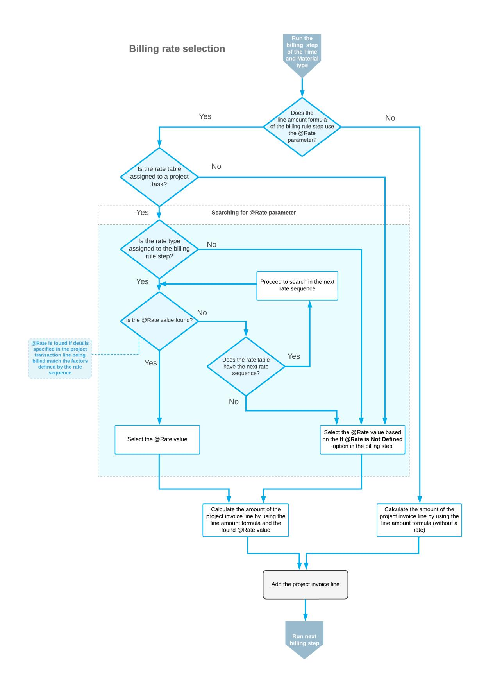

# <span id="page-51-1"></span><span id="page-51-0"></span>**Billing Rates: To Bill a Project with Different Billing Rates**

In this activity, you will bill a project with different billing rates to be used for the billing of different services provided in the project.

This activity is based on the *U100* dataset. If you are using another dataset, or if any system settings have been changed in *U100*, these changes can affect the workflow of the activity and the results of the processing. To avoid any issues, restore the *U100* dataset to its initial state.

#### **Story**

Suppose that the Thai Food Restaurant customer has bought a juicer from the SweetLife Fruits & Jams company and ordered employee training from the company on how to use the juicer. SweetLife's project accountant, Pam Brawner, has created a project to account for the provided services. The training has taken place.

Acting as the project accountant, you need to bill the customer for the different services provided for the project with different billing rates.

#### **Configuration Overview**

In the *U100* dataset, the following tasks have been performed to support this activity:

- On the *[Enable/Disable Features](https://help-2025r1.acumatica.com/Help?ScreenId=ShowWiki&pageid=c1555e43-1bc5-4f6f-ba9d-b323f94d8a6b)* (CS100000) form, the *Project Accounting* feature has been enabled to provide the project accounting functionality.
- On the *Rate [Tables](https://help-2025r1.acumatica.com/Help?ScreenId=ShowWiki&pageid=09894686-e56f-4f33-8e95-2b6e9f6a1752)* (PM206000) form, the *STANDARD* rate table, with rates for labor and materials, has been configured.
- On the *[Billing Rules](https://help-2025r1.acumatica.com/Help?ScreenId=ShowWiki&pageid=6773c79b-216e-4725-b28c-3ce724d9a7c9)* (PM207000) form, the *TIMEMATERIAL* billing rule has been created. The billing rule includes the steps that have been configured for billing project transactions related to different account groups. (For an example of billing rule configuration, see *Billing Rates: To [Create](#page-39-2) a Billing Rule with Rates*.)
- On the *[Customers](https://help-2025r1.acumatica.com/Help?ScreenId=ShowWiki&pageid=652929bc-9606-4056-aa6e-0c2d1147171b)* (AR303000) form, the *TOMYUM* customer has been defined.
- On the *[Non-Stock Items](https://help-2025r1.acumatica.com/Help?ScreenId=ShowWiki&pageid=bf68dd4f-63d4-460d-8dc0-9152f2bd6bf1)* (IN202000) form, the *INSTALL*, *JUICER15*, *SITEREVIEW* and *TRAINING* non-stock items have been created.
- On the *[Projects](https://help-2025r1.acumatica.com/Help?ScreenId=ShowWiki&pageid=81c86417-3bde-444b-8f1c-682928d31a0c)* (PM301000) form, the *TOMYUM3* project for the *TOMYUM* customer has been created. On the **Tasks** tab of this form, the *PHASE1* and *PHASE2* project tasks has been configured and the *TIMEMATERIAL* billing rule and the *STANDARD* rate table are assigned to these project tasks. In the project, the **Create Pro Forma Invoice on Billing** check box is selected to indicate that when project billing is run, pro forma invoices are generated to be sent to the customer for acceptance before the accounts receivable invoices are prepared.
- On the *Project [Transactions](https://help-2025r1.acumatica.com/Help?ScreenId=ShowWiki&pageid=382a97fe-b636-44ca-9798-6d478c05b687)* (PM304000) form, the *PM00000002* project transaction related to the project has been created and released in preparation for billing.

#### **Process Overview**

You will bill the project on the *[Projects](https://help-2025r1.acumatica.com/Help?ScreenId=ShowWiki&pageid=81c86417-3bde-444b-8f1c-682928d31a0c)* (PM301000) form and review the pro forma invoice amounts on the *[Pro](https://help-2025r1.acumatica.com/Help?ScreenId=ShowWiki&pageid=37f1ed00-a7d7-4161-9307-1337662b8550) [Forma Invoices](https://help-2025r1.acumatica.com/Help?ScreenId=ShowWiki&pageid=37f1ed00-a7d7-4161-9307-1337662b8550)* (PM307000) form.

#### **System Preparation**

Before you begin performing the steps of this activity, you need to perform the following instructions to prepare the system:

- 1. Launch the Acumatica ERP website, and sign in to a company with the *U100* dataset preloaded. You should sign in as Pam Brawner by using the *brawner* username and the *123* password.
- 2. In the info area, in the upper-right corner of the top pane of the Acumatica ERP screen, make sure that the business date in your system is set to *1/30/2025*. If a different date is displayed, click the Business Date menu button and select *1/30/2025* on the calendar. For simplicity, in this activity, you will create and process all documents in the system on this business date.

#### **Step 1: Billing the Project and Processing the Related Documents**

To bill the project by using the time and material billing rule, do the following:

- 1. Open the *Project [Transaction](https://help-2025r1.acumatica.com/Help?ScreenId=ShowWiki&pageid=29bf5433-446f-4196-be69-f2cb177e83cb) Details* (PM401000) form.
- 2. In the Selection area of the form, select *TOMYUM3* as the **Project**, and make sure that the other boxes are cleared. The table lists the related project transactions:
  - The line with the *INSTALL* item in the amount of \$320
  - The line with the *JUICER15* item in the amount of \$2000
  - The line with the *SITEREVIEW* item in the amount of \$80
  - The line with the *TRAINING* item in the amount of \$320

Notice that in all lines, the **Billable** check box is selected and the **Billed** check box is cleared, indicating that the project is pending billing.

- 3. On the *[Projects](https://help-2025r1.acumatica.com/Help?ScreenId=ShowWiki&pageid=81c86417-3bde-444b-8f1c-682928d31a0c)* (PM301000) form, open the *TOMYUM3* project. Notice that the **Actual Expenses** box in the Summary area shows \$2,720 (which is the total of the processed project transactions), while **Actual Income** box contains *0* because the project has not been billed yet.
- 4. On the form toolbar, click **Run Billing**. The system creates a pro forma invoice and opens it on the *[Pro Forma](https://help-2025r1.acumatica.com/Help?ScreenId=ShowWiki&pageid=37f1ed00-a7d7-4161-9307-1337662b8550) [Invoices](https://help-2025r1.acumatica.com/Help?ScreenId=ShowWiki&pageid=37f1ed00-a7d7-4161-9307-1337662b8550)* (PM307000) form. On the**Time and Material** tab of this form, review the four lines of the pro forma invoice (which have been created based on unbilled transactions).

In each line, the system calculates **Billed Quantity** and **Billed Amount** by using the formula specified in the corresponding step of the billing rule. The following lines have been added to the pro forma invoice:

- The *INSTALL* and *TRAINING* lines have been billed by the *20 – Labor from non-stock price* step, which has been configured for the *LABOR* account group; the billed amount for each line has been calculated based on the *@Rate* parameter defined in the *STANDARD* rate table for the *LABOR* rate type (which is 1.25). The calculated billing amount is \$400 (320\*1.25) for both lines.
- The *JUICER15* line has been billed by the *10 – Material cost plus markup* step, which has been configured for the *MATERIAL* account group; the billed amount has been calculated based on the billable quantity (1) and the *@Price* parameter (which is the sales price of the *JUICER15* item, \$2500). The calculated billing amount is \$2500.
- The *SITEREVIEW* line has been billed by the *30 – Re-invoice subcontractors* step, which has been configured for the *SUBCON* account group; the billed amount has been calculated by multiplying the transaction amount by the fixed coefficient (1.25). The calculated billing amount is \$100 (1.25 \* \$80).

The unit price in each pro forma invoice line is calculated as the billed amount divided by the billed quantity.

- 5. On the form toolbar, click **Remove Hold** to assign the pro forma invoice the *Open* status, and then click **Release** to release the pro forma invoice. The system closes the pro forma invoice (which is now assigned the *Closed* status) and creates a corresponding accounts receivable invoice based on the pro forma invoice.
- 6. On the **Financial** tab, click the **AR Ref. Nbr.** link to open the accounts receivable invoice that was created on the *[Invoices and Memos](https://help-2025r1.acumatica.com/Help?ScreenId=ShowWiki&pageid=5e6f3b27-b7af-412f-a40a-1d4f4be70cba)* (AR301000) form.
- 7. On the form toolbar of the *[Invoices and Memos](https://help-2025r1.acumatica.com/Help?ScreenId=ShowWiki&pageid=5e6f3b27-b7af-412f-a40a-1d4f4be70cba)* form, click **Remove Hold** to assign the invoice the *Balanced* status, and then click **Release** to release the accounts receivable invoice.

#### **Step 2: Reviewing the Project Transactions and the Updated Project Balance**

To review the project transactions and project balance, do the following:

- 1. On the *Project [Transaction](https://help-2025r1.acumatica.com/Help?ScreenId=ShowWiki&pageid=29bf5433-446f-4196-be69-f2cb177e83cb) Details* (PM401000) form, in the Summary area, select *TOMYUM3* as the **Project**. In the table, review the project transactions that have been created based on the released accounts receivable invoice (these are the lines that have *AR* specified in the **Module** column and that have negative amounts). In the **GL Batch Nbr.** column, the reference number of the corresponding GL batch is shown. Also notice that the project transactions based on which you have performed billing now have the check box in the **Billed** column selected, indicating that these transactions have been billed.
- 2. On the *[Projects](https://help-2025r1.acumatica.com/Help?ScreenId=ShowWiki&pageid=81c86417-3bde-444b-8f1c-682928d31a0c)* (PM301000) form, open the *TOMYUM3* project. Notice that in the Summary area, the **Actual Income** box now shows \$3,400, which is the total amount of the invoice that you have processed. On the **Revenue Budget** tab, notice that the system has automatically created two revenue budget lines (one for each project task) and filled in the **Actual Amount** for the rows (3,000 and 400).
- 3. On the **Balances** tab (see the following screenshot), review the project income and expenses aggregated by account groups.

| Projects<br>TOMYUM3 - A juicer with the installation and training for employees |        |                         |                            |                           |                         |   |               |                                                           |                                       |                                             |                    |                  |                                      |                   |                |                       |                  |                  |
|---------------------------------------------------------------------------------|--------|-------------------------|----------------------------|---------------------------|-------------------------|---|---------------|-----------------------------------------------------------|---------------------------------------|---------------------------------------------|--------------------|------------------|--------------------------------------|-------------------|----------------|-----------------------|------------------|------------------|
| 뭐<br>$\leftarrow$                                                               | $\Box$ | $\Omega$                | $^{+}$                     | 血                         | $\overline{\mathbf{K}}$ | ∢ | $\rightarrow$ | $\geq$                                                    |                                       | <b>COMPLETE</b>                             | <b>RUN BILLING</b> |                  | $\cdots$                             |                   |                |                       |                  |                  |
| * Project ID:                                                                   |        |                         | <b>TOMYUM3</b>             |                           |                         |   |               | $\varphi$                                                 |                                       | Customer:                                   |                    |                  | <b>TOMYUM - Thai Food Restaurant</b> |                   | $\varphi$<br>0 | Actual Income:        |                  | 3,400.00         |
| Template:                                                                       |        |                         |                            |                           |                         |   |               | 0                                                         |                                       | Project Manager:                            |                    |                  | EP00000001 - Pam Brawner             |                   | $\varphi$      | Actual Expenses:      |                  | 2,720.00         |
| Status:                                                                         |        |                         | Active                     |                           |                         |   |               |                                                           |                                       |                                             |                    |                  |                                      |                   |                | Margin Amount:        |                  | 680.00           |
| Description:                                                                    |        |                         |                            |                           |                         |   |               | A juicer with the installation and training for employees |                                       |                                             |                    |                  |                                      |                   |                | Margin (%):           |                  | 20.00            |
|                                                                                 |        |                         |                            |                           |                         |   |               |                                                           |                                       |                                             |                    |                  |                                      |                   |                | Pending Invoice Amoun |                  | 0.00             |
| <b>SUMMARY</b>                                                                  |        | <b>TASKS</b>            |                            |                           | <b>REVENUE BUDGET</b>   |   |               | <b>COST BUDGET</b>                                        |                                       | <b>BALANCES</b>                             | <b>INVOICES</b>    |                  | <b>UNION LOCALS</b>                  | <b>ACTIVITIES</b> |                | <b>FMPI OYFES</b>     | <b>EQUIPMENT</b> | <b>ADDRESSES</b> |
| <b>VIEW TRANSACTIONS</b>                                                        |        |                         | $\vdash$                   | $ \overline{\mathbf{x}} $ |                         |   |               |                                                           |                                       |                                             |                    |                  |                                      |                   |                |                       |                  |                  |
| <b>图 Account</b><br>Group                                                       |        | <b>Description</b>      |                            |                           |                         |   |               |                                                           | Original<br><b>Budgeted</b><br>Amount | <b>Revised</b><br><b>Budgeted</b><br>Amount |                    | Actual<br>Amount | Performance<br>(96)                  |                   |                |                       |                  |                  |
| Income                                                                          |        |                         |                            |                           |                         |   |               |                                                           |                                       |                                             |                    |                  |                                      |                   |                |                       |                  |                  |
| <b>REVENUE</b>                                                                  |        | <b>Project Revenue</b>  |                            |                           |                         |   |               |                                                           | 0.00                                  | 0.00                                        |                    | 3,400.00         | 0.00                                 |                   |                |                       |                  |                  |
|                                                                                 |        | <b>Income Totals</b>    |                            |                           |                         |   |               |                                                           | 0.00                                  | 0.00                                        |                    | 3.400.00         | 0.00                                 |                   |                |                       |                  |                  |
| <b>Expense</b>                                                                  |        |                         |                            |                           |                         |   |               |                                                           |                                       |                                             |                    |                  |                                      |                   |                |                       |                  |                  |
| <b>LABOR</b>                                                                    |        | <b>Project Labor</b>    |                            |                           |                         |   |               |                                                           | 400.00                                | 400.00                                      |                    | 400.00           | 100.00                               |                   |                |                       |                  |                  |
| <b>MATERIAL</b>                                                                 |        | <b>Project Material</b> |                            |                           |                         |   |               |                                                           | 2.000.00                              | 2.000.00                                    |                    | 2.000.00         | 100.00                               |                   |                |                       |                  |                  |
| <b>SUBCON</b>                                                                   |        |                         | <b>Project Subcontract</b> |                           |                         |   |               |                                                           | 320.00                                | 320.00                                      |                    | 320.00           | 100.00                               |                   |                |                       |                  |                  |
|                                                                                 |        | <b>Expense Totals</b>   |                            |                           |                         |   |               |                                                           | 2,720.00                              | 2,720.00                                    |                    | 2,720.00         | 100.00                               |                   |                |                       |                  |                  |

*Figure: The project balances aer project billing*

<span id="page-53-1"></span>You have billed the project based on the different billing rates specified for different types of expenses.

# <span id="page-53-0"></span>**Billing Rates: To Bill a Project with Employee-Specific Rates**

In this activity, you will learn how you can define employee-specific billing rates by using rate tables and how to bill a project by using these billing rates.

#### **Story**

Suppose that the West BBQ Restaurant customer has ordered from the SweetLife Fruits & Jams company a training session for its employees on how to use juicers that were previously purchased from SweetLife. Alberto Jimenez, a junior consultant of SweetLife, has provided six hours of training, and Todd Bloom, a senior consultant of SweetLife, has provided two hours of training. Alberto's rate is \$50 per hour, and Todd's is \$60.

Acting as the SweetLife project accountant, Pam Brawner, you need to create a project to account for the provided services, enter the project transaction to record the provided work, bill the customer, and verify that all services have been billed at the appropriate rates.

#### **Configuration Overview**

In the *U100* dataset, the following tasks have been performed to support this activity:

- On the *[Enable/Disable Features](https://help-2025r1.acumatica.com/Help?ScreenId=ShowWiki&pageid=c1555e43-1bc5-4f6f-ba9d-b323f94d8a6b)* (CS100000) form, the *Project Accounting* feature has been enabled to provide the project accounting functionality.
- On the *[Customers](https://help-2025r1.acumatica.com/Help?ScreenId=ShowWiki&pageid=652929bc-9606-4056-aa6e-0c2d1147171b)* (AR303000) form, the *WESTBBQ* customer has been created.
- On the *[Non-Stock Items](https://help-2025r1.acumatica.com/Help?ScreenId=ShowWiki&pageid=bf68dd4f-63d4-460d-8dc0-9152f2bd6bf1)* (IN202000) form, the *CONSULTJR* and *CONSULTSR* non-stock items have been created.
- On the *[Account Groups](https://help-2025r1.acumatica.com/Help?ScreenId=ShowWiki&pageid=94a2cdce-c36a-49a1-b572-9cd33cb5fa73)* (PM201000) form, the *LABOR* account group has been created.

#### **Process Overview**

In this activity, on the *[Projects](https://help-2025r1.acumatica.com/Help?ScreenId=ShowWiki&pageid=81c86417-3bde-444b-8f1c-682928d31a0c)* (PM301000) form, you will create a new project, specify a billing rule and rate table for it, and define the project tasks. Then you will bill the project and review the billed amount and quantities in the prepared pro forma invoice on the *[Pro Forma Invoices](https://help-2025r1.acumatica.com/Help?ScreenId=ShowWiki&pageid=37f1ed00-a7d7-4161-9307-1337662b8550)* (PM307000) form.

#### **System Preparation**

Before you begin performing the steps of this activity, you need to perform the following instructions to prepare the system:

- 1. As a prerequisite activity, configure the billing rates and billing rule as described in *Billing [Rates:](#page-42-1) To [Configure Employee-Specific Rates](#page-42-1)*.
- 2. Sign in to a company with the *U100* dataset preloaded. You should sign in as Pam Brawner by using the *brawner* username and the *123* password.
- 3. In the info area, in the upper-right corner of the top pane of the Acumatica ERP screen, make sure that the business date in your system is set to *1/30/2025*. If a different date is displayed, click the Business Date menu button and select *1/30/2025* on the calendar. For simplicity, in this activity, you will create and process all documents in the system on this business date.

#### **Step 1: Creating a Project**

To create a project, do the following:

- 1. On the *[Projects](https://help-2025r1.acumatica.com/Help?ScreenId=ShowWiki&pageid=81c86417-3bde-444b-8f1c-682928d31a0c)* (PM301000) form, add a new record.
- 2. In the Summary area, specify the following settings:
  - **Project ID**: WESTBBQ7A
  - **Customer**: *WESTBBQ*
  - **Description**: Training for employees
- 3. On the **Summary** tab (**Project Properties** section), specify *Task and Item* in the **Cost Budget Level** box.
- 4. On the **Summary** tab (**Billing and Allocation Settings** section), specify the following settings:
  - **Billing Period**: *On Demand*
  - **Billing Rule**: *TMLABOR*
  - **RateTable**: *LABOR*

You defined the *LABOR* rate table on the *Rate [Tables](https://help-2025r1.acumatica.com/Help?ScreenId=ShowWiki&pageid=09894686-e56f-4f33-8e95-2b6e9f6a1752)* (PM206000) form when you performed the *[Billing](#page-42-1) Rates: To Configure [Employee-Specific](#page-42-1) Rates* activity.

- 5. On the **Tasks** tab, add a row with the following settings to define the project task:
  - **Task ID**: TRAINING
  - **Type**: *Cost and Revenue Task*
  - **Description**: Training for employees
  - **Status**: *Active*
  - **Default**: Selected

Notice that the billing rule and the rate table have been copied to the task settings from the project settings.

- 6. Save the project.
- 7. On the form toolbar, click **Activate**. The system assigns the project the *Active* status.

#### **Step 2: Creating Project Transactions**

To enter the project transactions for the provided services, perform the following steps:

- 1. On the *Project [Transactions](https://help-2025r1.acumatica.com/Help?ScreenId=ShowWiki&pageid=382a97fe-b636-44ca-9798-6d478c05b687)* (PM304000) form, add a new record.
- 2. In the Summary area, specify the following description: Training for WESTBBQ7A.
- 3. On the **Details** tab, click **Add Row**.
- 4. Specify the following settings in the row:
  - **Project**: *WESTBBQ7A*
  - **ProjectTask**: *TRAINING* (specified automatically)
  - **Cost Code**: *00-000*
  - **Account Group**: *LABOR*
  - **Inventory ID**: *CONSULTJR*
  - **Quantity**: 6
  - **Unit Rate**: 40.00

This transaction represents six hours of training provided by Alberto Jimenez.

- 5. Add one more transaction to the batch by clicking **Add Row** and specifying the following settings in the row:
  - **Project**: *WESTBBQ7A*
  - **ProjectTask**: *TRAINING*
  - **Cost Code**: *00-000*
  - **Account Group**: *LABOR*
  - **Inventory ID**: *CONSULTSR*
  - **Quantity**: 2
  - **Unit Rate**: 45.00

This transaction represents two hours of training provided by Todd Bloom.

- 6. In the Summary area, make sure that the total billable quantity is 8 and the total amount is \$330.
- 7. Save your changes, and on the form toolbar, click **Release** to release the project transaction.

#### **Step 3: Billing the Project and Reviewing the Rates**

To bill the project and review the rates at which the provided services have been billed, do the following:

1. On the *[Projects](https://help-2025r1.acumatica.com/Help?ScreenId=ShowWiki&pageid=81c86417-3bde-444b-8f1c-682928d31a0c)* (PM301000) form, open the *WESTBBQ7A* project, which you have created earlier in this activity.

- 2. On the **Cost Budget** tab, make sure that the system has updated the cost budget with two new lines from the project transaction that you have released.
- 3. On the form toolbar, click **Run Billing**.

The system creates a pro forma invoice and opens it on the *[Pro Forma Invoices](https://help-2025r1.acumatica.com/Help?ScreenId=ShowWiki&pageid=37f1ed00-a7d7-4161-9307-1337662b8550)* (PM307000) form.

- 4. On the **Time and Material** tab, review the invoice lines that the system has created based on the transactions prepared for billing (see the screenshot below). These transactions have been processed by using the *TMLABOR* billing rule, and the rates have been taken from the rate table assigned to the project task. The pro forma invoice includes the following lines:
  - The line with the *CONSULTJR* inventory item has a billed amount of \$300, which has been calculated as 6 hours multiplied by \$50.
  - The line with the *CONSULTSR* inventory item has a billed amount of \$120, which has been calculated as 2 hours multiplied by \$60.

|   | $\leftarrow$ | 뭐               | Pro Forma Invoices<br>$\Box$             | 000020 - Training for employees<br>$\Omega$ | $+$             | 侕<br>$\overline{\mathsf{K}}$ | $\overline{\phantom{a}}$ | $\geq$<br>$\rightarrow$ | <b>REMOVE HOLD</b>                   | PRINT AIA REPORT |   |                       | $\cdots$                           |                           | <b>TH NOTES</b>                     | <b>ACTIVITIES</b>          |              | <b>FILES</b>   | TOOLS $\sim$      |
|---|--------------|-----------------|------------------------------------------|---------------------------------------------|-----------------|------------------------------|--------------------------|-------------------------|--------------------------------------|------------------|---|-----------------------|------------------------------------|---------------------------|-------------------------------------|----------------------------|--------------|----------------|-------------------|
|   |              |                 | Reference Nbr.:                          | 000020                                      | Q               | Project:                     |                          |                         | WESTBBQ7A - Training for employees   |                  | / |                       | Progress Billing Total:            | 0.00                      |                                     |                            |              |                | $\sim$            |
|   | Status:      |                 |                                          | On Hold                                     |                 | Customer:                    |                          |                         | WESTBBQ - West BBQ Restaurant        |                  | / |                       | Time and Material Total:           | 420.00                    |                                     |                            |              |                |                   |
|   |              | * Invoice Date: |                                          | 1/30/2025                                   | Ä               | * Location:                  |                          |                         | <b>MAIN - Primary Location</b>       | Q                |   | <b>Tax Total:</b>     |                                    | 0.00                      |                                     |                            |              |                |                   |
|   |              | * Post Period:  |                                          | 01-2025                                     | Q               |                              |                          |                         |                                      |                  |   | <b>Invoice Total:</b> |                                    | 420.00                    |                                     |                            |              |                |                   |
|   |              |                 | Customer Ord                             |                                             |                 |                              |                          |                         |                                      |                  |   | Retainage Total:      |                                    | 0.00                      |                                     |                            |              |                |                   |
|   |              |                 | Application Nbr.:                        |                                             |                 |                              |                          |                         |                                      |                  |   | Amount Due:           |                                    | 420.00                    |                                     |                            |              |                |                   |
|   |              | Description:    |                                          | Invoice for WESTBBQ7A                       |                 |                              |                          |                         |                                      |                  |   |                       |                                    |                           |                                     |                            |              |                |                   |
|   |              |                 | <b>PROGRESS BILLING</b>                  |                                             |                 | <b>TIME AND MATERIAL</b>     | <b>TAXES</b>             |                         | <b>FINANCIAL</b><br><b>ADDRESSES</b> |                  |   |                       |                                    |                           |                                     |                            |              |                |                   |
|   | Ò            | $^+$            | $\times$                                 |                                             |                 | UPLOAD UNBILLED TRANSACTIONS |                          |                         | <b>VIEW TRANSACTION DETAILS</b>      |                  |   |                       | <b>INCLUDE IN PROGRESS BILLING</b> |                           | <b>REMOVE FROM PROGRESS BILLING</b> | $\mathbb{H}$               | $\mathbf{X}$ | $\mathbf{f}_i$ |                   |
| в |              | D               | Include in<br>Progress<br><b>Billing</b> |                                             | Project Task    | <b>Inventory ID</b>          |                          | *Cost<br>Code           | <b>Description</b>                   | Employee         |   | Vendor                | *Date                              | <b>Billed</b><br>Quantity | <b>Billed</b><br>Amount             | Quantity to UOM<br>Invoice |              |                | <b>Unit Price</b> |
|   | > 0          | $\Box$          | □                                        |                                             | <b>TRAINING</b> | <b>CONSULTJR</b>             |                          | 00-000                  | <b>Junior Consultant</b>             |                  |   |                       | 1/30/2025                          | 6.00                      | 300.00                              | 6.00                       | <b>HOUR</b>  |                | 50.0000           |
|   | $0$ D        |                 | □                                        |                                             | <b>TRAINING</b> | <b>CONSULTSR</b>             |                          | 00-000                  | <b>Senior Consultant</b>             |                  |   |                       | 1/30/2025                          | 2.00                      | 120.00                              | 2.00                       | <b>HOUR</b>  |                | 60.0000           |
|   |              |                 |                                          |                                             |                 |                              |                          |                         |                                      |                  |   |                       |                                    |                           |                                     |                            |              |                |                   |

#### *Figure: Lines for employee labor billed by rates*

You have created a pro forma invoice for the customer and verified that the appropriate rates have been selected for the provided services.

# <span id="page-56-0"></span>**Billing Rates: To Bill a Project with Employee- and Item-Specific Rates**

In this activity, you will learn how you can bill a project whose billing rule uses employee- and item-specific billing rates.

#### **Story**

Suppose that the West BBQ Restaurant customer has ordered from the SweetLife Fruits & Jams company the services of juicer installation and employee training on operating the juicer. The juicer has been installed. Also, Alberto Jimenez, a junior consultant of SweetLife, has provided two hours of training, and Todd Bloom, a senior consultant of SweetLife, has provided six hours of training. The provided services should be billed at different rates.

Acting as the SweetLife project accountant, Pam Brawner, you need to create a project to account for the provided services, and specify the applicable billing rules. Then you need to enter the project transaction to record the provided work, bill the customer, and verify that all services have been invoiced at the appropriate rates.

#### **Configuration Overview**

In the *U100* dataset, the following tasks have been performed to support this activity:

- On the *[Enable/Disable Features](https://help-2025r1.acumatica.com/Help?ScreenId=ShowWiki&pageid=c1555e43-1bc5-4f6f-ba9d-b323f94d8a6b)* (CS100000) form, the *Project Accounting* feature has been enabled to provide the project accounting functionality.
- On the *[Customers](https://help-2025r1.acumatica.com/Help?ScreenId=ShowWiki&pageid=652929bc-9606-4056-aa6e-0c2d1147171b)* (AR303000) form, the *WESTBBQ* customer has been created.
- On the *[Account Groups](https://help-2025r1.acumatica.com/Help?ScreenId=ShowWiki&pageid=94a2cdce-c36a-49a1-b572-9cd33cb5fa73)* (PM201000) form, the *LABOR* account group has been configured.
- On the *[Non-Stock Items](https://help-2025r1.acumatica.com/Help?ScreenId=ShowWiki&pageid=bf68dd4f-63d4-460d-8dc0-9152f2bd6bf1)* (IN202000) form, the *TRAINING* and *INSTALL* non-stock item have been created.
- On the *[Employees](https://help-2025r1.acumatica.com/Help?ScreenId=ShowWiki&pageid=dae5144b-49b3-43a4-bce0-93f31b3f2321)* (EP203000) form, the *EP00000002 – Todd Bloom* employee record has been created.

#### **Process Overview**

In this activity, on the *[Projects](https://help-2025r1.acumatica.com/Help?ScreenId=ShowWiki&pageid=81c86417-3bde-444b-8f1c-682928d31a0c)* (PM301000) form, you will create a new project, specify a billing rule and rate table for it, and define the project tasks. Then you will bill the project and review the billed amount and quantities in the prepared pro forma invoice on the *[Pro Forma Invoices](https://help-2025r1.acumatica.com/Help?ScreenId=ShowWiki&pageid=37f1ed00-a7d7-4161-9307-1337662b8550)* (PM307000) form.

#### **System Preparation**

Before you begin performing the steps of this activity, you need to perform the following instructions to prepare the system:

- 1. As a prerequisite activity, configure the billing rates and billing rule by following the instructions in *[Billing](#page-45-1) Rates: To Configure Employee- and [Item-Specific](#page-45-1) Rates*.
- 2. Sign in to a company with the *U100* dataset preloaded. You should sign in as Pam Brawner by using the *brawner* username and the *123* password.
- 3. In the info area, in the upper-right corner of the top pane of the Acumatica ERP screen, make sure that the business date in your system is set to *1/30/2025*. If a different date is displayed, click the Business Date menu button and select *1/30/2025* on the calendar. For simplicity, in this activity, you will create and process all documents in the system on this business date.

#### **Step 1: Creating a Project**

To create a project, do the following:

- 1. On the *[Projects](https://help-2025r1.acumatica.com/Help?ScreenId=ShowWiki&pageid=81c86417-3bde-444b-8f1c-682928d31a0c)* (PM301000) form, add a new project with the following settings:
  - **Project ID**: WESTBBQ7B
  - **Customer**: *WESTBBQ*
  - **Description**: Installation of a juicer and training for employees
- 2. On the **Summary** tab (**Project Properties** section), specify *Task and Item* in the **Cost Budget Level** box.
- 3. On the **Summary** tab (**Billing and Allocation Settings** section), specify the following settings:
  - **Billing Period**: *On Demand*
  - **Billing Rule**: *TASKLABOR*
  - **RateTable**: *STANDARD*
- 4. On the **Tasks** tab, add two project tasks with the following settings.

| Task ID  | Type                     | Description            | Status |
|----------|--------------------------|------------------------|--------|
| INSTALL  | Cost and Revenue<br>Task | Juicer installation    | Active |
| TRAINING | Cost and Revenue<br>Task | Training for employees | Active |

Notice that the *TASKLABOR* billing rule and the *STANDARD* rate table have been specified automatically for both project tasks.

- 5. Save the project.
- 6. On the form toolbar, click **Activate**. The system assigns the *Active* status to the project.

#### **Step 2: Processing Project Transactions**

To enter the project transactions for the provided services, perform the following steps:

- 1. On the *Project [Transactions](https://help-2025r1.acumatica.com/Help?ScreenId=ShowWiki&pageid=382a97fe-b636-44ca-9798-6d478c05b687)* (PM304000) form, add a new record.
- 2. In the Summary area of the form, make sure *PM* as specified as the **Module**, and specify Installation of a juicer and training for WESTBBQ7B as the **Description**.
- 3. In the table, add a transaction to the batch by clicking **Add Row** and specifying the following settings in the row:
  - **Project**: *WESTBBQ7B*
  - **ProjectTask**: *INSTALL*
  - **Cost Code**: 00-000
  - **Account Group**: *LABOR*
  - **Inventory ID**: *INSTALL*
  - **Quantity**: 4
  - **Unit Rate**: 80.00

This transaction represents four hours of juicer installation.

- 4. Add one more transaction to the batch by clicking **Add Row** and specifying the following settings:
  - **Project**: *WESTBBQ7B*
  - **ProjectTask**: *INSTALL*
  - **Cost Code**: 00-000
  - **Account Group**: *LABOR*
  - **Description**: Other work on the installation
  - **Quantity**: 2
  - **Unit Rate**: 70.00

This transaction represents two hours of other work on the installation.

- 5. Add the third transaction to the batch by clicking **Add Row** and specifying the following settings:
  - **Project**: *WESTBBQ7B*
  - **ProjectTask**: *TRAINING*
  - **Cost Code**: 00-000
  - **Account Group**: *LABOR*
  - **Employee**: *EP00000002 - Todd Bloom*
  - **Inventory ID**: *TRAINING*

- **Quantity**: 6
- **Unit Rate**: 45.00

This transaction represents six hours of training provided by Todd Bloom.

- 6. Add the last transaction to the batch by clicking **Add Row** and specifying the following settings:
  - **Project**: *WESTBBQ7B*
  - **ProjectTask**: *TRAINING*
  - **Cost Code**: 00-000
  - **Account Group**: *LABOR*
  - **Description**: Other work on training
  - **Quantity**: 2
  - **Unit Rate**: 40.00

This transaction represents two hours of other work on training. The entered batch of project transactions should look as shown in the following screenshot.

|                                                                     | <b>Project Transactions</b><br><b>PINOTES</b><br>PM PM00000144 - Installation of a juicer and training for WESTBBQ7B |                                          |                   |                        |                                          |                     |              |                      |        |                  |                |                           | <b>FILES</b>                     | $TOOLS$ $\star$ |          |                 |                      |                  |        |
|---------------------------------------------------------------------|----------------------------------------------------------------------------------------------------------------------|------------------------------------------|-------------------|------------------------|------------------------------------------|---------------------|--------------|----------------------|--------|------------------|----------------|---------------------------|----------------------------------|-----------------|----------|-----------------|----------------------|------------------|--------|
|                                                                     | $\leftarrow$                                                                                                         | 로                                        | 圕<br>$\Omega$     | 尙<br>$+$               | !!!!!!!!!!!!!!!!!!!!!!!!!!!!!!!!!!!!!!!! | $\checkmark$        | к            |                      | ۰,     | Ы                | <b>RELEASE</b> | <b>REVERSE ALLOCATION</b> |                                  |                 |          |                 |                      |                  |        |
|                                                                     | Module:                                                                                                              |                                          | <b>PM</b>         |                        |                                          | $\checkmark$        |              | Orig. Doc. Type:     |        |                  |                |                           | <b>Total Quantity:</b>           | 14.00           |          |                 |                      |                  | $\sim$ |
|                                                                     |                                                                                                                      | Ref. Number:                             | PM00000144        |                        |                                          | ρ                   |              | Orig. Doc. Nbr.:     |        |                  |                |                           | <b>Total Billable Quantity:</b>  | 14.00           |          |                 |                      |                  |        |
|                                                                     |                                                                                                                      | Status:<br>Balanced                      |                   |                        |                                          |                     |              | <b>Total Amount:</b> | 810.00 |                  |                |                           |                                  |                 |          |                 |                      |                  |        |
| Installation of a juicer and training for WESTBBQ7B<br>Description: |                                                                                                                      |                                          |                   |                        |                                          |                     |              |                      |        |                  |                |                           |                                  |                 |          |                 |                      |                  |        |
|                                                                     |                                                                                                                      | <b>DETAILS</b>                           | COMPLIANCE        |                        |                                          |                     |              |                      |        |                  |                |                           |                                  |                 |          |                 |                      |                  |        |
|                                                                     | Ò                                                                                                                    | $\pm$                                    | $\times$          | VIEW ALLOCATION SOURCE |                                          |                     | $\mathbf{H}$ | $\boxed{\mathbf{x}}$ | 土      |                  |                |                           |                                  |                 |          |                 |                      |                  |        |
| <b>E</b> 0                                                          |                                                                                                                      | D<br>Branch                              |                   | * Project              |                                          | <b>Project Task</b> |              | Cost<br>Code         |        | Account<br>Group | Employee       | <b>Inventory ID</b>       | <b>Description</b>               | <b>UOM</b>      | Quantity | <b>Billable</b> | Billable<br>Quantity | <b>Unit Rate</b> | Amount |
|                                                                     | $\theta$                                                                                                             | !!!!!!!!!!!!!!!!!!!!!!!!!!!!!!!!!!!!!!!! | SWEETEQUIP        | <b>WESTBBQ7B</b>       |                                          | <b>INSTALL</b>      |              | $00 - 000$           |        | LABOR            |                | <b>INSTALL</b>            | Installation of equipment at the | <b>HOUR</b>     | 4.00     | ☑               | 4.00                 | 80.0000          | 320.00 |
|                                                                     | $0$ D                                                                                                                |                                          | <b>SWEETEQUIP</b> | WESTBBQ7B              |                                          | <b>INSTALL</b>      |              | 00-000               |        | <b>LABOR</b>     |                |                           | Other work on the installation   |                 | 2.00     | ☑               | 2.00                 | 70,0000          | 140.00 |
|                                                                     | 0 <sub>0</sub>                                                                                                       |                                          | SWEETEQUIP        | <b>WESTBBQ7B</b>       |                                          | <b>TRAINING</b>     |              | 00-000               |        | LABOR            | EP00000002     | <b>TRAINING</b>           | Training on juicer usage (at cu  | <b>HOUR</b>     | 6.00     | ☑               | 6.00                 | 45.0000          | 270.00 |
|                                                                     |                                                                                                                      | <b>0</b> D SWEETEQUIP                    |                   | WESTBBQ7B              |                                          | <b>TRAINING</b>     |              | 00-000               |        | <b>LABOR</b>     |                |                           | Other work on training           |                 | 2.00     | ☑               | 2.00                 | 40.0000          | 80.00  |
|                                                                     |                                                                                                                      |                                          |                   |                        |                                          |                     |              |                      |        |                  |                |                           |                                  |                 |          |                 |                      |                  |        |

#### *Figure: Batch of project transactions*

- 7. In the Summary area, make sure that the total billable quantity is 14 and the total amount is \$810.
- 8. Save your changes to the project transaction.
- 9. On the form toolbar, click **Release** to release the batch of project transactions.

#### **Step 3: Billing the Project and Reviewing the Rates**

To bill the project, do the following:

- 1. On the *[Projects](https://help-2025r1.acumatica.com/Help?ScreenId=ShowWiki&pageid=81c86417-3bde-444b-8f1c-682928d31a0c)* (PM301000) form, open the *WESTBBQ7B* project.
- 2. On the form toolbar, click **Run Billing**.

The system creates a pro forma invoice and opens it on the *[Pro Forma Invoices](https://help-2025r1.acumatica.com/Help?ScreenId=ShowWiki&pageid=37f1ed00-a7d7-4161-9307-1337662b8550)* (PM307000) form.

- 3. On the **Time and Material** tab, review the invoice lines that the system has created based on the transactions prepared for billing. These transactions have been processed by using the billing rule, and the rates have been taken from the rate table assigned to the project tasks. The pro forma invoice includes the following lines:
  - The line with the *INSTALL* project task and *INSTALL* inventory item has a billed amount of \$440, which has been calculated as 4 hours of installation multiplied by \$110.
  - The line with the *INSTALL* project task and with no inventory item selected has a billed amount of \$180, which has been calculated as 2 hours of other work on the installation multiplied by \$90.
  - The line with the *TRAINING* project task, the *TRAINING* inventory item, and the *EP00000002* employee has a billed amount of \$360, which has been calculated as 6 hours of training multiplied by \$60.

• The line with the *TRAINING* project task and empty inventory item has a billed amount of \$100, which has been calculated as 2 hours of other work on training multiplied by \$50.

You have created a pro forma invoice for the customer and verified that the appropriate rates have been selected for the provided services.

# <span id="page-61-0"></span>**Creating Project Tasks**

A project typically consists of separate project tasks, which are clearly defined units of work that can be tracked and managed easily. A project task is used to identify an essential step or activity within the project that must be completed within a particular time frame or by a particular date, so that the project as a whole remains on schedule.

This chapter explains how to create project tasks in Acumatica ERP, specify additional settings for them, and track task completion.

# <span id="page-61-2"></span><span id="page-61-1"></span>**Project Tasks: General Information**

In Acumatica ERP, each project can consist of one project task or multiple project tasks. A project task is the smallest identifiable piece of work that is a part of the project, and you can select a billing rule for each project task to determine how it will be billed. In the following sections, you will find information about creating project tasks.

#### **Learning Objectives**

In this chapter, you will learn how to do the following:

- Create a project task for a particular project
- Configure the rules of the project task completion
- Configure a project task to be billed separately from other project tasks
- Set a project task as a default for a project

#### **Applicable Scenarios**

You create a project task in the following cases:

- When you are configuring a new project from the beginning
- When you need to add a new project task to an existing project

#### **Project Task Creation and Settings**

Each project task is linked to a particular project and has a unique identifier. Project tasks are always defined within the scope and limitations of a specific project; a particular project task may have additional limitations within the scope of the project. You create new project tasks in a project by adding a row for each task to the**Tasks** tab of the *[Projects](https://help-2025r1.acumatica.com/Help?ScreenId=ShowWiki&pageid=81c86417-3bde-444b-8f1c-682928d31a0c)* (PM301000) form. You can then review the settings of the project task on the *[Project](https://help-2025r1.acumatica.com/Help?ScreenId=ShowWiki&pageid=97a58591-40d8-4edf-a9ad-896d633d6980) Tasks* (PM302000) form.


You can create new project tasks directly on the *[Project](https://help-2025r1.acumatica.com/Help?ScreenId=ShowWiki&pageid=97a58591-40d8-4edf-a9ad-896d633d6980) Tasks* form by specifying the identifier of the project to which the project task relates, the identifier of the new project task, and the settings specific for the project task.

For a project task, you can define the following settings, which are specific to the task and do not extend to the project:

• Date range: You can narrow the date range of the task, as long as it remains within the start and end dates of the project. The start and end dates are specified for informational purposes and do not affect any processes performed for this project task.

• Billing rule (and optional rate): By default, the system assigns to the added project task the billing rule that is specified on the **Summary** tab of the *[Projects](https://help-2025r1.acumatica.com/Help?ScreenId=ShowWiki&pageid=81c86417-3bde-444b-8f1c-682928d31a0c)* form for the project. Billing rules are defined on the *[Billing](https://help-2025r1.acumatica.com/Help?ScreenId=ShowWiki&pageid=6773c79b-216e-4725-b28c-3ce724d9a7c9) [Rules](https://help-2025r1.acumatica.com/Help?ScreenId=ShowWiki&pageid=6773c79b-216e-4725-b28c-3ce724d9a7c9)* (PM207000) form.

If complex billing rules have to be configured for billing the project task, you also need to assign the appropriate rate table to the project task.

- Separate billing: You can select the **BillSeparately** check box on the**Summary** tab of the *[Project](https://help-2025r1.acumatica.com/Help?ScreenId=ShowWiki&pageid=97a58591-40d8-4edf-a9ad-896d633d6980) Tasks* form to make the system create a separate invoice for the project task.
- Allocation rule: You can define the allocation rule for a particular project task.

By default, the system assigns to a newly added project task the default allocation rule of the project which is specified on the **Summary** tab of the *[Projects](https://help-2025r1.acumatica.com/Help?ScreenId=ShowWiki&pageid=81c86417-3bde-444b-8f1c-682928d31a0c)* form.

- Method of calculating task completion percentage: You can define the project task to be completed manually or based on the budgeted quantity or amount.
- Visibility settings: The project task may be visible only in the parts of the system in which the associated project is visible. You can leave these default visibility settings, or apply additional visibility limitations for the project task.

In addition, you can specify that a particular project task is the default task of the project, so that the system will populate this task automatically in all related documents in which a user will select this project.

#### **Statuses of Project Tasks**

A project task can be assigned one of the following statuses:

- *In Planning*: The project task is a dra; this status is automatically assigned to a new task. A project task with this status is available for selection only in employee activities and project commitments.
- *Active*: The project task is active and available for selection on data entry forms. An active task can be assigned the *In Planning* status.
- *Completed*: The project task is completed. A completed task can be activated again if the corresponding project is not completed.
- *Canceled*: Progress on the project task was started but then stopped before task completion and there is no intention to continue work on the task. A canceled project task can be activated again if the corresponding project is not completed.

#### **Document Entry and Processing**

Users cannot select projects and project tasks with the *In Planning* status in any records, except for the following types of records that are available for planning:

- Employee activities on the *[Activity](https://help-2025r1.acumatica.com/Help?ScreenId=ShowWiki&pageid=09cd2553-0e9e-4450-804d-106159f9a5b6)* (CR306010) form
- Tasks on the *[Task](https://help-2025r1.acumatica.com/Help?ScreenId=ShowWiki&pageid=6449513c-254e-4093-b7b8-06de0108c384)* (CR306020) form
- Email activities on the *[Email Activity](https://help-2025r1.acumatica.com/Help?ScreenId=ShowWiki&pageid=5f2ec363-ec67-4dce-ae28-1158b6dd8ef3)* (CR306015) form
- Purchase orders on the *[Purchase Orders](https://help-2025r1.acumatica.com/Help?ScreenId=ShowWiki&pageid=5565686c-96c4-4bfa-a51d-9a2566baa808)* (PO301000) form
- Subcontracts on the *[Subcontracts](https://help-2025r1.acumatica.com/Help?ScreenId=ShowWiki&pageid=dc6a00f9-3913-47bb-b28d-105be0e0d20a)* (SC301000) form

For instance, you can add an employee activity for planning budgets for project tasks, or record a project commitment. However, if your user account does not have the *Project Accountant* role assigned on the *[User Roles](https://help-2025r1.acumatica.com/Help?ScreenId=ShowWiki&pageid=c2879f3c-3739-430a-b02b-c225f5480966)* (SM201005) form, these documents can be processed further only aer the *Active* status is assigned to the project task.

If your user has the *Project Accountant* role, you can release employee activities with project tasks that have the *In Planning* status.

#### <span id="page-63-2"></span>**Default Project Tasks in Record Lines**

When you create a project-related record, you must specify a project task for each line of the record. When you are creating a project, you can define one project task of a project as the default one to speed up data entry. The system will automatically insert this project task in the lines of documents when you select the project.

If you are entering an employee activity on the *[Activity](https://help-2025r1.acumatica.com/Help?ScreenId=ShowWiki&pageid=09cd2553-0e9e-4450-804d-106159f9a5b6)* (CR306010) form, a task on the *[Task](https://help-2025r1.acumatica.com/Help?ScreenId=ShowWiki&pageid=6449513c-254e-4093-b7b8-06de0108c384)* (CR306020) form, or an email on the *[Email Activity](https://help-2025r1.acumatica.com/Help?ScreenId=ShowWiki&pageid=5f2ec363-ec67-4dce-ae28-1158b6dd8ef3)* (CR306015) form, the system also checks the status of the selected project's default project task. If you select a project whose default project task has the *In Planning* or *Active* status, this project task is inserted automatically. If the project has no default project task or the default project task has the *Canceled* or *Completed* status, the **ProjectTask** box on the form remains empty.

#### **Default Project Tasks for Particular GL Accounts**

When you process an AR invoice or AP bill related to the project, the system may automatically generate additional GL transaction lines—for instance, to include a discount or freight charge. To automatically associate these transaction lines with specific project tasks, you need to map particular general ledger accounts to specific project tasks within the project in the **DefaultTask for GL Account** table on the **Defaults** tab of the *[Projects](https://help-2025r1.acumatica.com/Help?ScreenId=ShowWiki&pageid=81c86417-3bde-444b-8f1c-682928d31a0c)* (PM301000) form. In the automatically generated transaction lines posted to the GL account mapped to a project task, the system will specify this project task by default.

When you select a GL account mapped to a project task in the **Account** column in a line of a project-related AR invoice on the *[Invoices and Memos](https://help-2025r1.acumatica.com/Help?ScreenId=ShowWiki&pageid=5e6f3b27-b7af-412f-a40a-1d4f4be70cba)* (AR301000) form, the system will automatically specify the mapped project task in the line. If the account is not mapped to any project task, the default project task (if one is specified for the project) is inserted in the line.

The defined account mapping does not affect the entry of project-related bills on the *[Bills and](https://help-2025r1.acumatica.com/Help?ScreenId=ShowWiki&pageid=956b4e51-3078-4d2d-85b3-65c080d95234) [Adjustments](https://help-2025r1.acumatica.com/Help?ScreenId=ShowWiki&pageid=956b4e51-3078-4d2d-85b3-65c080d95234)* (AP301000) form. In the bill lines, the system inserts the default task of the project if it is configured on the**Tasks** tab of the *[Projects](https://help-2025r1.acumatica.com/Help?ScreenId=ShowWiki&pageid=81c86417-3bde-444b-8f1c-682928d31a0c)* form.

# <span id="page-63-1"></span><span id="page-63-0"></span>**Project Tasks: Tracking Task Completion**

A project task may require more than one financial period to complete. The completion statuses of individual project tasks do not directly affect the status of the corresponding project. That is, the system does not automatically complete a project if all of its project tasks have been completed. However, to be able to complete the project, you first need to complete all project tasks included in this project.

For each project task in a project, you can select which method will be used to evaluate the completion percentage of the project task in the **Completion Method** box on the *[Project](https://help-2025r1.acumatica.com/Help?ScreenId=ShowWiki&pageid=97a58591-40d8-4edf-a9ad-896d633d6980) Tasks* (PM302000) form (in the**Task Properties** section of the**Summary** tab). The following sections describe the available methods that can be used to evaluate or calculate the percentage of project task completion.

### **Manual Completion of a Project Task**

In the **Completion Method** box on the *[Project](https://help-2025r1.acumatica.com/Help?ScreenId=ShowWiki&pageid=97a58591-40d8-4edf-a9ad-896d633d6980) Tasks* (PM302000) form (in the**Task Properties** section of the **Summary** tab), you select *Manual* if it is not possible to select one cost line whose actual amount or quantity would reflect the overall project task progress. This may be the case if different cost lines are expressed as quantities measured in different UOMs, or some of the lines have budgets expressed as amounts with other line budgets expressed as quantities.

With this method, you evaluate the project task progress by using all the available information and manually specify the project task completion percentage in the **Completed (%)** box. You can change the value as oen as is needed; we recommend that you update it before you perform an allocation for the project. When you complete the project task, the **Completed (%)** value for the task is automatically set to *100*.

#### **Completion by Budgeted Quantity**

In the **Completion Method** box on the *[Project](https://help-2025r1.acumatica.com/Help?ScreenId=ShowWiki&pageid=97a58591-40d8-4edf-a9ad-896d633d6980) Tasks* (PM302000) form (in the**Task Properties** section of the **Summary** tab), you select *Budgeted Quantity* to calculate the project task completion percentage for all cost budget lines associated with the project task for which the **Auto Completed (%)** check box is selected on the **Cost Budget** tab of the *[Projects](https://help-2025r1.acumatica.com/Help?ScreenId=ShowWiki&pageid=81c86417-3bde-444b-8f1c-682928d31a0c)* (PM301000) form. The method is applicable for only the project tasks having a separate cost budget line whose actual quantity reflects the project task's overall progress, so that you select the **Auto Completed (%)** check box for only this cost budget line.

The system calculates the percentage based on the quantities in the **Actual Quantity** and **Revised Budgeted Quantity** columns on the **Cost Budget** tab by using the following formula:

Completed (%) = SUM (Actual Quantity) / SUM (Revised Budgeted Quantity),

where the actual quantities and revised budgeted quantities are summed up by all the cost budget lines related to this project task (the UOMs specified in cost budget lines are ignored).

For example, suppose that a project task has a budget for 100 hours of consulting (at a cost of \$100 per hour) for a customer company and a budget for 25 round trips (at a cost of \$10 per hour) to the customer location. If you select the consulting cost for tracking the project task completion, with 40 hours of consulting completed, the percentage of the project task completion is calculated as 40%. Splitting or merging consulting sessions may change the number of required round trips; however, the project task progress should be measured by the actual hours of consulting performed.

#### **Completion by Budgeted Amounts**

In the **Completion Method** box on the *[Project](https://help-2025r1.acumatica.com/Help?ScreenId=ShowWiki&pageid=97a58591-40d8-4edf-a9ad-896d633d6980) Tasks* (PM302000) form (in the**Task Properties** section of the **Summary** tab), you select *Budgeted Amount* for a project task if all cost lines have budgeted amounts. With this method selected, the system calculates the project task completion percentage for all the cost budget lines associated with the project task for which the **Auto Completed (%)** check box is selected on the **Cost Budget** tab of the *[Projects](https://help-2025r1.acumatica.com/Help?ScreenId=ShowWiki&pageid=81c86417-3bde-444b-8f1c-682928d31a0c)* (PM301000) form.

The system calculates the percentage based on the amounts in the **Actual Amount** and **Revised Budgeted Amount** columns on the **Cost Budget** tab by using the following formula:

Completed (%) = SUM (Actual Amount) / SUM (Revised Budgeted Amount)

where the actual amounts and revised budgeted amounts are summed up by all the cost budget lines related to this project task (the UOMs specified in cost budget lines are ignored).

### <span id="page-64-0"></span>**Project Tasks: Configuration Prerequisites**

Before starting to create project tasks, you must be sure that the system has been configured properly and that all required entities have been created, as described in the following sections.

#### **Enabling the Needed Features**

On the *[Enable/Disable Features](https://help-2025r1.acumatica.com/Help?ScreenId=ShowWiki&pageid=c1555e43-1bc5-4f6f-ba9d-b323f94d8a6b)* (CS100000) form, the *Projects* feature must be enabled.

#### **Configuring Project Task Identifiers**

The *PROTASK* segmented key on the *[Segmented Keys](https://help-2025r1.acumatica.com/Help?ScreenId=ShowWiki&pageid=78bd7bd1-6bf6-409e-a8a5-8b18e8b80722)* (CS202000) form defines the identifier of the project tasks. By default, this segmented key specifies that the project task identifier is an alphanumeric string of up to 10 characters. For the key, you can define how many segments it is to have, what values may be used, whether these values should be validated, and whether auto-numbering should be used in one of the segments. You can also divide item identifiers into segments with specific values. For more information on configuring segmented keys, see *[Segmented Identifiers](https://help-2025r1.acumatica.com/Help?ScreenId=ShowWiki&pageid=a2f667ab-0de9-4738-9f05-58e9cbfc1735)*.

#### **Configuring the System**

You need to make sure the following tasks have been performed in Acumatica ERP before you begin creating project tasks:

- On the *[Projects Preferences](https://help-2025r1.acumatica.com/Help?ScreenId=ShowWiki&pageid=de2ca225-4a0c-4129-b09d-3f3ed05198f9)* (PM101000) form, the basic project accounting settings have been specified: numbering sequences, non-project code, visibility settings, and posting settings. The actual combination of settings you need to specify depends on the processes in your organization and on the features enabled on the *[Enable/Disable Features](https://help-2025r1.acumatica.com/Help?ScreenId=ShowWiki&pageid=c1555e43-1bc5-4f6f-ba9d-b323f94d8a6b)* (CS100000) form. For an example of basic project configuration, see *[Basic](https://help-2025r1.acumatica.com/Help?ScreenId=ShowWiki&pageid=95fc5aa8-7625-46ed-b233-8624245f7b3a) [Project Configuration: Implementation Activity](https://help-2025r1.acumatica.com/Help?ScreenId=ShowWiki&pageid=95fc5aa8-7625-46ed-b233-8624245f7b3a)*.
- On the *[Projects](https://help-2025r1.acumatica.com/Help?ScreenId=ShowWiki&pageid=81c86417-3bde-444b-8f1c-682928d31a0c)* (PM301000) form, the project for which you are going to create a task or multiple tasks has been created. For an example of creating a project, see *Project Creation and [Processing:](#page-110-1) To Create a Fixed-[Price Project](#page-110-1)* and *Project Creation and [Processing:](#page-113-1) To Create a Cost-Plus Project*.

To make the system automatically associate additional project transactions that are generated (such as discounts or freight charges) with specific project tasks, map specific general ledger accounts to these project tasks within the project in the **DefaultTask for GL Account** section on the **Defaults** tab of the *[Projects](https://help-2025r1.acumatica.com/Help?ScreenId=ShowWiki&pageid=81c86417-3bde-444b-8f1c-682928d31a0c)* form.

#### **Defining Additional Entities Related to Project Tasks**

You can define the following entities, which are not mandatory for the creation of a new project task but are commonly specified in project tasks:

- On the *[Billing Rules](https://help-2025r1.acumatica.com/Help?ScreenId=ShowWiki&pageid=6773c79b-216e-4725-b28c-3ce724d9a7c9)* (PM207000) form, each billing rule that you will assign to a project task has been created. For examples of the creation of a billing rule, see *Billing Rules: To [Configure](#page-21-1) a Progress Billing Rule*, *Billing Rules: To [Configure](#page-24-1) a Time and Material Rule*, and *Billing Rules: To Configure a [Combined](#page-26-1) Billing Rule*.
- On the *[Allocation Rules](https://help-2025r1.acumatica.com/Help?ScreenId=ShowWiki&pageid=0d2e40ad-7ecf-4937-b2bd-dab1d800e0db)* (PM207500) form, each allocation rule that you will assign to a project task has been created. For examples of the configuration of an allocation rule, see *[WIP Labor Costs in Cost-Plus Projects:](#page-391-1) [Implementation Activity](#page-391-1)* and *[WIP Labor Costs in Fixed-Price Projects: Implementation Activity](#page-402-1)*.
- On the *Rate Table [Codes](https://help-2025r1.acumatica.com/Help?ScreenId=ShowWiki&pageid=4ea3e159-73fb-48c6-9091-3b9694e2ccd2)* (PM204200) form, each rate table code that you will assign to a project task has been created, and the rate table has been configured on the *Rate [Tables](https://help-2025r1.acumatica.com/Help?ScreenId=ShowWiki&pageid=09894686-e56f-4f33-8e95-2b6e9f6a1752)* (PM206000) form. For examples of the configuration of billing rates, see *Billing Rates: To Configure [Employee-Specific](#page-42-1) Rates* and *Billing [Rates:](#page-45-1) To [Configure Employee- and Item-Specific Rates](#page-45-1)*.

# <span id="page-65-0"></span>**Project Tasks: To Add a Project Task to a Project**

In the following implementation activity, you will learn how to add a project task to an existing project.

This activity is based on the *U100* dataset. If you are using another dataset, or if any system settings have been changed in *U100*, these changes can affect the workflow of the activity and the results of the processing. To avoid any issues, restore the *U100* dataset to its initial state.

#### **Story**

Suppose that the SweetLife Fruits & Jams company is managing a project for the HM's Bakery and Cafe customer, which has ordered the installation of two juicers. A project for this work is currently in progress; the installation of the juicers is 75% completed and is supposed to be completed by 1/30/2025.

Further suppose that the customer notifies you that its employees need training on operating the juicers; you need to add a project task for this activity to the project and add to the cost budget a cost budget line related to this task. You want to bill the customer separately for the conducted training, and to close the project task based on the budgeted quantity, which is 16 hours of training, eight of which has been already provided to the employee.

Acting as a SweetLife project accountant, you need to add a new project task for the employee training to the existing project, and specify the settings of the project task. Because the other project tasks are going to be completed soon, you also will set the newly added project task as the default task of the project. Also you need to record the training session that has been already conducted.

#### **Process Overview**

In this activity, you will add a new project task to the existing project on the *[Projects](https://help-2025r1.acumatica.com/Help?ScreenId=ShowWiki&pageid=81c86417-3bde-444b-8f1c-682928d31a0c)* (PM301000) form, and specify the standard settings of the project task. Then you will enter specific settings for the project task on the *[Project](https://help-2025r1.acumatica.com/Help?ScreenId=ShowWiki&pageid=97a58591-40d8-4edf-a9ad-896d633d6980) [Tasks](https://help-2025r1.acumatica.com/Help?ScreenId=ShowWiki&pageid=97a58591-40d8-4edf-a9ad-896d633d6980)* (PM302000) form.

#### **Configuration Overview**

In the *U100* dataset, the following tasks have been performed to support this activity:

- On the *[Enable/Disable Features](https://help-2025r1.acumatica.com/Help?ScreenId=ShowWiki&pageid=c1555e43-1bc5-4f6f-ba9d-b323f94d8a6b)* (CS100000) form, the *Project Accounting* feature has been enabled to support the project accounting functionality.
- On the *[Projects](https://help-2025r1.acumatica.com/Help?ScreenId=ShowWiki&pageid=81c86417-3bde-444b-8f1c-682928d31a0c)* (PM301000) form, the *HMBAKERY15* project has been created.
- On the *[Project](https://help-2025r1.acumatica.com/Help?ScreenId=ShowWiki&pageid=97a58591-40d8-4edf-a9ad-896d633d6980) Tasks* (PM302000) form, the *PHASE1* and *PHASE2* project tasks have been created for the *HMBAKERY15* project. For both tasks, in the**Task Properties** section of the**Summary** tab, **Completed (%)**, which represents the completion percentage, is 75%, and the**Start Date** is 1/30/2025.
- On the *[Non-Stock Items](https://help-2025r1.acumatica.com/Help?ScreenId=ShowWiki&pageid=bf68dd4f-63d4-460d-8dc0-9152f2bd6bf1)* (IN202000) form, the *TRAINING* non-stock item has been defined.

### **System Preparation**

To sign in to the system and prepare to perform the instructions of the activity, do the following:

- 1. Launch the Acumatica ERP website, and sign in to a company with the *U100* dataset preloaded; you should sign in as Pam Brawner by using the *brawner* username and the *123* password.
- 2. In the info area, in the upper-right corner of the top pane of the Acumatica ERP screen, make sure that the business date in your system is set to *1/30/2025*. If a different date is displayed, click the Business Date menu button and select *1/30/2025* on the calendar. For simplicity, in this activity, you will create and process all documents in the system on this business date.

#### **Step 1: Adding a Project Task to the Project**

To add a new project task to a project, do the following:

- 1. On the *[Projects](https://help-2025r1.acumatica.com/Help?ScreenId=ShowWiki&pageid=81c86417-3bde-444b-8f1c-682928d31a0c)* (PM301000) form, open the *HMBAKERY15* project.
- 2. On the **Tasks** tab, add a new row, and specify the following settings in the row:
  - **Task ID**: *TRAINING*
  - **Type**: *Cost and Revenue Task*

- **Description**: Employee training
- **Billing Rule**: *TM* (specified automatically)
- **Status**: *Active*
- **Start Date**: 1/30/2025
- **Default**: Selected
- 3. Save your changes.

#### **Step 2: Configuring Advanced Settings for the Project Task**

To review the newly added project task and specify advanced settings for it, do the following:

- 1. On the *[Project](https://help-2025r1.acumatica.com/Help?ScreenId=ShowWiki&pageid=97a58591-40d8-4edf-a9ad-896d633d6980) Tasks* (PM302000) form, select *HMBAKERY15* as the **Project ID** and *TRAINING* as the **Task ID**.
- 2. On the **Summary** tab, in the **Completion Method** box, select *Budgeted Quantity*.
- 3. In the **Billing and Allocation Settings** section, select the **BillSeparately** check box to make the system create a separate invoice for this project task during the billing of the project.
- 4. Save your changes.

#### **Step 3: Adding the Related Cost Budget Line**

To add the costs related to conducting the training to the budget, do the following:

- 1. On the *[Projects](https://help-2025r1.acumatica.com/Help?ScreenId=ShowWiki&pageid=81c86417-3bde-444b-8f1c-682928d31a0c)* (PM301000) form, open the *HMBAKERY15* project.
- 2. On the **Cost Budget** tab, add a line with the following settings:
  - **ProjectTask**: *TRAINING* (selected automatically as the default project task)
  - **Inventory ID**: *TRAINING*
  - **Account Group**: *LABOR*
  - **Description**: Training for employees
  - **Original Budgeted Quantity**: 16
  - **UOM**: *HOUR*
  - **Unit Rate**: 40
  - **Auto-Completed (%)**: Selected
- 3. Save your changes to the project.

You have added a new project task to the project, configured the project task settings, and budgeted the new project task.

#### **Step 4: Processing a Project Transaction**

To record the provided training, perform the following steps:

- 1. On the *Project [Transactions](https://help-2025r1.acumatica.com/Help?ScreenId=ShowWiki&pageid=382a97fe-b636-44ca-9798-6d478c05b687)* (PM304000) form, create a new record.
- 2. In the Summary area, make sure that *PM* is selected in the **Module** box, and enter An 8-hour training session as the **Description**.
- 3. On the **Details** tab, add a new line with the following settings:
  - **Project**: *HMBAKERY15*
  - **ProjectTask**: *TRAINING* (selected automatically as the default project task)
  - **Cost Code**: *00-000*
  - **Account Group**: *LABOR*

- **Inventory ID**: *TRAINING*
- **UOM**: *HOUR*

The unit of measure must be the same as the one specified in the cost budget line.

- **Quantity**: 8.00
- **Billable**: Selected
- **Unit Rate**: 45.00
- 4. Make sure that the**Total Amount** in the Summary area is *360.00*, and save the project transaction.
- 5. On the form toolbar, click **Release**.
- 6. On the *[Projects](https://help-2025r1.acumatica.com/Help?ScreenId=ShowWiki&pageid=81c86417-3bde-444b-8f1c-682928d31a0c)* (PM301000) form, open the *HMBAKERY15* project.
- 7. On the **Cost Budget** tab, review the cost budget line with the *TRAINING* project task. Notice that **Actual Amount** in this line is now *360.00* and the **Actual Quantity** is *8*, meaning that the project transaction that you have processed has affected the cost budget (see the following screenshot).

| Projects<br>HMBAKERY15 - Installing juicers                                                                                                                                                                                                                         |                                                        |                                               |                                                           |                                        |                                                            |                  |  |  |  |  |  |  |
|---------------------------------------------------------------------------------------------------------------------------------------------------------------------------------------------------------------------------------------------------------------------|--------------------------------------------------------|-----------------------------------------------|-----------------------------------------------------------|----------------------------------------|------------------------------------------------------------|------------------|--|--|--|--|--|--|
| 품<br>日<br>血<br>к<br>↶<br>$\leftarrow$<br>↘                                                                                                                                                                                                                          | <b>RUN BILLING</b><br><b>COMPLETE</b><br>Ы<br>$\cdots$ |                                               |                                                           |                                        |                                                            |                  |  |  |  |  |  |  |
| Q<br>HMBAKERY15<br>* Project ID:                                                                                                                                                                                                                                    | Customer:                                              | HMBAKERY - HM's Bakery & Cafe<br>$\circ$<br>0 |                                                           |                                        |                                                            |                  |  |  |  |  |  |  |
| Template:                                                                                                                                                                                                                                                           | Project Manager:<br>0                                  | Q<br>EP00000001 - Pam Brawner                 |                                                           |                                        |                                                            |                  |  |  |  |  |  |  |
| Active<br>Status:                                                                                                                                                                                                                                                   |                                                        |                                               | Margin Amount:                                            | $-360.00$                              |                                                            |                  |  |  |  |  |  |  |
| Description:<br>Installing juicers                                                                                                                                                                                                                                  |                                                        |                                               | Margin (%):                                               | 0.00                                   |                                                            |                  |  |  |  |  |  |  |
|                                                                                                                                                                                                                                                                     |                                                        |                                               | Pending Invoice Amoun                                     | 0.00                                   |                                                            |                  |  |  |  |  |  |  |
| <b>COST BUDGET</b><br><b>SUMMARY</b><br><b>TASKS</b><br><b>REVENUE BUDGET</b><br><b>BALANCES</b><br><b>INVOICES</b><br><b>UNION LOCALS</b><br><b>EMPLOYEES</b><br><b>EQUIPMENT</b><br><b>ADDRESSES</b><br><b>DEFAULTS</b><br><b>ATTRIBUTES</b><br><b>ACTIVITIES</b> |                                                        |                                               |                                                           |                                        |                                                            |                  |  |  |  |  |  |  |
| Group by Task                                                                                                                                                                                                                                                       |                                                        |                                               |                                                           |                                        |                                                            |                  |  |  |  |  |  |  |
| $\mathbf{x}$<br><b>VIEW TRANSACTIONS</b><br>$\vdash$<br>土<br>$\times$<br>Õ<br>+                                                                                                                                                                                     |                                                        |                                               |                                                           |                                        |                                                            |                  |  |  |  |  |  |  |
| $\omega$<br>D<br>* Project Task<br>*Account Group<br>B.<br>*Inventory ID                                                                                                                                                                                            | <b>Description</b>                                     | Original UOM<br><b>Budgeted</b><br>Quantity   | <b>Unit Rate</b><br>Original<br><b>Budgeted</b><br>Amount | Revised<br><b>Budgeted</b><br>Quantity | Revised<br>Actual<br><b>Budgeted</b><br>Quantity<br>Amount | Actual<br>Amount |  |  |  |  |  |  |
| D<br>PHASE1<br><b>MATERIAL</b><br>0<br>JUICER15                                                                                                                                                                                                                     | Commercial juicer with a production rate of            | PIECE<br>1.00                                 | 2,000.0000<br>2,000.00                                    | 1.00                                   | 2,000.00<br>0.00                                           | 0.00             |  |  |  |  |  |  |
| <b>SUBCON</b><br>PHASE1<br>0<br><b>INSTALL</b><br>n                                                                                                                                                                                                                 | Installation of equipment at the customers'            | <b>HOUR</b><br>4.00                           | 320.00<br>80,0000                                         | 4.00                                   | 320.00<br>0.00                                             | 0.00             |  |  |  |  |  |  |
| PHASE2<br><b>MATERIAL</b><br><b>JUICER15</b><br>0<br>!!!!!!!!!!!!!!!!!!!!!!!!!!!!!!!!!!!!!!!!                                                                                                                                                                       | Commercial juicer with a production rate of            | PIECE<br>1.00                                 | 2.000.0000<br>2.000.00                                    | 1.00                                   | 0.00<br>2.000.00                                           | 0.00             |  |  |  |  |  |  |
| 0 D<br>PHASE <sub>2</sub><br><b>INSTALL</b><br><b>SUBCON</b>                                                                                                                                                                                                        | Installation of equipment at the customers'            | <b>HOUR</b><br>4.00                           | 80,0000<br>320.00                                         | 4.00                                   | 320.00<br>0.00                                             | 0.00             |  |  |  |  |  |  |
| LABOR<br><b>TRAINING</b><br>®.<br><b>TRAINING</b><br>D                                                                                                                                                                                                              | <b>Training for employees</b>                          | <b>HOUR</b><br>16.00                          | 40,0000<br>640.00                                         | 16.00                                  | 640.00<br>8.00                                             | 360.00           |  |  |  |  |  |  |

#### *Figure: The cost budget line affected by the project transaction*

8. On the **Tasks** tab, review the **Completed (%)** box in the line with the *TRAINING* task, and notice that 50% of the task has been completed.

You have added a new project task to the existing project and processed a transaction that updates the cost budget line with this project task.

# <span id="page-68-0"></span>**Project Tasks: Related Report and Inquiry Forms**

In the following sections, you can find details about the reports and inquiry forms you may want to review to gather information about particular project tasks.

If you do not see a particular report or form that is described, you may have signed in to the system with a user account that does not have access rights to the report or form. Contact your system administrator to obtain access to any needed reports or forms.

#### **Finding Project Transactions Related to a Project Task**

To find the project transactions that are related to a particular project task, you can view the cost budget lines or revenue budget lines grouped by project task. To do this, you select the **Group byTask** check box on the **Cost Budget** tab or **Revenue Budget** tab, respectively, of the *[Projects](https://help-2025r1.acumatica.com/Help?ScreenId=ShowWiki&pageid=81c86417-3bde-444b-8f1c-682928d31a0c)* (PM301000) form. Then you click the aggregated line on the tab, and on the table toolbar, click**View Transactions**. The system opens the *Project [Transaction](https://help-2025r1.acumatica.com/Help?ScreenId=ShowWiki&pageid=29bf5433-446f-4196-be69-f2cb177e83cb) Details* (PM401000) form with the list of project transactions that are related to this project and project task.

#### **Printing Task Information**

To generate a printable report with the project task information, you use the *[Project](https://help-2025r1.acumatica.com/Help?ScreenId=ShowWiki&pageid=4ea2a2de-3721-4c02-b03e-6dd86d3a192f) Tasks* (PM632000) report form. The report provides a list of either all the project tasks, grouped by customer, or only the project tasks for the customer you select. You can also prepare a report with the project tasks of the projects assigned to a particular project manager.

# <span id="page-70-2"></span><span id="page-70-0"></span>**Creating Project Templates and Common Tasks**

Your organization may plan to perform projects that are similar to one another, and the projects may have tasks that are like other tasks in the same project or tasks in other projects. In this case, you can expedite the process of creating projects by using project and task templates. You can create any number of templates that include all the boilerplate parameters for all types of projects and for all types of tasks.

This chapter describes how to configure project templates and common tasks, how to create a new project based on a project template, and how to create a project template based on the project.

# <span id="page-70-3"></span><span id="page-70-1"></span>**Project Templates and Common Tasks: General Information**

In Acumatica ERP, you can create project templates from scratch by adding every detail that you think will be required for a typical project of specific type. Alternatively, you can create a template based on an existing project which you think is a typical representative of projects of specific type.

When users create projects based on the templates, they can change any settings for particular projects—templates are used only to provide the default settings, thus making the project creation easier for users.

#### **Learning Objectives**

In this chapter, you will learn how to do the following:

- Create a project template based on a project
- Create a project template from scratch
- Create a project based on the project template
- Create a common task and add this task to a project

#### **Applicable Scenarios**

You create project templates and common tasks if you need to ease the creation of typical projects and typical tasks for existing projects, respectively.

#### **Templates Created from Existing Projects**

If you need to quickly create a new project based on the existing project, you can create a copy of the project by clicking **Copy Project** on the More menu of the *[Projects](https://help-2025r1.acumatica.com/Help?ScreenId=ShowWiki&pageid=81c86417-3bde-444b-8f1c-682928d31a0c)* (PM301000) form. If you plan to use some specific types of project in future, you create a project template based on an existing project and then use this template to create new projects of the type.

On the *[Projects](https://help-2025r1.acumatica.com/Help?ScreenId=ShowWiki&pageid=81c86417-3bde-444b-8f1c-682928d31a0c)* (PM301000) form, you select a project that is a typical project of specific type and click **Create Template** on the More menu. The system will create a project template and include the project template tasks in this project template. You can modify the settings of the created template. Also, you can delete some of the tasks or add new tasks.

#### **Templates Created from Scratch**

A project template is an entity that you select when creating a new project to auto-populate the budget, settings, and attributes of the project with default values that are appropriate for projects of the type. In the created project, you can override the default values that have been inserted based on the project template, if needed.

You can create project templates from scratch on the *Project [Templates](https://help-2025r1.acumatica.com/Help?ScreenId=ShowWiki&pageid=11e7c776-03fb-405d-a1f4-26700dd319fc)* (PM208000) form.

Project templates are not used for grouping or classification of projects. You use them solely for providing the default values in the projects that are created based on these templates. If you need to categorize projects, create project groups on the *[Project Groups](https://help-2025r1.acumatica.com/Help?ScreenId=ShowWiki&pageid=f036b8fc-7db4-46e2-80d7-af8a379cbc5a)* (PM202500) form. You can then assign project groups as follows:

- To project templates on the**Summary** tab of the *Project [Templates](https://help-2025r1.acumatica.com/Help?ScreenId=ShowWiki&pageid=11e7c776-03fb-405d-a1f4-26700dd319fc)* form
- To individual projects on the**Summary** tab of the *[Projects](https://help-2025r1.acumatica.com/Help?ScreenId=ShowWiki&pageid=81c86417-3bde-444b-8f1c-682928d31a0c)* (PM301000) form

When you create a project template, you can specify as many settings as you want, including the following:

- General information: The broad information about the projects, including the default GL accounts and subaccounts and billing period. In the**Status** box on the Summary area of the form, you can see whether the specific project template is available for creating new projects. You can create projects only by using project templates with the *Active* status.
- Visibility settings: The list of functional areas where the projects based on this template will be visible.
- Template tasks: The tasks to be included in the projects based on this template.
- List of employees: The employees who will work on the projects and the project manager who will be monitoring projects of the type. You also specify labor items and hourly rates for employees working on this project. Also, you can specify whether only the listed employees can work for the project (by selecting the **Restrict Employees** check box on the**Summary** tab).
- List of equipment: The equipment to be used for the projects with appropriate non-stock items designating setup, run, and suspend rates and respective prices specific for projects of the type. You can specify whether only the listed equipment can be used for these projects.
- Notes and files: Supplementary documents and notes to be provided with a project created based on the template. If the *Project Quotes* feature is enabled on the *[Enable/Disable Features](https://help-2025r1.acumatica.com/Help?ScreenId=ShowWiki&pageid=c1555e43-1bc5-4f6f-ba9d-b323f94d8a6b)* (CS100000) form, the files and notes attached to a project template are also copied to the projects that are created from project quotes based on this project template.

The settings specified for the project template are copied to each project created based on this project template.

#### **Template Tasks**

A project template may include project tasks that are actually templates of tasks that can be included in projects based on the template. You can add project task templates to the project template.

You add the project tasks to the project template and specify the settings for these tasks by using the *[Project](https://help-2025r1.acumatica.com/Help?ScreenId=ShowWiki&pageid=70efdc85-fb54-4c39-add2-74abde2dba57) [Template](https://help-2025r1.acumatica.com/Help?ScreenId=ShowWiki&pageid=70efdc85-fb54-4c39-add2-74abde2dba57) Tasks* (PM208010) form. When you create a new template task, you can specify whether it is automatically included in all projects based on the project template.

Template task settings include the following:

- General settings: You can specify overall information about the task, including approver, tax category, default accounts and subaccounts, and billing period. The general settings also include visibility settings, the list of functional areas in which this project task must be visible. You can make tasks visible only in the functional areas in which the parent project is visible—the scope for the task cannot be wider than the scope for the project.
- Recurring billing settings: Recurring billing can be used to implement the flat-price scenario with recurring payments when your future project uses flat rates for services or products you provide to your customer regularly. For more information about recurring billing, see *[Project Billing Preparation: Recurring Billing](#page-142-1)*.
- Notes and files: You can attach supplementary documents and notes to be attached to a project task created based on this template task. If the *Project Quotes* feature is enabled on the *[Enable/Disable Features](https://help-2025r1.acumatica.com/Help?ScreenId=ShowWiki&pageid=c1555e43-1bc5-4f6f-ba9d-b323f94d8a6b)* (CS100000) form, files and notes attached to a project template are also copied to the project tasks added to project quotes based on this project template.

The settings specified for the project template task are copied to the project tasks created based on this project template. If any of these settings are not specified in the project template task, the system copies the respective values from the project template.

#### **Common Tasks**

Common tasks are also templates of tasks, but they are not linked to any specific project or project template. You can add common tasks to any new or existing project and project quote. You create common tasks on the *[Common](https://help-2025r1.acumatica.com/Help?ScreenId=ShowWiki&pageid=3120e8d8-b803-4b08-a0ad-6f04d77343f3) [Tasks](https://help-2025r1.acumatica.com/Help?ScreenId=ShowWiki&pageid=3120e8d8-b803-4b08-a0ad-6f04d77343f3)* (PM208030) form. Generally, you provide the same types of settings for common tasks as for the template tasks: general, budget, and recurring billing settings.

The settings specified for the common task are copied to the project tasks created based on this common task. If any of these settings are not specified in the common task, the system copies the respective values from the project template specified for the project.

# <span id="page-72-0"></span>**Project Templates and Common Tasks: Configuration Prerequisites**

Before starting to create project templates and common tasks, you must be sure that the system has been configured in a proper way and all required entities have been created, as described in this topic.

#### **Enabling Features**

In Acumatica ERP, you can project transactions if the *Project Accounting* feature is enabled on the *[Enable/Disable](https://help-2025r1.acumatica.com/Help?ScreenId=ShowWiki&pageid=c1555e43-1bc5-4f6f-ba9d-b323f94d8a6b) [Features](https://help-2025r1.acumatica.com/Help?ScreenId=ShowWiki&pageid=c1555e43-1bc5-4f6f-ba9d-b323f94d8a6b)* (CS100000) form.

#### **Configuring Basic Project Accounting**

You make sure that basic project accounting preferences are configured to ensure that the system is ready for creating project templates and common tasks, as described in *[Basic Project Configuration: Implementation Checklist](https://help-2025r1.acumatica.com/Help?ScreenId=ShowWiki&pageid=f5e5cf75-b160-4797-b23b-fb11a6b9a745)*.

# <span id="page-72-1"></span>**Project Templates and Common Tasks: Implementation Checklist**

To ensure that the system is configured properly for creating project templates and common tasks, make sure that the features and settings listed in the table are configured as described in the following table.

| Form                                    | Task to Perform                                                                      |
|-----------------------------------------|--------------------------------------------------------------------------------------|
| Enable/Disable Features (CS100000) form | Make sure that the Project Accounting check box is<br>selected.                      |
| Projects Preferences (PM101000) form    | Make sure that all necessary settings of project ac<br>counting have been specified. |
| Account Groups (PM201000) form          | Make sure that all the necessary account groups have<br>been configured.             |

# <span id="page-73-0"></span>**Project Templates and Common Tasks: Process Activity**

This activity will walk you through the process of configuring project templates. You will create a common task and add this task to a project. You will also learn how to create a new project based on a project template.

This activity is based on the *U100* dataset. If you are using another dataset, or if any system settings have been changed in *U100*, these changes can affect the workflow of the activity and the results of the processing. To avoid any issues, restore the *U100* dataset to its initial state.

#### **Story**

Suppose that the Lake Cafe customer has ordered a juicer, along with the following services from the SweetLife Fruits & Jams company: site review, installation, and training of employees on operating the juicer. SweetLife's project accountant has analyzed the past projects and realized that customers are usually doing typical fixedprice projects that involve the sale of a juicer, along with the services of installation and site review. Sometimes customers' projects also involve training on operating the juicer.

The project accountant decides to create a new project template for such a project, and to create a common task for training on operating juicers (so the task can be quickly added to projects as needed). Then the project accountant creates a project for the customer based on the created project template and common task.

You will perform the needed actions in the system, acting as the project accountant.

#### **Configuration Overview**

In the *U100* dataset, the following tasks have been performed to support this activity:

- On the *[Enable/Disable Features](https://help-2025r1.acumatica.com/Help?ScreenId=ShowWiki&pageid=c1555e43-1bc5-4f6f-ba9d-b323f94d8a6b)* (CS100000) form, the *Project Accounting* feature has been enabled to provide support for the project accounting functionality.
- On the *[Billing Rules](https://help-2025r1.acumatica.com/Help?ScreenId=ShowWiki&pageid=6773c79b-216e-4725-b28c-3ce724d9a7c9)* (PM207000) form, the *COMBINED* billing rule has been configured.

#### **Process Overview**

You create a project template on the *Project [Templates](https://help-2025r1.acumatica.com/Help?ScreenId=ShowWiki&pageid=11e7c776-03fb-405d-a1f4-26700dd319fc)* (PM208000) form. You create a common task on the *[Common](https://help-2025r1.acumatica.com/Help?ScreenId=ShowWiki&pageid=3120e8d8-b803-4b08-a0ad-6f04d77343f3) [Tasks](https://help-2025r1.acumatica.com/Help?ScreenId=ShowWiki&pageid=3120e8d8-b803-4b08-a0ad-6f04d77343f3)* (PM208030) form. Then you use the *[Projects](https://help-2025r1.acumatica.com/Help?ScreenId=ShowWiki&pageid=81c86417-3bde-444b-8f1c-682928d31a0c)* (PM301000) form to create a project based on the created project template and add the common task to the project.

#### **System Preparation**

To sign in to the system and prepare to perform the instructions of the activity, do the following:

- 1. Launch the Acumatica ERP website, and sign in to a company with the *U100* dataset preloaded; you should sign in as project accountant by using the *brawner* username and the *123* password.
- 2. In the info area, in the upper-right corner of the top pane of the Acumatica ERP screen, make sure that the business date in your system is set to *1/30/2025*. If a different date is displayed, click the Business Date menu button and select *1/30/2025* on the calendar. For simplicity, in this activity, you will create and process all documents in the system on this business date.

#### **Step 1: Creating a Project Template**

To create a new project template, do the following:

- 1. On the *Project [Templates](https://help-2025r1.acumatica.com/Help?ScreenId=ShowWiki&pageid=11e7c776-03fb-405d-a1f4-26700dd319fc)* (PM208000) form, add a new record.
- 2. In the Summary area, specify the following settings:
  - **Template ID**: INSTALL
  - **Description**: Installation project
- 3. On the **Summary** tab, specify the following settings:
  - **Project Properties** section:
    - **Revenue Budget Level**: *Task and Item*
    - **Cost Budget Level**: *Task*
    - **Project Manager**: *EP00000001*
  - **Billing and Allocation Settings** section:
    - **Billing Period**: *On Demand*
    - **Billing Rule**: *COMBINED*
- 4. On the **Tasks** tab, add a new row, and specify the following settings in the row:
  - **Task ID**: *PHASE1*
  - **Type**: *Cost and Revenue Task*
  - **Description**: Site review
- 5. Add one more row, and specify the following settings:
  - **Task ID**: *PHASE2*
  - **Type**: *Cost and Revenue Task*
  - **Description**: Installation

By default, the system inserts *By Billing Period* as the **Billing Option** of each project task and the *COMBINED* billing rule as the **Billing Rule**.

6. On the **Revenue Budget** tab, add each line of the project revenue that is listed in the following table by clicking **Add Row** and specifying the listed settings in the row.

| ProjectTask | Inventory ID | Original Budgeted<br>Quantity | Unit Rate |
|-------------|--------------|-------------------------------|-----------|
| PHASE1      | SITEREVIEW   | 2                             | 50        |
| PHASE2      | JUICER10     | 1                             | 1500      |
| PHASE2      | INSTALL      | 4                             | 100       |

For each line, the system inserts *REVENUE* as the **Account Group** because the sales account specified in the settings of the stock and non-stock items is mapped to this account group, which has the *Income* type.

7. Save your changes to the project template.

When you save the project template, the system automatically creates project template tasks corresponding to the tasks you have added to the project template.

- 8. On the form toolbar, click **Activate** to assign the project template the *Active* status, which makes it possible to use the project template for creating projects.
- 9. On the **Tasks** tab, in the**Task ID** column, click the *PHASE1* link to open the task on the *Project [Template](https://help-2025r1.acumatica.com/Help?ScreenId=ShowWiki&pageid=70efdc85-fb54-4c39-add2-74abde2dba57) Tasks* (PM208010) form.

On the **Summary** tab of this form, notice that the **Automatically Include in Project** check box is selected by default. With this setting, the project template task will be automatically included in any project created based on the associated project template.

You have created a project template and project template tasks. In the next step, you will create a common task.

#### **Step 2: Creating a Common Task**

A common task is a task that can be added to any new or existing project (unlike a project template task, which is associated with just one project template). To create a common task, perform the following instructions:

- 1. On the *[Common](https://help-2025r1.acumatica.com/Help?ScreenId=ShowWiki&pageid=3120e8d8-b803-4b08-a0ad-6f04d77343f3) Tasks* (PM208030) form, add a new record.
- 2. In the Summary area, specify the following settings:
  - **Task ID**: TRAINING
  - **Description**: Training on juicer usage
- 3. On the **Budget** tab, add a budget line with the following settings:
  - **Account Group** *LABOR*

The system automatically inserts *Expense* in the **Type** column when you select the account group.

- **Inventory ID**: *TRAINING*
- **Cost Code**: 00-000
- **Description**: Training on juicer usage
- **UOM**: *HOUR*
- **Unit Rate**: 50
- 4. Save your changes to the common task.

You have created a common task. In the next step, you will create a project based on the project template you have created.

#### **Step 3: Creating a Project Based on the Project Template**

To create a project based on template, do the following:

- 1. On the *[Projects](https://help-2025r1.acumatica.com/Help?ScreenId=ShowWiki&pageid=81c86417-3bde-444b-8f1c-682928d31a0c)* (PM301000) form, create a new project, and specify the following settings:
  - **Project ID**: INSTLAKE
  - **Customer**: *LAKECAFE*
  - **Template**: *INSTALL*

When you select the project template, the system fills in the relevant elements of the project with the settings specified for the template, including tasks and revenue budget lines.

- 2. In the Summary area, enter Installation project for Lake Cafe as the **Description** of the project.
- 3. On the **Summary** tab, clear the **Change Order Workflow** check box.
- 4. Save your changes to the project.
- 5. On the **Tasks** tab, make sure that the *PHASE1* and *PHASE2* tasks have been copied to the project from the selected project template.
- 6. On the table toolbar of the tab, click **ActivateTasks** to change the status of the added tasks to *Active*.
- 7. On the **Revenue Budget** tab, make sure that three revenue budget lines have been copied to the project from the selected project template.
- 8. In the line with the *PHASE1* task and the *SITEREVIEW* item, specify 4 as the **Original Budgeted Quantity**.

When you enter the **Original Budgeted Quantity** in each line, the system automatically calculates the **Original Budgeted Amount** as the **Original Budgeted Quantity** multiplied by the **Unit Rate** (see the screenshot below).

9. In the line with the *PHASE2* task and the *INSTALL* item, specify 8 as the **Original Budgeted Quantity**.

10.In the line with the *PHASE2* task and the *JUICER10* item, specify 2 as the **Original Budgeted Quantity**.

|   | Projects                                                                                            |                                          |                          |                                       |                    |                                               |                                                   |                             |                     |                       |                           |                             |                           |  |
|---|-----------------------------------------------------------------------------------------------------|------------------------------------------|--------------------------|---------------------------------------|--------------------|-----------------------------------------------|---------------------------------------------------|-----------------------------|---------------------|-----------------------|---------------------------|-----------------------------|---------------------------|--|
|   | <b>INSTLAKE - Installation project for Lake Cafe</b>                                                |                                          |                          |                                       |                    |                                               |                                                   |                             |                     |                       |                           |                             |                           |  |
|   | $\leftarrow$                                                                                        | 뭐                                        | $\mathbb{F}$<br>$\Omega$ | 侕<br>κ                                | $\geq$<br>><br>∢   | <b>COMPLETE</b><br><b>RUN BILLING</b>         | $\cdots$                                          |                             |                     |                       |                           |                             |                           |  |
|   | Actual Income:<br>* Project ID:                                                                     |                                          |                          |                                       |                    |                                               |                                                   |                             |                     |                       |                           |                             |                           |  |
|   |                                                                                                     |                                          |                          | <b>INSTLAKE</b>                       | $\varphi$          |                                               | LAKECAFE - Lake Cafe<br>$\circ$<br>0<br>Customer: |                             |                     |                       |                           | 0.00                        |                           |  |
|   | Template:                                                                                           |                                          |                          | <b>INSTALL</b> - Installation project | $\mathcal O$       | Project Manager:                              | EP00000001 - Pam Brawner                          |                             | Q                   | Actual Expenses:      |                           | 0.00                        |                           |  |
|   | Status:                                                                                             |                                          |                          | In Planning                           |                    |                                               |                                                   |                             |                     | Margin Amount:        |                           | 0.00                        |                           |  |
|   | Description:                                                                                        |                                          |                          | Installation project for Lake Cafe    |                    |                                               |                                                   |                             |                     | Margin (%):           |                           | 0.00                        |                           |  |
|   |                                                                                                     |                                          |                          |                                       |                    |                                               |                                                   |                             |                     | Pending Invoice Amoun |                           | 0.00                        |                           |  |
|   |                                                                                                     |                                          |                          |                                       |                    |                                               |                                                   |                             |                     |                       |                           |                             |                           |  |
|   | <b>SUMMARY</b>                                                                                      |                                          | <b>TASKS</b>             | <b>REVENUE BUDGET</b>                 | <b>COST BUDGET</b> | <b>BALANCES</b>                               | <b>COMMITMENTS</b>                                | <b>INVOICES</b>             | <b>UNION LOCALS</b> | <b>ACTIVITIES</b>     | <b>EMPLOYEES</b>          | <b>EQUIPMENT</b>            |                           |  |
|   |                                                                                                     |                                          |                          |                                       |                    |                                               |                                                   |                             |                     |                       |                           |                             |                           |  |
|   |                                                                                                     |                                          | Group by Task            |                                       |                    |                                               |                                                   |                             |                     |                       |                           |                             |                           |  |
|   | Ò<br><b>VIEW TRANSACTIONS</b><br>$\mathbf{x}$<br>土<br><b>All Records</b><br>H<br>$^{+}$<br>$\times$ |                                          |                          |                                       |                    |                                               |                                                   |                             |                     | ۰                     |                           |                             |                           |  |
| 團 | 0                                                                                                   | D                                        | <b>Project Task</b>      | *Inventory ID                         | Account Group      | <b>Description</b>                            |                                                   | Original UOM                |                     | <b>Unit Rate</b>      | Original                  | Revised                     | Revised                   |  |
|   |                                                                                                     |                                          |                          |                                       |                    |                                               |                                                   | <b>Budgeted</b><br>Quantity |                     |                       | <b>Budgeted</b><br>Amount | <b>Budgeted</b><br>Quantity | <b>Budgeted</b><br>Amount |  |
|   |                                                                                                     |                                          |                          |                                       |                    |                                               |                                                   |                             |                     |                       |                           |                             |                           |  |
|   | 0                                                                                                   | Ľ                                        | PHASE1                   | <b>SITEREVIEW</b>                     | <b>REVENUE</b>     | Site review                                   |                                                   | 4.00                        | <b>HOUR</b>         | 50.0000               | 200.00                    | 4.00                        | 200.00                    |  |
|   | 0                                                                                                   |                                          | PHASE2                   | <b>INSTALL</b>                        | <b>REVENUE</b>     | Installation of equipment at the customers'   |                                                   | 8.00                        | <b>HOUR</b>         | 100,0000<br>800.00    |                           | 8.00                        | 800.00                    |  |
|   | $\bf \omega$                                                                                        | !!!!!!!!!!!!!!!!!!!!!!!!!!!!!!!!!!!!!!!! | PHASE2                   | JUICER10                              | <b>REVENUE</b>     | Pro series juicer with a production rate of 1 | 2.00                                              | PIECE                       | 1.500.0000          | 3.000.00              | 2.00                      | 3.000.00                    |                           |  |

*Figure: Revenue budget lines in the project*

- 11.Save the project.
- 12.On the form toolbar, click **Activate**. The system assigns the project the *Active* status.

You have created the project based on the project template. In the next step, you will add the common task to the project.

#### **Step 4: Adding the Common Task to the Project**

To add the common task to the *INSTLAKE* project, perform the following instructions:

- 1. While you are still reviewing the *INSTLAKE* project on the *[Projects](https://help-2025r1.acumatica.com/Help?ScreenId=ShowWiki&pageid=81c86417-3bde-444b-8f1c-682928d31a0c)* (PM301000) form, on the table toolbar of the **Tasks** tab, click **Add Common Tasks**.
- 2. In the **Add Tasks** dialog box, which opens, select the check box in the unlabeled column for the line with the *TRAINING* common task, and click **Add Tasks & Close**.

The system adds the common task to the project and closes the dialog box.

- 3. On the **Tasks** tab, select *Active* as the **Status** in the line with the *TRAINING* task, which you just added.
- 4. On the **Cost Budget** tab, make sure that the line with the *TRAINING* common task has been added to the cost budget of the project. Specify 1 as the **Original Budgeted Quantity** in this line.
- 5. Save your changes to the project.

You have finished configuring the project based on a project template and have added the common task to the project.

# <span id="page-77-0"></span>**Creating Labor Items**

This chapter describes how to create a labor non-stock item that will be used in projects and define labor cost rates to be used for billing projects.

# <span id="page-77-2"></span><span id="page-77-1"></span>**Labor Items: General Information**

Among other items your company sells, it may sell the labor of its employees. In Acumatica ERP, you can define a certain type of labor available for sale (that is, a type performed regularly by your company) by creating a labor item.

A labor item is a non-stock item containing information that includes the default price and the sales account to be used for transactions. Labor items are used in projects for recording information on the hourly rates of the applicable employees, the GL accounts used for tracking labor in projects, and the taxes that apply to this labor.

#### **Learning Objectives**

In this chapter, you will learn how to do the following:

- Prepare the system for the configuration of labor items
- Create a new labor item
- Assign a labor item to an employee
- Configure labor cost rates for an employee

#### **Applicable Scenarios**

You may need to create a labor item in any of the following cases:

- When you are going to track the cost of employees' labor in a particular project
- When you need to sell the same type of labor at different prices
- When you are going to add a new type of expenses to projects

#### **Labor Item Settings**

Non-stock items of the *Labor* type are used as a source of general ledger accounts for transactions that the system generates in the process of project billing.

You create labor items and maintain information about their settings by using the *[Non-Stock Items](https://help-2025r1.acumatica.com/Help?ScreenId=ShowWiki&pageid=bf68dd4f-63d4-460d-8dc0-9152f2bd6bf1)* (IN202000) form. On this form, you can enter and maintain a variety of settings for a labor item, including the following:

- The identifier: You assign every labor item a unique identifier (in the **Inventory ID** box of the Summary area) based on the *INVENTORY* segmented key. If you need to change the ID of an existing non-stock item (that is, one that has already been saved), you can click **Change ID** on the More menu of the *[Non-Stock Items](https://help-2025r1.acumatica.com/Help?ScreenId=ShowWiki&pageid=bf68dd4f-63d4-460d-8dc0-9152f2bd6bf1)* form.
- The item type: The item type is selected in the**Type** box of the **General** tab (**Item Defaults** section). When creating a labor item, you select the *Labor* item type.
- The valuation method: When you select the *Labor* type for the item, *Standard Cost* is inserted in the **Cost Based On** box of the **Price/Cost** tab (**Cost Accrual** section).
- Units of measure (UOMs): For each labor item, in the **Unit of Measure** section of the **General** tab, you can select the unit of measure used as the base unit for the item.

The system must be able to convert the base unit of measure of the labor item into minutes. That is, the conversion rule from a minute to the base unit of measure selected for the labor item must be specified in the table. For more information about how the system selects the unit conversion rules, see *Project [Transactions:](#page-133-1) Update of the Project Budget Structure*.

- General ledger accounts: Each labor item must have the expense account specified on the **GL Accounts** tab; the expense account must be mapped to the appropriate account group. If needed, you can also specify sales and expense accrual accounts.
- Price information: On the **Price/Cost** tab, you can specify settings related to the price and cost of the item, including the default price defined for a labor item (in the **Default Price** box of the **Price Management** section), which is used as the unit rate in the revenue budget lines.

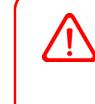

Make sure that *Purchases* is selected in the **Post Cost to Expenses** box on the **Price/Cost** tab; otherwise, the expenses related to the non-stock item will not be recorded to the cost budget of the applicable project.

To ensure that the system will be able to obtain the required settings from each labor item when an invoice is generated, you need to associate this labor item with the appropriate entity (that is, an employee, a case, a project, or a contract), which may depend on the type of the billing process that you use. If no labor items are specified for the entities associated with the invoice, the system will not generate the invoice.

#### **Labor Items in Time Cards**

You can use time tracking for your activities to facilitate the process of labor tracking and costing. For instance, with time activities, you can bill projects based on the billable time spent on related activities. In Acumatica ERP, to account for work hours and overtime hours spent on projects, employees use time cards. To calculate the cost of labor, the system uses the labor cost rates defined for each employee on the *[Labor Rates](https://help-2025r1.acumatica.com/Help?ScreenId=ShowWiki&pageid=3bcc9979-ef23-4331-0598-19edc8babe03)* (PM209900) form. The cost of overtime labor is calculated based on the employee work hour rates multiplied by the factor specified in the **Multiplier** column of the *Overtime* earning type on the *[Earning](https://help-2025r1.acumatica.com/Help?ScreenId=ShowWiki&pageid=02757e0d-2d3f-4846-80c8-f2c2490fd386) Types* (EP102000) form. For more information, see *Employee Time Billing: General [Information](#page-172-2)*.

# <span id="page-78-0"></span>**Labor Items: Rules of Billing**

If the *Time Management* feature is enabled on the *[Enable/Disable Features](https://help-2025r1.acumatica.com/Help?ScreenId=ShowWiki&pageid=c1555e43-1bc5-4f6f-ba9d-b323f94d8a6b)* (CS100000) form, you can bill projects for employee time spent working on these projects. The system uses data from labor items for each invoice that the system generates when a time activity or case has been billed. The following sections explain in which order the system selects the labor items for activity billing and case billing.

#### **Time Activity Billing**

When time activities, which are created on the *[Employee](https://help-2025r1.acumatica.com/Help?ScreenId=ShowWiki&pageid=c17a7186-e898-4e5e-b565-27730950ca51) Time Activities* (EP307000) form, are being billed, the system determines the labor item to be used in the invoice and inserts it automatically in each applicable line of the invoice on the **Document Details** tab of the *[Invoices and Memos](https://help-2025r1.acumatica.com/Help?ScreenId=ShowWiki&pageid=5e6f3b27-b7af-412f-a40a-1d4f4be70cba)* (AR301000) form. The system uses the first labor item that it finds in a search of the following places in the system (listed in the order in which the system searches the location for a labor item value):

- 1. The **Employees** tab of the *[Projects](https://help-2025r1.acumatica.com/Help?ScreenId=ShowWiki&pageid=81c86417-3bde-444b-8f1c-682928d31a0c)* (PM301000) form for the project associated with the activity being billed, in the **Labor Item** column of the **Overrides** table for the employee who is the owner of the activity being billed. This table contains a list of labor items for a particular employee associated with the project, with one specific labor item for each earning type of the particular activity.
- 2. The **Labor Item Overrides** tab of the *[Employees](https://help-2025r1.acumatica.com/Help?ScreenId=ShowWiki&pageid=dae5144b-49b3-43a4-bce0-93f31b3f2321)* (EP203000) form for the employee who is the owner of the activity being billed. In the table on this tab, a specific labor item can be specified for each earning type.

3. The **General Info** tab of the *[Employees](https://help-2025r1.acumatica.com/Help?ScreenId=ShowWiki&pageid=dae5144b-49b3-43a4-bce0-93f31b3f2321)* (EP203000) form for the employee who is the owner of the activity being billed: On this tab, a labor item can be specified that is to be used for the employee regardless of the earning type of the particular activity.

#### **Case Billing**

During the billing of a case that has been created on the *[Cases](https://help-2025r1.acumatica.com/Help?ScreenId=ShowWiki&pageid=a492a091-9649-4826-bcc3-dccdf8765efd)* (CR306000) form, the system determines the labor item to be used in the invoice and inserts it automatically in the invoice line. For the cases whose case class has the *Per Case* billing mode specified, the system always uses the labor item and overtime labor item specified on the **Details** tab of the *[Case Classes](https://help-2025r1.acumatica.com/Help?ScreenId=ShowWiki&pageid=3831be44-0b11-433c-a2a9-eb2d6183012f)* (CR206000) form.

For cases whose case class uses the *Per Activity* billing mode, the system uses the first labor item that it finds in a search of the following places in the system (listed in the order in which the system searches the location for a labor item values; the search ends when the system finds a value):

- 1. The **Labor Items** tab of the *[Case Classes](https://help-2025r1.acumatica.com/Help?ScreenId=ShowWiki&pageid=3831be44-0b11-433c-a2a9-eb2d6183012f)* form for the case class of the case being billed. In the table on this tab, a labor item can be specified for each earning type; the listed labor items and earning types are not associated with any specific employee. If a row with the earning type of the activity is specified on this tab, the same default price and the same sales account (those specified for the labor item) are used for all caserelated activities of the class with the same earning type, regardless of their owner.
- 2. The **Employee Override** tab of the *[Customer Contracts](https://help-2025r1.acumatica.com/Help?ScreenId=ShowWiki&pageid=63f6e9ef-6dda-4aed-9d23-743ae7a1332c)* (CT301000) form for the contract specified for the case being billed. In the table on the **Employee Override** tab, a specific labor item can be specified for a particular employee (selected in the **Employee** column) related to the contract. The table can also include a row with *All Employees* selected in the **Employee** column and a particular labor item that will be used for all other employees. Additionally, on this tab, a separate labor item can be specified for each earning type.
- 3. The **Employees** tab of the *[Projects](https://help-2025r1.acumatica.com/Help?ScreenId=ShowWiki&pageid=81c86417-3bde-444b-8f1c-682928d31a0c)* (PM301000) form for the project associated with the activities related to the case being billed, in the **Labor Item** column of the **Overrides** table for the employee who is the owner of the activity being billed. This table contains a list of labor items can be specified for each particular employee associated with the project, with one specific labor item for each earning type.
- 4. The **Labor Item Overrides** tab of the *[Employees](https://help-2025r1.acumatica.com/Help?ScreenId=ShowWiki&pageid=dae5144b-49b3-43a4-bce0-93f31b3f2321)* (EP203000) form for the employee who is the owner of the activities related to the case being billed. In the table on this tab, a specific labor item can be specified for each earning type for the employee.
- 5. The **General** tab of the *[Employees](https://help-2025r1.acumatica.com/Help?ScreenId=ShowWiki&pageid=dae5144b-49b3-43a4-bce0-93f31b3f2321)* (EP203000) form for the employee who is the owner of the activities related to the case being billed. On this tab, a labor item can be specified that is to be used for the employee regardless of the earning type of the particular activity.

For further information about the billing of contract-related cases, see *[Contract Usage: Contract UsageImplementing](https://help-2025r1.acumatica.com/Help?ScreenId=ShowWiki&pageid=d3b2c8e8-fd2d-45b5-baa9-fd528af5f2a3) [and Managing the Support Contract: Contract Usage](https://help-2025r1.acumatica.com/Help?ScreenId=ShowWiki&pageid=d3b2c8e8-fd2d-45b5-baa9-fd528af5f2a3)*. For details on how you can use labor items to set up employee rates for contracts, see *Contract Setup and Activation: To Create and Activate an Empty [Consulting](https://help-2025r1.acumatica.com/Help?ScreenId=ShowWiki&pageid=133c8b62-b7ea-43bf-b181-aba09969c1a9) Contract Draft*

# <span id="page-79-0"></span>**Labor Items: Configuration Prerequisites**

Before starting to create labor items, you must be sure that the system has been configured properly and that all required entities have been created, as described in the following sections.

#### **Enabling the Needed Features**

On the *[Enable/Disable Features](https://help-2025r1.acumatica.com/Help?ScreenId=ShowWiki&pageid=c1555e43-1bc5-4f6f-ba9d-b323f94d8a6b)* (CS100000) form, the *Projects* feature must be enabled.

#### **Configuring the System**

You need to make sure the following tasks have been performed in Acumatica ERP before you begin creating labor items for projects:

- On the *[Projects Preferences](https://help-2025r1.acumatica.com/Help?ScreenId=ShowWiki&pageid=de2ca225-4a0c-4129-b09d-3f3ed05198f9)* (PM101000) form, the basic project accounting settings have been specified: numbering sequences, non-project code, visibility settings, and posting settings. The actual combination of settings you need to specify depends on the processes in your organization and on the features enabled on the *[Enable/Disable Features](https://help-2025r1.acumatica.com/Help?ScreenId=ShowWiki&pageid=c1555e43-1bc5-4f6f-ba9d-b323f94d8a6b)* (CS100000) form. For details, see *[Basic Project Configuration: Implementation](https://help-2025r1.acumatica.com/Help?ScreenId=ShowWiki&pageid=95fc5aa8-7625-46ed-b233-8624245f7b3a) [Activity](https://help-2025r1.acumatica.com/Help?ScreenId=ShowWiki&pageid=95fc5aa8-7625-46ed-b233-8624245f7b3a)*.
- On the *[Account Groups](https://help-2025r1.acumatica.com/Help?ScreenId=ShowWiki&pageid=94a2cdce-c36a-49a1-b572-9cd33cb5fa73)* (PM201000) form, the GL accounts used for labor items have been mapped to appropriate account groups. (Otherwise, the transactions related to labor on projects will not be visible in projects.) For details on configuring account groups, see *Account Groups: To Create an [Expense](#page-14-1) Account [Group](#page-14-1)*.
- On the *[Units of Measure](https://help-2025r1.acumatica.com/Help?ScreenId=ShowWiki&pageid=c25c9971-01e2-4021-aa3b-8809f8045e58)* (CS203500) form, all necessary system-wide units of measure that you will use for labor items have been added. For details, see *[Creating Units of Measure](https://help-2025r1.acumatica.com/Help?ScreenId=ShowWiki&pageid=6f156588-60c9-40f1-8fc5-87798955e93e)*.
- On the *Tax [Categories](https://help-2025r1.acumatica.com/Help?ScreenId=ShowWiki&pageid=db5e7fad-054d-467d-877e-2db4ee180ead)* (TX205500) form, the necessary tax categories have been created.

#### **Configuring Posting Classes**

If the *Inventory and Order Management* feature is enabled on the *[Enable/Disable Features](https://help-2025r1.acumatica.com/Help?ScreenId=ShowWiki&pageid=c1555e43-1bc5-4f6f-ba9d-b323f94d8a6b)* (CS100000) form in your system, a posting class must be specified in non-stock item you create, including each labor item. Before you create labor items, make sure that on the *[Posting Classes](https://help-2025r1.acumatica.com/Help?ScreenId=ShowWiki&pageid=edd4bd77-13f5-4e89-9e47-2861fc66bbb0)* (IN206000) form, the necessary posting classes have been created. For details, see *[Creating Posting Classes](https://help-2025r1.acumatica.com/Help?ScreenId=ShowWiki&pageid=36d8909e-689c-4d64-bc1d-0c7851679794)*.

#### **Configuring Labor Item Identifiers**

The *INVENTORY* segmented key on the *[Segmented Keys](https://help-2025r1.acumatica.com/Help?ScreenId=ShowWiki&pageid=78bd7bd1-6bf6-409e-a8a5-8b18e8b80722)* (CS202000) form defines the structure of the identifiers of non-stock items. By default, this segmented key specifies that the item identifier is an alphanumeric string of up to 10 characters. For the key, you can define how many segments it is to have, what values may be used, whether these values should be validated, and whether auto-numbering should be used in one of the segments. You can also divide item identifiers into segments with specific values. For more information on configuring segmented keys, see *[Segmented Identifiers](https://help-2025r1.acumatica.com/Help?ScreenId=ShowWiki&pageid=a2f667ab-0de9-4738-9f05-58e9cbfc1735)*.

# <span id="page-80-1"></span><span id="page-80-0"></span>**Labor Items: To Configure a Labor Item**

This activity will walk you through the process of configuring a labor non-stock item that will then be used for billing employee labor within projects.

This activity is based on the *U100* dataset. If you are using another dataset, or if any system settings have been changed in *U100*, these changes can affect the workflow of the activity and the results of the processing. To avoid any issues, restore the *U100* dataset to its initial state.

#### **Story**

Suppose that you, as an implementation manager, are updating the system configuration for the SweetLife Fruits & Jams company. To be able to bill the customers for the provided labor within the projects, you need to create a labor item that will represent the repair service for juicers provided by a particular employee, Eric Killian, for SweetLife customers who have purchased juicers.

#### **Process Overview**

You will create a non-stock item representing the repair labor on the *[Non-Stock Items](https://help-2025r1.acumatica.com/Help?ScreenId=ShowWiki&pageid=bf68dd4f-63d4-460d-8dc0-9152f2bd6bf1)* (IN202000) form and specify the item's settings, including the expense account that has been mapped to an appropriate account group. You will also specify the default price for the item. Then on the *[Employees](https://help-2025r1.acumatica.com/Help?ScreenId=ShowWiki&pageid=dae5144b-49b3-43a4-bce0-93f31b3f2321)* (EP203000) form, you will assign this labor item to the employee who will perform the repair work.

#### **Configuration Overview**

In the *U100* dataset, the following tasks have been performed to support this activity:

- On the *[Enable/Disable Features](https://help-2025r1.acumatica.com/Help?ScreenId=ShowWiki&pageid=c1555e43-1bc5-4f6f-ba9d-b323f94d8a6b)* (CS100000) form, the *Project Accounting* feature has been enabled to support the project accounting functionality.
- On the *[Chart of Accounts](https://help-2025r1.acumatica.com/Help?ScreenId=ShowWiki&pageid=85557f41-a4af-47a8-b198-2a01461ce9c3)* (GL202500) form, the *54600 – Repair Expense* account has been defined and mapped to the *MAINTSERV* account group, which has been defined on the *[Account Groups](https://help-2025r1.acumatica.com/Help?ScreenId=ShowWiki&pageid=94a2cdce-c36a-49a1-b572-9cd33cb5fa73)* (PM201000) form.
- On the *[Posting Classes](https://help-2025r1.acumatica.com/Help?ScreenId=ShowWiki&pageid=edd4bd77-13f5-4e89-9e47-2861fc66bbb0)* (IN206000) form, the *NONSTOCK* posting class has been defined.
- On the *[Employees](https://help-2025r1.acumatica.com/Help?ScreenId=ShowWiki&pageid=dae5144b-49b3-43a4-bce0-93f31b3f2321)* (EP203000) form, the *EP00000006 Eric Killian* employee record has been created.

#### **System Preparation**

To prepare to perform the instructions of the activity, launch the Acumatica ERP website, and sign in to a company with the *U100* dataset preloaded; you should sign in as system administrator by using the *gibbs* username and the *123* password.

#### **Step 1: Creating the Labor Item**

To create the labor item that will be used to represent repair services, perform the following instructions:

- 1. On the *[Non-Stock Items](https://help-2025r1.acumatica.com/Help?ScreenId=ShowWiki&pageid=bf68dd4f-63d4-460d-8dc0-9152f2bd6bf1)* (IN202000) form, add a new record.
- 2. In the Summary area, specify the following settings:
  - **Inventory ID**: JUICERREPAIR
  - **Description**: Juicer repair (at the customer's place)
- 3. On the **General** tab, specify the following settings:
  - **Type**: *Labor*
  - **Posting Class**: *NONSTOCK*

Based on the settings of the *NONSTOCK* posting class, the system will use the GL accounts specified for the inventory item.

- **Tax Category**: *EXEMPT*
- **Base Unit**: *HOUR*
- **Sales Unit**: *HOUR*
- **Purchase Unit**: *HOUR*
- 4. In the **Default Price** box on the **Price/Cost** tab, enter 80.
- 5. On the same tab, make sure *Purchases* is selected in the **Post Cost to Expenses On** box.
- 6. On the **GL Accounts** tab, specify the following accounts:
  - **Expense Accrual Account**: *11010 (AR Accrual Account)*
  - **Expense Account**: *54600 (Repair Expenses)*
  - **Sales Account**: *40000 (Sales Revenue)*
- 7. On the form toolbar, click**Save**.

#### **Step 2: Assigning the Labor Item to an Employee**

To assign the labor item you have created to the employee who will perform the labor, perform the following instructions:

1. On the *[Employees](https://help-2025r1.acumatica.com/Help?ScreenId=ShowWiki&pageid=dae5144b-49b3-43a4-bce0-93f31b3f2321)* (EP203000) form, open the *EP00000006 – Eric Killian* employee record.

- 2. In the **Labor Item** box on the **General** tab, select *JUICERREPAIR*.
- 3. Save your changes to the employee record.

You have created the labor item to be used for repair service and specified an expense account that is mapped to a particular account group. You also have associated this labor item with the particular employee who will perform this work.

Now you can proceed with specifying labor cost rates for the employee, as described in *Labor Items: To [Define](#page-84-1) Labor [Cost Rates](#page-84-1)*,

## <span id="page-82-0"></span>**Labor Items: Labor Cost Rates**

In Acumatica ERP, you can define labor rates, which are used to determine the cost of employee time spent on a particular project, and bill the customers based on this cost. The following sections explain how the labor cost rates are specified and retrieved in projects.

#### **Creation of Labor Cost Rates**

On the *[Labor Rates](https://help-2025r1.acumatica.com/Help?ScreenId=ShowWiki&pageid=3bcc9979-ef23-4331-0598-19edc8babe03)* (PM209900) form, you can define labor cost rates that are specific to particular entities, such as the employee, project, project task, labor item, date, union local, certified job, and workers' compensation code.

When you define a labor cost rate, you specify its type, the rate, and an optional description and external reference number of the rate. Based on the type you select, particular columns become available so you can specify the particular entity the rate applies to and other relevant details. In the**Type** column of the *[Labor Rates](https://help-2025r1.acumatica.com/Help?ScreenId=ShowWiki&pageid=3bcc9979-ef23-4331-0598-19edc8babe03)* form, you select one of the following options:

- *Labor Item*: If you select this type, in the row, you must also select the labor item and the rate.
- *Employee*: If you select this type, in the row, you must select the employee and the rate; optionally, you can also select a particular labor item to which the rate applies.
- *Project*: If you select this type, in the row, you must select the project and the rate. Optionally, you can select any of the following to which the rate applies: the project task, the employee, and the labor item.
- *Union Wage*: If you select this type, in the row, you must select the applicable union local and labor item.
- You might define a rate of this type if an employee is a member of a local branch of a union; in this case, the union requires the company to pay the dictated union rate, which is usually higher than the prevailing wage rate.
- *Prevailing Wage*: If you select this type, in the row, you must select the project and labor item.

You might define a rate of this type if a government entity requires the construction companies to pay a non-union employee no less than the dictated prevailing wage rate. The prevailing wage is a government mechanism to equalize the wage rates that are paid by a construction company to non-union workers compared to labor union workers for the same type of work performed for a certified job. (A certified job is a job performed for government, such as a construction project of a municipal building.)

For each labor cost rate, regardless of its type, you specify the effective date. If there are multiple labor cost rates with the same settings, the system uses the rate with the most recent effective date that precedes the current date. You can also create a labor cost rate with the same settings as an existing labor cost rate but with an effective date that is later than the latest effective date of the existing labor cost rate.

#### **Units of Measure in Labor Cost Rates**

When you specify the rate for a row with a labor item selected on the *[Labor Rates](https://help-2025r1.acumatica.com/Help?ScreenId=ShowWiki&pageid=3bcc9979-ef23-4331-0598-19edc8babe03)* (PM209900) form, you specify the rate for the base unit of measure (UOM) of the labor item. The base UOM of the labor item should be convertible into minutes so that the system can convert the base UOM to a minute. That is, there should be conversion rules from a minute to the base UOM and from the base UOM to a minute on the *[Units of Measure](https://help-2025r1.acumatica.com/Help?ScreenId=ShowWiki&pageid=c25c9971-01e2-4021-aa3b-8809f8045e58)* (CS203500) form.

When you create a labor cost rate for a labor item with a base UOM that is not an hour, make sure that you enter the rate for the base UOM of the labor item on the *[Labor Rates](https://help-2025r1.acumatica.com/Help?ScreenId=ShowWiki&pageid=3bcc9979-ef23-4331-0598-19edc8babe03)* form so that the system calculates the correct amount when a time activity with this labor item is released.

For example, suppose that you have the *TRAINING* labor item, whose base UOM is *UNIT*. According to the conversion rules specified on the *[Units of Measure](https://help-2025r1.acumatica.com/Help?ScreenId=ShowWiki&pageid=c25c9971-01e2-4021-aa3b-8809f8045e58)* (CS203500) form, one unit equals four hours. On the *[Labor Rates](https://help-2025r1.acumatica.com/Help?ScreenId=ShowWiki&pageid=3bcc9979-ef23-4331-0598-19edc8babe03)* form, when you add a labor cost rate with an employee and the *TRAINING* labor item, you should specify the rate in the base UOM, which is *UNIT*. When the employee enters a time card on the *[Employee](https://help-2025r1.acumatica.com/Help?ScreenId=ShowWiki&pageid=4493e479-b1e6-4f6a-ba98-360bb92692f0) Time Cards* (EP305000) form and selects the *TRAINING* labor item in a time activity on the *[Activity](https://help-2025r1.acumatica.com/Help?ScreenId=ShowWiki&pageid=09cd2553-0e9e-4450-804d-106159f9a5b6)* (CR306010) form, the time is reported in hours even though the base UOM of the selected item is not an hour. When the time card with the corresponding time activities is released, the system generates a project transaction with the *TRAINING* labor item in the base UOM of the item. If the employee has reported eight hours, the project transaction will contain two *TRAINING* units.

#### **Time Card Population**

When you create a time card on the *[Employee](https://help-2025r1.acumatica.com/Help?ScreenId=ShowWiki&pageid=4493e479-b1e6-4f6a-ba98-360bb92692f0) Time Cards* (EP305000) form, for each line, you select the employee, project, project task, labor item, date, union local, certified job, and worker compensation code.

In a time card, the system automatically populates the **Union Local** column with the union local copied from the settings of the employee specified on the **General Info** tab of the *[Employees](https://help-2025r1.acumatica.com/Help?ScreenId=ShowWiki&pageid=dae5144b-49b3-43a4-bce0-93f31b3f2321)* (EP203000) form if the employee's union local specified is one of the union locals of the project specified on the **Union Locals** tab of the *[Projects](https://help-2025r1.acumatica.com/Help?ScreenId=ShowWiki&pageid=81c86417-3bde-444b-8f1c-682928d31a0c)* (PM301000) form, or if the project has no union local. Otherwise, the system leaves the column blank.

The system automatically selects the **Certified Job** check box in the time card line if for the corresponding project, the **Certified Job** check box is selected in the **Project Properties** section on the**Summary** tab of the *[Projects](https://help-2025r1.acumatica.com/Help?ScreenId=ShowWiki&pageid=81c86417-3bde-444b-8f1c-682928d31a0c)* form. In a time card, you can override the automatically selected **Certified Job** and **Union Local** settings, if needed.

#### **Retrieval of Labor Cost Rates**

For each time card line on the *[Employee](https://help-2025r1.acumatica.com/Help?ScreenId=ShowWiki&pageid=4493e479-b1e6-4f6a-ba98-360bb92692f0) Time Cards* (EP305000) form, the system retrieves the cost rate from the labor cost rate table on the *[Labor Rates](https://help-2025r1.acumatica.com/Help?ScreenId=ShowWiki&pageid=3bcc9979-ef23-4331-0598-19edc8babe03)* (PM209900) form as follows:

- 1. Among labor cost rates of the *Project*, *Employee*, and *Labor Item* rate types, the system selects the most specific existing labor cost rate among the defined labor cost rates that matches all the settings specified in the time card line and is effective on the date of the document. The system looks for the following sets of settings that match the time card settings and uses the first set it finds:
  - The *Project* rate type, project, project task, employee, and labor item
  - The *Project* rate type, project, project task, and employee
  - The *Project* rate type, project, project task, and labor item
  - The *Project* rate type, project, and project task
  - The *Project* rate type, project, employee, and labor item
  - The *Project* rate type, project, and employee
  - The *Project* rate type, project, and labor item
  - The *Project* rate type, and project
  - The *Employee* rate type, employee, and labor item
  - The *Employee* rate type, and employee
  - The *Labor Item* rate type, and labor item
- 2. For the time card line, if the **Certified Job** check box is selected and a **Union Local** is specified, the system selects the *Union Wage* and *Prevailing Wage* rate types that match the settings specified in the time card line. Then the system compares the most specific labor cost rate that has been found in the previous step with the selected labor cost rates of the *Union Wage* and *Prevailing Wage* rate types. Based on the comparison, the system selects the higher labor cost rate.

3. If there are multiple labor cost rates with the same settings, the system uses the rate with the actual effective date corresponding to the date of the time card line in the time zone in which the time card line was reported.

# <span id="page-84-1"></span><span id="page-84-0"></span>**Labor Items: To Define Labor Cost Rates**

In the following implementation activity, you will learn how to define labor cost rates.


This activity is based on the *U100* dataset. If you are using another dataset, or if any system settings have been changed in *U100*, these changes can affect the workflow of the activity and the results of the processing. To avoid any issues, restore the *U100* dataset to its initial state.

#### **Story**

Suppose that in the SweetLife Fruits & Jams company, the price of the consulting services depends on the qualifications of the consultant who provides the service. Acting as SweetLife's project manager, you need to define the labor cost rates that will become effective on January 1, *2025*, for three of your company's consultants:

- Pam Brawner, a project manager, whose work rate is \$48 per hour
- Jon Waite, a senior consultant, whose work rate is \$44 per hour
- Alberto Jimenez, a junior consultant, whose work rate is \$40 per hour

#### **Configuration Overview**

In the *U100* dataset, the following tasks have been performed to support this activity:

- On the *[Enable/Disable Features](https://help-2025r1.acumatica.com/Help?ScreenId=ShowWiki&pageid=c1555e43-1bc5-4f6f-ba9d-b323f94d8a6b)* (CS100000) form, the *Project Accounting* feature has been enabled.
- On the *[Non-Stock Items](https://help-2025r1.acumatica.com/Help?ScreenId=ShowWiki&pageid=bf68dd4f-63d4-460d-8dc0-9152f2bd6bf1)* (IN202000) form, the *CONSULTJR*, *CONSULTSR*, and *CONSULTPM* labor items have been created; on the *[Employees](https://help-2025r1.acumatica.com/Help?ScreenId=ShowWiki&pageid=dae5144b-49b3-43a4-bce0-93f31b3f2321)* (EP203000) form, these items have been assigned to the *EP00000004 (Alberto Jimenez)*, *EP00000003 (Jon Waite)*, and *EP00000001 (Pam Brawner)* employees, respectively. The base unit of all items is *HOUR*. For an example of configuring a labor item and assigning it to an employee, see *Labor Items: To [Configure](#page-80-1) a Labor Item*.

#### **Process Overview**

You will define labor cost rates that are based on the employee who performed the work on the *[Labor Rates](https://help-2025r1.acumatica.com/Help?ScreenId=ShowWiki&pageid=3bcc9979-ef23-4331-0598-19edc8babe03)* (PM209900) form.

#### **System Preparation**

To sign in to the system and prepare to perform the instructions of the activity, do the following:

- 1. Launch the Acumatica ERP website, and sign in to a company with the *U100* dataset preloaded; you should sign in as project accountant by using the *brawner* username and the *123* password.
- 2. In the info area, in the upper-right corner of the top pane of the Acumatica ERP screen, make sure that the business date in your system is set to *1/1/2025*. If a different date is displayed, click the Business Date menu button, and select *1/1/2025* on the calendar.

#### **Step: Defining Labor Cost Rates**

To define the needed labor cost rates, do the following:

- 1. On the *[Labor Rates](https://help-2025r1.acumatica.com/Help?ScreenId=ShowWiki&pageid=3bcc9979-ef23-4331-0598-19edc8babe03)* (PM209900) form, to add a new labor cost rate for Alberto Jimenez, click **Add Row** on the table toolbar, and specify the following settings in the row:
  - **Labor RateType**: *Employee*
  - **Employee**: *EP00000004 (Alberto Jimenez)*
  - **Labor Item**: *CONSULTJR* (inserted automatically as the labor item associated with the employee)
  - **Rate**: 40
  - **Effective Date**: *1/1/2025* (inserted automatically)
- 2. To add a labor cost rate for Jon Waite, click **Add Row** on the table toolbar, and specify the following settings in the row:
  - **Labor RateType**: *Employee*
  - **Employee**: *EP00000003 (Jon Waite)*
  - **Labor Item**: *CONSULTSR* (inserted automatically as the labor item associated with the employee)
  - **Rate**: 44
  - **Effective Date**: *1/1/2025* (inserted automatically)
- 3. To add a labor cost rate for Pam Brawner, again click **Add Row** on the table toolbar, and specify the following settings in the row:
  - **Labor RateType**: *Employee*
  - **Employee**: *EP00000001 (Pam Brawner)*
  - **Labor Item**: *CONSULTPM* (inserted automatically as the labor item associated with the employee)
  - **Rate**: 48
  - **Effective Date**: *1/1/2025* (inserted automatically)
- 4. Save your changes to the labor cost rates. The labor cost rates you have defined should look like those shown in the following screenshot.

|                                          |          | <b>Labor Rates</b>                      |              |                           |                   |                          |            |                      |                   |                               |                       |                              |                |             |               |                      |                    |
|------------------------------------------|----------|-----------------------------------------|--------------|---------------------------|-------------------|--------------------------|------------|----------------------|-------------------|-------------------------------|-----------------------|------------------------------|----------------|-------------|---------------|----------------------|--------------------|
| $\begin{bmatrix} 11 \\ 11 \end{bmatrix}$ |          | $\Omega$                                |              |                           |                   |                          |            |                      |                   |                               |                       |                              |                |             |               |                      |                    |
|                                          | Project: | Labor Rate Type:                        | All          |                           | $\sim$<br>$\circ$ | Employee:<br>Labor Item: |            | $\circ$<br>$\circ$   |                   |                               |                       |                              |                |             |               |                      |                    |
|                                          |          | Project Task:<br><b>Effective Date:</b> |              | $\qquad \qquad \Box$      |                   | Union Local:             |            | $\varphi$            |                   |                               |                       |                              |                |             |               |                      |                    |
| O                                        |          | $\mathsf{x}$<br>$+$                     | $\mathbb{H}$ | $\boxed{\mathbf{x}}$<br>工 |                   |                          |            |                      |                   |                               |                       |                              |                |             |               |                      |                    |
| 田 8                                      |          | Labor Rate Type                         |              | <b>Union Local</b>        | Project           | Project<br>Task          | Employee   | <b>Employee Name</b> | Labor Item        | <b>Description</b>            | Type of<br>Employment | Regular<br>Hours per<br>week | Annual<br>Rate |             | Rate Currency | External<br>Ref. Nbr | *Effective<br>Date |
|                                          |          | $0$ $D$ Employee                        |              |                           |                   |                          | EP00000001 | Pam Brawner          | <b>CONSULTPM</b>  | <b>Project Manager</b>        | Hourly                | 40.0                         |                | 45.0000 USD |               |                      | 12/1/2024          |
|                                          |          | $0$ $\Box$ Employee                     |              |                           |                   |                          | EP00000035 | Jeffrey Vega         | <b>TECHNICIAN</b> | Service and repair technician | Hourly                | 40.0                         |                | 45.0000 USD |               |                      | 12/1/2024          |
|                                          |          | <b>0</b> □ Union Wage                   |              | <b>NYS</b>                |                   |                          |            |                      | <b>CONSULTJR</b>  | Junior Consultant             | Hourly                |                              |                | 30.0000 USD |               |                      | 1/1/2024           |
|                                          |          | 0 D Union Wage                          |              | <b>NYS</b>                |                   |                          |            |                      | <b>CONSULTSR</b>  | <b>Senior Consultant</b>      | Hourly                |                              |                | 45.0000 USD |               |                      | 1/1/2024           |
|                                          |          | $0$ $\Box$ Employee                     |              |                           |                   |                          | EP00000004 | Alberto Jimenez      | <b>CONSULTJR</b>  | <b>Junior Consultant</b>      | Hourly                | 40.0                         |                | 40.0000 USD |               |                      | 1/1/2025           |
|                                          |          | $0$ $\Box$ Employee                     |              |                           |                   |                          | EP00000003 | Jon Waite            | <b>CONSULTSR</b>  | <b>Senior Consultant</b>      | Hourly                | 40.0                         |                | 44.0000 USD |               |                      | 1/1/2025           |
|                                          |          | $0$ $\Box$ Employee                     |              |                           |                   |                          | EP00000001 | Pam Brawner          | <b>CONSULTPM</b>  | Project Manager               | Hourly                | 40.0                         |                | 48.0000 USD |               |                      | 1/1/2025           |

*Figure: The added labor cost rates*

You have completed configuring labor cost rates.

Now you can complete the *[Employee](#page-179-1) Time Billing: Process Activity* to review how the labor cost rates are used in projects.

### <span id="page-85-0"></span>**Labor Items: Related Forms**

This topic describes forms you may review to gather information about labor items.

If you do not see a particular report or form that is described, you may have signed in to the system with a user account that does not have access rights to the report or form. Contact your system administrator to obtain access to any needed reports or forms.

#### **Reviewing Sales Prices**

You can review the sales prices of a labor item by clicking**Sales Prices** on the More menu of the *[Non-Stock Items](https://help-2025r1.acumatica.com/Help?ScreenId=ShowWiki&pageid=bf68dd4f-63d4-460d-8dc0-9152f2bd6bf1)* (IN202000) form. The system navigates to the *[Sales Prices](https://help-2025r1.acumatica.com/Help?ScreenId=ShowWiki&pageid=62bfca2c-0893-495b-bb1d-125b64899afc)* (AR202000) form, where you can review and add the sales prices for the selected labor item. For details about managing sales prices, see *[Sales Prices: General](https://help-2025r1.acumatica.com/Help?ScreenId=ShowWiki&pageid=d63d6b6c-15ee-4576-bf27-8de69f8f5da6) [Information](https://help-2025r1.acumatica.com/Help?ScreenId=ShowWiki&pageid=d63d6b6c-15ee-4576-bf27-8de69f8f5da6)*.

#### **Reviewing Vendor Prices**

You can review the vendor prices of a labor item by clicking**Vendor Prices** on the More menu of the *[Non-Stock](https://help-2025r1.acumatica.com/Help?ScreenId=ShowWiki&pageid=bf68dd4f-63d4-460d-8dc0-9152f2bd6bf1) [Items](https://help-2025r1.acumatica.com/Help?ScreenId=ShowWiki&pageid=bf68dd4f-63d4-460d-8dc0-9152f2bd6bf1)* (IN202000) form. The system navigates to the *[Vendor](https://help-2025r1.acumatica.com/Help?ScreenId=ShowWiki&pageid=d14478b3-0718-4632-9fe2-a563f79aa038) Prices* (AP202000) form, where you can review and add the vendor prices for the selected labor item. For details about managing vendor prices, see *Vendor Prices: [General](https://help-2025r1.acumatica.com/Help?ScreenId=ShowWiki&pageid=b8a92f04-1346-443b-aba0-9809a9d996e0) [Information](https://help-2025r1.acumatica.com/Help?ScreenId=ShowWiki&pageid=b8a92f04-1346-443b-aba0-9809a9d996e0)*.

# <span id="page-87-0"></span>**Processing Project Quotes**

If you need to estimate a potential project and send a proposal to a customer before a project is created, you can process a project quote. Aer the customer agrees to the terms of the quote, you can convert the winning quote to a project. This chapter explains how you can prepare and process project quotes.

# <span id="page-87-2"></span><span id="page-87-1"></span>**Project Quotes: General Information**

In Acumatica ERP, you use a project quote for planning purposes before you create the corresponding project in the system and begin billing and accounting for revenues and costs. You can create a project quote to estimate the revenue and costs of a potential project and then send this quote to the customer for acceptance. You can modify the project quote as many times as is necessary until an agreement is reached. Aer the customer agrees to the terms of a quote, you convert the accepted quote to a project.

#### **Learning Objectives**

In this chapter, you will learn how to do the following:

- Create a project quote from scratch
- Create a project quote based on an opportunity
- Specify the settings of a project quote by using a project template
- Estimate the potential revenue and costs of a possible project
- Print the project quote and send it by email
- Create a project based on a project quote

#### **Applicable Scenarios**

You create a project quote if you want to send a proposal to the customer or potential customer before you create a project, or if you need to agree with the customer about the terms of a potential project before creating the project.

#### **Creation of Project Quotes from Scratch**

You create project quotes on the *[Project Quotes](https://help-2025r1.acumatica.com/Help?ScreenId=ShowWiki&pageid=81c83417-3bde-444b-8f1c-382928d31a0c)* (PM304500) form. In a new project quote, which initially has the *Dra* status, you specify the following settings:

- The description of the project quote.
- The project template, which the system uses to populate the project tasks, attributes, and project manager of the project quote. You can change these default settings, if needed.
- The business account associated with the project quote.

Based on the settings specified for the selected business account, the system inserts the financial settings on the **Financial** tab and the contact information on the **Addresses** tab. You can override these settings, if needed.

- Optional: The project tasks on the **ProjectTasks** tab, which are copied from the selected project template by default (but you can modify the project tasks that are inserted based on the template). You can also add common tasks to the project quote.
- The estimated labor and material costs and prices on the **Estimation** tab. These lines represent the estimated revenue and costs of a project quote. When you create a project based on the project quote, the system converts the estimation lines to lines of the revenue and cost budgets based on the settings specified in each line:

- An estimation line with an account group specified in the **Revenue Account Group** column establishes revenue; the **Ext. Price** of the line is the estimated revenue amount.
- An estimation line with an account group specified in the **Cost Account Group** column establishes costs; the **Ext. Cost** of the line is the estimated cost amount.
- Estimation lines with both the **Revenue Account Group** and the **Cost Account Group** specified establish revenue and costs at the same time.

#### **Project Quote Processing**

When you have finished modifying the project quote settings, you submit the quote by clicking**Submit** on the form toolbar of the *[Project Quotes](https://help-2025r1.acumatica.com/Help?ScreenId=ShowWiki&pageid=81c83417-3bde-444b-8f1c-382928d31a0c)* (PM304500) form. A submitted project quote is assigned the *Approved* status and is ready for further processing.

If you have decided to email a submitted project quote to the customer, you click**Send** on the More menu. The system creates the corresponding email activity, attaches the printable version of the quote to this email activity, and sends it to the recipient. The project is then assigned the**Sent** status.

If you need to track a project quote that has been accepted or declined by the customer, you can use the following commands on the More menu:

- **Mark as Accepted**: Click this command to assign the project quote the *Accepted by Customer* status. The project quote can be printed, sent, and converted to a project.
- **Mark as Declined**: Click this command to assign the project quote the *Declined by Customer* status. You can then edit the details of the declined project quote and send it for customer review again. To modify a project quote, click **Edit** on the form toolbar. The quote is assigned the *Dra* status and can be modified.

If you need to modify an existing project quote but also want to leave its original version intact (for example, to have a complete history of the submitted quotes), you can create a copy of the project quote by clicking the **Copy** command; you then modify the copy.

You can convert a project quote with the *Approved*, *Accepted by Customer*, or *Sent* status to a project. To be able to do this, you should specify the project template and business account in the Summary area of the form. If autonumbering is disabled for the *PROJECT* segmented key on the *[Segmented Keys](https://help-2025r1.acumatica.com/Help?ScreenId=ShowWiki&pageid=78bd7bd1-6bf6-409e-a8a5-8b18e8b80722)* (CS202000) form, you must also specify the identifier of the project to be created.

Aer you have specified the required settings, you click **Convert to Project** on the form toolbar of the *[Project](https://help-2025r1.acumatica.com/Help?ScreenId=ShowWiki&pageid=81c83417-3bde-444b-8f1c-382928d31a0c) [Quotes](https://help-2025r1.acumatica.com/Help?ScreenId=ShowWiki&pageid=81c83417-3bde-444b-8f1c-382928d31a0c)* form. In the **Convert to Project** dialog box, which opens, you specify the settings to be used for the created project and click **OK**. The system opens the project created based on the project quote on the *[Projects](https://help-2025r1.acumatica.com/Help?ScreenId=ShowWiki&pageid=81c86417-3bde-444b-8f1c-682928d31a0c)* (PM301000) form; it also assigns the project quote the *Closed* status. In the created project, a link to the project quote is displayed in the **Quote Ref. Nbr.** box on the**Summary** tab (**Quote** section) of the *[Projects](https://help-2025r1.acumatica.com/Help?ScreenId=ShowWiki&pageid=81c86417-3bde-444b-8f1c-682928d31a0c)* form.

If you delete the project, the system changes the status of the project quote from *Closed* to *Approved*, so you can assign the *Dra* status to the project quote, edit it, and again create a project based on the project quote.

#### **Workflow of Project Quotes**

The following diagram illustrates the workflow of a project quote being processed.

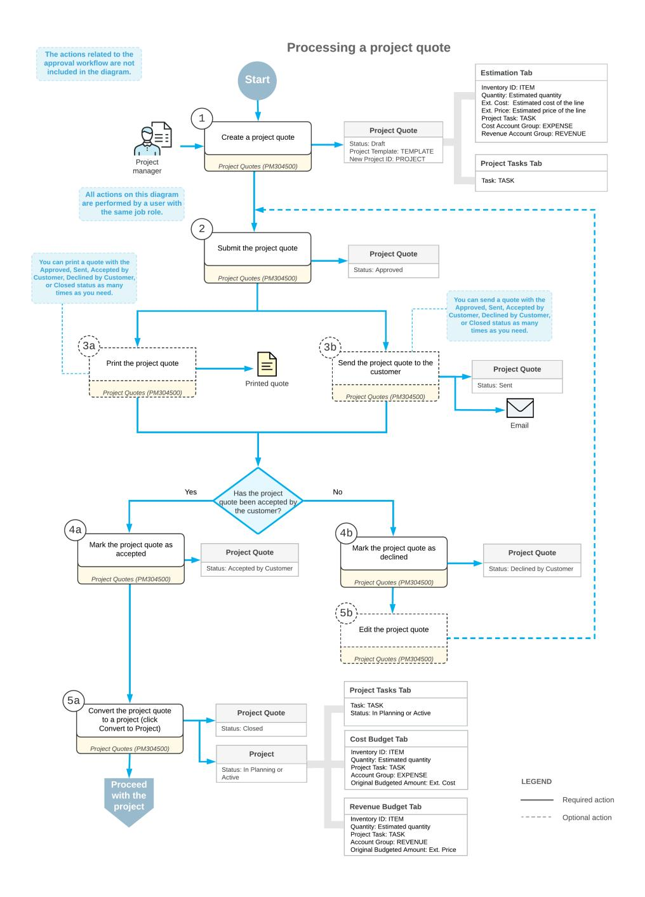

# <span id="page-89-0"></span>**Project Quotes: Implementation Checklist**

The following sections provide details you can use to ensure that the system is configured properly for the creation of project quotes and projects based on project quotes, and to understand (and change, if needed) the settings that affect the processing workflow.

#### **Implementation Checklist**

We recommend that before you initially create project quotes, you make sure the needed features have been enabled, settings have been specified, and entities have been created, as summarized in the following checklist.

| Form                                    | Tasks to Perform                                                                                                                                                                                                                                                                 |
|-----------------------------------------|----------------------------------------------------------------------------------------------------------------------------------------------------------------------------------------------------------------------------------------------------------------------------------|
| Enable/Disable Features (CS100000) form | Make sure that the Project Accounting and Project<br>Quotes features are enabled.                                                                                                                                                                                                |
| Projects Preferences (PM101000) form    | Make sure that all necessary settings related to project<br>accounting have been specified. For more information<br>about configuration steps that you have to perform<br>before you can start accounting for projects, see Basic<br>Project Configuration: General Information. |
| Project Templates (PM208000) form       | Make sure that all needed project templates have been<br>configured. For more information about project tem<br>plates, see Project Templates and Common Tasks: Gen<br>eral Information.                                                                                          |
| Business Account Classes (CR208000)     | Make sure that business account classes with the nec<br>essary settings and attributes have been created, as<br>described in Defining Business Account Classes.                                                                                                                  |
| Business Accounts (CR303000)            | Make sure that business accounts with the neces<br>sary settings and attributes have been created, as de<br>scribed in Creating Business Accounts.                                                                                                                               |

#### **CRM Settings Checklist**

If you want to use the functionality of opportunities to create project quotes, make sure that the needed features have been enabled and settings have been specified, as summarized in the following checklist.

| Form                                            | Criteria to Check                                                                                                                                             |
|-------------------------------------------------|---------------------------------------------------------------------------------------------------------------------------------------------------------------|
| Enable/Disable Features (CS100000) form         | Make sure that the Customer Management feature is<br>enabled.                                                                                                 |
| Customer Management Preferences (CR101000) form | Make sure that all necessary settings related to cus<br>tomer management have been specified.                                                                 |
| Opportunity Classes (CR209000)                  | Make sure that opportunity classes with the necessary<br>settings, attributes, and stages have been created, as<br>described in Defining Opportunity Classes. |

#### **Other Settings That Affect the Workflow**

You can affect the workflow of processing project quotes by specifying additional settings as follows:

• To change the format of project quote identifiers, adjust the *PMQUOTE* numbering sequence on the *[Numbering Sequences](https://help-2025r1.acumatica.com/Help?ScreenId=ShowWiki&pageid=a8d11c23-21f2-42a3-b17d-9637c9cf8031)* (CS201010) form or create a new numbering sequence and select this sequence in the **Quote NumberingSequence** box on the **General** tab (**NumberingSequence** section) of the *[Projects](https://help-2025r1.acumatica.com/Help?ScreenId=ShowWiki&pageid=de2ca225-4a0c-4129-b09d-3f3ed05198f9) [Preferences](https://help-2025r1.acumatica.com/Help?ScreenId=ShowWiki&pageid=de2ca225-4a0c-4129-b09d-3f3ed05198f9)* (PM101000) form. Project quote identifiers must be assigned only automatically. For more information on numbering sequences, see *[Use of Numbering Sequences](https://help-2025r1.acumatica.com/Help?ScreenId=ShowWiki&pageid=71c26175-c78f-4e70-8518-2115f5bfaf2f)*.

By default, the *PMQUOTE* numbering sequence specifies that the project quote identifier is an automatically generated alphanumeric string that starts with the *PQ* prefix and followed by six digits, such as *PQ000001*.

- To cause the system to automatically select a project template on creation of project quotes, select the project template in the **Default QuoteTemplate** box on the **General** tab (**DefaultSettings** section) of the *[Projects Preferences](https://help-2025r1.acumatica.com/Help?ScreenId=ShowWiki&pageid=de2ca225-4a0c-4129-b09d-3f3ed05198f9)* form.
- To cause the system to automatically select the revenue account group for new estimation lines of a project quote if there are multiple income account groups defined on the *[Account Groups](https://help-2025r1.acumatica.com/Help?ScreenId=ShowWiki&pageid=94a2cdce-c36a-49a1-b572-9cd33cb5fa73)* (PM201000) form, specify the **Default Revenue Account Group** for expense account groups in the Summary area of the *[Account](https://help-2025r1.acumatica.com/Help?ScreenId=ShowWiki&pageid=94a2cdce-c36a-49a1-b572-9cd33cb5fa73) [Groups](https://help-2025r1.acumatica.com/Help?ScreenId=ShowWiki&pageid=94a2cdce-c36a-49a1-b572-9cd33cb5fa73)* form. For more information on account groups, see *[Account Groups: General Information](#page-12-2)*.

#### **Validation of Configuration**

To make sure that all configuration has been performed correctly, we recommend that in your system, you process a project quote by performing instructions similar to those described in *Project Quotes: To [Process](#page-93-1) a Project Quote [Based on an Opportunity](#page-93-1)*.

# <span id="page-91-0"></span>**Project Quotes: Creation of Project Quotes from Opportunities**

In Acumatica ERP, an opportunity represents a potential sale to a new or existing customer. You can create a project quote based on an opportunity and then create a project based on this project quote.

The following sections describe the project quotes creation based on opportunities. For more information on working with opportunities, see *[Managing Opportunities](https://help-2025r1.acumatica.com/Help?ScreenId=ShowWiki&pageid=946abdaa-3a0a-4949-a783-5502ac7f29bd)*.

#### **Creation of a Project Quote Based on an Opportunity**

To create a project quote based on an opportunity, you open the opportunity on the *[Opportunities](https://help-2025r1.acumatica.com/Help?ScreenId=ShowWiki&pageid=5cb49cd5-2be8-4617-9341-958f1c5d6d53)* (CR304000) form, and click **Create Quote** on the form toolbar. In the **Create Quote** dialog box, which the system opens, you select *Project Quote* in the **QuoteType** box to indicate the type of quote to be created based on the opportunity. Then you specify the basic settings and initiate the creation of the quote by clicking **Create and Review**.

The system creates the project quote and opens it on the *[Project Quotes](https://help-2025r1.acumatica.com/Help?ScreenId=ShowWiki&pageid=81c83417-3bde-444b-8f1c-382928d31a0c)* (PM304500) form. In the Summary area, the system inserts the identifier of the opportunity in the **Opportunity ID** box and copies the business account, the description, and the owner from the opportunity to the quote.

Once you save the project quote associated with the opportunity, on the *[Opportunities](https://help-2025r1.acumatica.com/Help?ScreenId=ShowWiki&pageid=5cb49cd5-2be8-4617-9341-958f1c5d6d53)* form, the project quote is listed on the **Quotes** tab along with any other project and sales quotes associated with the opportunity.

The following diagram illustrates the creation of a project quote from an opportunity.

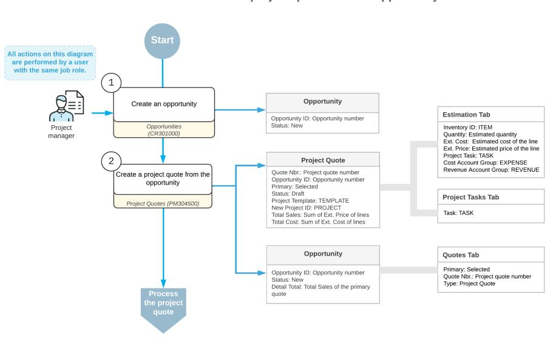

Aer the project quote has been created based on the opportunity, its workflow is the same as that of a project quote that has been created from scratch. For information, see *[Project Quotes: General Information](#page-87-2)*.

#### **Primary Project Quotes**

If you create a project quote for an opportunity, and the opportunity does not have any other quotes, the system sets this project quote as the primary by selecting the **Primary** check box in the following places:

- In the Summary area on the *[Project Quotes](https://help-2025r1.acumatica.com/Help?ScreenId=ShowWiki&pageid=81c83417-3bde-444b-8f1c-382928d31a0c)* (PM304500) form
- In the row that has the settings of the project quote on the **Quotes** tab of the *[Opportunities](https://help-2025r1.acumatica.com/Help?ScreenId=ShowWiki&pageid=5cb49cd5-2be8-4617-9341-958f1c5d6d53)* (CR304000) form

If you create a new project quote and set it as primary, the previous primary quote of this opportunity becomes non-primary.

If multiple quotes are created for an opportunity, one of the quotes must be set as the primary. You can set a project quote as a primary quote for a non-closed opportunity either by clicking**Set as Primary** on the *[Project](https://help-2025r1.acumatica.com/Help?ScreenId=ShowWiki&pageid=81c83417-3bde-444b-8f1c-382928d31a0c) [Quotes](https://help-2025r1.acumatica.com/Help?ScreenId=ShowWiki&pageid=81c83417-3bde-444b-8f1c-382928d31a0c)* form toolbar or during creation of a new project quote.

The **Details** tab on the *[Opportunities](https://help-2025r1.acumatica.com/Help?ScreenId=ShowWiki&pageid=5cb49cd5-2be8-4617-9341-958f1c5d6d53)* form is not displayed if a project quote has been created for an opportunity and set as primary.

You can create a project from an opportunity-based project quote if this quote has been set as primary. To create a project based on a project quote, you click **Convert to Project** on the form toolbar of the *[Project Quotes](https://help-2025r1.acumatica.com/Help?ScreenId=ShowWiki&pageid=81c83417-3bde-444b-8f1c-382928d31a0c)* form. The created project is associated with the opportunity and can be used for the creation of sales orders, invoices, and service orders.

#### **Project Quote Addresses**

When you create a project quote based on an opportunity, the system inserts the location-related information in the project quote on the *[Project Quotes](https://help-2025r1.acumatica.com/Help?ScreenId=ShowWiki&pageid=81c83417-3bde-444b-8f1c-382928d31a0c)* (PM304500) form as follows:

- Copies the address settings from the**Ship-To Address** section on the**Shipping** tab of the *[Opportunities](https://help-2025r1.acumatica.com/Help?ScreenId=ShowWiki&pageid=5cb49cd5-2be8-4617-9341-958f1c5d6d53)* (CR304000) form to the **Project Address** section on the **Addresses** tab of the *[Project Quotes](https://help-2025r1.acumatica.com/Help?ScreenId=ShowWiki&pageid=81c83417-3bde-444b-8f1c-382928d31a0c)* form for the project quote. If you need to change the project address in the project quote, you can select the **Override** check box in the **Project Address** section and update the information in the section.
- Copies the contact settings from the **Contact** section on the **Contact** tab of the *[Opportunities](https://help-2025r1.acumatica.com/Help?ScreenId=ShowWiki&pageid=5cb49cd5-2be8-4617-9341-958f1c5d6d53)* form to the **Bill-To Contact** section on the **Addresses** tab of the *[Project Quotes](https://help-2025r1.acumatica.com/Help?ScreenId=ShowWiki&pageid=81c83417-3bde-444b-8f1c-382928d31a0c)* form for the project quote.

• Copies the address information from the **Address** section on the **Contact** tab of the *[Opportunities](https://help-2025r1.acumatica.com/Help?ScreenId=ShowWiki&pageid=5cb49cd5-2be8-4617-9341-958f1c5d6d53)* form to the **Bill-To Address** section on the **Addresses** tab of the *[Project Quotes](https://help-2025r1.acumatica.com/Help?ScreenId=ShowWiki&pageid=81c83417-3bde-444b-8f1c-382928d31a0c)* form for the project quote.

If you specify a different business account in the **Business Account** box of the Summary area, or a location in the **Location** box of the **Financial** tab of the *[Project Quotes](https://help-2025r1.acumatica.com/Help?ScreenId=ShowWiki&pageid=81c83417-3bde-444b-8f1c-382928d31a0c)* form, the system displays a dialog box in which you need to confirm the replacement of the existing settings in the quote with the new settings.

# <span id="page-93-1"></span><span id="page-93-0"></span>**Project Quotes: To Process a Project Quote Based on an Opportunity**

This activity will walk you through the process of creating a project quote from an opportunity and creating a project based on the project quote.

This activity is based on the *U100* dataset. If you are using another dataset, or if any system settings have been changed in *U100*, these changes can affect the workflow of the activity and the results of the processing. To avoid any issues, restore the *U100* dataset to its initial state.

#### **Story**

Suppose that the HM's Bakery and Cafe customer has ordered a juicer for one of its restaurants, along with the installation and training services from the SweetLife Fruits & Jams company. The sales manager of SweetLife has created an opportunity for the provision of the juicer and the services. Acting as SweetLife's estimator, you will create a project quote for this opportunity, confirm the project quote with the customer, and convert the project quote to the project.

#### **Configuration Overview**

In the *U100* dataset, the following tasks have been performed to support this activity:

- For the purposes of this activity, the following features have been enabled on the *[Enable/Disable Features](https://help-2025r1.acumatica.com/Help?ScreenId=ShowWiki&pageid=c1555e43-1bc5-4f6f-ba9d-b323f94d8a6b)* (CS100000) form:
  - *Project Accounting*, which provides support for the project accounting functionality
  - *Project Quotes*, which provides the ability to create project quotes
  - *Customer Management*, which provides the customer relation management (CRM) functionality, including management of opportunities
- On the *[Opportunities](https://help-2025r1.acumatica.com/Help?ScreenId=ShowWiki&pageid=5cb49cd5-2be8-4617-9341-958f1c5d6d53)* (CR304000) form, the *000001* opportunity has been created. A note and a file have been attached to the opportunity.
- On the *Project [Templates](https://help-2025r1.acumatica.com/Help?ScreenId=ShowWiki&pageid=11e7c776-03fb-405d-a1f4-26700dd319fc)* (PM208000) form, the *PROGRESS* project template has been configured with the *PHASE1* and *PHASE2* project template tasks.
- On the *[Account Groups](https://help-2025r1.acumatica.com/Help?ScreenId=ShowWiki&pageid=94a2cdce-c36a-49a1-b572-9cd33cb5fa73)* (PM201000) form, the *REVENUE*, *MATERIAL*, *SUBCON*, and *LABOR* account groups have been created.
- On the *[Stock Items](https://help-2025r1.acumatica.com/Help?ScreenId=ShowWiki&pageid=77786a70-1f1e-4d63-ad98-96f98e4fcb0e)* (IN202500) form, the *JUICER15* stock item has been configured.
- On the *[Non-Stock Items](https://help-2025r1.acumatica.com/Help?ScreenId=ShowWiki&pageid=bf68dd4f-63d4-460d-8dc0-9152f2bd6bf1)* (IN202000) form, the *INSTALL* and *TRAINING* non-stock items have been configured.

#### **Process Overview**

On the *[Opportunities](https://help-2025r1.acumatica.com/Help?ScreenId=ShowWiki&pageid=5cb49cd5-2be8-4617-9341-958f1c5d6d53)* (CR304000) form, you will initiate the creation of a project quote for the opportunity created for the customer. On the *[Project Quotes](https://help-2025r1.acumatica.com/Help?ScreenId=ShowWiki&pageid=81c83417-3bde-444b-8f1c-382928d31a0c)* (PM304500) form, you will then create the project quote and specify all required settings, including the estimation lines and the project template to be used for project creation. You will also print the project quote and email it to the customer for review. Once the project quote has been confirmed with the customer, you will convert the project quote to a project.

#### **System Preparation**

Before you begin performing the steps of this activity, perform the following instructions to prepare the system:

- 1. Launch the Acumatica ERP website, and sign in to a company with the *U100* dataset preloaded; you should sign in as project accountant by using the *brawner* username and the *123* password.
- 2. In the info area, in the upper-right corner of the top pane of the Acumatica ERP screen, make sure that the business date in your system is set to *1/30/2025*. If a different date is displayed, click the Business Date menu button and select *1/30/2025* on the calendar. For simplicity, in this activity, you will create and process all documents in the system on this business date.

#### **Step 1: Creating a Project Quote**

To create a project quote for an opportunity, do the following:

- 1. On the *[Opportunities](https://help-2025r1.acumatica.com/Help?ScreenId=ShowWiki&pageid=5cb49cd5-2be8-4617-9341-958f1c5d6d53)* (CR304000) form, open the *000001* opportunity, and in the Summary area, notice that the amount in the **DetailTotal** box is equal to *3,500.00*.
- 2. On the form toolbar, click **Create Quote**.
- 3. In the **Create Quote** dialog box, which opens, do the following:
  - a. Select *Project Quote* as the **QuoteType**.

Notice that the**Set New Quote as Primary** check box is selected.

b. Click **Create & Review**.

The system creates a project quote based on the opportunity and opens the project quote on the *[Project](https://help-2025r1.acumatica.com/Help?ScreenId=ShowWiki&pageid=81c83417-3bde-444b-8f1c-382928d31a0c) [Quotes](https://help-2025r1.acumatica.com/Help?ScreenId=ShowWiki&pageid=81c83417-3bde-444b-8f1c-382928d31a0c)* (PM304500) form. Notice the following:

- In the Summary area, the **Primary** check box is selected, which means that the project quote is the primary quote of the opportunity, whose identifier is shown in the **Opportunity ID** box. The description of the quote has been copied from the opportunity.
- On the form title bar, the icon to the le of **Notes** is shaded in yellow, and *(1)* is shown aer **Files**, indicating that the project quote has a note and an attached file, which have been copied from the opportunity.
- 4. In the Summary area of the *[Project Quotes](https://help-2025r1.acumatica.com/Help?ScreenId=ShowWiki&pageid=81c83417-3bde-444b-8f1c-382928d31a0c)* form, specify the following settings:
  - **ProjectTemplate**: *PROGRESS*
  - **New Project ID**: HMBAKERY1

When you select the project template, the system fills in the relevant elements of the project quote with the settings specified for the template.

5. On the **ProjectTasks** tab, make sure that two tasks have been copied from the selected project template. Notice that the **Default** check box is selected for the *PHASE1* task. The project task is specified as the default task of the project quote because this task is the default task of the selected project template.

#### **Step 2: Estimating the Revenue and Costs of the Project Quote**

To estimate the revenue and costs of the project quote based on the customer's order, do the following:

- 1. While you are still viewing the project quote on the *[Project Quotes](https://help-2025r1.acumatica.com/Help?ScreenId=ShowWiki&pageid=81c83417-3bde-444b-8f1c-382928d31a0c)* (PM304500) form, on the **Estimation** tab, add a line with the following settings:
  - **Inventory ID**: *JUICER15*
  - **Quantity**: 1
  - **ProjectTask**: *PHASE1* (inserted automatically)

- **Cost Code**: *00-000*
- **Cost Account Group**: *MATERIAL* (inserted automatically)
- 2. Add a second line with the following settings:
  - **Inventory ID**: *INSTALL*
  - **Quantity**: 4
  - **ProjectTask**: *PHASE1* (inserted automatically)
  - **Cost Code**: *00-000*
  - **Cost Account Group**: *SUBCON* (inserted automatically)
- 3. Add a third line with the following settings:
  - **Inventory ID**: *TRAINING*
  - **Quantity**: 8
  - **ProjectTask**: *PHASE2*
  - **Cost Code**: *00-000*
  - **Cost Account Group**: *LABOR* (inserted automatically)

The added lines specify estimated costs by project task and inventory item.

- 4. In each of the added lines, change **Ext. Price** to 0, and make sure the **Revenue Account Group** column is empty. When this quote is converted to a project, the system will convert these lines to cost budget lines of the project.
- 5. On the same tab, add a revenue line with the following settings:
  - **Description**: The juicer with installation
  - **Ext. Price**: 2900
  - **ProjectTask**: *PHASE1* (inserted automatically)
  - **Cost Code**: *00-000*
  - **Revenue Account Group**: *REVENUE*
- 6. On the same tab, add second revenue line with the following settings:
  - **Description**: Training of employees
  - **Ext. Price**: 400
  - **ProjectTask**: *PHASE2*
  - **Cost Code**: *00-000*
  - **Revenue Account Group**: *REVENUE*

Notice that for each of the added revenue lines, the **Ext. Cost** is *0* and the **Cost Account Group** column is empty. When this quote is converted to a project, the system will convert these lines of the quote to revenue budget lines of the project.

7. Save your changes to the project quote.

In the Summary area, notice that the amount in the**TotalSales** box is *3,300.00*, which is the total of the values in the **Ext. Price** column on the **Estimation** tab. The amount in the**Total Cost** box is *2,640.00*, which is the total of the values in the **Ext. Cost** column on the **Estimation** tab. The gross margin amount of the quote is \$660 (20%).

- 8. On the *[Opportunities](https://help-2025r1.acumatica.com/Help?ScreenId=ShowWiki&pageid=5cb49cd5-2be8-4617-9341-958f1c5d6d53)* form, again open the *000001* opportunity, and notice the following:
  - In the Summary area, the **DetailTotal** of the opportunity has been changed to the total sales of the created project quote (*3,300.00*).
  - On the **Quotes** tab, where the project quote you created is listed in the table, the total sales of the quote is shown in the **DetailTotal** column (*3,300.00*). Also, the check box in the **Primary** column is selected, which means that this is the primary project quote of the opportunity.

#### **Step 3: Confirming the Project Quote with the Customer**

To confirm the project quote, do the following:

- 1. On the *[Project Quotes](https://help-2025r1.acumatica.com/Help?ScreenId=ShowWiki&pageid=81c83417-3bde-444b-8f1c-382928d31a0c)* (PM304500) form, open the project quote that you have created earlier in this activity.
- 2. On the form toolbar, click**Submit**. The system changes the status of the quote to *Approved*; you can no longer edit the quote's settings.
- 3. On the form toolbar, click**Send** to send the project quote to the customer. The system changes the status of the project quote to *Sent*.
- 4. On the **Activities** tab, click the link in the**Summary** column of the only line. The system opens the email on the *[Email Activity](https://help-2025r1.acumatica.com/Help?ScreenId=ShowWiki&pageid=5f2ec363-ec67-4dce-ae28-1158b6dd8ef3)* (CR306015) form. On the form title bar, notice that *(1)* is shown aer **Files**: the system has generated the ready-to-print version of the quote and attached the generated PDF to the email. The email has been sent to the customer's email address, which is specified on the **Addresses** tab of the *[Project Quotes](https://help-2025r1.acumatica.com/Help?ScreenId=ShowWiki&pageid=81c83417-3bde-444b-8f1c-382928d31a0c)* form.
- 5. Close the form and return to the project quote on the *[Project Quotes](https://help-2025r1.acumatica.com/Help?ScreenId=ShowWiki&pageid=81c83417-3bde-444b-8f1c-382928d31a0c)* form.
- 6. On the form toolbar, click **Print** to print the project quote.

The system navigates to the *[Project Quote](https://help-2025r1.acumatica.com/Help?ScreenId=ShowWiki&pageid=91174336-b7ba-4db1-8134-e36712bcce11)* (PM604500) report, which is the same report as has been attached to the email. The printed form lists the estimated revenue of the project quote, which the customer needs to review and agree to.

- 7. Click Back in the browser window to return to the project quote on the *[Project Quotes](https://help-2025r1.acumatica.com/Help?ScreenId=ShowWiki&pageid=81c83417-3bde-444b-8f1c-382928d31a0c)* form.
- 8. On the More menu, click **Mark as Accepted**. The project quote is assigned the *Accepted by Customer* status.

Now you can convert the agreed quote to a project.

#### **Step 4: Creating a Project Based on the Project Quote**

To create a project based on the project quote, do the following:

- 1. While you are still viewing the project quote on the *[Project Quotes](https://help-2025r1.acumatica.com/Help?ScreenId=ShowWiki&pageid=81c83417-3bde-444b-8f1c-382928d31a0c)* (PM304500) form, on the form toolbar, click **Convert to Project** to convert the quote to a project.
- 2. In the **Convert to Project** dialog box, which opens, select the following check boxes:
  - **Copy Notes to Project**
  - **Copy Files to Project**
- 3. Leave the other check boxes cleared, and click **OK**.

The system closes the dialog box, changes the status of the project quote to *Closed*, creates a project based on the project quote, and opens the created project on the *[Projects](https://help-2025r1.acumatica.com/Help?ScreenId=ShowWiki&pageid=81c86417-3bde-444b-8f1c-682928d31a0c)* (PM301000) form.

On the form title bar, notice that the icon to the le of **Notes** is shaded in yellow, and that *(1)* is shown aer **Files**, indicating that the project has a note and an attached file, which have been copied from the project quote (and were previously copied from the opportunity).

- 4. Make sure that the needed settings have been specified for the created *HMBAKERY1* project as follows:
  - In the Summary area, the**Template** box shows the project template based on which the project quote has been created (*PROGRESS*).
  - On the **Summary** tab, in the **Quote** section, the number of the corresponding project quote is shown in the **Quote Ref. Nbr.** box.
  - On the **Tasks** tab, two project tasks have been copied from the project quote. Notice that the check box in the **Default** column is selected for the *PHASE1* task, indicating that it is the default task of the created project.
  - On the **Revenue Budget** tab, two revenue budget lines have been created based on the estimation lines of the project quote with the specified revenue account group.

- On the **Cost Budget** tab, three cost budget lines have been created based on the estimation lines of the project quote with the specified cost account group.
- On the **Balances** tab (see the following screenshot), the **IncomeTotals** matches the total sales of the project quote (\$3,300), and the **ExpenseTotals** matches the total cost of the project quote (\$2,640).

| 뭐<br>$\leftarrow$                           | $\mathbb{F}$<br>$\Omega$   |                                             | 侕              | $\overline{\mathsf{K}}$ | $\overline{\phantom{0}}$ | $\rightarrow$ | $\geq$                                | <b>ACTIVATE</b><br>.                        |                                          |                                          |               |  |
|---------------------------------------------|----------------------------|---------------------------------------------|----------------|-------------------------|--------------------------|---------------|---------------------------------------|---------------------------------------------|------------------------------------------|------------------------------------------|---------------|--|
| * Project ID:                               |                            | HMBAKFRY1                                   |                |                         |                          |               | $\varphi$                             | Customer:                                   |                                          | HMBAKERY - HM's Bakery & Cafe            | $\varnothing$ |  |
| Template:                                   |                            | PROGRESS - A juicer with the installatior 2 |                |                         |                          |               |                                       | Project Manager:                            |                                          | $\varphi$                                |               |  |
| Status:                                     |                            | In Planning                                 |                |                         |                          |               |                                       |                                             |                                          |                                          |               |  |
| Description:                                |                            | A juicer for HM's Bakery & Cafe             |                |                         |                          |               |                                       |                                             |                                          |                                          |               |  |
|                                             |                            | $\vdash$                                    | $ \mathbf{x} $ |                         |                          |               |                                       |                                             |                                          |                                          |               |  |
| Group                                       | <b>Description</b>         |                                             |                |                         |                          |               | Original<br><b>Budgeted</b><br>Amount | <b>Revised</b><br><b>Budgeted</b><br>Amount | Actual<br>Amount                         | Performance<br>(%)                       |               |  |
| Income                                      |                            |                                             |                |                         |                          |               |                                       |                                             |                                          |                                          |               |  |
| <b>REVENUE</b>                              | <b>Project Revenue</b>     |                                             |                |                         |                          |               | 3.300.00                              | 3,300.00                                    | !!!!!!!!!!!!!!!!!!!!!!!!!!!!!!!!!!!!!!!! | !!!!!!!!!!!!!!!!!!!!!!!!!!!!!!!!!!!!!!!! |               |  |
|                                             | <b>Income Totals</b>       |                                             |                |                         |                          |               | 3,300.00                              | 3,300.00                                    | 0.00                                     | 0.00                                     |               |  |
| <b>Expense</b>                              |                            |                                             |                |                         |                          |               |                                       |                                             |                                          |                                          |               |  |
| <b>LABOR</b>                                | <b>Project Labor</b>       |                                             |                |                         |                          |               | 320.00                                | 320.00                                      | 0.00                                     | 0.00                                     |               |  |
| <b>VIEW TRANSACTIONS</b><br><b>MATERIAL</b> | <b>Project Material</b>    |                                             |                |                         |                          |               | 2,000.00                              | 2,000.00                                    | 0.00                                     | 0.00                                     |               |  |
| <b>目</b> Account<br>⋟<br><b>SUBCON</b>      | <b>Project Subcontract</b> |                                             |                |                         |                          |               | 320.00                                | 320.00                                      | 0.00                                     | 0.00                                     |               |  |

#### *Figure: The balances of the project created based on the project quote*

- 5. On the *[Opportunities](https://help-2025r1.acumatica.com/Help?ScreenId=ShowWiki&pageid=5cb49cd5-2be8-4617-9341-958f1c5d6d53)* (CR304000) form, open the *000001* opportunity, and on the **Activities** tab, make sure that the email created for the project quote is listed in the table.
- 6. On the **Quotes** tab, in the **Project ID** column, make sure that the identifier of the created project (*HMBAKERY1*) is shown.

You have created a project quote based on an opportunity and converted this project quote to a project.

# <span id="page-97-0"></span>**Project Quotes: Creation of a Project from a Project Quote**

This topic describes the rules that the system uses during the creation of a project based on a project quote, as well as some specific settings that the system inserts.

#### **Summary Information**

To create a project based on a project quote, the user clicks the **Convert to Project** command on the *[Project Quotes](https://help-2025r1.acumatica.com/Help?ScreenId=ShowWiki&pageid=81c83417-3bde-444b-8f1c-382928d31a0c)* (PM304500) form and specifies the needed settings in the **Convert to Project** dialog box.

When the system creates a project based on a project quote, the settings of the created project in the Summary area of the *[Projects](https://help-2025r1.acumatica.com/Help?ScreenId=ShowWiki&pageid=81c86417-3bde-444b-8f1c-682928d31a0c)* (PM301000) form are populated as follows:

- **Project ID**: If auto-numbering has been configured for projects, the project identifier is assigned automatically. If auto-numbering has not been configured, the system fills this box with the **New Project ID** value that was specified for the project quote on the *[Project Quotes](https://help-2025r1.acumatica.com/Help?ScreenId=ShowWiki&pageid=81c83417-3bde-444b-8f1c-382928d31a0c)* form.
- **Template**: The project template selected in the project quote.

If the project template has attached files or notes, these files and notes will be copied to the created project. If a project template task has attached files or notes, these files and notes will be copied to the project tasks.


The project tasks and budget may be structured differently for a project created based on a project quote than for a project created based on a project template.

- **Status**: The system sets the status of the new project to *Active* if the **Activate Project** check box was selected in the **Convert to Project** dialog box during the conversion process. If the check box was cleared, the status of the project is *In Planning*.
- **Customer** and **Description**: The system copies the values from the project quote settings (in the **Business Account** and **Description** boxes, respectively, of the *[Project Quotes](https://help-2025r1.acumatica.com/Help?ScreenId=ShowWiki&pageid=81c83417-3bde-444b-8f1c-382928d31a0c)* form) to these boxes.
- **Summary** tab: The system copies the settings of the project template that have been specified in the project quote to this tab.

#### **Project Tasks**

When the system creates a project based on the project quote on the *[Project Quotes](https://help-2025r1.acumatica.com/Help?ScreenId=ShowWiki&pageid=81c83417-3bde-444b-8f1c-382928d31a0c)* (PM304500) form, it populates the project tasks on the**Tasks** tab of the *[Projects](https://help-2025r1.acumatica.com/Help?ScreenId=ShowWiki&pageid=81c86417-3bde-444b-8f1c-682928d31a0c)* (PM301000) form using the following rules:

- If the project quote has two or more tasks, these tasks are copied to the project. In this case, if the project quote does not have a default task, the created project does not have a default task either.
- If the project quote has only one task, this task is copied to the project. It is also marked as the default task of the project, even if the task has not been marked as the default task of the project quote.
- If the project quote has no tasks, the system creates a default project task for the project—that is, a task with an identifier of *0* and a description of *Default*.
- The system sets the status of all project tasks to *Active* if the **ActivateTasks** check box was selected in the **Convert to Project** dialog box during the conversion process. If the check box was cleared, the system sets the status of the project tasks to *In Planning*.
- The location of the created tasks is the location of the project quote, as specified on the **Financial** tab of the *[Project Quotes](https://help-2025r1.acumatica.com/Help?ScreenId=ShowWiki&pageid=81c83417-3bde-444b-8f1c-382928d31a0c)* form.
- If the project quote has only one task or does not have any tasks and if any of the estimation lines of the project quote have no project task assigned, the system assigns the default task of the project to the cost budget and revenue budget lines of the project that it creates based on these estimation lines.

The system specifies the default sales, cost, and accrual accounts and subaccounts as follows:

- In the created project, the system inserts the default accounts and subaccounts specified for the template on the *Project [Templates](https://help-2025r1.acumatica.com/Help?ScreenId=ShowWiki&pageid=11e7c776-03fb-405d-a1f4-26700dd319fc)* (PM208000) form.
- If a project task is created based on a project template task, the system populates the default accounts and subaccounts with those specified for the project template task on the *Project [Template](https://help-2025r1.acumatica.com/Help?ScreenId=ShowWiki&pageid=70efdc85-fb54-4c39-add2-74abde2dba57) Tasks* (PM208010) form. If the accounts and subaccounts are not specified in the project template task, the system inserts the default values specified for the project template.
- If a project task is created based on the common task, the system populates the default accounts and subaccounts with those specified for the common task on the *[Common](https://help-2025r1.acumatica.com/Help?ScreenId=ShowWiki&pageid=3120e8d8-b803-4b08-a0ad-6f04d77343f3) Tasks* (PM208030) form. If the accounts and subaccounts are not specified for the common task, the system inserts the default values specified for the project template.
- If a project task has been added to the project quote manually, the system inserts the default accounts and subaccounts specified for the project template.

#### **Revenue Budget**

When the system creates a project based on the project quote, to populate the revenue budget, the system groups the estimation lines of the project quote depending on the revenue budget level (*Task*, *Task and Item*, or *Task and Cost Code*) of the project template specified for the project quote; the revenue budget level of the project

template is specified on the**Summary** tab (**Project Properties** section) of the *Project [Templates](https://help-2025r1.acumatica.com/Help?ScreenId=ShowWiki&pageid=11e7c776-03fb-405d-a1f4-26700dd319fc)* (PM208000) form. For each group of estimation lines, on the **Revenue Budget** tab of the *[Projects](https://help-2025r1.acumatica.com/Help?ScreenId=ShowWiki&pageid=81c86417-3bde-444b-8f1c-682928d31a0c)* (PM301000) form, the system creates a revenue budget line with the following settings:

- **ProjectTask**: The system uses the project task of the aggregated estimation lines.
- **Inventory ID**: The system uses the inventory ID of the aggregated estimation lines. Estimation lines without an inventory item specified are aggregated into a revenue budget line with this column populated with the empty item code, which is *N/A* by default. You can change the default empty item code in the **Empty Item Code** box on the *[Projects Preferences](https://help-2025r1.acumatica.com/Help?ScreenId=ShowWiki&pageid=de2ca225-4a0c-4129-b09d-3f3ed05198f9)* (PM101000) form.
- **Account Group**: The system uses the revenue account group of the aggregated estimation lines.
- **Description**: Depending on the number of aggregated estimation lines in the group, the system assigns the description to the revenue budget line as follows:
  - If the group consists of one line, the description of this line is copied to the revenue budget line.
  - If the group consists of two or more lines, the description of the revenue budget line is *Aggregated: [Account Group Description]*, where *Account Group Description* is the description of the account group by which the group of estimation lines has been aggregated.
- **Original Budgeted Quantity**: The system inserts the total quantity of the aggregated lines if each of the lines has the same UOM or a UOM that can be converted. Otherwise, the quantity is *0*.
- **UOM**: The system uses the UOM of the aggregated estimation lines if each of the lines has the same UOM or a UOM that can be converted. Otherwise, the UOM is empty.
- **Unit Rate**: The calculation of the unit rate of the revenue budget line depends on the number of aggregated estimation lines in the group as follows:
  - If the group consists of one line, the system calculates the unit rate based on the values in the estimation line by using the following formula: Unit Rate = Amount / Quantity, where Amount = Ext. Price – Discount Amount.
  - If the group consists of two or more lines and each of these lines has the same UOM or a UOM that can be converted, the system calculates the unit rate as the total amounts of the lines minus the total discount and divided by the total quantity of the lines.
  - If the group of aggregated estimation lines consists of two or more lines and the lines have different UOMs, the unit rate of the revenue budget line is *0*.
- **Original Budgeted Amount**: The system inserts the total amount of the aggregated lines.
- **Tax Category**: The tax category of the revenue budget line depends on the tax category of the aggregated estimation lines in the group as follows:
  - If the group consists of one line, the tax category of this line is copied to the revenue budget line.
  - If the group consists of two or more lines and all the lines have the same tax category, this tax category is copied to the revenue budget line.
  - If the group consists of two or more lines and the lines have either the same tax category or no tax category specified, the specified tax category is copied to the revenue budget line.
  - If the group consists of two or more lines and the lines have at least two different tax categories, the tax category of the revenue budget line is empty.

#### **Cost Budget**

When the system creates a project based on the project quote, to populate the cost budget, the system groups the estimation lines of the project quote depending on the cost budget level of the project template specified for the project quote; the cost budget level of the project template is specified on the**Summary** tab (**Project Properties** section) of the *Project [Templates](https://help-2025r1.acumatica.com/Help?ScreenId=ShowWiki&pageid=11e7c776-03fb-405d-a1f4-26700dd319fc)* (PM208000) form. For each group of estimation lines, on the **Cost Budget** tab of the *[Projects](https://help-2025r1.acumatica.com/Help?ScreenId=ShowWiki&pageid=81c86417-3bde-444b-8f1c-682928d31a0c)* (PM301000) form, the system creates a cost budget line with the following settings:

- **ProjectTask**: The system inserts the project task of the aggregated estimation lines.
- **Inventory ID**: The system uses the inventory ID of the aggregated estimation lines. Estimation lines without an inventory item specified are aggregated into a cost budget line with this column populated with the

empty item code, which is *N/A* by default. You can change the default empty item code in the **Empty Item Code** box on the *[Projects Preferences](https://help-2025r1.acumatica.com/Help?ScreenId=ShowWiki&pageid=de2ca225-4a0c-4129-b09d-3f3ed05198f9)* (PM101000) form.

- **Account Group**: The system inserts the cost account group of the aggregated estimation lines.
- **Description**: Depending on the number of aggregated estimation lines in the group, the system assigns the description to the cost budget line, as follows:
  - If the group consists of one line, the description of this line is copied to the cost budget line.
  - If the group consists of two or more lines, the description of the cost budget line is *Aggregated: [Account Group Description]*, where *Account Group Description* is the description of the account group by which the group of estimation lines has been aggregated.
- **Original Budgeted Quantity**: The system inserts the total quantity of the aggregated lines if each of the lines has the same UOM or a UOM that can be converted. Otherwise, the quantity is 0.
- **UOM**: The system uses the UOM of the aggregated estimation lines if each of the lines has the same UOM or a UOM that can be converted. Otherwise, the UOM is empty.
- **Unit Rate**: The calculation of the unit rate of the cost budget line depends on the number of aggregated estimation lines in the group as follows:
  - If the group consists of one line, the unit cost of this estimation line is copied to the cost budget line.
  - If the group consists of two or more lines, the system calculates the unit rate as the sum of the **Ext. Cost** values of lines that have a nonzero quantity divided by the total quantity of these lines. The lines of the group with a quantity or **Ext. Cost** of *0* are ignored in the calculation.
- **Original Budgeted Amount**: The system calculates this amount as the total extended cost of the aggregated lines.
- **Unit Price**: The calculation of the unit price of the cost budget line depends on the number of aggregated estimation lines in the group as follows:
  - If the group of aggregated estimation lines consists of one line, the system calculates the unit price based on the values in the estimation line of project quote by using the following formula: Unit Price = Amount / Quantity, where Amount = Ext. Price – Discount Amount.
  - If the group of aggregated estimation lines consists of two or more lines and each of these lines has the same UOM or a UOM that can be converted, the system calculates the unit price as the total amount of the lines minus the total discount and divided by the total quantity of the lines.
  - If the group of aggregated estimation lines consists of two or more lines and the lines have different UOM values, the unit price of the cost budget line is *0*.
- **RevenueTask**: The system inserts the revenue task based on the type of the project task in the line as follows:
  - If the project task has the *Cost and Revenue Task* type, the system inserts this project task in this column automatically. You can override this value, if needed.
  - If the project task has the *Cost Task* type, the system leaves the column empty. You should select the corresponding revenue task manually.

#### **Project Addresses**

When the system creates a project based on the project quote on the *[Project Quotes](https://help-2025r1.acumatica.com/Help?ScreenId=ShowWiki&pageid=81c83417-3bde-444b-8f1c-382928d31a0c)* (PM304500) form, the system copies the settings from the project quote to the project by using the following rules:

- The address information in the **Project Address** section on the **Addresses** tab of the *[Project Quotes](https://help-2025r1.acumatica.com/Help?ScreenId=ShowWiki&pageid=81c83417-3bde-444b-8f1c-382928d31a0c)* form is copied to the same section and tab of the *[Projects](https://help-2025r1.acumatica.com/Help?ScreenId=ShowWiki&pageid=81c86417-3bde-444b-8f1c-682928d31a0c)* (PM301000) form.
- The contact information in the **Bill-To Contact** section on the **Addresses** tab of the *[Project Quotes](https://help-2025r1.acumatica.com/Help?ScreenId=ShowWiki&pageid=81c83417-3bde-444b-8f1c-382928d31a0c)* form is copied to the **Bill-To** section of the same tab of the *[Projects](https://help-2025r1.acumatica.com/Help?ScreenId=ShowWiki&pageid=81c86417-3bde-444b-8f1c-682928d31a0c)* form.
- The address information in the **Bill-To Address** section on the **Addresses** tab of the *[Project Quotes](https://help-2025r1.acumatica.com/Help?ScreenId=ShowWiki&pageid=81c83417-3bde-444b-8f1c-382928d31a0c)* form is copied to the same section and tab of the *[Projects](https://help-2025r1.acumatica.com/Help?ScreenId=ShowWiki&pageid=81c86417-3bde-444b-8f1c-682928d31a0c)* form.

#### **Other Project Settings**

The project settings on the following tabs of the *[Projects](https://help-2025r1.acumatica.com/Help?ScreenId=ShowWiki&pageid=81c86417-3bde-444b-8f1c-682928d31a0c)* (PM301000) form are copied from the listed sources:

- **Activities**: The project quote if the **Link Activities to Project** check box was selected in the **Convert to Project** dialog box during conversion
- **Equipment**, **Defaults**, and **Mailing & Printing**: The project template specified for the project quote
- **Attributes**: The project quote

# <span id="page-101-0"></span>**Project Quotes: Related Report and Inquiry Forms**

In the following section, you can find details about the report form you may want to review to gather information about project quotes.

If you do not see a particular report or form that is described, you may have signed in to the system with a user account that does not have access rights to the report or form. Contact your system administrator to obtain access to any needed reports or forms.

#### **Printing of a Project Quote**

On the *[Project Quotes](https://help-2025r1.acumatica.com/Help?ScreenId=ShowWiki&pageid=81c83417-3bde-444b-8f1c-382928d31a0c)* (PM304500) form, you can print the selected project quote by clicking **Print** on the form toolbar. For the printing of project quotes, the system uses the *[Project Quote](https://help-2025r1.acumatica.com/Help?ScreenId=ShowWiki&pageid=91174336-b7ba-4db1-8134-e36712bcce11)* (PM604500) report. This report includes estimation lines, the header-level note, and the detailed description of a project quote.

# <span id="page-101-1"></span>**Project Quotes: Mass Processing**

This topic explains how to process multiple project quotes, and how the system generates, changes, or works with documents as a result of the mass processing.

#### **Mass-Validating Addresses**

You can validate addresses for multiple projects and project-related documents (pro forma invoices and project quotes) on the *Validate Addresses in Project [Documents](https://help-2025r1.acumatica.com/Help?ScreenId=ShowWiki&pageid=94922432-aa59-4583-ba79-460a92126a08)* (PM507000) form. This form is available if the *Address Validation Integration* feature is enabled on the *[Enable/Disable Features](https://help-2025r1.acumatica.com/Help?ScreenId=ShowWiki&pageid=c1555e43-1bc5-4f6f-ba9d-b323f94d8a6b)* (CS100000) form and an address provider is configured on the *[Address Providers](https://help-2025r1.acumatica.com/Help?ScreenId=ShowWiki&pageid=a1f9fd43-38aa-4514-b1bb-aae5925c0b8e)* (CS103000) form.

On the *Validate Addresses in Project [Documents](https://help-2025r1.acumatica.com/Help?ScreenId=ShowWiki&pageid=94922432-aa59-4583-ba79-460a92126a08)* form, you select the form in which the address records were entered in the **Creation Form** box, and select the unlabeled check boxes in the rows to be processed in the table. Then you click**Validate** on the form toolbar. To instead validate all the listed address records, you click**Validate All** on the form toolbar.

# <span id="page-102-0"></span>**Creating and Processing Projects**

Projects represent an organized, well-defined way to manage corporate activity and carefully track and manage the related costs in the company. This chapter explains how you create a project in Acumatica ERP, specify its settings, and work with the project during the project lifecycle.

# <span id="page-102-2"></span><span id="page-102-1"></span>**Project Creation and Processing: General Information**

A project in Acumatica ERP is a one-time endeavor with its own budget, costs, and revenues; the funding and deliverables of a project are usually finite. In the system, a project contains various specifications that affect project completion, such as the date range, customer, and resources (including employees and equipment).

#### **Learning Objectives**

In this chapter, you will learn how to do the following:

- Plan a project structure
- Create a project and specify its settings
- Plan the structure of the project budget
- Set up project security
- Process a project during its lifecycle

#### **Applicable Scenarios**

You create a project to plan work to be performed for a customer, define budgets for the planned work, track the progress of completion of the planned work, bill the customers for the provided services, and track the costs and revenues of the provided services.

#### **Type of Projects**

You can use projects for tracking activities involving customer interaction (external projects) and in-house work (internal projects). The key objective of external projects is balancing costs and income to make sure the organization remains profitable, while meeting project goals and maximizing customer satisfaction. The scope of internal projects is typically limited to the physical and organizational boundaries of your organization; these projects serve the needs of the organization and never produce any revenue.

Depending on which activities you are going to track, you can configure projects of the following types:

- A fixed-price project, which is an external project in which services and products are provided to customers at a fixed price; the price of the project is defined at the beginning of the project and is not changed during its completion (unless any change orders are processed for the project).
- A cost-plus project, which is an external project in which the prices are calculated as a percentage of the costs. The final price of the cost-plus project depends on the overall cost of fulfilling the project, and the costs may be billed with or without a premium.
- An internal project, which is used to track activities completed within your company. The scope of these projects is limited to the physical and organizational boundaries of an organization; these projects serve the needs of the organization and never produce any revenue. Internal projects have budgets, do not include billing settings, and are not associated with any customer.

#### **Project Settings**

You create a new project and specify its settings on the *[Projects](https://help-2025r1.acumatica.com/Help?ScreenId=ShowWiki&pageid=81c86417-3bde-444b-8f1c-682928d31a0c)* (PM301000) form. When you are manually adding a new project to the system, you enter the following information:

- General information: This information includes the description, the start and end dates, the project manager, the project address settings, the project currency, and the branch to which the project belongs. You can also specify the billing rule to be assigned to project tasks by default.
- Billing schedule: You define whether you will use direct AR invoices when billing the project, or use the pro forma invoices. Then you determine when the project is billed: on the date of the customer statement, at the end of each month, at the end of each quarter, or at the end of each year.
- Project tasks: You define the project tasks of the project. A project task in a project is a separate work unit with its own lifecycle, budget, cost, revenue, and billing rule. Budgeted, revised, and actual amounts in the project are tracked by account group balances, each of which is the total of all the corresponding amounts in the project tasks. That is, the project does not have any balances beyond those in the project tasks of the project. You can define one of the project tasks to be used by default in lines of records with this project specified. For more information, see *Project Tasks: General [Information](#page-61-2)*.
- Budget: You define the level of detail for the cost budget and for the revenue budget. The structure of the revenue budget of the project is determined independently from the cost budget structure. Then you specify the budget, which holds the estimated expenses and revenues for a project.
- Default GL accounts: You define the general ledger accounts to be used by default in project-related documents.

# <span id="page-103-1"></span><span id="page-103-0"></span>**Project Creation and Processing: Project Security Configuration**

Many organizations use projects to achieve their business objectives efficiently. An organization may have multiple projects in progress at a given time. By limiting users' access to and visibility of information about particular projects and related transactions, managers can properly organize the work on each project. In Acumatica ERP, you can use roles to provide access to forms based on employees' responsibilities and restriction groups and to limit the visibility of particular projects to only the responsible team, as described in this topic.

In Acumatica ERP, you can configure groups with direct and inverse restriction. In this topic, for simplicity, groups with direct restriction are used in examples. You can use inverse restriction groups in the same way as you use direct restriction groups. For details on the types of restriction groups, see *Types of [Restriction](https://help-2025r1.acumatica.com/Help?ScreenId=ShowWiki&pageid=a72c11e3-e181-4412-a462-ce333721a1e9) Groups*.

#### **Usage Scenarios**

The most common scenarios of securing projects are the following:

- Managing access to particular forms based on users' roles: Each employee involved with a project has specific tasks. You can define user roles that will give employees access to project-related forms based on their responsibilities. For details, see *[Access to Forms Based on Roles](#page-104-0)*.
- Managing the visibility of particular groups of projects: For more information, see *[Visibility](#page-104-1) of Project Groups*.


The non-project code specified on the *[Projects Preferences](https://help-2025r1.acumatica.com/Help?ScreenId=ShowWiki&pageid=de2ca225-4a0c-4129-b09d-3f3ed05198f9)* (PM101000) form (which is *X* by default) does not represent an actual project and thus cannot be added to any restriction group.

• Controlling the visibility of sensitive projects by user: If your organization has multiple project teams and multiple employees have the same functional responsibilities in different projects, you can make particular projects available to employees of only a particular project team by using restriction groups. For more information, see *Visibility of [Projects](#page-105-0) by User*.

- Controlling the visibility of projects by area of the system: If a project should be associated with transactions in a particular functional area of the system (such as accounts payable), you can make the project visible only within this area. For details, see *Visibility of [Projects](#page-107-0) by Area*.
- Managing the visibility of project transactions by account group: If you need to limit the visibility of sensitive project transactions so that only particular users can see and work with these transactions, you can configure access to the project transactions by account group. For details, see *[Visibility](#page-108-0) of Project [Transactions](#page-108-0) by Account Group*.

#### <span id="page-104-0"></span>**Access to Forms Based on Roles**

By using the user security forms, you can configure access rights to the project-related forms for each employee, in accordance with the employee's typical responsibilities. For more information about user roles, see *[User Roles:](https://help-2025r1.acumatica.com/Help?ScreenId=ShowWiki&pageid=6aca93da-a187-4117-ae0a-bc7bbd39b2ce) [General Information](https://help-2025r1.acumatica.com/Help?ScreenId=ShowWiki&pageid=6aca93da-a187-4117-ae0a-bc7bbd39b2ce)*.

For example, you can create the following roles for employees of your organization who work with projects:

- *Project Manager:* A role for an employee who coordinates projects and is responsible for achieving the project goals. In the system, this person sets up pricing in projects, creates tasks, and configures projects and project templates. This role should have access to project-related forms—that is, the forms in the **Projects** workspace—including those listed in the **Preferences** category. Also, this role may require access to the *[Approvals](https://help-2025r1.acumatica.com/Help?ScreenId=ShowWiki&pageid=1fe1afcc-e676-466e-8c3f-cbf64857e32a)* (EP503010) form so that users with this role can approve projects.
- *Project Controller*: A role for an employee who controls project transactions, performs allocations, and runs project billing. This role should have full access to project-related forms—that is, the forms in the **Projects** workspace—including those listed in the **Processes** category.
- *Project Accountant*: A role for an employee who plans and executes the project budget and enters project transactions. This role should have access to project-related forms—that is, the forms in the **Projects** workspace—including those listed in the**Transactions** and **Profiles** categories. Users with this role may also create project groups.
- *Project Team Member:* A role for an employee who works on a project and enters time sheets and time cards. This role should have access to project-related forms—that is, the forms in the **Projects** workspace including those listed in the**Transactions** and **Profiles** categories. It should also have access to the forms listed in the**TimeTracking** category of the**Time and Expenses** workspace.

#### <span id="page-104-1"></span>**Visibility of Project Groups**

By default, employees who have access to the *[Projects](https://help-2025r1.acumatica.com/Help?ScreenId=ShowWiki&pageid=81c86417-3bde-444b-8f1c-682928d31a0c)* (PM301000) form can view or edit all the projects available in your organization. You may need to limit the visibility of specific projects to only employees of a particular project team. You can organize projects into *project groups*: groups of projects to which you configure access for a particular set of users by using restriction groups. You can define project groups on the *[Project Groups](https://help-2025r1.acumatica.com/Help?ScreenId=ShowWiki&pageid=f036b8fc-7db4-46e2-80d7-af8a379cbc5a)* (PM202500) form. By using the row-level security forms of Acumatica ERP, you can configure the system to hide or display particular project groups for particular employees.

For example, you could configure a project group that includes internal projects and then configure restriction groups to make these projects available only for particular users. Alternatively, you could organize projects into project groups, with each project group managed by a particular project manager so that no project manager has access to the projects that belong to other project managers.

As another example, suppose that you are a system administrator for an organization that works with construction projects, internal projects that have been created for financial purposes, and other miscellaneous projects. You have to configure the visibility of project groups to the appropriate users as follows:

- You will configure project visibility for three users: user *AM*, user *PM*, and user *SC*.
- User *AM*, the accounting manager, is allowed to see any project, including internal projects, which should not be visible to other users.

- User *PM*, the project manager, is allowed to work with any projects except for the internal projects.
- User *SC*, the service consultant, does not work with the projects related to construction and cannot see internal projects, but should be able to work with any other project.

To configure this security, the system administrator performs the following general steps in the system:

- 1. On the *[Project Groups](https://help-2025r1.acumatica.com/Help?ScreenId=ShowWiki&pageid=f036b8fc-7db4-46e2-80d7-af8a379cbc5a)* form, configures the *INTERNAL* and *CONSTR* project groups.
- 2. On the *[Projects](https://help-2025r1.acumatica.com/Help?ScreenId=ShowWiki&pageid=81c86417-3bde-444b-8f1c-682928d31a0c)* form, assigns the created project groups to projects whose visibility should be controlled (that is, to internal projects and to construction-related projects).
- 3. On the *[Project Access](https://help-2025r1.acumatica.com/Help?ScreenId=ShowWiki&pageid=153cba21-ff36-4723-bc26-c845974616f4)* (PM102000) form, creates a new restriction group with the *A* type and adds user *AM* and the *INTERNAL* project group to this restriction group.
- 4. On the same form, creates a second restriction group with the *A* type and adds user *PM*, user *AM*, and the *CONSTR* project group to this restriction group.

With this configuration, user *AM* can work with all projects, including the construction and internal ones. User *PM* can work with all projects except for the internal projects. User *SC* can work with the company's miscellaneous projects: the projects that are not assigned to the *INTERNAL* or *CONSTR* project group.

As a system administrator, you can further narrow the visibility of particular projects by user, as described in the next section.

#### <span id="page-105-0"></span>**Visibility of Projects by User**

By using the row-level security forms of Acumatica ERP, you can configure the system to hide or display particular projects for employees, in addition to implementing task-based roles and access based on project groups. For details on restriction groups, see *[Restriction Groups in Acumatica ERP](https://help-2025r1.acumatica.com/Help?ScreenId=ShowWiki&pageid=ad9a42c1-ff5d-4298-86d9-683039c18512)*.

As a simple example, suppose that you need to restrict the visibility of projects to employees in your organization given the following:

- There are two projects in your organization: *Project Y* and *Project Z*.
- User *PM* is a project manager who controls all projects in your organization.
- User *AC* is an accountant who plans budgets and enters project transactions for all projects in your organization.
- Users *E1* and *E2* are engineers who work on *Project Y*.
- Users *E3* and *E4* are engineers who work on *Project Z*.

To configure the visibility of projects according to the listed statements, you would do the following on the *[Project](https://help-2025r1.acumatica.com/Help?ScreenId=ShowWiki&pageid=153cba21-ff36-4723-bc26-c845974616f4) [Access](https://help-2025r1.acumatica.com/Help?ScreenId=ShowWiki&pageid=153cba21-ff36-4723-bc26-c845974616f4)* (PM102000) form:

- 1. Create two restriction groups of type *A* (with direct restriction): *Group 1* for *Project Y* and *Group 2* for *Project Z*.
- 2. Include the following entities in Group 1: *Project Y*, and users *PM*, *AC*, *E1*, and *E2*.
- 3. In Group 2, include *Project Z*, and users *PM*, *AC*, *E3*, and *E4*.

With the restriction groups you have created, the users' visibility of projects would be the following:

- Users *PM* and *AC* can see both *Project Y* and *Project Z*.
- Users *E1* and *E2* can see only *Project Y*.
- Users *E3* and *E4* can see only *Project Z*.

#### **Visibility of Projects by Branch**

Restriction groups configured for branches do not affect the visibility of projects that have these branches specified on the **Summary** tab of the *[Projects](https://help-2025r1.acumatica.com/Help?ScreenId=ShowWiki&pageid=81c86417-3bde-444b-8f1c-682928d31a0c)* (PM301000) form. However, you can use the project group functionality to configure branch-based restrictions for user access to projects and project-related forms.

As a simple example, suppose that you need to restrict the visibility of projects to employees in your organization, which has the following organizational and project structure:

- There are three branches in your organization: *HQ*, *VA*, and *NJ*.
- There are three main types of projects in your organization: construction projects, service projects, and internal projects.
- Service projects are created and managed only in the *HQ* branch.

The following restrictions should be applied to employees of the company:

- User *AM*, the accounting manager, is allowed to see any project in the system, including internal projects, which should not be visible to any other users. This user works with all the projects of all three branches.
- User *PM1*, a project manager, is allowed to work with construction projects in the *HQ* branch. This user can also work with service projects.
- User *PM2*, another project manager, is allowed to work with construction projects in the *VA* and *NJ* branch. This user can also work with service projects.
- User *SC*, the service consultant, works only with service projects.

The following diagram illustrates the structure and restrictions to be configured.

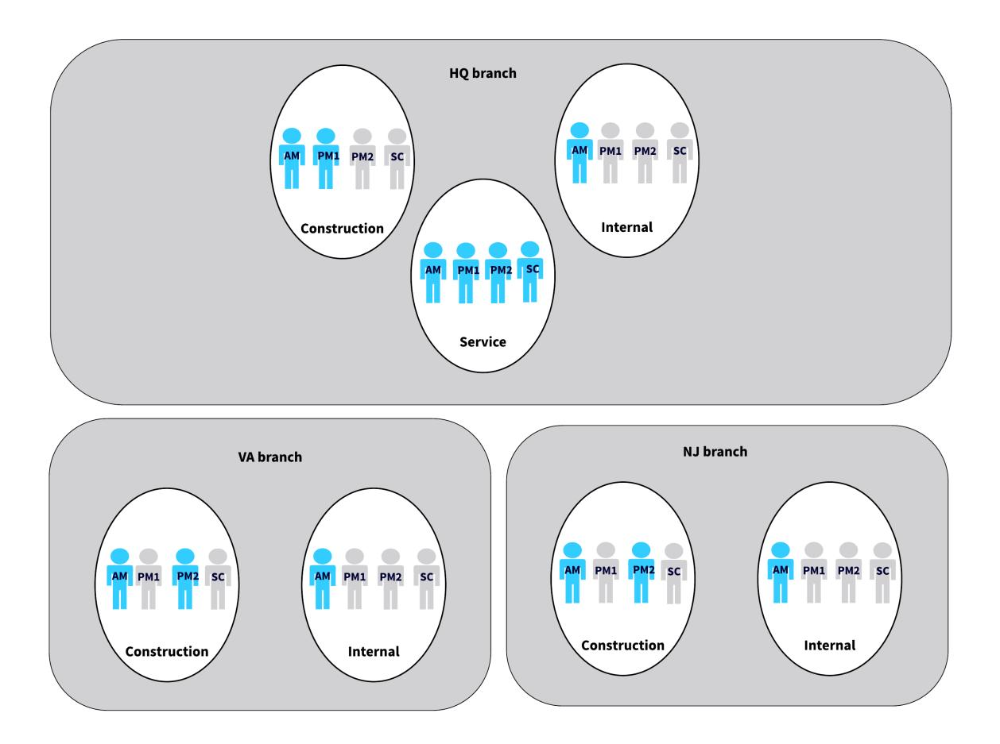

To configure this security, the system administrator performs the following general steps in the system:

- 1. On the *[Project Groups](https://help-2025r1.acumatica.com/Help?ScreenId=ShowWiki&pageid=f036b8fc-7db4-46e2-80d7-af8a379cbc5a)* (PM202500) form, configures the following project groups:
  - *HQCONSTR*: Construction projects of the *HQ* branch
  - *HQINTERNAL*: Internal projects of the *HQ* branch

- *HQSERVICE*: Service projects of the *HQ* branch
- *VACONSTR*: Construction projects of the *VA* branch
- *VAINTERNAL*: Internal projects of the *VA* branch
- *NJCONSTR*: Construction projects of the *NJ* branch
- *NJINTERNAL*: Internal projects of the *NJ* branch
- 2. On the *[Projects](https://help-2025r1.acumatica.com/Help?ScreenId=ShowWiki&pageid=81c86417-3bde-444b-8f1c-682928d31a0c)* form, assigns the created project groups to projects whose visibility should be controlled based on the type of the project and the branch that is specified for the project on the**Summary** tab of the *[Projects](https://help-2025r1.acumatica.com/Help?ScreenId=ShowWiki&pageid=81c86417-3bde-444b-8f1c-682928d31a0c)* form.
- 3. On the *[Project Access](https://help-2025r1.acumatica.com/Help?ScreenId=ShowWiki&pageid=153cba21-ff36-4723-bc26-c845974616f4)* (PM102000) form, creates restriction groups, and adds the users and project groups as follows.

| Restriction Groups | Type | Project Groups                                                                       | Users        |
|--------------------|------|--------------------------------------------------------------------------------------|--------------|
| Group 1            | A    | HQCONSTR, HQINTER<br>NAL,HQSERVICE,VA<br>CONSTR, VAINTERNAL,<br>NJCONSTR, NJINTERNAL | AM           |
| Group 2            | A    | HQSERVICE                                                                            | PM1, PM2, SC |
| Group 3            | A    | HQCONSTR                                                                             | PM1          |
| Group 4            | A    | VACONSTR,NJCONSTR                                                                    | PM2          |

The following table lists the restriction groups to be configured.

With this configuration, user *SC* will not be able to see construction and internal projects of any branch. User *AM* is the only user that can see internal projects in all branches. User *PM1* can see construction projects of the *HQ* branch and service projects. User *PM2* can see construction projects of the *VA* and *NJ* branches, as well as service projects.

For the users included in restriction groups, visibility restrictions will result in the following:

- The users will not be able to open the restricted projects on the *[Projects](https://help-2025r1.acumatica.com/Help?ScreenId=ShowWiki&pageid=81c86417-3bde-444b-8f1c-682928d31a0c)* form.
- The users will not be able to select the restricted projects on any project-related forms—that is, on the forms that are exclusive for the project and construction functionality, such as the *[Change Orders](https://help-2025r1.acumatica.com/Help?ScreenId=ShowWiki&pageid=0c26a0eb-ef8d-4a61-97c8-237aea21cf25)* (PM308000) form and *[Pro Forma Invoices](https://help-2025r1.acumatica.com/Help?ScreenId=ShowWiki&pageid=37f1ed00-a7d7-4161-9307-1337662b8550)* (PM307000) form.
- The users will still be able to work with existing documents that are related to restricted projects (such as financial documents). For example, if an AP bill is related to a project that is restricted for a user, but the user has access to the *[Bills and Adjustments](https://help-2025r1.acumatica.com/Help?ScreenId=ShowWiki&pageid=956b4e51-3078-4d2d-85b3-65c080d95234)* (AP301000) form and has access to the branch that is specified on the document level of the bill, the user can see this AP bill.

#### <span id="page-107-0"></span>**Visibility of Projects by Area**

Aer you have created a project in Acumatica ERP, the project is available system-wide by default. You can control the visibility of projects within functional areas of the system in the following ways:

- Display or hide the **Project** and **ProjectTask** boxes and columns on forms: If you want to track projectrelated data in particular functional areas (for example, accounts receivable and purchase orders), you can configure the system to display the boxes and columns where a user can specify the project-related data only within these areas. To do this, in the**VisibilitySettings** section of the *[Projects Preferences](https://help-2025r1.acumatica.com/Help?ScreenId=ShowWiki&pageid=de2ca225-4a0c-4129-b09d-3f3ed05198f9)* (PM101000) form, you select the check boxes for the areas where these elements should be displayed and clear the check boxes for the areas where the elements should not be displayed.
- Display or hide a project: If the project transactions of a particular project should be performed within a particular area (for example, inventory), you can make the project visible in this area and hidden in other

areas, so that users can select only appropriate projects when they are preparing documents. You can select areas in the**VisibilitySettings** section of the **General** tab on the *[Projects](https://help-2025r1.acumatica.com/Help?ScreenId=ShowWiki&pageid=81c86417-3bde-444b-8f1c-682928d31a0c)* (PM301000) form. Aer you have selected an area, users can select the project in documents generated on the related forms, and the release of these documents automatically updates the project data.

• Display or hide the tasks of a project: If the users perform particular tasks of a project in a certain area (for example, the *Warehouse operations* task requires users to enter inventory transactions, and the *Customer payments* task requires users to enter accounts receivable documents), you can select the areas where the task will be displayed in the settings of the project task. You select these areas in the**VisibilitySettings** section of the **General Info** tab on the *[Project](https://help-2025r1.acumatica.com/Help?ScreenId=ShowWiki&pageid=97a58591-40d8-4edf-a9ad-896d633d6980) Tasks* (PM302000) form.

#### <span id="page-108-0"></span>**Visibility of Project Transactions by Account Group**

By using the *Project [Transaction](https://help-2025r1.acumatica.com/Help?ScreenId=ShowWiki&pageid=0014c67c-d1b3-49f9-b799-0fc4ea344928) Visibility by Account Group* (PM103000) form, you can configure the system to hide particular lines of project transactions that contain sensitive information by configuring user access by account group.

The restrictions configured for project account groups do not affect the visibility of account groups on the **Balances** tab of the *[Projects](https://help-2025r1.acumatica.com/Help?ScreenId=ShowWiki&pageid=81c86417-3bde-444b-8f1c-682928d31a0c)* (PM301000) form. That is, the system still shows the total balances by each account group, regardless of the access rights of the signed-in user. A user with insufficient access rights for a particular account group will see the total balance of each account group, but will not able to review the detail information for the project transactions that include this account group.

If you configure a user to have no access to a particular account group, this user cannot enter and release project transactions that include lines with this account group on the *Project [Transactions](https://help-2025r1.acumatica.com/Help?ScreenId=ShowWiki&pageid=382a97fe-b636-44ca-9798-6d478c05b687)* (PM304000) form. Also, on the following forms, the user is not able to view transactions that include the restricted account group in the **Debit Account Group** or **Credit Account Group** box:

- *Project [Transactions](https://help-2025r1.acumatica.com/Help?ScreenId=ShowWiki&pageid=382a97fe-b636-44ca-9798-6d478c05b687)* (PM304000)
- *Project [Transaction](https://help-2025r1.acumatica.com/Help?ScreenId=ShowWiki&pageid=29bf5433-446f-4196-be69-f2cb177e83cb) Details* (PM401000)
- *Project [Transactions](https://help-2025r1.acumatica.com/Help?ScreenId=ShowWiki&pageid=a2c1cc92-b205-4ab3-ab74-84407524db39)* (PM633000)
- *[Project Cost History](https://help-2025r1.acumatica.com/Help?ScreenId=ShowWiki&pageid=2b3a3b69-2f92-4d25-880b-d369be71d99e)* (PM706230)


On any of these forms, if any transaction lines are hidden because a user is denied access to the account group, the system displays a warning and calculates the totals shown on the forms based on the visible transaction lines.

For example, suppose that you are a system administrator, and you have to configure the visibility of project transactions to the appropriate users considering the following:

- There are two users for which you need to configure the visibility of project transactions in your organization: User *A* and User *P*.
- User *A*, the accounting manager who controls work of the accounting department, is allowed to see all financial information. This user enters project expenses related to employee labor.
- User *P*, the project manager who manages the project is allowed to enter and view project transactions for project expenses related to cost of materials and subcontract work. The user must not be able to see sensitive information related to employee labor for the project

To configure the described security scenario, the system administrator does the following in the system:

- 1. On the *[Account Groups](https://help-2025r1.acumatica.com/Help?ScreenId=ShowWiki&pageid=94a2cdce-c36a-49a1-b572-9cd33cb5fa73)* (PM201000) form, configures the *MATERIAL* (for material expenses), *SUBCON* (for subcontract expenses), and *LABOR* (for employee labor expenses) account groups, and maps the appropriate general ledger accounts to these groups.
- 2. On the *Project [Transaction](https://help-2025r1.acumatica.com/Help?ScreenId=ShowWiki&pageid=0014c67c-d1b3-49f9-b799-0fc4ea344928) Visibility by Account Group* (PM103000) form, creates a new restriction group with the *B Inverse* type and adds User *P* and the *LABOR* account group to this restriction group.

With this configuration, User *A* enters project transactions with employee labor related to project and selects the *LABOR* account group. Access to this account group is restricted for User *P*, who is able to review the project transaction lines with the *MATERIAL* and *SUBCON* account groups but cannot view the lines with *LABOR* account group on data entry forms and in reports.

#### **Forms for Project Security**

In the following table, you can find the list of the forms that you can use to manage restriction groups with projects. The table also includes the task that you can perform by using each form.

For information about how to add or remove objects from a restriction group, see *[Operations with Restriction](https://help-2025r1.acumatica.com/Help?ScreenId=ShowWiki&pageid=af4b07a9-476a-4475-8183-8bffc9eb6947) [Groups](https://help-2025r1.acumatica.com/Help?ScreenId=ShowWiki&pageid=af4b07a9-476a-4475-8183-8bffc9eb6947)*.

#### *Table: Forms for Project Security*

| Task                                                                                                                            | Form                                           |
|---------------------------------------------------------------------------------------------------------------------------------|------------------------------------------------|
| To initially configure the visibility of a project to users                                                                     | Project Access (PM102000)                      |
| To change the visibility of a project in multiple restric<br>tion groups                                                        | Restriction Groups by Project (PM102010)       |
| To change the visibility of a project group in multiple<br>restriction groups                                                   | Restriction Groups by Project Group (PM102020) |
| To change the visibility of projects to a user in multiple<br>restriction groups                                                | Restriction Groups by User (SM201035)          |
| To change the visibility of project transactions with<br>particular account groups to a user in multiple restric<br>tion groups | Restriction Groups by Account Group (PM103000) |

# <span id="page-109-0"></span>**Project Creation and Processing: Configuration Prerequisites**

Before starting to create a project, you must be sure that the system has been configured properly and that all required entities have been created, as described in the following sections.

#### **Enabling the Needed Features**

On the *[Enable/Disable Features](https://help-2025r1.acumatica.com/Help?ScreenId=ShowWiki&pageid=c1555e43-1bc5-4f6f-ba9d-b323f94d8a6b)* (CS100000) form, the *Projects* feature must be enabled.

#### **Configuring Project Identifiers and the Non-Project Code**

The *PROJECT* segmented key on the *[Segmented Keys](https://help-2025r1.acumatica.com/Help?ScreenId=ShowWiki&pageid=78bd7bd1-6bf6-409e-a8a5-8b18e8b80722)* (CS202000) form defines the identifier of the projects. By default, this segmented key specifies that the project identifier is an alphanumeric string of up to 10 characters. For the key, you can define how many segments it is to have, what values may be used, whether these values should be validated, and whether auto-numbering should be used in one of the segments. You can also divide item identifiers into segments with specific values. For more information on configuring segmented keys, see *[Segmented Identifiers](https://help-2025r1.acumatica.com/Help?ScreenId=ShowWiki&pageid=a2f667ab-0de9-4738-9f05-58e9cbfc1735)*.

The *PROJECT* segmented key also defines the format of the non-project code, which is specified in transactions, documents, and document lines that are not related to any project. For convenience, the non-project code should be distinctly different from project IDs and should be short, such as the single character *X*, which is used by default.

The non-project code should be consistent with the structure of the *PROJECT* segmented key, which the system uses for the identifiers of projects, and cannot exceed its length. Also, you cannot create a non-project code

with the identifier that matches an existing contract identifier because the *CONTRACT* segmented key inherits its structure from the *PROJECT* segmented key. If the *PROJECT* segmented key contains a validated segment (or multiple validated segments), the values of the validated segments should be specified in the validated positions of the segmented key.

Suppose the *PROJECT* segmented key consists of two segments, *XX* and *YYY*. The *XX* segment is not validated. The *YYY* segment is validated and the list of its predefined segment values includes only *001* and *002* values. In the first segment of the **Non-Project Code** box, you could specify any number of symbols that does not exceed its length (for example, *P* or *PR*). For the second validated segment in this box, you must specify the value selected from the list of predefined segment values. That is, the *PR-001* and *P-002* codes will be valid, but *PJ-003* will be invalid.

#### **Configuring the System**

Before you enter any new project, you must ensure that the following are configured:

- On the *[Projects Preferences](https://help-2025r1.acumatica.com/Help?ScreenId=ShowWiki&pageid=de2ca225-4a0c-4129-b09d-3f3ed05198f9)* (PM101000) form, the basic project accounting settings have been specified: numbering sequences, non-project code, visibility settings, and posting settings. The actual combination of settings you need to specify depends on the processes in your organization and on the features enabled on the *[Enable/Disable Features](https://help-2025r1.acumatica.com/Help?ScreenId=ShowWiki&pageid=c1555e43-1bc5-4f6f-ba9d-b323f94d8a6b)* (CS100000) form. For an example of specifying basic project settings, see *[Basic](https://help-2025r1.acumatica.com/Help?ScreenId=ShowWiki&pageid=95fc5aa8-7625-46ed-b233-8624245f7b3a) [Project Configuration: Implementation Activity](https://help-2025r1.acumatica.com/Help?ScreenId=ShowWiki&pageid=95fc5aa8-7625-46ed-b233-8624245f7b3a)*.
- Optional: An approval workflow has been configured for projects. For details, see *[Approval Configuration:](https://help-2025r1.acumatica.com/Help?ScreenId=ShowWiki&pageid=ec768874-a269-45c3-89b6-ed447c48cece) [General Information](https://help-2025r1.acumatica.com/Help?ScreenId=ShowWiki&pageid=ec768874-a269-45c3-89b6-ed447c48cece)* and *Specific Approvals: Projects, [Project-Related](https://help-2025r1.acumatica.com/Help?ScreenId=ShowWiki&pageid=0d0b7e95-8c51-4ec3-8c14-30936b8aaf44) Documents, and Time Activities*.
- On the *[Account Groups](https://help-2025r1.acumatica.com/Help?ScreenId=ShowWiki&pageid=94a2cdce-c36a-49a1-b572-9cd33cb5fa73)* (PM201000) form, the account groups that will be used in the project have been created and the GL accounts to be used in projects and project-related documents have been mapped to the appropriate account groups. Account groups make it possible to transfer financial and non-financial information between project management forms and other functional areas by associating any transactions posted in other areas with the related project. For an example of configuring an account group, see *[Account](#page-12-2) [Groups: General Information](#page-12-2)*.
- On the *[Billing Rules](https://help-2025r1.acumatica.com/Help?ScreenId=ShowWiki&pageid=6773c79b-216e-4725-b28c-3ce724d9a7c9)* (PM207000) form, each billing rule that you will assign to a project task has been created. These rules define which transactions should be used for billing and which accounts should be used to record the transactions that are generated in the billing process. For details, see *[Billing Rules:](#page-17-2) [General Information](#page-17-2)*.
- Optional: On the *Rate Table [Codes](https://help-2025r1.acumatica.com/Help?ScreenId=ShowWiki&pageid=4ea3e159-73fb-48c6-9091-3b9694e2ccd2)* (PM204200) form, each rate table code that you will assign to a project task has been created, and the rate table has been configured on the *Rate [Tables](https://help-2025r1.acumatica.com/Help?ScreenId=ShowWiki&pageid=09894686-e56f-4f33-8e95-2b6e9f6a1752)* (PM206000) form. The rate tables define pricing models in which price may differ depending on different sets of factors. For details, see *[Billing Rates: General Information](#page-37-2)*.
- Optional: On the *[Allocation Rules](https://help-2025r1.acumatica.com/Help?ScreenId=ShowWiki&pageid=0d2e40ad-7ecf-4937-b2bd-dab1d800e0db)* (PM207500) form, each allocation rule that you will assign to a project task has been created. If your project uses a complex cost accrual model, you must specify appropriate allocation rules to correctly track project expenditures and future revenues. For examples of defining allocation rules, see *[WIP Labor Costs in Cost-Plus Projects: Implementation Activity](#page-391-1)* and *[WIP Labor Costs in](#page-402-1) [Fixed-Price Projects: Implementation Activity](#page-402-1)*.

# <span id="page-110-1"></span><span id="page-110-0"></span>**Project Creation and Processing: To Create a Fixed-Price Project**

This activity will walk you through the process of initial creation of a simple fixed-price project.

This activity is based on the *U100* dataset. If you are using another dataset, or if any system settings have been changed in *U100*, these changes can affect the workflow of the activity and the results of the processing. To avoid any issues, restore the *U100* dataset to its initial state.

#### **Story**

Suppose that the Lake Cafe customer has ordered a juicer from the SweetLife Fruits & Jams company, along with two hours of site review and four hours of installation services. The work will start on *1/1/2025* and must be completed by *1/30/2025*. SweetLife's project accountant has decided to create a project to track costs and revenues for the performed work. The project will be completed in two phases: Phase 1 will be the site review, and phase 2 will involve the sale and installation of the juicer. To track the progress of each phase separately, the project accountant has decided to define the phases as separate project tasks. Also, the project accountant will specify the revenue budget information for each project task and inventory item.

The project will be billed once, when both of the project tasks are completed. Also, the project accountant has decided to skip the creation of pro forma invoices, because all amounts have already been budgeted and agreed upon with the customer, so the direct AR invoice will be created during the billing process.

Acting as the project accountant, you will create the new project and specify all needed settings.

#### **Configuration Overview**

In the *U100* dataset, the following tasks have been performed to support this activity:

- On the *[Enable/Disable Features](https://help-2025r1.acumatica.com/Help?ScreenId=ShowWiki&pageid=c1555e43-1bc5-4f6f-ba9d-b323f94d8a6b)* (CS100000) form, the *Project Accounting* feature has been enabled to support the project accounting functionality.
- On the *[Stock Items](https://help-2025r1.acumatica.com/Help?ScreenId=ShowWiki&pageid=77786a70-1f1e-4d63-ad98-96f98e4fcb0e)* (IN202500) form, the *JUICER10* stock item has been defined.
- On the *[Non-Stock Items](https://help-2025r1.acumatica.com/Help?ScreenId=ShowWiki&pageid=bf68dd4f-63d4-460d-8dc0-9152f2bd6bf1)* (IN202000) form, the *SITEREVIEW* and *INSTALL* non-stock items have been defined.
- On the *[Billing Rules](https://help-2025r1.acumatica.com/Help?ScreenId=ShowWiki&pageid=6773c79b-216e-4725-b28c-3ce724d9a7c9)* (PM207000) form, the *PROGRESS* billing rule has been defined. This rule is configured for gradually billing the projects at a fixed contract amount.

#### **Process Overview**

On the *[Projects](https://help-2025r1.acumatica.com/Help?ScreenId=ShowWiki&pageid=81c86417-3bde-444b-8f1c-682928d31a0c)* (PM301000) form, you will create a new project and specify its general settings on the**Summary** tab. Then on the**Tasks** tab, you will add the project tasks that will be performed during the completion of a project. On the **Revenue Budget** tab, you will define the planned revenue budget for the project.

#### **System Preparation**

To sign in to the system and prepare to perform the instructions of the activity, do the following:

- 1. Launch the Acumatica ERP website, and sign in to a company with the *U100* dataset preloaded; you should sign in as Pam Brawner by using the *brawner* username and the *123* password.
- 2. In the info area, in the upper-right corner of the top pane of the Acumatica ERP screen, make sure that the business date in your system is set to *1/1/2025*. If a different date is displayed, click the Business Date menu button, and select 1/1/2025 on the calendar.

#### **Step 1: Creating a Project and Specifying Its General Settings**

To create a new project and specify basic settings for it, do the following:

- 1. On the *[Projects](https://help-2025r1.acumatica.com/Help?ScreenId=ShowWiki&pageid=81c86417-3bde-444b-8f1c-682928d31a0c)* (PM301000) form, create a new record.
- 2. In the Summary area, specify the following settings:
  - **Project ID**: INSTLAKE01
  - **Customer**: *LAKECAFE (Lake Cafe)*
  - **Project Manager**: *EP00000001 (Pam Brawner)*
  - **Description**: Installation project for Lake Cafe

- 3. On the **Summary** tab, specify the following settings:
  - **Revenue Budget Level**: *Task and Item*

You select this option to include more detail in the revenue budget structure. With this setting, you will be able to select an inventory item in a revenue budget line.

• **Cost Budget Level**: *Task and Item*

You select this option to include more detail in the cost budget structure. With this setting, you will be able to select an inventory item in a cost budget line.

- **Start Date**: *1/1/2025*
- **End Date**: *1/30/2025*
- **Change Order Workflow**: Cleared

You clear this check box because for this simple fixed-price project, no changes will be required.

- **Billing Currency**: *USD* (selected automatically)
- **Billing Period**: *On Demand*

You select the *On Demand* billing period to indicate that the billing can be performed at any time.

• **Billing Rule**: *PROGRESS*

This predefined rule will be specified by default in all project tasks added to the project.


For details on configuring billing rules for billing by progress, see *[Billing Rules: Progress](#page-19-2) [Billing](#page-19-2)* and *Billing Rules: To [Configure](#page-21-1) a Progress Billing Rule*.

#### • **Create Pro Forma Invoice on Billing**: Cleared

You are clearing this check box because you want to create accounts receivable invoices when you bill the project without preliminary creation of pro forma invoices.

4. Save your changes to the project (which currently has the *In Planning* status shown in the**Status** box of the Summary area).

#### **Step 2: Adding Project Tasks**

To add project tasks to the project, do the following:

1. On the **Tasks** tab, add to the project the two tasks listed in the following table by clicking **Add Row** on the table toolbar for each and specifying the listed identifier, task type, and description in the row.

| Task ID | Type                  | Description  |
|---------|-----------------------|--------------|
| PHASE1  | Cost and Revenue Task | Site review  |
| PHASE2  | Cost and Revenue Task | Installation |

Notice that the *PROGRESS* billing rule has been automatically specified for both added tasks.

- 2. On the table toolbar, click **ActivateTasks** to change the status of the added tasks from *In Planning* to *Active*.
- 3. Save your changes to the project.

Notice that the project still has the *In Planning* status even though you have activated both of its project tasks.

#### **Step 3: Specifying the Project Revenue Budget**

To specify the project revenue budget, do the following:

1. On the **Revenue Budget** tab, add each line of the project revenue budget that is listed in the following table by clicking **Add Row** and specifying the listed settings in the row.

| ProjectTask | Inventory ID | Account Group | Original Budgeted<br>Quantity | Unit Rate |
|-------------|--------------|---------------|-------------------------------|-----------|
| PHASE1      | SITEREVIEW   | REVENUE       | 2.00                          | 50.00     |
| PHASE2      | JUICER10     | REVENUE       | 1.00                          | 1,500.00  |
| PHASE2      | INSTALL      | REVENUE       | 4.00                          | 100.00    |

2. Make sure that the original and revised values in the revenue budget lines have been calculated, as shown in the following screenshot.

| Projects<br>INSTLAKE01 - Installation project for Lake Cafe                                                                                                                                                                                  |                                    |                                                     |                                               |                          |                                             |             |                       |                                              | <b>P</b> NOTES<br><b>FILES</b>         | TOOLS $\sim$                                |
|----------------------------------------------------------------------------------------------------------------------------------------------------------------------------------------------------------------------------------------------|------------------------------------|-----------------------------------------------------|-----------------------------------------------|--------------------------|---------------------------------------------|-------------|-----------------------|----------------------------------------------|----------------------------------------|---------------------------------------------|
| 周<br>$\Box$<br>↶<br>$\leftarrow$                                                                                                                                                                                                             | 侕<br>к<br>+                        | $\geq$<br>↘                                         | <b>ACTIVATE</b><br>$\cdots$                   |                          |                                             |             |                       |                                              |                                        |                                             |
| * Project ID:                                                                                                                                                                                                                                | <b>INSTLAKE01</b>                  | Q                                                   | Customer:                                     | LAKECAFE - Lake Cafe     |                                             | $\varphi$   | 0<br>Actual Income:   |                                              | 0.00                                   | $\hat{\phantom{a}}$                         |
| Template:                                                                                                                                                                                                                                    |                                    | 0                                                   | Project Manager:                              | EP00000001 - Pam Brawner |                                             | Q           | Actual Expenses:      |                                              | 0.00                                   |                                             |
| Status:                                                                                                                                                                                                                                      | In Planning                        |                                                     |                                               |                          |                                             |             | Margin Amount:        |                                              | 0.00                                   |                                             |
| Description:                                                                                                                                                                                                                                 | Installation project for Lake Cafe |                                                     |                                               |                          |                                             |             | Margin (%):           |                                              | 0.00                                   |                                             |
|                                                                                                                                                                                                                                              |                                    |                                                     |                                               |                          |                                             |             | Pending Invoice Amoun |                                              | 0.00                                   |                                             |
| <b>REVENUE BUDGET</b><br><b>SUMMARY</b><br><b>TASKS</b><br><b>COST BUDGET</b><br><b>BALANCES</b><br><b>EQUIPMENT</b><br><b>ADDRESSES</b><br><b>INVOICES</b><br><b>UNION LOCALS</b><br><b>ACTIVITIES</b><br><b>EMPLOYEES</b><br>Group by Task |                                    |                                                     |                                               |                          |                                             |             |                       | $\ensuremath{\mathop{\not\supset}\nolimits}$ |                                        |                                             |
| Õ<br>$\pm$<br>$\times$                                                                                                                                                                                                                       | <b>VIEW TRANSACTIONS</b>           | $\overline{\mathbf{x}}$<br>$\vdash$<br>$\mathbf{t}$ |                                               |                          |                                             |             |                       | <b>All Records</b>                           |                                        | $\triangledown$<br>٠                        |
| <b>B</b> 0<br>D<br>* Project Task                                                                                                                                                                                                            | <b>Inventory ID</b>                | * Account Group                                     | <b>Description</b>                            |                          | Original UOM<br><b>Budgeted</b><br>Quantity |             | <b>Unit Rate</b>      | Original<br><b>Budgeted</b><br>Amount        | Revised<br><b>Budgeted</b><br>Quantity | <b>Revised</b><br><b>Budgeted</b><br>Amount |
| PHASE1<br>0,<br>D                                                                                                                                                                                                                            | <b>SITEREVIEW</b>                  | <b>REVENUE</b>                                      | Site review                                   |                          | 2.00                                        | <b>HOUR</b> | 50.0000               | 100.00                                       | 2.00                                   | 100.00                                      |
| D<br>PHASE2<br>0                                                                                                                                                                                                                             | <b>INSTALL</b>                     | <b>REVENUE</b>                                      | Installation of equipment at the customers'   |                          | 4.00                                        | <b>HOUR</b> | 100,0000              | 400.00                                       | 4.00                                   | 400.00                                      |
| D<br>PHASE2<br>0                                                                                                                                                                                                                             | <b>JUICER10</b>                    | <b>REVENUE</b>                                      | Pro series juicer with a production rate of 1 |                          | 1.00                                        | PIECE       | 1.500.0000            | 1.500.00                                     | 1.00                                   | 1,500.00                                    |

#### *Figure: Revenue budget of a fixed-price project*

For each budget line, the system automatically calculated the **Original Budgeted Amount** as the **Original Budgeted Quantity** multiplied by the **Unit Rate**. The system also filled in the **Revised Budgeted Quantity** and **Revised Budgeted Amount** columns with the values of **Original Budgeted Quantity** and **Original Budgeted Amount** columns, respectively.

3. Save your changes to the project.

You have not configured the cost budget for the project because you do not need to track if the project expenses are within the budgeted values. When you enter project transactions that represent the project expenses, the system will automatically populate the cost budget with the actual values.

You have finished configuring the project. Now you can complete the *Project Creation and [Processing:](#page-119-1) To Process a [Fixed-Price Project](#page-119-1)* activity to practice completing the project lifecycle.

# <span id="page-113-1"></span><span id="page-113-0"></span>**Project Creation and Processing: To Create a Cost-Plus Project**

This activity will walk you through the process of configuring a simple cost-plus project from its initial creation.

This activity is based on the *U100* dataset. If you are using another dataset, or if any system settings have been changed in *U100*, these changes can affect the workflow of the activity and the results of the processing. To avoid any issues, restore the *U100* dataset to its initial state.

#### **Story**

Suppose that the Lake Cafe customer has contacted the SweetLife Fruits & Jams company and ordered training of its employees on operating the juicer it purchased from SweetLife. The training sessions will start on *1/1/2025* and must be completed by *1/30/2025*. The project accountant has analyzed the requirements and decided to create a small cost-plus project (with only a single task for the training of employees); the expected project profitability is 20%. Because the number of training sessions may be changed during the project completion by the customer's request, the project will be billed when all training sessions have been provided. The project accountant has decided to skip the creation of pro forma invoices, because the price of the provided services has already been agreed upon with the customer.

Acting as the project accountant, you will create the new project and specify the needed settings.

### **Configuration Overview**

In the *U100* dataset, the following tasks have been performed to support this activity:

- On the *[Enable/Disable Features](https://help-2025r1.acumatica.com/Help?ScreenId=ShowWiki&pageid=c1555e43-1bc5-4f6f-ba9d-b323f94d8a6b)* (CS100000) form, the *Project Accounting* feature has been enabled to support the project accounting functionality.
- On the *[Non-Stock Items](https://help-2025r1.acumatica.com/Help?ScreenId=ShowWiki&pageid=bf68dd4f-63d4-460d-8dc0-9152f2bd6bf1)* (IN202000) form, the *TRAINING* non-stock item has been defined.
- On the *[Billing Rules](https://help-2025r1.acumatica.com/Help?ScreenId=ShowWiki&pageid=6773c79b-216e-4725-b28c-3ce724d9a7c9)* (PM207000) form, the *TM* billing rule has been defined to calculate the line amount as the project transaction line amount multiplied by 1.25.
- On the *[Account Groups](https://help-2025r1.acumatica.com/Help?ScreenId=ShowWiki&pageid=94a2cdce-c36a-49a1-b572-9cd33cb5fa73)* (PM201000) form, the *LABOR* account group has been defined.

#### **Process Overview**

On the *[Projects](https://help-2025r1.acumatica.com/Help?ScreenId=ShowWiki&pageid=81c86417-3bde-444b-8f1c-682928d31a0c)* (PM301000) form, you will create a new project and specify its general settings on the**Summary** tab. Then on the**Tasks** tab, you will add the project task that will be performed during the completion of the project. On the **Cost Budget** tab, you will define the budget for the project.

#### **System Preparation**

To sign in to the system and prepare to perform the instructions of the activity, do the following:

- 1. Launch the Acumatica ERP website, and sign in to a company with the *U100* dataset preloaded; you should sign in as Pam Brawner by using the *brawner* username and the *123* password.
- 2. In the info area, in the upper-right corner of the top pane of the Acumatica ERP screen, make sure that the business date in your system is set to *1/1/2025*. If a different date is displayed, click the Business Date menu button, and select 1/1/2025 on the calendar.

#### **Step 1: Creating a Project and Specifying Its General Settings**

To create a new project and specify basic settings for it, do the following:

- 1. On the *[Projects](https://help-2025r1.acumatica.com/Help?ScreenId=ShowWiki&pageid=81c86417-3bde-444b-8f1c-682928d31a0c)* (PM301000) form, add a new record.
- 2. In the Summary area, specify the following settings:
  - **Project ID**: INSTLAKE02
  - **Customer**: *LAKECAFE (Lake Cafe)*
  - **Project Manager**: *EP00000001 (Pam Brawner)*
  - **Description**: Training project for Lake Cafe
- 3. On the **Summary** tab, specify the following settings:

• **Revenue Budget Level**: *Task and Item*

You select this option to include more detail in the revenue budget structure. With this setting, you will be able to select an inventory item in a revenue budget line.

• **Cost Budget Level**: *Task and Item*

You select this option to include more detail in the cost budget structure. With this setting, you will be able to select an inventory item in a cost budget line.

- **Start Date**: *1/1/2025*
- **End Date**: *1/30/2025*
- **Change Order Workflow**: Cleared

You clear this check box because for this simple cost-plus project, no changes will be required.

- **Billing Currency**: *USD* (selected automatically)
- **Billing Period**: *On Demand*

You select the *On Demand* billing period to indicate that the billing can be performed at any time.

• **Billing Rule**: *TM*

This predefined rule will be specified by default in all project tasks added to the project.


For details on configuring a billing rule for billing by time and material, see *[Billing Rules:](#page-22-1) Time and [Material](#page-22-1) Billing* and *Billing Rules: To [Configure](#page-24-1) a Time and Material Rule*.

#### • **Create Pro Forma Invoice on Billing**: Cleared

You are clearing this check box because you want to create accounts receivable invoices when you bill the project without preliminary creation of pro forma invoices.

4. Save your changes to the project (which currently has the *In Planning* status in the**Status** box of the Summary area).

#### **Step 2: Adding Project Tasks**

To add project tasks to the project, do the following:

- 1. On the **Tasks** tab, click **Add Row** on the table toolbar, and add the project task with the following settings:
  - **Task ID**: *TRAINING*
  - **Type**: *Cost and Revenue Task*
  - **Description**: Training on juicer usage
  - **Status**: *Active*

Notice that the *TM* billing rule has been automatically specified for the task.

2. Save your changes to the project.

#### **Step 3: Specifying the Project's Cost Budget**

To configure the project's cost budget, do the following:

- 1. On the **Cost Budget** tab, click **Add Row**, and specify the following settings in the added row:
  - **ProjectTask**: *TRAINING*
  - **Inventory ID**: *TRAINING*
  - **Account Group**: *LABOR* (selected automatically)
  - **Original Budgeted Quantity**: 16
  - **UOM**: *HOUR*
  - **Unit Rate**: 40

The system automatically calculates the **Original Budgeted Amount** for the cost budget line (\$640) as the **Original Budgeted Quantity** multiplied by the **Unit Rate**.

2. Save your changes to the project.

You have not configured the revenue budget for the project because you have not agreed with the customer on the number of training sessions and this number may be changed during the project completion at the customer's request. When you bill the project based on the incurred expenses, the system automatically populates the revenue budget with the actual values.

You have finished configuring the project. Now you can complete the *Project Creation and [Processing:](#page-121-1) To Process a [Cost-Plus Project](#page-121-1)* activity to practice completing the project lifecycle.

# <span id="page-116-0"></span>**Project Creation and Processing: A Project's Lifecycle**

In Acumatica ERP, a project is a one-time or recurring endeavor with a specific scope, time frame, and budget. The following sections describe the common stages of a project's lifecycle: estimation, acceptance, execution, and completion.

#### **Project Stages and Statuses**

The following diagram shows the stages a project goes through and the statuses it is assigned from the project's initiation to its completion.

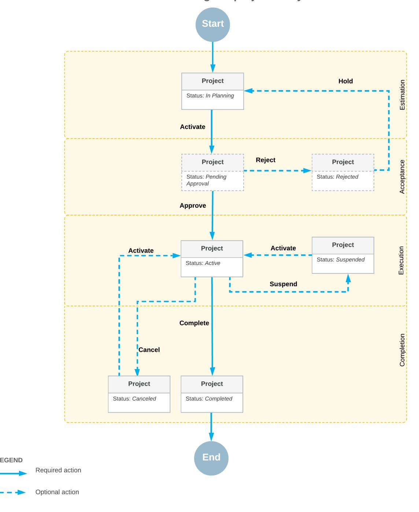

#### **Project Estimation**

During the project estimation stage, you specify project settings on the *[Projects](https://help-2025r1.acumatica.com/Help?ScreenId=ShowWiki&pageid=81c86417-3bde-444b-8f1c-682928d31a0c)* (PM301000) form, define activities, plan the project tasks, estimate the time required for the completion of each project task, and populate the project record with employees, resources, and equipment. The system assigns each new project and its tasks the *In Planning* status once it has been saved.

Users cannot select projects and project tasks with the *In Planning* status in any records, except for the following types of records that are available for planning:

- Employee activities on the *[Activity](https://help-2025r1.acumatica.com/Help?ScreenId=ShowWiki&pageid=09cd2553-0e9e-4450-804d-106159f9a5b6)* (CR306010) form
- Tasks on the *[Task](https://help-2025r1.acumatica.com/Help?ScreenId=ShowWiki&pageid=6449513c-254e-4093-b7b8-06de0108c384)* (CR306020) form
- Email activities on the *[Email Activity](https://help-2025r1.acumatica.com/Help?ScreenId=ShowWiki&pageid=5f2ec363-ec67-4dce-ae28-1158b6dd8ef3)* (CR306015) form
- Purchase orders on the *[Purchase Orders](https://help-2025r1.acumatica.com/Help?ScreenId=ShowWiki&pageid=5565686c-96c4-4bfa-a51d-9a2566baa808)* (PO301000) form
- Subcontracts on the *[Subcontracts](https://help-2025r1.acumatica.com/Help?ScreenId=ShowWiki&pageid=dc6a00f9-3913-47bb-b28d-105be0e0d20a)* (SC301000) form

For instance, you can add an employee activity for planning budgets for project tasks, or record a project commitment. However, if your user account does not have the *Project Accountant* role assigned on the *[User Roles](https://help-2025r1.acumatica.com/Help?ScreenId=ShowWiki&pageid=c2879f3c-3739-430a-b02b-c225f5480966)* (SM201005) form, these documents can be processed further only aer the *Active* status is assigned to the project task.

If your user has the *Project Accountant* role, you can release employee activities with project tasks that have the *In Planning* status.

#### **Project Acceptance**

The acceptance stage involves reaching an agreement with all the stakeholders, including customers and employees, as well as estimating the budget for the project and the expenditures it will entail. If the approval of projects is not required in your system, the project manager takes the project off hold to assign it the *Active* status. If the approval of projects is required in your system, the system submits the project for approval and assigns it the *Pending Approval* status once it is taken off hold.

If all assigned employees have approved the project on the *[Approvals](https://help-2025r1.acumatica.com/Help?ScreenId=ShowWiki&pageid=1fe1afcc-e676-466e-8c3f-cbf64857e32a)* (EP503010) form or on the *[Projects](https://help-2025r1.acumatica.com/Help?ScreenId=ShowWiki&pageid=81c86417-3bde-444b-8f1c-682928d31a0c)* (PM301000) form, the system assigns it the *Active* status. If at least one of assigned employees has rejected the project, it is assigned the *Rejected* status. You can assign the *In Planning* status to the project again so that you can edit its details and resubmit it for approval. For more information on approvals, see *[Specific Approvals: Projects,](https://help-2025r1.acumatica.com/Help?ScreenId=ShowWiki&pageid=0d0b7e95-8c51-4ec3-8c14-30936b8aaf44) [Project-Related](https://help-2025r1.acumatica.com/Help?ScreenId=ShowWiki&pageid=0d0b7e95-8c51-4ec3-8c14-30936b8aaf44) Documents, and Time Activities*.

#### **Project Execution**

During the execution stage, the project retains the *Active* status, indicating that it is in progress and project transactions can be posted to it. Users can select active projects and their project tasks on the forms of the functional areas in which the projects are visible.

A user can select the project tasks with the *Completed*, *Canceled*, or *In Planning* status on data entry forms only if this user has the *Project Accountant* role assigned to their user account on the *[User Roles](https://help-2025r1.acumatica.com/Help?ScreenId=ShowWiki&pageid=c2879f3c-3739-430a-b02b-c225f5480966)* (SM201005) form.

By default, in newly created transactions and documents, the system inserts the non-project code. When you create a project-related transaction or document, you need to specify the particular project and project task to indicate that this transaction or document must be tracked within the project; also, you can specify whether the transaction or document is billable. If the non-project code is specified in these transactions, they are not tracked in any project.

If any budget changes occur during the course of the project, the system preserves the initial budget amounts, and tracks the revised figures for the project budget.

If your company has decided to temporarily pause all activities on the project, you can assign this project the *Suspended* status. A suspended project is not available for selection on data entry forms, except for forms where employee activities and project commitments can be entered. When work on the project resumes, you can reactivate the suspended project.

#### **Project Completion**

The statuses of individual project tasks do not directly affect the status of the corresponding project. Thus, the system does not automatically set a project's status to *Completed* if all of its project tasks have been completed. However, to be able to complete the project, you first need to complete all project tasks included in this project. For more information about project task completion, see *Project Tasks: Tracking Task [Completion](#page-63-1)*.

Once the project is finished, the project accountant completes it by manually assigning it the *Completed* status, and then analyzes the project profitability. Project transactions can no longer be posted to a project with the *Completed* status.

To simplify the tracking of the project completion percentage, you can create a separate dedicated task and use it exclusively to manually specify the project completion percentage, which you evaluate by using all the information available about the progress of project tasks and project-related transactions.

Alternatively, a project can be canceled. The *Canceled* status indicates that the project has been stopped before its actual completion. A canceled project can be activated again.

# <span id="page-119-1"></span><span id="page-119-0"></span>**Project Creation and Processing: To Process a Fixed-Price Project**

This activity will walk you through the lifecycle of a fixed-price project.

#### **Story**

Suppose that the Lake Cafe customer has ordered a juicer from the SweetLife Fruits & Jams company, along with the site review and installation services. SweetLife's project accountant has created a fixed-price project to account for this work. In January 2025, the company employees have performed work related to the project tasks.

Acting as the project accountant, you need to support the project during the entire project lifecycle.

#### **Configuration Overview**

For the purposes of this activity, on the *[Enable/Disable Features](https://help-2025r1.acumatica.com/Help?ScreenId=ShowWiki&pageid=c1555e43-1bc5-4f6f-ba9d-b323f94d8a6b)* (CS100000) form, the *Project Accounting* feature has been enabled to support the project accounting functionality.

#### **Process Overview**

You will activate the project to indicate that it has been started. Then you will create and release a project transaction on the *Project [Transactions](https://help-2025r1.acumatica.com/Help?ScreenId=ShowWiki&pageid=382a97fe-b636-44ca-9798-6d478c05b687)* (PM304000) form to record the provided services. You will bill the project on the *[Projects](https://help-2025r1.acumatica.com/Help?ScreenId=ShowWiki&pageid=81c86417-3bde-444b-8f1c-682928d31a0c)* (PM301000) form and review the prepared AR invoice on the *[Invoices and Memos](https://help-2025r1.acumatica.com/Help?ScreenId=ShowWiki&pageid=5e6f3b27-b7af-412f-a40a-1d4f4be70cba)* (AR301000) form. Then you will close the project, and review the profitability report on the *[Project Profitability](https://help-2025r1.acumatica.com/Help?ScreenId=ShowWiki&pageid=b7e2b059-0a14-41da-b0dc-3ca37120d904)* (PM624000) report form.

#### **System Preparation**

To sign in to the system and prepare to perform the instructions of the activity, do the following:

- 1. Download the *[INSTLAKE01\\_Project\\_Transactions](Published/UserGuide/Files/INSTLAKE01_Project_Transactions.xlsx)* file to your computer.
- 2. Create the *INSTLAKE01* project, as described in *Project Creation and [Processing:](#page-110-1) To Create a Fixed-Price [Project](#page-110-1)*.

- 3. Launch the Acumatica ERP website, and sign in to a company with the *U100* dataset preloaded; you should sign in as Pam Brawner by using the *brawner* username and the *123* password.
- 4. In the info area, in the upper-right corner of the top pane of the Acumatica ERP screen, make sure that the business date in your system is set to *1/30/2025*. If a different date is displayed, click the Business Date menu button and select *1/30/2025* on the calendar. For simplicity, in this activity, you will create and process all documents in the system on this business date.

#### **Step 1: Activating the Project**

To indicate that the *INSTLAKE01* project has been started, do the following:

- 1. On the *[Projects](https://help-2025r1.acumatica.com/Help?ScreenId=ShowWiki&pageid=81c86417-3bde-444b-8f1c-682928d31a0c)* (PM301000) form, open the *INSTLAKE01* project, which you have created in *[Project Creation](#page-110-1) and [Processing:](#page-110-1) To Create a Fixed-Price Project*.
- 2. On the form toolbar, click **Activate**. The system assigns the project the *Active* status.

#### **Step 2: Uploading Project Transactions**

To upload and process the transactions of this project, do the following:

- 1. On the *Project [Transactions](https://help-2025r1.acumatica.com/Help?ScreenId=ShowWiki&pageid=382a97fe-b636-44ca-9798-6d478c05b687)* (PM304000) form, add a new record.
- 2. In the Summary area, specify the following settings:
  - **Module**: *PM*
  - **Description**: The services for the INSTLAKE01 project
- 3. On the table toolbar of the **Details** tab, click **Load Records from File**.
- 4. In the **File Upload** dialog box, which opens, click **Choose File**, select the file path to the INSTLAKE01\_Project\_Transactions file, and click **Upload**.
- 5. In the **Common Settings** dialog box, which opens, leave the default settings, and click **OK**.
- 6. In the **Columns** dialog box, which opens, leave the current column mapping, and click **OK**.
- 7. Make sure that the**Total Amount** in the Summary area is *1,600.00*.
- 8. On the form toolbar, click**Save**, and then click **Release**.
- 9. On the *[Projects](https://help-2025r1.acumatica.com/Help?ScreenId=ShowWiki&pageid=81c86417-3bde-444b-8f1c-682928d31a0c)* (PM301000) form, open the *INSTLAKE01* project, and make sure that the **Actual Expenses** box in the Summary area now shows *1,600.00*.

On the **Cost Budget** tab, notice that the system has updated the cost budget of the project—that is, three cost budget lines have been added based on the project transaction that you have released. Also, the **Actual Quantity** and **Actual Amount** columns have been populated with the amounts from the corresponding lines of the project transaction.

#### **Step 3: Billing the Project**

To create an accounts receivable invoice for the project, do the following:

1. While you are still viewing the *INSTLAKE01* project on the *[Projects](https://help-2025r1.acumatica.com/Help?ScreenId=ShowWiki&pageid=81c86417-3bde-444b-8f1c-682928d31a0c)* (PM301000) form, on the **Revenue Budget** tab, specify 100.00 as the **Completed (%)** in each of three revenue budget lines to indicate that the project tasks have been fully completed.

The system calculates the **Pending Invoice Amount** of the revenue budget lines as \$100, \$400, and \$1,500. The **Pending Invoice AmountTotal** in the Summary area is \$2,000.

2. Save your changes to the project. Because the project is billed on demand and has a nonzero pending invoice amount, you can now bill the project.

3. On the form toolbar, click **Run Billing**. The system creates an AR invoice, which should look like the one shown in the following screenshot, and opens it on the *[Invoices and Memos](https://help-2025r1.acumatica.com/Help?ScreenId=ShowWiki&pageid=5e6f3b27-b7af-412f-a40a-1d4f4be70cba)* (AR301000) form. The system creates the invoice lines based on the revenue budget lines of the corresponding project with amounts that are equal to the pending invoice amounts. The invoice total, which is \$2,000, is equal to the pending invoice total.

| <b>Invoices and Memos</b><br>Invoice 000119 - Lake Cafe |                                                                     |                                             |                                                     |                    |               |                   |                   |                            |                           |        |                  |
|---------------------------------------------------------|---------------------------------------------------------------------|---------------------------------------------|-----------------------------------------------------|--------------------|---------------|-------------------|-------------------|----------------------------|---------------------------|--------|------------------|
| 믑<br>F<br>$\leftarrow$                                  | +<br>↶                                                              | 侕<br>n<br>K<br>$\check{~}$                  | $\geq$<br>$\overline{\phantom{0}}$<br>$\rightarrow$ | <b>REMOVE HOLD</b> |               | $\cdots$          |                   |                            |                           |        |                  |
| Type:                                                   | Invoice                                                             | Customer:<br>$\checkmark$                   | LAKECAFE - Lake Cafe                                |                    | $\mathscr{O}$ | Detail Total:     | 2,000.00          |                            |                           |        |                  |
| Reference Nbr.:                                         | 000119                                                              | Q<br>* Location:                            | <b>MAIN - Primary Location</b>                      |                    | $\varnothing$ | Line Discounts:   | 0.00              |                            |                           |        |                  |
| Status:                                                 | On Hold                                                             | * Terms:                                    | 30D - 30 Days                                       |                    | Q             | Document Dis      | 0.00              |                            |                           |        |                  |
| * Date:                                                 | 1/30/2025                                                           | 户<br>* Due Date:                            | 户<br>3/1/2025                                       | Apply Retainage    |               | Retained Amo      | 0.00              |                            |                           |        |                  |
| * Post Period:                                          | 01-2025                                                             | * Cash Discount<br>$\circ$                  | 3/1/2025<br>A                                       | Pay by Line        |               | <b>Tax Total:</b> | 0.00              |                            |                           |        |                  |
| Customer Ord                                            |                                                                     | Project:                                    | INSTLAKE01 - Installation project for Lak 2         |                    |               | Balance:          | 2.000.00          |                            |                           |        |                  |
|                                                         |                                                                     |                                             |                                                     |                    |               | Cash Discount:    | 0.00              |                            |                           |        |                  |
| Description:                                            | Invoice for INSTLAKE01                                              |                                             |                                                     |                    |               |                   |                   |                            |                           |        |                  |
|                                                         |                                                                     |                                             |                                                     |                    |               |                   |                   |                            |                           |        |                  |
|                                                         |                                                                     |                                             |                                                     |                    |               |                   |                   |                            |                           |        |                  |
| <b>DETAILS</b>                                          | <b>FINANCIAL</b>                                                    | <b>ADDRESSES</b><br><b>TAXES</b>            | <b>APPLICATIONS</b>                                 | COMPLIANCE         |               |                   |                   |                            |                           |        |                  |
| Ò<br>$^{+}$                                             | $\mathbf{x}$<br>$\times$<br>đ,<br>$\left  \rightarrow \right $<br>D |                                             |                                                     |                    |               |                   |                   |                            |                           |        |                  |
| □ Inventory ID<br><b>B</b> 0                            |                                                                     | <b>Transaction Descr.</b>                   |                                                     | Quantity UOM       |               | <b>Unit Price</b> | <b>Ext. Price</b> | <b>Discount</b><br>Percent | <b>Discount</b><br>Amount |        | Amount * Account |
|                                                         |                                                                     |                                             |                                                     |                    |               |                   |                   |                            |                           |        |                  |
| $\bf \theta$<br>$\rightarrow$<br>ם                      | <b>SITEREVIEW</b>                                                   | Site review                                 |                                                     | 0.00               | <b>HOUR</b>   | 50,0000           | 100.00            | 0.000000                   | 0.00                      | 100.00 | 40000            |
| 0<br>D<br><b>INSTALL</b>                                |                                                                     | Installation of equipment at the customers' |                                                     | 0.00               | <b>HOUR</b>   | 100.0000          | 400.00            | 0.000000                   | 0.00                      | 400.00 | 40000            |

#### *Figure: The AR invoice created during the billing*

- 4. On the form toolbar of the *[Invoices and Memos](https://help-2025r1.acumatica.com/Help?ScreenId=ShowWiki&pageid=5e6f3b27-b7af-412f-a40a-1d4f4be70cba)* form, click **Remove Hold** to assign the *Balanced* status to the accounts receivable invoice, and then click **Release**.
- 5. Return to the *[Projects](https://help-2025r1.acumatica.com/Help?ScreenId=ShowWiki&pageid=81c86417-3bde-444b-8f1c-682928d31a0c)* form with the *INSTLAKE01* project opened, and press Esc to refresh the details. In the Summary area, make sure that the **Actual Income** box now shows *2,000.00*, which is the amount the customer has been billed.

#### **Step 4: Closing the Project**

To complete the project and analyze its profitability, do the following:

- 1. While you are still viewing the *INSTLAKE01* project on the *[Projects](https://help-2025r1.acumatica.com/Help?ScreenId=ShowWiki&pageid=81c86417-3bde-444b-8f1c-682928d31a0c)* (PM301000) form, on the**Tasks** tab, specify the following settings for both lines in the table:
  - **Status**: *Completed*
  - **Completed (%)**: 100 (inserted automatically when you change the task's status to *Completed*)
  - **End Date**: *1/30/2025* (inserted automatically when you change the task's status to *Completed*)
- 2. On the form toolbar, click **Complete**. In the **Status** box of the Summary area, the system changes the status of the project from *Active* to *Completed*.
- 3. On the form toolbar of the *[Project Profitability](https://help-2025r1.acumatica.com/Help?ScreenId=ShowWiki&pageid=b7e2b059-0a14-41da-b0dc-3ca37120d904)* (PM624000) report form, click **Run Report**, and review the line with the *INSTLAKE01* project. The calculated profit margin is \$400 (20%).

<span id="page-121-1"></span>You have finished working with the project.

### <span id="page-121-0"></span>**Project Creation and Processing: To Process a Cost-Plus Project**

This activity will walk you through the life cycle of a cost-plus project.

#### **Story**

Suppose that the Lake Cafe customer has ordered training of employees from the SweetLife Fruits & Jams company. SweetLife's project accountant has created a cost-plus project to account for the provided services. Twenty hours of training sessions have been conducted in the period from *1/1/2025* through *1/30/2025*.

Acting as the project accountant, you need to support the project during the entire project life cycle.

#### **Configuration Overview**

For the purposes of this activity, on the *[Enable/Disable Features](https://help-2025r1.acumatica.com/Help?ScreenId=ShowWiki&pageid=c1555e43-1bc5-4f6f-ba9d-b323f94d8a6b)* (CS100000) form, the *Project Accounting* feature has been enabled to support the project accounting functionality.

#### **Process Overview**

You will activate the project to indicate that it has been started. Then you will create project-related transactions on the *Project [Transactions](https://help-2025r1.acumatica.com/Help?ScreenId=ShowWiki&pageid=382a97fe-b636-44ca-9798-6d478c05b687)* (PM304000) form to record the provided services. You will run project billing for the project on the *[Projects](https://help-2025r1.acumatica.com/Help?ScreenId=ShowWiki&pageid=81c86417-3bde-444b-8f1c-682928d31a0c)* (PM301000) form and review the prepared AR invoice. Then you will complete the project, and review the profitability report on the *[Project Profitability](https://help-2025r1.acumatica.com/Help?ScreenId=ShowWiki&pageid=b7e2b059-0a14-41da-b0dc-3ca37120d904)* (PM624000) report form.

#### **System Preparation**

To sign in to the system and prepare to perform the instructions of the activity, do the following:

- 1. Download the *[INSTLAKE02\\_Project\\_Transactions](Published/UserGuide/Files/INSTLAKE02_Project_Transactions.xlsx)* file to your computer.
- 2. Create the *INSTLAKE02* project, as described in *Project Creation and [Processing:](#page-113-1) To Create a Cost-Plus [Project](#page-113-1)*.
- 3. Launch the Acumatica ERP website, and sign in to a company with the *U100* dataset preloaded; you should sign in as Pam Brawner by using the *brawner* username and the *123* password.
- 4. In the info area, in the upper-right corner of the top pane of the Acumatica ERP screen, make sure that the business date in your system is set to *1/30/2025*. If a different date is displayed, click the Business Date menu button and select *1/30/2025* on the calendar. For simplicity, in this activity, you will create and process all documents in the system on this business date.

#### **Step 1: Activating the Project**

To indicate that the *INSTLAKE02* project has been started, do the following:

- 1. On the *[Projects](https://help-2025r1.acumatica.com/Help?ScreenId=ShowWiki&pageid=81c86417-3bde-444b-8f1c-682928d31a0c)* (PM301000) form, open the *INSTLAKE02* project, which you have created in *[Project Creation](#page-113-1) and [Processing:](#page-113-1) To Create a Cost-Plus Project*.
- 2. On the form toolbar, click **Activate**. The system assigns the project the *Active* status.

#### **Step 2: Uploading Project Transactions**

To upload and process the transactions of this project, do the following:

- 1. On the *Project [Transactions](https://help-2025r1.acumatica.com/Help?ScreenId=ShowWiki&pageid=382a97fe-b636-44ca-9798-6d478c05b687)* (PM304000) form, add a new record.
- 2. In the Summary area, make sure that *PM* is selected as the **Module**.
- 3. In the **Description** box, type The conducted training for the INSTLAKE02 project.
- 4. On the table toolbar of the **Details** tab, click **Load Records from File**.

- 5. In the **File Upload** dialog box, which opens, click **Choose File**, select the file path to the INSTLAKE02\_Project\_Transactions file, and click **Upload**.
- 6. In the **Common Settings** dialog box, which opens, leave the default settings, and click **OK**.
- 7. In the **Columns** dialog box, which opens, leave the current column mapping, and click **OK**. The system uploads the transaction row.
- 8. Make sure that the**Total Quantity** and **Total Amount** in the Summary area are *20* and *800.00*, respectively.
- 9. On the form toolbar, click**Save**, and then click **Release**.
- 10.On the *[Projects](https://help-2025r1.acumatica.com/Help?ScreenId=ShowWiki&pageid=81c86417-3bde-444b-8f1c-682928d31a0c)* (PM301000) form, open the *INSTLAKE02* project, and make sure that the **Actual Expenses** box in the Summary area now shows *800.00*.

On the **Cost Budget** tab, review the cost budget line that has been updated on release of the project transaction. The quantity and amount that were initially planned (*16* and *640.00*) are shown as the **Original Budgeted Quantity** and **Original Budgeted Amount**, while the **Actual Quantity** and **Actual Amount** columns have been populated with the amounts from the released project transactions (*20* and *800*, respectively).

#### **Step 3: Billing a Project**

To create an accounts receivable invoice for the project, do the following:

1. While you are still reviewing the *INSTLAKE02* project on the *[Projects](https://help-2025r1.acumatica.com/Help?ScreenId=ShowWiki&pageid=81c86417-3bde-444b-8f1c-682928d31a0c)* (PM301000) form, on the form toolbar, click **Run Billing**. The system creates an AR invoice, which should look like the one shown in the following screenshot, and opens it on the *[Invoices and Memos](https://help-2025r1.acumatica.com/Help?ScreenId=ShowWiki&pageid=5e6f3b27-b7af-412f-a40a-1d4f4be70cba)* (AR301000) form.

Because the *TM* billing rule specified for the project task defines the line amount as the project transaction amount multiplied by 1.25, the customer is billed in the amount of \$1,000.

| <b>Invoices and Memos</b><br>Invoice 000120 - Lake Cafe |                        |              |                                                |                                |                                            |               |                      |            |                            |                                  |          |                  |
|---------------------------------------------------------|------------------------|--------------|------------------------------------------------|--------------------------------|--------------------------------------------|---------------|----------------------|------------|----------------------------|----------------------------------|----------|------------------|
| 목<br>阊<br>$\leftarrow$                                  | $\Omega$               | $^+$         | 侕<br>n<br>$\mathsf{K}$<br>$\check{ }$          | ≺<br>$\rightarrow$             | <b>REMOVE HOLD</b><br>$\geq$               |               | $\cdots$             |            |                            |                                  |          |                  |
| Type:                                                   | Invoice                | $\checkmark$ | Customer:                                      | LAKECAFE - Lake Cafe           |                                            | $\mathscr{O}$ | <b>Detail Total:</b> | 1,000.00   |                            |                                  |          |                  |
| Reference Nbr.:                                         | 000120                 | Q            | * Location:                                    | <b>MAIN - Primary Location</b> |                                            | Q             | Line Discounts:      | 0.00       |                            |                                  |          |                  |
| Status:                                                 | On Hold                |              | * Terms:                                       | 30D - 30 Days                  |                                            | Q             | Document Dis         | 0.00       |                            |                                  |          |                  |
| * Date:                                                 | 1/30/2025              | ₿            | * Due Date:                                    | 3/1/2025<br>Ä                  | Apply Retainage                            |               | Retained Amo         | 0.00       |                            |                                  |          |                  |
| * Post Period:                                          | 01-2025                | Q            | * Cash Discount                                | 3/1/2025<br>A                  | Pay by Line                                |               | Tax Total:           | 0.00       |                            |                                  |          |                  |
| Customer Ord                                            |                        |              | Project:                                       |                                | INSTLAKE02 - Training project for Lake C 2 |               | Balance:             | 1,000.00   |                            |                                  |          |                  |
|                                                         |                        |              |                                                |                                |                                            |               | Cash Discount:       | 0.00       |                            |                                  |          |                  |
| Description:                                            | Invoice for INSTLAKE02 |              |                                                |                                |                                            |               |                      |            |                            |                                  |          |                  |
|                                                         |                        |              |                                                |                                |                                            |               |                      |            |                            |                                  |          |                  |
|                                                         |                        |              |                                                |                                |                                            |               |                      |            |                            |                                  |          |                  |
| <b>DETAILS</b>                                          | <b>FINANCIAL</b>       |              | <b>ADDRESSES</b><br><b>TAXES</b>               | <b>APPLICATIONS</b>            | <b>COMPLIANCE</b>                          |               |                      |            |                            |                                  |          |                  |
| Ò<br>$\mathbf{x}$<br>$\times$<br>土<br>$\vdash$<br>P     |                        |              |                                                |                                |                                            |               |                      |            |                            |                                  |          |                  |
| $\Box$ Inventory ID<br>目<br>$\omega$                    |                        |              | <b>Transaction Descr.</b>                      |                                | Quantity UOM                               |               | <b>Unit Price</b>    | Ext. Price | <b>Discount</b><br>Percent | <b>Discount</b><br><b>Amount</b> |          | Amount * Account |
| $\bf \omega$<br>D<br><b>TRAINING</b>                    |                        |              | Training on juicer usage (at customer's place) |                                | 20.00                                      | <b>HOUR</b>   | 50.0000              | 1,000.00   | 0.000000                   | 0.00                             | 1,000.00 | 40000            |

*Figure: The AR invoice created during the billing*

- 2. On the form toolbar, click **Remove Hold** to assign the accounts receivable invoice the *Balanced* status, and then click **Release**.
- 3. Return to the *[Projects](https://help-2025r1.acumatica.com/Help?ScreenId=ShowWiki&pageid=81c86417-3bde-444b-8f1c-682928d31a0c)* form with the *INSTLAKE02* project opened, and press Esc to refresh the form. Notice that the **Actual Income** box in the Summary area now shows *1,000.00*, which is the amount the customer has been billed. The calculated margin for the project is 20%, as has been planned. On the **Revenue Budget** tab, the revenue line with the *TRAINING* task and the **Actual Amount** of \$1,000 has been added.

#### **Step 4: Completing the Project**

To complete the project, do the following:

- 1. While you are still reviewing the *INSTLAKE02* project on the *[Projects](https://help-2025r1.acumatica.com/Help?ScreenId=ShowWiki&pageid=81c86417-3bde-444b-8f1c-682928d31a0c)* (PM301000) form, on the**Tasks** tab, specify the following settings in the only table row:
  - **Status**: *Completed*
  - **Completed (%)**: 100 (the system specifies this percentage automatically when you change the task's status to *Completed*)
  - **End Date**: *1/30/2025* (the system specifies the current business date automatically when you change the task's status to *Completed*)
- 2. Save your changes to the project.
- 3. On the form toolbar, click **Complete**. The system assigns the project the *Completed* status.

You have finished working with the project.

# <span id="page-124-0"></span>**Project Creation and Processing: Related Report and Inquiry Forms**

In the following sections, you can find details about the reports you may want to review to gather information about projects.

If you do not see a particular report or form that is described, you may have signed in to the system with a user account that does not have access rights to the report or form. Contact your system administrator to obtain access to any needed reports or forms.

#### **Finding Projects Related to a Customer**

You can prepare a report with all the projects related to a particular customer on the *[Projects](https://help-2025r1.acumatica.com/Help?ScreenId=ShowWiki&pageid=7ff4ee60-e3db-4838-b762-fd2fd19d2e2c)* (PM631000) report form. In the prepared report, the projects are listed, along with their descriptions, statuses, and start dates.

#### **Printing the Project Balance**

While you are viewing a project on the *[Projects](https://help-2025r1.acumatica.com/Help?ScreenId=ShowWiki&pageid=81c86417-3bde-444b-8f1c-682928d31a0c)* (PM301000) form, you can prepare a printable document showing the project balance at the project task level of detail; to do this, you click **Print Project Balance** on the More menu (under **Reports**). The system opens the printable document with the project balance on the *[Project Balance](https://help-2025r1.acumatica.com/Help?ScreenId=ShowWiki&pageid=c70c26ab-20cb-4b15-9652-c11b49f693fd)* (PM621000) report. Then you can review the project balance, which is grouped by project tasks.

# <span id="page-124-1"></span>**Project Creation and Processing: Mass Processing**

This topic explains how to perform mass-processing operations related to projects, and how the system generates, changes, or works with documents as a result of the mass processing.

#### **Mass-Validating Addresses**

You can validate addresses for multiple projects and project-related documents (pro forma invoices and project quotes) on the *Validate Addresses in Project [Documents](https://help-2025r1.acumatica.com/Help?ScreenId=ShowWiki&pageid=94922432-aa59-4583-ba79-460a92126a08)* (PM507000) form. This form is available if the *Address Validation Integration* feature is enabled on the *[Enable/Disable Features](https://help-2025r1.acumatica.com/Help?ScreenId=ShowWiki&pageid=c1555e43-1bc5-4f6f-ba9d-b323f94d8a6b)* (CS100000) form and an address provider is configured on the *[Address Providers](https://help-2025r1.acumatica.com/Help?ScreenId=ShowWiki&pageid=a1f9fd43-38aa-4514-b1bb-aae5925c0b8e)* (CS103000) form.

On the *Validate Addresses in Project [Documents](https://help-2025r1.acumatica.com/Help?ScreenId=ShowWiki&pageid=94922432-aa59-4583-ba79-460a92126a08)* form, you select the form in which the address records were entered in the **Creation Form** box, and select the unlabeled check boxes in the rows to be processed in the table. Then you click**Validate** on the form toolbar. To instead validate all the listed address records, you click**Validate All** on the form toolbar.

#### **Mass-Billing Projects**

You can initiate billing for multiple projects on the *[Run Project Billing](https://help-2025r1.acumatica.com/Help?ScreenId=ShowWiki&pageid=1a586da4-beaa-4015-8834-b2eb87a21fc9)* (PM503000) form; this billing entails the creation of multiple invoices. A project is listed on the form only if the invoice date is aer its next billing date, which is specified on the **Summary** tab of the *[Projects](https://help-2025r1.acumatica.com/Help?ScreenId=ShowWiki&pageid=81c86417-3bde-444b-8f1c-682928d31a0c)* (PM301000) form.

To initiate billing for particular projects, you select the unlabeled check boxes in the rows of the projects to be processed in the table on this form, and click **Process** on the form toolbar. To instead initiate billing for all the listed projects, you click **Process All** on the form toolbar.

During processing, the system generates project invoices for the selected projects. Pro forma invoices will be created for only those projects that have the **Create Pro Forma Invoice on Billing** check box selected on the **Summary** tab of the *[Projects](https://help-2025r1.acumatica.com/Help?ScreenId=ShowWiki&pageid=81c86417-3bde-444b-8f1c-682928d31a0c)* (PM301000) form; AR invoices will be created for projects for which this check box is cleared. The system creates project invoices with the date that is specified in the **Invoice Date** box in the Selection area of the form.

# <span id="page-126-0"></span>**Processing Project Transactions**

Project transactions facilitate the collection of project-related information from the documents processed in the system. You can also use project transactions for tracking budget costs and revenue directly without updating the general ledger.

# <span id="page-126-1"></span>**Project Transactions: General Information**

Project accounting is integrated with other functional areas of Acumatica ERP. Project-related information from other functional areas flows to projects by means of project transactions that are used for tracking budget costs and revenue. You can also create project transactions directly without involving other documents.

#### **Learning Objectives**

In this chapter, you will learn how to do the following:

- Capture project costs using project transactions
- Make the system create a project transaction based on a GL transaction
- Create a project transaction without posting to the general ledger
- Review how the system has updated the project budget on release of the project transaction

#### **Applicable Scenarios**

You manually create project transactions if you need to directly capture project costs without updating the general ledger. The transactions created for a project update the actual values of the project budget with the incurred expenses that you may need in one of the following cases:

- To control the amount of money spent on the project against the budgeted values
- To bill the customer for the incurred expenses
- To control the project profitability

You manually create general ledger transactions for a project if you need to directly capture project costs without creating original documents (such as bills, purchase orders, or time activities).

#### **Manual Creation of Project Transactions**

You can create a project transaction directly on the *Project [Transactions](https://help-2025r1.acumatica.com/Help?ScreenId=ShowWiki&pageid=382a97fe-b636-44ca-9798-6d478c05b687)* (PM304000) form. When you specify the **Debit Account** and **Credit Account** for the project transaction and release the transaction, the system creates the following general ledger transactions on the *Journal [Transactions](https://help-2025r1.acumatica.com/Help?ScreenId=ShowWiki&pageid=dda046bc-5946-407f-88f7-1c0c966fbe72)* (GL301000) form, based on whether the amount of the project transaction is positive or negative:

- For a positive amount, the GL transaction debits the debit account of the project transaction and credits the credit account.
- For a negative amount, the GL transaction credits the debit account of the project transaction and debits the credit account.

If either a debit account or a credit account is not specified in the project transaction, on the release of the transaction, the system does not generate the corresponding GL transaction.

If the *Subaccounts* feature is enabled on the *[Enable/Disable Features](https://help-2025r1.acumatica.com/Help?ScreenId=ShowWiki&pageid=c1555e43-1bc5-4f6f-ba9d-b323f94d8a6b)* (CS100000) form, you must specify the debit subaccount along with the debit account (if one is specified); otherwise, the project transaction will not produce a general ledger transaction. Similarly, you must specify the credit subaccount along with the credit account (if one is specified); otherwise, the project transaction will not produce a general ledger transaction.

#### **Update of the Project Budget with Project Transactions**

The project budget key is the combination of the project, project task, account group, inventory item, and cost code, if applicable. The system uses the project budget key to match the transaction with a project budget line. If a budget line with the same project budget key exists, the system updates the **Actual Quantity** and **Actual Amount** of the corresponding budget line. For a new project budget key that does not exist in the project budget, the system creates a new budget line. For a detailed explanation on the rules that the system uses to update or create budget lines, see *Project [Transactions:](#page-133-1) Update of the Project Budget Structure*.

For each line of a project transaction on the *Project [Transactions](https://help-2025r1.acumatica.com/Help?ScreenId=ShowWiki&pageid=382a97fe-b636-44ca-9798-6d478c05b687)* (PM304000) form, the system uses the following rules to update the budget of the corresponding project:

- 1. The system determines the number of lines to be updated as follows:
  - If an account group but no credit account group is specified in the project transaction line, the system will update one project budget line.
  - If the project transaction line has both an account group and a credit account specified, the system will update two project budget lines: the line with the project budget key that includes the account group, and the line with the project budget key that includes the credit account group.
- 2. The system updates the budget as follows, depending on the type of the account group specified in the **Account Group** or **Credit Account Group** column:
  - *Expense*: The system updates the cost budget line of the project on the **Cost Budget** tab of the *[Projects](https://help-2025r1.acumatica.com/Help?ScreenId=ShowWiki&pageid=81c86417-3bde-444b-8f1c-682928d31a0c)* (PM301000) form.
  - *Income*: The system updates the revenue budget line of the project on the **Revenue Budget** tab of the *[Projects](https://help-2025r1.acumatica.com/Help?ScreenId=ShowWiki&pageid=81c86417-3bde-444b-8f1c-682928d31a0c)* form.
  - *Asset*, *Liability*, or *Off-Balance*: The system updates only the project balance on the **Balances** tab of the *[Projects](https://help-2025r1.acumatica.com/Help?ScreenId=ShowWiki&pageid=81c86417-3bde-444b-8f1c-682928d31a0c)* form; it does not update any revenue budget lines or cost budget lines of the project. The system also creates a line on the *[Project Budget](https://help-2025r1.acumatica.com/Help?ScreenId=ShowWiki&pageid=38eaf3fc-1d95-43f7-9014-d917b58fd8b8)* (PM309000) form.
- 3. The system updates the actual amount in the project budget lines as follows:
  - If an account group of the *Expense* or *Asset* type was specified in the **Account Group** column, the system updates the actual amount by adding the amount in the project transaction line.
  - For an account group of the *Income* or *Liability* type that was specified in the **Account Group** column, the system updates the actual amount by subtracting the amount in the project transaction line.
  - If an account group of the *Expense* or *Asset* type was specified in the **Credit Account Group** column, the system updates the actual amount by subtracting the amount in the project transaction line.
  - For an account group of the *Income* or *Liability* type that was specified in the **Credit Account Group** column, the system updates the actual amount by adding the amount in the project transaction line.
- 4. The system updates the actual quantities in the project budget lines as follows:
  - For the account group that was specified in the **Account Group** column, the system updates the actual quantity by adding the quantity in the project transaction line.
  - For the account group that was specified in the **Credit Account Group** column, the system updates the actual quantity by subtracting the quantity in the project transaction line.

# <span id="page-127-1"></span><span id="page-127-0"></span>**Project Transactions: GL Transactions Related to Projects**

On the *Journal [Transactions](https://help-2025r1.acumatica.com/Help?ScreenId=ShowWiki&pageid=dda046bc-5946-407f-88f7-1c0c966fbe72)* (GL301000) form, you can directly create a general ledger transaction related to a specific project and project task. To associate the transaction line with a project, you specify this project in the **Project/Contract** column and the applicable project task in the **ProjectTask** column.

If a general ledger transaction has a project and project task specified, in the **Account** column on the *Journal [Transactions](https://help-2025r1.acumatica.com/Help?ScreenId=ShowWiki&pageid=dda046bc-5946-407f-88f7-1c0c966fbe72)* form, you can select only an account that is mapped to an account group on the *[Account Groups](https://help-2025r1.acumatica.com/Help?ScreenId=ShowWiki&pageid=94a2cdce-c36a-49a1-b572-9cd33cb5fa73)* (PM201000) form.

#### **Creation of Project Transaction**

When a batch of GL transactions is released, for each transaction line in the batch with a project and project task specified, the system creates the corresponding project transaction with the following settings specified in a row of the table on the *Project [Transactions](https://help-2025r1.acumatica.com/Help?ScreenId=ShowWiki&pageid=382a97fe-b636-44ca-9798-6d478c05b687)* (PM304000) form:

- **Project**: The project associated with the GL transaction
- **ProjectTask**: The project task associated with the GL transaction
- **Inventory ID**: The inventory item associated with the GL transaction

If no item is associated with the GL transaction, the system uses the empty item code, which is *<N/A>* by default and specified on the *[Projects Preferences](https://help-2025r1.acumatica.com/Help?ScreenId=ShowWiki&pageid=de2ca225-4a0c-4129-b09d-3f3ed05198f9)* (PM101000) form.

- **Debit Account**: The account of the GL transaction
- **Account Group**: The account group to which the account of the GL transaction is mapped on the *[Account](https://help-2025r1.acumatica.com/Help?ScreenId=ShowWiki&pageid=94a2cdce-c36a-49a1-b572-9cd33cb5fa73) [Groups](https://help-2025r1.acumatica.com/Help?ScreenId=ShowWiki&pageid=94a2cdce-c36a-49a1-b572-9cd33cb5fa73)* (PM201000) form
- **Credit Account**: Empty
- **GL Batch Nbr.**: The batch number of the GL transaction

When a transaction is generated in another functional area of Acumatica ERP—such as accounts receivable, accounts payable, order management, or time and expenses—and posted to the general ledger, the system generates the corresponding project transaction in the same way as on release of GL transactions.

#### **Amount and Quantity in the Project Transaction Lines**

For each line of the project transaction that has been generated on release of a general ledger transaction, the system uses the following rules to specify the amount:

- For the debit side of the GL transaction, the system specifies the actual amount in the corresponding project transaction line as follows:
  - If the type of the GL account matches the type of the account group, then the system copies the debit amount of the GL transaction line to the project transaction line with the same sign.
  - If the type of the GL account does not match the type of the account group, then the system copies the debit amount of the GL transaction line to the project transaction line with the reversed sign.
- For the credit side of the GL transaction, the system specifies the actual amount in the corresponding project transaction line as follows:
  - If the type of the GL account matches the type of the account group, then the system copies the credit amount of the GL transaction line to the project transaction line with the reversed sign.
  - If the type of the GL account does not match the type of the account group, then the system copies the credit amount of the GL transaction line to the project transaction line with the same sign.

For each line of the project transaction that has been generated on release of a general ledger transaction, the system uses the following rules to specify the quantity:

- If the type of the GL account matches the type of the account group, the system copies the quantity of the GL transaction line to the project transaction line with the same sign.
- If the type of the GL account does not match the type of the account group, the system copies the quantity of the GL transaction line to the project transaction line with the reversed sign.

# <span id="page-129-0"></span>**Project Transactions: Implementation Checklist**

The following sections provide details that you can use to ensure that the system is configured properly for processing project transactions, and to understand (and change, if needed) the settings that affect the processing workflow.

#### **Implementation Checklist**

We recommend that before you initially process project transactions, you make sure that the needed features have been enabled, settings have been specified, and entities have been created, as summarized in the following checklist.

| Form                                 | Tasks to Perform                                                                                                                                                                                                                                                                                                  |
|--------------------------------------|-------------------------------------------------------------------------------------------------------------------------------------------------------------------------------------------------------------------------------------------------------------------------------------------------------------------|
| Projects Preferences (PM101000) form | Make sure that all necessary settings related to project<br>accounting have been specified. For more information<br>about configuration steps that you have to perform<br>before you can start accounting for projects, see Basic<br>Project Configuration: General Information.                                  |
| Account Groups (PM201000) form       | Make sure that all needed account groups have been<br>configured and that all needed general ledger ac<br>counts are mapped to these groups. For more informa<br>tion about account groups, see Account Groups: Gen<br>eral Information.                                                                          |
| Projects (PM301000) form             | Make sure that the project has been created. For more<br>details, see Project Creation and Processing: General In<br>formation.                                                                                                                                                                                   |
| Non-Stock Items (IN202000) form      | Make sure that all needed labor items, non-stock<br>items, and services have been defined. For more infor<br>mation about labor items, non-stock items, and ser<br>vices, see Labor Items: General Information, Non-Stock<br>Items: General Information, and Service Items: General<br>Information, respectively. |

#### **Other Settings That Affect the Workflow**

You can affect the workflow of processing project transactions by specifying additional settings as follows:

• To change the format of project transaction identifiers, adjust the *PMTRAN* numbering sequence on the *[Numbering Sequences](https://help-2025r1.acumatica.com/Help?ScreenId=ShowWiki&pageid=a8d11c23-21f2-42a3-b17d-9637c9cf8031)* (CS201010) form, or create a new numbering sequence and select this sequence in the **Transaction NumberingSequence** box on the **General** tab (**NumberingSequence** section) of the *[Projects Preferences](https://help-2025r1.acumatica.com/Help?ScreenId=ShowWiki&pageid=de2ca225-4a0c-4129-b09d-3f3ed05198f9)* (PM101000) form. For more information on numbering sequences, see *[Use of](https://help-2025r1.acumatica.com/Help?ScreenId=ShowWiki&pageid=71c26175-c78f-4e70-8518-2115f5bfaf2f) [Numbering Sequences](https://help-2025r1.acumatica.com/Help?ScreenId=ShowWiki&pageid=71c26175-c78f-4e70-8518-2115f5bfaf2f)*.

> Project transaction identifiers must be assigned only automatically. That is, the **Manual Numbering** check box must be cleared in the Summary area of the *[Numbering Sequences](https://help-2025r1.acumatica.com/Help?ScreenId=ShowWiki&pageid=a8d11c23-21f2-42a3-b17d-9637c9cf8031)* form for the numbering sequence used for project transactions.

By default, the *PMTRAN* numbering sequence specifies that the project transaction identifier is an automatically generated alphanumeric string that starts with the *PM* prefix and is followed by eight digits, such as *PM00000001*.

- To cause the system to post every document you enter as an individual batch to the general ledger, clear the **Generate Consolidated Batches** check box in the **PostingSettings** section of the *[General Ledger](https://help-2025r1.acumatica.com/Help?ScreenId=ShowWiki&pageid=e4913d06-c511-4258-a0f9-f36c1b854e6b) [Preferences](https://help-2025r1.acumatica.com/Help?ScreenId=ShowWiki&pageid=e4913d06-c511-4258-a0f9-f36c1b854e6b)* (GL102000) form.
- To make the system automatically associate additional project transactions that are generated (such as discounts or freight charges) with specific project tasks, map specific general ledger accounts to these project tasks within the project in the **DefaultTask for GL Account** section on the **Defaults** tab of the *[Projects](https://help-2025r1.acumatica.com/Help?ScreenId=ShowWiki&pageid=81c86417-3bde-444b-8f1c-682928d31a0c)* form. For more information, see *Default Project Tasks in [Record](#page-63-2) Lines*.

#### **Validation of Configuration**

To make sure that all configuration has been performed correctly, we recommend that in your system, you process a project transaction by performing instructions similar to those described in *Project [Transactions:](#page-130-1) Process Activity*.

# <span id="page-130-1"></span><span id="page-130-0"></span>**Project Transactions: Process Activity**

This activity will walk you through the process of creating project transactions from general ledger transactions and from scratch.

This activity is based on the *U100* dataset. If you are using another dataset, or if any system settings have been changed in *U100*, these changes can affect the workflow of the activity and the results of the processing. To avoid any issues, restore the *U100* dataset to its initial state.

#### **Story**

Suppose that the Thai Food Restaurant customer has ordered training from the SweetLife Fruits & Jams company on how to use a juicer the company previously bought. Based on the agreement with the customer, SweetLife's project accountant has created a project and has created the following tasks corresponding to the phases of training:

- *PHASE1*: Training is going to be provided within this task and is subject to billing. Any additional expenses incurred during the completion of this task will not be billed.
- *PHASE2*: If additional training is required aer the initial training in the first task, it will be provided within this task and will not be billed.

In the first phase, a consultant has provided eight hours of training and spent \$50 on a taxi. Then the customer requested additional training, and the consultant has provided four extra hours of training in the second phase.

Acting as the project accountant, you need to enter the general ledger transactions to directly capture the costs involved with delivering the first phase of training. The Thai Food Restaurant company covers travel expenses, so they should not affect the project budget. Then you need to enter the project transaction to capture the costs involved with delivering the second phase of training, but the costs should not affect the general ledger.

#### **Configuration Overview**

In the *U100* dataset, the following tasks have been performed to support this activity:

- On the *[Enable/Disable Features](https://help-2025r1.acumatica.com/Help?ScreenId=ShowWiki&pageid=c1555e43-1bc5-4f6f-ba9d-b323f94d8a6b)* (CS100000) form, the *Project Accounting* feature has been enabled to provide support for the project accounting functionality.
- On the *[Projects](https://help-2025r1.acumatica.com/Help?ScreenId=ShowWiki&pageid=81c86417-3bde-444b-8f1c-682928d31a0c)* (PM301000) form, the *TOMYUM1* project for the *TOMYUM (Thai Food Restaurant)* customer has been created, and the *PHASE1* and *PHASE2* project tasks have been created for the project.

- On the *[Account Groups](https://help-2025r1.acumatica.com/Help?ScreenId=ShowWiki&pageid=94a2cdce-c36a-49a1-b572-9cd33cb5fa73)* (PM201000) form, the *LABOR* account group has been created. The *54100 (Project Labor Expense)* account has been mapped to the account group.
- On the *[Non-Stock Items](https://help-2025r1.acumatica.com/Help?ScreenId=ShowWiki&pageid=bf68dd4f-63d4-460d-8dc0-9152f2bd6bf1)* (IN202000) form, the *TRAINING* non-stock item has been configured. The *54100 (Project Labor Expense)* account has been specified as the expense account of the item.

#### **Process Overview**

On the *Journal [Transactions](https://help-2025r1.acumatica.com/Help?ScreenId=ShowWiki&pageid=dda046bc-5946-407f-88f7-1c0c966fbe72)* (GL301000) form, you will create a batch of general ledger transactions with the project and project task specified to record the work related to the first phase of the training. You will release the batch, which will generate the corresponding project transaction. Then you will review this transaction on the *[Project](https://help-2025r1.acumatica.com/Help?ScreenId=ShowWiki&pageid=29bf5433-446f-4196-be69-f2cb177e83cb) [Transaction](https://help-2025r1.acumatica.com/Help?ScreenId=ShowWiki&pageid=29bf5433-446f-4196-be69-f2cb177e83cb) Details* (PM401000) form. Finally, on the *Project [Transactions](https://help-2025r1.acumatica.com/Help?ScreenId=ShowWiki&pageid=382a97fe-b636-44ca-9798-6d478c05b687)* (PM304000) form, you will create and release a batch of project transactions that represents the second phase of the training and does not affect the general ledger.

#### **System Preparation**

To sign in to the system and prepare to perform the instructions of the activity, do the following:

- 1. Launch the Acumatica ERP website, and sign in to a company with the *U100* dataset preloaded. You should sign in as Pam Brawner by using the *brawner* username and the *123* password.
- 2. In the info area, in the upper-right corner of the top pane of the Acumatica ERP screen, make sure that the business date in your system is set to *1/30/2025*. If a different date is displayed, click the Business Date menu button and select *1/30/2025* on the calendar. For simplicity, in this activity, you will create and process all documents in the system on this business date.

#### **Step 1: Creating General Ledger Transactions**

To create a batch of general ledger transactions to represent the first phase of the training (the *PHASE1* task), do the following:

- 1. On the *Journal [Transactions](https://help-2025r1.acumatica.com/Help?ScreenId=ShowWiki&pageid=dda046bc-5946-407f-88f7-1c0c966fbe72)* (GL301000) form, add a new record.
- 2. In the Summary area, make sure *GL* is selected as the **Module**.
- 3. In the **Description** box, type A training session for the TOMYUM1 project.
- 4. On the table toolbar, click **Add Row** to add the first row, which represents your training expenses within the first phase of the project, and specify the following settings in the row:
  - **Account**: *54100 (Project Labor Expense)*
  - **Project/Contract**: *TOMYUM1*
  - **ProjectTask**: *PHASE1*
  - **Cost Code**: *00-000* (inserted automatically)
  - **Debit Amount**: 320
  - **Transaction Description**: 8 hours of training for the customer's employee
- 5. Add the second row, which represents the non-project (travel) expenses, and specify the following settings in the row:
  - **Account**: *81000 (Other Expenses)*
  - **Project**: *X* (inserted automatically) This transaction will not affect the project budget of the *TOMYUM1* project.
  - **Cost Code**: *00-000* (inserted automatically)
  - **Debit Amount**: 50
  - **Credit Amount**: 0
  - **Transaction Description**: Travel expenses

- 6. Add the third row, which balances the batch of transactions, and specify the following settings in the row:
  - **Account**: *23015 (Accrued Expenses)*
  - **Project**: *X* (inserted automatically)
  - **Cost Code**: *00-000* (inserted automatically)
  - **Credit Amount**: 370 (inserted automatically)
  - **Transaction Description**: Project and travel expenses
- 7. On the form toolbar, click **Remove Hold** to assign the general ledger transaction the *Balanced* status, and then click **Release**.

When you release the general ledger transaction, for the row with the specified project and project task, the system creates the corresponding project transaction. In the created project transaction, the system specifies the account group to which the account in the transaction row is mapped.

- 8. On the *Project [Transaction](https://help-2025r1.acumatica.com/Help?ScreenId=ShowWiki&pageid=29bf5433-446f-4196-be69-f2cb177e83cb) Details* (PM401000) form, in the Selection area, select *TOMYUM1* as the **Project**. Make sure that the **Account Group** and **ProjectTask** boxes are cleared. In the table, review the project transaction that has been created based on the GL transaction that you have processed earlier. Notice the following:
  - The system has created only one project transaction because only one row of the general ledger transaction has the specified project and project task.
  - The reference number of the corresponding batch of general ledger transactions is shown in the **GL Batch Nbr.** column.
  - The **Debit Account** is *54100 (Project Labor Expense)*.
  - The **Debit Account Group** of the project transaction is *LABOR*.

The system selected the *LABOR* account group as the debit account group of the transaction because the *54100 (Project Labor Expense)* account is mapped to this account group.

• The **Credit Account** and **Credit Account Group** columns are empty in the row.

#### **Step 2: Creating a Project Transaction Without Posting to the General Ledger**

To create a project transaction that does not affect the general ledger and represents the training expenses within the second phase of the training (the *PHASE2* task), do the following:

- 1. On the *Project [Transactions](https://help-2025r1.acumatica.com/Help?ScreenId=ShowWiki&pageid=382a97fe-b636-44ca-9798-6d478c05b687)* (PM304000) form, create a new record.
- 2. In the Summary area, make sure *PM* is selected as the **Module**.
- 3. Enter A 4-hour training session as the **Description**.
- 4. In the table on the **Details** tab, add a new row, and specify the following settings:
  - **Project**: *TOMYUM1*
  - **ProjectTask**: *PHASE2*
  - **Cost Code**: *00-000*
  - **Account Group**: *LABOR*
  - **Inventory ID**: *TRAINING*
  - **Quantity**: 4
  - **Billable**: Cleared
  - **Amount**: 160

You leave the **Debit Account** and **Credit Account** columns empty, so that the corresponding general ledger transaction will not be created. The system also will not use this transaction for billing because you cleared the **Billable** check box in the line.

5. On the form toolbar, click**Save** and then **Release** to save your changes to the project transaction and release it.

Notice that the **GL Batch Nbr.** column is empty, as shown in the following screenshot, indicating that no corresponding general ledger transaction has been created.

| <b>Project Transactions</b><br>PM PM00000139 - A 4-hour training session                                                                                                                                                                                                                                                                                                                                                                                                                                                         |                                                                     |                           |                             |                  |              |         |                   |                                |           |                 |                      |
|----------------------------------------------------------------------------------------------------------------------------------------------------------------------------------------------------------------------------------------------------------------------------------------------------------------------------------------------------------------------------------------------------------------------------------------------------------------------------------------------------------------------------------|---------------------------------------------------------------------|---------------------------|-----------------------------|------------------|--------------|---------|-------------------|--------------------------------|-----------|-----------------|----------------------|
| $\begin{picture}(120,20) \put(0,0){\dashbox{0.5}(120,0){ }} \put(120,20){\circle*{1}} \put(20,20){\circle*{1}} \put(20,20){\circle*{1}} \put(20,20){\circle*{1}} \put(20,20){\circle*{1}} \put(20,20){\circle*{1}} \put(20,20){\circle*{1}} \put(20,20){\circle*{1}} \put(20,20){\circle*{1}} \put(20,20){\circle*{1}} \put(20,20){\circle*{1}} \put(20,20){\circle*{1}} \put(20$<br>$\Box$<br>n<br>面<br>RELEASE<br>$\rightarrow$ $\rightarrow$<br>$\Omega$<br>$\sim$ K<br>REVERSE ALLOCATION<br>$\prec$<br>$\leftarrow$<br>$^+$ |                                                                     |                           |                             |                  |              |         |                   |                                |           |                 |                      |
| Module:                                                                                                                                                                                                                                                                                                                                                                                                                                                                                                                          | <b>PM</b>                                                           |                           | $\checkmark$                | Orig. Doc. Type: |              |         |                   | <b>Total Quantity:</b>         |           | 4.00            |                      |
| Ref. Number:                                                                                                                                                                                                                                                                                                                                                                                                                                                                                                                     | PM00000139                                                          |                           | $\varphi$                   | Orig. Doc. Nbr.: |              |         |                   | Total Billable Quantity:       |           | 0.00            |                      |
| Status:                                                                                                                                                                                                                                                                                                                                                                                                                                                                                                                          | Released                                                            |                           |                             |                  |              |         |                   | <b>Total Amount:</b>           |           | 160.00          |                      |
| Description:                                                                                                                                                                                                                                                                                                                                                                                                                                                                                                                     |                                                                     | A 4-hour training session |                             |                  |              |         |                   |                                |           |                 |                      |
| <b>DETAILS</b>                                                                                                                                                                                                                                                                                                                                                                                                                                                                                                                   | COMPLIANCE                                                          |                           |                             |                  |              |         |                   |                                |           |                 |                      |
| Ò<br>$\pm$                                                                                                                                                                                                                                                                                                                                                                                                                                                                                                                       | VIEW ALLOCATION SOURCE<br>$\mathbf{x}$<br>土<br>$\vdash$<br>$\times$ |                           |                             |                  |              |         |                   |                                |           |                 |                      |
| <b>UOM</b>                                                                                                                                                                                                                                                                                                                                                                                                                                                                                                                       | Quantity                                                            | <b>Billable</b>           | <b>Billable</b><br>Quantity | <b>Unit Rate</b> | Amount Debit | Account | Credit<br>Account | <b>Credit Account</b><br>Group | *Date     | *Fin.<br>Period | <b>GL Batch Nbr.</b> |
| <b>HOUR</b>                                                                                                                                                                                                                                                                                                                                                                                                                                                                                                                      | 4.00                                                                | П                         | 0.00                        | 0.0000           | 160.00       |         |                   |                                | 1/30/2025 | 01-2025         |                      |

#### *Figure: The project transaction that produces no GL transaction*

- 6. On the *[Projects](https://help-2025r1.acumatica.com/Help?ScreenId=ShowWiki&pageid=81c86417-3bde-444b-8f1c-682928d31a0c)* (PM301000) form, open the *TOMYUM1* project, and on the **Cost Budget** tab, notice that the cost budget now includes two budget lines:
  - The line with the *PHASE1* project task and the *<N/A>* inventory item that has been added to the budget based on the project transaction created on release of the general ledger transaction. This line will be included in the next billing.
  - The line with the *PHASE2* project task and the *TRAINING* inventory item that has been added to the budget based on the project transaction that you created and released. This line will not be billed.

The actual values in both lines have been updated based on the project transactions that you have processed.

<span id="page-133-1"></span>You have captured the costs for the project.

# <span id="page-133-0"></span>**Project Transactions: Update of the Project Budget Structure**

When you process project-related documents, the system reflects the changes in the budget of the corresponding project accordingly. The way the system updates the revenue budget and cost budget lines depends on the settings of the budget level and the project transaction details. The following sections describe which settings affect the budget update and how the system updates revenue budget lines and cost budget lines.

#### **Documents That Affect the Project Budget**

The system updates the cost budget and revenue budget of a project when any of the documents associated with the project are processed as follows:

- A project transaction is released on the *Project [Transactions](https://help-2025r1.acumatica.com/Help?ScreenId=ShowWiki&pageid=382a97fe-b636-44ca-9798-6d478c05b687)* (PM304000) form.
- A change order is released on the *[Change Orders](https://help-2025r1.acumatica.com/Help?ScreenId=ShowWiki&pageid=0c26a0eb-ef8d-4a61-97c8-237aea21cf25)* (PM308000) form.
- A commitment line is added or changed on the *[Purchase Orders](https://help-2025r1.acumatica.com/Help?ScreenId=ShowWiki&pageid=5565686c-96c4-4bfa-a51d-9a2566baa808)* (PO301000) form or on the *[Subcontracts](https://help-2025r1.acumatica.com/Help?ScreenId=ShowWiki&pageid=dc6a00f9-3913-47bb-b28d-105be0e0d20a)* (SC301000) form, and the document is saved.
- A pro forma invoice line is added or changed on the *[Pro Forma Invoices](https://help-2025r1.acumatica.com/Help?ScreenId=ShowWiki&pageid=37f1ed00-a7d7-4161-9307-1337662b8550)* (PM304000) form, and the document is saved.
- An accounts receivable invoice line is added or changed on the *[Invoices and Memos](https://help-2025r1.acumatica.com/Help?ScreenId=ShowWiki&pageid=5e6f3b27-b7af-412f-a40a-1d4f4be70cba)* (AR301000) form, and the document is saved.
- A new change request line is added or linked to a change order on the *[Change Requests](https://help-2025r1.acumatica.com/Help?ScreenId=ShowWiki&pageid=0c26a0eb-ef8d-4a61-97c8-732aea21cf25)* (PM308500) form, and the document is saved.

Also, the cost budget and revenue budget of the project are updated if you run the recalculation process for the project on the *[Projects](https://help-2025r1.acumatica.com/Help?ScreenId=ShowWiki&pageid=81c86417-3bde-444b-8f1c-682928d31a0c)* (PM301000) or *[Recalculate Project Balances](https://help-2025r1.acumatica.com/Help?ScreenId=ShowWiki&pageid=6bf336f5-0f89-455b-a3a1-50982a26ae3d)* (PM504000) form. For more information about budget recalculation, see *[Project Budget: Recalculation of the Project Balances](#page-267-2)*.

#### **Update of the Project Budget Structure**

When a project-related document is processed, in the corresponding project, the system either updates the existing budget line or creates a new budget line, depending on the following combination of settings:

- The **Cost Budget Update** and **Revenue Budget Update** system-wide settings on the *[Projects Preferences](https://help-2025r1.acumatica.com/Help?ScreenId=ShowWiki&pageid=de2ca225-4a0c-4129-b09d-3f3ed05198f9)* (PM101000) form, which can be *Detailed* or *Summary*.
- The **Cost Budget Level** and **Revenue Budget Level**settings, which are specified for the particular project on the **Summary** tab of the *[Projects](https://help-2025r1.acumatica.com/Help?ScreenId=ShowWiki&pageid=81c86417-3bde-444b-8f1c-682928d31a0c)* (PM301000) form. These settings determine the detail level of the cost and revenue budget for the project, which can be *Task*, *Task and Cost Code*, *Task and Item*, or *Task, Item, and Cost Code*.

The following diagrams illustrate how the system updates the project budget on the release of a project transaction depending on the budget update preferences, the settings of the budget level in a project, and the project transaction details.

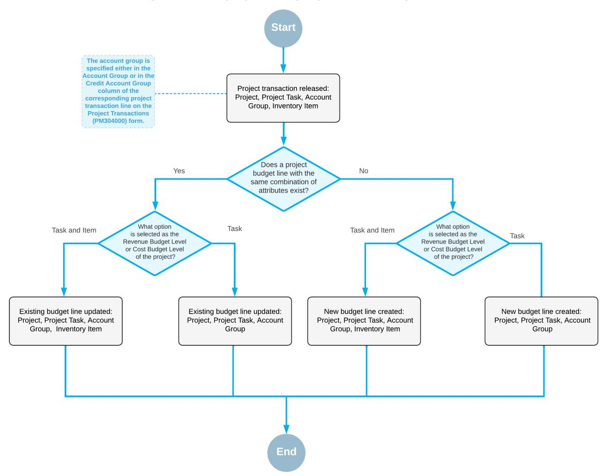

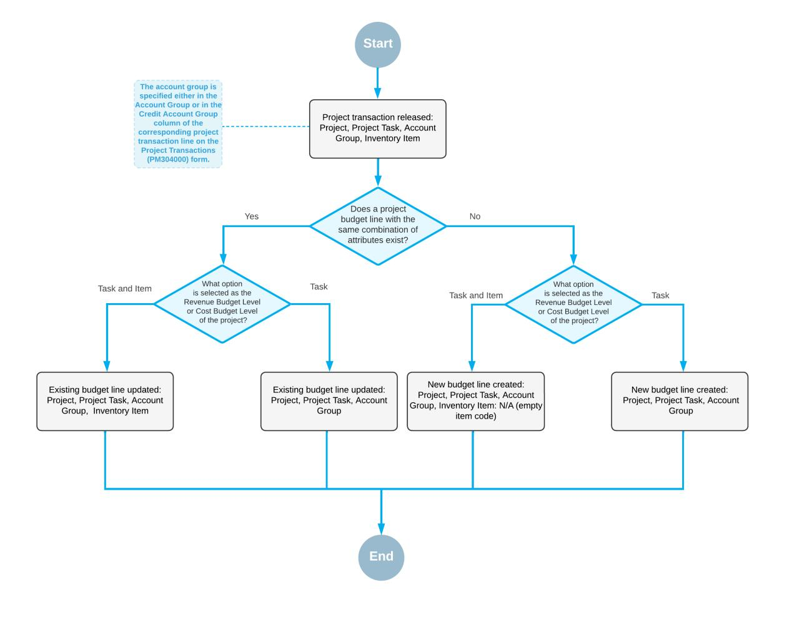

#### **Update of Quantities**

The quantities (actual, committed, budgeted change order, committed change order, and potential) in budget lines are updated in a project budget record if all of the following conditions are met:

- The project transaction has a unit of measure (UOM) specified.
- In the project budget record that matches the project transaction, a UOM is specified.
- The conversion rule from the project transaction's UOM to the budget record's UOM is specified in the system.

The system proceeds as follows to determine the rules it used for conversion from the project transaction's UOM to the budget record's UOM:

- If a stock item is specified in the project budget line, the system uses the conversion rules in the Unit of Measure table on the **General** tab of the *[Stock Items](https://help-2025r1.acumatica.com/Help?ScreenId=ShowWiki&pageid=77786a70-1f1e-4d63-ad98-96f98e4fcb0e)* (IN202500) form.
- If a non-stock item is specified in the project budget line, the system uses the conversion rules in the Unit of Measure table on the **General** tab of the *[Non-Stock Items](https://help-2025r1.acumatica.com/Help?ScreenId=ShowWiki&pageid=bf68dd4f-63d4-460d-8dc0-9152f2bd6bf1)* (IN202000) form.
- If no item is specified in the project budget line, the system uses the conversion rules on the *[Units of](https://help-2025r1.acumatica.com/Help?ScreenId=ShowWiki&pageid=c25c9971-01e2-4021-aa3b-8809f8045e58) [Measure](https://help-2025r1.acumatica.com/Help?ScreenId=ShowWiki&pageid=c25c9971-01e2-4021-aa3b-8809f8045e58)* (CS203500) form.

# <span id="page-136-1"></span><span id="page-136-0"></span>**Project Transactions: Generated Transactions**

The release of project transactions can generate the corresponding general ledger transactions; the release of general ledger transactions can also generate the corresponding project transactions. The generated general ledger transactions and project transactions are described in the following sections.

### **General Ledger Transactions Generated on Project Transaction Release**

When a project transaction with the **Debit Account** and **Credit Account** specified on the *Project [Transactions](https://help-2025r1.acumatica.com/Help?ScreenId=ShowWiki&pageid=382a97fe-b636-44ca-9798-6d478c05b687)* (PM304000) form is released, if the **Amount** of the transaction is positive, the system generates a batch of the general ledger transactions shown in the following table.

| Account        | Source of Account       | Project Budget Key                                                                 | Debit  | Credit |
|----------------|-------------------------|------------------------------------------------------------------------------------|--------|--------|
| Debit account  | The project transaction | The project, project<br>task, and cost code<br>in the project trans<br>action line | Amount | 0.00   |
| Credit account | The project transaction | The project, project<br>task, and cost code<br>in the project trans<br>action line | 0.00   | Amount |

If the **Amount** of the project transaction is negative on the *Project [Transactions](https://help-2025r1.acumatica.com/Help?ScreenId=ShowWiki&pageid=382a97fe-b636-44ca-9798-6d478c05b687)* form, on the release of this transaction, the system generates a batch of the general ledger transactions shown in the following table.

| Account        | Source of Account       | Project Budget Key                                                                 | Debit  | Credit |
|----------------|-------------------------|------------------------------------------------------------------------------------|--------|--------|
| Debit account  | The project transaction | The project, project<br>task, and cost code<br>in the project trans<br>action line | 0.00   | Amount |
| Credit account | The project transaction | The project, project<br>task, and cost code<br>in the project trans<br>action line | Amount | 0.00   |

You can view the details of the batch associated with the release of a project transaction by clicking the link in the **GL Batch Nbr.** column on the *Project [Transactions](https://help-2025r1.acumatica.com/Help?ScreenId=ShowWiki&pageid=382a97fe-b636-44ca-9798-6d478c05b687)* form. The system displays the batch on the *Journal [Transactions](https://help-2025r1.acumatica.com/Help?ScreenId=ShowWiki&pageid=dda046bc-5946-407f-88f7-1c0c966fbe72)* (GL301000) form.

#### **Project Transactions Generated on Release of the General Ledger Batch**

When a batch of general ledger transactions is released, the system generates the project transactions shown in the following table.

| Project Budget Key                                                            | Account Group                                       | Debit<br>Account | Credit<br>Account | Amount                                                                                                                                                                                                                                                                             |
|-------------------------------------------------------------------------------|-----------------------------------------------------|------------------|-------------------|------------------------------------------------------------------------------------------------------------------------------------------------------------------------------------------------------------------------------------------------------------------------------------|
| The project, project<br>task, and cost code<br>in the GL transac<br>tion line | The account group<br>linked to the debit<br>account | Account          | Empty             | Amount<br>The sign of the amount of the<br>created project transaction<br>depends on the sign of this<br>amount in the GL transaction<br>line and on the operation in<br>this line. For more informa<br>tion, see Project Transactions:<br>GL Transactions Related to<br>Projects. |

You can review the created transactions on the *Project [Transaction](https://help-2025r1.acumatica.com/Help?ScreenId=ShowWiki&pageid=29bf5433-446f-4196-be69-f2cb177e83cb) Details* (PM401000) form. In the Selection area of this form, you select the project in the **Project** box. In the table, you can find the project transactions created on the release of the batch of GL transactions by the reference number of the batch in the **GL Batch Nbr.** column.

# <span id="page-137-0"></span>**Project Transactions: Related Reports and Forms**

In the following sections, you can find details about the reports and forms you may want to review to gather information related to project transactions.

If you do not see a particular report or form that is described, you may have signed in to the system with a user account that does not have access rights to the report or form. Contact your system administrator to obtain access to any needed reports or forms.

#### **Reviewing Project Transactions and Corresponding GL Batches**

You can review the list of all the corresponding transactions of a project on the *Project [Transaction](https://help-2025r1.acumatica.com/Help?ScreenId=ShowWiki&pageid=29bf5433-446f-4196-be69-f2cb177e83cb) Details* (PM401000) form. In the Selection area of this form, you select the project, as well as the project task, account group, inventory item, and cost code to narrow the listed project transactions.

You can also find the batch of general ledger transactions that correspond to any listed project transaction on this form. In the table, for a particular transaction, you can find the reference number of the corresponding batch of GL transactions in the **GL Batch Nbr.** column. You click the link in this column to view the details of the batch on the *Journal [Transactions](https://help-2025r1.acumatica.com/Help?ScreenId=ShowWiki&pageid=dda046bc-5946-407f-88f7-1c0c966fbe72)* (GL301000) form.

#### **Printing Project Transactions**

You can prepare the printable list of project transactions related to a particular project using the *[Project](https://help-2025r1.acumatica.com/Help?ScreenId=ShowWiki&pageid=a2c1cc92-b205-4ab3-ab74-84407524db39) [Transactions](https://help-2025r1.acumatica.com/Help?ScreenId=ShowWiki&pageid=a2c1cc92-b205-4ab3-ab74-84407524db39)* (PM633000) report.

#### **Reviewing the Actual Project Amounts**

While you are viewing a particular project on the *[Projects](https://help-2025r1.acumatica.com/Help?ScreenId=ShowWiki&pageid=81c86417-3bde-444b-8f1c-682928d31a0c)* (PM301000) form, you can quickly get more information about a project budget line. That is, for any line on the **Revenue Budget** or **Cost Budget** tab with a nonzero actual amount, you can view the project transactions. To review these project transactions, you click the project budget

line; then on the table toolbar, you click**View Transactions**, and the system opens the *Project [Transaction](https://help-2025r1.acumatica.com/Help?ScreenId=ShowWiki&pageid=29bf5433-446f-4196-be69-f2cb177e83cb) Details* (PM401000) form.

#### **Reviewing Project Balances**

You can review the project balance broken down by account group on the **Balances** tab of the *[Projects](https://help-2025r1.acumatica.com/Help?ScreenId=ShowWiki&pageid=81c86417-3bde-444b-8f1c-682928d31a0c)* (PM301000) form. To review the corresponding project transactions of an account group, you click the line; then on the table toolbar, you click**View Transactions**. The system opens the *Project [Transaction](https://help-2025r1.acumatica.com/Help?ScreenId=ShowWiki&pageid=29bf5433-446f-4196-be69-f2cb177e83cb) Details* (PM401000) form.

# <span id="page-138-0"></span>**Project Transactions: Mass Processing of Documents**

This topic explains how to perform mass-processing operations related to project transactions, and how the system generates, changes, or works with documents as a result of the mass processing.

#### **Mass-Releasing Project Transaction**

To mass-release project transactions, you use the *Release [Transactions](https://help-2025r1.acumatica.com/Help?ScreenId=ShowWiki&pageid=a6ff3bed-5794-4316-a7b4-47d2728f4115)* (PM501000) form. On this form, you select the unlabeled check boxes in the rows of the transactions to be released and click **Release** on the form toolbar to process the selected transactions; alternatively, you can click **Release All** to process all the transactions shown in the table.

# <span id="page-139-0"></span>**Preparing Projects to Billing**

This chapter describes how you can select the type of the project invoice to be prepared during billing for a particular project, and how you can check whether the project is pending billing.

# <span id="page-139-2"></span><span id="page-139-1"></span>**Project Billing Preparation: General Information**

In Acumatica ERP, you run project billing to automatically generate customer invoices based on the accounting data related to the projects.

#### **Learning Objectives**

In this chapter, you will learn how to do the following:

- Select the type of the document to be prepared
- Make sure that the project is ready to be billed

#### **Applicable Scenarios**

For each project, you decide which type of the project invoice is prepared during project billing. Once a project is ready to be billed, you run the project billing procedure.

#### **Project Invoice Workflow**

The type of the document that the system will generate during the project billing procedure depends on the state of the **Create Pro Forma Invoice on Billing** check box on the**Summary** tab of the *[Projects](https://help-2025r1.acumatica.com/Help?ScreenId=ShowWiki&pageid=81c86417-3bde-444b-8f1c-682928d31a0c)* (PM301000) form:

- If the check box is selected, the system creates a pro forma invoice and opens it on the *[Pro Forma Invoices](https://help-2025r1.acumatica.com/Help?ScreenId=ShowWiki&pageid=37f1ed00-a7d7-4161-9307-1337662b8550)* (PM307000) form. For more information, see *[Pro Forma Invoices: General Information](#page-185-2)*.
- If the check box is cleared, the system creates an accounts receivable invoice or credit memo and opens it on the *[Invoices and Memos](https://help-2025r1.acumatica.com/Help?ScreenId=ShowWiki&pageid=5e6f3b27-b7af-412f-a40a-1d4f4be70cba)* (AR301000) form. For more information about billing projects with credit memos, see *[Project Invoice Correction: Credit Memos for Projects](#page-209-2)*.

The date of the created document is the **Next Billing Date** specified for the project on the**Summary** tab (**Billing and Allocation Settings** section). If *On Demand* is specified as the billing period of the project (in the same section of this tab), the date of the prepared invoice is the current business date.

#### **Billing Process Preparation**

The billing procedure in Acumatica ERP is straightforward and depends on the type of the step of the billing rule that is specified for each project task on the**Tasks** tab of the *[Projects](https://help-2025r1.acumatica.com/Help?ScreenId=ShowWiki&pageid=81c86417-3bde-444b-8f1c-682928d31a0c)* (PM301000) form as follows:

- For the *Time and Material* steps of the billing rules, the system selects all the project transactions and generates an invoice for the customer based on these transactions and the billing rule.
- For the *Progress Billing* steps of the billing rules of project tasks, the system generates an invoice with the billable project revenue.

For the billing process for a project to be run successfully, the project must meet the following criteria:

- The project is an external project (that is, a project associated with a customer).
- The project status should be *Active*, *Completed*, or *Suspended*.
- The status of the project tasks should be *Active* or *Completed*, and a billing rule should be specified for these tasks.

- The project should have a basis for billing, such as a billable line of the revenue budget associated with the task for progress billing, or an unbilled project transaction associated with the task within this billing period for time and material billing.
- The steps of the billing rule should be applicable to the billing basis. For example, the billing rule of a task that is supposed to be billed by a revenue budget line should have a *Progress Billing* step.
- The rate table must be specified for a project task if the related billing rule contains the *@Rate* parameter.
- Sales prices must be configured for non-stock items if the related billing rule contains the *@Price* parameter.

### **Projects Pending Billing**

You run the project billing procedure for a project that is pending billing by opening the project on the *[Projects](https://help-2025r1.acumatica.com/Help?ScreenId=ShowWiki&pageid=81c86417-3bde-444b-8f1c-682928d31a0c)* (PM301000) form and clicking **Run Billing** on the form toolbar. The billing procedure can be run only for a project that is pending billing—that is, only if at least one of the following exists for the project:

- A revenue budget line billed by amount with a nonzero **Pending Invoice Amount** on the **Revenue Budget** tab of the *[Projects](https://help-2025r1.acumatica.com/Help?ScreenId=ShowWiki&pageid=81c86417-3bde-444b-8f1c-682928d31a0c)* form; the amount may be positive or negative.
- A revenue budget line billed by quantity with a nonzero **Pending Invoice Quantity** on the **Revenue Budget** tab of the *[Projects](https://help-2025r1.acumatica.com/Help?ScreenId=ShowWiki&pageid=81c86417-3bde-444b-8f1c-682928d31a0c)* form.
- A revenue budget line with a **Pending Invoice Quantity** of *0* on the **Revenue Budget** tab of the *[Projects](https://help-2025r1.acumatica.com/Help?ScreenId=ShowWiki&pageid=81c86417-3bde-444b-8f1c-682928d31a0c)* form if the corresponding billing rule has the **Create Lines with Zero Amount and Quantity** check box selected in the progress billing step on the *[Billing Rules](https://help-2025r1.acumatica.com/Help?ScreenId=ShowWiki&pageid=6773c79b-216e-4725-b28c-3ce724d9a7c9)* (PM207000) form. (With this check box selected, the system performs billing for all revenue budget lines, including those that have pending values of *0*).
- An amount postponed to the next billing from a pro forma invoice on the *[Pro Forma Invoices](https://help-2025r1.acumatica.com/Help?ScreenId=ShowWiki&pageid=37f1ed00-a7d7-4161-9307-1337662b8550)* (PM307000) form for which the corresponding accounts receivable invoice is released.
- A project task for which a recurring billing item is defined on the **Recurring Billing** tab of the *[Project](https://help-2025r1.acumatica.com/Help?ScreenId=ShowWiki&pageid=97a58591-40d8-4edf-a9ad-896d633d6980) Tasks* (PM302000) form. For more information, see *[Project Billing Preparation: Recurring Billing](#page-142-1)*.
- An unbilled project transaction that is ready to be billed on the invoice date—that is, the date of the transaction is not later than the invoice date. Transactions with a date the same as the invoice date are billed if *Include Transactions with Billing Date* is selected in the **Billing Cutoff** box on the *[Projects](https://help-2025r1.acumatica.com/Help?ScreenId=ShowWiki&pageid=de2ca225-4a0c-4129-b09d-3f3ed05198f9) [Preferences](https://help-2025r1.acumatica.com/Help?ScreenId=ShowWiki&pageid=de2ca225-4a0c-4129-b09d-3f3ed05198f9)* (PM101000) form; if *Include Only Transactions Before Billing Date* is selected, the system skips the transactions with a date on the billing date.

The invoice date is for all the projects except those that are billed on demand is the **Next Billing Date** on the *[Projects](https://help-2025r1.acumatica.com/Help?ScreenId=ShowWiki&pageid=81c86417-3bde-444b-8f1c-682928d31a0c)* form (in the **Billing and Allocation Settings** section of the**Summary** tab); for the projects that are billed on demand (that is, for which the **Billing Period**, which is specified in the same section of the form, is *On Demand*), the invoice date is the business date.

You can also run billing for multiple projects on the *[Run Project Billing](https://help-2025r1.acumatica.com/Help?ScreenId=ShowWiki&pageid=1a586da4-beaa-4015-8834-b2eb87a21fc9)* (PM503000) form. For more information, see *[Project Billing Preparation: Mass Processing](#page-143-2)*.

# <span id="page-140-0"></span>**Project Billing Preparation: Implementation Checklist**

To ensure that the system is configured properly for billing a project, make sure that the features and settings listed in the table are configured as described in the following table.

| Form                          | Task to Perform                                                                                                                                                                                              |
|-------------------------------|--------------------------------------------------------------------------------------------------------------------------------------------------------------------------------------------------------------|
| Billing Rules (PM207000) form | Make sure that billing rules are configured as described in the topics of the<br>Creating Billing Rules chapter. Also, make sure that the appropriate billing<br>rules are assigned to needed project tasks. |

| Form                | Task to Perform                                                                                                                                                                                |
|---------------------|------------------------------------------------------------------------------------------------------------------------------------------------------------------------------------------------|
| Projects (PM301000) | Determine how the project should be billed as follows:                                                                                                                                         |
|                     | •<br>To cause pro forma invoices to be created during the project billing, se<br>lect the Create Pro Forma Invoice on Billing check box on theSum<br>mary tab of the Projects (PM301000) form. |
|                     | •<br>To cause accounts receivable invoices to be created during the project<br>billing, clear the Create Pro Forma Invoice on Billing check box on the<br>Summary tab of the Projects form.    |
|                     | Before you run the billing procedure, make sure that the project is pend<br>ing billing.                                                                                                       |

#### **Other Settings That Affect the Workflow**

You can affect the workflow of project billing by specifying additional settings as follows:

- To cause the system to include the project transactions with a date that is the same as the invoice date in project billing, select *Include Transactions with Billing Date* in the **Billing Cutoff** box on the *[Projects](https://help-2025r1.acumatica.com/Help?ScreenId=ShowWiki&pageid=de2ca225-4a0c-4129-b09d-3f3ed05198f9) [Preferences](https://help-2025r1.acumatica.com/Help?ScreenId=ShowWiki&pageid=de2ca225-4a0c-4129-b09d-3f3ed05198f9)* (PM101000) form. If you select *Include Only Transactions Before Billing Date*, the system instead skips the transactions whose date is the same as the billing date.
- To define billing limit amounts for revenue budget lines of a project billed for time and material, select the **UseT&M Revenue Budget Limits** check box on the**Summary** tab of the *[Projects](https://help-2025r1.acumatica.com/Help?ScreenId=ShowWiki&pageid=81c86417-3bde-444b-8f1c-682928d31a0c)* (PM301000) form. Then you can specify billing limits for particular budget lines on the **Revenue Budget** tab of the same form. For more information, see *[Project Billing Preparation: Billing Limits](#page-141-1)*.

# <span id="page-141-1"></span><span id="page-141-0"></span>**Project Billing Preparation: Billing Limits**

The following sections explain how you can set up billing limits for pro forma invoices.

### **Configuring Billing Limits**

On the *[Projects Preferences](https://help-2025r1.acumatica.com/Help?ScreenId=ShowWiki&pageid=de2ca225-4a0c-4129-b09d-3f3ed05198f9)* (PM101000) form, you select the way the system controls the billing limits in the **ValidateT&M Revenue Budget Limits** box. The following options are available:

- *Ignore*: If the billing limits are exceeded, the system shows a warning message for the pro forma invoice on the *[Pro Forma Invoices](https://help-2025r1.acumatica.com/Help?ScreenId=ShowWiki&pageid=37f1ed00-a7d7-4161-9307-1337662b8550)* (PM307000) form, but the pro forma invoice can still be removed from hold and released.
- *Validate* (default): If the billing limits are exceeded, the system shows an error message and blocks the processing until the pro forma invoice amount is within the limit. That is, you can save this pro forma invoice only with the *On Hold* status. To remove it from hold and release it, you have to adjust it to fit the limit.

To turn on the billing limit control for pro forma invoices of a particular project, you select the **UseT&M Revenue Budget Limits** check box on the**Summary** tab of the *[Projects](https://help-2025r1.acumatica.com/Help?ScreenId=ShowWiki&pageid=81c86417-3bde-444b-8f1c-682928d31a0c)* (PM301000) form. Then on the **Revenue Budget** tab, you define the billing limit amounts for the revenue budget lines of the project. For each revenue budget line for which you have decided to limit the billed amounts, you select the **Limit Amount** check box and specify the maximum billing amount in the **Maximum Amount** column. The system will validate these limit amounts in the pro forma invoices created for the project.

#### **Applying Limits to Pro Forma Invoices**

If a time and material line is linked to a progress billing line, the system calculates the maximum amount that is currently available for billing the customer based on the billing limit amount of the corresponding revenue budget line that is related to the selected revenue task. If the time and material line has no revenue task specified, the system calculates the maximum billable amount based on the project task in this line.

On the **Time and Material** tab of the *[Pro Forma Invoices](https://help-2025r1.acumatica.com/Help?ScreenId=ShowWiki&pageid=37f1ed00-a7d7-4161-9307-1337662b8550)* form, the system applies the billing limit amounts to the pro forma invoice lines as a running total, starting from the first line in the table. The **Max Available Amount** is a running total that the system calculates for each line, starting from the topmost one, that has a nonzero **Max Limit Amount** by using the following formula.

Max Available Amount = Max Limit Amount - (Actual Amount + (Draft Invoice Amount - SUM(Amount to Invoice)) + SUM(Amount to Invoice from Above))

In this formula, the parameters have the following meanings:

- Actual Amount: The **Actual Amount** of the corresponding revenue budget line on the **Revenue Budget** tab of the *[Projects](https://help-2025r1.acumatica.com/Help?ScreenId=ShowWiki&pageid=81c86417-3bde-444b-8f1c-682928d31a0c)* (PM301000) form
- Draft Invoice Amount: The **Dra Invoice Amount** of the corresponding revenue budget line on the **Revenue Budget** tab of the *[Projects](https://help-2025r1.acumatica.com/Help?ScreenId=ShowWiki&pageid=81c86417-3bde-444b-8f1c-682928d31a0c)* (PM301000) form.
- Amount to Invoice: The **Amount to Invoice** of each line of the pro forma invoice on the**Time and Material** tab that corresponds to the same revenue budget line
- Amount to Invoice from Above: The **Amount to Invoice** of each line of the pro forma invoice on the **Time and Material** tab that corresponds to the same revenue budget line and is located above the current line on the**Time and Material** tab

For each line of the pro forma invoice, the system subtracts the **Amount to Invoice** from the **Max Available Amount** and uses the reduced amount as the available limit for the next line. Pro forma invoice lines for which the **Over-Limit Amount** is nonzero exceed the limit.

If no billing limit amount is defined for the revenue budget line of the project—that is, if the **Max Limit Amount** is *0*—the **Max Available Amount** of each corresponding pro forma invoice line is *0*.

On the **Time and Material** tab of the *[Pro Forma Invoices](https://help-2025r1.acumatica.com/Help?ScreenId=ShowWiki&pageid=37f1ed00-a7d7-4161-9307-1337662b8550)* form, you can rearrange lines in the table by dragging them to the appropriate positions, causing the system to apply the limit amounts to the needed lines of the invoice. You can also add to a pro forma invoice adjustment lines that do not originate from project transactions. Such lines are also included in the limit application and can decrease or increase the limit total.

# <span id="page-142-1"></span><span id="page-142-0"></span>**Project Billing Preparation: Recurring Billing**

This topic explains how you can configure the addition of recurring billing lines during project billing.

Your company may provide services to customers regularly for a flat price—for instance, easing construction machines to customers for an agreed-upon number of hours per month at a fixed price. If you decide to manage this activity as a project, you do not have to manually create a new invoice every month—instead, each time you run project billing, recurring transactions can be added to the invoice (or to the invoice listed first in the rule if multiple invoices must be generated for the applicable billing rule).

You can set up recurring billing at the project task level by adding lines on the **Recurring Billing** tab of the *[Project](https://help-2025r1.acumatica.com/Help?ScreenId=ShowWiki&pageid=97a58591-40d8-4edf-a9ad-896d633d6980) [Tasks](https://help-2025r1.acumatica.com/Help?ScreenId=ShowWiki&pageid=97a58591-40d8-4edf-a9ad-896d633d6980)* (PM302000) form. Each recurring billing line defines the rules the system uses to create the corresponding invoice line during the project billing. For each line, you specify the following settings:

- A non-stock item that represents a service or labor of recurring billing to track employee and equipment work time.
- The flat price that is charged once each billing period.

- Optional: The number of units included in the item fee. For instance, you may have an agreement with the customer to provide 40 hours of service at a flat price, while any extra hours are charged on a per-hour basis. These 40 hours would be included in the recurring billing line and the extra hours would be billed separately.
- The option that determines the frequency of recurring billing usage. You can select one of the following options: the recurring billing is performed only once during the project lifecycle for the next project billing or it is used each time the project billing is performed.

The recurring billing is invoked on project billing and does not depend on any of the billing rule settings. However, a billing rule with at least one step, for example, a progress billing step, is required for the project task to make the system produce an invoice even with a single recurring billing line.

You can also set up recurring billing for project template tasks and common tasks on the **Recurring Billing** tab of the *Project [Template](https://help-2025r1.acumatica.com/Help?ScreenId=ShowWiki&pageid=70efdc85-fb54-4c39-add2-74abde2dba57) Tasks* (PM208010) form and *[Common](https://help-2025r1.acumatica.com/Help?ScreenId=ShowWiki&pageid=3120e8d8-b803-4b08-a0ad-6f04d77343f3) Tasks* (PM208010) form, respectively.

# <span id="page-143-0"></span>**Project Billing Preparation: Related Report and Inquiry Forms**

This topic describes reports and forms you can review to gather information related to project billing. The topic also explains how you can print documents related to project billing.

If you do not see a particular report or form that is described, you may have signed in to the system with a user account that does not have access rights to the report or form. Contact your system administrator to obtain access to any needed reports or forms.

#### **Finding the Related Pro Forma Invoice**

While you are working with a particular accounts receivable invoice on the *[Invoices and Memos](https://help-2025r1.acumatica.com/Help?ScreenId=ShowWiki&pageid=5e6f3b27-b7af-412f-a40a-1d4f4be70cba)* (AR301000) form, you can review the pro forma invoice that was used for creating this accounts receivable invoice. To do this, you click **Pro Forma Invoice** on the More menu (under **Related Documents**) of the *[Invoices and Memos](https://help-2025r1.acumatica.com/Help?ScreenId=ShowWiki&pageid=5e6f3b27-b7af-412f-a40a-1d4f4be70cba)* form.

#### **Reviewing Unbilled Project Transactions**

You can review the list of all the transactions that correspond to a project on the *Project [Transaction](https://help-2025r1.acumatica.com/Help?ScreenId=ShowWiki&pageid=29bf5433-446f-4196-be69-f2cb177e83cb) Details* (PM401000) form. In the Selection area of this form, you select the project to review all its project transactions. The transactions for which the **Billed** check box is cleared have not been billed yet. You can narrow the range of listed transactions by specifying any of the following in the Selection area: project task, account group, and inventory item.

#### **Reviewing Project Balances**

You can review the project balance broken down by account group on the **Balances** tab of the *[Projects](https://help-2025r1.acumatica.com/Help?ScreenId=ShowWiki&pageid=81c86417-3bde-444b-8f1c-682928d31a0c)* (PM301000) form. To review the corresponding project transactions of an account group, you click the line; then on the table toolbar, you click**View Transactions**. The system opens the *Project [Transaction](https://help-2025r1.acumatica.com/Help?ScreenId=ShowWiki&pageid=29bf5433-446f-4196-be69-f2cb177e83cb) Details* (PM401000) form.

# <span id="page-143-2"></span><span id="page-143-1"></span>**Project Billing Preparation: Mass Processing**

This topic explains how to perform mass-processing operations related to project billing, and how the system generates, changes, or works with documents as a result of the mass processing.

#### **Mass-Billing Projects**

Multiple projects can be billed at the same time on the *[Run Project Billing](https://help-2025r1.acumatica.com/Help?ScreenId=ShowWiki&pageid=1a586da4-beaa-4015-8834-b2eb87a21fc9)* (PM503000) form. On this form, you can run billing for multiple projects that are pending billing as of the **Invoice Date**, which is selected in the Summary area of the form. You can also narrow the projects to be shown by specifying the statement cycle, customer class, customer, and project template in the Selection area of the form. For more information on preparing projects for billing, see *[Project Billing Preparation: General Information](#page-139-2)*.


The form displays projects to which your user account has sufficient access rights.

In the table on the form, the system lists the following projects:

- For progress billing, projects that have a nonzero **Pending Invoice AmountTotal** (which can be either positive or negative). For more information about the progress billing process, see *[Progress Billing: General](#page-145-2) [Information](#page-145-2)*.
- For time and material billing, projects that have unbilled project transactions—that is, the transactions with the **Billed** check box cleared on the *Project [Transactions](https://help-2025r1.acumatica.com/Help?ScreenId=ShowWiki&pageid=382a97fe-b636-44ca-9798-6d478c05b687)* (PM304000) form. The system selects these project transactions based on the option selected in the **Billing Cutoff** box on the *[Projects Preferences](https://help-2025r1.acumatica.com/Help?ScreenId=ShowWiki&pageid=de2ca225-4a0c-4129-b09d-3f3ed05198f9)* (PM101000) form as follows:
  - If *Include Transactions with Billing Date* is selected, the system selects all unbilled transactions with dates earlier than or the same as the **Invoice Date** selected in the Summary area of the form.
  - If *Include Only Transactions Before Billing Date* is selected, the system selects all unbilled transactions with dates that are earlier than the **Invoice Date**.

For more information about the time and material billing process, see *Time and Material Billing: [General](#page-159-2) [Information](#page-159-2)*.

• For recurring billing, projects that include at least one non-completed project task that has been configured for recurring billing. The system shows the projects billed on demand and the projects that have a **Next Billing Date**, which is specified on the **Summary** tab of the *[Projects](https://help-2025r1.acumatica.com/Help?ScreenId=ShowWiki&pageid=81c86417-3bde-444b-8f1c-682928d31a0c)* (PM301000) form, that is earlier than or the same as the billing date. (The billing date is specified in the **Invoice Date** box in the Selection area of the *[Run Project Billing](https://help-2025r1.acumatica.com/Help?ScreenId=ShowWiki&pageid=1a586da4-beaa-4015-8834-b2eb87a21fc9)* form.)

For more information about recurring billing, see *[Project Billing Preparation: Recurring Billing](#page-142-1)*.

When you run billing, the system creates pro forma invoices or accounts receivable invoices (depending on the workflow configured for the project) with the billing date, which is specified in the **Invoice Date** box.

# <span id="page-145-0"></span>**Billing Projects by Progress**

In Acumatica ERP, if you need to bill customers for the services provided as a part of a project, you can generate invoices based on the information collected in the project's accounting data. This chapter describes how you can bill projects for progress.

# <span id="page-145-2"></span><span id="page-145-1"></span>**Progress Billing: General Information**

With progress billing in Acumatica ERP, you run project billing to automatically generate project invoices based on the progress recorded for the project.

#### **Learning Objectives**

In this chapter, you will learn how to do the following:

- Run project billing for a project
- Process the documents that have been generated during the project billing
- Review how the project's actual amounts are updated with the billed amounts

#### **Applicable Scenarios**

You run project billing to prepare an invoice for the customer based on the current progress of the project. The timing of project billing depends on the project billing period defined for the project.

#### **The Progress Billing Process**

Progress billing is a simple billing workflow for the projects that are gradually billed at a fixed contract amount. Progress billing does not involve project transactions. To bill a project task by its progress, you need to create a billing rule on the *[Billing Rules](https://help-2025r1.acumatica.com/Help?ScreenId=ShowWiki&pageid=6773c79b-216e-4725-b28c-3ce724d9a7c9)* (PM207000) form and configure a step of the *Progress Billing* type in this rule. Then you assign the configured billing rule to project tasks on the**Tasks** tab of the *[Projects](https://help-2025r1.acumatica.com/Help?ScreenId=ShowWiki&pageid=81c86417-3bde-444b-8f1c-682928d31a0c)* (PM301000) form.

If a project is billed with a billing rule that includes only a *Progress Billing* billing step, during the billing process, the system ignores any unbilled project transactions.

The progress billing procedure could be initiated for a project if either of the following is true:

- It has at least one revenue budget line with billable project revenue.
- It has pending values of 0 if the progress billing step of the billing rule assigned to any project task has the **Create Lines with Zero Amount and Quantity** check box selected on the *[Billing Rules](https://help-2025r1.acumatica.com/Help?ScreenId=ShowWiki&pageid=6773c79b-216e-4725-b28c-3ce724d9a7c9)* form.

For more information, see *[Project Billing Preparation: General Information](#page-139-2)*.

Each revenue budget line is billed based on amount or quantity, depending on the option selected in the **Progress Billing Basis** column on the **Revenue Budget** tab of the *[Projects](https://help-2025r1.acumatica.com/Help?ScreenId=ShowWiki&pageid=81c86417-3bde-444b-8f1c-682928d31a0c)* form as follows:

- For a line billed by amount, you need to specify a nonzero amount, which may be a negative amount, in the **Pending Invoice Amount** column. For these lines, the **Pending Invoice Quantity**, **Dra Invoice Quantity**, and **Actual Quantity** values are always *0*.
- For a line billed by quantity, you need to specify a nonzero quantity in the **Pending Invoice Quantity** column. In this case, the system will calculate the **Pending Invoice Amount** of the line as the pending invoice quantity multiplied by the unit rate specified in the line. The system will calculate the percentage of line completion (**Completed (%)**) based on the specified values.

You can also specify the **Completed (%)** value on the **Revenue Budget** tab for the needed revenue budget lines to indicate that the project tasks are being performed. The system will calculate the pending invoice values by using the following formulas:

```
Pending Invoice Amount = Revised Budgeted Amount * ( Completed (%) / 100 ) -
Draft Invoice Amount - Actual Amount
Pending Invoice Quantity = Revised Budgeted Quantity * ( Completed (%) / 100 )
- Draft Invoice Quantity - Actual Quantity
```

Project-related invoices, debit memos, and credit memos that have been created manually on the *[Invoices and Memos](https://help-2025r1.acumatica.com/Help?ScreenId=ShowWiki&pageid=5e6f3b27-b7af-412f-a40a-1d4f4be70cba)* (AR301000) form are not included in pending invoice quantities and amounts.

You run billing for one project by clicking the **Run Billing** button on the form toolbar of the *[Projects](https://help-2025r1.acumatica.com/Help?ScreenId=ShowWiki&pageid=81c86417-3bde-444b-8f1c-682928d31a0c)* form or process multiple projects on the *[Run Project Billing](https://help-2025r1.acumatica.com/Help?ScreenId=ShowWiki&pageid=1a586da4-beaa-4015-8834-b2eb87a21fc9)* (PM503000) form. When you run the project billing, the system prepares a project invoice whose type depends on the state of the **Create Pro Forma Invoice on Billing** check box on the **Summary** tab of the *[Projects](https://help-2025r1.acumatica.com/Help?ScreenId=ShowWiki&pageid=81c86417-3bde-444b-8f1c-682928d31a0c)* form as follows:

- If the check box is selected, the system generates a pro forma invoice with a positive or negative amount.
- If the check box is cleared, the system generates an accounts receivable invoice (if the billed amount is positive) or credit memo (if the billed amount is negative). For more information about credit memos, see *[Project Invoice Correction: Credit Memos for Projects](#page-209-2)*.

The system creates a project invoice with the unit prices, amounts, and quantities copied from the **Unit Rate**, **Pending Invoice Amount** and **Pending Invoice Quantity** columns of the **Revenue Budget** tab of the *[Projects](https://help-2025r1.acumatica.com/Help?ScreenId=ShowWiki&pageid=81c86417-3bde-444b-8f1c-682928d31a0c)* form for the corresponding revenue budget lines. If the project billing is performed by using the pro forma invoice workflow, the pro forma invoice lines that are produced by the progress billing steps are shown in the prepared pro forma invoice on the **Progress Billing** tab of the *[Pro Forma Invoices](https://help-2025r1.acumatica.com/Help?ScreenId=ShowWiki&pageid=37f1ed00-a7d7-4161-9307-1337662b8550)* (PM307000) form.

During the billing process, the system groups the billable amounts into invoices based on the following:

- The invoice group of the steps of the billing rules to which the project tasks refer
- The customer
- The customer location
- The **BillSeparately** setting of each project task defined on the *[Project](https://help-2025r1.acumatica.com/Help?ScreenId=ShowWiki&pageid=97a58591-40d8-4edf-a9ad-896d633d6980) Tasks* (PM302000) form

For more information, see *[Grouping of Invoices: General Information](#page-418-2)*.

Once an invoice is prepared, the **Dra Invoice Amount** and **Dra Invoice Quantity** of the revenue budget lines are updated with the amount and quantity for which the invoice has been prepared. The **Pending Invoice Amount** and **Pending Invoice Quantity** values become *0*.

If you manually adjust the **Amount to Invoice** of a pro forma invoice line, the system automatically recalculates the **Total Completed (%)** in this line. This is the percentage of the revised budgeted amount of the revenue budget line of the project that has been invoiced by all the pro forma invoices of the project, including the current one. However, the system does not update the **Completed (%)** of the corresponding revenue budget line on the **Revenue Budget** tab of the *[Projects](https://help-2025r1.acumatica.com/Help?ScreenId=ShowWiki&pageid=81c86417-3bde-444b-8f1c-682928d31a0c)* form accordingly. Also, the system does not update the **Completed (%)** of the revenue budget line if the related pro forma invoice with the corresponding progress billing line is deleted.

When you release a pro forma invoice and the system creates the corresponding accounts receivable invoice, the system copies the values in the **Amount to Invoice** column from the **Progress Billing** tab of the *[Pro Forma Invoices](https://help-2025r1.acumatica.com/Help?ScreenId=ShowWiki&pageid=37f1ed00-a7d7-4161-9307-1337662b8550)* form to the corresponding lines of the accounts receivable invoice on the **Details** tab of the *[Invoices and Memos](https://help-2025r1.acumatica.com/Help?ScreenId=ShowWiki&pageid=5e6f3b27-b7af-412f-a40a-1d4f4be70cba)* (AR301000) form.

# <span id="page-146-1"></span><span id="page-146-0"></span>**Progress Billing: To Bill a Project by Progress**

This activity will walk you through the process of billing a project by its progress.

This activity is based on the *U100* dataset. If you are using another dataset, or if any system settings have been changed in *U100*, these changes can affect the workflow of the activity and the results of the processing. To avoid any issues, restore the *U100* dataset to its initial state.

#### **Story**

Suppose that the HM's Bakery and Cafe customer has ordered 20 hours of new-employee training on operating juicers from the SweetLife Fruits & Jams company. SweetLife's project accountant has created a project to handle the tracking and billing of the provided services; the project should be billed on demand as the services are provided. Before each invoice is sent to the customer for payment, the customer has requested that a pro forma invoice be submitted for acceptance.

Then suppose that on *1/30/2025*, SweetLife's consultant has provided five hours of the training. As the project accountant, you need to update the progress of the project and bill the customer for the provided training.

#### **Configuration Overview**

In the *U100* dataset, the following tasks have been performed to support this activity:

- On the *[Enable/Disable Features](https://help-2025r1.acumatica.com/Help?ScreenId=ShowWiki&pageid=c1555e43-1bc5-4f6f-ba9d-b323f94d8a6b)* (CS100000) form, the *Project Accounting* feature has been enabled to support the project accounting functionality.
- On the *[Billing Rules](https://help-2025r1.acumatica.com/Help?ScreenId=ShowWiki&pageid=6773c79b-216e-4725-b28c-3ce724d9a7c9)* (PM207000) form, the *PROGRESS* billing rule has been configured.
- On the *[Customers](https://help-2025r1.acumatica.com/Help?ScreenId=ShowWiki&pageid=652929bc-9606-4056-aa6e-0c2d1147171b)* (AR303000) form, the *HMBAKERY* customer has been created.
- On the *[Projects](https://help-2025r1.acumatica.com/Help?ScreenId=ShowWiki&pageid=81c86417-3bde-444b-8f1c-682928d31a0c)* (PM301000) form, the *HMBAKERY3* project has been created. On the**Tasks** tab, the *TRAINING* project task has been added, and the *PROGRESS* billing rule is specified for this task. Also, on the**Summary** tab, the **Create Pro Forma Invoice on Billing** check box is selected, indicating that a pro forma invoice is created when the project is billed, and the **Billing Period** is set to *On Demand*.

#### **Process Overview**

You will update the progress of the project on the *[Projects](https://help-2025r1.acumatica.com/Help?ScreenId=ShowWiki&pageid=81c86417-3bde-444b-8f1c-682928d31a0c)* (PM301000) form to indicate that services have been provided partially. Then you will run project billing and review the prepared pro forma invoice on the *[Pro Forma](https://help-2025r1.acumatica.com/Help?ScreenId=ShowWiki&pageid=37f1ed00-a7d7-4161-9307-1337662b8550) [Invoices](https://help-2025r1.acumatica.com/Help?ScreenId=ShowWiki&pageid=37f1ed00-a7d7-4161-9307-1337662b8550)* (PM307000) form. Aer that, you will release the pro forma invoice, which causes the corresponding accounts receivable invoice to be created. Aer you review and release the AR invoice on the *[Invoices and Memos](https://help-2025r1.acumatica.com/Help?ScreenId=ShowWiki&pageid=5e6f3b27-b7af-412f-a40a-1d4f4be70cba)* (AR301000) form, you will review the project and make sure that the project balances have been updated.

#### **System Preparation**

To sign in to the system and prepare to perform the instructions of the activity, do the following:

- 1. Launch the Acumatica ERP website, and sign in to a company with the *U100* dataset preloaded; you should sign in as project accountant by using the *brawner* username and the *123* password.
- 2. In the info area, in the upper-right corner of the top pane of the Acumatica ERP screen, make sure that the business date in your system is set to *1/30/2025*. If a different date is displayed, click the Business Date menu button and select *1/30/2025* on the calendar. For simplicity, in this activity, you will create and process all documents in the system on this business date.

#### **Step 1: To Run Project Billing**

To update the progress of project completion and bill the project in an amount corresponding to the progress, do the following:

1. On the *[Projects](https://help-2025r1.acumatica.com/Help?ScreenId=ShowWiki&pageid=81c86417-3bde-444b-8f1c-682928d31a0c)* (PM301000) form, open the *HMBAKERY3* project.

- 2. On the **Revenue Budget** tab, specify 25 as the **Completed (%)** in the only revenue budget line to indicate that 25 percent of the project task has been completed (5 hours of 20). The system calculates the **Pending Invoice Amount** as \$250. Because the project has a nonzero **Pending Invoice Amount** in the revenue budget line, you can now bill the project.
- 3. Save your changes to the project.
- 4. On the form toolbar, click **Run Billing**.

The system creates a pro forma invoice and opens it on the *[Pro Forma Invoices](https://help-2025r1.acumatica.com/Help?ScreenId=ShowWiki&pageid=37f1ed00-a7d7-4161-9307-1337662b8550)* (PM307000) form.

#### **Step 2: To Process a Pro Forma Invoice and the Corresponding AR Invoice**

To process the pro forma invoice, while you are still viewing the prepared pro forma invoice on the *[Pro Forma](https://help-2025r1.acumatica.com/Help?ScreenId=ShowWiki&pageid=37f1ed00-a7d7-4161-9307-1337662b8550) [Invoices](https://help-2025r1.acumatica.com/Help?ScreenId=ShowWiki&pageid=37f1ed00-a7d7-4161-9307-1337662b8550)* (PM307000) form, do the following:

- 1. On the **Progress Billing** tab, review the only line. The system has added this line based on the corresponding revenue budget line of the project on the *[Projects](https://help-2025r1.acumatica.com/Help?ScreenId=ShowWiki&pageid=81c86417-3bde-444b-8f1c-682928d31a0c)* form (PM301000) that has been billed by its progress. The **Amount to Invoice** in the only progress billing line and the **Progress BillingTotal** on the Summary area of the invoice is \$250.
- 2. On the form toolbar, click **Remove Hold** to assign the pro forma invoice the *Open* status, and then click **Release**. The system closes the pro forma invoice (and assigns it the *Closed* status), and creates a corresponding accounts receivable invoice based on the pro forma invoice.
- 3. On the **Financial** tab, click the **AR Ref. Nbr.** link to open the accounts receivable invoice that has been created on the *[Invoices and Memos](https://help-2025r1.acumatica.com/Help?ScreenId=ShowWiki&pageid=5e6f3b27-b7af-412f-a40a-1d4f4be70cba)* (AR301000) form.
- 4. On the form toolbar, click **Remove Hold** to assign the accounts receivable invoice the *Balanced* status, and then click **Release**.

#### **Step 3: To Review the Updated Project Details**

To review how the project billing has affected the project budget, do the following:

- 1. On the *[Projects](https://help-2025r1.acumatica.com/Help?ScreenId=ShowWiki&pageid=81c86417-3bde-444b-8f1c-682928d31a0c)* form, open the *HMBAKERY3* project.
- 2. On the **Revenue Budget** tab, review the only revenue budget line. Notice that the **Pending Invoice Amount** is now 0, and the **Actual Amount** is \$250, as shown in the following screenshot. Also notice that **Actual Income** in the Summary area has been updated and is now \$250.

| Projects<br>HMBAKERY3 - A training for employees |                                          |                                             |                                       |                                                                                 |                                      |                                  |                                | <b>NOTES</b>       | $TOOLS$ $\star$<br><b>FILES</b>                  |                                                          |
|--------------------------------------------------|------------------------------------------|---------------------------------------------|---------------------------------------|---------------------------------------------------------------------------------|--------------------------------------|----------------------------------|--------------------------------|--------------------|--------------------------------------------------|----------------------------------------------------------|
| 圕<br>$\Box$<br>$\Omega$<br>$\leftarrow$          | 何<br>κ<br>+                              | $\geq$<br>⋗                                 | <b>RUN BILLING</b><br><b>COMPLETE</b> | $\cdots$                                                                        |                                      |                                  |                                |                    |                                                  |                                                          |
| * Project ID:                                    | HMBAKERY3                                | Q                                           | Customer:                             | HMBAKERY - HM's Bakery & Cafe                                                   | $\mathscr{O}$<br>Q                   | Actual Income:                   |                                | 250.00             |                                                  | $\hat{ }$                                                |
| Template:                                        |                                          | 0                                           | Project Manager:                      | EP00000001 - Pam Brawner                                                        | Q                                    | <b>Actual Expenses:</b>          |                                | 0.00               |                                                  |                                                          |
| Status:                                          | Active                                   |                                             |                                       |                                                                                 |                                      | Margin Amount:                   |                                | 250.00             |                                                  |                                                          |
| Description:                                     | A training for employees                 |                                             |                                       |                                                                                 |                                      | Margin (%):                      |                                | 100.00             |                                                  |                                                          |
|                                                  |                                          |                                             |                                       |                                                                                 |                                      | Pending Invoice Amoun            |                                | 0.00               |                                                  |                                                          |
| <b>TASKS</b><br><b>SUMMARY</b>                   | <b>REVENUE BUDGET</b>                    | <b>COST BUDGET</b>                          | <b>BALANCES</b><br><b>INVOICES</b>    | <b>UNION LOCALS</b>                                                             | <b>ACTIVITIES</b>                    | <b>EMPLOYEES</b>                 | <b>EQUIPMENT</b>               | <b>ADDRESSES</b>   | <b>DEFAULTS</b>                                  | $\ensuremath{\mathop{\vphantom{\lambda}}\nolimits_\Psi}$ |
| Group by Task                                    |                                          |                                             |                                       |                                                                                 |                                      |                                  |                                |                    |                                                  |                                                          |
| Ò<br>$\times$<br>+                               | <b>VIEW TRANSACTIONS</b><br>$\mathbb{H}$ | $\mathbf{x}$<br>土                           |                                       |                                                                                 |                                      |                                  |                                | <b>All Records</b> | $\triangledown$<br>۰                             |                                                          |
| D<br><b>B</b> 0<br>*Project<br>Task              | * Account<br><b>Description</b><br>Group | Original UOM<br><b>Budgeted</b><br>Quantity | <b>Unit Rate</b>                      | Original<br>Revised<br><b>Budgeted</b><br><b>Budgeted</b><br>Amount<br>Quantity | Revised<br><b>Budgeted</b><br>Amount | <b>Draft Invoice</b><br>Quantity | <b>Draft Invoice</b><br>Amount | Actual<br>Quantity | Pending<br>Actual<br>Invoice<br>Amount<br>Amount |                                                          |
| > 0<br>ם<br><b>TRAINING</b>                      | <b>REVENUE</b><br>A training for         | <b>HOUR</b><br>20.00                        | 50.0000                               | 1,000.00<br>20.00                                                               | 1.000.00                             | 0.00                             | 0.00                           | 0.00               | 250.00                                           | 0.00                                                     |

*Figure: The revenue budget of the project*

You have billed the project by its progress.

# <span id="page-149-0"></span>**Progress Billing: To Bill a Project by Quantity and Amount**

This activity will walk you through the process of performing progress billing for a project based on the pending amounts and quantities.

This activity is based on the *U100* dataset. If you are using another dataset, or if any system settings have been changed in *U100*, these changes can affect the workflow of the activity and the results of the processing. To avoid any issues, restore the *U100* dataset to its initial state.

#### **Story**

Suppose that ToadGreen Building Group, a general contractor, is building an Italian restaurant for its customer, the Italian Company. A ToadGreen manager has agreed upon a budget with the customer and decided that the project manager will bill the customer monthly based on the progress of work for each project task during the billing period. The work on the project starts on March 1, 2025.

At the start of the project, the construction project manager made sure that the construction permit was promptly obtained for the construction site, the design plans and specifications were prepared and agreed upon, and the documents for construction insurance have been prepared. Then the construction project manager will bill the customer for the performed work. The customer should be billed as follows:

- In the amount of \$4800 for the work related to obtaining construction permits
- For 240 working hours spent on preparing design plans
- For 24 working hours spent on preparing documents for construction insurance

Acting as a system administrator, you need to create the new project and make sure that billing settings are specified correctly for the project. Then acting as a construction project manager, you need to record the current progress of the project and perform billing for the first billing period.

#### **Configuration Overview**

In the *U100* dataset, the following tasks have been performed to support this activity:

- On the *[Enable/Disable Features](https://help-2025r1.acumatica.com/Help?ScreenId=ShowWiki&pageid=c1555e43-1bc5-4f6f-ba9d-b323f94d8a6b)* (CS100000) form, the *Project Accounting* and *Construction* features have been enabled.
- On the *[Customers](https://help-2025r1.acumatica.com/Help?ScreenId=ShowWiki&pageid=652929bc-9606-4056-aa6e-0c2d1147171b)* (AR303000) form, the *ITACOM* customer has been created.
- On the *[Billing Rules](https://help-2025r1.acumatica.com/Help?ScreenId=ShowWiki&pageid=6773c79b-216e-4725-b28c-3ce724d9a7c9)* (PM207000) form, the *PROGRESS* billing rule has been defined. This rule is defined to gradually bill the projects at a fixed contract amount based on the progress of performed work.
- On the *Project [Templates](https://help-2025r1.acumatica.com/Help?ScreenId=ShowWiki&pageid=11e7c776-03fb-405d-a1f4-26700dd319fc)* (PM208000) form, the *PROGRQ* project template has been configured with multiple project template tasks, revenue budget lines, and cost budget lines.

#### **Process Overview**

Acting as a system administrator, on the *[Projects](https://help-2025r1.acumatica.com/Help?ScreenId=ShowWiki&pageid=81c86417-3bde-444b-8f1c-682928d31a0c)* (PM301000) form, you will create a new project based on a project template and review the billing settings that apply to particular revenue budget lines. Then acting as a construction project manager, you will specify the pending invoice amounts and quantities on the *[Projects](https://help-2025r1.acumatica.com/Help?ScreenId=ShowWiki&pageid=81c86417-3bde-444b-8f1c-682928d31a0c)* (PM301000) form to indicate the project's progress and run the project billing. On the *[Invoices and Memos](https://help-2025r1.acumatica.com/Help?ScreenId=ShowWiki&pageid=5e6f3b27-b7af-412f-a40a-1d4f4be70cba)* (AR301000) form, you will review and release the prepared AR invoice. Finally, you will review the project budget again and make sure that the project balances have been updated with the actual values.

#### **System Preparation**

To prepare to perform the instructions of this activity, do the following:

- 1. Launch the Acumatica ERP website, and sign in to a company with the *U100* dataset preloaded. You should sign in as a system administrator by using the *gibbs* username and the *123* password.
- 2. In the info area, in the upper-right corner of the top pane of the Acumatica ERP screen, make sure that the business date in your system is set to *3/1/2025*. If a different date is displayed, click the Business Date menu button, and select *3/1/2025* on the calendar. For simplicity, in this activity, you will create and process all documents in the system on this business date.

### **Step 1: Creating a Project and Specifying Its General Settings**

To create a new project and specify the basic settings for it, do the following:

- 1. On the *[Projects](https://help-2025r1.acumatica.com/Help?ScreenId=ShowWiki&pageid=81c86417-3bde-444b-8f1c-682928d31a0c)* (PM301000) form, create a new record.
- 2. In the Summary area, specify the following settings:
  - **Project ID**: ITALIANQ
  - **Customer**: *ITACOM*
  - **Template**: *PROGRQ*
  - **Description**: Italian Restaurant (South Street)
- 3. On the **Summary** tab, make sure the following settings are specified:
  - **Start Date**: *3/1/2025*
  - **Billing Period**: *On Demand*
  - **Create Pro Forma Invoice on Billing**: Cleared

You are clearing this check box because you want to create accounts receivable invoices when you bill the project without the preliminary creation of pro forma invoices.

- 4. In the **Branch** box, specify *TBGROUP*.
- 5. Save your changes to the project.
- 6. On the **Tasks** tab, make sure that the *PROGRESS* billing rule is assigned to each task. This means that the project will be billed based on the progress that you will specify in the revenue budget lines.
- 7. On the table toolbar, click **ActivateTasks** to activate the project tasks.
- 8. On the **Revenue Budget** tab, make sure that multiple budget lines have been added based on the project template. Also, in the **Progress Billing Basis** column, notice that the revenue budget has mixed settings. That is some lines will be billed based on the pending amount and other lines will be billed based on the pending quantity.
- 9. Save your changes to the project. In the Summary area, notice that it has the *In Planning* status.

10.On the form toolbar, click **Activate** to activate the project.

#### **Step 2: Billing the Project Based on Progress**

To perform progress billing by quantity and amount, while reviewing the project on the *[Projects](https://help-2025r1.acumatica.com/Help?ScreenId=ShowWiki&pageid=81c86417-3bde-444b-8f1c-682928d31a0c)* (PM301000) form, do the following:

1. On the **Revenue Budget** tab, in the line of the table with the *01-300* cost code and the *Permit* description, enter 2400 in the **Pending Invoice Amount** column.

- 2. In the line with the *01-330* cost code and the *Design Fees* description, enter 240 in the **Pending Invoice Quantity** column. The system calculates the line's pending invoice amount to be *5,280* based on this quantity and the unit rate specified in the line.
- 3. In the line with the *01-600* cost code and the *Insurance* description, enter 24 in the **Pending Invoice Quantity** column. The system calculates the line's pending invoice amount to be *6,000*.
- 4. In the Summary area, make sure that the **Pending Invoice AmountTotal** is *13,680.00*, and save your changes.
- 5. On the form toolbar, click **Run Billing** to bill the project. The system prepares an AR invoice and opens it on the *[Invoices and Memos](https://help-2025r1.acumatica.com/Help?ScreenId=ShowWiki&pageid=5e6f3b27-b7af-412f-a40a-1d4f4be70cba)* (AR301000) form.

The AR invoice includes three lines on the **Progress Billing** tab. The first line was billed based on amount, so the quantity in this line is *0*, and the **Ext. Price** column shows the **Pending Invoice Amount** copied from the respective revenue budget line. In the second and third lines, the **Quantity** column shows the **Pending Invoice Quantity** copied from the respective revenue budget line, and the **Ext. Price** for each line is calculated as the unit price in this line multiplied by the quantity.

- 6. On the form toolbar, click **Remove Hold** to assign the accounts receivable invoice the *Balanced* status.
- 7. On the form toolbar, click **Release** to release the invoice.
- 8. On the *[Projects](https://help-2025r1.acumatica.com/Help?ScreenId=ShowWiki&pageid=81c86417-3bde-444b-8f1c-682928d31a0c)* form, open the *ITALIANQ* project, and on the **Revenue Budget** tab, review the actual values in the budget lines that have been updated as the result of the billing (see the following screenshot).

| Projects                |                   |                          | ITALIANQ - Italian Restaurant (South Street) |                                                          |                                       |                     |                  |                                |                                 |                                      |                                  |                                |                    | <b>PINOTES</b>     | <b>FILES</b><br><b>TOC</b>    |
|-------------------------|-------------------|--------------------------|----------------------------------------------|----------------------------------------------------------|---------------------------------------|---------------------|------------------|--------------------------------|---------------------------------|--------------------------------------|----------------------------------|--------------------------------|--------------------|--------------------|-------------------------------|
| 치<br>$\leftarrow$       | 圖<br>↶            | 侕<br>$^+$                | ĸ<br>$\prec$                                 | <b>COMPLETE</b><br><b>RUN BILLING</b><br>$\lambda$<br>ь. | $\cdots$                              |                     |                  |                                |                                 |                                      |                                  |                                |                    |                    |                               |
| * Project ID:           |                   | <b>ITALIANO</b>          |                                              | Q<br>Customer:                                           | <b>ITACOM - Italian Company</b>       |                     | $\rho$           | Actual Income:                 | 13,680.00                       |                                      |                                  |                                |                    |                    |                               |
| Template:               |                   |                          | PROGRO - Construction project (with billi /  | Project Manager                                          | EP00000033 - Ellen Watson             |                     | $\mathfrak{O}$   | Actual Expenses:               |                                 | 0.00                                 |                                  |                                |                    |                    |                               |
| Status:                 |                   | Active                   |                                              |                                                          |                                       |                     |                  | Margin Amount:                 | 13.680.00                       |                                      |                                  |                                |                    |                    |                               |
| Description:            |                   |                          | Italian Restaurant (South Street)            |                                                          |                                       |                     |                  | Margin (%):                    |                                 | 100.00                               |                                  |                                |                    |                    |                               |
|                         |                   |                          |                                              |                                                          |                                       |                     |                  | Pending Invoice Amoun          |                                 | 0.00                                 |                                  |                                |                    |                    |                               |
| <b>SUMMARY</b>          | <b>TASKS</b>      | <b>REVENUE BUDGET</b>    |                                              | <b>COST BUDGET</b><br><b>BALANCES</b>                    | <b>COMMITMENTS</b><br><b>INVOICES</b> | <b>UNION LOCALS</b> |                  | <b>ACTIVITIES</b>              | <b>EMPLOYEES</b>                | <b>EQUIPMENT</b>                     | <b>ADDRESSES</b>                 | <b>DEFAULTS</b>                | <b>ATTRIBUTES</b>  |                    | <b>MAILING &amp; PRINTING</b> |
|                         |                   |                          |                                              |                                                          |                                       |                     |                  |                                |                                 |                                      |                                  |                                |                    |                    |                               |
|                         | Group by Task     |                          |                                              |                                                          |                                       |                     |                  |                                |                                 |                                      |                                  |                                |                    |                    |                               |
| O                       | $\times$<br>$\pm$ | <b>VIEW TRANSACTIONS</b> | $\mathbf{\overline{X}}$<br>$\mathbb{H}$      | đ.                                                       |                                       |                     |                  |                                |                                 |                                      |                                  |                                |                    | <b>All Records</b> |                               |
| <b>BOD</b>              | * Project Task    | Cost<br>Code             | *Account Group                               | <b>Description</b>                                       | Original UOM<br>Budgeted<br>Quantity  |                     | <b>Unit Rate</b> | Original<br>Budgeted<br>Amount | Revised<br>Budgeted<br>Quantity | Revised<br><b>Budgeted</b><br>Amount | <b>Draft Invoice</b><br>Quantity | <b>Draft Invoice</b><br>Amount | Actual<br>Quantity | Actual<br>Amount   | Completed<br>(96)             |
| $0 \quad 01$            |                   | 01-300                   | <b>REVENUE</b>                               | Permit                                                   | 2,028.00 EA                           |                     | 10.5000          | 21,294.00                      | 2.028.00                        | 21,294.00                            | 0.00                             | 0.00                           | 0.00               | 2.400.00           | 11.27                         |
| $0 \quad \Box \quad 01$ |                   | 01-311                   | <b>REVENUE</b>                               | <b>Operations- Project Manager</b>                       | 975.00 EA                             |                     | 20,0000          | 19,500.00                      | 975.00                          | 19,500.00                            | 0.00                             | 0.00                           | 0.00               | 0.00               | 0.00                          |
| $0$ $\Box$ 01           |                   | 01-313                   | <b>REVENUE</b>                               | <b>Operations-Superintendent</b>                         | 507.00 EA                             |                     | 101.0000         | 51,207.00                      | 507.00                          | 51,207.00                            | 0.00                             | 0.00                           | 0.00               | 0.00               | 0.00                          |
| $0$ $\Box$ 01           |                   | 01-314                   | <b>REVENUE</b>                               | <b>Operations- Crew Leader</b>                           | 45.00                                 | EA                  | 580,0000         | 26,100.00                      | 45.00                           | 26,100.00                            | 0.00                             | 0.00                           | 0.00               | 0.00               | 0.00                          |
| $0$ $\Box$ 01           |                   | 01-330                   | <b>REVENUE</b>                               | <b>Design Fees</b>                                       | 2.216.00 EA                           |                     | 22,0000          | 48,752.00                      | 2.216.00                        | 48.752.00                            | 0.00                             | 0.00                           | 240.00             | 5.280.00           | 10.83                         |
| $0$ $0$ $01$            |                   | 01-505                   | <b>REVENUE</b>                               | Mobilization                                             | 464.00                                | EA                  | 14,0000          | 6.496.00                       | 464.00                          | 6.496.00                             | 0.00                             | 0.00                           | 0.00               | 0.00               | 0.00                          |
| $0$ $0$ $01$            |                   | 01-510                   | <b>REVENUE</b>                               | Telephone                                                | 82.00                                 | EA                  | 15,0000          | 1.230.00                       | 82.00                           | 1.230.00                             | 0.00                             | 0.00                           | 0.00               | 0.00               | 0.00                          |
| $0$ $0$ $01$            |                   | $01 - 600$               | <b>REVENUE</b>                               | Insurance                                                | 39.00                                 | EA                  | 250,0000         | 9.750.00                       | 39.00                           | 9.750.00                             | 0.00                             | 0.00                           | 24.00              | 6.000.00           | 61.54                         |
| $0$ $0$ $01$            |                   | 01-900                   | <b>REVENUE</b>                               | Clean up                                                 | 130.00                                | EA                  | 100.0000         | 13,000.00                      | 130.00                          | 13.000.00                            | 0.00                             | 0.00                           | 0.00               | 0.00               | 0.00                          |

#### *Figure: The updated values of the project revenue budget*

You have finished billing the project's progress based on the quantities and amounts in the budget lines.

### <span id="page-151-0"></span>**Progress Billing: Generated Transactions**

This topic describes the transactions that are related to progress billing.

#### **Transactions Related to Progress Billing**

The release of a pro forma invoice does not generate general ledger transactions or project transactions directly. When you release the pro forma invoice, the system creates a corresponding accounts receivable invoice with all the information copied from the pro forma invoice. On release of the accounts receivable invoice, the system generates the general ledger transactions and project transactions. For more information about these transactions, see *Pro Forma Invoices: Generated [Transactions](#page-199-2)*.

# <span id="page-152-0"></span>**Progress Billing: Revenue Recognition**

In some industries, such as construction, companies use the percentage-of-completion method of accounting. With this method, the revenues of long-term projects are recognized as a percentage of the work completed during the period. According to the GAAP (Generally Accepted Accounting Principles) matching principle, a company reports revenue and expenses on a period-by-period basis and recognizes earned revenue as soon as a part of the work is completed.

To set up the accounting for unrecognized revenue for a project so that it corresponds to the GAAP matching principle, you can temporarily record the unrecognized project revenue to an accrual account. As soon as a part of the work is completed, you allocate the corresponding part of the revenue to the appropriate revenue line in the project budget.

### **Learning Objectives**

In this chapter, you will learn how to do the following:

- Configure a project to account for unrecognized revenue
- Configure an allocation rule for recognizing revenue
- Bill a project and record revenue to an accrual account
- Allocate the recognized part of revenue to the project revenue budget

#### **Applicable Scenarios**

If you have a long-term project, you can set up the project so that the unrecognized revenue will be temporarily recorded to an accrual account and then allocate the revenue to the budget based on the current percentage of completion of the project tasks.

#### **Allocation Rule for Revenue Recognition**

To allocate revenue from the accrual account to the project budget, you create an allocation rule on the *[Allocation](https://help-2025r1.acumatica.com/Help?ScreenId=ShowWiki&pageid=0d2e40ad-7ecf-4937-b2bd-dab1d800e0db) [Rules](https://help-2025r1.acumatica.com/Help?ScreenId=ShowWiki&pageid=0d2e40ad-7ecf-4937-b2bd-dab1d800e0db)* (PM207500) form and assign this allocation rule to a project task (or multiple project tasks) for which the allocation will be performed on the**Tasks** tab of the *[Projects](https://help-2025r1.acumatica.com/Help?ScreenId=ShowWiki&pageid=81c86417-3bde-444b-8f1c-682928d31a0c)* (PM301000) form.

In the allocation rule, you create an allocation rule step and specify the following settings on the **Calculation Rules** tab:

• **Allocation Method**: *Allocate Budget*

With this setting, the system calculates the amount to allocate based on the percentage of the project task completion and the revised budgeted amounts specified in a revenue budget line with this project task.

• **Create Allocation Transaction**: Selected

With this check box selected, the system creates the allocation transactions resulting from the allocation rule step.

• **SelectTransactions** (**Selection Criteria** section): *Non-Allocated Transactions*

The allocation rule step is applied to project transactions that have not been allocated yet.

- **Account Group From** (**Selection Criteria** section): The account group that stores the revised budgeted values to be allocated.
- **Description Formula** (**Calculation Settings** section): The description of the created allocation transaction

You specify the following settings for the allocation rule on the **Allocation Settings** tab:

• **PostTransaction to GL** (**Transaction Options** section): Selected

With this check box selected, allocation transactions are posted to the general ledger.

• **Reverse Allocation** (**Transaction Options** section): *Never*

This setting indicates that the system does not reverse allocation transactions automatically.

- **Account Origin** (**DebitTransaction** section): *Replace* in the le box, and an accrual account in the right box With these settings, the system generates an allocation transaction that debits the specified accrual account that is mapped to the unrecognized revenue account group (that is, it clears the accrual account balance in the amount of recognized revenue).
- **Account Origin** (**CreditTransaction** section): *Replace* in the le box, and the sales account in the right box With these settings, the system generates an allocation transaction that credits the sales account that is mapped to the revenue account group (that is, records the amount of recognized revenue to the project budget).

#### **Revenue Budget Configuration**

You configure the revenue budget lines for a project on the **Revenue Budget** tab of the *[Projects](https://help-2025r1.acumatica.com/Help?ScreenId=ShowWiki&pageid=81c86417-3bde-444b-8f1c-682928d31a0c)* (PM301000) form. To account for unrecognized revenue, the system uses the following revenue budget lines for each project task that requires revenue recognition:

• The revenue budget line associated with the accrual account group. In this line, you specify the **Revised Budgeted Amount** and **Revised Budgeted Quantity**.

When you run progress billing for the project, the system stores the unrecognized revenue in the **Actual Amount** and **Actual Quantity** columns in this line until this revenue is recognized.

• The revenue budget line associated with the revenue account group. In this line, you initially specify the **Original Budgeted Amount** and **Original Budgeted Quantity**. The recognized revenue is recorded to this line.

When you run the allocation rule with the *Allocate by Budget* allocation method, the system moves the recognized part of the revenue (which is calculated based on the percentage of the project task completion) to the **Actual Amount** and **Actual Quantity** in this line and clears this part of the actual values from the accrual budget line.

#### **Recording the Unrecognized Revenue**

To keep unrecognized revenue out of budgeted values, you first create a separate accrual account of the liability type and assign it to an account group of the *Income* type. You then specify this account as a sales account in the lines of the pro forma invoice on the *[Pro Forma Invoices](https://help-2025r1.acumatica.com/Help?ScreenId=ShowWiki&pageid=37f1ed00-a7d7-4161-9307-1337662b8550)* (PM307000) form. You can specify the accrual account manually in an existing pro forma invoice. Alternatively, you can configure the system to automatically specify the accrual account in pro forma invoice lines during the project billing procedure by doing the following:

- On the *[Project](https://help-2025r1.acumatica.com/Help?ScreenId=ShowWiki&pageid=97a58591-40d8-4edf-a9ad-896d633d6980) Tasks* (PM302000) form, you specify the accrual account in the **DefaultSales Account** box of the **Summary** tab. On the *[Billing Rules](https://help-2025r1.acumatica.com/Help?ScreenId=ShowWiki&pageid=6773c79b-216e-4725-b28c-3ce724d9a7c9)* (PM207000) form, for the billing rule steps that will be used for billing this project task, you select *Task* in the **UseSales Account From** box.
- On the *[Projects](https://help-2025r1.acumatica.com/Help?ScreenId=ShowWiki&pageid=81c86417-3bde-444b-8f1c-682928d31a0c)* (PM301000) form, you specify the accrual account in the **DefaultSales Account** box on the **Defaults** tab. On the *[Billing Rules](https://help-2025r1.acumatica.com/Help?ScreenId=ShowWiki&pageid=6773c79b-216e-4725-b28c-3ce724d9a7c9)* form, for the billing rule steps that will be used for billing this project task, you select *Project* in the **UseSales Account From** box.

Once you release the pro forma invoice and the corresponding accounts receivable invoice, the system updates the actual amount and quantity in the accrual budget line with the corresponding project budget key with the amount and quantity copied from the AR invoice.

#### **Recognizing Revenue in the Project Budget**

When a particular part of the work is complete, you specify the task completion percentage in the **Completed %** column on the**Tasks** tab of the *[Projects](https://help-2025r1.acumatica.com/Help?ScreenId=ShowWiki&pageid=81c86417-3bde-444b-8f1c-682928d31a0c)* (PM301000) form. You then run the allocation procedure for the project.

The system creates the allocation transaction based on the specified percentage of the project task completion and based on the revised budgeted amount of the project budget line. The allocation transaction moves the recognized part of the revenue from the accrual account to the revenue account, updates the actual amounts in the project budget lines, and clears the actual amounts in the unrecognized revenue budget lines.

# <span id="page-154-0"></span>**Progress Billing: To Bill a Project for Unrecognized Revenue**

This activity will walk you through the process of billing a project for unrecognized revenue and then recognizing this revenue in the project budget.

This activity is based on the *U100* dataset. If you are using another dataset, or if any system settings have been changed in *U100*, these changes can affect the workflow of the activity and the results of the processing. To avoid any issues, restore the *U100* dataset to its initial state.

#### **Story**

Suppose that the Thai Food Restaurant customer has ordered 16 hours of training of the company's employees on operating a juicer. Two training sessions of eight hours each have been planned and budgeted.

According to the business requirements of the SweetLife company, the revenue for the project should be recognized when AR invoices are issued to the customer. The SweetLife project accountant has created a project to handle the tracking and billing of the provided services and has defined a billing rule so that the unrecognized revenue is temporarily stored in a separate project budget line.

Acting as the project accountant, you need to update the progress of the project and prepare a pro forma invoice for the customer for the first stage of the project so that the customer can review and agree upon the amounts. Later, when the customer agrees to the terms of the provided pro forma invoice and a part of the training (four hours of the first training session) has been conducted, you need to recognize the revenue and record the actual values in the project budget.

#### **Configuration Overview**

In the *U100* dataset, the following tasks have been performed to support this activity:

- On the *[Enable/Disable Features](https://help-2025r1.acumatica.com/Help?ScreenId=ShowWiki&pageid=c1555e43-1bc5-4f6f-ba9d-b323f94d8a6b)* (CS100000) form, the *Project Accounting* feature has been enabled.
- On the *[Account Groups](https://help-2025r1.acumatica.com/Help?ScreenId=ShowWiki&pageid=94a2cdce-c36a-49a1-b572-9cd33cb5fa73)* (PM201000) form, the *UNRECREV* account group of the *Income* type has been created.
- On the *[Chart of Accounts](https://help-2025r1.acumatica.com/Help?ScreenId=ShowWiki&pageid=85557f41-a4af-47a8-b198-2a01461ce9c3)* (GL202500) form, the *21050 – Project unrecognized revenue* account has been created and associated with the *UNRECREV* account group.
- On the *[Billing Rules](https://help-2025r1.acumatica.com/Help?ScreenId=ShowWiki&pageid=6773c79b-216e-4725-b28c-3ce724d9a7c9)* (PM207000) form, the *UNRECREV* billing rule has been created. In the billing rule, **Use Sales Account From** is set to *Project*.
- On the *[Allocation Rules](https://help-2025r1.acumatica.com/Help?ScreenId=ShowWiki&pageid=0d2e40ad-7ecf-4937-b2bd-dab1d800e0db)* (PM207500) form, the *REVREC* allocation rule with the *Allocate Budget* allocation method has been configured.
- On the *[Customers](https://help-2025r1.acumatica.com/Help?ScreenId=ShowWiki&pageid=652929bc-9606-4056-aa6e-0c2d1147171b)* (AR303000) form, the *TOMYUM* customer has been defined.
- On the *[Projects](https://help-2025r1.acumatica.com/Help?ScreenId=ShowWiki&pageid=81c86417-3bde-444b-8f1c-682928d31a0c)* (PM301000) form, the *TOMYUM1U* project has been created for this customer, and two project tasks (*PHASE1* and *PHASE2*) have been added. The *UNRECREV* billing rule and the *REVREC* allocation rule have been assigned to both project tasks. Also, on the**Summary** tab, the **Create Pro Forma Invoice on Billing** check box has been selected, indicating that a pro forma invoice is created when the project is billed. On the **Defaults** tab, the **DefaultSales Account** is set to *21050 – Project unrecognized revenue*.

#### **Process Overview**

You will update the progress of the project on the *[Projects](https://help-2025r1.acumatica.com/Help?ScreenId=ShowWiki&pageid=81c86417-3bde-444b-8f1c-682928d31a0c)* (PM301000) form and run the project billing. You will review the created pro forma invoice and release it on the *[Pro Forma Invoices](https://help-2025r1.acumatica.com/Help?ScreenId=ShowWiki&pageid=37f1ed00-a7d7-4161-9307-1337662b8550)* (PM307000) form. On the *[Invoices and](https://help-2025r1.acumatica.com/Help?ScreenId=ShowWiki&pageid=5e6f3b27-b7af-412f-a40a-1d4f4be70cba) [Memos](https://help-2025r1.acumatica.com/Help?ScreenId=ShowWiki&pageid=5e6f3b27-b7af-412f-a40a-1d4f4be70cba)* (AR301000) form, you will review the prepared accounts receivable invoice and release the invoice. Then on the *[Projects](https://help-2025r1.acumatica.com/Help?ScreenId=ShowWiki&pageid=81c86417-3bde-444b-8f1c-682928d31a0c)* (PM301000) form, you will review how the unrecognized revenue has been recorded in the project budget. Finally, you will run the allocation rule and review how the revenue is recognized in the project budget.

#### **System Preparation**

To sign in to the system and prepare to perform the instructions of the activity, do the following:

- 1. Launch the Acumatica ERP website, and sign in to a company with the *U100* dataset preloaded; you should sign in as Pam Brawner by using the *brawner* username and the *123* password.
- 2. In the info area, in the upper-right corner of the top pane of the Acumatica ERP screen, make sure that the business date in your system is set to *1/30/2025*. If a different date is displayed, click the Business Date menu button and select *1/30/2025* on the calendar. For simplicity, in this activity, you will create and process all documents in the system on this business date.

#### **Step 1: Billing for Unrecognized Revenue**

To update the progress of project completion and bill the project, do the following:

- 1. On the *[Projects](https://help-2025r1.acumatica.com/Help?ScreenId=ShowWiki&pageid=81c86417-3bde-444b-8f1c-682928d31a0c)* (PM301000) form, open the *TOMYUM1U* project.
- 2. On the **Revenue Budget** tab, in the revenue budget line with the *PHASE1* project task, specify 400 as the **Pending Invoice Amount**.
- 3. Save your changes to the project
- 4. On the form toolbar, click **Run Billing**. The system creates a pro forma invoice and opens it on the *[Pro Forma](https://help-2025r1.acumatica.com/Help?ScreenId=ShowWiki&pageid=37f1ed00-a7d7-4161-9307-1337662b8550) [Invoices](https://help-2025r1.acumatica.com/Help?ScreenId=ShowWiki&pageid=37f1ed00-a7d7-4161-9307-1337662b8550)* (PM307000) form. Review the detail lines of the invoice on the **Progress Billing** tab, and notice the following:
  - **Amount to Invoice** in the only line is equal to **Pending Invoice Amount** for the corresponding revenue budget line of the *TOMYUM1U* project on the **Revenue Budget** tab of the *[Projects](https://help-2025r1.acumatica.com/Help?ScreenId=ShowWiki&pageid=81c86417-3bde-444b-8f1c-682928d31a0c)* form.
  - In the **Sales Account** column of this line, *21050* is specified. This is the account for recording unrecognized project revenue that the system has copied from the settings of the project task.
- 5. On the form toolbar, click **Remove Hold** to assign the pro forma invoice the *Open* status, and then click **Release** to release the pro forma invoice. The system creates the accounts receivable invoice based on the pro forma invoice and assigns the *Closed* status to the pro forma invoice.
- 6. On the *[Projects](https://help-2025r1.acumatica.com/Help?ScreenId=ShowWiki&pageid=81c86417-3bde-444b-8f1c-682928d31a0c)* (PM301000) form, again open the *TOMYUM1U* project. On the **Revenue Budget** tab, notice the following:
  - **Pending Invoice Amount** in the line with the *PHASE1* task and *REVENUE* account group has become zero. **Dra Invoice Amount** and **Actual Amount** are zero as well. That is, the pending amount has been billed, but has not yet been recorded to this revenue budget line.
  - A new line with the *PHASE1* task and *UNRECREV* account group has appeared in the project revenue budget. This line temporarily stores the unrecognized revenue. The **Dra Invoice Amount** column shows the amount that has been billed (\$400).
- 7. On the **Invoices** tab, click the link in the **AR Reference Nbr.** column of the only line to open the accounts receivable invoice that was created on the *[Invoices and Memos](https://help-2025r1.acumatica.com/Help?ScreenId=ShowWiki&pageid=5e6f3b27-b7af-412f-a40a-1d4f4be70cba)* (AR301000) form.
- 8. On the form toolbar of the *[Invoices and Memos](https://help-2025r1.acumatica.com/Help?ScreenId=ShowWiki&pageid=5e6f3b27-b7af-412f-a40a-1d4f4be70cba)* form, click **Remove Hold** to assign the invoice the *Balanced* status, and then click **Release** to release the accounts receivable invoice.

9. On the *[Projects](https://help-2025r1.acumatica.com/Help?ScreenId=ShowWiki&pageid=81c86417-3bde-444b-8f1c-682928d31a0c)* form, open the *TOMYUM1U* project, and on the **Balances** tab, review the amounts in the budget lines that have been updated as a result of the billing. **Actual Amount** for the *UNRECREV* account group is now \$400.

#### **Step 2: Recording Revenue to the Project Budget**

To recognize the revenue, while you are still reviewing the *TOMYUM1U* project on the *[Projects](https://help-2025r1.acumatica.com/Help?ScreenId=ShowWiki&pageid=81c86417-3bde-444b-8f1c-682928d31a0c)* (PM301000) form, do the following:

- 1. On the **Tasks** tab, in the line with the *PHASE1* project task, specify 50 in the **Completed %** column.
- 2. Save your changes to the project.
- 3. On the More menu, click **Run Allocation**.
- 4. On the **Balances** tab, review the project budget and notice that an actual amount of *200.00* is now shown for the line with the *REVENUE* account group (see the following screenshot). The recognized part of the revenue has been recorded to the project budget.

| <b>FIUCUS</b><br>TOMYUM1U - A training for employees |                                               |                                       |                                             |                            |                        |
|------------------------------------------------------|-----------------------------------------------|---------------------------------------|---------------------------------------------|----------------------------|------------------------|
| 뭐<br>n<br>↶<br>$\leftarrow$                          | ।ती<br>К<br>$\geq$<br>$\rightarrow$<br>≺      | <b>COMPLETE PROJECT</b>               |                                             | <b>RUN PROJECT BILLING</b> | .                      |
| * Project ID:                                        | TOMYUM1U - A training for employee: $\varphi$ | Status:                               | Active                                      |                            | Actual Income:         |
| Customer:                                            | <b>TOMYUM - Thai Food Restaurant</b>          | Q<br>$\mathcal O$                     |                                             |                            | <b>Actual Expenses</b> |
| Template:                                            |                                               | $\mathscr{O}$                         |                                             |                            | Margin:                |
| * Description:                                       | A training for employees                      |                                       |                                             |                            |                        |
| <b>SUMMARY</b><br><b>TASKS</b>                       | <b>REVENUE BUDGET</b><br><b>COST BUDGET</b>   | <b>BALANCES</b>                       | <b>INVOICES</b>                             | <b>CHANGE ORDERS</b>       | <b>UNION</b>           |
| <b>VIEW TRANSACTIONS</b><br>⊢∣                       | 図                                             |                                       |                                             |                            |                        |
| в<br><b>Account Group</b>                            | <b>Description</b>                            | Original<br><b>Budgeted</b><br>Amount | <b>Revised</b><br><b>Budgeted</b><br>Amount | Actual<br>Amount           | Performance<br>(%)     |
| Income                                               |                                               |                                       |                                             |                            |                        |
| <b>REVENUE</b>                                       | <b>Project Revenue</b>                        | 800.00                                | 800.00                                      | 200.00                     | 25.00                  |
| <b>UNRECREV</b>                                      | Project unrecognized revenue                  | 0.00                                  | 0.00                                        | 200.00                     | 0.00                   |
|                                                      | <b>Income Totals</b>                          | 800.00                                | 800.00                                      | 400.00                     | 50.00                  |

#### *Figure: Partially recognized revenue in the project budget*

- 5. On the *Project [Transaction](https://help-2025r1.acumatica.com/Help?ScreenId=ShowWiki&pageid=29bf5433-446f-4196-be69-f2cb177e83cb) Details* (PM401000) form, in the Selection area, select *TOMYUM1U* in the **Project** box, and make sure the **Account Group** and **ProjectTask** boxes are empty.
- 6. In the table, review the first project transaction line (which has *AR* specified in the **Module** column). Notice the values in the following columns:
  - **Orig. Doc.Type**: *Invoice* is specified because the transaction has been created on release of the AR invoice.
  - **Debit Account Group**: The transaction has debited the *UNRECREV* accrual account group.
  - **Debit Account**: The transaction has debited the accrual account.
  - **Amount**: The amount of the transaction is *–400.00* because the transaction debits the account of the liability type.
- 7. Review the second project transaction line (which has *PM* specified in the **Module** column). Notice the values in the following columns:

- **Orig. Doc.Type**: *Allocation* is specified because this transaction has been created by the allocation procedure.
- **Debit Account Group**: The allocation transaction has debited the *UNRECREV* accrual account group.
- **Debit Account**: The allocation transaction has debited the accrual account to clear the part of the unrecognized revenue.
- **Credit Account Group**: The allocation transaction has credited the *REVENUE* account group, which is the debit account group of the original transaction.
- **Credit Account**: The allocation transaction has credited the sales account to record the recognized part of the revenue to the project budget.
- **Amount**: The amount of the allocation transaction is *200.00*. This is the recognized part of the revenue.

You have finished billing the project and recording the revenue to project budget.

# <span id="page-157-0"></span>**Progress Billing: Related Reports and Forms**

This topic describes reports and forms you can review to gather information related to billing projects by progress. The topic also explains how you can print documents related to project billing.

If you do not see a particular report or form that is described, you may have signed in to the system with a user account that does not have access rights to the report or form. Contact your system administrator to obtain access to any needed reports or forms.

#### **Reviewing the Actual Amounts of the Project**

You can review the list of project transactions corresponding to a revenue budget line with a nonzero **Actual Amount** on the **Revenue Budget** tab of the *[Projects](https://help-2025r1.acumatica.com/Help?ScreenId=ShowWiki&pageid=81c86417-3bde-444b-8f1c-682928d31a0c)* (PM301000) form. To review the corresponding project transactions of a line on either tab, you click the line; on the table toolbar, you click**View Transactions**, and the system opens the *Project [Transaction](https://help-2025r1.acumatica.com/Help?ScreenId=ShowWiki&pageid=29bf5433-446f-4196-be69-f2cb177e83cb) Details* (PM401000) form with the project transactions displayed.

#### **Reviewing Project Balances**

You can review the project balance broken down by account group on the **Balances** tab of the *[Projects](https://help-2025r1.acumatica.com/Help?ScreenId=ShowWiki&pageid=81c86417-3bde-444b-8f1c-682928d31a0c)* (PM301000) form. To review the corresponding project transactions of an account group, you click the line; then on the table toolbar, you click**View Transactions**. The system opens the *Project [Transaction](https://help-2025r1.acumatica.com/Help?ScreenId=ShowWiki&pageid=29bf5433-446f-4196-be69-f2cb177e83cb) Details* (PM401000) form.

#### **Printing a Pro Forma Invoice**

You can print a pro forma invoice that you are viewing on the *[Pro Forma Invoices](https://help-2025r1.acumatica.com/Help?ScreenId=ShowWiki&pageid=37f1ed00-a7d7-4161-9307-1337662b8550)* (PM307000) form by clicking **Print** on the More menu. The system opens the printable form of the invoice, which is project-specific and specified for the *PROFORMA* mailing of the project on the **Mailing & Printing** tab of the *[Projects](https://help-2025r1.acumatica.com/Help?ScreenId=ShowWiki&pageid=81c86417-3bde-444b-8f1c-682928d31a0c)* (PM301000) form. By default, this is the *[Pro Forma Invoice](https://help-2025r1.acumatica.com/Help?ScreenId=ShowWiki&pageid=90074336-b7ba-4db1-8134-e36702bcce01)* (PM642000) report. You can review the invoice and print it.

The contact information of the customer to whom the pro forma invoices should be sent is specified in the **Bill-To Contact** and **Bill-To Address** sections of the **Addresses** tab of the *[Pro Forma Invoices](https://help-2025r1.acumatica.com/Help?ScreenId=ShowWiki&pageid=37f1ed00-a7d7-4161-9307-1337662b8550)* form. This information is copied to each pro forma invoice related to the project from the **Bill-To** and **Bill-To Address** sections of the **Summary** tab of the *[Projects](https://help-2025r1.acumatica.com/Help?ScreenId=ShowWiki&pageid=81c86417-3bde-444b-8f1c-682928d31a0c)* form and can be modified at the invoice or project level.

#### **Printing the Project Balance**

While you are viewing a project on the *[Projects](https://help-2025r1.acumatica.com/Help?ScreenId=ShowWiki&pageid=81c86417-3bde-444b-8f1c-682928d31a0c)* (PM301000) form, you can prepare a printable document showing the project balance at the project task level of detail; to do this, you click **Print Project Balance** on the More

menu (under **Reports**). The system opens the printable document with the project balance on the *[Project Balance](https://help-2025r1.acumatica.com/Help?ScreenId=ShowWiki&pageid=c70c26ab-20cb-4b15-9652-c11b49f693fd)* (PM621000) report. Then you can review the project balance, which is grouped by project tasks.

### <span id="page-158-0"></span>**Progress Billing: Mass Processing of Documents**

This topic explains how to perform mass-processing operations related to progress billing, and how the system generates, changes, or works with documents as a result of the mass processing.

#### **Mass-Billing Projects**

You can initiate billing for multiple projects on the *[Run Project Billing](https://help-2025r1.acumatica.com/Help?ScreenId=ShowWiki&pageid=1a586da4-beaa-4015-8834-b2eb87a21fc9)* (PM503000) form; this billing entails the creation of multiple invoices. A project is listed on the form only if the invoice date is aer its next billing date, which is specified on the **Summary** tab of the *[Projects](https://help-2025r1.acumatica.com/Help?ScreenId=ShowWiki&pageid=81c86417-3bde-444b-8f1c-682928d31a0c)* (PM301000) form.

To initiate billing for particular projects, you select the unlabeled check boxes in the rows of the projects to be processed in the table on this form, and click **Process** on the form toolbar. To instead initiate billing for all the listed projects, you click **Process All** on the form toolbar.

During processing, the system generates project invoices for the selected projects. Pro forma invoices will be created for only those projects that have the **Create Pro Forma Invoice on Billing** check box selected on the **Summary** tab of the *[Projects](https://help-2025r1.acumatica.com/Help?ScreenId=ShowWiki&pageid=81c86417-3bde-444b-8f1c-682928d31a0c)* (PM301000) form; AR invoices will be created for projects for which this check box is cleared. The system creates project invoices with the date that is specified in the **Invoice Date** box in the Selection area of the form.

#### **Mass-Releasing AR Invoices**

Multiple accounts receivable invoices can be released at the same time on the *[Release AR Documents](https://help-2025r1.acumatica.com/Help?ScreenId=ShowWiki&pageid=78ad2d21-b6a8-46d0-8f2d-98dd0a23f75e)* (AR501000) form. On this form, you select the unlabeled check boxes in the rows of the documents to be processed and click **Release** on the form toolbar to release the selected invoices; alternatively, you can click **Release All** to release all the invoices shown in the table.

#### **Mass-Releasing Pro Forma Invoices**

Pro forma invoices can be mass-released. To release multiple pro forma invoices at a time, you open the *[Release](https://help-2025r1.acumatica.com/Help?ScreenId=ShowWiki&pageid=01814a80-467a-4df8-bff6-092c3ec9ada8) [Pro Forma Invoices](https://help-2025r1.acumatica.com/Help?ScreenId=ShowWiki&pageid=01814a80-467a-4df8-bff6-092c3ec9ada8)* (PM506000) form, select the unlabeled check boxes in the rows of the pro forma invoices to be processed, and click **Release** on the form toolbar. To instead release all the listed pro forma invoices, you click **Release All** on the form toolbar.

# <span id="page-159-0"></span>**Billing Projects for Time and Material**

In Acumatica ERP, if you need to bill customers for the services provided as a part of a project, you can generate invoices based on the information collected in the project's accounting data. This chapter describes how you can bill projects for time and material.

# <span id="page-159-2"></span><span id="page-159-1"></span>**Time and Material Billing: General Information**

With time and material billing in Acumatica ERP, you run project billing to automatically generate customer invoices based on the cost project transactions.

#### **Learning Objectives**

In this chapter, you will learn how to do the following:

- Run project billing for a project
- Process the documents that have been generated during the project billing
- Review how the project's actual amounts are updated with the billed amounts

#### **Applicable Scenarios**

You run project billing to prepare an invoice for the customer for the time and material spent on the project. The timing of project billing depends on the project billing period defined for the project.

#### **The Time and Material Billing Process**

The time and material billing workflow is provided for project tasks that need to be billed based on project transactions. Time and material billing can be performed only for project tasks of a project that is pending billing —that is, if the project has at least one unbilled transaction that is ready to be billed on the invoice date. The *Time and Material* billing steps can be run once the project transactions that match the selection criteria have been processed. Optionally, the allocation process can be executed for these transactions before billing. For more information, see *[Project Billing Preparation: General Information](#page-139-2)*.

If a project is billed with a billing rule that includes only *Time and Material* billing steps, during the billing process, the system ignores any pending invoice amount of the revenue budget lines.

To bill a project task for time and material, you need to create a billing rule on the *[Billing Rules](https://help-2025r1.acumatica.com/Help?ScreenId=ShowWiki&pageid=6773c79b-216e-4725-b28c-3ce724d9a7c9)* (PM207000) form and configure a step or multiple steps of the *Time and Material* type in this rule. Multiple *Time and Material* steps are used in a billing rule for different account groups of transactions that should be used to determine the invoiced amounts by using different formulas. Then you assign the configured billing rule to project tasks on the**Tasks** tab of the *[Projects](https://help-2025r1.acumatica.com/Help?ScreenId=ShowWiki&pageid=81c86417-3bde-444b-8f1c-682928d31a0c)* (PM301000) form.

If you configure multiple time and material steps for the same account group, only the last pro forma invoice line created based on these steps will be linked to the project transaction that has been used as a basis for billing.

You can run billing for one project by clicking the **Run Billing** button on the form toolbar of the *[Projects](https://help-2025r1.acumatica.com/Help?ScreenId=ShowWiki&pageid=81c86417-3bde-444b-8f1c-682928d31a0c)* form or process multiple projects on the *[Run Project Billing](https://help-2025r1.acumatica.com/Help?ScreenId=ShowWiki&pageid=1a586da4-beaa-4015-8834-b2eb87a21fc9)* (PM503000) form. When you run the project billing, the system prepares a project invoice whose type depends on the state of the **Create Pro Forma Invoice on Billing** check box on the **Summary** tab of the *[Projects](https://help-2025r1.acumatica.com/Help?ScreenId=ShowWiki&pageid=81c86417-3bde-444b-8f1c-682928d31a0c)* form as follows:

- If the check box is selected, the system generates a pro forma invoice with a positive or negative amount.
- If the check box is cleared, the system generates an accounts receivable invoice (if the total billed amount is positive) or credit memo (if the total billed amount is negative). For more information about credit memos, see *[Project Invoice Correction: Credit Memos for Projects](#page-209-2)*.

The system creates a project invoice based on the unbilled project transactions with amounts calculated by using the billing rules of the project tasks. In the billing, the system includes the transactions with a date that is earlier than the billing date and does not include the transactions with a date that is later than the billing date. If the project billing is performed by using the pro forma invoice workflow, the invoice lines that are produced by the *Time and Material* billing steps are displayed on the**Time and Material** tab of the *[Pro Forma Invoices](https://help-2025r1.acumatica.com/Help?ScreenId=ShowWiki&pageid=37f1ed00-a7d7-4161-9307-1337662b8550)* (PM307000) form.

The transactions with the same date as the invoice date are billed if *Include Transactions with Billing Date* is selected as the **Billing Cutoff** on the *[Projects Preferences](https://help-2025r1.acumatica.com/Help?ScreenId=ShowWiki&pageid=de2ca225-4a0c-4129-b09d-3f3ed05198f9)* (PM101000) form; if *Include Only Transactions Before Billing Date* is selected, the system skips the transactions with the same date as the invoice date.

During the billing process, the system groups the billable amounts into separate invoices based on the following:

- The invoice group of the steps of the billing rules to which the project tasks refer
- The customer
- The customer location
- The **BillSeparately** setting of each project task defined on the *[Project](https://help-2025r1.acumatica.com/Help?ScreenId=ShowWiki&pageid=97a58591-40d8-4edf-a9ad-896d633d6980) Tasks* (PM302000) form

For more information, see *[Grouping of Invoices: General Information](#page-418-2)*.

If the status of a pro forma invoice is *On Hold*, you can change the **Amount to Invoice** values in the time and material lines of the pro forma invoice. When you release a pro forma invoice and the system creates the corresponding accounts receivable invoice or credit memo, the system copies the values in the **Amount to Invoice** column from the**Time and Material** tab of the *[Pro Forma Invoices](https://help-2025r1.acumatica.com/Help?ScreenId=ShowWiki&pageid=37f1ed00-a7d7-4161-9307-1337662b8550)* form to the lines of the accounts receivable invoice (or credit memo) on the **Details** tab of the *[Invoices and Memos](https://help-2025r1.acumatica.com/Help?ScreenId=ShowWiki&pageid=5e6f3b27-b7af-412f-a40a-1d4f4be70cba)* (AR301000) form. You cannot change the **Amount to Invoice** value in the lines of a pro forma invoice with the *Open* and *Closed* status.

If the *Construction* feature is in use, you may need to prepare an American Institute of Architects (AIA) report that includes time and material amounts from the prepared pro forma invoice. To do this, you include the time and material amounts to be billed in the progress billing amounts. For more information, see *[Construction](https://help-2025r1.acumatica.com/Help?ScreenId=ShowWiki&pageid=1def97f2-f6a6-4eea-a92e-99955b7968f9) Reports: Time and Material Amounts in AIA Reports*.

# <span id="page-160-1"></span><span id="page-160-0"></span>**Time and Material Billing: To Bill a Project for Time and Material**

This activity will walk you through the process of billing a project for time and material.

This activity is based on the *U100* dataset. If you are using another dataset, or if any system settings have been changed in *U100*, these changes can affect the workflow of the activity and the results of the processing. To avoid any issues, restore the *U100* dataset to its initial state.

#### **Story**

Suppose that the HM's Bakery and Cafe customer has ordered a juicer from the SweetLife Fruits & Jams company, along with the services of installation and employee training on operating the juicer. SweetLife's project accountant has created the project to handle the tracking and billing of the juicer and the provided services. Then the project accountant has entered a project transaction to record the delivery and installation of the juicer, and eight hours of training have been provided by SweetLife consultants on January 14, 2025. Acting as the project accountant, you need to bill the customer for the project so that the billing includes the materials used and the work time spent on the project.

#### **Configuration Overview**

In the *U100* dataset, the following tasks have been performed to support this activity:

- On the *[Enable/Disable Features](https://help-2025r1.acumatica.com/Help?ScreenId=ShowWiki&pageid=c1555e43-1bc5-4f6f-ba9d-b323f94d8a6b)* (CS100000) form, the *Project Accounting* feature has been enabled to support the project accounting functionality.
- On the *[Billing Rules](https://help-2025r1.acumatica.com/Help?ScreenId=ShowWiki&pageid=6773c79b-216e-4725-b28c-3ce724d9a7c9)* (PM207000) form, the *TM* billing rule has been configured. The billing rule includes three steps, each billing a particular account group (*MATERIAL*, *LABOR*, and *SUBCON*); for each group, the amount to be invoiced is calculated by multiplying the project transaction amount by 1.25.
- On the *[Customers](https://help-2025r1.acumatica.com/Help?ScreenId=ShowWiki&pageid=652929bc-9606-4056-aa6e-0c2d1147171b)* (AR303000) form, the *HMBAKERY* customer has been defined.
- On the *[Projects](https://help-2025r1.acumatica.com/Help?ScreenId=ShowWiki&pageid=81c86417-3bde-444b-8f1c-682928d31a0c)* (PM301000) form, the *HMBAKERY4* project has been created for the *HMBAKERY* customer, and the *PHASE1* and *PHASE2* tasks have been added to the project. On the**Tasks** tab, the *TM* billing rule has been specified for both project tasks. Also, on the**Summary** tab, the **Create Pro Forma Invoice on Billing** check box is selected, indicating that a pro forma invoice is created when the project is billed.
- On the *Project [Transactions](https://help-2025r1.acumatica.com/Help?ScreenId=ShowWiki&pageid=382a97fe-b636-44ca-9798-6d478c05b687)* (PM304000) form, the *PM00000007* batch of project transactions related to the project has been created and released to record the services provided for the project.

#### **Process Overview**

You will make sure that the project is pending billing and run the project billing on the *[Projects](https://help-2025r1.acumatica.com/Help?ScreenId=ShowWiki&pageid=81c86417-3bde-444b-8f1c-682928d31a0c)* (PM301000) form, which causes the system to create a pro forma invoice. On the *[Pro Forma Invoices](https://help-2025r1.acumatica.com/Help?ScreenId=ShowWiki&pageid=37f1ed00-a7d7-4161-9307-1337662b8550)* (PM307000) form, you will review the lines that have been added to this pro forma invoice and release it. Then you will review the corresponding accounts receivable invoice and release it on the *[Invoices and Memos](https://help-2025r1.acumatica.com/Help?ScreenId=ShowWiki&pageid=5e6f3b27-b7af-412f-a40a-1d4f4be70cba)* (AR301000) form, and review how this affects the project's actual values.

#### **System Preparation**

To sign in to the system and prepare to perform the instructions of the activity, do the following:

- 1. Launch the Acumatica ERP website, and sign in to a company with the *U100* dataset preloaded; you should sign in as project accountant by using the *brawner* username and the *123* password.
- 2. In the info area, in the upper-right corner of the top pane of the Acumatica ERP screen, make sure that the business date in your system is set to *1/30/2025*. If a different date is displayed, click the Business Date menu button and select *1/30/2025* on the calendar. For simplicity, in this activity, you will create and process all documents in the system on this business date.

#### **Step 1: Reviewing Project Transactions Pending Billing**

To review the project transactions that have not been billed yet, do the following:

- 1. Open the *Project [Transaction](https://help-2025r1.acumatica.com/Help?ScreenId=ShowWiki&pageid=29bf5433-446f-4196-be69-f2cb177e83cb) Details* (PM401000) form.
- 2. In the Selection area, select *HMBAKERY4* as the **Project**, and make sure that the **ProjectTask** and **Account Group** boxes are cleared. In the table, the system lists the following project transactions dated *1/14/2025*:
  - The *JUICER15* line in the amount of \$2,000
  - The *TRAINING* line in the amount of \$320
  - Two lines with the *INSTALL* item related to the *PHASE1* project task, with amounts of \$80 and \$240

Notice that in all lines, the **Billable** check box is selected and the **Billed** check box is cleared, indicating that these project transactions are pending billing.

#### **Step 2: Billing the Project and Processing the Related Documents**

To bill the project, do the following:

- 1. On the *[Projects](https://help-2025r1.acumatica.com/Help?ScreenId=ShowWiki&pageid=81c86417-3bde-444b-8f1c-682928d31a0c)* (PM301000) form, open the *HMBAKERY4* project. In the Summary area, notice that the actual expenses of the project are \$2,640 (which is the total of the processed project transactions), while the actual income of the project is \$0 because the project has not been billed yet.
- 2. On the form toolbar, click **Run Billing**. The system creates a pro forma invoice and opens it on the *[Pro Forma](https://help-2025r1.acumatica.com/Help?ScreenId=ShowWiki&pageid=37f1ed00-a7d7-4161-9307-1337662b8550) [Invoices](https://help-2025r1.acumatica.com/Help?ScreenId=ShowWiki&pageid=37f1ed00-a7d7-4161-9307-1337662b8550)* (PM307000) form.
- 3. On the **Time and Material** tab of the form, review the lines that the system has created based on the project transactions. The pro forma invoice includes three lines:
  - The *JUICER15* line with the billed amount of \$2,500
  - The *TRAINING* line with the billed amount of \$400
  - The *INSTALL* line (which aggregates two project transactions) in the amount of \$400
- 4. On the form toolbar, click **Remove Hold** to assign the pro forma invoice the *Open* status, and then click **Release**. The system creates a corresponding accounts receivable invoice based on the pro forma invoice. The pro forma invoice is assigned the *Closed* status.
- 5. On the **Financial** tab, click the **AR Ref. Nbr.** link to open the accounts receivable invoice that has been created on the *[Invoices and Memos](https://help-2025r1.acumatica.com/Help?ScreenId=ShowWiki&pageid=5e6f3b27-b7af-412f-a40a-1d4f4be70cba)* (AR301000) form.
- 6. On the form toolbar, click **Remove Hold** to assign the invoice the *Balanced* status, and then click **Release**.

#### **Step 3: Reviewing the Project Transactions and the Updated Project Balance**

To review the project transactions and project balance, do the following:

- 1. On the *Project [Transaction](https://help-2025r1.acumatica.com/Help?ScreenId=ShowWiki&pageid=29bf5433-446f-4196-be69-f2cb177e83cb) Details* (PM401000) form, in the Selection area, select *HMBAKERY4* as the **Project**. In the table, review the project transactions that have been created based on the released accounts receivable invoice (these are the lines that have *AR* specified in the **Module** column and negative amounts). In the **GL Batch Nbr.** column, the reference number of the corresponding GL batch is shown. Also notice that the project transactions based on which you have performed time and material billing now have the **Billed** check box selected, indicating that these transactions have been billed.
- 2. On the *[Projects](https://help-2025r1.acumatica.com/Help?ScreenId=ShowWiki&pageid=81c86417-3bde-444b-8f1c-682928d31a0c)* (PM301000) form, open the *HMBAKERY4* project. In the Summary area, notice that the actual income is now \$3,300. On the **Revenue Budget** tab, notice that the system has automatically created two revenue budget lines (one for each project task), and filled in the **Actual Amount** for the rows.
- 3. On the **Balances** tab (see the following screenshot), review the project income and expenses aggregated by account groups.

| Projects<br>HMBAKERY4 - A juicer with the installation and training for employees |                         |          |                                                           |            |                       |   |               |                    |                                       |                  |                                             |                         |          |                               |                   |   |                       |                  | <b>FINOTES</b>   |
|-----------------------------------------------------------------------------------|-------------------------|----------|-----------------------------------------------------------|------------|-----------------------|---|---------------|--------------------|---------------------------------------|------------------|---------------------------------------------|-------------------------|----------|-------------------------------|-------------------|---|-----------------------|------------------|------------------|
| 日<br>$\leftarrow$                                                                 | $\Box$                  | $\Omega$ |                                                           | m          | К                     | ≺ | $\rightarrow$ | $\geq$             |                                       | <b>COMPLETE</b>  |                                             | <b>RUN BILLING</b>      | $\cdots$ |                               |                   |   |                       |                  |                  |
| * Project ID:                                                                     |                         |          | HMBAKERY4                                                 |            |                       |   |               | $\mathcal{Q}$      |                                       | Customer:        |                                             |                         |          | HMBAKERY - HM's Bakery & Cafe | $\circ$           | 0 | Actual Income:        |                  | 3.300.00         |
| Template:                                                                         |                         |          |                                                           |            |                       |   |               | $\mathcal O$       |                                       | Project Manager: |                                             |                         |          | EP00000001 - Pam Brawner      | Q                 |   | Actual Expenses:      |                  | 2.640.00         |
| Status:                                                                           |                         |          | Active                                                    |            |                       |   |               |                    |                                       |                  |                                             |                         |          |                               |                   |   | Margin Amount:        |                  | 660.00           |
| Description:                                                                      |                         |          | A juicer with the installation and training for employees |            |                       |   |               |                    |                                       |                  |                                             |                         |          |                               |                   |   | Margin (%):           |                  | 20.00            |
|                                                                                   |                         |          |                                                           |            |                       |   |               |                    |                                       |                  |                                             |                         |          |                               |                   |   | Pending Invoice Amoun |                  | 0.00             |
| <b>SUMMARY</b>                                                                    | <b>TASKS</b>            |          |                                                           |            | <b>REVENUE BUDGET</b> |   |               | <b>COST BUDGET</b> |                                       | <b>BALANCES</b>  |                                             | <b>INVOICES</b>         |          | <b>UNION LOCALS</b>           | <b>ACTIVITIES</b> |   | <b>EMPLOYEES</b>      | <b>EQUIPMENT</b> | <b>ADDRESSES</b> |
| <b>VIEW TRANSACTIONS</b>                                                          |                         |          | $\vdash$                                                  | $\sqrt{N}$ |                       |   |               |                    |                                       |                  |                                             |                         |          |                               |                   |   |                       |                  |                  |
| <b>B</b> Account<br>Group                                                         | <b>Description</b>      |          |                                                           |            |                       |   |               |                    | Original<br><b>Budgeted</b><br>Amount |                  | <b>Revised</b><br><b>Budgeted</b><br>Amount | Actual<br><b>Amount</b> |          | Performance<br>(%)            |                   |   |                       |                  |                  |
| Income                                                                            |                         |          |                                                           |            |                       |   |               |                    |                                       |                  |                                             |                         |          |                               |                   |   |                       |                  |                  |
| <b>REVENUE</b>                                                                    | <b>Project Revenue</b>  |          |                                                           |            |                       |   |               |                    | 0.00                                  |                  | 0.00                                        | 3.300.00                |          | 0.00                          |                   |   |                       |                  |                  |
|                                                                                   | <b>Income Totals</b>    |          |                                                           |            |                       |   |               |                    | 0.00                                  |                  | 0.00                                        | 3,300.00                |          | 0.00                          |                   |   |                       |                  |                  |
| <b>Expense</b>                                                                    |                         |          |                                                           |            |                       |   |               |                    |                                       |                  |                                             |                         |          |                               |                   |   |                       |                  |                  |
| <b>LABOR</b>                                                                      | <b>Project Labor</b>    |          |                                                           |            |                       |   |               |                    | 320.00                                |                  | 320.00                                      | 320.00                  |          | 100.00                        |                   |   |                       |                  |                  |
| <b>MATERIAL</b>                                                                   | <b>Project Material</b> |          |                                                           |            |                       |   |               |                    | 2.000.00                              |                  | 2.000.00                                    | 2,000.00                |          | 100.00                        |                   |   |                       |                  |                  |
| <b>SUBCON</b>                                                                     |                         |          | <b>Project Subcontract</b>                                |            |                       |   |               |                    | 320.00                                |                  | 320.00                                      | 320.00                  |          | 100.00                        |                   |   |                       |                  |                  |
|                                                                                   | <b>Expense Totals</b>   |          |                                                           |            |                       |   |               |                    | 2.640.00                              |                  | 2.640.00                                    | 2.640.00                |          | 100.00                        |                   |   |                       |                  |                  |

*Figure: The project balances aer project billing*

You have billed the project for time and material.

### <span id="page-163-0"></span>**Time and Material Billing: Adjustments, Remainders, and Write-Offs**

You may need to modify a pro forma invoice if you send this invoice to the customer for acceptance and if the customer requests some adjustments.

On the *[Pro Forma Invoices](https://help-2025r1.acumatica.com/Help?ScreenId=ShowWiki&pageid=37f1ed00-a7d7-4161-9307-1337662b8550)* (PM307000) form, you can edit the lines of a pro forma invoice if it is assigned the *On Hold* status. If a pro forma invoice has the *Closed* status but you have not released the created accounts receivable document yet, you can delete the AR document to be able to edit the pro forma invoice.

You can also rearrange the time and material lines of the pro forma invoice by dragging them to the appropriate positions.

The following sections describe how you can review and modify the pro forma invoice lines before you prepare the accounts receivable invoice for this pro forma invoice.

#### **Increasing the Billed Amounts**

On the **Time and Material** tab of the *[Pro Forma Invoices](https://help-2025r1.acumatica.com/Help?ScreenId=ShowWiki&pageid=37f1ed00-a7d7-4161-9307-1337662b8550)* (PM307000) form, you can increase the billed amounts by doing any of the following:

- Increasing the **Amount to Invoice** of the pro forma invoice line to bill the customer in a greater amount.
- Adding a new line to the pro forma invoice based on an unbilled transaction. To do this, you click **Upload Unbilled Transactions** on the table toolbar. In the **Upload Unbilled Transactions** dialog box, which opens, you select the lines with the project transactions that have not been billed yet, and click **Upload & Close**. The system creates new lines for these project transactions.
- Manually adding to a pro forma invoice an adjustment line that does not originate from the project transactions.

#### **Postponing the Billed Amounts**

To postpone the full amount of any pro forma invoice line, delete this line from the pro forma invoice on the**Time and Material** tab of the *[Pro Forma Invoices](https://help-2025r1.acumatica.com/Help?ScreenId=ShowWiki&pageid=37f1ed00-a7d7-4161-9307-1337662b8550)* (PM307000) form. This line will appear in the next pro forma invoice prepared for the project.

To postpone a partial amount of the pro forma invoice line, decrease the **Amount to Invoice** and select *Hold Remainder* in the **Status** column. The unbilled remainder (that is, the difference between the original amount and the edited amount) will be postponed until the next billing for the project. For an unbilled remainder to be billed, the corresponding AR invoice that contains the line from which this remainder originates must be released.

You cannot postpone the partial amount of the pro forma invoice lines that have no link to a project transaction.

A pro forma invoice line with no link to a project transaction may be added manually by the user or generated by a billing rule that includes multiple time and material steps that have been configured for the same account group.

#### **Writing Off the Billed Amounts**

To write off the full amount of the pro forma invoice line, you select *Write Off* in the **Status** column for the line on the **Time and Material** tab of the *[Pro Forma Invoices](https://help-2025r1.acumatica.com/Help?ScreenId=ShowWiki&pageid=37f1ed00-a7d7-4161-9307-1337662b8550)* (PM307000) form. This line will no longer appear in pro forma invoices prepared for the project.

To write off a partial amount of the pro forma invoice line, decrease the **Amount to Invoice** and select *Write Off Remainder* in the **Status** column. The unbilled remainder (that is, the difference between the original amount and edited amount) will be written off and will no longer appear in pro forma invoices prepared for the project.

You cannot fully or partially write off the amount of the pro forma invoice lines that have no link to a project transaction.

#### **Decreasing the Billed Amounts**

On the **Time and Material** tab of the *[Pro Forma Invoices](https://help-2025r1.acumatica.com/Help?ScreenId=ShowWiki&pageid=37f1ed00-a7d7-4161-9307-1337662b8550)* (PM307000) form, you can click a pro forma invoice line and click **View Transaction Details** on the table toolbar. The system opens the**Transaction Details** dialog box, which shows the list of project transactions that correspond to this line. The **Billed Quantity** and **Billed Amount** values for each project transaction in the list were calculated by using the formula of the billing rule. These values are totaled to populate the **Billed Quantity** and **Billed Amount** of the pro forma invoice line.

To reduce the billed quantity and amount of the pro forma invoice lines, you delete the particular transaction from the list. The deleted project transaction is unlinked from the pro forma invoice line and will appear in the next pro forma invoice prepared for the project.

#### **Workflow of Changing Pro Forma Invoices**

The following diagram illustrates the workflow of making changes to a pro forma invoice.

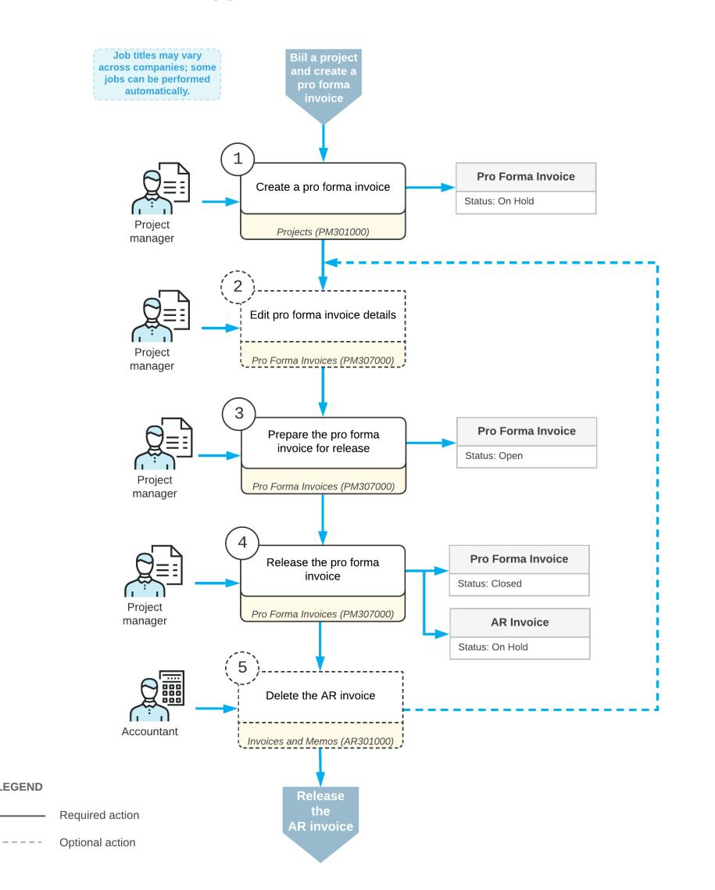

# <span id="page-165-0"></span>**Time and Material Billing: To Postpone and Write Off Amounts**

This activity will walk you through the process of postponing and writing off amounts in a pro forma invoice.

This activity is based on the *U100* dataset. If you are using another dataset, or if any system settings have been changed in *U100*, these changes can affect the workflow of the activity and the results of the processing. To avoid any issues, restore the *U100* dataset to its initial state.

#### **Story**

Suppose that the Thai Food Restaurant customer has ordered a juicer, along with the services of installation and employee training on operating the juicer from the SweetLife Fruits & Jams company. SweetLife's project accountant has created a project. The juicer has been delivered and installed, and a consultant has provided the training. The project accountant has billed the customer and sent the created pro forma invoice for approval.

SweetLife and the customer have agreed on the following adjustments to the pro forma invoice:

- The customer will pay \$2,000 of the cost of the juicer with the first invoice (the accounts receivable invoice corresponding to this pro forma invoice) and the rest of the juicer's cost with the second invoice next month.
- The cost of the site review should be written off of the invoice, because the project manager agreed to provide the customer a free site review.
- A 50% discount will be applied to the cost of the training.
- The customer will pay \$100 for an additional training session in Phase 1 of the project.

Acting as the project accountant, you will make the needed corrections to the pro forma invoice and bill the customer. You will then bill the customer for the second time with the amount postponed in the first invoice.

#### **Configuration Overview**

In the *U100* dataset, the following tasks have been performed to support this activity:

- On the *[Enable/Disable Features](https://help-2025r1.acumatica.com/Help?ScreenId=ShowWiki&pageid=c1555e43-1bc5-4f6f-ba9d-b323f94d8a6b)* (CS100000) form, the *Project Accounting* feature has been enabled to provide support for the project accounting functionality.
- On the *[Projects](https://help-2025r1.acumatica.com/Help?ScreenId=ShowWiki&pageid=81c86417-3bde-444b-8f1c-682928d31a0c)* (PM301000) form, the *TOMYUM4* project has been created and the *PHASE1* and *PHASE2* project tasks have been created for the project.
- On the *Project [Transactions](https://help-2025r1.acumatica.com/Help?ScreenId=ShowWiki&pageid=382a97fe-b636-44ca-9798-6d478c05b687)* (PM304000) form, the *PM00000001* batch of project transactions related to the project has been created and released.
- On the *[Pro Forma Invoices](https://help-2025r1.acumatica.com/Help?ScreenId=ShowWiki&pageid=37f1ed00-a7d7-4161-9307-1337662b8550)* (PM307000) form, the *000003* pro forma invoice has been created for the *TOMYUM4* project and saved with the *On Hold* status.
- On the *[Stock Items](https://help-2025r1.acumatica.com/Help?ScreenId=ShowWiki&pageid=77786a70-1f1e-4d63-ad98-96f98e4fcb0e)* (IN202500) form, the *JUICER15* stock item has been created.
- On the *[Non-Stock Items](https://help-2025r1.acumatica.com/Help?ScreenId=ShowWiki&pageid=bf68dd4f-63d4-460d-8dc0-9152f2bd6bf1)* (IN202000) form, the *SITEREVIEW*, *INSTALL*, and *TRAINING* non-stock items have been created.

#### **Process Overview**

In this activity, you will make corrections to the pro forma invoice and release the invoice on the *[Pro Forma Invoices](https://help-2025r1.acumatica.com/Help?ScreenId=ShowWiki&pageid=37f1ed00-a7d7-4161-9307-1337662b8550)* (PM307000) form. On the *[Invoices and Memos](https://help-2025r1.acumatica.com/Help?ScreenId=ShowWiki&pageid=5e6f3b27-b7af-412f-a40a-1d4f4be70cba)* (AR301000) form, you will review the accounts receivable invoice that was created based on the pro forma invoice; you will then release the accounts receivable invoice. You will then create one more pro forma invoice for the customer with the amount postponed in the first pro forma invoice.

#### **System Preparation**

Before you begin performing the steps of this activity, perform the following instructions to prepare the system:

- 1. Launch the Acumatica ERP website, and sign in to a company with the *U100* dataset preloaded; you should sign in as project accountant by using the *brawner* username and the *123* password.
- 2. In the info area, in the upper-right corner of the top pane of the Acumatica ERP screen, make sure that the business date in your system is set to *1/30/2025*. If a different date is displayed, click the Business Date menu button and select *1/30/2025* on the calendar. For simplicity, in this activity, you will create and process all documents in the system on this business date.

#### **Step 1: Adjusting the Pro Forma Invoice**

To adjust the pro forma invoice according to the agreements that have been reached with the customer, do the following:

1. On the *[Projects](https://help-2025r1.acumatica.com/Help?ScreenId=ShowWiki&pageid=81c86417-3bde-444b-8f1c-682928d31a0c)* (PM301000) form, open the *TOMYUM4* project.

- 2. On the **Invoices** tab, click the link in the **Pro Forma Reference Nbr.** column of the only row to open the pro forma invoice that you need to adjust.
- 3. On the **Time and Material** tab of the *[Pro Forma Invoices](https://help-2025r1.acumatica.com/Help?ScreenId=ShowWiki&pageid=37f1ed00-a7d7-4161-9307-1337662b8550)* (PM307000) form, which opens, adjust the invoice lines as follows (see the adjustments in the screenshot below):
  - a. In the line with the *PHASE1* project task and the *JUICER15* inventory item, change **Amount to Invoice** to 2000. When you enter an **Amount to Invoice** that is less than the **Billed Amount**, the system specifies *Hold Remainder* as the **Status** in this line; the difference between the **Billed Amount** and the **Amount to Invoice** will be billed later.
  - b. In the line with the *PHASE1* project task and the *SITEREVIEW* inventory item, select *Write Off* as the **Status** to write off the full amount of the line and exclude it from billing. The system specifies *0* in the **Amount to Invoice** column for this line.
  - c. In the line with the *PHASE2* project task and the *TRAINING* inventory item, do the following:
    - a. Change **Amount to Invoice** to 200.00.
    - b. Select *Write Off Remainder* as the **Status** to write off the difference between the **Billed Amount** and the **Amount to Invoice** and exclude this difference from billing.
- 4. Add a new line with the following settings (also shown in the following screenshot):
  - **ProjectTask**: *PHASE1*
  - **Inventory ID**: *TRAINING*
  - **Cost Code**: 00-000
  - **Description**: An additional training session within phase 1
  - **Amount to Invoice**: 100.00

Aer all the adjustments you have made, the invoice total in the Summary area should be \$2,700.

| Pro Forma Invoices<br>000003 - A juicer with the installation and training for employees |                            |                                                                   |                                                     |                             |                                 |                         |                            |                   |                                      |  |  |  |
|------------------------------------------------------------------------------------------|----------------------------|-------------------------------------------------------------------|-----------------------------------------------------|-----------------------------|---------------------------------|-------------------------|----------------------------|-------------------|--------------------------------------|--|--|--|
| 周<br>n<br>$\overline{\phantom{0}}$                                                       | $\Omega$                   | <b>REMOVE HOLD</b><br>侕<br>PRINT AIA REPORT<br>к<br>Ы<br>$\cdots$ |                                                     |                             |                                 |                         |                            |                   |                                      |  |  |  |
| Reference Nbr.:                                                                          | 000003<br>Q                | Project:                                                          | TOMYUM4 - A juicer with the installation $\epsilon$ |                             | Progress Billing Total:         | 0.00                    |                            |                   |                                      |  |  |  |
| Status:                                                                                  | On Hold                    | Customer:                                                         | <b>TOMYUM - Thai Food Restaurant</b>                |                             | <b>Time and Material Total:</b> | 2.700.00                |                            |                   |                                      |  |  |  |
| * Invoice Date:                                                                          | 1/17/2025<br>A             | * Location:                                                       | $\varphi$<br><b>MAIN - Primary Location</b>         | <b>Tax Total:</b>           |                                 | 0.00                    |                            |                   |                                      |  |  |  |
| * Post Period:                                                                           | 01-2025<br>Q               |                                                                   |                                                     |                             | <b>Invoice Total:</b>           | 2.700.00                |                            |                   |                                      |  |  |  |
| Customer Ord.                                                                            |                            |                                                                   |                                                     |                             | Retainage Total:                | 0.00                    |                            |                   |                                      |  |  |  |
| Application Nbr.                                                                         |                            |                                                                   |                                                     |                             | Amount Due:                     | 2.700.00                |                            |                   |                                      |  |  |  |
| Description:                                                                             | <b>Invoice for TOMYUM4</b> |                                                                   |                                                     |                             |                                 |                         |                            |                   |                                      |  |  |  |
| <b>PROGRESS BILLING</b>                                                                  |                            | <b>TIME AND MATERIAL</b><br><b>TAXES</b>                          | <b>FINANCIAL</b><br><b>ADDRESSES</b>                |                             |                                 |                         |                            |                   |                                      |  |  |  |
|                                                                                          |                            |                                                                   |                                                     |                             |                                 |                         |                            |                   |                                      |  |  |  |
| Ò<br>$+$<br>$\times$                                                                     |                            | UPLOAD UNBILLED TRANSACTIONS                                      | <b>VIEW TRANSACTION DETAILS</b><br>$\vdash$         | $\boxed{\mathbf{X}}$<br>∴t. |                                 |                         |                            |                   |                                      |  |  |  |
| <b>Inventory ID</b>                                                                      | *Cost<br>Code              | <b>Description</b>                                                | Vendor<br>Employee                                  | * Date                      | <b>Billed</b><br>Quantity       | <b>Billed</b><br>Amount | Quantity to UOM<br>Invoice | <b>Unit Price</b> | Amount to * Status<br>Invoice        |  |  |  |
| <b>JUICER15</b>                                                                          | 00-000                     | Commercial juicer with a production rate of                       |                                                     | 1/17/2025                   | 1.00                            | 2.500.00                | PIECE<br>1.00              | 2.500.0000        | 2.000.00<br><b>Hold Remainder</b>    |  |  |  |
| <b>SITEREVIEW</b>                                                                        | $00 - 000$                 | Site review                                                       |                                                     | 1/17/2025                   | 2.00                            | 100.00                  | 0.00<br><b>HOUR</b>        | 50.0000           | Write Off<br>0.00                    |  |  |  |
| <b>INSTALL</b>                                                                           | 00-000                     | Installation of equipment at the customers'                       |                                                     | 1/17/2025                   | 4.00                            | 400.00                  | <b>HOUR</b><br>4.00        | 100.0000          | 400.00 Bill                          |  |  |  |
| <b>TRAINING</b>                                                                          | $00 - 000$                 | Training on juicer usage (at customer's place)                    |                                                     | 1/17/2025                   | 8.00                            | 400.00                  | <b>HOUR</b><br>8.00        | 50.0000           | <b>Write Off Remainder</b><br>200.00 |  |  |  |
| <b>TRAINING</b>                                                                          | $00 - 000$                 | An additional training session within phase 1                     |                                                     | 1/30/2025                   | 0.00                            | 0.00                    | <b>HOUR</b><br>0.00        | 0.0000            | 100.00 Bill                          |  |  |  |

#### *Figure: The adjustments to the pro forma invoice*

- 5. Save your changes to the pro forma invoice.
- 6. On the form toolbar, click **Remove Hold** to assign the pro forma invoice the *Open* status, and then click **Release** to release the pro forma invoice.

The system creates the accounts receivable invoice based on the pro forma invoice and assigns the *Closed* status to the pro forma invoice.

- 7. On the **Financial** tab, click the **AR Ref. Nbr.** link to open the accounts receivable invoice that has been created.
- 8. On the form toolbar of the *[Invoices and Memos](https://help-2025r1.acumatica.com/Help?ScreenId=ShowWiki&pageid=5e6f3b27-b7af-412f-a40a-1d4f4be70cba)* (AR301000) form, which opens, click **Remove Hold** to assign the invoice the *Balanced* status, and then click **Release** to release the accounts receivable invoice.

#### **Step 2: Billing the Project for the Remainder**

To bill the customer the postponed amount (which is \$500 of the juicer cost), do the following:

- 1. On the *[Projects](https://help-2025r1.acumatica.com/Help?ScreenId=ShowWiki&pageid=81c86417-3bde-444b-8f1c-682928d31a0c)* (PM301000) form, open the *TOMYUM4* project, and on the **Cost Budget** tab, review the updated cost budget of the project. Click the cost budget line with the *PHASE1* project task and the *JUICER15* inventory item, and on the table toolbar, click**View Transactions**.
- 2. On the *Project [Transaction](https://help-2025r1.acumatica.com/Help?ScreenId=ShowWiki&pageid=29bf5433-446f-4196-be69-f2cb177e83cb) Details* (PM401000) form, which opens, review the list of project transactions that correspond to the selected line.

The transaction with an original document type of *Unbilled Remainder* has been created on release of the AR invoice that corresponds to the pro forma invoice from which the unbilled remainder originates. The identifier of the AR invoice is shown in the **Orig. Doc. Nbr.** column of the line. The transaction has the **Billable** check box selected and the **Billed** check box cleared, which means the transaction can be billed.

3. Close the form to return to the *[Projects](https://help-2025r1.acumatica.com/Help?ScreenId=ShowWiki&pageid=81c86417-3bde-444b-8f1c-682928d31a0c)* form with the *TOMYUM4* project selected, and on the form toolbar, click **Run Billing** to bill the project for remainder.

The system creates a pro forma invoice and opens it on the *[Pro Forma Invoices](https://help-2025r1.acumatica.com/Help?ScreenId=ShowWiki&pageid=37f1ed00-a7d7-4161-9307-1337662b8550)* (PM307000) form.

4. On the **Time and Material** tab, review the pro forma invoice line that the system has created based on the unbilled remainder transaction. Only one line with the *PHASE1* project task and *JUICER15* inventory item has been added to the pro forma invoice. The amount of the line is \$500.

> The line with the *PHASE1* project task and the *SITEREVIEW* inventory item has not been added because you have written it off in the full amount. The line with the *PHASE2* project task and the *TRAINING* inventory item has been written off partially, and thus also has not been added to the pro forma invoice.

You have corrected the pro forma invoice and billed the project for the unbilled remainder.

# <span id="page-168-0"></span>**Time and Material Billing: Generated Transactions**

The following sections describe the transactions that are related to time and material billing.

#### **Transactions Related to Time and Material Billing**

The release of a pro forma invoice does not generate general ledger transactions or project transactions directly. When you release the pro forma invoice, the system creates a corresponding accounts receivable invoice with all the information copied from the pro forma invoice. On release of the accounts receivable invoice, the system generates the general ledger transactions and project transactions. For more information about these transactions, see *Pro Forma Invoices: Generated [Transactions](#page-199-2)*.

#### **Project Transactions Generated for an Unbilled Remainder**

If an amount has been postponed in a pro forma invoice and the corresponding accounts receivable invoice (which contains the line from which this postponed amount originates) is released, the system generates the project transaction shown in the following table.

| Billable | Billed  | Amount           | Orig. Doc. Type    | Orig. Doc. Nbr.                                        |
|----------|---------|------------------|--------------------|--------------------------------------------------------|
| Selected | Cleared | Postponed amount | Unbilled Remainder | The AR invoice in<br>which the amount<br>was postponed |

The main attributes of the created transaction—such as the project, project task, and inventory item—are the same as those of the original project transaction from which this unbilled remainder originates. The date and financial period of the unbilled remainder transaction is the date of the AR invoice on release of which this unbilled remainder transaction was created.

The system uses the following accounts as the debit and credit accounts in the project transaction it creates:

- If the project transaction to which the unbilled remainder relates was not posted to the general ledger, the system copies the debit and credit accounts (the specified accounts or empty values) of the corresponding project transaction from which the unbilled remainder originates.
- If the project transaction to which the unbilled remainder relates was posted to the general ledger, the system copies the accounts that are specified in the **GLSettings for Unbilled Remainders** section of the **General** tab of the *[Projects Preferences](https://help-2025r1.acumatica.com/Help?ScreenId=ShowWiki&pageid=de2ca225-4a0c-4129-b09d-3f3ed05198f9)* (PM101000) form. If no accounts are specified in the **GLSettings for Unbilled Remainders** section, the system copies the debit and credit accounts of the corresponding project transaction from which the unbilled remainder originates. In the line, the system also specifies the account group that is mapped to the debit account.

On release of the project transaction generated for the unbilled remainder, the system also generates a batch of general ledger transactions. For details, see *Project [Transactions:](#page-136-1) Generated Transactions*.

When the accounts receivable invoice that contains the unbilled remainder is released, the system generates the reversing project transaction for the unbilled remainder that is shown in the following table.

| Billable | Amount              | Orig. Doc. Type                 | Orig. Doc. Nbr.                                               |
|----------|---------------------|---------------------------------|---------------------------------------------------------------|
| Cleared  | –(Postponed amount) | Unbilled Remainder Re<br>versal | The AR invoice in which<br>the postponed amount<br>was billed |

The main attributes of the created transaction—such as the project, project task, inventory item, account group, debit account, and credit account—are the same as those of the original project transaction of the unbilled remainder. The date and financial period are copied from the AR document that has caused the reversal of the unbilled remainder transaction (either credit memo that reverses the original AR invoice, or the AR invoice prepared for the unbilled remainder).

You can review the created transactions on the *Project [Transaction](https://help-2025r1.acumatica.com/Help?ScreenId=ShowWiki&pageid=29bf5433-446f-4196-be69-f2cb177e83cb) Details* (PM401000) form. In the Selection area of this form, you select the project in the **Project** box. In the table, you can find the project transactions by the original document type in the **Orig. Doc.Type** column.

# <span id="page-169-0"></span>**Time and Material Billing: Related Report and Inquiry Forms**

This topic describes reports and forms you can review to gather information related to billing projects by progress. The topic also explains how you can print documents related to project billing.

If you do not see a particular report or form that is described, you may have signed in to the system with a user account that does not have access rights to the report or form. Contact your system administrator to obtain access to any needed reports or forms.

#### **Reviewing the Actual Amounts of the Project**

You can review the list of project transactions corresponding to a project budget line with a nonzero **Actual Amount** on the **Revenue Budget** or **Cost Budget** tab of the *[Projects](https://help-2025r1.acumatica.com/Help?ScreenId=ShowWiki&pageid=81c86417-3bde-444b-8f1c-682928d31a0c)* (PM301000) form. To review the corresponding project transactions of a line on either tab, you click the line; on the table toolbar, you click**View Transactions**, and the system opens the *Project [Transaction](https://help-2025r1.acumatica.com/Help?ScreenId=ShowWiki&pageid=29bf5433-446f-4196-be69-f2cb177e83cb) Details* (PM401000) form with the project transactions displayed.

#### **Reviewing Project Balances**

You can review the project balance broken down by account group on the **Balances** tab of the *[Projects](https://help-2025r1.acumatica.com/Help?ScreenId=ShowWiki&pageid=81c86417-3bde-444b-8f1c-682928d31a0c)* (PM301000) form. To review the corresponding project transactions of an account group, you click the line; then on the table toolbar, you click**View Transactions**. The system opens the *Project [Transaction](https://help-2025r1.acumatica.com/Help?ScreenId=ShowWiki&pageid=29bf5433-446f-4196-be69-f2cb177e83cb) Details* (PM401000) form.

#### **Reviewing Unbilled Project Transactions**

You can review the list of all the transactions that correspond to a project on the *Project [Transaction](https://help-2025r1.acumatica.com/Help?ScreenId=ShowWiki&pageid=29bf5433-446f-4196-be69-f2cb177e83cb) Details* (PM401000) form. In the Selection area of this form, you select the project to review all its project transactions. The transactions for which the **Billed** check box is cleared have not been billed yet. You can narrow the range of listed transactions by specifying any of the following in the Selection area: project task, account group, and inventory item.

#### **Printing a Pro Forma Invoice**

You can print a pro forma invoice that you are viewing on the *[Pro Forma Invoices](https://help-2025r1.acumatica.com/Help?ScreenId=ShowWiki&pageid=37f1ed00-a7d7-4161-9307-1337662b8550)* (PM307000) form by clicking **Print** on the More menu. The system opens the printable form of the invoice, which is project-specific and specified for the *PROFORMA* mailing of the project on the **Mailing & Printing** tab of the *[Projects](https://help-2025r1.acumatica.com/Help?ScreenId=ShowWiki&pageid=81c86417-3bde-444b-8f1c-682928d31a0c)* (PM301000) form. By default, this is the *[Pro Forma Invoice](https://help-2025r1.acumatica.com/Help?ScreenId=ShowWiki&pageid=90074336-b7ba-4db1-8134-e36702bcce01)* (PM642000) report. You can review the invoice and print it.

The contact information of the customer to whom the pro forma invoices should be sent is specified in the **Bill-To Contact** and **Bill-To Address** sections of the **Addresses** tab of the *[Pro Forma Invoices](https://help-2025r1.acumatica.com/Help?ScreenId=ShowWiki&pageid=37f1ed00-a7d7-4161-9307-1337662b8550)* form. This information is copied to each pro forma invoice related to the project from the **Bill-To** and **Bill-To Address** sections of the **Summary** tab of the *[Projects](https://help-2025r1.acumatica.com/Help?ScreenId=ShowWiki&pageid=81c86417-3bde-444b-8f1c-682928d31a0c)* form and can be modified at the invoice or project level.

#### **Printing the Project Balance**

While you are viewing a project on the *[Projects](https://help-2025r1.acumatica.com/Help?ScreenId=ShowWiki&pageid=81c86417-3bde-444b-8f1c-682928d31a0c)* (PM301000) form, you can prepare a printable document showing the project balance at the project task level of detail; to do this, you click **Print Project Balance** on the More menu (under **Reports**). The system opens the printable document with the project balance on the *[Project Balance](https://help-2025r1.acumatica.com/Help?ScreenId=ShowWiki&pageid=c70c26ab-20cb-4b15-9652-c11b49f693fd)* (PM621000) report. Then you can review the project balance, which is grouped by project tasks.

### <span id="page-170-0"></span>**Time and Material Billing: Mass Processing**

This topic explains how to perform mass-processing operations related to time and material billing, and how the system generates, changes, or works with documents as a result of the mass processing.

#### **Mass-Billing Projects**

You can initiate billing for multiple projects on the *[Run Project Billing](https://help-2025r1.acumatica.com/Help?ScreenId=ShowWiki&pageid=1a586da4-beaa-4015-8834-b2eb87a21fc9)* (PM503000) form; this billing entails the creation of multiple invoices. A project is listed on the form only if the invoice date is aer its next billing date, which is specified on the **Summary** tab of the *[Projects](https://help-2025r1.acumatica.com/Help?ScreenId=ShowWiki&pageid=81c86417-3bde-444b-8f1c-682928d31a0c)* (PM301000) form.

To initiate billing for particular projects, you select the unlabeled check boxes in the rows of the projects to be processed in the table on this form, and click **Process** on the form toolbar. To instead initiate billing for all the listed projects, you click **Process All** on the form toolbar.

During processing, the system generates project invoices for the selected projects. Pro forma invoices will be created for only those projects that have the **Create Pro Forma Invoice on Billing** check box selected on the **Summary** tab of the *[Projects](https://help-2025r1.acumatica.com/Help?ScreenId=ShowWiki&pageid=81c86417-3bde-444b-8f1c-682928d31a0c)* (PM301000) form; AR invoices will be created for projects for which this check box is cleared. The system creates project invoices with the date that is specified in the **Invoice Date** box in the Selection area of the form.

#### **Mass-Releasing AR Invoices**

Multiple accounts receivable invoices can be released at the same time on the *[Release AR Documents](https://help-2025r1.acumatica.com/Help?ScreenId=ShowWiki&pageid=78ad2d21-b6a8-46d0-8f2d-98dd0a23f75e)* (AR501000) form. On this form, you select the unlabeled check boxes in the rows of the documents to be processed and click **Release** on the form toolbar to release the selected invoices; alternatively, you can click **Release All** to release all the invoices shown in the table.

#### **Mass-Releasing Pro Forma Invoices**

Pro forma invoices can be mass-released. To release multiple pro forma invoices at a time, you open the *[Release](https://help-2025r1.acumatica.com/Help?ScreenId=ShowWiki&pageid=01814a80-467a-4df8-bff6-092c3ec9ada8) [Pro Forma Invoices](https://help-2025r1.acumatica.com/Help?ScreenId=ShowWiki&pageid=01814a80-467a-4df8-bff6-092c3ec9ada8)* (PM506000) form, select the unlabeled check boxes in the rows of the pro forma invoices to be processed, and click **Release** on the form toolbar. To instead release all the listed pro forma invoices, you click **Release All** on the form toolbar.

# <span id="page-172-0"></span>**Billing Employee Time**

This chapter describes how to track billable hours and employees' work time on projects, and how to bill projects based on this time.

# <span id="page-172-2"></span><span id="page-172-1"></span>**Employee Time Billing: General Information**

In Acumatica ERP, you can use the time reporting functionality to give employees the ability to report the time that they spend for the project. During project billing, you can bill customers for this time.

#### **Learning Objectives**

In this chapter, you will learn how to do the following:

- Enter a billable time activity related to a project, and log the time spent for the project
- Enter a billable time card related to a project, and log the time spent for the project
- Bill a project for employees' time spent working on it

#### **Applicable Scenarios**

You may want to learn more about employee time billing if you are an employee who needs to log work time spent on particular project.

This information is also useful if you are a project accountant, and you need to bill the customer for employee time that was spent for a particular project and logged by using time cards.

#### **Entry of Time Tracking Documents**

In Acumatica ERP, employees can report their work time by creating time cards that include separate detail records associated with different projects or project tasks.

A time card, which an employee enters on the *[Employee](https://help-2025r1.acumatica.com/Help?ScreenId=ShowWiki&pageid=4493e479-b1e6-4f6a-ba98-360bb92692f0) Time Cards* (EP305000) form, is a weekly report on the time an employee has spent on each activity. In each line of a time card, the following information is specified:

- The earning type, which defines whether the reported work should be billed
- The project and project task related to the reported hours
- The labor item assigned to the employee who performed the work
- The time spent on each day of the week for which the time card is prepared

For each time duration reported in the time card, the system creates a time activity linked to the project; the activity is assigned the *Completed* status. You can review the list of time activities related to a project on the **Activities** tab of the *[Projects](https://help-2025r1.acumatica.com/Help?ScreenId=ShowWiki&pageid=81c86417-3bde-444b-8f1c-682928d31a0c)* (PM301000) form.

If time tracking with time activities is configured, on the **Activities** tab, you can add an individual project-related activity to the selected project by clicking **Create Activity** on the table toolbar and selecting the type of activity to be created. Then you enter the details of the time activity on the *[Activity](https://help-2025r1.acumatica.com/Help?ScreenId=ShowWiki&pageid=09cd2553-0e9e-4450-804d-106159f9a5b6)* (CR306010) form, which opens. To indicate that the time activity is related to a project, you select the**TrackTime and Costs** check box and specify the project-related information in the Summary area of the form. Finally, you complete the activity to submit it. The reported data from the time activity becomes available in the employee time card; the time activity can be released within this time card or individually.

When the time card is released, the related project transaction is created and released, so that the logged employee time is tracked in the related project and can then be billed. Also, on release of the time card, for each day of the week with reported time, a separate time activity is released.

#### **Workflow of the Submission of a Time Card**

For a project-related time card, the processing involves the actions and generated documents shown in the following diagram.

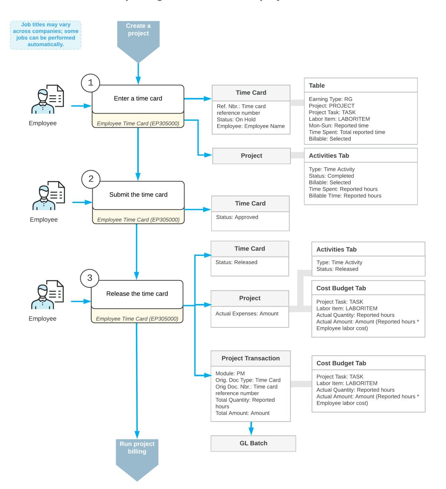

#### **Billing Employee Time in Projects**

Once time tracking is configured for projects and the system is configured to generate transactions from time activities, the working time reported by employees is tracked in the related projects and can be billed automatically during the project billing procedure.

The system processes time cards reported by payroll employees by using a separate set of rules. For more information, see *[Employee Payroll Settings: General Information](https://help-2025r1.acumatica.com/Help?ScreenId=ShowWiki&pageid=89816987-d5a4-4010-96ea-e24b3f530967)* and *Time [Tracking:](https://help-2025r1.acumatica.com/Help?ScreenId=ShowWiki&pageid=65265682-f88d-4efc-837b-819fd530412a) General [Information](https://help-2025r1.acumatica.com/Help?ScreenId=ShowWiki&pageid=65265682-f88d-4efc-837b-819fd530412a)*.

Each line of a time card is a time activity. On release of a time card with project-related lines, the system processes these lines as follows:

• Generates project transactions for each time activity within a time card that is associated with a project.

This extra step between the release of the time-tracking document and the updating of balances of general ledger accounts makes it possible to define labor costs and bill customers based on these costs and the quantity of working hours reported by employees for the project. The system further processes the project transactions originating from a time card based on the allocation or billing rules assigned to the project tasks of the project to which this transactions relates.

• Generates general ledger transactions (and does not generate project transactions) for each time activity within a time card that is associated with a non-project code.

# <span id="page-174-0"></span>**Employee Time Billing: Implementation Checklist**

To ensure that the system is configured properly for billing employee time spent for projects, make sure that the features and settings listed in the table are configured as described in the following table.

| Form                                             | Validation of Settings                                                                                                                                                                                                                                               |
|--------------------------------------------------|----------------------------------------------------------------------------------------------------------------------------------------------------------------------------------------------------------------------------------------------------------------------|
| Multiple forms                                   | Make sure that all necessary settings of time tracking<br>have been specified, as demonstrated in the exam<br>ples of Time Tracking Configuration: To Configure Time<br>Tracking in Projects and Time Tracking Configuration: To<br>Track Time with Time Activities. |
| Non-Stock Items (IN202000), Employees (EP203000) | Create the needed labor items to represent project<br>work and assign them to employees, as illustrated in<br>the Labor Items: To Configure a Labor Item.                                                                                                            |
| Labor Rates (PM209900)                           | Define labor cost rates for employees, as demonstrat<br>ed in Labor Items: To Define Labor Cost Rates.                                                                                                                                                               |
| Projects (PM301000)                              | Make sure that the project has been created, as de<br>scribed in Project Creation and Processing: General In<br>formation, and that labor items are assigned to the ap<br>propriate project tasks on theTasks tab.                                                   |

#### **Other Settings That Affect the Workflow**

You can affect the workflow of time reporting by specifying additional settings as follows:

- To cause the system to require a particular employee to enter time cards, select the**Time Card is Required** check box on the *[Employees](https://help-2025r1.acumatica.com/Help?ScreenId=ShowWiki&pageid=dae5144b-49b3-43a4-bce0-93f31b3f2321)* (EP203000) form. If the reporting of time with time activities is configured, the selection of this check box means that time activities can be released only within a time card.
- To cause the system to post project transactions that have been generated on release of time activities to the off-balance account group, select *Post PM to Off-Balance Account Group* in the **Posting Option for Non-Payroll Employee** box, and specify the account group of the *Off-Balance Type* in the **Off-Balance Account Group** on the *Time and Expenses [Preferences](https://help-2025r1.acumatica.com/Help?ScreenId=ShowWiki&pageid=e9f4a914-c4ce-4c4f-95d9-f385451e5856)* (EP101000) form.
- To cause project transactions to be automatically generated and released on release of time cards, select the **Automatically Release PM Documents** on the *Time and Expenses [Preferences](https://help-2025r1.acumatica.com/Help?ScreenId=ShowWiki&pageid=e9f4a914-c4ce-4c4f-95d9-f385451e5856)* (EP101000) form.
- To associate an earning type with a particular project or project task, on the *[Earning](https://help-2025r1.acumatica.com/Help?ScreenId=ShowWiki&pageid=02757e0d-2d3f-4846-80c8-f2c2490fd386) Types* (EP102000) form, for an earning type, specify the project or project task in the **Default Project Code** box and **DefaultTask** box, respectively.
- To copy notes and attached documents from time cards to generated project transactions, select the **Copy Files to PM Documents** and **Copy Notes to PM Documents** check boxes on the *Time and [Expenses](https://help-2025r1.acumatica.com/Help?ScreenId=ShowWiki&pageid=e9f4a914-c4ce-4c4f-95d9-f385451e5856) [Preferences](https://help-2025r1.acumatica.com/Help?ScreenId=ShowWiki&pageid=e9f4a914-c4ce-4c4f-95d9-f385451e5856)* form.

# <span id="page-175-0"></span>**Employee Time Billing: To Enter a Project-Related Time Activity**

In this activity, you will enter a time activity for work related to a project.

This activity is based on the *U100* dataset. If you are using another dataset, or if any system settings have been changed in *U100*, these changes can affect the workflow of the activity and the results of the processing. To avoid any issues, restore the *U100* dataset to its initial state.

#### **Story**

Suppose that the HM's Bakery and Cafe customer has contacted the SweetLife Fruits & Jams company to order training on operating juicers for the company's new employees. The project accountant has created a project to account for the provided services.

Further suppose that Todd Bloom has spent four hours training the customer's employees on Monday. Acting as Todd Bloom, you need to enter a time activity to log the time spent working on the project.

#### **Configuration Overview**

In the *U100* dataset, the following tasks have been performed to support this activity:

- The following features have been enabled on the *[Enable/Disable Features](https://help-2025r1.acumatica.com/Help?ScreenId=ShowWiki&pageid=c1555e43-1bc5-4f6f-ba9d-b323f94d8a6b)* (CS100000) form:
  - *Project Accounting*, which provides support for the project accounting functionality
  - *Time Management*, which provides support for tracking the time that employees spend on activities
- On the *[Projects](https://help-2025r1.acumatica.com/Help?ScreenId=ShowWiki&pageid=81c86417-3bde-444b-8f1c-682928d31a0c)* (PM301000) form, the *HMBAKERY7* project has been created and the *TRAINING* project task has been added to the project.
- On the *[Activity](https://help-2025r1.acumatica.com/Help?ScreenId=ShowWiki&pageid=cd6e990d-e2b9-4138-a789-a9b4fb09ed1f) Types* (CR102000) form, the**TrackTime** check box is selected for the *Work Item* activity type.
- On the *[Non-Stock Items](https://help-2025r1.acumatica.com/Help?ScreenId=ShowWiki&pageid=bf68dd4f-63d4-460d-8dc0-9152f2bd6bf1)* (IN202000) form, the *CONSULTSR* labor item has been created; on the *[Employees](https://help-2025r1.acumatica.com/Help?ScreenId=ShowWiki&pageid=dae5144b-49b3-43a4-bce0-93f31b3f2321)* (EP203000) form, this item is assigned to the *EP00000002 – Todd Bloom* employee.

#### **Process Overview**

On the *[Activity](https://help-2025r1.acumatica.com/Help?ScreenId=ShowWiki&pageid=09cd2553-0e9e-4450-804d-106159f9a5b6)* (CR306010) form, you will enter and complete a time activity for the project on which the employee has worked. Then on the *[Projects](https://help-2025r1.acumatica.com/Help?ScreenId=ShowWiki&pageid=81c86417-3bde-444b-8f1c-682928d31a0c)* (PM301000) form, you will make sure that the time activity has appeared in the project details.

#### **System Preparation**

Launch the Acumatica ERP website, and sign in to a company with the *U100* dataset preloaded. You should sign in as an employee by using the *bloom* username and the *123* password.

#### **Step: Entering a Time Activity for the Project**

To log the four hours that Todd Bloom has spent training the customer's employees as part of the project, enter a time activity as follows:

- 1. On the *[Projects](https://help-2025r1.acumatica.com/Help?ScreenId=ShowWiki&pageid=81c86417-3bde-444b-8f1c-682928d31a0c)* (PM301000) form, open the *HMBAKERY7* project.
- 2. On the table toolbar of the **Activities** tab, click **Create Activity > Create Work Item** to add an activity to the project. The system opens the *[Activity](https://help-2025r1.acumatica.com/Help?ScreenId=ShowWiki&pageid=09cd2553-0e9e-4450-804d-106159f9a5b6)* (CR306010) form with the new activity created.
- 3. On this form, specify the following settings:
  - **Summary**: A 4-hour training session
  - **Start Date**: Current business date
  - **Owner**: *Todd Bloom* (selected automatically)
  - **Project**: *HMBAKERY7* (selected automatically)
  - **ProjectTask**: *TRAINING* (selected automatically)
  - **Cost Code**: *00-000* (selected automatically)
  - **Labor Item**: *CONSULTSR* (selected automatically)
  - **TrackTime and Costs**: Selected
  - **EarningType**: *RG* (selected automatically)
  - **Time Spent**: *04:00*
  - **Billable**: Selected
  - **Billable Time**: *04:00*
- 4. On the form toolbar, click **Complete** to complete the activity.

The system creates and saves the activity with the *Work Item* type, closes the *[Activity](https://help-2025r1.acumatica.com/Help?ScreenId=ShowWiki&pageid=09cd2553-0e9e-4450-804d-106159f9a5b6)* form, and returns to the project on the *[Projects](https://help-2025r1.acumatica.com/Help?ScreenId=ShowWiki&pageid=81c86417-3bde-444b-8f1c-682928d31a0c)* form.

5. On the **Activities** tab, make sure the time activity you created has appeared, as shown in the following screenshot.

| Projects<br>HMBAKERY7 - A training for employees |                       |                                         |               |                  |                    |                               |                 |                     |               |                         |                             | <b>THNOTES</b>        | <b>FILES</b> | TOOLS $\div$          |                     |
|--------------------------------------------------|-----------------------|-----------------------------------------|---------------|------------------|--------------------|-------------------------------|-----------------|---------------------|---------------|-------------------------|-----------------------------|-----------------------|--------------|-----------------------|---------------------|
| 뭐<br>$\Box$<br>$\leftarrow$<br>↶                 | 俞<br>+                | к<br>⋗                                  | $\geq$        | <b>COMPLETE</b>  | <b>RUN BILLING</b> | $\cdots$                      |                 |                     |               |                         |                             |                       |              |                       |                     |
| * Project ID:                                    | <b>HMBAKERY7</b>      |                                         | ρ             | Customer:        |                    | HMBAKERY - HM's Bakery & Cafe |                 | Q                   | $\mathscr{O}$ | Actual Income:          |                             | 0.00                  |              |                       | $\hat{\phantom{a}}$ |
| Template:                                        |                       |                                         | 0             | Project Manager: |                    | EP00000001 - Pam Brawner      |                 | Q                   |               | Actual Expenses:        |                             | 0.00                  |              |                       |                     |
| Status:                                          | Active                |                                         |               |                  |                    |                               |                 |                     |               | Margin Amount:          |                             | 0.00                  |              |                       |                     |
| Description:                                     |                       | Margin (%):<br>A training for employees |               |                  |                    |                               |                 |                     |               |                         |                             | 0.00                  |              |                       |                     |
|                                                  |                       |                                         |               |                  |                    |                               |                 |                     |               | Pending Invoice Amoun   |                             | 0.00                  |              |                       |                     |
| <b>TASKS</b><br><b>SUMMARY</b>                   | <b>REVENUE BUDGET</b> | <b>COST BUDGET</b>                      |               | <b>BALANCES</b>  | <b>COMMITMENTS</b> |                               | <b>INVOICES</b> | <b>UNION LOCALS</b> |               | <b>ACTIVITIES</b>       | <b>EMPLOYEES</b>            | <b>EQUIPMENT</b>      |              | $\, \mathbf{\hat{z}}$ |                     |
| Ò<br><b>CREATE TASK</b>                          | <b>CREATE EMAIL</b>   | CREATE ACTIVITY +                       | $\mathbb{H}$  | $\mathbf{X}$     |                    |                               |                 |                     |               |                         |                             | <b>All Activities</b> |              | Y<br>۰.               |                     |
| $D \vee T$<br><b>B</b> 0                         | Type                  | * Summary                               | <b>Status</b> |                  | <b>Start Date</b>  | Category                      | <b>Billable</b> | Time<br>Spent       | Overtime      | <b>Billable</b><br>Time | <b>Billable</b><br>Overtime | Workgroup             |              | Owner                 |                     |
| $\geq$<br>IУ<br>$0$ D $\checkmark$               | Work Item             | A 4-hour training session               |               | Completed        | 4/20/2025 1:03 AM  |                               | ☑               | 04:00               | 00:00         | 04:00                   | 00:00                       |                       |              | <b>Todd Bloom</b>     |                     |

*Figure: The time activity related to the project*

You have entered the time activity for the work performed by the employee for a project.

# <span id="page-177-0"></span>**Employee Time Billing: To Enter a Project-Related Time Card**

In this activity, you will enter a time card for work related to a project.

This activity is based on the *U100* dataset. If you are using another dataset, or if any system settings have been changed in *U100*, these changes can affect the workflow of the activity and the results of the processing. To avoid any issues, restore the *U100* dataset to its initial state.

#### **Story**

Suppose that the HM's Bakery and Cafe customer has contacted the SweetLife Fruits & Jams company and ordered training on operating juicers for the company's new employees. The project accountant has created a project to account for the provided services.

Further suppose that project accountant (who also provides employee training services) has spent eight hours training the customer's employees on January 28, 2025. Acting as Pam Brawner, you need to enter a time card to log the time spent working on the project.

#### **Configuration Overview**

In the *U100* dataset, the following tasks have been performed to support this activity:

- The following features have been enabled on the *[Enable/Disable Features](https://help-2025r1.acumatica.com/Help?ScreenId=ShowWiki&pageid=c1555e43-1bc5-4f6f-ba9d-b323f94d8a6b)* (CS100000) form:
  - *Project Accounting*, which provides support for the project accounting functionality
  - *Advanced Financials*, which provides the functionality of time cards
- On the *[Projects](https://help-2025r1.acumatica.com/Help?ScreenId=ShowWiki&pageid=81c86417-3bde-444b-8f1c-682928d31a0c)* (PM301000) form, the *HMBAKERY7* project has been created, and the *TRAINING* project task has been added to the project.
- On the *[Non-Stock Items](https://help-2025r1.acumatica.com/Help?ScreenId=ShowWiki&pageid=bf68dd4f-63d4-460d-8dc0-9152f2bd6bf1)* (IN202000) form, the *CONSULTPM* labor item has been created; on the *[Employees](https://help-2025r1.acumatica.com/Help?ScreenId=ShowWiki&pageid=dae5144b-49b3-43a4-bce0-93f31b3f2321)* (EP203000) form, this item is assigned to the *EP00000001 – Pam Brawner* employee. For an example of configuring a labor item and assigning it to an employee, refer to *Labor Items: To [Configure](#page-80-1) a Labor Item*.
- On the *[Labor Rates](https://help-2025r1.acumatica.com/Help?ScreenId=ShowWiki&pageid=3bcc9979-ef23-4331-0598-19edc8babe03)* (PM209900) form, a labor cost rate has been configured for the *EP00000001 – Pam Brawner* employee.

#### **Process Overview**

On the *[Employee](https://help-2025r1.acumatica.com/Help?ScreenId=ShowWiki&pageid=4493e479-b1e6-4f6a-ba98-360bb92692f0) Time Cards* (EP305000) form, you will enter a time card for an employee related to the particular project on which the employee has worked. Then you will submit the time card and release it. Finally, on the *[Projects](https://help-2025r1.acumatica.com/Help?ScreenId=ShowWiki&pageid=81c86417-3bde-444b-8f1c-682928d31a0c)* (PM301000) form, you will make sure that the time card has appeared in the project details.

#### **System Preparation**

- 1. Launch the Acumatica ERP website, and sign in to a company with the *U100* dataset preloaded. You should sign in as project accountant by using the *brawner* username and the *123* password.
- 2. In the info area, in the upper-right corner of the top pane of the Acumatica ERP screen, make sure that the business date in your system is set to *1/30/2025*. If a different date is displayed, click the Business Date menu button and select *1/30/2025* on the calendar. For simplicity, in this activity, you will create and process all documents in the system on this business date.

#### **Step: Entering a Time Card for the Project**

To log the eight hours that Pam Brawner has spent training the customer's employees as part of the project, enter a time card as follows:

1. On the form toolbar of the *[Employee](https://help-2025r1.acumatica.com/Help?ScreenId=ShowWiki&pageid=637f27b7-14ee-4e6c-8d27-72ff377f41fa) Time Cards* (EP406000) form, add a new record. The system opens the *[Employee](https://help-2025r1.acumatica.com/Help?ScreenId=ShowWiki&pageid=4493e479-b1e6-4f6a-ba98-360bb92692f0) Time Cards* (EP305000) form with the new time card.

In the Summary area, *2025-05 (01/26 - 02/01)* is specified in the **Week** box. This is the work week to which the current business date belongs. Also, notice that the system has automatically selected the employee who is currently signed in (*Pam Brawner*) as the **Employee**.

- 2. On the **Summary** tab, add a row, and specify the following settings:
  - **EarningType**: *RG*
  - **Project**: *HMBAKERY7*
  - **ProjectTask**: *TRAINING* (inserted automatically)
  - **Cost Code**: *00-000*
  - **Labor Item**: *CONSULTPM* (inserted automatically)
  - **Tue**: *08:00*
  - **Billable**: Selected (selected automatically based on the settings of the selected earning type)
  - **Description**: An 8-hour training session
  - **ApprovalStatus**: *Not Required* (selected automatically)

When you enter hours in the columns representing the days of the week for any row, the system calculates the **Time Spent** in the Summary area as the sum of all these columns.

- 3. Save the time card.
- 4. On the form toolbar, click**Submit** to submit the time card. The status of the time card is changed to *Approved*.
- 5. On the form toolbar, click **Release** to release the time card. The time card is assigned the *Released* status.
- 6. On the *[Projects](https://help-2025r1.acumatica.com/Help?ScreenId=ShowWiki&pageid=81c86417-3bde-444b-8f1c-682928d31a0c)* (PM301000) form, open the *HMBAKERY7* project, and on the **Activities** tab, notice that the time activity you have entered by using the time card is shown on the tab, as shown in the following screenshot.

| Projects<br>HMBAKERY7 - A training for employees<br>뭐<br>$\Box$<br><b>RUN BILLING</b><br><b>COMPLETE</b><br>圎<br>$\Omega$<br>$\leftarrow$<br>Ы<br>к<br>$^+$<br>$\cdots$ |                     |                                             |                                         |                    |                               |                     |               |                         |                         |                            |                  |                  |                 |
|-------------------------------------------------------------------------------------------------------------------------------------------------------------------------|---------------------|---------------------------------------------|-----------------------------------------|--------------------|-------------------------------|---------------------|---------------|-------------------------|-------------------------|----------------------------|------------------|------------------|-----------------|
| * Project ID:                                                                                                                                                           | <b>HMBAKERY7</b>    | $\mathcal{L}$                               | Customer:                               |                    | HMBAKERY - HM's Bakery & Cafe | $\circ$             |               | Actual Income:          |                         |                            | 0.00             |                  |                 |
| Template:                                                                                                                                                               |                     | 0                                           | Project Manager:                        |                    | EP00000001 - Pam Brawner      | Q                   |               | <b>Actual Expenses:</b> |                         |                            | 360.00           |                  |                 |
| Status:                                                                                                                                                                 | Active              |                                             |                                         |                    |                               |                     |               | Margin Amount:          |                         |                            | $-360.00$        |                  |                 |
| Description:                                                                                                                                                            |                     | A training for employees                    |                                         |                    |                               |                     |               | Margin (%):             |                         |                            | 0.00             |                  |                 |
|                                                                                                                                                                         |                     |                                             |                                         |                    |                               |                     |               | Pending Invoice Amoun   |                         |                            | 0.00             |                  |                 |
| <b>SUMMARY</b><br><b>TASKS</b>                                                                                                                                          |                     | <b>REVENUE BUDGET</b><br><b>COST BUDGET</b> | <b>BALANCES</b>                         | <b>COMMITMENTS</b> | <b>INVOICES</b>               | <b>UNION LOCALS</b> |               | <b>ACTIVITIES</b>       |                         | <b>EMPLOYEES</b>           | <b>EQUIPMENT</b> | <b>ADDRESSES</b> | <b>DEFAULTS</b> |
| Ò<br><b>CREATE TASK</b>                                                                                                                                                 | <b>CREATE EMAIL</b> | CREATE ACTIVITY +                           | $\overline{\mathbf{x}}$<br>$\mathbf{H}$ |                    |                               |                     |               |                         |                         |                            |                  |                  |                 |
| $D \vee P$<br><b>B</b> 0                                                                                                                                                | Type                | * Summary                                   | <b>Status</b>                           | <b>Start Date</b>  | Category                      | <b>Billable</b>     | Time<br>Spent | Overtim                 | <b>Billable</b><br>Time | <b>Billable</b><br>Overtim | Workgroup        | Owner            |                 |
| $0$ D $\checkmark$                                                                                                                                                      | Time Acti           | An 8-hour training session                  | Released                                | 1/28/2025 10:00 AM |                               | ☑                   | 08:00         | 00:00                   | 08:00                   |                            |                  | Pam Brawner      |                 |

*Figure: Time card information tracked in the project*

<span id="page-179-1"></span>You have submitted and released the time card related to the project.

# <span id="page-179-0"></span>**Employee Time Billing: Process Activity**

This activity will walk you through the process of billing employee time spent on a particular project.

This activity is based on the *U100* dataset. If you are using another dataset, or if any system settings have been changed in *U100*, these changes can affect the workflow of the activity and the results of the processing. To avoid any issues, restore the *U100* dataset to its initial state.

#### **Story**

Suppose that Lake Cafe has requested 40 hours of training on operating juicers that were previously purchased from and installed by the SweetLife Fruits & Jams company. Jon Waite, SweetLife's senior consultant, has provided 16 hours of training (three hours on Monday, January 27, 2025; five hours on Tuesday, January 28; and eight hours on Thursday, January 30).

Acting as SweetLife's project accountant, Pam Brawner, you need to create a project to account for the provided services. Then acting as Jon Waite, you need to enter a time card to log the work related to the project. Finally, again acting as Pam Brawner, you need to bill the project and review the invoice prepared for the customer.

#### **Configuration Overview**

In the *U100* dataset, the following tasks have been performed to support this activity:

- The *Project Accounting* feature has been enabled on the *[Enable/Disable Features](https://help-2025r1.acumatica.com/Help?ScreenId=ShowWiki&pageid=c1555e43-1bc5-4f6f-ba9d-b323f94d8a6b)* (CS100000) form.
- The *54100 (Project Labor Expense)* account is mapped to the *LABOR* expense account group, which has been defined on the *[Account Groups](https://help-2025r1.acumatica.com/Help?ScreenId=ShowWiki&pageid=94a2cdce-c36a-49a1-b572-9cd33cb5fa73)* (PM201000) form.
- On the *[Billing Rules](https://help-2025r1.acumatica.com/Help?ScreenId=ShowWiki&pageid=6773c79b-216e-4725-b28c-3ce724d9a7c9)* (PM207000) form, the *TM* billing rule has been created, and a step for billing project transactions associated with the *LABOR* account group has been added to the rule.
- On the *[Customers](https://help-2025r1.acumatica.com/Help?ScreenId=ShowWiki&pageid=652929bc-9606-4056-aa6e-0c2d1147171b)* (AR303000) form, the *LAKECAFE (Lake Cafe)* customer has been created.
- On the *[Projects](https://help-2025r1.acumatica.com/Help?ScreenId=ShowWiki&pageid=81c86417-3bde-444b-8f1c-682928d31a0c)* (PM301000) form, the *TRAINCAF* project has been configured.

#### **Process Overview**

You will create and release a time card on the *[Employee](https://help-2025r1.acumatica.com/Help?ScreenId=ShowWiki&pageid=637f27b7-14ee-4e6c-8d27-72ff377f41fa) Time Cards* (EP406000) form. You will review the project transaction generated based on the time card on the *Project [Transactions](https://help-2025r1.acumatica.com/Help?ScreenId=ShowWiki&pageid=382a97fe-b636-44ca-9798-6d478c05b687)* (PM304000) form. Next, you will bill the project on the *[Projects](https://help-2025r1.acumatica.com/Help?ScreenId=ShowWiki&pageid=81c86417-3bde-444b-8f1c-682928d31a0c)* (PM301000) form, and release both the prepared pro forma invoice on the *[Pro Forma](https://help-2025r1.acumatica.com/Help?ScreenId=ShowWiki&pageid=37f1ed00-a7d7-4161-9307-1337662b8550) [Invoices](https://help-2025r1.acumatica.com/Help?ScreenId=ShowWiki&pageid=37f1ed00-a7d7-4161-9307-1337662b8550)* (PM307000) form and the AR invoice on the *[Invoices and Memos](https://help-2025r1.acumatica.com/Help?ScreenId=ShowWiki&pageid=5e6f3b27-b7af-412f-a40a-1d4f4be70cba)* (AR301000) form. Finally, on the *[Projects](https://help-2025r1.acumatica.com/Help?ScreenId=ShowWiki&pageid=81c86417-3bde-444b-8f1c-682928d31a0c)* form, you will make sure that the project cost and revenue budget have been updated with the billed employee time.

#### **System Preparation**

To sign in to the system and prepare to perform the instructions of the activity, do the following:

- 1. As a prerequisite activity, configure the labor cost rates as described in *Labor Items: To [Define](#page-84-1) Labor Cost [Rates](#page-84-1)*.
- 2. Sign in to a company with the *U100* dataset preloaded. You should sign in as Jon Waite by using the *waite* username and the *123* password.
- 3. In the info area, in the upper-right corner of the top pane of the Acumatica ERP screen, make sure that the business date in your system is set to *1/30/2025*. If a different date is displayed, click the Business Date menu button and select *1/30/2025* on the calendar. For simplicity, in this activity, you will create and process all documents in the system on this business date.

#### **Step 1: Entering an Employee Time Card**

In this step, you will enter Jon Waite's working hours for the project by creating an employee time card as follows:

- 1. On the form toolbar of the *[Employee](https://help-2025r1.acumatica.com/Help?ScreenId=ShowWiki&pageid=637f27b7-14ee-4e6c-8d27-72ff377f41fa) Time Cards* (EP406000) form, click **Add New Timecard** to create a new time card. The system opens the *[Employee](https://help-2025r1.acumatica.com/Help?ScreenId=ShowWiki&pageid=4493e479-b1e6-4f6a-ba98-360bb92692f0) Time Cards* (EP305000) form with the new time card created for the employee who is currently signed in (Jon Waite).
- 2. In the Summary area, make sure that *2025-05 (01/26 02/01)* is specified in the **Week** box. This is the work week during which the work for the project has been performed.
- 3. On the **Summary** tab, add a row, and specify the following settings:
  - **EarningType**: *RG* (inserted automatically)
  - **Project**: *TRAINCAF*
  - **ProjectTask**: *TRAINING* (inserted automatically)
  - **Cost Code**: *00-000*
  - **Labor Item**: *CONSULTSR* (inserted automatically)
  - **Mon**: 03:00
  - **Tue**: 05:00
  - **Thu**: 08:00
  - **Time Spent**: *16:00* (calculated and inserted automatically)

When you enter hours in the columns representing the days of the week for any row, the system calculates the**Time Spent** in the Summary area as the sum of all these columns.

- **Billable**: Selected (selected automatically based on the settings of the selected earning type)
- **Description**: Training provided by senior consultant
- **ApprovalStatus**: *Not Required* (inserted automatically)
- 4. Save the time card.
- 5. On the form toolbar, click**Submit** to submit the time card. The status of the time card is changed to *Approved*.
- 6. On the form toolbar, click **Release** to release the time card; its status is changed to *Released*.
- 7. On the form toolbar, click**View Transactions**. On the *Project [Transactions](https://help-2025r1.acumatica.com/Help?ScreenId=ShowWiki&pageid=382a97fe-b636-44ca-9798-6d478c05b687)* (PM304000) form, the system opens the project transaction that has been generated based on the released time card. Notice that the system has created a separate project transaction line for each time activity within the time card. The total billable quantity of the transaction is 16, which is the quantity of reported hours, and the total amount is calculated based on the billable quantity and employee labor cost as follows:

16.00 \* 44.00 = 704.00

8. Sign out of the system.

#### **Step 2: Billing the Project**

To review the cost budget of the project and bill the project on behalf of the project accountant, do the following:

- 1. Sign in to the system as Pam Brawner by using the *brawner* username and the *123* password.
- 2. In the info area, in the upper-right corner of the top pane of the Acumatica ERP screen, click the Business Date menu button, and select *2/5/2025* on the calendar.
- 3. On the *[Projects](https://help-2025r1.acumatica.com/Help?ScreenId=ShowWiki&pageid=81c86417-3bde-444b-8f1c-682928d31a0c)* (PM301000) form, open the *TRAINCAF* project.

On the **Cost Budget** tab, notice that the system has updated the actual quantity and amount with the data of the project transaction that was generated on release of the time card, as shown in the screenshot below.

| Projects<br>TRAINCAF - Training project for Lake Cafe                                                                                                           |                                |                          |                                            |                                             |                 |                     |                                       |                                               |                                             |                    |                  |
|-----------------------------------------------------------------------------------------------------------------------------------------------------------------|--------------------------------|--------------------------|--------------------------------------------|---------------------------------------------|-----------------|---------------------|---------------------------------------|-----------------------------------------------|---------------------------------------------|--------------------|------------------|
| 품<br>$\Box$<br>血<br>Я<br><b>COMPLETE</b><br><b>RUN BILLING</b><br>$\overline{\mathsf{K}}$<br>$\leftarrow$<br>$\Omega$<br>≺<br>$\rightarrow$<br>$^+$<br>$\cdots$ |                                |                          |                                            |                                             |                 |                     |                                       |                                               |                                             |                    |                  |
| * Project ID:                                                                                                                                                   | <b>TRAINCAF</b>                | Q                        | Customer:                                  | LAKECAFE - Lake Cafe                        |                 | $\circ$<br>0        | Actual Income:                        |                                               | 0.00                                        |                    |                  |
| Template:                                                                                                                                                       |                                | 0                        | Project Manager:                           |                                             |                 | Q                   | Actual Expenses:                      |                                               | 704.00                                      |                    |                  |
| Status:                                                                                                                                                         | Active                         |                          |                                            |                                             |                 |                     | Margin Amount:                        |                                               | $-704.00$                                   |                    |                  |
| Description:                                                                                                                                                    | Training project for Lake Cafe |                          |                                            |                                             |                 |                     | Margin (%):                           |                                               | 0.00                                        |                    |                  |
|                                                                                                                                                                 |                                |                          |                                            |                                             |                 |                     | Pending Invoice Amoun                 |                                               | 0.00                                        |                    |                  |
| <b>TASKS</b><br><b>SUMMARY</b>                                                                                                                                  | <b>REVENUE BUDGET</b>          | <b>COST BUDGET</b>       | <b>BALANCES</b>                            | <b>COMMITMENTS</b>                          | <b>INVOICES</b> | <b>UNION LOCALS</b> | <b>ACTIVITIES</b>                     | <b>EMPLOYEES</b>                              | <b>EQUIPMENT</b>                            |                    | <b>ADDRESSES</b> |
| Group by Task                                                                                                                                                   |                                |                          |                                            |                                             |                 |                     |                                       |                                               |                                             |                    |                  |
| Ò<br>$\times$<br>$\pm$                                                                                                                                          | <b>VIEW COMMITMENTS</b>        | <b>VIEW TRANSACTIONS</b> | $\sqrt{N}$<br>$\mathbb{H}$<br>$\mathbf{t}$ |                                             |                 |                     |                                       |                                               |                                             |                    |                  |
| D<br><b>B</b> 0<br>* Project Task                                                                                                                               | *Inventory ID                  | * Account Group          | <b>Description</b>                         | Original UOM<br><b>Budgeted</b><br>Quantity |                 | <b>Unit Rate</b>    | Original<br><b>Budgeted</b><br>Amount | <b>Revised</b><br><b>Budgeted</b><br>Quantity | <b>Revised</b><br><b>Budgeted</b><br>Amount | Actual<br>Quantity | Actual<br>Amount |
| !!!!!!!!!!!!!!!!!!!!!!!!!!!!!!!!!!!!!!!!<br><b>TRAINING</b><br>ם                                                                                                | <b>CONSULTSR</b>               | <b>LABOR</b>             | <b>Senior Consultant</b>                   | 40.00                                       | <b>HOUR</b>     | 0.0000              | 0.00                                  | 40.00                                         | 0.00                                        | 16.00              | 704.00           |

#### *Figure: The cost budget updated based on the released time card*

4. On the form toolbar, click **Run Billing**. The system creates a pro forma invoice and opens it on the *[Pro Forma](https://help-2025r1.acumatica.com/Help?ScreenId=ShowWiki&pageid=37f1ed00-a7d7-4161-9307-1337662b8550) [Invoices](https://help-2025r1.acumatica.com/Help?ScreenId=ShowWiki&pageid=37f1ed00-a7d7-4161-9307-1337662b8550)* (PM307000) form.

On the **Time and Material** tab of this form, notice that based on the settings of the step of the *TM* billing rule that processes the project transactions associated with the *LABOR* account group, the invoiced amount for each line has been calculated as the amount of the related project transaction line (that is, the cost of the provided employee labor) multiplied by 1.25. The total invoiced amount is \$880 (\$704.00 \* 1.25).

- 5. On the form toolbar, click **Remove Hold** to assign the pro forma invoice the *Open* status, and then click **Release** to release the pro forma invoice.
- 6. On the **Financial** tab, click the **AR Ref. Nbr.** link to open the accounts receivable invoice that has been created.
- 7. On the form toolbar of the *[Invoices and Memos](https://help-2025r1.acumatica.com/Help?ScreenId=ShowWiki&pageid=5e6f3b27-b7af-412f-a40a-1d4f4be70cba)* (AR301000) form that opens, click **Remove Hold** to assign the invoice the *Balanced* status, and then click **Release** to release the accounts receivable invoice.
- 8. On the *[Projects](https://help-2025r1.acumatica.com/Help?ScreenId=ShowWiki&pageid=81c86417-3bde-444b-8f1c-682928d31a0c)* form, open the *TRAINCAF* project, and in the only line on the **Revenue Budget** tab, make sure that the **Actual Amount** is now \$880.

You have billed the project for the employee labor.

### <span id="page-181-0"></span>**Employee Time Billing: Mass Processing of Documents**

This topic explains how to perform mass-processing operations related to employee time tracking, and how the system generates, changes, or works with documents as a result of the mass processing.

#### **Mass-Releasing Time Activities**

To mass-release time activities, you use the *Release Time [Activities](https://help-2025r1.acumatica.com/Help?ScreenId=ShowWiki&pageid=6c9e64df-a6d7-47f9-8a8d-7f3b102e08c6)* (EP507020) form. On this form, you select the unlabeled check boxes in the rows of the documents to be released and click **Release** on the form toolbar to process the selected documents; alternatively, you can click **Release All** to process all the documents shown in the table.

#### **Mass-Releasing Time Cards**

To mass-release time cards, you use the *[Release](https://help-2025r1.acumatica.com/Help?ScreenId=ShowWiki&pageid=0c7c9bac-f30c-4b17-9730-ee07b6a2f37b) Time Cards* (EP505010) forms. On this form, you select the unlabeled check boxes in the rows of the documents to be released and click **Release** on the form toolbar to process the selected documents; alternatively, you can click **Release All** to process all the documents shown in the table.

# <span id="page-182-0"></span>**Employee Time Billing: Related Report and Inquiry Forms**

In the following sections, you can find details about the reports and inquiry forms you may want to review to gather information about employee time spent on a project.

If you do not see a particular report or form that is described, you may have signed in to the system with a user account that does not have access rights to the report or form. Contact your system administrator to obtain access to any needed reports or forms.

#### **Reviewing Time-Tracking Documents for a Project**

You can review the list of all time cards and time activities (if applicable) that relate to a particular project on the **Activities** tab of the *[Projects](https://help-2025r1.acumatica.com/Help?ScreenId=ShowWiki&pageid=81c86417-3bde-444b-8f1c-682928d31a0c)* (PM301000) form.

#### **Reviewing Time Cards for an Employee**

You can review the list of time cards submitted by a particular employee on the *[Employee](https://help-2025r1.acumatica.com/Help?ScreenId=ShowWiki&pageid=637f27b7-14ee-4e6c-8d27-72ff377f41fa) Time Cards* (EP406000) inquiry form. You select the employee in the **Employee** box of the Selection area, and the system groups this employee's time cards by their status.

#### **Reviewing Time Activities for an Employee**

You can review the list of time activities on the *[Employee](https://help-2025r1.acumatica.com/Help?ScreenId=ShowWiki&pageid=c17a7186-e898-4e5e-b565-27730950ca51) Time Activities* (EP307000) form. In the Summary area of this form, you select an employee and the time range (in weeks) for which you want to review the time activities submitted by the employee. You can also select a particular project (and, optionally, a project task) to review only the time activities that have been performed by the employee for the project.

You can review all existing time activities in the system on the *[Activities](https://help-2025r1.acumatica.com/Help?ScreenId=ShowWiki&pageid=8b7cac26-6610-4c65-87c4-d87aa94edd73)* (EP404300) form.

#### **Finding Project Transaction Generated for Time Card**

You can review the project transaction that was generated on release of a particular time card by opening a time card on the *[Employee](https://help-2025r1.acumatica.com/Help?ScreenId=ShowWiki&pageid=4493e479-b1e6-4f6a-ba98-360bb92692f0) Time Cards* (EP305000) form and clicking**View Transactions** on the form toolbar. The system opens the project transaction on the *Project [Transactions](https://help-2025r1.acumatica.com/Help?ScreenId=ShowWiki&pageid=382a97fe-b636-44ca-9798-6d478c05b687)* (PM304000) form.

# <span id="page-183-0"></span>**Employee Time Billing: Generated Transactions**

To be able to bill customers for employee time spent on particular projects, you configure time tracking in projects. When project-related time cards are released, the system generates the transactions described in the following sections.

#### **Project Transaction Generated for a Time Card**

When you release a project-related time card, the system generates the following project transaction for each time activity in the time card line.

| Project and Project<br>Task                          | Account Group                                  | Inventory ID                           | Billable Quan<br>tity                                   | Unit Rate                                                              | Amount                            |
|------------------------------------------------------|------------------------------------------------|----------------------------------------|---------------------------------------------------------|------------------------------------------------------------------------|-----------------------------------|
| Project and project<br>task in the time card<br>line | Account group<br>mapped to Ex<br>pense account | Labor item in<br>the time card<br>line | Reported bill<br>able hours in<br>the time card<br>line | Labor cost rate<br>defined on the<br>Labor Rates<br>(PM209900)<br>form | Billable quanti<br>ty * unit rate |

You can review the project transaction that was generated on release of a particular time card by opening a time card on the *[Employee](https://help-2025r1.acumatica.com/Help?ScreenId=ShowWiki&pageid=4493e479-b1e6-4f6a-ba98-360bb92692f0) Time Cards* (EP305000) form and clicking**View Transactions** on the form toolbar.

#### **GL Transaction Generated from a Project Transaction**

When a project transaction related to time card is released, the system creates a batch of the following accounting transactions.

| Account                                                                                                                           | Project                            | Project Task                       | Debit                         | Credit                           |
|-----------------------------------------------------------------------------------------------------------------------------------|------------------------------------|------------------------------------|-------------------------------|----------------------------------|
| Expense account<br>defined by the<br>Expense Ac<br>countSource<br>setting on the<br>Projects Prefer<br>ences (PM101000)<br>form   | The value in the<br>time card line | The value in the<br>time card line | Billable quantity * unit rate | 0.00                             |
| Expense Accrual<br>account defined<br>by the Expense<br>Accrual Account<br>Source setting on<br>the Projects Pref<br>erences form | Non-project code                   | Empty                              | 0.00                          | Billable quantity *<br>unit rate |

You can view the reference number of the GL batch in the **GL Batch Nbr.** box in the project transaction line on the *Project [Transactions](https://help-2025r1.acumatica.com/Help?ScreenId=ShowWiki&pageid=382a97fe-b636-44ca-9798-6d478c05b687)* (PM304000) form. You can click the link in this box to view the details of the batch on the *Journal [Transactions](https://help-2025r1.acumatica.com/Help?ScreenId=ShowWiki&pageid=dda046bc-5946-407f-88f7-1c0c966fbe72)* (GL301000) form.

#### **GL Transaction Generated from an AR Invoice**

When an AR invoice generated by the project billing procedure is released, the system creates a batch of the following accounting transactions.

| Account                                            | Project                            | Project Task                       | Debit           | Credit          |
|----------------------------------------------------|------------------------------------|------------------------------------|-----------------|-----------------|
| Accounts Receiv<br>able account of<br>the customer | Non-project code                   | Empty                              | Invoiced amount | 0.00            |
| Sales account of<br>the labor item                 | The value in the<br>time card line | The value in the<br>time card line | 0.00            | Invoiced amount |

You can view the reference number of the GL batch in the **GL Batch Nbr.** box in the project transaction line on the *Project [Transactions](https://help-2025r1.acumatica.com/Help?ScreenId=ShowWiki&pageid=382a97fe-b636-44ca-9798-6d478c05b687)* (PM304000) form. You can click the link in this box to view the details of the batch on the *Journal [Transactions](https://help-2025r1.acumatica.com/Help?ScreenId=ShowWiki&pageid=dda046bc-5946-407f-88f7-1c0c966fbe72)* (GL301000) form.

#### **Project Transactions Generated from GL Transaction**

When the batch of GL transactions generated on release of an AR invoice generated by the project billing procedure is released, the system generates the following project transaction for each invoice line.

| Project and Project Task            | Account Group                                   | Inventory ID                                | Amount                               | Debit Account                      |
|-------------------------------------|-------------------------------------------------|---------------------------------------------|--------------------------------------|------------------------------------|
| The values in the time<br>card line | Account group<br>mapped to the<br>Sales account | Labor item as<br>signed to the em<br>ployee | Amount calculated<br>by billing rule | Sales account of<br>the labor item |

You can review the project transaction that was generated on release of a particular time card by opening a time card on the *[Employee](https://help-2025r1.acumatica.com/Help?ScreenId=ShowWiki&pageid=4493e479-b1e6-4f6a-ba98-360bb92692f0) Time Cards* (EP305000) form and clicking**View Transactions** on the form toolbar.

# <span id="page-185-0"></span>**Processing Pro Forma Invoices**

If you need to agree invoices prepared within a project with the customer, you can process pro forma invoices. A pro forma invoice can be printed and sent to a customer as many times as is necessary until an agreement is reached. Then you can create an accounts receivable invoice from pro forma invoice. This chapter explains how you can process pro forma invoices.

# <span id="page-185-2"></span><span id="page-185-1"></span>**Pro Forma Invoices: General Information**

Acumatica ERP provides pro forma (dra) invoice capabilities for project billing. A pro forma invoice, which you can view on the *[Pro Forma Invoices](https://help-2025r1.acumatica.com/Help?ScreenId=ShowWiki&pageid=37f1ed00-a7d7-4161-9307-1337662b8550)* (PM307000) form, is a dra document that you can edit and correct without affecting the accounts receivable subledger. A pro forma invoice can be printed and sent to a customer as many times as is necessary until an agreement is reached. With this process, you minimize corrections that directly affect the accounts receivable subledger.

#### **Learning Objectives**

In this chapter, you will learn how to do the following:

- Configure the pro forma invoice workflow for a project
- Create a pro forma invoice during project billing
- Print the pro forma invoice
- Send the pro forma invoice as an email
- Create a pro forma invoice manually
- Add to the pro forma invoice an extra adjustment line that does not originate from project transactions
- Postpone the billing of a pro forma invoice line
- Write off a pro forma invoice line partially or fully
- Create an accounts receivable invoice based on a pro forma invoice
- Configure the deferral of project revenue on release of an accounts receivable invoice

#### **Applicable Scenarios**

You create a pro forma invoice for a project if you need to reach agreement with the customer about the invoice. During negotiations, you modify the pro forma invoice as many times as is necessary until an agreement is reached, and then you prepare the accounts receivable invoice based on this pro forma invoice.

#### **Enabling of the Pro Forma Invoice Workflow for a Project**

A pro forma invoice is a document that can be created through the process of billing a particular project. The system creates pro forma invoices during billing for the projects for which the pro forma invoice workflow is turned on—that is, the projects that have the **Create Pro Forma Invoice on Billing** check box selected on the**Summary** tab of the *[Projects](https://help-2025r1.acumatica.com/Help?ScreenId=ShowWiki&pageid=81c86417-3bde-444b-8f1c-682928d31a0c)* (PM301000) form. By selecting or clearing this check box, you can turn on or turn off the pro forma invoice workflow for a project at any stage of the project execution.


You can also manually enter new pro forma invoices on the *[Pro Forma Invoices](https://help-2025r1.acumatica.com/Help?ScreenId=ShowWiki&pageid=37f1ed00-a7d7-4161-9307-1337662b8550)* (PM307000) form. For more information, see *[Pro Forma Invoices: Manual Creation of Pro Forma Invoices](#page-193-1)*.

#### **Creation of Pro Forma Invoices**

The system creates a pro forma invoice when you run project billing by clicking **Run Billing** on the form toolbar of the *[Projects](https://help-2025r1.acumatica.com/Help?ScreenId=ShowWiki&pageid=81c86417-3bde-444b-8f1c-682928d31a0c)* (PM301000) form. For a pro forma invoice created for a project, the system creates billable lines on the following tabs of the *[Pro Forma Invoices](https://help-2025r1.acumatica.com/Help?ScreenId=ShowWiki&pageid=37f1ed00-a7d7-4161-9307-1337662b8550)* (PM307000) form:

- **Progress Billing**: The system creates these lines by using the *Progress Billing* steps of billing rules. The lines originate from the revenue budget lines of the project with a nonzero pending invoice amount or quantity.
- **Time and Material**: The system creates these lines by using the *Time and Material* steps of billing rules; the lines originate from the project transactions.

The *Time and Material* steps of billing rules support the aggregation of project transactions by date, employee, vendor, and inventory item. On the**Time and Material** tab of the *[Pro Forma Invoices](https://help-2025r1.acumatica.com/Help?ScreenId=ShowWiki&pageid=37f1ed00-a7d7-4161-9307-1337662b8550)* form, you can select a line and then click**View Transaction Details** on the table toolbar to drill down to the list of project transactions based on which the **Billed Quantity** and **Billed Amount** of the line have been calculated by using the formula of the billing rule.

If the *Construction* feature is in use, you may need to prepare the American Institute of Architects (AIA) report that includes time and material amounts from the prepared pro forma invoice. For more information, see *[Construction](https://help-2025r1.acumatica.com/Help?ScreenId=ShowWiki&pageid=1def97f2-f6a6-4eea-a92e-99955b7968f9) Reports: Time and Material Amounts in AIA [Reports](https://help-2025r1.acumatica.com/Help?ScreenId=ShowWiki&pageid=1def97f2-f6a6-4eea-a92e-99955b7968f9)*.

As a result of the creation of the pro forma invoice, the system updates the revenue budget of the project on the **Revenue Budget** tab of the *[Projects](https://help-2025r1.acumatica.com/Help?ScreenId=ShowWiki&pageid=81c86417-3bde-444b-8f1c-682928d31a0c)* form as follows:

- In the lines billed by amount, the system clears the amounts in the **Pending Invoice Amount** column, which the system has used to create progress billing lines of the pro forma invoice.
- In the lines billed by quantity, the system clears the quantities in the **Pending Invoice Quantity** column and the amounts in the **Pending Invoice Amount** column, which the system has used to create progress billing lines of the pro forma invoice.
- The amounts in the **Dra Invoice Amount** column are increased with the amount to invoice of the corresponding progress billing lines and time and material lines of the pro forma invoice.
- The quantities in the **Dra Invoice Quantity** column are increased with the quantity to invoice of the corresponding progress billing lines of the pro forma invoice that have been billed based on quantity.

A pro forma invoice with any status can be printed and emailed to the customer. To print the pro forma invoice, you click **Print** on the More menu of the *[Pro Forma Invoices](https://help-2025r1.acumatica.com/Help?ScreenId=ShowWiki&pageid=37f1ed00-a7d7-4161-9307-1337662b8550)* form. To email the pro forma invoice, you click **Email** on the More menu of the form.

#### **Release of Pro Forma Invoices**

The pro forma invoices of a project can be released according to the following rules:

- The pro forma invoices can be released only one by one, starting from the earliest one, on the **Invoices** tab of the *[Projects](https://help-2025r1.acumatica.com/Help?ScreenId=ShowWiki&pageid=81c86417-3bde-444b-8f1c-682928d31a0c)* (PM301000) form. The only exception is when multiple pro forma invoices segregated by invoice group have been generated during a single iteration of the billing process; in this case, these pro forma invoices can be released in any order.
- A pro forma invoice can be released only aer the accounts receivable invoice of the preceding pro forma invoice has been released.

The release of a pro forma invoice does not produce project transactions or general ledger transactions directly. When you release the pro forma invoice on the *[Pro Forma Invoices](https://help-2025r1.acumatica.com/Help?ScreenId=ShowWiki&pageid=37f1ed00-a7d7-4161-9307-1337662b8550)* (PM307000) form, the system creates a corresponding accounts receivable invoice or credit memo with all information copied from the pro forma invoice. The system copies the **Amount to Invoice** values from the pro forma invoice lines on the **Progress Billing** and **Time and Material** tabs of the *[Pro Forma Invoices](https://help-2025r1.acumatica.com/Help?ScreenId=ShowWiki&pageid=37f1ed00-a7d7-4161-9307-1337662b8550)* form to the **Amount** column in the invoice lines on the **Details** tab on the *[Invoices and Memos](https://help-2025r1.acumatica.com/Help?ScreenId=ShowWiki&pageid=5e6f3b27-b7af-412f-a40a-1d4f4be70cba)* (AR301000) form.

The system creates a credit memo on release of the pro forma invoice if the total amount of the pro forma invoice is negative. For more information, see *[Project Invoice Correction: Credit Memos for](#page-209-2) [Projects](#page-209-2)*.

The document lines of an unreleased accounts receivable invoice that originates from a pro forma invoice are displayed in read-only mode on the **Details** tab of the *[Invoices and Memos](https://help-2025r1.acumatica.com/Help?ScreenId=ShowWiki&pageid=5e6f3b27-b7af-412f-a40a-1d4f4be70cba)* form. You can edit only a salesperson in the **Salesperson ID** column. If you need to correct any other details, you can delete the accounts receivable invoice, adjust the pro forma invoice on the *[Pro Forma Invoices](https://help-2025r1.acumatica.com/Help?ScreenId=ShowWiki&pageid=37f1ed00-a7d7-4161-9307-1337662b8550)* form, and release the pro forma invoice to make the system generate the adjusted accounts receivable invoice.

To open a pro forma invoice that corresponds to an accounts receivable invoice you are viewing on the *[Invoices and Memos](https://help-2025r1.acumatica.com/Help?ScreenId=ShowWiki&pageid=5e6f3b27-b7af-412f-a40a-1d4f4be70cba)* form, click **Pro Forma Invoice** on the More menu (under **Related Documents**).

Aer you have reviewed the invoice details, you click **Release** on the form toolbar of the *[Invoices and Memos](https://help-2025r1.acumatica.com/Help?ScreenId=ShowWiki&pageid=5e6f3b27-b7af-412f-a40a-1d4f4be70cba)* form to release the accounts receivable invoice. On release of the accounts receivable invoice, the system generates a general ledger transaction and the corresponding project transaction. On release of the project transaction, the system updates the revenue budget of the corresponding project on the **Revenue Budget** tab of the *[Projects](https://help-2025r1.acumatica.com/Help?ScreenId=ShowWiki&pageid=81c86417-3bde-444b-8f1c-682928d31a0c)* form as follows:

- The **Actual Quantity** and **Actual Amount** of the corresponding revenue budget line are increased by the line quantity and line amount of the released accounts receivable invoice.
- The **Dra Invoice Amount** and **Dra Invoice Quantity** of the corresponding revenue budget line is decreased by the line amount and line quantity of the released accounts receivable invoice, respectively.

#### **Workflow of Pro Forma Invoices**

The following diagram illustrates the workflow of processing a pro forma invoice.

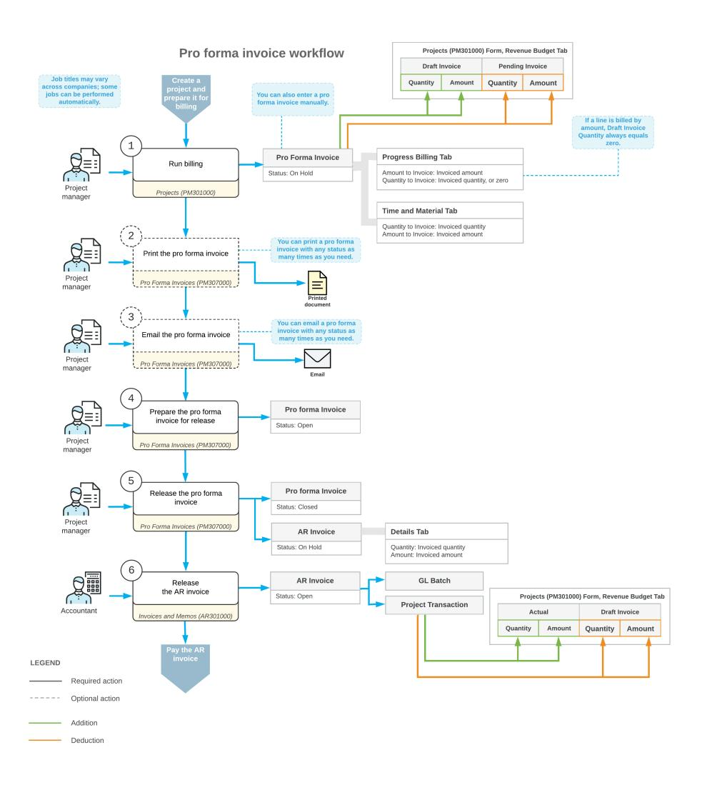

# <span id="page-188-0"></span>**Pro Forma Invoices: Implementation Checklist**

The following sections provide details you can use to ensure that the system is configured properly for processing pro forma invoices, and to understand (and change, if needed) the settings that affect the processing workflow.

#### **Implementation Checklist**

We recommend that before you initially process pro forma invoices, you make sure the needed settings have been specified and entities have been created, as summarized in the following checklist.

| Form                                 | Criteria to Check                                                                                                                                                                                                                                                                |
|--------------------------------------|----------------------------------------------------------------------------------------------------------------------------------------------------------------------------------------------------------------------------------------------------------------------------------|
| Projects Preferences (PM101000) form | Make sure that all necessary settings related to project<br>accounting have been specified. For more information<br>about configuration steps that you have to perform<br>before you can start accounting for projects, see Basic<br>Project Configuration: General Information. |
| Billing Rules (PM207000) form        | Make sure that all needed billing rules have been con<br>figured in the system. For more information about<br>billing rules, see Billing Rules: General Information.                                                                                                             |

| Form                     | Criteria to Check                                                                                                                                                                                                               |
|--------------------------|---------------------------------------------------------------------------------------------------------------------------------------------------------------------------------------------------------------------------------|
| Projects (PM301000) form | Make sure that the project has been created and pre<br>pared for billing. For more details, see Project Creation<br>and Processing: General Information.                                                                        |
|                          | For each project for which you want to turn on the<br>pro forma invoice workflow, make sure that the Cre<br>ate Pro Forma on Billing check box is selected on the<br>Summary tab (Billing and Allocation Settings sec<br>tion). |

#### **Other Settings That Affect the Workflow**

You can affect the workflow of processing pro forma invoices by specifying additional settings as follows:

• To change the format of pro forma invoice identifiers, adjust the *PROFORMA* numbering sequence on the *[Numbering Sequences](https://help-2025r1.acumatica.com/Help?ScreenId=ShowWiki&pageid=a8d11c23-21f2-42a3-b17d-9637c9cf8031)* (CS201010) form, or create a new numbering sequence and select this sequence in the **Pro Forma NumberingSequence** box on the **General** tab (**NumberingSequence** section) of the *[Projects Preferences](https://help-2025r1.acumatica.com/Help?ScreenId=ShowWiki&pageid=de2ca225-4a0c-4129-b09d-3f3ed05198f9)* (PM101000) form. For more information on numbering sequences, see *[Use of](https://help-2025r1.acumatica.com/Help?ScreenId=ShowWiki&pageid=71c26175-c78f-4e70-8518-2115f5bfaf2f) [Numbering Sequences](https://help-2025r1.acumatica.com/Help?ScreenId=ShowWiki&pageid=71c26175-c78f-4e70-8518-2115f5bfaf2f)*.


Pro forma invoice identifiers must be assigned only automatically. That is, the **Manual Numbering** check box must be cleared in the Summary area of the *[Numbering Sequences](https://help-2025r1.acumatica.com/Help?ScreenId=ShowWiki&pageid=a8d11c23-21f2-42a3-b17d-9637c9cf8031)* form for the numbering sequence used for pro forma invoices.

By default, the *PROFORMA* numbering sequence specifies that the pro forma invoice identifier is an automatically generated numeric string of six digits, such as *000001*.

- To give accounts receivable invoices, including those created based on pro forma invoices, the *On Hold* status on creation, select the **Hold Documents on Entry** check box on the **General** tab (**Data EntrySettings** section) of the *[Accounts Receivable Preferences](https://help-2025r1.acumatica.com/Help?ScreenId=ShowWiki&pageid=f7b52067-5299-45e8-b601-485cd709f58b)* (AR101000) form.
- To make sending by email accounts receivable invoices optional, including those created based on pro forma invoices that have been agreed upon with the customer, clear the**Send Invoices by Email** check box on the **BillingSettings** tab (**Print and EmailSettings** section) of the *[Customers](https://help-2025r1.acumatica.com/Help?ScreenId=ShowWiki&pageid=652929bc-9606-4056-aa6e-0c2d1147171b)* (AR303000) form for applicable customers.
- To make printing accounts receivable invoices optional, including those created based on pro forma invoices that have been agreed upon with the customer, clear the **Print Invoices** check box on the **Billing Settings** tab (**Print and EmailSettings** section) of the *[Customers](https://help-2025r1.acumatica.com/Help?ScreenId=ShowWiki&pageid=652929bc-9606-4056-aa6e-0c2d1147171b)* form for applicable customers.
- To cause the system to automatically post general ledger transactions generated on release of all accounts receivable invoices, select the **Automatically Post on Release** check box on the **General** tab (**Posting Settings** section) of the *[Accounts Receivable Preferences](https://help-2025r1.acumatica.com/Help?ScreenId=ShowWiki&pageid=f7b52067-5299-45e8-b601-485cd709f58b)* form.
- To cause the system to post every accounts receivable document as an individual batch to the general ledger, clear the **Generate Consolidated Batches** check box in the **PostingSettings** section of the *[General](https://help-2025r1.acumatica.com/Help?ScreenId=ShowWiki&pageid=e4913d06-c511-4258-a0f9-f36c1b854e6b) [Ledger Preferences](https://help-2025r1.acumatica.com/Help?ScreenId=ShowWiki&pageid=e4913d06-c511-4258-a0f9-f36c1b854e6b)* (GL102000) form.

With these settings specified, users in your company can process pro forma invoices quickly and accurately with a minimum of manual actions.

### **Validation of Configuration**

To make sure that all configuration has been performed correctly, we recommend that in your system, you process a pro forma invoice by performing instructions similar to those described in *Pro Forma [Invoices:](#page-190-1) To Process a Pro [Forma Invoice for a Project](#page-190-1)*.

# <span id="page-190-1"></span><span id="page-190-0"></span>**Pro Forma Invoices: To Process a Pro Forma Invoice for a Project**

In this activity, you will learn about the workflow of a pro forma invoice that has been prepared for a project.

This activity is based on the *U100* dataset. If you are using another dataset, or if any system settings have been changed in *U100*, these changes can affect the workflow of the activity and the results of the processing. To avoid any issues, restore the *U100* dataset to its initial state.

#### **Story**

Suppose that the HM's Bakery and Cafe customer has ordered juicers from the SweetLife Fruits & Jams company, along with the following services: site review, installation, and employee training on operating the juicers. SweetLife's project accountant has created a project that should be billed on demand as the juicers are installed and all the services are provided. Before the invoice is sent to the customer for payment, the customer has requested a pro forma invoice to be submitted for acceptance. The site review has taken place, the juicers have been delivered and installed, and SweetLife's consultant has provided the training. Aer that, the project accountant has entered project transactions and updated the progress of the project.

Acting as the project accountant, you will bill the customer, print the pro forma invoice, and email the invoice to the customer for approval on *1/30/2025*. Then you will release the pro forma invoice and the associated accounts receivable invoice.

### **Configuration Overview**

In the *U100* dataset, the following tasks have been performed to support this activity:

- On the *[Enable/Disable Features](https://help-2025r1.acumatica.com/Help?ScreenId=ShowWiki&pageid=c1555e43-1bc5-4f6f-ba9d-b323f94d8a6b)* (CS100000) form, the *Project Accounting* feature has been enabled to support the project accounting functionality.
- On the *[Projects](https://help-2025r1.acumatica.com/Help?ScreenId=ShowWiki&pageid=81c86417-3bde-444b-8f1c-682928d31a0c)* (PM301000) form, the *HMBAKERY5* project has been created and the *PHASE1*, *PHASE2*, *PHASE3*, *PHASE4*, and *PHASE5* project tasks have been created for the project. The revenue budget level of the project is *Task and Item*. On the **Summary** tab (**Billing and Allocation Settings** section), the **Create Pro Forma Invoice on Billing** check box has been selected for the project. With this setting, the system creates a pro forma invoice for the project when you run project billing.
- On the *Project [Transactions](https://help-2025r1.acumatica.com/Help?ScreenId=ShowWiki&pageid=382a97fe-b636-44ca-9798-6d478c05b687)* (PM304000) form, the *PM00000008* batch of project transactions related to the project has been created and released.

### **Process Overview**

On the *[Projects](https://help-2025r1.acumatica.com/Help?ScreenId=ShowWiki&pageid=81c86417-3bde-444b-8f1c-682928d31a0c)* (PM301000) form, you will initiate the creation of a pro forma invoice for the project. Then you will review the created pro forma invoice on the *[Pro Forma Invoices](https://help-2025r1.acumatica.com/Help?ScreenId=ShowWiki&pageid=37f1ed00-a7d7-4161-9307-1337662b8550)* (PM307000) form. You will then print the pro forma invoice, email the invoice, and release it on the same form. On the *[Invoices and Memos](https://help-2025r1.acumatica.com/Help?ScreenId=ShowWiki&pageid=5e6f3b27-b7af-412f-a40a-1d4f4be70cba)* (AR301000) form, you will release the accounts receivable invoice created based on the pro forma invoice.

#### **System Preparation**

To sign in to the system and prepare to perform the instructions of the activity, do the following:

- 1. Launch the Acumatica ERP website, and sign in to a company with the *U100* dataset preloaded; you should sign in as project accountant by using the *brawner* username and the *123* password.
- 2. In the info area, in the upper-right corner of the top pane of the Acumatica ERP screen, make sure that the business date in your system is set to *1/30/2025*. If a different date is displayed, click the Business Date menu

button and select *1/30/2025* on the calendar. For simplicity, in this activity, you will create and process all documents in the system on this business date.

3. On the *[Projects Preferences](https://help-2025r1.acumatica.com/Help?ScreenId=ShowWiki&pageid=de2ca225-4a0c-4129-b09d-3f3ed05198f9)* (PM101000) form, on the **General** tab (**GeneralSettings** section), make sure *Detailed* is selected in the **Revenue Budget Update** box.

#### **Step 1: Creating and Processing a Pro Forma Invoice**

To prepare and process a pro forma invoice for the project, do the following:

1. On the *[Projects](https://help-2025r1.acumatica.com/Help?ScreenId=ShowWiki&pageid=81c86417-3bde-444b-8f1c-682928d31a0c)* (PM301000) form, open the *HMBAKERY5* project. On the **Cost Budget** tab, review the cost budget of the project. Notice that the **Actual Amount** of each line equals the original budgeted amount, which means the corresponding project transaction has been created and released.

> You can review the transactions that correspond to each cost budget line on the *[Project](https://help-2025r1.acumatica.com/Help?ScreenId=ShowWiki&pageid=29bf5433-446f-4196-be69-f2cb177e83cb) [Transaction](https://help-2025r1.acumatica.com/Help?ScreenId=ShowWiki&pageid=29bf5433-446f-4196-be69-f2cb177e83cb) Details* (PM401000) form, which opens if you click the line and then click**View Transactions** on the table toolbar. The transactions have the **Billable** check box selected and the **Billed** check box cleared, which means the transactions are ready for billing and have not been billed yet.

- 2. On the **Revenue Budget** tab, review the revenue budget lines of the project, and make sure that the **Pending Invoice Amount** of the revenue budget lines is nonzero. In the table selection area, notice that the **Pending Invoice AmountTotal** is equal to *2,700.00*. You can bill the project for this amount.
- 3. On the form toolbar, click **Run Billing**.

The system creates a pro forma invoice and opens it on the *[Pro Forma Invoices](https://help-2025r1.acumatica.com/Help?ScreenId=ShowWiki&pageid=37f1ed00-a7d7-4161-9307-1337662b8550)* (PM307000) form.

- 4. On the **Progress Billing** tab, make sure that the pro forma invoice includes five progress lines. Review the invoice lines that have been created based on the revenue budget lines of the project. The **Progress Billing Total** in the Summary area is *2,700.00*.
- 5. In the Summary area, right of the **Project** box, click the Edit button to review how the creation of the pro forma invoice has affected the revenue budget of the project. The system opens the *[Projects](https://help-2025r1.acumatica.com/Help?ScreenId=ShowWiki&pageid=81c86417-3bde-444b-8f1c-682928d31a0c)* form with the *HMBAKERY5* project selected.

On the **Revenue Budget** tab, notice that amounts from the **Pending Invoice Amount** column have been moved to the **Dra Invoice Amount** column, and now the **Pending Invoice Amount** of all the revenue budget lines is zero. In the table selection area, notice that the **Pending Invoice AmountTotal** is also equal to zero.

- 6. Return to the *[Pro Forma Invoices](https://help-2025r1.acumatica.com/Help?ScreenId=ShowWiki&pageid=37f1ed00-a7d7-4161-9307-1337662b8550)* form with the pro forma invoice that you have prepared earlier.
- 7. On the **Time and Material** tab, make sure that the pro forma invoice includes three time and material lines that have been created based on the transactions prepared for billing. The**Time and MaterialTotal** in the Summary area must be *7,750.00*.


You can review the transactions that correspond to each line in the**Transaction Details** dialog box, which opens if you click the line and then click**View Transaction Details** on the table toolbar.

- 8. On the More menu, click **Print** to generate the printable version of the pro forma invoice. The system navigates to the *[Pro Forma Invoice](https://help-2025r1.acumatica.com/Help?ScreenId=ShowWiki&pageid=90074336-b7ba-4db1-8134-e36702bcce01)* (PM642000) report and opens the printable version of the pro forma invoice.
- 9. Click Back in the browser window to go back to the pro forma invoice on the *[Pro Forma Invoices](https://help-2025r1.acumatica.com/Help?ScreenId=ShowWiki&pageid=37f1ed00-a7d7-4161-9307-1337662b8550)* form, and on the More menu, click **Email** to send the invoice as an email to the customer.

The system creates an email by using the notification template defined for the project on the **Mailing & Printing** tab of the *[Projects](https://help-2025r1.acumatica.com/Help?ScreenId=ShowWiki&pageid=81c86417-3bde-444b-8f1c-682928d31a0c)* form, attaches the printed report, and sends the email to the customer by using the email address specified in the **Bill-To Contact** section on the **Addresses** tab of the *[Pro Forma Invoices](https://help-2025r1.acumatica.com/Help?ScreenId=ShowWiki&pageid=37f1ed00-a7d7-4161-9307-1337662b8550)* form, which is copied from the project from the **Bill-To** section on the **Addresses** tab of the *[Projects](https://help-2025r1.acumatica.com/Help?ScreenId=ShowWiki&pageid=81c86417-3bde-444b-8f1c-682928d31a0c)* form.

- 10.On the form toolbar, click **Remove Hold** to assign the pro forma invoice the *Open* status.
- 11.On the form toolbar, click **Release**. The system creates the accounts receivable invoice based on the pro forma invoice and assigns the *Closed* status to the pro forma invoice.

#### **Step 2: Processing an AR Invoice**

To process the accounts receivable invoice that was generated based on the pro forma invoice, do the following:

- 1. While you are viewing the pro forma invoice on the *[Pro Forma Invoices](https://help-2025r1.acumatica.com/Help?ScreenId=ShowWiki&pageid=37f1ed00-a7d7-4161-9307-1337662b8550)* (PM307000) form, on the **Financial** tab, click the **AR Ref. Nbr.** link to open the accounts receivable invoice that was created.
- 2. On the *[Invoices and Memos](https://help-2025r1.acumatica.com/Help?ScreenId=ShowWiki&pageid=5e6f3b27-b7af-412f-a40a-1d4f4be70cba)* (AR301000) form, which opens, notice that all progress billing and time and material lines of the pro forma invoice have been copied to the **Details** tab of the accounts receivable invoice, as the following screenshot illustrates. The settings in these lines cannot be edited, except in the **Salesperson ID** column.

| <b>Invoices and Memos</b> | Invoice 000121 - HM's Bakery & Cafe                                                                                                              |                                                                                         |                                                      |                    |             |                   |            |                            |                           |          |                       |                      | P NOTES             | <b>ACTIVITIES</b> | <b>FILES</b> |
|---------------------------|--------------------------------------------------------------------------------------------------------------------------------------------------|-----------------------------------------------------------------------------------------|------------------------------------------------------|--------------------|-------------|-------------------|------------|----------------------------|---------------------------|----------|-----------------------|----------------------|---------------------|-------------------|--------------|
| 周<br>$\leftarrow$         | $\Box$<br>$\Omega$<br>$\pm$                                                                                                                      | m<br>!!!!!!!!!!!!!!!!!!!!!!!!!!!!!!!!!!!!!!!!<br>$\overline{\mathbf{K}}$<br>$\check{~}$ | $\geq$<br>$\overline{\phantom{a}}$<br>$\rightarrow$  | <b>REMOVE HOLD</b> |             | $\cdots$          |            |                            |                           |          |                       |                      |                     |                   |              |
| Type:                     | Invoice                                                                                                                                          | Customer:<br>$\checkmark$                                                               | HMBAKERY - HM's Bakery & Cafe                        |                    | 0           | Detail Total:     | 10,450.00  |                            |                           |          |                       |                      |                     |                   |              |
| Reference Nbr.            | 000121                                                                                                                                           | $\circ$<br>* Location:                                                                  | <b>MAIN - Primary Location</b>                       |                    | $\varphi$   | Line Discounts:   | 0.00       |                            |                           |          |                       |                      |                     |                   |              |
| Status:                   | On Hold                                                                                                                                          | * Terms:                                                                                | 30D - 30 Days                                        |                    | ρ           | Document Dis      | 0.00       |                            |                           |          |                       |                      |                     |                   |              |
| * Date:                   | 1/30/2025                                                                                                                                        | m<br>* Due Date:                                                                        | 3/1/2025<br>!!!!!!!!!!!!!!!!!!!!!!!!!!!!!!!!!!!!!!!! | Apply Retainage    |             | Retained Amo      | 0.00       |                            |                           |          |                       |                      |                     |                   |              |
| * Post Period:            | <b>Tax Total:</b><br>0.00<br>01-2025<br>$\mathcal{Q}$<br>3/1/2025<br>* Cash Discount.<br>!!!!!!!!!!!!!!!!!!!!!!!!!!!!!!!!!!!!!!!!<br>Pay by Line |                                                                                         |                                                      |                    |             |                   |            |                            |                           |          |                       |                      |                     |                   |              |
| Customer Ord.             |                                                                                                                                                  | Project:                                                                                | HMBAKERY5 - Juicers with the installatio 2           |                    |             | Balance:          | 10.450.00  |                            |                           |          |                       |                      |                     |                   |              |
|                           |                                                                                                                                                  |                                                                                         |                                                      |                    |             | Cash Discount:    | 0.00       |                            |                           |          |                       |                      |                     |                   |              |
| Description:              | Invoice for HMBAKERY5                                                                                                                            |                                                                                         |                                                      |                    |             |                   |            |                            |                           |          |                       |                      |                     |                   |              |
|                           |                                                                                                                                                  |                                                                                         |                                                      |                    |             |                   |            |                            |                           |          |                       |                      |                     |                   |              |
| <b>DETAILS</b>            |                                                                                                                                                  |                                                                                         |                                                      |                    |             |                   |            |                            |                           |          |                       |                      |                     |                   |              |
|                           | <b>FINANCIAL</b>                                                                                                                                 | <b>ADDRESSES</b><br><b>TAXES</b>                                                        | <b>APPLICATIONS</b>                                  | COMPLIANCE         |             |                   |            |                            |                           |          |                       |                      |                     |                   |              |
| O                         | 0<br>$\mathbb{H}$<br>$\times$                                                                                                                    | $\boxed{\mathbf{X}}$<br>土                                                               |                                                      |                    |             |                   |            |                            |                           |          |                       |                      |                     |                   |              |
| D<br>图 8                  | <b>Inventory ID</b>                                                                                                                              | <b>Transaction Descr.</b>                                                               |                                                      | Quantity UOM       |             | <b>Unit Price</b> | Ext. Price | <b>Discount</b><br>Percent | <b>Discount</b><br>Amount |          | <b>Amount</b> Account | <b>Description</b>   | <b>Project Task</b> |                   | Cost<br>Code |
| $0$ D                     | <b>SITEREVIEW</b>                                                                                                                                | Site review                                                                             |                                                      |                    | 0.00 HOUR   | 50,0000           | 200.00     | 0.000000                   | 0.00                      | 200.00   | 40000                 | Sales Revenue        | PHASE1              |                   | $00 - 000$   |
| $0$ D                     | <b>INSTALL</b>                                                                                                                                   | Installation of equipment at the customers'                                             |                                                      | 0.00               | <b>HOUR</b> | 100,0000          | 300.00     | 0.000000                   | 0.00                      | 300.00   | 40000                 | <b>Sales Revenue</b> | PHASE2              |                   | 00-000       |
| $0$ D                     | <b>INSTALL</b>                                                                                                                                   | Installation of equipment at the customers'                                             |                                                      | 0.00               | <b>HOUR</b> | 100.0000          | 400.00     | 0.000000                   | 0.00                      | 400.00   | 40000                 | <b>Sales Revenue</b> | PHASE3              |                   | $00 - 000$   |
| $0$ D                     | <b>INSTALL</b>                                                                                                                                   | Installation of equipment at the customers'                                             |                                                      | 0.00               | <b>HOUR</b> | 100.0000          | 600.00     | 0.000000                   | 0.00                      | 600.00   | 40000                 | <b>Sales Revenue</b> | PHASE4              |                   | $00 - 000$   |
| $0$ D                     | <b>TRAINING</b>                                                                                                                                  | Training on juicer usage (at customer's place)                                          |                                                      |                    | $0.00$ HOUR | 50,0000           | 1,200.00   | 0.000000                   | 0.00                      | 1,200.00 | 40000                 | <b>Sales Revenue</b> | PHASE5              |                   | $00 - 000$   |
| $0$ D                     | JUICER10                                                                                                                                         | Pro series juicer with a production rate of 1                                           |                                                      | $1.00 -$           | PIECE       | 1.500.0000        | 1,500.00   | 0.000000                   | 0.00                      | 1,500.00 | 40000                 | Sales Revenue        | PHASE2              |                   | $00 - 000$   |
| $0$ D                     | JUICER15                                                                                                                                         | Commercial juicer with a production rate of                                             |                                                      |                    | 1.00 PIECE  | 2.500.0000        | 2.500.00   | 0.000000                   | 0.00                      | 2,500.00 | 40000                 | Sales Revenue        | PHASE3              |                   | $00 - 000$   |
| <b>0 D</b> JUICER20C      |                                                                                                                                                  | Commercial citrus juicer with a production r                                            |                                                      |                    | 1.00 PIECE  | 3,750,0000        | 3,750.00   | 0.000000                   | 0.00                      | 3,750.00 | 40000                 | <b>Sales Revenue</b> | PHASE4              |                   | $00 - 000$   |

#### *Figure: The AR invoice prepared based on the pro forma invoice*

- 3. On the form toolbar, click **Remove Hold** to assign the accounts receivable invoice the *Balanced* status, and then click **Release**.
- 4. On the **Financial** tab, click the link in the **Batch Nbr.** box. On the *Journal [Transactions](https://help-2025r1.acumatica.com/Help?ScreenId=ShowWiki&pageid=dda046bc-5946-407f-88f7-1c0c966fbe72)* (GL301000) form, which opens, review the created general ledger transactions.

Notice that eight transaction lines have the project and project task specified. For these GL transactions, the system created the corresponding project transactions. For the transactions with the *X* project specified (the non-project code), the system created no project transactions.

- 5. Return to the accounts receivable invoice that you have prepared on the *[Invoices and Memos](https://help-2025r1.acumatica.com/Help?ScreenId=ShowWiki&pageid=5e6f3b27-b7af-412f-a40a-1d4f4be70cba)* form.
- 6. On the More menu (under **Inquiries**), click **ProjectTransactions** to review the corresponding project transactions.
- 7. On the *Project [Transaction](https://help-2025r1.acumatica.com/Help?ScreenId=ShowWiki&pageid=29bf5433-446f-4196-be69-f2cb177e83cb) Details* (PM401000) form, which opens, review the project transactions related to the AR invoice. Notice that eight transactions have *AR Invoice* in the **Orig. Doc.Type** column and the reference number of the accounts receivable invoice you have released in the **Orig. Doc. Nbr.** column. These transactions also have the reference number of the general ledger batch you have just reviewed in the **GL Batch Nbr.** column.
- 8. On the *[Projects](https://help-2025r1.acumatica.com/Help?ScreenId=ShowWiki&pageid=81c86417-3bde-444b-8f1c-682928d31a0c)* form, open the *HMBAKERY5* project, and review the **Invoices** tab. Notice that in the only line, the reference numbers of the prepared pro forma invoice and the corresponding accounts receivable invoice

are shown in the **Pro Forma Reference Nbr.** and **AR Reference Nbr.** columns, respectively. The total billed amount in the **AR Doc. Orig. Amount** column is \$10,450.

- 9. On the **Revenue Budget** tab, make sure the **Actual Amount** of revenue budget lines was updated on release of the AR invoice. Also, make sure that the following new revenue budget lines have been created based on the billed project transactions:
  - The line with the *PHASE2* project task and the *JUICER10* inventory item
  - The line with the *PHASE3* project task and the *JUICER15* inventory item
  - The line with the *PHASE4* project task and the *JUICER20C* inventory item

Notice that the lines now have actual values and that the original budgeted values in these lines are *0*.

<span id="page-193-1"></span>You have finished processing the pro forma invoice and the AR invoice for the project.

# <span id="page-193-0"></span>**Pro Forma Invoices: Manual Creation of Pro Forma Invoices**

Typically, the system automatically creates pro forma invoices for a project during project billing. However, you can also manually create pro forma invoices independently of the established billing schedule. For example, you may need to create a manual pro forma invoice to record ad hoc expenses that initially were not planned in the project budget. The following sections describe how you enter and adjust pro forma invoices and how manually created pro forma invoices affect the project budget of the respective project.

#### **Manual Creation of a Pro Forma Invoice**

To create a new pro forma invoice, you click **Add New Record** on the form toolbar of the *[Pro Forma Invoices](https://help-2025r1.acumatica.com/Help?ScreenId=ShowWiki&pageid=37f1ed00-a7d7-4161-9307-1337662b8550)* (PM307000) form and select the project to which the pro forma invoice is related. Then you add progress billing and time and material lines to the pro forma invoice.

When you are entering a line on the **Project Billing** tab and you specify its project budget key settings, the system searches for the corresponding line of a revenue project budget. If the system finds a line in the budget of the project, it loads the default values from the found budget line. If no such line exists, the system inserts the default values in the pro forma invoice line based on the selected project task and adds a new line with the project budget key from the pro forma invoice line to the revenue budget. For more information on adding new revenue budget lines, see *Project [Transactions:](#page-133-1) Update of the Project Budget Structure*.

You can manually add progress billing lines and adjust the progress billing lines in the pro forma invoices that have been generated by the billing procedure as well. That is, you can configure a billing rule to create zero pro forma invoices (that is, the pro forma invoices with a pending invoice amount of zero), and then enter the billed quantities and amounts directly in the lines of the pro forma invoice that has been generated by the billing procedure.

As an alternative to manually entering progress billing lines, you can load all applicable lines automatically by clicking **Load Lines** on the table toolbar of the **Progress Billing** tab. The system loads the lines from the revenue budget of the project in which an active or completed project task of the *Revenue Task* or *Cost and Revenue Task* type is specified and the billing rule assigned to the project task includes the progress billing step. If a line with the particular project budget key already exists in the pro forma invoice, the system will skip adding it.

To add time and material lines with unbilled project transactions, on the table toolbar of the**Time and Material** tab, you click **Upload Unbilled Transactions**; you then select the lines with project transactions to be billed in the dialog box that opens. The lines will be added to the**Time and Material** tab and linked to the corresponding project transactions. Alternatively, you can enter a new time and material line manually; this line will not have a link to any project transaction.

Aer you have added all lines to the pro forma invoice and saved it, the system shows this pro forma invoice on the **Invoices** tab of the *[Projects](https://help-2025r1.acumatica.com/Help?ScreenId=ShowWiki&pageid=81c86417-3bde-444b-8f1c-682928d31a0c)* (PM301000) form for the corresponding project. The amounts and quantities from the

pro forma invoice lines update the **Dra Invoice Amount** and **Dra Invoice Quantity** columns, respectively, on the **Revenue Budget** tab.

#### **Processing of a Manual Pro Forma Invoice**

The processing of a manually created pro forma invoice has no differences from the processing of a pro forma invoice that is generated by the billing procedure. The following processes are fully supported for a manual pro forma invoices:

- Sequential release of the project invoices. For more information, see *[Pro Forma Invoices: General](#page-185-2) [Information](#page-185-2)*.
- Generation of AR documents on release of the pro forma invoices. For more information, see *[Pro Forma](#page-185-2) [Invoices: General Information](#page-185-2)*.
- Correction of the pro forma invoices. For more information, see *[Project Invoice Correction: General](#page-204-2) [Information](#page-204-2)*.
- Preparation of American Institute of Architects (AIA) reports based on the pro forma invoice. For more information, see *[Construction Reports: AIA Reports](https://help-2025r1.acumatica.com/Help?ScreenId=ShowWiki&pageid=0e81288d-518b-4217-8f32-6627883e070b)*.
- Management of retainage in AP and AR documents. For more information, see *[AR Invoices with Retainage:](https://help-2025r1.acumatica.com/Help?ScreenId=ShowWiki&pageid=215da004-edc1-49a5-ad9c-2e8d355c0004) [General Information](https://help-2025r1.acumatica.com/Help?ScreenId=ShowWiki&pageid=215da004-edc1-49a5-ad9c-2e8d355c0004)*.

# <span id="page-194-0"></span>**Pro Forma Invoices: To Create a Pro Forma Invoice for a Project Manually**

The following activity will walk you through the process of creating a manual pro forma invoice for a project.

This activity is based on the *U100* dataset. If you are using another dataset, or if any system settings have been changed in *U100*, these changes can affect the workflow of the activity and the results of the processing. To avoid any issues, restore the *U100* dataset to its initial state.

#### **Story**

Suppose that the HM's Bakery and Cafe customer has ordered juicer installation from the SweetLife Fruits & Jams company, along with employee training on operating the juicers. SweetLife's project accountant has created a project that should be completed in two stages and billed monthly. The start date of the project is 1/15/2025.

Further suppose that on 1/30/2025, the customer has requested a pro forma invoice for the first part of the work to be submitted for acceptance. According to the billing schedule, the next billing date of the project is 2/15/2025. That is, the project accountant cannot prepare the pro forma invoice by running the billing procedure. The project accountant has decided to enter the pro forma invoice and include the following information in it:

- Forty percent of installation services; this amount has a fixed price that has been agreed upon with the customer
- A site review that was not initially budgeted and has been requested by the customer as an addition
- Six hours of employee training provided on 1/25/2025 by a senior consultant

Acting as the project accountant, you will enter a manual pro forma invoice and review how the project budget has been affected.

#### **Configuration Overview**

In the *U100* dataset, the following tasks have been performed to support this activity:

• On the *[Enable/Disable Features](https://help-2025r1.acumatica.com/Help?ScreenId=ShowWiki&pageid=c1555e43-1bc5-4f6f-ba9d-b323f94d8a6b)* (CS100000) form, the *Project Accounting* feature has been enabled to support the project accounting functionality.

- On the *[Projects](https://help-2025r1.acumatica.com/Help?ScreenId=ShowWiki&pageid=81c86417-3bde-444b-8f1c-682928d31a0c)* (PM301000) form, the *HMBAKERY9* project has been created and the *PHASE1* and *PHASE2* project tasks have been created for the project. The revenue budget of the project includes a line with the *PHASE1* task and the *INSTALL* inventory item; in the line, *40* is specified in the **Completed (%)** column. On the **Summary** tab (**Billing and Allocation Settings** section), the **Create Pro Forma Invoice on Billing** check box has been selected for the project, and the **Billing Period** is *Month*.
- On the *[Billing Rules](https://help-2025r1.acumatica.com/Help?ScreenId=ShowWiki&pageid=6773c79b-216e-4725-b28c-3ce724d9a7c9)* (PM207000) form, the *COMBINED* billing rule has been created; it has been assigned to both project tasks of the *HMBAKERY9* project on the *[Projects](https://help-2025r1.acumatica.com/Help?ScreenId=ShowWiki&pageid=81c86417-3bde-444b-8f1c-682928d31a0c)* form.

#### **Process Overview**

You will create a pro forma invoice for the project on the *[Pro Forma Invoices](https://help-2025r1.acumatica.com/Help?ScreenId=ShowWiki&pageid=37f1ed00-a7d7-4161-9307-1337662b8550)* (PM307000) form. You will add time and material line and progress billing lines to the pro forma invoice and release it. Finally, you will review the corresponding project on the *[Projects](https://help-2025r1.acumatica.com/Help?ScreenId=ShowWiki&pageid=81c86417-3bde-444b-8f1c-682928d31a0c)* (PM301000) form and review how the pro forma has affected the project budget.

#### **System Preparation**

To sign in to the system and prepare to perform the instructions of the activity, do the following:

- 1. Launch the Acumatica ERP website, and sign in to a company with the *U100* dataset preloaded; you should sign in as a project accountant by using the *brawner* username and the *123* password.
- 2. In the info area, in the upper-right corner of the top pane of the Acumatica ERP screen, make sure that the business date in your system is set to *1/30/2025*. If a different date is displayed, click the Business Date menu button and select *1/30/2025* on the calendar. For simplicity, in this activity, you will create and process all documents in the system on this business date.

#### **Step 1: Creating a Project Transaction**

To enter the project transaction for the provided training, perform the following steps:

- 1. On the *Project [Transactions](https://help-2025r1.acumatica.com/Help?ScreenId=ShowWiki&pageid=382a97fe-b636-44ca-9798-6d478c05b687)* (PM304000) form, add a new record.
- 2. In the Summary area, specify the following description: 6 hours of training for HMBAKERY9.
- 3. In the table, add a transaction line by clicking **Add Row** on the table toolbar and specifying the following settings in the row:
  - **Project**: *HMBAKERY9*
  - **ProjectTask**: *PHASE1*
  - **Cost Code**: *00-000*
  - **Account Group**: *LABOR*
  - **Description**: Employee training, 6 hours
  - **Inventory ID**: *CONSULTSR*
  - **Quantity**: 6
  - **Unit Rate**: 45.00
  - **Date**: *1/25/2025*
- 4. In the Summary area, make sure that the total billable amount is \$270.
- 5. Save your changes.
- 6. On the form toolbar, click **Release** to release the project transactions.

#### **Step 2: Creating a Pro Forma Invoice**

Create the pro forma invoice for the project by doing the following:

- 1. On the *[Pro Forma Invoices](https://help-2025r1.acumatica.com/Help?ScreenId=ShowWiki&pageid=37f1ed00-a7d7-4161-9307-1337662b8550)* (PM307000) form, add a new record.
- 2. In the Summary area of the form, specify the following settings:
  - **Project**: *HMBAKERY9*
  - **Invoice Date**: *1/30/2025*
  - **Post Period**: 01-2025
  - **Description**: January pro forma invoice: site review, installation, and training
- 3. On the **Progress Billing** tab, click **Load Lines**. The system uploads the only budgeted line in the amount of 112 (which is 40% of the completion amount that was specified in the project budget).
- 4. Add one more progress billing line that represents site review, and specify the following settings:
  - **Account Group**: *REVENUE*
  - **ProjectTask**: *PHASE1*
  - **Description**: Site review performed
  - **Total Completed (%)**: 100
  - **Amount**: 250
- 5. Save the pro forma invoice.
- 6. On the **Time and Material** tab, click **Upload Unbilled Transactions**.
- 7. In the **Upload Unbilled Transactions** dialog box, which opens, select the unlabeled check box in the only line, which is the project transaction that represents 6 hours of training provided on 1/25/2025. Click **Upload & Close**. The system adds a time and material line for the project transaction to the pro forma invoice. Make sure that the **Amount to Invoice** in the line is *337.50*.
- 8. In the Summary area, make sure that the pro forma invoice total amount in the **InvoiceTotal** box is *699.50*.
- 9. On the form toolbar, click **Remove Hold**, and then click **Release** to release the pro forma invoice. The system has released the pro forma invoice and generated the corresponding AR invoice.

#### **Step 2: Reviewing the Project Budget**

Review how the entered and released pro forma invoice has affected the project budget by doing the following:

- 1. On the *[Projects](https://help-2025r1.acumatica.com/Help?ScreenId=ShowWiki&pageid=81c86417-3bde-444b-8f1c-682928d31a0c)* (PM301000) form, open the *HMBAKERY9* project.
- 2. On the **Invoices** tab, make sure that the pro forma invoice that you have entered is now shown in the table.
- 3. On the **Revenue Budget** tab, notice that two new revenue budget line have appeared, as the following screenshot shows. Also notice that **Pending Invoice AmountTotal** in the Summary area is *0*; the pending invoice amount for the 40% of completion of the revenue budget line for installation was moved to **Dra Invoice Amount** when you created and processed the manual pro forma invoice.

| Projects<br>HMBAKERY9 - Installation of juicer and training |                                     |                                                   |                                                   |                                             |                   |                  |                                       |                          |                        |                                        |                                      |                                |                               |                                  | NOTES                          |
|-------------------------------------------------------------|-------------------------------------|---------------------------------------------------|---------------------------------------------------|---------------------------------------------|-------------------|------------------|---------------------------------------|--------------------------|------------------------|----------------------------------------|--------------------------------------|--------------------------------|-------------------------------|----------------------------------|--------------------------------|
| 지<br>周<br>$\Omega$<br>$+$                                   | û<br>$\mathbf{R}$<br>≺              | я                                                 | <b>RUN BILLING</b><br><b>COMPLETE</b><br>$\cdots$ |                                             |                   |                  |                                       |                          |                        |                                        |                                      |                                |                               |                                  |                                |
| * Project ID:                                               | <b>HMBAKERY9</b>                    | $\circ$                                           | HMBAKERY - HM's Bakery & Cafe<br>Customer         |                                             | $\mathcal{D}$     | Actual Income    |                                       | 0.00                     |                        |                                        |                                      |                                |                               |                                  |                                |
| Template:                                                   |                                     | 1                                                 | Project Manager:                                  |                                             | $\varphi$         |                  | Actual Expenses:                      | 270.00                   |                        |                                        |                                      |                                |                               |                                  |                                |
| Status:                                                     | Active                              |                                                   |                                                   |                                             |                   | Margin Amount:   |                                       | $-270.00$                |                        |                                        |                                      |                                |                               |                                  |                                |
| Description:                                                | Installation of juicer and training |                                                   |                                                   |                                             |                   | Margin (%):      |                                       | 0.00                     |                        |                                        |                                      |                                |                               |                                  |                                |
|                                                             |                                     |                                                   |                                                   |                                             |                   |                  | Pending Invoice Amoun                 | 0.00                     |                        |                                        |                                      |                                |                               |                                  |                                |
| <b>TASKS</b><br><b>SUMMARY</b><br>Group by Task             | <b>REVENUE BUDGET</b>               | <b>COST BUDGET</b>                                | <b>BALANCES</b><br><b>INVOICES</b>                | <b>UNION LOCALS</b>                         | <b>ACTIVITIES</b> | <b>EMPLOYEES</b> | <b>EQUIPMENT</b>                      |                          | <b>ADDRESSES</b>       | <b>DEFAULTS</b><br><b>ATTRIBUTES</b>   |                                      | <b>APPROVALS</b>               | <b>MAILING &amp; PRINTING</b> | COMPLIANCE                       | CON                            |
| $\boldsymbol{\times}$<br>Ò                                  | <b>VIEW TRANSACTIONS</b>            | $\mathbf{x}$<br>$\left   \right $<br>$\mathbf{L}$ |                                                   |                                             |                   |                  |                                       |                          |                        |                                        |                                      |                                |                               |                                  |                                |
| 图 6 D *Project Task                                         | *Inventory ID                       | *Account Group                                    | <b>Description</b>                                | Original UOM<br><b>Budgeted</b><br>Quantity |                   | <b>Unit Rate</b> | Original<br><b>Budgeted</b><br>Amount | Potential CO<br>Quantity | Potential CO<br>Amount | Revised<br><b>Budgeted</b><br>Quantity | Revised<br><b>Budgeted</b><br>Amount | Budgeted<br><b>CO Quantity</b> | Budgeted<br><b>CO Amount</b>  | <b>Draft Invoice</b><br>Quantity | <b>Draft Invoice</b><br>Amount |
| $\rightarrow$ 0 $\Box$ PHASE1                               | $\leq N/A$                          | <b>REVENUE</b>                                    |                                                   | 0.00                                        |                   | 0.0000           | 0.00                                  | 0.00                     | 0.00                   | 0.00                                   | 0.00                                 | 0.00                           | 0.00                          | 0.00                             | 250.00                         |
| 0 D PHASE1                                                  | <b>CONSULTSR</b>                    | <b>REVENUE</b>                                    | <b>Senior Consultant</b>                          |                                             | 0.00 HOUR         | 0.0000           | 0.00                                  | 0.00                     | 0.00                   | 0.00                                   | 0.00                                 | 0.00                           | 0.00                          | 6.00                             | 337.50                         |
| 0 D PHASE1                                                  | <b>INSTALL</b>                      | <b>REVENUE</b>                                    | Installation of equipment at the custom           |                                             | 4.00 HOUR         |                  | 280.00                                |                          |                        |                                        |                                      |                                |                               |                                  |                                |

#### *Figure: The project budget updated by the manual pro form forma invoice*

You have manually entered a pro forma invoice. Now you can send it to the customer for acceptance.

# <span id="page-197-0"></span>**Pro Forma Invoices: Links to Project Transactions**

For better cash flow control in your projects, you can link a pro forma invoice to the corresponding cost transactions.

#### **Transactions Linked to a Pro Forma Invoice or Its Lines**

While viewing a pro forma invoice on the *[Pro Forma Invoices](https://help-2025r1.acumatica.com/Help?ScreenId=ShowWiki&pageid=37f1ed00-a7d7-4161-9307-1337662b8550)* (PM307000) form, you can click the **Linked Cost Transactions** icon on the side panel. This opens the Linked Cost Transactions (PM307100) inquiry form in the side panel with the **Project** and **Pro Forma Invoice Ref. Nbr.** boxes populated with the values from the pro forma invoice. The table of the inquiry form lists the cost transactions that are linked to the pro forma invoice, its time and material lines, and its progress billing lines.

#### **Transactions Linked to Time and Material Lines**

In the table in the Linked Cost Transactions (PM307100) inquiry form on the side panel of the *[Pro Forma Invoices](https://help-2025r1.acumatica.com/Help?ScreenId=ShowWiki&pageid=37f1ed00-a7d7-4161-9307-1337662b8550)* (PM307000) form, you can view the project transactions linked to time and material lines of the selected pro forma invoice. These are the cost transactions that have been used as the basis for billing. The system creates these links automatically; in the table, you can only review these links but cannot edit them.

#### **Transactions Linked to Progress Billing Lines**

When a pro forma invoice is created during the billing procedure, the progress billing lines of this pro forma invoice on the **Progress Billing** tab of the *[Pro Forma Invoices](https://help-2025r1.acumatica.com/Help?ScreenId=ShowWiki&pageid=37f1ed00-a7d7-4161-9307-1337662b8550)* (PM307000) form are initially not linked to any cost transactions. You can link progress billing lines to cost transactions if the pro forma invoice has the *On Hold* status.


To be able to manage the links between progress billing lines and the related cost transactions, your user account must have one or more of the following access roles assigned on the *[User Roles](https://help-2025r1.acumatica.com/Help?ScreenId=ShowWiki&pageid=c2879f3c-3739-430a-b02b-c225f5480966)* (SM201005) form: *Administrator*, *AcumaticaSupport*, or *Project Accountant*

To link a project transaction to a pro forma invoice or to a particular pro forma invoice line, you open the Linked Cost Transactions (PM307100) inquiry form in the side panel and perform the following steps:

- 1. In the **Pro Forma Invoice Line Nbr.** box of the Selection area of the side panel, select the number of the line to which the cost transaction should be linked. If the line number is not selected, the cost transaction will be linked to the pro forma invoice as a whole.
- 2. Click *+* on the table toolbar. The system opens the **Add Transactions** dialog box.

The table in the **Add Transactions** dialog box lists all the released project transactions that are not already linked to any pro forma invoice line.

The table in the dialog box lists the project transactions that originate from the accounts payable, accounts receivable, cash management, deferred revenues, general ledger, inventory, project accounting, or payroll functional areas. (The functional area of each project transaction is indicated by the *AP*, *AR*, *CA*, *DR*, *GL*, *IN*, *PM*, or *PR* option, respectively in the **Orig.Source** column.)

3. In the Selection area of the dialog box, narrow the list of the shown project transactions by specifying any of the following selection criteria: **ProjectTask**, **Cost Code**, **From Date**, **To Date**, **Vendor**, **Source**, **Orig. Doc. Type**, and **Orig. Doc. Nbr.**

> For an AP bill that has been reclassified, the system will show only the latest project transaction—that is, the one that has been generated by the reclassification process. The project transactions that have been created before reclassification are unavailable for linking to pro forma invoices.

- 4. In the table, locate the project transaction to be linked to the pro forma invoice line, and select the unlabeled check box in the row with this transaction.
- 5. Click **Add & Close** to link the project transaction and close the dialog box, and then click**Save** on the form toolbar of the form on the side panel to save your changes.

Each pro forma invoice or pro forma invoice line can be linked to any number of project transactions. Each project transaction, conversely, can be linked to only one pro forma invoice line (or to one pro forma invoice). Once you have linked a project transaction to any pro forma invoice line, it is no longer shown in the **Add Transactions** dialog box.

#### **Removal of Existing Transaction Links**

You can remove the links of project transactions to progress billing lines if a pro forma invoice has the *On Hold* status on the *[Pro Forma Invoices](https://help-2025r1.acumatica.com/Help?ScreenId=ShowWiki&pageid=37f1ed00-a7d7-4161-9307-1337662b8550)* (PM307000) form. To unlink a cost transaction, in the side panel, you first click the cost transaction line in the table on the Linked Cost Transactions (PM307100) form. Then you click the **Remove Transaction** button on the table toolbar and save your changes on the Linked Cost Transactions form. The system removes the link so that the cost transaction can later be linked to another pro forma invoice.

The links to time and material billing lines cannot be removed manually.

#### **Automatic Update of Links**

The system automatically updates or removes the link between a cost transaction and a pro forma invoice (or a pro forma invoice line) as follows:

- If you delete a pro forma invoice line, the system removes the link to the cost transaction from the pro forma invoice.
- If you delete a pro forma invoice, the system removes the corresponding links to the cost transactions.
- If you reclassify an AP bill that corresponds to a project transaction and the project has been changed as a result of this reclassification, the system removes the link to the cost transaction from the pro forma invoice (or invoice line).
- If you perform a reclassification of an AP bill that corresponds to a project transaction and the project has not been changed, the system transfers the link from the original project transaction to the reclassified one.
- If you create a new revision of the pro forma invoice, the system transfers the link from the previous revision of the pro forma invoice to the new revision. If you make any changes to the links in the new revision of the pro forma invoice and then delete this revision, the system will use the updated links in the original pro forma invoice.

# <span id="page-199-2"></span><span id="page-199-0"></span>**Pro Forma Invoices: Generated Transactions**

The release of a pro forma invoice does not generate general ledger transactions or project transactions directly. When you release the pro forma invoice, the system creates a corresponding accounts receivable invoice with all the information copied from the pro forma invoice. On release of the accounts receivable invoice, the system generates the general ledger transactions and project transactions described in the following sections.

#### **GL Transactions Generated on Release of an AR Invoice**

When an accounts receivable invoice that has been created based on a pro forma invoice is released, the system generates a batch of the general ledger transactions shown in the table below.

The system uses the following accounts as the source accounts in the GL batch it creates:

- The asset account, which is specified in the **AR Account** box on the **Financial** tab (**Link to GL** section) of the *[Invoices and Memos](https://help-2025r1.acumatica.com/Help?ScreenId=ShowWiki&pageid=5e6f3b27-b7af-412f-a40a-1d4f4be70cba)* (AR301000) form.
- The income account, which is specified for each line in the **Account** column on the **Details** tab of the *[Invoices and Memos](https://help-2025r1.acumatica.com/Help?ScreenId=ShowWiki&pageid=5e6f3b27-b7af-412f-a40a-1d4f4be70cba)* form. The system populates the income account from the corresponding pro forma invoice; the income account was determined by billing rules during the creation of the pro forma invoice.

| Account                     | Source of Account  | Debit  | Credit |
|-----------------------------|--------------------|--------|--------|
| Accounts receivable account | The asset account  | Amount | 0.00   |
| Sales account               | The income account | 0.00   | Amount |

You can view the details of the batch associated with the release of an invoice by clicking the link in the **Batch Nbr.** box on the **Financial** tab (**Link to GL** section) of the *[Invoices and Memos](https://help-2025r1.acumatica.com/Help?ScreenId=ShowWiki&pageid=5e6f3b27-b7af-412f-a40a-1d4f4be70cba)* form. The system opens the batch on the *Journal [Transactions](https://help-2025r1.acumatica.com/Help?ScreenId=ShowWiki&pageid=dda046bc-5946-407f-88f7-1c0c966fbe72)* (GL301000) form.

#### **Project Transactions Generated on Release of the GL Batch**

On release of the batch of general ledger transactions, the system generates a corresponding batch of the project transactions shown in the following table.

| Project and Project Task    | Debit Account           | Account Group           | Amount    |
|-----------------------------|-------------------------|-------------------------|-----------|
| Project and project task in | Sales account in the GL | Account group mapped to | –(Amount) |
| the GL batch line           | batch line              | Sales account           |           |

You can review the created transactions on the *Project [Transaction](https://help-2025r1.acumatica.com/Help?ScreenId=ShowWiki&pageid=29bf5433-446f-4196-be69-f2cb177e83cb) Details* (PM401000) form. In the Selection area of this form, you select the project in the **Project** box. In the table, you can find the project transactions created on release of the accounts receivable invoice by the reference number of the AR invoice in the **Orig. Doc. Nbr.** column.

# <span id="page-199-1"></span>**Pro Forma Invoices: Deferred Revenue in Projects**

Depending on the revenue recognition method that is established in a company, you may need to account for revenue aer the corresponding part of work on a project has actually been completed.

To do this, you need to set up the project and its billing to temporarily allocate the revenue to the liability account and clear this account as soon as the related portion of the revenue should be recognized. This topics explains how you can configure deferred revenue in projects.

#### **Setting Up a Project for Deferred Processing of Revenue**

To configure the deferred processing of a project's revenue, you should do the following on the *[Projects](https://help-2025r1.acumatica.com/Help?ScreenId=ShowWiki&pageid=81c86417-3bde-444b-8f1c-682928d31a0c)* (PM301000) form:

- 1. Define the project to use the pro forma invoice workflow—that is, select the **Create Pro Forma Invoice on Billing** check box on the**Summary** tab.
- 2. In the revenue budget of the project on the **Revenue Budget** tab, define the project budget lines to use the account group of the *Income* type.
- 3. In the **DefaultSales Account** box on the **Defaults** tab, specify a sales account of the liability type. This sales account must be linked to an account group of the *Liability* type.
- 4. Assign a progress billing rule to the project tasks on the**Tasks** tab of the *[Projects](https://help-2025r1.acumatica.com/Help?ScreenId=ShowWiki&pageid=81c86417-3bde-444b-8f1c-682928d31a0c)* form. In the billing rule step, specify *Project* in the **UseSales Account From** box.

#### **Billing a Project with Deferred Revenue**

When a pro forma invoice is created for a project that you have configured for deferred processing of revenue, the system updates the revenue budget lines on the **Revenue Budget** tab of the *[Projects](https://help-2025r1.acumatica.com/Help?ScreenId=ShowWiki&pageid=81c86417-3bde-444b-8f1c-682928d31a0c)* (PM301000) form as follows:

- The **Pending Invoice Amount** and **Pending Invoice Quantity** are set to zero.
- The **Dra Invoice Amount** and **Dra Invoice Quantity** are increased by the amount to invoice and quantity to invoice, respectively, of the corresponding pro forma invoice lines.

When you release the pro forma invoice on the *[Pro Forma Invoices](https://help-2025r1.acumatica.com/Help?ScreenId=ShowWiki&pageid=37f1ed00-a7d7-4161-9307-1337662b8550)* (PM307000) form, the system creates a corresponding accounts receivable invoice with all information copied from the pro forma invoice.

To release the accounts receivable invoice, you click **Release** on the form toolbar of the *[Invoices and Memos](https://help-2025r1.acumatica.com/Help?ScreenId=ShowWiki&pageid=5e6f3b27-b7af-412f-a40a-1d4f4be70cba)* (AR301000). On release of the accounts receivable invoice, the system generates a general ledger transaction and the corresponding project transaction. The general ledger transaction credits the liability account in the invoiced amount to record the unrecognized revenues.

On release of the project transaction, the system updates the revenue budget lines on the **Revenue Budget** tab of the *[Projects](https://help-2025r1.acumatica.com/Help?ScreenId=ShowWiki&pageid=81c86417-3bde-444b-8f1c-682928d31a0c)* form as follows:

- The **Dra Invoice Amount** and **Dra Invoice Quantity** of the corresponding revenue budget line are set to zero, to indicate that the customer has been billed.
- The **Actual Quantity** and **Actual Amount** of the corresponding revenue budget line are still set to zero because the revenue has been accumulated to the liability account.

The deferred revenue is recognized as earned revenue aer the corresponding part of the project work is completed. To perform revenue recognition, you need to configure and run an allocation rule to allocate the earned revenue from the liability account group to the income account group. Then the system will update the **Actual Quantity** and **Actual Amount** of the corresponding revenue budget line with the recognized revenue amount and quantity.

#### **Workflow of Billing a Project with Deferred Revenue**

The following diagram illustrates the workflow of processing a pro forma invoice and an AR invoice with deferred revenue recognition.

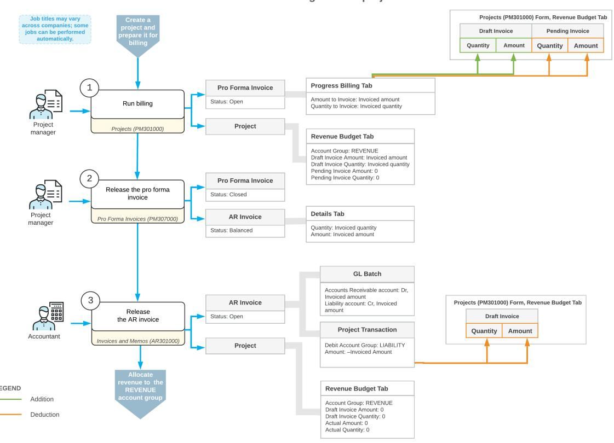

# <span id="page-201-0"></span>**Pro Forma Invoices: Related Reports and Forms**

In the following sections, you can find details about the reports and forms you may want to review to gather information about pro forma invoices.

If you do not see a particular report or form that is described, you may have signed in to the system with a user account that does not have access rights to the report or form. Contact your system administrator to obtain access to any needed reports or forms.

#### **Reviewing Project Transactions**

You can review the list of project transactions that correspond to a pro forma invoice line on the**Time and Material** tab of the *[Pro Forma Invoices](https://help-2025r1.acumatica.com/Help?ScreenId=ShowWiki&pageid=37f1ed00-a7d7-4161-9307-1337662b8550)* (PM307000) form. To review these project transactions, you click the line; then on the table toolbar, you click**View Transaction Details**, and the system opens the**Transaction Details** dialog box.

#### **Printing a Pro Forma Invoice**

You can print a pro forma invoice that you are viewing on the *[Pro Forma Invoices](https://help-2025r1.acumatica.com/Help?ScreenId=ShowWiki&pageid=37f1ed00-a7d7-4161-9307-1337662b8550)* (PM307000) form by clicking **Print** on the More menu. The system opens the printable form of the invoice, which is project-specific and specified for the *PROFORMA* mailing of the project on the **Mailing & Printing** tab of the *[Projects](https://help-2025r1.acumatica.com/Help?ScreenId=ShowWiki&pageid=81c86417-3bde-444b-8f1c-682928d31a0c)* (PM301000) form. By default, this is the *[Pro Forma Invoice](https://help-2025r1.acumatica.com/Help?ScreenId=ShowWiki&pageid=90074336-b7ba-4db1-8134-e36702bcce01)* (PM642000) report. You can review the invoice and print it.

The contact information of the customer to whom the pro forma invoices should be sent is specified in the **Bill-To Contact** and **Bill-To Address** sections of the **Addresses** tab of the *[Pro Forma Invoices](https://help-2025r1.acumatica.com/Help?ScreenId=ShowWiki&pageid=37f1ed00-a7d7-4161-9307-1337662b8550)* form. This information is copied to each pro forma invoice related to the project from the **Bill-To** and **Bill-To Address** sections of the **Summary** tab of the *[Projects](https://help-2025r1.acumatica.com/Help?ScreenId=ShowWiki&pageid=81c86417-3bde-444b-8f1c-682928d31a0c)* form and can be modified at the invoice or project level.

#### **Reviewing the Project Transactions Related to an AR Invoice**

You can review the project transactions that were created on release of an accounts receivable invoice. To do this, while you are viewing the accounts receivable invoice on the *[Invoices and Memos](https://help-2025r1.acumatica.com/Help?ScreenId=ShowWiki&pageid=5e6f3b27-b7af-412f-a40a-1d4f4be70cba)* (AR301000) form, you click **ProjectTransactions** on the More menu (under **Inquiries**). The system opens the *Project [Transaction](https://help-2025r1.acumatica.com/Help?ScreenId=ShowWiki&pageid=29bf5433-446f-4196-be69-f2cb177e83cb) Details* (PM401000) form with reference number and type of the accounts receivable invoice specified in the Selection area.

### <span id="page-202-0"></span>**Pro Forma Invoices: Mass-Processing of Documents**

This topic explains how to process multiple pro forma invoices, and how the system generates, changes, or works with documents as a result of the mass processing.

#### **Mass-Validating Addresses**

You can validate addresses for multiple projects and project-related documents (pro forma invoices and project quotes) on the *Validate Addresses in Project [Documents](https://help-2025r1.acumatica.com/Help?ScreenId=ShowWiki&pageid=94922432-aa59-4583-ba79-460a92126a08)* (PM507000) form. This form is available if the *Address Validation Integration* feature is enabled on the *[Enable/Disable Features](https://help-2025r1.acumatica.com/Help?ScreenId=ShowWiki&pageid=c1555e43-1bc5-4f6f-ba9d-b323f94d8a6b)* (CS100000) form and an address provider is configured on the *[Address Providers](https://help-2025r1.acumatica.com/Help?ScreenId=ShowWiki&pageid=a1f9fd43-38aa-4514-b1bb-aae5925c0b8e)* (CS103000) form.

On the *Validate Addresses in Project [Documents](https://help-2025r1.acumatica.com/Help?ScreenId=ShowWiki&pageid=94922432-aa59-4583-ba79-460a92126a08)* form, you select the form in which the address records were entered in the **Creation Form** box, and select the unlabeled check boxes in the rows to be processed in the table. Then you click**Validate** on the form toolbar. To instead validate all the listed address records, you click**Validate All** on the form toolbar.

#### **Mass-Billing Projects**

You can initiate billing for multiple projects on the *[Run Project Billing](https://help-2025r1.acumatica.com/Help?ScreenId=ShowWiki&pageid=1a586da4-beaa-4015-8834-b2eb87a21fc9)* (PM503000) form; this billing entails the creation of multiple invoices. A project is listed on the form only if the invoice date is aer its next billing date, which is specified on the **Summary** tab of the *[Projects](https://help-2025r1.acumatica.com/Help?ScreenId=ShowWiki&pageid=81c86417-3bde-444b-8f1c-682928d31a0c)* (PM301000) form.

To initiate billing for particular projects, you select the unlabeled check boxes in the rows of the projects to be processed in the table on this form, and click **Process** on the form toolbar. To instead initiate billing for all the listed projects, you click **Process All** on the form toolbar.

During processing, the system generates project invoices for the selected projects. Pro forma invoices will be created for only those projects that have the **Create Pro Forma Invoice on Billing** check box selected on the **Summary** tab of the *[Projects](https://help-2025r1.acumatica.com/Help?ScreenId=ShowWiki&pageid=81c86417-3bde-444b-8f1c-682928d31a0c)* (PM301000) form; AR invoices will be created for projects for which this check box is cleared. The system creates project invoices with the date that is specified in the **Invoice Date** box in the Selection area of the form.

#### **Mass-Releasing Pro Forma Invoices**

Pro forma invoices can be mass-released. To release multiple pro forma invoices at a time, you open the *[Release](https://help-2025r1.acumatica.com/Help?ScreenId=ShowWiki&pageid=01814a80-467a-4df8-bff6-092c3ec9ada8) [Pro Forma Invoices](https://help-2025r1.acumatica.com/Help?ScreenId=ShowWiki&pageid=01814a80-467a-4df8-bff6-092c3ec9ada8)* (PM506000) form, select the unlabeled check boxes in the rows of the pro forma invoices to be processed, and click **Release** on the form toolbar. To instead release all the listed pro forma invoices, you click **Release All** on the form toolbar.

#### **Mass-Recalculating Pro Forma Invoices**

In some cases, you may need to validate the project balances to make dra invoice amounts and quantities of the project budget match the values of the change orders.

To recalculate budget values affected by change orders, on the *[Recalculate Project Balances](https://help-2025r1.acumatica.com/Help?ScreenId=ShowWiki&pageid=6bf336f5-0f89-455b-a3a1-50982a26ae3d)* (PM5040000) form, you select the **Recalculate Dra Invoice Amount and Quantity** check box in the Selection area. You then select the unlabeled check boxes in the rows of the projects to be processed and click **Process** on the form toolbar to process the selected projects. Alternatively, you can click **Process All** to process all the projects shown in the table.

For more information, see *[Project Budget: Recalculation of the Project Balances](#page-267-2)*.

# <span id="page-204-0"></span>**Correcting Project Invoices**

The topics of this chapter explain how you can make corrections to project invoices. Project invoices include the pro forma invoices and accounts receivable invoices that have been prepared for a project.

# <span id="page-204-2"></span><span id="page-204-1"></span>**Project Invoice Correction: General Information**

In some cases, you may need to make corrections to the project invoices—that is, pro forma invoices and accounts receivable invoices that have been prepared for a project—to ensure accurate financial records.

#### **Learning Objectives**

In this chapter, you will learn how to do the following:

- Decide how a project invoice should be corrected
- Correct a pro forma invoice depending on its current status
- Correct an accounts receivable invoice that originates from a pro forma invoice

#### **Applicable Scenarios**

You make corrections to pro forma invoices and accounts receivable invoices in the following cases:

- You have found a mistake in the entry of customer details, invoice amounts, or other relevant information in the prepared project invoice.
- A customer has asked you to change some details in the already-prepared project invoice.

#### **Types of Project Invoices**

Depending on your company's business requirements, you may have the following types of project invoices in the system:

- A direct AR invoice: This AR invoice is created directly during the project billing procedure; the invoice is related to a project that has the **Create Pro Forma Invoice on Billing** check box cleared on the**Summary** tab of the *[Projects](https://help-2025r1.acumatica.com/Help?ScreenId=ShowWiki&pageid=81c86417-3bde-444b-8f1c-682928d31a0c)* (PM301000) form. A direct AR invoice does not have a corresponding pro forma invoice.
- An AR invoice that originates from a pro forma invoice: This AR invoice is created on release of the pro forma invoice. The pro forma invoice is created by the project billing procedure and is related to a project that has the **Create Pro Forma Invoice on Billing** check box selected on the**Summary** tab of the *[Projects](https://help-2025r1.acumatica.com/Help?ScreenId=ShowWiki&pageid=81c86417-3bde-444b-8f1c-682928d31a0c)* (PM301000) form.
- Manual AR invoice: This AR invoice is related to the project but was not generated by the billing procedure; instead, a user has entered this invoice manually. A manual AR invoice does not have a corresponding pro forma invoice.

#### **Project Invoice Correction**

The way you correct the project invoices depends on the type of the project invoices, current status of the documents, and the type of billing information included in the documents. The following list describes the main conditions that determine the way to correct the project invoice:

- If a project invoice is not released yet, you edit its details on the following form:
  - *[Invoices and Memos](https://help-2025r1.acumatica.com/Help?ScreenId=ShowWiki&pageid=5e6f3b27-b7af-412f-a40a-1d4f4be70cba)* (AR301000) if you need to correct a manual AR invoice or direct AR invoice
  - *[Pro Forma Invoices](https://help-2025r1.acumatica.com/Help?ScreenId=ShowWiki&pageid=37f1ed00-a7d7-4161-9307-1337662b8550)* (PM307000) if you need to correct a pro forma invoice

- If the document is a closed pro forma invoice, you correct it as follows:
  - a. If the related AR invoice has the *On Hold* or *Balanced* status, you can delete the AR invoice and then edit the settings of the pro forma invoice.
  - b. If the related AR invoice has been released, you can create a new revision of the pro forma invoice. To do this, you click **Correct** on the form toolbar of the *[Pro Forma Invoices](https://help-2025r1.acumatica.com/Help?ScreenId=ShowWiki&pageid=37f1ed00-a7d7-4161-9307-1337662b8550)* (PM307000) form. For more information, see *[Correcting Pro Forma Invoices](https://help-2025r1.acumatica.com/Help?ScreenId=ShowWiki&pageid=c7d12329-f123-1122-99de-cc34cbe50a85)*.
  - c. In all other cases, to correct the pro forma invoice, you need to perform the following steps:
    - a. Void the applied payments.
    - b. Reverse the retainage documents.
    - c. Reverse the AR invoice that has been created based on this pro forma invoice by clicking **Reverse** on the form toolbar of the *[Invoices and Memos](https://help-2025r1.acumatica.com/Help?ScreenId=ShowWiki&pageid=5e6f3b27-b7af-412f-a40a-1d4f4be70cba)* (AR301000) form. Then you will be able to edit the details of the pro forma invoice. For more information about AR invoice reversal, see *[Project Invoice](#page-206-1) [Correction: Reversing AR Documents](#page-206-1)*.
- If the document is an open AR invoice with no corresponding pro forma invoice (that is, it is either a manual invoice or a direct invoice), you need to reverse this AR invoice by clicking **Reverse** on the form toolbar of the *[Invoices and Memos](https://help-2025r1.acumatica.com/Help?ScreenId=ShowWiki&pageid=5e6f3b27-b7af-412f-a40a-1d4f4be70cba)* (AR301000) form.
- If the document is a closed AR invoice with no corresponding pro forma invoice (that is, it is either a manual invoice or a direct invoice), you need to do the following:
  - a. Void applied payments.
  - b. Reverse retainage documents.
  - c. Reverse the AR invoice by using the **Reverse** command on the form toolbar of the *[Invoices and Memos](https://help-2025r1.acumatica.com/Help?ScreenId=ShowWiki&pageid=5e6f3b27-b7af-412f-a40a-1d4f4be70cba)* (AR301000) form.
  - d. Either create a new manual AR invoice with the correct settings or run the billing procedure again and make the needed corrections to the resulting AR invoice.

The following diagram illustrates the possible ways to correct a project invoice and the conditions you consider to select the appropriate method.

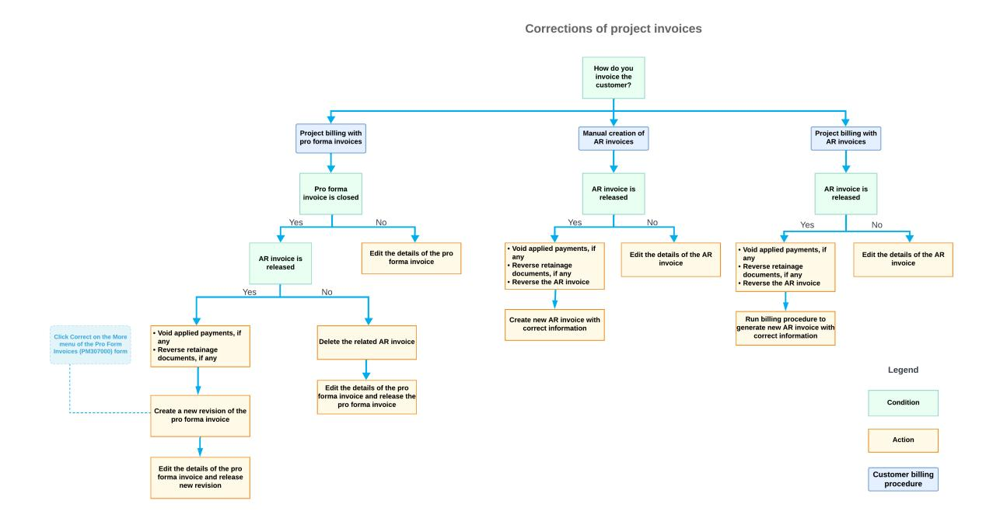

# <span id="page-206-1"></span><span id="page-206-0"></span>**Project Invoice Correction: Reversing AR Documents**

In Acumatica ERP, the amount of a released accounts receivable invoice cannot be changed directly in the released document. If you have found out that you have undercharged or overcharged the customer, you first need to reverse the accounts receivable invoice to correct the customer balance.

If the accounts receivable invoice has been created based on the pro forma invoice, you should not reverse the accounts receivable invoice manually. You create a new revision of the pro forma invoice by using the **Correct** command on the form toolbar of the *[Pro Forma Invoices](https://help-2025r1.acumatica.com/Help?ScreenId=ShowWiki&pageid=37f1ed00-a7d7-4161-9307-1337662b8550)* (PM307000) form. On release of this pro forma invoice, the corrected accounts receivable invoice will be created. For more information, see *[Correcting Pro Forma Invoices](https://help-2025r1.acumatica.com/Help?ScreenId=ShowWiki&pageid=c7d12329-f123-1122-99de-cc34cbe50a85)*.

#### **Reversal of AR Invoice**

You reverse an account receivable invoice by clicking **Reverse** on the More menu of the *[Invoices and Memos](https://help-2025r1.acumatica.com/Help?ScreenId=ShowWiki&pageid=5e6f3b27-b7af-412f-a40a-1d4f4be70cba)* (AR301000) form. When you reverse a released accounts receivable invoice that was created based on a project transaction, the system creates the credit memo in the same amount. When you release this reversing credit memo, the system automatically creates project transactions that clear the project revenue budget, adjust the customer balance, and make the amount billable again.

Project transactions generated on release of the reversing credit memos are excluded from further allocations.

Aer you have reversed the invoice, you can run billing procedure for the project again and make changes to the newly created accounts receivable invoice.

#### **Generated Project Transactions**

As a result of reversal of the accounts receivable invoice that was created during billing of a project, the system generates the following project transactions:

- The project transaction that have *PM* in the **Module** box in the Summary area on the *Project [Transactions](https://help-2025r1.acumatica.com/Help?ScreenId=ShowWiki&pageid=382a97fe-b636-44ca-9798-6d478c05b687)* (PM304000) form. This transaction originated from credit memo and includes the following lines:
  - The line with non-billable reversing project transaction. This line has the amount opposite to the amount of the original project transaction and the same expense account group. That is, this project transaction line reverses the impact of the original project transaction.

The system reverses only the project transactions that have been billed with the invoice being reversed. If you have processed any additional allocations for the original cost transaction, the system does not reverse them automatically. You need to reverse such allocation transactions manually by opening them on the *Project [Transactions](https://help-2025r1.acumatica.com/Help?ScreenId=ShowWiki&pageid=382a97fe-b636-44ca-9798-6d478c05b687)* form and clicking **Reverse Allocation** on the form toolbar.

• The line with billable project transaction, which is the copy of the original project transaction with the same quantity and amount. This project transaction is ready for billing.

The date and the financial period in both lines are copied from the original project transaction if the financial period is not locked or closed. If the financial period of the original transaction is locked or closed, the financial period of the created transactions is copied from the credit memo.

• The non-billable project transaction that have *AR* in the **Module** box in the Summary area on the *[Project](https://help-2025r1.acumatica.com/Help?ScreenId=ShowWiki&pageid=382a97fe-b636-44ca-9798-6d478c05b687) [Transactions](https://help-2025r1.acumatica.com/Help?ScreenId=ShowWiki&pageid=382a97fe-b636-44ca-9798-6d478c05b687)* (PM304000) form. This line has the amount opposite to the amount of the project transaction that was generated on release of the AR invoice and the same revenue account group.

This transaction reverses the impact of the AR invoice to the project budget. The date and the financial period of this project transaction are the date and period of reversal, that is the system copies these values from the credit memo.

Notice that aer reversal of the AR invoice, the original project transaction remains billed.

# <span id="page-207-0"></span>**Project Invoice Correction: To Correct a Closed Pro Forma Invoice**

In this activity, you will learn how to correct a pro forma invoice for which the corresponding accounts receivable document released.

This activity is based on the *U100* dataset. If you are using another dataset, or if any system settings have been changed in *U100*, these changes can affect the workflow of the activity and the results of the processing. To avoid any issues, restore the *U100* dataset to its initial state.

#### **Story**

Suppose that in January, the Thai Food Restaurant customer ordered five juicers along with the service of installation from the SweetLife Fruits & Jams company. The parties agreed to pay for the juicers and provided services monthly. SweetLife's project manager created a project for this work. In January, SweetLife delivered and installed two juicers; SweetLife's project accountant billed the customer. In February, SweetLife delivered and installed three juicers and the project accountant billed the customer.

Suppose that the project accountant has realized that in January the customer was billed for one juicer and the corresponding service instead of two juicers. The pro forma invoice was already used for printing the AIA report, so the accountant cannot just create one more invoice but need to adjust the first pro forma invoice. Acting as the project accountant, you will correct the pro forma invoice.

#### **Configuration Overview**

In the *U100* dataset, the following tasks have been performed to support this activity:

- On the *[Enable/Disable Features](https://help-2025r1.acumatica.com/Help?ScreenId=ShowWiki&pageid=c1555e43-1bc5-4f6f-ba9d-b323f94d8a6b)* (CS100000) form, the *Project Accounting* feature has been enabled on the *[Enable/Disable Features](https://help-2025r1.acumatica.com/Help?ScreenId=ShowWiki&pageid=c1555e43-1bc5-4f6f-ba9d-b323f94d8a6b)* (CS100000) form:
- On the *[Projects](https://help-2025r1.acumatica.com/Help?ScreenId=ShowWiki&pageid=81c86417-3bde-444b-8f1c-682928d31a0c)* (PM301000) form, the *TOMYUM12* project has been created, and the *INSTALL* project task has been created for the project.
- On *1/30/2025*, the *000005* pro forma invoice has been created for the project, and the *000089* accounts receivable invoice has been created and released for the pro forma invoice.
- On *2/28/2025*, the *000006* pro forma invoice has been created for the project, and the *000090* accounts receivable invoice has been created and released for the pro forma invoice.

#### **Process Overview**

In this activity, on the *[Pro Forma Invoices](https://help-2025r1.acumatica.com/Help?ScreenId=ShowWiki&pageid=37f1ed00-a7d7-4161-9307-1337662b8550)* (PM307000) form, you will initiate the correcting of a pro forma invoice for the project. You will adjust and release the pro forma invoice on the same form. On the *[Invoices and Memos](https://help-2025r1.acumatica.com/Help?ScreenId=ShowWiki&pageid=5e6f3b27-b7af-412f-a40a-1d4f4be70cba)* (AR301000) form, you will release the accounts receivable invoice created based on the pro forma invoice and the credit memo created for reversing the previous AR invoice.

#### **System Preparation**

To prepare to perform the instructions of this activity, do the following:

- 1. Launch the Acumatica ERP website, and sign in to a company with the *U100* dataset preloaded as Pam Brawner by using the *brawner* username and the *123* password.
- 2. In the info area, in the upper-right corner of the top pane of the Acumatica ERP screen, make sure that the business date in your system is set to *1/30/2025*. If a different date is displayed, click the Business Date menu button and select *1/30/2025* on the calendar. For simplicity, in this activity, you will create and process all documents in the system on this business date.

#### **Step 1: Correcting the Pro Forma Invoice**

To correct the *000005* invoice for the *TOMYUM12* project, do the following:

1. On the *[Projects](https://help-2025r1.acumatica.com/Help?ScreenId=ShowWiki&pageid=81c86417-3bde-444b-8f1c-682928d31a0c)* (PM301000) form, open the *TOMYUM12* project.

On the **Invoices** tab, review the related pro forma invoices and accounts receivable invoices. Notice that the status of both pro forma invoices is *Closed* and the status of both accounts receivable invoices is *Open*, which means the AR invoices are also released.

2. On the *[Pro Forma Invoices](https://help-2025r1.acumatica.com/Help?ScreenId=ShowWiki&pageid=37f1ed00-a7d7-4161-9307-1337662b8550)* (PM307000) form, open the *000005* pro forma invoice.

In the Summary area, notice that the **InvoiceTotal** is *1700.00*. You need to double this amount.

On the **Financial** tab, notice that there is the *000089* reference number of the corresponding AR invoice in the **AR Ref. Nbr.** box (**AR Invoice Info** section) and the **Previous Revisions** table is empty.

3. On the More menu, click **Correct** to make corrections to the pro forma invoice. The system assigns the pro forma invoice the *On Hold* status.

On the **Financial** tab, notice that the **AR Ref. Nbr.** box has been cleared and a row with the previous revision of the pro forma invoice has appeared in the **Previous Revisions** table. The invoice total of the revision is *1700.00* and the AR reference number is *000089*.

- 4. On the **Progress Billing** tab, in the lines with the following items, enter the corresponding amount in the **Amount to Invoice** column:
  - *INSTALL*: 400.00
  - *JUICER10*: 3000.00

In the Summary area, make sure that the invoice total is *3400.00*.

5. On the form toolbar, click **Remove Hold**, and then click **Release** to release the pro forma invoice.

The system creates the accounts receivable invoice based on the pro forma invoice and assigns the *Closed* status to the pro forma invoice. On the **Financial** tab, in the **Previous Revisions** table, notice that the system has created the reversing credit memo for the AR invoice of the previous revision and filled in the **Reversing Doc.Type** and **Reversing Ref. Nbr.** columns in the line with the previous revision.

6. In the only line of the table, click the link in the **Reversing Ref. Nbr.** column to open the reversing credit memo on the *[Invoices and Memos](https://help-2025r1.acumatica.com/Help?ScreenId=ShowWiki&pageid=5e6f3b27-b7af-412f-a40a-1d4f4be70cba)* (AR301000) form. On the **Applications** tab, notice that the system has automatically applied the credit memo to the previous revision of the AR invoice.

Both the credit memo and the AR invoice are now assigned the *Closed* status.

- 7. Close the *[Invoices and Memos](https://help-2025r1.acumatica.com/Help?ScreenId=ShowWiki&pageid=5e6f3b27-b7af-412f-a40a-1d4f4be70cba)* form, and return to the correction pro forma invoice on the *[Pro Forma](https://help-2025r1.acumatica.com/Help?ScreenId=ShowWiki&pageid=37f1ed00-a7d7-4161-9307-1337662b8550) [Invoices](https://help-2025r1.acumatica.com/Help?ScreenId=ShowWiki&pageid=37f1ed00-a7d7-4161-9307-1337662b8550)* form.
- 8. On the **Financial** tab, click the **AR Ref. Nbr.** link to open the accounts receivable invoice that was created on the *[Invoices and Memos](https://help-2025r1.acumatica.com/Help?ScreenId=ShowWiki&pageid=5e6f3b27-b7af-412f-a40a-1d4f4be70cba)* form.
- 9. On the form toolbar, click **Remove Hold**, and then click **Release** to release the accounts receivable invoice.

10.On the *[Projects](https://help-2025r1.acumatica.com/Help?ScreenId=ShowWiki&pageid=81c86417-3bde-444b-8f1c-682928d31a0c)* form, open the *TOMYUM12* project.

On the **Invoices** tab, notice that the invoice total of the *000005* pro forma invoice you have corrected is *3400.00*. Notice that the table also shows the previous revision of the AR invoice and the credit memo that reverses that AR invoice, as shown in the following screenshot.

| Projects<br>TOMYUM12 - Juicers with the installation                                                                                               |                                                                                                                                                                                                                                                                                                           |                      |                |                            |                    |                                          |                 |                                              |                            |                       |                                |               |                        |
|----------------------------------------------------------------------------------------------------------------------------------------------------|-----------------------------------------------------------------------------------------------------------------------------------------------------------------------------------------------------------------------------------------------------------------------------------------------------------|----------------------|----------------|----------------------------|--------------------|------------------------------------------|-----------------|----------------------------------------------|----------------------------|-----------------------|--------------------------------|---------------|------------------------|
| 日<br>周<br><b>RUN PROJECT BILLING</b><br>而<br><b>COMPLETE PROJECT</b><br>$\Omega$<br>$\mathsf{K}$<br>$\geq$<br>$\leftarrow$<br>$+$<br>≺<br>$\cdots$ |                                                                                                                                                                                                                                                                                                           |                      |                |                            |                    |                                          |                 |                                              |                            |                       |                                |               |                        |
| * Project ID:                                                                                                                                      | Status:                                                                                                                                                                                                                                                                                                   | Active               | Actual Income: | 6.800.00                   |                    |                                          |                 |                                              |                            |                       |                                |               |                        |
| Customer:                                                                                                                                          | $\Omega$<br><b>TOMYUM - Thai Food Restaurant</b>                                                                                                                                                                                                                                                          |                      |                | Actual Expenses:           |                    | 0.00                                     |                 |                                              |                            |                       |                                |               |                        |
| Template:                                                                                                                                          | 0                                                                                                                                                                                                                                                                                                         |                      |                |                            | Margin:            | 6,800.00                                 | %               | 100.00                                       |                            |                       |                                |               |                        |
| * Description:                                                                                                                                     | Juicers with the installation                                                                                                                                                                                                                                                                             |                      |                |                            |                    |                                          |                 |                                              |                            |                       |                                |               |                        |
| <b>SUMMARY</b><br><b>TASKS</b>                                                                                                                     | <b>OINVOICES</b><br><b>BALANCES</b><br><b>CHANGE ORDERS</b><br>COMPLIANCE<br><b>REVENUE BUDGET</b><br><b>COST BUDGET</b><br><b>UNION LOCALS</b><br><b>ACTIVITIES</b><br><b>EMPLOYEES</b><br><b>EQUIPMENT</b><br><b>ADDRESSES</b><br><b>DEFAULTS</b><br><b>ATTRIBUTES</b><br><b>MAILING &amp; PRINTING</b> |                      |                |                            |                    |                                          |                 |                                              |                            |                       |                                |               |                        |
| <b>AIA REPORT</b><br>!!!!!!!!!!!!!!!!!!!!!!!!!!!!!!!!!!!!!!!!                                                                                      | <b>RELEASE RETAINAGE</b><br>H                                                                                                                                                                                                                                                                             | $\mathbf{x}$         |                |                            |                    |                                          |                 |                                              |                            |                       |                                |               |                        |
| <b>R</b> Pro Forma<br>Pro Forma<br>Reference Nbr.<br>Date                                                                                          | Application<br>Nbr.                                                                                                                                                                                                                                                                                       | <b>Description</b>   | <b>Status</b>  | Invoice Total AR Doc. Type |                    | <b>AR Reference Nbr.</b>                 | AR Doc.<br>Date | AR Doc. Description                          | AR Doc.<br>Orig.<br>Amount | Original<br>Retainage | AR Doc.<br><b>Total Amount</b> | Balance       | Open AR AR Doc. Status |
| 000005<br>1/30/2024                                                                                                                                | $^{\circ}$                                                                                                                                                                                                                                                                                                | Invoice for TOMYUM12 | Closed         | 3,400.00 Invoice           |                    | 000118                                   | 1/30/2024       | Invoice for TOMYUM12                         | 3,400.00                   | 0.00                  | 3,400.00                       | 3,400.00 Open |                        |
| 000006<br>2/28/2024                                                                                                                                | $\bullet$                                                                                                                                                                                                                                                                                                 | Invoice for TOMYUM12 | Closed         | 5.100.00                   | Invoice            | 000090                                   | 2/28/2024       | Invoice for TOMYUM12                         | 5.100.00                   | 0.00                  | 5.100.00                       | 5,100.00 Open |                        |
|                                                                                                                                                    |                                                                                                                                                                                                                                                                                                           |                      |                |                            | <b>Credit Memo</b> | 000117                                   | 1/30/2024       | The reversal originating from corrections of | 1,700.00                   | 0.00                  | 1,700.00                       |               | 0.00 Closed            |
| 000005<br>1/30/2024                                                                                                                                | $\bullet$                                                                                                                                                                                                                                                                                                 | Invoice for TOMYUM12 | Closed         | 1.700.00                   | Invoice            | !!!!!!!!!!!!!!!!!!!!!!!!!!!!!!!!!!!!!!!! | 1/30/2024       | Invoice for TOMYUM12                         | 1.700.00                   | 0.00                  | 1.700.00                       |               | 0.00 Closed            |

#### *Figure: The corrected pro forma invoice and related documents*

You have finished correcting the amounts in the pro forma invoice.

# <span id="page-209-2"></span><span id="page-209-0"></span>**Project Invoice Correction: Credit Memos for Projects**

To correct the actual amounts of a project that has been overcharged during the previous billing, you can create a credit memo for a project, either manually or during the project billing procedure.

#### **Project Billing with Credit Memo**

If on the **Summary** tab of the *[Projects](https://help-2025r1.acumatica.com/Help?ScreenId=ShowWiki&pageid=81c86417-3bde-444b-8f1c-682928d31a0c)* (PM301000) form, the **Create Pro Forma Invoice on Billing** check box is selected for the project, the system creates a credit memo on release of the pro forma invoice if the total amount of the pro forma invoice is negative.

During the billing of each processed project, the system creates a credit memo on the *[Invoices and Memos](https://help-2025r1.acumatica.com/Help?ScreenId=ShowWiki&pageid=5e6f3b27-b7af-412f-a40a-1d4f4be70cba)* (AR301000) form if both of the following conditions are met for the project on the *[Projects](https://help-2025r1.acumatica.com/Help?ScreenId=ShowWiki&pageid=81c86417-3bde-444b-8f1c-682928d31a0c)* form:

- On the **Summary** tab, the **Create Pro Forma Invoice on Billing** check box is cleared.
- The project has a negative **Pending Invoice AmountTotal** on the **Revenue Budget** tab.

#### **Credit Terms in Credit Memos**

The system fills in the credit terms for the credit memo as follows:

- If the project has credit terms specified in the**Terms** box on the**Summary** tab of the *[Projects](https://help-2025r1.acumatica.com/Help?ScreenId=ShowWiki&pageid=81c86417-3bde-444b-8f1c-682928d31a0c)* (PM301000) form and the **Use CreditTerms in Credit Memos** check box is selected on the *[Accounts Receivable](https://help-2025r1.acumatica.com/Help?ScreenId=ShowWiki&pageid=f7b52067-5299-45e8-b601-485cd709f58b) [Preferences](https://help-2025r1.acumatica.com/Help?ScreenId=ShowWiki&pageid=f7b52067-5299-45e8-b601-485cd709f58b)* (AR101000) form, the terms are copied from the project to the credit memo.
- If the **Terms** box is empty for the project and the **Use CreditTerms in Credit Memos** check box is selected on the *[Accounts Receivable Preferences](https://help-2025r1.acumatica.com/Help?ScreenId=ShowWiki&pageid=f7b52067-5299-45e8-b601-485cd709f58b)* form, the terms are copied from the customer's settings to the credit memo.
- If the **Use CreditTerms in Credit Memos** check box is cleared on the *[Accounts Receivable Preferences](https://help-2025r1.acumatica.com/Help?ScreenId=ShowWiki&pageid=f7b52067-5299-45e8-b601-485cd709f58b)* form, the **Terms** box of the *[Invoices and Memos](https://help-2025r1.acumatica.com/Help?ScreenId=ShowWiki&pageid=5e6f3b27-b7af-412f-a40a-1d4f4be70cba)* (AR301000) form is empty for the credit memo.

For details on the calculation of cash discounts in the generated documents, see *[Setup and Calculation of Cash](https://help-2025r1.acumatica.com/Help?ScreenId=ShowWiki&pageid=0c0ecd1e-e200-49cb-afd1-d5484fd8a964) [Discounts](https://help-2025r1.acumatica.com/Help?ScreenId=ShowWiki&pageid=0c0ecd1e-e200-49cb-afd1-d5484fd8a964)*.

# <span id="page-209-1"></span>**Project Invoice Correction: To Prepare a Credit Memo for a Project**

In this activity, you will correct the actual amounts of a project that has been overcharged during the billing. To do this, you will create a credit memo for the project.

This activity is based on the *U100* dataset. If you are using another dataset, or if any system settings have been changed in *U100*, these changes can affect the workflow of the activity and the results of the processing. To avoid any issues, restore the *U100* dataset to its initial state.

#### **Story**

Suppose that the Thai Food Restaurant customer recently ordered eight hours of training on how to use a juicer it had previously bought from the SweetLife Fruits & Jams company. SweetLife's project accountant created a project for this training, a consultant of SweetLife provided the training, and the project accountant billed the customer.

Further suppose that the project accountant has realized that the consultant provided six hours of training instead of eight, so the company overcharged the customer by \$100. Acting as the project accountant, you need to correct the actual amount of the project and create a credit memo for the project.

#### **Configuration Overview**

In the *U100* dataset, the following tasks have been performed to support this activity:

- On the *[Enable/Disable Features](https://help-2025r1.acumatica.com/Help?ScreenId=ShowWiki&pageid=c1555e43-1bc5-4f6f-ba9d-b323f94d8a6b)* (CS100000) form, the *Project Accounting* feature has been enabled to provide support for the project accounting functionality.
- On the *[Projects](https://help-2025r1.acumatica.com/Help?ScreenId=ShowWiki&pageid=81c86417-3bde-444b-8f1c-682928d31a0c)* (PM301000) form, the *TOMYUM11* project has been created and the *TRAINING* project task has been created for the project. On the**Summary** tab (**Billing and Allocation Settings** section), the **Create Pro Forma Invoice on Billing** check box has been selected for the project.
- For the project, the *000004* pro forma invoice and the corresponding *000075* accounts receivable invoice have been created and released on the *[Pro Forma Invoices](https://help-2025r1.acumatica.com/Help?ScreenId=ShowWiki&pageid=37f1ed00-a7d7-4161-9307-1337662b8550)* (PM307000) and *[Invoices and Memos](https://help-2025r1.acumatica.com/Help?ScreenId=ShowWiki&pageid=5e6f3b27-b7af-412f-a40a-1d4f4be70cba)* (AR301000) forms, respectively.

#### **Process Overview**

In this activity, on the *[Projects](https://help-2025r1.acumatica.com/Help?ScreenId=ShowWiki&pageid=81c86417-3bde-444b-8f1c-682928d31a0c)* (PM301000) form, you will update the pending invoice amount of the project with a negative amount and run project billing to prepare a pro forma invoice. On the *[Pro Forma Invoices](https://help-2025r1.acumatica.com/Help?ScreenId=ShowWiki&pageid=37f1ed00-a7d7-4161-9307-1337662b8550)* (PM307000) form, you will review the pro forma invoice and release it. You will then review the credit memo that was created based on the pro forma invoice and release the credit memo on the *[Invoices and Memos](https://help-2025r1.acumatica.com/Help?ScreenId=ShowWiki&pageid=5e6f3b27-b7af-412f-a40a-1d4f4be70cba)* (AR301000) form.

#### **System Preparation**

To sign in to the system and prepare to perform the instructions of the activity, do the following:

- 1. Launch the Acumatica ERP website and sign in as Pam Brawner using the *brawner* username and *123* password.
- 2. In the info area, in the upper-right corner of the top pane of the Acumatica ERP screen, make sure that the business date in your system is set to *1/30/2025*. If a different date is displayed, click the Business Date menu button and select *1/30/2025* on the calendar. For simplicity, in this activity, you will create and process all documents in the system on this business date.

#### **Step: Creating a Credit Memo for the Project**

To create a credit memo for the extra \$100 that was billed for the project, do the following:

- 1. On the *[Projects](https://help-2025r1.acumatica.com/Help?ScreenId=ShowWiki&pageid=81c86417-3bde-444b-8f1c-682928d31a0c)* (PM301000) form, open the *TOMYUM11* project. In the Summary area, notice that the actual income of the project is \$400.
- 2. On the **Revenue Budget** tab, enter –100 as the **Pending Invoice Amount** of the only revenue budget line that you are going to correct.

- 3. Save your changes to the project.
- 4. On the form toolbar, click **Run Billing**.

The system creates a pro forma invoice and opens it on the *[Pro Forma Invoices](https://help-2025r1.acumatica.com/Help?ScreenId=ShowWiki&pageid=37f1ed00-a7d7-4161-9307-1337662b8550)* (PM307000) form. In the Summary area, notice that the **InvoiceTotal** is negative and equals the amount you have specified for the revenue budget line of the project (*–100.00*).

5. On the form toolbar, click **Remove Hold** to assign the pro forma invoice the *Open* status, and then click **Release**. The system assigns the *Closed* status to the pro forma invoice.

The **InvoiceTotal** of a pro forma invoice on the *[Pro Forma Invoices](https://help-2025r1.acumatica.com/Help?ScreenId=ShowWiki&pageid=37f1ed00-a7d7-4161-9307-1337662b8550)* form was negative, so the system creates an accounts receivable credit memo when the pro forma invoice was released.

- 6. On the **Financial** tab, click the **AR Ref. Nbr.** link to open the credit memo that has been created for the pro forma invoice.
- 7. On the form toolbar of the *[Invoices and Memos](https://help-2025r1.acumatica.com/Help?ScreenId=ShowWiki&pageid=5e6f3b27-b7af-412f-a40a-1d4f4be70cba)* (AR301000) form, which opens, click **Remove Hold** to assign the credit memo the *Balanced* status, and then click **Release**.
- 8. On the *[Projects](https://help-2025r1.acumatica.com/Help?ScreenId=ShowWiki&pageid=81c86417-3bde-444b-8f1c-682928d31a0c)* form, open the *TOMYUM11* project and press Esc to refresh the form. In the Summary area, notice that the actual income of the project, which has been updated as a result of the billing, is \$300.

On the **Invoices** tab, notice that the credit memo with the corresponding pro forma invoice has appeared in the table, as shown in the following screenshot.

|   | Projects<br>TOMYUM11 - A training for employees                         |        |                             |                 |                          |   |                    |                             |        |                 |                  |                    |              |                                      |                          |                       |                             |                  |                                   |  |
|---|-------------------------------------------------------------------------|--------|-----------------------------|-----------------|--------------------------|---|--------------------|-----------------------------|--------|-----------------|------------------|--------------------|--------------|--------------------------------------|--------------------------|-----------------------|-----------------------------|------------------|-----------------------------------|--|
|   | 목<br>$\leftarrow$                                                       | $\Box$ | $\Omega$                    | ÷               | 侕                        | к | ≺                  | У.                          | $\geq$ | <b>COMPLETE</b> |                  | <b>RUN BILLING</b> |              | $\cdots$                             |                          |                       |                             |                  |                                   |  |
|   | * Project ID:                                                           |        |                             | <b>TOMYUM11</b> |                          |   |                    |                             | Q      |                 | Customer:        |                    |              | <b>TOMYUM - Thai Food Restaurant</b> | $\circ$<br>$\mathscr{O}$ | Actual Income:        |                             | 300.00           |                                   |  |
|   | Template:                                                               |        |                             |                 |                          |   |                    |                             | 0      |                 | Project Manager: |                    |              | EP00000001 - Pam Brawner             | Q                        | Actual Expenses:      |                             | 0.00             |                                   |  |
|   | Status:                                                                 |        |                             | Active          |                          |   |                    |                             |        |                 |                  |                    |              |                                      |                          | Margin Amount:        |                             | 300.00           |                                   |  |
|   | Description:                                                            |        |                             |                 | A training for employees |   |                    |                             |        |                 |                  |                    |              |                                      |                          | Margin (%):           |                             | 100.00           |                                   |  |
|   |                                                                         |        |                             |                 |                          |   |                    |                             |        |                 |                  |                    |              |                                      |                          | Pending Invoice Amoun |                             | 0.00             |                                   |  |
|   | <b>SUMMARY</b>                                                          |        | <b>TASKS</b>                |                 | <b>REVENUE BUDGET</b>    |   |                    | <b>COST BUDGET</b>          |        |                 | <b>BALANCES</b>  | <b>INVOICES</b>    |              | <b>UNION LOCALS</b>                  | <b>ACTIVITIES</b>        | <b>EMPLOYEES</b>      | <b>EQUIPMENT</b>            | <b>ADDRESSES</b> | <b>DEFAULTS</b>                   |  |
|   | Ò<br>$\mathbf{N}$<br><b>AIA REPORT</b><br><b>RELEASE RETAINAGE</b><br>н |        |                             |                 |                          |   |                    |                             |        |                 |                  |                    |              |                                      |                          |                       |                             |                  |                                   |  |
| 鬲 | <b>Pro Forma</b><br>Date                                                |        | Pro Forma<br>Reference Nbr. |                 | Application<br>Nbr.      |   | <b>Description</b> |                             |        |                 | <b>Status</b>    |                    | <b>Total</b> | Invoice AR Doc. Type                 | AR<br>Reference<br>Nbr.  | AR Doc.<br>Date       | <b>AR Doc. Description</b>  |                  | AR Doc.<br>Orig.<br><b>Amount</b> |  |
|   | 1/28/2025                                                               |        | 000004                      |                 |                          |   |                    | Invoice for TOMYUM11        |        |                 | <b>Closed</b>    |                    | 400.00       | Invoice                              | 000075                   | 1/28/2025             | <b>Invoice for TOMYUM11</b> |                  | 400.00                            |  |
|   | 1/30/2025                                                               |        | 000020                      |                 | 0001                     |   |                    | <b>Invoice for TOMYUM11</b> |        |                 | <b>Closed</b>    |                    | $-100.00$    | <b>Credit Memo</b>                   | 000125                   | 1/30/2025             | <b>Invoice for TOMYUM11</b> |                  | $-100.00$                         |  |

#### *Figure: The credit memo created for the project*

You have adjusted the overcharged actual income in the project. In the next step of the process in a production environment (which is beyond the scope of this activity), an accounts receivable clerk would apply the created credit memo to the original invoice that has been corrected.

### <span id="page-211-0"></span>**Project Invoice Correction: Related Report and Inquiry Forms**

In the following sections, you can find details about the forms and inquiries you may want to review to gather information about correcting pro forma invoices.

If you do not see a particular report or form that is described, you may have signed in to the system with a user account that does not have access rights to the report or form. Contact your system administrator to obtain access to any needed reports or forms.

#### **Reviewing Revisions of a Pro Forma Invoice**

You can review all the previous revisions of the pro forma invoice selected on the *[Pro Forma Invoices](https://help-2025r1.acumatica.com/Help?ScreenId=ShowWiki&pageid=37f1ed00-a7d7-4161-9307-1337662b8550)* (PM307000) form in the **Previous Revisions** table on the **Financial** tab. If there are several revisions in the table, the topmost row is the last revision of the pro forma invoice while revision *1* is the first revision of the invoice.

For each revision, you can find in the table the reference number of the accounts receivable document created on release of the revision (**AR Ref. Nbr.**) and the reference number of the reversing AR document (**Reversing Ref. Nbr.**) created for that accounts receivable document. By clicking the reference numbers, you can opens these AR documents on the *[Invoices and Memos](https://help-2025r1.acumatica.com/Help?ScreenId=ShowWiki&pageid=5e6f3b27-b7af-412f-a40a-1d4f4be70cba)* (AR301000) form.

#### **Comparing Revisions of a Pro Forma Invoice**

You can compare all the revisions of a pro forma invoice on the *[Pro Forma Invoice Correction History](https://help-2025r1.acumatica.com/Help?ScreenId=ShowWiki&pageid=7bc00e18-0c6b-4d25-afbf-cc341916365e)* (PMGI0030) form. In the Summary area of the form, in the **Reference Nbr.** box, you select a pro forma invoice whose revisions you want to review. In the table, the system displays all lines of all the revisions of the selected pro forma invoice. The lines are sorted ascending by the invoice line number and then descending by the invoice revision—that is, the system shows all the revisions of the first invoice line, then all the revisions of the second line, and so on. The lines of the current revision are highlighted with green and have the highest revision number.

# <span id="page-213-0"></span>**Paying AP Bills by Project**

This chapter describes how to pay multiple bills for a project with a single payment.

# <span id="page-213-1"></span>**Vendor Payments for a Project: General Information**

To pay for services provided by a vendor for a particular project in Acumatica ERP, you need to create an AP payment, which is a document that represents the payment in the system, and apply it to the corresponding AP bill or bills.

#### **Learning Objectives**

In this chapter, you will learn how to do the following:

- Select the bills or bill lines to be paid
- Prepare and release a payment for multiple bills for the same project

#### **Applicable Scenarios**

You may need to prepare and process a vendor payment for a project in Acumatica ERP when the vendor's bill is due or multiple bills of this vendor related to the project are due on the same date. Also, when you prepare the payment, you may need to do one the following:

- Pay multiple bills for a project with a single payment document
- Pay particular lines of multiple bills with a single payment document
- Pay multiple bills at the same time and prepare separate payment documents for some of these bills and a consolidated payment document for the rest of the bills

#### **Payment for Bills Related to a Project**

To speed the process of preparing and processing payments for a project, you initiate the payment process on the *[Prepare Payments](https://help-2025r1.acumatica.com/Help?ScreenId=ShowWiki&pageid=e3b526e3-8b12-4fa9-a5b2-2955e763f238)* (AP503000) form. In the Selection area of the *[Prepare Payments](https://help-2025r1.acumatica.com/Help?ScreenId=ShowWiki&pageid=e3b526e3-8b12-4fa9-a5b2-2955e763f238)* form, you select the project for which you want to list bills for possible payment generation. You can also filter the listed bills by payment date, cash account, payment method, vendor, and discount availability. Then in the table on the **Documents to Pay** tab, you select the bills to be paid (the system inserts the full balance in the **Amount Paid** column, but you can instead specify a partial one to be paid), and click **Process** on the form toolbar to generate the payments for the selected bills.

If you need to process a payment for one bill, you can manually create a payment on the *[Checks](https://help-2025r1.acumatica.com/Help?ScreenId=ShowWiki&pageid=81659f97-cb14-4a27-bc3e-0f67b3945613) [and Payments](https://help-2025r1.acumatica.com/Help?ScreenId=ShowWiki&pageid=81659f97-cb14-4a27-bc3e-0f67b3945613)* (AP302000) form and process this payment to completion. For more information on creating a payment for a particular bill, see *[AP Bill Payments: General Information](https://help-2025r1.acumatica.com/Help?ScreenId=ShowWiki&pageid=52e2c1ff-7d5e-4b81-b63b-ff6a2caac4b5)*.

The system generates an AP payment (or multiple payments grouped by the vendor) for the selected bills. If the payment method specified in any of the processed AP payments requires a check to be printed, the system opens the *[Process Payments / Print Checks](https://help-2025r1.acumatica.com/Help?ScreenId=ShowWiki&pageid=e632860a-8905-424a-8e27-ad66cf9f64c7)* (AP505000) form with these payments listed; on this form, you select the payments for which the checks should be printed and click **Process** on the form toolbar. Then on the *[Release](https://help-2025r1.acumatica.com/Help?ScreenId=ShowWiki&pageid=0a981976-131b-4150-81d0-19b54a46e510) [Payments](https://help-2025r1.acumatica.com/Help?ScreenId=ShowWiki&pageid=0a981976-131b-4150-81d0-19b54a46e510)* (AP505200) form, you mass-release the AP payments. The system releases the AP payments, applies the payment amount to the corresponding bill or bills, and decreases the open balance of these bills. Once the payment amount is applied in full, the payment is assigned the *Closed* status.

#### **Workflow of the Process of Paying Bills for a Project**

The following diagram illustrates the workflow of processing payments for vendors' bills related to a project.

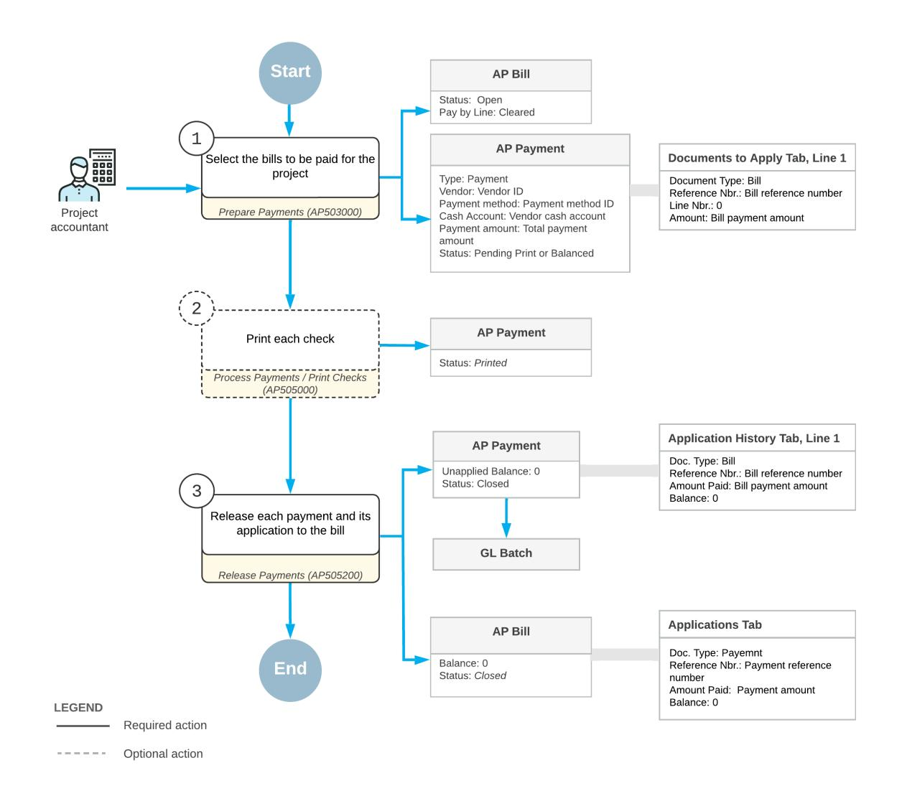

#### **Payment for Separate Bill Lines for a Project**

If your company needs to manage expenses and payments at a granular level, you can configure payment by document lines. If the *Payment Application by Line* feature is enabled on the *[Enable/Disable Features](https://help-2025r1.acumatica.com/Help?ScreenId=ShowWiki&pageid=c1555e43-1bc5-4f6f-ba9d-b323f94d8a6b)* (CS100000) form, you select the **Pay by Line** check box in the Summary area of the *[Bills and Adjustments](https://help-2025r1.acumatica.com/Help?ScreenId=ShowWiki&pageid=956b4e51-3078-4d2d-85b3-65c080d95234)* (AP301000) form to indicate that individual lines of the bill can be paid. For more information, see *[Applying Payments to Particular Lines](https://help-2025r1.acumatica.com/Help?ScreenId=ShowWiki&pageid=62c6d65e-1af1-4dde-af37-f663822fe290) [of AP Documents](https://help-2025r1.acumatica.com/Help?ScreenId=ShowWiki&pageid=62c6d65e-1af1-4dde-af37-f663822fe290)*.

You can use the *[Prepare Payments](https://help-2025r1.acumatica.com/Help?ScreenId=ShowWiki&pageid=e3b526e3-8b12-4fa9-a5b2-2955e763f238)* (AP503000) form to process bill lines just as you use it to process bills. You start by specifying selection criteria, which can include the vendor and the project, for the bills and bill lines to be listed. You can prepare and process payments that include both bills and individual bill lines. On the **Documents to Pay**

tab of this form, bills or bill lines are listed for each included document, depending on the state of the **Pay by Line** check box of the *[Bills and Adjustments](https://help-2025r1.acumatica.com/Help?ScreenId=ShowWiki&pageid=956b4e51-3078-4d2d-85b3-65c080d95234)* form:

- For each bill or retainage document for which the check box is cleared, the system displays one aggregated line. If you have selected a project in the Selection area of the current form and at least one line in the bill or retainage document contains the project, the document appears in the table as an aggregated line with the total amount for all lines of the bill.
- For each bill for which the check box is selected, the system displays individual bill lines.

On the **Documents to Pay** tab of the *[Prepare Payments](https://help-2025r1.acumatica.com/Help?ScreenId=ShowWiki&pageid=e3b526e3-8b12-4fa9-a5b2-2955e763f238)* form, you select the bills and individual lines for which you need to process payments and specify the amount to be paid for each bill or line. Then you click **Process** on the form toolbar to generate the AP payment or payments.

Aer that, you release each AP payment and payment application on the *[Release Payments](https://help-2025r1.acumatica.com/Help?ScreenId=ShowWiki&pageid=0a981976-131b-4150-81d0-19b54a46e510)* (AP505200) form; the system updates the open balances of the lines to which each payment was applied. When the payment is applied in full, it is assigned the *Closed* status.

#### **Workflow of the Process of Paying Bill Lines for a Project**

The following diagram illustrates the workflow of processing payment for individual bill lines related to a vendor's work on a project.

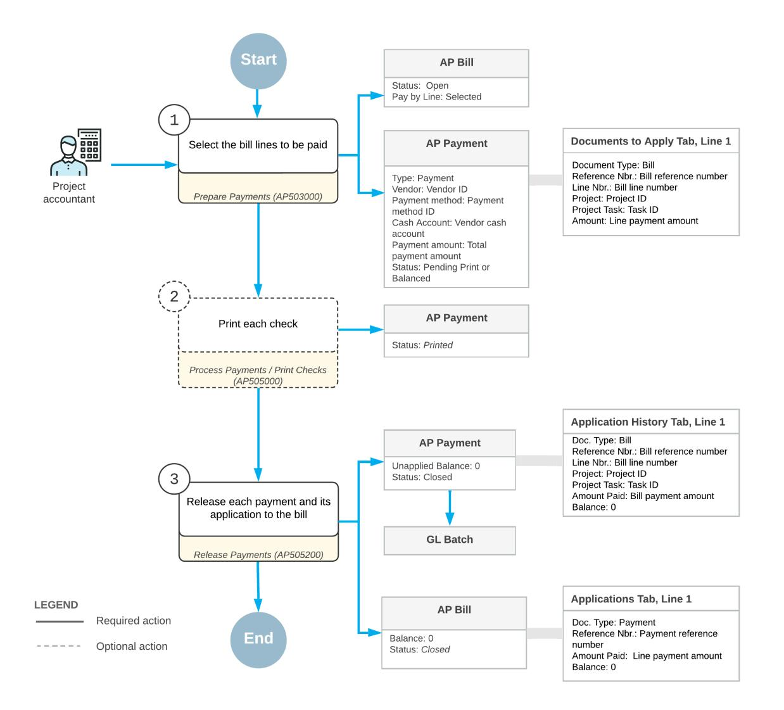

#### **Preparation of Separate Payments**

When you mass-create payments for multiple bills or bill lines of a project on the *[Prepare Payments](https://help-2025r1.acumatica.com/Help?ScreenId=ShowWiki&pageid=e3b526e3-8b12-4fa9-a5b2-2955e763f238)* (AP503000) form, the system groups the prepared accounts payable payments by vendor. That is, a separate AP payment is created for all bills and bill lines of the same vendor. If the **PaySeparately** check box is selected for a vendor on the **Payment** tab of the *[Vendors](https://help-2025r1.acumatica.com/Help?ScreenId=ShowWiki&pageid=a9584be3-f2bd-4d67-80d4-8041d809df56)* (AP303000) form, however, each vendor document is paid with a separate payment.

If you want to prepare a separate AP payment for a specific bill, select the **PaySeparately** check box in the line of the **Documents to Pay** tab on the *[Prepare Payments](https://help-2025r1.acumatica.com/Help?ScreenId=ShowWiki&pageid=e3b526e3-8b12-4fa9-a5b2-2955e763f238)* form. When you process multiple bills at a time, the system prepares a separate AP payment for each document that has the **PaySeparately** check box selected, and a consolidated payment for the rest of the documents of the same vendor selected for processing.

When you prepare a payment for multiple bill lines at a time, if the **PaySeparately** check box is selected for at least one bill line, the system prepares a separate AP payment for this bill and includes in this AP payment all the bill lines that have been selected for processing. For the remaining bill lines and bills selected for processing that have this check box cleared and have the same vendor, the system creates a consolidated payment.

# <span id="page-217-0"></span>**Vendor Payments for a Project: Implementation Checklist**

The following sections provide details you can use to ensure that the system is configured properly for paying AP bills for a project, and to understand (and change, if needed) the settings that affect the processing workflow.

### **Implementation Checklist**

We recommend that before you start preparing payments for AP bills, you make sure the needed settings have been specified and entities have been created, as summarized in the following checklist.

| Form                                    | Criteria to Check                                                                                                                                                                          |
|-----------------------------------------|--------------------------------------------------------------------------------------------------------------------------------------------------------------------------------------------|
| Accounts Payable Preferences (AP101000) | Make sure that the accounts payable settings have been con<br>figured as described in Accounts Payable: To Specify Accounts<br>Payable Preferences.                                        |
| Vendors (AR303000)                      | Verify the existence of the vendor accounts for the vendors<br>whose bills you will pay. For details, see Vendors: Implementa<br>tion Activity.                                            |
| Cash Accounts (CA202000)                | Make sure that the cash account to be used in the payments<br>has been configured as described in Cash Management: To<br>Create Cash Accounts.                                             |
| Payment Methods (CA204000)              | Make sure that the payment method you will use has been<br>configured as described in Cash Management: To Create Cash<br>Accounts.                                                         |
| Projects (PM301000)                     | Make sure that the necessary project (that is, the project for<br>which the vendor performed the billed work) has been creat<br>ed and necessary project tasks of this project are active. |

#### **Payment by Line Checklist**

If you intend to pay individual lines of the vendor's bill or bills, make sure the needed features have been enabled and settings have been specified, as summarized in the following checklist.

| Form                                       | Criteria to Check                                                     |
|--------------------------------------------|-----------------------------------------------------------------------|
| Enable/Disable Features (CS100000) form    | Make sure that the Payment Application by Line feature<br>is enabled. |
| Payment tab of the Vendors (AR303000) form | Be sure the Pay by Line check box is selected.                        |

#### **Other Settings That Affect the Workflow**

You can affect the workflow of processing payments for AP bills by specifying additional settings as follows:

• To cause the system to generate separate payment documents for each bill of a particular vendor, select the **PaySeparately** check box on the **Payment** tab of the *[Vendors](https://help-2025r1.acumatica.com/Help?ScreenId=ShowWiki&pageid=a9584be3-f2bd-4d67-80d4-8041d809df56)* (AR303000) form.

- To cause the system to automatically post AP payments once they are released, select the **Automatically Post on Release** check box on the **General** tab of the *[Accounts Payable Preferences](https://help-2025r1.acumatica.com/Help?ScreenId=ShowWiki&pageid=c3f9353e-95e6-448d-bb3f-e20643879ec7)* (AP101000) form.
- To cause AP payments to be created with the *On Hold* status, select the **Hold Documents on Entry** check box on the **General** tab of the *[Accounts Payable Preferences](https://help-2025r1.acumatica.com/Help?ScreenId=ShowWiki&pageid=c3f9353e-95e6-448d-bb3f-e20643879ec7)* (AP101000) form.
- To cause the system to automatically post general ledger batches generated during the processing of payments, select the **Automatically Post on Release** check box on the *[General Ledger Preferences](https://help-2025r1.acumatica.com/Help?ScreenId=ShowWiki&pageid=e4913d06-c511-4258-a0f9-f36c1b854e6b)* (GL102000) form. For information on processing general ledger batches, see *GL [Transactions:](https://help-2025r1.acumatica.com/Help?ScreenId=ShowWiki&pageid=35393020-6269-466d-8a08-df558cd43367) General [Information](https://help-2025r1.acumatica.com/Help?ScreenId=ShowWiki&pageid=35393020-6269-466d-8a08-df558cd43367)*.
- To make the system consolidate into one batch all generated transactions posted to the same period for all documents being released, select the **Generate Consolidated Batches** check box on the *[General Ledger](https://help-2025r1.acumatica.com/Help?ScreenId=ShowWiki&pageid=e4913d06-c511-4258-a0f9-f36c1b854e6b) [Preferences](https://help-2025r1.acumatica.com/Help?ScreenId=ShowWiki&pageid=e4913d06-c511-4258-a0f9-f36c1b854e6b)* form.

#### **Validation of Configuration**

To make sure that all configuration has been performed correctly, we recommend that in your system, you perform instructions similar to those described in *Vendor [Payments](#page-218-1) for a Project: To Process a Payment for Multiple Bills* and *Vendor [Payments](#page-220-1) for a Project: To Process a Payment of Bill Lines*.

# <span id="page-218-1"></span><span id="page-218-0"></span>**Vendor Payments for a Project: To Process a Payment for Multiple Bills**

In this activity, you will generate a payment for multiple bills for a project and apply this payment to bills.

This activity is based on the *U100* dataset. If you are using another dataset, or if any system settings have been changed in *U100*, these changes can affect the workflow of the activity and the results of the processing. To avoid any issues, restore the *U100* dataset to its initial state.

#### **Story**

Suppose that the HM's Bakery and Cafe requested 20 hours of employee training on operating juicers. SweetLife's project accountant has created a project to track the revenues and expenses for these services. Further suppose that the SweetLife project manager then decided to contract the Squeezo Inc. vendor to conduct the training.

On January 15, 2025, the SweetLife project accountant entered the first bill it received from the Squeezo Inc. for 12 hours of the employee training. Then on January 25, 2025, one more bill from Squeezo Inc. was received (and entered by the project accountant) for 8 hours of the provided training services. The vendor has requested that both bills be paid with one payment by the end of the month. Acting as SweetLife's project accountant, you need to pay the bills related to the project with one payment.

#### **Configuration Overview**

In the *U100* dataset, the following tasks have been performed to support this activity:

- On the *[Enable/Disable Features](https://help-2025r1.acumatica.com/Help?ScreenId=ShowWiki&pageid=c1555e43-1bc5-4f6f-ba9d-b323f94d8a6b)* (CS100000) form, the following features have been enabled:
  - *Standard Financials*, which provides the standard financial functionality
  - *Projects*, which provides the project accounting functionality
- On the *[Customers](https://help-2025r1.acumatica.com/Help?ScreenId=ShowWiki&pageid=652929bc-9606-4056-aa6e-0c2d1147171b)* (AR303000) form, the *HMBAKERY* customer has been created.
- On the *[Projects](https://help-2025r1.acumatica.com/Help?ScreenId=ShowWiki&pageid=81c86417-3bde-444b-8f1c-682928d31a0c)* (PM301000) form, the *HMTRAINING* project has been created for the *HMBAKERY* customer, and the *TRAINING* project task has been added to the project.
- On the *[Non-Stock Items](https://help-2025r1.acumatica.com/Help?ScreenId=ShowWiki&pageid=bf68dd4f-63d4-460d-8dc0-9152f2bd6bf1)* (IN202000) form, the *TRAINING* non-stock item has been configured, which represents one hour of the training service.

- On the *[Vendors](https://help-2025r1.acumatica.com/Help?ScreenId=ShowWiki&pageid=a9584be3-f2bd-4d67-80d4-8041d809df56)* (AP303000) form, the *SQUEEZO (Squeezo Inc.)* vendor has been configured, and the *CHECK* payment method is specified as its default one.
- On the *[Bills and Adjustments](https://help-2025r1.acumatica.com/Help?ScreenId=ShowWiki&pageid=956b4e51-3078-4d2d-85b3-65c080d95234)* (AP301000) form, two bills for the training services provided by *SQUEEZO* have been entered and released.

#### **Process Overview**

You will find the bills related to the project and requiring payment on the *[Prepare Payments](https://help-2025r1.acumatica.com/Help?ScreenId=ShowWiki&pageid=e3b526e3-8b12-4fa9-a5b2-2955e763f238)* (AP503000) form. Then you will prepare a single payment for these bills. Finally, you will print the check on the *[Process Payments / Print](https://help-2025r1.acumatica.com/Help?ScreenId=ShowWiki&pageid=e632860a-8905-424a-8e27-ad66cf9f64c7) [Checks](https://help-2025r1.acumatica.com/Help?ScreenId=ShowWiki&pageid=e632860a-8905-424a-8e27-ad66cf9f64c7)* (AP505000) form and will release the payment on the *[Release Payments](https://help-2025r1.acumatica.com/Help?ScreenId=ShowWiki&pageid=0a981976-131b-4150-81d0-19b54a46e510)* (AP505200) form.

#### **System Preparation**

To sign in to the system and prepare to perform the instructions of the activity, do the following:

- 1. Launch the Acumatica ERP website, and sign in to a company with the *U100* dataset preloaded; you should sign in as project accountant by using the *brawner* username and the *123* password.
- 2. In the info area, in the upper-right corner of the top pane of the Acumatica ERP screen, make sure that the business date in your system is set to *1/30/2025*. If a different date is displayed, click the Business Date menu button and select *1/30/2025* on the calendar. For simplicity, in this activity, you will create and process all documents in the system on this business date.

#### **Step 1: Selecting the Bills to be Paid**

To select the bills to be paid, do the following:

- 1. Open the *[Prepare Payments](https://help-2025r1.acumatica.com/Help?ScreenId=ShowWiki&pageid=e3b526e3-8b12-4fa9-a5b2-2955e763f238)* (AP503000) form.
- 2. In the Selection area of the form, specify the following settings to filter the data shown in the table:
  - **Branch**: *SWEETEQUIP* (inserted by default)
  - **Payment Method**: *CHECK*
  - **Cash Account**: *10200EQ Equipment Checking*
  - **Payment Date**: *1/30/2025*
  - **Project**: *HMTRAINING*
- 3. In the table, review the two AP bills of the *SQUEEZO* vendor for the amounts of \$480 and \$320.
- 4. Select the unlabeled check box in the row of each of the bills, and make sure the**Selection Total** in the Summary area is \$800. Also, make sure that the **Available Balance** is enough to pay this amount.

#### **Step 2: Preparing the Payments**

To prepare the payments, do the following:

- 1. While you are still on the *[Prepare Payments](https://help-2025r1.acumatica.com/Help?ScreenId=ShowWiki&pageid=e3b526e3-8b12-4fa9-a5b2-2955e763f238)* (AP503000) form with the needed rows selected, click **Process** on the form toolbar.
- 2. On the *[Process Payments / Print Checks](https://help-2025r1.acumatica.com/Help?ScreenId=ShowWiki&pageid=e632860a-8905-424a-8e27-ad66cf9f64c7)* (AP505000) form, which is opened with the only AP payment listed in the table and the unlabeled check box selected, click **Process**. A separate browser tab is opened showing the printable version of the check.
- 3. Review the printable check, which includes two bills, and close the browser tab.

For the purposes of this process activity, you do not need to actually print the checks. In a production setting, you would click **Print** on the form toolbar to print the checks before closing the browser tab.

- 4. On the *[Release Payments](https://help-2025r1.acumatica.com/Help?ScreenId=ShowWiki&pageid=0a981976-131b-4150-81d0-19b54a46e510)* (AP505200) form, which the system has opened aer it printed the check, notice that the system has added a row with the payment and selected the unlabeled check box in the row. On the form toolbar, click **Process** to release the payment.
- 5. In the **Processing** dialog box, which is opened, click the **Processed** tab, and click the link in the **Reference Nbr.** column for the *SQUEEZO* payment to open the payment on the *[Checks and Payments](https://help-2025r1.acumatica.com/Help?ScreenId=ShowWiki&pageid=81659f97-cb14-4a27-bc3e-0f67b3945613)* (AP302000) form.
- 6. On the **Application History** tab of the *[Checks and Payments](https://help-2025r1.acumatica.com/Help?ScreenId=ShowWiki&pageid=81659f97-cb14-4a27-bc3e-0f67b3945613)* form, make sure both bills to which the payment has been applied are listed in the table, as shown in the following screenshot. The payment amount has been applied in full, so the payment is now assigned the *Closed* status.

|            |                                                                                           | <b>Checks and Payments</b> | Payment 000029 - Squeezo Inc. |                                                                              |                              |                     |                |                            |                        |              |         |                    |                                  |      | <b>NOTES</b>                    | <b>ACTIVITIES</b>   | <b>FILES</b> |
|------------|-------------------------------------------------------------------------------------------|----------------------------|-------------------------------|------------------------------------------------------------------------------|------------------------------|---------------------|----------------|----------------------------|------------------------|--------------|---------|--------------------|----------------------------------|------|---------------------------------|---------------------|--------------|
| 은          |                                                                                           | $\mathbb{R}$<br>$\Omega$   | 而<br>$+$                      | Ô<br>$\overline{\mathbf{K}}$<br>$\left\langle \right\rangle$<br>$\checkmark$ | $\geq$<br>$\rightarrow$      | <b>VOID</b>         | $\cdots$       |                            |                        |              |         |                    |                                  |      |                                 |                     |              |
|            | Type:                                                                                     |                            | Payment<br>$\checkmark$       | Vendor:                                                                      | SQUEEZO - Squeezo Inc.       |                     |                | 0                          | Payment Amount:        |              |         | 800.00             |                                  |      |                                 |                     |              |
|            | Reference Nbr.<br>000029<br>Q<br>Location:                                                |                            |                               |                                                                              | MAIN - Primary Location      |                     |                |                            | Unapplied Balance:     |              | 0.00    |                    |                                  |      |                                 |                     |              |
|            | Status:<br>Joint Payee N<br>Closed                                                        |                            |                               |                                                                              |                              |                     |                | <b>Application Amount:</b> |                        |              | 0.00    |                    |                                  |      |                                 |                     |              |
|            | Application Date: 1/30/2025<br>Payment Meth CHECK                                         |                            |                               |                                                                              | Finance Charges:<br>0.00     |                     |                |                            |                        |              |         |                    |                                  |      |                                 |                     |              |
|            | Cash Account:<br>Application Pe 01-2025                                                   |                            |                               |                                                                              | 10200EQ - Equipment Checking |                     |                |                            |                        |              |         |                    |                                  |      |                                 |                     |              |
|            | 0002<br>Payment Ref.:<br>Description:                                                     |                            |                               |                                                                              |                              | Payment for SQUEEZO |                |                            |                        |              |         |                    |                                  |      |                                 |                     |              |
|            | DOCUMENTS TO APPLY<br><b>APPLICATION HISTORY</b><br><b>FINANCIAL</b><br><b>REMITTANCE</b> |                            |                               |                                                                              |                              |                     |                | <b>CHARGES</b>             | COMPLIANCE             |              |         |                    |                                  |      |                                 |                     |              |
| Ò          |                                                                                           | <b>REVERSE APPLICATION</b> |                               | $\vert\mathbf{x}\vert$<br>$\vdash$                                           |                              |                     |                |                            |                        |              |         |                    |                                  |      |                                 |                     |              |
| <b>B</b> 0 | n.                                                                                        | <b>Branch</b>              | <b>Batch</b><br>Number        | Doc.<br>Type                                                                 | Reference<br>Nbr.            | Nbr. ID             | Line Inventory | Project                    | Project<br><b>Task</b> | Cost<br>Code | Account | <b>Amount Paid</b> | Cash<br><b>Discount</b><br>Taken |      | With, Tax Application<br>Period | Application<br>Date |              |
| 0          | $\Box$                                                                                    | SWEETEQUIP                 | AP000182                      | Bill                                                                         | 000055                       | $\mathbf{0}$        |                |                            |                        |              |         | 480.00             | 0.00                             | 0.00 | 01-2025                         | 1/30/2025           |              |
|            | 0<br>D.                                                                                   | <b>SWEETEQUIP</b>          | AP000182                      | Bill                                                                         | 000056                       | $\mathbf 0$         |                |                            |                        |              |         | 320.00             | 0.00                             |      | $0.00$ $01-2025$                | 1/30/2025           |              |

*Figure: Single payment applied to two bills*

<span id="page-220-1"></span>You have prepared the payment and applied it to bills related to the particular project.

# <span id="page-220-0"></span>**Vendor Payments for a Project: To Process a Payment of Bill Lines**

This activity will walk you through the generation of a payment for particular bill lines related to a project and the application of this payment to bills.

This activity is based on the *U100* dataset. If you are using another dataset, or if any system settings have been changed in *U100*, these changes can affect the workflow of the activity and the results of the processing. To avoid any issues, restore the *U100* dataset to its initial state.

#### **Story**

Suppose that the ToadGreen company is building a hotel for the Equity Group Investors customer; the ToadGreen project manager has created a project to handle the tracking and billing of the materials and services related to the hotel. On January 15, 2025, the ToadGreen company purchased 500 packages of concrete mix and 100 units of plastic pipes from the Standard Hardware Company vendor for the hotel being built. On January 17, 2025, the company also hired this vendor as a subcontractor to perform on-site work, which is broken into three phases.

On January 30, 2025, the concrete mix was delivered, and the first phase of the on-site work was performed. The ToadGreen project accountant entered into the system two bills received from the Standard Hardware Company: one (with a date of 1/15/2025) for all of the purchased materials, and another (with a date of 1/17/2025) for all three phases of the on-site work. Acting as the ToadGreen project manager, you need to prepare a payment for the materials and services that have been provided—that is, you will pay only particular lines of the bills.

### **Configuration Overview**

In the *U100* dataset, the following tasks have been performed to support this activity:

- On the *[Enable/Disable Features](https://help-2025r1.acumatica.com/Help?ScreenId=ShowWiki&pageid=c1555e43-1bc5-4f6f-ba9d-b323f94d8a6b)* (CS100000) form, the following features have been enabled:
  - *Payment Application by Line*
  - *Construction*
- On the *[Projects](https://help-2025r1.acumatica.com/Help?ScreenId=ShowWiki&pageid=81c86417-3bde-444b-8f1c-682928d31a0c)* (PM301000) form, the *HOTEL* project has been created for the Equity Group Investors customer, and multiple project tasks have been created for the project.
- On the *[Non-Stock Items](https://help-2025r1.acumatica.com/Help?ScreenId=ShowWiki&pageid=bf68dd4f-63d4-460d-8dc0-9152f2bd6bf1)* (IN202000) form, the *LABOR*, *CONCRMX* and *PROJMATERIAL* non-stock items have been configured.
- On the *[Vendors](https://help-2025r1.acumatica.com/Help?ScreenId=ShowWiki&pageid=a9584be3-f2bd-4d67-80d4-8041d809df56)* (AP303000) form, the *HARDCO* vendor has been created. For this vendor, the *CHECK* payment method is specified as the default one; also, the **Pay by Line** check box is selected on the **Payment** tab.
- On the *[Bills and Adjustments](https://help-2025r1.acumatica.com/Help?ScreenId=ShowWiki&pageid=956b4e51-3078-4d2d-85b3-65c080d95234)* (AP301000) form, two bills for the materials and labor provided by *HARDCO* (one for the materials and one for the labor) have been entered and released. Both bills have the **Pay By Line** check box selected in the Summary area of the form.

#### **Process Overview**

You will find the bills related to the needed project and requiring payment on the *[Prepare Payments](https://help-2025r1.acumatica.com/Help?ScreenId=ShowWiki&pageid=e3b526e3-8b12-4fa9-a5b2-2955e763f238)* (AP503000) form. Then you will prepare a single payment for particular lines of these bills. Finally, you will print the check on the *[Process Payments / Print Checks](https://help-2025r1.acumatica.com/Help?ScreenId=ShowWiki&pageid=e632860a-8905-424a-8e27-ad66cf9f64c7)* (AP505000) form and will release the payment on the *[Release Payments](https://help-2025r1.acumatica.com/Help?ScreenId=ShowWiki&pageid=0a981976-131b-4150-81d0-19b54a46e510)* (AP505200) form.

#### **System Preparation**

To prepare the system, do the following:

- 1. Launch the Acumatica ERP website, and sign in to a company with the *U100* dataset preloaded. You should sign in as a project accountant by using the *bsanchez* username and the *123* password.
- 2. In the info area, in the upper-right corner of the top pane of the Acumatica ERP screen, make sure that the business date in your system is set to *1/30/2025*. If a different date is displayed, click the Business Date menu button and select *1/30/2025* on the calendar. For simplicity, in this activity, you will create and process all documents in the system on this business date.

#### **Step 1: Selecting the Bills to be Paid**

To select the bills to be paid, do the following:

- 1. Open the *[Prepare Payments](https://help-2025r1.acumatica.com/Help?ScreenId=ShowWiki&pageid=e3b526e3-8b12-4fa9-a5b2-2955e763f238)* (AP503000) form.
- 2. In the Summary area of the form, specify the following selection criteria to filter the data shown in the table:
  - **Branch**: *TBGROUP* (inserted by default)
  - **Payment Method**: *CHECK*
  - **Cash Account**: *10200TG - ToadGreen Checking Account*
  - **Payment Date**: *1/30/2025*
  - **Vendor**: *HARDCO*
  - **Pay Date Within** 7 **Days**

In the table, the system lists the lines of the two bills of the *HARDCO* vendor: two lines for materials and three lines for services.

3. Select the unlabeled check box in the row with the *CONCRMX* item of the first bill, and in the row with the *LABOR* item and a **Line Nbr.** of *1* of the second bill (which is the first part of the works that have been performed and needs to be paid for). Make sure the**Selection Total** in the Summary area is \$50,000. Also, make sure that the **Available Balance** is enough to pay this amount.

#### **Step 2: Preparing the Payments**

To prepare the payments, do the following:

- 1. While you are still on the *[Prepare Payments](https://help-2025r1.acumatica.com/Help?ScreenId=ShowWiki&pageid=e3b526e3-8b12-4fa9-a5b2-2955e763f238)* (AP503000) form with the needed rows selected, click **Process** on the form toolbar.
- 2. On the *[Process Payments / Print Checks](https://help-2025r1.acumatica.com/Help?ScreenId=ShowWiki&pageid=e632860a-8905-424a-8e27-ad66cf9f64c7)* (AP505000) form, which opens, click **Process** to process the only selected line, which corresponds to the prepared payment. The system opens a printable version of the check.


For the purposes of this activity, you do not need to actually print the document. In a production setting, you would click **Print** on the form toolbar to print the check before closing the browser tab.

- 3. Close the printable check and return to the *[Release Payments](https://help-2025r1.acumatica.com/Help?ScreenId=ShowWiki&pageid=0a981976-131b-4150-81d0-19b54a46e510)* (AP505200) form, that the system has opened. On the form, notice that the system has added a row with the payment and selected the unlabeled check box in the row.
- 4. On the form toolbar, click **Process** to release the AP payment.
- 5. In the **Processing** dialog box, which is opened, click the **Processed** tab, and in the table, click the link in the **Reference Nbr.** column in the only line to open the payment on the *[Checks and Payments](https://help-2025r1.acumatica.com/Help?ScreenId=ShowWiki&pageid=81659f97-cb14-4a27-bc3e-0f67b3945613)* (AP302000) form.
- 6. On the **Application History** tab of the *[Checks and Payments](https://help-2025r1.acumatica.com/Help?ScreenId=ShowWiki&pageid=81659f97-cb14-4a27-bc3e-0f67b3945613)* form, make sure both bill lines to which the payment has been applied are listed in the table, as shown in the following screenshot. The payment amount has been applied in full, so the payment is now assigned the *Closed* status.

|                                                                            | <b>Checks and Payments</b><br><b>PINOTES</b><br>Payment 000033 - Standard Hardware Company                                       |                     |                                      |                                      |                            |                                          |              |                     |              |         |                    |  |  |  |
|----------------------------------------------------------------------------|----------------------------------------------------------------------------------------------------------------------------------|---------------------|--------------------------------------|--------------------------------------|----------------------------|------------------------------------------|--------------|---------------------|--------------|---------|--------------------|--|--|--|
| 뭐<br>$\Box$                                                                | Ô<br>间<br><b>VOID</b><br>$\Omega$<br>K<br>$\lambda$<br>$+$<br>$\rightarrow$<br>$\check{~}$<br>$\cdots$                           |                     |                                      |                                      |                            |                                          |              |                     |              |         |                    |  |  |  |
| Type:                                                                      | Payment<br>$\checkmark$                                                                                                          | Vendor:             |                                      | HARDCO - Standard Hardware Company 2 |                            | Payment Amount:                          |              | 50,000.00           |              |         |                    |  |  |  |
| Reference Nbr.                                                             | 000033<br>Q                                                                                                                      | Location:           | <b>MAIN - Primary Location</b>       |                                      |                            | <b>Unapplied Balance:</b>                |              | 0.00                |              |         |                    |  |  |  |
| Status:                                                                    | Closed                                                                                                                           | Joint Payee N       |                                      |                                      | <b>Application Amount:</b> |                                          | 0.00         |                     |              |         |                    |  |  |  |
| Application Date: 1/30/2025                                                |                                                                                                                                  | Payment Meth CHECK  |                                      |                                      | Finance Charges:           | 0.00                                     |              |                     |              |         |                    |  |  |  |
| Application Pe 01-2025                                                     |                                                                                                                                  | Cash Account        | 10200TG - ToadGreen Checking Account |                                      |                            |                                          |              |                     |              |         |                    |  |  |  |
| Payment Ref.:                                                              | !!!!!!!!!!!!!!!!!!!!!!!!!!!!!!!!!!!!!!!!                                                                                         |                     | Payment for HARDCO                   |                                      |                            |                                          |              |                     |              |         |                    |  |  |  |
|                                                                            | DOCUMENTS TO APPLY<br><b>APPLICATION HISTORY</b><br><b>FINANCIAL</b><br><b>REMITTANCE</b><br><b>CHARGES</b><br><b>COMPLIANCE</b> |                     |                                      |                                      |                            |                                          |              |                     |              |         |                    |  |  |  |
| Ò                                                                          | $\boxed{\mathbf{x}}$<br><b>REVERSE APPLICATION</b><br>$\vdash$                                                                   |                     |                                      |                                      |                            |                                          |              |                     |              |         |                    |  |  |  |
| $\Box$<br><b>B</b> 0<br><b>Branch</b>                                      |                                                                                                                                  | <b>Batch Number</b> | Doc. Type                            | Reference<br>Nbr.                    | Nbr.                       | Line Inventory ID                        | Project      | <b>Project Task</b> | Cost<br>Code | Account | <b>Amount Paid</b> |  |  |  |
| $\mathbf{0}$<br>!!!!!!!!!!!!!!!!!!!!!!!!!!!!!!!!!!!!!!!!<br><b>TBGROUP</b> | AP000187                                                                                                                         |                     | Bill                                 | 000057                               |                            | !!!!!!!!!!!!!!!!!!!!!!!!!!!!!!!!!!!!!!!! | <b>HOTEL</b> | 03                  | 03-000       | 54700   | 40,000.00          |  |  |  |
| 0<br><b>TBGROUP</b><br>n                                                   | AP000187                                                                                                                         |                     | Bill                                 | 000058                               |                            | 1 LABOR                                  | <b>HOTEL</b> | 02                  | 02-000       | 54100   | 10,000.00          |  |  |  |

*Figure: Single payment applied to lines of two bills*

You have prepared a payment for particular bill lines and applied this payment to these lines.

# <span id="page-222-0"></span>**Vendor Payments for a Project: Generated Transactions**

When an AP payment is released, a batch of general ledger transactions is created; the generated transactions reduce the balances of the cash account used for the payment and the vendor's accounts payable account.

| Account          | Source of Ac<br>count | Project                 | Debit          | Credit         |
|------------------|-----------------------|-------------------------|----------------|----------------|
| Cash account     | Vendor                | X (non-project<br>code) | 0.00           | Payment amount |
| Accounts Payable | Vendor                | X (non-project<br>code) | Payment amount | 0.00           |

You can view the reference number of the GL batch on the **Financial** tab of the *[Checks and Payments](https://help-2025r1.acumatica.com/Help?ScreenId=ShowWiki&pageid=81659f97-cb14-4a27-bc3e-0f67b3945613)* (AP302000) form.

# <span id="page-223-0"></span>**Vendor Payments for a Project: Related Report and Inquiry Forms**

The following sections describe reports, inquiries, and forms you can review to gather information about payments for projects.

If you do not see a particular report or form that is described, you may have signed in to the system with a user account that does not have access rights to the report or form. Contact your system administrator to obtain access to any needed reports or forms.

#### **Reviewing Checks that Are Pending Printing**

You can use the *[Checks Pending Printing](https://help-2025r1.acumatica.com/Help?ScreenId=ShowWiki&pageid=224cfe60-e947-4ff8-a79b-e6088573d4d5)* (AP404000) form to review which checks have not been printed yet as of a specified pay date. You can initiate check printing on this form by clicking **Print Checks** on the form toolbar. The system navigates to the *[Process Payments / Print Checks](https://help-2025r1.acumatica.com/Help?ScreenId=ShowWiki&pageid=e632860a-8905-424a-8e27-ad66cf9f64c7)* (AP505000) form, where you can print checks.

#### **Reviewing Vendor Documents**

You use the *[Vendor](https://help-2025r1.acumatica.com/Help?ScreenId=ShowWiki&pageid=22c03d80-cbb0-449d-9325-c12f623aaefd) Details* (AP402000) form to review the accounts payable documents (bills, debit adjustments, credit adjustments, and payments) for a particular vendor.

By default, the form displays the list of open vendor documents (that is, those with the *Open* status), but you can add to the list closed documents and unreleased documents by selecting the**Show All Documents** and **Include Unreleased Documents** check boxes, respectively.

#### **Running the Check Register Inquiry**

You use the *[Check Register](https://help-2025r1.acumatica.com/Help?ScreenId=ShowWiki&pageid=260298f9-0fbc-4799-a48e-0aa324b2a91b)* (AP404500) form to review the details of the checks that have been generated in the system. By using this inquiry form, you can find out whether a particular check number has been used and, if it has, for which AP check.

If you have reprinted a check with a new number or voided a check, the system does not allow this number to be reused. The inquiry displays the check numbers of all checks, including those have been reprinted or voided.

# <span id="page-224-0"></span>**Tracking Project Inventory**

This chapter describes how to configure inventory tracking for each project to make it possible to reserve items purchased for a project and track them separately from free stock; you can also configure the project so that the system will track project-specific costs for these reserved items.

# <span id="page-224-1"></span>**Project Inventory Tracking: General Information**

In Acumatica ERP, you can configure the project inventory (that is, the inventory items to be used for a particular project) so that all items purchased and sold for the project will be separated from other inventory and reserved for the project in the warehouse. This helps you to accurately capture inventory expenses and revenues related to the project inventory in a project budget. This also helps you to avoid any delays associated with items not being available when they are needed for the project.

#### **Learning Objectives**

In this chapter, you will learn how to do the following:

- Configure a project inventory
- Process documents with stock items related to projects
- Review project and GL transactions generated during the processing of sales and purchases of items

#### **Applicable Scenarios**

You configure the project inventory of particular projects if you are using stock items in these projects and want to track detailed information about the inventory to be used for these projects, as well as to be able to perform the following operations:

- Manage the flow of stock items related to projects
- Reserve items for particular projects in one warehouse or multiple warehouses
- Track project-specific quantities for stock items, to prevent these items from being used for non-project purposes
- Use valuated costing for project-specific stock items to issue and receive project items at accurate costs that are not affected by the costs of non-project items

### **Configuration of Inventory Tracking in Projects**

If you have enabled the *Inventory and Order Management* and *Inventory* features on the *[Enable/Disable Features](https://help-2025r1.acumatica.com/Help?ScreenId=ShowWiki&pageid=c1555e43-1bc5-4f6f-ba9d-b323f94d8a6b)* (CS100000) form and are using the related functionality, you can use the enhanced integration of projects with inventory by enabling the *Project-Specific Inventory* feature.

Once you have enabled the feature, you configure the applicable projects to use the needed inventory tracking mode. For each project, you select one of the following modes in the **InventoryTracking** box on the**Summary** tab of the *[Projects](https://help-2025r1.acumatica.com/Help?ScreenId=ShowWiki&pageid=81c86417-3bde-444b-8f1c-682928d31a0c)* (PM301000) form:

- *Track by Project Quantity and Cost*: To track the quantity and project-specific cost of the stock items reserved for the project.
- *Track by Project Quantity*: To track the project-specific quantity of the purchased items that are reserved for the project. In this mode, the system tracks the item cost by general cost calculation rules (that is, the cost is not project-specific). One cost layer holds the item costs recorded for the same inventory item with the same project budget key but received to different locations of the same warehouse.

• *Track by Location*: To track the quantity and cost of the purchased materials at the warehouse location level. For more information about using this mode, see *Project Inventory Tracking by [Warehouse](#page-238-2) Location: General [Information](#page-238-2)*.

In an existing project, you can change the inventory tracking mode only if no items have been received for the project yet.

#### **Inventory Tracking in Projects**

For a project in which the *Track by Project Quantity* or *Track by Project Quantity and Cost* inventory tracking mode is selected in the **InventoryTracking** box of the *[Projects](https://help-2025r1.acumatica.com/Help?ScreenId=ShowWiki&pageid=81c86417-3bde-444b-8f1c-682928d31a0c)* (PM301000) form, you create and process documents with stock items as follows:

- To purchase stock items for the project, you create a purchase order on the *[Purchase Orders](https://help-2025r1.acumatica.com/Help?ScreenId=ShowWiki&pageid=5565686c-96c4-4bfa-a51d-9a2566baa808)* (PO301000) form, selecting the project and project task for each item. The expenses are captured to the project cost budget as a project commitment.
- To receive items in a warehouse, you process a purchase receipt on the *[Purchase Receipts](https://help-2025r1.acumatica.com/Help?ScreenId=ShowWiki&pageid=d9901c8d-486d-45ed-8088-ea3d8ee3af19)* (PO302000) form. To separate the project items from free stock, the system automatically creates a virtual project-specific location within the warehouse location where the materials are received. The purchased materials are reserved for the project and cannot be issued for another project.
- To issue the materials for the customer, you process an inventory issue for the project on the *[Issues](https://help-2025r1.acumatica.com/Help?ScreenId=ShowWiki&pageid=17b051f6-027d-4459-b542-65c1c1f9d0ea)* (IN302000) form. The quantity available for issuing is defined by the warehouse location, the project, and the project task.


If the **Allow Issue from FreeStock** check box is selected in the project settings on the *[Projects](https://help-2025r1.acumatica.com/Help?ScreenId=ShowWiki&pageid=81c86417-3bde-444b-8f1c-682928d31a0c)* form, you can also issue materials that are not reserved for the project from free stock.

• To transfer leover materials from the project stock to free stock, you create an inventory transfer on the *Transfer Project [Inventory](https://help-2025r1.acumatica.com/Help?ScreenId=ShowWiki&pageid=a5f04a16-481d-4874-85ba-3cc7390bc40d) to Free Stock* (PM508000) mass-processing form. For more information, see *[Project](#page-237-1) Inventory Tracking: Mass [Processing](#page-237-1)*.

#### **Tracking Item Costs**

In a project with the *Track by Location* or *Track by Project Quantity* mode selected in the **InventoryTracking** box of the *[Projects](https://help-2025r1.acumatica.com/Help?ScreenId=ShowWiki&pageid=81c86417-3bde-444b-8f1c-682928d31a0c)* (PM301000) form, the cost of the issued materials is not project-specific and is defined by general cost calculation rules. The cost of an item depends on the item valuation method and is affected by other factors: the warehouse location from which the item is issued, the account and subaccount, the selected subitem, and the lot or serial number of the item. For more information on how the system calculates item costs, see *[Item Costs and](https://help-2025r1.acumatica.com/Help?ScreenId=ShowWiki&pageid=79edcbf8-e18b-4817-875f-6cbfd7a32384) Valuation Methods: General [Information](https://help-2025r1.acumatica.com/Help?ScreenId=ShowWiki&pageid=79edcbf8-e18b-4817-875f-6cbfd7a32384)*.

In a project with the *Track by Project Quantity and Cost* mode selected, the system tracks project-specific cost. That is, for each combination of project and project task, the system calculates the cost of each item depending on the warehouse location from which the item is issued, the account and subaccount, the selected subitem, and the lot or serial number of the item, if applicable.

# <span id="page-225-0"></span>**Project Inventory Tracking: Item Availability Tracking**

In Acumatica ERP, you can configure the way that availability data is calculated in accordance with your company's policies. The following sections describe how the system indicates that inventory has enough items for processing documents if the *Project-Specific Inventory* feature is enabled on the *[Enable/Disable Features](https://help-2025r1.acumatica.com/Help?ScreenId=ShowWiki&pageid=c1555e43-1bc5-4f6f-ba9d-b323f94d8a6b)* (CS100000) form.

#### **Reviewing Availability Status of Stock Items**

For stock items, the system calculates availability status based on the availability calculation rules, which you define on the *Availability [Calculation](https://help-2025r1.acumatica.com/Help?ScreenId=ShowWiki&pageid=570cb9b8-c9b7-4c5d-bb5f-8e0829f8242d) Rules* (IN201500) form. To specify how the system calculates availability for particular items, you assign the availability calculation rules you have created to particular item classes on the *[Item](https://help-2025r1.acumatica.com/Help?ScreenId=ShowWiki&pageid=80a3301b-4eb2-4ce2-94c5-0407c786a0f1) [Classes](https://help-2025r1.acumatica.com/Help?ScreenId=ShowWiki&pageid=80a3301b-4eb2-4ce2-94c5-0407c786a0f1)* (IN201000) form. By default, each item of this item class is assigned this rule. You can override the default availability calculation rule for each particular stock item on the *[Stock Items](https://help-2025r1.acumatica.com/Help?ScreenId=ShowWiki&pageid=77786a70-1f1e-4d63-ad98-96f98e4fcb0e)* (IN202500).

When the documents that record inventory transactions have been released, Acumatica ERP automatically updates the on-hand quantities of items at warehouses. On-hand quantities usually differ from the quantities that are actually available because documents may be processed aer the actual operations with items have been performed. For more information about the configuration of availability rules, see *Availability [Calculation](https://help-2025r1.acumatica.com/Help?ScreenId=ShowWiki&pageid=36d6e854-c66e-4d9f-b150-6abbf0ece76b) Rules: [General Information](https://help-2025r1.acumatica.com/Help?ScreenId=ShowWiki&pageid=36d6e854-c66e-4d9f-b150-6abbf0ece76b)*.

#### **Reviewing Project-Specific Availability Data**

When a user adds a line with an inventory item to a sales order, shipment, purchase receipt, or inventory transaction, the system calculates and shows the availability quantities for each line in the table footer on the **Details** tab of the following forms:

- *[Sales Orders](https://help-2025r1.acumatica.com/Help?ScreenId=ShowWiki&pageid=19e4021c-1b84-49fd-be12-0320c5f1c7e5)* (SO301000)
- *[Shipments](https://help-2025r1.acumatica.com/Help?ScreenId=ShowWiki&pageid=f47cffcc-543e-469c-a204-a9c1e3da346d)* (SO302000)
- *[Purchase Receipts](https://help-2025r1.acumatica.com/Help?ScreenId=ShowWiki&pageid=d9901c8d-486d-45ed-8088-ea3d8ee3af19)* (PO302000)
- *[Receipts](https://help-2025r1.acumatica.com/Help?ScreenId=ShowWiki&pageid=d6ecad5b-155f-44bf-baba-9ed006d298b5)* (IN301000)
- *[Issues](https://help-2025r1.acumatica.com/Help?ScreenId=ShowWiki&pageid=17b051f6-027d-4459-b542-65c1c1f9d0ea)* (IN302000)
- *[Adjustments](https://help-2025r1.acumatica.com/Help?ScreenId=ShowWiki&pageid=31ba83fe-8b3a-4d52-a355-edea838b5c8e)* (IN303000)
- *[Transfers](https://help-2025r1.acumatica.com/Help?ScreenId=ShowWiki&pageid=ea1539b6-fafa-443e-8b49-cd1ced95389f)* (IN304000)
- *[Service Orders](https://help-2025r1.acumatica.com/Help?ScreenId=ShowWiki&pageid=6e5277d3-274e-45f5-b77d-4410ed736d21)*(FS300100)
- *[Appointments](https://help-2025r1.acumatica.com/Help?ScreenId=ShowWiki&pageid=ac486e9c-f5df-4829-94f0-2df8821361a0)*(FS300200)

In the project-related lines of documents and transactions, the way the system shows item availability for each line depends on the setting of the selected project that is specified in the **InventoryTracking** box on the**Summary** tab of the *[Projects](https://help-2025r1.acumatica.com/Help?ScreenId=ShowWiki&pageid=81c86417-3bde-444b-8f1c-682928d31a0c)* form.

For each of the availability buckets, the system shows two values (separated by a slash) if the line has a warehouse location that is linked to a project that has the *Track by Project Quantity* or *Track by Project Quantity and Cost* inventory tracking mode. The quantities are calculated as follows:

- The first value shows the available quantity of items in the selected warehouse location related to this particular project and project task.
- The second value shows the total quantity of free stock items and project stock items stored in this warehouse location.

For each of the availability buckets, the system shows one value if the following is true for the line:

- The line has a warehouse location that is linked to a project with the *Track by Location* inventory tracking mode. Each quantity is calculated based on the items received to this location for this project and the items received to this location with a non-project code.
- The line is not linked to any project. That is, this line has the non-project code specified. Each quantity is calculated based on the items received to this location with a non-project code.

# <span id="page-226-0"></span>**Project Inventory Tracking: Implementation Checklist**

The following sections provide details you can use to ensure that the system is configured properly for tracking inventory for projects, and to understand (and change, if needed) the settings that affect the processing workflow.

#### **Implementation Checklist**

We recommend that before you initially start working with project inventory, you make sure the needed features have been enabled, settings have been specified, and entities have been created, as summarized in the following checklist.

| Form                               | Criteria to Check                                                                                                                                                                                                                                                                                                                                                                                                                                                                                                |  |  |
|------------------------------------|------------------------------------------------------------------------------------------------------------------------------------------------------------------------------------------------------------------------------------------------------------------------------------------------------------------------------------------------------------------------------------------------------------------------------------------------------------------------------------------------------------------|--|--|
| Enable/Disable Features (CS100000) | Make sure that the following features are enabled:<br>•<br>Inventory and Order Management<br>•<br>Inventory<br>•<br>Project Accounting<br>Project-Specific Inventory<br>•                                                                                                                                                                                                                                                                                                                                        |  |  |
| Projects Preferences (PM101000)    | Make sure that all necessary settings related to project<br>accounting have been specified, as described in the<br>Basic Project Configuration: General Information.                                                                                                                                                                                                                                                                                                                                             |  |  |
| Account Groups (PM201000) form     | Make sure that all needed account groups have been<br>configured. For more information about account<br>groups, see Account Groups: General Information.<br>We do not recommend mapping the In<br>ventory account (which is an account<br>of the Asset type) to an account group<br>of the Expense type. If you need to track<br>stock items purchased for the project in<br>the project cost budget, use the commit<br>ment tracking functionality. For more<br>information, see Tracking Cost Commit<br>ments. |  |  |
| Stock Items (IN202500) form        | Make sure that all stock items have been defined.<br>For each stock item, you can specify the default source<br>from which the item will be issued by selecting either<br>Project Stock or Free Stock in the Default Inventory<br>Source for Projects box on the Inventory Planning<br>tab of the form.<br>For more information about stock items, see Stock<br>Items: General Information.                                                                                                                      |  |  |

| Form                                            | Criteria to Check                                                                                                                                                                                             |
|-------------------------------------------------|---------------------------------------------------------------------------------------------------------------------------------------------------------------------------------------------------------------|
| The Summary tab of the Projects (PM301000) form | Make sure that the necessary project and project tasks<br>have been created. In the project settings, select the<br>inventory tracking mode in the Inventory Tracking<br>box on theSummary tab as follows:    |
|                                                 | •<br>Select Track by Project Quantity and Cost if you need<br>to separate project inventory from free stock, re<br>serve the items directly for the project, and track<br>project-specific item cost.         |
|                                                 | •<br>Select Track by Project Quantity if you need to sep<br>arate project inventory from free stock, reserve the<br>items directly for the project, and track item cost by<br>general cost calculation rules. |
|                                                 | Select the Allow Issue from FreeStock check box<br>if you plan to use items that are not reserved for the<br>project along with the project stock.                                                            |
|                                                 | For more information on creating a project, see Project<br>Creation and Processing: General Information.                                                                                                      |

#### **Disabling the Project-Specific Inventory Feature**

If you need to disable the *Project-Specific Inventory* feature in a production system, you can do this on the *[Enable/](https://help-2025r1.acumatica.com/Help?ScreenId=ShowWiki&pageid=c1555e43-1bc5-4f6f-ba9d-b323f94d8a6b) [Disable Features](https://help-2025r1.acumatica.com/Help?ScreenId=ShowWiki&pageid=c1555e43-1bc5-4f6f-ba9d-b323f94d8a6b)* (CS100000) form aer the following preparatory actions:

- 1. Completing (or canceling) all the documents that include stock items stored in the project inventory: sales orders and shipments, purchase orders and purchase receipts, and inventory transactions.
- 2. Cleaning up the project inventory. To do this, you need to move the items reserved for projects to free stock (that is, to the non-project code) or to projects linked to warehouse locations (that is, projects that have the *Track by Location* inventory tracking mode).


You can mass-transfer project stock to free stock on the *Transfer Project [Inventory](https://help-2025r1.acumatica.com/Help?ScreenId=ShowWiki&pageid=a5f04a16-481d-4874-85ba-3cc7390bc40d) to Free Stock* (PM508000) form. For more information, see *Project Inventory Tracking: Mass [Processing](#page-237-1)*.

3. Assigning all existing projects the *Track by Location* inventory tracking mode and linking them to particular warehouse locations.

Once the feature is disabled, the system will continue tracking inventory for projects using the only *Track by Location* mode. For more information, see *Project Inventory Tracking by [Warehouse](#page-238-2) Location: General Information*.

#### **Other Settings That Affect the Workflow**

You can affect the workflow of sales and purchases of items for projects by specifying additional settings as follows:

- To cause the system to automatically select a project task when a particular project is selected during the creation of a purchase order, select the **Default** check box on the**Tasks** tab of the *[Projects](https://help-2025r1.acumatica.com/Help?ScreenId=ShowWiki&pageid=81c86417-3bde-444b-8f1c-682928d31a0c)* (PM301000) form for one of the tasks of the project.
- To cause the system to include non-stock lines of the *Service* type in purchase receipts created from the purchase orders of the *Normal* type, select the **ProcessService Lines from Normal Purchase Orders via Purchase Receipt** check box on the **General** tab (**Other** section) of the *[Purchase Orders Preferences](https://help-2025r1.acumatica.com/Help?ScreenId=ShowWiki&pageid=13d09c43-8696-4f92-ad9b-3d0209ee3d9b)* (PO101000) form.

• To cause the system to track costs for the projects with the *Track by Project Quantity* inventory tracking mode by individual warehouse locations, select the **CostSeparately** check box for the needed warehouse locations on the **Locations** tab of the *[Warehouses](https://help-2025r1.acumatica.com/Help?ScreenId=ShowWiki&pageid=264b0ef7-2b6c-40b4-a7d9-f1a5e067939b)* (IN204000) form.

# <span id="page-229-0"></span>**Project Inventory Tracking: To Track Project Inventory by Quantity**

The following activity will walk you through the process of managing project inventory with tracking of quantities of the items being purchased or sold for a project.

This activity is based on the *U100* dataset. If you are using another dataset, or if any system settings have been changed in *U100*, these changes can affect the workflow of the activity and the results of the processing. To avoid any issues, restore the *U100* dataset to its initial state.

#### **Story**

Suppose that the Thai Food Restaurant customer has ordered juicer installation from the SweetLife Fruits & Jams company for the newly opened restaurant: two juicers will be installed this month, and three more next month. As has been agreed upon with the customer, the customer will pay \$2,900 for the installation of each juicer, which includes the cost of the juicer and the cost of installation services with a 20% markup.

On January 30, 2025, the SweetLife project accountant created a project to handle the tracking and billing of the juicer and the provided services. Then the project accountant ordered five juicers to be installed, costing \$2,000 each, from the Squeezo Inc. vendor. The juicers have been delivered to SweetLife's warehouse to be stored until the work is started. The project accountant needs to be sure that the juicers will be reserved for the project and will not be sold or used for any other project. Further suppose that on February 15, 2025, the first stage of work has been completed: two juicers have been delivered and installed at the customer's place.

Acting as the project accountant, you will purchase the project-specific items. Then you will issue the items from inventory for the project and record expenses to the project.

#### **Configuration Overview**

In the *U100* dataset, the following tasks have been performed to support this activity:

- On the *[Enable/Disable Features](https://help-2025r1.acumatica.com/Help?ScreenId=ShowWiki&pageid=c1555e43-1bc5-4f6f-ba9d-b323f94d8a6b)* (CS100000) form, the following features have been enabled:
  - *Project Accounting*, which provides the project accounting functionality
  - *Project-Specific Inventory*, which provides enhanced capabilities for tracking project inventory
  - *Inventory and Order Management*, which provides the sales order and purchase order functionality
  - *Inventory*, which provides the stock item functionality
- On the *[Vendors](https://help-2025r1.acumatica.com/Help?ScreenId=ShowWiki&pageid=a9584be3-f2bd-4d67-80d4-8041d809df56)* (AP303000) form, the *SQUEEZO* vendor has been created.
- On the *[Customers](https://help-2025r1.acumatica.com/Help?ScreenId=ShowWiki&pageid=652929bc-9606-4056-aa6e-0c2d1147171b)* (AP303000) form, the *TOMYUM* customer has been created.
- On the *[Projects](https://help-2025r1.acumatica.com/Help?ScreenId=ShowWiki&pageid=81c86417-3bde-444b-8f1c-682928d31a0c)* (PM301000) form, the *TOMYUM14* project has been created and activated. In the project, *Track by Project Quantity* is selected as the inventory tracking mode.

#### **Process Overview**

On the *[Purchase Orders](https://help-2025r1.acumatica.com/Help?ScreenId=ShowWiki&pageid=5565686c-96c4-4bfa-a51d-9a2566baa808)* (PO301000) form, you will create a purchase order with the lines related to the project. You will receive the purchased items to a company's warehouse by processing a purchase receipt on the *[Purchase](https://help-2025r1.acumatica.com/Help?ScreenId=ShowWiki&pageid=d9901c8d-486d-45ed-8088-ea3d8ee3af19) [Receipts](https://help-2025r1.acumatica.com/Help?ScreenId=ShowWiki&pageid=d9901c8d-486d-45ed-8088-ea3d8ee3af19)* (PO302000) form. Then you will process an inventory issue transaction on the *[Issues](https://help-2025r1.acumatica.com/Help?ScreenId=ShowWiki&pageid=17b051f6-027d-4459-b542-65c1c1f9d0ea)* (IN302000) form to record that two juicers have been used for the first phase of the project.

#### **System Preparation**

Before you start creating a project and processing a purchase, do the following:

- 1. Launch the Acumatica ERP website, and sign in as a project manager. You should sign in by using the *brawner* username and the *123* password.
- 2. In the info area, in the upper-right corner of the top pane of the Acumatica ERP screen, make sure that the business date in your system is set to 1/30/2025. If a different date is displayed, click the Business Date menu button, and select 1/30/2025 on the calendar. For simplicity, in this activity, you will create and process all documents in the system on this business date.

#### **Step 1: Purchasing Project Inventory**

To process a purchase order for the project, do the following:

- 1. On the *[Purchase Orders](https://help-2025r1.acumatica.com/Help?ScreenId=ShowWiki&pageid=5565686c-96c4-4bfa-a51d-9a2566baa808)* (PO301000) form, create a new record.
- 2. In the Summary area, specify the following settings:
  - **Type**: *Normal*
  - **Vendor**: *SQUEEZO*
  - **Project**: *TOMYUM14*
  - **Description**: Purchase of juicers for the project
  - **Date**: *1/30/2025*
- 3. On the **Details** tab, add a purchase order line, and specify the following settings in the added line:
  - **Inventory ID**: *JUICER15*
  - **Warehouse**: *EQUIPHOUSE* (specified automatically)
  - **Order Qty.**: 2
  - **Unit Cost**: 2,000 (specified automatically)
  - **Project**: *TOMYUM14* (inserted automatically)
  - **ProjectTask**: *PHASE1*
  - **Cost Code**: 00-000
- 4. Add one more purchase order line, and specify the following settings in the added line:
  - **Inventory ID**: *JUICER15*
  - **Warehouse**: *EQUIPHOUSE* (specified automatically)
  - **Order Qty.**: 3
  - **Unit Cost**: 2,000 (specified automatically)
  - **Project**: *TOMYUM14* (inserted automatically)
  - **ProjectTask**: *PHASE2*
  - **Cost Code**: 00-000
- 5. On the form toolbar, click **Remove Hold**. Then click **Enter PO Receipt** to create a purchase receipt for the purchase order.
- 6. On the form toolbar of the *[Purchase Receipts](https://help-2025r1.acumatica.com/Help?ScreenId=ShowWiki&pageid=d9901c8d-486d-45ed-8088-ea3d8ee3af19)* (PO302000) form, which opens with the created purchase receipt, click **Release**.

#### **Step 2: Issuing a Stock Item for the Project**

To directly issue stock items for the project (to record that two juicers have been delivered to the customer) and capture the issued cost to the project, do the following:

- 1. Open the *[Issues](https://help-2025r1.acumatica.com/Help?ScreenId=ShowWiki&pageid=17b051f6-027d-4459-b542-65c1c1f9d0ea)* (IN302000) form.
- 2. On the form toolbar, click **Add New Record**, and in the Summary area, type Two juicers sent to project site in the **Description** box.
- 3. In the **Date** box, select 2/15/2025.
- 4. On the table toolbar of the **Details** tab, click **Add Row**, and in the row, specify the following settings:
  - **Tran.Type**: *Issue*
  - **Inventory ID**: *JUICER15*
  - **Warehouse**: *EQUIPHOUSE* (specified automatically)
  - **Quantity**: 2
  - **Unit Price**: 2,500 (specified automatically)
  - **Reason Code**: *INISSUEPROJ*
  - **InventorySource**: *Project Stock*
  - **Project**: *TOMYUM14*
  - **ProjectTask**: *PHASE1*
  - **Cost Code**: *00-000*
- 5. Save the inventory issue transaction, and release it.
- 6. Open the *Project [Transaction](https://help-2025r1.acumatica.com/Help?ScreenId=ShowWiki&pageid=29bf5433-446f-4196-be69-f2cb177e83cb) Details* (PM401000) form.
- 7. In the Summary area, specify *TOMYUM14* as the **Project**, and make sure the other boxes are cleared. Review the only line in the table, which is the project transaction that has been generated on release of the inventory issue. The amount of the transaction in the **Amount** column is \$4,000. This is the total cost of the items, which is recorded as project expenses when material is issued from the inventory. The generated project transaction has debited the *MATERIAL* account group, to which the expense account of the stock item is mapped.
- 8. On the *[Projects](https://help-2025r1.acumatica.com/Help?ScreenId=ShowWiki&pageid=81c86417-3bde-444b-8f1c-682928d31a0c)* (PM301000) form, open the *TOMYUM14* project.
- 9. On the **Cost Budget** tab, make sure that the line with the *PHASE1* project task and the *JUICER15* inventory item was created based on the inventory issue you have released. The actual amount of the line is *4,000*, which is the amount of the related project transaction, and the actual quantity is *2*.

You have recorded expenses to the project.

# <span id="page-231-0"></span>**Project Inventory Tracking: To Track Project Inventory by Quantity and Cost**

The following activity will walk you through the process of tracking the costs and quantities of the items being used for a project.

This activity is based on the *U100* dataset. If you are using another dataset, or if any system settings have been changed in *U100*, these changes can affect the workflow of the activity and the results of the processing. To avoid any issues, restore the *U100* dataset to its initial state.

#### **Story**

Suppose that the ToadGreen Building Group company is building a hotel for the Equity Group Investors customer. A ToadGreen project manager has created a project to track the progress of work, expenses, and revenues. The project work began in mid-February, 2025. To plan the purchases of items and be sure that there will be enough materials to proceed, the project manager needs to reserve stock items for this particular project. Also, because of regulatory requirements, the materials used for work must be issued at the exact cost at which they have been purchased.

On January 30, 2025, the project manager purchased 360 pallets of bricks and 480 concrete blocks and requested that the items be delivered to the company's warehouse. Later, a project architect revised the blueprints and found out that the initial estimation of materials was insufficient. As a result, the project manager decided to buy 120 pallets of bricks and 80 concrete blocks in addition to the previous purchase. To speed up the process, the construction project manager decided to purchase the materials from another vendor, who agreed to deliver the materials in two days but at a higher price. Then some of the purchased materials were shipped to the project site.

Acting as a construction project manager, you will process a purchase of items for the project. Then you will issue the quantity of the purchased items that were shipped to the project site, and review the cost of the project items.

#### **Configuration Overview**

In the *U100* dataset, the following tasks have been performed to support this activity:

- On the *[Enable/Disable Features](https://help-2025r1.acumatica.com/Help?ScreenId=ShowWiki&pageid=c1555e43-1bc5-4f6f-ba9d-b323f94d8a6b)* (CS100000) form, the following features have been enabled:
  - *Project Accounting* and *Construction*, which provides support for construction projects
  - *Inventory and Order Management*, which provides the sales order and purchase order functionality
  - *Inventory*, which provides the stock item functionality
- On the *[Customers](https://help-2025r1.acumatica.com/Help?ScreenId=ShowWiki&pageid=652929bc-9606-4056-aa6e-0c2d1147171b)* (AP303000) form, the *EQUGRP* customer has been created.
- On the *[Stock Items](https://help-2025r1.acumatica.com/Help?ScreenId=ShowWiki&pageid=77786a70-1f1e-4d63-ad98-96f98e4fcb0e)* (IN202500) form, the *CONCRBK8* and *REDBRICK* stock items have been defined.
- On the *[Vendors](https://help-2025r1.acumatica.com/Help?ScreenId=ShowWiki&pageid=a9584be3-f2bd-4d67-80d4-8041d809df56)* (AP303000) form, the *CONCRESUP* and *STONEC* vendors have been created.
- On the *[Projects](https://help-2025r1.acumatica.com/Help?ScreenId=ShowWiki&pageid=81c86417-3bde-444b-8f1c-682928d31a0c)* (PM301000) form, the *HOTELR* project has been created and activated. In the project, *Track by Project Quantity and Cost* is selected as the inventory tracking mode.

#### **Process Overview**

On the *[Purchase Orders](https://help-2025r1.acumatica.com/Help?ScreenId=ShowWiki&pageid=5565686c-96c4-4bfa-a51d-9a2566baa808)* (PO301000) form, you will create two purchase orders with lines related to the project. You will receive the purchased items to a company's warehouse by processing purchase receipts on the *[Purchase](https://help-2025r1.acumatica.com/Help?ScreenId=ShowWiki&pageid=d9901c8d-486d-45ed-8088-ea3d8ee3af19) [Receipts](https://help-2025r1.acumatica.com/Help?ScreenId=ShowWiki&pageid=d9901c8d-486d-45ed-8088-ea3d8ee3af19)* (PO302000) form. Then you will process an inventory issue transaction on the *[Issues](https://help-2025r1.acumatica.com/Help?ScreenId=ShowWiki&pageid=17b051f6-027d-4459-b542-65c1c1f9d0ea)* (IN302000) form to record that a partial quantity of the materials has been used for the project.

#### **System Preparation**

Before you start creating a project and processing a purchase, do the following:

- 1. Launch the Acumatica ERP website, and sign in as a construction project manager. You should sign in by using the *ewatson* username and the *123* password.
- 2. In the info area, in the upper-right corner of the top pane of the Acumatica ERP screen, make sure that the business date in your system is set to 1/30/2025. If a different date is displayed, click the Business Date menu button, and select 1/30/2025 on the calendar. For simplicity, in this activity, you will create and process all documents in the system on this business date.

#### **Step 1: Purchasing Project Inventory**

To create and process purchase orders for the project, do the following:

- 1. On the *[Purchase Orders](https://help-2025r1.acumatica.com/Help?ScreenId=ShowWiki&pageid=5565686c-96c4-4bfa-a51d-9a2566baa808)* (PO301000) form, create a new record.
- 2. In the Summary area, specify the following settings:
  - **Type**: *Normal*
  - **Vendor**: *CONCRESUP*
  - **Project**: *HOTELR*
  - **Description**: Purchase of project materials (masonry)
  - **Date**: *1/30/2025*
- 3. On the **Details** tab, add a purchase order line, and specify the following settings in the added line:
  - **Inventory ID**: *REDBRICK*
  - **Warehouse**: *TGCONSTR* (inserted automatically)
  - **Order Qty.**: 360
  - **Unit Cost**: 75
  - **Project**: *HOTELR* (inserted automatically)
  - **ProjectTask**: *04*
  - **Cost Code**: 04-210
- 4. Add one more purchase order line, and specify the following settings in the added line:
  - **Inventory ID**: *CONCRBK8*
  - **Warehouse**: *TGCONSTR* (inserted automatically)
  - **Order Qty.**: 480
  - **Unit Cost**: 180
  - **Project**: *HOTELR* (inserted automatically)
  - **ProjectTask**: *04*
  - **Cost Code**: 04-220
- 5. On the form toolbar, click **Remove Hold**. Then click **Enter PO Receipt**. The *[Purchase Receipts](https://help-2025r1.acumatica.com/Help?ScreenId=ShowWiki&pageid=d9901c8d-486d-45ed-8088-ea3d8ee3af19)* (PO302000) form opens with the purchase receipt.
- 6. On the form toolbar of the *[Purchase Receipts](https://help-2025r1.acumatica.com/Help?ScreenId=ShowWiki&pageid=d9901c8d-486d-45ed-8088-ea3d8ee3af19)* (PO302000) form, click **Release**.
- 7. Set the business date to 2/15/2025.
- 8. On the *[Purchase Orders](https://help-2025r1.acumatica.com/Help?ScreenId=ShowWiki&pageid=5565686c-96c4-4bfa-a51d-9a2566baa808)* form, create one more purchase order, and specify the following settings in the Summary area:
  - **Vendor**: *STONEC*
  - **Description**: Purchase of project materials (masonry)
  - **Project**: *HOTELR*
  - **Date**: 2/15/2025
- 9. On the **Details** tab, add a purchase order line, and specify the following settings in the added line:
  - **Inventory ID**: *REDBRICK*
  - **Warehouse**: *TGCONSTR* (inserted automatically)
  - **Order Qty.**: 120
  - **Unit Cost**: 85
  - **Project**: *HOTELR* (inserted automatically)
  - **ProjectTask**: *04*

• **Cost Code**: 04-210

10.Add one more purchase order line, and specify the following settings in the added line:

- **Inventory ID**: *CONCRBK8*
- **Warehouse**: *TGCONSTR* (inserted automatically)
- **Order Qty.**: 80
- **Unit Cost**: 195
- **Project**: *HOTELR* (inserted automatically)
- **ProjectTask**: *04*
- **Cost Code**: 04-220
- 11.On the form toolbar, click **Remove Hold**. Then click **Enter PO Receipt**. The *[Purchase Receipts](https://help-2025r1.acumatica.com/Help?ScreenId=ShowWiki&pageid=d9901c8d-486d-45ed-8088-ea3d8ee3af19)* form opens with the purchase receipt.

12.On the form toolbar of the *[Purchase Receipts](https://help-2025r1.acumatica.com/Help?ScreenId=ShowWiki&pageid=d9901c8d-486d-45ed-8088-ea3d8ee3af19)* (PO302000) form, click **Release**.

#### **Step 2: Issuing Stock Items for the Project**

To directly issue stock items for the project (to record that some of the materials have been delivered to the project site) and capture the issued cost to the project, do the following:

- 1. Open the *[Issues](https://help-2025r1.acumatica.com/Help?ScreenId=ShowWiki&pageid=17b051f6-027d-4459-b542-65c1c1f9d0ea)* (IN302000) form.
- 2. On the form toolbar, click **Add New Record**, and in the Summary area, type Materials issued at project site in the **Description** box.
- 3. On the table toolbar of the **Details** tab, click **Add Row**, and in the row, specify the following settings:
  - **Tran.Type**: *Issue*
  - **Inventory ID**: *REDBRICK*
  - **Warehouse**: *TGCONSTR* (inserted automatically)
  - **Location**: *R01*
  - **Quantity**: 160
  - **Unit Price**: 75
  - **Reason Code**: *INISSUEPROJ*
  - **InventorySource**: *Project Stock*
  - **Project**: *HOTELR*
  - **ProjectTask**: *04*
  - **Cost Code**: *04-210*
- 4. On the table toolbar of the **Details** tab, click **Add Row**, and in the row, specify the following settings:
  - **Tran.Type**: *Issue*
  - **Inventory ID**: *CONCRBK8*
  - **Warehouse**: *TGCONSTR* (inserted automatically)
  - **Location**: *R01*
  - **Quantity**: 200
  - **Unit Price**: 180
  - **Reason Code**: *INISSUEPROJ*
  - **InventorySource**: *Project Stock*
  - **Project**: *HOTELR*
  - **ProjectTask**: *04*
  - **Cost Code**: *04-220*

5. Save the inventory issue transaction.

In the table footer, notice that the system shows the quantities of the items that are currently available for the project.

- 6. On the form toolbar, click **Release** to release the inventory issue transaction.
- 7. Open the *Project [Transaction](https://help-2025r1.acumatica.com/Help?ScreenId=ShowWiki&pageid=29bf5433-446f-4196-be69-f2cb177e83cb) Details* (PM401000) form.
- 8. In the Summary area, specify *HOTELR* as the **Project** and *04* as the **ProjectTask**. Find and review the lines in the table, which are the project transactions that have been generated on release of the inventory issue. The amount of the line with the *REDBRICK* item is \$12,400. The amount of the line with the *CONCRBK8* item is \$36,428.57. The generated project transactions have debited the *MATERIAL* account group.
- 9. On the *[Projects](https://help-2025r1.acumatica.com/Help?ScreenId=ShowWiki&pageid=81c86417-3bde-444b-8f1c-682928d31a0c)* (PM301000) form, open the *HOTELR* project.
- 10.On the **Cost Budget** tab, make sure that new lines with the *04-210* and *04-220* cost codes have been added to the cost budget. The actual values in these lines have been specified based on the amounts of the project transaction lines.

You have issued a partial quantity of the stock for a project and recorded expenses.

# <span id="page-235-0"></span>**Project Inventory Tracking: Generated Transactions**

The following sections describe the GL transactions and project transactions that are generated for sales and purchases of stock items and non-stock items requiring receipt for projects.

For the list of transactions that are generated for non-stock items not requiring receipt that are being purchased for projects, see *Purchasing Services for Projects: Generated [Transactions](#page-288-1)*.

#### **GL Transactions Generated on Release of an Inventory Receipt**

On release of a project-related purchase receipt with a stock item, the corresponding inventory receipt is created. When the inventory receipt is released, the system creates the following batch of general ledger transaction.

| Account            | Source of Account            | Project                 | Debit                                         | Credit                                        |
|--------------------|------------------------------|-------------------------|-----------------------------------------------|-----------------------------------------------|
| Inventory account  | Posting class of<br>the item | X (non-project<br>code) | Received amount<br>(quantity * item<br>price) | 0.00                                          |
| PO accrual account | Posting class of<br>the item | X (non-project<br>code) | 0.00                                          | Received amount<br>(quantity * item<br>price) |

On release of a project-related purchase receipt with a non-stock item requiring receipt, the corresponding inventory receipt is created. When the inventory receipt is released, the system creates the following batch of general ledger transaction.

| Account         | Source of Account | Project Budget<br>Key                                                        | Debit                                         | Credit |
|-----------------|-------------------|------------------------------------------------------------------------------|-----------------------------------------------|--------|
| Expense account | Inventory item    | Project, project<br>task, and cost code<br>in the inventory re<br>ceipt line | Received amount<br>(quantity * item<br>price) | 0.00   |

| Account           | Source of Account | Project Budget<br>Key   | Debit | Credit                                        |
|-------------------|-------------------|-------------------------|-------|-----------------------------------------------|
| Inventory account | Inventory item    | X (non-project<br>code) | 0.00  | Received amount<br>(quantity * item<br>price) |

On the **Financial** tab of the *[Receipts](https://help-2025r1.acumatica.com/Help?ScreenId=ShowWiki&pageid=d6ecad5b-155f-44bf-baba-9ed006d298b5)* (IN301000) form, you can click the link in the **Batch Nbr.** box to view the details of the general ledger transaction on the *Journal [Transactions](https://help-2025r1.acumatica.com/Help?ScreenId=ShowWiki&pageid=dda046bc-5946-407f-88f7-1c0c966fbe72)* (GL301000) form.

### **Project Transaction Generated on Release of the Inventory Receipt**

On release of the general ledger transaction which was created on release of the inventory receipt with a stock item, the system generates no project transaction.

On release of the general ledger transaction which was created on release of the inventory receipt with a non-stock item requiring receipt, the system generates the following project transaction.

| Project Budget Key                                                                   | Account Group                                                 | Debit Account                  | Amount |
|--------------------------------------------------------------------------------------|---------------------------------------------------------------|--------------------------------|--------|
| Project, project task, inventory<br>item, and cost code in inventory<br>receipt line | Account group mapped<br>to the Expense account<br>of the item | Expense account of the<br>item | Amount |

You can review the created project transaction on the *Project [Transaction](https://help-2025r1.acumatica.com/Help?ScreenId=ShowWiki&pageid=29bf5433-446f-4196-be69-f2cb177e83cb) Details* (PM401000) form. In the Selection area of this form, you select the project in the **Project** box.

#### **GL Transactions Generated on Release of an Inventory Issue**

On release of an inventory issue with a stock item issued for a project, the system generates a batch of general ledger transactions.

| Account            | Source of Account                             | Project Budget<br>Key                                                      | Debit                                      | Credit                                     |
|--------------------|-----------------------------------------------|----------------------------------------------------------------------------|--------------------------------------------|--------------------------------------------|
| PO Accrual account | Posting class of<br>the item                  | X (non-project<br>code)                                                    | 0.00                                       | Issued amount<br>(quantity * item<br>cost) |
| Expense account    | Reason code in the<br>inventory issue<br>line | Project, project<br>task, and cost code<br>in the inventory is<br>sue line | Issued amount<br>(quantity * item<br>cost) | 0.00                                       |

You can view the reference number of the GL batch in the **Batch Nbr.** box on the **Financial** tab of the *[Issues](https://help-2025r1.acumatica.com/Help?ScreenId=ShowWiki&pageid=17b051f6-027d-4459-b542-65c1c1f9d0ea)* (IN302000) form. You can click the link in this box to view the details of the batch on the *Journal [Transactions](https://help-2025r1.acumatica.com/Help?ScreenId=ShowWiki&pageid=dda046bc-5946-407f-88f7-1c0c966fbe72)* (GL301000) form.

#### **Project Transaction Generated on Release of the Inventory Issue**

On release of the general ledger transaction created on release of the inventory issue with a stock item for project, the system generates the following project transaction that updates the project's actual amounts:

| Project Budget Key                                                                 | Account Group                               | Debit Account               | Amount |
|------------------------------------------------------------------------------------|---------------------------------------------|-----------------------------|--------|
| Project, project task, inventory<br>item, and cost code in inventory<br>issue line | Account group mapped<br>to the GOGS account | COGS account of the<br>item | Amount |

You can review the created project transaction on the *Project [Transaction](https://help-2025r1.acumatica.com/Help?ScreenId=ShowWiki&pageid=29bf5433-446f-4196-be69-f2cb177e83cb) Details* (PM401000) form. In the Selection area of this form, you select the project in the **Project** box.

# <span id="page-237-1"></span><span id="page-237-0"></span>**Project Inventory Tracking: Mass Processing**

The following section explains how to mass-transfer items reserved for the project to free stock.

#### **Mass-Transfering Project Inventory**

When a project is finished, some project inventory may still be le unused in the project-specific cost layer. To quickly transfer all the leover material back to free stock, while viewing the project on the *[Projects](https://help-2025r1.acumatica.com/Help?ScreenId=ShowWiki&pageid=81c86417-3bde-444b-8f1c-682928d31a0c)* (PM301000) form, you click**Transfer Inventory to FreeStock** on the More menu. The system opens the *[Transfer](https://help-2025r1.acumatica.com/Help?ScreenId=ShowWiki&pageid=a5f04a16-481d-4874-85ba-3cc7390bc40d) Project [Inventory to Free Stock](https://help-2025r1.acumatica.com/Help?ScreenId=ShowWiki&pageid=a5f04a16-481d-4874-85ba-3cc7390bc40d)* (PM508000) mass-processing form. On this form, you select the unlabeled check boxes in the lines with the project-related stock items that you need to move from the project cost layer.

To run processing for only selected items, you select the unlabeled check boxes for the items and then click **Process** on the form toolbar. You can instead click **Process All** to transfer all the items listed in the table from project stock to free stock. The system creates and releases inventory transfer transactions on the *[Transfers](https://help-2025r1.acumatica.com/Help?ScreenId=ShowWiki&pageid=ea1539b6-fafa-443e-8b49-cd1ced95389f)* (IN304000) form that will move the stock from the project cost layer to the normal cost layer of the same warehouse and warehouse location.

# <span id="page-238-0"></span>**Tracking Project Inventory by Warehouse Location**

This chapter describes how to configure and use separate warehouse locations for tracking the inventory items (that is, the materials and services) that are sold or purchased for a project.

# <span id="page-238-2"></span><span id="page-238-1"></span>**Project Inventory Tracking by Warehouse Location: General Information**

In Acumatica ERP, you can define a project so that specific project tasks are associated with warehouse locations. With this configuration, in the project cost budget, you can track materials and services purchased for the project. Based on the expenses recorded to the cost budget, you can later bill the customer. The ability to track items used for projects by warehouse location helps you to track the amount of money and resources spent on the project and to accurately estimate the project profitability.

#### **Learning Objectives**

You will learn how to do the following:

- Configure a project to track project inventory by warehouse location
- Process documents with project-related stock items
- Review project and GL transactions that have been generated during the processing of item sales and purchases

#### **Applicable Scenarios**

You configure a project to use inventory tracking by specific warehouse location to keep project-specific items separate from other inventory and to have project quantities and costs segregated in inventory balances.

#### **Inventory Tracking by a Project-Specific Location**

To track project items by warehouse location, you select *Track by Location* in the **InventoryTracking** box on the **Summary** tab of the *[Projects](https://help-2025r1.acumatica.com/Help?ScreenId=ShowWiki&pageid=81c86417-3bde-444b-8f1c-682928d31a0c)* (PM301000) form for a particular project. You then associate a separate warehouse location with each project task for which you need to receive inventory items on the *[Warehouses](https://help-2025r1.acumatica.com/Help?ScreenId=ShowWiki&pageid=264b0ef7-2b6c-40b4-a7d9-f1a5e067939b)* (IN204000) form. With this configuration, the items purchased for the project are tracked at the warehouse location level.

For a purchase of project items, you create a purchase order on the *[Purchase Orders](https://help-2025r1.acumatica.com/Help?ScreenId=ShowWiki&pageid=5565686c-96c4-4bfa-a51d-9a2566baa808)* (PO301000) form. When the purchased materials are received to the warehouse location, you create a purchase receipt on the *[Purchase](https://help-2025r1.acumatica.com/Help?ScreenId=ShowWiki&pageid=d9901c8d-486d-45ed-8088-ea3d8ee3af19) [Receipts](https://help-2025r1.acumatica.com/Help?ScreenId=ShowWiki&pageid=d9901c8d-486d-45ed-8088-ea3d8ee3af19)* (PO302000) form and an accounts payable bill on the *[Bills and Adjustments](https://help-2025r1.acumatica.com/Help?ScreenId=ShowWiki&pageid=956b4e51-3078-4d2d-85b3-65c080d95234)* (AP301000) form. If the **Internal Cost CommitmentTracking** check box is selected on the *[Projects Preferences](https://help-2025r1.acumatica.com/Help?ScreenId=ShowWiki&pageid=de2ca225-4a0c-4129-b09d-3f3ed05198f9)* (PM101000) form, these expenses are recorded to the project budget as project commitments. For more information about commitment tracking in projects, see *Tracking Cost [Commitments](#page-342-2)*.

Once the purchased project stock items are used for the project, you issue the items for the project from the warehouse location. The system updates the actual quantity and actual amount of the cost budget of the project with the quantities and cost of the issued items.

#### **Limitations**

The following limitations apply to the *Track by Location* inventory tracking mode of the project on the**Summary** tab of the *[Projects](https://help-2025r1.acumatica.com/Help?ScreenId=ShowWiki&pageid=81c86417-3bde-444b-8f1c-682928d31a0c)* (PM301000) form:

• The purchased materials are not reserved for the project and can be sold and shipped for other projects and customers.

- If a warehouse location is associated with a particular project and project task, the system cannot issue the items from this location using the *X* non-project code. To issue the items stored in the project-specific warehouse location with the non-project code, you first need to transfer the items to a warehouse location that is not linked to any project task.
- The system does not track the project-specific cost of materials.

In projects with inventory tracked by location, the cost of the issued materials is not project-specific and is defined by general cost calculation rules. The cost of the item depends on the item valuation method, and is affected by other factors: the warehouse location from which the item is issued, the account and subaccount, the selected subitem, and the lot or serial number of the item. For more information on how the system calculates item costs, see *Item Costs and Valuation Methods: General [Information](https://help-2025r1.acumatica.com/Help?ScreenId=ShowWiki&pageid=79edcbf8-e18b-4817-875f-6cbfd7a32384)*.

# <span id="page-239-0"></span>**Project Inventory Tracking by Warehouse Location: Purchases of Materials and Services**

In Acumatica ERP, you can purchase materials and services for a particular project so that these purchases will be recorded as commitments to the cost budget of the project. This helps you to track the amount of money and resources spent on the project against the budgeted values and the project profitability.

The following sections explain how you process purchases for a project in which separate warehouse locations are configured for each project task.

#### **Purchase of Materials and Services for a Project**

To process a purchase of materials and services for a project with these items being received to a warehouse, you use a purchase order of the *Normal* type. On the **Details** tab of the *[Purchase Orders](https://help-2025r1.acumatica.com/Help?ScreenId=ShowWiki&pageid=5565686c-96c4-4bfa-a51d-9a2566baa808)* (PO301000) form, to associate a purchase order line with a project, you specify the project and project task in the line. It is possible to process purchases for multiple projects with a single purchase order.

If you purchase some material from a vendor directly to a customer and do not need to receive the material to your warehouse, use a purchase order of the *Project Drop Ship* type for processing this purchase. For more information, see *[Purchases to the Project Site: General Information](#page-289-2)* and *[Purchases](#page-300-2) [to the Project Site with a Receipt: General Information](#page-300-2)*.

The processing of a purchase order line depends on the type of the inventory item specified in this line. When you select an inventory item in a purchase order line, the system assigns the line one of the following types, depending on the selected item:

- *Goods for IN* type: A stock item. For more information on processing purchases of stock items, see *[Purchases](https://help-2025r1.acumatica.com/Help?ScreenId=ShowWiki&pageid=884c10ea-eb7c-4afd-87f1-7105bb0f374c) [of Stock Items: General Information](https://help-2025r1.acumatica.com/Help?ScreenId=ShowWiki&pageid=884c10ea-eb7c-4afd-87f1-7105bb0f374c)*.
- *Non-Stock* type: A non-stock item that is configured so that the system requires a purchase receipt for it. For more information on purchasing non-stock items with receipts, see *[Purchases of Non-Stock Items and](https://help-2025r1.acumatica.com/Help?ScreenId=ShowWiki&pageid=7ef494ff-2162-498d-8155-9c6f56864520) [Services with Receipts: General Information](https://help-2025r1.acumatica.com/Help?ScreenId=ShowWiki&pageid=7ef494ff-2162-498d-8155-9c6f56864520)*.
- *Service* type: A non-stock item that is configured so that the system does not require a purchase receipt for it. For more information on purchasing services, see *[Purchases](https://help-2025r1.acumatica.com/Help?ScreenId=ShowWiki&pageid=8bf6ae8d-a6d1-4dc3-a5f1-f86bb38c7011) of Services Without Receipts: General [Information](https://help-2025r1.acumatica.com/Help?ScreenId=ShowWiki&pageid=8bf6ae8d-a6d1-4dc3-a5f1-f86bb38c7011)*.

When the items of a purchase order have been received to a warehouse, you create a purchase receipt by opening the purchase order and clicking **Enter PO Receipt** on the form toolbar of the *[Purchase Orders](https://help-2025r1.acumatica.com/Help?ScreenId=ShowWiki&pageid=5565686c-96c4-4bfa-a51d-9a2566baa808)* form. The system automatically adds the purchase order lines of the *Goods for IN* and *Non-Stock* types to the created purchase receipt and opens it on the *[Purchase Receipts](https://help-2025r1.acumatica.com/Help?ScreenId=ShowWiki&pageid=d9901c8d-486d-45ed-8088-ea3d8ee3af19)* (PO302000) form.

If the **Internal Cost CommitmentTracking** check box is selected on the *[Projects Preferences](https://help-2025r1.acumatica.com/Help?ScreenId=ShowWiki&pageid=de2ca225-4a0c-4129-b09d-3f3ed05198f9)* (PM101000) form, when the purchase receipt is released and the corresponding inventory receipt is released on the *[Receipts](https://help-2025r1.acumatica.com/Help?ScreenId=ShowWiki&pageid=d6ecad5b-155f-44bf-baba-9ed006d298b5)*

(IN301000) form, the system updates the committed values in the corresponding budget lines of the project on the **Cost Budget** tab of the *[Projects](https://help-2025r1.acumatica.com/Help?ScreenId=ShowWiki&pageid=81c86417-3bde-444b-8f1c-682928d31a0c)* (PM301000) form.

Aer the items have been received, you create an accounts payable bill for the purchase order selected on the *[Purchase Orders](https://help-2025r1.acumatica.com/Help?ScreenId=ShowWiki&pageid=5565686c-96c4-4bfa-a51d-9a2566baa808)* form by clicking **Enter AP Bill** on the form toolbar. Then you release the prepared AP bill on the *[Bills and Adjustments](https://help-2025r1.acumatica.com/Help?ScreenId=ShowWiki&pageid=956b4e51-3078-4d2d-85b3-65c080d95234)* (AP301000) form.

When the bill is released, for the purchase order lines of the *Service* type, the system updates the actual values in the cost budget lines of the project with the same project budget key on the **Cost Budget** tab of the *[Projects](https://help-2025r1.acumatica.com/Help?ScreenId=ShowWiki&pageid=81c86417-3bde-444b-8f1c-682928d31a0c)* form.

For the stock items, the system will record the actual values in the cost budget lines of the project when the items will be used for the project (that is, when the inventory issue with these items will be released).

#### **Workflow of Purchasing Materials and Services for Projects**

The following diagram illustrates the workflow of purchasing materials and services for projects using purchase orders.

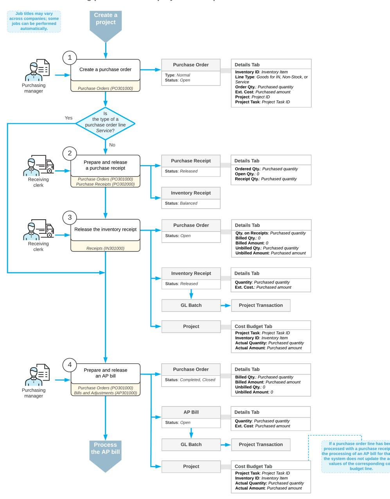

# <span id="page-241-0"></span>**Project Inventory Tracking by Warehouse Location: Implementation Checklist**

The following sections provide details you can use to ensure that the system is configured properly for tracking project inventory by location, and to understand (and change, if needed) the settings that affect the processing workflow.

#### **Implementation Checklist**

Before you start working with a project and tracking project inventory by location, you should make sure that the project accounting functionality is configured and the project has the needed settings, as summarized in the following checklist.

| Form                                    | Criteria to Check                                                                                                                                                                                                                                                                                                                                                                                    |  |
|-----------------------------------------|------------------------------------------------------------------------------------------------------------------------------------------------------------------------------------------------------------------------------------------------------------------------------------------------------------------------------------------------------------------------------------------------------|--|
| Enable/Disable Features (CS100000) form | Make sure that the Project Accounting feature is en<br>abled.                                                                                                                                                                                                                                                                                                                                        |  |
| Account Groups (PM201000) form          | Make sure that all needed account groups have been<br>configured. For more information about account<br>groups, see Account Groups: General Information.                                                                                                                                                                                                                                             |  |
| Projects Preferences (PM101000) form    | Make sure that all necessary settings related to project<br>accounting have been specified, as described in the Ba<br>sic Project Configuration: General Information.                                                                                                                                                                                                                                |  |
| Projects (PM301000)                     | Make sure that the necessary project and project tasks<br>have been created. In the project settings, Track by Lo<br>cation needs to be selected in the Inventory Track<br>ing box on theSummary tab. For more information on<br>creating a project, see Project Creation and Processing:<br>General Information.                                                                                    |  |
| Warehouses (IN204000) form              | Make sure that a separate location is created and asso<br>ciated with each project task for which you need to re<br>ceive inventory items in a warehouse. (For a location<br>associated with a project task, the CostSeparately<br>check box is selected automatically.)<br>We also recommend that you specify a<br>higher Pick Priority value for project<br>locations than for other locations, to |  |
|                                         | avoid issuing project materials for oth<br>er projects or to customers outside of<br>projects.                                                                                                                                                                                                                                                                                                       |  |

#### **Inventory and Order Management Checklist**

We recommend that before you start working with a project and tracking project inventory by location, you make sure the needed features have been enabled, settings have been specified, and entities have been created, as summarized in the following checklist.

| Form                                    | Tasks to Perform                                                                                                                                                             |
|-----------------------------------------|------------------------------------------------------------------------------------------------------------------------------------------------------------------------------|
| Enable/Disable Features (CS100000) form | Make sure that the following features are enabled:<br>•<br>Inventory and Order Management<br>•<br>Inventory<br>•<br>Multiple Warehouses<br>•<br>Multiple Warehouse Locations |
| Multiple forms                          | Make sure that the basic inventory and order manage<br>ment preferences have been configured, as described<br>in Configuration of Order Management: General Informa<br>tion. |

| Form                            | Tasks to Perform                                                                                                                                                                                                                                                                                                                                                                                                                                                                                         |
|---------------------------------|----------------------------------------------------------------------------------------------------------------------------------------------------------------------------------------------------------------------------------------------------------------------------------------------------------------------------------------------------------------------------------------------------------------------------------------------------------------------------------------------------------|
| Stock Items (IN202500) form     | Make sure that all stock items have been defined. For<br>more information about stock items, see Stock Items:<br>General Information.<br>We recommend that you not map the in<br>ventory accrual account (which is an ac<br>count of the Asset type) to an account<br>group. If you need to track stock items<br>purchased for the project in the project<br>cost budget, we recommend that you use<br>the commitment tracking functionality.<br>For more information, see Tracking Cost<br>Commitments. |
| Non-Stock Items (IN202000) form | Make sure that all non-stock items have been defined,<br>as described in Non-Stock Items: General Information.<br>Also, make sure that the expense account of the items<br>is mapped to the appropriate account group.<br>Make sure that Purchases is selected in<br>the Post Cost to Expenses box on the<br>Price/Cost tab; otherwise, the expens<br>es related to the non-stock item will not<br>be recorded to the cost budget of the ap<br>plicable project.                                         |
| Vendors (AP303000) form         | Make sure that all needed vendors have been defined<br>in the system, as described in Vendors: General Infor<br>mation.                                                                                                                                                                                                                                                                                                                                                                                  |

#### **Other Settings That Affect the Workflow**

You can affect the workflow of sales and purchases of items for projects by specifying additional settings as follows:

- To cause the system to automatically select a project task when a particular project is selected during the creation of a purchase order, select the **Default** check box on the**Tasks** tab of the *[Projects](https://help-2025r1.acumatica.com/Help?ScreenId=ShowWiki&pageid=81c86417-3bde-444b-8f1c-682928d31a0c)* (PM301000) form for one of the tasks of the project.
- To cause the system to include non-stock lines of the *Service* type in purchase receipts created from the purchase orders of the *Normal* type, select the **ProcessService Lines from Normal Purchase Orders via Purchase Receipt** check box on the **General** tab (**Other** section) of the *[Purchase Orders Preferences](https://help-2025r1.acumatica.com/Help?ScreenId=ShowWiki&pageid=13d09c43-8696-4f92-ad9b-3d0209ee3d9b)* (PO101000) form.

### **Validation of Configuration**

To make sure that all configuration has been performed correctly, we recommend that you perform instructions similar to those described in *Project Inventory Tracking by [Warehouse](#page-244-1) Location: To Purchase Materials and Services [for a Project](#page-244-1)*.

# <span id="page-244-1"></span><span id="page-244-0"></span>**Project Inventory Tracking by Warehouse Location: To Purchase Materials and Services for a Project**

This activity will walk you through the process of purchasing materials and services to a project-specific warehouse location with a purchase order.

This activity is based on the *U100* dataset. If you are using another dataset, or if any system settings have been changed in *U100*, these changes can affect the workflow of the activity and the results of the processing. To avoid any issues, restore the *U100* dataset to its initial state.

#### **Story**

Suppose that the HM's Bakery and Cafe customer has ordered two juicers, along with four hours of the installation service from the SweetLife Fruits & Jams company. The SweetLife company contracted the Squeezo Inc. vendor to provide the juicers and perform the installation. SweetLife's project manager has created the project.

Acting as SweetLife's purchasing manager, you will process the purchase of materials and services for the project. When the vendor delivers the juicers to company's warehouse, you will process a purchase receipt for the juicers. When the vendor provides the installation service, you will process an accounts payable bill from the vendor for the delivered juicers and provided service.

#### **Configuration Overview**

In the *U100* dataset, the following tasks have been performed to support this activity:

- On the *[Enable/Disable Features](https://help-2025r1.acumatica.com/Help?ScreenId=ShowWiki&pageid=c1555e43-1bc5-4f6f-ba9d-b323f94d8a6b)* (CS100000) form, the following features have been enabled:
  - *Project Accounting*, which provides support for the project accounting functionality
  - *Inventory and Order Management*, which provides the purchase order functionality
- On the *[Projects](https://help-2025r1.acumatica.com/Help?ScreenId=ShowWiki&pageid=81c86417-3bde-444b-8f1c-682928d31a0c)* (PM301000) form, the *HMBAKERY2* project has been created and the *INSTALL* project task has been created for the project. This task is the default project task.
- On the *[Account Groups](https://help-2025r1.acumatica.com/Help?ScreenId=ShowWiki&pageid=94a2cdce-c36a-49a1-b572-9cd33cb5fa73)* (PM201000) form, the *SUBCON* account group has been created. The *54200 (Project Subcontract Expense)* account has been mapped to the *SUBCON* account group.
- On the *[Warehouses](https://help-2025r1.acumatica.com/Help?ScreenId=ShowWiki&pageid=264b0ef7-2b6c-40b4-a7d9-f1a5e067939b)* (IN204000) form, the *EQUIPHOUSE* warehouse has been created, and the *HMBAKERY2* location has been created for the *INSTALL* task of the *HMBAKERY2* project.
- On the *[Vendors](https://help-2025r1.acumatica.com/Help?ScreenId=ShowWiki&pageid=a9584be3-f2bd-4d67-80d4-8041d809df56)* (AP303000) form, the *SQUEEZO* vendor has been created.
- On the *[Stock Items](https://help-2025r1.acumatica.com/Help?ScreenId=ShowWiki&pageid=77786a70-1f1e-4d63-ad98-96f98e4fcb0e)* (IN202500) form, the *JUICER10C* stock item has been defined.
- On the *[Non-Stock Items](https://help-2025r1.acumatica.com/Help?ScreenId=ShowWiki&pageid=bf68dd4f-63d4-460d-8dc0-9152f2bd6bf1)* (IN202000) form, the *INSTALL* non-stock item has been defined. On the **General** tab, the **Require Receipt** check box has been cleared. On the **GL Accounts** tab, *54200 (Project Subcontract Expense)* has been selected in the **Expense Account** box. On the **Price/Cost** tab, *Purchase* is selected in the **Post Cost to Expenses On** box.

#### **Process Overview**

On the *[Purchase Orders](https://help-2025r1.acumatica.com/Help?ScreenId=ShowWiki&pageid=5565686c-96c4-4bfa-a51d-9a2566baa808)* (PO301000) form, you will create a purchase order for the project, specifying the project and project task. Then you will create a purchase receipt and release it on the *[Purchase Receipts](https://help-2025r1.acumatica.com/Help?ScreenId=ShowWiki&pageid=d9901c8d-486d-45ed-8088-ea3d8ee3af19)* (PO302000) form. You will bill the purchase order on the *[Purchase Orders](https://help-2025r1.acumatica.com/Help?ScreenId=ShowWiki&pageid=5565686c-96c4-4bfa-a51d-9a2566baa808)* form and then release the bill on the *[Bills and Adjustments](https://help-2025r1.acumatica.com/Help?ScreenId=ShowWiki&pageid=956b4e51-3078-4d2d-85b3-65c080d95234)* (AP301000) form. Finally, you will review the project balances on the *[Projects](https://help-2025r1.acumatica.com/Help?ScreenId=ShowWiki&pageid=81c86417-3bde-444b-8f1c-682928d31a0c)* (PM301000) form.

#### **System Preparation**

To sign in to the system and prepare to perform the instructions of the activity, do the following:

- 1. Launch the Acumatica ERP website, and sign in to a company with the *U100* dataset preloaded; you should sign in as a project accountant by using the *brawner* username and the *123* password.
- 2. In the info area, in the upper-right corner of the top pane of the Acumatica ERP screen, make sure that the business date in your system is set to *1/30/2025*. If a different date is displayed, click the Business Date menu button and select *1/30/2025* on the calendar. For simplicity, in this activity, you will create and process all documents in the system on this business date.

### **Step 1: Creating a Purchase Order for the Project**

To create a purchase order for the project, do the following:

- 1. On the *[Purchase Orders](https://help-2025r1.acumatica.com/Help?ScreenId=ShowWiki&pageid=5565686c-96c4-4bfa-a51d-9a2566baa808)* (PO301000) form, create a new record.
- 2. In the Summary area, specify the following settings:
  - **Type**: *Normal*
  - **Vendor**: *SQUEEZO*
  - **Date**: *1/30/2025*
  - **Project**: *HMBAKERY2*
  - **Description**: Purchase for HM's Bakery & Cafe
- 3. On the **Details** tab, add two purchase order lines that have the settings shown in the following table.

| Inventory ID | Order Qty. | Unit Cost | Cost Code |
|--------------|------------|-----------|-----------|
| JUICER10C    | 2          | 1500      | 00-000    |
| INSTALL      | 4          | 80        | 00-000    |

The system automatically inserts the *INSTALL* project task for each line when you select the *HMBAKERY2* project because this task is the default project task of the project. Also, in the line with the *JUICER10C* stock item, the *EQUIPHOUSE* warehouse is inserted automatically.

- 4. In the Summary area, make sure that the **OrderTotal** value, which is the sum of the **Ext. Cost** of two lines (*3,000.00* and *320.00*), is *3,320.00*.
- 5. Save the purchase order.
- 6. On the form toolbar, click **Remove Hold**. The system assigns the purchase order the *Open* status.

#### **Step 2: Receiving the Purchased Materials to a Warehouse**

To create a purchase receipt for the purchased materials, do the following:

1. While remaining on the *[Purchase Orders](https://help-2025r1.acumatica.com/Help?ScreenId=ShowWiki&pageid=5565686c-96c4-4bfa-a51d-9a2566baa808)* (PO301000) form with the purchase order selected, on the form toolbar, click **Enter PO Receipt**.

The system creates a purchase receipt with the *Balanced* status for the *JUICER10C* item and opens it on the *[Purchase Receipts](https://help-2025r1.acumatica.com/Help?ScreenId=ShowWiki&pageid=d9901c8d-486d-45ed-8088-ea3d8ee3af19)* (PO302000) form. The service item (*INSTALL*) does not require a receipt and is not added to the created document.

2. On the form toolbar, click **Release**.

The system creates and releases an inventory receipt transaction based on the purchase receipt. On release of this transaction, the stock items are received to inventory. The purchase receipt is assigned the *Released* status.

#### **Step 3: Creating a Bill for the Purchase Order**

To bill the purchase order, do the following:

- 1. On the *[Purchase Orders](https://help-2025r1.acumatica.com/Help?ScreenId=ShowWiki&pageid=5565686c-96c4-4bfa-a51d-9a2566baa808)* (PO301000) form, open the purchase order that you have created earlier in this activity.
- 2. On the More menu (under **Processing**), click **Enter AP Bill** to create a bill for the purchase order.

The system creates an accounts payable bill and opens the bill on the *[Bills and Adjustments](https://help-2025r1.acumatica.com/Help?ScreenId=ShowWiki&pageid=956b4e51-3078-4d2d-85b3-65c080d95234)* (AP301000) form. Make sure that both purchase order lines have been added to the bill.

- 3. On the form toolbar, click **Remove Hold** to assign the AP bill the *Balanced* status, and then click **Release**.
- 4. On the *[Projects](https://help-2025r1.acumatica.com/Help?ScreenId=ShowWiki&pageid=81c86417-3bde-444b-8f1c-682928d31a0c)* (PM301000) form, open the *HMBAKERY2* project.

On the **Cost Budget** tab, review the actual values of the cost budget. Notice that the **Actual Quantity** and **Actual Amount** of the line with the *INSTALL* item have been updated and are now *4* and *320.00*, respectively (see the following screenshot). The actual values for the line with the stock item (*JUICER10C*) are not updated yet: the system will record the cost of stock items to the project budget when the items are used for the project and issued from the project-specific warehouse location.

| Projects<br>HMBAKERY2 - Juicers with the installation<br>뭐<br>$\Box$<br>侕<br>к<br><b>COMPLETE</b><br><b>RUN BILLING</b><br>Ы<br>$\Omega$<br>$\leftarrow$<br>+<br>≺<br>><br>$\cdots$ |                                    |                                                                 |                                       |                                        |                                             |                    |                  |  |  |
|-------------------------------------------------------------------------------------------------------------------------------------------------------------------------------------|------------------------------------|-----------------------------------------------------------------|---------------------------------------|----------------------------------------|---------------------------------------------|--------------------|------------------|--|--|
| $\varphi$<br>* Project ID:<br><b>HMBAKERY2</b>                                                                                                                                      | Customer:                          | HMBAKERY - HM's Bakery & Cafe<br>Q                              | Actual Income:<br>$\mathscr{O}$       |                                        | 0.00                                        |                    |                  |  |  |
| Template:                                                                                                                                                                           | Project Manager:<br>$\mathscr{O}$  | $\circ$<br>EP00000001 - Pam Brawner                             | Actual Expenses:                      |                                        | 320.00                                      |                    |                  |  |  |
| Active<br>Status:                                                                                                                                                                   |                                    |                                                                 | Margin Amount:                        |                                        | $-320.00$                                   |                    |                  |  |  |
| Description:<br>Juicers with the installation                                                                                                                                       |                                    |                                                                 | Margin (%):                           |                                        | 0.00                                        |                    |                  |  |  |
|                                                                                                                                                                                     |                                    |                                                                 |                                       | Pending Invoice Amoun                  | 0.00                                        |                    |                  |  |  |
| <b>COST BUDGET</b><br><b>TASKS</b><br><b>REVENUE BUDGET</b><br><b>SUMMARY</b>                                                                                                       | <b>BALANCES</b><br><b>INVOICES</b> | <b>UNION LOCALS</b><br><b>ACTIVITIES</b>                        | <b>EMPLOYEES</b>                      | <b>EQUIPMENT</b>                       | <b>ADDRESSES</b>                            |                    | <b>DEFAULTS</b>  |  |  |
| □ Group by Task                                                                                                                                                                     |                                    |                                                                 |                                       |                                        |                                             |                    |                  |  |  |
| $\mathbf{\overline{x}}$<br><b>VIEW TRANSACTIONS</b><br>$\vdash$<br>土<br>$\pm$<br>$\times$<br>Õ                                                                                      |                                    |                                                                 |                                       |                                        |                                             |                    |                  |  |  |
| D<br><b>B</b> 0<br>* Project Task<br>*Inventory ID<br>* Account Group                                                                                                               | <b>Description</b>                 | Original UOM<br><b>Unit Rate</b><br><b>Budgeter</b><br>Quantity | Original<br><b>Budgeted</b><br>Amount | Revised<br><b>Budgeted</b><br>Quantity | <b>Revised</b><br><b>Budgeted</b><br>Amount | Actual<br>Quantity | Actual<br>Amount |  |  |
| $\omega$<br><b>INSTALL</b><br><b>MATERIAL</b><br>D<br><b>JUICER10C</b>                                                                                                              | Pro series citrus juicer with a    | PIECE<br>2.00<br>1.500.0000                                     | 3.000.00                              | 2.00                                   | 3.000.00                                    | 0.00               | 0.00             |  |  |
| D.<br><b>INSTALL</b><br>0<br><b>INSTALL</b><br><b>SUBCON</b>                                                                                                                        | Installation of equipment at th    | 4.00 HOUR<br>80.0000                                            | 320.00                                | 4.00                                   | 320.00                                      | 4.00               | 320.00           |  |  |

*Figure: Actual values of the budget updated by the purchase*

<span id="page-246-1"></span>You have completed the processing of the purchase of materials and services for the project.

# <span id="page-246-0"></span>**Project Inventory Tracking by Warehouse Location: To Bill a Project**

This activity will walk you through the process of billing a project by using a combined billing rule that depends on the progress stage being billed.

This activity is based on the *U100* dataset. If you are using another dataset, or if any system settings have been changed in *U100*, these changes can affect the workflow of the activity and the results of the processing. To avoid any issues, restore the *U100* dataset to its initial state.

#### **Story**

Suppose that the Thai Food Restaurant customer has ordered a juicer from the SweetLife Fruits & Jams company, along with installation of the juicer and training of the company's employees on operating the juicer. The SweetLife project accountant has created a project to handle the tracking and billing of the juicer and the provided services. Both companies have agreed that the customer will be billed in two stages. At the end of the first stage, the customer will pay for 40 percent of the services, which have a fixed price, and for the juicer (which is installed during the first stage). At the end of the second stage (aer the project is completed), the customer will pay for the remainder of the project.

Then suppose that on *1/30/2025*, the juicer has been delivered and installed. Acting as the project accountant, you need to update the progress of the project, process the issue of the juicer, and bill the customer for the first stage of the project.

### **Configuration Overview**

In the *U100* dataset, the following tasks have been performed to support this activity:

- On the *[Enable/Disable Features](https://help-2025r1.acumatica.com/Help?ScreenId=ShowWiki&pageid=c1555e43-1bc5-4f6f-ba9d-b323f94d8a6b)* (CS100000) form, the following features have been enabled:
  - *Project Accounting*, which provides support for the project accounting functionality
  - *Inventory and Order Management* feature, which provides the ability to maintain stock items and create and process sales orders and purchase orders
- On the *[Customers](https://help-2025r1.acumatica.com/Help?ScreenId=ShowWiki&pageid=652929bc-9606-4056-aa6e-0c2d1147171b)* (AR303000) form, the *TOMYUM* customer has been defined.
- On the *[Projects](https://help-2025r1.acumatica.com/Help?ScreenId=ShowWiki&pageid=81c86417-3bde-444b-8f1c-682928d31a0c)* (PM301000) form, the *TOMYUM2* project has been created for this customer, and two project tasks (*PHASE1* and *PHASE2*) have been added. Also, on the**Summary** tab, the **Create Pro Forma Invoice on Billing** check box is selected, indicating that a pro forma invoice is created when the project is billed.
- On the *[Billing Rules](https://help-2025r1.acumatica.com/Help?ScreenId=ShowWiki&pageid=6773c79b-216e-4725-b28c-3ce724d9a7c9)* (PM207000) form, the *COMBINED* billing rule has been created; it has been assigned to both project tasks of the *TOMYUM2* project on the *[Projects](https://help-2025r1.acumatica.com/Help?ScreenId=ShowWiki&pageid=81c86417-3bde-444b-8f1c-682928d31a0c)* form. For an example of configuring a combined billing rule, see *Billing Rules: To Configure a [Combined](#page-26-1) Billing Rule*.
- On the *[Warehouses](https://help-2025r1.acumatica.com/Help?ScreenId=ShowWiki&pageid=264b0ef7-2b6c-40b4-a7d9-f1a5e067939b)* (IN204000) form, the *EQUIPHOUSE* warehouse has been created, and the *TOMYUM2* location has been created and associated with the *PHASE1* task of the *TOMYUM2* project.
- On the *[Stock Items](https://help-2025r1.acumatica.com/Help?ScreenId=ShowWiki&pageid=77786a70-1f1e-4d63-ad98-96f98e4fcb0e)* (IN202500) form, the *JUICER15* stock item has been defined.

#### **Process Overview**

You will issue the stock item for the project on the *[Issues](https://help-2025r1.acumatica.com/Help?ScreenId=ShowWiki&pageid=17b051f6-027d-4459-b542-65c1c1f9d0ea)* (IN302000) form to record the sale of a juicer. You will update the progress of the project on the *[Projects](https://help-2025r1.acumatica.com/Help?ScreenId=ShowWiki&pageid=81c86417-3bde-444b-8f1c-682928d31a0c)* (PM301000) form and run the project billing. You will review the created pro forma invoice and release it on the *[Pro Forma Invoices](https://help-2025r1.acumatica.com/Help?ScreenId=ShowWiki&pageid=37f1ed00-a7d7-4161-9307-1337662b8550)* (PM307000) form to create the corresponding accounts receivable invoice. On the *[Invoices and Memos](https://help-2025r1.acumatica.com/Help?ScreenId=ShowWiki&pageid=5e6f3b27-b7af-412f-a40a-1d4f4be70cba)* (AR301000) form, you will review the prepared accounts receivable invoice, and release the invoice. Finally, you will review the project to make sure that the release of the AR invoice has caused the system to correctly update the actual amounts of the project.

#### **System Preparation**

To sign in to the system and prepare to perform the instructions of the activity, do the following:

- 1. Launch the Acumatica ERP website, and sign in to a company with the *U100* dataset preloaded; you should sign in as Pam Brawner by using the *brawner* username and the *123* password.
- 2. In the info area, in the upper-right corner of the top pane of the Acumatica ERP screen, make sure that the business date in your system is set to *1/30/2025*. If a different date is displayed, click the Business Date menu button and select *1/30/2025* on the calendar. For simplicity, in this activity, you will create and process all documents in the system on this business date.

#### **Step 1: Issuing a Stock Item for the Project**

To directly issue a stock item for the project (to record that the juicer that has been delivered to the customer) and capture the issued cost on the project, do the following:

- 1. On the *[Issues](https://help-2025r1.acumatica.com/Help?ScreenId=ShowWiki&pageid=17b051f6-027d-4459-b542-65c1c1f9d0ea)* (IN302000) form, add a new record.
- 2. In the Summary area, type A juicer for Thai Food Restaurant in the **Description** box.
- 3. On the table toolbar of the **Details** tab, click **Add Row**, and specify the following settings in the row:
  - **Tran.Type**: *Issue*
  - **Inventory ID**: *JUICER15*
  - **Warehouse**: *EQUIPHOUSE* (inserted automatically)
  - **Location**: *TOMYUM2*
  - **Quantity**: 1
  - **Unit Price**: 2,500
  - **Reason Code**: *INISSUEPROJ*
  - **InventorySource**: *Project Stock* (inserted automatically)
  - **Project**: *TOMYUM2* (inserted automatically)
  - **ProjectTask**: *PHASE1* (inserted automatically)
  - **Cost Code**: *00-000*

In the footer of the table, the system shows that one juicer is available for issue for the selected project and warehouse location. **Unit Cost** in the line is \$2,000. This is the cost at which the item will be issued from inventory.

- 4. Save the inventory issue, and release it.
- 5. On the *[Projects](https://help-2025r1.acumatica.com/Help?ScreenId=ShowWiki&pageid=81c86417-3bde-444b-8f1c-682928d31a0c)* (PM301000) form, open the *TOMYUM2* project.
- 6. On the **Cost Budget** tab, make sure that the line with the *PHASE1* project task and the *JUICER15* inventory item was created based on the inventory issue you have released. The **Actual Quantity** is 1 because you have issued one juicer from the project-specific location. The **Actual Amount** of the line is \$2,000, which is the amount of the related project transaction (that is, the cost of the juicer).
- 7. On the table toolbar of the tab, click**View Transactions**. On the *Project [Transaction](https://help-2025r1.acumatica.com/Help?ScreenId=ShowWiki&pageid=29bf5433-446f-4196-be69-f2cb177e83cb) Details* (PM401000) form, which opens, review the only row in the table. The **Amount** of the transaction is \$2,000, the **Billable** check box is selected, and the **Billed** check box is cleared. This transaction will be billed by the time and material step of the billing rule assigned to the *PHASE1* project task.
- 8. Close the form to return to the *[Projects](https://help-2025r1.acumatica.com/Help?ScreenId=ShowWiki&pageid=81c86417-3bde-444b-8f1c-682928d31a0c)* form.

#### **Step 2: Billing the Project**

To update the progress of project completion and bill the project, do the following:

- 1. While you are still viewing the *TOMYUM2* project on the *[Projects](https://help-2025r1.acumatica.com/Help?ScreenId=ShowWiki&pageid=81c86417-3bde-444b-8f1c-682928d31a0c)* (PM301000) form, on the **Revenue Budget** tab, specify 40 as the **Completed (%)** of each revenue budget line. Notice that the system calculates the **Pending Invoice Amount** for each line (\$112 for the *PHASE1* project task, and \$160 for the *PHASE2* project task). This pending amount will be billed by the progress billing step of the billing rule assigned to the *PHASE1* and *PHASE2* project tasks.
- 2. Save your changes to the project, and on the form toolbar, click **Run Billing**. The system creates a pro forma invoice and opens it on the *[Pro Forma Invoices](https://help-2025r1.acumatica.com/Help?ScreenId=ShowWiki&pageid=37f1ed00-a7d7-4161-9307-1337662b8550)* (PM307000) form. Review the invoice details and notice the following:

- On the **Progress Billing** tab, the **Amount to Invoice** in each line is equal to the **Pending Invoice Amount** of the corresponding revenue budget line of the *TOMYUM2* project on the **Revenue Budget** tab of the *[Projects](https://help-2025r1.acumatica.com/Help?ScreenId=ShowWiki&pageid=81c86417-3bde-444b-8f1c-682928d31a0c)* form.
- On the **Time and Material** tab, the system has generated a line with the *JUICER15* item. The **Amount to Invoice** in the line is the price of the juicer (\$2,500).
- 3. On the form toolbar, click **Remove Hold** to assign the pro forma invoice the *Open* status, and then click **Release** to release the pro forma invoice. The system creates the accounts receivable invoice based on the pro forma invoice and assigns the *Closed* status to the pro forma invoice.
- 4. On the **Financial** tab, click the **AR Ref. Nbr.** link to open the accounts receivable invoice that was created on the *[Invoices and Memos](https://help-2025r1.acumatica.com/Help?ScreenId=ShowWiki&pageid=5e6f3b27-b7af-412f-a40a-1d4f4be70cba)* (AR301000) form. The AR invoice has three lines: two lines with the **Inventory ID** column empty that have been generated with the progress billing step of the billing rule (in the amounts of \$112 and \$160), and a line generated by the time and material step with the *JUICER15* item and the amount of \$2,500.
- 5. On the form toolbar of the *[Invoices and Memos](https://help-2025r1.acumatica.com/Help?ScreenId=ShowWiki&pageid=5e6f3b27-b7af-412f-a40a-1d4f4be70cba)* form, click **Remove Hold** to assign the invoice the *Balanced* status, and then click **Release** to release the accounts receivable invoice.
- 6. On the *[Projects](https://help-2025r1.acumatica.com/Help?ScreenId=ShowWiki&pageid=81c86417-3bde-444b-8f1c-682928d31a0c)* form, open the *TOMYUM2* project, and on the **Balances** tab, review the amounts in the budget lines that have been updated as the result of the billing (see the following screenshot). **Actual Amount** for the *REVENUE* group is \$2,772, which is the sum of the price of the juicer (\$2,500) and 40 percent of the price of the services (\$112 + \$160); **Actual Amount** for the *MATERIAL* group is \$2,000, which is the cost of the juicer.

| Projects<br>TOMYUM2 - A juicer with the installation and training for employees |                         |                              |            |                                                           |   |                    |           |                                       |                                      |                    |                  |                               |                   |   |                       |                  |                  |  |
|---------------------------------------------------------------------------------|-------------------------|------------------------------|------------|-----------------------------------------------------------|---|--------------------|-----------|---------------------------------------|--------------------------------------|--------------------|------------------|-------------------------------|-------------------|---|-----------------------|------------------|------------------|--|
| 뭐<br>$\leftarrow$                                                               | $\Box$<br>↶             | $\pm$                        | 侕          | К                                                         | ∢ | У                  | $\geq$    |                                       | <b>COMPLETE</b>                      | <b>RUN BILLING</b> | $\cdots$         |                               |                   |   |                       |                  |                  |  |
| * Project ID:                                                                   |                         | TOMYUM2                      |            |                                                           |   |                    | $\varphi$ |                                       | Customer:                            |                    |                  | TOMYUM - Thai Food Restaurant | Q                 | 0 | Actual Income:        |                  | 2.772.00         |  |
| Template:                                                                       |                         |                              |            |                                                           |   |                    | 0         |                                       | Project Manager:                     |                    |                  | EP00000001 - Pam Brawner      | Q                 |   | Actual Expenses:      |                  | 2,000.00         |  |
| Status:                                                                         |                         | Active                       |            |                                                           |   |                    |           |                                       |                                      |                    |                  |                               |                   |   | Margin Amount:        |                  | 772.00           |  |
| Description:                                                                    |                         |                              |            | A juicer with the installation and training for employees |   |                    |           |                                       |                                      |                    |                  |                               |                   |   | Margin (%):           |                  | 27.85            |  |
|                                                                                 |                         |                              |            |                                                           |   |                    |           |                                       |                                      |                    |                  |                               |                   |   | Pending Invoice Amoun |                  | 0.00             |  |
| <b>SUMMARY</b>                                                                  | <b>TASKS</b>            |                              |            | <b>REVENUE BUDGET</b>                                     |   | <b>COST BUDGET</b> |           |                                       | <b>BALANCES</b>                      | <b>INVOICES</b>    |                  | <b>UNION LOCALS</b>           | <b>ACTIVITIES</b> |   | <b>EMPLOYEES</b>      | <b>EQUIPMENT</b> | <b>ADDRESSES</b> |  |
| <b>VIEW TRANSACTIONS</b>                                                        |                         | $\left  \rightarrow \right $ | $\sqrt{N}$ |                                                           |   |                    |           |                                       |                                      |                    |                  |                               |                   |   |                       |                  |                  |  |
| <b>图 Account</b><br>Group                                                       | <b>Description</b>      |                              |            |                                                           |   |                    |           | Original<br><b>Budgeted</b><br>Amount | Revised<br><b>Budgeted</b><br>Amount |                    | Actual<br>Amount | Performance<br>(%)            |                   |   |                       |                  |                  |  |
| Income                                                                          |                         |                              |            |                                                           |   |                    |           |                                       |                                      |                    |                  |                               |                   |   |                       |                  |                  |  |
| <b>REVENUE</b>                                                                  | <b>Project Revenue</b>  |                              |            |                                                           |   |                    |           | 680.00                                | 680.00                               |                    | 2,772.00         | 407.65                        |                   |   |                       |                  |                  |  |
|                                                                                 | <b>Income Totals</b>    |                              |            |                                                           |   |                    |           | 680.00                                | 680.00                               |                    | 2.772.00         | 407.65                        |                   |   |                       |                  |                  |  |
| <b>Expense</b>                                                                  |                         |                              |            |                                                           |   |                    |           |                                       |                                      |                    |                  |                               |                   |   |                       |                  |                  |  |
| <b>MATERIAL</b>                                                                 | <b>Project Material</b> |                              |            |                                                           |   |                    |           | 0.00                                  | 0.00                                 |                    | 2,000.00         | 0.00                          |                   |   |                       |                  |                  |  |
|                                                                                 | <b>Expense Totals</b>   |                              |            |                                                           |   |                    |           | 0.00                                  | 0.00                                 |                    | 2.000.00         | 0.00                          |                   |   |                       |                  |                  |  |

#### *Figure: The project balances*

You have finished billing the project with a combined billing rule.

# <span id="page-249-0"></span>**Project Inventory Tracking by Warehouse Location: Generated Transactions**

The following sections describe the GL transactions and project transactions that are generated for sales and purchases of stock items and non-stock items requiring receipt for projects.

For the list of transactions that are generated for non-stock items not requiring receipt that are being purchased for projects, see *Purchasing Services for Projects: Generated [Transactions](#page-288-1)*.

#### **GL Transactions Generated on Release of an Inventory Receipt**

On release of a project-related purchase receipt with a stock item, the corresponding inventory receipt is created. When the inventory receipt is released, the system creates the following batch of general ledger transaction.

| Account            | Source of Account            | Project                 | Debit                                         | Credit                                        |
|--------------------|------------------------------|-------------------------|-----------------------------------------------|-----------------------------------------------|
| Inventory account  | Posting class of<br>the item | X (non-project<br>code) | Received amount<br>(quantity * item<br>price) | 0.00                                          |
| PO accrual account | Posting class of<br>the item | X (non-project<br>code) | 0.00                                          | Received amount<br>(quantity * item<br>price) |

On release of a project-related purchase receipt with a non-stock item requiring receipt, the corresponding inventory receipt is created. When the inventory receipt is released, the system creates the following batch of general ledger transaction.

| Account           | Source of Account | Project Budget<br>Key                                                        | Debit                                         | Credit                                        |
|-------------------|-------------------|------------------------------------------------------------------------------|-----------------------------------------------|-----------------------------------------------|
| Expense account   | Inventory item    | Project, project<br>task, and cost code<br>in the inventory re<br>ceipt line | Received amount<br>(quantity * item<br>price) | 0.00                                          |
| Inventory account | Inventory item    | X (non-project<br>code)                                                      | 0.00                                          | Received amount<br>(quantity * item<br>price) |

On the **Financial** tab of the *[Receipts](https://help-2025r1.acumatica.com/Help?ScreenId=ShowWiki&pageid=d6ecad5b-155f-44bf-baba-9ed006d298b5)* (IN301000) form, you can click the link in the **Batch Nbr.** box to view the details of the general ledger transaction on the *Journal [Transactions](https://help-2025r1.acumatica.com/Help?ScreenId=ShowWiki&pageid=dda046bc-5946-407f-88f7-1c0c966fbe72)* (GL301000) form.

#### **Project Transaction Generated on Release of the Inventory Receipt**

On release of the general ledger transaction which was created on release of the inventory receipt with a stock item, the system generates no project transaction.

On release of the general ledger transaction which was created on release of the inventory receipt with a non-stock item requiring receipt, the system generates the following project transaction.

| Project Budget Key                                                                   | Account Group                                                 | Debit Account                  | Amount |
|--------------------------------------------------------------------------------------|---------------------------------------------------------------|--------------------------------|--------|
| Project, project task, inventory<br>item, and cost code in inventory<br>receipt line | Account group mapped<br>to the Expense account<br>of the item | Expense account of the<br>item | Amount |

You can review the created project transaction on the *Project [Transaction](https://help-2025r1.acumatica.com/Help?ScreenId=ShowWiki&pageid=29bf5433-446f-4196-be69-f2cb177e83cb) Details* (PM401000) form. In the Selection area of this form, you select the project in the **Project** box.

#### **GL Transactions Generated on Release of an Inventory Issue**

On release of an inventory issue with a stock item issued for a project, the system generates a batch of general ledger transactions.

| Account            | Source of Account                             | Project Budget<br>Key                                                      | Debit                                      | Credit                                     |
|--------------------|-----------------------------------------------|----------------------------------------------------------------------------|--------------------------------------------|--------------------------------------------|
| PO Accrual account | Posting class of<br>the item                  | X (non-project<br>code)                                                    | 0.00                                       | Issued amount<br>(quantity * item<br>cost) |
| Expense account    | Reason code in the<br>inventory issue<br>line | Project, project<br>task, and cost code<br>in the inventory is<br>sue line | Issued amount<br>(quantity * item<br>cost) | 0.00                                       |

You can view the reference number of the GL batch in the **Batch Nbr.** box on the **Financial** tab of the *[Issues](https://help-2025r1.acumatica.com/Help?ScreenId=ShowWiki&pageid=17b051f6-027d-4459-b542-65c1c1f9d0ea)* (IN302000) form. You can click the link in this box to view the details of the batch on the *Journal [Transactions](https://help-2025r1.acumatica.com/Help?ScreenId=ShowWiki&pageid=dda046bc-5946-407f-88f7-1c0c966fbe72)* (GL301000) form.

#### **Project Transaction Generated on Release of the Inventory Issue**

On release of the general ledger transaction created on release of the inventory issue with a stock item for project, the system generates the following project transaction that updates the project's actual amounts:

| Project Budget Key                                                                 | Account Group                               | Debit Account               | Amount |
|------------------------------------------------------------------------------------|---------------------------------------------|-----------------------------|--------|
| Project, project task, inventory<br>item, and cost code in inventory<br>issue line | Account group mapped<br>to the GOGS account | COGS account of the<br>item | Amount |

You can review the created project transaction on the *Project [Transaction](https://help-2025r1.acumatica.com/Help?ScreenId=ShowWiki&pageid=29bf5433-446f-4196-be69-f2cb177e83cb) Details* (PM401000) form. In the Selection area of this form, you select the project in the **Project** box.

# <span id="page-252-0"></span>**Managing the Project Budget**

This chapter describes how to populate and track the project budget, which is used to provide both a financial plan and cost constraints for a project.

# <span id="page-252-1"></span>**Project Budget: General Information**

The project budget is used to provide both a financial plan and cost constraints for a project. That is, you define the amount of money and resources to be spent on the project. As the project progresses, you can continuously track actual project costs and either adjust expenditures or revise the budget.

#### **Learning Objectives**

In this chapter, you will learn how to do the following:

In this lesson, you will learn how to do the following:

- Configure the revenue budget and the cost budget for a project
- Update the actual values of the project budget
- Review project balances
- Lock the original budgeted values
- Control whether AP bills, purchase orders, and change orders created for a project may exceed the project budget
- Restructure the budget before and aer billing

#### **Applicable Scenarios**

You configure a project budget in any of the following cases:

- If you want to plan the revenue of a project and track its completion
- If you want to plan and control the amount of money and resources spent on a project
- If you want to configure a fixed-price project that is billed for progress

#### **Budget Planning**

You plan a project budget during the estimation stage of the project, before any project transaction occurs. To estimate the project income, you add lines to the revenue budget of the project. To estimate the resources to be spent on the project, you add lines to the cost budget. During the execution stage of the project, when you process project transactions and bill the project, the actual values of the project budget are updated so that you can control the project execution and compare the actual values against the budgeted ones.

On the **Revenue Budget** and **Cost Budget** tabs of the *[Projects](https://help-2025r1.acumatica.com/Help?ScreenId=ShowWiki&pageid=81c86417-3bde-444b-8f1c-682928d31a0c)* (PM301000) form, you can add, revise, and delete budget lines. Each budget line is defined by the project budget key, which is a unique combination of the following settings:

- A project
- A project task, which is a small identifiable piece of work that is a part of the project
- An account group, which determines the category of the revenue or expenses that are expected during the project execution.

- A particular inventory item needed to complete the task. If you do not need to associate the budget line with a particular item but the budget level is configured to include the item, you can select the empty item code (*N/A*) as the inventory item.
- A cost code if the *Cost Codes* features is enabled on the *[Enable/Disable Features](https://help-2025r1.acumatica.com/Help?ScreenId=ShowWiki&pageid=c1555e43-1bc5-4f6f-ba9d-b323f94d8a6b)* (CS100000) form.

The level of details of revenue budget lines and cost budget lines—that is, whether you need to specify the inventory item and cost code or not, depends on the option selected in the **Revenue Budget Level** and **Cost Budget Level** boxes on the**Summary** tab (**Project Properties** section) of the *[Projects](https://help-2025r1.acumatica.com/Help?ScreenId=ShowWiki&pageid=81c86417-3bde-444b-8f1c-682928d31a0c)* form. In each box, you can select one of the following options: *Task*, *Task and Item*, *Task and Cost Code*, and *Task, Item, and Cost Code*.

Other information that you can specify in a budget line includes the original budgeted quantity of the selected inventory item, the unit rate, and the original budgeted amount, which is calculated automatically as the original budgeted quantity multiplied by unit rate if you have not specified a value manually.

The revised budgeted quantity and amount are initially equal to the original budgeted values. During the estimation, acceptance, or execution stages of the project, you may want to revise the budget but keep the original budgeted amounts and quantities unchanged. This gives you the ability to analyze the accuracy of your original estimates while also adjusting the revised budgeted quantities and amounts. For more information, see *[Project](#page-281-2) [Budget Control: Budget Locking](#page-281-2)*.

#### **Budget Tracking**

As a project is being processed, you create project-related documents, such as AP bills, purchase orders, or AR invoices. The release of these project-related documents causes the creation of project transactions. When these transactions are released, the system updates the **Actual Quantity** and **Actual Amount** on the **Revenue Budget** and **Cost Budget** tabs of the *[Projects](https://help-2025r1.acumatica.com/Help?ScreenId=ShowWiki&pageid=81c86417-3bde-444b-8f1c-682928d31a0c)* (PM301000) form.

The system also updates the project budget when a change order line is released, a commitment line is added, a pro forma invoice line is added, an accounts receivable invoice line is added, and a new change request line is added or linked to a change order.

The system uses the project budget key to match the project transaction with a project budget line. If a budget line with the same combination exists, the system updates the actual values of the existing line. For a new combination that does not exist in the project budget, the system creates a new budget line.

For the revenue budget, the system creates a revenue budget line with the same inventory item as the inventory item of the transaction if the *Detailed* option is selected in the **Revenue Budget Update** box on the **General** tab of the *[Projects Preferences](https://help-2025r1.acumatica.com/Help?ScreenId=ShowWiki&pageid=de2ca225-4a0c-4129-b09d-3f3ed05198f9)* (PM101000) form. If the *Summary* option is selected, the system creates a revenue budget line with the empty item code (*N/A*) instead of the inventory item of the transaction. Similarly, the system creates cost budget lines based on the option selected in the **Cost Budget Update** box on the **General** tab of the *[Projects](https://help-2025r1.acumatica.com/Help?ScreenId=ShowWiki&pageid=de2ca225-4a0c-4129-b09d-3f3ed05198f9) [Preferences](https://help-2025r1.acumatica.com/Help?ScreenId=ShowWiki&pageid=de2ca225-4a0c-4129-b09d-3f3ed05198f9)* form.

The *Summary* option is useful if the following conditions are met:

- Only certain articles are budgeted at a very detailed level.
- There may be many transactions processed with different cost codes and items.
- All these transactions are budgeted in a single line of a project.

You track the **Actual Amount** of project budget lines on the *[Projects](https://help-2025r1.acumatica.com/Help?ScreenId=ShowWiki&pageid=81c86417-3bde-444b-8f1c-682928d31a0c)* form and compare this amount with the **Revised Budgeted Amount** when reviewing the budget. In the **Performance (%)** column, the system estimates the percentage of the actual amount to the revised budgeted amount. In a project, you can track the performance at different levels as follows:

• For a project budget line on the **Revenue Budget** or **Cost Budget** tabs

A fully performed budget line has the performance of 100%. For a revenue budget line, this percent shows the progress of completion of your financial plan. For a cost budget line, the percentage shows how much expenses you have incurred against the planned amount.

- For a project task on the **Revenue Budget** or **Cost Budget** tabs if the **Group byTask** check box is selected on the table toolbar
- For an account group on the **Balances** tab

Similarly, you can compare the actual quantity of project budget lines with the revised budgeted quantity to control how the project execution fits the planned quantity. The actual quantity is updated only if the UOM is specified in the budget line and if the system can convert the UOM of the corresponding project transaction to the UOM of the budget line by using the list of unit conversions defined on the *[Units of Measure](https://help-2025r1.acumatica.com/Help?ScreenId=ShowWiki&pageid=c25c9971-01e2-4021-aa3b-8809f8045e58)* (CS203500) form.

# <span id="page-254-0"></span>**Project Budget: Implementation Checklist**

The following sections provide details you can use to ensure that the system is configured properly for managing project budgets, and to understand (and change, if needed) the settings that affect the processing workflow.

#### **Implementation Checklist**

We recommend that before you initially manage project budgets, you make sure the needed features have been enabled, settings have been specified, and entities have been created, as summarized in the following checklist.

| Form                                       | Tasks to Perform                                                                                                                                                                                                                                                                                  | Notes                                                                                                                                                                                                                                                                                                                                                                                                                                                                                                                                                                                                                                                                                                                                                                        |  |  |
|--------------------------------------------|---------------------------------------------------------------------------------------------------------------------------------------------------------------------------------------------------------------------------------------------------------------------------------------------------|------------------------------------------------------------------------------------------------------------------------------------------------------------------------------------------------------------------------------------------------------------------------------------------------------------------------------------------------------------------------------------------------------------------------------------------------------------------------------------------------------------------------------------------------------------------------------------------------------------------------------------------------------------------------------------------------------------------------------------------------------------------------------|--|--|
| Enable/Disable Features (CS100000)<br>form | Make sure that the Project Account<br>ing feature is enabled.                                                                                                                                                                                                                                     |                                                                                                                                                                                                                                                                                                                                                                                                                                                                                                                                                                                                                                                                                                                                                                              |  |  |
| Projects Preferences (PM101000)<br>form    | Make sure that all necessary set<br>tings related to project accounting<br>have been specified. For more in<br>formation about the configuration<br>steps that you have to perform be<br>fore you can start accounting for<br>projects, see Basic Project Configu<br>ration: General Information. | If you are going to use inventory<br>items in the revenue budget of your<br>projects, on the General tab, se<br>lect Detailed in the Revenue Bud<br>get Update box. With this option<br>selected, if a transaction has an<br>inventory item specified and the<br>revenue budget has no line with<br>this item, the system creates a new<br>budget line with this item.<br>With the Summary option selected<br>(the default option), if such a line<br>exists in the revenue budget, the<br>system updates it with the emp<br>ty item code (N/A) instead of the<br>inventory item of the transaction.<br>If no such line exists, the system<br>creates a new budget line with the<br>empty item code.<br>The system updates the cost bud<br>get similarly based on the option |  |  |
|                                            |                                                                                                                                                                                                                                                                                                   | selected in the Cost Budget Up<br>date box on the General tab.                                                                                                                                                                                                                                                                                                                                                                                                                                                                                                                                                                                                                                                                                                               |  |  |
| Account Groups (PM201000) form             | Make sure that all needed account<br>groups have been configured. For<br>more information about account<br>groups, see Account Groups: Gener<br>al Information.                                                                                                                                   |                                                                                                                                                                                                                                                                                                                                                                                                                                                                                                                                                                                                                                                                                                                                                                              |  |  |

| Form                            | Tasks to Perform                                                                                                                                                                                                                                                        | Notes                                                                                                                                                                                                                                                                       |  |  |
|---------------------------------|-------------------------------------------------------------------------------------------------------------------------------------------------------------------------------------------------------------------------------------------------------------------------|-----------------------------------------------------------------------------------------------------------------------------------------------------------------------------------------------------------------------------------------------------------------------------|--|--|
| Non-Stock Items (IN202000) form | Make sure that all needed labor<br>items, non-stock items, and ser<br>vices have been defined. For more<br>information, see Labor Items: Gen<br>eral Information, Non-Stock Items:<br>General Information, and Service<br>Items: General Information, respec<br>tively. | Make sure that Pur<br>chases is selected in<br>the Post Cost to Ex<br>penses box on the<br>Price/Cost tab; oth<br>erwise, the expens<br>es related to the non<br>stock item will not be<br>recorded to the cost<br>budget of the applica<br>ble project.                    |  |  |
| Projects (PM301000) form        | Make sure that the project has been<br>created, as described in Project<br>Creation and Processing: General In<br>formation.                                                                                                                                            | If you need to make the revenue<br>budget more detailed by adding<br>the inventory item to the budget<br>structure, select Task and Item in<br>the Revenue Budget Level box.<br>With this setting, a user can select<br>an inventory item in a revenue bud<br>get line.     |  |  |
|                                 |                                                                                                                                                                                                                                                                         | If you need to make the cost bud<br>get less detailed by excluding the<br>inventory item from the budget<br>structure, select Task in the Cost<br>Budget Level box. With this set<br>ting, a user will not be able to select<br>an inventory item in a cost budget<br>line. |  |  |

### **Other Settings That Affect the Workflow**

You can affect the workflow of managing the project budget by specifying additional settings as follows:

- To allow a user to enter subcontract lines and purchase order lines related to a project if the project budget key in these lines was not initially specified in the cost budget of the project, select the **Allow Adding New Items on the Fly** check box on the *[Projects](https://help-2025r1.acumatica.com/Help?ScreenId=ShowWiki&pageid=81c86417-3bde-444b-8f1c-682928d31a0c)* (PM301000) form.
- To cause the system to control whether an entered document is within the cost budget of a project, select *Show a Warning* in the **Budget Control** box on the **General** tab (**GeneralSettings** section) of the *[Projects](https://help-2025r1.acumatica.com/Help?ScreenId=ShowWiki&pageid=de2ca225-4a0c-4129-b09d-3f3ed05198f9) [Preferences](https://help-2025r1.acumatica.com/Help?ScreenId=ShowWiki&pageid=de2ca225-4a0c-4129-b09d-3f3ed05198f9)* (PM101000) form.
- To change the default empty item code (*<N/A>*), which is selected in a project budget line to indicate that no specific item is associated with the line, specify the needed value in the **Empty Item Code** box on the **General** tab (**GeneralSettings** section) of the *[Projects Preferences](https://help-2025r1.acumatica.com/Help?ScreenId=ShowWiki&pageid=de2ca225-4a0c-4129-b09d-3f3ed05198f9)* (PM101000) form.

With these settings specified, users in your company can manage the project budget quickly and accurately.

#### **Validation of Configuration**

To make sure that all configuration has been performed correctly, we recommend that in your system, you manage the project budget by performing instructions similar to those described in *Project Budget: To [Configure](#page-256-1) and Update [the Budget](#page-256-1)*.

# <span id="page-256-1"></span><span id="page-256-0"></span>**Project Budget: To Configure and Update the Budget**

In this activity, you will learn how to configure the project budget, update actual values of the project budget, and review project performance.

This activity is based on the *U100* dataset. If you are using another dataset, or if any system settings have been changed in *U100*, these changes can affect the workflow of the activity and the results of the processing. To avoid any issues, restore the *U100* dataset to its initial state.

#### **Story**

Suppose that the Thai Food Restaurant customer has ordered a juicer along with the site review and installation services from the SweetLife Fruits & Jams company. SweetLife's project accountant has created a project to handle the tracking and billing of the provided materials and services.

Acting as the project accountant, you will configure the revenue budget for the project to plan the expected revenue and the cost budget to plan the materials and services to be spent on the project. Then, when the juicer is delivered and the services are provided, you will enter project transactions to capture project costs and will check the expenses within the budget values. You will then bill the project and compare the project income with the budgeted values.

### **Configuration Overview**

In the *U100* dataset, the following tasks have been performed to support this activity:

- On the *[Enable/Disable Features](https://help-2025r1.acumatica.com/Help?ScreenId=ShowWiki&pageid=c1555e43-1bc5-4f6f-ba9d-b323f94d8a6b)* (CS100000) form, the *Project Accounting* feature has been enabled to provide support for the project accounting functionality.
- On the *[Projects](https://help-2025r1.acumatica.com/Help?ScreenId=ShowWiki&pageid=81c86417-3bde-444b-8f1c-682928d31a0c)* (PM301000) form, the *TOMYUM5* project has been created and the *INSTALL* project task has been created for the project and configured as the default task. Also, *Task* is selected as the **Revenue Budget Level** of the project and *Task and Item* is selected as the **Cost Budget Level** of the project.
- On the *[Account Groups](https://help-2025r1.acumatica.com/Help?ScreenId=ShowWiki&pageid=94a2cdce-c36a-49a1-b572-9cd33cb5fa73)* (PM201000) form, the *REVENUE*, *SUBCON*, *LABOR*, and *MATERIAL* account groups have been created.
- On the *[Non-Stock Items](https://help-2025r1.acumatica.com/Help?ScreenId=ShowWiki&pageid=bf68dd4f-63d4-460d-8dc0-9152f2bd6bf1)* (IN202000) form, the *SITEREVIEW*, *INSTALL* and *TRAINING* non-stock items have been configured.
- On the *[Stock Items](https://help-2025r1.acumatica.com/Help?ScreenId=ShowWiki&pageid=77786a70-1f1e-4d63-ad98-96f98e4fcb0e)* (IN202500) form, the *JUICER15* stock item has been configured.

#### **Process Overview**

In this activity, you will configure the project budget on the *[Projects](https://help-2025r1.acumatica.com/Help?ScreenId=ShowWiki&pageid=81c86417-3bde-444b-8f1c-682928d31a0c)* (PM301000) form. You will then release project transactions on the *Project [Transactions](https://help-2025r1.acumatica.com/Help?ScreenId=ShowWiki&pageid=382a97fe-b636-44ca-9798-6d478c05b687)* (PM304000) form that will update the actual values of the project budget. You will then bill the project on the *[Projects](https://help-2025r1.acumatica.com/Help?ScreenId=ShowWiki&pageid=81c86417-3bde-444b-8f1c-682928d31a0c)* (PM301000) form and release the created accounts receivable invoice on the *[Invoices and Memos](https://help-2025r1.acumatica.com/Help?ScreenId=ShowWiki&pageid=5e6f3b27-b7af-412f-a40a-1d4f4be70cba)* (AR301000) form.

#### **System Preparation**

To sign in to the system and prepare to perform the instructions of the activity, do the following:

- 1. Download the *[TOMYUM5\\_Project\\_Transactions](Published/UserGuide/Files/TOMYUM5_Project_Transactions.xlsx)* file to your computer.
- 2. Launch the Acumatica ERP website, and sign in to a company with the *U100* dataset preloaded; you should sign in as Pam Brawner by using the *brawner* username and the *123* password.

- 3. In the info area, in the upper-right corner of the top pane of the Acumatica ERP screen, make sure that the business date in your system is set to *1/30/2025*. If a different date is displayed, click the Business Date menu button and select *1/30/2025* on the calendar. For simplicity, in this activity, you will create and process all documents in the system on this business date.
- 4. On the *[Projects Preferences](https://help-2025r1.acumatica.com/Help?ScreenId=ShowWiki&pageid=de2ca225-4a0c-4129-b09d-3f3ed05198f9)* (PM101000) form, specify the following settings on the **General** tab (**General Settings** section):
  - **Revenue Budget Update**: *Summary*
  - **Cost Budget Update**: *Detailed*
- 5. Save your changes to the project accounting preferences.

#### **Step 1: Configuring the Project Budget**

To specify the revenue and cost budgets for the project, do the following:

1. On the *[Projects](https://help-2025r1.acumatica.com/Help?ScreenId=ShowWiki&pageid=81c86417-3bde-444b-8f1c-682928d31a0c)* (PM301000) form, open the *TOMYUM5* project.

On the **Summary** tab (**Project Properties** section), notice that the **Revenue Budget Level** of the project is *Task* and the **Cost Budget Level** of the project is *Task and Item*.

- 2. On the **Revenue Budget** tab, click **Add Row** on the table toolbar and specify the following settings for the added row:
  - **ProjectTask**: *INSTALL* (selected automatically as the default project task)
  - **Account Group**: *REVENUE*
  - **Original Budgeted Amount**: 3000

The added line represents the price of the juicer, the site review, and the installation service.

Notice that because of the selected revenue budget level, the revenue budget does not include inventory items and you cannot add another line with the same project task and account group to the revenue budget.

3. On the **Cost Budget** tab, click **Add Row** and specify the settings shown in the following table in the three cost budget lines you add.

| Project Task | Inventory ID | Original Budgeted<br>Quantity | Unit Rate |  |
|--------------|--------------|-------------------------------|-----------|--|
| INSTALL      | JUICER15     | 1                             | 2000      |  |
| INSTALL      | SITEREVIEW   | 2                             | 40        |  |
| INSTALL      | INSTALL      | 4                             | 80        |  |

When you select an inventory item in a budget line, the system automatically selects an account group for the line based on the expense account of the non-stock item or the COGS account of the stock item that is mapped to the account group.

Notice that because of the selected cost budget level you must specify an inventory item in a cost budget line. You cannot add another line with the same budget key (project task, inventory item, and account group) to the cost budget of the project.

4. On the form toolbar, click**Save**.

5. In the table selection area, select the **Group byTask** check box. In the table, the only line to which the system grouped budget lines is shown. The **Original Budgeted Amount** of the line with the *INSTALL* project task is *2,400.00*.

#### **Step 2: Uploading Project Transactions**

To upload and process the transactions to update actual values of the cost budget of the project, do the following:

- 1. On the *Project [Transactions](https://help-2025r1.acumatica.com/Help?ScreenId=ShowWiki&pageid=382a97fe-b636-44ca-9798-6d478c05b687)* (PM304000) form, add a new record.
- 2. In the Summary area, make sure *PM* is selected as the **Module**.
- 3. In the **Description** box, type The juicer with the installation for the TOMYUM5 project.
- 4. On the table toolbar of the **Details** tab, click **Load Records from File**.
- 5. In the **File Upload** dialog box, which opens, click **Choose File** and select the TOMYUM5\_Project\_Transactions.xlsx file. Click **Upload**.
- 6. In the **Common Settings** dialog box, which opens, leave the default settings, and click **OK**.
- 7. In the **Columns** dialog box, leave the current column mapping, and click **OK**.

The system uploads four lines with the project transactions. In these lines, notice that the quantity of the provided services is less than you have budgeted—that is, an hour of the site review instead of two hours and three hours of the installation instead of four hours. Also notice that an extra line for two hours of training (which have not initially been budgeted) have been added.

- 8. In the Summary area, make sure that the**Total Amount** of the uploaded transactions is *2,360.00*.
- 9. On the form toolbar, click**Save**, and then click **Release**.
- 10.On the *[Projects](https://help-2025r1.acumatica.com/Help?ScreenId=ShowWiki&pageid=81c86417-3bde-444b-8f1c-682928d31a0c)* (PM301000) form, open the *TOMYUM5* project, and in the Summary area, notice that the **Actual Expenses** box shows *2,360.00*, which is the total amount of the released transactions.

On the **Cost Budget** tab, review the cost budget of the project. Notice that the system has created a new budget line with the *TRAINING* item because the *Detailed* level of the cost budget update is specified in the project accounting preferences. The system has also updated the **Actual Quantity** and **Actual Amount** of the budget lines based on the released transactions (see the following screenshot). You can compare revised budgeted values with actual ones and track the performance by budget line in the **Performance (%)** column.

| Projects<br>TOMYUM5 - Juicer with the installation<br>周<br>$\begin{bmatrix} 1 \\ 1 \\ 2 \end{bmatrix}$<br>尙<br><b>COMPLETE</b><br><b>RUN BILLING</b><br>$\pm$<br>$\overline{\mathsf{K}}$<br>$\geq$<br>$\rightarrow$<br>$\Omega$<br>$\leftarrow$<br>≺<br>$\cdots$ |                                                                 |                                    |                                             |             |                            |                                       |                                        |                               |                    |                  |
|------------------------------------------------------------------------------------------------------------------------------------------------------------------------------------------------------------------------------------------------------------------|-----------------------------------------------------------------|------------------------------------|---------------------------------------------|-------------|----------------------------|---------------------------------------|----------------------------------------|-------------------------------|--------------------|------------------|
| * Project ID:<br><b>TOMYUM5</b>                                                                                                                                                                                                                                  | $\circ$                                                         | Customer:                          | <b>TOMYUM - Thai Food Restaurant</b>        |             | $\varphi$<br>$\mathscr{O}$ | Actual Income:                        |                                        | 0.00                          |                    |                  |
| Template:                                                                                                                                                                                                                                                        | 0                                                               | Project Manager:                   | EP00000001 - Pam Brawner                    |             | Q                          | <b>Actual Expenses:</b>               |                                        | 2.360.00                      |                    |                  |
| Active<br>Status:                                                                                                                                                                                                                                                |                                                                 |                                    |                                             |             |                            | Margin Amount:                        |                                        | $-2.360.00$                   |                    |                  |
| Description:<br>Juicer with the installation                                                                                                                                                                                                                     |                                                                 |                                    |                                             | Margin (%): |                            | 0.00                                  |                                        |                               |                    |                  |
|                                                                                                                                                                                                                                                                  |                                                                 |                                    |                                             |             | Pending Invoice Amoun      |                                       | 0.00                                   |                               |                    |                  |
| <b>SUMMARY</b><br><b>TASKS</b><br><b>REVENUE BUDGET</b>                                                                                                                                                                                                          | <b>COST BUDGET</b>                                              | <b>INVOICES</b><br><b>BALANCES</b> | <b>UNION LOCALS</b>                         |             | <b>ACTIVITIES</b>          | <b>EMPLOYEES</b>                      | <b>EQUIPMENT</b>                       | <b>ADDRESSES</b>              |                    | <b>DEFAULTS</b>  |
| □ Group by Task                                                                                                                                                                                                                                                  |                                                                 |                                    |                                             |             |                            |                                       |                                        |                               |                    |                  |
| Ò<br><b>VIEW TRANSACTIONS</b><br>$\times$<br>$\pm$                                                                                                                                                                                                               | $ \overline{\mathbf{x}} $<br>$\vdash$<br>$\mathbf{.}^{\dagger}$ |                                    |                                             |             |                            |                                       |                                        |                               |                    |                  |
| D<br><b>B</b> 0<br>* Project Task<br>*Inventory ID                                                                                                                                                                                                               | * Account Group                                                 | <b>Description</b>                 | Original UOM<br><b>Budgeted</b><br>Quantity |             | <b>Unit Rate</b>           | Original<br><b>Budgeted</b><br>Amount | Revised<br><b>Budgeted</b><br>Quantity | Revised<br>Budgeted<br>Amount | Actual<br>Quantity | Actual<br>Amount |
| $\omega$<br>!!!!!!!!!!!!!!!!!!!!!!!!!!!!!!!!!!!!!!!!<br><b>INSTALL</b><br><b>SITEREVIEW</b>                                                                                                                                                                      | LABOR                                                           | Site review                        | 2.00                                        | HOUR        | 40.0000                    | 80.00                                 | 2.00                                   | 80.00                         | 1.00               | 40.00            |
| 0<br><b>INSTALL</b><br><b>TRAINING</b>                                                                                                                                                                                                                           | <b>LABOR</b>                                                    | Training on juicer usage (at c     | 0.00                                        | <b>HOUR</b> | 0.0000                     | 0.00                                  | 0.00                                   | 0.00                          | 2.00               | 80.00            |
| $\begin{smallmatrix} 0 & D \end{smallmatrix}$<br><b>INSTALL</b><br><b>JUICER15</b>                                                                                                                                                                               | <b>MATERIAL</b>                                                 | Commercial juicer with a prod      | 1.00                                        | PIECE       | 2.000.0000                 | 2.000.00                              | 1.00                                   | 2.000.00                      | 1.00               | 2.000.00         |
| <b>INSTALL</b><br>$\mathbf{0}$ D<br><b>INSTALL</b>                                                                                                                                                                                                               | <b>SUBCON</b>                                                   | Installation of equipment at th    | 4.00                                        | <b>HOUR</b> | 80.0000                    | 320.00                                | 4.00                                   | 320.00                        | 3.00               | 240.00           |

*Figure: The cost budget of the project updated by released transactions*

11.While remaining on the **Cost Budget** tab, in the table selection area, select the **Group byTask** check box and review totals by project task. The revised budgeted amount for the project task is *2,400.00*, while the actual amount is *2,360.00*.

#### **Step 3: Billing the Project**

To bill the project and process the invoice, do the following:

1. While you are still viewing the *TOMYUM5* project on the *[Projects](https://help-2025r1.acumatica.com/Help?ScreenId=ShowWiki&pageid=81c86417-3bde-444b-8f1c-682928d31a0c)* (PM301000) form, on the form toolbar, click **Run Billing**.

The system creates an accounts receivable invoice and opens it on the *[Invoices and Memos](https://help-2025r1.acumatica.com/Help?ScreenId=ShowWiki&pageid=5e6f3b27-b7af-412f-a40a-1d4f4be70cba)* (AR301000) form.

Notice that the **DetailTotal** in the Summary area is *2,950.00*.

- 2. On the form toolbar, click **Remove Hold** to assign the accounts receivable invoice the *Balanced* status, and then click **Release**.
- 3. Return to the *[Projects](https://help-2025r1.acumatica.com/Help?ScreenId=ShowWiki&pageid=81c86417-3bde-444b-8f1c-682928d31a0c)* form with the *TOMYUM5* project opened, and press Esc to refresh the form. In the Summary area, notice that the **Actual Income** box shows *2,950.00*, which is the total amount of the released invoice. The system also calculates the project margin as the difference of actual income and expenses (\$590).

On the **Revenue Budget** tab, review the revenue budget of the project. Notice that the system has updated the **Actual Amount** of the revenue budget line based on the released invoice.

4. On the **Balances** tab, review the project budget by account group, as shown in the following screenshot. You can track the performance by account group as well as by income and expense totals in the **Performance (%)** column.

| Projects<br>TOMYUM5 - Juicer with the installation |                                                            |                              |                |                         |   |               |                    |                                       |                                      |                    |                                      |                   |   | <b>P NOTES</b>          | <b>FILES</b>     | TOOLS $\sim$               |
|----------------------------------------------------|------------------------------------------------------------|------------------------------|----------------|-------------------------|---|---------------|--------------------|---------------------------------------|--------------------------------------|--------------------|--------------------------------------|-------------------|---|-------------------------|------------------|----------------------------|
| 몸<br>$\leftarrow$                                  | $\begin{bmatrix} 1 & 0 \\ 0 & 1 \end{bmatrix}$<br>$\Omega$ | $^{+}$                       | 面              | $\overline{\mathsf{K}}$ | ∢ | $\rightarrow$ | $\geq$             |                                       | <b>COMPLETE</b>                      | <b>RUN BILLING</b> | $\cdots$                             |                   |   |                         |                  |                            |
| * Project ID:                                      |                                                            | <b>TOMYUM5</b>               |                |                         |   |               | $\varphi$          |                                       | Customer:                            |                    | <b>TOMYUM - Thai Food Restaurant</b> | Q                 | 0 | Actual Income:          |                  | ∼<br>2.950.00              |
| Template:                                          |                                                            |                              |                |                         |   |               | 0                  |                                       | Project Manager:                     |                    | EP00000001 - Pam Brawner             | $\mathcal{Q}$     |   | <b>Actual Expenses:</b> |                  | 2,360.00                   |
| Status:                                            |                                                            | Active                       |                |                         |   |               |                    |                                       |                                      |                    |                                      |                   |   | Margin Amount:          |                  | 590.00                     |
| Description:                                       |                                                            | Juicer with the installation |                |                         |   |               |                    |                                       |                                      |                    |                                      |                   |   | Margin (%):             |                  | 20.00                      |
|                                                    |                                                            |                              |                |                         |   |               |                    |                                       |                                      |                    |                                      |                   |   | Pending Invoice Amoun   |                  | 0.00                       |
| <b>SUMMARY</b><br><b>VIEW TRANSACTIONS</b>         | <b>TASKS</b>                                               | $\left  \rightarrow \right $ | $ \mathbf{x} $ | <b>REVENUE BUDGET</b>   |   |               | <b>COST BUDGET</b> |                                       | <b>BALANCES</b>                      | <b>INVOICES</b>    | <b>UNION LOCALS</b>                  | <b>ACTIVITIES</b> |   | <b>EMPLOYEES</b>        | <b>EQUIPMENT</b> | $\stackrel{>}{\downarrow}$ |
| <b>B</b> Account<br>Group                          | Description                                                |                              |                |                         |   |               |                    |                                       |                                      |                    |                                      |                   |   |                         |                  |                            |
|                                                    |                                                            |                              |                |                         |   |               |                    | Original<br><b>Budgeted</b><br>Amount | Revised<br><b>Budgeted</b><br>Amount | Actual<br>Amount   | Performance<br>(%)                   |                   |   |                         |                  |                            |
| Income                                             |                                                            |                              |                |                         |   |               |                    |                                       |                                      |                    |                                      |                   |   |                         |                  |                            |
| <b>REVENUE</b>                                     | <b>Project Revenue</b>                                     |                              |                |                         |   |               |                    | 3,000.00                              | 3,000.00                             | 2,950.00           | 98.33                                |                   |   |                         |                  |                            |
|                                                    | <b>Income Totals</b>                                       |                              |                |                         |   |               |                    | 3,000.00                              | 3,000.00                             | 2,950.00           | 98.33                                |                   |   |                         |                  |                            |
| <b>Expense</b>                                     |                                                            |                              |                |                         |   |               |                    |                                       |                                      |                    |                                      |                   |   |                         |                  |                            |
| <b>LABOR</b>                                       | <b>Project Labor</b>                                       |                              |                |                         |   |               |                    | 80.00                                 | 80.00                                | 120.00             | 150.00                               |                   |   |                         |                  |                            |
| <b>MATERIAL</b>                                    | <b>Project Material</b>                                    |                              |                |                         |   |               |                    | 2,000.00                              | 2,000.00                             | 2,000.00           | 100.00                               |                   |   |                         |                  |                            |
| ≻<br><b>SUBCON</b>                                 | <b>Project Subcontract</b>                                 |                              |                |                         |   |               |                    | 320.00                                | 320.00                               | 240.00             | 75.00                                |                   |   |                         |                  |                            |

*Figure: Project budget balances divided by account group*

You have finished working with the project budget.

# <span id="page-259-0"></span>**Project Budget: Related Reports and Inquiry Forms**

In the following sections, you can find details about the reports and inquiry forms you may want to review to gather information about the project budget.

If you do not see a particular report or form that is described, you may have signed in to the system with a user account that does not have access rights to the report or form. Contact your system administrator to obtain access to any needed reports or forms.

#### **Reviewing the Actual Project Amounts**

While you are viewing a particular project on the *[Projects](https://help-2025r1.acumatica.com/Help?ScreenId=ShowWiki&pageid=81c86417-3bde-444b-8f1c-682928d31a0c)* (PM301000) form, you can quickly get more information about a project budget line. That is, for any line on the **Revenue Budget** or **Cost Budget** tab with a nonzero actual amount, you can view the project transactions. To review these project transactions, you click the project budget line; then on the table toolbar, you click**View Transactions**, and the system opens the *Project [Transaction](https://help-2025r1.acumatica.com/Help?ScreenId=ShowWiki&pageid=29bf5433-446f-4196-be69-f2cb177e83cb) Details* (PM401000) form.

#### **Reviewing Project Balances**

You can review the project balance broken down by account group on the **Balances** tab of the *[Projects](https://help-2025r1.acumatica.com/Help?ScreenId=ShowWiki&pageid=81c86417-3bde-444b-8f1c-682928d31a0c)* (PM301000) form. To review the corresponding project transactions of an account group, you click the line; then on the table toolbar, you click**View Transactions**. The system opens the *Project [Transaction](https://help-2025r1.acumatica.com/Help?ScreenId=ShowWiki&pageid=29bf5433-446f-4196-be69-f2cb177e83cb) Details* (PM401000) form.

#### **Reviewing the Commitments of a Project**

You can review the list of a project's commitments on the *[Commitments](https://help-2025r1.acumatica.com/Help?ScreenId=ShowWiki&pageid=5d2dcf5c-2595-454a-92ef-067e0139da38)* (PM306000) form. In the Selection area of this form, you select the project; you can also filter the selected transactions by selecting a project task, an account group, and an inventory item.

The form displays the commitments associated with the branches to which your user has sufficient access rights.

#### **Reviewing Commitments by Project Budget Line**

You can review the commitments corresponding to a project budget line with a nonzero committed value on the **Cost Budget** tab of the *[Projects](https://help-2025r1.acumatica.com/Help?ScreenId=ShowWiki&pageid=81c86417-3bde-444b-8f1c-682928d31a0c)* (PM301000) form. To review the corresponding commitments of a line, you click the line; then on the table toolbar, you click**View Commitments**, and the system opens the *[Commitments](https://help-2025r1.acumatica.com/Help?ScreenId=ShowWiki&pageid=5d2dcf5c-2595-454a-92ef-067e0139da38)* (PM306000) form.

#### **Reviewing Commitments by Account Group**

You can review the project budget broken down by account groups on the **Balances** tab of the *[Projects](https://help-2025r1.acumatica.com/Help?ScreenId=ShowWiki&pageid=81c86417-3bde-444b-8f1c-682928d31a0c)* (PM301000) form. To review the commitments corresponding to an account group, you click a line; then on the table toolbar, you click**View Commitments**, and the system opens the *[Commitments](https://help-2025r1.acumatica.com/Help?ScreenId=ShowWiki&pageid=5d2dcf5c-2595-454a-92ef-067e0139da38)* (PM306000) form.

#### **Printing the Project Balance**

While you are viewing a project on the *[Projects](https://help-2025r1.acumatica.com/Help?ScreenId=ShowWiki&pageid=81c86417-3bde-444b-8f1c-682928d31a0c)* (PM301000) form, you can prepare a printable document showing the project balance at the project task level of detail; to do this, you click **Print Project Balance** on the More menu (under **Reports**). The system opens the printable document with the project balance on the *[Project Balance](https://help-2025r1.acumatica.com/Help?ScreenId=ShowWiki&pageid=c70c26ab-20cb-4b15-9652-c11b49f693fd)* (PM621000) report. Then you can review the project balance, which is grouped by project tasks.

#### **Reviewing Project Transactions**

You can review the list of all transactions corresponding to a project on the *Project [Transaction](https://help-2025r1.acumatica.com/Help?ScreenId=ShowWiki&pageid=29bf5433-446f-4196-be69-f2cb177e83cb) Details* (PM401000) form. In the Selection area of this form, you select the project to review all the corresponding project transaction. You can also use the selection criteria to filter the project's transactions by cost code and inventory ID.

#### **Viewing a Budget Summary by Account Groups**

If you want to view a budget summary broken down by account groups, you can use the *[Budget Summary by](https://help-2025r1.acumatica.com/Help?ScreenId=ShowWiki&pageid=1cebeb0d-48bf-4b84-bfa1-bf6600f5f928) [Account Group](https://help-2025r1.acumatica.com/Help?ScreenId=ShowWiki&pageid=1cebeb0d-48bf-4b84-bfa1-bf6600f5f928)* (PMPV0010) form, which is a pivot table. On this form, you can explore the particular amounts of project budgets; the pivot table uses data provided by the *[Budget Details](https://help-2025r1.acumatica.com/Help?ScreenId=ShowWiki&pageid=7bc00e18-0c6b-4d25-afbf-d9201916365e)* (PMGI0010) generic inquiry form. The amounts are grouped by types of account groups and then by account groups.

You can edit the pivot table to reorganize and summarize the data of the underlying generic inquiry, so that you can view the data from different perspectives. You can also click any link in the table to explore the details of the budgets on the **Drilldown Filter Applied** filter tab of the *[Budget Details](https://help-2025r1.acumatica.com/Help?ScreenId=ShowWiki&pageid=7bc00e18-0c6b-4d25-afbf-d9201916365e)* generic inquiry form.

#### **Reviewing Potential Project Budget Overruns**

You can review all the amounts that may potentially exceed the budget of a project on the *[Potential Project Budget](https://help-2025r1.acumatica.com/Help?ScreenId=ShowWiki&pageid=29bf5433-446f-1488-be69-f2cb177e83cb) [Overruns](https://help-2025r1.acumatica.com/Help?ScreenId=ShowWiki&pageid=29bf5433-446f-1488-be69-f2cb177e83cb)* (PM404000) form. In the Selection area of this form, you select the project and the type of the documents to be included in calculations. You then click **Calculate** on the form toolbar. You can also filter the selected overruns by project task and date range.

### <span id="page-261-0"></span>**Project Budget: To Review Project Balances**

In this activity, you will review project balances by using Acumatica ERP reports and forms.

This activity is based on the *U100* dataset. If you are using another dataset, or if any system settings have been changed in *U100*, these changes can affect the workflow of the activity and the results of the processing. To avoid any issues, restore the *U100* dataset to its initial state.

#### **Story**

Suppose that the HM's Bakery and Cafe customer has ordered juicers, along with the following services: site review, installation, and employee training on operating the juicers from the SweetLife Fruits & Jams company. SweetLife's project accountant has created a project to handle the tracking and billing of the provided materials and services. The juicers have been delivered. The installation has been performed by Squeezo Inc. Then, SweetLife's consultant has provided the training. The project accountant of SweetLife has created purchase orders, entered project transactions, and partially billed the customer.

When the project accountant has got a sick leave, another SweetLife's project accountant continues working on the project. The first accountant has no possibility to hand over the project to the new accountant. Acting as the new project accountant, you need to review the project balances to become familiar with the project and gather all the information about performed work.

#### **Configuration Overview**

In the *U100* dataset, the following tasks have been performed to support this activity:

- On the *[Enable/Disable Features](https://help-2025r1.acumatica.com/Help?ScreenId=ShowWiki&pageid=c1555e43-1bc5-4f6f-ba9d-b323f94d8a6b)* (CS100000) form, the *Project Accounting* feature has been enabled to support the project accounting functionality.
- On the *[Projects](https://help-2025r1.acumatica.com/Help?ScreenId=ShowWiki&pageid=81c86417-3bde-444b-8f1c-682928d31a0c)* (PM301000) form, the *HMBAKERY6* project has been created and the *PHASE1*, *PHASE2*, *PHASE3*, and *PHASE4* project tasks have been created for the project.
- On the *[Purchase Orders](https://help-2025r1.acumatica.com/Help?ScreenId=ShowWiki&pageid=5565686c-96c4-4bfa-a51d-9a2566baa808)* (PO301000) form, the *000020* and *000021* purchase orders (which are related to the project) have been created and billed.
- On the *Project [Transactions](https://help-2025r1.acumatica.com/Help?ScreenId=ShowWiki&pageid=382a97fe-b636-44ca-9798-6d478c05b687)* (PM304000) form, the *PM00000009*, *PM00000010*, and *PM00000011* batches of project transactions related to the project have been created and released.

Project transactions related to the *PHASE1*, *PHASE2*, and *PHASE4* tasks of the project have been billed—that is, a pro forma invoice and the corresponding accounts receivable invoice have been created and released on the *[Pro Forma Invoices](https://help-2025r1.acumatica.com/Help?ScreenId=ShowWiki&pageid=37f1ed00-a7d7-4161-9307-1337662b8550)* (PM307000) form and the *[Invoices and Memos](https://help-2025r1.acumatica.com/Help?ScreenId=ShowWiki&pageid=5e6f3b27-b7af-412f-a40a-1d4f4be70cba)* (AR301000) form, respectively. Also, on the *[Pro Forma Invoices](https://help-2025r1.acumatica.com/Help?ScreenId=ShowWiki&pageid=37f1ed00-a7d7-4161-9307-1337662b8550)* form, a pro forma invoice for project transactions related to the *PHASE3* task has been created.

#### **Process Overview**

You will review a project's cost and revenue budget on the *[Projects](https://help-2025r1.acumatica.com/Help?ScreenId=ShowWiki&pageid=81c86417-3bde-444b-8f1c-682928d31a0c)* (PM301000) form along with the corresponding project transactions on the *Project [Transaction](https://help-2025r1.acumatica.com/Help?ScreenId=ShowWiki&pageid=29bf5433-446f-4196-be69-f2cb177e83cb) Details* (PM401000) form. You will review the list of invoices prepared for the project to understand if it has amounts pending billing. Then you will review the list of project commitments on the *[Commitments](https://help-2025r1.acumatica.com/Help?ScreenId=ShowWiki&pageid=5d2dcf5c-2595-454a-92ef-067e0139da38)* (PM306000) form. Finally, you will review the project budget broken down by account group on the **Balances** tab of the *[Projects](https://help-2025r1.acumatica.com/Help?ScreenId=ShowWiki&pageid=81c86417-3bde-444b-8f1c-682928d31a0c)* form.

#### **System Preparation**

To sign in to the system and prepare to perform the instructions of the activity, do the following:

- 1. Launch the Acumatica ERP website, and sign in to a company with the *U100* dataset preloaded; you should sign in as project accountant by using the *brawner* username and the *123* password.
- 2. In the info area, in the upper-right corner of the top pane of the Acumatica ERP screen, make sure that the business date in your system is set to *1/30/2025*. If a different date is displayed, click the Business Date menu button and select *1/30/2025* on the calendar. For simplicity, in this activity, you will create and process all documents in the system on this business date.
- 3. On the *[Projects Preferences](https://help-2025r1.acumatica.com/Help?ScreenId=ShowWiki&pageid=de2ca225-4a0c-4129-b09d-3f3ed05198f9)* (PM101000) form, select the **Internal Cost CommitmentTracking** check box, and save your changes to the project accounting preferences. This exposes the committed values of the budget, which you will need during the process of the budget review.

#### **Step: Reviewing the Project Balances**

To review project reports, do the following:

1. On the *[Projects](https://help-2025r1.acumatica.com/Help?ScreenId=ShowWiki&pageid=81c86417-3bde-444b-8f1c-682928d31a0c)* (PM301000) form, open the *HMBAKERY6* project.

In the Summary area, notice that the actual income is \$5,700 and the actual expenses are \$8,000.

2. On the **Revenue Budget** tab, pay attention to the values in the **Actual Amount** and **Dra Invoice Amount** columns, as shown in the following screenshot.

The lines with the *PHASE1*, *PHASE2*, and *PHASE4* tasks have nonzero actual amounts (\$1,850, \$2,950, and \$900, respectively), which means the work performed within these tasks have been billed. You can compare the actual amount and the revised budgeted amount of the lines to estimate the completion of the revenue budget.

The line with the *PHASE3* task has a nonzero dra invoice amount (\$4,300), which means a pro forma invoice has been already prepared for this line but the corresponding AR invoice has not been created or has not been released yet.

| Projects<br>HMBAKERY6 - Juicers with the installation and training for employees<br>은<br>日<br>面<br><b>RUN BILLING</b><br>$\mathsf{R}$<br>$\lambda$<br><b>COMPLETE</b><br>$\Omega$<br>$+$<br>$\leftarrow$<br>$\overline{\phantom{a}}$<br>$\rightarrow$<br>$\cdots$ |                                             |                               |                     |                                       |                                        |                                             |                                  |                                |                    |                   |  |  |  |
|-------------------------------------------------------------------------------------------------------------------------------------------------------------------------------------------------------------------------------------------------------------------|---------------------------------------------|-------------------------------|---------------------|---------------------------------------|----------------------------------------|---------------------------------------------|----------------------------------|--------------------------------|--------------------|-------------------|--|--|--|
| * Project ID:<br>HMBAKERY6<br>$\circ$                                                                                                                                                                                                                             | Customer:                                   | HMBAKERY - HM's Bakery & Cafe | $\rho$              | Actual Income:                        |                                        | 5.700.00                                    |                                  |                                |                    |                   |  |  |  |
| Template:<br>P                                                                                                                                                                                                                                                    | Project Manager:                            | EP00000001 - Pam Brawner      | Q                   | Actual Expenses:                      |                                        | 8,000.00                                    |                                  |                                |                    |                   |  |  |  |
| Active<br>Status:                                                                                                                                                                                                                                                 |                                             |                               |                     | Margin Amount:                        |                                        | $-2,300.00$                                 |                                  |                                |                    |                   |  |  |  |
| Description:<br>Juicers with the installation and training for employees                                                                                                                                                                                          |                                             |                               |                     | Margin (%):                           |                                        | $-40.35$                                    |                                  |                                |                    |                   |  |  |  |
|                                                                                                                                                                                                                                                                   |                                             |                               |                     |                                       | Pending Invoice Amoun                  | 0.00                                        |                                  |                                |                    |                   |  |  |  |
| <b>REVENUE BUDGET</b><br><b>TASKS</b><br><b>SUMMARY</b><br><b>COST BUDGET</b>                                                                                                                                                                                     | <b>BALANCES</b><br><b>COMMITMENTS</b>       | <b>INVOICES</b>               | <b>UNION LOCALS</b> | <b>ACTIVITIES</b>                     | <b>EMPLOYEES</b>                       |                                             | <b>EQUIPMENT</b>                 | <b>ADDRESSES</b>               | <b>DEFAULTS</b>    | <b>ATTRIBUTES</b> |  |  |  |
| Group by Task                                                                                                                                                                                                                                                     |                                             |                               |                     |                                       |                                        |                                             |                                  |                                |                    |                   |  |  |  |
| $\mathbf{x}$<br><b>VIEW TRANSACTIONS</b><br>$\vdash$<br>$\mathbf{r}$<br>Ō<br>$\times$<br>$\pm$                                                                                                                                                                    |                                             |                               |                     |                                       |                                        |                                             |                                  |                                |                    |                   |  |  |  |
| D<br>88<br>* Project Task<br>* Account Group<br><b>Description</b>                                                                                                                                                                                                | Original UOM<br><b>Budgeted</b><br>Quantity |                               | <b>Unit Rate</b>    | Original<br><b>Budgeted</b><br>Amount | Revised<br><b>Budgeted</b><br>Quantity | <b>Revised</b><br><b>Budgeted</b><br>Amount | <b>Draft Invoice</b><br>Quantity | <b>Draft Invoice</b><br>Amount | Actual<br>Quantity | Actual<br>Amount  |  |  |  |
| $\omega$<br>D<br>PHASE1<br><b>REVENUE</b><br>Installation of the first juicer                                                                                                                                                                                     | 0.00                                        | <b>HOUR</b>                   | 0.0000              | 1.850.00                              | 0.00                                   | 1.850.00                                    | 0.00                             | 0.00                           | 4.00               | 1.850.00          |  |  |  |
| 0 D<br>PHASE2<br><b>REVENUE</b><br>Installation of the second juicer                                                                                                                                                                                              |                                             | 0.00 HOUR                     | 0.0000              | 2,950.00                              | 0.00                                   | 2.950.00                                    | 0.00                             | 0.00                           | 5.00               | 2,950.00          |  |  |  |
| <b>REVENUE</b><br>$\begin{array}{cc} 0 & D \end{array}$<br>PHASE3<br>Installation of the third juicer                                                                                                                                                             |                                             | 0.00 HOUR                     | 0.0000              | 4,300.00                              | 0.00                                   | 4,300.00                                    | 0.00                             | 4,300.00                       | 0.00               | 0.00              |  |  |  |
| $\begin{smallmatrix} 0 & D \end{smallmatrix}$<br>PHASE4<br><b>REVENUE</b><br>Training                                                                                                                                                                             | $0.00 -$                                    | <b>HOUR</b>                   | 0.0000              | 1,200.00                              | 0.00                                   | 1,200.00                                    | 0.00                             | 0.00                           | 18.00              | 900.00            |  |  |  |

*Figure: Revenue budget lines with actual and revised values*

To review the list of project transactions that correspond to a revenue budget line, you can click the line, and on the table toolbar, click**View Transactions**. The system shows the transactions on the *Project [Transaction](https://help-2025r1.acumatica.com/Help?ScreenId=ShowWiki&pageid=29bf5433-446f-4196-be69-f2cb177e83cb) Details* (PM401000) form.

- 3. On the **Invoices** tab, review the invoices created for the project. Notice that the second pro forma invoice has not been released yet and has no related accounts receivable invoice.
- 4. On the **Commitments** tab, review the purchase orders related to the project. Notice that both purchase orders have been processed and assigned the *Closed* status.
- 5. On the **Cost Budget** tab, pay attention to the values in the **Revised Budgeted Amount**, **Revised Committed Amount** and **Actual Amount** columns, as shown in the following screenshot. Notice the following:
  - The line with the *TRAINING* inventory item is the only line with the actual amount less than the revised budgeted amount, which means that the planned training has not been provided fully.
  - The remaining lines have an actual amount that is equal to the revised budgeted amount and the performance is 100%, which means that all the budgeted materials and services have been provided.
  - The lines with the *INSTALL* inventory item have nonzero committed values, which means these lines have related purchase orders. The **Revised Committed Amount** shows the amount of the purchase (\$240 in Phase 1, \$320 in Phase 2 and \$400 in Phase 3). The **Committed Invoiced Amount** shows the amount on the purchase that has been already billed.

| Projects<br>6.5<br>B                                                                     | HMBAKERY6 - Juicers with the installation and training for employees<br>面<br>$-10<$<br>$\Omega$<br>$+$                                                                                                                                                                                                                                                                                                                                                                                                                                                                                                                                                                                                                                                       | $\geq$<br>$\rightarrow$  | <b>RUN BILLING</b><br><b>COMPLETE</b>        | $\cdots$                             |                    |                               |                                 |                               |                                   |                                 |                                  |                                |                                   |                                          |                                 |                               |                             |                    | NOTES FILES TOO  |
|------------------------------------------------------------------------------------------|--------------------------------------------------------------------------------------------------------------------------------------------------------------------------------------------------------------------------------------------------------------------------------------------------------------------------------------------------------------------------------------------------------------------------------------------------------------------------------------------------------------------------------------------------------------------------------------------------------------------------------------------------------------------------------------------------------------------------------------------------------------|--------------------------|----------------------------------------------|--------------------------------------|--------------------|-------------------------------|---------------------------------|-------------------------------|-----------------------------------|---------------------------------|----------------------------------|--------------------------------|-----------------------------------|------------------------------------------|---------------------------------|-------------------------------|-----------------------------|--------------------|------------------|
| * Project ID:<br>Template:<br>Status:<br>Description:<br><b>SUMMARY</b><br>Group by Task | <b>HMBAKERY6</b><br>!!!!!!!!!!!!!!!!!!!!!!!!!!!!!!!!!!!!!!!!<br>HMBAKERY - HM's Bakery & Cafe<br>$\mathcal{Q}$<br>5.700.00<br>Customer.<br>Actual Income:<br>Project Manager:<br>8.000.00<br>EP00000001 - Pam Brawner<br>$\circ$<br>Actual Expenses<br>Active<br>Margin Amount:<br>$-2,300.00$<br>$-40.35$<br>Margin (%):<br>Juicers with the installation and training for employees.<br>Pending Invoice Amoun<br>0.00<br><b>REVENUE BUDGET</b><br><b>COST BUDGET</b><br><b>BALANCES</b><br><b>INVOICES</b><br>UNION LOCALS<br><b>ACTIVITIES</b><br><b>EMPLOYEES</b><br><b>FOURMENT</b><br><b>ADDRESSES</b><br><b>DEFAULTS</b><br><b>ATTRIBUTES</b><br><b>MAILING &amp; PRINTING</b><br>COMPLIANCE<br><b>CONTACTS</b><br><b>TASKS</b><br><b>COMMITMENTS</b> |                          |                                              |                                      |                    |                               |                                 |                               |                                   |                                 |                                  |                                |                                   |                                          |                                 |                               |                             |                    |                  |
| $\boldsymbol{\times}$<br>!!!!!!!!!!!!!!!!!!!!!!!!!!!!!!!!!!!!!!!!<br>$+$                 | <b>VIEW COMMITMENTS</b>                                                                                                                                                                                                                                                                                                                                                                                                                                                                                                                                                                                                                                                                                                                                      | <b>VIEW TRANSACTIONS</b> | $\overline{\mathbf{x}}$<br>H<br>$\mathbf{r}$ |                                      |                    |                               |                                 |                               |                                   |                                 |                                  |                                |                                   |                                          |                                 |                               | All Records                 |                    |                  |
| <b>El B</b> D * Project Task                                                             | * Inventory ID                                                                                                                                                                                                                                                                                                                                                                                                                                                                                                                                                                                                                                                                                                                                               | *Account Group           | Description                                  | Original UOM<br>Budgeter<br>Quantity | <b>Unit Rate</b>   | Original<br>Budgeted<br>Amoun | Revised<br>Budgeted<br>Quantity | Revised<br>Budgeted<br>Amount | Original<br>Committed<br>Quantity | Original<br>Committed<br>Amount | Revised<br>Committed<br>Quantity | Revised<br>Committed<br>Amount | Committed<br>Received<br>Quantity | Committed<br>Invoiced<br>Quantity        | Committed<br>Invoiced<br>Amount | Committed<br>Open<br>Quantity | Committed<br>Open<br>Amount | Actual<br>Quantity | Actual<br>Amount |
| > 0 D PHASE1                                                                             | <b>SITEREVIEW</b>                                                                                                                                                                                                                                                                                                                                                                                                                                                                                                                                                                                                                                                                                                                                            | LABOR                    | Site review                                  | 1.00 HOUR                            | 40,0000            | 40.00                         | 1.00                            | 40.00                         | 0.00                              | 0.00                            | 0.00                             | 0.00                           | 0.00                              | !!!!!!!!!!!!!!!!!!!!!!!!!!!!!!!!!!!!!!!! | 0.00                            | 0.00                          | 0.00                        | 1.00               | 40.00            |
| 0 D PHASE1                                                                               | JUICER10                                                                                                                                                                                                                                                                                                                                                                                                                                                                                                                                                                                                                                                                                                                                                     | <b>MATERIAL</b>          | Pro series juicer with a produ.              | 1.00 PIECE                           | 1,200,0000         | 1,200.00                      | 1.00                            | 1,200.00                      | 0.00                              | 0.00                            | 0.00                             | 0.00                           | 0.00                              | 0.00                                     | 0.00                            | 0.00                          | 0.00                        | 1.00               | 1,200.00         |
| 0 D PHASE1                                                                               | <b>INSTALL</b>                                                                                                                                                                                                                                                                                                                                                                                                                                                                                                                                                                                                                                                                                                                                               | <b>SUBCON</b>            | Installation of equipment at th.             | 3.00 HOUR                            | 80,0000            | 240.00                        | 3.00                            | 240.00                        | 3.00                              | 240.00                          | 3.00                             | 240.00                         | 0.00                              | 3.00                                     | 240.00                          | 0.00                          | 0.00                        | 3.00               | 240.00           |
| 0 D PHASE2                                                                               | <b>SITEREVIEW</b>                                                                                                                                                                                                                                                                                                                                                                                                                                                                                                                                                                                                                                                                                                                                            | LABOR                    | Site review                                  | 1.00 HOUR                            | 40,0000            | 40.00                         | 1.00                            | 40.00                         | 0.00                              | 0.00                            | 0.00                             | 0.00                           | 0.00                              | 0.00                                     | 0.00                            | 0.00                          | 0.00                        | 1.00               | 40.00            |
| 0 D PHASE2                                                                               | JUICER15                                                                                                                                                                                                                                                                                                                                                                                                                                                                                                                                                                                                                                                                                                                                                     | <b>MATERIAL</b>          | Commercial juicer with a prod.               | 1.00 PIECE                           | 2.000.0000         | 2,000.00                      | 1.00                            | 2,000.00                      | 0.00                              | 0.00                            | 0.00                             | 0.00                           | 0.00                              | 0.00                                     | 0.00                            | 0.00                          | 0.00                        | 1.00               | 2,000.00         |
| 0 D PHASE2                                                                               | <b>INSTALL</b>                                                                                                                                                                                                                                                                                                                                                                                                                                                                                                                                                                                                                                                                                                                                               | <b>SUBCON</b>            | Installation of equipment at th.             | 4.00 HOUR                            | 80,0000            | 320.00                        | 4.00                            | 320.00                        | 4.00                              | 320.00                          | 4.00                             | 320.00                         | 0.00                              | 4.00                                     | 320.00                          | 0.00                          | 0.00                        | 4.00               | 320.00           |
| 0 D PHASE3                                                                               | <b>SITEREVIEW</b>                                                                                                                                                                                                                                                                                                                                                                                                                                                                                                                                                                                                                                                                                                                                            | LABOR                    | She review                                   | 1.00 HOUR                            | 40,0000            | 40.00                         | 1.00                            | 40.00                         | 0.00                              | 0.00                            | 0.00                             | 0.00                           | 0.00                              | !!!!!!!!!!!!!!!!!!!!!!!!!!!!!!!!!!!!!!!! | 0.00                            | 0.00                          | 0.00                        | 1.00               | 40.00            |
| 0 D PHASE3                                                                               | JUICER20C                                                                                                                                                                                                                                                                                                                                                                                                                                                                                                                                                                                                                                                                                                                                                    | <b>MATERIAL</b>          | Commercial citrus juicer with                | 1.00 PIECE                           | 3,000,0000         | 3,000.00                      | 1.00                            | 3,000.00                      | 0.00                              | 0.00                            | 0.00                             | 0.00                           | 0.00                              | 0.00                                     | 0.00                            | 0.00                          | 0.00                        | 1.00               | 3,000.00         |
| 0 D PHASE3                                                                               | <b>INSTALL</b>                                                                                                                                                                                                                                                                                                                                                                                                                                                                                                                                                                                                                                                                                                                                               | <b>SUBCON</b>            | Installation of equipment at th.             | 5.00 HOUR                            | 80,0000<br>40,0000 | 400.00<br>960.00              | 5.00<br>24.00                   | 400.00                        | 5.00<br>0.00                      | 400.00<br>0.00                  | 5.00<br>0.00                     | 400.00                         | 0.00                              | 5.00<br>0.00                             | 400.00<br>0.00                  | 0.00<br>0.00                  | 0.00                        | 5.00               | 400.00<br>720.00 |
| 0 D PHASE4                                                                               | <b>TRAINING</b>                                                                                                                                                                                                                                                                                                                                                                                                                                                                                                                                                                                                                                                                                                                                              | LABOR                    | Training on juicer usage (at c               | 24.00 HOUR                           |                    |                               |                                 | 960.00                        |                                   |                                 |                                  | 0.00                           | 0.00                              |                                          |                                 |                               | 0.00                        | 18.00              |                  |

*Figure: Cost budget lines with actual and revised values*

6. Click the line with the *PHASE4* project task and the *TRAINING* inventory item, and on the table toolbar, click **View Transactions** to review the project transactions that correspond to the cost budget line on the *[Project](https://help-2025r1.acumatica.com/Help?ScreenId=ShowWiki&pageid=29bf5433-446f-4196-be69-f2cb177e83cb) [Transaction](https://help-2025r1.acumatica.com/Help?ScreenId=ShowWiki&pageid=29bf5433-446f-4196-be69-f2cb177e83cb) Details*(PM401000) form, which opens. Make sure that three project transactions correspond to the cost budget line.

- 7. Close the browser tab with the form, and return to the project on the *[Projects](https://help-2025r1.acumatica.com/Help?ScreenId=ShowWiki&pageid=81c86417-3bde-444b-8f1c-682928d31a0c)* form.
- 8. Click the line with the *PHASE2* project task and the *INSTALL* inventory item, and on the table toolbar, click **View Commitments** to review the list of commitments that correspond to the cost budget line.
- 9. On the *[Commitments](https://help-2025r1.acumatica.com/Help?ScreenId=ShowWiki&pageid=5d2dcf5c-2595-454a-92ef-067e0139da38)* (PM306000) form, which opens, make sure that two commitments correspond to the cost budget line.
- 10.Close the browser tab with the form, and return to the project on the *[Projects](https://help-2025r1.acumatica.com/Help?ScreenId=ShowWiki&pageid=81c86417-3bde-444b-8f1c-682928d31a0c)* form.
- 11.In the selection area of the **Cost Budget** tab, select the **Group byTask** check box. The system groups the cost budget lines by task. You can review the total budgeted values by task. Notice that the *PHASE4* has the performance of 75%, which means not all the budgeted expenses have been incurred within the task.
- 12.On the **Balances** tab, review the project budget broken down by account group. Notice that the **Actual Amount** in the line with the *REVENUE* group is \$5,700, while the original budgeted amount is \$10,300, which means that not all the budgeted revenue has been billed.

You have finished revising information for the project.

### <span id="page-264-0"></span>**Project Budget: Mass Processing of Documents**

This topic explains how to perform mass-processing operations related to project budgets, and how the system generates, changes, or works with documents as a result of the mass processing.

#### **Mass-Recalculating Project Budgets**

In some cases, you may need to validate the project budgets to bring them in line with the underlying transactions. This might be useful, for instance, if project data has been modified through external tools or import scenarios.

To recalculate project budgets, you use the *[Recalculate Project Balances](https://help-2025r1.acumatica.com/Help?ScreenId=ShowWiki&pageid=6bf336f5-0f89-455b-a3a1-50982a26ae3d)* (PM504000) form. On this form, you select the unlabeled check boxes in the rows of the projects to be processed and click **Process** on the form toolbar to process the selected projects; alternatively, you can click **Process All** to process all the projects shown in the table. For more information, see *[Project Budget: Recalculation of the Project Balances](#page-267-2)*.

### <span id="page-264-1"></span>**Project Budget: Unit Rate in Budget Lines**

The following sections describe the rules that the system uses for selecting the unit rate to be inserted in budget lines.

#### **New Revenue Budget Lines**

When you select an inventory item in a newly created revenue budget line—that is, a line with an account group of the income type on the **Revenue Budget** tab of the *[Projects](https://help-2025r1.acumatica.com/Help?ScreenId=ShowWiki&pageid=81c86417-3bde-444b-8f1c-682928d31a0c)* (PM301000) form—the system automatically fills in the unit rate of the line with the applicable item price. The system searches for a price of the inventory item that is effective on the start date of the project. For more details on how the system searches for the price, see *[Sales](https://help-2025r1.acumatica.com/Help?ScreenId=ShowWiki&pageid=e0863703-06d1-415e-8e5a-c736fc4a965f) [Prices: Rules of Price Selection](https://help-2025r1.acumatica.com/Help?ScreenId=ShowWiki&pageid=e0863703-06d1-415e-8e5a-c736fc4a965f)*.

If the *Multicurrency Projects* feature is enabled on the *[Enable/Disable Features](https://help-2025r1.acumatica.com/Help?ScreenId=ShowWiki&pageid=c1555e43-1bc5-4f6f-ba9d-b323f94d8a6b)* (CS100000) form, the system searches for an applicable sales price in the project currency by using the rate that is effective on the start date of the project. The project currency is specified in the **Project Currency** box on the**Summary** tab of the *[Projects](https://help-2025r1.acumatica.com/Help?ScreenId=ShowWiki&pageid=81c86417-3bde-444b-8f1c-682928d31a0c)* form. For more information, see *[Multicurrency Projects: Unit Rates in the Project Budget](#page-436-1)*.

#### **New Cost Budget Lines**

When you select an inventory item in a newly created cost budget line—that is, a line with the account group of the expense type on the **Cost Budget** tab of the *[Projects](https://help-2025r1.acumatica.com/Help?ScreenId=ShowWiki&pageid=81c86417-3bde-444b-8f1c-682928d31a0c)* (PM301000) form—the system automatically fills in the unit rate of the line with the applicable item cost. The system searches for the applicable item cost depending on the type of the item selected in the line:

- For a stock item, the system inserts the **Average Cost** of the item from the **Price/Cost** tab of the *[Stock Items](https://help-2025r1.acumatica.com/Help?ScreenId=ShowWiki&pageid=77786a70-1f1e-4d63-ad98-96f98e4fcb0e)* (IN202500) form.
- For a non-stock item with the *Labor* type selected in the**Type** box on the **General** tab (**Item Defaults** section) of the *[Non-Stock Items](https://help-2025r1.acumatica.com/Help?ScreenId=ShowWiki&pageid=bf68dd4f-63d4-460d-8dc0-9152f2bd6bf1)* (IN202000) form, the system searches for the applicable labor cost rate. That is, it searches for a rate of the *Labor Item* type on the *[Labor Rates](https://help-2025r1.acumatica.com/Help?ScreenId=ShowWiki&pageid=3bcc9979-ef23-4331-0598-19edc8babe03)* (PM209900) form that is associated with the same inventory item and has an effective date that is aer the document date or the start date of project.
- For other types of non-stock items (and for non-stock items with the *Labor* type if no effective labor cost rate was found), the system specifies the **Current Cost** of the item from the **Price/Cost** tab of the *[Non-Stock](https://help-2025r1.acumatica.com/Help?ScreenId=ShowWiki&pageid=bf68dd4f-63d4-460d-8dc0-9152f2bd6bf1) [Items](https://help-2025r1.acumatica.com/Help?ScreenId=ShowWiki&pageid=bf68dd4f-63d4-460d-8dc0-9152f2bd6bf1)* form.

If no applicable price has been found, the system inserts *0* as the unit rate.

The following diagram illustrates the logic the system uses to select the cost for an inventory item.

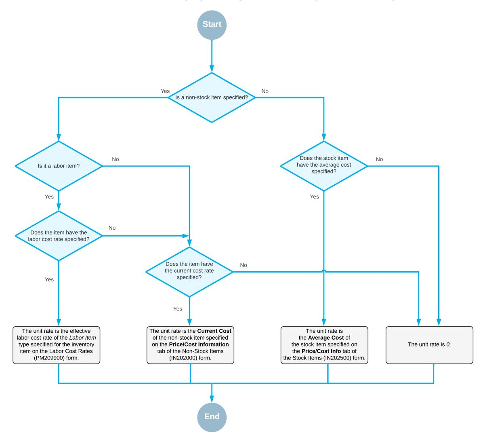

#### **Budget Lines Based on a Project Quote**

If the *Project Quotes* feature is enabled on the *[Enable/Disable Features](https://help-2025r1.acumatica.com/Help?ScreenId=ShowWiki&pageid=c1555e43-1bc5-4f6f-ba9d-b323f94d8a6b)* (CS100000) form and a project was created based on a project quote, in each created budget line on the *[Projects](https://help-2025r1.acumatica.com/Help?ScreenId=ShowWiki&pageid=81c86417-3bde-444b-8f1c-682928d31a0c)* (PM301000) form, the system inserts the unit rate as follows:

- In a cost budget line, the unit rate is inserted based on the unit cost of the corresponding estimation line of the project quote on the **Estimation** tab of the *[Project Quotes](https://help-2025r1.acumatica.com/Help?ScreenId=ShowWiki&pageid=81c83417-3bde-444b-8f1c-382928d31a0c)* (PM304500) form.
- In a revenue budget line, the system calculates the unit rate based on the values in the estimation lines of the project quote on the **Estimation** tab of the *[Project Quotes](https://help-2025r1.acumatica.com/Help?ScreenId=ShowWiki&pageid=81c83417-3bde-444b-8f1c-382928d31a0c)* form by using the following formula: Unit Rate = Amount / Quantity, where Amount = Ext. Price – Discount Amount.

#### **Budget Lines Based on a Change Order**

If the *Change Orders* feature is enabled on the *[Enable/Disable Features](https://help-2025r1.acumatica.com/Help?ScreenId=ShowWiki&pageid=c1555e43-1bc5-4f6f-ba9d-b323f94d8a6b)* (CS100000) form and the **Change Order Workflow** check box is selected for the project on the**Summary** tab of the *[Projects](https://help-2025r1.acumatica.com/Help?ScreenId=ShowWiki&pageid=81c86417-3bde-444b-8f1c-682928d31a0c)* (PM301000) form, in each created budget line of the project, the system specifies the unit rates as follows:

- In a cost budget line created based on the change order, the unit rate is copied from the corresponding change order line.
- In a revenue budget line created based on the change order, the unit rate is copied from the corresponding change order line.

# <span id="page-267-0"></span>**Project Budget: Automatic Generation of the Revenue Budget**

If you have configured the cost budget for a project, you can automatically populate the revenue budget on the **Revenue Budget** tab of the *[Projects](https://help-2025r1.acumatica.com/Help?ScreenId=ShowWiki&pageid=81c86417-3bde-444b-8f1c-682928d31a0c)* (PM301000) form based on the budgeted project costs.

To generate the revenue budget for a project, you click **Auto-Budget Revenue** on the More menu of the *[Projects](https://help-2025r1.acumatica.com/Help?ScreenId=ShowWiki&pageid=81c86417-3bde-444b-8f1c-682928d31a0c)* form. For the calculation of the revenue budget, the project must be properly configured as follows:

- The project status is *In Planning* or *Active*.
- The cost budget of the project is configured on the **Cost Budget** tab.
- The billing rule specified for project tasks has time and material steps.
- Optionally, an allocation rule is specified for each project task.

To calculate the project revenue, the system emulates project billing for the budgeted time and materials by using the billing rule specified for each project task. During this billing, the system uses virtual project transactions with the quantities and amounts that are equal to the revised budgeted quantities and amounts of the cost budget. If an allocation rule is specified for each project task, before emulating billing, the system emulates project allocation. Based on the quantities and amounts calculated during the emulated project billing, the system populates the revenue budget of the project.

If the revenue budget already has the same line or lines as the emulated budget, the system overrides the existing values with the calculated ones.

### <span id="page-267-2"></span><span id="page-267-1"></span>**Project Budget: Recalculation of the Project Balances**

In rare cases, you may need to make the system refresh the project budget to be sure that the project balances match the corresponding transactions and that the documents and all project information is up to date. To do this, you recalculate the project budget.

You can run the recalculation of project balances on the following forms:

- On the *[Projects](https://help-2025r1.acumatica.com/Help?ScreenId=ShowWiki&pageid=81c86417-3bde-444b-8f1c-682928d31a0c)* (PM301000) form: You can run recalculation for the selected project unless it has the *In Planning* status.
- On the *[Recalculate Project Balances](https://help-2025r1.acumatica.com/Help?ScreenId=ShowWiki&pageid=6bf336f5-0f89-455b-a3a1-50982a26ae3d)* (PM504000) form: You can mass-run recalculation for any number of selected projects with the *Active* or *Completed* status.

#### **Applicable Scenarios**

You run recalculation in the following cases:

- Project balances do not seem to match the total amounts of the corresponding project transactions. This may happen, for example, if project data has been modified through external tools or import scenarios. You need to bring the project budgets in line with the underlying project transactions.
- You have noticed that a project is not shown on the *[Run Project Billing](https://help-2025r1.acumatica.com/Help?ScreenId=ShowWiki&pageid=1a586da4-beaa-4015-8834-b2eb87a21fc9)* (PM503000) form, even though it has project transactions pending billing.
- The dra invoice amounts and quantities in the project budget do not seem to match the values in corresponding pro forma invoices.
- The project values affected by change orders do not seem to match the values in corresponding documents.

- You have noticed that the inclusive taxes accumulated for revenue budget lines do not match the inclusive taxes in the corresponding accounts receivable documents.
- You have selected the **Internal Cost CommitmentTracking** check box on the *[Projects Preferences](https://help-2025r1.acumatica.com/Help?ScreenId=ShowWiki&pageid=de2ca225-4a0c-4129-b09d-3f3ed05198f9)* (PM101000) form or changed the mapping of accounts to account groups on the *[Account Groups](https://help-2025r1.acumatica.com/Help?ScreenId=ShowWiki&pageid=94a2cdce-c36a-49a1-b572-9cd33cb5fa73)* (PM201000) form. Now you need to recalculate the existing commitments for the projects to make committed values match the quantities and amounts of the purchase orders and subcontracts.
- Project balances do not seem to match the total amounts and quantities of the corresponding purchase orders and subcontracts. This may happen, for example, if project data has been modified through external tools or import scenarios. You need to bring the committed values in line with the underlying commitments.
- You have noticed that the cost budget of the selected project does not show the lines that have been added to a project during the processing of the progress worksheets. Progress worksheets are available in the system if the *Construction* feature is enabled on the *[Enable/Disable Features](https://help-2025r1.acumatica.com/Help?ScreenId=ShowWiki&pageid=c1555e43-1bc5-4f6f-ba9d-b323f94d8a6b)* (CS100000) form.
- You have imported the cost budget or the revenue budget for a project manually or by using the *[Import by](https://help-2025r1.acumatica.com/Help?ScreenId=ShowWiki&pageid=88ac7166-2cc0-4201-ab3e-659ada2d74f2) [Scenario](https://help-2025r1.acumatica.com/Help?ScreenId=ShowWiki&pageid=88ac7166-2cc0-4201-ab3e-659ada2d74f2)* (SM206036) form, and you need to restructure imported budgets according to the revenue budget level and cost budget level of the project.

#### **Recalculation of the Actual Values of Projects**

To recalculate the actual project budget values, you select the unlabeled check boxes in the rows of the projects to be processed on the *[Recalculate Project Balances](https://help-2025r1.acumatica.com/Help?ScreenId=ShowWiki&pageid=6bf336f5-0f89-455b-a3a1-50982a26ae3d)* (PM504000) form and then click **Process** on the form toolbar. Alternatively, you can click **Process All** to process all the projects shown in the table.

The system validates project balances and recalculates the values in the **Actual Quantity** and **Actual Amount** columns on the **Revenue Budget** and **Cost Budget** tabs of the *[Projects](https://help-2025r1.acumatica.com/Help?ScreenId=ShowWiki&pageid=81c86417-3bde-444b-8f1c-682928d31a0c)* (PM301000) form.

#### **Recalculation of the Unbilled Transactions**

To recalculate project transaction information for a project, on the *[Recalculate Project Balances](https://help-2025r1.acumatica.com/Help?ScreenId=ShowWiki&pageid=6bf336f5-0f89-455b-a3a1-50982a26ae3d)* (PM504000) form, you need to select the **Recalculate Unbilled Summary** check box. You then select the unlabeled check box in a row with the project and click **Process** on the form toolbar. (Alternatively, you can click **Process All** to process all the projects shown in the table.)

The system validates project balance and recalculates the **Actual Quantity** and **Actual Amount** on the **Revenue Budget** and **Cost Budget** tabs of the *[Projects](https://help-2025r1.acumatica.com/Help?ScreenId=ShowWiki&pageid=81c86417-3bde-444b-8f1c-682928d31a0c)* (PM301000) form, and also updates the list of unbilled transactions for the project. As a result, the project appears on the *[Run Project Billing](https://help-2025r1.acumatica.com/Help?ScreenId=ShowWiki&pageid=1a586da4-beaa-4015-8834-b2eb87a21fc9)* form.

#### **Recalculation of the Cost Budget Lines**

During project budget recalculation, the system updates the cost budget lines of a project depending on the following settings:

- The **Cost Budget Update** system-wide setting on the *[Projects Preferences](https://help-2025r1.acumatica.com/Help?ScreenId=ShowWiki&pageid=de2ca225-4a0c-4129-b09d-3f3ed05198f9)* (PM101000) form, which can be *Detailed* or *Summary*.
- The **Cost Budget Level** setting specified for the particular project on the**Summary** tab of the *[Projects](https://help-2025r1.acumatica.com/Help?ScreenId=ShowWiki&pageid=81c86417-3bde-444b-8f1c-682928d31a0c)* (PM301000) form. This setting determines the detail level of the cost budget for the project, which can be *Task*, *Task and Cost Code*, *Task and Item*, or *Task, Item, and Cost Code*.

Suppose that a project has the **Cost Budget Level** set to *Task and Item* on the *[Projects](https://help-2025r1.acumatica.com/Help?ScreenId=ShowWiki&pageid=81c86417-3bde-444b-8f1c-682928d31a0c)* form. Also suppose that the cost budget of this project is based on cost transactions with multiple inventory items. The system recalculates the project budget as follows, depending on the **Cost Budget Update** option selected on the *[Projects Preferences](https://help-2025r1.acumatica.com/Help?ScreenId=ShowWiki&pageid=de2ca225-4a0c-4129-b09d-3f3ed05198f9)* form:

• *Detailed*: The system increases the level of detail of the project budget.

Suppose that before you recalculate this project, on the **Cost Budget** tab of the *[Projects](https://help-2025r1.acumatica.com/Help?ScreenId=ShowWiki&pageid=81c86417-3bde-444b-8f1c-682928d31a0c)* form, the project has a single line with the empty item code that represents all the cost transactions. When you recalculate this project, the system clears the values in this cost budget line and updates the cost budget with a separate line for each inventory item of the cost transactions. If some unprocessed cost transactions or

progress worksheet lines are found for the project during the recalculation process, the system updates the cost budget line that has the same inventory item as in the cost transaction. If the cost budget has no line that has this inventory item, a new line with the inventory item is added.

• *Summary*: The system maintains the level of detail of the project budget and does not reduce it.

Suppose that before you recalculate this project, on the **Cost Budget** tab of the *[Projects](https://help-2025r1.acumatica.com/Help?ScreenId=ShowWiki&pageid=81c86417-3bde-444b-8f1c-682928d31a0c)* form, the project has a separate line for each inventory item of the cost transactions. If some unprocessed cost transactions are found for the project during the recalculation process, the system updates the cost budget line with the empty item code selected as the inventory item, regardless of the inventory item of the cost transaction. If the cost budget has no line with the empty item code, a new line with the empty item code is added.

For more information on the rules that the system uses to update the amounts and quantities in budget lines, see *Project [Transactions:](#page-133-1) Update of the Project Budget Structure*.

#### **Recalculation of the Revenue Budget Lines**

During project budget recalculation, the system updates the revenue budget lines of a project depending on the following settings:

- The **Revenue Budget Update** setting on the *[Projects Preferences](https://help-2025r1.acumatica.com/Help?ScreenId=ShowWiki&pageid=de2ca225-4a0c-4129-b09d-3f3ed05198f9)* (PM101000) form, which can be *Detailed* or *Summary*.
- The **Revenue Budget Level** setting specified for each project on the**Summary** tab of the *[Projects](https://help-2025r1.acumatica.com/Help?ScreenId=ShowWiki&pageid=81c86417-3bde-444b-8f1c-682928d31a0c)* (PM301000) form. This setting determines the detail level of the cost budget for the project, which can be *Task*, *Task and Cost Code*, *Task and Item*, or *Task, Item, and Cost Code*.

Suppose that a project has the **Revenue Budget Level** set to *Task and Item* on the *[Projects](https://help-2025r1.acumatica.com/Help?ScreenId=ShowWiki&pageid=81c86417-3bde-444b-8f1c-682928d31a0c)* form. Also suppose that the revenue budget of this project is based on revenue transactions with multiple inventory items. The system recalculates the project budget as follows, depending on the **Revenue Budget Update** option selected on the *[Projects Preferences](https://help-2025r1.acumatica.com/Help?ScreenId=ShowWiki&pageid=de2ca225-4a0c-4129-b09d-3f3ed05198f9)* form:

• *Detailed*: The system increases the level of detail of the project budget.

Suppose that before you recalculate this project, on the **Revenue Budget** tab of the *[Projects](https://help-2025r1.acumatica.com/Help?ScreenId=ShowWiki&pageid=81c86417-3bde-444b-8f1c-682928d31a0c)* form, the project has a single line with the empty item code that represents all the revenue transactions. When you recalculate this project, the system removes this revenue budget line and updates the revenue budget with a separate line for each inventory item of the revenue transactions. If some unprocessed revenue transactions are found for the project during the recalculation process, the system updates the revenue budget line that has the same inventory item as in the revenue transaction. If the revenue budget has no line that has this inventory item, a new line with the inventory item is added.

• *Summary*: The system maintains the level of detail of the project budget and does not reduce it.

Suppose that before you recalculate this project, on the **Revenue Budget** tab of the *[Projects](https://help-2025r1.acumatica.com/Help?ScreenId=ShowWiki&pageid=81c86417-3bde-444b-8f1c-682928d31a0c)* form, the project has a separate line for each inventory item of the revenue transactions. When you recalculate this project, the system does not remove the revenue budget lines; it also does not update the revenue budget with a single line with the empty item code for all the revenue transactions. If some unprocessed revenue transactions are found for the project during the recalculation process, the system updates the revenue budget line with the empty item code selected as the inventory item, regardless of the inventory item of the revenue transaction. If the revenue budget has no line with the empty item code, a new line with the empty item code is added.

For more information on the rules that the system uses to update the amounts and quantities in budget lines, see *Project [Transactions:](#page-133-1) Update of the Project Budget Structure*.

#### **Recalculation of Change Orders**

To recalculate budget values affected by change orders, you select the **Recalculate Change Orders** check box in the Selection area of the *[Recalculate Project Balances](https://help-2025r1.acumatica.com/Help?ScreenId=ShowWiki&pageid=6bf336f5-0f89-455b-a3a1-50982a26ae3d)* (PM504000) form. You then select the unlabeled check boxes in the rows of the projects to be processed and click **Process** on the form toolbar to process the selected projects. Alternatively, you can click **Process All** to process all the projects shown in the table.

The system validates the project balances and recalculates the following values on the **Revenue Budget** and **Cost Budget** tabs of the *[Projects](https://help-2025r1.acumatica.com/Help?ScreenId=ShowWiki&pageid=81c86417-3bde-444b-8f1c-682928d31a0c)* (PM301000) form:

- **Budgeted CO Quantity**
- **Budgeted CO Amount**
- **Revised Budgeted Quantity**
- **Revised Budgeted Amount**

The recalculation of change orders does not involve the recalculation of the committed values that were changed with the change orders. To update the committed values, you need to rebuild commitments.

#### **Rebuilding of Project Commitments**

To rebuild commitments (purchase orders, project drop-ship orders, and subcontracts), you select the **Rebuild Commitments** check box in the Selection area of the *[Recalculate Project Balances](https://help-2025r1.acumatica.com/Help?ScreenId=ShowWiki&pageid=6bf336f5-0f89-455b-a3a1-50982a26ae3d)* (PM504000) form. You then select the unlabeled check boxes in the rows of the projects to be processed and click **Process** on the form toolbar to process the selected projects. Alternatively, you can click **Process All** to process all the projects shown in the table.

The system recreates commitments and recalculates the project balances. That is, it updates the following values on the **Cost Budget** tab of the *[Projects](https://help-2025r1.acumatica.com/Help?ScreenId=ShowWiki&pageid=81c86417-3bde-444b-8f1c-682928d31a0c)* (PM301000) form:

- **Original Committed Quantity**
- **Original Committed Amount**
- **Committed CO Quantity**
- **Committed CO Amount**
- **Revised Committed Quantity**
- **Revised Committed Amount**
- **Committed Received Quantity**
- **Committed Invoiced Quantity**
- **Committed Invoiced Amount**
- **Committed Open Quantity**
- **Committed Open Amount**

#### **Recalculation of Pro Forma Invoices**

To recalculate pro forma invoices, you select the **Recalculate Dra Invoice Amount and Quantity** check box in the Selection area of the *[Recalculate Project Balances](https://help-2025r1.acumatica.com/Help?ScreenId=ShowWiki&pageid=6bf336f5-0f89-455b-a3a1-50982a26ae3d)* (PM504000) form. You then select the unlabeled check boxes in the rows of the projects to be processed and click **Process** on the form toolbar to process the selected projects. Alternatively, you can click **Process All** to process all the projects shown in the table.

The system validates the project balances and recalculates the **Dra Invoice Amount** and **Dra Invoice Quantity** on the **Revenue Budget** tab of the *[Projects](https://help-2025r1.acumatica.com/Help?ScreenId=ShowWiki&pageid=81c86417-3bde-444b-8f1c-682928d31a0c)* (PM301000) form.

#### **Recalculating Inclusive Taxes**

To recalculate inclusive taxes, you select the **Recalculate InclusiveTaxes** check box in the Selection area of the *[Recalculate Project Balances](https://help-2025r1.acumatica.com/Help?ScreenId=ShowWiki&pageid=6bf336f5-0f89-455b-a3a1-50982a26ae3d)* (PM504000) form. You then select the unlabeled check boxes in the rows of the projects to be processed and click **Process** on the form toolbar to process the selected projects. Alternatively, you can click **Process All** to process all the projects shown in the table.

# <span id="page-271-0"></span>**Project Budget: To Restructure the Budget**

This activity will walk you through the process of reestablishing the budget structure of a project.

This activity is based on the *U100* dataset. If you are using another dataset, or if any system settings have been changed in *U100*, these changes can affect the workflow of the activity and the results of the processing. To avoid any issues, restore the *U100* dataset to its initial state.

#### **Story**

Suppose that the Lake Cafe customer has ordered a juicer, along with the services of installation and training of employees on operating the juicer from the SweetLife Fruits & Jams company. SweetLife's project accountant has decided that the revenue budget level of the project should include inventory items, created the project to account for the provided material and work, and entered project transactions.

Suppose that later the project accountant realizes that an extra level of detail of the revenue budget is not necessary. Aer restructuring the revenue budget and removing inventory items from the budget detail, the project accountant bills the customer. Aer the billing, it becomes clear that the previous level of detail of the revenue budget fitted the reporting requirements better and it is necessary to restructure the budget again.

Acting as the project accountant, you will restructure the project budget before and aer the billing.

#### **Configuration Overview**

In the *U100* dataset, the following tasks have been performed to support this activity:

- On the *[Enable/Disable Features](https://help-2025r1.acumatica.com/Help?ScreenId=ShowWiki&pageid=c1555e43-1bc5-4f6f-ba9d-b323f94d8a6b)* (CS100000) form, the *Project Accounting* feature has been enabled to support the project accounting functionality.
- On the *[Projects](https://help-2025r1.acumatica.com/Help?ScreenId=ShowWiki&pageid=81c86417-3bde-444b-8f1c-682928d31a0c)* (PM301000) form, the *LAKECAFE* project has been created and the *PHASE1* and *PHASE2* project tasks have been created for the project. The *Task and Item* revenue budget level has been specified for the project and three revenue budget lines have been added.
- On the *Project [Transactions](https://help-2025r1.acumatica.com/Help?ScreenId=ShowWiki&pageid=382a97fe-b636-44ca-9798-6d478c05b687)* (PM304000) form, the *PM00000024* batch of project transactions related to the project has been created and released.

### **Process Overview**

You will adjust the project budget and save project budget revisions on the *[Projects](https://help-2025r1.acumatica.com/Help?ScreenId=ShowWiki&pageid=81c86417-3bde-444b-8f1c-682928d31a0c)* (PM301000) form. On the same form, you will initiate the project billing. You will complete the billing on the *[Invoices and Memos](https://help-2025r1.acumatica.com/Help?ScreenId=ShowWiki&pageid=5e6f3b27-b7af-412f-a40a-1d4f4be70cba)* (AR301000) form. You will then adjust the project budget one more time on the *[Projects](https://help-2025r1.acumatica.com/Help?ScreenId=ShowWiki&pageid=81c86417-3bde-444b-8f1c-682928d31a0c)* form and recalculate the project balances on the *[Recalculate Project Balances](https://help-2025r1.acumatica.com/Help?ScreenId=ShowWiki&pageid=6bf336f5-0f89-455b-a3a1-50982a26ae3d)* (PM504000) form.

#### **System Preparation**

To sign in to the system and prepare to perform the instructions of the activity, do the following:

- 1. Download the *[LAKECAFE\\_Budget\\_1.xlsx](Published/UserGuide/Files/LAKECAFE_Budget_1.xlsx)* and *[LAKECAFE\\_Budget\\_2.xlsx](Published/UserGuide/Files/LAKECAFE_Budget_2.xlsx)* files to your computer.
- 2. Launch the Acumatica ERP website, and sign in to a company with the *U100* dataset preloaded; you should sign in as project accountant by using the *brawner* username and the *123* password.
- 3. In the info area, in the upper-right corner of the top pane of the Acumatica ERP screen, make sure that the business date in your system is set to *1/30/2025*. If a different date is displayed, click the Business Date menu

button and select *1/30/2025* on the calendar. For simplicity, in this activity, you will create and process all documents in the system on this business date.

#### **Step 1: Restructuring the Project Budget**

To save the original version of the project budget and restructure the budget, do the following:

- 1. Open the *[Projects](https://help-2025r1.acumatica.com/Help?ScreenId=ShowWiki&pageid=81c86417-3bde-444b-8f1c-682928d31a0c)* (PM301000) form.
- 2. In the **Project ID** box, select *LAKECAFE*.
- 3. To create a backup of the original revenue budget of the project, do the following:
  - a. On the table toolbar of the **Revenue Budget** tab, click **Export to Excel**.

The system exports the revenue budget to an Excel file.

- b. On your computer, locate the created file, and rename it to LAKECAFE\_Revenue\_Budget\_1.xlsx.
- 4. To attach to the project the file with the exported revenue budget, do the following:
  - a. On the form title bar, click **Files**.
  - b. In the **Files** dialog box, click **Browse**, and select the LAKECAFE\_Revenue\_Budget\_1.xlsx file that you have just downloaded.
  - c. Click **Upload** to upload the selected file.

The system uploads the selected file to the project and shows the file in the table of the dialog box.

- d. In the line with the uploaded LAKECAFE\_Revenue\_Budget\_1.xlsx file, click the *Edit* link.
- e. On the **Versions** tab of the *[File Maintenance](https://help-2025r1.acumatica.com/Help?ScreenId=ShowWiki&pageid=cedc116f-1c35-4053-9aae-65a525be642f)* (SM202510) form, which opens, enter Revision 1 of the revenue budget in the **Comment** column for the uploaded file.
- f. Save your changes to the file, and close the browser tab with the *[File Maintenance](https://help-2025r1.acumatica.com/Help?ScreenId=ShowWiki&pageid=cedc116f-1c35-4053-9aae-65a525be642f)* form to return to the *[Projects](https://help-2025r1.acumatica.com/Help?ScreenId=ShowWiki&pageid=81c86417-3bde-444b-8f1c-682928d31a0c)* form.
- g. Close the **Files** dialog box.
- 5. On the **Revenue Budget** tab, delete each of the three budget lines by clicking the line and then clicking **Delete Row** on the table toolbar.
- 6. On the **Summary** tab (**Project Properties** section), select *Task* as the **Revenue Budget Level**.
- 7. On the table toolbar of the **Revenue Budget** tab, click **Load Records from File**, and upload the revenue budget from the LAKECAFE\_Budget\_1.xlsx file, which you have downloaded with the course. While you are uploading the lines, leave the default column mapping.

The uploaded revenue budget should have two lines with the budgeted amounts of \$2,900 and \$400.

8. Save your changes to the project.

You have restructured the revenue budget of the project and attached previous budget revision to the project. In the next step, you will bill the project.

#### **Step 2: Billing the Project**

To bill the project, do the following:

1. While remaining on the *[Projects](https://help-2025r1.acumatica.com/Help?ScreenId=ShowWiki&pageid=81c86417-3bde-444b-8f1c-682928d31a0c)* (PM301000) form, on the form toolbar, click **Run Billing**.

The system creates an accounts receivable invoice and opens it on the *[Invoices and Memos](https://help-2025r1.acumatica.com/Help?ScreenId=ShowWiki&pageid=5e6f3b27-b7af-412f-a40a-1d4f4be70cba)* (AR301000) form.

- 2. On the form toolbar, click **Remove Hold** to assign the invoice the *Balanced* status, and then click **Release** to release the accounts receivable invoice.
- 3. Close the form and return to the *[Projects](https://help-2025r1.acumatica.com/Help?ScreenId=ShowWiki&pageid=81c86417-3bde-444b-8f1c-682928d31a0c)* form with the *LAKECAFE* project selected.

4. Press Esc to refresh the form.

You have billed the project. In the next step, you will restructure the revenue budget of the project again.

#### **Step 3: Restructuring the Project Budget Aer Billing**

To perform one more budget revision aer billing, while you are still viewing the *LAKECAFE* project on the *[Projects](https://help-2025r1.acumatica.com/Help?ScreenId=ShowWiki&pageid=81c86417-3bde-444b-8f1c-682928d31a0c)* (PM301000) form, do the following:

- 1. To create a backup of the current revision of the revenue budget of the project, do the following:
  - a. On the table toolbar of the **Revenue Budget** tab, click **Export to Excel**.

The system exports the revenue budget to an Excel file.

- b. On your computer, locate the created file and rename it to LAKECAFE\_Revenue\_Budget\_2.xlsx.
- 2. To upload the current revision of the revenue budget of the project to the file with the original revenue budget, do the following:
  - a. On the form title bar, click **Files**.
  - b. In the line with the uploaded LAKECAFE\_Revenue\_Budget\_1.xlsx file, click the *Edit* link.
  - c. On the form toolbar of the *[File Maintenance](https://help-2025r1.acumatica.com/Help?ScreenId=ShowWiki&pageid=cedc116f-1c35-4053-9aae-65a525be642f)* (SM202510) form, which opens, click **Upload New Version**.
  - d. In the **File Upload** dialog box, which opens, click **Choose File**, and select the LAKECAFE\_Revenue\_Budget\_2.xlsx file you have downloaded.
  - e. Click **Upload** to upload the selected file.

The system uploads the selected file as a new file version and closes the dialog box.

- f. On the **Versions** tab of the *[File Maintenance](https://help-2025r1.acumatica.com/Help?ScreenId=ShowWiki&pageid=cedc116f-1c35-4053-9aae-65a525be642f)* form, enter Revision 2 of the revenue budget in the **Comment** column for the uploaded file with the**Version ID** of *2*.
- g. Save your changes to the file, and close the browser tab with the *[File Maintenance](https://help-2025r1.acumatica.com/Help?ScreenId=ShowWiki&pageid=cedc116f-1c35-4053-9aae-65a525be642f)* form to return to the project on the *[Projects](https://help-2025r1.acumatica.com/Help?ScreenId=ShowWiki&pageid=81c86417-3bde-444b-8f1c-682928d31a0c)* form.
- h. Close the **Files** dialog box, and press Esc to refresh the form.
- 3. On the **Revenue Budget** tab, make sure the revenue budget lines have nonzero amounts in the **Actual Amount** column that the system updated during the project billing.
- 4. Delete each of the two budget lines by clicking the line and then clicking **Delete Row** on the table toolbar.
- 5. On the **Summary** tab (**Project Properties** section), select *Task and Item* as the **Revenue Budget Level**.
- 6. On the table toolbar of the **Revenue Budget** tab, click **Load Records from File**, and upload the revenue budget from the LAKECAFE\_Budget\_2.xlsx file, which you have downloaded with the course. While you are uploading the lines, leave the default column mapping.

The uploaded revenue budget should have three lines with the budgeted amounts of *400*, *2,500*, and *400*. Notice the revenue budget lines now have *0* in the **Actual Amount** and **Actual Quantity** columns. Now you need to validate the project balances to recalculate the revenue budget in accordance with the related invoices.

- 7. Save your changes to the project.
- 8. On the More menu, under **Budget Operations**, click **Recalculate Project Balance**.

The system validates the balances of the *LAKECAFE* project and recalculates the amounts and quantities affected by invoices. On the **Revenue Budget** tab, review the revenue budget. Notice that the system has updated the actual amounts and quantities of the budget lines, as shown in the following screenshot.

| Projects                                                                  |                                                                |                    |                                                |                                        |                          |                   |                       |                             |                            |                     |                                  |                                | NOTES<br>FILES (1)            | $TOOLS$ $\star$           |
|---------------------------------------------------------------------------|----------------------------------------------------------------|--------------------|------------------------------------------------|----------------------------------------|--------------------------|-------------------|-----------------------|-----------------------------|----------------------------|---------------------|----------------------------------|--------------------------------|-------------------------------|---------------------------|
| LAKECAFE - A juicer with the installation and training for employees      |                                                                |                    |                                                |                                        |                          |                   |                       |                             |                            |                     |                                  |                                |                               |                           |
| 뭐<br>圖<br>$\leftarrow$<br>$\Omega$                                        | 俞<br>к<br>$+$                                                  | $\lambda$<br>≺     | <b>COMPLETE</b>                                | <b>RUN BILLING</b><br>$\cdots$         |                          |                   |                       |                             |                            |                     |                                  |                                |                               |                           |
|                                                                           |                                                                |                    |                                                |                                        |                          |                   |                       |                             |                            |                     |                                  |                                |                               |                           |
| * Project ID:                                                             | LAKECAFE                                                       | $\circ$            | <b>Customer</b>                                | LAKECAFE - Lake Cafe                   |                          | $\mathcal{D}$     | Actual Income:        |                             | 3,300.00                   |                     |                                  |                                |                               | $\hat{\phantom{a}}$       |
| Template:                                                                 | $\varphi$<br>Project Manager:<br>0<br>EP00000001 - Pam Brawner |                    |                                                |                                        |                          |                   | Actual Expenses:      |                             | 2.640.00                   |                     |                                  |                                |                               |                           |
| Status:                                                                   | Active                                                         |                    |                                                |                                        |                          |                   |                       | Margin Amount:              | 660.00                     |                     |                                  |                                |                               |                           |
| A juicer with the installation and training for employees<br>Description: |                                                                |                    |                                                |                                        |                          |                   | Margin (%):           |                             | 20.00                      |                     |                                  |                                |                               |                           |
|                                                                           |                                                                |                    |                                                |                                        |                          |                   | Pending Invoice Amoun |                             | 0.00                       |                     |                                  |                                |                               |                           |
|                                                                           |                                                                |                    |                                                |                                        |                          |                   |                       |                             |                            |                     |                                  |                                |                               |                           |
| SUMMARY<br><b>TASKS</b>                                                   | <b>REVENUE BUDGET</b>                                          | <b>COST BUDGET</b> | <b>BALANCES</b>                                | <b>INVOICES</b><br><b>UNION LOCALS</b> |                          | <b>ACTIVITIES</b> | <b>EMPLOYEES</b>      | <b>EQUIPMENT</b>            | <b>ADDRESSES</b>           | <b>DEFAULTS</b>     | <b>ATTRIBUTES</b>                |                                | <b>MAILING &amp; PRINTING</b> | $\,$ $\,$ $\,$            |
|                                                                           |                                                                |                    |                                                |                                        |                          |                   |                       |                             |                            |                     |                                  |                                |                               |                           |
| Group by Task                                                             |                                                                |                    |                                                |                                        |                          |                   |                       |                             |                            |                     |                                  |                                |                               |                           |
| $\times$                                                                  | <b>VIEW TRANSACTIONS</b><br>$\mathbb{H}$                       | $\mathbf{x}$       |                                                |                                        |                          |                   |                       |                             |                            |                     |                                  | <b>All Records</b>             |                               | $\triangledown$<br>$\sim$ |
|                                                                           |                                                                | 土                  |                                                |                                        |                          |                   |                       |                             |                            |                     |                                  |                                |                               |                           |
| D<br>FB 0<br>* Project Task                                               | *Inventory ID                                                  | *Account Group     | <b>Description</b>                             |                                        | Original UOM<br>Budgeted |                   | <b>Unit Rate</b>      | Original<br><b>Budgeted</b> | Revised<br><b>Budgeted</b> | Revised<br>Budgeted | <b>Draft Invoice</b><br>Quantity | <b>Draft Invoice</b><br>Amount | Actual<br>Quantity            | Actual<br>Amount          |
|                                                                           |                                                                |                    |                                                |                                        | Quantity                 |                   |                       | Amount                      | Quantity                   | Amount              |                                  |                                |                               |                           |
| $0$ D<br>PHASE1                                                           | <b>INSTALL</b>                                                 | <b>REVENUE</b>     | Installation of equipment at the customers'    |                                        |                          | 4.00 HOUR         | 100,0000              | 400.00                      | 4.00                       | 400.00              | 0.00                             | 0.00                           | 4.00                          | 400.00                    |
| $0$ D<br>PHASE1                                                           | <b>JUICER15</b>                                                | <b>REVENUE</b>     | Commercial juicer with a production rate of    |                                        |                          | 1.00 PIECE        | 2,500.0000            | 2,500.00                    | 1.00                       | 2,500.00            | 0.00                             | 0.00                           | 1.00                          | 2,500.00                  |
|                                                                           |                                                                | <b>REVENUE</b>     |                                                |                                        |                          |                   |                       |                             | 8.00                       |                     |                                  |                                |                               |                           |
| 0 D<br>PHASE2                                                             | <b>TRAINING</b>                                                |                    | Training on juicer usage (at customer's place) |                                        | 8.00                     | <b>HOUR</b>       | 50,0000               | 400.00                      |                            | 400.00              | 0.00                             | 0.00                           | 8.00                          | 400.00                    |

*Figure: Project budget aer restructuring and validation*

You have finished restructuring of the project budget and have validated the budget's actual values.

# <span id="page-275-0"></span>**Controlling the Project Budget**

This chapter explains how to prevent the original budget values of the project from being edited and how to verify that a newly entered document aligns with the agreed-on project budget.

# <span id="page-275-1"></span>**Project Budget Control: General Information**

The project budget is used to provide both a financial plan and cost constraints for a project. If you define the amount of money and resources to be spent on the project, you can control whether the actual project costs exceed the budgeted values as users enter documents for the projects. This helps users control the created documents and can be useful for the person who approves these documents.

#### **Learning Objectives**

In this chapter, you will learn how to do the following:

- Control whether AP bills, purchase orders, subcontracts, and change orders created for a project exceed the project budget
- Control the cost code usage in documents
- Lock the budgeted values

#### **Applicable Scenarios**

You configure project budget control if your company needs to ensure project budget consistency and adherence specifically, if you need to be able to do the following:

- Verify that the budgeted values would not be exceeded if a document is processed
- Control the consistent usage of cost codes in project-related documents
- Lock the project budget to prevent the agreed-on values from being changed

#### **Control of Document Consistency for the Project**

If the *Cost Codes* feature is enabled on the *[Enable/Disable Features](https://help-2025r1.acumatica.com/Help?ScreenId=ShowWiki&pageid=c1555e43-1bc5-4f6f-ba9d-b323f94d8a6b)* (CS100000) form, to ensure that document lines are entered for the appropriate budget lines, the system controls the cost code entry in the lines of documents created for projects. When a user interacts with the **Cost Code** column of the document entry form, the system helps the user enter the appropriate cost code as follows:

- When the user clicks the magnifier button in this column, in the lookup table that opens, the system displays only the cost codes that exist in the project budget for the specified combination of the project task and the account group.
- If the user manually enters an existing cost code that is not included in the project budget for the specified combination of the project task and the account group, the system displays a warning.

#### **Control of the Budgeted Costs**

To avoid the project budget being exceeded as users enter documents for a project, you can configure the system to check whether the entered purchase order, change order, accounts payable bill, or subcontract is within the cost budget of the specified project, taking into consideration the portion of the budget that has already been consumed.

To set up this validation, you select *Show a Warning* in the **Budget Control** box on the **General** tab (**General Settings** section) of the *[Projects Preferences](https://help-2025r1.acumatica.com/Help?ScreenId=ShowWiki&pageid=de2ca225-4a0c-4129-b09d-3f3ed05198f9)* (PM101000) form. For more information, see *[Project Budget Control:](#page-276-1) [Overrun Notifications During Document Entry](#page-276-1)*.

#### **Locking of the Budgeted Values**

Once a project budget has been agreed on, you can lock the original figures to prevent further editing of them. Aer the original budgeted values are locked, you can still update the revised budgeted values. By maintaining the original values, you can assess how accurately the budget was estimated. Because you can also make adjustments to the revised budget as additional information becomes known, budget revisions provide the most accurate and up-to-date estimation of the budget. For more information, see *[Project Budget Control: Budget Locking](#page-281-2)*.

# <span id="page-276-1"></span><span id="page-276-0"></span>**Project Budget Control: Overrun Notifications During Document Entry**

You can configure the system to notify a user if the amount in a line of the document they are entering would exceed the budget of the corresponding project budget line.

To do this, you select *Show a Warning* in the **Budget Control** box on the **General** tab of the *[Projects Preferences](https://help-2025r1.acumatica.com/Help?ScreenId=ShowWiki&pageid=de2ca225-4a0c-4129-b09d-3f3ed05198f9)* (PM101000) form. When a user enters a project-related document, the system will generate a warning if a line amount exceeds the cost budget of the corresponding project budget line. These warnings can be generated when a user is entering any of the following documents:

- A purchase order of the *Normal* or *Project Drop-Ship* type and the *On Hold* or *Pending Approval* status on the *[Purchase Orders](https://help-2025r1.acumatica.com/Help?ScreenId=ShowWiki&pageid=5565686c-96c4-4bfa-a51d-9a2566baa808)* (PO301000) form.
- An AP bill with the *On Hold*, *Pending Approval*, or *Balanced* status on the *[Bills and Adjustments](https://help-2025r1.acumatica.com/Help?ScreenId=ShowWiki&pageid=956b4e51-3078-4d2d-85b3-65c080d95234)* (AP301000) form.
- A change order with the *On Hold* or *Pending Approval* status on the *[Change Orders](https://help-2025r1.acumatica.com/Help?ScreenId=ShowWiki&pageid=0c26a0eb-ef8d-4a61-97c8-237aea21cf25)* (PM308000) form.

Change orders are available in the system if the *Change Orders* feature is enabled on the *[Enable/Disable Features](https://help-2025r1.acumatica.com/Help?ScreenId=ShowWiki&pageid=c1555e43-1bc5-4f6f-ba9d-b323f94d8a6b)* (CS100000) form. For more information about the processing of change orders, see *Tracking [Changes](#page-311-2) to the Project Budget*.

• A subcontract with the *On Hold* or *Pending Approval* status on the *[Subcontracts](https://help-2025r1.acumatica.com/Help?ScreenId=ShowWiki&pageid=dc6a00f9-3913-47bb-b28d-105be0e0d20a)* (PO301000) form.


Subcontracts are available in the system if the *Construction* feature is enabled on the *[Enable/](https://help-2025r1.acumatica.com/Help?ScreenId=ShowWiki&pageid=c1555e43-1bc5-4f6f-ba9d-b323f94d8a6b) [Disable Features](https://help-2025r1.acumatica.com/Help?ScreenId=ShowWiki&pageid=c1555e43-1bc5-4f6f-ba9d-b323f94d8a6b)* form. For more information about the processing of subcontracts, see *[Subcontracts: General Information](https://help-2025r1.acumatica.com/Help?ScreenId=ShowWiki&pageid=092fdfc8-b353-49d2-ad0d-402968d77afc)*.

The warning message in a document line shows you how much the line amount exceeds the budget. The system compares the document line with the corresponding cost budget line of the project and shows you the following amounts in the warning:

• *Budgeted*: The revised budgeted amount of the budget line.

If the project budget has no corresponding budget line with the same project budget key, the revised budgeted value of the line used in overrun calculation is *0*.

- *Consumed*: The amount that has been spent already—that is, the sum of the actual amount and the committed open amount of the budget line.
- *Document*: The total amount (the **Ext. Cost** minus the **Discount Amount**) of all the document lines that impact the same budget line, including the current document.
- *Available*: The amount of the budget that is available for the document. The available amount is calculated as the difference between the *Budgeted* amount and the *Consumed* amount.

• *Remaining*: The amount that exceeds the budget. The remaining amount is calculated as the difference between the *Available* and *Document* amounts.

For example, suppose that you have budgeted a cost of \$400 for the project (the budgeted amount). You have already spent \$150 (the consumed amount). When you create an AP bill for the project in the amount of \$300 (the document amount) and specify the project budget key in the document line, the system will display the following warning:

*Budgeted: 400.00, Consumed: 150.00, Available: 250.00, Document: 300.00, Remaining: –50.00*

The warning does not prevent you from processing the document; it just informs you that by processing the document, you will exceed the budgeted values.

You can see the list of all document lines that potentially could exceed the budget of a selected project on the *[Potential Project Budget Overruns](https://help-2025r1.acumatica.com/Help?ScreenId=ShowWiki&pageid=29bf5433-446f-1488-be69-f2cb177e83cb)* (PM404000) form.

# <span id="page-277-0"></span>**Project Budget Control: To Review the Budget Overruns**

This activity will walk you through the process of receiving notifications that indicate whether a newly entered document fits the existing project budget.

This activity is based on the *U100* dataset. If you are using another dataset, or if any system settings have been changed in *U100*, these changes can affect the workflow of the activity and the results of the processing. To avoid any issues, restore the *U100* dataset to its initial state.

#### **Story**

Suppose that the West BBQ Restaurant customer has ordered a juicer from the SweetLife Fruits & Jams company, along with the following services: juicer installation, and employee training on operating the juicer. The SweetLife company has contracted the Squeezo Inc. vendor to perform all the services. SweetLife's project accountant has created the project. The vendor has delivered and installed the juicer, and Squeezo's consultant has provided the training. Then suppose that the project accountant noticed that the juicer has cost an extra \$200 beyond the budgeted amount, and that the installation and the training have taken two hours more than the budgeted number of hours.

Acting as SweetLife's project accountant, you will enter a change order to adjust the cost of the juicer, an accounts payable bill for the provided training, and a purchase order for the installation service. As you enter these projectrelated documents, you will check whether the costs are within the project budget.

#### **Configuration Overview**

In the *U100* dataset, the following tasks have been performed to support this activity:

- On the *[Enable/Disable Features](https://help-2025r1.acumatica.com/Help?ScreenId=ShowWiki&pageid=c1555e43-1bc5-4f6f-ba9d-b323f94d8a6b)* (CS100000) form, the following features have been enabled:
  - *Project Accounting*, which provides the project accounting functionality
  - *Inventory and Order Management*, which provides the ability to maintain stock items and to create and process purchasing documents that include stock items
- On the *[Change Order Classes](https://help-2025r1.acumatica.com/Help?ScreenId=ShowWiki&pageid=fdac3e07-8ea5-4c44-85bc-bae8850df2f0)* (PM203000) form, the *DEFAULT* change order class has been created.
- On the *[Projects Preferences](https://help-2025r1.acumatica.com/Help?ScreenId=ShowWiki&pageid=de2ca225-4a0c-4129-b09d-3f3ed05198f9)* (PM101000) form, the *DEFAULT* change order class has been selected in the **Default Change Order Class** box on the **General** tab (**GeneralSettings** section).
- On the *[Projects](https://help-2025r1.acumatica.com/Help?ScreenId=ShowWiki&pageid=81c86417-3bde-444b-8f1c-682928d31a0c)* (PM301000) form, the *WESTBBQ2* project has been created, the *PHASE1* and *PHASE2* project tasks have been created for the project, and three cost budget lines have been added. The change order workflow has been enabled for the project.
- On the *[Non-Stock Items](https://help-2025r1.acumatica.com/Help?ScreenId=ShowWiki&pageid=bf68dd4f-63d4-460d-8dc0-9152f2bd6bf1)* (IN202000) form, the *INSTALL* and *TRAINING* non-stock item have been defined.

- On the *[Stock Items](https://help-2025r1.acumatica.com/Help?ScreenId=ShowWiki&pageid=77786a70-1f1e-4d63-ad98-96f98e4fcb0e)* (IN202500) form, the *JUICER15* stock item has been defined.
- On the *[Vendors](https://help-2025r1.acumatica.com/Help?ScreenId=ShowWiki&pageid=a9584be3-f2bd-4d67-80d4-8041d809df56)* (AP303000) form, the *SQUEEZO* vendor has been created.

#### **Process Overview**

In this activity, you will capture project costs by processing a change order on the *[Change Orders](https://help-2025r1.acumatica.com/Help?ScreenId=ShowWiki&pageid=0c26a0eb-ef8d-4a61-97c8-237aea21cf25)* (PM308000) form, an accounts payable bill on the *[Bills and Adjustments](https://help-2025r1.acumatica.com/Help?ScreenId=ShowWiki&pageid=956b4e51-3078-4d2d-85b3-65c080d95234)* (AP301000) form, and a purchase order on the *[Purchase](https://help-2025r1.acumatica.com/Help?ScreenId=ShowWiki&pageid=5565686c-96c4-4bfa-a51d-9a2566baa808) [Orders](https://help-2025r1.acumatica.com/Help?ScreenId=ShowWiki&pageid=5565686c-96c4-4bfa-a51d-9a2566baa808)* (PO301000) form. While you process these documents, you will review potential budget overruns on the entry forms. You will then review all the project budget overruns at once on the *[Potential Project Budget Overruns](https://help-2025r1.acumatica.com/Help?ScreenId=ShowWiki&pageid=29bf5433-446f-1488-be69-f2cb177e83cb)* (PM404000) form.

#### **System Preparation**

To sign in to the system and prepare to perform the instructions of the activity, do the following:

- 1. Implement the two-tier change management and configure change order classes by performing the following prerequisite activity: *[Change Requests: Implementation Activity](#page-331-1)*.
- 2. Sign in to the system as Pam Brawner, the project accountant, by using the *brawner* username and the *123* password.
- 3. In the info area, in the upper-right corner of the top pane of the Acumatica ERP screen, make sure that the business date in your system is set to *1/30/2025*. If a different date is displayed, click the Business Date menu button and select *1/30/2025* on the calendar. For simplicity, in this activity, you will create and process all documents in the system on this business date.
- 4. On the *[Projects Preferences](https://help-2025r1.acumatica.com/Help?ScreenId=ShowWiki&pageid=de2ca225-4a0c-4129-b09d-3f3ed05198f9)* (PM101000) form, go to the **General** tab (**GeneralSettings** section) and set **Budget Control** to *Show a Warning*.

With this setting, the system shows warnings if documents of the following types exceed the project budget: commitments within change orders, purchase orders, accounts payable bills, and subcontracts.

5. Save your changes to the project accounting preferences.

#### **Step 1: Creating a Change Order for the Project**

To review the project and create a change order for the project, do the following:

- 1. On the *[Projects](https://help-2025r1.acumatica.com/Help?ScreenId=ShowWiki&pageid=81c86417-3bde-444b-8f1c-682928d31a0c)* (PM301000) form, open the *WESTBBQ2* project. On the **Cost Budget** tab, review the cost budget of the project, which has the following lines:
  - The *JUICER15* line, with a budgeted amount of *2,000*
  - The *TRAINING* line, with a budgeted amount of *320*
  - The *INSTALL* line, with a budgeted amount of *320*

The actual values of the budget lines are *0*, and the budget lines have no changes or related commitments.

- 2. On the More menu, under **Change Management**, click **Create Change Order**. The system creates a change order and opens it on the *[Change Orders](https://help-2025r1.acumatica.com/Help?ScreenId=ShowWiki&pageid=0c26a0eb-ef8d-4a61-97c8-237aea21cf25)* (PM308000) form. Make sure that *EXTERNAL* is specified in the **Class** box of the Summary area.
- 3. In the Summary area, enter Adjustment to the WESTBBQ2 project as the **Description**.
- 4. On the **Commitments** tab, click **Add Row** and add a commitment line with the following settings:
  - **ProjectTask**: *PHASE1*
  - **Cost Code**: *00-000*
  - **Inventory ID**: *JUICER15*
  - **Quantity**: 1.00
  - **Unit Cost**: 2,200.00

- **Vendor**: *SQUEEZO*
- **CommitmentType**: *Normal Purchase Order*
- 5. Save your changes to the change order.

Notice that a notification has appeared in the **Amount** column (see the following screenshot) indicating the following:

- The budget for the juicer (*Budgeted*) is *2,000*.
- The amount of the commitment line (*Document*) with the *New Document* status is *2,200*. This line will result in a purchase order line.
- The amount by which the change exceeds the available budget (*Remaining*) is *200*.

A warning is also shown in the Summary area of the form.

| <b>Change Orders</b>              | <b>TH NOTES</b><br>TOOLS $\star$<br><b>ACTIVITIES</b><br><b>FILES</b><br>000005 - A juicer with the installation and training for employees |                                      |                                     |              |                                             |                                       |                                           |                   |                                                                       |                                                                                                 |                              |                             |                        |                 |
|-----------------------------------|---------------------------------------------------------------------------------------------------------------------------------------------|--------------------------------------|-------------------------------------|--------------|---------------------------------------------|---------------------------------------|-------------------------------------------|-------------------|-----------------------------------------------------------------------|-------------------------------------------------------------------------------------------------|------------------------------|-----------------------------|------------------------|-----------------|
| ΛV                                | The project budget is exceeded. For details, check warnings in the document lines.                                                          |                                      |                                     |              |                                             |                                       |                                           |                   |                                                                       |                                                                                                 |                              |                             |                        |                 |
| 뭐<br>$\mathbb{F}$<br>$\leftarrow$ | 俞<br>n<br><b>REMOVE HOLD</b><br>$+$<br>$\overline{\mathbf{K}}$<br>$\geq$<br>$\Omega$<br>$\check{~}$<br>≺<br>$\rightarrow$<br>$\cdots$       |                                      |                                     |              |                                             |                                       |                                           |                   |                                                                       |                                                                                                 |                              |                             |                        |                 |
| Reference Nbr.:                   | 000005                                                                                                                                      |                                      | Q                                   | * Class:     |                                             |                                       | EXTERNAL - Cost and revenue change orders |                   |                                                                       | $\Omega$                                                                                        | Revenue Budget Change Total: |                             | 0.00                   | $\lambda$       |
| Status:                           | On Hold                                                                                                                                     |                                      |                                     | Project:     |                                             |                                       |                                           |                   | WESTBBQ2 - A juicer with the installation and training for $\epsilon$ |                                                                                                 | Commitment Change Total:     |                             | 2.200.00               |                 |
| * Change Date:                    |                                                                                                                                             | <b>WESTBBQ - West BBQ Restaurant</b> |                                     |              |                                             | Cost Budget Change Total:             |                                           | 0.00              |                                                                       |                                                                                                 |                              |                             |                        |                 |
| * Approval Date:                  | 1/30/2025                                                                                                                                   | 户                                    |                                     |              | Description:                                |                                       | Adjustment to the                         |                   |                                                                       |                                                                                                 |                              | <b>Gross Margin Amount:</b> | 0.00                   |                 |
| Contract Change (Days):           |                                                                                                                                             | $\bf{0}$                             |                                     |              |                                             | WESTBBQ2 project<br>Gross Margin (%): |                                           |                   |                                                                       |                                                                                                 |                              |                             | 0.00                   |                 |
| External Ref. Nbr.:               |                                                                                                                                             |                                      |                                     |              | Revenue Change Nbr.:                        | 0001                                  |                                           |                   |                                                                       |                                                                                                 |                              |                             |                        |                 |
| <b>CHANGE REQUESTS</b>            |                                                                                                                                             | <b>REVENUE BUDGET</b>                | <b>COST BUDGET</b>                  |              | <b>COMMITMENTS</b>                          | <b>DETAILED DESCRIPTION</b>           |                                           | <b>ATTRIBUTES</b> |                                                                       | <b>APPROVALS</b>                                                                                | COMPLIANCE                   |                             |                        |                 |
| $\times$<br>Õ<br>$^{+}$           | <b>ADD COMMITMENTS</b>                                                                                                                      |                                      | $\mathbf{x}$<br>$\mathbf{f}_i$<br>⊢ |              |                                             |                                       |                                           |                   |                                                                       |                                                                                                 |                              | <b>All Records</b>          |                        | Y<br>$\check{}$ |
| <b>Status</b>                     | * Project<br><b>Task</b>                                                                                                                    | Cost<br>Code                         | Inventory ID                        | *Description |                                             |                                       | Quantity UOM                              |                   | Unit<br>Cost                                                          |                                                                                                 | Amount Account               | *Vendor                     | <b>Commitment Type</b> |                 |
| <b>New Document</b>               | PHASE1                                                                                                                                      | $00 - 000$                           | <b>JUICER15</b>                     |              | Commercial juicer with a production rate of |                                       | 1.00                                      | PIECE             | 2.200.00                                                              | 2.200.00<br>$\bullet$                                                                           | 50000                        | SQUEEZO                     | Normal Purchase        |                 |
|                                   |                                                                                                                                             |                                      |                                     |              |                                             |                                       |                                           |                   |                                                                       | Budgeted: 2000.00, Consumed: 0.00, Available:<br>2000.00, Document: 2200.00, Remaining: -200.00 |                              |                             |                        |                 |

*Figure: Warnings indicating a budget overrun for a change order*

#### **Step 2: Creating a Bill for the Project**

To create a bill for the project, do the following:

- 1. On the *[Bills and Adjustments](https://help-2025r1.acumatica.com/Help?ScreenId=ShowWiki&pageid=956b4e51-3078-4d2d-85b3-65c080d95234)* (AP301000) form, add a new record.
- 2. In the Summary area, specify the following settings:
  - **Type**: *Bill*
  - **Date**: *1/30/2025* (inserted by default)
  - **Vendor**: *SQUEEZO*
- 3. On the **Details** tab, click **Add Row** on the table toolbar and specify the following settings in the added row:
  - **Inventory ID**: *TRAINING*
  - **Quantity**: 10
  - **Project**: *WESTBBQ2*
  - **ProjectTask**: *PHASE2*
  - **Cost Code**: *00-000*
- 4. Save your changes to the bill.

Notice that a notification has appeared in the **Ext. Cost** column indicating the following:

- The budget for the training (*Budgeted*) is *320*.
- The amount of the bill line (*Document*) is *400*.

- The amount by which the bill line exceeds the available budget (*Remaining*) is *80*.
- А warning has also appeared in the Summary area of the form.

#### **Step 3: Creating a Purchase Order for the Project**

To create a purchase order for the project, do the following:

- 1. On the *[Purchase Orders](https://help-2025r1.acumatica.com/Help?ScreenId=ShowWiki&pageid=5565686c-96c4-4bfa-a51d-9a2566baa808)* (PO301000) form, add a new record.
- 2. In the Summary area, specify the following settings:
  - **Type**: *Normal*
  - **Date**: *1/30/2025* (inserted by default)
  - **Vendor**: *SQUEEZO*
- 3. On the **Details** tab, click **Add Row** on the table toolbar and specify the following settings in the added row:
  - **Inventory ID**: *INSTALL*
  - **Order Qty.**: 6.00
  - **Project**: *WESTBBQ2*
  - **ProjectTask**: *PHASE1*
  - **Cost Code**: *00-000*
- 4. Save your changes to the purchase order.

Notice that a warning has appeared in the **Ext. Cost** column indicating the following:

- The budget for the installation (*Budgeted*) is *320*.
- The amount of the purchase order line (*Document*) is *480*.
- The amount by which the purchase order line exceeds the available budget (*Remaining*) is *160*.

А warning has also appeared in the Summary area of the form.

#### **Step 4: Reviewing Potential Budget Overruns**

To review all the budget overruns for the project in a single place, do the following:

- 1. Open the *[Potential Project Budget Overruns](https://help-2025r1.acumatica.com/Help?ScreenId=ShowWiki&pageid=29bf5433-446f-1488-be69-f2cb177e83cb)* (PM404000) form.
- 2. In the **Project** box, select *WESTBBQ2*.
- 3. On the form toolbar, click **Calculate** to review all project-related documents that exceed the budget, as the following screenshot shows.

|                                              | <b>Potential Project Budget Overruns</b>                                                                                           |                   |          |                               |                     |                      |              |                     |                                   |                 |          |           |                 |           |
|----------------------------------------------|------------------------------------------------------------------------------------------------------------------------------------|-------------------|----------|-------------------------------|---------------------|----------------------|--------------|---------------------|-----------------------------------|-----------------|----------|-----------|-----------------|-----------|
|                                              | $\mathbf{x}$<br>Ò<br>Y<br><b>CALCULATE</b><br>∽<br>⊢                                                                               |                   |          |                               |                     |                      |              |                     |                                   |                 |          |           |                 |           |
|                                              | Purchase Order, Subcontract, AP Bill, Chang ~<br>* Project:<br>Document Type:<br>WESTBBQ2 - A juicer with the installation and 1 Q |                   |          |                               |                     |                      |              |                     |                                   |                 |          |           |                 |           |
| □ * 1/30/2025 □<br>* Date Range<br>1/21/2025 |                                                                                                                                    |                   |          | Project Task:                 |                     |                      |              | Q                   |                                   |                 |          |           |                 |           |
|                                              | <b>E</b> Type                                                                                                                      | Reference<br>Nbr. | Project  | Project<br><b>Description</b> | <b>Project Task</b> | <b>Account Group</b> | Cost<br>Code | <b>Inventory ID</b> | Transaction<br><b>Description</b> | <b>Budgeted</b> | Consumed | Available | <b>Document</b> | Remaining |
|                                              | Purchase Order                                                                                                                     | 000055            | WESTBBQ2 | A juicer with t               | PHASE1              | <b>SUBCON</b>        | 00-000       | <b>INSTALL</b>      | Installation of                   | 320.00          | 0.00     | 320.00    | 480.00          | $-160.00$ |
|                                              | AP document                                                                                                                        | 000166            | WESTBBQ2 | A juicer with t               | PHASE2              | LABOR                | 00-000       | <b>TRAINING</b>     | Training on jui                   | 320.00          | 0.00     | 320.00    | 400.00          | $-80.00$  |
|                                              | <b>Change Order</b>                                                                                                                | 000005            | WESTBBQ2 | A juicer with t               | PHASE1              | <b>MATERIAL</b>      | 00-000       | JUICER15            | Commercial i                      | 2,000.00        | 0.00     | 2.000.00  | 2,200.00        | $-200.00$ |

#### *Figure: Budget overruns of the project*

You have configured the tracking of budget overruns and found the documents that exceed the project budget. In the next step of the process in a production environment, which is beyond the scope of this activity, a project manager would approve or reject these changes to the budgeted amounts.

# <span id="page-281-2"></span><span id="page-281-0"></span>**Project Budget Control: Budget Locking**

Once the project budget has been agreed upon, you can lock the original figures to prevent further editing. Aer the original budgeted values have been locked, you can still update the revised budgeted values. Because you maintain the original values, you can assess how accurately the budget was estimated. Because you can also make adjustments to the revised budget as additional information becomes known, budget revisions provide the most accurate and up-to-date estimation of the budget.

When you have decided to prevent any changes to the original budgeted values of the project, you click the **Lock Budget** command on the More menu of the *[Projects](https://help-2025r1.acumatica.com/Help?ScreenId=ShowWiki&pageid=81c86417-3bde-444b-8f1c-682928d31a0c)* (PM301000) form. When the project is locked, the following columns on the **Revenue Budget** and **Cost Budget** tabs become read-only:

- **Original Budgeted Quantity**
- **Unit Rate**
- **Original Budgeted Amount**

You can still edit the budgeted values in the **Revised Budgeted Quantity** and **Revised Budgeted Amount** columns.

If you decide to again allow changes to be made to the project's original budgeted values, you unlock the project budget by clicking the **Unlock Budget** command on the More menu of the *[Projects](https://help-2025r1.acumatica.com/Help?ScreenId=ShowWiki&pageid=81c86417-3bde-444b-8f1c-682928d31a0c)* form.

# <span id="page-281-1"></span>**Project Budget Control: To Lock a Project Budget**

In this activity, you will learn how to prevent the original budget values of the project from being edited.

This activity is based on the *U100* dataset. If you are using another dataset, or if any system settings have been changed in *U100*, these changes can affect the workflow of the activity and the results of the processing. To avoid any issues, restore the *U100* dataset to its initial state.

#### **Story**

Suppose that a customer, HM's Bakery and Cafe, has ordered a juicer from the SweetLife Fruits & Jams company, along with the services of installation and training for its employees on operating the juicer. SweetLife's project accountant created a project. Before the work on the project has begun, the customer has requested 12 hours of training to be provided.

Acting as the project accountant, you will change the original budgeted values of the project before proceeding to the execution stage and lock the budget to prevent the original budgeted values from being edited further. Further suppose that early in the project execution, the customer has realized that their employees will need 16 hours of training instead of 12, so you will adjust the revised budgeted values.

#### **Configuration Overview**

In the *U100* dataset, the following tasks have been performed to support this activity:

- On the *[Enable/Disable Features](https://help-2025r1.acumatica.com/Help?ScreenId=ShowWiki&pageid=c1555e43-1bc5-4f6f-ba9d-b323f94d8a6b)* (CS100000) form, the *Project Accounting* feature has been enabled to provide the project accounting functionality.
- On the *[Projects](https://help-2025r1.acumatica.com/Help?ScreenId=ShowWiki&pageid=81c86417-3bde-444b-8f1c-682928d31a0c)* (PM301000) form, the *HMBAKERY16* project has been created, and the *PHASE1* and *PHASE2* project tasks have been created for the project.
- On the *[Non-Stock Items](https://help-2025r1.acumatica.com/Help?ScreenId=ShowWiki&pageid=bf68dd4f-63d4-460d-8dc0-9152f2bd6bf1)* (IN202000) form, the *INSTALL* and *TRAINING* non-stock items have been defined.
- On the *[Stock Items](https://help-2025r1.acumatica.com/Help?ScreenId=ShowWiki&pageid=77786a70-1f1e-4d63-ad98-96f98e4fcb0e)* (IN202500) form, the *JUICER15* stock item has been created.

#### **Process Overview**

In this activity, you will change the project budget on the *[Projects](https://help-2025r1.acumatica.com/Help?ScreenId=ShowWiki&pageid=81c86417-3bde-444b-8f1c-682928d31a0c)* (PM301000) form and then lock the budget to prevent the original budget values of the project from being edited. You will then adjust the revised budgeted values.

#### **System Preparation**

To sign in to the system and prepare to perform the instructions of the activity, do the following:

- 1. Launch the Acumatica ERP website.
- 2. Sign in to a company with the *U100* dataset preloaded. You should sign in as Pam Brawner by using the *brawner* username and the *123* password.

#### **Step: Locking the Project Budget**

To update the project budget and protect the original budgeted values from being edited, do the following.

- 1. On the *[Projects](https://help-2025r1.acumatica.com/Help?ScreenId=ShowWiki&pageid=81c86417-3bde-444b-8f1c-682928d31a0c)* (PM301000) form, open the *HMBAKERY16* project.
- 2. On the **Revenue Budget** tab, in the revenue budget line with the *PHASE2* task and the *TRAINING* inventory item, change the **Original Budgeted Quantity** from *8* to 12.
- 3. Save your changes to the project.
- 4. On the More menu, under **Budget Operations**, click **Lock Budget** to prevent the original budgeted values from being edited. Now a user can change only the revised values in the project budget.

Notice that you cannot adjust the original budget values—that is, the values in the **Original Budgeted Quantity**, **Unit Rate**, and **Original Budgeted Amount** columns.

- 5. In the revenue budget line with the *PHASE2* task and *TRAINING* inventory item, change the **Revised Budgeted Quantity** from *12* to 16.
- 6. Save your changes to the project.

You have locked the project budget.

# <span id="page-283-0"></span>**Purchasing Services for Projects**

This chapter describes how to purchase services for projects by processing accounts payable bills.

# <span id="page-283-1"></span>**Purchasing Services for Projects: General Information**

In Acumatica ERP, you can purchase services for projects without using purchase orders, so that these purchases affect the cost budget of the projects. You can later bill the customer for the purchased services, based on the expenses recorded to the cost budget.

#### **Learning Objectives**

You will learn how to do the following:

- Enter the accounts payable bill for the project
- Specify the services to be purchased, and release the bill
- Review the project and GL transactions that are generated during the processing of a purchase

#### **Applicable Scenarios**

You process a purchase of services for a project by using accounts payable bills without processing purchase orders to update the actual values of the project budget with the cost of the purchased services. You may need this, for example, if the *Inventory and Order Management* group of features is not included in your license or if you want to simplify the process of purchasing services.

#### **Purchasing of Services for Projects**

You purchase services—non-stock items that are configured so that the system does not require receipt for them for projects using accounts payable bills. On the **Details** tab of the *[Bills and Adjustments](https://help-2025r1.acumatica.com/Help?ScreenId=ShowWiki&pageid=956b4e51-3078-4d2d-85b3-65c080d95234)* (AP301000) form, you add a line for each non-stock item representing a service. To associate each bill line with a non-stock item with a project, you specify the project and project task.

When you release the accounts payable bill with lines related to a project, the system updates the budget lines of the project with the same project task, account group, and inventory item on the **Cost Budget** tab of the *[Projects](https://help-2025r1.acumatica.com/Help?ScreenId=ShowWiki&pageid=81c86417-3bde-444b-8f1c-682928d31a0c)* (PM301000) form. The system updates the **Actual Quantity** and **Actual Amount** of these cost budget lines with the billed quantity and amount.

For more information on processing accounts payable bills, see *[AP Bills: General Information](https://help-2025r1.acumatica.com/Help?ScreenId=ShowWiki&pageid=1ea1e770-b81c-437e-831f-64f702f968f4)*.

#### **Workflow of Purchasing Services for Projects**

The following diagram illustrates the workflow of purchasing services for projects using accounts payable bills.

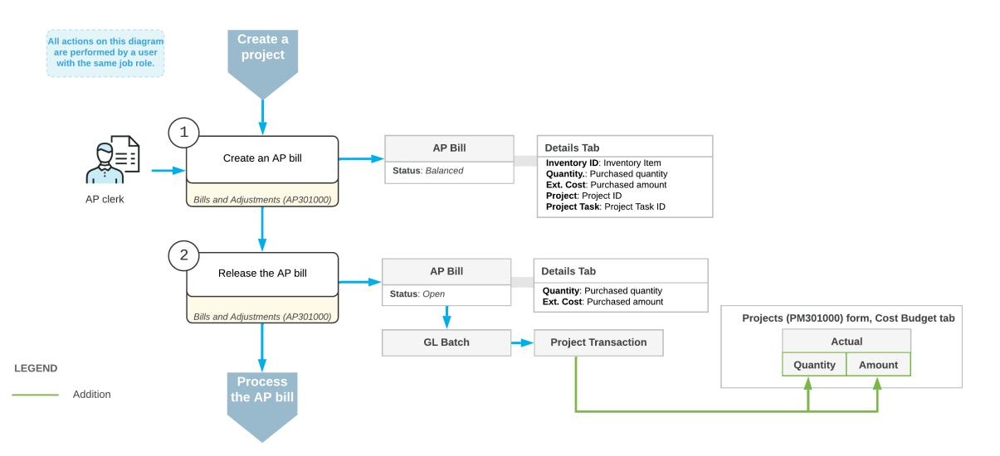

# <span id="page-284-0"></span>**Purchasing Services for Projects: Implementation Checklist**

The following sections provide details you can use to ensure that the system is configured properly for processing purchases for projects with accounts payable bills, and to understand (and change, if needed) the settings that affect the processing workflow.

#### **Implementation Checklist**

We recommend that before you initially process purchases for projects with AP bills, you make sure the needed features have been enabled, settings have been specified, and entities have been created, as summarized in the following checklist.

| Form                                    | Tasks to Perform                                                                                                                                                                                                                                                                 |
|-----------------------------------------|----------------------------------------------------------------------------------------------------------------------------------------------------------------------------------------------------------------------------------------------------------------------------------|
| Enable/Disable Features (CS100000) form | Make sure that the Project Accounting feature is en<br>abled.                                                                                                                                                                                                                    |
| Projects Preferences (PM101000) form    | Make sure that all necessary settings related to project<br>accounting have been specified. For more information<br>about configuration steps that you have to perform<br>before you can start accounting for projects, see Basic<br>Project Configuration: General Information. |
| Projects (PM301000) form                | Make sure that the project has been created, as de<br>scribed in Project Creation and Processing: General In<br>formation.                                                                                                                                                       |

| Form                            | Tasks to Perform                                                                                                                                                                                                                                                                                                                                                                                                                                             |  |  |
|---------------------------------|--------------------------------------------------------------------------------------------------------------------------------------------------------------------------------------------------------------------------------------------------------------------------------------------------------------------------------------------------------------------------------------------------------------------------------------------------------------|--|--|
| Non-Stock Items (IN202000) form | Make sure that all needed labor items, non-stock<br>items, and services have been defined. Make sure that<br>the Require Receipt check box is cleared in the Item<br>Defaults section on the General tab.                                                                                                                                                                                                                                                    |  |  |
|                                 | Make sure that Purchases is selected in<br>the Post Cost to Expenses box on the<br>Price/Cost tab; otherwise, the expens<br>es related to the non-stock item will not<br>be recorded to the cost budget of the ap<br>plicable project.<br>For more information about labor items, non-stock<br>items, and services, see Labor Items: General Informa<br>tion, Non-Stock Items: General Information, and Service<br>Items: General Information, respectively. |  |  |
| Account Groups (PM201000) form  | Make sure that all needed account groups have been<br>configured. Also, make sure that the expense accounts<br>of the inventory items specified in the Expense Ac<br>count box on the GL Accounts tab of the Non-Stock<br>Items form are mapped to the account groups. For<br>more information about account groups, see Account<br>Groups: General Information.                                                                                             |  |  |
| Vendors (AP303000) form         | Make sure that all needed vendors have been defined<br>in the system, as described in Vendors: General Infor<br>mation.                                                                                                                                                                                                                                                                                                                                      |  |  |

#### **Other Settings That Affect the Workflow**

You can affect the workflow of processing purchases for projects by specifying additional settings as follows:

- To cause the system to automatically select a project task when a particular project is selected during the creation of a bill, select the **Default** check box on the**Tasks** tab of the *[Projects](https://help-2025r1.acumatica.com/Help?ScreenId=ShowWiki&pageid=81c86417-3bde-444b-8f1c-682928d31a0c)* (PM301000) form for one of the tasks of the project.
- To cause the system to create accounts payable bills with the *Balanced* status, clear the **Hold Documents on Entry** check box on the **General** tab (**Data EntrySettings** section) of the *[Accounts Payable Preferences](https://help-2025r1.acumatica.com/Help?ScreenId=ShowWiki&pageid=c3f9353e-95e6-448d-bb3f-e20643879ec7)* (AP101000) form.
- To cause the system to automatically post general ledger batches generated during processing account payable documents, select the **Automatically Post on Release** check box in the **PostingSettings** section on the *[General Ledger Preferences](https://help-2025r1.acumatica.com/Help?ScreenId=ShowWiki&pageid=e4913d06-c511-4258-a0f9-f36c1b854e6b)* (GL102000) form.

With these settings specified, users in your company can process purchases for projects with AP bills quickly and accurately with a minimum of manual actions.

#### **Validation of Configuration**

To make sure that all configuration has been performed correctly, we recommend that you perform instructions similar to those described in *[Purchasing Services for Projects: Process Activity](#page-286-1)*.

# <span id="page-286-1"></span><span id="page-286-0"></span>**Purchasing Services for Projects: Process Activity**

This activity will walk you through the process of purchasing services for a project from a subcontractor with accounts payable bills.

This activity is based on the *U100* dataset. If you are using another dataset, or if any system settings have been changed in *U100*, these changes can affect the workflow of the activity and the results of the processing. To avoid any issues, restore the *U100* dataset to its initial state.

#### **Story**

Suppose that the HM's Bakery and Cafe customer has ordered the installation service for previously bought juicers from the SweetLife Fruits & Jams company. The SweetLife company has contracted the Squeezo Inc. vendor to provide six hours of the installation service. SweetLife's project manager has created the project. To simplify the process of purchasing services, SweetLife's AP clerk has decided to skip the entering of a purchase order for the purchase. Acting as SweetLife's AP clerk, you will process the project-related purchase by using an accounts payable bill.

#### **Configuration Overview**

In the *U100* dataset, the following tasks have been performed to support this activity:

- On the *[Enable/Disable Features](https://help-2025r1.acumatica.com/Help?ScreenId=ShowWiki&pageid=c1555e43-1bc5-4f6f-ba9d-b323f94d8a6b)* (CS100000) form, the *Project Accounting* feature has been enabled to support the project accounting functionality.
- On the *[Projects](https://help-2025r1.acumatica.com/Help?ScreenId=ShowWiki&pageid=81c86417-3bde-444b-8f1c-682928d31a0c)* (PM301000) form, the *HMBAKERY14* project has been created, and the *INSTALL* project task has been created for the project. This task is the default project task.
- On the *[Non-Stock Items](https://help-2025r1.acumatica.com/Help?ScreenId=ShowWiki&pageid=bf68dd4f-63d4-460d-8dc0-9152f2bd6bf1)* (IN202000) form, the *INSTALL* non-stock item of the *Service* type has been defined. On the **General** tab (**Item Defaults** section), the **Require Receipt** check box has been cleared. On the **Price/ Cost** tab (**Standard Cost** section), the **Current Cost** of the item has been set to *80.00*. On the **GL Accounts** tab, the *54200 (Project Subcontract Expense)* account has been selected in the **Expense Account** box.
- On the *[Account Groups](https://help-2025r1.acumatica.com/Help?ScreenId=ShowWiki&pageid=94a2cdce-c36a-49a1-b572-9cd33cb5fa73)* (PM201000) form, the *SUBCON* account group has been created, and the *54200 (Project Subcontract Expense)* account has been mapped to the account group.
- On the *[Vendors](https://help-2025r1.acumatica.com/Help?ScreenId=ShowWiki&pageid=a9584be3-f2bd-4d67-80d4-8041d809df56)* (AP303000) form, the *SQUEEZO* vendor has been created.

#### **Process Overview**

You will create a bill on the *[Bills and Adjustments](https://help-2025r1.acumatica.com/Help?ScreenId=ShowWiki&pageid=956b4e51-3078-4d2d-85b3-65c080d95234)* (AP301000) form, and specify the project and project task in the bill lines. Then you will release the bill. Finally, you will review the project balances on the *[Projects](https://help-2025r1.acumatica.com/Help?ScreenId=ShowWiki&pageid=81c86417-3bde-444b-8f1c-682928d31a0c)* (PM301000) form.

#### **System Preparation**

To sign in to the system and prepare to perform the instructions of the activity, do the following:

- 1. Launch the Acumatica ERP website, and sign in to a company with the *U100* dataset preloaded; you should sign in as project accountant by using the *brawner* username and the *123* password.
- 2. In the info area, in the upper-right corner of the top pane of the Acumatica ERP screen, make sure that the business date in your system is set to *1/30/2025*. If a different date is displayed, click the Business Date menu button and select *1/30/2025* on the calendar. For simplicity, in this activity, you will create and process all documents in the system on this business date.

#### **Step: Creating a Bill for the Project**

To create an accounts payable bill for the project, do the following:

- 1. On the *[Bills and Adjustments](https://help-2025r1.acumatica.com/Help?ScreenId=ShowWiki&pageid=956b4e51-3078-4d2d-85b3-65c080d95234)* (AP301000) form, add a new record.
- 2. In the Summary area, specify the following settings:
  - **Vendor**: *SQUEEZO*
  - **Date**: *1/30/2025*
  - **Description**: Services for HM's Bakery & Cafe
- 3. On the **Details** tab, click **Add Row** on the table toolbar, and add a row with the following settings:
  - **Inventory ID**: *INSTALL*
  - **Quantity**: 6
  - **Project**: *HMBAKERY14*
  - **ProjectTask**: *INSTALL* (selected by default)
  - **Cost Code**: *00-000*

The system selects *54200 (Project Subcontract Expense)* as the **Account** of the bill line, because this is the expense account of the selected item.

- 4. On the form toolbar, click **Remove Hold** to assign the bill the *Balanced* status, and then click **Release** to release the bill.
- 5. Open the *Project [Transaction](https://help-2025r1.acumatica.com/Help?ScreenId=ShowWiki&pageid=29bf5433-446f-4196-be69-f2cb177e83cb) Details* (PM401000) form.
- 6. In the Selection area of the form, select *HMBAKERY14* as the **Project**, and make sure the **Account Group** and **ProjectTask** boxes are cleared. Review the project transaction that has updated the actual values in the budget line. The debit account group in the transaction (*SUBCON*) is the group that is mapped to the *54200* expense account of the *INSTALL* non-stock item specified in the line.
- 7. On the *[Projects](https://help-2025r1.acumatica.com/Help?ScreenId=ShowWiki&pageid=81c86417-3bde-444b-8f1c-682928d31a0c)* (PM301000) form, open the *HMBAKERY14* project, and review the cost budget on the **Cost Budget** tab. Notice that the **Actual Quantity** and **Actual Amount** of the corresponding budget line have been updated (to *6* and *480.00*, respectively), as shown in the following screenshot.

| Projects<br>HMBAKERY14 - The installation of juicers<br>뭐<br>$\Box$<br>$\Omega$<br>$\leftarrow$ | 甸<br>$\overline{\mathsf{K}}$<br>$^{+}$ | Ы<br>><br>≺        | <b>COMPLETE</b><br><b>RUN BILLING</b> | $\cdots$                                    |                   |                                       |                                        |                                      | <b>PINOTES</b>     | <b>FILES</b>     | !!!!!!!!!!!!!!!!!!!!!!!!!!!!!!!!!!!!!!!! |
|-------------------------------------------------------------------------------------------------|----------------------------------------|--------------------|---------------------------------------|---------------------------------------------|-------------------|---------------------------------------|----------------------------------------|--------------------------------------|--------------------|------------------|------------------------------------------|
| * Project ID:                                                                                   | HMBAKERY14                             | Q                  | Customer:                             | HMBAKERY - HM's Bakery & Cafe               | 0<br>Q            | Actual Income:                        |                                        | 0.00                                 |                    |                  |                                          |
| Template:                                                                                       |                                        | 0                  | Project Manager:                      | EP00000001 - Pam Brawner                    | $\varphi$         | <b>Actual Expenses:</b>               |                                        | 480.00                               |                    |                  |                                          |
| Status:                                                                                         | Active                                 |                    |                                       |                                             |                   | Margin Amount:                        |                                        | $-480.00$                            |                    |                  |                                          |
| <b>Description</b>                                                                              | The installation of juicers            |                    |                                       |                                             |                   | Margin (%):                           |                                        | 0.00                                 |                    |                  |                                          |
|                                                                                                 |                                        |                    |                                       |                                             |                   | Pending Invoice Amoun                 |                                        | 0.00                                 |                    |                  |                                          |
| <b>TASKS</b><br><b>SUMMARY</b>                                                                  | <b>REVENUE BUDGET</b>                  | <b>COST BUDGET</b> | <b>BALANCES</b><br><b>INVOICES</b>    | UNION LOCALS                                | <b>ACTIVITIES</b> | <b>EMPLOYEES</b>                      | <b>EQUIPMENT</b>                       | <b>ADDRESSES</b>                     |                    | <b>DEFAULTS</b>  |                                          |
| Group by Task                                                                                   |                                        |                    |                                       |                                             |                   |                                       |                                        |                                      |                    |                  |                                          |
| Ò<br>$^{+}$<br>$\times$                                                                         | <b>VIEW TRANSACTIONS</b><br>$\vdash$   | $\mathbf{x}$<br>土  |                                       |                                             |                   |                                       |                                        | All Records                          |                    |                  | $\overline{\phantom{a}}$                 |
| D<br>8<br>0<br>* Project Task                                                                   | * Inventory ID                         | * Account Group    | <b>Description</b>                    | Original UOM<br><b>Budgetec</b><br>Quantity | <b>Unit Rate</b>  | Original<br><b>Budgeted</b><br>Amount | Revised<br><b>Budgeted</b><br>Quantity | Revised<br><b>Budgeted</b><br>Amount | Actual<br>Quantity | Actual<br>Amount |                                          |
| 0<br>$\Box$<br><b>INSTALL</b>                                                                   | <b>INSTALL</b>                         | <b>SUBCON</b>      | Installation of equipment at th       | <b>HOUR</b><br>6.00                         | 80,0000           | 480.00                                | 6.00                                   | 480.00                               | 6.00               | 480.00           |                                          |

*Figure: Cost budget updated aer bill processing*

You have completed the processing of the purchase of services for the project and captured the cost of services to the project budget.

# <span id="page-288-1"></span><span id="page-288-0"></span>**Purchasing Services for Projects: Generated Transactions**

When you process an accounts payable bill with a service item for a project, on release of the AP bill, the system generates the GL and project transactions described in the following sections.

#### **GL Transactions Generated on AP Bill Release**

When an accounts payable bill with a service item is released, the system creates a batch of the general ledger transactions shown in the following table.

| Account                      | Source of Account | Project Budget<br>Key               | Debit  | Credit |
|------------------------------|-------------------|-------------------------------------|--------|--------|
| Accounts payable ac<br>count | Vendor            | X                                   | 0.00   | Amount |
| Expense account              | Item              | Project, project<br>task, cost code | Amount | 0.00   |

On the **Financial** tab (**Link to GL** section) of the *[Bills and Adjustments](https://help-2025r1.acumatica.com/Help?ScreenId=ShowWiki&pageid=956b4e51-3078-4d2d-85b3-65c080d95234)* (AP301000) form, you can click the link in the **Batch Nbr.** box to view the details of the batch on the *Journal [Transactions](https://help-2025r1.acumatica.com/Help?ScreenId=ShowWiki&pageid=dda046bc-5946-407f-88f7-1c0c966fbe72)* (GL301000) form.

#### **Project Transaction Generated on AP Bill Release**

When a batch of general ledger transactions is created on release of an accounts payable bill, the system also generates the project transaction shown in the following table.

| Debit Account   | Credit Account | Source of Account | Amount |
|-----------------|----------------|-------------------|--------|
| Expense account | Empty          | GL transaction    | Amount |

You can review the created project transaction on the *Project [Transaction](https://help-2025r1.acumatica.com/Help?ScreenId=ShowWiki&pageid=29bf5433-446f-4196-be69-f2cb177e83cb) Details* (PM401000) form. In the Selection area of this form, you select the project in the **Project** box. In the table, you can find the project transaction created on release of the accounts payable bill by the reference number of the AP bill in the **Orig. Doc. Nbr.** column.

# <span id="page-289-0"></span>**Purchasing Materials to Project Site**

This chapter describes how to purchase materials and services for projects and drop-shipping them directly to the project site.

# <span id="page-289-2"></span><span id="page-289-1"></span>**Purchases to the Project Site: General Information**

In some businesses, the project manager purchases items for a project from a vendor and requests that the ordered items be delivered directly to the site where the project-related work is performed. For example, you may need the construction materials to be delivered to the construction site. As another example, you might be purchasing materials that are needed to provide some project-related services, and you may ask the vendor to deliver the items directly to the customer location.

If you do not need to track the actual receipt of items, you can process a purchase in which items are drop-shipped from the vendor to the project site without the processing of a purchase receipt. In this case, the accounts payable bill serves as proof that the items were delivered.

#### **Learning Objectives**

In this chapter, you will learn how to do the following:

- Define a project for which drop-ship purchases do not require a receipt
- Create a drop-ship purchase order for the project
- Process a vendor return of drop-ship purchases
- Prepare an accounts payable bill for the purchase order to record the expenses to the project budget
- Review the generated project transactions and GL transactions

#### **Applicable Scenarios**

You process a purchase with drop shipment for a project without a receipt when you need the purchased materials to be delivered directly to the project site instead of being received in your warehouse, and you do not need to record detailed information about the receipt of the items to the project site.

#### **Project Configuration**

In Acumatica ERP, you can define a project so that for purchase orders of the *Project Drop-Ship* type, the processing of purchase receipts will not be required. You can then use purchase orders of this type to process the purchases of materials for the project, with drop shipping of these items directly to the project site.

In the settings of a project for which you want to process drop-ship purchases of items without the generation of a purchase receipt, *Skip Receipt Generation* must be specified in the **Drop-Ship Receipt Processing** box on the **Defaults** tab (**Purchases** section) of the *[Projects](https://help-2025r1.acumatica.com/Help?ScreenId=ShowWiki&pageid=81c86417-3bde-444b-8f1c-682928d31a0c)* (PM301000) form. This setting causes the system to insert *On Bill Release* in the **Record Drop-Ship Expenses** box of this section, indicating that the system will capture this project's expenses on release of the accounts payable bill.

#### **A Drop-Ship Purchase for a Project Without Purchase Receipt Processing**

To process a purchase of items for a project with the items shipped directly to the project site and no receipt processing, you create a purchase order of the *Project Drop-Ship* type on the *[Purchase Orders](https://help-2025r1.acumatica.com/Help?ScreenId=ShowWiki&pageid=5565686c-96c4-4bfa-a51d-9a2566baa808)* (PO301000) form. In the purchase order, you first select the vendor and the project for which the purchase will be performed.

In this purchase order, because you have selected the *Project Drop-Ship* type, the system inserts *Project Site* in the **Shipping Destination Type** box on the**Shipping** tab. The system also copies the shipping contact and address from the selected project to the purchase order to indicate that all purchased items should be delivered to the project site.

On the **Details** tab, you list the stock items (to which the system assigns the *Goods for Project* type) and non-stock items (to which the system assigns the *Non-Stock for Project* type) to be purchased from the vendor. In each line, you specify the project task (and cost code, if applicable) with which the purchase is associated.

In the lines of a project drop-ship order, a warehouse does not need to be specified; thus, the **Warehouse** column is hidden on the **Details** tab of the *[Purchase Orders](https://help-2025r1.acumatica.com/Help?ScreenId=ShowWiki&pageid=5565686c-96c4-4bfa-a51d-9a2566baa808)* form for this type of purchase orders.

When you save the purchase order with the *Open* status, the system creates a commitment for each purchase order line in the amount of the extended cost of the line; it also updates the original committed, revised committed, and committed open values of the corresponding budget line of the project on the **Cost Budget** tab of the *[Projects](https://help-2025r1.acumatica.com/Help?ScreenId=ShowWiki&pageid=81c86417-3bde-444b-8f1c-682928d31a0c)* form.

To record the expenses to the project, you create an accounts payable bill for the purchase order by clicking **Enter AP Bill** (under **Processing**) on the More menu of the *[Purchase Orders](https://help-2025r1.acumatica.com/Help?ScreenId=ShowWiki&pageid=5565686c-96c4-4bfa-a51d-9a2566baa808)* form. The system copies the applicable settings and lines from the purchase order to the bill and opens it on the *[Bills and Adjustments](https://help-2025r1.acumatica.com/Help?ScreenId=ShowWiki&pageid=956b4e51-3078-4d2d-85b3-65c080d95234)* (AP301000) form. Then you release the prepared bill. Aer all the lines in the purchase order have been billed in full, the system assigns the purchase order the *Closed* status.

When the bill is released, the system generates a general ledger transaction; on release of this GL transaction, the corresponding project transaction is generated. The project transaction updates the cost budget lines of the project with the same project budget key (that is, with the same project, project task, account group, inventory item, and cost code, if applicable) on the **Cost Budget** tab of the *[Projects](https://help-2025r1.acumatica.com/Help?ScreenId=ShowWiki&pageid=81c86417-3bde-444b-8f1c-682928d31a0c)* form. The system updates the committed invoiced, committed open, and actual values of these cost budget lines with the billed quantity and amount.

Aer the processing of the purchase is completed, you run project billing to prepare the invoice for the customer for the expenses related to the purchase.

#### **Avalara Tax Calculation for Project Drop-Ship Type Orders**

If the *External Tax Calculation Integration* feature is enabled on the *[Enable/Disable Features](https://help-2025r1.acumatica.com/Help?ScreenId=ShowWiki&pageid=c1555e43-1bc5-4f6f-ba9d-b323f94d8a6b)* (CS100000) form and Avalara tax calculation is used in the system, the taxes in the *Project Drop-Ship* purchase orders are calculated based on the project's tax zone.

For such purchase orders, the address in Avalara is copied from the following settings: the**Ship-To Address** on the **Shipping** tab on the *[Purchase Orders](https://help-2025r1.acumatica.com/Help?ScreenId=ShowWiki&pageid=5565686c-96c4-4bfa-a51d-9a2566baa808)* (PO301000) form is copied from the address of the related project, which is specified on the **Addresses** tab of the *[Projects](https://help-2025r1.acumatica.com/Help?ScreenId=ShowWiki&pageid=81c86417-3bde-444b-8f1c-682928d31a0c)* (PM301000) form.

- **From**: **Vendor Address** section on the**Vendor Info** tab of the *[Purchase Orders](https://help-2025r1.acumatica.com/Help?ScreenId=ShowWiki&pageid=5565686c-96c4-4bfa-a51d-9a2566baa808)* form
- **To**: **Ship-To Address** section on the**Shipping** tab of the *[Purchase Orders](https://help-2025r1.acumatica.com/Help?ScreenId=ShowWiki&pageid=5565686c-96c4-4bfa-a51d-9a2566baa808)* form

If an AP bill line is related to a *Project Drop-Ship* purchase order, for this line, the address in Avalara is copied from the same settings.

For more details, see *Calculating Use and Sales Taxes in Purchase [Documents](https://help-2025r1.acumatica.com/Help?ScreenId=ShowWiki&pageid=a7db62e9-43ff-4d06-99fd-34519ca5c648)*.

#### **Workflow of the Purchase to the Project Site**

For project-related purchases with the items drop-shipped to the project site, the typical process involves the actions and generated documents shown in the following diagram.

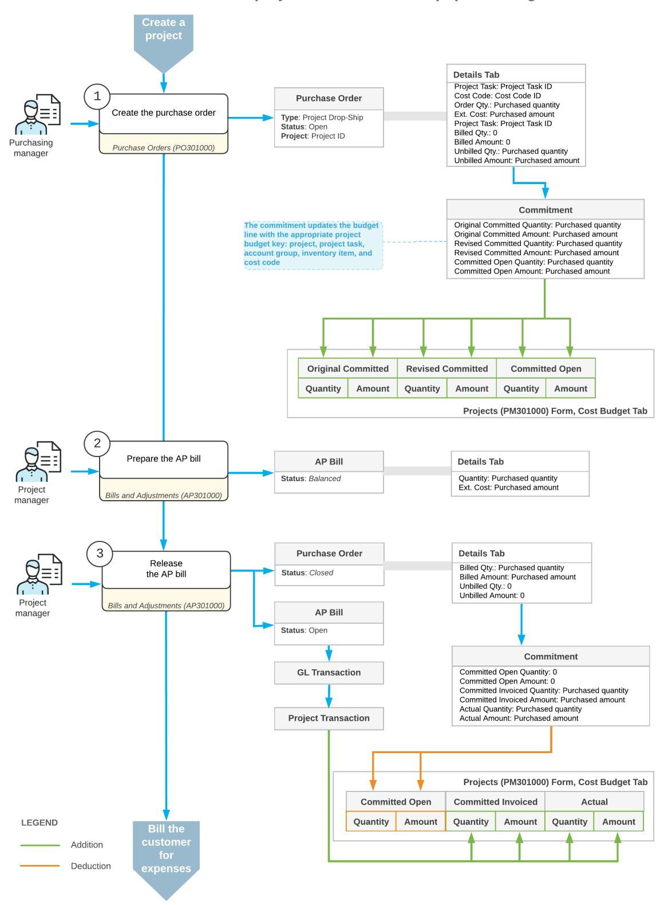

# <span id="page-292-0"></span>**Purchases to the Project Site: Return of Project Drop Shipments**

In Acumatica ERP, you can process a return of drop-shipped items directly from a customer to a vendor, without receiving the items to your inventory. For the project drop shipments that have been processed without receipt, you handle these vendor returns by creating and processing a debit adjustment.


You can create a debit adjustment for a project drop shipment if no lines of the accounts payable bill that corresponds to this purchase are linked to a purchase receipt.

#### **Return for Project Drop Shipment**

To process the return, you open the accounts payable bill that has been prepared for the purchase order of the *Project Drop-Ship* type and click **Reverse** on the More menu of the *[Bills and Adjustments](https://help-2025r1.acumatica.com/Help?ScreenId=ShowWiki&pageid=956b4e51-3078-4d2d-85b3-65c080d95234)* (AP301000) form. The system creates a debit adjustment on the *[Bills and Adjustments](https://help-2025r1.acumatica.com/Help?ScreenId=ShowWiki&pageid=956b4e51-3078-4d2d-85b3-65c080d95234)* form with the line details copied from the bill. The unit cost specified by default in the debit adjustment lines is the unit cost of the corresponding purchase order lines.

You can process a complete return of purchased items or return the purchase partially. To process a partial return of items, you need to decrease the quantities of items in the debit adjustment lines or remove the lines that are not subject to return.

You can adjust the quantity, extended cost, and unit cost in the lines of the created debit adjustment if the **Apply Retainage** check box is cleared for the debit adjustment in the Summary area on the *[Bills](https://help-2025r1.acumatica.com/Help?ScreenId=ShowWiki&pageid=956b4e51-3078-4d2d-85b3-65c080d95234) [and Adjustments](https://help-2025r1.acumatica.com/Help?ScreenId=ShowWiki&pageid=956b4e51-3078-4d2d-85b3-65c080d95234)* form.

When the debit adjustment is released, the system generates a general ledger transaction; on release of this GL transaction, the corresponding project transaction is generated. The project transaction updates the cost budget lines of the project with the same project budget key (that is, with the same project, project task, account group, inventory item, and, optionally, cost code) on the **Cost Budget** tab of the *[Projects](https://help-2025r1.acumatica.com/Help?ScreenId=ShowWiki&pageid=81c86417-3bde-444b-8f1c-682928d31a0c)* (PM301000) form.

Also, on release of the debit adjustment, the system changes the status of the corresponding drop-ship purchase order from *Closed* to *Completed*. In the lines of this purchase order, the system clears the **Closed** check box to indicate that the lines of the purchase order have not been billed in full.

#### **Update of Project Budget Lines**

On release of the debit adjustment, the system updates the values for the corresponding project budget lines on the **Cost Budget** tab of the *[Projects](https://help-2025r1.acumatica.com/Help?ScreenId=ShowWiki&pageid=81c86417-3bde-444b-8f1c-682928d31a0c)* (PM301000) form as follows:

- Increases **Committed Open Quantity** and **Committed Open Amount** by the quantity and amount being returned
- Reduces the **Actual Quantity** and **Committed Invoiced Quantity** by the quantity being returned
- Reduces the **Actual Amount** and **Committed Invoiced Amount** by the amount being returned

# <span id="page-292-1"></span>**Purchases to the Project Site: Implementation Checklist**

The following sections provide details you can use to ensure that the system is configured properly for the processing of purchases for projects with drop shipping to the project site and without a purchase receipt, and to understand (and change, if needed) the settings that affect the processing workflow.

#### **Implementation Checklist**

Before you initially process a project-related purchase with drop shipping to a project site (and without receipt processing), you should make sure the needed features have been enabled, settings have been specified, and entities have been created, as summarized in the following checklist.

| Form                                    | Criteria to Check                                                                                                                                                             |
|-----------------------------------------|-------------------------------------------------------------------------------------------------------------------------------------------------------------------------------|
| Enable/Disable Features (CS100000) form | Make sure that the Inventory and Order Management,<br>Inventory and Project Accounting features are enabled.                                                                  |
| Multiple forms                          | Make sure that all necessary settings related to or<br>der management have been specified, as described in<br>Configuration of Order Management: Implementation Ac<br>tivity. |
| Vendors (AP303000) form                 | Make sure that all needed vendors have been config<br>ured, as described in Vendors: Implementation Activity.                                                                 |
| Stock Items (IN202500) form             | Make sure that the needed stock items have been con<br>figured, as described in Stock Items: Implementation Ac<br>tivity.                                                     |
| Non-Stock Items (IN202000) form         | Make sure that the needed non-stock items have been<br>configured, as described in Non-Stock Items: Implemen<br>tation Activity.                                              |

#### **Project Settings**

Before you initially process a purchase for a project with drop shipping (and without receipt processing), you should make sure that the project accounting functionality is configured and the project has specific settings, as summarized in the following checklist.

| Form                                 | Criteria to Check                                                                                                                                                                  |
|--------------------------------------|------------------------------------------------------------------------------------------------------------------------------------------------------------------------------------|
| Projects Preferences (PM101000) form | Make sure that all necessary settings related to project<br>accounting have been specified, as described in Basic<br>Project Configuration: General Information.                   |
|                                      | Also, select the Internal Cost CommitmentTrack<br>ing check box to track purchase orders as project cost<br>commitments and to see committed values in the<br>project cost budget. |

| Form                | Criteria to Check                                                                                                                                                               |
|---------------------|---------------------------------------------------------------------------------------------------------------------------------------------------------------------------------|
| Projects (PM301000) | Make sure that the necessary projects and project<br>tasks have been created, and that the following set<br>tings have been specified for the projects on the De<br>faults tab: |
|                     | •<br>Drop-Ship Receipt Processing: Skip Receipt Gener<br>ation                                                                                                                  |
|                     | With this setting, items of any type added to a<br>purchase order of the Project Drop-Ship type are<br>processed without a purchase receipt.                                    |
|                     | •<br>Record Drop-Ship Expense: On Bill Release (insert<br>ed automatically when you select Skip Receipt Gen<br>eration)                                                         |
|                     | With this setting, purchase expenses will be record<br>ed to the project on release of the AP bill.                                                                             |

#### **Other Settings That Affect the Workflow**

You can affect the processing workflow by specifying additional settings as follows:

• To change the format of project drop-ship order identifiers, adjust the predefined *POORDER* numbering sequence on the *[Numbering Sequences](https://help-2025r1.acumatica.com/Help?ScreenId=ShowWiki&pageid=a8d11c23-21f2-42a3-b17d-9637c9cf8031)* (CS201010) form, or create a new numbering sequence and select this sequence in the **Regular Order NumberingSequence** box on the **General** tab of the *[Purchase Orders](https://help-2025r1.acumatica.com/Help?ScreenId=ShowWiki&pageid=13d09c43-8696-4f92-ad9b-3d0209ee3d9b) [Preferences](https://help-2025r1.acumatica.com/Help?ScreenId=ShowWiki&pageid=13d09c43-8696-4f92-ad9b-3d0209ee3d9b)* (SC101000) form. For more information on numbering sequences, see *[Use of Numbering](https://help-2025r1.acumatica.com/Help?ScreenId=ShowWiki&pageid=71c26175-c78f-4e70-8518-2115f5bfaf2f) [Sequences](https://help-2025r1.acumatica.com/Help?ScreenId=ShowWiki&pageid=71c26175-c78f-4e70-8518-2115f5bfaf2f)*.

> A user can create project drop-ship orders by clicking the **Create Drop-Ship** button on the **Commitments** tab of the *[Projects](https://help-2025r1.acumatica.com/Help?ScreenId=ShowWiki&pageid=81c86417-3bde-444b-8f1c-682928d31a0c)* (PM301000) form only if the numbering sequence that is used for numbering project drop-ship orders is automatically numbered.

- To create new projects so that the drop-ship purchases will be processed without receipts by default, select *Generate Receipt* in the **Drop-Ship Receipt Processing** box and *On Receipt Release* in the **Record Drop-Ship Expense** box on the *[Projects Preferences](https://help-2025r1.acumatica.com/Help?ScreenId=ShowWiki&pageid=de2ca225-4a0c-4129-b09d-3f3ed05198f9)* (PM101000) form and in the settings of the project templates on the *Project [Templates](https://help-2025r1.acumatica.com/Help?ScreenId=ShowWiki&pageid=11e7c776-03fb-405d-a1f4-26700dd319fc)* (PM208000) form.
- To reduce input errors when users enter orders, set up the validation of order totals by selecting the **For Project Drop-Ship Orders** check box in the**ValidateTotal on Entry** section of the *[Purchase Orders](https://help-2025r1.acumatica.com/Help?ScreenId=ShowWiki&pageid=13d09c43-8696-4f92-ad9b-3d0209ee3d9b) [Preferences](https://help-2025r1.acumatica.com/Help?ScreenId=ShowWiki&pageid=13d09c43-8696-4f92-ad9b-3d0209ee3d9b)* (PO101000) form.
- To cause the system to create accounts payable bills with the *Balanced* status, clear the **Hold Documents on Entry** check box on the **General** tab (**Data EntrySettings** section) of the *[Accounts Payable Preferences](https://help-2025r1.acumatica.com/Help?ScreenId=ShowWiki&pageid=c3f9353e-95e6-448d-bb3f-e20643879ec7)* (AP101000) form.
- To cause the system to automatically post general ledger batches generated during the processing of purchase and accounts payable documents, select the **Automatically Post on Release** check box in the **PostingSettings** section on the *[General Ledger Preferences](https://help-2025r1.acumatica.com/Help?ScreenId=ShowWiki&pageid=e4913d06-c511-4258-a0f9-f36c1b854e6b)* (GL102000) form.

With these settings specified, users in your company can process purchases for projects quickly and accurately with a minimum of manual actions.

#### **Known Project Drop-Ship Limitations**

The following limitations apply to the project drop-ship functionality:

• A project drop-ship order cannot be created from a change order or from a sales order.

• Landed costs cannot be applied to a project drop-ship order.

# <span id="page-295-0"></span>**Purchases to the Project Site: Process Activity**

This activity will walk you through the process of purchasing materials for the project site.

This activity is based on the *U100* dataset. If you are using another dataset, or if any system settings have been changed in *U100*, these changes can affect the workflow of the activity and the results of the processing. To avoid any issues, restore the *U100* dataset to its initial state.

#### **Story**

Suppose that the HM's Bakery and Cafe customer has ordered two juicers, along with four hours of the installation service from the SweetLife Fruits & Jams company. The project accountant has analyzed the requirements and decided to create a small cost-plus project with two tasks, each for the installation of a juicer, and specify the cost budget of a project.

Further suppose that SweetLife's project manager has noticed that the warehouse currently has no juicers of the requested type. The project manager has decided to purchase the juicers from the Squeezo Inc. vendor and request the vendor to ship the items directly to the project site. The project manager decided not to track the receipt of items to the project site as a separate document and to consider the provided installation services as the confirmation of the items being received.

Acting as SweetLife's project manager, you will configure a project to handle the tracking and billing of the provided services and stock items. Then you will create a drop-ship order for purchased items for the project and create an accounts payable bill for the vendor. Finally, you will review the commitment to the project budget.

#### **Configuration Overview**

In the *U100* dataset, the following tasks have been performed to support this activity:

- On the *[Enable/Disable Features](https://help-2025r1.acumatica.com/Help?ScreenId=ShowWiki&pageid=c1555e43-1bc5-4f6f-ba9d-b323f94d8a6b)* (CS100000) form, the following features have been enabled:
  - *Project Accounting*, which provides the project accounting functionality
  - *Inventory and Order Management*, which provides the sales order and purchase order functionality
  - *Inventory*, which provides the stock item functionality
- On the *Project [Templates](https://help-2025r1.acumatica.com/Help?ScreenId=ShowWiki&pageid=11e7c776-03fb-405d-a1f4-26700dd319fc)* (PM208000) form, the *SERVCSP* project template has been created.
- On the *[Vendors](https://help-2025r1.acumatica.com/Help?ScreenId=ShowWiki&pageid=a9584be3-f2bd-4d67-80d4-8041d809df56)* (AP303000) form, the *SQUEEZO* vendor has been created.
- On the *[Customers](https://help-2025r1.acumatica.com/Help?ScreenId=ShowWiki&pageid=652929bc-9606-4056-aa6e-0c2d1147171b)* (AP303000) form, the *HMBAKERY* customer has been created.
- On the *[Stock Items](https://help-2025r1.acumatica.com/Help?ScreenId=ShowWiki&pageid=77786a70-1f1e-4d63-ad98-96f98e4fcb0e)* (IN202500) form, the *JUICER05* stock item has been created.

#### **Process Overview**

You will create a project based on the project template on the *[Projects](https://help-2025r1.acumatica.com/Help?ScreenId=ShowWiki&pageid=81c86417-3bde-444b-8f1c-682928d31a0c)* (PM301000) form and configure settings for the drop-ship purchases for the project. Then you will create a drop-ship order for the project and prepare a bill for it. Finally, you will review the commitment to the project budget and the generated project transactions.

#### **System Preparation**

Before you start creating a project and process a purchase, do the following:

1. Launch the Acumatica ERP website, and sign in as a project manager. You should sign in by using the *brawner* username and the *123* password.

- 2. In the info area, in the upper-right corner of the top pane of the Acumatica ERP screen, make sure that the business date in your system is set to 1/30/2025. If a different date is displayed, click the Business Date menu button, and select 1/30/2025 on the calendar. For simplicity, in this activity, you will create and process all documents in the system on this business date.
- 3. On the **General** tab (**GeneralSettings** section) of the *[Projects Preferences](https://help-2025r1.acumatica.com/Help?ScreenId=ShowWiki&pageid=de2ca225-4a0c-4129-b09d-3f3ed05198f9)* (PM101000) form, make sure the **Internal Cost CommitmentTracking** check box is selected.

#### **Step 1: Creating a Project**

To create a project, do the following:

- 1. On the *[Projects](https://help-2025r1.acumatica.com/Help?ScreenId=ShowWiki&pageid=81c86417-3bde-444b-8f1c-682928d31a0c)* (PM301000) form, add a new record.
- 2. In the Summary area, specify the following settings:
  - **Project ID**: HMBAKERY2T
  - **Customer**: *HMBAKERY*
  - **Template**: *SERVCSP*
  - **Description**: Installation of new juicers (253 Terry Lane)
- 3. On the Summary tab, select the **Allow Adding New Items on the Fly** check box.
- 4. On the **Addresses** tab, in the **Project Address** section, specify the following settings:
  - **Address Line 1**: 253 Terry Lane
  - **City**: New York
  - **Country**: *US*
  - **State**: *NY*
  - **Postal Code**: 10001
- 5. Save your changes to the project.
- 6. On the **Tasks** tab, make sure that the *PHASE1* and *PHASE2* tasks have been added to the project.
- 7. On the table toolbar, click **ActivateTasks** to change the status of the project tasks to *Active*.
- 8. On the **Cost Budget** tab, make sure that two lines with the *JUICER05* item and two lines with the *INSTALL* item have been added.
- 9. On the **Defaults** tab, make sure that the following settings have been specified:
  - **Use Expense Account From**: *Posting Class or Item*
  - **Drop-Ship Receipt Processing**: *Skip Receipt Generation*

With this setting, items of any type added to a purchase order of the *Project Drop-Ship* type are processed without a purchase receipt.

10.On the form toolbar, click **Activate**. The system assigns the project the *Active* status.

#### **Step 2: Creating a Project Drop-Ship Order**

Create and process a drop-ship order for the project as follows:

- 1. Set the business date to 2/15/2025.
- 2. While still reviewing the *HMBAKERY2T* project on the *[Projects](https://help-2025r1.acumatica.com/Help?ScreenId=ShowWiki&pageid=81c86417-3bde-444b-8f1c-682928d31a0c)* (PM301000) form, on the table toolbar of the **Commitments** tab, click **Create Drop-Ship**. The system opens the *[Purchase Orders](https://help-2025r1.acumatica.com/Help?ScreenId=ShowWiki&pageid=5565686c-96c4-4bfa-a51d-9a2566baa808)* (PO301000) form, with the *Project Drop-Ship* selected in the**Type** box and *HMBAKERY2T* project specified in the **Project** box in the Summary area.
- 3. In the Summary area, specify the following settings:
  - **Vendor**: *SQUEEZO*

- **Date**: 2/15/2025 (populated automatically)
- **Description**: Installation of juicers at the restaurant
- 4. On the **Details** tab, add a row with the following settings:
  - **Inventory ID**: *JUICER05*
  - **UOM**: *PIECE* (specified automatically)
  - **Order Qty.**: 1
  - **Unit Cost**: 500
  - **ProjectTask**: *PHASE1*
  - **Cost Code**: *00-000*
- 5. Add another row with the following settings:
  - **Inventory ID**: *JUICER05*
  - **UOM**: *PIECE* (specified automatically)
  - **Order Qty.**: 1
  - **Unit Cost**: 500
  - **ProjectTask**: *PHASE2*
  - **Cost Code**: *00-000*
- 6. Save the project drop-ship order. The system assigns the *On Hold* status to the purchase order. On the **Shipping** tab, review the shipping settings specified for the purchase order and notice that the**Shipping Destination Type** is set to *Project Site*.
- 7. On the More menu (under **Printing and Emailing**), click **Print Purchase Order**. In the prepared printable document, review the**Ship To** section, and make sure that the shipping address has been copied from the project settings.
- 8. Close the browser tab with the report and return to the project drop-ship order on the *[Purchase Orders](https://help-2025r1.acumatica.com/Help?ScreenId=ShowWiki&pageid=5565686c-96c4-4bfa-a51d-9a2566baa808)* form.
- 9. On the form toolbar, click **Remove Hold**. The system assigns the purchase order the *Open* status. When the *Open* status is assigned to the purchase order, the system creates the commitment for the project.
- 10.On the *[Projects](https://help-2025r1.acumatica.com/Help?ScreenId=ShowWiki&pageid=81c86417-3bde-444b-8f1c-682928d31a0c)* form, open the *HMBAKERY2T* project, and on the **Commitments** tab, make sure the dropship order for the project is shown.
- 11.On the **Cost Budget** tab, review the cost budget lines with the *JUICER05* inventory item that the system has updated based on the commitment.

Notice that the original committed and revised committed amounts and quantities in the lines have been updated by the amounts from the drop-ship order lines for the project. The actual amount in both lines is still *0* because the expenses have not yet been recorded to the project.

- 12.On the **Commitments** tab, click the **Order Nbr.** link in the only line to open the project drop-ship order that you have created earlier in this activity on the *[Purchase Orders](https://help-2025r1.acumatica.com/Help?ScreenId=ShowWiki&pageid=5565686c-96c4-4bfa-a51d-9a2566baa808)* form.
- 13.On the form toolbar, click **Enter AP Bill** to create a bill for the purchase order.

The system creates an accounts payable bill and opens the bill on the *[Bills and Adjustments](https://help-2025r1.acumatica.com/Help?ScreenId=ShowWiki&pageid=956b4e51-3078-4d2d-85b3-65c080d95234)* (AP301000) form. Make sure that both purchase order lines have been added to the bill.

- 14.On the form toolbar, click **Remove Hold** to assign the AP bill the *Balanced* status, and then click **Release** to release the bill.
- 15.On the *[Projects](https://help-2025r1.acumatica.com/Help?ScreenId=ShowWiki&pageid=81c86417-3bde-444b-8f1c-682928d31a0c)* (PM301000) form, open the *HMBAKERY2T* project.

On the **Cost Budget** tab, review the actual values of the cost budget. Notice that the **Actual Quantity** and **Actual Amount** of the lines with the *JUICER05* item have been updated and are now *1* and *500.00*, respectively (see the following screenshot). Also notice that the actual expenses of the project (in the **Actual Expenses** box of the Summary area) are *1,000.00*, which is the cost of the purchased juicers.

| Projects                                 |                   | HMBAKERY2T - Installation of new juicers (253 Terry Lane) |                                              |                               |                                |                                 |                               |                                   |                                 |                                  |                                |                                   |                                   |                                 |                               |                             | <b>NOTES</b>       | <b>FILES</b> | TOOLS                                    |
|------------------------------------------|-------------------|-----------------------------------------------------------|----------------------------------------------|-------------------------------|--------------------------------|---------------------------------|-------------------------------|-----------------------------------|---------------------------------|----------------------------------|--------------------------------|-----------------------------------|-----------------------------------|---------------------------------|-------------------------------|-----------------------------|--------------------|--------------|------------------------------------------|
| 6 <sup>2</sup>                           | 启<br>$\Omega$     | 自<br>$\mathbf{R}$<br>$\geq$<br>$\pm$<br>≺                 | COMPLETE                                     | <b>RUN BILLING</b><br>1.11    |                                |                                 |                               |                                   |                                 |                                  |                                |                                   |                                   |                                 |                               |                             |                    |              |                                          |
| * Project ID:                            |                   | $\circ$<br><b>HMBAKERY2T</b>                              | <b>Customer</b>                              | HMBAKERY - HM's Bakery & Cafe |                                | $\rho$                          | Actual Income                 |                                   | 0.00                            |                                  |                                |                                   |                                   |                                 |                               |                             |                    |              |                                          |
| Template                                 |                   | SERVCSP - Installing juicers                              | Project Manager:                             | EP00000001 - Pam Brawner      |                                | $\mathfrak{D}$                  | Actual Expenses:              |                                   | 1,000.00                        |                                  |                                |                                   |                                   |                                 |                               |                             |                    |              |                                          |
| Status:                                  |                   | Active                                                    |                                              |                               |                                |                                 | Margin Amount:                |                                   | $-1,000.00$                     |                                  |                                |                                   |                                   |                                 |                               |                             |                    |              |                                          |
| Description:                             |                   | Installation of new juicers (253 Terry Lane)              |                                              |                               |                                |                                 | Margin (%):                   |                                   | 0.00                            |                                  |                                |                                   |                                   |                                 |                               |                             |                    |              |                                          |
|                                          |                   |                                                           |                                              |                               |                                |                                 | Pending Invoice Amoun         |                                   | 0.00                            |                                  |                                |                                   |                                   |                                 |                               |                             |                    |              |                                          |
| <b>SUMMARY</b><br>Group by Task          | <b>TASKS</b>      | <b>COST BUDGET</b><br><b>REVENUE BUDGET</b>               | <b>BALANCES</b>                              | <b>COMMITMENTS</b>            | <b>INVOICES</b>                | <b>UNION LOCALS</b>             | <b>ACTIVITIES</b>             | <b>EMPLOYEES</b>                  | <b>EQUIPMENT</b>                |                                  | <b>ADDRESSES</b>               | <b>DEFAULTS</b>                   | <b>ATTRIBUTES</b>                 | <b>MAILING &amp; PRINTING</b>   | COMPLIANCE                    |                             | <b>CONTACTS</b>    |              |                                          |
| !!!!!!!!!!!!!!!!!!!!!!!!!!!!!!!!!!!!!!!! | ×                 | <b>VIEW TRANSACTIONS</b><br><b>VIEW COMMITMENTS</b>       | $\overline{\mathbf{x}}$<br>н<br>$\mathbf{r}$ |                               |                                |                                 |                               |                                   |                                 |                                  |                                |                                   |                                   |                                 |                               |                             | All Records        |              | $\cdot$ $\sqrt{ }$                       |
| *Inventory ID                            | *Account<br>Group | Description                                               | Original UOM<br>Budgeted<br>Quantity         | <b>Unit Rate</b>              | Original<br>Budgeted<br>Amount | Revised<br>Budgeted<br>Quantity | Revised<br>Budgeted<br>Amount | Original<br>committed<br>Quantity | Original<br>Committed<br>Amount | Revised<br>Committed<br>Quantity | Revised<br>Committed<br>Amount | Committed<br>Received<br>Quantity | Committed<br>Invoiced<br>Quantity | Committed<br>Invoiced<br>Amount | Committee<br>Open<br>Quantity | Committed<br>Open<br>Amount | Actual<br>Quantity |              | Actua<br>Amoun                           |
| <b>JUICER05</b>                          | <b>MATERIAL</b>   | Juicer with a production rate of 0.5 litre per            | 1.00 PIECE                                   | 500,0000                      | 500.00                         | 1.00                            | 500.00                        | 1.00                              | 500.00                          | 1.00                             | 500.00                         | 0.00                              | 1.00                              | 500.00                          | 0.00                          | 0.00                        | 1.00               |              | 500.00                                   |
| <b>INSTALL</b>                           | <b>SUBCON</b>     | Installation of equipment at the customers'               | 4.00 HOUR                                    | 80.0000                       | 320.00                         | 4.00                            | 320.00                        | 0.00                              | 0.00                            | 0.00                             | 0.00                           | 0.00                              | 0.00                              | 0.00                            | 0.00                          | 0.00                        | 0.00               |              | !!!!!!!!!!!!!!!!!!!!!!!!!!!!!!!!!!!!!!!! |
| <b>JUICER05</b>                          | <b>MATERIAL</b>   | Juicer with a production rate of 0.5 litre per            | 1.00 PIECE                                   | 500,0000                      | 500.00                         | 1.00                            | 500.00                        | 1.00                              | 500.00                          | 1.00                             | 500.00                         | 0.00                              | 1.00                              | 500.00                          | 0.00                          | 0.00                        | 1.00               |              | 500.00                                   |
| <b>INSTALL</b>                           | <b>SUBCON</b>     | Installation of equipment at the customers'               | 4.00 HOUR                                    | 80,0000                       | 320.00                         | 4.00                            | 320.00                        | 0.00                              | 0.00                            | 0.00                             | 0.00                           | 0.00                              | 0.00                              | 0.00                            | 0.00                          | 0.00                        | 0.00               |              | !!!!!!!!!!!!!!!!!!!!!!!!!!!!!!!!!!!!!!!! |

#### *Figure: Actual values of the budget updated by the purchase*

You have finished processing a drop-ship purchase order to the project site.

# <span id="page-298-0"></span>**Purchases to the Project Site: Generated Transactions**

When you purchase items for a project that are drop-shipped to the project site and no purchase receipt is processed, you create and process a purchase order of the *Project Drop-Ship* type. To update the vendor balance and record the incurred expenses to the cost budget of the project, the system generates the GL transactions and project transactions described in the following sections.

#### **GL Transactions Generated on Release of the AP Bill**

When an accounts payable bill is released, the system creates a batch of the general ledger transactions shown in the following table.

| Account                      | Source of Ac<br>count                                                          | Project Budget Key                                                    | Debit Amount | Credit Amount |
|------------------------------|--------------------------------------------------------------------------------|-----------------------------------------------------------------------|--------------|---------------|
| Accounts Payable ac<br>count | Vendor                                                                         | X (Non-project code)                                                  | 0.00         | Amount        |
| Expense account              | Determined<br>by the Use Ex<br>pense Account<br>From setting of<br>the project | Project, project task,<br>and cost code in the<br>purchase order line | Amount       | 0.00          |

On the **Financial** tab (**Link to GL** section) of the *[Bills and Adjustments](https://help-2025r1.acumatica.com/Help?ScreenId=ShowWiki&pageid=956b4e51-3078-4d2d-85b3-65c080d95234)* (AP301000) form, you can click the link in the **Batch Nbr.** box to view the details of the batch on the *Journal [Transactions](https://help-2025r1.acumatica.com/Help?ScreenId=ShowWiki&pageid=dda046bc-5946-407f-88f7-1c0c966fbe72)* (GL301000) form.

#### **Project Transaction Generated on Release of the AP Bill**

On release of the general ledger transactions, the system generates the project transaction shown in the following table.

| Project Budget Key                                                                | Account Group                                  | Debit Account                            | Amount |
|-----------------------------------------------------------------------------------|------------------------------------------------|------------------------------------------|--------|
| Project, project task, invento<br>ry item, and cost code in the GL<br>transaction | Account group mapped<br>to the Expense account | Expense account in the<br>GL transaction | Amount |

You can review the created project transaction on the *Project [Transaction](https://help-2025r1.acumatica.com/Help?ScreenId=ShowWiki&pageid=29bf5433-446f-4196-be69-f2cb177e83cb) Details* (PM401000) form. In the Selection area of this form, you select the project in the **Project** box. In the table, you can find the project transaction created on release of the accounts payable bill by looking for the reference number of the AP bill in the **Orig. Doc. Nbr.** column.

# <span id="page-300-0"></span>**Purchasing Materials to Project Site with Receipt**

This chapter describes how to purchase materials and services for projects with processing a purchase receipt to record that the materials has been delivered to the project site.

# <span id="page-300-2"></span><span id="page-300-1"></span>**Purchases to the Project Site with a Receipt: General Information**

In some businesses, the project manager purchases items for a project from a vendor and requests that the ordered items be delivered directly to the site where the project-related work is performed. For example, you may need the construction materials to be delivered to the construction site. As another example, you may need the vendor to deliver directly to the customer site some materials that are needed to provide some service work related to the project. If you need to track which items have been received and verify the quantities received at the project site, you need to process a purchase in which the items are drop-shipped and a purchase receipt is processed.

In Acumatica ERP, you can define a project so that for purchase orders of the *Project Drop-Ship* type, the processing of purchase receipts is required. You can then use purchase orders of this type to process the purchases of materials for the project with drop-shipping of these items directly to the project site.

#### **Learning Objectives**

In this chapter, you will learn how to do the following:

- Define a project for which drop-ship purchases must be processed by using a purchase receipt
- Create a drop-ship purchase order for the project
- Prepare and process a purchase receipt for the purchase order to record the expenses to the project budget
- Prepare an accounts payable bill for the purchase order
- Review the generated inventory transactions, project transactions, and GL transactions

#### **Applicable Scenarios**

You process a purchase with drop shipment for a project with a receipt when you need the purchased materials to be delivered directly to the project site and detailed information about the received items to be recorded.

#### **Project Configuration**

In the settings of a project for which you want to process drop-ship purchases of items with purchase receipts used to record the receipt of these items, *Generate Receipt* must be specified in the **Drop-Ship Receipt Processing** box on the **Defaults** tab (**Purchases** section) of the *[Projects](https://help-2025r1.acumatica.com/Help?ScreenId=ShowWiki&pageid=81c86417-3bde-444b-8f1c-682928d31a0c)* (PM301000) form. In the same section of this tab, **Record Drop-Ship Expense** must be set to *On Receipt Release*, which will cause the system to capture this project's expenses on release of the purchase receipt. The remainder of this topic describes the resulting process of purchasing drop-shipped items when these settings are specified.

#### **A Drop-Ship Purchase for a Project with Receipt Processing**

To process a purchase of items for a project with the items drop-shipped directly to the project site and with receipt processing, you create a purchase order of the *Project Drop-Ship* type on the *[Purchase Orders](https://help-2025r1.acumatica.com/Help?ScreenId=ShowWiki&pageid=5565686c-96c4-4bfa-a51d-9a2566baa808)* (PO301000) form. In the purchase order, you first select the vendor and the project for which the purchase will be performed.

In this purchase order, because you have selected the *Project Drop-Ship* type, the system inserts *Project Site* in the **Shipping Destination Type** box on the**Shipping** tab. The system also copies the shipping contact and address

from the selected project to the purchase order to indicate that all purchased items should be delivered to the project site.

On the **Details** tab, you list the stock items (to which the system assigns the *Goods for Project* type) and non-stock items (to which the system assigns the *Non-Stock for Project* type) to be purchased from the vendor. In each line, you specify the project task (and cost code, if applicable) with which the purchase is associated. When you save the purchase order with the *Open* status, the system creates a commitment for each purchase order line in the amount of the extended cost of the line; it then updates the original committed, revised committed, and committed open values of the corresponding budget line of the project on the **Cost Budget** tab of the *[Projects](https://help-2025r1.acumatica.com/Help?ScreenId=ShowWiki&pageid=81c86417-3bde-444b-8f1c-682928d31a0c)* form.

Aer you have confirmed that the materials have been received at the project site, you prepare the purchase receipt related to the drop-ship purchase order of the project by clicking **Enter PO Receipt** on the form toolbar of the *[Purchase Orders](https://help-2025r1.acumatica.com/Help?ScreenId=ShowWiki&pageid=5565686c-96c4-4bfa-a51d-9a2566baa808)* form. The system automatically copies the applicable settings and the purchase order lines to the created purchase receipt and opens it on the *[Purchase Receipts](https://help-2025r1.acumatica.com/Help?ScreenId=ShowWiki&pageid=d9901c8d-486d-45ed-8088-ea3d8ee3af19)* (PO302000) form.

In the lines of a project drop-ship order, a warehouse does not need to be specified; thus, the **Warehouse** column is hidden on the **Details** tab of the *[Purchase Orders](https://help-2025r1.acumatica.com/Help?ScreenId=ShowWiki&pageid=5565686c-96c4-4bfa-a51d-9a2566baa808)* form for this type of purchase orders. In the purchase receipt that corresponds to the purchase order, you still need to enter a warehouse, but the release of the purchase receipt will not affect the quantities of the items in stock.

When you release this purchase receipt, the system creates an inventory receipt transaction; on release of this inventory transaction, the corresponding GL and project transactions are generated. The project transaction updates the cost budget lines of the project with the same project budget key (that is, with the same project, project task, account group, inventory item, and cost code, if applicable) on the **Cost Budget** tab of the *[Projects](https://help-2025r1.acumatica.com/Help?ScreenId=ShowWiki&pageid=81c86417-3bde-444b-8f1c-682928d31a0c)* form. The system updates the committed received quantity, committed open values, and actual values of these cost budget lines with the received quantity and amount. Aer all the lines in the purchase order have been received in full, the system assigns the purchase order the *Completed* status.

To finish the processing of the purchase and update the vendor balance in the system, you create an accounts payable bill for the purchase receipt by clicking **Enter AP Bill** on the form toolbar on the *[Purchase Orders](https://help-2025r1.acumatica.com/Help?ScreenId=ShowWiki&pageid=5565686c-96c4-4bfa-a51d-9a2566baa808)* form. The system copies the applicable settings and lines from the purchase order to the bill and opens it on the *[Bills and](https://help-2025r1.acumatica.com/Help?ScreenId=ShowWiki&pageid=956b4e51-3078-4d2d-85b3-65c080d95234) [Adjustments](https://help-2025r1.acumatica.com/Help?ScreenId=ShowWiki&pageid=956b4e51-3078-4d2d-85b3-65c080d95234)* (AP301000) form. Then you release the prepared bill; on release of the bill, the system generates the GL transaction. In the cost budget, the system updates the committed billed values with the quantity and amount that have been billed. Aer all the lines in the purchase order have been billed in full, the system assigns the purchase order the *Closed* status.

Aer the processing of the purchase is completed, you run project billing to prepare the invoice for the customer for the expenses related to the purchase.

#### **Avalara Tax Calculation for Project Drop-Ship Type Orders**

If the *External Tax Calculation Integration* feature is enabled on the *[Enable/Disable Features](https://help-2025r1.acumatica.com/Help?ScreenId=ShowWiki&pageid=c1555e43-1bc5-4f6f-ba9d-b323f94d8a6b)* (CS100000) form and Avalara tax calculation is used in the system, the taxes in the *Project Drop-Ship* purchase orders are calculated based on the project's tax zone.

For such purchase orders, the address in Avalara is copied from the following settings: the**Ship-To Address** on the **Shipping** tab on the *[Purchase Orders](https://help-2025r1.acumatica.com/Help?ScreenId=ShowWiki&pageid=5565686c-96c4-4bfa-a51d-9a2566baa808)* (PO301000) form is copied from the address of the related project, which is specified on the **Addresses** tab of the *[Projects](https://help-2025r1.acumatica.com/Help?ScreenId=ShowWiki&pageid=81c86417-3bde-444b-8f1c-682928d31a0c)* (PM301000) form.

- **From**: **Vendor Address** section on the**Vendor Info** tab of the *[Purchase Orders](https://help-2025r1.acumatica.com/Help?ScreenId=ShowWiki&pageid=5565686c-96c4-4bfa-a51d-9a2566baa808)* form
- **To**: **Ship-To Address** section on the**Shipping** tab of the *[Purchase Orders](https://help-2025r1.acumatica.com/Help?ScreenId=ShowWiki&pageid=5565686c-96c4-4bfa-a51d-9a2566baa808)* form

If an AP bill line is related to a *Project Drop-Ship* purchase order, for this line, the address in Avalara is copied from the same settings.

For more details, see *Calculating Use and Sales Taxes in Purchase [Documents](https://help-2025r1.acumatica.com/Help?ScreenId=ShowWiki&pageid=a7db62e9-43ff-4d06-99fd-34519ca5c648)*.

#### **Workflow of the Purchase to the Project Site with a Receipt**

For project-related purchases with the items drop-shipped to the project site and with the processing of a purchase receipt, the typical process involves the actions and generated documents shown in the following diagram.

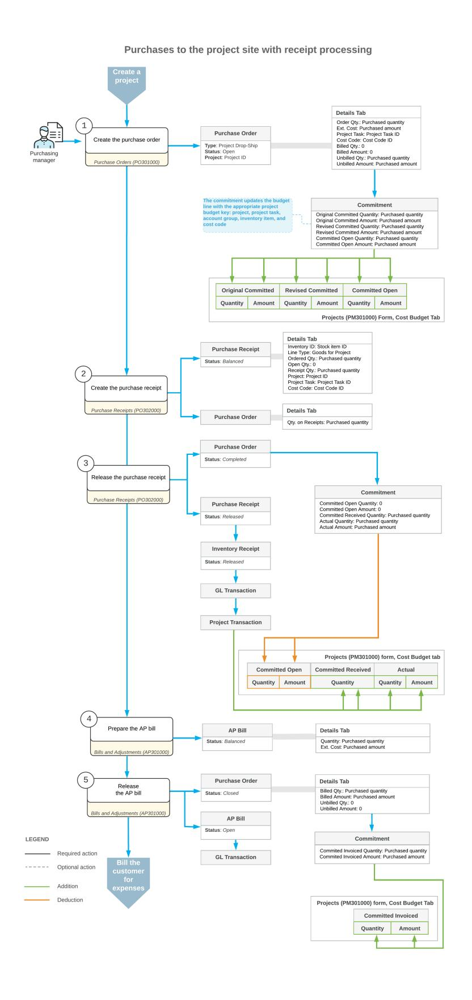

# <span id="page-304-0"></span>**Purchases to the Project Site with a Receipt: Implementation Checklist**

The following sections provide details you can use to ensure that the system is configured properly for the processing of purchases for projects with drop-shipping to the project site and with receipt processing, and to understand (and change, if needed) the settings that affect the processing workflow.

### **Implementation Checklist**

Before you initially process a project-related purchase to a project site with receipt processing, you should make sure the needed features have been enabled, settings have been specified, and entities have been created, as summarized in the following checklist.

| Form                                    | Criteria to Check                                                                                                                                                             |
|-----------------------------------------|-------------------------------------------------------------------------------------------------------------------------------------------------------------------------------|
| Enable/Disable Features (CS100000) form | Make sure that the Inventory and Order Management,<br>Inventory, and Project Accounting features are enabled.                                                                 |
| Multiple forms                          | Make sure that all necessary settings related to or<br>der management have been specified, as described in<br>Configuration of Order Management: Implementation Ac<br>tivity. |
| Vendors (AP303000) form                 | Make sure that all needed vendors have been config<br>ured, as described in Vendors: Implementation Activity.                                                                 |
| Stock Items (IN202500) form             | Make sure that the needed stock items have been con<br>figured, as described in Stock Items: Implementation Ac<br>tivity.                                                     |
| Non-Stock Items (IN202000) form         | Make sure that the needed non-stock items have been<br>configured, as described in Non-Stock Items: Implemen<br>tation Activity.                                              |

#### **Project Settings**

Before you initially process a purchase for a project with drop shipping and receipt processing, you should make sure that the project accounting functionality is configured and the project has specific settings, as summarized in the following checklist.

| Form                                 | Criteria to Check                                                                                                                                                                  |
|--------------------------------------|------------------------------------------------------------------------------------------------------------------------------------------------------------------------------------|
| Projects Preferences (PM101000) form | Make sure that all necessary settings related to project<br>accounting have been specified, as described in Basic<br>Project Configuration: General Information.                   |
|                                      | Also, select the Internal Cost CommitmentTrack<br>ing check box to track purchase orders as project cost<br>commitments and to see committed values in the<br>project cost budget. |

| Form                | Criteria to Check                                                                                                                                                               |  |  |  |
|---------------------|---------------------------------------------------------------------------------------------------------------------------------------------------------------------------------|--|--|--|
| Projects (PM301000) | Make sure that the necessary projects and project<br>tasks have been created, and that the following set<br>tings have been specified for the projects on the De<br>faults tab: |  |  |  |
|                     | •<br>Drop-Ship Receipt Processing: Generate Receipt                                                                                                                             |  |  |  |
|                     | With this setting, the processing of a purchase or<br>der of the Project Drop-Ship type involves the pro<br>cessing of a purchase receipt.                                      |  |  |  |
|                     | •<br>Record Drop-Ship Expense: On Receipt Release                                                                                                                               |  |  |  |
|                     | With this setting, purchase expenses will be record<br>ed to the project on release of the purchase receipt.                                                                    |  |  |  |

### **Other Settings That Affect the Workflow**

You can affect the processing workflow by specifying additional settings as follows:

• To change the format of project drop-ship order identifiers, adjust the predefined *POORDER* numbering sequence on the *[Numbering Sequences](https://help-2025r1.acumatica.com/Help?ScreenId=ShowWiki&pageid=a8d11c23-21f2-42a3-b17d-9637c9cf8031)* (CS201010) form, or create a new numbering sequence and select this sequence in the **Regular Order NumberingSequence** box on the **General** tab of the *[Purchase Orders](https://help-2025r1.acumatica.com/Help?ScreenId=ShowWiki&pageid=13d09c43-8696-4f92-ad9b-3d0209ee3d9b) [Preferences](https://help-2025r1.acumatica.com/Help?ScreenId=ShowWiki&pageid=13d09c43-8696-4f92-ad9b-3d0209ee3d9b)* (SC101000) form. For more information on numbering sequences, see *[Use of Numbering](https://help-2025r1.acumatica.com/Help?ScreenId=ShowWiki&pageid=71c26175-c78f-4e70-8518-2115f5bfaf2f) [Sequences](https://help-2025r1.acumatica.com/Help?ScreenId=ShowWiki&pageid=71c26175-c78f-4e70-8518-2115f5bfaf2f)*.

> A user can create project drop-ship orders by clicking the **Create Drop-Ship** button on the **Commitments** tab of the *[Projects](https://help-2025r1.acumatica.com/Help?ScreenId=ShowWiki&pageid=81c86417-3bde-444b-8f1c-682928d31a0c)* (PM301000) form only if the numbering sequence that is used for numbering project drop-ship orders is automatically numbered.

- To record expenses to the project budget on release of the accounts payable bill, select *On Bill Release* in the **Record Drop-Ship Expense** box of the *[Projects](https://help-2025r1.acumatica.com/Help?ScreenId=ShowWiki&pageid=81c86417-3bde-444b-8f1c-682928d31a0c)* (PM301000) form for the project.
- To create new projects so that the drop-ship purchases will be processed with receipts by default, select *Generate Receipt* in the **Drop-Ship Receipt Processing** box and *On Receipt Release* in the **Record Drop-Ship Expense** box on the *[Projects Preferences](https://help-2025r1.acumatica.com/Help?ScreenId=ShowWiki&pageid=de2ca225-4a0c-4129-b09d-3f3ed05198f9)* (PM101000) form and in the settings of the project templates on the *Project [Templates](https://help-2025r1.acumatica.com/Help?ScreenId=ShowWiki&pageid=11e7c776-03fb-405d-a1f4-26700dd319fc)* (PM208000) form.
- To reduce input errors when users enter orders, set up the validation of order totals by selecting the **For Project Drop-Ship Orders** check box in the**ValidateTotal on Entry** section of the *[Purchase Orders](https://help-2025r1.acumatica.com/Help?ScreenId=ShowWiki&pageid=13d09c43-8696-4f92-ad9b-3d0209ee3d9b) [Preferences](https://help-2025r1.acumatica.com/Help?ScreenId=ShowWiki&pageid=13d09c43-8696-4f92-ad9b-3d0209ee3d9b)* (PO101000) form.
- To cause the system to create accounts payable bills with the *Balanced* status, clear the **Hold Documents on Entry** check box on the **General** tab (**Data EntrySettings** section) of the *[Accounts Payable Preferences](https://help-2025r1.acumatica.com/Help?ScreenId=ShowWiki&pageid=c3f9353e-95e6-448d-bb3f-e20643879ec7)* (AP101000) form.
- To cause the system to automatically post general ledger batches generated during the processing of purchase and accounts payable documents, select the **Automatically Post on Release** check box in the **PostingSettings** section on the *[General Ledger Preferences](https://help-2025r1.acumatica.com/Help?ScreenId=ShowWiki&pageid=e4913d06-c511-4258-a0f9-f36c1b854e6b)* (GL102000) form.

With these settings specified, users in your company can process purchases on projects quickly and accurately with a minimum of manual actions.

#### **Known Project Drop-Ship Limitations**

The following limitations apply to the project drop-ship functionality:

- A project drop-ship order cannot be created from a change order or from a sales order.
- Landed costs cannot be applied to a project drop-ship order.

• The purchase price variance is always recorded in the bill transaction, regardless of the option that is specified in the **Allocation Mode** box on the *[Purchase Orders Preferences](https://help-2025r1.acumatica.com/Help?ScreenId=ShowWiki&pageid=13d09c43-8696-4f92-ad9b-3d0209ee3d9b)* (PO101000) form.

# <span id="page-306-0"></span>**Purchases to the Project Site with a Receipt: Process Activity**

This activity will walk you through the process of purchasing materials for the project site with a receipt being recorded.

This activity is based on the *U100* dataset. If you are using another dataset, or if any system settings have been changed in *U100*, these changes can affect the workflow of the activity and the results of the processing. To avoid any issues, restore the *U100* dataset to its initial state.

#### **Story**

Suppose that the ToadGreen Building Group company is building an Italian restaurant for the Italian Company, its customer. The construction project manager has analyzed the requirements and decided to create a project to track expenses and revenues for the performed work.

Further suppose that work on the project has started on February 15, 2025. The ToadGreen company purchases 400 pallets of 8-inch concrete blocks from the Concrete Supply Co. vendor. The construction project manager asks the vendor to deliver the purchased materials directly to the project site this week. On February 18, 2025, 250 pallets have been delivered to the project site. The vendor will deliver the rest of the purchased blocks at the beginning of March 2025.

Acting as ToadGreen's construction project manager, you will configure a project to handle the tracking and billing of the provided materials. Then you will process a purchase of materials with drop-shipping them directly to the project site.

#### **Configuration Overview**

In the *U100* dataset, the following tasks have been performed to support this activity:

- On the *[Enable/Disable Features](https://help-2025r1.acumatica.com/Help?ScreenId=ShowWiki&pageid=c1555e43-1bc5-4f6f-ba9d-b323f94d8a6b)* (CS100000) form, the following features have been enabled:
  - *Project Accounting* and *Construction*, which provides support for construction projects
  - *Inventory and Order Management*, which provides the sales order and purchase order functionality
  - *Inventory*, which provides the stock item functionality
- On the *[Customers](https://help-2025r1.acumatica.com/Help?ScreenId=ShowWiki&pageid=652929bc-9606-4056-aa6e-0c2d1147171b)* (AP303000) form, the *ITACOM* customer has been created.
- On the *Project [Templates](https://help-2025r1.acumatica.com/Help?ScreenId=ShowWiki&pageid=11e7c776-03fb-405d-a1f4-26700dd319fc)* (PM208000) form, the *CONTM* project template has been created.
- On the *[Stock Items](https://help-2025r1.acumatica.com/Help?ScreenId=ShowWiki&pageid=77786a70-1f1e-4d63-ad98-96f98e4fcb0e)* (IN202500) form, the *CONCRBK8* stock item has been defined.
- On the *[Vendors](https://help-2025r1.acumatica.com/Help?ScreenId=ShowWiki&pageid=a9584be3-f2bd-4d67-80d4-8041d809df56)* (AP303000) form, the *CONCRESUP* vendor has been created.

#### **Process Overview**

You will create a project based on the project template on the *[Projects](https://help-2025r1.acumatica.com/Help?ScreenId=ShowWiki&pageid=81c86417-3bde-444b-8f1c-682928d31a0c)* (PM301000) form and configure settings for the drop-ship purchases for the project. Then you will create a drop-ship order for the project and process it. You will process a purchase receipt to record the partial receipt of the ordered items at the project site. Finally, you will review the commitment to the project budget.

#### **System Preparation**

Before you start creating a project and process a purchase, do the following:

- 1. Launch the Acumatica ERP website, and sign in as a construction project manager. You should sign in by using the *ewatson* username and the *123* password.
- 2. In the info area, in the upper-right corner of the top pane of the Acumatica ERP screen, make sure that the business date in your system is set to 1/30/2025. If a different date is displayed, click the Business Date menu button, and select 1/30/2025 on the calendar. For simplicity, in this activity, you will create and process all documents in the system on this business date.
- 3. On the **General** tab (**GeneralSettings** section) of the *[Projects Preferences](https://help-2025r1.acumatica.com/Help?ScreenId=ShowWiki&pageid=de2ca225-4a0c-4129-b09d-3f3ed05198f9)* (PM101000) form, select the **Internal Cost CommitmentTracking** check box to expose commitments and committed values in the project budget, and save your changes to the project accounting preferences.

#### **Step 1: Creating a Project Based on the Project Template**

To create a project based on a template, do the following:

- 1. On the *[Projects](https://help-2025r1.acumatica.com/Help?ScreenId=ShowWiki&pageid=81c86417-3bde-444b-8f1c-682928d31a0c)* (PM301000) form, add a new record.
- 2. In the Summary area, specify the following settings:
  - **Project ID**: ITALIAN3T
  - **Customer**: *ITACOM*
  - **Template**: *CONTM*

When you select the project template, the system fills in the relevant elements of the project with the settings specified for the template, including tasks and revenue budget lines.

- 3. In the **Description** box of the Summary area, enter Italian restaurant (Taylor Street).
- 4. In the **Project Properties** section on the**Summary** tab, specify the following settings:
  - **Cost Budget Level**: *Task, Item, and Cost Code*
  - **Allow Adding New Items on the Fly**: Selected
- 5. On the **Addresses** tab, in the **Project Address** section, specify the following settings:
  - **Address Line 1**: 3505 Taylor Street
  - **City**: New York
  - **Country**: *US*
  - **State**: *NY*
  - **Postal Code**: 10011
- 6. Save your changes to the project.
- 7. On the **Tasks** tab, make sure that 16 tasks have been added, and on the table toolbar, click **ActivateTasks** to change the status of the project tasks to *Active*.
- 8. On the **Defaults** tab, specify the following settings:
  - **Use Expense Account From**: *Posting Class or Item*
  - **Drop-Ship Receipt Processing**: *Generate Receipt*

With this setting, items of any type added to a purchase order of the *Project Drop-Ship* type are processed with a purchase receipt.

• **Record Drop-Ship Expenses**: *On Receipt Release*

With this setting, the expenses are recorded to the project on release of the purchase receipt created for the drop-ship purchase order.

9. On the form toolbar, click **Activate**. The system assigns the project the *Active* status.

#### **Step 2: Creating a Project Drop-Ship Order**

Create and process a drop-ship order for the project as follows:

- 1. Set the business date to 2/15/2025.
- 2. While still reviewing the *ITALIAN3T* project on the *[Projects](https://help-2025r1.acumatica.com/Help?ScreenId=ShowWiki&pageid=81c86417-3bde-444b-8f1c-682928d31a0c)* (PM301000) form, on the table toolbar of the **Commitments** tab, click **Create Drop-Ship**. The system opens the *[Purchase Orders](https://help-2025r1.acumatica.com/Help?ScreenId=ShowWiki&pageid=5565686c-96c4-4bfa-a51d-9a2566baa808)* (PO301000) form, with the *Project Drop-Ship* selected in the**Type** box and *ITALIAN3T* project specified in the **Project** box in the Summary area.
- 3. In the Summary area, specify the following settings:
  - **Vendor**: *CONCRESUP*
  - **Date**: 2/15/2025 (populated automatically)
  - **Description**: Purchase of concrete blocks with delivery to project site
- 4. On the **Details** tab, add a row with the following settings:
  - **Inventory ID**: *CONCRBK8*
  - **UOM**: *PIECE* (specified automatically)
  - **Order Qty.**: 400
  - **Unit Cost**: 180
  - **ProjectTask**: *04*
  - **Cost Code**: *04-220*

The system will warn you that the line with the specified project budget key does not exist in the project budget.

- 5. Save the drop-ship order for the project. On the**Shipping** tab, review the shipping settings for the purchase order and notice that the**Shipping Destination Type** is set to *Project Site*.
- 6. On the More menu (under **Printing and Emailing**), click **Print Purchase Order**. In the prepared printable document, review the**Ship To** section, and make sure that the shipping address has been copied from the project settings.
- 7. Close the browser tab with the report and return to the drop-ship order for the project on the *[Purchase](https://help-2025r1.acumatica.com/Help?ScreenId=ShowWiki&pageid=5565686c-96c4-4bfa-a51d-9a2566baa808) [Orders](https://help-2025r1.acumatica.com/Help?ScreenId=ShowWiki&pageid=5565686c-96c4-4bfa-a51d-9a2566baa808)* form.
- 8. On the form toolbar, click **Remove Hold**. The system assigns the purchase order the *Open* status. When the *Open* status is assigned to the purchase order, the system creates the commitments for the project.
- 9. On the *[Projects](https://help-2025r1.acumatica.com/Help?ScreenId=ShowWiki&pageid=81c86417-3bde-444b-8f1c-682928d31a0c)* form, open the *ITALIAN3T* project.
- 10.On the **Cost Budget** tab, review the cost budget line with the *04* project task, the *CONCRBK8* inventory item, and the *04-220* cost code. The system has created this cost budget line based on the commitment.

Notice that the original committed and revised committed values of the cost budget line have been updated by the purchase order total (*72,000.00*). The actual quantity and actual amount in the line are zero because the expenses have not yet been recorded to the project.

#### **Step 3: Receiving the Items**

To record the receipt of the items at the project site, perform the following instructions:

- 1. On the **Commitments** tab, click the **Order Nbr.** link of the only row to open the project drop-ship order that you have created earlier on the *[Purchase Orders](https://help-2025r1.acumatica.com/Help?ScreenId=ShowWiki&pageid=5565686c-96c4-4bfa-a51d-9a2566baa808)* (PO301000) form.
- 2. On the form toolbar, click **Enter PO Receipt**. The system creates a purchase receipt and opens it on the *[Purchase Receipts](https://help-2025r1.acumatica.com/Help?ScreenId=ShowWiki&pageid=d9901c8d-486d-45ed-8088-ea3d8ee3af19)* (PO302000) form. Save the purchase receipt.
- 3. In the **Date** box, specify 2/18/2025.

- 4. In the only line on the **Details** tab, specify 250 as **Receipt Qty.**.
- 5. Save the purchase receipt.
- 6. On the form toolbar, click **Release**.
- 7. On the *[Projects](https://help-2025r1.acumatica.com/Help?ScreenId=ShowWiki&pageid=81c86417-3bde-444b-8f1c-682928d31a0c)* form, open the *ITALIAN3T* project, and review the **Cost Budget** tab, as shown in the following screenshot. In the line with the *04* project task and the *04-220* cost code, the **Actual Amount** has been updated and is now 45,000. The **Actual Quantity** is 250.

| Projects<br>ITALIAN3T - Italian restaurant (Taylor Street)<br>$\leftarrow$ 2<br>$\Xi$<br>价<br>$\mathbf{K}$<br>$\lambda$<br>COMPLETE<br><b>RUN BILLING</b><br>$\Omega$<br>$\left\langle \right\rangle$<br>$+$<br>1.11                                                                                                                                                                      |              |                                    |                                            |                                      |                               |                          |                                |                                 |                               | <b>RINOTES</b>                    | <b>FILES</b>                    | !!!!!!!!!!!!!!!!!!!!!!!!!!!!!!!!!!!!!!!! |                                |                                  |                                  |                                 |                               |                             |                    |                  |  |
|-------------------------------------------------------------------------------------------------------------------------------------------------------------------------------------------------------------------------------------------------------------------------------------------------------------------------------------------------------------------------------------------|--------------|------------------------------------|--------------------------------------------|--------------------------------------|-------------------------------|--------------------------|--------------------------------|---------------------------------|-------------------------------|-----------------------------------|---------------------------------|------------------------------------------|--------------------------------|----------------------------------|----------------------------------|---------------------------------|-------------------------------|-----------------------------|--------------------|------------------|--|
| * Project ID:                                                                                                                                                                                                                                                                                                                                                                             |              | <b>ITALIAN3T</b>                   | $\circ$                                    | Customer:                            |                               | ITACOM - Italian Company |                                | $\mathcal{Q}$                   | Actual Income:                |                                   | 0.00                            |                                          |                                |                                  |                                  |                                 |                               |                             |                    |                  |  |
| Template:                                                                                                                                                                                                                                                                                                                                                                                 |              |                                    | CONTM - Construction project (time and r 2 | Project Manager:                     |                               |                          |                                | o                               | Actual Expenses:              |                                   | 45,000.00                       |                                          |                                |                                  |                                  |                                 |                               |                             |                    |                  |  |
| Status:                                                                                                                                                                                                                                                                                                                                                                                   |              | Active                             |                                            |                                      |                               |                          |                                |                                 | Margin Amount:                |                                   | $-45,000.00$                    |                                          |                                |                                  |                                  |                                 |                               |                             |                    |                  |  |
| Description:                                                                                                                                                                                                                                                                                                                                                                              |              | Italian restaurant (Taylor Street) |                                            |                                      |                               |                          |                                |                                 | Margin (%):                   |                                   | 0.00                            |                                          |                                |                                  |                                  |                                 |                               |                             |                    |                  |  |
| Pending Invoice Amoun.<br>0.00<br><b>COST BUDGET</b><br><b>REVENUE BUDGET</b><br><b>BALANCES</b><br><b>DEFAULTS</b><br><b>SUMMARY</b><br><b>TASKS</b><br><b>COMMITMENTS</b><br><b>INVOICES</b><br>UNION LOCALS<br><b>ACTIVITIES</b><br>EMPLOYEES<br><b>EQUIPMENT</b><br>ADDRESSES<br><b>ATTRIBUTES</b><br><b>MAILING &amp; PRINTING</b><br>COMPLIANCE<br><b>CONTACTS</b><br>Group by Task |              |                                    |                                            |                                      |                               |                          |                                |                                 |                               |                                   |                                 |                                          |                                |                                  |                                  |                                 |                               |                             |                    |                  |  |
| e.                                                                                                                                                                                                                                                                                                                                                                                        | $\times$     | <b>VIEW COMMITMENTS</b>            | <b>VIEW TRANSACTIONS</b>                   | $\mathbb{H}$                         | $\overline{x}$ $\overline{1}$ |                          |                                |                                 |                               |                                   |                                 |                                          |                                |                                  |                                  |                                 |                               |                             | All Records        |                  |  |
| Inventory ID                                                                                                                                                                                                                                                                                                                                                                              | Cost<br>Code | * Account Group                    | <b>Description</b>                         | Original UOM<br>Budgeted<br>Quantity |                               | <b>Unit Rate</b>         | Original<br>Budgeted<br>Amount | Revised<br>Budgeted<br>Quantity | Revised<br>Budgeted<br>Amount | Original<br>Committed<br>Quantity | Original<br>Committed<br>Amount | Revised<br>Committed<br>Quantity         | Revised<br>Committer<br>Amount | Committe<br>Received<br>Quantity | Committe<br>Invoiced<br>Quantity | Committed<br>Invoiced<br>Amount | Committed<br>Open<br>Quantity | Committed<br>Open<br>Amount | Actual<br>Quantity | Actual<br>Amount |  |
| !!!!!!!!!!!!!!!!!!!!!!!!!!!!!!!!!!!!!!!!                                                                                                                                                                                                                                                                                                                                                  | 04-220       | <b>MATERIAL</b>                    | Masonry-Block                              |                                      | $0.00$ PIECE                  | 0.0000                   | 0.00                           | 0.00                            | 0.00                          | 400.00                            | 72,000.00                       | 400.00                                   | 72,000.00                      | 250.00                           | 0.00                             | 0.00                            | 150.00                        | 27,000.00                   | 250.00             | 45,000.00        |  |

*Figure: Expenses recorded to project budget*

You have finished processing a drop-ship purchase order for a project and recorded the receipt of items to the project site.

# <span id="page-309-0"></span>**Purchases to the Project Site with a Receipt: Generated Transactions**

When you purchase items for a project that are drop-shipped to the project site and purchase receipts are processed, you create and process a purchase order of the *Project Drop-Ship* type. To update the vendor balance and record the incurred expenses to the cost budget of the project, the system generates the GL transactions and project transactions described in the following sections. These sections describe the transactions that are generated for a project in which project expenses are captured on release of the purchase receipt.

#### **GL Transactions Generated on Release of the Inventory Receipt**

An inventory receipt is created on release of a purchase receipt prepared for a purchase order. When this inventory receipt is released, the system creates a batch of the general ledger transactions shown in the following table.

| Account            | Source of Account                                                            | Project Budget<br>Key                                                     | Debit  | Credit |
|--------------------|------------------------------------------------------------------------------|---------------------------------------------------------------------------|--------|--------|
| PO Accrual account | Posting class of<br>the item                                                 | X (Non-project<br>code)                                                   | 0.00   | Amount |
| Expense account    | Determined by the<br>Use Expense Ac<br>count From set<br>ting of the project | Project, project<br>task, and cost code<br>in the purchase or<br>der line | Amount | 0.00   |

On the **Financial** tab of the *[Receipts](https://help-2025r1.acumatica.com/Help?ScreenId=ShowWiki&pageid=d6ecad5b-155f-44bf-baba-9ed006d298b5)* (IN301000) form, you can click the link in the **Batch Nbr.** box to view the details of the batch on the *Journal [Transactions](https://help-2025r1.acumatica.com/Help?ScreenId=ShowWiki&pageid=dda046bc-5946-407f-88f7-1c0c966fbe72)* (GL301000) form.

#### **Project Transaction Generated on Inventory Receipt**

When the batch of general ledger transactions created on release of the inventory receipt is released, the system generates the project transaction shown in the following table.

| Project Budget Key                                                                | Account Group                                  | Debit Account                            | Amount |
|-----------------------------------------------------------------------------------|------------------------------------------------|------------------------------------------|--------|
| Project, project task, invento<br>ry item, and cost code in the GL<br>transaction | Account group mapped<br>to the Expense account | Expense account in the<br>GL transaction | Amount |

You can review the created project transaction on the *Project [Transaction](https://help-2025r1.acumatica.com/Help?ScreenId=ShowWiki&pageid=29bf5433-446f-4196-be69-f2cb177e83cb) Details* (PM401000) form. In the Selection area of this form, you select the project in the **Project** box.

#### **GL Transactions Generated on Release of the AP Bill**

When an accounts payable bill prepared for a purchase order is released, the system creates a batch of the general ledger transactions shown in the following table.

The system uses the following accounts as the source accounts in the GL batch it creates.

| Account                      | Source of Account            | Project Budget<br>Key   | Debit  | Credit |
|------------------------------|------------------------------|-------------------------|--------|--------|
| Accounts Payable ac<br>count | Vendor or vendor<br>location | X (Non-project<br>code) | 0.00   | Amount |
| PO Accrual account           | Posting class of<br>the item | X (Non-project<br>code) | Amount | 0.00   |

On the **Financial** tab (**Link to GL** section) of the *[Bills and Adjustments](https://help-2025r1.acumatica.com/Help?ScreenId=ShowWiki&pageid=956b4e51-3078-4d2d-85b3-65c080d95234)* (AP301000) form, you can click the link in the **Batch Nbr.** box to view the details of the batch on the *Journal [Transactions](https://help-2025r1.acumatica.com/Help?ScreenId=ShowWiki&pageid=dda046bc-5946-407f-88f7-1c0c966fbe72)* (GL301000) form.

# <span id="page-311-2"></span><span id="page-311-0"></span>**Tracking Changes to the Project Budget**

If you need to track changes to the project revenue and cost budget, and control the profitability of every change initiated by a customer, you use the functionality of change orders.

# <span id="page-311-3"></span><span id="page-311-1"></span>**Single-Tier Change Management: General Information**

Acumatica ERP provides change order functionality, which you can use to track changes to project's budgeted and committed values and to control the profitability of every change initiated by a customer. A change order is a document for profitability analysis and an audit of changes to the project revenue budget, commitments, and budgeted costs. Change orders do not alter the original figures of a project directly. They are tracked in separate project budget columns.

#### **Learning Objectives**

In this chapter, you will learn how to do the following:

- Configure a change order class
- Create a change order for a project
- Update the project budget with the change order
- Review the changes made with change orders in the project budget
- Prevent direct purchases for the project
- Cancel the change order

#### **Applicable Scenarios**

You turn on the change order workflow for a project if you want to control changes made to the budgeted and committed values of the project budget and to track these changes at the budget level. To make changes to the project budget, you create change orders that do not alter the original budgeted and committed values.

You prevent the direct creation of purchase orders for the project if you want to create new purchase orders only by means of change orders to track these purchases as changes to the project budget.

#### **Change Order Classes**

A change order class defines which project data—the revenue budget, the cost budget, or commitments—can be adjusted with a change order of this class. You must specify a change order class for each change order you create, so you first need to configure change order classes on the *[Change Order Classes](https://help-2025r1.acumatica.com/Help?ScreenId=ShowWiki&pageid=fdac3e07-8ea5-4c44-85bc-bae8850df2f0)* (PM203000) form.

To allow users to make changes to the project budget by using a change order of a particular class, on the *[Change](https://help-2025r1.acumatica.com/Help?ScreenId=ShowWiki&pageid=fdac3e07-8ea5-4c44-85bc-bae8850df2f0) [Order Classes](https://help-2025r1.acumatica.com/Help?ScreenId=ShowWiki&pageid=fdac3e07-8ea5-4c44-85bc-bae8850df2f0)* form, you select any combination of the following check boxes for the change order class:

- **Revenue Budget**: To allow changes to the revenue budget
- **Cost Budget**: To allow changes to the cost budget
- **Commitments**: To allow changes to committed values. For more information, see *[Change Orders for](#page-354-2) [Commitments: General Information](#page-354-2)*.

Change order classes also make it possible to group change orders by their impact on projects. For example, you can segregate changes by class in reports to analyze which types of changes have the greatest impact on project profitability.

Once you have created change order classes, you specify the change order class to be used by default in newly created change orders in the **Default Change Order Class** box on the **General** tab of the *[Projects Preferences](https://help-2025r1.acumatica.com/Help?ScreenId=ShowWiki&pageid=de2ca225-4a0c-4129-b09d-3f3ed05198f9)* (PM101000) form.

In a new change order, you can override the change order class that the system has inserted by default. If no default change order class has been specified on the *[Projects Preferences](https://help-2025r1.acumatica.com/Help?ScreenId=ShowWiki&pageid=de2ca225-4a0c-4129-b09d-3f3ed05198f9)* form, you must select the change order class manually on the *[Change Orders](https://help-2025r1.acumatica.com/Help?ScreenId=ShowWiki&pageid=0c26a0eb-ef8d-4a61-97c8-237aea21cf25)* (PM308000) form.

#### **Change Order Workflow**

To make it possible for users to track changes for a project by using change orders, you select the **Change Order Workflow** check box on the**Summary** tab of the *[Projects](https://help-2025r1.acumatica.com/Help?ScreenId=ShowWiki&pageid=81c86417-3bde-444b-8f1c-682928d31a0c)* (PM301000) form for the project. You need to select this check box for each project for which you want to turn on the change order workflow.

Once you have selected this check box for a project, you create a change order for the project on the *[Projects](https://help-2025r1.acumatica.com/Help?ScreenId=ShowWiki&pageid=81c86417-3bde-444b-8f1c-682928d31a0c)* form by clicking **Create Change Order** on the More menu. The system creates a change order with the *On Hold* status and the project selected and opens it on the *[Change Orders](https://help-2025r1.acumatica.com/Help?ScreenId=ShowWiki&pageid=0c26a0eb-ef8d-4a61-97c8-237aea21cf25)* (PM308000) form.

In a change order with the *On Hold* status, on the **Revenue Budget** and **Cost Budget** tabs of the *[Change Orders](https://help-2025r1.acumatica.com/Help?ScreenId=ShowWiki&pageid=0c26a0eb-ef8d-4a61-97c8-237aea21cf25)* form, you can increase and decrease values in existing project budget lines as well as create new budget lines. When you edit a change order line, you can see the following values: the original budgeted amount in the **Original Budgeted Amount** column; the released and dra change order (CO) amounts in the **Previously Approved CO Amount** and **Other Dra CO Amount** columns, respectively; and the updated budgeted amount in the **Revised Budgeted Amount** column.

When a change order is saved with the *On Hold* status, the **Quantity** and **Amount** values of a revenue budget line or cost budget line of the change order increase the **Potential CO Quantity** and **Potential CO Amount** of the corresponding revenue budget line or cost budget line of the project on the *[Projects](https://help-2025r1.acumatica.com/Help?ScreenId=ShowWiki&pageid=81c86417-3bde-444b-8f1c-682928d31a0c)* form.

A change order can be printed or emailed to the customer. To print the change order, on the More menu of the *[Change Orders](https://help-2025r1.acumatica.com/Help?ScreenId=ShowWiki&pageid=0c26a0eb-ef8d-4a61-97c8-237aea21cf25)* form, you click **Print**. To email the change order, on the More menu of the same form, you click **Email**.

When a change order is released, the **Potential CO Quantity** and **Potential CO Amount** of the corresponding budget lines are decreased and the **Budgeted CO Quantity** and **Budgeted CO Amount** are increased on the *[Projects](https://help-2025r1.acumatica.com/Help?ScreenId=ShowWiki&pageid=81c86417-3bde-444b-8f1c-682928d31a0c)* form. The change order is assigned the *Closed* status.

You can cancel a change order by clicking **Cancel** on the form toolbar of the *[Change Orders](https://help-2025r1.acumatica.com/Help?ScreenId=ShowWiki&pageid=0c26a0eb-ef8d-4a61-97c8-237aea21cf25)* form to indicate that the changes will not be processed further. The system assigns the change order the *Canceled* status and decreases the potential CO values of the corresponding revenue budget lines and cost budget lines of the project on the *[Projects](https://help-2025r1.acumatica.com/Help?ScreenId=ShowWiki&pageid=81c86417-3bde-444b-8f1c-682928d31a0c)* form.

#### **Workflow of Managing Changes to the Project Budget**

The following diagram illustrates the workflow of managing changes to the project budget.

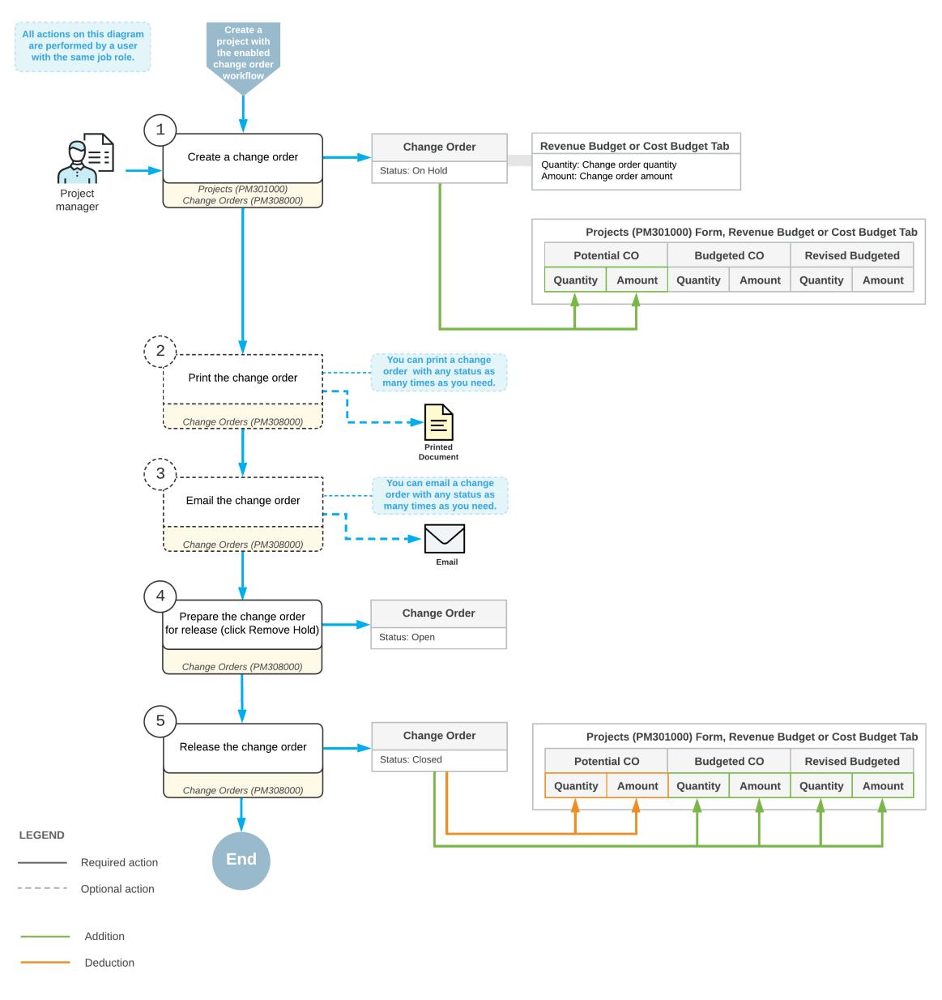

#### **Update of the Project Budget when a Change Order Is Released**

When a change order is released, the budgeted values of the corresponding project on the *[Projects](https://help-2025r1.acumatica.com/Help?ScreenId=ShowWiki&pageid=81c86417-3bde-444b-8f1c-682928d31a0c)* (PM301000) form are updated as follows:

- If the project has a revenue budget line with the same project task, account group, and inventory item as a revenue budget line of the change order, the system updates the following columns of the revenue budget line of the project on the **Revenue Budget** tab, with the column values computed as noted:
  - **Budgeted CO Quantity** = The total quantity of released change orders
  - **Budgeted CO Amount** = The total amount of released change orders
  - **Revised Budgeted Quantity** = **Original Budgeted Quantity** + **Budgeted CO Quantity**
  - **Revised Budgeted Amount** = **Original Budgeted Amount** + **Budgeted CO Amount**

• **Pending Invoice Amount** = **Revised Budgeted Amount** \* **Completed (%)** / 100 – **Actual Amount** – **Dra Invoice Amount**

As the result of the update of the **Pending Invoice Amount**, the amount can be a rational value, including a negative one.

- If the project has a cost budget line with the same project task, account group, and inventory item as a cost budget line of the change order, the system updates the following columns of the cost budget line of the project on the **Cost Budget** tab, with the column values calculated as follows:
  - **Budgeted CO Quantity** = The total quantity of released change orders
  - **Budgeted CO Amount** = The total amount of released change orders
  - **Revised Budgeted Quantity** = **Original Budgeted Quantity** + **Budgeted CO Quantity**
  - **Revised Budgeted Amount** = **Original Budgeted Amount** + **Budgeted CO Amount**
- If the project does not have a revenue or cost budget line with the same project task, account group, and inventory item as a revenue or cost budget line of the change order, the system creates a new revenue or cost budget line for the project based on the revenue or cost budget line of the change order. In this newly created budget line, the unit rate is copied from the corresponding change order line.

# <span id="page-314-0"></span>**Single-Tier Change Management: Implementation Checklist**

The following sections provide details you can use to ensure that the system is configured properly for the processing of change orders, and to understand (and change, if needed) the settings that affect the processing workflow.

#### **Implementation Checklist**

We recommend that before you initially create change orders, you make sure the needed features have been enabled, settings have been specified, and entities have been created, as summarized in the following checklist.

| Form                                       | Tasks to Perform                                                                                                                                                                                                                                                                              | Notes |
|--------------------------------------------|-----------------------------------------------------------------------------------------------------------------------------------------------------------------------------------------------------------------------------------------------------------------------------------------------|-------|
| Enable/Disable Features (CS100000)<br>form | Make sure that the Project Account<br>ing and Change Orders features are<br>enabled.                                                                                                                                                                                                          |       |
| Projects Preferences (PM101000)<br>form    | Make sure that all necessary set<br>tings related to project account<br>ing have been specified. For more<br>information about configuration<br>steps that you have to perform be<br>fore you can start accounting for<br>projects, see Basic Project Configu<br>ration: General Information. |       |
| Change Order Classes (PM203000)<br>form    | Make sure that all needed change<br>order classes have been config<br>ured, as described in Change Or<br>ders for Commitments: To Create a<br>Change Order Class.                                                                                                                             |       |

| Form                     | Tasks to Perform                                                                                                                                                                                                                                               | Notes                                                                                                                                                                                                                                                                                                                                                                                                                                                                                   |
|--------------------------|----------------------------------------------------------------------------------------------------------------------------------------------------------------------------------------------------------------------------------------------------------------|-----------------------------------------------------------------------------------------------------------------------------------------------------------------------------------------------------------------------------------------------------------------------------------------------------------------------------------------------------------------------------------------------------------------------------------------------------------------------------------------|
| Projects (PM301000) form | Make sure that the project has been<br>created, as described in Project<br>Creation and Processing: General In<br>formation.<br>Also, make sure that the Change<br>Order Workflow check box is<br>selected on the Summary tab<br>(Project Properties section). | If the Internal Cost Commitment<br>Tracking check box is selected on<br>the General tab (General Settings<br>section) of the Projects Preferences<br>(PM101000) form, and a project has<br>related purchase orders, you can<br>select the Change Order Work<br>flow check box for the project if the<br>project has no open related pur<br>chase order lines. That is, the sta<br>tus of the related purchase order<br>lines of the project is only Complet<br>ed, Closed, or Canceled. |

#### **Checklist for Project Commitments**

If you want to use the functionality of change orders to manage changes in commitments, make sure that all the needed features have been enabled and settings have been specified, as described in *[Committed Costs:](#page-344-1) [Implementation Checklist](#page-344-1)*.

#### **Other Settings That Affect the Workflow**

You can affect the workflow of managing changes in projects by specifying additional settings as follows:

- To change the format of change order identifiers, adjust the *CHANGEORD* numbering sequence on the *[Numbering Sequences](https://help-2025r1.acumatica.com/Help?ScreenId=ShowWiki&pageid=a8d11c23-21f2-42a3-b17d-9637c9cf8031)* (CS201010) form or create a new auto-numbered sequence and select this sequence in the **Change Order NumberingSequence** box on the **General** tab (**NumberingSequence** section) of the *[Projects Preferences](https://help-2025r1.acumatica.com/Help?ScreenId=ShowWiki&pageid=de2ca225-4a0c-4129-b09d-3f3ed05198f9)* (PM101000) form. For more information on numbering sequences, see *[Use of](https://help-2025r1.acumatica.com/Help?ScreenId=ShowWiki&pageid=71c26175-c78f-4e70-8518-2115f5bfaf2f) [Numbering Sequences](https://help-2025r1.acumatica.com/Help?ScreenId=ShowWiki&pageid=71c26175-c78f-4e70-8518-2115f5bfaf2f)*.
- To allow users to create change orders by using the **Create Change Order** command on the More menu of the *[Projects](https://help-2025r1.acumatica.com/Help?ScreenId=ShowWiki&pageid=81c86417-3bde-444b-8f1c-682928d31a0c)* (PM301000) form, clear the **Manual Numbering** check box in the Summary area of the *[Numbering Sequences](https://help-2025r1.acumatica.com/Help?ScreenId=ShowWiki&pageid=a8d11c23-21f2-42a3-b17d-9637c9cf8031)* form for the numbering sequence used for change orders.
- To cause the system to automatically select a change order class on creation of change orders, select the change order class in the **Default Change Order Class** box on the **General** tab (**GeneralSettings** section) of the *[Projects Preferences](https://help-2025r1.acumatica.com/Help?ScreenId=ShowWiki&pageid=de2ca225-4a0c-4129-b09d-3f3ed05198f9)* form.

With these settings specified, users in your company can process change orders quickly and accurately with a minimum of manual actions.

### **Validation of Configuration**

To make sure that all configuration has been performed correctly, we recommend that you process a change order by performing instructions similar to those described in *Single-Tier Change [Management:](#page-315-1) To Track Changes to the [Project Budget](#page-315-1)* and *[Change Orders for Commitments: Process Activity](#page-359-1)*.

# <span id="page-315-1"></span><span id="page-315-0"></span>**Single-Tier Change Management: To Track Changes to the Project Budget**

In this activity, you will learn how you can turn on the change order workflow for a project and manage changes to the project's budgeted values by creating change orders.

This activity is based on the *U100* dataset. If you are using another dataset, or if any system settings have been changed in *U100*, these changes can affect the workflow of the activity and the results of the processing. To avoid any issues, restore the *U100* dataset to its initial state.

#### **Story**

Suppose that the Thai Food Restaurant customer has ordered two juicers, along with eight hours of the installation service from the SweetLife Fruits & Jams company. SweetLife's project accountant has created a project and configured the revenue and cost budgets based on the agreement reached with the customer. During project execution, the customer requests one more juicer, along with the installation, as a part of the same project. The project accountant has estimated that the installation of this additional juicer will require five hours of the installation service. Also, the project accountant has decided to track these changes to the project at the budget level because the installation of the third juicer was not planned initially.

Acting as the project accountant, you will turn on the change order workflow for the project to be able to track changes to the project budget. Then you will create a change order to update the project budget according to the customer's request and to reflect these changes at the project budget level.

#### **Configuration Overview**

In the *U100* dataset, the following tasks have been performed to support this activity:

- On the *[Enable/Disable Features](https://help-2025r1.acumatica.com/Help?ScreenId=ShowWiki&pageid=c1555e43-1bc5-4f6f-ba9d-b323f94d8a6b)* (CS100000) form, the following features have been enabled:
  - *Project Accounting*, which provides support for the project accounting functionality
  - *Change Orders*, which gives you the ability to manage changes to the project's budgeted and committed values
- On the *[Projects](https://help-2025r1.acumatica.com/Help?ScreenId=ShowWiki&pageid=81c86417-3bde-444b-8f1c-682928d31a0c)* (PM301000) form, the *TOMYUM6* project has been created and the *INSTALL* project task has been created for the project.
- On the *[Change Order Classes](https://help-2025r1.acumatica.com/Help?ScreenId=ShowWiki&pageid=fdac3e07-8ea5-4c44-85bc-bae8850df2f0)* (PM203000) form, the *DEFAULT* change order class has been created.
- On the *[Projects Preferences](https://help-2025r1.acumatica.com/Help?ScreenId=ShowWiki&pageid=de2ca225-4a0c-4129-b09d-3f3ed05198f9)* (PM101000) form, the *DEFAULT* change order class has been selected in the **Default Change Order Class** box on the **General** tab (**GeneralSettings** section).

#### **Process Overview**

In this activity, you will turn on the change order workflow for the project on the *[Projects](https://help-2025r1.acumatica.com/Help?ScreenId=ShowWiki&pageid=81c86417-3bde-444b-8f1c-682928d31a0c)* (PM301000) form. Then you will create and process a change order for the project on the *[Change Orders](https://help-2025r1.acumatica.com/Help?ScreenId=ShowWiki&pageid=0c26a0eb-ef8d-4a61-97c8-237aea21cf25)* (PM308000) form. Finally, you will review how the changes have affected the values in the project budget.

#### **System Preparation**

To sign in to the system and prepare to perform the instructions of the activity, do the following:

- 1. Launch the Acumatica ERP website, and sign in to a company with the *U100* dataset preloaded; you should sign in as Pam Brawner by using the *brawner* username and the *123* password.
- 2. In the info area, in the upper-right corner of the top pane of the Acumatica ERP screen, make sure that the business date in your system is set to *1/30/2025*. If a different date is displayed, click the Business Date menu button and select *1/30/2025* on the calendar. For simplicity, in this activity, you will create and process all documents in the system on this business date.

#### **Step 1: Turning on the Change Order Workflow for the Project**

To turn on the change order workflow for the project, which makes it possible to create change orders for the project, do the following:

- 1. On the *[Projects](https://help-2025r1.acumatica.com/Help?ScreenId=ShowWiki&pageid=81c86417-3bde-444b-8f1c-682928d31a0c)* (PM301000) form, open the *TOMYUM6* project.
- 2. On the **Summary** tab, select the **Change Order Workflow** check box to turn on the change order workflow for the project.
- 3. Save your changes to the project.

Since you turned on the change order workflow for the project, the **Revised Budgeted Quantity** and **Revised Budgeted Amount** columns on the **Revenue Budget** and **Cost Budget** tabs have become readonly. Now you can make changes to these values only by using the change orders.

#### **Step 2: Creating a Change Order for the Project**

To make changes to the project budget by creating a change order, do the following:

1. While you are remaining on the *[Projects](https://help-2025r1.acumatica.com/Help?ScreenId=ShowWiki&pageid=81c86417-3bde-444b-8f1c-682928d31a0c)* (PM301000) form with the *TOMYUM6* project selected, on the More menu, click **Create Change Order**. The system creates a change order for the project and opens it on the *[Change Orders](https://help-2025r1.acumatica.com/Help?ScreenId=ShowWiki&pageid=0c26a0eb-ef8d-4a61-97c8-237aea21cf25)* (PM308000) form.

Notice that the system has automatically selected the *DEFAULT* change order class for the change order because this class is the default change order class specified on the *[Projects Preferences](https://help-2025r1.acumatica.com/Help?ScreenId=ShowWiki&pageid=de2ca225-4a0c-4129-b09d-3f3ed05198f9)* (PM101000) form.

- 2. In the Summary area of this form, in the **Description** box, enter One more juicer with installation requested by the customer.
- 3. On the **Revenue Budget** tab, click **Add Row** on the table toolbar and specify the following settings in the row:
  - **ProjectTask**: *INSTALL*
  - **Account Group**: *REVENUE*
  - **Description**: Additional juicer with installation
  - **Amount**: 2900

When you enter the **Amount** of the line, which represents the additional revenue, the system calculates the **Revised Budgeted Amount** as the sum of the **Original Budgeted Amount** and the **Amount**.

- 4. On the table toolbar of the **Cost Budget** tab, click **Add Budget Lines**.
- 5. In the **Add Budget Lines** dialog box, which opens, select the unlabeled check box for both cost budget lines, and click **Add Lines & Close**.

The system closes the dialog box and adds the selected lines to the change order.

- 6. In the added budget line with the *LABOR* account group (which is the line for the *INSTALL* item), enter 5 in the **Quantity** column.
- 7. In the line with the *MATERIAL* account group (which is the line for the *JUICER15* item), enter 1 in the **Quantity** column.

The system automatically calculates the **Amount** value based on the **Unit Rate** value of the line, which is inherited from the project budget line. In the line, the system also calculates the **Revised Budgeted Quantity** value as the sum of the **Original Budgeted Quantity** and **Quantity** values, and it calculates the **Revised Budgeted Amount** value as the sum of the **Original Budgeted Amount** and **Amount** values.

When you specify changes to the project budget, the revenue budget change total in the Summary area becomes \$2,900 and the cost budget change total becomes \$2,400. Until you release the change order, these changes will not affect the project budget.

8. Save your changes to the change order.

9. On the More menu, click **Print** to print the change order.

The system navigates to the *[Change Order](https://help-2025r1.acumatica.com/Help?ScreenId=ShowWiki&pageid=9019409d-9807-492b-8d98-a999f5c1f6a4)* (PM643000) report, which is a ready-to-print version of the change order. The printed form lists the revenue budget lines of the change order, which the customer might need to review and agree to.

- 10.Click Back in the browser tab to return to the change order on the *[Change Orders](https://help-2025r1.acumatica.com/Help?ScreenId=ShowWiki&pageid=0c26a0eb-ef8d-4a61-97c8-237aea21cf25)* form.
- 11.On the form toolbar, click **Remove Hold** to assign the change order the *Open* status. Then click **Release** to release the change order.
- 12.On the *[Projects](https://help-2025r1.acumatica.com/Help?ScreenId=ShowWiki&pageid=81c86417-3bde-444b-8f1c-682928d31a0c)* form, open the *TOMYUM6* project.
- 13.On the **Change Orders** tab, make sure the change order you have created is shown. The change order has the *Closed* status.
- 14.On the **Cost Budget** tab, review the cost budget lines that have been updated by the change order you have processed (see the screenshot below).

The system has calculated the **Revised Budgeted Quantity** as the sum of the **Original Budgeted Quantity** and the **Budgeted CO Quantity**, and it has calculated the **Revised Budgeted Amount** as the sum of the **Original Budgeted Amount** and the **Budgeted CO Amount** (see the following screenshot). The **Budgeted CO Quantity** and **Budgeted CO Amount** are the quantity and amount of the change order.

| Projects               | <b>PINOTES</b><br>TOMYUM6 - Juicers with the installation                                                                                                                                                                               |                                             |   |              |                          |   |                                                                             |                  |                    |                  | <b>FILES</b>                          |                          | TOOLS $\sim$ |                        |                                       |                                     |                                        |   |                                             |
|------------------------|-----------------------------------------------------------------------------------------------------------------------------------------------------------------------------------------------------------------------------------------|---------------------------------------------|---|--------------|--------------------------|---|-----------------------------------------------------------------------------|------------------|--------------------|------------------|---------------------------------------|--------------------------|--------------|------------------------|---------------------------------------|-------------------------------------|----------------------------------------|---|---------------------------------------------|
| 뭐<br>B<br>$\leftarrow$ | $\Omega$                                                                                                                                                                                                                                | $+$                                         | ū | $\mathsf{K}$ | $\rightarrow$<br>≺       | Ы | <b>COMPLETE</b>                                                             |                  | <b>RUN BILLING</b> |                  | $\cdots$                              |                          |              |                        |                                       |                                     |                                        |   |                                             |
| * Project ID:          | Q<br>Q<br>TOMYUM6<br><b>TOMYUM - Thai Food Restaurant</b><br>0<br>Actual Income:<br>Customer:<br>0.00                                                                                                                                   |                                             |   |              |                          |   |                                                                             |                  |                    |                  |                                       |                          | $\sim$       |                        |                                       |                                     |                                        |   |                                             |
| Template:              |                                                                                                                                                                                                                                         |                                             |   |              |                          | 0 |                                                                             | Project Manager: |                    |                  | FP00000001 - Pam Brawner              | $\varphi$                |              | Actual Expenses:       |                                       | 0.00                                |                                        |   |                                             |
| Status:                |                                                                                                                                                                                                                                         | Active                                      |   |              |                          |   |                                                                             |                  |                    |                  |                                       |                          |              | Margin Amount:         |                                       | 0.00                                |                                        |   |                                             |
| Description:           |                                                                                                                                                                                                                                         | Juicers with the installation               |   |              |                          |   |                                                                             |                  |                    |                  |                                       |                          |              | Margin (%):            |                                       | 0.00                                |                                        |   |                                             |
|                        | Pending Invoice Amoun<br>0.00                                                                                                                                                                                                           |                                             |   |              |                          |   |                                                                             |                  |                    |                  |                                       |                          |              |                        |                                       |                                     |                                        |   |                                             |
| SUMMARY                | <b>COST BUDGET</b><br>$\,$ $\,$ $\,$<br><b>TASKS</b><br><b>REVENUE BUDGET</b><br><b>BALANCES</b><br><b>COMMITMENTS</b><br><b>INVOICES</b><br><b>CHANGE ORDERS</b><br><b>CHANGE REQUESTS</b><br><b>UNION LOCALS</b><br><b>ACTIVITIES</b> |                                             |   |              |                          |   |                                                                             |                  |                    |                  |                                       |                          |              |                        |                                       |                                     |                                        |   |                                             |
| Group by Task          |                                                                                                                                                                                                                                         |                                             |   |              |                          |   |                                                                             |                  |                    |                  |                                       |                          |              |                        |                                       |                                     |                                        |   |                                             |
| $\ddot{}$<br>×<br>Ò    |                                                                                                                                                                                                                                         | <b>VIEW COMMITMENTS</b>                     |   |              | <b>VIEW TRANSACTIONS</b> |   | $\vdash$                                                                    | $\mathbf{x}$     | 土                  |                  |                                       |                          |              |                        |                                       | <b>All Records</b>                  |                                        | ۰ | Y                                           |
| <b>Account Group</b>   | <b>Description</b>                                                                                                                                                                                                                      |                                             |   |              |                          |   | Original UOM<br><b>Budgeted</b><br>Quantity                                 |                  |                    | <b>Unit Rate</b> | Original<br><b>Budgeted</b><br>Amount | Potential CO<br>Quantity |              | Potential CO<br>Amount | <b>Budgeted</b><br><b>CO</b> Quantity | <b>Budgeted</b><br><b>CO Amount</b> | Revised<br><b>Budgeted</b><br>Quantity |   | <b>Revised</b><br><b>Budgeted</b><br>Amount |
| LABOR                  |                                                                                                                                                                                                                                         | Installation of equipment at the customers' |   |              |                          |   | 8.00<br><b>HOUR</b><br>0.00<br>80.0000<br>640.00                            |                  |                    |                  | 0.00                                  | 5.00                     | 400.00       | 13.00                  |                                       | 1,040.00                            |                                        |   |                                             |
| <b>MATERIAL</b>        |                                                                                                                                                                                                                                         | Commercial juicer with a production rate of |   |              |                          |   | 2.00<br>PIECE<br>0.00<br>1.00<br>2.000.0000<br>4.000.00<br>0.00<br>2.000.00 |                  |                    |                  |                                       |                          | 3.00         |                        | 6,000.00                              |                                     |                                        |   |                                             |

#### *Figure: The cost budget updated with the change order*

You have processed a change order for the project.

### <span id="page-318-0"></span>**Single-Tier Change Management: Locking Commitments**

If internal cost commitment tracking is configured in the system and the change order workflow is configured for a particular project, aer the purchases on the project have been agreed on with vendors and entered into the system, you can lock the commitments for the project.

When you decide to prevent users from directly creating new commitments for the project, you select the project on the *[Projects](https://help-2025r1.acumatica.com/Help?ScreenId=ShowWiki&pageid=81c86417-3bde-444b-8f1c-682928d31a0c)* (PM301000) form and click **Lock Commitments** on the More menu. Until you unlock the commitments for the project, you can process new purchases for the project only with change orders.

If commitments are locked for the project, users cannot perform the following actions:

- Creating new purchase orders for the project on the *[Purchase Orders](https://help-2025r1.acumatica.com/Help?ScreenId=ShowWiki&pageid=5565686c-96c4-4bfa-a51d-9a2566baa808)* (PO301000) form
- Adding new lines to the existing purchase orders for the project on the *[Purchase Orders](https://help-2025r1.acumatica.com/Help?ScreenId=ShowWiki&pageid=5565686c-96c4-4bfa-a51d-9a2566baa808)* form
- Creating new subcontracts for the project on the *[Subcontracts](https://help-2025r1.acumatica.com/Help?ScreenId=ShowWiki&pageid=dc6a00f9-3913-47bb-b28d-105be0e0d20a)* (SC301000) form


Subcontracts are available in the system if the *Construction* feature is enabled on the *[Enable/](https://help-2025r1.acumatica.com/Help?ScreenId=ShowWiki&pageid=c1555e43-1bc5-4f6f-ba9d-b323f94d8a6b) [Disable Features](https://help-2025r1.acumatica.com/Help?ScreenId=ShowWiki&pageid=c1555e43-1bc5-4f6f-ba9d-b323f94d8a6b)* (CS100000) form.

• Adding new lines to the existing subcontracts for the project on the *[Subcontracts](https://help-2025r1.acumatica.com/Help?ScreenId=ShowWiki&pageid=dc6a00f9-3913-47bb-b28d-105be0e0d20a)* form

However, users can edit or delete the existing commitments that have been created before the lock by editing or deleting the corresponding purchase order lines or subcontract lines directly.

Once you decide to permit users to create new purchase orders and make changes to existing purchase orders for the project on the *[Purchase Orders](https://help-2025r1.acumatica.com/Help?ScreenId=ShowWiki&pageid=5565686c-96c4-4bfa-a51d-9a2566baa808)* form, you unlock the ability to process project commitments directly for the project by clicking **Unlock Commitments** on the More menu of the *[Projects](https://help-2025r1.acumatica.com/Help?ScreenId=ShowWiki&pageid=81c86417-3bde-444b-8f1c-682928d31a0c)* form.

For more information on commitments, see *[Committed Costs: General Information](#page-342-3)*.

# <span id="page-319-0"></span>**Single-Tier Change Management: To Prevent Direct Changes to Commitments**

If you want to manage changes to a project's committed values, you can prevent the creation of purchase orders for the project on the *[Purchase Orders](https://help-2025r1.acumatica.com/Help?ScreenId=ShowWiki&pageid=5565686c-96c4-4bfa-a51d-9a2566baa808)* (PO301000) form and create new commitments by using change orders.

This activity is based on the *U100* dataset. If you are using another dataset, or if any system settings have been changed in *U100*, these changes can affect the workflow of the activity and the results of the processing. To avoid any issues, restore the *U100* dataset to its initial state.

#### **Story**

Suppose that the HM's Bakery and Cafe customer has ordered a juicer from the SweetLife Fruits & Jams company, along with the services of installation and training for its employees on operating the juicer. SweetLife has contracted the Squeezo Inc. vendor to perform the installation. The project accountant of SweetLife has created a project with tasks corresponding to the installation and training phases.

Acting as the project accountant, you need to purchase the installation service from the vendor. When you purchase the budgeted service, you will lock the commitments for the project to prevent the direct processing of purchase orders for the project.

#### **Configuration Overview**

In the *U100* dataset, the following tasks have been performed to support this activity:

- On the *[Enable/Disable Features](https://help-2025r1.acumatica.com/Help?ScreenId=ShowWiki&pageid=c1555e43-1bc5-4f6f-ba9d-b323f94d8a6b)* (CS100000) form, the following features have been enabled:
  - *Project Accounting*, which provides support for the project accounting functionality
  - *Change Orders*, which gives you the ability to manage changes to the project's budgeted and committed values
  - *Inventory and Order Management* feature, which provides the functionality of purchase orders
- On the *[Projects](https://help-2025r1.acumatica.com/Help?ScreenId=ShowWiki&pageid=81c86417-3bde-444b-8f1c-682928d31a0c)* (PM301000) form, the *HMBAKERY11* project has been created and the *PHASE1* (for installation) and *PHASE2* (for training) project tasks have been created for the project. *PHASE1* is the default task of the project. The cost budget of the project has not been configured.
- On the *[Non-Stock Items](https://help-2025r1.acumatica.com/Help?ScreenId=ShowWiki&pageid=bf68dd4f-63d4-460d-8dc0-9152f2bd6bf1)* (IN202000) form, the *INSTALL* non-stock item has been created.
- On the *[Vendors](https://help-2025r1.acumatica.com/Help?ScreenId=ShowWiki&pageid=a9584be3-f2bd-4d67-80d4-8041d809df56)* (AP303000) form, the *SQUEEZO* vendor has been created.

#### **Process Overview**

In this activity, you will create a purchase order for the project on the *[Purchase Orders](https://help-2025r1.acumatica.com/Help?ScreenId=ShowWiki&pageid=5565686c-96c4-4bfa-a51d-9a2566baa808)* (PO301000) form. You will then lock the project commitments on the *[Projects](https://help-2025r1.acumatica.com/Help?ScreenId=ShowWiki&pageid=81c86417-3bde-444b-8f1c-682928d31a0c)* (PM301000) form to prevent the creation of purchase orders for the project on the *[Purchase Orders](https://help-2025r1.acumatica.com/Help?ScreenId=ShowWiki&pageid=5565686c-96c4-4bfa-a51d-9a2566baa808)* form.

#### **System Preparation**

To sign in to the system and prepare to perform the instructions of the activity, do the following:

- 1. Launch the Acumatica ERP website, and sign in to a company with the *U100* dataset preloaded; you should sign in as project accountant by using the *brawner* username and the *123* password.
- 2. In the info area, in the upper-right corner of the top pane of the Acumatica ERP screen, make sure that the business date in your system is set to *1/30/2025*. If a different date is displayed, click the Business Date menu button and select *1/30/2025* on the calendar. For simplicity, in this activity, you will create and process all documents in the system on this business date.
- 3. Open the *[Projects Preferences](https://help-2025r1.acumatica.com/Help?ScreenId=ShowWiki&pageid=de2ca225-4a0c-4129-b09d-3f3ed05198f9)* (PM101000) form, and on the **General** tab select the **Internal Cost CommitmentTracking** check box to expose commitments and committed values in the project budget, and save your changes to the project accounting preferences.

#### **Step 1: Creating a Purchase Order for the Project**

To create a purchase order for the project, do the following:

- 1. On the *[Purchase Orders](https://help-2025r1.acumatica.com/Help?ScreenId=ShowWiki&pageid=5565686c-96c4-4bfa-a51d-9a2566baa808)* (PO301000) form, create a purchase order, and specify the following settings in the Summary area:
  - **Vendor**: *SQUEEZO*
  - **Description**: Purchase for HM's Bakery & Cafe
- 2. On the **Details** tab, click **Add Row** on the table toolbar, and specify the following settings in the row:
  - **Inventory ID**: *INSTALL*
  - **Order Qty.**: 4.00
  - **Project**: *HMBAKERY11*
  - **ProjectTask**: *PHASE1* (inserted automatically)
  - **Cost Code**: *00-000*
- 3. On the form toolbar, click **Remove Hold**. The system assigns the purchase order the *Open* status.

When the *Open* status is assigned to the purchase order, the system updates the committed values of the project.

4. On the *[Projects](https://help-2025r1.acumatica.com/Help?ScreenId=ShowWiki&pageid=81c86417-3bde-444b-8f1c-682928d31a0c)* (PM301000) form, open the *HMBAKERY11* project, and review the cost budget on the **Cost Budget** tab. Notice that the original committed quantity and amount of the budget line with the *PHASE1* project task and the *INSTALL* inventory item are *4* and *320.00*, respectively.

#### **Step 2: Locking Commitments for the Project**

To prevent the direct creation of purchase orders for the project, do the following:

- 1. While you are still reviewing the *HMBAKERY11* project on the *[Projects](https://help-2025r1.acumatica.com/Help?ScreenId=ShowWiki&pageid=81c86417-3bde-444b-8f1c-682928d31a0c)* (PM301000) form, on the More menu, click **Lock Commitments**.
- 2. On the *[Purchase Orders](https://help-2025r1.acumatica.com/Help?ScreenId=ShowWiki&pageid=5565686c-96c4-4bfa-a51d-9a2566baa808)* (PO301000) form, create a purchase order, and specify the following settings:
  - **Vendor**: *SQUEEZO*

- **Description**: Purchase for HM's Bakery & Cafe
- 3. On the **Details** tab, click **Add Row**, and specify the following settings in the row:
  - **Inventory ID**: *INSTALL*
  - **Order Qty.**: 2.00
  - **Project**: *HMBAKERY11*

When you select the project, the system shows an error message in the **Project** column that says you cannot create purchase order commitments for this project because the commitments are locked for the project (see the following screenshot).

| <b>Purchase Orders</b><br>Normal - Squeezo Inc. |                                                                 |                                                  |                                           |                                                |                |                           |                                     |                                                                                                                                                                                                    |              |  |
|-------------------------------------------------|-----------------------------------------------------------------|--------------------------------------------------|-------------------------------------------|------------------------------------------------|----------------|---------------------------|-------------------------------------|----------------------------------------------------------------------------------------------------------------------------------------------------------------------------------------------------|--------------|--|
| 뢰<br>n<br>$\leftarrow$                          | $^+$<br>$\Omega$                                                | Ĥ<br>血<br>$\overline{\mathbf{K}}$<br>$\check{ }$ | $\rightarrow$<br>$\overline{\phantom{a}}$ | <b>REMOVE HOLD</b><br>$\lambda$                | $\cdots$       |                           |                                     |                                                                                                                                                                                                    |              |  |
| Type:                                           | Normal<br>$\checkmark$                                          | * Vendor:                                        | SQUEEZO - Squeezo Inc.                    | α                                              | $\mathscr{O}$  | Detail Total:             | 160.00                              |                                                                                                                                                                                                    |              |  |
| Order Nbr :                                     | Q<br><new></new>                                                | * Location:                                      | <b>MAIN - Primary Location</b>            | Q                                              |                | Line Discounts:           | 0.00                                |                                                                                                                                                                                                    |              |  |
| Status:                                         | On Hold                                                         | Owner:                                           | Pam Brawner                               | Ω                                              |                | Document Dis              | 0.00                                |                                                                                                                                                                                                    |              |  |
| * Date:                                         | 1/30/2025<br>Ä                                                  | Vendor Ref.:                                     |                                           |                                                |                | <b>Tax Total:</b>         | 0.00                                |                                                                                                                                                                                                    |              |  |
| Promised On:                                    | 1/30/2025<br>户                                                  |                                                  |                                           |                                                |                | Order Total:              | 160.00                              |                                                                                                                                                                                                    |              |  |
| Description:                                    | Purchase for HM's Bakery & Cafe                                 |                                                  |                                           |                                                |                |                           |                                     |                                                                                                                                                                                                    |              |  |
| <b>@DETAILS</b>                                 | <b>TAXES</b><br><b>SHIPPING</b><br><b>ADD ITEMS</b><br>$\times$ | <b>VENDOR INFO</b><br><b>ADD MATRIX ITEMS</b>    | PO HISTORY                                | <b>PREPAYMENTS</b><br><b>ADD PROJECT ITEMS</b> | ADD BLANKET PO | <b>CHANGE ORDERS</b>      | <b>OTHER</b><br>ADD BLANKET PO LINE | COMPLIANCE<br><b>VIEW DEMAND</b>                                                                                                                                                                   | н            |  |
| <b>Complete On Receipt Action</b><br>(%)        |                                                                 | <b>Tax Category</b>                              | <b>Account</b>                            | <b>Description</b>                             |                | Accrual<br><b>Account</b> | *Project                            | <b>Project Task</b>                                                                                                                                                                                | Cost<br>Code |  |
| 100.00                                          | <b>Accept but Warn</b>                                          | <b>EXEMPT</b>                                    | 54200                                     | <b>Project Subcontract Expense</b>             |                |                           | HMBAKERY11 <sup>6</sup>             |                                                                                                                                                                                                    |              |  |
|                                                 |                                                                 |                                                  |                                           |                                                |                |                           |                                     | To be able to create a purchase order for the<br><b>HMBAKERY11 project, open the project on the</b><br>Projects (PM301000) form and use the Unlock<br><b>Commitments command on the More menu.</b> |              |  |

#### *Figure: The restriction of direct commitment creation for the project*

Until you unlock the commitments for the project, you can process new purchases for the project only with change orders.

- 4. Close the form without saving the purchase order, which was created solely for testing purposes.
- 5. On the **General** tab (**GeneralSettings** section) of the *[Projects Preferences](https://help-2025r1.acumatica.com/Help?ScreenId=ShowWiki&pageid=de2ca225-4a0c-4129-b09d-3f3ed05198f9)* (PM101000) form, clear the **Internal Cost CommitmentTracking** check box, and save your changes to the project accounting preferences.

### <span id="page-321-0"></span>**Single-Tier Change Management: Revenue Change Number**

Each project has its own numbering sequence for revenue change numbers: the numbers assigned to the change orders that can affect the revenue of the project. This topic explains how you can change the revenue change numbers for a particular project.

By default, the **Revenue Change Nbr.** of a change order on the *[Change Orders](https://help-2025r1.acumatica.com/Help?ScreenId=ShowWiki&pageid=0c26a0eb-ef8d-4a61-97c8-237aea21cf25)* (PM308000) form is an integer that the system assigns sequentially: *0001* for the first change order for the project, *0002* for the second, *0003* for the third, and so on. The last assigned number for the project is shown in the **Last Revenue Change Nbr.** box on the **Summary** tab (**Project Properties** section) of the *[Projects](https://help-2025r1.acumatica.com/Help?ScreenId=ShowWiki&pageid=81c86417-3bde-444b-8f1c-682928d31a0c)* form (PM301000).

You should adhere to the following recommendations if you manually assign revenue change numbers:

- Use a four-digit number as a revenue change number, such as *0001*.
- If you need to use mixed characters for a revenue change number—that is, letters, symbols, and numerals add a four-digit number to the character string, resulting in a revenue change number such as *CO#0001*.

• If a project has revenue change orders and the numeric part of the last assigned revenue change number for the project consists of a one- or two-digit number, add enough zeros before the numeric part of the last change number so that the numeric part of the number is at least four digits. For example, if the **Last Revenue Change Nbr.** in the **Project Properties** area of the**Summary** tab of the *[Projects](https://help-2025r1.acumatica.com/Help?ScreenId=ShowWiki&pageid=81c86417-3bde-444b-8f1c-682928d31a0c)* form is *CO#9*, change it to *CO#0009*.

For change orders that cannot affect the project revenue and the reversing change orders (those that reverse the impact of the original change orders), the **Revenue Change Nbr.** box is read-only and contains *N/A* to indicate that there is no related revenue change order document.

You can manually change the **Revenue Change Nbr.** of a particular change order. If you change this number for a change order, you should make a similar change to the **Last Revenue Change Nbr.** of the corresponding project so that the system continues to assign these numbers correctly. Duplicate numbers within a project are not allowed.

If you have reversed the most recent change order for the project, you can reuse its revenue change number—that is, assign this number to the next created change order. To be able to do this, you need to change the value in the **Revenue Change Nbr.** box to the revenue change number of the change order that precedes the reversed one. This will not lead to an error of duplicated numbers because the reversed change order does not affect the project revenue anymore.

# <span id="page-322-0"></span>**Single-Tier Change Management: Related Report and Forms**

In the following sections, you can find details about the reports and forms you may want to review to gather information about change orders.

If you do not see a particular report or form that is described, you may have signed in to the system with a user account that does not have access rights to the report or form. Contact your system administrator to obtain access to any needed reports or forms.

#### **Reviewing Change Orders by Project**

You can review the list of change orders related to a particular project on the **Change Orders** tab of the *[Projects](https://help-2025r1.acumatica.com/Help?ScreenId=ShowWiki&pageid=81c86417-3bde-444b-8f1c-682928d31a0c)* (PM301000) form.

#### **Printing of a Change Order**

You can print a change order with any status by clicking **Print** on the More menu of the *[Change Orders](https://help-2025r1.acumatica.com/Help?ScreenId=ShowWiki&pageid=0c26a0eb-ef8d-4a61-97c8-237aea21cf25)* (PM308000) form. The system opens the printable form of the change order, which is project-specific and specified for the *CHANGE ORDER* mailing of the project on the **Mailing & Printing** tab of the *[Projects](https://help-2025r1.acumatica.com/Help?ScreenId=ShowWiki&pageid=81c86417-3bde-444b-8f1c-682928d31a0c)* (PM301000) form. By default, the generated report is the *[Change Order](https://help-2025r1.acumatica.com/Help?ScreenId=ShowWiki&pageid=9019409d-9807-492b-8d98-a999f5c1f6a4)* (PM643000) report, which supports the printing of revenue budget lines, header-level and line-level notes, and the detailed description of the change order. You can review the change order and print it.

# <span id="page-322-1"></span>**Single-Tier Change Management: Mass Processing of Documents**

This topic explains how to perform mass-processing operations related to change orders, and how the system generates, changes, or works with documents as a result of the mass processing.

#### **Mass-Recalculating Change Orders**

In some cases (for instance, if the project budget has been adjusted with change orders that have been modified through external tools or import scenarios), you may need to validate the project balances to make change order quantities and amounts of the project budget match the values of the change orders.

To recalculate budget values affected by change orders, you use the *[Recalculate Project Balances](https://help-2025r1.acumatica.com/Help?ScreenId=ShowWiki&pageid=6bf336f5-0f89-455b-a3a1-50982a26ae3d)* (PM504000) form. On this form, you select the **Recalculate Change Orders** check box in the Selection area. You also select the unlabeled check boxes in the rows of the projects to be processed and click **Process** on the form toolbar to process the selected projects; alternatively, you can click **Process All** to process all the projects shown in the table. For more information, see *[Project Budget: Recalculation of the Project Balances](#page-267-2)*.

# <span id="page-324-0"></span>**Processing Change Requests**

If you need to track changes to the project revenue budget, commitments, and budgeted costs and control the profitability of every change initiated by a customer, you can use the functionality of change orders. Additionally, you can set up two-tier change management for change orders. In the first tier, you create change requests, and the second tier involves you grouping multiple change requests into a single change order. The topics of this chapter explain how you can process change requests.

# <span id="page-324-1"></span>**Change Requests: General Information**

Acumatica ERP provides a two-tier change management capability for projects, which is used to create change requests in addition to change orders. Change requests are detailed breakdowns of potential changes to the project budget and commitments, such as additions, deletions, or edits to the existing cost or revenue budget. In the first tier, you create change requests. The second tier involves you grouping multiple change requests into a single change order to be approved.

With the two-tier change management, you can also set up price markups that can be applied to an individual line of a change request and to the total amount of the document to charge the customer for the changes.

### **Learning Objectives**

In this chapter, you will learn how to do the following:

In this lesson, you will learn how to do the following:

- Configure a change order class that supports the two-tier change management
- Configure default markups
- Create a change request to update the project budget
- Create a change order based on the change request
- Process a change request with a cost change order
- Process a change request with a revenue change order
- Cancel a change request
- Close a change request

#### **Applicable Scenarios**

You turn on the change order workflow for a project to be able to track changes to the budgeted and committed values of the project. You create change requests if the workflow of your project supposes a lot of small changes to the budget but you do not want to create a lot of change orders, for example, because of the approval required for each change order. With change requests, you can collect a lot of small changes into a single or several change orders.

You can also need to create change requests for a project if you want to charge the customer for the changes made to the project budget.

#### **Configuration of Change Order Classes**

A change order class defines which project data—the revenue budget, the cost budget, or commitments—can be adjusted with a change order of this class. The two-tier change management is controlled at the level of a change order class. If the**Two-Tier Change Management** check box is selected for a particular class on the *[Change Order](https://help-2025r1.acumatica.com/Help?ScreenId=ShowWiki&pageid=fdac3e07-8ea5-4c44-85bc-bae8850df2f0)* *[Classes](https://help-2025r1.acumatica.com/Help?ScreenId=ShowWiki&pageid=fdac3e07-8ea5-4c44-85bc-bae8850df2f0)* (PM203000) form, change orders of the selected class support two-tier change management and can include change requests.

If a change order class has the **Revenue Budget** check box cleared and the **Cost Budget** and **Commitments** check boxes selected on the *[Change Order Classes](https://help-2025r1.acumatica.com/Help?ScreenId=ShowWiki&pageid=fdac3e07-8ea5-4c44-85bc-bae8850df2f0)* form, change orders of this class are classified as *cost change orders* for change requests.

If a change order class has the **Revenue Budget**, **Cost Budget**, and **Commitments** check boxes selected on the *[Change Order Classes](https://help-2025r1.acumatica.com/Help?ScreenId=ShowWiki&pageid=fdac3e07-8ea5-4c44-85bc-bae8850df2f0)* form, change orders of this class are treated as *revenue change orders*.

#### **Creation of Change Requests**

To make it possible for users to track changes for a particular project by using change requests along with change orders, you select the **Change Order Workflow** check box on the**Summary** tab of the *[Projects](https://help-2025r1.acumatica.com/Help?ScreenId=ShowWiki&pageid=81c86417-3bde-444b-8f1c-682928d31a0c)* (PM301000) form for the project. Then you can create a change request for the project on the *[Projects](https://help-2025r1.acumatica.com/Help?ScreenId=ShowWiki&pageid=81c86417-3bde-444b-8f1c-682928d31a0c)* form by clicking **Create Change Request** on the form toolbar. The system creates a change request with the *On Hold* status and the project selected and opens it on the *[Change Requests](https://help-2025r1.acumatica.com/Help?ScreenId=ShowWiki&pageid=0c26a0eb-ef8d-4a61-97c8-732aea21cf25)* (PM308500) form.


In addition to creating a change request from the *[Projects](https://help-2025r1.acumatica.com/Help?ScreenId=ShowWiki&pageid=81c86417-3bde-444b-8f1c-682928d31a0c)* form for the selected project, you can create a new change request directly on the *[Change Requests](https://help-2025r1.acumatica.com/Help?ScreenId=ShowWiki&pageid=0c26a0eb-ef8d-4a61-97c8-732aea21cf25)* form and select the needed project.

In a change request with the *On Hold* status, on the **Estimation** tab of the *[Change Requests](https://help-2025r1.acumatica.com/Help?ScreenId=ShowWiki&pageid=0c26a0eb-ef8d-4a61-97c8-732aea21cf25)* form, you add rows with potential changes that will affect the revenue budget and the cost budget of the selected project when the related change orders are released. For each estimation line, you specify the following settings:

- The **ProjectTask**, **Account Group**, and **Inventory ID** that represent the cost budget line to be updated or created if this combination of settings does not exist in the project budget
- The **RevenueTask** and **Revenue Account Group** that represent the revenue budget line to be updated or created if this combination of settings does not exist in the project budget
- The **Quantity**, **Unit Cost**, **Unit Price**, and **UOM** that estimate the change to the budget
- Optionally, the **Create Commitment** and **Vendor** if you want to create a commitment line based on this estimation line

The amount in the **Ext. Cost** column estimates the change of the cost and is calculated as follows:

```
Ext. Cost = Quantity * Unit Cost
```

The amount in the **Line Amount** column estimates the change of the revenue and is calculated as follows:

Line Amount = Ext. Price + Ext. Price \* Line Markup (%) / 100, where Ext. Price = Quantity \* Unit Price Unit Price = Unit Cost + Unit Cost \* Price Markup (%) / 100

Once you have saved a change request with the *Open* status, the **Quantity** and **Ext. Cost** values of each estimation line increase the **Potential CO Quantity** and **Potential CO Amount** of the corresponding cost budget line of the project on the *[Projects](https://help-2025r1.acumatica.com/Help?ScreenId=ShowWiki&pageid=81c86417-3bde-444b-8f1c-682928d31a0c)* form. The **Quantity** and **Line Amount** values of each estimation line increase the **Potential CO Quantity** and **Potential CO Amount** of the corresponding revenue budget line of the project.

#### **Adding of a Change Request to a Change Order**

On the *[Change Requests](https://help-2025r1.acumatica.com/Help?ScreenId=ShowWiki&pageid=0c26a0eb-ef8d-4a61-97c8-732aea21cf25)* (PM308500) form, you can create a change order for the selected change request by clicking the **Create Change Order** button on the form toolbar. On the *[Change Orders](https://help-2025r1.acumatica.com/Help?ScreenId=ShowWiki&pageid=0c26a0eb-ef8d-4a61-97c8-237aea21cf25)* (PM308000) form, you can also add one or several change requests to the selected change order by clicking **Add Change Requests** on the table toolbar of the **Change Requests** tab.

Based on each estimation line of the change request added to a change order and on the selected change order class, the system creates the following lines for the change order on the *[Change Orders](https://help-2025r1.acumatica.com/Help?ScreenId=ShowWiki&pageid=0c26a0eb-ef8d-4a61-97c8-237aea21cf25)* form:

- A cost budget line on the **Cost Budget** tab with **Quantity** and **Amount** values equal to the quantity and extended cost of the estimation line
- A revenue budget line on the **Revenue Budget** tab with **Quantity** and **Amount** values equal to the quantity and line amount of the estimation line
- A commitment line on the **Commitments** tab with **Quantity** and **Amount** values equal to the quantity and extended cost of the estimation line if the estimation line has **Create Commitment** check box selected on the *[Change Requests](https://help-2025r1.acumatica.com/Help?ScreenId=ShowWiki&pageid=0c26a0eb-ef8d-4a61-97c8-732aea21cf25)* form
- A markup revenue budget line on the **Revenue Budget** tab with the **Amount** equal to the markup amount of this markup line. The system creates a separate line for the markup amount if the change request has a markup line with the project task and account group on the **Markups** tab of the *[Change Requests](https://help-2025r1.acumatica.com/Help?ScreenId=ShowWiki&pageid=0c26a0eb-ef8d-4a61-97c8-732aea21cf25)* form but has no estimation line with the same revenue task and revenue account group on the **Estimation** tab. Otherwise, the markup amount is added to the existing revenue budget line created based on the estimation line.

Most commonly, a change request relates to a change order that contains both cost estimation lines and revenue estimation lines. Once you have added the change request to the change order, the change request is assigned the *Closed* status. However, in some cases, you may need to process and release the cost change order as early as necessary to create commitments and change the project cost budget accordingly, while the revenue change order may require customer approval and needs to be processed separately.

If the project cost budget and commitments affected by a change request need to be updated through a separate change order before the revenue part has been approved, for this change request, you process a *cost change order* and a *revenue change order*.

A cost change order is a change order that contains only the cost and commitment parts of the change request based on the settings of the selected change order class. This change order created for a change request is shown in the **Cost Change Order Nbr.** box in the Summary area of the *[Change Requests](https://help-2025r1.acumatica.com/Help?ScreenId=ShowWiki&pageid=0c26a0eb-ef8d-4a61-97c8-732aea21cf25)* form.

A revenue change order is a change order that contains the revenue part of the change request as well as all types of estimation lines—that is, revenue budget lines, cost budget lines, and commitment lines. This change order created for a change request is shown in the **Change Order Nbr.** box in the Summary area of the *[Change Requests](https://help-2025r1.acumatica.com/Help?ScreenId=ShowWiki&pageid=0c26a0eb-ef8d-4a61-97c8-732aea21cf25)* form.

When both the cost part and the revenue part of a change request have been linked to change orders, the system assigns the *Closed* status to the change request. If the customer has not approved the revenue part of the change request, you do not need to create a revenue change order and can manually close the change request for which the cost change order has been created. To do this, you click **Close** on the form toolbar of the *[Change Requests](https://help-2025r1.acumatica.com/Help?ScreenId=ShowWiki&pageid=0c26a0eb-ef8d-4a61-97c8-732aea21cf25)* form to assign the change request the *Closed* status.

You can also cancel a change request by clicking **Cancel** on the form toolbar of the *[Change Requests](https://help-2025r1.acumatica.com/Help?ScreenId=ShowWiki&pageid=0c26a0eb-ef8d-4a61-97c8-732aea21cf25)* form to indicate that the changes will not be processed further. This will assign the change request the *Canceled* status and decrease the potential CO values in the project budget.

For information on further processing of change orders, see *Single-Tier Change [Management:](#page-311-3) General Information*.

#### **Workflow of Processing a Change Request**

The following diagram illustrates the workflow of processing a change request.

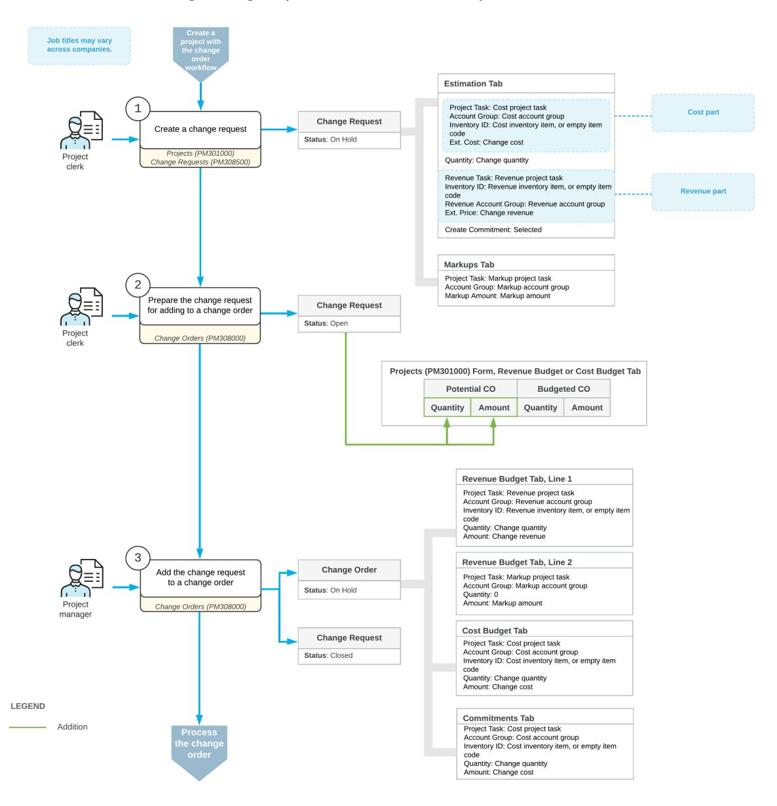

# <span id="page-327-1"></span><span id="page-327-0"></span>**Change Requests: Configuration of Markups**

You can configure markups to charge the customer with each created change request.

The following types of markup can be applied to a change request on the *[Change Requests](https://help-2025r1.acumatica.com/Help?ScreenId=ShowWiki&pageid=0c26a0eb-ef8d-4a61-97c8-732aea21cf25)* (PM308500) form:

- Line-level markups: These markups apply to an individual estimation line on the **Estimation** tab and affects the **Line Amount** value. This type includes the **Price Markup (%)** and **Line Markup (%)**.
- Document-level markups: These markups apply to the total line amount of the change request on the **Markups** tab.

You can override all markups and delete document-level markups at the change request level.

#### **Line-Level Markups**

A price markup is an item-specific markup. When you select an inventory item in an estimation line on the **Estimation** tab of the *[Change Requests](https://help-2025r1.acumatica.com/Help?ScreenId=ShowWiki&pageid=0c26a0eb-ef8d-4a61-97c8-732aea21cf25)* (PM308500) form, the markup percent specified for the item is retrieved as the **Price Markup (%)** value. You can specify the price markup for the item on the **Price/Cost** tab of the *[Stock Items](https://help-2025r1.acumatica.com/Help?ScreenId=ShowWiki&pageid=77786a70-1f1e-4d63-ad98-96f98e4fcb0e)* (IN202500) form or on the **Price/Cost** tab of the *[Non-Stock Items](https://help-2025r1.acumatica.com/Help?ScreenId=ShowWiki&pageid=bf68dd4f-63d4-460d-8dc0-9152f2bd6bf1)* (IN202000) form. If no price markup is specified for the item, the system uses the default price markup specified in the **Default Price Markup (%)** box (**Markup** section) on the **General** tab of the *[Projects Preferences](https://help-2025r1.acumatica.com/Help?ScreenId=ShowWiki&pageid=de2ca225-4a0c-4129-b09d-3f3ed05198f9)* (PM101000) form. If no default price markup is specified in the project accounting preferences, the price markup of the estimation line is zero.

A line markup is defined at the account group level. For an account group of the *Expense* type, you specify the default line markup percentage in the **Default Line Markup (%)** box on the **Change RequestSettings** tab of the *[Account Groups](https://help-2025r1.acumatica.com/Help?ScreenId=ShowWiki&pageid=94a2cdce-c36a-49a1-b572-9cd33cb5fa73)* (PM201000) form. When you select an account group in an estimation line on the **Estimation** tab of the *[Change Requests](https://help-2025r1.acumatica.com/Help?ScreenId=ShowWiki&pageid=0c26a0eb-ef8d-4a61-97c8-732aea21cf25)* form, the system specifies the default markup specified for the account group as the **Line Markup (%)** value in this line. If no default markup is specified in the account group, the line markup of the estimation line is zero.

The line amount of an estimation line considers the line-level markups and is calculated as follows:

Unit Price = Unit Price + Unit Price \* Price Markup (%) / 100 Ext. Price = Quantity \* Unit Price Line Amount = Ext. Price + Ext. Price \* Line Markup (%) / 100

#### **Document-Level Markups**

On the **Markups** tab of the *[Change Requests](https://help-2025r1.acumatica.com/Help?ScreenId=ShowWiki&pageid=0c26a0eb-ef8d-4a61-97c8-732aea21cf25)* (PM308500) form, for a change request, you can define any number of document-level markups of the following types as well as define no markups:

- *%*: A markup whose amount is calculated as follows: Markup Amount = Line Total \* % Markup Value / *100* You can define as many markups of this type as necessary.
- *Cumulative (%)*: A markup whose amount is calculated as follows:

Markup Amount = (all the previously applied % markups) \* *Cumulative (%) Value* / *100*

A markup of this type requires at least one markup of the *%* type.

• *Flat Fee*: A markup whose amount is specified manually to be added to the total markup.

You can define as many markups of this type as necessary.

For each applicable markup shown on the **Markups** tab, the **AmountSubject to Markup** is calculated based on the **Line Amount** values in the estimation lines of the change request. A document-level markup applies to the total line amount of a change request if all the project budget key attributes in this line—project task, account group, and optionally, inventory item and cost code—are defined for the markup on the **Markups** tab of the *[Change](https://help-2025r1.acumatica.com/Help?ScreenId=ShowWiki&pageid=0c26a0eb-ef8d-4a61-97c8-732aea21cf25) [Requests](https://help-2025r1.acumatica.com/Help?ScreenId=ShowWiki&pageid=0c26a0eb-ef8d-4a61-97c8-732aea21cf25)* form.

A change request inherits the default document-level markup specified for the project on the **Defaults** tab (**Document Markups** table) of the *[Projects](https://help-2025r1.acumatica.com/Help?ScreenId=ShowWiki&pageid=81c86417-3bde-444b-8f1c-682928d31a0c)* (PM301000) form. The project inherits the default document markups from the **General** tab (**Markup** section) of the *[Projects Preferences](https://help-2025r1.acumatica.com/Help?ScreenId=ShowWiki&pageid=de2ca225-4a0c-4129-b09d-3f3ed05198f9)* (PM101000) form. You can override any of the default markups.

# <span id="page-329-0"></span>**Change Requests: Implementation Checklist**

The following sections provide details you can use to ensure that the system is configured properly for the processing of change requests, and to understand (and change, if needed) the settings that affect the processing workflow.

#### **Implementation Checklist**

We recommend that before you initially create change requests, you make sure the needed features have been enabled, settings have been specified, and entities have been created, as summarized in the following checklist.

| Form                                    | Tasks to Perform                                                                                                                                                                                                                                                                 |
|-----------------------------------------|----------------------------------------------------------------------------------------------------------------------------------------------------------------------------------------------------------------------------------------------------------------------------------|
| Enable/Disable Features (CS100000) form | Make sure that the Project Accounting, Change Orders,<br>and Change Requests features are enabled.                                                                                                                                                                               |
| Projects Preferences (PM101000) form    | Make sure that all necessary settings related to project<br>accounting have been specified. For more information<br>about configuration steps that you have to perform<br>before you can start accounting for projects, see Basic<br>Project Configuration: General Information. |
|                                         | Also, make sure that the default markups are specified<br>on the General tab (Markups section). For more infor<br>mation about configuring markups, see Change Re<br>quests: Configuration of Markups.                                                                           |
| Change Order Classes (PM203000) form    | Make sure that all needed change order classes have<br>been configured and the Two-Tier Change Manage<br>ment check box has been selected for these classes in<br>the Summary area.                                                                                              |
| Account Groups (PM201000) form          | Make sure that the default line markup is specified for<br>all the needed account groups of the Expense type in<br>the Default Line Markup (%) box on the Change Re<br>quest Settings tab.                                                                                       |
| Non-Stock Items (IN202000) form         | Make sure that the default price markup is specified for<br>all the needed inventory items in the Markup % box<br>on the Price/Cost tab (Price Management section).                                                                                                              |
| Stock Items (IN202500) form             | Make sure that the default price markup is specified for<br>all the needed inventory items in the Markup % box<br>on the Price/Cost tab (Price Management section).                                                                                                              |

| Form                     | Tasks to Perform                                                                                                                                                                                                               |
|--------------------------|--------------------------------------------------------------------------------------------------------------------------------------------------------------------------------------------------------------------------------|
| Projects (PM301000) form | Make sure that the project has been created, as de<br>scribed in Project Creation and Processing: General In<br>formation.                                                                                                     |
|                          | Also, make sure that the Change Order Workflow<br>check box is selected on theSummary tab (Project<br>Properties section) and the document markups are<br>configured properly on the Defaults tab (Document<br>Markups table). |

#### **Project Commitment Checklist**

If you want to use the functionality of change requests to manage changes in commitments, make sure that all the needed features have been enabled and settings have been specified, as described in *[Committed Costs:](#page-344-1) [Implementation Checklist](#page-344-1)*.

### **Other Settings That Affect the Workflow**

You can affect the workflow of managing changes in projects by specifying additional settings as follows:

- By default, the *CHANGERST* numbering sequence specifies that the change request identifier is an automatically generated numeric string of six digits, such as *000001*. To change the format of change request identifiers, adjust the *CHANGERST* numbering sequence on the *[Numbering Sequences](https://help-2025r1.acumatica.com/Help?ScreenId=ShowWiki&pageid=a8d11c23-21f2-42a3-b17d-9637c9cf8031)* (CS201010) form or create a new auto-numbered numbering sequence and select this sequence in the **Change Request NumberingSequence** box on the **General** tab (**NumberingSequence** section) of the *[Projects Preferences](https://help-2025r1.acumatica.com/Help?ScreenId=ShowWiki&pageid=de2ca225-4a0c-4129-b09d-3f3ed05198f9)* (PM101000) form. For more information on numbering sequences, see *[Use of Numbering Sequences](https://help-2025r1.acumatica.com/Help?ScreenId=ShowWiki&pageid=71c26175-c78f-4e70-8518-2115f5bfaf2f)*.
- To allow users to create change requests by using the **Create Change Request** command on the More menu of the *[Projects](https://help-2025r1.acumatica.com/Help?ScreenId=ShowWiki&pageid=81c86417-3bde-444b-8f1c-682928d31a0c)* (PM301000) form, for the numbering sequence used for change requests, clear the **Manual Numbering** check box in the Summary area of the *[Numbering Sequences](https://help-2025r1.acumatica.com/Help?ScreenId=ShowWiki&pageid=a8d11c23-21f2-42a3-b17d-9637c9cf8031)* form.
- To make it possible to create a change order for a change request selected on the *[Change Requests](https://help-2025r1.acumatica.com/Help?ScreenId=ShowWiki&pageid=0c26a0eb-ef8d-4a61-97c8-732aea21cf25)* (PM308500) form, select the change order class that supports the two-tier change management in the **Default Change Order Class** box on the **General** tab (**GeneralSettings** section) of the *[Projects Preferences](https://help-2025r1.acumatica.com/Help?ScreenId=ShowWiki&pageid=de2ca225-4a0c-4129-b09d-3f3ed05198f9)* form. That is, the selected change order class must have the**Two-Tier Change Management** check box selected on the *[Change Order Classes](https://help-2025r1.acumatica.com/Help?ScreenId=ShowWiki&pageid=fdac3e07-8ea5-4c44-85bc-bae8850df2f0)* (PM203000) form.

Even if the default change order class selected in the project accounting preferences does not support the two-tier change management, you still can add a change request to a change order by creating a change order directly on the *[Change Orders](https://help-2025r1.acumatica.com/Help?ScreenId=ShowWiki&pageid=0c26a0eb-ef8d-4a61-97c8-237aea21cf25)* (PM308000) form, selecting for this change order a change order class that supports the two-tier change management, and adding the change request to the change order.

- To cause the system to automatically select a revenue account group for new estimation lines of a change request if there are multiple account groups of the *Income* type defined on the *[Account Groups](https://help-2025r1.acumatica.com/Help?ScreenId=ShowWiki&pageid=94a2cdce-c36a-49a1-b572-9cd33cb5fa73)* (PM201000) form, specify the **Default Revenue Account Group** for account groups of the *Expense* type in the Summary area of the *[Account Groups](https://help-2025r1.acumatica.com/Help?ScreenId=ShowWiki&pageid=94a2cdce-c36a-49a1-b572-9cd33cb5fa73)* form. For more information on account groups, see *[Account Groups: General](#page-12-2) [Information](#page-12-2)*.
- To cause the system to automatically select the **Creates Commitment** check box for a new estimation line with a particular account group selected on the *[Change Requests](https://help-2025r1.acumatica.com/Help?ScreenId=ShowWiki&pageid=0c26a0eb-ef8d-4a61-97c8-732aea21cf25)* form, which results in creation of a commitment based on such an estimation line, select the **Creates Commitment** check box on the**Settings** tab of the *[Account Groups](https://help-2025r1.acumatica.com/Help?ScreenId=ShowWiki&pageid=94a2cdce-c36a-49a1-b572-9cd33cb5fa73)* form for this account group. For example, it can be an account group to which you map the expense accounts of the services that a subcontractor usually provides.

With these settings specified, users in your company can process change requests quickly and accurately with a minimum of manual actions.

#### **Validation of Configuration**

To make sure that all configuration has been performed correctly, we recommend that you process a change request by performing instructions similar to those described in *[Change Requests: Process Activity](#page-333-1)*.

# <span id="page-331-1"></span><span id="page-331-0"></span>**Change Requests: Implementation Activity**

The following implementation activity will walk you through the process of configuring two-tier change management for projects.

This activity is based on the *U100* dataset. If you are using another dataset, or if any system settings have been changed in *U100*, these changes can affect the workflow of the activity and the results of the processing. To avoid any issues, restore the *U100* dataset to its initial state.

#### **Story**

Suppose that you, as the system administrator, need to configure two-tier change management so that the change requests to projects can be processed in the system. Also, you need to configure the following price markups to be applied to the new projects:

- A default price markup of 25% to be applied to each individual change made with a change request
- A markup of 8% of the total costs to be applied to an entire change request
- A markup of 4% of overhead to be applied to an entire change request
- A markup of 5% of all the previously charged markups to be applied to an entire change request
- A flat fee of \$100 per change request

You also need to configure an additional 10% markup to be automatically applied to the change request lines that relate to labor. Acting as the system administrator, you will perform these tasks.

#### **Configuration Overview**

In the *U100* dataset, the following tasks have been performed to support this activity:

- On the *[Enable/Disable Features](https://help-2025r1.acumatica.com/Help?ScreenId=ShowWiki&pageid=c1555e43-1bc5-4f6f-ba9d-b323f94d8a6b)* (CS100000) form, the *Construction* and *Change Orders* features have been enabled.
- On the *[Account Groups](https://help-2025r1.acumatica.com/Help?ScreenId=ShowWiki&pageid=94a2cdce-c36a-49a1-b572-9cd33cb5fa73)* (PM201000) form, the *LABOR*, *SUBCON*, and *REVENUE* account group have been configured.

#### **Process Overview**

You will configure the default price markups on the *[Projects Preferences](https://help-2025r1.acumatica.com/Help?ScreenId=ShowWiki&pageid=de2ca225-4a0c-4129-b09d-3f3ed05198f9)* (PM101000) form and the *[Account Groups](https://help-2025r1.acumatica.com/Help?ScreenId=ShowWiki&pageid=94a2cdce-c36a-49a1-b572-9cd33cb5fa73)* (PM201000) form. You will also create change order classes that support two-tier change management on the *[Change Order Classes](https://help-2025r1.acumatica.com/Help?ScreenId=ShowWiki&pageid=fdac3e07-8ea5-4c44-85bc-bae8850df2f0)* (PM203000) form and specify the change order class to be used by default on the *[Projects](https://help-2025r1.acumatica.com/Help?ScreenId=ShowWiki&pageid=de2ca225-4a0c-4129-b09d-3f3ed05198f9) [Preferences](https://help-2025r1.acumatica.com/Help?ScreenId=ShowWiki&pageid=de2ca225-4a0c-4129-b09d-3f3ed05198f9)* form.

#### **System Preparation**

To sign in to the system and prepare to perform the instructions of the activity, do the following:

- 1. Launch the Acumatica ERP website, and sign in to a company with the *U100* dataset preloaded. You should sign in as a system administrator by using the *gibbs* username and the *123* password.
- 2. Open the *[Enable/Disable Features](https://help-2025r1.acumatica.com/Help?ScreenId=ShowWiki&pageid=c1555e43-1bc5-4f6f-ba9d-b323f94d8a6b)* (CS100000) form, and on the form toolbar, click **Modify**.
- 3. In the *Projects* group of features, select the **Change Requests** check box.
- 4. On the form toolbar, click **Enable**.

#### **Step 1: Specifying the Default Markups**

To specify the default markups that the system will assign to change requests, on the *[Projects Preferences](https://help-2025r1.acumatica.com/Help?ScreenId=ShowWiki&pageid=de2ca225-4a0c-4129-b09d-3f3ed05198f9)* (PM101000) form, do the following:

- 1. On the **General** tab (**GeneralSettings** section), select the **Internal Cost CommitmentTracking** check box, and save your changes to the project accounting preferences. This exposes the committed values of the budget.
- 2. On the **General** tab, in the **Change Request Markups** section, enter 25 in the **Default Price Markup (%)** box.

| Type           | Description            | Value |
|----------------|------------------------|-------|
| %              | Profit markup on cost  | 8     |
| %              | Overhead cost markup   | 4     |
| Cumulative (%) | Default cumulative (%) | 5     |
| Flat Fee       | Additional charges     | 100   |

3. In the **Document Markups** table, add rows with the following settings.

The system will apply these document-level markups to the total amount of change requests by default. Also, these markups will be specified by default in the newly created projects.

4. Save your changes.

#### **Step 2: Creating a Change Order Class for Cost Change Orders**

To create a change order class for the change orders that affect only the project cost budget, do the following:

- 1. On the *[Change Order Classes](https://help-2025r1.acumatica.com/Help?ScreenId=ShowWiki&pageid=fdac3e07-8ea5-4c44-85bc-bae8850df2f0)* (PM203000) form, add a new record.
- 2. In the Summary area, specify the following settings:
  - **Class ID**: INTERNAL
  - **Description**: Cost change orders
  - **Two-Tier Change Management**: Selected

Because you have selected the**Two-Tier Change Management** check box, the **Cost Budget** and **Commitments** check boxes are selected by default and cannot be cleared.

- **Revenue Budget**: Cleared
- 3. Save the change order class.

#### **Step 3: Creating a Change Order Class for Revenue Change Orders**

To create a change order class for the change orders that affect the project revenue budget, while you are still viewing the *[Change Order Classes](https://help-2025r1.acumatica.com/Help?ScreenId=ShowWiki&pageid=fdac3e07-8ea5-4c44-85bc-bae8850df2f0)* (PM203000) form, do the following:

- 1. Click **Add New Record** on the form toolbar, and specify the following settings in the Summary area:
  - **Class ID**: EXTERNAL
  - **Description**: Cost and revenue change orders
  - **Two-Tier Change Management**: Selected
  - **Cost Budget**: Selected
  - **Revenue Budget**: Selected
  - **Commitments**: Selected
- 2. Save the change order class.
- 3. On the **General** tab of the *[Projects Preferences](https://help-2025r1.acumatica.com/Help?ScreenId=ShowWiki&pageid=de2ca225-4a0c-4129-b09d-3f3ed05198f9)* (PM101000) form, in the **Default Change Order Class** box, select *EXTERNAL*, and then save your changes.
- 4. On the *[Account Groups](https://help-2025r1.acumatica.com/Help?ScreenId=ShowWiki&pageid=94a2cdce-c36a-49a1-b572-9cd33cb5fa73)* (PM201000) form, open the *LABOR* account group.
- 5. In the Summary area, specify *REVENUE* in the **Default Revenue Account Group** box.
- 6. In the **Default Line Markup (%)** box on the **Change RequestSettings** tab, enter 10.
- 7. Save your changes.
- 8. Open the *SUBCON* account group.
- 9. In the Summary area, specify *REVENUE* in the **Default Revenue Account Group** box.
- 10.Save your changes.

<span id="page-333-1"></span>You have configured two-tier change management for projects and specified default project markups.

# <span id="page-333-0"></span>**Change Requests: Process Activity**

In this activity, you will learn how you can turn on the change order workflow for a project and manage changes to the project's budgeted values by creating change requests and including these change requests to change orders.

#### **Story**

Suppose that the West BBQ Restaurant customer has ordered a juicer, along with the following services from the SweetLife Fruits & Jams company: two hours of site review, four hours of installation, and eight hours of employee training on operating the juicers. The SweetLife company has contracted the Squeezo Inc. vendor to provide the juicer and perform the installation, while SweetLife will perform the services of site review and training.

Acting as SweetLife's project accountant, you will create a project. SweetLife's consultant will provide the service of site review, and you will then realize that adjustments to the project should be agreed upon with the customer: The site review, which has taken an additional hour beyond what was planned, has shown that the installation of the juicer will take two hours beyond the planned time frame. The customer will then ask you for an additional staff person to be trained, and the training will take two additional hours. For all these adjustments, you have decided to include an additional 10% markup amount in addition to charging for the services.

You will make the needed corrections to the project budget by using change requests.

#### **Configuration Overview**

In the *U100* dataset, the following tasks have been performed to support this activity:

- On the *[Enable/Disable Features](https://help-2025r1.acumatica.com/Help?ScreenId=ShowWiki&pageid=c1555e43-1bc5-4f6f-ba9d-b323f94d8a6b)* (CS100000) form, the following features have been enabled:
  - *Project Accounting*, which provides support for the project accounting functionality
  - *Change Orders*, which gives you the ability to manage changes to the project's budgeted and committed values

- On the *[Non-Stock Items](https://help-2025r1.acumatica.com/Help?ScreenId=ShowWiki&pageid=bf68dd4f-63d4-460d-8dc0-9152f2bd6bf1)* (IN202000) form, the *SITEREVIEW*, *INSTALL*, and *TRAINING* non-stock items have been defined.
- On the *[Stock Items](https://help-2025r1.acumatica.com/Help?ScreenId=ShowWiki&pageid=77786a70-1f1e-4d63-ad98-96f98e4fcb0e)* (IN202500) form, the *JUICER15* stock item has been defined.
- On the *[Vendors](https://help-2025r1.acumatica.com/Help?ScreenId=ShowWiki&pageid=a9584be3-f2bd-4d67-80d4-8041d809df56)* (AP303000) form, the *SQUEEZO* vendor has been created.

#### **Process Overview**

In this activity, you will create the project on the *[Projects](https://help-2025r1.acumatica.com/Help?ScreenId=ShowWiki&pageid=81c86417-3bde-444b-8f1c-682928d31a0c)* (PM301000) form and configure the document-level markups for it. To make changes to the project budget, you will create change requests on the *[Change Requests](https://help-2025r1.acumatica.com/Help?ScreenId=ShowWiki&pageid=0c26a0eb-ef8d-4a61-97c8-732aea21cf25)* (PM308500) form. When an agreement with the customer about the changes is reached, you will add open change requests to two change orders on the *[Change Orders](https://help-2025r1.acumatica.com/Help?ScreenId=ShowWiki&pageid=0c26a0eb-ef8d-4a61-97c8-237aea21cf25)* (PM308000) form; you will then release the change orders.

#### **System Preparation**

To sign in to the system and prepare to perform the instructions of the activity, do the following:

- 1. Implement the two-tier change management and configure change order classes as described in *[Change](#page-331-1) [Requests: Implementation Activity](#page-331-1)*.
- 2. Sign in to the system as Pam Brawner by using the *brawner* username and the *123* password.
- 3. In the info area, in the upper-right corner of the top pane of the Acumatica ERP screen, make sure that the business date in your system is set to *1/30/2025*. If a different date is displayed, click the Business Date menu button and select *1/30/2025* on the calendar. For simplicity, in this activity, you will create and process all documents in the system on this business date.

#### **Step 1: Creating a Project**

To create a project and define the project-specific document markups, do the following:

- 1. On the *[Projects](https://help-2025r1.acumatica.com/Help?ScreenId=ShowWiki&pageid=81c86417-3bde-444b-8f1c-682928d31a0c)* (PM301000) form, add a new record.
- 2. In the Summary area, specify the following settings:
  - **Project ID**: WESTBBQ3
  - **Customer**: *WESTBBQ*
  - **Description**: A juicer with the installation and training for employees
- 3. On the **Summary** tab (**Project Properties** section), make sure that the **Change Order Workflow** check box is selected, which means you can make changes to the project budget with change orders, including the creation of change requests.
- 4. In the **Cost Budget Level** box, select *Task and Item*.
- 5. On the **Tasks** tab, click **Add Row** on the table toolbar and specify the following settings in the row:
  - **Task ID**: INSTALL
  - **Type**: *Cost and Revenue Task*
  - **Description**: A juicer with the installation and training
  - **Status**: *Active*
  - **Default**: Selected
- 6. On the **Revenue Budget** tab, click **Add Row** on the table toolbar. In the added line, select the *REVENUE* account group, and enter 3,400 in the **Original Budgeted Amount** column. (The system has automatically inserted the *INSTALL* project task in the row because it is the default project task.)
- 7. On the **Cost Budget** tab, add four budget lines (by clicking **Add Row** on the table toolbar) with the settings shown in the following table.

| Project Task | Inventory ID | Original Budgeted<br>Quantity | Unit Rate |
|--------------|--------------|-------------------------------|-----------|
| INSTALL      | SITEREVIEW   | 2.00                          | 40.00     |
| INSTALL      | TRAINING     | 8.00                          | 40.00     |
| INSTALL      | JUICER15     | 1.00                          | 2,000.00  |
| INSTALL      | INSTALL      | 4.00                          | 80.00     |

- 8. On the **Defaults** tab, in the **Document Markups** table, configure the default document markups that the system has populated from the project accounting preferences as follows: For each markup in the table, select *INSTALL* in the **ProjectTask** column and *REVENUE* in the **Account Group** column.
- 9. Save the project.

10.On the form toolbar, click **Activate**. The system assigns the project the *Active* status.

#### **Step 2: Creating a Change Request**

To make changes to the project budget with a change request, do the following:

1. While remaining on the *[Projects](https://help-2025r1.acumatica.com/Help?ScreenId=ShowWiki&pageid=81c86417-3bde-444b-8f1c-682928d31a0c)* (PM301000) form with the *WESTBBQ3* project opened, on the More menu, click **Create Change Request**.

The system creates a change request for the project and opens it on the *[Change Requests](https://help-2025r1.acumatica.com/Help?ScreenId=ShowWiki&pageid=0c26a0eb-ef8d-4a61-97c8-732aea21cf25)* (PM308500) form.

2. In the **Description** box in the Summary area, type Additional time for site review and installation.

On the **Markups** tab, notice that the system has copied the document markups from the project to the change request with all the settings you have specified at the project level.

- 3. On the **Estimation** tab, to represent an additional hour of site review, click **Add Row** on the table toolbar, and specify the following settings in the row:
  - **ProjectTask**: *INSTALL* (specified by default)
  - **Account Group**: *LABOR*
  - **Cost Code**: *00-000*
  - **Inventory ID**: *SITEREVIEW*
  - **Description**: Additional time for site review
  - **Quantity**: 1.00
  - **Unit Cost**: *40* (inserted automatically)
  - **Price Markup (%)**: *25.00* (inserted automatically)

The system has copied this value from the **Default Price Markup (%)** box on the **General** tab of the *[Projects Preferences](https://help-2025r1.acumatica.com/Help?ScreenId=ShowWiki&pageid=de2ca225-4a0c-4129-b09d-3f3ed05198f9)* (PM101000) form.

• **Unit Price**: *50* (inserted automatically)

```
The system calculates this value based on the Unit Cost value and the Price Markup (%) by the following
formula: Unit Price = Unit Cost + Unit Cost * Price Markup (%) / 100
```

- **Line Markup (%)**: 10.00 (inserted automatically) The system has copied this value from the settings of the *LABOR* account group—that is, from the **Default Line Markup (%)** box on the **Change RequestSettings** tab of the *[Account Groups](https://help-2025r1.acumatica.com/Help?ScreenId=ShowWiki&pageid=94a2cdce-c36a-49a1-b572-9cd33cb5fa73)* (PM201000) form.
- **Line Amount**: *55* (inserted automatically)

The system calculates this value based on the **Ext. Price** value and the **Line Markup (%)** by the following formula: Line Amount = Ext. Price + Ext. Price \* Line Markup (%) / 100

- 4. Add one more line to represent the two additional hours needed for the installation by clicking **Add Row** on the table toolbar and specifying the following settings in the row:
  - **ProjectTask**: *INSTALL* (specified by default)
  - **Account Group**: *SUBCON*
  - **Cost Code**: *00-000*
  - **Inventory ID**: *INSTALL*
  - **Description**: Additional time for installation
  - **Quantity**: 2.00
  - **Price Markup (%)**: *25.00* (inserted automatically)
  - **Line Markup (%)**: 10.00

You enter this markup manually because it is not defined in the settings of the *SUBCON* account group.

- **Vendor**: *SQUEEZO*
- **Create Commitment**: Selected

You are selecting this check box because you have contracted Squeezo Inc. to perform the installation, so you need to create a purchase order for this change.

The calculated line amount of the added row should be \$220.

5. On the **Markups** tab, review the markup amounts that the system has calculated based on the document totals.

The system calculated the *Profit markup on cost* and *Overhead cost* markups (\$22 and \$11, respectively) based on the line total of the change request, which is shown in the **AmountSubject to Markup** column and is \$275.

The *Default cumulative (%)* markup is calculated based on the markups of the *%* type calculated above the markup line (\$22 + \$11) and is equal to \$1.65. The *Additional charges* markup amount is a flat fee in the amount of \$100, which does not depend on any document amounts.

- 6. Make sure that **PriceTotal** in the Summary area is *409.65* and save the change request.
- 7. On the form toolbar, click **Remove Hold** to assign the change request the *Open* status.

#### **Step 3: Creating the Second Change Request**

To create one more change request for additional two hours of training, do the following:

- 1. While you are still viewing the *[Change Requests](https://help-2025r1.acumatica.com/Help?ScreenId=ShowWiki&pageid=0c26a0eb-ef8d-4a61-97c8-732aea21cf25)* (PM308500) form, click **Add New Record** on the form toolbar, and specify the following settings in the Summary area of the form:
  - **Project**: *WESTBBQ3*
  - **Description**: Additional time for training
- 2. On the **Estimation** tab, to represent two additional hours of training, click **Add Row** on the table toolbar, and specify the following settings in the row:
  - **ProjectTask**: *INSTALL* (specified by default)
  - **Account Group**: *LABOR*
  - **Cost Code**: *00-000*
  - **Inventory ID**: *TRAINING*
  - **Description**: Additional time for training
  - **Quantity**: 2.00
  - **Price Markup (%)**: *25.00* (inserted automatically)
  - **Line Markup (%)**: *10.00* (inserted automatically)

The line amount of the added row should be equal to \$110.

- 3. Make sure that **PriceTotal** in the Summary area is *223.86* and save the change request.
- 4. On the form toolbar, click **Remove Hold** to assign the change request the *Open* status.
- 5. On the *[Projects](https://help-2025r1.acumatica.com/Help?ScreenId=ShowWiki&pageid=81c86417-3bde-444b-8f1c-682928d31a0c)* (PM301000) form, open the *WESTBBQ3* project, and review the updated amounts in the project budget as follows:
  - On the **Change Requests** tab, make sure that both of the related change requests have the *Open* status (see the screenshot below).
  - On the **Cost Budget** tab, review the values in the **Potential CO Quantity** and **Potential CO Amount** columns, which the system has filled in based on the estimation lines of the open change requests for the rows with the *SITEREVIEW*, *TRAINING*, and *INSTALL* inventory items.
  - On the **Revenue Budget** tab, review the values in the **Potential CO Amount** column, which is \$633.51. This amount equals the total price of both change requests (\$409.65 + \$223.86) and includes markup totals calculated at the document level.

| Projects<br>WESTBBQ3 - A juicer with the installation and training for employees                                                                                                                                   |                                                                                  |                                                  |   |                                      |                   |                       |                    |      |
|--------------------------------------------------------------------------------------------------------------------------------------------------------------------------------------------------------------------|----------------------------------------------------------------------------------|--------------------------------------------------|---|--------------------------------------|-------------------|-----------------------|--------------------|------|
| 冒<br>$\Box$<br>甸<br>$\Omega$<br>$\leftarrow$<br>$^+$                                                                                                                                                               | K<br>≻⊧<br>><br>‹                                                                | <b>RUN BILLING</b><br><b>COMPLETE</b>            | . |                                      |                   |                       |                    |      |
| * Project ID:<br>WESTBB03                                                                                                                                                                                          | ₽                                                                                | Customer:                                        |   | <b>WESTBBO - West BBO Restaurant</b> | Q<br>0            | Actual Income:        |                    | 0.00 |
| Template:                                                                                                                                                                                                          |                                                                                  | Project Manager:                                 |   |                                      | Q                 | Actual Expenses:      |                    | 0.00 |
| Active<br>Status:                                                                                                                                                                                                  |                                                                                  |                                                  |   |                                      |                   | Margin Amount:        |                    | 0.00 |
| Description:                                                                                                                                                                                                       | Margin (%):<br>0.00<br>A juicer with the installation and training for employees |                                                  |   |                                      |                   |                       |                    |      |
|                                                                                                                                                                                                                    |                                                                                  |                                                  |   |                                      |                   | Pending Invoice Amoun |                    | 0.00 |
| <b>CHANGE REQUESTS</b><br><b>TASKS</b><br><b>REVENUE BUDGET</b><br><b>COST BUDGET</b><br><b>COMMITMENTS</b><br><b>INVOICES</b><br><b>CHANGE ORDERS</b><br><b>UNION LOCALS</b><br><b>SUMMARY</b><br><b>BALANCES</b> |                                                                                  |                                                  |   |                                      |                   |                       |                    |      |
| Ò<br>$\mathbf x$<br><b>CREATE CHANGE REQUEST</b><br>$\vdash$                                                                                                                                                       |                                                                                  |                                                  |   |                                      |                   |                       |                    |      |
| D.<br>$\Omega$<br>B.<br>Reference Nbr.<br><b>Status</b>                                                                                                                                                            | *Change<br>Date                                                                  | <b>Description</b>                               |   | <b>Cost Total</b>                    | <b>Line Total</b> | <b>Markup Total</b>   | <b>Price Total</b> |      |
| 0<br>000001<br>D<br>Open                                                                                                                                                                                           | 1/30/2025                                                                        | Additional time for site review and installation |   | 200.00                               | 275.00            | 134.65                | 409.65             |      |
| 000002<br>0<br>Open<br>ם                                                                                                                                                                                           | 1/30/2025                                                                        | Additional time for training                     |   | 80.00                                | 110.00            | 113.86                | 223.86             |      |

*Figure: Change requests related to the project*

#### **Step 4: Processing the Cost Part of the Change Request**

To create a cost change order based on the first change request you created, do the following:

- 1. On the *[Change Orders](https://help-2025r1.acumatica.com/Help?ScreenId=ShowWiki&pageid=0c26a0eb-ef8d-4a61-97c8-237aea21cf25)* (PM308000) form, add a new record. By default, in a newly created change order, the system inserts the *EXTERNAL* class, which is specified as the default change order class on the *[Projects](https://help-2025r1.acumatica.com/Help?ScreenId=ShowWiki&pageid=de2ca225-4a0c-4129-b09d-3f3ed05198f9) [Preferences](https://help-2025r1.acumatica.com/Help?ScreenId=ShowWiki&pageid=de2ca225-4a0c-4129-b09d-3f3ed05198f9)* (PM101000) form.
- 2. In the **Class** box, select *INTERNAL*. Notice that the **Revenue Budget** tab has been hidden because the specified class is defined to make it impossible to add or modify revenue budget lines for change orders of this class.
- 3. Specify the following settings in the Summary area:
  - **Project**: *WESTBBQ3*
  - **Description**: An adjustment to the WESTBBQ3 project
- 4. On the table toolbar of the **Change Requests** tab, click **Add Change Requests** to add a change request to the change order.
- 5. In the **Add Change Requests** dialog box, which opens, select the change request with the *Additional time for site review and installation* description by selecting the check box in the unlabeled column, and click **Add & Close**.
- 6. Review the details of the change order, and make sure that the change order has been modified as follows:
  - On the **Cost Budget** tab, the system has added two lines based on the estimation lines of the change request.

- On the **Commitments** tab, the system has added a line with the *New Document* status for the installation service based on the estimation line of the change request with the **Create Commitment** check box selected.
- In the Summary area, the **Cost Budget ChangeTotal** is *200* and the **Commitment ChangeTotal** is *160*.
- In the Summary area, the **Revenue Budget ChangeTotal** is *0* because the change order makes no changes to the revenue budget of the project.
- In the only line on the **Change Requests** tab, the change request still has the *Open* status because the revenue part of the change request has not been processed yet.
- 7. Save the change order.
- 8. On the form toolbar, click **Remove Hold** to assign the change order the *Open* status.

#### **Step 5: Processing the Revenue Part of the Change Requests**

Suppose that the agreement with the customer has been reached. To create a revenue change order based on both change requests, do the following:

- 1. While you are still viewing the *[Change Orders](https://help-2025r1.acumatica.com/Help?ScreenId=ShowWiki&pageid=0c26a0eb-ef8d-4a61-97c8-237aea21cf25)* (PM308000) form, click **Add New Record** on the form toolbar, and specify the following settings in the Summary area:
  - **Class**: *EXTERNAL* (inserted by default)
  - **Project**: *WESTBBQ3*
  - **Description**: The second adjustment to the WESTBBQ3 project
- 2. On the table toolbar of the **Change Requests** tab, click **Add Change Requests** to add change requests to the change order.
- 3. In the **Add Change Requests** dialog box, which opens, select both change requests you have created by selecting the check boxes in the unlabeled column; click **Add & Close**.

In the added lines, notice that both change requests have been assigned the *Closed* status because the change requests have been fully processed with this change order. On the **Cost Budget** tab, notice that the system has added a line with 2 hours of training based on the estimation line of the second change request.

- 4. In the Summary area, make sure that the system has assigned a **Revenue Change Nbr.** to the change order because the change order makes changes to the revenue budget of the project.
- 5. Save the change order.
- 6. On the **Revenue Budget** tab, make sure that the only line has a **Change RequestTotal Amount** of *633.51*.
- 7. On the table toolbar, click**View Change Request Details**.
- 8. In the **Change Request Details** dialog box, which opens, review the change request lines and the markups that correspond to the selected change order line, as shown in the following screenshot. There are three estimation lines and eight markup lines that affect the same revenue budget line.

| <b>Change Orders</b><br>000004 - A juicer with the installation and training for employees               |               |                                               |                                                     |                    |                                  |                           |                   |            | <b>TH NOTES</b>                              | <b>ACTIVITIES</b>              | <b>FILES</b>                 |                 | TOOLS $\sim$                          |
|----------------------------------------------------------------------------------------------------------|---------------|-----------------------------------------------|-----------------------------------------------------|--------------------|----------------------------------|---------------------------|-------------------|------------|----------------------------------------------|--------------------------------|------------------------------|-----------------|---------------------------------------|
| $\Xi$<br>$\Box$<br>n<br>$\pm$<br>侕<br>$\overline{\mathbf{K}}$<br>$\Omega$<br>$\leftarrow$<br>$\check{ }$ |               | <b>Change Request Details</b><br>$\times$     |                                                     |                    |                                  |                           |                   |            |                                              |                                |                              |                 |                                       |
| Reference Nbr.:<br>000004                                                                                | Ò             |                                               | $\mathbf{\overline{N}}$<br>$\overline{\phantom{a}}$ |                    |                                  |                           |                   |            |                                              |                                |                              | 633.51          | $\hat{\phantom{a}}$                   |
| On Hold<br>Status:                                                                                       | <b>B</b> 0    | $\Box$                                        | Reference<br>Nbr.                                   | <b>Description</b> |                                  | Quantity                  | <b>Unit Price</b> | Ext. Price | <b>Line Amount</b>                           |                                |                              | 0.00            |                                       |
| * Change Date:<br>1/30/2025<br>₿<br>* Approval Date:<br>1/30/2025<br>白                                   | $\rightarrow$ | $\bf{0}$<br>D                                 | 000001                                              |                    | Additional time for site review  | 1.00                      | 50.0000           | 50.00      | 55.00                                        |                                |                              | 80.00<br>553.51 |                                       |
| Contract Change (Days):<br>$\mathbf{0}$                                                                  |               | 0<br>n                                        | 000001                                              |                    | Additional time for installation | 2.00                      | 100.0000          | 200.00     | 220.00                                       |                                |                              | 87.37           |                                       |
| External Ref. Nbr.:                                                                                      |               | 0<br>D                                        | 000002                                              |                    | Additional time for training     | 2.00                      | 50,0000           | 100.00     | 110.00                                       |                                |                              |                 |                                       |
|                                                                                                          |               |                                               |                                                     |                    |                                  |                           |                   |            |                                              |                                |                              |                 |                                       |
| <b>REVENUE BUDGET</b><br><b>CHANGE REQUESTS</b><br>CO <sub>S</sub>                                       |               |                                               |                                                     |                    |                                  |                           |                   |            |                                              |                                |                              |                 |                                       |
| <b>VIEW CHANGE REQUEST DETAILS</b><br>$\times$                                                           |               |                                               |                                                     |                    |                                  |                           |                   |            | $\mathbb{R}$<br>$\left\langle \right\rangle$ | $\rightarrow$<br>$\rightarrow$ |                              |                 | $\mathbf{v}$ $\mathbf{V}$             |
| * Project Task<br>* Account Group<br>D.<br><b>Descriptio</b><br>-0<br>81                                 | Ò             | <b>Markups</b>                                | $\mathbf{\overline{x}}$                             |                    |                                  |                           |                   |            |                                              |                                | riginal<br>Igeted<br>lantity |                 | Original<br><b>Budgeted</b><br>Amount |
| <b>INSTALL</b><br><b>REVENUE</b><br>$\omega$<br>!!!!!!!!!!!!!!!!!!!!!!!!!!!!!!!!!!!!!!!!<br>A juicer v   | <b>B</b> 0    |                                               | Reference Nbr.                                      |                    | Type                             | Description               |                   |            | Value                                        | Markup<br>Amount               | 0.00                         |                 | 3,400.00                              |
|                                                                                                          | $\rightarrow$ | $\mathbf{0}$                                  | $D$ 000001                                          |                    | $\%$                             | Profit markup on cost     |                   |            | 8.00                                         | 22.00                          |                              |                 |                                       |
|                                                                                                          |               | 0<br>D                                        | 000001                                              |                    | %                                | Overhead cost markup      |                   |            | 4.00                                         | 11.00                          |                              |                 |                                       |
|                                                                                                          |               | 0<br>Ð                                        | 000001                                              |                    | Cumulative (%)                   | Default cumulative %      |                   |            | 5.00                                         | 1.65                           |                              |                 |                                       |
|                                                                                                          |               | 0<br>D                                        | 000001                                              |                    | <b>Flat Fee</b>                  | <b>Additional charges</b> |                   |            | 100.00                                       | 100.00                         |                              |                 |                                       |
|                                                                                                          |               | 0<br>D                                        | 000002                                              |                    | %                                | Profit markup on cost     |                   |            | 8.00                                         | 8.80                           |                              |                 |                                       |
|                                                                                                          |               | $\bf{0}$<br>D                                 | 000002                                              |                    | %                                | Overhead cost markup      |                   |            | 4.00                                         | 4.40                           |                              |                 |                                       |
|                                                                                                          |               | 0<br>!!!!!!!!!!!!!!!!!!!!!!!!!!!!!!!!!!!!!!!! | 000002                                              |                    | Cumulative (%)                   | Default cumulative %      |                   |            | 5.00                                         | 0.66                           |                              |                 |                                       |
|                                                                                                          |               | $\bf{0}$                                      | $\Box$ 000002                                       |                    | <b>Flat Fee</b>                  | <b>Additional charges</b> |                   |            | 100.00                                       | 100.00                         |                              |                 |                                       |
|                                                                                                          |               |                                               |                                                     |                    |                                  |                           |                   |            | $\mathbf{K}$                                 | $\rightarrow$<br>$\rightarrow$ |                              |                 |                                       |

*Figure: Lines of the change request and corresponding markups*

9. Close the dialog box.

10.On the form toolbar, click **Remove Hold** to assign the change order the *Open* status.

#### **Step 6: Reviewing the Project Budget**

To review the project and the related change requests you have processed, do the following:

1. On the *[Projects](https://help-2025r1.acumatica.com/Help?ScreenId=ShowWiki&pageid=81c86417-3bde-444b-8f1c-682928d31a0c)* (PM301000) form, open the *WESTBBQ3* project.

On the **Cost Budget** and **Revenue Budget** tabs, notice that the potential change order quantities and amounts remain the same aer you have created open change orders based on the change requests because you have not released the change orders yet.

2. On the **Change Requests** tab, make sure that both change requests have been assigned the *Closed* status. In the line with the *Additional time for site review and installation* description, click the link in the **Reference Nbr.** column to open the first change request.

On the *[Change Requests](https://help-2025r1.acumatica.com/Help?ScreenId=ShowWiki&pageid=0c26a0eb-ef8d-4a61-97c8-732aea21cf25)* (PM308500) form, which opens, review the details of the change request. In the Summary area, make sure that change request has both the **Change Order Nbr.** box and the **Cost Change Order Nbr.** box filled in because the revenue part of the change request has been processed with a separate change order, whose reference number is shown in the **Change Order Nbr.** box.

- 3. Click Back in the browser tab to return to the *[Projects](https://help-2025r1.acumatica.com/Help?ScreenId=ShowWiki&pageid=81c86417-3bde-444b-8f1c-682928d31a0c)* form with the *WESTBBQ3* project opened.
- 4. On the **Change Requests** tab, click the link in the **Reference Nbr.** column in the row with the *Additional time for training* description to open the second change request. On the *[Change Requests](https://help-2025r1.acumatica.com/Help?ScreenId=ShowWiki&pageid=0c26a0eb-ef8d-4a61-97c8-732aea21cf25)* form, which opens, review the change request. In the Summary area, notice that change request has only the **Change Order Nbr.** box filled in (the **Cost Change Order Nbr.** box is hidden) because both the revenue part and the cost part of the change request have been processed with a single change order.
- 5. Click Back in the browser tab to return to the *WESTBBQ3* project on the *[Projects](https://help-2025r1.acumatica.com/Help?ScreenId=ShowWiki&pageid=81c86417-3bde-444b-8f1c-682928d31a0c)* form.

#### **Step 7: Releasing the Change Orders**

To release the change orders, do the following:

- 1. While still reviewing the project on the *[Projects](https://help-2025r1.acumatica.com/Help?ScreenId=ShowWiki&pageid=81c86417-3bde-444b-8f1c-682928d31a0c)* (PM301000) form, on the **Change Orders** tab, open and release each created order by doing the following:
  - a. Click the link in the **Reference Nbr.** column to open the change order.
  - b. On the form toolbar of the *[Change Orders](https://help-2025r1.acumatica.com/Help?ScreenId=ShowWiki&pageid=0c26a0eb-ef8d-4a61-97c8-237aea21cf25)* (PM308000) form that opens, click **Release**.
  - c. Close the form.
- 2. On the *[Projects](https://help-2025r1.acumatica.com/Help?ScreenId=ShowWiki&pageid=81c86417-3bde-444b-8f1c-682928d31a0c)* form (to which you return), press Esc to refresh the form.

On the **Change Orders** tab, notice that both change orders have been assigned the *Closed* status.

On the **Cost Budget** and **Revenue Budget** tabs, notice that potential change order quantities and amounts now 0. These quantities and amounts have been moved to the budgeted CO quantities and amounts, which also have resulted in an increase of the revised budgeted quantities and amounts.

3. On the *[Projects Preferences](https://help-2025r1.acumatica.com/Help?ScreenId=ShowWiki&pageid=de2ca225-4a0c-4129-b09d-3f3ed05198f9)* (PM101000) form, on the **General** tab (**GeneralSettings** section), clear the **Internal Cost CommitmentTracking** check box, and save your changes to the project accounting preferences.

# <span id="page-340-0"></span>**Change Requests: Related Report and Forms**

In the following sections, you can find details about the reports and forms you may want to review to gather information about change requests.

If you do not see a particular report or form that is described, you may have signed in to the system with a user account that does not have access rights to the report or form. Contact your system administrator to obtain access to any needed reports or forms.

#### **Reviewing Change Requests by Project**

You can review the list of change requests related to a particular project on the **Change Requests** tab of the *[Projects](https://help-2025r1.acumatica.com/Help?ScreenId=ShowWiki&pageid=81c86417-3bde-444b-8f1c-682928d31a0c)* (PM301000) form.

#### **Reviewing Change Requests by Change Order**

You can review the list of change requests related to a particular change order on the **Change Requests** tab of the *[Change Orders](https://help-2025r1.acumatica.com/Help?ScreenId=ShowWiki&pageid=0c26a0eb-ef8d-4a61-97c8-237aea21cf25)* (PM308000) form.

#### **Printing of a Change Request**

You can print a change request with any status by clicking **Print** on the toolbar of the *[Change Requests](https://help-2025r1.acumatica.com/Help?ScreenId=ShowWiki&pageid=0c26a0eb-ef8d-4a61-97c8-732aea21cf25)* (PM308500) form. The system opens the printable form of the change request, which is project-specific and specified for the *CHANGE REQUEST* mailing of the project on the **Mailing & Printing** tab of the *[Projects](https://help-2025r1.acumatica.com/Help?ScreenId=ShowWiki&pageid=81c86417-3bde-444b-8f1c-682928d31a0c)* (PM301000) form. By default, the generated report is the *[Change Request](https://help-2025r1.acumatica.com/Help?ScreenId=ShowWiki&pageid=9019409d-9807-111b-8d98-a999f5c1f6a4)* (PM643500) report, which supports the printing of estimation lines of the change request, header-level and line-level notes, and the detailed description of the change request. You can review the change request and print it.

# <span id="page-341-0"></span>**Change Requests: Limitations to Processing Change Orders**

The following limitations apply to processing of a change order with the related change requests linked to the change order on the *[Change Orders](https://help-2025r1.acumatica.com/Help?ScreenId=ShowWiki&pageid=0c26a0eb-ef8d-4a61-97c8-237aea21cf25)* (PM308000) form:

- You cannot delete a change order that has any number of linked change requests. To be able to delete such a change order, you should first unlink all the change requests related to the change order. You can unlink a change request from the change order selected on the **Change Requests** tab of the *[Change](https://help-2025r1.acumatica.com/Help?ScreenId=ShowWiki&pageid=0c26a0eb-ef8d-4a61-97c8-237aea21cf25) [Orders](https://help-2025r1.acumatica.com/Help?ScreenId=ShowWiki&pageid=0c26a0eb-ef8d-4a61-97c8-237aea21cf25)* form by deleting the line with the change request.
- You cannot unlink a change request from a cost change order if the change request is also linked to a revenue change order. You must unlink the change request from a revenue change order first.

# <span id="page-342-2"></span><span id="page-342-0"></span>**Tracking Cost Commitments**

If you need to control purchases on projects by project budget lines, you can process purchase orders by project as project cost commitments. The topics of this chapter explain how you can prepare and process commitments.

# <span id="page-342-3"></span><span id="page-342-1"></span>**Committed Costs: General Information**

Acumatica ERP supports the tracking of purchase orders for each project as project cost commitments, which gives you the ability to control purchases made for projects. When the commitments are created, the system uses them to populate the cost budget for the corresponding project, project task, inventory item, and account group.

#### **Learning Objectives**

In this chapter, you will learn how to do the following:

- Set up the tracking of project commitments in the system
- Create commitments by creating a purchase order for a project
- Review how the commitments affect the project cost budget during the processing of the purchase order

#### **Applicable Scenarios**

You set up commitment tracking if you want to distinguish purchases within the cost budget of a project. When you process a purchase order with detail lines related to the project, the system tracks this purchase as a commitment to the project and updates the cost budget of the project with the purchased services and materials. The commitment values are shown in separate columns in the cost budget.

#### **Tracking of Committed Costs for Projects**

If the **Internal Cost CommitmentTracking** check box is selected on the **General** tab (**GeneralSettings** section) of the *[Projects Preferences](https://help-2025r1.acumatica.com/Help?ScreenId=ShowWiki&pageid=de2ca225-4a0c-4129-b09d-3f3ed05198f9)* (PM101000) form, the system tracks project-related purchase orders as commitments to these projects and exposes these commitments on the *[Commitments](https://help-2025r1.acumatica.com/Help?ScreenId=ShowWiki&pageid=5d2dcf5c-2595-454a-92ef-067e0139da38)* (PM306000) form.

If the *Construction* feature is enabled on the *[Enable/Disable Features](https://help-2025r1.acumatica.com/Help?ScreenId=ShowWiki&pageid=c1555e43-1bc5-4f6f-ba9d-b323f94d8a6b)* (CS100000) form, the system also tracks subcontracts as commitments to projects. For more information about processing subcontracts, see *[Subcontracts: General Information](https://help-2025r1.acumatica.com/Help?ScreenId=ShowWiki&pageid=092fdfc8-b353-49d2-ad0d-402968d77afc)*.

The system creates a commitment for a purchase order line in the amount of the **Ext. Cost** of the line and updates the committed values of the corresponding budget line of a project on the **Cost Budget** tab of the *[Projects](https://help-2025r1.acumatica.com/Help?ScreenId=ShowWiki&pageid=81c86417-3bde-444b-8f1c-682928d31a0c)* (PM301000) form if all of the following conditions are met on the *[Purchase Orders](https://help-2025r1.acumatica.com/Help?ScreenId=ShowWiki&pageid=5565686c-96c4-4bfa-a51d-9a2566baa808)* (PO301000) form:

- The type of the purchase order is *Normal*, *Drop-Ship* or *Project Drop-Ship*.
- The status of the purchase order is *Pending Printing*, *Pending Email*, or *Open*.
- The purchase order line specifies the project and the applicable project task (and, optionally, the cost code).

On the **Cost Budget** tab of the *[Projects](https://help-2025r1.acumatica.com/Help?ScreenId=ShowWiki&pageid=81c86417-3bde-444b-8f1c-682928d31a0c)* form, for each budget line, the system displays the total values of all the commitments that are associated with the same project, project task, account group, and inventory item. The system tracks the following committed values of the project budget on the **Cost Budget** tab:

- Original committed quantity and amount
- Revised committed quantity and amount
- Committed open quantity and amount

- Committed received quantity
- Committed invoiced quantity and amount

The initial commitment amount is displayed in the **Original Committed Amount** column and the **Revised Committed Amount** column. The **Committed Open Amount** of a new commitment is equal to the **Revised Committed Amount**.

When you release an accounts payable bill with the purchase order lines of the *Service* type, the **Committed Invoiced Quantity** and **Committed Invoiced Amount** of the corresponding commitments are updated with the **Quantity** and **Ext. Cost** values of the bill lines, respectively. The **Committed Invoiced Quantity** and **Committed Invoiced Amount** are subtracted from the **Committed Open Quantity** and **Committed Open Amount** and added to the **Actual Quantity** and **Actual Amount**, respectively.

When an inventory receipt that corresponds to the purchase receipt with the purchase order lines of the *Goods for IN* or *Non-Stock* type is released, the **Committed Received Quantity** of the corresponding commitments is updated with the received quantity. On release of the AP bill with these lines, the received quantity and the amount of the **Ext. Cost** of the related purchase order lines are subtracted from the **Committed Open Quantity** and **Committed Open Amount** and added to the **Committed Invoiced Quantity**, **Committed Invoiced Amount**, **Actual Quantity** and **Actual Amount**, respectively.

Aer a purchase order line is assigned the *Closed* status, the **Committed Open Quantity** and **Committed Open Amount** of the corresponding commitment become *0*. If a purchase order has been canceled, the incomplete amounts are subtracted from the **Committed Open Amount**.

#### **Workflow of Commitments**

The following diagram illustrates the workflow of processing a commitment and the ways the commitment affects the project budget.

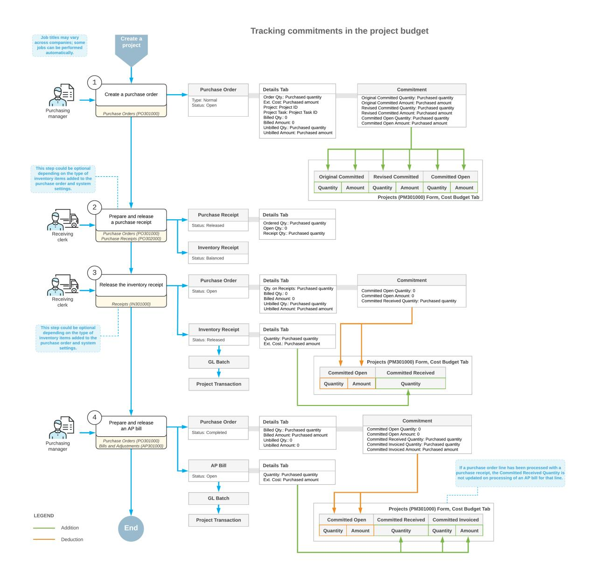

# <span id="page-344-1"></span><span id="page-344-0"></span>**Committed Costs: Implementation Checklist**

The following sections provide details you can use to ensure that the system is configured properly for processing cost commitments on projects, and to understand (and change, if needed) the settings that affect the processing workflow.

#### **Implementation Checklist**

We recommend that before you initially process cost commitments, you make sure the needed features have been enabled, settings have been specified, and entities have been created, as summarized in the following checklist.

| Form                                    | Tasks to Perform                                                                                                                                                                                                                                                                 |
|-----------------------------------------|----------------------------------------------------------------------------------------------------------------------------------------------------------------------------------------------------------------------------------------------------------------------------------|
| Enable/Disable Features (CS100000) form | Make sure the following features are enabled:                                                                                                                                                                                                                                    |
|                                         | •<br>Inventory and Order Management, if you want to<br>process purchase orders with non-stock items and<br>track them as cost commitments to projects                                                                                                                            |
|                                         | •<br>Inventory, if you want to process purchase orders<br>with stock items and track them as cost commit<br>ments to projects                                                                                                                                                    |
|                                         | •<br>Construction, if you want to process subcontracts<br>and track them as cost commitments to projects                                                                                                                                                                         |
| Projects Preferences (PM101000) form    | Make sure that all necessary settings related to project<br>accounting have been specified. For more information<br>about configuration steps that you have to perform<br>before you can start accounting for projects, see Basic<br>Project Configuration: General Information. |
|                                         | Also, make sure that the Internal Cost Commitment<br>Tracking check box is selected on the General tab<br>(General Settings section).                                                                                                                                            |
| Account Groups (PM201000) form          | Make sure that all needed account groups have been<br>configured and that for all the needed account groups<br>of the Expense type, the Create Commitment check<br>box is selected on the Change RequestSettings tab.                                                            |
| Projects (PM301000) form                | Make sure that the project has been created, as de<br>scribed in Project Creation and Processing: General In<br>formation.                                                                                                                                                       |
| Vendors (AP303000) form                 | Make sure that all needed vendors have been defined<br>in the system, as described in Vendors: General Infor<br>mation.                                                                                                                                                          |
|                                         | Also, make sure that the expense account of the ven<br>dor specified in the Expense Account box on the GL<br>Accounts tab is mapped to an account group.                                                                                                                         |

| Form                            | Tasks to Perform                                                                                                                                                                                                                                                                                                                                                          |  |  |  |  |
|---------------------------------|---------------------------------------------------------------------------------------------------------------------------------------------------------------------------------------------------------------------------------------------------------------------------------------------------------------------------------------------------------------------------|--|--|--|--|
| Non-Stock Items (IN202000) form | Make sure that all needed labor items, non-stock<br>items, and services have been defined. For more infor<br>mation about labor items, non-stock items, and ser<br>vices, see Labor Items: General Information, Non-Stock<br>Items: General Information, and Service Items: General<br>Information, respectively.                                                         |  |  |  |  |
|                                 | Make sure that Purchases is selected in<br>the Post Cost to Expenses box on the<br>Price/Cost tab; otherwise, the expens<br>es related to the non-stock item will not<br>be recorded to the cost budget of the ap<br>plicable project.                                                                                                                                    |  |  |  |  |
|                                 | Also, make sure that the following accounts are<br>mapped to account groups of the Expense type:                                                                                                                                                                                                                                                                          |  |  |  |  |
|                                 | •<br>The expense account of the item specified in the<br>Expense Account box on the GL Accounts tab of<br>the Non-Stock Items form                                                                                                                                                                                                                                        |  |  |  |  |
|                                 | •<br>The expense account of the corresponding posting<br>class specified in the COGS/Expense Account box<br>on the GL Accounts tab of the Posting Classes form<br>if the non-stock item requires receipt—that is, the<br>Require Receipt check box is selected on the Gen<br>eral tab (Item Defaults section) of the Non-Stock<br>Items form                              |  |  |  |  |
| Stock Items (IN202500) form     | Make sure that all stock items have been defined. For<br>more information about stock items, see Stock Items:<br>General Information.                                                                                                                                                                                                                                     |  |  |  |  |
|                                 | Also, make sure that the COGS account of the item<br>specified in the COGS Account box on the GL Ac<br>counts tab of the Stock Items form is mapped to an ac<br>count group of the Expense type.                                                                                                                                                                          |  |  |  |  |
|                                 | We recommend that you not map the<br>Inventory account (which is an account<br>of the Asset type) to an account group<br>of the Expense type. If you need to track<br>stock items purchased for the project in<br>the project cost budget, we recommend<br>that you use the commitment tracking<br>functionality. For more information, see<br>Tracking Cost Commitments. |  |  |  |  |

#### **Other Settings That Affect the Workflow**

You can affect the workflow of processing commitments by specifying additional settings as follows:

• To change the format of purchase order identifiers, adjust the *POORDER* numbering sequence on the *[Numbering Sequences](https://help-2025r1.acumatica.com/Help?ScreenId=ShowWiki&pageid=a8d11c23-21f2-42a3-b17d-9637c9cf8031)* (CS201010) form or create a new numbering sequence and select this sequence in the **Regular Order NumberingSequence** box on the **General** tab of the *[Purchase Orders Preferences](https://help-2025r1.acumatica.com/Help?ScreenId=ShowWiki&pageid=13d09c43-8696-4f92-ad9b-3d0209ee3d9b)* (PO101000) form. For more information on numbering sequences, see *[Use of Numbering Sequences](https://help-2025r1.acumatica.com/Help?ScreenId=ShowWiki&pageid=71c26175-c78f-4e70-8518-2115f5bfaf2f)*.


A user can create purchase orders by using the **Create Purchase Orders** button on the **Commitments** tab of the *[Projects](https://help-2025r1.acumatica.com/Help?ScreenId=ShowWiki&pageid=81c86417-3bde-444b-8f1c-682928d31a0c)* (PM301000) form only if the numbering sequence that is used for numbering purchase orders is auto-numbered.

- To cause the system to automatically select a project task when a particular project is selected during the creation of a purchase order, select the **Default** check box on the**Tasks** tab of the *[Projects](https://help-2025r1.acumatica.com/Help?ScreenId=ShowWiki&pageid=81c86417-3bde-444b-8f1c-682928d31a0c)* (PM301000) form for one of the tasks of the project.
- To avoid obligatory printing of created purchase orders, clear the **Print Orders** check box on the **Purchase Settings** tab (**Default Location Settings** section) of the *[Vendors](https://help-2025r1.acumatica.com/Help?ScreenId=ShowWiki&pageid=a9584be3-f2bd-4d67-80d4-8041d809df56)* (AP303000) form for all applicable vendors. (A user can still print any purchase order of the vendor, if needed.)
- To avoid obligatory emailing of created purchase orders, clear the**Send Orders by Email** check box on the **PurchaseSettings** tab (**Default Location Settings** section) of the *[Vendors](https://help-2025r1.acumatica.com/Help?ScreenId=ShowWiki&pageid=a9584be3-f2bd-4d67-80d4-8041d809df56)* form for all applicable vendors. (A user can still email any purchase order of the vendor, if needed.)
- To cause the system to automatically release inventory receipts created on release of purchase receipts, select the **Release IN Documents Automatically** check box on the **General** tab (**Other** section) of the *[Purchase Orders Preferences](https://help-2025r1.acumatica.com/Help?ScreenId=ShowWiki&pageid=13d09c43-8696-4f92-ad9b-3d0209ee3d9b)* PO101000 form.
- To cause the system to create purchase receipts with the *Balanced* status, clear the **Hold Receipts On Entry** check box on the **General** tab (**Other** section) of the *[Purchase Orders Preferences](https://help-2025r1.acumatica.com/Help?ScreenId=ShowWiki&pageid=13d09c43-8696-4f92-ad9b-3d0209ee3d9b)* form.
- To cause the system to not copy non-stock lines of the *Service* type in purchase orders of the *Normal* type to purchase receipts and bill such lines directly from purchase orders, clear the **ProcessService Lines from Normal Purchase Orders via Purchase Receipt** check box on the **General** tab (**Other** section) of the *[Purchase Orders Preferences](https://help-2025r1.acumatica.com/Help?ScreenId=ShowWiki&pageid=13d09c43-8696-4f92-ad9b-3d0209ee3d9b)* form.
- To cause the system to not copy non-stock lines of the *Service* type in purchase orders of the *Drop-Ship* type to purchase receipts and bill such lines directly from purchase orders, clear the **ProcessService Lines from Drop-Ship Purchase Orders via Purchase Receipt** check box on the **General** tab (**Other** section) of the *[Purchase Orders Preferences](https://help-2025r1.acumatica.com/Help?ScreenId=ShowWiki&pageid=13d09c43-8696-4f92-ad9b-3d0209ee3d9b)* form.

With these settings specified, users in your company can process commitments quickly and accurately with a minimum of manual actions.

#### **Validation of Configuration**

To make sure that all configuration has been performed correctly, we recommend that you perform instructions similar to those described in *[Committed Costs: Process Activity](#page-347-1)*.

# <span id="page-347-1"></span><span id="page-347-0"></span>**Committed Costs: Process Activity**

This activity will walk you through the creation of a purchase order for a project and tracking this purchase order as a commitment to the project cost budget.

This activity is based on the *U100* dataset. If you are using another dataset, or if any system settings have been changed in *U100*, these changes can affect the workflow of the activity and the results of the processing. To avoid any issues, restore the *U100* dataset to its initial state.

#### **Story**

Suppose that the HM's Bakery and Cafe customer has ordered the installation of three juicers it previously purchased from the SweetLife Fruits & Jams company. Acting as SweetLife's project accountant, you have created a project related to the planned installation work. The installation, which is performed by the vendor of the juicers, has been provided for each juicer. Based on the agreement with the vendor, your company will be billed in two parts—that is, first for the installation of the first two juicers and then for the installation of the third juicer. Acting as the project accountant, you need to capture the first part of the installation cost as a commitment to the project.

#### **Configuration Overview**

In the *U100* dataset, the following tasks have been performed to support this activity:

- The following features have been enabled on the *[Enable/Disable Features](https://help-2025r1.acumatica.com/Help?ScreenId=ShowWiki&pageid=c1555e43-1bc5-4f6f-ba9d-b323f94d8a6b)* (CS100000) form:
  - *Project Accounting*, which provides support for the project accounting functionality
  - *Inventory and Order Management*, which provides the purchase order functionality
- On the *[Account Groups](https://help-2025r1.acumatica.com/Help?ScreenId=ShowWiki&pageid=94a2cdce-c36a-49a1-b572-9cd33cb5fa73)* (PM201000) form, the *SUBCON* account group has been created. The *54200 - Project Subcontract Expense* account has been mapped to the account group.
- On the *[Vendors](https://help-2025r1.acumatica.com/Help?ScreenId=ShowWiki&pageid=a9584be3-f2bd-4d67-80d4-8041d809df56)* (AP303000) form, the *SQUEEZO* vendor has been created.
- On the *[Projects](https://help-2025r1.acumatica.com/Help?ScreenId=ShowWiki&pageid=81c86417-3bde-444b-8f1c-682928d31a0c)* (PM301000) form, the *HMBAKERY8* project has been created and the *INSTALL* project task has been created for the project. This task is the default project task.
- On the *[Non-Stock Items](https://help-2025r1.acumatica.com/Help?ScreenId=ShowWiki&pageid=bf68dd4f-63d4-460d-8dc0-9152f2bd6bf1)* (IN202000) form, the *INSTALL* non-stock item has been created. On the **General** tab, the **Require Receipt** check box is cleared for the item. On the **Price/Cost** tab (**Standard Cost** section), the **Current Cost** of the item has been set to *80.00*. On the same tab, *Purchases* is selected in the **Post Cost to Expenses On** box. On the **GL Accounts** tab, the *54200 - Project Subcontract Expense* account has been specified as the **Expense Account**.

#### **Process Overview**

In this activity, you will create a purchase order on the *[Purchase Orders](https://help-2025r1.acumatica.com/Help?ScreenId=ShowWiki&pageid=5565686c-96c4-4bfa-a51d-9a2566baa808)* (PO301000) form with lines related to the project. You will review how the committed amounts are shown in the project budget on the *[Projects](https://help-2025r1.acumatica.com/Help?ScreenId=ShowWiki&pageid=81c86417-3bde-444b-8f1c-682928d31a0c)* (PM301000) form. You will then create a partial bill for the purchase order and release the bill on the *[Bills and Adjustments](https://help-2025r1.acumatica.com/Help?ScreenId=ShowWiki&pageid=956b4e51-3078-4d2d-85b3-65c080d95234)* (AP301000) form.

Finally, you will review how the processed commitments affect the project budget on the *[Projects](https://help-2025r1.acumatica.com/Help?ScreenId=ShowWiki&pageid=81c86417-3bde-444b-8f1c-682928d31a0c)* form.

#### **System Preparation**

To sign in to the system and prepare to perform the instructions of the activity, do the following:

- 1. Launch the Acumatica ERP website and sign in as Pam Brawner using the *brawner* username and *123* password.
- 2. In the info area, in the upper-right corner of the top pane of the Acumatica ERP screen, make sure that the business date in your system is set to *1/30/2025*. If a different date is displayed, click the Business Date menu button and select *1/30/2025* on the calendar. For simplicity, in this activity, you will create and process all documents in the system on this business date.
- 3. On the **General** tab (**GeneralSettings** section) of the *[Projects Preferences](https://help-2025r1.acumatica.com/Help?ScreenId=ShowWiki&pageid=de2ca225-4a0c-4129-b09d-3f3ed05198f9)* (PM101000) form, select the **Internal Cost CommitmentTracking** check box to expose commitments and committed values in the project budget, and save your changes to the project accounting preferences.

### **Step: Creating Commitments for the Project**

To process a purchase order for the project that updates the project budget with committed values, do the following:

1. On the *[Projects](https://help-2025r1.acumatica.com/Help?ScreenId=ShowWiki&pageid=81c86417-3bde-444b-8f1c-682928d31a0c)* (PM301000) form, open the *HMBAKERY8* project, and on the **Cost Budget** tab, review the cost budget of the project. Because tracking of cost commitments is enabled in the system, the table contains columns for the original committed, revised committed, committed received, committed invoiced, and committed open values. In the only cost budget line of the project, all these values are *0*.

- 2. On the *[Purchase Orders](https://help-2025r1.acumatica.com/Help?ScreenId=ShowWiki&pageid=5565686c-96c4-4bfa-a51d-9a2566baa808)* (PO301000) form, create a purchase order, and specify the following settings in the Summary area:
  - **Vendor**: *SQUEEZO*
  - **Description**: Purchase for HM's Bakery & Cafe
  - **Date**: *1/30/2025*
- 3. On the **Details** tab, add three purchase order lines, and specify the settings shown in the following table in the lines you add.

| Inventory ID | Line Description                     | Order Qty. | Project   | Cost Code |
|--------------|--------------------------------------|------------|-----------|-----------|
| INSTALL      | Installation of the<br>first juicer  | 3          | HMBAKERY8 | 00-000    |
| INSTALL      | Installation of the<br>second juicer | 4          | HMBAKERY8 | 00-000    |
| INSTALL      | Installation of the<br>third juicer  | 5          | HMBAKERY8 | 00-000    |


The system automatically selects the *INSTALL* project task when you select the project of the line because this task is the default task of the *HMBAKERY8* project.

- 4. Make sure the **Ext. Cost** of the added lines is *240.00*, *320.00*, and *400.00*, respectively; these represent the costs committed to the project.
- 5. In the Summary area, make sure that the **DetailTotal** value, which is the sum of the **Ext. Cost** values of the three lines, is *960.00*, and save the purchase order.
- 6. On the form toolbar, click **Remove Hold**. The system assigns the purchase order the *Open* status.

When the *Open* status is assigned to the purchase order, the system creates the commitments for the project.

7. On the *[Projects](https://help-2025r1.acumatica.com/Help?ScreenId=ShowWiki&pageid=81c86417-3bde-444b-8f1c-682928d31a0c)* form, open the *HMBAKERY8* project, and on the **Cost Budget** tab, review the updated cost budget line.

Notice that the committed quantities and amounts of the cost budget line have been updated and the **Original Committed Amount**, **Revised Committed Amount**, and **Committed Open Amount** columns contain the purchase order total (*960.00*).

- 8. On the table toolbar, click**View Commitments** to review the commitments that correspond to the cost budget line on the *[Commitments](https://help-2025r1.acumatica.com/Help?ScreenId=ShowWiki&pageid=5d2dcf5c-2595-454a-92ef-067e0139da38)* (PM306000) form. Notice that the system has created a commitment for each purchase order line and that all the commitments correspond to one cost budget line.
- 9. Close the form and return to the *[Projects](https://help-2025r1.acumatica.com/Help?ScreenId=ShowWiki&pageid=81c86417-3bde-444b-8f1c-682928d31a0c)* form with the *HMBAKERY8* project.
- 10.On the **Commitments** tab, click the link in the **Order Nbr.** column to open the purchase order that you have created earlier in this activity.
- 11.On the More menu of the *[Purchase Orders](https://help-2025r1.acumatica.com/Help?ScreenId=ShowWiki&pageid=5565686c-96c4-4bfa-a51d-9a2566baa808)* form, which the system opens, click **Enter AP Bill** to create a bill for the purchase order.

The system creates an accounts payable bill and opens the bill on the *[Bills and Adjustments](https://help-2025r1.acumatica.com/Help?ScreenId=ShowWiki&pageid=956b4e51-3078-4d2d-85b3-65c080d95234)* (AP301000) form.

12.On the **Details** tab of this form, delete the line with the **Quantity** of *5.00* to bill the purchase order partially, as your company agreed on with the vendor.

When you delete the line, the amount in the **DetailTotal** box in the Summary area becomes *560.00*.

13.On the form toolbar, click **Remove Hold** to assign the bill the *Balanced* status, and then click **Release** to release the bill.

14.Return to the *[Projects](https://help-2025r1.acumatica.com/Help?ScreenId=ShowWiki&pageid=81c86417-3bde-444b-8f1c-682928d31a0c)* form with the *HMBAKERY8* project, press Esc to refresh the form, and review the updated cost budget on the **Cost Budget** tab.

Notice that the billed quantity and amount (*7.00* and *560.00*, respectively) of the purchase order have been subtracted from the committed open quantity and amount, which is now equal to *5.00* and *400.00*, respectively. The billed quantity and amount have been added to the committed invoiced quantity and amount, to the actual quantity and amount, and to the received committed quantity, as shown in the following screenshot.

| Projects<br>R NOTES<br>$TOOLS$ $\sim$<br><b>FILES</b><br>HMBAKERY8 - Installation of juicers |                                        |                                             |                                   |                                 |                                                      |                                |                                   |                                   |                                 |                               |                             |                    |                  |                       |                                          |
|----------------------------------------------------------------------------------------------|----------------------------------------|---------------------------------------------|-----------------------------------|---------------------------------|------------------------------------------------------|--------------------------------|-----------------------------------|-----------------------------------|---------------------------------|-------------------------------|-----------------------------|--------------------|------------------|-----------------------|------------------------------------------|
| 뭐<br>$\leftarrow$                                                                            | $\Box$<br>$\Omega$                     | 侕<br>÷                                      | к<br>≺                            | ы<br>>                          | <b>COMPLETE</b>                                      | <b>RUN BILLING</b>             | $\cdots$                          |                                   |                                 |                               |                             |                    |                  |                       |                                          |
| * Project ID:                                                                                |                                        | <b>HMBAKERY8</b>                            |                                   | $\varphi$                       | Customer:                                            |                                | HMBAKERY - HM's Bakery & Cafe     | Q                                 | $\mathscr{D}$                   | Actual Income:                | 0.00                        |                    |                  |                       | $\sim$                                   |
| Template:                                                                                    |                                        |                                             |                                   | 0                               | Project Manager:                                     |                                | EP00000001 - Pam Brawner          | ρ                                 |                                 | Actual Expenses:              | 560.00                      |                    |                  |                       |                                          |
| Status:                                                                                      |                                        | Active                                      |                                   |                                 |                                                      |                                |                                   |                                   |                                 | Margin Amount:                | $-560.00$                   |                    |                  |                       |                                          |
| Description:                                                                                 |                                        | Installation of juicers                     |                                   |                                 |                                                      |                                |                                   |                                   |                                 | Margin (%):                   | 0.00                        |                    |                  |                       |                                          |
|                                                                                              |                                        |                                             |                                   |                                 |                                                      |                                |                                   |                                   |                                 | Pending Invoice Amoun         | 0.00                        |                    |                  |                       |                                          |
| <b>SUMMARY</b>                                                                               | <b>TASKS</b>                           | <b>REVENUE BUDGET</b>                       |                                   | <b>COST BUDGET</b>              | <b>BALANCES</b>                                      | <b>COMMITMENTS</b>             | <b>INVOICES</b>                   | <b>UNION LOCALS</b>               |                                 | <b>ACTIVITIES</b>             | <b>EMPLOYEES</b>            | <b>EQUIPMENT</b>   | <b>ADDRESSES</b> |                       | $\ensuremath{\scriptstyle \diamondsuit}$ |
| Group by Task                                                                                |                                        |                                             |                                   |                                 |                                                      |                                |                                   |                                   |                                 |                               |                             |                    |                  |                       |                                          |
| Ò<br>$\div$                                                                                  | $\times$                               | <b>VIEW COMMITMENTS</b>                     |                                   | <b>VIEW TRANSACTIONS</b>        | $\boxed{\mathbf{X}}$<br>$\mathbb{H}$<br>$\mathbf{t}$ |                                |                                   |                                   |                                 |                               |                             | <b>All Records</b> |                  | $\check{\phantom{a}}$ | $\triangledown$                          |
| Original<br><b>Budgeted</b><br>Amount                                                        | Revised<br><b>Budgeted</b><br>Quantity | <b>Revised</b><br><b>Budgeted</b><br>Amount | Original<br>Committed<br>Quantity | Original<br>Committed<br>Amount | Revised<br>Committed<br>Quantity                     | Revised<br>Committed<br>Amount | Committed<br>Received<br>Quantity | Committed<br>Invoiced<br>Quantity | Committed<br>Invoiced<br>Amount | Committed<br>Open<br>Quantity | Committed<br>Open<br>Amount | Actual<br>Quantity | Actual<br>Amount |                       | Actual +<br>Open<br>Committed<br>Amount  |
| 960.00                                                                                       | 12.00                                  | 960.00                                      | 12.00                             | 960.00                          | 12.00                                                | 960.00                         | 0.00                              | 7.00                              | 560.00                          | 5.00                          | 400.00                      | 7.00               | 560.00           |                       | 960.00                                   |

*Figure: Committed values of the project cost budget*

15.On the **General** tab (**GeneralSettings** section) of the *[Projects Preferences](https://help-2025r1.acumatica.com/Help?ScreenId=ShowWiki&pageid=de2ca225-4a0c-4129-b09d-3f3ed05198f9)* (PM101000) form, clear the **Internal Cost CommitmentTracking** check box, and save your changes to the project accounting preferences.

You have processed the commitment to the project.

# <span id="page-350-0"></span>**Committed Costs: Generated Transactions**

When you process a purchase order from which commitments originate, you create purchase receipts (for the stock items and non-stock items requiring receipt) and accounts payable bills (for all types of items). On release of these documents, the system generates the GL and project transactions described in the following sections.

#### **GL Transactions Generated on Inventory Receipt Release**

When an inventory receipt created on release of a purchase receipt prepared for a purchase order is released, the system creates a batch of the general ledger transactions shown in the table below.

The system uses the following accounts as the source of the debited account in the GL batch it creates:

- The inventory account, which is specified for the posting class of a stock item in the **Inventory/Accrual Account** box on the **GL Accounts** tab of the *[Posting Classes](https://help-2025r1.acumatica.com/Help?ScreenId=ShowWiki&pageid=edd4bd77-13f5-4e89-9e47-2861fc66bbb0)* (IN206000) form.
- The expense account, which is specified for the posting class of a non-stock item that requires receipt in the **COGS/Expense Account** box on the **GL Accounts** tab of the *[Posting Classes](https://help-2025r1.acumatica.com/Help?ScreenId=ShowWiki&pageid=edd4bd77-13f5-4e89-9e47-2861fc66bbb0)* form.

| Account                   | Source of Account            | Debit  | Credit |
|---------------------------|------------------------------|--------|--------|
| PO accrual account        | Item                         | 0.00   | Amount |
| Inventory/expense account | Posting class of the<br>item | Amount | 0.00   |

On the **Financial** tab of the *[Receipts](https://help-2025r1.acumatica.com/Help?ScreenId=ShowWiki&pageid=d6ecad5b-155f-44bf-baba-9ed006d298b5)* (IN301000) form, you can click the link in the **Batch Nbr.** box to view the details of the batch on the *Journal [Transactions](https://help-2025r1.acumatica.com/Help?ScreenId=ShowWiki&pageid=dda046bc-5946-407f-88f7-1c0c966fbe72)* (GL301000) form.

#### **Project Transaction Generated on Inventory Receipt Release**

When a batch of general ledger transactions created on release of the inventory receipt is released, the system generates the project transaction shown in the following table.

| Debit Account                 | Credit Account | Source of Account | Amount |
|-------------------------------|----------------|-------------------|--------|
| Inventory/expense ac<br>count | Empty          | GL transaction    | Amount |

You can review the created project transaction on the *Project [Transaction](https://help-2025r1.acumatica.com/Help?ScreenId=ShowWiki&pageid=29bf5433-446f-4196-be69-f2cb177e83cb) Details* (PM401000) form. In the Selection area of this form, you select the project in the **Project** box.

#### **GL Transactions Generated on AP Bill Release**

When an accounts payable bill prepared for a service line of a purchase order is released, the system creates a batch of the general ledger transactions shown in the following table.

The system uses the following accounts as the source accounts in the GL batch it creates:

| Account                  | Source of Account | Debit  | Credit |  |
|--------------------------|-------------------|--------|--------|--|
| Accounts payable account | Vendor            | 0.00   | Amount |  |
| Expense account          | Item              | Amount | 0.00   |  |

On the **Financial** tab (**Link to GL** section) of the *[Bills and Adjustments](https://help-2025r1.acumatica.com/Help?ScreenId=ShowWiki&pageid=956b4e51-3078-4d2d-85b3-65c080d95234)* (AP301000) form, you can click the link in the **Batch Nbr.** box to view the details of the batch on the *Journal [Transactions](https://help-2025r1.acumatica.com/Help?ScreenId=ShowWiki&pageid=dda046bc-5946-407f-88f7-1c0c966fbe72)* (GL301000) form.

#### **Project Transaction Generated on AP Bill Release**

When a batch of general ledger transactions is created on release of an accounts payable bill, the system also generates the project transaction shown in the following table.

| Debit Account   | Credit Account | Source of Account | Amount |
|-----------------|----------------|-------------------|--------|
| Expense account | Empty          | GL transaction    | Amount |

You can review the created project transaction on the *Project [Transaction](https://help-2025r1.acumatica.com/Help?ScreenId=ShowWiki&pageid=29bf5433-446f-4196-be69-f2cb177e83cb) Details* (PM401000) form. In the Selection area of this form, you select the project in the **Project** box. In the table, you can find the project transaction created on release of the accounts payable bill by the reference number of the AP bill in the **Orig. Doc. Nbr.** column.

# <span id="page-351-0"></span>**Committed Costs: Related Reports and Forms**

In the following sections, you can find details about the reports and forms you may want to review to gather information about commitments.

If you do not see a particular report or form that is described, you may have signed in to the system with a user account that does not have access rights to the report or form. Contact your system administrator to obtain access to any needed reports or forms.

#### **Reviewing the Commitments of a Project**

You can review the list of a project's commitments on the *[Commitments](https://help-2025r1.acumatica.com/Help?ScreenId=ShowWiki&pageid=5d2dcf5c-2595-454a-92ef-067e0139da38)* (PM306000) form. In the Selection area of this form, you select the project; you can also filter the selected transactions by selecting a project task, an account group, and an inventory item.

The form displays the commitments associated with the branches to which your user has sufficient access rights.

#### **Reviewing Commitments by Project Budget Line**

You can review the commitments corresponding to a project budget line with a nonzero committed value on the **Cost Budget** tab of the *[Projects](https://help-2025r1.acumatica.com/Help?ScreenId=ShowWiki&pageid=81c86417-3bde-444b-8f1c-682928d31a0c)* (PM301000) form. To review the corresponding commitments of a line, you click the line; then on the table toolbar, you click**View Commitments**, and the system opens the *[Commitments](https://help-2025r1.acumatica.com/Help?ScreenId=ShowWiki&pageid=5d2dcf5c-2595-454a-92ef-067e0139da38)* (PM306000) form.

#### **Reviewing Commitments by Account Group**

You can review the project budget broken down by account groups on the **Balances** tab of the *[Projects](https://help-2025r1.acumatica.com/Help?ScreenId=ShowWiki&pageid=81c86417-3bde-444b-8f1c-682928d31a0c)* (PM301000) form. To review the commitments corresponding to an account group, you click a line; then on the table toolbar, you click**View Commitments**, and the system opens the *[Commitments](https://help-2025r1.acumatica.com/Help?ScreenId=ShowWiki&pageid=5d2dcf5c-2595-454a-92ef-067e0139da38)* (PM306000) form.

#### **Reviewing Purchase Orders Related to a Project**

You can review the list of purchase orders from which the project commitments originate on the **Commitments** tab of the *[Projects](https://help-2025r1.acumatica.com/Help?ScreenId=ShowWiki&pageid=81c86417-3bde-444b-8f1c-682928d31a0c)* (PM301000) form.

#### **Retrieving Committed Data for Analytical Reports**

The commitment data is available in the analytical reports and aggregated by the following key fields of a project budget line:

- Project ID: The project
- Project Task ID: The project task
- Account Group ID: The account group
- Inventory ID: The inventory item

# <span id="page-352-0"></span>**Committed Costs: External Commitments**

This topic explains how you can enter external commitments in the system.

Project commitments that do not originate from purchase orders existing in the system have the *External* type on the *[Commitments](https://help-2025r1.acumatica.com/Help?ScreenId=ShowWiki&pageid=5d2dcf5c-2595-454a-92ef-067e0139da38)* (PM306000) form, in contrast to those that have the *Internal* type and originate from documents created in the system. External commitments can be created regardless of the state of the **Internal Cost CommitmentTracking** check box on the *[Projects Preferences](https://help-2025r1.acumatica.com/Help?ScreenId=ShowWiki&pageid=de2ca225-4a0c-4129-b09d-3f3ed05198f9)* (PM101000) form (which indicates that purchase orders are tracked by project as cost commitments). You can create external commitments in two ways:

- From scratch on the *[External Commitments](https://help-2025r1.acumatica.com/Help?ScreenId=ShowWiki&pageid=08e48343-6757-47a0-a766-4a845843fdf9)* (PM209000) form. To open the form, you click **Create External Commitment** on the form toolbar of the *[Commitments](https://help-2025r1.acumatica.com/Help?ScreenId=ShowWiki&pageid=5d2dcf5c-2595-454a-92ef-067e0139da38)* form.
- By importing commitments from an external system into Acumatica ERP for further analysis against budget and actual figures by using import scenarios on the *[External Commitments](https://help-2025r1.acumatica.com/Help?ScreenId=ShowWiki&pageid=08e48343-6757-47a0-a766-4a845843fdf9)* form. Aer the initial import, you can update imported commitment records as the project proceeds and the system changes the applicable committed quantities and amount of the project budget.

# <span id="page-353-0"></span>**Committed Costs: Mass Processing of Documents**

This topic explains how to perform mass-processing operations related to project commitments, and how the system generates, changes, or works with documents as a result of the mass processing.

#### **Mass-Rebuilding Project Commitments**

In some cases (for instance, if committed values of the project budget have been modified through external tools or import scenarios), you may need to rebuild commitments to make committed values match the quantities and amounts of the purchase orders.

To rebuild commitments, you use the *[Recalculate Project Balances](https://help-2025r1.acumatica.com/Help?ScreenId=ShowWiki&pageid=6bf336f5-0f89-455b-a3a1-50982a26ae3d)* (PM504000) form. On this form, you select the **Rebuild Commitments** check box in the Selection area. You also select the unlabeled check boxes in the rows of the projects to be processed and click **Process** on the form toolbar to process the selected projects; alternatively, you can click **Process All** to process all the projects shown in the table. For more information, see *[Project Budget:](#page-267-2) [Recalculation of the Project Balances](#page-267-2)*.

# <span id="page-354-0"></span>**Tracking Changes to Commitments**

If you need to track changes to the project commitments and control the profitability of every change initiated by a customer, you use the functionality of change orders. In this chapter, you will learn more about how change orders are used with commitments if internal cost commitment tracking is used in the system.

# <span id="page-354-2"></span><span id="page-354-1"></span>**Change Orders for Commitments: General Information**

By using the change order functionality in Acumatica ERP, you can manage changes to a project's committed values if the commitment functionality has been configured for project accounting. For more information on commitments, see *[Committed Costs: General Information](#page-342-3)*.

#### **Learning Objectives**

In this chapter, you will learn how to do the following:

- Create a change order class for tracking commitments
- Update cost commitments with a change order
- Review the changes to the project budget that have been made with change orders
- Make changes to closed commitments

#### **Applicable Scenarios**

You turn on the change order workflow for a project and enable commitment tracking if you want to distinguish purchases within the cost budget of a project, control changes made to the committed values of the project budget, and track these changes at the budget level. To make changes to the project budget, you create change orders, which do not alter the original committed values.

#### **Configuration of a Change Order Class**

If the **Internal Cost CommitmentTracking** check box is selected on the **General** tab (**GeneralSettings** section) of the *[Projects Preferences](https://help-2025r1.acumatica.com/Help?ScreenId=ShowWiki&pageid=de2ca225-4a0c-4129-b09d-3f3ed05198f9)* (PM101000) form, the system exposes commitments on the *[Commitments](https://help-2025r1.acumatica.com/Help?ScreenId=ShowWiki&pageid=5d2dcf5c-2595-454a-92ef-067e0139da38)* (PM306000) form. To allow users to make changes to commitments, you configure a change order class on the *[Change Order](https://help-2025r1.acumatica.com/Help?ScreenId=ShowWiki&pageid=fdac3e07-8ea5-4c44-85bc-bae8850df2f0) [Classes](https://help-2025r1.acumatica.com/Help?ScreenId=ShowWiki&pageid=fdac3e07-8ea5-4c44-85bc-bae8850df2f0)* (PM203000) form. On this form, you select the **Commitments** check box to allow changes to committed values.

#### **Change Orders for Project Commitments**

You can track changes to project commitments that have been created based on project-related subcontracts and purchase orders that have the *Normal* and *Project Drop-Ship* type.

Subcontracts are available in the system if the *Construction* feature is enabled on the *[Enable/](https://help-2025r1.acumatica.com/Help?ScreenId=ShowWiki&pageid=c1555e43-1bc5-4f6f-ba9d-b323f94d8a6b) [Disable Features](https://help-2025r1.acumatica.com/Help?ScreenId=ShowWiki&pageid=c1555e43-1bc5-4f6f-ba9d-b323f94d8a6b)* (CS100000) form. For more information about the processing of subcontracts, see *[Subcontracts: General Information](https://help-2025r1.acumatica.com/Help?ScreenId=ShowWiki&pageid=092fdfc8-b353-49d2-ad0d-402968d77afc)*.

On the *[Change Orders](https://help-2025r1.acumatica.com/Help?ScreenId=ShowWiki&pageid=0c26a0eb-ef8d-4a61-97c8-237aea21cf25)* (PM308000) form, in a change order with the *On Hold* status, you can process the following changes to a project's committed values:

- Creating a new purchase order or subcontract for a project
- Adding a new line to an existing purchase order or subcontract

- Adjusting an existing purchase order or subcontract by adding a new negative line
- Making an addition to or deduction from an existing purchase order or subcontract with a positive or negative amount


The amount of a negative change order line may not exceed the **LineTotal** amount of the purchase order.

• Making an addition to or deduction from an existing purchase order line or subcontract line with a positive or negative amount


The quantity and amount of a negative change order line may not exceed the received or billed quantities and amounts of the purchase order.

• Reopening a purchase order or subcontract

When you release the change order, based on the **Quantity** and **Amount** of a commitment line on the **Commitments** tab of the *[Change Orders](https://help-2025r1.acumatica.com/Help?ScreenId=ShowWiki&pageid=0c26a0eb-ef8d-4a61-97c8-237aea21cf25)* form, the system updates the related commitment document or creates a new one, depending on the type of the commitment line, and updates the **Committed CO Quantity**, **Committed CO Amount**, **Revised Committed Quantity** and **Revised Committed Amount** of the corresponding cost budget line of the project on the *[Projects](https://help-2025r1.acumatica.com/Help?ScreenId=ShowWiki&pageid=81c86417-3bde-444b-8f1c-682928d31a0c)* (PM301000) form. For more information, see *[Change Orders for Commitments:](#page-356-1) [Commitment Updates on Release of Change Orders](#page-356-1)*.

#### **Workflow of Managing Changes to Commitments**

The following diagram illustrates the workflow of managing changes to commitments.

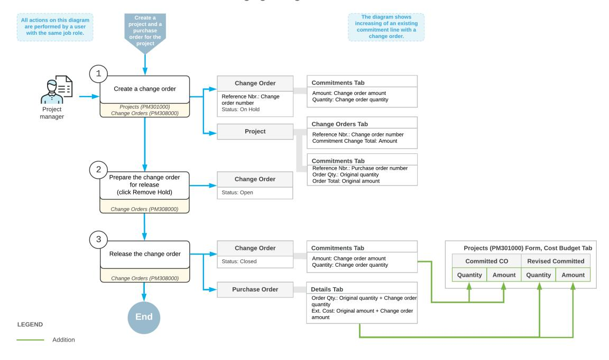

# <span id="page-356-1"></span><span id="page-356-0"></span>**Change Orders for Commitments: Commitment Updates on Release of Change Orders**

The actions that the system performs on the release of a change order to commitment depends on the status specified in the **Status** column of the change order line on the **Commitments** tab of the *[Change Orders](https://help-2025r1.acumatica.com/Help?ScreenId=ShowWiki&pageid=0c26a0eb-ef8d-4a61-97c8-237aea21cf25)* (PM308000) form. The following sections describe the effects of releasing a change order to commitment: which actions the system performs for lines with different statuses and how the existing project commitments and project budget are affected.

#### **Processing a Line with the Update Status**

On release of a commitment change order with a line with the *Update* status on the **Commitments** tab of the *[Change Orders](https://help-2025r1.acumatica.com/Help?ScreenId=ShowWiki&pageid=0c26a0eb-ef8d-4a61-97c8-237aea21cf25)* (PM308000) form, the system updates the existing line of the corresponding commitment document. The commitment document can be a purchase order on the *[Purchase Orders](https://help-2025r1.acumatica.com/Help?ScreenId=ShowWiki&pageid=5565686c-96c4-4bfa-a51d-9a2566baa808)* (PO301000) form or subcontract on the *[Subcontracts](https://help-2025r1.acumatica.com/Help?ScreenId=ShowWiki&pageid=dc6a00f9-3913-47bb-b28d-105be0e0d20a)* (SC301000) form; the line is updated on the **Details** tab of either form.

The values in the commitment lines are updated as follows:

- **Order Qty.**: The original **Order Qty.** of the commitment line plus (or minus) the **Quantity** of the corresponding commitment line of the change order.
- **Unit Cost**: The **Unit Cost** of the corresponding commitment line of the change order.
- **Amount**: The original **Amount** of the commitment line plus (or minus) the **Amount** of the corresponding commitment line of the change order.


The system does not recalculate the amount based on the updated unit cost and quantity.

- **Ext. Cost**: The original **Ext. Cost** of the commitment document line, plus (or minus) the **Amount** of the corresponding commitment line of the change order.
- **Requested**: The **Order Date** of the corresponding commitment line of the change order.
- **Completed** and **Closed** check boxes: Cleared.
- **Canceled** check box: Cleared, except for the following case.

In a commitment document line, the **Order Qty.** of lines with stock items cannot be *0*. If a change order line with a negative amount is applied to a commitment document line with the stock item so that the resulting quantity must be *0*, the system does not change the **Order Qty.**, sets the **Unbilled Qty.** to *0*, and selects the **Canceled** check box in the line to indicate that this line was canceled.

• **Retainage Amount** and **Retainage Percent**: The **Retainage Amount** and **Retainage Percent** of the corresponding commitment line of the change order.

#### **Processing a Line with the New Line Status**

On release of a commitment change order with a line that has the *New Line* status on the **Commitments** tab of the *[Change Orders](https://help-2025r1.acumatica.com/Help?ScreenId=ShowWiki&pageid=0c26a0eb-ef8d-4a61-97c8-237aea21cf25)* (PM308000) form, the system adds a new line to the existing commitment document. The commitment document can be a purchase order on the *[Purchase Orders](https://help-2025r1.acumatica.com/Help?ScreenId=ShowWiki&pageid=5565686c-96c4-4bfa-a51d-9a2566baa808)* (PO301000) form or subcontract on the *[Subcontracts](https://help-2025r1.acumatica.com/Help?ScreenId=ShowWiki&pageid=dc6a00f9-3913-47bb-b28d-105be0e0d20a)* (SC301000) form; the line is added to the **Details** tab of either form.

The column values in the newly created commitment line are specified as follows:

- **Order Qty.**: The **Quantity** of the corresponding commitment line of the change order
- **Unit Cost**: The **Unit Cost** of the corresponding commitment line of the change order
- **Ext. Cost**: The **Amount** of the corresponding commitment line of the change order
- **Requested**: The **Order Date** of the corresponding commitment line of the change order

- **Tax Category**: The category of the corresponding commitment line of the change order
- **Retainage Amount** and **Retainage Percent**: The **Retainage Amount** and **Retainage Percent** of the corresponding commitment line of the change order.

#### **Processing a Line with the New Document Status**

On release of a commitment change order with any *New Document* lines on the **Commitments** tab of the *[Change](https://help-2025r1.acumatica.com/Help?ScreenId=ShowWiki&pageid=0c26a0eb-ef8d-4a61-97c8-237aea21cf25) [Orders](https://help-2025r1.acumatica.com/Help?ScreenId=ShowWiki&pageid=0c26a0eb-ef8d-4a61-97c8-237aea21cf25)* (PM308000) form, the system groups these lines by vendor and creates a new commitment document of the type specified in the **CommitmentType** column of the change order line. The system creates a separate purchase order on the *[Purchase Orders](https://help-2025r1.acumatica.com/Help?ScreenId=ShowWiki&pageid=5565686c-96c4-4bfa-a51d-9a2566baa808)* (PO301000) form or subcontract on the *[Subcontracts](https://help-2025r1.acumatica.com/Help?ScreenId=ShowWiki&pageid=dc6a00f9-3913-47bb-b28d-105be0e0d20a)* (SC301000) form for each vendor and specifies the settings in the document as follows:

- The date of the created purchase order or subcontract is the earliest **Order Date** of the commitment lines of the change order.
- The **Requested** date of each purchase order line is the **Order Date** of the corresponding commitment line of the change order.
- The description of the created purchase order or subcontract is Change Order #CONumber, where CONumber is the reference number of the change order.
- The tax category in each line of the created purchase order or subcontract is the tax category that is specified in the corresponding commitment line of the change order
- **Retainage Amount** and **Retainage Percent**: The **Retainage Amount** and **Retainage Percent** of the corresponding commitment line of the change order.

If you specify a nonzero retainage amount in the change order line, the system will select the **Apply Retainage** check box in the created new document, regardless of the retainage settings of the vendor.

#### **Processing a Line with the Reopen Status**

On release of a commitment change order with a line with the *Reopen* status on the **Commitments** tab of the *[Change Orders](https://help-2025r1.acumatica.com/Help?ScreenId=ShowWiki&pageid=0c26a0eb-ef8d-4a61-97c8-237aea21cf25)* (PM308000) form, The system assigns the purchase order or subcontract the *Open*, *Pending Printing*, or *Pending Email* status. For more information, see *[Change Orders for Commitments: Commitment Reopening](#page-358-3)*.

#### **Updating the Project Budget**

For each purchase order line on the *[Purchase Orders](https://help-2025r1.acumatica.com/Help?ScreenId=ShowWiki&pageid=5565686c-96c4-4bfa-a51d-9a2566baa808)* (PO301000) form or subcontract line on the *[Subcontracts](https://help-2025r1.acumatica.com/Help?ScreenId=ShowWiki&pageid=dc6a00f9-3913-47bb-b28d-105be0e0d20a)* (SC301000) form that was updated on a change order release, the system updates the corresponding project commitment. For each commitment document line that was created from a change order, the system creates a new project commitment. If the project has a cost budget line with the same project task, account group, and inventory item on the **Cost Budget** tab of the *[Projects](https://help-2025r1.acumatica.com/Help?ScreenId=ShowWiki&pageid=81c86417-3bde-444b-8f1c-682928d31a0c)* (PM301000) form as the updated or newly created purchase order line has, the system updates the cost budget line of the project. Otherwise, the system creates a new cost budget line for the project based on the commitment.

In each updated cost budget line, the columns on the **Cost Budget** tab of the *[Projects](https://help-2025r1.acumatica.com/Help?ScreenId=ShowWiki&pageid=81c86417-3bde-444b-8f1c-682928d31a0c)* form are updated (or le unchanged) as follows:

- **Original Committed Quantity** is not changed.
- **Original Committed Amount** is not changed.
- **Revised Committed Quantity** is set to the sum of the **Order Qty.** of all the related commitment document lines.
- **Revised Committed Amount** is set to the sum of the **Ext. Cost** of all the related commitment document lines.
- **Committed CO Quantity** is set to **Revised Committed Quantity** minus **Original Committed Quantity**.

- **Committed CO Amount** is set to **Revised Committed Amount** minus **Original Committed Amount**.
- **Committed Open Amount** is set to **Open Amount** of the commitment document line.

# <span id="page-358-3"></span><span id="page-358-0"></span>**Change Orders for Commitments: Commitment Reopening**

In some situations, you may need to make changes directly to the purchase order or subcontract that has already been completed or canceled. The following sections describes how you can reopen project commitments to be able to make changes to them.

### **Reopening a Commitment Not Linked to a Change Order**

If a commitment has no related change orders and you do not want to track the change separately, you can reopen the commitment and modify it directly as follows:

- To make changes to a purchase order with the *Canceled*, *Completed*, or *Closed* status, you open it on the *[Purchase Orders](https://help-2025r1.acumatica.com/Help?ScreenId=ShowWiki&pageid=5565686c-96c4-4bfa-a51d-9a2566baa808)* (PO301000) form and click **Reopen Order** on the More menu. The system assigns the order the *On Hold* status and makes it available for editing.
- To make changes to a subcontract with the *Canceled* or *Closed* status, you open it on the *[Subcontracts](https://help-2025r1.acumatica.com/Help?ScreenId=ShowWiki&pageid=dc6a00f9-3913-47bb-b28d-105be0e0d20a)* (SC301000) form and click **Reopen Order** on the More menu. The system assigns the subcontract the *On Hold* status and makes it available for editing.

If you need to make a change to the commitment and be able to track it, you need to create a change order for this commitment.

#### **Reopening a Commitment Linked to a Change Order**

If a commitment has at least one related change order, you cannot reopen it directly on the *[Purchase Orders](https://help-2025r1.acumatica.com/Help?ScreenId=ShowWiki&pageid=5565686c-96c4-4bfa-a51d-9a2566baa808)* (PO301000) form or *[Subcontracts](https://help-2025r1.acumatica.com/Help?ScreenId=ShowWiki&pageid=dc6a00f9-3913-47bb-b28d-105be0e0d20a)* (SC301000) form.

You reopen a purchase order or subcontract linked to a change order by creating a change order with an amount of *0* and adding the purchase order or subcontract to it on the **Commitments** tab of the *[Change Orders](https://help-2025r1.acumatica.com/Help?ScreenId=ShowWiki&pageid=0c26a0eb-ef8d-4a61-97c8-237aea21cf25)* (PM308000) form. For the commitment lines of a change order with an amount of 0, the system assigns the *Reopen* status to indicate that no line amounts will be affected. When the change order is released, the system assigns the purchase order or subcontract the *Open*, *Pending Printing*, or *Pending Email* status. Also, the system clears the check boxes in the **Completed**, **Closed**, and **Canceled** columns of the corresponding lines on the **Details** tab of the *[Purchase](https://help-2025r1.acumatica.com/Help?ScreenId=ShowWiki&pageid=5565686c-96c4-4bfa-a51d-9a2566baa808) [Orders](https://help-2025r1.acumatica.com/Help?ScreenId=ShowWiki&pageid=5565686c-96c4-4bfa-a51d-9a2566baa808)* form or *[Subcontracts](https://help-2025r1.acumatica.com/Help?ScreenId=ShowWiki&pageid=dc6a00f9-3913-47bb-b28d-105be0e0d20a)* form. In the reopened line, the system updates the **Retainage Amount** and **Retainage Percent** columns with the values of the corresponding commitment line of the change order.

# <span id="page-358-2"></span><span id="page-358-1"></span>**Change Orders for Commitments: To Create a Change Order Class**

This activity will walk you through the process of configuring a change order class.

This activity is based on the *U100* dataset. If you are using another dataset, or if any system settings have been changed in *U100*, these changes can affect the workflow of the activity and the results of the processing. To avoid any issues, restore the *U100* dataset to its initial state.

#### **Story**

Suppose that you, as the system administrator of the SweetLife Fruits & Jams company, need to configure a change order class to be used by a purchase manager for creating change orders for project commitments. The change order class must prevent users from changing the revenue and cost budgets of a project.

#### **Configuration Overview**

For the purposes of this activity, the following features have been enabled on the *[Enable/Disable Features](https://help-2025r1.acumatica.com/Help?ScreenId=ShowWiki&pageid=c1555e43-1bc5-4f6f-ba9d-b323f94d8a6b)* (CS100000) form:

- *Project Accounting*, which provides support for the project accounting functionality
- *Change Orders*, which gives you the ability to track changes to projects with change orders

#### **Process Overview**

You will configure a change order class on the *[Change Order Classes](https://help-2025r1.acumatica.com/Help?ScreenId=ShowWiki&pageid=fdac3e07-8ea5-4c44-85bc-bae8850df2f0)* (PM203000) form.

#### **System Preparation**

Launch the Acumatica ERP website, and sign in as the system administrator by using the *gibbs* username and the *123* password.

#### **Step: Creating a Change Order Class**

To create a change order class that will be used for creating change orders for project commitments, perform the following instructions:

- 1. On the *[Change Order Classes](https://help-2025r1.acumatica.com/Help?ScreenId=ShowWiki&pageid=fdac3e07-8ea5-4c44-85bc-bae8850df2f0)* (PM203000) form, add a new record.
- 2. In the Summary area, enter the following settings:
  - **Class ID**: COMMITMENT
  - **Description**: Change orders to commitments

Notice that the **Active** check box is selected by default.

- 3. Clear the **Cost Budget** and **Revenue Budget** check boxes, and leave the **Commitments** check box selected. With these settings, for the change orders with this class selected, users can make changes to only commitments without the cost and revenue budgets being affected.
- 4. Save the change order class.

You have defined a change order class that can be used for creating change orders that affect project commitments.

# <span id="page-359-1"></span><span id="page-359-0"></span>**Change Orders for Commitments: Process Activity**

In this activity, you will learn how you can track changes to project commitments with change orders.

#### **Story**

Suppose that the HM's Bakery and Cafe customer has ordered the services of installation and employee training on operating the previously bought juicer from the SweetLife Fruits & Jams company. The project accountant of SweetLife has created the project in Acumatica ERP and ordered the following services from the Squeezo Inc. vendor:

- Three hours of juicer installation
- Eight hours of training on operating the juicer

The vendor has provided the services. Acting as the project accountant, you will create a purchase order with both of the provided services in the appropriate quantities. You will then receive the invoice from the vendor and realize that the quantity of the provided services differs from the quantity of the ordered services as follows:

- An hour of an additional service, the site review, was provided.
- The vendor also provided and installed a feeder basket for the juicer.
- The installation took one hour more than the ordered number of hours.
- The training took two hours less than the ordered number of hours.

Per the agreement with the vendor, you will adjust the provided services within the created purchase order and create a new purchase order for the feeder basket.

#### **Configuration Overview**

In the *U100* dataset, the following tasks have been performed to support this activity:

- On the *[Enable/Disable Features](https://help-2025r1.acumatica.com/Help?ScreenId=ShowWiki&pageid=c1555e43-1bc5-4f6f-ba9d-b323f94d8a6b)* (CS100000) form, the following features have been enabled:
  - *Project Accounting*, which provides support for the project accounting functionality
  - *Change Orders*, which gives you the ability to manage changes to the project's budgeted and committed values
  - *Inventory and Order Management* feature, which provides the functionality of purchase orders
- On the *[Projects](https://help-2025r1.acumatica.com/Help?ScreenId=ShowWiki&pageid=81c86417-3bde-444b-8f1c-682928d31a0c)* (PM301000) form, the *HMBAKERY12* project has been created and the *INSTALL* project task has been created for the project. This project task is also the default task of the project. On the**Summary** tab of the form (**Project Properties** section), the **Change Order Workflow** check box is selected for the project so that users can track all the changes to the budgeted values by using change orders.
- On the *[Non-Stock Items](https://help-2025r1.acumatica.com/Help?ScreenId=ShowWiki&pageid=bf68dd4f-63d4-460d-8dc0-9152f2bd6bf1)* (IN202000) form, the *SITEREVIEW*, *INSTALL*, and *TRAINING* non-stock items have been defined.
- On the *[Stock Items](https://help-2025r1.acumatica.com/Help?ScreenId=ShowWiki&pageid=77786a70-1f1e-4d63-ad98-96f98e4fcb0e)* (IN202500) form, the *BASKET* stock item has been defined.
- On the *[Vendors](https://help-2025r1.acumatica.com/Help?ScreenId=ShowWiki&pageid=a9584be3-f2bd-4d67-80d4-8041d809df56)* (AP303000) form, the *SQUEEZO* vendor has been created.

#### **Process Overview**

In this activity, you will create a purchase order on the *[Purchase Orders](https://help-2025r1.acumatica.com/Help?ScreenId=ShowWiki&pageid=5565686c-96c4-4bfa-a51d-9a2566baa808)* (PO301000) form. On the *[Commitments](https://help-2025r1.acumatica.com/Help?ScreenId=ShowWiki&pageid=5d2dcf5c-2595-454a-92ef-067e0139da38)* (PM306000) form, you will review the commitments that the system has made to the project based on the purchase order. You will also review the corresponding committed values of the project budget on the *[Projects](https://help-2025r1.acumatica.com/Help?ScreenId=ShowWiki&pageid=81c86417-3bde-444b-8f1c-682928d31a0c)* (PM301000) form. On the *[Change Orders](https://help-2025r1.acumatica.com/Help?ScreenId=ShowWiki&pageid=0c26a0eb-ef8d-4a61-97c8-237aea21cf25)* (PM308000) form, you will create a change order to adjust the created commitments. You will then modify and process the created change order on the *[Change Orders](https://help-2025r1.acumatica.com/Help?ScreenId=ShowWiki&pageid=0c26a0eb-ef8d-4a61-97c8-237aea21cf25)* form.

#### **System Preparation**

To sign in to the system and prepare to perform the instructions of the activity, do the following:

- 1. As a prerequisite to the current activity, perform the *Change Orders for [Commitments:](#page-358-2) To Create a Change [Order Class](#page-358-2)* activity to configure the change order class for commitments.
- 2. Launch the Acumatica ERP website and sign in as Pam Brawner using the *brawner* username and *123* password.
- 3. In the info area, in the upper-right corner of the top pane of the Acumatica ERP screen, make sure that the business date in your system is set to *1/30/2025*. If a different date is displayed, click the Business Date menu button and select *1/30/2025* on the calendar. For simplicity, in this activity, you will create and process all documents in the system on this business date.
- 4. Open the *[Projects Preferences](https://help-2025r1.acumatica.com/Help?ScreenId=ShowWiki&pageid=de2ca225-4a0c-4129-b09d-3f3ed05198f9)* (PM101000) form, and on the **General** tab (**GeneralSettings** section), select the **Internal Cost CommitmentTracking** check box to expose commitments and committed values in the project budget, and save your changes to the project accounting preferences.

#### **Step 1: Creating Commitments for the Project**

To create a purchase order for the project, which entails the creation of commitments, do the following:

- 1. On the *[Purchase Orders](https://help-2025r1.acumatica.com/Help?ScreenId=ShowWiki&pageid=5565686c-96c4-4bfa-a51d-9a2566baa808)* (PO301000) form, add a new record.
- 2. In the Summary area, enter the following settings:
  - **Vendor**: *SQUEEZO*
  - **Description**: Purchase for HM's Bakery and Cafe
- 3. On the **Details** tab, add two purchase order lines, and specify the settings shown in the following table in the lines you add.

| Inventory ID | Order Qty. | Project    | Cost Code |  |  |
|--------------|------------|------------|-----------|--|--|
| INSTALL      | 3          | HMBAKERY12 | 00-000    |  |  |
| TRAINING     | 8          | HMBAKERY12 | 00-000    |  |  |


The system inserts *INSTALL* as the project task in each line because this is the default task of the *HMBAKERY12* project.

- 4. Save the purchase order.
- 5. On the form toolbar, click **Remove Hold**. The system assigns the purchase order the *Open* status and creates commitments for the project.
- 6. In the Summary area of the *[Commitments](https://help-2025r1.acumatica.com/Help?ScreenId=ShowWiki&pageid=5d2dcf5c-2595-454a-92ef-067e0139da38)* (PM306000) form, select *HMBAKERY12* in the **Project** box, and make sure the other boxes are cleared. In the table, review the commitments that the system created when you saved the purchase order with the *Open* status. There are two commitments:
  - The commitment with the *INSTALL* item and committed original and revised amounts of \$240
  - The commitment with the *TRAINING* item and committed original and revised amounts of \$320
- 7. On the *[Projects](https://help-2025r1.acumatica.com/Help?ScreenId=ShowWiki&pageid=81c86417-3bde-444b-8f1c-682928d31a0c)* (PM301000) form, open the *HMBAKERY12* project, and on the **Commitments** tab, notice that the project has only one related purchase order, which is the one you have just created. On the **Cost Budget** tab, review the original committed values and the revised committed values. Notice that the original committed quantity of each line equals the revised committed quantity (8 for the *TRAINING* item and 3 for the *INSTALL* item) and the original committed amount of each line equals the revised committed amount (\$320 for the *TRAINING* item and \$240 for the *INSTALL* item).

#### **Step 2: Changing the Project Commitments**

To change the project commitments by using a change order, do the following:

- 1. While you are remaining on the *[Projects](https://help-2025r1.acumatica.com/Help?ScreenId=ShowWiki&pageid=81c86417-3bde-444b-8f1c-682928d31a0c)* (PM301000) form with the *HMBAKERY12* project selected, on the More menu, click **Create Change Order**. The system creates a change order and opens it on the *[Change](https://help-2025r1.acumatica.com/Help?ScreenId=ShowWiki&pageid=0c26a0eb-ef8d-4a61-97c8-237aea21cf25) [Orders](https://help-2025r1.acumatica.com/Help?ScreenId=ShowWiki&pageid=0c26a0eb-ef8d-4a61-97c8-237aea21cf25)* (PM308000) form.
- 2. In the Summary area, specify the following settings:
  - **Class**: *COMMITMENT*
  - **Description**: Adjustment to the purchase orders from Squeezo Inc.
- 3. On the **Commitments** tab, to increase the quantity and amount of an existing line of the purchase order, do the following:
  - a. On the table toolbar, click **Add Commitments**.

b. In the **Add Commitments** dialog box, which opens, select the unlabeled check box in the line with the *INSTALL* inventory item and a line amount of \$240, and click **Add Lines & Close**.

The system adds the selected purchase order line to the change order and closes the dialog box. Notice that the status of the added line is *Update*.

c. In the added line, enter 1 in the **Quantity** box.

When you update the **Quantity** value, the system automatically calculates the **Amount** value (\$80) based on the **Unit Cost** of the line.

The system also calculates the **Potentially Revised Quantity** value, which is 4, as the sum of the **Order Qty.** and **Quantity** values (3 + 1), and calculates the **Potentially Revised Amount** value, which is \$320, as the sum of the **Ext. Cost** and **Amount** values (\$240 + \$80).

- 4. To decrease the quantity and amount of an existing line of the purchase order, do the following:
  - a. On the table toolbar, click **Add Commitments**.
  - b. In the **Add Commitments** dialog box, select the commitment with the *TRAINING* inventory item by selecting the check box in the unlabeled column, and click **Add Lines & Close**.

The system closes the dialog box and adds the selected purchase order line to the change order. Notice that the status of the added line is *Update*.

c. In the added line, enter -2 in the **Quantity** column.

When you update the **Quantity** value, the system automatically calculates the **Amount** (-\$80), **Potentially Revised Quantity** (6), and **Potentially Revised Amount** (\$240) values.

- 5. To add a new line to the existing purchase order, add a new row and specify the following settings for it (see the screenshot below):
  - **ProjectTask**: *INSTALL*
  - **Cost Code**: *00-000*
  - **Inventory ID**: *SITEREVIEW*
  - **Quantity**: 1
  - **Unit Cost**: 40
  - **Commitment Nbr.**: The reference number of the purchase order

This is the same reference number as was used in the two previous lines.

• **Description**: Site review

Notice that the system has assigned the line the *New Line* status.

- 6. To add a new purchase order for the project, add a new row, and specify the following settings for it:
  - **ProjectTask**: *INSTALL*
  - **Cost Code**: *00-000*
  - **Inventory ID**: *BASKET*
  - **Quantity**: 1
  - **Unit Cost**: 250
  - **Vendor**: *SQUEEZO*
  - **Description**: Feeder basket

Notice that the system has assigned the line the *New Document* status.

7. Save your changes to the change order.

The **Commitment ChangeTotal** in the Summary area must be equal to \$290, as shown in the following screenshot.

| <b>Change Orders</b>                             |                                                                                                                                                                    | 000004 - Installation of juicers and training for employees |                             |                    |                         |                               |                     |                                            |                                                            |              |                               |                   |                      |                |                |                        |                       |
|--------------------------------------------------|--------------------------------------------------------------------------------------------------------------------------------------------------------------------|-------------------------------------------------------------|-----------------------------|--------------------|-------------------------|-------------------------------|---------------------|--------------------------------------------|------------------------------------------------------------|--------------|-------------------------------|-------------------|----------------------|----------------|----------------|------------------------|-----------------------|
| $\leftarrow$                                     | 재                                                                                                                                                                  | 日<br>$\Omega$                                               | 俞<br>$+$                    | n.<br>$\checkmark$ | $\mathsf{R}$            | $\left\langle \right\rangle$  | $\geq$<br>э.        | <b>REMOVE HOLD</b>                         | $\cdots$                                                   |              |                               |                   |                      |                |                |                        |                       |
|                                                  | $\star$ Class:<br>000004<br>$\circ$<br>$\mathcal{P}$<br>Revenue Budget Change Total:<br>Reference Nbr.<br><b>COMMITMENT - Change orders to commitments</b><br>0.00 |                                                             |                             |                    |                         |                               |                     |                                            |                                                            |              |                               |                   |                      |                |                |                        |                       |
| Status:                                          |                                                                                                                                                                    |                                                             | On Hold                     |                    |                         |                               | Project:            |                                            | HMBAKERY12 - Installation of juicers and training for empl |              | Commitment Change Total:<br>0 |                   |                      | 290.00         |                |                        |                       |
|                                                  | 1/30/2025<br>户<br>* Change Date:                                                                                                                                   |                                                             |                             | Customer           |                         | HMBAKERY - HM's Bakery & Cafe |                     | Cost Budget Change Total:<br>$\mathscr{O}$ |                                                            |              | 0.00                          |                   |                      |                |                |                        |                       |
| * Approval Date:                                 |                                                                                                                                                                    |                                                             | 1/30/2025<br>户              |                    |                         |                               | Description:        |                                            | Adjustment to the                                          |              |                               |                   | Gross Margin Amount: |                | 0.00           |                        |                       |
|                                                  |                                                                                                                                                                    | Contract Change (Days):                                     | $\bullet$                   |                    |                         |                               |                     |                                            | purchase orders from<br>Squeezo Inc.                       |              |                               | Gross Margin (%): |                      |                | 0.00           |                        |                       |
| External Ref. Nbr.<br>Revenue Change Nbr.<br>N/A |                                                                                                                                                                    |                                                             |                             |                    |                         |                               |                     |                                            |                                                            |              |                               |                   |                      |                |                |                        |                       |
|                                                  |                                                                                                                                                                    |                                                             |                             |                    |                         |                               |                     |                                            |                                                            |              |                               |                   |                      |                |                |                        |                       |
|                                                  |                                                                                                                                                                    | <b>COMMITMENTS</b>                                          | <b>DETAILED DESCRIPTION</b> |                    | <b>ATTRIBUTES</b>       |                               | <b>APPROVALS</b>    | COMPLIANCE                                 |                                                            |              |                               |                   |                      |                |                |                        |                       |
| Ò                                                |                                                                                                                                                                    | ×                                                           | ADD COMMITMENTS             | н                  | $\overline{\mathbf{x}}$ | đ.                            |                     |                                            |                                                            |              |                               |                   |                      |                |                |                        |                       |
| <b>B &amp; D</b>                                 |                                                                                                                                                                    | <b>Status</b>                                               | * Project Task              |                    | Cost                    |                               | <b>Inventory ID</b> | *Description                               |                                                            | Quantity UOM |                               | <b>Unit Cost</b>  |                      | Amount Account | *Vendor        | <b>Commitment Type</b> | <b>Commitment Nbr</b> |
|                                                  |                                                                                                                                                                    |                                                             |                             |                    | Code                    |                               |                     |                                            |                                                            |              |                               |                   |                      |                |                |                        |                       |
|                                                  |                                                                                                                                                                    |                                                             |                             |                    |                         |                               |                     |                                            |                                                            |              |                               |                   |                      |                |                |                        |                       |
| 0 <sub>0</sub>                                   |                                                                                                                                                                    | Update                                                      | <b>INSTALL</b>              |                    | 00-000                  | <b>INSTALL</b>                |                     |                                            | Installation of equipment at the customers'                | 1.00         | <b>HOUR</b>                   | 80.00             | 80.00                | 54200          | <b>SQUEEZO</b> | Normal Purchase        | 000055                |
| $0$ D                                            |                                                                                                                                                                    | Update                                                      | <b>INSTALL</b>              |                    | 00-000                  |                               | <b>TRAINING</b>     |                                            | Training on juicer usage (at customer's place)             |              | <b>HOUR</b>                   | 40.00             | $-80.00$             | 54100          | <b>SQUEEZO</b> | Normal Purchase        | 000055                |
| $0$ D                                            |                                                                                                                                                                    | New Line                                                    | <b>INSTALL</b>              |                    | 00-000                  |                               | <b>SITEREVIEW</b>   | Site review                                |                                                            |              | <b>HOUR</b>                   | 40.00             | 40.00                | 54100          | <b>SQUEEZO</b> | Normal Purchase        | 000055                |
| Θ.                                               | $\Gamma$                                                                                                                                                           | New Document                                                | <b>INSTALL</b>              |                    | 00-000                  | <b>BASKET</b>                 |                     | Feeder basket                              |                                                            | 1.00         | PIECE                         | 250.00            | 250.00               | 50000          | <b>SQUEEZO</b> | Normal Purchase        |                       |
|                                                  |                                                                                                                                                                    |                                                             |                             |                    |                         |                               |                     |                                            |                                                            |              |                               |                   |                      |                |                |                        |                       |

#### *Figure: Changes to project commitments*

- 8. On the form toolbar, click **Remove Hold** to assign the change order the *Open* status, and then click **Release** to release the change order.
- 9. On the *[Purchase Orders](https://help-2025r1.acumatica.com/Help?ScreenId=ShowWiki&pageid=5565686c-96c4-4bfa-a51d-9a2566baa808)* (PO301000) form, open the purchase order that you have prepared earlier in this activity, and review how the purchase order has been modified as follows:
  - a. On the More menu, notice that the **Hold** command is unavailable. You cannot put the purchase order on hold and make changes to the purchase order because the purchase order has a related change order.
  - b. On the **Details** tab, make sure the purchase order now contains three lines. Make sure that the **Order Qty.** is set to *4* in the line with the *INSTALL* item and *6* in the line with the *TRAINING* item. Also, notice the newly added line with the *SITEREVIEW* item and a quantity of *1*.
  - c. On the **Change Orders** tab, make sure that three change order lines related to the purchase order are displayed.
- 10.On the same form, open the second purchase order that was created on release of the change order. This purchase order to the *SQUEEZO* vendor was created based on the change order line with the *New Document* status and has the order total of *250.00*.
- 11.In the Summary area, review the description of the created purchase order, which contains the number of the change order that the purchase order is based on.
- 12.On the **Details** tab, make sure that the order has a single line with the *BASKET* inventory item and a quantity of *1*. On the **Change Orders** tab, make sure that the corresponding change order line is displayed.

#### **Step 3: Reviewing the Updated Commitments**

To review the commitments that the system has updated based on the change order you have processed earlier in this activity, do the following:

- 1. Open the *[Commitments](https://help-2025r1.acumatica.com/Help?ScreenId=ShowWiki&pageid=5d2dcf5c-2595-454a-92ef-067e0139da38)* (PM306000) form.
- 2. In the Summary area, select *HMBAKERY12* in the **Project** box. In the table, review the commitments that have been updated.

Notice that the commitments that have been updated with the change order have nonzero **Committed CO Quantity** and **Committed CO Amount** values. The **Revised Committed Quantity** and **Revised Committed Amount** values of these commitments also differ from the **Original Committed Quantity** and **Original Committed Amount** values, respectively.

| Commitments                                                                                      |                                        |                                     |              |                          |  |             |                                   |                                 |                                 |                               |                                         |                                |
|--------------------------------------------------------------------------------------------------|----------------------------------------|-------------------------------------|--------------|--------------------------|--|-------------|-----------------------------------|---------------------------------|---------------------------------|-------------------------------|-----------------------------------------|--------------------------------|
| $\mathbf{x}$<br>Ò<br>Y<br><b>CREATE EXTERNAL COMMITMENT</b><br>$\curvearrowleft$<br>$\mathbb{H}$ |                                        |                                     |              |                          |  |             |                                   |                                 |                                 |                               |                                         |                                |
| Project:                                                                                         | HMBAKERY12 - Installation of juicers Q | <b>Account Group:</b><br>Cost Code: |              | $\circ$<br>₽             |  |             | Inventory ID:                     |                                 |                                 | $\circ$                       |                                         |                                |
| Project Task:                                                                                    | Q                                      |                                     |              |                          |  |             |                                   |                                 |                                 |                               |                                         |                                |
| * Project Task                                                                                   | * Account Group                        | *Inventory ID                       | Cost<br>Code | <b>External Ref. Nbr</b> |  | <b>UOM</b>  | Original<br>Committed<br>Quantity | Original<br>Committed<br>Amount | Committed<br><b>CO Quantity</b> | Committed<br><b>CO Amount</b> | <b>Revised</b><br>Committed<br>Quantity | Revised<br>Committed<br>Amount |
| <b>INSTALL</b>                                                                                   | LABOR                                  | <b>SITEREVIEW</b>                   | 00-000       |                          |  | <b>HOUR</b> | 0.00                              | 0.00                            | 1.00                            | 40.00                         | 1.00                                    | 40.00                          |
| <b>INSTALL</b>                                                                                   | <b>MATERIAL</b>                        | <b>BASKET</b>                       | $00 - 000$   |                          |  | PIECE       | 0.00                              | 0.00                            | 1.00                            | 250.00                        | 1.00                                    | 250.00                         |
| <b>INSTALL</b>                                                                                   | <b>SUBCON</b>                          | <b>INSTALL</b>                      | $00 - 000$   |                          |  | <b>HOUR</b> | 3.00                              | 240.00                          | 1.00                            | 80.00                         | 4.00                                    | 320.00                         |
| <b>INSTALL</b>                                                                                   | <b>LABOR</b>                           | <b>TRAINING</b>                     | 00-000       |                          |  | <b>HOUR</b> | 8.00                              | 320.00                          | $-2.00$                         | $-80.00$                      | 6.00                                    | 240.00                         |

#### *Figure: Project commitments updated with the change order*

3. On the *[Projects](https://help-2025r1.acumatica.com/Help?ScreenId=ShowWiki&pageid=81c86417-3bde-444b-8f1c-682928d31a0c)* (PM301000) form, open the *HMBAKERY12* project, and on the **Cost Budget** tab, review the updated committed values of the cost budget lines.

Notice that the system has updated the revised committed values that have been calculated as the sum of the original committed values and committed CO values.

- 4. On the **Commitments** tab, make sure that the second purchase order created based on the change order has appeared in the table.
- 5. On the **General** tab (**GeneralSettings** section) of the *[Projects Preferences](https://help-2025r1.acumatica.com/Help?ScreenId=ShowWiki&pageid=de2ca225-4a0c-4129-b09d-3f3ed05198f9)* (PM101000) form, clear the **Internal Cost CommitmentTracking** check box, and save your changes to the project accounting preferences.

You have finished processing a change order for the project commitment.

# <span id="page-365-0"></span>**Forecasting Budgets by Periods**

This chapter describes how to create a budget forecast for a project and how to breakdown the project budget in the budget forecast by financial periods.

# <span id="page-365-1"></span>**Project Budget Forecasts: General Information**

You prepare a budget forecast for a long-term project if you need to break down the structure of the project budget by financial period. This gives you the ability to compare and analyze monthly budgets versus actual revenue and expenditures.

#### **Learning Objectives**

In this chapter, you will learn how to do the following:

In this lesson, you will learn how to do the following:

- Create a budget forecast for a project
- Add financial periods to the budget forecast
- Distribute budgeted values among the financial periods
- Update the project budget based on the forecast
- Update the financial periods in the forecast based on the updated actual values

#### **Applicable Scenarios**

You create a budget forecast for a project if you need to break down the budget structure by financial periods to be able to control the budget performance by periods.

#### **Creation of the Project Budget Forecast**

Each project can have multiple revisions of the budget forecast. For a new project budget forecast, in the Summary area of the *[Project Budget Forecast](https://help-2025r1.acumatica.com/Help?ScreenId=ShowWiki&pageid=3bcc2272-ef23-4331-2520-12edc8babe23)* (PM209600) form, you select the project and enter an alphanumeric revision identifier of the budget forecast, which must be unique within the project. When you enter the revision, the system automatically fills in the table with the revenue and cost budget lines of the selected project.

In a forecast revision, you distribute the original and revised budget amounts of existing revenue and cost budget lines among the financial periods in the selected range to estimate planned project revenue and expenses by these periods.

You can manually add financial periods for a selected budget line of the forecast revision by clicking **Add Periods** on the table toolbar and selecting the range of financial periods in the **Add Periods** dialog box.

You can also make the system automatically add financial periods for all the project budget lines of the forecast revision listed in the table according to the selection criteria specified in the Summary area. When you click **Generate Periods** on the form toolbar, for each line that is currently listed in the table, the system adds financial periods based on the settings of the project task and related project transactions. For more information on how the system determines the range of periods to be added, see *[Project Budget Forecasts: Generation of Periods](#page-370-1)*.

Each financial period added for a project budget line of the forecast revision has quantities and amounts of zero. You can manually specify the **Original Budgeted Quantity**, **Original Budgeted Amount**, **Revised Budgeted Quantity**, and **Revised Budgeted Amount** values for each period of the project budget line.

You can also distribute the original and revised quantities and amounts of project budget lines among period lines automatically by clicking **Generate Forecast** on the form toolbar. In the **Generate Forecast** dialog box, you specify which values the system should distribute, in which columns, and for which budget lines. The distribution function rounds equally distributed values by using the logarithmic rounding algorithm. For an example of rounding, see *[Project Budget Forecasts: Example of Rounding](#page-371-2)*.

For each project budget line with added period lines, the system calculates the following totals in the **Original Budgeted Quantity**, **Original Budgeted Amount**, **Revised Budgeted Quantity**, and **Revised Budgeted Amount** columns:

- **Total**: The total of the period lines
- **Delta**: The difference between the value of the project budget line and the total of the period lines

#### **Processing Project Budget Forecasts**

When the actual values of a project are updated, the system automatically updates the actual values of the budget forecasts of the project. The system calculates the differences between the revised budgeted values and the actual values in the **Revised Quantity - Actual Quantity** and **Revised Amount - Actual Amount** columns on the *[Project](https://help-2025r1.acumatica.com/Help?ScreenId=ShowWiki&pageid=3bcc2272-ef23-4331-2520-12edc8babe23) [Budget Forecast](https://help-2025r1.acumatica.com/Help?ScreenId=ShowWiki&pageid=3bcc2272-ef23-4331-2520-12edc8babe23)* (PM209600) form, so that you can compare the performance of each budget line by period.

If you need to update financial periods of a project budget line of the forecast revision, you click this line in the table on the *[Project Budget Forecast](https://help-2025r1.acumatica.com/Help?ScreenId=ShowWiki&pageid=3bcc2272-ef23-4331-2520-12edc8babe23)* form, and on the table toolbar, click **Update Forecast Lines**. For the selected line, the system adds the financial periods to which actual values or change order values have been posted for the corresponding project budget line and that have been missed in the forecast revision.

If you need to update the original and revised budgeted values of the corresponding project budget line on the *[Projects](https://help-2025r1.acumatica.com/Help?ScreenId=ShowWiki&pageid=81c86417-3bde-444b-8f1c-682928d31a0c)* (PM301000) form with the delta values of a project budget line of the forecast revision, you click this line of the forecast revision in the table on the *[Project Budget Forecast](https://help-2025r1.acumatica.com/Help?ScreenId=ShowWiki&pageid=3bcc2272-ef23-4331-2520-12edc8babe23)* form, and on the table toolbar, click **Update Project Budget Line**.

You can restructure the budget of the project and delete the project budget lines for which the corresponding forecast lines have been created. The changes in the project budget structure affect the project budget forecast as follows:

- If you delete a project budget line, the corresponding budget forecast lines are not deleted. The system will keep the forecast, and if you restore this project budget line, the forecast for this line will be also restored.
- If you delete a project task along with all the cost budget lines that include this project task, the corresponding budget forecast lines are deleted.

# <span id="page-366-0"></span>**Project Budget Forecasts: Implementation Checklist**

The following sections provide details you can use to ensure that the system is configured properly for creating project budget forecasts, and to understand (and change, if needed) the settings that affect the processing workflow.

#### **Implementation Checklist**

We recommend that before you initially create project budget forecasts, you make sure the needed features have been enabled, settings have been specified, and entities have been created, as summarized in the following checklist.

| Form                                    | Tasks to Perform                                                                    |
|-----------------------------------------|-------------------------------------------------------------------------------------|
| Enable/Disable Features (CS100000) form | Make sure that the Project Accounting and Budget Fore<br>cast features are enabled. |

| Form                                 | Tasks to Perform                                                                                                                                                                                                                                                                 |
|--------------------------------------|----------------------------------------------------------------------------------------------------------------------------------------------------------------------------------------------------------------------------------------------------------------------------------|
| Projects Preferences (PM101000) form | Make sure that all necessary settings related to project<br>accounting have been specified. For more information<br>about configuration steps that you have to perform<br>before you can start accounting for projects, see Basic<br>Project Configuration: General Information. |
| Projects (PM301000) form             | Make sure that the project has been created, as de<br>scribed in Project Creation and Processing: General In<br>formation, the project budget is not locked, and the<br>Change Order Workflow check box is cleared on the<br>Summary tab (Project Properties section).           |

#### **Validation of Configuration**

To make sure that all configuration has been performed correctly, we recommend that in your system, you create a project budget forecast by performing instructions similar to those described in *[Project Budget Forecasts: Process](#page-367-1) [Activity](#page-367-1)*.

# <span id="page-367-1"></span><span id="page-367-0"></span>**Project Budget Forecasts: Process Activity**

This activity will walk you through the process of creating and processing a project budget forecast.

This activity is based on the *U100* dataset. If you are using another dataset, or if any system settings have been changed in *U100*, these changes can affect the workflow of the activity and the results of the processing. To avoid any issues, restore the *U100* dataset to its initial state.

#### **Story**

Suppose that the HM's Bakery and Cafe customer has ordered 80 hours of new-employee training on operating juicers from the SweetLife Fruits & Jams company. SweetLife's project manager has created a project to account for the provided training.

The project accountant of SweetLife has been asked to prepare a budget forecast by periods to be able to compare and analyze monthly budgets versus actual costs within the project work breakdown structure. Because the training will take place in January and February, the project accountant wants to distribute the total budget across the periods when this work is going to be performed for further review and analysis of budget performance.

Acting as the project accountant, you will create a project budget forecast. Distributing the budget across periods, you will realize that the budget requires an update. You will update the project budget based on the budget forecast. When the training takes place, you will update the progress of the project and review the budget forecast.

#### **Configuration Overview**

In the *U100* dataset, the following tasks have been performed to support this activity:

- On the *[Enable/Disable Features](https://help-2025r1.acumatica.com/Help?ScreenId=ShowWiki&pageid=c1555e43-1bc5-4f6f-ba9d-b323f94d8a6b)* (CS100000) form, the *Project Accounting* feature has been enabled to support the project accounting functionality.
- On the *[Projects](https://help-2025r1.acumatica.com/Help?ScreenId=ShowWiki&pageid=81c86417-3bde-444b-8f1c-682928d31a0c)* (PM301000) form, the *HMBAKERY13* project has been created and the *TRAINING* project task has been created for the project. Also, the revenue budget and the cost budget are defined for the project with a line with the *TRAINING* inventory item and the *LABOR* account group.

• On the *Project [Transactions](https://help-2025r1.acumatica.com/Help?ScreenId=ShowWiki&pageid=382a97fe-b636-44ca-9798-6d478c05b687)* (PM304000) form, the *PM00000020* batch of project transactions related to the project has been created.

#### **Process Overview**

In this activity, you will create the first revision of the budget forecast and generate periods for the revision on the *[Project Budget Forecast](https://help-2025r1.acumatica.com/Help?ScreenId=ShowWiki&pageid=3bcc2272-ef23-4331-2520-12edc8babe23)* (PM209600) form. On this form, you will then distribute budgeted amounts by period and update the project budget based on the distributed values. You will update actual values of the project by releasing transactions on the *Project [Transactions](https://help-2025r1.acumatica.com/Help?ScreenId=ShowWiki&pageid=382a97fe-b636-44ca-9798-6d478c05b687)* (PM304000) form. You will finally update the budget forecast on the *[Project](https://help-2025r1.acumatica.com/Help?ScreenId=ShowWiki&pageid=3bcc2272-ef23-4331-2520-12edc8babe23) [Budget Forecast](https://help-2025r1.acumatica.com/Help?ScreenId=ShowWiki&pageid=3bcc2272-ef23-4331-2520-12edc8babe23)* form based on the updated actual values.

#### **System Preparation**

Before you begin performing the steps of this activity, perform the following instructions to prepare the system:

- 1. Download the *[HMBAKERY13\\_Project\\_Transactions](Published/UserGuide/Files/HMBAKERY13_Project_Transactions.xlsx)* file to your computer.
- 2. Launch the Acumatica ERP website, and sign in to a company with the *U100* dataset preloaded; you should sign in as project accountant by using the *brawner* username and the *123* password.
- 3. In the info area, in the upper-right corner of the top pane of the Acumatica ERP screen, make sure that the business date in your system is set to *1/30/2025*. If a different date is displayed, click the Business Date menu button and select *1/30/2025* on the calendar. For simplicity, in this activity, you will create and process all documents in the system on this business date.
- 4. Open the *[Enable/Disable Features](https://help-2025r1.acumatica.com/Help?ScreenId=ShowWiki&pageid=c1555e43-1bc5-4f6f-ba9d-b323f94d8a6b)* (CS100000) form, and on the form toolbar, click **Modify**.
- 5. In the **Projects** group of features, select the **Budget Forecast** check box to enable the *Budget Forecast* feature, which gives you the ability to create budget forecasts for projects.
- 6. On the form toolbar, click **Enable**.

#### **Step 1: Creating a Project Budget Forecast and Generating Periods**

To create a forecast revision for the project, do the following:

1. On the *[Projects](https://help-2025r1.acumatica.com/Help?ScreenId=ShowWiki&pageid=81c86417-3bde-444b-8f1c-682928d31a0c)* (PM301000) form, open the *HMBAKERY13* project.

On the **Revenue Budget** and **Cost Budget** tabs, notice that the project has a single revenue budget line and a single cost budget line.

2. On the More menu, under **Budget Operations**, click **Project Budget Forecast**.

The system opens the *[Project Budget Forecast](https://help-2025r1.acumatica.com/Help?ScreenId=ShowWiki&pageid=3bcc2272-ef23-4331-2520-12edc8babe23)* (PM209600) form with the *HMBAKERY13* project selected in the Summary area. The project has no budget forecast revision yet, so you need to create a new one.

- 3. In the Summary area, specify the following settings for the revision:
  - **Revision**: 1
  - **Description**: 2025 budget forecast

When you specify the revision number, the system adds to the revision all the project budget lines. In the table, the system displays all the cost and budget lines of the forecast revision because *All* is selected in the **Type** box of the Summary area.

4. In the Summary area, select *Expense* as the **Type**, and on the form toolbar, click **Generate Periods** to make the system add period lines for the cost budget line only.

Notice that the system has added a line with the 01-2025 period. Also, the**Total** and **Delta** lines are now shown.

5. In the table, click the budget line with the *LABOR* account group, and on the table toolbar, click **Add Periods** to add period lines to the selected budget line.

6. In the **Add Periods** dialog box, which opens, select 02-2025 in the **Period To** box, and click **OK**.

The system closes the dialog box and adds one more period line to the budget line.

- 7. In the Summary area, select *All* in the **Type** box. The system displays in the table all the budget lines of the forecast revision. As a result, the revenue budget line with the *REVENUE* account group has again appeared in the table. Notice that no period lines have been added to the revenue budget line.
- 8. Save your changes to the forecast revision.

#### **Step 2: Distributing Amounts Across the Periods**

To distribute budgeted amounts across periods of the forecast revision, do the following:

- 1. While you are still viewing the project budget forecast on the *[Project Budget Forecast](https://help-2025r1.acumatica.com/Help?ScreenId=ShowWiki&pageid=3bcc2272-ef23-4331-2520-12edc8babe23)* (PM209600) form, on the form toolbar, click **Generate Forecast**.
- 2. In the **Generate Forecast** dialog box, which opens, leave the default settings and click **OK**.

For the budget line with the *LABOR* account group, which have period lines, the system equally distributes original and revised budgeted quantities (40) and amounts (\$1,600) among period lines.

- 3. For the 01-2025 period line, adjust the automatically distributed values as follows:
  - **Original Budgeted Quantity**: 30.00
  - **Original Budgeted Amount**: 1200.00
  - **Revised Budgeted Quantity**: 30.00
  - **Revised Budgeted Amount**: 1200.00

Notice the system has calculated values in the**Total** and **Delta** lines based on the changes you made. The total budgeted quantity of the period lines is 70, the total budgeted amount is \$2,800, the delta of the budgeted quantity is 10, and the delta of the budgeted amount is \$400.

- 4. Save your changes to the forecast revision. The original and revised values in the cost budget of the project have not yet been updated.
- 5. In the table, click the budget line with the *LABOR* account group, and on the table toolbar, click **Update Project Budget Line**.

The system updates the corresponding budget line of the project with the values from the**Total** line of the selected line of the forecast revision. The values in the **Delta** line become zero, and the **Delta** line disappears from the forecast.

- 6. Save your changes to the forecast revision.
- 7. On the *[Projects](https://help-2025r1.acumatica.com/Help?ScreenId=ShowWiki&pageid=81c86417-3bde-444b-8f1c-682928d31a0c)* form, open the *HMBAKERY13* project.
- 8. On the **Cost Budget** tab, notice that the **Original Budgeted Quantity** and **Revised Budgeted Quantity** of the cost budget line are 70 and the **Original Budgeted Amount** and **Revised Budgeted Amount** are \$2,800.

#### **Step 3: Updating Actual Values of the Project**

To upload and process the transactions that represent the training provided within the project, do the following:

- 1. On the *Project [Transactions](https://help-2025r1.acumatica.com/Help?ScreenId=ShowWiki&pageid=382a97fe-b636-44ca-9798-6d478c05b687)* (PM304000) form, add a new record.
- 2. In the Summary area, specify the following settings:
  - **Module**: *PM*
  - **Description**: A training for employees of HM's Bakery and Cafe
- 3. On the table toolbar, click **Load Records from File**, and upload the transactions from the HMBAKERY13\_Project\_Transactions.xlsx file, which you have downloaded. While you are uploading the transactions, leave the default column mapping.

4. Make sure that the**Total Amount** in the Summary area is *2,800.00*.

Notice that 20 hours of the training were provided in the 01-2025 period, 40 hours were provided in the 02-2025 period, and 10 hours were provided in the 03-2025 period.

- 5. On the form toolbar, click**Save** to save the project transaction, and then click **Release** to release it.
- 6. On the *[Project Budget Forecast](https://help-2025r1.acumatica.com/Help?ScreenId=ShowWiki&pageid=3bcc2272-ef23-4331-2520-12edc8babe23)* (PM209600) form, select *HMBAKERY13* in the **Project** box and *1* as the **Revision**.

In the table, find the **Actual Quantity** and **Actual Amount** columns, and notice that for the project budget line with the *LABOR* account group, the values in the **Delta** line in these columns (*10* and *400*, respectively) are highlighted in red. This means that at least one period for which actual values exist is not displayed in the forecast revision.

7. In the table, click the budget line with the *LABOR* account group, and on the table toolbar, click **Update Forecast Lines**.

The system updates budget line of the forecast revision selected in the table and adds the 03-2025 period with the actual quantity of 10 and the actual amount of \$400.

- 8. To analyze monthly cost budget versus actual expenses and control the cost budget performance by periods, for the budget line with the *LABOR* account group, review the value in the **Revised Quantity - Actual Quantity** and **Revised Amount - Actual Amount** columns for the following financial periods (see the screenshot below):
  - 01-2025: The company provided 10 hours of training less than it was planned.
  - 02-2025: The training was performed as it was planned.
  - 03-2025: The company provided 10 hours of training more than it was planned.

| <b>Project Budget Forecast</b><br>NOTES<br><b>FILES</b><br>HMBAKERY13 1 - A training for employees                                                             |                                         |                                       |                                               |                                             |                                 |                               |                                       |                                     |                    |                  |                                                    | TOOLS $\sim$                                  |
|----------------------------------------------------------------------------------------------------------------------------------------------------------------|-----------------------------------------|---------------------------------------|-----------------------------------------------|---------------------------------------------|---------------------------------|-------------------------------|---------------------------------------|-------------------------------------|--------------------|------------------|----------------------------------------------------|-----------------------------------------------|
| 罰<br>B<br>$\leftarrow$                                                                                                                                         | $\Omega$                                | 侕<br>$\overline{\mathsf{K}}$          | ⋗<br>≺                                        | Ы                                           | <b>GENERATE PERIODS</b>         | <b>COPY REVISION</b>          |                                       | <b>GENERATE FORECAST</b>            | $\cdots$           |                  |                                                    |                                               |
| <b>FILTERING CRITERIA</b><br>* Project:<br>HMBAKERY13 - A training for employees Q<br>$\mathscr{O}$                                                            |                                         |                                       |                                               |                                             |                                 |                               |                                       |                                     |                    |                  |                                                    | $\sim$                                        |
| * Revision:                                                                                                                                                    |                                         |                                       |                                               | Project Task:<br>़                          |                                 | Q                             |                                       | <b>Account Group:</b>               |                    |                  | ₽                                                  |                                               |
| Description:                                                                                                                                                   |                                         | 2025 budget forecast                  |                                               | Type:                                       | All                             |                               | $\checkmark$                          | Inventory ID:                       |                    |                  | $\varnothing$                                      |                                               |
|                                                                                                                                                                |                                         |                                       |                                               | Cost Code:                                  |                                 |                               | $\varphi$                             |                                     |                    |                  |                                                    |                                               |
| Ò<br>$\mathbf{\overline{N}}$<br>$^{+}$<br><b>ADD PERIODS</b><br><b>UPDATE PROJECT BUDGET LINE</b><br><b>UPDATE FORECAST LINES</b><br>$\times$<br>$\vdash$<br>土 |                                         |                                       |                                               |                                             |                                 |                               |                                       |                                     |                    |                  |                                                    |                                               |
| <b>Financial</b><br>Period                                                                                                                                     | Original<br><b>Budgeted</b><br>Quantity | Original<br><b>Budgeted</b><br>Amount | <b>Revised</b><br><b>Budgeted</b><br>Quantity | <b>Revised</b><br><b>Budgeted</b><br>Amount | <b>Potential CO</b><br>Quantity | <b>Potential CO</b><br>Amount | <b>Budgeted</b><br><b>CO</b> Quantity | <b>Budgeted</b><br><b>CO Amount</b> | Actual<br>Quantity | Actual<br>Amount | <b>Revised</b><br>Quantity -<br>Actual<br>Quantity | <b>Revised</b><br>Amount.<br>Actual<br>Amount |
|                                                                                                                                                                | 70.00                                   | 2,800.00                              | 70.00                                         | 2,800.00                                    | 0.00                            | 0.00                          | 0.00                                  | 0.00                                | 70.00              | 2,800.00         | 0.00                                               | 0.00                                          |
| 01-2025                                                                                                                                                        | 30.00                                   | 1,200.00                              | 30.00                                         | 1,200.00                                    | 0.00                            | 0.00                          | 0.00                                  | 0.00                                | 20.00              | 800.00           | 10.00                                              | 400.00                                        |
| 02-2025                                                                                                                                                        | 40.00                                   | 1,600.00                              | 40.00                                         | 1,600.00                                    | 0.00                            | 0.00                          | 0.00                                  | 0.00                                | 40.00              | 1,600.00         | 0.00                                               | 0.00                                          |
| 03-2025                                                                                                                                                        | 0.00                                    | 0.00                                  | 0.00                                          | 0.00                                        | 0.00                            | 0.00                          | 0.00                                  | 0.00                                | 10.00              | 400.00           | $-10.00$                                           | $-400.00$                                     |
| <b>Total:</b>                                                                                                                                                  | 70.00                                   | 2,800.00                              | 70.00                                         | 2,800.00                                    | 0.00                            | 0.00                          | 0.00                                  | 0.00                                | 70.00              | 2,800.00         | 0.00                                               | 0.00                                          |
|                                                                                                                                                                | 80.00                                   | 4.000.00                              | 80.00                                         | 4.000.00                                    | 0.00                            | 0.00                          | 0.00                                  | 0.00                                | 0.00               | 0.00             | 80.00                                              | 4,000.00                                      |

#### *Figure: Tracking budget performance by periods*

9. Save your changes to the forecast revision.

<span id="page-370-1"></span>You have finished creating a forecasting budget for the project for the specified periods.

### <span id="page-370-0"></span>**Project Budget Forecasts: Generation of Periods**

For a forecast revision selected on the *[Project Budget Forecast](https://help-2025r1.acumatica.com/Help?ScreenId=ShowWiki&pageid=3bcc2272-ef23-4331-2520-12edc8babe23)* (PM209600) form, you can make the system automatically add financial periods for all the project budget lines listed in the table according to the selection criteria specified in the Selection area.

When you click **Generate Periods** on the form toolbar, for each line listed in the table, the system adds periods of the master calendar in the range of periods that it selects as follows:

- As the starting financial period of the range, the system selects the earliest of the following periods, subject to the additional conditions specified:
  - The financial period to which the **Planned Start Date** of the project task, which has been specified on the *[Project](https://help-2025r1.acumatica.com/Help?ScreenId=ShowWiki&pageid=97a58591-40d8-4edf-a9ad-896d633d6980) Tasks* (PM302000) form, belongs.
  - The earliest financial period to which actual amounts, including amounts of unreleased transactions, or change order amounts of the budget lines related to the project task belong.
  - The financial period to which the**Start Date** of the project task, which has been specified on the**Tasks** tab of the *[Projects](https://help-2025r1.acumatica.com/Help?ScreenId=ShowWiki&pageid=81c86417-3bde-444b-8f1c-682928d31a0c)* (PM301000) form, belongs. This option is applicable only if no planned start date is found for the project task and no actual or change order amount has been posted for the project budget lines related to the project task.
  - The financial period to which the**Start Date** of the project, which has been specified on the**Summary** tab of the *[Projects](https://help-2025r1.acumatica.com/Help?ScreenId=ShowWiki&pageid=81c86417-3bde-444b-8f1c-682928d31a0c)* form, belongs. This option is applicable only if no start date is found for the project task.
- As the ending financial period of the range, the system selects the latest of the following periods:
  - The financial period to which the **Planned End Date** of the project task, which has been specified on the *[Project](https://help-2025r1.acumatica.com/Help?ScreenId=ShowWiki&pageid=97a58591-40d8-4edf-a9ad-896d633d6980) Tasks* form, belongs
  - The latest financial period to which actual amounts, including amounts of unreleased transactions, or change order amounts of the budget lines related to the project task belong

<span id="page-371-2"></span>Each financial period added for a project budget line of the forecast revision has quantities and amounts of zero.

# <span id="page-371-0"></span>**Project Budget Forecasts: Example of Rounding**

When the system automatically distributes the quantities and amounts of a project budget line among period lines, the DistibuteRound distribution function rounds equally distributed values using the built-in logarithmic rounding algorithm.

The DistibuteRound(value, rowCount) function has the following values as the input parameters:

- value: The quantity or amount of the project budget line to be distributed divided by the rowCount
- rowCount: The number of period lines to distribute the quantity or amount of the project budget line among

Rounding on a logarithmic scale is accomplished by taking the log of the amount and doing normal rounding to the nearest value on the log scale. Using the rounded value, which has been calculated, the system calculates the leover for the last period line.

The following example shows the way the system rounds a distributed amount.

Suppose that the original budgeted amount to distribute is *1,176.00*. The number of period lines to distribute the amount among is five. Thus, rowCount = 5 and value = 1,176.00 / rowCount = 235.2

The DistributeRound function rounds the value and returns 240, which is the nearest number on the log scale. The leover for the last period line is 1,176.00 - ((rowCount - 1) \* 240) = 216.

Thus, the distribution function splits the original budgeted amount among five period lines as follows:

- *240.00*: Period lines from the first one to the fourth
- *216.00*: The last period line

# <span id="page-371-1"></span>**Project Budget Forecasts: Related Reports and Inquiries**

In the following sections, you can find details about the reports and inquiry forms you may want to review to gather information about project budget forecasts.

If you do not see a particular report or form that is described, you may have signed in to the system with a user account that does not have access rights to the report or form. Contact your system administrator to obtain access to any needed reports or forms.

#### **Navigating to the Last Modified Revision of the Budget Forecast**

You can navigate to the last modified revision of the budget forecast of the project by clicking **Project Budget Forecast** on the More menu of the *[Projects](https://help-2025r1.acumatica.com/Help?ScreenId=ShowWiki&pageid=81c86417-3bde-444b-8f1c-682928d31a0c)* (PM301000) form. The system opens the last modified revision of the project budget forecast on the *[Project Budget Forecast](https://help-2025r1.acumatica.com/Help?ScreenId=ShowWiki&pageid=3bcc2272-ef23-4331-2520-12edc8babe23)* (PM209600) form. If the project has no budget forecast, a new budget forecast revision is created for the project.

#### **Printing of a Budget Forecast Revision**

You can print a budget forecast revision by clicking **Print** on the More menu of the *[Project Budget Forecast](https://help-2025r1.acumatica.com/Help?ScreenId=ShowWiki&pageid=3bcc2272-ef23-4331-2520-12edc8babe23)* (PM209600) form. The system opens the printable form of the budget forecast on the *[Project Budget Forecast by](https://help-2025r1.acumatica.com/Help?ScreenId=ShowWiki&pageid=9a21d2da-2234-4dfe-9441-7ef32f9c21d2) [Month](https://help-2025r1.acumatica.com/Help?ScreenId=ShowWiki&pageid=9a21d2da-2234-4dfe-9441-7ef32f9c21d2)* (PJ629600) form.

# <span id="page-373-0"></span>**Reclassifying Project Expenses**

If a project-related accounts payable bill has been released with the wrong information specified, the cost budget of the corresponding project will be calculated incorrectly. You can reclassify the bill to correct any of the following data: GL account, subaccount, project, project task, or cost code. You can also change the link to commitment in a bill line to another commitment.

In this chapter, you will find general information on how to reclassify project expenses, a checklist for system implementation, report and inquiries that can be useful to find and view related transactions, and the description of GL transactions and project transactions generated by the system during the reclassification process.

# <span id="page-373-1"></span>**Project Expense Reclassification: General Information**

If an accounts payable bill related to a project was released with any incorrect information, you can reclassify this bill to move the amount to another line of the project budget, or to correct the account or subaccount in a bill line.

#### **Learning Objectives**

In this chapter, you will learn how to do the following:

- Perform the reclassification of an AP bill related to a project
- Perform the reclassification of a commitment-related line of an AP bill
- Review the GL and project transactions that are generated on release of a reclassified bill
- Review how the reclassified expense amounts are shown in the project budget

#### **Applicable Scenarios**

You may need to reclassify an accounts payable bill related to a project in any of the following cases:

- A project expense has been recorded to an incorrect project (or to a non-project code).
- A project expense has been recorded to an incorrect project task or cost code.
- A project expense has been recorded to an incorrect account or subaccount.
- A project commitment has been recorded to an incorrect cost budget line.

#### **Bill Reclassification Process**

You can reclassify bills that are assigned the *Open* or *Closed* status. To reclassify project expenses that have been recorded incorrectly, you open a bill on the *[Bills and Adjustments](https://help-2025r1.acumatica.com/Help?ScreenId=ShowWiki&pageid=956b4e51-3078-4d2d-85b3-65c080d95234)* (AP301000) form, and click **Reclassify Bill** on the More menu. The system assigns the bill the *Under Reclassification* status. In the bill lines on the **Details** tab, the columns whose values are available for reclassification are highlighted in green and can be edited.

The following values in bill lines can be reclassified, with the corresponding columns available on the **Details** tab if the corresponding features are enabled on the *[Enable/Disable Features](https://help-2025r1.acumatica.com/Help?ScreenId=ShowWiki&pageid=c1555e43-1bc5-4f6f-ba9d-b323f94d8a6b)* (CS100000) form:

- Account
- Subaccount (if the *Subaccounts* feature is enabled)
- Project and project task
- Cost code (if the *Cost Codes* feature is enabled)

You can change any of the listed values in the lines of the bill being reclassified. Aer you have made all needed corrections in the bill lines, you release the bill by clicking **Release** on the form toolbar. On release of the bill, the system reverses the original AP transaction linked to the bill and generates a reversing GL transaction and a new

AP transaction based on the updated bill details. In the bill, the link to the original AP transaction is replaced with a link to the newly generated AP transaction.

On release of the generated GL transactions, the system reverses the original project transaction and generates a new project transaction with the updated information to update the values of the project cost budget.

#### **Reclassification of Commitment-Related Bill Lines**

In a bill on the *[Bills and Adjustments](https://help-2025r1.acumatica.com/Help?ScreenId=ShowWiki&pageid=956b4e51-3078-4d2d-85b3-65c080d95234)* (AP301000) form with the *Under Reclassification* status, if a bill line is linked to a commitment (that is, a purchase order or subcontract), you can link this line to another commitment line with the same **Inventory ID**.

If a bill line is linked to a commitment, aer you click **Reclassify Bill** on the More menu, the only columns available for editing in this line are **PO Line** and **Subcontract Line**.

These columns are hidden by default on the **Details** tab of the *[Bills and Adjustments](https://help-2025r1.acumatica.com/Help?ScreenId=ShowWiki&pageid=956b4e51-3078-4d2d-85b3-65c080d95234)* form. To be able to reclassify these expenses, you need to add these columns via the **Column Configuration** dialog box.

When you select a new commitment line to be linked to a bill line in the **PO Line** or **Subcontract Line** box, the system copies the following settings from the newly specified commitment line to the bill line: **Account**, **Subaccount**, **Project**, **ProjectTask**, and **Cost Code**. Aer you release the bill, the system generates GL transactions and project transactions that update the actual values in the cost budget of the corresponding project.

#### **Workflow of the Business Process**

For the reclassification of project expenses, the typical process involves the actions and generated documents shown in the following diagram.

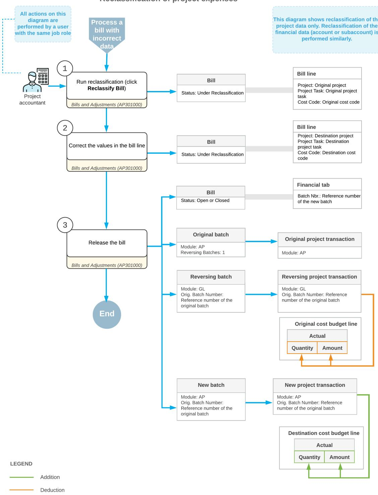

# <span id="page-376-0"></span>**Project Expense Reclassification: Implementation Checklist**

The following sections provide details you can use to ensure that the system is configured properly for reclassifying project expenses.

### **Implementation Checklist**

We recommend that before you reclassify project expenses, you make sure the needed features have been enabled, and settings have been specified, as summarized in the following checklist.

| Form                                    | Criteria to Check                                                                                                                                                                                                                                                                     |
|-----------------------------------------|---------------------------------------------------------------------------------------------------------------------------------------------------------------------------------------------------------------------------------------------------------------------------------------|
| Enable/Disable Features (CS100000) form | Make sure that the Project Accounting feature is en<br>abled.                                                                                                                                                                                                                         |
| Projects Preferences (PM101000) form    | Make sure that all necessary settings related to project<br>accounting have been specified. For more information<br>about the configuration steps that you have to per<br>form before you can start accounting for projects, see<br>Basic Project Configuration: General Information. |
| Accounts Payable Preferences (AP101000) | Make sure that the Allow Bill Reclassification check<br>box is selected. With this setting, the reclassification of<br>bills can be performed in the system.                                                                                                                          |
| User Roles (SM201005)                   | Make sure that each user that will perform bill reclassi<br>fication is assigned at least one of the following prede<br>fined roles: Financial Supervisor or Project Accountant.                                                                                                      |

#### **Other Settings That Affect the Workflow**

To cause the system to automatically post reversing batches generated by the system during the reclassification process, select the **Automatically Post on Release** check box on the **General** tab of the *[Accounts Payable](https://help-2025r1.acumatica.com/Help?ScreenId=ShowWiki&pageid=c3f9353e-95e6-448d-bb3f-e20643879ec7) [Preferences](https://help-2025r1.acumatica.com/Help?ScreenId=ShowWiki&pageid=c3f9353e-95e6-448d-bb3f-e20643879ec7)* (AP101000) form. This setting affects the workflow of expense reclassification in projects.

# <span id="page-376-1"></span>**Project Expense Reclassification: Generated Transactions**

When you reclassify project expenses, on the *[Bills and Adjustments](https://help-2025r1.acumatica.com/Help?ScreenId=ShowWiki&pageid=956b4e51-3078-4d2d-85b3-65c080d95234)* (AP301000) form, you correct information in a bill with the *Under Reclassification* status and release this bill.

To update the general ledger, accounts payable, and the project cost budget, the system generates a reversing GL transaction, a new AP transaction, and the corresponding project transactions; the generated transactions are described in the following sections.

#### **GL Transactions Generated on Release of the Reclassified Bill**

On release of a bill created on the *[Bills and Adjustments](https://help-2025r1.acumatica.com/Help?ScreenId=ShowWiki&pageid=956b4e51-3078-4d2d-85b3-65c080d95234)* (AP301000) form with the *Under Reclassification* status and at least one corrected value in a bill line, the system generates the following batches:

• A GL transaction batch of the *Normal* type that reverses the AP transaction batch that had been generated on release of the original accounts payable bill.

The following table shows the journal entries of the reversing batch.

| Source of Values  | Account          | Debit  | Credit |
|-------------------|------------------|--------|--------|
| Original AP batch | Accounts Payable | Amount | 0.00   |
| Original AP batch | Expense          | 0.00   | Amount |

The reversing batch is numbered in accordance with the numbering sequence selected in the **Batch NumberingSequence** box on the *[General Ledger Preferences](https://help-2025r1.acumatica.com/Help?ScreenId=ShowWiki&pageid=e4913d06-c511-4258-a0f9-f36c1b854e6b)* (GL102000) form.

• The AP transaction batch that posts the updated amounts to the general ledger; the journal entries of this batch are shown in the following table.

| Source of Values     | Account          | Debit  | Credit |
|----------------------|------------------|--------|--------|
| Reclassified AP bill | Accounts Payable | 0.00   | Amount |
| Reclassified AP bill | Expense          | Amount | 0.00   |

Depending on which information you have corrected in the bill line, the transaction will include updated values in the following columns on the the *Journal [Transactions](https://help-2025r1.acumatica.com/Help?ScreenId=ShowWiki&pageid=dda046bc-5946-407f-88f7-1c0c966fbe72)* form: **Account**, **Subaccount**, **Project**, **ProjectTask**, **Cost Code**.

The batch is numbered in accordance with the numbering sequence selected in the **Batch Numbering Sequence** box on the *[Accounts Payable Preferences](https://help-2025r1.acumatica.com/Help?ScreenId=ShowWiki&pageid=c3f9353e-95e6-448d-bb3f-e20643879ec7)* (AP101000) form. The batch number is specified in the reclassified bill on the **Financial** tab of the *[Bills and Adjustments](https://help-2025r1.acumatica.com/Help?ScreenId=ShowWiki&pageid=956b4e51-3078-4d2d-85b3-65c080d95234)* (AP301000) form.

#### **The Reversing Project Transaction**

On release of the reversing GL batch, the system generates a project transaction with *GL* selected in the **Module** box of the Summary area of the *Project [Transactions](https://help-2025r1.acumatica.com/Help?ScreenId=ShowWiki&pageid=382a97fe-b636-44ca-9798-6d478c05b687)* (PM304000) form; the project transaction line is shown in the following table.


If the non-project code has been changed to the identifier of a particular project in the bill line during reclassification, the system does not generate a reversing project transaction.

| Source of the Project Budget<br>Key         | Account Group                                  | Debit Account                                              | Amount    |
|---------------------------------------------|------------------------------------------------|------------------------------------------------------------|-----------|
| The line of the reversing GL<br>transaction | Account group mapped<br>to the Expense account | Expense account in the<br>original project transac<br>tion | –(Amount) |

You can review the generated project transaction on the *Project [Transaction](https://help-2025r1.acumatica.com/Help?ScreenId=ShowWiki&pageid=29bf5433-446f-4196-be69-f2cb177e83cb) Details* (PM401000) form. In the Selection area of this form, you select the project. In the table, you can find the project transaction with *GL* selected in the **Module** column, *Bill* in the **Orig. Doc.Type** column, and the reference number of the bill in the **Orig. Doc. Nbr.** column.

#### **Project Transaction with Reclassified Values**

On release of the AP transaction batch that was generated on release of the reclassified bill, the system generates a project transaction with *AP* selected in the **Module** box of the Summary area of the *Project [Transactions](https://help-2025r1.acumatica.com/Help?ScreenId=ShowWiki&pageid=382a97fe-b636-44ca-9798-6d478c05b687)* (PM304000) form; the project transaction line is shown in the following table.

If a particular project identifier has been changed to the non-project code in the bill line during reclassification, the system does not generate a new project transaction.

| Source of the Project Budget<br>Key | Account Group                                  | Debit Account                                      | Amount |
|-------------------------------------|------------------------------------------------|----------------------------------------------------|--------|
| The line of the new AP batch        | Account group mapped<br>to the Expense account | Expense account in the<br>line of the new AP batch | Amount |

Depending on which information you have corrected in the bill line, the project transaction will include updated values in the following columns on the **Details** tab of the *Project [Transactions](https://help-2025r1.acumatica.com/Help?ScreenId=ShowWiki&pageid=382a97fe-b636-44ca-9798-6d478c05b687)* form: **Account**, **Subaccount**, **Project**, **ProjectTask**, **Cost Code**.

You can review the generated project transaction on the *Project [Transaction](https://help-2025r1.acumatica.com/Help?ScreenId=ShowWiki&pageid=29bf5433-446f-4196-be69-f2cb177e83cb) Details* (PM401000) form. In the Selection area of this form, you select the project. In the table, you can find the project transaction with *AP* selected in the **Module** column, *Bill* in the **Orig. Doc.Type** column, and the reference number of the bill in the **Orig. Doc. Nbr.** column.

# <span id="page-378-0"></span>**Project Expense Reclassification: Limitations**

This topic describes criteria that may preclude the reclassification of an accounts payable bill and lists other possible limitations related to the bill reclassification process.

The ability to perform bill reclassification is granted to only users with the *Financial Supervisor* or *Project Accountant* role assigned to them on the *[User Roles](https://help-2025r1.acumatica.com/Help?ScreenId=ShowWiki&pageid=c2879f3c-3739-430a-b02b-c225f5480966)* (SM201005) form.

#### **Accounts Payable Bills**

A bill (whether or not it is related to a project) on the *[Bills and Adjustments](https://help-2025r1.acumatica.com/Help?ScreenId=ShowWiki&pageid=956b4e51-3078-4d2d-85b3-65c080d95234)* (AP301000) form cannot be reclassified if any of the following criteria are met:

- The bill has applied retainage; the retainage has been released.
- It is a retainage bill.
- The bill has multiple-installment credit terms.
- For the bill, a consolidated GL transaction has been generated and either the **Generate Consolidated Batches** check box was selected on the *[General Ledger Preferences](https://help-2025r1.acumatica.com/Help?ScreenId=ShowWiki&pageid=e4913d06-c511-4258-a0f9-f36c1b854e6b)* (GL102000) form or the **PostSummary on Updating GL** check box was selected on the *[Accounts Payable Preferences](https://help-2025r1.acumatica.com/Help?ScreenId=ShowWiki&pageid=c3f9353e-95e6-448d-bb3f-e20643879ec7)* (AP101000) form.
- The GL transaction corresponding to the bill has been reclassified on the *Journal [Transactions](https://help-2025r1.acumatica.com/Help?ScreenId=ShowWiki&pageid=dda046bc-5946-407f-88f7-1c0c966fbe72)* (GL301000) form.
- The bill has been created in migration mode.
- The bill is linked to an expense claim (that is, on the **Financial** tab, the **Original Document** box contains a link to the expense claim).

• The bill is linked to a service order or appointment.

A project-related bill cannot be reclassified if any of the following criteria are met:

- The project transaction corresponding to the bill has been reallocated (that is, the **Allocated** check box is selected in the project transaction line on the *Project [Transactions](https://help-2025r1.acumatica.com/Help?ScreenId=ShowWiki&pageid=382a97fe-b636-44ca-9798-6d478c05b687)* (PM301000) form).
- The project transaction corresponding to the bill has been billed (that is, the **Billed** check box is selected in the project transaction line on the *Project [Transaction](https://help-2025r1.acumatica.com/Help?ScreenId=ShowWiki&pageid=29bf5433-446f-4196-be69-f2cb177e83cb) Details* (PM401000) form).

#### **Individual Bill Lines**

An individual bill line on the **Details** tab of the *[Bills and Adjustments](https://help-2025r1.acumatica.com/Help?ScreenId=ShowWiki&pageid=956b4e51-3078-4d2d-85b3-65c080d95234)* (AP301000) form cannot be reclassified if any of the following is true:

- The **Deferral Code** column contains the deferral code.
- The **PO Line** column contains the reference number of a purchase order line with a line type other than *Service*.
- The **PO Number** column contains the reference number of a purchase order that is linked to a receipt.

#### **Bill Lines Linked to Commitments**

If a bill line is linked to a commitment, the only columns available for editing in this line are **PO Line** and **Subcontract Line**. The following limitations apply to the reclassification of this line:

- The bill line can be linked to another commitment line only if the inventory ID of the selected commitment line matches the value in the previously specified bill line (or is empty, as is the case in the previously specified line).
- The inventory item selected in the bill line cannot be changed during the reclassification.
- The empty **Inventory ID** column in the bill line cannot be filled in with a particular inventory ID during the reclassification.

#### **Update of Taxes in Taxable Bills**

If the **Calculate Project-SpecificTaxes** check box is selected on the *[Projects Preferences](https://help-2025r1.acumatica.com/Help?ScreenId=ShowWiki&pageid=de2ca225-4a0c-4129-b09d-3f3ed05198f9)* (PM101000) form, the system does not automatically update the project-specific tax zone in a reclassified bill. If the tax zone and applicable taxes of a project-related bill require adjusting, you should reverse the bill instead of reclassifying it and create a new bill for another project instead.

If your system is integrated with the AvaTax service of Avalara or other specialized third-party soware, the AP reclassification process does not send updated information about the general ledger accounts to the external tax provider. For an overview of integration with external tax providers, see *Setup of Online [Integration](https://help-2025r1.acumatica.com/Help?ScreenId=ShowWiki&pageid=8a0eea54-8340-458b-973d-28a29f09b24a) with Avalara [AvaTax](https://help-2025r1.acumatica.com/Help?ScreenId=ShowWiki&pageid=8a0eea54-8340-458b-973d-28a29f09b24a)*.

### <span id="page-379-0"></span>**Project Expense Reclassification: Related Reports**

In the following sections, you can find details about the reports, inquiry forms, and dialog boxes you may want to review to gather information about the reclassification of expenses related to a project.

If you do not see a particular report or form that is described, you may have signed in to the system with a user account that does not have access rights to the report or form. Contact your system administrator to obtain access to any needed reports or forms.

#### **Reviewing Reclassified Bills**

To view the list of bills that are pending reclassification or have been reclassified, you can use the *[Reclassified Bills](https://help-2025r1.acumatica.com/Help?ScreenId=ShowWiki&pageid=e170989b-60c5-4e8c-944a-82d3a00ab653)* (AP657000) report. The report shows the list of bills, along with the list of GL batches that correspond to these bills. On the report form, you can select a particular financial period (or a range of periods) and a particular project to review the information about each reclassification that has been performed for the project during this time range.

#### **Finding Reversing Batches for an Original Batch**

To view the list of reversing batches related to an original batch, you can use the *[GL Reversing Batches](https://help-2025r1.acumatica.com/Help?ScreenId=ShowWiki&pageid=51d10e22-1317-4d0b-b6b6-abb94753916b)* (GL690010) report. On the report form, you run the report for the original batch, and you can then view the list of reversing batches and their details.

You can also open this report by clicking the link in the **Reversing Batches** box of the *Journal [Transactions](https://help-2025r1.acumatica.com/Help?ScreenId=ShowWiki&pageid=dda046bc-5946-407f-88f7-1c0c966fbe72)* (GL301000) form for the original batch. The system opens the *[GL Reversing Batches](https://help-2025r1.acumatica.com/Help?ScreenId=ShowWiki&pageid=51d10e22-1317-4d0b-b6b6-abb94753916b)* (GL690010) report with the list of reversing batches and their details.

# <span id="page-381-0"></span>**Reclassifying Project-Related GL Transactions**

If the batch was posted to the wrong GL account, subaccount, branch, project, project task, or cost code, you can correct it by reclassifying the batch.

In this chapter, you will find general information on how to reclassify transactions, a checklist for system implementation, an activity that describes how to reclassify transactions in the system, and report and inquiries that can be useful to find and view related transactions.

# <span id="page-381-1"></span>**Transaction Reclassification: General Information**

If a batch of project-related GL transactions was posted with any incorrect information, you can reclassify this batch to move the amount to the correct line of the project budget, or correct other financial data.

#### **Learning Objectives**

You will learn how to perform the reclassification of GL transactions related to a project.

#### **Applicable Scenarios**

You reclassify a project-related transaction in the following cases:

- A transaction has been posted to the wrong account, subaccount, or branch.
- A transaction has been posted to the wrong project, project task, or cost code.
- A project-related transaction has been posted with the non-project code.
- A part of transaction amount posted to a project should be moved to another project.

#### **Reclassification of Project-Related GL Transactions**

You initiate the reclassification process on the *Reclassify [Transactions](https://help-2025r1.acumatica.com/Help?ScreenId=ShowWiki&pageid=48075ac9-54ee-4082-acde-9e93ea7c3edb)* (GL506000) form. You open this form in one of the following ways:

- Open the document for which the transaction has been generated on the *[Invoices and Memos](https://help-2025r1.acumatica.com/Help?ScreenId=ShowWiki&pageid=5e6f3b27-b7af-412f-a40a-1d4f4be70cba)* (AR301000) or *[Bills and Adjustments](https://help-2025r1.acumatica.com/Help?ScreenId=ShowWiki&pageid=956b4e51-3078-4d2d-85b3-65c080d95234)* (AP301000) form, and on the More menu, click **Reclassify GL Batch**
- Open the transaction on the *Journal [Transactions](https://help-2025r1.acumatica.com/Help?ScreenId=ShowWiki&pageid=dda046bc-5946-407f-88f7-1c0c966fbe72)* (GL301000) form and on the More menu, click **Reclassify**.

The *Reclassify [Transactions](https://help-2025r1.acumatica.com/Help?ScreenId=ShowWiki&pageid=48075ac9-54ee-4082-acde-9e93ea7c3edb)* form opens, displaying the transactions included in the selected GL batch. On this form, for each journal entry that you need to reclassify, you need to modify the transaction details. You can change the required settings in each needed row manually, or perform mass changing of settings in multiple rows. In each needed row, you modify any of the following values:

- The branch (**To Branch** column). The transaction amount will be moved to the branch specified in this column from the originally specified branch (**Branch** column.
- The account (**To Account** column). The transaction amount will be moved to the account specified in this column from the originally specified GL account (**Account** column).


The new account that you specify must have the same default currency as the default currency of the batch.

• The subaccount (**ToSubaccount** column). The transaction amount will be moved to the subaccount specified in this column from the originally specified subaccount (**Subaccount**column).

- The project (**To Project** column). The transaction amount will be moved to the project or non-project code specified in this column from the originally specified project or non-project code (**Project** column).
- The project task (**To ProjectTask** column). The transaction amount will be moved to the project task specified in this column from the originally specified project task (**ProjectTask** column).

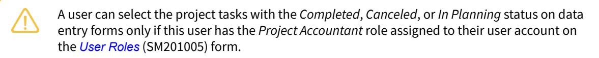

• The cost code (**To Cost Code** column). The transaction amount will be moved to the cost code specified in this column from the originally specified cost code (**Cost Code** column).

Once you have changed any of the default values, the system selects the unlabeled check box in the row, indicating that the entry will be reclassified. In addition, in the transaction being reclassified, you can correct the transaction date (**New Tran. Date** column) and provide an updated transaction description (**New Transaction Description** column).


The new transaction date must be within the financial period of the original transaction.

Aer you have made all needed changes to the transaction details, you click **Process** on the form toolbar of the *Reclassify [Transactions](https://help-2025r1.acumatica.com/Help?ScreenId=ShowWiki&pageid=48075ac9-54ee-4082-acde-9e93ea7c3edb)* form. The system generates a new GL transaction of the *Reclassification* type that offsets the original transaction and posts the transaction amounts. Also, on release of the reclassification batch, the system generates a project transaction that updates the actual values in the project budget of the project for which the reclassification has been performed.

#### **Workflow of Reclassification Transactions**

The following diagram shows the general process of reclassifying project-related transactions.

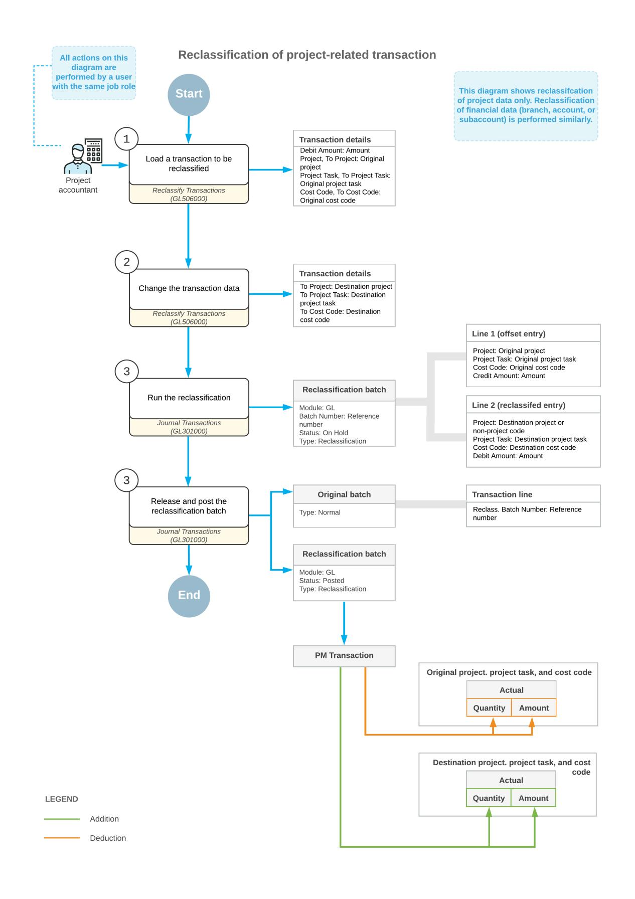

# <span id="page-384-0"></span>**Transaction Reclassification: Implementation Checklist**

Before users begin reclassifying GL batches related to projects, you must make sure that the system has been configured properly, as described in the following table.

| Form                                    | Criteria to Check                                                                                                                                                                                                                                                                     |
|-----------------------------------------|---------------------------------------------------------------------------------------------------------------------------------------------------------------------------------------------------------------------------------------------------------------------------------------|
| Enable/Disable Features (CS100000) form | Make sure the Standard Financials and Project Account<br>ing features have been enabled.                                                                                                                                                                                              |
| Projects Preferences (PM101000) form    | Make sure that all necessary settings related to project<br>accounting have been specified. For more information<br>about the configuration steps that you have to per<br>form before you can start accounting for projects, see<br>Basic Project Configuration: General Information. |
| User Roles (SM201005)                   | Make sure that each user that will perform reclassifica<br>tion of general ledger transactions related to projects<br>is assigned the Project Accountant role.                                                                                                                        |

#### **Settings That Can Affect the Processing Workflow**

The settings on the *[General Ledger Preferences](https://help-2025r1.acumatica.com/Help?ScreenId=ShowWiki&pageid=e4913d06-c511-4258-a0f9-f36c1b854e6b)* (GL102000) form can affect the processing workflow as follows:

- If the **Hold Batches on Entry** check box is selected, a batch is saved with the *On Hold* status by default. If the batch is on hold, you should click **Remove Hold** on the toolbar of the *Journal [Transactions](https://help-2025r1.acumatica.com/Help?ScreenId=ShowWiki&pageid=dda046bc-5946-407f-88f7-1c0c966fbe72)* (GL301000) form for the batch so that you can process it further. If the check box is cleared, the batch is saved with the *Balanced* status.
- If the **Validate Batch ControlTotals on Entry** check box is selected, you have to enter the batch control total before you save the batch on the *Journal [Transactions](https://help-2025r1.acumatica.com/Help?ScreenId=ShowWiki&pageid=dda046bc-5946-407f-88f7-1c0c966fbe72)* form. If this check box is cleared and the status of the batch is *Balanced*, the system automatically validates the batch.
- If the **Automatically Post on Release** check box is selected, the system posts batches on release. If this check box is cleared, you have to post the batches aer release.

# <span id="page-384-1"></span>**Transaction Reclassification: Generated Transactions**

When a reclassification batch is released, the system moves the incorrectly posted amount to the correct branch, account, subaccount, project, project task, or cost code.

#### **Reclassification Batch**

The following table shows the journal entries of the GL transaction of the *Reclassification* type.

| Corrected columns | Debit amount | Credit amount |
|-------------------|--------------|---------------|
| Original value    | 0.00         | –(Amount)     |
| Destination value | Amount       | 0.00          |

You can find and view transactions of the *Reclassification* type on the *Journal [Transactions](https://help-2025r1.acumatica.com/Help?ScreenId=ShowWiki&pageid=dda046bc-5946-407f-88f7-1c0c966fbe72)* (GL301000) form. On this form, in the **Orig. Batch Nbr.** column of the table, the reclassified journal entries contain links to the original general ledger transactions (that is, to the batches generated for the transactions).

#### **Project Transaction Generated on Reclassification Batch Release**

On release of a batch created on release of the reclassification GL batch, the system generates a project transaction with the following information.

| Project transaction columns | Source of value              |
|-----------------------------|------------------------------|
| Project                     | GL batch line                |
| Project task                | GL batch line                |
| Cost code                   | GL batch line                |
| Branch                      | GL batch line                |
| Account                     | GL batch line                |
| Subaccount                  | GL batch line                |
| Account group               | Account in the GL batch line |
| Date                        | GL batch line                |
| Fin. period                 | GL batch line                |

You can review the created project transaction on the *Project [Transaction](https://help-2025r1.acumatica.com/Help?ScreenId=ShowWiki&pageid=29bf5433-446f-4196-be69-f2cb177e83cb) Details* (PM401000) form.

# <span id="page-385-0"></span>**Transaction Reclassification: Related Report and Inquiry Forms**

In this topic, you can find the list of reports and inquiries that help you to collect information about project-related GL transactions that have been reclassified.

If you do not see a particular report or form that is described, you may have signed in to the system with a user account that does not have access rights to the report or form. Contact your system administrator to obtain access to any needed reports or forms.

#### **Viewing the Reclassification History of a Transaction**

You can view the reclassification history for a transaction on the *[Reclassification History](https://help-2025r1.acumatica.com/Help?ScreenId=ShowWiki&pageid=48500f0b-8d5e-4125-bad6-4e5b0c672994)* (GL405000) form.

You can open this form by clicking the **Reclassification History** button in either of the following places:

- On the form toolbar of the *[Account Details](https://help-2025r1.acumatica.com/Help?ScreenId=ShowWiki&pageid=517044d6-d4e9-406b-a40e-6139b9b53bd9)* (GL404000) form for the transaction you have selected (if it has been reclassified)
- On the table toolbar of the *Journal [Transactions](https://help-2025r1.acumatica.com/Help?ScreenId=ShowWiki&pageid=dda046bc-5946-407f-88f7-1c0c966fbe72)* (GL301000) form for the transaction you have selected in the GL batch, if it has the *Reclassification* type

You can reclassify only the last transaction in the list of transactions on the *[Reclassification History](https://help-2025r1.acumatica.com/Help?ScreenId=ShowWiki&pageid=48500f0b-8d5e-4125-bad6-4e5b0c672994)* form by clicking **Reclassify** on the form toolbar.

#### **Finding Reclassification Transactions for a Particular Account**

On the *[Account Details](https://help-2025r1.acumatica.com/Help?ScreenId=ShowWiki&pageid=517044d6-d4e9-406b-a40e-6139b9b53bd9)* (GL404000) form, to include in the list of entries the journal entries that have been reclassified for a selected GL account within the specified period, select the **Include Reclassified** check box in the Summary area. In the **Reclass. Batch Number** column, each of the reclassified entries has a link to the appropriate *Reclassification* transaction.

You can also view a list of transactions that include the reclassified journal entries by preparing the *[Transactions](https://help-2025r1.acumatica.com/Help?ScreenId=ShowWiki&pageid=a1164a4e-6b2b-4a82-8490-abde5d381be7) for [Account](https://help-2025r1.acumatica.com/Help?ScreenId=ShowWiki&pageid=a1164a4e-6b2b-4a82-8490-abde5d381be7)* (GL633500) or *[Transactions](https://help-2025r1.acumatica.com/Help?ScreenId=ShowWiki&pageid=deb95b00-b48f-4d53-8551-dd72d367d2fc) for Period* (GL633000) report with the **Include Reclassified Transactions** check box selected.

# <span id="page-386-0"></span>**Transaction Reclassification: Mass-Processing**

This topic explains how to perform mass-processing operations related to transaction reclassification, and how the system generates, changes, or works with documents as a result of the mass processing.

If you need to modify the same details in multiple transactions, you can perform the reclassification of multiple transactions simultaneously. To reclassify multiple transactions at a time, you prepare the list of transactions to be reclassified by doing either of the following:

- In the Summary area on the *[Account Details](https://help-2025r1.acumatica.com/Help?ScreenId=ShowWiki&pageid=517044d6-d4e9-406b-a40e-6139b9b53bd9)* (GL404000) form, you select the GL account to which the transactions have been posted. In the list of transactions, you select the unlabeled check box for the transactions that you need to reclassify, and click **Reclassify** on the form toolbar. The system opens the *Reclassify [Transactions](https://help-2025r1.acumatica.com/Help?ScreenId=ShowWiki&pageid=48075ac9-54ee-4082-acde-9e93ea7c3edb)* (GL506000) form with the list of transactions.
- You open the *Reclassify [Transactions](https://help-2025r1.acumatica.com/Help?ScreenId=ShowWiki&pageid=48075ac9-54ee-4082-acde-9e93ea7c3edb)* form and click **Load** on the form toolbar. In the **Load Transactions** dialog box, which opens, you specify the settings of the transactions to be uploaded, and click **Load**.

To perform mass-changing of settings in multiple transactions, on the form toolbar of the *Reclassify [Transactions](https://help-2025r1.acumatica.com/Help?ScreenId=ShowWiki&pageid=48075ac9-54ee-4082-acde-9e93ea7c3edb)* form, click **Replace**. In the **Find and Replace** dialog box, which opens, specify the original and replacement transaction settings. Then click **Replace** to close the dialog box and replace the settings in the needed rows. Aer you have modified all needed data, you make sure that the unlabeled check boxes are selected for all the rows in the table, and click **Process** on the form toolbar to run the reclassification process.

# <span id="page-386-1"></span>**Transaction Reclassification: Limitations**

This topic describes criteria that may preclude the reclassification of a general ledger transaction and lists other possible limitations related to the transaction reclassification process.

### **Transactions that Cannot be Reclassified**

The following general ledger transactions cannot be reclassified:

- Project-related transactions that have been billed.
- Project-related transactions that have been allocated.
- Project-related transactions linked to project commitments.
- Project-related transactions that are related to a project that is not active.
- Journal entries of transactions in which a control account is specified, such as entries posted on release of accounts receivable and accounts payable documents to AR and AP accounts, respectively, and to Tax Payable and Tax Claimable accounts. (A control account is a general ledger account that accumulates the summary information of a subledger, such as AR or AP. The details of the control account balance are contained in the subledger, so the balance of the control account should match the total of the related subledger.)


You can reclassify GL entries posted on release of AR and AP documents to income and expense accounts.

- Transactions generated in the general ledger when consolidation data has been imported on the *[Import](https://help-2025r1.acumatica.com/Help?ScreenId=ShowWiki&pageid=c54201e4-84a0-4423-9686-a9c2523a17f6) [Consolidation Data](https://help-2025r1.acumatica.com/Help?ScreenId=ShowWiki&pageid=c54201e4-84a0-4423-9686-a9c2523a17f6)* (GL509000) form. For details, see *[GL Consolidation: General Information](https://help-2025r1.acumatica.com/Help?ScreenId=ShowWiki&pageid=97089c09-c4d1-46d0-bfe6-2b74b5b72469)*.
- Transactions generated by a user invoking the run allocation process on the *[Run Allocations](https://help-2025r1.acumatica.com/Help?ScreenId=ShowWiki&pageid=ef22612c-7cfe-4b73-aeb1-23decc28e6f6)* (GL504500) form. For details, see *[Allocation Rules](https://help-2025r1.acumatica.com/Help?ScreenId=ShowWiki&pageid=feee42b7-afec-4bbd-9091-1f8f6b7c8849)* and *[Running Allocations](https://help-2025r1.acumatica.com/Help?ScreenId=ShowWiki&pageid=7ea78313-6878-421f-bac0-8f39837cdb82)*.
- All currency-related GL transactions, such as transactions generated based on the currency translation and revaluation processes.
- Transactions that have already been reclassified.

# <span id="page-388-0"></span>**Accounting for WIP Labor Costs in Cost-Plus Projects**

If you have long-term cost-plus projects with expenses posted to several financial periods and in accordance with GAAP you want to record these expenses to the same financial period as the income generated by the invoice, you can to move the expenses to the needed period by allocating the projects.

# <span id="page-388-2"></span><span id="page-388-1"></span>**WIP Labor Costs in Cost-Plus Projects: General Information**

According to the matching principle of generally accepted accounting principles (GAAP), the expenses related to the revenue have to be recorded to the same financial period as the revenue is. Expenses may happen in multiple financial periods before an invoice is created for the customer for those costs and the generated revenue can be recognized.

To set up the accounting for work-in-progress (WIP) costs for a project so that it corresponds to the matching principle of GAAP, you can temporarily allocate the project costs to a WIP account group. You then reverse the allocation back to the initial labor account group in the financial period in which an accounts receivable invoice is generated for the project and the revenue is recognized.

#### **Learning Objectives**

In this chapter, you will learn how to do the following:

- Configure an allocation rule to move project costs to a WIP account group
- Configure a cost-plus project for allocating costs to the WIP account group
- Temporarily allocate costs of the project to the WIP account group

#### **Applicable Scenarios**

If you have a long-term cost-plus project with expenses that have been posted to multiple financial periods but the project has not been billed yet, you may need to move the expenses to the same financial period as the income generated by the project invoice.

#### **Creating the Allocation Rule**

To temporarily allocate the costs of a cost-plus project to a WIP account, you create an allocation rule on the *[Allocation Rules](https://help-2025r1.acumatica.com/Help?ScreenId=ShowWiki&pageid=0d2e40ad-7ecf-4937-b2bd-dab1d800e0db)* (PM207500) form. By using this allocation rule, the system creates allocation transactions based on the project transactions posted to a particular account group or specific groups, which moves costs from the original accounts to a WIP account.

For this allocation rule, you specify the following settings on the **Calculation Rules** tab:

• **Allocation Method**: *Allocate Transactions*

With this setting, the system calculates the amount to allocate by using the underlying transactions and their amounts.

• **Create Allocation Transaction**: Selected

With this check box selected, the system creates the allocation transactions resulting from the step.

- **SelectTransactions** (**Selection Criteria** section): *Non-Allocated Transactions*
  - The step is applied to project transactions that have not been allocated yet.
- **Branch** (**Selection Criteria** section): The branch to be used as the filtering criteria for project transactions to be allocated.

- **Account Group From** (**Selection Criteria** section): The account group that starts the range of account groups whose transactions are involved in the allocation step.
- **Account Group To** (**Selection Criteria** section): The account group that ends the range of account groups whose transactions are involved in this allocation step.

If you want to allocate the transactions posted to a single account group, specify this account group in the **Account Group From** box, and leave the **Account Group To** box empty.

• **If @Rate Is Not Defined** (**Calculation Settings** section): *Set @Rate to 0*

You do not need to adjust the quantity and amount of the allocation transaction, so you will not use rates in the formulas of the allocation rule.

- **Quantity Formula** (**Calculation Settings** section): =[PMTran.Qty]
- **Billable Qty. Formula** (**Calculation Settings** section): =[PMTran.BillableQty]
- **Amount Formula** (**Calculation Settings** section): =[PMTran.Amount]

As the quantity, billable quantity, and amount of the allocation transaction, the system uses the corresponding values of the original transaction. You do not modify the quantity and amount of the original transactions and just move them to a temporary WIP account as is.

• **Description Formula** (**Calculation Settings** section): The description of the created allocation transaction.

You specify the following settings for the allocation rule on the **Allocation Settings** tab:

• **PostTransaction to GL** (**Transaction Options** section): Selected

With this check box selected, allocation transactions and reversing allocation transactions are posted to the general ledger.

• **Reverse Allocation** (**Transaction Reversal** section): *On AR Invoice Generation* or *On AR Invoice Release*

With this setting, the allocation transaction is reversed automatically when an AR invoice is generated based on the allocation transactions or when this AR invoice is released, respectively.

• **Account Origin** (**DebitTransaction** section): *Replace* with a WIP account

With this setting, the system generates an allocation transaction that debits the specified WIP account. The account must be mapped to a dedicated WIP account group that reflects the allocated amount and that you will later use in the billing rule.

• **Account Origin** (**CreditTransaction** section): *Debit Source*

With this setting, the system generates an allocation transaction that credits the debit account of the source transaction.

#### **Configuring Cost-Plus Projects for Allocation**

On the *[Projects](https://help-2025r1.acumatica.com/Help?ScreenId=ShowWiki&pageid=81c86417-3bde-444b-8f1c-682928d31a0c)* (PM301000) form, for a cost-plus project to be allocated, you assign the created allocation rule to the project tasks on the**Tasks** tab.

To be able to use the created allocation transactions in project billing, you need to modify the existing billing rule that is used for the project or create a new one on the *[Billing Rules](https://help-2025r1.acumatica.com/Help?ScreenId=ShowWiki&pageid=6773c79b-216e-4725-b28c-3ce724d9a7c9)* (PM207000) form. For that billing rule, you create a *Time and Material* step that processes allocated transactions posted to the WIP account group. Except for the account group, the settings of this step are the same as the settings of the billing rule step that is used to process the original transactions, which are the source of the allocation transactions. On the**Tasks** tab of the *[Projects](https://help-2025r1.acumatica.com/Help?ScreenId=ShowWiki&pageid=81c86417-3bde-444b-8f1c-682928d31a0c)* form, the modified or created billing rule must be assigned to project tasks.

#### **Allocating and Billing Projects**

You run the allocation process for a project by clicking **Run Allocation** on the More menu of the *[Projects](https://help-2025r1.acumatica.com/Help?ScreenId=ShowWiki&pageid=81c86417-3bde-444b-8f1c-682928d31a0c)* (PM301000) form while reviewing the project. As a result, the system creates allocation transactions based on the project transactions selected by using the allocation rules specified for project tasks on the**Tasks** tab. To make it possible to identify a batch of created allocation transactions, the system assigns the *Allocation for <Project ID>*

description to such a batch. For the project transactions that have been used as a source of the allocation, the system selects the **Allocated** check box on the *Project [Transaction](https://help-2025r1.acumatica.com/Help?ScreenId=ShowWiki&pageid=29bf5433-446f-4196-be69-f2cb177e83cb) Details* (PM401000) form.

When you bill a cost-plus project, the system automatically reverses the allocation transactions on creation or release of the accounts receivable document, depending on the settings of the corresponding allocation rule. Reversing allocation transactions copy original allocation transactions and reverse the sign of the amount. Allocation transactions are always reversed in the full amount. The reversing clears the WIP account group and moves the allocated costs back to the original accounts in the financial period the AR document created in.

# <span id="page-390-0"></span>**WIP Labor Costs in Cost-Plus Projects: Implementation Checklist**

The following sections provide details you can use to ensure that the system is configured properly for billing a cost-plus projects with WIP costs, and to understand (and change, if needed) the settings that affect the processing workflow.

#### **Implementation Checklist**

We recommend that before you initially bill a cost-plus projects with WIP costs, you make sure the needed features have been enabled, settings have been specified, and entities have been created, as summarized in the following checklist.

| Form                                    | Tasks to Perform                                                                                                                                                                                                                                                                 |
|-----------------------------------------|----------------------------------------------------------------------------------------------------------------------------------------------------------------------------------------------------------------------------------------------------------------------------------|
| Enable/Disable Features (CS100000) form | Make sure that the Project Accounting feature is en<br>abled.                                                                                                                                                                                                                    |
| Projects Preferences (PM101000) form    | Make sure that all necessary settings related to project<br>accounting have been specified. For more information<br>about configuration steps that you have to perform<br>before you can start accounting for projects, see Basic<br>Project Configuration: General Information. |
| Chart of Accounts (GL202500) form       | Make sure that an asset account for work in progress<br>has been created. For details on configuring the chart<br>of accounts, see Chart of Accounts.                                                                                                                            |
| Account Groups (PM201000) form          | Make sure that an account group of the Asset type<br>for work in progress has been created and the WIP<br>account has been added to the account group. For<br>details on configuring account groups, see Account<br>Groups: General Information.                                 |
| Allocation Rules (PM207500) form        | Make sure that an allocation rule is configured as de<br>scribed in WIP Labor Costs in Cost-Plus Projects: Gen<br>eral Information.                                                                                                                                              |
| Billing Rules (PM207000) form           | Make sure that all the needed billing rules have been<br>configured to process allocation transactions posted<br>to the WIP account group. For details on configuring<br>billing rules, see Billing Rules: General Information.                                                  |

| Form                | Tasks to Perform                                                                                                           |
|---------------------|----------------------------------------------------------------------------------------------------------------------------|
| Projects (PM301000) | Make sure that the project has been created, as de<br>scribed in Project Creation and Processing: General In<br>formation. |

#### **Other Settings That Affect the Workflow**

To cause the system to automatically release allocation transactions, including allocation reversal transactions, select the **Automatically Release Allocations** check box on the **General** tab (**GeneralSettings** section) of the *[Projects Preferences](https://help-2025r1.acumatica.com/Help?ScreenId=ShowWiki&pageid=de2ca225-4a0c-4129-b09d-3f3ed05198f9)* (PM101000) form.

#### **Validation of Configuration**

To make sure that all configuration has been performed correctly, we recommend that in your system, you allocate projects by performing instructions similar to those described in *[WIP Labor Costs in Cost-Plus Projects: Process](#page-393-1) [Activity](#page-393-1)*.

# <span id="page-391-1"></span><span id="page-391-0"></span>**WIP Labor Costs in Cost-Plus Projects: Implementation Activity**

The following implementation activity will walk you through the process of configuring an allocation rule for workin-progress labor.

This activity is based on the *U100* dataset. If you are using another dataset, or if any system settings have been changed in *U100*, these changes can affect the workflow of the activity and the results of the processing. To avoid any issues, restore the *U100* dataset to its initial state.

#### **Story**

Suppose that the SweetLife Fruits & Jams company needs to process projects in accordance with the GAAP matching principle—that is, the expenses related to the revenue have to be recorded to the same financial period as the revenue is, even if the expenses have been already posted to the system. Acting as an administrative user of SweetLife, you will configure an allocation rule that can temporarily allocate the project labor costs to a work-inprogress account group and then reverse the costs back to the initial labor account group in the financial period in which the revenue is recognized—that is, an AR invoice is released.

#### **Configuration Overview**

In the *U100* dataset, the following tasks have been performed to support this activity:

- On the *[Enable/Disable Features](https://help-2025r1.acumatica.com/Help?ScreenId=ShowWiki&pageid=c1555e43-1bc5-4f6f-ba9d-b323f94d8a6b)* (CS100000) form, the *Project Accounting* feature has been enabled to support the project accounting functionality.
- On the *[Account Groups](https://help-2025r1.acumatica.com/Help?ScreenId=ShowWiki&pageid=94a2cdce-c36a-49a1-b572-9cd33cb5fa73)* (PM201000) form, the *WIP* account group has been created; the *12400 - Work in Progress* account has been mapped to the account group.

#### **Process Overview**

You will configure an allocation rule for work-in-progress labor on the *[Allocation Rules](https://help-2025r1.acumatica.com/Help?ScreenId=ShowWiki&pageid=0d2e40ad-7ecf-4937-b2bd-dab1d800e0db)* (PM207500) form.

#### **System Preparation**

To prepare to perform the instructions of the activity, launch the Acumatica ERP website, and sign in to a company with the *U100* dataset preloaded; you should sign in as system administrator by using the *gibbs* username and the *123* password.

#### **Step: Configuring an Allocation Rule**

To configure an allocation rule used for allocating work-in-progress labor costs, perform the following instructions:

- 1. On the *[Allocation Rules](https://help-2025r1.acumatica.com/Help?ScreenId=ShowWiki&pageid=0d2e40ad-7ecf-4937-b2bd-dab1d800e0db)* (PM207500) form, add a new record.
- 2. In the Summary area, specify the following settings:
  - **Allocation Rule**: WIPCP
  - **Description**: WIP allocation
- 3. In the **Allocation Steps** table, add a row for the allocation rule step with the following settings:
  - **Step ID**: 10
  - **Description**: Labor
- 4. In the right pane, on the **Calculation Rules** tab, specify the following settings for the step selected in the le pane:
  - **Allocation Method**: *Allocate Transactions*
  - **Create Allocation Transaction**: Selected
  - **SelectTransactions** (**Selection Criteria** section): *Non-Allocated Transactions*
  - **Account Group From** (**Selection Criteria** section): *LABOR*
  - **Account Group To** (**Selection Criteria** section): Empty

Based on this setting and the previous setting, with this step, the allocation rule processes only transactions of the *LABOR* account group.

- **If @Rate Is Not Defined** (**Calculation Settings** section): *Set @Rate to 0*
- **Quantity Formula** (**Calculation Settings** section): =[PMTran.Qty]
- **Billable Qty. Formula** (**Calculation Settings** section): =[PMTran.BillableQty]
- **Amount Formula** (**Calculation Settings** section): =[PMTran.Amount]
- **Description Formula** (**Calculation Settings** section): ='WIP allocation transaction'
- 5. In the right pane, on the **Allocation Settings** tab, specify the following settings for the step selected in the le pane:
  - **PostTransaction to GL** (**Transaction Options** section): Selected
  - **Reverse Allocation** (**Transaction Reversal** section): *On AR Invoice Release*

With this setting, the allocation transaction is reversed automatically when an AR invoice generated based on this allocation transaction is released.

- **Account Origin** (**DebitTransaction** section): *Replace* with *12400 (Work in Progress)*
  - With this setting, the system generates an allocation transaction that debits the specified account—that is, the *12400 (Work in Progress)* account, which is mapped to the *WIP* account group.
- **Account Origin** (**CreditTransaction** section): *Debit Source*
- 6. Save the created allocation rule.

You have configured the allocation rule that can be used for allocating work-in-progress labor expenses of a costplus project. To allocate the expenses of a project by using this rule, you need to assign the rule to the project tasks.

To review how a project's expenses are allocated when an allocation rule is used, complete *[WIP Labor Costs in](#page-393-1) [Cost-Plus Projects: Process Activity](#page-393-1)*.

# <span id="page-393-1"></span><span id="page-393-0"></span>**WIP Labor Costs in Cost-Plus Projects: Process Activity**

In this activity, you will learn how to temporarily allocate project expenses to a work-in-progress account group and then use the allocation transactions for billing.

This activity is based on the *U100* dataset. If you are using another dataset, or if any system settings have been changed in *U100*, these changes can affect the workflow of the activity and the results of the processing. To avoid any issues, restore the *U100* dataset to its initial state.

#### **Story**

Suppose that in January, the West BBQ Restaurant customer ordered training for new employees on the operation of juicers from the SweetLife Fruits & Jams company. The customer did not know the exact number of employees or the number of training sessions that would be needed. The SweetLife company agreed with the customer to provide as many training sessions as the customer needed in January and February. Further, both parties agreed that on *2/25/2025*, the customer would pay for all the hours of training sessions that took place.

The project manager of SweetLife created a project for this work. Then suppose that on *1/21/2025*, a consultant of SweetLife provided eight hours of training and logged the time spent by creating and releasing a time card in Acumatica ERP. In February, no additional training sessions were needed.

Acting as SweetLife's project accountant, you need to bill the customer, and you want the project expense incurred in January to be recorded in the same financial period as the project revenue—that is, in February. You will allocate the project expenses and bill the project.

#### **Configuration Overview**

In the *U100* dataset, the following tasks have been performed to support this activity:

- On the *[Enable/Disable Features](https://help-2025r1.acumatica.com/Help?ScreenId=ShowWiki&pageid=c1555e43-1bc5-4f6f-ba9d-b323f94d8a6b)* (CS100000) form, the *Project Accounting* feature has been enabled to support the project accounting functionality.
- On the *[Projects](https://help-2025r1.acumatica.com/Help?ScreenId=ShowWiki&pageid=81c86417-3bde-444b-8f1c-682928d31a0c)* (PM301000) form, the *WESTBBQ6A* project has been created and the *TRAINING* task has been created for the project.
- On the *[Account Groups](https://help-2025r1.acumatica.com/Help?ScreenId=ShowWiki&pageid=94a2cdce-c36a-49a1-b572-9cd33cb5fa73)* (PM201000) form, the *WIP* and *LABOR* account groups have been created; the *12400 - Work in Progress* account has been mapped to the *WIP* account group.
- On the *[Allocation Rules](https://help-2025r1.acumatica.com/Help?ScreenId=ShowWiki&pageid=0d2e40ad-7ecf-4937-b2bd-dab1d800e0db)* (PM207500) form, the *WIPTM* allocation rule has been created. This allocation rule will be used to allocate project transactions that represent a particular type of expenses to the *12400 - Work in Progress* account.


For an example of the configuration of an allocation rule see *[WIP Labor Costs in Cost-Plus](#page-391-1) [Projects: Implementation Activity](#page-391-1)*.

- On the *[Billing Rules](https://help-2025r1.acumatica.com/Help?ScreenId=ShowWiki&pageid=6773c79b-216e-4725-b28c-3ce724d9a7c9)* (PM207000) form, the *WIP* billing rule has been created, which processes the allocated transactions from the *WIP* account group during the project billing.
- On the *[Employee](https://help-2025r1.acumatica.com/Help?ScreenId=ShowWiki&pageid=4493e479-b1e6-4f6a-ba98-360bb92692f0) Time Cards* (EP305000) form, the *0000001* time card, reflecting the work of Pam Brawner on the *WESTBBQ6A* project, has been created. The time card has also been released, and the *PM00000019* batch of project transactions that corresponds to the time card has been created.

#### **Process Overview**

In this activity, you will first specify the allocation rule and billing rule for the project task on the *[Project](https://help-2025r1.acumatica.com/Help?ScreenId=ShowWiki&pageid=97a58591-40d8-4edf-a9ad-896d633d6980) Tasks* (PM302000) form. You will review existing project transactions to be allocated on the *Project [Transaction](https://help-2025r1.acumatica.com/Help?ScreenId=ShowWiki&pageid=29bf5433-446f-4196-be69-f2cb177e83cb) Details* (PM401000) form and then perform allocation for the project on the *[Projects](https://help-2025r1.acumatica.com/Help?ScreenId=ShowWiki&pageid=81c86417-3bde-444b-8f1c-682928d31a0c)* (PM301000) form. On the same form, you will bill the project and release the AR invoice created as a result of the billing on the *[Invoices and Memos](https://help-2025r1.acumatica.com/Help?ScreenId=ShowWiki&pageid=5e6f3b27-b7af-412f-a40a-1d4f4be70cba)* (AR301000) form. The system will create the reversing allocation transactions that you review on the *[Project](https://help-2025r1.acumatica.com/Help?ScreenId=ShowWiki&pageid=29bf5433-446f-4196-be69-f2cb177e83cb) [Transaction](https://help-2025r1.acumatica.com/Help?ScreenId=ShowWiki&pageid=29bf5433-446f-4196-be69-f2cb177e83cb) Details* form.

#### **System Preparation**

To sign in to the system and prepare to perform the instructions of the activity, do the following:

- 1. Launch the Acumatica ERP website, and sign in to a company with the *U100* dataset preloaded; you should sign in as project accountant by using the *brawner* username and the *123* password.
- 2. In the info area, in the upper-right corner of the top pane of the Acumatica ERP screen, make sure that the business date in your system is set to *2/25/2025*. If a different date is displayed, click the Business Date menu button, and select *2/25/2025* on the calendar. For simplicity, in this activity, you will create and process all documents in the system during this business date.

#### **Step 1: Configuring the Project for Allocation and Allocating the Project**

To configure the project for allocation and allocate project transactions, do the following:

- 1. On the *[Projects](https://help-2025r1.acumatica.com/Help?ScreenId=ShowWiki&pageid=81c86417-3bde-444b-8f1c-682928d31a0c)* (PM301000) form, open the *WESTBBQ6A* project, and do the following:
  - a. In the table on the**Tasks** tab, click the *TRAINING* link in the **Task ID** column.
    - The system opens the task on the *[Project](https://help-2025r1.acumatica.com/Help?ScreenId=ShowWiki&pageid=97a58591-40d8-4edf-a9ad-896d633d6980) Tasks* (PM302000) form.
  - b. In the **Billing and Allocation Settings** section on the**Summary** tab, specify the following settings:
    - **Allocation Rule**: *WIPTM*
    - **Billing Rule**: *WIP*
    - **Non-Billable WIP Account Group**: Empty
  - c. Save your changes, close the form, and return to the *WESTBBQ6A* project on the *[Projects](https://help-2025r1.acumatica.com/Help?ScreenId=ShowWiki&pageid=81c86417-3bde-444b-8f1c-682928d31a0c)* form.
- 2. On the **Cost Budget** tab, click the only line in the table, and on the table toolbar, click**View Transactions**.

On the *Project [Transaction](https://help-2025r1.acumatica.com/Help?ScreenId=ShowWiki&pageid=29bf5433-446f-4196-be69-f2cb177e83cb) Details* (PM401000) form, which opens, review the only project transaction, and notice the values in the following columns:

- **Orig. Doc.Type**: The value in this column is *Time Card* because the transaction has been created based on the release of the time card created for Pam Brawner for the *WESTBBQ6A* project.
- **Fin. Period**: The transaction has been posted to the *01-2025* financial period.
- **Debit Account Group**: The transaction has debited the *LABOR* account group.
- **Billed**: This check box is cleared, indicating that the transaction has not been billed yet.
- **Allocated**: This check box is cleared, indicating that the transaction has not been allocated yet.
- 3. Close the form and return to the *WESTBBQ6A* project on the *[Projects](https://help-2025r1.acumatica.com/Help?ScreenId=ShowWiki&pageid=81c86417-3bde-444b-8f1c-682928d31a0c)* form.
- 4. On the **Balances** tab, review the project balance. Notice that the actual amount of the project expenses (\$360) is currently posted to the *LABOR* account group.
- 5. On the More menu, under **Billing and Allocations**, click **Run Allocation** to perform the allocation for the selected project.

When the allocation is completed, on the **Balances** tab, review the project balance again. Notice that the actual amount of the project expenses has been moved from the *LABOR* account group to the *WIP* account group.

6. On the **Cost Budget** tab, click the only line in the table, and on the table toolbar, click**View Transactions**.

On the *Project [Transaction](https://help-2025r1.acumatica.com/Help?ScreenId=ShowWiki&pageid=29bf5433-446f-4196-be69-f2cb177e83cb) Details* (PM401000) form, which opens, notice that the second transaction has appeared. Review the transactions, noticing the values in the following columns:

- **Orig. Doc.Type**: The value in this column is *Allocation* for the new transaction, which means the transaction is an allocation transaction.
- **Date**: The date of the allocation transaction is the same as the date of the original transaction. Thus, the allocation transaction has been posted to *01-2025*, which is the same financial period to which the original transaction was posted.
- **Debit Account Group**: The allocation transaction has debited the *WIP* account group.
- **Credit Account Group**: The allocation transaction has credited the *LABOR* account group, which is the debit account group of the original transaction.
- **Billed**: This check box is cleared, indicating that the allocation transaction has not been billed yet (as is the case with the original transaction).
- **Allocated**: This check box is selected for the original transaction with the *Time Card* original document type, indicating that the transaction has been used as the source for allocation.
- 7. Close the form and return to the *WESTBBQ6A* project on the *[Projects](https://help-2025r1.acumatica.com/Help?ScreenId=ShowWiki&pageid=81c86417-3bde-444b-8f1c-682928d31a0c)* form.

#### **Step 2: Billing the Project**

To bill the project, do the following:

1. While you are still reviewing the *WESTBBQ6A* project on the *[Projects](https://help-2025r1.acumatica.com/Help?ScreenId=ShowWiki&pageid=81c86417-3bde-444b-8f1c-682928d31a0c)* (PM301000) form, click **Run Billing** on the form toolbar.

The system creates an AR invoice and opens it on the *[Invoices and Memos](https://help-2025r1.acumatica.com/Help?ScreenId=ShowWiki&pageid=5e6f3b27-b7af-412f-a40a-1d4f4be70cba)* (AR301000) form.

- 2. In the Summary area of the form, make sure that the **Date** of the invoice is *2/25/2025*, which is the current business date, and that the **Post Period** is *02-2025*.
- 3. On the form toolbar, click **Remove Hold** to assign the invoice the *Balanced* status, and then click **Release** to release the AR invoice.
- 4. Open the *Project [Transaction](https://help-2025r1.acumatica.com/Help?ScreenId=ShowWiki&pageid=29bf5433-446f-4196-be69-f2cb177e83cb) Details* (PM401000) form; in the Selection area, select *WESTBBQ6A* in the **Project** box, and make sure the other boxes are cleared.

In the table, notice that two new transactions have been created (see the following screenshot).

|                | TOOLS +<br><b>Project Transaction Details</b>                          |                                       |             |                   |                                   |           |           |                |                 |        |                        |                      |                 |            |                |                           |                     |                       |                  |                               |                  |                         |
|----------------|------------------------------------------------------------------------|---------------------------------------|-------------|-------------------|-----------------------------------|-----------|-----------|----------------|-----------------|--------|------------------------|----------------------|-----------------|------------|----------------|---------------------------|---------------------|-----------------------|------------------|-------------------------------|------------------|-------------------------|
|                | $0$ $0$ $H$ $R$ $T$                                                    |                                       |             |                   |                                   |           |           |                |                 |        |                        |                      |                 |            |                |                           |                     |                       |                  |                               |                  |                         |
|                | $\hat{\phantom{a}}$<br><b>FILTERING CRITERIA</b><br>SELECTION CRITERIA |                                       |             |                   |                                   |           |           |                |                 |        |                        |                      |                 |            |                |                           |                     |                       |                  |                               |                  |                         |
| Project        |                                                                        | WESTBBQ6A - A training for employer P |             | Cost Code:        |                                   |           |           |                |                 |        |                        |                      |                 |            |                |                           |                     |                       |                  |                               |                  |                         |
| Project Task:  |                                                                        |                                       | $\circ$     | Inventory ID:     |                                   |           |           |                |                 |        |                        |                      |                 |            |                |                           |                     |                       |                  |                               |                  |                         |
| Account Group: |                                                                        |                                       | $\circ$     |                   | M Include Unreleased Transactions |           |           |                |                 |        |                        |                      |                 |            |                |                           |                     |                       |                  |                               |                  |                         |
| ALL RECORDS    |                                                                        | ALLOCATION TRANSACTIONS               |             | COST TRANSACTIONS |                                   |           |           |                |                 |        |                        |                      |                 |            |                |                           |                     |                       |                  |                               |                  |                         |
| * Date         | *Fin.<br>Period                                                        | Description                           | UOM         | Quantity          | Billable<br>Quantity              | Unit Rate | Amount    | Released       | <b>Billable</b> | Billed | Pro Forma<br>Ref. Nbr. | Invoice Ref.<br>Nbr. | Customer/Vendor | Employee   | Allocated      | Allocation<br>Transaction | Orig. Doc. Type     | Orig.<br>Doc.<br>Nbr. | GL Batch Nbc     | <b>Debit Account</b><br>Group | Debit<br>Account | Credit Account<br>Group |
| 1/21/2025      | 01-2025                                                                | Summary Monday Activities             | <b>HOUR</b> | 8.00              | 8.00                              | 45,0000   | 360.00    | $\blacksquare$ | ø               | $\Box$ |                        |                      |                 | EP00000001 | $\blacksquare$ | $\Box$                    | Time Card           |                       | 0000001 GL000017 | LABOR                         | 54100            |                         |
| 1/21/2025      | 01-2025                                                                | WP allocation transaction             | <b>HOUR</b> | 8.00              | 8.00                              | 45,0000   | 360.00    | ₽              | ø               | ⊠      |                        | 000121               |                 | EP00000001 | $\Box$         | ø                         | Allocation          |                       | GL000046         | <b>WIP</b>                    | 12400            | LABOR                   |
| 2/25/2025      | 02-2025                                                                | <b>WP allocation transaction</b>      | <b>HOUR</b> | $-8.00$           | $-8.00$                           | 45,0000   | $-360.00$ | ₽              | $\Box$          | $\Box$ |                        |                      |                 | EP0000001  | $\Box$         | $\Box$                    | Allocation Reversal | 000121                | GL000047         | <b>WIP</b>                    | 12400            | LABOR                   |
| 2/25/2025      | 02-2025                                                                | Project Manager                       | <b>HOUR</b> | 8.00              | 8.00                              | 0.0000    | $-450.00$ | ◙              | $\Box$          | $\Box$ |                        |                      | WESTBBQ - We.   |            | $\Box$         | $\Box$                    | AR Invoice          | 000121                | AR000194         | <b>REVENUE</b>                | 40000            |                         |

#### *Figure: Project transactions of the WESTBBQ6A project*

Review the transactions, noticing the values in the following columns:

- **Orig. Doc.Type**: The values in this column are *Allocation Reversal* and *Invoice* for the new transactions, which means that the first one is a reversing transaction for the allocation transaction, and the second one originates from the released invoice.
- **Date**: The date of the new transactions is the invoice date. Thus, the transactions have been posted to the *02-2025* financial period.
- **Debit Account Group**: The transaction with the *Allocation Reversal* original document type has cleared the *WIP* account group (debited the account group with an opposite amount) and debited the *LABOR* account group. This reversing allocation transaction, which moved the expenses back to the original account group, was created on release of the AR invoice, based on the **Reverse Allocation** setting of the allocation rule on the **Allocation Settings** tab of the *[Allocation Rules](https://help-2025r1.acumatica.com/Help?ScreenId=ShowWiki&pageid=0d2e40ad-7ecf-4937-b2bd-dab1d800e0db)* (PM207500) form.

The transaction with the *Invoice* original document type has debited the *REVENUE* account group with the amount calculated with the billing rule of the project task.

- **Released**: This check box is selected for all the transactions, including the transaction with the *Allocation Reversal* original document type, indicating that all the transactions have been released.
- **Billed**: This check box is selected for the transaction with the *Allocation* original document type, indicating that the allocation transaction has been used in billing.
- 5. On the *[Projects](https://help-2025r1.acumatica.com/Help?ScreenId=ShowWiki&pageid=81c86417-3bde-444b-8f1c-682928d31a0c)* form, open the *WESTBBQ6A* project, and on the **Balances** tab, review the project balance. Notice that the actual amount of project expenses (\$360) has been moved back from the *WIP* account group to the *LABOR* account group. The actual amount of the *REVENUE* account group has been updated and is now \$450.

You have allocated project expenses to a work-in-progress account group and then performed billing based on the allocation transactions.

# <span id="page-396-0"></span>**WIP Labor Costs in Cost-Plus Projects: Generated Transactions**

When you allocate projects, the system creates allocation transactions based on the settings of the allocation rules associated with the project tasks. Depending on the settings of the allocation rules and project tasks, the system also can create reversing allocation transactions. These transactions are described in the following sections.

#### **Allocation Transactions Generated on Allocation of a Project**

When a project is allocated, the system generates a batch of the allocation transactions shown in the table below. The system assigns the *Allocation for <Project ID>* description to the generated batch.

The system uses the following accounts as the source accounts in the batch it creates:

- The debit account, which is specified in the **Account Origin** box on the **Allocation Settings** tab (**Debit Transaction** section) of the *[Allocation Rules](https://help-2025r1.acumatica.com/Help?ScreenId=ShowWiki&pageid=0d2e40ad-7ecf-4937-b2bd-dab1d800e0db)* (PM207500) form
- The credit account, which is specified in the **Account Origin** box on the **Allocation Settings** tab (**Credit Transaction** section) of the *[Allocation Rules](https://help-2025r1.acumatica.com/Help?ScreenId=ShowWiki&pageid=0d2e40ad-7ecf-4937-b2bd-dab1d800e0db)* form

| Debit Account | Credit Account | Source of Account | Orig. Doc Type | Amount |
|---------------|----------------|-------------------|----------------|--------|
| Debit account | Credit account | Allocation rule   | Allocation     | Amount |

You can review the created allocation transactions on the *Project [Transaction](https://help-2025r1.acumatica.com/Help?ScreenId=ShowWiki&pageid=29bf5433-446f-4196-be69-f2cb177e83cb) Details* (PM401000) form. In the Selection area of this form, you select the project in the **Project** box. You can review allocation transactions in the table on the **Allocation Transactions** tab.

#### **Reversing Allocation Transactions Generated on Billing of a Cost-Plus Project**

When a cost-plus project is billed with a time and material billing rule, the system generates a batch of reversing allocation transactions shown in the table below, which prevents the allocation transactions used for billing from affecting the project balance. Reversing transactions copy original allocation transactions and reverse the sign of the amount.

The system assigns one of the following descriptions to the reversing batch, depending on when the reversing batch is created according to the option selected in the **Reverse Allocation** box on the **Allocation Settings** tab (**Transaction Reversal** section) of the *[Allocation Rules](https://help-2025r1.acumatica.com/Help?ScreenId=ShowWiki&pageid=0d2e40ad-7ecf-4937-b2bd-dab1d800e0db)* (PM207500) form:

• *Allocation Reversal on AR Invoice Release*: The batch is created with the *Released* status on the release of the corresponding accounts receivable document based on the *On AR Invoice Release* option of the allocation rule.

• *Allocation Reversal on AR Invoice Generation*: The batch is created on the creation of the corresponding accounts receivable document based on the *On AR Invoice Generation* option of the allocation rule.

If the accounts receivable document is created with the *Balanced* status, the reversing batch is also created with the *Balanced* status. The reversing batch is automatically released or deleted when the corresponding accounts receivable document is released or deleted, respectively.

| Debit Account | Credit Account | Source of Account          | Orig. Doc Type      |           |
|---------------|----------------|----------------------------|---------------------|-----------|
| Debit account | Credit account | Allocation transac<br>tion | Allocation Reversal | –(Amount) |

You can review the created allocation transactions on the *Project [Transaction](https://help-2025r1.acumatica.com/Help?ScreenId=ShowWiki&pageid=29bf5433-446f-4196-be69-f2cb177e83cb) Details* (PM401000) form. In the Selection area of this form, you select the project in the **Project** box. In the table, you can find the allocation transactions, which have the *Allocation Reversal* type in the **Orig. Doc.Type** column. You can review only allocation transactions on the **Allocation Transactions** tab.

# <span id="page-397-0"></span>**WIP Labor Costs in Cost-Plus Projects: Related Reports and Forms**

In the following sections, you can find details about the reports and forms you may want to review to gather information related to the allocation process performed for a project.

If you do not see a particular report or form that is described, you may have signed in to the system with a user account that does not have access rights to the report or form. Contact your system administrator to obtain access to any needed reports or forms.

#### **Reviewing Allocation Transactions**

You can review the list of all the corresponding allocation transactions of a project, including reversing allocation transactions, on the *Project [Transaction](https://help-2025r1.acumatica.com/Help?ScreenId=ShowWiki&pageid=29bf5433-446f-4196-be69-f2cb177e83cb) Details* (PM401000) form. In the Selection area of this form, you select the project, as well as the project task, account group, and inventory item to narrow the listed project transactions. You can review only allocation transactions on the **Allocation Transactions** tab. The *Allocation* type in the **Orig. Doc. Type** column corresponds to allocation transactions. The *Allocation Reversal* type in the **Orig. Doc.Type** column corresponds to reversing allocation transactions.

The project transactions that have already been used as a source of allocation transactions have the check box selected in the **Allocated** column.

#### **Printing Allocation Transactions**

You can prepare the printable list of project transactions related to a particular project, including allocation transactions and reversing allocation transactions, by using the *Project [Transactions](https://help-2025r1.acumatica.com/Help?ScreenId=ShowWiki&pageid=a2c1cc92-b205-4ab3-ab74-84407524db39)* (PM633000) report.

The report shows the project transactions that the signed-in user has access rights to view.

#### **Reviewing Project Balances**

You can review the project budget broken down by account group on the **Balances** tab of the *[Projects](https://help-2025r1.acumatica.com/Help?ScreenId=ShowWiki&pageid=81c86417-3bde-444b-8f1c-682928d31a0c)* (PM301000) form. To review the corresponding project transactions of an account group, including allocation transactions and reversing allocation transactions, you click the line with this account group; then on the table toolbar, you click **View Transactions**, and the system opens the *Project [Transaction](https://help-2025r1.acumatica.com/Help?ScreenId=ShowWiki&pageid=29bf5433-446f-4196-be69-f2cb177e83cb) Details* (PM401000) form.

# <span id="page-398-0"></span>**WIP Labor Costs in Cost-Plus Projects: Mass-Processing of Documents**

This topic explains how to allocate multiple projects, and how the system generates, changes, or works with projects as a result of the mass processing.

#### **Mass-Allocating Projects**

You can initiate allocating for multiple projects on the *[Run Allocations by Projects](https://help-2025r1.acumatica.com/Help?ScreenId=ShowWiki&pageid=a3aea846-5427-4023-b2a5-3c4c5ff91959)* (PM502500) form; this allocation entails the creation of allocation transactions. On this form, you select the unlabeled check boxes in the rows of the projects to be processed in the table, and you click **Allocate** on the form toolbar. The system initiates allocation for the selected projects. Allocation transactions will be created for only those projects that have tasks with an associated allocation rule.

To initiate processing for all the projects listed in the table of the *[Run Allocations by Projects](https://help-2025r1.acumatica.com/Help?ScreenId=ShowWiki&pageid=a3aea846-5427-4023-b2a5-3c4c5ff91959)* form, you click **Allocate All** on the form toolbar. The system initiates allocating for all the projects listed in the table.

#### **Mass-Allocating Project Tasks**

You can initiate allocating for multiple project tasks on the *Run [Allocations](https://help-2025r1.acumatica.com/Help?ScreenId=ShowWiki&pageid=af1a3f6e-402e-4197-bcac-4892907ccb68) by Tasks* (PM502000) form; this allocation entails the creation of allocation transactions. On this form, which displays only those project tasks that have an associated allocation rule, you select the unlabeled check boxes in the rows of the project tasks to be processed in the table, and you click **Allocate** on the form toolbar. The system initiates allocation for the selected project tasks.

To initiate processing for all the project tasks listed in the table of the *Run [Allocations](https://help-2025r1.acumatica.com/Help?ScreenId=ShowWiki&pageid=af1a3f6e-402e-4197-bcac-4892907ccb68) by Tasks* form, you click **Allocate All** on the form toolbar. The system initiates allocation for all the project tasks listed in the table.

# <span id="page-399-0"></span>**Accounting for WIP Labor Costs in Fixed-Price Projects**

If you have long-term fixed-price projects with expenses posted to several financial periods and in accordance with GAAP you want to record these expenses to the same financial period as the income generated by the invoice, you can to move the expenses to the needed period by allocating the projects.

# <span id="page-399-2"></span><span id="page-399-1"></span>**WIP Labor Costs in Fixed-Price Projects: General Information**

According to the matching principle of generally accepted accounting principles (GAAP), the expenses related to the revenue have to be recorded to the same financial period as the revenue is. Expenses may happen in multiple financial periods before an invoice is created for the customer for those costs and the generated revenue can be recognized.

To set up the accounting for work-in-progress (WIP) costs for a project so that it corresponds to the matching principle of GAAP, you can temporarily allocate the project costs to a WIP account group. You then reverse the allocation back to the initial labor account group in the financial period in which an accounts receivable invoice is generated for the project and the revenue is recognized.

#### **Learning Objectives**

In this chapter, you will learn how to do the following:

- Configure an allocation rule to move project costs to a WIP account group
- Configure a fixed-price project for allocating costs to the WIP account group
- Temporarily allocate labor costs of the project to the WIP account group

#### **Applicable Scenarios**

If you have a long-term fixed-price project with expenses that have been posted to multiple financial periods but the project has not been billed yet, you may need to move the labor expenses to the same financial period as the income generated by the project invoice.

#### **Creating the Allocation Rule**

To temporarily allocate labor costs of a fixed-price project to a WIP account, you create an allocation rule on the *[Allocation Rules](https://help-2025r1.acumatica.com/Help?ScreenId=ShowWiki&pageid=0d2e40ad-7ecf-4937-b2bd-dab1d800e0db)* (PM207500) form. Using this allocation rule, the system creates allocation transactions based on the project transactions posted to a particular account group or groups, which moves costs from the original accounts to a WIP account.

For this allocation rule, you specify the following settings on the **Calculation Rules** tab:

• **Allocation Method**: *Allocate Transactions*

With this setting, the system calculates the amount to allocate by using the underlying transactions and their amounts.

• **Create Allocation Transaction**: Selected

With this check box selected, the system creates the allocation transactions resulting from the step.

• **SelectTransactions** (**Selection Criteria** section): *Non-Allocated Transactions*

The step is applied to project transactions that have not been allocated yet.

• **Branch** (**Selection Criteria** section): The branch to be used as the filtering criteria for project transactions to be allocated.

- **Account Group From** (**Selection Criteria** section): The account group that starts the range of account groups whose transactions are involved in the allocation step.
- **Account Group To** (**Selection Criteria** section): The account group that ends the range of account groups whose transactions are involved in this allocation step.

If you want to allocate the transactions posted to a single account group, specify this account group in the **Account Group From** box, and leave the **Account Group To** box empty.

• **If @Rate Is Not Defined** (**Calculation Settings** section): *Set @Rate to 0*

You do not need to adjust the quantity and amount of the allocation transaction, so you will not use rates in the formulas of the allocation rule.

- **Quantity Formula** (**Calculation Settings** section): =[PMTran.Qty]
- **Billable Qty. Formula** (**Calculation Settings** section): =[PMTran.BillableQty]
- **Amount Formula** (**Calculation Settings** section): =[PMTran.Amount]

As the quantity, billable quantity, and amount of the allocation transaction, the system uses the corresponding values of the original transaction. You do not modify the quantity and amount of the original transactions and just move them to a temporary WIP account as is.

• **Description Formula** (**Calculation Settings** section): The description of the created allocation transaction.

You specify the following settings for the allocation rule on the **Allocation Settings** tab:

• **PostTransaction to GL** (**Transaction Options** section): Selected

With this check box selected, allocation transactions and reversing allocation transactions are posted to the general ledger.

• **Reverse Allocation** (**Transaction Reversal** section): *Never*

With this setting, the allocation transaction is not reversed automatically. A fixed-price project with a progress billing rule does not use allocation transactions for billing so you cannot use the allocation rule for creating reversing allocation transactions.

• **Account Origin** (**DebitTransaction** section): *Replace* with a WIP account

With this setting, the system generates an allocation transaction that debits the specified WIP account. The account must be mapped to a dedicated WIP account group that reflects the allocated amount and that you will later use in the billing rule.

• **Account Origin** (**CreditTransaction** section): *Debit Source*

With this setting, the system generates an allocation transaction that credits the debit account of the source transaction.

#### **Configuring Fixed-Price Projects for Allocation**

On the *[Projects](https://help-2025r1.acumatica.com/Help?ScreenId=ShowWiki&pageid=81c86417-3bde-444b-8f1c-682928d31a0c)* (PM301000) form, for a fixed-price project to be allocated, you assign the created allocation rule to the project tasks on the**Tasks** tab.

You bill a fixed-price project with a billing rule with a *Progress Billing* step that does not use project transactions, including allocation transactions, for billing. To make the system automatically reverse created allocation transactions, which prevents the allocation transactions from affecting the project balance aer you bill the project, you select the WIP account group to which you allocate the project costs in the **Non-Billable WIP Account Group** box on the**Summary** tab (**Billing and Allocation Settings** section) of the *[Project](https://help-2025r1.acumatica.com/Help?ScreenId=ShowWiki&pageid=97a58591-40d8-4edf-a9ad-896d633d6980) Tasks* (PM302000) form.

#### **Allocating and Billing Projects**

You run the allocation process for a project by clicking **Run Allocation** on the More menu of the *[Projects](https://help-2025r1.acumatica.com/Help?ScreenId=ShowWiki&pageid=81c86417-3bde-444b-8f1c-682928d31a0c)* (PM301000) form while reviewing the project. As a result, the system creates allocation transactions based on the project transactions selected by using the allocation rules specified for project tasks on the**Tasks** tab. To make it possible to identify a batch of created allocation transactions, the system assigns the *Allocation for <Project ID>*

description to such a batch. For the project transactions that have been used as a source of the allocation, the system selects the **Allocated** check box on the *Project [Transaction](https://help-2025r1.acumatica.com/Help?ScreenId=ShowWiki&pageid=29bf5433-446f-4196-be69-f2cb177e83cb) Details* (PM401000) form.

When you bill a fixed-price project and create the accounts receivable document, the system automatically reverses the allocation transactions posted to the account group selected in the **Non-Billable WIP Account Group** box on the **Summary** tab (**Billing and Allocation Settings** section) of the *[Project](https://help-2025r1.acumatica.com/Help?ScreenId=ShowWiki&pageid=97a58591-40d8-4edf-a9ad-896d633d6980) Tasks* (PM302000) form. Reversing allocation transactions copy original allocation transactions and reverse the sign of the amount. Allocation transactions are always reversed in the full amount. When you release the reversing allocation transactions, the system clears the WIP account group and moves the allocated costs back to the original accounts in the financial period the AR document created in.

# <span id="page-401-0"></span>**WIP Labor Costs in Fixed-Price Projects: Implementation Checklist**

The following sections provide details you can use to ensure that the system is configured properly for billing a cost-plus projects with WIP costs, and to understand (and change, if needed) the settings that affect the processing workflow.

#### **Implementation Checklist**

We recommend that before you initially bill a cost-plus projects with WIP costs, you make sure the needed features have been enabled, settings have been specified, and entities have been created, as summarized in the following checklist.

| Form                                    | Tasks to Perform                                                                                                                                                                                                                                                                 |
|-----------------------------------------|----------------------------------------------------------------------------------------------------------------------------------------------------------------------------------------------------------------------------------------------------------------------------------|
| Enable/Disable Features (CS100000) form | Make sure that the Project Accounting feature is en<br>abled.                                                                                                                                                                                                                    |
| Projects Preferences (PM101000) form    | Make sure that all necessary settings related to project<br>accounting have been specified. For more information<br>about configuration steps that you have to perform<br>before you can start accounting for projects, see Basic<br>Project Configuration: General Information. |
| Chart of Accounts (GL202500) form       | Make sure that an asset account for work in progress<br>has been created. For details on configuring the chart<br>of accounts, see Chart of Accounts.                                                                                                                            |
| Account Groups (PM201000) form          | Make sure that an account group of the Asset type<br>for work in progress has been created and the WIP<br>account has been added to the account group. For<br>details on configuring account groups, see Account<br>Groups: General Information.                                 |
| Allocation Rules (PM207500) form        | Make sure that an allocation rule is configured as de<br>scribed in WIP Labor Costs in Fixed-Price Projects: Gen<br>eral Information.                                                                                                                                            |
| Billing Rules (PM207000) form           | Make sure that all the needed billing rules have been<br>configured to process allocation transactions posted<br>to the WIP account group. For details on configuring<br>billing rules, see Billing Rules: General Information.                                                  |

| Form                     | Tasks to Perform                                                                                                                                                                   |
|--------------------------|------------------------------------------------------------------------------------------------------------------------------------------------------------------------------------|
| Projects (PM301000)      | Make sure that the project has been created, as de<br>scribed in Project Creation and Processing: General In<br>formation.                                                         |
| Project Tasks (PM302000) | Make sure the WIP account group is selected for the<br>project tasks in the Non-Billable WIP Account Group<br>box on theSummary tab (Billing and Allocation Set<br>tings section). |

#### **Other Settings That Affect the Workflow**

To cause the system to automatically release allocation transactions, including allocation reversal transactions, select the **Automatically Release Allocations** check box on the **General** tab (**GeneralSettings** section) of the *[Projects Preferences](https://help-2025r1.acumatica.com/Help?ScreenId=ShowWiki&pageid=de2ca225-4a0c-4129-b09d-3f3ed05198f9)* (PM101000) form.

#### **Validation of Configuration**

To make sure that all configuration has been performed correctly, we recommend that in your system, you allocate projects by performing instructions similar to those described in *[WIP Labor Costs in Fixed-Price Projects: Process](#page-404-1) [Activity](#page-404-1)*.

# <span id="page-402-1"></span><span id="page-402-0"></span>**WIP Labor Costs in Fixed-Price Projects: Implementation Activity**

The following implementation activity will walk you through the process of configuring an allocation rule for workin-progress labor.

This activity is based on the *U100* dataset. If you are using another dataset, or if any system settings have been changed in *U100*, these changes can affect the workflow of the activity and the results of the processing. To avoid any issues, restore the *U100* dataset to its initial state.

#### **Story**

Suppose that the SweetLife Fruits & Jams company needs to process projects in accordance with the GAAP matching principle—that is, the expenses related to the revenue have to be recorded to the same financial period as the revenue even if the expenses have been already posted to the system.

Acting as SweetLife's administrative user, you will configure an allocation rule that can temporarily allocate the project labor costs to a work-in-progress account group. To reverse the costs back you will not use the allocation rule.

#### **Configuration Overview**

In the *U100* dataset, the following tasks have been performed to support this activity:

- On the *[Enable/Disable Features](https://help-2025r1.acumatica.com/Help?ScreenId=ShowWiki&pageid=c1555e43-1bc5-4f6f-ba9d-b323f94d8a6b)* (CS100000) form, the *Project Accounting* feature has been enabled to support the project accounting functionality.
- On the *[Account Groups](https://help-2025r1.acumatica.com/Help?ScreenId=ShowWiki&pageid=94a2cdce-c36a-49a1-b572-9cd33cb5fa73)* (PM201000) form, the *WIP* account group has been created; the *12400 - Work in Progress* account has been mapped to the account group.

#### **Process Overview**

You will configure an allocation rule for work-in-progress labor on the *[Allocation Rules](https://help-2025r1.acumatica.com/Help?ScreenId=ShowWiki&pageid=0d2e40ad-7ecf-4937-b2bd-dab1d800e0db)* (PM207500) form.

#### **System Preparation**

To prepare to perform the instructions of the activity, launch the Acumatica ERP website, and sign in to a company with the *U100* dataset preloaded; you should sign in as system administrator by using the *gibbs* username and the *123* password.

### **Step: Configuring an Allocation Rule**

To configure an allocation rule used for allocating work-in-progress labor costs, perform the following instructions:

- 1. On the *[Allocation Rules](https://help-2025r1.acumatica.com/Help?ScreenId=ShowWiki&pageid=0d2e40ad-7ecf-4937-b2bd-dab1d800e0db)* (PM207500) form, create a new record.
- 2. In the Summary area, specify the following settings:
  - **Allocation Rule**: WIPFP
  - **Description**: WIP allocation
- 3. In the **Allocation Steps** table, add a row for the allocation rule step with the following settings:
  - **Step ID**: 10
  - **Description**: Labor
- 4. In the right pane, on the **Calculation Rules** tab, specify the following settings for the step selected in the le pane:
  - **Allocation Method**: *Allocate Transactions*
  - **Create Allocation Transaction**: Selected
  - **SelectTransactions** (**Selection Criteria** section): *Non-Allocated Transactions*
  - **Account Group From** (**Selection Criteria** section): *LABOR*
  - **Account Group To** (**Selection Criteria** section): Empty

Based on this setting and the previous setting, with this step, the allocation rule processes only transactions of the *LABOR* account group.

- **If @Rate Is Not Defined** (**Calculation Settings** section): *Set @Rate to 0*
- **Quantity Formula** (**Calculation Settings** section): =[PMTran.Qty]
- **Billable Qty. Formula** (**Calculation Settings** section): =[PMTran.BillableQty]
- **Amount Formula** (**Calculation Settings** section): =[PMTran.Amount]
- **Description Formula** (**Calculation Settings** section): ='WIP allocation transaction'
- 5. In the right pane, on the **Allocation Settings** tab, specify the following settings of the step selected in the le pane:
  - **PostTransaction to GL** (**Transaction Options** section): Selected
  - **Reverse Allocation** (**Transaction Reversal** section): *Never*

A fixed-price project with a progress billing rule does not use allocation transactions for billing so you will not use the allocation rule for creating of reversing allocation transactions.

• **Account Origin** (**DebitTransaction** section): *Replace* with *12400 - Work in Progress*

With this setting, the system generates an allocation transaction that debits the specified account—that is, the *12400 - Work in Progress* account, which is mapped to the *WIP* account group.

- **Account Origin** (**CreditTransaction** section): *Debit Source*
- 6. Save the created allocation rule.

You have configured the allocation rule that can be used for allocating work-in-progress labor expenses of a costplus project. To allocate the expenses of a project by using this rule, you need to assign the rule to the project tasks. To review how a project is being allocated by using the allocation rule, complete *[WIP Labor Costs in Fixed-Price](#page-404-1) [Projects: Process Activity](#page-404-1)*.

# <span id="page-404-1"></span><span id="page-404-0"></span>**WIP Labor Costs in Fixed-Price Projects: Process Activity**

In this activity, you will learn how to temporarily allocate project expenses to a work-in-progress account group and bill the project without using allocation transactions as a basis for billing.

This activity is based on the *U100* dataset. If you are using another dataset, or if any system settings have been changed in *U100*, these changes can affect the workflow of the activity and the results of the processing. To avoid any issues, restore the *U100* dataset to its initial state.

#### **Story**

Suppose that in January, the West BBQ Restaurant customer ordered training on operating juicers for 10 employees from the SweetLife Fruits & Jams company. The parties were not able to determine how many training sessions would be needed for the employees to master the use of the juicers. The SweetLife company agreed with the customer to provide as many training sessions as the customer needed in January and February, and that *2/25/2025*, the customer would pay \$80 for each employee who attended these training sessions.

SweetLife's project manager has created a project for this work. Then suppose that *1/21/2025*, a consultant of SweetLife provided eight hours of training and logged the time spent by creating and releasing a time card in Acumatica ERP. All 10 of the customer's employees attended that training session, and no more training sessions were needed in February.

Acting as SweetLife's project accountant, you need to bill the customer, and you want the project expense incurred in January to be recorded in the same financial period as the project revenue—that is, in February. You will allocate the project expenses and bill the project.

#### **Configuration Overview**

In the *U100* dataset, the following tasks have been performed to support this activity:

- On the *[Enable/Disable Features](https://help-2025r1.acumatica.com/Help?ScreenId=ShowWiki&pageid=c1555e43-1bc5-4f6f-ba9d-b323f94d8a6b)* (CS100000) form, the *Project Accounting* feature has been enabled to support the project accounting functionality.
- On the *[Projects](https://help-2025r1.acumatica.com/Help?ScreenId=ShowWiki&pageid=81c86417-3bde-444b-8f1c-682928d31a0c)* (PM301000) form, the *WESTBBQ6B* project has been created an the *TRAINING* task has been created for the project.
- On the *[Account Groups](https://help-2025r1.acumatica.com/Help?ScreenId=ShowWiki&pageid=94a2cdce-c36a-49a1-b572-9cd33cb5fa73)* (PM201000) form, the *WIP* and *LABOR* account groups have been created; also, the *12400 - Work in Progress* account has been mapped to the *WIP* account group.
- On the *[Allocation Rules](https://help-2025r1.acumatica.com/Help?ScreenId=ShowWiki&pageid=0d2e40ad-7ecf-4937-b2bd-dab1d800e0db)* (PM207500) form, the *WIPPROGRESS* allocation rule has been created. This allocation rule will be used to allocate project transactions that represent a particular type of expenses to the *WIP* account group.


For an example of allocation rule configuration, see *[WIP Labor Costs in Fixed-Price Projects:](#page-402-1) [Implementation Activity](#page-402-1)*.

- On the *[Billing Rules](https://help-2025r1.acumatica.com/Help?ScreenId=ShowWiki&pageid=6773c79b-216e-4725-b28c-3ce724d9a7c9)* (PM207000) form, the *PROGRESS* billing rule has been created. The billing rule has been configured for progress billing and has been assigned to the *TRAINING* task of the *WESTBBQ6B* project.
- On the *[Employee](https://help-2025r1.acumatica.com/Help?ScreenId=ShowWiki&pageid=4493e479-b1e6-4f6a-ba98-360bb92692f0) Time Cards* (EP305000) form, the *0000001* time card, reflecting the work of Pam Brawner on the *WESTBBQ6B* project, has been created. The time card has been also released and the *PM00000019* batch of project transactions that corresponds to the time card has been created.

#### **Process Overview**

In this activity, you will first specify the allocation rule, the billing rule, and the non-billable WIP account group for the project task on the *[Project](https://help-2025r1.acumatica.com/Help?ScreenId=ShowWiki&pageid=97a58591-40d8-4edf-a9ad-896d633d6980) Tasks* (PM302000) form. You will review existing project transactions to be allocated on the *Project [Transaction](https://help-2025r1.acumatica.com/Help?ScreenId=ShowWiki&pageid=29bf5433-446f-4196-be69-f2cb177e83cb) Details* (PM401000) form and then perform allocation for the project on the *[Projects](https://help-2025r1.acumatica.com/Help?ScreenId=ShowWiki&pageid=81c86417-3bde-444b-8f1c-682928d31a0c)* (PM301000) form. On the same form, you will bill the project and release the AR invoice created as a result of the billing on the *[Invoices and Memos](https://help-2025r1.acumatica.com/Help?ScreenId=ShowWiki&pageid=5e6f3b27-b7af-412f-a40a-1d4f4be70cba)* (AR301000) form. The system will create the reversing allocation transactions that you review on the *Project [Transaction](https://help-2025r1.acumatica.com/Help?ScreenId=ShowWiki&pageid=29bf5433-446f-4196-be69-f2cb177e83cb) Details* form and release on the *Project [Transactions](https://help-2025r1.acumatica.com/Help?ScreenId=ShowWiki&pageid=382a97fe-b636-44ca-9798-6d478c05b687)* (PM304000) form.

#### **System Preparation**

To sign in to the system and prepare to perform the instructions of the activity, do the following:

- 1. Launch the Acumatica ERP website, and sign in to a company with the *U100* dataset preloaded; you should sign in as project accountant by using the *brawner* username and the *123* password.
- 2. In the info area, in the upper-right corner of the top pane of the Acumatica ERP screen, make sure that the business date in your system is set to *2/25/2025*. If a different date is displayed, click the Business Date menu button, and select *2/25/2025* on the calendar. For simplicity, in this activity, you will create and process all documents in the system during this business date.

#### **Step 1: Configuring the Project for Allocation and Allocating the Project**

To configure the project for allocation and allocate project transactions, do the following:

- 1. On the *[Projects](https://help-2025r1.acumatica.com/Help?ScreenId=ShowWiki&pageid=81c86417-3bde-444b-8f1c-682928d31a0c)* (PM301000) form, open the *WESTBBQ6B* project and do the following:
  - a. In the table on the**Tasks** tab, click the *TRAINING* link in the **Task ID** column.

The system opens the project task on the *[Project](https://help-2025r1.acumatica.com/Help?ScreenId=ShowWiki&pageid=97a58591-40d8-4edf-a9ad-896d633d6980) Tasks* (PM302000) form.

- b. In the **Billing and Allocation Settings** section on the**Summary** tab, specify the following settings.
  - **Allocation Rule**: *WIPPROGRESS*
  - **Non-Billable WIP Account Group**: *WIP*

Notice that the *PROGRESS* billing rule is selected in the **Billing Rule**. You do not need to change the progress billing rule because the allocation transactions are not used in the billing of fixed-price projects.

- c. On the form toolbar, click**Save** to save your changes to the project task settings and close the form.
- 2. On the *Project [Transaction](https://help-2025r1.acumatica.com/Help?ScreenId=ShowWiki&pageid=29bf5433-446f-4196-be69-f2cb177e83cb) Details* (PM401000) form, in the Selection area, select *WESTBBQ6B* in the **Project** box.

In the table, review the only project transaction and notice the values in the following columns:

- **Fin. Period**: The transaction has been posted to the 01-2025 financial period.
- **Debit Account Group**: The transaction has debited the *LABOR* account group.
- **Allocated**: This check box is cleared, indicating that the transaction has not been allocated.
- **Orig. Doc.Type**: The value in this column is *Time Card* because the transaction has been created based on the release of the time card created for Pam Brawner for the *WESTBBQ6B* project.
- **Billed**: This check box is cleared, indicating that the transaction has not been billed.
- 3. On the *[Projects](https://help-2025r1.acumatica.com/Help?ScreenId=ShowWiki&pageid=81c86417-3bde-444b-8f1c-682928d31a0c)* form, open the *WESTBBQ6B* project.

On the **Balances** tab, review the project balance. Notice that the actual amount of project expenses (\$360) is posted to the *LABOR* account group.

4. On the More menu, under **Billing and Allocations**, click **Run Allocation** to perform the allocation for the selected project.

When the allocation is completed, on the **Balances** tab, review the project balance again. Notice that the actual amount of project expenses has been moved from the *LABOR* account group to the *WIP* account group.

5. On the *Project [Transaction](https://help-2025r1.acumatica.com/Help?ScreenId=ShowWiki&pageid=29bf5433-446f-4196-be69-f2cb177e83cb) Details* form, in the Summary area, make sure *WESTBBQ6B* is selected in the **Project** box.

In the table, notice that a new transaction has appeared. Review the transaction, noticing the values in the following columns:

- **Date**: The date of the allocation transaction is the same as the date of the original transaction. Thus, the allocation transaction has been posted to 01-2025, which is the same financial period to which the original transaction was posted.
- **Debit Account Group**: The allocation transaction has debited the *WIP* account group.
- **Credit Account Group**: The allocation transaction has credited the *LABOR* account group, which is the debit account group of the original transaction.
- **Allocated**: This check box is now selected for the original transaction with the *Time Card* original document type, indicating that the transaction has been used as the source for allocation. For the allocation transaction, the check box is cleared.
- **Orig. Doc.Type**: The value in this column is *Allocation* for the new transaction, which means the transaction is an allocation transaction.
- **Billed**: This check box is cleared, indicating that the allocation transaction has not been billed yet along with the original transaction.

#### **Step 2: Billing the Project**

To update the progress of project completion and bill the project in an amount that corresponds to the progress, do the following:

- 1. On the *[Projects](https://help-2025r1.acumatica.com/Help?ScreenId=ShowWiki&pageid=81c86417-3bde-444b-8f1c-682928d31a0c)* (PM301000) form, open the *WESTBBQ6B* project.
- 2. On the **Revenue Budget** tab, specify 100.00 in the **Completed (%)** column of the revenue budget line. That is, the project has been entirely completed.

Notice that the system calculates the **Pending Invoice Amount** in the row (\$800).

3. On the form toolbar, click**Save** to your changes to the project, and then click **Run Billing**.

The system creates an AR invoice and opens it on the *[Invoices and Memos](https://help-2025r1.acumatica.com/Help?ScreenId=ShowWiki&pageid=5e6f3b27-b7af-412f-a40a-1d4f4be70cba)* (AR301000) form.

- 4. In the Summary area of the form, make sure that the **Date** of the invoice is *2/25/2025*, which is the current business date, and that the **Post Period** is *02-2025*.
- 5. On the form toolbar, click **Remove Hold** to assign the accounts receivable invoice the *Balanced* status, and then click **Release** to release the AR invoice.
- 6. Open the *Project [Transaction](https://help-2025r1.acumatica.com/Help?ScreenId=ShowWiki&pageid=29bf5433-446f-4196-be69-f2cb177e83cb) Details* (PM401000) form, and in the Selection area, select *WESTBBQ6B* in the **Project** box.

In the table, notice that two new transactions have been created, as shown in the following screenshot.

|                |                                                        | <b>Project Transaction Details</b>    |             |                   |                      |                                  |              |                  |                         |                            |                  |                         |                 |               |                |                           |                     |                       | <b>TOOL</b>          |
|----------------|--------------------------------------------------------|---------------------------------------|-------------|-------------------|----------------------|----------------------------------|--------------|------------------|-------------------------|----------------------------|------------------|-------------------------|-----------------|---------------|----------------|---------------------------|---------------------|-----------------------|----------------------|
| Ò<br>$\sim$    | $\bar{\mathbf{x}}$<br>$\blacksquare$                   | Ÿ                                     |             |                   |                      |                                  |              |                  |                         |                            |                  |                         |                 |               |                |                           |                     |                       |                      |
|                | <b>SELECTION CRITERIA</b><br><b>FILTERING CRITERIA</b> |                                       |             |                   |                      |                                  |              |                  |                         |                            |                  |                         |                 |               |                |                           |                     |                       |                      |
| Project:       |                                                        | WESTBBQ6B - A training for employer Q |             | Cost Code:        |                      |                                  |              |                  |                         |                            |                  |                         |                 |               |                |                           |                     |                       |                      |
| Project Task:  |                                                        |                                       | $\circ$     | Inventory ID:     |                      |                                  | Ω            |                  |                         |                            |                  |                         |                 |               |                |                           |                     |                       |                      |
| Account Group: |                                                        |                                       | o           |                   |                      | Minclude Unreleased Transactions |              |                  |                         |                            |                  |                         |                 |               |                |                           |                     |                       |                      |
| ALL RECORDS    |                                                        | ALLOCATION TRANSACTIONS               |             | COST TRANSACTIONS |                      |                                  |              |                  |                         |                            |                  |                         |                 |               |                |                           |                     |                       |                      |
| *Date          | *Fin.<br>Period                                        | <b>Description</b>                    | <b>UOM</b>  | Quantity          | Rillable<br>Quantity | <b>Unit Rate</b>                 | Amount Debit | Account<br>Group | <b>Debit</b><br>Account | Credit<br>Account<br>Group | Credit<br>Accoun | Released                | <b>Billable</b> | <b>Rilled</b> | Allocated      | Allocation<br>Transaction | Orig. Doc. Type     | Orig.<br>Doc.<br>Nbr. | <b>GL Batch Nbr.</b> |
| 1/22/2025      | 01-2025                                                | Summary Tuesday Activities            | <b>HOUR</b> | 8.00              | 8.00                 | 45,0000                          | 360.00       | LABOR            | 54100                   |                            | 11010            | $\blacksquare$          | ☑               | $\Box$        | $\blacksquare$ | $\Box$                    | <b>Time Card</b>    | 0000001               | GL000017             |
| 1/22/2025      | 01-2025                                                | <b>WIP allocation transaction</b>     | <b>HOUR</b> | 8.00              | 8.00                 | 45,0000                          | 360.00       | WIP              | 12400                   | LABOR                      | 54100            | $\overline{\mathbf{z}}$ | ☑               | $\Box$        | $\Box$         | N                         | Allocation          |                       | GL000046             |
| 2/25/2025      | 02-2025                                                | <b>WIP allocation transaction</b>     | <b>HOUR</b> | $-8.00$           | $-8.00$              | 45,0000                          | $-360.00$    | WIP              | 12400                   | <b>LABOR</b>               | 54100            | $\Box$                  | $\Box$          | $\Box$        | $\Box$         | $\Box$                    | <b>WIP Reversal</b> |                       |                      |
| 2/25/2025      | 02-2025                                                | A training for employees              | <b>ITEM</b> | 0.00              | 0.00                 | 0.0000                           | $-800.00$    | <b>REVENUE</b>   | 40000                   |                            |                  | $\blacksquare$          | $\Box$          | $\Box$        | $\Box$         | $\Box$                    | <b>AR</b> Invoice   | 000122                | AR000195             |

#### *Figure: Project transactions of the WESTBBQ6B project*

Review the transactions, noticing the values in the following columns.

- **Orig. Doc.Type**: The value in this column is *WIP Reversal* and *AR Invoice* for the new transactions, which means that the first one is a reversing transaction and the second one originates from the released invoice.
- **Date**: The date of the new transactions is the invoice date. Thus, the transactions have been posted to the *02-2025* financial period.
- **Debit Account Group**: The transaction with the *WIP Reversal* original document type has cleared the *WIP* account group (debited the account group with an opposite amount) and the *LABOR* account group (credited the account group with an opposite amount)). This reversing transaction was created on project billing to clear the WIP account group selected for the project task.

The transaction with the *AR Invoice* original document type has debited the *REVENUE* account group with the amount calculated with the billing rule of the project task. The transaction was created on release of the AR invoice.

- **Billed**: This check box is cleared for all the transactions, including the original and the allocation transactions, indicating that the transactions have not been used in billing because you have billed the project for progress.
- **Released**: This check box is cleared for the reversing transaction with the *WIP Reversal* original document type, indicating that it has not been released yet.
- 7. Release the reversing allocation transaction as follows:
  - a. In the table, in the row with the *WIP Reversal* original document type, click the link in the **Ref. Number** column to open the project transaction.
  - b. On the form toolbar of the *Project [Transactions](https://help-2025r1.acumatica.com/Help?ScreenId=ShowWiki&pageid=382a97fe-b636-44ca-9798-6d478c05b687)* (PM304000) form, which opens, click **Release**. The system releases the project transaction.
- 8. On the *[Projects](https://help-2025r1.acumatica.com/Help?ScreenId=ShowWiki&pageid=81c86417-3bde-444b-8f1c-682928d31a0c)* form, open the *WESTBBQ6B* project, and on the **Balances** tab, review the project balance. Notice that the actual amount of project expenses (\$360) has been moved back from the *WIP* account group to the *LABOR* account group. The actual amount of the *REVENUE* account group has been updated.

# <span id="page-407-0"></span>**WIP Labor Costs in Fixed-Price Projects: Generated Transactions**

When you allocate projects, the system creates allocation transactions based on the settings of the allocation rules associated with the project tasks. Depending on the settings of the allocation rules and project tasks, the system also can create reversing allocation transactions. These transactions are described in the following sections.

#### **Allocation Transactions Generated on Allocation of a Project**

When a project is allocated, the system generates a batch of the allocation transactions shown in the table below. The system assigns the *Allocation for <Project ID>* description to the generated batch.

The system uses the following accounts as the source accounts in the batch it creates:

- The debit account, which is specified in the **Account Origin** box on the **Allocation Settings** tab (**Debit Transaction** section) of the *[Allocation Rules](https://help-2025r1.acumatica.com/Help?ScreenId=ShowWiki&pageid=0d2e40ad-7ecf-4937-b2bd-dab1d800e0db)* (PM207500) form
- The credit account, which is specified in the **Account Origin** box on the **Allocation Settings** tab (**Credit Transaction** section) of the *[Allocation Rules](https://help-2025r1.acumatica.com/Help?ScreenId=ShowWiki&pageid=0d2e40ad-7ecf-4937-b2bd-dab1d800e0db)* form

| Debit Account | Credit Account | Source of Account | Orig. Doc Type | Amount |
|---------------|----------------|-------------------|----------------|--------|
| Debit account | Credit account | Allocation rule   | Allocation     | Amount |

You can review the created allocation transactions on the *Project [Transaction](https://help-2025r1.acumatica.com/Help?ScreenId=ShowWiki&pageid=29bf5433-446f-4196-be69-f2cb177e83cb) Details* (PM401000) form. In the Selection area of this form, you select the project in the **Project** box. You can review allocation transactions in the table on the **Allocation Transactions** tab.

#### **Reversing Allocation Transactions Generated on Billing of a Fixed-Price Project**

When a fixed-price project is billed with a progress billing rule and the accounts receivable document is created, the system generates a batch of reversing allocation transactions shown in the following table, which prevents the allocation transactions from affecting the project balance. The reversing transactions copy the original allocation transactions and reverse the sign of the amount. The reversing batch is created with the *WIP Reversal* description and the *Balanced* status.

| Debit Account | Credit Account | Source of Account          | Orig. Doc Type | Amount    |
|---------------|----------------|----------------------------|----------------|-----------|
| Debit account | Credit account | Allocation transac<br>tion | WIP Reversal   | –(Amount) |

You can review the created reversing allocation transactions on the *Project [Transaction](https://help-2025r1.acumatica.com/Help?ScreenId=ShowWiki&pageid=29bf5433-446f-4196-be69-f2cb177e83cb) Details* (PM401000) form. In the Selection area of this form, you select the project in the **Project** box. You can review only allocation transactions on the **Allocation Transactions** tab. In the table on the tab, you can find the allocation transactions with the *WIP Reversal* type specified in the **Orig. Doc.Type** column.

# <span id="page-408-0"></span>**WIP Labor Costs in Fixed-Price Projects: Related Reports and Forms**

In the following sections, you can find details about the reports and forms you may want to review to gather information related to the allocation process performed for a project.

If you do not see a particular report or form that is described, you may have signed in to the system with a user account that does not have access rights to the report or form. Contact your system administrator to obtain access to any needed reports or forms.

#### **Reviewing Allocation Transactions**

You can review the list of all the corresponding allocation transactions of a project, including reversing allocation transactions, on the *Project [Transaction](https://help-2025r1.acumatica.com/Help?ScreenId=ShowWiki&pageid=29bf5433-446f-4196-be69-f2cb177e83cb) Details* (PM401000) form. In the Selection area of this form, you select the project, as well as the project task, account group, and inventory item to narrow the listed project transactions. You can review only allocation transactions on the **Allocation Transactions** tab. The *Allocation* type in the **Orig. Doc.Type** column corresponds to allocation transactions. The *WIP Reversal* type in the **Orig. Doc.Type** column corresponds to reversing allocation transactions.


The project transactions that have already been used as a source of allocation transactions have the check box selected in the **Allocated** column.

#### **Printing Allocation Transactions**

You can prepare the printable list of project transactions related to a particular project, including allocation transactions and reversing allocation transactions, by using the *Project [Transactions](https://help-2025r1.acumatica.com/Help?ScreenId=ShowWiki&pageid=a2c1cc92-b205-4ab3-ab74-84407524db39)* (PM633000) report.


The report shows the project transactions that the signed-in user has access rights to view.

#### **Reviewing Project Balances**

You can review the project budget broken down by account group on the **Balances** tab of the *[Projects](https://help-2025r1.acumatica.com/Help?ScreenId=ShowWiki&pageid=81c86417-3bde-444b-8f1c-682928d31a0c)* (PM301000) form. To review the corresponding project transactions of an account group, including allocation transactions and reversing allocation transactions, you click the line with this account group; then on the table toolbar, you click **View Transactions**, and the system opens the *Project [Transaction](https://help-2025r1.acumatica.com/Help?ScreenId=ShowWiki&pageid=29bf5433-446f-4196-be69-f2cb177e83cb) Details* (PM401000) form.

## <span id="page-409-0"></span>**WIP Labor Costs in Fixed-Price Projects: Mass-Processing of Documents**

This topic explains how to allocate multiple projects, and how the system generates, changes, or works with projects as a result of the mass processing.

#### **Mass-Allocating Projects**

You can initiate allocating for multiple projects on the *[Run Allocations by Projects](https://help-2025r1.acumatica.com/Help?ScreenId=ShowWiki&pageid=a3aea846-5427-4023-b2a5-3c4c5ff91959)* (PM502500) form; this allocation entails the creation of allocation transactions. On this form, you select the unlabeled check boxes in the rows of the projects to be processed in the table, and you click **Allocate** on the form toolbar. The system initiates allocation for the selected projects. Allocation transactions will be created for only those projects that have tasks with an associated allocation rule.

To initiate processing for all the projects listed in the table of the *[Run Allocations by Projects](https://help-2025r1.acumatica.com/Help?ScreenId=ShowWiki&pageid=a3aea846-5427-4023-b2a5-3c4c5ff91959)* form, you click **Allocate All** on the form toolbar. The system initiates allocating for all the projects listed in the table.

#### **Mass-Allocating Project Tasks**

You can initiate allocating for multiple project tasks on the *Run [Allocations](https://help-2025r1.acumatica.com/Help?ScreenId=ShowWiki&pageid=af1a3f6e-402e-4197-bcac-4892907ccb68) by Tasks* (PM502000) form; this allocation entails the creation of allocation transactions. On this form, which displays only those project tasks that have an associated allocation rule, you select the unlabeled check boxes in the rows of the project tasks to be processed in the table, and you click **Allocate** on the form toolbar. The system initiates allocation for the selected project tasks.

To initiate processing for all the project tasks listed in the table of the *Run [Allocations](https://help-2025r1.acumatica.com/Help?ScreenId=ShowWiki&pageid=af1a3f6e-402e-4197-bcac-4892907ccb68) by Tasks* form, you click **Allocate All** on the form toolbar. The system initiates allocation for all the project tasks listed in the table.

#### **Mass-Releasing Reversing Allocation Transaction**

To mass-release project transactions, including reversing allocation transaction, you use the *Release [Transactions](https://help-2025r1.acumatica.com/Help?ScreenId=ShowWiki&pageid=a6ff3bed-5794-4316-a7b4-47d2728f4115)* (PM501000) form. On this form, you select the unlabeled check boxes in the rows of the transactions to be released and click **Release** on the form toolbar to process the selected transactions; alternatively, you can click **Release All** to process all the transactions shown in the table.

# <span id="page-410-0"></span>**Capturing Project Overhead**

A project can have indirect costs, such as administrative expenses, that are not presented in the project budget. This chapter explains how you can capture such expenses as the project overhead by allocating the project.

# <span id="page-410-1"></span>**Overhead in the Project Budget: General Information**

Your company can have such expenses as office rent or administrative expenses that are posted to the general ledger but not classified against projects and not presented in the project budget. For a more accurate estimation of the project profitability, you can capture such expenses as the project overhead.

#### **Learning Objectives**

In this chapter, you will learn how to do the following:

- Configure an allocation rule to capture project overhead as a percentage of incurred costs
- Capture the overhead on the project

#### **Applicable Scenarios**

If you need to more accurately estimate the profitability of a project—for example, for making management decisions or for project management—but the project has some indirect costs that are posted to the general ledger but not classified against the project, you capture these expenses as project overhead.

#### **Creation of an Allocation Rule**

To calculate the overhead for projects, you create an allocation rule on the *[Allocation Rules](https://help-2025r1.acumatica.com/Help?ScreenId=ShowWiki&pageid=0d2e40ad-7ecf-4937-b2bd-dab1d800e0db)* (PM207500) form. Using this allocation rule, the system creates allocation transactions based on the project transactions posted to a particular account group or specific groups. These allocation transactions post the calculated overhead amount to the specified account group.

For this allocation rule, you specify the following settings on the **Calculation Rules** tab:

• **Allocation Method**: *Allocate Transactions*

With this setting, the system calculates the amount to allocate by using the underlying transactions and their amounts.

• **Create Allocation Transaction**: Selected

With this check box selected, the system creates the allocation transactions resulting from the step.

• **Selected Transactions** (**Selection Criteria** section): *Non-Allocated Transactions*

The step is applied to project transactions that have not been allocated yet.

- **Account Group From** (**Selection Criteria** section): The account group that starts the range of account groups whose transactions are involved in the allocation step The account groups are ordered alphabetically.
- **Account Group To** (**Selection Criteria** section): The account group that ends the range of account groups whose transactions are involved in this allocation step.

If you want to allocate the transactions posted to a single account group, specify this account group in the **Account Group From** box, and leave the **Account Group To** box empty.

- **Quantity Formula** (**Calculation Settings** section): =0
- **Billable Qty. Formula** (**Calculation Settings** section): =0

You usually do not need to calculate the overhead quantity.

- **Amount Formula** (**Calculation Settings** section): The overhead amount that you can calculate as a percentage of the amount of the original transaction. In this case, you use the following formula: =[PMTran.Amount]\*multiplier. You can use a percentage as a multiplier (for example, *0.2* as 20%), a project attribute to define the percentage at the project level, or a rate. For more information on rates, see *[Billing Rates: General Information](#page-37-2)*.
- **Description Formula** (**Calculation Settings** section): The description of the created allocation transaction.

You specify the following settings for the allocation rule on the **Allocation Settings** tab:

• **PostTransaction to GL** (**Transaction Options** section): Cleared

With this check box cleared, allocation transactions and reversing allocation transactions will not be posted to the general ledger.

• **Reverse Allocation** (**Transaction Reversal** section): *Never*

With this setting, the system does not create a reversing transaction for the allocation transactions. The allocation transactions that you create with this allocation rule do not affect the general ledger and are not posted to any account, so you do not need to reverse them.

• **Account Group** (**DebitTransaction** section): *Replace* with an account group for capturing the overhead

With this setting, the system generates an allocation transaction that debits the specified account group.

• **Account Group** (**CreditTransaction** section): *None*

You create an additional cost with the allocation transaction and do not need to credit any account group.

#### **Configuration of Projects for Allocation**

On the *[Projects](https://help-2025r1.acumatica.com/Help?ScreenId=ShowWiki&pageid=81c86417-3bde-444b-8f1c-682928d31a0c)* (PM301000) form, for a project to be allocated, you assign the created allocation rule to the project tasks on the**Tasks** tab.

#### **Allocation of Projects**

You run the allocation process for a project by clicking **Run Allocation** on the More menu of the *[Projects](https://help-2025r1.acumatica.com/Help?ScreenId=ShowWiki&pageid=81c86417-3bde-444b-8f1c-682928d31a0c)* (PM301000) form while reviewing the project. As a result, the system creates allocation transactions based on the project transactions selected by using the allocation rules specified for project tasks on the**Tasks** tab. To make it possible to identify a batch of created allocation transactions, the system assigns the *Allocation for <Project ID>* description to such a batch. For the project transactions that have been used as a source of the allocation, the system selects the **Allocated** check box on the *Project [Transaction](https://help-2025r1.acumatica.com/Help?ScreenId=ShowWiki&pageid=29bf5433-446f-4196-be69-f2cb177e83cb) Details* (PM401000) form.

# <span id="page-411-0"></span>**Overhead in the Project Budget: Implementation Checklist**

The following sections provide details you can use to ensure that the system is configured properly for considering the project overhead, and to understand (and change, if needed) the settings that affect the processing workflow.

#### **Implementation Checklist**

We recommend that before you initially consider the project overhead, you make sure the needed features have been enabled, settings have been specified, and entities have been created, as summarized in the following checklist.

| Form                                    | Tasks to Perform                                              |  |  |  |  |
|-----------------------------------------|---------------------------------------------------------------|--|--|--|--|
| Enable/Disable Features (CS100000) form | Make sure that the Project Accounting feature is en<br>abled. |  |  |  |  |

| Form                                 | Tasks to Perform                                                                                                                                                                                                                                                                 |
|--------------------------------------|----------------------------------------------------------------------------------------------------------------------------------------------------------------------------------------------------------------------------------------------------------------------------------|
| Projects Preferences (PM101000) form | Make sure that all necessary settings related to project<br>accounting have been specified. For more information<br>about configuration steps that you have to perform<br>before you can start accounting for projects, see Basic<br>Project Configuration: General Information. |
| Account Groups (PM201000) form       | Make sure that an account group of the Expense type<br>for the overhead has been created. For details on con<br>figuring account groups, see Account Groups: General<br>Information.                                                                                             |
| Allocation Rules (PM207500) form     | Make sure that an allocation rule is configured as de<br>scribed in Overhead in the Project Budget: Implementa<br>tion Activity.                                                                                                                                                 |
| Projects (PM301000)                  | Make sure that the project has been created, as de<br>scribed in Project Creation and Processing: General In<br>formation.                                                                                                                                                       |

#### **Other Settings That Affect the Workflow**

To cause the system to automatically release allocation transactions, including allocation reversal transactions, select the **Automatically Release Allocations** check box on the **General** tab (**GeneralSettings** section) of the *[Projects Preferences](https://help-2025r1.acumatica.com/Help?ScreenId=ShowWiki&pageid=de2ca225-4a0c-4129-b09d-3f3ed05198f9)* (PM101000) form.

#### **Validation of Configuration**

To make sure that all configuration has been performed correctly, we recommend that in your system, you allocate projects by performing instructions similar to those described in *[Overhead in the Project Budget: Process Activity](#page-414-1)*.

# <span id="page-412-1"></span><span id="page-412-0"></span>**Overhead in the Project Budget: Implementation Activity**

The following implementation activity will walk you through the process of configuring an allocation rule for capturing the overhead for projects.

This activity is based on the *U100* dataset. If you are using another dataset, or if any system settings have been changed in *U100*, these changes can affect the workflow of the activity and the results of the processing. To avoid any issues, restore the *U100* dataset to its initial state.

#### **Story**

Suppose that the project manager of the SweetLife Fruits & Jams company wants to estimate the project costs considering the administrative overhead of the project management to be able to estimate the project profitability more accurately. The company estimates the project overhead as 20% of labor costs, such as a worker's time spent on performing the project.

Acting as SweetLife's implementation manager, you need to configure an allocation rule to capture the project overhead as 20% of labor costs to reflect the overhead in the project budget. Because the administrative overhead is already presented in the general ledger in the form of transactions that are not classified against projects, you do not need to post to the general ledger allocation transactions that are created.

#### **Configuration Overview**

In the *U100* dataset, the following tasks have been performed to support this activity:

- On the *[Enable/Disable Features](https://help-2025r1.acumatica.com/Help?ScreenId=ShowWiki&pageid=c1555e43-1bc5-4f6f-ba9d-b323f94d8a6b)* (CS100000) form, the *Project Accounting* feature has been enabled to support the project accounting functionality.
- On the *[Account Groups](https://help-2025r1.acumatica.com/Help?ScreenId=ShowWiki&pageid=94a2cdce-c36a-49a1-b572-9cd33cb5fa73)* (PM201000) form, the *OVERHEAD* and *LABOR* account groups have been created.

#### **Process Overview**

You will configure an allocation rule for capturing the labor overhead on the *[Allocation Rules](https://help-2025r1.acumatica.com/Help?ScreenId=ShowWiki&pageid=0d2e40ad-7ecf-4937-b2bd-dab1d800e0db)* (PM207500) form.

#### **System Preparation**

To prepare to perform the instructions of the activity, sign in to a company with the *U100* dataset preloaded; you should sign in as system administrator by using the *gibbs* username and the *123* password.

#### **Step: Configuring an Allocation Rule**

To configure an allocation rule used for capturing the project overhead as a percentage of labor costs, perform the following instructions:

- 1. On the *[Allocation Rules](https://help-2025r1.acumatica.com/Help?ScreenId=ShowWiki&pageid=0d2e40ad-7ecf-4937-b2bd-dab1d800e0db)* (PM207500) form, add a new record.
- 2. In the Summary area, specify the following settings:
  - **Allocation Rule**: LABOVERHEAD
  - **Description**: Labor overhead
- 3. In the **Allocation Steps** table, add a row for the allocation rule step with the following settings:
  - **Step ID**: 10
  - **Description**: Labor
- 4. In the right pane, on the **Calculation Rules** tab, specify the following settings of the allocation step:
  - **Allocation Method**: *Allocate Transactions*
  - **Create Allocation Transaction**: Selected
  - **SelectTransactions** (**Selection Criteria** section): *Non-Allocated Transactions*
  - **Account Group From** (**Selection Criteria** section): *LABOR*
  - **Account Group To** (**Selection Criteria** section): Empty

Based on this setting and the previous setting, with this step, the allocation rule processes only transactions of the *LABOR* account group.

- **If @Rate Is Not Defined** (**Calculation Settings** section): *Set @Rate to 0* You will not use rates to calculate the amount of the allocation transaction.
- **Quantity Formula** (**Calculation Settings** section): =0
- **Billable Qty. Formula** (**Calculation Settings** section): =0
- **Amount Formula** (**Calculation Settings** section): =[PMTran.Amount]\*0.2 You calculate the overhead amount as 20% of the transaction amount.
- **Description Formula** (**Calculation Settings** section): ='Project overhead for labor'
- 5. In the right pane, on the **Allocation Settings** tab, specify the following settings of the allocation step:
  - **PostTransaction to GL** (**Transaction Options** section): Cleared
  - **Reverse Allocation** (**Transaction Reversal** section): *Never*

The project overhead is not considered in billing and you do not need to create reversing allocation transactions.

• **Account Group** (**DebitTransaction** section): *Replace* with *OVERHEAD*

With this setting, the system generates an allocation transaction that debits the specified account group —that is, the *OVERHEAD* account group.

- **Account Group** (**CreditTransaction** section): *None*
- 6. Save the created allocation rule.

You have configured the allocation rule that can be used for capturing the project overhead as 20% of labor costs. To allocate the labor expenses of a project by using this rule, you need to assign the rule to the project tasks.

To review how a project is being allocated by using the allocation rule, complete *[Overhead in the Project Budget:](#page-414-1) [Process Activity](#page-414-1)*.

# <span id="page-414-1"></span><span id="page-414-0"></span>**Overhead in the Project Budget: Process Activity**

In this activity, you will learn how to estimate the project overhead calculated based on the project costs.

This activity is based on the *U100* dataset. If you are using another dataset, or if any system settings have been changed in *U100*, these changes can affect the workflow of the activity and the results of the processing. To avoid any issues, restore the *U100* dataset to its initial state.

#### **Story**

Suppose that the West BBQ Restaurant customer ordered 40 hours of new-employee training on operating juicers from the SweetLife Fruits & Jams company. The parties agreed that the project should be billed in the amount of \$2,000 when the services were provided.

SweetLife's project manager created a project to account for the provided services. Then suppose that starting from 1/27/2025, a consultant of SweetLife provided three days of training (24 hours) and SweetLife's project accountant entered the corresponding project transaction.

Acting as the project accountant, while preparing monthly reports for the project manager, you need to estimate the project costs that have been already incurred considering the administrative overhead, which is 20% of labor costs.

#### **Configuration Overview**

In the *U100* dataset, the following tasks have been performed to support this activity:

- For the purposes of this activity, on the *[Enable/Disable Features](https://help-2025r1.acumatica.com/Help?ScreenId=ShowWiki&pageid=c1555e43-1bc5-4f6f-ba9d-b323f94d8a6b)* (CS100000) form, the *Project Accounting* feature has been enabled to support the project accounting functionality.
- On the *[Projects](https://help-2025r1.acumatica.com/Help?ScreenId=ShowWiki&pageid=81c86417-3bde-444b-8f1c-682928d31a0c)* (PM301000) form, the *WESTBBQ8* project has been created an the *TRAINING* task has been created for the project.
- On the *[Account Groups](https://help-2025r1.acumatica.com/Help?ScreenId=ShowWiki&pageid=94a2cdce-c36a-49a1-b572-9cd33cb5fa73)* (PM201000) form, the *OVERHEAD* account group has been created.
- On the *[Allocation Rules](https://help-2025r1.acumatica.com/Help?ScreenId=ShowWiki&pageid=0d2e40ad-7ecf-4937-b2bd-dab1d800e0db)* (PM207500) form, the *OVERHEAD* allocation rule has been created. This allocation rule is configured to process project transactions that represent labor expenses and post the overhead that is calculated as 20% of the transaction amount to the *OVERHEAD* account group. (For an example of allocation rule configuration, see *[Overhead in the Project Budget: Implementation Activity](#page-412-1)*.)
- On the *Project [Transactions](https://help-2025r1.acumatica.com/Help?ScreenId=ShowWiki&pageid=382a97fe-b636-44ca-9798-6d478c05b687)* (PM304000) form, the *PM00000023* batch of project transactions related to the project has been created and released.

#### **Process Overview**

In this activity, you will first specify the allocation rule for the project task on the *[Projects](https://help-2025r1.acumatica.com/Help?ScreenId=ShowWiki&pageid=81c86417-3bde-444b-8f1c-682928d31a0c)* (PM301000) form. On the same form, you will then perform allocation for the project.

#### **System Preparation**

To sign in to the system and prepare to perform the instructions of the activity, do the following:

- 1. Launch the Acumatica ERP website, and sign in to a company with the *U100* dataset preloaded; you should sign in as project accountant by using the *brawner* username and the *123* password.
- 2. In the info area, in the upper-right corner of the top pane of the Acumatica ERP screen, make sure that the business date in your system is set to *1/30/2025*. If a different date is displayed, click the Business Date menu button and select *1/30/2025* on the calendar. For simplicity, in this activity, you will create and process all documents in the system on this business date.

#### **Step: Capturing Project Overhead**

To configure the project for allocation and capture the project overhead, do the following:

- 1. On the *[Projects](https://help-2025r1.acumatica.com/Help?ScreenId=ShowWiki&pageid=81c86417-3bde-444b-8f1c-682928d31a0c)* (PM301000) form, open the *WESTBBQ8* project.
- 2. On the **Tasks** tab, in the line with the *TRAINING* task, select the *OVERHEAD* allocation rule in the **Allocation Rule** column.
- 3. Save your changes to the project.

On the **Balances** tab, notice that there is only one expense line with the *LABOR* account group, and the actual amount is \$960.

4. On the More menu, under **Billing and Allocations**, click **Run Allocation**.

The system performs the allocation using the allocation rule you have specified for the project task.

When the allocation is completed, on the **Balances** tab, review the project balance again, as shown in the following screenshot. Notice that one more expense line with the *OVERHEAD* account group has appeared in the table. The actual amount of the line is \$192, which is 20% of \$960.

| Projects<br>WESTBBQ8 - A training for employees |                                     |                       |   |                    |           |                                       |                                             |                          |                               |                   |   |                         |                  |                  |  |
|-------------------------------------------------|-------------------------------------|-----------------------|---|--------------------|-----------|---------------------------------------|---------------------------------------------|--------------------------|-------------------------------|-------------------|---|-------------------------|------------------|------------------|--|
| 뭐<br>$\Box$<br>$\leftarrow$                     | 血<br>$\Omega$<br>$\pm$              | $\mathsf{K}$          | ≺ | $\left( \right)$   | >1        | <b>COMPLETE</b>                       | <b>RUN BILLING</b>                          | $\cdots$                 |                               |                   |   |                         |                  |                  |  |
| * Project ID:                                   | WESTBBO8                            |                       |   |                    | $\varphi$ | Customer:                             |                                             |                          | WESTBBQ - West BBQ Restaurant | $\circ$           | 0 | Actual Income:          |                  | 0.00             |  |
| Template:                                       |                                     |                       |   |                    | //        | Project Manager:                      |                                             | EP00000001 - Pam Brawner |                               | Q                 |   | <b>Actual Expenses:</b> |                  | 1,152.00         |  |
| Status:                                         | Active                              |                       |   |                    |           |                                       |                                             |                          |                               |                   |   | Margin Amount:          |                  | $-1,152.00$      |  |
| Description:                                    | A training for employees            |                       |   |                    |           |                                       |                                             |                          |                               |                   |   | Margin (%):             |                  | 0.00             |  |
|                                                 |                                     |                       |   |                    |           |                                       |                                             |                          |                               |                   |   | Pending Invoice Amoun   |                  | 0.00             |  |
| <b>SUMMARY</b>                                  | <b>TASKS</b>                        | <b>REVENUE BUDGET</b> |   | <b>COST BUDGET</b> |           | <b>BALANCES</b>                       | <b>INVOICES</b>                             |                          | <b>UNION LOCALS</b>           | <b>ACTIVITIES</b> |   | <b>EMPLOYEES</b>        | <b>EQUIPMENT</b> | <b>ADDRESSES</b> |  |
| <b>VIEW TRANSACTIONS</b>                        | $\mathbf{\overline{x}}$<br>$\vdash$ |                       |   |                    |           |                                       |                                             |                          |                               |                   |   |                         |                  |                  |  |
| <b>B</b> Account Group                          | <b>Description</b>                  |                       |   |                    |           | Original<br><b>Budgeted</b><br>Amount | Revised<br><b>Budgeted</b><br><b>Amount</b> | Actual<br>Amount         | Performance<br>(%)            |                   |   |                         |                  |                  |  |
| ١<br>Income                                     |                                     |                       |   |                    |           |                                       |                                             |                          |                               |                   |   |                         |                  |                  |  |
| <b>REVENUE</b>                                  | <b>Project Revenue</b>              |                       |   |                    |           | 2,000.00                              | 2,000.00                                    | 0.00                     | 0.00                          |                   |   |                         |                  |                  |  |
|                                                 | <b>Income Totals</b>                |                       |   |                    |           | 2,000.00                              | 2,000.00                                    | 0.00                     | 0.00                          |                   |   |                         |                  |                  |  |
| <b>Expense</b>                                  |                                     |                       |   |                    |           |                                       |                                             |                          |                               |                   |   |                         |                  |                  |  |
| <b>LABOR</b>                                    | <b>Project Labor</b>                |                       |   |                    |           | 1.600.00                              | 1.600.00                                    | 960.00                   | 60.00                         |                   |   |                         |                  |                  |  |
| <b>OVERHEAD</b>                                 | <b>Project Overhead</b>             |                       |   |                    |           | 0.00                                  | 0.00                                        | 192.00                   | 0.00                          |                   |   |                         |                  |                  |  |
|                                                 | <b>Expense Totals</b>               |                       |   |                    |           | 1,600.00                              | 1,600.00                                    | 1,152.00                 | 72.00                         |                   |   |                         |                  |                  |  |

*Figure: The captured overhead in the project expenses*

5. In the table, click the line with the *OVERHEAD* account group, and on the tab toolbar, click**View Transactions**.

On the *Project [Transaction](https://help-2025r1.acumatica.com/Help?ScreenId=ShowWiki&pageid=29bf5433-446f-4196-be69-f2cb177e83cb) Details* (PM401000) form, which opens, review the created allocation transaction in the amount of \$192.00 that corresponds to the account group. The original document type of the transaction is *Allocation* and the debit account group is *OVERHEAD*.

You have estimated the project overhead.

# <span id="page-416-0"></span>**Overhead in the Project Budget: Generated Transactions**

When you allocate projects, the system creates allocation transactions based on the settings of the allocation rules associated with the project tasks. Depending on the settings of the allocation rules and project tasks, the system can also create reversing allocation transactions. These transactions are described in the following sections.

#### **Allocation Transactions Generated on the Allocation of a Project**

When a project is allocated, the system generates a batch of allocation transactions shown in the table below. The system assigns the *Allocation for <Project ID>* description to the generated batch.

The system uses the following account groups as the source accounts in the batch it creates:

- The debit account group, which is specified in the **Account Group** box on the **Allocation Settings** tab (**Debit Transaction** section) of the *[Allocation Rules](https://help-2025r1.acumatica.com/Help?ScreenId=ShowWiki&pageid=0d2e40ad-7ecf-4937-b2bd-dab1d800e0db)* (PM207500) form.
- The credit account group, which is specified in the **Account Group** box on the **Allocation Settings** tab (**CreditTransaction** section) of the *[Allocation Rules](https://help-2025r1.acumatica.com/Help?ScreenId=ShowWiki&pageid=0d2e40ad-7ecf-4937-b2bd-dab1d800e0db)* form.

| Debit Account Group | Credit Account Group | Source of Account | Orig. Doc Type |
|---------------------|----------------------|-------------------|----------------|
| Debit account group | Empty                | Allocation rule   | Allocation     |

You can review the created allocation transactions on the *Project [Transaction](https://help-2025r1.acumatica.com/Help?ScreenId=ShowWiki&pageid=29bf5433-446f-4196-be69-f2cb177e83cb) Details* (PM401000) form. In the Selection area of this form, you select the project in the **Project** box. In the table, the allocation transactions have the *Allocation* type in the **Orig. Doc.Type** column. You can review only allocation transactions on the **Allocation Transactions** tab.

# <span id="page-416-1"></span>**Overhead in the Project Budget: Related Reports and Forms**

In the following sections, you can find details about the reports and forms you may want to review to gather information related to the allocation process performed for a project.

If you do not see a particular report or form that is described, you may have signed in to the system with a user account that does not have access rights to the report or form. Contact your system administrator to obtain access to any needed reports or forms.

#### **Reviewing Allocation Transactions**

You can review the list of all the corresponding allocation transactions of a project, including reversing allocation transactions, on the *Project [Transaction](https://help-2025r1.acumatica.com/Help?ScreenId=ShowWiki&pageid=29bf5433-446f-4196-be69-f2cb177e83cb) Details* (PM401000) form. In the Selection area of this form, you select the project, as well as the project task, account group, and inventory item to narrow the listed project transactions. You can review only allocation transactions on the **Allocation Transactions** tab. If the *Allocation* is in the **Orig. Doc. Type** column of the table, the transaction in the line is an allocation transaction.

The project transactions that have already been used as a source of allocation transactions have the check box selected in the **Allocated** column.

#### **Printing Allocation Transactions**

You can prepare the printable list of project transactions related to a particular project, including allocation transactions and reversing allocation transactions, by using the *Project [Transactions](https://help-2025r1.acumatica.com/Help?ScreenId=ShowWiki&pageid=a2c1cc92-b205-4ab3-ab74-84407524db39)* (PM633000) report.

The report shows the project transactions that the signed-in user has access rights to view.

#### **Reviewing Project Balances**

You can review the project budget broken down by account group on the **Balances** tab of the *[Projects](https://help-2025r1.acumatica.com/Help?ScreenId=ShowWiki&pageid=81c86417-3bde-444b-8f1c-682928d31a0c)* (PM301000) form. To review the corresponding project transactions of an account group, including allocation transactions and reversing allocation transactions, you click the line with this account group; then on the table toolbar, you click **View Transactions**, and the system opens the *Project [Transaction](https://help-2025r1.acumatica.com/Help?ScreenId=ShowWiki&pageid=29bf5433-446f-4196-be69-f2cb177e83cb) Details* (PM401000) form.

# <span id="page-417-0"></span>**Overhead in the Project Budget: Mass-Processing of Documents**

This topic explains how to allocate multiple projects, and how the system generates, changes, or works with projects as a result of the mass processing.

#### **Mass-Allocating Projects**

You can initiate allocating for multiple projects on the *[Run Allocations by Projects](https://help-2025r1.acumatica.com/Help?ScreenId=ShowWiki&pageid=a3aea846-5427-4023-b2a5-3c4c5ff91959)* (PM502500) form; this allocation entails the creation of allocation transactions. On this form, you select the unlabeled check boxes in the rows of the projects to be processed in the table, and you click **Allocate** on the form toolbar. The system initiates allocation for the selected projects. Allocation transactions will be created for only those projects that have tasks with an associated allocation rule.

To initiate processing for all the projects listed in the table of the *[Run Allocations by Projects](https://help-2025r1.acumatica.com/Help?ScreenId=ShowWiki&pageid=a3aea846-5427-4023-b2a5-3c4c5ff91959)* form, you click **Allocate All** on the form toolbar. The system initiates allocating for all the projects listed in the table.

#### **Mass-Allocating Project Tasks**

You can initiate allocating for multiple project tasks on the *Run [Allocations](https://help-2025r1.acumatica.com/Help?ScreenId=ShowWiki&pageid=af1a3f6e-402e-4197-bcac-4892907ccb68) by Tasks* (PM502000) form; this allocation entails the creation of allocation transactions. On this form, which displays only those project tasks that have an associated allocation rule, you select the unlabeled check boxes in the rows of the project tasks to be processed in the table, and you click **Allocate** on the form toolbar. The system initiates allocation for the selected project tasks.

To initiate processing for all the project tasks listed in the table of the *Run [Allocations](https://help-2025r1.acumatica.com/Help?ScreenId=ShowWiki&pageid=af1a3f6e-402e-4197-bcac-4892907ccb68) by Tasks* form, you click **Allocate All** on the form toolbar. The system initiates allocation for all the project tasks listed in the table.

# <span id="page-418-0"></span>**Grouping Invoices**

This chapter describes how the system groups invoices depending on the project settings and the settings of billing rules that are used for billing.

# <span id="page-418-2"></span><span id="page-418-1"></span>**Grouping of Invoices: General Information**

In Acumatica ERP, the billing procedure provides opportunities for grouping invoices and creating separate invoices depending on the project settings and the settings of billing rules.

#### **Learning Objectives**

You will learn how to do the following:

- Configure project billing to create a single invoice for the project or to create multiple separate invoices
- Bill the project with different billing rules assigned to the project tasks
- Bill a project task separately from the other tasks of the project
- Bill project transactions that are associated with particular account groups separately from the other

#### **Applicable Scenarios**

You bill a project with separate invoices if, for example, the customer has asked you to provide a separate invoice for a particular project task, or if you need to create a separate invoice for a particular type of expenses.

#### **Grouping of Invoices**

When you run project billing for a particular project, the system creates a single invoice for all project tasks that have the same customer location selected in the **Location** box on the *[Project](https://help-2025r1.acumatica.com/Help?ScreenId=ShowWiki&pageid=97a58591-40d8-4edf-a9ad-896d633d6980) Tasks* (PM302000) form.

The system also groups the billable amounts into multiple invoices based the originating branch of the invoice prepared during project billing that the system specifies by using the following priority:

- 1. If billing is performed with a pro forma invoice, the system first searches for a project branch, which is specified in the **Branch** box on the**Summary** tab (**Billing and Allocation Settings** section) of the *[Projects](https://help-2025r1.acumatica.com/Help?ScreenId=ShowWiki&pageid=81c86417-3bde-444b-8f1c-682928d31a0c)* (PM301000) form. If project is billed with direct accounts receivable invoice, the system ignores the project branch.
- 2. The system searches for the shipping branch of the customer location selected in the project task, which is specified in the **Default Branch** box on the **General** tab of the *[Customer Locations](https://help-2025r1.acumatica.com/Help?ScreenId=ShowWiki&pageid=61a8c6de-6a51-434b-8c2d-4304ec982ae0)* (AR303020) form, if any. (Therefore, multiple pro forma invoices with different originating branches can be created for the same project if the project branch is not defined.)
- 3. The system searches for the shipping branch of the default location of the customer specified for the project task.
- 4. The system specifies the current branch selected on the Company and Branch Selection menu for the user that ran the project billing.

The system groups invoices to a single invoice for all the billing steps of billing rules for which the same **Invoice Group** is specified on the *[Billing Rules](https://help-2025r1.acumatica.com/Help?ScreenId=ShowWiki&pageid=6773c79b-216e-4725-b28c-3ce724d9a7c9)* (PM207000) form. That is, if some project tasks are assigned a billing rule or multiple billing rules with billing steps that have the same invoice group, during the project billing, the system groups the lines created with these billing steps into a separate invoice.

To create a separate invoice for a particular project task, you need to select the **BillSeparately** check box in the **Billing and Allocation Settings** section on the**Summary** tab of the *[Project](https://help-2025r1.acumatica.com/Help?ScreenId=ShowWiki&pageid=97a58591-40d8-4edf-a9ad-896d633d6980) Tasks* form.

# <span id="page-419-0"></span>**Grouping Invoices: Implementation Checklist**

To ensure that the system is configured properly for project billing, make sure that the features and settings listed in the table are configured as described in the following table.

| Form                                    | Validation of Settings                                                                                                                                                                                                                                                           |
|-----------------------------------------|----------------------------------------------------------------------------------------------------------------------------------------------------------------------------------------------------------------------------------------------------------------------------------|
| Enable/Disable Features (CS100000) form | Make sure that the Project Accounting check box is<br>selected.                                                                                                                                                                                                                  |
| Projects Preferences (PM101000) form    | Make sure that all necessary settings related to project<br>accounting have been specified. For more information<br>about configuration steps that you have to perform<br>before you can start accounting for projects, see Basic<br>Project Configuration: General Information. |
| Account Groups (PM201000) form          | Make sure that all necessary account groups are con<br>figured.                                                                                                                                                                                                                  |
| Billing Rules (PM207000) form           | Make sure that all necessary billing rules are config<br>ured. In each billing rule, make sure that the same In<br>voice Group is specified for the needed billing steps.                                                                                                        |
| Projects (PM207000) form                | Make sure that the following conditions are met:                                                                                                                                                                                                                                 |
|                                         | •<br>The status of the project is Active, Completed, or<br>Suspended.                                                                                                                                                                                                            |
|                                         | •<br>The status of the project tasks of this project is Ac<br>tive or Completed.                                                                                                                                                                                                 |
|                                         | •<br>A billing rule is assigned to each project task.                                                                                                                                                                                                                            |

#### **Other Settings That Affect Workflow**

You can configure a project task so that it is billed separately. To do this, select the **BillSeparately** check box on the **Summary** tab (**Billing and Allocation Settings** section) of the *[Project](https://help-2025r1.acumatica.com/Help?ScreenId=ShowWiki&pageid=97a58591-40d8-4edf-a9ad-896d633d6980) Tasks* (PM302000) form.

### <span id="page-419-1"></span>**Grouping of Invoices: Process Activity**

This activity will walk you through the process of configuring project billing to create a single invoice for the project or to create multiple separate invoices. You will learn how to bill the project with different billing rules assigned to the project tasks, how to bill a project task separately from the other tasks of the project, and how to bill project transactions that are processed by particular steps of billing rules with a separate invoice.


This activity is based on the *U100* dataset. If you are using another dataset, or if any system settings have been changed in *U100*, these changes can affect the workflow of the activity and the results of the processing. To avoid any issues, restore the *U100* dataset to its initial state.

#### **Story**

Suppose that the Thai Food Restaurant customer has ordered two juicers from the SweetLife Fruits & Jams company, along with the following services: site review, installation, and employee training on operating the juicers. The project accountant of SweetLife has created the project to handle the tracking and billing of the provided materials and services. The project has three tasks that represent three phases of the project execution:

- Phase 1: Installation of the first juicer
- Phase 2: Installation of the second juicer
- Phase 3: Training on operating the juicers

The juicers have been delivered and installed, and SweetLife's consultant has provided the training. Before each invoice is sent to the customer for payment, the customer has requested that a pro forma invoice be submitted for acceptance.

Acting as the project accountant, you will bill the customer with a single invoice. Aer the first billing, you will group the invoices in different ways based on the following customer's requests:

- Create a separate invoice for the third phase
- Create a separate invoice for the juicers

#### **Configuration Overview**

In the *U100* dataset, the following tasks have been performed to support this activity:

- On the *[Enable/Disable Features](https://help-2025r1.acumatica.com/Help?ScreenId=ShowWiki&pageid=c1555e43-1bc5-4f6f-ba9d-b323f94d8a6b)* (CS100000) form, the *Project Accounting* feature has been enabled to support the project accounting functionality.
- On the *[Projects](https://help-2025r1.acumatica.com/Help?ScreenId=ShowWiki&pageid=81c86417-3bde-444b-8f1c-682928d31a0c)* (PM301000) form, the *TOMYUM9* project has been created and three project tasks have been configured.
- On the *Project [Transactions](https://help-2025r1.acumatica.com/Help?ScreenId=ShowWiki&pageid=382a97fe-b636-44ca-9798-6d478c05b687)* (PM304000) form, the *PM00000005* batch of project transactions related to the project has been created and released.

#### **Process Overview**

To bill a time and material project, you first will review and configure project invoices with the billing rule on the *[Billing Rules](https://help-2025r1.acumatica.com/Help?ScreenId=ShowWiki&pageid=6773c79b-216e-4725-b28c-3ce724d9a7c9)* (PM207000) form and with the project tasks on the *[Projects](https://help-2025r1.acumatica.com/Help?ScreenId=ShowWiki&pageid=81c86417-3bde-444b-8f1c-682928d31a0c)* (PM301000) form. Then you will bill the project on the *[Projects](https://help-2025r1.acumatica.com/Help?ScreenId=ShowWiki&pageid=81c86417-3bde-444b-8f1c-682928d31a0c)* form. Finally, you will review the created pro forma invoice on the *[Pro Forma Invoices](https://help-2025r1.acumatica.com/Help?ScreenId=ShowWiki&pageid=37f1ed00-a7d7-4161-9307-1337662b8550)* (PM307000) form.

#### **System Preparation**

Before you begin performing the steps of this activity, perform the following instructions to prepare the system:

- 1. Launch the Acumatica ERP website, and sign in to a company with the *U100* dataset preloaded; you should sign in as project accountant by using the *brawner* username and the *123* password.
- 2. In the info area, in the upper-right corner of the top pane of the Acumatica ERP screen, make sure that the business date in your system is set to *1/30/2025*. If a different date is displayed, click the Business Date menu button and select *1/30/2025* on the calendar. For simplicity, in this activity, you will create and process all documents in the system on this business date.

#### **Step 1: Billing a Project with Multiple Billing Rules**

To bill the project with different billing rules assigned to the project tasks, do the following:

- 1. On the *[Projects](https://help-2025r1.acumatica.com/Help?ScreenId=ShowWiki&pageid=81c86417-3bde-444b-8f1c-682928d31a0c)* (PM301000) form, open the *TOMYUM9* project.
- 2. On the **Cost Budget** tab, review the cost budget of the project. Make sure that it includes three lines with the *PHASE1* project task, three lines with the *PHASE2* project task, and one line with the *PHASE3* project task.
- 3. On the **Tasks** tab, in the line with the *PHASE2* task, change the billing rule in the **Billing Rule** column to *TM*. When you bill the project, the system will use this billing rule to process unbilled transactions associated with this project task.
- 4. Save your changes to the project.
- 5. On the form toolbar, click **Run Billing**.

The system creates a pro forma invoice and opens it on the *[Pro Forma Invoices](https://help-2025r1.acumatica.com/Help?ScreenId=ShowWiki&pageid=37f1ed00-a7d7-4161-9307-1337662b8550)* (PM307000) form.

- 6. On the **Time and Material** tab, review the invoice lines and notice that lines related to all the project tasks are in the same invoice, even though the project tasks have different billing rules assigned. You need to reconfigure the billing to prepare a separate pro forma invoice for each project task.
- 7. Delete the pro forma invoice, so you can bill this project again when you change the configuration of project billing.

#### **Step 2: Billing Project Tasks Separately**

To bill the *PHASE3* project task separately from the other project tasks, do the following:

- 1. On the *[Projects](https://help-2025r1.acumatica.com/Help?ScreenId=ShowWiki&pageid=81c86417-3bde-444b-8f1c-682928d31a0c)* (PM301000) form, open the *TOMYUM9* project.
- 2. On the **Tasks** tab, do the following to add a needed table column to those displayed on the tab:
  - a. In the table, click the Column Configuration button, the lemost icon among the column headers. The system opens the **Column Configuration** dialog box.
  - b. In the **Available Columns** list of the dialog box, click the **BillSeparately** column.
  - c. Click the Add Column button (the right arrow icon between the lists) to add the column to the**Selected Columns** list.
  - d. Click **OK** to apply your changes to the list of columns and close the dialog box.
- 3. In the row with the *PHASE3* task, select the check box in the **BillSeparately** column to bill the task with a separate invoice.
- 4. Save your changes to the project.
- 5. On the form toolbar, click **Run Billing**, and review the generated invoices on the Pro Forma Invoices (PM3070PL) list of records that opens.

The system created two pro forma invoices. One invoice includes the transactions related to the *PHASE3* project task, and the other invoice includes the transactions related to the other project tasks.

- 6. Click the link in the **Reference Nbr.** column to open the pro forma invoice with the total amount of \$4,750 on the *[Pro Forma Invoices](https://help-2025r1.acumatica.com/Help?ScreenId=ShowWiki&pageid=37f1ed00-a7d7-4161-9307-1337662b8550)* (PM307000) form. On the**Time and Material** tab, review the lines of the invoice. Notice that the invoice includes lines related to the *PHASE1* and *PHASE2* tasks.
- 7. Delete the pro forma invoice. The system navigates you back to the Pro Forma Invoices list of records.
- 8. Click the link in the **Reference Nbr.** column to open the pro forma invoice with the total amount of \$400 on the *[Pro Forma Invoices](https://help-2025r1.acumatica.com/Help?ScreenId=ShowWiki&pageid=37f1ed00-a7d7-4161-9307-1337662b8550)* form. On the**Time and Material** tab, review the lines of the invoice. Notice that the invoice has a line related to only the *PHASE3* task.
- 9. Delete the pro forma invoice.

You have deleted the pro forma invoices you created, so you are able to bill the project again when you change the configuration of project invoices again.

#### **Step 3: Grouping Invoices by Steps of Billing Rules**

To create a separate invoice for the juicers whose costs are tracked within the *MATERIAL* account group, do the following:

- 1. On the *[Billing Rules](https://help-2025r1.acumatica.com/Help?ScreenId=ShowWiki&pageid=6773c79b-216e-4725-b28c-3ce724d9a7c9)* (PM207000) form, open the *10 (Material cost plus markup)* step of the *TM* billing rule.
- 2. In the right pane, enter MATERIAL in the **Invoice Group** box.

This step of the billing rule is used for time and material billing of transactions associated with the *MATERIAL* account group.

- 3. Save your changes to the billing rule.
- 4. Open the *20 (Material cost plus markup)* step of the *COMBINED* billing rule.
- 5. In the right pane, enter MATERIAL in the **Invoice Group** box.

This step of the billing rule is used for time and material billing of transactions associated with the *MATERIAL* account group.

6. Save your changes to the billing rule.

When you bill the project by using these billing rules, the system will group invoice lines created with the steps of the billing rules with the *MATERIAL* account group in a separate invoice.

- 7. On the *[Projects](https://help-2025r1.acumatica.com/Help?ScreenId=ShowWiki&pageid=81c86417-3bde-444b-8f1c-682928d31a0c)* (PM301000) form, open the *TOMYUM9* project.
- 8. On the form toolbar, click **Run Billing**.

The system creates three pro forma invoices, and opens the Pro Forma Invoices (PM3070PL) list of records, shown in the following screenshot. The system has created one more separate invoice based on unbilled transactions with the *MATERIAL* account group using the steps of the billing rules with the *MATERIAL* invoice group.

|             |  |   | <b>Pro Forma Invoices</b>                   |               |           |                     |                   |                                |                |                             |                     |                      |
|-------------|--|---|---------------------------------------------|---------------|-----------|---------------------|-------------------|--------------------------------|----------------|-----------------------------|---------------------|----------------------|
| $\mathbf x$ |  |   |                                             |               |           |                     |                   |                                |                |                             |                     |                      |
|             |  |   | ALL RECORDS<br><b>DRILLDOWN</b>             |               |           |                     |                   |                                |                |                             |                     |                      |
|             |  |   | Drag column header here to configure filter |               |           |                     |                   |                                |                |                             |                     | 7<br>n               |
| B.          |  | n | Reference Nbr.                              | <b>Status</b> | Date      | Invoice Customer ID | <b>Project ID</b> | Application<br>N <sub>br</sub> | Post<br>Period | <b>Customer Name</b>        | <b>Description</b>  | <b>Invoice Total</b> |
|             |  |   | 000027                                      | On Hold       | 1/30/2025 | <b>TOMYUM</b>       | <b>TOMYUM9</b>    |                                | 01-2025        | <b>Thai Food Restaurant</b> | Invoice for TOMYUM9 | 400.00               |
|             |  |   | 000026                                      | On Hold       | 1/30/2025 | <b>TOMYUM</b>       | <b>TOMYUM9</b>    |                                | 01-2025        | <b>Thai Food Restaurant</b> | Invoice for TOMYUM9 | 750.00               |
|             |  |   | 000025                                      | On Hold       | 1/30/2025 | <b>TOMYUM</b>       | <b>TOMYUM9</b>    |                                | 01-2025        | <b>Thai Food Restaurant</b> | Invoice for TOMYUM9 | 4,000.00             |

*Figure: Pro forma invoices prepared during billing procedure*

- 9. Click the link in the **Reference Nbr.** column to open the pro forma invoice with the total amount of \$400 on the *[Pro Forma Invoices](https://help-2025r1.acumatica.com/Help?ScreenId=ShowWiki&pageid=37f1ed00-a7d7-4161-9307-1337662b8550)* (PM307000) form. On the**Time and Material** tab, notice that the invoice includes one line related to the *PHASE3* task. Click Back in the browser window to go back to the list of records.
- 10.Click the link in the **Reference Nbr.** column to open the pro forma invoice with the total amount of \$750 on the *[Pro Forma Invoices](https://help-2025r1.acumatica.com/Help?ScreenId=ShowWiki&pageid=37f1ed00-a7d7-4161-9307-1337662b8550)* form. On the**Time and Material** tab, notice that the invoice includes four lines related to the *PHASE1* and *PHASE2* tasks except the lines with juicers. Click Back in the browser window to go back to the list of records.
- 11.Click the link in the **Reference Nbr.** column to open the pro forma invoice with the total amount of \$4,000 on the *[Pro Forma Invoices](https://help-2025r1.acumatica.com/Help?ScreenId=ShowWiki&pageid=37f1ed00-a7d7-4161-9307-1337662b8550)* form. On the**Time and Material** tab, notice that the invoice includes two lines with juicers related to the *MATERIAL* account group.

You have configured the grouping of pro forma invoices for the project and performed project billing with the new billing settings.

# <span id="page-423-0"></span>**Grouping Invoices: Related Reports and Inquiry Forms**

In the following sections, you can find details about the reports and forms you may want to review to gather information about project billing and grouped invoices.

If you do not see a particular report or form that is described, you may have signed in to the system with a user account that does not have access rights to the report or form. Contact your system administrator to obtain access to any needed reports or forms.

#### **Reviewing Project Transactions**

You can review the list of corresponding project transactions of a pro forma invoice line on the**Time and Material** tab of the *[Pro Forma Invoices](https://help-2025r1.acumatica.com/Help?ScreenId=ShowWiki&pageid=37f1ed00-a7d7-4161-9307-1337662b8550)* (PM307000) form. To review the corresponding project transactions of a line, you click the line, on the table toolbar, click**View Transaction Details**, the system opens the *Project [Transaction](https://help-2025r1.acumatica.com/Help?ScreenId=ShowWiki&pageid=29bf5433-446f-4196-be69-f2cb177e83cb) Details* (PM401000) form.

#### **Printing Invoices**

You can print a pro forma invoice by clicking **Print** on the More menu of the *[Pro Forma Invoices](https://help-2025r1.acumatica.com/Help?ScreenId=ShowWiki&pageid=37f1ed00-a7d7-4161-9307-1337662b8550)* (PM307000) form. The system opens the printable form of the invoice that is project-specific and specified for the *PROFORMA* mailing of the project on the **Mailing & Printing** tab of the *[Projects](https://help-2025r1.acumatica.com/Help?ScreenId=ShowWiki&pageid=81c86417-3bde-444b-8f1c-682928d31a0c)* (PM301000) form. By default, this is the *[Pro Forma](https://help-2025r1.acumatica.com/Help?ScreenId=ShowWiki&pageid=90074336-b7ba-4db1-8134-e36702bcce01) [Invoice](https://help-2025r1.acumatica.com/Help?ScreenId=ShowWiki&pageid=90074336-b7ba-4db1-8134-e36702bcce01)* (PM642000) form.

# <span id="page-424-0"></span>**Working with Taxes in Projects**

This chapter describes the specifics of configuring taxes of different types to be automatically applied for taxable documents that are related to projects.

# <span id="page-424-1"></span>**Taxes in Projects: General Information**

Proper tax calculation is essential for maintaining good financial management practices within the organization. It ensures accurate financial reporting, helps with budget planning, and supports the overall financial health of the company. In Acumatica ERP, you can configure the automatic calculation of tax amounts on each document that is being entered for a project.

#### **Learning Objectives**

In this chapter, you will learn how to do the following:

- Configure the calculation of sales taxes, use taxes, and value-added taxes for projects
- Configure the calculation of taxes based on project location
- Configure the calculation of inclusive taxes for project-related documents
- Recognize taxes in the project budget
- Review the GL transactions generated by the system for the taxable documents

#### **Applicable Scenarios**

You need to calculate the taxes of the appropriate type for the project-related documents and include these taxes in the project expenses.

#### **Automatic Calculation of Taxes**

Taxes are applied in different countries, and their rates depend on the governmental laws of each country. The rate of the tax of each type can vary in different territories of the same country and depends on the type of goods or services that your business provides. Based on your company's business requirements, in Acumatica ERP, you can configure taxes of the following general types:

- Sales tax
- Use tax
- Withholding tax
- Value-added tax (VAT)

You can specify the appropriate tax calculation method depending on how a tax should be calculated. This includes whether the system should calculate the tax amount based on the total document amount or for each item listed in the document. Additionally, you can choose to exclude the tax amount from the product price specified in the document. For more information about supported tax calculation methods, see *Tax [Calculation](https://help-2025r1.acumatica.com/Help?ScreenId=ShowWiki&pageid=cca87557-7498-46da-aec2-c49c0d40403a) Methods: General [Information](https://help-2025r1.acumatica.com/Help?ScreenId=ShowWiki&pageid=cca87557-7498-46da-aec2-c49c0d40403a)*.

To set up the tax calculation in the documents across the system, you should create all required taxes with their effective rates, along with other tax-related entities, such as tax zones and tax categories. You then associate the tax zones with the appropriate customers and vendors, and associate inventory items with the appropriate tax categories. The system calculates the tax and taxable amounts by using the settings of each tax that corresponds to both the tax category of the specified inventory ID and the tax zone of the selected vendor or customer. For more information, see *Tax Zones and [Categories:](https://help-2025r1.acumatica.com/Help?ScreenId=ShowWiki&pageid=1271ca60-4b5d-41fe-ade3-bd05ded62026) General Information*.

# <span id="page-425-0"></span>**Taxes in Projects: Implementation Checklist**

The following sections provide details that you can use to ensure that the system is configured properly for calculating tax in project-related documents, and to understand (and change, if needed) the settings that affect the processing workflow.

#### **General Setting Checklist**

To ensure that the system is configured properly for creating project-related documents with taxes applied automatically, make sure that the criteria listed in the table have been met in the system as described.

| Form                                                  | Criteria to Check                                                                                                                                                                                                                                                                                                                                                                                                                                                                                                |  |  |
|-------------------------------------------------------|------------------------------------------------------------------------------------------------------------------------------------------------------------------------------------------------------------------------------------------------------------------------------------------------------------------------------------------------------------------------------------------------------------------------------------------------------------------------------------------------------------------|--|--|
| Tax Zones(TX206000)                                   | All needed tax zones have been defined to include the applic<br>able taxes in the location that corresponds to each tax zone.                                                                                                                                                                                                                                                                                                                                                                                    |  |  |
|                                                       | For details, see Tax Zones and Categories: To Review Tax Cat<br>egories and Create a Tax Zone for Sales Taxes.                                                                                                                                                                                                                                                                                                                                                                                                   |  |  |
| Tax Categories (TX205500)                             | The needed tax categories have been created for all goods<br>and services (which are represented as stock items and non<br>stock items in Acumatica ERP) that your company buys or<br>sells. For each tax category, you should add all taxes that are<br>applied to the corresponding category of goods and services<br>in all geographical locations where your company conducts<br>business.<br>For details, see Tax Zones and Categories: To Review Tax Cat<br>egories and Create a Tax Zone for Sales Taxes. |  |  |
| Vendors (AP303000)                                    | The needed vendors should be created in the system. To de                                                                                                                                                                                                                                                                                                                                                                                                                                                        |  |  |
|                                                       | fine which taxes are applied in the location of each vendor,<br>the appropriate tax zone should be assigned to the vendor.                                                                                                                                                                                                                                                                                                                                                                                       |  |  |
| Customers (AR303000)                                  | The needed customers should be created in the system. To<br>define which taxes are applied in the location of each cus<br>tomer, the appropriate tax zone should be assigned to the<br>customer.                                                                                                                                                                                                                                                                                                                 |  |  |
| Stock Items (IN202500), Non-Stock Items<br>(IN202000) | For the calculation of tax amounts in the documents in which<br>you specify inventory IDs, stock items (for goods) and non<br>stock items (for services) should be created and the appropri<br>ate tax category should be assigned to each item.                                                                                                                                                                                                                                                                 |  |  |

### **Project-Specific Tax Checklist**

We recommend that before you initially process project-related documents with project-specific tax zones, you make sure the needed settings have been specified, as summarized in the following checklist.

| Form                            | Criteria to Check                                                                                                                                                                  |  |
|---------------------------------|------------------------------------------------------------------------------------------------------------------------------------------------------------------------------------|--|
| Projects Preferences (PM101000) | The Calculate Project-SpecificTaxes check box is se<br>lected on the General tab.                                                                                                  |  |
| Projects (PM301000)             | In the TaxSettings section of the Addresses tab of<br>the form, the following project-specific tax zones have<br>been specified:                                                   |  |
|                                 | •<br>CostTax Zone: The tax zone to be used in the cost<br>documents (such as bills, purchase orders, and<br>subcontracts) related to the project instead of the<br>vendor tax zone |  |
|                                 | •<br>RevenueTax Zone: The tax zone to be used in the<br>revenue documents (such as invoices and sales or<br>ders) related to the project instead of the customer<br>tax zone       |  |

#### **Sales Tax Checklist**

To ensure that the system is configured properly for creating project-related documents with a sales tax applied automatically, make sure that the criteria listed in the table have been met in the system as described.

This table lists only project-specific part of configuring the system for application of sales taxes. For a detailed description on configuring sales taxes, see *Sales [Taxes](https://help-2025r1.acumatica.com/Help?ScreenId=ShowWiki&pageid=998faa0b-d6ce-4d2c-b60f-2f128e265444)*.

| Form                           | Criteria to Check                                                                                                                  |  |
|--------------------------------|------------------------------------------------------------------------------------------------------------------------------------|--|
| Chart of Accounts (GL202500)   | The following GL accounts, which you will use for tax report<br>ing purposes have been added:                                      |  |
|                                | •<br>A liability account that will be used for accumulating the<br>tax amounts to be paid to the tax agency in a tax period        |  |
|                                | •<br>The Tax Expense account that will be used to record the<br>tax adjustments and expenses for the tax agency                    |  |
|                                | •<br>The tax rounding gains and losses accounts                                                                                    |  |
| Account Groups (PM201000) form | An account group of the Expense type has been configured<br>and the Tax Expense account has been mapped to this ac<br>count group. |  |
|                                | For details, see Account Groups: To Create an Expense Ac<br>count Group.                                                           |  |

| Form             | Criteria to Check                                                                                                                                                                                                                            |
|------------------|----------------------------------------------------------------------------------------------------------------------------------------------------------------------------------------------------------------------------------------------|
| Taxes (TX205000) | The sales tax should be created. The settings for the tax in<br>clude the tax rate, the tax calculation method, the tax validity<br>period (if any), and other required parameters.<br>Also, make sure on the GL Accounts tab, the UseTax Ex |
|                  | pense Account check box is selected and theTax Expense<br>Account is specified.                                                                                                                                                              |
|                  | For details, see Sales Taxes: To Configure a Sales Tax for Use<br>in AP.                                                                                                                                                                     |

#### **Use Tax Checklist**

To ensure that the system is configured properly for creating project-related documents with a use tax applied automatically, make sure that the criteria listed in the table have been met in the system as described.

This table lists only the project-specific part of configuring the system for application of use taxes. For a detailed description of the process of configuring use taxes, see *[Use](https://help-2025r1.acumatica.com/Help?ScreenId=ShowWiki&pageid=95fee3b0-df58-44ef-bfd7-15b3bc6c868c) Tax*.

| Form                           | Criteria to Check                                                                                                                                                                                                    |  |  |
|--------------------------------|----------------------------------------------------------------------------------------------------------------------------------------------------------------------------------------------------------------------|--|--|
| Chart of Accounts (GL202500)   | The following GL accounts, which you will use for tax report<br>ing purposes, have been added:                                                                                                                       |  |  |
|                                | •<br>A liability account that will be used for accumulating the<br>tax amounts to be paid to the tax agency in a tax period                                                                                          |  |  |
|                                | •<br>The Tax Expense account that will be used to record tax<br>adjustments and expenses for the tax agency                                                                                                          |  |  |
|                                | •<br>The tax rounding gains and losses accounts                                                                                                                                                                      |  |  |
| Account Groups (PM201000) form | An account group of the Expense type has been configured<br>and the Tax Expense account has been mapped to this ac<br>count group. For details, see Account Groups: To Create an<br>Expense Account Group.           |  |  |
| Taxes (TX205000)               | The use tax to be applied to your documents should be cre<br>ated. The settings for the tax include the tax rate, the tax cal<br>culation method, the tax validity period (if any), and other re<br>quired settings. |  |  |
|                                | Also, on the GL Accounts tab, the UseTax Expense Account<br>check box should be selected and theTax Expense Account<br>should be specified.                                                                          |  |  |
|                                | For details, see Use Taxes: Implementation Activity.                                                                                                                                                                 |  |  |

For a detailed description of configuring sales taxes, see *Sales [Taxes](https://help-2025r1.acumatica.com/Help?ScreenId=ShowWiki&pageid=998faa0b-d6ce-4d2c-b60f-2f128e265444)*.

# <span id="page-428-0"></span>**Taxes in Projects: Project Expenses with Taxes**

In accounts payable bills that are related to a particular project, you need to accurately record project expenses associated with taxes in the project budget. The purchases that your company makes for a project may be subject to the following taxes:

- Sales taxes
- Use taxes (when the vendor did not charge a sales tax on the purchase of taxable items)

The following sections describe which documents are subject to taxes and how the system tracks tax expenses in projects if automatic tax calculation is configured in the system.

#### **Purchase Documents with Taxes**

Depending on your company's workflow and business needs, you can record purchases of stock items and services for a project by entering and processing the following types of documents:

- Purchase orders on the *[Purchase Orders](https://help-2025r1.acumatica.com/Help?ScreenId=ShowWiki&pageid=5565686c-96c4-4bfa-a51d-9a2566baa808)* (PO301000) form if the *Inventory and Order Management* is enabled on the *[Enable/Disable Features](https://help-2025r1.acumatica.com/Help?ScreenId=ShowWiki&pageid=c1555e43-1bc5-4f6f-ba9d-b323f94d8a6b)* (CS100000) form
- Subcontracts if the *Construction* feature is enabled on the *[Enable/Disable Features](https://help-2025r1.acumatica.com/Help?ScreenId=ShowWiki&pageid=c1555e43-1bc5-4f6f-ba9d-b323f94d8a6b)* form
- Accounts payable bills on the *[Bills and Adjustments](https://help-2025r1.acumatica.com/Help?ScreenId=ShowWiki&pageid=956b4e51-3078-4d2d-85b3-65c080d95234)* (AP301000) form

When you create a project-related document, the system calculates taxes based on the following settings in the document:

- The document date
- The vendor tax zone
- The tax category in the document lines

The system calculates the tax and taxable amounts for each line of the document or for the total document amount, depending on the settings of the applied tax on the *[Taxes](https://help-2025r1.acumatica.com/Help?ScreenId=ShowWiki&pageid=692e30c9-e0af-4aa3-b0f6-f3ba190d257a)* (TX205000) form.

Tax amounts in purchase orders and subcontracts are provided for informational purposes and are not recorded to the general ledger and the project budget. If you create an accounts payable document from a purchase order or subcontract, the system recalculates the applicable taxes in the created accounts payable document based on the vendor's tax zone, tax category, and tax ID that were copied to from the source document.

For more information about processing taxable purchases, see *Purchases with Sales Taxes: General [Information](https://help-2025r1.acumatica.com/Help?ScreenId=ShowWiki&pageid=b95531f1-b24c-491e-bdfa-89e8d282943c)* and *Purchases with Use Taxes: General [Information](https://help-2025r1.acumatica.com/Help?ScreenId=ShowWiki&pageid=03aff63d-29fd-4101-be06-e16206244410)*.

#### **Taxes in Accounts Payable Documents**

On release of an accounts payable document, the system posts transactions to the general ledger. In the lines of these general ledger transactions, it inserts the project and the tax amount of each line posted to the**Tax Expense** account specified for the tax on the **GL Accounts** tab of the *[Taxes](https://help-2025r1.acumatica.com/Help?ScreenId=ShowWiki&pageid=692e30c9-e0af-4aa3-b0f6-f3ba190d257a)* (TX205000) form.

If multiple lines of the bill have the same project budget key—that is, the same combination of project, project task, inventory item, cost code, and account group—the system will create an aggregated general ledger transaction with this project and the total tax expense amount.

Based on the GL transactions that are generated for the bill, the system creates project transactions to reflect the tax expense amounts in the project balance.

Use tax and sales tax amounts are posted under the project of the corresponding AP document line if the tax expense account is included in an account group. Otherwise, tax expenses are posted with the non-project code (which by default is *X* ) and do not appear in the project budget.

# <span id="page-429-0"></span>**Taxes in Projects: Inclusive Taxes in AR Documents**

An inclusive sales tax calculated at the document level is a tax that is extracted from the document amount but is not the total of the taxes calculated for the document lines. The following sections explain how you track inclusive taxes in project-related documents.

#### **Configuration of Inclusive Taxes**

You configure this type of sales tax by performing the following general steps:

- 1. On the *[Chart of Accounts](https://help-2025r1.acumatica.com/Help?ScreenId=ShowWiki&pageid=85557f41-a4af-47a8-b198-2a01461ce9c3)* (GL202500) form, you define the Tax Expense account and map it to an account group of the *Expense* type.
- 2. On the *[Taxes](https://help-2025r1.acumatica.com/Help?ScreenId=ShowWiki&pageid=692e30c9-e0af-4aa3-b0f6-f3ba190d257a)* (TX205000) form, you create a tax of the *Sales* type with the *Inclusive Document-Level* calculation rule, and you specify the Tax Expense account in the tax settings.
- 3. On the *Tax [Preferences](https://help-2025r1.acumatica.com/Help?ScreenId=ShowWiki&pageid=dc691b0b-cc58-4b08-a029-82b2586582f2)* (TX103000) form, you specify the tax rounding gain and loss accounts to which any tax rounding differences will be posted.

For more information, see *Invoices with Inclusive Sales Taxes: General [Information](https://help-2025r1.acumatica.com/Help?ScreenId=ShowWiki&pageid=286db6ad-aae2-448a-b548-734049952555)*.

#### **Inclusive Taxes in Pro Forma Invoices**

If inclusive taxes are configured in the system, when you run project billing for a project for which the **Create Pro Forma Invoice on Billing** check box is selected on the *[Projects](https://help-2025r1.acumatica.com/Help?ScreenId=ShowWiki&pageid=81c86417-3bde-444b-8f1c-682928d31a0c)* (PM301000) form, the system prepares pro forma invoices that may be subject to these inclusive taxes.

In the prepared pro forma invoice on the *[Pro Forma Invoices](https://help-2025r1.acumatica.com/Help?ScreenId=ShowWiki&pageid=37f1ed00-a7d7-4161-9307-1337662b8550)* (PM307000) form, the amounts in the **Progress Billing Total** and **InvoiceTotal** boxes in the Summary area include the calculated inclusive taxes.

#### **Inclusive Taxes in AR Invoices**

If inclusive taxes are configured in the system, when you run project billing for a project for which the **Create Pro Forma Invoice on Billing** check box is cleared on the *[Projects](https://help-2025r1.acumatica.com/Help?ScreenId=ShowWiki&pageid=81c86417-3bde-444b-8f1c-682928d31a0c)* (PM301000) form, the system prepares accounts receivable invoices that may be subject to these inclusive taxes.

On release of an accounts receivable document that has been prepared during project billing or has been created based on a pro forma invoice, the system updates the revenue budget lines of the project that have the same project budget key that is specified in the lines of the accounts receivable document being released.

The actual amounts on the **Revenue Budget** tab of the *[Projects](https://help-2025r1.acumatica.com/Help?ScreenId=ShowWiki&pageid=81c86417-3bde-444b-8f1c-682928d31a0c)* form include the inclusive tax amounts. To review the inclusive tax amounts that were accumulated for each revenue budget line, you need to add the **InclusiveTax Amount** column to the table by using the **Column Configuration** dialog box. With this column added to the table, you can analyze how the calculated taxes affect the calculation of the **Performance (%)** and **Completed (%)** values in the revenue budget line.

The **InclusiveTax Amount** column contains the full amount of the calculated inclusive tax, regardless of the state of the **Retain Taxes** check box on the **General** tab of the *[Accounts Receivable Preferences](https://help-2025r1.acumatica.com/Help?ScreenId=ShowWiki&pageid=f7b52067-5299-45e8-b601-485cd709f58b)* (AR101000) form.

If the *Net/Gross Entry Mode* feature is enabled on the *[Enable/Disable Features](https://help-2025r1.acumatica.com/Help?ScreenId=ShowWiki&pageid=c1555e43-1bc5-4f6f-ba9d-b323f94d8a6b)* (CS100000) form, the system ignores the *Gross* and *Net* tax calculation modes that are specified for the customer on the *[Customers](https://help-2025r1.acumatica.com/Help?ScreenId=ShowWiki&pageid=652929bc-9606-4056-aa6e-0c2d1147171b)* (AR303000) form. It always inserts the *Tax Settings* tax calculation mode in the pro forma invoices that are created during project billing.

#### **Inclusive Taxes in Project Quotes**

For project quotes on the *[Project Quotes](https://help-2025r1.acumatica.com/Help?ScreenId=ShowWiki&pageid=81c83417-3bde-444b-8f1c-382928d31a0c)* (PM304500) form, the calculation of inclusive taxes and the *Gross* tax calculation mode are supported. However, these changes do not affect the conversion of project quotes to projects because inclusive taxes are not copied from a project quote to the resulting project.

#### **Inclusive Taxes in Project and Construction Reports**

The following values in the project and construction reports include the inclusive tax amounts along with the actual amounts:

- In the *[AIA Report](https://help-2025r1.acumatica.com/Help?ScreenId=ShowWiki&pageid=3d59cc8e-21a4-4605-9e55-33127ec3aca4)* (PM644000) and *[AIA Report with Quantity](https://help-2025r1.acumatica.com/Help?ScreenId=ShowWiki&pageid=e31a1f68-de3b-4c0e-86b1-459dadfa286b)* (PM644500) reports:
  - **Total Completed & Stored to Date** (on the *Application and Certification for Payment* page of the reports)
  - **From Previous Application**, **This Period**, **Total Completed** and **Stored to Date** (on the *Continuation Sheet* page of the reports)
- In the *[Project WIP](https://help-2025r1.acumatica.com/Help?ScreenId=ShowWiki&pageid=a9a86b08-8af4-41f1-82f7-0bb7086028d8)* (PM651500) report: **Period Billings** and **Billings to Period**
- In the *[Project WIP Detail](https://help-2025r1.acumatica.com/Help?ScreenId=ShowWiki&pageid=c275cb39-e790-4274-9ed1-9153c4a75cee)* (PM652500) report: **Period Billings** and **Billings to Period**
- In the *[Construction Bonding Report](https://help-2025r1.acumatica.com/Help?ScreenId=ShowWiki&pageid=21d6cdb7-2990-414b-8069-8f9e7326e2f4)* (PM650500) report: **Billed to Date** and **Period Billings**
- In the *[Project Profit Analysis](https://help-2025r1.acumatica.com/Help?ScreenId=ShowWiki&pageid=8083950f-9f1e-40b2-ad0a-c711878a201a)* (PM656000) report: **Billed to Date**
- In the *[Project Performance](https://help-2025r1.acumatica.com/Help?ScreenId=ShowWiki&pageid=ce07f00c-baa2-4e74-adbd-074479b1dcb5)* (PM654000) report: **Work Billed**
- In the *[Projects Pending Billing](https://help-2025r1.acumatica.com/Help?ScreenId=ShowWiki&pageid=277dd69b-ebe7-499f-9cbf-a38f15a6af80)* (PM706300) report: **Billed (%)**

# <span id="page-430-0"></span>**Taxes in Projects: Project-Specific Tax Zones**

Calculating taxes based on the address of the project site is particularly useful for construction, engineering, and other project-based industries where projects may span multiple locations with varying tax rates. By using this approach, organizations can accurately account for tax liabilities, maintain transparency in financial transactions, and ensure compliance with tax laws in each project's specific jurisdiction.

This topic explains how you can calculate taxes in project-related documents based on the location of the project site where the work for the project is performed.

#### **Configuration of Project-Specific Taxes**

The tax jurisdiction used for the calculation of sales taxes, use taxes, or value-added taxes (VAT or GST) may depend on the following locations:

- The location of the vendor or customer from which a document originates
- The location of the site where the purchased or sold products or services were delivered

For example, a purchasing manager may purchase materials or services for a project from a vendor in a tax zone that differs from the tax zone of the project. In this case, the use tax must be calculated for the purchased materials based on the tax zone of the project.

If the **Calculate Project-SpecificTaxes** check box is selected on the *[Projects Preferences](https://help-2025r1.acumatica.com/Help?ScreenId=ShowWiki&pageid=de2ca225-4a0c-4129-b09d-3f3ed05198f9)* (PM101000) form, in the documents related to a project, the system uses the cost tax zone, revenue tax zone, and project address settings that are specified for the project on the **Addresses** tab of the *[Projects](https://help-2025r1.acumatica.com/Help?ScreenId=ShowWiki&pageid=81c86417-3bde-444b-8f1c-682928d31a0c)* (PM301000) form.

In the **TaxSettings** section of the **Addresses** tab of the *[Projects](https://help-2025r1.acumatica.com/Help?ScreenId=ShowWiki&pageid=81c86417-3bde-444b-8f1c-682928d31a0c)* form, you specify project-specific tax zones in the following boxes:

- In the **CostTax Zone** box, you select the tax zone to be used in the cost documents (such as bills, purchase orders, and subcontracts) related to the project instead of the vendor tax zone.
- In the **RevenueTax Zone** box, you select the tax zone to be used in the revenue documents (such as invoices and sales orders) related to the project instead of the customer tax zone.

The project-specific tax zones are used in the following documents:

- Opportunities and project quotes
- Pro forma invoices and accounts receivable documents (invoices, credit memos, debit memos, and cash sales)
- Sales orders and sales invoices
- Purchase orders and subcontracts
- Accounts payable bills, debit adjustments, and credit adjustments

If the **Calculate Project-SpecificTaxes** check box is selected on the *[Projects Preferences](https://help-2025r1.acumatica.com/Help?ScreenId=ShowWiki&pageid=de2ca225-4a0c-4129-b09d-3f3ed05198f9)* (PM101000) form, the system does not automatically update the project-specific tax zone in a reclassified bill. If the tax zone and the applicable taxes of a project-related bill require adjusting, you should reverse the bill instead of reclassifying it and create a new bill for another project instead.

- Expense receipts and expense claims if the **Allow Mixed TaxSettings in Claims** check box is selected on the *Time and Expenses [Preferences](https://help-2025r1.acumatica.com/Help?ScreenId=ShowWiki&pageid=e9f4a914-c4ce-4c4f-95d9-f385451e5856)* (EP101000) form
- Service orders and appointments

#### **Rules of Shipping Address Selection**

If the **Calculate Project-SpecificTaxes** check box is selected on the *[Projects Preferences](https://help-2025r1.acumatica.com/Help?ScreenId=ShowWiki&pageid=de2ca225-4a0c-4129-b09d-3f3ed05198f9)* (PM101000) form, the system determines the address in the**Ship-To Address** section of a project-related document by using the following rules:

- If the project-related document is generated from a parent document, the address settings in the**Ship-To Address** section are copied from the**Ship-To Address** section of the parent document.
- If the project-related document is entered manually, the system copies the address settings (including the empty values) from the **Project Address** section of the *[Projects](https://help-2025r1.acumatica.com/Help?ScreenId=ShowWiki&pageid=81c86417-3bde-444b-8f1c-682928d31a0c)* (PM301000) form.
- If the document that is not related to any project is entered manually, the system copies the address settings from the customer location or vendor location.

The system also updates the**Ship-To Address** section in existing documents based on the rules listed above if the location has been changed in the document.

If the **Calculate Project-SpecificTaxes** check box is cleared, the system copies the address in the**Ship-To Address** section of a project-related document from the customer location or vendor location.

### <span id="page-431-0"></span>**Taxes in Projects: Generated Transactions**

As you work with projects, you create and process documents that may be subject to different types of taxes. When these documents are released, to update the account balances and record the taxes to the project budget, the system generates the GL transaction described in the following sections.

#### **Transaction Generated for an AR Invoice**

When you release a project-related AR invoice that is subject to taxes on the *[Invoices and Memos](https://help-2025r1.acumatica.com/Help?ScreenId=ShowWiki&pageid=5e6f3b27-b7af-412f-a40a-1d4f4be70cba)* (AR301000) form, the system generates the following GL transaction.

| Account                         | Source of Account                  | Project                          | Debit        | Credit                         |
|---------------------------------|------------------------------------|----------------------------------|--------------|--------------------------------|
| Accounts Receiv<br>able account | Customer                           | Project in the doc<br>ument line | Total amount | 0.00                           |
| Sales account                   | Item (if specified) or<br>customer | Non-project code                 | 0.00         | Line amount excluding<br>taxes |
| Tax Payable ac<br>count         | Tax settings                       | Project in the doc<br>ument line | 0.00         | Document tax amount            |

You can view the reference number of the GL batch on the **Financial** tab of the *[Invoices and Memos](https://help-2025r1.acumatica.com/Help?ScreenId=ShowWiki&pageid=5e6f3b27-b7af-412f-a40a-1d4f4be70cba)* form.

#### **Transaction Generated for an AP Bill**

When you release a project-related AP bill that is subject to sales taxes on the *[Bills and Adjustments](https://help-2025r1.acumatica.com/Help?ScreenId=ShowWiki&pageid=956b4e51-3078-4d2d-85b3-65c080d95234)* (AP301000) form, the system generates the following GL transaction.

| Account                                                                              | Source of Account                                                                                                                                                 | Project                         | Debit      | Credit                 |
|--------------------------------------------------------------------------------------|-------------------------------------------------------------------------------------------------------------------------------------------------------------------|---------------------------------|------------|------------------------|
| Accounts Payable ac<br>count                                                         | Vendor                                                                                                                                                            | Project in the<br>document line | 00.00      | Amount + tax<br>amount |
| PO Accrual account (for<br>stock items and non<br>stock items requiring re<br>ceipt) | Dependent on the set<br>ting of the posting class of<br>the item specified in the<br>Use PO Accrual Account<br>From box on the Posting<br>Classes (IN206000) form | Non-project<br>code             | Amount     | 00.00                  |
| Expense account (for<br>non-stock items not re<br>quiring receipt)                   | Item                                                                                                                                                              |                                 |            |                        |
| Tax Expense account                                                                  | Tax                                                                                                                                                               | Project in the<br>document line | Tax amount | 00.00                  |

When you release a project-related AP bill that is subject to use taxes on the *[Bills and Adjustments](https://help-2025r1.acumatica.com/Help?ScreenId=ShowWiki&pageid=956b4e51-3078-4d2d-85b3-65c080d95234)* form, the system generates the following GL transaction.

| Account                      | Source of Account | Project                 | Debit | Credit |
|------------------------------|-------------------|-------------------------|-------|--------|
| Accounts Payable ac<br>count | Vendor            | X (non-project<br>code) | 00.00 | Amount |

| Account                                                                              | Source of Account                                                                                                                                   | Project                         | Debit      | Credit     |
|--------------------------------------------------------------------------------------|-----------------------------------------------------------------------------------------------------------------------------------------------------|---------------------------------|------------|------------|
| PO Accrual account (for<br>stock items and non<br>stock items requiring re<br>ceipt) | Dependent on the setting of<br>the posting class of the item<br>specified in the Use PO Ac<br>crual Account From box on<br>the Posting Classes form | Project in the<br>document line | Amount     | 00.00      |
| Expense account (for<br>non-stock items not re<br>quiring receipt)                   | Item                                                                                                                                                |                                 |            |            |
| Tax Expense account                                                                  | Tax code                                                                                                                                            | Project in the<br>document line | Tax amount | 00.00      |
| Tax Payable account                                                                  | Tax code                                                                                                                                            | Non-project<br>code             | 00.00      | Tax amount |

You can view the reference number of the GL batch generated for a particular AP bill in the **Batch Nbr.** box on the **Financial** tab of the *[Bills and Adjustments](https://help-2025r1.acumatica.com/Help?ScreenId=ShowWiki&pageid=956b4e51-3078-4d2d-85b3-65c080d95234)* form. You can click the link in this box to view the details of the batch on the *Journal [Transactions](https://help-2025r1.acumatica.com/Help?ScreenId=ShowWiki&pageid=dda046bc-5946-407f-88f7-1c0c966fbe72)* (GL301000) form.

# <span id="page-434-0"></span>**Managing Multicurrency Projects**

In Acumatica ERP, you can track projects in the project currency, which can differ from the base currency of the company that manages the project. You can review project costs and revenues both in the project currency and in the base currency. This chapter describes how to configure and manage projects in different currencies.

# <span id="page-434-1"></span>**Multicurrency Projects: General Information**

In Acumatica ERP, you can track projects in the project currency, which can differ from the base currency of the company that manages the project. You can review project costs and revenues both in the project currency and in the base currency. You can also calculate project profitability in both currencies, and present costs to the customer in the customer's currency, which you can specify as the billing currency. In addition, if the company uses multiple base currencies, you can easily manage multicurrency documents that originate from different company branches.

#### **Learning Objectives**

In this chapter, you will learn how to do the following:

- Configure a project to use multiple currencies
- Track documents that originate from branches with different base currencies in the scope of a single project
- Define the exchange rates to be used in projects
- Process project-related documents in multiple currencies
- Review and collect project information in different currencies

#### **Applicable Scenarios**

You use projects with multiple currencies in the following cases:

- A project is managed in one currency, and related project costs are recorded in other currencies.
- A project is managed in one currency, and the customer needs to be billed in another currency.
- A project involves employees that report their expenses in different currencies.
- A project involves related companies with different base currencies. One of these companies re-bills the project expenses to another company.

### **Multiple Currencies in Projects**

If the *Multicurrency Projects* and *Multicurrency Accounting* features are enabled on the *[Enable/Disable Features](https://help-2025r1.acumatica.com/Help?ScreenId=ShowWiki&pageid=c1555e43-1bc5-4f6f-ba9d-b323f94d8a6b)* (CS100000) form, you can specify different currencies to be used for a project's accounting and its billing as follows:

- In the **Project Currency** box on the**Summary** tab (**Project Properties** section) of the *[Projects](https://help-2025r1.acumatica.com/Help?ScreenId=ShowWiki&pageid=81c86417-3bde-444b-8f1c-682928d31a0c)* (PM301000) form, you specify the project currency. For a new project, the system fills in this box with the customer's currency, which is specified in the **Currency ID** box on the **Financial** tab of the *[Customers](https://help-2025r1.acumatica.com/Help?ScreenId=ShowWiki&pageid=652929bc-9606-4056-aa6e-0c2d1147171b)* (AR303000) form. If the customer has no currency defined, the base currency is inserted as the **Project Currency**. On the **Revenue Budget** and **Cost Budget** tabs of the *[Projects](https://help-2025r1.acumatica.com/Help?ScreenId=ShowWiki&pageid=81c86417-3bde-444b-8f1c-682928d31a0c)* form, you can enter the project amounts in the project currency only. You can change the project currency if the project has no transactions, commitments, or change orders.
- In the **Billing Currency** box on the**Summary** tab of the *[Projects](https://help-2025r1.acumatica.com/Help?ScreenId=ShowWiki&pageid=81c86417-3bde-444b-8f1c-682928d31a0c)* form, you specify the currency in which the invoices to the customer will be prepared during project billing procedure.

In addition, if the *Multiple Base Currencies* feature is enabled on the *[Enable/Disable Features](https://help-2025r1.acumatica.com/Help?ScreenId=ShowWiki&pageid=c1555e43-1bc5-4f6f-ba9d-b323f94d8a6b)* form, you can specify the base currency of the project in the **Base Currency** box on the**Summary** tab of the *[Projects](https://help-2025r1.acumatica.com/Help?ScreenId=ShowWiki&pageid=81c86417-3bde-444b-8f1c-682928d31a0c)* form. If a branch

is selected in the **Branch** box on the**Summary** tab (indicating that the project is related to a particular company branch), the system verifies that the base currency of the project matches the base currency of the selected branch. You can change the base currency of the project only if no project transactions have been posted to the project yet.

#### **Currency Rates in Projects**

If the project currency differs from the base currency, you can track the project amounts in both the base currency and the project currency. By default, on the **Revenue Budget**, **Cost Budget**, and **Balances** tabs of the *[Projects](https://help-2025r1.acumatica.com/Help?ScreenId=ShowWiki&pageid=81c86417-3bde-444b-8f1c-682928d31a0c)* (PM301000) form, the system shows the project amounts in the project currency. The system uses the value in the **Budget Currency Rate** box (in the Summary area) to calculate project amounts in the base currency.

You can click the exchange rate value in the **Budget Currency Rate** box in the Summary area of the *[Projects](https://help-2025r1.acumatica.com/Help?ScreenId=ShowWiki&pageid=81c86417-3bde-444b-8f1c-682928d31a0c)* form. Then in the **RateSelection** dialog box, which is opened, you can override the exchange rate for the project if the **Enable Rate Override** check box is selected on the **General** tab (**FinancialSettings** section) of the *[Customers](https://help-2025r1.acumatica.com/Help?ScreenId=ShowWiki&pageid=652929bc-9606-4056-aa6e-0c2d1147171b)* form.

If you click the**View Base** button in the **Budget Currency Rate** box in the Summary area, the system shows the budgeted amounts and balances in the base currency converted based on the rate shown in the **Budget Currency Rate** box. To show the amounts in the project currency, you click the**View Cury** button in the **Budget Currency Rate** box in the Summary area.

If the currency of project documents is different from the project currency, the system converts the currency rates by using direct rates only. Direct rates are those specified in the **Currency Rate** column on the **Currency Rate Entry** tab of the *[Currency Rates](https://help-2025r1.acumatica.com/Help?ScreenId=ShowWiki&pageid=cc4f6c18-cc29-4e58-a5dc-6c41770e6d48)* (CM301000) form.

The rate shown in the **Rate Reciprocal** box when you enter a rate for translating Currency 1 to Currency 2 cannot be used for the conversion of amounts from Currency 2 to Currency 1. This is because **Rate Reciprocal**, which is calculated automatically, may be different from the direct rate of Currency 2 to Currency 1. If this is the case, there is no way for the system to determine which of the rates should be used for conversion.

#### **Project Billing**

During project billing, the system creates pro forma or accounts receivable invoices in the billing currency of the project, which is specified in the **Billing Currency** box on the**Summary** tab (**Billing and Allocation Settings** section) of the *[Projects](https://help-2025r1.acumatica.com/Help?ScreenId=ShowWiki&pageid=81c86417-3bde-444b-8f1c-682928d31a0c)* (PM301000) form.

In the created pro forma invoice on the *[Pro Forma Invoices](https://help-2025r1.acumatica.com/Help?ScreenId=ShowWiki&pageid=37f1ed00-a7d7-4161-9307-1337662b8550)* (PM307000) form or in the accounts receivable invoice on the *[Invoices and Memos](https://help-2025r1.acumatica.com/Help?ScreenId=ShowWiki&pageid=5e6f3b27-b7af-412f-a40a-1d4f4be70cba)* (AR301000) form, the system uses the default exchange rate type of the customer and customer location that are selected in the document to determine the exchange rate for calculating the billing amounts in the base currency. All the invoice amounts can be reviewed in both the billing currency and the base currency.

You can override the exchange rate for an invoice if for the customer, the **Enable Rate Override** check box is selected on the **General** tab (**FinancialSettings** section) of the *[Customers](https://help-2025r1.acumatica.com/Help?ScreenId=ShowWiki&pageid=652929bc-9606-4056-aa6e-0c2d1147171b)* (AR303000) form.

# <span id="page-435-0"></span>**Multicurrency Projects: Project-Related Documents in Multiple Currencies**

If the *Multicurrency Projects* feature is enabled on the *[Enable/Disable Features](https://help-2025r1.acumatica.com/Help?ScreenId=ShowWiki&pageid=c1555e43-1bc5-4f6f-ba9d-b323f94d8a6b)* (CS100000) form, you can use multiple currencies in projects. The following sections describe how different types of documents for projects are created and processed if the currency of these documents differs from the base currency of the project.

#### **Project Transactions with Multicurrency Accounting**

On the *Project [Transactions](https://help-2025r1.acumatica.com/Help?ScreenId=ShowWiki&pageid=382a97fe-b636-44ca-9798-6d478c05b687)* (PM304000) form, you can create project transactions whose amounts are in any currency. When you create a project transaction manually, you select the project in the transaction line on the **Details** tab. You enter the amount of the project transaction in the transaction currency, which you select in the **Currency** column. By default, in this column, the system inserts the base currency of the current branch; you can change this value to any other currency configured in the system. The system uses the amount in the transaction currency to calculate the transaction amounts in the project currency and in the base currency. The system also updates the actual amounts of the project budget in the project currency and in the base currency with the corresponding amounts of the project transaction.

When the system creates a group of project transactions on release of a general ledger transaction, the system uses the base currency of the project selected in the general ledger transaction line as the base currency of the project transaction line it creates. The system calculates the amount of the project transaction line in the base and project currencies by using the default exchange rate type specified in the selected project in the **Currency RateType** box on the **Summary** tab of the *[Projects](https://help-2025r1.acumatica.com/Help?ScreenId=ShowWiki&pageid=81c86417-3bde-444b-8f1c-682928d31a0c)* (PM301000) form. If this box is empty for the project, in the project transaction, the system uses the rate type from the **PM RateType** box on the *[Currency Management Preferences](https://help-2025r1.acumatica.com/Help?ScreenId=ShowWiki&pageid=978e9b8f-a3a3-461f-929f-b83c3407bc49)* (CM101000) form. The same rules are used for the project transactions created during the running of an allocation process, and for the project transactions created on release of employee time cards.

When the system creates a general ledger transaction on release of a project transaction, in the created GL transaction on the *Journal [Transactions](https://help-2025r1.acumatica.com/Help?ScreenId=ShowWiki&pageid=dda046bc-5946-407f-88f7-1c0c966fbe72)* (GL301000) form, the system uses the base currency of the branch from the project transaction line as the base currency in the created GL batch. The system copies the project transaction line amount in the transaction currency (that is, in the currency selected by the user in the project transaction line) and recalculates this amount in the base currency of the GL batch by using the default exchange rate type specified in the **GL RateType** box on the *[Currency Management Preferences](https://help-2025r1.acumatica.com/Help?ScreenId=ShowWiki&pageid=978e9b8f-a3a3-461f-929f-b83c3407bc49)* form.

#### **Project Quotes with Multicurrency Accounting**

For a new project quote created on the *[Project Quotes](https://help-2025r1.acumatica.com/Help?ScreenId=ShowWiki&pageid=81c83417-3bde-444b-8f1c-382928d31a0c)* (PM304500) form, the system fills in the **Currency** box in the Summary area with the currency of the customer selected in the **Business Account** box. If no currency is specified for the customer, the system inserts the base currency as the project quote currency. If a project quote is created based on an opportunity that has been created on the *[Opportunities](https://help-2025r1.acumatica.com/Help?ScreenId=ShowWiki&pageid=5cb49cd5-2be8-4617-9341-958f1c5d6d53)* (CR304000) form, the system inserts the opportunity currency as the project quote currency.

You can change the project quote currency if for the customer, the **Enable Currency Override** check box is selected on the **Financial** tab of the *[Customers](https://help-2025r1.acumatica.com/Help?ScreenId=ShowWiki&pageid=652929bc-9606-4056-aa6e-0c2d1147171b)* (AR303000) form. If you change the project quote currency and the project quote is the primary quote of an opportunity, the system changes the opportunity currency accordingly.

For project quotes, the system uses the default exchange rate type of the customer and customer location that are selected in the document to determine the exchange rate for calculating the billing amounts in the base currency. You can override the exchange rate for a project quote if for the customer, the **Enable Rate Override** check box is selected on the **Financial** tab of the *[Customers](https://help-2025r1.acumatica.com/Help?ScreenId=ShowWiki&pageid=652929bc-9606-4056-aa6e-0c2d1147171b)* form.

For the estimation lines of a project quote on the **Estimation** tab of the *[Project Quotes](https://help-2025r1.acumatica.com/Help?ScreenId=ShowWiki&pageid=81c83417-3bde-444b-8f1c-382928d31a0c)* form, you specify the amounts in the project currency. The system converts the retrieved unit prices and unit costs of the selected inventory items to the project quote currency by using the exchange rate of the project quote.

When a project is created based on the project quote, the system specifies the currency of the branch selected in the quote as the project currency. If the branch is not specified, the system specifies the currency of the current branch as the project currency.

# <span id="page-436-1"></span><span id="page-436-0"></span>**Multicurrency Projects: Unit Rates in the Project Budget**

This topic describes how the system selects unit rates in the project budget.

When you create a new project budget line on the **Revenue Budget** tab of the *[Projects](https://help-2025r1.acumatica.com/Help?ScreenId=ShowWiki&pageid=81c86417-3bde-444b-8f1c-682928d31a0c)* (PM301000) form, the system automatically fills in the unit rate of the line with the applicable price of the selected inventory item. The way the system searches for the applicable price depends on the system settings and currency settings of the project.

The following diagram illustrates how the system searches for unit rates for multicurrency projects.

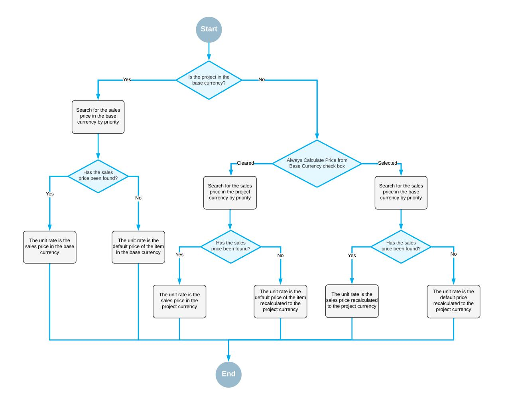

If the project currency (which is specified in the **Project Currency** box on the**Summary** tab) is the same as the base currency, the system searches the sales prices in the system for an applicable price of the inventory item in the base currency that is effective on the document date or the start date of the project. For more details on how the system searches for the price, see *[Sales Prices: Rules of Price Selection](https://help-2025r1.acumatica.com/Help?ScreenId=ShowWiki&pageid=e0863703-06d1-415e-8e5a-c736fc4a965f)*. If the effective sales price was not found, the system specifies the default price of the item as the unit rate.

If the project currency differs from the base currency, the way the system searches for an applicable sales price depends on the state of the **Always Calculate Price from Base Currency Price** check box on the *[Accounts](https://help-2025r1.acumatica.com/Help?ScreenId=ShowWiki&pageid=f7b52067-5299-45e8-b601-485cd709f58b) [Receivable Preferences](https://help-2025r1.acumatica.com/Help?ScreenId=ShowWiki&pageid=f7b52067-5299-45e8-b601-485cd709f58b)* (AR101000) form as follows:

• If the check box is cleared, the system looks for an effective sales price of the item in the project currency and inserts this value as the unit rate.

The effective sales prices specified in the base currency are ignored during the search.

If the sales price is not found, the system uses the default price of the item recalculated to the project currency using the rate that is effective on the start date of the project.

• If the check box is selected, the system looks for an effective sales price of the item in the base currency, recalculates this price to the document currency by using the rate that is effective on the start date of the project, and inserts this value as the unit rate.

If no effective sales price is found, then regardless of the state of the check box, the system searches for the default price of the item. The system converts the default price from the base currency to the project currency by using the rate that is effective on the start date of the project and inserts this value as the unit rate.

If no default price has been found for the item, the system will insert *0* as the unit rate of the project budget line.

# <span id="page-438-0"></span>**Multicurrency Projects: Implementation Checklist**

The following sections provide details you can use to ensure that the system is configured properly for managing projects in different currencies, and to understand (and change, if needed) the settings that affect the processing workflow.

#### **Implementation Checklist**

We recommend that before you configure multicurrency projects, you make sure the needed features have been enabled and settings have been specified, as summarized in the following checklist.

| Form                                          | Criteria to Check                                                                                                                                                                      |
|-----------------------------------------------|----------------------------------------------------------------------------------------------------------------------------------------------------------------------------------------|
| Enable/Disable Features (CS100000)            | Make sure that the Multicurrency Accounting and Multicurrency<br>Projects features have been enabled. Optionally, you may also want<br>to enable the Multiple Base Currencies feature. |
| Currency Management Preferences<br>(CM101000) | Make sure that the minimum required settings have been specified,<br>as described in Multicurrency Functionality: General Information.                                                 |
| Currencies (CM202000)                         | Make sure that the foreign currencies in which you want to manage<br>projects have been configured and activated for use in accounting.                                                |
| Currency Rates (CM301000)                     | Make sure that a currency rate for each currency to be used for<br>projects has been defined, as described in Configuration of Rate Types<br>and Rates: General Information.           |
| Projects (PM301000)                           | Specify the following project settings:                                                                                                                                                |
|                                               | •<br>In the Project Currency box on theSummary tab, the project cur<br>rency to be used for project budget and accounting operations                                                   |
|                                               | •<br>In the Currency RateType on the Summary tab, the rate type to<br>be used in the project                                                                                           |
|                                               | •<br>In the Budget Currency Rate box, the exchange rate from the<br>project currency to base currency                                                                                  |
|                                               | •<br>In the Billing Currency box on theSummary tab, the currency in<br>which the invoices will be prepared                                                                             |
|                                               | •<br>If the project is related to a particular company branch, the branch<br>in the Branch box on theSummary tab                                                                       |

# <span id="page-438-1"></span>**Multicurrency Projects: Related Reports and Forms**

In the following sections, you can find details about the reports and forms you may want to review to gather project information in different currencies.

#### **Reviewing Project Budget Amounts in Different Currencies**

By default, on the **Revenue Budget**, **Cost Budget**, and **Balances** tabs of the *[Projects](https://help-2025r1.acumatica.com/Help?ScreenId=ShowWiki&pageid=81c86417-3bde-444b-8f1c-682928d31a0c)* (PM301000) form, the system shows the amounts in the project currency. You can enter the amounts in the project currency only.

If you click the**View Base** button in the **Budget Currency Rate** box of the Summary area, the system shows the budgeted amounts and balances in the base currency converted based on the rate shown in the **Budget Currency Rate** box. To show the amounts in the project currency, you click the**View Cury** button in the **Budget Currency Rate** box in the Summary area.

#### **Viewing the List of Exchange Rates for the Project**

You can click **Print Currency Rates** on the More menu of the *[Projects](https://help-2025r1.acumatica.com/Help?ScreenId=ShowWiki&pageid=81c86417-3bde-444b-8f1c-682928d31a0c)* (PM301000) form to prepare the *[Currency](https://help-2025r1.acumatica.com/Help?ScreenId=ShowWiki&pageid=5c54c73e-624a-424d-9703-fe00d48f422f) [Rate History by ID](https://help-2025r1.acumatica.com/Help?ScreenId=ShowWiki&pageid=5c54c73e-624a-424d-9703-fe00d48f422f)* (CM650500) report. In the report, the system lists all exchange rates, sorted by the currency from which conversion is performed. The report is prepared for the date range from the project's start date to the current business date.

# <span id="page-440-0"></span>**Appendix**

The appendix provides some reference information relevant for this document. The additional information in this section is a useful source for readers who need some reference material that is related to system forms and tables, as well as running reports.

#### **In this section:**

- *[Reports](#page-440-3)*
- *Form [Toolbar](#page-447-1) and More Menu*
- *Table [Toolbar](#page-454-1)*
- *[Glossary](https://help-2025r1.acumatica.com/Help?ScreenId=ShowWiki&pageid=a2c92852-5ae8-4f4b-bf82-7f70cca0fdfa)*

## <span id="page-440-3"></span><span id="page-440-1"></span>**Reports**

In addition to offering a comprehensive collection of reports, Acumatica ERP gives you a high degree of control over each report.

On a typical report form, described in *[Report Form](#page-440-4)*, you can adjust the report settings to meet your specific informational needs. You can specify sorting and filtering options and select the data by using report-specific settings—such as financial period, ledger, and account—and configure additional processing settings for each report. The settings can be saved as a report template for later use. For details, see *To Run a [Report](https://help-2025r1.acumatica.com/Help?ScreenId=ShowWiki&pageid=d0531b2f-178f-4d70-8c4c-6bc897cd6c0a)* and *To [Create](https://help-2025r1.acumatica.com/Help?ScreenId=ShowWiki&pageid=5adbb4bd-4347-4f81-a1ff-4d4d47d1fb1b) a Report [Template](https://help-2025r1.acumatica.com/Help?ScreenId=ShowWiki&pageid=5adbb4bd-4347-4f81-a1ff-4d4d47d1fb1b)*.

Aer you run a report, the prepared report appears on your screen. You can print the report, export the report to a file, or send the report by email.

This chapter describes a typical report form and the main tasks related to using reports.

#### **In This Chapter**

- *[Report Form](#page-440-4)*
- *To Run a [Report](https://help-2025r1.acumatica.com/Help?ScreenId=ShowWiki&pageid=d0531b2f-178f-4d70-8c4c-6bc897cd6c0a)*
- *To Modify a Filter on a [Report](https://help-2025r1.acumatica.com/Help?ScreenId=ShowWiki&pageid=2513e10e-abb1-432e-85e0-a5e3f6cabf9c) Form*
- *To Create a Report [Template](https://help-2025r1.acumatica.com/Help?ScreenId=ShowWiki&pageid=5adbb4bd-4347-4f81-a1ff-4d4d47d1fb1b)*

### <span id="page-440-4"></span><span id="page-440-2"></span>**Report Form**

Before you run a report, you specify the needed parameters on the report form. You can select a template and manually make selections that affect the information collected. Also, you can specify appropriate settings to print or email the finished report.

The following screenshot shows a typical report form.

| TOOLS $\star$<br><b>Daily Sales Profitability</b> |                                                                                       |                        |
|---------------------------------------------------|---------------------------------------------------------------------------------------|------------------------|
| ↶<br><b>RUN REPORT</b>                            | REMOVE TEMPLATE<br><b>SAVE TEMPLATE</b><br>-11                                        |                        |
| Template                                          | $\times$ $\scriptstyle\rm\sim$<br>2<br>□ Default □ Shared                             |                        |
| <b>REPORT PARAMETERS</b>                          | <b>EMAIL NOTIFICATIONS</b><br>ADDITIONAL SORT AND FILTERS<br>PRINT AND EMAIL SETTINGS |                        |
| <b>Report Format</b>                              | <b>Detailed</b><br>$\checkmark$                                                       |                        |
| Company/Branch:                                   | HEADOFFICE - SweetLife Head Offi v                                                    |                        |
| <b>From Date</b>                                  | 2/1/2025<br>户                                                                         |                        |
| <b>To Date</b>                                    | 2/20/2025<br>Ä                                                                        |                        |
| <b>Document Type</b>                              | $\checkmark$                                                                          | $\left 3\right\rangle$ |
| Warehouse:                                        | Q                                                                                     |                        |
| Customer:                                         | Q                                                                                     |                        |
| Inventory:                                        | Q                                                                                     |                        |
|                                                   | Released Transactions Only                                                            |                        |
|                                                   | □ Completed Transactions Only                                                         |                        |

#### *Figure: Report form*

- 1. Report form toolbar
- 2. Selection area
- 3. Details area

#### **Report Form Toolbar**

The following table lists the buttons of the report form toolbar, which appears on the report form when you are configuring a report.

| Button              | Description                                                                                                              |
|---------------------|--------------------------------------------------------------------------------------------------------------------------|
| Cancel              | Clears any changes you have made on the report form and restores the default settings.                                   |
| Run Report          | Initiates data collection for the report and displays the generated report.                                              |
| SaveTemplate        | Gives you the ability to save the currently selected report as a template with all the select<br>ed settings.            |
| Remove Tem<br>plate | Removes the previously saved template.<br>This button is available only when a template is specified on the report form. |

#### **Report Toolbar**

The following table lists the buttons of the report toolbar, which is shown on the generated report that you have run.

| Buttons    | Icon | Description                                                                |
|------------|------|----------------------------------------------------------------------------|
| Parameters |      | Navigates back to the report form to let you change the report parameters. |

| Buttons                 | Icon | Description                                                                                                                                                                                                    |
|-------------------------|------|----------------------------------------------------------------------------------------------------------------------------------------------------------------------------------------------------------------|
| Refresh                 |      | Refreshes the information displayed in the report (if any data changes were made).                                                                                                                             |
| Groups                  |      | Adds to the report a le pane where the report structure is shown. Click a report node<br>to highlight the pertinent data in the right pane.                                                                   |
| View PDF /<br>View HTML | /    | Displays the report as a PDF, or displays the report in HTML format. The available but<br>ton depends on the current report view; if you're viewing a PDF, for instance, you will<br>see the View HTML button. |
| First                   |      | Displays the first page of the report.                                                                                                                                                                         |
| Previous                |      | Displays the previous page.                                                                                                                                                                                    |
| Next                    |      | Displays the next page.                                                                                                                                                                                        |
| Last                    |      | Displays the last page of the report.                                                                                                                                                                          |
| Print                   |      | Opens the browser dialog box so you can print the report.                                                                                                                                                      |
| Send                    |      | Opens the Email Activity dialog box, which you use to send the report file (in the se<br>lected format) to the specified email address.                                                                        |
| Export                  |      | Enables you to export the data in the selected format (Excel or PDF).                                                                                                                                          |

#### **Selection Area**

You use the elements in this area to select an existing template, which you can share with other users or use as your default report settings. You can also select the locale and the localization.

The elements of this area, which are available for all reports, are described in the following table.

| Element  | Description                                                                                                                                            |
|----------|--------------------------------------------------------------------------------------------------------------------------------------------------------|
| Template | The template to be used for the report. If any templates have been created and saved, you<br>can select a template to use its settings for the report. |
| Default  | A check box that indicates (if selected) that the selected template is marked as the default<br>one for you. A default template cannot be shared.      |

| Element      | Description                                                                                                                                                                                                                                                                                                            |
|--------------|------------------------------------------------------------------------------------------------------------------------------------------------------------------------------------------------------------------------------------------------------------------------------------------------------------------------|
| Shared       | A check box that indicates (if selected) that the selected template is shared with other<br>users. A shared template cannot be marked as the default.                                                                                                                                                                  |
| Locale       | A locale that you select to indicate to the system that the report should be prepared with<br>the data translated to the language associated with this locale. This box is displayed if<br>there are multiple active locales in the system. For details, see Locales and Languages.                                    |
| Localization | The localization that is used for the report.                                                                                                                                                                                                                                                                          |
|              | This box appears on the form if the following conditions are met:                                                                                                                                                                                                                                                      |
|              | •<br>The Canadian Localization or UK Localization feature is enabled on the Enable/Disable<br>Features (CS100000) form.                                                                                                                                                                                                |
|              | •<br>A localized version of the report exists in the system.                                                                                                                                                                                                                                                           |
|              | One of the following options can be selected in the box:                                                                                                                                                                                                                                                               |
|              | •<br>None (default): Even though the report has a localized version, the report will be printed<br>without any localization applied.                                                                                                                                                                                   |
|              | •<br>Canada: The Canadian version of the report will be printed. If the company in which you<br>are signed in has Canada selected in the Localization box on the Company Details tab<br>(Configuration Settings section) on the Companies (CS101500) form, this setting is se<br>lected by default in the current box. |
|              | To determine if a localized version of a report exists, the system checks the<br>Site\ReportsDefault directory, the database, the ReportsCus<br>tomized folder, and the ReportsDefault folder.                                                                                                                         |

#### **Report Parameters Tab**

The **Report Parameters** tab has sections where you can specify the contents of the report depending on the current report and vary in the following regards:

- Which elements are available on a particular report
- Whether elements contain default values
- Whether specific elements require values to be selected
- Whether elements may be le blank to let you display a broader range of data

#### **Additional Sort and Filters Tab**

The **AdditionalSort and Filter** tab contains additional sorting and filtering conditions:

- **Additional sorting conditions**: Defines the sorting order. You can add a line, select one of the reportspecific properties, and select the *Descending* or *Ascending* sort order for the column.
- **Additional filtering conditions**: Defines the report filter. You can add a line, select one of the reportspecific properties, and define a condition and its value. The list of conditions include one-operand and two-operand conditions. To create a more complicated logical expression, you can use brackets and logical operations between brackets. For more information on creating filters, see *[Managing Advanced Filters](https://help-2025r1.acumatica.com/Help?ScreenId=ShowWiki&pageid=c621d79a-274d-4b72-a699-0e92d78a7b23)*. For detailed procedures on using ad hoc filters, see *[Reports: Process Activity](https://help-2025r1.acumatica.com/Help?ScreenId=ShowWiki&pageid=2b4d7aa8-25dc-4777-880a-fee2274990c7)*.

#### **Print and Email Settings Tab**

If you plan to print the report or save the report as a PDF, select the appropriate settings in the **PrintSettings** area.

#### *Table: Print Settings Section*

| Element                 | Description                                                          |
|-------------------------|----------------------------------------------------------------------|
| Deleted Records         | Selects the visibility of the data deleted from the database.        |
| Print All Pages         | Causes all pages of the report to be printed.                        |
| Print in PDF format     | Displays the report in PDF format.                                   |
| Compress PDF file       | Indicates that the system will generate a compressed PDF.            |
| Embed fonts in PDF file | Indicates that the system will generate the PDF with fonts embedded. |

If you plan to send the report as an email, in the **EmailSettings** area, specify the format in which the report will be sent, as well as the email subject, the recipients of copies of the report, and the email account of the recipient.

#### *Table: Email Settings Section*

| Field         | Description                                                                                                                                                                                                                 |  |
|---------------|-----------------------------------------------------------------------------------------------------------------------------------------------------------------------------------------------------------------------------|--|
| Format        | The format (HTML, PDF, or Excel) in which the report will be emailed.                                                                                                                                                       |  |
|               | Merge function for reports in Excel format is not supported. If you want to<br>merge a report with other reports and send an aggregated report by email,<br>you should select either the HTML or PDF format for the report. |  |
| Email Account | The email address of the recipient.                                                                                                                                                                                         |  |
| CC            | An additional addressee to receive a carbon copy (CC) of the email.                                                                                                                                                         |  |
| BCC           | The email address of a person to receive a blind carbon copy (BCC) of the email; an address<br>entered in this box will be hidden from other recipients.                                                                    |  |
| Subject       | The subject of the email.                                                                                                                                                                                                   |  |

#### **Report Versions Tab**

If the report has multiple versions, you can select one of them.

This tab displays the data only to users assigned with report designer user role.

Report versions are designed in the Report Designer. To activate editing report versions, give the user report designer role.

*Table: Report Versions Tab Toolbar*

| Button  | Description                            |
|---------|----------------------------------------|
| Refresh | Refreshes the list of report versions. |

| Button | Description                                        |
|--------|----------------------------------------------------|
| Select | Temporarily activates the selected report version. |

#### **Email Notifications Tab**

The **Email Notifications** tab lists the email templates used to send the report.

#### *Table: Table Toolbar*

The table toolbar includes standard buttons and buttons that are specific to this table. For the list of standard buttons, see *Table [Toolbar](#page-454-1)*. The table-specific buttons are listed below.

| Button          | Description                                                                                                                                                                     |  |  |  |  |  |
|-----------------|---------------------------------------------------------------------------------------------------------------------------------------------------------------------------------|--|--|--|--|--|
| Schedule Report | Opens the Email Templates (SM204003) form, where you can select or create a new email<br>template that can be used to send the report and specify a schedule for notifications. |  |  |  |  |  |
|                 | The button appears only if the user account to which you are signed in has at least the<br>Insert level of access rights to the Email Templates (SM204003) form.                |  |  |  |  |  |

#### *Table: Table Columns*

| Column                   | Description                                                                                                     |  |  |  |  |  |  |  |
|--------------------------|-----------------------------------------------------------------------------------------------------------------|--|--|--|--|--|--|--|
| Email Template           | The email template to be used to generate the body of the email notification.                                   |  |  |  |  |  |  |  |
| Screen ID                | The identifier of the form whose elements are used as the source of specific placeholders<br>for this template. |  |  |  |  |  |  |  |
| Recipients               | The email addresses of the people to receive the email. Use semicolons as separators be<br>tween addresses.     |  |  |  |  |  |  |  |
| Report Template          | The template configured for the report.                                                                         |  |  |  |  |  |  |  |
| Report Template<br>Owner | The name of the user who created the template.                                                                  |  |  |  |  |  |  |  |

#### **Related Links**

- *To Run a [Report](https://help-2025r1.acumatica.com/Help?ScreenId=ShowWiki&pageid=d0531b2f-178f-4d70-8c4c-6bc897cd6c0a)*
- *To Create a Report [Template](https://help-2025r1.acumatica.com/Help?ScreenId=ShowWiki&pageid=5adbb4bd-4347-4f81-a1ff-4d4d47d1fb1b)*
- *Types of [Filters](https://help-2025r1.acumatica.com/Help?ScreenId=ShowWiki&pageid=9371f240-f73a-4b7a-8f16-72add7be7b62)*
- *[Automation Schedule Statuses](https://help-2025r1.acumatica.com/Help?ScreenId=ShowWiki&pageid=97fb65d2-2303-4993-9351-b6fbe112c37d)*

### <span id="page-445-1"></span><span id="page-445-0"></span>**Report**

Once you click **Run Report**, the prepared report appears on your screen. You can print the report, export the report to a file, or send the report by email.

The prepared report is displayed in the report view of the report form. For more information about setting up the report parameters and the parameters view of the report form, see *[Report Form](#page-440-4)*.

#### **Report Toolbar**

The following table lists report toolbar buttons.

| Buttons                 | Icon | Description                                                                                                                                                                                                    |
|-------------------------|------|----------------------------------------------------------------------------------------------------------------------------------------------------------------------------------------------------------------|
| Parameters              |      | Navigates back to the report form to let you change the report parameters.                                                                                                                                     |
| Refresh                 |      | Refreshes the information displayed in the report (if any data changes were made).                                                                                                                             |
| Groups                  |      | Adds to the report a le pane where the report structure is shown. Click a report node<br>to highlight the pertinent data in the right pane.                                                                   |
| View PDF /<br>View HTML | /    | Displays the report as a PDF, or displays the report in HTML format. The available but<br>ton depends on the current report view; if you're viewing a PDF, for instance, you will<br>see the View HTML button. |
| First                   |      | Displays the first page of the report.                                                                                                                                                                         |
| Previous                |      | Displays the previous page.                                                                                                                                                                                    |
| Next                    |      | Displays the next page.                                                                                                                                                                                        |
| Last                    |      | Displays the last page of the report.                                                                                                                                                                          |
| Print                   |      | Opens the browser dialog box so you can print the report.                                                                                                                                                      |
| Send                    |      | Opens the Email Activity dialog box, which you use to send the report file (in the cho<br>sen format) to the specified email address.                                                                          |
| Export                  |      | Enables you to export the data in the chosen format (Excel or PDF).                                                                                                                                            |

#### **Related Links**

- *[Filters](https://help-2025r1.acumatica.com/Help?ScreenId=ShowWiki&pageid=fad0b170-9d7c-4851-8f73-4b841f977c0f)*
- *[Report](#page-445-1)*

# <span id="page-447-1"></span><span id="page-447-0"></span>**Form Toolbar and More Menu**

The form toolbar, which is available on most forms, is located near the top of the form, under the form name (and record title, if the form has one), as shown in the following screenshot.

The form toolbar includes the following:

- Standard buttons (see Item 1 in the following screenshot), with the particular set of buttons depending on the specific form
- On some forms, form-specific buttons (Item 2)
- On some form, the More button (Item 3); clicking this button opens the More menu (Item 4), which contains additional form-specific commands

| Opportunities<br>000004 - A juicer with the installation and training for Lake Cafe                                                                                                                                                                                                                                                                                                                                                       |  |                             |                |  |           |                         |                          |  |                                                                                                                         |               |                                                                                                     |                                       | 3                                                      | <b>PINOTES</b> | <b>FILES</b> | <b>CUSTOMIZATION</b> | TOOLS $\blacktriangleright$ |
|-------------------------------------------------------------------------------------------------------------------------------------------------------------------------------------------------------------------------------------------------------------------------------------------------------------------------------------------------------------------------------------------------------------------------------------------|--|-----------------------------|----------------|--|-----------|-------------------------|--------------------------|--|-------------------------------------------------------------------------------------------------------------------------|---------------|-----------------------------------------------------------------------------------------------------|---------------------------------------|--------------------------------------------------------|----------------|--------------|----------------------|-----------------------------|
| - 5<br>$\Box$<br>$\Omega$<br>$\leftarrow$                                                                                                                                                                                                                                                                                                                                                                                                 |  | $+$                         | $\mathbb{O}$ . |  | 面         | $\overline{\mathsf{K}}$ | $\overline{\phantom{0}}$ |  | <b>OPEN</b><br>$\geq$                                                                                                   |               | <b>CREATE QUOTE</b>                                                                                 |                                       | $\cdots$                                               |                |              |                      |                             |
| 2<br>000004<br>Opportunity ID:<br>$\varphi$<br><b>Business Account:</b><br>LAKECAFE -<br>MAIN - Primal<br><b>New</b><br>Status:<br>Location:<br>$\circ$<br>10<br>* Class ID:<br>PROJECT - Project Sales<br>Contact:<br>Stage:<br>Owner:<br>Prospect<br>$\overline{\phantom{a}}$                                                                                                                                                           |  |                             |                |  |           |                         |                          |  | Processing<br>Activities<br>Open $\bullet$<br><b>Create Task</b><br>Close as Won<br><b>Create Note</b><br>Close as Lost |               |                                                                                                     |                                       | $\hat{\phantom{a}}$                                    |                |              |                      |                             |
| * Estimated Close Date:<br>1/4/2021<br>$\overline{\phantom{a}}$<br>* Subject:<br>A juicer with the installation and training for Lake Cafe<br><b>ACTIVITIES</b><br><b>DETAILS</b><br><b>CRM INFO</b><br><b>FINANCIAL</b><br><b>SHIPPING</b><br><b>QUOTES</b><br>CONTACT<br><b>ATT</b>                                                                                                                                                     |  |                             |                |  |           |                         |                          |  |                                                                                                                         |               | <b>Record Creation</b><br><b>Create Quote</b><br><b>Create Sales Order</b><br><b>Create Account</b> | Other                                 | <b>Recalculate Prices</b><br><b>Validate Addresses</b> |                |              |                      |                             |
| <b>CREATE TASK</b><br>$\mathcal{C}$<br>$\uparrow \qquad \qquad \uparrow$ $\qquad \qquad$ $\uparrow$ $\qquad$ $\qquad$ $\qquad$ $\qquad$ $\qquad$ $\qquad$ $\qquad$ $\qquad$ $\qquad$ $\qquad$ $\qquad$ $\qquad$ $\qquad$ $\qquad$ $\qquad$ $\qquad$ $\qquad$ $\qquad$ $\qquad$ $\qquad$ $\qquad$ $\qquad$ $\qquad$ $\qquad$ $\qquad$ $\qquad$ $\qquad$ $\qquad$ $\qquad$ $\qquad$ $\qquad$ $\qquad$<br>D.<br>圓<br>$\overline{\mathbf{k}}$ |  | <b>CREATE EVENT</b><br>Type |                |  | * Summary | <b>CREATE EMAIL</b>     |                          |  | CREATE ACTIVITY +                                                                                                       | <b>Status</b> | <b>PIN/UNPIN</b>                                                                                    | $\left  \rightarrow \right $<br>Start | <b>Create Contact</b><br><b>Create Invoice</b>         |                |              |                      | $\triangledown$             |

#### *Figure: The form toolbar and the More menu*

You use the standard buttons on the form toolbar to navigate through entities that were created by using the current form, insert or delete an entity, use the clipboard, save the data you have entered, or cancel your work on the form.

A form toolbar on a particular form may include form-specific buttons in addition to standard buttons; it may also (or instead) include commands on the More menu. By using these form-specific buttons and commands, users can navigate to related records and forms, initiate specific actions, and perform modifications or processing related to the functionality of the form.

#### **Standard Form Toolbar Buttons**

The following table lists the standard buttons of the form toolbar. A form toolbar may include some or all of these buttons.

#### *Table: Standard Form Toolbar Buttons*

| Button                       | Icon                                                                                                                                                                                                                                                                                                                                                                                                   | Description                                                                                                                                                                                                                                                                                                                                                                                                        |  |  |  |  |  |  |
|------------------------------|--------------------------------------------------------------------------------------------------------------------------------------------------------------------------------------------------------------------------------------------------------------------------------------------------------------------------------------------------------------------------------------------------------|--------------------------------------------------------------------------------------------------------------------------------------------------------------------------------------------------------------------------------------------------------------------------------------------------------------------------------------------------------------------------------------------------------------------|--|--|--|--|--|--|
| Discard Changes<br>and Close |                                                                                                                                                                                                                                                                                                                                                                                                        | Discards any unsaved changes made to the entity, and navigates to the list of<br>records that is related to the current form.                                                                                                                                                                                                                                                                                      |  |  |  |  |  |  |
|                              |                                                                                                                                                                                                                                                                                                                                                                                                        | If the system opened the current form in a pop-up window (from<br>a different form), this button is not displayed. To return to the<br>original form, click Close.                                                                                                                                                                                                                                                 |  |  |  |  |  |  |
| Save & Close                 |                                                                                                                                                                                                                                                                                                                                                                                                        | Saves the changes made to the entity, and navigates to the list of records that<br>is related to the current form.                                                                                                                                                                                                                                                                                                 |  |  |  |  |  |  |
| Save                         |                                                                                                                                                                                                                                                                                                                                                                                                        | Saves the changes made to the entity.                                                                                                                                                                                                                                                                                                                                                                              |  |  |  |  |  |  |
| Cancel                       |                                                                                                                                                                                                                                                                                                                                                                                                        | Depending on the context, does one of the following:                                                                                                                                                                                                                                                                                                                                                               |  |  |  |  |  |  |
|                              |                                                                                                                                                                                                                                                                                                                                                                                                        | •<br>Discards any unsaved changes you have made to entities and retrieves the<br>last saved version.                                                                                                                                                                                                                                                                                                               |  |  |  |  |  |  |
|                              |                                                                                                                                                                                                                                                                                                                                                                                                        | •<br>Clears all changes and restores the default settings.                                                                                                                                                                                                                                                                                                                                                         |  |  |  |  |  |  |
| Add New Record               |                                                                                                                                                                                                                                                                                                                                                                                                        | Clears any values you've specified on the form, restores any default values,<br>and initiates the creation of a new entity.                                                                                                                                                                                                                                                                                        |  |  |  |  |  |  |
| Delete                       |                                                                                                                                                                                                                                                                                                                                                                                                        | Deletes the currently selected entity, clears any values you have specified on<br>the form, and populates elements with the default values that the system in<br>serts when a new entity is created.                                                                                                                                                                                                               |  |  |  |  |  |  |
|                              |                                                                                                                                                                                                                                                                                                                                                                                                        | You can delete an entity only if it is not linked with another enti<br>ty.                                                                                                                                                                                                                                                                                                                                         |  |  |  |  |  |  |
| Archive                      | Archives the document that is opened on the form. This button is available<br>if archival is set up on the Archival Policy (SM200400) form for the type of the<br>document open on the form and if the document meets the archival crite<br>ria—that is, if the document is older than the retention period specified on the<br>Archival Policy form and has been processed to completion or canceled. |                                                                                                                                                                                                                                                                                                                                                                                                                    |  |  |  |  |  |  |
|                              |                                                                                                                                                                                                                                                                                                                                                                                                        | For more information on archiving the documents, see Archiving Old Docu<br>ments in the Acumatica ERP System Administration guide.                                                                                                                                                                                                                                                                                 |  |  |  |  |  |  |
| Extract                      |                                                                                                                                                                                                                                                                                                                                                                                                        | Extracts the archived document from the archive and makes the system use<br>this document in day-to-day operations. This button is available if archival<br>is set up on the Archival Policy (SM200400) form for the type of the document<br>opened on the form is archived.<br>For more information on archiving the documents, see Archiving Old Docu<br>ments in the Acumatica ERP System Administration guide. |  |  |  |  |  |  |

#### Appendix | **450**

| Button                   | Icon | Description                                                                                                                                                                                                                                                                                                                                                                                                                                                                                                                                                                                                                                                           |  |  |  |  |  |  |
|--------------------------|------|-----------------------------------------------------------------------------------------------------------------------------------------------------------------------------------------------------------------------------------------------------------------------------------------------------------------------------------------------------------------------------------------------------------------------------------------------------------------------------------------------------------------------------------------------------------------------------------------------------------------------------------------------------------------------|--|--|--|--|--|--|
| Clipboard                |      | Provides menu commands you can use to do the following:<br>•<br>Copy: Copy the selected entity to the clipboard.<br>•<br>Paste: Paste an entity or template from the clipboard.<br>•<br>Save asTemplate: Create a template based on the selected entity.<br>•<br>Import from XML: Import an entity or a template from an .xml file.<br>•<br>Export to XML: Export the selected entity to an .xml file.<br>For more information on templates and copy-and-paste operations in<br>Acumatica ERP, see Using Forms. For more information on importing and ex<br>porting .xml files, see Importing and Exporting Data to Excel and XML in the<br>Acumatica ERP User Guide. |  |  |  |  |  |  |
| Go to First Record       |      | Displays the first entity (in the list of entities of the specific type) and its de<br>tails.                                                                                                                                                                                                                                                                                                                                                                                                                                                                                                                                                                         |  |  |  |  |  |  |
| Go to Previous<br>Record |      | Displays the previous entity and its details.                                                                                                                                                                                                                                                                                                                                                                                                                                                                                                                                                                                                                         |  |  |  |  |  |  |
| Go to Next Record        |      | Displays the next entity and its details.                                                                                                                                                                                                                                                                                                                                                                                                                                                                                                                                                                                                                             |  |  |  |  |  |  |
| Go to Last Record        |      | Displays the last entity (in the list of entities of the specific type) and its de<br>tails.                                                                                                                                                                                                                                                                                                                                                                                                                                                                                                                                                                          |  |  |  |  |  |  |
| View Schedule            |      | Gives you the ability to schedule the processing. For more information, see<br>Automated Processing: General Information.                                                                                                                                                                                                                                                                                                                                                                                                                                                                                                                                             |  |  |  |  |  |  |

#### **Inquiry Form Toolbar Buttons**

Acumatica ERP inquiry forms present data in a tabular format; they may also have selection criteria you can use to filter the data in the table. Predefined inquiry forms are provided as part of Acumatica ERP out of the box, and inquiry forms can be designed by a user with the appropriate access rights by using the Generic Inquiry tool (for details, see *[Managing Generic Inquiries](https://help-2025r1.acumatica.com/Help?ScreenId=ShowWiki&pageid=5737bca9-aebb-446d-9e1a-bc5fcfad6797)* in the Acumatica ERP Reporting Tools Guide). A form toolbar of an inquiry form contains both the standard form toolbar buttons (described in the table above) and the additional buttons described below.

| Button  | Icon | Description                                                                                                                                                    |
|---------|------|----------------------------------------------------------------------------------------------------------------------------------------------------------------|
| Refresh |      | Refreshes the inquiry data in the table.                                                                                                                       |
| Cancel  |      | Clears all changes (including selection criteria that has been specified, if the<br>generic inquiry form has this criteria) and restores the default settings. |

| Button          | Icon | Description                                                                                                                                                                                                                       |
|-----------------|------|-----------------------------------------------------------------------------------------------------------------------------------------------------------------------------------------------------------------------------------|
| Add New Record  |      | Initiates the creation of a new entity.                                                                                                                                                                                           |
| Edit            |      | Opens the applicable data entry form with the selected record.                                                                                                                                                                    |
| Fit toScreen    |      | Expands the form to fit on the screen and adjusts the column widths propor<br>tionally.                                                                                                                                           |
| Export to Excel |      | Exports the data to an Excel file. For more information, see Integration with Ex<br>cel in the Acumatica ERP Getting Started Guide.                                                                                               |
| Filter Settings |      | Opens the Filter Settings dialog box, which you can use to define a new filter.<br>After the filter has been created and saved, the corresponding tab appears on<br>the table. For more information about filtering, see Filters. |

#### **The More Menu and Form-Specific Buttons**

If there are multiple form-specific commands on the form toolbar, they are displayed on a single menu—the More menu—and listed under descriptive categories, which makes it easier to find the needed menu command. On the More menu, you can easily define your favorite menu commands, which eases access to them.

On some forms, the system places a button (which is highlighted in green) on the form toolbar for the expected next command, which represents the likely next step to be performed on the selected record. The following screenshot, which shows the *Cash [Transactions](https://help-2025r1.acumatica.com/Help?ScreenId=ShowWiki&pageid=1e55821c-556b-4c3e-829c-95383eb2c8e2)* (CA304000) form, illustrates an example of the form toolbar and the More menu, which contains categories and menu commands.

|                                                   | <b>Transactions</b> |                     | Cash Entry 000228 - 10200 Company Checking Account |          |                                     |        |                           |   |               |                                                |  |                         | $\overline{2}$ | $\lceil 3 \rceil$    | <b>PINOTES</b> | <b>ACTIVITIES</b> |  | <b>FILES</b>   | <b>CUSTOMIZATION</b> | TOOLS $\sim$           |
|---------------------------------------------------|---------------------|---------------------|----------------------------------------------------|----------|-------------------------------------|--------|---------------------------|---|---------------|------------------------------------------------|--|-------------------------|----------------|----------------------|----------------|-------------------|--|----------------|----------------------|------------------------|
| $\leftarrow$                                      | 周                   | $\Box$              | $\Omega$                                           |          | 顶                                   | n<br>٠ | $\overline{\mathsf{K}}$   | ∢ | ⋗             | $\geq$                                         |  | <b>RELEASE</b>          | <b>HOLD</b>    | $\cdots$             |                |                   |  | 4              |                      |                        |
|                                                   | Tran. Type:         |                     | <b>Cash Entry</b>                                  |          |                                     |        |                           |   | * Tran. Date: |                                                |  | 5/26/2021               |                | Reports              |                |                   |  | Corrections    |                      |                        |
|                                                   | Reference Nbr.      |                     | Q<br>000228                                        |          |                                     |        | * Fin. Period:<br>05-2021 |   |               | $\mathcal{L}$<br>$\hat{\mathbf{x}}$ Activities |  |                         |                | Reverse              |                |                   |  |                |                      |                        |
| Cash Account:<br>10200 - Company Checking Account |                     |                     |                                                    |          | <b>INTEREST - In</b><br>Entry Type: |        |                           |   |               |                                                |  |                         |                |                      |                |                   |  |                |                      |                        |
|                                                   | Currency:           |                     | <b>USD</b>                                         | 1.00     |                                     |        | - VIEW BASE               |   |               | Disbursement/.                                 |  | Receipt                 |                | Processing           |                |                   |  |                |                      |                        |
| Status:                                           | Balanced            |                     |                                                    |          | * Document Ref.<br><b>INT-145</b>   |        |                           |   | Hold          |                                                |  |                         |                |                      |                |                   |  |                |                      |                        |
|                                                   |                     |                     |                                                    |          |                                     |        |                           |   | Owner:        |                                                |  | EP00000002-             |                | Remove Hold          | $6^{\circ}$    |                   |  |                |                      |                        |
|                                                   | Description:        |                     |                                                    |          |                                     |        |                           |   |               |                                                |  |                         |                | Release <sup>®</sup> |                |                   |  |                |                      |                        |
|                                                   |                     |                     | <b>TRANSACTION DETAILS</b>                         |          | <b>TAX DETAILS</b>                  |        | <b>FINANCIAL DETAILS</b>  |   |               |                                                |  | <b>APPROVAL DETAILS</b> |                |                      |                |                   |  |                |                      |                        |
|                                                   |                     | 1                   | $\times$                                           | $\vdash$ | $\boxed{\mathbf{x}}$                | 工      |                           |   |               |                                                |  |                         |                |                      |                |                   |  |                |                      |                        |
| B 0                                               | D.                  | <sup>*</sup> Branch |                                                    | Item ID  |                                     |        | <b>Description</b>        |   |               |                                                |  |                         |                | Quantity             | <b>UOM</b>     | Price             |  | Amount *Offset | Account              | <b>Account Descrip</b> |
| $\Omega$                                          | $\Box$              | PRODWHOLF           |                                                    |          |                                     |        | Interest                  |   |               |                                                |  |                         |                | 100                  |                | 20.00             |  | 20.00          | 49300                | Other Income: In       |

*Figure: The form toolbar of the Transactions form*

The numbered items in the screenshot indicate the following:

- 1. A highlighted button for the expected next command, which represents the next logical step to be performed on the record selected on the form
- 2. Another button for a command that is commonly performed on the form
- 3. The More button, which you click to open the More menu

- 4. The More menu with most form-specific menu commands and descriptive categories on it
- 5. The star icon, which is used to mark the individual user's favorite commands on the form
- 6. An unavailable command

#### **Favorite Commands**

Based on your role in the company and your job duties, you may use some commands more oen than others. On the form toolbar, you can specify these commands as favorites. This will cause the system to duplicate the commands as form toolbar buttons, easing access to them.

To add a command to the form toolbar as a button, you open the More menu, hover over the needed command, and click the star icon when it appears. The yellow color of the star indicates that the command has been added to your favorites, and a button for the command appears on the form toolbar immediately. The following example shows two commands that have been added to the user's favorites on the *[Invoices and Memos](https://help-2025r1.acumatica.com/Help?ScreenId=ShowWiki&pageid=5e6f3b27-b7af-412f-a40a-1d4f4be70cba)* (AR301000) form and thus added as buttons on the form toolbar.

| <b>Invoices and Memos</b><br><b>T</b> NOTES<br><b>ACTIVITIES</b><br><b>FILES</b><br><b>CUSTOMIZATION</b><br>TOOLS $\blacktriangleright$<br>Invoice AR009654 - Alphabetland School Center |                                                                            |                                                            |                                                                            |  |  |  |  |  |  |
|------------------------------------------------------------------------------------------------------------------------------------------------------------------------------------------|----------------------------------------------------------------------------|------------------------------------------------------------|----------------------------------------------------------------------------|--|--|--|--|--|--|
| 周<br>$\Box$<br>顶<br>$^+$<br>$\curvearrowleft$<br>$\leftarrow$                                                                                                                            | $\bigcirc$ -<br>$\lambda$<br>$\overline{\mathsf{K}}$<br>$\rightarrow$<br>≺ | <b>HOLD</b><br><b>RELEASE</b><br><b>CUSTOMER DETAILS</b>   | $\cdots$                                                                   |  |  |  |  |  |  |
| Type:<br>Invoice<br>$\overline{\phantom{a}}$<br>AR009654 Q<br>Reference Nbr.:<br><b>Balanced</b><br>Status:<br>5/27/2021<br>* Date:<br>$\overline{\phantom{a}}$                          | Processing<br><b>Remove Hold</b><br>$\star$ Hold                           | Intercompany<br><b>Generate AP Document</b><br>Approval    | <b>Related Documents</b><br>SO Invoice<br>Pro Forma                        |  |  |  |  |  |  |
| 05-2021<br>* Post Period:<br>$\mathcal{Q}$<br>Customer Ord                                                                                                                               | Release <sup>O</sup><br>Pay<br>Release Retainage                           | <b>Remove Credit Hold</b><br><b>Credit Hold</b><br>$\star$ | <b>Inquiries</b><br><b>Customer Details</b><br><b>Project Transactions</b> |  |  |  |  |  |  |
| Weekly<br>Description:<br><b>DETAILS</b><br><b>ADDRES</b>                                                                                                                                | Corrections<br>Reverse<br>Reverse and Apply to Memo                        | <b>Printing and Emailing</b><br>Print<br>Email             | Reports<br><b>AR Edit Detailed</b>                                         |  |  |  |  |  |  |
| <b>FINANCIAL</b><br>$\mathcal{C}_{1}$<br>$\times$<br>P<br><b>VIEW DEFE</b><br>ョ<br><b>Inventory ID</b><br>*Branch                                                                        | Write Off<br>Reclassify GL Batch                                           | Mark as Do not Email<br>Other<br><b>Add to Schedule</b>    | <b>AR Register Detailed</b>                                                |  |  |  |  |  |  |
| <b>PRODWHOLE</b><br><b>SUPP OFF</b><br>$\mathbf{0}$<br>n                                                                                                                                 |                                                                            | <b>Recalculate Prices</b><br><b>Send Email</b>             |                                                                            |  |  |  |  |  |  |

#### *Figure: Favorite commands on the More menu and the corresponding toolbar buttons*

Favorites are individual to each user account, specific to a particular form, and preserved across user sessions.

#### **Highlighted Buttons and Commands**

On some forms, the system applies predefined logic to commands for specific records. Based on this logic, the system may place a button on the form toolbar, highlight it using some color, or do both of these things.

If a command is the expected next command (that is, the command that is most likely to be clicked for a record with the current status), it is shown both on the form toolbar and on the More menu. The primary command on the form toolbar is highlighted in green (see Item 1 in the following screenshot), and on the More menu, it is marked with a green dot (Item 2). Below is an example of a cash transaction on the *Cash [Transactions](https://help-2025r1.acumatica.com/Help?ScreenId=ShowWiki&pageid=1e55821c-556b-4c3e-829c-95383eb2c8e2)* (CA304000) form that has the *On Hold* status (Item 3). Before you can process it, you need to remove it from hold. Because **Remove Hold** is the next logical command, it is displayed as a button on the form toolbar and highlighted in green.

| <b>Transactions</b><br>Cash Entry 000228 - 10200 Company Checking Account<br>$\Xi$<br>$\boxdot$<br>$\curvearrowleft$<br>$\leftarrow$            | Ô<br>血<br>$\mathsf{K}$<br>$\pm$<br>$\overline{\phantom{a}}$                 | <b>REMOVE HOLD</b><br>$\geq$<br>≺<br>$\rightarrow$                                                                                               | <b>P</b> NOTES<br>$\cdots$                  | <b>ACTIVITIES</b> | <b>FILES</b>           | <b>CUSTOMIZATION</b> | TOOLS $\blacktriangleright$ |
|-------------------------------------------------------------------------------------------------------------------------------------------------|-----------------------------------------------------------------------------|--------------------------------------------------------------------------------------------------------------------------------------------------|---------------------------------------------|-------------------|------------------------|----------------------|-----------------------------|
| Tran. Type:<br><b>Cash Entry</b><br>Reference Nbr.:<br>000228<br>Cash Account:<br><b>USD</b><br>Currency:<br>Status:<br>On Hold<br>Description: | $\mathcal{Q}$<br>10200 - Company Checking Account<br>1.00<br>VIEW BASE<br>3 | * Tran. Date:<br>Reports<br>* Fin. Period:<br><b>Activities</b><br>Entry Type:<br>Disbursement/<br>* Document Ref.:<br>Hold<br>Owner:<br>Release | Processing<br>Remove Hold ●<br>$\mathbf{2}$ |                   | Corrections<br>Reverse |                      |                             |
| <b>TRANSACTION DETAILS</b>                                                                                                                      | <b>TAX DETAILS</b>                                                          | <b>APPROVAL DETAILS</b><br><b>FINANCIAL DETAILS</b>                                                                                              |                                             |                   |                        |                      |                             |
| Ò<br>$^{+}$<br>$\times$<br>$\mathscr{D}$                                                                                                        | $\mathbf{\overline{X}}$<br>土<br>$\vdash$                                    |                                                                                                                                                  |                                             |                   |                        |                      |                             |
| 90<br>n<br>*Branch                                                                                                                              | <b>Item ID</b><br><b>Description</b>                                        |                                                                                                                                                  | Quantity                                    | <b>UOM</b>        | Price                  | Amount * Offset      | <b>Account</b>              |
| <b>PRODWHOLE</b><br>n                                                                                                                           | Interest                                                                    |                                                                                                                                                  | 1.00                                        |                   | 20.00                  | 20.00                | 49300                       |

*Figure: The highlighted command and the corresponding status*

#### **Unavailable Commands on the More Menu**

By default, on the More menu, the system displays all commands that could be available for the form, based on the system configuration. Some of these commands may be unavailable (that is, they are listed but cannot be clicked). These are the commands that are not applicable to the record based on its current status or other factors.

#### **The Responsive Form Toolbar and More Menu**

The form toolbar and the More menu have a responsive layout, meaning that they dynamically adjust to different screen sizes. When there is enough space, buttons for highlighted and favorite commands are displayed on the form toolbar. When the screen size decreases, the system moves the commands off the form toolbar one by one but keeps them on the More menu.

If there are multiple categories on the More menu, the categories and menu commands can be displayed in multiple columns on the More menu, depending on the screen size and the number of categories. When the screen size decreases, the system moves some categories and menu commands to the le to decrease the number of columns, and in the screens of the smallest size, all categories are displayed in one column. Below are two examples of the same menu in different screen sizes for a record on the *[Bills and Adjustments](https://help-2025r1.acumatica.com/Help?ScreenId=ShowWiki&pageid=956b4e51-3078-4d2d-85b3-65c080d95234)* (AP301000) form.

| <b>Bills and Adjustments</b><br>周<br>$\Box$<br>$\leftarrow$                              | $\curvearrowleft$                                                                                                                                    | Bill 002862 - Empire BlueCross BlueShield<br>O<br>侕<br>$\overline{\phantom{a}}$                               | <b>REMOVE HOLD</b>                                                                                                                              | <b>P</b> NOTES<br><b>ACTIVITIES</b><br><b>RECALCULATE PRICES</b><br><b>VENDOR DETAILS</b> | <b>FILES</b><br><b>CUSTOMIZATION</b><br>AP EDIT DETAILED<br>$\cdots$                                               | TOOLS $\blacktriangleright$ |
|------------------------------------------------------------------------------------------|------------------------------------------------------------------------------------------------------------------------------------------------------|---------------------------------------------------------------------------------------------------------------|-------------------------------------------------------------------------------------------------------------------------------------------------|-------------------------------------------------------------------------------------------|--------------------------------------------------------------------------------------------------------------------|-----------------------------|
| Type:<br>Reference Nbr.:<br>Status:<br>$\star$ Date:<br>* Post Period:<br>* Vendor Ref.: | <b>Bill</b><br>$\mathbf{v}$<br>002862<br>$\mathcal{Q}$<br>On Hold<br>5/27/2021<br>$\overline{\mathbf{v}}$<br>05-2021<br>$\circ$<br><b>REG 000472</b> | Vendor:<br>* Location:<br>Currency:<br>* Terms:<br>* Due Date:<br>* Cash Discount 6/26/2021                   | <b>EBLUECROSS - Empire</b><br><b>MAIN - Primary Location</b><br>$USD \quad \rho$ 1.00<br>30D - 30 Days<br>6/26/2021<br>$\Box$ App<br>$\Box$ Pay | Processing<br>Remove Hold <sup>O</sup><br>Hold<br>Pre-release<br>Release<br>Pay           | Other<br>Add to Schedule<br><b>Recalculate Prices</b><br>÷<br><b>Inquiries</b><br><b>Vendor Details</b><br>$\star$ |                             |
| Description:<br><b>DETAILS</b><br>Ò<br>$\mathscr{Q}$<br>阊<br>*Branch<br>n                | <b>Payroll Liabilities</b><br><b>FINANCIAL</b><br>$\times$                                                                                           | <b>TAXES</b><br><b>APPROVALS</b><br><b>VIEW DEFERRALS</b><br><b>Transaction Descr.</b><br><b>Inventory ID</b> | <b>DISCOUNTS</b><br>AP<br><b>ADD PO RECEIPT</b><br><b>ADD PC</b>                                                                                | Release Retainage<br>Corrections<br>Reverse<br>Void<br><b>Reclassify GL Batch</b>         | Reports<br><b>AP Edit Detailed</b><br>÷<br><b>AP Register Detailed</b>                                             |                             |

*Figure: The form toolbar and More menu on a wide screen*

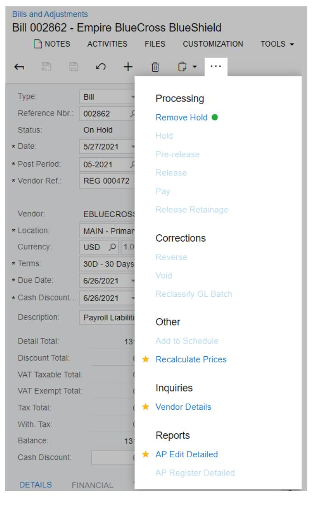

*Figure: The form toolbar and More menu on a narrow screen*

#### **Related Links**

- *[Integration with Excel](https://help-2025r1.acumatica.com/Help?ScreenId=ShowWiki&pageid=d4e757d5-bdf6-4d82-92e3-f26563d48ad4)*
- *To Copy a [Document](https://help-2025r1.acumatica.com/Help?ScreenId=ShowWiki&pageid=aa2b9a0f-794d-4dc7-80b4-14ed0702aea3) Contents to a New Document*
- *To Create a [Document](https://help-2025r1.acumatica.com/Help?ScreenId=ShowWiki&pageid=480487bd-b225-4065-9d82-97a3b68d7994) with a Template*

# <span id="page-454-1"></span><span id="page-454-0"></span>**Table Toolbar**

Each table on an Acumatica ERP form, tab, dialog box, or page has a table toolbar, which contains the buttons you can use to work with the details or objects of the table. A toolbar, shown in the following screenshot, includes buttons that are specific to the table, standard buttons that most table toolbars have, and the search box (for some tables; for others, the search box is displayed in the filtering area).

|               | с  | ∽  | ⊢                                           | $\mathbf{x}$                      |                          |           |                       |               |                 |               |               |
|---------------|----|----|---------------------------------------------|-----------------------------------|--------------------------|-----------|-----------------------|---------------|-----------------|---------------|---------------|
|               |    |    | ALL RECORDS<br><b>ACTIVE</b>                |                                   |                          |           |                       |               |                 |               |               |
|               |    |    | Drag column header here to configure filter |                                   |                          |           |                       | a<br>Y        | $\cdots$        |               | ρ             |
| 髙             | O, | D  | <b>Customer ID</b>                          | <b>Customer Name</b>              | Customer<br><b>Class</b> | Country   | City                  | Currenc<br>ID | <b>Terms</b>    | <b>Status</b> |               |
| $\rightarrow$ | ा  | I٦ | <b>ABARTENDE</b>                            | <b>USA Bartending School</b>      | <b>KEY</b>               | <b>US</b> | <b>Little Falls</b>   | USD.          | 30 <sub>D</sub> | Active        |               |
|               | O  |    | <b>ABCHOLDING</b>                           | <b>ABC Holdings Inc.</b>          | <b>KEY</b>               | <b>US</b> | New York              | <b>USD</b>    | 30 <sub>D</sub> | Active        |               |
|               | ū  |    | !!!!!!!!!!!!!!!!!!!!!!!!!!!!!!!!!!!!!!!!    | <b>ABC Studios Inc.</b>           | <b>KEY</b>               | <b>US</b> | <b>New York</b>       | <b>USD</b>    | 30 <sub>D</sub> | Active        |               |
|               | Ù  |    | <b>ABCVENTURE</b>                           | <b>ABC Capital Ventures</b>       | <b>KEY</b>               | <b>US</b> | Philadelphia          | <b>USD</b>    | 30 <sub>D</sub> | Active        |               |
|               | Û  |    | <b>ACTIVESTAF</b>                           | <b>Active Staffing Service</b>    | <b>LOCAL</b>             | <b>US</b> | <b>New York</b>       | <b>USD</b>    | 30 <sub>D</sub> | Active        |               |
|               | Û. |    | ALPHABETLD                                  | <b>Alphabetland School Center</b> | LOCAL                    | <b>US</b> | <b>North Bellmore</b> | <b>USD</b>    | 30 <sub>D</sub> | Active        |               |
|               |    |    |                                             |                                   |                          |           |                       |               |                 |               |               |
|               |    |    | 1-6 of 103 records                          |                                   |                          |           |                       | K             | 1               | of 18 pages   | $\rightarrow$ |

#### *Figure: Table toolbar*

#### **Standard Table Toolbar Buttons**

The following table describes the standard table toolbar buttons. A table toolbar may include some or all of those buttons. If a table toolbar includes table-specific buttons, they are described in the reference help topic.

| Button                          | Icon | Description                                                                                                                                                                                           |
|---------------------------------|------|-------------------------------------------------------------------------------------------------------------------------------------------------------------------------------------------------------|
| Refresh                         |      | Refreshes the data in the table.                                                                                                                                                                      |
| Switch Between<br>Grid and Form |      | Controls how the elements are displayed: in a table (grid) with rows and columns;<br>or as separately arranged elements for one table row, with navigation tools you use<br>to move between row data. |
| Add Row                         |      | Appends a new row to the table so you can define a new detail or object. The new<br>row may contain some default values.                                                                              |
| Delete Row                      |      | Deletes the selected row or rows.                                                                                                                                                                     |

| Button                    | Icon | Description                                                                                                                                                                                                                                                                                                               |
|---------------------------|------|---------------------------------------------------------------------------------------------------------------------------------------------------------------------------------------------------------------------------------------------------------------------------------------------------------------------------|
| Move Row Up               |      | Moves the selected row one position up.                                                                                                                                                                                                                                                                                   |
| Move Row Down             |      | Moves the selected row one position down.                                                                                                                                                                                                                                                                                 |
| Fit toScreen              |      | Adjusts the table to the screen width and makes the column width proportional.                                                                                                                                                                                                                                            |
| Export to Excel           |      | Exports the data in the table to an Excel file. For more information, see Integration<br>with Excel in the Acumatica ERP Getting Started Guide.                                                                                                                                                                           |
| Filter Settings           |      | Opens the Filter Settings dialog box, which you can use to define a new advanced<br>filter. After you create and save the filter, the corresponding tab appears on the ta<br>ble.<br>For more information about filtering, see Filters. For details on the Filter Settings<br>dialog box, see Filter Settings Dialog Box. |
| Load Records<br>from File |      | Opens the File Upload dialog box, described in detail below, so you can locate and<br>upload a local file for import. You can use this option to import data from an Excel<br>spreadsheet (.xlsx) or .csv file. For the detailed procedure, see To Import Data<br>from a Local File to a Table.                           |
| Search                    |      | A box in which you can type a word, part of a word, or multiple words. As you type,<br>the system filters the contents of the table to display only rows that contain the<br>string you have typed in any column.                                                                                                         |
| Download                  |      | Downloads the selected file.                                                                                                                                                                                                                                                                                              |

#### **File Upload Dialog Box**

With the **File Upload** dialog box, you select a file of one of the supported formats (.csv or .xlsx) to import data from the file.

| Element                                  | Description                                                                                                                         |  |
|------------------------------------------|-------------------------------------------------------------------------------------------------------------------------------------|--|
| File Path                                | The path to the file you want to upload.<br>To select the file, click Browse, and then find and select the file you want to upload. |  |
| The dialog box has the following button. |                                                                                                                                     |  |
| Upload                                   | Closes the dialog box and opens the Common Settings dialog box, where you specify the<br>import settings.                           |  |

#### **Common Settings Dialog Box**

In the **Common Settings** dialog box, which opens if you click **Upload** in the **File Upload** dialog box, you specify the import settings for a file that you has selected in the **File Upload** dialog box.

| Element                                   | Description                                                                                                                                                                    |
|-------------------------------------------|--------------------------------------------------------------------------------------------------------------------------------------------------------------------------------|
| Separator Chars                           | The character that is used as the separator in the imported file.                                                                                                              |
|                                           | By default, the comma is used as the separator. You specify the separator character if the<br>imported file uses any other separator.                                          |
|                                           | This box appears only if you import data from a .csv file.                                                                                                                     |
| Null Value                                | Optional. The value that is used to mark an empty column in the imported file. You speci<br>fy the null value if the value in the imported file differs from the empty string. |
| Encoding                                  | The encoding that is used in the imported file.                                                                                                                                |
|                                           | This box appears only if you import data from a .csv file.                                                                                                                     |
| Culture                                   | The regional format that has been used to display the time, currency, and other measure<br>ments in the imported file.                                                         |
| Mode                                      | The mode that determines which rows of the uploaded file will be imported into the ta<br>ble. The following options are available:                                             |
|                                           | •<br>Update Existing: The rows already present in the table will be updated, and the rows<br>not present in the table will be added.                                           |
|                                           | •<br>Bypass Existing: Only the new rows that are not present in the table will be imported.<br>The rows that are already present in the table will not be updated.             |
|                                           | •<br>Insert All Records: All the rows from the file will be imported into the table.                                                                                           |
|                                           | If you select this option, you may get duplicated rows because the sys<br>tem does not check for duplicates when importing rows from the file.                                 |
| The dialog box has the following buttons. |                                                                                                                                                                                |
| OK                                        | Closes the dialog box and opens the Columns dialog box.                                                                                                                        |
| Cancel                                    | Closes the dialog box without importing the data from the file.                                                                                                                |

#### **Columns Dialog Box**

In the **Columns** dialog box, which opens if you click **OK** in the **Common Settings** dialog box, you match the columns in the imported file that you have selected in the **File Upload** dialog box to the columns in the Acumatica ERP table to which you are importing data.

| Element       | Description                                                         |
|---------------|---------------------------------------------------------------------|
| Column Name   | The name of the column in the uploaded file.                        |
| Property Name | The name of the corresponding column in the table in Acumatica ERP. |

| Element                                   | Description                                                     |  |
|-------------------------------------------|-----------------------------------------------------------------|--|
| The dialog box has the following buttons. |                                                                 |  |
| OK                                        | Closes the dialog box and imports the selected file.            |  |
| Cancel                                    | Closes the dialog box without importing the data from the file. |  |

#### **Related Links**

- *[Tables](https://help-2025r1.acumatica.com/Help?ScreenId=ShowWiki&pageid=87a128a5-1230-4584-8c7a-ad05bcd08b75)*
- *[Integration with Excel](https://help-2025r1.acumatica.com/Help?ScreenId=ShowWiki&pageid=d4e757d5-bdf6-4d82-92e3-f26563d48ad4)*
- *To [Import](https://help-2025r1.acumatica.com/Help?ScreenId=ShowWiki&pageid=96773e07-5811-474d-a088-243f76f48f61) Data from a Local File to a Table*