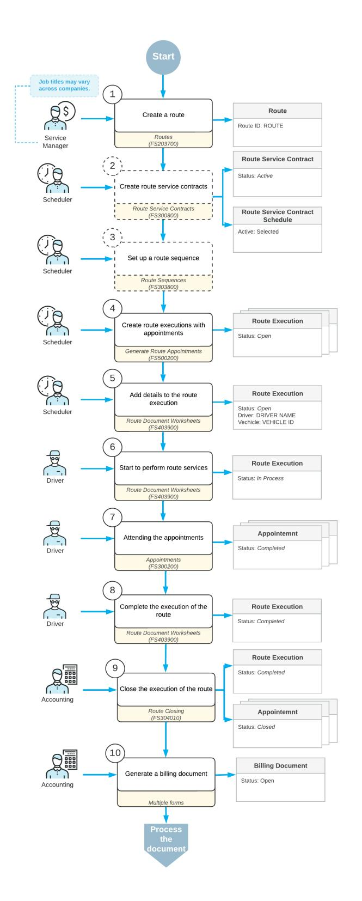
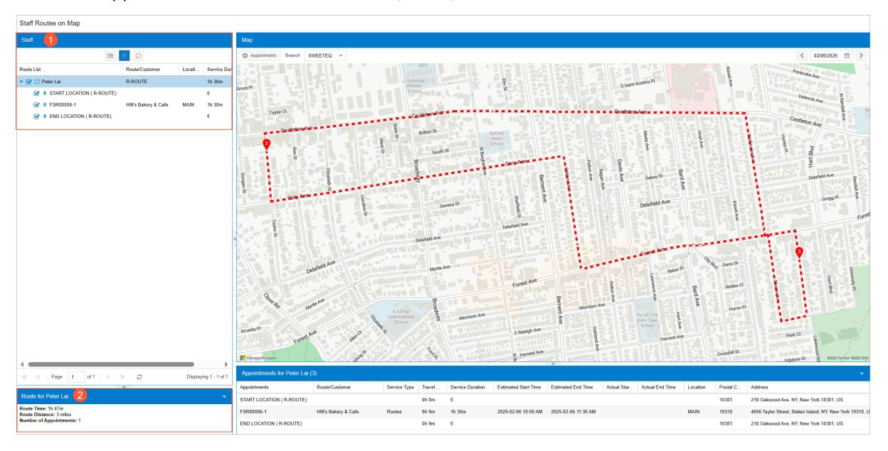
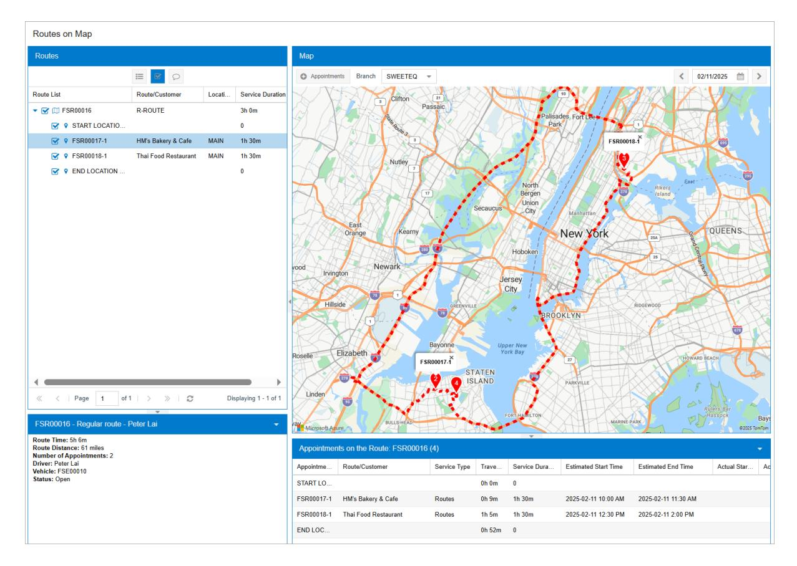
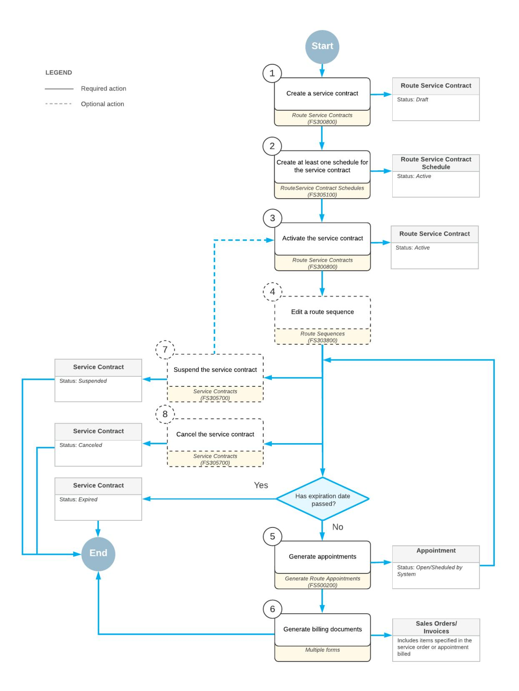

# **Route Management 2025 R1**

### **Contents**

| Copyright4                                                                                       |  |
|--------------------------------------------------------------------------------------------------|--|
| Overview of Route Management Processes5                                                          |  |
| Managing Routes6                                                                                 |  |
| Routes: General Information6                                                                     |  |
| Routes: Entry of a Route 6                                                                       |  |
| Routes: To Create Routes 8                                                                       |  |
| Routes: Sequence Definition10                                                                    |  |
| Routes: To Add Drivers to a Route  11                                                            |  |
| Route Executions 12                                                                              |  |
| Route Executions: Entry of Route Executions 12                                                   |  |
| Route Executions: Modification of a Route Execution 13                                           |  |
| Route Executions: Generation of Appointments for Route Executions 13                             |  |
| Route Executions: Assignment of Vehicles to Route Executions14                                   |  |
| Route Executions: Creating a Route Execution on the Fly15                                        |  |
| Route Executions: Executing a Route 18                                                           |  |
| To Assign Vehicles to Execute Routes20                                                           |  |
| To Assign Drivers to Execute Routes21                                                            |  |
| Route Executions: Related Report and Inquiry Forms22                                             |  |
| Route Executions with Service Delivery24                                                         |  |
| Route Executions with Service Delivery: General Information24                                    |  |
| Route Executions with Service Delivery: To Create a Route Execution with Appointments 27         |  |
| Route Executions with Service Delivery: To Modify the Route Execution30                          |  |
| Route Executions with Service Delivery: To Process the Route Execution 33                        |  |
| Route Executions with Service Delivery: To Generate Invoices for Route Appointments 35           |  |
| Route Executions with Item Delivery37                                                            |  |
| Route Executions with Item Delivery: General Information 37                                      |  |
| Route Executions with Item Delivery: To Create Pickup and Delivery Route Services37              |  |
| Route Executions with Item Delivery: To Process Pickup and Delivery Route Services39             |  |
| Managing Route Service Contracts42                                                               |  |
| Route Service Contracts: General Information 42                                                  |  |
| Route Service Contracts: Billing Types45                                                         |  |
| Route Service Contracts: To Create and Process Service Contract Billed at the Time of Service 48 |  |
| Route Service Contracts: Renewal of a Service Contract 51                                        |  |
| Route Service Contracts: Copying a Service Contract52                                            |  |

| Route Service Contracts: Contract Activation52                           |  |
|--------------------------------------------------------------------------|--|
| Route Service Contracts: Contract Suspension 53                          |  |
| Route Service Contracts: Contract Cancellation53                         |  |
| Route Service Contracts: Contract Schedules54                            |  |
| Route Service Contracts with the End-Period Billing: Billing Documents55 |  |
| Managing Week Codes57                                                    |  |
| Creating Week Codes57                                                    |  |
| Appendix60                                                               |  |
| Reports 60                                                               |  |
| Report Form60                                                            |  |
| Report65                                                                 |  |
| Form Toolbar and More Menu67                                             |  |
| Table Toolbar 74                                                         |  |

### **Copyright**

### **© 2025 Acumatica, Inc.**

### **ALL RIGHTS RESERVED.**

No part of this document may be reproduced, copied, or transmitted without the express prior consent of Acumatica, Inc.

3075 112th Avenue NE, Suite 200, Bellevue, WA 98004, USA

### **Restricted Rights**

The product is provided with restricted rights. Use, duplication, or disclosure by the United States Government is subject to restrictions as set forth in the applicable License and Services Agreement and in subparagraph (c)(1)(ii) of the Rights in Technical Data and Computer Soware clause at DFARS 252.227-7013 or subparagraphs (c)(1) and (c)(2) of the Commercial Computer Soware-Restricted Rights at 48 CFR 52.227-19, as applicable.

### **Disclaimer**

Acumatica, Inc. makes no representations or warranties with respect to the contents or use of this document, and specifically disclaims any express or implied warranties of merchantability or fitness for any particular purpose. Further, Acumatica, Inc. reserves the right to revise this document and make changes in its content at any time, without obligation to notify any person or entity of such revisions or changes.

### **Trademarks**

Acumatica is a registered trademark of Acumatica, Inc. HubSpot is a registered trademark of HubSpot, Inc. Microso Exchange and Microso Exchange Server are registered trademarks of Microso Corporation. All other product names and services herein are trademarks or service marks of their respective companies.

Soware Version: 2025 R1 Last Updated: 06/01/2025

### **Overview of Route Management Processes**

You use the route management functionality to plan and manage your organization's routes and the route services (that is, the services provided when each route is executed), along with processing the contracts related to the routes. In the system, you create the general routes, and for each particular execution of the route, you create route executions. Each stop in the route execution is a route appointment—that is, an appointment with a service order type of the *Route* behavior. Each route execution is based on a particular route and inherits some of its settings.

You can track your executed routes by using the Azure Maps service and get the statistics on each execution of a route, such as the distance and the time needed to execute the route. With the integration between the route management and the service management of Acumatica ERP, you can create appointments related to route executions and generate invoices for services that have been provided.

You use the route management forms to perform a variety of procedures related to processing routes and related documents and entities. These procedures are briefly described in the following sections of this topic.

### **Route Management Documents**

Each route execution created through the route management functionality includes appointments linked to service orders. Once the appointments and route execution are completed or closed, you can generate the appropriate billing documents.

In addition to billing documents, you can generate inventory documents, such as issues and receipts (the *Inventory Management* feature should be additionally enabled on the *[Enable/Disable Features](https://help-2025r1.acumatica.com/Help?ScreenId=ShowWiki&pageid=c1555e43-1bc5-4f6f-ba9d-b323f94d8a6b)* (CS100000) form).

These documents are further processed, and the corresponding financial transactions are posted to the General Ledger.

### **Managing Staff Members (Drivers)**

The integration of route management with service management allows you to define drivers in the system, enabling you to track and assign them to routes. A driver is a staff member who can perform services associated with routes. With this integration, you can quickly and easily select the most suitable available person to deliver your services.

### **Managing Vehicles**

You can enter and store detailed information about each company vehicle. Since route management is integrated with equipment management, each vehicle can also be tracked within the equipment management system. Using route management, you can efficiently select a vehicle from the available options to execute a specific route.

### **Managing and Processing Routes**

Acumatica ERP offers tools to quickly create and process routes while optimizing them to reduce fuel consumption and travel time. With the Azure Maps service integrated into route management, the system calculates the distances and travel times for executed routes. If you rearrange the order of appointments within a route, Azure Maps automatically replots and recalculates the route. Additionally, you can use the Azure Maps service to easily track executed routes, their appointments, and the staff members assigned to them for specific days.

### **Processing Route Service Contracts**

Route service contracts simplify the processing of recurring customer appointments that require route planning. You can define schedules for performing services, and the system will use these schedules to create routes with appointments automatically assigned to them. This functionality saves time and reduces errors by streamlining the process of entering required routes into the system.

### **Managing Routes**

In Acumatica ERP, you can maintain all the necessary information about the routes that your company executes and each specific route execution. The route contains common information for route executions performed by your company—that is, the starting and ending locations of the route, the schedule when it can be performed, and the employees (drivers) who can be assigned to execute the route.

### **Routes: General Information**

The route stores common information for route executions, including the starting and ending locations, schedule, and involved staff members. You can enter specific details for each route execution, such as start and end locations, times, appointments to be attended, and the assigned driver and vehicle. With this information in the system, you can efficiently process service orders that require route planning.

### **Learning Objectives**

In this chapter, you will learn how to create routes.

### **Applicable Scenarios**

You create routes in Acumatica ERP when you need to define common settings for multiple route executions within your company. By creating these routes, they serve as templates, ensuring that each execution on a specific day, with a designated driver, vehicle, and appointments, follows the predefined settings.

### **Routes: Entry of a Route**

In this topic, you will read about entering a route into the system and specifying appropriate settings for the route.

### **Entering a Route**

You enter a route on the *[Routes](https://help-2025r1.acumatica.com/Help?ScreenId=ShowWiki&pageid=174a8c81-a57a-41fa-b59e-0f043854a40c)* (FS203700) form. For the route, you specify an identifier and a description, along with the following information:

- The starting and ending locations of the route
- The schedule when the route can be executed
- The drivers who can execute this route and their priority
- Optionally, the attributes of the route

Aer you have created a route in the system, when you create route executions or schedules for the route service contracts and select the route, the system fills in appropriate settings. You can edit routes at any time; the edits will not affect route executions that have already been created based on the route.

### **Specifying the Start and End Points of the Route**

The start location of the route is a branch location form where a driver departs to execute a route. You specify the branch and its location in the **Branch** and **Branch Location** boxes of the**Start Location** section on the *[Routes](https://help-2025r1.acumatica.com/Help?ScreenId=ShowWiki&pageid=174a8c81-a57a-41fa-b59e-0f043854a40c)* (FS203700) form.

The ending location of the route is a branch location to where a driver arrives when he or she finishes to execute a route. You specify the branch and its location in the **Branch** and **Branch Location** boxes of the **End Location** section on the *[Routes](https://help-2025r1.acumatica.com/Help?ScreenId=ShowWiki&pageid=174a8c81-a57a-41fa-b59e-0f043854a40c)* form.

Make sure that the addresses have been specified correctly for the branch locations. Otherwise, the system will not be able to calculate the route statistics and show the route on a map.

For each route execution created in the system, the start and end locations are defined by the route specified for the route execution. You cannot change the locations for a particular route.

### **Specifying a Schedule**

For the route, you specify the possible schedule when the executions of this route can be performed on the **Execution Days** tab of the *[Routes](https://help-2025r1.acumatica.com/Help?ScreenId=ShowWiki&pageid=174a8c81-a57a-41fa-b59e-0f043854a40c)* (FS203700) form. You define a schedule as follows:

- 1. You specify the days of week when this route can be executed by selecting the appropriate check boxes.
- 2. For each selected day of week, you specify the time when executions of the route can be started in the**Start Time** column.
- 3. You specify the number of executions of this route that can be created per day in the **Nbr.Trip(s) per Day** column.

Route executions do not necessarily have to be generated or created for all the days specified for the route. But the route executions can be created for *only* the days specified for the route associated with the route execution.

### **Adding Drivers to a Route**

In the system, you create the general routes, and for each particular execution of the route, you create route executions.

For each route that you define in the system, you should include the drivers that can possibly execute this route. These drivers will be available for selection when you assign a driver to a route execution on a particular day.

When you define each route in the system on the *[Routes](https://help-2025r1.acumatica.com/Help?ScreenId=ShowWiki&pageid=174a8c81-a57a-41fa-b59e-0f043854a40c)* (FS203700) form, you add possible drivers to the particular route on the **Route Employees**. For each driver you want to add, you click **Add Row** on the table toolbar and select a driver in the **Employee ID** column.

In the **Priority Preference** column, you can also specify the priority with which each assigned driver should be selected to perform services for the route. For example, if one driver has performed the services of this route and knows it well, he or she might have higher priority than a driver who is new and is not familiar with the route or who has served a different geographical area.

The lower the digit you specify in this column, the higher the priority for a driver to be selected for a route service. When you later select drivers for a particular execution of this route, the drivers are listed according to the priority specified for them for this route. If the drivers have the same priority, they are listed according their reference number in the system.

If you do not assign any drivers to a route, you will not be able to select a driver when you create a route execution based on this route.

### **Specifying Attributes for Routes**

An attribute is a site-defined property (for instance, area or problem type) that gives users the ability to specify information for objects in the system beyond the preconfigured settings on the data entry forms. You can specify attributes for the classification of route executions by defining them for a particular route on the **Attributes** tab of the *[Routes](https://help-2025r1.acumatica.com/Help?ScreenId=ShowWiki&pageid=174a8c81-a57a-41fa-b59e-0f043854a40c)* (FS203700) form.

On this tab, you can select attributes only if they have already been defined in the system. If you need an attribute that has not been defined in the system, you can use the *[Attributes](https://help-2025r1.acumatica.com/Help?ScreenId=ShowWiki&pageid=de0a353f-40d0-452d-9152-e65605e69788)* (CS205000) form to create the attribute. Then you will be able to select the new attribute for any route.

The active attributes you specify on this tab will be listed for executions of this route on the **Attributes** tab of the *[Route Document Details](https://help-2025r1.acumatica.com/Help?ScreenId=ShowWiki&pageid=b26fcf32-359a-4ef3-97e4-ab697fcfcdb1)* (FS304000) form.

On the *[Routes](https://help-2025r1.acumatica.com/Help?ScreenId=ShowWiki&pageid=174a8c81-a57a-41fa-b59e-0f043854a40c)* (FS203700) form, you can specify whether each attribute of the route is required. When creating a route execution, the user must specify values for all the required attributes. Also, you can specify default values for any attributes of the route; users can overwrite these values for a particular route execution.

You can deactivate an obsolete attribute for executions of a particular route by clearing the **Active** check box. If you do, the deactivated attribute will no longer be displayed for the executions of the route, but all attribute values that have already been specified for existing route executions will still be stored in the database. If you reactivate the attribute, its values (where specified) will become visible in the system again.

However, if it is not necessary to preserve the data related to an obsolete attribute, you can deactivate the attribute and then delete it by using the **Delete Row** button on the table toolbar. In this case, the attribute will be permanently deleted from the route and all attribute values will bedeleted from the database.

### **Routes: To Create Routes**

In Acumatica ERP, a *route* contains common settings for multiple route executions performed by your company. These settings include the starting and ending locations of the route, the schedule when it can be performed, and the employees (drivers) who can be assigned to execute the route. Each route execution is tied to a particular day, a particular driver, a specific vehicle, and particular appointments and services. The route, conversely, is a template with only the settings that will be common to all executions of a route.

### **Story**

Suppose that the SweetLife Service and Equipment Sales Center plans to provide services on two routes, each of which has its own schedule. Acting as an administrative user, you will create two routes. The first route (*ROUTE*) can be executed on any working day by either of two drivers in your company. The second route (*TU-ROUTE*) can be executed only on Tuesdays, starting no earlier than 01:00 PM.

### **Process Overview**

On the *[Routes](https://help-2025r1.acumatica.com/Help?ScreenId=ShowWiki&pageid=174a8c81-a57a-41fa-b59e-0f043854a40c)* (FS203700) form, you will create two routes with distinct settings.

### **System Preparation**

Before you start creating routes, do the following:

- 1. On the Acumatica ERP website, sign in to a company with the *U100* dataset preloaded as a system administrator by using the *gibbs* username and the *123* password.
- 2. On the Company and Branch Selection menu on the top pane of the Acumatica ERP screen, select the *SWEETEQUIP - Service and Equipment Sales Center* branch.

### **Step: Creating Two Routes**

Perform the following instructions:

- 1. On the Company and Branch Selection menu on the top pane of the Acumatica ERP screen, ensure that the *SWEETEQUIP - Service and Equipment Sales Center* branch is selected.
- 2. On the *[Routes](https://help-2025r1.acumatica.com/Help?ScreenId=ShowWiki&pageid=174a8c81-a57a-41fa-b59e-0f043854a40c)* (FS203700) form, create a new route and specify the following settings:
  - **Route ID**: R-ROUTE
  - **Description**: Regular route
- 3. Under **Start Location**, in the **Branch Location** box, select *WEST BRIGHTON*.
- 4. Under **End Location**, in the **Branch Location** box, select *WEST BRIGHTON*.
- 5. On the **Execution** tab, select the **Monday**, **Tuesday**, **Wednesday**, **Thursday**, and **Friday** check boxes, and leave the other check boxes cleared, as shown in the following screenshot.
- 6. In the **StartTime** column for all the selected days of the week, select *9:00 AM*, which is also shown in the following screenshot.

| <b>R-ROUTE</b> 周 $\mathbb{E}$ $\leftarrow$                               |                  |                    |                                                |                                                   | <b>の + 面 D × K く &gt; &gt;</b> |              |                      |  |
|-----------------------------------------------------------------------------------|------------------|--------------------|------------------------------------------------|---------------------------------------------------|--------------------------------|--------------|----------------------|--|
|                                                                                   |                  |                    |                                                |                                                   |                                |              |                      |  |
| * Route ID:                                                                       | <b>R-ROUTE</b>   |                    | $\varnothing$                                  |                                                   | Week Code(s)                   |              |                      |  |
| Origin Route:                                                                     |                  |                    | $\varnothing$                                  |                                                   | Max. Appointm                  | $\mathbf{0}$ | V No Limit           |  |
| Route Short:                                                                      |                  |                    |                                                |                                                   |                                |              |                      |  |
| * Description:                                                                    | Regular route    |                    |                                                |                                                   |                                |              |                      |  |
| <b>START LOCATION</b>                                                             |                  |                    |                                                |                                                   | <b>END LOCATION .</b>          |              |                      |  |
|                                                                                   |                  |                    |                                                |                                                   |                                |              |                      |  |
| * Branch:                                                                         |                  |                    |                                                | SWEETEQUIP - Ser $\varnothing \nearrow *$ Branch: |                                |              | SWEETEQUIP - Ser Q 2 |  |
| * Branch Location: WEST BRIGHTON - Q   A * Branch Location: WEST BRIGHTON - Q   A |                  |                    |                                                |                                                   |                                |              |                      |  |
| <b>EXECUTION</b>                                                                  | <b>EMPLOYEES</b> |                    |                                                |                                                   | ATTRIBUTES WEEK CODES          |              |                      |  |
|                                                                                   |                  |                    |                                                |                                                   |                                |              |                      |  |
| Day of Week                                                                       |                  | <b>Start Time</b>  |                                                |                                                   | Nbr. Trips per Day             |              |                      |  |
| $\Box$ Sunday                                                                     |                  |                    |                                                |                                                   | 0                              |              |                      |  |
| Monday                                                                            |                  | 9:00 AM            | Ò                                              |                                                   | 1                              |              |                      |  |
| <b>7</b> Tuesday                                                                  |                  | 9:00 AM            | Ò                                              |                                                   | $\mathbf{1}$                   |              |                      |  |
| ✔ Wednesday                                                                       |                  | 9:00 AM            |                                                |                                                   | 1                              |              |                      |  |
| <b>V</b> Thursday                                                                 |                  |                    | Ò                                              |                                                   | $\mathbf{1}$                   |              |                      |  |
| $\triangledown$ Friday                                                            |                  | 9:00 AM 9:00 AM | !!!!!!!!!!!!!!!!!!!!!!!!!!!!!!!!!!!!!!!! O. |                                                   | $\mathbf{1}$                   |              |                      |  |

#### *Figure: Creation of the route*

- 7. On the **Employees** tab, add two rows with the following employees selected in the **Employee ID** column:
  - *EP00000005 (Peter Lai)*
  - *EP00000045 (Luke Cole)*

Notice that only the staff members with the *Driver* skill can be selected on this tab. Also notice that the priority of each of the employees is *1*.

- 8. In the **Priority Preference** column, change the priority of Luke Cole to 2.
- 9. Save your changes.

10.On the form toolbar, click **Add New Record** and specify the following settings for the second route:

- **Route ID**: TU-ROUTE
- **Description**: Tuesday route

11.Under **Start Location**, in the **Branch Location** box, select *WEST BRIGHTON*.

12.Under **End Location**, in the **Branch Location** box, select *WEST BRIGHTON*.

13.On the **Execution** tab, select the**Tuesday** check box and leave the other check boxes cleared.

14.In the **StartTime** box of the selected day of week, select *1:00 PM*.

15.On the **Employees** tab, add two rows with the following settings in the **Employee ID** column:

- *EP00000005 (Peter Lai)*
- *EP00000045 (Luke Cole)*

16.Save your changes.

You have created two routes in the system. Now you can create route executions and select these routes, and the system will fill in the appropriate settings.

### **Routes: Sequence Definition**

The appointments for different contracts with the same route are generated automatically in one route execution for a specific date. Thus, you may need to define the order of appointments for each route execution.

In this topic, you will read about how to define a route sequence in the system and how to reset the route order numbers of a sequence.

### **Route Sequence Definition**

When you create a schedule on the *[Route Service Contract Schedules](https://help-2025r1.acumatica.com/Help?ScreenId=ShowWiki&pageid=648377cc-38b8-4711-a0e1-8182f337168c)* (FS305600) form, the system assigns the order number to the schedule in the **Order** box of the **Routes** tab. You can change the order number as follows:

- You can change the number that defines the order of appointments of a particular route service contract in the **Order** box on the **Routes** tab of the *[Route Service Contract Schedules](https://help-2025r1.acumatica.com/Help?ScreenId=ShowWiki&pageid=648377cc-38b8-4711-a0e1-8182f337168c)* form.
- You can define the sequence in which appointments are generated in a route execution on the *[Route](https://help-2025r1.acumatica.com/Help?ScreenId=ShowWiki&pageid=7563ef07-350b-4138-8061-3c7a42753d50) [Sequences](https://help-2025r1.acumatica.com/Help?ScreenId=ShowWiki&pageid=7563ef07-350b-4138-8061-3c7a42753d50)* (FS303800) form, which displays the appointments and includes the **Order** column.

The number that defines the order of the appointment (that is, the **Order** value) can contain up to five digits. To define the sequence, the system uses numbers that go up in increments of 10, such as 00010, 00020, 00030, and so on. You can change the order values to change the order of the appointments. You can use any number, such as 00008 or 00012. Aer you change the order number, the system changes the order of the appointments as follows: The appointment for a schedule with a lower number takes place earlier than an appointment for a schedule with a higher number.

Based on the sequence settings you specify, a route execution will be built and the route distances and travel time will be calculated. For a particular route execution, you can change the order of appointments manually.

### **Order Number Reset**

You can reset the order numbers to the numbering defined by default by the system (that is, 00010, 00020, 00030, and so on) by clicking **ResetSequence** on the form toolbar. The order of appointments will not be changed (only the numbering sequence).

Consider the following example. Suppose that the order 00010, 00020, and 00030 is set by default as order of the appointments for the schedules of Customer 1, Customer 2, and Customer 3, respectively. You then decide to change the order in which the customers are visited during a route execution; you want Customer 3 to be visited first, and then Customer 1 and Customer 2. To do this, you change the order number of the schedule of Customer 3 to a lower number, such as 00001. Now you have the following order:

- 00001 for the schedules of Customer 3
- 00010 for the schedules of Customer 1

• 00020 for the schedules of Customer 2

Suppose that you then learn that the new order will not work for one of the customers. To revert to the systemassigned order, click **ResetSequence**. The system updates the order numbers as follows:

- 00010 for the schedules of Customer 3
- 00020 for the schedules of Customer 1
- 00030 for the schedules of Customer 2

### **Routes: To Add Drivers to a Route**

You populate the list of drivers who can execute a route on the *[Routes](https://help-2025r1.acumatica.com/Help?ScreenId=ShowWiki&pageid=174a8c81-a57a-41fa-b59e-0f043854a40c)* (FS203700) form so you can later select any of these drivers for an execution of that route on the *[Route Document Details](https://help-2025r1.acumatica.com/Help?ScreenId=ShowWiki&pageid=b26fcf32-359a-4ef3-97e4-ab697fcfcdb1)* (FS304000) form.

### **To Add Drivers to a Route**

- 1. Open the *[Routes](https://help-2025r1.acumatica.com/Help?ScreenId=ShowWiki&pageid=174a8c81-a57a-41fa-b59e-0f043854a40c)* (FS203700) form.
- 2. In the **Route ID** box, select the identifier of the route to which you want to add drivers.
- 3. On the **Route Employees** tab, for each driver you want to be available to perform this route do the following:
  - a. Click **Add Row**.
  - b. In the **Employee ID** column, select the identifier of the driver.
  - c. In the **Priority Preference** column, select the priority of the driver to execute the route. The lower the digit, the higher the priority of the driver.
- 4. Click **Save** on the form toolbar.

### **Route Executions**

In this chapter, you will learn how to efficiently manage route executions. You will discover how to create a route execution on the fly, review the appointments assigned to a driver, and view the route execution on a map.

### **Route Executions: Entry of Route Executions**

To process the routes that are executed by your company, you have to create route execution documents in the system for each specific day when the route services are provided. You can create route executions in one of the following ways:

- If your company regularly performs route services for a customer on a contract basis, you enter a route service contract and set it up so that routes can be generated.
- If your company performs services for the customer rarely or you have no contract that defines the details of the services provided, you can create route execution documents manually.

In this topic, you will learn how to enter a route execution manually.

### **Entering a Route Execution Manually**

You enter a route execution on the *[Route Document Details](https://help-2025r1.acumatica.com/Help?ScreenId=ShowWiki&pageid=b26fcf32-359a-4ef3-97e4-ab697fcfcdb1)* (FS304000) form. For the route execution, you specify the following information:

- The route to which the route execution relates.
- The date of the route execution. You can select a date that is one of the days of the week specified for the associated route.
- The driver or drivers who will perform the services of the route execution.
- The vehicle or vehicles to be used for the route execution.
- The values of the attributes defined for executions of the route. You can specify or modify the values of any attributes that are listed on the **Attributes** tab; if the **Required** check box is selected for an attribute, you must specify a value for it.

Aer you have specified and saved this information, you can create and add appointments for the route execution by clicking **Create New Appointment** on the table toolbar and filling in information about each appointment on the *[Appointments](https://help-2025r1.acumatica.com/Help?ScreenId=ShowWiki&pageid=ac486e9c-f5df-4829-94f0-2df8821361a0)* (FS300200) form.

You can assign to appointments on the route only services that are indicated as route services in the system (that is, they have the **RouteService** check box selected on the *[Services](https://help-2025r1.acumatica.com/Help?ScreenId=ShowWiki&pageid=e6537db1-ecfa-4d5b-b08c-0bdd6233fda2)* (FS400800) form). These services have to be assigned to the route service class (that, is the **RouteService Class** is selected on the *[Item Classes](https://help-2025r1.acumatica.com/Help?ScreenId=ShowWiki&pageid=80a3301b-4eb2-4ce2-94c5-0407c786a0f1)* (IN201000) form).

By default, the system assigns a new route execution document the *Open* status. Reference numbers for new route execution documents are generated according to the numbering sequence specified in the **Route Numbering Sequence** box on the **Routes** tab of the *[Service Management Preferences](https://help-2025r1.acumatica.com/Help?ScreenId=ShowWiki&pageid=1c1b94d7-ac39-4f84-a966-588290b5ba80)* (FS100100) form.

### **Viewing Route Statistics**

The route execution statistics contain information about the number of appointments and services related to the executed route, the duration of activities related to it, and the total distance traveled. In the Summary area of the *[Route Document Details](https://help-2025r1.acumatica.com/Help?ScreenId=ShowWiki&pageid=b26fcf32-359a-4ef3-97e4-ab697fcfcdb1)* (FS304000) form (**RouteStatistics** section), you can view the route statistics for the selected route execution.

The statistics can be calculated automatically by the system or the process of calculation can be invoked manually. If the **Calculate RouteStatistics Automatically** check box is selected on the **Routes** tab of the *[Service Management](https://help-2025r1.acumatica.com/Help?ScreenId=ShowWiki&pageid=1c1b94d7-ac39-4f84-a966-588290b5ba80) [Preferences](https://help-2025r1.acumatica.com/Help?ScreenId=ShowWiki&pageid=1c1b94d7-ac39-4f84-a966-588290b5ba80)* (FS100100) form, the system will automatically update the **RouteStatistics** section if you make changes in the route execution.

If the **Calculate RouteStatistics Automatically** check box is cleared, you have to click the **Calculate Route Statistics** button on the form toolbar of the *[Route Document Details](https://help-2025r1.acumatica.com/Help?ScreenId=ShowWiki&pageid=b26fcf32-359a-4ef3-97e4-ab697fcfcdb1)* form to recalculate statistics in the **Route Statistics** section.

### **Route Executions: Modification of a Route Execution**

You can make changes to a route execution document created in the system on the *[Route Document Details](https://help-2025r1.acumatica.com/Help?ScreenId=ShowWiki&pageid=b26fcf32-359a-4ef3-97e4-ab697fcfcdb1)* (FS304000) form. Before the route execution is completed (that is, it has the *Open* or *In Process* status), you can perform the following changes:

- Add an appointment to the route execution: If there is urgent appointment that needs to be performed or no schedule has been created for some customer services, you can manually add an appointment to the route execution.
- Delete an appointment from the route execution: If the services of an appointment are not going to be performed or the customer canceled the appointment, you can delete it from the route execution by clicking the appointment line on the **Appointments** tab and clicking the **Delete Appointment** button on the table toolbar.

If you delete an appointment from the route execution, it will be automatically deleted from all records in the system.

• Change the order of appointments in the route execution: If necessary, you can change the order of the appointments by clicking the appointment you want to move and clicking the **Move Up** or **Move Down** button, depending on where in the route execution you want to move the appointment.

You can also change the order of appointments on the *[Routes on Map](https://help-2025r1.acumatica.com/Help?ScreenId=ShowWiki&pageid=552bd083-b7e4-4ee3-9270-7be6b7292a01)* (FS300900) form. To do so, on the **Routes** tab, you drag and drop an appointment whose position in a route execution you want to change.

• Assign an appointment to a different route execution: If the appointment is going to be performed on another date or another route, you can move it to route execution of a different route or a route execution of a different date.

In route executions that are not yet closed (that is, route executions that have the *Open*, *In Process*, or *Completed* status), you can make changes as follows.:

- Change the date (it should correspond to the schedule for the route associated with this route execution) and start time in the **Date** and **StartTime** boxes.
- Add or reassign drivers and vehicles.

### **Route Executions: Generation of Appointments for Route Executions**

In Acumatica ERP, the final step of processing a route service contract is generating the appointments for route executions. If a route execution for a specific day does not yet exist in the system, the system generates a route execution along with the appointments. If a route execution for a specific day exists in the system, the system generates appointments, and they are included in the existing route execution.

In this topic, you will read about how the appointments of route executions are generated for a route service contract and how the generation process can be canceled in the system.

### **Generating Appointments**

You generate the route appointments in the system according to the route service contract schedules you have created. You can generate appointments manually or create an automation schedule to generate the appointments. For more information on scheduling automated processing, see *[Automated Processing: General](https://help-2025r1.acumatica.com/Help?ScreenId=ShowWiki&pageid=8a6c65f2-2379-48e1-b249-fb70d8122c4e) [Information](https://help-2025r1.acumatica.com/Help?ScreenId=ShowWiki&pageid=8a6c65f2-2379-48e1-b249-fb70d8122c4e)*.

To generate schedules manually, you use the *[Generate Route Appointments](https://help-2025r1.acumatica.com/Help?ScreenId=ShowWiki&pageid=d8e31b4a-ec95-49a3-961c-ad02a84b3299)* (FS500200) form. You can navigate directly to this form, or you can navigate to this form from the *[Route Service Contract Schedules](https://help-2025r1.acumatica.com/Help?ScreenId=ShowWiki&pageid=648377cc-38b8-4711-a0e1-8182f337168c)* (FS305100) form by clicking the **Generate Route Appointments** button on the form toolbar. (This button becomes available aer you have specified the schedule recurrence settings and saved the route service contract schedule.)

On the *[Generate Route Appointments](https://help-2025r1.acumatica.com/Help?ScreenId=ShowWiki&pageid=d8e31b4a-ec95-49a3-961c-ad02a84b3299)* form, you can filter the list of schedules by route, and you should select the date range for which you want to generate schedules in the system. You can then generate route executions for all listed route service contract schedules or only those you select.

You can process the route executions with the generated appointments.

### **Viewing Generation Processes**

On the **Run History** tab of the *[Generate Route Appointments](https://help-2025r1.acumatica.com/Help?ScreenId=ShowWiki&pageid=d8e31b4a-ec95-49a3-961c-ad02a84b3299)* (FS500200) form, you can view information about the generation process, such as the date until which the appointments have been generated and the date when the appointments have been generated.

### **Route Executions: Assignment of Vehicles to Route Executions**

To each route execution that you have created in the system, you have to assign at least one vehicle that is used to execute the route.

In this topic, you will read about assigning a vehicle (and possibly assigning additional vehicles) to route executions.

### **Assigning the First Vehicle to Route Executions**

You select the first vehicle that will be used to execute the route as follows:

• To assign a vehicle to a particular route execution, you use the *[Route Document Details](https://help-2025r1.acumatica.com/Help?ScreenId=ShowWiki&pageid=b26fcf32-359a-4ef3-97e4-ab697fcfcdb1)* (FS304000) form. In the Summary area of this form, you select the route execution to which you want to assign the vehicle in the **Route Nbr.** box, and you click the**VehicleSelector** button. You then select the vehicle in the**Vehicle Selector** dialog box, which opens.

Alternatively, you can select a vehicle by clicking the magnifier icon in the**Vehicle** box and selecting the driver in the**Vehicle** lookup table.

• To assign vehicles to multiple route executions for a specific date range, you use the *[Route Document](https://help-2025r1.acumatica.com/Help?ScreenId=ShowWiki&pageid=dbe4d3ca-8cb4-4ddc-bba9-5e3a9d4e2e04) [Worksheets](https://help-2025r1.acumatica.com/Help?ScreenId=ShowWiki&pageid=dbe4d3ca-8cb4-4ddc-bba9-5e3a9d4e2e04)* (FS403900) form. On this form, for each route to which you want to assign a vehicle, you click the line with the needed route and click **Assign Vehicle** on the table toolbar. You then select the vehicle in the **VehicleSelector** dialog box, which opens.

Alternatively, you can select a vehicle by clicking the magnifier icon in the**Vehicle** column and selecting the driver in the**Vehicle** lookup table.

In the **VehicleSelector** dialog box, you select the first (and perhaps only) vehicle for the route of the document. This list contains all the vehicles that have not yet been assigned to any route on the day of the route execution.

To select a particular vehicle, you click the line with the necessary vehicle in the table of the dialog box and click **SelectVehicle**.

### **Assigning Additional Vehicles to Routes**

If additional vehicles are necessary to perform the route service, you can assign up to two additional vehicles as follows:

- To assign additional vehicles to a particular route execution on the *[Route Document Details](https://help-2025r1.acumatica.com/Help?ScreenId=ShowWiki&pageid=b26fcf32-359a-4ef3-97e4-ab697fcfcdb1)* form (FS304000), you select the second vehicle in the **AdditionalVehicle 1** box and the third in the **AdditionalVehicle 2** box. You then save your changes by clicking**Save** on the form toolbar.
- To assign additional vehicles to multiple route executions for a specific date range on the *[Route Document](https://help-2025r1.acumatica.com/Help?ScreenId=ShowWiki&pageid=dbe4d3ca-8cb4-4ddc-bba9-5e3a9d4e2e04) [Worksheets](https://help-2025r1.acumatica.com/Help?ScreenId=ShowWiki&pageid=dbe4d3ca-8cb4-4ddc-bba9-5e3a9d4e2e04)* (FS403900) form, for each needed route execution, you select the second vehicle in the **AdditionalVehicle 1** column and the third in the **AdditionalVehicle 2** column.

### **Route Executions: Creating a Route Execution on the Fly**

In this activity, you will learn how to create a route execution on the fly. You will also learn how to review the appointments of a driver assigned to the route execution and how to view the route execution on a map.

This activity is based on the *U100* dataset. If you are using another dataset, or if any system settings have been changed in *U100*, these changes can affect the workflow of the activity and the results of the processing. To avoid any issues, restore the *U100* dataset to its initial state.

### **Story**

Suppose that the service manager, Maia Davis, has received a request from the Thai Food Restaurant customer for the delivery of fruits for 1/31/2025. She needs to create a new route execution in the system with an appointment for the customer. The service manager will then review the schedule of the driver selected to perform the route execution, and view the created route execution on a map. Acting as the service manager, you will perform these actions in the system.

### **Configuration Overview**

In the *U100* dataset, the following tasks have been performed to support this activity:

- On the *[Enable/Disable Features](https://help-2025r1.acumatica.com/Help?ScreenId=ShowWiki&pageid=c1555e43-1bc5-4f6f-ba9d-b323f94d8a6b)* (CS100000) form, the *Route Management* feature has been enabled.
- On the *[Service Management Preferences](https://help-2025r1.acumatica.com/Help?ScreenId=ShowWiki&pageid=1c1b94d7-ac39-4f84-a966-588290b5ba80)* (FS100100) form, an API key has been specified in the **Map API Key** box.
- On the *[Branch Locations](https://help-2025r1.acumatica.com/Help?ScreenId=ShowWiki&pageid=ebef097e-9e47-4c7b-b0b0-c381251b48cf)* (FS202500) form, the *WEST BRIGHTON* branch location has been configured.
- On the *[User Profile](https://help-2025r1.acumatica.com/Help?ScreenId=ShowWiki&pageid=8430c8b2-a79c-4f7b-9768-b0b7fad23a59)* (SM203010) form, the *WEST BRIGHTON* branch location has been assigned as a default branch location to the *davis* user.
- On the *[Service](https://help-2025r1.acumatica.com/Help?ScreenId=ShowWiki&pageid=06fd8a36-dd81-4df9-b609-92c3d552c542) Order Types* (FS202300) form, the *ROUT* service order type with the *Route* behavior has been configured to generate sales orders to bill customers for services that have been provided. That is, the**Sales Orders** option has been selected under **Generated Billing Documents** in the **BillingSettings** section of the **General** tab.
- On the *[Customers](https://help-2025r1.acumatica.com/Help?ScreenId=ShowWiki&pageid=652929bc-9606-4056-aa6e-0c2d1147171b)* (AR303000) form, the *TOMYUM (Thai Food Restaurant)* customer has been preconfigured, and the *AP SO* billing cycle has been selected in the**Service Management** section of the **Billing** tab.
- On the *[Non-Stock Items](https://help-2025r1.acumatica.com/Help?ScreenId=ShowWiki&pageid=bf68dd4f-63d4-460d-8dc0-9152f2bd6bf1)* (IN202000) form, the *DELIVERY* non-stock item has been configured, and the *Service* type has been selected for it. For this item, the *DELIVERING* item class has been selected, for which the **RouteService Class** check box has been selected on the *[Item Classes](https://help-2025r1.acumatica.com/Help?ScreenId=ShowWiki&pageid=80a3301b-4eb2-4ce2-94c5-0407c786a0f1)* (IN201000) form.

- On the *[Employees](https://help-2025r1.acumatica.com/Help?ScreenId=ShowWiki&pageid=dae5144b-49b3-43a4-bce0-93f31b3f2321)* (EP203000) form, for *EP00000005 (Peter Lai)*, the **Staff Member in Service Management** check box has been selected on the **General Info** tab), and the *DRIVING* skill has been added on the **Skills** tab.
- On the *[Routes](https://help-2025r1.acumatica.com/Help?ScreenId=ShowWiki&pageid=174a8c81-a57a-41fa-b59e-0f043854a40c)* (FS203700) form, the *NY* route has been configured with executions on Mondays, Wednesdays, and Fridays starting at 9:00 AM. *Peter Lai* has been assigned to this route on the **Employees** tab.
- On the *[Vehicles](https://help-2025r1.acumatica.com/Help?ScreenId=ShowWiki&pageid=0580b974-c0a2-4775-a1da-a67ae17f9016)* (FS203600) form, the *FSE00004 (White Foord)* has been preconfigured

### **Process Overview**

To create a route execution on the fly, you specify the details of the route execution on the *[Route Document Details](https://help-2025r1.acumatica.com/Help?ScreenId=ShowWiki&pageid=b26fcf32-359a-4ef3-97e4-ab697fcfcdb1)* (FS304000) form, and add appointments that you create on the *[Appointments](https://help-2025r1.acumatica.com/Help?ScreenId=ShowWiki&pageid=ac486e9c-f5df-4829-94f0-2df8821361a0)* (FS300200) form. You then review the assigned driver's schedule on the *[Routes on Map](https://help-2025r1.acumatica.com/Help?ScreenId=ShowWiki&pageid=552bd083-b7e4-4ee3-9270-7be6b7292a01)* (FS300900) form, and check the route execution on the *[Staff](https://help-2025r1.acumatica.com/Help?ScreenId=ShowWiki&pageid=e2c22a91-5e7c-4269-8134-e890dbba7d3a) [Routes on Map](https://help-2025r1.acumatica.com/Help?ScreenId=ShowWiki&pageid=e2c22a91-5e7c-4269-8134-e890dbba7d3a)* (FS301000) form.

### **System Preparation**

To sign in to the system and prepare to perform the instructions of the activity, do the following:

- 1. Launch the Acumatica ERP website, and sign in to a company with the *U100* dataset preloaded; you should sign in as a service manager by using the *brawner* username and the *123* password.
- 2. In the info area, in the upper-right corner of the top pane of the Acumatica ERP screen, make sure that the business date in your system is set to *1/30/2025*. If a different date is displayed, click the Business Date menu button and select *1/30/2025* on the calendar. For simplicity, in this activity, you will create and process all documents in the system on this business date.

### **Step 1: Creating a New Route Execution**

To create a new route execution, do the following:

- 1. Open the *[Route Document Details](https://help-2025r1.acumatica.com/Help?ScreenId=ShowWiki&pageid=b26fcf32-359a-4ef3-97e4-ab697fcfcdb1)* (FS304000) form.
- 2. Create a new route execution, and specify the following settings in the Summary area:
  - **Route**: *NY*
  - **Scheduled Start Date**: *2/3/20253:00 PM*
- 3. Click **DriverSelector**.

The **DriverSelector** dialog box opens. Notice that only driver of the company is not assigned to the appointments during the specified time (the **Already Assigned** check box is cleared for him).

- 4. In the table, click *EP00000005 (Peter Lai)*, and then click **Select Driver** at the bottom of the dialog box.
- 5. Click **VehicleSelector**.

The **VehicleSelector** dialog box opens.

- 6. In the table, click *FSE00004 (Mersedes-Bens S3500)*, and then click **SelectVehicle** at the bottom of the dialog box.
- 7. On the form toolbar, click**Save**.

### **Step 2: Adding an Appointment to the Route Execution**

To add an appointment to the route execution, do the following:

1. While you are still viewing the route execution on the *[Route Document Details](https://help-2025r1.acumatica.com/Help?ScreenId=ShowWiki&pageid=b26fcf32-359a-4ef3-97e4-ab697fcfcdb1)* (FS304000) form, on the **Appointments** tab, click **Add Row**.

The **Select theService OrderType for the New Appointment** dialog box has been opened.

2. In the dialog box, make sure the *RTE* service order type is selected and click **Proceed**.

This brings up the *[Appointments](https://help-2025r1.acumatica.com/Help?ScreenId=ShowWiki&pageid=ac486e9c-f5df-4829-94f0-2df8821361a0)* (FS300200) form, where you can add the details of the appointment in the route execution.

- 3. Specify the following settings for the appointment:
  - **Customer**: *TOMYUM (Thai Food Restaurant)*
  - **Description**: Delivery of fruits
- 4. On the table toolbar of the **Details** tab, click **Add Row**, and specify the following settings:
  - **LineType**: *Service*
  - **Inventory ID**: *DELIVERY*
- 5. On the **Settings** tab, in the**Scheduled Start Date** box, specify *2/3/20213:00 PM*. Ensure **Confirmed** is selected.
- 6. On the form toolbar, click**Save & Close**.
- 7. In the **Scheduled StartTime** column on the **Appointments** tab of the *[Route Document Details](https://help-2025r1.acumatica.com/Help?ScreenId=ShowWiki&pageid=b26fcf32-359a-4ef3-97e4-ab697fcfcdb1)* form, notice that the stat time has been calculated by the system according to the start time of the route execution and the estimated driving time from the start location to the appointment location.

### **Step 3: Reviewing the Appointments of the Driver**

To review the appointments for Peter Lai, do the following:

1. While you are still viewing the route execution on the *[Route Document Details](https://help-2025r1.acumatica.com/Help?ScreenId=ShowWiki&pageid=b26fcf32-359a-4ef3-97e4-ab697fcfcdb1)* (FS304000) form, on the form toolbar, click **Open Driver Calendar**.

The system brings up the *[Staff Calendar Board](https://help-2025r1.acumatica.com/Help?ScreenId=ShowWiki&pageid=b1d15e47-fba9-4bbf-a7fa-2f7c396c8df4)* (FS300400) form for the driver assigned to execute the route (Peter Lai).

- 2. Verify that the created appointment is present on the *[Staff Calendar Board](https://help-2025r1.acumatica.com/Help?ScreenId=ShowWiki&pageid=b1d15e47-fba9-4bbf-a7fa-2f7c396c8df4)*.
- 3. Close the *[Staff Calendar Board](https://help-2025r1.acumatica.com/Help?ScreenId=ShowWiki&pageid=b1d15e47-fba9-4bbf-a7fa-2f7c396c8df4)* form.

### **Step 4: Reviewing a Route Execution on a Map**

To view the route execution on a map, do the following:

1. Open the *[Staff Routes on Map](https://help-2025r1.acumatica.com/Help?ScreenId=ShowWiki&pageid=e2c22a91-5e7c-4269-8134-e890dbba7d3a)* (FS301000) form.

The map opens for the current business date.

- 2. In the **Date** box, select the *2/3/2025* date for which you have scheduled the route execution.
- 3. Click the arrow button le of the driver's name (*Peter Lai*) in the **Staff** section to view the appointment details of this driver for this day.
- 4. Click the driver's name (*Peter Lai*) to open the **Route for Peter Lai** tab in the bottom le corner of the form.

Here you can review the route duration, distance, and number of appointments for the selected driver, as the screenshot below shows.

5. On the **Appointments for Peter Lai** tab in the bottom part of the map on the form.

The system displays the names of the customers with which appointments take place, the time that is needed to travel between points of the route, and the addresses of the route locations.

| Staff Routes on Map                                                                                   |                             |          |                         |                                                |                                       |                  |                          |                                          |                                    |                                                            |                                    |                 |                       |                     |                           |
|-------------------------------------------------------------------------------------------------------|-----------------------------|----------|-------------------------|------------------------------------------------|---------------------------------------|------------------|--------------------------|------------------------------------------|------------------------------------|------------------------------------------------------------|------------------------------------|-----------------|-----------------------|---------------------|---------------------------|
| <b>Staff</b>                                                                                          |                             |          |                         | Map                                            |                                       |                  |                          |                                          |                                    |                                                            |                                    |                 |                       |                     |                           |
|                                                                                                       | $\equiv$ $\circ$         |          |                         | Appointments Branch                            | SWEETEQ +                             |                  |                          |                                          |                                    |                                                            |                                    |                 |                       | $\langle$           | 02/03/2021 前 >            |
| Route List                                                                                            | Route/Customer              | Location | <b>Service Duration</b> |                                                |                                       |                  |                          |                                          |                                    | <b>NESTCHESTER</b>                                         |                                    | Port Washington |                       |                     |                           |
| ▼ 区 印 Peter Lai                                                                                       | <b>NY</b>                   |          | 0h 30m                  |                                                |                                       |                  |                          |                                          | Bronx                              | PARK OF                                                    |                                    |                 |                       |                     | $S_y$                     |
| <b>V 9 START LOCATION ( NY)</b>                                                                       |                             |          | $\bullet$               |                                                |                                       |                  | Hackensa North Bergen |                                          | O <b>EAST HARE</b>              | <b>CLASON POINT</b>                                        |                                    |                 |                       |                     | $(+)$                     |
| ₩ 9 000046-1                                                                                          | <b>Thai Food Restaurant</b> | MAIN     | 0h 30m                  | Livingston                                     | City of                               | 筒                | Union City               |                                          |                                    | Rikers   filand <b>MALBA</b> <b>COLLEGE POINT</b> |                                    |                 |                       |                     | Plair                     |
| <b>M</b> 9 END LOCATION ( NY)                                                                         |                             |          | ۰                       |                                                | Orange East Orange Kearny       |                  |                          | 495 New 1          | <b>Jork</b>                        | Queens                                                     |                                    | LITTLE NECK     |                       |                     | Hicksville (-) |
|                                                                                                       |                             |          |                         |                                                |                                       |                  |                          | Manhattan                                |                                    |                                                            |                                    |                 | Mineola 1  |                     |                           |
|                                                                                                       |                             |          |                         | Maplewood                                      | Newark Irvington                   |                  | Hoboken <b>ROAD</b>   |                                          |                                    | <b>LMFAURST</b>                                            | 158950                             | Floral Park     | Garden City           | East Meadow         | Bethpag evittown       |
|                                                                                                       |                             |          |                         | Millburn <b>LARCHMONT</b> <b>ESTATES</b> |                                       |                  | Jersey City              |                                          |                                    |                                                            | <b>SICILITY</b> <b>HILLSIDE</b> |                 | Hempstead Franklin | East Meadow         | North Massagegu           |
|                                                                                                       |                             |          |                         |                                                | Θ                                     |                  |                          |                                          | RIDGEWOOD                          |                                                            |                                    | Imont Square    |                       | Uniondal            | North Bellmore            |
|                                                                                                       |                             |          |                         |                                                |                                       | Bayonne          |                          |                                          |                                    | SOUTH OZONE PARK                                           |                                    | Valley          | <b>Southern State</b> |                     | Massar                    |
|                                                                                                       |                             |          |                         |                                                | c Elizabeth                        |                  | Upper New York Bay | <b>EK SLOPE</b> 22                    |                                    | HOWARD BLACH'                                              |                                    | Stream          | Rockville Centre   | Baldwin Freeport | Merrick                   |
|                                                                                                       |                             |          |                         |                                                | <b>ARUNGTON</b>                       | Staten Island |                          | PARKVILLE                                |                                    |                                                            |                                    |                 | Oceanside             |                     | Great sland-           |
|                                                                                                       |                             |          |                         |                                                | <b>OLD PLACE</b> Linden            | ਨ                |                          |                                          | <b>BERGEN BEACH</b>                |                                                            |                                    |                 |                       |                     |                           |
|                                                                                                       |                             |          |                         | Rahway                                         | TRAVEL                                |                  |                          | <b>NSONHURST</b>                         | Floyd                              |                                                            |                                    |                 |                       | ng Beach            | stand.                    |
|                                                                                                       |                             |          |                         |                                                |                                       | Staten Island    |                          |                                          | Bennett Field                   |                                                            |                                    |                 | Long Beach            | Barrier Island   |                           |
|                                                                                                       |                             |          |                         |                                                | RICHMOND                              |                  |                          | <b>SEAGATE</b>                           | Fort                               | BELLE HARBOR                                               |                                    |                 |                       |                     |                           |
|                                                                                                       |                             |          |                         |                                                | <b>GREENRIDG</b>                      |                  |                          |                                          | Tilden $\overline{\phantom{a}}$ |                                                            |                                    |                 |                       |                     |                           |
| $\leftarrow$                                                                                          |                             |          |                         |                                                | <b>Appointments for Peter Lai (3)</b> |                  |                          |                                          |                                    |                                                            |                                    |                 |                       |                     |                           |
| of $1 \rightarrow \gg \Box$ $\ll$ Page !!!!!!!!!!!!!!!!!!!!!!!!!!!!!!!!!!!!!!!! $\langle$ |                             |          | Displaying 1 - 1 of 1   | Appointme.                                     | Route/Customer                        | Service Type     | Trave                    | Service Du                               | Estimated                          | Estimated                                                  | Actual Star                        | Actual End.     | Location              | Postal C            | Address                   |
|                                                                                                       |                             |          |                         | START LO.                                      |                                       |                  | Oh Om                    | $\circ$                                  |                                    |                                                            |                                    |                 |                       | 10301               | 218 Oakwood Ave.          |
| Route for Peter Lai                                                                                   |                             |          |                         | 000046-1                                       | <b>Thai Food Restaurant</b>           | Route Serv       | $0h$ 42 $m$              | 0h 30m                                   |                                    | 2021-02-0 2021-02-0                                        |                                    |                 | <b>MAIN</b>           | 10454               | 341 E 138th St. NY.       |
| Route Time: 1h 53m Route Distance: 49 miles                                                        |                             |          |                         | END LOC                                        |                                       |                  | $0h$ 41 $m$              | !!!!!!!!!!!!!!!!!!!!!!!!!!!!!!!!!!!!!!!! |                                    |                                                            |                                    |                 |                       | 10301               | 218 Oakwood Ave.          |
| <b>Number of Appointments:</b>                                                                        |                             |          |                         |                                                |                                       |                  |                          |                                          |                                    |                                                            |                                    |                 |                       |                     |                           |

*Figure: The route of the staff member on the map*

### **Route Executions: Executing a Route**

In this activity, you will learn how to process a route execution in Acumatica ERP from starting it through closing it.

This activity is based on the *U100* dataset. If you are using another dataset, or if any system settings have been changed in *U100*, these changes can affect the workflow of the activity and the results of the processing. To avoid any issues, restore the *U100* dataset to its initial state.

### **Story**

Suppose that the driver of the Sweet Life Equipment company (Peter Lai) needs to execute a route on *1/30/2025*. He will start the route execution from the office and then go to each customer location of the route. Aer all appointments are completed, the driver needs to go back to the office, where he will review the route execution in the system and prepare it for billing. You will perform the needed actions in the system, acting as the driver.

### **Configuration Overview**

In the *U100* dataset, the following tasks have been performed to support this activity:

- On the *[Enable/Disable Features](https://help-2025r1.acumatica.com/Help?ScreenId=ShowWiki&pageid=c1555e43-1bc5-4f6f-ba9d-b323f94d8a6b)* (CS100000) form, the *Service Management* and *Route Management* features have been enabled.
- On the *[Service Management Preferences](https://help-2025r1.acumatica.com/Help?ScreenId=ShowWiki&pageid=1c1b94d7-ac39-4f84-a966-588290b5ba80)* (FS100100) form, a key has been specified in the **Map API Key** box.
- On the *[Employees](https://help-2025r1.acumatica.com/Help?ScreenId=ShowWiki&pageid=dae5144b-49b3-43a4-bce0-93f31b3f2321)* (EP203000) form, for *EP00000005 (Peter Lai)*, the **Staff Member in Service Management** check box has been selected on the **General Info** tab, and the *DRIVING* skill has been added on the **Skills** tab.
- On the *[Routes](https://help-2025r1.acumatica.com/Help?ScreenId=ShowWiki&pageid=174a8c81-a57a-41fa-b59e-0f043854a40c)* (FS203700) form, the *NY2* route has been configured with executions on Tuesdays and Thursdays starting at 9:00 AM. *Peter Lai* has been assigned to this route on the **Employees** tab.

### **Process Overview**

To execute a route, you start a route execution on the *[Route Document Details](https://help-2025r1.acumatica.com/Help?ScreenId=ShowWiki&pageid=b26fcf32-359a-4ef3-97e4-ab697fcfcdb1)* (FS304000) form, and then complete each appointment of the route execution on the *[Appointments](https://help-2025r1.acumatica.com/Help?ScreenId=ShowWiki&pageid=ac486e9c-f5df-4829-94f0-2df8821361a0)* (FS300200) form. You then complete the route execution on the *[Route Document Details](https://help-2025r1.acumatica.com/Help?ScreenId=ShowWiki&pageid=b26fcf32-359a-4ef3-97e4-ab697fcfcdb1)* form, and close it on the *[Close Routes](https://help-2025r1.acumatica.com/Help?ScreenId=ShowWiki&pageid=2f773a55-102c-4ace-862f-cb7096e6f0d2)* (FS500800) form.

### **System Preparation**

To sign in to the system and prepare to perform the instructions of the activity, do the following:

- 1. Launch the Acumatica ERP website, and sign in to a company with the *U100* dataset preloaded; you should sign in as a driver by using the *lai* username and the *123* password.
- 2. In the info area, in the upper-right corner of the top pane of the Acumatica ERP screen, make sure that the business date in your system is set to *1/30/2025*. If a different date is displayed, click the Business Date menu button, and select the *1/30/2025* date from the calendar. For simplicity, in this activity, you will create and process all documents in the system on this business date.

### **Step 1: Starting the Route Execution**

To start the route execution, do the following:

- 1. Open the *[Route Document Worksheets](https://help-2025r1.acumatica.com/Help?ScreenId=ShowWiki&pageid=dbe4d3ca-8cb4-4ddc-bba9-5e3a9d4e2e04)* (FS403900) form.
- 2. Make sure that in the**To** box, *1/31/2025* is selected.
- 3. Click the *FSR00001* link to open the *[Route Document Details](https://help-2025r1.acumatica.com/Help?ScreenId=ShowWiki&pageid=b26fcf32-359a-4ef3-97e4-ab697fcfcdb1)* (FS304000) form.
- 4. On the form toolbar, on the More menu (under **Processing**), click **Start**.

Notice that the **ActualStartTime** value is set to the current time.

### **Step 2: Completing the Route Execution**

To complete the route execution, do the following:

1. While you are still viewing the *FSR00001* route execution document on the *[Route Document Details](https://help-2025r1.acumatica.com/Help?ScreenId=ShowWiki&pageid=b26fcf32-359a-4ef3-97e4-ab697fcfcdb1)* (FS304000) form, on the **Appointments** tab, click the first assigned appointment (*000014-1*).

The system brings up the *[Appointments](https://help-2025r1.acumatica.com/Help?ScreenId=ShowWiki&pageid=ac486e9c-f5df-4829-94f0-2df8821361a0)* (FS300200) form.

- 2. On the form toolbar, click**Start**.
- 3. On the **Settings** tab, in the **Actual Date and Time** section, specify the actual end time to be 30 minutes more than the actual start time. Select the **Finished** check box.
- 4. On the form toolbar, click **Complete**.
- 5. Close the *[Appointments](https://help-2025r1.acumatica.com/Help?ScreenId=ShowWiki&pageid=ac486e9c-f5df-4829-94f0-2df8821361a0)* form, and return to the *[Route Document Details](https://help-2025r1.acumatica.com/Help?ScreenId=ShowWiki&pageid=b26fcf32-359a-4ef3-97e4-ab697fcfcdb1)* form.
- 6. Refresh the form, and verify that the status of the *000014-1* appointment has changed to *Completed*.
- 7. Repeat Instructions 1–6 to complete the *000015-1* appointment.
- 8. On the form toolbar of the *[Route Document Details](https://help-2025r1.acumatica.com/Help?ScreenId=ShowWiki&pageid=b26fcf32-359a-4ef3-97e4-ab697fcfcdb1)* form, on the More menu (under **Processing**), click **Complete**.

The status of the route execution document has changed to *Completed*.

### **Step 3: Closing the Route Execution Document**

To close the route execution document, do the following:

- 1. Open the *[Close Routes](https://help-2025r1.acumatica.com/Help?ScreenId=ShowWiki&pageid=2f773a55-102c-4ace-862f-cb7096e6f0d2)* (FS500800) form.
- 2. In the table of route execution documents, select the unlabeled check box in the line with the *FSR00001* reference number.
- 3. On the form toolbar, click **Process**.

The system opens the **Processing** pop-up window, in which you can see the status of the process.

4. Aer the processing has successfully completed, click **Processed**.

The system displays the processed record in the table. Notice that the route execution status has been changed to *Closed*, reflecting that the document is closed; the document details cannot be edited.

5. Close the **Processing** pop-up window.

### **To Assign Vehicles to Execute Routes**

You can assign vehicles to a particular route execution on the *[Route Document Details](https://help-2025r1.acumatica.com/Help?ScreenId=ShowWiki&pageid=b26fcf32-359a-4ef3-97e4-ab697fcfcdb1)* (FS304000) form, or you can assign vehicles to multiple route executions for a particular date range on the *[Route Document Worksheets](https://help-2025r1.acumatica.com/Help?ScreenId=ShowWiki&pageid=dbe4d3ca-8cb4-4ddc-bba9-5e3a9d4e2e04)* (FS403900) form.

### **To Assign Vehicles to a Particular Route Document**

- 1. Open the *[Route Document Details](https://help-2025r1.acumatica.com/Help?ScreenId=ShowWiki&pageid=b26fcf32-359a-4ef3-97e4-ab697fcfcdb1)* (FS304000) form.
- 2. In the **Route Nbr.** box, select the route execution to which you want to assign the vehicle.
- 3. Click the **VehicleSelector** button.
- 4. In the **VehicleSelector** dialog box, which opens, click the line with the vehicle to be used to execute the route, and click**SelectVehicle**.

Alternatively, you can select a vehicle by clicking the magnifier icon in the**Vehicle** box and selecting the driver in the**Vehicle** lookup table.

- 5. Optional: If a second vehicle is necessary for this route execution, do the following:
  - In the **AdditionalVehicle 1** box, click the magnifier icon.
  - In the **AdditionalVehicle 1** dialog box, which opens, click the line with the necessary vehicle and then click **Select**.
- 6. Optional: If a third vehicle is necessary for this route execution, do the following:
  - In the **AdditionalVehicle 2** column, click the magnifier icon.
  - In the **AdditionalVehicle 2** dialog box, which opens, click the line with the necessary vehicle and then click **Select**.
- 7. Click **Save**.

### **To Assign Vehicles to Multiple Route Executions**

- 1. Open the *[Route Document Worksheets](https://help-2025r1.acumatica.com/Help?ScreenId=ShowWiki&pageid=dbe4d3ca-8cb4-4ddc-bba9-5e3a9d4e2e04)* (FS403900) form.
- 2. In the **From** box, select the start date of the range for which the route executions will be displayed in the table.
- 3. In the **To** box, select the end date of the range for which the route executions will be displayed in the table.
- 4. For each route execution to which you want to assign a vehicle, do the following:
  - a. In the table, click the line with the route execution.

- b. On the table toolbar, click the **Assign Vehicle** button.
- c. In the **VehicleSelector** dialog box, click the line with the vehicle that you want to assign to the route execution, and click**SelectVehicle**.

Alternatively, you can select a vehicle by clicking the magnifier icon in the**Vehicle** column and selecting the driver in the**Vehicle** lookup table.

- 5. Optional: If a second vehicle is necessary to perform route services, do the following:
  - In the **AdditionalVehicle 1** column, click the magnifier icon.
  - In the dialog box, which opens, click the line with the necessary vehicle and click**Select**.
- 6. Optional: If a third vehicle is necessary to perform route services, do the following:
  - In the **AdditionalVehicle 2** column, click the magnifier icon.
  - In the dialog box, which opens, click the line with the necessary vehicle and click**Select**.

### **To Assign Drivers to Execute Routes**

You can assign drivers to a particular route execution on the *[Route Document Details](https://help-2025r1.acumatica.com/Help?ScreenId=ShowWiki&pageid=b26fcf32-359a-4ef3-97e4-ab697fcfcdb1)* (FS304000) form, or you can assign drivers to multiple route executions for a specific date range on the *[Route Document Worksheets](https://help-2025r1.acumatica.com/Help?ScreenId=ShowWiki&pageid=dbe4d3ca-8cb4-4ddc-bba9-5e3a9d4e2e04)* (FS403900) form.

### **Before You Proceed**

Before you start assigning drivers to route executions, make sure that the necessary drivers have been added to the list of drivers that can execute a route on the *[Routes](https://help-2025r1.acumatica.com/Help?ScreenId=ShowWiki&pageid=174a8c81-a57a-41fa-b59e-0f043854a40c)* (FS203700) form.

### **To Assign Drivers to a Particular Route Execution**

- 1. Open the *[Route Document Details](https://help-2025r1.acumatica.com/Help?ScreenId=ShowWiki&pageid=b26fcf32-359a-4ef3-97e4-ab697fcfcdb1)* (FS304000) form.
- 2. In the **Route Nbr.** box, select the route execution to which you want to assign the driver.
- 3. Click the **DriverSelector** button.
- 4. In the **DriverSelector** dialog box, which opens, click the line with the driver that you want to assign to execute the route and its appointment, and click**Select Driver**.

Alternatively, you can select a driver by clicking the magnifier icon in the **Driver** box and selecting the driver in the **Driver** lookup table.

- 5. Optional: If a second driver is necessary for this route execution, do the following:
  - In the **Additional Driver** box, click the magnifier icon.
  - In the **Additional Driver** lookup table, which opens, click the line with the necessary driver and then click **Select**.
- 6. Click **Save**.

### **To Assign Drivers to Multiple Route Executions**

- 1. Open the *[Route Document Worksheets](https://help-2025r1.acumatica.com/Help?ScreenId=ShowWiki&pageid=dbe4d3ca-8cb4-4ddc-bba9-5e3a9d4e2e04)* (FS403900) form.
- 2. In the **From** box, select the start date of the range for which the route executions will be displayed in the table.

- 3. In the **To** box, select the end date of the range for which the route executions will be displayed in the table.
- 4. For each route execution to which you want to assign a driver, do the following:
  - a. In the table, click the line with the route execution.
  - b. On the table toolbar, click the **Assign Driver** button.
  - c. In the **DriverSelector** dialog box, click the line with the driver that you want to assign to the route execution, and click**Select Driver**.

Alternatively, you can select a driver by clicking the magnifier icon in the **Driver** column and selecting the driver in the **Driver** lookup table.

- 5. Optional: If a second driver is necessary to perform route services, do the following:
  - In the **Additional Driver** column, click the magnifier icon.
  - In the lookup table, which opens, click the line with the necessary driver and click**Select**.

### **Route Executions: Related Report and Inquiry Forms**

In the following sections, you can find details about the reports, and inquiry forms you may want to review to gather information about route executions that have been entered into the system.

You can view all route executions, filter them by a specific date, or view those assigned to a particular driver or multiple drivers. Additionally, you can forecast appointments that need to be generated based on the schedules of route service contracts entered into the system.

If you do not see a particular report or form that is described, you may have signed in to the system with a user account that does not have access rights to the report or form. Contact your system administrator to obtain access to any needed reports or forms.

### **Viewing All Route Executions**

To locate a specific route execution in the system, use the *[Route Inquiry](https://help-2025r1.acumatica.com/Help?ScreenId=ShowWiki&pageid=283166f6-f271-4c4e-a600-d7085023d50a)* (FS404100) form. On this form, you can view all route executions or filter them by status, route, or a specific time period.

### **Viewing Route Executions by Date on a Map**

To view a route execution for a specific day on a map, use the *[Routes on Map](https://help-2025r1.acumatica.com/Help?ScreenId=ShowWiki&pageid=552bd083-b7e4-4ee3-9270-7be6b7292a01)* (FS300900) form. This form displays route statistics and appointment details for each route execution of the day. Additionally, you can adjust the order of appointments within a route execution directly on this form.

### **Viewing Route Executions by Driver**

To view route executions for your company's drivers and their details, use the following forms:

- *[Route Document Worksheets](https://help-2025r1.acumatica.com/Help?ScreenId=ShowWiki&pageid=dbe4d3ca-8cb4-4ddc-bba9-5e3a9d4e2e04)*: This form displays route executions associated with a specific driver for a selected time period. Note that closed route executions are not shown on this form.
- *[Route Document Worksheets](https://help-2025r1.acumatica.com/Help?ScreenId=ShowWiki&pageid=dbe4d3ca-8cb4-4ddc-bba9-5e3a9d4e2e04)*: This form shows route executions associated with drivers for a particular day, displayed on a map.

### **Forecasting Route Appointments**

Before generating appointments for the schedules created in the system, you can preview the list of appointments that will be generated using the *[Route Appointment Forecasting](https://help-2025r1.acumatica.com/Help?ScreenId=ShowWiki&pageid=073385ad-29b8-4afd-a73e-612143e66870)* (FS404070) form. On this form, you can specify criteria such as route, service, customer, and date range to display the relevant data in the table.

### **Route Executions with Service Delivery**

To process the routes that are executed by your company, you have to create route execution documents in the system for each specific day when route services are provided.

In this chapter, you will learn how to create and process a route execution document that includes service delivery.

### **Route Executions with Service Delivery: General Information**

A route execution is a predefined path with some stops to perform services or deliver and receive inventory items. Each stop in a route execution represents a route appointment, which is an appointment associated with a service order type configured with the *Route* behavior. A route execution is created for each specific day that route services are provided.

### **Learning Objectives**

In this chapter, you will learn how to do the following:

- Create a route execution document and add appointments to the route
- View the route on the map
- Modify the route execution document and edit the order of appointments in the route execution
- Start, complete, and close the route execution
- Run route appointment billing

### **Applicable Scenarios**

You create routes and route executions when your company provides on-site services or deliveries to customers on specified service days.

### **Ways of Creating Route Executions**

To process each route executed by your company, you have to create a route execution document in the system for each specific day when a particular route is executed. Route executions can be created in the following ways:

- Manual creation: If your company performs services for a customer rarely or does not have a contract that defines the details of the services provided, you can create route execution documents manually.
- Automated creation: If your company regularly provides route services for a customer on a contract basis, you can create a route service contract. The system will then automatically generate route execution documents based on the contract schedule.

### **Manual Entry of a Route Execution**

You enter a route execution on the *[Route Document Details](https://help-2025r1.acumatica.com/Help?ScreenId=ShowWiki&pageid=b26fcf32-359a-4ef3-97e4-ab697fcfcdb1)* (FS304000) form. For the route execution, you specify the following information:

- The route to which the route execution relates.
- The date of the route execution. You can select a date that is one of the days of the week specified for the associated route.
- The driver or drivers who will perform the services of the route execution.
- The vehicle or vehicles to be used for the route execution.

• The values of the attributes defined for executions of the route. You can specify or modify the values of any attributes that are listed on the **Attributes** tab; if the **Required** check box is selected for an attribute, you must specify a value for it.

Aer you have specified and saved this information, you can add appointments to the route execution by clicking **Create New Appointment** on the table toolbar and entering the details of each appointment on the *[Appointments](https://help-2025r1.acumatica.com/Help?ScreenId=ShowWiki&pageid=ac486e9c-f5df-4829-94f0-2df8821361a0)* (FS300200) form.

In the appointments on the route, you can include only services that are indicated as route services in the system—that is, they have the **RouteService** check box selected on the *[Services](https://help-2025r1.acumatica.com/Help?ScreenId=ShowWiki&pageid=e6537db1-ecfa-4d5b-b08c-0bdd6233fda2)* (FS400800) form. These services have to be assigned to a route service class, which is an item class for which the **Route Service Class** is selected on the *[Item Classes](https://help-2025r1.acumatica.com/Help?ScreenId=ShowWiki&pageid=80a3301b-4eb2-4ce2-94c5-0407c786a0f1)* (IN201000) form.

By default, the system assigns a new route execution document the *Open* status. Reference numbers for new route execution documents are generated according to the numbering sequence specified in the **Route Numbering Sequence** box on the **General** tab of the *[Route Management Preferences](https://help-2025r1.acumatica.com/Help?ScreenId=ShowWiki&pageid=01bdb61b-39a5-4089-a729-c9269cab8448)* (FS100400) form.

### **Statuses of Route Executions**

The statuses of route executions keep managers informed about the route service delivery. The system changes the status of each route execution based on user actions. A route execution has one of the following statuses, which is displayed for the route execution on the *[Route Document Details](https://help-2025r1.acumatica.com/Help?ScreenId=ShowWiki&pageid=b26fcf32-359a-4ef3-97e4-ab697fcfcdb1)* (FS304000) form:

- 1. *Open*: The route execution has been created and can be populated with route appointments. The system assigns this default status when you create a new route execution.
- 2. *In Process*: A driver has started the route execution and will complete the route appointments.
- 3. *Completed*: The driver has finished all the activities related to the route execution. A route execution document with this status can be reopened (returned to the *In Process* status) or closed.
- 4. *Closed*: A manager has reviewed the record and confirmed that everything has been done. All administrative activities for this route execution document are over. The document cannot be editedunless you reopen the route execution, which causes it to be assigned the *Open* status.

### **Process Workflow**

The process of executing a route in the system is shown in the diagram below.

#### *Figure: Route processing flow*

In general, the simplest way of executing a route involves the following steps:

1. Creating the route: If a route has not been created yet, a manager creates a route with the common details of the route to be executed.

- 2. Creating route service contracts for the customers who require recurrent service appointments (optional): The scheduler creates a route service contract and specifies a customer, a schedule with services to be provided, and other settings. The scheduler then activates the contract.
- 3. Setting up the sequence for scheduled appointments in contracts (optional): The scheduler reviews the order in which customers will be visited during route execution and adjusts it as needed.
- 4. Creating route executions with appointments: If route service contracts have been created for customers, the scheduler generates appointments in the corresponding route execution in the order that is specified in the route sequence. If route service contracts have not been created, the scheduler creates a route execution manually.
- 5. Adding details to the route execution: The scheduler assigns drivers and vehicles to the route execution defined in the system. The scheduler can manually add or delete appointments in response to customer requests.
- 6. Starting to perform route services: On the day of the route execution, the driver locates the assigned route execution in the system, reviews the details, proceeds to the starting location, and begins executing the route.
- 7. Attending the appointments of the route: At each appointment location, the driver starts the appointment, performs the required services, and enters any additional information into the system (such as items picked up or delivered), if needed. Once the work is completed and all details are reviewed, the driver marks the appointment as complete in the system. The driver then proceeds to the next appointments associated with the route execution and repeats the process.
- 8. Completing the execution of the route: Once all appointments in the route execution have been completed, the driver proceeds to the route's end location, records the end time, and finalizes the route execution.
- 9. Closing the execution of the route: The accountant reviews the route document and its associated appointments to verify the accuracy of the information, and then closes the route execution.
- 10.Generating billing documents for customers: An accountant generates billing documents for completed or closed appointments.

### **Route Executions with Service Delivery: To Create a Route Execution with Appointments**

This activity will walk you through the process of creating a route execution document, scheduling the route execution for a specific day and time, adding a route appointment, and viewing the route on a map.

### **Story**

Suppose that the HM's Bakery & Cafe customer has requested the juicer demonstration service, which will be performed at the customer's location. Acting as a service manager (Maia Davis) of the SweetLife Service and Equipment Sales Center, you will create a route execution document that includes one trip to the *HMBAKERY* customer for the demonstration. You will schedule the route for a specific day and time (next Thursday at 10:00 AM) and add the route appointment, where you will select the customer and the service to be performed. You will also view the route on a map.

### **Process Overview**

On the *[Route Document Details](https://help-2025r1.acumatica.com/Help?ScreenId=ShowWiki&pageid=b26fcf32-359a-4ef3-97e4-ab697fcfcdb1)* (FS304000) form, you will create a route execution document and specify the scheduled start time, driver, and vehicle. Then you will add an appointment to the route execution and view the route on the map.

### **System Preparation**

Before you begin performing the steps of this lesson, do the following:

- 1. On the Acumatica ERP website, sign in to a company with the *U100* dataset preloaded. You should sign in as a service manager by using the *davis* username and the *123* password.
- 2. In the info area, in the upper-right corner of the top pane of the Acumatica ERP screen, set the business date to *1/30/2025*. For simplicity, in this activity, you will create and process all documents in the system on this business date.

### **Step 1: Creating the Route Execution**

To create the route execution, do the following:

- 1. On the *[Route Document Details](https://help-2025r1.acumatica.com/Help?ScreenId=ShowWiki&pageid=b26fcf32-359a-4ef3-97e4-ab697fcfcdb1)* (FS304000) form, click **Add New Record**.
- 2. In the Summary area, specify the following settings, as shown in the screenshot below:
  - **Route**: *R-ROUTE* (see Item 1 in the following screenshot)
  - **ScheduleStart Date**: The date of the next Thursday, *10:00 AM* (Item 2), relative to the current business date of 1/30/2025
  - **Driver**: *EP00000005 - Peter Lai* (Item 3)
  - **Vehicle**: *White Ford* (Item 4)

| <b>Route Document Details</b> FSR00004 - Regular route                                                                                                                                             |                                               |                      |                                                   |                                                                                                           |
|-------------------------------------------------------------------------------------------------------------------------------------------------------------------------------------------------------|-----------------------------------------------|----------------------|---------------------------------------------------|-----------------------------------------------------------------------------------------------------------|
| 뭐 $\Box$ $\lambda$ 而 $\Omega$ $+$ n K $\rightarrow$ $\overline{\phantom{0}}$ ≺ $\checkmark$                                                                          | OPEN ROUTE ON MAP OPEN DRIVER CALENDAR     | $\cdots$             |                                                   |                                                                                                           |
| <b>ROUTE STATISTICS</b> Route Nbr.: Q <b>FSR00004</b>                                                                                                                                        | <b>ACTUAL TIME</b>                            |                      |                                                   |                                                                                                           |
| Number of App 1 <b>SWEETEQUIP - Service</b> Branch:                                                                                                                                             | <b>Actual Start Date:</b>                     |                      |                                                   |                                                                                                           |
| R-ROUTE - Regular rou 2 Total Services: 1 Route:                                                                                                                                                | <b>Actual End Date:</b>                       |                      |                                                   |                                                                                                           |
| Trip Nbr.: Total Distance  3.19 mi                                                                                                                                                                 | <b>Actual Duration:</b>                       |                      |                                                   |                                                                                                           |
| * Schedule Start 10:00 AM 2/6/2025 $\Box$ Total Services  1 h 30 m $(\vee)$                                                                                                            |                                               |                      |                                                   |                                                                                                           |
| Total Driving D 0 h 15 m Open Status:                                                                                                                                                           |                                               |                      |                                                   |                                                                                                           |
| 3 Total Route Du 1 h 45 m EP00000005 - Peter Q DRIVER SELECTOR Driver:                                                                                                                    |                                               |                      |                                                   |                                                                                                           |
| <b>Additional Driver:</b>                                                                                                                                                                             | [*] Approximate values. Use for reference     |                      |                                                   |                                                                                                           |
| $\overline{4}$ FSE00010 - White Fr Q VEHICLE SELECTOR Vehicle:                                                                                                                               |                                               |                      |                                                   |                                                                                                           |
| Additional Vehi. Q                                                                                                                                                                                 |                                               |                      |                                                   |                                                                                                           |
| Additional Vehi Q                                                                                                                                                                                  |                                               |                      |                                                   |                                                                                                           |
| <b>APPOINTMENTS</b> <b>ADDITIONAL INFO</b> <b>ATTRIBUTES</b> <b>LOCATION</b>                                                                                                                 |                                               |                      |                                                   |                                                                                                           |
| $\mathbf{N}$ <b>ADD</b> MOVE UP <b>UNASSIGN</b> MOVE DOWN REASSIGN H Õ                                                                                                              |                                               |                      |                                                   |                                                                                                           |
| 日 !!!!!!!!!!!!!!!!!!!!!!!!!!!!!!!!!!!!!!!! n <b>Source Service</b> <b>Customer Contract</b> <b>Source Schedule ID</b> Service <b>Contract ID</b> Nbr. Order <b>Type</b> | <b>Appointment Nbr.</b> <b>Description</b> | Customer Location | <b>Status</b> * Scheduled <b>Start Date</b> | * Scheduled * Scheduled <b>Estimated</b> <b>End Time</b> <b>Start Time</b> <b>Duration</b> |
|                                                                                                                                                                                                       |                                               |                      |                                                   |                                                                                                           |

#### *Figure: Creation of a route execution document*

3. Save your changes.

The route execution document has been created. The system inserts the reference number based on the numbering sequence you have specified on the *[Route Management Preferences](https://help-2025r1.acumatica.com/Help?ScreenId=ShowWiki&pageid=01bdb61b-39a5-4089-a729-c9269cab8448)* (FS100400) form.

If you edit the route that you have selected for this route execution document, it will not affect the route executions that have already been created based on the route.

### **Step 2: Creating an Appointment for the Route Execution**

To add an appointment to the route execution, do the following:

1. While you are still viewing the *[Route Document Details](https://help-2025r1.acumatica.com/Help?ScreenId=ShowWiki&pageid=b26fcf32-359a-4ef3-97e4-ab697fcfcdb1)* (FS304000) form, on the table toolbar of **Appointments** tab, click **Add**.

The **SelectService OrderType for New Appointment** dialog box opens.

2. In the dialog box, ensure that *ROUT* is selected and click **Proceed**.

This opens the *[Appointments](https://help-2025r1.acumatica.com/Help?ScreenId=ShowWiki&pageid=ac486e9c-f5df-4829-94f0-2df8821361a0)* (FS300200) form, where you can add appointment details for the first appointment in the route execution.

- 3. In the Summary area, specify the following settings for the appointment:
  - **Customer**: *HMBAKERY - HM's Bakery & Cafe*
  - **Description**: Demonstration of goods for prospective customer
- 4. Save your changes.
- 5. On the table toolbar of the **Details** tab, click **Add Row**, and select the *VISIT* service in the **Inventory ID** column.

You can select only route services for route appointments.

- 6. Save your changes and close the form. Return to the *[Route Document Details](https://help-2025r1.acumatica.com/Help?ScreenId=ShowWiki&pageid=b26fcf32-359a-4ef3-97e4-ab697fcfcdb1)* form and notice that the created appointment is listed on the **Appointments** tab.
- 7. On the form toolbar, click **Open Driver Calendar**.

The system opens the *[Staff Calendar Board](https://help-2025r1.acumatica.com/Help?ScreenId=ShowWiki&pageid=b1d15e47-fba9-4bbf-a7fa-2f7c396c8df4)* (FS300400) form.

8. Verify that the appointment is shown on the Staff Calendar Board.

Move the appointment box on the dashboard so that the appointment is scheduled to start at 10:00 AM.

|                                        | Service Orders   Unassigned Appointments (4) |             |                   | Dashboard             |        |                  |                        |                              |        |  |        |                                             |        |                                     |  |
|----------------------------------------|----------------------------------------------|-------------|-------------------|-----------------------|--------|------------------|------------------------|------------------------------|--------|--|--------|---------------------------------------------|--------|-------------------------------------|--|
| Search                                 |                                              |             | $\overline{\tau}$ | <b>C</b> Appointments |        | Branch SWEETEQ = | <b>Branch Location</b> | WESTBRIC =   Staff Peter Lai |        |  | $-$    |                                             |        | Week < Feb 2, 2025 - Feb 8, 2025 22 |  |
| Service Order                          | <b>Account Name</b>                          | Order Type  |                   |                       | Sun 02 |                  | Mon 03                 |                              | Tue 04 |  | Wed 05 | Thu 06                                      | Fri 07 | Sat 08                              |  |
| $\blacktriangleright$ $\square$ 000041 | FourStar Coffee                              | <b>INST</b> |                   | 7:00                  |        |                  |                        |                              |        |  |        |                                             |        |                                     |  |
| $\triangleright$ $\Box$ 000022         | HM's Bakery & C MRO                          |             |                   | 8:00                  |        |                  |                        |                              |        |  |        |                                             |        |                                     |  |
| $\blacktriangleright$ $\square$ 000024 | HM's Bakery & C MRO                          |             |                   |                       |        |                  |                        |                              |        |  |        |                                             |        |                                     |  |
| $\blacktriangleright$ $\square$ 000037 | FourStar Coffee  MRO                         |             |                   | 9:00                  |        |                  |                        |                              |        |  |        |                                             |        |                                     |  |
| $\triangleright$ $\Box$ 000016         | Thai Food Resta RTE                          |             |                   | 10:00                 |        |                  |                        |                              |        |  |        | FSR00005-1 $\bullet$ $\blacktriangle$ |        |                                     |  |
| $\blacktriangleright$ $\square$ 000013 | FourStar Coffee  TRN                         |             |                   |                       |        |                  |                        |                              |        |  |        | The SRODOOS                                 |        |                                     |  |
| $\blacktriangleright$ $\square$ 000042 | FourStar Coffee  TRN                         |             |                   | 11:00                 |        |                  |                        |                              |        |  |        | Not Started <b>FIRE 222 CIC 14</b>       |        |                                     |  |
|                                        |                                              |             |                   | 12:00                 |        |                  |                        |                              |        |  |        |                                             |        |                                     |  |
|                                        |                                              |             |                   |                       |        |                  |                        |                              |        |  |        |                                             |        |                                     |  |
|                                        |                                              |             |                   | 13:00                 |        |                  |                        |                              |        |  |        |                                             |        |                                     |  |
|                                        |                                              |             |                   | 14:00                 |        |                  |                        |                              |        |  |        |                                             |        |                                     |  |
|                                        |                                              |             |                   | 15:00                 |        |                  |                        |                              |        |  |        |                                             |        |                                     |  |
|                                        |                                              |             |                   |                       |        |                  |                        |                              |        |  |        |                                             |        |                                     |  |
|                                        |                                              |             |                   | 16:00                 |        |                  |                        |                              |        |  |        |                                             |        |                                     |  |
|                                        |                                              |             |                   | 17:00                 |        |                  |                        |                              |        |  |        |                                             |        |                                     |  |
|                                        |                                              |             |                   |                       |        |                  |                        |                              |        |  |        |                                             |        |                                     |  |
|                                        |                                              |             |                   | 18:00                 |        |                  |                        |                              |        |  |        |                                             |        |                                     |  |

#### *Figure: Staff Calendar Board*

9. Close the *[Staff Calendar Board](https://help-2025r1.acumatica.com/Help?ScreenId=ShowWiki&pageid=b1d15e47-fba9-4bbf-a7fa-2f7c396c8df4)* form.

### **Step 3: Viewing the Route Execution on a Map**

Now you can view the route execution on a map. Do the following:

- 1. Open the *[Staff Routes on Map](https://help-2025r1.acumatica.com/Help?ScreenId=ShowWiki&pageid=e2c22a91-5e7c-4269-8134-e890dbba7d3a)* (FS301000) form.
- 2. In the top right corner of the map, in the Date box, select the date for which you have scheduled the route execution (next Thursday).

Here you can view on a map the routes to which the staff members are assigned on the selected date.

3. On the **Staff** pane (located on the le side of the form), click the arrow button next to the driver's name (*Lai, Peter*) to view the appointment details for this driver.

In particular, you can view the customer associated with the appointment, the identifiers of the appointment locations, and the total time required to perform the services (see Item 1 in the following screenshot).

In the bottom le corner of the form, the system displays the route duration, the distance, and the total number of appointments for the selected driver (Item 2).

#### *Figure: Appointment details*

In the bottom part of the map on the form, the system displays the travel time between route points and the addresses of the route locations.

### **Route Executions with Service Delivery: To Modify the Route Execution**

This activity will walk you through the process of modifying the existing route execution document and reassigning a route appointment from one route execution to another one.

### **Story**

Suppose that the Thai Food Restaurant customer has requested the juicer demonstration service to be performed at the customer's location. At the same time, the HM's Bakery & Cafe customer, for which a route execution document has been created, has asked to change the date of the service that has been scheduled for them.

A service manager (Maia Davis) of the SweetLife Service and Equipment Sales Center analyzed the route execution dates, confirmed them with the customers, and decided to combine these route executions to be performed within one route execution because they were requested for the same day. Acting as this service manager, you will modify the date in the route execution that was previously created for the HM's Bakery & Cafe customer and add an additional appointment for the Thai Food Restaurant customer.

### **Process Overview**

On the *[Route Document Details](https://help-2025r1.acumatica.com/Help?ScreenId=ShowWiki&pageid=b26fcf32-359a-4ef3-97e4-ab697fcfcdb1)* (FS304000) form, you will update the scheduled date in the selected route execution document and add a second appointment to the route.

### **System Preparation**

Before you begin performing the steps of this lesson, do the following:

- 1. On the Acumatica ERP website, sign in to a company with the *U100* dataset preloaded. You should sign in as a service manager by using the *davis* username and the *123* password.
- 2. In the info area, in the upper-right corner of the top pane of the Acumatica ERP screen, set the business date to *1/30/2025*. For simplicity, in this activity, you will create and process all documents in the system on this business date.
- 3. To modify the route execution, make sure that you have performed the following prerequisite activity: *[Route](#page-26-1) Executions with Service Delivery: To Create a Route Execution with [Appointments](#page-26-1)*.

### **Step 1: Editing the Start Date in the Route Execution**

To edit the scheduled start date in the route execution, do the following:

- 1. On the *[Route Document Details](https://help-2025r1.acumatica.com/Help?ScreenId=ShowWiki&pageid=b26fcf32-359a-4ef3-97e4-ab697fcfcdb1)* (FS304000) form, in the **Route Nbr.** box, select the regular route that you have created while performing the *Route [Executions](#page-26-1) with Service Delivery: To Create a Route Execution with [Appointments](#page-26-1)* activity.
- 2. In the **Scheduled Start Date** box, select a different date—the next Tuesday aer the currently selected date, at *10:00 AM*.
- 3. Save your changes.

On the **Appointments** tab, notice that the date of the corresponding appointment has automatically been changed to match your edits.

- 4. On the **Appointments** tab, click **Add** on the table toolbar to add a second appointment to the route execution.
- 5. In the dialog box that opens, select *ROUT*, and click **Proceed** to close the dialog box.

This opens the *[Appointments](https://help-2025r1.acumatica.com/Help?ScreenId=ShowWiki&pageid=ac486e9c-f5df-4829-94f0-2df8821361a0)* (FS300200) form, where you can add appointment settings.

- 6. In the Summary area, specify the following settings for the new appointment:
  - **Customer**: *TOMYUM - Thai Food Restaurant*
  - **Description**: Juicer Demonstration
- 7. Save your changes.
- 8. On the **Details** tab, click **Add Row** on the table toolbar, and select the *VISIT* service in the **Inventory ID** column.
- 9. Click **Save & Close** and return to the *[Route Document Details](https://help-2025r1.acumatica.com/Help?ScreenId=ShowWiki&pageid=b26fcf32-359a-4ef3-97e4-ab697fcfcdb1)* form to review the route execution with the created appointment listed on the **Appointments** tab.
- 10.Select the second appointment and click **Open Driver Calendar** on the form toolbar.

The system opens the *[Staff Calendar Board](https://help-2025r1.acumatica.com/Help?ScreenId=ShowWiki&pageid=b1d15e47-fba9-4bbf-a7fa-2f7c396c8df4)* (FS300400) form.

11.Move the appointment box on the dashboard so that the appointment is scheduled to start at 12:30 PM (as the following screenshot shows). Close the *[Staff Calendar Board](https://help-2025r1.acumatica.com/Help?ScreenId=ShowWiki&pageid=b1d15e47-fba9-4bbf-a7fa-2f7c396c8df4)* form.

|                       | <b>Staff Calendar Board</b>     |                     |                        |                                                    |                                      |        |        |                                                    |
|-----------------------|---------------------------------|---------------------|------------------------|----------------------------------------------------|--------------------------------------|--------|--------|----------------------------------------------------|
| $\blacktriangleright$ | Dashboard                       |                     |                        |                                                    |                                      |        |        |                                                    |
|                       | <b>C</b> Appointments           | Branch SWEETEQ - | <b>Branch Location</b> | WESTBRIC - <b>Staff</b>                         | Peter Lai $\overline{\mathbf{v}}$ |        |        | $\rightarrow$ Week < Feb 9, 2025 - Feb 15, 2025 |
|                       | $\overline{u}$ , $\overline{u}$ | Sun 09              | Mon 10                 | Tue 11                                             | Wed 12                               | Thu 13 | Fri 14 | Sat 15                                             |
|                       | 7:00                            |                     |                        |                                                    |                                      |        |        |                                                    |
|                       | 8:00                            |                     |                        |                                                    |                                      |        |        |                                                    |
|                       | 9:00                            |                     |                        |                                                    |                                      |        |        |                                                    |
|                       | 10:00                           |                     |                        | û FSR00017-1 FSR00017                        |                                      |        |        |                                                    |
|                       | 11:00                           |                     |                        | Not Started $\Pi$ at 212 555 6113               |                                      |        |        |                                                    |
|                       | 12:00 $\overline{a}$         |                     |                        | FSR00018-1 û                                    |                                      |        |        |                                                    |
|                       | 13:00                           |                     |                        | □ FSR00018 Not Started $\Pi$ as 212,555,0118 |                                      |        |        |                                                    |
|                       | 14:00                           |                     |                        |                                                    |                                      |        |        |                                                    |
|                       | 15:00                           |                     |                        |                                                    |                                      |        |        |                                                    |
|                       | 16:00                           |                     |                        |                                                    |                                      |        |        |                                                    |
|                       | 17:00                           |                     |                        |                                                    |                                      |        |        |                                                    |
|                       | 18:00                           |                     |                        |                                                    |                                      |        |        |                                                    |
|                       | 19:00                           |                     |                        |                                                    |                                      |        |        |                                                    |
|                       | 20:00                           |                     |                        |                                                    |                                      |        |        |                                                    |

#### *Figure: The second appointment added to the route execution*

12.Return to the *[Route Document Details](https://help-2025r1.acumatica.com/Help?ScreenId=ShowWiki&pageid=b26fcf32-359a-4ef3-97e4-ab697fcfcdb1)* form, and refresh it to update the appointment's start time in the list.

### **Step 2: Viewing the Modified Route on the Map**

To view the route on the map, do the following:

- 1. While you are still viewing the *[Route Document Details](https://help-2025r1.acumatica.com/Help?ScreenId=ShowWiki&pageid=b26fcf32-359a-4ef3-97e4-ab697fcfcdb1)* (FS304000) form, on the More menu, click **Open Route on Map**. The *[Routes on Map](https://help-2025r1.acumatica.com/Help?ScreenId=ShowWiki&pageid=552bd083-b7e4-4ee3-9270-7be6b7292a01)* (FS300900) form opens.
- 2. In the top right corner of the map, in the Date box, ensure the date for which you have scheduled the route execution (*02/11/2025*) is specified.
- 3. On the **Routes** pane of the form, click the row with the route to highlight the route on the map, and click the arrow button le of the route to expand the route details (see the following screenshot).

*Figure: Route on map*

### **Route Executions with Service Delivery: To Process the Route Execution**

This activity will walk you through the process of handling a route execution from starting the route execution to completing it.

### **Story**

Suppose that you are a staff member of the SweetLife Service and Equipment Sales Center. Acting as a staff member, you will start the route execution, attend the appointments, enter the actual time and date the appointments have been carried out, and complete the execution of the route. Acting as a service manager, you will close the appointment. (To ease the training process, you will not sign out and sign in as each involved employee. In production, however, the drivers start and complete the route executions assigned to them.)

### **Process Overview**

On the *[Route Document Worksheets](https://help-2025r1.acumatica.com/Help?ScreenId=ShowWiki&pageid=dbe4d3ca-8cb4-4ddc-bba9-5e3a9d4e2e04)* (FS403900) form, you will start the route execution. Then you will process the appointments included in the route execution. Once all appointments are completed, you will complete the route execution. Finally, on the *[Close Routes](https://help-2025r1.acumatica.com/Help?ScreenId=ShowWiki&pageid=2f773a55-102c-4ace-862f-cb7096e6f0d2)* (FS500800) form, you will close the route.

### **System Preparation**

Before you begin performing the steps of this lesson, do the following:

- 1. On the Acumatica ERP website, sign in to a company with the *U100* dataset preloaded. You should sign in as a service manager by using the *davis* username and the *123* password.
- 2. In the info area, in the upper-right corner of the top pane of the Acumatica ERP screen, set the business date to *1/30/2025*. For simplicity, in this activity, you will create and process all documents in the system on this business date.
- 3. To perform this activity, make sure that you have performed the following prerequisite activities: *[Route](#page-26-1) Executions with Service Delivery: To Create a Route Execution with [Appointments](#page-26-1)* and *[Route Executions with](#page-29-1) Service Delivery: To Modify the Route [Execution](#page-29-1)*.

### **Step 1: Starting the Route Execution**

To start the route execution, perform the following instructions:

- 1. Open the *[Route Document Worksheets](https://help-2025r1.acumatica.com/Help?ScreenId=ShowWiki&pageid=dbe4d3ca-8cb4-4ddc-bba9-5e3a9d4e2e04)* (FS403900) form.
- 2. Set the business date to Tuesday, *02/11/2025*.

The **From** and **To** boxes are now displaying this date.

3. In the **Driver** box, select *EP00000005 (Peter Lai)*.

The form now displays the route execution assigned to the selected driver for the specified Tuesday.

- 4. In the **Route Nbr.** column, click the reference number of the route execution to open the *[Route Document](https://help-2025r1.acumatica.com/Help?ScreenId=ShowWiki&pageid=b26fcf32-359a-4ef3-97e4-ab697fcfcdb1) [Details](https://help-2025r1.acumatica.com/Help?ScreenId=ShowWiki&pageid=b26fcf32-359a-4ef3-97e4-ab697fcfcdb1)* (FS304000) form.
- 5. On the More menu, click**Start**.

### **Step 2: Performing the Route Execution**

To start and compete a route execution along with the assigned appointments, do the following:

1. While you are still viewing the route execution document on the *[Route Document Details](https://help-2025r1.acumatica.com/Help?ScreenId=ShowWiki&pageid=b26fcf32-359a-4ef3-97e4-ab697fcfcdb1)* (FS304000) form, in the **Appointment Nbr.** column of the **Appointments** tab, click the reference number of the first appointment in the list.

The system opens the *[Appointments](https://help-2025r1.acumatica.com/Help?ScreenId=ShowWiki&pageid=ac486e9c-f5df-4829-94f0-2df8821361a0)* (FS300200) form.

2. On the form toolbar, click**Start**.

Assume that the staff member has finished providing a service and now needs to complete the appointment.

- 3. On the **Settings** tab, in the **Actual Date and Time** section, set the values in the **ActualStart Date** and **Actual End Date** boxes to approximately match the values in the**Scheduled Date and Time** section. Select the **Finished** check box.
- 4. On the form toolbar, click **Complete**.
- 5. Close the *[Appointments](https://help-2025r1.acumatica.com/Help?ScreenId=ShowWiki&pageid=ac486e9c-f5df-4829-94f0-2df8821361a0)* form, and return to the *[Route Document Details](https://help-2025r1.acumatica.com/Help?ScreenId=ShowWiki&pageid=b26fcf32-359a-4ef3-97e4-ab697fcfcdb1)* form.
- 6. On the table toolbar, click **Refresh**, and verify that the status of the first appointment has changed to *Completed*.
- 7. Repeat Instructions 1–6 to complete the second appointment.

Once all appointments have been completed, you can complete the route execution; before the related appointments are completed, you cannot complete the route.

8. On the More menu of the *[Route Document Details](https://help-2025r1.acumatica.com/Help?ScreenId=ShowWiki&pageid=b26fcf32-359a-4ef3-97e4-ab697fcfcdb1)* form, click **Complete**.

The status of the route execution document has changed to *Completed* (see the following screenshot).

|            | <b>Route Document Details</b> | FSR00021 - Regular route                                           |                                                     |                         |                                           |                           |               |                                  |                                  |                                | <b>TH NOTES</b>              |                           | <b>ACTIVITIES</b> | <b>FILES</b> |
|------------|-------------------------------|--------------------------------------------------------------------|-----------------------------------------------------|-------------------------|-------------------------------------------|---------------------------|---------------|----------------------------------|----------------------------------|--------------------------------|------------------------------|---------------------------|-------------------|--------------|
| 뭐          | $\Box$ $\Omega$            | $\ddot{}$ n $\overline{\mathbf{K}}$ $\check{ }$           | $\geq$ $\overline{\phantom{a}}$ $\rightarrow$ | OPEN ROUTE ON MAP       | OPEN DRIVER CALENDAR                      | $\cdots$                  |               |                                  |                                  |                                |                              |                           |                   |              |
|            | Route Nbr.:                   | Q <b>FSR00021</b>                                               |                                                     | <b>ROUTE STATISTICS</b> |                                           | <b>ACTUAL TIME</b>        |               |                                  |                                  |                                |                              |                           |                   |              |
|            | Branch:                       | SWEETEQUIP - Service                                               |                                                     | Number of App 2         |                                           | <b>Actual Start Date:</b> |               | Ö                                |                                  | O                              |                              |                           |                   |              |
|            | Route:                        | R-ROUTE - Regular rou 2                                            |                                                     | Total Services: 2       |                                           | <b>Actual End Date:</b>   |               | 自                                |                                  | Ò                              |                              |                           |                   |              |
|            | Trip Nbr.:                    |                                                                    |                                                     |                         | Total Distance  unavailable               | <b>Actual Duration:</b>   |               |                                  |                                  |                                |                              |                           |                   |              |
|            | * Schedule Start              | 自 2/11/2025 10:00 AM                                         | Ò                                                   |                         | Total Services  3 h 00 m                  |                           |               |                                  |                                  |                                |                              |                           |                   |              |
|            | Status:                       | Completed                                                          |                                                     |                         | Total Driving D 0 h 00 m                  |                           |               |                                  |                                  |                                |                              |                           |                   |              |
|            | Driver:                       | EP00000005 - Peter Q                                               | DRIVER SELECTOR                                     |                         | Total Route Du 3h 00 m                    |                           |               |                                  |                                  |                                |                              |                           |                   |              |
|            | <b>Additional Driver:</b>     | Q                                                                  |                                                     |                         | [*] Approximate values. Use for reference |                           |               |                                  |                                  |                                |                              |                           |                   |              |
|            | Vehicle:                      | FSE00010 - White Fr Q                                              | <b>VEHICLE SELECTOR</b>                             |                         |                                           |                           |               |                                  |                                  |                                |                              |                           |                   |              |
|            | Additional Vehi               | Q                                                                  |                                                     |                         |                                           |                           |               |                                  |                                  |                                |                              |                           |                   |              |
|            | Additional Vehi               | Q                                                                  |                                                     |                         |                                           |                           |               |                                  |                                  |                                |                              |                           |                   |              |
|            | <b>APPOINTMENTS</b>           | ADDITIONAL INFO                                                    | <b>ATTRIBUTES</b> LOCATION                       |                         |                                           |                           |               |                                  |                                  |                                |                              |                           |                   |              |
| Ò          | ADD                           | UNASSIGN MOVE UP                                                | MOVE DOWN REASSIGN                               | $\boxtimes$ H        |                                           |                           |               |                                  |                                  |                                |                              |                           |                   |              |
| <b>B</b> 0 | D Service Order Type | <b>Appointment Nbr.</b>                                            | <b>Description</b>                                  |                         | Customer                                  | Location                  | <b>Status</b> | * Scheduled <b>Start Date</b> | * Scheduled <b>Start Time</b> | * Scheduled <b>End Time</b> | Estimated <b>Duration</b> | <b>Address Line 1</b>     |                   |              |
|            | <b>Q D</b> ROUT               | FSR00022-1                                                         | Demonstration of goods for prospective cu           |                         | <b>HMBAKERY - HM's Baker</b>              | <b>MAIN</b>               | Completed     | 2/11/2025                        | 10:00 AM                         | 11:30 AM                       | 1 h 30 m                     | 4056 Taylor Street, State |                   |              |
|            | <b>Q Q</b> ROUT               | <b>Juicer Demonstration</b> FSR00023-1 TOMYUM - Thai Food Re |                                                     |                         |                                           | <b>MAIN</b>               | Completed     | 2/11/2025                        | 12:30 PM                         | 2:00 PM                        | 1 h 30 m                     | 341 E 138th St            |                   |              |
|            |                               |                                                                    |                                                     |                         |                                           |                           |               |                                  |                                  |                                |                              |                           |                   |              |

*Figure: The completed route execution*

### **Step 3: Closing the Route Execution**

To close the route execution, perform the following instructions:

1. Open the *[Close Routes](https://help-2025r1.acumatica.com/Help?ScreenId=ShowWiki&pageid=2f773a55-102c-4ace-862f-cb7096e6f0d2)* (FS500800) form.

This form displays only completed or closed (or both) route execution documents, depending on the settings in the Summary area of the current form.

- 2. Click the reference number in the **Route Nbr.** column. The *[Routes Closing](https://help-2025r1.acumatica.com/Help?ScreenId=ShowWiki&pageid=8c504a04-ae5a-4d4c-a8c9-8d980f1d5578)* (FS304010) form opens.
- 3. In the Summary area, specify the **ActualStartTime** of the route as the**Scheduled StartTime** of the first appointment in the list on the **Appointments** tab. Specify the **Actual End Time** as the **Scheduled End Time** of the last appointment in the list.
- 4. On the More menu, click **Close**. In the **Confirm Route Closing** dialog box, click **Yes**.

Refresh the page. Notice that the route execution status has been changed to *Closed*, reflecting that the document is closed; the document details cannot be edited.

You can now proceed to generating invoices for these appointments.

### **Route Executions with Service Delivery: To Generate Invoices for Route Appointments**

In Acumatica ERP, you can generate billing documents for appointments that are completed or closed, depending on the settings of the applicable service order type.

### **Story**

Acting as an accountant of the SweetLife company, you will run billing for route appointments, including appointments that were closed in the previous step. The appointments are of the *ROUT* service order type, which is defined to generate the sales invoice.

### **Process Overview**

On the *[Run Appointment Billing](https://help-2025r1.acumatica.com/Help?ScreenId=ShowWiki&pageid=f1d027ae-c546-47ab-b861-1b7670532bd9)* (FS500100) form, you will initiate the generation of sales invoices for the appointments of the *ROUT* service order type.

### **System Preparation**

Before you begin, do the following:

- 1. On the Acumatica ERP website, sign in to a company with the *U100* dataset preloaded. You should sign in as a service manager by using the *davis* username and the *123* password.
- 2. In the info area, in the upper-right corner of the top pane of the Acumatica ERP screen, set the business date to *2/15/2025*. For simplicity, in this activity, you will create and process all documents in the system on this business date.
- 3. To perform this activity, make sure that you have performed the following prerequisite activities: *[Route](#page-26-1) Executions with Service Delivery: To Create a Route Execution with [Appointments](#page-26-1)*, *[Route Executions with](#page-29-1) Service Delivery: To Modify the Route [Execution](#page-29-1)*, and *Route [Executions](#page-32-1) with Service Delivery: To Process the [Route Execution](#page-32-1)*.

### **Step: Running the Appointment Billing**

To generate the sales invoices for the appointments, perform the following instructions:

1. Open the *[Run Appointment Billing](https://help-2025r1.acumatica.com/Help?ScreenId=ShowWiki&pageid=f1d027ae-c546-47ab-b861-1b7670532bd9)* (FS500100) form.

This form displays completed, closed, or both completed and closed appointments, depending on the setting in the service order type of each appointment. That is, it shows only appointments for which billing documents can be generated.

- 2. In the **Generated Billing Documents** box, select *SO Invoices*.
- 3. In the **Up to Date** box, select the date associated with Tuesday that was used for routes *02/11/2025*.
- 4. In the table, select the appointments of the *ROUT* service order type, as shown in the following screenshot.

|             |                       | <b>Run Appointment Billing</b> |                                    |                               |                         |                  |                 |                    |                             |                             |                           |                           |                        |               | TOOLS $\sim$                              |
|-------------|-----------------------|--------------------------------|------------------------------------|-------------------------------|-------------------------|------------------|-----------------|--------------------|-----------------------------|-----------------------------|---------------------------|---------------------------|------------------------|---------------|-------------------------------------------|
| Ò           | $\sim$                | <b>PROCESS</b>                 | <b>PROCESS ALL</b>                 | $\circ \cdot$ $\mathbb{H}$ | $\mathbf{x}$ Y       |                  |                 |                    |                             |                             |                           |                           |                        |               | ρ                                         |
|             |                       | <b>FILTERING OPTIONS</b>       |                                    |                               | <b>BILLING OPTIONS</b>  |                  |                 |                    |                             |                             |                           |                           |                        |               | $\hat{\phantom{a}}$                       |
|             |                       |                                | Generated Billing Docu SO Invoices | $\sim$                        | <b>Billing Date:</b>    |                  | 2/11/2025 门     |                    |                             |                             |                           |                           |                        |               |                                           |
|             | <b>Billing Cycle:</b> |                                |                                    | $\circ$                       | * Billing Period:       | 02-2025          | $\circ$         |                    |                             |                             |                           |                           |                        |               |                                           |
|             |                       | <b>Billing Customer:</b>       |                                    | $\varphi$                     |                         |                  |                 |                    |                             |                             |                           |                           |                        |               |                                           |
|             | From Date:            |                                | 2/1/2025 n in                   |                               |                         |                  |                 |                    |                             |                             |                           |                           |                        |               |                                           |
|             | Up to Date:           |                                | 2/11/2025                          |                               |                         |                  |                 |                    |                             |                             |                           |                           |                        |               |                                           |
|             |                       |                                | Use Time Frame Grouping            |                               |                         |                  |                 |                    |                             |                             |                           |                           |                        |               |                                           |
| <b>BOD</b>  | $\Box$                | Service Order Type       | Appointment Nbr.                   | <b>Billing Customer</b>       | <b>Billing Location</b> | Billing Cycle ID | Cut-Off Date | Service Order Nbr. | Actual <b>Start Date</b> | Actual <b>Start Time</b> | <b>Actual End</b> Date | <b>Actual End</b> Time | <b>Branch Location</b> | <b>Status</b> | <b>Description</b>                        |
| • 0         | D.                    | $\boxed{e}$ ROUT               | <b>FSR00022-1</b>                  | HMBAKERY -                    | <b>MAIN</b>             | <b>AP AP</b>     | 2/11/2025       | <b>FSR00022</b>    | 2/11/2025                   | 10:00 AM                    | 2/11/2025                 | 11:30 AM                  | <b>WEST BRIGHTON</b>   | Closed        | Demonstration of goods for prospective ci |
| $\bullet$ 0 |                       | $\Box$ $\Box$ ROUT             | FSR00023-1                         | TOMYUM - Th                   | <b>MAIN</b>             | AP SO            | 2/11/2025       | <b>FSR00023</b>    | 2/11/2025                   | 12:30 PM                    | 2/11/2025                 | 2:00 PM                   | <b>WEST BRIGHTON</b>   | Closed        | <b>Juicer Demonstration</b>               |
|             |                       |                                |                                    |                               |                         |                  |                 |                    |                             |                             |                           |                           |                        |               |                                           |

#### *Figure: The appointments to be billed*

5. On the form toolbar, click **Process**.

The system opens the **Processing** dialog box, in which you can see the status of the process. Aer the processing has successfully completed, go to the **Processed** tab. In the **Batch Nbr.** column of the table with the processed records, you can review the numbers of the generated batches, each of which is a link you can click to open the generated sales invoices.

### **Route Executions with Item Delivery**

In this chapter, you will learn how to process route executions that involve the movement of inventory items.

### **Route Executions with Item Delivery: General Information**

A route execution may include appointments that involve the delivery or pickup of inventory items. To manage these routes in Acumatica ERP, you must create services with specific settings and specify the inventory items to be delivered or picked up. Once created, these services can be added to the route execution document.

### **Learning Objectives**

In this lesson, you will learn how to do the following:

- Create a pickup route service
- Create a delivery route service
- Create a route execution document
- Add appointments to the route
- Start, complete, and close route executions

### **Applicable Scenarios**

You create route executions for item delivery in the following cases:

- Your company provides route services involving the pickup or delivery of stock items.
- A customer requests recurring deliveries of stock items, such as weekly deliveries of specific products.

### **Route Executions with Item Delivery: To Create Pickup and Delivery Route Services**

This activity will walk you through the process of creating pickup and delivery route services.

### **Story**

Suppose that the SweetLife Service and Equipment Sales Center has decided to provide route services that involve the pickup or delivery of stock items. Acting as an administrative user of the company, you will create route services in the system with special configuration settings. That is, you will create services based on the *ROUTE* item class, and on the **Pickup/Delivery Item** tab of the *[Non-Stock Items](https://help-2025r1.acumatica.com/Help?ScreenId=ShowWiki&pageid=bf68dd4f-63d4-460d-8dc0-9152f2bd6bf1)* (IN202000) form, you will specify the needed action in the **Pickup/Delivery Action** box, and the stock items to be delivered or picked up.

### **Process Overview**

On the *[Services](https://help-2025r1.acumatica.com/Help?ScreenId=ShowWiki&pageid=e6537db1-ecfa-4d5b-b08c-0bdd6233fda2)* (FS400800) form, you will create pickup and delivery services and add the inventory items to be picked up or delivered. Then on the *[Inventory Summary](https://help-2025r1.acumatica.com/Help?ScreenId=ShowWiki&pageid=2fd70552-e564-4e71-be30-e63b9415baa2)* (IN401000) form, you will check their availability in a warehouse.

### **System Preparation**

Before you begin performing the steps of this lesson, do the following:

- 1. On the Acumatica ERP website, sign in to a company with the *U100* dataset preloaded as a system administrator by using the *gibbs* username and the *123* password.
- 2. On the Company and Branch Selection menu on the top pane of the Acumatica ERP screen, select the *SWEETEQUIP - Service and Equipment Sales Center* branch.

### **Step 1: Creating the Delivery Service**

In this step, you will create a route service (*SUPP JUIACC*) to represent the delivery of juicer supplies.

Perform the following instructions:

1. On the *[Services](https://help-2025r1.acumatica.com/Help?ScreenId=ShowWiki&pageid=e6537db1-ecfa-4d5b-b08c-0bdd6233fda2)* (FS400800) form, click **New Record**.

The *[Non-Stock Items](https://help-2025r1.acumatica.com/Help?ScreenId=ShowWiki&pageid=bf68dd4f-63d4-460d-8dc0-9152f2bd6bf1)* (IN202000) form opens.

- 2. In the **Inventory ID** box, type SUPP JUIACC.
- 3. In the **Description** box, type Delivery of juicer accessories.
- 4. On the **General** tab, select *ROUTE* in the **Item Class** box.

Notice that the system has populated the following elements with the values specified for the selected item class: the **Type**, **Tax Category**, **Posting Class**, and **Default Warehouse** boxes, as well as those in the **Unit of Measure** section.

5. In the **Field Service Defaults** section, in the **Estimated Duration** box, type 0 h 30 m.

Notice that the **RouteService** check box is already selected and unavailable.

- 6. On the **Price/Cost** tab, enter 100 in the **Default Price** box.
- 7. On the **Pickup/Delivery Item** tab, in the **Pickup/Delivery Action** box, select *Deliver Items*.
- 8. On the table toolbar, click **Add Row**, and select *CONTAINER* in the **Pickup/Delivery Item ID** column to add this stock item.
- 9. On the form toolbar, click**Save**.

### **Step 2: Creating the Pickup Service**

In this step, you will create a service to represent the pickup of juicer accessories (such as dull blades requested for sharpening). Do the following:

- 1. While you are still viewing the *[Non-Stock Items](https://help-2025r1.acumatica.com/Help?ScreenId=ShowWiki&pageid=bf68dd4f-63d4-460d-8dc0-9152f2bd6bf1)* (IN202000) form, on the form toolbar, click **Add New Record** to create another non-stock item
- 2. In the Summary area, specify the following settings:
  - **Inventory ID**: PICK JUIACC
  - **Item Status**: *Active*
  - **Description**: Pickup juicer accessories
- 3. On the **General** tab, select *ROUTE* in the **Item Class** box.
- 4. In the **Field Service Defaults** section, in the **Estimated Duration** box, type 0 h 30 m.
- 5. On the **Price/Cost** tab, leave the **Default Price** set to *0*.
- 6. On the **Pickup/Delivery Item** tab, in the **Pickup/Delivery Action** box, select *Pick Up Items*.
- 7. On the table toolbar, click **Add Row**, and in the **Pickup/Delivery Item ID** column, select *BLADE12*. Repeat this instruction to add the *BLADE20* item.
- 8. Click **Save & Close**.
- 9. Return to the *[Services](https://help-2025r1.acumatica.com/Help?ScreenId=ShowWiki&pageid=e6537db1-ecfa-4d5b-b08c-0bdd6233fda2)* (FS400800) form, and review the route services that you have created.

### **Step 3: Checking the Availability of Items in the Warehouse**

To ensure that the items you plan to deliver are available in the warehouse, do the following:

- 1. Open the *[Inventory Summary](https://help-2025r1.acumatica.com/Help?ScreenId=ShowWiki&pageid=2fd70552-e564-4e71-be30-e63b9415baa2)* (IN401000) form.
- 2. In the Selection area, in the **Inventory ID** box, select *CONTAINER*.
- 3. In the **Warehouse** box, select *EQUIPHOUSE*.

In the table, ensure that the items are available in the warehouse (see the following screenshot).

|   |                   |   |   | <b>Inventory Summary</b> |                                                                       |                              |                  |                            |   | <b>CUSTOMIZATION</b> | TOOLS $\star$             |           |
|---|-------------------|---|---|--------------------------|-----------------------------------------------------------------------|------------------------------|------------------|----------------------------|---|----------------------|---------------------------|-----------|
|   | O                 | ↶ | ⊶ | $\mathbf x$ Y         |                                                                       |                              |                  |                            |   |                      |                           | Q         |
|   | * Inventory ID:   |   |   |                          | CONTAINER - Containers for $\varnothing$ Expand by Cost Layer Type | 0 Warehouse: Location: |                  | EQUIPHOUSE - Warehouse 1 O | Q |                      |                           | $\lambda$ |
| 冒 | Warehouse         |   |   | Location                 | Available                                                             | Available for Shipment    | <b>SO Booked</b> | <b>SO Allocated</b>        |   | SO Shipped           | <b>SO Back</b> Ordered |           |
|   | <b>EQUIPHOUSE</b> |   |   | <b>MAIN</b>              | 10.00                                                                 | 10.00                        | 0.00             | 0.00                       |   | 0.00                 | 0.00                      |           |
|   |                   |   |   | Total:                   | 10.00                                                                 | 10.00                        | 0.00             | 0.00                       |   | 0.00                 | 0.00                      |           |
|   |                   |   |   |                          |                                                                       |                              |                  |                            |   |                      |                           |           |

#### *Figure: Availability of stock item*

Now you can proceed to creating route execution documents and adding the delivery and pickup services to route appointments.

### **Route Executions with Item Delivery: To Process Pickup and Delivery Route Services**

This activity will walk you through the process of creating a route execution with an appointment for regular delivery services.

### **Story**

Suppose that the HM's Bakery & Cafe customer has requested a service of the delivery of 10 juicer containers each Wednesday. Acting as a service manager of the SweetLife Service and Equipment Sales Center, you will create a route execution with a route appointment that you will schedule for the delivery of juicer accessories. For the appointment, you will select the *SUPP JUIACC - Delivery of juicer accessories* service and specify that you are transferring 10 *CONTAINER* units.

### **Process Overview**

On the *[Route Document Details](https://help-2025r1.acumatica.com/Help?ScreenId=ShowWiki&pageid=b26fcf32-359a-4ef3-97e4-ab697fcfcdb1)* (FS304000) form, you will create a route execution for the delivery of stock items. Then you will add an appointment to the route execution and will process this appointment.

### **System Preparation**

Before you begin performing the steps of this lesson, do the following:

- 1. On the Acumatica ERP website, sign in to a company with the *U100* dataset preloaded. You should sign in as a service manager by using the *davis* username and the *123* password.
- 2. In the info area, in the upper-right corner of the top pane of the Acumatica ERP screen, set the business date to *1/30/2025*. For simplicity, in this activity, you will create and process all documents in the system on this business date.
- 3. To perform this activity, make sure that you have performed the following prerequisite activity: *[Route](#page-36-3) [Executions](#page-36-3) with Item Delivery: To Create Pickup and Delivery Route Services*.

### **Step 1: Creating the Route Execution**

To create a route execution for the delivery of juicer accessories, do the following:

- 1. On the *[Route Document Details](https://help-2025r1.acumatica.com/Help?ScreenId=ShowWiki&pageid=b26fcf32-359a-4ef3-97e4-ab697fcfcdb1)* (FS304000) form, on the form toolbar, click **Add New Record**.
- 2. Specify the following settings in the Summary area:
  - **Route**: *R-ROUTE*
  - **Scheduled Start Date**: The next Wednesday aer the current business date (*2/05/2025*)
  - **Driver**: *EP00000045 (Luke Cole)*
  - **Vehicle**: *FSE00016 (White Ford)*
- 3. On the form toolbar, click**Save**.

The route execution document has been created.

### **Step 2: Adding an Appointment to the Route Execution**

To add an appointment to route execution, do the following:

- 1. While you are still viewing the route execution that you have created on *[Route Document Details](https://help-2025r1.acumatica.com/Help?ScreenId=ShowWiki&pageid=b26fcf32-359a-4ef3-97e4-ab697fcfcdb1)* (FS304000) form, on the table toolbar of the **Appointments** tab, click **Add**.
- 2. In the dialog box that opens, select *ROUT* and click **Proceed**.

This opens the *[Appointments](https://help-2025r1.acumatica.com/Help?ScreenId=ShowWiki&pageid=ac486e9c-f5df-4829-94f0-2df8821361a0)* (FS300200) form, where you can add appointment settings for the first appointment in the route execution.

- 3. In the Summary area, specify the following settings for the new appointment:
  - **Customer**: *HMBAKERY - HM's Bakery & Cafe*
  - **Description**: Juicer accessories delivery
- 4. On the form toolbar, click**Save**.
- 5. On the table toolbar of the **Details** tab, click **Add Row**, and in the **Inventory ID** column, select *SUPP JUIACC* to add this service.
- 6. On the form toolbar, click**Save**.
- 7. On the **Details** tab, click **Add Row** again, and do the following:
  - In the **LineType** column, select *Pickup/Delivery Item*.
  - In the **Inventory ID** column, select *CONTAINER*.

In this column, you can select only those stock items that you have specified for the selected route service on the **Pickup/Delivery Item** tab of the *[Non-Stock Items](https://help-2025r1.acumatica.com/Help?ScreenId=ShowWiki&pageid=bf68dd4f-63d4-460d-8dc0-9152f2bd6bf1)* (IN202000) form.

- In the **Estimated Quantity** column, type 10.
- Save your changes.

Notice that the **InvoiceTotal** in the Summary area displays the total amount due for the delivery service and the items to be delivered.

8. Close the pop-up window with the *[Appointments](https://help-2025r1.acumatica.com/Help?ScreenId=ShowWiki&pageid=ac486e9c-f5df-4829-94f0-2df8821361a0)* form, and return to the *[Route Document Details](https://help-2025r1.acumatica.com/Help?ScreenId=ShowWiki&pageid=b26fcf32-359a-4ef3-97e4-ab697fcfcdb1)* form.

### **Step 3: Attending the Appointment**

For the purposes of this step, assume that you are now acting as Luke Cole performing the route execution and arriving at the appointment. (You do not need to sign out and sign in again, however.) Do the following:

- 1. While you are still viewing the *[Route Document Details](https://help-2025r1.acumatica.com/Help?ScreenId=ShowWiki&pageid=b26fcf32-359a-4ef3-97e4-ab697fcfcdb1)* (FS304000) form, in the upper-right corner of the top pane of the Acumatica ERP screen, set the business date to the next Wednesday (aer the current business date).
- 2. On the More menu, click**Start** to start the route execution.
- 3. On the **Appointments** tab, click the link of the appointment reference number to open the appointment on the *[Appointments](https://help-2025r1.acumatica.com/Help?ScreenId=ShowWiki&pageid=ac486e9c-f5df-4829-94f0-2df8821361a0)* form.
- 4. On the form toolbar, click**Start** to start the appointment.

Assume that the service has been provided.

- 5. On the **Settings** tab, in the **Actual Date and Time** section, set the values in the **ActualStart Date** and **Actual End Date** boxes to be the same as the values in the**Scheduled Date and Time** section. Select the **Finished** check box.
- 6. On the form toolbar, click **Complete**.
- 7. Close the pop-up window with the *[Appointments](https://help-2025r1.acumatica.com/Help?ScreenId=ShowWiki&pageid=ac486e9c-f5df-4829-94f0-2df8821361a0)* form.
- 8. On the *[Route Document Details](https://help-2025r1.acumatica.com/Help?ScreenId=ShowWiki&pageid=b26fcf32-359a-4ef3-97e4-ab697fcfcdb1)* form, specify the route's actual start and end date and time to be the same as the appointment's scheduled date and time.
- 9. On the More menu, click **Complete**.

To reflect the movement of the items, an accountant should update the inventory details and generate the inventory documents manually. If the items have been delivered to the customer from the warehouse, inventory issues should be generated. If items have been picked up from the customer and delivered to the warehouse, inventory receipts should be generated. This process is outside of the scope of this course.

### **Managing Route Service Contracts**

You can process and track contracts for recurring services that require a route to be performed. A route service contract represents a document that contains information on the predefined services that are going to be performed at the predefined frequency, according to the agreement between the customer and the company.

In Acumatica ERP, you can create service contracts with different billing options, which you set up depending on the company's needs.

### **Route Service Contracts: General Information**

With Acumatica ERP's integrated route and service management capabilities, you can manage appointments associated with routes. Routes can be generated automatically from contracts or created manually for a specific day.

### **Learning Objectives**

In this chapter, you will learn how to do the following:

- Create a route for the service contract, and then create a service contract
- Create a schedule for the route service contract
- Specify the order in which the appointments for the route will be generated
- Generate appointments for the service contract
- Find the generated route execution documents in the system and assign drivers and vehicles to them

### **Applicable Scenarios**

You create and process a route service contract when you and the customer have agreed to the terms of regular deliveries of some inventory items.

### **Process Diagram**

In general, when processing a route service contract, your employees perform the following steps:

- 1. Creating the route service contract: The service manager enters the route service contract into the system.
- 2. Creating at least one schedule: The scheduler creates one or more schedules for service delivery based on the route contract.
- 3. Activating the service contract: The scheduler activates the route service contract in the system so that appointments can be generated for the contract schedules.
- 4. Reviewing and adjusting the appointment order: The scheduler reviews the order of appointments generated for the contract within a route execution and can adjust it if needed.
- 5. Generating appointments on the route: The scheduler generates the appointments based on the contract and schedule.
- 6. Creating the appointments on the fly: If a related schedule has not been created or additional appointments are needed, the scheduler creates appointments.
- 7. Generating and processing billing documents for the service orders or appointments: An accountant approves service orders or appointments for the generation of billing documents. An accountant then generates billing documents for the service orders and appointments and processes them in the system.

- 8. Modifying the next billing period (optional): If any changes are necessary, the scheduler modifies the next billing period and can add or delete services and non-stock items for it. The scheduler can also modify the quantity and prices of the existing items.
- 9. Activate the next billing period (optional): If the **Automatically Activate Upcoming Period** check box is not selected on the *[Route Management Preferences](https://help-2025r1.acumatica.com/Help?ScreenId=ShowWiki&pageid=01bdb61b-39a5-4089-a729-c9269cab8448)* (FS100400) form, the scheduler activates the next billing period for the contract.
- 10.Suspending the contract (optional): If it is necessary to hold the contract for a while, the scheduler can suspend the contract.
- 11.Canceling the contract (optional): If the scheduler has activated the contract but the services for the contract are not going to be provided for some reason, the scheduler can cancel the contract. This step can be performed aer your company has started to provide services according to the contract.

The following diagram shows the general process related to route service contracts billed at the time of service.

*Figure: Processing of a route service contract billed at the time of service*

### **Route Service Contracts: Billing Types**

In Acumatica ERP, you can create service contracts with different billing types. When you create a service contract, you specify the billing type that corresponds to your company needs. In this topic, you will learn in more details about available billing types.

In the following sections of this topic, these capabilities are described in detail for service contracts created on the *[Service Contracts](https://help-2025r1.acumatica.com/Help?ScreenId=ShowWiki&pageid=11932f17-56fe-4a4e-8b66-e839bb21f402)* form. The capabilities work similarly for a route service contract created on the *[Route Service](https://help-2025r1.acumatica.com/Help?ScreenId=ShowWiki&pageid=9036b4a6-98fe-42dd-bf5d-f1808e6bb122) [Contracts](https://help-2025r1.acumatica.com/Help?ScreenId=ShowWiki&pageid=9036b4a6-98fe-42dd-bf5d-f1808e6bb122)* form.

### **Service Contracts Billed at the Time of Service**

You can create service contracts to be billed at the time of service, and perform the contract billing based on what was done in appointments when each particular appointment took place, or based on what was estimated in the service order. For this type of a service contract, on the**Summary** tab of the *[Service Contracts](https://help-2025r1.acumatica.com/Help?ScreenId=ShowWiki&pageid=11932f17-56fe-4a4e-8b66-e839bb21f402)* (FS305700) form, you select *At Time of Service* in the **BillingType** box.

When creating a service contract, you define either appointments or service orders will be generated for the service contract. In the**Schedule Generation Type** box of the**Summary** tab on the *[Service Contracts](https://help-2025r1.acumatica.com/Help?ScreenId=ShowWiki&pageid=11932f17-56fe-4a4e-8b66-e839bb21f402)* form, you specify one of the following options:

- *Appointments*. You select this option if you know the date and time when the visit to a customer should occur. Aer the system generates an appointment, the date and time can be changed.
- *Service Orders*. You select this option if you do not know the exact date and time when the visit to a customer should happen but you know the time frame. Aer the service order is generated, you define the date and time when the visit will occur according to the employees availability, and the confirmation from the customer.

Then you define which prices will be used for the items specified in the service contract. In the**Take Prices From** box on the**Summary** tab of the *[Service Contracts](https://help-2025r1.acumatica.com/Help?ScreenId=ShowWiki&pageid=11932f17-56fe-4a4e-8b66-e839bb21f402)* form, you specify one of the following options:

- *Contract*. When you select this option, the system copies the rows from the **Details** tab of the *[Service](https://help-2025r1.acumatica.com/Help?ScreenId=ShowWiki&pageid=f435f472-2bdd-4d76-9e41-08591b878f3a) [Contract Schedules](https://help-2025r1.acumatica.com/Help?ScreenId=ShowWiki&pageid=f435f472-2bdd-4d76-9e41-08591b878f3a)* form to the **Prices** tab of the *[Service Contracts](https://help-2025r1.acumatica.com/Help?ScreenId=ShowWiki&pageid=11932f17-56fe-4a4e-8b66-e839bb21f402)* form. On this tab, you can manually specify the price for each item in the contract, and save your changes to the contract.
- *Regular Price*. When you select this option, the system uses the prices according to the rules of automatic price selection, that is the prices specified form a service or inventory item in the **Default Price** box of the *[Non-Stock Items](https://help-2025r1.acumatica.com/Help?ScreenId=ShowWiki&pageid=bf68dd4f-63d4-460d-8dc0-9152f2bd6bf1)* (IN202000) or *[Stock Items](https://help-2025r1.acumatica.com/Help?ScreenId=ShowWiki&pageid=77786a70-1f1e-4d63-ad98-96f98e4fcb0e)* (IN202500) form, or in the price list on the *[Sales Prices](https://help-2025r1.acumatica.com/Help?ScreenId=ShowWiki&pageid=62bfca2c-0893-495b-bb1d-125b64899afc)* (AR202000) form at the date when an appointment or a service order is created.

The prices agreed by the service contract will only be applied to the line items added to the **Details** tab on the *[Service Contract Schedules](https://help-2025r1.acumatica.com/Help?ScreenId=ShowWiki&pageid=f435f472-2bdd-4d76-9e41-08591b878f3a)* form. If an additional item is added manually to the service order or appointment when it has been already generated, the system will use the price selected according to the standard rules of automatic price selection.

On the **Schedules** tab, you create a schedule for generating appointments or service orders. On the table toolbar, you click **Add Schedule**, the system opens the *[Service Contract Schedules](https://help-2025r1.acumatica.com/Help?ScreenId=ShowWiki&pageid=f435f472-2bdd-4d76-9e41-08591b878f3a)* (FS305100) form. On the **Details** tab of this form, you specify the services or inventory items (or both) to be included in the appointments or services, and on the **Recurrence** tab, you set up schedule settings. Then, you save the schedule and close the form. The system returns you on the *[Service Contracts](https://help-2025r1.acumatica.com/Help?ScreenId=ShowWiki&pageid=11932f17-56fe-4a4e-8b66-e839bb21f402)* form, and adds a line with the created schedule on the**Schedules** tab.

Then you click **Activate** on the More menu to assign the service contract the *Active* status.

### **Service Contracts Billed at the End of the Period**

You can create and process service contracts that are billed at the end of the billing period. This billing type assumes that at the end of the billing period, for the service contract, you generate an invoice, which includes a fixed price for a service or services (for example, for a fixed number of hours or visits) specified in the contract plus an amount for an overage number of hours, visits, or materials that has been added to the service document (an appointment or service order) during the billing period but has not been covered by the service contract.

For this type of a service contract, on the**Summary** tab of the *[Service Contracts](https://help-2025r1.acumatica.com/Help?ScreenId=ShowWiki&pageid=11932f17-56fe-4a4e-8b66-e839bb21f402)* (FS305700) form, you select *End-Period Plus* in the **BillingType** box, and in the **BillingTypeSettings** section, specify the billing period (*Week*, *Month*, *Quarter*, *Half a Year*, or *Year*) in the **Period** box.

On the **Services per Period** tab of the *[Service Contracts](https://help-2025r1.acumatica.com/Help?ScreenId=ShowWiki&pageid=11932f17-56fe-4a4e-8b66-e839bb21f402)* form, you add a line for each service to be provided during each billing period. In each line, you select a service or non-stock item. For each item, you specify the quantity in the **Value** column, and the price that is paid for the specified quantity of the items in the **Recurring Item Price** column. You also specify the price to be used when the specified quantity has been exceeded during the period in the **Overage Item Price** column.

On the **Schedules** tab, you create a schedule for generating appointments or service orders. On the table toolbar, you click **Add Schedule**, the system opens the *[Service Contract Schedules](https://help-2025r1.acumatica.com/Help?ScreenId=ShowWiki&pageid=f435f472-2bdd-4d76-9e41-08591b878f3a)* (FS305100) form. On the **Details** tab of this form, you specify the services or inventory items (or both) to be included in the appointments or service orders, and on the **Recurrence** tab, you set up schedule settings. Then, you save the schedule and close the form. The system returns you on the *[Service Contracts](https://help-2025r1.acumatica.com/Help?ScreenId=ShowWiki&pageid=11932f17-56fe-4a4e-8b66-e839bb21f402)* form, and adds a line with the created schedule on the**Schedules** tab.

Besides appointments and service orders generated from a schedule or schedules, a service order or an appointment can also be created on the fly, and assigned to the service contract.

At the end of each billing period, you generate an invoice for a service contract. The invoice includes a fixed number of hours or visits at a price predefined in the service contract. If the number of hours or visits defined in the service contract has been exceeded during the billing period, the price that has been specified for overage items is applied. The items that are not covered by the service contract but have been used in appointments or service orders during the billing period are also included in the invoice generated at the end of the period.

### **Service Contracts with Beginning-Period Fixed Billing**

You can create and manage service contracts with fixed billing at the beginning of the billing period. This billing type assumes that at the beginning of the billing period, for a service contract, you generate an invoice that includes a fixed price specified in the contract. This fixed price covers all services and inventory items listed in the contract, and provided to the customer during the billing period. If any additional services or materials are used in appointments (that is, are added to service documents) during the billing period, these items are not billed once you have run billing for an appointment or a service order, the generated invoice will have a zero total amount specified. For this type of a service contract, on the**Summary** tab of the *[Service Contracts](https://help-2025r1.acumatica.com/Help?ScreenId=ShowWiki&pageid=11932f17-56fe-4a4e-8b66-e839bb21f402)* (FS305700) form, you select *Beginning-Period Fixed* in the **BillingType** box, and specify the billing period (*Week*, *Month*, *Quarter*, *Half a Year*, or *Year*) in the **Period** box. On the**Services per Period** tab of the form, for each service to be provided during each period, you add an item (for example, a non-stock item that represents a contract deposit) and specify the flat-rate price that has to be paid at the beginning of each billing period.

On the **Schedules** tab, you create a schedule for generating appointments or service orders. On the table toolbar, you click **Add Schedule**, the system opens the *[Service Contract Schedules](https://help-2025r1.acumatica.com/Help?ScreenId=ShowWiki&pageid=f435f472-2bdd-4d76-9e41-08591b878f3a)* (FS305100) form. On the **Details** tab of this form, you specify the services or inventory items (or both) to be included in the appointments or service orders, and on the **Recurrence** tab, you set up schedule settings. Then, you save the schedule and close the form. The system returns you on the *[Service Contracts](https://help-2025r1.acumatica.com/Help?ScreenId=ShowWiki&pageid=11932f17-56fe-4a4e-8b66-e839bb21f402)* form, and adds a line with the created schedule on the**Schedules** tab.

Note that for a service contract with the *Beginning-Period Fixed* billing type, you can either generate appointments or service orders based on a schedule, or create a service document (appointment or service order) on the fly, and

associate it with the service contract by specifying the service contract reference number in the**Service Contract** box on the Summary area of the *[Appointments](https://help-2025r1.acumatica.com/Help?ScreenId=ShowWiki&pageid=ac486e9c-f5df-4829-94f0-2df8821361a0)* (FS300200) or *[Service Orders](https://help-2025r1.acumatica.com/Help?ScreenId=ShowWiki&pageid=6e5277d3-274e-45f5-b77d-4410ed736d21)* (FS300100) form.

You can set up the deferral of the invoice amount by specifying the code in the **Deferral Code** column so that aer the service contract invoice has been released, the system creates a deferral schedule.

At the beginning of each billing period, on the *[Run Service Contract Billing](https://help-2025r1.acumatica.com/Help?ScreenId=ShowWiki&pageid=4c8c5909-b5b4-4339-af44-6f565fb0a905)* (FS501300) form, you generate an invoice that contains the fixed contract price.

When you run billing for a service order or an appointment during the billing period, the system generates an invoice with the total amount set to zero because the items specified in the service order or appointment linked to the service contract are covered by the contract price.

On occasion, a service may be needed that is not covered by the fixed contract price. If this happens, you can edit the appointment or service order by clearing the **Free Item** check box in the needed detail line on the **Details** tab of the *[Appointments](https://help-2025r1.acumatica.com/Help?ScreenId=ShowWiki&pageid=ac486e9c-f5df-4829-94f0-2df8821361a0)* (FS300200) or *[Service Orders](https://help-2025r1.acumatica.com/Help?ScreenId=ShowWiki&pageid=6e5277d3-274e-45f5-b77d-4410ed736d21)* (FS300100) form. This causes the system to update the total amount of the appointment (and thus update the related billing document).

### **Service Contracts with Beginning-Period Plus Billing**

You can create and manage service contracts with fixed billing at the beginning of the billing period for the items specified in the service contract only. This billing type assumes that at the beginning of the billing period, for a service contract, you generate an invoice, which includes a fixed price specified in the contract. This fixed price covers all services and inventory items listed in the contract, and provided to the customer during the billing period. If any additional items (those that are not included in the service contract) have been used in appointments (that is, have been added to the service document) during the billing period, these items are billed separately.

For this type of a service contract, on the *[Service Contracts](https://help-2025r1.acumatica.com/Help?ScreenId=ShowWiki&pageid=11932f17-56fe-4a4e-8b66-e839bb21f402)* (FS305700) form, you specify the *Beginning-Period Plus* option in the **BillingType** box. On the**Services per Period** tab, you add an item (for example, a non-stock item that represents a contract deposit), and specify its flat-rate price that have to be paid at the beginning of each billing period. On the **BillingTypeSettings** section of the**Summary** tab, you specify the length of the billing period.

On the **Schedules** tab, you create a schedule for generating appointments or service orders. On the table toolbar, you click **Add Schedule**, the system opens the *[Service Contract Schedules](https://help-2025r1.acumatica.com/Help?ScreenId=ShowWiki&pageid=f435f472-2bdd-4d76-9e41-08591b878f3a)* (FS305100) form. On the **Details** tab of this form, you specify the services or inventory items (or both) to be included in the appointments or service orders, and on the **Recurrence** tab, you set up schedule settings. Then, you save the schedule and close the form. The system returns you on the *[Service Contracts](https://help-2025r1.acumatica.com/Help?ScreenId=ShowWiki&pageid=11932f17-56fe-4a4e-8b66-e839bb21f402)* form, and adds a line with the created schedule on the**Schedules** tab.

For a service contract with the *Beginning-Period Plus* billing type, you can either generate appointments or service orders based on a schedule, or create a service document (appointment or service order) on the fly, and associate it with the service contract by specifying the service contract reference number in the**Service Contract** box on the Summary area of the *[Appointments](https://help-2025r1.acumatica.com/Help?ScreenId=ShowWiki&pageid=ac486e9c-f5df-4829-94f0-2df8821361a0)* (FS300200) or *[Service Orders](https://help-2025r1.acumatica.com/Help?ScreenId=ShowWiki&pageid=6e5277d3-274e-45f5-b77d-4410ed736d21)* (FS300100) form. Note that if you need certain predefined services to occur periodically, on the *[Service Contract Schedules](https://help-2025r1.acumatica.com/Help?ScreenId=ShowWiki&pageid=f435f472-2bdd-4d76-9e41-08591b878f3a)*, create a schedule or schedules, and on the **Details** tab, add these services, and in the detail lines, specify *None* in the **Billing Rule** column.

You can set up the deferral of the invoice amount by specifying the code in the **Deferral Code** column so that aer the service contract invoice has been released, the system creates a deferral schedule.

At the beginning of the billing period, on the *[Run Service Contract Billing](https://help-2025r1.acumatica.com/Help?ScreenId=ShowWiki&pageid=4c8c5909-b5b4-4339-af44-6f565fb0a905)* (FS501300) form, you generate an invoice that contains the fixed contract price. During the billing period, for an appointment or a service order (depending on the option specified in the**Schedule Generation Type** box on the *[Service Contracts](https://help-2025r1.acumatica.com/Help?ScreenId=ShowWiki&pageid=11932f17-56fe-4a4e-8b66-e839bb21f402)* box), you generate additional billing document.

### **Route Service Contracts: To Create and Process Service Contract Billed at the Time of Service**

With a route service contract, which is based on the agreement between the customer and the company, the predefined route services are performed at the agreed-upon frequency. In the system, a route service contract contains basic information—such as the customer, customer location, and dates—and the schedule or schedules associated with the contract. A route contract schedule defines the route service (or services), inventory items, and other settings that the generated appointments of route executions will have. It also specifies the recurrence of the generation of these appointments.

In this activity, you will learn how to create a route service contract billed at the time of service, and generate appointments for it.

### **Story**

Suppose that the GoodFood One Restaurant and HM's Bakery and Cafe customers have each agreed to the terms of separate contracts with Sweet Life for the delivery of fruits every week on Tuesday and Thursday. The service manager of Sweet Life, Maia Davis, needs to create route service contracts and schedules for the generation of appointments. She will then specify the order in which customers will be visited during route execution. You will perform the needed actions in the system, acting as a service manager.

### **Configuration Overview**

In the *U100* dataset, the following tasks have been performed to support this activity:

- On the *[Enable/Disable Features](https://help-2025r1.acumatica.com/Help?ScreenId=ShowWiki&pageid=c1555e43-1bc5-4f6f-ba9d-b323f94d8a6b)* (CS100000) form, the *Service Management* and *Route Management* features have been enabled.
- On the *[Branch Locations](https://help-2025r1.acumatica.com/Help?ScreenId=ShowWiki&pageid=ebef097e-9e47-4c7b-b0b0-c381251b48cf)* (FS202500) form, the *WEST BRIGHTON* branch location has been configured. This branch location has been assigned as a default branch location to the *davis* user on the *[User Profile](https://help-2025r1.acumatica.com/Help?ScreenId=ShowWiki&pageid=8430c8b2-a79c-4f7b-9768-b0b7fad23a59)* (SM203010) form.
- On the *[Service](https://help-2025r1.acumatica.com/Help?ScreenId=ShowWiki&pageid=06fd8a36-dd81-4df9-b609-92c3d552c542) Order Types* (FS202300) form, the *ROUT* service order type with the *Route* behavior has been configured to generate sales orders to bill customers for services that have been provided. That is, the **Sales Orders** option button has been selected under **Generated Billing Documents** in the **BillingSettings** section of the **General** tab.
- On the *[Customers](https://help-2025r1.acumatica.com/Help?ScreenId=ShowWiki&pageid=652929bc-9606-4056-aa6e-0c2d1147171b)* (AR303000) form, for the *GOODFOOD (GoodFood One Restaurant)* and *HMBAKERY (HM's Bakery and Cafe)* customer, the *AP AP* billing cycle has been selected in the**Service Management** section of the **BillingSettings** tab.
- On the *[Routes](https://help-2025r1.acumatica.com/Help?ScreenId=ShowWiki&pageid=174a8c81-a57a-41fa-b59e-0f043854a40c)* (FS203700) form, the *NY2* route has been configured with executions on Tuesdays and Thursdays starting at 9:00 AM.
- On the *[Non-Stock Items](https://help-2025r1.acumatica.com/Help?ScreenId=ShowWiki&pageid=bf68dd4f-63d4-460d-8dc0-9152f2bd6bf1)* (IN202000) form, the *DELIVERY* non-stock item has been configured, and the *Service* type has been selected for it. For this item, the *DELIVERING* item class has been selected, for which the **RouteService Class** check box has been selected on the *[Item Classes](https://help-2025r1.acumatica.com/Help?ScreenId=ShowWiki&pageid=80a3301b-4eb2-4ce2-94c5-0407c786a0f1)* (IN201000) form.

### **Process Overview**

To process route service contracts billed at the time of service, you create service contracts on the *[Route Service](https://help-2025r1.acumatica.com/Help?ScreenId=ShowWiki&pageid=9036b4a6-98fe-42dd-bf5d-f1808e6bb122) [Contracts](https://help-2025r1.acumatica.com/Help?ScreenId=ShowWiki&pageid=9036b4a6-98fe-42dd-bf5d-f1808e6bb122)* (FS300800) form, and create schedules for the generation of appointments on the *[Route Service](https://help-2025r1.acumatica.com/Help?ScreenId=ShowWiki&pageid=648377cc-38b8-4711-a0e1-8182f337168c) [Contract Schedules](https://help-2025r1.acumatica.com/Help?ScreenId=ShowWiki&pageid=648377cc-38b8-4711-a0e1-8182f337168c)* (FS305600) form. You then review the sequence in which customers will be visited during route executions and modify it on the *[Route Sequences](https://help-2025r1.acumatica.com/Help?ScreenId=ShowWiki&pageid=7563ef07-350b-4138-8061-3c7a42753d50)* (FS303800) form. Finally, you generate the appointments that are stops during the route execution on the *[Generate Maintenance from Contract Schedules](https://help-2025r1.acumatica.com/Help?ScreenId=ShowWiki&pageid=28585e20-4cfa-4235-bfda-a6e0ecb0d5a8)* (FS500300) form.

### **System Preparation**

To sign in to the system and prepare to perform the instructions of the activity, do the following:

- 1. Launch the Acumatica ERP website, and sign in to a company with the *U100* dataset preloaded; you should sign in as a service manager by using the *davis* username and the *123* password.
- 2. In the info area, in the upper-right corner of the top pane of the Acumatica ERP screen, make sure that the business date in your system is set to *1/30/2025*. If a different date is displayed, click the Business Date menu button, and select the *1/30/2025* date from the calendar. For simplicity, in this activity, you will create and process all documents in the system on this business date.

### **Step 1: Creating Route Service Contracts**

To create both route service contracts for the customers, do the following:

- 1. Open the *[Route Service Contracts](https://help-2025r1.acumatica.com/Help?ScreenId=ShowWiki&pageid=9036b4a6-98fe-42dd-bf5d-f1808e6bb122)* (FS300800) form.
- 2. On the form toolbar, click **Add New Record**, and specify the following settings:
  - **Customer**: *GOODFOOD (GoodFood One Restaurant)*
  - **Description**: Delivery Contract
- 3. On the **Summary** tab, specify the following settings of the contract:
  - **Start Date**: *2/4/2025*
  - **Expiration Type**: *Expiring*
  - **Duration**: *1 Year*
  - **Schedule Generation Type**: *Appointments*
  - **BillingType**: *At Time of Service*
- 4. On the form toolbar, click**Save**.
- 5. Repeat Instructions 2–6 to create a route service contract for *HMBAKERY (HM's Bakery and Cafe)*; only the **Customer** setting is different than the settings specified for *GOODFOOD (GoodFood One Restaurant)*.

### **Step 2: Creating Route Service Contract Schedules**

To create route service contract schedules for the route service contracts you have created, do the following:

1. While you are still viewing the service contract for *HMBAKERY (HM's Bakery and Cafe)* on the *[Route Service](https://help-2025r1.acumatica.com/Help?ScreenId=ShowWiki&pageid=9036b4a6-98fe-42dd-bf5d-f1808e6bb122) [Contracts](https://help-2025r1.acumatica.com/Help?ScreenId=ShowWiki&pageid=9036b4a6-98fe-42dd-bf5d-f1808e6bb122)* (FS300800) form, on the**Schedules** tab, click **Add Schedule**.

The *[Route Service Contract Schedules](https://help-2025r1.acumatica.com/Help?ScreenId=ShowWiki&pageid=648377cc-38b8-4711-a0e1-8182f337168c)* (FS305600) form opens.

- 2. In the **Service OrderType** box of this form, ensure *RTE* is selected.
- 3. On the **Details** tab, add a row and specify the following settings:
  - **LineType**: *Service*
  - **Inventory ID**: *DELIVERY*
- 4. On the **Recurrence** tab, in the **Frequency** box, select **Weekly**, and do the following in the **WeeklySettings** section:
  - Leave **Every** *1* **Weeks**.
  - Select the**Tuesday** and **Thursday** check boxes.
  - Leave the check boxes for the remaining weekdays cleared.
- 5. On the **Route** tab, in the **Route ID** box, select *NY2*.
- 6. On the form toolbar, click**Save & Close**.

- 7. On the *[Route Service Contracts](https://help-2025r1.acumatica.com/Help?ScreenId=ShowWiki&pageid=9036b4a6-98fe-42dd-bf5d-f1808e6bb122)* (FS300800) form, on the More menu, click **Activate**.
- 8. Open the *[Route Service Contracts](https://help-2025r1.acumatica.com/Help?ScreenId=ShowWiki&pageid=9036b4a6-98fe-42dd-bf5d-f1808e6bb122)* form with the created contract for *GOODFOOD (Good Food Restaurant)*.
- 9. Repeat Instructions 1–7 to create a route service contract schedule with the same settings and activate the contract for *GOODFOOD (GoodFood One Restaurant)*.

### **Step 3: Specifying the Route Order**

To change the default order of appointments in route executions, do the following:

- 1. Open the *[Route Sequences](https://help-2025r1.acumatica.com/Help?ScreenId=ShowWiki&pageid=7563ef07-350b-4138-8061-3c7a42753d50)* (FS303800) form.
- 2. In the **Route** box, select *NY2*.

For the *NY2* route definition, the system shows the sequence in which the appointments will be generated.

- 3. In the **Order** column, type 00005 in the line with the *GOODFOOD (GoodFood One Restaurant)* customer.
- 4. On the form toolbar, click**Save**.

Notice that the order has changed.

5. On the toolbar, click **ResetSequence**.

The order numbers have been updated with the first two numbers of the default sequence but kept the specified order.

### **Step 4: Generating Route Appointments**

To generate route appointments based on the route service contract, do the following:

- 1. Open the *[Generate Route Appointments](https://help-2025r1.acumatica.com/Help?ScreenId=ShowWiki&pageid=d8e31b4a-ec95-49a3-961c-ad02a84b3299)* (FS500200) form.
- 2. Specify the following settings:
  - **Route**: *NY2*
  - **Generate Up To**: *2/15/2025*
- 3. On the form toolbar, click **Process All**.

The system opens the **Processing** pop-up window, in which you can see the status of the process.

4. Aer the processing has successfully completed, click **Close**.

### **Step 5: Reviewing the Generated Route Appointments**

To view the generated route appointments, do the following:

- 1. Open the *[Routes on Map](https://help-2025r1.acumatica.com/Help?ScreenId=ShowWiki&pageid=552bd083-b7e4-4ee3-9270-7be6b7292a01)* (FS300900) form.
- 2. In the Date box, select the *2/15/2025* date for which you have generated a route execution.
- 3. Click the arrow button le of the route execution number in the **Routes** section to view the appointment details of this route execution for the selected day.

Appointments for the *GOODFOOD (GoodFood One Restaurant)* and *HMBAKERY (HM's Bakery and Cafe)* customers have been generated within one route execution.

| Routes on Map                                              |                                                                                         |                           |                       |                                    |                                                      |                                                                                       |                                                            |                     |              |                               |     |  |  |  |
|------------------------------------------------------------|-----------------------------------------------------------------------------------------|---------------------------|-----------------------|------------------------------------|------------------------------------------------------|---------------------------------------------------------------------------------------|------------------------------------------------------------|---------------------|--------------|-------------------------------|-----|--|--|--|
| <b>Routes</b>                                              |                                                                                         |                           |                       | Map                                |                                                      |                                                                                       |                                                            |                     |              |                               |     |  |  |  |
|                                                            | ø $\mathrel{\mathop:}=$ $\circ$                                                   |                           |                       | <b>C</b> Appointments              | SWEETEQ Branch $\overline{\phantom{a}}$        |                                                                                       | 曲 02/15/2022 $\rightarrow$ ∢                      |                     |              |                               |     |  |  |  |
| Route/Customer Service Duratio Route List Locati. |                                                                                         |                           |                       |                                    | East Orange Kearny                                |                                                                                       |                                                            |                     |              | Queens ۷                   |     |  |  |  |
| $\blacktriangledown$ (II) FSR00005                         |                                                                                         | <b>LMHURST</b> Hoboken |                       |                                    |                                                      |                                                                                       |                                                            |                     |              |                               |     |  |  |  |
| <b>V 9 START LOCATION</b>                                  |                                                                                         |                           | $\ddot{\mathbf{0}}$   | Maplewood Millburn              | Newark Irvington                                  | Jersey City                                                                           |                                                            |                     |              | $^{+}$                        |     |  |  |  |
| $\sqrt{9}$ $\sqrt{9}$ 000106-1                             | GoodFood One Restaur.                                                                   | <b>MAIN</b>               | 0h 30m                | <b>LARCHMONT</b> <b>ESTATES</b> | -WEEQUAHE ō                                       | <b>COUNTRY</b> VILLAGE                                                             |                                                            | <b>RIDGEWOOD</b>    |              | HILLS                         |     |  |  |  |
| $\sqrt{9}$ $\sqrt{9}$ 000109-1                             | HM's Bakery & Cafe                                                                      | <b>MAIN</b>               | 0h 30m                |                                    | $^{\circ}$                                           |                                                                                       |                                                            |                     |              |                               |     |  |  |  |
| $\triangleright$ <b>9</b> END LOCATION (                   |                                                                                         |                           | $\mathbf{0}$          | Westfield Rahway                | Elizabeth ARLINGTON <b>OLD PLACE</b> Linden | <b>Bayonne</b> Upper New York 440 Bay Staten Island <b>GRASK</b> | <b>PARK SLOPE</b> 27 PARKVILLE <b>BENSONHURST</b> | <b>BERGEN BEACH</b> | HOWARD BEACH | SOUTH OZONE PARK Belt-Pkwy |     |  |  |  |
| $\left($ Page of 1 $\ll$ $\overline{1}$        | c $\gg$ $\rightarrow$                                                             |                           | Displaying 1 - 1 of 1 |                                    | Appointments on the Route: FSR00005 (4)              |                                                                                       |                                                            |                     |              |                               |     |  |  |  |
|                                                            |                                                                                         |                           |                       | Appointments                       | Route/Customer                                       | Service Type                                                                          | <b>Travel Time</b>                                         | Service Dura        | Estimated    | Estimated                     | Act |  |  |  |
| FSR00005 - New York, 2 days a week                         |                                                                                         |                           |                       | <b>START LOCATI</b>                |                                                      |                                                                                       | Oh Om                                                      | $\mathbf{0}$        |              |                               |     |  |  |  |
| Route Time: 2h 22m Route Distance: 40 miles             |                                                                                         |                           |                       | 000106-1                           | GoodFood One Restaurant                              | Route Service Orders                                                                  | 0h 39m                                                     | 0h 30m              | 2022-02-1    | $2022 - 02 - 1$               |     |  |  |  |
| Number of Appointments: 2 Status: Open                  | 0h 30m 000109-1 HM's Bakery & Cafe Route Service Orders 0h 36m 2022-02-1 |                           |                       |                                    |                                                      |                                                                                       |                                                            |                     |              |                               |     |  |  |  |
|                                                            | <b>END LOCATIO</b>                                                                      |                           |                       | Oh Rm $\sim$                    |                                                      |                                                                                       |                                                            |                     |              |                               |     |  |  |  |

*Figure: The route execution generated for the route service contracts*

### **Route Service Contracts: Renewal of a Service Contract**

In Acumatica ERP, you can create and process a renewable service contract.

In the following sections of this topic, the capability is described in detail for service contracts created on the *[Service Contracts](https://help-2025r1.acumatica.com/Help?ScreenId=ShowWiki&pageid=11932f17-56fe-4a4e-8b66-e839bb21f402)* (FS305700) form. The capability works similarly for a route service contract created on the *[Route](https://help-2025r1.acumatica.com/Help?ScreenId=ShowWiki&pageid=9036b4a6-98fe-42dd-bf5d-f1808e6bb122) [Service Contracts](https://help-2025r1.acumatica.com/Help?ScreenId=ShowWiki&pageid=9036b4a6-98fe-42dd-bf5d-f1808e6bb122)* (FS300800) form.

### **Creation of a Renewable Service Contract**

You create a renewable service contract on the *[Service Contracts](https://help-2025r1.acumatica.com/Help?ScreenId=ShowWiki&pageid=11932f17-56fe-4a4e-8b66-e839bb21f402)* (FS305700) form. When creating a service contract, on the **Summary** tab of the form, you select the *Renewable* option in the **Expiration Type** box, which causes the **Duration** box to appear on the form. In this box, you specify the time period until the next expiration date. Once you save and activate the service contract, the system inserts the date in the **Expiration Date** box, which is calculated based on the specified duration.

### **Renewal of a Service Contract**

You can renew a service contract with the *Active* status before or aer its expiration date. On the More menu of the *[Service Contracts](https://help-2025r1.acumatica.com/Help?ScreenId=ShowWiki&pageid=11932f17-56fe-4a4e-8b66-e839bb21f402)* (FS305700) form, you click the **Renew** command (under **Processing**). This command is available when a renewable service contract—one with *Renewable* selected in the **Expiration Type** box in the **Contract Settings** section—has been activated.

When you renew a service contract, its expiration date is moved forward by the specified duration. A renewed service contract keeps the settings of the original contract, including the schedules that have been generated. When you click **Renew**, the system determines the contract renewal date based on the contract expiration date. The new renewal date is the day aer the previous expiration date. The system inserts this date in the **Renewal Date** box and updates the date in the **Expiration Date** box based on the period specified in the **Duration** box.

A service contract can be renewed multiple times. Each time you click **Renew**, the system moves the renewal and expiration dates forward by the amount of time specified in the **Duration** box.

You can renew multiple service contracts at once by using the *[Process Service Contracts](https://help-2025r1.acumatica.com/Help?ScreenId=ShowWiki&pageid=0c365261-43a6-4805-860c-0bc6558267af)* (FS501200) form. In the **Action** box of the Selection area, select *Renew*, then in the list of contracts, select service contracts to be renewed, and on the form toolbar, click **Process All**.

### **Route Service Contracts: Copying a Service Contract**

A service contract can be copied. You may need to copy a service contract when a customer is due for renewal but some settings of the existing contract should be changed, or you just need another service contract with the similar settings.

In the following sections of this topic, the capability is described in detail for service contracts created on the *[Service Contracts](https://help-2025r1.acumatica.com/Help?ScreenId=ShowWiki&pageid=11932f17-56fe-4a4e-8b66-e839bb21f402)* form. The capability work similarly for a route service contract created on the *[Route Service](https://help-2025r1.acumatica.com/Help?ScreenId=ShowWiki&pageid=9036b4a6-98fe-42dd-bf5d-f1808e6bb122) [Contracts](https://help-2025r1.acumatica.com/Help?ScreenId=ShowWiki&pageid=9036b4a6-98fe-42dd-bf5d-f1808e6bb122)* form.

### **Copying a Service Contract**

You copy a service contract by clicking **Copy** on the More menu on the *[Service Contracts](https://help-2025r1.acumatica.com/Help?ScreenId=ShowWiki&pageid=11932f17-56fe-4a4e-8b66-e839bb21f402)* (FS305700) form (or on the *[Route Service Contracts](https://help-2025r1.acumatica.com/Help?ScreenId=ShowWiki&pageid=9036b4a6-98fe-42dd-bf5d-f1808e6bb122)* (FS300800) form). Once you click **Copy**, the **Copy Contract** dialog box opens. In the dialog box, you specify the start date of the new service contract and of any schedules that have been generated for the service contract.

When you copy a service contract, the system creates a new contract with the *Dra* status with most of the same settings (and similar generated schedules) as those specified in the original service contract. In the copied service contract, you can modify the following settings (even if the service contract has schedules associated with it): **Customer**, **Location**, **Billing Customer**, **Billing Location**, **Project**, **Start Date**, **Expiration Type**, and **Expiration Date**.

On the **History** tab of the *[Service Contracts](https://help-2025r1.acumatica.com/Help?ScreenId=ShowWiki&pageid=11932f17-56fe-4a4e-8b66-e839bb21f402)* form, you can review which actions have been performed for the contract and when, as well as view the reference numbers of the original service contract and schedule.

When you change the contract start date or end date (or both), the schedule start date or end date (or both) are updated accordingly if the contract start date is equal to the schedule start date, and the contract end date is equal to the schedule end date. If the contract start date differs from the start date of the schedule, or the contract end date differs from the contract end date, you should ensure that the new contract start date is not later than the schedule start date, and the contract end date is not earlier than the schedule end date.

### **Route Service Contracts: Contract Activation**

In Acumatica ERP, you have to activate a route service contract in the system to be able to generate appointments and billing documents for the contract. You can activate a dra of a contract for the first time or activate previously suspended contract. For the activated contracts, you cannot change the billing type and date information of route service contracts.

In this topic, you will read about activation of the dra contracts and suspended contracts.

### **Activating a Route Service Contract with the Dra Status**

When you create a service contract in the system, the contract is automatically assigned the *Dra* status. When you finish entering the necessary information for the contract, you should activate the contract so that you can generate appointments and billing documents for it.

You activate the contract on the *[Route Service Contracts](https://help-2025r1.acumatica.com/Help?ScreenId=ShowWiki&pageid=9036b4a6-98fe-42dd-bf5d-f1808e6bb122)* (FS300800) form by clicking **Activate** on the More menu (under **Processing**). The system changes the status of the service contract to *Active*. For the activated contracts, you cannot change the billing type and date information of service contracts.

### **Activating a Service Contract with the Suspended Status**

Contracts with the *Suspended* status can be activated again starting on a particular date (whether or not it is the current date). To activate a suspended service contract, you open the necessary contract on the *[Route Service](https://help-2025r1.acumatica.com/Help?ScreenId=ShowWiki&pageid=9036b4a6-98fe-42dd-bf5d-f1808e6bb122) [Contracts](https://help-2025r1.acumatica.com/Help?ScreenId=ShowWiki&pageid=9036b4a6-98fe-42dd-bf5d-f1808e6bb122)* (FS300800) form and click **Activate** on the More menu (under **Processing**). The system opens the **Activation Contract** dialog box, in which you specify the starting date when the contract has to be activated.

If schedules have been generated for the service contract, you can view them in the table of the **Activation Contract** dialog box. You can change the date of the appointments to be generated when the contract is active. To do so, for each schedule, you select the check box in the **Change Recurrence** column. You then specify the date since which the service orders or appointments will be generated according to the schedule for the active contract in the **Effective RecurrenceStart Date** column. The system recalculates the **Next Execution** date.

If the activation date is later than the current date, when you click **OK** to close the dialog box and return to the form, the **UpcomingStatus** box contains *Active* (indicating that the service contract will be active) and the **Effective Until Date** box contains the activation date (indicating that the current status of *Suspended* is effective until the activation date.

### **Route Service Contracts: Contract Suspension**

In Acumatica ERP, you can suspend an active contract so that it is no longer active during the time it is suspended. When you suspend the contract, the system deletes any documents that were generated on the suspension date or the dates that are aer it. You cannot generate appointments or billing documents from contracts with the *Suspended* status. The suspended contract can then be activated again or canceled.

In this topic, you will read about how to suspend the routу service contract in the system.

### **Suspending a Route Service Contract**

To suspend the contract, you open the necessary contract on the *[Route Service Contracts](https://help-2025r1.acumatica.com/Help?ScreenId=ShowWiki&pageid=9036b4a6-98fe-42dd-bf5d-f1808e6bb122)* (FS300800) form, and click **Suspend** on the More menu (under **Processing**). The system opens the**Suspend Contract** dialog box, where you specify the date since which the contract has to be suspended.

If this date is later than the current date, when you click **OK** in the dialog box to close the dialog box and return to the form, the system inserts *Suspended* into the **UpcomingStatus** box and the suspension date into the **Effective Until Date** box (indicating that the current status is effective until the suspension date). If the suspension date is the same as the current date, when you click **OK** in the dialog box, the system assigns the *Suspended* status to the service contract.

### **Route Service Contracts: Contract Cancellation**

In Acumatica ERP, if for some reason the services will no longer be provided for the customer, you can cancel the service contract if it has the *Active* or *Suspended* status. When you cancel the service contract, the system deletes any documents that were generated for the dates that are the same as or later than the cancellation date. A contract with the *Canceled* status is read-only.

In this topic, you will read about how to cancel the service contract in the system.

### **Canceling a Route Service Contract**

To cancel a service contract, you open the necessary contract on the *[Route Service Contracts](https://help-2025r1.acumatica.com/Help?ScreenId=ShowWiki&pageid=9036b4a6-98fe-42dd-bf5d-f1808e6bb122)* (FS300800) form, and click **Cancel** on the More menu (under **Processing**). The system opens the**Terminate Contract** dialog box where you specify the date since which the contract has to be canceled.

If this date is later than the current date, when you click **OK** in the dialog box to close it and return to the form, the system inserts *Canceled* in the **UpcomingStatus** box (to indicate that the contract will be canceled) and inserts the cancellation date in the **Effective Until Date** box (to indicate that the current status is effective until this date). If the cancellation date is the same as the current date, when you click **OK** in the dialog box, the system assigns the *Canceled* status to the service contract.

### **Route Service Contracts: Contract Schedules**

With Acumatica ERP, you can manage the schedules of the route service contracts. A route service contract schedule defines the route service (or services), inventory items, and other settings that the generated appointments of route executions will have, as well as the recurrence of the generation.

In this topic, you will read about creating a schedule and specifying its settings.

### **Creating a Route Service Contract Schedule**

You create a new service contract schedule by using the *[Route Service Contract Schedules](https://help-2025r1.acumatica.com/Help?ScreenId=ShowWiki&pageid=648377cc-38b8-4711-a0e1-8182f337168c)* (FS305600) form, which opens when you click **Add Schedule** on the table toolbar on the**Schedules** tab of the *[Route Service Contracts](https://help-2025r1.acumatica.com/Help?ScreenId=ShowWiki&pageid=9036b4a6-98fe-42dd-bf5d-f1808e6bb122)* (FS300800) form. (You can also open this form to view or edit an existing schedule by clicking a link in the**Schedule ID** column on this tab.)

In the **Service OrderType** box of the *[Route Service Contract Schedules](https://help-2025r1.acumatica.com/Help?ScreenId=ShowWiki&pageid=648377cc-38b8-4711-a0e1-8182f337168c)* form, you select a service order type that has the *Route* behavior assigned on the *[Service](https://help-2025r1.acumatica.com/Help?ScreenId=ShowWiki&pageid=06fd8a36-dd81-4df9-b609-92c3d552c542) Order Types* (FS202300) form. This type will be used for the service orders that will be generated according to the schedule. You then specify the other settings of the schedule as follows:

- The services that are delivered, which you add on the **Details** tab
- Any stock items involved in the route services, which you add on the **Details** tab
- The schedule recurrence settings, which are specified on the **Recurrence** tab
- The route related to the contract, which is selected on the **Routes** tab
- Optionally, the values of the attributes related to the service orders or appointments generated from the schedule, on the **Attributes** tab

For a route service contract, you can create one schedule or multiple schedules. The system generates the reference numbers for schedules based on the reference number of the related route service contract and the sequence number of the schedule created for this route service contract (*1* for the first schedule, *2* for the second, and so on). For example, if the route service contract has the reference number *000001* in the system and you create the first schedule for this route service contract, the reference number of the schedule will be *000001-1*. You can view the list of schedules that have been created for a particular route service contract on the**Schedules** tab of the *[Route Service Contract Schedules](https://help-2025r1.acumatica.com/Help?ScreenId=ShowWiki&pageid=648377cc-38b8-4711-a0e1-8182f337168c)* form.

### **Defining Schedule Settings**

On the *[Route Service Contract Schedules](https://help-2025r1.acumatica.com/Help?ScreenId=ShowWiki&pageid=648377cc-38b8-4711-a0e1-8182f337168c)* (FS305600) form, for each schedule, you have to specify the recurrence frequency type and the schedule settings. Frequency type defines how oen the schedule appointments can be generated for the schedule.

The route can be executed only on the days specified in the route related to the contract. For details, see *[Routes: Entry of a Route](#page-5-3)*.

On the **Recurrence** tab, you can select one of the following option buttons:

- **Daily**: The schedule applies daily or every *x* days.
- **Weekly**: The schedule applies weekly or every *x* weeks.

- **Monthly**: The schedule applies monthly or every *x* months.
- **Yearly**: The schedule applies yearly or every *x* years.

Aer you select the frequency type, you have to specify settings for the selected type as follows:

- If you selected the **Daily** frequency type, you have to specify the time interval in days when the schedule applies. For example, if you specify every 1 day, the schedule applies every day, and if you specify every 2 days,the schedule applies every other day.
- If you selected the **Weekly** frequency type, you have to specify the time interval in weeks and the day or days of the week when the schedule applies. For example, if you specify every 2 weeks and select Monday, the schedule applies Monday of every other week.
- If you selected the **Monthly** frequency type, you have to specify the time interval in months and the day or days of the month when the schedule applies. There are two options for specifying the day: by the number of the day of the month, or by the week of the month and the day of the week. For example, you can specify that the schedule repeats every 2 months on the 2nd day of the month, or on the 2nd Monday of the month. You can specify up to four days for the **Monthly** frequency type by selecting and appropriate check box and specifying days in the **Second Recurrence MonthlySettings**, **Third Recurrence MonthlySettings**, and **Fourth Recurrence MonthlySettings** sections.
- If you selected the **Yearly** frequency type, you have to specify the time interval in years, the month or months of the year, and the day of the month when the schedule applies. There are two options for specifying the day of the month: by the number of the day of the month (for example, every 2 years on the 2nd day of February and March), or by the week of the month and the day of the week (for example, every year on the 2nd Monday of February and March).

If the **EnableSeasons in Schedule Contracts** check box is selected on the *[Service Management Preferences](https://help-2025r1.acumatica.com/Help?ScreenId=ShowWiki&pageid=1c1b94d7-ac39-4f84-a966-588290b5ba80)* (FS100100) form, you can also specify the months when the schedule is applicable for the **Daily**, **Weekly**, and **Monthly** frequency types in the**Season Settings** section of the *[Route Service Contract Schedules](https://help-2025r1.acumatica.com/Help?ScreenId=ShowWiki&pageid=648377cc-38b8-4711-a0e1-8182f337168c)* form.

### **Route Service Contracts with the End-Period Billing: Billing Documents**

For the service contracts with the *End-Period Plus* billing, at the end of each billing period, you have to generate a billing document (that is, an AR invoice or sales order) for the customer. The document includes the services and non-stock items that are covered by the contract, as well as other items included in the appointments related to the contract that were performed during the billing period. For the items that are covered by the contract, the document includes the price specified in the contract. If quantity of the items has been exceeded during the period, the overage quantity of items is included in the billing document with the overage price specified for the contract.

In this topic, you will read about how to generate billing documents for the route service contracts with the *End-Period Plus* billing in the system.

### **Generating Billing Documents and Creating Batches**

You specify the billing document generation settings (such as the type of the document to be generated) on the *[Route Management Preferences](https://help-2025r1.acumatica.com/Help?ScreenId=ShowWiki&pageid=01bdb61b-39a5-4089-a729-c9269cab8448)* (FS100400) form as described in *[Route Management: General Information](https://help-2025r1.acumatica.com/Help?ScreenId=ShowWiki&pageid=c3a41bc0-9a48-47d7-93c3-9b0c182b7423)*.

You generate the billing documents on the *[Run Service Contract Billing](https://help-2025r1.acumatica.com/Help?ScreenId=ShowWiki&pageid=4c8c5909-b5b4-4339-af44-6f565fb0a905)* (FS501300) form. You specify the date of document creation, select all listed service contracts for which you want to bill a customer or multiple customers, and generate the documents.

When you generate these billing documents, the system creates a batch of generated billing documents on the *[Service Contract Billing Batches](https://help-2025r1.acumatica.com/Help?ScreenId=ShowWiki&pageid=2feb4394-0729-403c-acfd-f1aca1336f38)* (FS306100) form. The system assigns the batch a reference number in accordance with the numbering sequence assigned to batches in the **Batch NumberingSequence** box on the *[Service](https://help-2025r1.acumatica.com/Help?ScreenId=ShowWiki&pageid=1c1b94d7-ac39-4f84-a966-588290b5ba80) [Management Preferences](https://help-2025r1.acumatica.com/Help?ScreenId=ShowWiki&pageid=1c1b94d7-ac39-4f84-a966-588290b5ba80)* (FS100100) form. On the *[Run Service Contract Billing](https://help-2025r1.acumatica.com/Help?ScreenId=ShowWiki&pageid=4c8c5909-b5b4-4339-af44-6f565fb0a905)* form, you click the batch number in the **Batch Nbr.** column to view information on the batch. The system opens the *[Service Contract Billing Batches](https://help-2025r1.acumatica.com/Help?ScreenId=ShowWiki&pageid=2feb4394-0729-403c-acfd-f1aca1336f38)* (FS306100) form with the batch. On this form, you can find the contract reference number, the billing document date, the customer, the branch, and the next billing date for the contract.

### **Processing Billing Documents**

The appropriate employees process the generated billing documents. To open a generated billing document for the selected batch, you click the billing document number in the **Document Nbr.** column of the *[Service Contract Billing](https://help-2025r1.acumatica.com/Help?ScreenId=ShowWiki&pageid=2feb4394-0729-403c-acfd-f1aca1336f38) [Batches](https://help-2025r1.acumatica.com/Help?ScreenId=ShowWiki&pageid=2feb4394-0729-403c-acfd-f1aca1336f38)* (FS306100) form, and then process it in the system.

### **Managing Week Codes**

This chapter describes how to manage week codes in the system.

### **Creating Week Codes**

The week code is a one- to four-digit recurrence system that you can use to reschedule the appointment in a multiple of four-week intervals.

The week code is directly related to the calendar. If a week with a 4-digit recurrence is defined, the rest of the calendar can be calculated.

The advantage of the week code system is that without generating a recurrence of an appointment, you can easily calculate the previous and next recurrences that have taken place or will take place. The disadvantage is that the recurrence can be set only in multiples of four weeks (that is, for example, every four or eight weeks.

The week codes are currently used for validation purposes in the Route Management module. The recurrence of the route will be taken from the Route Management recurrence form.

### **Generation of the Calendar**

Because the week code is calculated on a fixed calendar, the first step is to generate the calendar. This will define the correspondence between the week code and the calendar weeks.

To generate the weekcode calendar, you use the *[Calendar](https://help-2025r1.acumatica.com/Help?ScreenId=ShowWiki&pageid=1338c424-196e-4466-b126-31594230894c) Week Codes* (SD205900) form.

### **Structure of the week codes**

|              | 2015     |                                          |                                                |          |                |          |          |                     |               |                 |          |                                          |                                          |          |                |              |          |                 |                |                |          |          |          |
|--------------|----------|------------------------------------------|------------------------------------------------|----------|----------------|----------|----------|---------------------|---------------|-----------------|----------|------------------------------------------|------------------------------------------|----------|----------------|--------------|----------|-----------------|----------------|----------------|----------|----------|----------|
|              | January  |                                          |                                                |          |                |          |          |                     |               | February        |          |                                          |                                          |          |                |              | March    |                 |                |                |          |          |          |
|              | s        | М                                        | т                                              | w        | н              | F        | S        |                     | s             | M               | т        | w                                        | н                                        | F        | s              |              | S        | м               | Τ              | w              | н        | F        | s        |
| 2AEY         |          |                                          |                                                |          | 1              | 2 9   | 3        | 3BFZ                | 1             | $\overline{2}$  | 3        | 4                                        | 5                                        | 6        | 7              | 3ACS         | 1        | 2               | $\overline{3}$ | 4              | 5        | 6        | 7        |
| 3AEY 4AEY | 4 11  | 5 12                                  | !!!!!!!!!!!!!!!!!!!!!!!!!!!!!!!!!!!!!!!! 13 | 7 14  | 8 15        | 16       | 10 17 | 4BFZ 1ACS        | 8 15       | 9 16         | 10 17 | 11 18                                 | 12 19                                 | 13 20 | 14 21       | 4ACS 1BDT | 8 15  | 6 16         | 10 17       | 11 18       | 12 19 | 13 20 | 14 21 |
| 1BFZ         | 18       | 19                                       | 20                                             | 21       | 22             | 23       | 24       | 2ACS                | 22            | 23              | 24       | 25                                       | 26                                       | 27       | 28             | 2BDT         | 22       | 23              | 24             | 25             | 26       | 27       | 28       |
| 2BFZ         | 25       | 26                                       | 27                                             | 28       | 29             | 30       | 31       |                     |               |                 |          |                                          |                                          |          |                | 3BDT         | 29       | 30              | 31             |                |          |          |          |
|              |          |                                          |                                                |          |                |          |          |                     |               |                 |          |                                          |                                          |          |                |              |          |                 |                |                |          |          |          |
|              |          |                                          |                                                |          |                |          |          |                     |               |                 |          |                                          |                                          |          |                |              |          |                 |                |                |          |          |          |
|              | April    |                                          |                                                |          |                |          |          |                     | May           |                 |          |                                          |                                          |          |                |              | June     |                 |                |                |          |          |          |
|              | s        | M                                        | т                                              | W        | н              | F        | s        |                     | s             | м               | т        | w                                        | н                                        | F        | s              |              | s        | M               | т              | W              | н        | F        | s        |
| 3BDT         |          |                                          |                                                | 1        | $\overline{2}$ | 3        | 4        | 3AEU                |               |                 |          |                                          |                                          | 1        | $\overline{2}$ | 4BFV         |          |                 | $\overline{2}$ | 3              | 4        | 5        | 6        |
| 4BDT         | 5        | !!!!!!!!!!!!!!!!!!!!!!!!!!!!!!!!!!!!!!!! | 7                                              | 8        | 9              | 10       | 11       | 4AEU                | 3             | 4               | 5        | !!!!!!!!!!!!!!!!!!!!!!!!!!!!!!!!!!!!!!!! | 7                                        | 8        | 9              | 1ACW         | 7        | 8               | 9              | 10             | 11       | 12       | 13       |
| <b>1AEU</b>  | 12       | 13                                       | 14                                             | 15       | 16             | 17       | 18       | 1BFV                | 10            | 11              | 12       | 13                                       | 14                                       | 15       | 16             | 2ACW         | 14       | 15              | 16             | 17             | 18       | 19       | 20       |
| 2AEU         | 19       | 20                                       | 21                                             | 22       | 23             | 24       | 25       | 2BFV 3BFV        | 17 24      | 18 25        | 19 26 | 20 27                                 | 21 28                                 | 22 29 | 23 30       | 3ACW         | 21 28 | 22 29        | 23 30       | 24             | 25       | 26       | 27       |
|              |          |                                          |                                                |          |                |          |          |                     |               |                 |          |                                          |                                          |          |                |              |          |                 |                |                |          |          |          |
| <b>3AEU</b>  | 26       | 27                                       | 28                                             | 29       | 30             |          |          |                     |               |                 |          |                                          |                                          |          |                | 4ACW         |          |                 |                |                |          |          |          |
|              |          |                                          |                                                |          |                |          |          | 4BFV                | 31            |                 |          |                                          |                                          |          |                |              |          |                 |                |                |          |          |          |
|              | July     |                                          |                                                |          |                |          |          |                     | <b>August</b> |                 |          |                                          |                                          |          |                |              |          | September       |                |                |          |          |          |
|              | s        | м                                        | т                                              | w        | н              | F        | s        |                     | s             | м               | т        | W                                        | н                                        | F        | s              |              | s        | М               | Т              | W              | н        | F        | s        |
| 4ACW         |          |                                          |                                                |          | 2              | 3        | 4        | 4BDX                |               |                 |          |                                          |                                          |          | 1              | 1BFZ         |          |                 | 1              | $\overline{2}$ | 3        | 4        | 5        |
| 1BDX         | 5        | !!!!!!!!!!!!!!!!!!!!!!!!!!!!!!!!!!!!!!!! | 7                                              | 8        | 9              | 10       | 11       | 1AEY                | 2             | 3               | 4        | 5                                        | !!!!!!!!!!!!!!!!!!!!!!!!!!!!!!!!!!!!!!!! | 7        | 8              | 2BFZ         | 6        | 7               | 8              | 9              | 10       | 11       | 12       |
| 2BDX         | 12       | 13                                       | 14                                             | 15       | 16             | 17       | 18       | 2AEY                | 9             | 10              | 11       | 12                                       | 13                                       | 14       | 15             | 3BFZ         | 13       | 14              | 15             | 16             | 17       | 18       | 19       |
| 3BDX         | 19       | 20                                       | 21                                             | 22       | 23             | 24       | 25       | 3AEY                | 16            | 17              | 18       | 19                                       | 20                                       | 21       | 22             | 4BFZ         | 20       | 21              | 22             | 23             | 24       | 25       | 26       |
| 4BDX         | 26       | 27                                       | 28                                             | 29       | 30             | 31       |          | 4AEY                | 23            | 24              | 25       | 26                                       | 27                                       | 28       | 29             | 1ACS         | 27       | 28              | 29             | 30             |          |          |          |
|              |          |                                          |                                                |          |                |          |          | 1BFZ                | 30            | 31              |          |                                          |                                          |          |                |              |          |                 |                |                |          |          |          |
|              |          |                                          |                                                |          |                |          |          |                     |               |                 |          |                                          |                                          |          |                |              |          |                 |                |                |          |          |          |
|              | October  |                                          |                                                |          |                |          |          |                     |               | <b>November</b> |          |                                          |                                          |          |                |              |          | <b>December</b> |                |                |          |          |          |
|              | s        | м                                        |                                                | w        | н              | F        | s        |                     | s             | M               | т        | W                                        | н                                        | F        | s              |              | s        | M               | Τ              | w              | н        | F        | s        |
| 1ACS         |          |                                          |                                                |          | 1              | 2        | 3        | 2BDT                | 1             | 2               | 3        | 4                                        | 5                                        | 6        | 7              | <b>2AEU</b>  |          |                 | 1              | 2              | 3        | 4        | 5        |
| 2ACS         | 4        | 5                                        | !!!!!!!!!!!!!!!!!!!!!!!!!!!!!!!!!!!!!!!!       | 7        | 8              | 9        | 10       | 3BDT                | 8             | 9               | 10       | 11                                       | 12                                       | 13       | 14             | <b>3AEU</b>  | 6        | 7               | 8              | 9              | 10       | 11       | 12       |
| 3ACS         | 11       | 12                                       | 13                                             | 14       | 15             | 16       | 17       | 4BDT                | 15            | 16              | 17       | 18                                       | 19                                       | 20       | 21             | 4AEU         | 13       | 14              | 15             | 16             | 17       | 18       | 19       |
| 4ACS 1BDT | 18 25 | 19 26                                 | 20 27                                       | 21 28 | 22 29       | 23 30 | 24 31 | <b>1AEU</b> 2AEU | 22 29      | 23 30        | 24       | 25                                       | 26                                       | 27       | 28             | 1BFV 2BFV | 20 27 | 21 28        | 22 29       | 23 30       | 24 31 | 25       | 26       |

The digits in the week codes indicate the following:

• P1: The first digit can be 1, 2, 3 or 4, and this recurrence will happen every four weeks.

For example, if a route is set for week code 1, starting on the fourth week of January, the route will happen every 4 weeks. But if the week code is 2, it will also happen every four weeks but starting in the fih week of January.

The recurrence can be more than one week code. For example, a route can be on the week codes 1, 2, 3, or 4, meaning that it will be every week, or it can be 1, 3 or 2, 4, meaning it will be every two weeks, starting on the first or second week of the year.

• P2: The second digit can be *A* or *B*, and the combination of the first and second digit will happen every eight weeks.

For example, if a route is set to *1B*, the first appointment of the year will be in the fourth week of January, and the second appointment will be in the third week of March (that is, eight weeks later).

• P3: The third digit can be *C*, *D*, *E*, or *F*, and the combination of the first, second, and third digits will happen every 16 weeks.

For example, if a route is set to *1BF*, the first appointment of the year will be in the fourth week of Januar,y and the second appointment will be in the third week of May (that is, 16 weeks later).

• P4: The fourth digit can be *S*, *T*, *U*, *V*, *W*, *X*, *Y*, or *Z*. The combination of the first, second, third, and fourth digits will happen every 32 weeks.

For example, if a route is set to *1BFZ*, the first appointment of the year will be in the fourth week of January, and the second appointment will be in the last week of August or first week of September (that is, 32 weeks later).

## **Appendix**

The appendix provides some reference information relevant for this document. The additional information in this section is a useful source for readers who need some reference material that is related to system forms and tables, as well as running reports.

#### **In this section:**

- *[Reports](#page-59-3)*
- *Form [Toolbar](#page-66-1) and More Menu*
- *Table [Toolbar](#page-73-1)*
- *[Glossary](https://help-2025r1.acumatica.com/Help?ScreenId=ShowWiki&pageid=a2c92852-5ae8-4f4b-bf82-7f70cca0fdfa)*

### **Reports**

In addition to offering a comprehensive collection of reports, Acumatica ERP gives you a high degree of control over each report.

On a typical report form, described in *[Report Form](#page-59-4)*, you can adjust the report settings to meet your specific informational needs. You can specify sorting and filtering options and select the data by using report-specific settings—such as financial period, ledger, and account—and configure additional processing settings for each report. The settings can be saved as a report template for later use. For details, see *To Run a [Report](https://help-2025r1.acumatica.com/Help?ScreenId=ShowWiki&pageid=d0531b2f-178f-4d70-8c4c-6bc897cd6c0a)* and *To [Create](https://help-2025r1.acumatica.com/Help?ScreenId=ShowWiki&pageid=5adbb4bd-4347-4f81-a1ff-4d4d47d1fb1b) a Report [Template](https://help-2025r1.acumatica.com/Help?ScreenId=ShowWiki&pageid=5adbb4bd-4347-4f81-a1ff-4d4d47d1fb1b)*.

Aer you run a report, the prepared report appears on your screen. You can print the report, export the report to a file, or send the report by email.

This chapter describes a typical report form and the main tasks related to using reports.

### **In This Chapter**

- *[Report Form](#page-59-4)*
- *To Run a [Report](https://help-2025r1.acumatica.com/Help?ScreenId=ShowWiki&pageid=d0531b2f-178f-4d70-8c4c-6bc897cd6c0a)*
- *To Modify a Filter on a [Report](https://help-2025r1.acumatica.com/Help?ScreenId=ShowWiki&pageid=2513e10e-abb1-432e-85e0-a5e3f6cabf9c) Form*
- *To Create a Report [Template](https://help-2025r1.acumatica.com/Help?ScreenId=ShowWiki&pageid=5adbb4bd-4347-4f81-a1ff-4d4d47d1fb1b)*

### **Report Form**

Before you run a report, you specify the needed parameters on the report form. You can select a template and manually make selections that affect the information collected. Also, you can specify appropriate settings to print or email the finished report.

The following screenshot shows a typical report form.

| TOOLS $\star$ <b>Daily Sales Profitability</b>                 |                                                                                       |                  |  |
|-------------------------------------------------------------------|---------------------------------------------------------------------------------------|------------------|--|
| ↶ <b>RUN REPORT</b>                                            | REMOVE TEMPLATE <b>SAVE TEMPLATE</b> $\mathbf{1}$                               |                  |  |
| Template $\times$ $\scriptstyle\rm\sim$ 2 Default Shared |                                                                                       |                  |  |
| <b>REPORT PARAMETERS</b>                                          | <b>EMAIL NOTIFICATIONS</b> ADDITIONAL SORT AND FILTERS PRINT AND EMAIL SETTINGS |                  |  |
| <b>Report Format</b>                                              | <b>Detailed</b> $\checkmark$                                                       |                  |  |
| Company/Branch:                                                   | HEADOFFICE - SweetLife Head Offi v                                                    |                  |  |
| <b>From Date</b>                                                  | 2/1/2025 Ä                                                                         |                  |  |
| <b>To Date</b>                                                    | 2/20/2025 Ħ                                                                        |                  |  |
| <b>Document Type</b>                                              | $\checkmark$                                                                          | $\left 3\right $ |  |
| Warehouse:                                                        | Q                                                                                     |                  |  |
| Customer:                                                         | Q                                                                                     |                  |  |
| Inventory:                                                        | Q                                                                                     |                  |  |
|                                                                   | Released Transactions Only                                                            |                  |  |
|                                                                   | Completed Transactions Only                                                           |                  |  |
|                                                                   |                                                                                       |                  |  |

#### *Figure: Report form*

- 1. Report form toolbar
- 2. Selection area
- 3. Details area

### **Report Form Toolbar**

The following table lists the buttons of the report form toolbar, which appears on the report form when you are configuring a report.

| Button              | Description                                                                                                              |
|---------------------|--------------------------------------------------------------------------------------------------------------------------|
| Cancel              | Clears any changes you have made on the report form and restores the default settings.                                   |
| Run Report          | Initiates data collection for the report and displays the generated report.                                              |
| SaveTemplate        | Gives you the ability to save the currently selected report as a template with all the select ed settings.            |
| Remove Tem plate | Removes the previously saved template. This button is available only when a template is specified on the report form. |

### **Report Toolbar**

The following table lists the buttons of the report toolbar, which is shown on the generated report that you have run.

| Buttons    | Icon | Description                                                                |
|------------|------|----------------------------------------------------------------------------|
| Parameters |      | Navigates back to the report form to let you change the report parameters. |

| Buttons                 | Icon | Description                                                                                                                                                                                                    |
|-------------------------|------|----------------------------------------------------------------------------------------------------------------------------------------------------------------------------------------------------------------|
| Refresh                 |      | Refreshes the information displayed in the report (if any data changes were made).                                                                                                                             |
| Groups                  |      | Adds to the report a le pane where the report structure is shown. Click a report node to highlight the pertinent data in the right pane.                                                                   |
| View PDF / View HTML | /    | Displays the report as a PDF, or displays the report in HTML format. The available but ton depends on the current report view; if you're viewing a PDF, for instance, you will see the View HTML button. |
| First                   |      | Displays the first page of the report.                                                                                                                                                                         |
| Previous                |      | Displays the previous page.                                                                                                                                                                                    |
| Next                    |      | Displays the next page.                                                                                                                                                                                        |
| Last                    |      | Displays the last page of the report.                                                                                                                                                                          |
| Print                   |      | Opens the browser dialog box so you can print the report.                                                                                                                                                      |
| Send                    |      | Opens the Email Activity dialog box, which you use to send the report file (in the se lected format) to the specified email address.                                                                        |
| Export                  |      | Enables you to export the data in the selected format (Excel or PDF).                                                                                                                                          |

### **Selection Area**

You use the elements in this area to select an existing template, which you can share with other users or use as your default report settings. You can also select the locale and the localization.

The elements of this area, which are available for all reports, are described in the following table.

| Element  | Description                                                                                                                                            |
|----------|--------------------------------------------------------------------------------------------------------------------------------------------------------|
| Template | The template to be used for the report. If any templates have been created and saved, you can select a template to use its settings for the report. |
| Default  | A check box that indicates (if selected) that the selected template is marked as the default one for you. A default template cannot be shared.      |

| Element      | Description                                                                                                                                                                                                                                                                                                            |  |
|--------------|------------------------------------------------------------------------------------------------------------------------------------------------------------------------------------------------------------------------------------------------------------------------------------------------------------------------|--|
| Shared       | A check box that indicates (if selected) that the selected template is shared with other users. A shared template cannot be marked as the default.                                                                                                                                                                  |  |
| Locale       | A locale that you select to indicate to the system that the report should be prepared with the data translated to the language associated with this locale. This box is displayed if there are multiple active locales in the system. For details, see Locales and Languages.                                    |  |
| Localization | The localization that is used for the report.                                                                                                                                                                                                                                                                          |  |
|              | This box appears on the form if the following conditions are met:                                                                                                                                                                                                                                                      |  |
|              | • The Canadian Localization or UK Localization feature is enabled on the Enable/Disable Features (CS100000) form.                                                                                                                                                                                                |  |
|              | • A localized version of the report exists in the system.                                                                                                                                                                                                                                                           |  |
|              | One of the following options can be selected in the box:                                                                                                                                                                                                                                                               |  |
|              | • None (default): Even though the report has a localized version, the report will be printed without any localization applied.                                                                                                                                                                                   |  |
|              | Canada: The Canadian version of the report will be printed. If the company in which you • are signed in has Canada selected in the Localization box on the Company Details tab (Configuration Settings section) on the Companies (CS101500) form, this setting is se lected by default in the current box. |  |
|              | To determine if a localized version of a report exists, the system checks the Site\ReportsDefault directory, the database, the ReportsCus tomized folder, and the ReportsDefault folder.                                                                                                                         |  |

### **Report Parameters Tab**

The **Report Parameters** tab has sections where you can specify the contents of the report depending on the current report and vary in the following regards:

- Which elements are available on a particular report
- Whether elements contain default values
- Whether specific elements require values to be selected
- Whether elements may be le blank to let you display a broader range of data

### **Additional Sort and Filters Tab**

The **AdditionalSort and Filter** tab contains additional sorting and filtering conditions:

- **Additional sorting conditions**: Defines the sorting order. You can add a line, select one of the reportspecific properties, and select the *Descending* or *Ascending* sort order for the column.
- **Additional filtering conditions**: Defines the report filter. You can add a line, select one of the reportspecific properties, and define a condition and its value. The list of conditions include one-operand and two-operand conditions. To create a more complicated logical expression, you can use brackets and logical operations between brackets. For more information on creating filters, see *[Managing Advanced Filters](https://help-2025r1.acumatica.com/Help?ScreenId=ShowWiki&pageid=c621d79a-274d-4b72-a699-0e92d78a7b23)*. For detailed procedures on using ad hoc filters, see *[Reports: Process Activity](https://help-2025r1.acumatica.com/Help?ScreenId=ShowWiki&pageid=2b4d7aa8-25dc-4777-880a-fee2274990c7)*.

### **Print and Email Settings Tab**

If you plan to print the report or save the report as a PDF, select the appropriate settings in the **PrintSettings** area.

#### *Table: Print Settings Section*

| Element                 | Description                                                          |
|-------------------------|----------------------------------------------------------------------|
| Deleted Records         | Selects the visibility of the data deleted from the database.        |
| Print All Pages         | Causes all pages of the report to be printed.                        |
| Print in PDF format     | Displays the report in PDF format.                                   |
| Compress PDF file       | Indicates that the system will generate a compressed PDF.            |
| Embed fonts in PDF file | Indicates that the system will generate the PDF with fonts embedded. |

If you plan to send the report as an email, in the **EmailSettings** area, specify the format in which the report will be sent, as well as the email subject, the recipients of copies of the report, and the email account of the recipient.

#### *Table: Email Settings Section*

| Field         | Description                                                                                                                                                                                                                 |
|---------------|-----------------------------------------------------------------------------------------------------------------------------------------------------------------------------------------------------------------------------|
| Format        | The format (HTML, PDF, or Excel) in which the report will be emailed.                                                                                                                                                       |
|               | Merge function for reports in Excel format is not supported. If you want to merge a report with other reports and send an aggregated report by email, you should select either the HTML or PDF format for the report. |
| Email Account | The email address of the recipient.                                                                                                                                                                                         |
| CC            | An additional addressee to receive a carbon copy (CC) of the email.                                                                                                                                                         |
| BCC           | The email address of a person to receive a blind carbon copy (BCC) of the email; an address entered in this box will be hidden from other recipients.                                                                    |
| Subject       | The subject of the email.                                                                                                                                                                                                   |

### **Report Versions Tab**

If the report has multiple versions, you can select one of them.

This tab displays the data only to users assigned with report designer user role.

Report versions are designed in the Report Designer. To activate editing report versions, give the user report designer role.

*Table: Report Versions Tab Toolbar*

| Button  | Description                            |
|---------|----------------------------------------|
| Refresh | Refreshes the list of report versions. |

| Button | Description                                        |
|--------|----------------------------------------------------|
| Select | Temporarily activates the selected report version. |

### **Email Notifications Tab**

The **Email Notifications** tab lists the email templates used to send the report.

#### *Table: Table Toolbar*

The table toolbar includes standard buttons and buttons that are specific to this table. For the list of standard buttons, see *Table [Toolbar](#page-73-1)*. The table-specific buttons are listed below.

| Button          | Description                                                                                                                                                                     |
|-----------------|---------------------------------------------------------------------------------------------------------------------------------------------------------------------------------|
| Schedule Report | Opens the Email Templates (SM204003) form, where you can select or create a new email template that can be used to send the report and specify a schedule for notifications. |
|                 | The button appears only if the user account to which you are signed in has at least the Insert level of access rights to the Email Templates (SM204003) form.                |

#### *Table: Table Columns*

| Column                   | Description                                                                                                     |
|--------------------------|-----------------------------------------------------------------------------------------------------------------|
| Email Template           | The email template to be used to generate the body of the email notification.                                   |
| Screen ID                | The identifier of the form whose elements are used as the source of specific placeholders for this template. |
| Recipients               | The email addresses of the people to receive the email. Use semicolons as separators be tween addresses.     |
| Report Template          | The template configured for the report.                                                                         |
| Report Template Owner | The name of the user who created the template.                                                                  |

#### **Related Links**

- *To Run a [Report](https://help-2025r1.acumatica.com/Help?ScreenId=ShowWiki&pageid=d0531b2f-178f-4d70-8c4c-6bc897cd6c0a)*
- *To Create a Report [Template](https://help-2025r1.acumatica.com/Help?ScreenId=ShowWiki&pageid=5adbb4bd-4347-4f81-a1ff-4d4d47d1fb1b)*
- *Types of [Filters](https://help-2025r1.acumatica.com/Help?ScreenId=ShowWiki&pageid=9371f240-f73a-4b7a-8f16-72add7be7b62)*
- *[Automation Schedule Statuses](https://help-2025r1.acumatica.com/Help?ScreenId=ShowWiki&pageid=97fb65d2-2303-4993-9351-b6fbe112c37d)*

### **Report**

Once you click **Run Report**, the prepared report appears on your screen. You can print the report, export the report to a file, or send the report by email.

The prepared report is displayed in the report view of the report form. For more information about setting up the report parameters and the parameters view of the report form, see *[Report Form](#page-59-4)*.

### **Report Toolbar**

The following table lists report toolbar buttons.

| Buttons                 | Icon | Description                                                                                                                                                                                                    |
|-------------------------|------|----------------------------------------------------------------------------------------------------------------------------------------------------------------------------------------------------------------|
| Parameters              |      | Navigates back to the report form to let you change the report parameters.                                                                                                                                     |
| Refresh                 |      | Refreshes the information displayed in the report (if any data changes were made).                                                                                                                             |
| Groups                  |      | Adds to the report a le pane where the report structure is shown. Click a report node to highlight the pertinent data in the right pane.                                                                   |
| View PDF / View HTML | /    | Displays the report as a PDF, or displays the report in HTML format. The available but ton depends on the current report view; if you're viewing a PDF, for instance, you will see the View HTML button. |
| First                   |      | Displays the first page of the report.                                                                                                                                                                         |
| Previous                |      | Displays the previous page.                                                                                                                                                                                    |
| Next                    |      | Displays the next page.                                                                                                                                                                                        |
| Last                    |      | Displays the last page of the report.                                                                                                                                                                          |
| Print                   |      | Opens the browser dialog box so you can print the report.                                                                                                                                                      |
| Send                    |      | Opens the Email Activity dialog box, which you use to send the report file (in the cho sen format) to the specified email address.                                                                          |
| Export                  |      | Enables you to export the data in the chosen format (Excel or PDF).                                                                                                                                            |

#### **Related Links**

- *[Filters](https://help-2025r1.acumatica.com/Help?ScreenId=ShowWiki&pageid=fad0b170-9d7c-4851-8f73-4b841f977c0f)*
- *[Report](#page-64-1)*

### **Form Toolbar and More Menu**

The form toolbar, which is available on most forms, is located near the top of the form, under the form name (and record title, if the form has one), as shown in the following screenshot.

The form toolbar includes the following:

- Standard buttons (see Item 1 in the following screenshot), with the particular set of buttons depending on the specific form
- On some forms, form-specific buttons (Item 2)
- On some form, the More button (Item 3); clicking this button opens the More menu (Item 4), which contains additional form-specific commands

| Opportunities 000004 - A juicer with the installation and training for Lake Cafe                                                                                                                                                                                                                                                                                                                                                       |            |                             |                |  |                         |                         |                          |                                                        |                                                                                                     |               |                                                        |                                       | 3                                                             | <b>PINOTES</b> | <b>FILES</b>                             | <b>CUSTOMIZATION</b> | TOOLS $\blacktriangleright$ |
|-------------------------------------------------------------------------------------------------------------------------------------------------------------------------------------------------------------------------------------------------------------------------------------------------------------------------------------------------------------------------------------------------------------------------------------------|------------|-----------------------------|----------------|--|-------------------------|-------------------------|--------------------------|--------------------------------------------------------|-----------------------------------------------------------------------------------------------------|---------------|--------------------------------------------------------|---------------------------------------|---------------------------------------------------------------|----------------|------------------------------------------|----------------------|-----------------------------|
| - 5 $\Box$ $\Omega$ $\leftarrow$                                                                                                                                                                                                                                                                                                                                                                                                 |            | $+$                         | $\mathbb{O}$ . |  | 面                       | $\overline{\mathsf{K}}$ | $\overline{\phantom{0}}$ |                                                        | <b>OPEN</b> $\geq$                                                                               |               | <b>CREATE QUOTE</b>                                    |                                       | $\cdots$                                                      |                |                                          |                      |                             |
| Opportunity ID: Status: * Class ID: Stage:                                                                                                                                                                                                                                                                                                                                                                                       | <b>New</b> | 000004 Prospect          |                |  | PROJECT - Project Sales |                         |                          | $\varphi$ $\circ$ 10 $\overline{\phantom{a}}$ | <b>Business Account:</b> Location: Contact: Owner:                                         |               | 2 LAKECAFE - MAIN - Primal                       |                                       | Processing Open $\bullet$ Close as Won Close as Lost | Activities     | <b>Create Task</b> <b>Create Note</b> |                      | $\hat{\phantom{a}}$         |
| * Estimated Close Date: 1/4/2021 $\overline{\phantom{a}}$ * Subject: A juicer with the installation and training for Lake Cafe <b>ACTIVITIES</b> <b>DETAILS</b> <b>CRM INFO</b> <b>FINANCIAL</b> <b>SHIPPING</b> <b>QUOTES</b> CONTACT <b>ATT</b>                                                                                                                                                     |            |                             |                |  |                         |                         |                          |                                                        | <b>Record Creation</b> <b>Create Quote</b> <b>Create Sales Order</b> <b>Create Account</b> | Other         | <b>Recalculate Prices</b> <b>Validate Addresses</b> |                                       |                                                               |                |                                          |                      |                             |
| <b>CREATE TASK</b> $\mathcal{C}$ $\uparrow \qquad \qquad \uparrow$ $\qquad \qquad$ $\uparrow$ $\qquad$ $\qquad$ $\qquad$ $\qquad$ $\qquad$ $\qquad$ $\qquad$ $\qquad$ $\qquad$ $\qquad$ $\qquad$ $\qquad$ $\qquad$ $\qquad$ $\qquad$ $\qquad$ $\qquad$ $\qquad$ $\qquad$ $\qquad$ $\qquad$ $\qquad$ $\qquad$ $\qquad$ $\qquad$ $\qquad$ $\qquad$ $\qquad$ $\qquad$ $\qquad$ $\qquad$ $\qquad$ D. 圓 $\overline{\mathbf{k}}$ |            | <b>CREATE EVENT</b> Type |                |  | * Summary               | <b>CREATE EMAIL</b>     |                          |                                                        | CREATE ACTIVITY +                                                                                   | <b>Status</b> | <b>PIN/UNPIN</b>                                       | $\left  \rightarrow \right $ Start | <b>Create Contact</b> <b>Create Invoice</b>                |                |                                          |                      | $\triangledown$             |

#### *Figure: The form toolbar and the More menu*

You use the standard buttons on the form toolbar to navigate through entities that were created by using the current form, insert or delete an entity, use the clipboard, save the data you have entered, or cancel your work on the form.

A form toolbar on a particular form may include form-specific buttons in addition to standard buttons; it may also (or instead) include commands on the More menu. By using these form-specific buttons and commands, users can navigate to related records and forms, initiate specific actions, and perform modifications or processing related to the functionality of the form.

### **Standard Form Toolbar Buttons**

The following table lists the standard buttons of the form toolbar. A form toolbar may include some or all of these buttons.

#### *Table: Standard Form Toolbar Buttons*

| Button                       | Icon | Description                                                                                                                                                                                                                                                                                                                                                                                            |
|------------------------------|------|--------------------------------------------------------------------------------------------------------------------------------------------------------------------------------------------------------------------------------------------------------------------------------------------------------------------------------------------------------------------------------------------------------|
| Discard Changes and Close |      | Discards any unsaved changes made to the entity, and navigates to the list of records that is related to the current form.                                                                                                                                                                                                                                                                          |
|                              |      | If the system opened the current form in a pop-up window (from a different form), this button is not displayed. To return to the original form, click Close.                                                                                                                                                                                                                                     |
| Save & Close                 |      | Saves the changes made to the entity, and navigates to the list of records that is related to the current form.                                                                                                                                                                                                                                                                                     |
| Save                         |      | Saves the changes made to the entity.                                                                                                                                                                                                                                                                                                                                                                  |
| Cancel                       |      | Depending on the context, does one of the following:                                                                                                                                                                                                                                                                                                                                                   |
|                              |      | • Discards any unsaved changes you have made to entities and retrieves the last saved version. • Clears all changes and restores the default settings.                                                                                                                                                                                                                                     |
| Add New Record               |      | Clears any values you've specified on the form, restores any default values, and initiates the creation of a new entity.                                                                                                                                                                                                                                                                            |
| Delete                       |      | Deletes the currently selected entity, clears any values you have specified on the form, and populates elements with the default values that the system in serts when a new entity is created.                                                                                                                                                                                                   |
|                              |      | You can delete an entity only if it is not linked with another enti ty.                                                                                                                                                                                                                                                                                                                             |
| Archive                      |      | Archives the document that is opened on the form. This button is available if archival is set up on the Archival Policy (SM200400) form for the type of the document open on the form and if the document meets the archival crite ria—that is, if the document is older than the retention period specified on the Archival Policy form and has been processed to completion or canceled. |
|                              |      | For more information on archiving the documents, see Archiving Old Docu ments in the Acumatica ERP System Administration guide.                                                                                                                                                                                                                                                                     |
| Extract                      |      | Extracts the archived document from the archive and makes the system use this document in day-to-day operations. This button is available if archival is set up on the Archival Policy (SM200400) form for the type of the document opened on the form is archived.                                                                                                                           |
|                              |      | For more information on archiving the documents, see Archiving Old Docu ments in the Acumatica ERP System Administration guide.                                                                                                                                                                                                                                                                     |

### Appendix | **69**

| Button                   | Icon | Description                                                                                                                                                                                                                                                                                                                                                                                                                                                                                                                                                                                                                                                           |
|--------------------------|------|-----------------------------------------------------------------------------------------------------------------------------------------------------------------------------------------------------------------------------------------------------------------------------------------------------------------------------------------------------------------------------------------------------------------------------------------------------------------------------------------------------------------------------------------------------------------------------------------------------------------------------------------------------------------------|
| Clipboard                |      | Provides menu commands you can use to do the following: • Copy: Copy the selected entity to the clipboard. • Paste: Paste an entity or template from the clipboard. • Save asTemplate: Create a template based on the selected entity. • Import from XML: Import an entity or a template from an .xml file. • Export to XML: Export the selected entity to an .xml file. For more information on templates and copy-and-paste operations in Acumatica ERP, see Using Forms. For more information on importing and ex porting .xml files, see Importing and Exporting Data to Excel and XML in the Acumatica ERP User Guide. |
| Go to First Record       |      | Displays the first entity (in the list of entities of the specific type) and its de tails.                                                                                                                                                                                                                                                                                                                                                                                                                                                                                                                                                                         |
| Go to Previous Record |      | Displays the previous entity and its details.                                                                                                                                                                                                                                                                                                                                                                                                                                                                                                                                                                                                                         |
| Go to Next Record        |      | Displays the next entity and its details.                                                                                                                                                                                                                                                                                                                                                                                                                                                                                                                                                                                                                             |
| Go to Last Record        |      | Displays the last entity (in the list of entities of the specific type) and its de tails.                                                                                                                                                                                                                                                                                                                                                                                                                                                                                                                                                                          |
| View Schedule            |      | Gives you the ability to schedule the processing. For more information, see Automated Processing: General Information.                                                                                                                                                                                                                                                                                                                                                                                                                                                                                                                                             |

### **Inquiry Form Toolbar Buttons**

Acumatica ERP inquiry forms present data in a tabular format; they may also have selection criteria you can use to filter the data in the table. Predefined inquiry forms are provided as part of Acumatica ERP out of the box, and inquiry forms can be designed by a user with the appropriate access rights by using the Generic Inquiry tool (for details, see *[Managing Generic Inquiries](https://help-2025r1.acumatica.com/Help?ScreenId=ShowWiki&pageid=5737bca9-aebb-446d-9e1a-bc5fcfad6797)* in the Acumatica ERP Reporting Tools Guide). A form toolbar of an inquiry form contains both the standard form toolbar buttons (described in the table above) and the additional buttons described below.

| Button  | Icon | Description                                                                                                                                                    |
|---------|------|----------------------------------------------------------------------------------------------------------------------------------------------------------------|
| Refresh |      | Refreshes the inquiry data in the table.                                                                                                                       |
| Cancel  |      | Clears all changes (including selection criteria that has been specified, if the generic inquiry form has this criteria) and restores the default settings. |

| Button          | Icon | Description                                                                                                                                                                                                                       |
|-----------------|------|-----------------------------------------------------------------------------------------------------------------------------------------------------------------------------------------------------------------------------------|
| Add New Record  |      | Initiates the creation of a new entity.                                                                                                                                                                                           |
| Edit            |      | Opens the applicable data entry form with the selected record.                                                                                                                                                                    |
| Fit toScreen    |      | Expands the form to fit on the screen and adjusts the column widths propor tionally.                                                                                                                                           |
| Export to Excel |      | Exports the data to an Excel file. For more information, see Integration with Ex cel in the Acumatica ERP Getting Started Guide.                                                                                               |
| Filter Settings |      | Opens the Filter Settings dialog box, which you can use to define a new filter. After the filter has been created and saved, the corresponding tab appears on the table. For more information about filtering, see Filters. |

### **The More Menu and Form-Specific Buttons**

If there are multiple form-specific commands on the form toolbar, they are displayed on a single menu—the More menu—and listed under descriptive categories, which makes it easier to find the needed menu command. On the More menu, you can easily define your favorite menu commands, which eases access to them.

On some forms, the system places a button (which is highlighted in green) on the form toolbar for the expected next command, which represents the likely next step to be performed on the selected record. The following screenshot, which shows the *Cash [Transactions](https://help-2025r1.acumatica.com/Help?ScreenId=ShowWiki&pageid=1e55821c-556b-4c3e-829c-95383eb2c8e2)* (CA304000) form, illustrates an example of the form toolbar and the More menu, which contains categories and menu commands.

|                | <b>Transactions</b> Cash Entry 000228 - 10200 Company Checking Account |              |                     |                                  |          |                      |        |                          |             |                | $\overline{2}$       | $\lceil 3 \rceil$ | <b>PINOTES</b>          | <b>ACTIVITIES</b> |             | <b>FILES</b>                  | <b>CUSTOMIZATION</b> | TOOLS $\sim$ |  |                |         |                        |
|----------------|---------------------------------------------------------------------------|--------------|---------------------|----------------------------------|----------|----------------------|--------|--------------------------|-------------|----------------|----------------------|-------------------|-------------------------|-------------------|-------------|-------------------------------|----------------------|--------------|--|----------------|---------|------------------------|
|                | $\leftarrow$                                                              | 周            | $\Box$              | $\Omega$                         |          | 顶                    | n ٠ | $\overline{\mathsf{K}}$  | ∢           | ⋗              | $\geq$               |                   | <b>RELEASE</b>          |                   | <b>HOLD</b> | $\cdots$                      |                      |              |  | 4              |         |                        |
|                |                                                                           | Tran. Type:  |                     | <b>Cash Entry</b>                |          |                      |        |                          |             | * Tran. Date:  |                      |                   | 5/26/2021               |                   |             | Reports                       |                      |              |  | Corrections    |         |                        |
| Reference Nbr. |                                                                           |              |                     | 000228                           | Q        |                      |        |                          |             | * Fin. Period: |                      |                   | 05-2021                 | $\mathcal{L}$     |             | $\hat{\mathbf{x}}$ Activities |                      |              |  | Reverse        |         |                        |
| Cash Account:  |                                                                           |              |                     | 10200 - Company Checking Account |          |                      |        |                          | Entry Type: |                | <b>INTEREST - In</b> |                   |                         |                   |             |                               |                      |              |  |                |         |                        |
|                |                                                                           | Currency:    |                     | <b>USD</b>                       | 1.00     |                      |        | - VIEW BASE              |             |                | Disbursement/.       |                   | Receipt                 |                   |             | Processing                    |                      |              |  |                |         |                        |
|                | Status:                                                                   |              |                     | Balanced                         |          |                      |        |                          |             |                | * Document Ref.      |                   | <b>INT-145</b>          |                   |             | Hold                          |                      |              |  |                |         |                        |
|                |                                                                           |              |                     |                                  |          |                      |        |                          |             | Owner:         |                      |                   | EP00000002-             |                   |             | Remove Hold                   | $6^{\circ}$          |              |  |                |         |                        |
|                |                                                                           | Description: |                     |                                  |          |                      |        |                          |             |                |                      |                   |                         |                   |             | Release ®          |                      |              |  |                |         |                        |
|                |                                                                           |              |                     | <b>TRANSACTION DETAILS</b>       |          | <b>TAX DETAILS</b>   |        | <b>FINANCIAL DETAILS</b> |             |                |                      |                   | <b>APPROVAL DETAILS</b> |                   |             |                               |                      |              |  |                |         |                        |
|                |                                                                           |              | 1                   | $\times$                         | $\vdash$ | $\boxed{\mathbf{x}}$ | 工      |                          |             |                |                      |                   |                         |                   |             |                               |                      |              |  |                |         |                        |
|                | B 0                                                                       | D.           | * Branch |                                  | Item ID  |                      |        | <b>Description</b>       |             |                |                      |                   |                         |                   |             | Quantity                      | <b>UOM</b>           | Price        |  | Amount *Offset | Account | <b>Account Descrip</b> |
|                | $\Omega$                                                                  | $\Box$       | PRODWHOLF           |                                  |          |                      |        | Interest                 |             |                |                      |                   |                         |                   |             | 100                           |                      | 20.00        |  | 20.00          | 49300   | Other Income: In       |

*Figure: The form toolbar of the Transactions form*

The numbered items in the screenshot indicate the following:

- 1. A highlighted button for the expected next command, which represents the next logical step to be performed on the record selected on the form
- 2. Another button for a command that is commonly performed on the form
- 3. The More button, which you click to open the More menu

- 4. The More menu with most form-specific menu commands and descriptive categories on it
- 5. The star icon, which is used to mark the individual user's favorite commands on the form
- 6. An unavailable command

### **Favorite Commands**

Based on your role in the company and your job duties, you may use some commands more oen than others. On the form toolbar, you can specify these commands as favorites. This will cause the system to duplicate the commands as form toolbar buttons, easing access to them.

To add a command to the form toolbar as a button, you open the More menu, hover over the needed command, and click the star icon when it appears. The yellow color of the star indicates that the command has been added to your favorites, and a button for the command appears on the form toolbar immediately. The following example shows two commands that have been added to the user's favorites on the *[Invoices and Memos](https://help-2025r1.acumatica.com/Help?ScreenId=ShowWiki&pageid=5e6f3b27-b7af-412f-a40a-1d4f4be70cba)* (AR301000) form and thus added as buttons on the form toolbar.

| <b>RELEASE</b> $\Box$ $\bigcirc$ - $\geq$ <b>HOLD</b> <b>CUSTOMER DETAILS</b> 周 冊 $\pm$ $\overline{\mathsf{K}}$ $\rightarrow$ $\curvearrowleft$ ᄾ $\leftarrow$ Invoice Type: $\overline{\phantom{a}}$ Processing Intercompany | $\cdots$                                                                                         |
|-------------------------------------------------------------------------------------------------------------------------------------------------------------------------------------------------------------------------------------------------------------------------------------|--------------------------------------------------------------------------------------------------|
|                                                                                                                                                                                                                                                                                     |                                                                                                  |
| AR009654 Q Reference Nbr.: <b>Remove Hold</b> <b>Generate AP Document</b> <b>Balanced</b> Status: $\star$ Hold                                                                                                                                                    | <b>Related Documents</b> SO Invoice Pro Forma                                              |
| Approval 5/27/2021 * Date: $\overline{\phantom{a}}$ Release O 05-2021 * Post Period: <b>Remove Credit Hold</b> $\mathcal{Q}$ Pay Customer Ord <b>Credit Hold</b> $\star$ Release Retainage                                        | <b>Inquiries</b> <b>Customer Details</b>                                                      |
| <b>Printing and Emailing</b> Weekly Description: Corrections Print Reverse Email Reverse and Apply to Memo <b>FINANCIAL</b> <b>DETAILS</b> <b>ADDRES</b> Mark as Do not Email                                                                      | <b>Project Transactions</b> Reports <b>AR Edit Detailed</b> <b>AR Register Detailed</b> |
| Write Off $\mathcal{C}_{1}$ $\times$ P <b>VIEW DEFE</b> Reclassify GL Batch Other ョ <b>Inventory ID</b> *Branch <b>Add to Schedule</b> <b>Recalculate Prices</b> <b>Send Email</b> <b>PRODWHOLE</b> <b>SUPP OFF</b> $\mathbf{0}$ n  |                                                                                                  |

#### *Figure: Favorite commands on the More menu and the corresponding toolbar buttons*

Favorites are individual to each user account, specific to a particular form, and preserved across user sessions.

### **Highlighted Buttons and Commands**

On some forms, the system applies predefined logic to commands for specific records. Based on this logic, the system may place a button on the form toolbar, highlight it using some color, or do both of these things.

If a command is the expected next command (that is, the command that is most likely to be clicked for a record with the current status), it is shown both on the form toolbar and on the More menu. The primary command on the form toolbar is highlighted in green (see Item 1 in the following screenshot), and on the More menu, it is marked with a green dot (Item 2). Below is an example of a cash transaction on the *Cash [Transactions](https://help-2025r1.acumatica.com/Help?ScreenId=ShowWiki&pageid=1e55821c-556b-4c3e-829c-95383eb2c8e2)* (CA304000) form that has the *On Hold* status (Item 3). Before you can process it, you need to remove it from hold. Because **Remove Hold** is the next logical command, it is displayed as a button on the form toolbar and highlighted in green.

| <b>Transactions</b> Cash Entry 000228 - 10200 Company Checking Account $\Xi$ $\boxdot$ $\curvearrowleft$ $\leftarrow$            | Ô 血 $\mathsf{K}$ $\pm$ $\overline{\phantom{a}}$                 | <b>REMOVE HOLD</b> $\geq$ ≺ $\rightarrow$                                                                                               | <b>P</b> NOTES $\cdots$                  | <b>ACTIVITIES</b> | <b>FILES</b>           | <b>CUSTOMIZATION</b> | TOOLS $\blacktriangleright$ |  |  |
|-------------------------------------------------------------------------------------------------------------------------------------------------|-----------------------------------------------------------------------------|--------------------------------------------------------------------------------------------------------------------------------------------------|---------------------------------------------|-------------------|------------------------|----------------------|-----------------------------|--|--|
| Tran. Type: <b>Cash Entry</b> Reference Nbr.: 000228 Cash Account: <b>USD</b> Currency: Status: On Hold Description: | $\mathcal{Q}$ 10200 - Company Checking Account 1.00 VIEW BASE 3 | * Tran. Date: Reports * Fin. Period: <b>Activities</b> Entry Type: Disbursement/ * Document Ref.: Hold Owner: Release | Processing Remove Hold ● $\mathbf{2}$ |                   | Corrections Reverse |                      |                             |  |  |
| <b>TRANSACTION DETAILS</b>                                                                                                                      | <b>APPROVAL DETAILS</b> <b>TAX DETAILS</b> <b>FINANCIAL DETAILS</b>   |                                                                                                                                                  |                                             |                   |                        |                      |                             |  |  |
| Ò $^{+}$ $\times$ $\mathscr{D}$                                                                                                        | $\mathbf{\overline{X}}$ 土 $\vdash$                                    |                                                                                                                                                  |                                             |                   |                        |                      |                             |  |  |
| 90 n *Branch                                                                                                                              | <b>Item ID</b> <b>Description</b>                                        |                                                                                                                                                  | Quantity                                    | <b>UOM</b>        | Price                  | Amount * Offset      | <b>Account</b>              |  |  |
| <b>PRODWHOLE</b> n                                                                                                                           | Interest                                                                    |                                                                                                                                                  | 1.00                                        |                   | 20.00                  | 20.00                | 49300                       |  |  |

*Figure: The highlighted command and the corresponding status*

### **Unavailable Commands on the More Menu**

By default, on the More menu, the system displays all commands that could be available for the form, based on the system configuration. Some of these commands may be unavailable (that is, they are listed but cannot be clicked). These are the commands that are not applicable to the record based on its current status or other factors.

### **The Responsive Form Toolbar and More Menu**

The form toolbar and the More menu have a responsive layout, meaning that they dynamically adjust to different screen sizes. When there is enough space, buttons for highlighted and favorite commands are displayed on the form toolbar. When the screen size decreases, the system moves the commands off the form toolbar one by one but keeps them on the More menu.

If there are multiple categories on the More menu, the categories and menu commands can be displayed in multiple columns on the More menu, depending on the screen size and the number of categories. When the screen size decreases, the system moves some categories and menu commands to the le to decrease the number of columns, and in the screens of the smallest size, all categories are displayed in one column. Below are two examples of the same menu in different screen sizes for a record on the *[Bills and Adjustments](https://help-2025r1.acumatica.com/Help?ScreenId=ShowWiki&pageid=956b4e51-3078-4d2d-85b3-65c080d95234)* (AP301000) form.

| <b>Bills and Adjustments</b> 周 $\Box$ $\leftarrow$                                                  | ↶ +                                                                        | Bill 002862 - Empire BlueCross BlueShield O 面 $\overline{\phantom{0}}$                                                                                                | <b>REMOVE HOLD</b>                                                                                                                       | <b>P</b> NOTES <b>RECALCULATE PRICES</b> <b>VENDOR DETAILS</b>              | <b>ACTIVITIES</b> <b>FILES</b> <b>CUSTOMIZATION</b> AP EDIT DETAILED $\cdots$                    | TOOLS $\blacktriangleright$ |
|--------------------------------------------------------------------------------------------------------------|-------------------------------------------------------------------------------|--------------------------------------------------------------------------------------------------------------------------------------------------------------------------------|------------------------------------------------------------------------------------------------------------------------------------------|-----------------------------------------------------------------------------------|--------------------------------------------------------------------------------------------------------------|-----------------------------|
| Type: Reference Nbr.: Status: * Date: * Post Period: * Vendor Ref.:                           | <b>Bill</b> 002862 On Hold 5/27/2021 05-2021 <b>REG 000472</b> | Vendor: $\overline{\mathbf{v}}$ $\mathcal{Q}$ * Location: Currency: * Terms: $\overline{\mathbf{v}}$ * Due Date: $\Omega$ * Cash Discount 6/26/2021 | <b>EBLUECROSS - Empire</b> <b>MAIN - Primary Location</b> $USD$ $Q$ 1.00 30D - 30 Days 6/26/2021 $\Box$ App $\Box$ Pay | Processing Remove Hold O Hold Pre-release Release Pay   | Other Add to Schedule <b>Recalculate Prices</b> * <b>Inquiries</b> <b>Vendor Details</b> * |                             |
| Description: <b>DETAILS</b> $\mathscr{D}$ 팈 $\omega$ !!!!!!!!!!!!!!!!!!!!!!!!!!!!!!!!!!!!!!!! | <b>Payroll Liabilities</b> <b>FINANCIAL</b> $\times$                    | <b>TAXES</b> <b>APPROVALS</b> <b>VIEW DEFERRALS</b> <b>Transaction Descr.</b> <b>Inventory ID</b>                                                                  | <b>DISCOUNTS</b> AP <b>ADD PO RECEIPT</b> <b>ADD PC</b>                                                                         | Release Retainage Corrections Reverse Void <b>Reclassify GL Batch</b> | Reports <b>AP Edit Detailed</b> ۰. <b>AP Register Detailed</b>                                      |                             |

*Figure: The form toolbar and More menu on a wide screen*

*Figure: The form toolbar and More menu on a narrow screen*

#### **Related Links**

- *[Integration with Excel](https://help-2025r1.acumatica.com/Help?ScreenId=ShowWiki&pageid=d4e757d5-bdf6-4d82-92e3-f26563d48ad4)*
- *To Copy a [Document](https://help-2025r1.acumatica.com/Help?ScreenId=ShowWiki&pageid=aa2b9a0f-794d-4dc7-80b4-14ed0702aea3) Contents to a New Document*
- *To Create a [Document](https://help-2025r1.acumatica.com/Help?ScreenId=ShowWiki&pageid=480487bd-b225-4065-9d82-97a3b68d7994) with a Template*

### **Table Toolbar**

Each table on an Acumatica ERP form, tab, dialog box, or page has a table toolbar, which contains the buttons you can use to work with the details or objects of the table. A toolbar, shown in the following screenshot, includes buttons that are specific to the table, standard buttons that most table toolbars have, and the search box (for some tables; for others, the search box is displayed in the filtering area).

|               | $\mathbf{x}$ с ⊢ ∽                                       |    |                                          |                                   |                          |           |                       |               |                 |               |   |
|---------------|-------------------------------------------------------------------|----|------------------------------------------|-----------------------------------|--------------------------|-----------|-----------------------|---------------|-----------------|---------------|---|
|               | ALL RECORDS <b>ACTIVE</b>                                      |    |                                          |                                   |                          |           |                       |               |                 |               |   |
|               | a Y Drag column header here to configure filter $\cdots$ |    |                                          |                                   |                          |           |                       |               |                 |               | ρ |
| 髙             | O,                                                                | D  | <b>Customer ID</b>                       | <b>Customer Name</b>              | Customer <b>Class</b> | Country   | City                  | Currenc ID | <b>Terms</b>    | <b>Status</b> |   |
| $\rightarrow$ | ा                                                                 | I٦ | <b>ABARTENDE</b>                         | <b>USA Bartending School</b>      | <b>KEY</b>               | <b>US</b> | <b>Little Falls</b>   | USD.          | 30 D | Active        |   |
|               | O                                                                 |    | <b>ABCHOLDING</b>                        | <b>ABC Holdings Inc.</b>          | <b>KEY</b>               | <b>US</b> | New York              | <b>USD</b>    | 30 D | Active        |   |
|               | ū                                                                 |    | !!!!!!!!!!!!!!!!!!!!!!!!!!!!!!!!!!!!!!!! | <b>ABC Studios Inc.</b>           | <b>KEY</b>               | <b>US</b> | <b>New York</b>       | <b>USD</b>    | 30 D | Active        |   |
|               | Ù                                                                 |    | <b>ABCVENTURE</b>                        | <b>ABC Capital Ventures</b>       | <b>KEY</b>               | <b>US</b> | Philadelphia          | <b>USD</b>    | 30 D | Active        |   |
|               | Û                                                                 |    | <b>ACTIVESTAF</b>                        | <b>Active Staffing Service</b>    | <b>LOCAL</b>             | <b>US</b> | <b>New York</b>       | <b>USD</b>    | 30 D | Active        |   |
|               | Û.                                                                |    | ALPHABETLD                               | <b>Alphabetland School Center</b> | LOCAL                    | <b>US</b> | <b>North Bellmore</b> | <b>USD</b>    | 30 D | Active        |   |
|               |                                                                   |    |                                          |                                   |                          |           |                       |               |                 |               |   |
|               | 1-6 of 103 records K $\rightarrow$ 1 of 18 pages      |    |                                          |                                   |                          |           |                       |               |                 |               |   |

#### *Figure: Table toolbar*

### **Standard Table Toolbar Buttons**

The following table describes the standard table toolbar buttons. A table toolbar may include some or all of those buttons. If a table toolbar includes table-specific buttons, they are described in the reference help topic.

| Button                          | Icon | Description                                                                                                                                                                                           |
|---------------------------------|------|-------------------------------------------------------------------------------------------------------------------------------------------------------------------------------------------------------|
| Refresh                         |      | Refreshes the data in the table.                                                                                                                                                                      |
| Switch Between Grid and Form |      | Controls how the elements are displayed: in a table (grid) with rows and columns; or as separately arranged elements for one table row, with navigation tools you use to move between row data. |
| Add Row                         |      | Appends a new row to the table so you can define a new detail or object. The new row may contain some default values.                                                                              |
| Delete Row                      |      | Deletes the selected row or rows.                                                                                                                                                                     |

| Button                    | Icon | Description                                                                                                                                                                                                                                                                                                               |
|---------------------------|------|---------------------------------------------------------------------------------------------------------------------------------------------------------------------------------------------------------------------------------------------------------------------------------------------------------------------------|
| Move Row Up               |      | Moves the selected row one position up.                                                                                                                                                                                                                                                                                   |
| Move Row Down             |      | Moves the selected row one position down.                                                                                                                                                                                                                                                                                 |
| Fit toScreen              |      | Adjusts the table to the screen width and makes the column width proportional.                                                                                                                                                                                                                                            |
| Export to Excel           |      | Exports the data in the table to an Excel file. For more information, see Integration with Excel in the Acumatica ERP Getting Started Guide.                                                                                                                                                                           |
| Filter Settings           |      | Opens the Filter Settings dialog box, which you can use to define a new advanced filter. After you create and save the filter, the corresponding tab appears on the ta ble. For more information about filtering, see Filters. For details on the Filter Settings dialog box, see Filter Settings Dialog Box. |
| Load Records from File |      | Opens the File Upload dialog box, described in detail below, so you can locate and upload a local file for import. You can use this option to import data from an Excel spreadsheet (.xlsx) or .csv file. For the detailed procedure, see To Import Data from a Local File to a Table.                           |
| Search                    |      | A box in which you can type a word, part of a word, or multiple words. As you type, the system filters the contents of the table to display only rows that contain the string you have typed in any column.                                                                                                         |
| Download                  |      | Downloads the selected file.                                                                                                                                                                                                                                                                                              |

### **File Upload Dialog Box**

With the **File Upload** dialog box, you select a file of one of the supported formats (.csv or .xlsx) to import data from the file.

| Element                                  | Description                                                                                                                         |  |  |
|------------------------------------------|-------------------------------------------------------------------------------------------------------------------------------------|--|--|
| File Path                                | The path to the file you want to upload. To select the file, click Browse, and then find and select the file you want to upload. |  |  |
| The dialog box has the following button. |                                                                                                                                     |  |  |
| Upload                                   | Closes the dialog box and opens the Common Settings dialog box, where you specify the import settings.                           |  |  |

### **Common Settings Dialog Box**

In the **Common Settings** dialog box, which opens if you click **Upload** in the **File Upload** dialog box, you specify the import settings for a file that you has selected in the **File Upload** dialog box.

| Element                                   | Description                                                                                                                                                                    |  |  |
|-------------------------------------------|--------------------------------------------------------------------------------------------------------------------------------------------------------------------------------|--|--|
| Separator Chars                           | The character that is used as the separator in the imported file.                                                                                                              |  |  |
|                                           | By default, the comma is used as the separator. You specify the separator character if the imported file uses any other separator.                                          |  |  |
|                                           | This box appears only if you import data from a .csv file.                                                                                                                     |  |  |
| Null Value                                | Optional. The value that is used to mark an empty column in the imported file. You speci fy the null value if the value in the imported file differs from the empty string. |  |  |
| Encoding                                  | The encoding that is used in the imported file.                                                                                                                                |  |  |
|                                           | This box appears only if you import data from a .csv file.                                                                                                                     |  |  |
| Culture                                   | The regional format that has been used to display the time, currency, and other measure ments in the imported file.                                                         |  |  |
| Mode                                      | The mode that determines which rows of the uploaded file will be imported into the ta ble. The following options are available:                                             |  |  |
|                                           | Update Existing: The rows already present in the table will be updated, and the rows • not present in the table will be added.                                           |  |  |
|                                           | • Bypass Existing: Only the new rows that are not present in the table will be imported. The rows that are already present in the table will not be updated.             |  |  |
|                                           | • Insert All Records: All the rows from the file will be imported into the table.                                                                                           |  |  |
|                                           | If you select this option, you may get duplicated rows because the sys tem does not check for duplicates when importing rows from the file.                                 |  |  |
| The dialog box has the following buttons. |                                                                                                                                                                                |  |  |
| OK                                        | Closes the dialog box and opens the Columns dialog box.                                                                                                                        |  |  |
| Cancel                                    | Closes the dialog box without importing the data from the file.                                                                                                                |  |  |

### **Columns Dialog Box**

In the **Columns** dialog box, which opens if you click **OK** in the **Common Settings** dialog box, you match the columns in the imported file that you have selected in the **File Upload** dialog box to the columns in the Acumatica ERP table to which you are importing data.

| Element       | Description                                                         |
|---------------|---------------------------------------------------------------------|
| Column Name   | The name of the column in the uploaded file.                        |
| Property Name | The name of the corresponding column in the table in Acumatica ERP. |

| Element                                   | Description                                                     |  |
|-------------------------------------------|-----------------------------------------------------------------|--|
| The dialog box has the following buttons. |                                                                 |  |
| OK                                        | Closes the dialog box and imports the selected file.            |  |
| Cancel                                    | Closes the dialog box without importing the data from the file. |  |

### **Related Links**

- *[Tables](https://help-2025r1.acumatica.com/Help?ScreenId=ShowWiki&pageid=87a128a5-1230-4584-8c7a-ad05bcd08b75)*
- *[Integration with Excel](https://help-2025r1.acumatica.com/Help?ScreenId=ShowWiki&pageid=d4e757d5-bdf6-4d82-92e3-f26563d48ad4)*
- *To [Import](https://help-2025r1.acumatica.com/Help?ScreenId=ShowWiki&pageid=96773e07-5811-474d-a088-243f76f48f61) Data from a Local File to a Table*